# 第146期
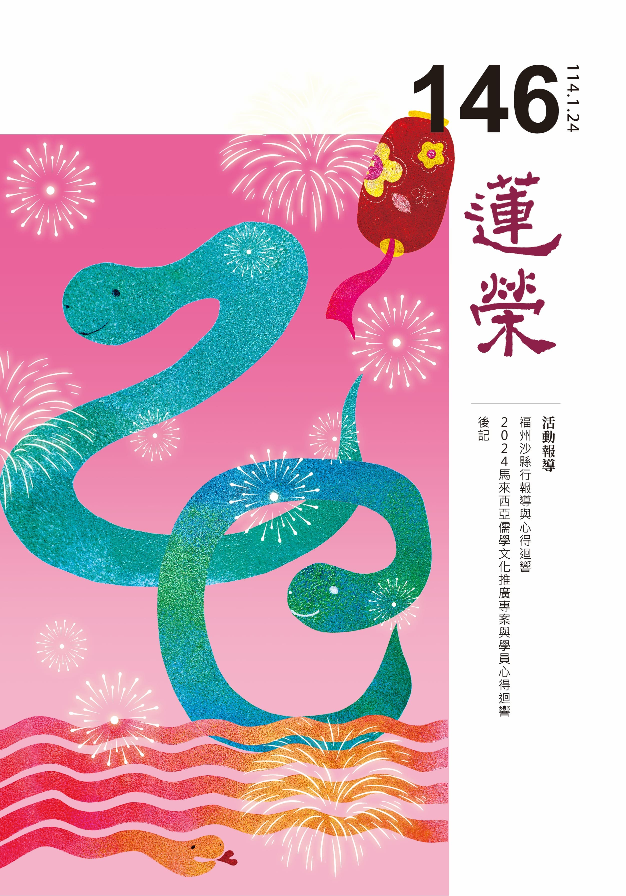

## 社論

### 蛇年新思維：以善巧智慧擁抱蛻變

本刊

墮入蛇身的恐懼

䢼亭湖神的悲哀

授與皈依的脫胎

離苦得樂的見地

歲序更迭，乙巳蛇年翩然而至。蛇，這個古老而神秘的生物，蜿蜒於自然的肌理，穿梭於文化的長河，承載著無數神話、哲學思考與日常觀察。在中國傳統裡，蛇被視為智慧、靈活與變通的象徵，身姿柔韌卻不失威嚴。值此新春之際，讓我們從蛇的多元形象出發，汲取古今智慧與啟示，並在這個變幻莫測的時代裡，找尋成長與安身立命之道。

一、蛇之意象：誠信與變通

１．蛇吐信與儒家「誠信」

古人發現蛇常以吐舌來感知外在環境，如同人在說話時，需要誠實無欺。儒家認為「誠信」是社會與人生運轉的根基，《論語》中孔子曾說：「人而無信，不知其可也。」若一個人失去信用，便如同車子失去動力。蛇的「吐信」提醒我們，新年伊始，若要邁向成功，必先守住「誠信」的根本，透過謹言慎行、真誠待人，才能在社會中長遠立足。

２．蛇行曲直自如的啟示

蛇能在森林、沼澤、沙漠等多種地形中穿梭而不受阻礙，這種「曲直自如」反映了蛇因應環境、靈活變通的特性。老子在《道德經》中指出：「上善若水，水善利萬物而不爭。」蛇的蜿蜒亦如水的無懼流轉，也與佛家四大天王之一的「廣目天王」形象呼應：一手拿寶珠，一手纏龍蛇，寓意在多變的未來中，唯有對大局保持清晰觀察，才能適度調整前進路徑，最終通往目標。

二、蛻變與重生：自我超越的契機

１．蛇蛻皮與「日新又新」

蛇因每年一到兩次的蛻皮而獲得新生，象徵定期去除舊習、迎接更新的勇氣。商湯王在盤銘上所刻的「茍日新，日日新，又日新」，正呼應「蛻舊」的精神：在新年之始，若能時常反思自身，將過往的執念或錯誤思維拋下，才有機會進一步拓展視野、提升能力。同時也須「溫故而知新」，保留核心價值的同時，持續學習新知。

２．貪吃蛇遊戲的警醒

在現代科技裡，許多人對「貪吃蛇」遊戲並不陌生：每次吃到食物，蛇的身體就會延長，玩家同時也要謹慎避免碰到自己的身體或牆壁。這遊戲影射了一種人生態度：在展開行動前，需思考後果是否符合預期；猶如孔子所謂「人無遠慮，必有近憂」。新的一年，我們亦須如同玩貪吃蛇那般，懂得「預先想像下一步」並留意風險，才能在擴張版圖的同時，不致傷害到自己。

３．九頭蛇神話──「反脆弱」

古希臘神話中的九頭蛇，每當一個頭被斬下，便會再生出新的頭，象徵著強大的生命韌性，呼應近代塔勒布所言的「反脆弱」。與此類似，孟子言：「天將降大任於斯人也，必先苦其心志，勞其筋骨。」只要我們能在逆境中學會精進、調整心態與策略，挫折反而會使人更加堅韌。這也可以作為蛇年對自己的期許：遭逢挑戰時，轉變思維模式，將壓力轉化為成長的動力。

三、多重文化交織：跳脫出思維框架

１．蛇繞杖符號的寓意

許多人或許在醫院或衛生機構標誌上看到「蛇繞杖」的圖樣，這源自希臘神話中的醫神阿斯克勒庇俄斯，象徵「恢復與更新」。蛇的蛻皮與重生能力，也被視為疾病痊癒的寓意。可見「蛇」不僅在東方文化中具有深遠象徵，在西方醫療系統亦舉足輕重。

２．佛教中的蛇為護法

在東南亞（如柬埔寨、緬甸）的佛教遺跡中，我們常看到蛇神護持佛陀的雕像，這也呼應佛教所謂的「天龍八部」。真正的護法，除了自己依教奉行，還要運用心意與實際行動，去守護真理，示教利喜，廣利有情。

３．俗稱與健康意涵

在民間語彙中，像「帶狀皰疹」也被稱作「生蛇」或「飛蛇」。然此並非蛇真的在人身上作祟，而是病毒性疾病引起皮膚痛楚與水泡。這提醒我們：新的一年別只關心吉凶預兆，更得重視「身心健康」與「防患未然」。良好的生活作息與調適，才能讓我們在新的一年裡擁有良好免疫力與充沛的能量。

４．文化中蛇的多元象徵

在西方文化中，蛇常被視為誘惑或惡魔的象徵，如同《聖經》伊甸園的情節。然而，更多詮釋指出，蛇只是一個提醒：面對欲望與選擇之際，必須懷抱警惕之心。回到東方傳統，如《易經‧乾卦》強調「終日乾乾，夕惕若，厲」，謹慎與自省才有助於我們在人生道路上持續前進。而同樣是蛇，在佛教典籍中的「摩訶羅伽」（大蟒神）扮演著護法的角色，顯示蛇的象徵並非一成不變，重點在於人如何解讀，並藉此啟發自我，引向正道的思維。

四、朝向圓滿：智慧、柔韌

１．打破「看繩為蛇」局限

佛家常以「看繩為蛇」比喻人的無明：若誤把繩子認為是蛇，便深陷恐懼與煩惱之中；一旦看清實相，便能脫離虛妄的束縛。人生中，我們也常陷入似是而非的判斷與恐懼，需要藉由不斷反省與學習。打破自我設限，才有機會走得更遠；立下高遠的目標，更能取法乎上地迎接挑戰。

２．「誠信」、「知止」以及「柔韌」

蛇年的多重意象，皆可落實在日常生活中：

•誠信：言出必行，不輕易承諾，亦不背信於人。

•知止而後有定：《大學》中強調人生應追求「至善」，而蛇在捕捉獵物時，往往先選準目標，耐心等待時機，才一擊成功。

•柔韌：善用「以柔克剛」的智慧，不在乎一時的成敗，而是在波動環境中，保持彈性與韌度。

３．善巧所緣正念正知

不論在東方或西方，蛇都在文化與宗教中，引發了各種各樣的解讀。但若能以所學經典的內涵來善巧地觀察，則任何形象、任何物種，乃至任何人生的際遇，都可成為修行的助力；若能將自己放在正道的環境中薰陶，也容易造就依循正道思維的習慣。

結語：擁抱「蛇年思維」，創造蛻變新局

蛇年，是充滿變化與成長可能的年度，是一個可以「誠信立身、柔韌行事、勇於蛻變」的起點。在這新春之際，讓我們藉由蛇在古今中外文化中的多元象徵，省思自我進步的可能，汲取智慧並獲得鼓舞。

願人人都能如蛇一般保持靈活、堅韌的姿態，一方面不忘秉持「誠信」「慈悲」的內在價值，一方面勇敢開拓未知領域，最終因「不斷蛻變、去舊更新」而走向更加圓滿的人生。也祈願整個世界能因這般蛇年的智慧思索，而能更加祥和，無諍安樂，曲直向前，敏而好學，止於至善，為自己也為人間，開創更進取而長遠的未來！

## 佛學覽幽

### 菩薩清淨的行持—華嚴經淨行品（六十一）

*戒慧講述、編輯部整理*

吃飯睡覺極平常

世俗道用真修行

日用之中見天機

文殊妙智能契入

丙二、指事顯因答其徵因

丁二、別顯

戊七、到城乞食時願（二十二願）

己四、得食正食：食訖

經文：

飯食已訖，當願眾生，所作皆辦，具諸佛法。

用餐完畢，當願一切眾生，所做之事都能一一承辦，具足諸佛之法。飯食已訖，訖是結束、終了之意，所作皆辦，具諸佛法，南亭老和尚的講法是說，持戒、修定、修學智慧、菩薩萬行，都是我們所應做之事，果真能這樣做的話，才能夠具諸佛所證之法。會性法師說，把吃飯這件事情，當作佛事來辦妥了以後，或是說每個人都能做具諸佛法的事情，並且完成。

我們可以聯想到「聲聞修四智」，所謂「我生已盡，梵行已立，所作已辦，不受後有。」「我生已盡」指證果者輪迴之身到此為止，不會再受輪迴之生死，「梵行已立」指清淨修行的法門已經建立，持戒、修定、開慧等斷煩惱的法已經清淨。「所作已辦」指我依著苦集滅道來修行，該做的事都已辦妥，能夠究竟證得阿羅漢果，進入無學位，所以名之為所作已辦。「不受後有」指已現證阿羅漢，不再輪迴生死，除非他回小向大，發菩提心，來做度眾的事業，否則不受後有。會性法師說不但能夠成就阿羅漢果，也是成就佛果。

飯食已訖，能吃的是有情，所吃的是飯菜，已訖即吃完了，我們在寺廟供齋的時候，前面會先念「二時臨齋儀」，其中包括兩個淨行品的偈誦，一個是「若飯食時，當願眾生，禪悅為食，法喜充滿」，換句話說，身體要吃飯，心裡也要吃飯，從前有個人寫信給他的師父說：「我閉關三年，三年都禁語。」師父回信說：「但願你心裡也是三年不說話。」否則縱然嘴巴沒說話，心裡話卻很多，表面上沒什麼煩惱，其實心裡的煩惱一大堆。一般人只重視身體的營養，忽略了心裡的營養，但是心裡的營養比身體的營養更重要，雪廬老人說他吃菩提，就是心裡的營養，所以每天神采奕奕、容光煥發，人最重要的就是靈氣，沒有靈氣，則無可觀。「禪悅為食，法喜充滿」，後面接的是「飯食已訖，當願眾生，所作皆辦，具諸佛法」，能作的是補特伽羅，所作的是佛法，眾生經過聞思修來學習佛法的道理，所做出來的才是具諸佛法，身口意的造作成為所作，補特伽羅成為能作，造作身口意的業成為所作，例如去聽課、拜佛、助念、寫經文、抄筆記，這是身的造作，學習講經、誦經、講學、研討，這是口的造作，練習頭腦分析、觀修、做科判，這是心意的造作，造作身口意來接受佛法、體會佛法，才叫做具諸佛法。身口意三者配合，學習能力最快。

不要小看口說的能力，口說是納受佛法很重要的方式，話講清楚，思維一定清楚，口的造作使你思路清晰，有些人想清楚後，嘴巴講不清楚，其實講不清楚，就代表心沒有想清楚。辯才以智慧為本質，孔子說「不憤不啟，不悱不發」，不憤就是指心裡面想不清楚，不悱就是嘴巴講不出來，表示還有不會的地方，如果心裡想清楚，嘴巴一定可以講得出來，嘴巴還有講得不圓滿的地方，表示心裡沒有圓滿的通達，所以嘴巴還要幫助他把話講清楚，幫助他把佛法弄懂，所以寺廟裡面有大座、小座，師父講完了徒弟還要講給師父聽。

造作身口意，能作的是士夫，所作的是身口意，造作身口意接受佛法，叫做具諸佛法。

己五、食訖說法：說法時

經文：

若說法時，當願眾生，得無盡辯，廣宣法要。

會性法師提到，佛教導弟子出去托缽，若是施主請你到家裡供養，吃飽了施主會請你說法，但規定是吃飽飯後再說法，原因是如果在吃之前說，施主會起分別心，說得好就好好供養，說得不好就供養差一點，好比從前波斯匿王聽到一個比丘的聲音非常悅耳，想要親自供養那位比丘，佛說不行，先供養再見面，結果供養完見到那位比丘，容貌醜陋，波斯匿王就後悔了，佛知道會如此，所以才說先供養。那位比丘的聲音之所以悅耳動聽是因為他過去在迦葉佛的時候，邊做佛事邊發牢騷，最後佛塔建成了，巍然高聳、雄偉壯觀，比丘非常讚歎，他對自己在造塔時心生不敬感到懊悔，於是恭敬地將一只金鈴懸掛，供養佛塔，結果這一世就感應人長得醜陋，聲音卻很優美，這就是因果的關聯性。

佛很通達人情，訂立先供養再說法的規矩，否則若比丘口才不好，或是不善於講學，或是說法比較內斂，施主可能會失去供養的心、供養的誠意，或是供養的東西變少、變薄。再者受供養的人也會生起分別心，還沒吃之前他想要好好表現，施主聽了若生歡喜心，就會供養他好東西，這對說法者也有副作用，所以第二個是約著說法者的動機來說，施主先拿出來，給我好的我就吃好的，給我不好的我就吃不好的，我都當成對方的誠意來納受，我有心回報，不管眼前他供養我的東西如何，我吃完後都要好好的說法，這就是通達人情，所以佛在制戒的時候，每一條都考量到人情。

吃飽飯後為施主說法，希望一切眾生能夠得辯才無礙，將佛法的要義廣為宣說，得無盡辯，會性法師說是得無盡的辯才，即所謂的四無礙辯，能夠將四無礙辯的功能發揮到極處，四無礙辯指法無礙辯、義無礙辯、辭無礙辯、樂說無礙，法無礙辯指他記憶力強，能牢記經典，所說之法都正確無誤；義無礙辯指他對經義總持不忘，能夠義理融通；辭無礙辯指他有語言的天份，可以用不同的語言，說法給不同的人聽；樂說無礙，即能順應眾生的根器說法，令眾歡喜、樂於聞法。南亭老和尚認為四無礙辯是九地菩薩所證，九地菩薩又稱為善慧地，他的智慧很殊勝，如夏天的太陽，能夠快速地成熟果實，能夠很善巧地把法說給眾生聽，令眾生歡喜，樂於聞法，能夠很快成熟眾生的善根。十地菩薩是說法如雲，重重無盡，是無盡辯也。會性法師說廣宣法要是能夠將重要的佛法，以深入淺出的方式，令施主了解法義，廣為受用。

試問「所作皆辦，具諸佛法」跟「飯食已訖」的關係？我們說佛果的味道是所有人生的味道中最甜美的，成佛的滋味，簡直就是甘露妙味，是任何味道都比不上的，因為成佛之後，他對眾生的教導，他所得到的護持，眾生對他的感激，都是人生的無上味，一般人嘗不到那種滋味。如同孔子去世後，弟子們守喪三年，世間何人有這等福報，佛果的滋味就是有情對你付出真心，有些人一輩子在事業中闖蕩，身邊卻沒有任何一位真心的朋友，可是孔子及古今的大德、聖者，他們的弟子對他們都是真心以待，雪廬老人晚年生病時，想要去侍奉他的人很多，然他是顛沛流離如難民般來到臺灣的，卻在臺灣得此殊勝的福報，這就是佛果的滋味。又比如某天某人家裡需要助念，三更半夜蓮友都會過去，一般人，甚至達官顯貴的交往，都不可能三更半夜來助念。

「飯食已迄」跟「所作皆辦，具諸佛法」的關係，會性法師說，以吃飽飯這件事情來表法，希望大家能夠依法來修行，承辦種種善法，最終能夠得到成佛究竟之樂。

一般人吃飯皇帝大，就算公務員忙了一天，還是要開飯，如果這個工作讓他沒辦法吃飯、睡覺，就算月薪百萬也做不下去，可見吃飯多重要。佛法也是一樣，透過你身口意的造作，把佛法學得完整，就像把飯吃完一樣，我們吃到好吃的餐點時，一定會吃完，沒有人會忍著飢餓吃一半就不吃的，佛法就像飯食一樣，要完整地吃完，吃完完整的無常概念、完整的空性概念、完整的皈依概念等等。

「若說法時，當願眾生，得無盡辯，廣宣法要」，此人在為施主說法時，他很盼望有情能夠得到無盡的辯才，能夠廣宣法要。真正廣宣法要者，反而在世俗上沒話說；在世俗上很會說話的，在廣宣法要上變成沒辦法，真正的佛法是他上台議論的時候，可以講得很清楚，下台時卻變得很內斂、很有分寸。

無盡辯才的目的就是為了廣宣法要，廣宣法要也得靠無盡辯才，《八大人覺經》中的第五覺悟就談到辯才的重要：「愚痴生死；菩薩常念，廣學多聞，增長智慧，成就辯才，教化一切，悉以大樂。」第五覺悟破煩惱障、破所知障，所要成就的就是佛的智慧，顯現的就是辯才，因為唯有辯才才有辦法改善社會風氣、改變邪見。孔子的一生除了著書立說外，就是講學，唯有如此才能改變人心、培養人才。

十地配合十度，初地布施度，二地持戒度，三地忍辱度，四地精進度，五地禪定度，六地般若，七地方便，八地願，九地力，十地智，前面的六地配合六度，前六地屬於根本位上，有諸多正理來證得空性。第七地叫做方便地，是在後得位上的諸多善巧方便，第八地是願力，又稱為不動地，成為登地菩薩都要菩提心堅固、願力堅固，第八地的願是指他有能力去成熟諸佛的願力，而且他在串習菩薩行的時候，他相信目標會達成。第九地是力的那一分，力是指他有能力成熟眾生的善根的那一分，特別是指他的四無礙辯，可見成熟眾生的善根最重要的能力是辯才，有辯才才能培養人才，可是辯才是被練出來的，是造作身口意去練出來的，頭腦不斷地想，嘴巴不斷地練。第十個是智，智是能夠成就諸佛的淨土，他的無盡辯才叫法雲地，法雲如同下了傾盆大雨，將沙漠變成綠洲，此地菩薩有能力在沒有佛法的地方開展佛法，建立法幢，就像釋迦牟尼佛於印度挑戰外道，打敗了九十六種外道，建立殊勝的僧團，從沒有佛法的地方一路開展，而且變成盛況，成為印度的主流。十地菩薩略具成佛的能力，須多多串習，以等流的心態成佛，不是以增上的方式。

辯才練起來才可以推展佛法，三業當中口業最厲害，釋迦牟尼佛說他無見頂相的功德都不如他說法的功德，可見辯才多麼重要，但是目的是在廣宣法要，不是為了跟別人強辯。（下期待續）

### 大乘百法明門論簡說(五十二)-拾柒、心不相應行法（十）

*戒慧講述、淨本整理*

了知勢速證無常

士用神變轉因緣

通達密意道次第

時間做法重時機

粒子八方虛妄性

時間遷流已長劫

論文：

第四、心不相應行法，略有二十四種，一得，二命根，三眾同分，四異生性，五無想定，六滅盡定，七無想報，八名身，九句身，十文身，十一生，十二住，十三老，十四無常，十五流轉，十六定異，十七相應，十八勢速，十九次第，二十時，二十一方，二十二數，二十三和合性，二十四不和合性。

心不相應行法第十八「

勢速

」，是講因果快速的變化，剎那不停，所謂：「濯足長流，抽足復入，已非前水。」如李太白感嘆的：「高堂明鏡悲白髮，朝如青絲暮成雪」。

勢速有三種，第一種叫做「諸行勢速」，諸法無常迅速生滅，《仁王經》上說，一彈指有六十剎那，一剎那九百生滅，這就是諸行勢速。

第二種叫做「士用勢速」，「士用」就是士夫的造作，可以非常的迅速。比如往生極樂世界的速度非常快，屈伸臂頃到蓮池，一位壯士屈伸手臂的瞬間，阿彌陀佛就已經將往生者接引到極樂世界。特別是人道的身口意造作，所產生的因果轉變可以十分迅速。舉例來說，唐太宗問道士李淳風未來大勢，李淳風告訴他，在他之後姓武的人會得天下。唐太宗就說，那我殺盡所有姓武的人。李淳風說，那樣一來你的子孫禍害更大，唐太宗於是作罷，免掉一場子孫受禍害的災難。當因果還沒成熟，業所相應的果報可以迅速變化，但若果已經成熟，就沒那麼容易改變了。所以很多事情在業因的階段就要努力去轉變它，不能等因果成熟了才想要轉變。人在年輕的這一段時光若願意學佛，可以獲得很多的支持，命運很容易轉變；若到了年老才想學，不僅自己根力不具足，外緣的護持也很難具足。過去我們二十來歲時去拜訪會性法師，這位大德跟我們談《寒笳集》，他就好像沒有事情一樣，可以跟我們講一個下午。但是我們看到其他蓮友去拜訪他，法師坐下來還沒有開始聊，第一句話就說：「只有十分鐘」。原來法師很珍惜光陰，不是沒有事情，是他珍惜願意上進的年輕人。所以這一段寶貴的青春若沒有深入經教，那真是最大的浪費。

第三種是「神通勢速」，神通作用迅速，可以一剎那就到色究竟天。前面說佛能剎那接引有情到極樂世界也是如此。神通勢速的「勢」，還可以引申到時機的掌握，所謂：「雖有智慧，不如乘勢。」乘勢太重要了，比如現在大眾在研討《百法》，就應該乘著勢把《百法》讀完；現在在研究《論語》，就要乘著勢把論語讀通。抓住這個勢，就有許多的外力幫忙，就可以得到善友師長的各種協助，迅速得到成果。

心不相應行法的第十九「

次第

」，其定義為「依於諸法，前後引生，庠序不亂假立」。此處要說明的次第有八種，第一「流轉次第」，就是十二因緣的流轉，從無明開始就一直流轉到老死，只要有無明，也就是有執我的心，輪迴決定離開不了，這就是流轉次第所要說明的事實。

第二「還滅次第」，當無明滅則行滅，行滅則識滅，一直到老死都滅。欲滅生老死要上溯到無明滅，所以滅輪迴根本還在滅無明，以上是還滅次第。

第三「在家行住次第」跟第四「出家行住次第」，這是在講生活作息的道理。過去印度在家的作息是早晨起床要澡飾其身，然後被帶衣服，修營事業，調暢沐浴，塗飾香鬘，習近食飲方乃寢習；出家也有應該要遵守的作息，一日修行中有他的次序。即便是今天，一個人生活作息是否正常，就要看他有沒有次第。生活有次第的人容易把事情辦好，修行容易成就，人也容易長壽。

第五「增長次第」，人正常成長過程中也有次第。第一病位，十歲以下多病。第二色位，到二十歲的時候青春走到最高點，顏色最好，然後開始慢慢往下滑。第三力全位，三十歲的時候力量最強，體力最盛，過了以後也是慢慢往下。第四智位，四十歲分析能力最高，這時期也是人最進取的一個階段，我們看一個公司，大概主管都是四十歲的人，很有思維能力，正好要往上衝。第五念位，就是會憶念自身得失事故，五十歲有事業的時候開始會患得患失。第六色力減損位，六十歲的時候色力衰減、力不從心，準備該退休交棒。第七智念損減位，七十歲的時候是智力損減，沒有辦法再去接受新知，念損減就是記憶力衰退。第八昏亂位，八十歲人就昏亂了。所以雪廬老人說，我上課講學，我沒有把岳飛講成張飛，這一件事情是很稀奇的，你到我這個年齡你就知道，你不知不覺就把岳飛講成張飛，你自己都不知道。以上是人的增長八位，人要注意這樣的次第，然後才能善用這個人身。

第六「現觀次第」，現觀即現證，透過觀慧現量親證叫做現觀。有一本論叫做《現觀莊嚴論》，現觀成為能莊嚴，佛果成為所莊嚴，它的次第是由顯現一切法勝義得一切智，現觀一切法的緣起，得道種智，現觀一切法世俗勝義面相得一切種智。

第七是「入定次第」，入定的次第分為初禪、二禪、三禪、四禪，一直到四空天，最後第九次第定是出世間。次第雖然如此，但是修行上並不代表說一定要走這個順序。比如說行者可以在初禪定當中生起殊勝的觀慧，直接解脫。因為一切都是無自體性，不妨在世俗當中安立次第，但不是必定如此修證。

第八是「修學次第」，戒叫做增上戒學，定叫做增上心學，慧叫做增上慧學，後者是依前者而生，就是修學次第的意思。以上八種次第說明完畢。

接著看心不相應行法的第二十個「

時間

」，時間是一種極難懂的觀念，鳥獸也知道周圍在時間遷流中有差異，但是無法確切說明時間是什麼。時間其實是在因果相續變動上假立的概念，如果心或物體不變動，就沒有所謂的時間問題，就因為會變動，所以觀待已滅的說過去，觀待當下而說現在，觀待還沒生的說未來。如果沒有已滅談不上過去，沒有未生談不上未來，沒有過去沒有未來也談不上現在，現在必須對著過去、對著未來才能說現在。可見時間是假法，沒有各種變化，時間就安立不上。所以《百法直解》說時間是「依於色心剎那展轉假立」。《瑜伽‧五十六卷》上解釋時間是：「依行相續不斷分位」。行就是造作法，分位就某一分，已滅的這一分、現在這一分跟未生的這一分，這些分位都是造作法，而且相續不斷。

時間是假法還可以從其他面向去了解，比如說人間五十年，四王天卻只有一天；人間的一百年，忉利天只有一天。但這是比較粗的觀察，不如前述「依於色心剎那展轉假立」、「依行相續不斷分位」細緻。

心不相應行法的第二十一個「

方位

」。方位可以分為東西南北，或者再分東南、西南、西北、東北，不斷細分下去，這也是假立的概念。比如說一個粒子，它就可以分為四方，或者可以分為八方、十六方等。這種各方合集而成的法就是有為法，它的體性就是剎那生滅、沒有實體，若有實體，如何能被分割而成不同體。實際上方位也是互相觀待而成，左是觀待右邊說左，右是觀待左邊說右，一切方位都是如此。

心不相應行法的第二十二個「

數

」，是度量諸法的大小多寡，它是一種「相仍」、「相待」，就是觀待因循前面而有後面。依著一而有二，依著二而有三，依著三而有四，這樣子讓符號不斷往下走，都是觀待而成。依照《三藏法數》，數可分為下等數法、中等數法跟上等數法。下等的數法就是乘以十，所謂「一而十，十而百，百而千，千而萬」。中等的數法是乘以一百。上等的數法就是一倍乘以一倍，比如說阿僧祇乘以阿僧祇是無量，無量乘以無量就是無邊，無邊乘以無邊就是無等，無等乘以無等就是不可數，不可數乘以不可數就是不可稱，不可稱乘以不可稱就是不可思，不可思乘以不可思就是不可量，不可量乘以不可量就是不可說，不可說乘以不可說就是不可說不可說。以上都是因循著前面而有後面，都是觀待下假立，看你怎麼定義都可以，算到最後各種的變化你都會。（下期待續）

### 佛學概要十四講表簡說（四十七）

*戒慧講述、編輯部整理*

往昔待最久之處

聖者不忍生宿命

狂叫恐懼畏墮入

菩薩悲憫似火

目前進度在第六講表六道當中的地獄道。接著講到八熱地獄的壽命，首先是等活地獄，共五百歲，但是是以四天王的壽命為他的一日夜，四天王的壽命也是五百歲。

再看無間地獄，有很多說法，有的說無間地獄就是阿鼻地獄，有的說無間地獄裡面有阿鼻地獄，乃至於在無間地獄最苦的就是阿鼻地獄，上述說法都可以通。

《地藏經》講到無間地獄的範疇，它周匝有八萬餘里，高一萬里，都是火炬，都是火在燒，沒有空缺。當中有一個大獄城，叫做無間獄城，城中諸獄相連，名號都不同，那麼多地獄裡，有一個地獄叫無間，這個地獄在剛剛說的周匝八萬餘里，高一萬里當中，它的範疇是周匝只有一萬八千里，高一千里，全是鐵包圍，上火徹下，下火徹上，都是火在燒，這就是無間地獄，它佔前面說的範疇的兩百分之一，有千百個夜叉，還有種種惡鬼侍候，這些夜叉、惡鬼，力氣都很大，口牙像劍，眼光如電，手像銅爪，抓、踹罪人去受苦，拔舌抽掌，拋空接翻，鐵板煮炸等等。

這些獄卒為何手段要這麼殘暴可怕呢？獄卒修理他們的時候，難道不應心生慈悲嗎？首先，獄卒知道自己所要處罰的罪人，前生的惡業是很可惡的，所以不由得他使毒辣的手段去懲治，但是獄卒在懲罰罪人中也要論，他到底是心懷快樂，很有快感，還是是以慈悲心希望罪人悔悟，這也決定獄卒後面的命運，所以獄卒也有因果。就像公務員在執行公務，罪犯應有之罪要予以處罰，但是予以處罰當中，是心生快感的處罰，還是「如得其情，則哀矜而勿喜」的方式，也決定他後面的命運。換言之，六道的有情，都是被輪迴所攝，大家都在創造自己未來的命運。

接著來論，這些人不斷受苦，為何沒有出來的機會？照理講，這麼可怕的刑具、這麼痛苦的報應，應該很容易把過去的惡業消耗殆盡才對？這就代表他們過去造的惡業很多，再者，他在受苦時起的心念也決定他繼續受苦。當此業在還沒有斷氣的時候，它很容易處理，斷氣之後，就變得很難。好比有些惡業不反省，就增倍增廣。世間都可以增長財富，或者消減財富，有錢有勢的富豪，也可能一夕之間財富蒸發，很難想像善業是可以很快速地消耗成這樣。比如做一個廣大的善業，因為沒有業的觀察，沒有中觀正見，對業的觀察薄弱。可能造廣大的善業，就在操作當中蒸發了，同理，他也可以在操作中變成暴發戶，當對象殊勝、心態殊勝、做法殊勝、究竟殊勝，就變成業的爆發，最後內心歡喜的那一分，使他斷氣之後，不得了的加倍增廣。從世間的福報，或是敗亡的感覺，就知道業的變化，是目不暇給，錯綜複雜，起伏不定，讓人難以想像的，所以得到正知見多麼重要，善於操作自己的命運的這一分一定要靠正知見，可惜一般人都不想學，又如何能操作自己的命運呢？

還可以想，當一個人一敗塗地，欠幾十億美金，他每個月只賺台幣兩萬，這要多久才還得完？就可以類推到地獄做苦工、受極刑，要多久才還得了。

為什麼到地獄受苦的時間那麼長？比如論及對象，他的對象是父母，他的手段殘忍，他去地獄酬償的時候，就像做苦工一樣，賣身多少輩子，還酬償不了人世間所造的業，或者是他宿世所引發出來的，要這樣觀修，否則佛經所說的，好像都跟我們無關，可是現實社會不就是這樣嗎？我們可以從這個時代來通六道，這個時代是最爛的時代，是最好的時代，假如我們能夠藉著這樣的環境來警醒自己不造作惡業，並傳播正確的知見來引導別人，這就是這個時代的功德。而且這個世界變來變去，財富一下子迅速集中在某些人身上，這種感覺來觀修業更好，如果我們過去的惡業，眼前不以痛苦的方式去酬償的時候，過去的惡業不容易消，不是要喜歡逆境，而是逆境在消惡業的那一分格外有力，所以應對逆境生歡喜心。

結合佛法來看這個時代，你比古人厲害太多了，古人的環境都是安分守己，日出而作，日落而息，民風純樸，純粹在書本裡面懂得一些皮毛的道理，覺受極難獲得。現在造的惡業更大，因為現在是共業，很多都是在網路上共，在媒體上共，在社會風氣上共，在臨命終的氣氛共，在家庭倫理分崩離析這種冷漠的環境裡面共，所以很容易一下子感應到餓鬼，一下感應到畜生，一下感應到寒冰地獄。我們必須結合這種業的觀察來說根本地獄、八寒地獄、八熱地獄。（下期待續）

### 人生大事不能忽略的事實-陳了常優婆夷往生事跡兼佛性發隱（ㄧ）

*戒慧講述、編輯部整理*

佛性勝解與善士

三因佛性已具足

所成法報化三身

觀待而成真修行

文分三大段落，第一部分是佛性發隱的義理敘述，第二部分就陳了常優婆夷往生的事跡做說明，最後祖師闡發助念法行的隱藏義涵。

廣說佛性發隱部分分為四個段落，

首先用問答的方式來解釋佛與眾生皆有佛性的疑慮。徵疑受用不同，文：「

一切眾生，皆有佛性。而佛與眾生，心行受用絕不相同者，何也。

」一切眾生都有成佛的潛力，但是佛與眾生在身口意造作的功過，甚至是自受用與他受用等種種果報，有著天壤之別，不知為何如此？

釋明因地有別，從迷悟不同和苦樂相差懸殊來區別，文：「

以佛則背塵合覺，眾生則背覺合塵。佛性雖同，而迷悟迥異。故致苦樂升沈，天淵懸殊也。

」佛是解脫者，不是離開五欲六塵的境界，而是面對染污的六塵境時，能對境證得緣起性空之理；眾生則相反，在染污的世界中迷惑顛倒沉淪，雖然一樣有成佛的潛力，但是眾生不知道萬法的真相，也沒有努力尋求出離，癡迷與覺悟中，眾生是造苦因得苦果，沉淪六道中，佛是造作各種樂因，而得到究竟的快樂，苦樂相差極為懸殊，無法測量。

結察三因佛性，文：「

若能詳察三因佛性之義，則無疑不破，無人不欲修習矣。

」要想了解為何凡聖的苦樂差別，就必須要從了解三因佛性之義下手，便可以破除許多疑惑，人人都想修習佛法而真正的離苦得樂。

佛性發隱的第二部分，詳明三因佛性善巧啟迪，先說明何謂三因，文：「

三因者，正因了因緣因也。

」三因佛性指的就是正因佛性、了因佛性和緣因佛性。

接著分釋三因佛性，正因佛性部分，文：「

正因佛性，即吾人即心本具之妙性，諸佛所證真常之法身。此則在凡不減，在聖不增。處生死而不染，居涅槃而不淨。眾生徹底迷背，諸佛究竟圓證。迷證雖異，性常平等。

」

正因佛性，指的是每個人都有的美妙體性，也就是覺性，都有覺悟與成佛的潛力。無常是有為法，此處的真常指的是無為法，佛果所證之法身是真常，而因上還沒成就說是佛性，果上能證的那一分說是法身，佛所證的真常法身指的是空性，萬法的顯現沒有自體性，在凡夫、在聖者無所謂增或者減，並非在凡夫就少了什麼，也不是在聖者（此處指佛）就增加了什麼。以生死的自體性為所緣，因看不到自性，所以在生死中也沒有所謂生死的染污相，無所謂染污的生死世界；當體寂靜說是自性清淨涅槃，當然也說不上相對於染污的清淨。

眾生因為從來沒有了解生死問題的根源，所以不管多麼努力想要獲得幸福快樂，仍然在生死輪迴中頭出頭沒。

二乘人雖可現證空性，但不能破所知障，佛以福來資助慧，以慧來破所知障，入世俗是以不起定的方式現量證得空性。眾生在世間因迷於真理流轉生死，佛在世間證空性破二障得大自在，兩者果報差異極大，然佛與眾生在體上的空性是一樣的，謂之性常平等。

了因佛性，文：「

二、了因佛性，此即正因佛性所發生之正智。以或由知識，或由經教，得聞正因佛性之義，而得了悟。知由一念無明，障蔽心源。不知六塵境界，當體本空，認為實有，以致起貪瞋癡，造殺盜淫。由惑造業，因業受苦。反令正因佛性，為起惑造業受苦之本。從茲了悟，遂欲反妄歸真，冀復本性也。

」了因佛性指的是能開發的智慧，對空性義理加以現證的智慧稱為正智。在外緣上從善知識教導經教的內涵，得到空性義理的正確解讀，並且依之修習得到體悟。知道苦的本質來自於無始以來皆見到法的實有性，特別是見到我的實有自性，障蔽了般若正智，不知道色、聲、香、味、觸、法等六塵境界，其實並沒有在那邊自己成為自己的特性，反而認為有其實有性，故在這當中對喜歡的生起貪心，對討厭的生起瞋心，或者對因果不了解，對真實義（空性）不了解產生癡心，依著實有的執著想要讓自己得到快樂的那一分，去造殺盜淫等惡業。因為不具有空性正見，在這當中與無明我執相應的煩惱就會生起，而造種種的善惡業，在六道輪迴中，或短暫享樂或長劫受苦，最後都沒辦法真正離苦得樂。因為不知萬法皆空的道理，反而起惑、造業、受苦。

從此以後，便想要了解世間的真相，在每一法上看到法的體性空，希望能夠了知萬法無自體性，得到真正究竟的離苦得樂。

緣因佛性，文：「

三、緣因佛性，緣即助緣。既得了悟，即須修習種種善法，以期消除惑業，增長福慧，必令所悟本具之理，究竟親證而後已。

」此處說明幫助修學正見的方法，悟後起修才是真修，修學種種善法來對治自己的煩惱習氣，並且在佛法的修學上親近善知識聽聞經教，增長福慧資糧，能夠對正因佛性從非量、比量乃至現量親證。

接著祖師用比喻來說明三因佛性的關係，文：「

請以喻明。正因佛性，如鑛中金，如木中火，如鏡中光，如穀中芽。雖復本具，若不了知，及加烹煉鑽研磨礱種植雨澤等緣。則金火光芽，永無發生之日。是知雖有正因，若無緣了，不能得其受用。

」接著用比喻來說明。正因佛性就像礦物中藏有金屬，也如木頭中有燒熱性，鏡子可以反射光明，稻穀中有發芽的功能。雖然人人都有成佛的潛力，若沒有外緣條件的幫助，如加上煉金屬，由礦石而成純金、鑽木以取木中火、以磨礱去除鏡上灰塵，生起照鑒的功能、雨水潤澤穀令生芽，若無這些外緣之功，則純金、火炬、鏡光、芽等，都不會出現。所以雖然有能成佛的潛力，若沒有種種外緣的協助，也不能得到佛果的受用。

接著來說三因佛性的運用，文：「

此所以佛視一切眾生皆是佛，而即欲度脫。眾生由不了悟，不肯修習善法，以致長劫輪迴生死，莫之能出。如來于是廣設方便，隨機啟迪。冀其返妄歸真，背塵合覺。

」佛看一切眾生，就像看到礦中金、木中火、鏡中光和穀中芽那樣，能了知眾生皆有成佛的潛力，皆是可度之人。但是眾生因為不知道自己有這樣的潛力，不知道修學正法可以成佛，導致無始來一直在六道中輪迴，沒辦法出離生死。所以佛廣設種種善巧方便，來啟發眾生的潛能，期待眾生能夠依著正知見了解萬法沒有自體性，能夠在世俗上見到法的真實性，在對境中證得緣起性空之理。

佛性發隱，除了要知道三因佛性，也要了解持戒是最好的助緣。也就是科判上的通顯持戒最要去妄歸真，總明三無漏學，文：「

法門雖多，戒定慧三，攝無不盡。故楞嚴經云，攝心為戒，因戒生定，因定發慧，是則名為三無漏學。

」佛法八萬四千法門，都可以收攝在戒定慧三學當中，戒是佛所制定的律儀軌則，能防非止惡，作為定慧的資糧。定是於所緣境生起專注力，尤其是在法義上，依專注而生起身心輕安。慧是對空性的證悟，破除煩惱障、所知障而成佛。所以《楞嚴經》中說到，以戒律來收攝散亂的心，容易對法義生起專注力，更容易串習法義得到空性智慧，以上三種修學法能破煩惱證得出世間。

接著特別著重在持戒來說，文：「

而三者之中，唯戒最要。以能持戒，則諸惡莫作，眾善奉行。其行與佛近，其心必不至與佛相遠也。故如來于梵網經，為眾生保證云，我是已成佛，汝是未成佛。若能如是信，戒品已具足。又云，眾生受佛戒，即入諸佛位。位同大覺已，真是諸佛子。

」三學之中，又以修持般若最為重要。這樣的持戒表面上看來跟一般的持戒一樣，是諸惡莫作，眾善奉行，但是因為帶著般若的正見和菩提心的心意，這樣的行持與佛行相應，持戒也必定成為成佛的資糧。接著以《梵網經》證明，首先是令眾生相信持戒的功德。佛為眾生保證，他是已成佛者，眾生雖是未成佛者，以此勝解守戒而具足戒品，受戒成為成佛資糧，以大悲心與空性正見來受戒，即是成佛子入佛位，定能成佛。

結讚持戒最為重要，文：「

是持戒一法，乃超凡入聖，了生脫死之第一要道也。

」持戒這一法，只要能和空性智慧相應就能超越凡夫的見地入聖人之流，是了卻生命現象離開輪迴痛苦的最殊勝道路。

接著反顯佛性本具，文：「

使眾生不具佛性，縱令修習種種善法，亦無成佛之理。如石不具金，冰不具火，甎不具光，砂不具芽。縱令烹煉鑽研磨礱種植雨澤等緣，一一經于累劫，亦無金火光芽等發生之事。

」如果眾生沒有具備成佛的潛力，縱然修學串習各種善法，也不可能成佛。就像石頭中沒有金屬不成為礦，冰中沒有火性，磚瓦沒有反射性，砂礫中沒有發芽的特性，縱然在外緣上加以冶煉、鑽研、磨礱，雨水灌溉等緣，不論經過多久，都不會出現金屬、火、光、芽等事。

最後結語警誡，必須要以知義的力量來修，文：「

若知此義，孰肯以性具之菩提涅槃，妄作煩惱生死。獨讓諸佛，及三乘聖人，受其真常之樂，自己甘受其幻妄之苦也哉。

」若能知道三因佛性的內涵與義理，我們不但有潛力成佛，也能依著外緣來開發自己的潛力，得到究竟圓滿的佛果。知道這些道理，哪裡還會妄作各種煩惱、業，輪迴於六道生死中，放任可以成就滅除煩惱的佛智，而讓諸佛及三乘聖人，獨自現證美妙的體性，自己卻甘願受到實有見導致的各種苦果？

廣說佛性發隱裡面，最後倡導對末法的娑婆世界眾生，淨土法門是特別當機，先就通途與淨土法門較量，文：

「然約通途教道，在凡夫地，欲了生死，大非易事。若約信願念佛求生淨土之特別法門，則即于現生，悉得了脫。

」通途法門端靠自己修行成就得以出離輪迴，是極難之事；若能相信釋迦牟尼佛的推薦，以念佛的方式發願往生極樂世界，這樣的特別法門，現世臨終即可離開娑婆的束縛往生極樂世界，在無染的世界提供一個不退轉的緣，想要修行的人可以在這樣的環境裡面安心修道，直至阿鞞跋致不退轉乃至於成佛。

接著讚歎淨土法門，文：「

果具真信切願，萬中決不漏一。末世眾生，唯此一法，堪為恃怙。

」真切信願是極樂世界的往生法，而不退轉的極樂世界是成佛法，果然具備信願持名，決定能往生極樂，不會有遺漏。娑婆世界的末法眾生，想要在這個法運不佳的末法時代得以解脫，只能依靠信願念佛，往生極樂世界。

提倡淨土法門，文：「

以故法運愈晚，此法愈當機，善知識提倡愈切。而真實修持，得遂往生之證驗，時或見之。

」法運越來越差，環境上越來越難修行，可以把法講清楚的大德也越來越少，這時候淨土法門最為貼切，最能幫助有心修學者，大德們在此時更是懇切地來提倡淨土法門的殊勝，不僅如此，也能見到老實念佛信願持名後得以往生的實際證明。（下期待續）

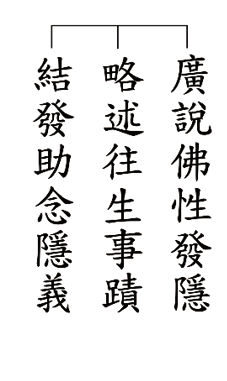

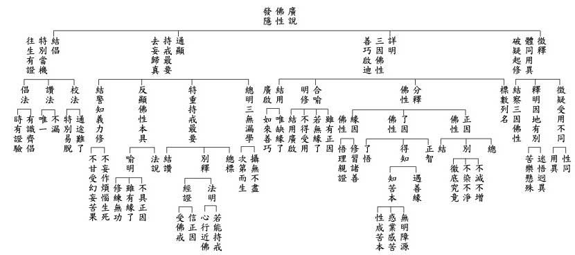

### 緣起贊論略釋(十)

心若

通達緣起善巧二諦

證得勝義了知世俗

雙遮雙照不同面相

見說緣起執為第一

癸二、餘者不成

論文：「

若見反彼者，空則用不成，有用則無空，墮苦惱險處。

」

消文：前面講到空即緣起義，若反前面，就是認為空不是緣起義。「空則用不成」特別講覺囊派，認為世間都是虛妄的，否定了世間因果的作用，墮入斷邊。「有用則無空」是針對中觀自續派以下，自續派以下有緣起法，但他們的緣起不能通達空性，就會被輪迴所繫縛，就算投生為人天，依然會墮入三途，所以是苦惱險處。

「

此頌仍承前文頌中『尊許』二字，謂尊亦許，若有眾生見與彼頌所說二諦甚深道理成違反者，彼諸有情，或是內道、或是外道，決定迷墮常、斷二邊苦惱險處。何以故？由彼有情，執一切法，若無自性，成畢竟無；故於彼宗，自性空已，一切作用悉不成立，墮斷見邊。又彼有情，見諸作用現可得故，便執諸法自性是有；故於彼宗，有因果等作用已，則性空義悉不忍可，墮常見處。

」

此偈頌承前一個偈頌講的「尊許若時見」的尊許二字，代表世尊亦許可，前面偈頌講到空即緣起義，若反前面，認為空不是緣起義，便違反了二諦甚深道理。不能從緣起通達空性的有情，不管是內道中觀自續派以下或是外道，都會墮入常邊（自性的有）或斷邊（自性的無）的苦惱險處，為什麼呢？自續派以下，沒辦法合理解釋緣起法，沒辦法脫離常見、斷見的繫縛，容易墮苦惱險處，此特別指快樂的陷阱比痛苦的陷阱還更恐怖的那一分，人天的享樂都像在懸崖邊上的享樂，是很危險的，而這種危險性，享樂的人不會知道。

外道的常見、斷見是自性所變、神我受用，快樂在的時候成為常見，快樂不在的時候成為斷見，或是升天成為常，不能升天就成為斷。覺囊派的常見，解脫的那一分是常，沒有世俗的那一分就是斷。

中觀自續派以下皆會落入常見、斷見，因為自續派以下，見到諸法有作用，就執諸法自性有，例如中觀自續派，認為名言中有自性，就是該法的特質，例如鹽酸具有腐蝕性，可是中觀應成派說，鹽酸的能腐蝕若有體性，應該可以腐蝕自己，另外把鹽酸放在玻璃瓶內，它也不能成為能腐蝕，可見當下的特性，也是觀待性，沒有實體性可得。

「

又彼不達性空深理，雖許緣起，亦不成立。龍猛菩薩云：『若不許有空，彼一切不成。』要是性空才有緣起，性既非空，無須待他，故諸作用悉不成立。如龍猛菩薩云：『汝若見諸法，從自性有者，如是汝則見，諸法無因緣。

」

回答自續派以下，自續派以下雖然承許緣起，但是都沒有真正懂過緣起法，對於因緣的合理性，沒辦法解釋清楚，所以也不能成立緣起。龍猛菩薩說：「如果不許空性，一切法都不能成立。」一定要是性空，才有緣起。如若不許萬法自性空，則不必有能作、所作的觀待性，不必有倚仗他的條件，唯識宗就有這樣的過失，認為心識不必待境界，若不必待他，哪裡會有各種作用產生？如龍猛菩薩說：「你如果見到諸法，是從自性的那一分成立的話，你一定會從自性那一分的有，見到諸法無因緣。」此針對外道來說，例如外道的上帝是自性有的那一分去成立的，數論師、勝論師就是如此。

癸三、以是因緣讚歎見緣起理

論文：「

是故於尊教，極贊見緣起，彼亦非皆無，及以自性有。

」

消文：對於世尊的教授，特別是他能通達甚深的緣起，生起極力的讚頌，緣起不是皆無（不是根本無，都是待緣而生，條件有就有），也不是自性有（待緣而生，所以不是自性生）。

「

是故二字，承前兩頌正邪得失，謂以是故，若有如理觀行學者，能善通達甚深緣起，是尊教中諸佛菩薩之所讚歎，由彼善能離二邊故。經云：『若見緣起，彼則為見一切諸法；見諸法者，即見如來。』龍猛菩薩云：『若有見緣起，彼即見諸諦；謂苦諦集諦，滅諦及道諦。』《釋菩提心論》云：『知此諸法空，而依業果者，甚奇此甚奇，稀有此稀有。』宗喀巴大師云：『若見世出世諸法，因果畢竟無欺誑，然所緣處遍空寂，彼入智者歡喜道。』彼緣起法及實體性，非於世俗畢竟所無、亦非可執自性所有；如是二事，俱墮邊故。

」

是故兩個字，承前面兩個偈頌正明、反顯得失，如理如法，就是善於通達甚深緣起，讚歎觀行者觀甚深緣起而善通達，讚歎世尊教法中的緣起法，如理觀行者能夠以緣起來善遠離常邊、斷邊。經上說：「見緣起的空性，就是見一切法的法性，見緣起的幻象，就是一切法的世俗（見如來的報身、化身），都是條件而生，他自己不能成立什麼。」龍樹菩薩說：「見緣起就是見流通門（苦集諦）、還滅門（滅道諦），苦因苦果的滅，就是在緣起上通達空性。」《釋菩提心論》說：「因果的體性空，正好成立因果的相續，這種說法很奇特，沒有人這樣說，這種教法很難遇。」宗喀巴大師說：「若見世間緣起法，或是出世間萬法體空，因果畢竟無欺誑，然出世法是在所緣處中看不到體性」，彼緣起法及真實的體性，（緣起法的空性），於世俗上我沒有否定它成畢竟無，但也不是說它自性有，雙遮兩邊（遮自性有及遮根本無）。

「

此中攝義：性空緣起義，見者善解脫，不達墮邊見，尊贊見緣起。

」

總說這三頌，性空緣起義，見者善巧的解說，不通達緣起性空之義，就會墮入常、斷兩邊，贊歎世尊是以見緣起、說緣起的那分來說。（下期待續）

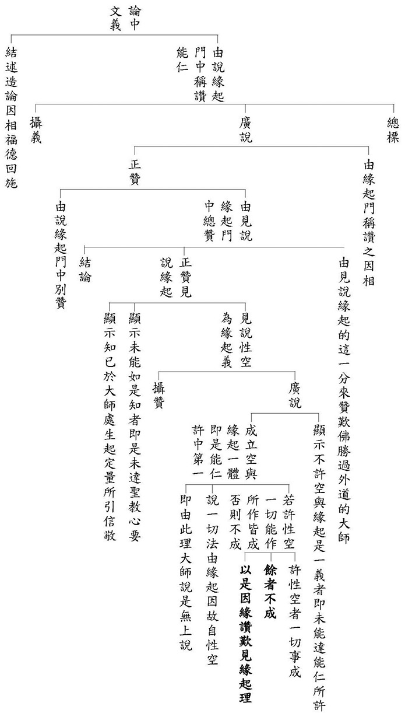

### 週四共修法語-初地至五地

淨柔、宗徹、心筑、魏宏哲

第一菩提心極喜地      淨柔

今天要講十地菩薩當中的初地菩薩，包括他的心態、修學法、證量，以及他成就的殊勝功德。

以十度來說，初地菩薩是布施度圓滿，不是說初地只有修學布施，而是說十地的每一地都有自己殊勝，而布施是初地的體性，特別是布施的心意圓滿，使他的心量變大，讓他資具豐足，示現貴族，所以厲害的人是把錢財存在有情身上。

初地菩薩，名為歡喜地或極喜地，他之所以歡喜的原因有三點，第一、現證空性的快樂，因為無始劫來，空性智慧從沒生過，現在生起內心無比的歡喜。第二、當聽到眾生向他索求的時候，他極度的歡喜，勝過現證空性的快樂。第三、在他種善因的當下，就得到樂果的快樂，雖然果還沒生，但樂果的快樂在因上就有。就像我們還沒往生西方極樂世界，就知道我一定可以往生，而且獲得如往生般的喜悅。

證得初地以上的菩薩都是現證空性的聖者，雖然初地菩薩知道眾生體性空，他也知道離開他的心識，無有眾生可度，但是緣起上被生死輪迴攝持的有情是有的，所以初地菩薩為了度化這些苦有情，他的心會隨著大悲轉，眾生是他入輪迴的唯一理由，因為眾生的形象如我唯一的愛子，對我的恩德深重如母親，所以會隨著大悲而轉，要菩薩不去度眾生是做不到的，當眾生下地獄時，菩薩也義無反顧地去地獄，地藏菩薩就是這種大願。所以當眾生有求於他時，他生起的快樂比現證空性還要快樂，他樂於承擔度化眾生的重責大任，不論在心態上、作法上，都是以普賢十大願攝持利生的善法，並作善根回向，此普賢大願修學法是如來長子的修學法，成為佛的接班人。

初地菩薩發起真實菩提心，決不退轉，生於如來家族中，而且斷除三種煩惱結，三種煩惱結就是薩迦耶見、疑、和戒禁取。所謂薩迦耶見，就是在自己的五蘊上執實有的我，所執的就是我，這是所有惡見之首，因為執我，所以讓我樂的我愛，讓我苦的我恨，由愛恨引發的分位煩惱、等流煩惱一大堆，這時就會起惑造業，流轉生死，在生死當中又起惑造業，所以斷除薩迦耶見，是唯一的解脫道，沒有其他方式，若不修學中觀見，拜懺、禪定、苦行這些法行都不能斷除根本的苦因。所以薩迦耶見是第一個煩惱結。

第二個煩惱結是疑，懷疑佛說的法是否合乎真理？佛法是否太悲觀消極？學佛真能從無始的輪迴中解脫嗎？沒有傳承，無法解決這些懷疑，而且會懷疑我的修學是否正確？其實當我們順著佛法的理路去推理觀察，發現實有的我沒有，薩迦耶見就破了，破了薩迦耶見後，就連帶把疑跟戒禁取都破除，此時在修行過程中產生的懷疑都能破除。所以通達空性正見，會對佛語產生信心，對緣起的道理產生如是的信解，否則會趣向不定，不知道修哪個好，而成為解脫的障礙。

第三個煩惱結是戒禁取，就是對於不合佛法、不是佛所制的戒，卻認為最殊勝，而且能幫我出離輪迴。例如祭祀鬼神可以升天，或者信一些外道等等，都會障礙解脫。以上三種結就是煩惱的源頭，關鍵處在薩迦耶見，只要斷除這三種結，一切的煩惱就不會作怪。

初地的空性智慧與菩提心，使他能有力修學廣大行與各種通達空性的方便，在善知識的教授與十方諸佛的加被下，進入二地、三地、四地、五地等，直至成佛。在初地的成就上不但從此不再入惡趣，而且他發菩提心、造善業的功德，不論是對象上、心量上、作法上，還有跟法義結合上，都讓他的福力多到難以想想，是聲聞、獨覺無法比的。或有人會質疑，為什麼好心沒有好報，壞心沒有壞報？因為造業的那一分才會去感果，不是好心去感果，如果好心但沒去造業，這個好心感果的功能偏弱，例如你很好心，但沒有落實在意念的計畫、嘴巴的宣揚、身體的運作，去發展善法事業，又怎麼會結樂果呢？或者像一個好賭的人，他如果沒有在心中設計怎麼賭，怎麼學習賭博的技能，在行動上沒有造做賭博的業，他也不會傾家蕩產。所以福德無量還要看他感果的功能，主體是以業去感果。因此初心菩薩結合空性去造善業的福，是三千大千世界的有情都成為獨覺所造之善，還不如此一個初心菩薩。

初地特別是布施的功德殊勝，此菩薩光是聽到眾生跟他祈求的聲音，就高興得不得了，更何況加上口業和身體的造作，那種心意的圓滿就是初地的增勝德。而且初地菩薩通達體性空，當他割自己的身體施予眾生時，就像截斷樹木一樣，這叫圓滿布施，而且在布施當中，他懂得運用三輪體空的思維，透過他的願力和很多善巧方便，想著怎麼布施給眾生，去了解有情的心聲，了解有情嘴巴的呼喚，了解有情身體的表現，就算初地菩薩吃了很多的虧，他也很歡喜地去施捨，因為他知道施這件事情對他很好，是他成佛的第一因。所以布施列為十地菩薩裡面最關鍵的入門，沒有這個門，後面都談不上。

初地極喜地就像天上的月亮，因為空性智慧能破內心的昏暗，故以光明為喻，因為發菩提心利益有情，成為一切有情的福田，所以尊勝，而且無論他在做什麼事情，都會做到善法，他的心所產生的作用都是無量的功德，能成為一切有情的福田。

初地菩薩的功德還可大分十二類，包括：能見到一百個三千大千世界的佛。能知道自己得諸佛加持。以自己的福德力，能任運地住世經百劫的時間。能以宿命通知道過去百劫的事情，也能以天眼通知道未來百劫的事情。能一剎那起入定百三昧。能震動、能遍照一百個三千大千世界。能把迫害他的人，體性轉成殊勝的善知識。能以神通力，同時教化一百個有情，各為應機說法，讓他們都聽得懂在講什麼。能一剎那往遊一百個三千大千世界。能同時思惟抉擇百種法門，開示讓有情明白法義。能現身到一百個三千大千世界，去護持其他諸佛。有能力攝受團隊，眷屬圍繞。以上這些功德只是大體說，初地之間也有很多差別，就像大家都在念佛、學佛，但是每個人的能耐也有很多差別。以上可知初地的功德難以想像，何況二地到十地菩薩的功德，更是殊勝到不可思議。

那我們在因地上要如何培養初地菩薩的能力呢？以布施自己身體來說，也不一定要把頭目腦髓捨出去，反而施身肉這件事情不能做，要在登地的時候才能做，而且如果說保留生命的利益比施身肉還要大的時候，我們也不可以去施身肉，只是說這種能耐和覺受，我們要在因地中培養，培養的方法很多，例如對於善法的付出和護持，就像施身肉一樣，所以他在臨命終的時候會比較不在乎死亡，還包括講學、攝眾、辦道場、降魔的能耐，做三輪體空的觀察等，讓自己在暇滿難得的人生中，累積登地的能耐和資糧，依此成為往生極樂的增上緣，想信在臨命終時，阿彌陀佛會非常高興的接引我們，進入他的人才團隊。

第二菩提心離垢地           宗徹

一、明此地戒清淨

（一）明此地戒圓滿

彼戒圓滿德淨故，夢中亦離犯戒垢。

二地菩薩不會違犯一切世間不善的身口意行為，也不會造作各種放逸，以此圓滿清淨德行。由於平時持戒嚴謹、長久薰修業果正見，於是在意志不運作的睡夢之中，連最微細的戒也不會違犯。

（二）明依此故功德清淨

身語意行咸清淨，十善業道皆能集。

二地菩薩身、語、意行，於醒時睡時等一切時中，沒有微細罪的違犯染污，是最極清淨的行持，所以能修集十善業道圓滿沒有缺乏。而且不但不會違犯應該遮止的事，於尸羅中所應該做的也都能圓滿。

（三）明戒比初地增勝

如是十種善業道，此地增勝最清淨，彼如秋月恒清潔，寂靜光飾而端嚴。

初地菩薩難道十善業不圓滿嗎？是說二地比初地在微細處更斷除清淨。如秋月兩種殊勝：

１．能息滅熱惱，守護根門的緣故。

２．其銀光皎潔，容色光嚴，眾生樂見。

（四）明戒清淨之餘因

若彼淨戒執有我，則彼尸羅不清淨，故彼恒於三輪中，二邊心行皆遠離。

持戒清淨方面，從世俗上看，二地菩薩微細毀犯都沒有了；從勝義上看，由於二地菩薩成就三輪體空，所以在持淨戒方面已經不持而持，不會破戒，也不必修違犯淨戒的對治法，也不執實有我。因此月稱論師說：「如果不能去除諸法有自性的見解，則修行者的持戒修行終究是不能清淨的，縱使看起來很會持戒，也仍然是破戒。」這就是持戒清淨的理由補充。

二、明戒之功德

菩薩持淨戒圓滿已經說完了，接下來說明持清淨戒功德比布施還要大的理由。

（一）明於善趣受用施果必依尸羅

失壞戒足諸眾生，於惡趣受布施果，

破戒的雙腿，不能自在行走，要在惡趣受用布施的果報，例如在地獄墮入孤獨的環境，或者是投生當龍象等類。

（二）明生生展轉受用施果必依尸羅

生物總根受用盡，其後資財不得生。

如果是在惡趣受用布施的福報，也會因為沒有正見，不會再去修布施法門，因此往後的福報也不會再增生了。

（三）明無尸羅難出惡趣

若得自在住順處，設此不能自攝持，墮落險處從他轉，後以何因從彼出。

除上述的狀況以外，就算是想要脫離惡趣都難。

如果投生在平坦安然自在的善趣，不能好好利用有暇身來持戒，倘若墮入惡趣，身心無暇，愚痴所覆，以後又要怎麼脫離惡趣呢？

（四）明施後說戒之理

是故勝者說施後，隨即宣說尸羅教，尸羅田中長功德，受用果利永無竭。

佛之所以在布施度後說持戒度，是因為持戒像是良田，是一切功德的所依，能使善果永續不停息。學法知修福的重要，因此先說布施度，然所生福必依人天之身，方成為學道的資糧，且學道能續修福並增長廣大，所以之後緊接著說持戒度的重要。

（五）尸羅為增上生决定勝之因

諸異生及佛語生，自證菩提與佛子，增上生及決定勝，其因除戒定無餘。

凡夫眾生，或者聲聞乘行者，乃至自證菩提的獨覺乘行者，或者菩薩行者，若論增上生的感生欲界乃至有頂天界，或者決定勝的決定證得佛果，除了執持淨戒以外，沒有別的路徑。雖然持戒在二地時說，但初發心的菩薩就應當修學。而談持戒，就從十善業開始做起，乃至執持「我不要違犯佛所制的淨戒」這樣的念頭，都是很好的思維方式，確保我們不墮入惡道，失壞招感善趣的條件。

三、明不與破戒雜住

猶如大海與死屍，亦如吉祥與黑耳，如是持戒諸大士，不樂與犯戒雜居。

譬如大海，是由一切愛乾淨的龍神住持的力量，凡有死屍進入海中，就以波浪推上岸，絕不與死屍共住；又如所有吉祥圓滿天女，不願與黑耳不吉祥女共住，以這個比喻來說，持戒清淨的二地大士，也不樂於與犯戒者共住。因此要善護自己的淨戒，包括與持戒者共住，如俗語說「近朱者赤，近墨者黑」，或者孟母三遷的典故，可見環境的重要，人是環境的主體。

四、明戒度之差別

由誰於誰斷何事，若彼三輪有可得，名世間波羅密多，三者皆空乃出世。

由誰能斷除種種犯戒因，是對著哪個有情為對象來斷除，以及斷除什麼樣的犯戒事，若於這三輪不能減除見為實有可得的種子，則說這樣的尸羅，名為世間波羅蜜多。

而在戒法上，若於上說三輪實執都空不可得，由於了達不可得的無漏慧，以無漏慧攝持而行持戒，名為出世波羅蜜多。總而言之，持戒中有世、出世二種差別。

五、結明此地功德

佛子月放離垢光，非諸有攝有中祥，猶如秋季月光明，能除眾生意熱惱。

總結這一地的功德，就像秋天月光明朗離各種污垢障礙，能除眾生心意中的熱惱。這樣的二地佛子，他的月輪所綻放的尸羅戒光明，離開破戒的垢染，因此第二地名為離垢，是名實相符的，也能除遣有情眾生心意中由破戒所生的種種熱惱。

此外，這位二地的菩薩，不屬於生死流轉，因此不被三有生死所攝持，卻是三有世間中的吉祥者，因為：

（一）一切圓滿功德，都隨著這位菩薩而轉。

（二）為利益有情眾生，有大願力，因此能成為統理四大洲的轉輪聖王。

第三菩提心發光地           心筑

十地菩薩的修學在通達中觀正見上，除了第六地主要是在勝義上成立各種空性的正因，其他各地都是菩薩在世俗上的顯現。

初地的歡喜地是眾生有求於我，而且我有能力可以給予，我很歡喜！論上喻為水晶月，以一片黑夜中月亮的光芒來表示初地菩薩的殊勝空性智慧。

二地離垢地，是戒律上的離垢，在夢中也不會犯戒，論上喻為天上的月亮放出光彩，是沒有染污的離垢光。

第三地是忍辱度成就的聖者，叫做發光地，破所知障的能力從第三地開始。煩惱障是看到真實的人我和法我，顯現境界為實有，具有實有的執著，由實有執著而生諸煩惱，所知障不是煩惱，所知障是煩惱障與身口的造作遺留下來的習氣，如同瓶中酒倒空仍有酒味。因為我們無始以來都見法為實有，極難破除，就算入定現證空性，出定看萬法還是實有的樣子，破煩惱障者不生實有執著，有煩惱障者或生實執，或執實而起惑造業。

破所知障的能力從第三地開始，但破所知障則從第八地的第二剎那開始，大火燒盡所知的柴薪，這樣的能耐從第三地開始，此人最後必然能破障成佛。論上形容第三地聖者放赤金光如日出，有別於前面的月光，此時是日出的光能照破黑暗。

這一地菩薩的殊勝處在於對著惡劣的有情，就算長時被傷害，如割截身肉、骨節等，菩薩對著這樣惡劣的有情，能夠忍力增勝，由於有情曾是我父母，對我的恩德無量，形象如唯一的愛子，對此已生起勝解，由此而生起憐憫的心尚且來不及，何來恨他、報復他？而且此菩薩已現證空性，了知能割、所割與割自性不成立，能割者自性不成，則安忍於對方的迫害。

除了用空性來觀修，也可以用其他的觀念來修忍辱，首先是不應該要瞋恨對方，理由如下：

第一、如果他傷害我已是事實，我就算想要以牙還牙，甚至說出傷害對方的話，做出報復的舉動，即便這樣做，也除不掉他對我造成的傷害，所以瞋害他沒有任何好處，對於來世的安樂也沒有任何益處，一般修行很難去做來世異熟業的觀察，但是異熟業對我們未來的走向和佛道的增上都有極大的影響，不可不謹慎。

第二、就思維模式去考量，既然我們知道受苦可以消惡業，對於現前遇到的逆境和受苦，要想成是消惡業，高興都來不及了，怎麼能生瞋恚想要害他？不想要後世冤冤相報，眼前就應當要在逆境中安忍，不發脾氣。

第三、瞋恨的對象若是同法者，更會傷害自己和他人的善根。論上說萬劫所修的施、戒福，一剎那頃能破壞，也就是說沒有任何的罪業超過發脾氣，當然我們也可以說，靠著忍辱能夠保持我們所做的善業不會失壞。

長得很醜，投生到蛇蠍等，甚至是內心常常生起負面或者不好的想法，遇到事情就想要反擊想要報復，常常理智線斷裂，不會做客觀的觀察，容易墮落惡趣，這些都跟不忍很有關係，如果能夠修忍辱，不但所做的善業不會消逝，還能夠增長許多功德，比如長得端莊美麗、有善知識在身旁，福報很多，資源不斷，最重要的是有善知識的引導，有團體可以依止，有好的同儕與法本，這些都跟忍辱度息息相關。

論上說忍辱能夠感得善知識歡喜攝受，也能夠善巧地做理和非理的觀察，此人能夠靜下來觀察和分析道理，也能做修行上觀力的延續，死後能夠轉生人天，所造的善法也能夠感得相應的樂果，成為一個良性增上的循環。

凡夫和菩薩除了在空性正見上的差別外，差最多的就是不知道忍有多大的功德和利益，才會放任自己胡亂發脾氣，所以要時常修習忍的功德，不忍的過患，但是如果沒有透過三輪體空的觀察，所修的忍辱只會是強壓內心的憤怒，若能夠在三輪體空上得到現證，在心識前不能顯現輪迴的世間，這就是出世波羅蜜，是能到彼岸的空性正見。

聖者菩薩在世俗上因為已破實有的執著，對境不起煩惱，或生煩惱的勢力薄弱，忍力強盛足以對治瞋恨，容易不被世間的貪瞋擾動，得到各種禪定與神通，甚至能成為忉利天主，乃至各種殊勝的天王，助佛轉法輪。

《入中論》上所說布施、持戒、忍辱這三種法行，知是特地為在家人說的，勉勵在家人修布施、持戒與忍辱，將世間的障難當成磨練，世間的各種考驗助成自己意樂圓滿。

第三地菩薩發菩提心為利有情，破除所知障的能力由此地開始發起，喻如初日，照破己他之幽暗，吾人勉勵自己培養破障及造作善法的能力，承擔與安忍障礙，將事業完成，相信會是最好的人生走向，也是極樂世界阿彌陀佛最願意攝受的人。以上是大乘現證空性的聖者—第三地（忍辱度圓滿的發光地）菩薩的大略認識。

農事、精進與禪定          魏宏哲

今天分享的法語主題是「農事、精進與禪定」，由此讓大家了解及進一步協助即將在明年初一月三日至十九日由依法法師及無盡燈文化學會共同舉辦的木魚國際農禪營。這次的活動，依法法師邀請了國外農業、植物學、食物永續及冥想等專家，一同與學會師長學長及東勢的蓮友合作，預計將有二十多位國際青年報名參加。目前學會每周都會有東勢北上的蔬果與大眾結緣，而藉由此次的活動，也讓國際的善友除了修行與農禪外，也與東勢的蓮友結上善緣，對實栽農園也是一個殊勝的莊嚴。也惟願三寶加被，讓此次活動能夠積聚順緣、排除逆緣，學會東勢及國際的善友及青年學子同得法義，辦事人員好好規畫此次活動與好好調整意樂發心，作為本次活動的前行。

其次我們要如何將農事結合十地菩薩中第四地焰慧地的修學呢？這邊引用法尊法師所著的《入中論講記》：「但總說一切功德，皆由精進引生。前三度為福資糧，後二度為慧資糧，此精進通五度，亦即通二資糧。功德者，總攝一切福慧資糧也。精進如溝渠，善法如水，有溝之處 始可獲灌溉之利。精進如鞭，善行如馬，馬無鞭策，則怠緩不能疾行。」農事日出而作日落而息，然而不同農作物的特性，也得修正來確保農產的品質，例如筍子的採收，必得起個大早在日出前完成才不會出青變苦，又依著不同的季節得更換及調整不同種類的蔬果種植。由於地球暖化造成各地極端氣候，也會造成農事進行的問題及困難，突然的颱風及暴雨，也得搶收避免損害擴大。再者我們的實栽農園採取自然農法，並且有太陽能的佛號機放在各處，讓法音宣流，在農地裡與眾生共生互生，採用自然酵素肥料，不使用農藥，也讓農地成為諸眾生的開心農場，採收時須小心不得急躁收割，避免誤傷眾生。俗話說，斬草不除根，春風吹又生，除草也得頂著烈日或不佳的天候，有時候草比菜苗更像菜，也得細心分辨，免得不小心就把菜苗給除了。另外長時間的農事勞力，對身體也會造成一定程度的勞損，相對心理上也可能會感到疲勞及低落。

而這些辛勤勞苦的觀察都可以跟法義結合，來幫助我們提起心力及教法上的覺受。我們辛勤灌溉農地，細心的將農作物栽培成熟，再運送到學會給善友大眾們享用，這正是對土地及諸有情的布施。我們遵循自然農法，不使用農藥，並與諸蟲鳥共生，挑菜時看到菜蟲，也是小心的放生，這樣也是實踐不殺生的戒條，而成就持戒的功德法行。對於環境氣候等諸變化，身心的疲勞損傷的耐受，轉成對娑婆世界的出離心，以及相較世間諸眾生如戰亂等更大的苦難，亦能產生不捨的大悲心，而對於從事農事的不懈怠及堅忍，也是成就忍辱的行持。大家也可以回想從少不更事，經過種種求學歷程，再進入社會職場消耗磨練，盡心盡力栽培子女，乃至看著後輩能獨當一面或成家立業，退休後跟著善友學長繼續到學會共修，學習各類的教法，或有帶著孫輩參與啟蒙班，或是協助教導正知正見及法行的承辦。亦或東勢善友承擔農園的作務，維持良好運作，正是世間法中精進的態度及行持。我們對焰慧地的覺受，就要像老師所說的比喻，像森林大火蔓延一般，一發不可收拾，直至燒盡一切煩惱的勢力。依此，我們也要在教法的學習上，竭盡所能的學習，以維護正法，生起六度萬行的火焰，並且加上種種助緣—法喜的油，轉為熊熊大火的焰慧地的心力！

第二部分來說說如何在農事中結合第五地難勝地（禪定殊勝）的修學法。《入中論講記》舉了一個很好的例子，我們內心雖然燃起了觀慧的火炬，然而外境的風一吹來，就可能將火吹滅或光亮晃動不明，而透過止的修學，如同加上燈罩，能保護這智慧的火更加光明能清楚照亮一切。然而觀慧要如何生？例如種菜的時候，能種、所種、中間的種，三者互相觀待而成，少了其中一個就沒辦法成立，對於農事種種都可以做三輪體空的觀察。在整理土地清除雜草時，觀想如同在耕耘自己的福田，將自身諸煩惱一一從根部斬除。另外在壞天氣或收成不好的時候，可以思考這是過去所造種種惡業而成，藉此息滅內心的瞋心；天氣好或收成佳的時候，也是依著過去所造的善業而能有當前的樂果，且只是此生苦受的暫止息，來對治自己的貪心。農作時觀察到田間各類昆蟲蚯蚓相互補食，來生起珍惜瑕滿人身的覺受，這一世能得聞學會師友對教法的指導與交流，希求來世的增上及輪迴的出離，來消除內心對現世安樂的癡心。同時也觀想這些蟲鳥過去也曾做過我的父母子女親友，希望帶他們離開輪迴的痛苦，進一步希望自己成為菩薩、成佛，以求成就各種能力，來幫助他們一起共造善業、出離輪迴。

如此種種歷緣對境觀修，且能利益我們的坐上修，修學便能更上一層樓。這如同我們在世間投資複利的概念，每每歷緣對境觀察，都能成為下一次座上修的助緣，在座上及歷緣對境交替運作，最後成就的道力，即使魔擾都無法動搖我們的道心，這種道力堅固也是五地之所以稱為難勝地的理由。

今日依著學會與木魚基金會辦的國際農禪營即將開展的緣起，結合農事作為成就菩薩四地、五地的緣起。乃至我們日用平常，吃飯穿衣睡覺，行住坐臥說話辦事，皆能作為我們觀察的對境，作為成就四地、五地的緣起，任何喜怒哀樂，愉快或不愉快都能成為止觀修行的柴，將修行的火越燒越旺。

## 孔學一隅

### 孔門心法—中庸之道(三十三)  第二十九章：治國三要

*時哉講述、弘毅整理*

道統面面觀

王道修學法

選賢又舉能

創造公天下

—前言—

古代治理國家有三大關鍵：禮制、法度、校訂文字。其中的關鍵精神何在，與現代發展的治國理論有何異同？是否到了現代，只要在位者能夠做好這三件事情，就能夠將過失減到最低呢？

不論是企業、家庭，還是國家、社會，一個好的團體一定是有傳承的，傳承就是把前人的經驗、制度和精神很好的延續，不單是承接過去的精神，也能夠走入這個時代。這章更特別說，一個國家的領導者要在議禮、制度、考文這三個重要的地方好好的延續。議禮是說，禮是要討論修正的，那是風氣的經營；制度是一個國家的次序；考文是文字上要講究，這有助於將經學的內涵、制度、禮儀、百工技能的重要意義，藉著文字傳述下來，所以文字要定義清楚，公文的格式要統一，攸關於國家的發展。此章的內涵如果能夠了解，延續傳承過去好的精神理念、做法，又能夠隨著時代而改變，那麼我們在經營家庭、企業、團體時，都會有好的發展，對一個領導人治理國家也會有很大的幫助。

中庸總體科判

第二十九章還是在講中庸的修學法和義理。

本章科判分析

此章架構是，治理天下的人要懂得議禮、制度、考文這三個重要的治理法，依此三者來治理天下，會減少很多過失。只有有位且有德的人才能議禮、制度、考文，並且要在老百姓身上看到它的效果，要延續三王即夏、商、周三代的傳承，在事業上能夠發揮議禮、制度、考文的內涵，得到鬼神的加被，能夠將這樣好的治理方法延續到後代，這樣好的政治制度是能夠帶來老百姓的快樂，而且能夠通達人情世故。最後讚歎能行議禮、制度、考文的天子或者國君，是一個能夠在心裡、身的造作和說話都合乎天道的，是能夠受人景仰的，然後舉證《詩經》來讚歎這樣的人是可以來利益天下蒼生的。

章旨

本章的旨趣是有德有位的君子以議禮、制度、考文來經營天下，能夠帶來老百姓風氣的淳厚，民風的善良，人情味的濃厚，辦事能夠上軌道，國家欣欣向榮，這才是真正的明君。

—消文釋義—

經文：

王天下有三重焉，其寡過矣乎！

釋義：

「王」，四聲，「王天下」就是在天下稱王，君臨天下、治理天下的意思。夏、商、周時期的天子，能夠以德服人，統合諸侯，得到諸侯的擁護，就稱作王，如夏禹王、商湯王、周文王、周武王等。周天子能夠在朝廷以孝道來經營風氣，祭祀的時候也能夠表達對祖先的懷念，盡為人子的孝道之恩，用心治理國家，所以感得諸侯的擁護，天下不會有殺伐戰爭的事情，國際間自然存有公理。到了春秋時期，五霸雖然依靠武力，但至少還遵從道義。到戰國七雄時，國際間沒有公義可言。到秦始皇時，他自認為功蓋三皇、名過五帝，就稱為皇帝了。

「三重」，此處指議禮、制度、考文。康有為認為是撥亂反正，然後昇平之世、太平之世，但與前後文不相符合。也有人認為「三重」是指後面提到的善、尊、信，但後面文氣是說，要推行議禮、制度、考文這三個重要事項，要有德有位才行，善、尊、信只是推行「三重」的條件。

消文：治理國家有三個要素，即議禮、制度、考文，前面章節所講的「行同倫」就是議禮，「車同軌」就是制度，「書同文」就是考文，如果能夠好好講究這三者，治理國家、天下的過失就會很少了。

如果在禮上好好講究，有禮的精神、做法、經學的見地、現實面的操作，從禮節、孝道的做法，一直到婚禮、祭祀禮，乃至社會上的進退應對，都能好好講究，人人謹守分寸，大家在行為上合乎常道，不會有亂倫、悖理反常的事情，不會以下犯上，上級慈愛下級，自然會有良好的風氣。

第二個制度如果能好好的講究，如政治制度、經濟制度、度量衡，讓大家都有秩序，不管做生意或者辦事情都有軌則，國家就會上軌道，不會浪費時間，也不會有無謂的糾紛。好的制度對農業、科技、國防、經濟都有很大的幫助，再加上人情味的經營，更能讓士氣提升。

文字也要講究，如商朝是甲骨文，周朝是蝌蚪文和大篆，秦始皇的丞相李斯推行的是小篆，漢朝是隸書、楷書和草書，不管哪種字體，文字都要統一。平常各省有各自的方言，但到了京城要說官話，否則語言、文字不通，思想就不能聯合，民族就不能團結。

如果能夠做到這三重，過失就很少了，當然要想過失越來越少，還有注重用人，還有思維，像股神巴菲特所說，你要容許自己批判自己，多面向的分析，當別人指正你時，經過各方面修正以後，你才值得擁有這個想法，經過歷練、淬煉的想法才是嚴密的、精準的、到位的，不是概略的、模糊的、不負責任、天馬行空的，這樣辦理國家大事才會過失越來越少。

經文：

上焉者，雖善無徵，無徵不信，不信民弗從。下焉者，雖善不尊，不尊不信，不信民弗從。

釋義：

「上焉者」，朱子講是指夏、商；「無徵」，沒有文獻證明，文是指保留的典籍，獻是指能夠講典籍的人才；「下焉者」指孔子，孔子講「郁郁乎文哉，吾從周」，從夏商二代到周朝禮樂制度完備，「文武之道，未墜於地，在人」，文武之道、典章制度、禮樂教化，整個中華文化的道統集大成於孔子身上。

消文：夏、商的禮樂、政治制度雖然很好，但夏朝的後裔杞國，商朝的後裔宋國都沒有保留文獻，所以無從證明。所以《論語‧八佾》篇孔子感歎「夏禮吾能言之，杞不足徵也；殷禮吾能言之，宋不足徵也。文獻不足故也。足，則吾能徵之矣。」因為杞國和宋國沒有保留文獻，孔子雖然能夠把夏禮和商禮講得很好，也是不能取信於大眾的，大眾不相信也就不會服從的。

孔子雖然可以把夏、商、周的典章制度很清楚地講出來，而且周朝還有文獻證明，可是因為他不是天子，沒有尊貴的地位，可以說他有制禮作樂的德，沒有制禮作樂的位，也是無法取信於大眾的，大眾不相信也就不會服從的，也就無法根據時代來改變周朝的禮儀制度。就好像你不是機關的領導者，縱然你的意見再好，沒有長官同意，你都不能發佈公文，因為你頒布出來沒有可信度。除非孔子能夠得到周天子的重用，請孔子出來做完整的詮釋，否則孔子也只能是「吾從周」。

有兩種人制禮作樂百姓不會聽從，一種是有位無德，因為你是無德之人，老百姓不相信你所做出來的是出路。第二種是有德無位，因為你不是領導者，你所制定的政策也就沒有公信力。前面章節說，有位無德之人是愚而不能自用，有德無位之人是賤而不能自專，這兩種人頒布政策大眾都不會相信，也不會遵從。

經文：

故君子之道，本諸身，徵諸庶民，考諸三王而不繆，建諸天地而不悖，質諸鬼神而無疑，百世以俟聖人而不惑。

釋義：

「徵」，考察；「庶民」，眾多的百姓；「繆」，謬誤；「質」，孔穎達解釋為斧正，也可以解釋為質問或者卜筮決斷。

消文：

因此君子想要利益天下百姓，要根據自己的身份行事。如果是有德有位的君子，要將議禮、制度、考文好好講究，帶領國家、民族走上強盛之道。如果是有德無位的君子，就必須要爭取天子對你的信任，依天子的名分來制定政策、禮樂教化。周公就是有德有位，他可以制禮作樂，制定周朝的官制、典章制度，使得周朝強盛幾百年，延續了八百年，是中國朝代中最長的。孔子是有德無位，雖然他的內涵超過了周公，有走入時代、制禮作樂的能力，但如果沒有在位者的支持，也只能在鄉野之間辦教育、培養人才，在國家有變的時候，這些人才為國盡忠，叫做「天下興亡，匹夫有責。」

君子制定政策除了要考量自己的身份，還要考察民眾是否能夠適應。王莽就是一味地用周禮，有些典章制度、禮儀根本不適合當時的朝代，再加上他包藏禍心、謀權篡位，最終十八年後被宰殺，新朝也就結束了。雪廬老人說，大清帝國絕對不是亡在腐敗，而是亡在無知，世界在劇變，原來的制度已經不合用了，卻還一味的守舊、復古，終至敗亡。再如王安石變法就不實用，可是司馬光上臺把王安石的變法全部推翻，恢復舊法，也令百姓痛苦，所以要博古通今才能做好取捨。

要考察三王的議禮、制度、考文才不會錯謬，這就是博古。有傳承且懂得時代的需求，就如《論語》中說「所損益，可知也」，損就是把時代不需要的拿掉，益就是增加時代需要的，不可以一味的復古或走入時代，要了解古代的精神、作法、意義和時代的發展，創作符合時代的禮樂、典章制度。對於時代的新觀點，要增加一些文字來詮釋這個觀念，以及用時代的語言去講古老的文化，這都是國家領導人的職權和政治能力，攸關於民族文化的發揚和延續。比如大一學生有開筆禮，大四畢業有成人禮，成人禮就可以把《禮記》中的冠禮拿來，精神可以保留，做法上配合這個時代。讓他認識到自己長大了，他的能力是家庭培養的、老師教導的、國家栽培的，所以要有責任感，必須要為家庭付出，要投入社會、貢獻國家，而不是自私自利。

這樣的議禮、制度、考文能夠在天地間建立事業，不會違背天地，讓天地發揮功能，讓人民和諧，事事上軌道。就如《中庸》講的「致中和，天地位焉，萬物育焉」，讓天地發揮養人的功能，讓四季如春，讓大地生長萬物。這是領導人才有的功能，當風氣經營得很好時，會造就全面的吉祥，士農工商都得到好的發展，領導人的功德實在太大了，企業家再厲害也只是賺到一些錢，建立一個事業，養活一些人，是無法和領導人相比的。所以孔子辦政治、辦教育，辦教育來延續道統，培養政治人才，讓政治上軌道，使士農工商都得到均衡的發展，讓人民快樂生活，而且能夠豐富生命的內涵。

這種和諧之道能夠帶給人民快樂、幸福美滿，這樣再去占卜就會得到鬼神的加被而得到吉卦。

這樣的制度即便從周朝經過一百代，聖人都清楚知道如何治國、導正風氣、設置典章制度，不會疑惑。因為經學見地代代相傳，典章制度、禮樂能夠保留，依時代而增刪。「魯無君子者，斯焉取斯」，正因為魯國多君子，才會培養出宓子賤這樣的人才，文武之道的大和小都能往下傳承，孔子學無常師，最終成就至聖。所以孔子說「其或繼周者，雖百世可知也」，如果沒有傳承、章法，莫衷一是，朝令夕改，那就如雪廬老人說，一世也不可知，未來不會知道如何發展。

經文：

質諸鬼神而無疑，知天也。百世以俟聖人而不惑，知人也。

消文：

你所建立的事業不違背天地的祥和之氣，鬼神不會有疑惑。你制定好的政策，用禮樂來經營好的風氣，用文字來詮釋好的思想，保留好的制度，延續好的文明，帶來國家、天下的吉祥，遠離災難、戰亂、無知、禍害，這才是真正懂得趨吉避凶之道，你才是天地間最懂得天道的人，如堯、舜、文王、武王、周公等。

這樣治理國家的方法傳承到一百代，當聖人出來治理國家的時候，都能夠因著你的文獻而有增減，來治理國家、天下，這叫做知人。知人就是通達人情世故，一方面考諸三王，有道統的傳承；一方面知道隨著時代而有損益，不但制定好的制度，還要培育人才，讓人才相續下去，代代相傳，聖人就在傳承中出現，因著道統並結合時代而做制度的變革，創造民族的盛況。

經文：

是故君子動而世為天下道，行而世為天下法，言而世為天下則，遠之則有望，近之則不厭。

釋義：

「遠」，時間上久遠，指過去的朝代，或空間上很遠，指距離領導者較遠的地區；「近」，時間上近，指同時代，或空間上近，指距離領導者近的地區，如王都。

消文：

所以有德有位的君子，其思維動機、學養和對道統的認知，讓他所制定的政策、禮樂教化、文字能夠世代成為天下的法則，這叫做立德。就像周公在他攝政七年當中制禮作樂，制定好的典章制度，使周朝能夠延續八百年，一直傳承到孔子沒有斷絕。如果周天子或魯君能用孔子推展大道，盛況將會延續到百代之後，聖人再出來主政而不會迷惑，因為他有道統的依據和對時代的了解。子思的《中庸》就是治國地綱領，也可以攝取它的特點來治理團隊，治理企業，都會有別於一般人的風采。

他的行動能夠世代為天下人效法，因為他能夠規劃善政，能夠善用人才團隊來執行，能夠貫徹始終的執行，能夠訪談了解百姓的需要和心情反應，能夠在時代當中懂得損益，就一定會讓天下安定，這叫做立功。如周朝時有采詩官到民間采詩，去了解政策的推行、禮樂的教化。執行過程當中，還不能一味的從中央到地方一體遵行，不能如王安石變法那樣蠻幹。

他的言語能夠世代成為天下的規則，因為他的言語能夠讓人家遵循，使人明白義理，懂得聖賢的內涵，讓人通達人情世故，趨吉避凶，這叫做立言。言語不只是不要妄語、兩舌、綺語、惡口，正面還要說誠實語、柔軟語、有意義語、和合語。《孝經‧卿大夫章》中說，卿大夫平時要在言語和行為上講究，不要隨便輕佻，在國家有難時，他出來最能使民心安定。反之，平時很輕佻，說話不算話，政策出去錯誤百出，一旦國家有亂時，他出來根本無法使百姓安定，只會讓百姓更浮躁。

這樣的人一定能夠在心裡面立德、言語上立言、行為上立功，在議禮、制度、考文上講究，遵循道統，驗諸於百姓，能夠在天地間經營祥和風氣，得到鬼神的加被。

這樣的人雖然離我們時代久遠或距離很遠，但仍然為我們仰望，成為政治的典範。如堯、舜，夏、商、周的三王，以及一些歷史上的明君，像漢文帝、唐太宗、宋仁宗等都是政治上的典範。即便到現在二十一世紀人工智慧的時代，雖然有很多科技文明，可是在政治上還會參考他們，學習他們如何攝持人才團隊，如何讓百姓有向心力，如何經營好的風氣，經營文化的盛世。如果就距離遠來講，一個國家有時領土很廣，各省乃至邊境的百姓也都會仰望這些領導者，因為他能夠像天一樣覆蓋百姓，像地一樣承擔百姓，所以向心力是很遠的。

這樣的人如果同處一個時代，會受到大家的歡迎，或者空間上越接近王都的人，越歡迎這樣的領導者，因為他有公心、有傳承、有道統，他勤政愛民，有人才團隊，能夠瞭解世界形勢，還能夠考察百姓的需求。

以上合起來叫做「近者悅，遠者來」。

經文：

詩曰：在彼無惡，在此無射。庶幾夙夜，以永終譽。君子未有不如此，而蚤有譽於天下者也。

釋義：

「詩曰」，此章所引用的是《詩經‧周頌‧振鷺》篇的內容，因為周天子（如周成王、周康王）莊嚴肅穆，注重議禮、制度、考文，以孝道來治國，延續典範，所以感得杞國和宋國等國的諸侯到周天子那裡去助祭，祭祀周文王、古公亶父，祭祀天地、山川，此詩特別讚歎杞國和宋國的國君；「彼」，時間上或空間上很遠；「此」，同時代或距離近；「射」，朱子解釋為嫉妒，鄭康成解釋為厭惡，此解較好；「庶幾」，差不多；「夙夜」，指早起晚睡，勤政愛民；「永」，永久；「終」，究竟；「蚤」，通「早」。

消文：

此章引用《詩經‧周頌‧振鷺》篇裡的內容來讚歎前面所講的君子，不論是在時間上久遠或者是空間上距離很遠，還是在這個時代或者距離近在京都，老百姓都歡迎而不討厭他。因為他心存為公，又能禮敬大臣，對百姓仁愛，如周公是「一沐三握發，一飯三吐哺」，所以人才團隊都不眠不休的願意和他一起利益天下蒼生。

這樣的君子差不多從早到晚都是勤政愛民，如文王、周公、夏禹、商湯，所以他會永久、自始至終的保留名譽。就如《論語》說「君子疾沒世而名不稱焉」，就是君子很害怕他的名不在後世稱揚，而要讓大家認識他的目的是把他的君子之道開展、延續。

一個有德有位的君子，如天子、國君或團隊的負責人，如果能夠這樣，就會早早的把他的名聲發揚出去。

如商朝雖然邦畿千里，周文王只有西岐七十里地，但他宅心仁厚，通達禮樂和政治制度，懂得經營民風，使得名聲遍佈天下，最後在武王伐紂時，以小小的諸侯國得到天下三分之二的諸侯擁護出兵。

—總結—

領導人的特質很多，但本章更特別告訴我們要吸取過去的經驗閱歷，從古籍裡面找到典範。這個時代變化很多，可是要有以不變應萬變的能力，風氣的經營、制度要符合人情的需要，文字要能夠文以載道、宣說義理、詮釋百工技能，文字要保留美好的思想、文化、傳統，這些都是不變的。如果能講究這些，對國家和民族是非常大的貢獻。我們要懂得運用現代的語言，把時代當中各個領域好的觀念拿來補充經學，讓經學的內涵能夠充實並發揚光大，走入時代，一定會讓各行各業及領導者都會無比振奮，對國家、民族都會有非常大的提升。(下期待續)

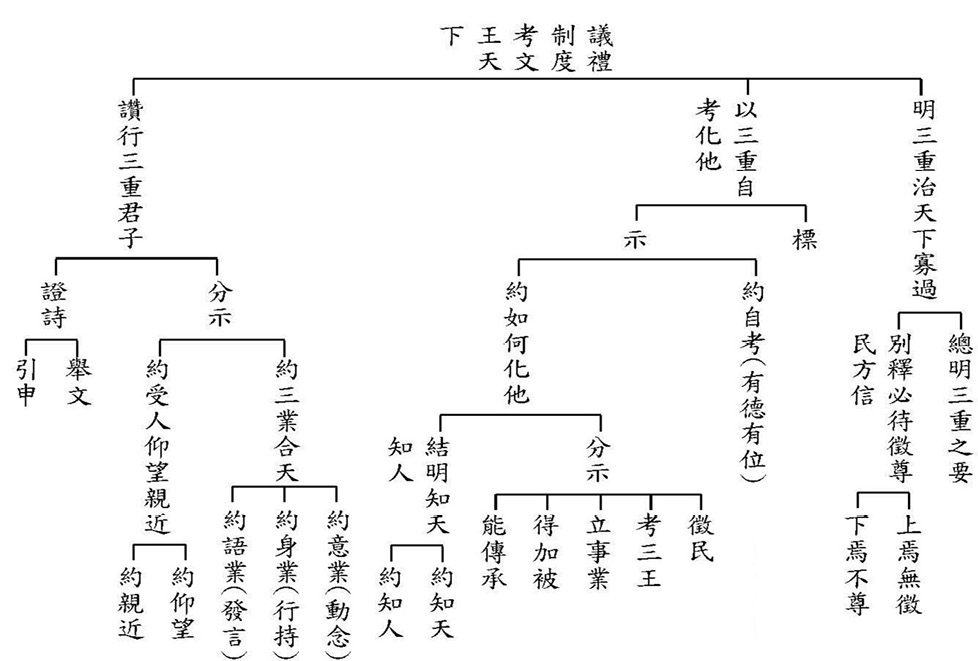

### 孔門十哲—孔門弟子中最耀眼的十顆星（十二） 發揚禮教的子游

圖：江逸子、文：時哉

學禮用於善政上

武城氣象弦歌聲

割雞牛刀是大才

樓觀歎問得禮運

本集所要介紹的人物是言偃，字子游，少孔子四十五歲，家語說是魯國人，《史記‧弟子列傳》說是吳國人，但據考證大部分比較相信他是魯國人，子游與子夏同列為文學科，文學科不是只有學術，還具有文化底蘊，深通古籍，傳承經學。子游的文學，還可以表現在政治的實務上，將詩書禮樂文章的旨趣運用在教化，辦出讓孔子非常佩服的善政。

子游在二十多歲時就出任魯國武城的邑宰，武城是魯國的一座小城，子游當武城宰，相當於今日的縣市長，他將禮樂教化具體實踐，在《論語‧陽貨》篇第四章中記載孔子到了武城，聽見弦歌的聲音，那是公學與私塾對學生們的教化，是為政大治的根本。孔子微笑地說：「割雞焉用牛刀。」也就是這樣的小地方，哪裡需要用到這樣的禮樂教化呢？這句話看起來像是惋惜子游大才小用，以治國平天下的禮樂大道，來治理一個小小的縣城，實際上是讚歎子游能將禮樂大道施化於武城。子游也知道老師的心意，便以幽默的口吻回應老師說，「我從前曾聽夫子說過：『君子學道則愛人，小人學道則易使也。』大意是說，純正的音樂，如詩的雅頌之音，可以調和人的性情，配合禮教，就是禮樂教化之道。在位的人學了禮樂之道，就能愛民；民眾學了禮樂，與君子志同道合，對於君子愛民利民的政令必然擁護，所以容易役使。」

孔子非常高興而說的「割雞焉用牛刀」是一句玩笑話，足見聖人也有輕鬆的一面，但在輕鬆的言辭裡，卻能顯示禮樂教育的重要，即無論治理天下國家，以至於像武城這樣的小城，都要實施禮樂教育，這才是為政之道。

但辦政治不只是禮樂教化，還要有賢才的輔助，所以子游武城這樣的善政，孔子還問到一項重要的關鍵，就是你有沒有得到人才的輔助？如前集仲弓問如何辦政治，孔子也是要他舉賢才，宓子賤治單父時，孔子也是問出他辦善政的秘密，就是有五位賢哲來輔助他（宓子賤把他們當老師般的來請教）。子游說有得澹台滅明這樣的人才輔佐，並說任用這樣人才的理由：「行不由徑，非公事未嘗至於偃之室也。」古時候是井田制度，路在井田之外，徑在井田之內。行人須守規矩，行路不由徑（不繞小路走大路）。其時到了孔子那時候，規矩雖存，但是行人貪圖快速，往往取快捷方式來走，而澹台滅明仍然由路行。例如清晨開車經過十字路口，即使沒有行人，紅燈的時候，依然停車，這種守法的精神，在沒有人煙的地方，依然如此。其次澹台滅明沒有公事就不會造訪我（子游），也就是他不會攀私人關係。子游舉這兩個例子，可以看出澹台滅明品行端正，奉公守法，這樣的人來辦政治不會營私舞弊，當然他的能力也不在話下，所以後來澹台滅明在子游的推薦下成為孔子弟子，名重諸侯。
孟子曾說：宰我、子夏、有若智慧足以知聖人。其實子游的智慧何嘗不是如此呢？《說苑》有一段記載季康子問子游：「仁者愛人嗎？」子游回
**答：** 「是的。」接著季康子又
**問：** 「那人們也愛他們嗎？」子游也回答是。季康子就困惑地說：「鄭國子產死的時候，鄭國人民非常悲慟，男子不佩玉，女子不戴耳環，大家在街巷哭，三個月內無人奏樂。可是孔子去世時，我沒聽說魯國有這樣的光景，這是怎麼回事呢？」

子游於是分析：「這就好比溝渠裡的水，得到它的灌溉就活，得不到就死，作用是立即的。子產的惠澤就如『小德川流』這般明顯。而孔子的恩德，如『大德敦化』，好比天上的雨水，恩澤普及於生民，而人民卻渾然不覺，視為平常，人們時時依靠它活命，卻不知珍惜。」季康子懷疑孔子不如子產，猶如叔孫武叔與陳子禽認為子貢賢於孔子。子游回答季康子的話，非常有見識，真的是一位真知灼見的人。

子游也是一位善於掌握時機，向孔子問問題的人，在《禮記‧禮運》篇裡，孔子參加魯國年終的聚合百神的蠟祭，祭完以後上魯國宮門樓上遊覽，歎了口氣（大概是歎魯國的祭禮不完備），子游跟在孔子的身邊，馬上把握時機，問老師為什麼歎氣？引得老師來說大同與小康世界。那是依禮治國的氣象，大同世界是公天下的成就，小康世界是家天下努力成就的氣象。大同世界或小康世界，也是任何政治體制所要達成的目標。
子游接著又
**問：** 「如此說來，依禮而行是急切的？」孔子依著子游之問，而說禮的重要性，影響到生活的方方面面，人格的建立以及國家的意義及精神的維持，都是依禮而成。子游接著
**問：** 「老師您強調禮的重要，能不能講得更詳細？」孔子於是就著禮的源流、禮的精神、禮的演變、禮的成效、禮在五倫的運用、禮是聖人治理天下最殊勝的方法，說個完整。依此看來子游真的是一個善問而學的弟子。

由於子游對禮學的通達，所以在《禮記‧檀弓上、下》篇可以看到，當時公卿、大夫、士、庶人，凡是討論禮不能裁定的，都以子游的一句話為輕重，可見子游的知禮，在當時具有權威性。那是因為他明白先王制禮都是依於人情，具有深意，只是到了後代，亡失了禮的精神與意義，這些儀文讓人覺得是形式主義。根據禮記的記載子游都能把外在的儀文，將其內涵說得明白而且能引人通達人情世故。

《論語》裡記載子游問孝，子游談到事君子道、交友之道，臨喪要以何為主等等，都是含蓋著禮的精神與作法。

子游的知人之識，表現在與同門的相處，在〈子張〉篇第十五章，他認為子張才高器大，難能可貴，也認為自己在仁心的表現上也不如子張。對子夏他認為孔子的教育不要拘泥這些灑掃應對，而忽略了大道的經營。從這些可以看出子游的器識以及他交友的眼力。

在《孔子家語》裡子貢說子游這位師弟，是一位事先能將事情考慮清楚的人，等到事情發生就有辦法從容應付，所以他的舉動能有條有理，絲毫不紊亂，這就是言偃（子游）的德行。而孔子也說，要想有能力就要認真地學習，要想有知識就要不恥下問，要想把事情辦得好，就要詳細考察，要想應付自如，就要做好充分的準備，並按著所準備的去辦。言偃（子游）可以說得個中三昧。以上把子游成功的秘密說得很清楚，也成為我們走入時代非常重要的人格特質。（下期待續）

## 藝術賞析

### 華夏精魂千秋（四十九）明倫史畫　貞義君子 尉遲恭

圖：江逸子、文：淨域

良禽擇木而棲息

忠信為人能全終

官場雖險好修行

修身養性是出路

—史畫—

尉遲敬德，名恭，唐朝河東道朔州善陽縣（今山西省朔州市）人；生於隋文帝開皇五年，卒於唐高宗顯慶三年（西元五八五到六五八年）。年少尚武，以打鐵為業。隋陽帝時從軍，累官至朝散大夫；隋亡，投效於定楊可汗劉武周。唐高祖武德三年（六二○年），秦王李世民率唐軍與劉武周部戰於柏壁（今山西省新絳縣西南），武周部將宋金剛敗奔突厥，敬德以勢屈歸降，秦王愛其勇武攬為心腹，授右一府左副護軍之職。

當時，王世充據守洛陽稱帝，秦王統兵圍攻洛陽。行軍中許多劉武周的舊部將逃脫，便有人將敬德關起來，建議秦王早早除掉免留後患。秦王說：「敬德與他人不同，要跑早就逃了，立刻放人。」又召敬德來，對部下的粗魯致歉，說道：「大丈夫相交，圖的是意氣相投，您應深知我心，若執意離去我不強留，這裡有些金銀你帶在路上用吧！也不枉我們相識一場。」敬德留下追隨秦王，先敗王世充，次而在虎牢之戰中，擊潰竇建德。

唐朝平定各地後，各王府間的關係日益分化，彼此間互挖牆角。太子李建成極欲收攬敬德，除送去金銀財寶外，還寫封密信說：「要與他結為生死之交。」敬德請人傳話，說：「秦王對我有再造之恩，離棄便是見利忘義之人；如此無功別具二心的人，太子殿下得到了又有何益處呢？」這話讓太子無詞以對，也結下梁子，齊王李元吉甚且派人行刺。

太子對秦王的仇視日深，敬德勸秦王預作防備，終於掀起玄武門之變，秦王一箭射斃太子，而敬德張弓射殺齊王。未久，秦王即位為太宗，敬德以功拜為右武侯大將軍，封吳國公，為凌煙閣二十四功臣之第六名。一段時間裡，太宗總夢到兄弟上門尋仇，鑒於他們最怕尉遲敬德與秦叔寶，便將二人畫像貼於門上制煞，日後成為民俗中的左右門神。
某回，太宗對敬德說：「我將一女嫁你為妻，好嗎？」敬德叩謝
**答：** 「臣妻雖鄙陋，但還懂『富不易妻』之理，望皇上成全心願。」太宗十分讚佩。敬德個性秉直又恃功與朝臣爭執不休，太宗勉以修飭進德，後長期出任州都督與刺史，不再多言。貞觀十七年告老還鄉，修心養性閉門不出。顯慶三年（六五八年）過世，享年七十四歲；高宗為之舉哀罷朝三日，贈司徒、并州都督，諡忠武，陪葬於太宗昭陵。

—圖解—

世間不少男子飛黃騰達時，如蝶般飛舞於花叢中，沾染粉色而見異思遷，每見新人笑，不見舊人哭，帶出許多破碎家庭。負心漢陳世美雖遭包龍圖問斬，但後代陳世美仍一再出現，令人不勝唏噓。

《後漢書•宋弘傳》載：「貧賤之交不可忘，糟糠之妻不下堂。」此說東漢光武帝劉秀的姊姊湖陽公主新寡，帝問她欣賞朝中哪位大臣？公主說：「宋弘威儀、德行、才幹，無人能及。」劉秀聽了深知姊意，召見宋弘引俗諺說：「貴易交，富易妻，乃人之常情。」宋弘聽出勸婚之意，答以：「貧賤之交不可忘，糟糠之妻不下堂。」說明自己夫妻情深意重，絕非貪圖富貴薄倖之輩。劉秀只得作罷。

《詩經•邶風•擊鼓》：「執子之手，與子偕老。」說的即是結髮夫妻，同甘共苦，不離不棄。江師所繪圖特別著墨於此，臺下的尉遲敬德恭敬地回奏太宗婚配之意，而後方的公主避身傾聽結果，展現出帝王的寬宏惜愛，及凌煙閣功臣的貞義不虛。（下期待續）

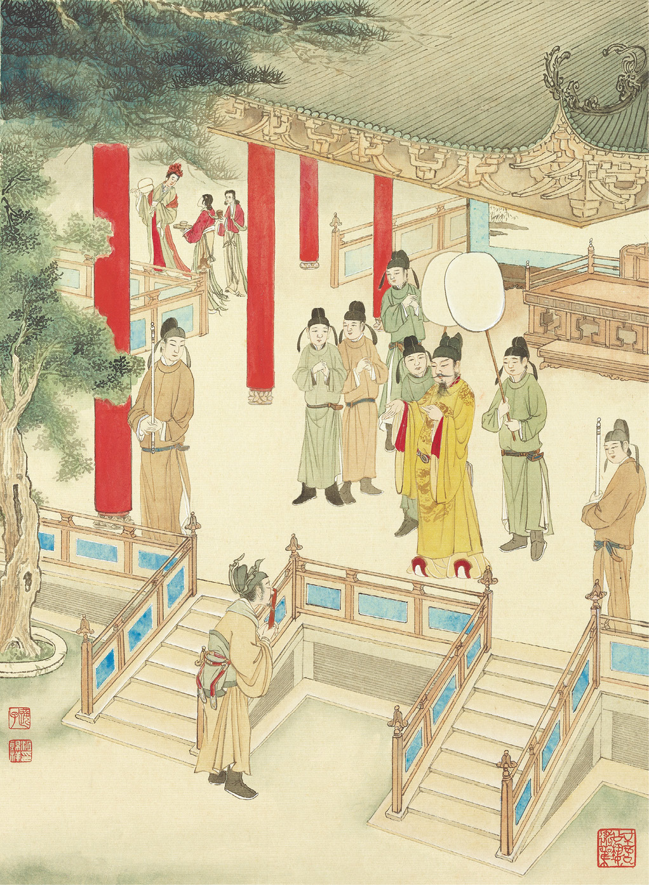

### 地藏菩薩本願經圖導覽(十五) 閻羅王眾讚歎品第八之一

圖：江逸子、文：唐瑜凌

閻羅天子疑思問

地藏神力難利眾

度出善道又入苦

緣之殊勝奈因何

諄諄教誨難生信

累彼大士往返救

閻羅王眾讚歎品第八之一

鐵圍山內無量鬼王與閻羅天子，都蒙佛的威神力前往忉利天宮，來到佛所在的地方。閻羅天子單腿跪合掌，經文中說他要稟告他的所見所聞時，還看了看地藏菩薩，所說的好像會得罪地藏菩薩，接著對佛說：我觀察地藏菩薩在六道中，雖然具有不可思議的神通，行百千種方便法來度脫罪苦眾生，而且長劫不辭疲倦。然而，眾生獲脫罪報後，不久又墮入惡道。既然菩薩有這樣不可思議的神力，為何眾生還不能依止於善道，永得解脫？祈願世尊為我解說。

畫面中身形最大端坐蓮花之上，雙手展現無畏印與與願印的即是釋迦牟尼佛，下巴豐滿渾厚，耳厚廣大修長；地藏菩薩則是右手持著錫杖，左手的手掌盛著法螺，象徵能將教法遠播，且得諸天神明鬼王的護持，以半跏趺坐腳踩蓮花。畫面中央著華服持笏胡跪者即是閻羅天子，左右兩方領著型態各異的諸大鬼王，有老虎鬼王、有毒蛇纏繞、有披著獸皮的鬼王，有獨角龍頭的鬼王，有呆頭呆腦的鬼王，表徵的是對閻羅天子所提的問題也不解，大家型態醜陋且各異，都在聆聽閻羅天子的請問。

佛告訴閻羅天子，此處眾生習性剛強，難調難伏。地藏菩薩於百千劫中，反覆救拔這些眾生，使其早早解脫。但是閻浮提眾生因結惡的習氣重，脫離險道後又再墮落地獄，所以菩薩經歷無數劫，不辭勞煩地度脫眾生。

這就好比有人迷了路，誤入危險的境地，如畫面中所繪，虎狼獅子、蛇蠍等猛毒之物，迷路的人走在險路中，若無人搭救，很快就會遭到毒害。有善得出路者，喻如善知識，具備各種方便法門，能使人不受諸毒所害。將迷路人帶出險道，並對他說：你為何要走這條路？你有什麼特別本領，能制伏躲避這些猛毒？迷路的人恐懼中被引出險道，表情是詫異且摀著嘴巴。善知識接著說：從今以後不要再走這條(往三途的)路了，一旦進去就很難出來，更會傷身害命(猶如在地獄受劇苦)！迷路人聽後，再三感謝。臨別之時，善知識又說道：如果見到親人、認識的朋友及一般路人，不論是男或女，要告訴他們這條險路有多毒惡，莫讓他們自尋死路，墮入三途。(下期待續)

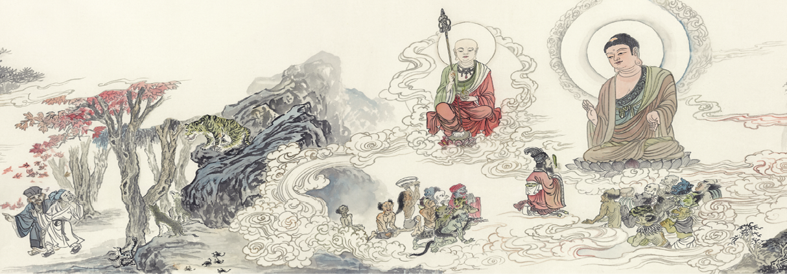

## 福州、沙縣行報導與心得迴響

### 福州、沙縣講座及論壇報導

心若

官方的邀請，順緣的呈現

亂局的思安，正法的重啟

善友的真情，學會的可貴

未來的共識，人生的意義

多年前唐老師受邀在沙縣天湖淨寺宣講「念佛寶王三昧論—十大礙行」，承蒙住持不忘，並在兩岸僵局中，與統戰部合作，於二○二四年十二月三號到五號在沙縣舉辦閩台文化交流「菩提有根，文化無界」三天的儒佛講座，臺灣方面邀請了正覺精舍果清律師以及中華無盡燈文化學會唐老師發表論文，清公和尚應邀參加，學會便跟隨清公的腳步，組團二十人，囊括老中青三代，前往沙縣弘揚儒學，可謂疫情後的破冰之旅，幾年未見，各地讀書會聽聞，相繼邀約前往沙縣會面，機緣難得，因著大陸讀書會的祈請，學會決定在沙縣論壇之前，於福州阿彌陀佛大飯店興辦兩天的讀書會共學，一天佛學，一天儒學，佛學講的是宗喀巴大師的「往生西方極樂世界發願文」、蓮池大師的「西方發願文科解」，還有「南潯極樂寺重修放生池疏」，儒學講的是「經天緯地贊化育經營命運—禮乎禮」，並有完整的佾舞沿革介紹，以及文佾舞及武佾舞的展演。

此番團隊出行，一舉數得，辦了講座、放生、參與了論壇、去了三坊七巷、上下杭、福道參訪，還見了重要人士—江逸子老師與謝總，慰問近幾年的情況，以及未來可能的合作。這次大陸各地讀書會，包括福建敦化學堂、順昌雪廬孔子文化研學會、福建廈門讀書會、福州樂淨讀書會、杭州時哉讀書會、諸暨養正學堂、浦江遠流經典讀書會、諸暨弘德讀書會、瀋陽任遠讀書會、永康龍川學校、山東德明讀書會，以及善聚讀書會，都一路相伴，誠心可見，尤其福建敦化學堂作為東道主，其大局的規劃、細膩處的講究，方方面面皆到位，令人感佩。

在福州阿彌陀佛大飯店辦理「有朋遠來的心流—經營可觀的人生」開訓時唐老師致詞言：「各讀書會的善友，以及臺灣的老師們大家好，這次很高興能跟多年未聚的老友見面，所謂『有朋自遠方來，不亦樂乎』，但是前提是『學而時習之，不亦說乎』，大家一定是學有法喜，才會聚在此處共學正法、交流心得。承蒙主辦方運籌帷幄，後勤資源補給到位，各地讀書會共襄盛舉，特別是以科判、架構、邏輯推理的方式來做教材的學習。文化內涵無遠弗屆、沒有障礙，近期很多外國人來學會，他們最想要獲得的就是中華文化。文化能吸引人，使近者悅、遠者來，近者不只是親切的來往，心靈也可以互相交會，遠者來，代表他對你的認同。孔子在魯國最大的特色就是用文化來創造國家的軟實力，培養人才、善用人才，而受到各國國君的歡迎，可見如何善用自己的文化、敞開心胸，是非常棒的出路。軟實力表現在讀書的風氣、人文素養上，表現在公德心、人與人之間的交往上，這樣的氣象會讓他人很想了解何謂中華文化。

兩天的講座，承蒙主辦方安排，場地舒適、設備齊全，相信大家都能有更進一步的友誼，很希望未來兩岸能夠開通，學會非常樂於分享所學。

學習往往覺得每天都沒有進步，日子過得很快，但是『士別三日，當刮目相看』，不知不覺中進步很多，孔子周遊列國回魯國的時候，之所以能博採各家之長，就是因為各國都敞開心胸，與孔子互通有無，所以充實自己的好處實在多到難以想像。

很高興這麼多年來得到諸位前輩、善友的護持。正覺精舍果清律師德高望重，敝人非常樂於促成這樣的活動，感謝敦化學堂邀請各讀書會前來，法不孤起，必待因緣，學會都很珍惜這樣的條件，這些都是無形的財富，交流當中，大家對你有很好的印象，那更是想像不來的財富。再次謝謝主辦方秋蓮老師，以及各團隊的護持，謝謝大家！」

雖僅短短兩天講座，但課程安排豐富，濃縮精華，佛學講座講了漢藏兩地的極樂世界發願文，藏地宗喀巴大師的「西方極樂世界發願文」分三部分，第一部分講到極樂世界依報、正報的莊嚴，第二部分宗喀巴大師帶領苦有情啟白發願，往生的心態跟皈依的心態一樣，都是求救護的心態，能救的是西方三聖、菩薩，能救所依的是佛菩薩的發心及其能力神通。往生極樂世界，我要承事的上師是阿彌陀佛，並且要有能力在極樂世界上求，有能力到穢土下化。第三部分講的是宗喀巴大師的上師文殊菩薩的淨土，以及宗喀巴大師本人要創建的淨土，這就是一個傳承的概念。我們往生極樂世界也是一樣，不但往生極樂世界，將來我們也要創建淨土，這才是去極樂世界的本懷，阿彌陀佛會很高興，因為成佛利益有情最殊勝的方式就是創造淨土。

往往漢傳佛教，像蓮池大師的西方發願文，大慈菩薩的發願偈，都只是想去極樂世界，事實上更重要的是要去成佛利益有情，成佛利益有情就要創造淨土，極樂世界就是很好的參考對象，因為他累積了很多佛淨土的莊嚴。

放生文配合第三天的放生法行，讓大家對放生有初步的了解，「總明放生理要」，先總體說明放生的道理的重要性，再「別陳放生義理」，把放生的理路說清楚，最後「結勸放生得所」，放生要放在對的場地，有了這樣的發心意樂，以及對放生的正確認知，放生當天大家很快能隨文入觀、生起覺受，這次放生由臺灣師長們指導，順昌蓮友們全權安排，所放的魚種多樣，包括甲魚、蛽、鏈魚、鯽魚、紅鯉、鯽魚、鯖魚，總額為人民幣十二萬六千四百八十，加上供品、放生船、音響等租借，總額是人民幣十五萬。整個活動順利圓滿，不管是第一次參與放生的學員，或是經常放生的老客，都感到殊勝歡喜、感動無限。

「經天緯地參贊化育經營命運—禮乎禮」，禮就是人生經天緯地的度量，禮並不會因為時代改變，變得一文不值，相反的，懂禮、善用禮的人，才是最佳的出路，禮是修身齊家的基礎；禮是人際交往的橋樑；禮是內在的道德修養；禮是社會秩序的保障；禮是國家治亂的關鍵；禮跟音樂與文學密切相關，禮有助於個人的成長、家庭的和諧、國家的治理，以及社會秩序的和諧和穩定，禮乎禮，奧妙無窮。此次除了從《論語》來解讀禮之外，更特別的是用一堂課來作文佾舞、武佾舞的沿革介紹與展演，兩種傳承的保留，一次在台上展現，讓人耳目一新。

十二月三、四號兩天在福建沙縣淘金山能仁淨苑開展的論壇，大眾有機緣近距離的見到清公與清公所帶出來的僧團，在清公的引領下，他們一行的舉手投足，高僧的氣象令人肅然起敬，不管是說法還是聞法，都充滿浩然正氣，堂堂僧相雄鎮台灣，是台灣人莫大的福報。年底十二月二十四日東馬與學會到正覺精舍的齋僧與聽開示，二○二五年元月二十一日農禪營洋人與學會齋僧與聽開示，感謝清公慈悲，給予我們諄諄勉勵，惟願正法長住，讓大眾皆能獲利。唐瑜凌老師在三天論壇中講述儒學的課程，分別是「孝是治國根本」、「《大學》之道」。

此行非常感謝東道主福建敦化國學堂的統籌與策劃，感謝讀書會自四面八方來相會，未來充滿各種可能性，相信在不久的將來都可以一一想像、一一實現，共勉之。

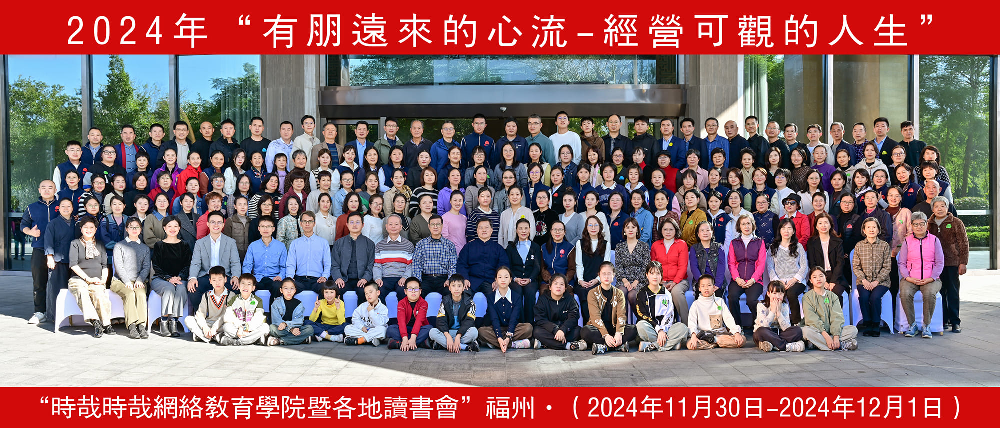

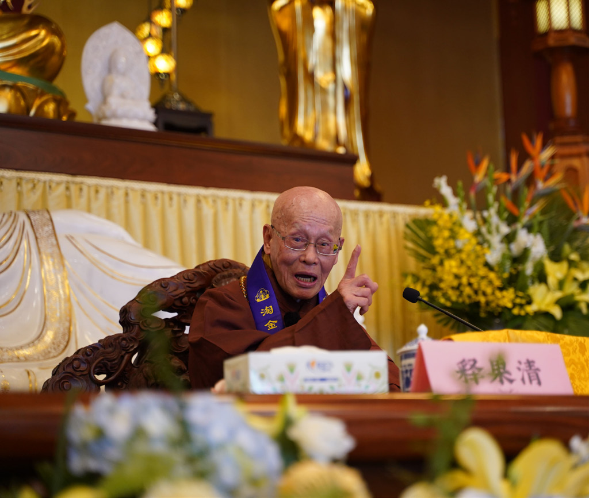

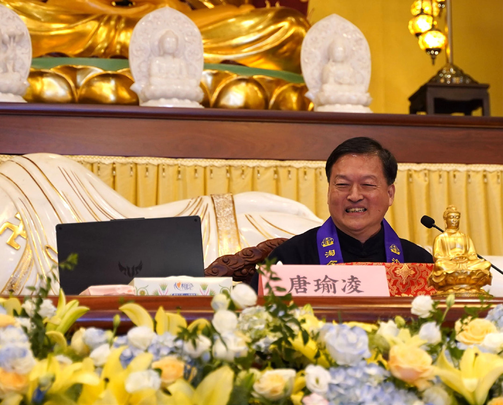

### 閩台佛教文化交流會圓滿舉辦

沙縣佛教協會

受邀組團二十人

大陸友人八十位

共同參加交流會

助成儒佛正法宣

作為第十一屆閩台佛教論壇系列活動之一，由福建省佛教協會主辦，三明市佛教協會協辦，沙縣佛教協會承辦的「菩提有根•文化無界」閩台佛教文化交流會，於二○二四年十二月五日在沙縣淘金山莊嚴的舍利塔下圓滿結束！

這場由兩岸佛學大德與國學學者一起舉辦的活動，吸引了兩岸同胞超過一千人次參加，兩岸同胞歡聚一堂，緊密相連，共同傳承和弘揚中華文化。

交流會主題「菩提有根‧文化無界」，寓意中華民族同根同源，根深枝茂，善根深厚；千年文化博大精深，在歷史的進程中，國學與佛學融合貫通，炎黃子孫代代相傳，在世界各地傳承與弘揚。

中國佛教協會副秘書長、省佛教協會常務副會長向願法師在開幕式上講話，他表示，本次活動通過演說佛法妙趣進一步密切閩台佛教法緣，厚植閩台佛教法誼。他希望大家在交流中增進瞭解，在合作中共同發展，攜手為弘揚佛教文化、傳播中華優秀傳統文化、促進兩岸關係和平發展、推動中華民族偉大復興貢獻力量。

省佛教協會副會長、沙縣佛教協會會長心亮法師代表本次活動承辦方發言，心亮法師表示，希望大家能通過本次交流會互相啟迪智慧促進共識；側重文化交融，增進友誼；加強兩岸合作，攜手並進，以開放的心態、包容的精神，共同書寫兩岸佛教文化發展的新篇章。

沙縣區委常委王仁偉代表地方政府致歡迎詞，歡迎大家來沙縣交流。佛教，作為中華文化的瑰寶，源遠流長，薪火相傳。今天，我們齊聚沙縣，共襄盛舉，就是為了更好地促進兩岸佛教文化交流，增進相互瞭解與合作，共同傳承和弘揚中華傳統文化，促進兩岸佛教文化融合發展。對此，希望此次交流會能完成以下幾個目標：

一、交流啟迪智慧，對話促進共識。

二、文化交融，增進友誼。

三、合作共贏，共繪美好未來。

福建省民族與宗教事務廳二級巡視員黃黎鋒、宗教一處相關負責人、三明市民族宗教局局長姚文輝、三明市民族宗教局宗教科科長李豔紅、沙縣區民族宗教局局長譚淑珍等參加了活動。

開幕式上，由向願法師、傳一法師、果清律師、心亮法師帶領四眾弟子共同祈願世界和平、人民安樂。向願法師贈給果清律師弘一法師像，果清律師贈給向願法師書法

活動期間，臺灣佛教界大德，晉山埔里圓通寺住持、正覺精舍方丈和尚果清律師為大家開示。

果清律師、育因法師、性德法師與沙縣當地的明靜法師、心亮法師、常空法師，以及中華無盡燈文化學會創辦人唐瑜凌教授等，圍繞佛教文化、國學經典等為大家作分享交流，進一步挖掘佛教文化和傳統文化精神。中華無盡燈文化學會創辦人唐瑜凌教先生《孝是治國之本》、《大學之道》，果清律師講授《持戒的始終要義》。

這次的論壇有三個主題，一是戒律，佛教七眾弟子都要遵守，是修行的根本。二是淨土是修行的歸宿，往生淨土不退轉方能早成佛道。三是傳統文化，講人格的修養，修身齊家，治國平天下。

一連三天的活動座無虛席、內容豐富，包括閩台佛教文化主題研討、講經交流、國學文化交流及祈福法會等。旨在搭建閩台佛教文化的橋樑，深化閩台佛教界的交流與合作，緊密聯繫兩岸同胞，共同傳承和弘揚優秀中華文化。

傳一法師在閉幕式上致詞，閩台佛教同宗同源，兩岸佛教界應共促兩岸交流融合，共同弘揚中華傳統文化，同願同行，共同推動兩岸和平與發展。

閉幕式上雙方帶來了為本次交流會準備的禮品進行互贈，表達深厚情誼，也表達了對兩岸友好交流、共同弘法的願望。傳一法師與果清律師互贈書法，果清律師與心亮法師互贈書法，交流會圓滿結束，法喜充滿！

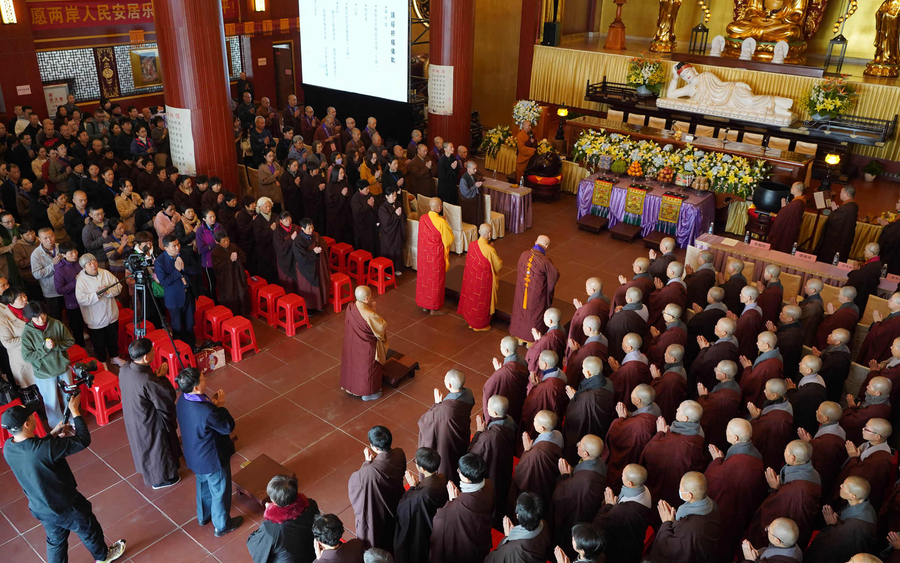

### 眾緣和合共襄盛會 滅法相續同造淨土
福州講座和沙縣論壇心得-敦化學堂

眾緣和合共襄盛會 滅法相續同造淨土

福州講座和沙縣論壇心得-敦化學堂

敦化學堂

眾緣和合共襄盛會 滅法相續同造淨土   《有朋遠來的心流—經營可觀的人生》福州講座和沙縣論壇心得

福建敦化學堂   謝秋蓮

11月29日-12月5日，唐老師、林老師帶領無盡燈學會師長一行來福建弘法利生，福建敦化學堂有幸承辦福州部分的講座，以及配合順昌讀書會、樂淨讀書會做好放生法會的交通保障等。在辦事中發現自己以及敦化團隊的不足，發現師長、學長們的榜樣力量，默識福州和沙縣的講座以及放生法會上開示的各種義理，全程收穫多多，快樂多多，難以盡述，略略分享如下：

在承擔中看見團隊和自己的成長和不足

今年9月16日，中秋節假期，團隊骨幹一行到阿彌陀佛大飯店奧體店旁的正祥．鳳林別舍社區看望師伯江逸子老師，江老師提到對唐老師的想念，還帶著我們去他在閩侯老家的別墅歸根草堂考察、在村裡用餐，殷殷期盼我們能想辦法一起將歸根草堂活化使用，發揮弘道功能。與唐老師彙報溝通中，老師說及想組團看望江老師。

未料不到一周就迎來驚喜，9月22日晚，順昌的葉園長告知，老師一行12月初要到沙縣參加兩岸的文化交流論壇，可以借此寶貴因緣，請老師在福州舉辦兩天講座。第一時間與團隊分享這個喜訊，敦化學堂的學長們歡欣雀躍，骨幹們立即各展其能，去打聽政策以及尋找場地、合作方等資源。

10月1日下午，唐老師定調講座參與範圍主要是時哉時哉各地讀書會善友，並建議講座地點放在阿彌陀佛大飯店奧體店，江老師的住處就在奧體店附近，看望江老師也方便。

當晚即召集第一次籌備會，時值7天法定長假第一天，部分學長不在福州，但還在福州的學長們基本都來開會了。會上集思廣益，討論講座保障可能涉及到的各項服務，包括交通、物資、遊覽、餐飲、伴手禮、義工服、大合影等等。就當前的人手和事務的緩急，先啟動師長服務組、資訊匯總組、物資採購組、會場會務組的工作，並確定組長人選，即可啟動各項準備工作。

10月13日，開假後的第一個共學日（每週的週日上午九點到下午五點半，是敦化學堂線下共學共修的時間），學堂調出下午半天的時間，召開了第一次全體義工會暨講座籌備會，討論講座各項細節和小組分工，在前期四個小組基礎上，會務部分再細分成立奉巾奉茶組、簽到組、迎賓組、交通組、影像組、保健組、財務組。

2024年下半年，學堂週日下午的共學共修內容是了凡四訓，是日，結合了凡四訓，將護持、服務講座的順利進行，作為學堂所有學長的日常力行（功過格）固定內容。

自10月13日開始到講座啟動，其間共有6個週末，前4週的週日下午照常共學，但固定安排一個小時，各組彙報籌備進展，所有學長暢所欲言，提出優化建議。而11月17日和24日，講座前的兩週，結合了凡四訓和常禮舉要，週日整個下午安排義工培訓，做心態建設和具體禮儀培訓。

在籌備過程中，學堂全體學員都化身義工，聚智聚力，有錢出錢、有力出力，有點子出點子。尤其是幾位學堂骨幹，隨喜資金給力，做事也非常給力，有些學長還帶動家族一起出錢出力。多少個夜晚，大家在完成白天的工作後，集中到學堂，在歡聲笑語中做前行工作。週六也不閑著，呼朋引伴，去大飯店、去歸根草堂、去上下杭、去福道、去預備用餐的各個餐廳等處踩點。

盼望著、盼望著，11月29日，終於迎來了老師一行和各地善友。也迎來對我們的前行成效做檢驗的時刻。

雖然提前做了很多準備，但在接機、會餐和講座的保障中，還是頻頻發生疏漏，比如沒有預估到司機不熟悉機場等因素，接機竟然遲了兩分鐘；比如講座第一天第一個課間唐老師、林老師休息室的茶水與點心，因與飯店溝通有誤而發生脫節；比如學會師長的茶歇區一開始準備安排在義工休息間，但因為物資太多被佔用而沒有及時單獨及時辟出師長專區；比如團餐座次分配不夠合理有序；比如2日放生活動後的午餐，跟餐館的資訊溝通不夠細緻，導致菜品做法不當；比如乘動車到沙縣時，細節考慮不周，導致師長們不便；比如離開福州後有所懈怠，在沙縣論壇前期把自己當作普通團員，沒有主動及時扛起各讀書會聯絡員的責任…。

回顧講座的前行和正行工作，衷心感謝唐老師、感謝學會給敦化學堂這個機會，檢驗我們的發心和承擔力。通過這次歷練，團隊的凝聚力更強了，辦事能力得到了很大的鍛煉，對於未來大家也更有了信心。在辦事過程中，也照見各自的習氣，讓大家更知道要對治的方向。

這次歷練，讓末學和團隊知道，人才團隊和平常的訓練有多麼重要。這次講座，有會務經驗的多位學長提出了很多細緻有效的建議；而在每年的親子營和重陽等特定節日的活動組織中，也讓我們知道了誰對財務有經驗、誰的組織力強、誰擅長採購、誰有交通資源、誰更擅長攝影攝像…。

這次歷練，還讓末學和團隊知道，組織一個講座原來有這麼多的工作要做，有這麼多的變化球要接。無盡燈學會長期辦講座和各種活動，在新冠疫情之前，我們有幸參加過幾回，感覺到師長們的用心、細心，但如果不是自己做過這一遭，不會知道師長們背後原來默默付出這麼多。習勞知感恩，在這次活動有了具象、強烈的感受。

以文會友，以友輔仁，就有道而正

這次講座，不僅是給了我們辦事的鍛煉機會，更是給了敦化全體成員近距離跟老師和善友學習的機會。末學和少數學長有幸跟隨老師參加過幾次遊學，但大多數學長只能從末學的介紹中知曉跟老師遊學的殊勝。師長團隊以及各讀書會善友這次的福建之行，給了我們近身相觀而善的機會。

唐老師在講臺上妙趣橫生且說理透徹的講解，配合的師長們豐富的學識、接住老師拷問的思維力，私下接觸時師長們的謙和，無一不讓我們對文化的氣象生起信心。兩天的講座，滿滿的乾貨，敦化學堂部分義工為保障講座，沒有聽完整，老師還利用大巴出行時的各種時間，與學會師長們互動分享，讓我們有機會偷偷補課。

從瀋陽、濟南、武漢、貴陽、深圳、杭州等千里之外以及福建省內各地趕來的善友，以前只聞其聲，不見其人，這次能見面，看到他們的好學，看到他們急公好義的心。其間與一些團隊和學長有機會進行深入的交流，聽他們講述以仁心辦事業的心得，從他們的得失中體悟，以及看到以後共造善法的可能。

吃過最好的，就不會被糟粕所迷惑。11月30日和12月1日兩天講座義理的薰習、2日的放生開示，開顯人生的真實義。3日、4日的沙縣論壇中，因為有幸跟隨老師學習多年，且這次有幸緊隨老師身邊，得到老師私下就有關經義的一些分享，得以批判性吸收講座的資訊，而不會讓腦袋成為他人思想的跑馬場。

魯無君子，斯焉取斯。得到傳承善知識的教導，是何其幸運。

里仁為美，老師和學會師資團隊，以親身的氣象告訴我等學生，以團隊的方式來上求下化，自利利他，才是君子最殊勝的出路。

取捨有道，以果為因，傳聖道造淨土

一時因緣際會。有能講的老師和師資團隊，有老師來參加論壇的機緣，有大家對正法的信心和對老師的信賴，有能聞的我們，有莊嚴的會場，有各地的善友。這些大條件中又有很多小條件，比如這次會場的莊嚴，不僅有敦化團隊的努力，還有鄭小青、陳新、曾春榕、養正學堂等的隨喜相助。

人生是光明還是黑暗，就看我們的取捨。老師在講座中屢屢提及人生要做正確的取捨，切勿讓無明障取捨。

眾緣和合，才結出盛會之果。如今盛會已滅，但種子已經種下。如何將道統傳給更多人，如何學習、繼承禮樂包括文武佾，如何吸引更多人才來加入仁心事業，以團隊的方式創造自他的美好未來，是敦化學堂的當務之急。

以學堂會歌《傳承》作為結尾，表達我們要學習雪廬老人和唐老師的的俠骨柔情，要以師志為己志，傳承中華道統的決心：

帶著七分理智，帶著三分俠氣。中華道統先哲智慧，凝成人間正氣。

追尋大愛步履，追尋使命足跡。炎黃子孫華夏兒女，一曲高歌壯麗。

我們啟程遠航，一路乘風破浪，無畏路程艱險，我們奮飛雙槳。

放眼天下事，胸懷赤子心，矢志揚國學，誦我華夏音，

求學緊用功，聞道天酬勤，傳承為蒼生，四海聽佳音。

許海燕

講座結束半月有餘，回想時仍感覺那幾日、那一段時間就是一個不斷流動、永不停歇的狀態。所有人因為熱愛奔赴而來，此前紮根的繼續延展，此前嚮往的則播下善種。就在那幾日，各自的生命又有了向上堅定的方向。

老師問，茶香何來？那必由茶葉、泉水、茶具、沖泡者、品茶者等條件和合而來。一場講座氣象不凡，必也由多種條件展現而成。初聞老師一行將在福州辦講座並由敦化學堂承辦時，大家期待之餘更多的是緊張，這是考驗，也是檢驗！此後，學堂在秋蓮老師的牽頭下，隔幾日便依著新資訊做進一步地討論和推進，三五成群地，就這麼熱熱鬧鬧地幹起來了。前方的會場佈置、酒店溝通、資訊統計，後方的物資採購、交通協調等，都是細緻活兒。所有人都在忙著，有時一碰頭就忘了時間，那股熱火朝天勁兒彷彿回到了青春歲月。而末學此次主要負責迎賓組，任務不重卻是服務視窗，工作須清晰，態度須熱情。熱情不必多說，清晰卻要費一番力。何處迎賓？嘉賓需求有哪些？如何精準引導入座？這些讓人犯愁的事兒，在大家的群策群力中，也被逐一解決了。只是，儘管想得周全，期間整個人也被熱力推動著，興奮著，不想結行時才知問題不少，唯願在未來的活動中可以想得更為周全，更加平衡。

因為疫情，五年未見老師的各地讀書會師長，不辭辛苦紛紛前來，只為親眼看看老師們的風采，親耳聽聽老師們的教誨，更為自己的那分「道心」不墜於地。末學看到他們激動的面龐，聽到他們熱誠的呼喚，不由感歎，在這樣一個不確定的時代中，人生出路能被明確地指明，生命的意涵能毫無保留地被豐富，怎能不感到幸運和幸福呢？這樣想來，此次相聚，就不僅僅是講座一事，更是一份份求學熱誠的交融，一顆顆感恩之心的傳遞。

老師曾說，學習最重要的在於傳承。看著臺上的唐老師和自己的愛徒，一問一答，將義理反復辯證說明，台下師長們用心、快速地記錄著，想著老師如此無私地傳授著其研學成果，無非就是要讓學生們更快更好地邁進那個奧妙之門。故于大家感佩之時，末學似乎又感受到了老師那一分迫切的希望—希望這些義理可以被記住，可以被傳承，可以被落實，可以更快地去開花結果。

銘記於心，竭盡所能！

此外，期間還特別有感觸的是，因末學一向不夠大方，與老師近距離時常常無措，而此次卻覺得與老師親近了許多。在茶歇室門口迎唐老師下課，在林則徐紀念館與林老師並肩交談，在上下杭與微智老師挽手緩行，與潘老師笑談過往，以及和其他老師暢所欲言，這些美好、愉悅的時刻都很鮮明，時間滑過，它們已然刻在了末學的記憶裡。

在此，末學衷心祝願唐老師、林老師和學會老師們身體健康，吉祥無憂，福慧雙增，也期盼著我們有更多的機會聽聞法寶，成為能學、能傳之真正弟子！

周巧雲

「念念不忘必有迴響」，學生這次真的體會到這句的真諦，只要信念願望一直在，就會有被回應的那一天。年初在寫二○二三年度的學習心得時，學生寫到，希望來年唐老師能帶團隊來福州辦講座，沒想到這個願望在年底就實現了。感應來得這麼快，太神奇了！！

每週天敦化學堂共學，學生到學堂第一件事，就是給地藏王菩薩點香，祈求週天的共學圓滿，學堂的老師、學長、家人身體健康法喜充滿，更多的有志之士加入學堂，讓學堂發展壯大，這是學生的心願，希望也能達成。

這次唐老師帶領團隊參加在沙縣舉辦的兩岸佛學論壇，促成了這次福州講座的達成，真的太榮幸了。學堂在接到消息的第一時間秋蓮老師就開始組織各項的籌備工作，大家獻計獻策，兩個多月大大小小的籌備會和義工培訓會開了不少，老師們抵達的前一晚還在開會，落實各項準備工作，因為是第一次承辦這種活動，尤其是關係到眾多的師長、善友，關係到正法，敦化學堂的善友們都很積極也很慎重，深怕有疏漏。師長服務組、交通保障組、會務組、迎賓組、物資採購組、簽到組等各司其職，全體一起努力，才有這次兩天講座的圓滿，但還有很多待完善的地方。

因為有唐老師的感召力，才有各地讀書會善友們相聚有福之州。真的是「有朋自遠方來，不亦樂乎」，以前只在線上聽到老師學長的名字，這次可以對上號了，真的很激動和開心。希望今後有更多線下和老師們面對面的學習交流機會，舉辦各種經典文化的講座，讓有傳承的文化發揚廣大。

學生這次被秋蓮老師分到師長服務組，統籌講臺的進巾奉茶和老師課間的茶水等。唐老師休息間的茶水，因為跟酒店的資訊溝通有些誤解，準備不充分，剛開始有些慌亂，怠慢了老師。這次在老師的休息間服務，很榮幸有近距離接觸老師的機會，遺憾的是學生學業不精，不敢請教老師。但透過服務的機會，還是學到了很多，比如老師指點學生給人遞茶一定要告訴對方泡的是什麼茶，讓學生在禮上又能更通達一分。老師在課間只有十分鐘休息，還要不斷接待各讀書會善友等，很辛苦，可一回到講台，立刻精神抖擻，妙語連珠，令學生嘆服！

師長們這次展演的佾舞，學生很喜歡，希望有機會可以學到老師們的真本領。這幾天和唐老師團隊的師長接觸，發現他們身上個個藏寶，值得學生學的東西很多，可惜時間短暫，期待在不遠的將來再見。

沙縣之行乘動車，累到唐老師和各位師長了，拿著大包小包的行李，候車廳裡站著候車，從頭走到尾漫長的月臺，真的是累到大家了。回過頭去想，要去參加殊勝的盛會，必須經歷的磨難，是不是對大家的一個考驗呢？學生胡想，其實主要還是我們準備工作不夠周全。

十二月三日的盛會，驅車前往淘金山佛教聖地，一下車太陽就出來，四周景色非常優美，真是人間聖地，學生也是第一次來到這裡，順著臺階往上走，越到高處景色越美，一覽眾山小，遠山如黛，層層疊疊，猶如一幅水墨畫。天公作美預示著吉祥瑞兆，歡迎各位遠到而來的高僧大德，學生想「鳳鳥至，河出圖」，一切都是殊勝美好的，兩岸同根同源，文化經典沒有邊界源遠流長。學生想著唐老師講的天地人三才，想著唐老師講的止定靜安慮得。不管是做任何事情，心中先種下種子，有目標有方向，朝著方向去努力用功，各種因緣條件成熟，必有迴響。

唐立新

11月29日，敦化學堂終於迎來了期待已久的盛事，終於見到了許久未見的唐老師、林老師及學會的各位老師，每個人的心情都是激動和歡快的。在辦講座的過程中，學生體會到了《論語》中所說的「子語魯太師樂曰：樂其可知也，始作，翕如也；縱之，純如也，皦如也，繹如也，以成」的美妙境界，學堂家人們既分工又合作，像演奏一首樂曲般，盡心盡力地去做好每件事。每個人的臉上都洋溢著笑容，法喜充滿，學生在此特將心得報告如下。

第一，學生感受到了老師以師志為己志，不遺餘力弘法利生的人格魅力。老師一行一到福州就馬不停蹄地開始各種活動，先到歸根草堂，看望江逸子老師再到三坊七巷參觀林則徐紀念館等。兩天的講座，全是老師一人主講，作為學員的我們還有休息的空閒，而老師還得在休息時間回答各地讀書會及善友、學長們的提問。老師的言行舉止真像果清律師贈送的觀音菩薩像的觀音菩薩，千處祈求千處應，身體力行地傳播著文化的種子。

第二，學佛最重要的是破除障礙和取捨。老師在分析《西方發願文》時說我們得到三寶最大的加被是得到傳承，而得到傳承最殊勝的就是正確的取捨。取捨太重要了，如果不懂得取捨，把現世的安樂當成人生的主要目標，把來世的增上和解脫當成最不重要時，人生的主要目標就顛倒了，那真是長夜茫茫永無出期。之後老師又釐清了「好心為啥常常沒好報」的觀念認知，告訴我們那是因為無知，是因為不懂感果的功能，是因自身言行舉止造作而來的。如果思維模式不改變，我們的認知就不會改變，就會為無知付出代價。老師的話語，令我醍醐灌頂，它們就像一盞盞智慧的明燈，照亮我悠悠放任、耽染塵情的心田。何其有幸！能遇見老師，讓我們能夠走在破迷開悟、離苦得樂的路上。

第三，此次講座也讓自己明白了放生的意義。以前放生只是覺得曾經殺生過，所以現在要趕緊放生。上了老師的課之後才真正明白放生存在著那麼多的意義，那麼多的講究。知道了放生可以磨練慈悲心，可以對業、對苦果、對不求回報作觀察。

第四，處處都是榜樣。學會的各位老師不但言行舉止都透露著文化修養，還處處關心他人，為他人著想。在漫步福道時，幾位年長的老師堅決不讓我們陪同，告訴我們機會難得，要抓住一切機會跟隨老師學習。老師們身體力行、為他人著想的精神給學生留下了深刻的印象。而浙江團隊的孩子們，他們認真奉茶，一絲不苟的模樣，真的也讓人無比讚歎。

雖然講座已過去近一個月了，但老師們的風采已深深地印在了學生的腦海裡，也讓自己對未來的學習更有信心，今後一定會繼續跟著老師好好學習，正確取捨，從無知到知，開創美好的末來。

黃碧玉

感謝老師們百忙之中來到有福之州為大家開展精彩的講座《有朋遠來的心流—經營可觀的人生》，從聽到秋蓮老師公佈這個消息開始，學堂的所有義工老師們就在老師等感召下開啟講座承辦工作佈署，大家在工作、生活之餘緊鑼密鼓地分工合作，以誠摯之心歡迎各位師長和善友們蒞臨福州齊聚一堂，享受恩師帶來的文化盛宴。

以下就著這場講座的開展，做一些心得分享：

一、文脈傳承的氣象

一場講座讓我們感受到唐老師、林老師及團隊每一位老師的文化底蘊深厚，唐老師在課堂上循循善誘，時而引發大家的高維思維，時而破除我們諸多盲區，時而調侃自我，時而幽默風趣，親切仁愛之情溢於表。特別是培養新一批的青年人才，讓文脈得以傳承，現場高維的辯論，台下談笑間光芒智慧，舉止間流露儒雅之氣都讓我們難以忘懷，「能親仁，無限好」，是本次在現場人人都感受到的最真實寫照。

二、非親似親的相聚

再次見到唐老師、林老師們，離之前的相聚已有五年之久，還有疫情後由白老師帶領線上各讀書會的善友們，末學與大多數師長們一樣，只聞其名未見其人，但大家相聚在一起卻沒有一點的陌生或違合感，這就是以道相交、以義相交、以禮相交，非親人卻勝似親人般的感受，師長善友們彼此關懷、惺惺相惜，呈現出禮運大同的氣象。

三、是非對錯的辨別

有幸跟著傳承的老師學習多年，雖然自己的見解與能力都很弱，但在參加老師之外的很多場合（線上或線下）學習後，明顯感受到有師承與無師承的差別。沒有中心思想的學、沒有通達義理的學、沒有傳承善知識引導的學，就會囫圇吞棗、人云亦云，也完全看不出經典裡的內涵及殊勝處，更無法趨吉避凶。以前常聽老師講學習經典是練就我們的眼力見，但一定要有傳承的老師，這樣對是非對錯才有辨別力、抉擇力。人生是一場知見的抉擇，相信這次參與講座的老師們也看到自己差距和進步的空間，只有沉下心來緊跟師承團隊的步伐，一起開啟智慧之門，以師志為己志，利人利己。

四、知行合一的展現

知行合一，知是行的先導，行是知的體現。知要從經典中開啟，經典的研討是核心、是根本、是命脈，再透過外在的行住坐臥、人情世故的通達，以及各種儀式、步驟、方法的展現，有靈魂、有核心，有內涵、有外相。

老師們平常在臺上「便便言，唯謹爾」，在台下不放過任何一個關照諸善友的機會，以及與幼小孩子的互動。不僅在精神上給予內涵力量，物質上也提供很多財富與物品的支援。

禮樂佾舞老師們臺上的展示，從缺到有，結合經典創造各種因緣條件，不斷探索、求知、傳承，一次次磨合、一次次切磋，以及到福州會場後的認真彩排，都給我們帶來不一樣的禮樂內涵精神。

五、世事無常的體悟

本次講座末學配合小青老師擔當人員統計的工作，從報名開始到臨講座的一刻，資料都在時時更新變化，有增有減、有進有退、有出有入…，有時剛剛整理好的資料又得重新推翻再來，也會起點點的情緒，但轉念一想，來或不來的人都不會無緣無故做這些變化，調整的背後都有一些我們不為知與不得已的理由，自己在生活中何嘗不是呢，深感一場殊勝的講座自己平常若沒有積點厚福和條件因緣的促成，很難與大家共聚一堂，享受文化的洗滌。只有自己把心安住在當下，統計好每一位師長、學長們的資訊資料，爭取不出疏漏，給出較完整的資料，推動及開展後續工作。

臨近講座兩三天前，被告知浙江團隊一位師長突發疾病而住院，因此請假不能參加講座，自己內心十分惋惜，就在浙江團隊來福州講座前一天，再次聽到這位老師已經往生了，且還是在浙江團隊老師們一起助念護持下往生，一切來得都那麼突然，又那麼完美巧合，也是得益於老師自己的福德、團隊的加持，無比隨喜讚歎。

六、習氣碰撞的融合

平常大家都在學堂交流研討，沒有真正經歷大講座的操辦與運作，各自的習氣總是藏得很深，未被挖掘，但在做事力行中就能看到習氣呈現，碰撞、過招，覺察、覺醒、放下、提起、再放下、再提起，一次次磨合，一次次蛻變，每個人都在力行中成長，放下自我，最終成就較為圓滿的講座。

七、責任擔當的成長

都說越付出越成長，越擔當越成長，看到每位老師們身體力行，深感自己差得太遠，力行中總是陷入我不行、我做不好、我覺得、我以為的僵固思維中，想要逃避的心時時冒出，覺得別人做得比自己好，就不想要去突破，不想去嘗試。這是一場練就我們綜合能力的平臺，能力不夠時反復問自己的動機、問自己的發心，當把所有參會的老師們放在心裡的時候，想要成長突破的願力才會堅定而有力。在諸位老師們的帶領下，我們也放下了很多自我，在行願中找資源、找人脈、找幫手…，為講座的開啟與進展播種下了共造善業的種子。

除以上的分享，末學也深感此次講座，作為承辦方的我們在會務上有諸多不足之處，如：末學做資料名單統計的錯漏不夠即時，影響其他老師的決策；就餐落座順序不夠科學；住宿費與酒店沒有對接到位，導致要我們結算房費後讓各團隊再發起收款，給大家增加不少工作量；茶歇處義工老師分工不足；對遠來的善友出現身體不適照顧不周；少兒班孩子的自我管理不夠；作為義工的自己敏銳性、覺知力不夠…。

劉建國

本次聚會是在唐老師的引導下，跨越了三千多年，和古聖先賢對話，與跨越幾千公里奔赴而來的各位師長們一起共學共修，其中的不容易和克服困難的勇氣，值得為自己和每一個人點個讚，在這次聚會中收穫沿途的風景，如人飲水、冷暖自知，每個人的所見所聞都不一樣，種種的收穫，肯定會深深印記在我們每一個人心中，以後碰上不同的問題和困難，學習的內涵都會成為最好的解方。

末學在本次活動中，想到這樣一句話，人生有三見：見天地、見眾生、見自己。

見天地，見識到中華傳統文化的魅力，看到這樣的氣象竟然如此殊勝，在唐老師的引領下領略古聖先賢的風采和智慧，用科判理解其中深層的內涵，用抓重點、找核心的方式在有限的時間內讓我們吸收。

見眾生，以文會友，以友輔仁，大部分的師長都是第一次見面，但是在講課期間大家像認識許久的老朋友般不斷地切磋琢磨，本次見識到各讀書善友們的風采。有對論語經句各種獨到見解的臺灣師長，有身教力行帶領孩子們前來的浙江讀書會，有跨越大空間的線上讀書會，還有致力於做後勤保障的敦化學堂。

見自己，在這次籌備活動的交流過程中，看到原來事情可以如此處理，可以如此細化，見證了自己很多方面的不足，例如貪於個人便利、在學習方面不夠專注、無法深度推演，有時候情緒管理失態、莫名著急等等，見自己，明歸途。努力爭取做到知行合一，跟上大家的腳步，很榮幸能有這樣的機緣參與其中，感謝唐老師、林老師、白老師以及學會的諸位老師們一直以來的諄諄教誨！

馮韻呂

轉眼快一個月了，法音繞梁三十日不絕，大家的法喜還在持續中。感謝老師帶給我們的歡喜和收穫，從得到老師要來福州的消息開始，整個學堂喜氣洋洋，真是學而時習之，不亦說乎，有朋自遠方來，不亦樂乎呀。總結兩點感受如下：

一、歷事練心，內外相資。

為了報答老師的教導，交上一份合格的答卷，在秋蓮老師的組織下，第一次籌備會召開，平時不一定有空參加共學的學長們都到齊了。大家領命而去，分工合作，團結一心，在金錢、體力、精力、心力各方面都付出了很多，每個人都克服了很多困難和障礙，一切為講座讓路。一個多月，開了很多會，大家都緊張又興奮，有條不紊地推進手頭的工作.....

想想自己能順利參加講座還是很幸運的，在請假之前的那天還出現一些小障礙，如果當時那個障礙沒有克服，第二天是請不到假的。好在，當時我還算鎮靜，冷靜處理干擾，同時一直默念地藏王菩薩祈求消災除障，加持護佑。果然在關鍵時刻，障礙消除，工作及時處理完畢，第二天才走得開，真是慶幸。可以想像，這次講座的圓滿，是多麼來之不易呀，各種內因外緣的具足才有一次法會的莊嚴。

這次講座我很榮幸分在簽到組和林娟學長配合，負責座位安排、簽到、人數統計等工作，同時負責科判材料的準備等等。講座的事物繁多，相比學堂各位學長，我的任務相對單純和簡單一些，但是大家都歡喜地承擔，盡心盡力，尤其大家在細節處的講究都是我學習的榜樣。好多學長不僅出了大力而且還慷慨地出了一大筆錢，這麼殊勝的講座可遇而不可求，隨喜讚歎各位學長很好地把握修福修慧的好時機。我暗暗期許自己，下次我也要爭取在各方面更多地分擔和付出，相信所有的承擔和付出，未來都會成為離苦得樂的寶貴資糧。

二、殊勝內涵，法脈傳承。

全國的善友匯聚福州，是因為老師殊勝內涵的魅力，大家都很珍惜親近明師的機會。老師的團隊也是人才濟濟，兩天的講座，對答精彩，妙語連珠，莊嚴又風趣，最重要的是法味濃郁，帶給大家充足營養的同時生起警覺心--回報率最高的投資其實是投資究竟解脫。真正的增上是心心念念都與離苦得樂有關的增上。眾生都在五欲六塵中沉迷，而真正的智者，是用悶聲發大財的心態去修學正法，去為未來面見西方三聖具足條件…。

老師被邀請到沙縣淘金山佛教聖地分享了《孝經》、《大學》，在佛門中，儒學反而倍顯珍貴和稀缺。老師回憶當年雪廬老人諄諄教誨，說：老弟，你好好學論語，以後就知道了。現在大家都知道了，儒佛合之則雙美，離之則兩傷。從寺廟法師的分享更加體會到，提升內涵多麼重要，無論學儒學佛，都要下苦功夫，要有善知識教導有團隊共學切磋，而我們何其幸運，有老師線上指導，有學堂線下共學。條件基本具足，我們所要做的是盡全力去學，做好預習複習，默而識之，學而不厭，誨人不倦。養兵千日以備用兵一時。如果平時不努力，書到用時方恨少，那是多麼可憐可悲呀。

老師這次沙縣行最重要的緣是果清律師，果清律師是兩岸僅存的少有的律宗高僧，和唐老師的緣分很深，這次在沙縣的講座中，律師親自將一尊珍貴的玉觀音贈送給唐老師，讓人十分感動。老師數十年在儒佛上的修學和堅持，得到認可並被寄予傳承的厚望。我們都要跟著老師一起努力，將殊勝正法傳承下去，傳播出去。

最後，非常感謝老師的厚愛，讓我們有機會參與共造善業，廣結善緣，增長見識，隨喜功德。

劉晨

剛結束的福州、沙縣講座對學生而言可謂意猶未盡、收穫滿滿。本次講座不僅是一次文化的盛宴，更是一次心靈的洗禮。在唐老師的言傳身教下，在各位師長、學長共同護持的莊嚴共學環境中，學生越發堅定了傳承聖道的志向，也有了更加清晰的目標與做法。以下是學生皮毛的心得感悟，不足之處請大家多多批評指正：

一、講座籌備

學生二○二一年加入敦化學堂大家庭，偶爾有聽學堂的師長們說，在疫情前，唐老師和臺灣師長們常來福州辦講座，大家也會不時去到臺灣親近師長學習，學生每每聽聞都是無比羡慕。今年真是難得的殊勝因緣，唐老師時隔五年又一次蒞臨福州辦講座，敦化學堂的每一位師長都無比興奮，大家抱著「戰戰兢兢，如臨深淵，如履薄冰」的心態開啟了講座的籌備工作。儘管學堂師長們大多數是第一次參與組織如此規模的講座活動，但在秋蓮老師的帶領下，大家分工明確、各司其職、互幫互助，把每一項籌備工作都認真落實到位。

學生作為學堂的一份子，更不敢有一絲怠慢，本次福州講座主要負責會場籌備與上下課主持的部分。說來慚愧，因家中有小寶寶需要照顧，學生未能像其他學堂師長一樣，常常線下聚集籌備，除了到大飯店現場踩點外，多數是線上與師長們溝通交流，以及通過思維導圖來梳理分工。但好在之前有過相關的經驗，且學生也曾在阿彌陀佛大飯店工作過三年多的時間，所以無論是前期與大飯店的需求溝通，還是講座期間的流程跟進，學生基本能做到心中有數，不至於過分慌亂，也真切體會到那一句話—人生沒有白走的路，走的每一步都算數。回想過往，大飯店的工作經歷，上市公司大型年會的籌備經驗，日常活動主持、課程複講的言語訓練等等，無不在這次講座中派上了用場，也讓學生真正感知到無論內財外財，都應將其導歸於護持正法、通達義理的功德法財，這才是人生真正的出路。

福州講座剛結束的幾天，學生心中也不時復盤總結，深知仍有諸多方面的不足，也懇請臺灣師長、各地讀書會的師長、學長們多提寶貴意見，促進學生進一步的改過遷善。

二、學有所悟

加入敦化學堂三年多的時間，學生反復聆聽唐老師的課程視頻，抓住每一次複講的機會，以輸出帶動輸入，旨在不斷充實自身的內涵。隨著學習的深入，學生也切實感受到儒佛兩家合之則雙美，離之則兩傷的不爭事實，這也是唐老師常常掛在嘴邊的叮嚀。本次講座，唐老師提到「人間佛教」的概念，該說法最早源於太虛法師，太虛法師對雪公太老師說，佛教得以傳承，需靠儒佛雙修，此言真實不虛。人間成就入世利他的君子，佛教成就出世解脫的聖人。儒佛兩家在最高的心法上無二無別，只是儒家側重入世的修學法，佛家側重出世的修學法，因此儒佛雙修是發菩提心成佛的入手處，如此才能真正成就聖人君子。

入世利他若無形而上的智慧，即使自身有利他的發心與能力，也無法正確觀待外在機緣，往往好心辦壞事，無法真正實現利他的作用；出世解脫若無入世度眾的大悲心，也只能成就小聖人，無法與眾生結善緣乃至法緣，引其入佛智。自行的圓滿既要破煩惱障也要破所知障，而破所知障的那分，必得觀待化他的心意圓滿，故言利他才是人生真正的出路。菩薩觀機逗教的見地、能力、經驗、閱歷，無不是在入世利生中修習而來，這正是儒家經典給予佛家最殊勝的補充，菩薩也是在度眾生時，努力以現量通達空性，成就圓滿智慧。因此儒家入世經營的智慧既是佛菩薩通達諸法別相之因，也是度化眾生之用。

記得白老師線上課程中曾提到一個問題，空性智慧與世間因果的智慧，究竟哪個更難通達？學生以為，空性的智慧若無傳承的善知識說明，則難聞難知，或是聽聞了也不相信，倘若真信真學真解真用，法之總相還是相對好接受的；而因果思維恰恰相反，能聽到的人多，真懂的人少之又少，法之別相錯綜複雜，甚深緣起更是難以了知，哪怕是阿羅漢也有三不知（時間太久不知、空間太遠不知、業太微細不知），一般人的因果觀更是受限於我執煩惱、認知偏誤，只接受自己願意相信的因果關聯，無法真正趨吉避凶。

這次與唐老師、諸位師長的交流中，讓學生越發感受到依禮入世、敦倫盡分的重要性，其所能發揮的作用絕不僅僅只在這一世的福報、資糧，所謂「道德仁義，非禮不成」，佛菩薩入世度化眾生的德能又何曾離開禮樂倫常呢？常常聽到一句話—學了很多道理卻依然過不好這一生，其實關鍵就在於沒有落實，敦倫盡分的那分沒有真幹。這次行程中，秋蓮老師也請教過唐老師「如何能夠真正做到知行合一」？唐老師的回答是「勝解！」真的聽懂了，真的看到正法的益處，自然就去做了，今天沒真做只是因為沒真懂。從知之到好之需要「正解」，而從好之到樂之需要「勝解」，需要「真幹」，需要「正覺受」。此解真的令學生醍醐灌頂，學生也以此勉勵自己，在學習過程中力求「勝解」，在知中行，在行中知，展現出學習正法的氣象與出路，感召更多的年輕人一起共修共學共成道業。

三、親近師長

學生第一次見到唐老師是在二○二三年四月底的曲阜之行。本次福州、沙縣講座，學生有幸再次見到唐老師，同時也與許多聞名已久的臺灣師長、各讀書會的師長學長們有緣相見，真的非常開心。雖然學生與很多師長是初次見面，但一直有一種非常熟悉親切的感覺，只是遺憾期間與師長們交流的時間不足，期待未來有更多的機會可以深入交流。

這次有機緣親近唐老師與各位師長學長，學生真切感受到面對面言傳身教的那種攝受力，許多學處真的只有現見的那分才會生起殊勝的覺受。

學生略舉幾例：

歸根草堂之行，唐老師遠處見到江逸子老師，便快走上前行禮問候；福州講座期間，唐老師攙扶江老師上臺講話，江老師落座後，則默默站在舞臺一旁聆聽發言；唐老師在課程及日常開示中，時常將雪公太老師的諄諄教誨與往日的回憶與大家分享，作為眾人敬仰的當代大儒，唐老師謙卑的態度與尊師重道的行儀，令學生無比震撼與感動。

放生之行，儀式結束後，唐老師帶領大家分發供品，喜悅之餘，唐老師與大家一同吟唱詩歌，現場其樂融融的氣象讓學生第一次感受到何為高雅之樂，沒有物欲的夾雜，沒有煩惱的宣洩，沒有低俗的尋歡，那一刻，彷彿天地神明、所放眾生都融入其中，共譜祥和之曲。

唐老師的謙卑、包容與隨和非常觸動學生，真的感受到內涵驅動的明師與當今社會外在包裝的名師的本質區別。所謂「上所施下所效」，其他臺灣師長也同樣展現出謙卑溫和的品德，每每請教交流，學生沒有感到絲毫緊張與壓迫感，而是如同家人老友般的親切與自然。

由於學生負責音控台的區域，有更多的機會協助配合臺灣師長們，也從中體會到師長們為人處事的認真態度，每一個設備的調試、每一個環節的演練、每一個細節的確認，面對突發情況不慌不忙的隨緣應對，面對無常變化淡定從容的相視一笑，總給人心安的感覺。

學生的太太曾接觸過不少傳統文化的團隊，這次也參加了福州講座第一天的課程，回到家中，太太高興地與學生分享到，唐老師的團隊與其他傳統文化團隊真的很不一樣，臺灣師長們每一位都非常有活力，服飾穿著時尚又莊嚴，言談舉止文雅而不顯迂腐，可以很好地走入時代，接引很多年輕人來共學。同時，唐老師一問一答的教學法很能啟發思考，能夠在日用平常中更好地應用，使傳統文化不會墜入道德綁架的陷阱，不會落入知識固化的牢籠，這才是弘揚中華優秀傳統文化、弘揚儒佛正見該有的樣子。

本次講座的主題是「有朋遠來的心流—經營可觀的人生」，大家因唐老師相聚福州，體會「有朋自遠方來，不亦樂乎」的喜悅之情，每一位師長學長都是促成此次殊勝因緣的重要條件，大家懷著至誠之心而來，通過學習，這顆心又該流向何處？學生以為我們的心正如主題所言，應當流向「經營可觀的人生」。怎樣的人生謂之可觀？取決於我們是否具備正確的人生觀，每個有情眾生都有離苦得樂的觀念與本能，卻始終不得其門而入，只能在自我的認知偏誤中兜兜轉轉、往復迴圈，無法真正解脫。我們真的何其有幸遇見傳承，遇見唐老師，啟迪我們的始覺，指引我們的人生方向。善知識難遇今已遇，正法難聞今已聞，我們沒有任何理由懈怠，唯有以師志為己志，精進修學，將這次講座的緣滅作為更加努力增上的緣起，方能不負師恩，修己安人，走出最圓滿的人生。

感恩唐老師、林老師，感恩臺灣諸位師長，感恩各讀書會的師長學長們，期待下一次的相見，期待共辦利他事業的殊勝因緣，期待共成道業的美好未來，謝謝大家！

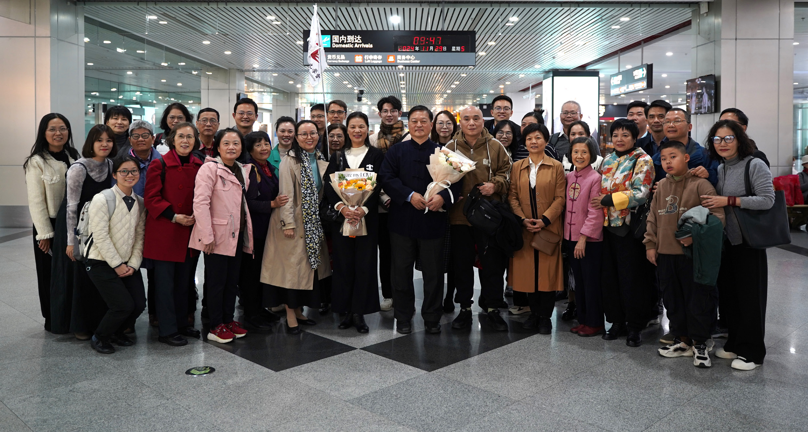

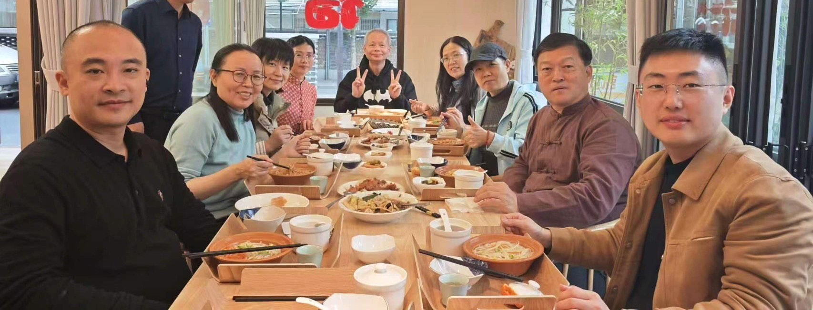

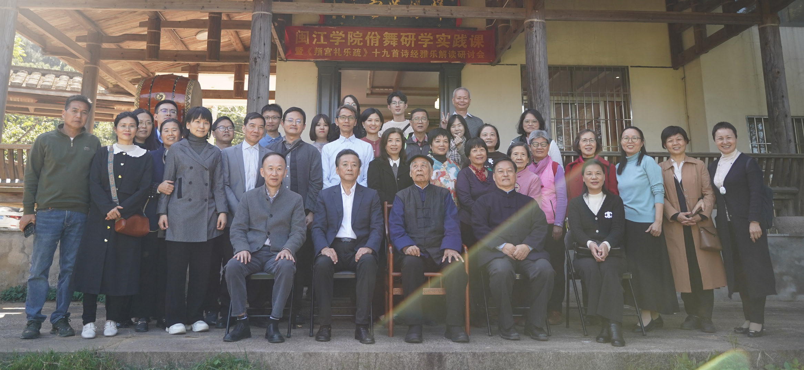

### 眾緣和合共襄盛會 滅法相續同造淨土
福州講座和沙縣論壇心得-善聚經典讀書會

眾緣和合共襄盛會 滅法相續同造淨土

福州講座和沙縣論壇心得-善聚經典讀書會

善聚經典讀書會

張永慧

時光荏苒，眨眼間從福州學習回來已一週。然而，每當回想起與師長們一起學習聚會的時光，心中便充滿歡喜。這種歡喜讓我所見即美好，無論身處何種境遇，都對生活和自己充滿了希望與力量。這一切的體悟，皆來源於在福州一週的浸泡式學習。

感恩戴老師成就此次因緣聚會，感恩唐老師、林老師、時哉時哉團隊的老師們帶來的震撼與感動，感恩協辦方福州敦化學堂的師長們無微不至的付出，感恩時哉全國各地讀書會的師長們共同貢獻的美好道場，也感謝自己能夠取捨有據，不遠千里奔赴現場積極參與。

以下將報告我此次學習的心得體會，藉以勉勵將來的自己勤學苦修，成就時哉團隊的君子之風。

學習內容

唐老師為我們講解了宗喀巴大師的《往生西方極樂世界發願文》、《西方發願文科解》、《南潯極樂寺重修放生池疏》；還有《論語》中關於「禮」的章節、《孝經》的分析以及簡述《大學》之道。除了《論語》、《孝經》和《大學》，其他課程我都是第一次聆聽，且是在現場線下參加。唐老師風趣幽默且才華橫溢的演講，讓我難以形容由內而外的歡喜。在學習過程中，我經歷了高興、悲傷、難過、懺悔、恍然大悟、笑中帶淚，甚至在哭泣中再次微笑，彷彿參與了一場大飽眼福、耳福、身心愉悅、法喜充滿的盛宴。

個人取捨與轉變

為了這次學習，我捨棄了許多，事實證明這是我做過最正確的抉擇。自去年開始，我整個人一直處於一種「被消耗」的狀態，深處各種向下的環境，動彈不得，極度痛苦與無奈。知道今年初被診斷出乳腺癌早期後，我卻開始慶幸，認為事情終於要結束了。兩次手術我絲毫未感到痛苦，只當作是解脫。暑假放療期間，我一邊獨自往返於醫院，一邊堅持給學生上課，照顧孩子，並未感覺到什麼困難。

然而，最繁忙的暑假過後，命運卻開始齜牙咧嘴。接二連三地受到了訴訟，各種帳戶被法院凍結，父親即將面臨牢獄之災，母親日夜啼哭，生活無法保障，還有兩個稚子等著我照顧。這時，我發現自己腋下又長了一個腫塊，逐漸活得像個提線木偶，彷彿靈魂正在偷偷逃離。我不明白，為什麼厄運要降臨在我身上？

在實在沒有出路，哭訴著向戴老師求助時，老師一句話點醒了我：「不是只有惡果的，你還有我們啊，能夠遇見唐老師，遇見我們，這就是你的善緣啊！」恍然大悟，淚流滿面，原來這麼好的善緣就在我身邊，而我卻被生活蒙蔽了雙眼，絲毫未曾珍惜。因此，得知唐老師一行即將到福州講學的消息時，我便義無反顧地買了啟程票。

課程啟示

「自利才能利他」，「你要為你的無知付出代價！」聽完唐老師的課程，這兩句話深深地烙印在我的腦海中。緊靠善知識，學習正見是多麼重要！在此次學習期間，我還深刻意識到自己之前的諸多問題。

一、學習前先了解架構，積極提問

這次，唐老師依然以我們熟悉的科判架構為主線，通過消文發問解讀的方式授課。聽到精彩之處時，我突然反思：以前聽唐老師的課，觀看視頻中的講解，雖然積極參與整理逐字稿，卻怎麼也沒有心流。難道是唐老師和其他老師學長們一起組團的氣場太過強大，使我突然開竅？只能這樣安慰自己。

科判就是對整個文章結構的全面解讀，是靈魂所在。如果不看科判或不去理解科判，就容易迷失在細節上，等同於丟西瓜撿芝麻。這次課後，我不僅明白了科判的重要性，更理解了傳承的重要性。傳承之路是大德先師們在鮮血中凝聚的智慧之光，唐老師一生致力於傳承雪公、醒公留下的瑰寶，而我現在才明白其義理。種一棵樹，最好的時間是十年前，其次是現在。今後，我要時刻訓練自己對架構的理解，每門學習開始前，先了解學習架構，藉此改變自己的思維模式。遇到模糊之處，多問問題，就像唐老師叮囑的「直到把自己問倒為止」，還要積極主動親近善知識和善友群，將自己培養成「利根」。

二、懂得取捨，提升觀察力，時刻修觀

四十多歲的人了，還在假裝很努力，糊弄自己。正如唐老師所說：「好心不會有好報，過失有時候甚至比罪還可怕，你要為自己的無知買單！」是的，我現在的狀態就是自己的無知結下的業果。而佛法是智慧之門、大菩提之門、大神力之門，可以讓我們離苦得樂，何樂而不為呢？

唐老師在課中反覆強調讓我們做「觀察修」，而不是「止住修」。通過躬身入局，將所學到的看到、聽到的對境修，時刻生起對治，生起覺察，不斷刻意練習。一切不是「他人」，都是「我」，都與「我」有關。只有帶入「我」，才能有深入的覺察和感受，不僅嘴上相信，內心也會信服，慢慢地便能生起觀察力。我們常常麻木不仁，假裝視而不見，因為心裡總是想「這是他人的事，與我無關」。一旦改變思維模式，各種覺受和觀待便會升起。

三、緊跟善知識，發願往生極樂，莊嚴佛國，利益有情

此次學習讓我大開眼界，從黑暗走向光明，擁有信念，一定要跟隨善知識善友們往生極樂世界。是什麼讓我這個差點成為「行屍走肉」的人不再害怕眼前的惡業、惡果，變得如此堅定無畏呢？因為在唐老師的帶領下，在時哉時哉的老師們和全國各地讀書會善友們共同經營的氛圍下，深深吸引了我。

首先，我在這裡見證了夫子眼中的「禮運大同」。無論是唐老師、時哉時哉的老師們，還是主辦方敦化學堂的師長們以及每一位讀書會的善友們，沒有一個人不是滿面笑容、心懷感激；沒有一個人不是謙遜有禮、積極向上；每個人都無私付出、不計回報，默默經營著美好的里仁之鄉。空氣中充滿著開心安祥和法喜，彷彿「朝聞道，夕死可矣。」我們善聚經典讀書會參與活動的四人深感殊勝，時時感慨：這是多麼美好的氣象啊！這麼多麼美好的團隊啊！我們也是其中一員，身處其中，身臨其境，多麼殊勝啊，這值得我們用一輩子去追隨。

其次，高山仰止的唐老師的智慧、幽默、謙遜，時哉團隊老師們刻入骨髓的「溫良恭儉讓」，他們對「無盡燈」文化的傳承和擔當，多年孜孜不倦地踐行與付出，深深震撼著我。特別是當我得知佾舞傳承的由來時，潸然淚下。誰會知道，武佾舞在我們中國的傳承曾經斷絕，而為了恢復這一美好傳承，時哉的老師們專門赴韓國取經學習，歷經種種困難。沒有道具和服裝，他們便自己製作、自己繪畫，其精良程度令人驚嘆。現場老師們表演的嚴謹與莊嚴，沒有絲毫懈怠，彷彿身臨其境，讓臺下觀眾也隨之投入，屏氣凝神，矚目欣賞。這不就是我們理想中的「桃花源」嗎？

在時哉時哉團隊，沒有說教，只有一路對禮、對信仰、對經學傳承的踐行，從上到下一以貫之。善聚經典讀書會也是其中之一，我們將來也要肩負起這份傳承的美好與責任。

最後，吸引我的是全國各地讀書會和讀書會的善友們。他們每個人都是唐老師的分身，都是「溫良恭儉讓」的模樣。在尚未上飛機前，我已接到林學長的接機電話。協辦方的秋蓮老師反覆和我核對讀書會各成員的具體出行時間和抵達方式，無微不至地確認每一個細節。溫文爾雅的林學長在接到我和紅雪學長後，耐心得詢問和介紹讀書會的情況，貼心地為我們準備了零食。到酒店後，敦化學堂的各位學長，像家人甚至比家人更細心、熱情地接待了我們。

第一次來到福州這片福地，我現場聆聽了唐老師的精彩課程，聆聽了大德果清律師的訓誡，聆聽了著名畫家江逸子老師的美好寄語，見識了台灣團隊的君子風範，結識了全國讀書會的學長們，入住了全球僅有的幾家阿彌陀佛大酒店，品嚐了從未嘗過的各類素珍，參觀了福州著名景點林則徐故居，跟隨老師一起做放生活動，在淘金寺聽課吃齋飯，開開心心地拍了大合照和拜年視頻，收到了來自時哉老師們、時哉團隊及主辦方的貼心禮物。整個大團隊的熱情與美好，時刻滋養著我、感動著我，請原諒我一時道不盡各種法喜……

感悟與展望

顏淵喟然嘆曰：「仰之彌高，鑽之彌堅，瞻之在前，忽焉在後。夫子循循然善誘人，博我以文，約我以禮，欲罷不能。既竭吾才，如有所立卓爾。雖欲從之，末由也已。」借用顏淵讚美夫子的話，獻給唐老師和時哉時哉團隊。感恩感恩，種子已經深埋並且發芽，從此，無論逆境順境，我期許自己「立丈夫之志，發士人之心」，乘風破浪會有時，直掛雲帆濟滄海。

韓梅

2024年11月29日，在這個溫暖而又陽光明媚的冬日午後，我來到了有福之州，參加為期七天的閩台文化交流活動。

這次活動於我來說有點特別，特別在哪裡呢？一是參加的人員很特別，有當代大儒唐瑜凌老師和他的團隊，以及來自全國各地讀書會的學長們，亦有臺灣律宗高僧果清法師和三明佛教協會的各位法師。二是內容很特別，有儒學佛學講座，佾舞表演，還有放生活動，我都未曾參加過，甚是期待，唯一有點遺憾的是帶我們善聚經典學會的戴于山老師不能前來。

剛一抵達福州，就接到福州本地讀書會學長的電話，指引我如何坐車到酒店，沒有陌生，有的是賓至如歸的感覺，就像是老朋友見面。後來再看到各項事務都被安排的井井有條，細節滿滿，真是讚歎不已，學長們都很謙虛，說：「這只是跟唐老師學了一點皮毛而已。」

當我們一行終於見到唐老師、林老師和臺灣團隊的每一位老師時，視頻中多次見到的形象就在眼前，興奮之情難以言說，也回想起今年七月份初見戴老師的情景，整個學會的氣象是上下一致的，就是《論語》所描述的氣象，也正如江逸子老師所說，唐老師這次就像是孔子帶領學子周遊列國。唐老師就是大儒的形象，謙遜有禮、內涵豐富又風趣幽默，整個團隊都呈現出君子的風範，讓人心生敬意又想要靠近。

其中五天的學習內容豐富而有意義，唐老師親自授課的包括宗喀巴大師的《往生西方極樂世界發願文》、蓮池大師的《西方發願文科解》、《南潯極樂寺重修放生池疏》、《經天緯地參贊化育經營命運—禮乎禮》、《孝經》分析以及簡述《大學》之道，時哉團隊還為我們現場展示了文佾舞和武佾舞。

唐老師講課隨機應變，可長可短，隨時問答，生動有趣，似乎就是兩千五百年前孔子與弟子教學的現場示範。

從《往生西方極樂世界發願文》的學習中，我明確了學佛最重要的就是得到傳承，這樣才能正確的取捨。而且一定要觀修，例如想像老病苦的樣子，只有躬身入局才能生起出離心，生起出離心才能堅定的要發願去極樂世界。另外，還要帶著使命感做事，使命感也是陀羅尼，對我們的學習幫助很大。

從《南潯極樂寺重修放生池疏》的學習中，我明白了放生的道理和重要性，因為放生就是慈悲心、平等心與不求回報心的運轉，放生最容易生起慈悲心的覺受，不願這些原來盤中餐的魚被殺害，希望牠們都能回歸自然；最容易生起平等心的覺受，為這些施放的魚類誦念皈依；和不求回報的覺受，即使是成為幫助這些魚類眾生的救命恩人，也不求回報。還要做業的觀察和修皈依，由業的觀察，祈願所有眾生都能脫離業的繫縛，不再流轉於三塗苦趣；而唯有通過皈依三寶，才可能有機會獲得解脫生死的傳承教授，真正了生脫死。學習之後，我們第二天再去參加放生活動就更加有覺受。在唐老師的帶領下，整個放生活動很有儀式感，尤其是放生結束後不是草草了事，回向了才圓滿。放生活動結束後，唐老師還跟福建敦化學堂、順昌雪廬孔子文化研學會一起吟誦了《陋室銘》，讓我們第一次看到唐老師活潑的一面。

從《經天緯地參贊化育經營命運—禮乎禮》的學習中，我學習了禮的重要性，因為有禮則存，無禮則亡。還懂了為什麼孔子向老子問的是禮而不是道，因為道的抽象概念要用禮的具體做法來體現，孔子是正說，老子是反說。

還有《孝經》是治國之本，修身以孝為本，《大學》就是大人之學，要經營大格局的人生，通過內涵的成就和外在的通達來成就止於至善。

在沙縣能仁淨院聽聞果清法師開示了十誡的內容，老和尚聲音洪亮，越講越有力量，極富感染力。心亮法師代領大家唱誦阿彌陀佛名號的環節，以及親眼見到佛舍利，都讓我感到無比的殊勝。

這一周的學習和活動讓我感受到君子的氣象，正如唐老師所說，領導者就是風氣的帶領者，整個團隊展現出的風貌都是一致的、統一的，這讓我體會到傳承的力量和價值。

這是一次太難得的學習機會，其他讀書會的老師和學長們基本上都有超過十年的學習經驗，仍然很精進，也讓我備感壓力。然而，壓力也是動力，要發心承擔，持續輸出，才能不斷提升自己的學習成效。

在機場跟唐老師拜別的時候，唐老師問以後還要不要來，我說不但來，還要爭取去學會學習。

在此也特別感謝善聚經典讀書會的戴老師，提供我們這樣特別的活動消息，使我們有了這次難得的參與機會。

玲莉

感謝學會安排了這次活動，我非常慶幸能有機會參加沙縣的講座，從中收穫了許多啟發和感悟。

唐老師的授課：學識淵博，深入淺出

唐老師學識淵博、學養深厚，他以幽默風趣且深入淺出的方式講解《孝經》和《大學》，讓原本看似晦澀的古代典籍，變得鮮活而親切，成為我們可以效法學習的寶典。

講授《孝經》時，唐老師提到《孝經》中的孝相對單一，完整的孝需結合《論語》中對孝的解讀。這樣的孝不僅是一種孝道，更是一種修身之道。

講授《大學》時，唐老師闡明其為「大人之學」和孔門的心法。學習《大學》是對大道的認知，是培養高瞻遠矚與卓越洞見的過程，幫助我們成為全面發展且能利益天下的人才。

從小接受這樣的薰陶教育，能培養我們寬廣的心胸，並激發我們不斷學習、充實自己的意願。

《大學》提到「明明德」，這要求我們先自我提升，才能利益他人。雖然提升自我是根本，但我們應抱持利益他人的胸懷，從中豐富自己。

唐老師還詳細闡釋了「格物、致知、誠意、正心」的修行路徑：

格物致知：從善知識處學習，領會內聖外王的智慧與道理，通過學習獲得真知。

誠意：培養利益有情的心，讓內心充滿正念和能力。

正心與修身：以心為主導，端正心念。

齊家治國平天下：修身以成就齊家、治國、平天下的理想。

唐老師的課堂不僅是對學問的教授，更是做人做事的根本之學和經世濟民的實踐之道。

學習方法：複講與內化

唐老師還談到學習的方法，尤其強調了複講的重要性。他指出：孔子所言的「不憤不啟，不悱不發」，意指啟發那些真心渴望理解、想要清楚表達的人。複講能幫助思想整合，化解困惑，讓模糊的思路變得清晰深刻。複講並非簡單地重述，而是抓住核心思想，舉一反三，用同樣的正理推演其他問題。只有通過這樣的練習，才能真正內化學問，成為自己的智慧。

過去，我對學習的認識較淺薄，認為心裡明白即可，卻未曾深入理解或轉化為自己的認知。未來，我將努力練習複講，把所學內化為自我成長的基石。

空性：命運可改變的啟示

在一次用餐時，唐老師談到了空性，讓我深受啟發。他說：即使有錢人現在非常富有，也可能曾經貧窮、經歷挫折，但他們最終都能爬起來，這就是命運的可塑性。命運並非一成不變，而是可被改變的，這便是空性。

這番話讓我對人生重新燃起了信心。過去，我常感到悲觀，認為一切順其自然就是接受現實，但其實這是一種自我放棄。擁有空性的觀念，會讓我們更積極地面對生活，因為命運由自己掌控。即使跌倒乃至處在人生低谷，我們仍可以從挫折中汲取經驗，培養韌性，通過反思來規避風險，使人生越來越光明。

佛學要義：誦經與持戒

果清律師在講座中提到佛學的十項要義，其中印象最深的是：

戒條需背熟並常常複習：只有記住戒條，才能內化於心。即使是輕戒，也要像守重戒一樣嚴謹，若有犯戒需通過懺悔來恢復清淨。

讀經的態度：誦經應端身正坐，氣沉丹田，唇齒用力，帶有感情地朗讀。讀經不在於速度，而在於用心，讀經時應呈現出經文的真實意境，並做好迴向。

學長們的榜樣與感動

唐老師與果清律師皆為雪公的弟子，他們的授課風格充滿真誠、睿智、幽默與親切，讓我不禁想像雪公當年的講授應也是如此，啟發學生找尋人生出路，對生命產生積極的影響。

此次活動讓我切身感受到，無論是唐老師帶領的教學團隊，還是長期隨師學習的讀書會學長們，他們都充滿學習的熱情與法喜。活動的承辦更是井井有條，細緻入微，令人賓至如歸。

據悉，許多學長為籌備此次活動付出了數月努力，並自掏經費。我深感他們的無私付出，來自對正法的喜愛，以及從唐老師處見證人生出路的幸福感。他們改變了自己的人生，並希望更多人能有這樣的轉變。這種精神與行動力，值得我們學習與效法。

感恩與展望

感謝老師們的引領，為我們提供這樣美好的學習環境和機會。參與其中，我內心充滿歡喜，並期許未來能以學長們為榜樣，為學會做出更多貢獻。

李紅雪

坐下來寫這次福州學習的感悟，雖然還未下筆，但福州幾日的點點滴滴，如觀修般在腦海中浮現。然而，真正下筆卻覺得困難，只能將感受最深的幾點感悟記錄下來。

與善人為伍，如入芝蘭之室

與善人居，如入芝蘭之室，久而不聞其香，即與之化矣。

雖然在視頻上已經熟悉了敬愛的唐老師、林老師以及團隊老師們的風采，但第一時間見到老師們，仍感到無比興奮和幸福。老師們第一次見到我們時，滿面笑意，讓人感到親切自在。全國各地讀書會的學長們個個熱情而又和諧，令人印象深刻。

唐老師的精彩課程

唐老師在前兩天主要講授了《經天緯地參贊化育經營命運》—「禮乎禮」（《論語》中論禮的章節）、宗喀巴大師的《往生西方極樂世界發願文》、《南潯極樂寺重修放生池疏》。現場感受唐老師的授課風格，與視頻上截然不同。從唐老師上臺的那一刻，就能感受到他的謙遜與親和力。

課堂上，唐老師從科判入手，時而抓住重點，引經據典，旁徵博引；時而講述與生活相關的小故事，並隨時提問老師們。這些問題既有趣又具有挑戰性，每當此時，我都彷彿屏住呼吸，與老師們一同緊張。課堂氣氛生動活潑，雖有些許壓力，但最重要的是唐老師的善教。他就像一部活生生的百科全書，在課堂上如沐春風，仰霑時雨之化。

*唐老師講授《論語》中論禮的感受*

*唐老師在講授《論語》中論禮的章節時，提到以下幾點讓我感受頗深：*

德是品德和能力兩方面

如果僅僅是品德好而沒有能力，便會成為食物鏈的最底端。唐老師風趣地用兔子窩打比方，表示如果成為兔子，獅子就會高興。我感悟到自己能力較差，必須加強學習，提高個人能力，這不僅是為了自己，也是利他的本錢。

領導者是引導風氣的

這次福州之行讓我深有感觸，唐老師是君子之風，博學善教；林老師氣質典雅，博識多才；團隊的老師們以及其他讀書會的學長們，皆謙遜認真，做事細緻，待人溫暖。

*唐老師講授宗喀巴大師的《往生西方極樂世界發願文》的開示*

*唐老師在講授宗喀巴大師的《往生西方極樂世界發願文》中，分享了以下幾點開示，讓我深受感悟：*

人生最大的福報是遇到善知識

人生的障礙要靠悟性去脫困。唐老師強調，遇到大善知識是難得的福報，唐老師的教導讓我認識到，跟隨唐老師學習，便能逐步提高悟性，將人生的困境轉化為修行的對境，接納挑戰而非怨天尤人。

帶著使命感來學習

使命感如陀羅尼，能讓所學快速成就。唐老師指出，儘管管好自己、發菩提心、自利利他是必要的，但若沒有真正生起利益眾生的心，便無法對治自身的貪瞋癡慢疑五毒，亦無法精進修行。

隨時觀修，投身其中

觀察修要求我們將自己投入其中，躬身入局，則成道將不遙遠。通過觀修，將自己放入各種境遇，生起覺察，從而不僅嘴上相信，內心也會信服，逐漸培養出觀察力。

訓練自己對架構的分析

唐老師強調，對架構的理解至關重要。科判是對整個文章結構的全面解讀，若不理解科判，便容易迷失在細節中。這次課後，我深刻明白了科判和傳承的重要性，決心在未來的學習中，先了解學習架構，並積極提問，培養自己成為「利根之才」。

*唐老師講授《南潯極樂寺重修放生池疏》的收穫*

在《南潯極樂寺重修放生池疏》的課程中，我明白了放生的重要性：

眼前的因緣在慈悲心的運轉

看到動物被殺，更容易激發慈悲心。

放生時面對的是動物，無求回報

有平等捨的覺受，不分別眾生的美醜親疏，一視同仁，更容易發起慈悲。所謂「施恩不望報」，放生是不求回報心態最佳練習的機會。

從放生物命想到自己

如何解決自身的無知，從而提升自己的修行，才是永離惡道的緣起。

*唐老師講授《孝經》和《大學》的體會*

在沙縣，唐老師講授了《孝經》和《大學》。他再次強調了領導者帶動風氣的重要性，並提到團隊人才的關鍵。「以文會友，以友輔仁」，師兄弟間的討論與切磋，才能培養出弘道的人才。

孔子領導的龐大團隊，以孝為本質；如今倡導人間佛教，更應結合儒佛二教，達到雙美的效果。

唐老師還強調了親近善知識的重要性，講授《大學》時，他指出這是大人之學，要經營大格局的人生，通過內涵的成就和外在的通達來達到止於至善。

江逸子老師的感言

江逸子老師表示，這次唐老師帶領的老師學長們，就像孔子周遊列國，我為能成為學生中的一員而感到幸運。親近善知識和善友，從他們身上不僅學到了知識，更學會了做人、做事。

唐老師、林老師以及臺灣來的其他老師們溫文爾雅，耐心解答問題，課堂上的回答和佾舞表演，都深深感動了我。福州敦化學堂的學長們熱情接待，從接機交通、伴手禮準備到食宿安排，井井有條，展現了唐老師所說的領導人風範。

放生活動的難忘回憶

想起那天放生，唐老師和學長們唱《陋室銘》的情景，還有請唐老師給我們簽名的溫馨時刻，唐老師的一言一行，讓我深受感動。正如《想念上師》中的歌詞所說：「父母給了我一時的身軀，上師給我了永恆的智慧真諦。人間恩情如夜空的繁星，上師是明月，照我路途萬里。」

在迷失的人群中，我找到了自己，是幸運的，幸福快樂的，我知道報答上師的方式，唯有利益一切眾生成佛，此生常隨並依教奉行！

感恩戴老師與所有師長

這所有的緣分都來自我最親愛的戴老師，是他引領我們進入這個門，並耐心教導我們。所以，感謝親愛的戴老師！

再次感恩唐老師、林老師、臺灣時哉團隊的老師們，以及各地讀書會的學長們，謝謝您們！言有盡而情無盡，所有感恩之情都化作學修的動力，持續精進，爭取進步。

### 眾緣和合共襄盛會 滅法相續同造淨土
福州講座和沙縣論壇心得-順昌雪廬孔子文化研學會

眾緣和合共襄盛會 滅法相續同造淨土

福州講座和沙縣論壇心得-順昌雪廬孔子文化研學會

順昌雪廬孔子文化研學會

葉波

因為眾所周知的原因，在事隔五年之後，再次迎來無盡燈文化學會各位師長來大陸舉辦講座，學生能夠恭逢盛會，深感榮幸！說到心得，除了高興、還是高興！

見到老師與各位師長，心裡又是激動又是高興！本以為還要五年或十年之後，沒想到幸福提前降臨了！而講座期間，看到臺灣團隊一如既往地新人輩出、呈現欣欣向榮的景象！體會到老師培養人才的辛勞和巨大的成就！

善友聚會同樣讓人心生歡喜，見到各讀書會的師長學長們個個氣象萬千，深深隨喜大家，更為大家高興！當再次見到江逸子老師的時候，就會想到二○○九年十一月江老師將老師團隊介紹到順昌，如今過了十五個年頭，大陸才有了今天的氣象。深感學習傳統文化要有長遠心及恆心，沒辦法速成。

聽聞極樂願文心生法喜。印祖常說，淨土法門三根普被，利鈍全收，是易行道。所以，很多人會誤以為，既然這麼簡單，不必聽經聞法，不必接受傳承，就能夠當生成就。可幾十年來，現見念佛者眾，往生者希。殊不知蕅益大師說「往生與否，全憑信願之有無」，才知信願不足是空過一生的主要原因，而信願又來自於聽經聞法、來自於殊勝的傳承。本次講座能夠聽聞藏、漢極樂發願文的內涵，正是增強信願的無上法寶，真是心生無限歡喜、得未曾有啊！

本次是人生第一次聽聞戒學，深深被各位律師大德的風範折服，也是得未曾有。透過聽聞，對於持戒念佛有進一步的認識，對於戒學的敬畏油然而生！

如果前面的內容是正明，接下來就是反顯了。

傳承文化的路在哪？今生，我們有幸得到中華文化的法乳滋養，也希望未來能夠將文化傳承下去。老師也常提醒大家，文化是會滅的。幾十年來，常常會感歎許多優秀的文化都已經滅了，或將要滅亡。而復興文化、傳承文化又太難了！本次講座，一是有科判的學習，一是沒有科判的學習。科判的學習有條理、有綱目、有說服力，少文而攝多義，而且不斷地引人入勝。而沒有科判的學習，有時候天馬行空，讓人雲裡霧裡、聽不明白，甚至導致開小差、打瞌睡。對比之下，深感要培養人才、傳承文化，非走科判的學習這一條路不可。

鄒君瑤

在這次學習過程中，我仿若踏入了一條時光長河，聖賢文化的智慧與信仰在此交織，熠熠生輝，讓我收穫了諸多深刻感悟。儒學在閩臺地區有著深厚的根基，猶如明亮的燈塔。

在家庭中，長幼有序、孝悌和睦的觀念深入人心，成為構建和諧家庭的基石；於社會層面，誠信友善、敬業樂群的品德，促進了良好社會秩序的形成。

聖賢文化不僅僅是一種理論，更是一種在日常生活中可感可知、踐行傳承的精神力量，讓人們在紛繁複雜的現代社會中，依然能夠堅守內心的寧靜與善良，鑄建安身立命之所。

此次學習活動使我內心的浮躁與煩惱自然而然地漸漸平息。

「諸惡莫作，眾善奉行」，我學會以寬容和善良去對待世間萬物，培養出一種平和、豁達的心態，面對生活的起起落落能夠泰然處之。

儒佛文化相互交融，相得益彰。儒學為人們提供了積極入世、經世致用的理念，而佛學則賦予人們在困境中解脫、在心靈上超越的智慧。在這次活動中，我們不僅傳承學習了優秀的中華傳統文化，更在儒佛文化的雙重薰陶下，汲取精神養分，使心靈得到淨化與昇華。

然而，在現代社會的快速發展進程中，優秀的中華傳統文化也面臨著諸多挑戰。西方文化的衝擊、現代生活方式的變遷，使得我們年輕一代對傳統文化的認知與傳承出現了斷層。許多古老的廟宇面臨著修繕困境，傳統的儒學和佛學文化活動參與人群逐漸老齡化。為了讓這珍貴的文化瑰寶得以延續，我們會積極行動起來。

教育機構應將優秀的傳統文化精髓融入教育體系，通過生動有趣的課程與實踐活動，讓年輕一代領略其魅力！

儒學和佛學文化是中華民族傳統文化的瑰寶，它蘊含著無窮的人生智慧與精神力量。

在當代社會，我們應珍視這份文化遺產，努力傳承與弘揚其精華，讓儒學佛學文化在現代社會繼續發揮其心靈滋養與道德引領的作用，為構建和諧社會、促進人類精神文明的進步貢獻力量！

應榮木

兩天在福州阿彌陀佛大飯店，認真聽了唐瑜凌老師講的《漢藏宗師往生極樂世界發願文》和《經天緯地參贊化育經營命運—禮乎禮》，深受啟發，了解中國五千年燦爛文化的博大精深。人在經營自己的一生中，學習是最重要的。我深刻認識到少年讀書如啟窗見日，中年讀書如登山遠眺，老年讀書如臨水觀月，讀書學習是為了出言有尺，嬉鬧有度，做事有餘，說話有德。隨著歲月流逝，感到學習是人生取之不盡、用之不竭的源泉。

通過學習《往生西方極樂世界》，末學認為要好好經營自己的人生，就要多做善事，好好對待家人及親朋好友、同事及每個人。要勤於學習，通過線上讀書會不斷提升自己。這次非常有幸能現場聆聽唐老師講課，讓自己在學習中有新的認識，在傳承文化的過程中，線上讀書會起到了一定的作用，為此，我會緊跟讀書會。我還要特別感謝葉波老師把我帶進順昌讀書會，從而有了這次到福州學習的機會，我會堅持在這個團隊裡持之以恆學習，讓自己成為一個對社會有用的人。

陳玲

11/30日，福州的天氣如同我們學習的熱情，熱度不減。從寒風刺骨的邵武到暖風拂面的福州，意味著我們兩天的學習即將拉開帷幕。

學習之前，我只是抱著置身事外的學習態度。然而，唐老師的開場，他的笑容與幽默讓我知道，這次的課程不會平淡無奇。果然，兩天的課程，讓我如同海綿一樣瘋狂地吸收輸入。

第一天的課程，因為接觸的領域比較少，很多專有名詞聽不懂，加上自己的知見障礙，學習得很吃力。好在順昌團隊利用晚上，把一些重點過一遍，終於對本日的課程有了些許的感悟理解。唐老師對課程的把握，由科判的形式呈現，讓我們對框架有了印象，再由科判引入，由淺入深，以一問一答形式，引發所有人的思考和理解。由藏傳和漢傳兩位高德大師依據不同風俗習慣寫出的文章進行詮釋，既加深了對極樂世界的堅定，又領略了不同文化的求同存異。

第二天的課程，有了許老師之前給我們上課的基礎，不至於兩眼一抹黑。唐老師的一問一答，把禮貫穿了整個傳統文化、生活、學習各方面中。禮之重，上至治理國家，下至家庭和睦，無一不在彰顯禮。學禮、懂禮、用禮，必然也會在一次又一次的學習中，理解得更深，運用得更純熟。

學習傳統文化，我們更要做的是內化於心，外化於行。用自己的言行薰陶影響身邊，留住末法時代的傳承，使之不斷層。

柯閩榕

陽光暖暖

近悅遠來

只因有你

唐老師，您是位老師

儒雅敦厚又謙和

幸甚至哉歌詠志

答疑解惑憤啟悱發總相宜

唐老師，您又是個孩子

樂呵天真還有趣

只生歡喜不生愁

吟誦唱念弦歌不斷總笑語

唐老師，您就是您自己

亦莊亦諧，平常亦非常

人間煙火赤子情

中華文化兩岸傳

唐老師，我想對您說

總有一個聲音縈繞耳畔

人，才是品牌的價值

您是一束光

已然照亮了我們

我們的印記裡多了一個響噹噹的品牌—唐瑜淩

唐老師，我想對您說

因為有你

滿心歡喜

黃青連

近者悅，遠者來，2024年11月29日全國各地的讀書會紛紛趕來福州參加以「有朋遠來的心流—經營可觀的人生」為主題的兩天學習。

全國各地讀書會的老師、學長們學習熱情，現場十分安靜，大家聚精會神地聽著老師和學生一問一答的分享。老師幽默風趣的分享方式、高度的思維模式，讓我每一節課都是眼睛睜得大大的、脖子伸得長長的、耳朵豎得高高地聽老師分享，唯恐錯過任何一句話。一節課50分鐘，卻好像只有5分鐘那般短暫，老師每每講到最精彩時刻，下課鈴聲就響了，大家依依不捨恭送老師回休息處。下課休息時間各讀書會的老師、學長們爭分奪秒地互相交流切磋，呈現以文會友的氣象。

佛化家庭的建立很重要，也很難得，這次的學習讓我見證了什麼才是真正的佛化家庭，看著老師、林老師、女兒同台分享佛學、儒學文化內涵時，讓人不禁生起敬意和羨慕，文化的傳承怎能離開家人的支持呢？我們之所以認為佛化家庭很難建立，是我們沒有真正重視佛化家庭的建立，沒有把它排在首位，遇到阻礙又容易退縮。

人才團隊的培養很重要，也很難得，這次的學習也讓我見證了什麼才是真正的人才團隊，老師的人才團隊培養很成功，各行各業都有，是我們學習的榜樣，看著台上一問一答地分享，多麼希望有朝一日我也有機會坐在臺上，文化傳承離不開人才團隊的培養，不然文化只是擺設，發揮不了作用。

兩天的學習一眨眼就過去了，但我學習的熱情會一直在，我的學習才剛起步，我將馬不停蹄地緊跟各讀書會的腳步，不斷充實自己的內涵，為下一次的以文會友做好準備。

謝彬

二師團隊新氣象，

中青人才挑重擔；

福州傳法眾受益，

沙縣風采顯功力；

感恩老師大悲心，

眾多弟子有明燈；

從今以後多努力，

以報師恩不虛言。

張慶茹

之前總覺得犯了錯要及時改正，道歉了就可以得到原諒，下次遇到同樣的事時，還可能再犯，更甚，都不知道自己在犯錯，總能用「我不知道，我不是故意的」來原諒自己，對別人的傷害卻沒有消失。

這次的學習，我感觸最深的就是「無明障取捨」，老師說「無知的過，也是過，有時候過比知錯犯錯更可怕」，

例如順治皇帝廢除佛教考試的故事。想想自己，身為老師，在教導學生時，是否都是對的呢？對於有些學生，試了多種辦法，卻沒有改善現狀，該如何是好呢？每每都以「算了、我盡力了」作為結束，都不敢深思。

身為老師，怎麼對治無知呢？在工作上要通過學習和積累經驗，提高自己的知識和技能，減少因無知導致的錯誤。在面對複雜問題及不確定的事情時，要謙虛地向他人請教，避免因無知而犯錯。每次犯錯後都要反思原因，總結經驗教訓，避免重蹈覆轍。

最重要的，要不斷學習，要想我就是一塊美玉，在變成翠玉白菜前，來切磋琢磨我的都是好老師，遇到的善知識都願意幫助我。以前害怕老師問問題，害怕出錯，總想避著老師走。現在也害怕老師問問題，怕老師問的問題自己答不了，但也更想親近老師，獲得更多的學習機會。

### 眾緣和合共襄盛會 滅法相續同造淨土
福州講座和沙縣論壇心得-樂淨讀書會

眾緣和合共襄盛會 滅法相續同造淨土

福州講座和沙縣論壇心得-樂淨讀書會

樂淨讀書會

樂淨讀書會   陳偉維

尊敬的唐老師、林老師，各位師長學長們好，我是一名初入讀書會的學員，一個八○後內心嚮往無拘無束的女性，兩個孩子的媽媽。第一次參加這種類型的課，不知如何用華麗的語言來形容這兩天的課帶給我的收穫。但被老師們深深吸引著，唐老師親切和藹，所講的內容深入淺出，因為是第一次聽課，聽完唐老師與各位師長的一問一答後，彷彿懂了，但又感覺一知半解、意猶未盡。由於時間關係，只上了兩天的課，深感遺憾。

第一天的課程讓我認識到：

1.修身的重要性，學習多元思維，跳出固有思維，盡量充實自己的人生內涵。

2.做事應當利己利他。

3.什麼是心法（了解理念的重要性）。

4.認識諸佛的德能。

5.了解放生真正的意義。

第二天的課讓我體會到了《論語》的博大精深

1.了解什麼是禮、禮的重要性，禮的初衷是為了和（有禮無和不知禮，有和無禮亂無序）

2.禮對於人的重要性（恭而無禮則勞，慎而無禮則葸，勇而無禮則亂，直而無禮則絞）

3.一個人的見地、價值觀、習氣的重要性

4.文獻的重要性，解讀能力的重要性，傳承的重要性。

知識很多，記憶有限，聽課前對很多事物單憑直覺喜惡來判斷，聽課時常常有恍然大悟之感，課後感覺好多事物還充滿未知。期待下一次的課程。感謝唐老師和各位師長、學長帶我入局。希望他日我也能有幸成為懂局之人。

樂淨讀書會    陳四妹

唐老師、林老師，學會各位老師大家好：

從2014年第一次在福建福州大學見到唐老師，到2024年，整整十年。當時是我第一次見到唐老師，第一次聽唐老師的課，那時的我是去湊人數，一點都聽不懂。

回往這十年一直跟著唐老師，以及學會的老師們學習，從聽不懂到現在有點聽懂，是因為老師用深入淺出的方法講學引導，此生能遇到唐老師，跟著學習，真的很幸運，也很有福報。

這兩天精彩的課程，讓我受益匪淺，特別是《往生西方極樂世界發願文》，老師講的苦諦、集諦，「老病苦浪擊，將入死鯨口，非愛苦擔逼，無依苦哭喚」，想想當無常來的時候，誰都幫不了自己，

學生祈願唐老師能一直帶領我們，能常到大陸講學，讓我們有依靠。

樂淨讀書會    林婉蘭

感恩唐老師、林老師及學會師長辛苦授課，感謝敦化學堂的精心籌備和熱情接待，還有各地讀書會展現出的學習氣象，讓參加這次活動的新學員留下美好的印象。

跟著老師都是吃好、喝好、玩好，以前我們到臺灣無盡燈學會學習，那更是被照顧得無微不至，當然最寶貴的是法食，每次聽到下課鈴聲，老師都有些無奈，恨不得有十張嘴，把更多的法義講給我們聽。

本次講座的兩個主題：往生西方發願文和禮乎禮。往生西方極樂世界發願文經過老師作科判，我們才能清晰看懂文章的內容架構，先講苦因、苦果，然後求救，接著發願往生，最後回入娑婆度化眾生。課堂上老師常常強調什麼是修行？修行不是腦袋放空什麼都不想，幾個月不吃飯、不睡覺，這不是修行，修行要做三輪體空的觀察、功過的觀察、能所的觀察，體性空的觀察，觀察的方法要透過善知識的教導，以及經典的學習，不能盲修瞎練，以免著魔而不自知，很可惜因為疫情，沒能聽到《五十陰魔》的課，應該是我們的福報不夠吧！

儒學的課程講《論語》中有關禮的章節，「不知禮無以立」，特別是國家的為政者、上位者、領導者，若能以禮行事，其作用是可以塑造風氣、厚培風俗，也會得到人民愛戴、百姓擁護。一個國家的治理如此，一個團體、家庭更是如此，學生感覺平時與人相處、辦事當中，言語這方面的禮節極為重要，要懂得說話和顏悅色，話語精準到位、有分寸，要懂得多隨喜讚歎別人，多向人請教詢問，以禮節制，又要以和用禮。

在沙縣講座中，老師雖然滿腹經綸，但謙遜禮讓，對僧人極為尊重。果清律師雖然年紀很大了，但他聲音洪亮、激情澎湃，學生及同行學員都深受震撼。

### 眾緣和合共襄盛會 滅法相續同造淨土
福州講座和沙縣論壇心得-養正學堂、浦江遠流經典讀書會、弘德讀書會

眾緣和合共襄盛會 滅法相續同造淨土

福州講座和沙縣論壇心得-養正學堂、浦江遠流經典讀書會、弘德讀書會

養正學堂、浦江遠流經典讀書會、弘德讀書會

福州之行心得體會    樓迪波

自今年暑假開始，這半年當中，有四段美好的旅程，都是因為能和老師相聚而發生。從暑假兩次的東馬、西馬之行，到老師們來上海表演佾舞，再到這次的福州行。我把這些美好的相聚定義為：智慧與福報，是我人生中最殊勝的遇見。每一次相聚，老師永遠有一種能力，讓我們覺得物超所值，多矣。

每一次成行，都需要排除一些困難，但當老師發出消息，我腦子裡想的都是怎麼去？而不是要不要去，所以總是能幸運參與。四次的旅程，地點不同，和老師們相處的方式也不同，同伴也不同，也就有了不同的收穫。

像是在東馬，由鄭會長、露露老師等組織的講座與活動，無論是《論語》、《中庸》等課程，還是一起參觀幼稚園、養生館，一起吃飯、遊玩、唱歌，雖在異國他鄉，卻完全沒有生疏感，好像在自己國家一樣。我不但當面聆聽了老師的課程，更加感受到了馬來西亞自由的氣息，讓我開始開闊自己的思想，敢於去想像…。

暑假快結束時，老師再次遠赴西馬，蘇毅老師和學生被通知可以一起隨行。因為對老師的無限嚮往，乃至於與俞總、坤陽、愉航共同為伴，我們再一次奔赴。這一次沒有像在東馬那樣人數眾多，更有機會近距離親近老師。我們每天和老師吃在一起、玩在一起，甚至老師讓我配合《論語》的部分條目消文，這對學生來說，是無上的榮耀。儘管在出行前認真備課，卻還是很難接招，老師身邊的學長們都對答如流，因為老師每講一點，都有他的背景，跟在老師身邊的學長們都知道老師舉的這個例子到底在講什麼。所以學生再次感受到能跟在老師身邊，或者多多親近老師，有多麼重要，多麼有福氣。在西馬我們還參觀了幾個淨宗學會，老師也講了關於佛學的幾場報告，我們也隨時會被提問。學生是第一次當面聽老師講佛學，實在太棒了，感覺沒辦法用合適的詞彙去形容其殊勝。所以學生對自己人生的方向更加堅定，信心滿滿，跟著這樣的大善知識，一定有出路，而且是生生世世有出路。

特別是學生和潘老師同住，潘老師真的很好，她了解我們的心意，經常會鼓勵我們：有老師在的地方，趕緊湊上去，老師身邊的座位趕快去佔領，讓我們不敢的心，瞬間多了很多勇氣。愉航和魏老師同住，他對孩子能言傳身教，時時提點，這樣的受益是最直接、最快速的。老師慈悲，這幾天裡，讓坤陽、愉航進行侍者的修學法，讓孩子們更加有眼力見，也讓他們有機會培福。學生發現，自西馬回來以後，愉航好像一下子長大了很多，也開始對外面的世界有所想像，甚至有了去外面留學也可以接受的想法。同時，他也願意把美好的觀念帶回養正學堂，把這段美好的經歷像稀世珍寶一樣，分享給大家。

馬來西亞華人區，有很多的外相、裝飾、飲食等等，跟中國很接近，但沒有中國那麼地道。可是學生覺得，老師帶去的中華文化，如果能夠在當地植入，華人才能在那裡真正被重視，被保留並發揚。因為這是根本，就看馬來西亞人能否抓住這個機運了。而華語是基礎保障，那裡的人又可以通過英語去詮釋中華文化，這是馬來西亞的優勢。同時，也只有通過根植中華文化，才能讓華語保留，這是水幫魚、魚幫水的過程。

乃至於到上海。因為林老師、白老師、蕭老師帶隊參加上海孔廟的佾舞表演，浙江是最靠近上海的地區，有什麼理由不去親近老師呢。那一次是小青學長和譯雯學長打頭陣。我們在上海孔廟，因為林老師的關係，有機會坐在貴賓席上參加觀看整個的表演過程，真的是受寵若驚。跟老師在一起，總是受到最高規格的接待，用我們智媛的話說：都是老師的福報。就像老師說的，和大德一起坐飛機，儘管睡覺。和老師在一起，所有的風景都不算什麼，老師的舉手投足，就是最靚的風景。每一位師資團隊老師的言行舉止，舉手投足，都是我們的學習之處。跟著老師出去，這種叫做讀書會的聚會，以文會友的美好，學生似乎能感受到幾分。

這幾次都有見到林老師和微智老師在臺上消文的氣象，以及台下和她們交往時的點點滴滴，那種高貴的氣質，同時又是那麼平易近人，都讓我們覺得很舒服，很有親和力。乃至於最後告別時，學生和林老師擁抱在一起，頓時淚流滿面，感覺自己像個孩子，就要離開最親愛的媽媽一樣，那種難言的不捨，徜徉在心中久久不能釋懷。真的希望可以常常陪伴老師左右，有太多東西可以學習，太多的美好可以體驗了！

再說到這次的福州之行，不同於前面幾次遊學。因為是帶著一個將近五十人的團隊一起過去的，這個團隊中有不同身分、不同年齡段的人，對老師的信心深淺不一的人，學習的時長也都不同，甚至更有很多小朋友的參與，所以在安全、飲食、睡眠等方方面面都要顧及。在小青學長的帶領下，我們還向主辦方申請進巾奉茶和《蝸牛》的節目表演，來表達養正學堂師資們、孩子們對老師的拳拳赤子之心。還要在會場拍拜年視頻，還要和故事中的姐姐拍照片，拍視頻…，乃至於前期的買票、包車，中期孩子的管理工作，後期很多的後勤工作等，對學生自己來說，是很大的挑戰，要顧及每一個人的感受，真的很不容易。幸虧有養正師資團隊，大家共同承擔，才使這次活動順利進行，這也是托老師的福！雖然有很多不足之處，但是因為有平時線上、線下的共學，及對老師的信心，所以大家願意包容，整個師資團隊都非常努力，也很辛苦，在此表達感謝。更感謝老師團隊從臺灣來到福州，感謝主辦方的全力付出，感謝各地的讀書會善友齊聚一堂，共襄盛舉，感謝孩子們對老師的嚮往與熱情，讓我們這次的活動變得圓滿而有意義。

正如白老師說的，活動，是一個最好的機會，可以知道大家平常修學的樣子，以及到底修到什麼程度、用功到什麼程度，用功的方向對不對？哪些人是可以信任的？哪些人是不能信任的？哪些人是可以用的？哪些人是不可以用的？哪些人以後一定要跟他打好關係？哪些人是真的默默付出、不求回報，不求出名的？其實透過活動，真的都一清二楚，全部都顯現。

微智老師說，有一種聚會叫讀書會，這是最美好的聚會。除了見到了心心念念的唐老師，林老師外，還見到了白老師、蕭老師、微智老師、珮茹老師、潘老師，以及在蓮榮會刊上看過名字的很多年輕老師，還有福州敦化學堂的各位老師忙前忙後的身影。線上讀書會的蘇毅老師、葉波老師、王寶紅老師、寶珠學長、譯雯學長、楚穎學長，以及各地讀書會素未謀面的老師們。一起上課，一起學習，課間在每個角落相遇、聊天，真的有西方極樂世界諸上善人聚會一處的感覺。在這樣的場合裡你不用擔心會遇到壞人，不用擔心東西會不見，不用擔心會吃到不好的食物…，一切的享受都是美好的。這樣的享受也因為學習正法，而變得合情合理，不是在消耗福報。還看到在時哉時哉網路教育學院視頻中才看到的人物—江逸子老師，九十多歲的老人家，講起話來思路清新，非常得體，令人敬佩。

再說說此次課程內容，第一天，老師團隊對藏傳佛教宗喀巴大師的《往生西方極樂世界發願文》，以及漢傳佛教蓮池大師的《西方發願文科解》，還有一堂課是關於「放生」的內涵，以讀書會的方式展現在我們面前。因為在前往福州前，團隊中的王仲武老師已經報名參加，但卻在去的前三天往生了。按照白老師的指導，我們榮江助念團參與了整個過程，從前期與家屬的溝通協調，到順利找好助念地點，從醫院辦理出院手續，到後面連同當地助念團，及王老師他本身的一些因緣，參與二十四小時的助念，乃至於後面火化等過程，對我們來說是一次寶貴的經歷，同時，也是一次學習的機會。看看我們平時所學，有沒有在上場的時候能運用出來，有很多值得反思的地方。

因為這樣的因緣，所以第一天聽到《往生西方極樂世界發願文》的課程，讓我倍感珍惜。往生西方極樂世界，不就是我們此生最重要的目標嗎？以這個目標為導向，反觀我們現在的所作所為、所思所想，所在意之處，是不是與最終目標相違背？還是有哪些是相應的，需要繼續保持？我信願行三資糧具足了沒？如果沒有，怎麼具足？《往生西方極樂世界發願文》就是在信解上下功夫，也是一種重要的修行，信解之後才會發起真正的願，行也才會真。我們不是上根之人，信心的建立必須要通過這樣的聽聞，私下讀書會的研討，有善知識的釋疑，才能建立真正的信心。從福州回來後，學生一直在複習這個內容，越學越法喜，越學越對老師佩服，越學越覺得這是我們的出路，真的是太好了，老師講的內涵實在太豐富了。這裡只粗淺的分享兩點：

一、無明障取捨。一般人認為的無明是事理不通。但都忽略了：要為他的無知付出代價。一般人見善良的人、可憐的人，沒有好報，或有大痛苦，認為老天爺不公平。其實，他要對他的無知付出代價，他跳不出這樣的思維模式，只好繼續輪迴。他的思維模式造成他痛苦的這一分，他從來不負責，還認為好心一定要有好報。

好心有好報這件事很弔詭，事實上很多人好心沒好報，他就開始對佛法產生懷疑。例如順治皇帝廢除出家人需要考試這件事是大過失，沒辦法原諒。他是好心，但是隨便的人都可以出家，讓人覺得出家人的素質不太好，他這個決定傷害了佛教，讓佛教背負很多罵名。又如：結婚後很痛苦，要為他當初無知的選擇付出代價。上這樣的課，其實就是慢慢破除無明的過程，破除自己的無知，將來才不會為自己的無知付出代價。

二、關於三士道。這是學生第一次聽說這個詞彙，老師說：

下士道的皈依：是我想要脫離三惡道的心態。

中士道的皈依：我要脫離六道輪迴，光脫離三惡道是不夠的，來世得人身或升天，還是有99.999%的可能墮落，如果不透過辯證，都不相信輪迴的苦會發生在自己身上。

上士道的皈依：發菩提心，成就佛果來利樂有情。我變成三寶的行列，佛菩薩的行列。

學習之後，才發現自己所知太少太少了，自己就好像一個同心圓，學一點，稍微大一點，就和外面的接觸就更多一點，越學越知不足。

第二天《禮乎禮》的課程，老師擇選《論語》中關於禮的部分章節，來和大家分析辯證。這部分內容，我們很多初中、高中的孩子也能聽得懂一些。老師通過這樣活潑的形式，和師資團隊互動，深入淺出，根據我們的根器，又不失幽默風趣地去表達展現出來，而且，這次對每一條的《論語》都有做科判架構，投屏在大螢幕上，這樣的做法更加完善了，讓學生感覺到，老師的團隊是在不斷地總結反思進步的，這是我們要學習的地方。用譯雯學長的話說，老師解釋的「人間佛教」，叫做外儒內佛，他自己就是標杆。內在的佛學、儒學功底是深不可測的，展現在外就是如同孔子從心所欲不逾矩的狀態。實在太殊勝了！

第三天，老師還帶領我們一起大放生，這是我第一次參加這麼正式的、由老師組織的放生活動，學生還被安排在比較前面的地方，能夠近距離的參加儀式。在蕭老師的帶領下，在老師法語的開示下，隨著一句一句的唱誦，為即將被放生的眾生受三皈依。在跪拜的那一刻，學生和這些眾生一起皈依三寶，真心誠意，此時內心深處生起了無比的喜悅，老師就是我的見證人。雖然自己無緣沙縣的活動，但有果清律師這樣的大德蒞臨，學生覺得，這樣的皈依，是最如理如法的。學生決心要好好學習佛法，盡自己的綿薄之力弘揚佛法。發四弘誓願：「眾生無邊誓願度，煩惱無盡誓願斷，法門無量誓願學，佛道無上誓願成。」以這樣的大願，來助成自己，成為自己未來學習、修行的動力。感恩老師能來救度我們、啟迪我們。老師是悲智雙運的，自己也特別隨喜自己能有這樣的福報遇見老師。此生得遇老師，在世間還有什麼可以去計較的，已經是最幸運之人了！

我們說大餐是很多人都嚮往的，而我把這樣的聚會定義為精神大餐，儘管貪婪地汲取，卻也沒辦法嘗遍每一道法味。總是會有很多看不到、聽不到、觀察不到，有遺漏的地方，只能就當下全身心投入，細細去體會。總是覺得自己的器皿太小，要裝的卻是大海，和老師在一起，不足的感覺隨時有。

盛宴還沒有結束，因工作原因，學生不得不提早退場，可是現在回想起來，還是可以再努力一下，也是有機會完成本次活動的，就像白老師說的：魄力也是一種非常重要的能力。這次未能跟完全程，留下遺憾。希望未來這樣的遺憾越來越少。現在可以做的事情就是，把在本次聚會中捕捉到的東西好好消化。

期許自己更加努力學習，好好承擔，努力經營團隊，才不辜負老師一次一次的辦活動，一次一次的開示，一次一次地啟迪！最後，再次感恩老師，感恩大家！

浦江遠流經典讀書會 養正學堂     鄭小青

末學很榮幸可以全程參與講座，並且也有參與講座籌備期，以往以為辦講座應該不難，老師到場安排及學員的接送就可以，最多在義工安排，酒店安排以及怎樣用餐會稍微複雜些，可是末學真的有機緣進入參與過程中，才發現，一次講座的圓滿，有大量的事務要處理，在籌備過程中需要具備很多能力，人事上的調配、細節的處理、辦公的軟體、文字的表達，還有口令的傳達，都需要精準對接，還有不時的突發狀況，都要沉著應對，考驗耐心以及進退能力。感謝這次的經歷，讓末學學到很多，包括心態、做法、目的，都是很好的歷練，還有如何辦事，辦事的目的和意義，以及怎樣與團隊人員溝通和協調，懂得怎樣推動這項事務的進展，都因有參與，而收穫良多。也認真反思自己能力需要提升改進的地方。透過這樣的歷練，也知道團隊如何有序經營，一個人發心做事和團隊分工合作做事的效果其實是天差地別的。

這次的講座，內容很豐富，第一天的內容就有往生西方極樂世界發願文，西方發願文科解，南潯極樂寺重修放生池疏 以及第二天論語-經天緯地參贊化育經營命運-禮的講解。第三天參加放生的法行，第四天、第五天的佛學儒學的論壇。

真的很久沒有現場聽到唐老師以及團隊的師資講課，恍如隔世，這次因緣條件具足之下，學生終於聽到唐老師和團隊那久違且富有穿透力的講學，感動不已。老師真的很慈悲，為我們帶來那麼多的經典內涵，為我們人生指明燈，不厭其煩為我們講解佛經的奧秘，和我們人生要學習的陀羅尼。

老師雖然在課上說過，人生的障礙是要悟性去突破的，而悟性的培養卻也要善知識的引領、教授，很顯然，人生的福報也是要遇到善知識才能稱之為有福報，如何跟著善知識好好學習，改變以往固定的思維模式，認真修學，才是畢生所求，人生未來最好的出路。

在宗喀巴大師往生西方極樂世界的發願文當中，印象中有句話，佛菩薩的悲心是什麼，悲心就是承擔，就是一個人的使命感，一個人如果有使命感，那他的所學會很快速成就、快速增上，跟學習沒事幹完全不可同日而語。末學希望自己的未來不斷以這段「信悲滿我身，中有初現起…」，以老師所說的教法觀修，祈求傳承的加被，讓自己的心力強盛，可以不斷突破懈怠的障礙，以精進的形象，不斷要求自己，成為人生的意樂，知道自己怎樣生活，有能力培養自己、降伏煩惱，累積各種善緣及福德，永遠不離善知識左右，祈願佛菩薩，善知識能夠慈悲攝受，成為人生當中最好的出路。以上是幾天學習的一點淺薄心得。感恩！

諸暨市弘德讀書會  方歡紅

冬日暖陽，一家三口伴隨著喜悅的心情前往福州，參加「有朋遠來的心流」講座和沙縣淘金山「菩提有根，文化無界」閩台佛教文化交流會，踏上了經營可觀人生課業的求知之旅。

在參與此次寶貴的學習過程中，我深刻體會講座來之不易，需要由各個因緣來成就，深深感恩唐老師、林老師為了讓我們能在大陸有機會學習，不辭辛勞，帶領時哉師資團隊給學生們傳道授業解惑，無比感動。我由衷敬佩學會師長們消文的博學廣識、幽默風趣。感恩敦化學堂發心承辦，精心組織，細心周全，讓我們及各地讀書會學員溫暖如家，有機會齊聚一堂，享受學而時習之的快樂，享受著幸福之州的共襄盛會。

講座從熟悉的開訓典禮中開始，在齊唱孔子紀念歌時，自己從未如此感觸深厚過，歌詞中的每一句、每一字閃過腦中，彷彿穿越兩千年前的春秋，在那個動亂的時期，夫子談學論道，藉答弟子之問，用真理來培養學生，用行動來實踐理想。此時此刻，唐老師如同夫子周遊列國這樣，放棄安樂生活，勇擔使命，奔走於各地教誨學生、培養人才、傳承道統，無私奉獻，如同一盞明燈指引著我們，讓我們終身追隨。「師者匠心，止於至善；師者如光，微以致遠」美好氣象，和諧的團隊，不就是禮運大同嗎？

此次講座學習中，學生有三個方面感悟較深：

一、佛學啟思

1、此次學習對佛學有新的感悟，新的認知。學生慚愧，以往對佛學的偏誤，認知很淺，信執力也不夠，之後需要更加精進學習佛學。講座的第一堂課以西方極樂世界發願文為主題，介紹宗喀巴大師一生的四大事業，認識了這位了不起的大德，雖然很多地方還理解不透，但老師的一句話特別深刻，「投資西方極樂世界，西方極樂世界是最好的地方，具足一切善的環境」。極樂世界佛光普照大地，無病無憂，是人最好的終極歸宿。真的有極樂世界嗎？起先還有疑惑，要怎麼去？要修多久？在課堂上，當下我感覺就是極樂世界，聽聞正法，感到自己同良師善友在一起，沒有執著，沒有妄想，不就是人間的極樂世界嗎？

2、在沙縣淘金山的「菩提有根，文化無界」交流會中，學生第一次體會到在沙縣淘金山莊嚴的舍利塔下，兩岸佛學大德與國學學者一起講經開示，兩岸同胞齊聚一堂聽聞正法，有幸再次見到果清法師，真是太殊勝了，法師通過十個告誡讓我們信願要具足，只進不退轉。息滅貪嗔癡，顯化戒定慧。看到唐老師正坐中間，如同一尊菩薩，周圍佈滿鮮花，教化有情眾生，種下美好的善因。空餘時間登上了舍利塔，看到了珍貴的舍利子，在舍利塔裡拜見諸位菩薩，真是法喜充滿。感悟到佛學不是迷信，我們今天很多人對佛學是有誤解的，其實佛學就是教育，寺院不僅僅是燒香拜佛的地方，寺院如同學校，有傳承的修學，只是同學校學的教材不一樣，它教育的是智慧和生命。菩薩就是我們的老師和榜樣。觀音代表慈悲，文殊代表智慧，彌勒代表歡喜等等。

二、放生情境浸心

12月2日進行了大型放生祈福活動，事先老師讓我們學習了《南潯極樂寺重修放生池疏》，學習放生義理，老師通過科判講解放生引入很重要，戒殺放生的事情，淺顯而容易看見，戒殺放生的道理，卻深遂難以闡明。要讓眾生修習戒定慧之道，斷除無明惑業，令人發慈悲心戒殺放生，因為自己與一切眾生一起輾轉於輪迴之中。老師言道「我們以善業得人身，有一天福盡，從頭償還，小心，將來你或許就是他桌上的菜」，隨順共業，「放生就是放自己」這句話一直伴隨著我，浸潤我的心靈。對放生有了歡喜之心，在放生現場，讚歎福州居然還有專門指定的場所放生，真乃有福之州。感恩順昌的師長學長們事先準備物品，精心佈置場地，整個場地非常殊勝，水果、鮮花、糕點擺放有序，十分入眼。在主持人的引領之下，舉行了莊嚴的放生儀軌儀式。儀式結束後唐老師才華橫溢，用唐詩吟誦開場，把活動推向高峰，師長學長們一邊享受著糕點，一邊享受著老師們的開懷之音，這種祥和的氛圍永生難忘。

三、佾舞傳承做中見知

這次講座中佾舞的演出讓我震撼，自從1912年蔡元培作為全國的教育總長下命取消祭孔之後，古禮佾舞開始淡出世人的視線一個多世紀。如今能在時哉講座中看到師長們的演出，端莊、肅穆、威嚴，一種強大的儀式力量，彷彿每一個動作都是展示出來的身體語言，使人油然而生敬畏之情。當得知武舞因為斷了傳承，老師們還千里迢迢去韓國學習，感歎儒家文化的海外力量，澤被全球。當林老師說道具和服裝無處購買，都是師長自己畫出來，去訂制，無法訂制的自己製作，讓我驚呆，這樣的團隊是真不簡單，我們何其幸運，有如此強大的團隊引領。

總結反思

講座在大合影和賀歲影片中圓滿吉祥，經師易求，人師難得，老師德高鴻儒博學，此次學習收穫前所未有，感恩能再次親聆到唐老師的諄諄教導，林老師的暖心關愛，時哉老師們的再次相聚，體會到了學會的非凡氣象，親近了仰慕已久的江逸子老師，第一次入住一直嚮往的阿彌陀佛大酒店。再次感恩秋蓮老師的面面俱到、熱情招待，感恩浙江團隊曉青老師和樓迪波老師辛苦組織，俞蓮鳳老師的愛心照顧，感恩學會及各讀書會親人們的伴手禮和佳果糕點，每時每刻都在滋養我們，道不盡、說不完的喜悅，唯有更加精進學習師承道統，正知正見的增上，學有所悟，悟有所向，不忘初心，外儒內佛，立足中心理想，用雪公的話「歡迎困難」。

時近新年，祈願時哉時哉網路教育學院的師長們學長們2025年吉祥如意，歲歲平安！一曲《登鸛雀樓》唐詩吟誦同時送給自己，新的一年在學習、工作、生活中不斷進取、積極向上，更上一層樓，達到彼岸。

佛學儒學經典的學習心得體會   諸暨弘德讀書會 方理民

2024年11月30日，《有朋遠來的心流—經營可觀的人生》如期開班，非常有幸參加此次學習，這段學習經歷不僅豐富了我對佛學新的知識，更讓我在心靈上獲得了前所未有的洗禮和成長，以下是我在福建這段學習中的心得體會。

一、師者風範，啟迪智慧

唐老師的課堂依然洋溢著一種寧靜與祥和的氣息。晦澀難懂的宗喀巴大師的《往生西方極樂世界發願文》，老師還是沿用科判的形式加以論述，與消文老師搭配授課，風趣不失嚴謹，和藹又可親，邏輯思維一環扣一環。依報的殊勝，生起想去的心，至誠發願要去，最後對文殊菩薩淨土的讚歎，第一天就讓我感受到佛學的智慧和魅力。每一次下課都覺得時間過得太快，意猶未盡，這種師者風範猶如寒冬薪火，溫暖而又親切。

二、經典傳承，心靈昇華

《經天緯地參贊化育經營命運》—禮乎禮（論語中論禮之章節），這是我比較喜歡研讀的部分，這些關乎禮的經典章節不僅是古人的智慧結晶，更是我們現代人趨吉避凶的寶貴指南。

這次非常有幸看到臺灣學會學長們的佾舞表演，如果沒有聽到蕭老師對佾舞的介紹，絕大部分人不會知道佾舞有分文佾舞和武佾舞，尤其聽到武佾舞竟然在韓國才有傳承，頓感中華文化斷層之後的現實意義，也感受到唐老師及其師資團隊對中華文化傳承的願力所在。

三、實踐佛法，放生自己

每次參加老師團隊的放生活動，都有不同的感受，尤其這次12月3日的放生活動，現場殊勝而又莊嚴，供品擺放整齊有序，臺灣放生團隊如理如法實施放生儀軌，在老師的帶領下所有人一起念佛祈願，那一刻我心慈悲，眾生生命都應該值得尊重和愛護，不覺有種心酸流淚的感覺。

晚上在酒店大堂聽到劉老師跟順昌的葉園長復盤白天放生事宜，其中肯定了現場的佈置和放生船隻的安排，同時也指出一些佈置細節和放生過程中需要進步的地方，讓我真正體會到學會每位師長學長都能夠學以致用，知行合一。

四、尊師重教，一脈相傳

這次全國各讀書會成員相聚福州，福州敦化學堂的師長學長們的付出大家是有目共睹，也看得出這些年他們在唐老師、白老師的教導和影響下，無論是接待工作還是各種事務的辦理，都是通過學習踐行老師教誨，為人彬彬有禮，辦事井然有序，這背後一定是付出巨大的努力，活動才得以順暢進行，我們才能安心學習。藉此機會，由衷地感謝敦化學堂秋蓮老師及各位師長學長的無私付出。

五、同學共修，共同成長

這次參加學習的全國各讀書會成員，雖然來自各行各業，大家因為對佛學和儒學的共同興趣而走到了一起。在學習的過程中，我們相互交流、啟發，共同成長。這種同學共修的氛圍不僅讓我感受到了學習的快樂，更讓我結識了一群志同道合的朋友。我們一起討論經典、分享心得，一起在佛學和儒學的道路上不斷前行。

結語

這段時間的學習，我深刻感受到了佛學和儒學經典的博大精深，也體會到其在現代生活中的重要意義。唐老師的教誨不僅讓我在知識上獲得了極大的提升，更讓我在心靈上獲得了成長。未來，我將繼續深入學習佛學和儒學經典，將所學的道理運用到生活中，不斷提升自己的修養和境界。同時，也希望能夠將所學的知識分享給更多的人，讓更多的人感受到中華文化的智慧和魅力。

沐荷

因著方老師、阿英等機緣，我踏上了一段身心愉悅的旅程。

我和方老師、阿英三人因《弟子規》結緣，因《論語》續緣。她們倆，一個是篤定的引路人，一個是忠誠的踐行者。風風雨雨十餘載，我們彼此見證成長，正所謂「三人行，必有我師焉」。此次共同奔赴中華無盡燈文化學會在福州舉辦的「有朋遠來的心流—經營可觀的人生」講座，方老師從深圳向北而行，我與阿瑛從家鄉諸暨出發，一路南下。

我們在福州站下車，敦化學堂安排了細緻周到的接待。入住阿彌陀佛大飯店，床單上、牆上勉勵人的句子，溫馨而有力量。承辦本次活動的福州敦化學堂不僅作了周到熱忱的接待工作，還精心準備了茶歇，背後不知默默作了多少犧牲，才讓整場活動流暢進行。還收到不少地方特產、伴手禮，中華民族講究禮尚往來，在此表示誠摯的感謝。我還有幸得到唐老師的簽名和贈言「立千古之志，發道統之心」，感激涕零。

這是一次佛法與論語雙修的大會，是一次求根之旅，能自渡亦能渡他。

「安其學而親其師」，無論是唐老師身邊的學生，還是參加此次學習的學眾，都非常歡喜、無比尊敬唐老師。我對唐老師早有耳聞，但還沒好好聽過他的課。唐老師究竟是怎樣一位師者呢？他博聞強識、儒雅謙卑，講到激昂處，爽朗的笑聲頗具感染力，不扭捏、不造作。「含德之厚，比於赤子」，我曾經想：如今世上哪有這樣的人呢？這次讓我遇到了！唐老師正是含德深厚之人，他有一顆赤子之心。

有別於大陸一言堂的講課形式，無盡燈文化學會的整個師資團隊在共同推進課程。每堂課都有助教上臺配合消文。老師們各個才思敏捷，展露出廣博學識與出眾才華。有個場景給我留下了深刻的印象，那是唐老師的愛人林老師上臺消文，他們夫唱婦隨、琴瑟和鳴，言傳身教間蔓延的力量，溫柔而堅定。每一段消文之後，唐老師都會提出問題，點名某位弟子作答，然後再作補充或更正，與藏傳佛教的辯經有異曲同工之妙。白老師機智詼諧，總是深入淺出地給出解答。會場裡幾百個人側耳傾聽、悉心求學，讓我聯想到兩千五百多年前，孔子向弟子們傳道授業解惑，點亮了一盞盞傳世的明燈。

講課用到的教材有李炳南教授講述、徐醒民先生記錄的《論語講要》，印的是繁體字，本身就是對中華文化的傳承。此次所講內容，學會做了思維導圖發給大家，方便大眾理解、把握。這次主要學習孔子提倡的禮的思想，論語中所有關於禮的論述，都用結構圖作了羅列。業精於勤而荒於嬉，真心佩服老師們的治學精神。

《道德經》有云「終日號而不嗄，和之至也」。我們來到這個世界，本自俱足，不斷得到的過程其實也是一個不斷缺失的過程。越來越多的欲求，讓我們變得迷茫、無助。如果不接觸佛法，苦海無邊；如果不學習《論語》，一籌莫展。

善建者不拔，善抱者不脫。修佛、修學都需要持之以恆，需要立足當下。河水不懈奔流，卻總在此處，永遠是這條河，卻時刻更新！河流象徵著人生的覺醒和自我救贖，佛教創始人悉達多在追求自我覺醒的過程中，經歷了多次化身和嘗試，最終在河邊獲得了真正的覺醒和自由。這條河不僅是悉達多精神旅程的終點，也是他自我發現的起點‌。站在人生這條常新的河流中，我們唯有時時學習與覺悟，才能獲得身體的自由和心靈的自在。

以上是末學參加本次學習的感悟，如果要說有什麼遺憾，那就是很可惜由於工作原因不能參加赴沙縣的學習。但只要有一顆學習的心，任何時間、任何地點都能成為我們學習的道場。當我獨自一人乘上回家的火車，看見紅日西沉，我和它背道而馳，卻都走向同一片暮色，一種濃烈的宿命感便向我襲來。世界是圓的，只要篤志前行，我們必然重逢。明天，太陽又將升起。（附詩一首）

作別福州

窗外，斜陽一路尾隨

像觀察一個蹣跚學步的孩子

我的欣喜與擔憂並存

房子們被抹了緋色胭脂

急著把影子投進大大小小的池塘

明明是要展示自己的絕世容顏

卻將誤入夜的深淵

東八區的落日享有盛譽

亦被賦予東方美學的哀與愁

必須準備點什麼，比如

一個敞開的懷抱

或者，一顆忍下疼痛的心

車頭與夕陽各懷心事，背道而馳

在一切被吞噬前

還有遠山的影子在起起伏伏

影子沉淪，便有萬家燈火

次第點亮前行之路

### 眾緣和合共襄盛會 滅法相續同造淨土
福州講座和沙縣論壇心得-任遠讀書會、杭州時哉讀書會、線上讀書會

眾緣和合共襄盛會 滅法相續同造淨土

福州講座和沙縣論壇心得-任遠讀書會、杭州時哉讀書會、線上讀書會

任遠讀書會、杭州時哉讀書會、線上讀書會

瀋陽任遠讀書會 / 鄧雪

首先感恩唐老師，林老師及師資團隊的老師們帶來的文化盛宴。也感恩福建敦化學堂營造殊勝的學習環境，讓我們有回到家的感覺。也非常珍惜與老師及各地讀書會善友們的每一次相聚。

其次也將這次學習中自己的感悟分享如下：

1.投資淨土的緊迫

（1）營造增上的環境。

在物與心上營造殊勝的氛圍，要與佛同心求加被，才有更強的心力去增上。

（2）跟善知識學習。

學習教法是幫助更好的信願行，而跟唐老師等善知識學習是我們的幸運也是最好的捷徑。把唐老師的默而識之，學而不厭，誨人不倦的形象傳承下去是我們最好的回饋。不要為他人或自己的無知付出慘痛的代價，需要我們不斷充實自己內涵，刻意的練習，串習，體悟中運用，求善知識加被，才有頓悟。

（3）與團隊共學。

輸出是檢驗所學的最好方式，與團隊共學是最好的平臺。以文會友，共同切磋，營造好學氛圍，吸引新成員加入，讓他們在讀書會充滿法喜，建共同的願景，任重而道遠。

（4）助念。

靠自己往生不可靠，要靠團隊的助念，而團隊助念還需要最親近人的支援，我們往生與否由家庭成員決定，所以經營佛化家庭是非常重要的。緊迫的要善巧方便的把孩子吸納進來，自己的未來是操縱在他們的手裡的。

（5）廣結善緣。

經營良好的人際關係要靠禮來經營。有道德仁義內涵的禮才能趨吉避凶，否則就流於形式。有無內涵的禮呈現出來的，是天差地別的。不知禮，無以立也。還要持續修學，才能立住。

（6）修福。

如放生要先知道這樣做的意義，功德，做法，我們是抱著救急，平等心，不求回報心。帶著這樣心放生才是最大的圓滿，否則是小福報。要知道業感果很恐怖。上隨順共業，下經營別業，要知道這樣的利害關係。才是真正的修福。

2.反省與督促

心中最隱微處觀察：心不堅固、願不深切、行不篤實；學之不精，勇氣不足，承擔不夠。

心中時時提起：刻意練習，從三士要道之心出發，深信業果（做業果思維）、發出離心（離苦得樂）、發大菩提心（利益眾生）。人生的障礙靠悟性突破，而悟性要靠聞思修而來，會督促自己精進修學，不誤此生。

3.佾舞的收穫

看到老師們的表演，真的很受感動，也十分敬佩。每一個動作都透著對佾舞內涵瞭解，天地人交融和諧。也看到年齡不是界限，心之所欲才是。也想感受佾舞的魅力，心之嚮往，期待中…。

最後祝願唐老師，林老師及師資團隊的老師們，各地讀書會的善友們新年快樂！吉祥如意！期待我們下一次的共聚。

參加福州以及沙縣講座心得體會       時哉杭州讀書會  譯雯

善良務實的學習

闖蕩貴州的事業

旅途好問的學習

默默付出的公心

學生於十一月二十九日到十二月五日參加了福州以及沙縣的講座，心中頗多感慨，趁著活動剛結束，心中覺受還較為清晰時，記錄下此行的心得體會。

唐老師為「人間佛教」正名，是為「外儒內佛」。近幾年一直有關於人間佛教的說法，且在社會上頗為流行，但是學生一直沒有弄清楚這個理念到底為何。直到這次講座的間隙，聽到唐老師和相關宗教人士交流。「人間佛教」最早說法來源於太虛法師，老法師對雪廬老人所說，佛教今日得以傳承，要靠儒佛雙修，雙修則兼美。學生第一次聽說此種「人間佛教」的源頭之說，心中著實是佩服太虛法師，如果按此種方式培養出的人才，「內佛」，內裡悲天憫人，慈悲心腸，懂得空性無常之理，邏輯嚴明；得意時，謙虛謹慎；失意時，也不會怨天尤人，任何時候任何場景，皆能「海闊天空」，在人世間修「六度」，而終有一日，能與諸善人會同西方極樂世界，在此學佛，他朝學成之日，再回娑婆，普渡眾生。「外儒」，達則兼濟天下，窮則獨善其身，儒家的精神入世便是要積極利他。如同孔老夫子，周遊列國十餘年，如能在政治上開創新局面，當是萬民之福；如不為時事所接受，又可以退而辦教育，培養能夠造福一方的人才。我等普通人也許沒有這樣的能力，也可以結合個人實際，在自己的事業上有所承擔，盡己所能，發揮自己的力量，為自己所能影響的環境和人帶來正能量。

好好學習義理，腹有詩書氣自華。學生聽唐老師侃侃而談，心中好生佩服，唐老師的學問功夫之深，著實令人讚歎。特別在沙縣，老師的兩堂課，實在是神采風揚。大陸的法師很好學也一心向學，可是和唐老師的風采比起來，還是顯得理論基礎不夠，且缺乏傳承。所謂「台上三分鐘，台下十年功」，老師今日展現的風采，全靠平日裡的刻苦攻讀。所以學生更當努力用功，以免當到大場面時不堪重用。

要多親近善知識，向善知識學習。此次大會，各個讀書會匯聚一起，見到了很多新老朋友，學生真是非常高興，敦化學堂的學長們此次非常辛苦，把一切打點得井井有條，講座圓滿順利，秋蓮老師作為敦化學堂的負責人能匯聚這樣一幫能人在身邊，實在是令人萬分欽佩；諸暨養正學堂的小朋友們身上展現出了從小學儒的氣象，彬彬有禮向善好學，獲得了大家一致稱讚；養正學堂俞老師和浦江遠流經典讀書會的曉青學長帶領末學等幾個人學習傳統中醫知識，協助師長們提升體質；其他各個讀書會的師長學長們也默默以自己的方式護持老師，護持我們這樣難得的學習機會。

學生在學習的過程中，特別要感謝幾位師長學長：瀋陽任遠讀書會的蘇毅老師，蘇毅老師真的像學生的「哆啦A夢」，每次學生消文都是提前請教過蘇毅老師，老師之前在哪裡講過，先學習過唐老師講過的視頻，再配合白老師消文就輕鬆很多，蘇毅老師用「有道筆記」這個工具把老師講解過的視頻整理得井井有條，不管學生要找什麼內容，蘇毅老師都能第一時間找到，學生心中真的是感激萬分，特別是蘇毅老師介紹學生去聽唐老師的《中庸》，使得學生真正覺得人生有了方向，不再渾渾噩噩；順昌雪廬孔子研學會的葉波老師，發現學生學習困難，佛學課經常聽不懂白老師在講什麼，就推薦學生去學習《俱舍論》，作為「三乘共法」的佛學基礎經典，學生雖然學起來很困難，但是後面產生了很多的法喜，原來學生很喜歡讀各種書籍，但是近得十年來學生很難讀到走心的知識，接觸佛法以來，覺得其他書籍真的太弱了，只有佛法學習起來，才有無邊的歡喜；「敦化學堂」的孫兢老師，這次帶領學生轉了沙縣寺廟的舍利塔，給學生講授了很多佛學知識，讓學生轉塔下來心中有種酣暢淋漓，豁然開朗的感覺，特別是孫兢老師講到了「律宗」的戒律嚴明，學生某天在所住酒店的電梯門口有幸得見「果清律師」，學生還好應對得當；「浦江遠流經典讀書會」的曉青學長，時時刻刻都在督促學生不懈怠的學習，給學生安排了恰如其分的工作，如果不是曉青學長，學生可能也無法一直順利的學習下去。真的是很感謝各個讀書會的每一位師長學長，跟各位善知識在一起，時間非常短暫，感覺話都沒有說夠，時間就過去了。學會的老師這次見面也給了學生很多的鼓勵，學生借由此次機緣，請教了老師兩個問題：1，「中」為什麼是能證的智慧和所證的體性」（白老師「中庸」課上對學生們的提問）；2，「中觀」為什麼比「唯識」更究竟？這兩個問題學生雖然向老師請教，但是老師現在所答學生理解不能透徹，想想也許每年就這兩個問題跟老師和其他師長提問，自己再來咀嚼，應該每一年都有新的收穫。

如此殊勝的法會，居然這麼快就結束了，學生心中太多的不捨，實在是捨不得和每一位師長學長分開，所幸我們還有線上讀書會，白老師還會每週兩次帶領全國各地的讀書會成員一起學習，創造機緣。每年也許我們還有一兩次跟唐老師當面請教的機會。學生一直不是一個目標感明確的人，所以覺得自己表面忙碌，其實內心無所事事無所依託，自從跟隨學會學習以來，人生的目標和實際的工作達到了統一。學生可以利用現在所從事的青少年研學的工作，創建今後進行國學冬夏令營的機會，也許有一天，真能盡己所能，做一番有益的事業。當然，在此期間，一定要充實自己，只有自己有足夠的學問和圓融的為人處世之道，才能真正有所成就。

線上讀書會  潘仁琛

應小姑的邀請，我有幸參加由敦化學堂主辦、各地讀書會學長老師們共同參與的「有朋遠來的心流-經營可觀的人生」交流學習會。第一次參加線下大型的學習會活動，我的內心是忐忑的，擔心自己不能快速地融入陌生的環境，以及不能很好地掌握所要學習的內容。但當到達阿彌陀佛大酒店時，我的顧慮便煙消雲散了。臺灣的各位老師們和敦化學堂學長們無微不至的照顧，讓我實實在在體驗到了賓至如歸。

學生本次參加行程為福州講座和沙縣講座。

「全體肅立」、「主席就位」、「唱孔子紀念歌」、「向大成至聖先師孔子行三鞠躬禮」、「向雪廬老人行一鞠躬禮」、「向師長行一鞠躬禮」、「唱無盡燈獻詞」等。這是開場首個環節，這樣的儀式對於首次參加線下讀書會的我來說是新鮮且莊重的。當學生身臨其中時，帶給我的不僅僅是心靈上的震撼，更是文化上的薰陶。對先師的尊崇在本次活動中體現的淋漓盡致。令學生感觸最深的便是《孔子紀念歌》。說來慚愧，在大陸生活這麼久，從未聽說過《孔子紀念歌》。經過了解，這首歌早已於1934年出版。當學生執筆寫下此心得，回想此次活動時，「大道之行也，天下為公」不由脫口而出，彷彿從經典中觸摸到了孔子心中那至善至美的理想社會藍圖，內心被深深觸動，並湧起無盡的思考和感悟。「天下為公，選賢與能，講信修睦」勾勒出了一個公正、平等且充滿信任的理想世界架構。「天下為公」主張人們摒棄私利，將社會的福祉放到第一位，這是孔子超越時代的高遠視野。在這樣的社會裡，真正有德行的人得以擔當重任。這讓我聯想到當今社會對於人才選拔的重視與追求。無論是公職體系中的公開招考、企業界的精英競聘，目的都是為了將有才能、有品德之人置於合適的崗位，發揮最大效能，推動整個社會向著進步與繁榮邁進。只有真正公平公正的考核選拔人才，才能保障社會各項事務符合正道的運轉和物盡其用、人盡其才。同樣要求人與人之間不再猜忌和欺詐，而是真誠相待、和睦相處。他讓我反思到了當下社會中出現的信任危機和人際關係的淡漠，「人而無信，不可知其也」，「與朋友交，言而有信」，孔子之言猶在耳邊，教導我們自身所應具備的品質，於朋友而言如此，於整個社會更是如此；人無誠信則不立，社會無誠信則不穩，國家無誠信則不強。誠信，是為人處世的根本準則。一個人倘若缺失誠信，就如同大廈失去根基，在人際交往中難以贏得他人的信任與尊重。對於社會而言，誠信是維持穩定有序運轉的重要基石。從國家層面來看，誠信更是關乎國家形象與發展實力的關鍵因素。一個有誠信的國家，在國際交往中能夠遵守承諾、履行國際義務，積極參與國際合作，贏得其他國家的尊重與信賴，吸引更多的國際資源與合作機會，提升自身的國際影響力和話語權。當今社會中，下欺上、上無信於下比比皆是，時刻提醒我們誠信基石的重要性，將誠信融入到思想觀念和行為準則當中；「故人不獨親其親，不獨子其子」，揭示了大同社會中的博愛精神。它不僅打破個人家庭血緣維繫的小愛，更是宣導對所有人一視同仁的愛。但在現實生活中，真正能做到對陌生人的愛寥寥無幾，讓我不禁反思，在物質文明高水平的今天，在精神文明的建設，尤其仁愛之心和道德方面是否還有很長的路要走？一個充滿愛心的社會，是不僅能給予弱勢者溫暖和希望，更能讓每個社會中小的主體在付出和獲得中感受到社會的美好，人性的美好和自己存在的價值，從而構建起良好人際關係網路。「老有所終，壯有所用，幼有所長，鰥寡孤獨廢疾者皆有所養」是理想社會中對每個生命的尊重和呵護。現代國家普遍建立完整的社會保障體系，從養老到就業、從疾病救助到兒童呵護諸多方面，致力給大眾全方面的保障。然當政策在實際執行的過程中，仍面臨政策執行不到位，地區差異過重，資產分配嚴重不均衡等問題，提醒我們完善社會保障問題是一個持續的、視情況不斷調整的過程，確保大眾都能切實享受到社會發展的成果，實現「人人皆有所養」的目標，「男有分，女有歸」，體現出男女在家庭、職場和社會活動中應該承擔起不同的責任和義務，並且能夠相互尊重和支持。「貨惡其棄於地也，不必藏於己；力惡其不出於身也，不必為己」 展現了一種無私奉獻與共用的精神境界。人們珍惜物質資源，不是為了將其據為己有，而是為了讓資源得到合理利用，造福所有人。同時，人們積極主動地貢獻自己的力量，不是出於個人私利，而是為了社會的整體進步。目前蓬勃發展的各種「共用經濟」正是我們對資源合理利用的一種積極實踐。同時，越來越多人願意付出自己的時間和精力參與志願活動，但同時也要看到，在市場化的浪潮，先富帶動後富的改革開放條件下，個人主義和拜金主義仍然盛行，如何在兩者中找出平衡，確實是待解決的問題，「是故謀閉而不興，盜竊亂賊而不作，外戶而不閉」描述的是一派祥和安寧的景象，是建立在政治高度清明，民富且道德各項基礎上。只有人們的基本權益得到充分保障，物質和精神得到合理的滿足，社會才能實現真正的長治久安。寫到這裡我想到孫中山先生創立中華民國提出的「自由、平等、博愛、法制」的精神，和孔子描述的大同社會一樣，雖然在現實中尚未完全體現，但為我們人類的發展提供了一個永恆追求的精神目標，激勵著吾輩為之奮鬥。我們更應該從古代先賢中汲取智慧，反思現代社會存在的不足，為構建美好社會而作出努力。

學生在閱讀宗喀巴大師《往生西方極樂世界發願文》的一些感悟。宗喀巴大師的發願文中對信仰的深化，讓我感受到往生極樂是為了自身的解脫，更是為了更好的修行，成就佛果。對眾生苦難的悲憫，文中提到「無明障取捨，瞋劍斬善趣，貪索繫生死，業水漂有海」，感受到眾生因無明、瞋恨、貪欲等煩惱所導致的苦難，這種對眾生苦難的認知，也促使我們在日常生活中更加關注他人的痛苦，積極踐行慈悲喜捨四無量心，盡自己的力量去幫助身邊的人，為他們減輕痛苦、種下善根，對生死有正確的認知。閱讀發願文可以幫助我們以一種更加平和、理性和積極的心態去面對生死，減輕我們對死亡的恐懼和焦慮，更加珍惜當下的時光，努力修行，為未來的往生積累善果，同時讓我們在面對生活中的種種苦難和挫折時，能更加從容地應對，不被一時的困境所動搖。

學習《論語》禮的部分，學生認為禮對個人、社會、國家都具有非常重要的意義，人無禮而不立，禮是一種自我約束的準則，它幫助人們克制自己的本能衝動和不合理的欲望。「非禮勿視，非禮勿聽，非禮勿言，非禮勿動」，體現的就是這種自我約束。「君子敬而無失，與人恭而有禮」，要求人們在日常交往中，要保持恭敬、謙遜的態度，以禮待人可以幫助我們建立良好的人際關係，更好地融入社會群體。「道之以德，齊之以禮，有恥且格」，孔子認為用道德來引導百姓，用禮來規範百姓的行為，可以使百姓有羞恥之心，從而自覺遵守社會秩序，達到社會的和諧穩定，為國以禮，強調禮對於國家治理的重要性，統治者如果能夠以禮治國，就能夠使國家安定繁榮。

在會上，有幸觀看了一場莊重肅穆的佾舞表演。佾舞是禮的重要表現形式，佾舞的規模和形式嚴格按照社會等級來劃分，如八佾舞是天子所用，諸侯用六佾，卿大夫用四佾，士用二佾。這種規定體現了禮所強調的等級分明的社會秩序。當表演開始時，舞者們穿著華麗的服飾，整齊劃一的進入場地，佇列井然有序，瞬間營造出一種威嚴且神聖的氛圍。表演過程中，舞者們動作優雅舒緩，柔和而有力，手勢變化豐富多樣，或雙手上揚，彷彿在向天地祈福，或掌心向下，彷若對大地的感恩與敬重；或雙手合十於胸前，表達內心的虔誠與寧靜。觀賞完這場佾舞表演，感受到了傳統文化的深厚底蘊與獨特魅力。同時，我也希望更多的人能有機會欣賞到佾舞這一獨特的藝術形式。弘揚優秀傳統文化任重而道遠，我相信只要我們每個人擔負起傳播優秀傳統文化的責任，讓傳統文化在現代社會中煥發生機，讓禮在歷史的長河中傳承不息。

在福州行的最後一天，我有幸參加意義非凡的放生活動。在組織者的悉心安排下，我們有序地領取了即將被放生的生物。當那些小魚、小烏龜在手中輕輕蠕動時，我能真切地感受到牠們對生存的渴望和對自由的嚮往。那一刻，我深刻意識到每一個生命都是大自然的饋贈，都擁有平等生存的權利，眾生皆平等，所有的生命都應該被平等對待。同樣也是慈悲心的體現，慈代表給予眾生安樂，悲代表拔除眾生的痛苦。放生行為最直接地展現了這種慈悲精神，每一次的放生都是一次慈悲的修行。我深知，我們所做的不僅僅是給予這些生靈肉體的解脫，更是在踐行佛法中的慈悲教義，為他們祈福，願他們在輪迴中免受苦難。世間萬物皆有因果，善因得善果，惡因招惡果。因此，我們應當時刻保持正念、謹言慎行，以善良與慈悲為指引，創造一個更加美好的世界。

在淘金山佛教聖地中，有幸聆聽到果清律師所講的持戒要義，心中敬佩油然而生。果清律師的持戒要義不僅在持戒修行中適用，在現實生活中同樣受教。發心受戒代表著一種自我約束，象徵著一種道德自律。當我們發心受持不殺生戒，才會更加尊重生命，關愛小動物和弱勢群體；尊師重道代表言語的謙遜、行為的恭敬，遵循師長的教導，修正自己的行為；讀誦解義對文化的傳承具有深遠意義，對《論語》等經典的讀誦解義，使儒家文化中的道德觀念、為人處世的智慧在現代社會中依然發揮作用。在反復讀誦和解義的過程中，理解經典中的價值觀，樹立正確的人生觀和價值觀。輕重等持提醒我們無論在生活還是工作中，保持平等心。無論看似輕微的細節，還是關於根本的基礎，都是拼圖的各個板塊，缺一不可。懺悔還淨對我們的心理發展有重要作用，學生想到「吾日三省吾身」，二者都是圍繞自我審視和自我改進，使自己在道德修養和個人成長的路上持續進步，以達到精神上的成長和昇華。少欲知足不僅是持戒修行的得力助手，更是現代物欲橫流的社會上人們所應必備的品質。對物質過度貪求、對名利無限追逐，各種各樣的欲望如潮水，若能以一顆平常心對待衣食住行，在淡泊的心態中更能貼近佛法；誠敬謙虛使我們能夠以開放的胸懷接納各方意見，不斷完善自己，如同海綿吸水般，在謙遜中不斷充實與成長。清高莊嚴也代表一種文化精神的傳承。在傳統文化中，有許多仁人志士以清高莊嚴的品質為後人樹立了典範。信願成佛是一種強大的精神信仰，為我們提供了動力源泉。在面對生活中的困難和挫折時，信仰能夠給予人們希望和力量。圓成佛道代表個人的終極追求和自我實現。持戒的每一步都是為了這一偉大目標鋪墊基石。在佛法上的指引下，從迷茫走向覺悟，完成精神上的解脫和昇華！

參加這場學習交流會我覺得自己是幸運的。在這短暫而充實的時光裡，聆聽各位老師對佛法的精妙闡釋，讓我得以窺探佛法智慧的深邃與廣袤。在交流探討中對《論語》的重溫與新解，使我更加明白仁、義、禮、智、信在當前生活中的切實價值與鮮活力量。我將倍加珍惜這次難得的學習經歷，把所學所悟融入日常生活，繪就一幅更加充實、有意義且充滿愛與善的人生畫卷。讓《論語》與佛法的智慧之光，照亮我前行的每一步。收穫更多的成長，創造一個更加充實且富有意義的人生。

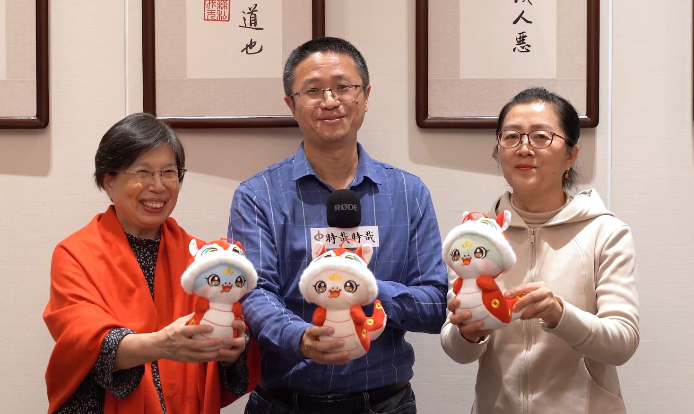

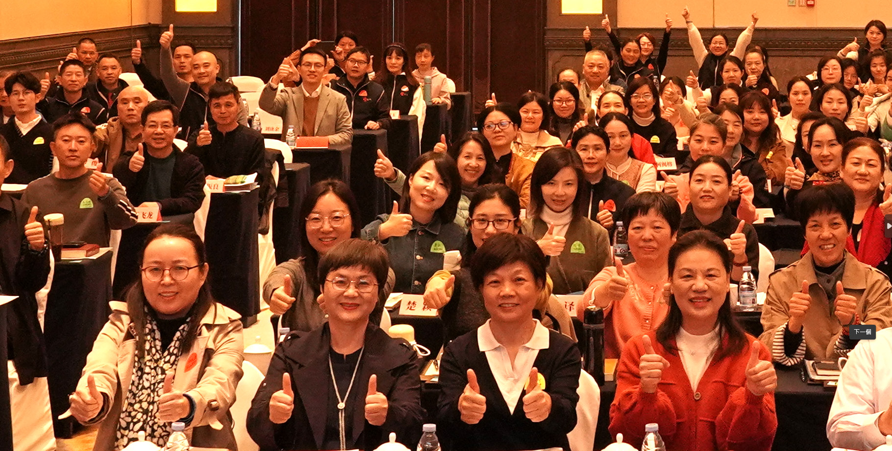

### 眾緣和合共襄盛會 滅法相續同造淨土
福州講座和沙縣論壇心得-台灣地區

眾緣和合共襄盛會 滅法相續同造淨土

福州講座和沙縣論壇心得-台灣地區

台灣善友

有朋遠來的心流，福慧雙修的盛會

昭如

在新冠肺炎之前，學會每年都會應邀至大陸舉辦講座和參訪活動；在兩岸局勢和緩時，大陸各讀書會每年皆有許多學長參加學會的暑訓和寒訓。然而，法之生起必待因緣，當條件改變或不具足時，原本很理所當然的事情，往往成為遙不可及。令人深感無常迅速，應珍惜眼前的殊勝因緣，把握時機，並隨時做好心理準備。

窮則變，變則通，隨著整個時代和環境的劇變，學會也採取變通之道，運用現代科技設備，保持各地之間的互動聯繫，讓分散在千里之外的各讀書會能串連在一起，實現線上教學，維持經教串習。不過，線上模式仍無法完全取代實體教學，因此，當各國疫情降級，紛紛重開大門時，每年都有讀書會熱切祈請學會重啟海外講座的舉辦。2024年11月29日，終於內因外緣一時具備，在福州阿彌陀佛大飯店，迎來大家翹首盼望已久的儒佛講座，讓十四個大陸讀書會的老朋友和新朋友齊聚一堂，共沐於甚深的法義研討之中。

這次的出行就像總匯拼盤，各種口味應有盡有，參訪的部分包含：到閩侯歸根草堂拜訪好久不見的江逸子老師，並漫步於古色古香的三坊七巷、上下杭，以及宛如綠色長城的金牛山體育公園福道。福州講座的部分則研討：宗喀巴大師的往生西方極樂世界發願文和蓮池大師的西方發願文，透過老師深入淺出的辯證分析，兩篇願文的比較，了解如何以更細膩和多面向的方式來往生淨土並利益有情；印光大師的南潯極樂寺重修放生池疏，解決諸多關於放生的自他疑惑和攻難，了解隨順共業，經營別業，才是絕頂聰明的人才；論語中有關禮的章節，確立禮樂教育對個人命運的經營和大局風氣變化間的利害關係；介紹和展演祭孔大典中不可或缺的佾舞，將歷史文化傳承的重要性和延續性，以及內涵與形式的相互觀待性，一一呈現給大眾，激發各地讀書會的好樂心。沙縣論壇主要聆聽了  果清律師宣講持戒的始終要義，雖是言簡意賅的說法，卻能感受其旺盛的生命力，此外，  清公對法的熱情和投入也感染在場諸多聽眾，令人深受啟發。其中最特別的是老師傳承自  雪公太老師的孝是治國之本和大學之道，以科判的形式、架構的分析、風趣的談吐、過往的回憶，獨樹一幟，將善知識的傳承展露無遺。在講座和論壇之間，更穿插如理如法、莊嚴感人，且樂在其中的放生活動，使得這整趟行程等於是一場修福修慧的盛宴。

多年未見，實際見面後深刻地感受到各地學長們敢於任事的承擔、迫不及待地報名、滿心歡喜的聚會、熱情洋溢的招呼、體貼入微的關懷、設想周到的規劃、鉅細靡遺的準備、不分你我的協作、條理分明的執行、從容不迫的應變、求知若渴的態度、琳瑯滿目的禮物、美味可口的佳餚、以義為利的奉獻。從這些人身上，很難相信大陸前些年所遭遇的各種磨難，乃至於最近持續衰微的經濟狀況，反而看到的是樂天知命的心態、昂首挺胸的士氣，以及積極奮發的精神，實在令人讚歎。更加慶幸自己能加入這樣的團隊，獲得老師的教導，與諸上善人齊聚一堂，結上殊勝法緣，走在正見的道路上，能見賢思齊，擇善而從，以文會友，以友輔仁，期望未來能持續不斷跟著老師和團隊福慧雙修，早日圓滿菩提大願，感謝老師！

淨薏

從到達當地便深深感受到當地善友的熱情與期盼。因時隔多年和政策因素，兩地目前僅能透過線上讀書會維持教法上的連繫。從落地到最後進入機場海關前，老師始終被各位學長包圍，他們的誠意和求法的渴望，是身在台灣的我們難以企及的。

在阿彌陀佛大飯店與沙縣淘金山能仁淨院論壇中，獲得了難得的體驗與學習。除了深感有幸能因不同的啟發而皈依學佛，也對不同的際遇更加戰兢。此行跟隨大家進行大型放生，因前一天課程講解了「南潯極樂寺重修放生池疏」，讓學生對放生的內涵有了嶄新的認識。當天跟隨老師觀修時，看著船上肥碩的魚兒隨著機關開啟，嘩啦嘩啦地流入大海。那畫面令人難忘且震撼，想著那些都是過去的母親，過去被我們殺害的生命，如今一條條從我們手中重獲自由，感動難以言喻。也觀想著我們對海類眾生無所求回報，就如同行菩提心時，菩薩不計較度化眾生的辛勞。如老師所說，難怪我們這副德性菩薩們都不介意，因為我們就像鱉一樣。

在幾天的聚餐中，發現每位學長都很健談。從介紹當地特色，到傳統文化的學習，以及世俗經營的經驗分享，他們用各種方式盡地主之誼，務使活動圓滿順利，讓大家盡興。在兩天講座結束時，各讀書會代表上台致詞，每位不僅口才出眾，更流露真摯情感。他們在艱難處境中，在諸多限制下堅守多年，這過程的辛酸難以想像。學生也觀察到多數職司學長雖是女性，卻毫不柔弱，做事幹練圓融，即使行程緊湊也從不顯露疲態。而且，不同讀書會的成員合作無間，如主辦單位敦化學堂雖人數眾多卻井然有序，總是同心協力，默契十足地支援各項工作。

此行對學生最大的啟發，在於見證老師如何以教法與傳統文化感化人心。當大家認定了這條路的意義，便願意在艱辛和孤獨中堅持，並且依教奉行。聽聞一些師長提及，早年有些學長性格內斂，如今不但開朗了，更願意主動發心承擔事務，使整個團隊的向心力與氣象煥然一新。除了感受到教法學習與傳統文化的力量，更覺得帶領讀書會的師長如同偉人，默默地帶動新風氣，走進不同人的生命中幫助他們成長。

淨檀

有機會以中華無盡燈文化學會的一份子跟師長們出去走訪，相較自己出門旅遊有極大差別。這種出門不是在看景點，更多是善法上的交流。極樂世界發願文中上課講到可以去參訪其他佛國土，經過這一次之後有一種感受，不是去其他佛國土看花看水，而是去取經，去看別人有什麼比我們更好的地方，見賢思齊。這樣的參訪心裡產生的樂，又更勝於看美景。以下幾點心得分享：

大陸讀書會的熱情無法簡單文字形容，還有從瀋陽飛過來的，那差不多是台灣飛北海道的距離了。老師上課時說外道的熱情我們該學，這次去大陸覺得他們不輸外道唱聖歌。

大陸的善友們辦事細心，照顧是無微不至，而且都非常幹練。有幾次臨時的變動，他們都能在兩三分鐘內安排完所有的應變措施，而且沒有任何漏球情況發生，在末學眼裡看起來是非常佩服。反觀自己執事的部分有很多需要改善的地方。對方也是每個人都各自還有工作，自己有工作要忙不是藉口。

大陸有一個讀書會在逆風下，有人跳出來承擔，一承擔就是七年。把讀書會穩住，這個精神太令人佩服了。我腦海中設想一個情境：如果大陸、台灣都沒有實體課程，也沒有老師帶領的線上課，我其實沒有把握自己能夠堅持七年。而反觀對方讀書會人數卻是破百人的規模，如果沒有人跳出來承擔、沒有其他人一起參與／協助，是不能辦成的。

承上，自己內因並不如人的情況下，今天得到的歷練機會都是依靠著外緣。緣上有機會遇到老師，可以每周在現場上課，有一群很棒的朋友一起組成讀書會。某次複講中助教老師提到「我們都覺得成功是內因（e.g. 我比較努力、比較聰明），然後失敗都是因為外緣（e.g. 某某人不幫我，環境惡劣），但這是錯誤的理解」。這確實也是過去理解世界的方式，沒有正確的理解很難對於殊勝的外緣生起合量的珍惜心態，也不會認為這些外緣有多殊勝、珍貴。

有機會可以上台複講是非常寶貴的經驗，要有體系的複講並不簡單，台上台下完全是兩個世界。坐在台下以為聽懂了，結果要講卻完全講不出來，這樣的情況代表沒有真正懂過，只不過不用複講的時候可以蓋住問題罷了。複講的經驗也有助於聽課，在聽課的時候就會想：「這裡我講的話要怎麼講」、「是用什麼正因成立的？」，更多去對治自己內心一些從來沒有被說服但卻也沒有處理的問題。

大陸比較打壓宗教，反而還有阿彌陀佛大飯店；在台灣比較自由的風氣，反而沒有這樣的飯店。台灣不缺佛教徒、也不缺功德主，去過阿彌陀佛大飯店的人也大有人在，應該不缺乏想做的人。不過我想如果有人提了，可能會遇到各個道場搶阿彌陀佛名號說「這是我們山頭護持的」，最後亂成一團。再者，冠上了阿彌陀佛大飯店的名號，也不能像一般的飯店被時代淘汰，要與時並進，背後也是相當的困難。

過去在唯識的教育下，被教導困境「都是我想像出來的，我只要不這樣想，就不是困境了！」嘴巴上說服自己，但心底裡也沒有真正相信過這條路能通。中觀同樣依心識投入的那一分，不過是真實的認知，而不是鴕鳥心態。認知到困境一方面自然是困難的，但其實困境也排除了不少負面的條件。

從這例子看來，好像真的是沒有人願意做的事才輪得到你做。期許自己以後在遇到困難障礙的時候，都能想起這件事的覺受，去想「還好這件事情沒人做／很難做，才輪得到我！」

也發現，功德主也不是有錢就當得了，沒有內涵去維持，錢多可能反而會害到自己；如果沒有見地去抉擇，也是許多花了大錢卻沒有達到效果的案例。承上，面對困難的同時，也要更多的觀察種種條件。

以上是這一次福州之行的心得，很可惜不能一起到沙縣有更多見識，也謝謝老師願意帶上末學一起，給予我磨練的機會。

陳秀春

首先表達感謝老師給予機會參與此次難得活動，感謝敦化學堂為兩天講座付出的辛勞努力，以及順昌師長們為放生活動背後的辛苦付出。秋蓮老師帶領的團隊處處展現誠意，處處可見其用心及細膩，尤其很多學長們為了活動請假五天，令人感動，這點對從前在職場上工作的自己是做不到的，所以對學長們由衷的佩服與感謝。

十一月二十九號上午抵達福州機場，在入境大廳見到秋蓮老師帶領的敦化學堂學長們，順昌陳新部長及露妹老師等在大廳熱情地接引兩位老師的到來，此時學生深深感受到是幸運的一群人之一，可以近距離聆聽兩位老師說法。

首站來到歸根草堂探望江老師，覺得江老師蒼老了，說話力氣微弱，歸根草堂看到江老師畫作，老師同步解說。在歸根草堂看到迎賓佾舞表演，特別的是配合佾舞表演有現場的吟唱，令人耳目一新。午餐在阿彌陀佛大飯店用餐，學生第一次入住，在來之前，學長提到飯店餐點很棒，果然是名不虛傳，特別的是食材沒有使用加工製品，這方面很厲害。

用過午餐，帶著行李進入房間，看到床鋪上鋪的字句及寫上自己名字的書籤，甚至在桌上看到陳氏家譜，這些暖心舉止顯示經營者的用心、細膩。

晚上在珍素館用餐後回到飯店，回房間之前，先到隔天早上上課地點看場地，當時時間已晚，看到敦化學堂學長們還在現場忙裡忙外，為明天的講座再次做最後確認，由此可知要辦一場成功活動是需要投入那麼多的人力、物力、時間及金錢。

敦化學堂的學長們都很年輕，印象深刻的是負責講座的司儀，年紀輕輕，臺風、談吐穩健且對時間掌控拿捏精準。

兩天講座，老師帶領的師資團隊，不管是在台上消文或是在台下回答問題，都表現得落落大方、口條清晰、簡潔有力，所準備的檔案也一目了然，非常清楚，謝謝您們背後辛苦的付出。

講座中間的休息時間，敦化學堂準備了各式各樣的點心、飲品及水果，誠意十足。他日大陸的學長來台灣，必當回報他們為講座所付出的一切努力，謝謝他們令學生留下美好的回憶。

第三天午餐與讀書會學長們一起用餐，交談中得知學長們搭了四小時的高鐵，千里迢迢南下來到福州參加講座，感受到學長們是非常渴望來聆聽老師講課，這股好樂的學習精神，不禁在心中反問自己，若是異地而處，自己是否會大老遠跑來參加？此次再次確信自己是有福之人，可以近距離聽聞正法，及遇到很棒的團體與善友們。

兩天講座結束，結訓時再次唱孔子紀念歌，自己第一次感受到現場的震撼力和渲染力，這跟參加學會寒暑假講座時唱孔子紀念歌的感受是完全不同的，學生第一次這麼法喜地唱著孔子紀念歌，莫名感動。

第四天放生，順昌師長們為了此次放生，無論是船隻安排、放生物種採買、壇場布置、供品採買及擺放、場地整理都花了很多心思。此次放生跟在台灣放生很不一樣，當天放的魚是大鯉魚，魚兒們放在大水槽中，開啟閘門後，順著鐵板滑入江中。

放生後再回到壇場，老師做了開示，其中提到請神和送神一樣重要，送菩薩時唱陋室銘及孔子紀念歌等。

第五天沙縣論壇，清公師父宣講持戒的始終要義：發心、受戒、尊師重道、讀誦解義、輕重等持、懺悔還淨、少欲知足、誠敬謙虛、清高莊嚴、信願念佛、圓成佛道。

師父解釋一首偈，

舉佛音聲慢水流，誦經行道雁行遊；

合掌當胸如捧水，立身頂上似安油；

瞻前顧後輕移步，左右迴旋半展眸；

威儀動靜常如此，不愧佛門修行人。

學生覺得這是一首很棒的偈子，與大家分享。

老師在論壇講解〈孝是治國之本〉及〈大學之道〉，盡孝之法列舉：竭力之孝、惜養之孝、色養之孝、安養之孝、敬養之孝、無違之孝、齊家之孝、承志之孝、守道之孝、仁本之孝及敬鄉里之孝，架構式科判一目了然。並且老師提到人的一生都不出孝道的範疇：生事、死事。

〈大學〉之道，說出大學出處，大學兩綱、八目、一結，是大格局的人生，內涵成就明明德，外在通達親民，最後止於至善。老師用科判將每一個環節詳細列出，環環相扣，非常精彩。

要離開論壇之前，清公贈送老師一尊白色觀音像，提及老師大慈大悲，大庭廣眾贈觀音像的儀式，更令人感到清公的慈悲。

最後一天漫遊福道，是一座很棒的森林步道，適合健行，老少咸宜、風景怡人，輕鬆無負擔，在漫步時，敦化學堂的老師學長們，會很自然挽著你的手，邊走邊和你交談，感覺很親切，毫無違和，挽著手走路這消失已久的感覺竟然出現在這次福州行之中。

要離開福州前往機場之前，在無憂愫餐館用餐，快享用完畢時，鄰桌有客人吹簫，簫聲吹出離別的感傷，尤其老師唱送別時，學生情不自禁，眼淚奪眶而出，看到敦化學堂學長們也是眼淚奪眶。

一頓豐盛的午餐，飯後大家一起言歡，聽到好聽吹簫演奏及老師吟詩、唱詩，這是福建行最好的圓滿。

學生此次抱著參訪的精神，想想自己的不足之處，學習大陸師長們辦事細膩處、毅力及耐力，希望自己日後辦事亦復如是。

總而言之，這次有太多感受及感動，不是用少分的語詞可以表達出來的，最後再次謝謝老師給予學生機會參加這次難得且殊勝的活動，必定會是自己人生一段很美好的回憶。

李鈴芬

十一月二十九日清晨帶著興奮的心情，跟隨唐老師、林老師、諸位老師、諸位學長，一同前往福州、沙縣七日文化之旅。當我們從長樂機場出關的時候，看到大陸的學長們，帶著燦爛笑容，手捧鮮花來接機，很貼心地將大家的行李一一上車，深深感受到他們的熱情。接著我們坐車前往歸根草堂拜訪江逸子老師，到達之時，江老師已經在裡面等候我們的來訪，並且隆重安排佾舞及鹿嗚的樂曲來迎賓，讓我覺得很驚喜。進入草堂的一樓、二樓，都擺上江老師的國畫，看到江老師的畫作內心非常讚嘆，同時也很開心有緣能看到，甚至看到江老師跟唐老師之間的互動，那種相知相惜感人的畫面。

下午到福州市尋訪古蹟三坊七巷，這是一大片建築群，從明朝保留下來，裡面有林則徐的紀念館，還有許多名人的故居，像是沈葆楨、林覺民等等，參訪這些古建物中體會出先人的智慧。第二天是「有朋遠來的心流—經營可觀的人生」，兩天的講座，有兩百多人參加，唐老師帶領團隊將論語有關禮的部分，透過消文、問答將經文細膩剖析清楚，進而能生起覺受，知道如何將經文與生活結合。在會場中大家都井然有序，沒有吵嚷的聲音，有種「有朋自遠方來，不亦樂乎」的感覺。

第四天放生，感恩學長的用心安排，將場地佈置非常的莊嚴，放生物的採買及運送，船隻的安排，讓大家很輕鬆地放生，事後唐老師帶領吟唱唐詩，將活動辦得生動圓滿。第五天、第六天的沙縣閩臺佛教文化交流，目睹果清律師恭謙有禮的威儀，上課專心聆聽講法者講法，尤其贈予唐老師觀音像的慈悲心，真是令人五體投地。講座在淘金山，視野非常開闊，往上有座釋迦牟尼佛的舍利寶塔，共九層非常的宏偉，往下可以俯瞰沙縣的群山、河流、建築物、高速道路，景色優美。

最後一天去走鋼架鑲空的步道，設計很特別，依著山往上，走起來很舒服，整座公園景觀怡人。所謂讀萬卷書不如行萬里路，深深體會到文化的魅力無遠弗屆，感受到大陸讀書會學長們，所展現的誠意、承擔、謙虛，提醒自己要珍惜學習的機會，不能放逸，道不可以須臾離也。

林婉玲

去年四月和兩位老師一同去山東參加孔子春會活動，這是末學第一次和老師出國也是第一次見到學會和讀書會的學長們，當時有十幾位大陸讀書會的善友為了去見兩位老師也特地從各地前往參加這個活動，每天晚上他們都圍著老師說話，白天自由行程時也一直跟著老師，像是在追星一樣，末學心裡產生很大的問號，心想：「這些大陸人是怎麽回事，是在崇拜偶像嗎？會不會太過頭了？ 」當時因為是去參加春會活動，行程依主辦單位安排，沒有機會和這些大陸善友們交流，不了解他們遠從各地來和老師見面的原因。這次福州行，有較多時間和讀書會的善友們交談，他們談及因為參加學會的課程對他們家庭關係的改善，看到孩子的轉變，思惟模式改變對工作上的幫助等等，對兩位老師及學會是由衷的感激，兩位老師的來訪像是久違不見的老朋友，有太多的話想要跟他們說，這時我終於明白去年他們為何有「追星」的行為了，這不是表面偶像的崇拜，而是打從心裡面對老師的崇敬、感恩以及多年好友相見的激動。感謝老師給予這次機會一同前往，讓末學認識到一群熱情、有禮、好學、謙虛、善良的朋友！

此次福州行末學被安排在第二天的論語講座中負責一段消文，接到這個任務，內心誠惶誠恐，之前在公司上班的時候，經常需和外國客戶開會作簡報都不覺得緊張，第一次上台消文反而非常緊張，深怕末學對於論語的知識背景不足，沒把《論語》章節的意義說明清楚而誤導了來參加講座的學長們，再者分配到的章節是唐老師在週三論語課尚未上到的，更是擔心不已。還好這段經文唐老師在「陪我讀論語」的影片中有，在多方資料查詢以及出發前也請教了辦公室的學長們，消文的部分不至於有太大問題，但是在台上唐老師總是會有不同的「考題」是我們無法準備的，因此在台上的回答不盡完善，末學覺得唐老師真的就像顏回形容孔子的學問是「仰之彌高，鑽之彌堅」啊！

兩天講座結束，第三天早上是放生的活動，在講座時也讀了宗喀巴大師的「往生西方極樂世界發願文」及蓮池大師的「西方發願文」，老師在放生時帶領大家如何以放生法行來作發願文的觀修，說到我們在放生時去體會觀世音菩薩的大慈大悲，要成就像文殊菩薩的智慧以善巧方式來度眾生，當生物被放回去的時候會有很多的「命難」，要觀想我就是大勢至菩薩來降伏魔怨，或是藥師佛來消除他們即將被殺的痛苦，並想像能夠如釋迦牟尼佛精進不懈怠的行菩薩道修無上道來幫助眾生，當生物回到水池就好像回到阿彌陀佛的願海，乘願再來的時候我們也能展開各種菩薩行去利益有情。在放生法會的觀修就幫我們複習了「往生西方極樂世界發願文」的重點，實在非常佩服老師的觀修力，末學何其有幸能參與其中！

在沙縣參加台閩文化交流的論壇活動，印象最深的就是果清律師的演講，果清律師年事已高，他說話必須非常用力，對他老人家的身體負擔是很大的，在演講尾聲時因為時間快到了，最後兩分鐘的法語，果清律師像是用一口氣講完，中間都沒有停頓，聽了真如如來灌頂，令人感動！

這次福州行很感謝謝秋蓮老師帶領的敦化學堂辦理這次的講座，除了安排學會學長們的行程，從我們下機到機場來接機，中間車程的安排、行程，餐廳到送我們到機場以及串連各地讀書會等等的事務，非常周到且細心，團隊合作有默契，讓大家住得舒服，吃得飽飽！行程中他們一直稱呼末學為老師，其實末學在《論語》或佛學的見地上都還是初學者，還在努力的學習中，稱不上是老師，但為了下次再見面時不失此稱呼，末學將更加倍努力學習經教，期望之後能和他們有更深入的交談，才是不虛此行。

海峽兩岸因為政治關係，民間的交流已經少了很多，社會的氛圍被塑造成中國和台灣是對立的，在缺乏交流之下，很多人對大陸人仍存在著他們自大、無禮、俗氣、好鬥等刻板印象，殊不知那不代表所有中國人都是如此。學會在各地的讀書會長年在正知見的薰陶下，大陸讀書會的善友們真的和末學以前出差中國時遇到的大陸人在氣質上，談吐上有很大的不同。而我們身在台灣要更珍惜在學會的學習，年輕人有機會的話跟著兩位老師一起去中國和善友們交流，相信對於自己不論是在視野或修學上都會有很大的幫助。

福州講座論壇之行                                   游捷茹

事實記載與觀點

面面俱到真學習

人生有幸正知見

慎始過程與結果

此次福州之行由幾個主要的部分組成，包括唐老師與學會團隊在阿彌陀佛大飯店的二日關於思維模式的儒佛講座、一日的放生法行、二日在沙縣的儒佛論壇，以及穿插其中的三坊七巷、上下杭等參訪。

唐老師主講的主題有蓮池大師的《西方發願文》、宗喀巴大師的《往生西方極樂世界發願文》、印光大師為南潯極樂寺修的《放生池疏》與《論語》談論禮的篇章。

在學會學習深刻感覺經教迷人之處，在其中蘊藏精神、文字的美，同時具備對日常經營的指引，勝義世俗、形上形下似完全相對，卻又相輔相成，無法離開彼此而言說。接下來關於此行課程的聞思紀錄，盼嘗試將主題相互串連，以內涵與實踐的角度交錯書寫之。

關於發願往生極樂世界課堂，循著老師科判式的講述，一步步對淨土有所認識，生起殊勝的感受，認識菩薩所發的願、自利利他的動機與做法。

藏傳極樂世界發願文由宗喀巴大師所造、法尊法師所譯，開篇禮敬造論者、阿彌陀佛，接著帶入菩提心的思維，思有情如母、又如唯一愛子般的珍愛，因而想利益、想幫助往生極樂世界的心油然而生，來求譯經、造論得加被、排除障礙。而如何幫助有情往生極樂世界呢？首先說明苦有情的樣子——立基於無明的實有見，來說現世安樂依然為苦的觀點。實有見使人生愛憎煩惱，進一步造業而有老病死輪迴繫縛的苦果。因為發現輪迴的恐怖，生起向佛與菩薩求救護、發願的心。

那發什麼樣子的願呢？發願也有不同的角度，下士道的發心是希求自己能不墮三途；中士道的發心是希求出離輪迴；上士道是發菩提心幫助有情都能夠脫離輪迴。課堂中老師也比較了藏傳與漢傳文本的異同——二者所共有的是對極樂淨土的描述與想去淨土的心，所不共的是在藏傳之中談及建構自己的淨土；所相同的是上求菩提心、下化利他心的內涵，所不同的是在藏傳之中，更多強調基於悲心的本質行菩薩事業的心態。關於共道與不共道之間，是什麼關係呢？倘若將下士道、中士道（小乘）類歸共道，上士道（大乘類）歸不共道，容易直覺地覺得是依序的、拾級而上的修學階段，聽過老師的解讀才知道到原來可以用不共道經營共道、大乘攝小乘的思維模式來理解。上課常有的舉例像是：相同是駕馬車，王子與車伕所受的訓練、講求的風範、建構的認知會是截然不同的，帶著不同的心態修學，所獲得的技術可能相同，但是內涵卻能大大地相異。因此來說修學不妨對自己有更高的期許，用在日常的精進與經營。

如果說極樂世界發願文是大師們帶著有情發往生淨土的願；放生文鈔大約是大師帶著人類發利益有情的願。

此行放生以印光大師為南潯極樂寺重修的《放生池疏》作為前行，生起放生的意樂。也在老師的教導中，回應心中隱約存在的困惑。

在助人與放生，究竟如何選擇或思考呢？目前所理解到的是，對於不同事情的思考與揀擇，有時候是針對二者相異的某個面向而言說，在放生中取釋放生物能帶給我們的覺受來作為學習。第一個是，由知母的心態所發起的平等的慈心與悲心；其二，是相較於人類，面對非人類的生命，可以助己生起不求回報的心；其三，站在牠已在刀口下，頃刻會失去生命的那分，來說放生之行的迫切，我們需要不墮三途、得增上生、決定勝也如放生之行一樣的緊急與重要。又這些生物讓我有機會選擇殺牠或者放牠，讓我有機會與牠結好的緣分，讓我有機會對調整我的內心、生起覺受，我應當生起感恩的心。

延伸自放生的知見，也使吃素的理由更加完整。戒律以業的思維為本質，雖然古時候可能因為社會環境，佛教不全然提倡素食，到現代也有佛教徒是不講求素食的。然而依著造善得樂、造惡得苦的基礎，與業增長廣大、做已不失的觀念，推知果報不會因為我不知道而不算數、而使我未來免於受苦果，因此需要透過佛語、老師教導知見、調整自己才可能趨吉避凶。又整個業道中，對境的揀擇、心上的經營格外重要，可以如何經營素食的心態呢？思維動物的一生可能由外在環境主宰、可能成為刀下魚肉的命運，生起對三途的恐怖；進一步觀察人與動物一樣也是有情，也為輪迴之苦所攝，因而生起對輪迴的厭離，把握此生經營來世的增上；再基於對有情如母、如愛子的心，生起愛憫，培養慈心與悲心的運轉。

此番放生也有許多新的體驗。透過前行、正行與結行，對於意樂、執行與覺受的體驗總是更加完整而立體。謝謝老師安排《南潯極樂寺放生疏》作為前行，建構對放生法行的知見認識、回應心中可能存在的困惑；正行的放生形式，更是前所未有的體驗，過去幾回參與的是在室內的壇場進行法會，然後到海岸的魚梯將一桶桶生物放入海中。這次的法會在江邊搭建的壇場進行，接著搭船到江上放生，所放的生物有大錦鯉、甲魚、蛤，大錦鯉在中央的池子，透過打開池子低處一角的帆布魚道讓魚流入江中。一開始看見大魚一條條快速的順著魚道、濺起水花、跳入江水，驚嘆船隻周到的設計讓魚可以沒有經歷很多波折的回到江中；接著目光轉移到池子，發現當魚快速流向船外的同時，水也快速的流失，池中的魚彷彿陷入緊張，「經文『如少水魚』就是這個模樣嗎？」，在輪迴繫縛中，要把握暇滿人身精進的感覺，大約也是這樣吧？結行回向之後，老師帶領吟詩歌唱「無盡燈獻詞」、「孔子紀念歌」、「陋室銘」等，跟隨著文字音調流動，沉浸在眾人聚會的法喜之中。原來法行經營也能有不同的面貌與方式。

也在老師的分享中，了解到此番放生的諸多細膩之處幾乎從無到有，從壇場的尋找、清理到搭建，船隻的接洽、建造到租用等，心中的佩服油然而生。而其中真正所需的心力勞苦程度，肯定遠超出所能想見的。

前面說完了以業果為本質的持戒，能幫助我們防非止惡、趨吉避凶。而在遮止惡行之外，我們可以有更進一步的追求。禮作為呈現道之內涵的載體，是串連精神內涵與外在表現重要的認知。

道在人身上，民族文化延續的關鍵在能解讀經典的人傳承其中精神。又文以載道、文以載禮，道談的是文化內涵，禮是精神的表現法。如何知道核心處是精神而不是表現呢？課堂曾舉的例子有：佾舞在台北、台南的動作不同，但無礙於對禮的精神展現；或者日本雖制度上西化，但民族精神就像是根深蒂固的銘刻在骨髓、流淌於血液當中。

老師也對照了老子與孔子關於禮曾表達過的思想。在春秋戰國的時代背景下，老子認為禮是愚之始，亂世之中不可行，除了繁文縟節障礙社會的進步，當被有心者、有權者、不善者濫用時又成為亂源；孔子知難行而為之，因為禮若完全消失、被看得一文不值，則世道再也難以平靜，基於禮以維持和諧為本質，來倡導禮的推行。聽到這裡，以為孔子與老子二人的思想恰好相反，還好有老師繼續旁徵博引的講說，才知道原來可以用入世與出世的觀點，理解二位哲學家對於禮的態度。

而禮除了正面的養成，也有反面節制的性質。基於道的行動，也要考量對象、環境、場合等因素做因應調整，才能使禮經營出和的氛圍，有些時候如果僵硬地運用禮節，可能使內涵無法展現、人際產生距離、效果適得其反等。舉《論語》的例子有：「小大由之，有所不行」；或者「恭慎勇直，若無禮，則勞葸亂絞」，這二則站在有禮的行為也需要程度上的拿捏來說節制。另一種節制也有規範何不應行的篇章，像是顏淵問仁的篇章，說到視聽言動的非禮不為。綜合上述了解到，道的內涵在禮上呈現，禮經營社會的和諧，是使人如沐春風、事物運作順暢的重要關鍵。

禮，遍及生活方方面面；孝，遍佈我們的文化，作爲連結家庭的紐帶，使價值得以傳承，也透過孝道，經營人我的關係，和諧社會。

《孝經》講座中，老師簡介學會的工作，介紹與雪公太老師的故事，接著進到經文的架構與精神。在課堂剛結束的時候，所想到的是以孝道為核心，延伸到師生的互動、理念的延續。隨著課後與同行學長的討論、時間沉澱，漸漸有新的想法在心中發酵。

「孝」之浩瀚，從社會階層的角度，上至天子，下至庶人，換到現代大概能類比為當權者到人民。在社會中，孝道有端正風氣的效果，風氣的營造特別對著上位者來言說，上位者表現愛敬的態度、節制慢心、尊重禮法、以身作則，如同在日常作為全民的典範，傳達核心價值，使孝道深植社會。

孝道也彷彿是民族內涵傳承的靈魂。個人價值的建立從家庭開始，再隨著成長，慢慢走向學校、走入社會，青少年之前是價值建立的關鍵階段，這段時間裡最先遇到、也最主要的重要他人是雙親與老師，接著才是同儕。聯想到「父在觀其志」、以及孔子與學生談論志向的段落，在「孝」的理念中，晚輩學習上一代優點與良善特質，效仿在自身的處世價值中；學生透過與老師對話，了解自己的優勢與劣勢，看見心中志向的過或不及。思想的傳承與延續，大約就是這樣在時間的長流裡川流不息的吧！

孝使整體社會有共同的價值，大家可能有著不同的家庭、職業、生活方式等，但因為政府愛人民、人民擁護政府，而使人心天涯若比鄰。

世界上的遠，也可分為二種，一個是物理距離之遠，一個是心靈距離之遠。從下飛機見到大陸的老師學長們迎接唐老師、林老師與助教老師們的歡喜、真誠、激動溢於言表，在一旁看著也為之動容。此行中的其他時刻，也見到大陸老師學長令人欣賞的特質與佩服的能力，像是善問、勇於表達等特質，自然而然帶出對學習渴望的氛圍，也聯想到「嘉之會」的景象。過去對於這句話曾有世俗情景的想像，像是國家領袖的聚會、公司老闆的聚會，然而這些都未曾親眼見過，而這次處在其中似乎感受到這樣的氣氛，珍貴的是推動此番善友聚會的內涵，是傳承、是文化魅力、是求知慾、是好奇心、是每個人對精進的熱切所經營出來的！

人們總要為見到心靈之近克服距離之遠而感動。謝謝與學會一同去到福州增廣見聞、學習的機會；謝謝此行所遇見的師長、善友的熱情與親切；謝謝共享的文化，使我們有共同景仰的典範、學習的對象。

## 二O二四馬來西亞儒學文化推廣專案

### 二O二四馬來西亞儒學文化推廣專案

淨本

與中基會合作的成果

半年辛苦耕耘的展現

論語結合的思維模式

帶出了有信心的團隊

十二月底的來台訪問

跨出明年的繼續增上

去年（二○二四年）開始，學會很高興能與中華教育文化基金會合作，於馬來西亞開啟儒學文化推廣的專案。學會於過去十多年來，未曾中斷與馬來西亞愛好中華文化人士的交流，或辦講座、或互訪、或舉行線上讀書會，十分熱絡。去年特別又有中華教育文化基金會的共同合作，選擇更進一步加強東馬儒學的推廣，為當地培養人才，也藉此機緣，增進國人對儒學的重視。

中基會與學會決定以東馬詩巫為推廣點，與當地的詩巫中華文化教育學會合作，開辦大型講座，並且在每週六下午一點到五點，以論語和佾舞為主題，開辦青年人才培訓班，每週五晚上，還有理事師資們的中庸研學班，是一次內容完整、兼顧靜態與動態的儒學推廣計畫。

計畫首先從講座開始。兩天的「半部論語治天下講座2.0」，以及一個晚上的何謂中庸之道講座，總共有五百位華人參加聆聽。

「半部論語治天下講座2.0」，除了學會、中基會以及詩巫中華文化教育學會共同主辦，時哉時哉網路教育學院協辦，此外還有詩巫當地的詩巫教育廳、詩巫華文獨中董聯會、詩巫加帛沐膠華小董聯會，詩巫華人教師會加入聯辦單位。

講座的主講師資為知名講師、儒學家唐瑜凌老師、林蔚芳老師及其師資團隊。所用的教材為李炳南老教授講授、徐醒民先生記錄的《論語講要》，以及唐瑜凌先生所編輯製作的科判「半部論語治天下2.0—帶領菁英團隊的學成」。本次講座有許多學校校長、教職人員到場聆聽，共同研學論語的內容。中華教育文化基金會王建亞幹事長也親臨會場，並有籌備會主席鄭立國會長、拿督張泰卿先生、詩巫加帛沐膠華小董聯會主席鄭尚魁校長、詩巫華人教師會秘書方友何副校長、浸信會真光堂李乾虎牧師，以及古晉明門經典文化學會楊銘爵會長，共同擔任開幕貴賓。

七月十三、十四日為期兩天的講座圓滿成功，是本次「馬來西亞儒學文化推廣專案」美好的起點。

同時於七月十三日晚上，唐瑜凌老師及其師資團隊，也受邀前往詩巫省華人社團聯合會舉辦「何謂中庸之道」講座。主辦單位為華團文教組、華團青年團以及詩巫省留台同學會。現場三百名聽眾共同聆聽述聖子思的重要著作《中庸》的介紹，認識儒家傳承中最重要的哲學思想。

短暫的講座之後，是長期人才培訓班的延續。學會首先安排一位駐點師資，進駐二個月，每週四個小時的課程，深入論語、學習佾舞，而後透過線上教學，讓學期圓滿。論語所用的教材，同樣也是論語講要，以及唐瑜凌老師所編寫的「從論語的高度建立各種思維模式」科判。參與的同學都有許多的收獲。

週六的下午，同時也是台北時哉青年班的上課時間，因此學會特別舉辦了一場「台馬青年交流會」。雖然直線距離相隔兩千多公里，但拜科技之賜，兩地交流順暢且熱絡，又富有教育意涵。

東馬青年的儒學培訓，歷經五個月，在去年十二月八日圓滿完成。詩巫中華文化教育學會特別在當地建興中學舉辦結訓典禮。唐瑜凌老師、林蔚芳老師及師資團隊們，也透過網路參與盛會，為同學們致詞慶賀。佾舞班同學也完成了一次精彩的演出，為本學期畫下美好的句點。

十二月二十一日至二十七日，東馬詩巫中華教育文化學會善友們，在鄭立國會長帶領下來台交流，彼此也互相感謝一年來共同美好的合作。

東馬善友來台期間，大家一同在學會與中華教育文化基金會王建亞幹事長交流，聆聽幹事長精彩分享。

期間訪問團在唐瑜凌老師帶領下，還前往東勢慶東里體驗客家文化，現場有客家樂團的熱烈歡迎，有客家歌謠表演、吟詩歡唱、武佾舞表演、大甲河之聲合唱表演，還有讓大家熱血澎湃的闖關活動，當然還少不了美味的客家美食，賓主盡歡。團隊還一起參訪台中蓮社、雪廬紀念館，並前往齋僧，聆聽清公和尚的開示，內心清涼歡喜。和尚在大家臨走之際還親自贈送念珠給與會大眾，大家都十分感動。

今年儒學文化推廣專案至此已經圓滿，但這也是來年大家繼續往前邁進的開始，期待世界各地熱愛中華文化的朋友們，與我們一起努力前行。

鄭立國會長結業致詞

各位中華無盡燈文化學會的老師們，淨覺林主席蔣鳳鳴老師、副主席詹詠翔先生、劉明明老師，兒童佛學班和青少班的家長和同學們，詩巫中華文化教育學會副會長廖成憑先生和理事們，研學班的同學們和學會的家長、同學們，各報記者，大家早安。

今天由臺灣中華教育文化基金會、臺灣中華無盡燈文化學會、詩巫中華文化教育學會聯合舉辦二○二四年學期末「論語智慧與佾舞體驗」班驗收表演兼結業典禮。

首先要感謝臺灣中華無盡文化學會的唐老師、林老師的推動與指導，感謝蕭老師及其他授課老師。

今天是成果驗收，非常感謝蕭老師在今年七月、八月，攜家帶眷往返臺灣詩巫兩次，進駐詩巫兩個月為本班授課，還在詩巫講了兩場講座會，主題是「從論語的高度看到美好的中華文化」，內容豐富，有架構、有條理，蕭老師溫文儒雅、彬彬有禮，非常接地氣。

本班學習效果良好，有一半以上的同學出席率非常高，上課時很專注，互動交流內容不離題。

唐老師為本班訂的科判題目是「從論語的高度建立各種思維模式」，這是一種跳躍式、燈塔式的學習，直接進入以培養精英人才的教學。從《論語》裡的章句，整理出孔子的各種思維模式，把這些思維模式與這個時代的名人、賢人相比對，擴展學生們的思維，希望他們以更開闊的思維，走入時代，引領這個時代，這就是唐老師與其師資團隊推展文化工作的模式，這是上游的教學模式，相信一定可以讓中華文明淵遠流長。

人類的思維決定人類的命運，學習聖人的思維，可以讓我們趨吉避凶，讓我們更和諧的生活在一起，感謝唐老師和其師資團隊。

感謝詩巫淨覺林主席等，今天帶領團隊來這裡為大家加油鼓勵。本會的緣起與發展與已故淨覺林創會主席劉珠嬌有密不可分的關係，所以形同姐妹，共同為後輩提供一個良好的學習條件而彼此鼓勵、幫助。謝謝您們！

這期參與的同學們，你們很特別，年輕好學，願意來學習這種古老的學問，使這種底蘊厚實的文化代有傳人。

詩巫中華文化教育學會，團隊人數雖然不多，但彼此相知相惜，一直堅持學習與實踐，以追求人生的理想價值。

唐老師說：我們若只有具備高尚的品德走入時代，那您只會處在食物鏈的底層。必須要擴展各種思維，培養各種能力，為自己、家庭、社會服務，如此才能把這優秀的中華文明推廣出去，讓更多人受益。

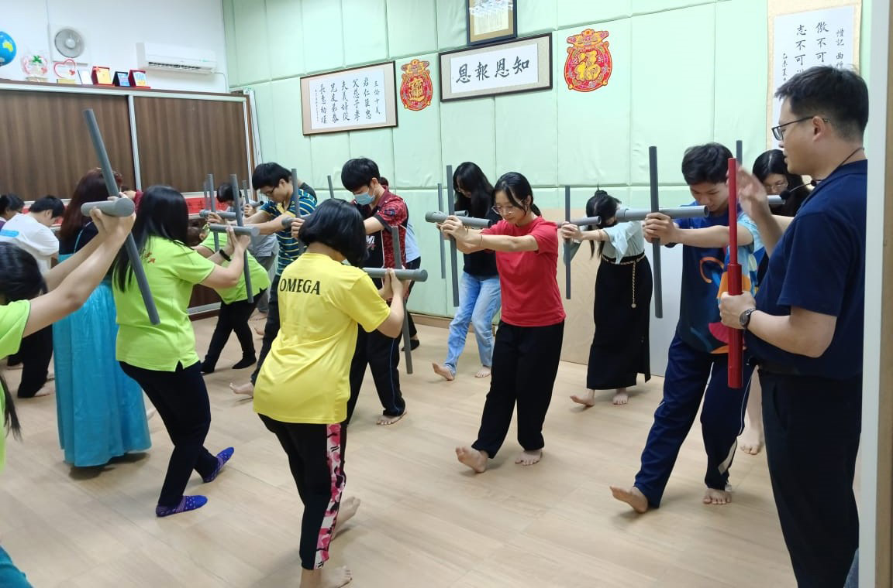

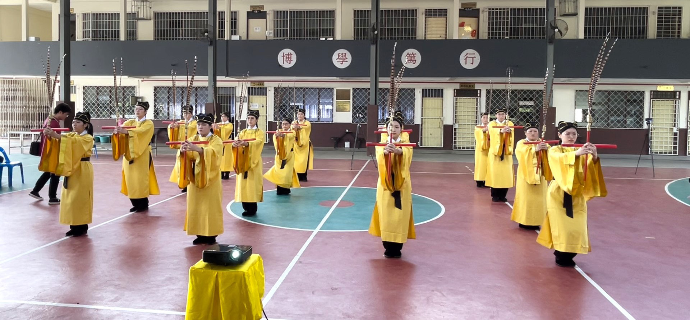

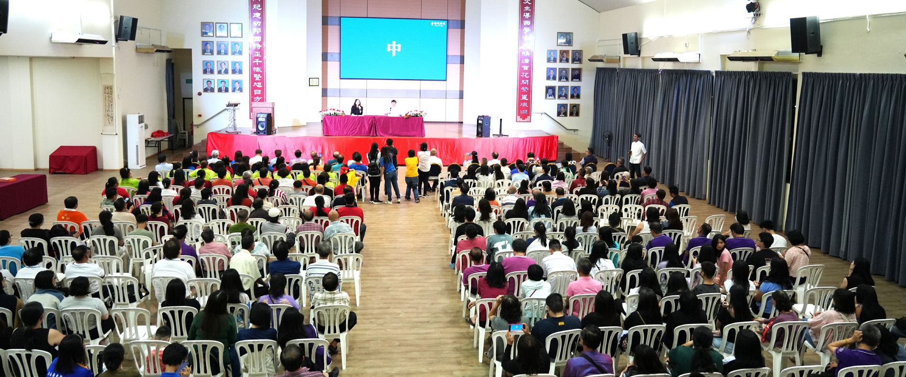

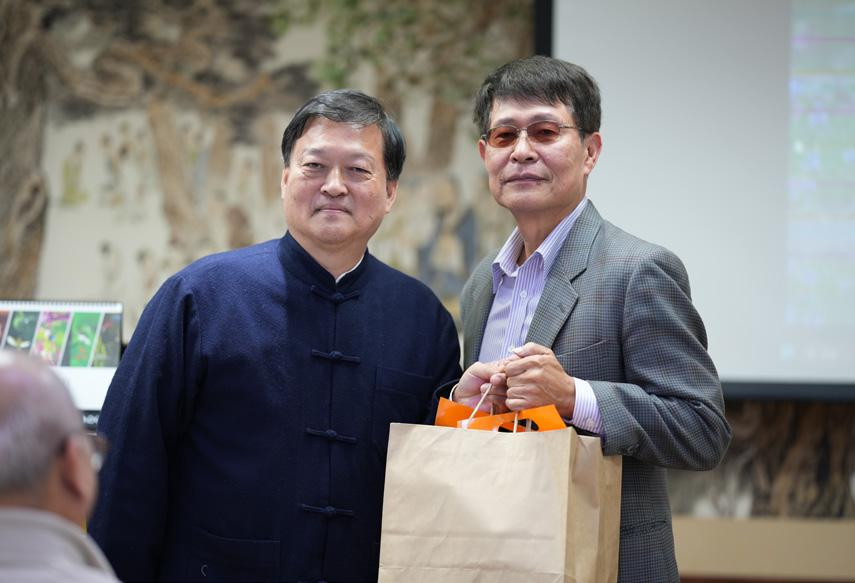

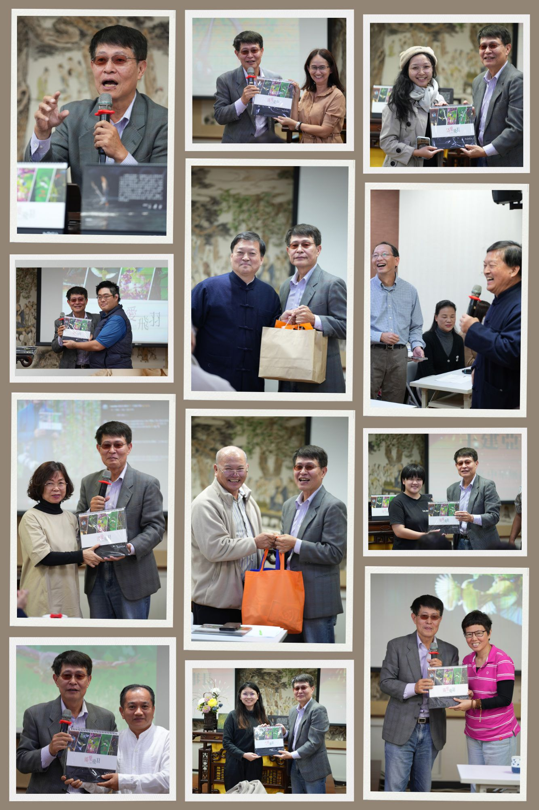

### 東馬學員學期心得

東馬學員

葉玲宋

「子曰：知之者，不如好之者；好之者，不如樂之者。」這是我的心得主題。

在中學時期，為了考試而背了不少的論語經句，那時我停留於知之者。今年七月份有幸參與半部論語治天下2.0，我開始成為好之者。我八月開始參與論語智慧與佾舞體驗班，我的內心是喜悅的，因為畢業多年還能以學生的身份好好聽課，十分難得。

文言文若是自學，還真不容易明白孔子的智慧。在課堂中老師們經常用具體的例子來講解抽象的思維。如蕭老師以手錶來形容「一以貫之」；白老師用種子來講述「志於道，據於德，依于仁，游於藝」；唐微智老師用醫生面對自己的錯誤與別人檢討飛機師的錯誤來講解三人行的對比效應，這些具體的例子十分淺白易懂。

不僅如此，老師們還從不同的角度讓我們去思考問題，常常先讓我們頭腦風暴。有時我們的答案很片面，或是回答出乎老師的意料，但老師們都有超高的情商來接軌，帶出論語智慧。最讓我震撼的是蕭老師在指導費米的思維那一堂課，「子曰：譬如為山，未成一簣，止，吾止也；譬如平地，雖覆一簣，進，吾往也。」老師以精衛填海為例，精衛鳥填海是因為它知道最後一步在哪裡。也意味著在我們跨出第一步時就要知道自己想要什麼，甚至是最後一步在哪裡。震撼的地方在於蕭老師帶出了逆向思維：當別人看到你跨出第一步時，也有可能知道你的最後一步在哪裡。換句話說，在看穿他人計畫的同時，自己也要懂得防身，避免被他人看穿，被他人破壞了計畫。我以為理解字面上的意思已是理解的最高層次，沒想到還可以結合逆向思維。從不同的角度去思考，這種學習體驗實在太棒了！

這麼棒的課程，讓我經歷了法喜的學。結束了幾個月的論語課之後，為了不讓這股熱火熄滅，我繼續到時哉時哉網路教育學院的YouTube頻道聽唐老師講論語，我想這階段算是樂知者了吧，根本停不下來。

至於佾舞，起初自認不可能學會，還曾經想當逃兵。但，子曰：溫故而知新。我還真的是不斷地溫故而知新，今天已能熟記佾舞的舞步，還有幸參加驗收表演。

再次感謝中華無盡燈文化學會，感謝詩巫中華文化教育學會創建如此美好的平臺，讓我們有機會學習論語智慧與佾舞，願此平臺讓我們代代受益。

張嫣芳

在這段學習旅程中，我學會了獨立思考，並努力落實《論語》中的「九思」，

此外，在研究經典前，要先了解原文的人物歷史背景，這樣才會更容易帶入和更容易明白地探索這部經典的智慧。

此外，這五個月，最讓我印象深刻的是「譬如為山，未成一簣，止，吾止也；譬如平地，雖覆一簣，進，吾往也。」

因為是我們第一次自己學習做科判架構，並且從原文中體悟到開始和結束都取決於自己，所以當蕭老師介紹江逸子時，這啟發了末學對學習水墨畫的興趣，剛好有拿了獎學金，目前還在學習梅蘭竹菊，初學兩個月，這段學習旅程中，我遇到了許多有趣的老師，以及同學，像是余老師和葉老師。很開心能夠認識大家。正所謂「以文會友」。

從一開始擔心自己聽不懂，甚至懷疑自己是否有資格參加，到後來期待每週的相聚，二十個週六的時光讓我的週末不再渾渾噩噩，而是充滿了期待與收穫。當大家慢慢熟悉，但是又要離別了。

如今，離別的時刻到了，就像一趟火車到站了，大家都要下車繼續各自的旅程。希望未來有機會再與大家一起繼續探討「人性本善」還是「人性本惡」，後會有期！

林佳燕

我讀書那年正好是全新的課程，學校上中文課時已經沒教我們名句精華了。雖然我一直對這些感興趣，卻苦於沒有門路去學。所以我覺得蕭老師說得很對，如果鄭會長他們沒有舉辦這個課程，我們可能一輩子都不會去翻開論語這本書來看。

我中學的時候其實有在學校圖書館裡看到過論語，以前年紀小，比較自大一點，以為自己對文言文的理解，在這方面上的造詣很高了，以為自己能看得懂這本書。當然我也知道這是一本很經典的書，我就去嘗試過翻開看看，結果卻發現自己真的是一點都看不懂。

書裡都是繁體字那些，字實在太多了，密密麻麻的，而且裡面的大道理很深奧，一層疊一層的，一句話可能包含了不止一種的意思。平常大家都說一語雙關嘛，但論語裡的話往往都是一語很多關。如果沒有老師們帶領教導，根本不能領會話裡隱喻的，真正要傳達的那些意思。

我不會說什麼大道理，更不會說什麼漂亮話，但我是真的很感恩自己如此幸運，能有機會來上論語和佾舞課，打開了新世界的大門。

不像以前只是知道孔子很出名，但是如果有人問我，到底孔子出名在哪裡呢，我回答不上來，就像井底之蛙。在各位老師面前，我甚至連略懂皮毛都算不上。上了這個課程，我才知道原來還有這樣專門祭祀孔子的舞蹈，原來還有很多國家都在共同傳揚這些文化，才知道原來孔子的精神內核是如此的強大，推廣的儒家思想是這麼的大格局。

之前聽到老師說我們跳佾舞用的翟籥用的那個羽毛，一根就要一百多塊，一個人有三根那就要三百塊。當時我才知道為了這個課程，會長和老師們投入了多少經費和心思。真的得感謝會長，各位老師，同學們一直以來對我的各種指導和照顧。

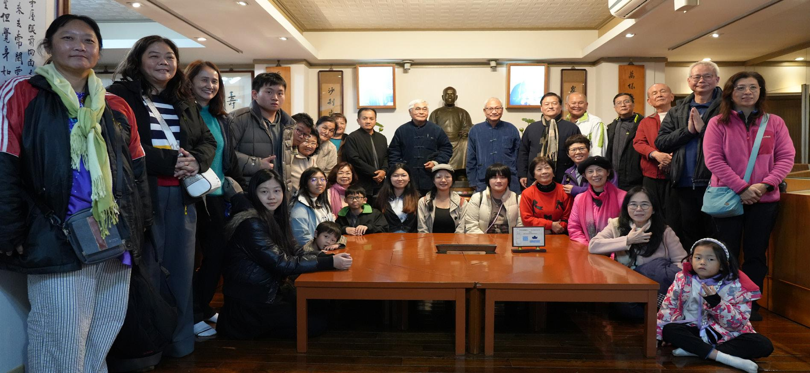

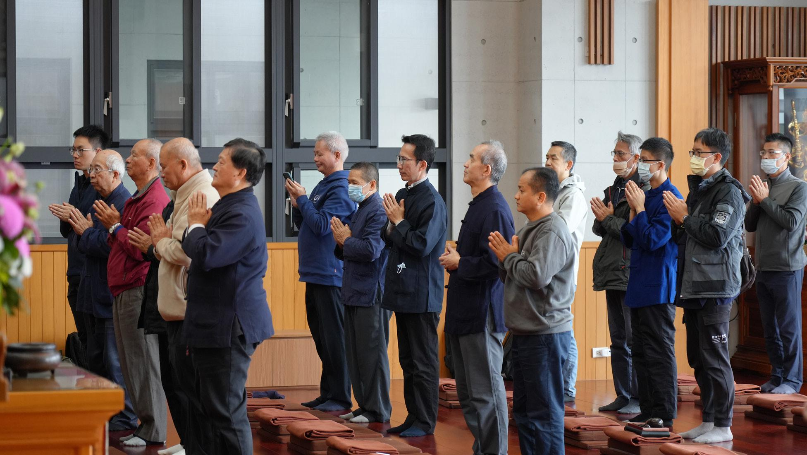

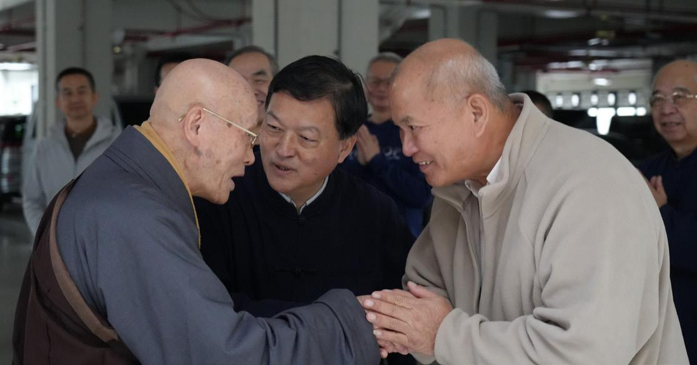

## 後記

### 甲辰年年終歲末回顧與展望

心若、宗徹

龍年揮灑

年終回顧

人生有幸

蛇年舌燦

過障蜿蜒

前進目標

甲辰（二Ｏ二四）年本會依然充實忙碌，學會多年在法上的耕耘，多方時機都成熟，而有各種國內外講座、活動的因緣。

本會在大家的和合中，持續以經教為主的共修，藉由正確知見廣作各類善法，特別是文化、教育事業的推廣。謹以此報告過去一年的具體工作事項，讓我們一同隨喜過去的成果，迎向美好的未來。

壹、中華無盡燈文化學會例行課程（含啟蒙）及念佛共修：

（一）每週一，晚上七點至九點，上半學期開設寂天菩薩《入菩薩行論》，講授〈智慧品第九〉圓滿，隨即開設道次第修學口訣：皈依三寶馬車軌、思惟業果馬車軌、思惟四諦馬車軌，下半學期開設《菩提道次第略論》，宗喀巴大師對於佛語有完整的通達，故能清楚地編寫道次第、清楚地講授道次第，成為噶當派的發揚者、格魯派的開派者，並將這樣美好的思想體系，在清淨的講聽中不斷傳承。

（二）每週三，晚上七點至八點，時哉時哉網路教育學院：「行雲流水的思維—一代宗師老子的探索」，以中觀的闡釋法，一探老子對世間、出世間道的認知，深入了解聖者形而上道的入世運用。

（三）隔週三，晚上七點至九點，上半學期開設【佾舞研習班】，講述《論語》中「禮」相關條目，並教導臺北孔廟釋奠典禮的佾舞。下半學期開設【論語智慧暨韓國武佾舞體驗研習班】，講述《論語》中有關禮的條目，並教導現存韓國傳承於古代中國正統的武佾舞，相信不管是文佾舞或武佾舞，未來都有諸多教學與展演的機會。

（四）每週四，上午九點到十一點半，開設念佛共修班，大家加強念佛功夫並聯絡感情。

（五）每週五，晚上七點至八點，於蓮榮網絡學習平台，播映《華嚴經‧世主妙嚴品》、《佛說四十二章經》系列課程，《佛說四十二章經》系列課程播畢後，新上架的是《菩提道次第廣論》課程，以短影音的方式呈現，宗喀巴大師承接了阿底峽尊者《道炬論》的善說，於四十六歲時造《菩提道次第廣論》，是一部富有完整修行體系與內涵的論典。帶領我們有系統地學習佛法，收攝成為自己的修行次第。

（六）每週六，上午九點到十一點，應真光堂李牧師邀請，至真光堂推廣孝經與孝經圖，結合《論語》，目前進度講完〈聖治章第九〉。

（七）每週六，下午一點到兩點開設【十四堂課掌握所有佛法綱要—佛學概要十四講表】，用十四堂課完整說明三藏十二部的總綱領，助青年學子快速找到學佛的綱要。下午兩點到五點半，開設【易經與入中論講座】，《入中論》是月稱論師所寫的中觀應成派名著，是了解「緣起」與「性空」的必讀論典，以佛經的智慧，探索本質與現象之間的微妙關係；從易經的觀察，了解人生萬有變化中的處世方法，是青年朋友在快速變動的時代中所需的智慧寶庫，以上兩門課皆為青年獎學金班，招收十八歲至三十五歲的青年。

（八）週六晚上七點至九點共修，分為成人共修班及啟蒙班，成人班課程為念佛共修以及宗喀巴大師所造的《極樂世界發願文》、《極樂願‧開勝剎門》，以及第四世班禪大師善慧法幢造的《無礙往生極樂世界速道》。啟蒙班依年齡分為三個班，學思班（國中、高中），講述元朝歷史與文學，以及佛學《暇滿人身馬車軌》、《念死無常馬車軌》；士心班（國小三至六年級），主題為論語—春天的人生‧加減乘除的見地，佛學課程主題同學思班；學而班（幼兒園大班至國小二年級），主題為佛教故事與繪本、手作、音樂、影片賞析等專題課程。

（九）線上、實體讀書會：

一、大陸部分，每週二、三、四、五晚上皆有線上儒學、佛學研學，參與單位有：福建敦化學堂、福建永陽孔子學會、瀋陽任遠、時哉杭州、浦江遠流、義烏青鳥、順昌雪廬、順昌新華藝術幼兒園、上海論語讀書會，濟南德明經典讀書會、福建樂淨、永康龍川、諸暨弘德幼兒園、諸暨養正學堂、北京施無厭書畫院慈慧國學堂、壽光讀書會、善聚經典讀書會等。

二、大華府論語研習班，隔周一上午舉辦一個半小時的《論語》課程，從〈學而第一〉開始逐章講解，課後上架至youtube，供大眾學習，目前進度到〈為政第二〉第十六章。

三、馬來西亞部分，隔週五晚上《華嚴經》、《中庸》研討，隔週日晚上開設《論語》、《菩提道次第廣論》課程。

四、時哉青年班：隔週三晚上，七點半到九點，研討《入中論》、《四部宗義》。每周四晚上，開設「簡單學佛法」，研討重要的佛學概念。

五、臺中市無盡燈儒佛學會：每週日晚上七點至九點，舉行念佛共修及研學《入菩薩行論》。

六、中壢研學會：每週三上午九點至十一點，舉行念佛共修及《隨念三寶經》研討。

七、茅茹念佛會：隔週五早上八點到十點研討《入菩薩行論》。

八、二Ｏ二四年三月三日至六月十六日，每週日早上九點到十二點，於臺中市東勢文昌廟上課，主題為「翻轉命運的四大槓桿—從論語的高度看了凡四訓」。二Ｏ二四年十月二十日至二Ｏ二五年一月五日，每週日上午九點至十二點，在臺中客家樂活園區，舉辦儒學、佛學課程，儒學的題目為「全方位心智領導學—破解至聖致勝的思維模式（論語）」佛學主題為「變革年代的心智修練法—向一代宗師切喀瓦取經（修心七義論）」，以上課程徵收十六歲至四十五歲青年，並發放在學學生獎學金。

貳、互聯網經營：

二○一四年成立的「時哉時哉網路教育學院」（www.centralwonder.com）至今持續經營，成為各地讀書會共同學習經典的文化平台。

一、儒學與通識課程

（一）視頻部分

儒學課程部分，時哉時哉網路教育學院的經典學院推出系列課程，主題為「行雲流水的思維—一代宗師老子的摸索」。並剪輯徐醒民老師講述的「周易集解纂疏講記」。學會製作的視頻，目前在Youtube、騰訊、哔哩哔哩等網路頻道播映。

（二）音頻部分

音頻課程延續之前的「唐瑜凌老師陪你讀《論語講要》」課程，目前進度已至〈先進篇〉，「時哉故事童心格」音頻系列，本年度為孩子們講了食在有意思系列二、龍年故事系列、環遊世界趣系列二、心花朵朵開故事系列一、系列二、好好聽畫故事系列、真假故事系列二、環遊世界喫茶趣、你說「蛇」麼系列，目前在SoundOn、Spotify、Apple Podcast、YouTube和喜馬拉雅等平台播放，收到不少正面迴響，訂閱觀看數持續增加中。

（三）共同製作部分

學會與中華大成至聖先師孔子協會共同製作「聖裔話儒第三期—孔門七十二賢」，由孔奉祀官垂長先生於學會錄製前言綱要、唐瑜凌老師細說內容，並由「時哉時哉網路教育學院」團隊後製，目前已在至聖孔子基金會微博平臺與微信公眾號、世界孔子後裔臺灣聯誼會、中華孔子後裔儒學促進會等不同網站播映。

二、平面宣傳部分

平面宣傳部分，繼續推出「每日唐加言」，每天上午八點在Facebook等平台上刊登一則唐老師的語錄，供大家平日學習時添加幾句好話的參考。

三、佛學視頻課程部分

佛學研學方面，學會製作《華嚴經‧世主妙嚴品第一》、《佛說四十二章經》、《菩提道次第廣論》的研學課程，放上YouTube的「蓮榮」平台，供蓮友研學。

四、「實栽農園」網站

為擴大農地無毒蔬果買賣服務，實栽農園網站自二Ｏ二Ｏ年四月開始試營運，方便大家上網採購，並期望藉此結合更多共同理念的朋友，一起為健康飲食努力。

參、專題講座：

二Ｏ二四年一月二十七日至三十一日，舉辦「掌握關鍵調心術」講座。

二、本會與大成至聖先師奉祀官孔垂長先生主持之中華大成至聖先師孔子協會，及至聖孔子基金會合作的相關講座暨活動：

（一）二Ｏ二四年三月十日，孔氏宗親祭孔及團拜擔任禮生及樂生。

（二）二Ｏ二四年五月五日下午，於台北孔廟劇院，舉辦模範母親暨模範婦女表揚大會，由台北孔廟指導，大成至聖先師孔子協會主辦，中華孔子後裔儒學促進會策畫，中華孔氏宗親會及學會共同協辦，並有專題演講，表達對母親的感恩之情。

（三）二Ｏ二四年二月二十八日，到臺中弘明初、高中部賞析「風雨一盃酒—孔德成先生傳記紀錄片」。

（四）由中華大成至聖先師孔子協會、至聖孔子基金會、曲阜尼石春秋博物館及中華無盡燈文化學會舉辦的「傳統文化進校園之古文字書寫篆刻校園項目方案」，在二○二五年一月九日第一站來到南投弘明實驗高中，由奉祀官孔垂長先生伉儷帶隊進入弘明校園，代表贈送古文字書寫套裝。書法書寫套裝組，由學校書法社團三十名師生受贈，曲阜尼石春秋博物館並將提供網路課程，為受贈師生講解「漢字演變脈絡法」。

三、二Ｏ二四年八月九至十一日，舉辦《天臺小止觀》講座，重新解讀小止觀，重點放在第六章的正修行。

四、二Ｏ二四年八月十六至三十一日，舉辦年度天台佛法精進研習禪修營（TBI），靜坐的根基─天台止觀的研學與實踐，為期兩周，由中華無盡燈文化學會主辦，講解天台止觀的內涵，使參與者通過坐中修，學習如何將佛法應用於日常生活之中。課程也安排動中禪修，有一系列文化課程與出坡作務等，作為歷緣對境的修學功課。另外由玅眼法師帶領體驗傳統天台禪修的方式。此次活動共有七位外籍人士參加，臺灣也有一些學員一同參與。

肆、其他文化交流活動：

一、二Ｏ二四年三月十至十三日，至韓國成均館學習武佾舞，並為七月底哈佛韓國團儒學體驗踩點。

二、二Ｏ二四年六月八至十日端午連假，學會邀請來自六個國家的八個外國人（Workaway）在農地過端午佳節，結合包粽子、包水餃、出坡、農事、腳踏車、小鎮美食等體驗活動。六月十六日這些外國人為表達感謝與學會的交流，自費在學會煮了一頓令人驚艷的異國料理回報。

三、二Ｏ二四年六月十五日，時青班至孔廟展演佾舞，作為本學期文佾舞的驗收。

四、二Ｏ二四年六月二十一日至二十三日，學會與木魚基金會在台灣台北圓山大飯店國際會議廳舉辦「佛學科學&未來」計劃（佛學、科學與未來；正念佛學與AI）研討會，是一場大型的國際講座，峰會所邀請的教授都是國際重量級的學者，包括哈佛大學、麻省理工學院、柏克萊大學等高等學府教授、專家、實修者、IT專家、佛學專家，演講內容十分精采。同時另開「青年科學營 Youth Science Symposium」 開放高中生、大學生討論AI（exhibits 寺廟 企業AI展示）在人工智能時代佛教如何應對，由學會時青班的學子們上台發表。

五、二Ｏ二四年七月十三、十四日，與台灣中華教育文化基金會、基督教浸信會真光堂，東馬詩巫的教育廳、華文獨立中學董聯會、華小董聯會、華人教師會、中華教育學會，聯合於馬來西亞詩巫辦理「半部論語治天下2.0」講座，現場聽眾大半是學校的老師、校長，座無虛席，延續去年的講座，是詩巫華人的盛事，並相邀約明年的實體講座，並啟動中華教育文化基金會、中華無盡燈文化學會，與詩巫鄭會長三方合作，為期一年的培訓人才計畫，於每週六下午一點至五點為青年學子上《論語》與文佾舞課程。

六、二○二四年七月，由木魚計劃協會於平昌郡五臺山國家公園內的月精寺，舉辦為期一個月的「世界禪學生活體驗營」，吸引了來自全球二十多個國家、超過七十名學生參與。體驗營結束後，中華無盡燈文化學會為這些國際學子們，安排了七月二十六日至二十八日三天的韓國文化之旅，參訪韓國多處的儒家景點。行程中最具代表性的景點，便是位於安東的陶山書院，是被譽為「韓國朱子」的李退溪先生創立的儒學研究中心。

七、二Ｏ二四年八月二十三到二十七日，與大陸浙江諸暨團隊前往西馬關丹聖賢中心、兩個淨宗學會，以及SMK中學，推展文化與佛教。

八、二Ｏ二四年九月十九至二十二日，應上海嘉定孔廟（重新落成）文化交流之邀，學會帶領師資、佾舞班、時青班、南華大學的同學們前往做文化交流，並有佾舞展演與國樂表演等。

九、二Ｏ二四年十一月二十三日，韓國大儒李退溪的後代李致億教授與孔垂長先生來學會，與時青班學子們座談，李教授於離開時表達未來期許有更進一步的交流。

十、二Ｏ二四年十二月二十一至二十七日，東馬詩巫青年文化學習團來臺灣參訪，行程包括與時青班交流、中基會王幹事長與大家進行精采有趣的交流與訪談。與東勢共修會的善友聯誼，正覺精舍及臺中蓮社的參訪，並在東勢的社區欣賞客家節目與美食。

十一、二Ｏ二五年一月十一日，武佾班在中正紀念堂廣場展演，做學期驗收。

十二、二Ｏ二五年一月三日至十九日，學會與木魚基金會合辦農禪體驗營，地點在東勢勢至念佛會及實栽農園，一月二十日至二十二日，舉辦文化之旅。

伍、法務活動：

一、拜懺法會：二Ｏ二四年十二月二十九日，因許瓊治老居士的因緣，喪家家族團結，祈請拜淨土懺法會，以此法行作為年度的圓滿，並由時青班的學子們擔任法器組。

二、年度齋僧：今年西蓮淨苑齋僧共九次，其中二Ｏ二四年六月二日，在西蓮淨苑供養大眾僧，首次有外國友人參加，並且皈依。二Ｏ二四年八月一日、十二月二十四日，二Ｏ二五年一月二十一日前往正覺精舍齋僧。

三、放生活動：二Ｏ二四年五月二十八日、十月二十三日，於深澳漁港舉辦放生活動，本放生活動完全依照政府法規進行，護生並兼顧環境保育。

陸、蓮友服務：

一、二Ｏ二四年協助蓮友李瑞興老居士、許八郎老居士、王古秋英老居士、管張愛珍老居士、鄭淑芳居士及許瓊治老居士等助念、做七。

二、發送年終結緣品。

柒、出版傳播：

今年一共出版四期蓮榮會刊（一四二期至一四五期）。

捌、以上支出總計：

一、護持道場（醒公、蓮社）：貳拾陸萬圓整。

二、結夏安居齋僧：（西蓮淨苑、正覺精舍）：約貳佰玖拾肆萬圓整。

三、發送結緣品（年終及中秋節員工禮品等）：玖萬捌仟陸佰貳拾柒圓整。

四、護生活動（含供品與花材）：柒拾伍萬伍仟圓整。

五、倡印經書、會刊：參拾萬零貳仟肆佰參拾陸圓整。

六、專案活動（木魚基金會文化之旅、農禪營）：壹佰陸拾貳萬伍仟圓整。

七、本年度拍攝紀錄片（雪公紀錄片）：壹拾壹萬柒仟伍佰參拾圓整。

八、網站建置（蓮榮網上學與時哉時哉網路教育學院）：壹拾陸萬壹仟貳佰壹拾圓整。

九、網路維護費（蓮榮網上學與時哉時哉網路教育學院）：玖萬陸仟壹佰捌拾柒圓整。

十、舉辦國內講座（課程講義與直播軟體）：壹佰貳拾玖萬肆仟柒佰壹拾陸圓整。

十一、人才班培訓獎學金：參拾捌萬參仟陸佰伍拾圓整。

十二、國外講座及參訪：伍拾伍萬玖仟肆佰零伍圓整。

十三、人事薪水：貳佰捌拾萬零壹仟壹佰壹拾陸圓整。

十四、道場行政支出：陸拾壹萬貳仟肆佰零玖圓整。

十五、東馬團來訪：肆拾玖萬貳仟伍佰圓整。

十六：六龜孤兒院：陸拾萬圓整。

十七：房租：貳佰壹拾陸萬圓整。

以上共計：壹仟伍佰貳拾伍萬玖仟柒佰捌拾陸圓整。

二Ｏ二四年還有一個很特別的企劃，承蒙玅眼法師的協助，學會成功在Workaway（一個提供全球打工換宿的網站平台）上完成註冊，讓中華無盡燈文化學會（Unlimited Lights Chinese Culture Academy，簡稱ULA）得以在世界各地的背包客間被看見。自建立專頁以來，陸續有來自加拿大、德國、瓜地馬拉、英國、約旦、澳洲、法國、西班牙、紐西蘭、比利時、義大利、瑞典、日本、南韓、以色列、波蘭、土耳其等十多個國家的旅行者前來打工換宿，為學會的國際交流揭開新篇章。

在眾多Workawayers當中，烹飪高手Tracy（崔西）是一位特別值得一提的志願者。她是第一位選擇評價尚未累積的學會而勇敢加入的Workawayer。她之所以選擇學會，正是因為相信重視儒學與佛學的團體，人心必然善良和藹。Tracy曾兩度來訪，並留下了一本《無盡燈食譜》，為學會貢獻了寶貴的飲食創意紀錄，也幫忙製作學會英文簡介。至於Jasper（賈斯珀）與Richard（錢誠樂），則憑藉拍攝與剪輯的專長，為學會製作了一部充滿蒙太奇風格的短片，並持續參與放生等活動的記錄工作，讓學會擁有了走向國際的精采短視頻介紹。

另外，日本網紅村上慶行（Murakami Yoshiyuki）也曾在學會及農園停留近一個月。身為佛教家庭出身的暢銷書作家，他對攝影特別在行，不僅為實栽農園與啟蒙班製作介紹短片，還在二Ｏ二五年跨國協助拍攝新年特別節目，貢獻良多。

二Ｏ二四年舉辦的國際小止觀禪修活動中，來自不同國家的Johanna（尤漢娜）、帆乃香（Honaka）與Zaki（扎奇）因緣際會地加入兩週密集的禪修課程，並在課程結束後紛紛皈依受五戒，這番經歷讓人驚嘆不已。值得一提的是，熱愛單車運動的Johanna，為騎單車環島到台灣，才剛抵達學會報到，就值遇西蓮淨苑供僧活動，因而毅然決然地皈依三寶，之後又前往日本參訪八十八座佛教道場。

來自南韓的Jiyeon（珍娜）是首次參加Workaway計劃，就選擇了學會，並協助將學會與雪公的簡介翻譯成韓文。Thomas（托馬斯）、Michael（邁可）、Mathis（馬西斯）、Emma（艾瑪）與Issac（亞薩克）對實栽農園的田間工作情有獨鍾，種種美好回憶都深刻留存在他們心中。任勞任怨的Daniel（丹尼爾）、Dawid（大威德），也令人懷念。其中，Issac更用心幫忙重新粉刷學會五樓101房，值得感謝。

身為線上教育機構負責人的Mila（米拉）、西班牙電視台記者Isabel（伊莎貝爾），以及曾在谷歌擔任網路審查員的Vittoria，也都為學會的線上宣傳投入許多心力。Mila還特別到台北弘明幼兒園拍攝短片，並提供素材用於學會的短視頻介紹。

為了迎接蛇年特別節目，Claudia（克勞蒂亞）、Alicja（艾莉西亞）、Alexandre（亞歷山大）、Jasmine（潔思敏）、Sarah（莎拉）、Mathilde（馬歇爾德）以及Dario（達里奧）等人也共同留下美好身影。

其他像法國的Anna（安娜）以其美妙歌聲令人驚豔，Iris（艾莉絲）則展現了讓人回味的烹飪手藝。唐龍協助製作許多英文佛學問卷，為初學外籍人士鋪路；依然（Denise）、Heidy（海蒂）與Katleen（凱特琳）為《陪你讀論語》耗費心力進行英文翻譯與校對；Marie-Lee（李瑪莉）為佛堂編製了詳細簡介；Tori（托瑞）負責替Workawayer們製作工作指南；Jonathan（強納生）更寫下一篇篇猶如論文般的學習心得。Lora、Ceyhun也參加了第一屆農禪營，與不少國際朋友，一同為學會的國際化推廣奠下基礎。其中還有小薩與凱特琳，一段時間陪伴學會大眾一起共學佛法，也值得一提。

感謝所有在二Ｏ二四年參與Workaway、並為學會留下足跡的國際朋友們，估計這一年應該有五十二位國際人士來到學會短期幫忙，平均每週都有一位，雖有些人匆匆而過，來不及感謝，甚至沒有在此寫下名字，但他們都為學會的多元發展與跨文化交流寫下了精彩一頁。願日後仍有更多因緣與相遇，持續為弘揚儒佛願景而努力。

上述各項法行事業，參與者、出資者、出力者，於個人能增進自己的善根福德，於公上能莊嚴團體，安定社會國家。若有任何缺失之處，辦事人員應深懷慚愧、檢討反省；對於能利樂有情的部分，要生起隨喜及感恩之心。

今年隨著諸多善因緣的出現，願大眾好好提起教法，回向自他無災免難，人間瘟疫止息，並以公心繼續善法的造作，成就現世安樂，與未來往生及成佛的資糧。相信在有限及短暫的生命中，將是最殊勝的莊嚴。
