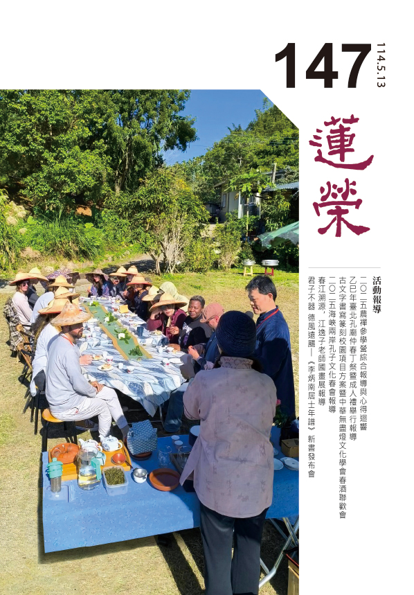
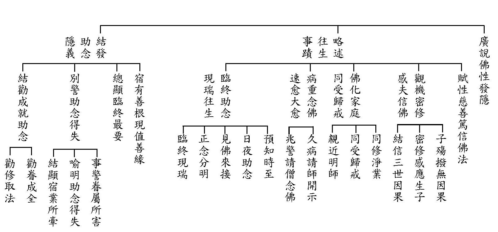
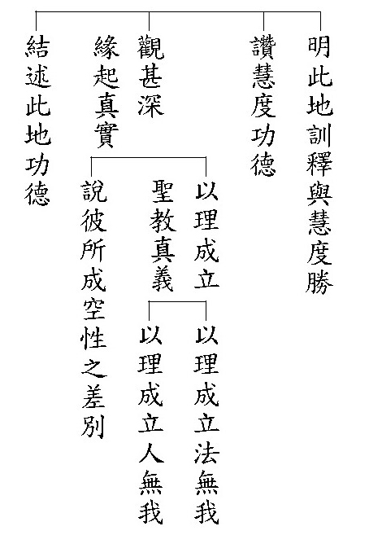
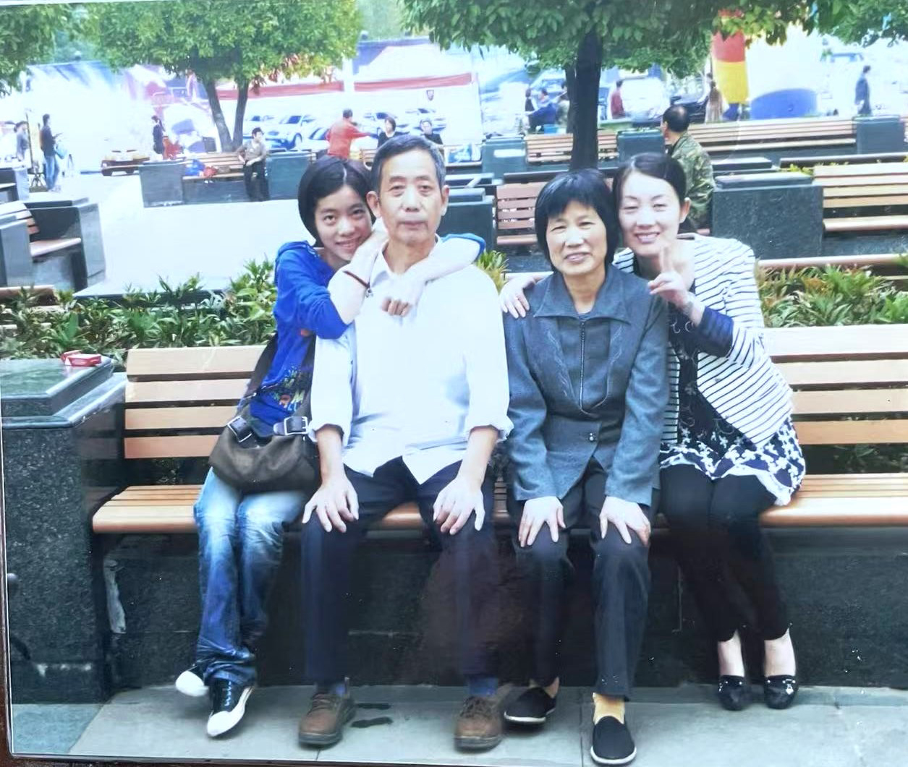
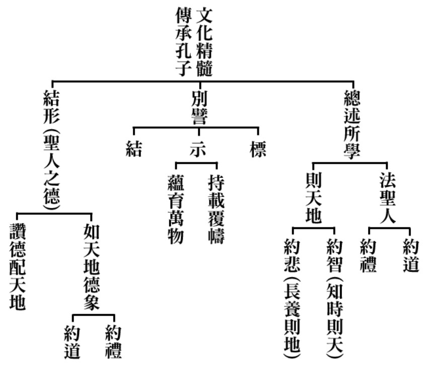

# 第147期

## 社論

### 學佛以解為行前必要準備─以藏傳論著與修證範式與人工智能訓練為喻

本刊

論典解經與思辯

正因立宗得勝解

定解所學能解脫

訓練ＡＩ亦如是

創造分身如上師

提供學者登聖道

佛教在西藏的格魯派傳承，一向以嚴謹的學術傳統著稱，在學習經論時強調通過縝密推理和辯論來驗證佛法義理的正確性。辯經是格魯派僧人訓練的重要部分，目的在於擊破錯誤觀念、建立可靠見解，並駁倒對方對教義的任何謬議。這種辯論不僅是純理論的練習，更是藉由從文字表面推導隱含義理，透過對尋常現象的嚴密分析對應傳承教典深度意涵。經由反覆的問難與答辯，學人得以檢驗自己對教理的理解是否自洽無誤，從而逐步鞏固正確的知見。

格魯派核心論著的編排與研習方式充分體現了上述特色。例如：

•

《釋量論》

著重於因明邏輯和認識論的研習。學僧們先背誦根本頌，再學習傳統註疏，最終透過辯論演練論式，確立可靠的推理能力。在這過程中，任何一條教義都須能以正因證成，否則即遭質疑推翻。如此嚴密的因明訓練，培養了學僧精確思辨的習慣，使之能以理性檢驗經教的真義。

•

《現觀莊嚴論》

是修學般若經義（波羅蜜多道次第）的核心典籍。格魯派高度重視對此論的學習，因其中詳述了從初發心到究竟覺悟的見道修道次第。僧人們透過此論，了解「深觀見」如何引領「廣大行」，並在學習過程中，以辯論討論經論的細微義理，務求對每一階位的定義、因果關係都能以理成立，從理論上無懈可擊，為將來的實修建立明確的路徑圖。

•

《辨了不了義善說藏論》

體現了格魯派嚴謹的判教風格。宗喀巴在此論中，以詳實辯證的方法，區分出佛經中的了義與不了義。他廣泛引用印度聖典和前代大德觀點，加以縝密分析和比較，以論證見解完全契合佛陀本懷。在學習此論時，格魯派僧人會就其中的關鍵論點展開辯論，如對中觀應成派與他宗見解的優劣進行論辯。這種研討方式，促使學者反覆推敲甚深法義，培養敏銳的鑑別眼力，確保對佛語真諦的理解不偏不倚。

格魯派佛學院的整體課程，圍繞上述等經論展開，透過「思、辯」結合的模式，來確認佛法真義。學僧們除了每天誦經研讀外，必定投入辯經庭院，將書本知識化為提問與答辯的實戰。在這種由「論述‧辨析」驅動的學習模式中，一方面依靠經論註疏提供的嚴謹理路作指導，另一方面以辯論檢驗所學，兩者缺一不可。這種反覆辯難的訓練，使得僧眾對所學義理不致止於文字知解層面，而能全然內化為生活的智慧。

有趣的是，格魯派通過監督指導與反覆辯論來引發洞見的傳統，與當代人工智慧（ＡＩ）的訓練模式有著相似之處。以大型語言模型的訓練為例，其過程通常包含監督微調（Supervised Fine-Tuning）和強化學習（Reinforcement Learning）兩個階段，而這與佛學聞思修的次第不謀而合：

（一）監督微調階段

：在這一步，ＡＩ模型會先經由人類提供的大量範例答案進行訓練，相當於讓模型「聞習」經驗豐富的導師所給出的正確示範。這很像僧人首先聆聽上師講解經典或研讀如《掌中解脫》之類的權威註疏，以建立穩固知識架構。在監督微調期間，模型學習到在給定問題下產生合乎預期的回答，這猶如格魯派學僧們背誦經論、理解論著中既定的論證步驟，為後續的自主發揮打下基礎。

（二）強化學習調適階段

：完成初步學習後，ＡＩ模型進入強化學習（通常帶有人類反饋，RLHF）的過程。模型會產出回答，並根據人類偏好或預定目標獲得獎勵信號，以此反覆調整策略。這對應於格魯派的辯經實踐：僧人透過與辯友「過招」，不斷從對方的反駁與上師的指正中學習，在此過程中修正自己的見解。從ＡＩ強化學習的獎勵信號，也可以對比於僧人辯論中被對方指出謬誤時的當頭棒喝，促使學習者調整觀點；而當ＡＩ模型輸出更佳答案獲得高度肯定時，正如學僧在辯論中成功捍衛論點、增強了對中觀應成見解的信念。

（三）辯論與洞見的湧現

：透過監督學習建立的基礎知識，加上強化學習階段的反覆調適，ＡＩ模型常會出現新的能力或洞見，這被稱為「湧現行為」。同樣地，格魯派僧人經過長期聞思及辯論洗禮後，往往能觸類旁通，迸發出老師最初未直接傳授的智慧火花。事實上，OpenAI 等研究者提出「透過辯論來提升ＡＩ安全性」的方法，就是讓兩個ＡＩ圍繞一個問題互相辯論，由人類評判勝負，以期ＡＩ能自行找出更精確的答案。實驗表明，這種ＡＩ辯論機制，可以引導模型完成人類難以判斷的複雜任務，同時保持與人類偏好的對齊。這與格魯派透過辯論釐清深奧義理、激發甚深洞見的作法如出一轍。

總而言之，不論是ＡＩ的優化迭代，還是格魯派的學修並進，循序漸進的監督指導搭配動態反饋的思辨訓練，都是學習關鍵範式。前者確保學習有正確方向，後者激發出隱藏的潛能與智慧。這種模式證明，透過反覆驗證和調整，無論機器還是人類，都能超越原有的知識範疇，達到更高層次的解行表現。

格魯派強調的「解門」為「行門」所做的充分準備，這一點在實際修行利益上表現得尤為明顯。透過嚴謹的學習和辯論，學佛者能夠在行持佛法時獲得真正的利益，並堅定此生學佛不退轉的信念：

•確立正見，指導實修

：先以理論學習，確立對佛法的正見，能防止修行中產生偏差。在沒有充分理解佛法義理前貿然進行禪修，可能會誤解所觀境或停留於偏空偏有的境地；而格魯派的系統式學習，確保修行者對諸法實相有經由理性檢驗的理解，於是在進入實修時方向明確，不致走岔。正如宗喀巴大師所示範的，他一生堅持解行並重，多次閉關前皆先廣學經論，因而在禪觀中迅速突破，獲得對空性及菩提道的決定見。

•培養定解，增強信心

：反覆的論證與辯難會將一個道理刻入心骨，由「勝解」轉為「定解」。當修行者透過思辨確認了某法義的真實不虛，這種確信會轉化為修持中的堅定信心。例如，在深觀緣起性空時，如果已通過周延的論理推演，斷除了對實有自性的懷疑，那麼在禪修觀照空性時，就不易因狐疑而動搖，內心深處篤定的無我正見，終將引領自己邁向解脫。這種信念正是防止退轉的強大動力。

•融會貫通，現觀實證

：格魯派的學習方式，鼓勵將聞思得來的智慧反哺於實踐，再以實踐經驗檢驗並深化理論理解，形成良性循環。透過辯論所得的洞見不僅停留在「比量」的概念層面，而且能在實修中，轉化為親身體驗的「現量」。當學人親證經論中所言不虛，便會生起更大的法喜和精進心，驅使其倍加努力地沿著佛陀與傳承諸師指示的道路前行。如此一來，理論與實修相輔相成，既避免了紙上談兵的空談，也杜絕了盲修瞎練的偏差，讓修行步步為營、穩妥紮實。

正因為如此，學佛者「將聞、思、修均衡結合於一道」，是非常完備而卓越的修學體系。在這種傳統下成長的行者，既有廣博深入的經論素養，又有身體力行的實踐體驗，二者互相驗證、互相支援，使得行者對佛法生起難以動搖的信心。

學佛者應深明，「解門是實證前的必要準備」，並非僅僅理論上的宣稱，而是親身驗證的事實。唯有經由解門的次第穩步學道，才能在實證的殿堂中安穩久住，不會因信仰動搖或境界考驗而退轉。這種紮實的學習方式，方能幫助學佛者在解脫大道上奠定了不退轉的堅實基礎，確保此生的修行不虛此行，直至往生淨土乃至圓成佛果。

## 佛學覽幽

### 菩薩清淨的行持—華嚴經淨行品（六十二）

*戒慧講述、編輯部整理*

日用平常或庸俗

賦予意義則玄妙

以心轉境力強時

佛身境土同時現

丙二、指事顯因答其徵因

丁二、別顯

戊八、還歸洗浴時願（五願）：從舍出、入水、洗身、盛暑、暑退

前言

文殊菩薩告訴智首菩薩，要如何得到佛所有的功德，包括佛身口意十八種不共的功德，以及成佛徵兆的十種功德，得到的方法就是善用其心，並且在一切時中能至誠發願，以大悲心、菩薩心、空性的智慧攝持每一條行持，使行持成為清淨，把日用平常所有的行持歸成十類，共一百一十條，有在家時的願、出家的願，出家當中有受戒、有禪觀，有出去托缽，乃至於托缽之前的盥洗，還有在路中乞食以及進城的乞食，乞食之後在施主家吃完飯，要回到住所，路途中有時要洗澡，或碰到熱天氣、碰到冷天氣是什麼樣的心情，此時是：還歸洗浴時願。

己ㄧ、還歸洗浴時願：從舍出

經文：

從舍出時，當願眾生，深入佛智，永出三界。

還歸洗浴時願共有五願：從舍出、入水、洗身、盛暑、暑退。舍是施主之家，從施主的住處出來之時，心裡也要發願，當願眾生，深入佛智，永出三界。

首句是眾所依事，依此事來發願，有三種狀況，一是根據自己做的事情來發願，二是根據他人做的事情來發願，三是看到事物而發願。第二句叫作願所為境，以眾生為發願的對象，其中包含能發願的自己，以及所發願的眾生。後兩句叫做願境成益，希望所發願之事成就。

願境成益的境指眾生，眾生要得到什麼利益？就是得到深入佛智，永出三界的利益，而我也是眾生，所以我也可以得到深入佛智，永出三界的利益。回應文殊菩薩跟智首菩薩說，如果你這樣發願，你也會得到所有殊勝的不共法，以及成佛前所有的徵兆。

願境成益的第一個層次是隨喜，如果眾生都能夠深入佛智，永出三界該有多好。第二個是發願，我發願讓所有眾生深入佛智，永出三界。更進一步是承擔，我能幫助眾生深入佛智，永出三界。最後祈求三寶加被，讓我有能力幫助眾生深入佛智，永出三界。

佛法的修行，關鍵在這些經文能夠轉變我們的心意，心裡產生變化，生起假如眾生深入佛智，永出三界，該有多好，而且真的想要這樣做，這才叫做修行，如果心裡沒有產生這樣的變化，就談不上修行。

從舍出時，舍是施主的住處，出家人說完法後從施主的住處離開，此時發願，當願眾生，深入佛智，永出三界。

從舍出時，觀想永出三界，想永遠出離三界就要深入佛智。當我從舍出時，要回到哪裡？要回到佛處，觀想辦種種佛行事業深入佛智。

在家人從家出來，觀想出煩惱之家，出離三界之家，回到他的道場修行時，就是深入佛智。

若云：阿羅漢的智慧不就是永出三界了嗎？還需要深入佛智嗎？真正斷三界輪迴的體性，永斷的那一分是要破所知障，所謂「金剛道後異熟空」，金剛道後指金剛喻定斷所知障，異熟空是第八識異熟那一分體性已無，可見深入佛智才能永出三界。

三界的體性是痛苦，永出三界的體性是快樂，離苦得樂靠的是智慧，智慧的生起靠聞思修，沒有第二條路，我們都以為離苦得樂另有方式，其實離苦得樂要靠正知見，正知見才能生起智慧，而正知見靠聞思修，所以修行只有靠聞思修，才能使自己離苦得樂。就像《小止觀》講到一個獨角大仙，在深山中修禪定，功夫非常深，出山之後，憑著他的神通，得到世間諸多的擁護，但他看到美女，禪定全部喪失，在山上的苦修成為無用，所以修行如果沒有正知見，不能使他究竟離苦得樂，所以生起智慧的那一分才是真正的離苦得樂，生起智慧要靠正知見去生起，方式是靠聞思修，而修靠思，思靠聞，所以第一步就是要把道理聽懂，能解經文，才是真正的修行。

己五、還歸洗浴時願：入水

經文：

若入水時，當願眾生，入一切智，知三世等。

從施主的房舍離開，在路上經過河流，可能會入水，會性法師說，從前是赤腳托缽，所以經過河流時會順便洗腳，或是洗手，稱之為入水。入水洗腳、洗臉時，當願眾生，入一切智，知三世等。一切智指佛的一切智，能夠知道三世平等的心，讓眾生都得到平等心，特別是在佛法上能夠得到受用。

入一切智，知三世等，跟入水有何關係？入水比喻入法水，法水滋潤心田，開菩提芽，結菩提果，試問法水如何得到？要靠聞思修才能得到。《了凡四訓》中袁了凡先生曾經感念雲谷大師改變他的命運，所以在雲谷大師過世後設塔，了凡先生寫了塔銘。

入水就是入一切智，能入的是眾生，所入的是一切智，水若以外緣來說，就是善知識。善財童子要生起佛智的那一分，身要先能入，心才能入，身若不能成為能入，心也不能成為能入，舉例來說，天氣很熱，身體不去碰涼水，心裡不會生起清涼的感覺，所以你成為能入，所入的法水叫做一切智，水跟一切智是外緣，一切智指聖者、善知識、佛菩薩，能入的是你，所入的是一切智，而得到一切智能夠顯示的各種功德，其中一項就是知三世等，三世的自相空在一念中以現量的方式生起，所以三世都是平等的，都是以現量的方式顯現。

南亭老和尚的課本說，疏鈔敘說：「十世古今，始終不離於當念。」古今就是十世，當前這一念以現量通達三世。無邊剎境，自他不隔於毫端。極樂世界跟阿閦毗佛的妙喜世界竟然連一根頭髮的距離都沒有，假如我今天從阿閦毗佛的佛國土到極樂世界去玩，憑現在坐火箭，大概還沒有坐到一兆分之一的行程，人就已經死在太空艙。佛對淨土的認識，不管是極樂世界或是阿閦毗佛，能到、能攝受、能緣念都一樣，色塵的顯現跟眼識同時生起，中間沒有任何間隔，如同月亮映到地上的水面，同時有月，同時有水，只要有水有月，立刻浮現，中間沒有任何障礙，所以眾生乞求佛菩薩入眾生心的時候，其實是同時，好比我現在要往生了，不用擔心阿彌陀佛是否有聽到我在念佛，就像打電話到美國，一方講話，另一方同時聽到，佛力的功德就是如此。

己五、還歸洗浴時願：洗身

經文：

洗浴身體，當願眾生，身心無垢，內外光潔。

回到住處洗澡時，當願眾生，身心無垢，洗澡洗的是身，洗心要用法水、用教法來洗，不僅讓身體無垢，也讓內心無垢，身心無垢用內外光潔來形容。

托缽的行者在路邊入水洗澡時，觀想入一切智，知三世等，入水當願眾生，身心無垢，內外光潔。身體要洗澡，心裡更要洗澡，洗除身體的汙穢，洗除心裡的煩惱，甚至心裡洗澡更重要，但是也不妨礙藉著身體的洗澡，觀修心裡的洗澡。（下期待續）

### 大乘百法明門論簡說(五十三)-拾柒、心不相應行法（十一）

*戒慧講述、淨本整理*

語言詮釋色心法

能安立及所安立

中間安立是名言

三者觀待無體性

論文：

第四、心不相應行法，略有二十四種，一得，二命根，三眾同分，四異生性，五無想定，六滅盡定，七無想報，八名身，九句身，十文身，十一生，十二住，十三老，十四無常，十五流轉，十六定異，十七相應，十八勢速，十九次第，二十時，二十一方，二十二數，二十三和合性，二十四不和合性。

心不相應行法的第二十三和合，是指諸法能夠相容。《百法直解》：「和合者，依於諸法不相乖違假立。」比如兩個法合起來不相對立的這一分叫做和合，像水乳交融，水跟乳可以和合起來，這個假立的狀態叫做和合，不是有一個東西叫做和合。僧團就是一種和合，其中有理和合有事和合，理和合就是同證無生的道理，事和合就是身口意戒見利的和合，所謂身和同住、口和無諍、意和同悅、戒和同修、見和同解、利和同均，一定要符合某個定義下，才能成為和合。和合發揮的力量很大，四個凡夫和合僧，威力是如同一個登地菩薩，和合的力量宛如大德住世，雖然我們比大德是差得太遠，但當大家正知見發揮和合力量的時候，是等同於他，所以和合這個名言的定義應該要去注意它。

身和同住的定義是什麼？同住的大眾不一定要造同樣的事業，比如說比丘同住時，有的人去禪關、有的人去掃廁所、有的去讀經、可能有的去買菜、可能有的去招待信徒，造作的業都不相同，但是彼此能夠和合相處，生活上可以互相增進、互相幫忙，這是身和同住。以前阿那律尊者失明，釋迦牟尼佛親自為他縫衣服，原來釋迦牟尼佛也是在實行身和同住。共住能否成功的決戰點在公德心，在於能不能替對方著想。

口和無諍，是在言語上講究不妄語、不惡口、不兩舌、不綺語，雖然在道理上彼此難免有不同的看法，但是會用質樸語、誠實語、柔軟語，在相互尊重的前提下，去分析抉擇，彼此不會互相辱罵。

意和同悅是在心意上接納對方，那樣才能夠意和。比如結婚，感情要維持得住，一定要心意上接受對方才可以。

戒和同修是對於規矩大家都能夠共同遵守，而且這些規矩遵守當中，還有粗細的差別，還有糾察的設立等等，不是那麼簡單。

見和同解是對教法上大家能夠共同學習了解，但這還只是表面的和合，還有更細的方面，是生活上大家的看法也都差不多。比如說這一盆花擺在這裡，你看了覺得不錯，他看了也覺得不錯。這些見地上的和合，要靠生活上去磨合並不簡單。一個道場裡面，如果最後連這些生活細節都合得來的時候，那個是很高的藝術水準。這些細膩的講究，不想被要求的人會默默地破壞這些規矩，此時道場的負責人，一定要很清楚這些破壞對於未來演變的過患，了解何者要先整頓、何者後整頓，才能創造和合的見解。

再說利和同均，就是公家擺第一，私人擺第二。雪廬老人說：「公財如命，私財如土」。過去今彩大師在寺廟執香燈的職務，他把常住的東西看成是像保護眼珠那樣去珍惜，這就是公財如命的覺受。

我們再從《瑜伽師地論》所說的「眼識九緣生」來看和合。九緣和合生眼識，眼識的親因緣是眼識的種子，同類因生同類果，耳識的種子就不會生眼識。眼識的所緣緣是色塵境。眼識的增上緣包括了眼根、作意、空、明、分別依(第六識)、染淨依(第七識)，以及根本依(第八識)。依著第六識起分別的作用，所以第六識稱為分別依；第七識稱為染淨依，是因為依著它起染淨的作用，執我就染，無我就淨。一切都是第八識的變現，所以稱第八識為根本依。要這九個緣才能生眼識，假名叫做和合。

因緣法當中是「因滅果生」，所以九緣滅後眼識才生，然而若九緣滅的下一剎那眼識才生，那麼所緣的色塵境已滅，此時眼識能看到什麼？眼識若見到的是前一念已滅的色塵境，那又為何可以叫做現量？

色法滅而眼識生，經部宗以上的看法，是境界的力量在心識前呈現影像，所以呈現影像的前一剎那境界已滅，後一剎那心識上影像才生，眼識是以影像的方式認識境界，這個影像稱為影像相分，已滅的該法稱為本質相分，本質相分與影像相分兩者相似，以此說眼識看到的是現量成就。佛教經部宗以上都同意這種看法，不過唯識學又特別認為萬法都是心識所變現，不承認外境的存在。

以上是關於和合，和合能生作用，作用有時很可觀。第二十四就是不和合，比如眼識缺了一緣，眼識無法生，假名叫做不和合，並不是有一個東西叫做不和合。以「風平浪靜」為例，風平是遮法，只是遮除風而已，不是有一個東西叫做風平；浪靜也是遮除浪而已。又比如某甲向某乙借錢，某乙說沒錢，沒錢只是遮除錢，不是有一個東西叫做沒錢。和合是成法，不和合是遮法，但和合也只是就條件聚合能產生作用的狀態假名為和合。空性也是遮法，遮除自性稱為空性，不是有一個空性。這些都是很重要的概念。

以上二十四類心不相應行法說明完畢，整體而論，二十四類不相應行法，是如何建立？

第一個叫做依「善、不善」等增減分位差別，建立「得」。

得這個法是依照善增或者是善減，或者不善增、不善減等等來建立。「分位」就是某一分，依照某一分的差別去建立得。善增那就樂多得，善減那就樂少得。好比債劵，這個契約可能是半年後兌現，也可能是一年後兌現，雖然眼前看起來沒有，可是他會兌現，以會兌現假名為得，這雖然是有部的宗義，可是中觀都同意。

第二個叫做依「住」分位差別，建立「命根」。

我們住在這個人世間，或住六十年，或住八十年、或住一百年，在這住的差別當中建立命根。命根是依已滅的引業而假名安立。

第三，依「相似」分位差別，建立「眾同分」。

相似就是定義，眾就是種類，符合相同定義的建立為同一種類，稱為眾同分。我們在找尋事物時，都需要靠眾同分的概念。

第四，依「不得」分位差別，建立「異生性」。

異生性的性就是見所斷的煩惱，因為這樣的煩惱生起了各種的異生。初果位或初地位才能破此煩惱(破分別執)，不再受外道見影響，而成為聖者(同生性)，反之就是異生，即異於聖人的見地。

第五，依「心、心所」法分位差別，建立「無想定、滅盡定、無想報」。

無想定是在因上說，無想報是在果上說，無想定、無想報都是屬於外道；滅盡定是屬於內道。

六，依「言說」分位差別，建立「名身、句身、文身」。

文就是單字，名就是名詞，句就是句子，句子就是有主語述語。身就是聚積，聚積很多單字叫做文身，聚集很多的名詞叫做名身，聚集很多的句子叫做句身。依著言說，而有名身、句身、文身的差別。可是不只在言說上有這個差別，在文字上也有這個差別，在你的法塵的思維當中也有這個差別，比如說你想到葡，還是想到葡萄，還是想到葡萄很酸。此外還可以依六塵差別，比如香積國就可以依香而有這些名句文的安立。

第七，依「相」的分位差別，建立「生、住、老、無常」。

無常就是滅，生就是已生，老就是趨滅。一個法上同時說生，同時說趨滅，同時又可以安立為住(前後相似的狀態)，三個不同定義的法，竟然在一個法上被安立，可見這一法是名言的，不是實體的。

最後

第八，依「因果」的分位差別，建立「流轉、定異」，乃至「和合、不和合」等十種。

這十種都是因果上來說，因果相續的那一分定義為流轉，因果的體性不同安立為定異，多種的因能生果安立為和合，多種的因不能生果安立為不和合等等。

以上二十四類，二無心定(無想定、滅盡定)及無想報，都是依心王、心所上去安立的。其他十九種，皆通色法、心法、心所有法三位之上，假立其名。至此以上有為法九十四種研究已竟。(下期待續)

### 佛學概要十四講表簡說（四十八）-第六講表　宇宙有情概況

*戒慧講述、編輯部整理*

上品十惡與破戒

對境意樂與加行

究竟成就恐怖業

發心弘法能對治

了解地獄對我們的利益實在太大了，雖然講的都是很痛苦的果報，但地獄是我們厭離的根本處，也是大悲心特別要緣之處，對地獄愈了解，幫助有情離苦的心意就會油然而生。而且自己必須先成佛，因為唯有成佛，才能成立三寶，所說之法為法寶，依法而修為僧寶，三寶成為有情的福田，作為有情出離輪迴的增上緣。

接著來看

無間地獄

，名為無間乃有五個無間行相，首先是

趣果無間

，也就是要墮到地獄的眾生，在他前生命盡的時候，就會直接墮入地獄，不需要經過中陰身，叫趣果無間（有說還是有一剎那的中陰身）；第二、

受苦無間

，在地獄受報的時候，種種刑具加身，受苦沒有間斷，中間沒有任何短暫的安樂；第三、

時無間

，在無間地獄受苦，日夜受罪，沒有一剎那可以暫時停止；第四、

命無間

，也就是從進入到地獄道開始，直至出地獄，壽命是不會間斷的，即便他受苦後會死亡，但是他剛死亡就立刻活起來，萬死萬生，求一念要停止都不可能；第五、

形無間

，這個地獄有多大，受苦的眾生他的形體就有多大，例如此地獄縱橫八萬由旬，眾生的身也就遍八萬由旬，遍滿了整個地獄去受種種苦。

用這五無間來形容無間地獄的慘象，世間的苦再苦也不會超出這個範圍。換句話說，他的惡業是很嚴重的，例如造業的對象殊勝、心態邪惡、作法殘忍，最終究竟業成，尤其是以造共業又具足邪見的方式結果最為猛厲。例如殺害父母、師長、三寶，或者破壞和合，乃至於斷正法的傳承，這些業都非常可怕，趨向於最痛苦的地獄；反之，則通往最快樂的果報。所以了解地獄，就知道要如何離苦得樂，知道最苦的業是怎麼造的，就知道最安樂的業要怎麼造作了。

其他如等活地獄、黑繩地獄等都不是無間，他們還是有暫止息的時候，好比等活地獄，涼風一吹他又甦醒過來，那時候苦暫止息，所以不名為無間。

其次

近邊地獄

（遊增地獄），近邊地獄位在八大地獄的旁邊，八大地獄叫做八個根本地獄，每一個地獄都有四個門可以進入，這四個門外面又各有四個小地獄，所以每一個根本地獄就有十六個小地獄，八個根本地獄，就有一百二十八個近邊地獄，又稱為遊增地獄，名為遊增是有情從一個根本地獄出來後，他會遊歷十六個近邊地獄受苦，遭受巨大的痛苦，而且苦具也會增多，所以叫做遊增。

受根本地獄果報的餘報，是受十六遊增地獄之苦，十六遊增過後才能夠脫離根本地獄；入根本地獄之前也是先入十六遊增地獄之苦，但是脫離地獄要走到人、天兩道是很難的，因為在地獄中，他只是把這一期的業受完，並不代表他在地獄裡面有辦法經營善業，所以要投生到善道的那一分極其難，較容易進入到餓鬼道跟畜生道，沒辦法聽聞正法，那是因為聽聞正法的因緣不具足，特別是環境惡劣的那一分，內心也被極端痛苦以及恐懼繫縛，所以容易再下地獄。之所以名為根本地獄，是因為在六道輪迴當中，家鄉就在地獄，我們要從根本地獄生起出離心，如果這一生不經營正見，不經營廣大的善業，這一生沒有往生淨土，未來在輪迴險路中，又不知道有何凶險的事要發生。

十六遊增地獄有四種形象，第一個叫做

煻煨增

，煻煨又稱為熱灰園，是由很熱的灰所構成的，好像烤番薯，或者說把東西放在熱灰裡讓它熟透，這就是煨。從根本地獄出來，他就會陷入煻煨地獄裡，皮肉焦爛，腳進去腳就焦爛，舉足腳又長出來，一直受這樣的苦，這是就熱地獄餘報的那一分說。

第二個是

屍糞增

，其次進入屍糞增，這個地獄由死屍、糞便構成，非常臭穢，裡面還有一種蟲叫毒蜂，也叫孃矩吒，他的口像蜂針，會穿入身體，或是從鼻孔入、腳底出，或是從腳底入、口出，非常臭穢，而且很痛。屍糞增是汙穢業所感，比如此人的想法很汙穢，他的見地、習慣，都在創造汙穢的那一分，會感應屍糞增。所以平常在環境上，尤其在道場中，經營乾淨整齊的環境很重要，讓大家很舒服，有助於我們對治進入屍糞增地獄的業。環境乾淨有何功德？首先就是讓人接觸時，心清涼舒適，也容易讓自己投生快樂的環境中。而且在好的環境，比較能夠心安定來學習正法，更容易感應投生到更好的環境去增上，形成良性循環。在學習正法的環境中，也容易造善業，與他人共作善業，容易讓自己的來生繼續投入好的環境造作以正法為本質的善業。天人也喜歡乾淨的環境，令擁護正法的天人生起喜悅，並且做清淨道場的善，也有助於你修學正法易於證果；比如打掃清潔道場，想成打掃心靈道場的修學，有助於觀修正法時能強而有力。

第三個叫做

鋒刃增

，鋒刃增由刀鋒構成，看似美麗的花園，一走進去不得了，刀山劍樹，所以叫刀刃路，那些樹變成劍樹，叫做劍葉林，葉子掉下來都是劍，都會砍傷、劈斷肢節，還有野狗的噉食，進入鐵刺林時，這些綠樹都會變成鐵刺，上下交織刺傷、刺穿他全身，還有鐵嘴鳥來啄食。這是什麼業感召的？就是過去生中，他在美好的環境中自私享受，不管民間疾苦，外面越慘，他越富有快樂，就容易感應到劍葉林，明明花飄下來很漂亮，可是飄下來卻像一把刀一樣割斷他的腳，一片樹葉飄到他眼前，變成一把劍刺入他的心，所以資源豐沛時，悲憫心很重要。像獄卒修理罪犯，罪犯固然罪有應得，可是獄卒生起快樂的感覺，也會決定獄卒後面的命運，所以同樣是獄卒，有的體性可以轉成菩薩，像無毒鬼王，有的獄卒修理完別人，就直接落入地獄，這些苦樂都跟造業的氣氛感應有關。

第四種叫做

熱河增

，它是廣大沸騰的河，眾生被逼入後沉溺在熱河中，猶如滾燙的高湯燉豬腳。由何業感得這種地獄？由挑起人心的欲望，挑起人心的躁動與貪婪，內心熱呼呼的感應。這個世界苦難的人很苦難，有的地方簡直是人間地獄，有的地方簡直是人間天堂，有的地方安安分分的像人中人，有的地方像人中的畜生，終生被勞役，有的地方像人中的餓鬼，好比非洲。這些都是業的氣氛去感應，所以做如是的觀修，有助於我們在人世間做業的觀察，做業的省思、對治惡業、造作善業。

以上遊增地獄是根據《俱舍論》和《瑜伽論》說的，《婆沙論》裡又有其他名號。

我們來看遊增地獄的壽量，以等活地獄來看，四天王天的一生只有等活地獄的一天，而這位等活地獄的士夫，又有五百歲的壽命，四王天有九百萬歲，再乘以三百六十五天，再乘以五百歲，所以等活地獄的壽命是人間一萬六千兩百億年。八大地獄每一個地獄又是一個倍增，以黑繩地獄而論，就變成一千歲，又以忉利天一千歲做黑繩地獄的一天，以此類推。忉利天的一生是人間的三億六千歲，黑繩地獄的壽命簡直無從算起。

在極熱地獄有半中劫，這半中劫或一中劫要怎麼算？如果往上看，梵眾天的壽命是半中劫，半中劫才是他的一天，梵輔天的壽命是一中劫，一中劫是根本地獄的一天，根本地獄有一中劫，所以無從算起，多到難以想像，為什麼要受苦這麼長？就是因為他用最笨的方式還債，比如他一下子損失幾十億美金，但是他用打零工的方式來還錢，所以在人世間還錢是最棒的，如果他真正去修學正法，做廣大的法行事業，還錢就還得快，不僅還得快，還賺大錢，可惜他選擇用打零工的方式還人間的一屁股債。世尊曾經墮入火車地獄，只是一念慈悲想要分擔老者的痛苦，就出地獄了，所有墮地獄的有情，在痛苦當中念佛就能出得去，這就是正法的功德，但是正法的功德要在地獄出現是困難的，因為大環境讓他生不起善念，就好像學佛的人跑到別的環境，就容易退轉，除非碰到好的因緣，否則會一路退轉下去。

既然地獄的壽命那麼長，在火劫、水劫、風劫來臨時，這些地獄眾生到哪裡去了？他可以寄託到其他的地獄去，這一界壞了，就又轉到其他地獄去，輾轉相繼，壽命都不會停止，一直受苦，受苦當中容易怨天尤人，在受苦當中要生起善念的機率實在太低了，除非他過去有很重的正法習氣，在剎那中生起悲心，不然在爾虞我詐的大環境壓迫中，誰敢善良？就像很多被奴役的人，就算有一天可以解放，他也不敢。六道中只有人間大賺大賠，大賠賠到地獄一直受苦，打零工都還不完，可是大賺可以賺到連天都嘆為觀止，尤其佛法還在的時候，就算欠了一屁股爛帳，都有翻本的機會，佛法就是貴人，三寶在世就是貴人，正知見在世就是貴人。（下期待續）

### 人生大事不能忽略的事實-陳了常優婆夷往生事跡兼佛性發隱（二）

*戒慧講述、編輯部整理*

歷經常人不能忍

考驗道心禍是福

對境解讀分凡聖

功夫不以性別分

文中第二段落，就陳了常優婆夷往生的事跡做說明。先闡述陳了常居士宿世的善良等流習氣帶來此世，文：「

優婆夷了常者，安徽無為縣陳錫周了圓居士之繼配夫人也。姓胡氏，賦性慈善，篤信佛法。

」優婆夷是在家修行的女居士，這位陳了常居士的丈夫是安徽無為縣法號為了圓的陳錫周居士。所謂等流果，分為領受等流和造作等流，領受等流指此人受用的苦樂果，造作等流指此人相續的心態習氣。陳了常居士賦性慈善，指的是與生俱來的善良個性，對佛法是淳厚切實的信受奉行。

接著說她觀機密修，感得丈夫相信佛法，一開始因為長子未成年死亡而不信因果，文：「

錫周初不知佛法，長子天壽，頗聰明，十四歲早夭。意謂我居心行事，無大過愆，何得有此。遂于因果報應，生死輪迴之事，概謂為無。

」陳錫周居士原本不了解佛法，他們的長子叫做天壽，十分聰明，但是十四歲還沒成年就過世。了圓居士自省平常的心態和做事，並沒有很大的過錯，怎麼會遭遇中年喪子的噩運？從此心灰意冷，便不再相信因果報應和生死輪迴。

接著夫人密修感應生子，文：「

夫人知其執不可破，輒密默修持，不令彼知。未久，夫人有娠，將臨產期，忽得大病。二十九日，不能言語飲食轉側。體熱如火，身瘦如柴。名醫束手，絕無生望。一夕，夢老母持一把長幹蓮華，云汝以宿業，得此惡病。幸有善根，是故我從南海，來安慰汝。隨以蓮華，從頭至足拂之。云拂去業障，好生嘉兒。頓覺身心清涼，即驚醒起床，便成好人。次日生子，龐厚豐滿，與健婦所生無異。取名天民，今已十五歲矣。

」了常居士知道無法破除丈夫在這件事上的挫折和情執，更加秘密修持佛法。不久就懷孕了，在臨產時忽然得到大病，當月二十九日，不能言語，也無法好好進食，身體像是發炎那樣全身發熱，身體越來越瘦，骨瘦如柴，就算是厲害的名醫來也束手無策，母親與胎兒都命在旦夕，十分危險。沒想到這樣的折磨與苦難，竟然是度先生的因緣成熟。

一天晚上，他夢到一位老人家手持長枝蓮花，告訴夫人因為宿世的業報而得到這樣的惡疾。幸好有善根，善根指的是對佛法有體悟能力，所以這位老母(觀世音菩薩示現)從普陀山來安慰居士，之後便以手中蓮花從頭到腳輕拂之，口中念著：拂去業障，生出美善的孩子。居士突然感到身心清涼，驚醒後便如同健康的人一般。次日生子，臉龐厚實豐滿，就像健康的母親生出的嬰兒一樣，取名叫做天民，現在已經十五歲。

至此，其夫便相信三世因果，文：「

錫周由是方知佛慈廣大，三世因果之理事，真實不虛。

」了圓居士領會了佛的慈悲與廣大，佛經上所說因果三世的道理，以及自己親身經歷的驗證，都是真實不虛的。

接著是成立佛化家庭，同修念佛法門，並且同受三皈五戒，親近善知識，文：「

從茲夫婦各吃素念佛，努力修持。于救濟貧苦患難，齋僧修廟，施善書，捨棺材，悉隨己力為之。錫周歸依光，法名了圓。夫人函祈歸依，因名了常。九年，夫妻兒女五人，同于北京法源寺，受菩薩戒。去年春，夫人欲來普陀見光，因先朝九華。歸至滬，適奉直兵禍將作，遂未果來，每引以為憾。光慰之曰，至心念佛，則日與彌陀聖眾相對越，何得以不見粥飯庸僧為憾乎。

」

這件事情後，夫婦便同心於佛道，吃素念佛努力修持，也廣造眾善，舉凡救濟貧困、供養出家眾、修建道場，結緣各類善書，或者幫助沒有親人者下葬或捐助棺木，努力地去做上述這些善法。

陳錫周居士皈依印光大師，法名叫做了圓。陳夫人函授皈依，法名叫做了常。民國九年（西元一九二Ｏ年），他們一家五口，一起在北京的法源寺（北京城內現存歷史最悠久的佛寺）受菩薩戒，一九二二年春天，了常居士想要到普陀山參見印光大師，先至九華山地藏王菩薩道場朝拜，回到上海之後，剛好遇到直系軍閥（吳佩孚）和奉系軍閥（張作霖）的戰事即將展開，所以作罷，沒能親見大師，居士每次想到都感覺非常遺憾。

印光大師安慰居士說，用至誠懇切的心念佛，天天與彌陀以及海會聖眾相處，念佛便能與彌陀海會聖眾感應道交，此處對越指的是答謝頌揚的意思，祖師謙虛自己只是凡夫出家人，不用因此而感到遺憾。

略述往生事蹟的第三段是病重念佛，不但大癒而且速癒，從請大師開示到請僧眾念佛兩方面來說明，文：「

以深受驚嚇，故身體瘦弱，久不復原。錫周祈光開示，光令作退步想，作已死想，遂得大愈。今春復病瘦弱，不思飲食。于二月廿八日，正念佛間，見兩童子執長旛，上書西方接引四字。謂錫周曰，此兆于我則幸，于君則不幸。以己一歸西，內顧無人故。然念佛之人，不貪生，不怕死。因請僧四位，誦經禮懺念佛廿八日。以祈壽未盡則速愈，壽已盡則速生西方耳。從此身心適悅，了無病苦。

」

因為曾經受到驚嚇，身體瘦弱久久無法回復健康的狀態。夫人的丈夫錫周居士祈請印大大師開示，印光大師令他們做以下的觀修，退一步想是想成自己沒救了，已死想是自己已死面臨臨終，藉著生病修無常觀，以生病作為佛菩薩加被的條件，如此病能治癒。

一九二三年春天夫人又生病了，瘦弱不思飲食。夫人在二月二十八日時，正在念佛的時候，見到兩位童子手拿長旛，上面寫著「西方接引」四個字。便與丈夫說，這個徵兆對我（了常居士）是好的，但是對於你（了圓居士）卻是不幸的徵兆，因為了常居士一旦往生，家裡便沒人能照顧了圓居士，遇到事情這樣反應，實在是居士平常以正知見修行訓練有素，才有的反應。

念佛之人不貪生不怕死，了常居士依著這個往生的徵兆，迎請僧人誦經禮懺念佛二十八日，祈求壽未盡則快速痊癒，如果壽已盡便快速往生西方。這樣做之後，從此之後身心都舒適愉悅，不受病苦的折磨。

略述往生事蹟的第四段是臨終助念現瑞往生，了常居士不但預知時至，而且外緣上得到日夜助念，往生時見佛來接，正念分明，而且有許多瑞相，文：「

至四月初，復覺不適。知歸期將至，一心念佛，以求速生。初五，全家都為念佛。又請師僧換班續念，晝夜佛聲不斷。夫人但默隨之。初六午前，令備浴具。浴已，著新衣，往佛堂禮拜，供獻香華。歸即移床向西側臥，唯專念佛，概不提及訣別等事。至亥時，見佛來，欲起禮拜，因扶起令坐，作合掌低頭狀。云尚有三千佛，念完即去。全家，同僧俗三十餘人，俱大聲念，夫人遂高聲念佛而逝。面帶笑容，室有異香。全家俱不現悲哀相，又念佛二小時，方為安置。次日午時入殮，頂尚溫煖，四肢柔軟，香氣猶存。

」居士在四月初覺得身體不適，知道自己往生之日已到，便一心念佛，祈求速得順利往生。不但自己一心念佛，家人也在旁護念，又延請出家眾幫忙護持佛號不斷，晝夜念佛無有間斷，居士若體力不佳也會默念隨之。初六中午之前，令旁人準備洗浴的用具，沐浴之後穿著乾淨的新衣，至佛堂禮拜聖像，以香花等供養。之後便將床移向西方側臥，專心念佛，不再留戀娑婆人世。至亥時(晚間九時至十一時)，見到阿彌陀佛親自來接引，居士想要禮拜聖眾，家人扶居士起坐，她便合掌低頭禮敬。說到還有三千聲佛號，念完之後便能前往極樂世界。此時全家與僧俗大眾共三十多人，都大聲同念佛號，居士自己也隨大眾佛號念佛而逝。居士面帶笑容，滿室異香，全家都團結護持繼續念佛，沒有顯現出悲哀的樣狀，又念佛兩小時，再將居士身體放平擺正。次日中午入殮時，居士頭頂仍有熱氣，四肢柔軟，香氣猶在。

上述居士往生的事蹟，白話文看來都能了解，但每一個往生的內因與外緣都能具足實在是不容易。所以祖師最後將居士得以往生的重要條件做一個整理。第一個條件：宿有善根現值善緣，經文：「

噫，夫人可謂宿有善根，現值善緣。不現世間愛情，破壞正念。唯仗多人佛聲，成就淨心。故得感應道交，蒙佛接引。離此苦域，登彼樂邦。何幸如之。

」夫人宿世有善根，又有善知識、佛化家庭以及造善業的種種善緣。不會因為家庭幸福美滿而破壞自己往生的信念。最後臨終時仰仗家人與僧眾護持來成就她往生的心意。最後能與彌陀極樂世界感應道交，蒙佛接引往生極樂世界。離開娑婆世界，高登無有眾苦但受諸樂的極樂世界。哪有人像她如此幸福？

臨終是這一期生命即將結束，是下一期升沉之因，至關重要，文：「

臨終一關，最為要緊。

」由異熟業感來世果有四：隨重業、近業、習業和念業，平常的重、近、習業都會影響臨終的抉擇，假如好與壞的力量均等，在臨終的最後一念，引導到下一生，所以說至關重要。

在臨終時，得助念與失助念更是來生升沉的關鍵，第一部份要警覺眷屬所害，文：「

世有愚人，于父母眷屬臨終時，輒為悲痛哭泣，洗身換衣。只圖世人好看，不計貽害亡人。不念佛者，且置勿論。即志切往生，臨終遇此眷屬，多皆破壞正念，仍留此界。

」世間上無知、淺陋之人，在父母眷屬面臨死亡的時候，就在旁悲痛哭泣，甚至在臨終即將斷氣，不能觸摸身體的關鍵時刻，為其梳洗身體、換衣服，只為了讓世間一般人看到全身清潔、衣著整齊的亡者，卻沒想到這樣做對於亡者的傷害極大。一般沒有接觸念佛法門的人姑且不論，即便是往生志向懇切的修行人，臨終時刻遇到上述這樣不知道如何護持的眷屬，大多的作法皆是破壞亡者正念，無法往生極樂世界仍輪迴在此苦難的娑婆世界中。

以比喻來說明得助念與失助念的結果，文：「

臨終助念，譬如怯夫上山，自力不足。幸有前牽後推，左右扶掖之力，便可登峰造極。臨終正念昭彰，被魔眷愛情搬動等破壞者，譬如勇士上山，自力充足。而親友知識，各以己物，令其擔負。擔負過多，力竭身疲，望崖而退。

」臨終得到助念就像膽小的人上山，自己的力量不夠，幸運的是前面有人牽引，後面有人加力推動，左右又有人扶持，能夠抵達山頂。反之，臨終雖然正念分明，但是被上述家人在旁愛戀哭泣，或者搬動換衣破壞正念，就好像勇士上山，力量強大，但是旁邊的親友都把自己的物品加重勇士的負擔，最後導致勇士擔負過多的重量而力量枯竭、身體疲憊，只能望著山頂卻沒辦法抵達。

結顯都是宿世業力所牽引，文：「

此之得失，雖由他起，實屬自己往昔劫中，成全破壞人之善惡業力所致。」

得助念與失助念，表面看起來雖然是旁人（眷屬等）導致，實在是亡者自己在過去生中，破壞他人善業或者不去成全別人善業，或者是不去破懷他人惡業，甚至成全別人惡業所導致的，可以觀修和反省的地方仍多，每個人可以就自己的知識背景做衍伸與補充。

最後祖師結勸大眾在修行淨業上，必須要重視助念，才能不枉費一生的修行，文：「

凡修淨業者，當成全人之正念，及預為眷屬，示其利害。俾各知所重在神識得所，不在世情場面好看，庶可無虞矣。茲因訃至，故發其佛性，及助念之隱義，并夫人事實之大略。以期修淨業者，知所取法焉。

」所以修持淨業的修行人，不僅要在佛號上用功，更要在成全他人正念上努力，進一步更要破壞他人惡念，預先為家親眷屬顯示得助念與失助念的利害關係。希望大家能夠知道重點在是否真實往生極樂世界，而不在於世間場面好看與否，這樣做的話大概就可以不用擔心是否真能往生了。

印祖說因為收到訃聞，故闡發了只要至誠懇切修行，沒有不能成功的，以及得助念的關鍵利益，家屬等外緣在臨終時護持亡者的重要性，並大略描述了陳了常居士修行改變命運及往生的事跡，期盼以念佛法門為修行重點者，以此為典範並知道如何取法及效仿。

### 週四共修法語-第六菩提心現前地

心若

人法體性不可得

世俗人法唯名言

觀待安立世間心

方有所立世俗相

《入中論》是月稱法師的著作，由十地修學法作為《中論》的能入，尤其以中觀應成派的見地解釋第六地菩薩的修學。龍樹菩薩的《中論》，有用唯識思想來解，如無著、世親論師，有用中觀自續思想來解，如清辯論師，唯有佛護論師、寂天論師、月稱論師以中觀應成派的見地來解讀龍樹菩薩般若的思想。《入中論》特別在第六地的修學，更能彰顯月稱論師中觀應成的思想義趣，並且成為其他中觀論典的能入。又以中論成為能入，佛大般若經的思想成為所入，是一代時教當中，最能夠彰顯佛般若思想的論典。

第六地名為現前地，所謂現前，指般若的見地使空性的義趣常常現前，並不是說前面幾地沒有般若，初地的般若就可以使他以能所雙亡的方式現證空性，之所以第六地才說般若，是因為到第六地的時候，廣大般若的學習，使他有能力在破煩惱障外，又有進破所知障的能力。

第六地大分為兩部分，即法無我、人無我，先講法無我，再講人無我，因為萬事萬物都是緣起法，包括人也是緣起法，所以先把法的無自性解釋清楚，就可以拿破法我的正理來破人我，以理來成立人無我，聖教的真義就是人無我跟法無我。後面總說空性，這些都是在宣說緣起的真實這個脈絡下說的，緣起的真實就是緣起的空性，緣起的空性其實就是人上的緣起、法上的緣起，緣起離開人跟法，就沒有什麼東西叫做緣起，對緣起體性的觀察，才是真正勝義的觀察。

第六地的架構，分為四個段落，首先是「

明此地訓釋與慧度勝

」，第六地慧度增勝，般若智慧能常現前，訓釋特別說明第六地名為現前地的理由，就是般若智慧常常現前。以般若智慧通達空性，是用廣大的正理去通達空性，例如龍樹菩薩《中論》二十七品，全部講修學空性的方法。阿羅漢只會一、兩種通達空性的方便，菩薩通達空性之正理之多之廣，阿羅漢遠遠不及，所以此地菩薩通達空性的般若智慧常常現前，能在第八地時，不但破煩惱障，在第二剎那挾帶殊勝的正理進一步去破所知障。

第二段「

讚慧度功德

」，每一地都有空性慧，但到第六地的慧度特別強，慧度增勝從第六地開始算，就像布施圓滿從初地開始算，雖然二地的布施度勝於初地，但布施的圓滿要從初地開始算。讚歎慧度功德的理由是，前五度沒有第六度的引導，就像盲人一樣，看不到目標，叫做「如有目者能引導，無量盲人到止境，如是智慧能攝取，無眼功德趣聖果。」前五度修學的大德，在第六度來看都是無量的盲人，唯有第六度般若度，能使前五度引向佛果，引導到止於至善的境界。

般若度如何引導前五度指向佛果？般若的智慧引導前五度的福，才讓前五度的福成為成佛色身的因，「如是智慧能攝取，無眼功德趣聖果」，第六度的般若智慧能攝取前五度的修學，本來跟盲人一樣沒有眼睛的前五度功德，就因為這樣的攝取，趣向佛果。

前五地叫做無眼功德，無眼的功德連解脫都算不上，連成佛都算不上，學佛最後一定要透過般若，才能將所作引向解脫跟成佛。沒有般若的智慧，所有菩薩的廣大行，都引不到成佛的果，可見第六地的重要。以比喻來說，前五度有腳，第六度是眼睛，有腳沒有眼睛，走不到目的地。了解這樣的道理，就會對慧度功德產生無比的好樂。

第六地慧度增勝，住於前五地上面，意思是通達般若的智慧從定中發，此時的修學離佛果非常近，因為第六地菩薩通達空性的慧力極為強盛，很接近佛果，對於佛所體悟的法，特別是在空性上的體悟，第六地菩薩都很容易現前，第六地菩薩可以現量、比量見緣起的空性，用比量見就是用無量的正因見空性，用現量見就是以能所雙亡的方式顯現空性，由於他有定中修觀廣大正因的能力，依著空性的智慧，他能入滅盡定，能所雙亡。

空性極難解釋，出定後要對大家解釋空性，猶若對瞎子解釋白色。在能所雙亡顯現空性的那分，有情眾生如何能通達？能所雙亡的能是世俗的心全部隱沒的那一分來現證空性，你如何讓他用世俗的心來現證空性，這是辦不到的，只能用正因讓他體會原來空靈靈的感覺是這樣，但是空靈靈的感覺只是空性的比量而已。

滅盡定是三乘共法，小乘人皆可入，大乘、小乘得滅定的那分皆同，差別在於能得，大乘通達空性的正因非常多。阿羅漢空性的智慧是以破分別執的方式去現證，佛是以破所知障的方式去現證，能力差距極大，無可比較。

第六地菩薩勝解慧度的功德，產生很想修學的善法欲，如何修學慧度？就是以空性為正因，通達世俗的緣起，緣起是依因仗緣、依觀待性、依名言安立的緣起，而不是一般世俗以及下部宗派所講的緣起，六地菩薩從中觀應成的見地得到解脫輪迴的能力，所以對佛的見地無比佩服，佛在講甚深緣起因果觀待性的那一分，此菩薩能以聖言量為正因，通達甚深的緣起，如實信解業雖百劫不消亡，遇緣結果。

所以第三段就進入「

觀甚深緣起真實

」，開始觀甚深緣起的真實，月稱論師立志來宣說這樣的甚深義，因為有情容易聽不懂，會生起諸多聽法的障礙，故月稱論師發誓要破除這些障礙，來宣說甚深的緣起，此是佛的命脈，若凡夫聽聞空性的道理，內心一次次產生歡喜，甚至淚如雨下，全身毛孔直豎，這就是聽聞空性的善根，這種善根包括慧可見達摩；常啼菩薩見曇無竭三藏；密勒日巴尊者見馬爾巴上師，密勒日巴尊者光聽到馬爾巴的名號身毛直豎，他們善根都非常深厚。

立志宣說很重要，否則講的人沒有耐心講，聽的人沒有善根聽，乃至於學的人道糧不足，講的人外務太多，都會成為宣講本論的障礙，縱然大半的人都不是聽中觀的根器，過程中還是會有利根者出現，當他是這樣的法器，就應當為他說勝義諦，鈍根從來不是空性的當機。

說明勝義的相能引發隨順空性的各種功德，修學空性入世俗會對戒律非常喜愛與安住，因為他從空性看到甚深緣起，當他知道空性的見地很珍貴，是佛的眼目，是佛的寶藏，來世要修學空性，需有廣大的福德，此時他會對福德非常重視，而能正受住淨戒，由受住淨戒，來世得人天身有益於修學空性。

最後一段，是「

結示此地功德

」，說明第六地的功德。以上第六地最重要的部分，就是觀察甚深緣起的真實，甚深緣起的真實成為所觀，能觀的是般若智慧，能觀般若的智慧要藉由通達空性的正因生起，所以第六地全部在廣論如何生起空性的正因。

通達空性要依教證、依理證，兩者若要比較，依理證比較厲害，如果釋迦牟尼佛不依正理成立，外道就可以打敗他，釋迦牟尼佛對利根說你必須懷疑我，對鈍根說你必須相信我，利根的人善於思辨，必須用正理說服他，龍樹菩薩二十七品的中論通通是要依道理來證，成立正因來通達空性。

能夠依於經教、依於正理來通達空性者，唯龍樹菩薩這位大論師，龍樹菩薩的諸論中，根本的中觀論就是《中論》，其他引申出來的有《細研論》、《回諍論》、《七十空性論》、《六十正理論》、《寶鬘論》，特別厲害的就是《中論》，從第一品開始就講空性，一路到二十七品。而隨著龍樹菩薩安立的正因，月稱論師來解龍樹菩薩的《中論》，《入中論》中特別是第六地在解龍樹菩薩的《中論》，其他論在解《中論》隱藏的世俗法的部分，月稱論師把他開顯出來。以上是第六地簡單的架構分析。

### 週四共修法語-第七菩提心遠行地

淨本

善巧方便且行權

入世卻又離生死

磨練能使願力堅

以此能耐入八地

第七地的菩薩稱為遠行地，「地」是指現證空性的證量，從初地到十地，都可以能所雙亡現證空性，成就地的體性，所以都稱為地。「十」的分類，是登地菩薩入世廣大行的較量有高低不同，所以區別為十。第七地菩薩的特徵，在於他具有各種度化眾生的善巧方便，此外因為他在第六地時廣學般若，入空性定的速度不斷增快，到第七地時，已經能夠在剎那間入能所雙亡，而煩惱障也將會在此地過後，在第八地的第一剎那盡斷，可說是離生死甚遠的一位菩薩，是故稱之為「遠行地」。

《入中論》對於遠行地菩薩的介紹只有三句：「此遠行地於滅定，剎那剎那能起入，亦善熾然方便度。」連四句偈都稱不上，文字說明相當有限。應知從初地到七地，已經接近一大阿僧祇劫的修行，是非常長時的修學。此處用三句話就收攝完畢這位菩薩的能耐，實在非常簡要，若沒有其他經論的補充，我們很難明瞭七地菩薩深遠的內涵與能力。

結合《論語》的經文，從《論語》的見地來看十地菩薩的修學法，是學習上非常好的一種補充。老師因此特別利用這次二二八連假期間，為時青班的同學們講授這樣的主題。印祖曾說「儒佛合則雙美，分則兩傷」，孔子傳為文殊菩薩再來，他一生的事蹟、對後世的影響力，以及綜觀他留傳下來的各種言論與著作，也確實發揮了如文殊菩薩的功能，此時以他的《論語》來闡釋《入中論》，以他的言行作為地上菩薩的演義，又有何不可？

首先來看「此遠行地於滅定，剎那剎那能起入。」這二句是在講七地菩薩具有剎那間入空性定的能力，也就是獅子奮迅三昧。能所雙亡的空性定是最難入的一種定，因此被稱為第九次第定，在四禪八定之上。阿羅漢想要入這樣的定，必須要閒居靜處、遠離人群，然後在他所學有限的空性正理中，慢慢觀察，才能進入能所雙亡。第七地菩薩經歷長劫的學習與磨練，至此已經能剎那間入定，無論是居阿蘭若中或者身處鬥鬧之場，他都能在剎那間入能所雙亡。所謂「指揮若定失蕭曹」，這種在千軍萬馬的衝殺中都能指揮若定的能耐，已經遠遠不是阿羅漢能企及的了。他們或許曾經是同學，一位選擇了自了生死就好，一位選擇了利益一切有情，「差之毫釐，失之千里」，兩種不同的抉擇，經歷長劫的時間以後，兩人已經是不能同等而語了。由此可知佛說「焦芽敗種」，是出自他對阿羅漢的悲心。

後一句「亦善熾然方便度」，就是在說明七地菩薩廣度眾生的善巧方便。七地菩薩之所以能有各類的善巧方便，最主要在於他有知道時機的眼力，而孔子也是在知時機上最為特出的聖人，孟子稱他是「聖之時者也」。〈鄉黨篇〉的最後一章，「時哉時哉」就是孔子能知時機的總歎。經文開頭是：「色斯舉矣，翔而後集。」這兩句是出自古詩，意思是說，當人的臉色有變，態度不善，鳥都會有所感知而立刻起飛躲避，等到迴飛觀察確定安全，才會回到樹木上棲息。鳥都知道看時機而進退得宜，人怎能不如鳥呢？本章經文就以這二句古詩作為開頭，引出後面孔子的感嘆：「山梁雌雉，時哉時哉。」孔子看見山澗上的橋樑旁，有母的野雞悠游其間，自得其樂，這正是知時的形象。看懂人情世故、掌握進退時機，這是十分不容易的一件事情，甚至要到七地菩薩才能真正做得圓滿。難怪乎孔子對顏淵說：「用之則行，舍之則藏，惟我與爾有是夫。」

有用行舍藏的眼力，還要有用行舍藏的能力，才能發揮大用並且全身而退。孔子說：「可與共學，未可與適道；可與適道，未可與立；可與立，未可與權。」權變這件事情，是學道的最後一階，最難的一段，所謂「反經合義」、所謂「其愚不可及也」，這些也是七地菩薩的特出之處。

《論語》裡面有一段有趣的故事，孔子周遊列國來到楚國，原本楚昭王要給孔子七百里地去發揮他的理想，但因為子西大夫的勸阻而作罷。昭王不久後過世，楚惠王即位，孔子留在楚國，觀察是否因此會有新的契機。此時有一位楚國的狂人名字叫做接輿，他刻意經過孔子居住的館舍並大聲唱歌：「鳳兮鳳兮，何德之衰。往者不可諫，來者猶可追。已而已而，今之從政者殆而。」鳳是比喻孔子遭逢亂世，德能不能彰顯，十分衰微。過去已經無法勸諫，但未來的還可以追及，狂人此時想要勸孔子放棄理想，因為即便是新王即位，政局仍是十分危險，無可作為。孔子聽了這首歌感到很驚訝，他知道狂人其實是一位看得懂政局的高人，他只是假裝瘋狂。於是孔子趕著走出門想跟他談話，他卻已經快步走開。

裝愚、佯狂，有何困難？為何說是七地菩薩的能耐？因為裝愚的時機並不容易看明白，再來裝愚的能力與魄力也不容易學會。特別是本來可以享受高官厚祿的能人，如何能拒絕這種社經地位的誘惑，平白地把自己變成人人看不起的傻瓜？而且要傻到人人相信，那要有多大的犧牲、多長時的表演，才能獲得別人的「認可」。發狂、邋遢、吃土、吃糞，一一上演，若非大成就的瑜伽者，恐怕難以經歷這種考驗！這是透過楚狂去看懂七地。

除了楚狂接輿之外，其他比如蘧伯玉與南容，也是能行權的賢者，他們的言行事蹟，都可以當作我們揣摩學習七地菩薩的表率。此外孔子面對佛肸、公山弗擾或南子的招手時，表現出獨特的應對智慧；或者他對孺悲辭之以疾，又取瑟而歌，這種教學手法上的反經合義，都可以豐富《入中論》對七地菩薩的說明。

從《論語》的見地解讀《入中論》十地菩薩的修學方法，還可以給我們另一種重要的啟發，那就是十地菩薩的修學內容，是從凡夫就要開始扎根，從凡夫就可以開始培養這樣的能耐與習氣，慢慢累積，不停串習，逐漸養成出這種氣象，才有登地之後的各種廣行。所謂「學而時習之，不亦說乎。」世間的各種知識技能沒有一蹴可幾，登地菩薩的能耐，也是同樣的道理。

### 週四共修法語-第八菩提心不動地

淨柔

自在不受惑業繫

諸佛願力一肩挑

入世不怕魔王難

要為眾生做馬牛

第八地菩薩稱為不動地，何以稱之為不動？因為從初地到第七地，雖然能調伏煩惱的現行，但煩惱的種子與習氣仍然存在，直到第八地的第一剎那，煩惱障才徹底斷盡，不再受煩惱動搖，截斷入輪迴的續流。

舉例來說，從初地到七地的菩薩如同一個國家雖仍有流氓盜賊，但這些流氓盜賊根本不是初地到七地的對手，對於國家的治安已構不成威脅。然而到了第八地時，是這個國家沒有任何一個盜賊，因為煩惱障已徹底斷除，微細的人我執與法我執皆滅除，不再對「人」或「法」產生實有的執著，此時智慧最極清淨無染。

孔子就有如此氣象。魯定公十四年時，孔子由大司寇代理宰相，治理魯國三個月，便讓商品不二價，路不拾遺，魯國大治。這使魯國旁邊的鄰居齊國深感害怕，如果魯國繼續用孔子，一定對齊國不利，於是以女人和樂隊之計來迷惑魯君，破壞孔子為政。當時選了能歌善舞的美女八十名，以及上好的三十四輛馬車，每輛車都配著四匹好馬，陳列在魯國城南高門外要贈送給魯定公。季桓子還引魯定公去觀美色，並接受齊國的饋贈，結果魯君開始天天享樂，連續三天不理朝政，加上後來孔子隨著魯定公參加在郊外的祭祀之禮，但是祭典完畢後，魯定公沒有把祭肉分給與祭的孔子，孔子便以魯定公沒有把祭肉分給他為藉口離開魯國，開始周遊列國十四年的生涯。

其實，孔子大可繼續留在魯國當大司寇吃香喝辣，名利雙收，且第一大黨是三家大夫，第二大黨就是孔子，加上學生們都在做官，應可跟孔子串聯來做一番事業。再者，魯定公才三日不朝享樂，孔子就選擇辭官離開魯國，可見孔子志在行道，不再謀官求名，當這個道不能行時，孔子能對治貪愛，斷然離去，不受惑業繫縛。

從十度波羅蜜的角度來說，第八地菩薩是就「願」的這一分說增上。願就是欲，有著強烈的欲求，數數的欲求、不斷增上的欲求，勝過前面七地的善根。善根就是開竅，讓每一地的修福修慧都可攝入善根，使自己在出世和入世都開竅，有能力達成一切大願，並成滿諸佛的願力。

具足這樣的能力是因為有前面初地到七地的躬身入局，全心全意投入磨練所建立的信心和能耐，讓他有自信一切願望都可以圓滿成功，也因福力和慧力廣大，使他不會夾帶退轉或辦不到的心態，且知怎麼處理事情。所以，當一位行者具備了深厚的福德與智慧，並以中觀應成派的見地來觀察外境，就能圓滿解讀世間的種種境界，使他的願力不再受限，能夠夾帶過去強大的經驗閱歷去勇於想像與實踐。

證得第八地時，內心會生起入無餘涅槃的念頭。所謂無餘涅槃，即滅除世俗之身與心，完全安住於空性定。這或許令人困惑，大乘菩薩的理想應是留在輪迴的世間廣度眾生，何以會產生入無餘涅槃的想法？這是因為從初地到七地的菩薩雖能降伏煩惱，但仍帶有微細的業，這些菩薩處在這個世間，因為有他的願力、福德和慧力，讓煩惱奈何不了他，無法現行。但到了第八地，是廣修福去滋潤慧，才真正得到沒有煩惱的寂滅和快樂，此時便自然生起入涅槃的境界，完全遠離輪迴。

這時要讓他從滅定中起定，就要靠諸佛的勸導。諸佛之所以能勸導第八地菩薩，正是因為菩薩本具大願力。當諸佛告知他：「你雖得寂滅，然眾生仍在生死流轉，你的成佛大願尚未圓滿」，菩薩便會因所發大願從滅定中出定，再度投入眾生的世界繼續弘法利生。如同諸葛亮隱居南陽時，專心務農，過著寧靜閒適的生活。然而，當劉備以天下蒼生的大義相邀，諸葛亮便毅然出山，輔佐劉備復興漢室，因為諸葛亮內心仍懷抱著天下蒼生的大願，即使再安逸的生活，也不會使他忘卻使命。

八地菩薩煩惱障斷盡，故能截斷輪迴的續流，無入胎之昧，無隔陰之迷，他不會因為此生死後投生轉世就忘了前世的因緣。孔子說：「天生德於予，桓魋其如予何。」孔子五十八歲時，離開衛國往曹國去，可是曹國人不接納孔子，後來又離開曹國去宋國，路途中與弟子們在大樹下演禮。結果宋國執政大夫司馬桓魋，便派人砍伐那棵大樹要殺害孔子，弟子們知道後都想抵抗，並催促孔子趕緊逃走以避禍。但孔子卻從容地說：「上天賦予我推行文化道統的使命，那麼桓魋又能奈我何？」可見聖人處於變局，知道憑著自己的德性、智慧，可以從容超越逆境，小人是無從妨害他的。聖人除了承接天命外，也懂得趨吉避凶的權變之道，通達甚深的緣起，所以孔子變裝後順利離開宋國，得以脫險。

孔子也是一個明知不可為而為的聖者，有一次子路夜宿在石門外，到了第二天清晨，負責開閉城門的人一開門就看到子路，可見子路是連夜趕路，才會夜宿在石門，看門者問子路：你從哪裡來？子路說：我來自姓孔的門下。看門者一聽就知道是孔子，便說：「就是那位世局不可挽救，道不可行，卻仍執意要去周遊列國，尋找行道機緣的那個人嗎？」可見看門人也深知孔子，才提出這樣的問題。這正說明孔子是明知不可為而為，即便世局艱難，他仍堅持傳承文化道統，才使得文化的傳承變成大有可為，具有八地的證量，願力堅固，永不退轉，欲求增上。

子貢曾說：「上天本來就有意放縱我的老師成為大聖人，而且老師又多才多藝。」孔子也自述自己從小出生卑微，生活窮困，為了謀生必須學會各種生活技能，做很多粗鄙小事，也曾當過管牛羊畜牧的小官，當過管糧倉、管會計的公務員。這些技能雖無關於修道治國，卻成就了他的多能之才。

孔子又說，入世的君子必須具有仁心的情懷，所以君子不是以多能來定義的，可是君子的多能，能輔助他入世之功，這一點孔子沒有反對，就像《論語》上說「君子不器」，君子不要像器具一樣只有一個用途，雖然多能不是君子，但君子要有多能。因此，吾等在修行的因地時應努力培養見地與能力，使自己遇見善知識沒有障礙，且善知識願意傾囊相教，方便學習各種世出世間的智慧，可以學到文武之道的大，也可學到文武之道的小，進而成就八地菩薩的證量，不受煩惱業繫縛，能於三界中普現各種身，成就十種自在，依此福慧願力往生西方極樂世界，成就佛果，利樂有情。

### 果清律師供僧法會開示錄

宗徹、愛蓮

首次洋人的參訪

念佛法門的開示

殊勝案例的勸修

修持成就的心態

諸位善知識，大家午安，阿彌陀佛！

今天非常歡喜，中華無盡燈文化學會會長唐教授，率領了我們無盡燈的菩薩蓮友們，還有木魚基金會農禪營的大德、居士們，前來供佛齋僧，大家功德無量。

今天準備做法供養的就是印光大師兩段的法語，這兩段的法語非常地要緊，我們講到明瞭之後，從此盡此一報身，好好依照著修行，我們將來都能往生到極樂世界去。

Dear virtuous friends, good afternoon, Amitabuddha!

Today, I’m filled with joy as Professor Tang, President of the Unlimited Lights Chinese Culture Academy, has led our Bodhisattva fellow practicians from the Academy, along with the virtuous ones and lay devotees from the Woodenfish Foundation’s Farming Zen Retreat, to make offerings to the Buddha and provide alms to the Sangha. Your merits and achieved are immeasurable.

Today, as an offering, I’d like to present Dharma words from two of the verses by Venerable Master Yin Guang. With a thorough understanding of and follow closely to the two important verses, we will be born together in the Pure Land of Ultimate Bliss when this retribution body is over.

印光大師法語（一）

Venerable Master Yin Guang’s Dharma: Verse 1

吾人心性，與佛同儔，祇因迷背，輪迴不休。

"Our true nature is comparable to that of the Buddhas,

Yet, deviated and lost in delusion, we endlessly stuck in the cyclic Samsara."

我們就簡單地加以解釋。我們每一位眾生的真心佛性，跟諸佛是同等的。諸佛澈底成佛了，佛性沒有增加一點點；我們眾生迷惑顛倒，佛性也沒有減少一些些。我們眾生只是因為迷惑，違背了本性，所以在三界六道裡頭，這樣地輪迴生死，而不能休息。

Let me briefly explain the concepts. The true Buddha-nature inherent in sentient beings are equivalent to that of all Buddhas. All Buddhas fully enlightened, will not have their  Buddha-nature increased a bit. We, sentient beings, though deluded and confused, our Buddha-nature will not be diminished slightly. We, be wildered beings simply lingering  in reincarnations of life and death, struggling in the Three Realms and Six Paths, unable to be at ease.

如來慈憫，隨機說法，普令含識，就路還家。

“The Tathagata, in great compassion, speaks teachings as needed,

Guiding all sentient beings back home along the right path.”

如來，就指我們本師世尊，慈悲憐憫我們眾生，隨著眾生的根器，來宣說法要，普遍使令含識眾生，含識指眾生都含有八識，就著流轉生死的路，能夠回過頭來，好好修行，回到我們極樂世界的本家。

The term "Tathagata" refers to our root master (guru), the World-Honored One, who, out of compassionate mercy for sentient beings, expounded the essential teachings of the Dharma in accordance with their capacities and affinities. This is intended to guide all beings with perceptive power—those endowed with eight perceptive powers—to turn around the vicious cycle with substantial practice, could we be able to arrive at the home in the Pure Land of Ultimate Bliss.

法門雖多，其要唯二，曰禪與淨，了脫最易。

“

There are many ways (doors) to enlightenment, two are supreme:

Ch’an and Pure Land are both easy shortcuts to salvages.

”

佛說的法門雖然很多，所謂有八萬四千法門，而其中最重要的，唯獨兩個法門，就是禪宗跟淨土宗，了脫生死是最為容易的。

Although the Buddha taught as many as 84,000 approaches to the Dharma, two among them are significant: the Ch’an (Dhyana) School and the Pure Land School of Buddhism. And the Pure Land School offers the easiest access to a transcendent realm, that emancipated from the cycle of birth-and-death.

禪唯自力，淨兼佛力，二法相校，淨最契機。

"

Ch’an Buddhism relies solely on self-attained fulfillment, while Pure Land Buddhism also draws on divine Buddhist support.

Between the two, Pure Land tradition is relatively more beneficial to practicians of Buddhism.

"

禪宗唯獨靠著自己修持的力量，而淨土宗兼帶有阿彌陀佛慈悲願力的接引。所以這兩個法門互相比較起來，淨土宗是最契合末法時代眾生的根器。

The Ch’an School relies solely on one's own capacity, while the Pure Land School combines men’s efforts and the powerful vows of the compassionate Amitabuddha as our guidance. The Pure Land School is then most aligned with the spiritual capacities of sentient beings in the Age of the end of Dharma (Sad-dharma viprolopa).

如人度海，須仗舟船，速得到岸，身心坦然。

"

As of a man needs a boat to cross the sea,

One’s body and mind will find peace with a speedy arrival on the other side.

"

就好像一個人要度過大海，必須靠著舟船的力量，我們才能迅速去那個彼岸，到達對方的岸。而身心感覺非常地坦蕩安然。

With the help of speedy vessel across the sea, one will fill with delight on the mind.

末世眾生，唯此堪行，否則違機，勞而難成。

"

For Beings of the Age of the End of Dharma, only the Pure Land School is the viable way.

Without taking the shortcut, it will be hard and will yield nothing.

"

末法時代的眾生，唯獨這個淨土念佛法門，堪可依照著去修行，否則的話，就乖違末法時代的根器，修得非常勞苦，而且難以成就。

For sentient beings in the Age of the End of Dharma, only the Pure Land School's practice of Buddha-recitation is truly the most convenient and handy for Buddhist practicians.

Or, when one goes against the Karmic inclinations of the said Age, practicians will find their cultivation exceedingly arduous and difficult to accomplish.

發大菩提，生真信願，畢生堅持，唯佛是念。

"

Awaken great Bodhicitta (heart of enlightened mind), and give rise to true faith and vows.

Commit them as lifetime practice, keep Buddha most worthwhile in one's mind.

"

我們要怎麼修呢？就是要發起廣大的菩提心，不但我們自己好好修行就算了，也要發心度化有緣的眾生。跟我們都能夠依照這個法門修行，而將來都能往生到極樂世界去，一直修，修到成佛，然後成佛了之後再倒駕慈航，到有緣的世界度化眾生；又能夠往生到極樂世界去，輾轉地度化。這個就是發起大菩提心。

How do we practice Buddhism? To widely generate the Bodhicitta—a mind that wishes to free beings of affinities  from suffering, and brings them to reach enlightenment.

So that we can go hand in hand to an ensured future, to reborn in the Pure Land of Ultimate Bliss until the attainment of full Buddhahood. Riding on our compassionate vows, returning to the secular world to fulfill our mission as guidance for beings destined to meet.

We will then once again be reborn in the Pure Land, as a continuity of what we vow for the emanation of Bodhicitta.

除了發起廣大菩提心之外，還要怎麼樣呢？也要生起真實的信心，發起懇切的願。講到信心，就是要深信我們是業障深重的凡夫，假如沒有靠著阿彌陀佛的大慈悲願力來接引，我們是很難以成就往生的這種大願。

In addition to generating Bodhicitta, what else is required? We must have genuine faith to make solemn vows. Regarding faith, we must deeply believe that we are simply beings burdened by heavy karmic obstacles. Without relying on the great power of compassionate vow by Amitabuddha to guide and receive us, it would be extremely difficult to be aspirated and reborn in the Pure Land.

還要深信我們本師世尊在最初淨土的三經─《佛說阿彌陀經》、《佛說無量壽經》、《佛說觀無量壽佛經》，這是《淨土三經》。後來古德又加上了兩部，就是〈大勢至菩薩念佛圓通章〉，還有〈普賢菩薩行願品〉，這兩部雖然是菩薩所說，但是都經過佛印證過的，所以等同佛說一樣的。這就是所謂的深信《淨土五經》的這個圓教是真實不虛的，因為佛是「真語者，實語者，如語者，不誑語者，不異語者」，佛所說的話是最真實不虛的，都堪可使令眾生依教奉行的。

Moreover, we must deeply believe in the teachings of our original teacher, Buddha—the World-Honored-One, written in the fundamental Three Pure Land Sutras—"The Sutra In which The Buddha Speaks of Amitabha”, “The Sutra In which The Buddha Speaks of Immeasurable Life”, and  “The Sutra On Contemplation of Immeasurable Life of Buddha.” Later, ancient virtuous masters added two more texts: "The Chapter on the Perfect Penetration through Mindfulness of the Buddha by Mahasthamaprapta Bodhisattva" and "The Chapter on Practices And Vows of Samantabhadra (Universal Virtue) Bodhisattva". Although these two chapters were spoken by Bodhisattvas, they were affirmed by the Buddha and thus hold the same authority as that of the Buddha’s own words. These form the Five Pure Land Sutras.

We must have unwavering faith in the complete and thorough teachings in these Five Sutras, knowing what they stated in them are utterly true and never false. What the Tathagatha speaks is “true, real as it is, and never deceptive nor contradictory.” The truth that Tathagatha has attained is real, never unreal. The say-so should be followed in practice.

然後也深信阿彌陀佛在因地做法藏菩薩比丘的時候，對著世自在王佛發起四十八大願，這四十八大願並都記載在《無量壽經》裡面。

Furthermore, we must deeply believe that Amitabuddha, during his causal stage as the monk Bodhisattva Dharmakara, made 48 great vows before Buddha Lokesvararaja (世自在王佛). These vows are fully recorded in the sutra in which "The Buddha Speaks of Immeasureable Life" (《佛說無量壽經》), where they serve as the fundamental vows of the Pure Land tradition. Through these vows, Amitabuddha pledged to create a Pure Land where all beings who chant his name with faith and aspiration could attain rebirth in the Pure Land, transcend sufferings, and ultimately achieve Buddhahood.

也深信十方諸佛都稱揚讚歎這個法門，也深信我們能夠好好念佛的話，我們將來就能夠念佛念到一心不亂，有如是因，將來就可以往生極樂世界，跟諸上善人聚會一處的果。有如是因，必有如是果。

We must also deeply believe that the Buddhas of the Ten Directions all praise and extol this Dharma way. Moreover, we must deeply believe that if we heartily recite the Buddha’s name, we will attain a stage of single-mindedness throughout this practice. The link between cause and effect, assured us to reborn in the Pure Land of Ultimate Bliss, meeting all superior beings. Such a cause will unfailingly yield such an effect.

接著有信之後，我們要發起懇切的願。願的內涵，就厭離娑婆世界有種種苦，欣求極樂世界有種種殊勝微妙的快樂。娑婆世界有什麼苦呢？所謂有生、老、病、死、愛別離、求不得、怨憎會、五陰熾盛的八苦。這八苦開出就無量諸苦，所以娑婆之苦，苦不堪言，所以我們要厭離。

Following the cultivation of faith, we have to generate solemn and earnest vows. The essence of these vows lies in renouncing the Saha (secular) world with its manifold sufferings, and afterall aspiring wholeheartedly to reborn in the Pure Land of Ultimate Bliss, which is a place of sublime and wondrous joys.

What are the sufferings in the Saha world? There are Eight kinds of Sufferings in the Saha world:

1. Birth (pain of entering this world)；

2. Aging (decay of body and mind)；

3. Sickness (physical and mental afflictions)；

4. Death (the anguish of separation and uncertainty)；

5. Parting from loved ones；

6. Failing to attain what we desire；

7. Encountering those we despise；and

8. The torment of the Five Aggregates.

These kinds of suffering proliferate into countless forms of anguish, making the Saha world unbearably painful beyond ex

pression. Thus, we must resolve to renounce Saha suffering and single-mindedly wish for a release from it.   Only by turning away from Samsara (the repetition of birth and death) and fervently seeking any chances of rebirth in the Pure Land, can we transcend these endless cycles of affliction.

那麼接著有厭離娑婆種種苦，欣求極樂有種種殊勝微妙的快樂，那麼有什麼快樂呢？好比我們十方世界的念佛眾生往生到極樂世界去，都成為不退轉的菩薩。全部十方世界念佛眾生往生到極樂世界去，都成為不退轉的菩薩，而大多數的不退轉菩薩，都成就一生補處，就是等覺菩薩的地位。而等覺菩薩的數目，不是普通世間的算數所能算出來的，只能用無量無邊阿僧祇來宣說。

Then, having renounced the myriad sufferings of the Saha world and aspired to the sublime and wondrous joys of the Pure Land, what are these joys? For instance, all sentient beings from the ten directions who recite the Buddha’s name and attain rebirth in the Pure Land of Ultimate Bliss will become non-retrogressing Bodhisattvas. Almost all Bodhisattvas reach the stage of non-retrogression, will probably take up a buddha’s place, at a status called "one lifetime to attainment"  (一生補處) , the rank of Equally Enlightened Bodhisattvas (等覺菩薩), poised to attain full Buddhahood in their next life. The number of Bodhisattvas of Equally Enlightened can’t be calculated by ordinary worldly mathematics. It can only be described through terms like "immeasurable, boundless, and asaṃkhyeya"  (無量無邊阿僧祇)— a cosmic time scale of incalculable vastness.

而且極樂世界有七寶池、八功德水、七重行樹、七重羅網、黃金為地，思衣得衣，思食得食。講到思衣得衣，就是我們想要穿法衣的時候，法衣自然加在身上，不假裁縫，不必修改過，自然合身的。而想要吃的時候，七寶缽器自然現前，食已自然化去，不勞洗拭。所以一旦往生極樂世界去，我們就不必再洗碗筷啦，師父們也就不必再洗缽啦！

Moreover, the Pure Land of Ultimate Bliss is adorned with seven-jeweled ponds, eight-merit waters, seven rows of jeweled trees, seven layers of celestial netting, and ground paved with gold. Clothes and food manifest at the mere thought—when one wishes to wear Dharma robes, they naturally adorn the body without the need for tailoring or alterations, perfectly fitting. When one desires food, seven-jeweled bowls and utensils spontaneously appear, filled with delicacies. After the meal, these utensils vanish naturally, eliminating the need for washing or cleaning. Thus, once reborn in the Pure Land, we no longer need to wash dishes or bowls—and monastics are freed from the chore of cleaning their alms bowls! Such are the effortless, miraculous qualities of that blissful realm.

而且往生極樂世界，都跟諸上善人聚會一處，在極樂世界找不到壞朋友。所以自然我們就依此修行，將我們舊的惑業都消除了，一直修，修到成佛。所以我們要發起懇切的念，厭離娑婆的種種苦，欣求極樂有種種殊勝微妙的快樂，這種的願力非常地懇切。

Furthermore, upon rebirth in the Pure Land of Ultimate Bliss, we will gather among an assembly of supremely virtuous beings—there, no harmful companions exist. Thus, through such an environment, we naturally engage in Buddhist cultivation, gradually eradicating our accumulated delusions and karmic obstructions, persisting in practice until we attain Buddhahood.

For this reason, we must generate a solemn and earnest resolve—deeply renouncing the manifold sufferings of the Saha world and wholeheartedly aspiring to the sublime, wondrous joys of the Pure Land. Such vow-power must be profoundly earnest and unwavering.

懇切的情形，就如同一個犯罪的人，被關到監牢獄，急著想要趕快回家一樣。我們娑婆世界就好比監牢獄，極樂世界就等同我們的家裡一樣。這樣能生起真實的信心，發起懇切的願之後，就畢生堅固地執持阿彌陀佛的聖號，唯獨阿彌陀佛的聖號，都存在我們心念當中不離開。

The earnestness of this resolution should resemble that of an inmate in jail, desperately longing to return home. The Saha world is akin to a prison, while the Pure Land is our true home. Once we have ignited genuine faith and generated such earnest vows, we must then firmly uphold the sacred name of Amitabuddha throughout our entire lives. We must unwaveringly focus on this name only, ensuring it remains in our hearts and minds, never missing the thought even for one instance.

現在我們就講一個往生的公案給諸位聽：我們中國在宋朝的時候，有一位黃生，

他是潭州的人，他是以打鐵為生的，一家有四口人，天天都要打鐵才能過日子，一天不打鐵，生活費就無著落，自己就怨嘆前世不修行，所以今世就吃苦了，所以總想要修行，但是不知道怎麼修法。

Now, let me share with you a true account of rebirth in the Pure Land:

During China’s Song Dynasty, there was a blacksmith named Huang from Tanzhou. He supported his family of four through his laborious work. Day after day, he hammered iron to make a living—if he missed a single day of work, his family would have no food. He often lamented: “Because I neglected spiritual practice in my past lives, I now endure such hardship!” He yearned to cultivate in this life but did not know how.

有一天看到一位行腳的師父經過他的店門口，就請他入到店鋪，奉茶，請教修行的方法，就告訴師父說：「我們家裡都很窮苦的，要求傳授有一個法門，也不必花錢，也不會妨礙工作的方法，有沒有這種方法？」師父就傳授持名的念佛法門，可不必花錢，也不會妨礙工作。「你在煨鐵的時候，將風箱一扯，你就一聲阿彌陀佛；一推也是一聲阿彌陀佛。要打鐵的時候，一錘也是一聲阿彌陀佛。」告訴他：「你只要這麼一生念佛沒有間斷，那麼臨命終的時候，阿彌陀佛就會接引你往生到極樂世界去，就『無有眾苦，但受諸樂』了。」

One day, an itinerant monk passed by his shop. Huang invited him inside, served tea, and asked for guidance: “Master, my family is poor. Please teach me a method of practice that costs nothing and won’t interfere with my work.” The monk taught him the Buddha-recitation method: “No money is needed, and it won’t hinder your labor. When you pull the bellows to heat the iron, recite ‘Amitabuddha’ once. When you push it back, recite again. With each strike of your hammer, recite once. If you practice this without interruption throughout your life, at your death toll, Amitabuddha will guide, lead and welcome you to the Pure Land—a realm ‘free from all sufferings, but filled with boundless bliss.’”

黃打鐵就非常歡喜，就依教修行。他的太太就告訴他說：「打鐵本來就非常辛苦了，又加上念佛，豈不是更加地辛苦？」他就告訴他的太太說：「這個方法非常好，過去我站在火爐邊，就感覺火非常地熱；現在念佛了，就不感覺熱了。過去打鐵感覺手臂很痠的了，現在配上念佛，就不感覺痠了。晚間念佛也感覺非常好睡，於是就更加地精進。」

Overjoyed, Huang began practicing. His wife worried: “Forging iron is already exhausting. Won’t chanting add more strain?” He replied: “This method is miraculous! Before, the furnace’s heat tormented me—now, as I chant, I feel no heat. My arms once ached from hammering—now, with each recitation, the pain vanishes. At night, chanting brings me deep sleep. I’ll practice even more diligently!”

幾年之後，有一天就理好頭髮，沐浴更衣，告訴他太太說：「我今天就要回家去了。」他太太聽後說：「這不就是你的家，你的家在哪個地方？」他就說：「我的家在西方極樂世界！」他太太就笑著說：「那你去好了！」

Years later, Huang cleaned and washed himself, trimmed his hair, and donned fresh clothes. He told his wife: “Today, I’ll go home.” Puzzled, she asked: “Is this not your home?” He answered: “My true home is the Pure Land of Ultimate Bliss!” She laughed: “Then go, if you must!”

經過少許時間，就站在火爐邊煨鐵，煨好高聲念佛，把這個紅鐵取出來，就說一首偈：「叮叮噹噹，久鍊成鋼，太平將近，我往西方。」鏘！然後把這個鐵鎚打下去，念佛一聲，站著走了。

Moments later, while heating iron at the furnace, he suddenly raised his voice in chanting. Pulling out the glowing metal, he declaimed a verse:

“Clang, clang, clang—through forging, steel is born.

Peace draws near—to the West I’m borne!”

With a final strike of his hammer and one loud recitation of “Amitabuddha,” he stood upright and passed away.

然後異香馥郁，面不改容，天月明空，這是大眾所共同見聞的。應當了知，他真的蒙阿彌陀佛接引，往生到極樂世界，一點也沒有疑惑了。所以潭州那個地方的人，從此之後一般人大多都能好好念佛，一直到現在念佛的風氣仍然非常興盛。

A divine fragrance filled the air, his face radiant as the moon in a cloudless sky. All witnesses knew: he had surely been received by Amitabuddha into the Pure Land, beyond doubt. From that day, the people of Tanzhou embraced Buddha-recitation with fervor—a tradition that thrives through the days till now.

接著我們就順文再消釋：

Next, we will proceed with a sequential exegesis of the text, offering detailed explanations of its profound meanings.

念極情忘，即念無念。禪教妙義，徹底顯現。

"

When mindfulness reaches its peak, all thoughts dissolve.

At that moment, the wondrous meaning of Ch’an of fine teachings shines fully.

"

念佛的功夫念到了極點，凡夫的情見都消完了、都忘懷了，然後念而無念、無念而念。什麼叫做「念而無念、無念而念」呢？「念而無念」也就是說常常憶念或者稱念，但是卻沒有念相可得。「無念而念」就是雖然沒有起心動念的念相，但是這一句阿彌陀佛的聖號卻常常地稱念或者憶念。

When the practice of Buddha-recitation reaches its ultimate form, all ordinary afflictions and delusions will dissolve and forfeit without a trace. At this stage, one’s  subtle state of mind called "reciting yet not reciting, non-recitational recitation" emerged.

What does this mean?

"Reciting yet not reciting" (念而無念) refers to continuous mindfulness or verbal recitation of the Buddha’s name, yet without clinging to any conceptual notion of "recitation."

"Non-recitational recitation" (無念而念) means that even though there is no intentional mental activity or deliberate "recitation," the sacred name of Amitabuddha remains ever-present in one’s awareness through spontaneous mindfulness.

禪宗還有教下微妙的義理─真如實相，就能夠澈底顯現出來。禪宗就講到「本來面目」，這就能澈底開顯；教下就講「諸法實相」，能澈底顯現。所以由持名的念佛法門，也能達到「實相念佛」的境界。

At this profound level, proper themes of the subtle truths under the teachings of Ch’an School—such as the True Suchness (真如) and the Ultimate Reality (實相)—will fully reveal.

In the Ch’an (Zen) tradition, this is the visualization of one’s "original face" (本來面目), the innate Buddha-nature beyond all dualities.

Under the teachings of subtle truths(教下), this is an insightful view pointing into the "true reality of all phenomena" (諸法實相).

Thus, through the practice of reciting Amitabha’s name, one can ultimately reach the pinnacle of "reciting the Buddha in his actual form" (實相念佛)—the unification of recitation with the direct realization of ultimate truth. Here, the duality between the reciter, the recited name, and the act of recitation dissolves into the boundless ocean of True Suchness.

待至臨終，蒙佛接引，直登上品，證無生忍。

"

At the time of death, receive the Buddha’s guidance,

Ascending to the highest realm and attaining the forbearance.

"

等到到達臨命終的時候，能蒙受阿彌陀佛的接引，直接登上上品的蓮臺，而證得無生法忍。有說「上品」就含攝有上品上生、上品中生、上品下生。上品上生就坐金剛寶臺，上品中生就紫金臺，下品下生就黃金臺。

When the moment of death arrives, one who is received by Amitabuddha will ascend directly to the lotus dais of the highest class and attain the forbearance of the non-arising of dharmas (anutpattika-dharma-kṣānti).

The term "highest grade" encompasses three subcategories:

1. Highest Grade of the Highest Class (上品上生): One is seated on a Diamond (Vajra) Dais.

2. Middle Grade of the Highest Class (上品中生): One is seated on a Purple-Gold Dais.

3. Lower Grade of the Highest Class (上品下生): One is seated on a Golden Dais.

而講到「證無生忍」，就是證得無生法忍，就是對諸法不生不滅的真理，就能夠忍可，證得「理一心」。但要達到以上所說的境界，要怎麼樣呢？最後一首偈：

Attaining "the forbearance of the non-arising of dharmas" means fully recognize the truth of non-arising and non-ceasing in all phenomena, sustaining the One Mind of Principle (理一心)—the ultimate unity with the Dharma-nature become possible.

But how does one reach such a state? The final verse offers guidance:

有一秘訣，剴切相告，竭誠盡敬，妙妙妙妙！

"

One key secret, let me tell you clearcutly:

Exhaust your reverence with utmost sincerity in 〔Buddhist〕practice.- wondrous, wondrous, wondrous!

"

有一個祕密的訣竅，剴實懇切，互相地告訴我們，我們要竭盡至誠恭敬之心，好好地念佛，這是最微妙，微妙、微妙、最高上的微妙！

There is a secret key—clearcut earnestness and heartiness—shared among us: we must wholeheartedly devote ourselves to reciting the Buddha’s name with utmost sincerity and reverence. This is the tip most profound, subtly profound, that's with the supremely sublime profundity!

## 蓮池海會

### 袁美明老居士往生見聞記

諸暨養正學堂  樓迪波、周吳裔

初發心成佛有餘

真誠熱情最無價

保住善根方不退

心量雖大保守做

袁美明老居士，今年七十歲，是我們榮江助念團一位蓮友周吳裔的媽媽。四月九日，突然暈倒在家，被送往醫院急救，第二天，醫生建議不用治療了，回家準備後事。事發突然，吳裔學長果斷地聯繫了我們助念團，而且在沒有其他干擾的情況下，順利助念十二小時，後兩個女兒又結合佛號機，為母親助念到二十四小時。當公家為其母親助念八小時後，掀開陀羅尼經被時，見到老居士臉色非常安詳，相較於剛拔掉呼吸器時的樣貌，用「不可思議」四字來形容，毫不過分。八小時的助念，居然有那麼大的功效，讓在場的人無不生起信心。

榮江助念團成立的因緣，是由於諸暨養正學堂韓老師的外婆往生，當時我們只是去義烏聽了白老師幾堂課，知道為臨命終的人助念非常殊勝，後來因為疫情的原因，白老師回臺灣。之後韓老師的外婆就要往生了，韓老師很想幫外婆助念，於是白老師就用遠端電話指導，最後老人家在佛號聲中安詳往生。這讓我們生起很大的信心，也感覺到人生大事非常重要，藉此因緣，成立了助念團，由唐老師賜名「榮江」。之後我們一直複講人生大事的課程，榮江是一個比較年輕的助念團，沒什麼實戰的經驗。

我們這邊沒有像臺灣這麼好的條件，有老師在身邊帶領，只能靠自己，靠著遠端連線完成助念。我們之後助念的王仲武老師，胡學長的爸爸，乃至於今天的袁美明老居士，都是在學會老師遠端指導的情況下完成的，感謝老師總是說：有任何問題，保持聯繫。雖然這麼說，但也希望隨著經驗累積，盡量少麻煩老師們。

助念團成員共學非常重要，再加上幾次實戰，團隊成員間的感情、默契都越來越好。吳裔學長是養正學堂比較早期的成員，認真參與每一次的課程，風雨無阻，還負責團隊裡的一些事務。所以當媽媽突然有事時，她有正確的觀念，同時也說服父親和妹妹，找榮江助念團來幫忙。也正是她在助念團的表現，讓團隊中前前後後有十一人，自動自發，去幫她媽媽助念。就像老師在課堂上說的，雖然父母會照顧孩子，但是做孩子的，如果真正為公發心，認真學習，也可以反過來加被父母，吳裔學長可以說是她媽媽最重要的貴人，讓媽媽有被助念的機會。而且因為有共學，大家觀念一致，所以配合起來很順利，有人去醫院關懷，有人幫忙準備助念用品，有人去他們家佈置現場，有人聯絡助念團排班助念等等…，因為有課堂的學習，配合起來都很有默契。

末學和這位袁老居士，有兩面之緣。第一次是有一年春節，去周吳裔家看望她的父母。直到這一次，在重症監護室看到她，乃至於最後送她往生。末學深刻感受到，人與人之間的緣分真的很奇妙，也很無奈。奇妙的是，可能就是那時去看望她，還和她聊了許久，不但彼此很有好感，也和他父親建立了聯繫，到今天再見面的時候，不至於是個陌生人。否則，可能就沒有這次的因緣了。所以老師說，萬事萬物都沒有體性，觀待各種條件的組合，才有一時的顯現。無奈的是，雖然大家都有一生的時間，但是都是各自生活，可能就只能是兩面之緣。無常的感覺在此刻生起來，也會倍加珍惜當下所處的緣分，盡量和他人之間結善緣，甚至是淨緣，至少不要結惡緣。

袁美明老居士有兩個女兒，在女兒心目中，母親很善良、聰明、勤勞、節儉、有責任心、有擔當、樂於助人，一輩子都在為家庭付出，是非常有家庭觀念的人。四十多歲時因過度操勞，身體開始出現問題，後又做了一個比較大的手術，身體不好，心中也有很多痛苦，長期都是丈夫照顧，雖然還算體貼，可是用女兒的話說，其實非常苦，因為她的人生由他人掌控。她之後遇到一個因緣，就開始學佛。可是身體發展到後來慢慢不能出門了，於是在家裡設了佛龕，供奉阿彌陀佛、地藏王菩薩、觀音菩薩、彌勒菩薩，及祖師大德印光大師相，還有她公公的照片等。每日在家裡做早晚課：念佛、拜佛、誦經、懺悔、抄經。上次末學去看她的時候，看到她在本子上恭恭敬敬地抄寫繁體字的經文，非常震撼，深感這位媽媽的虔誠。當時她身體已經很不好了，可是每天抄寫《佛說阿彌陀經》、《無量壽經》等占了她大部分的時間。他們家客人很少，所以當末學去她們家和她聊佛法時，她很開心，和末學說了很長時間的話，乃至於吳裔學長的父親，也對末學比較有好感，這大概都是成就未來的好因緣吧。助念的休息時間，吳裔學長帶我們去老居士的佛堂，我們發現，這位老人家的功課剛好抄到《無量壽經》聞經獲益第四十八品的「種諸善根願生極樂，見阿彌陀佛」就沒有繼續抄下去。讀過《無量壽經》的人都知道，這句經文下面沒多少經文了，照理說應該會繼續把這部經抄寫圓滿，可是就恰巧到這一句。而且我們發現，她已經把《無量壽經》收起來了，沒有要繼續抄完的打算，這讓我們覺得不可思議。

這次助念參與的經過及體會：

袁美明老居士四月九日在家暈倒，當時家中只有居士的丈夫一人，他立刻撥打了120，再給兩個女兒打電話，當吳裔學長趕到醫院的時候，母親已經被插管了，據其父回憶，由於當時情況危急，瞳孔已經放大。末學想到白老師曾經說過，到了醫院，就不是你說了算了。醫生已經建議回家，但這次事發突然，其實之前暈倒的情況也有過，都通過治療就好了，所以她父親無法接受這樣的事實，想再治療，又再找其他醫生來看，另外一個醫生建議可以做手術，於是在當天傍晚又做了手術，花了一萬多元，手術還算成功，可是在重症監護室觀察時，情況就開始惡化，據說有兩次心臟驟停，所以兩次除顫。老人家其實已經到臨命終了，身體還被這樣折磨，一定極其痛苦。所以佛化家庭真的很重要，事先該交代的也要交代好，雖然袁美明老居士學佛，也帶領兩個女兒學佛，但是每天在身邊照顧她的丈夫卻沒有很認可，所以事發第一時間就送醫，即便醫生建議他們不要治療，先生還是捨不得，想盡方法讓她再手術，很讓人心痛。末學想到，學佛不光是早晚課，不僅僅是讀經、抄經、禮拜、供養、放生，還一定要有老師帶領，聽聞佛法，在觀念上通達，進而去引導關鍵人物的觀念。其實老居士也很渴望丈夫認同她，但是沒辦法說清楚，也沒有無常的觀念，沒有事先交代清楚。自己學佛吃素，也會勸旁邊的親戚朋友學佛吃素，可是沒能把道理講清楚，所以大家並不認可她，反而遠離他們家。儘管老人家自己很虔誠，自己深刻體會通過學佛和吃素，身體才能維持現狀，但是在外人看來，反而是營養不良，才導致身體變差。聽經聞法有正確的觀念真的非常重要。

錯誤的觀念，導致人財兩空。老居士在醫院吃盡苦頭，錢也花了不少，最後還是沒能挽回什麼。四月十日上午九點多，吳裔學長打電話說媽媽不行了，醫院讓他們回家，準備辦理出院手續。末學就先和小青學長通了電話，也聯繫了韓老師，看看如何去佈置現場。一切準備就緒，再和吳裔學長聯絡時，她回復說，父親又變卦了，想找幾位醫生再會診看看，是否還有希望。於是我們當機立斷，想去醫院看看情況，或者可否說服她的父親讓媽媽回家助念。末學聯絡了韓老師，商量對策，趕到醫院，也同時向吳裔學長那邊了解了他父親的性格脾氣等情況，並建立了助念臨時群，這個群非常重要，發揮了指揮、聯絡、各條線準備的狀況發佈、發定位、變化應對等功能。

我們趕到重症監護室門口，當時是十點半左右。發現她父親看到我們，會刻意回避，甚至不願意正眼看我們。我們心中也有數，因為在他看來，我們是去送死的，他還想讓他太太活下去。此時人情世故的通達是很重要的，平時學習《論語》，讓我們想到，此時不應該去逼他，而是同理他，我和韓老師非常有默契地去關心這位父親的身體、並詢問他太太的狀況、醫生的評判、以及他現在的打算。其實醫生已經很確定他們可以回家了，此刻主治醫生在進行另外一台手術，而她父親卻希望到下午再找幾位醫生，一起會診再做評判。但是他太太的狀況隨時有可能會斷氣。如果在醫院斷氣，一定會再次被急救，如果失敗，就會在急救中往生，情況已經十萬火急，只是他還沒意識到。

此時末學提出能否去重症監護室看一下，雖然有固定探視時間，但是當我們提出要看六十二床的袁美明老居士的時候，他們居然同意了，也足見這位老人家他們已經放棄了。於是，末學讓韓老師陪在外面，隨時觀察動向，自己和她妹妹一起進去看望。這次是我第二次進入重症監護室，上次是王仲武老師，這次有心理準備，但裡面濃重的醫療氣味，還是讓人非常不舒服，看到老居士全身插滿管子，真的很不忍心，末學把佛號機放在床頭，讓她聽到佛號，並在旁邊做了簡單的開示，肯定她的善行，告訴她西方極樂世界的美好，如果去了，眼前一切的痛苦都將結束，讓她認真跟著佛號機念佛，祈求阿彌陀佛來接引，如果見到了，趕緊跟著去。之後就陪著她一起念佛，此時看到她眼角滲出了眼淚，上次王仲武老師，也是在眼角留下淚水。儘管他們都插滿管，但是他們都有意識，也都痛苦萬分，真讓人不忍心。記得王仲武老師學佛後都不願意去醫院，甚至很多病痛都忍著不說，袁老居士也是很不願意去醫院，但是最後時刻，決定權都在家人手上，佛化家庭太重要了！

重症監護室裡的醫生護士看多了這種狀況，所以他們並不反對放佛號機，甚至還會幫忙充電。轉頭看看其他病人，都被五花大綁地插著各種管子，禁錮在病床上，都沒穿褲子，有些衣服也是敞開的，沒有任何尊嚴、隱私，在生命面前，這些都無足輕重。只看到護士不停地檢查呼吸機、看吊瓶、檢查病人的瞳孔、導尿管等。還有不停的哀號，人間地獄就在當下的這間屋子裡。此時此刻，末學從未那麼深刻的感覺到學佛、學淨土法門的迫切性。在出來之前，末學刻意帶著她妹妹詢問醫生、護士這位病人的狀況，他們都是搖頭的，治療已經毫無意義，甚至隨時會斷氣。

從裡面出來，末學把醫生的話再轉達一遍，告訴她丈夫，如果再拖下去，在醫院裡往生，就一定會被再次急救，那她太太真的是萬劫不復了，此時，他不平靜了，願意直接面對我們了，我們再輕輕告訴他，他太太的立場，此時如果她還能說話，她一定希望能回家，她一定會告訴你她有多痛苦，她一定希望你能成全她助念往生。我們不要因為個人感情放不下，而讓親人在裡面受極大的痛苦，此時的情況已經很糟糕了，不要讓它變得更糟糕，不要讓她太太在最關鍵的時刻，被錯下決策，而自己也留下終身難以挽回的遺憾。父親聽完這番話後，馬上站起來，希望現在馬上去找醫生。於是末學陪著他去了。所以善巧開導安慰，除了對病人外，還有對家屬。

不巧，五樓的主治醫生去做手術去了，當我們再次詢問有沒有其他辦法時，旁邊輔助的醫生說他也可以辦出院手續，在電腦系統上查詢了六十二床病人情況，建議可以出院，他父親終於在出院手續上簽字。當時是上午十一點多，為老居士爭取了寶貴的助念時間。當時簽完字後，他父親是很崩潰的，靜靜地坐在那裡什麼也不做。我們就開始在臨時助念群上發佈訊息，各條線就各自準備起來。包括韓老師和幾位團隊成員，連同她妹妹，去家裡佈置現場。他們家人手不夠，親戚朋友也不多，所以當時要辦理出院、買氧氣用品、在病人身邊學習怎麼拔導尿管、呼吸管，都需要人手，末學就負責陪著老居士念佛，學習拔管的技術，其實很容易。醫生會詢問我們在醫院拔還是回家自己拔。但是如果在醫院拔掉呼吸器，可能一拔就馬上往生了，也可能在救護車上往生，醫生說：如果一拔掉就往生，就當是活著回去吧。所以我就和白老師小青老師打電話，該如何？最後決定是回家安頓好後再拔。

接下來一切都順理成章，末學一直陪在旁邊跟著佛號機念佛，直到出院。在救護車上，是她爸爸、周吳裔和末學三人幫忙助念的，當時車上很動盪，末學心裡想著，如果此時往生，就破壞了不能搬動的規矩，但也沒辦法。也因為車上的環境很吵雜，我們聽不清楚佛號機的聲音，和佛號機不同步，這也需要反思，當時是否需要關掉佛號機。因為情況緊急，佛號機又在老居士的被子裡面，不敢去動她，所以會不同步。而救護車的警示聲很大，干擾念佛，但我們可以要求救護車關掉聲音。實際過程中會有許多狀況，都是細節，都需要當下去做出判斷、解決。這就需要平時學習，再加上一次次經驗積累，才會進步。

到了家裡，已經有一些親戚朋友在樓下等，幫忙把病人抬上樓。因為韓老師事先在現場打點，所以秩序還算井然，我們助念團無論在醫院還是在家裡，都抓住先機，用韓老師的話說，就是前期的介入，真的起到決定性的關鍵作用。現場沒人哭泣，順利進入準備好的房間，當時佛像、香、蠟燭、水果都已經備好，我們把老居士安頓到床上，為他蓋上陀羅尼經被到脖子處，大家坐下念佛，因為比較緊急，白老師讓我們直接從四字佛號開始念起，六人一起幫忙助念，其中包括他的兩個女兒。等一切都安頓好後，大家一起念了一會佛，我們就打算拔管，徵詢了家人的意見，他們說都交給我們，其實拔管也容易，我們小心翼翼地操作。醫生當時提醒說，呼吸管子的長度有二十多公分，導尿管拔出來的時候，因為下半身沒有知覺了，會失禁，建議我們回家再拔。我們拔的順序是先拔導尿管，再拔呼吸器，如果順序調換，萬一在拔呼吸器的過程中斷氣了，再拔導尿管就等於是搬動了。拔掉呼吸器後，呼吸變得很微弱，但是還在進行，當時嘴巴張得很大，一、兩分鐘內，臉色轉成紫色，很不好看。大約半小時後，四月十日下午一點半，老居士在佛號聲中停止呼吸。稍微觀察一會後，我們就把她整個蓋上陀羅尼經被。此時，老居士八十四歲的大姐，建議我們幫她托一下，讓她合上嘴，我們說不用，她也沒有強求。

剛斷氣的時候，我們六人同念，一小時後，開始分班念。那天是週四，我們團隊中很多都是上班族，白天很難排班，當時每一位來幫忙助念的蓮友，對周吳裔全家和末學來說，都是雪中送炭，都是以榮江助念團蓮友的身份前來。俞總也親自來助念兩小時，包括小青老師也從浦江趕過來主持回向，幫忙助念。有助念團真的太好了，團隊好，個人才能好，讓末學生起了今後更加想努力地去經營助念團的信心和決定。而且平時一堂課一堂課地練習唱誦和引磬，以及複講，在此刻都是功不虛棄，都在當下實戰中體現，其實白老師都幫我們提前部署好了。

安排好助念後，又和他父親溝通，能夠辦素宴，對他太太最好，她一生吃素，最後也希望能辦素宴，他父親就和我們說：都聽我們安排。我們就專注念佛，並和白老師通話看看後續的注意事項，在對方完全信任我們的情況下，我們可以怎麼做更加圓滿。包括助念後回向的細節，如何指導她女兒為她擦身體、換衣服等等。期間還換班去吃飯，處理好家裡的事情，一切似乎都很順利進行。

可是，當晚上八點半左右，吳裔學長突然說，他們決定不辦素宴，而要改成辦葷宴，而且似乎沒有轉圜餘地的口氣，末學當時覺得很突然，為何變化這麼大，但她看上去情緒低落，沒有解釋什麼，再看看客廳裡面，袁美明老居士的大姐，三個哥哥，以及吳裔學長的丈夫，都在商量明天酒席的安排、回禮的準備等等。原來是在醫院的時候，吳裔學長的父親已經通知了二哥，說老居士情況很不好，其他人員，都是這位二哥一一通知的，而吳裔學長的丈夫是她自己通知的，因為要辦死亡證明什麼的，他父親需要幫手。這些人聚集到一起後，對吳裔學長的父親提出很多意見，包括對吳裔學長的丈夫也說，結果，他父親就反口了。再聽他們說些什麼：「你看，她身體那麼差，都是吃素的緣故。」「如果拜菩薩真有用，那為什麼這麼早死？」「如果辦素宴，會被人罵死，到時候爭吵起來，看你們怎麼下臺。」還責怪他父親沒有照顧好他們的妹妹，由著她吃素，所以營養不良，而且整天不出門，也沒有去鍛煉。七嘴八舌，他爸爸不太有主見，平時家裡都是媽媽出主意，爸爸是爛好人，耳皮很軟。

此時，吳裔學長從房間裡衝出來，跪在地上哭著祈求能不能完成媽媽的心願，辦素席，但她成了眾人批判的對象，最後當然無疾而終。學生很慚愧，當時沒有去幫忙，事後反思都是經營不足，缺乏溝通，心理鬆懈的緣故，也缺乏道德勇氣。當時的想法是，末學是外人，而且事情已經定局，突然知道這個訊息，讓我措手不及。而且，助念八小時還沒有完成，還差一小時。如果因為素宴的事情而破壞了助念，該如何是好？

我們事後反思：如果吳裔學長能夠在知道這件事的第一時間通知我和韓老師，和我們擰成一股力量，組成臨時談判團，我們再商量如何去應對，大家配合著去談一談。而不是跪下來祈求的方式，或許情況就不一樣了。我和韓老師也沒有溝通好，沒有去關注來的人，以為都已經談好了，也沒有積極去應對。其實他們的說辭是漏洞百出的，我們完全有實力去辯論，至少可以去努力的，努力過了不成，至少也沒有遺憾。現在想來，學長一開始一直跟我們強調，他父親是拍板人，其實學長才是主要的決定者，但因為勢單力薄，就被眾人淹沒了。還有一點，我們沒有跟學長事先交代好。我們進去，其實她應該要給末學一定的禮節，而且要互相介紹，尤其是把我們介紹給那些阿姨、舅舅、她先生認識，而不是先去忙其他事情，這很關鍵的。她後來說，其實她們家一直不被大家認可，如果一開始不通知就好了。而且她不敢明目張膽的介紹我們，因為怕他們反對，怕連助念都沒辦法進行下去，那就真的太恐怖了，她特別想守好助念這塊陣地，也就忽略了素宴的問題。包括我們助念團也事後反思，上喪家家裡，要注意服裝、禮節、要互相交流等等，哪怕情況再緊急，也要把握大局，有條不紊地去一一落實。包括之後助念團中，如果有意向助念的人員，可以提前申請建檔，讓我們事先了解他們的家庭關係、關鍵人物的個性脾氣，甚至提前去探望，前行的準備工作真的是特別重要，是整件事的成敗決戰點，否則，連人家家裡都進不去。

公家助念八小時後，晚上九點半我們要進行大回向。依據白老師的指示，結合老居士的實際，末學準備好回向文，此時，小青學長也趕到了。九點半我們替老居士做了大回向，打開陀羅尼經被看的時候，看到很殊勝安詳的面容，嘴巴閉得非常好，相較於剛斷氣的時候，嘴巴張得很大的狀況，實在讓人十分感動，也十分震撼。感到佛力加被不可思議，蓮友共同協作，在助念僅僅八小時後，就有如此殊勝的瑞相，讓在場的人都生起無比的信心。也自我反思，自己未來是否能得到如此殊勝的結果。助念的這一分非常殊勝，但自己信願是否能真正具足，能在臨命終的時候生起正念，這是需要我們自己平時福慧雙修。

助念團八小時助念完成後，韓老師、胡學長和末學留下來繼續幫忙助念四小時，到十二小時圓滿後，再進行大回向。並用事先準備好的香湯，為袁老居士擦身沐浴，再穿衣。主要是韓老師指導兩個女兒為她們的母親盡上最後的孝心。同時根據白老師的指示，佛號聲不能斷，由末學敲引磬帶領念佛。有些關節用熱毛巾將其還軟後再穿衣服，整個過程圓滿，回到家已經是凌晨兩點多。

回想白天中的一幕幕：一個人一生就這樣結束了，當老居士躺在那裡的時候，什麼話就任人評述，因為她已經無力反駁。素宴沒有辦成，有些遺憾。可是覺得自己能夠參與整個助念過程，是在做最有意義的事情，生死事大，希望未來在種種承擔的過程中，遺憾越來越少，經驗越來越足。能夠真正利益到更多的人。這次學生在參與的過程中發現，自己的信願行方面的欠缺：比如，為往生者助念時會散亂，無法專注。在開導安慰往生者時，語言組織還需要練習。當遇到障礙時，要祈求佛菩薩加被。

事後，我們助念做了線上分享，也在榮江助念團的線下課堂上做了仔細總結反思，希望未來可以做得更好。我們在課堂顯眼處，羅列了助念用品清單，以備下次有緊急情況，可以根據清單自行取用相關物品。我又安排了一次為袁美明老居士的大放生活動，他們全家都參與。周吳裔還祈請能否在榮江助念團共學時，為媽媽做七，也正在落實中。

經過這一次的助念，我們團隊協作能力提升了，而且很多理論開始在實際操作，很多細節也開始去注意。真心希望每一位蓮友都能得到殊勝的助念，順利往生極樂世界。

母親助念心得           周吳裔

二○二五年四月十日母親過世，幸得諸暨榮江助念團的幫助，讓母親安詳往生。

收穫與體會

１．團隊的重要性

當醫生催我們出院時，真的很茫然。但是平時與週六的佛學課讓我腦子裡跳出來助念二字。立馬打電話給樓迪波老師，沒想到她和韓玲老師立馬趕到醫院來。為了讓我母親儘早出院回家，我去辦出院時，她先指揮其他人到我家佈置場地，接著又去向護士學習如何拔管。

母親斷氣後容貌不怎麼好看，嘴巴因為插管而張得大大的，神情也不好看。蓋上陀羅尼經被後，老師們每兩小時輪流助念，滿八小時打開陀羅尼經被，母親嘴巴已經完全合上了，神情安詳。這樣的轉變大家都很驚訝，幾個進來看的親戚也讚歎不已。

老師們盡心盡力。母親一到家，樓老師立馬對其進行開示，與韓玲老師一起幫母親拔管。鄭小青老師不顧身體不適，特意從浦江趕過來給母親助念。助念滿十二小時後，韓玲老師指導我們給母親擦洗身體、穿衣服，她不穿防護服，也不戴口罩，親自給我母親揉關節、翻身。俞蓮鳳、胡建正、韓玲媽媽、許小琴老師輪流給母親助念。胡建正老師一直助念到十二小時才離開，中間只在躺椅上休息了一會。

２．反思與改進

母親進醫院時呼吸微弱、瞳孔放大，其實已經要往生了，只是我們沒有意識到，徒增了母親許多痛苦。多參加團隊的助念活動，才能更好的了解臨終時的狀態。

助念時應該和父親溝通滿二十四小時後再通知親戚。十二小時後因為不斷有親戚進出，而且越來越多，我和我妹妹沒辦法一心念佛，只能盡力不讓親戚們哭泣，不去觸碰母親。我們要好好修學，否則自己臨終會如何都不知道。

素席突然改成葷席，沒有意識團隊的力量，應該大家一起商量解決。

這場助念，讓我更堅定了學佛的信念，感受到了團隊的力量，也是我自己的一場修行。最後發自內心感謝學會老師的指導，以後一定積極回饋團隊，為團隊增添一份自己的力量。

## 孔學一隅

### 孔門心法—中庸之道(三十四)  第三十章：孔子之集大成

*時哉講述、弘毅整理*

以見地培養胸懷

以胸懷攝受人才

以人才發揮德學

以德學成就盛世

—前言—

中華文化博大精深，幸得聖人出世集其大成，二千五百年後的人們仍蒙受孔子的大德而不自知。

孔子六十九歲時，他的兒子伯魚過世，孫子子思還在媽媽肚子裡，所幸生的是兒子，才使得孔子後代得以延續。子思是一個早慧的孩子，子思三歲多時，孔子就過世了，弟子們為孔子守喪三年，對老師遺留下來的孫子，也是百般照顧，多方調教。子思得到了曾子的專門調教，而且他還很有獨到的見解，有些觀念和曾子不同，曾子聽了也無法反駁。《中庸》就是子思在宋國遇到災難的時候所作，子思在《中庸》裡特別讚歎了他的祖父孔子的殊勝，不論是他三、四歲的記憶，還是孔子這些弟子對他的傳授，都顯示出他對祖父的深刻印象，就像乾隆對康熙的感覺，當然子思把孔子的經學向下傳承更為殊勝。所以子思是孔廟四配之一，顏回是復聖，曾子是宗聖，子思是述聖，孟子是亞聖，子思能夠講述聖人的心法，特別是鮮為人知的形而上的內涵。子貢曾經說「夫子之文章，可得而聞也；夫子之言性與天道，不可得而聞也。」當然子思這方面的傳承不會來自孔子，而是來自曾子及其師兄弟，應該說子思得天獨厚的學到了很多，第三十章特別是子思對祖父孔子的讚歎。

中庸總體科判

第三十章還是在講中庸的修學法和義理。

本章科判分析

本章科判就是文化的精髓傳承到孔子，並由孔子往下傳承。先總述所學孔子之道的氣象，第二部分用比喻來形容，最後讚歎聖人之德。

章旨

本章的旨趣是子思讚歎祖父孔子道高德備，參贊天地化育之德，他以天地來比喻孔子的學問，孔子能夠以大德敦化來經營出天地的祥和和盛況，在天地正常的運轉當中，又以小德川流來形容對百姓的利益。

—消文釋義—

經文：

仲尼祖述堯舜，憲章文武；

釋義：

「仲尼」，孔子的字；「祖述」，遠遠的傳承或講述的根本；「憲」，取法；「章」，彰明。

消文：

孔子之道遠遠的傳承於堯舜，或者說講述的根本在堯舜。

堯傳舜，舜傳禹，都是心法的傳承，叫「允執其中」或「允執厥中」，都是以中道來傳承的。孔子道統的核心處就是形而上的中，因為道在人身上，所以他道統的根據在堯舜。中國雖然有很多聖人，但是居位且能推行大道的，公推堯舜，整個中華文化的道統要以堯舜來表彰，堯舜學到了中華文化豐富的內涵，並且發揮價值到究竟。顏回曾說「舜何人也，予何人也，有為者亦若是」，所以道統要以堯舜為根本，我們都要以堯舜為典範。尤其是堯舜中道的內涵，為政能夠廓然大公的氣象，中國的政治以堯舜為最高，無人能比，所以中國的學問就要彰顯這樣的氣象、特質、內涵和成就，堯舜形而上的見地，不為名利所動，公天下的思想，能夠任用人才團隊，在絕對的帝王權力上顯示他完整的公心，這都是後世帝王辦不到的，即便是漢武帝、唐太宗、康熙、乾隆都不行。

在入世的時候，雖然要有人格特質、有魅力、凝聚力、公心、見地、有人才團隊的運用、對百姓的呵護、治國的理想抱負，但治國要取法於文王、武王，因為文王、武王是考察夏商，夏朝是考量堯舜，到文王、武王的時候，典章制度完備。祖述堯舜是講形而上，憲章文武是講形而下，裡面還包括文武之道的大和小，文武之道的大是指氣象、風氣的經營，文武之道的小是指具體的條目。這兩者就是子思祖父孔子的學問、內涵、氣象和做法。

經文：

上律天時，下襲水土。

釋義：

「律」，順應、順守；「天時」，即農民曆，天子令人算好四時，在季冬時把來年每月政事做政令書，頒告諸侯，天子每月朔日舉行告朔禮，諸侯要一起遵循。「襲」，因循。

消文：

聖人還要向上順應天時，向下因循水土，取法天地之道。

順應天時是說，百姓要配合天時來耕作，辦事也配合天時來運作，次序配合天時來運轉，春生、夏長、秋收、冬藏，如堯舜，從發跡到盛況，開始培養人才，到收斂、傳承。不像一般帝王，把持權力到最後，也沒有培養接班人，在私心作祟下，滿朝黨派對立，天下大亂。所以人要充實自己，發展德學，一直到盛況的時候，到秋就是能夠培養人才，讓他們去歷練，最後冬藏，讓人才去發揮。人生到順境的時候，要像秋冬一樣懂得收，需要奮發有為的時候，要像春夏一樣去發展，懂得天時運轉的人，在人事當中會懂得趨吉避凶、趨利避害。

因循水土是說，乾旱的土地適合種高粱，水田種稻，山地種山梨，還要開闢水道，有水塘、陂、溝渠，疏導河流。上律天時是隨順氣候的運轉，下襲水土不但因應不同土壤以種植更或改善土質以利耕種，如沙漠變綠洲，甚至把沙漠變成農田，這些都得靠承擔、悲心與不疲不厭的執行，如此為政所做的善事是世間的善事所不能比的，那是造福一方，造福一國，造福天下，使國家安定，民族延續，人們發揮人性善良的本質，風氣淳厚。

經文：

辟如天地之無不持載，無不覆幬；辟如四時之錯行，如日月之代明。萬物並育而不相害，

釋義：

「覆幬」，覆蓋；「錯」，更迭。

消文：

孔子的學問就像大地對動物、植物、礦物等萬物那樣沒有不承載的，像天一樣覆蓋萬物，讓萬物安心繁衍、生活。

大地的持載和天的覆幬是什麼樣的形象？

比如春、夏、秋、冬四時不斷的更迭，日月交替生輝，這都是在講天，萬物就在四時和日月的交替當中一批批的成熟，植物在日月陰陽的調和下，白天吸收陽光進行光合作用，晚上吸收露水。辦政治、辦教育也是這樣，讓一批批的人成熟他們的智慧、才情、度量、理想和見地。

大地養育萬物而不傷害它們，如亞馬遜河中有幾十萬、幾百萬種生物共存。堯舜時期有農官、林官等官員，他們不但講究水土保持、種植植物，還要能管理動物的秩序，且通禽言鳥語，通達動物的情性，他們的智慧是我們難以想像的。以上是形容孔子的見地、學問是鋪天蓋地的，不但能生起仁心，還能發揮仁心的作用。

經文：

道並行而不相悖，

消文：

天道和地道可以並行而不相悖逆，地與天的配合使萬物成熟。現在講多元化，士、農、工、商各類都可以自由發展，即如繪畫裡包括國畫和西洋畫，音樂包括渾厚和輕鬆的，還有茶道、花道、靜坐、詩詞、文人畫等各類的道，都可以發揮與相容。還可以包括左右腦的開發，開發理想和感性，開發記憶和邏輯思維，開發語言和思考，開發藝術和科學，各類的開發不但不會互相妨礙，還能互相幫助，有時候理性可以幫助感性，有時候感性可以幫助理性，有時候藝術幫助科技，有時候科技幫助藝術，這叫跨領域學習，但都幫助我們體悟道理。

孔子之道也是如此，孔子雖然刪詩書，但不妨礙各國風俗的發揮，各朝代禮樂的不同，要兼容並蓄，但也要有所刪訂，標準就是能夠有益於人們身心的發展，有益於社會風俗，有內涵，有氣象，不能是靡靡之音，傳播邪見，顛倒倫常，破壞風俗。

經文：

小德川流，大德敦化。

消文：

聖人懂得文武之道的小，就是很多具體的作法讓人們獲益，如作父母官的會挖溝渠水道、潤澤農田、辦理縣政等。

聖人還懂得文武之道的大，就是敦厚的化育人們於無形，就像陽光每天照耀萬物，陽光非常的重要，可是人們平時沒有感覺，除非有一天在黑暗中迷失，忽然後面有手電筒照射過來，才會明白他的重要。

當一個國家的領導人把自己管好，清心寡慾，制定政策，運用人才團隊，讓百官去執行，雖然他看起來沒有直接去照顧百姓，沒有直接挖水溝、灌溉農田，可是沒有他在後面的經營是不行的，百官不會各司其職，不會因公忘私的執行政策。堯晚年在街道上聽農民說「日出而作，日落而息，鑿井而飲，帝力於我何有哉」，他非常高興，因為好像沒有他也沒關係，一般人是不會知道領導者的重要性。就好像天上下大雨，一般人覺得沒什麼，可是因為有雨，河流才有河，水溝才有水，然後才可以灌溉農田。劉向的《說苑》記載，季康子謂子游曰：「仁者愛人乎？」子游曰：「然。」「人亦愛之乎？」子游曰：「然。」康子曰：「鄭子產死，鄭人丈夫舍玦珮，婦人舍珠珥，夫婦巷哭，三月不聞竽瑟之聲。仲尼之死吾不聞魯國之愛夫子，奚也？」人們之所以愛子產是因為子產對人們的利益是立即的、現實的民生政策，而對孔子的道統是沒有感覺的。又或者學校的老師把孩子們教好，將來在社會上成為出類拔萃的人才，國家不知感謝，當警察抓到犯人則被表揚。

大德敦化一定是有偉大的心胸，深遠的理想，崇高的目標，不在乎人們對他是否重視，廣積陰德，重視民族文化，延續民族的慧命。當國家混亂時，仍有忠臣、清官愛護百姓、力挽狂瀾，這些都是大德敦化的結果。

大德敦化的功德非常大，所以孔子的後代延續到八十代，代代都有人才，乃至於像孔德成先生，有雪公做他的主任秘書，在孔家弘揚《論語》，弘揚孔子文化。

所以子思說他祖父的學問包括小德川流和大德敦化，有各種利民的政策，也有承天治人的學問。現代人喜歡發展各領域的學問，以小德川流的方式利人，雖亦殊勝，但是中華文化的大德敦化才是真正的精神主旨所在，小德流入大德，更能永續發展，走向未來，更在時代裡面找出人心的出路。

經文：

此天地之所以為大也。

消文：

天的大是能夠覆幬，能夠四時交替，日月代明，成熟萬物。地的大是能夠承擔、持載，養育萬物。天地之道並行而不相悖，讓萬物在天地間欣欣向榮而不妨礙它們發展，所以這就是天地的大。

聖賢之道就是天地之道，懂得尊重山林，尊重自然，治理國家，講究和諧之道，弭平戰亂，讓老百姓豐衣足食，讓天地回到正軌，讓萬物欣欣向榮。所以人和天地並為三才，而天地之所以偉大要靠人去彰顯。

子思稱讚他的祖父就是這種學問、道統、見地、涵養、才情和理念，培養出來的人才也是這樣的延續。

—總結—

領導者要別具一隻眼，要懂得小德川流的人才的重要，更要懂得大德敦化的人才的重要，要提拔小德川流的人才，也更要重視、栽培、尊崇大德敦化的人才，他們在默默行善，敦倫盡分，任勞任怨，經營善良的風氣，承擔大事，延續道統，潛移默化的影響大眾。這樣的人默默消除社會諸多惡業、災難、凶殺、亂倫的事情，默默地培養出很多的人才，風氣不知不覺淳厚，感應天地祥和，山川發揮滋養萬物的功能。

透過子思對孔子的形容，再去讀《論語》中孔子的這些言論，才知道原來孔門最重要的是心法，能在日用平常做人處事，或者為官辦政的時候彰顯殊勝，正是中華文化的氣象、民族的未來。(下期待續)

### 孔門十哲—孔門弟子中最耀眼的十顆星（十三）傳承經學的子夏

*圖：江逸子、文：編輯部*

童年追隨孔學

周遊列國歷練

為政經學傳承

國師受尊如孔

以經學見地經營出路的子夏，是孔門十哲系列的最後一集。子夏可謂是傳述經義，開啟後學，奠定儒學的研究者，是傑出而成功的教育家。得到崇高的尊崇，是魏文侯（戰國時期魏的開國國君）的老師，是魏國的國師。其他如段干木、李克等也都在子夏的門下受學。段干木是個守道不慕榮利，不願作官的高士，而李克則是魏文侯的宰相，子夏門下濟濟多士，尤其他晚年更是頗有人望。《禮記‧檀弓》篇記載，曾子曾說過，西河那裡的人，將子夏當作孔子看待。但子夏他是如何獲得這麼崇高的地位呢？

首先說一個有趣的史實，衛國有一個人讀晉史說：「晉師伐秦，三豕渡河。」子夏說：不是的，是「己亥渡河」。於是查考果然不錯，衛國人以子夏為聖人。

子夏姓卜名商，字子夏，衛國人，小孔子四十四歲，是孔門後起之秀，子張小孔子四十八歲（孔子過世以後，是八大派的掌門人之一），曾子小四十六歲，宓子賤小四十九歲，這些後起之秀，代表孔門後繼有人，一門欣欣向榮。

還有一個有趣的事，孔子曾說：我死以後，子夏是每天有步可進，子貢是每天虧損一些。曾子問原因，孔子說：子夏很希望比賢於己者相處，子貢喜歡跟不如自己的人相處。俗語說，不知道他兒子的，看他父親就知道了；不知道這個人，看他朋友就知道了；不知道這個國君的，看他所用的人就知道了；不知道這個地方的，看這個地方所生長的草木就知道了。所以說，與善人交，如入芝蘭之室，久而不聞其香，與之俱化；與惡人交，如入鮑魚之肆，久而不聞其臭，與之俱化。丹所藏的地方變赤，漆所藏的地方變黑；所以君子必慎重於跟人相處。

子夏不但喜歡跟賢者在一起學習，而且他的學習是有悟性的學習，在〈八佾〉篇第八章，子夏以詩句「巧笑倩兮，美目盼兮，素以為絢兮」詢問孔子，此詩句出自《詩經．衛風》〈碩人篇〉，說衛莊公的夫人莊姜是氣質很好的淑女，可惜衛莊公仍迷惑於姬妾。「巧笑倩兮」表示莊姜巧笑時，面頰便展露美好的笑容；「美目盼兮」指她美目轉動，黑白分明，十分靈活。「素以為絢兮」意思是絢麗的笑容及美目轉動，來自於臉頰及眼睛本身美好的質地。子夏讀這三句詩，讀到「素以為絢兮」便問孔子是什麼意思，孔子就以繪畫的比喻來答覆子夏，繪畫前必須先鋪一塊白繒或白絹，如後世畫家所用的畫紙，稱為素地。鋪好才能在此素地上施彩繪畫，所以繪畫之事在素地之後。素比喻美女的兩頰與美目，這是美的素質。繪事比喻笑倩盼動，這是美的姿態。

先有美質，而後有美姿，就好像繪畫之事在素地之後。透過老師的比喻，子夏從中感悟到，原來禮的節文也是如此，要先有忠信的質地，之後才能學禮，待人處世才不會變成虛情假意，孔子便欣慰讚歎他能發詩的旨意，可以和他談論詩了。

子夏學詩的造詣可以從《韓詩外傳》的記載上一窺大概。孔子問他：你認為學詩最殊勝處為何？他說：詩就像日月一般的照明，星辰一般的明顯。在詩裡面，上有堯舜之道，下有三王之義；學了詩後，雖然住在茅屋之中，彈著琴來歌詠先王的風，也能讓人發憤忘食。可見他對詩的好樂及深入其中，當然子夏不只是在詩上用功，他也是孔門中好學的大賢。

子夏的才學，不僅表現於詩學、文學方面，同時也是一位博學的通儒，深得師門心髓的頂尖人物。舉凡詩、書、禮、樂、易、春秋，此六門孔子教授課程，子夏都能深入並發為精闢的論著，所以在孔門諸弟子中，他獨開儒家傳經的首功。

有關子夏的著述，流傳於後代的有〈易傳〉、〈詩序〉、〈禮儀喪服〉等篇。雖然子夏對於《春秋》，曾自言不能參贊一辭，卻將春秋微言大意，透過門下弟子，再傳至公羊高、榖梁赤，完成了《公羊傳》、《穀梁傳》。這種傳述經義，開啟後學，奠定儒學研究的基石，就是肇端於子夏，所以古之學者說，詩、書、禮、樂刪訂於孔子，而發明其文字義理的，始於子夏。

子夏的好學，可以表現在好問而學，例如在〈八佾〉篇第八章，請問《詩經》「巧笑倩兮」等的含義，並且說出他的領悟。也曾經在〈為政〉篇第八章問孝於孔子，孔子告訴他，孝順父母臉色要好，是以愉悅的心態跟面相，為父母作飲食及其他生活的服務。

子夏的學習，不但能知道好學的行相、好學的方法、好學的核心價值、好學在人格上的養成、好學成就的形象、以及好學重要的實踐、好學的隨緣利人等等。首先說到好學的形象，在《論語‧子張》篇第五章，每天能獲取新知，每個月能不忘所學，既不斷學習新知，又不忘過去的所學，這樣的能力不斷地被累積、增上、加強、這才是真正好學的行相。其次是好學的方法，子夏在〈子張〉篇第七章講究的是，如同百工在市場裡面互相學習、較量，製造出精品；同樣的，學習也講究相互切磋琢磨，互為典範，能夠磨練出自己精粹的學問與能力。在學習過程中，講究所交的朋友，也是很重要的方法，在〈子張〉篇第三章，子夏的門人告訴子張，他的老師的辦法就是，可與為友的，我就和他為友，不可以為友的，我就拒絕他，此即親近善知識、遠離惡知識的概念，這也是求學成功很重要的方法。雖然跟師兄弟子張「尊賢而容眾，嘉善而矜不能」的看法不同，但也可以作為交友跟求學很重要的參考。第三是好學的核心價值，子夏在〈子張〉篇第四章強調，求學必以大道為著眼點，鑽研小道會障礙通往大道，所以孔子才會跟樊遲說「我不如老農，我不如老圃」。要培養一個領眾的人才，他必須有大格局、大方向、大目標，能夠設置各種小目標，作為通往大目標的方法，且知道該怎麼執行，才能讓這些小目標達成，也讓各種的小道（各行各業，各種有利的政策、公平的環境、各種的配套措施）有好的發展，這樣的人才最稀缺。

第四、好學在人格上的養成，子夏在〈學而〉篇第七章說到，能夠敦倫盡分的人，雖然很謙虛地說自己沒有學問，我（子夏）說他一定有學，五倫為學之本，行在五倫即是學矣。這五倫當中，夫妻倫講究的是重德一些、輕色一些；對父母的奉養與辦公家之事要盡力，交朋友要信實，這也是事業成功的本錢。能這樣實踐的人，才是真正的學問，這也是子夏求學的見地，與世間所謂的文學科，差別很大。

第五、好學成就的形象，子夏在〈子張〉篇第九章說，學有所成的君子會有三種變化：遠望他很莊嚴，像是在思考的表情；接近他又覺得溫和，可親近；聽他講話是很正直實在的，絕不花言巧語，浮華無實。

第六、好學有成在重要的實踐上，最好的就是居官為政、福國利民，這樣的善業最大，也是好學最好的出路之一。當然首先要講究的是通過好學，體悟仁心的重要，仁心如何發起，這樣在發揮各種的能力，才真的是利他，否則自私自利的能力是很可怕的，權力越大、禍亂越大。在〈子張〉篇第六章講到，廣博的求學，很扎實的體悟，弄不明白的，懇切請教到弄懂為止，將所學的尋思其義，仁就在其中，為什麼呢？因為博學、篤志、切問、近思，最後當然要實行了，這就是「力行近乎仁」，所以說仁在其中。特別在作官實踐你的理想實屬重要，所以子夏才在〈子張〉篇第十三章說「學而優則仕」。

在〈子路〉篇的第十七章，子夏曾經要去莒父當縣長，他也跟其他的弟子一樣，在做官之前先請教老師如何辦政治？老師告訴他不要求速成，不要只見小利。求速成不會達到目標，只見小利不會成大事。告訴子夏辦政治要有遠大的眼光，辦政治固然需要能力，但也要通達人情世故，否則施政時會有很多障礙，在〈子張〉篇第十章，君子使民、事君都要以信為先，要取得民眾的信賴，才可以役使人民，否則人民會以為你在虐待他們。在事君的時候，也要得到君王的信任，才可以勸諫，否則領導者會以為你在毀謗他。〈子張〉篇第十一章說，辦政治用人，不可以求全責備，只要在倫常大節不虧即可，至於平常的言行，禮數雖不夠周全，有小節的過失，都無損於人格的健全。在質地上都是可取之質。這些都是很重要的人情世故，可見子夏的好學，不單是能力的培養，更是人情世故的通達。但求學是終身學習，即使學有所成做官利民，還是繼續學下去，能力才會無限累積，智慧才會無限增上。所以子夏更說「仕而優則學」，這也回應子夏對孔子的勉勵告誡，而有自我期許與領悟，在〈雍也〉篇第十三章，孔子告訴子夏：「女為君子儒，無為小人儒。」〈先進〉篇第十六章，子貢問子夏跟子張比較，誰比較賢能，孔子說子張超過，子夏不及。

本章或指子夏的個性保守，在承擔上有所不足，但子夏後來能夠做很大的改變，承當孔子的教誨，所以有上述這些為政的事蹟，甚至孔子過世後，在魏國教化一方，成為魏文侯的老師，並且有這些為政如何通達的語言，表徵子夏就是一個成就君子儒的形象。

當然好學成就在實踐當中，除了做官辦政治外，就是辦教育，教導人家的子弟成為人才，將來國家才有人才可以用。〈子張〉篇第十二章，說到辦教育教化學生，要懂得因材施教，有的可以先教，有的要後面才可以教，完全看根器，就像培植草木，要區別種類，採用不同的培植方法，不可以不按先後次第。

最後在好學隨緣利人的方面，《論語》有兩章特別講到，子夏如何為師兄弟排憂解疑，為師兄弟們去除學道的障礙，這也是子夏好學的功德。在〈顏淵〉篇第二十二章，樊遲做官請問孔子要如何知人？他不懂孔子所說的「舉直錯諸枉，能使枉者直」的意思，來請教子夏。子夏就舉例告訴樊遲，如舜為天子，選舉皋陶為百官之上，這時候不仁的人遠離；湯王得天下，選舉伊尹為百官之上，不仁者就遠離；政治清明在舉賢能的人，不用世襲，這才是真正知人。

〈顏淵〉篇第五章，司馬牛憂慮他的哥哥司馬桓魋即將在宋國政變，他沒有參加，因為兄弟們都犯了滅族的罪，都有生命危險，他像是沒有兄弟般，而且他必須逃亡，也會失去在宋國的榮華富貴。子夏告訴他，兄弟的死生有命，憂慮無用。只要為人可靠，對人恭敬有禮，到處都有像兄弟般的朋友，而且富貴榮華也因為有這樣的德性，在其他地方都可以得到的，富貴在天，不是在人。

綜觀子夏的一生，不但是孔門文學科的弟子，得到經學的傳承，而且是能辦政治，通達人情世故的人，好學而有所成，也能夠在政治、教化上利益他人，也能為他人排憂解難，真是一位孔門的好子弟。

以上孔門十哲的講述到這裡圓滿，相信大家對十位大賢有一個立體鮮明的認識，以此作為學習文化的大用及典範，是孔子教化裡面，最正面的表現，也是我們學習中華文化可以有的入門，以及各面向的成就。

## 藝術賞析

### 華夏精魂千秋（五十）明倫史畫　施恩以德  李大亮

圖

不慕榮利

知恩報恩

為官有聲

國之棟樑

—史畫—

李大亮，唐朝京畿道京兆府涇陽縣（今陜西省涇陽縣）人；生於隋文帝開皇六年，卒於唐太宗貞觀十八年（西元五八六到六四四年）。為隋朝朔州（今陜西省朔州市）總管李充節之子，具有文才武略，初在隋將龐玉部下任行軍兵曹。

隋末亂起，李密率瓦崗軍攻打洛陽，龐玉兵敗而大亮被俘，旋獲將領張弼暗中解救。大亮投靠李淵，進兵長安為建唐功臣，任土門縣（今陜西省富平縣）令。他極力安頓百姓，遇胡兵騷擾，則主動勸回，甚得李世民的讚揚，高祖授以金州（今陜西省安康市）總管府司馬。王世充之侄攻佔襄陽，大亮揮師奪城，再拜為安州（今湖北省安陸市）刺史。

武德六年，輔公祏在丹陽（唐初改潤州，今江蘇省鎮江市）起兵稱宋帝，大亮隨李靖平亂有功，高祖授越州（今浙江省紹興市）都督並賜奴婢百人。大亮認為此些都是士族家破流亡者，不可收錄為奴婢，便遣送還鄉。

大亮忠誠謹厚，深得李世民的賞識。世民即位為太宗，授工部尚書，封武陽縣公。某日偶遇恩人張弼，欲將家產贈與報恩，然而張弼不受。大亮便上奏：「願將官祿爵位轉授給張弼，以報救命之恩。」太宗深受感動，任命張弼為代州（今山西省代縣）都督，一時天下讚揚二人的德風。

貞觀八年（六三四年），吐谷渾王慕容伏允犯境，太宗命李靖為西海道行軍大總管，率李道宗、李大亮等部出擊。慕容伏允採堅壁清野之策燒盡草原，不料唐軍分南北兩路追擊，至烏海（今青海省苦海）大破伏允部。次年，唐軍又追殲至且末（今新疆且末縣），伏允遭部下殺害，子大寧王慕容順率部降唐，國土盡歸唐域，拜為右衛大將軍。

貞觀四年（六三零年），敕勒人中的薛延陀部，在獨暹河（今蒙古土拉河）畔立國，接受唐朝的可汗封號，與唐軍一起擊滅東突厥，進佔漠北擴大勢力。十三年，太宗試圖扶助東突厥予以制衡，為避免薛延陀消滅東突厥，於十五年派李世勣領軍出征，大亮擊退薛延陀之部，升為行軍總管。

貞觀十七年，晉王李治被立為皇太子，大亮兼任太子右衛率、工部尚書，宿衛兩宮。十八年，太宗統軍十萬親征高句麗，大亮受命留駐長安，不久病逝。太宗追贈兵部尚書、秦州（今甘肅省天水市）都督，諡號懿，陪葬昭陵。

—圖解—

朱柏廬<治家格言>云：「施惠勿念，受恩莫忘。」意即我們給他人好處時，不要總是記在腦海中，乃至念念不忘；但得到他人的幫助，必當牢掛烙印在心裡，有機會就要湧泉以報。圖中所作，即是描繪李大亮向唐太宗上奏之情，願將工部尚書及武陽縣公之爵祿，轉讓給恩人張弼，以報昔日救命之恩。如此知恩報恩且大器之人，難怪太宗視如國寶，乃至任命兼太子右衛率，宿衛太極宮及東宮，守護皇家的安全。

佛教特別推重報恩，所謂「上報四重恩」即是報答三寶恩、父母恩、眾生恩及國家恩。大勢至菩薩聞佛開示：「父母恩重難報，唯有好好修行度眾生，以無量無邊的功德迴向父母，才算報答親恩。」即發心將父母骨灰頂在頭上，修菩薩四攝六度，放光加持眾生。若人懂得報答養育、救命、知遇、培育之恩，即能不斷培植自己的福德慧命，長養自己的菩提心，獲得無上的法喜。（下期待續）

### 地藏菩薩本願經圖導覽(十六)  閻羅王眾讚歎品第八之二

圖

鬼王的菩薩行

密法的本尊相

憤怒的慈悲心

地獄的大雄力

閻羅王眾讚歎品第八之二

惡毒鬼王恭敬合掌對佛說，我們這些數量無量的鬼王，在閻浮提或是利益人、損害人，各各不同。若經過人家或城邑聚落、莊園房舍，見到男子女人做一點點的善事，乃至於懸掛旛蓋，以少許的香花供養佛菩薩像，或是一遍遍讀誦佛經，燒香供養一句一偈等。如同畫面所繪，鬼王們會禮敬這位正在讀誦經典、香花供養、禮拜佛像的修行人，把他當作是過去現在未來的佛。並命令管轄區內大力神、小鬼及土地神，加以看守保護，不使這位修行人遭遇橫事、惡病，乃至於不如意的事。

會中有一鬼王名為主命，即是畫面上方拿著生死簿，以判官的造型呈現，頭上及四週佈滿祥雲，或表徵他是菩薩示現鬼王善巧方便推展佛行事業。他的本願就是閻浮提人不論生男生女，將要臨盆時，若做善事來莊嚴生產這件事，鬼王除了能護佑母子得到大安樂外，眷屬也得利益。然而孩子一旦生下，千萬不要殺害性命，取豬牛等鮮味供給產婦，乃至於廣聚眷屬飲酒食肉，唱歌跳舞歡慶，這樣會使得母子不得安樂。江先生描繪員外宴請親友，場面十分歡樂，有長者引年輕人向員外敬酒，表徵此事可喜可賀，旁邊也正好有婢女抱了剛出生的嬰孩，雖然祥雲環繞，表徵此家是行善之家，可惜的是桌上有雞的美食，喜事卻殺害生靈，故令鬼王表情可惜，這是會讓子母俱損的惡業。

祥雲之後，畫家以淡墨濃墨營造一個混沌不清令人不安的場景代表臨終昏昧時。主命鬼王說閻浮提行善的人，臨命終時也有百千惡道鬼神，或是變作父母與眷屬，前來接引亡人，使之落入惡道，就像畫面中一位面善的正人君子循梯而下，眼前一片迷茫，但是卻以為見到父母那般欣喜。旁邊坐在地上的小鬼，或正在閒談取笑這位無知的善人。

亡者臨終時眷屬應該為他修福，只要眷屬設大供養，轉讀尊經，念佛菩薩名號，都能令亡者離開惡道。畫面上一片松林之下，跪在桌上專心對塑造的佛像作最後修補，看得出來是泥塑的佛像，佛像想必非常的高大莊嚴非一般小尺寸佛像。當年畫家為了懷念恩師雪廬老人而塑造地藏菩薩，或者為了文化推廣而塑孔子與孔門十哲及曾子，也如這般場景。

塑像場景的下方有土地公及土地婆的讚歎，祥雲湧現表徵是吉祥的事業。左方在几案上有香爐香煙繚繞，窗明几淨中有松竹梅歲寒三友，松與竹在寒冬不落葉，梅花在寒冬中綻放，都是描寫古代文人清廉潔白的崇高節操與理想人格，更有著吉祥長壽的寓意。畫家或借此陳述自己也是如畫中描述的那般，曾經造作、現在造作，關於繪畫、塑造佛菩薩形相的殊勝善業。

佛告訴主命鬼王，要好好保護三寶所攝的眾生，鬼王也在地藏法會中承諾會念念擁護閻浮眾生，生時死時都得安樂。這位主命鬼王生生世世發願於生死中擁護眾生修學正法，廣行善業，護法的功德極大，將在一百七十劫之後成佛，號曰無相如來。(下期待續)

## 活動報導

### 耕耘福田，次第修禪：首屆「木魚‧蓮榮農禪參學營」綜合報導與心得迴響

宗徹、慧慈悲

禪學念佛與農事

世界首創中西合

近悅遠來在東勢

四方協作圓滿現

耕耘福田，次第修禪：首屆「木魚‧蓮榮農禪參學營」紀實

在臺中東勢的靜謐山城間，十七位來自世界八國的青年，於二Ｏ二五年初體驗了一場結合農耕與禪修的獨特旅程—「農禪參學營」。這場活動的種子，早在十餘年前便已埋下，木魚基金會創辦人依法法師的一個念頭，經過無數次的醞釀與等待，終於在中華無盡燈文化學會、實栽農園與東勢勢至念佛會的共同支持下，得以萌芽。

每天清晨五點半，伴隨著清脆的板聲，學員們開始了一天的農禪生活：靜坐、行禪、早齋，簡單而規律的作息，彷彿帶領他們走進一座遠離塵囂的心靈花園。八點半，他們手持鋤頭，走入農田，在汗水中體會「一分耕耘，一分收穫」的禪門作息。

午後，他們回到禪堂，聆聽法師與導師們講述佛陀的故事、禪宗的歷史、自然農耕的概念、食物正義的訴求等。從「十二因緣」到「六祖壇經」，佛法的智慧如涓涓細流，滋潤著他們的心田；從「無農藥施作」到「認識食物標示」，世間飲食的小貼士，提供他們關於「吃」的重要認知。唐瑜凌老師更以「如來禪」與「祖師禪」為啟發，期勉學員們依道次第實踐佛法。

用餐時，學員們默念「五觀想」，體會每一粒米飯的來之不易，自勉求道；行走時，他們提起正念，感受每一個當下的覺照。除了農耕與禪修，學員們還體驗了豐富的文化之旅，他們參訪了雪公紀念館，認識一代佛教大德的風采；參與了供僧法會，受益於清公上人的諄諄教誨；走進了客家部落，學習口簧琴的製作；漫步於日月潭畔，感受湖光山色的寧靜；更在夜晚的火鍋中，與無盡燈師資團隊的老師們交流、分享法喜。

為期十七天的農禪營，在學員們心中播下了佛法的種子。他們來自不同的國家，擁有不同的背景，卻在這片土地上，找到了法身慧命的增長契機。

楔子：全球青年匯聚東勢的農禪盛會

「農禪參學營」（Farming Zen Retreat，簡稱FZT）由中華無盡燈文化學會（ULA）、蓮榮網上學（Lotus with You），與聯合國非營利組織木魚基金會（Woodenfish Foundation）攜手合作，並在台中東勢勢至念佛會（Dongshi Nianfo Vihara）與實栽農園（Shizai Farm）的場地支持下，於二Ｏ二五年一月三日至一月十九日盛大舉辦。「農」代表農地耕作的實踐，「禪」則指向禪門與止觀的體驗，而「參學」則因參與者來自世界各地，共計八個國家，成就這場國際化的聚會。

此次營隊共有十七位學員，其中男性六位，女性十一位，平均年齡二十九歲，大多來自美國各大學，國籍涵蓋薩爾瓦多、捷克共和國、馬來西亞、澳大利亞、烏克蘭、南韓、墨西哥等地。指導團隊包括木魚基金會創辦人依法法師安排的三位指導老師—杰卡伯（Jacob Sherwood）、娜塔莉（Natalie Varrallo）與羅和禮（Rogelio Lel），以及中華無盡燈文化學會創辦人唐瑜凌老師指派的執行秘書戴于山（Davison Tai），全程為學員們提供自然農耕與禪門生活的引導。

中華無盡燈文化學會時哉讀書會學員，與東勢實栽農園、北中兩地時哉青年團共同組成義工團，由劉泰藏老師與劉玉霞老師、林彥方老師、徐炳烘、賴雪梅居士等協作帶領，全力支持這次農禪參學營的圓滿。

緣起：從想像走入現實的十年漫長醞釀

農禪營的發想始於二Ｏ一一年，當時依法法師與指導老師娜塔莉（Natalie）聊起這個構想，卻因種種因緣未能實現。直到二Ｏ二四年，法師得知中華無盡燈文化學會擁有實栽農園，認為這是實現夢想的絕佳機會，遂提議於二Ｏ二五年初舉辦首屆農禪營。

在親自拜訪實栽農園與東勢無盡燈儒佛學會後，依法法師初步確定環境符合農禪營的舉行。在蓮榮網上學與木魚基金會多方協調過後，決定借用在東勢佛教界具有多年歷史的勢至念佛會空間，作為農禪營學員的住宿與授課地點。

為了迎接這場活動，勢至念佛會聯合蓮榮網上學的義工團隊，耗費數週時間翻修整理，打造出佛堂、教室、齋堂、廚房、兩間通鋪、三間獨立寮房以及洗衣空間，為學員們提供舒適的修行環境。

義工團則在唐老師的指導下，依著伽喀瓦大師的《修心七義》教法，每日利用早晚工作會議，進行「五力」（牽引力、修習力、白善法種子力、憶念力、對治力）的觀修功課。

農禪營的每日課程安排，如同佛寺叢林的作息：清晨五點半由板聲喚醒，六點行香與坐香，七點半早齋，八點半農禪勞作，十一點半午齋，十二點半繼續農禪，十四點半出坡作務與盥洗，十七點半藥石，十八點半專題課程，二十點晚課禪坐或念佛，二十一點半開大靜，規律而充實。

農禪營的日常節奏：修行與體驗的交織

農禪營的課程圍繞三大主題展開：禪修與禪學、永續有機農業，以及食物採購與烹調。核心精神延續佛寺叢林的作課觀修，強調正念（觀呼吸）的覺察。雖然每日作息固定，卻融入多樣化的體驗──

第一天，依法法師以「一花一世界，一葉一如來」開場，點出農禪營的意義：在田間花草與農事耕作中體悟佛法真諦。唐瑜凌老師勉勵學員學習如來禪與祖師禪，在這難得的聚會中精進修行。東勢勢至念佛會創辦人廖秀珠老師引用《金剛經》「應無所住，而生其心」，期許大家最終導向念佛求生淨土，契合佛陀教法的究竟意趣。

第二至第三天，依法法師介紹木魚基金會歷年的佛教生活體驗營，讓學員了解農禪營的步調相對輕鬆。法師透過動畫片講述佛陀一生，並詳細解說「十二因緣」。用餐時，他教導學員默念「五觀想」，並濃縮為五句英文箴言：May I be Humble. May I be Grateful. May I be Mindful. May I be Healthy. May I be Spiritual.（願我謙卑，願我念恩，願我正念，願我健康，願我內觀。）此外，他帶領學員熟悉佛堂禮儀，如問訊與禮佛，並教授毘盧七支坐法與「身體掃描」禪修技巧。

第四天到第五天，杰卡伯和娜塔莉分享關於有機農業與食物正義這兩方面的話題。

杰卡伯指出，現代農業以化學、機械化和生物技術為基礎，大幅提升了食物產量，但也帶來不少負面影響。世界的傳統農業約佔百分之九十九，有機生產僅占極少比例。二戰後，透過使用氮、磷、鉀等化肥以及自動化設備，農作效率顯著提高，但這種做法使得土壤養分流失、水資源污染和生態系統失衡等問題日益嚴重。同時，動物與植物的高度選育、基因改造作物和催促生長技術固然提高了產品產量，卻削弱了與土地之間的文化連結，造成大量食物浪費與全球糧食不安全。面對這些挑戰，我們應該重新審視農業的本質，重視自然農法與在地文化，致力於保護土地肥力和建立與大地共生的可持續發展模式。

娜塔莉則從自身經驗出發，指出食物體系中存在嚴重不平等，包含農場工人的剝削、健康食物匱乏，以及工業化農業對環境的負面影響，強調需兼顧環境、經濟與社會層面的永續性。她親身觀察後，發現農工待遇低落，甚至出現近似奴役的情況；即使透過有機認證，社會層面的剝削問題仍未獲足夠重視。她主張確保每個人均能獲得安全且富營養的食物，呼籲降低糧食浪費，培養更審慎的消費觀。社群合作與地方性糧食系統亦被視為解決之道，並非單一經濟模式即可應對複雜的糧食議題。最後，她提及政策倡導的艱難，呼籲持續推動社會關注與行動，以促成優先考量社會正義與永續發展的制度改革。

第六天，由學會師資團隊，為學員介紹禪宗歷史：禪宗起源於印度佛教，經由菩提達摩於五至六世紀傳入中國，強調「教外別傳，不立文字」的悟道方式。達摩提出「二入四行」，主張從理入與行入，重視解行並重。六祖慧能（638–713）開啟南宗禪風，強調「頓悟」，奠定後世禪宗思潮。唐代馬祖道一、百丈懷海等高僧制度化禪林生活，制定叢林清規，推動禪宗發展。隨後形成臨濟、曹洞、雲門、溈仰、法眼等「五家七宗」，於宋代進一步成熟，並傳播至日本、韓國及越南。近現代則湧現虛雲、太虛、弘一等大師，並有鈴木大拙、弟子丸泰仙、一行禪師等海外禪宗推廣者，促進禪修在全球興盛。禪宗精神強調三學（戒、定、慧）並重，以見性開悟為核心，在修行中貴在直觀體驗而非文字依據。然而，學禪者應具備佛陀揭示弟子們的「四依止」觀念：依法不依人、依義不依語、依了義不依不了義、依智不依識，作為判教與進修的指引。而追溯禪宗初祖的達摩祖師，其「二入四行」其實不外乎道次第修行的濃縮教本。

第七天，課程聚焦《六祖壇經》各章的要點：先述惠能大師的身世與因緣，強調唯有深厚善根與累世因緣，方能聞此「最上乘」頓教，這點明甚深緣起的觀察。接著探討般若智慧，主張不僅需聽聞文字，更要反覆思惟並付諸實踐（聞思修三學），才能真正體悟實相。經中也解答眾多修行疑惑，指出求生淨土若不明自心，亦難脫輪迴；修行要在現實生活中「明心見性」，然而福田不在心內，都得在人上經營，因此才有《無相頌》談到恩義禮讓、孝順父母等修行。另一方面，經文闡明禪定與智慧相輔相成，強調以靜坐培養專注，進而開發內在智慧，這需要有天台智者大師《小止觀》的輔助理解。同時經中論及頓悟、漸修之辯，認為法本無頓漸之別，乃眾生根器不同所致，如阿底峽尊者三士夫修行類別的判示。最後兩章論及惠能大師受朝廷徵召與傳法過程，呼應「人能弘道，非道弘人」的理念：若無人踐行並弘傳佛法，法脈終將式微。

第二週專題演說，唐瑜凌老師引領學員們認識「如來禪與祖師禪」，強調：祖師禪如果沒有如來禪，也不能成祖師禪，因為如來本來就是祖師禪傳承的源頭；而如來禪所重視的，就是學佛次第的信解行證。如來禪要強調的「不立文字，教外別傳，直指人心，見性成佛」，沒有佛法般若中觀的見地，便很難領會其中的意涵；一旦能通達如來禪的修道次第，要理解祖師的各種話頭與公案就顯得非常容易。唐老師也為在場的東勢蓮友開示道：「祖師禪若缺乏適當指導，易流於形式或極端，甚至產生誤解；如來禪則因引導較完整，對根器不同的修行者皆有幫助。對於淨土法門而言，以如來禪的方式來解釋，能更好地理解淨土教義，增強對往生淨土的信心與願力。若修行人對自身所學全無了解，就容易在念佛或打坐時感到茫然，甚至厭煩；但若能善用如來禪的漸進指導，學人就能清楚知曉每一步的意義。」

營隊安排「反思日」與「夜市禪」，讓學員鞏固所學並體驗東勢庶民生活；還有專注禪修日、一對一座談與佛學問答，幫助學員深化體驗。此外，農禪營老師引領學員們抄寫《心經》，並從中學習五道的修學法。

戶外禪修課程，農禪營安排客家文化的參訪，配合客語推廣及春節活動；並參觀當地有機農園，認識果農如何耕作。由唐瑜凌老師帶領學員們到出雲山莊體驗咖啡禪，通過喝咖啡來參悟禪門公案；下午則讓學員們沿著山路步行回農園，調節連日學習的心情。

而創意生活禪方面，營隊禮請林蔚芳老師帶領學員茶禪與花藝禪，茶禪在戶外舉行，在暖陽微風之中，品味台灣的不同茶飲。花藝禪則在勢至念佛會舉行，引領學員與當地念佛會蓮友們，一起觀看中日花道老師與林老師的乾卦七龍系列作品，鼓勵學員們創作自己心目中美好的花藝。

禪門生活再現：五堂功課與「五觀想」

中國禪門有所謂「五堂功課」──早齋、早課、午齋、午課、晚課，一般以為只是按表操課的僧團生活，實際上由於禪門較少講授經論，多為參禪打坐，因此平日禪門修行者，僅能通過早晚定課來進行觀修。

這次農禪營，由於沒有規定穿著制服，住宿環境也沒有特別結界規範，且居住環境離城鎮不過步行距離，如何呈現禪門生活氛圍，的確是很大的挑戰。在中華無盡燈文化學會唐瑜凌老師、林蔚芳老師，以及木魚基金會依法法師與農禪師資團隊的巧妙設計與規劃下，依著禪門「五堂功課」的精神，在營隊中打造出禪門修行的氣氛。

如早課禪修前，帶班的老師便提醒行禪的各種不同觀修，提醒「注意腳下、提起正念」的自我覺察，使心念住於行禪之中；每一步念佛，使佛號不間斷，於是行經的任何地方，都猶如佛的加持；行走時需要留意周邊車輛，這是世俗諦的觀照；觀察能行的人、所行的路、行走之事都須相互觀待而成，則是為了引向勝義諦的觀修。

每到早齋與午齋時段，引導老師則仿效過堂開示的模式，藉由參與者安靜用餐時段，用五分鐘講解齋堂中的「五觀想」。而晚課的念佛禪或禪修，帶班老師引領學員先做前行觀修，使身心整肅，投入課誦與禪坐之中；再禮佛迴向一日功德，使每日修行不至於空過。

「五觀想」特別值得一提─

佛門的二時齋飯，都來自於信眾的供養，其中恩德猶如須彌山那樣高廣，必須深深知曉。而五觀想與三心的警惕，必須時刻記憶─

（一）計功多少，量彼來處：一餐飲食，有多少辛勞在其中；一切信施，為的就是僧眾們飲食過後，能不能「深入經藏，智慧如海」，從而引導信眾成就佛道。

（二）忖己德行，全缺應供：德分兩種，一種是通達形而上道的智慧，一種是入世利他的能耐。吃一頓飯，應該自我檢視，是不是配得上吃這頓飯，有沒有如實地修學二諦（世俗諦、勝義諦）觀察。

（三）防心離過，貪等為宗：修行最重要的，就是斷除無明我執，也就是執實有我的心識，在吃飯時應該謹慎觀察，對治煩惱。

（四）正事良藥，為療形枯：佛如大醫王，佛法如良藥，而有情眾生仍有無明我執，則都是病人。吃飯可以避免身體枯竭，通達佛語也可以使無明我執得到對治。

（五）為成道業，應受此食：為了成就世間道與出世道的修學，應該要好好吃飯，期勉精進，自強不息。

齋堂中對應著五觀想，有上聯「五觀若明金易化」，即：明白了五觀想，納受信眾如金子般貴重的供養，也能擔當得起；下聯的「三心未了水難消」，警惕行者們貪瞋癡心不除滅，就算喝水也難消受信徒的施予。

為何僧團大眾有了五觀想便能消受信施？正因每一個觀想，都引行者向認真修行、斷除無明我執、通達緣起與般若空性智慧的修持；而觀察的核心，便是如《金剛經》的三心觀察：過去心不可得，現在心不可得，未來心不可得，也就是引向勝義諦的觀修。

多方回饋：初學者的感動與持續修行的信心

為期兩週的農禪活動圓滿結束後，學員們各有不同的感動與回饋，內容如下：

‧來自南韓的 Mijeong Lee（Jenna），原先在月精寺擔任師姑，退休後想要嘗試其他行業。參加這次農禪營後，她表示重新找回當初學佛時的感動，還特別申請要將每日在佛堂禮佛打坐時使用的拜墊，帶回家作為紀念。

‧原本以 Workawayer 方式打工換宿的 Lora Supandi，雖然在美國讀大學時修過佛學課，卻對佛法沒有太深刻的印象；然而這次參與禪學營後，她深受啟發，表示希望將來每一次的出遊，都能像是不同的禪修。

‧在台灣念書的烏克蘭學員 Kseniia Myroshnyk，本就想研究中國佛教。透過這次農禪營，她對實用於生活、非僅限於學術領域的佛法產生了極大的興趣，遂報名加入學會舉辦的線上《廣論》英語研討班，期待更深入地了解佛法。

‧就讀哈佛大學的 Jack Martin，在聆聽唐老師講解「如來禪與祖師禪」後，萌生了回到波士頓後要找一處可依次第學習佛法的道場，進一步鑽研佛學的念頭。

‧會講一點中文的 Cameron McCartin，參加這次禪修後最深刻的體驗，是到勢至念佛會創辦人廖秀珠老師家中，一邊用早點一邊念佛的時光。為此，他還特地創作了一首中文詩偈：「室中無空位，輕笑茶話溫；佛心寂觀壁，畫山出主恩。」

‧性格開朗活潑的 Breanna Byrd 過去從未有禪修經驗，卻在這次禪坐時出現了一次「捨不得起座」的神奇感受，讓她覺得不可思議，也表示往後會持續學佛。

整場活動因眾人的投入與分享而更加圓滿，每位學員都帶著獨特的體悟與新目標踏上回程。

文化之旅：尾牙盛宴、客家部落與日月潭

這次農禪活動之後，中華無盡燈文化學會為參與的學員們安排了四天三夜的文化之旅──

第一天，全體學員到台中佛教蓮社參加尾牙午宴，並與孔垂長先生伉儷一同參與。在參觀雪廬老人紀念館時，唐老師回憶起多段往事，林老師也意外地找到她國中時期親手為雪公製作的坐墊，仍然留存在紀念館中。晚上在秀英師姑的引領下，大家自製客家湯圓作為晚餐，不亦樂乎。

第二天，行程亮點是到大甲溪畔的松鶴社區部落學習口簧琴的製作；下午則回到東勢綠廊步道騎腳踏車；晚上回到農園吃火鍋。

第三天，學員們一早整理行囊，前往南投正覺精舍供僧，由果清律師親自迎接，並在午齋後為大家開示印光大師的兩段法語，還分贈每人一串念珠與一罐飲料。當天在日月潭下榻，感受日月潭夜色風光。

第四天圓滿日，上午到伊達邵觀光老街遊走，體會邵族音樂；下午則回到台北，於中華無盡燈文化學會進行閉幕典禮。木魚基金會創辦人依法法師剛從巴基斯坦結束學術會議回台，除勉勵所有參與者，也為他們完成這次第一屆農禪營的壯舉感到無比欣慰。唐老師則表達隨喜之心，期勉大家有機會能回來台灣，因台灣有著全世界最豐富的學佛資源。

後記：小城與田園間的頓悟與縈懷

當為期近十七天的務農與禪修生活告一段落，對於許多國際學員來說，東勢山城與實栽農園已不僅僅是一處修行道場，更像是一座心靈的淨土。在這段時光裡，白天在農地裡揮汗如雨，夜晚則在佛堂中靜坐冥思，這樣的經歷彷彿讓大家的世界都慢了下來，禪意也悄然在心中生根。無論是「五觀想」的觀修、鼻息的照顧，還是夜市中那看似喧囂實則暗藏禪機的行腳，都在在呼應著法師最初的開示——「一花一世界，一葉一如來」，應驗著唐老師作偈的串聯──

善巧所緣的如來禪，不做不食的祖師禪，

一句佛號的淨土禪，行住坐臥的止觀禪，

走訪東勢的探索禪，以文會友的交流禪，

茶道花道的藝術禪，欣賞人生的咖啡禪，

法喜充滿的成就禪，共聚一堂的世界禪。

儘管首屆農禪營僅有短短十餘天，但所播種下的心識種子，或已在每位學員的心中悄然發芽。對他們而言，佛法將不是遙不可及的抽象概念，而是能夠在日常生活中隨時提起、隨處觀照的行動指南。這正是農禪營的初衷所在：將祖師禪「不做不食」的叢林清規，與道次第的二諦觀察緊密結合，使心靈與天地同呼吸，也讓思惟修的禪味，滲透到每一朵花、每一片葉、每一株菩提心苗之中。

探索農禪營

引入學佛的活動

實踐正法的成長

創造風氣的學會

結厚善緣的事業

◎環環緣起

二○二四年七月，木魚基金會在韓國舉辦禪修營圓滿後，接著醞釀農禪營的誕生，沒有農禪的經驗，本著過去老師所傳授的教法，及各種辦事的經驗，不斷與木魚基金會依法法師討論，一改再改後定案，於二○二五年一月三日至十九日共十七天的課程，加上二十日至二十二日的文化之旅，前後總共二十天的活動。

◎擇地禪修

從二○二四年七月，決定要辦農禪營，就開始找場地，要能禪修、住宿、用餐、農作等多功能一應俱全，選了幾個場地，但總有某些條件欠缺，最後勢至念佛會決定大翻修，做為禪修及女學員住宿的場所；實栽農園則提供農作及男學員的住宿，二地交通往返，就靠義工如船心般的來回接送。

◎義工招生

從行前的整理佛堂、購買寢具……，營隊開始的三餐料理、起居打點、隨堂跟拍、交通接送、採買物品、關懷學員……等各項事務，需大量人力，並要能任勞任怨，若非老師長期教法的宣說，加上平時辦事的訓練，難耐繁瑣的雜務。所以老師特別叮嚀義工，每天早上要做前行，提起意樂；一天工作結束要做迴向，把功德迴向佛果的圓成。

◎多國成員

來自美國、墨西哥、薩爾瓦多、澳洲、南韓、馬來西亞、土耳其、烏克蘭、捷克等九個國家，二十一位高材生，主要由學會戴老師及美籍二位老師，共同帶領禪坐、農作的生活。

◎迎接貴賓

各國學員先後抵達臺灣，一月三日中午十二點半，在台中高鐵站報到，分由六輛車接送到東勢，在勢至念佛會及實栽農園安單，並介紹環境，佛堂禮儀，自我介紹，晚餐後開幕式，由依法法師、廖老師、唐老師、林老師分別致歡迎詞，並期勉學員在這三週能深入體驗農禪之樂。

◎課程安排

除了早晚課誦、禪坐、念佛、分組討論外，也在農地實際耕作，翻土、種菜、澆水、除草、採收，體驗每一步驟的流程，伴隨著佛號機的念佛聲，讓學員沉浸在佛國土的世界。也安排了大雪山附近有機農園，學習有機肥料的製作。

又特別安排唐老師「如來禪與祖師禪」講座，及「咖啡禪」之觀修。並請林老師上「茶道禪」及「花道禪」，老師用心準備各種茶及茶點，鋪上漂亮的桌巾，更以茶花營造意境，博得學員們的歡呼與讚歎！而「花道禪」是營隊壓軸課程，老師準備了許多花材，讓學員自由發揮，最後各自分享其作品的意涵，感覺到學員對佛法的觀修力超強！

◎幾經波折

最後能呈現課程的圓滿，是幾經多次磨合，而且邊做邊調整，以求入禪修的氣氛，讓學員得最高效益，這真是考驗戴老師，以不變應萬變的能力。從剛開始適應期的混亂，漸趨規律，到後段整個營隊的默契，洋溢著法喜，如倒吃甘蔗，愈來愈有味。

◎餐前觀修

每餐前修持五觀

一、計功多少，量彼來處：學員們親身農作，更能體會「一粥一飯，來處不易」，百丈禪師「一日不做，一日不食」八十多歲仍到田裡辛勤勞務，成為千古楷模。

二、忖己德行，全缺應供：這德行包括世俗的能力，和勝義空性的智慧，唯有二者俱全的德行，才能自度度人。

三、防心離過，貪等為宗：要提防自己對飲食生起貪瞋癡的過患，關鍵在無明我執的正對治，要靠空性正見。

四、正事良藥，為療形枯：佛是醫王，僧是護士，法是良藥，把飲食當藥石，為滋養身體而食，莫為口腹之慾而造惡業。

五、為成道業，應受此食：為成佛道，才消受得了大眾的供養，藉四大假合之身，而成就真實的法身慧命。

◎課間花絮

每到課間休息時間，農地的狗和鵝是最受歡迎的伙伴，小狗看到有人走過來，自動四腳朝天躺在草地上，等待溫情的撫摸；有的學員去餵鵝，鵝開心地ㄚㄚ叫，鵝一聲「ㄚ」，學員接著「彌陀佛」，ㄚ彌陀佛，ㄚ彌陀佛……，瞬間呈現美妙的淨土，學員有善根，鵝也種福慧。

午餐後有學員把外套當墊被，就直接躺在地上，伸個懶腰，享受寒冬的陽光，自在入夢鄉；也有學員坐在藤椅上曬背看書，看著看著夢周公。隨著不同的業，各自享受自己的淨土。

用很不順暢的英語，加上比手畫腳，輔以翻譯機，與學員們話家常，聽到各國的風土人情，並交換不同口味的零食，建立與學員間的友誼，更重要是把佛法的理念，置入性行銷給難得聞法的外國友人。

◎文化之旅

一月十九日早上拜訪台中蓮社，參觀雪廬紀念堂，讓外國友人認識「未改心腸熱，全憐暗路人，但能光照遠，不惜自焚身」偉大的雪公太老師。下午參訪東勢客家文化園區及巧聖仙師廟，一探東勢客家庄的文化。

一月二十日早上到台中和平區泰雅族所在的松鶴部落，DIY其傳統的口簧琴，並學習吹奏。下午遊東豐自行車綠廊，係由廢棄鐵道改建的自行車專用道，沿途風光明媚，徜徉其中身心舒暢。途中有學員看到乾枯的絲瓜掛在樹上，非常好奇，得知就是每天洗碗的絲瓜布，覺得那是絕妙的環保物品，正好農地還有二條，這特別的禮物，送給她帶回捷克，滿心歡喜！

一月二十一日早上到埔里正覺精舍齋僧，這些外國友人，莫名其妙得此殊勝的因緣，如獲摩尼寶珠，福報真是不可思議，果清律師為大家開示印光大師法語二則，和盤托出誠敬之妙及律己念佛之要，決定可生極樂世界。清公親手致贈每人念珠、手珠各一條，勉勵大家多念佛，最後送大家上遊覽車，圓滿齋僧法行，實在承受不起大德親臨送別，戴著念珠，聲聲佛號，前往日月潭文武廟，然後入住水沙連大飯店。

一月二十二日搭船遊日月潭，在伊達邵碼頭欣賞邵族杵音表演。然後驅車北上回學會心得分享，為此次農禪營最後的圓滿，也是學會未來無限可能的緣起。

### 乙巳年臺北孔廟仲春丁祭暨成人禮舉行報導

淨本

禮生樂生的齊備

孔氏學會與孔廟

各方合作的活動

文化軟實力看點

乙巳年臺灣孔氏後裔仲春丁祭，於三月九日在臺北孔廟順利舉行。本活動由中華大成至聖先師孔子協會、至聖孔子基金會主辦，臺北市孔廟管理委員會指導，中華孔子後裔儒學促進會策劃，社團法人中華孔氏宗親會、中華無盡燈文化學會等協辦。孔子七十九代嫡長孫、大成至聖先師奉祀官孔垂長先生率臺灣孔氏宗親後裔近六十人，完成崇聖祠暨大成殿的仲春家祭，以及新春團拜與成人禮。

祭祀儀程由臺北市孔廟委員會董金裕教授、黃穗蘋執行秘書、中華無盡燈文化學會唐瑜凌會長、林蔚芳老師以及資深禮生習沛祺老師、陳應義老師等專家指導與協助。

崇聖祠祭奠包含典禮開始、執事者各司其事、陪祭官就位、主祭官就位、迎神、全體行三鞠躬禮、進饌、上香、行三獻禮、恭讀祝文、全體行三鞠躬禮、飲福受胙、撤饌、送神、全體行三鞠躬禮、捧祝帛詣燎所、望燎、復位、撤班、禮成等十二項儀節。大成殿祭祀包含祭典開始、入班、禮神、敬香、行獻禮、恭讀祝文、明訓、祈願、禮成、團拜、成人禮、合影等十二項儀節。其中崇聖祠家祭禮生均由宗親擔任，在此過程中親自學習古禮、相互砥礪，也是向先聖孔子致上最高的禮敬。

成人禮儀程為：宣行成人禮、儀禮開始、行成人禮、初加禮、再加禮、三加禮、取字、醴冠者、禮謝諸賓、合影。參加成人禮的是年滿十八歲的孔氏族人。孔垂長先生親自為參加成人禮的學子命字。

孔垂長先生在致詞中特別感謝臺北孔廟團隊所有同仁，鼎力維護管理臺北孔廟設施並開創各式新穎活動，俾利推廣儒學文化，也感謝無盡燈學會唐老師、林老師帶領的團隊，年年不遺餘力地支持仲春丁祭的活動籌辦。在此也與所有孔氏宗親共勉，正因大家彼此相助，才能圓滿完成今日的活動，所謂家和萬事興，家族團結和睦極為重要，並祝福所有人新年快樂，平安順利。

### 古文字書寫篆刻校園項目方案暨中華無盡燈文化學會春酒聯歡會

心若

國小社區與學會

歡樂節目及贈禮

人生得意須盡歡

莫使金樽空對月

古代用豐收的作物釀酒，釀到春天來招待賓客，一般說尾牙是感謝大家一年來的辛勞，春酒是激勵大家新的一年要朝新的目標前進。

二○二五年三月十六日，學會於東勢慶東里社區中心辦理「古文字書寫篆刻校園項目方案暨中華無盡燈文化學會春酒聯歡會」，在春天時節大家齊聚一堂，聯絡感情，增進合作關係，相當於一次盛大的春酒聚會，也作為一年非常好的緣起。

活動分為兩大項，一是「傳統文化進校園之古文字書寫篆刻校園項目方案」，二是春酒聯歡會，古文字書寫篆刻校園項目方案是由曲阜尼石春秋博物館與至聖孔子基金會合作的公益項目，把一套「漢字演變脈絡法」書寫教學體系進校園，為學生提供自主編寫出版的教材、自主研發的書寫和篆刻套裝，開展古文字課堂和篆刻課堂。中華文明所傳承的文字，不僅是溝通的工具，更是文化的重要載體。從甲骨文的刻劃開始至今，每一個字都承載著數千年的歷史與智慧。文字記錄了先人的思想、哲學、藝術與科學，成為後人理解過去、傳承未來的橋樑。

此項目第一站於今年一月八日來到台中弘明高中，三月繼續來到台北大學人文學院，這一站來到東勢，由大成至聖先師奉祀官孔垂長先生為四所學校致贈，讓這套精美的書寫及篆刻套裝進入校園、讀書會，並開展相關課程。

故此次與會的貴賓包括奉祀官孔垂長先生、孔夫人吳碩茵女士、台中市政府顧問冉齡軒女士，以及代表國小受贈的四所學校的校長、主任，分別是東勢國小林方鈴校長、東新國小沈秋宏校長、中山國小張榮林校長、新盛國小學務主任呂家豪，以及東勢勢至念佛會創辦人廖秀珠女士。

東勢是個客家特色小鎮，不管是風氣、作息、歌謠，都耐人細細品味，此次感謝慶東里社區活動中心提供場地，這個活動中心平時有一群熱情的社區志工一起經營，他們會幫社區長者量血壓、上運動課，還有在地客語民俗文化、音樂彩繪藝術課程，以及訪視關懷陪伴聊天，還送上熱騰騰的午餐給獨居者及年長者，是一個非常親切、有溫度、健康和樂、共生共榮，讓退休的年長者能安養老年溫馨幸福終老的社區。

本次與會的各讀書會團體包括中華無盡燈文化學會、台北時青班、中壢共修會、東勢共修會、東勢勢至念佛會、東勢時青班、東勢啟蒙班、大茅埔客家歌謠班、台中市石岡大埔客家民俗文化協會、大甲河之聲合唱團、慶東樂齡健康節奏樂團，帶給大家耳目一新的表演，體驗在地的文化特色，讓大家乘興而來，盡興而返。

活動從廟前廣場慶東樂齡健康節奏樂團帶來的迎賓樂曲和新盛國小帶來的團舞為我們揭開序幕，這個樂團已經成立一年多，由老師帶領長者用簡單小型樂器的打擊合奏，增強長者的肢體靈活度，延緩老化、增添樂趣，讓長輩更有活力，提升信心，增加人際間互動。

新盛國小這次可以說是有備而來，為大家帶來團體舞「龍兒齊舞吟海間」，以及個人舞蹈「傘下姑娘」，隨著音樂節奏舞動，學生的動作充滿力量與美感，婀娜多姿，靈動自在，表情到位，讓人看得目不轉睛。

中華無盡燈文化學會帶來的「文武雙全佾舞相聲」，可謂前無古人，後無來者的表演模式，用相聲幽默詼諧、節奏明快的方式跟觀眾介紹佾舞，並且文佾舞、武佾舞同時展演，讓眾人大開眼界。

東勢啟蒙班的小朋友為大家帶來客家童謠念誦「羊咩咩」及歌曲「聽我說謝謝你」的表演。東勢共修會則帶來歌曲「掃心地」，以及唐詩吟誦「早發白帝城」，希望我們除了打掃環境之外，更要掃心地，也希望大家今年的發展就像早發白帝城這首詩一樣，順流而下，舟行如飛，轉瞬間已經駛過萬嶺千山。

而世界上任何的種族都有他自己的歌謠，客家人當然也不例外，而客家人的民歌，習慣上就稱為山歌。客家民謠曲調多、內容豐富，這次由台中市石岡大埔客家民俗文化協會團員，為我們帶來掛金牌(二煥)，以及客家傳統三大調之一：山歌仔，濃濃的客家味扣人心弦、打動人心。成立十餘年的大茅埔客家歌謠班，也帶來三首歌曲炒熱氣氛。

中壢共修會選唱一首日文歌曲「夕焼け小焼け」，翻成中文叫作「晚霞滿天」，這首歌曲可以說是日本童謠當中，最廣為人知的作品之一，幾乎每個日本人都會唱，他們希望藉由這首曲子，表示夕陽無限好，來生會更好，要把握寶貴的人生，做正法的學習，活到老、學到老。

台北時青班的同學們帶來論語話劇演出「春暖花開，彈琴言志」，他們選了一章韻味深厚的論語來表演，從中看出孔子的胸懷、心志、眼力，亦可以看出孔子對時代的了解、對學生的調教。人生的出路，要在時機上觀察，有時候是順勢而為，趨利避害；有時候是要逃避亂世，明哲保身。

東勢時青班吟唱陋室銘，表達人才培養的重要，人傑而地靈，不管身處何處，何陋之有。

最後壓軸的是大甲河之聲合唱團，這個合唱團成立於一九九五年，成員是由熱愛家鄉、認同客家文化的大甲河畔居民所組成，他們希望藉由四部合唱優美旋律，提升客家歌曲及傳承「大埔音」客語的使命，提升在地社區的人文涵養，讓更多人重視自己的母語，他們帶來歌曲「四季花開」以及「民歌組曲」，非常優美動聽，為節目畫下美好的句點。

活動圓滿落幕，希望新的一年，各團體凝聚力增強，更上一層樓。

### 二○二五海峽兩岸孔子文化春會報導

淨本

文化交流是破冰

文武佾舞重中重

孔子春會會孔子

時代開展古通今

為弘揚孔子文化、傳承禮樂文明，二○二五年海峽兩岸孔子文化春會於三月三十一日至四月四日在山東曲阜舉行。春會從春季祭孔活動演變而來，更注重時代性、體驗感和大眾參與度。孔子文化春會以孔子道統為旗幟，孔府被視為禮樂世家、天下第一家，孔子第七十九代嫡長孫孔垂長先生是孔子道統的象徵，本次春會孔垂長先生仍親臨現場並全程參加各項活動。

學會及六龜育幼院應至聖孔子基金會之邀請亦前往參加本次活動，由學會協助六龜育幼院培訓文佾舞隊，在尼山聖境海峽兩岸孔子文化春會開幕式中擔任表演隊伍；學會並自帶武佾舞隊，負責濟寧學院禮樂嘉年華開場之表演，兩場表演皆十分成功，以文以武展現孔子完整的內涵。

佾舞原用於祭典，是主祭者用來推崇聖賢先祖及呈報功勞的舞蹈，因此跳舞時所搭配的雅樂詩歌歌詞，都是對孔子（或先祖）的讚美，而依著主祭者不同的身份，佾舞形式也就有八佾、六佾、四佾、二佾等不同的報功規格。孔子春會是春季祭典的演變，文佾舞也從祭禮的一環轉變為大會上的展演，佾生原本面對孔子神位跳舞，春會上轉為面對與會大眾。性質雖有不同，但揖讓謙恭的舞步、中正和平的音樂，以及四字一句對孔子的讚美詩文，都可以說是春會中最相稱於孔子德行的一場表演。

武佾舞的展現亦復如是，這個舞蹈自宋朝以來，受到重文輕武的影響，在中國逐漸不被祭孔大典採用，但幸運地在韓國保存了下來。孔子的德配天地，道貫古今，實際上也沒有缺少武德的內涵。無論是冉求向季康子言，兵法學自孔子，或者孔子向魯定公言，有文事者必有武備等等典故，都可作為證明。學會自韓國成均館所學習的武佾舞，也十分注重武德的內涵、進退時機的掌握。以此演出作為濟寧學院禮樂嘉年華的重點表演，也是十分相稱。

本次整體活動中，還包括儒家四聖家學會講、崇聖成人禮、擺攤展覽、行讀儒學體驗營、濟南及台兒莊參訪等，都十分精彩有趣，並富有意義。期盼無論是海峽兩岸或是世界各個地方，都能透過文化的相互交流，讓彼此能互相了解、互相體諒，消弭誤會與衝突，使世界繁榮安康。

### 春江溯源，江逸子老師國畫展報導

心若

儒皮佛骨行醫

推展文化善財

畫展相逢李珊

道藝春秋逸子

武漢慈氏友負責人馮明安居士，多年學習佛法並收藏了多幅江逸子老師的畫作，想依慈氏山坊旁的東湖藝術館舉辦畫展，將多年收集累積的畫作展出，亦可結緣給有緣之士，去年十一月，馮居士在福建三明天湖淨寺的道證法師的引薦下結識了唐老師，隨即邀請老師至武漢，或舉辦多天講席或教導導覽人員，十一月底見面之後並未有進一步的接洽，三月底突然捎來訊息，說明畫展的展件、場地與日期都已確定，想邀請老師一行前往武漢，培訓導覽。

三月底至四月初，學會原定前往山東參與祭孔春會，在多方考量與斟酌之下，仍決定答應馮居士的邀約，組成四人小組，緊鑼密鼓地籌備導覽培訓，並在畫展開幕前前往武漢，展開為期三天的導覽培訓。

此次展出畫作近百幅，類型可謂包山包海，有《畫說論語》、《觀世音菩薩普門品》、各式佛菩薩像、觀音像，《孔子聖跡圖》、《地獄變相圖》、極樂妙果圖、人物畫包括祖師大德，如虛雲老和尚、印光祖師、太虛大師、玄奘法師等，歷史人物包括黃帝、伏羲氏、女媧、神農氏、黃帝、岐伯、陶淵明、虎溪三笑、漢初三傑、諸葛亮、陶弘景、范仲淹、蘇東坡等，山水畫如金底柏樹、赤壁圖、江山競秀、鬱鬱層巒圖等，花鳥畫如白頭多子、牽牛雙雀、蓮塘清淨、冰雪天香等，所有作品逐一排開，蔚為壯觀。誠如主辦方所說的，此次展覽是「以墨為媒，探尋精神之源；畫以載道，同溯千年文脈」，邀請各界人士共賞丹青妙境。

導覽培訓僅三天的時間，內容涵蓋非常深厚唯願大家透過學習導覽，學習經學的因緣都成熟。畫展就是一個最好的教室，最佳的學習環境，最能與人結緣的場所，很讚歎主辦方辦理書院、經營社區，很多時候，環境的打造，比個人的修學更重要。

當大家對佛菩薩的世界、祖師大德的傳承、文人生活情趣的經營都了解時，再進一步欣賞畫家繪畫的技巧、心志、才情、知識背景，才會了解畫者的心思，進而了解江逸子老師這個人，如同孔子向師襄學琴，從得其曲、得其數、得其志，最後到得其人。此時作者想要表達的主題、意境，就躍然紙上，叫做「人焉廋哉、人焉廋哉」。

此次導覽培訓的性質就是讀書會的經營，主講、副講搭配，與台下互動問答，雖然三天的時間有限，但透過這樣的交流，大家都很快進入狀況。畫作跟文化、經典結合，藝術蘊含道氣，道表現在意境，當我們對經學深入了解時，回過頭來再看作品時，每一幅畫都是無價之寶。

畫展於四月十三日盛大開幕，貴賓各方來集，場面熱鬧非凡，這僅僅是個開始，更重要的是後續經學內涵的流通，就像佛經裡面的流通分，重要的是人的流通，人能弘道，人的傳承，才能彰顯經學的價值。唯願大家以道相交、切磋琢磨，把文化藝術保留、傳承下去。

### 參加濟南春會以及武漢畫展活動心得體會

譯雯

古蹟巡禮緬懷

武佾仰聖彌高

武漢畫展隨行

有幸歷事練心

末學有幸在非常接近的時間內，跟隨老師參加了濟南孔子文化春會，以及武漢江逸子老先生的畫展，第一次如此長時間的近身跟隨唐老師、林老師學習，有些心得體會，覺得應該記錄下來，向老師彙報，也期望若干年後可以重新梳理回憶今日所想所思。

濟南孔子文化春會：學生二○二三年四月曾經參加過一次，這次唐老師雖因另有要事沒有參加，但是末學跟隨林老師以及其他師長學長真是學習到不少的學問，可以說處處留心皆學問。

ㄧ、末學兩次探訪顏廟、陋巷、太廟，心中五味雜感，之前只是在書上讀到顏子，讀到他「一簞食，一瓢飲，在陋巷，人不堪其憂，回也不改其樂」，書中的文字和現實的影像交匯，彷彿穿越千年，內心溫暖而酸澀，顏子是溫和而堅定之人，不需要後人為他哭，只需要後人能傳承他所傳之道，而夫子之道在現實生活中或曲高和寡，或被人曲解，末學能聞正法三生有幸，但也為世人的混混沌沌悲哀難過。太廟是全國文物保護單位，但是人跡稀少，末學聞得此處便是《論語》中孔子「每事問」的太廟，心中頗為感慨。特別榮幸能認識三千多年來一直在此守家廟的東野洪升老先生，東野是姬姓的分支、周公的後裔，如今此姓不過萬人，也不知後世子孫還能繼續守廟到幾時？當年周公制禮作樂為今天的中華文明奠定了基礎，三千多年後還有可緬懷周公之處，也是今人之幸。

二、此次武佾舞的演出非常精彩，很有氣勢，一看就是平時經常訓練，動作整齊劃一，令台下的觀看者精神振奮，彰顯了中華文化的巍巍氣勢。學生特別注意到一位鈴芬老師，上次在福州的佾舞演出末學就覺得鈴芬老師的動作比起他人更加熟練生動。這次一聊才知，這位老師年輕時學習過一段時間的昆曲，昆曲唱念作打難度很大，所以雖然多年沒有演練過昆曲，但是在佾舞群中十分奪目，讓人目之所及很難離開。末學由此想到，人生不論什麼時段學習優雅美麗向善的事物，也許暫時用不上，但是若干年後，也許為另一些事物打下良好的基礎。

三、幾日跟隨林老師身邊的學習。此次活動因為種種原因，最後大陸的讀書會只剩下末學一人跟隨全程，也因此能日日無論旅遊車上，還是吃飯時，都能時時刻刻跟隨老師學習，捷茹學長和其他學長時刻事奉老師，禮儀十分周到，學生很是感觸。禮儀在故紙堆中，在課堂之上，更在日常行為規範中，所以活學活用雪廬老人的《論語講要》非常重要。末學也學習臺灣其他學長常隨老師身邊，時時關注老師的需求，鍛煉自己的觀察力和現實生活中需要用到的各種禮儀，此次能跟臺灣師長學習日常生活中如何事奉老師，是末學一項重要所得。

四、在旅遊車上玩遊戲。蕭老師提議在旅遊車上每人講一句自己喜歡的論語，並說明理由，再唱一首自己喜歡的歌。末學在這個環節中，充分感受到了臺灣師長們學習的快樂，不論何種學習程度的師長，都就著自己的真心來說喜歡，沒有人緊張自己的分享可能深度不夠，或是缺乏邏輯性和連貫性，大家都只是為著熱愛來表達自己的本心，只有學習的樂趣，沒有得失的比較之心。而末學非常慚愧，在這個環節第一想到的是秋蓮老師為什麼不在？她學習很好，會分享得更得體、更有意義，末學擔心自己學習不夠深入，分享的沒有深度會丟面子，而沒有想到正確的點應該是表達自己在學習的所得，展現的是自己學習的熱情。此處學生非常慚愧，以後改正。

武漢畫展，唐老師和林老師親臨，臺灣隨行人員是微智老師和秀鳳老師，大陸方的隨行人員是秋蓮老師，海燕老師，永慧老師。此次隨行人員是學生參加過老師到大陸來的活動中幾乎是最少的一次，能近距離接近跟隨老師真是十分榮幸。

ㄧ、為老師進巾奉茶。出發前秋蓮老師說此次末學和永慧老師需要聯繫並且在課堂上為老師進巾奉茶，學生一聽就十分緊張，因為學生是一個從小就不太會做家務手工的人，特別擔心自己會突然忘記動作，或者發生什麼其他意外，也擔心毛巾會疊得特別難看。現場意外果然很多，一會忘記給微智老師打開茶杯蓋，一會又感覺自己手一直哆哆嗦嗦，動作很難看，雖然練習多時，自認和毛巾還是培養了一定的感情，沒有剛剛拿到的生疏，但是後面林老師的桌面上還是有一個不那麼好看的毛巾。末學十分慚愧，後來又聽秀鳳老師說起，臺灣的學長們剛剛學習了進巾奉茶的時候，特別踴躍要給老師奉茶，因為大家都覺得學習了一項新的技能特別開心，也特別想藉此表達對老師的尊敬。結合上次活動旅遊車的活動，末學檢討自己，得失心太重，沒有領悟到學習本身的意義，不要和別人攀比，每個人的程度領悟力是不一樣的，要學習享受事物本身的快樂。末學小時候沒有在家務能力上有所鍛煉，所以成年後缺乏很多居家生活的日常本領，小時候學校不重視這些能力的培養，其實是錯誤的，學生前幾年在網上下了一套民國時期，上海公立學校發佈的勞動教育方面的書（日本專家參與編撰），非常的生動和細緻，比現在大陸小學的勞動教育真的好很多，所以教育真的是要從小從日常做起。現在日常生活中不注重禮儀只是這個歷史時期下的產物，並不是放之四海而皆準的道理。

二、聽老師講課，互動提問的樂趣，此次因為來的師長並不多，所以唐老師也只能對我們幾個人提問，這個環節歡聲笑語不斷，不論老師還是學生真的都是沉湎到共學的快樂氣氛之中。學生雖然經常回答不對問題，但是知道這次回答錯誤，下次應該能回答正確，所以也十分樂意老師提問，這對於學生來說是進步的絕好機會，真的很難得，要好好珍惜。同時感慨的是，秋蓮老師和海燕老師對於《論語》的章節真的非常熟悉，學生也是萬分佩服，說明敦化學堂學習風氣之盛，也令學生無比慚愧。

三、突然增加的導覽工作。本來學生以為就是來學習的，特別十三號這天能夠聽老師精彩的導覽，結果十二號下午臨時通知大陸讀書會的三人也要和老師們一起參加導覽，學生當時第一時間非常懵。因為實在覺得自己沒有能力承擔此次江老師畫作的導覽，擔心自己的能力不夠讓老師蒙羞。十二號晚上我們幾個人經過在會場的幾次實地探訪，定下了各自的導覽區域和畫作。學生晚上準備到十二點鐘，其實對於末學這樣習慣早睡的人，十一點大腦就開始一片空白，但是也只能咬牙堅持，早上五點二十學生又爬起來複習一遍，心中萬分的忐忑。十三號早上學生特別想今天儘量不要承擔這個工作，聽了秋蓮老師《論語》講得特別好後，還生出了希望秋蓮老師能替代末學的想法；看見林老師在旁邊，也希望能聽林老師講一遍後自己再講，結果被無情的拒絕，又被強行塞了麥克風在手上，只能開口說：各位貴賓移步到此看此畫作。前後導覽三次，學生是覺得第二次邏輯性最好，第一次有些慌亂，沒把控好時間；第三次面對小朋友，講解內容互動性不夠好。萬幸學生分配到的人物系列，相對其他主題學生比較了解一些。蘇東坡、陶淵明、范仲淹這些歷史名人，無一不是高風亮節之人，而江逸子老師也是飄逸高潔之人，賞畫家畫中的意趣也從畫家自身的人格而來，此次聽兩位老師講了很多形而上的理論，背景知識和賞畫的技巧，內心覺得特別感動，兩位老師文化功底之深，讓人歎為觀止。此次學生也很敬佩海燕老師，她對《普門品》的內容是陌生的，準備到淩晨一點多，迎難而上、不畏艱險，同時在實際導覽中，風格親切穩健，毫不怯場，這種敢於承擔的精神，和對於學習的真正熱愛，值得末學好好學習。一天進行下來，林老師也表揚我們，已經是一個很好的團隊了，所以大家從內心深處真的好開心。

能同時參加這兩次活動的，臺灣大陸其實都只有學生一人，末學真是非常有福分，能有如此的機緣，所以必須好好學習，並且在現實生活中尋找和創造各種資源推行正道，再次感恩老師。

### 君子不器 德風遠颺—《李炳南居士年譜》新書發布會

心若

六朝元老享高壽     七種身份明不器

著作講學多學子      年譜發表開新局

二○二五年四月二十五日，於臺北聯經書房舉行《李炳南居士年譜》新書發表會，現場嘉賓雲集，氣氛熱絡。由郭惠芯老師與書韋經理共同主持，首先由聯經陳芝宇總經理說明出版因緣，她表示，透過書籍，使李炳南先生的一言一行躍然紙上，宛如在我們眼前，雪公老師逝世三十九年，還有人願意為他寫作、編著、推廣、說書，大家還願意從各地前來參加新書發表會，代表他一生對佛教、對臺灣影響至深至遠，他用一生告訴我們，我們都有機會做到自己的無限。

因緣具足非常難，看到年譜、看到雪公老師顛沛流離的人生，他有很多想做的事，他用生命去回應逆境，點點滴滴積累，形成豐富的人生，影響他人的人生。

也許現階段有些人不是很認識雪公老師，但新書出版後，會被討論、流傳，典範在夙昔，當雪公老師遇到困境，不會被擊敗，佛教給人的力量是巨大的，尤其現在世界飽受關稅戰的影響，不安感、無力感充斥，雪公老師的年譜在這個時間點出版，也是因緣具足很美妙的緣分。

主持人郭老師說，今天大家都是為李炳南先生一人而來，李居士經歷了六個時代，橫跨七個角色，他雖然是一個人，可是會在他身上看到眾人，看到時代的變遷與動盪，看到一個人如何在大時代中挺立，看到他六十歲踏上基隆港灣，發願要為這個土地奉獻，果真他做到了，使得三場新書發表會，都有許多人慕名而來，今天與會者會跟大家分享他們跟李炳南先生深刻的因緣。

首先

臺中市佛教蓮社社長陳雍正

致歡迎詞：「歡迎大家蒞臨李炳南老居士的年譜新書發表會，他是我們臺中蓮社創辦人，弟子們稱他為雪公老師，年譜依據雪公逝世三十九周年如期出版，感謝林其賢教授花了六年的時間，完成兩百萬字的曠世巨著。

雪公老師誕生在清朝的末年，經歷了對日抗戰、國共內戰，最後落腳於臺灣，他的足跡橫跨中國一半的江山，典獄長、代理縣長，到擔任孔府的主任秘書，也是大學教授、弘傳佛法，為經師、人師，老師的一生太豐富了，我們可以想見資料何其多，感謝作者不畏艱難，秉持著上窮碧落下黃泉的精神，蒐羅資料，我們常說著作等身，雪公老師的相關資料可能都比身高還高，還要經過擇定分類再鋪排，作者的功力著實令人敬佩。

其中要感謝的人非常多，蓮社師長們花了四年，開了三十一次編輯會議，詳實地呈現雪公老師的一生。雪公老師無論從道德涵養、慈悲教化、文化底蘊、俠義精神，各方面來看，讀者都可以從不同面向得到啟發與感動，期望大家都可以加以推廣，讓更多人接觸、閱讀、學習，使人類社會更加和諧溫馨。」

大成至聖先師奉祀官孔垂長先生

致詞：「謝謝臺中蓮社邀請我來參加這個有意義的活動，謝謝聯經出版社，謝謝林其賢作者，能把翩翩君子的一生，紀錄詳實。

我本人沒有見過雪公，因為雪公去世時，我僅是十歲左右的小孩，關於雪公的很多事情，我都是從長輩口中聽說，從汪士淳先生寫的《儒者行：孔德成先生傳》，以及《風雨一杯酒—孔德成先生傳記紀錄片》，我才對雪公有更深一層的認識。當年我祖父、奶奶離開曲阜孔府，在整個中國繞了大半圈，雖然我祖父的身分，可以受到當時國民政府的庇蔭，得到比一般人稍微好一點的待遇，但一路上還是靠雪公照顧，我祖父、奶奶、父親、兄弟姊妹，幾經波折，最終很順利的來到臺灣。

到了臺灣，雖然有住處，但所有民生必需品都沒有，柴米油鹽醬醋茶，都是靠著雪公一點一滴去拜託別人，我祖父他們那幾年才能在臺灣生存下來，可以說，我們家能夠在臺灣安身立命，我之所以可以站在這裡跟各位師長們講話，都是有雪公的支持、雪公的照顧，我們家才有一席之地。

我們在大陸有個基金會，他們不認識雪公，但是都聽過李炳南先生的大名以及經歷，基金會裡面的人，各種專業都有，但興趣都是學習中華文化，他們縱然沒見過雪公，但是他們對雪公的推崇是無庸置疑的。

當年雪公創辦蓮社，一直到今天，這也是我看到的奇蹟，一般民間社會團體、財團，當他們最核心的人物不在了，相繼而來的就是鬥爭，或是永遠在吃當年創辦的老本，但是蓮社走到現在都沒有這個問題，每一代的社長、董事長，永遠在雪公的領導下，對蓮社的向心力很強，包括在座的各位，都不會做出任何讓雪公蒙羞的事情。

我們在臺北有個協會，推展各種文化活動，協會跟基金會的人手不多，所以辦活動，仰賴的還是當年蓮社的力量，支持我們協會往前走。

關於雪公我所知的沒有在場的人多，在此祝福新書圓滿成功，敬祝大家身體健康、闔家平安。」

中華無盡燈文化學會創辦人唐瑜凌老師

致詞：

「今天受邀發表『我的受學經驗與躬身實踐報師恩』，當時在大學就是「解在明倫，行在齋戒」，在蓮社學習經教時，雪公最厲害的就是寫科判、寫表解，當時我有複講華嚴經的機會，我們這組有眾多厲害的老師們，可謂得天獨厚，有李榮輝老師主持，吳聰龍老師講教觀，李榮輝老師講辦事，鄭勝陽老師、涂貞光老師講怎麼侍奉雪公，雪公晚年，很厚愛我們這些後輩學子，華嚴經複講從晚上十點開始，有時候甚至到清晨五點才結束，那段歲月非常充實，也奠定我要學儒、學佛的志向，尤其雪公講的《論語》，更是讓我大開眼界，雪公真的是儒佛的大家！

他講經理路清楚、以經解經、慎選注解，影響我深遠，雪公過世後，我們組成社團法人，把雪公的表解都過一次，包括《十四講表》、《八大人覺經》、《唯識》、《百法》、《阿彌陀經》、天臺教觀、《大乘起信論》、《佛說阿彌陀經義蘊接蒙》，還包括兩百頁的《維摩經》的注解、一百頁的《金剛經》的注解、《論語》、《大學》、《中庸》的表解，可以說雪公的講表，我們學會的社員都讀過，我後來追隨徐醒民老師讀了十年的《易經》，徐老師說他的易學就是出自雪公，那時候我們用清朝李道平的注解，才知道整個易學原來要這樣解。

我們去海外推廣儒學、佛學，都很順利，通關密碼就是雪公，講到雪公的傳承，就省去很多麻煩，直接上臺，這都是得力於雪公的法脈，加被我們這些弟子們。

學會推廣最多的是《論語講要》，論語的魅力實在太大了，可以方方面面分析、討論、辯證，讀出活口氣，我雖然是後期弟子，但是蒙受雪公的恩實在太多了，他讓我們知道《論語》裡面六百八十家注解該怎麼抉擇。我們不能把雪公定義在佛家，他簡直就是儒佛的大家。

文化的推廣很重要，老師說除了義理的通達外，還要通達人情世故，學佛不是萬緣放下、不要執著，而是要通達人情世故，尤其雪公講的《常禮舉要》，我聽錄音帶整理，很有感受，我當時任職故宮，故宮正好在做數位典藏，我負責文物分析實驗，儀器壞掉了，正好獲得八個月的時間，可以好好拜讀雪公的《義蘊接蒙》，拜讀他各類的佛法表解，並做數位保存。他的毛筆字很精彩，表解、架構一目了然，是人生很棒的機遇。我們學會後來也做三件事情，一是練習做科判，二是練習把注解看懂，三是做文化的推廣。

孔子說：『發憤忘食，樂以忘憂』，當每天沉浸在法義，時間就像流水一樣過得飛快。印光大師《覆安徽萬安校長書》裡面說「儒佛二教，合之者雙美，離之者兩傷」。太虛大師說人生佛教其實就是外儒內佛，用《論語》來成就真正的儒者，用心性來成就佛門的成就，使人生內裡充實，外在貼近人群。我們學會成員有八成都不是文科，所以我相信文化是各階層的需求，仁心可以擴及各行各業，本人很樂意出去以文會友，創造自己生命的價值，帶來學會的出路。」

林其賢教授簡述李炳南居士簡譜的重要內容

，向大眾說明：李炳南先生是誰？為何要認識他？怎麼讀他的年譜？雪公老師的四段學歷包括私塾、高小、法政專、監獄專；五種公職包括司法科長、典獄長、代理縣長、縣誌編纂、孔府主任秘書，六朝經歷：從清末、民初、洪憲復辟、北伐易幟至東遷，七種身分包括公務員、中醫師、教授、創辦人、宗教師、書法家、詩人。他的一生內佛外儒、以佛存心、以儒辦事，當真是在一人中見眾人，他跟許多一流人物在一起，我們就算只捕捉到吉光片羽，人生都可以向上好幾步。

年譜以年為綱，閱讀年譜是閱讀一個人的事蹟行誼最周全、最簡便的方式，可以快速掌握整體的認識。編著者一定要懂得史學、史才、史事，掌握編著的原則與方法，才能編成這樣一套份量多、思想厚度深的書，年譜忠實呈現雪公深厚的人格內涵、道德修養與慈悲教化，值得我們細細品讀。

隨後，單德興教授、賴清祺教授與鄭美珍居士也相繼發言，現場嘉賓回應分享。新書發表會圓滿落幕，除了緬懷、研究雪公外，更重要的是，雪公老師的治學精神、儒佛的內涵，該如何保留下來，延續後代，這才是更嚴肅的問題，將開啟更嶄新的篇章。
