# 第148期
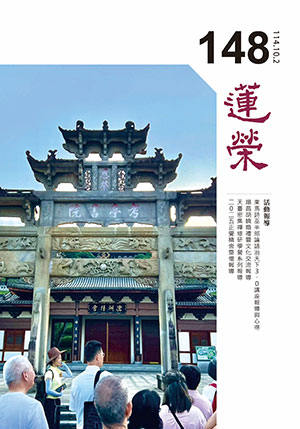

## 社論

### 從講述宗喀巴大師論「三聚淨戒」因緣─淺談台灣佛教之入世現況

本刊

論師論教也論戒

義理辯證利實修

人生暇滿不唐捐

三聚戒攝廣大行

一、宗喀巴大師《菩提正道菩薩戒論》的再發揚緣起

佛法中菩薩戒應如何持守，自古在中國的典籍與論說中往往莫衷一是。直到民國二十四年湯薌銘居士依藏文本譯出《菩提正道菩薩戒論》，使漢地佛教界得以從藏傳格魯傳承，系統性理解菩薩戒的抉擇與綱要，為既有的《梵網經》等律學詮釋做了更細緻的補充。

民國八十年，唐老師因一段殊勝的因緣，從藏傳大德昂念仁波切處，完整學得此論的內涵。至民國一一四年，應天臺精舍玅眼法師的祈請，唐老師在中華無盡燈文化學會，利用十五堂課專講其中「三聚淨戒」部分，使此經論的深義再度於寶島闡揚。

二、三聚淨戒的核心內涵

（一）攝律儀戒

攝律儀戒精神上與七眾的別解脫戒有共道處，特別是以戒作煩惱業的對治，由於有別解脫戒作為進修菩薩道的基礎，有助於菩薩戒的圓滿守持。然而，即使未曾受持七眾別解脫戒，也不妨礙於菩薩戒中攝律儀戒的實踐；在家學佛者，可直接依菩薩戒修行，不必然先受持別解脫戒。不過，堅固別解脫戒，能對治粗猛煩惱，有觀察善惡業果的能耐，以此能使菩薩戒的守持更為穩健。至於密乘，宗喀巴大師明示：「欲持金剛乘戒，先於三戒應誓願學。」宗喀巴大師指出，能夠守持攝律儀戒的人，必須遠離過去、未來與現在的種種世間欲求，樂於遠離世俗；同時對於自己的說話、思維，總能善加防護；又能尊重己靈，不輕視自己的善根；心地柔和，不令他人苦惱；堪忍種種苦難，不生瞋恨與報復之心；不放逸身心，並隨時懺悔除罪；又能具足正命與行持規範，總是威儀妙好，如理作意。

（二）攝善法戒

攝善法戒猶如修學止觀前的準備條件，核心在於：通過「聞、思、修」三慧，積聚福慧資糧。此中包括隨喜功德、忍辱、迴向發願、供養三寶、不放逸、精進，以及廣修資糧道等，有如普賢七支的修學法。

通過這些善法事業，能攝持眾善、護持不壞、使善法增長廣大，進而推動六波羅蜜、四攝調伏方便的修習。由此攝善法戒，能彰顯菩薩戒不同於七眾共學的別解脫戒，屬於道次第的上士道修學法。

（三）饒益有情戒

饒益有情戒，是菩薩道最鮮明的展現。菩薩戒的饒益有情這一分，主要有十一個面向：

•成為眾生的助伴與依止，            •對愚昧者給予啟發，

•對有恩者報以饒益，                •對恐懼者予以救護，

•對憂惱者提供開解，                •對缺乏資具者供應援助，

•對求依止者提供支持，            •對有情能善解其心、予以幫助，

•對正行者助其精進，                •對倒行者予以調伏，

•以神通善巧普利有情。

依宗喀巴大師教授，菩薩戒當從上師正受，並以清淨意樂受持，而犯已能立即發露懺悔還淨，更應深敬專念防護身口意三業，如理如法而行。

此外，依照《發菩提心儀軌》，初發菩提心，應以攝律儀戒為根本；於菩提道有勝解者，更進一步行持攝善法戒；進入地道的菩薩，更能以饒益有情戒為利益有情之講究。

倘若能夠持守菩薩戒的三聚淨戒，則無論是出家或在家的學佛者，都將足以成為入世利他的領導者，呈現出菩薩道修學者的理想風範。

三、今日台灣佛教界的戒學現況

在當代台灣佛教界，戒法的修學大致呈現幾種傾向：

•有些僧團強調別解脫戒的清淨守持，如律學院中主張「小小戒亦不違犯」，以彰顯遵守佛所制戒的嚴謹。然過度著重於別解脫戒在事相上的持守，亦影響入世利他事業的實踐，在一定程度上與普羅大眾產生距離感。

•有些寺院、道場偏重自行設立的叢林清規或團體守則，猶如古代禪門「百丈立清規」的作風，於是不強調半月讀誦佛所制的別解脫戒或菩薩戒；若有誦戒的行程安排，也未能深入解析菩薩戒的開遮持犯。因此，僧團普遍未能明瞭菩薩戒的意涵。

•近幾年來，一類出家、在家學者，僅將佛所制的戒律作為研究內容，重視文本考據，或結合現代東西倫理學試圖重新詮釋戒學，耗費時間於論文發表、與學界互動，而非作為修持菩薩道的依止與實踐法門。

於是，漢傳佛教所提倡的大乘佛法，或是外顯如大乘而實際偏向二乘的行持，或者外顯大乘卻僅為名字大乘行者。按照《戒疏》所說：「自誓為大乘行者，即應住於菩薩淨戒。」若未能真實了達菩薩戒，且解行並重地修學菩薩戒，又怎麼能定義自己為大乘行者呢？

四、儒佛相望：君子與菩薩的入世實踐

孔子曾說：「仁者，人也。」君子以仁為己任，進退言行都心存仁德，強調「無終食之間違仁」，不敢片刻怠慢。例如孔子說「君子有九思」，眼看、耳聽、容色、外貌、言語、辦事等都得講究動機。《禮記‧曲禮》中，更詳細規範君子修身處世的禮節。由此可見，儒家對君子入世利他的要求，已經相當嚴謹。

若儒者尚能以仁義自律，以期成為世間共尊的君子，那麼修學大乘佛教的在家、出家修行者，又豈能缺乏這樣的仁德修為？而行者若能依照宗喀巴大師對菩薩戒的仔細辨析來具體奉行，則不僅入世足以成為世間君子的典範，更能在出世超越的層次，成為殊勝的菩薩行者。

結語：真實菩薩行的必要性

菩薩戒並非束之高閣的受戒證書，而是菩薩道修行者的實踐指南。三聚淨戒提供了大乘行者清晰的願景：攝律儀戒為防非止惡的基礎，攝善法戒為止觀、六度、四攝、普賢十願修學的備辦，而饒益有情戒更將菩薩行推向地道的圓滿。

當代佛教若要實現大乘精神，必須回到菩薩戒論的踏實研學上，否則不論是偏重別解脫律儀而與人群疏離，或者僅停留在道場清規而未能深研菩薩戒法，抑或流於學術討論而未能躬身實踐，這些都難以真正為世人呈現菩薩行的典範。

唯有在出世與入世之間取得平衡，既能清淨守持攝律儀戒，又通過攝善法戒、饒益有情戒來入世利益人群，佛教才能在當代社會中展現其原有的生命力，讓世人看見並體會如來能仁的悲智風範與大乘菩薩的利他形象。

## 佛學覽幽

### 菩薩清淨的行持—華嚴經淨行品（六十三）

*戒慧講述、編輯部整理*

熱惱天氣熱惱心

心靜清涼火中蓮

地藏火海救苦難

願我悲心亦如是

丙二、指事顯因答其徵因

丁二、別顯

戊八、還歸洗浴時願（五願）：從舍出、入水、洗身、盛暑、暑退

前言

智首菩薩請教文殊菩薩，如何得到佛的殊勝成就，並且在成就之前就有成就的徵兆，文殊菩薩告訴他要在一切時中善用其心，不管在任何場合，都要有清淨的願跟空性的智慧去攝持，使行持體性轉為清淨、無漏。從在家、出家，從早上的盥洗出門，所行的道路，所遇到的事情、人物，到城中乞食，乞食完回到寺廟途中，到河邊洗洗身體，在這些動作中，都有他殊勝的願力，使得這樣的行持格外有意義，眼前進度在「還歸洗浴時願」的「盛暑」，夏天出去乞食，碰到酷熱難耐的天氣，應該懷抱什麼樣的意樂？

己四、還歸洗浴時願：盛暑

經文：

盛暑炎毒，當願眾生，捨離眾惱，一切皆盡。

願所依，願依靠在菩薩身上，及依靠在盛暑炎毒這件事上。願所為境，能發願的是菩薩，所願的是眾生。願境成益，第一是隨喜，若眾生都能捨離眾惱，一切皆盡該有多好；第二是發願，我但願眾生都能得到捨離眾惱，一切皆盡。第三是承擔，我能幫助眾生得到捨離眾惱，一切皆盡。第四是祈求三寶，我祈求三寶加被，讓我有能力幫助眾生得到捨離眾惱，一切皆盡。

夏天最熱的時候，容易生病、中暑，感到苦惱，此時希望眾生捨離一切煩惱，《無量壽經》上說「貪恚愚癡，苦惱之患」，貪瞋癡是根本煩惱，唯識速記云，煩是擾義，惱是亂義，擾亂有情，故名煩惱。煩惱又分兩種，第一種是根本煩惱，第二種是隨煩惱，根本煩惱有六：貪、瞋、癡、慢、疑、不正見，這六種煩惱是一切煩惱的根本，是造作萬惡的根本，由此能生出種種煩惱，如同草木之根，能生出枝葉花果，故名根本。隨煩惱分為小隨煩惱、中隨煩惱、大隨煩惱，小隨煩惱有十種，中隨煩惱有兩種，大隨煩惱有八種，夏天的熱惱使身熱心惱，在《法華經‧信解品》曰：「以三苦故，於生死中受諸熱惱。」三苦是苦苦、壞苦、行苦，依南亭老和尚所說的修學方法來觀察，所謂愛不重不生娑婆，此身體是從淫欲而生，需斷除欲想，《佛說八大人覺經》第二覺知說「多欲為苦，生死疲勞，從貪欲起。少欲無為；身心自在。」對治煩惱業而入世的五蘊身，已不是感苦的五蘊身，如同幻化般，最後達到佛的變化身。

然破除煩惱的方法有兩種，一是修對治法破煩惱的現行，二是修空性破煩惱的種子，依雪公所說，眾生於外界事物，耳濡目染，皆落八識田中，而為種子。今人所處的環境，無非殺盜淫妄，此種事物，經與諸根接觸，一一落入識田，而為自家種子矣。煩惱業的現行是，也會感應濁世，所見殺盜淫妄，雖非自做，但由眼、耳等根之接觸而落入識田，為自家種子，則遇緣即在自己的心田發芽成長，於不知不覺間而起殺盜淫妄之念，進而行其事實，以造生死重罪，長劫輪迴。

盛暑炎毒，有兩種狀態，一種是在結夏安居時，不用去托缽，另一種是還沒到結夏的時候，天氣已經很熱，照例要出去托缽，托缽回寺廟的過程中，炙熱的陽光曝曬，身體感到非常燥熱，心也非常浮動，碰到這種狀況，要當願眾生，捨離眾惱，一切皆盡，夏天的熱惱，就像內心的熱惱、煩惱，我們都知道身體要清涼，卻忽略心裡的清涼比身體的清涼更重要，當願眾生不只得到身體的清涼，還得到心裡的清涼。

古代沒有冷氣，在外行走，熱得受不了時，會躲到樹蔭底下乘涼，遠離身體的熱惱，這屬於身體清涼的那一分，第二個是遠離心裡的熱惱，遠離貪瞋癡，當願眾生，不只遠離身體的熱惱，也要遠離心裡的熱惱，使身心清涼，內心的清涼包括對治煩惱的現行與種子。一般說持戒就是清涼，不只戒條要持得好，還包括有因果正知見、有定力，包括空性智慧的生起，使所持的戒格外有力，將心的體性轉為清涼。

一般修行人會覺得自己已經在修行了，為何還這麼痛苦？那是因為很多人誤以為修行沒有逆境，其實修行照樣會熱得不耐、沒地方躲，修行跟沒修行的差別在於處在逆境時的心態，炎熱的天氣，竟然生起美妙的心理，身心除熱惱，得到清涼，而且當願眾生，在炎熱的時候，皆能生出美妙之心，這就是修行。

試問修到什麼程度，才能在很熱的環境下，而不感覺熱？當內心除掉熱惱時，外面的熱就不成為熱，當你沒有造作這個業的時候，雪公說，地藏菩薩即使到火海，也有能力顯現體性為清涼，就像懺本說的「我若向刀山，刀山自摧折；我若向火湯，火湯自枯竭；我若向地獄，地獄自消滅」，明明是盛暑炎毒，卻能轉為蓮池海會，理由就是內火除，外火就除；內火不除，外火就不能除，這是招感的，內火感外火，除內火就不招感外火，內火是煩惱的那一分，外火是瞋恨心惱害而感境界火熱的那一分，所以我們今天會遇到炎熱的天氣不是沒有道理的。

火有欲火、瞋火、躁火，像癌症就是火毒，中醫在治療癌症的時候，就把癌症當成火，火毒攻身，所以要洩火，這些煩惱除掉的時候，地獄、餓鬼、畜生的果報就消失了，如同證得初果後，永不入三途，所以果報自相不可得，觀待煩惱而後生。

炎熱的天氣為什麼感應不了外火？當所做的善業，是降伏欲火、瞋火、躁火的善業，所感應的就是你投生人道時，大家都熱得受不了，你卻不覺得熱，在同一個世界中，各人卻有各人的命運。內火除時，外火就除，有兩種除法，第一種就像夏天待在冷氣房，在你心識前根本生不起天氣很熱的感覺，根本感應不了外火，所以外火的自相不成立。第二分是說，即使在外火時，也不覺得熱，就像身體非常健康，冷氣正對著吹也沒有寒冷的問題，身體虛弱者則不行，完全為業所感。我們要在起心動念上轉變業力，先從轉變心思開始，因為業的體性就是思，如何遇境時任運生起利他的心，遠離內心的躁火、欲火、瞋火、怒火這些火氣，將來感應到清涼的世界，即便深入火海世界救度眾生，也顯現清涼，這就是捨離眾惱，一切皆盡。

盛暑有兩種，一種是還沒到結夏安居，要出去托缽，還有一種是到四月十五到七月十五結夏安居時，不能出去托缽，一是考量修行人的道力不足，或者是他宿世的惡業所感，眼前盛暑炎毒會讓他中暑，會讓他體力不支；二是因為盛暑炎毒，很多蟲蟻都會出來，出去容易踩死蟲蟻；三是出去托缽，盛暑炎毒，在家人服裝不整，有礙觀瞻，場面尷尬，綜合上述理由，釋迦牟尼佛訂立結夏安居，結是結界的意思，限定一個範圍，不能出去，安居就是身安居、心安居，身安居就是不准亂跑，心安居就是心也定下來，這段時間是出家人一年中最重要的時段，可以安靜地向長者比丘學習戒法與教法。僧人有結夏安居才能稱為僧臘，假如出家五十年，結夏只有兩年，他的僧臘就是兩年，出去做法會的時候要排在最後面，可見結夏安居的重要性，這是佛最重視的事情，連他自己每一年都有結夏安居。

佛制止出家人出去托缽還有另一個非常重要的理由，一年都在外面托缽，身心不能安定，所以結夏這段時間要跟著上座長老比丘集中閉關，講學、講戒或是修止觀或是來懺悔過失，這段時間好好用功，每一個人的道力，都能有殊勝的增上，到七月十五，諸佛歡喜，很有名的目犍連救母，就是利用七月十五，僧團結夏成就諸佛歡喜的時候，來供養僧團，超薦母親，從焰口鬼超度上來，這就是很有名的《盂蘭盆經》。

己五、還歸洗浴時願：暑退

經文：

暑退涼初，當願眾生，證無上法，究竟清涼。

暑氣退了，秋意來了，涼風徐徐，自在快樂，此時希望眾生都能成佛，得到究竟清涼的快樂。

夏天過去，秋老虎過後，天氣漸漸轉涼，此時的自在快樂，人間的帝王也比不上，但是到了冬天就冷了，有的地方冰天雪地，甚至能讓人耳鼻脫落，況且暑退了還會再來，所以我們要證無上法，得到究竟清涼，依會性法師的解釋是，佛法才能使眾生清涼，南亭老和尚的解釋是，成佛以後才能徹底無寒熱之苦，而常享清涼之樂。

如何把「當願眾生，證無上法，究竟清涼」跟暑退涼初合起來說？證無上法也可以解釋成涅槃，涅槃有安樂、不生之意，安樂是安穩快樂，不生是生死苦果不再生，達到究竟清涼的境界，在暑退涼初的時候抓住這種感覺，當內心能夠證得無上法，遠離熱惱，心情舒服，如同外在暑退涼初，吹起涼風的舒服。證得無上法，遠離煩惱的時候，內心的舒服，是非修行人難以體會的，抓住感覺來發願，這才是行者善用心。

南亭老和尚講義提到，涼風徐徐，沁人心腑，自在快樂，南面王不過如此，南面王特別是指舜，舜治理天下，在宮中彈琴、唱歌、吹南風，而天下大治，他如何辦到的？第一，他以身作則，恭己正南面；第二，他喜歡親近賢能的人，知人善任，他用后稷辦農業，用皋陶辦司法，用契辦教育，舜他本身則恭敬約束自己、善用賢才、好察爾言，改善施政品質，身不下堂而天下大治。行者要像南面王般有內涵、胸襟、格局、抱負。(下期待續)

### 大乘百法明門論簡說(五十四)-拾捌、無為法（ㄧ）

*戒慧講述、淨本整理*

名相並非闢外解

攝持義理助善說

觀察內心能符義

如法修學真內道

論文：

第五無為法者，略有六種：一虛空無為、二擇滅無為、三非擇滅無為、四不動滅無為、五想受滅無為、六真如無為。

本論五位百法，前面的四類：心法、心所有法、色法、心不相應行法，都是有為法。最後一類是無為法，共有六種。

有為法、無為法，自體性都不可得。有為法有可見、可聞、可觸等實體，又有作用，尚且都沒有自體性；無為法只是遮除有為法，而成立無實體之法，又怎麼會有自體性呢？所以「一切法無我」就是《百法明門論》的意趣所在，一切法都指歸到體性空。大般若經上說，如果一切法當中只能選擇學習般若，或者學習其他的佛法，那寧可學般若，可見般若的重要性。

無為法「略有六種」，「略」是「廣略」的意思，也是「要略」的意思。無為法有很多種，此處只說六個，所以是廣略地說。凡是單純遮除某件事物，都屬於無為法。比如沒有錢、沒有人、沒有車等，都只是遮除某法，並不是有一個東西叫做「沒有錢」。許多無為法中，此處舉出的六種，是所有無為法中最重要處，所以也可以稱為要略。

「有為法」就是因緣造作而生，凡有造作的法必是無常法；反之「無為法」非由造作而生，它是常法。因緣造作而生的有為法，例如種子吸收陽光、空氣、土壤中的養分後，經過質變才結果。因緣遷滅而生起之果也朝向敗壞，果也是其他果的因或緣，體性都是無常，這就是有為法的特性。造作跟無常是一法上的兩面向。

本論文前面稱無為法是「四所顯示」，這是針對空性這個無為法而說。一切法所顯示的體性就是空性（無自體性），並非所有的無為法皆如此。空性非實有（無自體性）。《論語．子罕》裡面孔子說他是「空空如也」，連說兩個空，意思就是空亦復空，空性是在諸法上尋覓不到諸法的體性，並不是離開諸法另有一個實有的空性，所以說「空空」。假如離開諸法還有一個實有的空性，那表示世間一切法都跟空性無關，且世俗中諸法皆有自體性，依世俗也無法證得空性，煩惱為實法，談不上煩惱即菩提（實有的煩惱了不可得，當下即是菩提），生死為實有，也談不上生死即涅槃（實有的生死了不可得，當下即是涅槃）。若煩惱不在，則不用對治，無從談與用對治，又如何轉凡成聖？

接下來討論六種無為的

第一個「虛空無為」

。經部以上都認為虛空只是遮除色法說虛空，並不是創造出一個空間而成為虛空，虛空既然不是造作而成，那就是無為法。既然是無為法，不是色塵，虛空也就不是眼識所緣的境界。我們平時眼所見的虛空，其實是看到空中各種光明之色，並非眼識看見虛空。

虛空無為可以作為空性的同品喻，但虛空並不是空性。空性非色、非心，是色法跟心法乃至於一切法（含虛空）的體性，有為法是因緣而成，無為法（虛空）也是在世俗上觀待遮除色法的那一分說虛空，即是觀待性的顯現，其體性亦是了不可得。藉由聞思修現證空性，可以成為解脫的聖者；若緣念虛空，至多只能生至四空天，無法出離三界。

虛空為何可以作為空性的同品喻？除了二者都是無為法，還有其他相似之處。比如「離障」，虛空中沒有任何障礙物，現證空性也是無一法可得，藉此還可以破除煩惱障與所知障。又比如「周遍」，虛空遍一切處，空性是一切法的體性，也是遍一切處。還有「平等」，虛空中無差別相，一切平等，一切法的體性也都相同，都是空性，沒有親疏愛憎的差別相。

二者另一個相似處是「無得」，虛空是遮除質礙，現證空性也是如此。《心經》上說「以無所得故」，在現證空性的一剎那，名言安立為證得「阿耨多羅三藐三菩提」，此名言也是觀待破二障而安立，不是得到一個實有的阿耨多羅三藐三菩提。得解脫的意思是說，沒有一個法能夠困住你，因為每一個法的自體性都不堪你用正理去觀察。緣起法不是根本無，但在觀察體性時，卻又沒有一粒微塵可得，當然也沒有實有的煩惱在繫縛我們。

以上是說明為何虛空可以作為空性的同品喻，可見研究教理、認識宗派見十分重要，同樣是證得空靈靈的境界，到底這種空靈靈是四空定？還是無想定？還是真的現證空性？若不是從經論中去通達他們的差別，修行的時間越久，走的冤枉路可能越長。整個修行的重點就是見到真相，以見真相來論真修行，不是以盤腿功夫來論，也不是以神通高低來論。

第二個無為法叫做「擇滅無為」

，又叫做「數滅無為」，「數」就是「慧數」，就是指慧心所。慧心所經過簡擇而證入空性寂滅，稱為擇滅無為。慧心所是能證，所證的是空性，此時苦因苦果的滅，清涼的那一分安立為涅槃。以初果或初地來說，根本位現證空性能所雙亡時，苦因苦果雖滅，但當他們重緣世俗進入後得位時，仍會生起苦因苦果，也會生起微細的煩惱。必須不斷串習空性慧，直至四果或八地，才能完全斷除煩惱障（滅縛得）。更進一步要到佛地，才能破除所知障，達到業盡情空的境界（滅障得）。

所以初果、初地、四果、八地，乃至於佛地，他們根本位上所證的空性都相同，但是後得位重緣世俗時斷煩惱障及所知障的能力不同。且論菩薩從初地到十地，更是在世俗上較量功德差別。初地菩薩布施心意的圓滿，二地持戒心意的圓滿，三地忍辱心意的圓滿…，這些都是世俗上的差異，不是勝義上的差別。
滅諦（涅槃）是不是空性？空性是所證，證悟空性能滅苦因苦果，能破煩惱障（或破所知障）的那一分才安立為滅諦。所以涅槃也不能說就是空性，二者雖然都是勝義諦，但是就不同的面向去安立名言，這樣的安立還是有其必要。試
**問：** 證悟空性與滅諦是一是異？若是一，那麼只要證悟空性應該必破煩惱障、破所知障，必證涅槃；若二者是異，則成為無關，證悟空性無論如何也不能破二障得涅槃。由是可知，此二者非一非異，是就不同面向的描述，安立不同的名相。

《百法直解》對於擇滅無為的定義為：「正慧簡擇，永滅煩惱，所顯真理，本不生滅，故名無為。」透過聞所成慧、思所成慧及修所成慧的簡擇現證空性，滅除了苦因苦果，小乘四果或大乘八地菩薩也能永滅煩惱，爾時所顯現的真理就是空性。諸法自體性不生，既然無生，所以也談不上滅，並不是有一個佛性不生不滅。這就是擇滅無為。

唯識宗安立了四種涅槃：本來自性清淨涅槃、有餘依涅槃、無餘依涅槃以及無住處涅槃。其中「本來自性清淨涅槃」，是指一切法的真如實性，不是經由斷障而顯示，因此不屬於擇滅無為所攝的涅槃；其他三者皆是滅縛、滅障而得者，故為「擇滅無為」所攝。

本來自性清淨涅槃，是否為一切眾生本有？涅槃既然是以破煩惱障、破所知障去安立，凡夫如何能夠本來如是？若本來如是，表示凡夫本來已破二障，後來退轉。那麼未來即便我們再次修學成佛，也是有再次退轉的一天？

唯識宗為了解釋這樣的問題，有一派認為，將第八識裡面有漏種子清空稱為涅槃，有漏的種子無始來就有，第八識也是無始以來就有，第八識本來自性清淨，不因為存放有漏種而被染污，本來自性清淨涅槃就是第八識本身的代名詞。在中觀宗來看，本來自性清淨涅槃也是就諸法體性本自空寂的名言安立，就是空性的代稱。諸法的體性不會因為任何條件而改變，本來如此，不必靠智慧簡擇，所以不是擇滅無為所攝持。然而眾生並非無始以來就證得空性，無始就破二障。眾生無始以來從未現證空性。

「有餘依涅槃」，唯識宗認為是三乘無學者，斷煩惱障、證得生空所顯真如的假名。因為此聖者尚未入滅，身體這個苦果還在，稱為有餘依涅槃。必須斷煩惱障的聖者入滅，連身體這個苦果都沒有了，才是「無餘依涅槃」。此定義的問題在於，若斷煩惱障的阿羅漢，其身體仍是苦果，是否這位阿羅漢應該要自殺才能讓苦果消除？凡夫自殺是自造苦因，但阿羅漢灰身泯智反而才是把苦果消滅的方法？這麼說來，阿羅漢或八地菩薩住世都是保留苦果？既然保留苦果，怎麼可以稱為涅槃？

所以對一位證悟空性的聖者來說，他既然通達萬法無自體性，苦果（身體）本身亦無自性。此身的住世並不是保留苦果，相反地還可以讓他發揮救度眾生的功德。無餘依涅槃應該是指根本位現證空性能所雙亡的狀態；有餘依涅槃則是出定後得位的狀態。

阿羅漢起定入後得位的時候，習氣使他見諸法仍是實有，此時他是以比量的方式證空性破煩惱障，顯現雖為實有，趨入是為真實。只有佛才能破除這樣的習氣（破所知障），在後得位以現量的方式證得空性，同時見空性（如所有智），同時見緣起（盡所有智），這就叫做「無住處涅槃」。(下期待續)

### 佛學概要十四講表簡說（四十九）-第六講表　宇宙有情概況

*戒慧講述、編輯部整理*

寒熱地獄有其因

令人心冷寒獄因

冷酷世間有熱情

遠離寒冰發菩提

地獄壽命那麼長，當火劫、水劫、風劫這些劫難來的時候，這些地獄眾生到哪裡去了呢？他們可以寄託到其他的地獄去，這一界壞了，他又轉介到其他地獄去，輾轉相繼、不斷受苦，壽命都不會停止，在受苦中又容易怨天尤人，生起善念的機率極低，除非他過去有很重的正法習氣，能在剎那間生起悲憫心，否則在爾虞我詐的環境中，連善念的心都不敢起，人不自私天誅地滅，受到大環境的壓制，不敢善良、不敢起惻隱之心，就好似被奴役之人，就算有天被解放出來，也不敢善良。

六道中，只有人間是大賺大賠，大賠賠到你去地獄一直受苦，打零工都還不完，大賺可以賺到連天都嘆為觀止，因為人間最好操作，尤其佛法還在的時候，就算欠了一屁股債，都有翻本的機會，比方投資失利，所有的資產通通斷頭，如何翻得過來？因為他有貴人相助，佛法在世、三寶在世、正知見在世，這些就是生命中的貴人。

接著介紹八寒地獄，就著他所受的苦及他所發出的聲音來定其名稱，第一個是皰，此地獄非常寒冷，受苦的有情被寒氣所逼，身體僵冷、變腫、發皰。第二個是皰裂開，冷得非常厲害，受傷更嚴重，身上的瘡裂開了，就像以前古人打仗時，必須備有敷瘡的藥，人世間天寒地凍的時候，皮膚裂開，身體結皰，極其痛苦。下面三個地獄名稱都是就著因太寒冷而發出痛苦的聲音來命名的，叫做「阿吒吒」、「阿波波」、「嘔喉喉」，冷到極處的時候，嘴唇動不得，舌頭抖動，發出阿吒吒的聲音；第二個阿波波，就是舌頭也動不了，只剩嘴唇抖動；第三個嘔喉喉，是嘴巴都動不了，只剩下喉內振氣。

由有情皮肉凍裂的情況，分成了青蓮華、紅蓮華、還有大紅蓮華，凍到瘀青，血都紅到表面來，表示天已經寒到極處了。皰跟皰裂就是依瘡卷皺，如泡潰爛的情形而分，第二個阿吒吒、阿波波、嘔喉喉，就是依寒冷苦聲而論。第三個青蓮華、紅蓮華、大紅蓮華，是依膚色及破裂情形得名安立的。

八寒地獄怎麼來的？就像電影裡冷血暴力的人，殺人冷漠，令人恐怖、令人打顫的那種業，造惡業時，異常冷靜，一點反省能力都沒有，由此去感得寒冰地獄。

八寒地獄的位置，有幾種說法，第一，它在鐵圍山的外面，也就是以須彌山為中心，還有七山八海，最外圍還有一個鐵圍山，八寒地獄在鐵圍山的外面，是一個非常黑暗的地方，第二，它在鐵圍山的底下，向上仰，第三，它在地球的地下，八熱地獄的旁邊過去有一萬由旬處，日光所照不及、寒熱所不到的地方，成為寒冰地獄的所在。

再看孤獨地獄，它不在上面所說的這些地獄裡，它在地球的地表上，孤獨地獄的位置也不一定在哪裡，大部分是臨時組成的，或許在山谷裡，或者在山上，或者在曠野，或者在空中，或者海邊、廟中，像城隍廟等，都可能有孤獨地獄。有一說是除了南瞻部洲的其餘三洲，只有孤獨地獄，沒有根本、近邊地獄，還有一說是只有北俱盧洲是沒有地獄的。

地獄道隨業受報，地獄道的苦厄，從前面的根本地獄，還有遊增地獄、寒冰地獄，都可以知道它所受的苦，例如火坑是熱地獄的苦，堅冰是寒冰地獄的苦。火坑是欲火、瞋火、燥火的那一分去感的，堅冰是心很冷靜地造作惡業，讓人心寒的那一分去感的。刀山是讓人難以立足的那一分去安立的。劍樹是享樂過度的那一分，碾磑是手段殘忍的那一分，像子路被殺的手法非常殘忍，十六尊者的迦留陀夷，也是被人剁成肉醬，丟到馬糞，湯鑊特別是挑起仇恨，水深火熱的那一分，比如挑起種族、階級、黨派對決。沸屎是環境髒亂、失去人性的那一分，雪廬老人說他最怕掉入這種地獄，合山也是手段殘忍的那一分去感的，曹操在臨終就得到這種合山地獄的徵兆，頭痛欲裂。

《地藏經》分析，每一個地獄裡面有很多刑具，無非就是銅、鐵、石、火，這些刑具也是眾生的業感，火攻，是因為廣造諸惡。鐵石，也就是心如鐵石，殘忍至極、不柔軟，都會感應銅鐵石來受苦，而極樂世界天雨曼陀羅花，花是七寶所成，可是七寶掉下來的時候，如花飄下非常柔軟，可見是循業而生。最後《地藏經》結歸八寒八熱、十六遊增、孤獨地獄，一言以蔽之，叫做「業力甚大，能敵須彌，能深巨海，能障聖道。」道源老和尚說《地藏菩薩本願經》的經義就在這，業力會決定我們的去向，業力甚大是說，當這個業小的時候，操作不當，會變成大業，大業有時候大到你難以想像，業力小，不要以為不足畏，舉例而言，他的交易權限是一億美金，他先做十億，希望賺點錢，最後卻要用五十億去掩蓋他，最後他也許總共交易量是一千億，所以一間百年老店就結束在一個交易員手中。業也是如此，一個默默經營業的人，最後變一位大祖師，聽課聽不懂的，最後變成傳承孔門之道的曾子，可見每個人都有無限的可能，這叫眾生皆有佛性，眾生皆當成佛，叫做業力甚大。文殊菩薩在娑竭羅龍王宮的時候，娑竭羅龍王宮的女兒，竟然在正見的經營上，出現成佛的徵兆。看人不能看表面，他的飛黃騰達可能就在他最落魄的時候顯現。

「能敵須彌」是說須彌山跟巨海都不是業力的對手，當一個人有成佛的決心，須彌山擋不住他，海也沒辦法阻擋他，佛菩薩在某種程度上也只能成為外緣，而且「外支以成」，佛菩薩想要幫助眾生的心已成，但是眾生在裡面有凡聖的差別，有的人庸庸碌碌過一生，有的能脫胎換骨。尤其在投生的時候，佛的力量也阻擋不了中陰身去投胎，如果佛的力量可以阻擋中陰身去投胎，眾生早就遠離輪迴，中陰身現起的神力，跟佛力一樣，換句話說，佛力不可思議，眾生的業力也不可思議，當他想要轉變時，十座須彌山都擋不住，當他要墮落，十座須彌山也阻擋不了，道源老和尚說「能障聖道」最可怕，沒辦法聽聞聖道，沒辦法學習到正知見，就沒有出脫的一天。

一般看到業力最嚴重的是生活窘迫，簞食瓢飲、居陋巷，看不到能障聖道的厲害，富貴的業其實都是輪迴的業，甚至是墮落的業，可是會成為我們羨慕的對象，可是業能夠進入聖道門的能耐，不會成為我們羨慕的對象。無始劫到這一生的爛帳，如何翻盤？操作法就是能入聖道的業，世間不了解能障聖道的可怕，所以業都是障聖道，比如整個社會的氛圍就是反傳統，能障聖道的人在世間成為共業，一旦惡業被引發的時候，只好到餓鬼道打零工還，到畜生道打零工還，到地獄道打零工還。

能障聖道的這一分，聖道成為所障，業力成為能障，就變成正法、像法、末法，雪廬老人說末到現在，我們看到夕陽的時候，夕陽其實已經沉下去了，看到的是反射而已，經教剩下模糊的概念，甚至讀不懂，到最後太陽都不見的時候，剩下一片晚霞，連模糊的輪廓都沒有，再下去就是所有能翻本的善業都不見了，所以維持、延續、傳承正法很重要，應該要抱著這樣的心態去讀地獄，體性通通轉成功德。（下期待續）

### 人生大事不能忽略的事實- 復范古農居士書二（一）

*戒慧講述、編輯部整理*

中陰所現下一生

尋找生緣似幽魂

隨順所愛入母胎

重新開始是輪迴

這篇文章講的是中陰身的觀察與看待。生死相續中決定有來生，也表示善惡果報不虛妄。十二因緣中，「愛」、「取」滋潤「無明」所造的「行」成為來生的「有」，在前陰已謝(死有)、後陰未至(生有)的中陰現前(中有)，中陰身是無明心識投生到某一道之前輪迴未定暫時的狀態，因為無明而有的中陰身，已是來生投生的樣貌，而我會誤以為自己沒有變化，就像夢中覺得自己在飛，醒了後回想才發現自己在夢中是蝴蝶。

中陰身在一個不定的狀態，會因為內因、外緣而改變，所以對亡者的祭拜，生者為亡者做功德，以及七七日內做七等法事，都對亡者的來生有莫大的助益。

整篇文章分為五個段落，首先說明中陰身的生滅相跟執我的心有關，在進入下一期生命現象前的中陰身，會有遲速的差別。第二、亡魂能顯現在親人的面前，實際是天地鬼神想要藉此彰顯因果報應之理。第三、說明在輪迴未定的狀態下，生者祭拜供養亡者之間的關係。第四、說明投胎的幾種不同狀況。第五、業感果的功能，能在用心造作善惡業當中改變未來的命運。

先解釋中陰身，經文：「

中陰者，即識神也。非識神化為中陰，即俗所謂靈魂者。

」所謂的中陰身，是心識所成的意想身，不是世俗所謂的靈魂，心識進入中陰是心識最精明的作用，唯識宗說第八識去尋找投胎的因緣。

經文：「

言中陰七日一死生，七七日必投生等，不可泥執。中陰之死生，乃即彼無明心中，所現之生滅相而言，不可呆作世人之死生相以論也。

」前陰已謝叫做死有，後陰已至叫做生有，中陰現前叫做中有，中陰身的狀態在《地藏菩薩本願經》當中說到七日會有一個轉變，在七個七之內必然投生，不能拘泥執著於這樣的說法，中陰身在找生緣的狀態可能很快速，可能一兩天就投生。中陰身的死生是中陰身的生滅變化，那是執我的心(無明)相續生滅的狀態，中陰身想要安定會想要投胎，那個狀態的變化，不可以當作世間人所說的生死輪迴一期生命現象來解釋。

經文：「

中陰受生，疾則一彈指頃，即向三途六道中去，遲則或至七七并過七七日等。

」中陰身改變成為下一期生命現象的速度，快的話一彈指就受生到六道去，正常會在七七日內投生，也可以超過七七四十九天，可以用圓澤禪師的公案來引證(用圓澤禪師的公案感覺怪怪的，圓澤禪師當時應該不是中陰身吧？)。

第二段，先明亡魂顯現的原因，經文：「

初死之人，能令相識者，或見于晝夜。與人相接，或有言論。此不獨中陰為然。即已受生善惡道中，亦能于相識親故之前，一為現形。

」剛斷氣者下一期生命現象未定，或依願力或依業力，大部分都是依著業力出現於認識的生者前，或可在日夜相見，也有可能相互交談。而這種狀況不僅出現於中陰身，就算是已經受生在各道中，也能出現在相識的親友前。

那是因為，經文：「

此雖本人意念所現，其權實操于主造化之神祇。

」雖是本人的業力所現，但是生殺大權其實是操縱在統攝的天王手裡，這些鬼神能夠讓亡者變現成前生的模樣來與生者相認。《易經》也說：「鬼神害盈而福謙。」鬼神可以加被善人，也可以加害惡人，能保護正法修行者，並且整頓人心。此處所謂「造化之神祇」，並非造物主的概念，若有造物主，為何要造惡人？難道斷惡修善是由他決定嗎？可以想成老闆是員工的造化神祇，進入共業的範圍好似他是主宰者。

讓亡者回去見親人，是為了達到警醒世人輔助正法的功能，經文：「

欲以彰示人死神明不滅，及善惡果報不虛耳。

」生死死生相續，死了以後去投生，死了之後有來生不是死了一了百了的斷滅見，投生成為狗是佛也擋不住的！當然投生天道等也是一樣，找尋生緣取來生的心識力量實在太強了！死了之後與親人相識，或許來勸告，或許來感謝，這些都是因為能彰顯善惡果報才顯現的。

反顯邪見橫行，分為無來生與無因果來說明，無來生部分，經文：「

否則陽間人不知陰間事。則人死形既朽滅，神亦飄散之瞽論，必至群相附和。

」生者不知死後事，以為身滅則心滅這種謬論，將得到大眾的附和。一般人多以為有身才有心，人死之後身滅了心也就跟著滅，所以認為人死後沒有來世。若無前世，為何出生即有貧賤富貴的差別？為何每個人的聰明才智也有所不同？認真上班老了才有老本可吃，這一生努力造善，來生才有福報可享；身心是不同的兩法，心成為能執，身成為所執，中陰的狀態也是心為能執，所執的是下一期生命現象的雛型，稱為中陰身。

無因果部分，經文：「

而舉世之人，同陷于無因無果，無有來生後世之邪見深坑。

」世間人都將溺陷在不需造善得樂的知見下，死後無需為自己的行為負責，這種撥無因果的邪見將成為等流，障於聖道修學且無法出離。

反顯善惡不分，善者看不到善報不願修德，惡者也會變本加厲，因為沒有因果正知見，對好人沒有啟發，對壞人無法懲治。經文：「

將見善者則亦不加惕厲以修德，惡者便欲窮凶極欲以造惡矣。

」將會見到善者，不會害怕惡報，而以敬慎恐懼的樣子去修養德性，乾卦九三爻提及夕惕若厲，就是心存恐懼，謹慎如處憂危之地，不敢稍加懈怠的樣子；惡者想盡辦法來滿足自己的私慾，無所不用其極、殘暴惡毒、變本加厲地去滿足自己的名利而造惡。

結證令亡魂現形都是為了警戒世人彰顯因果，首先明佛語無妄，應病與藥，藥到病除，經文：「

雖有佛言，無由證明，誰肯信受。由其有現形相示等，足徵佛語無妄，果報分明。不但善者益趨于善，即惡者其心亦被此等情理折伏，而亦不至十分決烈。

」佛經中闡述的因果報應理路分析邏輯清楚明確，但是已過世者，生者無從得知他到底輪迴到哪一道去接受善惡報應，如何讓人相信接受？所以能在過往後與有緣相識者接觸，顯示過往之後的種種苦樂樣貌，足以徵信佛所說因果報應並非妄語，能清楚明了造善得樂、作惡得苦的道理。不但善者能不畏作善勇猛精進，惡者也會心悅誠服於這樣的道理中，不至於十分決烈，讓聖者想救都沒辦法。

次明神祇有心，經文：「

天地鬼神，欲人明知此事。故有亡者現身于人世，陽人主刑于幽冥等。皆所以輔弼佛法，翼贊治道。其理甚微，其關係甚大。

」舉頭三尺有神明，有沒有做虧心事鬼神都知道，天地鬼神想要世人明白因果的道理。所以會有亡者託夢，如《閱微草堂筆記》中所記述廣西提督田耕野的夫人，死後往生天界，回來勸諫丈夫的事蹟。也有陽世間的人，晚上至閻羅殿當判官的事蹟，如章太炎老先生曾有一段時間，被東嶽大帝請去做判官，每天晚上小鬼會抬著轎子請他上班，第二天早晨才下班。地獄的刑罰實在不是閻羅王所設，是個人惡業變現，自作自受。

這些故事都是為了來輔助佛法的流通，像是鳥的雙翼幫助鳥飛翔那樣，幫助研究佛理者推廣之用。道理十分微細難明，對因果善惡報應的教化影響是非常巨大的。

印光大師說可惜大部分的因果報應相關文章，都沒有說明記載的目的。經文：「

此種事古今載籍甚多。然皆未明言其權之所自，并其事之關係之利益耳。

」這種陰間、陽間種種事蹟古今記載的典籍很多，但是都沒有說明為何造化神祇這樣做的目的，是為了超拔亡者，也為了後世能了解因果不虛的道理。(下期待續)

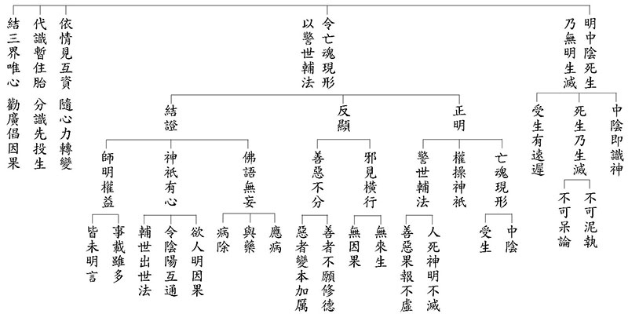

### 週四共修法語-第九菩提心善慧地

宗徹

辯才慧質善慧地

造論抉擇佛語義

諸佛密義凡夫解

名字位中真佛眼

法尊法師翻譯的《入中論》，進入到〈第九菩提心善慧地〉章節，其偈頌為：「第九圓淨一切力，亦得淨德無礙解。」意思是說：證入第九地的菩薩，已將「力波羅蜜」修到圓滿清淨，能無礙通達佛的「十種智慧力」；同時也圓滿成就「四無礙解」的功德。

所謂「善慧地」，就是第九地菩薩有善巧的智慧力，能夠快速地成熟一切有情的善根，猶如孔子有能力培養出四科十哲、七十二賢弟子，講述事理辯才無礙，也有解讀古代經典的能力，以此住持正法，具足「四無礙解」。此外，成就第九地的菩薩，也有能力圓滿佛的十種智慧力。這種種利生能耐與智慧力的成就，正彰顯「力波羅蜜」的成就。

「四無礙解」即法、義、辭、辯四種無礙。從教化有情眾生的角度來說，法與義偏向內在的理解與抉擇；詞與辯則偏向於外在的表達與應對。

法無礙解

，即菩薩對每一個法門的名相與分類了了分明，不受阻礙。例如對各個宗派見都非常熟稔，即便是一個名相，也能依不同宗派的解釋予以闡明，毫不混淆。

義無礙解

，指菩薩能洞察諸法無量差別與其所指的道理，理解通暢無礙。像是宗喀巴大師曾經歷時三個月，將十七部論典全部講完；又曾在一天當中，沒有間斷地講授十五部論的開篇，憶持清晰而毫無差錯，即是此義。

辭無礙解

，當菩薩面對一切國土與不同有情，能通達他們的語言文字與表達方式，對於各種名詞的解讀不會錯謬，掌握了語言的陀羅尼；說話也能契合對方的語境，毫無障礙，好比《維摩詰經》形容佛說法，是「佛以一音演說法，眾生隨類各得解」，佛陀用一種聲音說法，不同眾生都能從佛的音聲中獲得受用。

辯才無礙解

，即菩薩善於把握因果與作用來開示諸法，論說時前後貫串、條理清楚，既不紊亂也不會贅言。像是帕繃喀大師在講述《菩提道次第》時，二十一天的教授能理事圓融、脈絡分明，並穿插故事、譬喻、歷史例證、上師教言等。文殊菩薩以辯才無礙所成就的佛國淨土，其功德就好像廣袤的海洋；相比之下，極樂世界的功德僅僅是文殊菩薩佛國淨土的一滴水。

而佛陀的十種智慧力，是由證悟空性、破除了所知障之後所生起的能力，分別是：知是處非處智力、知三世業報智力、知諸禪解脫三昧智力、知諸根勝劣智力、知種種解智力、知種種界智力、知一切至處道智力、知天眼無礙智力（知未來）、知宿命無漏智力（知過去）、知永斷習氣智力（解脫知見）。

關於如來十種智慧力的解說，過去在《小止觀導覽》曾經有詳細說明，此處便不再贅述。

第九地菩薩的成就，提醒我們應當「以果地覺為因地心」：以未來佛果為當下心願，積極成就辯才與智慧，才能在佛語中無礙解說。因此當下要通達各種宗派見，以及各個名相的定義。要知道世間學的專業學科，都需要清楚分別複雜的專業術語，否則都無法成為專門人才。我們學習佛語，目標在成就佛的無上正等正覺，更需要把佛法中的每個名相定義與內涵確定清楚。

欲趨近佛的智慧力，學佛的行者應把握以下幾個要點：

一、重視因果正見：如道次第的業果思維，應該成為我們平日處世做人的依準。

二、處眾進退有禮：佛具足洞悉有情眾生的種種能耐，都是在因地時修煉而來。與人相處能夠沒有障礙，關鍵就如《常禮舉要》所載諸多原則，當細心把握。

三、如法修學止觀：像串習《小止觀》的內涵，以及《菩提道次第廣論》的上士道教言，都應勤奮地仔細研究，並成為每日實修的準則。

四、通達佛語聖教：將自己的知見轉化成佛的知見，首要在對佛語的正確解讀。這方面能力的養成，唯有深入諸大論師所造論著，學習論師們對經論的義理抉擇，才可能成就如雲谷大師所說的「義理之身」。

以上對第九地的簡要說明，其對標於最高的佛果，起步通通都得在眼前入手、腳踏實地去做。老子說：「千里之行，始於足下。」假如現在知道義理內涵，卻不採取任何作為，又怎可能在大道上逐步邁進、拾級而上呢？

### 週四共修法語-第十菩提心法雲地

淨曜

十地成就法雲地

法義烏雲豪大雨

沙漠綠洲法幢立

欣欣向榮淨土成

今天的主題是十地菩薩中的第十地。第十地的菩薩稱為法雲地，「地」是指現證空性的證量，從初地到十地，皆以能所雙亡現證空性的智慧成就地的體性，所以都稱為地。「十」的分類是由於登地以上的菩薩入世廣大行上有高低不同，所以區分為十。每一地的菩薩都有很多德能，但是只取某一個特色來說。舉例來說，這一朵花很漂亮，主要是就色上的部分來安立，不能全部講，它香味的那一分安立不了，比如說玫瑰花很美麗，可是玫瑰花沒有香味，要怎麼安立？有的花小小的，像桂花很香，大家只會說桂花香，不會說桂花美，這就是用某一分去安立，所以十地的思想也是就某一個特色去安立。第十地菩薩的特徵，在於他能夠廣大運用經典演說法義，生長眾生的善根，有如烏雲密布一樣，有能力讓沙漠變綠洲，因此稱之為「法雲地」。

月稱論師的《入中論》對於十地菩薩的描述是：「

十地從於十方佛，得妙灌頂智增上，佛子任運澍法雨，生長眾善如大雲。

」以下簡單解釋，十地從於十方佛，得妙灌頂智增上，如果按照龍樹菩薩的十住思想，第十地的菩薩叫做灌頂住，就是接受十方諸佛的灌頂，準備去成佛。妙灌頂就是妙智灌頂，意思是說灌頂的目的就是要成就上乘的功德，成就上乘的功德之中，特別是就智慧的那一分來說。由於十方諸佛非常重視成佛這件大事，所以特別來做證明，因此徵兆是外相上會有十方諸佛來灌頂，也代表第十地的菩薩過去曾經跟十方諸佛廣結善緣。智增上的那一分則是說，他是以等流的智慧來入佛智，代表他跟佛智最大的差別只在於他串習的還不夠熟，無法在世俗、勝義中同時生起盡所有智與如所有智。

「佛子任運澍法雨，生長眾善如大雲」，佛子指的是第十地的菩薩，任運澍法雨就是廣大的運用經論來說法義的那一分是任運的。任運就像是在辯經一樣，可以信手拈來、不假方便。例如宗喀巴大師，他有一次在一天內引二十一部論來講某個法義，那就是任運澍法雨。在諸佛下攝持不斷累積福慧的資糧，擁有很多的資源，底下人才濟濟，就像烏雲密布般，要下雨並不難。生長眾善如大雲，意思是說他就像烏雲密布降下傾盆大雨，能夠生長眾生的善根。要怎麼生長眾生的善根呢？舉例來說，他可以講無數的論典，讓大家學得很多。

法尊法師在《入中論講記》裡面，解釋法雲地的名稱，法就是佛法大法，法的功德能作世間和出世間的利益，法成為能做，世間出世間的利益成為所做。像烏雲密布一樣，能降下大雨，潤澤世間。滿眾生離苦得樂的願，要怎麼滿？引入對教法學習，能力提升，眼界開闊，能善巧修福修慧，自然就能離苦得樂。

從十方佛得妙灌頂，是說十地菩薩，入灌頂三摩地，坐寶蓮花座上，這個花的大小就像不可說微塵世界，此處的不可說微塵世界是指百萬個三千大千世界，而且菩薩的身量與寶蓮花座相等，表示他也有像百萬個三千大千世界這樣的大身。旁有以滿百萬三千大千世界微塵數蓮花，上有菩薩安座而為眷屬。十方諸佛，從眉間白毫，各各放光，集於菩薩的頭頂上。此地菩薩接受灌頂，待緣成佛。這個灌頂名為妙智灌頂，此地也叫做灌頂地。智增上，是指能夠現證二諦的那一分。佛勝義上的智慧見諸法空相，唯是一相，就是如所有智，代表佛通達自性本空的智慧。佛世俗上的智慧見無量差別相，叫做盡所有智，代表通達現前顯現猶如幻化的緣起。共相為一相，故易知，是指所有一切法的體性都是空性。差別相無量，故難知，是指世俗緣起是難知的，而且是極隱密。十地菩薩，他的智慧跟佛的智慧是熟跟不熟的差別而已，所以說智增上，然而智增上並不是說他已成佛，乃是指他可以增上成佛，用等流的方式，不斷串習純熟而成佛。第十地的菩薩雖然還沒辦法現證二諦，無法同時現證世俗，也同時現證勝義，但是他串習純熟後即能以等流的方式，直接成佛。

為了讓我們更容易了解其中的內涵，老師曾結合《論語》的經文，從《論語》的見地來看十地菩薩的修學法。其中一條就是「有教無類。」孔子只有一視同仁的施予教化，沒有貧富、貴賤、智愚、善惡等類別。也就是說孔子只有單純的施教，不論求教者是哪一種人，他都可以教。試問，如果孔子沒有廣大的運用經論來教學，他有可能做到有教無類嗎？如果孔子沒有講授廣大法義的能耐，勢必無法教導某一類（或某幾類）的學生，如何做到有教無類？

孔門四科就是證據：「德行，顏淵、閔子騫、冉伯牛、仲弓。言語，宰我、子貢。政事，冉有、季路。文學，子游、子夏。」孔子座下，德行優秀者，有顏淵、閔子騫、冉伯牛、仲弓。善於口才、長於辭令者，有宰我、子貢。辦事的幹才有冉求、子路。擅長詩書六藝，熟悉古代文獻的有子游、子夏。透過上述十哲的優秀表現，以及七十二賢的紀錄，再加上原本魯鈍的曾子最後居然能成為宗聖，再再顯示出孔子的有教無類是千真萬確，並非老王賣瓜。甚至從子路口中說出的「子行三軍則誰與」，可以推論孔子還能夠帶兵打仗，否則子路何必問孔子：老師你若是帶領三軍作戰，要用誰幫忙指揮大軍？

雖然孔子有這麼多能耐，不過仍屬於外緣，如果某人內因不具足，沒有心想跟著孔子學習，那麼孔子也無能為力。甚至求教者有心想學，孔子也願意教，能夠助其上進，但是他未來是否會退轉，孔子也無法保證，畢竟環境這一分的影響力是非常強大的。

以上是第十地菩薩的大略介紹，若能對此有殊勝的理解，便能知道在因地上要如何培養自己，以後要成就什麼樣的行相，未來要發揮什麼樣的大用，對自己的修學能有具體的想像，更能在細節上落實。

### 果清律師供僧法會開示-《初祖達摩入道二入四行》

凡愚

年近八十的爽朗

開拓佛學的領域

二入四行的入道

淨土修學的助功

主題：《初祖達摩入道二入四行》

Great Master Bodhidharma’s Treatise on Entering the Way by Two Entrances and Four Practices

*中文整理：凡愚*

英文翻譯與校對：玅眼法師、凡愚、ChatGPT 5 Thinking

參考資料：《廣教誡教誡錄》清公和尚第六十八次廣教誡

Compiled in Chinese by: Fanyu

English Translation and Proofreading by: Ven. Myōgen, Fanyu, and ChatGPT 5 Thinking

Reference: The Expanded Admonitions Record — Venerable Guoqing’s 68th Session of Extensive Admonitions

我們無盡燈學會唐會長，諸位菩薩蓮友們，大家午安。

Good afternoon, everyone—our President Mr. Tang of the Unlimited Lights Chinese Culture Academy, and all Dharma friends and Bodhisattva companions.

諸位平常都在薰修儒佛的教法，所以我們今天就講比較深的法義，就是《初祖達摩入道二入四行》。

All of you usually cultivate yourselves by immersing in the teachings of both Confucianism and Buddhism. Therefore, today we will discuss a somewhat deeper doctrinal teaching, namely Great Master Bodhidharma’s Treatise on Entering the Way by Two Entrances and Four Practices.

「初祖」就是達摩祖師，若從西天來講的話，他是第二十八祖；但從中華來說，他就是禪宗初祖。有一部電影叫做《達摩祖師傳》，在電影中有介紹到，祖師一生中留下來最重要的法義，就是〈入道二入四行〉。在這部電影裡，並沒有介紹這篇文章，然而入於佛道的二入四行，這個是非常要緊的法義。

There is even a film entitled Bodhidharma (《達摩祖師傳》). In that movie, it is mentioned that among all the teachings Bodhidharma left behind in his lifetime, the most important doctrinal exposition is precisely the Treatise on Entering the Way by Two Entrances and Four Practices. The film itself does not go into this text in detail, but this teaching on how to enter the Buddha Way through two entrances and four practices is in fact a most crucial doctrine.

所以我們今天藉著大家聚會的因緣，把這篇文章介紹給諸位。

Thus, since we have the good fortune of gathering together today, we will take this opportunity to introduce and explain this work to you.

初祖云：夫入道多途，要而言之，不出二種：一、是理入，二、是行入。

The First Patriarch once said, “To enter the Great Way there are many paths, but essentially they are of two means: by Principle and by Practice.”

「夫」是發語詞。初祖達摩祖師說：我們入於佛道，有許多的路途，舉出重要的來說，不外乎這兩種：第一種就是理入，第二種就是行入。

The First Patriarch, Bodhidharma, is saying: when we enter into the Buddha’s Path there are many approaches, but if we summarize the essential ones, they do not go beyond these two: the first is entering by Principle, and the second is entering by Practice.

理入者：藉教悟宗，深信含生同一真性，但為客塵妄想所覆，不能顯了。

Entering the Way by Principle means to awaken to the Truth through the doctrine, with a deep faith that all sentient beings have the same true nature. Obscured by the fleeting dust of delusions, this nature cannot manifest itself.

「理入」，就是憑藉著教法來悟宗。悟宗的「宗」是什麼意思？「宗」就是心，「宗」也有要的意思。那怎麼來「藉教悟宗」呢？意思就是說，我們要依照聖教，能夠好好地經過三慧「聞思修」──聽聞、思維，然後依教修行，得意忘言（得到了真義，而忘了言詮），這樣的話我們就能夠契入自體覺悟的地位──自己能夠澈底地覺悟。然後再來覺悟他人，最後所謂的「自覺、覺他、覺行圓滿」，覺悟的智慧做到圓滿光明、融通無礙。

“Entering by Principle” means to rely on the teachings in order to awaken to the essence. Here, the word “宗” (zong) means “mind” or “essence.” What does it mean to “rely on the teaching to awaken to the essence”? It means that we must depend upon the sacred teachings, and properly cultivate the Three Wisdoms of hearing, contemplating, and practicing. Through listening, reflection, and then applying the teachings in practice, we grasp the meaning and forget the words—realizing the true principle beyond verbal ex

pression. In this way we can enter into the state of self-awakening, a thorough realization of our own true nature. Having realized for ourselves, we can then help others to awaken, ultimately fulfilling the threefold enlightenment: self-awakening, awakening others, and the perfection of enlightened activity. In this way the wisdom of awakening becomes full, bright, unobstructed, and completely harmonious.

「深信」，指深深地相信。「含生」，指蠢動含靈的一切有情眾生。一切有情眾生都有著同一個真如本性，所謂「眾生皆有佛性」，有情有佛性，無情有法性。佛性、法性是一不是二，然此處的「含生」是就著有情眾生來說。

The phrase “deep faith” means to believe profoundly. The term “sentient beings” refers to all living beings that move and breathe. All sentient beings possess the same inherent true nature—what is commonly expressed as “all beings have Buddha-nature.” Sentient beings have Buddha-nature, and insentient things have Dharma-nature. Buddha-nature and Dharma-nature are one and not two. But here, “sentient beings” is spoken specifically in reference to living beings.

有情的眾生都跟我們一樣，都具足共同一種的真如本性。既然都具足同一真如本性，為什麼開顯不出來呢？接著祖師說「但為客塵妄想所覆，不能顯了」，只是被無明煩惱以及種種的妄想執著所覆蓋，所以我們的真如本性就不能夠顯現明了。

All beings, just like us, are equally endowed with the one true nature of suchness. If so, why is this nature not manifest? The Patriarch explains: “Because it is obscured by the deluded thoughts and defilements of ignorance, it cannot be revealed.”

有道是「客塵」這個無明煩惱，它是暫時從外頭到來，不是自性中本有的，所以叫做「客」；因為它能夠染污真如本性，所以叫做「塵」。就好比客人住在旅館，停留了住宿的時間，時間到就離去，趕著接下來的行程；但旅館的主人不會離開。「客人」比喻煩惱，「主人」就比喻真如本性。在《楞嚴經》中也有這樣的比喻。

The Buddhist term “guest-dust” （客塵） refers to these defilements of ignorance. They are called “guest” because they are temporary intrusions from without, not inherently part of our true nature. They are called “dust” because they contaminate and obscure the pure essence of suchness. This is like a traveler lodging in an inn—he stays only for a while and then departs on his way. But the host of the inn remains. The “guest” symbolizes afflictions, while the “host” symbolizes the true nature of suchness. This analogy is also found in the Śūraṅgama Sūtra.

佛陀在菩提樹下即將成道，深觀緣起的道理；澈證真如本性之後，就感歎地說：「奇哉！奇哉！一切眾生皆有如來智慧德相，但因妄想執著而不能證得。」所以，只要我們去除妄想執著，那麼無師智、自然智、無礙智就能夠現前。

When the Buddha was on the verge of enlightenment beneath the Bodhi tree, he deeply contemplated the principle of dependent origination. Upon realizing the true nature of suchness, he exclaimed: “How marvelous, how marvelous! All beings without exception possess the wisdom and virtues of the Tathāgata, but because of deluded thoughts and attachments they cannot realize it.” Then, the wisdom independent of any teacher, the innate self-arising wisdom, and the unobstructed wisdom will naturally manifest.

若捨妄歸真，凝住壁觀，無自無他，凡聖等一，堅住不移；更不隨於文教，此即與道冥符，無有分別，寂然無為，名理入也。

If one can relinquish the false and turn to the true, fix the mind in “wall contemplation”, understand that there are neither self nor others, that mortals and saints are equal and one—abiding this way without wavering, clinging not even to the scriptures, then one is implicitly in accord with the Principle. Being non-discriminative, still, and empty of effort is to Enter by Principle.

這段是說，假如我們能「捨妄」──捨棄虛妄之法，也就是無明煩惱、妄想執著；而能夠「歸真」──返歸我們的真如本性，然後「凝住壁觀」，凝心安住而作壁觀。

This passage explains that if we can “relinquish the false”—that is, cast aside deluded dharmas such as ignorance, afflictions, and false attachments—and “turn to the true”, namely, return to our inherent nature of suchness, then we can settle the mind firmly in “wall contemplation”.

什麼叫做「壁觀」？根據《傳燈錄》卷三〈菩提達摩章〉這麼說：「師初居少林寺九年，為二祖說法，祗教曰：『外息諸緣，內心無喘，心如牆壁，可以入道。』」

What is meant by “wall contemplation”? According to the Record of the Transmission of the Lamp, fascicle three, Chapter on Bodhidharma, it is said:

“The Master first resided at Shaolin Monastery for nine years. When he taught the Second Patriarch, he instructed: ‘Externally, cease all conditions; internally, let the mind be without panting. Let the mind be like a wall—thus you may enter the Way.’”

意思是說，達摩祖師最初居住在少林寺面壁九年，後來為二祖說法，指教導他「外息諸緣」，也就是放下萬緣。「內心無喘」，是指我們的呼吸若有喘的相狀，那就不調適；「喘」也指喘動，只要打妄想，內心就會喘動；如果不打妄想、不起雜念，那心就不會喘動。「心如牆壁」，就是一念不生，如古人云：「一念不生，即名為佛。」

This means that when Bodhidharma first dwelled at Shaolin, he sat facing the wall for nine years. Later, in instructing his disciple, the Second Patriarch, he taught: “Externally, cease all conditions”—put down all entanglements. “Internally, let the mind be without panting”—if the breath is labored, the mind is unsettled; here “panting” also refers to restlessness. When one is caught up in false thoughts, the mind stirs and pants. But if one does not give rise to false thoughts or stray ideas, then the mind remains calm, unmoving. “The mind like a wall” means a state where not a single thought arises. As the ancients said, “When not a single thought arises, this is called Buddha.”

這是頓教義。所以達摩祖師所傳的教法是頓教法門，因此說「可以入道」──可以入於佛道。以上總說「壁觀」。

This is the teaching of sudden enlightenment. Therefore, the Dharma transmitted by Bodhidharma is a sudden teaching, and hence it is said, “Let the mind be like a wall—thus you may enter the Way.” This is the general meaning of “wall contemplation.”

「無自無他」，「自」就是自性，「他」則包含諸佛菩薩、一切眾生。全自就是他，全他就是自，自他一如，沒有二如的，所以叫做「無自無他」。

“Neither self nor others.” Here “self” refers to one’s own nature; “others” refers to the Buddhas, Bodhisattvas, and all sentient beings. The totality of self is also the totality of others; the totality of others is also the totality of self. Self and others are one, not two. This is the meaning of “neither self nor others.”

「凡聖等一」，凡夫聖人平等，都是一如，同一真如佛性，沒有兩樣，在聖不增，在凡不減，所以是平等一如的。這樣子的話，你心能夠堅固安住、不移動。

“Mortals and saints are equal and one.” Ordinary beings and sages are equally of one suchness: the same Buddha-nature of suchness, without difference. In the saint it is not increased, in the ordinary it is not diminished; it is one and the same, equal and nondual. With such understanding, the mind abides firmly and does not waver.

「更不隨於文教」，更加不隨順於文教，你就著文教的義理這麼地去契入，而不隨順教文。教文就如同觀月之指，我們要緊的，比如用手指著月亮，不要執著於手指，把手指當作是月亮；要跟著手指的指引往上看，才會看見真月。你不能執著在文字相上，否則就不能看見法性的真月。所以不要執著在文教相上。

“Clinging not even to the scriptures” One relies on the meaning of the teachings to enter into realization, but does not attach to the words themselves. The teachings are like a finger pointing at the moon: if you cling to the finger itself, you will miss the true moon. You must follow the pointing to see the real moon. Likewise, one must not cling to the words and letters, lest one fail to realize the Dharma-nature.

「此即與道冥符，無有分別」。如此的話，我們就能跟佛道暗暗地符合，再沒有分別了。

“Then one is implicitly in accord with the Principle. Being non-discriminative.” In this way, one inwardly accords with the Buddha’s Way, without dualistic distinctions.

「寂然無為，名理入也」。寂滅的樣子，稱性而修，無所作為，這個就叫作「理入」。

“Still, and empty of effort is to Enter by Principle” It is a state of stillness and quiescence, practicing in accordance with one’s true nature, without fabrications or effort. This is what is called Entering by Principle.

接著是「行入」。

Next comes Entering by Practice.

行入者，四行為要，其餘諸行，悉入此中。何等四耶？

Entering by Practice means following four practices that encompass all other practices. What are these four?

第二種的入叫「行入」，以「四行為要」，以四種行門作為最要緊的。「其餘諸行，悉入此中」。其餘諸多的行門，完全都入於這四行當中。「何等四耶」？那到底是哪四行呢？

The second entrance is called “Entering by Practice.” Here, the Four Practices are taken as essential. These four modes of practice are regarded as the most crucial. As for all other practices, they are fully included within these four.

“What are these four?”—that is the natural next question.

一、報冤行，二、隨緣行，三、無所求行，四、稱法行。

accepting adversity, adapting to conditions, seeking nothing, and accord with the Dharma.

第一叫作報冤行，第二隨緣行，第三無所求行，第四稱法行。那麼下面就一一解釋。

They are:

1.The Practice of accepting adversity,

2.The Practice of adapting to conditions,

3.The Practice of seeking nothing, and

4.The Practice of accord with the Dharma.

The text then proceeds to explain them one by one.

人家作文章很有層次的，所以我們都可以學人家，作出來就是一篇很好的文章，很有次第。然後下面一一地解釋──

Notice how the composition here is methodical and well-structured. The author first outlines the general principle, then lists the four items clearly, and finally promises detailed explanation. This style of writing itself is something we can learn from—it produces a coherent, orderly, and complete essay.

云何名報冤行？謂修道行人，若受苦時，當自念言：我從往昔，無數劫中，棄本從末，流浪諸有，多起冤憎，違害無限。今雖無犯，是我宿殃惡業果熟，非天人所與，甘心甘受，都無冤訴。經云：逢苦不憂，識達故也。此心生時，與道相應，體冤進道，故言報冤行。

What is the practice of accepting adversity? When suffering, a practitioner of the Way should reflect: “For innumerable kalpas, I have pursued the trivial instead of the essential, drifted through all spheres of existence, created much animosity and hatred, maligned and harmed others endlessly. Even though now I have done no wrong, I am reaping the karmic consequences of past transgressions. It is something that neither the heavens nor other people can impose upon me. Therefore, I should accept it willingly, without any resentment or objection.” The Sūtra says, “Face hardships without distress.” How? With thorough insight. With this understanding in mind, you are in accord with the Principle, advancing on the Way through the experience of adversity. This is called the practice of accepting adversity.

「云何名報冤行」？什麼叫作報冤行呢？意思就是說，我們修學佛道的修行之人。假如受到種種痛苦，在苦惱我們身心的時候。我們應當自己要想念這麼說：

What is meant by the Practice of Accepting Adversity? It means that as practitioners of the Buddha’s Path, whenever we encounter suffering that afflicts body and mind, we should reflect in this way:

我從過去，無數長遠的劫數當中，我們都拋棄了根本，卻隨從枝末。我們往往平常的行事，有時候就是棄本從末，根本的事不知道要做，卻做一些枝末的事。所以就導致流浪在諸有，「諸有」就是三界二十五有。多多地生起怨仇憎恨，那就會違害眾生，沒有限度了。

From the distant past, through innumerable kalpas, we have often abandoned the root and followed the branches. That is, we neglected the essential while clinging to the trivial. In our ordinary actions, we frequently ignored what was fundamental, and instead busied ourselves with secondary matters. Because of this, we wandered through the many realms of existence—the Three Realms and the twenty-five modes of rebirth—giving rise to much animosity and hatred, and harming beings without limit.

「今雖無犯」，我們現在好好的，也沒有侵犯到其他眾生；我們現在學佛了，都依照佛法在修行；我們現在對眾生不再惱害了，也沒有侵犯對方了。那我現在也沒有侵犯他，為什麼我們會受苦呢？「是我宿殃惡業果熟」，這就是我過去做的罪殃、惡業果報成熟的緣故。我們過去惱害眾生太多、太多了，造下了不少的惡業。你現在雖然沒有在惱害眾生，但是你過去惱害這麼多眾生，用種種非常惡劣的手段，做的惡業太深重、太多、太多了。那惡業的果報成熟了，所以你現在就受苦，那還哀嘆做什麼？那就不必哀嘆了，就不必怨天尤人了；因為惡業都是我們自己造的，就應當甘心忍受下來才對。就不能怨天尤人了。

“Now, I have done no wrong,” not violating or harming others, and though as practitioners of Buddhism we now follow the Dharma sincerely, suffering still comes upon us. Why? “I am reaping the karmic consequences of past transgressions.” It is because the evil karma we ourselves created in the past is ripening. We once harmed countless beings, using many cruel means, committing deep and heavy offenses. Though now we no longer harm others, the karmic debts from the past must inevitably bear fruit. Thus, when suffering arises, there is no point in lamenting or resenting—it should be accepted willingly, without complaint.

所以惡業非天人所給予，這種惡業、不好的果報，不是天或者其他人給我們的，都是我們自己做來的，我們自己做，就要自己受。所以，我們就甘心忍受，完全都沒有抱怨訴苦，求天無門，求人也無路，向人訴苦，向天也訴苦，你自己造的還向天訴苦，那怎麼行呢？所以我們應當甘心忍受才對嘛！

Therefore, the text says: It is something that neither the heavens nor other people can impose upon me. No one else can impose them on us. They are entirely the result of our own past actions. Since we ourselves created them, we ourselves must now endure them. To blame Heavens or to resent others is pointless. The right attitude is to accept them willingly!

所以人家罵我們，人家打我們，都要甘心忍受，不能以罵報罵、以打報打，我們不如此，我們做消業想，想到我過去惱害他無量無邊，他現在只是打打我們，還能罵罵我們，就過去了，那豈不是太好了、太佔便宜了！你怎麼回過頭來要報復過去呢？這個不對。

Thus, when others insult us or strike us, we should patiently endure. We must not retaliate with insult for insult, or blow for blow. Instead, we should reflect: “In the past I have harmed beings without measure. Compared with those past harms, what I now suffer—merely a few insults or a few blows—is little indeed! It is in fact fortunate, a cheap price to pay, and not something to seek revenge over.” To repay injury with injury would be to perpetuate the cycle endlessly, which is wrong.

所以「《經》云：逢苦不憂。」我們遇到種種的苦受，我們也不憂愁，要甘心忍受下來；自己做的，就自己受。哪有自己造的業，別人為你受的呢？沒有這回事。「識達故也」，你見識超達、超越、通達的緣故，徹底了知自作自受的道理，自己造業自己就要受，你絕對不能怨天尤人的。所以你就能夠逢苦不憂，因為你見識通達的緣故。

This is why the scripture says: “Face hardships without distress.” In other words, when we encounter various kinds of suffering, we do not become troubled, but accept it willingly. The principle of “you reap what you sow” is perfectly clear: we ourselves created these deeds, so we ourselves must accept their consequences. There is no such thing as creating karma and having others bear it for us. “With thorough insight,” one transcends ignorance and clearly knows that the suffering we face is only the result of our own past deeds.

「此心生時，與道相應」，你這一種心生起來的時候，你就能夠跟佛道相應。「體冤進道」，善體冤報，而能夠上進佛道。「故言報冤行」。所以叫作報冤行。

“With this understanding in mind, you are in accord with the Principle.” With such a mind of acceptance, one aligns with the Buddha’s Path. “advancing on the Way through the experience of adversity.” By properly understanding and enduring retribution, one actually moves forward on the path to Buddhahood. This is called the practice of accepting adversity.

而這裡所說的「報冤」，不是說遇到冤仇的事，你又回報過去，不是這樣的道理。你有佛教的般若智慧，明白佛理，你就甘心受苦，逢苦不憂；自己過去所造的業，我們就自己要受，你還向誰訴苦呢？向誰抱不平呢？這個叫作「報冤行」，我們就這麼報，而不是以冤報冤、以打報打，不是。

It should be noted that “accepting adversity” does not mean to repay injury with injury—not to respond to resentment with resentment, or to return a blow for a blow. Rather, with the Buddhist wisdom (prajna) and an understanding of the Dharma, one willingly accepts suffering, faces adversity without grief, and recognizes: “These are my own past deeds coming to fruition. Who else is there to complain to, or to demand justice from?” This is the true meaning of the Practice of Accepting Adversity.

而從此以後，我們再也不惱害眾生，我們只有止惡行善，慈悲利濟眾生。那這樣子，我們的舊業逐漸就消了，而我們以後的境界就越來越好，福善種種的功德就能夠一直增上，所以就越來越好，那就very good！

From this point forward, we must never again harm sentient beings. Instead, we should cease evil, practice good, and extend compassion to benefit all beings. By doing so, our old karmic debts will gradually be exhausted, our future circumstances will improve, and our blessings and virtues will steadily increase. In this way, life will grow better and better—truly, very good!

二、隨緣行者：眾生無我，並緣業力所轉，苦樂等受，皆從緣生。若得勝報，榮譽等事，是我過去宿因所感，今方得之。緣盡還無，何喜之有？得失從緣，心無增減，喜怒俱無，冥順於道，名隨緣行也。

Second is the practice of adapting to conditions. Sentient beings are without a self, being steered by karmic conditions. Suffering and joy are experienced together as a result of causes and conditions. Any reward, blessing or honor is a consequence of past causes; nothing remains when the necessary conditions are exhausted. So, what is there to be joyful about? Knowing that success and failure depend on conditions, the mind remains unmoved by the wind of joy, experiencing neither gain nor loss. This is to be in harmony with the Way. Therefore, it is called the practice of adapting to conditions.

第二種叫作隨緣行。「眾生無我」，眾生本來就是無我的，根本沒有主宰義。就譬如我們人道的眾生，身心是五蘊假合的，所以只有色受想行識五蘊，沒有另外的一個「我蘊」；假如加上一個「我蘊」，那就會變成六蘊了。因為佛法的名相只有五蘊，沒有六蘊，所以五蘊當中沒有我。

The second practice is called adapting to conditions. The text says: “Sentient beings are without a self.” This means that beings, in their very nature, are selfless; there is no true “master” within. For example, among human beings, our body and mind are nothing but a temporary combination of the five aggregates—form, feeling, perception, formation, and consciousness. There is no additional “aggregate of self.” If there were a sixth aggregate called “self,” then the Buddha’s teaching of the five aggregates would be incorrect. But the Dharma speaks only of five aggregates, not six. Therefore, within the five aggregates, no independent “self” can be found.

然而凡夫、愚癡的眾生卻往往執著五蘊的身心為我，那就跟人家種種的計較，為了我就不惜造作種種的惡業，來惱害眾生。現在我們了解眾生是無我的，根本沒有主宰義。

Nevertheless, ordinary and ignorant beings commonly cling to this body and mind of the five aggregates as if it were a real self. Because of this attachment to “I” and “mine,” they enter into all kinds of disputes and, for the sake of the self, do not hesitate to commit evil deeds that bring harm to others. Now, by understanding that beings are without self, we come to see that there is no true master within.

「並緣業力所轉」，都是由於善惡業力的因緣之所轉生的，所以我們是做不了主的。是隨順你的善惡業力，而受怎樣的痛苦、受怎樣快樂的果報，不是我們自己能做得了主的。所以眾生是無我、做不了主的。

The passage continues: “Being steered by karmic conditions.” Everything arises and changes according to the causes and conditions of past karma, whether wholesome or unwholesome. We ourselves are not in control. The quality of suffering or joy we experience depends entirely on the force of our karma. Thus, beings are without a self—they cannot be their own masters.

「苦樂等受，皆從緣生」，所以苦樂等等的感受，都是隨著我們造作善惡諸多業力的因緣所生起的，你造作惡業就會得到苦的果報；造作善業，你就會得到樂的果報。

“Suffering and joy are experienced together as a result of causes and conditions.” All experiences of suffering and happiness arise in dependence upon the karmic causes we have created. If one commits unwholesome actions, one will experience painful results. If one creates wholesome actions, one will receive pleasant results.

「若得勝報，榮譽等事」，假若我們獲得殊勝的果報，有榮耀、名譽等等的事情加在我們的身上，這是我過去宿因所感，「今方得之」，這是過去我們種的善因所招感的，而現在才得到這一種殊勝的果報、榮譽等等的事情。「緣盡還無」，因緣盡了它又沒有了。

“Any reward, blessing, or honor is a consequence of past causes.” If now we enjoy fortunate circumstances—special blessings, honor, or recognition—it is because of wholesome causes planted in past lives. “Nothing remains when the necessary conditions are exhausted.” When the conditions that support these results are exhausted, the blessings vanish.

「何喜之有」？那何必遇到榮耀種種的事，就歡喜得不得了，飯也吃不下了，覺也睡不著了，就得意忘形了？

So, “what is there to be joyful about?” Why become so elated over some temporary honor or recognition—so delighted that you cannot eat or sleep, intoxicated by pride?

你若知道那都是從緣而生起的，那你何必會歡喜呢？所以「得失從緣」，你有所得、有所失，都是隨從於因緣。「心無增減」，就是遇樂不欣，逢苦不憂，你遇到快樂的事也不會欣喜若狂，遇到痛苦的事心裡也不憂慼。「喜怒俱無」，你歡喜或者氣憤、發怒完全都沒有，「冥順於道」，你就冥合隨順於佛道。這個叫作「隨緣行」。

If you clearly know that all such things arise only from conditions, then there is no reason for excessive joy. “Success and failure depend on conditions.” Gain and loss are simply the unfolding of causes and conditions. “The mind remains unmoved.” Whether pleasant or painful circumstances arise, one is not carried away. “Experiencing neither joy nor anger.” Neither excessive delight nor anger arises. In this way, “this is to be in harmony with the Way,” one quietly accords with the Dharma and with the Way. This is called the practice of adapting to conditions.

三、無所求行者：世人長迷，處處貪著，名之為求。智者悟真，理與俗反，安貧無求，形隨運轉，萬有斯空，無所願樂。功德黑暗，常相隨逐，三界無安，猶如火宅，有身皆苦，誰得常安？了達此處，息想無求。經云：有求皆苦，無求乃樂。故知無求，真為道行，是名無所求行也。

Third, to seek nothing. Ordinary people, in their perpetual ignorance, crave and form attachments to everything, everywhere. This is called seeking. The wise are awakened to the Truth, and choose reason over convention; even though their forms follow the law of causality, their minds are at peace and empty of effort. Since all existence is empty, there is nothing to be desired. Blessing and Darkness always follow each other. This long sojourn in the Triple Realm is like living in a burning house; to have a body is to suffer, who can ever be at peace? Those who understand this renounce all mundane existence, cease desires, and stop seeking. The Sūtra says, “To seek is to suffer, to seek nothing is bliss.” It follows that to seek nothing is to truly follow the Way. This is the practice of seeking nothing.

第三種叫作無所求的行門。世間人恆常迷惑顛倒，求財色名食睡、色聲香味觸法，這五欲六塵的境界。而處處都是貪著不休，這個就叫作「求」。

The third practice is called seeking nothing. Ordinary worldly people are perpetually deluded and inverted. They continually pursue the five desires—wealth, sensual pleasure, fame, food, and sleep—as well as the six sensory objects of form, sound, smell, taste, touch, and mental phenomena. Everywhere, they crave and cling without rest. This is what is meant by “seeking.”

而我們入於佛道，有智慧的人能夠體悟真理。既然能體悟真理，所以所做的就跟世俗人相反，能夠安貧無求，所謂的「安貧樂道」。

By contrast, when we enter the Buddha’s Way, those with wisdom awaken to the Truth. Once they realize the Truth, their conduct is the opposite of the worldly: they are content with poverty and free of seeking. This is the principle of “finding joy in the Way though dwelling in poverty.”

像孔夫子有一位弟子顏回，他老人家就是安貧樂道的，所謂：「一簞食，一瓢飲，在陋巷，人不堪其憂，回也不改其樂。」這一段是出自《論語》的〈雍也篇〉。顏回他老人家吃飯的時候都很簡簡單單的，因為貧窮，所以就吃一個竹器裝的飯、一個葫蘆瓢裝的飲水，那也沒有說配什麼菜的，只有飯，沒有講到菜。他居住在陋巷，就是貧民區，人家都不堪任他這種貧窮的憂愁困苦，但是顏回這位復聖，在德行科位第一位，卻不改其樂。人家是安貧樂道，所以我們亦復如是，我們也要安貧而無所貪求。

For example, Confucius’ disciple Yan Hui embodied this spirit. As the Analects (chapter “Yong Ye”) records: “With a single bamboo bowl of rice and a single gourd of water, dwelling in a humble alley—others could not have endured such misery, but Hui never lost his joy.” Though his meals were extremely simple—just plain rice in a bamboo vessel, plain water in a gourd, with no side dishes—he remained joyful, never abandoning his delight in the Way. Thus, Yan Hui is called one who could “find joy in poverty.” Likewise, we too must learn to be content and free of grasping.

「形隨運轉」。我們的身形是隨著我們的運而轉動的，「運」其實也是我們過去所造的善惡業力所招感的運數。「萬有斯空」，萬有皆空，我們能夠了知萬有皆空的道理；「無所願樂」，我們就無所願望、好樂。

The text says: “Though their forms follow the law of causality.” Our physical body is governed by the momentum of our karmic actions—whether wholesome or unwholesome deeds from the past. Yet if we can realize the truth that “their minds are at peace and empty of effort”, then naturally “there is nothing to be desired.”

「功德黑暗，常相隨逐」。功德就是功德天女，黑暗就是黑暗女，她們兩位是姊妹，常常都在一塊的。所以在《大般涅槃經》卷十二，就詳細講到功德天女跟黑暗女的這個公案，那我們現在只講出它的大意就好了。就譬如有一個家的主人，看到功德天女長得非常莊嚴，而且她會帶來種種的珍寶、財寶，使主人的財寶都盈滿起來，所以主人就很歡迎她，說：「好，趕快進來！」那另外又看到一位黑暗女，她長相很不好看，她會使主人家怎麼樣呢？假若接受了她的話，她會使財寶都耗盡了，倒楣的事都會到來，然後主人就說：「不歡迎你、不歡迎你！不要妳來。」黑暗女就說了：「你歡迎功德天女，她是我的姐姐，我跟她常常在一塊的。你要歡迎她，也要歡迎我才對。你對我不歡迎，只有歡迎我的姐姐？」那主人後來就想：一個會使令我財寶盈滿，一個會使令我財寶都耗盡，那因為兩個都在一塊，既然如此，我兩個乾脆都不要了。所以都拒絕了。

It also says: “Blessing and darkness always follow each other.” This is explained in the Mahāparinirvāṇa Sūtra (fascicle 12), which tells the story of the Goddess of Merit and the Goddess of Misfortune, who were sisters that always appeared together. A householder, seeing the beautiful Goddess of Merit, welcomed her gladly, for she brought treasures and wealth. But when the ugly Goddess of Misfortune appeared, bringing poverty and calamity, he tried to drive her away. She then declared: “If you welcome my elder sister, you must also welcome me. We always come together.” The householder, realizing that he could not have one without the other, finally rejected them both.

這個就表示，修脫離生死、無為的聖道，所以不受世間苦樂種種所干擾、繫縛，這個叫作「功德黑暗，常相隨逐」的情形。所以有合會就必定會有厭離，而高者必定會墜落，天下沒有不散的筵席，所以好、壞常常都在一塊的。所以我們要有般若智慧，好好地善用，就懂得功德、黑暗互相隨逐的情形。

The meaning is this: in cultivating the holy path of liberation, we must free ourselves from being bound or disturbed by worldly ups and downs of fortune and misfortune. Wherever there is union, there will also be separation; when things rise high, they will also fall low. Just as banquets must eventually disperse, so gain and loss inevitably come together. Blessing and misfortune are inseparable companions. With prajñā wisdom, we learn to understand and transcend this reality.

「三界無安，猶如火宅」，這兩句出在《法華經》。《法華經》這麼說：「三界無安，猶如火宅，眾苦充滿，甚可怖畏。」整個欲界、色界、無色界都是不安穩的，就好像我們一個人住在房子裡面，而房子的火已經在燃燒，眾多苦惱的事都充滿在當中，甚可令人憂愁怖畏的。

The scripture further says: “The Triple Realm is like living in a burning house.” (Lotus Sutra). Whether in the Desire Realm, the Form Realm, or the Formless Realm, there is no ultimate safety—just like living in a house already engulfed in flames, filled with countless sufferings, frightening and unbearable.

「有身皆苦，誰得常安」？我們有了身體就會有苦，有誰都能很安穩的呢？你沒東西吃了、沒水喝了，你就挨餓、口渴受苦。所以我們凡是有身體就有苦，我們的身體是四大假合的，一大不調，就一百零一種病生起；四大不調，就四百零四種病會生起，所以有身皆苦。

Thus, “to have a body is to suffer; who can ever be at peace?” Once we have a body, suffering inevitably follows. Who, having a body, could ever remain completely secure and at ease? If you have nothing to eat or no water to drink, you immediately suffer the pain of hunger and thirst. Therefore, as long as we have a body—as long as we exist embodied—there will be suffering. Our body is a temporary combination of the four great elements (earth, water, fire, wind). If even one of these four elements falls out of balance, one hundred and one kinds of illnesses will arise. If all four become unbalanced, then four hundred and four illnesses will appear. Thus, to have a body is invariably to have suffering.

就如同過去有新冠肺炎流行的情形，整個世界都波及了，我們現在還有比較微弱的病毒在流行當中，這是我們眾生的共業所招感的。所以我們能夠好好地修學聖道，能夠捨惡修善、慈悲利濟眾生，我們在共業當中就有不共。所以我們要深信這個道理，所以不必害怕。所以我們就隨順佛家的道理，努力去做，就會「共中不共」。

Just like when the COVID-19 pandemic spread in the past, the entire world was affected. Even now, weaker strains of the virus are still circulating. This is the karmic retribution of collective karma shared by all sentient beings. Therefore, if we can diligently cultivate the holy path—abandoning evil, practicing good, and extending compassion to benefit sentient beings—then within this collective karma we may give rise to individual, uncommon karma. We must firmly believe this principle, and thus there is no need for fear. By following the teachings of the Buddha, practicing earnestly and making effort, we can truly realize what is called “the uncommon within the common.”

「了達此處，息想無求」，我們能夠明了通達這一種的事理，「此處」就是這一種的事理，那我們就能止息妄想，無所貪求。

Therefore, if we can thoroughly understand this truth, then, as the text says: “Those who understand this renounce all mundane existence, cease desires, and stop seeking.”

「經云：有求皆苦，無求乃樂」。經上說，我們有所追求、有所貪求的話，都會遭受痛苦的；那我們無所貪求的話，這乃是最快樂的事。

The scripture says: “To seek is to suffer; to seek nothing is bliss.” This means that whenever we pursue or crave something, suffering follows. But if we have no seeking, no craving, then that is genuine happiness, the truest joy.

「故知無求，真為道行，是名無所求行也」。所以我們就了知我們能夠無所貪求，它真正是我們入於佛道的行門，所以叫作「無所求行」。

Therefore, the text concludes: “It follows that to seek nothing is to truly follow the Way. This is the practice of seeking nothing.” In other words, when we realize that being free of craving and pursuit is the genuine entrance into the Buddha’s Path, then we understand the true meaning of this practice known as Seeking Nothing.

四、稱法行者：性淨理體，目之為法。此理眾相皆空，無染無著，無此無彼。經云：法無眾生，離眾生垢故；法無有我，離我垢故；智者若能信解此理，應當稱法而行。法體無慳，於身命財，行施無恡，達解三空，不倚不著，感化眾生，亦無化相。此為自利利他，亦能莊嚴菩提之道。施度既爾，餘五亦然，除妄修真，行於六度，而無所行，是為稱法行也。

Fourth, to practice of accord with the Dharma. The principle-body of intrinsic purity is termed “Dharma.” In this principle, all marks are empty—unstained and unattached, neither this nor that. The Sūtra says: ‘Within the Dharma there are no sentient beings, because it is free of the defilements of sentient beings; within the Dharma there is no self, because it is free of the defilements of self.’ If the wise can believe in and understand this principle, they should act in accord with the Dharma. The substance of the Dharma is free of stinginess; therefore, with regard to body, life, and possessions, one should practice giving without miserliness. Realizing the threefold emptiness, one neither relies nor clings; one influences and transforms sentient beings, yet without assuming any mark of transformation. This both benefits oneself and benefits others, and thus adorns the path to Enlightenment. As it is with the perfection of generosity, so it is with the other five: eliminating the false and cultivating the true, one practices the six perfections—yet with nothing being practiced. This is called the practice of accord with the Dharma.

第四種叫做稱法的行門。

The fourth is called the practice of “accord with the Dharma.”

「性淨理體，目之為法」本性清淨的理體，就稱它叫做法，所以法就代表性淨理體。

“The principle-body of intrinsic purity is termed ‘Dharma.’” The intrinsically pure principle-body is what we call “Dharma”; thus “Dharma” stands for the principle of purity itself.

「此理眾相皆空」，這一種性淨理體眾多的相，包括我相、人相、眾生相、壽者相，這些都是空寂的。

“In this principle, all marks are empty.” All the various marks—such as the marks of self, person, sentient being, and life-span—are empty and quiescent.

「無染無著」，你心裡就不染污，也不貪著。「無此無彼」，沒有此彼之分，這個是眾相皆空，那個也是眾相皆空，此彼都是一如的，都是空寂的。

“Unstained and unattached, neither this nor that.” In one’s mind there is neither defilement nor clinging. “Neither this nor that” means that there is no division into “this” and “that”; this side and that side are equally of empty marks—alike in suchness and quiescence.

「經云」的這個「經」，就是指《維摩詰經》，說道：「法無眾生，離眾生垢故」。這是什麼意思？我們為了解釋這兩句，就引古德吉藏大師的解釋，來講給諸位聽。

“The Sūtra says”—this “scripture” is the Vimalakīrti Sūtra: “The Dharma has no sentient beings, because it is free of the stains of sentient beings; the Dharma has no self, because it is free of the stains of self.” What does this mean? To explain these two lines, we cite the ancient master Jizang:

吉藏大師這麼說：「眾生者，陰界入等諸事會而生，心以為宰一之主。法者，實相法也。實相之法，本無眾生，若見有眾生，則乖於實相，故稱為垢。若悟實相，則其垢自離也。法無有我，離我垢故。我是自在為義，實相之法，無此我也。」（《維摩經義疏》卷三）

“As for ‘sentient beings’: they arise from the convergence of matters such as the aggregates, elements, and sense-fields; and the mind takes them as the single sovereign master. ‘Dharma’ means the Dharma of true suchness. In the Dharma of suchness, originally there are no sentient beings; if one sees there to be sentient beings, this contradicts suchness, and therefore it is called ‘stain.’ If one awakens to suchness, that stain departs of itself. ‘The Dharma has no self, because it is free of the stain of self’: ‘self’ has the meaning of autonomy; but in the Dharma of suchness there is no such ‘self.’” (Commentary on the Vimalakīrti Sūtra, fasc. 3)

「眾生者」，眾生是什麼？就是五蘊、十八界、十二入等等諸多的事相會合而生的，就是「眾緣和合而生」，叫作「眾生」。而我們眾生的心就把它當作「宰一之主」，他能夠主宰，也是唯一的主人。

“As for ‘sentient beings’”: What are sentient beings? They are what arises from the coming-together of the five aggregates, the eighteen elements, the twelve sense-fields, and the like—that is, “born from the aggregation of many conditions,” hence called “sentient beings.” Our deluded minds then take this composite as “the single sovereign master,” the one that rules.

而講到「法」，法就是實相法，實相法也就是性淨的理體，就是實相的法，實相法跟性淨理體是一，是同一個意思。實相的法本來是沒有眾生的，它離開一切相。假如看到有眾生，他就乖違實相的理體，所以就叫作「垢」。那假若能夠證悟諸法實相，那麼這一種的垢自然就會遠離了。

Speaking of “Dharma”: Dharma here means the Dharma of true suchness, which is the same as the intrinsically pure principle-body; these are one and the same meaning. In the Dharma of suchness there are originally no “sentient beings,” for it is apart from all marks. If one “sees” sentient beings there, one deviates from the principle of suchness; hence such seeing is called a “stain.” When one realizes the true suchness of all dharmas, that stain naturally falls away.

「法無有我，離我垢故」。因為我是「自在為義」，我有「自在」義；而「實相之法，無此我也」，實相的法，沒有這一種自在的我的意義。

“The Dharma has no self, because it is free of the stain of self.” “Self” carries the sense of autonomy or self-mastery; but in the Dharma of suchness there is no such autonomous “self.”

「智者若能信解此理，應當稱法而行」。我們有智慧的人，假若能夠相信理解這一種的道理，就應當稱合性淨理體這一種的法性而來修行，這個叫做「稱性而修」。

“If the wise can believe in and understand this principle, they should act in accord with the Dharma.” If, being wise, we can believe in and comprehend this principle, we should cultivate in accord with the Dharma-nature of intrinsic purity—this is called “practicing in accord with one’s nature”.

「法體無慳」，法性的理體是沒有慳貪的。《起信論》就說到：「以知法性體無慳貪故，隨順修行檀波羅蜜。」因為了知真如法性，它的體性是沒有慳吝、貪愛的緣故，所以就隨順法性而修行布施波羅蜜，就是布施度；波羅蜜又稱作「到彼岸」，修行布施度就能到達涅槃清淨的彼岸。

“The substance of the Dharma is free of stinginess.” As the Awakening of Faith says: “Knowing that the substance of the Dharma-nature is devoid of stinginess and greed, one accordingly cultivates the perfection of dāna (generosity).” Because we understand that the substance of true-thus Dharma-nature has no stinginess, we cultivate the pāramitā of generosity (dāna). (The term pāramitā also means “going to the other shore,” i.e., to the pure nirvāṇic shore.)

「於身命財」，就是對於身命財產，「身」指我們的身體；「命」就是我們的生命，這屬於「內財」，就捨頭目腦髓等等。「財」就屬於「外財」，包括七寶種種的財物，妻子、兒女等等。身命就是內財的布施，外財也布施。

“With regard to body, life, and possessions.” “Body” means our physical body; “life” means our very life—these belong to inner wealth, such as the giving of one’s head, eyes, brain, or marrow, and the like. “Possessions” belong to outer wealth—all kinds of valuables such as the seven treasures, as well as wife and children, etc. One gives both inner wealth (body and life) and outer wealth (possessions).

「行施無恡」，能夠奉行布施沒有慳吝。

“Practice giving without miserliness.” One performs generosity free of stinginess.

「達解三空」，能夠通達理解我空、法空、空空。

“Realizing the threefold emptiness.” One penetrates and understands threefold emptiness: the emptiness of person, the emptiness of dharmas, and the emptiness of emptiness.

我空也就是了解五蘊假合的身心本來沒有我，所以就能去除我執了，證得我空的真如。

By realizing person-emptiness one sees that the body-mind, a mere combination of the five aggregates, has no real “I”; thus, one removes self-grasping and realizes the true-suchness of person-emptiness.

也將五蘊、十二入、十八界所組合的一切諸法，蘊、處、界之法當下也都是緣生性空，所以也沒有實有的法可以執著，所以就去除法執，就證得法空真如了。

Next, one sees that the aggregates, sense-fields, and elements—the whole range of dharmas—are dependently arisen and empty of self-nature; there are no truly existent dharmas to cling to. Thus, one removes dharma-grasping and realizes the true-suchness of dharma-emptiness.

最後將能證我空、法空的般若智慧，也不執著所證的我空、法空，真如之理也不執著，那就空空了，那就澈底如《心經》中說的「無智亦無得」，因此才能證得無上正等正覺。

Finally, one does not cling even to the wisdom that realized person-emptiness and dharma-emptiness, nor to the principles of those realizations. This is emptiness-of-emptiness—utterly in line with the Heart Sūtra’s “no wisdom and no attainment.” In this way one can realize unsurpassed, perfect, complete awakening.

所以就講我空、法空、空空，這就是「三空」的真如澈底證得。

Thus, the thorough realization of person-emptiness, dharma-emptiness, and emptiness-of-emptiness is what is meant by the threefold emptiness.

「不倚不著」，不依倚也不染著，而來感化一切眾生。而感化眾生的當下，你心裡也沒有教化、感化眾生的相，也不執著這一種相。這個就是真正能夠自利利他了，自己能夠這麼利益自己，也能夠利益其他眾生，這樣子的話，就能夠真正的莊嚴清淨無上菩提的聖道。

“Neither relying nor clinging”: not leaning on anything and not attaching to anything—while influencing and transforming all sentient beings. And at the very moment one transforms beings, one does not hold to any mark of teaching or transforming. This is to truly benefit oneself and benefit others, and thereby to adorn the pure and unsurpassed holy path of Enlightenment.

接著，「施度既爾，餘五亦然」，這什麼意思？布施度既然如此，其餘的五度也是如此。

Next, “As it is with the perfection of generosity, so with the other five.” What does this mean? Just as generosity is thus, so too are the other five perfections.

那關於其餘的五度，《起信論》也這麼說：「以知法性無染，離五欲過故，隨順修行尸波羅蜜；以知法性無苦，離瞋惱故，隨順修行羼提波羅蜜；以知法性無身心相，離懈怠故，隨順修行毘梨耶波羅蜜；以知法性常定，體無亂故，隨順修行禪波羅蜜；以知法性體明，離無明故，隨順修行般若波羅蜜。」

Regarding the other five, the Awakening of Faith further says:

“Knowing that the Dharma-nature is unstained and free from the faults of the five desires, one accordingly cultivates the perfection of śīla (morality).

Knowing that the Dharma-nature is free of suffering and apart from anger and vexation, one accordingly cultivates the perfection of kṣānti (forbearance).

Knowing that the Dharma-nature has no marks of body and mind and is apart from laziness, one accordingly cultivates the perfection of vīrya (diligence).

Knowing that the Dharma-nature is constantly in samādhi and its substance unconfused, one accordingly cultivates the perfection of dhyāna (meditation).

Knowing that the substance of the Dharma-nature is luminous and apart from ignorance, one accordingly cultivates the perfection of prajñā (wisdom).”

這一段我們就根據《起信論直解》說給諸位聽：「此明所修離相之行也。梵語波羅蜜，此云到彼岸。言彼岸者，乃究竟真實際也。《智論》云：『若修人天事六度，及二乘所修，皆未離相，以未達三輪體空者，但云檀等度，未云波羅蜜。今稱般若法性所修，一一離相，故得云波羅蜜，一一皆到彼岸也。』以知離慳等諸相故，稱性而修，故修無修相。故迴向文中真如相等，正顯離相之行也。」

We now explain this point following the Direct Explanation of the Awakening of Faith:

“This elucidates the practice that is free of marks. ‘Pāramitā’ in Sanskrit means ‘going to the other shore,’ namely the ultimate, true realm. The Mahāprajñāpāramitā-śāstra says: If one cultivates the six perfections merely as human or heavenly works, or as practiced by the two vehicles, then one has not yet left the marks, for one has not realized the emptiness of the three wheels; therefore, one speaks only of ‘dāna, etc., as ‘crossings’’, not of ‘pāramitā.’ Now, aligning with the prajñā Dharma-nature in what one cultivates, each perfection is free of marks; therefore, they are called ‘pāramitās,’ each having reached the other shore. Knowing that one has left marks such as stinginess, one practices in accord with one’s nature; thus, one cultivates the mark of non-cultivation. Hence, in dedication texts where the ‘mark of suchness’ is spoken, this directly reveals the practice of leaving marks.”

這一段，我們將《起信論》的文還有《起信論直解》的文，兩個合起來作消釋。

Bringing together the Awakening of Faith and the Direct Explanation, we interpret as follows:

因為了知法性是沒有染污，遠離五欲過患的緣故，所以我們就隨順修行持戒度。因為了知法性沒有苦惱，遠離

## 蓮池海會

### 陳許美雲老居士往生見聞記

陳世昌

病苦折磨的毅力

神道環境的受戒

素食供養的意樂

子孫護念的圓滿

陳許美雲老居士，新北市瑞芳區四角亭庄人氏，出生於民國二十七年十一月二十九日，卒於民國一一四年六月十七日，享年八十八歲。尊翁許正公於日據時代從事警職，尊親許謝玉葉女士操持家務，育有子女十三人，老居士行五，家風與天性秉俱，老居士生性樂觀，胸懷正義，滿腔熱血。

老居士早慧，三歲時陪祖母至井邊打水，祖母不慎墜井，老居士小小年紀立刻飛奔回家呼救，祖母因而獲救，自此家中視居士為福星。但因彼時家庭資源有限，而食指浩繁，老居士小學一年級即輟學，外出打工貼補家用。

老居士沖齡打工，落腳於彼時台北市大同區某電鍍工廠，從掃地打雜做起，由於老居士做事嚴謹勤快，積極向上的態度讓老居士在職場迅速嶄露頭角，不數年，約莫二八年華，居士即習得有關電鍍技術的化學知識，成為工廠運作之中間骨幹，工廠老闆娘極為賞識老居士，有意娶為媳婦。然姻緣不足，佳事不成。

後有因緣結識同為電鍍業陳正雄君，情投意合，結為連理。婚後在三重地區共同創業，經營電鍍工廠，規模約二十人，持續經營約二十餘年，操持家務，奉養婆婆及太婆婆。婚後育有二子三女，子女均服務於社會，貢獻己力。內外孫輩年長者亦皆服務社會，各有職業。老居士養育子女有成，亦堪告慰。

老居士生性開朗大方，從善如流，見善猶不及，見不善如探湯。對上奉養婆婆與太婆婆，對親朋好友手足至親無不盡力，呵護子女無微不至，經營工廠照顧員工，姑嫂妯娌感情維持，面對每一個人都盡心盡力。

老居士與佛法結緣，最開始起源於與夫婿繼承其祖母所供奉十八手眼觀音菩薩的信仰，加上其他的神明，創立玄明宮。雖然剛開始神道設教，佛道不分，除了佛教經典，也讀誦道教經典。可是隨著時間轉移，潛移默化，到最後就全部變成佛法的信仰，可見老居士善根深厚。當家裡不經營工廠，全心經營玄明宮之後，老居士除了會看第四台的法師台語講經說法，也常去參加有緣寺院的法會，拜懺，打過佛七等等活動，也受過三皈五戒及菩薩戒，都給予老居士正知正見的一分。

老居士對佛法的毅力令人欽佩，對家裡的初一十五誦經法會，法會當天必親自煮出兩大桌飯菜，供養佛祖及與會大眾，除了剛開始有煮葷腥，後來開始吃素，全部改煮素菜供養，除了初一十五外。遇逢佛菩薩聖誕，亦常常親自煮辦一桌素菜做大供養。這樣的善法，年復一年如是而相續應該有二十年。

老居士的善業不是只有食物的供養，還有包括金錢的供養，從不考慮自身，有緣親近寺院師父，必皆盡全力供養，常常用盡身上錢財，這也相續二三十年。

除此之外老居士數十年的誦經定課，每天都規定自己所要完成的功課，常常持誦金剛經、藥師經、普門品、彌陀經。甚至也誦過地藏經及法華經。誦經的功課持續數十年，到斷氣前二天，身體力氣衰落，還是勉力誦持藥師經。

老居士與學會的結緣，應該是因為長子長期親近唐老師，加上長孫當時在學會啟蒙班，愛屋及烏遂在民國九十年參加週四三代共修班一陣子，期間也曾隨唐老師到緬甸做種種齋僧布施與放生的法行，其後為全心護持家中的玄明宮，後續仍與蓮友有所往來。

佛說人生有八苦，生苦、老苦、病苦、死苦、愛別離苦、怨憎會苦、求不得苦、五陰熾盛苦。老居士七十歲以後的示現，猶如佛菩薩現身說法，生病之前示絕無預兆，病來時像山崩海嘯。而且各種病症猶如各種難關。如果單一病痛，可能還可以接受，同時俱至，則世間無人能忍受。

第一關嚴重的骨質疏鬆，讓老居士的脊椎多重骨折，脊椎骨擠在一起，發現的時候身高已經從一百五十公分，減至一百四十四公分。導致餘生十餘年，起床臥床都非常疼痛。

第二關心血管阻塞，連續做了兩次心導管手術，最後因心血管全部阻塞，開了心臟繞道手術，所幸手術後至往生前心臟都維持健康。

第三個大關是左小腿蜂窩性組織炎，曾於一年內反覆發作多次，每次皆住院半個月治療後才痊癒，最後一次嚴重發作左小腿腫成兩倍大，在醫院混用兩種最強的抗生素，二倍半的劑量，住院一個半月才痊癒。但因為抗生素副作用，導致老居士從住院前六十公斤，到出院時剩三十八公斤。所幸當時年約七十，出院後以中藥調養兩年後體重回復至六十公斤，過了幾年平靜的日子。

大約八十二歲的第四個大關讓老居士的健康情形如江河日下，當時在血液腫瘤科確診為多發性骨髓瘤第三期（末期），紅血球、白血球、血紅素及血小板都趨近於零，平均餘命是六個月，經一個月的化療，體重由六十降至四十二公斤，已經無法進食，所幸再以中藥調理得當，得以康復，三個月後回診紅血球、白血球、血紅素及血小板都回復正常值。雖得康復，但或因年事漸高，或因癌症後遺症，老居士體重後續只有持續下降，再也無法恢復。

雖然如此，老居士在中藥調理下，維持約五年，人雖然偏瘦，體重緩慢持續下降，期間又經歷兩次跌倒，動了左大腿骨折手術與右髖關節置換手術，天幸老居士毅力驚人，手術後仍得以恢復站立，並在看護協助下，可緩慢行走，維持每日一定運動量。也持續每日誦經定課。

最後一關在今年四月來到，因發作糖尿病腳，陸續確診糖尿病、貧血、與腎衰竭，IgA腎炎。四處尋醫而體力日衰，但彌留之際家屬在老居士耳邊念一句阿彌陀佛，老居士隨即睜眼並回應阿彌陀佛，至六月十七日零時二十九分斷氣，經家屬與蓮友輪班助念十二小時後沐浴更衣，全身柔軟如棉，法相莊嚴，確定往生西方極樂。

綜觀老居士從年輕的奮鬥打拼經濟，中年的樂善好施，親近佛法，對家庭的護持，子女的教育，晚年面對老病苦的折磨，最後面對死苦的抉擇，老居士都以無畏的心態，無比的毅力面對。最後終能成就往生大業，以身示範沒有遺憾的人生，堪為子孫後代學習的最佳榜樣。

### 陳正雄老居士往生見聞記

陳世昌

神明溝通的乩童

不堪其擾的神示

臨終放生的順緣

歸去自然的助念

陳正雄老居士，新北市三重區分子尾人氏，出生於民國二十六年八月二十七日，卒於民國一一四年六月二十八日，享年八十九歲。尊翁石鐘公於日據時代初開設糕餅店，尊親華笋女士操持家務，育有二子一女，居士行一。原本一家和樂幸福，不幸石鐘公於二十九歲因盲腸炎手術後過世，孤兒寡母頓失所依，顛沛流離，衣食不繼，老居士時年五歲。

後尊親華笋女士為生活所迫，另嫁林翁，再生二子一女。但命運巨輪依舊未改變，老居士七歲即外出打工，曾在市場賣菜，到處打零工，常常米缸空，去米店賒欠，等到拿工資，付完欠債又沒了，繼續賒米。當時老居士沒吃過乾飯，有稀飯吃算好的，家中主食常常是番薯籤，加上番薯葉，因為童年的陰影，即便老居士後來事業有成，衣食無虞，終其身不再吃番薯。

但生活的重擔並沒有改變老居士誠信待人，樂觀向上，與人為善的個性。在那個窮困的年代，雖然人人窮困，可是與生俱來的良好品德與教養，似乎是那個時代長輩的標誌。也是這樣美好的品德，帶領我們走向富足的年代。

當時台灣正逢家庭即工廠的年代，三重地區各類家庭式工廠林立，鐵工廠、五金廠、翻砂鑄模、紡織廠、電鍍廠等，當年流傳一個笑話說在三重地區整一遍零組件，可以組裝成一輛戰車，這笑話固然有其誇大之處，但顯現當時三重地區小工廠之多樣性及生產能量。在這個氛圍下，老居士決心學得一技之長，為成家立業之根本。

後投入電鍍工廠，從學徒幹起。老居士雖未受教育，但天性聰慧，憑自勤學苦幹，很快出師，獨當一面。日薪從新台幣五元、十元、十五元、二十元、三十元一路攀升，這都是各工廠挖角，便以加薪為條件。穩定的薪水，開始改善家庭生活條件。但老居士不以為自滿，認為唯有自行創業才能徹底轉變家庭命運，遂決心自行創業。期間承蒙電鍍業前輩賞識，傾囊相授某類電鍍操作條件，成為創業成功的底氣。

於某工廠打工時結識同事許美雲女士，情投意合，結為連理。婚後在三重地區共同創業，經營電鍍工廠，規模約二十人，持續經營約二十餘年。婚後育有二子三女，均受良好教育，正當職業，貢獻己力於社會。子女均婚配嫁娶，育有第三代內孫五人，外孫七人，或就學或就業。老居士養育子女有成，亦堪告慰。

老居士事親至孝，奉養母親與祖母，事業有成，也讓同胞兄弟一起在工廠打拼，在親戚間維持良好關係。而熱心公益的老居士，選擇以參加義勇警察的方式回饋社會，當時義勇警察的作用是在補充正式警力的不足，召募社會各行各業行有餘力的青壯年男性，協助警力於夜間巡邏。老居士的辦事協調能力，人情世故的通達，服務的熱枕，讓老居士在無給職的台北縣義勇警察大隊從三重分隊的隊員、幹事、副分隊長、分隊長等職務一路歷練，最後在六十五歲那一年以大隊的副隊長職務退休。而義警的職務也讓老居士有涉足選舉事務的人脈，成為某政黨在三重地區的重要樁腳。

老居士與佛法結緣，最開始起源於繼承祖母所供奉十八手眼觀音菩薩的信仰，加上其他的神明，創立玄明宮。通靈的體質讓老居士成為神明的代言人，加上曾拜師學習中醫、風水地理、算命等學問，成為五十歲電鍍工廠結束以後，老居士下半場人生的經營重心。雖然老居士提供相關協助，並不以此賺錢，求助者或包紅包或無紅包，老居士都秉持助人為樂的心態的方式，有求必應，盡力以老居士所知最佳的方式提供協助。雖然算命風水並未傳播正法，但老居士卻也以福人居福地的方式，勸人心存善念，與人為善。

印光大師說治國平天下之權，女人家操得一大半。老居士一生的成就，除了自己的能力與努力外，另外有一分要歸功於賢內助陳許美雲老居士的護持。例如電鍍工廠的經營成功，對外靠老居士的業務能力，對內的經營主要靠夫人的運作操持。老居士對外參加義勇警察，也要家中平安無事，才能全力以赴。晚年玄明宮初一十五的誦經法會，所謂的法輪未轉，食輪先轉，背後也要夫人主廚的兩大桌飯菜。甚至教養子女，也要夫婦同心，父親以身作則為典範，母親教導為引導。老居士的家庭經營證明不虛。

晚年老居士持身有節，順其自然，飲食起居具有節度，喜怒哀樂之發亦有節度，善於保養自身，各種補品調養自身，加上中年以後長期有施藥的善業所感，或據其自稱有神明加持，身體一向硬朗，除了耳鳴暈眩，固定在耳鼻喉科門診拿藥之外，從未住院開刀。到八十八歲還能騎機車上菜市場。

但是無常、老、病苦在老居士身上雖然遲到；卻在最後半年，不期而至。今年過完年，老居士體力驟衰，某日一夕之間，再也無法騎機車。然後體力日衰，可是卻還是依舊要日夜顛倒，在半夜求助神明，應付來路不明的鬼神騷擾，這種騷擾持續數十年，直到過世前一週，老居再也無體力熬夜辦事。這期間老居士根力衰退，耳疾加重，左耳重聽後失聰。家屬要帶老居士就醫，老居士答以時日無多，順其自然，要在家中善終。老居士最後一個月不再看醫生，最後一週不再吃藥。

最後一週居士開始減少進食，進食後即臥床，最後兩天家屬開始放佛號機給居士聽，直到六月二十八日下午六點，老居士忽起身大喊八點十分、八點十分。 至晚上七點三十分斷氣，經家屬與蓮友輪班助念二十四小時後沐浴更衣，全身柔軟如棉，法相莊嚴，確定往生西方極樂。

綜觀老居士從年輕的奮鬥打拼經濟，中年的回饋社會，對親戚家庭的付出，子女的教育，晚年的修心養性，最後面對死苦的抉擇，老居士都樂觀以對。最後終能成就往生大業，堪為子孫後代學習的最佳榜樣。居士往生後家屬整理老居士遺物，老居士平時有作紀錄的習慣，臨終這一張紙寫下四句「善哉解脫服。缽吒禮懺衣。我今頂戴受。禮佛來懺悔」，作為老居士的人生結尾，令人讚歎。

## 孔學一隅

### 孔門心法—中庸之道(三十五) 第三十一章：聖人的五種行相

*時哉講述、弘毅整理*

德能聲名影隨形

當今後世所影響

參贊化育稱三才

人生出路在中庸

—前言—

投資自己很重要，當今人工智慧科技大行其道，大量的行業消失，會有很多人被邊緣化，因為他們的世界只有八卦、滑手機、看節目，被媒體操控，沒有思維判斷的能力。要想不被時代淘汰，就要在品德、見地、認知、才能、眼光上投資自己，很多事業發達的人，都是不斷充實自己，他們懂得投資自己才是出路。孔子是最能投資自己的人，「吾十有五而志於學」，然後由學而立、而不惑、而知天命、而耳順、而從心所欲不逾矩，他投資自己成為一個能辦事的人，能夠利益天下蒼生的人，特別是培養精英人才。所以君子和聖人也是自己投資出來的，當有能力給別人出路的時候，其實就是自己最好的出路。

本章子思特別談到投資自己成為至聖，以及講述至聖的能耐、形象、氣質，也可以特別指至聖孔子。讀此章有助於我們了解孔子，也有助於我們了解人生最好的出路。

中庸總體科判

第三十一章是在中庸的三大段裡面最後的結讚君子之道部分。

本章科判分析

第三十一章整體的架構是德配天地，第一段子思總共列出至聖有五德，包括智慧、仁心、精進、威儀和禮節，這些都不是天生的，是自我投資成就的。第二段是分別顯示法喻，說這樣的人是讓老百姓有信心又恭敬佩服的人。最後結讚，此人的聲名能夠遍中國、遍蠻貊、遍各地，聲名遠播天下，被所有人尊重。

章旨

此章子思是在解釋大德敦化，至聖通達形而上的內涵無法知道，但入世的氣象就如此章所述。

—消文釋義—

經文：

唯天下至聖，為能聰明睿知，足以有臨也。

釋義：

「至聖」就是聖人聖到了極處，通說是至聖，別說是孔子。徐醒民老師講《中庸》時說，孟子〈公孫丑〉篇宰我說「以予觀於夫子，賢於堯舜遠矣。」堯舜是聖人，孔子是遠遠超過聖人的至聖。第二個子貢說「自生民以來，未有夫子也。」第三個有若說「自生民以來，未有盛於孔子也。」古書上也說「天不生仲尼，萬古如長夜。」孟子也說，伯夷、叔齊是聖之清者，很清白；柳下惠是聖之和者，他被貶官三次也沒關係；伊尹是聖之任者，他能夠承擔，讓商朝延續；只有孔子是聖之時者，能用中把握時機，恰到好處，該行則行，該止則止，完整通達中庸之道的只有孔子。

「睿知」，「睿」就是有強大的知識背景，有分析、邏輯推理、抉擇的能力，有各種思維模式去應世，《尚書》叫「睿作聖」，即很有分析和認知的能力，能夠降伏煩惱，找到出路，這樣的人才能作聖。「知」就是能夠下決斷，如房謀杜斷，知是從睿來，否則就是果敢而窒，這是孔子所討厭的。

「臨」，《易經》六十四卦中有地澤臨卦，上面是地坤，下面是水澤，水潤澤土地，至聖能夠真正利益百姓。《論語》還有「臨事而懼，好謀而成」，臨事的時候要戒慎恐懼，要懂得分析、觀察、推理，明辨是非對錯，知道是否該行。《論語》中還有「臨之以莊則敬」，聰明睿智的人心安理得而自然安定，以莊重安定形象而臨百姓，能得人民之恭敬。

「足以」，有餘。

消文：

只有天下至聖，才能耳聰目明，耳朵一聽就知道（聽思聰），眼睛一看就知道（視思明），這就叫睿智，足以面臨人民，予以潤澤利益，而得人民之敬重。

經文：

寬裕溫柔，足以有容也。

消文：

只有天下至聖，才能內心寬裕溫柔，讓人才去發揮，不會嫉妒人才，不求備於人，內心替對方著想，足以容納別人，但不是鄭伯克段于鄢那樣，姑息養奸。包括容納別人的高見，比如雖然孔子和老子的看法不同，孔子仍說「吾見老子，其猶龍乎。」還有在教化上的包容，如「互鄉難與言」，互鄉這個地方的人剛強難化，難以溝通，孔子仍然願意教化他們。還有容納不同種的人，使近者悅，遠者來。還有「少者懷之」，願意栽培年輕人，給他們出路，所以年輕人也喜歡接近孔子。還有政簡刑輕，政治和教化辦得好，只要他肯悔改，就處罰得輕。朱子認為這是在講聖人入世有仁。

經文：

發強剛毅，足以有執也。

釋義：

「覆幬」，覆蓋；「錯」，更迭。

消文：

只有天下至聖，才能奮發圖強，因為他目標明確，不被其它慾望牽扯，有恆心，能夠執住道義，承辦大事，不會一遇到困難就退後，牢騷煩惱滿腹，自覺吃虧，殊不知小善小福，中善中福，大善大福。朱子認為這是在講聖人入世有義。

經文：

齊莊中正，足以有敬也。

釋義：

「齋」，包括外面的齋和內心的齋，外面的齋就是不吃肉，內心的齋是沒有邪念。也可以作「齊」字講，就是心與道齊；「中正」，合乎道理，正大光明。

消文：

只有天下至聖，才能內心沒有邪念，心與道齊，自然就會莊重，眼神不會亂看，行為不會輕佻，合乎道理，正大光明，足以使他敬人、敬事而不苟且，也足以讓人對他恭敬，朱子認為這是在講聖人入世有禮。

經文：

文理密察，足以有別也。

釋義：

「文」，知識背景；「理」，條理分明；「密察」，細膩的辨別事情。

消文：

只有天下至聖，才能有強大的知識背景，條理分明，細膩的辨別事情，他會透過分析法立刻知道別人講話的重點，這樣的人足以分別事情，判別是非善惡，知道事情該做不該做。

經文：

溥博淵泉，而時出之。溥博如天，淵泉如淵。

釋義：

「溥博」，普遍廣博，就是學問很多，能力非常強，如孔子就是這樣的人，他懂得政治、經濟、軍事、天文、地理、人情、禮節等，懂得跨領域學習；「淵泉」，對所學領悟很深，並且透過不斷學習，成為他學問的活水源頭，像泉水那樣不斷湧出。

消文：

至聖的學問、能力廣博又深入，這樣才能看準時機出來，所以孔子叫作「聖之時者也」。我們雖然每天看很多東西，但都會煙消雲散，如光緒皇帝在京師大學堂所講，學而不用，用而不學，就是沒有領悟力的學習，所以不會用，或者是只想做事不想學習，最後被時代淘汰。

至聖的學問、能力像天一樣廣博，他有能力以團隊來攝持人才，而且他的領悟力很深，如同很深的泉水不斷地往外冒出水，成為長江大河的源頭，最後可以載上百噸的遊輪，就是像這樣的不斷學習，接受新知和挑戰，最後成就至聖。朱子有一首詩可以為證：「半畝方塘一鑒開，天光雲影共徘徊。問渠那得清如許，為有源頭活水來。」所以《論語》第一章講「學而時習之」。

經文：

見而民莫不敬，言而民莫不信，行而民莫不說。

釋義：

「見」通現，顯現；「說」通悅，喜悅。

消文：

至聖顯現出各種的能力，又能攝持人才團隊，因此老百姓對他沒有不恭敬的，他的言語有內涵又經過深思熟慮，有遠見又能夠兌現，因此老百姓對他沒有不信服的。他的行為有效率又有結果，因此老百姓沒有不喜悅的。

孔子就是這樣的人，孔子顯現而民莫不敬，孔子以後的讀書人都對孔子恭敬。他說的話民莫不信，雪公老師說以前打官司，只要能夠舉出《論語》就贏。很多忠臣孝子都追隨孔子的理念，造福一方，老百姓都很喜悅，如范仲淹、包青天、林則徐等人，都是讀孔子書出來的，一幫君子在朝，這都是孔子的影響力。

經文：

是以聲名洋溢乎中國，施及蠻貊。舟車所至，人力所通，天之所覆，地之所載，日月所照，霜露所隊，凡有血氣者，莫不尊親，故曰配天。

釋義：

「溢」，滿出來；「施及」，普遍的施行，或者讀作「益及」，旁推延伸；「蠻貊」，南蠻北陌，指中國以外沒有受過中國文化教化的地方。

消文：

所以他的聲名傳遍全中國，孔子周遊列國時，聲名就已經洋溢於中國，而且隨著時代的發展，普遍的施行或旁推延伸到蠻陌之地，如蒙元和滿清入主中原後，也都是讀孔子書，最後漢化。所以現在的中華民族不只是漢族，還包括滿、蒙、回、藏等其他民族。

坐船、坐車以及人力所能到達的地方，天空所覆蓋之下，大地所承載之上，太陽和月亮所照耀之處，秋霜春露所墜落的地方，只要不是那些雞鳴狗盜、傷風敗俗、刻薄寡恩、心胸狹小、營私舞弊的人，凡是有熱血的人，沒有不尊敬和親近他的。像日本、韓國、越南也都建有孔廟，今日還在考孔子的書，研討孔子的學問。當年孔德成先生到日本、韓國時還引起很大的轟動。台灣大企業家張忠謀很多想法和做人處世都有儒家的味道，乃至美國的查理蒙格都稱讚東方的孝道思想，企業家也樂意培養、提拔那些懂得感恩的人，有報恩思想的人，他的前進動力是那些漫無章法、不思上進之人無法相比的。還有德國的梅克爾希望德國人學習中文和中國文化，諾貝爾獎獲得者也說，二十一世紀解決世界問題要靠儒家文化。孔子的聲名如果能推廣，他的學問就會帶給政治、企業出路，否則政局不穩，民心動蕩。

聖人入世說法會改善風化，他展現的氣象叫德配天地，像天成熟萬物那樣讓人們在思維、見地、理論上成熟，生活過得安樂。天道也要靠聖人來彰顯，由於聖人的治理可以讓戰爭殺伐、爾虞我詐、營私舞弊、犯上作亂這些人道的壞現象消除，讓天道回歸正常，四季如春。

—總結—

我們只要投資自己的方向和內涵正確，並且掌握時機來投資，人生就會過得很有出路。聖人和君子利生的事業就是我們投資的對象，發揮入世的功能，生活會得到真正的快樂。

雖然時代的價值觀各有不同，錯綜複雜，可是一定有一個方向是大家必須遵循的，就是利益他人才是自己的出路。要想利益他人就必須充實君子的內涵和聖人的見地，就像光緒皇帝在京師大學堂裡面所講的，空談不務實是沒有用的。

如果我們能夠對此章的內涵真正體悟，本章一定能夠成為我們人生的行路指南、暗夜的明燈、苦海的慈航、波濤洶湧中的燈塔。(下期待續)

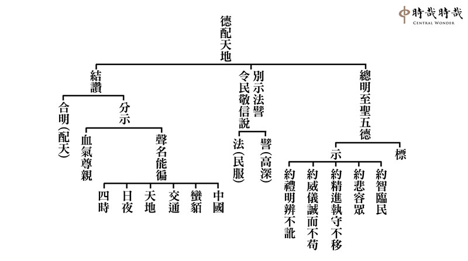

### 孔門十哲—孔門弟子中最耀眼的十顆星（十四） 傳承孔子聖道的曾子(上)

*圖：江逸子、文：編輯部*

翻轉命運的典範

魯鈍人才的奇蹟

百之千之的串習

道統絕學的傳宗

本系列是孔門座下的精英，《鹽鐵論》上說，孔門七十二賢都具有卿相之才，可以成為國家的棟樑。本次主題將從七十二賢挑選一些賢者，著重在講這些人物的大要，細數他們的內涵、氣象、成功之處，幫助我們在這個時代中找到自己的核心價值、發揮大用。

首先從傳承孔子聖道的曾子說起，孔子是如何把這位魯鈍之才變成一個時代的精英？魯鈍之才就是上課都聽不懂、沒有悟性，這種人放在任何時代，都容易是食物鏈的底端、時代邊緣的人物。

曾子卻恰好相反，孔子過世時，曾子在莒國作過官，之後齊國請他做宰相，楚國請他做令尹，晉國請他作上卿大夫。曾子七十歲過世的時候，名滿天下，他人生的命運是怎麼轉變的？《論語‧先進》篇第十八章說：「柴也愚，參也魯」，孔子形容曾子學習如同很鈍的刀子，切不了東西，是魯鈍之才、悟性很差，上課都聽不懂，要很用功才能跟上進度，所以曾子的成就，非常激勵人心。

在《禮記‧中庸》中，形容曾子是「人一能之，己百之；人十能之，己千之。」他人學一次就會，曾子要學一百次才會，他人學十次就會，曾子得學一千次才行，曾子翻轉命運靠求學，這是脫困最重要的方法。

在〈學而〉篇的第四章，曾子說他每天會拿三件事多次反省自己，這種批判式的思維，能修正自己的慣性，做大幅度的生活改變，從而不斷進步，首先是「為人謀而不忠乎」，省察自己替人謀事，是否盡心盡力，這是事業成功的秘密。不但在發展事業的時候，成為別人成功的幫手，在自己發展事業的時候，也容易認識到這樣的人才。再來「與朋友交而不信乎」，跟志同道合的人在一起，要特別講究信用，才能夠跟人家有共學的機會，成為團隊，一起發展事業。再來「傳不習乎」，老師所傳的學問，透過預習、練習、複習，結合博學、審問、慎思、明辨、篤行，跟同儕切磋琢磨，甚至傳授知識給學生們，也是這樣溫習、複習，這更是曾子求學成就的秘密。

曾子的「傳不習乎」傳自於誰？據《闕里志》所載，他十六歲時，孔子當時周遊列國到了楚國，他的父親曾點命他前往楚國就學，可見曾點頗有見識，曾子也具有膽識，才能在這麼小的年紀，就出國讀書。想不到竟與孔子及師兄弟們餓於陳蔡，得聞性與天道。《論語》中子貢說：「夫子之文章，可得而聞也，夫子之言性與天道，不可得聞也。」就是在困於陳蔡發出的感慨。

曾子的成就，無疑得利於孔子，不但從孔子處學得性與天道的思想，以及一身的本事，但也在顏回那裡受教良多，並且多有啟發。《大戴禮記》說到當時曾子有疾，曾元抱首、曾華抱足，曾子說：「吾無顏氏之才，何以告汝？」意思是我如果沒有顏回這樣的朋友，我就沒什麼可以教訓小子你們了，可見顏回對他德學的助益。接著說「雖無能，君子務益」，雖然無能，但君子要能務實，並舉《詩》曰：「靡不有初，鮮克有終。」強調有始有終的重要。上述可知曾子交朋友的厲害，他懂得找高手來切磋，他在《論語‧顏淵》篇說：「君子以文會友，以友輔仁。」與朋友共同切磋琢磨是培養自己能力最殊勝的善巧方便，也是共創事業最好的良伴。

曾子對顏回的觀察也是極其細膩，他在《論語‧泰伯》篇說：「以能問於不能，以多問於寡，有若無，實若虛，犯而不校，昔者吾友，嘗從事於斯矣。」他看懂顏回的求學方法是學自於孔子，孔子以能問於不能，例如學琴師襄，以多問於寡，例如以七歲童子項橐為師，本人是有若無，實若虛，這樣的人，才能謙謙受教，自己的修為也到了爐火純青，別人無禮冒犯顏回，顏回能不予計較。有了師友的教導，他能夠傳不習乎，也成為孔門弟子請教的對象。

曾子不但善學顏回，也善取師兄弟殊勝的形象來作為效法的對象，彼此情誼深厚。《論語》中記載曾子讚子張相貌堂堂，仁也學得很好，而子張死時，曾子因有母喪，穿著喪服而往哭亡友，盡朋友之誼，有人說這不合乎禮，曾子說我只知道我要去為好友哭奠。當然他對朋友除了善取長處及建立深厚的情誼外，也能對朋友的缺失規過勸善。《禮記‧檀弓》載，子夏因為愛子過世，痛苦傷心而哭到失明，曾子前去奔喪安慰子夏，子夏哭著說：我沒有什麼罪，為什麼會得到這樣的報應？曾子說：你怎麼會沒有罪？我跟你一起共學於孔子，後來你回到衛國西河教化，人們只知道有你，而不知道有孔子，這是你第一個罪。你的雙親過世，西河的人民並沒有聽到你特殊的孝行，這是你第二個罪。哭兒子哭到失明，非君子之行，這是你第三個罪過，你怎麼能說自己沒有罪呢？子夏聽完曾子一席話，將手杖丟至旁邊，拜謝曾子說：這是我的過失，我離開團體太久了，才會產生這樣的過失。

曾子除了有很強的善法欲，學習下死功夫外，由於他的質地很好，忠信待人，所以得到老師與朋友對他的不吝教導與啓發，終於成為孔門的傳人。《論語》記載，有一回孔子呼曾子之名而說：我的道，你可以一以貫之。曾子回應說：是。夫子之道，一理分為萬事，萬事歸於一理，有入世者，也有出世者，而能一以貫之。當孔子離去時，門人（或孔子的弟子或曾子的弟子）不解而問，曾子回答忠恕即是夫子之道。所謂盡己之謂忠，己所不欲，勿施於人是謂恕。忠恕違道不遠，可以由事入理，而能一貫。後儒多以此典故說明曾子得到傳承。因為他能傳達儒家之宗，對儒家的建樹很大，後人尊他為宗聖，大概就是這個道理。

當時門人有不懂的地方除了直接向孔子請教，有時也向曾子請教，尤其顏回過世後，曾子得到孔子的印可，更得到大家的信任。所以在《論語》中稱為曾子，當然《論語》中有若稱有子、閔子騫稱閔子、冉求稱冉子，《論語》一書的集結，也有他們的學生，所以學生稱老師，不敢稱其名。（下期待續）

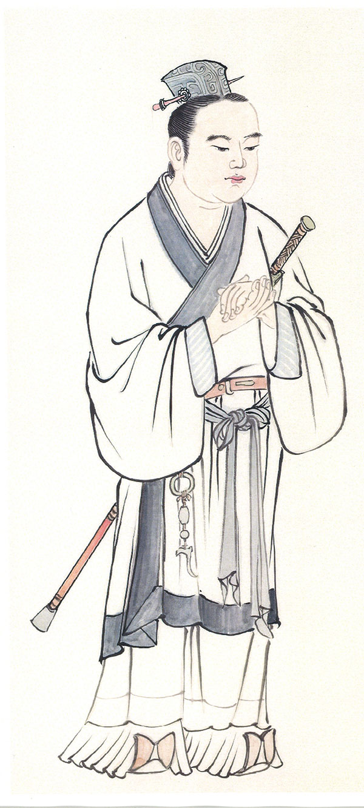

## 藝術賞析

### 華夏精魂千秋（五十一）明倫史畫  以德報怨—杜楚客

圖：江逸子、文：淨域

不慕榮利

知恩報恩

為官有聲

國之棟樑

—史畫—

杜楚客，唐朝京兆府杜陵人（今陝西省西安市長安區杜陵鄉，係漢宣帝陵區），為太宗宰相杜如晦的弟弟。隋朝大業十四年（六一八年），煬帝為宇文化及所弒，王世充擁立越王楊侗為皇泰帝，專擅朝政。繼而廢楊侗，於洛陽自立為鄭國皇帝，以杜淹為吏部尚書。

杜淹之侄杜如晦為李世民謀士，兩人各為其主而有過節。杜淹於王世充面前進讒言，害死杜如晦的哥哥，並囚禁杜楚客於獄中。唐武德四年（六二一年）李世民平定洛陽，貶王世充為民且流放巴蜀，杜淹則將論罪誅滅。杜楚客請求兄長杜如晦，說：「從前叔父殺害了我們的哥哥，而今您又對叔父見死不救，杜家一門骨肉互殘幾盡，豈不令人悲痛呀！」杜如晦聽後有所感悟，便向秦王李世民請求赦免，杜淹因而獲釋，日後受到重用位居相職。

高祖武德九年玄武門之變後，李世民繼位為太宗，任杜如晦為兵部尚書；貞觀三年取代長孫無忌為尚書右僕射，與左僕射房玄齡共理朝政。隔年如晦因病去逝，年僅四十六歲，追贈為司空。太宗極為思念杜如晦，便想起在嵩山隱居的杜楚客，不僅有才華且正直仁厚。杜楚客居山中，曾對人說：「若不當宰相，是不會出來為官的。」太宗請他入朝，並差人傳話：「行遠路須從近處開始，登高山也要由山腳爬起」。於是入朝派給事中一職，以歷練行政能力與經驗。

楚客後來為魏王李泰府中長史，又任工部尚書，兼攝魏王府事。長孫皇后生三子，依次為李承乾、李泰、李治；太宗極愛才華橫溢的李泰，楚客揣摩上意，四處進言改立李泰為太子，於是諸子間為帝位爭鬥。貞觀十七年（六四三年），太子李承乾發動政變行刺太宗，失敗被廢。太宗有意立李泰為太子，但得知承乾之禍的根源，乃因李泰圖謀太子之位而起，便立晉王李治為太子。

李泰因結黨奪嫡之過，罷除雍州牧、相州都督及左武侯大將軍職，廢為東萊郡王，貶徙均州隕鄉縣（今湖北省十堰市隕縣）。楚客共謀奪嫡論罪，太宗念及杜如晦的功勳，免除楚客死罪，貶於江南道虔州，作一小小虔化縣令（今江西省贛州寧都縣）。杜楚客雖宦海浮沉，然最為後世所稱頌的，即是以德報怨救了叔父杜淹一命。

—圖解—

子貢曾問老師：「有沒有一個字，可以作為終生奉行的原則呢？」孔子說：「那大概就是『恕』吧！」恕，就是寬諒的意思。古人注重誠意、正心與修身，時時觀照省察自己，並且能用寬容的心，原諒他人的過失，不僅自身的德業可以增長，也能夠感通善化他人。

蜀漢諸葛亮去世後，後主劉禪用蔣琬為相主持朝政。蔣雖初總朝政，但鎮定自若，民心迅速安定。督農楊敏曾說：「蔣琬做事憒憒，比起前任丞相差太遠。」有人告訴蔣琬當治其罪，蔣琬卻說：「我實在不如前人，這是無可推卸的。」又東曹掾楊戲性格孤傲，訥於言語；蔣琬與他交談時，經常不作回答。有人看不慣，對蔣琬說：「楊戲這人對你傲慢，太過分了。」蔣琬宛然一笑，說：「人心不同，各如其面，要他說違心的話太難了。」

俗謂：「不共戴天之仇。」此深仇大恨有四種，即殺父、奪妻、亡國、滅門。杜淹因權鬥囚禁侄子杜楚客，並殺害其長兄，此種骨肉相殘亦是人天共憤。江逸子老師所繪圖示，乃秦王李世民打敗王世充，將吏部尚書杜淹繫獄待刑之景。此時杜楚客向兄長杜如晦求情，說以同門不殘殺以德報怨之理。如此，使得叔父杜淹逃過一劫，且在朝中升任相職。（下期待續）

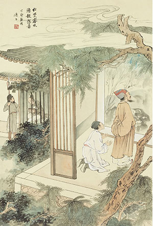

### 地藏菩薩本願經圖導覽(十七)    稱佛名號品第九

圖：江逸子、文：唐瑜凌

稱佛名號有大利

弘揚猶如地藏王

有情稱名離輪迴

善業當中第一善

這一品是讚歎諸佛功德不可思議，同理表彰功德的名號，亦復不可思議，眾生若能稱揚名號，求救護、求加被，佛菩薩能藉眾生的稱名發揮各種利生的神通，此令持名者得無量無邊的功德。

所以地藏菩薩要藉著開演念佛法門令末世眾生得大利益，佛也非常讚許地藏菩薩的開演，在佛涅槃之後，地藏菩薩主持正法事業，又能廣演念佛法門，生起諸佛的護念與加被，令末世眾生藉著念佛脫離惡道，甚至往生淨土，離開輪迴，證得佛果。地獄不就空了嗎？地藏大士的願力就圓滿，不是就早成佛道了嗎？

一陣祥雲由左方飄來，隨著祥雲飄來的方向往左看去，畫面中央有一尊佛跏趺坐於蓮花之上，中指與拇指相抵是說法印。可以呼應經上所說的，未來現在一切眾生，不論是天、人、男、女，只要念得一尊佛的名號，即得無量功德，不論生死永不墮於惡道。

左方上部指的是經上所說的不可說諸佛，眾生只要稱念佛名都能得到不可思議的功德。特別是臨命終人，他的家屬儘管只有一人，為病人高聲稱念一佛名，此一命終之人，能消除五無間罪，其他的小業報自然也都消滅。這五無間罪雖然極重，然而在臨命終時，因蒙受親友為其稱念佛名之故，此罪也漸漸消滅。何況是眾生自己稱念佛名，更能獲得無量福德，消滅無量重罪。

稱念佛名中最殊勝的加被，就是行者念佛求生淨土，所以畫中老者手持念珠於臨命終，眷屬們合力合掌念佛，這些眷屬中有夫人、有子孫、婢女等，在合掌助念聲中，佛光普照，諸佛現前，蓮臺接引，這是末法中最簡易，最直捷的了生死捷徑，也是地藏教化中，不會讓行者脫離惡道，不久又回入惡道最殊勝的方便。這樣的法門才能幫助地藏菩薩圓滿地獄能空的大願。(下期待續)

## 活動報導-東馬詩巫半部論語治天下3.0講座報導

### 東馬詩巫半部論語治天下3.0講座報導

心若

論語推廣有成效   報名大半是舊生

報紙刊登時代性   三方以法多交流

對方請法多殷切   交流之中進步多

反是學會壓力大   不進則退宜自勉

中華無盡燈文化學會與詩巫教育廳、詩巫中華文化教育學會、詩巫華文獨中董聯會、詩巫華人教師會，以及時哉時哉網路教育學院共同聯辦的「半部論語治天下 3.0 講座」，於二〇二五年五月三日及五月四日兩天，在東馬詩巫常青酒店舉行，順利圓滿成功。

本次活動由詩巫中華文化教育學會佾舞班同學以佾舞開場，場面典雅莊嚴。

籌備會主席詩巫中華文化教育學會會長鄭立國致詞

：「感謝中華無盡燈文化學會唐老師第三次率團來詩巫為我們授課，主講『半部論語治天下』。去年六月，還於詩巫舉辦論語佾舞獎學金班，並派遣師資進駐詩巫，為我們上了兩個月的實體課，後續也有每週的線上課程，並邀請本會十八位學員前往台灣交流。今年四月，我們開辦了第二期課程，學員有三十多名，課程內容主要是研學《論語》，透過了解孔子及孔門弟子，體悟孔子的思想智慧，以拓展大家的思維，提升格局，為本地培養有文化底蘊的人才。由衷感謝中華無盡燈文化學會為我們詩巫所做的實質性文化傳承工作。

此外，也要感謝來自大陸的三十二位善友，以及古晉的六位善友，感謝您們遠道而來，為文化教育工作進上一份心力、努力不懈。感謝義工們出錢出力，尤其要感謝小學校長、幼兒園園長、在職老師以及社會青年菁英報名參加此次講座，您們是教育的前哨，對未來的教育有深遠影響。也感謝詩巫淨覺林的義工團隊，感謝本次講座的資助者。
最後，我想分享一些學習《論語》的心得。在〈先進〉第十一篇第十九章，子張請問孔子善人之道，孔子回
**答：** 『不踐跡，亦不入於室。』我的體悟是：學善人之道不能急，要慢慢學，要跟善知識學，要從《論語講要》入門，《論語講要》實在是太棒了！

再分享另一章，〈子張〉篇第三十二章，子貢回答子服景伯說：『夫子之牆數仞，不得其門而入，不見宗廟之美、百官之富。』這意味著，如果沒有從門道進入，就看不到孔子的道高德備，看不到孔子深厚的內涵。我們今天有幸得其門而入，兩天的講座，相信將有百般精采的收穫。與大家共勉，祝大家學習愉快、收穫滿滿！」

詩巫教育廳副局長王壽敏致詞

：「各位領導、各位來賓，今天是個特別的日子。在詩巫這片多元、和諧共生的土地上，大家共同參與『半部論語治天下 3.0 講座』，我感到非常榮幸。早在『半部論語治天下 1.0』時，我也有幸參與其中，與大家一同探討如何將《論語》的智慧，融入教育政策、企業管理與社會發展之中。

這不僅是我們對經典的致敬，更是我們面對未來所做出的思考與承擔的責任。感謝遠從臺灣來的專家學者唐老師及其團隊，讓大家能近距離聆聽深入而貼切的《論語》解讀。同時，我們也歡迎來自不同地區的朋友們參與本次講座，為活動增添更廣闊的交流與思想火花，象徵我們共同傳承中華文化的責任與熱情。

『半部論語治天下』不是空洞的口號，它代表中華文化歷經千年，至今依然能在教育、管理、政治與個人涵養等領域中發揮深遠的作用。我們不僅是重溫經典，更是在變動的時代中，努力找回文化的價值，找回我們的根與魂。相信這次講座一定會帶給大家許多深入的思考。我們也將持續推動經典文化走進校園、走進課堂、走入我們每一個人的生活中。」

詩巫華人教師會主席吳耀文致詞

：「今天我們齊聚在此，共同見證『半部論語治天下 3.0』的開展，作為聯辦單位之一，我深感榮幸。《論語》是中華文化的瑰寶，蘊涵治世哲理，歷來啟發無數政治家與教育家。今日的教育，不僅是知識的傳授，更是人格的塑造。正如孔子所言：『其身正，不令而行；其身不正，雖令不從。』

在鄭會長的大力推動下，論語講座已邁入第三階段。鄭會長可謂是詩巫的子貢，這不僅是一種高度的評價，更是一種信念的傳承與實踐。馬來西亞是一個多元種族的國家，包括馬來人、華人、印度人及其他少數民族，而《論語》所傳達的仁愛之道與治學態度，具有永恆的價值，超越族群與時代，為我們提供了人生的指南。所謂『三人行，必有我師焉』，讓我們一同學習、共同成長。祈願本次兩天的講座能在詩巫深耕發芽，讓《論語》的經典語錄照耀我們的未來。祝福大家身心康泰、學有所成。」

中華無盡燈文化學會唐瑜凌老師致詞

：「回憶 ㄧ九八三年，我在課堂上聽李炳南老師講《論語》，那時在場的都是年輕人。當時台灣正在發展高科技產業，而我的老師講學卻是高朋滿座。正因如此，今天我們學會才能以《論語》來與馬來西亞以及大陸的善友結緣。

我深刻感受到，東馬詩巫學習經典的體質非常完整。鄭會長是不眠不休、無怨無悔推動文化的行者。我本身是學化工的，我們學會也有許多成員來自金融、財經、高科技等領域，這代表《論語》不僅能走進時代，還能與多元的思維模式結合，對治認知偏誤，同時保留許多文化的精粹。

舉例來說，像是佾舞，在一九六八年由孔德成先生於台北孔廟復興。想不到這麼美好的廟堂

音樂與禮儀，今天竟能在詩巫呈現。開幕時，孩子們上台跳佾舞，那種莊嚴肅穆的神情，配上高雅的音樂，真是一場極具水準的演出！

學習經學有三大意義：第一，保留經學的意涵、價值與傳承；第二，可以走向國際；第三，可以在各行各業中善用文化精華，創造出路。鄭會長就像《易經》中的乾卦，堅定不移地推動文化，令詩巫慢慢發展出一片經學的天地，令我感到十分驚喜與敬佩。

文化表現在素養，也表現在人與人之間的相處。我一路看著鄭會長帶著孩子們一起學習、成長，把整個團隊帶起來，看得出他是一位堅持到底的人。民間的力量非常可貴。華人若能保留文化、理解經典，並將其傳承給年輕人，就能讓他們走上正軌。真正可觀的是一個地方是否能做到『近者悅，遠者來』；若能營造出讓人願意來、喜歡來的文化風氣，這就是『德不孤，必有鄰』。這裡有濃厚的人情味，讓人想要一來再來。

在這場『半部論語治天下 3.0』講座中，我衷心期盼大家能透過架構式學習、邏輯辯證，讀出《論語》的活口氣，讀出《論語》的智慧與人情。唯有保留文化特色，才能贏得他人的尊重，正如孔子周遊列國，堅守自身的特色，不隨強兵霸權起舞，反而贏得他國的敬重，也贏得了歷代的尊重與仰慕。

孔子不僅飽讀經學，更善於活用；文化的學習不只是知識的堆疊，更關乎眼界的開拓、對事理的理解與脈絡的掌控。真正要創造詩巫的價值，特別要培養年輕人的見解，這才是詩巫未來的希望。像子貢在亂世中能夠富可敵國，就是因為他學得孔子的思想，並靈活應用於世。孔子的智慧，可以在今天的每個角落發揮力量，以上共勉之。」

中華無盡燈文化學會教學總監林蔚芳老師致詞

：「很高興再次來到詩巫，參加『半部論語治天下』講座。當初鄭會長在為『半部論語治天下 1.0』命名時，其實就已經埋下了延續的心意，這讓我聯想到圓周率的運動。

圓周率運動初始轉動時，往往顯得不夠順暢，向心力不足，甚至會出現離心力的拉扯，就像我們第一次辦活動時的艱難與挑戰。要讓這個圓轉起來，需要一股奮力推動的力量。一旦開始轉動，到了第二次，就會越轉越大、越轉越順。

如今我們進入『半部論語治天下 3.0』，這個圓已經越來越完滿，帶動了詩巫整體的向心力，也凝聚來自各方的人才與資源，令人感到振奮與敬佩。這種精進不懈的精神與團隊合作的成果，未來一定能開展出無限的可能。在此，預祝本次講座圓滿順利！」

詩巫省華文獨立中學董聯會主席 拿督張泰卿獻詞並宣佈開幕：「今天我們齊聚一堂，共同開啟中華文化經典《論語》的學習之旅。這是一場文化與思想的盛宴，此次講座得以順利舉辦，我謹向主辦單位、遠道而來的講師，以及前來參與學習的朋友們，致上最崇高的敬意。

關於《論語》，我自認理解尚淺，但深知其價值與內涵所在。《論語》所傳達的修身、齊家、治國之道，穿越時空，為世人提供永恆的啟示。我們若以現代人的視角與需求去解讀經典，會發現其中蘊藏的智慧依舊熠熠生輝。

在全球化浪潮衝擊下，《論語》中所倡導的為政以德、和而不同，為我們提供了反思與實踐的空間。尤其在當今物質豐裕、精神空虛的時代，《論語》無疑是我們追尋心靈方向的寶貴指引。

孔子曾言：『知其不可而為之』，這份堅持與擔當，正是當今社會所需要的精神典範。無論你是政治工作者、教育工作者，還是平凡百姓，都可以從《論語》中找到安身立命的依託。我們非常榮幸，能年年邀請知名學者蒞臨講學。有中國人的地方，就有人傳播中華文化。詩巫雖為小鎮，但能吸引眾多學者前來講授經典，實屬難能可貴，亦讓我們耳目一新、受益匪淺。

在此，我正式宣佈『半部論語治天下 3.0 講座』正式開幕！」

《論語》本質上是一種菁英教育，菁英教育正是一個國家強盛與否的關鍵，不但決定未來方向，也能帶動其他教育領域的成長。若思維模式不改變，即便擁有再多資源，也難以突破瓶頸。不論是國家、團體還是家庭，若不能建立正確的核心思維，只能隨波逐流，無法在主流中創造獨特價值。

「半部論語治天下」系列講座進行至 3.0，承繼 1.0 談「為政」、2.0 談「學習」，此番 3.0 聚焦於人格特質與風采。《論語》堪稱天下第一奇書，本次講座精選五十一條經典語錄，透過架構式教學，層層引導大家進入核心。架構總標為「善政」，所謂善政，是一種風氣的經營、系統的經營，讓國家達到道德齊禮、無為而治。

而善政的根基，在於領導者的人格特質，人格特質不僅影響決策與風格，更決定團體的方向、味道與向心力。風氣的經營無可取代，是領導者無可推卸的責任。善政的實踐離不開典範的引領，講座也帶領我們認識歷代聖王、孔子及其弟子、賢能的宰相，為我們提供了非常好的學習藍本。

兩天的講座圓滿結束，大家收穫了《論語》五十一條經典的智慧與實踐方法。不禁讓人期待，未來是否將迎來「半部論語治天下 4.0」呢？讓我們拭目以待！

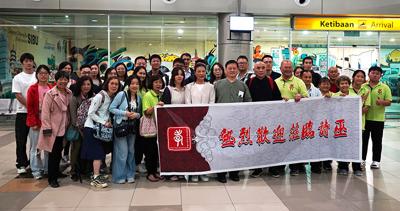

### 東馬行心得

福建敦化學堂 劉晨、許海燕

每年的相聚

共學的珍惜

私下的請教

心境的提升

福建敦化學堂    劉晨

此次東馬之行，收穫之大真的難以言表。不論是講座上的種種法喜，還是與臺灣、東馬、內地各位師長、學長的親切互動，都讓學生宛如身處淨土樂邦。周圍都是善知識，可以隨時探討法義，大家志同道合，都期待在唐老師的帶領下，能夠不斷充實內涵、弘法利生。在如此莊嚴的共學環境中，學生越發堅定傳承聖道的目標，以唐老師及臺灣學會為榜樣，也有了更加清晰的落地方向與做法。感悟很多，學生擇要而說，以下是皮毛的心得，不足之處請大家多多批評指正：

一、讚歎東馬氣象，暗立學佾目標

本次東馬講座的開學儀式上，由東馬當地高中生、大學生組成的志願者們為我們帶來了佾舞的表演。平和的音樂、肅穆的神態，每一個到位的步伐與動作，無不彰顯著那份誠敬與莊嚴。後來得知，如此年輕的志願者隊伍竟是去年講座後才成立起來的，不到一年的時間卻有如此的氣象，無比感佩唐老師與各位臺灣師長的無私付出以及東馬學長們的用心投入，蕭老師兩個月的現場帶導，後期持續的線上共學，每一分條件都是無比殊勝難得，這是在鄭會長帶領下東馬團隊的至誠感應。因此，學生當下就生起若有機緣能請老師們也來福州教授佾舞及其內涵，那就太好了。

在當天的晚餐時段，恰好與白老師聊到學習佾舞的期盼，得知若能招募三十六位年輕人一起來共學，或可請到老師們來福州，學生無比興奮。當晚，在學堂內部複習研討《論語》時，特別分享了這件事，學堂老師們都非常期待，秋蓮老師後在度假山莊的一次分享中也代表學堂向師長們立下了「軍令狀」，今年將堅實推進佾舞學習的落地。學生會積極參與其中，努力以佾舞為媒介，與學堂老師們一起感召更多年輕人來共學傳承文化。

在探討關於「如何更好地接引年輕人來學習」的話題中，臺灣及東馬的師長們都提到了要有適當的物質激勵，學會有為大專青年提供獎學金，東馬讀書會也有為年輕人提供學習金補貼，以此吸引更多年輕人先結緣、入門，然後慢慢在持續的共學中吸收經典的養分，通過對義理的逐步通達而產生信心與好樂。所謂「先以欲勾牽，後令入佛智」，雖然學堂目前還未能提供直接的經濟補貼，但也可從年輕人其他方面的需求來提供相應的支援。如臺灣師長們為外國留學生提供免費的住宿，從而結緣了許多國際友人在學會共學，這對於學生的啟發也非常大。

同時，除了物質激勵外，蕭老師也特別提到了解行相應、一動一靜相搭配的重要性。特別是佾舞作為兩千五百年前祭祀的舞蹈，其蘊藏的禮的精神內涵以及對於當今時代的意義，都需要為年輕人做詳細且到位的解讀，才能由內而外地生起崇敬之心，才能跳出那種氣象。學生也深刻感受到，只有讓年輕人在文化經營中看見出路，實現物心雙豐收，才能讓文化在年輕人的圈層中更好地傳播。

二、二八精英教育，踏實穩健前行

本次講座主題是《半部論語治天下3.0》，唐老師特別講到了精英教育與人才團隊的重要性。精英是二八原則中更少的那一波群體，精英在普世價值中往往指在某一領域特別傑出優秀的人才，但其中不乏許多精緻利己主義者。而唐老師提到精英特指能夠真正對中華文化的內聖外王之道生起殊勝的理解，乃至為人解說的人才，培養這樣的人才才是真正的精英教育。我們作為中華民族的子孫，更要如老師所說，將解讀經典作為中國人真正的身份證，以此勉勵期許自己。

學生是從事品牌企劃方面的工作，平日有關注短視頻、直播等自媒體平臺，也看到時下許多所謂「大師」在各自宣說「大道」，也有不少大眾跟隨學習。因此，學生前一段時間時常在想，老師傳承的文化如此殊勝，若能通過自媒體IP來傳播，不僅可以破邪顯正，更有機會快速提升影響力，與更多大眾結緣。

學生甚至思考擬寫了通過線上自媒體來引流至線下共學的初步思路與框架，但在調研思考的過程中，學生發現當今時代的觀眾，大多不喜歡思維辨析，在電視臺及自媒體從業者中流傳著這樣一句話「邏輯長一步，觀眾少一半」，邏輯似乎逐漸被這波觀眾捨棄，取而代之的是情境渲染、身份代入、金句爆梗等等，感性共鳴、心靈按摩提供了大眾更在意的情緒價值。傳承中最有價值的邏輯思辨能力，卻似乎難以匹配自媒體的受眾需求。正在學生猶豫之時，此次講座唐老師所言解讀文化經典實際上是面向精英的教育，這點對於學生可謂醍醐灌頂，有著非常重要的指導意義。殊勝如孔門縱然有三千弟子，但所謂精英或也只有七十二賢、十哲，真正得傳承的僅顏回、曾子兩位。文化的傳承應當是踏踏實實、按部就班的推進，重質不重量，每個大眾的根器皆不同，尤其在當今時代，真正願意投入道統學習的人更是少之又少。

我們有幸遇見傳承且能夠生起善法欲，更要抓緊時間先修好內功，若我們自己還學得一知半解，又如何影響感召他人來共學。借此觀修，學生也不再急於通過自媒體去做傳播，如《論語》所言「無欲速，無見小利。欲速，則不達，見小利，則大事不成。」學生仍應安住在正法的修學上，跟隨學堂一起努力創造條件，未來以幼稚教育、養生養老等業態作為媒介，能近取譬，逐步影響更多大眾共學正法。

三、感佩師長故事，堅定人生目標

平日裡，學生除了週二、週四參加白老師帶領的線上共學，以及學堂周日的線下課程外，大多數的學習屬於化整為零、擠牙膏式地學習，抽出零碎的時間來聆聽唐老師的音訊、視頻，較難有完整的時段來系統修學，有時工作不太繁忙時，就偷偷「不務正業」一下，哈哈。學習過程中，若有某個點沒想通、沒理解，學生會在行住坐臥中反復思維，或求教師長、學長們，儘管深知有諸多不足，但也自以為有提起一些心力在學。

但此次東馬行有幸聽聞了唐老師年輕時好學的異聞，除了感佩唐老師精進的求學態度外，學生內心感到無比慚愧，自己的好學之心實在相差太遠了。

聽聞唐老師年輕時在臺北故宮博物院上班。為了能親近善知識學習，一周竟有三至四次，在下班後，坐車前往臺中參加雪公太老師的課程，臺北至臺中，光通勤時間就要兩個多小時。課程結束後，唐老師還會留下來與師兄弟們探討當日所學，有時甚至研討至淩晨，第二天一早再坐車回臺北上班。如此求學對於大多數人來說，偶爾為之或許還行，若要像老師一樣長時間堅持，大概率是很難的，這裡面需要極大的願力來支撐，還需要付出大量的時間、精力乃至金錢。再看到如今學會在唐老師帶領下所展現出的殊勝氣象，讓“時間花在哪裡，收穫就在哪裡”這句話變得無比具象，學生被唐老師的故事深深激勵著。唐老師以身體力行來詮釋何為真正的善知識，正如白老師所分享的善知識的兩個重要條件：專注於法、具悲憫心。學生也在慶幸有緣跟隨唐老師學習的同時，更加明確了傳承道統、弘法利生的人生目標。

四、省察自身發心，回歸當下用功

在去古晉的大巴車上，白老師提到了發菩提心、大悲心的重要性。菩提心是為利有情願成佛的心。以成佛作為人生的究竟目標，才會生起無倦的好學求智之心；大悲心是菩提心的因，若無幫助有情拔苦予樂的心意，有時也會陷入自我滿足，停滯不前；出離心又是大悲心的因，只有苦過他人的苦，才會想要救度他人，自己不認識到世間的本質為苦，不想出離，也很難想要幫助他人出離。

其中，大悲心作為承上啟下的橋樑又極其關鍵，白老師有分享到大悲心是初重要、中重要、後重要。

何為初重要？在大悲心的攝持下發起菩提心，才算走在正確的道路上。若無大悲心，則一開始的方向就不對，如小心量的人若只想自己解脫，自己修學的勢力和水準都會受到局限，哪怕七生七死成就小乘果，也無法回小向大。若要成就佛智，仍需先發大悲心、菩提心，從頭再來，三大阿僧祇劫成就的時間也是從發起菩提心的那一刻開始算起。

何為中重要？方向正確了，在通往成佛的道路上，會遭遇各種的順逆境界，如何在順境中不自滿停留，如何在逆境中不洩氣退轉，唯有靠大悲心的攝持，不忍眾生還在受苦的那分才會不斷督促自己前進，心意圓滿必須觀待自身德能皆圓滿成就的那分來成立，因此不能在過程中的任一節點忘失大悲心與菩提心。

何為後重要？這是觀待我等凡夫來說的，為了避免我們誤以為成佛就是終點，就可以一勞永逸，就可以不用度眾生了，才特別強調大悲心在成佛後仍然很重要。實際上，成就佛智後，大悲心已是任運而生，眾生有感，佛必然有應，大悲心既是菩提心發起的因，也是菩提心成就後的用。

故以大悲心貫穿前中後的修行，才真正認識到「利他才是真正的自利」此言真實不虛。

回歸當下，學生首需秉持此用心，堅定此目標，踏實跟隨唐老師及學會學堂諸位師長認真修學正法。同時，應注重將經典內涵努力轉化為自己的思維方式。在這點上，學生借由此前福州講座和本次東馬講座，看到學會師長們將每章論語都進行了科判式的提煉，這是一種非常棒的思維訓練方法，不僅可以從不同的角度切入訓練架構式的思維，還能檢驗自己對於該章論語的基礎背景、人物關係、義理內涵、細節辨析是否通達。有時一章論語就可以關聯出其他多章論語，以經印經，讓論語的解讀真正生動起來，這也是唐老師提到的活口氣的學習法，也慢慢體會到唐老師為何會說四百九十八章論語，好像越讀越讀不完。

在接下來學堂的共學中，學生或與學堂師長們一起嘗試單章論語的科判訓練法，以此帶動四百九十八章論語的修學，並結合老師各類主題科判的複講，展開思維模式的刻意練習，促進自己的智慧成長。

再來，如唐老師所言「智慧需要在能力的攝持下去經營」，有德加上有位則能發揮出更加殊勝的作用。從具體落實上，一方面我們自身要努力敦倫盡分、福慧雙修，提升自己的影響力；另一方面也要根據合適的緣分去團結那些有影響力的人，若能感召這些有位者加入團隊，共同參與正法事業，未來的發展定將不可限量。

最後，至誠感恩唐老師、林老師，感恩臺灣諸位師長，感恩各讀書會的師長學長們，期待下一次的相見，期待共辦利他事業的殊勝因緣，期待共成道業的美好未來，衷心謝謝大家！

以果地覺為因地心

善良的質地

公心的付出

課堂的體會

覺受的延伸

福建敦化學堂 許海燕

此次東馬之行，無論是詩巫的課堂，還是古晉的行程，學生無時無刻不感受到正法的莊嚴和攝持，甚至有一種深刻的感受，大家仿佛就是以果地覺為因地心，認真聽聞，隨時求教，用心護持，呈現了諸多殊勝的妙樂場景。

詩巫，人稱小福州。課堂之外，我們與一些長者交談，發現他們的祖輩基本來自福州下轄的縣邑長樂、閩清等，彼此之間頓時有了老鄉見老鄉的親近感。他們聊祖輩的故事，聊華人在當地的不易，聊華文教育的推行艱難。一位長者還穿著當年留學他邦時的英倫風短裙，雖然不復少女時期模樣，但求學熱情依舊不減。她說，今年的《半部論語治天下》講座已是3.0版，非常感恩鄭會長及其團隊這麼多年來的不懈努力，讓他們可以繼續擁抱自己的文化之根。長者口中的鄭會長，就是當地中華文化教育學會主席鄭立國，唐老師將他比作子貢，他不僅是護持者，自己讀書也頗精進。觀其所帶的團隊，覆蓋老中青三代，充滿熱忱，尤其年輕大學生的加入更讓這個讀書會變得未來可期。

講座第一天，這些年輕人的佾舞表演可謂驚豔全場，令身居祖國大陸、擁有天然中文教育環境的我們頗感慚愧。當聽說讀書會是以獎金來吸引年輕梯隊時，不免擔心將來的走向是否會變質。離開古晉的當晚，在超市碰到的兩位大學生志願者給出了答案。她們坦言剛開始確實是被獎金所吸引，但久而久之，就喜歡上了讀書會的學習模式，並表示未來一定會跟隨。這番熱誠單純的表態，算是對鄭會長、lulu老師們溫暖的隔空回應吧。

馬來西亞華人占比約為22.6%，是該國第二大族群，其華文教育堪稱是海外發展得最好的華教系統。據進一步瞭解，才知今日華文教育的蓬勃發展，實際上是一代代華人堅持不懈的奮鬥和托舉而成就的。如今，鄭會長與其團隊也加入了捍衛的隊伍；唐老師和臺灣師長們，更是將這份重負化為責任的欣然承擔，不僅派駐老師，還有一年一期的講座活動。孔子當年為行道欲「乘桴浮於海」，今日唐老師跨海授業不就是對聖人的肅然允諾嗎？

此次講座，老師重點講述了精英教育的重要性以及君子的人格特質，延續了2.0版「帶領精英團隊學成」的主題。老師觀機逗教，以東馬講座為契機，希望各地讀書會能從中汲取精華，自利利他。

「子路問政。子曰：先之，勞之。請益。曰：無倦。」末學對於這一章君子躬身入局的人格特質頗有印象。

君子做事，當深諳「先之」之道。真正的君子志在利益天下，故不能局限於稼穡之事、名利之福，而應具備上游思維，目標清晰，懂得以能力來經營智慧，重事先規劃，知「就有道而正焉」。如孔子的弟子冉雍、子路、宓子賤、樊遲等，在辦政期間就懂得諮詢夫子或朋友，務求謀定而後動，以求最大程度地實現目標，避免疏漏。

「勞之」，實為踐行力，就是要帶動團隊，懂得用腦子辦事。當我們做事時，條件不足就要創造條件，條件具足就應圓融運用。這句話看似容易，實施起來卻是艱難。君子求仁，必「先難而後獲」，不僅要有目標意識，更要有恆毅力以及善巧方便之能。而帶動團隊，關鍵在於人心和合。「四方來歸」一章中，唐老師在講解「好禮、好義、好信」時特別強調了「情」，只因它是凝聚人心之要樞。

「無倦」，不疲不厭，仿佛擁有一個永動機，不斷輸出能量。為何能如此？唐老師說，因為法喜充滿，必不疲殆；因為在歷事中磨礪出了多種能力，可以開闢出路；又因為可以成人之美，引領風氣。利人利己，好處如此多多，當然無倦。

上述義涵若與通常所說的前行、正行、結行結合，那麼，「先之」則為前行，「勞之」是正行，而「無倦」可謂貫穿三個階段。通過「先之、勞之、無倦」，構建良好的系統運行秩序，待其運轉自如後，方能達到無為而治之境。若跳過「先之、勞之」，直接求「無為」，那是不可能的。

學習經典，貴在親近明師，才能暢述者之本懷。學生何其有幸，得遇正法傳承，得遇唐老師及其團隊。課堂上，老師們解讀科判，分析架構，問答之間猶如撥雲見月；課餘時分，老師們更是不厭其煩地答疑解惑。這般誨人不倦的赤誠之心，不正是先之、勞之、無倦的最佳寫照嗎？

我們稱讚醫者、消防員厲害，因為他們會治病、滅火，殊不知防患於未然者才是真智者，讓病人不患上病，讓火情不生，這才是最寶貴的。這就是先之！

但要做到防患於未然，就須知患之模樣、患之條件、患之對治法以及如何斬斷患根。而要有如此知見且多能，必得跟隨善知識學習，必得向明眼人、懂局者請教，得與團隊多多切磋琢磨，在多聞多見中增長眼力，在承擔中提升能力，讓自己漸漸趨近懂局者，成為懂局者，這樣才可以更好地推行正法，幫助更多的人防患於未然！

老師的每次課堂，總能引發新的思考與體悟。學生慚愧，有時也不免耽著于一些消磨時光的「乳頭樂」，在此警醒自己要好好珍惜眼前殊勝因緣，拋棄那些無謂玩樂，更加努力地實學真修。畢竟，想讓果地呈現無限風光，就要在因上做種種努力。

在此，學生衷心祝願唐老師、林老師和團隊的其他老師法體安康，福慧雙增！更盼他日再聚，繼續聆聽老師開示！

## 活動報導:順昌胡曉婚禮暨文化交流報導與心得

### 順昌胡曉婚禮暨文化交流報導

淨本

難得的好官

文化的推動

愛子的婚禮

經義的莊嚴

中華無盡燈文化學會於今年五月二十二日至五月二十七日，前往福建順昌，與當地善友展開一場深具意義的文化交流。本次活動緣起於陳新女士之子胡曉先生的婚禮。陳新女士過去與學會有著深厚的交往淵源，是大陸當地早期讀書會的重要朋友之一，長年對於文化推廣不遺餘力，始終默默耕耘。陳新女士在順昌發起公益社團「來讀書吧」，以「書吧取代網吧」，提倡青年多讀書、少沉迷網路，至今已在各地設立近五十家的書吧，成為推動地方閱讀風氣的一股清流。

早在二○一○年，學會便首次前往福建省順昌縣職業中學舉辦講座，其後幾年間，亦陸續在各類營隊中推展文化課程，涵蓋各年齡層的學員。當年還在上小學的胡曉，便是參與課程的其中一位小朋友。學會創辦人唐瑜凌老師，曾半開玩笑地對胡曉說：「等你將來結婚時，我一定來參加你的婚禮。」光陰荏苒，十多年轉瞬即逝，昔日童稚的孩童，今日已成風度翩翩、學養深厚的青年才俊。胡曉如今與數學博士班同窗謝聖雯，共許結為終身伴侶。

陳新女士藉著此次兒子婚禮的契機，於順昌舉辦「婚育新風尚，新事用心辦」公益活動，內容涵蓋婚禮、講座與音樂會等。並特別邀請學會唐瑜凌老師、林蔚芳老師及師資團隊，講授婚姻與家庭相關課程，分享經典智慧。參與的讀書會團體不僅是順昌當地的善友，還有來自福州、浙江等地的朋友們。

唐老師團隊以《禮記‧昏義》、 《易經》漸卦與歸妹卦、《詩經》、女德，以及《常禮舉要》等典籍為依據，圍繞「婚姻的真義」為主題，深入探討在時代快速變遷的背景下，現代青年該如何理解婚姻與生育的價值與意義。透過這樣的交流，參與者不僅獲得知識啟迪，更在文化薰陶中，重新審視婚姻與人生的深層內涵。

除了講座與婚禮之外，學會一行人亦與當地讀書會善友，共同舉辦護生活動與拜懺法會，場面溫馨而莊嚴。當地民眾踴躍參與，善男信女皆深受感動，紛紛表示獲益良多，期盼學會未來還能多多舉辦這類文化活動。

中華無盡燈文化學會自創會以來，持續在世界各地與不同善友切磋交流，透過儒家與佛家文化的思想對話，展開一場又一場深刻的思辨與討論。這些交流不僅讓我們找到跨越生命難關的方法，也結識許多志同道合的友人，大家互相砥礪，攜手並進，讓文化薪火在時代洪流中綿延不絕。

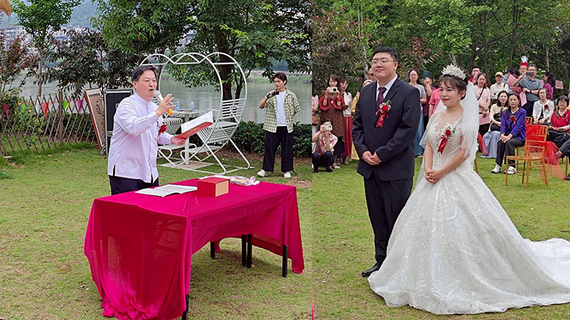

### 體悟婚育新風，涵養五倫之本

福建敦化學堂 劉晨

醞釀多時的婚禮

講座放生的莊嚴

禮樂吟詩的慶典

宜室宜家的緣起

今年五月二十三日至二十五日，躬逢盛會，學生有幸參與了在順昌舉辦的系列活動。此行不僅親歷了文化傳承的莊重典雅，更在唐老師、林老師及臺灣師長們的言傳身教中，對婚姻倫理、生命價值與人際禮敬等方面進行了深刻的省思與體悟，內心充盈著感恩與啟迪。

一、溯本清源：賢德為基，陰陽和合—公益講座的智慧啟迪

五月二十三日的「婚育新風尚，新事用心辦」公益講座，如醍醐灌頂。唐老師、林老師與學會諸位師長搭檔講解，以《論語》《易經》《詩經》等華夏經典為依託，引領我們深入探討婚姻與兩性關係的深邃本質。講座中，「娶妻娶德」、「賢賢易色」的古訓被賦予了鮮活的時代意義。

唐老師睿智地指出，丈夫迎娶妻子，其莊重程度應如「國君禮請宰輔，明主延聘棟樑」。此非虛言，實乃對女性內在價值與家庭核心地位的最高禮贊。正如宰輔輔佐國君安邦定國、賢才協助明主經營企業，一位賢德的妻子，正是丈夫安定後方、成就事業的堅實基石。丈夫對外，當如乾坤之「乾」，剛健有為，服務社會，弘揚正法；妻子於內，則如乾坤之「坤」，厚德載物，持家有道，尤以教養優秀子女、為國家未來培植英才為至要功德。此間深意，正是《易經》陰陽和合、相輔相成大道在倫常中的精妙體現。

講座深刻揭示了「夫義婦隨」的互根性。妻子賢德而甘願追隨，其深層根基在於丈夫自身須為「義」之楷模，值得信賴，堪當依靠。如同宰輔需審度君王的德行，良才需考量主君的器量。婚姻絕非單方面的索取與要求，而是兩個獨立靈魂基於相互認可與共同價值所締結的生命盟約，是陰陽兩種能量的和諧共振，共同指向家庭的繁榮與德行的傳承。

由此觀之，五倫之基，始於夫婦。夫婦一倫正則家道立，家道立則父子親、兄弟睦。家庭作為社會最小的細胞，其內部充盈著倫常正氣，子女自幼耳濡目染父母相敬如賓、各守其分，自然涵養出未來立身處世的大智慧與進退有度的禮義修養。當這樣的個體走向社會，君臣有義、朋友有信的社會和諧圖景方能真正實現。公益講座如明燈，照亮了婚姻關係在個人修身、家庭建設乃至社會和諧中的根本性地位。

二、慈悲護生：敬畏生命，廣結善緣—放生儀軌的心靈滌蕩

五月二十四日的集體放生活動，是一場莊嚴殊勝的生命禮贊。在唐老師及諸位臺灣師長們的引領下，眾人如理如法依循儀軌，心懷至誠，將水族生靈放歸自然。這絕非簡單的行為，而是一場深刻的心靈觀修。凝視著重獲自由的物命，我們不僅是在踐行「眾生平等，慈悲護生」的聖賢教誨，更是在與這些有緣眾生締結一份跨越物種的善緣。

當下心中默念祈願：願今日重歸水域的生靈，他日得遇殊勝法緣，智慧增長，認知提升；願牠們終能藉由無上智慧之光，照破煩惱與無明的重重迷障，洞悉生命實相，最終抵達究竟離苦得樂的彼岸。這場放生，是播撒向未來的希望之種，既是對物命福祉的深切祝福，亦是對自身慈悲心田的耕耘與灌溉，在敬畏生命的儀式感中，心靈得到了一次純淨的滌蕩與昇華。

三、禮樂之和：誠敬為本，祝福為願—婚禮籌備與盛典的禮教浸潤

放生當日的下午，學生有幸參與了次日婚禮的彩排，並蒙受信任擔任呈遞新人信物的禮生。彩排現場，臺灣師長們對細節的極致專注令人動容。從儀程的精準銜接、佾舞表演的走位調度，到物品的陳設方位，無不反復推敲，務求完美。這份殫精竭慮、精益求精的用心，是將對新人的無限祝福與祈願，熔鑄于每一個莊重的禮節、每一處典雅的細節之中。躬逢其盛，學生深切感受到古禮所承載的厚重情感與對婚姻神聖性的集體致敬。

五月二十五日，陳新老師的公子胡曉與謝聖雯女士的結婚大典在明媚天光下隆重舉行。作為禮生，承蒙蕭老師慷慨，借學生合身西裝。剛開始還心中忐忑，深恐過於鄭重，與場景不諧。步入會場，臺灣師長們皆盛裝出席，儀容整肅，莊重非凡，方知此乃對新人、對婚禮本身至高的禮敬。此情此景，令我頓生慚愧。回望往昔，學生參加他人婚禮，衣著多隨意，此刻方知，這細微差異不僅關乎地域習俗，更深層折射的是內心「誠敬之心」的厚薄。典禮之莊重，首重參與者的誠敬態度。這不僅是衣著的調整，更是一次對禮之內涵的深刻領悟—禮者，敬而已矣。外在的儀容服飾，正是內在恭敬之心的自然流露與恰當表達。

戶外婚禮，天幕為廬，草木含情。能在如此清新雅致的環境中，與眾師長共同見證並參與這神聖的生命結合儀式，實乃人生難得的珍貴際遇。目光所及，是新郎胡曉溫潤如玉的謙謙君子之風，新娘謝聖雯嫻雅端莊的淑女之儀。同心同德，佳偶天成。謹以最誠摯之心，祈願陳新老師闔家安康；更祝願新人胡曉先生、謝聖雯女士：琴瑟和鳴，相濡以沫；家道昌隆，福澤綿長。願他們攜手共度的歲月，如順昌山水般和美雋永，充滿智慧的光照與吉祥的護佑。

四、結語：古韻新聲，修身齊家

此次順昌之行，是身心的雙重洗禮。公益講座從經典源頭梳理婚育真諦，賦予「賢賢易色」、「夫義婦隨」的時代座標，闡明夫婦正位乃五倫根基、社會和諧之源；放生活動以敬畏踐行慈悲，在護生結緣中拓展心量，深植善根；婚禮的籌備與盛典，則是對中華禮樂文明誠敬為本精神的生動詮釋，衣冠之整肅、儀軌之莊嚴，皆是內心至誠敬意之外化，深刻教育參與者何為「敬人、敬事、敬天地」。

歸途回望，深感「婚育新風尚」絕非標新立異，實為對中華優秀傳統文化中關於婚姻本質、家庭倫理、生命價值等核心智慧的創造性轉化與創新性發展。它呼喚我們在時代洪流中，重拾對婚姻的神聖敬畏，對伴侶的賢德珍視，對自身角色的責任擔當，以及對生命萬物的深切慈悲。唯有以此正念修身齊家，方能真正實現個體的生命成長、家庭的幸福穩固，並為社會注入源源不斷的和諧清流。此行所獲，如明燈在心，照亮前路，指引我輩在紛繁世相中，持守本心，敦倫盡分，光大家風。

最後，至誠感恩唐老師、林老師，感恩臺灣諸位師長，感恩陳新老師，感恩各讀書會的師長學長們，期待下一次的相見，期待共辦利他事業的殊勝因緣，期待共成道業的美好未來，衷心謝謝大家！

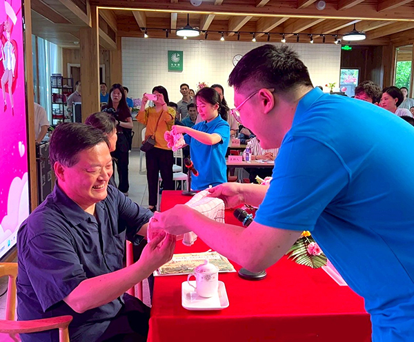

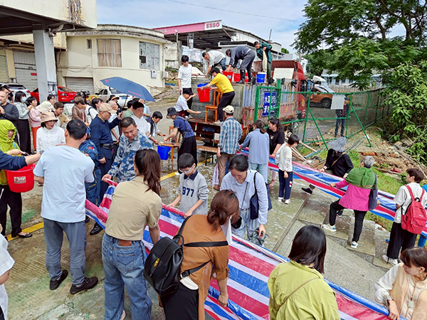

## 活動報導-第二屆：《菩提正道菩薩戒論》之三聚淨戒暨《天臺法華懺儀》研學紀實

### 第二屆：《菩提正道菩薩戒論》之三聚淨戒暨《天臺法華懺儀》研學紀實

于山

不空過的暑期

解與行的並重

止和觀的禪坐

齋僧行的圓滿

二○二五年八月一日至八月十六日，由天臺精舍玅眼法師啟請發起，舉辦第二屆「天臺密集研學實修營」。延續第一屆「一週研學、一週實修」的安排方式，前半段由本會唐瑜凌老師在學會帶領大眾研習宗喀巴大師所造《菩提正道菩薩戒論》，後半段則由玅眼法師率隊前往台中東勢「勢至念佛會」，進行《天臺法華懺儀》的拜懺實修，以及每日七支香的止觀禪修。

八月十六日適逢僧團結夏安居圓滿，於正覺精舍舉辦齋僧法會。最後，眾人於萬仙樓素食餐廳共聚結行，為期兩週的研學營在莊嚴與溫馨的氛圍中圓滿落幕。

第一週：研學《菩提正道菩薩戒論》與《天臺法華懺儀》

一、講座緣起

追溯緣起，在民國八十年間，曾有一位由達賴喇嘛派遣駐錫尼泊爾寺院的住持喇嘛名曰昂念，因緣際會來到台灣。當時環境清苦，他卻仍堅持弘法，為台灣信眾教授佛教儀軌。老師便在他的座下，從頭至尾完整聆聽學習《菩提正道菩薩戒論》。

老師回憶那些自印度流亡至西藏、再至世界各地的上師們，多數親歷逃難之苦。他們身上流露出的崇高人格與堅定修行精神，正是來自古老寺院嚴謹的培養與艱困環境的淬鍊。在天寒地凍的藏地與酷暑的印度，他們仍能專心學法弘法，展現一種不屈不撓的毅力。

《菩提正道菩薩戒論》的作者宗喀巴大師。透過闡述佛陀所制的戒律與道次第的教授，整頓西藏佛教，可謂全世界佛教歷史上最成功的改革者。他的成就，來自於對顯教與密教的深刻通達，以及在修行證量上的卓越成就，是承前啟後的集大成者。

若要比擬歷史人物，宗喀巴大師之於西藏佛教，如同阿底峽尊者之於印度佛教，孔子之於中華文化。他不僅著述、立說，還培育人才，開創完整的佛法傳承，使佛教得以延續至今，影響深遠。

二、講座教材

◎《菩提正道菩薩戒論》

老師在本屆研學營中，以十五堂課完整講解了《菩提正道菩薩戒論》的三聚淨戒部分。

菩薩戒在漢傳佛教中，一直存在版本與解釋上的分歧：究竟應依《梵網經菩薩戒本》、或《優婆塞戒經》？又或者應依《學集論》，乃至《瑜伽師地論》的〈菩薩戒品〉？再加上歷代祖師大德的各種註解，常有觀點矛盾，導致後學無所適從。

老師說，這一部宗喀巴大師所作的《菩提正道菩薩戒論》，正好就提供了我們解決之道，能幫助我們了解菩薩戒，也能化解所有在漢傳佛教莫衷一是的困境。這一部論對我們修學菩薩道的廣大行有非常重要的綱領。

宗喀巴大師要以造論的方式來詮釋佛語，以對戒的闡述來匡正當時西藏佛教的歪風，不由那些上師們各說各話，從此大家有標準可循。

許多漢傳佛教的祖師大德，他們縱然證量很高，但在對佛語進行講解時，也難免抱著揣測的心態，因為沒有得到解說的傳承，有些部分未必符合佛陀的意思。由於對這些漢傳的不同註釋，後代講經法師無法做出相應的抉擇時，便傾向各自解讀、各自表述。基於對三寶的恭敬，信眾們不能質疑講經法師，也無法分辨其中的對錯，且擔心隨意表述會增加自己學佛的業障，於是信眾們便對佛學的解釋感到莫衷一是。

因此，若無如阿底峽尊者、宗喀巴大師，乃至雪廬老人這樣善於製作表解、科判、脈絡清晰的導師，後人便難以洞悉經義。而今學習《菩提正道菩薩戒論》，正能為修菩薩道提供完整綱領。

而我們眼前學的菩薩戒，就可以成為上士道菩薩在世俗實踐菩薩行的總綱。眼前就以《菩提正道菩薩戒論》這本書，對《廣論》或者是《略論》做最好的補充。因此對這些論師們所造的論典，學者應心懷恭敬。

我們學習道次第的上士道內涵，就有廣大行的綱領。比如宗喀巴大師解釋六度行，就是菩薩戒的攝善法戒與饒益有情戒。

饒益有情戒就像儒家的「禮」，應該怎麼把佛法應用到生活中。孔子一生的講學，不外「禮」與「道」，原來「道」要通過「禮」來呈現，「禮」的風采才能帶動大家學習「道」。因此「禮」與「道」，不可偏廢一方。

攝律儀戒雖是上士道的廣大行，但能攝別解脫戒的對治煩惱，還能夠體現十善業遮止惡業的精神。因此，攝律儀戒能攝道次第當中的下士道、中士道重要修學內涵。且上士道當中修學六度，其所要對治的貪、瞋、惡業、懈怠、散亂、愚癡等，就需要律儀戒作為階梯。

所以菩薩的攝律儀戒、攝善法戒、饒益有情戒，三者涵蓋了整個菩薩道的廣大行。修學道次第的人，這部《菩提正道菩薩戒論》就是最重要的參考資料。

過去這部書在台灣沒有弘揚的因緣，那位尼泊爾住持喇嘛講完了這部論之後回到雲南，在家鄉過世。老師在民國八十幾年就已學完這部論典，卻等到民國一百一十四年才開始推展，就是法不孤起，必待因緣。如今，隨著大家共學二十多年，有拜懺、研經、學習《馬車軌》、《道次第》等論典後，總算有可以學戒的機會，能進一步共學菩薩戒法。

很感謝坊間這種書籍還保留住。有些書縱然不流通，可是還能找到，表示說台灣的佛教還保留了最後的夕陽，還保留了這樣的論典，有待於我們繼續整頓、繼續發揚、繼續傳承。

◎《天臺法華懺儀》

菩薩戒是菩薩道的本質，而《法華懺》則是具體的儀軌。懺法的精神即在斷惡修善，而斷惡修善正是戒的體性，二者相輔相成，不可分離。

老師回顧自己學習《法華經》的因緣：早年曾聆聽會性法師講《法華經》，又得見雪廬老人二十餘種講經表解中的《法華經》科判，並承謝正雄班長十多年心血彙整的《法華經科會》。這些因緣使他能在疫情期間，以會性法師的講解為基礎，配合雪公科判，為大眾完整講述《法華經》。

老師先為大家介紹《法華經》總科判，由此進入《法華懺》。如果不從《法華經》來深入《法華懺》，也很難體會其中的殊勝。

老師用五堂課的時間，將《法華懺》講完，兩堂課講解《法華經》總科判，三堂課講解《天臺法華懺儀》，使參與者懷著對《法華經》的知見，來參與《法華懺儀》的觀修。

首先以「總禮伽陀」的偈頌開啟懺法，其次普賢七支的修學法，分別是禮敬、供養、懺悔、隨喜、請轉法輪、請佛住世、迴向等七支的修學法。

接著「總禮三寶」是向十方三寶稟告禮懺。「供養文」就是迎請宣揚《法華經》法會的佛菩薩等聖者，其次「敬禮」，對法會上佛菩薩表達歸命敬禮，有如入幫派，歸命之後自己的命就給佛菩薩；其次在佛菩薩的加被下，懺悔六根罪障，好比想辦法將身體中的毒素排除那樣，接著禮三寶加被接受懺悔，並隨喜三寶的功德，與迴向成佛，並透過往生淨土以成佛。

再者恭誦《法華經‧安樂行品》。文殊師利菩薩請示佛陀，後世發菩提心的菩薩，應該怎麼弘揚《法華經》。佛陀為文殊菩薩講說四種安樂行，分別是身安樂、語安樂、意安樂與誓願安樂四行。行者通過誦念一章《法華經》的經文，來得到三寶的加被，祈願自己成就菩薩的四種安樂行。這是我們未來弘揚法華，必有諸多障礙，此四安樂行敘述各種障礙，安住四種（身、口、意、事業）安樂行，成就法華殊勝行持。

後以念十方佛菩薩，並以無所有的智慧來皈依三寶，然後向諸佛菩薩承諾，自己將隨七佛所教誡的內容來修行，然後「和南聖眾」，恭誦十方三寶，最後圓滿禮懺。

三、講座測驗與成果

研學週圓滿，學員們撰寫考卷，並獲頒獎學金。這次講座的所有費用以及獎學金由陳正雄、陳許美雲二位老居士贊助，鼓勵並肯定參與的在學、待業學生們。

心得分享時，京達學長表示，聽完了這次的講座，要發心在學校舉辦佛學社，帶領更多人來學習佛法。永豪學長則深受這次《菩薩戒論》的感動，認為佛教徒都應該發心學習這部論典，因此他發願要弘揚《菩薩戒論》，並成為父母眼中佛教徒的榜樣。

第二週：實修止觀與《天臺法華懺儀》

第二週的實修止觀，由來自英國、加拿大、荷蘭、俄羅斯、羅馬尼亞等五個國家的國際友人祈請而舉辦，加上部分台灣學員，共同前往台中東勢「勢至念佛會」，展開為期七天的《法華懺儀》與止觀禪修密集修煉。

「勢至念佛會」是東勢地區最早成立的念佛共修會所之一，也是在地歷史最悠久的念佛道場。學員們在這裡承接台北課程的「解門修學」，進一步落實於「行門修煉」，達到解行並重的修行體驗，格外具備意義。本次活動能夠順利展開，得力於創辦人廖老師的慈悲允許與場地提供。

在玅眼法師的帶領下，參與者體驗佛門共住的生活作息：清晨四點半隨著打板聲起床，五點至七點進行第一支香禪修與早課；七點早齋後，七點半至八點半為作務清潔。九點進入第二支香禪修，隨即展開《法華懺儀》上半卷的行持。中午十二點以簡便過堂方式午齋。午後二點進行第三支香禪修，三點繼續完成下半卷《法華懺儀》的禮拜與誦念。五點半藥石後，晚上七點展開佛法問答討論，八點半至九點半為最後一支香禪修與晚課，隨後開大靜，結束一整日的修煉。

這次的密集實修營，玅眼法師以動員最少義工的方式，基本上就是兩位義工全程參與、在地義工從旁護持。參與的學員必須自己購買食材、烹煮三餐；所有早晚課與拜懺的法器、通知作息的鐘板信號，乃至環境打掃、倒垃圾等，都由學員自行負責。這就好比道場生活，擔任不同的職務，都是在「歷緣對境修」，對治自己的無明我執。

延續去年老師指導《天臺小止觀》的模式，本次實修週的打坐，採取「止觀並修」：前半支香為「止住修」，專注於調息、調伏妄念；後半支香為「觀察修」，由玅眼法師引導道次第禪觀。整個禪修期間，學員需收攝身心，杜絕不必要的閒談，專注於佛門生活。每日作務涵蓋典座烹調與環境清潔，皆作為精進修心的延伸。

在拜懺部分，也是仿效老師歷年引導拜懺的方法：每次拜懺前先由玅眼法師提醒儀軌大意，作為前行引導，使正行禮懺更能如法觀修。晚間的佛法問答討論，則成為修煉的結行，一方面解答學員疑惑，一方面交流心得，增進彼此的修學。

結業式上，由老師為大眾簡要講述「天臺十乘觀法」，也聆聽學員心得。荷蘭學員喬漢娜（Johanna）表示，透過拜懺與禪修，她學會更務實地面對生活中因人際互動帶來的挑戰，以積極建設性的態度取代迷茫的情緒反應。來自哥倫比亞的朱莉（July）因每日負責佛前供品，深切體會到培養慷慨心的重要，並期許在日後以樂於助人來成就自我。加拿大留學的魏敬純（CherrieWei）分享，來自不同年齡、性別、背景的學員聚集一堂，使她有機會訓練自己多角度思考，啟發深刻反省。連續兩年參與禪修的照體（Zaki），則特別受益於「觀察修」的引導，他原以為「想像」都是虛妄，但這次體會到透過認真觀想，每一次的觀修都是在為應對真實人生作妥善準備。照體表示，明年還要繼續參加，已經第一位報名。

玅眼法師最後分享：「這次活動讓大家從中獲得修行的觀念與方法。不論是『菩薩戒』還是『禪觀』，看似抽象，實則根源於我們與自己、他人、世界的互動。禪修與唱誦只是修行的媒介，修行不可能孤立完成，必須依靠眾人的群策群力。感謝廖老師、唐老師、林老師及所有義工夥伴的支持，使這次修煉得以圓滿。」

七日之中，學員們共完成六部《法華懺儀》的禮拜，二十六次止觀禪修，並串習「世間八法」、「修心十寶」、「死亡九種因相」、「平等捨」、「菩提心利益」等道次第觀修。

圓滿與結行

最後一天，在老師的帶領下，學員們前往正覺律學院齋僧，並聆聽住持果清律師開示《初祖達摩二入四行觀》。下午前往逢甲大學參觀《愛．共善—淨空老法師文物展》，由老師親自導覽，認識老和尚一生留給人們的啟示，以及墨寶中蘊含的佛法思維。

晚間於萬仙樓素食餐廳舉行結行，眾人分享心得，互相勉勵。至此，第二屆「天臺密集研學實修營」圓滿落幕，留下深刻而珍貴的修學記憶。

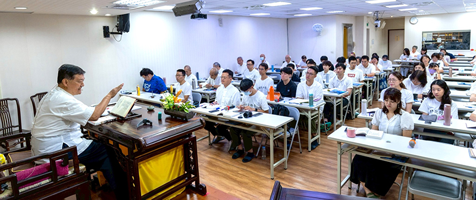

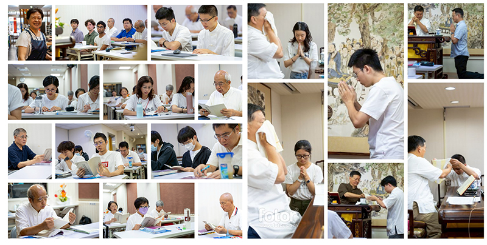

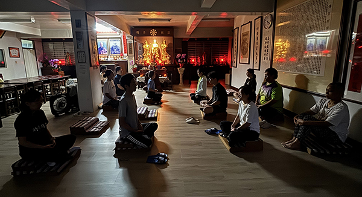

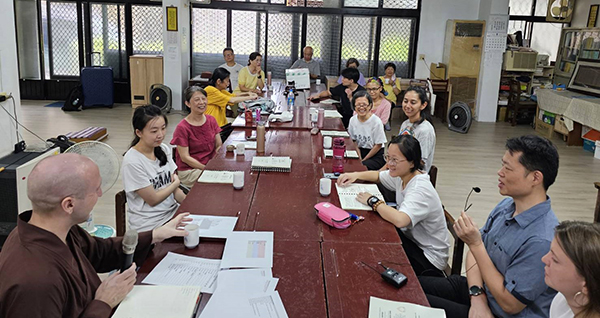

### 菩提正道菩薩戒論考題與解答

*編輯部整理*

考題測驗所學

義理通暢最要

文能詮義表思

不負青青流逝

ㄧ、宗喀巴大師將佛的顯密教法匯編成一修道次第，最根本出自法華經方便品，試問如何證明？

《法華經》方便品曰：「十方佛土中，唯有一乘法，無二亦無三，除佛方便說。」在方便品中，佛引舍利弗入一佛乘，可見佛究竟的密義是一乘道，並非小乘不必要，而是以小乘作為大乘道的階梯，以顯教大乘作為密乘的階梯而入密乘，小大顯密乃修道不可少之次第，謂之一佛乘。

二、依道次第的修學，菩薩戒論可以歸到哪一種的道次，理由為何？

本論的攝律儀戒、攝善法戒、饒益有情戒都需歸到上士道的修學，因為受菩薩戒的人需要發菩提心，即便未發心的人受完菩薩戒，未來也要依菩提心的修學法發菩提心，菩薩戒只要一受，就是為了成佛而要作的發心，且在十方諸佛前承諾，戒體在菩提心未退轉前都在，所以是盡未來際。

而別解脫戒是依在人身上，且是出家身而有，重在此世解脫，轉世的時候，得到人道的機會很少，且無佛的時候何來出家？所以只能盡形受。

此中攝律儀戒與小乘的別解脫戒在對治煩惱、業上屬共道的對治，例如小乘的別解脫戒屬於對治法，這種對治法較屬於少欲知足，少欲不是成立法，而是遮法，不是有個東西叫做少欲，是要對治欲說少欲，攝律儀戒也是對治法的概念，所以兩者有共通的精神。

而攝善法與饒益有情戒和小乘不共。攝善法戒能攝六度，饒益有情戒則是攝持利益眾生的種種方便，如同儒家入世之禮。三聚戒攝持菩薩的廣大行，是大乘上士道。

宗喀巴大師在皈敬序中也說本論是為大乘上機而說。

三、如何用本論來經營人生，為何說他是甚深的緣起？

通往增上生跟決定勝是人生必要的經營，方法就是依道次第生起大悲心、菩提心修廣大行與空性正見；而本論所詮的菩薩戒正好能攝持菩薩的廣大行，令大悲心、菩提心在利益有情時，能有落腳處，有所依據，如何受戒使自己成為法器？能受戒能防護戒，以三聚戒來遮止罪過、斷惡修善，成熟自己的善根，並進而利益有情，成熟他人善根。用本論入世間歷練人情世故，幫助生起覺受，並且打造和合團隊傳承教法、造作善法。

而戒的體性就是業果的思維，能學到這樣的教法是宿世難得的善根，修菩薩戒也和未來佛果有關，因此能受持戒的功德不可思議，破壞、毀謗菩薩戒的罪過亦不可思議，不是一般世間善惡可以比擬的，必須依聖言量才能信解，因此是甚深緣起。

四、菩薩的三聚戒次第為何？請述理由？與道次第的關係？

次第為攝律儀戒、攝善法戒、饒益有情戒。

因為如果沒有斷惡、遮罪，沒有修善的力量，所以攝律儀戒是基礎，先約束自己的身心。而攝善法戒偏向成熟自己的善根，透過行六度善法來累積資糧，先自利才能真正利他；之後饒益有情戒，觀察眾生的根機，於戒開遮持犯能行權巧方便，成熟眾生的善根而無過失。

以別解脫戒的行持，成為入菩薩戒的階梯，如同下士道、中士道為上士道之階梯，在菩薩三聚戒中的攝律儀戒，是遮除行菩薩道的障礙，乃己之煩惱、業，這也與別解脫戒有共的部分，而不共的是以六度所攝菩薩行成熟己之善根為攝善法戒，以及成熟有情善根的饒益有情戒，將自己引向利益有情的心量與能力的那一分。

五、本論所述的菩薩戒可大分為兩類？出自何論典？

不是有兩種的菩薩戒，而是依身分在家、出家而說，有在家菩薩戒及出家菩薩戒。在家與出家身分雖是二，但受的菩薩戒是一，此出自《瑜伽師地論‧菩薩地‧戒品》。

六、敘述菩薩戒的經論有哪些？

經有《梵網經》、《虛空藏經》、《優婆塞戒經》。

論有寂天論師《學集論》或《集學論》、《入菩薩行論》、無著論師《瑜伽師地論》，五

部大論裡面德光律師的《戒論》。

七、菩薩的律儀戒為什麼不是別解脫戒？

◎別解脫戒只有盡形壽，攝律儀戒則是盡未來際，除非失壞戒體。

◎別解脫戒遮罪不能開，攝律儀戒在行權的時候可以開戒。

◎別解脫戒以自身解脫為目標，菩薩律儀戒引向利益有情，引向大乘。

因此可以不受別解脫戒，直接受律儀戒，但若沒有受別解脫戒的能力，也不能成為菩薩戒能受持的法器，反之受別解脫戒有助於受持菩薩戒。

八、假如我不成佛，學菩薩戒對我有何好處？

一、修身處世的基礎利益

１．懂得業果的思維，能夠斷惡修善、趨吉避凶。

２．攝律儀戒幫助調伏身口意，防非止惡。

３．攝善法戒與饒益有情戒讓人能入世造作善法，學習人情世故以利他。

４．幫助建立生活規律，使身心安定，有餘力投入做更多有意義的事，且懂得推廣正法是入世最有意義的事業。

二、自我成長與提升

５．提供修整心力與能力的準則。

６．訓練心態與心量，即使身在人群中，也能培養大乘佛子自利利他的精神。

７．培養等流的習氣，形成良好的心理與行為慣性。

８．幫助累積真正有意義的功德，而非盲目行善。

９．能夠類比與學習成功人士的優點。

三、人際與社會的應用

１０．了解饒益有情的細節與方法，應用在職場、家庭、人際關係中。

１１．增強觀察力與應對進退的能力，講究時機。

１２．懂得親近善知識，遠離惡知識。

要言之，人生猶如修行場，學戒讓人在世俗中也能依道而行，以悲心待人接物，知曉如何入世而不迷失，亦可創造有利的際遇與因緣，面對環境變化能隨時調整心態與做法。

九、由戒學如何生起定、慧？

依戒防非止惡，是生起定的前方便，幫助我們去除修定、慧的障礙、逆緣，例如對治惡業使苦果不生，修學正法容易得三寶加被，不易著魔，不會成為修學的障礙，修學善法，使己有修道的資糧，例如有善知識、法本、道糧、身體健康，容易靜得下來，不會昏沉、掉舉、散亂，舒適的修學環境，心未受惡業的影響，修定時又知道九住心的修學法，在修定的時候有修定教授的引導，修定容易成功，有定的能力，才能依定修觀生起觀慧，當然修觀時也知如何依教修觀，生起以觀為體性的慧。

### 菩提正道菩薩戒論心得

淨蕙、 游捷茹、蔡易儒、張永豪

以道次第開演菩薩戒

用別解脫戒為下中士

三聚戒攝菩薩廣大行

改變此生命運勝了凡

淨蕙

過往我對戒律的印象是刻板的教條，自由慣了的人為何願意走進「籠子」裡，給生活設下諸多限制？雖然持戒可以獲得人天身、得高貴種性等好處，但對在家人而言，「以戒為師」的真正意義何在？直到老師在課程中點明，菩薩戒其實為我們提供了行善的具體指引和參考標準，讓我們不再漫無目的，能更精準地做出抉擇和造作。

其中提到「攝」的概念，有包含、堅守、護持修為的意思。這使我們能依循這些教導來斷惡修善，才可能談上改變命運，而不是不斷隨煩惱轉。藉此重新翻開《了凡四訓》，發現當以大乘的心態來理解時不但合理，感覺也把整個格局提升到另一個層次了。因此課程結束後，反而一直在思考大乘的心量該如何真實生起。每天即使大部份時間處在人群之中，感覺不像聲聞獨覺般獨來獨往，但那不代表就是發了大乘的心。當麻煩的人事來到面前，下意識不是想逃就是希望由其他人擋著，最好與自己無關，這樣的心態好像難以接近《菩薩戒》裡描述的。意想不到的是，戒律其實也是「成長型思維模式」，從來沒說到一定要跟著這麼做，它有開遮的地方，也提到不該自輕蔑，與其想著「我為什麼不行，我怎麼可能」，或許可以改成「我什麼時候可以」。在好好要求自己的同時去利他，如同世間老闆都知道賺錢的好處，多辛苦都可以撐過，跌倒總能爬起來⋯ 要是修行持續有這般能耐，那真的是刀槍不入了吧。

過去沒有上過法華經，這次印象較深刻的是法華七喻。「開三顯一」也正好結合《菩薩戒》和道次第的概念。這次也在這門課參與了翻譯工作，和去年的《小止觀》不同，這次完全採取同步翻譯的方式，難度加深了很多。加上過去沒有上過《法華經》，和外國學生都一樣第一次聽，要即時把老師宣講的法義翻譯出來是全新的挑戰。我跟弟弟兩個人以接力的方式分攤難度，眼看戴老師則是一人從早上到下午負責所有《菩薩戒》的內容，打從心底的感到佩服。我們這組的研討也有別其他組，開放外國學生問任何跟佛法與生活有關的疑問。其中也遇到幾題是自己曾經困擾或思考過的，在試著回答的同時彷彿又再一次正式的回答自己。不求回報，只求當下的交流，以滅法相續的方式在彼此生命中發揮作用。

游捷茹

過去在馬車軌的課程中，對於戒的印象有「業果思維」與「防非止惡」，了解規範可以保護我們不受惡行的傷害。在不同的課堂上，也曾提及五戒十善，或是攝律儀戒、攝善法戒、饒益有情戒三種戒律。

在正式菩薩戒上課前的興奮與忐忑，一部分來自於難以想像戒律會如何影響我的生活，它會不會成為一種無形的壓力？聆聽老師結合道次第講說戒律的精神，感覺無論是自利或利他，戒律可以導向共同的方向：為利有情願成佛果。這樣的視角似乎使原本對戒律「謹小慎微」的感受，轉換成「積極行動」的形象。意義也變得更加清晰，不僅是入世具體行動的依據，也涵蓋出世的理念精神。

嘗試紀錄目前對於三種戒的認識，以及與自己日常生活連結帶來的互動。攝律儀戒，約束自己的言語及行為，至安排出能幫助或支持學習的生活型態。所提及的核心觀念，像是以「增上生」與「決定勝」為目標，似乎自然而然的帶出面對抉擇的依據，幫助在生活盡可能地遠離怠惰的習慣，創造有益修學的環境。老師也解析別解脫律儀戒與菩薩律儀戒在發心上的微小差別，透過老師講解，才知道如何試著去分辨與養成日常的思考，檢視是否向著行善、饒益有情為目標。攝善法戒的因緣具足中，說明行六度或善法時，可以持有的意樂，像是發心如何建構，心意圓滿的形象是什麼模樣。饒益有情戒感覺像是在工作與生活中面對他人時，「做」、「不做」、「如何做」、「如何不做」才能真正利益對方的細膩思考。其中許多精緻細微的考量，感覺需要帶著大量的知識與經驗，同時盡可能地從多元的視角試著理解他人，才能慢慢地練習做好這件事情。

謝謝老師精巧的開講菩薩戒課程，在有限的時間裡帶領我們理解戒律的核心思想與細膩之處。自己對戒律肯定還有許多不認識的地方，但也感覺到菩薩戒的觀念，對於構築生活中防非止惡、自他二利的環境，是很有幫助的。謝謝能在學會這樣棒的團體學習，心中有困惑時總能聽見不同的、積極的另一面想法，幫助及時地修正。在這樣的環境裡，彷彿也變得更敢於在生活有與以前不同的嘗試、選擇與實踐。

蔡易儒

今年暑期的講座是非常難得的因緣，首先是教法難得，以菩薩戒為主題，宗喀巴大師的菩提正道菩薩戒論為教材，這樣的課程是極為少有的。再者是傳承難得，除了是學會以傳承自雪廬老人解經法及佛學講座形式，多年興辦講座的延續，唐老師更是在過去上師的教授下得到本論的傳承，這是非常得來不易的。還有是因緣難得，此次有數名外國的青年全程參與兩周的活動，以第一周菩薩戒論的講座作為第二周玅眼法師帶領作法華懺實修的知識背景，而透過懺法也使行者戒行清淨，兩者互相觀待，這種安排意義非凡。還有善巧方便難得，有精通英語的師長同步作課程和交流的翻譯，使外國的善友能獲得法益。眾多因緣俱足才有一時教法的顯現，使學生不禁感嘆自己何其有幸能有這樣的際遇，必當好好學習，才不辜負過去的善根和善知識的恩德。

本論是宗喀巴大師為了闡述無著菩薩傳承自彌勒菩薩《瑜伽師地論．菩薩地．戒品》所造的論。唐老師首先從科判帶我們了解架構，光是科判就讓我對於論師清晰的理路和攝持教法的陀羅尼感到由衷佩服！唐老師依著本論不僅精準消文，也為我們建立了許多重要的架構和觀念。例如論題的「菩提正道」就是指「道次第」，「菩薩戒」就是菩薩學處，是通往成佛的行處要道；菩薩戒為能攝，菩薩的廣大行為所攝。而菩薩戒的體性，除了「戒性四功德」，也就是一一菩薩戒都要具足這四法來受持清淨，也可以說以三聚戒為體性，攝持所有的菩薩戒，因為沒有三聚戒，則沒有一切的菩薩戒。三聚戒都是上士道的修學法，其中三聚戒的攝律儀戒與別解脫戒，在遮性罪的那分相通，但兩者不同，因為菩薩戒盡未來際，且能行權；而別解脫戒在遮除小乘自利意樂之下，就不是小乘法，而是大乘共道；行者可不受別解脫戒直接受攝律儀戒，受持攝律儀戒者，也可以同時受別解脫戒，且別解脫戒有助於受攝律儀戒的能耐。這些重要的觀念透過老師的解說，讓我對戒律有全新的認識。過去只知道持戒是六度之一，而六度是廣大行的能攝，如今知道菩薩攝善法戒為能攝，六度為所攝；關於六度的修學法，要以廣論作為本論的補充。而三聚戒次地決定的理由，是因為先斷惡才能修善，故攝律儀戒在先；修善當中，先自利才能真實利他，因此知道攝善法戒偏向自利來說，饒益有情戒偏向利他來說，可見饒益有情這件事極不簡單！如同玅眼法師說，不是菩薩戒很麻煩，而是眾生很麻煩！

持戒必須守護戒體。戒律的體性，唐老師曾教導說是因果的見地，因為無論二乘戒或大乘菩薩戒，都必須對因果有勝解，乃至依聖言量作為甚深緣起的比量，知道持戒功德的殊勝、犯戒的過患，才會認真持戒。戒法的功德太大了，包括得到高貴的種姓，乃至自利利他、獲得解脫大果勝利，都要靠持戒，因此戒法的殊勝使人尊貴，成為法器是給自己最好的莊嚴，如同菩薩身著瓔珞，受菩薩戒成為大乘種姓，功德遠超二乘；而戒法的功德也要觀待人去持戒才能彰顯，人才能弘道。此外，戒律的體性，以大乘菩薩戒而言，是依大悲心生起的菩提心，因為有願菩提心才會修學菩薩學處，一切難行能行。論語顏淵篇的第一章，可以看到弟子當中，孔子只有對顏回用遮罪的方式說仁，也就是非禮勿視、聽、言、動，唐老師說這如同三聚戒中的攝律儀戒，本章宛如孔子在為顏回授菩薩戒，因為仁心是戒體，顏回是仁心的成就者，因此有受菩薩戒的能力。透過唐老師的教導，讓我對於仁心和菩提心的重要性，以及依禮行仁、依菩薩戒修廣大行的殊勝有了更進一步的體會。

關於別解脫戒只有盡形壽，而菩薩戒能盡未來際，學生聽聞之後的體會是因為每一期生命的因緣不同，例如人身得否、男女、在家出家，因此別解脫戒以形壽盡為一期圓滿，一方面對於人身難得、受戒因緣難得生起戒慎恐懼，一方面也覺得盡形壽的這分，不是指一期圓滿便棄捨戒律，而是導向生生世世都會樂於受持別解脫戒。而菩薩戒能盡未來際，也跟菩提心的相續有關，為利有情願成佛，如同普賢十大願王，因為有情眾生乃至業、煩惱無盡，因此這份使命感和誓願相續無盡。曾經學生覺得要持戒一輩子已不簡單，菩薩戒到盡未來際簡直難以想像，尤其菩薩度眾生會遇到各種逆境、障礙，如同雪廬老人說他是滿身傷疤、跪著把佛法學進來、送出去，但他的心境卻是「未改心腸熱，全憐暗路人，但能光照遠，不惜自焚身」，除了讓我對菩薩的心量感動不已，隱微處也懷疑自己達不到這樣的境界，難怪冉求會說「非不說子之道，力不足也」，想必是很多人內心的寫照。然而，真正的問題可能出在沒有對大悲心、菩提心生起真實覺受，因為如果生起有情如母和愛子的覺受，要菩薩棄捨菩薩戒，如同叫母親不要想孩子，是根本做不到的；「不惜自焚身」，反而不是痛苦，而是我愛執的對治、自他換的法喜，功德法財的累積，難怪老人說「歡迎困難」。可見依道次第建立基礎太重要了，如果內心有過不去的點，往往要回頭檢視自己是否每一步的修學都有如實生起覺受，學不躐等。孔子教我們一日用力於仁是不會力不足的，如果能每天都致力相續、串習覺受，相信不僅三月不違仁能達到，佛也會為這種人授記。

菩薩戒的另一種啟發，就是誓言的力量。例如內心想著不殺生而不殺，和受持不殺生戒誓願不殺，後者的力量更強、更能做到，功德更大。然而孔子卻說「先行其言，而後從之」，而且萬一受了菩薩戒卻做不到，反而招致果報，失信於三寶，何必冒這個險呢？學生的體會是發願和一般守信的概念是不太一樣的，發願受戒是一種承擔，而且內心知道它是出路，為了成佛總有一天要踏上這條路，受戒以願導行，持戒不犯以行填願，只是在求受戒之前要謹慎衡量而已。例如立下誓言承諾、有人見證，就能成立結婚證書，之後的造作攝持為婚姻的生活，而不是婚姻的事實在先、結婚在後，同樣地先有受戒的戒體，後面的造作才能攝持為通往佛果的菩薩戒，否則只是一般的善法。還有另一種啟發，就是對三寶生起信心。眾生往往會欺騙佛菩薩，但佛菩薩不會欺騙眾生，既然菩薩不會違犯菩薩戒，我們要如理如法地求加被、傳承、依怙，即使遭遇挫折、障難，只要反省自己是如理如法，不以其道得之不去也，觀想是佛菩薩顯現逆境要使我增上，不會退失對三寶的信心，出路一定會顯現。還有另一種啟發，就是戒法要發心去傳承，因為戒體必須從他正受，不能自己受。如果不去傳承菩薩戒，後人找不到典範，也沒有受戒的因緣；法寶再殊勝，也要靠人讓它有生起的因緣。

最後很高興有機會透過菩薩戒論的學習，了解佛菩薩的內心世界，也成為我心中的所願境，種種學處都要努力學習。不僅禮敬彌勒菩薩、無著菩薩、文殊菩薩、宗喀巴大師及本論的傳承，也禮敬唐老師將這樣的傳承教授給我們，尤其是帶著上師的傳承，還有唐老師自身多年行菩薩道歷練的故事、覺受，作為本論講座最殊勝的補充。果然能夠受持本論，修學菩薩戒，一定能成為一個面面俱到的人才，俱足成佛的能力，創造殊勝的淨土。

張永豪

雖是解瑜伽菩薩戒品   依學集論與虛空藏經

由道次第述戒品之釋   菩薩廣大行總綱攝持

今年由學會舉辦的菩薩戒論的講座實屬難得不易，特別是之前對於台灣菩薩戒的淺薄研究後，發覺菩薩戒的普及度並不高，甚至可以說是仍處於未開花的階段。儘管各大寺院已經有了一年一次傳授菩薩戒的活動，但由於大眾對菩薩戒的了解非常少，膽敢參加受戒的人更是少之又少，更別提在參加受戒之前，絕大多數的人是沒有管道學習菩薩戒課程的。所以就產生了「想學菩薩戒就必須直接去受戒才能學到一點皮毛，回家之後對於開遮持犯仍是一知半解」的現象。甚至有更多的寺院是完全只傳菩薩戒卻不講戒。要求想報名受菩薩戒的人必須自己在家熟讀《梵網經菩薩戒本》後自己跑去受戒，全程完全靠自己翻書。

這樣極度缺乏教育資源的環境下，不知究竟有多少人可以真正走到最後，完整精通所有版本的菩薩戒本，以及了解各版本之間微妙不同處的正因，並且熟知各種場合的開遮持犯，最後完整整合出一套集大成的菩薩戒修學準則與結合各版本精華的戒條來持戒？

現存的菩薩戒本就存在著非常多種版本，而台灣寺院傳戒最普及的版本是《梵網經菩薩戒本》。眾所皆知《梵網經菩薩戒本》是最複雜且最容易嚇退學佛人的戒條版本。比如第四十四條輕戒中，要求學子必須「剝皮為紙，刺血為墨，以髓為水，析骨為筆，書寫佛戒。」光看到這條極度不合理的戒律，就足以嚇退所有頭腦正常的人。《梵網經》中還有更多極端的戒條不一一闡述，讓學生不禁試問，到底有多少受過菩薩戒的人真正做到過？甚至是寺院傳戒的法師們有幾人真正這樣執行過？若不必真正這樣做的話，那為何還放進戒條裡？更別提在教育資源不足的情況下，學佛人想問也沒地方問，找到人問也得不到答案。

依學生的角度看來普傳《梵網經菩薩戒本》的授戒，前提必須有充足的釋戒課程，並且足夠普及化，讓台灣大多數的佛教徒都有認知之後，才適合拿《梵網經菩薩戒本》來作為最普及化的版本。否則條件不足，卻用《梵網經菩薩戒本》來普傳，恐怕只會落得傳戒沒次第，嚇跑所有人，受戒的人又不懂持戒的兩頭空。更別提另一件驚訝的事實，原來絕大多數台灣的佛教徒是沒有受過皈依和五戒的，到現在還是會聽到佛教徒問「皈依是不是要吃素啊？那我不要皈依好了。」之類的反應。試問即便連基督教、天主教、伊斯蘭教，任何剛入教者都必需遵守不同的戒命，其他宗教連受戒儀式都沒有，持戒卻比佛教徒更普及且精嚴。理論上任何宗教都有不守戒者，但其他宗教守戒的概念是更基本普及的，不像台灣的佛教徒能不受戒就不受戒，能不皈依就不皈依，試問此番習氣造就下來的大環境是否相當接近所謂的附佛外道？身為佛教徒卻不皈依不受戒，與世俗無宗教信仰者無異，外道與其他宗教者反而更精嚴。這樣錯愕的事實卻擺在眼前。如果我們看《瑜伽師地論菩薩戒品》的內容，絕大多數的戒條學處其實都與世俗人天、人際相處密切相連，甚至非常重視於人際關係與互相理解包容和互助類的基本觀念。照理說越高層的戒律應該要更深奧，可見人際關係的修學其實非常重要。但這樣最根本的教育卻被擱置在「嚇跑所有人」的菩薩戒裡面。試問新進學佛的人怎麼可能有機會學到這些基本觀念和根本學處？

如果連人與人之間的修學都沒有達標，還如何進到天道的修學？

如果人天乘都沒有達標，試問學佛人該如何談解脫？

而《瑜伽師地論菩薩戒品》就是行菩薩道者在世俗的運用，在人天乘上有其殊勝入世的功能。

這樣的內容完全應該放在入門課程中，以真正的道次第的方式來安排修學內容。梳理到此，全台灣能以道次地傳授菩薩戒的道場，不知有多少？在這樣教育資源與觀念未通達的環境中，最缺乏的就是這樣的風氣。正如唐老師曾說最寶貴的東西，有錢、有地、有人也換不來的。比如少了傳承與正知正見，就像尊貴的佛像遺失了頭，漂亮的瓷器卻破了個洞，稀有的花種卻少了養分，眼下台灣的佛教雖是興盛，但仍未真正開花結果，想必缺少的就是最根本的次第觀念。

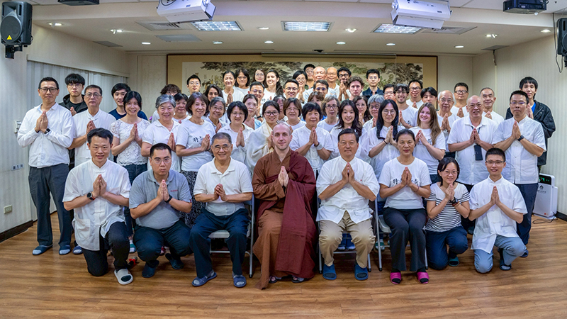

## 活動報導:一一四年八月十六日 正覺精舍齋僧總報導

### 一一四年八月十六日 正覺精舍齋僧總報導

淨柔

此事由來十五年

僧團結夏清涼行

弟子齋僧因地時

勝解難思之果生

本次齋僧活動不同以往，特別結合了「看展」與「晚餐」的安排，農禪營的國際友人亦一同參與，共襄盛舉。晚餐時光更增進了彼此的情誼，大家在歡樂氛圍中交流心得。尤其是在「菩薩戒論講座」之後，大家對於法義有更深的體會，使此次活動更顯殊勝。

清晨五點三十分準時出發，啟動一天美好又充實的法行。為使大家在車程途中，也能把握時間進行觀修與發揮想像力，特別安排了抽籤遊戲，籤題與今日的法語相關。適逢父親節剛過，先說齋僧與孝道的關係，以及為何孝順父母要以齋僧來實踐。此可分兩層面來說：一、世間孝順只能暫時滿足父母的身心，卻無法解決生死根本；二、若父母過世後墮入惡道，子女更難救拔。唯有以供養十方賢聖僧的功德，迴向現世與累劫父母，方能得大利益。正如蓮池大師所說：「親得離塵垢，子道方成就」，以出世間的孝順攝持世間孝道，才是真正圓滿的孝道。所以想真正報答父母的恩德，最重要的是幫助父母離苦得樂，而真正的痛苦是六道輪迴之苦，真正的快樂則是成佛之樂，倘若自己尚未解脫煩惱，又如何能幫助他人？就像自己沒有錢，便無法布施他人一樣。因此，為了令父母與眾生獲得究竟的快樂，我們必須先成就佛果，這正是菩提心的發起，同時要勉勵自己在當下努力修學教法、對治煩惱、集資淨障，才能真實饒益無量眾生。

所以想要度化家人，必須先從自身做起，成為勤於學習、改正過失的人，才能潛移默化影響親人。進而以善巧方便，引領家人親近善知識，逐步實現佛化家庭，同時自己也要發心為公，善護身心、安頓家庭，讓清淨的發心成為美好影響，提攜家人共同成長。

應知斷惡修善是修道的重要資糧，斷惡能破除障礙，修善能增長順緣。內心隱微處就是以佛果為目標，以般若智為主要的方便，攝持世俗廣大的菩薩行，並創建佛淨土來做最殊勝的饒益有情。如同阿彌陀佛在因地時，能參二百一十億佛國土的莊嚴，成就西方極樂世界，正因他善於學習諸佛的功德，我們同樣可以將祖師的修行方法與齋僧法行，化為自己的體會與功德。由此可知，聞法對觀修極為重要，若能將所聞教法與今日齋僧相應觀修，其功德意義不可思議，未來的果報與成就更是無可限量。

特別是學習《菩提正道菩薩戒論》後，了解戒律的真正體性在於三聚戒，其中的攝律儀戒更是菩薩戒的根本。菩薩須先約束身心、防非止惡，遮止性罪，對治世間的欲望與散亂，使自己具足尊貴的種姓，這是就「斷惡」而言。然而，攝律儀戒的真正動機在於引向「饒益有情戒」，一切廣大行皆由大悲心所攝，能以方便善巧開戒度眾，因此菩薩戒的戒體是盡未來際，這正是它有別於僅持別解脫戒行者的殊勝之處。

在車程中提醒大家，要注重威儀，收攝身口意，謹守規矩，以展現團隊整齊莊嚴的形象。此次因時青班同學的加入，使整體流程更加順暢圓滿，帶動了團隊的凝聚力與活力。然於細節仍有諸多可改進之處，提醒吾等未來在籌備與前行規劃時，應更加細心周全，並靈活應對突發情況，使齋僧活動更臻圓滿。

今年果清律師考量學會同修平日多薰修論典教法，故特別選講較深的法義—《初祖達摩入道二入四行》。禪宗認為有兩種入道途徑，即「理入」與「行入」，行者須依聖教而聞思修，契入自體覺悟，行入又以四種實修面對順逆境，明瞭受苦是宿業，須甘心忍受，無怨無悔；又知苦樂榮辱皆因緣，得失不動心，喜怒俱無，因此能安貧樂道，息妄止欲，無求乃樂；更能隨順法性，布施不著相，自利利他，莊嚴菩提。在聆聽果清律師的開示中，深切感受到老和尚對經論的通達，並突破以往的講經主題，以禪宗直指本性加以闡發，並輔以《廣教誡教誡錄》作為補充，將之融攝於持戒念佛的修學，令全場聞法者法喜充滿，於回程途中仍意猶未盡，持續交流討論。

臨行之際，果清律師特別準備了飲料，親手贈送給每一位參與的大眾，以此結下善緣。老和尚更親自陪同師長與蓮友一路走至山下，直到目送大眾上車離去，方才緩緩折返。老和尚的舉止從容，風采翩翩，令人如沐春風，油然生起敬仰之心。深感正覺精舍能在末法時期有情眾生善根偏劣、教法魚目混珠下，能保持清純的道風、森嚴的戒律，是台灣眾生很大的福報。

隨後，一行人前往逢甲大學參觀《愛．共善—淨空老法師文物展》，此次展覽為紀念淨空老法師圓寂三週年而舉辦。淨空老法師畢生弘揚佛法，提倡倫理道德與因果教育，並致力推動多元文化交流，成就無數護教利生的事業。展出文物包括法師生前使用過的印章、書信、墨寶、照片與互動區等，不僅承載著修行的足跡，更見證了他的傳承與弘法利生的心願。透過此次展覽，大眾得以感受法師的德行風範。

晚餐於萬仙樓素食館包場舉行，在唐老師的引導下，國外朋友踴躍分享來台參與禪修營的心得與體會，同時也感謝玅眼法師的帶領，使國內外蓮友在農事耕作、道場整潔與三餐烹煮等事務上，皆能自主承擔、發揮所長，體驗禪修與實務結合的共學氛圍。這樣的文化交流，不僅增進彼此情誼，更留下珍貴而難忘的回憶。

晚上七點返北，於車程中進行抽籤答題的遊戲，包括心得分享類、佛學問答類、齋僧知識類、表演類等題目，以口業供養大眾，表達自己參與一日法行的體會，此正是使瞌睡蟲退散的良方！若吾等能於心態與行持上依禮而行，以正見為前導，結合團隊力量共造善業，功德必將增長廣大，成為往生淨土的殊勝資糧。

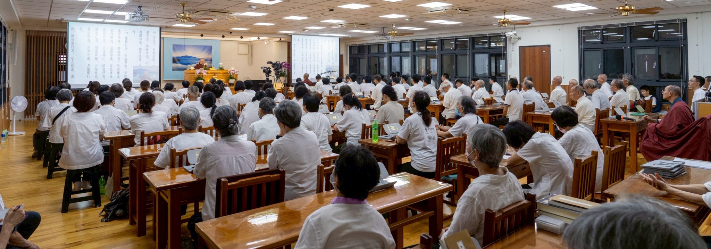

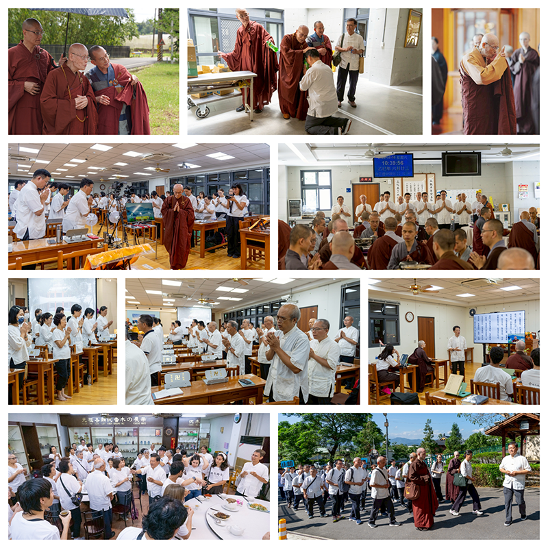

### 盛 夏

慧慈悲

假日仍活動

身心為法忙

念念不空過

能滅諸有苦

何盛之有？

學會今年的暑假，分頭忙碌，處處精彩。茅茹讀書會照常研討，所以整個七月份都浸在《入菩薩行論》，祈求對本論義理更加通達。

暑期中恭逢二次齋僧盛會：

◎西蓮淨苑齋僧

七月十九日是中壢共修研學會、茅茹讀書會到西蓮淨苑齋僧日，老老少少合計，雖不到二十個人，一樣有前行、供僧、結行，並由慧觀法師為我們開示。法師曾教鍾師姑說，要把身上的錢排整齊放好，並以感恩的心，謝謝這些錢能給我做很多善法，尤其是與三寶有關的善法，讓我在學道上，去除障礙，積聚順緣，如此做去，財源滾滾，不只世間財來，功德法財更是增長廣大，可謂利益無窮。鍾師姑多年來依教奉行，果然成為一位大布施者。

◎正覺精舍齋僧

八月十六日是學會到正覺精舍齋僧的大日子，由唐老師率隊，二部遊覽車分別自台北、東勢出發，及部分自行開車前往的蓮友，共約一百二十人參加。

今年正覺精舍齋僧格外殊勝，因為有講座、拜懺禪修的前行，及見賢思齊的結行，更莊嚴了齋僧的正行。

前    行

八月二日至八月十五日，學會舉辦「菩薩戒論與法華懺懺法」講座活動。

第一週由唐老師親授《菩提正道菩薩戒論》，宗喀巴上師造論，為有情「善能抉擇諸契經，一切了義不了義。復能開演照世人，又能分別論本義。」

本論從九種面相來認識菩薩戒。

一、自性戒：就戒的定義、特性來說，具四種功德—從他正受、善淨意樂、犯已還淨、深敬專念無有違犯。

二、一切戒：依在家、出家二分淨戒，略說攝律儀戒，以遠離惡作；攝善法戒，以攝諸善行；饒益有情戒，以利益眾生。而菩薩的本懷就是饒益有情，故本論特別詳述饒益有情戒，但仍以攝律儀戒為本質，從自利到利他，次第成熟。

三、難行戒：遇諸逆緣，乃至命難，於所受戒，守護不犯，難行能行。

四、一切門戒：菩薩受三種淨戒，身語常清淨，離惡修善，依四攝法方便度有情。

五、善士戒：菩薩自具戒律，勸他受戒，讚戒功德，見持戒者生歡喜心，若毀犯，如法悔除。於有情成滿義利，具善士業。

六、一切種戒：用一戒攝持一切戒。

七、遂求戒：順遂求取佛制的戒律，遇難須破戒時，寧捨命護戒。

八、此世他世樂戒：菩薩所有淨戒，能令自他現世、後世皆得安樂。

九、清淨戒：依持戒程度不同，果報有所差別，離諸虧損因緣，是謂持戒圓滿清淨。

學會過去在中壢佛堂拜懺，拜過大悲懺、淨土懺、藥師懺、地藏懺，唯獨沒拜過法華懺，因玅眼法師修天台佛學，才有這次拜法華懺的因緣。老師向來在拜懺前，都會先說明儀軌，了解內涵，生起意樂後，再以虔誠的心開始拜懺。

為了次週的法華懺，老師用了五堂課，把法華經一到二十八品的科判，複習一遍，說明法華懺儀軌中所拜的諸佛菩薩，各出自法華經哪一品，並介紹其事蹟和功德，例如，華德菩薩、妙音菩薩往昔曾是夫妻，藥王菩薩、藥上菩薩曾是他們的子女，這個佛化家庭，各個證果，太殊勝了！一一了解後，對所禮敬的對象，才會生起恭敬心，拜下去，才會感動，而不是只拜懺本上的文字而已。

第二週由玅眼法師帶禪坐及法華懺的實修課程，前一週「解」，第二週「行」，解行並重，如鳥的雙翼，不可偏廢。有解無行，如說食數寶；有行無解，則盲修瞎練。

修行週作息：早晚課，上、下午各一堂禪修及拜懺，由十二位學員(來自荷蘭、英國、哥倫比亞、台灣)輪流當維那、悅眾，以自己熟悉的語言唱頌，這種經驗非常難得。並安排出坡職務，又三餐料理從採購、烹煮、收拾，全部由學員共同完成，就像一個共住的大家庭。

難得和外國友人及學會年輕人長時相處，很想和他們多聊聊，認識生命中不同的世界，但礙於禪修營止語的規定，為保持風氣，不能破壞規矩，於是作罷，還是好好觀照自己的身心為上。

禪修第一節修止，先正身，以正知力之鉤，置心於呼吸，以不分別止住心，不讓心昏沉或掉舉。禪坐正好眠的習性，會斷了修戒定慧的根，果報在三途，是很恐怖的。每個人需要的睡眠時間雖然不同，為什麼很多大德，可少眠還能長壽？有遠大的目標者，可提起心力，於是精神奕奕。「舜何人也，予何人也，有為者亦若是！」

第二節修觀，在座上修時：每堂課法師給不同的主題，從暇滿人身難得，死無常，出離心，菩提心，平等捨，空性見…，次第引導我們以分別心觀修，雖外在禁語，內心卻是千言萬語，唯恐不語。

在歷緣對境修時：

清潔禪

出坡打掃佛堂、廚房、廁所等處，清除污垢，猶如清除內心的煩惱，做得愈仔細，愈有助於自覺反省能力的細膩，更能對治煩惱；不可以草率的態度工作，這會造成等流的習氣，心粗眼翳，敷衍了事，絕不能成就大事，連世俗事也做不好。

餐禪

用餐禮儀旨在培養恭敬、感恩的心，並珍惜食物。保持安靜，端身正坐，以示恭敬；用餐前念供養偈，感恩三寶及所有護持的人；食存五觀，避免浪費和貪著；以「鳳點頭，龍含珠」的姿勢，保持威儀。問問自己，我「會吃飯」嗎？

行禪

每天早課都會出去行禪，整齊的隊伍，端正的身驅，注意力放在腳步的起落和呼吸上，保持正念知，使身心合一。有威儀地行走在路上，所遍之處，都和當地居民結善緣。其實行住坐臥，時時都要保持覺知，而不是渾渾噩噩過日子。

正    行
正覺精舍齋僧，學會很早就訂出日期，希望大家能排除世間俗務，以齋僧為首要大事。唐朝道宣律師持戒精嚴，感得天人送飯，有一天律師問天神說，「人間做何善事功德最大？」天神敬
**答：** 「齋僧功德最大！」因為佛、法二寶，要藉僧寶傳承、弘揚，才能幫助有情離苦得樂，因此齋僧的功德利益特別殊勝。

有些人雖已報名，但臨時有事，或身體不適，因緣不具足，就無法成行。我們何其有幸，能跟著學會共造人間最大善法，真要隨喜自己善根、福德深厚，且因緣俱足，才能躬逢盛會。所供的不只是正覺精舍一個戒律僧團，鄰近的僧眾也受邀應供，可謂千僧齋，更可觀想禮請十法界一切僧眾，這樣齋僧的功德，則盡虛空遍法界，無量無邊。

結齋後蒙清公和尚親自開示，近八十耄耋之年，又患巴金森症，用盡全力，以顫抖的聲音，時帶赤子的笑聲，為我們開示「初祖達磨入道二入四行」。所謂「二入」是理入、行入，也就是要解行並重。「四行」則包括：一、報冤行：遇苦難時，今雖無犯，反思過去造惡，今得苦果，甘心承受，不怨天尤人，更不會以冤報冤。二、隨緣行：眾生無我，乃五蘊假合，苦樂皆從緣生，緣盡還無，喜怒俱無，各隨緣行。三、無所求行：有身皆苦，有求皆苦，無求乃樂，息想無求，自然清淨。四、稱法行：眾相皆空，無染著，無彼此，通達我空、法空、空空，念念與法相應，此為自利利他，安心立命之法。

最後清公還親贈每人一瓶飲料，送大家上車，實在愧不敢當！

結    行

七月二十四日至八月二十四日，在逢甲大學圖書館展出「愛．共善—淨空老法師文物展」，難得大家到中部一行，老師特別安排看展，並為大家導覽。淨空法師和果清律師同為雪公太老師的弟子，一生弘法遍五大洲，為世界和平而努力，歷經艱困，難忍能忍，從其溫潤的書法中，顯露無遺。

最後老師請大家到台中萬仙樓晚餐，席開八桌，豐盛美味的佳餚，如天廚妙供，法輪轉完，食輪轉，身心飽滿，大家滿載而歸，圓滿這次殊勝的齋僧法行。
