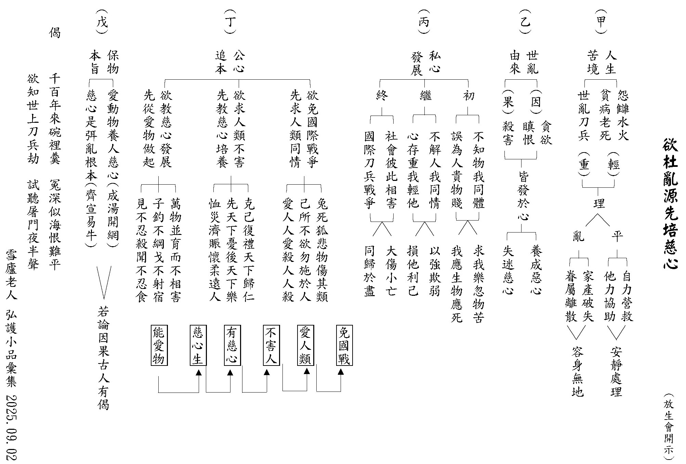
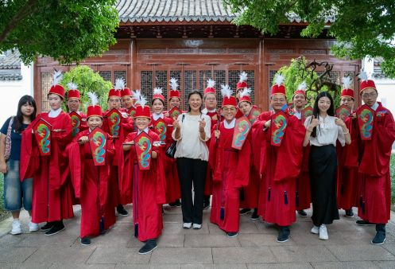
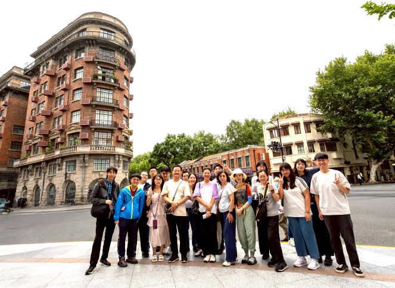
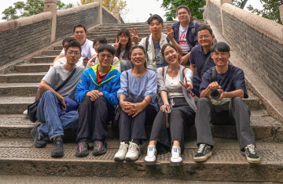
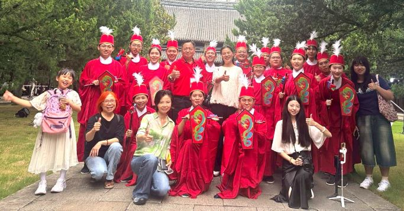
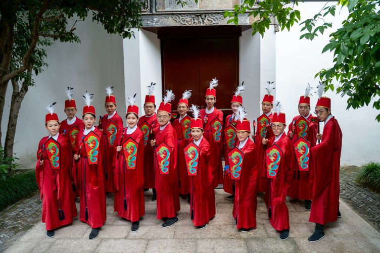
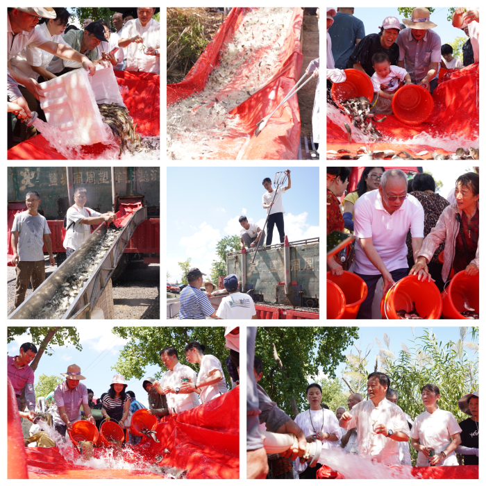
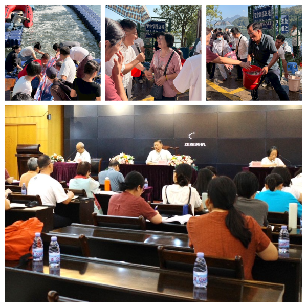
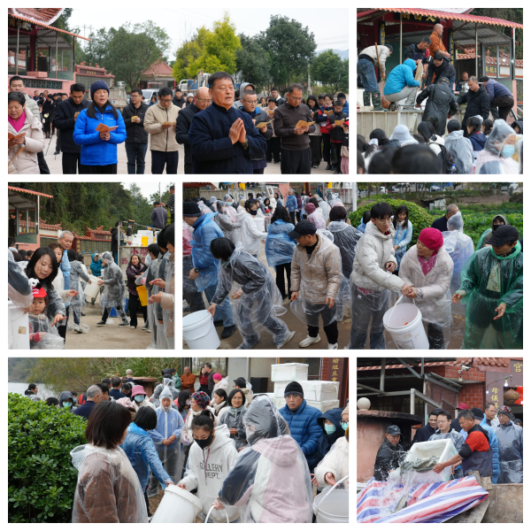
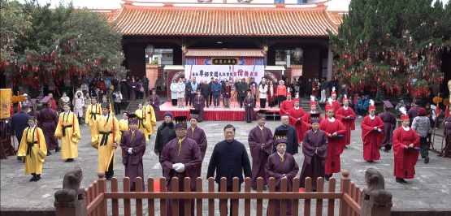

# 第149期
.jpg)

## 社論

### 奔馳有度，馬年中的觀察與止住

心若

心馬的描述

千里的奔馳

開闊的空性

任君的遨遊

馬，自古以來象徵奔馳、力量與速度。在十二生肖中，馬代表行動力與不懈怠，然而佛法提醒我們，若只有速度而沒有方向，奔馳反而更快地遠離正道；若只有力量而缺乏調御，終將疲憊失控。馬年，不只是向外衝刺的一年，更是向內調心、觀察修與止住修並進的一年。

佛法的修學，並非一蹴可幾，而是一條有次第、有方法的道路。透過「觀察修」與「止住修」的相互配合，讓心在正確的道路上穩定前行。

修行從聞所成慧開始，如同初學騎馬，必須先聽聞教導，了解路線與規則。透過聽聞佛法，讓我們對無常、苦、空、無我，對因果與解脫，先有概念性的理解，然此階段還未真正內化。

接著進入思所成慧，這正是觀察修發揮關鍵力量之處。思所成慧，是以「如理作意」如實觀察事物真正的法相，由教安立正因，由理安立正因，例如當我們觀察花朵盛開又凋零，透過正因正理，顯現花的所作性，顯現花的無常，看見一切榮景必然敗壞，這就是如理作意；反之，若覺得今天的花和昨天、前天都一樣，那就是非理作意。

修菩提心的人，在觀察有情眾生時，會以「一切眾生皆曾為我父母」來作意，因為輪迴無始無終，無量劫以來，眼前的每一位眾生，都曾經做過自己的父母；若以出離心來觀察眾生，會發現，由於他們沒有空性正見，因此仍被輪迴所繫縛，以此角度觀察，即便他們身處富貴之中，也依然顯現輪迴的繫縛相，上述對眾生的觀察方式，就是如理作意。義理若沒有透過正因成立，充其量只是被我們記住而已，隨著時間流逝，感動、體會將不復存在，熟練的推理法也終蕩然無存。令心變動的那一分，要靠觀察修。

在大乘修學次第中，資糧道以聞所成慧為主，加行道則以思所成慧為主，重在反覆思維、作出選擇，並以正因成立，使志向穩定、不再動搖。真正通達的人，無論外界如何評論，心中自有定見，正如孔子說的「君子坦蕩蕩」，這份坦蕩，是深思熟慮、正理成立的決定。

加行道後進入見道，見道是透過反覆串習、比量推理，讓真理能直接顯現。再進入修道，此人即便從定中出來，仍能在日常生活中運用正見。例如入定現證無常，出定後仍能在花開花落、人生興衰中保持清醒的如理作意。現代社會中，我們透過縮時攝影或親身觀察，無常的顯現比古代更直觀，具備正見者能洞察生命無常，心中自然生起智慧。

見道、修道的核心，在於不斷串習正因、熟思理解，無論是座上修還是歷緣對境修，都是透過正因、正理的反覆運用，使心志逐漸邏輯化，對法義的理解不再停留在記憶，而是轉化為內在力量。這也是為何大乘聖者，無論在辯論、寫論典，背後都是一套完整的修行方法，並由師徒代代傳承。

對應馬年，當觀察修成熟，心對法義產生堅定不移的決定，止住修才能真正生起。止，不是壓制念頭，而是在已明白真相後，心自然安住，不再需要大量思辨，如同一匹訓練有成的馬，只需輕提韁繩，便能穩定前行。

馬年之行，當我們以正因、正理觀察世界、駕馭心馬，方能在奔馳中保持方向，不被浮華迷惑，心不迷於外境，行不迷於速度，穩健而持續有力地向內、向外拓展人生的正道。

## 佛學覽幽

### 菩薩清淨的行持—華嚴經淨行品（六十四）

*編輯部整理*

諷誦經論

若得要領

法義辭忍

隨順成就

丙二、指事顯因答其徵因

丁一、總徵

丁二、別顯

戊九、習誦旋禮時願（有十願）誦經、見佛、觀佛、見塔、觀塔、禮塔、繞塔、遶三匝、讚佛功德、讚佛相好

誦經時，希望眾生，隨順佛所說的法，總一切法，持無量義，不會忘記，「諷誦」即朗誦，對文曰讀，離文曰誦，對著經文念叫讀經，如果不看經文念叫誦經，不管是對文字或離文字，不管是朗誦或是默誦，都是依著佛經聖言量做標準，不可自己隨意增減。

阿難一百二十歲時，有天來到一座竹林中，聽到有位比丘在念一首偈：「若人生百歲，不見水老鶴，不如生一日，而得睹見之。」水老鶴是一種水鳥，擅長潛水捕魚，阿難尊者聽見這首偈，心頭為之一震，因為這首偈不是佛說，他心想佛法怎麼滅得這麼快，於是很慈悲地告訴這位比丘，這首偈不是佛所說的，佛真正說的是：「若人生百歲，不解生滅法，不如生一日，而得解了之。」這位比丘回去轉告師父，想不到師父竟然說，阿難已經老朽，他的智慧跟記憶力都大不如前，莫要相信他，所以這位比丘還是依照著師父所教，照樣誦那首偈，有一天阿難尊者經過竹林，又見到這位比丘，聽見他仍然是念錯的偈子，了解緣由後，阿難感嘆跟眾生說正法，眾生都不相信，自己住世的時間是否該結束了，阿難就想入涅槃了，可見傳承的重要。

再來總持不忘，總持即陀羅尼，也就是持善法不使散，例如做善法時，有教法的觀修。持惡法不使起之力用，例如以煩惱為道用。陀羅尼有四種，第一法陀羅尼，也就是對於教法聞持不忘；第二義陀羅尼，於法義總持而不忘；第三咒陀羅尼，於咒總持而不失，淨念相繼，生起咒之大用；第四忍陀羅尼，於法之實相安住，謂之忍，心安住在所緣境上。總持不忘是總一切法持無量義，不但教法不會忘，也善於記住法義及運用。

淨行品第九段可知，寺院的修行有哪些，首先就是諷誦經論，這也是在家居士會修持的法行，然誦經到底要結合什麼才能生起真正誦經的功德？

《三字經》說：「口而誦，心而惟；朝於斯，夕於斯」，誦經不能只是口念，心也要到，或以為心要到是把字念得清楚，不會念錯，可是小孩子讀經也是把經讀完，且不會讀錯，尤其比賽時，更是字正腔圓，所以此處特別指當聽到誦經的時候，希望眾生要順佛所說，總持不忘，把經意誦出來，隨文入觀。在老師座前的聽聞，透過思辨對經義了解，當對經文產生專注，從誦經中浮現經的義理的那一分，就是止觀的力量，或者隨文入觀，即能藉著誦經，順佛所說，總持不忘。有蓮友一天誦三次《地藏經》迴向兒子考上大學，她很高興每日繼續誦經，後來兒子交女友荒廢學業而退學，這位善女人就對《地藏經》失去信心，從此不再誦念，代表誦經不過是用來兒子的考試跟上學，並沒有誦出地藏菩薩的悲願、承擔，以及釋迦牟尼佛的囑咐。

誦經可以是一種法陀羅尼的修學法，法陀羅尼練起來，是一個什麼樣的徵兆、形象？總持，有總一切法持一切義，總持包括法、義、咒、忍、辭，法的那一分是藉著誦經生起強而有力的記憶力，是法陀羅尼的成就，龍樹菩薩到龍宮，看完《華嚴經》就背起來，天台大師小時候到寺廟，聽到《普門品》，僅聽一遍就背起來，道安和尚出家時，其師父曾交付他一部五千字的佛經，他當日便能全數記誦，翌日即完整歸還。師父再試，以萬字佛經交予他，他邊放牛邊背誦，翌日仍能全還無誤。最後又給他一萬五千字的經文，亦無難色，照樣記誦如流。師父見狀，深感自身無法攝受如此資質非凡的弟子，遂轉而引薦他前往投師於更具德行與慧力的大德門下。這就是法陀羅尼，常常以專注思維的方式誦經，讓記憶力格外強而有力，很多大德晚年腦袋清楚、記憶力強，就是法陀羅尼的成就相。第二個義陀羅尼，藉著誦經，不斷觀修、串習義理，生起義陀羅尼的力量，例如《華嚴》可以輔助《法華》，《法華》可以輔助《楞嚴》，在讀誦經文中，四通八達，那些大德講經時，小抄都不用帶，侃侃而談。第三個咒陀羅尼，在唸咒的時候，能結合三寶的加被、佛菩薩的威力，顯現威神力，像蓮池大師在雲棲山時乾旱，大眾請蓮池大師祈雨，蓮池大師說老僧不會，我只會念佛，便拿著木魚念佛，走到哪裡雨就下到哪裡，這就是咒陀羅尼的威力。平常認真念佛，認真觀修義理的誦經，所產生的威力，能得到佛力加被，而不是口唸彌陀心散亂，喉嚨喊破也枉然。咒陀羅尼是專注的念那一句佛時，三寶的功德就在那一句佛號上顯現，所以人在緊急時求佛菩薩加被，念佛是很厲害的，我們平常念佛是散亂的，緊急的時候念佛也散亂，尤其在吵雜的環境下，心更散亂，這就是為什麼臨命終要回家助念，因為一般人功夫很差，缺乏專注力，且沒有經教的認知。

常誦念經論是法陀羅尼的訓練，經論的辨證是義陀羅尼的訓練，念佛持咒全身清涼是咒陀羅尼的訓練，對大經大論堪忍的學習、討論、辨析，則是忍陀羅尼。雪公老師晚年講《華嚴經》，一次講兩行，有的學生就開始翻後面，覺得這樣再二、三十年也講不完，有忍陀羅尼的人則能忍住，隨所聽聞而獲益，並參閱清涼大師厚厚的科文，此即對大經大論堪忍。雪公講《華嚴經》時，座旁有台語翻譯，這就是辭陀羅尼，練習辭陀羅尼的人，有能力快速學好語文，將佛經流通，如玄奘法師、鳩摩羅什、安世高等。

諷誦經時，是不是能夠在佛經當中，通達這些陀羅尼，訓練自己的記憶力，串習經論的義理，用不同語言翻譯，就是各種陀羅尼。會性法師說，光是台語、客語佛經的翻譯就讓他大大獲益，因為一些高僧大德從大陸來台灣，帶著厚厚的外省腔，面對聽不懂的聽眾，會性法師能聽得懂外省人講的話，又能夠用客家話、本省話翻譯的時候，他馬上變成這些高僧的最愛，指定他來翻譯，所以他必須全神貫注、認真聽課，把道理弄懂，想辦法用易懂的方式講給別人聽，最後成就的人就是他。訓練自己能夠說得清楚、講得明白，分寸拿捏到位，法師說他如果沒有這些翻譯的機會，不會有今天的成就。 (下期待續)

### 大乘百法明門論簡說(五十五)   拾捌、無為法（二）

*戒慧講述、淨本整理*

遮有為的無遮

遮剎那的常法

遮造作的實有

遮受用的真實

論文：

第五無為法者，略有六種：一虛空無為、二擇滅無為、三非擇滅無為、四不動滅無為、五想受滅無為、六真如無為。

無為法不只是這六類，但以這六類為最重要者。此處要繼續說明無為法中的第三類「

非擇滅無為

」，從字面上可知，這種無為法不是前面的「擇滅無為」，不是用正慧揀擇斷煩惱所顯出的涅槃。此處是指「理性自顯」或者是「緣缺所顯」的無為法。「理性自顯」的是自性清淨涅槃，也就是空性；「緣缺所顯」的無為法，是指色心諸法由眾緣所生，若緣缺不生，不但當時不生，未來也畢竟不生(因為未來所生的心識必定與當下緣缺未生的心識不同)，既然沒有生也就談不上滅，所以是無為法。舉例言之，畫家專注於作畫，以至於對身邊的聲音、氣味等都無所覺，雖有耳識而不聞聲，雖有鼻識而不聞香，這些緣缺不生的諸識，就是所謂的「緣缺所顯」的無為法。

「緣缺所顯」的無為法其實不是無為法。若將已滅的事物都當成無為法，表示有為法可以變成無為法，這犯了邏輯上很嚴重的過失。有為法跟無為法是正相違的法，不能既是有為又是無為。依據中觀宗的宗派見，以耳識為例，後耳識的生必須觀待前耳識的滅。所以生是有為法、滅也是有為法，生滅互相觀待。

比如前述畫家因為過於專注繪畫，致使聽不到聲音，而使耳識不生。未來所顯的耳識，雖然與當下緣缺而沒有生的耳識不同，但其實有關聯性的存在。已滅的耳識可以成為經驗者，比如聽到同樣的音樂，會立刻知道我聽過，那就是滅法所產生的關聯性作用，如果沒有關聯性，那應該沒有回憶的功能，所以「緣缺所顯」的無為法並不能說是無為法。

唯識宗為了避免有為法滅後變成無為法，因滅後不能生果的矛盾，所以安立已滅的業成為種子，存放在第八識中。種子也是有為法，並且具有體性。比如過去所作的布施業已滅，熏成種子存放在第八識，所以今生可以獲得富貴，以此合理地成立因果。然而「緣缺不生」的種子既然是有為法，那就不能變成無為法，理由如上所述，所以「緣缺所顯」的無為法其實並不是無為法。

《大般涅槃經》中說：「諸行無常，是生滅法，生滅滅已，寂滅為樂」。「諸行」就是指有為法，有為法才是無常，才有生滅，無為法則是常，可見不只生是有為法，滅也是有為法。「生滅滅已」是現證空性能所雙亡、無有生滅的狀態。「寂滅為樂」是指達到究竟解脫的安樂。

接著說明第四「

不動滅無為

」，此處「不動」是指第四禪的禪定。前三禪都叫做「有動」，因為初禪至三禪分別是「離生喜樂地」、「定生喜樂地」、「離喜妙樂地」，都有這些喜樂的動相，直到第四禪才成為「捨念清靜地」，全無苦樂的念，純粹是捨受的狀態，稱為「不動」。成就四禪不動定的人，已經不必再修厭下欣上的對治法讓自己安住，自然而得安靜平等之心，無功用住行捨清淨。爾時渾然忘我（但其實仍有我執），身體連呼吸都不需要，滅除了由身心造成的八種動相：「尋、伺、四受（苦樂憂喜）、入息、出息」。尋就是粗想、伺就是細想，初禪天要透過粗想及細想，去觀察欲界的過患，使內心生起對初禪功德的勝解；二禪天人定功成就，由此生起內心的喜和身識的樂；三禪天雖不緣念心裡的喜，但仍有身識的樂，並且還保有出入息的動相。這八種動相能感應災難，稱為八災。所以初禪有水火風三災、二禪有水災與風災、三禪有風災，至四禪全無上述種種動相，才能滅一切災。

初禪感應火災，是因為進入初禪正分定之前，內心仍有欲火、躁火，定功尚未真正成就。二禪感應水災，源於對於定水的貪愛（內心之喜相）。三禪則以出入息的風去感應風災。四禪捨念清靜地則雙忘苦樂，渾然忘我，爾時緣我而生之我樂、我苦之心又如何會生？僅存捨受之念（沒有我受樂、我受苦的心念），自然無災。其實微細的執我的心仍在，此與現證空性能所雙亡不同。不動滅無為只是專注緣念一個境界直到渾然忘我，既然是屬於四禪的定功，那也就不是無為法。

修禪定的過程就是「欣上厭下」，厭離欲界欣慕初禪所以生初禪，厭離初禪欣慕二禪所以生二禪、厭離二禪欣慕三禪所以生三禪，厭離三禪欣慕四禪所以生四禪。到第四禪後已經是「捨念清淨」，渾然忘我，上無可欣、下無可厭，他就安住在那個境界裡不取不捨。此不同於證悟空性的不取不捨，現證空性時能所雙亡，無一法可得，所以沒有取捨；第四禪則是因為已經成就最高的禪定而沒有取捨，二者內涵相差甚遠。現證空性的「等智」，是知道一切法都無自體性；四禪的「等智」只是不再緣念世間的苦樂，對世間之苦樂已不再有希求，心念住在等捨上。

第五個無為法是「

想受滅無為

」，這是三果羅漢入「滅盡定」所顯示的無為法。三果羅漢雖能現證空性，但出定後仍有俱生執以及相應的微細煩惱，一直要到四果才能破煩惱障。地上菩薩也是如此，初地雖然能夠現證空性，但出定後仍有微細的煩惱，要到第八地才能盡破煩惱障。四果羅漢或者八地菩薩，出定回到世俗，世俗仍顯現為實有，但因為比量的空性智慧已經能任運而生，所以煩惱不生，安立為破煩惱障。唯有佛才能在出定時同時緣世俗，又同時現量證空性，既然出入定都是現量證空性，所以說「那伽常在定，無有不定時。」

三果羅漢必須在世俗中不斷串習比量的空性智慧，才能證入四果。他在串習比量的觀慧過程中，因為想要休息，所以讓自己現證空性入滅盡定後，安住在能所雙亡、空靈靈的義境上，暫不出定修觀，爾時受想不生的狀態，安立為「想受滅無為」。

四果的阿羅漢破除煩惱障，苦因苦果已究竟滅除，才能安立為「涅槃」，證得四聖諦當中的滅諦。三果聖人所入的想受滅無為，暫時住在空靈靈的境界裡，只能稱為「似涅槃」。他的苦因苦果尚未滅除，出定後還是會生煩惱，還是有學位，所以他的滅盡定屬於道諦的範疇，而不是滅諦。

聖者都是以無所得、以破的方式去安立為聖者，初果（初地）是破分別執去安立、四果（八地）是破俱生執安立，佛果是破所知障安立，都不是有一個實有的果位可得。所以金剛經上說：「無有法得阿耨多羅三藐三菩提」。世俗以得來分高下，佛法以無得來分高下，這也是本論最後所要導歸二種無我的要義。

第六「真如無為」，唯識宗安立此為真實、如常的法性，但中觀宗並不承許。中觀宗認為法性就是空性，必須要以簡擇的方式去現證空性，並不是存在一個本有真實的法性。

唯識宗的真如無為，有認為是第八識種子清空的狀態，但此說有矛盾。心識既然是有為法，那就不能變成無為法。有為法與無為法是正相違的法，不能同時存在一個法上。所以真如無為，只不過是佛為了闡釋空性所用的善巧方便。（下期待續）

### 佛學概要十四講表簡說（五十） 第七講表　宇宙器界概況

*戒慧講述、編輯部整理*

器界共業所現

受用觀待名言

往昔共中不共

今日受用差別

第七講表　宇宙器界概況

有情眾生無明我執未斷，依著執著起惑、造業、受苦，苦的承受處，大略分就是六道，依著六道有情的苦受，各道都是以苦為本質的相續，我們要生起出離心，也對這樣的有情生起悲憫心，而我必須要去成佛方能利樂這些有情，讀第六表要有這樣的觀察。

第七表講到六道分布的環境就是三千大千世界，這樣的三千大千世界在宇宙中有無量無邊個，有情世間叫做正報，器界是依報，即依存的國土世界，還有在這個國土世界所享受的、所賴以生存的資具。研究這一表，我們要明白境隨識變，十界差別，這是唯識宗的看法，唯識宗認為，國土、器物等一切的外境，都是由有情心識所變、所緣。所變是第八識的種子，變現為相分，所緣是被前六識所緣念。第八識所變現的環境，叫做本質相分，前六識所緣的叫做影像相分，執我去受用這些環境，這個執我的心識，安立在第七識。

試問唯識宗安立本質相分，種子從第八識生起，成為第八識的本質相分，前六識緣之而成為影像相分，安立的理由是什麼？就好像有情見的青山，本質相分所變現出來的山，它的綠色應該是一種，可是有情隨著自己本身少許的業力差別，看到的不同。

有些人對唯識宗不了解，認為既然萬法唯識變，眼前花應該可以變成鑽石，可是現見變不來，唯識宗不是說境界沒有在那裡成立，是由我的心識所顯嗎？怎麼沒有變？所以依經部的講法，心識是被動的，境界是主動的，心識不得不然的看到眼前境界的樣子，其實唯識宗也是說不得不然，比方在顯現人道的境界，讓你人道的心識不得不然地去見到人道的境界，就過去所造的業，薰在第八識，成立第八識的目的就是要儲存這些業種子。如果沒有第八識，或業種子失壞，沒地方儲存，因果的道理就失壞了。所造的業沒地方放，如何安立因果？所以必須安立心有最微細的功能，能儲存所造業的業種子。當第八識所儲存業種子起現行時，就叫做本質相分，所造的業而結的果，不得不然的承受。比如所顯現的人道環境，是本質相分(共業)，而由人道的心識(六識)去納受這個境界，會另有差異的受用(別業)。例如我們成為人的時候，在第八識中生起人道的根身、人道的器界，由人道的根身去受用人道的器界，是不得不然。就像在田地裡面，種稻種成熟稻，種麥種成熟麥，雖然都以第八識成為心田，但是種稻你不得不然收割稻，種麥你不得不然收割麥，雖然是唯心識生起，因為種子都在第八識，從心田裡面長出來，稱唯識，雖然都是唯識，可是它結果的時候讓你不得不然，這就是安立本質相分跟影像相分的理由。

境隨識變是說，境界的體性是心識，唯識宗雖然叫做唯識，但是緣唯識不能解脫，要緣境界在心識之外沒有，境界只不過是心識的生起，緣依他起不能了生死，境界在心外不成的圓成實性謂之勝義，有情緣之而了生死，謂之清淨道之所緣，有情的貪瞋是由順境或逆境來，而順、逆境都是自己心內的顯現，在外境上不成立，如此則有何可貪、可瞋？境界如果在那裡不能成立順境跟逆境，貪瞋則無道理，所以貪瞋能破，就入涅槃。境界在心外那一分了不可得，是境界的圓成實。境界(依他起)是心內的顯現，此是有的，境界的體性就是心識，成立這個宗派見，叫做唯識，唯有識。

「境隨識變，十界差別」，境界的體性是心識，而顯現的有十法界，佛、菩薩、聲聞、緣覺，叫做四聖法界，還有六凡法界，就是前面第六表宇宙有情概況的天人、阿修羅、地獄、餓鬼、畜生，有十界差別。而國土、器物等一切外境皆為有情心識所變所緣。所變叫做本質相分，所緣的叫影像相分。有情的種類繁多，心識也不一樣，變化器界也多樣。唯識宗以一水四見來、鄰虛塵不可得的概念來成立唯識，它要破經部有一個最小的基本粒子，唯識說，最小的基本粒子稱為鄰虛塵，而鄰虛塵沒辦法分出東南西北四面八方，既然分不出，鄰虛塵組起來的時候，你如何能說出是這個的左方配到那個的右方，理應說不出，就代表沒有這樣特性的粒子存在，若沒有這樣特性的粒子存在，該法怎麼生？所以該法是心識生。

唯識宗有六識派，有八識派，有一分說、兩分說、三分說、四分說，還有假相派、實相派。實相派舉例來說，心識顯現境界的那一分，可以切割，比如說桌子切兩刀，椅子切三段。假相派是說，境界的體性如果是心識的話，怎麼可以分割？可見分割的那一分是你的錯覺，從夢心所生的境界，怎麼可以被分割？心識所顯現的影像怎麼分割？除非把心分割，那都是心識所成的影像。所以假相派的唯識宗，才是真正唯識的道理，安慧論師就屬於假相派的唯識宗，玄奘法師和護法論師則屬於實相派的唯識宗。

一水四見是唯識宗要成立唯識的道理，比如水，人看是水，魚看是煙霧空氣，鬼看是猛火，天看是琉璃寶地，這是異門遍計，你依著不同的有情種類，面對境界的時候，他所納受的境界是不一樣的。

異門遍計是在依他起上有你自己名言的顯現，或顯現為水，或顯現為猛火，或顯現為空氣，叫做異門遍計，隨你的執著而有顯現。這個執著是你過去所造的業而去顯現。你執為該法有自體性在那裡存在。由異門遍計引向性向遍計，性向遍計是你以為法在心外成立，其實法從來沒離開你的心識獨立存在。假如境界能夠在心外自己獨立存在的話，試問鄰虛塵有沒有？或者一水四見？為何會看水為猛火呢？可見境界無法在心識之外獨立存在。

異門遍計與性向遍計的對治，正好成立唯識的道理。異門遍計跟性向遍計是法我執。以唯識宗來講，破法我執就成佛了。破人我執是破煩惱障，破法我執是所知障，這就是唯識宗的宗義。境界在心外沒有成立的時候，請問外境有嗎？如何會對境界產生貪愛與憎恨？

小乘經部、有部雖是不了義，若是屬於東山部的小乘就是中觀宗，只不過小乘的中觀宗，是以少數正理能夠成立體空，而大乘的中觀，要像龍樹菩薩一樣，能以很多正理去通達空性，小乘固然習氣也像中觀，可是不能說是中觀宗，中觀宗是大乘的宗派。

菩薩知其差別，有兩種講法，第一種講法是說，菩薩在後得位的時候，因為所知障還未破，萬法還是會顯現為實有，只不過菩薩能以比量通達萬法的空性，喻如見煙知火，菩薩雖然顯現的是錯亂境，但是趨入的是真實的。舉例而言，顯現的是錯亂，菩薩看到的是山上的煙，並沒有看到火，可是菩薩透過過去的經驗知道煙的背後是火，知道有火是趨入事實，趨入境就是趨入事實的那一分。同理，菩薩在後得位的時候，雖看到萬法顯現像是各種有實體的法，但趨入的是萬法的體性空。

第二種講法是，菩薩也知道是眾生的名言隨業顯現，而沒有體性，這一點菩薩在後得位上也必須要訓練，因為這種後得位的訓練有助於他根本位通達空性，不斷去了解眾生是如何顯現的，同時可以通達，除了眾生的顯現之外，境界的實體性是沒有的。

若按照唯識宗的講法，小乘了其本空，唯識宗講的小乘，只破獨立實有的我，小乘人指的是有部跟經部，只破獨立實有的我，菩薩知其差別，是在緣起法上能夠一一通達它們是怎麼緣起的，因為他要去度眾生，所以最後要成佛的時候去破所知障，就是佛眼知即法界，同時通達法在心外沒有，同時通達法在心內顯現，就是唯識宗的法界，那就是第八識，境界在第八識之外沒有，由心內的顯現，法界就是第八識。

這麼說來，十界其實可以歸納成四土，第六、第七表就是所謂的凡聖同居土，雖然是凡夫所居，也是聖人所居，因為是聖人乘願再來之處。四土包括凡聖同居土、方便有餘土、實報莊嚴土、常寂光淨土。凡聖同居土莫論，方便有餘土，有餘是因為他們已經證得小乘的涅槃，但是眼前的生命現象還在的這一分說有餘。方便有餘的有餘還有大涅槃未證，方便表示這只是佛度化他，三百由旬的方便，五百由旬才是究竟處。方便有餘土的小乘聖者斷見思惑說他們得涅槃，只是佛的方便說，有餘指還有餘塵沙惑跟無明惑，而佛度他們的時候只是方便度，得到小涅槃，佛真正的心意是要度他們往究竟涅槃。二乘人所證涅槃，在《法華經》的化城喻品，形容是通往五百由旬目的地之前，在三百由旬處有化城，先停下來休息，養足精神再走向五百由旬。

實報莊嚴土則是登地以上的菩薩所居住，特別是以菩薩的廣大菩薩行所感應的福報。實報莊嚴土有所謂的五決定，由五決定說是實報，第一是佛的相好決定，所顯現的是報身，佛不會是今天這個相、明天那個相的化身佛；第二是壽命決定，佛不會昨天好好的，今天示現涅槃，佛在輪迴未窮盡時，不會示現涅槃；三是所居的土是實報莊嚴土，不受有情的劫難所破壞；四是佛說法的對象是大乘的聖者，五是佛所說的法為大乘。實報莊嚴土是登地菩薩所感的真實報。在不了義的宗派裡說，是本性所生，真實報應自體性不可得，只不過佛觀待登地的大菩薩，顯現相好、壽命長遠、說法決定等。最後常寂光淨土，就是無住大涅槃，無住大涅槃就是佛空性的顯現，佛跟二乘人空性的顯現不一樣，佛的空性的顯現是破煩惱障、破所知障的空性顯現，叫常寂光。(下期待續)

### 人生大事不能忽略的事實       復范古農居士書二（下）

*戒慧講述、編輯部整理*

中陰身取五蘊之心

前世能取心識等流

串習淨土成為能取

佛力加被淨土所取

第一段說明為何有中陰身，第二段說明亡魂現形在親人面前，或者因為業力或者是鬼王讓他回去見親人，或是神明的變化，都是為了彰顯因果，並且讓正法流通。第三段說明輪迴未定時中陰身的轉變，依著親人祭拜而有不同的轉變。

第三段，先明「中陰依情見資養」，經文：「

中陰雖離身軀，依舊仍有身軀之情見在。既有身軀之情見，固須衣食而為資養。

」中陰身雖然離開上一期生命現象，能取的心必須要有所取的生命現象（下一期生命現象還沒出現），這不是靈魂的概念，身和心又是互相觀待而生，所以會產生一個被能取的心依附的中陰身，這個所取的身需要各種喜愛的衣食來維持身體。

佛事超薦或祭拜因為生者和亡者的情見，而讓亡者(中陰身)得到祭拜的滋養。中陰身雖有某種神力，但被業所繫也如同凡夫。經文：「

以凡夫業障深重，不知五蘊本空，仍與世人無異。若是具大智慧人，則當下脫體無依。五蘊空而諸苦消滅，一真顯而萬德圓彰矣。

」凡夫死後因為沒有能力轉變業力，也沒有空性的概念(五蘊無自體性)，由能執的心執所執的我，所以會出現中陰身的狀態，與世間人身心觀待的生命現象，以為是實有我無異。具有空性正見者，在離開前一個生命現象(脫體)同時喚起般若習氣(無依)，了解無自體性可依，身心沒有自體性，何來裝苦的苦器？苦又如何裝？又能勝義上通達空性遍一切法，條件聚合下的所有的善法（萬德）都能格外有力的生起（圓彰）。

事宜隨情互資，經文：「

其境界雖不必定同，不妨各隨各人之情見為資具。如焚冥衣，在生者只取其與衣之心。其大小長短，豈能恰恰合宜。然承生人之情見，并彼亡人之情見，便適相為宜。

」祭拜的物品或有不同，隨著各人與亡者之間的關係親厚，而有不同的轉變力量。民間有燒紙質衣冠給亡者的習俗，生者取想要給亡者穿新衣的心情，紙質衣冠當然不可能剛好跟亡者的身材一樣，但是由生者的誠意祭拜，以及亡者跟生者之間的情誼，紙衣無論怎樣的大小都很適合。

知法隨心轉變，經文：「

此可見一切諸法，隨心轉變之大義矣。

」親人為亡者誠意所做的祭拜，轉變的力量更為強大。由此可以得知人比中陰身更容易改變，正知見是修行的本質，只可惜我們大抵都選擇不改變。

附身皆神識作用，經文：「

死之已後，尚未受生于六道之中，名為中陰。若已受生於六道中，則不名中陰。其附人說苦樂事者，皆其神識作用耳。

」斷氣之後，因為輪迴到哪一道還未定，在前陰和後陰之中，所以叫做中陰。若已經去輪迴就不能稱做中陰。雖是本人意念所現，但是實際是操弄於造化神祇(被業所引導)。

第四部分，代識暫住胎，分識先投生。一、本識投胎，投胎到底長甚麼樣子呢？壽煖識三者和合而有一期生命現象，壽指的是呼吸、煖指的是溫度、識則是心識，經文：「

投生必由神識與父母精血和合。是受胎時，即已神識住于胎中。

」所以投生必須要有肉體也就是父母精血和合的受精卵以及神識，受胎的時候就是這一期生命現象的開始，此時神識已經住於胎中。

二、代識住胎，即所謂的代其受胎，經文：「

生時每有親見其人之入母室者，乃係有父母交媾時，代為受胎。迨其胎成，本識方來，代識隨去也。

」產婦生產時，或有旁人會看見有人進入生產室，這個是因為受精時代為受胎，等到胎兒發育健全，真正投胎的神識出現，代為受胎者離去。

但是這個觀念有需要被修正的地方，經文：「

欲海回狂，卷三第十二頁，第八九十十一十二行，曾有此問。原答頗不中理，光為之改正當查閱之。原答云，譬如雞卵，有有雄者，有無雄者。未有識託之胎，如卵之無雄者也。不知卵之無雄者，即令雞孚，亦不生子，何可為喻。光只期理明，不避僭越。故為居士陳其所以。圓澤之母，懷孕三年。殆即此種情事耳。此約常途通論。

」安士全書的欲海回狂裡面曾經有相關的問題，原本的回答不太正確，原本的回答是：例如雞蛋有的有受精、有的並沒有。沒有被本識或代識依託的受精卵，就像雞蛋並未受精那樣。印光大師說：雞蛋並未受精，怎麼孵化都生不出小雞，如何能當作代識的比喻？印光大師說自己只是把道理說明，為范古農居士說明白，就像圓澤禪師的母親懷孕三年，等待圓澤禪師投胎，先有代識後待本識投胎。推測本識與代識應該就是這樣的狀況，以上約一般來論。

三、分識投胎，經文：「

須知眾生業力不可思議。如淨業已成者，身未亡而神現淨土。惡業深重者，人臥病而神嬰罰于幽冥。命雖未盡，識已投生。迨至將生，方始全分心神附彼胎體。此理固亦非全無也。當以有代為受胎者，為常途多分耳。

」必須要知道造作善惡業所產生的力量極大，變化也十分微妙。就像許多修行人，人在娑婆，已經感得極樂世界的殊勝境界，處處感受淨土的快樂。惡業重的人，臥病在床而神識繫在下三塗，有時會聽到豬叫或者神識渙散，報應在兩邊都受用。雖然壽未盡，但是牛羊豬或者往生淨土的行相已經出現。等到臨終之時，一斷氣就往相應的那一道去，這也是往生時重業、近業、習業和念業為何如此重要的原因。就像面對大學聯考，會考上好學校的學生，平時就可以看出端倪，或者越念越有信心，越念越篤定，一步步完成考前的練習。

印光大師說，分識的道理並非全無(是有可能的)，但是大部分是代識多於分識，代為受胎較常發生。

第五部分，結三界唯心，勸廣倡因果。就三界唯心部分，分為事依心轉與理非妄臆。事依心轉，經文：「

三界諸法，唯心所現。眾生雖迷，其業力不思議處，正是心力不思議處，亦是諸佛神通道力不思議處。

」這一段在講心力不可思議，由心賦予正確的名言，萬法才能發揮他的相用，心是萬法的造作者，能取的心識，所取的境界，各看各的，各取各的，所以森羅萬象，有各種可能的發生及影響，業感果的功能就像前生的供養、布施，冥冥中得到善知識的歡喜攝受，自然而然地想要加被你。

業既然是思惟力的造作，能思惟的不同，業力自然有天壤之別，故業力不思議處，正是心力不思議處，也才會有諸佛神通道力不思議處。會用心改變命運的人，冥冥之中默默躲過災難，命運默默改變的當下，諸佛的加被才能用上力。

理非妄臆，經文：「光近十餘年，目力不堪為用，故于經論不能廣引以證。然其理固非妄出臆見，以取罪戾也。」大師謙稱自己十多年來眼力不佳，沒辦法廣引諸經來做佐證。但是所說的道理並非虛妄、主觀的提出猜測，否則會自取罪惡、招來災害。

勸廣倡因果，經文：「

死生，眾生之大事。因果，教化之大權。願閣下不惜廣長舌，以因果報應為轉煩惱生死，成菩提涅槃之一助。則法門幸甚，眾生幸甚。

」輪迴當中死亡之後會有下一期生命現象，關鍵在於是否能在輪迴中看到十二因緣流轉的關鍵在無明，倡導因果教育是改變眾生命運重要的善巧方便。不想受苦者必須要在因上努力做轉變，希望范古農居士能培養人才好好流通正法，將因果輪迴的正知見宣揚，最殊勝的因果觀察就是轉煩惱為菩提，超越生死而達到涅槃，破除二障，看到法無自體性，證得無我，成就佛的智慧。辯才無礙的人才，得到傳承而成為能說者，法門成為所說者，法門成為所證，眾生成為能證，改變命運就從獲得因果的正知見開始。(下期待續)

### 週四共修法語-觀音面面觀(一)《普門品》的觀世音菩薩—施無畏者

淨本

三十二應身契機

宣揚般若真契理

尋聲救苦是無畏

悲心所繫不自在

今天要談的主題，是《法華經》第二十五品〈觀世音菩薩普門品〉。觀世音菩薩可謂家喻戶曉—俗話說「家家彌陀佛，戶戶觀世音」，老師曾笑言：前一句未必，後一句常常為真。走訪大陸、台灣、香港、日本等地，便會發現供奉觀世音菩薩的寺院最受信眾歡迎，香火鼎盛、人潮不絕。

觀音菩薩的傳說很多，要想認識這位大菩薩，最穩妥的途徑還是回到經典。除了我們熟知觀音菩薩現為彌陀的脅侍菩薩，佛經中處處可見觀世音的身影，而且從不同面向啟發我們：在《千手千眼無礙大悲心陀羅尼經》中，記載著大悲咒的緣起，代表觀音菩薩的大悲與誓願；家喻戶曉的《心經》，是觀世音菩薩向舍利弗解說般若的提綱挈領。在《楞嚴經》中，他示現「耳根圓通」，教人以「反聞聞自性」而成無上道。由這些經典的記載可見，觀世音菩薩不僅以悲心名聞，更以智慧為宗。再如《地藏經》，地藏菩薩承佛付囑、於彌勒出世前護持正法；而此經之流通，佛陀亦特別囑請觀世音菩薩，可見觀音菩薩於法門弘傳中所扮演的關鍵角色。

視野若擴及密乘，觀世音的影響更為廣泛。藏傳佛教事部的白財神、行部的馬頭明王、瑜伽部眾度母中的綠度母，無上瑜伽的千手千眼，皆被視為觀世音的化現。由此可知，無論顯密，觀世音菩薩都能以不同形相利益群生。他確實如影隨形地與我們同在：以智慧引導、以大悲攝受，與此世間的因緣尤其深厚。

《法華經》之「跡」與「本」：開權顯實的一乘道

回到《法華經》：此經大要，在於揭示佛之「跡與本」。所謂「跡」，是指世尊此生示現成佛，四十九年說法度生，運用種種方便權巧，引導眾生修學。火宅喻中三車（羊、鹿、牛），皆為方便；佛之本懷，在於以一乘大白牛車攝盡群機，這便是「開權顯實」。所謂「一乘」，漢傳佛教以「果地覺為因地心」、或「佛授記」為一乘；於藏傳來說，一乘可理解為「道次第」。無論佛陀說小說大、說半說滿，說偏說圓，皆可納入完整的「道次第」中，一以貫之。

至於佛之「本」，是指釋迦牟尼佛的本地風光，久遠劫前早已成佛。《法華》以極其浩瀚的數量來述說，釋迦牟尼佛早已成佛的時間是多麼的長遠。換言之，世尊是一位「老佛」，極樂世界如是清淨國土，釋迦牟尼佛於過去亦曾成辦。經中關於世尊本地風光的說明簡直讓人難以置信，但是當今高科技讓人類得以遙望無盡宇宙，其無盡與廣大，竟然與佛經所述如此契合，我們對於本師釋迦牟尼佛所說的真實語，應當深生信受。

內容如此宏闊的一部經典，流通分自然不容忽視。流通分包括了如來神力品、囑累品、藥王菩薩本事品、妙音菩薩品、觀世音菩薩普門品、陀羅尼品、妙莊嚴王本事品以及普賢菩薩勸發品。《普門品》正是其中的重要篇章，特別告訴我們觀世音菩薩為「施無畏者」，是眾生可以祈求救護的對象！

以何因緣名「觀世音」：聞聲救苦而施無畏
《普門品》開首，無盡意菩薩向佛啟
**問：** 「以何因緣，名觀世音？」名以昭德，名號從來不是空稱。比如三國時期，若見軍隊軍旗上寫著「諸葛」大字，便知此軍不容小覷；同理，大眾稱之「觀世音」，正因他能夠觀諸世間音聲「聞聲救苦」。

經中提出觀世音菩薩能施予眾生「十四種無畏」。首先是：「若有無量百千萬億眾生受諸苦惱，聞是觀世音菩薩，一心稱名，觀世音菩薩即時觀其音聲，皆得解脫」。這是第一種無畏，能解除眾生苦惱，也可以說是其他無畏的總說。之後十二種無畏以身口意三業來歸類，最後再加上持名無畏，共為十四。

以三業歸類的無畏，其一是以口業來成就的三災四難無畏。三災指火、水、風。風災在經中是指船行時遇到「黑風」，被吹至羅剎鬼國；四難則是刀杖難、鬼難、枷鎖難與怨賊難。面臨此等險境，以口來稱觀世音菩薩名號，能得解免。

老師上課時曾說：關於稱名感應觀世音菩薩的種種事蹟，書中多取材於古代，比如江逸子老師所繪圖像，也是晉朝、宋朝等歷史故事，現代感應事蹟則較少彙整。其他宗教往往善於敘述當代見證，有助於其教友建立信心。佛弟子固然以教理為本，不以感應為宗，然「如理如法」地記錄、弘揚真實感應事蹟，能令初機者信心增上，何樂而不為？更廣而言之，許多人在學佛之後命運轉變、性格柔化、家庭和合，此類「見證」實不勝枚舉，宜多加整理流通，與經義互為增上。

其二，意業成就的無畏之道。經言「多淫、多瞋、多癡」者，當「常念恭敬」觀世音，就可以離淫、離瞋、離癡。

其三，身業所求之無畏：求男、求女。以禮拜、供養、修福迴向，求男求女，皆得加被。而且是福德智慧之男、端正有相之女。

為何「須稱名」方得救護：因果法則與「將功折罪」
或有人
**問：** 菩薩既然大慈大悲，何以非得待我稱名、禮拜、供養，他才來救？難道不能「事先」解危？此問題關鍵在於「業因果報」。災難現前，乃由宿業感召，菩薩縱使大悲，神力也不能與業力相違。比如人間擁有無上權力的國王，無故赦免大罪之人，群臣民心也不能服。此外菩薩既然悲智圓融，那就不會做濫慈悲之事，否則無益於教化度生。因此災難當前，欲求強大改變的力量，其一，至誠懇切，打開自心與聖者感應之門；其二，發願立志要為佛法、為眾生而活。當此願心成立，猶如將功折罪，菩薩的威神便能「如理如法」地介入，令重報輕受、厄難轉機，這正是稱名禮拜、供養等，之所以為要的理由。

最後第十四個持名無畏，經中設一較量：「若有人受持六十二億恆河沙菩薩名字，復盡形供養飲食、衣服、臥具、醫藥。」此人功德與「受持觀世音菩薩名號，乃至一時禮拜供養，是二人福正等無異，於百千萬億劫不可窮盡。」

以上較量結果實在是不可思議。學會某位蓮友之父，一生專持阿彌陀佛名號直至臨終，累計其一生念佛總數約為一億聲。由此可見，「六十二億恆河沙菩薩名字」，縱使累生持誦也難滿其數。縱使滿數，還要加上「盡形供養飲食、衣服、臥具、醫藥」，才能與受持「一尊」觀世音菩薩名號、「一時」禮拜供養觀音菩薩之福等量。為何如此？此乃因為觀世音菩薩與我們所結的緣份甚深，非其他菩薩所能比。此即佛語所示，稱念觀世音菩薩名號功德之不可思議。

三十二應身與十四無畏：普門示現、而為說法

佛以十四種無畏回答無盡意菩薩的提問後，無盡意菩薩接著又請問道：「世尊，觀世音菩薩云何遊此娑婆世界？云何而為眾生說法？方便之力，其事云何？」佛因此接著以觀世音菩薩的三十二應身回答。三十二應身是菩薩的所顯現，每一應身都具足十四種無畏，此乃觀世音菩薩救度眾生的「普門」。然不論現何種身，經文反覆強調一個核心，那就是「而為說法」。菩薩救苦不止於「解眼前之困厄」，而在以法相授，使眾生得以從根本處離苦；唯有以正法引路，方能斬斷輪迴根株。這也與前述「道次第」的觀念相應，眾生不應滿足於人天身的安樂，應以菩提心攝持各種修行法類，步步登陟成佛。

觀世音菩薩於顯密具足威德，在經論中呈現出兩翼齊飛：一翼是智慧—如《楞嚴》之耳根圓通、《心經》之般若總攝；一翼是慈悲—如《大悲咒》之弘傳、《地藏經》之流通、《普門品》之施無畏。此生若能以觀音悲智為伴，臨終以彌陀願海為依，往生淨土後更得親承一乘正法，究竟成辦自利利他的大事因緣。

### 週四共修法語-觀音面面觀(二)觀音菩薩耳根圓通

心若

圓通本質在利他

練得一付好耳力

各種音聲待耳順

教法體性是音聞

觀世音菩薩有多種尊稱，其中「觀世音菩薩」最為普遍，唐朝時為避諱唐太宗李世民的名諱，後來多簡稱為「觀音菩薩」。其名號意義即是「觀世間之音」，所謂「觀」是能觀，世間眾生的求救音聲則為所觀。

為什麼稱為「觀」而不是「聞」呢？因為「觀」是一種深入內心的了解，是用智慧觀照、體察眾生的需求。眾生的需求或苦難，會顯現在語言、態度、表情，甚至潛藏在沉默之中；有時是小題大作，有時則是極度痛苦卻不發一語。無論如何，觀音菩薩皆能「尋聲救苦」，關鍵在於眾生是否有求救護的心態，是否發出真誠的求助之心，只有當眾生誠心求救時，觀音菩薩的救度才會真正發揮實質的作用，特別是能引眾生入佛門學習的這一分，並讓對方懂得珍惜。

經典記載，眾生的苦難可歸納為十四種，包括苦惱難、火難、水難、羅剎難、刀兵難、諸鬼難、枷鎖難、毒蛇難等等，觀音菩薩皆能無畏施救。針對不同的眾生、不同的苦難，觀音菩薩會化現出不同的形象來救度，總計有三十二應化身，稱為「三十二應身」，配合「十四無畏」，這就是「觀世音」名號的具體展現，一方面了知眾生的痛苦根源，一方面以無畏心和善巧方便來救度。

觀音菩薩雖以大悲心為本願，但在因地修行中，也不斷培養廣大智慧與度眾的能力。在佛陀座下，修學無量法門與陀羅尼，被讚為「侍多千億佛，發大清淨願」，並且因與無量眾生結下深厚法緣，擁有廣大人脈與加持力。《普門品》說，稱念一尊觀音菩薩的功德，如同禮拜、供養、恭敬六十二億恆河沙數的法王子般殊勝。

那麼，如何訓練自己聽懂眾生苦難的聲音，學習觀音菩薩的慈悲智慧？

第一步是培養專注力。當我們面對問題，若無定力與專注，難以真正解決問題。觀音菩薩「耳根圓通」的修行，就是從這裡開始。《楞嚴經》記載，觀音最初修行是在流水旁，專注聆聽水流聲，訓練自己只聽水聲，而不被其他聲音干擾。因此，很多觀音像旁邊都畫有流水，例如描繪觀音菩薩坐於岩石上，背景有圓光、竹林和流水，象徵這段修行歷程。

接著，訓練自己外在的聲音也聽不到，只聽到內心顯現的水流聲，這是「心內影塵」的作用，就像看完電影後，腦中仍浮現劇情畫面；聽完歌劇後，腦中仍餘音回盪。

再進一步觀察：聲音究竟在何處？是在水流上？在耳根？在耳識？在第六意識？還是在虛空中？聲音若實有，應當可以在這些地方找到它的所在，聲塵透過種種觀察，發現聲音的存在是觀待性，是因緣條件和合下的現象，沒有實體性可得。

若聲音在境界上，那不必觀待耳根就能顯現；若聲音在耳根上，那不須外境即可聽到，又好比熟睡的人，第六識不起現行，旁邊有什麼聲音都聽不到，就算聲音在第六識有，沒有耳根、沒有聲塵，也聽不到聲音；若聲音存在於虛空，那應不須發出聲音的境界以及耳根；若聲音存在於心識，但沒有耳根與聲塵，也不能聽到聲音。

找來找去，聲音在心上沒有、根上沒有、境上沒有，在虛空沒有，通通都沒有，才會說聲音的顯現是觀待性的顯現，通達這個道理，觀待能發出聲音，以及你是能觀的心識，最後能正確無誤地顯現出眾生真實的心聲，了解他的喊聲、他的表現，完全符合他內在的心聲，這就是對世間做很微細的觀察。

接下來還要觀察自己：是否有能力幫助對方？我是否能在無畏中施救？若對方恩將仇報，我是否可能放棄眾生？這些內、外障礙都要一一克服，才能做到任運尋聲救苦、任運大悲遍轉、任運願力不退轉。此種修行所累積的功德，遠勝諸菩薩，因此佛陀在許多經典中都希望由觀音菩薩來協助流通法門。

這不只是智慧與慈悲，更是觀音菩薩與眾生之間深厚法緣的體現，這一點，是其他佛菩薩難以取代的。

若能了解這些，就能以觀音菩薩作為人生的楷模，將觀音菩薩視為學習效法的對象，從中開展人生的意義與價值。印光大師曾說：「在苦難世界中，除了念佛，還要兼念觀音。」佛力加被能助我們脫離輪迴，觀音菩薩的慈悲護佑，更能讓我們在現世中趨吉避凶、獲得一分清涼，成為修行的助緣與道糧。

以上，是我們對大悲觀音「尋聲救苦」的認識。這不僅是菩薩願力的展現，也能成為我們往生淨土的殊勝助緣。除了念佛外，《淨土經》中記載，八大菩薩會前來接引往生，其中之一正是觀世音菩薩。到極樂世界後，觀音菩薩也是教導眾生的訓導主任，乃至將來成佛時，也仰仗觀音菩薩的護持。

總而言之，觀音菩薩與我們結下的法緣，是無盡無窮的。

### 週四共修法語-觀音面面觀(三) 華嚴經中的觀世音菩薩

心筑

無限的承擔

無盡的願力

無窮的相續

無上的成就

一般來說，成佛有三大部，表彰佛的是《大方廣佛華嚴經》，古人云：「不讀華嚴，不知佛之富貴。」而經中最後的〈入法界品〉，特別講到善財童子以凡夫身一生成佛，這恰如我們從平地搭乘電梯，轉瞬便抵達摩天大樓的頂層，看似是一步登天的頓超，實則仍是循序漸進、層層向上的修行，只是進程更為迅疾罷了。

善財童子之所以能快速成佛，既源於自身求成佛道的宏大願心與高遠志向，也有賴文殊菩薩這位根本上師的指引開蒙，又因文殊菩薩的引薦，使得善財童子得以親近無數善知識，成為他學習菩薩道的取法對象，一一參訪受教。正因如此，他一介凡夫，方能於一生之中就成就等覺菩薩的果位，最終更因普賢菩薩十大願王的導歸，引他往生極樂世界。

而《華嚴經》中的觀世音菩薩章，正是善財童子五十三參中的第二十七參，對應十迴向法門裡的等隨順一切眾生迴向。

善財童子依著鞞瑟胝羅居士的指示，到南方的補怛洛迦，拜見觀自在菩薩，鞞瑟胝羅居士也告訴善財童子，要跟觀世音菩薩問怎麼學菩薩行、怎麼修菩薩道。

善財童子遙遙望見觀世音菩薩正在說法，心中湧起對善知識的無盡景仰與渴慕，讚歎之語不覺脫口而出。難怪一眾大德聖者皆願為他傾囊相授，難怪他能得遇明師、師資道合，難怪種種殊勝因緣盡皆匯聚其身，令他得以於當生證得菩提。

他由衷慨歎：善知識就是佛；善知識所具的德能內涵廣大無邊。善知識就是一切功德的含藏處，是百千萬劫難值難遇的福田；善知識由證悟空性而破除煩惱障、所知障成佛，具足一切神通道力的殊勝因，善知識是無量智慧的引路人，是一切福德與智慧的根源。依止善知識，能得到殊勝的空性見，是修行佛道上最強而有力的資糧。

經上說，觀世音菩薩遠遠就看見善財童子，此情此景，恰似當年戒賢論師在印度翹首以待玄奘大師的殷切心境。觀世音菩薩喚善財童子道：善來童子，你是發了大乘心的人，想要普遍利益所有眾生，像〈勸發菩提心文〉裡面講的生起正真大圓的菩提心來求佛法，你的發心與修行的境界，早已超越世間凡俗，無人能及。

彼時，觀世音菩薩見有後學能傳承佛法、攜手濟度眾生，心中滿是欣慰與歡喜。觀世音菩薩不僅盛讚善財童子的志向與修為，更讚歎其根本導師文殊菩薩，言明善財童子乃從文殊師利功德智慧大海而生，其心已然成熟，蒙佛威神力加持，獲得殊勝的覺受與證量。

觀世音菩薩說自己是「已成就菩薩大悲速疾行解脫門」，觀世音菩薩最熟悉、最有覺受的法門就是大慈大悲，以大悲心帶領自己快速脫離輪迴。觀世音菩薩恆住大悲行門，任何時候都不會生起棄捨眾生的心意，常在一切諸如來所，或成為侍者或成為眷屬或成為學生或成為老師，來承事供養教導共辦事業等等，現在眾生面前，以各種應化身來利益眾生。

觀世音菩薩以四攝法廣攝眾生，首要便是布施。不管是財布施、法布施或者無畏布施，布施這一法是跟眾生結善緣最好的方式。六度當中，把布施度放在首位，就是因為要跟眾生結上善緣，拉近距離，才有後續。或以愛語攝取眾生，用他可以接受的言語來攝受他，而不是我以為他必須要接受的理論，誇誇其談。言語行動都在為他著想，成為同法者一起來造作善法，或者分謗或者贊助宣傳隨喜，全部的福報、莊嚴和威神力，都為了讓眾生開悟領解。

而且觀世音菩薩告訴善財童子，他的心念隨時都在為眾生著想，修學大悲行門，發願救護一切眾生離開種種恐怖憂惱，所謂：「願一切眾生離險道怖，離熱惱怖，離猛獸怖，離繫縛怖，離殺害怖，離王官怖，離貧窮怖，離不活怖，離惡名怖，離於死怖，離諸病怖，離懈怠怖，離黑暗怖，離遷移怖，離愛別怖，離怨會怖，離逼迫身怖，離逼迫心怖，離憂悲愁歎怖，離所求不得怖，離大眾威德怖，離流轉惡趣怖。」

更發願只要眾生誦念觀世音菩薩的名字，就能從障難恐怖中得到解脫，並且令眾生也發起殊勝菩提心，直至成佛不退轉。

觀世音菩薩依著大悲心，以及和娑婆世界的甚深緣起，家家彌陀佛，戶戶觀世音。就像有些人登高一呼，大家就一呼百諾，有些人登高一呼，就無人附和，那個甚深緣起是不一樣的。大家只要有事情，想要突破障礙，想要改變現況，腦中生起的幾乎都是誦念大悲咒，或者觀世音菩薩的名號。

而所謂的名號，即名以召德，觀世音菩薩的名號極有威力，是多少的菩薩行累積而成，阿彌陀佛亦復如是，一句佛號，代表的就是阿彌陀佛的無量功德，是多少的菩薩行，多少年精進不懈的累積，才能成就無有眾苦、但受諸樂的極樂世界。

### 週四共修法語-觀音面面觀(四) 地藏經上的觀世音菩薩（承擔和護法）

淨曜

同為悲願的菩薩

佛所器重的弘道

最接地氣的結緣

持地藏名的教導

今天的主題是《地藏經》上的觀世音菩薩。觀音菩薩是一位在佛教經典中頻繁出現、深受敬仰的菩薩。他在諸多重要經典中皆扮演著舉足輕重的角色，例如《楞嚴經》、《般若波羅蜜多心經》、《法華經》、《大悲心陀羅尼經》、《華嚴經》、《無量壽經》、《悲華經》、《地藏菩薩本願經》等。在這些不同的經典裡，觀音菩薩呈現出各式各樣的面向，例如二十五圓通中，觀音菩薩將往昔修學成就的秘密—耳根圓通修學法稟告世尊，以利有緣眾生。在心經中，他則成為主要的說法者，宣說修學般若的道次第，就是五道的修學法，依此次第修學現證法身。在普門品時，觀世音菩薩以三十二種應身，並用十四種方法來救拔苦難的眾生，利益有情無量無邊。大悲心陀羅尼經則是宣說觀音菩薩其實早已成佛，名號為正法明如來，現前倒駕慈航輔助阿彌陀佛教化西方。悲華經更說觀音菩薩未來將為眾生成佛，名號為一切功德山王如來。再再顯示觀音菩薩久遠劫來，持續不斷的以不同的形象與法門廣度眾生。由於有些內容已經在前幾周共修時報告過，所以今天要介紹的是觀音菩薩在《地藏經》中的「承擔」和「護法」這一分的殊勝處。

《地藏經》是釋迦牟尼佛在他一期度化因緣將盡之前，為了報答母親摩耶夫人之恩，上升至忉利天宮為母說法，亦是為了將娑婆世界末法時期的眾生，殷勤付囑給地藏菩薩的一部重要經典。這部經典主要在宣述地藏菩薩不可思議的本願功德與救度眾生的悲心，內容共分為十三品。

其中的第十二品〈見聞利益品〉裡面，為了讓地藏菩薩救度有情的事業能夠在娑婆世界長久開展、廣為流傳，釋迦牟尼佛特別指示跟娑婆世界特別有緣的觀音菩薩鼎力護持，宣揚流通地藏菩薩的功德，成為地藏法門最有力的流通者與推廣者。

觀音菩薩的「承擔」與「護法」精神，不僅是經文的記載，更是對我們後世佛弟子最深刻的身教與啟發。我們可以從以下幾個層面來深入理解這兩大主題：

一、承擔：啟請妙法，擔負重責

觀音菩薩在法會中展現了積極主動的菩薩精神。他的承擔，表現在「主動請法」與「接受付囑」兩個面向。

１．示現當機，為眾請法

觀音菩薩並非只是被動聽法，而是主動從座而起，恭敬合掌向佛啟請。他懇切地請求世尊為未來、現在一切眾生，稱揚地藏菩薩不可思議的利益等事，讓大眾瞻禮獲福、增長善根。

這顯示了觀音菩薩以無盡的大慈悲心，積極擔任「當機眾」的角色。所謂當機眾，就是在法會中能代表大眾發問、啟請佛陀說法的人。觀音菩薩深知地藏菩薩的功德，若不請佛開示，眾生將錯失大利益。因此，他不是為自己請法，而是為了一切苦難眾生探尋離苦得樂法門，將眾生的利益置於第一位。這個請法行動，本身就是一種偉大的承擔，他承擔起眾生慧命的責任，確保正法能被宣說。

觀音菩薩是「與娑婆世界有大因緣」的菩薩，對於此土眾生的根機、苦難和需求有深切的了解。他知道地藏法門的殊勝，尤其是能讓在惡道邊緣掙扎、或福慧淺薄的眾生，得到最直接的利益。他的請法，是應機、對症的智慧展現。

２．接受付囑，流通妙法

在觀音菩薩請法之後，世尊在經中讚歎觀音菩薩與娑婆世界眾生有甚深廣大的因緣，並將地藏法門在未來世流通的重大責任囑託給他。

釋迦牟尼佛深知觀音菩薩的威德力與影響力，以及他與此土眾生廣結善緣的基礎。因此，世尊要他發揮自身廣大的影響力，在未來惡世之中，廣為流通此經，使南閻浮提的眾生得以解脫。這份囑託，既是讚歎，也是重任。

觀音菩薩也毫不猶豫地承擔了這個重要的任務。責無旁貸、躬身入局，以無量方便，廣為宣揚地藏法門的功德與利益。這種「受託即辦」的堅定，展現了菩薩對世尊託付的恭敬，以及對眾生無盡的慈悲。他承擔的不僅是弘法的責任，更是對娑婆世界末法眾生的護佑。

二、護法：廣為流通，守護修學

觀音菩薩不僅承擔了請法與流通的重任，更以實際行動展現了對地藏法門最堅實的「護持」。他的護法精神，體現在「極力讚歎」、「無私圓融」與「具體護持」三個方面。

１．極力讚歎，見賢思齊

觀音菩薩在請法之初，便極力讚歎地藏菩薩。觀音菩薩讚歎地藏菩薩具有無邊大慈悲，憐愍罪苦眾生，在千萬億世界中化千萬億身來度化眾生，其悲心之切、願力之深，令人動容。他深知地藏菩薩「地獄不空，誓不成佛」的宏大誓願，是末法眾生最直接、最可靠的依怙。

他更提及自己曾親聞十方無量諸佛異口同聲讚歎地藏菩薩的功德，即使是過去、現在、未來諸佛以無盡的言辭也說不窮盡，可見此法門利益甚廣，功德無邊。觀音菩薩以十方諸佛的讚歎作為佐證，極大地增強了地藏法門的可信度與權威性。

這種極力的讚歎，目的正是為了護持地藏法門的流傳，好讓娑婆世界的罪苦眾生，百千萬劫永受安樂，遠離痛苦。

２．無私圓融，成人之美

觀音菩薩自身以《楞嚴經》中的「耳根圓通」法門聞名，是最能代表觀音法門的象徵。然而他卻在《地藏經》中極力推崇地藏法門，願為大力宣傳流通，這份胸襟與智慧，尤其值得我們學習。

觀音菩薩並未因為自己所修的法門不同，而對地藏法門有所保留，反而以「成人之美」的心量與智慧，隨喜讚歎地藏菩薩的功德與成就，以自己久遠劫來好不容易累積經營的人脈和資源來替地藏菩薩背書和宣傳。這顯示了在佛法修行中，同參道友之間應以無私的胸懷互相護持、隨喜讚歎，共同成就利益眾生的大業，而非由於門戶之見，彼此各自為政、互相攻訐。

觀音菩薩深知佛法一味，方便有多門。所有法門最終都導向解脫，差別只在於眾生根機的不同。地藏法門對於業障深重、福報淺薄的末法眾生而言，是最快速、最直接的除障集福之門。因此，推廣地藏法門，就是對佛法的圓滿護持。

３．具體護持，消除障礙

觀音菩薩透過請示此法，即是以實際行動護持眾生在佛法上的修學，幫助他們透過地藏法門能清除障礙、積聚順緣，至少能遠離三惡道，保有人天身，並具備修法的福慧資糧，且令發心者能速得成就。

觀音菩薩深知娑婆眾生業障深重，修行路上障礙重重，因此特別關注能夠快速消除業障、積累資糧的法門。經文中提到的具體利益，便是最有力的證明，這些都是觀音菩薩慈悲請法所成就的，舉例而言：

臨終聞名，遠離惡道：經文提到，六道眾生臨命終時，得聞地藏菩薩名號，只要一聲歷耳根者，是諸眾生，永不歷三惡道苦。這是何等殊勝的法門！對於處於生死交關的眾生而言，這是最即時、最關鍵的救度。觀音菩薩為此請法，無疑是為一切眾生爭取了離苦得樂的最後機會。

業報命盡，得生人天：若是業報命盡，應有一切罪障業障，合墮惡趣者，承斯功德，命終之後，即生人天，受勝妙樂，一切罪障，皆悉消滅。地藏菩薩的願力與功德，能夠轉化眾生的惡業果報，給予他們重新做人、繼續修行的機會。這是觀音菩薩為眾生所求得的最基礎、卻最重要的修行順緣。

禮敬地藏，速成所願：若未來世有善男子善女人，欲發廣大慈心，救度一切眾生者，欲修無上菩提者，欲出離三界者。是諸人等，見地藏形像，及聞名者，至心歸依，或以香華、衣服、寶貝、飲食，供養瞻禮。是善男女等，所願速成，永無障礙。觀音菩薩所請之法，直接為發菩提心、求佛道的修行者，鋪平了道路，使其能夠快速順利的成就道業。

宿業障礙，經典順誦：若未來世有人欲讀誦大乘經典，卻因宿業障礙而時常忘失，無法通利，若能至心恭敬陳白地藏菩薩像，得其摩頂授記，業障消除，即能順利讀誦經典，深入經藏，智慧如海。這解決了許多修行者在聞思修上的實際困難，是對法門修行最實質的護持。

這些利益都是觀音菩薩慈悲請法所成就的，他的護法行動是如此具體而微，直指眾生最迫切的需求。

那麼，身為佛弟子的我們，能藉由觀音菩薩在《地藏經》中的承擔與護法精神，獲得哪些深刻的啟發與指引呢？

一、請轉法輪的精神

觀音菩薩代表眾生向世尊請法，讓我們了解修行不應只顧自身解脫，在日常生活中，我們是否也能像觀音菩薩一樣，具有使命感，主動關懷他人的需求，積極尋求並分享能利益大眾的正法？我們不應只等著他人發問，而應主動將佛法的光明帶給需要的人。

再者，觀音菩薩承擔起流通地藏法門的重任，顯示傳播正法的重要性與急迫性。在現今資訊爆炸、邪說紛起的時代，我們更應當效法菩薩，護持正法住世。這鼓勵我們要透過各種現代化的方式，讓更多人接觸並受益於正法，無論是透過言說、文字、網路，只要能利益眾生，都應當盡力為之。當有機緣承擔弘法利生的責任，或在道場中擔任職務時，我們是否能勇敢地挑起重擔，而非退縮不前？觀音菩薩以身作則，教導我們菩薩道的實踐，始於一顆願意承擔眾生苦難的心，從發心「請轉法輪」開始，到實際「荷擔如來家業」。

二、實踐無私圓融的佛法智慧

觀音菩薩在推崇地藏法門時所展現的無私、圓融的智慧，是我們應當學習的典範。在佛教界乃至各行各業中，我們都應當以開放、包容的心態互相護持、隨喜讚歎，共同成就利益眾生的大業。當見到他人法門殊勝、行持得力時，我們應當隨喜讚歎，而非生起忌妒、排斥之心。唯有同心協力，才能讓佛法之光普照世間，讓正法久住。

最後，我們可以總結觀音菩薩在《地藏經》中的承擔和護法精神，是透過請示世尊宣說地藏菩薩的功德，並承擔起將此殊勝法門流傳後世的重大責任。他以無邊的慈悲願力，護佑、引導娑婆世界的罪苦眾生，使其能藉由見聞、瞻禮地藏菩薩的功德，消除業障、增長福慧，最終於無上菩提道永不退轉。

而觀音菩薩在〈見聞利益品〉中的示現，可說是對我們最深刻的身教與言教，教導我們每一位佛弟子都應當發起廣大菩提心，以無私的承擔精神和積極的護法行動，將世尊的智慧與慈悲帶給世間一切有情眾生。願我們都能效法觀音、地藏兩大菩薩的悲心願力，自利利他，早日成就佛道。

### 欲杜亂源，先培慈心

心若

病苦短命及戰亂

易結仇怨源殺生

護生放生之慈悲

除禍從根真塞源

前言

臺灣今日諸多佛教法行，無論是放生、助念、做七、講座，乃至推廣至學校、醫院、慈善機構、圖書館、報紙與雜誌，其源流大多可追溯至雪公的倡導與努力。包括打佛七、五戒、菩薩戒的弘傳，也是從雪公開始大規模推動。

尤其是儒佛的教育，印光大師雖曾大力提倡儒佛並融的理念，但真正將儒家與佛家教育系統性、具體而深度地結合在一起者，是雪公。雪公不僅懂得以私人力量興學，更願意走入民間，推動在家居士登臺弘法、講經說法，並從事佛經注解、科判與表解。特別是做表解分析，更是古來諸多祖師未曾有的創見。雪公之功，影響深遠，至今仍惠及無數學人。

欲杜亂源先培慈心

「欲杜亂源，先培慈心」，此處所說的亂源，特別講殺心，以心起殺念，而後殺生，這種殺心正是造成刀兵劫的根源。回顧歷史，第一次與第二次世界大戰之間相隔並不久，今日世界各地仍屢見地域性衝突，其根本原因皆可追溯至人心中難以調伏的瞋恨。慈心正是瞋恨心的對治，瞋恨心使我們將對方的面向顯現為「可惡」的一面；而慈心是將對方的面向生起為可愛的那一分。一般漢傳佛教多強調在心態上的對治，例如以無貪對治貪，藏傳佛教比較會在境上說，慈心乃依對方可愛之相而生，瞋恨心則是依對方可惡之相而起。

可愛跟可惡面向不同，可惡的面向，是指當我們看到某人可惡的面向時，心中自然生起不舒服、不高興甚至排斥的情緒，這個可惡的面向或緣於往昔他曾與我結下的惡緣，他曾傷害過我或我的家人；或曾以言語、行為令我或我的家人受傷；又或在團隊中立場對立，形成如同黨派之爭的張力。甚至也可能是由過去的惡業延續到今生，使我在見到對方的瞬間，便不由自主地生起不悅與抗拒。瞋恨心本身也具有多種面向，包括憤、恨、惱、害等，貪瞋癡都並非單一相貌，而是具有多種相狀，需要細緻觀察，才能真正對治。

甲表到戊表的關聯性

本篇「欲杜亂源先培慈心」以五個段落來分析，雪公在次第安排上十分明晰。第一段講的是人生苦境，先從宏觀的大項切入，以人生所面臨的苦境而言，大致可分為五個層面：個人的苦、家庭的苦、社會的苦、國家的苦，以及擴及全球的世界之苦。

乙表講世亂的由來，無論是世間的動盪，或是個人、家庭、團隊、社會、國家乃至天下所承受的一切傷害，其根源就是貪欲、瞋恨，業從煩惱來，煩惱從私心來，如七重因果、自他換所說：愛我才是一切煩惱的根源。如此一來，甲、乙、丙表的次第便自然承接。

再來從丙表到丁表，「我愛執」的正對治即是「愛他」，多數人都明白「愛他」的重要，但往往不知道「公心」才是真正識大體的愛，若只是基於個人情感去縱容或原諒某些人，看似是在愛他，卻可能對公家造成危害，例如有人習慣隨口亂說話，你可能會認為他可憐、應該包容他，但他的行為長期擾亂團體的氣氛，這種情況下，縱容並非慈悲，而是缺乏公心。因此丁表所說的「公心追本」就是提醒我們，愛他必須從公心出發，從團隊整體與大局來考量。

慈心固然會用慈愛的形象表現，有時候也會用瞋恨、憤怒的形象表現，這種憤怒相是為了護持正法、保全大局而生。慈悲如果結合儒家思想來說，真正的慈悲是以公心來呈現。古德所謂彌殺彌慈（越殺越慈），一般人若未從公心出發，很難理解其中道理，怎麼可能越殺越慈呢？而「公心追本」，究其根本就是慈悲。之所以要大力推動放生教育，就是因為它最能引發慈悲，相較於其他善行，放生面對的是最弱勢、最無助、原本即將被殘忍殺害、成為貪婪眾生盤中佳餚的生命。對這些生命施以無所求、不計回報的救助，最容易喚醒最深層的慈悲。
或有人
**問：** 「為何不將放生的款項改用來救濟貧苦、照顧孤兒？」對此，印光大師的回答是：從放生中啟發慈悲心，自然會促使人去行救濟、護生等種種善事。反之，那些口口聲聲質疑「為什麼不去救濟孤兒？為什麼不去做其他慈善？」的人，多半只是口頭講，他自己也從未真正身體力行過。

一般的孤兒院，不論是辦得不好、經費短缺的，或是辦得相當用心、品質良好的，都同樣面臨財源不足的困境，其根本原因往往是大眾缺乏愛心與關注。以蓮社早年的慈光(育)幼院為例，即使全力投入孤兒教育，也不見得經費充裕。像吳碧霞老師將自己的房產捐出，全部給予孤兒院使用。因為她親身經營過孤兒教育，深知其艱難，更深深明白，能夠支撐這些善行的根本，就是慈悲心的力量。而放生，正是啟發慈悲心最直接、最有效的方式。

最後戊表，講到「保物本旨」，前面說公心追本，本就是慈悲。保物根本大宗旨，就是慈悲，放生就是最殊勝的保物，以上是整體架構。

甲、人生苦境

人生的苦境，典型的有：冤仇、水火災害、貧病老死，其中老、病、死是佛陀觀察人生苦而出家，貧困則可能是一個人無謀生技能、個性不良或因緣所致。其他還包括天災、水患、火災（如台灣近年水災、澳洲森林大火、美國野火），以及冤仇。

冤仇會顯現於許多層面，例如：社會上的事業受彼阻礙、有情反目、禮節不周、言語冒犯、惡業成熟，甚至家庭關係中，許多眷屬都是冤仇來聚。試問哪一種冤仇最可怕？就是最親近的家人。臨命終時，有些家屬堅持急救，使亡者增長痛苦，而這類行為可能得世間稱讚、卻讓亡者陷入極惡的處境。表面看似孝順，實則冤深似海。有些冤仇看得懂，有些看不懂；人生的苦境，就是如此複雜。

雪公曾說，所有苦中最重的是「世亂刀兵」，指的是天災人禍、社會秩序崩壞、戰爭，孔子周遊列國，所面對的就是政治紊亂、秩序混亂。戰爭使得生活無秩序、治安混亂、謀生艱難、未來茫然，嚴重阻礙學佛修道。我們現在不覺得恐怖，是因為國家近幾十年相對安定，但這種安定並非理所當然，不知積了多少善業才換來。

許多人以為自己內心很平靜，其實多半基於自力脫困、他人協助，若沒有這兩者，人是無法在苦境中保持心平氣和的，多半是因為有大量的順緣支撐。現實中，多數人並不是別人關注的焦點，除非你具有大量的利益或影響力，否則你的痛苦，別人多半不會在意。

乙、世亂由來

人生苦境像打電動，貧、病、災禍、冤仇、老苦、病苦、死苦一關一關過，例如老年失能時，被子女冷漠對待，有些人因此怨恨離世。苦境的心理後果包括：一、養成惡心：在困厄中長期掙扎，容易變得怨懟、自私。二、失去慈心：沒有正法教導，不懂如何以慈悲對治煩惱。三、煩惱相續：沒有善法串習，很容易陷入自利、怨恨。四、感應刀兵劫：這樣的心行，易與戰亂的共業相應。

丙、私心發展

《修心七義論》說：所有眾生都求離苦得樂，與我無異。但我們卻認為人是尊貴的，動物是卑賤的，因此輕易踩死螞蟻、打死蚊子，不認為會有未來果報。我們對業報的觀察，往往不夠細緻。博多瓦大師曾說：「業果不要看得太粗糙。」人常常只求自己的快樂，忽略了自己造成他人的痛苦。比方螞蟻搬家被踩死、蚊子吸血被打死，你忽略了其實牠也在耗能、也在挨餓，也很痛苦。我們要想到萬物的可憐，不能生起「我應生，物應死」的想法，例如葬禮、生日慶典、婚慶等傳統上本就有殺牲的習俗，但這種理所當然的心態，正是問題所在。

學佛的人，也常常不覺得吃素有多麼體面與尊貴，我們其實應該修出吃素的尊貴感，可惜很多人沒有認真修持。

若不了解「物我同體」，就不會了解萬物皆有情。第二，不解「人我同情」，事實上人與我是相同的，皆有喜怒哀樂、有貪瞋癡、有各種情緒。我們本心是「愛我勝他」，所以要把「愛我」轉換成「愛他勝己」，這沒有相應的修法，幾乎不可能做到，尤其碰到惡緣或競爭時，你很順利、他很淒慘，你容易輕視他，認為他好可憐、業障重，倘若自己不認真反省，等到老了的時候，說話口齒不清、子孫疏遠、面相老態，才知道自己也積了不少業障。

愛我勝他，容易「以強欺弱，損他利己」，你以自利的方式損害別人。自他相換裡面有一種換法，就是要站在對方高度來看人，修理、檢討自己，用他人的角度來修理自己的我執。這樣才不會把自己看得過重，凡事都把我擺第一。

在公事上也一樣，若只顧個人利益，處理公務時就會先想到自己，這些習氣都是長期串習而成。而即便把「愛我的心」改成「愛他」，仍要以公心來論愛他，不是單純說愛他那麼簡單。那些只看新聞、看到很多可憐事就捐點小錢的人，雖也行善，但行事時未必以公心為本，真正以公心去愛他，非常困難，沒有教法的見地，很難走下去。

再來談「社會彼此相害，國際刀兵戰爭」，社會上有群體相害、黨派相爭、職場競爭，像是宮廷內鬥、高科技公司內鬥，乃至國際間的刀兵戰爭，都是競爭的不同層次。當今許多人依賴武器平衡、以武器壓制對方，這種方式只能延緩、壓抑，並不能化解深層因緣。所以說有「大傷、小亡」之分，「小亡」指個人在遭遇水災、火災、冤敵、老病死等問題時的損失；「大傷」則指世亂刀兵、戰爭之類，影響範圍甚大，人人恐懼。

大家表面上都不敢講，其實都很怕，一旦共業形成，大家同歸於盡，個別的功德或罪業都會被共業吞噬，所有的福報消失，學佛也變得困難。

丙表的核心在於對治私心，私心發展的根源正是強烈的我愛執。相反地，以愛他為基礎的慈悲心，則必須具備公心，沒有公心的慈悲，容易淪為私人恩怨、人情往來，或無原則的濫情。許多佛教徒的慈悲心，常停留在私人互動、私下結善緣，聯絡感情，而欠缺對公家、對大體的著想，因此儒家思想能補佛家之不足。

「自他相換」是一種方法，但若從私心發展的本質來說，我們也可以透過「愛他」來對治「愛我」，這是慈悲心生起的基礎。更深一層，還要回到丁表的「追本」，慈悲心的根是公心。不論是修自他相換，或修七因果生起法，最後都必須回到公心來檢視。

許多儒家的見地，一般佛弟子不容易具足，例如有些人看起來很慈悲，但其實缺少公心；反之，有些真正具公心的人，外表不一定具備慈悲相，卻更符合菩薩行的根本。

試問「辦慈善重要，還是辦政治重要？」若從功德大小來說，對社會整體影響而言，政治更重要。然而做政治的人，往往不被理解、不受感謝政治辦得好，人民只覺得這是應該的，教育更是如此，培養了一批人才，往往無人察覺。反觀做慈善，大家容易感激涕零。真正利益大眾的事，往往不會被看見。

丁、公心追本

公心為何重要？儒家的君子較易進入佛家的菩薩行，因為公心即是承擔之心，地藏菩薩以承擔表現慈悲，釋迦牟尼佛也是以承擔來表現大慈大悲。

公心追本可以分為三項，先從大傷講起，因為國際戰爭最恐怖，所以先求人類同情，建立命運共同體的觀念。命運共同體的呼籲，有時是有利可圖才提出的，真正的共情不是權宜之計，而是長期的、無條件的人類關照。

雪公舉「兔死狐悲」來說明，兔子被獵人射死，狐狸也會因「類屬」而感傷，雪公借用動物的比喻，提醒人類也該有這樣的共情。雖然動物間的捕食並不伴隨懊悔，但人類若沒有共情，反而不如狐狸。動物間有感傷，人類為何可以無感？
要建立共情，有兩個方法，第一、子貢問孔子有沒有一句話能終身行之，孔子回
**答：** 「己所不欲，勿施於人。」你自己不想要的事，不要強加於人。例如你不希望孩子對你不孝，你就不能對父母不孝；你不想被人欺騙，就不能去欺騙別人；你不想別人對你傲慢無禮，你就不能對別人傲慢無禮，這是將心比心的基本倫理，這些是最直接的共情方式，若連基本恕道都修不了，其他的共情更別想了。

第二是「愛人人愛，殺人人殺」，「己所不欲，勿施於人」偏向道德教化，上、中、下等人皆可談，但常有人說「管那麼多做什麼？我不想被你要求！」，所以「愛人人愛，殺人人殺」以因果、利害關係來說明，反而能真正制服中等與下等根器的人，因為他能直接看到因果的報應與利益關係。

人類要找到共情，需要兩種力量，第一種力量是「己所不欲，勿施於人」，從「不害」開始，我不想被害，所以不要去害別人，這是共情的第一步。可是第二步是：我不僅不害他，我還要去利益他。因為真正的出路在於利益他人，要如何利益別人？需要培養「慈心」，叫做「欲求人類不害，先教慈心培養」。

《論語》上說「克己復禮，天下歸仁」，克己是約束自己，使行為合於禮，即佛法的「攝律儀戒」，天下歸仁，當你在善法與饒益有情上努力時，自然人人歸向你。接著引用范仲淹說的「先天下之憂而憂，後天下之樂而樂。」利益他人，不只是心態，更要有上游思維，防患於未然，因此治理國家、處理公共事務，要會「恤災濟賑」，要像做慈善般治理政務，把百姓當作自己孩子，不忍他們受到傷害，「懷柔遠人」是懂得調和、安撫，使天下太平，《孝經》上說天子的修學法，就是要懷柔遠人，這些都是「公心」呈現出來的慈悲，一般人不容易懂。

而「欲教慈心發展，先從愛物做起」的意思是，慈悲心的培養從教導孩子愛惜動物生命開始，比如不隨意踩死螞蟻、不傷害蚯蚓，從不殘害弱小生命這一步做起，才能使慈悲心由「惻隱之心」逐漸萌芽，進而深化為具有「公心」的慈悲。

《中庸》說：「萬物並育而不相害。」我們應該創造一個能讓眾生都得以生存的環境，這與政治、教育都有關，人應成為「創造環境」的人，佛菩薩創造淨土，就是以公心表現慈悲。

《論語》上說：「子釣而不綱，弋不射宿。」即便釣魚，也不可用網拖；射箭，也不能射在樹上停棲育幼的鳥。儒家即便做不到，也要克制到一定範圍。

孟子說：「見其生，不忍見其死；聞其聲，不忍食其肉。是以君子遠庖廚也。」

以上，《中庸》是論萬物，《論語》是論節制，《孟子》是論惻隱之心，雪廬老人讀書廣博，才寫得出這種架構。這裡也引出放生象徵對動物的愛護，是慈悲的實踐。

戊、保物本旨

「愛動物養人慈心」，動物最弱勢，因此最能引發慈悲心，像「成湯開網」，商湯王網開三面，只留一面，是在表達愛與慈心。「慈心是弭亂根本」，舉「齊宣易牛」為例，齊宣王不忍祭祀時殺牛，而將其釋放，就是慈心的顯現。

古人也有一首偈子講因果：「千百年來碗裡羹，冤深似海恨難平，欲知世上刀兵劫，試聽屠門夜半聲。」夜裡殺雞殺鴨的聲音，就是血恨形成戰亂的根源。因果、定業一到，誰也擋不了。

總結

放生的真正意義，從大傷講起，免國際戰爭，要從愛人類開始，而且是不分種族的愛，愛人類要從「不害」做起，不害要從「慈心」生起，慈心要從「能愛物」開始，所以放生的意義，就是從「愛物」中，引發整套慈悲的根本。

### 放生問答解惑

*心若整理*

整合物命的善念

慈悲施教的善行

造作共同的善業

莊嚴成佛的善願

前言

二○二五年十一月，舉辦烏石港放生法行之際，時青班學員對放生的意義及實務操作尚存諸多疑惑，故在一次專題研討中，唐老師詳加闡釋，為學員解答疑難。

**問：** 印光大師在〈復羅智聲居士放生要旨六則〉中說：「放生之舉，事雖為生，意實為人。」這句話是否可以理解為放生的重點不在魚鳥本身，而在於轉化人心、導人戒殺吃素？

答（唐老師）：有時候解讀祖師大德的語句，不能單從字面上去解讀，就像印光大師說：「我看眾生皆是菩薩，唯我一人是凡夫。」就不能從表面解讀。西藏之所以重視辯經，就是因為許多道理需要反覆推敲、深入分析，不能只看第一層意思。放生的主體是被放的眾生，「放生之舉，事雖為生，意實為人」，放生是為了我的那一分是說，我救度他能夠激發我的悲心，幫助我走向菩薩道，幫助我成為菩薩，幫助我成佛。這種悲心讓社會風氣變得更厚道、更祥和，對整個人世間都有益處。但不能把印光祖師的話誤解為：放生完全不是為了眾生，只是為了自己。若不是為了救那些生命，又何必做這件事？正因為心中真切地想救度眾生，才會去放生。所以較為正確的說法是：我因為想救這些眾生脫離苦海，而在救他的同時，這件事也對我具有極大的利益，能引發我的悲心，增長善根，成就菩薩行。

**問：** 現代社會中，環保意識與蔬食文化已相當普及，透過教育、媒體或倫理討論，也能啟發慈悲與戒殺，不一定要透過放生？

**答：** 但若沒有實際行動，愛如何真正表現？就像父母親說自己愛孩子，卻從不煮飯、不照顧、不支持孩子的學習，這份愛又從何體現？同樣的道理，若沒有面對那些即將被宰殺的生命，悲心要如何生起？

如果不需要面對苦難的有情就能生起悲心，那我們對著觀世音菩薩也應該能生悲心，然而事實並非如此。真正引發我們悲憫心的，是那些正在受苦、準備要失去生命的有情。

即便一個人已經吃素、具備環保意識、不傷害他人，但既然心中已有慈悲，又怎能在能力所及時，對有情眾生見死不救？有人會說：「不管怎麼救，生物也救度不完。」但世間本來就不可能度盡所有生命，如果以「救不完」來否定行善，那麼佛慈悲度眾，現見眾生都未被度盡，若以此來責備佛，則沒有人有資格成佛，佛度眾是在心意圓滿的那一分上說。

父母愛孩子，不可能沒有任何行動；同樣地，慈悲也不能只停在理念。環保與蔬食固然重要，但對於眼前正被宰殺的動物，隨緣伸手救護，才能真正培養出那份悲心。

就像儒家學仁，也是要透過實際的歷練才能學會愛人，如果什麼行動都沒有，談修身、齊家、治國、平天下，都僅是空談。

孔子帶著弟子們周遊列國，面對各國權臣的阻撓，歷經種種困境，他才有資格說自己心意圓滿。慈悲亦復如是，若有能力救一條生命，我要不要救？當我們真的伸出援手時，會深深感受到，原來人世間可以這麼溫暖。

**問：** 放生這個行動在現代社會是否仍有不可替代的必要性？

**答：** 放生在現代社會依然具有不可替代的必要性，因為透過親自救度生命所生起的悲憫心，是任何方式都無法取代的。之所以說「娑婆世界修行一天，勝過極樂百年」，正是因為娑婆世界有讓人可以實際歷練的環境，能夠激發真正的悲心。

以買青蛙放生為例，為了救度青蛙，得克服清晨早起走入市場購買物命的辛苦，當看到老闆手起刀落，剁青蛙頭的動作從未停歇，一隻隻青蛙的頭在眼前被砍殺，那種景象宛如刀兵劫般的恐怖。

試想：青蛙到底犯了什麼罪？需要以「砍頭」這種方式懲罰牠？牠們對人類毫無攻擊能力，一點威脅也沒有，人們卻因口腹之欲如此對待牠。

再想，投生為畜生已經這麼可憐了，更何況墮入餓鬼道、地獄道？這就是下士道皈依，看到輪迴的可怕，因恐懼而求三寶救護。中士道的皈依告訴我們，即使今生得人天身，生在富貴人家，看似脫離苦境，但只要未出離生死，惡業在臨終時成熟，當十二因緣愛取潤有成熟以後，仍然可能再度墮入畜生道，成為被砍頭的青蛙，輪迴未出，一切皆無保障。上士道的皈依則是，願將來成佛後，能化現為青蛙的形象，去護念這些正在受苦的青蛙。

我們也可以藉此反省：我做善，不是因為我多能幹，而是因為我深感慚愧，我的善行，根本不足以抵銷惡人造惡的力量，我只是不與惡人對立，盡力去行善而已。那些造惡的人，往往半夜就開始精進造惡，勇猛、毫不懈怠，也不見悔意。反觀我們行善卻常覺得吃虧、遇到障礙就打退堂鼓。才會說「魔強法弱」，我自身許多學佛的力量，都來自放生的經驗，真正走進現場、親眼見苦、親手救度生命，才能深刻體會，放生在現代社會的確有不可替代的必要性，它讓人對生命生起悲憫，對人類的殘忍生起悲痛。

**問：** 我們是否應該把重點轉向「護生、素食、環境守護」等更契合時代、卻同樣能培慈心？

**答：** 如果不去正視苦難的有情，不去親眼看見、親自接觸，則很難體會人性的殘忍與刻薄無情；也很難領會佛菩薩和凡夫形象剛好完全相反，佛菩薩無怨無悔地行善，從不退轉，其造善的勤快與造惡之人一樣孜孜不倦、樂此不疲。如果沒有實際去買過生物、親自放生，很難生起這種震撼與感受。

放生的時候，大家在大太陽下、在大雨中都不覺得辛苦，只想再多放一點。一般佛教活動，往往很難讓全家大小都參與，放生卻能讓平常不會出現的人全都跑來，而且人人懷著歡喜心，共同造善業，立場一致、心態一致、行動一致。甚至提著沉重的魚，都覺得無比喜悅，那種真情流露，是有錢都買不到的。

許多佛法修行，往往令人昏沉、掉舉、疲乏，但放生時卻能專注、熱情、誠意、充滿幹勁，沒放到會覺得遺憾，那種上下同心、真誠投入的氣氛，是其他法行中難以見到的。

而且放生之後的吃素，心態會更加堅定。有的人雖然在佛化家庭長大，但後來變質，一開葷便彌補式地大吃特吃，像張大千，過去甚至出家過，非常有善根，後來開葷後也是大魚大肉的吃。大多數放生過的人，親眼見到生命被宰殺的殘酷，也親身體驗把生命送回自由時的歡喜，因此在吃素方面的堅持力特別強、特別穩固。這些由生命現場激出的悲憫與力量，是護生、素食、環保無法完全取代的。

**問：** 現在多數放生活動都強調「依法申請」、「突襲購買」，以避免助長商業行為。但若對象是養殖業者，他們往往會說：「這些魚本來就是為市場養的，與放生活動無關」，該如何確定這樣的說法是否真實？

**答：** 可以從兩個層面來看。第一，就產業結構來說：以臺灣的養殖業為例，年產值大約接近三百億元，有時甚至超過三百億。相較之下，全臺灣所有放生團體加起來，一年花在放生上的金額頂多是數千萬，要達到「上億」都很不容易。兩者的差距完全不成比例。

再看畜牧業，一年產值約一千多億。臺灣沒有任何團體大量購買牛、雞去放生，但畜牧業依然蓬勃發展。原因很簡單：這些產業都是「吃」出來的，不是「放」出來的。消費市場需求才是推動生產的主因，而非放生活動。

如果說「放生會助長產業」，那麼沒有人放生的畜牧業早就應該衰弱才對，然而事實正相反，畜牧、養殖乃至海產捕撈都因食用需求而持續成長，甚至捕撈還已經過度了，這都是因為「吃出來的」。換言之，放生的金額與規模根本撼動不了龐大的養殖產業。

第二，就放生本身來說：依法申請、突襲購買、選擇適合當地生態的物種，這些都能確保放生活動不傷害環境。不能因為少數不如法的放生案例，就「因噎廢食」全面否定放生。就像坐飛機，雖然偶爾發生意外會讓人恐懼，但飛安統計顯示：飛機失事率遠低於車禍事故，個案的存在並不能代表整體結論。

依因明學來說，道理不能只停在「可能性」上。例如有人說：「你不放，他就不會去抓。」這種說法雖然有邏輯上的可能，但實際發生的機率極低，完全不足以成立「因此不應放生」的結論。

所以總結來說，養殖與畜牧的市場需求，與放生無關；依法、如法的放生，也不會破壞環境，因此放生並沒有助長產業的問題，而其慈悲的教育意義依然無可取代。

**問：** 即使只是購買「少量」魚苗，只要放生市場存在一天，養殖場就有一天擴大產能的誘因？

**答：** 購買少量魚苗，只要放生市場存在，就會刺激養殖場擴產，這個說法「是可能性之一」，但不能成立為必然的結論。事實上，沒有任何養殖場會因放生市場而擴大規模，因為放生的量在整體市場中小到幾乎可以忽略不計，不足以影響產業走向。

我以前常到宜蘭，途中經過坪林時，看見商家捕抓鱸鰻，我便買下來放生，每次只要經過那裡，我就買來放，持續了三年，最後老闆竟然不敢再抓鱸鰻了，甚至成為我的朋友，他就是在我一次一次的放生行動中，被慢慢轉變了。也就是說：善行並非助長殺業，反而可能在無形中轉化一個人，乃至改變他的行業方向。

**問：** 善意的護生行動，會不會在因緣上反而成為延續殺業的條件？

**答：** 一般來說，你做一件善事，有些人反而因此起惡念，這種情況確實存在，但這並不是放生特有的問題。在社會上做好事，有時也可能被人誤解；難道因為怕被誤會，我們就不再行善了嗎？如果以這種邏輯推下去，諸佛就都不成佛了。

**問：** 就放生行動來看，我們該如何抉擇？重在「當下的慈悲」，還是「長遠的止業」？

「當下的慈悲」也是靠放生的因緣去成就。以上次順昌放生為例，現場大家秩序井然、盡心盡力，當下就是藉由放生練習慈悲心，不分親疏，也不求任何回報。試問你和魚之間有什麼關係呢？牠既不是你的子女、不是你的父母，也不是你的恩人，可是你當下生起的慈悲心，是不求回報的，我們要如何體會佛菩薩的覺受？就是從這樣的放生緣起中，一點一滴去領會、去實踐。

**問：** 為什麼不把放生的錢拿去救濟窮人，難道人不如魚嗎？

**答：** 印光大師曾說：那些光會用嘴巴講要做善的人，往往不會真的去行善，都是說說而已，可是當某人因為放生而生起慈悲心，反而促使他在未來更願意去幫助他人。

**問：** 魚群本來安在魚池好好的，現在為了要放生，被秤斤、搬運、折騰，有可能還沒被放就死了，放生這種做法對牠們真的好嗎？

**答：** 這些魚眼前雖然看起來平安，但牠們的未來就是註定被宰殺。就像一個死刑犯，雖然此刻待在牢裡沒有受傷，可是結局已定。如果有人讓他有機會逃出生天，即使外面環境充滿風險與艱辛，他也絕對不會責怪救他的人，因為至少他重新得到活下去的可能。

同樣地，魚池裡的魚，就像等待行刑的犯人，縱使放生的過程顛簸、很辛苦，但對牠們而言，這仍然是擺脫死境的唯一契機，即使最後不一定都能活下來，這一線生機，仍值得感激。

另外，如果一個人沒有帶著決定見去行善，善法做起來會很空虛，日子久了容易退轉。所以，放生不但要有當下的慈悲，還要能長遠帶動善的風氣。真正有堅持的人，不會因為「這樣做不能完全止殺」就放棄；就像有人看見社會上多人貪污，也不會因此認為「我不貪也沒用」而隨波逐流。菩薩行亦是如此，明知力量有限、效果不一定立刻顯現，但如果連做都不做，那連一絲改變的機會都沒有了。

**問：** 即使「正確放流」活動依法申請，並有保育或生態專業背景的人員指導，在運輸、放流或環境適應過程中，生命折損是無可避免的自然現象。但若我們的出發點是培養慈心，面對這些受苦或死亡的生命，是否能視為合理代價，而不生悲憫？

**答：** 我們仍要生起悲憫與反省。雖然有些過程無法避免，但不能因此就不再行善、不再放生了。我曾有一次放生，買了七、八萬的生命，出發前司機臨時通知無法開車，我只好硬著頭皮去開從未駕駛過的卡車，一路險象環生、驚險萬分。也曾有位女士辦放生活動，結果在永安國小附近疑似魚車翻車，整條路滿是魚，魚就在她眼皮底下不停死去，她不知所措，事後還被許多人指責。可見做善法並不是永遠法喜充滿，有時也要跨過這種讓人心碎、非常難過的關卡。大多數人遇到一次就不敢再辦，但她重新檢討疏失後，下次仍願意繼續承擔。

惡人、小人做壞事失敗後，往往還會努力反省、檢討哪裡出差錯，下次加倍謹慎，繼續把壞事做得更徹底、更淋漓盡致。監獄裡的菸毒犯，也不會因為被關一次就改邪歸正，回流率高達百分之九十九點五。君子犯錯後多半會選擇不再做了，所以我們要把小人「精進造惡、持續改進」的那份覺受，拿過來用在造善上，讓做善事也有如此精進的勢力。

學佛、行善、最後成佛，中間必然有許多障礙與難關，那種很難過的坎，沒有經歷的人無法體會，因此才說：娑婆世界修行一天，勝過極樂世界百年，因為極樂世界沒有這些磨鍊與歷練的機會。

**問：** 做善法「有損失是必然」，慈悲又要求我們「不忍一苦」，我們該如何在尊重專業與堅持慈悲之間取得平衡？

**答：** 造善即使已盡量小心，仍可能出現損失，這時請不要過度自責。最可怕的自責，不是消除你的惡業，而是摧毀你的善心。多數人的自責，其實都是把自己的善心摧毀。真正正確的反省，是去除疏失，而不是摧毀行善的勇氣。

這裡我們反而能從小人身上學到一點。小人做惡受罰，被關出來後會反省，下次要怎麼更小心、怎麼做才不會被抓。君子行善，也要學習這種精神，把小人精進的覺受用在行善上，以小人為師，才能善巧成佛。

慈悲要求我們「不忍一苦」，正因為不忍眾生受苦，我們才願意持續做下去，而且是不計毀譽地做下去。尊重專業也是慈悲的一部分，替生命找到合適的環境，讓牠們有更高的存活機會。而當你親眼看到放生後的生命回到大江大海，那份從心底生起的歡喜與隨喜，就是靠一次次實踐累積出來的慈心。我們要珍惜在娑婆世界能以這樣的方式修福、修心，這種法行是極樂世界沒有的歷練。

**問：** 「放生是培養慈心最好的方式」，若已能透過日常吃素、護生、乃至觀修「眾生平等」而生慈，是否仍需要透過放生這樣的外在形式？還是說「放生」只是方便法，幫助我們從形式的慈悲，走向心念上的慈悲？

**答：** 我們之所以放生不會去放雞，是因為眼前沒有適合牠們生存的環境，這代表我們其實是經過考慮與抉擇的，不是毫無分辨地亂放。面對被殺害的生命，我們只能眼睜睜地看著，確實會生起慚愧，但若說我們的放生，終究不可能根本改變世間所有的殺業，既然改不了，那是不是就乾脆不做？照此說來，孔子不能完全改變世道人心，難道就不弘揚正道了嗎？釋迦牟尼佛也不能阻止正法、像法、末法的衰落，甚至佛陀曾說：「毀壞佛法的，是我自己的弟子。」假如你是佛，早就知道未來弟子會讓佛法頹敗，你還會不會出來弘法？答案是：會。因為當下你所教化的眾生得到大利益；至於未來造惡者，那不是你的因果。同樣的，放生後，也許有人會嫉妒、批判你，殺生的業也不會因為一次放生而從世間消失。難道因為這樣就不值得繼續做這件善法了嗎？

放生的外在形式，本身就是我們修「眾生平等、眾生慈悲」的方法，因此儀式是需要的，就像受戒要進戒場，就是因為在戒場裡，戒師的威儀、唱頌與宣戒，會深深觸動人心，儀式感本身就具有引導、沉澱與喚醒的力量。成人禮也是如此，明明已經十八歲成年了，為何還需要透過一個儀式，才能真正感受到「我長大了」？因為儀式能激發內心的體悟，讓情感具體浮現。外道信徒走入教堂，看到高聳莊嚴的建築，聽見聖歌時，神聖景仰的心便會油然而生。很多時候，正是藉著外在的形式，把內心深處的情感喚醒。同理，看見眾生受苦，也會激起我們的慈悲，沒有形式，內心的誠意也無從表達。有些感受，必得要親身參與，如爬上高山的感動，即使回來再怎麼描述，沒登頂的人仍無法明白。所以中觀宗說心境互相觀待，離開外境，單獨產生的心是不存在的，外境正是觸動我們內心的因緣。

**問：** 放生常被強調為「功德第一」的善行。但《中論》與印光大師都提醒：若執著「我行善、我積功德」，即落入「有相善」，反增我慢與業障。放生的功德往往是「有相」的、即時的，我花了一筆錢，親手將一桶桶魚倒進水裡，看著牠們掙扎、游走，那種「我救了牠們」的滿足感與「功德感」非常強烈。若進一步思考，對已經發願吃素、止殺、行菩薩道的人而言，仍以「放生」作為修行的加分或功德累積，這樣的心態是否又成了一種更細微的「功德貪」？

**答：** 所謂的執著是認為東西實有，能自己在那裡獨立成立。試問為什麼《佛說阿彌陀經》要把極樂世界講得那麼莊嚴？為什麼一定要「執著」那個世界應該長成這樣？阿彌陀佛在經營極樂世界時，一願一願地布置、規劃，難道不顯得太執著嗎？所以「執著」的意思是：你認為它是實有的。不執著的意思是：它的實有性不成立，它只是依你的觀待性而顯現。

舉例來說，當一個人已經吃飽了，這時再請他吃一頓可口的大餐，他可能想吐，所以好吃、不好吃，只是生理狀態與業感的反應，並不是執著。覺得一頓飯好吃，是因為過去的善業顯現，善業包括你的身體健康、心情愉快，這頓飯吃起來才會覺得可口，如果條件缺了任何一項，味道馬上就不一樣。

有相善是把善當「實有」。例如對飢餓的人，你提供美食，是善；對吃得太飽的人，你再提供美食，反而變成惡。同樣的美食，在不同緣起下，善惡不同。這才叫「不執著」。如果你自以為提供美食就是善，那就是「有相善」，就是執著。

禪宗裡面有一句話說：你覺得好吃，是貪心；你覺得不好吃，是瞋心；你覺得不鹹不淡，是癡心。請問上座是用什麼心吃？事實上，這種問法是個陷阱，好吃與貪無關，不好吃與瞋無關，因為「貪」講的是「貪婪」，想要得到某件東西，甚至為此做出損人的行為，這才叫貪。「瞋害」是為了得到某樣東西而去傷害別人，所以食物的可口與否，與貪瞋無關。

我現在覺得這頓飯很好吃，是因為善業使然，與貪心無關，所謂「貪」是指吃完美食後，我對美食產生強烈的執取，再也吃不下粗茶淡飯，這才需要對治。
再來
**問：** 佛菩薩需要天廚妙供嗎？當然不需要，那我們是否就不需以美食供養？不然，供養並不是在考驗佛菩薩有沒有分別心，而是我們作為供養者的誠意表現。甚至佛在經典裡也告訴眾生：要以天廚妙供供養。換個角度想，我們也希望別人請我們吃飯時，用好飯菜招待我們。若是自己想吃好的，卻拿很差的來請別人吃，這種心態才奇怪。若不是透過天廚妙供，我們甚至沒辦法把誠意表現出來。天廚妙供的咒語、陀羅尼，也是讓飲食轉化為最殊勝的供養，而不是在考驗佛菩薩吃不吃得了苦。

至於有人說：「放生常被宣傳為功德第一。」會這樣說，是因為放生經過儀軌、經過菩提心的發起、經過大家群策群力共同完成，此功德第一特別在講整體氣象。放生生物一到現場，「一念清淨」就出來，你有看過哪個善業可以讓大家瞬間變成這樣的嗎？所謂的「功德第一」，可以站在不同角度講：阿彌陀佛創造極樂世界，是功德第一；釋迦牟尼佛在娑婆世界，十方諸佛讚歎，也是功德第一，這是在不同角度說的。

若說行善有體性，這就是執著。但若重視的是行善的「緣起觀待性」，就不叫執著。行善的觀待性是，我知道我做的是利益眾生的善法，將來會有好的果報，所以我歡喜。初地菩薩布施時，見果如現前，也會歡喜。初地菩薩正是掌握緣起，不是執著。舉例而言，你回到家，對著太太，你只能當先生，這是尊重緣起，而不是執著，你不會對誰都用「先生」身份行事，你不會對上司、同事也把自己當先生。執著是認為角色具有「實有性」。若角色是實有的，那你坐公車、上班、見誰都要用「先生」的方式行事，事實卻非如此。

諸法沒有實有性，只有觀待性，你必須重視緣起的觀待性，才有辦法在緣起上找到出路。同樣地，釋迦牟尼佛度化眾生時，不執著角色的實有性。例如：我今天要度我父親，我必須清楚自己是兒子，佛今天要度的是阿難，方式當然不能跟度父親一樣，這才叫不執著。倘若你不度眾生，連福都修不到，代表你根本不懂緣起。

總結

放生是一項極為重要的法行，是慈悲心的引發處，也是諸善業中最難能可貴者之一。透過團隊合作來完成善業，放生結束後，大家興高采烈一同聚餐、交流，沉浸在法喜與隨喜之中，這些喜悅都是金錢買不到的。

放生還有一個鮮為人知的密義，天臺大師在行放生、依儀軌作法、受佛菩薩加被之後，其教法流布於中國、成為一代宗門最盛行的宗派，這也是他未曾明言的秘密。若生命沒有經過儀軌加持，要脫胎換骨、轉成人身的機率極低，因為眾生的習性如同窮人思維，容易被舊有慣性困住。沒有咒力的加持，魚道要轉變成人道，簡直艱難無比。

尤其甚深的緣起、異熟的緣起，那是三種清淨觀察裡面的第三種，也就是極隱密的觀察、業果的觀察，以聖教為量，這對誰都沒辦法講的，只有仰賴佛語才有辦法，放生就是藉佛菩薩的加持，使眾生未來具足學佛、聞法、護持正法的順緣，這些道理說給一般人聽，他們往往不會相信。放生可能為某一條生命埋下種子，經過佛力加被，將來牠或許能投生為人，成為學佛者，甚至成為護持道統的大德。說不定某天出現一位年輕人，成為法門龍象，其因緣就在你當年那一次的放生，這是凡情難以想像的利益，這種甚深緣起，即便阿羅漢也難以徹底體會。能夠相信並依聖教為量的人，絕不是普通的善根所成就，他不是在一佛、二佛、三四五佛前種下善根，而是早已於無量千萬佛所，累積深厚善緣。

## 孔學一隅

### 孔門心法—中庸之道(三十六) 第三十二章：至誠的狀態

*時哉講述、弘毅整理*

承天應人之大用

上士聞道之至誠

能經能立與能知

肫肫淵淵與浩浩

—前言—

雖說聖人的內涵唯有聖人可知，但凡人若具足聖人的見地，也能夠理解聖人的內涵，本章借子思之筆，讓我們有幸體會孔子的不凡與偉大之處。

孔子是一個形而上和形而下都有成就的人，當時大家讚歎他是聖人和仁者，但孔子說「若聖與仁，則吾豈敢」，講到聖人和君子，我怎麼敢當？我只不過是「學而不厭，誨人不倦」。「學而不厭」就是能夠學習形而上和形而下的大道理，「誨人不倦」就是能夠培養人才，培養人才的目的就是辦政治、辦教育，唯有辦政治才能讓天下百姓有飯吃、有衣服穿、有房屋住、有好的生活，但辦教育更讓人們在心理上得到出路，給人家出路才是自己的出路，我們透過第三十二章的學習，來了解子思如何講聖人至誠之道。

中庸總體科判

第一章是總說開宗明義，第二章至第三十章是分別顯示中庸的修學法和義理，第三十一章是講能證的智慧(至聖)，第三十二章是講所證的內涵至誠，都是講形而上的成就，第三十三章是君子形而下的成就，第三十一章至第三十三章都是在讚歎君子的出世和入世的能耐，通說是君子之道，別說就是指孔子。所以中國文化的靈魂、神髓、典範就是孔子，如果把孔子的內涵、氣象、典範、見地拿掉，中華文化是一個沒有靈魂的空殼。

本章科判分析

本章總體架構是，聖人能夠知道至誠的重要，通達至誠的形象、內涵、效果，唯有聖人才知道聖人，他們互為知音，或者當你通達聖人見地的時候，才足以知道聖人。孟子曾說，宰我之智足以知聖人。知聖人有兩種，一種是聖人知聖人，第二種是有聖人的見地而知聖人。像子貢和宰我雖然不是聖人，可是他們的智慧足以知聖人，這也給我們莫大的鼓舞，因為我們都不是聖人，但是我們可以知道通往聖賢的大道，我們如果好好學習文化的道統、內涵，就會知道孔子是很重要的人物。如果在世俗中追逐名聞利養，就會認為孔子是一個無用之人。

本章科判先總讚至誠的能耐，再分別比喻至誠能夠經營天下，立天下的根本，化育萬物，結論是唯有聖人才能知道聖人。

章旨

本章的旨趣就是唯聖知聖，至誠的人是大德敦化，像天地養人一樣無形，辦政治的大德敦化是敦倫盡分、經學的整理、以九經治天下，這樣至誠的人才會涵養與發揚這些內涵，給人們生活快樂，成熟眾生的善根福德。

—消文釋義—

經文：

唯天下至誠，

釋義：

前面第二十一章至第二十六章都在講「至誠」，如「誠則明」，天生誠的人後天一定會明，因為他會朝明理達事的方向走，做學問的目的就是要明白人生的大道理，能夠趨吉避凶，給自己和天下蒼生找最好的出路。「明則誠」，當你通達這些道理的時候，就會越來越有誠意，因為只有誠意才能幫助自己和眾生離開凶險，得到快樂。至誠就是要成為聖人和君子，這種人才能無私無我，分析抉擇事理，分辨是非善惡，清楚吉凶禍福，知道國家將興的條件，國家將亡的徵兆，像地一樣厚的承擔，像天一樣廣的覆蓋，以很多善巧方便和耐心來覆蓋有情，成就利益眾生的事功。

經文：

為能經綸天下之大經，立天下之大本，知天地之化育。

釋義：

「經綸」是治理、經營的意思，古代科舉考中後先治理一個縣，然後府、州，再到中央當部會首長，當宰相經營天下，經綸的能力和品德都是慢慢培養、歷練上來的，在名聞利養的誘惑下，還能堅持自己，不被權力腐化，這樣的人才是中流砥柱，才能開萬世之太平。經也可以指紡紗織布的直線，綸是橫線，或者經指分類，綸指合集，不過合起來講都是治理的意思。

「大經」，第一種解釋，朱子認為大經就是指五倫，因為天下和諧要從五倫開始。第二種解釋是指六經這些經學，至誠之人就像孔子一樣，能夠刪詩書，訂禮樂，贊周易，修春秋，成為民族文化的本質、依據，也只有具備經學見地的至誠之人，才能整理經學。第三種解釋，雪公老師講就是前面的九經，至誠之人懂得修身、尊賢，找老師朋友彌補自己的不足，第三要懂得親親，經營親子關係，經營家族的倫理，第四要懂得尊重大臣，第五要懂得體恤群臣，因為那是你的人才團隊，第六要懂得愛護百姓，勤政愛民，如此才能得到萬民的擁護，第七要懂得廣納百工，就是各國的科技人才，第八是關懷偏遠的弱勢國家，減少貧富差距，第九柔諸侯，就是懂得建立國與國之間良好的外交關係。至誠之人知道經營這九項可以讓政治太平，專心辦好教育，近悅遠來，百姓豐衣足食等等。但這九經只不過是原則而已，還要有很多細膩的修學，如《禮記》裡面講到進退應對，《尚書》講到古代聖王治理國家的氣象、遠見、看法、格局，還有《春秋》告訴我們要知道吉凶禍福，懂得見微知著等等。所以要多讀書、多請教，不斷歷練，培養治理團隊、國家的能耐，才能辦縣政、辦府政、辦州政、辦國政、辦天下大政。

釋義：唯有這個有見地、有理想、有抱負、通達形而上的人，才能以九經為原則，結合各種經學見地來修學、歷練而治理天下。

大本者，所謂「中也者，天下之大本也」，因此大本就是中道。

只有至誠之人才能確立天下的根本，就是通達形而上的見地，如此入世才能超然，「舜禹之有天下也，而不與焉」，不會為了名利而造業，透過辦政治、辦教育引導百姓走向中道，內心達到形而上的喜樂，這才是人生真正的喜樂，真正的人生目標。為政者如果知道立天下的大本，他所經營出來的政治氣象與漢唐盛世不會一樣。一般的政治表面上就是民生建設的很好，生活享受很多，百姓豐衣足食，看起來很圓滿，可是有大本的人更知道目標在哪裡，氣象要怎樣培養，知見要如何樹立，品格要怎麼經營。

只有至誠之人才能參贊天地，讓天維持四季如春，讓地能夠安和承載，化育萬物。天的化育要懂得天時，堯時有掌管天時的官員，按照時節讓百姓去種田、收割，夏朝時農民曆就很完整了，所以孔子才說，「行夏之時」，我們今日稱為農曆或夏曆。地的化育如《孝經‧庶人章》講到，要知土地乾濕，地形是山坡或溪谷，種植方法都不會一樣，所以要教百姓懂得生產。此外，還要講究聖賢、君子、技能、道德的教育，因為天地固然能化育人，但人如果不教育好，照樣會在天地的化育中燒殺擄掠，搞得天時不分，地有各種災變。

經文：

夫焉有所倚。

釋義：

「夫」，發語詞；「焉有」，何有，哪有。

消文：

哪有所依靠呢？成就聖人和君子不必依靠他人的勸勉、鼓勵、讚歎，任運的去做。只是當我們的時代不是聖賢教育時，很難做下去，就像有一個猴子有兩隻眼睛，可是牠周圍的猴子都是一隻眼睛的，最後生存不下去，只好弄瞎自己的一隻眼睛。再如有的義工做到最後會任運的去服務別人，而有的卻不是，當別人看到他才去做，鼓勵、讚歎他才去做。不過也可以兩面看，不依靠的意思是說，不必依靠別人，自動自發的去學習聖人之道，學習利他的能力。亦要有所依靠，事業要靠善友的扶持，辦政治要靠人民的擁護。

經文：

肫肫其仁，淵淵其淵，浩浩其天。

釋義：

這三個比喻分別對應前面三點，因為很誠懇的表現仁心，才能用九經來經營天下，否則不會認真的修身，經營親子關係、家族關係，禮敬大臣。當政治辦得好時，不必你救濟，百姓每天過得都很快樂，但像比爾蓋茨這樣的大慈善家，他雖然有六七百億美金，也只能救濟世界百分之零點二八的人，而且時間不能太長，也不能帶動風氣，讓人產生向上的動力，所以辦好政治的功德遠超大慈善家。孔子鼓勵學生辦政治和辦教育，辦教育可以培養各行各業的人才，一個國家要以人才為本，蔣介石先生一九四九年來臺灣的時候，資源缺乏，可是臺灣最後產生經濟奇跡，人民收入增加，靠的就是用人才團隊和純粹的仁心。

立天下之大本的人要通達形而上的內涵，就像深潭那樣又深又靜，深不可測。堯請許由、巢父做帝王，他們到水邊去洗耳朵，這樣的內涵是我們無法測度的。孔子見老子後對弟子們說：「吾見老子其猶龍乎」，顏回稱讚孔子「仰之彌高，鑽之彌堅」，他的道德、品格是無法想像的。一般人為了幾十萬就會爭得你死我活，遇到名聞利養時個個放不下，更何況是天子的財富、地位。

化育萬物像天地一樣廣大，淵淵其淵是講中，浩浩其天是講和，這都是從至誠而來。

經文：

苟不固聰明聖知達天德者，其孰能知之。

釋義：

「苟」，誠然。「固」，有兩種解釋，一種是固有，就是俱生的，如孔子是「天生德於予」。另一種是固實，醒公老師說，固實是講後天，「君子不重則不威，學則不固」，一個人穩定下來才能學得進東西，要懂得與老師朋友深廣的切磋琢磨，懂得看注解、畫科判，學習各領域厲害人物的內涵，花時間思維、融會貫通。現在資訊氾濫，人心浮躁，沒有耐心把好的東西看完，不懂得分辨好壞，時間久了就喪失邏輯思維的能力，說話前後不關聯，抓不到重點，學習都沒有經反芻、思維、抉擇。

「聰明」，耳聰目明，不是指那些世智辯聰，機智耍小聰明，而是指耳朵一聽、眼睛一看就知道吉凶禍福，該進該退，是「視思明，聽思聰」，君子與小人的耳聰目明是不一樣的。上一章講「聰明睿知」，聰明是由睿智而來，睿就是以知識背景來邏輯推理，達到由比量到現量的知。

「者」有兩種解釋，第一種是沒有好好的通達至誠內涵的人；第二種是沒有達天德的人。

消文：誠然不好好固有、固實趨吉避凶、聖人道統以及可以匯入聖道門的世俗知見的內涵，雜亂的學習，無法一根線串起來，輕佻膚淺，也不肯花時間耐心學，如此學的就不會扎實，這樣的人就是沒有好好通達至誠內涵的人，就不會知道至誠的效果、氣象和出路。或者說，這樣的人就不是一個達天德的人，而唯有至誠的人才知道至誠的人，唯有聖人才知道聖人。當然如果凡夫有聖人的見地，也是可以知聖人的，如孟子讚歎宰我「智足以知聖人」。

如果我們今天能夠靜下心來學習聖道，知道孔子的內涵，知道君子、聖人的氣象，懂得分辨堯舜與秦皇漢武的差別，那麼我們就是固聰明聖知達天德者。

—總結—

子思讚歎孔子的文筆就像莊子在講事情那樣，如龍一般見首不見尾，變化莫測，要像雪公老師那樣做表分析，才能把子思像龍一樣的想法具體呈現出來。孔子的偉大也要待後人闡述，子思能夠闡述孔子的偉大，所以是述聖。

我們透過子思的《中庸》才知道孔子的偉大，道高德備，肫肫其仁而經綸天下之大經，淵淵其淵而立天下之大本，浩浩其天而知天地之化育，所以《論語‧子張》篇，子貢說「仲尼不可毀，他人如丘陵，而孔子如日月，毀日月無傷於日月，只是不自量」，我們沒有聰明聖知達天德，看不懂孔子而毀謗他，或者只是認為他是一時的人物而已，而今發覺孔子的內涵是時代的啟發，民族的延續。(下期待續)

### 孔門十哲—孔門弟子中最耀眼的十顆星（十五）傳承孔子聖道的曾子(下)

*圖：江逸子、文：編輯部*

魯鈍之人好學

傳承聖道立德

著述講學立言

培養人才立功

上期講到曾子是一位通達性與天道，入世是立德、立言、立功的君子，這樣的成就，必是求學有成的氣象。他不僅得到孔子性與天道的傳承，對夫子所說之道，能一以貫之，在經學上也得到孔子的傳承，特別是《孝經》的傳承。曾子最為人樂道的，便是他的孝心孝行，要把孝道做好不簡單，包括心態、做法、見地，其中充滿了智慧。

曾子雖是孝子，在未學成之前，屬於魯鈍之人，據說他有一次耕作時誤斷了瓜根，他的父親非常生氣，拿起木杖狠打，打到曾子昏厥，一陣子後，曾子甦醒，他不僅沒有半分埋怨，還彈琴放聲高唱，用這種方式來安父親的心，他以為這就是孝道。

孔夫子聽聞後，對門人說：「曾參如果來了，不准他入內。」父親若用小木棍打，可以承受，但用大木棍棒打，就應該趕快逃離，否則受到傷害不躲開，反而使得父親背上了「不慈」的惡名，如何稱得上是孝？可見光有質地不行，要透過讀書學習，才能開通見地，發揮質地的大用。

他了解養志悅親的孝道行相，在侍奉父親時，每次進餐必有酒肉，用畢將撤，必請問父親，餘留的酒肉飯菜要送給誰？倘若父親詢問酒肉是否有餘，曾子一定回答有，父親就能盡興享用，這就是一種養志之孝，心志上是順承父親之心。其次父親愛吃羊棗，父親過世後，曾子每見羊棗，睹物思情，不忍食用父親生前所獨愛的食物。在一飲一食的細節中，都可以見到曾子的慕親之切。曾子每每讀到有關喪禮的文章，必泣淚沾襟，感嘆雙親往而不可還，子欲養而親不待。

孟子言：「大孝終身慕父母」，曾子當之無愧，曾子更知道要以學道來完成大孝，《史記》上記載，孔子以曾子能通孝道，故以曾子為當機，講授《孝經》，令曾子傳述這門先王通往內聖（人生最高的修為）外王（作為一個成功的領導者）的至德要道。

《孝經》規範天子、諸侯、卿大夫、士、庶民之孝，能令領導者經營「近者悅，遠者來」的風氣，凝聚各行業以及教化的人才，使民生樂利，安邦定國。

曾子還與他的師兄弟子夏，設教於西河，並與同門以及弟子，編纂《論語》、《禮記》、《孝經》等，教化生徒、傳承大道。特別是作《大學》，將孔門內聖外王的修學法詳述，並闡述孔門的心法給子思，子思作《中庸》，來明孔門的心法，闡明性與天道出世的思想，及入世如何經營政治與教育的事業。

在政治上，曾子雖曾得楚惠王重用、費國國君聘請，晚年也受齊、楚、晉，各國拜相之邀，而為齊相，楚國的令尹，晉國的上卿大夫（有的說曾子皆拒絕）。但在民族延續的大業上，他傳承了性與天道，並且成就經學著作與講述的事業。其言論被弟子整理成書，《漢書‧藝文志》錄有〈曾子〉十八篇，這種對文化道統的貢獻，令人難以想像，不但有著書立說，又有培養人才之功，是君子的立功，而且功在萬世。

曾子的立德，在何處表現？首先《禮記‧檀弓》篇記載，曾子臨命終時，學生樂正、子春，兒子曾元、曾申在旁邊守著，這時有一個童子在房間角落拿著燭火照亮房間，他看到曾子所睡的蓆子，讚歎說：「這華麗美好的蓆子，一定是大夫的蓆子吧？」

子春說：「止。」示意童子不要講話。曾子聽了說：「是的，這個華麗的蓆子是季孫大夫所賜的蓆子，我沒有換。」於是叫曾元把他扶起來換蓆子。曾元說：「您已病重，甚危急，不可換，天亮再換吧？」曾子說：「你們愛我不如童子，君子愛人以德，小人愛人以姑息。」我所求的是死的時候，依然合乎禮之正，於是在換蓆的過程中，曾子就過世了。這與子路臨命終時從容結纓而死是一樣的。不以死生之變，改變他平生的操守，曾子與子路，真的是千古之絕唱。

在此之前，也有兩段曾子在臨終，化他及自行守道的氣象。首先是〈泰伯〉篇的第四章，曾子在病危時，因其名氣大，難免有一些達官貴人前去探望，他也與孟孫大夫的家族較有交情，此時孟敬子去探問，曾子主動的贈言給孟敬子：「鳥之將死，鳴聲必哀；人之將死，所說的話，一定是發自肺腑。要注意的事情有三個，一，從儀容舉止，推展到一切的事情合乎秩序，就能遠離他人對我們的暴慢不敬；二，待人的臉色要莊重，不要嬉皮笑臉，也容易讓人以信實相待；三，說話要說得適當、清楚，合乎理智之言，他人才不會不當一回事。至於一般的禮儀，如祭禮中的禮器行禮等等，有專職人員負責，不必事事操心，要有大夫的樣子。」這是對朋友善盡職責的忠告，表現出的最大誠意。

其次在《論語‧泰伯》篇第三章中，曾子表現的是守道最殊勝的氣象，堅持到臨命終，那是人生真正的考驗。此時他深染重病，召喚門弟子說：「打開棉被，看看我的手，看看我的腳。詩經上說：『戒慎恐懼，像走在深水的岸邊，唯恐墜落下去；又像走在薄冰上面，唯恐陷入冰下的水裡；這樣的恐懼小心。』從今以後，我可以免於損道了。」曾子一生堅持道，臨命終時，顯示守道的氣象與合乎禮之正，這是最殊勝立德的寫照，一般隨世俗浮沉的讀書人是難以想像的。

至於曾子的立言，包括他闡述過去聽夫子所說的正論，例如〈憲問〉篇第二十八章，孔子教人「不在其位，不謀其政。」要尊重他人的職責，他人所負責的事，不要去干涉，曾子根據《周易》艮卦的象辭，來解釋孔子這兩句話，叫做「君子思不出其位」，就是安守本分，這也是君子的修學法。

在〈子張〉篇第十七章，曾子也傳述，他曾聽過老師講到常人在一般的情况下，不會將真情完全表露出來，大概只有父母之喪，孝子們對父母之喪的真情流露，這是遮掩不住的，這也是風俗淳厚的所在。

〈子張〉篇第十八章，曾子也傳述孔子說過，孟莊子的孝行，表現在一般的事相上，別人或可做得到，但是他繼承他父親孟獻子卿大夫之位，所用的家臣及所行的家政，都是沿用父親，這點別人很難辦得到。一直到他過世為止（四年），真的是「三年，無改於父之道，可謂孝矣。」這也是看歷史人物的眼力。

曾子也留下一些佳言，足以成為後世的圭臬。例如在〈學而〉篇第九章，曾子說：「領導者對父母親之喪，能慎重其事，表達感念哀思的真情。在喪葬（三年）之後，須依禮、依時，追念祭祀父母以及祖先。領導者能經營慎終與追遠的風氣，會使民風淳厚。」這也是領導者經營風氣重要的修學法。

曾子在〈泰伯〉篇的第七章也說到士的修學法，讀書人有這樣的氣象，是挑大梁、穩大局的人物，是不可多得的領導人才。他說，一個讀書人心志要弘大，要有堅持到底的毅力，能夠在利他上執善固執，當然也要講究善巧方便。士的責任重大，所行之道遙遠。怎麼重大？就是以行仁為自己的重責大任，這種責任一直擔負下去，到死為止，不管在任何的工作崗位，都是如此。曾子就是這樣的表現，即便臨命終亦然，表裡如一。

同樣的在〈泰伯〉篇第六章，這樣的士，可以作為君子的託孤大臣，並把全國政治的大事，一並託付此人辦理，就像周公、諸葛亮、伊尹。一旦面臨國家存亡的關頭，也不會因爲利害關係而改變他的意志，能全始全終。這種的士在面臨卿大夫、大權力的考驗，不會改變節操，一定是一個君子，不但具有優越的辦事能力，更具有高尚的品德，這樣的士稱為君子，當之無愧。

以上就是曾子的為人，他的孝道、好學、人格特質，是性與天道與經學的傳承，在入世的時候，他保有守道、守禮的君子風範，堅持到生命的最後一刻。（下期待續）

### 漸卦：從小鴨到鴻雁的人生高度

心若

女子嫁入夫家的挑戰

男子從小到大的栽培

歲月德學事功的九五

典範乃至一羽的儀則

前言

二○二五年五月，因著順昌善友胡曉婚禮與文化交流的契機，唐老師在講座中講授了《易經》的漸卦。並在下半學期，順勢在學會時青班開設了漸卦課程。為什麼要談漸卦？因為當代社會面臨兩個問題：男不婚、女不嫁，結婚不生、不育；生了也只生一個，人口危機嚴重。漸卦談的是女嫁男這件事情，「漸」就是順序、次第、漸進。

卦辭：「女歸吉，利貞。」

利貞之貞可以說是真誠、順從，順從對此女子嫁到男方家是有利的，隨著她在男方家時間愈久，她的貢獻愈大。這跟移民的道理相同，例如移民他國，隨順他國的風氣、制度；嫁到男方家，隨順對方家的風氣、制度，興旺他們家。傳統上是「男主外、女主內」，如同政治中帝王與宰相的搭配，各有其位，各有其功。

《彖傳》：「漸之進也，女歸吉也。進得位，往有功也。進以正，可以正邦也。其位剛，得中也。止而巽，動不窮也。」

「漸之進也」指萬事都需漸進而成。「女歸吉也」，展現女子成長後出嫁、生子，這是最吉祥的事情。宗喀巴大師、阿底峽尊者、釋迦牟尼佛、印光大師、雪公…哪一位不是由母親生的？男人再有能力，也不能生小孩；而女人能孕能育、教養子女成為大德，這功德大得無法想像。

「進得位」指從初六一路漸進到九五，走到九五是有功的，能夠主持一家，就像孝莊皇太后，在大家庭漸進式的歷練，走到越後面難度越高，最後一步就是成功的關鍵。「往有功也」表示往上進，對自己有利，到九五便能「正邦」，如太姜、太任、太姒三位聖女，沒有她們，哪來周朝八百年的天下？九五為陽爻居陽位，是「剛得中」。陰陽得位與否，關係極大。

「止而巽，動不窮也」，漸卦上卦為艮，下卦為巽，艮為止，巽為入。漸卦整體就是動不窮，能循序漸進的人，就是動不窮的形象，而且對你有利，就像山上的風不斷地吹來。只要肯造作，後續的成果與因緣便會綿綿不斷。一個道場亦復如是，既需要靜下來培育人才的時間，也需要讓人才逐步展現作用。當基礎穩固、方向正確時，許多有意義的事自然會來尋你；只要持續前行，各種因緣便會逐漸呈現。

《象傳》：「山上有木，漸；君子以居賢德，善俗。」

山上有木，象徵森木漸漸成長。「君子以居賢德，善俗」，講的是九五之德，漸漸從初六到九五，至九五之位，成為影響全局的人物，「善俗」代表他是可以影響風氣的人。領導者的德性，重於他人百倍，道場亦然。一般同學隨喜就好，但若進入核心，德行一定要講究。

初六：「鴻漸于干，小子厲，有言，无咎。

」

「干」指水邊。坎卦為水，初爻在水邊。鴻雁小時候像小鴨子，看似不起眼，但終能成為大鴻，一飛千里，可以從北極飛到南極。此時雖然僅是鴨子，但不妨說是鴻雁，是以因立果名。一些大論弘傳的大師，一開始或是以煮飯、倒奶茶、掃地的喇嘛開始，所以不可小看任何一個開始起步的小孩。

《論語》上說：「性相近也，習相遠也。」一開始大家如同在水邊的小鴨，慢慢開始變化，如同曾子「人一能之己百之」，若干年後脫胎換骨，成為棟樑之才。

「小子厲」，有危險，因為成長中有很多可能，可能成為庸才、蠢才、奴才，也可能成為大才。成大才的比例，大概只有十分之一、百分之一。厲指危險，此時還沒成成熟，經驗不足，初六與六四是陰爻敵相應，陰爻與陰爻是敵應，陰爻與陽爻才是相應

此時「有言」，包括斥責、軌範、提醒，反而是一種保護。所以說「有言，無咎」，像在大寺院裡每天受督促背誦教材、上殿聽課、報告所學、接受指導，都是「有言」，看似嚴格，其實反而「無咎」。

孔子曾問子路是否聽過「六言、六蔽」嗎？子路回答沒有，孔子就告訴子路六言六蔽的意涵，這就是有言，能讓人當面受教、耳提面命。在人生成長當中的「小子」，雖然充滿不確定性，但善知識的「有言」對他是有利的，因此稱為「無咎」。

《論語》曾子說：「君子以文會友，以友輔仁。」能因經典而聚、因道義而會的朋友，是最為珍貴而難得的。唯有這樣的善友，才會輔助你的仁德，唯有這種善友聚會，能幫助我們得到增上生、決定勝。

有人願意帶著你這隻鴨子走向岸邊，陪你學習飛翔；一路上指點、修正，磨鍊你看事情的眼光與格局，最終使你有能力振翅高飛，越過大洋。

六二：「鴻漸于磐，飲食衎衎，吉。」

初爻鴻雁在水邊游，如同小鴨，沒法游很遠；到了六二，牠已漸漸離開水，走上磐石。「磐」是大石頭，表示牠已能離開原來的依賴環境，到陸地上磨練，開始自立，能自我保護，若有掠食者來襲，此時牠可以敏捷地飛起來。前一階段是被調教，第二階段是被欣賞。

「飲食衎衎」中的「衎衎」，意指愉悅、安然、自在的樣子，象徵一個人開始有穩定的收入、生活與待遇，身心有所依靠，能夠安住其中。《象傳》說：「吉，不素飽也」說明這樣的安穩並非憑空僥倖而得，而是透過前面有言教誨所累積出來的成果。「不素飽」表示她並非吃閒飯之人，而是具備相夫教子的能力，在團體中亦能有所貢獻，行事得體、受到上級肯定，能夠充分發揮自己的長才。

此階段小鴨羽毛正豐，開始展現能力、靈活度，逐漸能成為有用之人。《論語》上說：「篤信好學，守死善道。危邦不入，亂邦不居。天下有道則見，無道則隱。邦有道，貧且賤焉，恥也；邦無道，富且貴焉，恥也。」能善道而行，才能真正「得其用」。

九三：「鴻漸于陸，夫征不復，婦孕不育，凶；利禦寇。」

九三是陽爻居陽位，故「得位」。

「鴻漸于陸」，此時已從磐石往更高處走，來到「高原」，「陸」是高原之意，象徵能力更上一層。

「夫征不復」有兩種解釋，一是出征在外，無法返回家中，事業、征戰忙碌到連家庭也照顧不到。二是即使婦人懷孕，也不見得生出自己的孩子，家中生亂，家道不能維繫。《象傳》：「夫征不復，離群醜也。婦孕不育，失其道也。利用御寇，順相保也。」意思是：此人離開原有的群體太久，造成家庭與志向都發生偏離。「婦孕不育」有兩層比喻，一是真正的無法生育，二是雖懷孕，但出生的孩子不是自己的，引申為志向偏離、家庭失序、初心不保。

此卦外有「離」☲象（火，或飛鳥），內有「坎」☵象（盜賊）。因此是「上離下坎」：上是干戈（戰事），下是盜匪（危機）。表示在危機四伏的情況下，出去征戰反而「有利」。因為能力已成熟，足以抵禦外侮。雖然有利，但要知所返回。很多人事業成功後，被名利牽著走，回不去初心、回不到家，這就是危險所在。
試
**問：** 若占到此爻，是凶嗎？占到此爻不是要你放棄，而是要你「知返」，提醒你在名利之中當反觀初心，回到正道。

六四：鴻漸於木，或得其桷，无咎。

六四是陰爻居陰位，仍為得位。「鴻漸於木」，此時鴻雁已飛到山上、森林裡。以松柏作比喻：高山巨木參天，樹枝如古代屋梁（桷）。「或得其桷」代表鴻雁能在高木橫枝上棲息，象徵真正找到自己的位置，能力大幅提升。

看到拉拉山、或瑞士的原始森林，那些古木參天的壯觀，讓人知道什麼叫做所見不廣；這也象徵人的成長，從水邊小鴨到能棲息高木的大雁，都是靠長期培養。

以佛門培育大德為例，這些小沙彌從五部大論的聽聞、思辨與讀誦、交作業開始，經年累月，磨練出來後，能與大師並肩，六四爻就是這種「漸成大才」的階段。

《象傳》曰：「或得其桷，順以巽也」，此爻屬巽，象徵順入，能力已能順風高飛，進入更廣闊的天地。

《論語‧子路》中的一段記載：孔子曾讚美衛國的公子荊，稱他善於充實自己的居室。一般上流子弟往往容易走向炫富、奢靡與鋪張，但公子荊卻能靠著踏實而漸進的努力，一步一步經營自己的事業，從「始有」到「少有」，最終達到「富有」，且在每一個階段，他都能感到圓滿與滿足，本章可做為本爻的補充。

九五：「鴻漸于陵，婦三歲不孕，終莫之勝，吉。」

在漸卦當中，九五的位置極為關鍵，它象徵歷經考驗後的成熟與確立，不同於乾卦的九五是順勢而上、天命所歸，漸卦的九五卻是在此位置上仍需面對重重磨難，直到獲得眾人真正的信服。

就像雍正皇帝登基之後，面對八爺黨、十四爺黨等勢力的觀望與質疑，他必須藉著行事、德行與能力去折衝化解、忍辱負重。一一通過這些歷練後，便是「終莫之勝」，沒有人再能勝過他，也沒有人再能挑戰他的地位。這就是九五的含義，身居高位仍需經歷錘鍊，直到眾望所歸、無人可敵。

「三歲不孕」並非只講生育現象，而是象徵長時間的醞釀，尚未到時機，需要等待與忍耐，如同古籍中姜子牙、元始天尊（道教中崇拜的最高神之一）等典故，皆以「三年未生」象徵「大才需久養」。在九五位上，「三歲不孕」表示：雖已到達高位，但仍需再經一段醞釀與試煉，真正成熟後才能大放光芒。當這些考驗完成，「終莫之勝」，無人能再壓制他、再勝過他，此時才是真正的登頂。

漸卦描述一隻鴻雁最初在水邊試飛，慢慢登上磐石，接著行走於山地高原，再棲於高山的參天大樹間，飛至嶺頂與雲霧相接之處，最後進入天空，與日月同輝。

九五正處於「飛入高嶺、雲霧相接」的境界，象徵一個人走過卑微、忍辱、成長、歷練，最終踏入能與世間大事相接的高度。而這種高度，是苦難與修持磨出來的，因此才說九五之人，終無人能及，無人能勝。

上九：「鴻漸于陸，其羽可用為儀，吉。」

上九象徵生命修行的完成。「陸」乃「逵」之意，指高空、天際，是視野最遼闊的所在。「鴻漸于陸」表示鴻鳥飛入雲表之上，視野洞達四方，已非一般山林之鳥可比。連牠身上的羽毛都可以被取來作為「舞儀」，古代佾舞所戴的羽飾、將軍冠上的長翎、儀典中象徵莊嚴的羽毛，象徵這位君子的一切，哪怕最微小的物件，都能成為後人景仰、莊嚴儀式的一部分。就像佛陀的一根頭髮、兩顆佛牙、一件袈裟、甚至一雙鞋子，都是無上珍寶，被供養、被紀念。

這就是上九的境界：不只是成就自己，也成為他人的典範，引導風氣與傳承。

《象傳》：其羽可用為儀，吉；不可亂也。

「不可亂」，他所建立的風氣不可破壞，他的傳承不可輕忽，他的格局無人可匹敵，若有人想破壞這樣的風氣，反而會被這股力量反噬，這種層次的成就，是經由整個生命所淬鍊，不容任意褻慢。

總結

漸卦告訴我們，人生的高度不是靠背景，而是靠歷練。從水邊的小鴨，到天際的鴻雁，每一步都是踏實、忍辱、培養、成長、不忘初心，最後才能成為世界格局的鳥，而不是家鄉格局的麻雀、黃雀。

## 藝術賞析

### 華夏精魂千秋（五十二） 明倫史畫  厚德載福—裴行儉

圖：江逸子、文：淨域

盛世見人才出路

誰是良馬之伯樂

內斂安定內涵足

致遠才是真出路

—史畫—

裴行儉，字守約，唐朝河東道絳州聞喜縣（今山西省聞喜縣）人；生於高祖武德二年，卒於高宗永淳元年（西元六一九到六八二年）。家世顯貴，祖父裴定高為馮翊郡公，父親裴仁基為左光祿大夫；他待人寬厚慷慨樂施，擅長書法精通曆數。

貞觀年間舉明經科進士，拜左屯衛倉曹參軍（管倉庫），大將軍蘇定方傳授他用兵奇術，軍陣多有奇謀，後為長安令。永徽六年（六五五年）高宗廢王皇后與蕭淑妃，立武昭儀（武則天）為后，行儉和長孫無忌、褚遂良等議論，因上諫被貶為西州（今新疆若羌縣）都督府長史。麟德二年（六六五年）拜安西（今新疆庫車縣）大都護，平定西域諸國時，所得財物皆分給部屬，一點都不納為己有。

乾封初年（六六六年），召為司文（掌外事與禮儀）少卿。總章年間（六六八至六七○年），遷升司列少常伯（吏部侍郎），與李敬玄、馬載同掌選事十餘年，對於典試與任官建立一些規範，為後來所承用。儀鳳元年（六七六年）李敬玄拜中書令，盛讚王勃、楊炯、盧照鄰、駱賓王的才學，某回引見給行儉。行儉見後對說：「讀書人必先涵養器度識見，其次才講求文藝。王勃等人性情浮躁、輕易炫露，哪能久享爵祿？楊炯頗為沉默，可以為令長，其餘的恐怕不得其死。」武后的宰相蘇味道，未成名前行儉十分器重，說他將來是朝廷的重臣。所說日後果然一一應驗。他善於識任人才，軍中所提拔的將領如程務挺、王方翼、郭待封、黑齒常之等，都成為一代名將。

調露元年（六七九年），西突厥十姓可汗都史侵逼安西。當時行儉受命冊送波斯王子泥涅師歸國，經西州時召募萬騎退敵，軍民於碎葉城（今吉爾吉斯托克馬克市）為他立碑紀功，高宗特授禮部尚書兼檢校右衛大將軍。同年，東突厥阿史德溫傅、阿史那伏念反叛，行儉以定襄道行軍大總管統兵三十萬出擊。開耀元年（六八一年），以反間計逼伏念捉溫傅來降，餘眾皆平服。

永淳元年（六八二年），西突厥阿史那車薄反叛，安西都護杜懷寶戰歿。四月，高宗冊拜行儉為金牙道行軍大總管，率右金吾將軍閻懷旦等三位總管分道討伐，大軍尚未出發即病逝，帝追贈幽州都督，諡號憲。後代子孫出重臣，少子裴光庭開元年間為侍中，玄宗追贈行儉為太尉。

—圖解—

初唐，王勃、楊炯、盧照鄰、駱賓王四人，被譽為文壇四傑；高宗儀鳳元年一同參加吏部銓選，時主試官為吏部侍郎裴行儉，中書令李敬玄盛讚四人的才學，特別引見給裴行儉。之前，王勃向裴行儉上「啟」（奏事），陳述己見與大志。行儉對中書令說：「讀書人必先涵養器度識見，其次才講求文藝。王勃等人性情浮躁、輕易炫露，哪能久享爵祿？楊炯頗為沉默，可以為令長，其餘的恐怕不得其死。」此後四人的發展皆如裴行儉所述，江逸子老師所繪圖，即在展現其知人善任為國舉才之德性。

圖中除童子三人外，臺上二人為裴行儉與李敬玄，臺下四人為王勃、楊炯、盧照鄰與駱賓王四人。其中呲牙咧嘴者，應是曾殺人入獄的王勃；而滿臉愁容鬱悶者，為久病不癒又重殘投水自盡的盧照鄰。至於才高位卑激憤的駱賓王，就是那位昂首斜視者。至於被裴行儉算定為長令的沉默者楊炯，最終以嚴酷治事死於盈川縣令任上。

玄宗即位後，何以追贈裴行儉為太尉？宰相張說曾評：「公志堅慮精，神勇識澈，藝必討本，學皆睹奧。又善測候雲物，推步氣象，鬼無遯謀，靈不藏用。著文集二十卷，造草字數千文，皆寶傳人間。以為代法。又撰《選譜》十卷，又為軍營行陣、部眾、料敵等四十六訣，大聖天后令秘書監武承嗣就家取進，以為秘術。」由此評述可見裴行儉的德福厚載。（下期待續）

### 地藏菩薩本願經圖導覽(十八) 較量布施功德緣品第十

圖：江逸子、文：唐瑜凌

能詮士夫言聲

所詮載道藝作

所載布施較量

彰明廣行入門

較量布施功德緣品第十

第九品說的是念佛法門的殊勝，或是超越多劫生死重罪，或是長時得生人天受勝妙樂，或是不退轉於無上正等正覺，或是證得聖果，或是得聞諸佛正法而成就佛果，或是得諸佛授記。何況塑畫形象、供養、禮讚、懺悔、發願與皈依。

念佛法門或是正功夫，六度萬行則為助行，此品正彰顯助行中布施為首，為入門，為在家人當勉勵為之，與布施相應的供養，更是引入成就的甚深緣起。

畫中以比丘單腿跪地合掌的形象，正是地藏菩薩，此種請教姿勢正是佛世時請教的禮儀。他對佛說：我觀察業道的眾生，比較他們布施的功德，有輕有重，有一生受福、十生受福的，有百生千生受大福利的。為何會有如此差別，祈願世尊為我說明。

畫面中央身形最大的即是釋迦牟尼佛，上有華麗的傘蓋彰顯威勢，項光內有蓮花形象，是智慧與清淨的象徵，五彩繽紛的背光一輪一輪的，是智慧攝持下的種種度眾生的功德，精彩又炫麗，無人能敵！宣說此品時，上有活潑美麗的飛天，姿態曼妙的手持花鬘及捧香花供養，法會有說法有香花有音樂，極為莊嚴，這是繪者早年臨摹敦煌石窟中飛天的模樣。

世尊後方是比丘模樣的常隨眾，是從印度跟著佛到忉利天結夏安居的聖僧，兩旁是諸大菩薩。佛對地藏菩薩說著，此世界中或種性尊貴的貴族，或有威勢的國王及建立事功的大臣等，如果遇到最下賤貧窮，乃至身體殘疾、有缺陷之人。畫面中尊貴的能施者懷著大慈悲心，微笑謙下的面對這些下等人，親手施予或派人施，這樣的畫面讓人想到學會在二○○八年緬甸風災時，一整艘船的米糧駛到災區，村民們挨家挨戶來領米糧的場景。畫面上能施者穿著華麗的服裝，帶著官帽，彎著腰慈愛的雙手將救濟品發給需要的人，領取物品的人跪下承接活命的資糧，排隊者耐心領取救濟品，這些老幼婦孺們有的衣服上滿是補釘，領了救濟品的苦難者歡喜地走入台階，領取救濟物資的大眾歡喜地交頭接耳，就像在稱讚尊貴的大長者是博施濟眾的大善人。經上說，尊貴的能施者言語柔和地安慰所施者，這些人所獲得的福報，將如布施百恆河沙佛功德之利一樣。因為國王等等的貴族，對於最貧賤及身體有殘缺的人，能大發慈心，所以有這樣的福利回報。於百千生中擁有七寶的財富，更何況是衣食一般的受用。

佛又對地藏菩薩說，遇到供佛的塔寺或形像，乃至於菩薩、聲聞、辟支佛像，能親自營辦供養布施。這樣的國王人等，於來世時當獲得帝王之身，享受殊勝妙樂。若遇見早先供佛的塔廟或經像毀壞破落了，能發大心修補。這些國王人等，或自己營辦、或勸他人乃至百千人等，行布施結善緣。勸人的國王來世多生為轉輪王，而這些受勸行供養布施的善人能成為護持轉輪王的小國王。

畫面上的大佛，可以想像是好幾層樓高的莊嚴佛像，國王與有能力做大供養的善人一起合資，找來僧人指導作佛形像，請專業的技工做粗部造型，細部琢磨，另有任勞任怨的泥水工人，搬運修補所需材料。畫面下方兩位合掌讚歎者，仰望佛像高大莊嚴，也象徵如此有影響力的大善業不是普通人可以獨立完成的。

畫面緊接著是除了佛像的塑造與毀壞修補之外，對經文做抄寫傳播與流通，自己這樣做，也找眾人一起做，這樣一起造善業的功德，來生得到國王身或三界之中的天主，用天主的形象迅速累積成佛的資糧。

畫者在畫面下方畫了三位小鬼，表徵三寶門中作善法，魍魎鬼魅不敢加害，甚至是雙腳已經往外邁開步伐，準備逃竄，另兩位厲鬼交談，似乎說此種善人不可加害，只可保護。

最後以回向增廣所作的善業，吾人當懷抱著學佛的熱情，對三寶的恭敬，畫面中，自己禮拜表徵善知識的出家人，而家中夫人小孩也從旁隨喜合掌讚歎，於佛法中所種的善根，或看起來不起眼的，一毛一塵一沙一渧。若懂得以公心悲心來攝持，並將善法所得的功德回向，所累積的福報是不可思議。(下期待續)

## 活動報導-二○二五上海孔子文化節佾舞交流報導

### 二○二五上海孔子文化節佾舞交流報導與心得
—以舞承文，以禮傳心

二○二五上海孔子文化節佾舞交流報導與心得

—以舞承文，以禮傳心

淨本

春秋禮儀重現

尊師重道意義

大哉孔子崇敬

姑姆達會念境

秋高氣爽的九月，中華禮樂薪傳佾舞團受邀前往上海，參與一年一度的孔子文化節。成員們自台北啟程，懷著期待與喜悅，也帶著一份沉甸而莊重的使命：將在嘉定孔廟以武佾舞展演，向至聖先師致敬，並以禮樂文化作為橋樑，促進兩岸之間的文化交流。

禮樂為心，以舞承文

今年展演主題由文佾轉為武佾，象徵仁義之勇、文武並重。團員們在行前即展開密集訓練，反覆琢磨每一個步伐、每一式手勢，只為在孔廟大成殿前，以最恭敬的姿態完成展演。

有人在家中用水壺、雨傘模擬干戚；有人通勤途中默背動作；更有人將「惻隱之仁、羞惡之義、是非之智、辭讓之禮」具體化於舞式轉換之間。這份用心，讓佾舞不僅是一套儀式舞蹈，更是把儒家精神深植於身心的一段修行。

正式登場之際，團員們著上紅袍，步入泮池、穿越大成門，於大成殿前稽首肅立——「祭如在，祭神如神在。」那一刻，敬意超越了表演形式，轉化為內心深處的感動。對聖賢的禮敬、對文化的傳承、對父母與師長的感恩，皆化作舞步之中沉靜而真摯的力量。文雅之旅，亦是心靈之行。

除展演之外，團隊也走訪南翔古鎮、徐家匯書院、法華塔、寒山寺、虎丘與博物館等地。有人在黃浦江夜色中感受城市脈搏；有人在寒山寺鐘聲裡洗滌心念；有人在書院巍峨廊柱間思索學問之道；也有人在古鎮燈火下，悄然體悟歷史的溫度。

旅途中不僅有莊嚴肅穆的儀式，也有夥伴之間的笑聲、對生活細節的溫柔觀察，以及各種不可預期的驚喜——例如第一次站上舞台跳舞的突破、攝影紀錄的默默付出、素食安排帶來的貼心照顧，甚至一杯「霸王茶姬」成為難忘的小確幸。文化傳承，在這些相伴而行的時刻裡，變得柔軟而真實。

禮，不止於儀式。許多團員在心得中，提到對「禮」的重新體會。禮，是一種分寸、一份敬重；是進退應對，是互相照拂；亦是面對文化的謙卑與自省。有人深深反思：如何在團體中找到恰當角色？如何面對失當之舉而仍存善意？

如何讓文化教育擁有內涵，而不流於形式？這些提問，使禮樂不再只是歷史，而是活在日常中的修養與智慧。

同行者最珍貴。許多人在文章中都提到同學、老師與學會的陪伴。或有人為父親完成心願，或有人見證後輩成長，或有人默默紀錄團隊身影，或有人在交流中學習謙遜——每一段同行，都是相互成就。

就像有學長說：學會如樹，我們都是支分。同心協力，方能成林。文化，因人而延續。這趟旅程，讓每個人更深刻理解——佾舞不是表演，而是文化的生命力。文化節的舞台只是起點，真正的傳承，在於把仁義禮智信落實於生活之中，讓世界看見這份來自東方的溫柔智慧。或許，這正是孔子文化節的意義所在。當青年一代以清靜之心、敬慎之姿，走入禮樂，文化便不再只是典章，而是會呼吸的生命。

上海行學員心得彙整

張簡德涵

這次非常榮幸能再次隨學會前往上海參加孔子文化節，佾舞展演順利完成，也讓我更深刻地體會《論語》中對禮與節的精神。表演當下，「祭如在，祭神如神在」的感受深深烙印在心，站在大成殿中，面對莊嚴肅穆的空間與神聖氛圍，彷彿真的置身於祭孔之禮，敬意油然而生。

展演前，大家反覆練習每一個步伐、手勢與節奏，即使細微動作也不敢馬虎。彼此互相提醒、協調配合，使整體節奏愈趨一致。雖然過程中仍有些小遺憾，但當正式演出於大成殿前展開時，那份莊嚴與專注早已取代了緊張。

這次晚宴，我有幸能坐在主桌，因此能更貼近地觀察整體儀程與應對進退的細節，這是日常生活中難得體會的經驗。除此之外，我也負責拍攝活動紀錄。由於身為演出者，無法拍攝展演本身，便將鏡頭轉向會後交流與日常紀錄。從學會成員彼此的互動，到台商、台辦人員與我們的合照與談笑，每一個畫面都展現出文化交流的真誠與溫度，也讓我感受到「禮」不僅存在於儀式之中，更體現在人與人之間的相待之道。

此外，這次的行程安排與去年不同，更注重人文精神的展現。從展演場地的布置、解說的安排到整體流程的設計，都能看見上海對細節的用心與提升。這次文化節的經歷，讓我不僅拓展了視野，也更深刻體會到孔子文化與佾舞之美所帶來的莊重與感動。

最後，特別感謝學會的精心籌劃與帶領，讓我們有機會親身體驗如此具意義的文化交流。每一次的參與，都是學習與成長的過程，也提醒自己要以更謙遜的心，持續從「禮」中汲取修養與智慧。

黃威翔

這是我第二次和學會的同學一起踏上了嘉定這片土地，感受到對岸在硬體設施上的誠意與態度，同時也覺得很遺憾依舊沒有看到冀望的內核，非常贊同以文化節、園遊會等形式推展儒學甚至是中國文化，但如果這就是整場活動的主軸與亮點那就太可惜了，特別是在我見過更值得宣揚與推廣的內涵後，看著這些與普通活動別無二致的安排不禁覺得索然無味，同時思考如何在不降低內涵與格調的情況下吸引到更多的人，思考了一整趟旅程後，我沒有找到答案，或許這是我這旅程帶回來的其中一樣回家作業吧。

這趟旅途中最令我欣喜的莫過於親自參與了佾舞表演這一神聖儀式 。站在嘉定孔廟之中，身穿傳統祭孔服裝，在悠揚的雅樂聲中與其他佾生一同舞動，彷彿穿越了時空，與千年來的文化傳承者產生了深刻的精神共鳴。佾舞的每一個動作都蘊含著深刻的文化內涵，三十二個舞姿構成一套完整的禮樂，這種莊嚴肅穆的儀式感讓我深深體會到古人對聖賢的崇敬之心。

而這次旅行不僅讓我在上海徐家匯書院感受到現代與傳統的融合，在南翔古鎮體驗江南水鄉的韻味，在蘇州寒山寺聆聽千年鐘聲，更重要的是通過參與佾舞表演，讓我對中華優秀傳統文化有了更加深刻的理解和體悟。作為一名即將申請人工智慧研究所的學生，這次經歷讓我更加堅定了要將現代科技與傳統文化相結合的理念，用科技的力量讓古老的文化智慧在新時代綻放新的光芒，為推動文化的創新發展貢獻自己的力量。

而這次的收穫特別是關於禮，而怎麼做才是有禮的呢？說實話我不知道，在不同的情境、面對不同的人如何調整與斟酌，哪些事情我不應該做？而哪些又是我應該要做的呢？當每次有了與人交流的機會時，這都是我躲避不開的難題。

而這趟旅程的各種經歷讓我對禮這個字有了很多不一樣的感觸，首先是角色定位，在團體行動中如果想要活動順利，必不可少的是指令傳達的流暢，而不讓自己的聲音干擾到領隊的指令，同時幫助指令的傳達，提出建議時不應該干擾到指令的傳達，更不能在領隊不知情的情況下率先下達命令，從而影響整個隊伍的架構與和諧，等等判斷行為是否恰當的準則似乎也是禮的一種展現。

第二點是如何判斷一個人行為失當，好像也沒什麼固定的標準，每當我認為別人的行為不恰當時，都會浮出一個疑問和擔憂，會不會錯的其實是我呢？同時在心中仔細的分析周圍人的反應，特別是學會老師們的回應，進而驗證與思辨心中對於禮的標準。旅途中出現的都是日常生活沒有的情境，每個人都拿出了屬於自己的方式應對每個變化，過程中難免會出現我認為失當的行為，這時前面的觀察與驗證法就能很好地壓制慢心，並從中汲取養分了。

而當我確認對方的行為確實失當時，該如何行事或應對呢？這或許是我在禮的學習中最薄弱的一環，多數時候人們都選擇冷眼旁觀，這是最無痛也最不容易得罪人的作法，但這樣的沉默甚至是冷漠，很可能會降低團體彼此的凝聚力，或許不是個好辦法，那該如何勸諫呢？這次的心得是同儕之間如同聊天那樣的引導，但如果對方並沒有意識到自己的行為不洽當，就不要再說了，不然很容易有指導的感覺，反而讓關係變差，所以該不該勸，或者應該向上請求協助，更甚至就不是我應該管的，都是禮的範圍，也是這次活動中得到的寶貴經驗。

張兆宜

很高興這次有錄取上海行，彌補了去年的遺憾，以及山東行沒有上台表演武佾舞的遺憾，很感謝上海願意再次給出邀請，給我們舞台表演，讓我們吃好、住好、玩好。

武佾舞有四式，第一式上轉式，第二式下轉式，第三式，外轉式，第四式，內轉式。

原本搞不清楚第一式看左看右，外，第二式看左，內，第三式看前看後，外，第四式看前，內的我，總是搞不清楚順時針、逆時針、回馬槍使用哪一隻腳的我，在這一次的武佾舞課說明時，知道第一式是惻隱之仁，第二式是羞惡之義，第三式是是非之智，第四式是謙讓之禮，就像鬼滅之刃每一招都要喊出招式，這一次終於開竅了，因為惻隱之仁所以要看外，顧左右而言他，羞惡之義，內心要懂得羞惡，所以要往內看，往內轉，沒有羞惡之心就沒有義氣，是非之智要懂得判斷是非，因此要看前看後，明辨是非，是非都是外在遇到的事情所以外轉，謙讓之禮因為是謙讓，所以一開始要神龍擺尾看起來很厲害，因為厲害才需要謙讓，而要有禮貌就需要顧及其他人，因此神龍擺尾後要把重心換到另外一隻腳，達到謙讓之禮。

這次很幸運能夠站在第一排，我其實想站在第一排滿足我的心願，也很高興在正式表演中都沒有跳錯，內心瘋狂念外內外內保持專注。

感謝中華無盡燈文化學會打造這麼好的平台，讓我們有這麼多機會可以開拓眼界，培養軟實力。

王姿云

今年九月有幸參與為期五日的「上海‧中華禮樂薪傳佾舞團」行程。此行因父親之緣而起。起初對於報名參加佾舞團，內心頗為掙扎。自覺對佾舞缺乏耐心，又因報名期間恰逢公司大型活動舉辦，在眾人繁忙之際，實在難以開口請假，而當時距報名截止將近，在父親頻頻詢問下，我一度不解何以希望我參加佾舞團，而非九月底的放生團？難道不是後者更具修行與教法之意嗎？父親則語重心長地告知，他在山東看到年輕人於孔廟莊嚴舞佾，心生感動，也希望自己子女能如他們一樣，以身行禮、以舞承文，為孔子文化續命脈、增光彩。此舉不僅是表演，更是一種冥冥之中傳承的福蔭。聽聞此言，我遂毅然報名，自此後每一刻的練習、排演及正式上場，皆抱持著這樣的心態。

在正式登場當日，雖有地方領導尚未入席，我們的表演仍被提早開始，舞畢後導演請我們原地靜立等待地方領導就坐等情事。事後台辦亦特地向我們表達歉意，但這些已並非我所在意。當時正逢父親身體微恙，不在父親身邊常常只能默默強忍淚水，提醒自己要跳好，才是我出來的意義，那一刻只覺得此表演並非獻給任何觀眾，而是獻給至聖先師孔子，獻給我的爸爸。面對著大成殿，心念專一，惟願動作整齊、神態肅穆，將最好的姿態獻上，以表對孔德之敬，亦為父親的心願盡一分孝誠。

學習佾舞，以及參與學會活動及課程，在教法的薰習下，持續讓我在生活及工作中有不同層面的受用與啟發。佾舞不僅是肢體的律動，更是內在秩序與敬意的展現，當身體行於禮樂之中，心也隨之調整至莊重、平和的頻率。回想過去在時青班課程中，自己曾是年紀最輕的一員；如今被一些弟弟妹妹稱為姊姊，方才感受到時光流轉，曾聽長輩們說：「年輕人要珍惜學習的機緣。」當時僅是聽了過去，如今望著充滿活力的後輩們，心中終於有了幾分體會。願未來更多年輕學子以青春的體力與心力，一同讓教法生生不息。

此行是我首次踏上上海，能在嘉定孔廟表演，更感殊榮。想到幾位師長曾遠赴韓國研習失傳的武佾舞，再將之教授，使得以在聖廟前重現光華，內心滿懷敬意與感恩。在此特別感謝台辦此行吃穿用度周密的安排，感謝帶隊師長們的指導、同學們的照應，以及父親的信任與期盼。整個團隊從集訓到登台，無一不是彼此扶持、互相成就的成果。若非眾人同心協力、反覆練習，臨場的整齊與感動，絕非自己一人之力所能達成。演出後，多數人都表示是自己跳得最好的一次，而那份眾志成城的感動，亦成為我此行最珍貴的回憶。這一趟旅程，不僅豐富了我的見聞，更深化了對禮樂的認識，願未來在生活、工作與教法學習中，禮樂的光在心中延續。

成家榮

與過往不同的是由「文」佾舞轉換成「武」佾舞。相同的是仍在上海嘉定孔廟，此次展演場地雖然與去年的截然不同，但練習過程莊重肅穆、規範與禮制，讓我深刻體會佾舞的威儀。回想起每次練習的瑣碎時間，可能在家中、可能在學校、甚至可能在車上，利用搭公車時的交通時間，拿起水壺和雨傘模擬干戚，無形中默默浸潤著我。此次的接觸因緣，源自於最早參加的心經時青班，也是接觸佾舞的開端，還記得當時的課程如同菁英培訓般密集。下午心經及論語課程，晚間佾舞練習，充實的度過從午後兩點到晚上八點半時光。最後也順利在臺北孔廟完成驗收，當天也是我的畢業典禮，備受裨益。期間也有幸見到孔子第七十九代嫡長孫—孔垂長奉祀官、夫人以及國立政治大學中文系董金裕教授，當時的陣容末學倍感難忘。

佾舞不僅是一項祭祀時所呈現的儀式，更是文化禮儀與精神的象徵。在學會的練習與上場展演不單只是更親近孔子的傳承，亦有心靈洗滌的效果。練習佾舞促進了我的臨場應對能力，也培養了尊重與專注的態度。我默默在生活中的小細節裡練習，漸漸變成一種內化的紀律和責任，受文化精神的影響下，產生了一股使命感。對我而言，這不僅僅是學習，更是履行一種責任，讓文化精神不斷傳遞。

期許未來我將佾舞三獻禮完整學習，並持續在臺北孔廟擔任禮生，持續在學會中學習，更鼓勵自己能在孔子的加被下，順利完成大學及實習。也希望有一天能將這份禮儀和文化精神推廣至更大的國際舞臺上，得以傳承至世界各地，生生不息…。

白宇涵

這次能隨著老師的團隊前往上海嘉定孔廟展演武佾舞，對我來說是一段難得又充實的經驗。武佾舞原本是古代祭祀禮儀的一部分，透過整齊的步伐和穩重的動作，表達對聖賢的敬意。真正站在孔廟前，穿上禮服、聽著音樂響起的那一刻，我心裡不斷提醒自己，這不只是一場表演，更是要以敬重的精神與態度去展現給觀眾，也獻給先聖先賢，表達我們對禮樂文化的尊重與敬意。

整場展演的過程中，我深刻體會到「禮」不只是形式，而是一種態度，應該要去實踐的。我希望觀眾能從我們的表演裡，感受到傳統禮樂的精神，明白這份文化的美不在於華麗，而在於誠意與內心的沉靜。能夠透過舞蹈傳達這樣的精神，我覺得非常有意義。

除了展演，我們也參觀了上海嘉定的南翔古鎮與徐家匯書院以及蘇州的寒山寺、虎丘等地，那裡的古建築和書香氣息，讓我感受到江南地區深厚的歷史與文化底蘊。這些地方不只是觀光景點，更讓我看見傳統文化如何在現代中被保存與延續。

最後，我想感謝老師一路的指導與帶領，也感謝嘉定孔廟及主辦單位和邀請方給我們這個寶貴的機會。這趟旅程讓我更理解禮樂文化的精神，也讓我體會到傳統不該只是被記住，而是應該被實踐、被分享、被傳承。

陳永馨

這次到上海參加孔子文化節，對我來說是一段難得又特別的經歷。在活動中，我學習了武佾舞，並且有機會親自登台表演。原本的我對舞蹈幾乎完全沒有理解，也從未想過自己能夠學會一支完整的舞蹈。但在老師的耐心指導，和團隊練習的支持下，我慢慢從陌生到熟悉，最終能順利完成表演。這對我來說，是人生中第一次真正感受到「努力練習並且成功完成」的舞蹈經驗，讓我非常難忘，也提升了我對自我挑戰的信心。

除了學習舞蹈之外，這趟文化交流也帶給我更多體驗。透過觀察和參與，我更深刻地感受到中華傳統文化的莊重與魅力，尤其在與來自不同地區的人交流時，讓我開拓了眼界，並且對文化傳承的價值有了更深的體會。

在整個行程中，印象最深刻的部分竟然來自膳食。我原本擔心身為素食者會不方便，但沒想到每一餐都能吃到當地口味的素食料理，這讓我感到驚喜，也是一種奇妙的文化體驗。能夠在異地感受到被照顧與尊重，讓我更深刻地體會到「飲食」本身也是一種文化交流。

最後，我要感謝學會給予這次的機會。這段旅程不僅讓我挑戰了自己、完成了一件意想不到的事情，也讓我在文化、美食與人際交流中獲得了新的體驗。這是一段豐富且充滿驚喜的旅程，我會將它視為人生中重要的回憶之一。

楊宇森

孔廟秋高氣爽，從南門踏入石徑，草木繁茂而包圍天空。地上幾許落葉，舞台在櫺星門前空地，背後的橫瀝映出池亭，拱橋通向文昌閣。場地人員正在測試音樂，見到我們來打招呼，介紹了場地容納空間。

我們出發前才得知四佾舞的隊型必須更動，原本四行分成階梯上下各六人，後方窄點組成四人方陣。我從階下換到後頭，便正對大成殿中心，隨後聽從指示練習了幾種進、退場，至此一切方已敲定。

為禮敬 大至聖先師 孔子，我們著上紅袍，老師帶領我們走過泮池，穿越大成門，林葉悠悠，跫音迴響大殿，整理禮容並稽首，為肅穆的祭祀祈禱順利，準備最好的供養呈上。傳承昭昭，如川之方至，如山如阜如崗如陵，福壽無疆，徧為爾德。我感覺穿上衣裳還頗有重量，沒有灰塵落在上面。

雨在排演完畢的時候降下，細碎地頗有雅緻，持傘遊覽豈不快哉？寺廟經重建還是有些微痕跡，等到夕照殘剩無多，霧散去的紅愈加鮮豔奪目，距離開演還有一段時間。

後來，有人說是音樂出錯，所以開始的，我在後台觀賞朦朧的湖面，傳來鼓聲時，所有人匆促列隊，只感覺到一絲違和，卻只好提早上場。但就在退場時，有人大喊不准動，見嘉賓紛紛入席，待妥後才離場。

早寒的晚風正撲簌，再無心情欣賞表演，「是不是這種的就行？」卻總是笑得不明不白。有人讓我們在通往大殿的門兩旁立正，讓長官們先行。一行人在泮池眺望無月的水面，老師說：「結束了，結束了！」要我們更衣到外頭廟會去遊園。如今交流也完成了，還不如像曹植擅走馳道，假如還穿著祭祀服，會更顯荒誕不經吧。

走在大街上，那人見我便打量起來，直到發現被跩到一側的貴賓證，才發出一聲心虛的：「喔。」

我低頭細思玩味，浮現出羽林郎的面貌，佩帶黃花的羅敷，毋憂晚節難守。眾人熙來攘往，將我打散在長隊後方，窄巷盡頭燈火通明處，微有冷意但不是風。

「你在觀察他們，他們也在觀察你」這句話像河上倒映煙花一樣濃爛熾熱，看世間竟是如此不同、如此虛幻。

橋上到最高點，可以觀望夜市瀰漫的炫彩，獨倚闌干，落花好不無情，暗中閃過的一道黑影飛走了。

我找到同行的人在橋下揮手。那也許是燕子，銜著乾土歸於遠遙，靜待明年花更好。

成果不會撲空，而是以某種形式傳衍下去，我相信 孔子也有這種時候，不禁莞爾。此行更彰顯同伴彌足可貴，心得與不同觀點亦令人欽佩，十足珍惜僅有聚會，屆時舞與誰同？

鄭維綱

此次去大陸，適逢孔子節，受大陸台商邀請，以學會的名義，參加此次活動，很榮幸且帶著高興的心情出發，一個團隊二十人，坐上飛往大陸上海的班機，開始了這趟旅程。

早在出發之前，參與的學長們，已經開始武佾舞的集訓，原來這次受大陸台商邀請，是有任務的，要在孔子節表演跳武佾舞，表達對孔子的緬懷，並以武佾舞來做為文化交流。

第一天抵達上海，先參觀了當地的風景及感受了當地人文氣息，除了是第二次去大陸，此次更多的是想了解當地風土人情味，所以即使是台灣都有的便利商店，在大陸逛逛也是覺得滿新奇的。

第三天是此次旅行的重點，是正式表演武佾舞的日子，為了這次演出，同學們及學長們，每天都至少練習一次武佾舞，從表演前的緊張，到表演結束後，心情轉變成達成任務，高興地圓滿結束，至少大家都沒跳錯，沒有留下遺憾。

因為學會的因緣，參加了這次活動，也才能感受上述的林林總總，這是大家共同的努力，學會是有支，而每一個人，都是在有支下，才能發揮作用的支分，大家團結合作，將這次旅程，畫下一個圓滿的句點。

潘彥叡

這次前往上海參加孔子文化節的旅程，讓我收穫良多。從出發那一刻起，我就對這趟文化之行充滿期待。抵達上海後，夜遊黃浦江的燈火璀璨讓我印象深刻，外灘的景色也讓我感受到中西文化融合的獨特魅力。接下來幾天的行程安排緊湊而充實，參觀了上海城市規劃館、四行倉庫、南翔古鎮、嘉定台商企業等地，讓我對上海的歷史底蘊與現代發展都有了更深的了解。

雖然這次在孔子文化節的活動中，我沒有上台表演佾舞，但依然感到十分開心。能夠親眼見到表演現場的莊嚴氣氛，體會到傳統禮樂之美，讓我更深刻地感受到中華文化的精神力量。而且我在後台準備的小髮夾和飾品都有派上用場，看著它們在舞台燈光下閃爍，心裡特別滿足。

最讓我感到幸福的，是能與林老師、蕭老師以及無盡等學會的夥伴們一起出行。一路上大家互相照顧、分享心情，旅途充滿歡笑與溫暖。這不僅是一場文化體驗之旅，更像是一段難得的友情回憶。

此外，我還特別喜歡在旅途中品嚐的飲品，其中「霸王茶姬」真的很好喝，成為我此行的小確幸之一。短短幾天旅程結束後，回首這段經歷，我感到無比感恩，感謝老師們的帶領、夥伴們的陪伴，以及這座城市帶給我的啟發與感動。

吳家淇

這次跟隨學會前往上海、蘇州開展佾舞交流，是一段充滿喜悅與感動的旅程。如今回想，這趟行程能順利成行，離不開種種因緣的湊合，更像是一場「剛剛好」的緣分饋贈。

一開始，因個人行程規劃，我本應在廣東湛江待到九月。當看到老師公布交流團報名訊息時，心裡滿是遺憾—不僅無法全程參與，連行前練習也趕不上，所以遲遲沒敢報名。多虧蕭老師主動幫我多方詢問、協調中途會合的安排，也感謝贊助大德們體諒，同意我從第三地加入。得知有名額空缺、自己終能參加時，我立刻報名；更巧的是，我當初去湛江只買了去程機票，剛好能直接從湛江飛往上海與同學會合，之後再一起返回台灣。這樣的巧合，讓我篤信是佛菩薩的加持，才讓我沒錯過這次機會。

到了上海，最主要的事就是去嘉定孔廟表演佾舞。去年我還是站在台上的人，當時看著旁邊攝影的同學，就偷偷想「要是我也能體驗當攝影師好像蠻好玩的」。沒想到今年真的實現了，我不僅體驗了單眼相機拍照，還有維典學長帶了一個全景相機可以玩看看，並且我還有機會能貢獻平時穿漢服的經驗來幫大家穿表演服，我覺得很開心。正式表演的時候，我其實有點緊張，因為擔心沒有把大家認真表演的樣子全部拍下來，我非常希望能夠多角度拍攝，讓學會有更多素材可以使用，不過因為現場場地安排，正前方的視角只有彩排時才能拍攝到，覺得有點可惜。後來我們還去了南翔古鎮，不過好險主辦單位請了專業級的攝影師，甚至還有空拍機來幫我們記錄，並且我們是第一個表演，可以感受到主辦單位對我們佾舞團隊的重視。表演結束後還去了法華塔，上次來表演時就有看到法華塔，但當時是白天的景色，這次看到了夜景，還因為孔子文化節，特別把法華塔整座塔都點燈，我當時看到真的感覺美到快要窒息，加上古鎮上的街道，整個園區很有唐代風格的感覺，就像回到了古代那個中華文化鼎盛的時期，特別感動。

之後去蘇州更開心，因為我一直想去蘇州看看，這次有機會得償所願。這次去了大名鼎鼎的寒山寺，而且在寒山寺體驗了敲鐘，鐘聲一響，感覺心裡的煩心事都被震走了，跟同學互相錄影記錄下來，我覺得很開心；晚上在步行街喝到超好喝的米釀，甜甜的、暖暖的，一口下去整個人都放鬆了不少。最讓我覺得有福氣的是，全程吃的都是素食，我自己常到大陸，我知道在大陸找素食不容易而且貴，可每次跟著學會都能吃到好吃的素食，吃著心裡特別感恩。

雖然這次沒全程參與，但開心和感激一點沒少。現在已經開始盼著明年去哈佛祭孔了，希望到時候還能跟大家一起，再遇見更多溫暖的緣分，希望我把這些很棒的事情記錄下來，發在社群平台上，可以讓更多人也看到中華文化的美。

江睿哲

對於這次的上海我只能說太好玩了！

九月十八號我們從松山起飛，起飛前以為飛機上會有點心就忍住沒有去買吃的，上飛機後問空姐她們說沒有供餐差點崩潰，結果她竟然拿兩個餅乾給我吃，也太好了吧。

第一餐到了炊江南，超級好吃，尤其是白飯配番茄炒蛋，最頂級的是他的菇湯，轉到我面前一次我就會添一碗，最後還把整鍋喝完。

吃完晚餐後去遊覽黃浦江，在前往路上覺得上海的建築也都太巨大了吧，坐船的時候看過去更是覺得很驚豔，每個建築都超漂亮的，有聽說上海是個大城市，但是從來沒想過會這麼巨型。

第一晚的飯店叫歐暇地中海酒店，到附近的街上走走看到一家麵店很感人的公告，他們提供免費麵食，如果你生活遇到困難，可以到店裡點一份單人套餐，吃完就可以直接離開，並寫道希望將來有能力時，也能幫助他人，超感動的！

第二天的第一個行程是武康大樓，先去宋慶齡故居參觀，他們有養一籠鴿子，據說女士生前很喜歡代表和平的鴿子，所以就一直養著，可是我覺得關在那裡好可憐，就站在那邊幫牠們三皈依。接著就逛逛附近的街道，街景超漂亮的，有點中西式融合的感覺，不過怎麼拍都很好看，還在一間鞋店看到超可愛的鞋子。

下一站徐家匯書院，我決定繞附近一圈，先去了旁邊很雄偉的教堂，我在裡面念佛不知道耶穌會不會生氣。然後走到徐光啟紀念公園，再從地鐵走回去，他們的地鐵倒是看起來年代久遠，而且還有安檢欸，回到圖書館後參觀一下，裡面超大很漂亮，還有黑膠專區超酷的。

下午到嘉定孔廟進行預演，在台上真的會不自覺的把動作更做大做好，因為我站在後面所以比較沒那麼緊張。

晚上的晚宴很正式，旁邊的大人一直幫我夾很辣的菜，所以我一直倒柳橙汁配著喝，不過地瓜葉超好吃的。跟大人聊天很有趣，雖然主要都是聽他們講，因為她們很愛分享，但我發現她們在聊的時候都有在注意旁邊，只要有敬酒等事情，她們都會馬上反應過來。

第三天的第一站是留雲禪寺，大殿的佛像超大尊超莊嚴，現在還有師父、師兄、師姑在做功課，不過聽不懂他們在念什麼。下一站去檀園，山水風景超漂亮，走到一個招隱亭，忍不住現場開了一場桌遊，解鎖了很特別的玩桌遊地點。下一站到了古猗園，園區也是超大，根本逛不完的感覺。下午就到了孔廟更衣準備正式演出，穿著正式上場的衣服走路，都會莫名其妙地挺胸起來，化妝的時候吃了超好吃的點心黃油年糕，為了上場做最後的準備，除了我們武佾舞一定是最重頭戲以外，我也很喜歡一個琵琶的表演，全部看起來都是國小的小朋友，邊彈邊用方言唱歌，有時候還會站起來邊走位邊彈，重點是歌詞內容很好笑，真的是一個好表演。

第四天來到了蘇州博物館，看到了好多文物，最喜歡的展是樓上的用刺繡刺出一幅畫，超級漂亮，不過在這一站很後悔沒有下手吳王劍的娃娃，我一上車就後悔沒買了。下一站來到了赫赫有名的寒山寺，跟著下一個景點虎丘，我覺得這種佛教的景點很好，因為很漂亮或是具有歷史意義，可以吸引很多遊客，而在潛移默化下就幫這些遊客種下佛種，這種比在馬路上播放佛號之類的方式還更能讓人接受，因為遊客是主動去接受這個文化的，而且在虎丘的時候，我看到一個外國遊客在拍大殿佛像的照片，我就跟她說前面這個人名字是阿彌陀佛，她就跟我念了一遍，成功幫她消滅八十億劫生死重罪。

這趟旅程最大的收穫就是讓我體認到文化傳承的重要性，其實路上隨便抓人跳佾舞十個可能有十一個都不會跳，甚至可能根本沒聽過佾舞這個東西，但還是有一群人在努力把儒家文化傳承下去，孔子文化節就是證明，另一方面來說，孔子文化已經傳承了幾千年了，卻還是有許多人願意效仿、學習，就是儒家文化是重要學問的最大證明，必須認真把他學起來，因為我們把儒家精神做到並實踐在生活中就是最好的傳承了。也謝謝林老師給我這個上海遊的機會讓我大開眼界。

## 活動報導-諸暨放生及儒佛講座報導

### 諸暨放生及儒佛講座報導

淨曜

十五前的講座

緣相續的聚會

造共業的善法

喜茁壯的今日

最近幾年，學會在福建跟東馬舉辦各種講座和活動均受到浙江各地讀書會的熱烈支持和參與，此外，當地各讀書會中，諸暨養正學堂憑藉著多年來的堅持不懈而小有所成，除了獲得功德主十多年的護持，具備固定的教學場地，也聚集了高度向心力的師資團隊，開設各年齡層的啟蒙班和成人班，講授儒學和佛學課程，並成立助念團，每周規律進行共修和研討。然而，學會卻已多年未到浙江興辦講座或交流活動，因此，這次趁著學會受邀參加二○二五年上海孔子文化節的因緣，特別規劃了諸暨的行程，主要內容包括：放生、易經漸卦與論語智慧、弘護小品—欲杜亂源先培慈心、各地參訪與遊覽、養身調理的體驗等。

學會一行二十五人於九月二十四日搭機抵達杭州蕭山機場，諸暨養正學堂、緣慈中醫、弘德讀書會、浦江遠流經典讀書會和時哉杭州讀書會等各團隊善友早已等候多時，熱情接機，並在前往飯店的路途上，精心準備各式小吃點心讓大眾享用。由於養正學堂與杭州讀書會的善友往來密切，為了更好的招待學會團隊，特別延請杭州善友貼心安排西湖旁的飯店，方便大眾就近遊覽西湖各大景點。當辦理完入住手續，稍微休整後，大眾便隨著專業導遊—楚穎和譯雯的腳步搭上遊船一覽西湖的知名景致。當遠眺保俶塔、雷峰塔、阮公墩、三潭印月、西湖三怪（斷橋不斷、孤山不孤、長橋不長）等富有歷史淵源的名勝古蹟時，楚穎學長詳加解說其中的典故背景，帶動氣氛，並由唐老師點評與補充，其中特別提及五代十國時期的吳越錢氏諸王重視經濟發展和文化建設，堅持保境安民政策，不興戰事，保障民眾安居樂業的局勢，並大力護持佛教，興建許多寺院佛塔，保護江南佛教文化，奠定了宋代佛教的基礎，對佛教做出巨大的貢獻。因此，於下船後一行人便至位於西湖東岸的錢王祠，向吳越國三世五代國王致上崇高的敬意。

九月二十五日一早，來到距離市區不遠的虎跑公園，園內滿是鬱鬱蔥蔥的樹木，步道旁伴隨著清澈沁涼的溪水，彷彿世外桃源般，隔絕了外界喧囂的塵世。更特別的是園內具有歷代被譽為杭州名泉，享有天下第三泉之稱的虎跑泉，此外，據說唐代高僧性空禪師曾來此地弘傳佛法，感應二虎刨地出泉；一生傳奇被尊為濟公活佛的南宋濟公禪師圓寂於此；近代以持戒精嚴聞名的弘一大師（李叔同）則是在此剃度出家，真可謂地靈人傑，為此處增添了神奇莊嚴的色彩。園內現在還留存著濟公塔院、李叔同紀念館及弘一法師舍利塔等遺跡供後人景仰緬懷，最後，同行者在老師的帶領下齊唱一曲《送別》向弘一大師致敬便緩緩踏上離去的步伐。

在享用完美味可口的蔬食午餐後，兵分兩路，一隊人馬驅車至諸暨進行放生的前行佈置事宜，另一隊則到浙江省博物館之江館享受一場視覺與知識的盛宴。之江館是收藏和保護浙江歷史文物和近現代藝術珍品的重要機構，展示浙江的悠久歷史和燦爛文化，學會本次主要參觀了《浙江一萬年—浙江歷史文化陳列》大展，此展用考古成果和文物構建浙江宏大的歷史，以歷史順序為脈絡，呈現浙江地區各個時期最具代表性的文物遺跡和文明印記。由史前至隋唐、吳越兩宋、元明清至近現代三部分組成，對浙江上萬年歷史文化進行全面系統的梳理。之江館區藏品數量超過十萬件，其中一級文物達五百餘件，二級文物兩千餘件，三級文物上萬件。其中的鎮館之寶包括：在河姆渡遺址出土的雙鳥朝陽紋象牙碟形器，距今約七千年，乃中國最早的象牙雕刻藝術之一，工藝精湛，證明當時已掌握高超的雕刻技術。來自良渚時期的玉琮王，高八點九釐米，重六點六公斤，是目前發現的最大玉琮。春秋時期的微型伎樂銅屋，屋內有六名樂伎在演奏，人物生動，展現了越國宮廷樂舞的場景，細節精緻到連瓦片都清晰可見。戰國時期的越王者旨於晹劍，是越王勾踐之子的佩劍，與越王勾踐劍齊名，乃吳越青銅劍的巔峰之作，歷經兩千四百年仍鋒利如新。五代時期的鎏金純銀阿育王塔，是吳越國王錢俶供奉的佛塔，塔內原藏有佛螺髻髮舍利，塔身雕刻佛教故事，工藝精絕。除此之外，其實還有諸多值得一看的文物，如黃公望的《剩山圖》等，不過由於時間有限，故未能盡興，殊為可惜。

另一方面，放生前行佈置小組在往放生地點途中，於遠處便已看見雙彩虹的瑞相，抵達後便絲毫不敢放鬆，緊鑼密鼓地指導並分工合作協助當地善友來完善壇場跟放流口的整體規劃與細節擺設。九月二十六日早上，一切準備就緒，約有兩百位左右的參與者湧入腹地廣闊的農場，共同成就這場相隔多年、難能可貴的放生法會。本次一共放了超過十五萬人民幣的物命，包括：黑鯽十二萬一千，泥鰍一萬五千，鯉魚二萬等。雖然因為經驗不足，在組織領導、挑選舉辦場地、放生流程執行等方面有所疏失，但是諸暨團隊的成員各個真心誠意、熱情如火、積極投入、無私貢獻、主動好學，未來再多加充實和磨練，有朝一日定能令放生法行更加圓滿無失。緊接著，為了使學會一行人能有健康的身體，更好的弘法利生，緣慈中醫館的俞總在下午特別安排了調理行程，動員整個緣慈的人手為老師和大眾推拿、艾灸、祛風、刮痧、拔罐等，服務周到，專業手法讓人印象深刻。晚上於西施故里享用完當地風味料理後，一起去體驗了大型水岸夜遊演出項目—《遇見西施》，這場表演將浣紗江及兩岸的原生態場景作為舞台，善巧的結合戲劇、電影手法，將各種現代科技設備和元素串連以演繹傳統文化，將西施的傳奇人生、經典場景與燈光音效、城市生活、觀光業結合，通過全新創意開發出一條富有人文素養的水岸夜遊動線，並由專業舞者貫穿其中，搭配豐富的聲光效果，讓遊者目不轉睛，值回票價。

九月二十七日，眾所注目的諸暨養正學堂儒佛講座終於隆重登場，參與者約有一百五十名。上午的儒學主題是：易經漸卦與論語智慧。漸卦（風山漸）由上卦「巽」（風、木）與下卦「艮」（山）組成，象徵山上有木，代表參天的神木需經歷緩慢的成長，方能穩固的紮根於高山之上；茂盛的森林也是從不起眼的幼苗逐漸茁壯成林，不可小覷。其核心智慧在於循序漸進與持之以恆，並以鴻雁的成長階段和飛行歷程作為六爻變化的意象，強調任何事物的成長都必須按部就班，不可急躁，只要不斷充實和歷練，經過長期累積，等到未來時機成熟，便可一飛衝天，無人能敵，更可領導風氣，甚至連身上的羽毛都能用於祭典儀式的裝飾，備受崇敬。下午的佛學主題是雪廬老人所做的弘護小品：欲杜亂源先培慈心，這乃老人在放生會上的開示內容，簡述如下：

甲、人生苦境：指出人生會面臨怨讎、貧病、老死等輕度苦難，以及世亂、戰爭、家產破失、眷屬離散等嚴重災禍。乙、世亂由來：探討世間動亂的根源，歸結為貪欲與瞋恨皆發於私心，導致人類殺害的行為。丙、私心發展：進一步說明因私心發展，眾生迷失了物我同體的道理，誤以為人貴物賤，只顧自己享樂而忽略眾生痛苦。人們無法理解人我同情，進而以強欺弱、損他利己，導致社會內部彼此相害，最終演變成國際間的刀兵戰爭，同歸於盡。丁、公心追本：提出解決之道，強調若要避免國際戰爭，先要求人類產生同情心。追根究柢，欲使人類不互相傷害，必須從教育大眾培養慈心做起。這需要克制私慾、恢復禮義，達到「先天下之憂而憂，後天下之樂而樂」的公心境界。戊、保物本旨：闡明培養慈心要從愛護動物開始做起。透過放生、護生等行動，實踐萬物並育而不相害的仁慈精神。文末引用古人偈語：千百年來碗裡羹，冤深似海恨難平；欲知世上刀兵劫，試聽屠門夜半聲，以因果報應的觀念，強調慈心才是弭平動亂的根本。

整篇文章邏輯嚴謹，透過甲、乙、丙、丁、戊五個部分層層遞進，從分析苦難根源到提出解決之道，旨在闡述消弭世間動亂的根本之道在於培養慈悲之心，倡導大眾應具備公心並慈心愛物，透過戒殺與護生來轉化社會戾氣。完成本次的重頭戲後，馬不停蹄的驅車前往地貌奇特的筆架山。筆架山因其山形像文人案頭的筆架而得名，景區內未過度開發，站在觀景平台上，能將整片田園美景和晚霞夕照盡收眼底。趁此良辰吉時，老師應機說法，並帶領大眾吟誦唐詩—〈登鸛雀樓〉和〈早發白帝城〉，大家法喜充滿，回到位於斯宅村內的民宿。斯宅村歷史悠久，人文薈萃，始建於五代時期，目前尚完整保存的清代古民居建築有十四處之多，被稱為斯氏古民居建築群，最具代表性的千柱屋、下新屋、華國公別墅三處，保存完整，乃研究江南地區清代民居建築的珍貴資料。暢享晚餐後，學會佾舞師資向諸暨善友們介紹釋奠典禮中所跳的文佾舞和武佾舞，並讓大眾實際體驗佾生所持的翟籥、干戚，以及演練相關的基本動作，參與者皆感新鮮有趣。

九月二十八日，參訪創辦於一九○五年的斯民小學，感受保留百年傳統教育、鄉土教育、不同於城市名校的小班小校，接著到香榧古樹群保護區看看諸暨特產堅果長在樹上的模樣，並享用森林浴。下午則到集學塾和家廟為一體的華國公別墅一遊，另外，俞總更趁學會回台前夕邀請眾人再到緣慈進行一番調理，務使讓大眾滿意而歸。晚上，俞總特地在家設席宴請大眾，禮遇款待、熱情周到，當天適逢孔子誕辰紀念日，因此諸暨善友們精心備妥特大號蛋糕，恭祝兩位老師教師節快樂。最後，在彼此以歌會友，相互交流的熱烈氣氛中，為這場盛會畫下了完美的句點。

本次行程活動包羅萬象，順利圓滿，非常感謝浙江地區各讀書會的投入，特別是諸暨養正學堂的統籌與策劃，在非假日之中，排除萬難全程陪同，真心可見。透過這次跨讀書會的團隊合作、溝通協調、各司其職、臨機應變的過程中，必定收穫了許多寶貴的經驗，可以做為未來成長增上的養分，相信在不久的將來能夠吸引更多有志之士，共同投入儒佛正法的研學與推廣，造福一方。

上海行暨諸暨行心得        林婉玲

學會今年又再度受邀至上海嘉定參加一年一度的孔子文化節，與去年的文佾舞「初獻禮」不同，今年我們帶去的是在中國和台灣早已失傳而學會遠赴韓國學回來的「武佾舞」。能在孔子文化節上呈現這項展演，意義深遠。

很感謝學會給予末學機會去韓國學習武佾舞，使我有幸可在學會擔任武佾舞的老師，和學會的學長們共同學習武佾舞，將此莊嚴神聖的祭祀舞蹈傳承下去。這次活動學會也特別安排以年輕成員共同參與，我們於行前安排了二天的集訓課程還有一次總團練，儘管此次隨行的學長中有一半以上都已在學會學過武佾舞，但為了在上海的孔子文化節能有最完美的演出，大家仍每日在群組中「打卡」練習，展現出高度的團隊精神與敬業態度。

我們懷著最誠摯的心，希望藉由此次展演，彰顯佾舞在古代祭孔典禮中的重要性，並表達對至聖先師孔子的深切敬意。但在抵達上海後，我們才得知今年的展演場地並非位於大成殿外的丹墀，而改於嘉定孔廟「高仰」牌樓下方，場地較小且非方形，對以行列對稱為特色，以及動作幅度較大的武佾舞而言是一項挑戰。所幸在林老師和蕭老師的指導下，我們成功克服場地限制，讓原本規劃的四佾（十六人）仍能順利登場演出。

雖然未能在大成殿前表演，心中略有遺憾，但在表演之際，我仍觀想孔子就在眼前，心中默禱一切順利。或許因為如此，即便當天因主辦方的時間掌控問題，導致開幕貴賓尚未入坐而我們已經開始表演，場面雖然有點尷尬，但我們仍沉著以對，專注完成演出，圓滿達成本次文化交流最重要的使命。

除了佾舞展演外，主辦方也安排了豐富的行程，例如搭船遊覽上海外灘、武康路，南翔古鎮，古猗園，以及前往蘇州參訪寒山寺，虎丘、蘇州博物館。夜晚的外灘燈火璀璨，東方明珠與上海的高樓群展現出上海的現代繁華；而江邊的歐式歷史建築在燈光映照下，彷彿讓人穿越百年歷史。南翔古鎮的水巷小橋及古猗園的雅致園景，展現江南園林的風華，也讓我感受到上海「古今並存」的多元樣貌。

距離我上次造訪上海已逾二十年，外灘夜景依舊壯麗，但街道更整潔有序，令人印象深刻。行程中，最令我感觸深刻的，是參觀蘇州的寒山寺，也就是〈楓橋夜泊〉詩中所描寫的場景，如今寒山寺早已成為熱鬧的觀光勝地，香火鼎盛、人潮不息，詩中那份孤寂與清幽似乎已被取代。站在橋邊凝望水波，我忽然明白，詩中之境早已不在外物，而是在於我們心的投入，它才會顯現它的境，即使身處熱鬧人潮中也能在心中遙想古人作詩的情懷。

結束了上海行程，末學隨同林老師前往杭州，和唐老師還有多位學長們會合展開另一段行程--杭州及諸暨之行。這次行程由大陸的杭州讀書會及諸暨養正學堂一同規劃。在杭州，小楚學長和譯雯學長精心安排我們住在西湖邊的飯店，讓我們可在不同時段欣賞西湖的風光。在遊覽船上欣賞西湖日落前的風光，遠眺「西湖十景」，湖光山色交融，令人心曠神怡。隔天清晨我也特別起了大早至西湖邊散步，可能時間不夠早，未能見到湖面薄霧繚繞的清晨景緻，但沿湖的楊柳依依及盛放的荷花，為晨間的散步增添了詩意，彌補了那份小小的遺憾。飯店的另一側是杭州最熱鬧的市區，矗立著蘋果電腦旗艦店和巨大的LED電子螢幕廣告牆，街邊滿是各式的伴手禮店，走在其中恍若置身現代化的上海，這樣的繁華與我心中原本印象「人文古都」的杭州形成鮮明對比，也讓我對這個城市的多元風貌有了更深的體會。

此外，我們也造訪了虎跑公園，走入一處城市中的森林，呼吸滿滿的芬多精，感受自然的清新與靜謐。更令我感動的是，公園中的虎跑寺，即是弘一大師出家的所在地，漫步其間就像走入弘一大師的一生，從出家修行、弘法教化，到示滅圓滿的歷程，對於這位大師更感尊崇。最後，我們在弘一大師的舍利塔前齊聲唱起他所作的「送別」，為杭州行畫下句點。當歌聲響起，往昔種種送別的畫面浮現眼前—朋友的離別，孩子的遠行，乃至生死的別離—「死無常」的感覺頓時油然生起，也更加提醒自己應珍惜當下的因緣，把握時間好好學習教法，在面對生死時，才能夠自在無礙。

離開杭州，我們前往養正學堂的所在處：諸暨，老實說，以前我並不知道諸暨這個城市，直到聽了樓迪波老師說明才知道「諸暨」是因大禹曾在此會見諸侯而得名。這次我們在二位老師的帶領下來諸暨辦講座與放生，恰如「諸上善人聚會一處」，與諸暨的由來可說是異曲同工！

在養正學堂辦了《漸卦》和《弘護小品- 欲杜亂源先培慈心》的講座。在《漸卦》的講座中，老師以《論語》來解讀《易經》的《漸卦》，幫助我們了解婚姻的觀念與意義，並透過論語的學習來增長人生的見地，建立趨吉避兇的眼光。其中 「女歸吉，利貞。」《象傳》中的：「山上有木，漸；君子以居賢德，善俗。」讓我的感受特別深刻。山上之木都是一點一滴成長茁壯的，如同善良的風氣也是漸漸形成的，好的風氣需要幾十年甚至幾百年的培養，但壞的風氣只需幾年之內就能敗壞，就像大樹成林需要幾十年的時間，砍伐卻只在瞬間。讓我深深感到不論在家庭或是職場，都應以「君子以居賢德，善俗」為方向，從充實自己做起，帶動周邊的正向影響力。
另一場《欲杜亂源先培慈心》是雪公老師所作的《弘護小品》之一，主要在說明放生的意義。其中最有感受的是老師說到，佛家的慈悲心是「利害關係」，例如殺生造成的業果，私心造成的世道混亂等，因此，慈心的培養要從「愛物」出發，了解「物我同體」的道理，老師也由此來說明放生的意義，並解答了我心中對於放生的二個疑
**問：** 

第一，放生是否會變成放死？老師說，這些魚原本已在屠刀之下，我們在那一刻買下並將他放回水中，就像在戰爭中有人救你一樣。即便接下來不知是生是死，當下仍會感恩那位救命之人，這是「將心比心」的慈悲觀修。第二，因為你們要放生，所以我捉來給你放，這樣不就反而造成買賣生意了嗎？老師說，如果有人專門養魚來賣給放生團體，其實根本無法賺錢，賣魚的老闆沒辦法有穩定收入的。相比之下，被買去作為食用魚的數量遠遠超過作為放生用的魚，那比例實在微乎其微。這些被我們放的魚，即使未必每條魚都能長久存活，但它們至少多活了一段時間，免於當下被殺的命運。這樣的說明讓我對放生活動有了更深的理解--放生雖未能救萬物性命，但那一念慈心卻能轉換世道人心。

除了講座及放生活動，諸暨的學長們還安排我們夜遊西施故里、住在古色古香的「斯宅」、在諸暨特有的香榧林中散步，並到俞總的養生館體驗各式的中醫理療。回台前一晚，俞總更邀請我們一行二十多人到家中共進晚餐，大家一起高歌祝賀二位老師教師節快樂，為此行畫下的溫馨圓滿的句點。

這趟旅程讓我再次深深體會到大陸學長們的誠意與用心。在我們抵達飯店前，譯雯學長和小青學長已先辦好住房手續，並親自在每間房間內放置了他們自己準備的水果和當地小點心。回台當天，因為班機時間太早，無法於飯店用早餐，他們特地準備了當地的特色早餐讓我們在車上享用，俞總甚至親自到機場送行，處處都能感受到他們的細心與體貼，讓我們都感受到被當成上賓般的照顧，令我們深受感動。能有這樣的禮遇，其實都是託了二位老師的福，沾了二位老師的光，心中對二位老師更添一份感恩與敬意。

回顧整趟行程，從上海的官方活動到杭州、諸暨的學習交流，感受大不相同。在上海，因配合主辦方的安排，談話多半只是禮貌寒暄與制式應酬，而在杭州與諸暨，和大陸讀書會的學長們的互動，除了探討經典的義理，更多的是朋友間真誠的交流及互相勉勵，這樣的相處讓人倍感溫暖。幾次跟著二位老師一起到大陸參加講座，深刻感受到大陸學長們的熱情與真心，也期盼台灣能早日恢復大陸人來台自由行，讓我們有機會回報他們的款待與情誼。

杭州諸暨行心得        賴明貞

自始就十分期待這次兼容講座、放生法行及遊歷參訪的行程，最終漸卦課程在師生問答中建立正見，放生法行於實踐中落實慈悲心，遊歷山林湖泉豐富視野見聞，參訪名剎古蹟重溫歷史典故，此行處處皆豐收，實在令人意猶未盡！

第一站就來到夢寐重遊已久的西湖，搭船遊湖聆聽導遊小楚信手拈來、說之不盡的典故，加上和唐師一搭一唱互唱雙簧，或由唐師畫龍點睛神來一筆，終於懂得這才是西湖真正美不勝收的地方，自然與人文的相互輝映，尤其千年來文人墨客的詩詞歌詠、名人軼事，更增添賞景時千古共情的情懷。

夜幕下的西湖街景繁華熱鬧，各式高端名牌店家標誌燈閃爍不停，人潮穿梭絡繹不絕，有些許顛覆想像，原來此地早已成為杭州市中心要道，上下班時段常是交通癱瘓情景，幸而善友貼心安排於湖區飯店住宿，清晨得閒步湖畔感受西湖褪去濃妝的原貌，及貼近當地人的湖邊生活，有人沿湖慢跑運動，有人打太極舞劍，還有人就地練書法、題寫詩詞佛經，這才是我想像中愜意浪漫的湖邊生活啊！

另一個難忘的景點就是虎跑公園，公園以清冽的泉水著稱，虎跑泉是西湖三大名泉之一，加上有性空、濟公、弘一法師的人文景觀，既能賞名山、觀名泉，又可踏訪名寺、親近名僧，更重要的是我們一行志同道合師生好友共遊，聽小楚、唐師介紹弘一大師傳奇一生的故事，探討大師臨終留下悲喜交集是何心境？於紀念館內一起朗讀詩句交流心得，最後還在弘一大師舍利塔前，全體高唱〈三寶歌〉及〈送別〉等名曲，在靜謐的山林裡有高昂的歌聲圍繞，內心澎湃不已，被這樣的氛圍深深感動。

引領期盼的放生是多年後再度隨唐師在中國造作的善法，諸暨善友因為第一次舉辦放生，格外慎重其事，從事前的找地點探勘、場地動線的規劃安排、壇場供品供具的採買準備及現場人力的分工調配等，每個細節都經過多次會議演練與確認，深刻體會到他們的用心及誠意，親身參與玻璃屋由零到有、華麗變身為壇場，看到其中有太多人的協助和付出，最後莊嚴又豐碩的壇城如幻的呈現，真的就是大家眾志成城及誠意滿滿最好的見證。

易經漸卦及弘護小品講座當然是此行最精彩之處，因為正知正見要靠聽聞建立，沒有善知識教導雖智不能解，比如漸卦抽象的六爻卦象，經唐師深入淺出開演，不僅可以解釋現今許多年輕人不婚不生不事生產的社會問題，也闡述了循序漸進的形象，那是不能躁進、不斷累積及動不窮的樣子，而道德的深厚、學問的廣博、朋友人脈的廣布道理皆同，都是靠著漸進的力量，一步步累積而來，不要小看跨出一小步的作用，重點在動不窮持之以恆下去，甚至最後形成複利成長，那最後的成功終會到來，且成果的差距也是難以衡量的。

雪廬老人「欲斷亂源先培慈心」表解，唐師則藉由問答讓我們思考為何愛護動物(如放生)可以養人慈心？難道愛護老人、弱勢人士就不能培養慈心嗎？且現今許多從小愛養貓狗的人也不見得會孝順父母，何況對人有慈心呢？師提問當下聽來覺得十分有理，於是便自動跳入陷阱出不來，原來看似簡要的雪公表解，有其環環相扣精實的邏輯推論，經善知識開解才明白，對於最弱勢毫無報復能力的動物，我們都能生起慈心愛護之，對於老人、弱勢人士等就不難培養出慈心了，但這擴而充之的慈心也不是自然而然生，仍須透過學習引導，從愛物開始培養慈心，再漸進擴大，不害人，進而愛人類，最後才能避免戰爭。

此行沾老師之光吃住娛樂皆是高規格待遇，還有獨特的中醫滾蛋理療，浙江諸善友熱情款待無微不至，一方面覺得受寵若驚，一方面也感受到文化的力量，讓素昧平生的我，與大家初見面就覺得格外親近，相談甚歡，而自己此行有幸和大家分享佾舞的內涵及特色時，也深刻體悟到這樣寶貴的經典見地、文化內涵無法只靠一些人保存下去，需要一代又一代人薪火相傳接棒下去，願我們每一代人的努力，竭盡所能去學習、深入、弘揚傳承、塑造風氣，讓珍貴的文化資產經教寶藏，於未來子子孫孫都還能繼續感受美好並得其受用。

諸暨放生行心得         淨祥

此番得以參加殊勝的諸暨放生之旅，心中滿懷感恩。首先，由衷感謝老師的盛情邀約。由於深切體恤父母為護持「實栽農場」所付出的辛勞，期望他們能永保康健，因此我歡喜地參與了此次的法行。行前，聽聞月慶師姑身體欠安，故將此行所有功德，虔誠迴向予老師、父母，以及法界中一切被病魔所苦的有情眾生，祈願受病痛者得以解脫苦厄，親近善知識，得聞正法，最終往生西方極樂世界。

此次殊勝的旅程，得與同行的善知識們以及諸暨當地的讀書會蓮友們，共同薰習佛法，聽聞了《觀世音菩薩普門品》、《易經·漸卦》以及《弘護小品》（「欲斷亂源，先培慈心」）。能夠再次聆聽《普門品》，實屬歡喜。我深刻體會到菩薩大悲心願力與神通力之不可思議，眾生在遭遇苦難時，只要一心稱念觀世音菩薩聖號，便能從所受的苦難中獲得解脫。菩薩更以其無邊的智慧與慈悲，示現眾生應以何身得度的身相，來度脫廣大眾生。在聽聞《漸卦》時，方知孔子解卦之殊勝精妙。透過老師舉《論語》章節來對應《易經》的卦辭，使我對卦辭所闡述的義理有了更為透徹的理解。老師也以「利害關係」深入剖析，讓我認知到慈心的生起與培植，是何等的重要與關鍵。

在諸暨的放生活動中，我深切感受到當地蓮友們對老師團隊到來的由衷歡喜與熱情。他們將行程安排得細緻入微，對於未曾接觸過的事務，皆展現出強烈的求知心，努力學習、鑽研弄懂、並積極解決問題。在行善法方面，更是熱情洋溢，令人感佩。然而，由於當日天氣炎熱，我未善加照顧自己，不慎中暑。幸而下午安排了「緣慈養生館」的體驗，使我從中暑的痛苦中得以解脫，隔日方能精神飽滿地繼續接下來的行程。

末了，學生再次感謝老師的循循善誘與教誨，也感謝與我同房的林師伯，以及同行所有師長、善知識和學長們所給予的幫助。我期許自己，在未來的學佛道路上，能從接受善知識的襄助，進一步成長到有能力幫助他人學佛。

阿彌陀佛！

## 十月福州順昌行報導

### 十月福州順昌行報導

心筑

因應善友的雙親

成就大陸放生行

並有講學與交流

共造善業緣轉深

因應善友為往生父母作功德，特別是放生的法行，而有福建和浙江行的緣起，學會與老友見面交流各種善法，兩地的善友也非常響應學會的這種願望，此次福州順昌行首先敦化學堂請法，所以增添了兩堂儒佛課程，其一是將〈普門品〉全盤托出；其次講述論語〈道是生命唯一出路-由論語孔子對道的體會說起〉。另有雪廬老人〈弘護小品〉中「欲杜亂源先培慈心」一文的講解，為此次放生法行的價值彰顯，發起大家放生的意樂。並以寂天論師《入菩薩行論》的開首介紹，滿載的課程將此次行程變得十分充實。

抵達福州的當天下午，先至學堂體驗了奇經療法，在某些特定穴位貼上藥膏，身體便立即產生舒緩，若原本就有中醫穴位基礎者，在行醫時可以當作加分輔助。

晚上是〈普門品〉的課程，主要介紹觀世音菩薩的大悲，觀音與我們娑婆世界有甚深因緣，故能在此展現諸多度人的事蹟。開頭無盡意菩薩向世尊請問兩個問題，一、觀世音菩薩為何名為觀世音？二、觀世音菩薩以什麼方式來此世界？以怎樣的方便來為眾生說法？是以三十二應化身每身皆是十四種無畏，當眾生苦難的業顯現時，甚至似定業難逃，觀世音菩薩正是如慈母般，因應祈求而現身，具有各種方便之力，短暫兩小時的專題，實在難以闡明〈普門品〉的深意，這些甚深的緣起，正是彰顯菩薩與我們娑婆世界有深厚的因緣。且在釋迦牟尼佛的一代時教之中，觀世音菩薩正扮演著極為關鍵、不可或缺的角色。

團體與敦化學堂的善友，隔天一早，前往林如高正骨醫院參訪，先至醫院旁邊的黎明湖遊覽，敦化學堂的善友們已精心準備茶水點心，讓我們在湖邊享受美景、交談闊論，隨後參訪林如高正骨醫院，該醫院是敦化學堂立新善友的表姊、表姊夫所開立的正骨醫院，以中西醫截長補短的方式，採取保守的治療；進到醫院大廳，舉目可見老器物、老照片，可見院長重視傳承六代的醫術與精神。原先學堂即與院長一家有很好的互動，後因學堂善友住院的因緣，跟醫護人員建立了很好的感情基礎，所以有兩週一次在醫院為醫護人員與大眾開設了凡四訓課程，讓醫院的發展不但在治病上福澤鄰里鄉黨，也在心靈成長中讓醫院的功能發揮到最大。

之後前往閩北順昌，晚上安排了《入行論》的課程，這部論典順昌的善友曾花十幾年在線上向一位出家法師學習，學會也於二○一九年開講《入行論廣解》，歷時五年，於二○二四年圓滿。《入行論》是寂天論師最為重要的著作，詳細解釋廣大行與甚深見義涵，廣大行關鍵在於菩提心的發起與六度的修學，甚深見則採用中觀應成派的宗派見。本論尤其是第九品闡述甚深見，是以思辯的方式闡述。特別是宗喀巴大師上首弟子賈曹傑大師所作廣解最為殊勝，以及隆蓮比丘尼的漢譯。

在順昌也舉辦放生，放生之日，做了許多放生面向的觀修，都是前所未聞。例如大家接力放生，如同賢劫千佛接力一樣。假設你在路上被潑了一臉水，你一定會很生氣。但在放生時，全身被水濺濕，卻感到無比歡喜。可見「高興」與「生氣」，都是心識的分別。煩惱與情緒，皆源於心。當你認為這是莊嚴的，就會生歡喜心；當你覺得逼迫，就會生瞋恨心。若能轉念，當別人潑你一盆水時，你覺得那是在消業障，就像放生魚時被水濺到一樣，也能心生歡喜，這就是佛法轉念的修行。

還有放生魚的時候，我們毫不希求魚的回報，正如菩薩在度化我們時，也從不求回報。

在放生的現場，人人都一副當仁不讓、搶著放魚回歸到江海的樣子，這種爭先恐後地想親手去做善事，在放生活動中能顯現，但在現實生活裡卻少見。平常做善事，可能會找各種理由不承擔，乃至少幹、不幹，但在放生時，卻努力輪番將水桶的魚倒入魚梯才安心，這就是「承擔」的展現。就像地藏菩薩在釋迦牟尼佛面前立願度生，那份捨我其誰的精神，就是他成功的秘密，這種承擔是允許十方諸佛入涅槃，只剩我一人度眾生，也欣然承擔。

將生物放置安全處所，雖然是眼前主要的善業，但其中蘊含了無數的法行，有當仁不讓的勇氣，有全身濕透也不退縮的安忍，有一路持念佛號的精進，有把與自己毫不相干的生命放回水中的喜悅，

更有那種一定要看到魚游離魚梯、回到河中才甘休，象徵著菩薩直到眾生成就，自己才願涅槃的精神。放生的時候，一定要抓住這種覺受，讓這份感動成為日後修行的力量與方向。

放生完，不妨細看身邊每一位蓮友的神情，真的是菩薩行的形象，是活生生的經典，若一一做觀察，這是放生衍伸出另一種的大功德。

一個善法的成功，往往在背後有許多看不見的努力。有人出錢、有人出力，有人製作魚梯、有人清晨起來佈置壇場，有人擔任維那、悅眾，引領大家唱誦等。這一切的付出，都有無量的功德。這種和合的善法，跟單純拿一點錢買條魚跑到河邊去放生，兩者是不能比擬的。放生的主要功德，固然在於與眾生結下善緣，但它的附加價值，遠遠超過我們的想像，包括在過程中生起的慈悲、合作、承擔與願力，這些價值都是難以計量的珍貴法財，這就是為什麼要辦放生活動的理由。

所放的生物，在放生這一刻續上的善緣，或未來成為道上的眷屬。

放生的時候，怕魚掉到魚梯外面，雙手緊握水桶，如同保護自己的孩子，可是他與你無任何關係，你為什麼會對他們這麼用心（包括放生儀軌的唱誦）與愛惜呢？在大太陽底下，全身都是汗水，渾身溼答答，當下卻是歡喜心，雪廬老人報恩進行曲的歌詞寫道：「青年善男子，青年善女人，大家惜光陰，齊發菩提心，行菩薩道，莫待明晨，請看無邊眾生，淹在海裏浮沉，他皆是未來諸佛，也是我過去六親，我要請問，我要請問，救度他們是誰的責任？」救度他們的責任都在我的肩膀上，在放生的當下，「捨我其誰」的心油然而生，那是我堅持要親手將生命放歸的行相。

此行也抽空與順昌文旅單位見面，就當地欲於齊天大聖故里建設基地，文化工程不僅僅是硬體設備的提升，更需經典內涵作為本質，文化產業才有可觀。

各地讀書會蓄積了許多的能量，對於學習正法充滿了熱情，老師也期勉大家，放逸就是放棄自己，每次的相見，何以回報大家護持的誠意，唯有不斷充實自己，才有意義。

## 活動報導-二○二六長汀文化交流活動

### 二○二六長汀文化交流活動總報導

魏宏哲

意義在活動中承載

氣象在內涵中發散

法義在共學中顯現

迴響在內心中萌芽

緣起

二○二五年十二月底，學會承福建省西部長汀縣地方仕紳及教育學會之盛情邀請，於短短六天行程中，圓滿完成三項殊勝而重要的法行與文化活動。此行之緣起，源於同年十月順昌講座期間，同人大有集團董事長劉長汀先生向老師表達心願，他雖生於順昌，事業發展於福州、上海等地，然其祖籍為長汀縣，期盼能有因緣，邀請老師與學會團隊前往長汀，為當地教育單位就儒學內涵進行指導與交流。

承蒙老師首肯，學會師長與學長們於短短兩個月內展開籌畫，積極與主辦單位及各地讀書會聯繫協調，終得成就此次行程：二○二六年元旦於汀江舉行放生活動；一月二日舉辦「春秋尊師重道禮儀重現暨佾舞表演」之祭孔演禮；並於一月三日至四日，舉行為期兩天之「論語精粹，溯源客家文化」儒學講座。

本次活動有別於以往，長汀當地並無讀書會協助，各項事務皆須透過多次遠距溝通，並仰賴地方仕紳及協助人員之鼎力支援，方能逐一落實。尤為殊勝的是，此行不僅是學會首次於孔廟進行祭祀演禮，亦是首次於祭孔典禮中，同時呈現文、武佾舞。三十三道繁複而嚴謹的祭孔儀程，仰賴兩岸學長通力合作、密切配合，方能分毫不差地完成，實可謂百千萬劫難遭遇之殊勝因緣。

二○二六跨年煙火老師致詞節錄

二○二五年歲末，大家於寒風中齊聚，準備迎接跨入二○二六年的煙火時刻。老師帶領大家以當下景象作為觀修，進行一段簡短而深刻的法語開示。

老師首先以眼前的煙火說道：「煙花就像短暫的人生，如同《金剛經》所說『一切有為法，如夢幻泡影，如露亦如電。』如電光石火，一瞬綻放，轉眼即逝，令人生起對無常的體會。

在黑暗的夜空中，即使煙火的光明有限，仍能照亮一方夜色。人生亦復如是，在大時代的洪流裡，每個人所能點亮的或許只是一小片光明，但只要曾經努力、曾經付出，便已無愧於自己的人生。

再來細觀煙火的構成，看似滿天璀璨的光明，其實是無數微小火點同時發亮而成。世間一切成就亦復如是，從來不憑一人之力，而是眾人共同發心、合力成就。是以，不可輕忽自己的一分心力，每個人的投入，都是共業中不可或缺的一分力量，當眾人同時發心，整體的光明便自然成就。

點火之前，往往伴隨緊張與畏懼；然而一旦付諸行動，點亮煙火，迎來的卻是滿心的喜悅與歡欣。發心亦復如是，因未知與阻礙而生畏，但於行善之初，特別是在前人未曾行過之處，害怕幾乎是必然的歷程。然而，只要願意踏出第一步，光明便會次第展開，膽識亦在實踐之中逐漸鍛鍊而成。

正如地藏菩薩所發的大願『地獄不空，誓不成佛；眾生度盡，方證菩提。』並非一念豪情，而是願意承擔，地藏菩薩說他『允許諸佛都涅槃，剩下我一個度眾生』，這樣的膽識，正如我們從點燃煙火、放鞭炮中練習承擔一般，是在一次次實際行動中，逐步培養而成。

我們和來自大陸各地讀書會的善友們，在寒風中共同迎接新的一年，此刻所放的煙火與鞭炮，為我們創造了歡樂，透過觀修也為跨年帶來意義，特別感謝長汀學長慷慨投入資源，讓眾人得以共享此一難忘時刻，成為最美好的回憶。」

施放煙火之際，唐老師也為此次講座做了前行，說道：「我們來到長汀這個客家文化之地，需要去了解客家文化精神，因為它保留了中華文化的特色，例如慎終追遠、勤耕雨讀、堅忍不拔，其本質正是中華文化的重要承載。客家人可以到海外，可以到嶺南，而且客家人到海外不是落草為寇，反而成為創造時代繁榮的流民，這也表徵客家人適應時代的精神。《論語》上『子欲居九夷』、『道之不行，乘桴浮於海』，對照客家族群遷徙拓荒、將文化帶往各地的歷史，就像孔子也可以把道帶至九夷海外之地一樣。客家文化若用孔子的高度來看，便能為其開展更寬廣的未來，並再次感謝長汀先生促成此次因緣，使大家得以從《論語》義理中重新看待客家文化，也為團隊帶來全新的啟發。此次講座中，將透過兆銘學長以 AI 技術製作之動畫，呈現《論語》智慧與客家文化精神相互映照、融合詮釋的成果。」話音落下，隨即點燃煙火，以滿天光明迎接新的一年。

元旦汀江放生老師致詞

放生之根本，在於生起最熱切、最清淨的菩提心。為了遍滿虛空的一切有情眾生，我們必須成就無上正等正覺，為了成就阿耨多羅三藐三菩提，所以興辦放生。

成就佛果的大業、利樂有情的事業就從放生開始，放生不只是把生物放出去，海闊任魚躍，天空任鳥飛，更重要的是，藉此對治殺生所積聚的業障，化解人我之間深重的仇怨，並祈請三寶最殊勝的加被。放生不僅是延續眾生的色身壽命，更要為其種下慧命。我們所提倡的放生，與一般以求長壽、求平安、求健康為主的放生有所不同；這並非否定其功德，而是強調應在此基礎上，進一步發起菩提心，完成佛教自利利他的事業。

我們所依循的放生儀軌，為東北長白山沙門懺雲法師於臺灣所編。此一儀軌，乃法師在罹患傷寒病時，憑藉深厚的修持功力與廣大的悲願完成，內容次第分明、義理嚴謹，並具足觀修引導，能令行者身心相應。

儀軌中不僅禮請三寶、皈依發心而行放生，並將功德迴向於所放之眾生、參與放生的弟子，乃至一切造作殺業的有情，願其最終皆能導歸淨土，圓成放生利生的大業。因此這些被放歸的生命，不僅得以延續色身，更已植下慧命的因緣；無論其現世壽命長短，未來皆有因緣次第修行，相繼成佛。

回顧歷史，放生之風自中國天臺智者大師而大為弘揚，隨後天臺宗在中土廣泛興盛，有人認為，這與智者大師長年實踐放生、深植慈悲的教化力量，有其密切因緣。

此外，放生不能不講究環境、種類等等。場地除了具足莊嚴相，更須事先妥善規劃，將壇場佈置得清淨而美好。放生的圓滿，不僅仰賴大眾誠摯的發心，還包括唱誦是否和諧、行列是否整齊、過程是否井然有序、安全是否周全留意，我們是否能保持安定愉悅的心；當遇到突發狀況或障礙時，是否能即時觀照自心，對治煩惱、化解瞋恚，而不隨情緒起伏。若現場確有需要改善之處，承辦人員亦應迅速應變，但應以沉穩、柔和的方式引導，而非以吵雜或急躁的聲音指揮。有時候辦佛教事業，若忽略這些細節條件，往往會使原本清淨莊嚴的場面與攝心的氛圍受到破壞，所以必須從身心改善自己，將放生經營成很有氣象的菩薩法行。

放生之時，重在讓每一位參與者都能親身投入，在佛號聲中大眾魚貫排隊、依序放生，宛如眾生循著次第修行、一步步趨向成佛之道，善法因而顯得有條不紊、清淨莊嚴。

其次，這些生命原本與我們素不相識，我們卻願意為其付出，代表菩薩的「物我一體」，視眾生如親人的心行。此種感受，於日常生活中不易生起，若能於放生時善加把握，便能重新點燃學佛的熱情，這正是放生殊勝的附加價值。

如同經營事業，有時主業未必最獲利，反而副業帶來更大的收穫；放生亦然，即使所放的生命數量有限，卻可能因此成就多重善法，諸如和合大眾、發起菩提心、隨喜迴向。所以如何在一項善業中，善巧地附加更多清淨與圓滿的價值，正是我們修學與辦理善法時應當深思之處。

再者，放生唱誦宜統一聲調，使音聲整齊，還要懂得隨文入觀，體會其中的涵義，並帶著想像力，觀想自己親臨其境，為這些眾生祈請三寶加被，成為他們的施惠者與依怙。今天你放他一命，未來或許正是他護你一程，日後他們因緣成熟，成為三寶的擁護者，或是你成佛時，他們成為上首護持者，這些都可能跟你無始劫行這些放生業有關係。

當放生數量眾多、體力漸感疲乏時，應轉念思維：有如此多善法可做，實屬殊勝難得。修行人須具備詮釋境界、轉化境界的能力，而非在境界之中隨境而轉，生起貪、瞋、癡與種種不悅，反而可惜了這一場本應清淨圓滿的善業。

善業成就有三種方式：一是藉著隨喜，讓善業增長廣大；二是藉著發願攝持善業，導正方向；三是藉著善業迴向，使善業不被瞋恨或邪見破壞。賺出世間的功德法財跟賺世間財的道理相同，叫做以世俗為道用，以煩惱為道用。

世俗人在經營事業時，處處委屈婉轉、小心謹慎、貫徹始終，如果我們佛教的事業做得虎頭蛇尾、七零八落、各懷心思，那還不如世間人。因此，在放生當中，若能生起正確的意樂，並不斷修正自身的思維模式，便不只是完成一個儀式，而是將放生落實為一條完整而有力的修行之道。

春秋尊師重道禮儀重現暨佾舞表演

汀州文廟，又稱孔廟，位於福建省龍岩市長汀縣汀州鎮，始建於宋咸平二年（999年），宋紹興三年（1133年）遷今址，已有千年的歷史，占地面積2530平方米，屬比較完整的府級文廟。長汀縣文廟現僅存大成殿，殿坐北朝南，面闊三間，進深三間，卷棚式前步廊，抬梁式梁架，重簷歇山頂。明間正中置方形藻井，四周飾垂球等，次間雙龍彩繪天花。抗日戰爭時期，廈門大學遷至長汀，歷時八年，校本部設於縣文廟大成殿。

此次的祭孔典禮，也是武佾舞在宋朝中斷千年後，首次由學會的師友們在文廟祭孔大典上共同呈現文武佾舞。《論語‧八佾》篇曰 「祭如在，祭神如神在。」在場參與的所有師長學長們，皆有幸參與這場極其難得的典禮，同感孔子、四配，十哲及三千弟子後代傳承等，也蒞臨一同觀禮。

祭孔演禮唐老師致詞

非常榮幸能有這樣的因緣，讓武佾舞重現，有句話說「有文事必有武備」，這也是我們今天演禮的精髓之一。值此歲末天寒地凍之際，讓我想起《論語》上說「子曰：歲寒，然後知松柏之後凋也。」嚴冬之中，松柏依然長青，而後代新枝代表著文化的傳承，代代相承、綿延不絕。

孔子以平民教育為本，成就四配、十哲、七十二賢，為中華文化奠定深厚根基。《鹽鐵論》亦言，七十二賢者皆具卿相之才，或可為天子之卿相，或可為諸侯之卿相。這些門生雖散處鄉野，卻在孔子「有教無類、循循善誘」的教化之下，悉皆成為國家棟梁、社會賢才。

孔子說「不憤不啟，不悱不發，舉一隅不以三隅反，則不復也。」可見孔子是啟發式教育的先驅。所謂「憤」，是內心渴望明白而未能通達；此時，老師才加以「啟」。所謂「悱」，是心中已有所悟，卻尚不能言說清楚；此時，老師才予以「發」。

因此，教育的關鍵，不在於直接給予答案，而在於引發學生的求知欲，並協助其將道理說清楚。老師的角色，正是從事「啟」與「發」的工作。真正的啟發，是「舉一隅」，讓學生能夠「三隅反」，用正因去推論出其他還沒有顯現的道理。啟蒙教育叫做「蒙以養正，聖功也。」開蒙就要這樣引導，這是聖人的功業，今日在孔廟緬懷至聖先師孔子，要這樣緬懷，否則祭祀佾舞意義有限。

孔子是「老師中的老師」，集大成而成聖教，能將弟子培養成胸襟宏遠、有志向、有出路的人才，從而彰顯師道。正如〈師說〉言：「師者，所以傳道、授業、解惑也。」所謂「傳道」，是指引他生命的出路；「授業」，是培養他入世的能力；「解惑」，是當他在面對人生種種疑難時，老師能給予正確的引導。孔子之道之所以能遍及春秋，並在周遊列國中，得以與各國諸侯分庭抗禮，正是因為他所培養出的人才，為各國君主所嚮往、所倚重。

在長汀一帶，客家人從中原遷徙到南方來，於中華民族諸族群之中，最為完整地保存了中華文化的精神內涵。舉凡重視教育、勤耕苦讀、家庭嚴教、堅毅耐勞，以及祭祀祖先、尊師重道，皆展現出深厚的文化底蘊。這份文化傳承，固然在客家社會中生根茁壯，但若要尋其真正的活水源頭，須上溯至孔子之道；唯有回歸孔門教育精神，方能為客家文化找到長遠的根基與未來的出路。

今日劉長汀湊成這樣的因緣，有各級領導的支持，我有三個感想：第一，演禮人員雖然來自各地、演練時間很短，但大家都各就各位，展現出人的潛力無窮。第二，在演禮當中，不是為了取悅觀眾，而是為了發揚文化的精神與氣象。第三，春秋道統的精神在今天的演禮得以重現，但後續的延續，仍仰賴長汀的善友們，把這份精神傳承下去。

祭孔演禮林老師致詞

我們常說，一個真正的文化大國，體現在「禮儀三百，威儀三千」；文化之盛，不在口號，而在行止之間。今日透過這樣的展演，正是要呈現出泱泱大國所應有的風範與氣象。《論語》有言：「興於詩，立於禮，成於樂。」禮，並非外在形式，而是涵攝了秩序、節度與人心安頓的全部內涵。

孔子所開展的中原文化，其精神一路流轉、落實於客家文化之中；若能使孔子的思想、中原的底蘊與客家的生命力相互結合，這顆文化的種子，必能生根、發芽，終而長成參天大樹，使中華文化的風貌得以代代相續、綿延不絕。

這正是此次來到長汀舉行演禮的期許所在，也是我們共同的願望。謝謝大家。

「論語精粹，溯源客家文化」的儒學講座

此次為期二日的講座，學會於老師帶領下，與長汀縣教育學會之仕紳及教育學者共同合作，順利舉辦。長汀縣各中小學校長及教師，共計近兩百人出席參與。

這場講座，是一場文化交流、以文會友的聚會，學會延續一貫之主講與副講搭配進行，透過對話與思辨的形式，引導學員深入理解經典義理與文化內涵，帶給與會校長與教師耳目一新的震撼。也藉此示範，如何經營一個讀書會，如何在互動中生出文化的火花。

這次以《論語》為根本，回溯客家文化的源流。在前三天的走訪與體驗中，已能深刻感受到客家文化在長汀所展現出的精神風貌，那是一種歷經遷徙、卻始終不失文化底色的生命力。

所使用的教材，是唐老師從《論語》中選章，配合科判加以整理，嘗試提煉出客家文化精神的重要內涵。彙整與梳理，可說是一項極為艱難的工程，要反覆追問每一條《論語》，與客家文化有何關聯？最終才呈現出這樣的成果供養大家。

科判分析是雪廬老人治學的一大特色。透過科判，可以迅速掌握綱領、建立結構。即便是理工、財經背景出身的人，也能藉由這樣的方式進入經典，這也正說明，文化不是少數人的專利，而是可以被普及、被理解、被共同承擔的。

本次共選取三十三章，整體科判架構，分為三大部分。首先是「總明南遷的命運與文化的延續」。客家人源自中原，因戰亂等歷史因素，歷經多次遷徙，由北而南，甚至遠至海外。然而，這並非單純的逃難史，而是一條文化隨人流轉、隨落腳處生根的歷史。文化並未在遷徙中斷裂，反而在新的土地上延續、發展。

其次，是在遷徙與落地的過程中，逐步淬鍊出客家人獨特的民族性格。無論是在南遷途中，或是在海外拓墾，這些性格特質都是在現實環境中被磨礪、被形塑出來的。

最後的「結勉」，則勉勵我們在困境中繼續前行，迎向柳暗花明。文化走入現代，難免會感受到格格不入，特別是世代之間的斷層，如何突破這些瓶頸與障礙，正可以透過《論語》的智慧來反思。

第二日下午的課程，特別由溫兆銘學長，運用 ＡＩ特效製作動畫，並搭配具金馬獎電影配樂水準、氣勢磅礡之音樂設計，分別以客家歷史中的「遷移與拓荒精神」、客家土樓所展現的「建村與防護意識」，以及客家文化內涵之「擇善固執的硬脊精神」三項主題結合論語進行詮釋，為本次講座帶來最具張力的課程高潮，與會學員無不深受感動。

本次講座對長汀縣未來在教育推展與文化治理層面，提供重要的思考與啟發。作為客家首府的長汀，亦可藉由此次交流緣起，進一步將客家文化與儒學精神相連結，深化其文化內涵與定位。

結讚

此次活動亦獲得福建、浙江、湖北等多省讀書會學長熱烈響應，甚至有學長遠自東北瀋陽專程前來，請假、自費投入全程活動，並於講座結束後連夜返程，只為隔日如常上班、上課。其對道業與文化傳承之護持，令人由衷感動與敬佩。正因諸上善人因緣聚會一處，方得使此看似「不可能的任務」，得以順利而圓滿地完成。

### 長汀文化交流心得彙整

政和之後壯舉

更勝政和氣象

客家文化古城

儒佛法行莊嚴

蕭惟元

六天的行程轉瞬即逝，這次與志瑋學長提前一天抵達做準備，實際參與了七天的活動。整體活動內容相當豐富，涵蓋放生、祭典、講座等多項安排。回顧此行，雖然並未安排太多的觀光旅遊，但整體感受依然十分深刻充實。或許每個人各自有不同的體會，但對我而言，這是一趟非常值得、也非常美好的旅程。

上一次因客家相關活動來到大陸，是二Ｏ一一年底。當時江逸子老師在福州舉辦畫展，老師帶領我們一起去看展，並帶我們前往客家土樓參訪，還記得我在那邊買了一本土樓對聯的書籍，至今仍印象深刻。未曾想，再次因客家因緣踏上這片土地，竟已相隔十餘年，時間流轉迅速。

本次交流第一個活動是放生法行。這次放生的數量多，魚類形體也大，並且依照如法的儀軌進行，又有老師親自主持，其殊勝與難得不言而喻。大家在過程中齊心協力，不計回報的護持生命，讓人動容。

接著是祭祀的部分。由於這次自己負責祭典的規劃，需要深入研究整個儀程，投入的時間也較多。自己對祭孔流程應該不算陌生，過去在台北孔廟已有多次觀摩經驗，也曾由禮生老師親自帶領教學，並詳細說明整體流程。然而，若要真正理解每一個細節，還要更多的研究。此次便花了不少時間，深入掌握這些細微之處。家榮學長近三年於台北孔廟擔任禮生，亦給予我許多協助。

完成一場祭典所需的物資與人力相當繁複。所幸在華藏淨宗學會、正祥書院以及漳州文廟三個單位的協助下，才得以備齊各項所需。人員方面亦不簡單，須有佾生、禮生與樂生參與，樂生部分雖以播放音樂代替，其餘角色仍需眾人齊心配合方能圓滿。學會一直有佾舞的培訓，此次發揮了大用。台灣與大陸讀書會善友們在禮生方面的配合也十分成功，相信這也是一直以來大家都在研學經典的成果。最令人感動的是，有老師親自擔任正獻官，帶領大家祭祀。孔子說「吾不與祭，如不祭」的真正意涵原來是如此，若由他人擔任正獻官，整個祭典的氛圍必然截然不同。

整體而言，辦理祭典這項看似不可能的任務，最終順利完成，其莊嚴隆重的儀式感，在我心中留下了極為深刻的印象。想起過去老師曾讓我們去探望一位因罹患癌症而身體欠安的師伯，那次探訪中師伯曾說：「人生最快樂的事，便是能與老師一同去做善法」。真是如此。

最後是講座的部分，本次講座的主題是「論語精粹—溯源客家文化」。學會草創之初，得以成立並發展，實有賴眾多客家前輩的努力與護持，直到今日亦然。個人因為在學會上班與學習，所以有幸長期與這些客家的師長們相處，耳濡目染之下，所獲得的滋養，遠非閉門自讀所能比擬。此次藉由講座的因緣，老師以科判方式，將客家精神加以統整與詮釋，提升至經學的高度，讓我更鮮明地看到這些客家精神的形象，令人耳目一新。再加上金馬獎最佳視覺效果得主溫總監，運用AI製作了氣勢磅礡又感人的動畫，無論在心層面或視覺感受上，都帶來極大的震撼。

衷心期盼這樣美好的因緣能夠持續延續，願大家繼續齊心學習，共同開創更加圓滿而美好的教法事業。

戒煜、戒虹

一一四年十二月三十一日是中華無盡燈文化學會值得紀念的一天，當天在唐老師及林老師共同率領學會蓮友師生共三十人前往福建長汀縣，展開為期六天的傳統文化交流之旅，主要交流重點有放生活動、文廟祭孔典禮（包括佾舞展演）以及教授「論語精粹—溯源客家文化」等。

本次活動因緣肇端兩位老師長期於大陸各地弘揚傳統文化時，長汀縣劉先生經常把握機會前往聆聽，在不間斷薰習之下，非常認同老師的授課內容，並肯定中華傳統文化的價值與內涵，劉先生個人覺得受益匪淺外，並生起應盡力護持跟弘揚中華傳統文化的決定見，故起心動念想利益家鄉長汀縣，乃祈請老師能率團開演一場文化之旅。經由兩岸師長們積極努力下，短短二個月即完成這趟文化饗宴！

承蒙老師給機會讓學生也能跟團體一起前往長汀縣進行文化之旅，此次祭孔典禮中學生被指派擔任文廟大殿內東哲右神案禮生，當左神案禮生拿花、遞花、拿帛爵、遞帛爵給分獻官行分獻禮後，分獻官會將上述物品交由學生負責收花、放花、收帛爵、放帛爵，此項工作簡單但責任重大，因為要接妥禮器及供品，並放置在正確的位置上，一切都要合乎禮制。

祭孔典禮預計ㄧ月二日上午舉行，但是前一天下午則進行彩排，當時氣溫約六度左右，雖然寒冷，可是大家卻很認真的彩排，師長蓮友們都非常仔細聆聽蕭老師的解說，其中若有不清楚地方都會趕緊提問，務必清楚自己負責的流程，不容有絲毫的差錯，即便別人不知道我們到底做對還是做錯，但我們要對得起自己良心，對古聖先賢、長汀縣文廟、無盡燈文化學會及兩位老師負責，因此要盡善盡美，各項細節都要清楚明白，並在儀態上互相觀察是否立身中正、抬頭挺胸，雙手交叉握後輕貼於腹上，自然氣質高雅，呈現出肅穆莊嚴的威儀。

《論語‧季氏》篇孔子講到「君子有九思」，其中「事思敬」強調與人接觸事務時，須思慮辦事必須認真。在主殿內的禮生為了慎重表達內心的敬意，大家無不戒慎恐懼反覆練習，例如瘗毛血禮生端著裝有瘗毛血（以紅葡萄酒代替）的盤子，須始終保持舉案齊眉的姿勢走向孔子聖像行三鞠躬禮後，接下來再以直角轉彎方式走到櫺星門外，故行徑方向及步數都練習到非常熟悉，步伐穩健下才不會將盤內的瘗毛血灑出來。而恭讀贊文的讀祝生是由劉老師擔任，他不斷利用時間在角落反覆練習恭讀贊文，他是客家人，但抑揚頓挫的山東腔卻非常到位，拼命練到聲音都有些沙啞，反而韻味十足，不曉得的人還真以為他是山東人囉。另外迎送神禮生兩邊共十位，分別要提燈、爐，掌扇、鉞、斧，其中有些禮生個子較為矮小，提起燈或爐時非常費力，而且迎送神行進中要保持抬頭挺胸，東西班二列也要互相齊頭並進，尤其在低溫下練習異常辛苦，考驗的是體力、信念及彼此間的默契。

第二天上午氣溫更下探到二度，但參與這場盛會千載難逢，大家滿心期待，戰鬥力十足，在飯店大廳披起假領帶、穿上禮生服、繫上腰帶，戴上禮生帽後，儀表端莊，整個人看起來神采奕奕，容光煥發，令人目不轉睛！

緊接著我們坐車來到了長汀縣的文廟，不久即正式展演，當響徹雲霄的擊鼓聲落下後，非常收攝人心，現場頓時沉靜下來，正式拉開了活動的序幕。正通贊是由蕭老師擔任，他是整場活動的主持人，他聲音宏亮、字正腔圓，進度掌握得宜，讓活動有了靈魂，值得讚嘆！劉學長擔任亞通贊執事，協助蕭老師掌控流程，分寸拿捏精準，讓活動更加順暢，表現可圈可點。首先進場是由潘老師擔任糾儀官引贊，除要引導糾儀官走上指定位置外，還要在途中大聲且持續著唸：「請儀禮督導就位」，中氣十足的莊嚴聲劃破長空，實在令人驚艷！

糾儀官則由王老師擔任，此任務具挑戰性，因為就定位後就需如如不動站到活動結束，所幸王老師是職業軍人退伍，正氣凜然，且身材高挑精實，自然不畏寒氣逼人，整場活動下來屹立不搖，贏得大家一致的感佩。唐老師道高德重，自然是擔任正獻官的不二人選，舉止間溫文儒雅，望之肅穆莊嚴，令人景仰。事後某學長激動的告訴大家，當唐老師站在孔子聖像前那一刻，他親眼看到唐老師身邊散發出強烈的光芒，令他驚訝不已。

此外，多位佾生及禮生也紛紛表示，當進行迎、送神時，也就是接送孔子、四配（復聖顏子、宗聖曾子、述聖子思、亞聖孟子）、十哲、七十二賢及三千弟子等古聖先賢進場及退場時，明顯感受到一股強大冷風迎面吹來，剎那間覺得這些古聖先賢是真的蒞臨會場，親自參與了這場盛會，令人感動萬分，覺得實在是不可思議啊！

然回顧先前大眾平日即在唐老師及林老師的教導下，不斷深入學習論語等傳統文化，已有基本的文化底蘊，且到長汀前已充分討論祭孔流程，並提起活動的意樂與知見，故大家都能夠掌握祭祀的內涵及精神，因此即便彩排時也會誠惶誠恐，到了正式展演當天也能表現出不畏酷寒的精神，加上大殿內擺設完備的禮器、豐富的供品，以及眾人慎重的穿上禮服祭孔，凡此種種表現無不具足誠意。「祭如在，祭神如神在」，所有的參與者包括正獻官、分獻官、陪祭官、佾生及禮生等，無不懷著戒慎恐懼的心態出席。尤有甚者，本活動更史無前例地將文佾舞及武佾舞併同展演，如此殊勝的壯舉，實屬難能可貴。所謂「誠可格天」，在大家誠心誠意的付出之下，自然可以感動孔子等古聖先賢親臨長汀縣文廟，這是毋庸置疑的啊！而事後許多師長都不約而同表示，感謝兩位老師能夠給我們機會參與這場盛會，讓我們能夠與孔夫子等古聖先賢結上殊勝的善緣，也應該算是對中華傳統文化之延續與弘揚略盡綿薄之力吧！

林婉玲

這趟長汀行，真是一趟令人難忘、且深具意義的旅程。短短幾天中，發生了許多「第一次」：長汀第一次舉辦大型放生活動、長汀孔廟第一次進行完整祭孔演禮，也是有史以來第一次文佾舞與武佾舞同時演出；學會的學長們與大陸讀書會的善友們第一次攜手合作，共同參與祭孔演禮；大家第一次一起跨年，長汀也是第一次舉辦結合客家文化與論語的專題講座。短短六天，累積了許多珍貴而殊勝的善法因緣。

其中，尤以在孔廟舉行的祭孔演禮最令我感到震撼。因為佾舞的因緣，末學隨學會多次赴大陸進行佾舞展演，但那些多半只是整體活動中的其中一個節目，而這次，是真正全程參與一場完整而莊嚴的祭孔儀式，感受截然不同。當天氣溫僅有五度，即便身上貼滿了暖暖包，站在孔廟大成殿前廣場仍不免瑟瑟發抖。然而，在聽完唐老師與惟元老師詳盡介紹整個典禮的三十三道程序，並理解每一道程序所蘊含的意義後，內心逐漸生起對這場演禮的敬重與感動，並在心中觀想：「祭如在，祭神如神在。」今日孔子一定會來，會來加被大家，使典禮圓滿順利。當這份信念生起後，就不再覺得寒冷。

隨著惟元老師以沉穩而宏亮的聲音宣告儀式開始：「擊鼓」、「再擊鼓」、「三擊鼓」，鼓聲響起，莊嚴肅穆的氣氛瞬間瀰漫全場，我不禁全身起了雞皮疙瘩，也深深為自己能成為此次演禮的一員而感到無比榮幸。當儀程進行到「恭請古聖先賢」之際，現場忽然颳起一陣風，彷彿古聖先賢們翩然而至，風起之時，竟也不覺寒冷。整場祭祀演禮歷時約兩個小時，然而因為全然投入於每一道儀程與佾舞動作之中，竟感覺時間飛逝，彷彿只過了一個小時。此次祭孔演禮，實為這趟旅程中最為深刻、也最為珍貴的收穫。

這次論語講座中，老師以論語的條目結合客家文化整理出一份新的科判。末學這次亦被安排上台消文，每次上台消文，內心總是誠惶誠恐，十分緊張，但也許是前一天在孔廟參與祭孔演禮，對於論語的精神內涵有更深一層的體會，這次消文時，較以往顯得穩健許多。其中特別令我印象深刻的是，子曰：「賢哉回也！一簞食，一瓢飲，居陋巷，人不堪其憂，回也不改其樂。賢哉回也！」老師以顏回舉例客家人「勤儉安貧」的精神，並說明此章詩眼為「不改」二字，顏回「不改其樂」是心不隨境轉，始終不改學道之樂。老師說道，顏回的「不改」是經過「一簞食，一瓢飲，居陋巷」這樣的現實考驗後，仍然能夠成立的「不改」，原來論語的推理都在經文之中。

以往讀論語，末學多半停留在字面上的意思理解，就此章而言，只覺得顏回是一位德行很高的人，僅此而已；然而經過老師講解，其更深一層的意涵在於：無論是要成為賢者、聖者，甚至是一位真正的領導者，都必須經過考驗，才能生起「不改其樂」的真實覺受。這也讓我聯想到過去任職公司的總經理，他在經營公司的過程中，歷經無數挫折與困難，但每天進公司上班時，仍然神情愉快。那些在旁人眼中看似重大的挫敗，對他而言卻彷彿只是日常工作的一部分，他始終樂於面對問題、解決問題，也樂在經營事業的過程中。這個例子，也許可以成為此章論語在現代生活中的一個應用，也更能體會老師常說的「論語是菁英的修學法」。透過老師以推理的方式來解讀論語，讓我們產生覺受，與生活做結合，成為我們在入世做人處世時的指引與標竿。如此一來，學習論語便不再只是停留於教條式的背誦，而是真正能落實於生命與生活之中。

最後，再次感謝二位老師給予末學機會參與此次長汀行，讓我更加確信，自己必須持續在學會中精進學習，承續孔子的精神，並努力將中華文化不斷推行、延續下去。

李鈴芬

帶著愉悅的心情，跟隨兩位老師與諸位學長，前往福建長汀六日的文化之旅。適逢歲末，唐老師帶領大家施放跨年煙火，我們群聚在幼兒園的空地上點放煙火，這是我第一次參加，發現點煙火是一件蠻危險的事情，點火動作要快，點著就要盡速離開，不然會被燒到，感恩學長們的勇敢承擔，讓我們輕而易舉地看到衝上天空綻放的美麗煙花，大家都發出此起彼落的讚嘆聲，使得跨年變得熱鬧又有趣。

第二天上午放生，前一天在車上由幾位老師帶領做放生的觀修，了解放生的功德，所以很開心有機會來參加放生。也很感謝大陸的學長們，在前一晚就準備好壇場所需要的供品及擺設。這次放生我覺得非常棒，大家井然有序排隊，以接龍的方式將魚放進河中，雖然天氣有點冷，但大家都很賣力，氣氛很和諧。

第三天上午到文廟祭孔，氣溫非常低，但所有參加祭典的學長們，都不畏懼寒冷，精神抖擻，以莊敬的心情各司其執，在鼓聲、樂聲的帶動下，氣勢磅礡，如同《論語》上說的「祭如在，祭神如神在」，感覺孔子及其弟子們都親臨現場，內心無比激動，淚水不覺奪眶而出，很慶幸有機會能來孔廟演禮。

接下來兩天講座，唐老師帶領師資團隊，以問答推理的方式，精準地將論語的內涵剖析清楚，太精彩了，獲益良多，尤其講到客家先民對文化的守護及延續，令人敬佩不已。以及兆銘學長所製作AI動畫，看到客家人遷移與拓荒的精神，與建村守護、防護的意識，擇善固執的個性，深深受到觸動，流下佩服的眼淚。

六天的文化之旅讓我體會到人的價值無限，透過道的學習能了知如何去承擔與創造自己的價值，在此感恩唐老師給予學習的機會，見賢思齊，使得自己有動力向前邁進。

胡如茵

藉由這次到福建長汀的「沉浸式」研學之旅，讓學生充分感受到客家文化的底蘊，與儒家傳統的延續。本次行程中有三項重要的活動，分別為「放生」、「祭孔儀式展演」，以及「論語精萃—溯源客家文化」。

放生的過程中，在唐老師的帶領下，大眾如理如法持誦放生儀軌，兩岸攜手完成本次的法行，秩序井然，令人印象深刻！學生有幸跟隨學會參與幾次放生，內心總是充滿著感動，心想自己過去生中可能也曾墮畜生道，受慈悲因緣得聽聞佛法，如今才能生人道、學習佛法，光想到此便對於暇滿人身感到無比慶幸。而此善業也非自己一人能造，很感謝能夠跟隨如法的團體以及善知識，讓我們以正確的知見，來行此善業。

祭孔儀式展演則是將台北孔廟的祭孔儀式完整復刻，在長汀孔廟進行展演，此因緣亦殊勝難得。在「不耐繁」的世代中，能有一群人守護中華傳統文化實屬不易。當日氣溫僅約八度，寒風陣陣，而禮生、佾生等與會人員卻堅守其職，老師以「歲寒，然後知松柏之後凋也。」勉勵大家，同時隱喻我們必須堅守「君子」的節操，凡事應砥礪前行。

「論語精萃—溯源客家文化」的課堂中，以科判架構的方式精選論語條目來講解客家文化，包含遷徙、祭儀，以及音樂等方面。由於過去對客家文化的了解較少，在本次的課程中得以了解當中的脈絡。此外，其中一堂課由獲得第62屆金馬獎最佳視覺效果的溫兆銘總監，以動畫的方式呈現了客家文化與論語的關聯，讓在場的學員感動不已。透過視覺的輔助，加深對文本閱讀的印象。

這一週的行程很密集，如同一次「移地教學」，在此條件下，有機會跟著老師學習很多觀修，是非常難得的經驗。而此行作為二Ｏ二六年的開端，是非常殊勝的緣起，期許自己能夠「篤信好學，守死善道」，精進向上。

邱鎮潼

很高興能有機會隨老師出國學習。幾次隨行之後體會到，去哪裡並非最重要，只要時間許可，勇於報名投入就對了，往往都能有超出事前想像的收穫。學會的課程與活動，正如Apple品牌，出新產品買就對了，總能在過程中獲得各種成長與啟發。以下就此次行程，簡要分享幾點個人收穫：

１．第一天晚上，恰逢跨年夜，與大陸各讀書會的善友一起放煙火，點燃煙火的過程中，有一個黑影在火光裡來回穿梭，一發又一發地點燃煙火。我和芸先站在旁邊，看得既興奮又膽戰心驚，我不禁說：「唉唷，太危險了，他的衣服不會著火嗎？退後一點！要小心啊！」抬頭望去，一發又一發璀璨的煙火在夜空中此起彼落地綻放，美不勝收。結束之後老師拿起麥克風說「所有的善法都需要有人承擔。走進危險的區域，點燃一發又一發煙火，讓大家共享欣賞的喜悅。」當下醍醐灌頂，很佩服老師的觀修力，無時無刻都在做種種觀察，如釋迦牟尼佛善巧地以比喻示法，老師總能以眼前之事帶領大家做觀修。另一方面也順著老師的法語，觀察到自己承擔能力不足，太多事情不敢做、不願意嘗試。不敢放煙火的我，也是那個不敢承擔善法的我。老師接著說，「煙火的美，並非僅有一道火光，而是五顏六色的火光匯聚成共相，才成就這份美麗；善業亦如是，需要大家共同參與。」內心實在太佩服老師觀修的能力。

２．接著是第二天的放生活動，想要利益當地、與當地蓮友結下善緣，最快且最直接的方式，莫過於放生。此次放生之規模，亦非台灣所能想像，魚類源源不絕，幾乎未曾間斷。正因有眾多前行人員的打點，大家從籌備到細節規畫，步步用心，方能成就我們一到現場，就能安心、專注的放生。

也因著二Ｏ二四年年底在阿彌陀佛大飯店跟敦化學堂讀書會劉晨同學結下的善緣，有了定期的電話交流，我們在放生前兩週，還有安排了一個線上研討，重新複習過去學過放生相關的經論（雪公老師的欲杜亂源先培慈心、以及印光大師的南潯極樂寺放生文章），來提起放生的意樂。先有研討之後，再接上放生法行，更容易端正自己的心態，在歷緣對境的時候有觀修的機會，也藉著這樣定期的交流，互相提振士氣。

３．再到隔天的祭祖，這次上場，由於儀制所限，帽子、口罩與防風衣物皆無法穿戴，在寒風凜冽之中，原想提起一些觀修，但是腦袋幾近一片空白，這讓我體會到，自己在坐上修仍有待加強；若坐上修未能紮實，座間自然難以落實，更遑論在歷緣對境時保持覺照與用功。

４．講座的部分，很高興有機會上台消文，以經教與大家做交流，兆銘學長製作的影片十分出色，他善於運用影像將故事層層鋪陳，使其中的精神與內涵得以更深刻地傳遞。在一天半緊湊而充實的《論語》課程之後，現場氣氛已臻成熟，此時播放影片，恰如其分地承接前面的鋪墊，不僅加深學員的感受，也使整體學習效果達到最佳。

５．最後謝謝老師給末學機會擔任班長及侍者的角色，過程中基本上是疏漏大於幫上忙，感謝有這個歷練的機會。每次上戰場，才發現自己的裝備、能力全部還沒到位，需要更多的歷練，還能活下來基本上是有賴老師開闊的心量。種種的歷練，在生活、工作各個面向，都能發揮極大的作用，親近老師的收穫也是極大，這部分就難以分享了。

白宇涵

此次跟隨學會前往大陸長汀參與放生、佾舞展演及論語講座等活動，對我而言不僅是一趟行程上的參訪，更是一段將教法實際落實於生活中的深刻學習經驗。其中，最令我印象深刻的是放生的法行。特別是在放生過程中，看見年紀尚小的孩子也一同參與，並在旁邊善友的耐心引導下，以歡喜、純真的心投入其中，令我深受感動。孩子們自然流露的慈悲與喜悅，讓我深刻體會到愛護生命的觀念並非遙不可及，而是能從小扎根於心。這樣的畫面使我理解到身教與言教對新一代學生們的重要性，應以身作則讓孩子們能切身體會到慈悲心的喜悅，也感嘆這種將善念代代相傳的大型放生機會在未來可能會越來越稀少。很感謝唐老師及學會師長們能給予我此次一同參與的機會，學生會提醒自己在未來的生活中，應持續培養正知念，並以實際行動落實教法。

成家榮

從《論語》文字裡的佾舞，到孔廟儀軌裡的行步、進退、啟闔扉與奉禮，在長汀文廟中莊嚴再現。兩天的「論語精萃—溯源客家文化」講座，藉由唐老師的教授使《論語》活靈活現，從現量到比量的種種串習，本次長汀之旅可謂震撼、盛況空前，把智慧化為可被承接、可被實作、可被傳續的生活功課。

「啟扉！」要準備迎古聖先賢了！這是末學在臺北孔廟記憶猶新的禮生初體驗。不知不覺擔任了第三年……

蒙受中華無盡燈文化學會的栽培，因著時青班的因緣接觸了論語，進而學到佾舞，甚至受到臺北孔廟的邀請體會了釋奠典禮。一開始的跟隨、記誦、定位，到後來能更完整掌握儀軌流程，學習到的不只是「怎麼做」，更是「為何如此做」，每一個動作都有其意涵，背後都在提醒人要收斂、要謹慎、把心放正。

儀門、斧鉞到司提爐，珍惜每次執事的機會。特別感謝蕭老師願意給末學此次機會，讓末學擔任迎送神（迎請古聖先賢）的小組長，帶領未受過訓練的禮生老師們相互交流、學習，把所學整理成可讓同伴安心依循的節點與節奏，讓我對整個儀程有更殊勝的了解，甚至在先前反覆觀看臺北孔廟歷年的釋奠影片，注意禮生們各個點位的動線，及提起斧鉞繖扇的時機，在帶領時也不免緊張的心情，擔心將禮生們引領錯位。很感謝禮生們也會給予末學指教，秉持尊敬虔誠的心，耐心聽、用心問，使儀軌自然流暢，反覆咀嚼每一段儀程背後要安住的精神。

結合長汀本地文廟祭祀傳統，再加上唐老師的儀程解說，正所謂古禮的價值在於「傳承」。儀程中的「入廟盥手、陳設禮器、上香獻爵、讀祝致敬」等，在樂生的起鼓、禮生的引領、佾生的起舞，把敬意從樂聲中傳遞、從儀程中呈現、從肢體上展現、體會肅穆與安定。

敬意不是口頭上表示，而是虔誠的敬意展現，把人從散亂帶回端正。從佾舞上便能看得出其動人之處。文佾生手持翟籥；武佾生手持干戚，在大成殿前齊舞，以整齊劃一的動作、從容有度的步伐，展現「禮」的氣度與「樂」的和諧。當古樂響起、隊形推移、肢體進退有據，讓人心自然收攝，並在群體之中找到各安其位的美，絕對是百千萬劫難遭遇的盛況。

二Ｏ二五年十二月三十一日，善友們在煙花璀璨中為二Ｏ二五畫下美好句點，以歡喜心迎來新的一年。這也是末學人生首次體驗到在外地跨年的特別感受。在長汀感受客家民情及孔子結合，末學也有幸在學會中持續學習，甚至把過去近三年在孔廟學到的儀軌，重現在長汀文廟中，很不可思議，也很不容易。感謝主辦單位細心安排，感謝學會的師資，讓末學有精實的文化體驗及學習機會，有幸將這次的體驗以文字記錄下來。

江睿哲

這次長汀之旅我有四個比較有感觸的地方：

１．老師上課講到「君子居之，何陋之有」，說到努力的重要性，因為有可造之才的地方，才會有君子來教導，所以我們要努力「篤信好學，守死善道」，可是要一直不退轉地持續學習下去，對我來說是很困難的事情，因為我常常三分鐘熱度，但這次在長汀最大的收穫就是認識了很多志同道合的好朋友，希望大家互相督促的力量，可以讓我們在成道之路不斷精進下去。

２．我真的覺得在祭孔前先把每一個流程代表的意義講清楚是很棒的安排，不說觀眾，就連我一開始都覺得佾舞只是動作做好的一種「表演」，如果是這樣想，即使我人在現場，也跟「吾不與祭，如不祭」的感覺是差不多的，但經過講解，我可以更了解祭孔的意義，也多了恭敬心與感恩心。

３．謝謝唐老師給我上台介紹桌遊的機會，雖然晚上回家洗澡的時候，我復盤了一下，覺得我講的超爛的，我在浴室裡隨便講都可以講得更好，不過有這個上台的機會，也可以讓我訓練口才還有表達能力，下次一定要更把握上台的機會。

４．上完論語課，不但很驚喜於老師有趣的上課方式，也讓我發現我以為我很喜歡論語，不過上完課之後，我覺得我現在更喜歡論語了。

張兆宜

長汀之旅中，最令我印象深刻的，莫過於放煙火的體驗。我們在幼兒園的空地上施放煙火，煙火就在眼前綻放。第一輪點燃時，彷彿真有驅趕年獸的氣勢。煙影火光交織之中，有一個人默默負責點燃煙火，一波接著一波，看著煙火餘灰墜落，再加上他施放的是沖天炮等大型煙火，只要稍一不慎，就可能被炸傷。後來在搭電梯時，看到他眼皮上紅紅的一塊傷口，可能是被煙火餘灰燙到，體會到煙火其實具有一定的危險性。讓我聯想到承擔佛法事業亦是如此，總有人要負責承擔重責大任，讓其他人因這位主事者而蒙受利益。這不僅需要勇猛精進的膽量，更要戰戰兢兢、如履薄冰，從少量承擔，一步步鍛鍊到大量承擔。

其次是放生。在大陸地區可以放生大型魚類，魚箱十分沉重，抬起裝著魚的保麗龍箱，甚至需要三人合力。在台灣多半放魚苗，不太會弄髒衣服，也不太需要穿雨衣，然而長汀天氣寒冷，所放的又是大魚，大魚甩動的力量，就像眾生想要脫離痛苦的掙扎。這讓我更加體會到福慧雙修中「福」的重要性，有福報，才能遇到善知識，也才能在落難時得到善人的幫助。能在長汀參與放生，又能親眼看見煙火綻放，真的覺得十分幸福。

在大陸地區能聽聞佛法更是難得的因緣。我遇到兩位大陸蓮友，其中一位對我說，我彷彿是「皇親國戚」，能在台灣跟著唐老師學佛法；而他跟隨唐老師學習已十五年，卻只能透過遠距方式進行，沒有我這麼多順緣。另一位則在用餐時，對我們來自台灣的蓮友表現出極大的尊重，讓我內心感到承擔不起，因為自覺自己並沒有這樣的資格。這也提醒我，若未來有機會隨學會前往大陸弘法，一定要先把自己培養好，才不會辜負他們如此真誠而隆重的招待。

最後是文佾舞的展演。前一天預演時，耳朵凍得發疼，所幸正式表演當天沒有清晨那麼寒冷，也幸好佾舞的服裝夠長，雙手得以禦寒。這次的文佾舞，特別讓我體驗到忍辱、精進與禪定，因為雙腳痠痛、鞋子不合腳，各種不適同時出現，但想到自己已為文佾舞投入大量時間，能在長汀孔廟登台展演，或許一生只有這一次的機會，再加上此次佾舞展演的背板主視覺剛好是我，更讓我感到受寵若驚。只希望正式演出時，三次文佾舞的表現都能對得起自己。

此次迎神與送神時，現場皆起了風，真切體會到「祭神如神在」，彷彿古聖先賢親臨現場。我們僅用一個下午進行預演，再加上演出前的練習，整體能呈現出這樣的成果，實在令人驚豔。也特別感謝大陸蓮友貼心提供手套、襪子、熱飲與零食，讓我們在不到十度的低溫中仍能感受到溫暖；更感謝他們從漳州等地四處借調禮器，共同成就這次殊勝的法行。

最後，衷心感謝宏哲老師贊助學生參與此次活動，讓我們得以順利出團；也感謝兩位老師，以及來自大陸各地的蓮友們，和合成就這一趟獨一無二、彌足珍貴的兩岸交流之旅。

溫兆銘

珍惜殊勝的因緣

戰戰兢兢的準備

難以想像的光景

被稱老師的汗顏

打破局外人的氣密窗-長汀行旅的一課

此次長汀之行，帶給我的震撼之大，實非筆墨所能形容。原來，世界的樣貌並非一成不變，而是要觀待自身的投入深淺，方能顯現。

這次是學生第一次跟隨唐老師、林老師及各位師長一同出行，表面上似乎與平日學會的運作無異，依舊是例行的課程與週末共修；殊不知，群組裡，早已為了籌備孔子祭祀儀程而如火如荼。例如為了籌備孔子的祭祀儀程，唐老師、林老師及蕭老師特地分別講授兩次課程，剖析祭祀的程序與內涵；學長們奔波張羅禮器、服飾與道具；負責消文的老師們亦緊鑼密鼓地準備論語課程。除此之外，背後更有許多學長們默默付出，聯繫協調，為了成行所克服的種種因緣與障礙。凡此種種，都讓我覺得難以想像。

這就好比在飯店裡，打開窗探出頭，看見的是外面敲鑼打鼓的熱鬧慶典；但是當你關上氣密窗，轉過身，房間又恢復到寂靜無聲的狀態。明明身處在同一個空間，怎麼會呈現出兩個不同狀態的世界？學生反覆觀察這個現象，覺得很有趣，直至此刻，我終於有了非常皮毛的「躬身入局」的感受。

跨越二十年的創作活水——從心靈成長營到AI動畫

出發前一個月，我開始準備客家AI動畫。壓力雖大，但特別感恩兩位老師給予學生這樣的機會。一想到長汀縣各校老師及各地讀書會善友，人數將近四百人，學生只能戰戰兢兢，全力以赴，將此視為最棒的學習機會。

過程中，努力研究客家精神與文化，試圖找出能與《論語》結合的內容。既要具備時代感，又絕對不能脫離經教的內涵，為了這其中的平衡點，花費了大量的時間，甚至一度焦頭爛額、摸不著頭緒。

直到靈感湧現、露出曙光的那一瞬間，真是感到無比驚喜且神奇。我發現，最後專題的呈現方式，竟然就是二十多年前在松山工農心靈成長營裡，兩位老師教授唐詩的方法。正所謂「夫子循循然善誘人」，當年老師一張圖一張圖的帶領我們走入古人的詩境裡，如今借著這樣的方式，由AI動畫帶著大眾走入客家情境；當年看圖說故事的生動，如今化為動畫、論語圖解的趣味。

原來，縱使這些年飛越了半邊地球，學的是動畫技術、好萊塢特效、AI新科技，但真正影響我最深、作為我創作核心的源頭，依然是來自於當年的心靈成長營，這種奇妙的關連性只能自身體會。

帶著慚愧，篤定前行

何其殊勝的新年開始！從長汀午夜與大眾同樂的璀璨煙火，以及恭聽師長法語中揭開序幕。緊接著，新的一年由悲心的生起展開，透過放生護生長養慈悲；次日的祭孔大典，見證了道統的延續；直至第三、四日的論語講座圓滿，更深刻體會了中華文化的傳承。

此情此景，正如唐老師引述雪公老師之教誨：「人生總要做幾次這種極為難得的大善法，猶如身負積累之重債，一朝償清，方能邁出嶄新的人生。」長汀之行予學生的，就是這樣一種豁然開朗的感覺。

學生看見了理想與目標，更警惕自己不能讓這樣的善法只是曇花一現的回憶，帶著一份慚愧的心情，努力充實自我。這是二Ｏ二五年最棒的總結，也是美好未來的緣起。

大陸心得節選

瀋陽讀書會 鄧雪

此次福建長汀春秋祭禮暨《論語》精粹、客家文化溯源之學習分享如下：

此次心中帶著一份急切而真誠的期待，迫切想見到唐老師、林老師以及諸位老師與學長。坐在火車上前往長汀時，我觀想此行彷彿正前往極樂世界朝見佛菩薩。一路上觀察車廂內的變化，下車的人愈來愈多，彷彿象徵途中退轉者漸多，而真正朝向極樂世界的人卻愈來愈少。讓我體會到，唯有堅持道心、永不退轉，才能真正見到老師。

一、遊長汀古城─文化的傳承與延續

十二月三十一日夜晚，漫步長汀古城，古城夜色之美，也讓我聯想到極樂世界的莊嚴殊勝，心中嚮往之情更加強烈。

一月二日下午參訪臥龍書院，書院的價值不在於匆匆一覽，而在於其深厚的文化內涵是否被真正體會與承續。若只是走馬看花，便難以在心中留下任何痕跡。這也提醒自己，未來參與任何活動時，都要帶著觀想與用心，才能讓因緣發揮最大的價值。把握一切有利時機，主動創造善緣，勇於承擔責任，方能成就更大的意義。

二、跨年聯歡展新顏

能與老師與學長們一同跨年，內心充滿歡喜與感動，甚至一度希望時間能停留在那一刻。當煙火在夜空中綻放的瞬間，我感受到：這份歡樂雖然璀璨，卻極其短暫。正如人生，必須努力活出精彩，才能彰顯人生的價值；然而從出世間的角度來看，一切又如夢幻泡影，無自體性可得。

三、歡喜放生

一月一日上午舉行放生活動，佛場佈置莊嚴肅穆，供品陳設錯落有致，色彩搭配和諧，令人心生恭敬。唐老師開示放生的意義及儀軌，讓人明白放生是慈悲心與菩提心的實踐。實際參與放生時，看見義工們的辛勤付出，內心深受感動，慈悲之心油然而生，也期盼自己將來有能力承辦放生事宜。

四、歲寒練道心

ㄧ日下午前往文廟協助準備祭禮，蕭老師與志瑋老師對各項禮器的功用瞭若指掌，並耐心與福建團隊溝通講解，令人由衷敬佩。在老師的指導下，我也親自手持禮燈練習，才體會到禮生動作必須協調一致，與對側禮生齊步而行，內心同時還要保持迎神、送神的敬畏之心，實屬不易。

唐老師帶領臺灣團隊，與大陸各讀書會善友，在寒風中共同練習春秋祭禮。看到佾生與禮生們兢兢業業、一絲不苟地訓練，溫暖了在場每一個人的心。雖然我未能實際參與，但看見大家分組練習、再到整體合演，充分展現各讀書會團結合作的精神。

唐老師逐一講解每個動作與步驟的內涵，讓我明白其中所蘊含的深刻義理，對佾生與禮生更生起由衷的恭敬與景仰之心。「祭神如神在」，觀想孔子、四聖、十哲、三千弟子與歷代大儒親臨其境，供獻祭酒、鮮花、禮品，誦讀贊文，唯有內涵具足，禮敬才能真正表達我們的誠摯之心；送神亦復如是，皆須建立在深厚學習與觀想之上。

二日上午十點，祭祀開始前，唐老師再次詳細講解各環節的義理，使整場祭祀更顯莊嚴肅穆。祭祀正式展開，在主持人的引領下，禮生們各司其職，文佾舞與武佾舞首次合演，場面莊重而震撼。能夠親身參與其中，內心充滿自豪與感動，實為此生難忘的體驗，也期盼未來能有因緣參與禮生及文、武佾舞的系統學習。

五、由《論語》高度深化客家文化交流，使文化內涵更加厚實

此次從三十多條《論語》深入解讀客家文化，唐老師以多元角度提問，引導我們層層思考、靈活詮釋，使《論語》不再流於死板章句，而是讀出活口氣，讀出歷史背景與人情世故的通達，使書中一位位人物鮮活躍然於眼前，猶如以AI重現歷史場景，讓人身臨其境，感受孔子與弟子之間真切而深刻的互動。這正展現了唐老師學識淵博、教學方法多元，實踐「不憤不啟、不悱不發」與「有教無類」的精神。

其中某一條《論語》過去曾多次隨唐老師與白老師學習，但此次又從全然不同的角度加以解析，令人豁然開朗。可見論語沒有自體性，有無限發揮的可能，也提醒自己，面對世事需多角度觀照，方能找到圓融而適切的解決之道。

六、求師解惑

感恩白老師於行程中，耐心為我們解答助念與共修的諸多疑問，使我收穫良多，對往生時的相關注意事項也更加清楚，內心生起踏實與信心。

七、見師長親切活潑的一面，心生歡喜

於私下交流活動中，老師化身主持人，掌控全場氣氛，讓主人與賓客皆能其樂融融、開懷大笑；悠揚動人的歌聲，更讓人沉浸在學法的喜悅之中。對於即將離開老師與團隊，內心實在不捨；同時也深感自身所學尚淺，時間緊迫，更應把握因緣，努力精進修學，期能逐步追隨老師的腳步。

返程途中，雖覺身體疲憊，但如老師所說：心若不累，身就不累，確實如此。也在心中觀想，自己如同自極樂世界學法歸來，當更精進修行、廣利眾生，發願承擔儒佛弘傳之責，使其道脈得以延續不絕。

相聚時光總是短暫，此次福州長汀之行，喜悅與感恩之情溢於言表，感謝師長們的厚愛與關懷，並衷心期待下一次再度相聚。

時哉杭州讀書會  譯雯

此次長汀的活動是二Ｏ二六年學會在大陸的第一次活動，學生參與活動體悟如下：

一、莊重的祭孔典禮

之前完全沒有想到自己在這樣重要的活動中還能擔任執事，且因為出發前練習很少，所以心情十分緊張，生怕有所差池。到了現場發現那個燈真的很重，內心第一個想法是一定要換人，自己根本提不動。好在學長們加以指導，稍微變通提燈的姿勢，才勉強把這項工作完成。很是感恩陳世昌老師，作為西班的司提燈，他一直在指導和關注末學，才使得末學能夠順利完成迎送神司提燈的執事。很感恩老師給大家這樣一個鍛鍊的機會，迎送神時末學很緊張，真的感覺古聖先賢在身後參加祭祀典禮。

二、慈悲的放生活動

學生於二Ｏ二五年參加了兩次學會組織的放生活動，對於整個流程也慢慢熟悉，特別經過前兩次老師講放生小品，心中對放生這件事情從邏輯推理上了然，進行放生時就更加目標明確。特別來的時候，在路上跟公司同行的小夥伴（他們都是第一次參加放生）介紹放生的原因，是為了培養慈心，杜絕亂源；如果沒有仁心，社會會出現什麼樣的狀況，科學放生的觀念等等，老師講這一課的邏輯是非常禁得起推敲的，學生也當盡力學習其中的推理，能把放生這件事情的起因、經過、結果跟一般人說得清楚。

三、有趣的論語課程

每次聽老師講課都是一種享受，且必須一點不走神，不然馬上就會錯過大量資訊。老師的課程中大量的邏輯推理，使得聽的人必須腦袋飛速運轉，在整個過程中大腦真的非常享受。在場的客家人極多，包括林老師在內，能感覺到大家都深受感動。孔子的思維也是客家人的思維，一旦感受到環境不適合生活，不適合傳道，就願意放下功名利祿，去尋找更適合的棲息地，這中間的果敢，不在其中的人，很難理解。在離開自己的家鄉到異鄉以後，既要傳承文化，又要想盡辦法把傳承發揚光大，聯想到在馬來西亞的華人，為了子子孫孫能夠學習華文做出的努力和犧牲，著實讓人佩服。老師在現場結合現實生活大量的舉證，真的讓人對客家文化產生極大的認同，這支從中原遷徙出來的漢人，堅韌、勤儉、學習能力強，懂得審時度勢，不管到任何一個角落，皆不忘自己祖先的來時路，守護傳統但是又樂於接受新的變化，不得不承認華人的基因和文化真的非常優秀。

四、其餘雜感

此次因為帶了完全對傳統文化不了解的公司同事一同前往，特別想知道他們內心的心理活動，其實能感覺到他們聽課非常困難，基本聽不懂，參加活動也很難理解其中的深意，不過還是願意配合。個人覺得，人生本來如此，沒有幾個人是天生什麼都懂，即使一開始是從眾而來，最後能多少有所領悟，也算結上善緣。年末，末學基本都在參加行業會議，業界真的是非常非常卷，這樣的卷雖然讓人非常疲憊，但是很大程度上能夠促進行業的發展和進步。學生突然想到，這些芸芸眾生在科舉的年代拼命讀書，學習《論語》是為了考上功名，學習佛法是為了攀附權貴（以清談結交名人）；今天傳統文化再無如此功利之用，所以現今的人們為功名利祿自有其他卷法。表面去看，聰明人放棄了傳統文化，使得儒學也好佛法也好，在社會上顯得十分小眾，然後細想起來，這些聰明人邏輯再嚴明，也很難修行到根本的慈悲心，所以這些人其實不來也罷。傳統文化在AI的時代，褪去功利的外衣，也許反而會迎來更純粹的未來。
