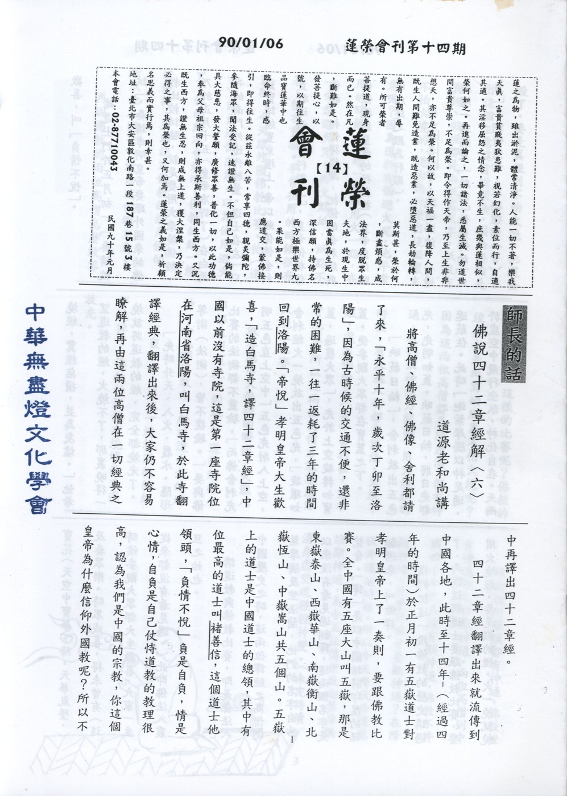

# 第14期

## 大德法語

### 佛說四十二章經解（六）

*道源老和尚講授*

將高僧、佛經、佛像、舍利都請了來，「永平十年，歲次丁卯至洛陽」，因為古時候的交通不便，還非常的困難，一往一返耗了三年的時間回到洛陽。「帝悅」孝明皇帝大生歡喜，「造白馬寺，譯四十二章經」，中國以前沒有寺院，這是第一座寺院位在河南省洛陽，叫白馬寺，於此寺翻譯經典，翻譯出來後，大家仍不容易瞭解，再由這兩位高僧在一切經典之中再譯出四十二章經。

四十二章經翻譯出來就流傳到中國各地，此時至十四年-（經過四年的時間）於正月初一有五嶽道士對孝明皇帝上了一奏摺，要跟佛教比賽。全中國有五座大山叫五嶽，那是東嶽泰山、西嶽華山、南嶽衡山、北嶽恆山、中嶽嵩山共五個山。五嶽上的道士是中國道士的總領，其中有位最高的道士叫褚善信，這個道士他領頭，「負情不悅」負是自負，情是心情，自負是自己仗恃道教的教理很高，認為我們是中國的宗教，你這個皇帝為什麼信仰外國教呢？所以不歡喜，叫「負情不悅」。

諸道士們於正月初一「奏請較試」，奏請孝明皇帝要跟外國來的佛教比較試驗，就是要用火來燒佛經，乃於正月十五（皇帝准許了）在白馬寺的南門外邊作較量。道士在左「以靈寶諸經置東壇上，帝以經像佛舍利置於道西七寶行殿上。」皇帝他相信佛教，相信得很深，把佛的舍利經典佛像擺到皇帝的行殿裡（皇帝出外臨時所建之殿為行殿）。

道士褚善信等，繞壇涕泣，一邊繞壇一邊痛哭，「啟請」他崇拜的「天尊」，「詞情懇切，以旃檀柴（香）等燒經，冀經無損，並為灰燼。」他希望道教的經，火燒不了，那裏曉得一燒就將道教的經，完全都燒光了。

「先時升天、入火、履水、隱形等術（法術），皆不復驗。」要與佛比賽的法術都不靈驗，「而佛舍利光明五色直上空中」五色光射入上空，舍利經火一燒放出五色光，「旋環如蓋，遍覆大眾，」光於上空旋轉如寶蓋，使參觀大眾都在寶蓋之下。

「映蔽日輪」，舍利放出五色光，光明如蓋，映蔽日輪，將日光都遮蔽住。此時「迦葉摩騰以神足通，於虛空中飛行坐臥，神化自在。天雨寶花(天空中寶華下降，天華亂墜，)及奏眾樂。時眾咸喜，得未曾有(這時候參觀大眾都大生歡喜，大家一生從來都沒有看見過。)此即佛法入震旦之始也。

講道教與佛教比賽，即是佛法入中國歷史之時，這兩位譯經之高僧迦葉摩騰及竺法蘭，他們的名字自古以來沒有看見過翻譯，這兩個名字是梵音。「譯」是以中國話將印度的話翻過來，叫做譯。

我們把這一段佛教的歷史講過了，再講這個道士要跟佛教比賽，要用火燒經，要是假的經，火一燒就燒毀了，要是真經則不怕火燒。他道士出這個主意違背世間法，因為無論是真經、假經都是白紙寫黑字，紙沒有不怕火燒的，道士為什麼出這個壞主意呢？因為道教有個避火咒，他平常用的時候，拿起一張紙用火一點，在一旁念避火咒，用火點紙，紙點不著，很有靈驗。平常在用的時候很有靈驗，今天跟外國佛教比賽，他（道士）就出這個主意，以為他用避火咒。他的經不會燒壞，佛教的經一燒就燒掉，用以認定佛教的經是假的，所以他（道士）敢出這個壞主意。

再說佛教的兩位高僧怎麼敢答應他（道士）這樣的比賽呢？佛教的經典也是紙寫的那裏不怕火燒呢？因為這兩位高僧都是阿羅漢，都有神通，他們以神通力觀察，用火燒經的時候，天龍八部都來護法，火燒不壞，還有佛的真（身）舍利在，更不會燒壞。所以這兩位高僧才敢答應用火燒來比賽。

敢答應用火燒經的時候，天龍八部都來到這燒經的地方，道教那些小神、小鬼都不敢來，所以道士念的避火咒不靈驗了，用火一燒把道教的經都燒掉了，佛教的經沒有燒壞而且還放光！

這兩位阿羅漢都有神通，佛教裡有神通，但不許顯神通。兩位高僧到中國四年之久沒有顯神通，什麼時候才要顯神通？在降伏外道的時候。所以今天降伏外道應該要顯神通，為令正法得傳世，故迦葉摩騰湧身虛空，現出種種神變。〈未完待續〉

## 共修研學

### 勸發菩提心文（十四）

*心爾*

其次境界都是隨心而現〈萬法唯識，三界唯心〉當你是善心，你會見到好的眾生，是惡心會見到壞的眾生，發菩提心會見到善知識，發無上阿耨多羅三藐三菩提心，會見到佛。完全依心而變現，心外無有眾生可得，即如世間富貴功名都沒有離開過心，若沒有過去內心發起佈施業，很講究、很善巧，並配合懺悔、發願、回向，果報沒有那麼殊勝，果報是隨心而現，用什麼心造作就現什麼果報，以惡心感應不到好眾生，萬法無自性而隨緣現，不是那個緣，現不起那樣的法來，若不是發菩提心、念阿彌陀佛的因緣，極樂世界現不起來，萬法唯心，若說萬法有自性，不隨緣你的心，應該惡人都能見到極樂世界，善人都可以看到地獄，皆是業感緣起，唯心所現。若云菩薩去地獄，彼之去是願力去的而非隨業而去，業之現起吾人則作不了主，若是願力則心甘情願，歡喜去做，都是唯心現，叫心內眾生，當我發願要度惡眾生時，惡眾生便隨我心態現起，地獄都會出現。地藏王菩薩隨願而現地獄，彼對地獄眾生觀功念恩，菩提心度眾，是用報恩之心，所以地獄眾生對菩薩之忤逆，引不起菩薩的瞋恨，地獄眾生之苦難卑劣，引不起菩薩的傲慢，剛強難化也引不起菩薩的懈怠，反而更激發出菩薩的悲願，欲拔其苦、予其樂，更以威神力而救助苦難眾生。此謂隨緣，想要使自己變得很殊勝也可以，想要使自己變爛也可以。「若知自性是眾生，故願度脫」，當你愈度脫他，愈能加強你的無我之心，愈能破我愛執而無我的菩提心，故能明心見性都是靠眾生。「若知自性是佛道，故願成就」佛道也是在性空義下，隨緣現起的各類教法〈學之能令吾人破執〉，若能誠意修學必能對治煩惱、降伏習氣。

「不見一法離心別有」都是唯心所現，所謂萬法唯心，發菩提心的人能感應大乘教法，發二乘心的人感應四諦教法，看什麼心，感應什麼人，感應什麼境界。沒有一法離心之外別有。沒有造過鬼業的有情，絕不會將水看作猛火，也絕不會將水看成膿血，造作惡業而起現行的有情也絕不會把水看成琉璃，都是隨心所現，到底水是什麼現象？看你怎麼看，隨心而現。「以虛空之心發虛空之願，發無盡的大願，行虛空之行，證虛空之果，亦無虛空之相可得。」所有的眾生，不管是什麼行相，都是我體會與度化的對象，此種無盡的包容而無對立，即是虛空之心，而發種種大願欲助其拔苦予樂，乃為發虛空之願，叫無自性的大願，相應此之菩薩行名為虛空之行，只要各類的善法能利益眾生，都是我所欲修行的法門，如此能徹底將無始劫來薰習所成的無明情執打破，與無明我執相應的懈怠、好逸惡勞、自私自利、貪瞋癡慢的習氣，徹底的打掉，還我本來面目。內心既清淨又廣大，名之為證虛空之果。沒有說度了一個眾生，多出什麼東西，只是打掉了無明妄執而已，海闊天空，得到大解脫、大自在。亦無虛空之相可得，虛空只是將自性見打破，沒有自私的情見，不起人我分別，妄生苦樂憂喜，內心成就這種清淨、廣大的解脫自在氣象，稱之為證虛空之果。

「知此八種差別，知審查，則知去取，知去取則可發心。」修行的重點在內心的行相，把不好的行相〈煩惱〉去除、好的行相攝取，像照相一樣攝取鏡頭，把好的行相攝取過來，成為心理活動的範圍，範圍以外絕不是我心理的活動，我心理範圍只有「念念上求佛道、心心下化眾生，聞佛道長遠不生退卻、觀眾生難度不生厭倦，如上萬仞之山、如上九層之塔，乃至於觀三界如牢獄，視生死如冤家。從這裡去悲憫眾生而願度願成，不見眾生離自心之外，不見佛道離自性之外，上求下化沒有什麼功勳可得，只是還我本來面目，徹底清除無明妄見。沒有妄生的情執，泯除一切情執差別之見，方稱正、真、大、圓的菩提心，修道辦事時，認真看自己的心態，好好對治錯誤的心態，將正確的心態提起來叫修行，無論哪一個佛事或助念或作七或啟蒙研學，乃至於放生活動中，我有沒有這樣的覺受？說我有沒有在修行，我有沒有提起這樣的正念？我有沒有提起這樣的妄念？我有沒有藉著這樣的事相作佛道的資糧？這叫做修行，每天應拿出來看，檢點自己，佛法就像鏡子一樣，出門前照著鏡子、梳整頭髮，使人看起來更有體面，我們都知道鏡子的妙用，以佛法為法鏡，檢點內心的缺失，去除邪、偽、偏、小，展現正、真、大、圓的氣度。藉著照法鏡而調整心理，然後面對眾生，此時心理的相貌有多麼莊嚴！我們都太在意外相的莊嚴，而忽略內心是醜陋的，這時候修行有什麼意思呢？當我們時時刻刻都注意外表的覺受抓住，來注意我們的內心，這個人一定成就。佛法並沒有叫你不注意世俗的心態，只是將世俗的心態轉變而已，佛看到我們的不是外表，是心，所以要捧出心來給佛看。〈未完待續〉

## 蓮池海會

### 陳周燕老居士往生見聞記

*編輯部整理*

陳周燕老居士生於民國元年十二月十五日，年僅二歲即被送至鄰人作童養媳；婆家原本環境優渥，然因家道中落，遂至清苦貧困，老居士自幼勤快伶俐，刻苦耐勞，約莫五、六歲，忙碌於各類家事之中，接受嚴厲苛刻的要求，總是逆來順受、毫無怨尤。某一天因為一件小事，被長輩責罵，不敢回家吃飯，牽著牛上山餵草。心裡委屈得想跳河自殺，卻害怕下輩子投胎變餓鬼而作罷！

老居士靠著一小塊農田，自給自足，婆婆臥病在床達二十年，公公又因為駝背，不能工作，老居士一肩擔負起沈重的家計，雖然是粗茶淡飯，家居生活倒也恬靜平適。老居士的同修長年經商在外，對於家事甚少聞問，婚後育有四男一女，除三男於六歲辭世，其餘均已成家立業，獲致遐滿美好的人生。老居士的同修個性海派，頗重義氣，當時姊姊過世，留下一名女嬰，陳老先生便抱回家照顧；此外大哥生了許多女兒，都送給別人作養女，唯獨一女發育遲緩，及至七歲仍不會走路，無人願意收養，老先生又扛下撫育之責，當時家中的經濟狀況已經十分欠佳，而同修很少體諒老居士的辛苦，三十多年來，老居士潛心向佛、茹素清修，默默行善、厚培福德，尤其每日家務繁重，卻始終敦倫盡份，恪守其責。

清晨拂曉時分，伴隨幾陣嘹亮的雞鳴，老居士背著竹籃上山採收茶葉，或忙著穿梭於田埂菜園，斗大如雨的汗珠潸然而下，老居士用心於農耕作務，成果斐然、滿載而歸。到了夜晚則徒步進城、販賣茶葉，回到家早已星斗滿天、萬籟俱寂。質樸善良的老居士，從不與人計較，未能求學識字為一大憾事，也許是善根機熟，老居士特別歡喜讀誦經典，兒孫見此，不由得心生感佩、自嘆弗如！

勤儉節約的老居士，不輕易浪費物資能源，他時常告誡晚輩：多修福報、積聚資糧的道理。除了幫忙煮飯打掃外，老居士有條不紊的回收各類資源。她總是把淘米水拿來洗碗，洗衣服的剩水拿來沖地板、清馬桶。牙膏用罄，剪開罐條，把殘餘的牙膏徹底用完。老居士很會運用巧思及創意，鍋蓋脫落了，便以牙膏罐蓋替代，一雙靈巧的手。修補家中所有的用物。有一回颱風來襲，老居士冒著生命危險，衝到屋外，鎖好雞寮，接著以繩索繫住屋頂，下方捆牢大石頭，外表看似柔弱的她，竟然也有如此堅韌的意志力。

老居士茹素三十多年，晚年身體頗為硬朗，時常搭乘公車，四處參訪道場寺院，有一夜，全身長了許多水泡，隔天竟不藥而癒！想必是長年茹素念佛，不與眾生結怨，才有如此不可思議的奇蹟與感應。八十多歲的高齡仍然精進不已，五年前不慎跌倒，腿部受傷遂不良於行，今年十一月十九日，身體發燒不適，口中長瘡而不欲進食，老居士的子女一直隨侍在側，為其執持佛名，經由師長的開導及各地蓮友虔心護持下，老居士放下萬緣、提起正念，並以肢體語言、點頭念佛。歷經十五個小時的助念，老居士安詳捨報、往生極樂，四肢柔軟，面色紅潤如同繈褓中的嬰孩，殊勝瑞相，令人讚嘆。

回顧老居士的一生，可用「忍人所不能忍、行人所不能行。」來做註腳，一介沒沒無聞的舊式婦女，秉持勤儉順從，堅忍不屈，樂善好施的精神，不僅度過坎坷不平的一生，還能於臨命終時接受善知識的導引，覺悟人生的真諦，回向佛道，縱然口不能言，還能以此孱弱身軀，點頭念佛八小時，其驚人的毅力在臨終一刻，表露無遺，唯願老居士蓮開九品之花、佛授一生之記，回入娑婆、廣度眾生。

### 永恆無限的追念　敬悼　上智下諭老和尚

心在

＊筆者前言：民國八十九年十二月九日，三峽西蓮淨苑開山住持│ 上智下諭老和尚，以世緣圓滿，安詳捨報，示寂於三峽西蓮淨苑，回顧 老和尚的一生：上求下化、培育人才；弘揚大乘、持戒念佛，謹以此文，將 老和尚畢生之行誼，作簡明扼要之介紹，以饗讀者大眾！

上智下諭老和尚，民國十三年出生於北平市，俗家姓徐，名曙明，號曉村邨，原籍山東省博興縣。 老和尚中年接觸佛法，便對教理至為好樂，四十六歲那年，毅然抉擇、放下外緣，依止剃度恩師 上道下安長老出家，同時於基隆海會寺受戒，  老和尚披閱圓覺經、淚流不止、頓有所悟，六十一年二月，正式接辦「第三屆松山寺北區大專佛學講座」，接引高級知識份子，培育優秀弘法人才。同年十一月闢建三峽西蓮淨苑，是為開山住持。

老和尚律紹南山、教宗般若、行在彌陀。淨苑四眾弟子秉持嚴謹如法的道風，老實依教奉行。古德曾云：「化當世，無如講說。垂將來，莫若著書。」 老和尚如法的講說、著書、即化當世、垂將來，此乃典範， 老和尚樂說無礙，講經包括：心經、金剛經、八大人覺經、圓覺經、勝鬘經、無字法門經、佛藏經、彌陀經、法華經、楞嚴經等。講戒包括：比丘、比丘尼戒、梵網經菩薩戒。講論則有中論等。 老和尚的開示也已集結成：師父的話、夏雨清涼、側聞散記。而且  老和尚亦著作等身，自七十二年出版，思益梵天所問經尋繹至阿彌陀經鈔，加上講記，總共五、六十部。另外主編：四分律拾要鈔、南山律學辭典、般若藏彙粹、淨土藏彙粹。

◎大專青年念佛會

上智下諭老和尚於民國六十二年開辦「大專青年念佛會」，期望結合淨苑的力量，輔助各大專院校佛學社，不僅確立了在家眾對佛法的正知正見，更因此突破青年學子研習經教的障礙。念佛會以培養弘法人才為主要目標，前後包括了：佛法綱要、事題習講、練習講經與專修會四大階段。

◎僧伽教育

上智下諭老和尚曾向淨苑住眾開示：「學宜廣、修宜專」，也就是全面修學、重點深入，僧伽教育的主要方向以護法安僧、弘法弘律為兩大主軸，前者強化住眾修學一致的共識，後者能彰顯修學的次第與內涵。末法時期、有教無人， 老和尚有感於此，不隨世俗建大道場，也不趕經懺佛事，唯有一心，弘法弘律、導歸淨土。

弘法利生

出家以弘法為家務、利生為事業，除了上求佛道更須下化眾生，是故西蓮淨苑，藉著講堂成立的因緣，帶領在家信眾，聞法念佛，化導人心、廣修十善，在家居士雖身處紅塵，亦能不耽染世惡，人間菩薩的絕佳典範於焉誕生！  老和尚廣發利他之悲願：結合經教，將淨土法門紮根、讓佛號響遍台灣、乃至全世界，願將娑婆三千界、遍植西方九品蓮！

佛法能幫助眾生淨化煩惱、離苦得樂，尤其欲了生死，必賴佛法這帖阿伽陀藥，因此助念會的成立，顯得刻不容緩，就在 老和尚及常住法師領導下，蓮友蒐集資料、提供卓見，於民國八十四年九月編訂「往生前後處理手冊」，提供助念、入殮、作七儀軌參考之用，不但可為亡者培福修德，更能冥陽兩利、殊勝莊嚴。

台灣能有 老和尚住世，誠然一大福報，雖然其示現圓寂之相，追隨阿彌陀佛，往生西方極樂淨土，而化育僧才、覺行圓滿之遺風，予人無限的追思和懷念。藉此因緣，老師及諸位蓮友，每週六上山，念佛一永日，一來可訓練自我念佛的定功，二來緬懷 老和尚利生之悲心，望著莊嚴肅穆的靈堂，耳邊四字佛號成片響起；夜晚那份獨有的靜謐，止息原本散亂昏沈的念頭，能夠以報恩之心打坐念佛，無限法喜油然而生。

上智下諭老和尚發大乘心，行菩薩道，以悲心弘願、攝眾無數，開演教法、續佛慧命，得其沾溉、如沐春風，而今， 老和尚圓寂，吾等深感遺憾，日後更應稟承他老人家之遺訓，依教奉行、如法修學，方不辜負佛恩，唯願  上智下諭老和尚，迴入娑婆，廣度眾生。

## 日常省思

### 有意義的星期天

心印

每個星期天早晨，總是最令我想要忘記時空的運轉，懶洋洋的躲在暖呼呼的被窩中，闔眼做無醒的大夢。然而，十二月三日是個特別的星期天，在宜蘭有能深入教理的十大礙行課程，以及能解行並進的放生活動。所以我起了個大早，雖然身子是疲累的，但心中是滿懷欣喜的出門了。

往宜蘭一路上的風景都是青青的山和涼涼的風，讓我這長住在塵囂中的都市客，倍感清涼！早上的課程，研討到十大礙行的第一條「念身不求無病」，瞭解我這四大組合的色身，一定會敗壞，生命如高山穿針引線般的難得，也容易失去。雖然是正值花樣年華，但是當無常來時，都無法自己作主，所以，真的要好好珍惜這健康的身體做許多有益他人的善法來讓世界變得更美麗，才不枉費父母的養育之恩，師長的教導提攜，和所有眾生種種的恩德。

於第二條「處世不求無難」，瞭解生活上的一切，遇到困難要歡喜接受，因為種種的困難都能增進我們的能力，並且能幫助對治自己貪瞋癡的習氣，所以更加堅定自己的信願要不畏大風大浪。而且困難越大越能堅固自己的願力。

中午在宜蘭度假村用過色香味俱全的午餐後，即在其停車場設置壇場，為放生活動拉開序幕。在莊嚴肅穆的儀式中，為這次放生的虱目魚懺悔、歸依，希望他們不再遭遇漁人的網補，更期望他們將來都能往生淨土，成就佛道，儀式中，看著長輩灑大悲水在魚兒的身上，此時我更願這大悲水能灑入我的心田，洗去我的煩惱。無始劫來的輪迴，真的太可怕了，只有跟著魚兒們一起懺悔、歸依三寶，老實念佛，求生西方，已沒有任何其他的方法可以救度自己了。

接下來，大家在佛號聲中，轉移至度假村旁的海岸邊。刺骨的海風迎面吹來，卻吹不散大家想要護生的熱情。大家很快的排成一條長隊，將一桶一桶的魚兒從沙岸的一端遞給穿著漁人的吊帶雨褲和大雨靴的男士，由他們下海將魚兒一個個送回大海的家。大家的臉和衣服被桶中魚兒歡悅彈跳時的水花濺濕了，但大家仍面帶笑容的傳接一桶桶的魚，連氣都捨不得多喘一口。雖然大家如此賣力的放生，因為場地的因素，仍無法快速的放完所買進二卡車的魚。所以，決定將第一車剩餘的二桶魚和第二車的魚先開往烏石港放生，此時開著剩餘二桶魚的卡車，為了想減輕車子的負擔，所以將桶中的水放掉，但是這樣一來，卻使得車輪在沙地中下陷，而動彈不得。許久後，第二輛車由烏石港趕回來，才將下陷的魚車，由沙地中拉起。此時已是晚上七時許，黑色的天幕令人看不清海邊的方向。就在這緊要關頭，有一位發心的師伯將其家中的吉普車行駛到沙灘上，並開啟了遠光燈，重新照亮魚兒們一條生路。真不知道大家宿世和這些魚結了什麼樣的緣？看著被折騰一天的魚兒們，能不負眾望的回到他的家鄉，大家的辛苦，也在魚兒們遇海水的一剎那間消逝。內心充滿著平和的喜樂，好像自己也解脫了。心中不再有掙扎，不再徬徨，因為內心已找到了一個歸依處，已得到了難得的寧靜和自在。時間已是晚上九時許，老師與大家仍於海邊高歌而流連忘返。這次的放生活動，就在這接連不斷的歌聲中，拉下序幕。

在臨睡前，想著這些放生的魚兒們一起遊到極樂世界的七寶池中遊玩，並且拜見阿彌陀佛，授記我們於不久的將來成佛廣度眾生。

### 送別好友　楊靜婷

心筑

靜婷已經往生一個多禮拜了，我原本難過的心情其實已經很遙遠而不似之前那般難熬，這件事也不再讓我痛哭流涕，輾轉難眠。所寫的大約就是她從發生火災到往生的狀況。

靜婷是因為去南部喝喜酒，借住在同學家，遭遇失火，使得腦部缺氧而呈現腦死狀態，變成躺在加護病房，靠著呼吸器維持微弱的生命，從草屯回到台大醫院的燒燙傷加護病房，從事情發生到最後往生，這當中大約經過一個月的時間。她移來臺北之後，探病的時間每天只有兩個鐘頭，又因為是燒燙傷的加護病房，所以我們去看她也只能透過電視跟她說說話。她走也走不掉，也醒不了，讓人無法想像這般英氣而又快樂的靜婷，會因為遭遇無常火而躺在加護病房，我說不出心裡的惆悵，知道太多佛經上所說的因果道理，臨終的狀況！害我每每想起她所承受的劇烈痛苦，但我卻無能為力，這讓我更加難過！我即將要失去可以跟我談小學到高中所有大小事的好朋友，但是卻只能透過電視，要她加油撐過去，要她念佛，無法分擔她一絲一毫的痛苦。

小學的時候，靜婷轉學到我們班上，我記得他哥哥常常到教室門口大喊「楊靜婷！你的便當！」然後脫線的靜婷會衝出去大叫：「你不會小聲一點呀！」我們還常常一起回家，她還告訴我要怎樣抄小路回家，然後指一指樓上說：「我家到了，掰掰！」國中的時候，她常常遲到，每次都被老師罰。哈！這個狀況一直維持到高中三年都是如此！每次都想起她衝進教室的模樣（場景有時是國中教室，有時是高中教室）！她是一個總是為別人著想的人，也有一種魔力讓大家都喜歡和她在一起，我還記得她那快樂的臉，記得我們一起整化學老師還有每年過年在雅菁家裡胡鬧的場面。靜婷說：等我老了，我也要吃素跟學佛！我記得這句話。可是她沒有等到老的那一天，她的快樂並沒有讓她少受一點苦，棺材裡面裝的也不是老的靜婷。

去台大看她的時候，她已經是這個樣子了，我跟楊大哥和小姍說，如果需要幫忙的話，再打電話給我，並且給了他們幾本有關臨終狀況跟念佛的書，我想我可以做的大概只有這樣了。又一次去看她，剛好遇到楊媽媽，她也問起靜婷的一些狀況，我只是跟她說靜婷現在很痛苦，如果可以的話，讓她回家拔掉呼吸器，然後家屬排班助念引發她正念求阿彌陀佛接引到西方極樂世界。之後又拖了幾天，正巧從宜蘭放生回來的隔天，楊媽媽打電話來說十二月六日要接靜婷回家往生，我知道對楊家而言，這是一個很痛苦的決定，可是對我而言，我卻是高興她終於可以少受一些苦。從拔管子的那一剎那起，她終究是回不來了，最後不是願力就是業力，不是往生就是輪迴，而我怎能不努力的念佛幫助她提起正念？

她的往生終歸是她的善根與福德，也依著楊大哥把這幾本書仔細的翻閱，並且做出正確的判斷，才能成就她的往生，使她能真正的遠離娑婆世界的眾苦。楊爸爸在靜婷斷氣的五個鐘頭左右，看見阿彌陀佛跟觀世音菩薩來接她走，之後便坐下來很努力的念佛。她讓家人看見了佛所言不虛，並且示現她這一期短暫的業報身，讓我們瞭解這世間無常的真相，也讓我這個在佛法中打混的小子，深刻而痛苦的體會人身難得、佛法難聞。她這樣的示現，等同諸佛菩薩再來。有一天，若能有幸在極樂世界相見，我要拍拍她的肩膀說：「我也來了！」

### 心情札記

心亞

這月來，往生助念層出不窮，小至七個月大，大至九十高齡，看盡人生種種狀態，棺材不是裝老人，而是死人，也不是老了才會死，是隨時都會死，沒有僥倖獲免的。

當聽見劉學長的寶寶要助念時，心頭一震，無言以對，相同的生產過程、相同的疼痛難熬，別人痛苦後，至少是種喜悅，寶寶的哭聲充滿整個產房，但她呢？取代的只是護士的緊急聯絡，敘說著寶寶的死因。

於她的眼神中傳出了祝福與信仰，將哀淒之心化為一股祝福，祝福她的寶寶到最好地方，她默默地念著佛號，即而又拿起地藏經誦讀。母親就是這麼偉大，為了孩子可以忘了自己。曾聽過一個比喻，如果將母親和孩子各綁在一個電線杆上，電流是相通的，各給一個按鍵，如果按了鍵，則電流不會流向你，那母親一定不會去按鍵，她會為孩子受種種的痛苦。忽然好想媽媽，電話的另一頭傳來了哭聲，使媽媽想起胎死腹中的寶寶，有學佛的父母和沒有學佛的父母，就是差這麼的多，當時媽媽還沒學佛，寶寶怎麼處理的，連媽媽也不曉得，而劉學長卻為她的寶寶助念，給她的寶寶最好的禮物。

心筑學長的同學，於一場大火中，帶走了她的全部，只剩氧氣罩強留下來的一口氣，父母的痛哭無助，難以言喻。正值青春年華的她，有多少抱負未實現，有多少理想待追求，就這樣消失了！誰說，只有老人才會死。父母嘗盡了各種挽回她生命的祕方，不管那秘方如何，只要能喚回她的生命，他們都全心全力的做，父母對孩子總是無悔的付出，反觀孩子對父母呢？

人，就是這麼的無常，悠忽悠忽地就走完了一生，何時結束，不知，只知無常。何必太計較呢？多讓別人、多做一點、多想一些，也許今晚一睡，明兒早起，也就與世長辭了。

麗琴學長的媽媽，星期天於宜蘭研學會時，還與大家有說有笑，一點異樣也沒有，誰知這是與她最後的交談，見她的最後一面。誰說，只有徵兆的人才會死。無常，不分你是怎樣的人，身分、地位、年齡是如何，隨時都有可能將你帶走。

十二月九日，上午九點多，智諭老和尚圓寂，助念的場面是多麼的盛大，遠從各各地方來的人士，皆為老和尚助念，誰有這種魅力。要得助念就很難了，況且是個助念的盛況。突然間，一股思緒湧上心頭，現在不好好的學，要是那天老師往生了，想學就來不及了。

生命是如此的短暫無常，於轉眼間，要如何善用自己的生命呢？追求榮華富貴，也是過一生，還未必追求得到。辛辛苦苦的裁培孩子，於生病時，孩子未必會來照顧；或送至安養中心，說什麼有醫生與護士的照顧是最好的，一派胡言，到頭來還不是一場空嗎？還是為公發心的人生最好，將自己有限的生命，做最妥善的運用，想想還是這條路最好、最安全，所做的事情，將功不唐捐。就如同 智諭老和尚一樣。

### 緬懷　雪公太老恩師

心印

每當來佛堂拜佛時，小朋友一定有疑問，為什麼在向佛行三頂禮後，還要再向 雪公太老師的德相，行問訊禮呢？因為 雪公太老師是一代大德，他有和佛菩薩一樣的慈悲和智慧。

雪公太老師是學生們對老師的尊稱，老師姓李，名豔，字炳南，號雪廬，生於民國前二十二年，即清光緒十六年，卒於民國七十五年。山東省濟南市人，於民國三十八年，隨著國民政府遷居到台灣，這時 雪公太老師已六十歲。年紀已不輕，但 雪公太老師卻在這時開始推行中國文化和弘揚佛法的工作。 太老師興辦了明倫月刊社、青蓮出版社、台中蓮社和慈光圖書館…等來推行儒佛教育。創辦慈光育幼院和菩提仁愛之家…等來照顧貧苦老弱的人。並經常講學，例如論語、唐詩…等儒家的各類經典，還有醫學以及講解各種佛經。也撰寫非常多的書籍，將美好的觀念和學問，完整的流傳給我們。有一回，有一位學生負責承辦明倫月刊，因為遇到太多困難，所以實在辦不下去了，想打退堂鼓，於是向 太老師表明心意， 太老師就很溫和又堅定的告訴這位學生說：「你辦不下去，我辦到死！」於是這位學生回去後，就更加努力的辦刊物，而且這位學生後來也變成一位非常有德學的老師。

我們可以由 雪公太老師所做的一首詩「殘燭」來瞭解他所秉持的理想和精神。「未改心腸熱，全憐暗路人，但能光照遠，不惜自焚身。」蠟燭是由燭心的棉線開始燒，而發光發熱，不但能帶來光明，也帶給人溫暖。更指引走在黑暗中的人，找到方向和希望。 太老師的心，就像蠟燭的心一樣，燃燒自己，完全為了憐憫我們這些走在黑暗中的人。 太老師所興辦的事業，撰寫的書和講學，無非都是希望我們能找到人生的方向，能敦倫盡份，瞭解如何增進德學，能愛國家，愛所有的人。更希望我們能相信因果道理，去除貪嗔癡，能老實念佛，將來往生西方極樂世界去成佛。為了我們， 太老師不惜自身。晚年時，太老師已行動不便，但仍然抱病上臺講經。有時甚至為了晚上能順利講一個半小時的經，而整天只吃一餐和喝一點點的水。太老師如此的講經不輟，直至九十七歲，往生前的一個月，可以算是燃燒自己到極至，在風燭殘年的時候，他的熱心腸，仍然不曾改變。

我們也可以由 雪公太老師的另一首比喻自己的詩「時計鐘」來更進一步體會 太老師的熱心腸。「警眾太殷勤，曾無間寸陰，幾人長夜醒，不負轉輪心。」時鐘，一分一秒很有規律的計算著時間，不眠不休，非常勤勞，不因天氣冷暖，也不分對象而有所停頓，時間就是這麼公平。 太老師就和時鐘一樣，不曾間斷，不眠不休，分分秒秒，剎那生滅中，心心都是為了提醒我們，警誡我們時間的無常，要快快讓自己從黑暗中走向光明的大道。能從沒有開始的黑暗長夜中，張開雙眼，見到光明。可是我們多少人，願意從溫暖的被窩中醒來？人身難得如大海中的盲龜，要伸頭穿過一根浮木中的洞。又如細線從高山上飄下來要穿入你手中握的一根繡花針。但人生卻如清晨葉面上的露珠，容易失去。我們一定要好好把握良時，多做有意義的事情來讓世界變得更美麗。才不辜負 太老師勤轉法輪，不眠不休的指引我們規勸我們，溫暖我們的心意。

雪公太老師的誕辰紀念日快到了，除了緬懷 太老師一生的精神和德業外，更要發願從此做一個「清醒」的人和一個有光明人生的人。
