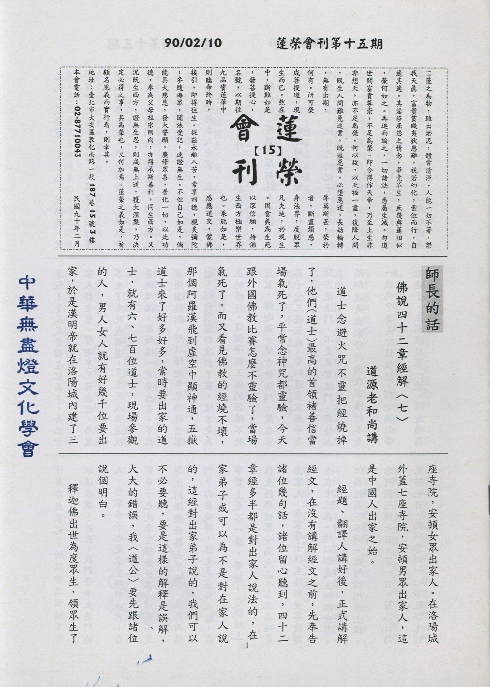

# 第15期

## 大德法語

### 佛說四十二章經解（七）

*道源老和尚講授*

道士念避火咒不靈把經燒掉了，他們(道士)最高的首領褚善信當場氣死了，平常念神咒都靈驗，今天跟外國佛教比賽怎麼不靈驗了，當場氣死了。而又看見佛教的經燒不壞，那個阿羅漢飛到虛空中顯神通，五嶽道士來了好多好多，當時要出家的道士，就有六、七百位道士，現場參觀的人，男人女人就有好幾千位要出家，於是漢明帝就在洛陽城內建了三座寺院，安頓女眾出家人。在洛陽城外蓋七座寺院，安頓男眾出家人，這是中國人出家之始。

經題、翻譯人講好後，正式講解經文，在沒有講解經文之前，先奉告諸位幾句話，諸位留心聽到，四十二章經多半都是對出家人說法的，在家弟子或可以為不是對在家人說的，這經對出家弟子說的，我們可以不必要聽，要是這樣的解釋是誤解，大大的錯誤，我〈道公〉要先跟諸位說個明白。

釋迦佛出世為度眾生，領眾生了生死，成佛道。了生死，成佛道，需要真實的修行用功，要真實的修行用功必須要出家。所以釋迦牟尼佛以身作則，為我們做一個榜樣，釋迦佛他本人是出家的。

釋迦佛本人出家，且把他一家人（除了淨飯王外）統統都度出家。他（釋迦佛）將姨母摩訶婆闍波提夫人度出了家，也將同父異母的弟弟難陀度出了家，他自己的妃子〈現在說的太太〉耶輸陀羅也出了家，兒子羅睺羅也出了家。父親淨飯王因為國家大事沒人接手不能出家，所以釋迦佛為淨飯王受五戒當個在家弟子，其他全家人都出家。釋迦牟尼佛出世，為度眾生了生死成佛道，了生死成佛道就要斷煩惱，斷煩惱一定要出家，不出家煩惱難斷，所以釋迦牟尼佛現出家相，把全家人都度出了家，這才是真正的修行。這個淨飯王他的因緣不能出家，釋迦佛才開方便法門，度在家弟子受三皈五戒，要知道在家弟子是開方便法門，不是真實法門。有些人誤解說是出家修行與在家修行不是一樣嗎？要是你這樣想，釋迦佛做事做錯了，在家跟出家一樣，釋迦佛為什麼要出家呢？所以你這個話不可以這樣講！若云，我們修淨土法門的人，出家弟子也是求生極樂世界，在家弟子也是求生極樂世界，結果不是都生到極樂世界去了嗎？沒有兩樣啊？你要曉得，往生是沒有兩樣，在事實上是不一樣。要按十六觀經上往生極樂世界分為九品，上三品確是出家人，在家居士往生極樂世界最高生在中三品，所以都是生極樂世界，但品位高下不同。在阿彌陀經上講，念阿彌陀佛七日，若一日、若二日乃至若七日，能以念到一心不亂都生到極樂世界，不分三輩九品，那麼出家人念七天生極樂世界，在家人念七天也生西方極樂世界，那有兩樣？彌陀經上沒有分在家出家，念佛七天生到極樂世界，出家在家沒有不同。但是要注意，要念到一心不亂才生極樂世界，要念到一心不亂，出家弟子與在家弟子因緣就有不同，在「在家菩薩戒」的最後，釋迦佛有一句話提醒在家弟子，出家持菩薩戒很容易，在家持菩薩戒很難，為什麼？「在家菩薩多惡因緣之所纏繞故」。在家是煩惱窩，惡因緣很多纏繞著你，持戒都持不到清淨，念佛怎麼能念到一心不亂，不能念到一心不亂，怎麼能生到西方極樂世界？

這幾句話，大家不可說：出家弟子與在家弟子修行一樣。說是一樣，修行起來，可不一樣！〈未完待續〉

## 共修研學

### 勸發菩提心文（十五）

*心爾*

發心立願不可不辦，如遇良師善友，則發心立願甚好，若遇邪師惡友，教你發心立願甚為危險。

這麼說來，「邪、偽、小、偏」，都是惡知識的因緣下發起的，可見善知識有多麼的重要，需明眼人指點，方可於多途中識得正途，「多途」就是人生的方向很多，或指示你往偏、或指示你往小，或指示往邪，或指示往偽的路上走。所以識得正途很重要，省庵大師是一個大善知識，故能分別指示，令有遵循，這「正、真、大、圓」其中的正跟真的反面是邪跟偽。這是對凡夫開正眼，使我們凡夫在發心立腳根的時候，要厭離娑婆，發出離心，生起菩提心，不為世俗的情見及名利所夾雜。菩提心在發展的時候，還要確立是一種不悔改的意樂，依經教觀修菩提心，須知發心上求下化，或遭遇困難、痛苦、麻煩、問題等種種障礙，可是要感謝這是在堅固我的悲心，成就我的忍辱，成熟我解脫的能力，都應該把這些視為當然，事前先有這種心理的建設，再發展出去，在事相當中遇到挫折時，會視為應該。若無此歷練，以為發菩提心很好，有二十五位大菩薩與一千藥叉大將擁護，逢凶化吉，所居之處風調雨順，成為眾生安樂基礎。結果第二天遇到挫折，如上級辱罵、考績乙等、或其他障礙，則怪三寶，二十五位大菩薩，與藥叉大將為何不保護我？為何不懲罰害我的人？如此之人即是不擅於修學菩提心，不知菩提心的行相。是故發心之前，須先瞭解其行相，與應有的心理建設，依心行持而有種種障難，不是菩提心引發的，分下四點申述：

１過去的惡業所引發的，沒有過去的惡業引發不出這些障難，所以要怪是要怪過去的惡業，不是怪菩提心。

２在引發的過程中，可能觀念不對，作法不對，引發出來的麻煩，不是菩提心不好。

３菩提心要成就，本來就是經過歷練。未經過歷練，哪有你的清淨菩提心，堅固菩提心？

４障礙來的時候，也是堅固你的菩提心，也是增上你的菩提心，也是成熟你的菩提心，所以他們的功德跟三寶一樣，這麼說來眾生的恩就是佛的恩。所以把眾生當成佛看，沒有什麼不對。把他當成佛看，不是統統聽他（眾生）的，是從障礙這方面來磨練我的恩，與佛引導我的恩是一樣的，沒有眾生就沒有佛。菩提樹開花（菩薩）結果（佛果），根是眾生。前四（邪、正、真、偽）為凡夫開正眼，使我們取一個正真的菩提心，後四（大、小、偏、圓）為二乘、菩薩指示。大小是分別大乘、小乘，偏、圓是分別菩薩位中的權實。若修學菩提心，還有心外的眾生可度，心外的佛道可成，則是一個權乘的菩薩而不是一個實乘的菩薩，換句話說這種修行不善巧，雖然說在行菩薩道，但是要成佛不能，還是很遠，所以如何把菩提心發展成能成佛的菩提心，一定要從偏的菩提心進入圓的菩提心，方向調對，修行的勢力很強的，方向如果沒弄對，內心沒有好好檢點很可惜，祖師舉出邪門外道說他們自創一格，竄改經教，都是為求名聞利養而已。這些魚目混珠，自稱善知識的邪師，有一點一定與佛法不同，傳顯教，也傳密教，也顯神通，什麼都有；吾人要分別好壞真假，除了教法上認真去分別以外，從求名求利上去看，在起信論上講魔相，他一樣能現相好與種種神通，且有種種相似教法，令人不易分別，但一點一定不同，就是對世間名聞利養的愛執，而且內心有一種隱微的增上慢。這是佛法與他們不一樣的地方。

「知自性是眾生，故願度脫，自性是佛道，故願成就。」了達一念心性，離過絕非，豎窮橫遍，心佛眾生，三無差別，不見一法，離心別有，所謂盡大地無非沙門一隻眼，化大地無非一卷經，所有法界的現象，都可以培養我的眼力（成就五眼），眾生之恩大矣哉。雪公云，讀歷史那些恩恩怨怨，看起來很痛苦，很麻煩、悲哀、傷心，可是也培養很多歷史的眼光，令吾人不會重蹈歷史的覆轍，重蹈教訓，他（眾生）不惜演（示現）種種的苦相，讓我們從反面的警惕而朝向正面的光明，所以「盡大地無非沙門一隻眼」因為法就是眾生心，佛法只不過把這些現象說清楚，不是有一個東西叫佛法。當這些現象看清楚時就是佛法。從人世間的作善得樂，作惡得苦都看懂了，佛法的業果、決定見就是這樣，佛法就是講日用平常的現象。此八段文令行人作一個定盤針，定盤針就是指南針，永遠指北，當法能讀通的時候，確立自己永遠走正、真、大、圓，遠離邪、偽、小、偏，就像鏡子一樣，可以照出我們的塵垢，而去除塵垢，在鏡子裡面展現正大光明的氣象，出去時候很體面（無愧）的面對人家。〈未完待續〉

## 日常省思

### 活潑健康久久久

唐微智

每個人都希望自己是最美麗、健康、活潑又快樂的人，但是要怎麼樣才能獲得這些珍貴的寶藏呢？或者雖然自己已經很努力，卻沒辦法獲得，又要怎麼改善呢？

活潑是什麼？活潑就像是小兔子在綠油油的草地上跑跑跳跳般，活潑就像是小狗狗愉快地在花園裏打滾翻兒，活潑就像是蝴蝶自由自在的在美麗的天空中飛舞，活潑又像是春天裡的花草樹木蓬勃生長，活潑就像森林裡的樹木，大口地呼吸著新鮮空氣，活潑也像快樂的鳥兒在空中遨翔。所以，活潑就是有生機、有朝氣、有精神、有活力的一種生命力的表現。但是活潑絕對不是任意揮霍精神，也不是把時間、體力浪費在無意義的事情上，而是將最美好的生命，去做最美好的事情，才是真正的活潑！

那麼什麼是健康呢？其實健康可分為兩種，一種就是身體的健康，一種是心理的健康。有許多人，雖然身體很健康，可是心裡卻藏著許多煩惱和不愉快，那就不是真正的健康，所以心理健康是很重要的，心理要健康，身體也要健康，才是真正的健康。而且，唯有心理和身體都健康以後，才會是一個活潑、快樂又可愛的人。

既然活潑、健康對我們生活影響那麼的大，那我們要如何保持健康和活潑的生活呢？我覺得，只要每天保持愉快的心情，好好的安排生活，認真的學習，認真的玩耍，多關懷他人，多做有意義的事情，而且應該要天天運動，吃營養均衡的食物，面帶笑容，多接近大自然，多爬山，多鍛鍊自己，讓自己每天都健康又快樂，也讓所有的人都能活潑健康久久久！

## 啟蒙園地

### 弟子規簡說（一）

*編輯部整理*

前面我們雖然把弟子規的概念已經很簡單的敘述一遍了，但為了加深我們的印象，在這裡更把在中壢各位師長對弟子規的研討，做一整理，讓我們再一次加強印象，就像以前有一位了不起的出家人~道宣律師，他在戒律上有著很殊勝的成就，是來自他曾在老師那裡，只戒律這門就聽了十遍了，所以我們對弟子規也是要這樣一遍又一遍的去聽老師說，並去思考與體會，才能對弟子規有稍微的了解。

弟子規是出自論語的一段話：「子曰：弟子入則孝，出則弟，謹而信，泛愛眾而親仁，行有餘力，則以學文。」這不但是孔子學習的基礎所在、中國文化的根本，更是我們想要學習像阿彌陀佛這樣幫助所有的人的源頭。也不論是我們在家時要做父母的好寶寶，更是我們在學校與老師、長輩及同學們相處的總則。如果我們能夠把弟子規每一部份所講的內容好好的實踐，相信我們以後的成就是無可限量的。

弟子規是孔子對弟子們的開示，而弟子們的年紀或老或少，或出類拔萃、或在學、或各種不同的地位、或種種不同的職業，孔子還是勉勵他們入孝出弟、謹信愛眾、親仁及餘力學文，這是一輩子都要做下去的，也是我們每一生都要做下去的，因為在成佛之前都叫有學位，通通都是弟子，都需要學習，因此我們若要學習阿彌陀佛，第一步也是如何確立正確弟子的行相，有助於我們快速達到像阿彌陀佛的狀態，像善財童子就是最完美的弟子相，他能夠在文殊菩薩的教導下，及五十三位老師的提攜下，一生就得到佛的根本智，這是我們的典範，聖人要求我們在成聖成賢之前，先要做一個好學生，好好的學入孝、出弟、謹信、愛眾、親仁、餘力學文的道理，這是我們人格培養的根本。

孩子們就像一顆小樹苗在發育，人格、課業及才藝各方面都在發育，而弟子規就像種種助緣，發展的很美好，開花結果！

## 參訪觀摩

### 馬來五日遊心得感想

心筑

依著修補大藏經的因緣，我們到馬來西亞檳城的極樂寺以及其他地方參訪兼放生，短短五天下來，身體疲累，心情也是百感交集，沒有一次出門像這次那般想回家；雖然回家的時候，檳城的班機不但出問題，之後又在高雄折騰了一晚，不過此行的確是滿載了許許多多的感想和覺受。

衝著想一睹清朝龍藏的心情，我們一行人來到了檳城極樂寺，極樂寺由妙蓮老和尚創建，妙蓮老和尚為慈禧太后的舅舅，二十一歲依鼓山量公老和尚出家，大師一生弘法利生，修築寺宇等，是為人人尊崇的一代大德，一九０七年，在念佛聲中，瞑目晏寂，面目如生，身發異香。虛雲老和尚親自為為妙蓮老和尚建塔，傳幽冥戒，至四月十日進塔，入塔時，天坪祭齋百桌，大眾誦經，上供畢，念變食真言，忽一陣旋風，將諸祭品，旋於空中，靈龕頂一道霞光，直貫塔頂，眾皆贊歎。靈骨一半入塔，一半運至檳城極樂寺入塔供養。此次我們也有幸能至老和尚的舍利塔前參拜。極樂寺在當時動盪不安的局勢下，是中土佛教的大護法，其中虛雲老和尚、圓瑛大師等皆曾於此寺講經說法、培養人才，使法輪常轉；亦在清朝末年，國家動盪不安當中，募得許多的善款，幫助中國的寺院重修以及僧團的維持與人才的培養。

下了飛機之後，我們先去海邊放生，之後到臥佛寺和緬甸寺參觀，雄偉的臥佛象徵著佛菩薩自在無礙的狀態，令人欣然嚮往之；南洋的佛寺跟中土的佛寺有著明顯的不同，中土的佛寺比起我們參觀的緬甸寺要古樸許多，壯觀的緬甸寺，彷彿入華嚴境界般富麗堂皇，令人眼界大開。

最後回到極樂寺，它是檳城最為宏偉富麗的佛寺，位於喬治西南的阿依淡（Ayer itam），於西元一八九o年開始動工興建，費時二十年才完工，其實極樂寺現在仍還在繼續興建中，堪稱是東南亞地區最大、最美的佛教廟宇。由於抵達時已過了吃晚餐的時間，賢明法師親切的招待大家吃飯、行李搬運以及安排住宿。晚上大眾念佛繞佛，穿過極樂寺種種殊勝的供燈與花海，彷彿進入佛淨土中，展現各類的寶塔，承事供養；我們並且準備了垃圾袋，一面繞念一面撿拾遊客丟棄於地面的垃圾與煙蒂，此法行正面可隨喜大眾對於佛寺的尊崇與供養，並以佛號莊嚴道場，反面可清淨塵世中種種垢染，在鐘樓前大眾鳴鐘發願回向，結束了晚課和第二天整理藏經的前行。

第二天，清晨五點我們出發到山區的水庫放生，由天空一片黑暗至大地放光明，放著一桶桶的生物，彷彿也是將我們的無明煩惱一一的放去，去除種種的煩惱讓心性顯露出光明。看著所放的土虱，在水面上舞動，揚起一波波的水痕，給他們自由其實就是給自己一條生路，能夠用放生的法行和馬來西亞這麼多種族的人民結殊勝的善緣，內心感覺真是暢快！

印光祖師曾予大藏經作這樣的詮釋：

「大藏經者，如來之慧命，人天之眼目，無明長夜之智炬，生死苦海之慈航 …世出世間之道本也。」（見民國二十四年影印宋磯砂版大藏經序一）。因為佛及佛弟子的所行、所證與所說，盡匯集在大藏經裡，大藏經就是佛的法身，也是佛弟子的智慧之藏。

中國佛教大藏經，到了宋初才開始整部印出來。宋朝三一九年間，共刻過六版大藏經，是藏史上鐫刻藏經最多的一朝，對於正法的久住與流佈，關係至為重大。經此先例一開，元有普寧版，明有南藏、北藏、嘉興藏，清有龍藏。

清朝在雍正乾隆時編一次，就叫龍藏。極樂寺珍藏的就是這一部。是中國官方所編最後一部大藏經，在佛教文物價值上是非常珍貴的。

早餐後我們來到了藏經閣，由前述的觀念加上誦念過印光祖師的「竭誠方獲實益論」之後，恭敬心油然生起，至此我們開始分組整理大藏經，故宮的專家和一些細心的蓮友負責藏經的搬運和清潔，男眾們從樓下搬桌椅到藏經閣，師姑們負責擦佛像，剩下的人負責整理其他書籍，從灰塵漫佈到窗明几淨，一直整理到傍晚，加上早上的放生，中午爬一段山坡去參拜妙蓮老和尚的舍利塔，每個人此時已經是精疲力竭。

極樂寺的藏經閣是馬來西亞重要的寶庫，遙想天台智者大師於大蘇山上入定，在藏經閣中整理經典，以及印祖在普陀山法雨寺閉關閱藏三次等，此皆大德能將教法住世的殊勝因行；故可以想見藏經是極樂寺的靈魂，也是感應人才出世的重要法脈，今日能有幸參與整理經藏，他日也期許能於佛法殘敗處或是無佛法處弘揚教法，將十方經典整理成有綱要及次第的開示。

晚課後，步行至可容納五千人聽經的大殿，每年淨空法師會在極樂寺講經，每次講經說法，殿中定是高朋滿座，盛況空前，廣闊的大殿亦不敷使用，馬來西亞的四眾弟子若能好好運用此一道場，增上極樂寺的道風，必定能夠感應大德住持於此處，將佛法弘揚，人才輩出，正法住世。

大殿上方是高達二百呎的觀音像，觀音像座落於極樂寺鶴山的頸部，風水極佳，檳城的居民只要向西一看，便可以看見觀音像慈悲俯視著我們，是檳城華僑的精神指標；而馬來人信奉回教，每天必向西邊禮拜，禮拜觀音聖像可感應彌陀佛由西方極樂世界前來接引眾生離苦得樂。雄偉的觀音像俯視著檳城，微小的我們仰著頭瞻仰觀音菩薩，用歌曲讚嘆觀音菩薩，觀音的大悲就如法雲法雨滋潤我們的身心，蠲除我們的熱惱，雖然我們的體力和精神此時已經到了極限，但是卻有一種難以言喻的歡喜在其中。

隔天吃完師父們特地早起準備的早餐後離開極樂寺，之後我們到霹靂河畔放生，到金馬崙高原走了一段茶道，散步至一處印度村落，整個村落有一個印度教寺廟，周圍有一個小學校，居民家家戶戶敞開大門，孩童天真爛漫的看著我們，跟我們聊天，真像是到了世外桃源，回飯店時還受好心的印度人載我們一程。第四天在邦喀島上出海放生了兩次，海面上漁家用的是台灣進口的魚種，而我們由台灣而來，放他們一條生路，這真是一次奇特的因緣，而馬國人民盡心維護海洋的生態，方能讓我們乘快艇遨翔在海面上放生，盡興的遊玩。

晚上傾聽大家此行的心得，不管是對於此行的困難處，親身參與龍藏修補工作的難能可貴，放生的自在感覺，馬來西亞多樣種族的和平相處，這五天彼此相互幫助等等，大夥都一起在月光下分享這樣美好的覺受。

最後一天到檳城的素食餐廳吃午餐，林老闆是一位虔誠的佛教徒，為竺摩法師的入室弟子，親近承事法師由五十五歲至今九十歲的高齡，並且無怨無悔的默默做著流通經典的工作，對華人文化的保存及弘揚有著不可抹滅的貢獻。趁著出關前短短的幾分鐘，我們去了三慧講堂，古樸而不起眼的房舍，裡面住著南洋碩果僅存的高僧大德-竺摩法師，老法師身體已經嚴重的老化，氣力衰退且長年臥床，但聽到佛法概念時仍然合掌聆聽、竭誠盡敬，在法師身上我們看到古大德的風範，法師不愧為南洋的國寶，是我們要讚嘆與學習的對象。

每一次的活動都必須藉著特殊的因緣和大家努力的配合才有辦法成行，雖然看到殘破的龍藏，心裡不勝欷噓，為何要等到蟲蛀成這樣才要修補？我在心裡暗暗的這樣想，可是老實說，師父們太忙了，極樂寺的出家師父又太少，難免心有餘而力不足。而我們不也是這樣嗎？習氣一旦養成之後要改也是難上加難呀！不曉得耶！有一種很惆悵的感覺，要改變命運真的好難，如果這輩子還是改不了習氣怎麼辦？
