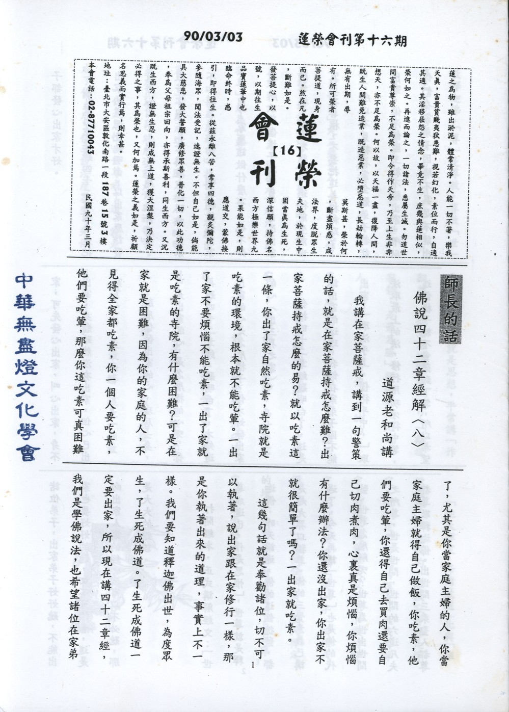

# 第16期

## 大德法語

### 佛說四十二章經解（八）

*道源老和尚講授*

我講在家菩薩戒，講到一句警策的話，就是在家菩薩持戒怎麼難？出家菩薩持戒怎麼的易？就以吃素這一條，你出了家自然吃素，寺院就是吃素的環境，根本就不能吃葷。一出了家不要煩惱不能吃素，一出了家就是吃素的寺院，有什麼困難？可是在家就是困難，因為你的家庭的人，不見得全家都吃素，你一個人要吃素，他們要吃葷，那麼你這吃素可真困難了，尤其是你當家庭主婦的人，你當家庭主婦就得自己做飯，你吃素，他們要吃葷，你還得自己去買肉還要自己切肉煮肉，心裏真是煩惱，你煩惱有什麼辦法？你還沒出家，你出家不就很簡單了嗎？一出家就吃素。

這幾句話就是奉勸諸位，切不可以執著，說出家跟在家修行一樣，那是你執著出來的道理，事實上不一樣。我們要知道釋迦佛出世，為度眾生，了生死成佛道。了生死成佛道一定要出家，所以現在講四十二章經，我們是學佛說法，也希望諸位在家弟子都發心出家才好。

那麼出家要聽四十二章經，先把出家的道理先聽明白，以出家應該發什麼心出家，出了家應該做什麼事。假若你四十二章經沒有聽明白，出家不知道怎麼樣發心，糊裏糊塗就出家了，出了家應該做什麼事，也不知道，所以這個樣子就辜負了自己出家的善根。出家不簡單，還得前生前世真正有善根，不要把這善根糟蹋了。

所以不見得在家全體弟子都能出家，像淨飯國王就不能出家。所以你們在家弟子因緣不具足不能出家，可先發心出家，叫心出家，身不出家，身體雖然沒有出家，但心已出家了。

那麼你發出家的心，現居士身，可是出家的心，是怎麼樣的心呢？你再聽四十二章經，聽明白了，才知道出家的心是怎麼樣子，你才好發出家的心（出三界之家）。

你把四十二章經聽明白了，這是講出家的道理，我們在家弟子因不能出家，「取法乎上，僅得乎中，」取法取最上的法，修行用功才得中等，這個樣子就不會落到下等，所以希望諸位弟子，出家弟子好好聽，不能出家也要好好的聽，切不可誤會，這是向出家人講的經，我可以不必聽，那是大大的錯誤。

打開經本，正式講解經文：「世尊成道已，作是思惟」。世尊就是釋迦佛，昨天講過，佛的這個德號，都是超九界以獨尊。佛的三覺意義已講過了，今天再講「世尊」也是佛的代號，世尊怎麼解呢？世尊為世出世間之所尊，世是世間，世間的六道凡夫都尊敬釋迦佛。出世間三乘聖人都尊敬釋迦佛，「尊」是尊敬，尊敬「世」尊之世包括世間、出世間，就包括九法界了，為世間眾生所尊敬。「世間」指六道凡夫，這就超過了六凡法界。「出世間」是三乘聖人，三乘聖人都尊敬，這就超過了三乘聖人的法界。三乘與六道凡夫，這就是「超九界以獨尊」成為世尊。

「世尊成道已」指世尊十九歲出家，三十歲成道，在臘月初八夜睹明星成正覺，已經成道就是「成道已」。

「作是思惟」世尊成了道，就是成了佛，成了佛要說法度眾生。先作是思惟，思惟就是思想，平常講「作觀想」，觀想怎樣觀想法呢？「離欲寂靜，是最為勝」釋迦佛他是過來人，他思惟、追念成佛以前的功夫，要想成道必須離欲，離欲就是遠離五欲，五欲皆要離開，離開後此心才能寂靜。我們的心不寂靜，為什麼它（心）不寂靜呢？就是被五欲所擾亂，白天不寂靜夜晚睡覺還夢想顛倒，所以眾生苦惱了。要遠離了五欲，就能寂靜下來，這一寂靜之後得了寂靜之樂，是最為勝，這是一個最超勝的境界。

「住大禪定，降諸魔道」此與「離欲寂靜」一起說的，離欲寂靜也是禪定，但禪定有小乘的禪定、大乘的禪定，恐怕你誤會離欲寂靜是小乘的禪定，所以再加一個「大」字，叫住大禪定，「住」是安住，安住在大禪定的境界之中，叫出世間的上上禪定。〈未完待續〉

## 共修研學

### 勸發菩提心文（十六）正宗分

*心爾*

正宗分

一條一條來想一想，這是一種修行，修行就是改變觀念。修行有時不要太躁進，好像每天都要修很多，效果不好還不如實際修，認真依著省庵大師勸發菩提心文，一條一條反省，看看這樣的恩我有沒有念得住，這樣的內涵我想得通嗎？我內心真的對有情功德有覺受嗎？佛這樣的兆載難言之恩，真能感動我心弦嗎？一步一步去看，去想，就是一種修行。內心裡面生鏽的弦，將之去鏽上油，旋緊觸弦而發出共鳴，成為佛菩薩的知音。人須有血有淚，非草木之無情，真正的血性漢子都是站在佛菩薩的悲願下，瞭解佛的處境，瞭解佛的辛苦，瞭解眾生難度，瞭解自己的使命感，瞭解自己的走向，瞭解自己的未來，瞭解自己的目標，瞭解自己的下手處，這叫做有血有淚。

歎德明緣：

「此菩提心，諸善中王，必有因緣，方得發起」

前面的正、真、大、圓，這麼殊勝的心態，發起來以後功德很大，為二乘入大乘之門，堪稱佛子，人天擁護，走過的足跡天人都禮拜供養，所在之處風調雨順，圓滿福智資糧，直接成佛，這麼殊勝的菩提心，要發起來也要講究因緣。「諸善中王」一個國家沒有國王，立刻群龍無首，同樣一個團體、一個家庭、一個社區、一個社會、一個國家，若群龍無首，一定大亂，因此若無菩提心，一切善法都變得沒有意義，所有的善法都要成為菩提心的隨順相，方具意義。例如：五戒都約著不妨礙對方講。「不殺」不能利益牠起碼不能害牠，害牠已經夠慚愧了，怎麼連命都殺了，牠最在意的就是命，不能利益牠已夠丟臉了，還害牠的命，這不是夠刻薄嗎？夠丟臉？此不害的意樂，是菩提心的隨順相，所以世間的戒律，乃至於四禪八定，以及出世間的善法，都是菩提心的隨順，或菩提心的引發，或菩提心的表現，或菩提心的成就。若菩提心拿掉，就像人拿掉靈魂，像一個空殼，整個善法也是空洞的善法，無意義的善法，沒有導向的善法，沒有利益的善法，沒有結果的善法。所以要有因緣，這因緣很講究，現在我們知道正、真、大、圓那麼好的狀態（菩提心殊勝行相），我內心要如何達到這個狀態？大師述十條因緣幫助我們發起正、真、大、圓的菩提心，以正、真、大、圓的菩提心為目標，內心講究造作達到目標的條件（十種因緣），對佛、父母、師長、施主、眾生的恩要怎麼觀？對有情的苦要怎麼看？在日用平常裡捫心自問，今天我是不是用這種狀態在修行？是用這種狀態作善法，是否用這種狀態面對群眾？這種狀態都沒有了，那麼我的修行是什麼？上班下班，穿衣吃飯應對進退有什麼意義？這些因緣（菩提心發起的十種因緣）或我內心發起或我內心所緣的境界，要注意境界的特質（此十種因緣），也要注意目標（正、真、大、圓的菩提心）下手修行時要講究條件，並朝向所要達成的目標，每天要檢點內心有否與正、真、大、圓的行相相應，不落入邪、偽、小、偏。內心取什麼捨什麼？是不是這十個因緣下去取正、真、大、圓的菩提心。

因緣有十，一者念佛重恩故，二者父母恩故，三者念師長恩故，四者念施主恩故，五者念眾生恩故，六者念生死苦故，七者尊重己靈故，八者懺悔業障故，九者求生淨土故，十者為念正法得久住故。

一、 念佛重恩故

「天有覆恩，地有載恩，日月有照臨恩，父母有養育恩，惟佛有拔苦與樂之恩，為天地日月父母所不可及，故佛恩最重也。」這樣講若是不能體會，後文在念佛重恩裡會加以說明。這段的重點在佛的恩有拔苦與樂恩，佛在什麼狀態下助吾人拔苦與樂，就是省庵大師後面所發表的的論文。〈未完待續〉

## 專題研學

### 十大礙行（一）總說

*編輯部整理*

前言：

在啟蒙班中，我們花了四個多月的時間，和小朋友們談談十大礙行的內容，在這當中，跟小朋友們分享了許多美好的概念，而自己對於教法的覺受也增上了不少，今日有幸將這些觀念用文字和大家一起分享，是我們的福報，感謝林老師，也感謝家長和小朋友的參與，沒有你們，沒有這十大礙行課程的圓滿結束。

十大礙行（十不求行）-總說

祖師大德常常勸勉我們要當一個明白人，什麼是明白人？就是在這世間作任何事，不論是遇到順境或是逆境，都要明明白白，就算是吃苦也要吃得有價值，不要枉費來這人世間白吃苦。

所以慈悲的妙叶大師寫了這篇「十大礙行」，就是希望我們不要來這人世間白白吃苦，他將我們在這人世間一定會遇到的種種障礙，總括為這十種，分別是「自身生病」、「處世遇難」、「學習心態上遇障礙」、「行持受磨練」、「謀事不易成」、「弊交」、「人際關係受逆」、「施德無回報」、「利益無分」、「處處受誤解」等，告訴我們為什麼我們會遇到障礙？若沒有這些障礙人生會更幸福嗎？還是反而會失去更多？我們該如何的看待障礙？又該如何突破障礙帶給我們的種種考驗與自身的煎熬？

所以這篇文章，正是妙叶大師悲憫我們眾生不知道如何面對逆境，又不能通過逆境的考驗，常常被逆境打倒，有感而發的一篇開示，藉由十大礙行，讓我們在沒有障礙的時候會好好珍惜自己的生命以及身邊所有的資源，好好的運用時間與精力，增加自己幫助別人的能力；反之，在遇到挫折的時候，也能夠運用這十大礙行中的觀念，替他人著想，反省自己，讓自己變得更勇敢堅強，能夠突破障礙的束縛，一步步安穩地往前走。

十大礙行又叫做十不求行，這所謂的「不求」，一方面是告訴我們求也沒有用，這些障礙是一定會遇到的；一方面的意思是我們常常心裡求順利，其實都是只想到自己而害怕障礙的考驗。妙叶大師看到我們心理害怕障礙的磨練，所以告訴我們要「不求」沒有這些障礙，要歡迎困難、歡迎挑戰。當然這所謂的「不求」，並不是要大家「求」這些障礙趕快來吧！而是告訴我們要隨遇而安，沒有遇到障礙時要珍惜現在所擁有的一切，遇到障礙時也要想成這些都是來磨練我、幫助我的，這樣才是妙叶大師寫這篇文章的本意。

以後我們將陸續把這十大礙行的內涵，以及上課中所闡述概念，再用文字跟大家一起分享，希望大家都能在順境中珍惜，在逆境中成長，成為國家的棟梁、法門的龍象。（未完待續）

## 日常省思

### 生活感言

*編輯部整理*

前言

：三月底，吾等將至雲南參訪放生，民國初年，雲南許多佛教寺院之重興與虛雲老和尚有非常密切的關係，其中包括迦葉尊者入定之雞足山，此處先將虛雲老和尚重建雲南各寺院與雞足山道場事跡，略加闡述，以作為前往重興古剎與雞足山之前行，並與大眾一同體會大德重建道場之悲願與其中之艱辛。並附錄老和尚放生之地點，亦為吾等此行放生之處，效法古德，踐跡入室。

虛雲老和尚與雞足山的因緣

師六十三歲，和戒塵法師相約遠遊，其目的地是四川峨嵋山，雲南雞足山，過流沙河，適水漲，欲渡船，船索忽斷，流又急，船小人多，稍側即覆，師從流而下，在水浸一日，衣服及手足皆被小石割破，痛極難忍，天寒下雨，行抵晒經關，向一寺求宿，寺僧不准，令宿門外台戲，地濕衣濕不能睡，師與戒師同坐至天明。清早起程，至會理州，入雲南境，過永北縣，朝觀音菩薩聖跡，渡金沙江，朝雞足山，復聞石門內魚罄聲，翌日，上金頂進香，此時師又重睹滇省佛教衰敗至此，全省僧規不整，雞足寺僧，各據寺產，自稱為大，師發願在山結一庵，以接朝山海眾，又為地方子孫寺廟所禁，思之欲淚。入秋，由夢佛上人請到笻竹寺講楞嚴經，傳戒，此即師在滇省弘法之始，大理提督張軍門松林，李軍門福興，領眾官紳，迎至大理府，住三塔崇聖寺，請講法華經，皈依又數千人，李提督福興請師住持崇聖寺，師婉拒，而請求往雞足山，志在恢復迦葉道場；於是於山中覓得一破院，名缽盂庵，請師住持，師將該庵重修，闢為十方叢林，迎接海眾，此即師在雞足山重興之始。

師住缽盂庵，鑿放生池，接待十方，重修寺宇，並為重修雞足山而至各地募化。之後建造房屋，立定規約，作香講經，重振律儀，傳授戒法。山中諸寺，亦漸漸改革，著僧衣，吃素菜，上殿掛單等。

師六十七歲（光緒三十二年），雞足山缽盂峰迎祥寺受皇上加贈名為護國祝聖禪寺，並受欽賜龍藏。

師七十歲，迎藏之事方妥，期間一路平安，無滴雨濕經箱上，咸謂洱海老龍，來迎藏經也。此年，仰光高萬邦居士請一尊玉臥佛，擬送祝聖寺供養，但因玉佛太重，故暫奉觀音亭，民國六年（師七十八歲），方運玉佛至雞足山。

師七十二歲，武漢革命，地方大亂。是年於法源寺成立佛教總會。師七十五歲至一百一十一歲（民國三年（甲寅）至民國三十九年（庚寅））於雞足山中休養，並重修興雲寺、下洋蘿荃寺、昆明西山華亭寺（今雲棲寺）、月華寺、大覺禪寺及鼓山佛學院等，修理祖塔及佛像，造鐘樓、鑄銅像、建放生池及整理經藏等。寺中傳戒、講經、坐禪、水陸法會及超薦等於動盪不安的局勢下仍照常舉行。（編者按：老和尚上述寺院之重興，時值民國初年，國內戰亂頻仍，民不聊生，故老和尚每每為重興寺院，奔波往返南洋與中土，舉凡入定、講經、講戒、舉辦歸依、傳戒與法會，轟動當時南洋橋界，每次歸依或傳戒者，皆有數千乃至上萬人，募得善款皆作為中土重興寺院之用。）

師一百一十二歲，民國四十年（辛卯），大陸淪陷後，虛公為廣東乳源地方共幹劫持、刑戮，幾度死生，山名雲門。佛界稱為「雲門事變」。

辛卯年夏曆二月二十四日，忽有百餘人，圍困寺中，將師及眾僧囚於寺內，並搜查寺中有無軍械、發電機及白銀等，擾攘終日，終無所獲，遂遷怒於師。先以木棒，繼用鐵棍，打至頭面血流，肋骨折斷，隨打隨問。師即趺坐入定，金木交下，撲撲有聲，師閉目不視，閉口不語，作入定狀。連打四次，視其以為死矣，次日聞師未死，又復以大木棍毆之，以革履蹴踏之，五竅流血，以為必死。師漸作吉祥臥而全無動靜，三月初三日至十一日，師端坐歷九日。師曰：「我覺纔數分鐘耳！」並從容言曰：「余頃夢至兜率內院，莊嚴瑰麗，非世間有。見彌勒菩薩，在座上說法，講『唯心識定』未竟。彌勒指謂余曰：『你回去！』余曰：『弟子業障深重，不願回去了。』彌勒曰：『你業緣未了，必須回去，以後再來！』並示偈曰：

識智何分，波水一箇；莫昧瓶盆，金無厚薄；

性量三三，麻繩蝸角；疑成弓影，病惟去惑；

凡身夢宅，幻無所著；知幻即離，離幻即覺；

大覺圓明，鏡鑑森羅；空花凡聖，善惡安樂；

悲願渡生，夢境斯作；劫業當頭，警惕普覺；

苦海慈航，毋生退卻；蓮開泥水，端坐佛陀！……」

雲門事變傳至外地，北京之師門弟子，遂連同海外同門救援，五月上旬，北京政府派員至雲門寺，實地調查。師不欲有所說，均言無有受損及受虐之情況，始脫苦境。僧眾百人，以採樵耕植及手工業度日，雲門事變，致此告一段落。此後繼續修築寺院及以講經、傳戒為主。

師一百二十歲，民國四十八年（己亥年（西元一九五九年））十月十二日眾請師作最後開示，及遺囑。師曰：「身後事數日前以向眾說，不必贅言。今問我最後語，祇有：勤修戒定慧，息滅貪瞋癡。」

有頃復曰：正念正心，養出大無畏精神，度人度世！諸位辛苦，宜早休息！

十三日（農曆九月十二日），十二時半，有頃曰：「你等待我有年，辛勞可感。從前的事不必說了，我近十年來，含辛茹苦，日在危疑震撼中，受謗委屈，我都甘心。祇想為國內保存佛祖道場，為寺院守祖德清規，為一般出家人保存此一領大衣；及此一領大衣，我是拼命爭回的。你各人今日皆為我入室弟子，是知道經過的，你們此後如有把茅蓋頭，或應住四方，須堅持保守此一領大衣。但如何能夠永久保存呢！祇有一字，曰『戒』」說畢，合掌，道珍重。諸人含淚而退，至室外簷下守候。

至一時四十五分侍者二人入視，見師右脅作吉祥臥，示寂矣。急報住持及大眾，齊集誦經送行，日夜輪流念佛，十八日封甕，十九日荼毘，香氣四溢，舉火後，白煙滾滾向上衝，開窯時，得五色舍利百餘粒，小者無數，以白色為多，晶瑩光潔，廿一日將骨灰奉安入雲居山海會塔中，師世壽一百二十歲，僧臘一百零一歲。

⊙附錄：

一、此次雲南參訪放生將至昆明華亭寺、雞足山祝聖寺、迦葉殿等，皆是老和尚重興之古剎，體會大德為教之本懷。

二、此行放生將至滇池、洱海、雞足山、黑龍潭等處，此亦是老和尚往昔曾放生之處，放生法行乃菩提心引發，護持尊重生命，與眾生結殊勝善緣之最佳法行。能到這些地點放生，都要隨喜過去的善根，並相信與老和尚曾結過殊勝法緣。

## 啟蒙園地

### 因果故事 — 捨己救人的媽祖（一）

*編輯部整理*

菩薩化身的默娘

媽祖是觀世音菩薩的化身，一千年來，她受到我國沿海各省同胞普遍熱烈虔誠的崇敬。

在台灣北港的媽祖廟，一年四季常有來自各地的善男信女，如潮湧般的前往進香朝拜。文獻天后誌云：「天妃，莆田林氏女，父惟愨，行善樂施，禮大士求子，母夢大士予一藥丸令吞，曰：汝家世敦善行，服此，當得慈濟之貺，遂妊。誕時，霞光射室，異香氤氳，十齡後，誦經禮佛不輟，後遂靈通變化。」

天妃就是媽祖，足証媽祖是觀世音菩薩的化身，並非虛傳，許多因信仰媽祖而導入正信的佛教信徒，可謂相當之多。今據媽祖傳的資料，敘述媽祖生平濟物救人的偉大事蹟：

出生瑞相即不同

宋太祖建隆元年的三月廿三日，媽祖降生於福建省莆田縣林惟愨家中，林惟愨妻王氏，夢見觀音菩薩予一藥丸令吞而受孕。當媽祖誕生時，福建莆田縣城廓西南壺公山峰上空，忽然射出一道霞光，好像千萬瓦的電光似的，在壺公山的峰頂上閃爍，直向林惟愨的屋院中射來。

這時林惟愨正靠在院中的窗櫺坐著，忽見一道奇異的彩光，照亮了整個客廳，空氣中充滿了芬芳的異香，觀音菩薩從彩光中出現了。林惟愨急忙跪在地上。連連對著那道彩光的方向膜拜，觀音菩薩慈祥的對林惟愨說：「你千萬不要妄自菲薄，這女兒比男孩還尊貴，這是菩薩的好意，你要好好的把她教養長大，行菩薩道。」直到觀音菩薩隨著彩光的消失而隱去，林惟愨才站起身來。

慈眼視眾生緘口

忽然產婆跑來，行了個禮，笑著說：「老爺！恭喜您，太太生了個千金，又白又胖，可是她就是不哭！」產婆走近林惟愨的跟前繼續說：「這女孩一定是個貴命，剛生下來，她就睜開了眼睛，她不像其他的孩子，她不哭，我打了幾下，她還是不哭，她長大後一定是個有福之人！」

林惟愨說：「她生下來就不哭嗎？那麼就題她的名字叫做默娘吧！」從此媽祖自幼的名字就叫「默娘」，因為她是林惟愨第六個女兒，所以人家也都稱她「六姑娘」。

光陰像流水般的過去，轉瞬默娘已經八歲了。八歲的默娘很懂事，她每天晨晚，不讓母親動手，就把供奉佛菩薩的香燭及供品都擺好，點燃了香，去叫母親一同來禮佛誦經，她母親很快樂的讚美她說：「阿默真是好孩子，八歲的小孩，比十幾歲的姐姐還懂事的多哩！」

心慈不忍見物囚

林惟愨家中養了一隻鸚鵡。有一天，默娘走進鳥籠，籠中的鸚鵡正在啄食，她看到那隻有美麗羽毛的小鳥，能歌善舞，她想到了一個被囚禁的人，心中很難受的自語道：「要是把一個能跑、能跳的人關起來，那是多麼的難受啊！小鳥也是有智慧的，牠也能通人性，人不願意被關起來，小鳥又怎麼願意被囚起來呢！」

她望望姐姐，又望望籠中的小鸚鵡，聳一聳肩膀說：「姐姐！我要把她放了。」姐姐急忙阻止說：「六妹！妳決不能放了牠，爸爸是不允許的。」可是姐姐的話還沒有說完，默娘就把鳥籠打開，讓小鸚鵡自由自在的飛走了。

當林惟愨發覺小鳥不見而憤怒時，默娘很有禮貌的對她爸爸說：「爸爸！請您老人家寬恕我，鸚鵡是我放走的。」林惟愨很生氣的說：「是妳，妳這個八歲的孩子，竟這樣頑皮！」默娘理直氣壯的說：「我想鳥與人類一樣，都喜歡自由，任何一隻鳥都不應當關起來呀！」林惟愨不禁怒聲斥責道：「鳥是鳥，人是人，鳥與人怎能相比，我把鳥關在籠中，給牠喝，給牠吃，不是很好嗎？」

默娘還是不服氣的說：「爸爸！我把您關在小房子裏，給您喝，給您吃，您願意嗎？」林惟愨再也無言以對，只得說：「丫頭！這件事我不打妳，給我把早上教妳的禮運大同篇背誦起來，如果背錯一個字，打妳十下手心。」默娘很從容的琅琅背誦，一字不差，林惟愨頓時收斂了怒氣，面上露出愉快的笑容。（未完待續）

### 弟子規簡說（二）

*編輯部整理*

在從前，童蒙教育都是先背誦，等到十四、五歲才正式開講儒學，但現在的背景已經不同了，環境也比較複雜了，所以我們不能等到十四、五歲再來開講弟子規，而是在很幼小的時候就必須與他們分享這些美好的文化，這些文化在生活中已經失落了。首先我們若要推動中國文化，必須要得到家長的肯定，才能落實到生活中的每一步，或許在實行的當下，我們會有種種的矛盾產生，或者說在生活上有種種的不方便，但我們必須先自我肯定就是要這樣，也很相信就是要這樣做了，然後要很誠心就是這樣做了，只要觀念上先認可如此的作法，在作法上就算遇到困難也變成不是困難了。若我們心態上還是順應這個潮流，並且給自己找很多的藉口，那中國文化就真的沒有希望了。好的文化是從紮根做起，大家真的要懷著一顆很歡喜的心，不但要推動而且生活上要開始落實，或許是很困難的事，但我們目標一定要訂的正確、訂的大，雖然我們做得不完美，具體的行為與目標尚有很大的距離，但至少我們已經是向正確的路上走了。若我們找了一大堆的藉口來推託，不但自己行不出來，更無法推動中國文化，這是我們看弟子規一個很重要的心態。

這是一個非常需要中國文化的時代，而中國文化涵蓋了儒佛兩家，從五倫八德開始做起一直到了生脫死，這整個內涵都是。中國文化就像駕馬車的那個人，車子就是文明和科技，若我們有內涵時可以把文明及科技帶向為眾生謀福址，使得世界能夠安和樂利，但若駕駛者沒有方向感的話，這是一件很恐怖的事情，是邁向一個很可怕的境域去，大家是共滅共亡，而非共榮共存，因此當我們只要接觸到了中國文化的基礎-「弟子規」，我們這些「弟子」就責無旁貸的負有推動的責任，「弟子」不只是說是作為別人的孩子及學生，更重要是他志在成聖成賢，這是一個美好的文化內涵。中國文化本身是一個美好的風氣、美好的薰陶、美好的藝術，所有美好的事情都有賴中國文化的推展，才讓我們有辦法在生活上去體會這些美好。現在我們在生活上有種種不如意、煩惱、競爭壓力，就是因為我們無法在根本上去做，反而在枝末去爭、去奪，就產生了種種的煩惱，所以弟子規說深它很深，它是一個成聖成賢的學問，說淺它是可以完完全全落實在生活裏頭去推行的，一飲一食、穿衣吃飯、走路、與人應對進退，通通都是弟子規；弟子規裡面所說的孝弟、謹信、愛眾、親仁都是厚培一個人的質地，這個質地必須落實在我們日常生活中的點點滴滴。我們可以把這個質地當成你做任何事情的概念，就是以孝弟、謹信、愛眾、親仁的觀念來過生活，而學文則幫助我們落實本質(做這些的正知見)，學文就要有所選擇，要不妨礙並且能發揚我們的質地。

學習「弟子規」，我們必須提供一個能讓自己與小孩實際操作的環境，這樣一來父母的角色就非常重要了，從我們個人開始，接著下來是家庭，而目標是治國平天下，創造一個極樂世界，而眼前是以「弟子規」作為我們美好的開始。
