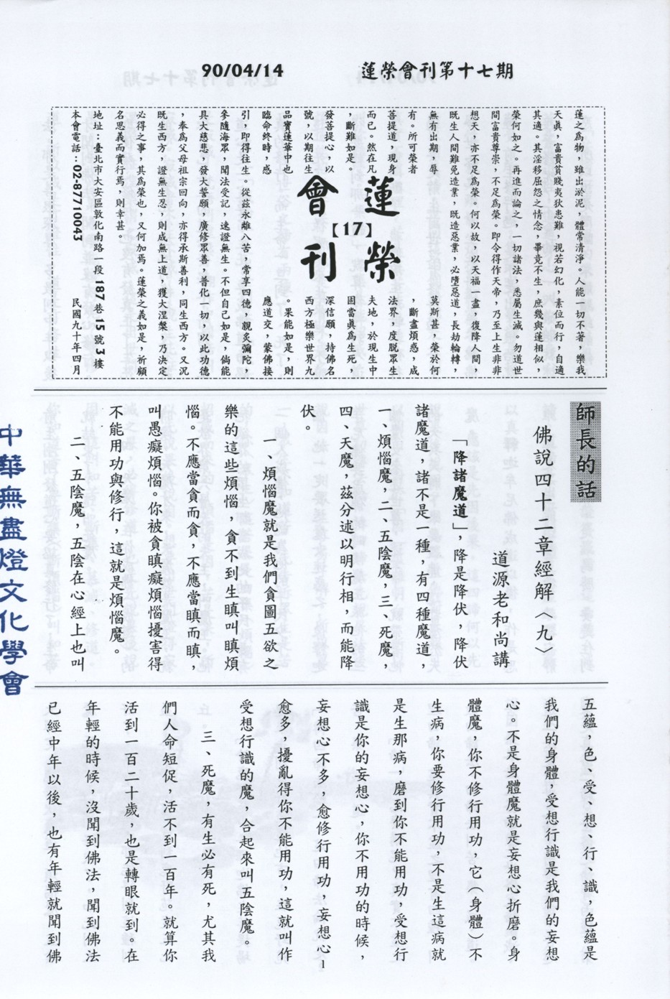

# 第17期

## 大德法語

### 佛說四十二章經解（九）

*道源老和尚講授*

「降諸魔道」

，降是降伏，降伏諸魔道，諸不是一種，有四種魔道，一、煩惱魔，二、五陰魔，三、死魔，四、天魔，茲分述以明行相，而能降伏。

一、煩惱魔：是我們貪圖五欲之樂的這些煩惱，貪不到生瞋叫瞋煩惱。不應當貪而貪，不應當瞋而瞋，叫愚癡煩惱。你被貪瞋癡煩惱擾害得不能用功與修行，這就是煩惱魔。

二、五陰魔：五陰在心經上也叫五蘊，色、受、想、行、識，色蘊是我們的身體，受想行識是我們的妄想心。不是身體魔就是妄想心折磨。身體魔，你不修行用功，它（身體）不生病，你要修行用功，不是生這病就是生那病，磨到你不能用功，受想行識是你的妄想心，你不用功的時候，妄想心不多，愈修行用功，妄想心愈多，擾亂得你不能用功，這就叫作受想行識的魔，合起來叫五陰魔。

三、死魔：有生必有死，尤其我們人命短促，活不到一百年。就算你活到一百二十歲，也是轉眼就到。在年輕的時候，沒聞到佛法，聞到佛法已經中年以後，也有年輕就聞到佛法，那是善根深厚，多數到中年以後才聞到佛法，聞到並沒有發心修行。即使發心修行，也沒有發真正了生死的心，沒有死心塌地的修行，沒有將你自己真正的道心發起來，所謂真正道心是一定要了生死，要成佛道而認真的修行。而生命一旦到了、死了，這一死了怎麼樣呢？來生來世，不曉得要轉到那一道，就算你轉到人道了、也間斷了，我們前生前世都修行過，要是前生前世沒有修行過，今生今世你也不會坐在這講堂來聽佛經。前生修行過，是不是出了娘胎就接著修呢？不會的！一入娘胎就迷惑，所以說是間斷，不能繼續的修。前生剛剛發道心要認真修行了，生命就結束了，這叫死魔。

四、天魔：在你成佛（成道）的時候，天魔才來，天魔就是魔王，就是欲界第六層天的天主，叫魔王。他把欲界的眾生都當成他的子民，要有一個人成佛，他認為他的子民少了一個，他一定要送魔女迷惑之，像釋迦牟尼佛要成佛的時候魔王派他的三個魔女來迷世尊，迷不了，就帶著他的天兵天將下來要殺佛，這都屬於天魔。

釋迦牟尼佛成道以後，作是思維，要是眾生能遠離五欲，離欲寂靜住禪定的境界，是最為勝。要是住到大禪定，能降伏魔道，煩惱魔，五陰魔，死魔，天魔都降伏了，如此則太好了，希望眾生，都能得到這種利益，於是釋迦佛就到鹿野苑度五比丘。

「於鹿野苑中」

釋迦佛在菩提場起來走到鹿野苑這地方，在鹿野苑

「轉四諦法輪」

，這四諦法輪就是苦、集、滅、道。

「諦」字怎麼講呢？真實不虛之理曰諦，這真實不虛之理有四種，叫做四諦法。四諦法叫苦、集、滅、道。苦、集二法是俗諦，是世俗之諦，滅、道二法是出世之諦，出世真諦，合起來是真俗二諦。世俗之諦有兩種，第一「苦諦」，眾生得的果報就是苦果，苦是逼迫性，逼迫身心，叫你的身心難受，所以叫苦。集諦呢？集諦是招感性，就是煩惱，煩惱能招感苦果，所以叫集諦。世間這兩個諦都是世間真實不虛之理，苦是真苦能逼迫你，叫你難受。「集諦」之集是能招感，煩惱能招感苦果，那都是真實不虛之理，所以世俗之諦有兩種。

第三「滅諦」是出世間果，「滅」是寂滅，梵語叫涅槃，翻作中國話叫寂滅。寂滅者不生不滅，了脫生死証涅槃，証涅槃謂之寂滅，不動所以叫寂滅，這是出世間果。出世間果怎麼能證得呢？要修道，所以滅是可證性，道是可修性。要修道才能以證得滅諦。這兩種：滅諦、道諦是出世間真實不虛之理，所以真諦。

應該是先因後果，這四諦何以先說果後說因？因為眾生他對果報可以明白，對於「因」很難明白，所以世尊初轉法輪，轉四諦法先說果法後說因法，叫眾生容易了解。所以第一，眾生不知道苦，先告訴眾生是苦的，你（眾生）這苦果是由集（煩惱）招感而來的，煩惱是因，苦是果，所以先說果後說因。想要出世間證得寂滅之果，必得修道，也是先說果後說因，這叫知苦、斷集、慕滅、修道。你知道苦了要斷集（斷煩惱）叫知苦斷集，慕滅（仰慕寂滅之法）而去修道法，這是世尊初轉法輪，先說果後說因使眾生容易了解。〈未完待續〉

## 共修研學

### 勸發菩提心文（十七）

*心爾*

二、 念父母恩故

「佛之重恩，世多不知，父母之恩，人應共曉，試思我今念佛修行，全仗此身」

。

身體是修行的工具，若無此身即無工具可修。例如：想蓋房子，空有蓋房子的頭腦，但沒有蓋房子的機器、體力，房子總是蓋不成。所以若無此身體，任何善法都作不起來，就不能表達智慧，身體很重要。佛法一方面告訴我們不要有身見，一方面告訴我們愛惜自身，佛語若不多瞭解的話，會覺得語多矛盾。佛法一方面告訴我們棄捨世間，一方面告訴我們不放棄世間，棄捨世間是愛執力的棄捨，不放棄世間是對有情之恩的惦記，此是兩回事，其實還是一以貫之，這個身是賴父母養育，而母親尤為劬勞，真所謂昊天罔極者，欲報親恩，非發菩提心不可。發菩提心第一個基礎就是知母，從母親的恩去想，「然尚有過去生中之父母，或人之生，或於天上，或於畜道，即有天上人間畜道等父母，其教無量」，為什麼有情都至少曾經做過我一世的母親，此邏輯是怎麼推出來的，因為佛法講輪迴是沒有開始的，而生命的次數也是無限的，故有情都至少做過我一世之母，彼之恩就無盡，若說只有一些有情做過我母親，那表示我只有這麼多生死，即是有開始，這麼多生死以前是什麼，如此則有果非由因緣而來，故輪迴無始，一念無明是無始的，沒有開始，有情都做過我的母親，其恩是無量無邊永遠數不完的。菩提心發起的源頭在知母悅意相引發大慈悲固然重要，但知母最重要，最難發，有大德要發知母之覺受，任何頂禮膜拜，求覺受仍然不起，可見難，講簡單覺受沒有，要生起殊勝菩提心的覺受則談何容易，印度有一位證量的聖者，都還要修十三年，覺受才生起，這個時候，使命感就出來了，一種對有情的恩無以回報，必得要增上自己的德能，方能超拔他的苦難。以上是第二念父母恩。

三、 念師長恩故：

「居士有世間之師長，凡從幼受學書數，長而習諸職業，一切皆類師長教誨，得有成就，即其恩也」。

我們從小到大，不曉得多少老師教過我們，今天才有求生存的本領，以及與人進退應對的分寸，沒有師長通通辦不到。今天做事有方法，有本領，讓我賺錢養家活口皆為師恩。出家有出家師長，即剃度師、教授師、羯磨師等，成就戒身，成就法身。羯磨師是傳戒時領導懺悔業障者，成就戒身，成就法身。成就法身之前先成就戒身。五分法身香是戒、定、慧、解脫、解脫知見。法身要由此五個部份得到，身者積聚義，戒身乃以戒律為我所緣，積集這些我法為我日常生活的標準，對治煩惱習氣，乃至於品德的確立，叫戒身，這個人的身體就有防非止惡的功能，就不容易招感禍害，很多無聊事不會在他身上發生。定身：種種四禪八定以及出世間禪定的內涵為他所緣，內心能夠專注於善法，降伏微係的煩惱，若有戒身則在日用平常舉手投足，都能夠在善法上表現，定者專注義，專注善法有能力的時候，從善惡當中，對善法的專注力轉強，身體語言都走到善法上面，怎麼走都是善法，碰到的都是善人。慧身香是積集慧的資糧，引發無我慧緣念性空義，空（無我）義就是法身的行相，能得解脫，並且產生知已解脫的知見，稱解脫知見，這就是法身的五個內涵。當你能親證法身的時候在日用平常裡能防非止惡，親近善知識，遠離惡知識，乃至於整個走向都是善法的走向，抉擇力強，於境界當中能解脫，要幫助眾生解脫，自己本身就要有解脫知見，應以何身得度，即現何身而說法，以上師長恩。

四、念施主恩故：

在家也有施主，即祖宗遺下的財產。也就是說，祖宗是我的施主，父母是我的施主，出家人衣、食、住、行都是施主而得，若無施主何處安身立命，故施主之恩，實無有量，人惟無念，故不發菩提心耳。在家人在公司上班，老闆創業讓你工作有薪水，老闆即施主，遇到困難處，人家伸手援助，都是施主。（未完待續）

## 專題研學

### 十大礙行（二）第一條

*心筑整理*

「念身不求無病，身無病則貪欲乃生，貪欲生則破戒退道，識病因緣知病性空，病不能惱，以病苦為良藥。」

以上是十大礙行第一條的經文。

所謂的「念」，意思是「今」加上「心」，也就是現在的心、現在的想法就叫做念。這十大礙行，每一條各有五個句子環環相扣，第一句點出障礙有哪些，第二句說明若是沒有遇到這些障礙容易產生那些過患，第三句又說到這些過患會令我們在學習上產生那些毛病，第四句就開始教導我們要如何看待這些生命當中會遇到的障礙，第五句則將障礙發揮最大的妙用。

第一行，妙叶大師告訴我們要念身不求無病，我們一般都害怕生病，討厭生病帶給我們身體和心裡種種不舒服的感覺，就算是我們這麼不喜歡生病，可是大家都一定會生病，那又為什麼會生病？病有因為意外造成的，如跌倒、交通事故、感冒、麻疹、水痘等，印光大師稱為外感，此含種種天災人禍；又有因生活作息不規律或挑食等導致的病苦，如營養不良、肝病、癌症等，印光大師稱為內傷；和因為以前曾經做過對不起別人的事情（殺害生命等）所招感的，祖師稱為業障病。

知道了病的行相，接下來說到為什麼大家都討厭生病？因為生病時會發燒難過、睡不著覺、打針吃藥、行動不便以及讓周圍的人操心等；慈悲的妙大師卻告訴我們要不求無病，因為健康會讓我們吃喝沒有節制、睡眠作息不正常、甚至不願意聽父母的勸告加添衣服等，長期下來便產生容易生病的體質，甚至成為吃喝玩樂的享樂主義者，而缺乏生活目標。

所以生病對我們而言是有好處的，劉俠女士在杏林小記中說到小時候因為生病，要獨自面對各樣稀奇古怪的檢查和治療，心裡面既孤單又害怕，但是她卻常常安慰自己要堅強勇敢，鼓勵自己作一個勇者，什麼事情都難不倒。就這樣慢慢地磨練自己的膽量、勇氣與忍耐力。另一方面又因為自己生病，而更能體會他人生病時的難過，將心比心去真切的關懷他人。

這樣說來，健康的我們，在尚未生病的時候，便需努力作個孝順父母的好子女、認真讀書的好學生並且珍惜健康的身體，扮演好自己的角色，更積極的去關懷他人，幫助需要幫助的人，讓這個世界變得更加的美麗。

到底病人應該像什麼樣子，什麼樣子才像病人？不管是海倫凱勒、周大觀、杏林子甚或是我們自己，生病時或是面對生存的挑戰時，都需要打這場完全屬於自己的仗，固然有家人或朋友的幫助，但是事實上是沒有人能替代以及幫助我的。生命的無常，人身如大海盲龜浮木、高山穿針引線那般的難得而易失去，而生病及死亡不是只發生在大人或老人身上，也有可能會發生在小朋友身上，生病都是隨著我們不聽父母的話加添衣服、生活作息不規律、或者是傷害眾生的生命所導致的，這時病苦正好可以好好懺悔過去的錯誤，改正自己放逸的缺點，體會健康的重要與他人對我的照顧，那麼生病對我們而言實在是幫助太多了。

若是在生病的時候，心裡面都是想著阿彌陀佛的西方極樂世界、都是替他人著想的美好觀念，病當然會很快的好轉；就算生病很苦，但是生病的苦，治好了我們貪圖享受，不懂得關懷他人等等錯誤的行為和想法，這麼說來生病的苦，其實才是真正幫助我們成長的一帖良藥。（下期待續）

## 蓮池海會

### 張振明老居士往生見聞記

*編輯部整理*

張公出生於民國前二年。二十一歲時與內田仔老前輩林柱先生的千金林貓小姐結婚，兩位出雙入對、夫唱婦隨，一直到今日，老先生享大壽九十二歲，蒙佛接引，往生西方淨土。張公生有三個兒子，分別於成年娶親後分居各地，而家中三甲地的田園，農事重擔，自然落在兩位老人家身上。其年輕時就以勤勞維持一家之溫飽，於元月天下田時，時常利用「月光宴」（有月亮光照之時）來耕田。大家認為這樣的耕作非常辛苦，而老人家卻說，利用晚上耕作涼快，由此可見老居士勤勞安命的精神，也由於此勤勞惜福成就了長壽的福果。其他如農暇之餘，兼作「放竹，砍竹，拉竹」的副業以維持家庭的開支，甚至餵豬、種甘薯、樹薯、打豬菜等等，作到三更半夜始就寢。家庭經濟也因此獲得改善，以辛苦勞力換來的收入，用作裁培孩兒讀書，才有今天大家的成就，家庭才一天天的興旺。張公振明雖然是一為平凡的農夫，但是老人家一生打拼、純樸、友善、仁慈的懿德，充分表現了平凡的偉大，實在值得大家懷念與學習。

二月十九日，老居士已經不吃東西並且無法言語。即使念得很熟的「阿彌陀佛」四字佛號，此時也只能念「阿彌」兩字，已無力氣念完四字佛號。老居士雖佛號念不全，可貴的是那欲念佛的正念，持續不斷，即是彌陀經所說多善根、多福德。二月廿二日下午三時，東勢蓮友專程來探視老居士時，提醒老居士要在最後關頭不忘念佛求生西方極樂世界，問老居士聽到了沒，老居士以「點頭」方式回答。大家都很欣慰與感動。往生前幾天，大家都在老居士床邊陪老居士念佛，或在佛菩薩前代老居士懺侮業障，發願求生淨土，此時的老居士虛弱到只有用奶瓶裝些果汁、牛奶、開水等讓兒孫一邊餵老居士，一邊念佛。

到二月廿五日上午十時三十分，餵老居士吃一瓶養樂多之後，為老居士按摩，翻身側睡，十一時三十分再看老居士時已發覺嘴巴不動，心臟不跳，馬上通知家人及請蓮友前來助念。令人感動的是蓮友知悉後，火速趕到竹山，其中有二位近八十歲高齡老師姑前來助念。蓮友的到來，猶如百萬大軍，士氣大振，助念氣氛更為增上。在助念當中，蓮友亦分工合作，將靈堂佈置得莊嚴肅穆，讓家屬讚嘆不已。在助念十六小時之後，也就是次日（二月廿六日）凌晨三時三十分作大迴向後，在家屬及蓮友協助下完成更衣及遺體移往大廳，整個助念過程終告圓滿完成，家人及蓮友見到老居士吉祥臥及含笑西歸之瑞相，於是帶著家屬的感恩及疲憊的身體回豐原、東勢準備上班。

老居士一生總是替別人設想，尤其替子孫設想，在臨命終時，選星期日，來助念的人不用請假，且老居士沒選擇住進醫院而在家中壽終正寢，作子孫的誠意地願以老居士老人家生前的心志，此如法之佛教儀式來辦理老居士老人家的後事，以告慰在西方淨土的老居士。

人生難得今已得，佛法難聞今已聞；更難得的是老居士無常的示現，用最殊勝的念佛方式來了脫生死、出離三界，這都是老居士往昔善根福德一時成熟，在此為老居士祝福，祈請老居士在西方淨土時常回來加被老居士的子孫與有緣的親友，更祈請老居士速速修得無生法忍乘願再來，度化有情，阿彌陀佛！

## 啟蒙園地

### 因果故事 — 捨己救人的媽祖（二）

*編輯部整理*

施物濟眾毫不吝

年齡隨著光陰的消逝而增長，默娘已經十四歲了。菩薩化身的默娘，與凡人是不同的，她十四歲的智慧，遠超過幾十歲的凡人，她由愛護小動物而轉移到愛護人類，她看到一個討飯的乞丐，或看到一個站在路旁哭喊父母的孩子，甚至看到一隻拖著載重車子的牛馬時，都會使她心上發生同情而難過。
有一天，她與五姊一同外出散步，經過一條十字的巷口，看見一群人圍在一起，忽然從人群中走出一個又髒又皺的老乞丐，瞧了瞧默娘說：「你是行善的小姑娘，給我點銀子吧！我老母親快病死了！」默娘
**問：** 「你要多少銀子呢？」老乞丐說：「愈多愈好，我需要很多。」
默娘把左手腕上的銀鐲拿下來，遞給乞丐，
**問：** 「這些夠不夠？」乞丐接了銀鐲，搖搖頭說：「不夠，不夠，還差得很多！」默娘又把右手腕上銀鐲也拿下來，遞給乞丐，再
**問：** 「加上這個夠了嗎？」乞丐還是搖搖頭說：「不夠，不夠，我的老母親病得很重，需要的銀子很多。」

在旁的張大嫂看到老乞丐老是不夠，覺得很生氣，憤憤不平的阻止默娘說：「這老東西一定是個騙子，六姑娘，你不要受老東西的騙，太太知道你把銀鐲都給這乞丐，一定會痛打你的，快把銀鐲要回來！」

可是默娘反責張大嫂說：「眼見窮人害病而不救，真不忍心！」默娘見老乞丐還是不夠，急得摸摸耳朵，耳環沒有帶，於是她伏著五姊的耳邊說：「五姊！你的手鐲借給我好嗎？」

五姊怒責默娘：「胡說！」默娘再向五姊懇求說：「好姊姊！你把二個手鐲借給我，回家後我一定想法加倍還給你四個手鐲。」五姊聽了心動，就把兩隻手鐲取下給默娘，默娘把姊姊的銀鐲轉遞給乞丐，問道：「再給你二隻銀鐲，可以醫好你老母親的病了嗎？」老乞丐接了默娘的銀鐲，笑著說：「小姑娘，你真是個好孩子，這些銀子差不多了！」

老乞丐從地上站起來，拿了木杖慢慢走著說：「這真是個佛根沒有退的孩子。」那知老乞丐走了不遠，忽然隱沒不見了，大家才知道：那個老乞丐竟是佛陀化身，下凡來試驗媽祖道心的！

為利中眾生不計私

男大當婚，女大當嫁，這是世俗凡夫的想法。默娘已由小姑娘而慢慢的變成大姑娘了，她有一個鵝蛋型的面龐，披著一頭烏黑的秀髮，兩彎柳葉似的眉毛，未經人工的修飾，卻非常的清秀，明亮的雙眸，閃閃發出仁慈而富有智慧的光輝，真是人間的活觀音呀！

這時莆田縣城中王員外的公子，年少英俊，博學多才，還有張相公的少爺，年青好學，能詩能文，在莆田縣的一般人心目中，這兩家任何一家的公子，如與默娘婚配，那真是郎才女貌，門當戶對。所以，王、張二家，都託人到林惟愨家說親。

林惟愨夫婦也覺得女兒年齡大起來，應該替她解決婚事了，於是把默娘喊到內房，林太太挽住女兒說：「孩子，我的乖孩子，你的年齡大起來了，不能老是守在爸媽身邊，我們要替你完成終身大事，才能盡父母的責任。城中王員外、張相公二家，都是有地位的做官人家，他們的公子都是有為的好青年，現在他們都誠心的託人來求婚，孩子，你究竟中意那一家的公子呢？」

默娘低著頭說：「我……都不願……意，我不要……嫁人。」林惟愨也向女兒勸說：「孩子，你不要為難爸媽了，一個女孩子，一生不嫁人，那算什麼道理？」默娘不答，只是伏著身子嗚嗚咽咽的痛哭……，林惟愨夫婦沒法，只得讓默娘守身不嫁了。

清理井水破迷悟

有一年，莆田縣發生了瘟疫，染上疫病的人，不到數小時就死亡了，每天都要死去數十人，默娘的媽媽，也就在這年染了瘟疫去世。在醫藥不發達的當時，民間流行了瘟疫，以趕鬼欺騙愚民的巫婆，就乘機而起。有一個巫婆，站在城隍廟的木臺上，瘋狂似的亂跳亂叫，高聲大喊：「誰要喝了我的神水，就可不染瘟疫呀！」

默娘上前一看，那是什麼神水，原來只是一桶普通的水，默娘走上木臺，指著巫婆說：「你這騙人的東西，你說這桶水能治病，你先喝一口，你這欺人的巫婆，快給我滾下去！」巫婆就這樣被嚇跑了。

默娘在臺上對著一群民眾說：「我們縣城裏的人，都吃這井中的水，井水這樣污穢，怎得不生瘟疫呢？我提議大家把井底的污泥掏出來，井水變清，就不會有瘟疫了。」可是臺下無人應和，默娘說：「你們不願下井底去，我自下去。」並喊女僕蘇珊說：「你來絞轆轆，我下井底去。」

默娘的姊姊五娘跑過來，拉住默娘說：「六妹，六妹，你不能下去，下面的水太臭。」女僕蘇珊也勸阻說：「六姑娘，你不能下去的，萬一出了岔錯怎麼辦？」默娘對她們說：「你們不要管，我不下去，怎能拯救許多受著瘟疫威脅的人群呢？」

默娘握住轆轆的繩子，蹲到一隻空木桶裏去，蘇珊見默娘已蹲在木桶裏，只得把轆轆的繩子慢慢的往井中放。一會兒，默娘在井底，叫蘇珊：「好了，提吧！」蘇珊絞了十幾桶污水後，井底黑色的污泥就露了出來。默娘在井底，尋找發毒的物品，果然有十多隻死老鼠在井底腐爛了。

默娘把十多隻死爛的老鼠統統撈至桶中，帶著淤泥，她回昇到井口。你們看！默娘滿身污泥，她嚴肅的對圍觀的人說：「這麼多的死老鼠在井底腐爛，井水怎會沒有毒呢？」從此以後，井水變清，地方上再也沒有瘟疫，默娘不僅破除了巫婆的迷信，並且解除了人們受瘟疫的威脅，她成了人們心目中的活菩薩。 （未完待續）

### 弟子規　總敘（一）

*願度整理*

「弟子規。聖人訓。首孝弟。次謹信。汎愛眾。而親仁。有餘力。則學文。」

弟子規是聖人的言語，所以我們必須把字字句句牢記在心，皆是「涵音三味」，此八句當中就說明了弟子規的次第，先孝弟，最後才是餘力學文。

「首孝弟」百善孝為先，忠臣出於孝子之門，論語當中就有這樣提到：「其為人也孝弟，而好犯上者，鮮矣；不好犯上，而好作亂者，未之有也。君子務本，本立而道生；孝弟也者，其為仁之本與。」即是說若一個人他很孝弟，其他的壞事必不敢亂做，如果一個人不孝順，他可能作亂等等事情都會產生了，在論語上即說到子路他是一個勇猛喜歡打架的人，但只要母親一叫他外面再如何也一定馬上回去，也因為他母親對他的管教及自己的孝順之心，讓他在外面一定會約束自己的行為，例如有一位小學生，其父親車禍去世，母親一人獨力撫養他，他有什麼錯事，老師只要問他說他母親對這件事情的看法如何，他馬上說他媽媽知道了一定很傷心，請老師給他一次機會不要讓他媽媽知道，他會馬上改進，所以一個人很孝順，他不會做太太的壞事，而且他願意馬上改過，因此孝順是一切善法的根本，如果沒有孝在其中為我們的根本的話，一切的枝枝葉葉一定很容易倒的。

「孝」是德性的基本，「孝」能發展在外一定遇到善知識，像子路、閔子鶱、公西華、顏回之孝是也；公西華之孝是在家裡與父母和樂的相處，曾子之孝是把父母當成天一樣的來待奉，閔子鶱之孝是「人不間於其父母昆弟之言」，是能夠為父母著想的孝，雖然不同的表現，但都是一樣對父母的孝，因為這樣的孝心使他們能遇到殊勝的善知識，才能成就他們的德學。

其次說到「弟」就是在家中兄弟姊妹之間的對待該如何處理？我們從對最至親的父母之孝推展到家裡兄弟姊妹的「弟」，再推展到家族中對長輩、平輩及晚輩的應對進退，最後推擴到社會上人與人互動的和藹，才算是整個「弟」道的圓滿。

若我們兄弟姊妹之間可以很和樂的相處在一起，有說有笑，父母看了也會很高興，身體就自然會健康，他們也可以融入我們這個和藹的氣氛中，所以想要孝順的話也可以從兄弟姊妹開始做起，兄弟姊妹很親愛、很團結的話，父母的煩惱自然而然會減少。

再來說到「謹」，必須落實在身心上的謹言慎行，它包括了良好的生活習慣及正確的辦事態度兩方面。「謹信」在生活上是非常難做到的，因為在日常生活中我們常常想說謊，很容易為自己找藉口去圓謊，譬如說：在學校裡有些小朋友去打了另一班的小朋友，而且是打群架，若老師把他們叫來問說有沒有打架，小朋友的回答都是說別人如何、如何：：：；連續問了好幾次都不直接回答自己有打架，而都是推託別人如何、如何：：：：；這就是我執在作崇，喜歡推託、說謊，若我們改變說謊的毛病，慢慢我因為不說謊的關係，而很害怕自己做錯事需要向人報告，所以會比較謹慎自己的言語行為，然後日常生活規矩及細節也會慢慢導正，而很害怕自己做壞，再一次說謊而壞上加壞。「謹信」的內涵是必須以正確的言語行為來改掉不正確的言行；身為父母或老師，必須很嚴格的要求我們自己與小朋友的一言一行，否則可能玩笑開慣了、謊話說慣了，要導正是非常困難的事。雖然，我們說話努力讓自己不說謊話，但卻常常亂說話，這是我們時下心浮氣躁的一種表現，所以必須藉弟子規來調整自己的身心及言行，那麼離道就越來越近了。（下期待續）
