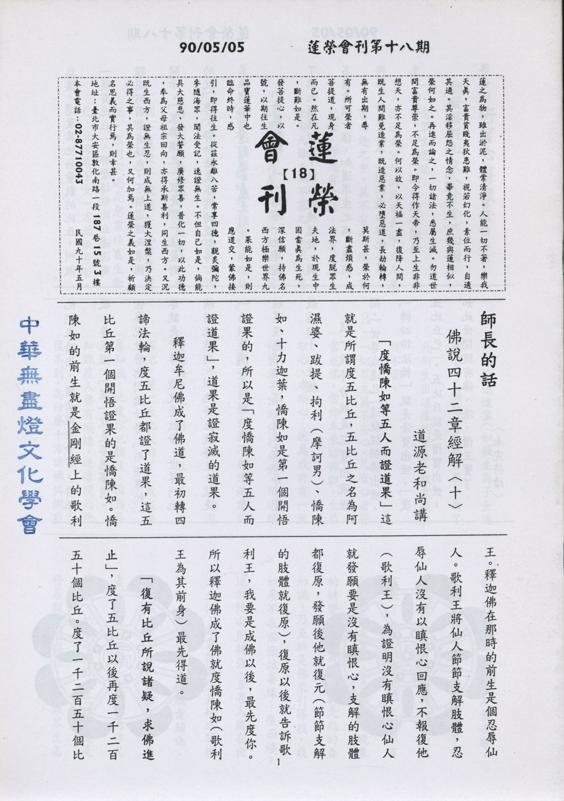

# 第18期

## 大德法語

### 佛說四十二章經解（十）

*道源老和尚講授*

「度憍陳如等五人而證道果」

這就是所謂度五比丘，五比丘之名為阿濕婆、跋提、拘利（摩訶男）、憍陳如、十力迦葉，憍陳如是第一個開悟證果的，所以是「度憍陳如等五人而證道果」，道果是證寂滅的道果。

釋迦牟尼佛成了佛道，最初轉四諦法輪，度五比丘都證了道果，這五比丘第一個開悟證果的是憍陳如。憍陳如的前生就是金剛經上的歌利王。釋迦佛在那時的前生是個忍辱仙人。歌利王將仙人節節支解肢體，忍辱仙人沒有以瞋恨心回應，不報復他（歌利王），為證明沒有瞋恨心仙人就發願要是沒有瞋恨心，支解的肢體都復原，發願後他就復元（節節支解的肢體就復原），復原以後就告訴歌利王，我要是成佛以後，最先度你。所以釋迦佛成了佛就度憍陳如（歌利王為其前身）最先得道。

「復有比丘所說諸疑，求佛進止」

，度了五比丘以後再度一千二百五十個比丘。度了一千二百五十個比丘後，還度其他無量數的比丘，叫做「復有比丘」。那麼這些比丘還沒有證道以前都有疑惑，不解道理而求佛開示。「求佛進止」就是那一法是對的就「進」，那一法是不對的就「止」。求佛開示應進則進，應止則止。

「世尊教敕，一一開悟」

世尊成了佛而應機說法，能以觀機逗教。與名醫看病一樣，知道眾生之病，應病與藥。所以應眾生的根機而與他（眾生）說法，所以一個一個都開悟。

「合掌敬諾，而順尊敕」

世尊教導他們一一開悟，在沒有開悟之前，他們來請法，請法就要合掌，要恭敬，要承諾，「諾」就是答應事情，世尊說什麼他們聽什麼。「而順尊敕」尊就是世尊，敕就是敕命，世尊叫他精進就精進，叫他停止就停止，就是「而順尊」。講到這裏，四十二章經還沒有開始，這一段算是序分，是敘述四十二章經。

這一段序分就是三寶出現世間，「世尊成道已」這就說明佛出世，「轉四諦法輪」就是法寶出世，「度五比丘已」，五比丘就是僧寶出世，如此世間就有佛、法、僧三寶了。〈未完待續〉

## 共修研學

### 勸發菩提心文（十八）

*心爾*

五、念眾生恩故：

１、從過去父母的角度去看，天人鬼畜四趣之中，莫不有之，做人有父母，作鬼有鬼母、畜有畜母，天有天母，莫不有之，念眾生恩的第一個角度，就是他做過我父母，看一隻螞蟻報恩的感覺就出來了。除非不相信輪迴無始，因為輪迴是無始的，是無盡的，看到一隻蚊子飛過去也要尊重牠。眼前不過是惡業作畜生而已，父母養子女一方面很辛苦，一方面還造業（如殺生為子女進補等），因惡業感應苦果，為了我而生出這樣的苦果，我竟然坐視不管。

２、一切眾生莫不有心，凡有心者皆當成佛，當作未來諸佛觀，生恭敬心，孝順心，因為或許有一天他能浪子回頭修行成佛，回過頭來接引你。你因為不相信他比你強，不相信他的潛力，任意的怠慢他侮辱他，與之對立，甚至迫害他，有一天他成佛了，或成為善知識，他度你也難度，因為善知識度人要有順緣，逆緣現起他度不到。為什麼十方諸佛憐憫我們，我們卻跟釋迦牟尼佛有緣，而且與釋迦牟尼佛所流傳下來的教法，以及代代相傳的善知識有緣？他們（善知識）雖然有願，但我有業，在各類生命現象的轉變當中，或許他就是我的善知識，乃至於是佛來引導我，我如果不在前面結善緣，後面修道的障礙則轉強，且吾人能在世上生活，都靠彼眾生直接或間接資助，如何發展彼此親愛關係，與用報其恩，四十二章經云，老者，應作父母觀，少者，應作兄弟觀，幼者，應作子女觀。這是發展親愛的關係，我要跟眾生怎樣結善緣講。若以報恩而論，眾生有很多的恩，他一定有做過我前世的父母（因輪迴是無始的），眼前雖非我父母、親人，然亦對我有恩，吾之衣食住行得靠他們的分工合作，才有我的衣食住行。即使他成為我的逆境，在逆境挫折上也會增上我的忍辱度，堅固我的悲願，穩定我的持戒（受彼示現而自我警惕故），成佛的恩在眾生，彼之大恩我怎麼可忘記？怎麼可以不管？看到眾生如同一家人的親愛關係，更深處乃決定彼為我大恩之母親，見彼非常悅意，如見唯一的愛子一樣的歡悅，這是講得更深入，慈悲意樂油然而生。我見三界是牢獄時，我也希望他能調整看法將視三界視如牢獄，將生死看成寇讎，將煩惱看成冤家，就像母親得到好東西時都很想與子女分享一樣，當我有美好看法時，我樂於把這看法給他，讓他有這樣的覺受叫慈悲，所以有出離心才有慈悲心（自生出離心幫助眾生引發出離心才是真正拔苦與樂）。

菩提心發起之因緣有十：

在外緣上我要這樣看，外緣分為五種，佛、父母、師長、施主、眾生，見彼之大恩而思報答，依之而發菩提心必能報答，除此之外則無法。於內因上看到自己的生死苦待解決，自己的業障待懺除，以及自己的潛能待激發，如何往生淨土以成佛，如何令正法久住以利益眾生，若能發菩提心，這些都能成就，除此之外亦無其他辦法。

以上講法分五緣、五因；另一講法為此十條皆為吾之所緣境界，能緣為我，所緣為十，而發菩提心。（未完待續）

## 專題研學

### 十大礙行（三）第二條

*心筑整理*

「處世不求無難，世無難則驕奢必起，驕奢起必欺壓一切，了難境界，體難本妄，難亦奚傷，以患難為解脫。」

以上是十大礙行第二條的經文。第一條指的是生理上會遇到的障礙，而從第二條開始，就是在外面遇到困難，心裡面所產生的種種障礙。

我們處在這個世間，大環境對我的影響，甚至每天所面對的生活、環境、學習、辦事情以及在這當中的人情世故等，這都是處世的內涵。而如何面對處世時所產生的障礙呢？妙叶大師告訴我們遇到困難的時候，要用正確而積極的心態和方式去解決困難。總括來說，處世一條可囊括後文所有的障礙，但此處專就大環境中可能遭遇的障礙而加以闡述。

讓我們來回顧這幾年台灣所發生的災害，去年十一月一日，象神颱風肆虐全台灣，更使台北縣的汐止居民遭受空前的浩劫！那次的水災共計七人死亡，六百公頃以上商住區淹沒，民間損失至少數十億元，所有的活動一律停擺，家家戶戶唯一能作的便是努力清除污泥和已泡水的家具等。

猶記得民國八十八年的九月二十一日凌晨一點四十七分，在我們以為安定富足的台灣中部，發生了七點三級的大地震，頓時間山河變色，那次的災難，喪生人數超過一千二百人，許多民眾失去親人、朋友以及努力經營的家園，甚至本身受到嚴重的傷害。

而我們現在生存的這個地球上，有沒有可怕的戰爭發生呢？在中東地區，以色列、黎巴嫩及巴勒斯坦等國為了土地、民族等互相爭奪的戰爭，到目前為止，就算各國已經簽下停止戰爭的條約，但是恐怖份子仍然不時投擲炸彈，而使得生於中東的人民每天生活在恐怖之中。

甚至在這個世界上，每天有兩萬四千人死於飢餓，而其中的四分之三是五歲以下的兒童。戰爭使得原本的經濟基礎已蕩然無存，人民貧困潦倒。乾旱或是洪水，加上氣候的寒冷或酷暑而造成傳染病的肆虐等等，釀成了世紀飢荒，因為無法供給食物以及戰區缺乏妥善的醫療照顧更加速人民的死亡。

這些處在危難當中的人民，離我們只是咫尺之遙，沒有人能保證自己一輩子都不會遇到危難，而能安然的避免，故有智慧的妙叶大師，告訴我們處在這世間要不求無難，因為災難無時無刻不出現在我們身旁。

但是沒有遇到災難的我們，卻總是以為這些災難必定不會降臨在我身上，傲慢而不尊重他人。佛經上說，慢心是根本煩惱之一，意思是以為自己很厲害而在心理產生一種高高在上的感覺，這種奇怪的優越感，造成我們自以為困難只會發生在別人身上，而我所遇到的境界永遠都是順利而美好的，無形當中便表現出得意忘形的樣子。更因為沒有遇到任何困境而不懂得珍惜現有的資源，養成奢侈浪費的習氣。

就像我們人類，因為不愛惜大自然，不知道好好珍惜現有的生存環境，大肆破壞（砍伐熱帶雨林、水污染、空氣污染、核子試爆及使用化學物質造成的臭氧層破壞等）而衍生出許多災害，如土石流、地球沙漠化、龍捲風及溫室效應等等，這都是大自然反撲的力量，是我們自己所造成的災害。

這樣看來，每件事的發生，都有其因果關係，所以當我們遇到困難的時候，不要老是以為自己很倒楣而怨天尤人，要知道困難的發生，必定是有其原因的，障礙既然現起，心平氣和的接受它，然後解決它，最後放下它。困境可以幫助我們更珍惜身邊所擁有的一切人、事、物，用更謙虛的心態去面對境界的考驗，逆境不但沒有傷害我們一絲一毫，更使我們在這當中學習與成長。只要善用我們的心態，不管遭遇多大的困難，都一定能夠在這當中不受逆境的束縛而得到真正的自由與快樂，因為有這些美好的概念，使我不再逃避困難，轉而喜歡境界給我的考驗和磨練。（下期待續）

## 蓮池海會

### 黃劉戊妹老居士往生見聞記

*編輯部整理*

黃老太夫人生於民國前十四年桃園縣南崁鄉一處農莊，在家中排行老么。從小老夫人即因為格外地乖巧善良、聰明董事又善解人意，因而倍受整個家族中長輩親戚的疼愛與呵護。等到長成花樣年華之際，聽憑父母之命嫁入中壢的黃家。當時黃家是個典型的大家族，老夫人嫁入黃家之後便十分稱職地扮演著傳統的賢妻良母之職，相夫教子，毫不懈怠。由於丈夫身為水利工程師傅，長年需在外勞苦奔波，老夫人於是母兼父職，毅然地一肩挑起照料打理龐大家族的日常生活諸事及繁重的家務。面對質這般沈重的負荷與壓力，老夫人卻絕口不曾喊累，反而永遠只是默默低著頭，揮著汗而任勞任怨。

此外，老夫人生性好施，在早年每逢乞丐沿街討食，對於這種特別不幸的人，老夫人從未嫌惡其外表的骯髒與不堪，反而熱情地招待，老夫人用食後，再給予金錢布施。若遇身有殘疾無法謀生之人，老夫人便掏盡身上所有的錢，窮盡己力地給予救助。這樣的賢能淑德與善行懿德因而倍受街坊鄰里的肯定與好評，甚至廣傳為鄰人親族茶餘飯後的一樁美談佳話。

而老夫人總是為了減輕兒女的負擔，親自為他們張羅打理日常生活，總是見她頂著烈日，一邊肩挑滿滿一大籃衣物，一邊擔荷著種菜用的水肥，不僅將自己家族的衣物清洗得潔淨異常，更熱心地幫助鄰人洗好衣物，洗完衣物後，還得趕忙返回家中整理菜園，澆水施肥，摘些蔬菜供家人食用或貼補家用。

又因為生性十分克勤克儉又吃苦耐勞，有任何好吃好穿的，總是捨不得自己花用而全部供應給兒孫享用。老夫人總是竭盡心力，盡己所能地捍衛著親族與家園，用滿滿的愛心來灌溉著自己親愛的家人與兒孫。由於老夫人的慈行懿德，其後輩子女兒孫們皆能謹守教誨與本份，繼續不斷地將此種美德綿延下去。

老夫人的福報與因緣，使其在臨命終時蒙後輩子孫齊力專注誠摯地為老夫人助念，許多子孫皆親眼見證往生的老祖母示現出難得可貴的瑞相，老夫人蒙佛接引，在一朵燦爛盛開的清蓮中，含笑而往生西方極樂世界。

老夫人一生功德圓滿，往生彌陀淨土，而其所留下的風範與美德，鮮明地活在每一位後世晚輩的心中。

## 啟蒙園地

### 因果故事 — 捨己救人的媽祖（三）

*編輯部整理*

靠海吃海唯行助

莆田縣的民眾，大多是捕魚為業的漁民，默娘的父親林惟愨，當時擔任維持海上治安的巡官，負責防止海盜，保護漁民的安全，所以當漁民們出海捕魚時，林惟愨一定要率領巡船在海上巡邏的。

秋天的九月，正是捕魚的季節，漁民們都要出海捕魚，請求林巡官率領巡船保護，默娘聽說漁民們要出海捕魚，向外面正南方的山尖上看了看，向父親說：「爸！今天有颱風，不能出海捕魚。」林惟愨走下臺階，向漁民們懇切的說：「今天確實要刮颱風，南山頭上不是起了捲雲嗎！萬一大家有了不幸，我怎麼對得起你們呢？」

可是漁民們為生活所迫，無論如何不聽勸告，一定要下海捕魚，林惟愨受了漁民們的包圍，只好點頭答應。默娘再向父親勸告說：「爸！今天一定有颱風，去不得的。」林惟愨說：「他們都樂意下海，我吃國家的飯，受國家的祿。職責所在，我怎能不以性命保護他們呢？」默娘知道父親的脾氣，也不便再勸解。

當林惟愨率領漁民們出發時，默娘囑咐漁民們說：「倘若今天的天氣有了變化，你們在大海中迷失了方向時，請你們觀看火光，那裏有火光，你們就儘速航向那裏去！」是日，城民都下海去了，莆田縣城走了三百多漁民，空虛了許多。真的，當天漁民們出海捕魚不到五小時，颱風就來了！

狂暴的風雨，襲擊著莆田縣城，雨注像一塊塊整體，不斷地從天上掉下來；灰濛濛的天色，看不到邊，看不到岸，浪濤中的漁船，好像失去了生命的死雀子，被浪濤激盪著，被風雨打擊著，一下高，一下低，彷彿跌入深淵似的，失去了主導的駕駛力。漁民們狂喊了起來，他們呼救的聲音夾雜著狂風的聲音、暴雨的聲音、浪濤的聲音，是多麼的淒慘啊！

這時默娘從房中奔到院中，喊著女僕：「蘇珊！快！快把後房燃起大火來呀！他們一定迷失了方向。」蘇珊說：「六姑娘，我們怎能燒自己的房子呢！」默娘說：「我們不燒自己的房子，誰燒自己的房子呢？我們要拯救數百迷失了方向的漁民，只有犧牲自己的房屋！若不點燃房屋起火照明，他們就不知道往何處去呀！」

苦海常作渡人舟

蘇珊還是不肯照著做，默娘只得自己動手，她跑到後院，用一堆乾柴，把火頭升了起來，在雨水中冒著濃烈的黑煙，在狂風中火頭搖擺著伸向了天際，火劫狂烈，火聲呼呼響叫起來。默娘命蘇珊把鄰居的婦孺們叫出屋外，自己直向海岸奔跑。默娘奔到海邊，跌倒了六次，她全身污泥，身上的衣服全濕，她喘吁著。

這時狂風暴雨黑暗中的漁船，幸而看到了火光，獲得了一線的光明，大家喊著說：「那邊有火光，是六姑娘給我們點燃的，火光處就是岸，我們向火光處駛，向火光處游。」大家在苦難中，獲得了光明，生命有了希望。

突然間，有一隻斷了纜的漁船，被海浪沖到岸上，沖到默娘站立的近處，默娘躍入那條破船中，給海浪捲走。數百漁民循著火光都到了岸，獲得了生命，可是他們再也看不到，拯救他們生命的默娘。

清淨莊嚴累劫修

忽然天空中出現了一道紅光，觀音菩薩在紅光中，攜著默娘向西方的天空中冉冉上升。（全文完）

### 弟子規　總敘（二）

*願度整理*

「汎愛眾而親仁」是說我們對於大眾要平等對待，並且隨緣隨份的予以愛護。首先可以把自己當成佛菩薩，從這點出發便會很在意佛菩薩對眾生的心態—對眾生要慈悲、要平等護持，去掉自己的優越感及瞋恨心，如此一來便可對治自己貢高我慢及不慈悲的惡習，我們可以從人開始做起，接著下來是對一般的動物例如狗貓雞等，再進一步來說甚至連家裡令人討厭的小動物如蚊子、蒼蠅、老鼠我們也可以這樣串習自己的慈悲心，去除自己的忿惱心；這樣的做法看起來似乎很難做到，其實不難，因為我只要把自己定位成人才的話，我就會很願意接收栽培與培養，到最後我就會確實的成為一個人才，所以對自己的期許是非常重要的，它可以說服自己去克服很多不可能的瓶頸。若要把自己當成佛菩薩，其第一步就是必須在面對師長、事情、眾生時先想想釋迦佛、阿彌陀佛乃至雪公太老師來了他會如何處理，他的心態是利他的、心力是盡上十分的、作法上是力求完善的，進而一步常常反省我的所作所為是否能符合他們的要求，若自己能無愧的話就觀想他們都會空中點頭同意我的作法，放光加被，這些都是憶佛的行相，從這當中升起一個想要成佛的決定見。

至於「汎愛眾」的第二個角度是我們必須把眾生當成佛菩薩一樣來看待；曾經有一位物理老師，他班上有幾位同學的物理成績很差，但他不再因為執著他學生的物理成績，而把他們看得很差，並且把這些同學看得很可愛，覺得這些學生到底是如何去想這些物理問題，一定和自己的角度不同，一定很有趣、很可愛、很奇怪，因此常常就自想自笑，他身旁的同事還以為他班上的成績考得特別好呢！從此以後，他就覺得每一位小朋友都很可愛、很活潑、很天真；只要有一位小朋友幫忙關掉電燈，他就覺得這位小朋友好乖、如此的惜福、很節省，於是老師就很誠心的去讚美、去讚同學生，學生被老師讚美後就引發了善法欲，便很願意和這位老師一起相處。約內來說我們必須期許自己是佛菩薩，就會成就佛菩薩的行為；而約外來說，我們必須視眾生為佛菩薩，就會以尊重、供養的心態去對待眾生；這兩者合起來就會成就「汎愛眾」的內涵。

有了兩種心態上的確立，再由事項上觀到眾生的苦與眾生對我們的恩而產生一個非得度他的決定見，此決定見必須落實在作法上了；首先我們必須先具備幫助眾生的能力，有了能力就可幫助眾生解決問題、並藉此結下善緣作為引導眾生的基礎；再來眾生作善時我們要隨時隨喜，並且隨時準備在觀念上的提攜他、鼓勵他或實際上與他一起同甘共苦；第三是在與眾生相處時，要切實的從身口意上對治自己的煩惱習氣與惡造作，不會有炎涼的心態而諂媚、巴結眾生，要有相處的分寸｜口業上莫說他人的長短與揭發別人的私處而隱惡揚善、身業上不要動作粗魯而觸犯他人；從這些事項上看似利益他人，其實是利益自己，因為從約束自己、改變自己的煩惱習氣，到不侵犯他人，最後甚至完全的利益他人；事實上完全的為他就是把自己的缺點對治到最徹底，因為這當中完全沒有我要如何的概念，而完全是看到他需要我做什麼而已、我如何的去幫助他而已；當自私的我沒有了，我們的潛力就可以完全發揮了，發揮到究竟處就成聖成賢，結果我們會發現原來眾生都是幫助我們成聖成賢，我們成佛都靠他，沒有眾生就沒有佛，他們就是佛菩薩的再來，幫助我們的，他示現很壞的地方是在警惕我們，他示現很好的地方是在引導我們，眾生即是佛菩薩的老師，立志成佛的菩薩要以眾生為老師，從這個角度來看「汎愛眾」是非常重要的，眾生是有恩於我、要幫助我成佛，自然我會欣賞他的優點，並且以他的缺點來警惕自己，共同改進；這樣就會縮短距離、融合相處。

我們要在孝弟、謹信及愛眾方面去努力實踐，就應該要親近有仁德的善知識。因為在未親近仁者建立正確的知見時，我們都會認為自己其實已經不錯了，我很善良、很孝順、也會布施濟貧、造橋舖路、不打人、不罵人、也很少殺生，心好就好了，後來聽了老師的開示才知道自己可能所謂的造善其實都是造惡也不知，而所謂的孝弟、謹信及愛眾也可能是錯誤或夾雜煩惱的，所以必須親近有仁德的人來框正自己的觀念，那如何來選擇一位自己親近的仁者呢？仁者一定是在孝弟、謹信、愛眾上確實力行的，而他也能讓我們力行這些德目，在抉擇觀念時他能夠讓我們有正確的決定，去無明（顛倒的取捨），取明（正確的取捨），所以我們能在孝弟、謹信、愛眾當中去取法、捨非法，什麼樣叫孝、什麼樣叫不孝？什麼樣叫弟？什麼樣叫非弟？都需經過善知識與教法的決擇，我們根據他們的教授來練習這樣的眼力與智慧。從前曾子不小心把疏菜的根拔斷了，其父親怒而打之，曾子被打得昏死過去，後來曾子去見孔子，孔子認為他不孝而不見他，因為孝的形相是大杖則逃，小杖則受，舜即是如此。所以我們沒有取法捨非法，我們都會認為自己心好就好，我們沒有殺人放火，我們奉公守法，不貪污、不舞弊，我們應該是君子賢人，熟不知在世間的我充其量只是一個好人，好人要變成善人、君子、賢人、聖人、菩薩與佛都要學，而要學就一定要靠老師，所以要「親仁」。

我們從凡夫地的修持到佛果的圓成，就是內聖外王兩門學問，內聖就是好好調理自己的身心、充實自己的內涵；外王就是能夠來統理大眾，這才是整個大學之道，大學之道就是成佛之道。要統理大眾之前，先要統理自己，也要知道大眾的情況，方能講求效果，作事情會更有效率。可是「內聖外王」的學問都必須仰賴「仁者」的提攜與教授，所以我們就一定要向「仁者」學習，並且要講求親近的心態與作法，才能在「親仁」的過程中得到最大的效益，就如觀音菩薩的因地「侍多千億佛，發大清淨願。」（下期待續）

## 參訪觀摩

### 雲南參訪放生心得分享

心崇

從中甸一路顛簸，在有驚無險的情況下，來到德欽，已接近黃昏，晚齋用畢，屋外一片漆黑，海先生邀請我們到他家，從飯店走路到海先生的住家，沿途沒有路燈，此時除了右邊的溪水聲外，萬籟已俱寂，馬路中央有幾條沒有加蓋的小水溝，三十幾位蓮友靠一支手電筒，走得很慢，深恐踩空摔倒，到了海先生的家，大家齊聚在佛堂，由老師帶領大家做晚課後，聆聽海先生學佛的因緣，受益頗多，在返回旅館的途中，為了怕踩到小水溝，走起路來戰戰兢兢、如臨深淵不敢大意，此時前方傳來黃學長的叮嚀，提醒大家小心有水溝，此時心上的負擔突然減輕，一股暖流同時湧上心頭，讓末學體會到弘一大師三寶歌的第一句話：「人天長夜，宇宙黯闇，誰啟以光明，三界火宅，眾苦煎迫，誰濟以安寧」。漆黑的寒夜中，走在前方的善知識，給予的提醒與指導是多麼重要啊！就如同佛陀在漫漫長夜中引領我們走向解脫的路，是最快速也是最安全的，因為佛陀已經走過這條解脫的道路，所以是我們值得依靠最佳的導遊，如同我們從來沒有到過德欽，只有依靠司機及導遊，才有辦法到達的。

在一片白茫茫的雪山啞口，我們看到一幕以前從未看到的景象，海先生與老師相擁而泣，當時末學很難體會出他們的心情，回台灣後，回味十三天的旅程，才逐漸體會出一點點。在台灣只需要打開水龍頭，自來水源源不斷流出，在德欽才能深深體會水、電的重要，水要靠人力從溪流中一筒一筒提上來。在台灣想學佛法是很很方便的，打開電視有法師開示，在各個道場，都有許多經書與大家結緣，想聽佛法的開示，也不是難事，想參加佛七，只要自己的時間允許，也不是很困難。由於佛法得來太容易了，反而對於善知識及佛法很難升起希求心及恭敬心。來到德欽，才能體會到佛法難聞，善知識難遇，學佛團體難求的狀況，海先生為了學習佛法必須請假三十天，花費二至七天的時間至西藏依止善知識，旅途的辛苦與危險，飲食的不適應，再加上所需的開銷，真的是很難想像。

旅程的最後一天，從澳門搭乘遠東航空班機，抵達中正機場，劉學長與末學走在電動走道上，只要輕鬆走動就比走道外面快步走的蓮友還要快，劉學長說了一句讓末學很受用的一句話，他說：「自力加上外力，速度比只靠自力的快得多」，依止善知識就可以獲得外力，進步的速度自然比只靠自己摸索來的快，譬如老師行前用心準備的放生手冊，其中有憨山大師的「放生功德記」，迦葉尊者的功德，及虛雲老和尚的功德，都是末學以前從未聽聞過的，在不費吹灰之力的情況下聽聞受用，非常感恩老師的用心。

在行程開始之初，老師先讓大家要有「思想準備」，對於自己：要學習買生物及放生的注意事項，對他：要觀察同行的善行，作為自己學習的榜樣，對境：遇到不如意的境，如旅途的奔波勞累，吃飯、休息有可能無法定時，希望能夠互相包容，相忍為安。藉由放生及參訪道場提昇大家對佛法的受用。

老師盡量利用各種機會應機說法，在遊覽車、遊艇、餐廳、旅館的會議室、寺廟，都是活動的教室，讀書是為了開悟，走萬里路也是為了開悟，運用各種外境來體驗宇宙的道理與人生的真相。

這次參訪放生回國之後，許多難忘的記憶，一直在腦海中迴旋，虛雲老和尚跋涉山水的影像；老師忍著胃痛，主持餘興節目的影像；劉師姊不顧自己身體的不適，捲起褲管，走下溪流放生的影像；黃學長的腳掌被水底的玻璃割傷，依然不受影響的影像 ……..，未來當末學遇到障礙，無法突破時，希望腦海馬上浮現的不是自憐自哀的影像，而是浮現所有善知識努力克服障礙的影像。

旅程的圓滿，絕非偶然，有許多默默工作的學長，為整個活動貢獻心力，為表達對這次參訪放生活動所有參予幕後工作人員的感謝，謹以末學的受用作為供養，並請老師及學長不吝指教，是所企盼。

### 葉性文老師參訪記（上）

*編輯部整理*

葉老師是台北念佛會早期創辦的前輩，老師在念佛會的發心是有目共睹的，團體共修的軌則、印祖科判的彙整、助念的規則與章程都是由他整理與修訂的；他本來身體很健康、學佛也很順利，因為他認為要遇到善知識不是簡單的，除了宿世要有願力以外，還要結善緣，若光有善緣，可以與善知識建立良好的關係，但都不會向善知識求法。若有願力而無善緣，則雖有心求法，但卻與善知識無緣相遇。所以為了聽　雪公太老師講經，而把台北的工作辭掉到台中去，但是在台中上班的日子，平常不加班，一遇到雪公太老師星期三晚上要講華嚴經，他的公司就常常加班，人已經到台中去了，還尚且聽不到經，最後沒有辦法再持續，便把工作辭掉，回到中壢。

葉老師對念佛會的公事是非常盡心盡力；後來身體上有了病變，特別是肝癌及一種怪病｜漸凍症，這是運動神經退化，退化到四肢是不能動、舌頭僵硬甚至喉嚨吞嚥食物與飲水非常地困難，在我們來說吃一頓飯、喝一口水是一種享受、很簡單，可是對他來說，吃一頓飯是受盡千辛萬苦；當我們正在揀擇我們要吃什麼食物、怎麼烹調最好吃、我要喝……、這個我不要吃的當下，葉老師卻要想用什麼樣的姿式把水吞下去而比較不痛苦，就如同餓鬼道的眾生要把一口水吞下去的困難，淺一點來說可以類比當我們嚨喉發炎的當下，吞嚥的困難，希望自己都不要吃東西，因為吞下去時，我們口腔的嫩肉就像被刀割一樣。可貴的是他透過為公的誠意與實在的修行，能將宿世的惡業在這時候成熟，或者就像西蓮淨苑的智諭老和尚一樣，示現病苦不改修行風範，引導眾生對人生有真實的體驗，也了解佛法實修的行相。

老師在病苦五、六年當中，都需要師母來幫忙，師母原來是不能突破這種無助與憂愁的心情，而是被老師很開朗的心情，且不隨境轉的高超心念感動，所以師母也變成一個很樂觀、很豁達、很放下的人。當我們去到他家的時候，看到他與師母的表現，大家是先哭後笑，先哭就是很感動，後笑就是葉老師與師母給我們的歡樂，尤其難能可貴的是師母能依照老師模糊的話中慢慢根據老師的嘴形給我們大家翻譯老師正在說什麼；不管如何，我們非常欽佩師母，師母這種內涵、質地以及用心體會先生到這種程度，其實就是印祖所講的倫敦盡份，她是中國典型婦女最佳表現，在這種待候病苦毫無生趣的日子，她卻甘之如飴，與先生共修共學，非常值得我們學習；三小時的相聚中綜合葉老師對大眾開示的重點歸納如下：

一、在未生病之前很努力學佛，可是在病苦的時候對佛法的認識更深了，譬如說看到佛菩薩的形像時，非常有覺受，看到佛身上所披的一縷袈裟，可以看到無量無邊的功德，乃至於每一毛孔之中所放的光，每一道光都有無量無邊的功德。能夠看到佛像及聖者之像是多麼大的福報啊！但我們一般人都沒有這種覺受，所以在家裡供茶、供燈、供香時引發不了誠意，敷衍了事；就算不是敷衍了事，從供茶、上香當中也看不出佛具足這麼了不起的功德，像我們這種累劫的供養都比不上佛菩薩一毛孔的功德，但我們卻自以為已經很不錯了，皮毛的修行與供養卻挾著強盛的貢高我慢與自以為是，若沒有這些障礙的考驗，修行的瓶頸是永遠無法突破。

二、老師家裡的佛號廿四小時不斷，在聽佛號聲時，每一句都聽得很清楚，每一句藉著風從前面飄到後面，觀想把佛號布施出去，佛號飄到那裡就利益到那裡，讓無量無邊的眾生都得到佛號的受用，若少聽了一句佛號，少布施一句佛號，無量的眾生就少了無量無邊的利益，老師對佛號的體會即是如此。他說我們總昐望金光熠熠的佛出現，若沒有這種感應就會很遺憾，其實這是佛以色塵跟我們見面，殊不知我們所聽的佛號是佛以聲塵與我們見面，當我們聽到阿彌陀佛的佛號是不是確認阿彌陀佛就已經來了？或在我們的頭頂加被、或在我們的周圍護持，我們是否有這樣的覺受來聽這樣的佛號、來念這樣的佛號呢？佛名是「名以召德」，「名以召德」是說念了這樣的佛名就能夠攝持這樣的佛德，特別也引曇鑾大師的往生論注中說「名能夠攝體，名能夠攝持義」念佛名其實就是攝持佛的功德，當然自己的善根福德得到極殊勝的增長。

三、至於對佛經的體會，老師也是慢慢地愈讀愈讚嘆佛法的義理廣大無邊，愈讀就愈覺得自己的渺小，愈讀就愈覺得不懂佛理，就以法華經為例子，法華經講到大白牛車、牛車、羊車、鹿車，智者大師讀到這裡依譬喻能夠悟入五乘佛法，大白牛車講的就是一乘佛法，乃至於大白牛車所運載的內涵，天台大師都能夠知道大白牛車所指的意趣是什麼！佛法是很深的，乃至一句話、一個字都有無量無邊的內涵；如彌陀經云，眾鳥演法，聞者皆悉念佛念法念僧，為什麼在極樂世界眾鳥演法的時候可以懂得念佛念法念僧，而在娑婆世界卻不會念佛念法念僧呢？再說觀無量壽經講九品往生，在無量壽經上也說三輩往生，彌陀經有沒有說到幾品往生呢？經文沒有可是經義上卻有，四色的蓮花就是講到品位的高低；乃至眾鳥演唱三十七道品｜五根、五力、七菩提分、八聖道分，可是卻少了四念處、四正勤，那到底是怎麼回事呢？諸如此類，真的愈讀佛經愈知道含藏義理是無量無邊的。

四、尤其從佛經的義理中產生了對佛的信心、對佛號的信心、執持佛名的決定見，不論在任何的場合、任何的逆境、任何的挫折，葉老師都不會被境界所轉，因此我們可以從他身上體會心不隨境轉是什麼樣的表法，而且從他身上看到了不可思議。佛法的不可思議不是法自身可以表現出來，古德說「人能弘道，非道弘人」人才能把道表現出來，籍著他才可以把心不隨境轉的法相表現出來，我們因此便可以看到原來心不隨境轉的行相，這不只是在經文上說說而已，所以佛法若籍著這些有道的人來表法，佛法是絕對不會亡的；由於這些人努力的表法，他們就能帶給我們台灣莫大的福報，也因此讓我們台灣在風風雨雨當中能夠渡過很多的困難以及打擊，在國際上是一個奇蹟，當然我們不否認士農工商對社會的努力是可貴的，但是我們有沒有想過奇蹟不是政客的努力，也不完全是士農工商的各司其職，倘若沒有這些很有道德的修行人，他們福德的加被，光憑一般人的努力是沒辦法克服這些困難的；所以我人更能相信這等有發心為公、發出菩提心執持名號的人是我們眾生的福田。

五、葉老師從來不覺得他的病痛是苦，因為他看到地藏經裡面所描述的地獄劇苦，回過頭來看看自己，若還覺得自己的狀況是苦，就是沒良心！而且還告訴我們：　雪公太老師曾經說過天底下是沒有冤枉的。換句話說，葉老師對自己目前這種狀況覺得一點都不冤枉，他對因果的決定見、對業果的信心可以信到這種堅定的程度！我們在勸別人的時候總是這樣勸，但發生在自己的身上時這種觀念可以說服得了自己嗎？自己會同意這樣的概念嗎？自己會接受這樣的安排嗎？

他說他從來不跟佛菩薩祈求，因為他說他的心願、他的祈求未必是最好的安排，因此他完全交給佛菩薩，佛菩薩的安排最好，包括他現在—疾病纏身、不能自由、如同廢物，他仍覺得是佛菩薩的好安排，所以將他的身心都供養給佛菩薩，由佛菩薩來安排，其實這就是一個皈依的究竟相，因為皈依的最究竟處就是皈命，皈命就是能夠將身心世界供養佛、聽佛的安排，佛要他死他就死、要他活他就活，要他受苦，他就受苦，葉老師完全觀想由阿彌陀佛的安排。他說天底下的事情很多都是不可思議的，誠如他爸爸與媽媽的往生都超乎他的想像；過去他對他祖母很煩惱，結果他的祖母安然往生，因此他覺得煩惱是多餘的；所以後來從他爸爸到他的媽媽往生的時候，他都完全交給佛菩薩，而他最重要的就是要好好的護住他的善心、穩住他的修持，所以他的媽媽也是得到最好的安排，安然往生。因此他相信人不要追憶過去、不要盼望未來，因為這都是非份的妄想，最重要的是活在當下，我們當下都不能掌握了，還有什麼能耐去指望未來能現起什麼，當下我們都不能掌握了，那我們的回憶過去是做什麼呢？這種回憶都是一個無用的回憶，所以活在當下是一個很重要的修行。（未完待續）
