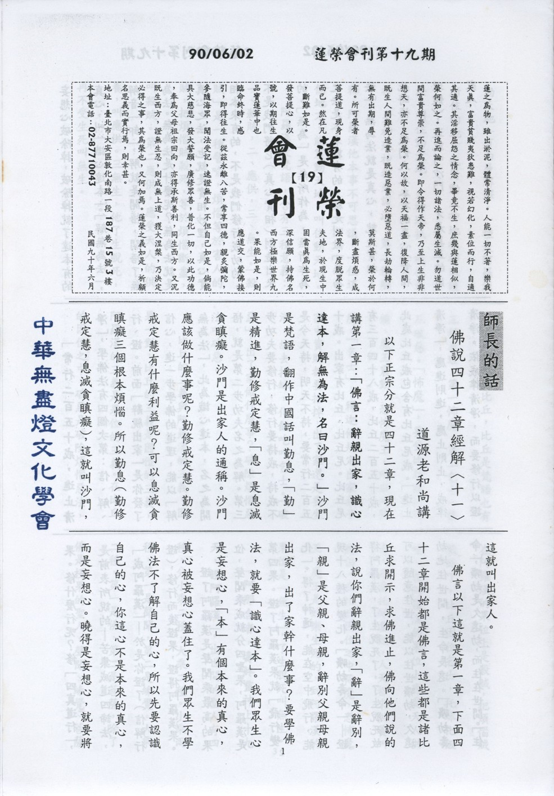

# 第19期

## 大德法語

### 佛說四十二章經解（十一）

*道源老和尚講授*

以下正宗分就是四十二章，現在講第一章：

「佛言：辭親出家，識心達本，解無為法，名曰沙門。」

沙門是梵語，翻作中國話叫勤息，「勤」是精進，勤修戒定慧，「息」是息滅貪瞋癡。沙門是出家人的通稱。沙門應該做什麼事呢？勤修戒定慧。勤修戒定慧有什麼利益呢？可以息滅貪瞋癡三個根本煩惱。所以勤息（勤修戒定慧，息滅貪瞋癡），這就叫沙門，這就叫出家人。

佛言以下這就是第一章，下面四十二章開始都是佛言，這些都是諸比丘求開示，求佛進止，佛向他們說的法，說你們辭親出家，「辭」是辭別，「親」是父親、母親，辭別父親母親出家，出了家幹什麼事？要學佛法，就要「識心達本」。我們眾生心是妄想心，「本」有個本來的真心，真心被妄想心蓋住了。我們眾生不學佛法不了解自己的心，所以先要認識自己的心，你這心不是本來的真心，而是妄想心。曉得是妄想心，就要將妄想心破除掉，破除掉就了達本有的真心，叫「識心達本」。「解無為法」，解音「卸」，解就是開悟，開悟了無為法。無為法是什麼呢？無為法就是真心之法，也就是實相妙理，真心實相本來有的，不是我們修行成功的，不是我們將它（真心實相）創造出來的。「無為」是無所作為，無所作為之法是本來就有的，就是叫做「無為法」，無為法就是真心，就是實相。此時悟了我們人人本有的真心（實相理體），這就叫沙門，才是真正的出家人。

「常行二百五十戒，進止清淨」

，學佛法有四個次第：信、解、行、證。前面「辭親出家」是你發了信心，進一步學佛的道理，能以「解無為法」，此為識心達本，名之為開悟，就是第二步功夫名之為解。第三步功夫要修行，修行要持戒，持戒不是今天持，明天不持，要常行二百五十戒。出家有比丘、比丘尼。比丘尼有三百四十八戒，比丘二百五十戒，此處比丘戒包含有比丘尼戒。「進止清淨」，應進則進，應止則止，戒律清淨。依戒律清淨，而要修行以證果。修什麼行呢？修

「四真道行」

，是前表所說的—苦集滅道四諦法，

「成阿羅漢」

—於是你證了（信解行證），修行而後證果，證得阿羅漢果。

證了阿羅漢是聲聞乘最高的果位，聲聞乘成就分四聖果，阿羅漢是第四果。證了阿羅漢果就

「飛行變化」

。得了神通，能在空中飛行，能現十八種的變化。

「曠劫壽命」

—證得阿羅漢，了生脫死了，了生脫死故可以隨意住世，能以住世曠劫，久遠劫地住世間，生命長遠。「曠劫壽命」，曠劫是久遠劫，而住在世間。

「住動天地」

有兩層解釋，一種是阿羅漢所住的地方能驚動天神地祇都來護法，叫住動天地。天神地祇，祇也是神，天神地神都來護法。第二種解釋，阿羅漢他本事不可思議，一住這個地方，能震動天地，叫住動天地。

阿羅漢是梵語，含有三種意義：一、殺賊，二、應供，三、無生。「殺賊」是一種譬喻，煩惱等於害人的賊，把煩惱賊殺死，等於煩惱斷盡，叫殺賊。第二應供，應受天人的供養，叫應供。三無生，他了生脫死，再不受生死叫無生。

前面還說比丘，比丘是梵語也有三種義理，第一怖魔，第二乞士，第三破惡。「怖魔」，要受比丘戒的時候，魔王震動，恐怖魔王，所以叫怖魔。「乞士」—釋迦佛規定出家弟子家中資財都要捨掉，出了家還是要生活，故去托缽，化飯吃叫乞士。「破惡」，出了家做什麼事？破除煩惱惡法叫破惡。

比丘的三義與阿羅漢的三義，因果一對，比丘的三義是因位的三義，阿羅漢的三義是果位的三義。在比丘的因位之中，破惡是破除煩惱惡法，在阿羅漢的果位上是殺賊，把煩惱賊殺死了。比丘因位乞士，托缽化飯吃，在阿羅漢的果位上應受天人供養，不要托缽要飯，人天都來供養叫應供。在比丘因位之中怖魔，恐怖魔王，魔王是好樂生死的，到阿羅漢的果位是「無生」，了生脫死叫無生。〈未完待續〉

## 共修研學

### 勸發菩提心文（十九）

*心爾*

六、 念生死苦故

眾生有身，身為苦本，因為身體是酬償業的器具，是裝苦的器皿，宿世惑業結成苦果，由身來承受，且依身易起惑造業，故云身為苦本。眾生麻煩處為情執，依身處名為身見，所有的煩惱都從情執身見來，若內心深處不要戀身（緣身而戀），且知身為苦本，煩惱立刻減輕，若能不受其束縛，並依此而為修行工具，則生死可了。整個苦樂都是緣念身而有，若緣念身有正確認識，則能離苦得樂，反之則離樂得苦。一般學佛人身體舒服時佛法談兩句，身體不好時都不信了。換句話說都在緣念身沒有緣念佛，身體的變化使內心變化從佛法變成世間法。這變化與身體的變化有關，如此重點在身體，不是在佛法，若重點在佛法，就不會在意身體的變化，當一個人在意自身與家人時，一定不會在意他人（自私之人，如何為公發心）。因此很多人以為學佛沒有辦法，乃因有許多問題待克服，例如生活困難，外境挫折多，身體不好等等，所以沒辦法來學佛，其實佛法是來解決這些問題的，可是一般人確認為因為有這些問題，所以不能來學佛，然而佛法不能解決貧苦、煩惱、障礙等等，試問要佛法幹什麼？佛法就是要解決這些問題，且還有更麻煩的生死問題，亦要靠佛法來解決。佛法就是告訴我們內心要怎麼走，幫助我們破迷啟悟以離苦得樂，佛法是來解決這些世、出世所有問題的。死時風刀解體，四大分離，如牛剝皮時一樣，若有教法的覺受與紮實的修行功夫，這些生死苦現起時﹑境界現起時，引不了內心的貪瞋痴，不隨境轉，不受境界束縛，名之為解脫。修行力量很強時，苦一樣受，但內心的感覺卻變成很輕鬆﹑很愉快﹑欣賞我的報應，這叫解脫，念生死苦則要好好發心修行，否則這苦找上來，眾生那裡是對手，修行就是培養一個內心緣念教法的勇漢，念念都是上求佛道﹑心心不離下化眾生，注意力都在這裡，身體的各種現象﹑乃至依身而有的貧富貴賤夭壽都不是我的在意點，此即解脫。

七、尊重己靈故：

一念心名之「靈」， 一念心作用大矣哉，可以緣很深之理，與佛無二無別，也可以很淺與眾生一樣，懣憨無知！就看我們怎樣去尊重它﹑善用它﹑培養它﹑越善巧的培養它代表越尊重它﹑善巧的引導它﹑培養它﹑堅固它﹑增上它，叫尊重己靈。浪費它﹑輕視它﹑叫輕慢己靈，眾生十個有九個都是輕慢己靈，心緣念無謂的境界。我們都會很在意水龍頭一直開會浪費錢、很在意電燈一直用會浪費電、很在意亂花錢會浪費錢，但是忽略浪費心念是最大的浪費，所以每天沒事幹，不知要做什麼，心念在五欲境界裡亂花費，可惜一生空過，還枉造無邊罪業。晚上反省反省，自覺不錯沒殺人放火，可以安心睡覺，殊不知浪費一串串的心念，一生是一事無成，一錢不值，如此則可安睡乎﹖（未完待續）

## 蓮池海會

### 陳劍慧老居士往生見聞記

*編輯部整理*

陳劍慧（慧劍）先生，民國十四年農曆六月一日生於江蘇省北部泗陽縣之老陳玗，父陳海涵先生，母史廣才女士。劍慧先生為家中長孫，祖父命名陳永年。民國十九年冬六歲時，先生為土匪擄去為人質達三個月餘，天寒地凍，睡臥於地，從此胃痛纏身。民國十九年六歲入小學一年級，至三十二年十九歲時從高一退學為止，其間數度失學、留級，從末完成正式之初高中教育。失學期間曾依私墊讀少許舊學，如《論語》、《孟子》、《唐詩》、《易經》、《詩經》、《尚書》等，並自學舊詩寫作。

三十九年撤退來台，撤退前在舟山群島之岱山島皈依結識僅三個月的靜安老和尚，師賜法名妙悟，時年二十六歲，自此成為信仰堅定的佛子。

四十六年，第一本著作《天網》出版，乃以佛教事物為背景之散文小說集。四十八年以步兵上尉官階自軍旅退役，時年三十五歲。同年底以一百天完成「拜佛十萬」之修行活動。四十九年受聘任中央日報駐花蓮光復瑞穗地區之記者，九月起並任花蓮光復國小代課老師一年。五十一、二年間曾任佛教刊物主編。並參加國軍軍官轉業特種考試，獲「甲種人事行政人員」及格。

並受悟明法師影響，開始以生日為「母難日」，不度生辰，終日不食，為母親念佛迴向，同年為立法委員董正之主編之《民主憲政》撰「非洲專欄」。民國五十三年（四十歲），完成《弘一大師傳》，自資印行。五十四年起任《慧炬月刊》主編一年。

五十七年參加「國軍退除役官兵轉業初中教師考試」，獲得錄取，至台北縣淡水國民中學任國文教師，兼任私立東南工專學校國文講師四年。所著之《弘一大師傳》獲「中山學術文化基金會」之「傳記文學獎」。民國六十年通過教育廳主辦之「中學教師檢定考試」，取得高中國文教師資格，該年轉任台北市立高級商業職業學校（後改名為士林高商）國文教師。

六十六年出任某佛教刊物總編輯。此後九年主導出版眾多的佛學典籍。民國七十年寫（證嚴法師的慈濟世界）一文，後「慈濟基金會」要求集印成冊以廣傳播。七十二年結識苗栗大興善寺無藉藉名之大德尼，見其不受布施，不受人拜，大悲度人，深受感動，私淑其為弘一法師之外的另一位實踐佛教教示的導師。民國七十五年受慈濟證嚴法師之邀，出任該會慈濟文化中心及慈濟道侶雜誌社總編輯。七十八年，自士林高商退休。計自五十七年任淡水國中教師，服務教育界共二十一年。同年證嚴法師改組慈濟文化中心，十二月辭去中心之職務，前後服務於慈濟約三年。七十九年創辦《龍樹雜誌》。民國八十四年（七十一歲）創辦「弘一大師紀念學會」，以傳達弘一大師斷然棄絕繁華功利、淡泊寧靜、靜修苦行的正知正見佛教教行。

八十八年（七十五歲），自「弘一大師學會」理事長之職退休，離開了自十九歲起至七十五歲止，長達五十七年的正式工作生涯，但在家依舊為自己的信念勉力工作靜修。九十年三月二十六日，劍慧先生為釐清弘一大師俗家日籍妻子的真實姓名之謎，以虛歲七十七歲之齡，強壓不適已有數月的病痛之軀赴香港九龍圖書館連續工作四整天。返台後，健康急速惡化，乃入院檢查，病逝後醫院檢驗結果指出先生生前患有淋巴癌。

劍慧先生與佛教結緣甚早，十二歲時聽聞釋迦悟道事蹟，極為嚮往。幼年時便曾聽聞家中長輩演奏李叔同（息霜）編選填詞之樂曲及李氏出家事蹟。十五歲時因結識一位天台宗比丘而企圖出家未果。二十五歲在舟山群島扳依靜安老和尚後，決定戒除自十餘歲起即上癮約菸酒，開始大半生在家修行的佛子生涯，並自三十五歲起茹素，直至去世。除後半生虔敬獻力於破除功利、不論神通的正知正見的佛教外，劍慧先生中年以前頗為曠野不羈，嘗自謂「野生野長」，多次發表以鄉野、愛情、軍旅及早年生涯為背景的散文小說。五十八年由三民書局出版的散文小說集《水晶夜》即為其中代表。中國舊詩詞之寫作亦為其自少年以來長久不消的興趣。自六十二年至六十六年間多次在大華晚報「瀛海同聲」詩刊及其他園地刊載其舊詩創作，並教導台北市商的學生寫作舊詩。民國六十六年所寫以新法教導舊詩寫作的《入聲字簍論》一書，獲得第十二屆中國語文學會的獎章。先生雖篤信佛教，但對孔孟之訓有深刻的尊重。老居士雖長期從事文教工作，並先後有胃疾與心臟病纏身，但因少年鄉野生活與軍旅生涯之影響，在生活中對粗重之勞動一向勇於自任，直到六十多高齡還自任水泥工修繕家居。

劍慧先生有強韌的毅力和果斷的決心，遇事決斷決行，少有遲疑。但另一方面地也帶著點樸野稚魯甚至獨斷的味道。以一個連中學文憑也沒有的人，這是他不斷奮發向上的動力，但有時也是個受挫的原因。在中年之後，他長期身兼數職，寫作、教書、編輯不輟，著有二十餘本書籍，譯有五本佛家經典。

老居士於四月九日住進榮總，於四月十二日晚間七點四十四分檢查途中心臟宿疾突發，於七時四十四分，在大眾佛號聲中，安詳微笑中往生西方極樂世界。大眾排班助念，十餘小時之後功德圓滿。

老居士一生當中對正法流傳所做的貢獻，真可所謂「鞠躬盡瘁，死而後已。」其風範與文章，對後輩學佛弟子的我們而言，每每看到老居士所寫的弘一大師傳，總能在心中多一些使命感，在心力上多加強一些，乃至於行持上，知道一個目標。老居士一向不喜功利，最後十分灑脫地看透了死生，以一句彌陀名號作為依歸，願老居士於極樂世界，能速證無生，早日乘願再來。

## 參訪觀摩

### 有感於雲南之旅

心亞

飛機緩緩地降落於雲南這塊土地，莫名的興奮湧上心頭，一望無際的田野，海與天連成一片，怎麼也難相信，那只是湖泊。

在雞足山聽平姐（全陪）說，要騎馬上金頂寺，心似飛上天，西部牛仔的畫面立刻呈現於腦海，空闊無邊的草原，騎在馬背上快速奔馳，恨不得就是現在，盼望了好久好久，期待的時刻總算來臨，幻想中高大英俊的黑馬卻是瘦弱不堪的小馬，怎麼忍心騎在牠的背上，狠下心跨上馬背，眼前全都是上坡的石階，牠的腳穿上了鐵鞋，直在石階上打滑，心中告訴牠，慢慢走沒關係，別骨折了，稍有些些的泥土路，牠便轉向泥土路上行走，突然發現他因屬泥土路的，而人類為了自己的利益，將道路全鋪成人類覺得好走的路，另一方面，馬走於泥土路上，塵土飛揚，防礙了人類，人類私心，不管馬的狀況，想想自己是不是也常常為了自已的利益，逞一時口舌之快，不管他人死活，真的多該站在他人角度想想。

馬兒打滑了，又堅強地繼續往前走，我見馬兒的汗水如雨水和堅定的眼神；反觀自已，不也應是如此嗎？人的一生如海浪般潮起潮落，會遇到很多的挫折，而我們應愈挫愈勇，別被這些小小的挫折給打敗了，難道自己真的只有這樣嗎？不服輸，要如馬兒般勇敢地站起來。

佩服牠的精神，又心疼牠的挫折，於馬背上替牠皈依佛門、念佛、回向，願他別再來畜牲道，有人說，如果馬兒不背人，就得背兩百多公斤的物品，看牠小小的身軀，怎承受得了呢？第一次深深感受到畜牲道的痛苦，但這兒的馬兒，總比其他的馬兒好，怎麼說呢？你們看，這些馬兒都是背人上山拜佛的，而不是背人遊玩的，相對的也有分功德於裡頭，再看看牠，彷彿間覺得牠變帥了。

騎馬、坐覽車又走了一段路，才來到金頂寺，遙想 虛雲老和尚當年是如何上金頂寺的，此處為山區，每走一步路比平地走起來更為辛苦，一步一腳印地走，何時到達呀？夜晚寒風刺骨，那兒避風呢？刮起雨，飄起雪，何處落腳？老和尚為了整建這兒的寺廟又千里迢迢至東南亞募款，而這兒的寺廟也難整建，人要爬上來都很困難了，更何況還要運材料，馬兒便成了他們的最佳運輸工具。

佛滅度後，許多尊者難過得也想與佛一同滅度，迦葉尊者阻止說：「佛的智慧深遠廣大，能滅除眾生的三毒熾火，使諸眾生得利益，你們一一地滅度，往後的人們將該如何？何不我們一同來集結經典。」當初如果沒有迦葉尊者的集結經典，現今就無佛經可讀了。而後又於雞足山入定等待彌勒菩薩的到來。

「華首門」此石壁真的就像一扇門，人家說，如果心誠，貼近石壁仔細聽，可以聽見迦葉尊者敲木魚的聲音，但我啥也沒聽著。旁邊住了個老和尚，老和尚說：「我是來侍奉迦葉尊者的，從我侍奉以來從未生過病。」在這偏僻的環境裡，老和尚如何生活呀！說不定老和尚就是迦葉尊者的化身喔！想想世界這麼大，而迦葉尊者竟然選擇中國的雞足山，中國人還真有福氣。

不知怎麼地，於這美麗的「麗江」生病了，別人欣賞漂亮的古城，而我只能進這漂亮古城的醫院看病，小金（全陪）幫我掛號、當翻譯員、拿藥、煎藥、買棉花和付費（當時身上只有美金，沒有人民幣），他總是面帶笑容，像為自己做事一樣盡力，事後又常常慰問病情，被他的行為所感動，我與他不認識，他卻可以這樣。想想，其實幫助別人，不就是要這樣不求回報嗎？不吝惜於需要之時，盡自己的所能幫助、關心別人，不僅是對待認識的，對待不認識的也是如此。

我愛平姐（全陪）是因她那從容不迫的神情，很多事情攔在她身上，卻不見她匆忙。她，若無其事、面帶笑容、不怨天尤人地將所以煩人頊碎的事情解決，這種能耐不知如何培養，真希望自己也有這樣的能耐。氣度、修養、能耐，這才是人生最重要的。有了這些，根本不怕有什麼困難突不破，面帶笑容是第一步，就從這做起吧！

於金沙江放魚時，當地居民紛紛湧入，連學生也好奇地趁下課時間一同來放魚，此刻，念佛之聲，響徹雲霄，忽見橋上恰似有人撈魚，過去一探究竟，原來當地居民見魚昏昏的，而河流中又有些障礙物，怕魚兒停留於此會有危險，便拿竹竿將那些障礙物清除。當地居民說：「你們不用害怕我們會對魚怎麼樣，我們這兒的老人，也常常放生，這種魚是不可以吃的。」唉！真是小人之心度君子之腹，不過也難怪，因不曾碰過這種事。隨喜他們的善心。

聽說中甸是藏人心目中的香格里拉，什麼是「香格里拉」？於心中是迷，望眼去，遼闊的黃土，什麼也沒有，景色不是所謂的「世外桃源」（也許是去的時機不對），天氣變化不定，為何是人們所嚮往的境地？難道是離城市遙遠嗎？

到處打聽如何放羊、牛、免子、雞等。發現一個很難相信的實情，當地居民說：「放出去的生物，就不會是屬於我們的，可是到了冬天，牠們找不到食物吃，會回來，我們會餵食物給牠們吃。」而後又向當地居民收購五十隻羊放生，結果當地居民收購過多了，他向我們說：「我收購過多了，不過沒關係，你們只需付五十隻羊的錢就好了，其餘的算我放生。」此地人心存厚，深深地了解什麼是「路不拾遺、夜不閉戶」，他們因果觀念很強，頓時了知什麼是「香格里拉」 - 善良的人心，互助合作，難怪他們每人都能開懷大笑。

到了德欽，旅行社請海先生充當對本團佛教寺院的嚮導，但他不是旅行社的職員，只因對佛法熟悉。他請了一個月的假期，原本是要去西藏求法，可是聽說有個佛教團體要來德欽，便想與此佛教團體結個善緣，於是留下來等這個佛教團體光臨，並全程陪同與解說。

從海先生身上看出學佛的堅定，沒有同儕團體，只有海先生一人。法，不是隨手可得，而是必得前往西藏求，往西藏之路，不是說到就到，從德欽至西藏拉薩約有一千六百公里的路程，順利至少也要二、三天，如遇下雪，則路受雪覆蓋而無法前進，便得待在那兒，等工人清除，又沒有公車開往西藏，是要邊走、邊攔車才能到達，此時可能就要花上一星期了，且他向老師求中觀教法與觀修，他的老師三年後（亦即今年）才答應傳授他。

海先生並不是學回一門佛學常識，而是慢慢修練成為自己的精髓，從他的言行舉止中就可發現。海先生對老師真是畢恭畢敬，慚愧自己什麼也沒做到，如果老師有這樣的學生那該有多好。

飛機起飛了，它真的起飛了，它要飛向哪兒呀！機窗外的風光，美不勝收，山巒起伏，非常壯麗，眼怎麼捨得眨一下，無論如何地想留戀，無情的飛機終就沖上雲層，不知不覺中，飛機降落於中正機場，心頭一振，猛然發現原來自己是不屬於那塊土地的，默默地向美麗的雲南說聲再見，所有點點滴滴的回憶，一直於腦海中盤旋。

### 葉性文老師參訪記（二）

*編輯部整理*

六、我們眾生喜歡求東求西，其實這未必是好的，就算佛菩薩同意了也未必對我們是好，譬如孩子喜歡吃巧克力，父母滿他的心願，結果吃了二、三年後，就得了牙周病、牙痛、蛀牙；同樣的，佛菩薩對我們如同父母對子女般，都知道不能這樣的縱容、不能這樣滿眾生的願，我們是否向佛菩薩要求的太過了呢？是否是超過了、非份了呢？而且天下很多事情都是塞翁失馬，焉知非福，譬如說台南巿的巿長，當他選上巿長之後官司纏身，假如他知道後面是官司纏身，是不是不要當巿長更好呢？很多事情都是不一定的，譬如葉老師有一個朋友抽籤抽到海軍陸戰隊，他的媽媽哭得死去活來，可是沒有想到他到海軍陸戰隊碰到一位好朋友，後與這位好朋友的妹妹結婚，事業扶搖直上，假如他媽媽知道他到海軍陸戰隊會有如此的結果，他媽媽會哭得死去活來嗎？可見我們眾生的眼光都很短、很淺，只看到現在，只求眼前，而忽略了這些的求就算菩薩都滿我們的願，卻未必是好的，所以老師就舉出了很多的例子，認為這些學佛的蓮友都應該好好的放下—有一位蓮友他中風，他堅持不要到醫院，請他太太好好護持他幫他念佛，可是他太太不願意而把他送到醫院，結果變成了植物人，可惜了他一生的修持；所以我們一生的走向應該在業力上好好的體會、在願力上好好的策勵，從真正苦的眾生當中去看到自己的苦那裡是苦，根本是辛福的，當與地獄的苦相較之下，真是太幸福了；而且若不從地獄中去體會苦，悲心如何生，沒有悲心，那有菩提心；沒有菩提心，那有佛果；因此菩提心是佛的媽媽，大悲心是佛的祖母，所以觀修地獄苦來增長悲心，看不到自己的苦而只看到眾生的苦，此意即是在苦現起的當下不要消沉，必須甘願接受它，引發出離心，不要被苦打倒，好好策勵自己。因此聽了老師這席話，大家是非常的感動，對個人有莫大的鼓舞。想不到在過去幾年中，葉老師的人生遭受了這麼大的變化，業成熟的這麼猛、這麼重，在這麼慘的情況下葉老師不改初心，而且功夫更上一層樓，證明他過去為公發心的動機是正確的，他過去的發心不是為了掌聲、體面、尊崇、榮譽而是真實的付出，因此他在苦境現起的時候自然就有這種能耐；所以每一個果報都能把因地說得清清楚楚，因此佛法貴在實修。若不貴在實修，當有其過患，古德說「生死大事，須當預辦，若待臨行方修，恐被業力所奪。」若在平時，不論是為公發心，或是在佛法上的實修上若不是真心誠意的，這都會在果報上說得很清楚的—我們平常到底是真用功，還是假用功，是真心還是假心，是充門面、還是真實的，都會在果報上說得很清楚的，所以葉老師的狀況很清楚的說明他過去的努力是真的、他的付出是殊勝的。

葉老師病了五、六年，身體的狀況一天一天的往下掉，可是他的家人感覺上好像沒有一個人在生病，這是他非常了不起的地方，他的心力已經超過身體的束縛了，把自己的身心都交給了佛菩薩，葉老師已經一年多沒有吃藥了。今日蓮友們看了葉老師夫婦的表現就是演一齣活生生的佛法、不可思議的佛法，五、六年一路走過這些困境與障難，對佛法的信心、對三寶的信心是超出我們的想像之外。我們過去會認為當這樣的病苦相現起的時候，我們人簡直像廢物一樣，不論吃喝東西都很困難，生活作息也有種種不方便，也造成身體各方面的痛苦，這樣的困境要突破只有大德才能夠，而我們這種無德的在家人是不堪的，其實不然，像葉老師他以一平凡的在家人，就能保持這樣的風格，所以可見佛法是在家人、出家人都可以好好的修；只要能夠好好的修，在順境時可以如實的修行，在逆境現起時，也可以克服逆境，將逆境作為菩提的資糧。

七、再說到葉師母，女眾們來聽也可以知道原來對家庭、先生需要有如此的誠意，男眾們來聽，也知道原來所追求的功名、榮華、富貴，當業現起時，所有一切都是假的、都如夢一般，這時才是我們真實的考驗，當這種狀態現起時，就算是大總統也是無用的，在此時我們平常的用功就很重要了。

此時，我們從他們家出來的時候就會有一種幸福的感覺，其實我們還可以喝一口水、吃一口水果，在我回家要經過五層樓的樓梯時，還會慶幸自己可以爬這五樓的樓梯，還可以用這雙腿來盤腿、拜佛，嘴巴還可以張嘴念佛，身體還可以作佛事，手還可以作家事等等等，四肢可以靈活的運用原來如此的可貴，有限的光陰原來是這麼樣值得珍惜的；在這種種的狀態下，我們除了幸福與感恩之外，造了這麼多惡業的我還有什麼可以發牢騷的，若真如此的話，那套一句老師的話「那我就真的是沒有良心」了。（全文完）
