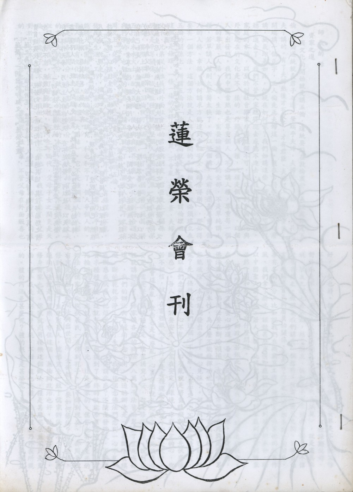

# 第1期

## 社論

### 蓮榮緣起

*編輯部*

『蓮榮』一詞出於印祖文鈔『蓮榮堂跋』。

『蓮之為物，雖出淤泥，體常清淨。人能一切不著，樂我天真，富貴貧賤夷狄患難，視若幻化，素位而行，自適其適。其淫移屈怨之情念，畢竟不生，庶幾與蓮相似，榮何如之。

再進而論之，一切諸法，悉屬生滅。勿道世間富貴尊崇，不足為榮。即令得作天帝，乃至上生非非想天，亦不足為榮。何以故，以天福一盡，復降人間，既生人間難免造業，既造惡業，必墮惡道，長劫輪轉，無有出期，辱莫斯甚，榮於何有。

所可榮者，斷盡煩惑，成菩提道，現身法界，度脫眾生而已。然在凡夫地，於現生中，斷難如是。固當真為生死，發菩提心，以深信願，持佛名號，以期往生西方極樂世界九品寶蓮華中也。

果能如是，則臨命終時，感應道交，蒙佛接引，即得往生。從茲永離八苦，常享四德，親炙彌陀，參隨海眾，聞法受記，速證無生。不但自己如是，倘能具大慈悲，發大誓願，廣修眾善，普化一切，以此功德，奉為父母祖宗回向，亦得承斯善利，同生西方。又況既生西方，證無生忍，則成無上道，獲大涅槃，乃決定必得之事，其為榮也，又何加焉。

蓮榮之義如是，祈顧名思義而實行焉，則幸甚。』

## 師長的話

### 徐自民老師法語

*徐自民老師講授、編輯部整理*

齊家之道

中國文化的開始就是講五倫，道統要點在敦倫盡份，表現處即是五倫。五倫道統就是君子之道，肇端乎夫婦，夫婦是第一倫，這是孔老夫子講的。有了夫婦然後才有父子，才有君臣。夫婦這一倫非常重要，開端講一個正字，正人倫先正夫婦這一倫。這在古時候大家都是這麼講，風氣即是如此。但現在如何呢？我們如講這些，新新人類可能就聽不進去了。我們不管人家聽得進去或聽不進去，我們個人的幸福、家庭的幸福，以至於到社會國家非講這個不可，所以我們中國文化與外國現在的文化是不一樣的，外國是講人權，人權是個人主義，以個人為出發點。我們中國當然也是尊重個人，不必講人權，尊重每一個人的尊嚴、人格、品德、生活，需要論彼做人的全部，不是單純講人權，若單講人權則太單薄太狹了，所以整個講，大前提還是尊重每個人的人格、幸福。如何講求方能達到幸福安全（離苦得樂），那必得要有一個方法，這個方法就是人與人之間的和諧相處，但必須建立在五倫的關係上。所謂五倫的﹁倫﹂字，倫就是一種理，所謂倫理嘛。這個理是條理，一條一條的分得清清楚楚，不會亂，有條不紊，夫婦、父子、兄弟從外推展到外面社會上的君臣與朋友。君臣是上下關係，朋友是平等關係，依著五種理能將整個人群團結起來。現在有人講第六倫，實際上不必要，五倫就可以涵蓋一切了。中國尚書洪範篇，將五行金木水火土，配合五倫，使人與自然界相應。如此說則符合道德與科學的，也是智慧的結晶，故五倫就夠了。中國聖人在孔子之前有周文王、堯舜、黃帝、伏義氏(彼畫八卦)，卦明五倫。

五倫之教乃令吾人從個人到家庭到社會次序井然，有條理而不亂，依此而生活、工作，大家必能相安無事、和諧安定，倫常乃合乎自然能將大家團結起來，若無倫常之講究，和也和不了，個人爭個人的。吾人講固有文化即是五倫和諧（大團結）。它不是強調個人的人權，而是講各盡其分，各人盡各人的本分，新婚夫婦結了婚以後，做丈夫的盡丈夫的本分，做太太的盡太太的本分，不問對方，不是講條件，但問盡其在我。有了子女之後，成了上下兩代，父母子女之間更是天倫，不能說子女不孝順，我做父母的就不管他了，父母對於子女永遠是關心與愛護，此乃天性，非僅人類，動物皆然。同樣的，子女對父母也是如此，孝道從天性裡來，不管父母在外面販毒也好，走私也好，犯什麼罪也好，別人可以罵他，兒女不能說父母不是，只有在家裡面請求父母不要做那些事情，私下在家裡諫勸父母，對外面是不可以說自己父母的過失（絕無有大義滅親），就是盡其在我。朋友之間也是如此，結交朋友，誠如老子所言信者吾信之，不信者吾亦信之。做朋友我們講究一個信用、信實。君臣之間，依現在而言即機關裏首長與屬員的關係，凡是有上下之分的，都是君臣的關係，各有各的本分。比如說我們在機關裏工作，機關首長他有他的領導作風，我們拿了薪水，該做甚麼事情即應該做好，盡到我們的本分。所以中國聖人講五倫，若人人都如此講究，從個人到家庭到社會到國家必然一團和氣，不會有什麼問題。

以上所講乃世間法，辦政治若依此法，必能成一安定的家庭與社會。在公安的環境方能安心修道。吾人來此得人身不能空來，人身難得，佛法難聞，學佛聞法要在斷除煩惱（貪瞋癡）方能了生死與成佛。眾生皆有清淨的本性，為什麼不能發揮功能呢？那就是貪瞋癡的遮蓋，若能破除，本性就開發出來了，明心見性了。但如何開發自己的心性呢？先決條件就是我們這個心不要亂，心要安定，心不亂然後纔能定，所以我們念佛念到一心不亂，一心不亂就是將貪瞋癡斷除（先伏惑後斷惑）。吾人心裡若要安定，先需在安定的環境，方有安定的心，你若不相信，試問在家裡欲入定，外面是各種運動與抗爭，則安定不了。

社會這麼亂，政治也是這麼亂，心裏自然就亂起來了。因此欲求心安定，需是整體環境的安定。儒家講究公安，即是修道環境。說到這裡就講辦法了，佛家講各種的辦法（八萬四千法皆助眾生了生死成佛道），我們的辦法與普通的辦法不同。普通的辦法是一定要斷除貪瞋癡，斷的乾乾淨淨，才能了生死。我們這個念佛法門念到一心不亂，或斷惑或伏惑（把煩惱壓下去），何謂伏惑？不隨便發脾氣，不隨便貪求種種欲境，這就可以了。然後到了命終時就能帶業往生，離開生死輪迴的環境，成就無量壽無量光，這是佛家的。儒家也有了生死的辦法，儒家文化從伏羲氏一直傳到孔子，孔子傳到現在，一部周易裡有完完整整的世間法與出世間法，全部都有。要如何修持？有其辦法，修到最後亦能了生死成聖人，儒佛完全一致！儒家辦法亦不少，最普通的辦法就是用禮樂，守住這個。無論辦政治也好，社會教育也好，修身齊家也好，儒家就是用禮樂這個辦法。禮是甚麼呢？並不只是見面、握手或是鞠躬這麼單純，不錯，這也是禮，但屬禮貌乃外表所現的。禮的內涵是甚麼呢？禮的根本是甚麼呢？是禮讓！有名位與利益之境界現前，互相推讓，而非互相爭取，自己儘量推讓，自卑而尊人。孔子於周易裏亦有云，要把自己壓低一點，要尊重他人，這是禮。禮記云，禮是天地秩序，大禮與天地、自然界同序，自然界春夏秋冬，春天在天地之間應以何行相出現，吹什麼風，下什麼雨，自然界乃是一定的。夏天的風雨又是一種，秋天的風雨也不一樣，它有它一定的秩序，禮就是根據天地自然界的秩序。我們為什麼要與自然界的秩序一樣呢？老年人就知道了，寒流一來的時候，它的老毛病統統都發出來了，若能懂得這個道理的話，他自己會慢慢調適，慢慢適應，所以不會出毛病。年輕人抵抗力很大，不在乎，不在乎是在年輕的時候，到年紀老的時候他就不行了，後遺症全部出來。

所以講究要與自然界的整體一致，這是講禮。但是禮是比較嚴肅，譬如在家庭裡面講禮，若是照禮這麼辦，固然是好，但是太嚴肅了，所以講樂。樂是音樂，亦有其理（樂有樂理），音樂的理，它是和諧的。中國古時候音為宮商角徵羽五音，樂器則有八種樂器（ 土革木石金絲竹），各盡其功能，彼此音階不互相侵佔，非常調和。用禮用樂的時候，一方面能有秩序，並將個人的情緒情感調和。懂得音樂的就知音樂本身就有非常完整的程序，且互相調和（非今日之下靡靡之音）。或依之而唱歌，或是彈曲子，一唱一彈喜怒哀樂之心情就能調和到非常適當，發怒的時候也不會發出來，高興的時候也不會過分，所以子思之中庸云：喜怒哀樂之未發謂之中，發而皆中節謂之和。若心能依禮樂慢慢調和，保持中和之氣，外面環境雖然亂，亦能將外境轉化過來，此中和之氣即是定功。有定功而念佛就易一心不亂、開智慧、了生死、成聖成佛。上述所言是法與出世間法結合。而世出世法之受用需是求覺，覺的是什麼？如果你已經成佛，那還要覺什麼呢？了生死，即是覺悟之果。佛已是大覺無須更求覺，乃令凡夫覺悟，我們凡夫眾生就是不覺悟，才叫我們覺悟，悟的是什麼？就是將這些人類本身（人生觀）與自然界（宇宙觀）的現象看清楚，看穿了，那都是無常法，都是因緣和合的，皆是假法。假法有假法的處理，把假法處理好（能辦事而不執著），才能得一心不亂，這是大致的介紹。

如何處理假法？依中國文化，從本身修身開始，結婚之後就是齊家，雪公老師主張建立佛化家庭，從我們本身到家庭做一個示範，然後推展到外面，不用你怎麼講，人家一看這個家怎麼這麼好，他就向你來學習。我們把家庭示範好了，社會之功，乃因其他家庭向吾家學習故，亦能輔助政治（政治即是創造公安的環境）。如此而選舉人才必能選賢與能，政治即轉變清明。台灣的局面若能用文化的、道德的、藝術的、科學的各方面的發展做出一整體模範，彼時大陸自自然然向我們學習，我們也不必廣告什麼台灣經驗讓他來學，他們見我們的真實成就，自然向我們學習，連宣傳也不用。他們真正想跟我們學的時候，就是兩岸統一了。即使不統一，我們也維持這樣的來往（近悅遠來），這是雖不統一還是與統一實在沒兩樣。勉強統一或是獨立都要不得。你要是想馬上獨立，彼飛彈、原子彈馬上就過來，這是非常危險的。話說回來，我們了解中國文化，了解佛法，即不對現況灰心，且非常樂觀，從自己本身以及從自己家庭開始，實踐力行，依中國文化與佛家文化，行禮樂，重因果，能念佛。懂因果甚要也，一個人若懂得因果的話，心自自然然心平氣和，看見任何不如意的事情，不合理的事情，即知有其因緣（此生宿世），若不處理好影響未來，此即三世因果的觀念，依三世因果的觀念平息，不應該發的脾氣與貪念乃至其他煩惱，內心清涼感覺很幸福，也很愉快。若有能力就將這些理念向外宣揚，即是行菩薩道。佛家講行菩薩道，儒家要求做君子儒，不做小人儒。君子儒就是行菩薩道。我們自己這麼做（修身），遇到有緣分的人，我們也勸導他這麼做，最基本的先從夫婦開始（齊家）。

**問：** 以上老師講的是屬於原則性的，可是將來結婚以後總是會有些問題產生？例如夫妻吵架等，遇到這些爭端或困難處，該如何處理這些家庭問題？

**答：** 夫妻之間有些小問題不必看得很嚴重，主要乃剛才所言的禮樂。夫妻二人在禮上行得好，小問題自然就解決了。如何用禮？就佛家而言，昔 雪公恩師以證婚人為人證婚，為新人開示，照例說，他是代表佛來為這一對新人證婚，必得說在家五戒之重要部分，除了不准殺生、不准偷盜、妄語外那是一定要守的，特別講究不邪淫。所謂邪淫，是丈夫到外面應酬，客戶來了我要勉強應付，不得不逢場作戲，那都不成理由的，無論是男方也好，是女方也好，不邪淫一定要守住。佛化婚禮證婚時，他老人家一定要講這條戒律，戒邪淫。儒家講禮如何齊家亦然，儒家的禮就是佛家的戒，男女假使守住禮，剛才所言秩序條理都包含在內，現在必須特別要講，古時候不必講。古時候男女一結婚，著重家庭倫理，這些道理（敦倫盡份）都包含在內。這個大前提（不邪淫）雙方都守得好，其他小問題就沒有問題，小問題互相體諒，太太家事做多了，情緒上來的話，男的就幫忙做一點吧，有時間就多做一點。或者有時候太太嘮叨的話，自己就少說一句。相對的，男的在外面工作累了，回家來的時候，外面受了一些氣，回家來發發脾氣，太太也不必馬上頂回來。大原則禮（佛家五戒）守得住的話，小問題自自然然都能互相體諒，沒有問題。

**問：** 如果女朋友不是佛教徒，將來會不會有問題？

**答：** 只要不是別的宗教，不是佛教徒也沒關係。假如是別的宗教的話，他們的宗教不像佛教，他們的宗教排斥性很大，他們的宗教有一個使命感，結了婚之後一定要把丈夫拉過來，從魔鬼那邊拉到神這邊來，她沒有這樣做的話，感覺對不起神，你娶這樣的太太過來就麻煩了。你究竟是要改變宗教信仰呢？還是不改變呢？你要改變跟著太太走？你明知佛教好，佛教是真正了生死的，你跟她走而改變信仰，信了別的宗教，最高的境界只能升天，猶在生死輪迴中，如此則不可也。娶異教信仰堅固之伴侶，會帶給你的家庭麻煩，若非別的宗教徒，則沒有關係。

**問：** 成立佛化家庭，有關朋友問題、財務問題這些細節怎麼處理？

**答：** 大前提就是談戀愛的時候，兩個人都是互相相愛的，自始至終保持愛心，這個問題就沒有了。外國人注重財產，我們中國法律也改了，夫妻財產是分財產的，這些法律是從外國學來的，外國有他的道理，他講個人，從個人出發，夫妻各有財產。就我們中國文化來講，夫妻財產是共有制，不會發生問題的。不過有一種情況要注意，大前提就是男女雙方都要守住這個禮（不邪淫），一旦破除，問題就會出現。開始就要分居，再下去就要離婚，各分財產。若不講究這禮（不邪淫戒），女方或男方恐怕對方亂用財產，把它轉移花掉了，那我怎麼辦呢？所以就發生這些問題了，這個是要注意。那麼無論如何這個大前提是不能破壞的！一個戒，一個禮是不能破壞的，其餘的問題是不會發生的。

**問：** 像我們學佛的家庭有時候喜歡布施，或是結緣等等，有時候會影響夫婦共同的觀念。

**答：** 那好商量，夫妻平常要多聽對方的意見，無論是丈夫這一方，或是太太這一方，無論信佛信得多虔誠，一發心要把所有的財產統統都捐出去。你一旦捐出去，這個家庭要怎麼辦呢？這個不可以的。但是這種觀念你不能等到那個時候再溝通（不能先斬後奏），否則那個時候你就費力氣了，很傷感情的。最重要的是，夫婦二人平常要常有談話的機會，多多談話，意見都能夠互相交換，任何一方不要堅持自我的意見是非常對的，雙方的意見都要互相採納比較一下。你的意見提出來了，我們很公平很客觀的評估一下，你的意見行得通或者行不通？行到什麼程度？將來有沒有什麼不好的副作用？這個現在都可以講，任何一方如果稍微發生偏差的話，都可以溝通研究。若能依禮和衷共濟地來處理這些問題，一定是沒有問題的。真正到了發生問題的話，二方面任何一方如果有修養的話，念著一世夫妻百世恩，因緣俱會不是那麼簡單的，若彼此能珍重夫妻的情分，一般不至於到那種不能溝通的程度。

**問：** 教子方面如何做？

**答：** 今日之下教小孩子比較麻煩，台中有很多蓮友，小孩子還未上學的時候，教的也很好，一上小學有些問題就慢慢出現，到了國中問題就大了。為什麼呢？學校裏面，老師當然不會教壞學生，最重要的是被同學帶壞了，帶壞的時候，老師也管不了，家長也縱容，那些學生，就這樣學壞了，現在外國的教有也有些很可以採取的，可向研究兒童教育、兒童心理的專家們請教。現在資訊也很發達，多多接觸那些資訊，可以得到許多寶貴經驗，但相對地，那些資訊雖然多卻很雜亂，自己要有一個主宰（主義），大主體是你要培養小孩的人格，一個很健全的人格，人格從小自自然然培養起來，使他能關懷人家，不要養成本位主義，怎麼樣同情人家，能幫忙人家就儘量幫助，要養成這種心理。也要能讓他有分辨是非善惡的能力，事情需如此辦的，可是換另一個角度來看又是一種，從小慢慢的培養他理解的能力（看事情正確的角度），一步步地培養他這種能力。主要的是培養他有同情心（仁心），有分辨是非的能力（智慧），即是培養健全的人格。只是培養他同情心而不培養他分辨是非的能力，那就智力不夠，智慧不夠容易被人利用你的同情心，論語中有好仁不好學其蔽也愚，只是講仁慈，人家就利用你的仁慈，你自己就變成愚蠢，被人家利用還不知道。固然仁慈需要，同情心也需要，關懷人家也需要，可是亦要有智慧辨別是非善惡的能力，這個要從小給他培養。至於背誦三字經、論語、千家詩等等都很好，可是不必要求太多。並適度運用機會在大人之間或夫妻之間談話的時候，談到適當情境時，引用一句詩出來，或者引用論語裡面，或是古人講的一句話，將所該的事情總結起來，使他（小孩）聽入以後在思想上能作整理，並能將這句古語記得很牢，以後就能用得出來，這就是活教，不是注入式的，而是啟發式的。

**問：** 教導小孩子如果小孩子智能不足怎麼辦（蒙古症）？

**答：** 小孩蒙古症的家庭要很有耐心，耐心的照顧他，等於醫生診斷一樣，看他在能不能在某一點被啟發出來，不是全部的，都是試探性的，這個東西用來試探一下，看他反應能力如何，反應不好，再用另外一個實際的柬西，給他試探，多方面試探，看看能不能把他啟發出來。

**問：** 這種情況如果有時在道場中給他回向，或者是做功課時給他回向，可否去除這些障礙？

**答：** 回向重要，為他作功德而回向除障，回向的功德是不可思議的。

（本文乃蓮友向徐自民老師請教，蒙師慈悲開示）

## 研習心得報告

### 勸發菩提心文（一）

*心爾*

前言：講菩提心文的緣起

一、道場改建，希望有好的因緣，有的道場誦地藏菩薩本願經，希望有好的地基，地藏菩薩之所以能成就此殊勝之內涵，關鍵在於他有菩薩的悲願，此菩薩的悲願由菩提心來，故今所言之勸發菩提心文，因地藏菩薩的緣起是地藏菩薩的媽媽，我們也以勸發菩提心文作為我們改建之後的緣起，相信更有意義，地藏菩薩若離開菩提心及菩提願，不可能成就地藏菩薩的證量，以及為諸神佛所讚歎的威神力，此威神力之源即殊勝菩提心與菩薩願。

二、普賢菩薩十大願亦備菩提心而發十種大願，所有的禮敬、稱讚、懺悔、都是要圓滿菩提，都是為了要度化眾生，度化眾生圓滿菩提是普賢十大願的所依與目標。（由菩提心所出發，所圓滿亦是此菩提心）

四、依之而作為研究普賢行願品之前行，發心立願即是修行之本，若不由此，多劫修行總是無功，徒勞辛苦！

五、使我們在短短的時間裡面，了解整本經的架構，因為工商社會，往往一個月才見兩三次面，間隔時間太長，大家受用畢竟有限，藉這個機緣花一天的時間作一個認識。

教材：

省庵大師之〈勸發菩提心文〉，並配合諦閑老和尚的〈勸發菩提心文講義錄要〉，以及圓瑛法師的〈講義〉。以圓瑛法師的為藍本而消文，依諦閑老和尚的〈講義錄要〉作補充，諦閑老和尚的架構（科判）很好，對勸發菩提心文要點皆有提示，雪公老師說要將諦閑老和尚的注解當彌陀要解來看。諦閑老和尚乃天台法脈弟子，是近代最有名的大師之一（民國五大師）他為我們中國佛教界培養很多人才，如倓虛老和尚、寶靜法師、靜權法師等，其中曉雲法師又是倓老唯一女弟子。另圓瑛老法師是當時中國佛教會的會長，對中國佛教貢獻良多，不只推展佛事，亦教理通達，精通性相二宗與台、賢二教。這二種勸發菩提心之註解，其一是諦閑老和尚以天台注經法註解勸發菩提心文。其二圓瑛老法師是以賢首注經法註解勸發菩提心文。通教理的人或通天台或通賢首，很少人能通達二教。圓瑛老法師兩家都通達，而且對唯識學也不外行，彌陀要解裡講到法相部分，用唯識的觀念講淨土要義，一看就知道他也是唯識的大家。以上對兩位祖師作介紹，也對省庵大師的勸發菩提心文有所了解。

內涵：

菩提心文序今天發的教材裡面除註解以外有科判表，我們依圓瑛法師的課本，配合諦閑老和尚的講義。

勸茅靜遠居士書：

對世間的善法，及情執這麼在意，並不是叫我們不要經營世間善法，重要的是出世的心態，若出世的心態沒發起來，那世間的善法都變成輪迴的牽纏，而感受種種的痛苦，應該以出世的心態為主，來經營世間的善法。若經營世間的善法，而忽略了出世的心態，那還不如好好策劃出世的心態，而世間的善法慢慢的做，是這篇的重點，本文要以這個概念去看，不是讀完了大家關起門來念佛，這不行，功力不到，念佛可能會產生很多的煩惱，或者是一些習氣不能對治，例如修行不當而引發之增上慢，會引發成為修行大障礙。

諦閑老和尚講義前雪公老師序：

大乘法若沒有菩提心作綱領，不能稱大乘法，法之所以稱之大乘，因心是菩提心，不要以為菩提心就是上求下化，菩提心是利他，為眾生好而已。菩提心的行相、內涵，發起所需之資糧，成就的行相是什麼，不易搞清楚，不論是經論，字句雖懂，經義雖懂。此菩提心文能與世間出世間善法相應，世間出世間善法若無菩提心發起，都無法成為成佛資糧，然菩提心之發起需由世間觀公念恩與出世實義配合，要多多的串習、溫習、練習、複習、多多研學、講學。此文非經、非律、非論，雖不是佛語，但把佛語講盡。雖非律，但是是律的根本，若無菩提心，戒律皆為魔業。雖不是論，但可以當成論看，是一篇詳說其利害關係，雖然只是一篇文章，但也可當成論，因為透過議論讓我們了解菩提心有多麼的重要。人生唯一的走向就是發菩提心，若無菩提心，此生空來一場，諦閑老和尚與圓瑛老法師完全用註經的方式來註這篇文（將本文當成佛經）。開頭也是五重玄義，而將一篇大文用序分、正宗分、流通分作科判，省庵大師的勸發菩提心文的知音就是諦閑老和尚與圓瑛老法師。我們讀註解而了解文義就是諦老與圓老的知音，亦為省庵祖師的知音，也是諸佛菩薩的知音，要這樣看。修行就是把自己當成佛菩薩的知音，若不能通達佛心，不能建立殊勝的悲願，效法他的行持，成就他的果位，那我們在修什麼？所以不要畏難，縱然下根之人也讀得懂的，若能讀得很了解，每天作功課觀修內容且能用於日用平常，就是「中流風帆」，船在水的中間，沒有在岸邊被泥沙擱淺，又被順風所推，一日千里，整個人心境迅速增上，勢如破竹。              （下期待續）

## 生活感言

### 德基漫步

*蓮心*

走在中橫的蜿蜒路上，車程由山腳往高處漸漸行去，由平坦大道慢慢走向曲折迂迴，穿過鑿岩破石、翻山越嶺而成的隧道，心中充滿著感動與感謝，驚嘆於此地的鬼斧神工，感佩於人們的默默付出與流血流汗，才有今天的寬敞公路，以前很難體會「前人種樹，後人乘涼」的真意，現在竟在眼眶模糊中略知一二了。

經過數小時車程，進入眼簾的是「掛絕壁松枯倒倚」，一樹青翠兀然從石縫中蹦出，孤立在峭壁懸崖間，頗有向大自然挑戰的意味，自豪縱然沒有良好的生長環境，仍能另闢谿徑，怡然自得生存著。

生命是強韌的，植物有求生的勇氣，因此松柏能在亂石崩雲間，崢嶸挺拔、亭亭玉立，藤蔓女蘿也能在嬌柔無力中，攀牆附壁、抬頭挺胸，而人如果有不屈不撓、自立自強的毅力，就可以化腐朽為神奇，峰迴路轉走出自己的春天。

坐著舢板徜徉於德基水域，清風徐來，水波不興，近處的水是清澈而蔚藍的，離視線愈遠顏色愈深，至水窮處則是呈現一片墨綠，當一抹丹青、幾許靛藍，描繪到水天一線時，已分不清是水從天上來，還是天光雲影共徘徊了。

倚著船桅，任由風兒撥弄我的髮絲、輕撩我的衣角，讓我在波光粼粼中翩然起舞，「春水碧於天，畫船聽雨眠。」，我已在瞬間，駕著輕舟，看遍怪石嶙峋，草木森森，在一碧萬頃間，如馮虛御風，而不知其所止，如解脫自在，超凡而出塵。我不是騷人墨客，卻也想附庸風雅，效法蘇東坡高歌：「桂棹兮蘭槳，擊空明兮泝流光……」

德基水庫是鱒魚的水鄉，而據說鱒魚是一種尊貴的魚，適合的水溫約在攝氏十五至二十度，如果離開了它生長的環境，很容易因水土不服而死亡，看著剛放生的鱒魚在綠波碧浪間，搖頭擺尾、快意昂揚，充滿著絕處逢生的幸運與滿足，而我的內心似乎也感染到它的喜悅呢！

在這浩瀚的蒼穹、無窮的宇宙，斜陽嫩水、清風明月，任我取用，粉白黛綠、奼紫嫣紅，供我賞玩，一葉扁舟，隨我飄搖，莽莽蒼蒼，由我遨遊，蟲鳴鳥叫全在俯仰間，天地萬物也盡在胸壑，試問此心、此情、此景究係至大無外？抑至小無內耶？

如果生命是一首歌，有些是悲傷的，有些是哀怨的，有些是輕快的，有些是愉悅的，有些是激昂的，有些是雄壯的，不管是如怨如慕，還是如泣如訴，卻總有曲終人散的時候，也許我不能決定這首曲子是短調，還是長歌？但是我確信，為每一個音符，在五線譜裏找到最適合的家，而唱出最扣人心弦、盪氣迴腸的旋律，卻是掌握在自己手中的。

### 天池巡禮

*蓮心*

一路迤邐行來，沿途飛花輕約，遠山含笑，輾轉間來到了福壽山農場上一個榮民伯伯的住處，這兒不是大飯店、大旅舍，只是一間簡陋的平房，裏面供著慈悲莊嚴的佛像，放著幾張舊沙發，雖然沒有精緻的擺設，但是老先生殷勤的接待，卻讓我們有「故人具雞黍，邀我至田家，綠樹村邊合，青山郭外斜」的親切感。

這位老榮民，比手畫腳，語氣或低沈、或激昂、或歡喜、或感傷，娓娓訴說著自己的故事，我才知道他孑然一身，胼手胝足，忍受著孤單寂寞、天寒地凍，篳路藍縷、披荊斬棘，開闢道路、建立果園，終於在流血流汗裏，有了辛苦耕耘的收穫。

在現代社會裏，大多數的人都是精打細算的聰明人，如果沒有立竿見影的效益，誰會願意浪費時間去營造一個遙不可及的夢想呢？像這樣一個老人，沒有妻兒子女，卻要離群索居，守著一座山，一塊地，與渺不可知的未來相抗衡，是多麼不可思議啊！也許老人識字不多，也不夠精明幹練，但是這一份擇善固執、堅守崗位、安貧樂道的傻勁，在這個功利掛帥的社會裏，卻是難能可貴的！是否我們也該學習紅塵走過，忘卻塵囂，在料峭春風中，酒醒歸去，回首向來蕭瑟處，無風無雨也無晴呢？

不知是雀躍，還是興奮？我和友人，下山時捨棄坐車，赤腳漫步在山間小路，穿梭於田埂綠地，美其名是吸取大地精華，其實是童心未泯，在奔馳跳躍間，把一大群人，遠遠丟在身後，至今回想起來，仍然引以為傲呢！

車子在攀爬間，終於到達了天池，只見雲霧縹緲、薄紗輕掩，在山嵐瀰漫間，籠罩著凜冽刺骨的寒意，連水裏的錦鯉都躲在池底禦寒，當我把魚食灑向水中，劃破一池寧靜時，它們一條條爭先恐後的抬起頭探個究竟，剎那間，空氣熱絡起來了，這時候，此起彼落的歌聲驟然響起，有雄壯威武的，有蒼涼落寞的，有輕柔婉約的，也有天真如我，大聲和魚兒心得報告呢！當聲韻音符與煙雲竹樹相遇時，便化成水聲淙淙、飛湍急流、琴聲錚錚、珠玉丁丁，一聲聲在氤氳中盡情揮灑、縱情歡唱；雖然這是我第一次拜訪這個如夢似幻的地方，但心中並沒有陌生的感覺，反而是一份熟悉與親切。

當落霞穿過水雲之間，把僅餘的絢爛投向天際，天池這位風情萬種的美女，已將星輝月影妝點在一望無際的大地，而我們也在回眸顧盼、相知相惜中，走入瀟湘畫裏。

仁者樂山，智者樂水，雖然我不是仁者，也非智者，但在這山湄水涯、斜陽夕照裏，我似乎沉醉了，忘卻歸途。

如果青山有知，綠水有情，是否欣欣然待我他日重遊？點點梨花，是否嬌艷如故，巧笑倩兮盼我登門再訪？     (德基水庫放生)

### 九二一大地震的省思

*編輯部*

九月二十一日規模7.3級的集集大地震，宛若突如其來的戰亂一般，使得中部災區彷彿被封鎖在戰場當中，一時音訊全斷，外人無從得知親友音訊，個個心焦如焚！使長久處於豐衣足食的臺灣同胞們，從來不曾對這世間以及脆弱的生命有『無常』的認知與覺受，竟然讓大地震徹底地、無情地為我們上了最真實而寶貴的一課。《八大人覺經》中，第一覺悟：『世間無常，國土危脆』，這器世間我們以為恆常不變的家園是這樣的不堪，更遑論『人命呼吸間，無常迅速至』的至理名言，這實是吾人應該要有所了知，有所覺悟的呀！

災變次日迄今，趕往災區已有三次，所見與電視報導相差頗大，電視是比較重視新聞價值，大部份都集中在某些地區的報導，然整個災情慘重的情況，是難以想像的，以下即是兩位朋友於九二一大地震中飽嚐驚嚇、震撼的真實感受，詳述如下：

新社彭先生

當天晚上，剛躺在床上，那時候就開始感覺到一陣無法描述的鬼哭神號，瞬間便進入了一片令人毛骨悚然的大黑暗之中，在大地一片恐怖的黑暗之後，緊接著又是鬼哭神號，突然山崩地裂，房子倒塌，然後一片的悽慘聲，那時候立刻想到遠在台北念書的孩子，如何應付這種地震？還有山裡面的夜歸人怎麼辦？是不是整個台灣都要陷下去了？因為當時那種地震的幅度實在是太大了，怎樣想都想像不到只有在新社、東勢、霧峰、埔里、集集等這些中部地區，真的以為整個台灣都快要沈下去了！

而當時也不可能跑，因為晃動實在過於厲害，要起來開門不但找不到把手的位置，更誇張的是總是和把手錯過，而無法奪門而出！要找手電筒，更因為晃動過於厲害而已經掉到別處，是怎樣找都找不到！整個村裡面都在惶恐當中，大家不知道如何是好？找不到任何一個可以讓人安全避難的地方，所謂『三界無安，猶如火宅』，就在這短短的幾秒鐘之內，完全的深刻體會出這句警覺『世間無常』的金玉良言，沒想到真是要用生命來換，才能感受！

以前的觀點，總以為鋼筋水泥的房子，就算再大的搖晃，所產生的裂痕、傾斜等，也不應該會從中間切斷！但是這次地震造成房屋的斷法是跟刀切的一樣，切得乾淨俐落！若地震是搖南北向的，那就往南或北！而且很迅速！地層下陷也是一樣，華南銀行二十樓倒了，二十樓陷到等於四樓變成一樓，所以剛好四樓的可以跑出來，一樓到三樓的就全部埋在地底下，而很多棟房子又彼此重疊倚靠在一起，屋裡的人就像夾心餅一樣被夾在當中，又不知道什麼時候附近的大樓會再倒下來，這種恐懼的情形一直持續到天亮。

總歸一句話，那一天晚上過的是地獄的日子！今天還能見到外面的世界，內心真的非常慶幸！記得在每一次的地震之前，一定先鬼哭神號，然後再震！那種恐怖聲實在無法形容，在大黑夜裡沒有風沒有雨，居然又是風聲、又是雨聲、又是鬼哭神號聲；最後更聽見因為倉皇失措、怖畏至極，所產生的狂叫、慘叫聲！聽起來真是令人毛骨悚然，恐怖之至！

女兒說以前看土耳其大地震，或是一些國外的災變，都會很不耐煩，怎麼一直在播呢？但是這次自己的父母就在災區裡面，一整天沒有消息，不論透過任何管道，要問災區的情況，都沒有任何的回應，方體會出杜甫『烽火連三月，家書抵萬金』急切的思鄉之情。而每次從災區回來的消息都說交通阻斷，一整天都是無法進入的消息，那種心情真是煎熬！最後消息終於從裡面傳出來說父母無恙，但是沒有親耳聽見父母的聲音，還是不敢確定他們的安危，直到真的聽到了聲音，看到了人才算數，還好只過一天音訊就通了。

想起我們父親那一代的長輩，從大陸出來之後，與家鄉的音訊是完全不通的，『有書常不達，況乃未休兵，憑添兩行淚，寄向故園流』。這些都使我們體會到：其實人生的苦，是從每一個地方去表現的。我覺得這一次朋友的子女，真的長大很多，所以其實苦難中成長未必壞，安定中成長也未必好；有時候我們會站在憐憫的心態下，去可憐對方，但事實上他已經從瓦礫堆中爬了起來，反觀未經生死考驗的我們，仍是溫室中的花朵，其實根本不耐逆境與挫折的摧殘。

東勢劉先生

那天因為參加讀書會，回到家裡已經十二點，只覺得今天特別涼快，準備入睡時，時間差不多是一點四十五分，突然間天搖地動，然後前後搖晃非常大，此時只能力求菩薩保佑，一家大小拼命不斷念阿彌陀佛，才逃過了一劫。突然碰的一聲！水塔的水全部傾倒了下來，屋內就像下大雨一樣，每個房間都被水淹了，電力也全部都停了。

突然又聽見瓦斯漏氣的聲音，所以就摸黑往屋後走，整間房子都是濕答答的，下去又不行，全部都是玻璃，還好沒有被東西壓住，就摸著地板爬到客廳，再爬到廚房，爬出去時那門也被關起來，仍然聽到瓦斯在那裡噓 ... 而且很大聲，那時感覺更是緊張，因為所有通道全部都被卡住了，用盡全力才推開倒下的物品，並摸到瓦斯筒，立即關上開關，才鬆了一口氣！

接著想趕快帶著妻小離開房子，自己就先到樓下去開門，下去的時候，那門都是卡住的，根本出不去，出去也不敢用力太大，就把火點起來看，哇！慘不忍睹，向右一看，真是傻眼了！自己家的房子沒變，但對面三樓已經傾向一邊，又趕快跑到巷口，旁邊四樓變成三樓，而且等於移了一個位置，地震前後只有三、四十秒鐘，要怎麼逃？一樓也不知道裡面有沒有人，就算有人，也救不出來啊！因為已經深陷在地底下了呀！難道這是命中注定嗎？再看到停在巷道中的愛車，被倒塌的建築物壓著尾巴都翹了起來，雖然有些不捨，但相較之下，心中非常感謝上天保佑，真是阿彌陀佛！

一家大小好不容易逃出了大門，便急著前往探視住在附近的岳父，所幸半路上就看到岳父在街上，也正朝我們的方向過來，大家相見喜極而泣，恍如隔世。接著又急著想找家大姊，找找找，找到北街，一看北街全部傾倒，老房子也全部倒了，我走過去的時候，上面剛好兩個人抬著一具屍體下來，就幫忙一起抬下來，他是國中生，好像剛過世不久，他們做人工呼吸，壓一壓，沒辦法了！好幾個人就用白布蓋起來，家屬不斷的哭泣著，真是令人鼻酸，原來天人永隔只是幾秒鐘而已。再往前走一段，發現這邊也不通，那邊也不通，哇！一棟大樓又在那邊快要倒下來，真是嚇死人了！趕緊拔腿就跑！再找，又找了很久，找到東聖宮那裡，已經有很多人聚集在那邊，大家都是驚慌失措的樣子，沒有親自看見真的很難體會，就這樣大家在慌亂中度過了恐懼的一夜。

次日去停屍間看，真是令人怵目驚心，第一天就已經有六十幾具，第二天居然已超過五百具屍體，再到另一個停屍間去看，有些屍體已經冰在冰櫃，差不多三、四個櫃子，親人也睡在停屍間旁邊，處處哀鴻遍野，彷如人間煉獄，就默默為他們念阿彌陀佛，願他們都能到西方極樂世界，不再受人間地獄之苦。

聽完兩位災區朋友親身體驗的描述，兀自思索著：

我們的人生到此世間，所為何來？有個美滿幸福的家庭可以經營，就是人生最終的目標嗎？經過這一場浩劫，也許是自己死了，家人活著，也許是家人死了，而自己倖存，也許 …… 。至於說，我們日日夜夜所汲汲營營重視的學業、事業，不待天災侵襲，便已是十年河東又十年河西了！那更不用妄想期待它們會十年不變、百年不壞；永遠無價、永遠珍貴？因為『無常』一來，所有的家人、財產，可能瞬間全部被摧毀殆盡！『三界無安』，所愛執的人、事、物是無法保有的。而家也可能是不安全的，我們總以為在外面受到委屈或者是奔波勞累，回到家就可以安心了！可是這一次因為地震的關係，真的讓我們體會到身不知要安在何處？

我們父親那一代是由大陸逃出來的，所以比較有『無常』的想法，因為經過了戰亂，深刻瞭解到這世界上，是沒有所謂安定的、不變的、永遠屬於我的居所，原來家園、國土竟是如此危脆啊！

災區中，東勢是死了最多人的，為什麼呢？因為東勢都是老房子，都是兩代同堂、三代同堂，很多舊式的三合院倒下，一下子就是三、四個人走了，這種情形是非常多，所有的古老房子全部倒；而這次死的很多都是老人家，民風可能漸漸就會有所改變了，老人家所帶動的風氣，都是很純樸的，現在很多人走了，優良的傳統美德、純樸的文化，未來要以什麼來延續呢？這也是讓人覺得很可惜的，因為大多數人都比較注重財產的損失、房屋的倒塌；但其實我們應該更痛惜的是文化結構的改變，因為這樣純樸的文化，不是短時間可以恢復的。

災後重建工程將是非常浩大，原本秀麗綿延的山脈，如今也露出光禿禿的樣子，重新種植可能要近百年才能恢復翠綠；重整傾倒的家園，估計也要花上個人一生的精力，才能重建；平復受創的心靈，更不知要到何時才能寧靜？現在大家都還很關心災區，但是一段時間以後，可能就開始記憶淡薄，一樣的燈紅酒綠、一樣的賞心悅目；回想林肯大郡的事還沒結束，但是大家已經把這件事忘記了，在災區的人或許不容易忘記，但是住在繁華地區的人，或許再經過一段時間，記憶也就隨風而逝了！

很多受災山區的內部，到現在根本沒有辦法進去，聯合報曾刊出一個圖，它顯示裡面不斷喊叫求救，但路中有路，就像孩子玩捉迷藏一樣，救災人員毫無頭緒，不曉得要走哪一條路，才能到達災區的路上。因為到災區的路若是開車的話，也許要開七、八個小時才能夠進入，一路上全都是補給車，但也許有些東西過多、有些東西又很不足，大家拼命的往裡面送，雖見國人關愛同胞溫馨的表現；但因為每一個單位都是獨立的，大家都可以到每個單位去領取東西，有的人甚至有囤積的心態，無形中卻增長災民的貪心。

所以災區的人，如果沒有記取教訓，努力效法前人種樹造福的精神，對一粒米，有沒有思其來處不易；對一寸絲，有沒有念其物力維艱。若不知惜福，又慾望不足，當下更是禍上造罪，故若不及早導正不良的心態，則這場曠世紀的浩劫，將會變得毫無意義！

至於交通管制也是如此，很訝異的是派出這樣多的軍人，只剩下維護交通；工兵與運輸的部隊都不見了！每每在民意論壇，各個文人都為了國家，好像有許多施政的理想，災變的時候，所有理論卻變成如此的不堪！所以所謂的強人若是心思用錯，固然有他的可惡處，但是有時就是需要這樣的人來加以整頓！所以說這次的災變也顯示文人的無能與懦弱，故而造成救災局面的紊亂！

種種這些的缺失，許多人都想到了！但是有一點卻一直被眾人所忽略，一路走來，看到如此多的難民，因沒有人來整頓他們，形成了無數的人力浪費，真是非常可惜。比如說，有些人家裡可能都很安好；有些人可能屋況傾斜，但是家人安好；所以就拿著救災品到旁邊聊天、喝茶、吃東西。有些人則是家人已不幸被埋在倒塌的建築物下，但是因沒有救援工具而孤獨無助的守候在瓦礫堆旁，而這些人其實體力都是很好的。然而災變已到了第三天，卻還等不到一部挖土機來救援，以致使一些罹難者因為無法即時被救出，而活埋在瓦礫堆中，真是令人痛心不已！

所以說缺乏對當地人力、物力的整頓，結果造成了災區人命更大的損失與物力的浪費。唐朝郭子儀打仗的時候，即使中央並沒有給他很多的兵與將，但是他最可貴之處，就是他到哪裡就動員組織到哪裡。因為若沒有結合當地的力量，外人可以發揮的力量是比較有限的；果若能結合災區裡面的人組成自救隊，自己分配物資，並配合政府救災，其實就可以非常有把握地控制災區資源，使得物資分配有條理，救援秩序井然，則災民必會感恩外界的支助與援救。

現在若是張三到此處領帳棚，同時又可再到別的補給處領另外一頂帳棚，結果卻沒有人知道；如果說當地的人已經組織起來，則張三的臉一看就知道，限領一頂就是一頂，絕對不能囤積，大家就會節省物資。而且讓災民親自去救難、親自去發放物資時，也更能體會他人賑災的誠意。

古諺云：『井涸而後知水之可貴，病而後知健康之可貴，兵戎而後知清平之可貴，失業而後知有業之可貴。凡一切幸福之事，均過去方知。』美麗的家園經過災變的毀壞，使我們真切體會這世間一切的『無常』，而這又恰是佛陀以及祖師大德所一再殷切提醒我們的，若不從此痛下決心，欲出離這世間一切苦難，進一步欲救拔一切苦難眾生而發起廣大圓滿的菩提心，以續佛慧命為吾人之使命，則此災變之意義甚小矣！

重建家園的路是漫長的，而人心的歸向是重要的。一己之力雖是微薄，但若是至誠懇切為他著想，不存絲毫為己之心，則民風歸於樸實；若是以救拔眾生出離生死苦海為己志，則正法得以延續。雖然總有一天無常會來敲我的門，但我已經不會畏懼，因為我知道我人生的走向，確立我成佛的目標，清楚我未來的歸向！

雪公太老師說：「眾生只要肯覺悟，就有希望，就透出一線光明。而心只要放在公上，就是往光明的路上走。」而覺悟便是了知因果的真實道理，有了這些概念，便不會在個人的順逆窮通上執著煩惱，而將種種惡逆境界，盡皆看做真實受益處。心地一轉，境界隨變，危機轉機，但看個人。這次的大地震，突然震出了許多人性的光明面，全台灣不論政府或民間，大家無不傾囊輸捐，休戚與共，彼此挽起袖子，投入救災工作。我們知道厚德才足以載福，人心的轉變與凝聚，可以帶領我們邁向光明的大道。

重建家園的路是漫長的，而人心的歸向淳厚更是重要的。一己之力雖是微薄，但若我們珍惜現前的安定與幸福，懂得孝順父母與友愛兄弟姊妹，至誠懇切為他人著想，不存絲毫為己之心；點點滴滴的善念，可以變成大福，善念延續，善行加深加厚，『了凡四訓』所說，則不但個人的命運會加以轉變，民風亦樸實如古，所獲之利益可謂之大矣。
