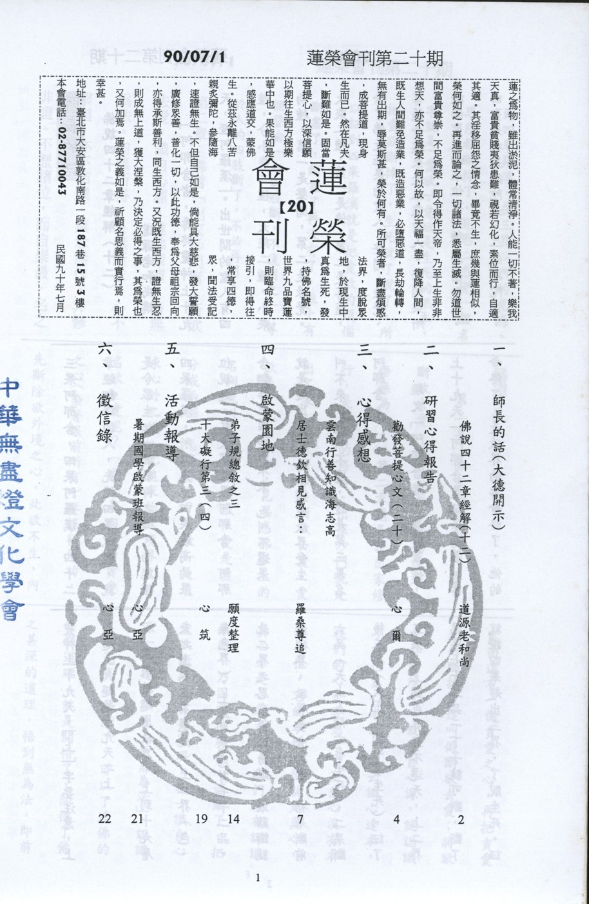

# 第20期

## 大德法語

### 佛說四十二章經解（十二）

*道源老和尚講授*

「阿那含者，壽終靈神上十九天，證阿羅漢」。

出世間的聖人有四種，分小乘二種，大乘二種。小乘兩種，第一是聲聞，第二是緣覺。大乘二種，第一是佛，第二是菩薩，除了佛是極果的聖人，聲聞、緣覺、菩薩合起來是三乘聖人。聲聞乘所證的聖人的果位有四種，叫四聖果。四聖果初果須陀洹，二果斯陀洹，三果阿那含，四果阿羅漢。四十二章經翻譯的人，先從四果說起，就是令眾生起一個敬仰之心，而能證四果羅漢，所以先把四果最高的果位說起。其次第三果阿那含。阿那含翻作中國話叫不來，也叫不還果，就是超出欲界，再不還來欲界受生，叫不來，也叫不還，這是第三果名阿那含。

經文「阿那含者，壽終靈神，上十九天」阿那含是証了三果，壽命終了，是欲界的壽命終了，他的靈神上十九天，「上」字要注意，上是超上，超越十九天之上。

「阿那含者，壽終靈神上十九天，證阿羅漢」。出世間的聖人有四種，分小乘二種，大乘二種。小乘兩種，第一是聲聞，第二是緣覺。大乘二種，第一是佛，第二是菩薩，除了佛是極果的聖人，聲聞、緣覺、菩薩合起來是三乘聖人。聲聞乘所證的聖人的果位有四種，叫四聖果。四聖果初果須陀洹，二果斯陀洹，三果阿那含，四果阿羅漢。四十二章經翻譯的人，先從四果說起，就是令眾生起一個敬仰之心，而能證四果羅漢，所以先把四果最高的果位說起。其次第三果阿那含。阿那含翻作中國話叫不來，也叫不還果，就是超出欲界，再不還來欲界受生，叫不來，也叫不還，這是第三果叫阿那含。

經文「阿那含者，壽終靈神，上十九天」阿那含是証了三果，壽命終了，是欲界的壽命終了，他的靈神上十九天，「上」字要注意，上是超上，超越十九天之上。

三果就超出欲界，上到十九層天之上（五不還天）上二界（色、無色界），上二界思惑有七十二品。此二界之思惑很容易斷，最難斷就是欲界，欲界要分二次，初果斷前六品（天上人間六番生死），二果斷後三品（天上人間一番生死），証了三果，上到色界五不還天，上二界思惑七十二品一下子就可斷，斷了就證四果超出三界，了脫生死。証到四果羅漢，在三界以內的見惑、思惑都斷掉了。見思二惑變一個名字就是「愛欲」。愛欲是生死的根本，把愛欲斷掉了，生死就了脫了，所以証到四果羅漢就是把愛欲的煩惱斷盡了，斷盡了再沒有了。經上有個譬喻「如四肢斷，不復用之」，等於人的四肢斷了，不必再用。

第二章：佛言：

「出家沙門者，斷欲去愛，識自心源，達佛深理，悟無為法。內無所得，外無所求。心不繫道，亦不結業。無念無作，非修非證。不歷諸位，而自崇最，名之為道。」

第二章還是說出家修行是真實的修行。出家沙門就是出了家，做什麼事？斷欲去愛。愛欲是生死的根本，見思惑佛學上的名詞就叫愛欲。欲是欲，愛是愛，分成兩個，怎麼分法？「欲」是追求心外之境，叫追求物欲境界。愛呢？「愛」是內心的貪愛之心（染著眼前所有）。要修行用功，先斷除欲外境之心，此欲不生，內裏面還有一個貪愛之心，再把貪愛之心斷掉，這叫做斷欲去愛；將欲愛都斷除了，就識自心源，就認識了自己真心本源。前云識心達本，我們的心是妄想心，妄想心沒有本體自性，它的本體自性就是真心，真心才是心的本源，我們沒有認識本源，乃因愛欲將真心遮敝了，把愛欲斷掉了真心顯現，稱「識自心源」。「達佛深理，悟無為法」，認識了自己真心本源了，可以了達佛的甚深道理，就是開悟了，開悟了佛之甚深的道理，悟到無為法，即前所說「解無為法」，解就是悟，悟就是開悟了，無為法就是無所作為法，無所作為就是本來有的，就是我們人人的佛性，人人的佛性是本來具有的，不是作為出來的，叫做無為法。

要學大乘法，先求開悟，悟要悟無為法。無為法之理，就是佛甚深之理。我們現在修行沒有開悟，修行就是斷煩惱破無明我們的佛性不是修來的，佛性是無所作為之法，本來就具足的，因為叫煩惱迷惑住了，必需修行用功把煩惱斷掉，破除了，佛性現前，佛性現前不是作為出來的佛性，叫無為法，我們為什麼要修行呢？不修不能斷煩惱，不斷煩惱不能悟到無為法。所以要按道理懂得，我們天天修行用功，不是修佛性的，是斷煩惱破無明。要斷煩惱破無明須了達佛法中甚深至理的經典。（大乘的深理），若你對佛的甚深之理不能了解，就不能開悟無為法，亦不能斷煩惱破無明。〈未完待續〉

## 共修研學

### 勸發菩提心文（二十）

*心爾*

八、懺悔業障故：

（一） 要發清淨的善菩提心，一定要懺悔業障，但若很強的業障，如五逆罪、根本戒墮等亦必藉發菩提心以對治之，有大德云：發大心轉大業。

（二）要幫助有情懺悔業障，一定要引導他發菩提心才能幫助到他。最殊勝的懺悔就是對眾生、三寶發露罪懺，此為拔除力；發願於未來力行改惡修善是防護力﹔懺悔業障所依止的是菩提心與三寶是依止力；念佛、誦咒、拜懺、、等是對治力；以上這些稱為作法懺；功夫有成、瑞相現前稱取相懺﹔深觀空性，照見蘊空，拔除罪根為無生懺；所謂罪從心起將心懺，心若滅時罪亦亡，心滅罪亡兩俱空，是則名為真懺悔。

九﹑求生淨土故：

（一） 求生淨土是發菩提心的因緣，欲快速成就須與證量非常高的出世聖者在一起，所謂諸上善人俱會一處，方能同滿所願，故必須求生淨土，然求生淨土需具因緣，因即是菩提心之引發，方有外力（佛力）之接引是為緣，因緣和合方能往生淨土。彼淨土有無量無邊證量巍巍的善知識，來淨化我的菩提心，堅固我的菩提心，依菩提心（成佛因）而得殊勝佛果。所以求生淨土也是發菩提心的因緣。

（二）西方極樂世界好比我們出國留學，學成歸國，為國服務、利益國民。當你求生淨土會引發你的菩提心，因為整個淨土的內涵就是幫助你圓成菩提心的環境。當你了解求生淨土的內涵，而發願往生，就是引發菩提心的因緣，尤其具使命感的有志之士，必須找到一個好的學習環境，才能落實使命感，如果光有使命感，而沒有一個培養使命感的環境，這個使命感是什麼使命感？如空口說白話而已，有願而沒有能力，此願如同空願。所以求生淨土會引發菩提心種，也會成熟與圓滿殊勝的菩提心。

十﹑念正法得久住故：

唯有正法能幫助眾生破迷啟悟，離苦得樂，而其內涵分為教、理、行、果。教、理為教，行、果為證，故論云，正法以教，證為體。嚴格說教乃佛以名言（身、口表現），顯示離苦得樂的真理（理），吾人依之而行（行），方能得到離苦得樂的境界（證）。所以三藏十二部名教，理就是三藏十二部所詮釋的真理，行即依照三藏十二部所詮釋之理而修行（依教理起心，教理即是心理）果就是達到三藏十二部的旨趣。教理是約著法來講，行果是約著人來講，整個正法包括人跟法。故曰，人能弘道，非道弘人，正法既然能幫助眾生破迷啟悟，離苦得樂，沒有正法，眾生是千年、萬年的黑暗，無由解脫，所以要念正法久住，有兩種：一、法要住世 二、人要住世。我要發菩提心才會保護這些法，這些法跟眾生苦樂有關係，沒發心就不會去護正法，當發起菩提心才知道法的尊貴，希望正法久住的人一定是有菩提心的人，有心於幫助眾生離苦得樂，看到正法久住能解決眾生的痛苦，能給眾生快樂，當你看到這一層時，保護正法之心油然而生，保護正法就須靠菩提心乃至保護修學正法、成就正法的善知識，並與善知識好好的學。最殊勝令正法久住的行相，就是自己去學正法，自己去學正法，使自己變成善知識，以正法利益眾生，培養人才，才是正法的久住相。

若非令正法久住，何以報佛重恩﹖故又還為第一，諸供養中法供養最，所以念正法久住最能報佛之深恩以正法來度父母亦能報父母恩：：等，每天如果能這樣想，菩提心功德如此之大，須好好引發以生起功德，然要有因緣方能引發，每天若不好好引發，久了內心就會生鏽蝕，有云英文如果沒有每天讀，三年後就不敢開口，唱平劇者若無每天吊嗓子，三天後就變樣。若沒有好好觀恩觀苦，好好的護持教法，菩提心久了就變成凡夫心，菩提心都鏽蝕光了，所以每天最善巧的修行方式，就是把教法拿出來考察考察，我是不是引發了如此報恩的心，報恩的心若不引發，刻薄寡恩的心就起來了，不是魔就是佛，沒有非佛非魔的中間路線，學如逆水行舟，不進則退。（未完待續）

## 專題研學

### 十大礙行（四）第三條

*心筑整理*

「究心不求無障，心無障則所學躐等，學躐等必未得謂得，解障無根即障自寂障不為礙，以障礙為逍遙。」

以上是十大礙行第三條的經文。

十大礙行第一條對治的是我們一般人都常患的健康快樂病，第二條開始就慢慢地對治我們處於這世間可能因為障礙還沒現起，所產生種種不平靜的想法（例如驕傲、奢侈浪費、矜誇不實、自私自利等等），不管是心態、作法、辦事情、人與人之間的交往或者是見到自身利益被奪去甚至被誤解等，用佛法的觀念加以對治。接著我們一一地來探討該用什麼心態去面對學習當中所遇到的障礙。

對老師的講述或課本的內容不瞭解，這大概是我們一般在學習當中會遇到的障礙。如果我跟不上大家的腳步，一直聽不懂老師所說的那該怎麼辦呢？妙叶大師告訴我們不要逃避這些困難，因為若學習上完全沒有遇到困難，這真是一件很危險的事情。

為何這樣說呢？因為文中說到心無障則所學躐等，學躐等必未得謂得。躐等就是超越的意思，心裡面以為自己學東西一日千里，好像沒有任何困難，所以在學習任何新事物時都用含糊籠統的心態去面對，不肯動腦筋去思考，下手去作，不僅是上課不專心，甚至連回家功課都是抄襲同學的；用這樣的心態去面對每一個新的挑戰，所學是不可能紮實而穩固的。進而一步，又因為以為自己很厲害，不需要繼續學習下去，而喪失許多學習與成長的機會，無法面對失敗，更結交不到好的朋友。

在修學佛法時也是一樣，若未跟隨著老師學習，而關起門來看書，自以為完全懂得經文中的道理，甚至誤以為已經證果，而到處招搖撞騙，造成謗法，所產生的過患便是要下地獄去受苦！

但是要如何的突破學習上所碰到的障礙呢？中國的讀書人，一事不知，是儒者所恥，多讀書可以長見識，所以不但要多聞、多見，更要多多的發問。宇宙間有許許多多可以利益他人的好學問，學習任何一樣知識都一定會遇到困難和瓶頸，但是障礙不會永遠都是障礙，只要我們更用心的學習，請教師長、父母或者是同學，瞭解了其中的內涵之後，原先的障礙不但不見了，反而變成幫助別人的資糧。這就是文中「解障無根，即障自寂，障不為礙」的真正意思。

依著前面的這些美好的概念，我們可以自由自在，不受拘束的處於障礙當中，因為學習上受到障礙，所以我們可以更紮實而穩固的學習與成長。（未完待續）

## 啟蒙園地

### 弟子規　總敘（三）

*願度整理*

「有餘力，則學文」

則是說我們在孝弟、謹信、愛眾親仁等本份事都做到了，才能學文。很多學生都以自己的功課、考試為由，來推託父母要求我們做家事，但「弟子規」中，就不讓我們有這樣的理由與藉口；因此「父母呼，應勿緩；父母命，行勿懶；父母教，須敬聽；父母責，須順承。」再來做自己的事，例如作功課與朋友出去郊遊等等。

我們為學雖然先顧本後顧末，但也必須以文顧本（以末顧本），我們學文的目的是來強化我們的孝弟，謹信、愛眾親仁，使我們在孝弟乃至親仁等本份事中掌握我們的分寸，善用內心面對外境。但本末兩者同時出現時，我們必須把我們的本份事做好，再來學文。

本份事與學問是互相呼應的，在我們本份事做好以後，我們必須一定要去學一些事情，而不能找藉口推說我們只要做本份事就好了。例如：子路是一位好勇者，他認為本質好就可以了，又何必學習禮儀之事呢？所以他就對夫子說南山有一種竹子，本身就很直了，砍下來當箭就可以射穿犀牛皮了，但夫子告訴他說若此竹前面加上箭鏃，後面加上羽毛，不是可以射得更遠、入皮不是更深嗎？所以本質雖好，但要有一種好上加好的心態，對於自己的氣質、精神、學問、內涵等方面一定要有不滿足的心態，若我們滿足的話，就會劃地自限、不再進步了，若把自己定位為人才，我們就必須多方面、多角度的去發展自己，這時候我們就必須趕快學習，不能浪費我們的生命。「生命」的意義就是我們能為自己或他人做真正的事（能自利利他），我的生命存在才有意義，否則我的生命等同不存在，若我們沒有把握當下，把每一秒鐘發揮其用處，就如同浪費我們的生命，所以我們可以試問自己，從出生到現在，我們到底活了幾秒鐘，而真正要實在而充實的過每一秒鐘，我們就要在充實自己的本質與學問上，努力的互相砥勵、力行，也只有這樣我們才會找到生命的意義，否則的話我們的生命如同死了，已劃上句點了。

再來說到我們學文的時間，我們顧本之後，必有多餘的時間將它用於學文上。好學在論語中，唯孔子當之，所以孔子說：「十室之邑，必有忠信如丘者焉，不如丘之好學也。」就是說左右鄰居或許也有像孔子這些好質地的（孝弟、忠信、愛眾、親仁），但就沒有一個像孔子這麼好學的。其實光有好的質地而不好學也非聖人的本意，這是必得學文的第一點。第二點是說若沒有好好的學文，我們的質地也會保不住，例如：鄉下有很多人的質地很好，久而久之卻全部都沒有了，沒有藉學文保任質地，肯定淳厚風俗的重要，漸漸地增長無明、隨俗而轉，在喪葬中有著電子琴花車、孝女白琴、五子哭墓等劣俗。而今日之下的歌仔戲、舞台戲、電視節目、媒體、報章等等，將不好的文化大量傳播，就把很好的風俗沖散，變成刻薄寡恩的風氣，大家各人自掃門前雪、休管他人瓦上霜，好的質地、好的風俗慢慢的都不見了。

我們學文的內容必須以中國文化為主，培養自己有中國文人的氣質及風度；首先自己必須很肯定中國文化，確立自己的志向，從格物、致知、誠意、正心開始，最後達到修身、齊家、治國、平天下的目標。所以學文有三步驟，第一就是要好好的顧本，第二就是學習世間的百工技藝，創造人類的幸福，第三是了解壞人的心術與技能來度壞人（此須大菩薩，方能不受薰習），這也就是學佛三步曲，第一是勝義慧（通達勝義、現證空性、了脫生死），第二是五明處慧（廣學五明教化眾生），第三是饒益有情慧（學習各種技藝與學問以利益眾生），例如：維摩詰居士去賭場度賭徒、去舞廳度舞棍，所以諸佛菩薩乘願再來是十八般武藝樣樣俱全，又雪公太老師在莒縣被土匪捉去，還得到山大王的尊重，他老人家就有度山大王的本領，是我們一般謙謙君子辦不到的，所以智慧是澈上澈下無所不包、盡虛空遍法界。

若我們自己非常肯定弟子規的內涵，而且也是這麼的照著去做，接下來就講到有關用弟子規利他的部份。身為老師與父母的我們有責任告訴我們的孩子，孝弟、謹信、愛眾是孩子們的本份事，父母叫孩子們做的事情必須先做好，再做自己的事、自己的功課。先把父母、長輩之事完成以後，才可次第去完成自己的功課及其他事務，因為父母要求孩子們所作之事，一定是最要緊的或最緊急的，所以孩子們要先把這些要求當成重要之事，完成之後再做其他的事。父母有時不太敢要求自己的孩子，其實是很可惜的。父母若能以要求來訓練自己的子女，例如有句話說：「流汗的孩子才懂得珍惜。」若我們沒有努力過，我們是不會珍惜的，我們必須告誡他說，這是你努力完成的，因為有你，所以才會有這種成果，很重視他為我們所做的一切，他會更願意為我們做事，若覺得他是應該的，沒有給他一點獎賞或鼓勵，讓他失去自信心、或是意氣低落，以後就無服務大眾的信心與能力。我們做父母及師長者可以這麼告訴小朋友，因為你流過汗，所以我珍惜你的成果，也請你自己珍惜你的成果，接下來

你還有很多時間，你可以好好學習六藝（禮樂射御書術）了，若我們的本質沒有顧好，就像樹根都已經爛了，後面學得再多，也是沒有用的。例如秦檜的學問很淵博，可是後人對他的感覺又是如何呢？我們可以發現，有些成績很好的小朋友在幫老師做事時的態度，反而不如成績差的同學，因此身為長輩、父母、師長的我們，應用我們的好惡來告訴他，雖然成績很好，但不會辦事，因此在老師心目中仍然不算是一位好學生，這是我們在教育下一代時，特別需要用心的，否則我們孩子將來可能學成碩士、博士，可是卻不懂得感恩與回饋。而父母培養一位孩子到外國去念書，就等於是失去了一位孩子，或者為社會培養了一個自私的人。

現在的環境中，身為父母與老師的我們，在培養我們弟子的時候是否以中國文化為主，學文的時候是以弟子的質地為主，即是以強化孝弟、謹信、愛眾親仁為主，而非僅是時下一般才藝的加強｜數學、英文、美術、音樂等，其實我們現在的小朋友，被學校課業與各種的才藝課，壓得喘不過氣來，缺乏的就是中國的儒學與佛學的薰陶，所以沒有內涵。我們自己引進西方文化、科技，而把中國的儒學及佛學不斷的往外丟，曾經有一本書叫「美麗新世界」，它描述人類科技發展到最後，沒有男女，因為不需要父母親才能生出小孩，只靠機器製造人才，一號機器製造某種人才，二號機器又製造某種人才，也就是說人可以毫無一切感情的存在，這是一個非常黑暗的世界，若我們的電腦可以代替我們的人腦，我們的內在不知道在那裡。可能有朝一日，我們也不用腸胃、腦了，我們只剩下一個殼子在那裡，只有一堆機器人在那裡行走，也許是機器人在控制我們，因為他們的記憶力、腦力比我們好。但若我們能往好的一方面來發展，我們先找回我們的中國文化，大家來推動，從小開始；先向教育部建議：把中國文化列入我們的生活與倫理課，以中國文化為基礎再去學其他的才藝，因為若沒有把中國文化的根本先顧好，道德淪喪，則科技與文明帶給我們的或可是災難，我們都將過著黑暗恐怖的日子。（全文完）

## 參訪觀摩

### 雲南行善知識海志高居士德欽相見感言

海志高（羅桑尊追）

三月三十日，懷著滿腔的眷戀，含淚送走了天涯佛子，目極客車消失在最後的視野，依依而無奈地回到了酒樓，但見到滿地的供奉饋贈物，心一下子就被一種激情湧發起來~朝聖之情。很快地，搭了一輛出租車，把一片深情運回我姐姐麵館裡，並立即跑到德新樓去叫小羅，當我敲開204號房門，小羅已經和夏巴農布坐在房中等候多時了。

小羅是沿海廣東人，少小求學，青春追求理想，但總沒有找到自己的奮鬥目標，在2000年的一次德欽之行中結識了我們。他在聽了我關於佛教方面的話題後，多生以來的宿願在此時爆發，他表現出強烈的出離心，要與我一同到師父那裡，結果，他等了我一個月之後，與我一同上山，並在那樣堅苦難忍的環境中，竟毫不厭倦地學習了一年，年前他探了一趟親，這次又趕回，聽說我要上山，就等了我整整23天。

夏巴農布，高中學歷，今年二十二歲，英俊而聰慧的小伙子，通漢、英、藏三種語言。三個月前，慕名來訪我，閱讀了廣論，出現了極大的厭離心，至今，內外緣盡皆成熟，毅然決定隨我上山出家。

我一進門，就催促他倆收拾東西，三人很快組成一個小組去找上山的車，但不僅沒找到車，反而聽到了一個壞消息，上山的路已經壞了，心~猶如煮在熱鍋裡，不知那邊的路況如何，正好見到公路段的段長，他說今早上派了一輛推土車去了，心兒覺得好受一些，李先生（旅行社）找到我說：這次特別成功，應當好好的慶賀一番，晚上到酒店裡來，我說：如果我不馬上回山，一來時間是不停的流去，二來，就是辜負了台灣來的三十位菩薩殷殷的祝禱。但是，找進藏的車卻成了我最大的難題。

鍾華來了，他是位個體出租汽車的司機，當他知道我們的情況後，表示要盡力支持，車子的問題就由他來解決。大喜之下，小羅提議，既然有車，何不趁此買些上山的日用品，這個主意很好，我們於是買了二十件蠟燭、三大袋蔬菜、一大包豆腐乳。我母親聽說我要上山，便下來找我，給我送來一百元人民幣，我姐姐也準備了兩包蠟燭、一些日用品。加滿了汽油，萬事俱備，我們於下午兩點正出發了。

因為今天一大早起床去飛來寺，此時寺院早課還未完成，我就先誦早課，但一邊念一邊想著台灣的蓮友，每個人的音容笑貌一一浮現在眼前，眼淚又一次不爭氣的流了下來。

溜筒江到了，是個江邊小驛站，難以見到的柳條已在這裡驕傲地表現著她輕柔而優美的身姿，我們貪婪地享受著這春天的愛撫，猶如享受著上師溫暖的教誨，並請當地的一位養路工人給我們四人合了一次影，但接下來的路卻令人提心吊膽，一會遇上塌方，一會遇上泥石流，一會又是公路塌陷，小羅從北京買來一台電動的相機，由於我們有蓮友們供養的錢，就買了四筒膠卷，我想拍下一些驚險的情景，但由於我對攝影不太懂，很可能有許多鏡頭我都按錯了地方而沒拍到，小羅拍的結果如何也不知，反正一路都拍，不知能不能拍出好片來。

臨近傍晚，我們走到一個小山溝，溝底有一戶人家，綠樹掩映，梨花紛華，好一戶田園人家，我記得這是我偉大而慈祥的上師仁覺大師的親戚家（這次去拜訪的是他創辦的學校中的旺秋大師，是我跟老師提到過的中觀上師，而仁覺上師是我菩提學的引導師）。看來再往前走是沒有村落了，我們把車停到路邊，我先下去準備在這裡借宿，真是天公作美，我敬愛的上師正好在他親戚家，我遠遠的見到上師熟悉的身影在夕輝中顧視著我們，我情不自禁的跑下山，不管山路陡峭，我跑到他跟前，便跪在地下久久不願起來，師徒倆萬千感慨，相視兩眼熱淚，師父顯得有些蒼悴，是啊！怎能不蒼悴，他把自己全部薪水用來維持整個寺院一百多個學生的一切費用，接近六十歲高齡的人了，放棄優裕的活佛生活，選擇了這樣一個事業，仿彿他的一切身心就是為了從事這項工作而來的，他根本沒有把我帶有悲嘆的問訊聽進去，卻說：三主要道的菩提心是依出離心而建立的，你做到出離心了嗎？這時，小羅他們三人正好趕到，拍下了我正跪聽師訓的這一鏡頭。

我們三人便聽受了一次上師關於三主要道的示訓，接著便是上師親戚家豐盛的晚餐~一大盤風乾牛肉，一碗當地非常有名的麵條和粑粑，粑粑外形黑而粗糙，吃在嘴裡卻是那樣的香。

我把三十位菩薩與我結緣的情形給上師講後，他老人家興奮異常~雙手合什，向天而禱：看來佛法不會沉沒，眾生有望了，眾生有福了，我有福趕上了這樣的年頭......。

我尊敬的仁覺上師是第一個「異想天開」的在山上建立這所寺院式學校的，那是一段充滿了傳奇而又艱辛的創業歷程。建校不易，維持校業，則更是難上加難，他為此傾盡了自己以往的所有積蓄，還占用了親戚們許多財物，到處借貸，他吃的是炒麵加辣椒水，喝的是清淡如水的茶。他千方百計地湊錢從山上帶來許多藥材，分別寄存在各個地方，請予銷售，但是藥賣不出去，錢就無法收回，雖然如此，他每到一地，總有許多虔誠的信徒紛紛前來朝拜，供上許多財物。

我跟師父也有些時日了，耳聞目睹他的作風是當地供養的錢，必須返還給當地，或用於修廟建塔、或用於建校修路、或用於資助貧困孩童。上師不僅有一顆菩提心，他的學問和佛學 造詣也是我無法揣度的，儘管他被人們視如太陽，但是我知道他這顆太陽那灼目的光都是在燃燒著自身才能發光的啊！

晚上，上師不斷地為台灣蓮友們祝禱，上師說：他們不僅多生以來在做利眾利佛事業，今生也在這樣做，而且，永世都會這樣去做。我們這個世界上，因為有了這樣的人，能令佛法振興，永不衰微。

上師又分別對鍾華司機、小羅、夏巴農布作了祝禱和隨喜。

第二天，我們依依不捨的離開了上師，上師在這裡有些事還沒完（後來才知道，他在湊錢購買學校一年用的糧食），他準備五天內再回到學校。

離開上師到學校的路，仿彿更加危險，可是我們的心情卻越來越激動。小羅不住地說上師（中觀大師旺秋師父），不知他現在還好嗎？不知百多學子都怎麼樣，很可惜因為我們的車太小，沒能再帶更多的東西來。

為了活躍一下車內的氣氛，我將我們四人喻為西天取經的師徒四人，鍾華又黑又壯，他首先將自己喻為沙悟淨和尚，小羅貪睡，是我們一致打擊的對象，許多事都是他出的歪主意，他自嘲地說：我雖不胖，但豬八戒卻是非我莫屬了，我自覺尖嘴猴腮，形容猥瑣，哪敢跟夏巴農布爭大唐高僧三藏法師，於是就自告奮勇當上了美猴王，而儀表堂堂，眉清目秀的夏巴農布當之無愧就是三藏大法師了，吉普車自然成了我們的白龍馬了。

翻過高高的大雪山，在狂風呼叫的ㄚ口，我們留了影。

可以從這裡遠遠看到學校了，很快我們便可以見到旺秋大師了。

到了寺廟岔路口，夏巴農布不坐車，他要一步一步叩長頭上山拜見師父。我們三人就開車上了學校，學校離公路約三公里。

師父正組織學生在做朵瑪，準備做一年一次的大會供，他一見到我們十分高興，說：「緣起很好，我這次的朵瑪會供，只有一年一次，讓你們趕上了。」

上師聽說夏巴農布正一步一叩頭上山來，便率領弟子們下山去迎接。一見到夏巴農布~滿身泥濘，滿臉汗水和塵埃，活像是一個剛從地下鑽出來的泥人，只有那炯炯雙眼閃爍著，發出幸福的光芒，我彷彿見到了米拉尊者再世，上師用一條很長的哈達掛在他的項上，以表示最隆重的歡迎。

問題是，我們飢腸轆轆了，可是廚房裡卻沒有吃的，我們聽上師講了中觀派與唯識派的共與不共之處，仍不見有僧人送飯來，我忍不住問了上師，上師很抱歉的說：「看來今晚上只能喝一點牛奶了，牛奶是很好的緣起，而且是今天才從村裡送來的......。」我明白這裡斷炊了，立即把買來的方便麵煮下，大家都吃到了一頓飽飽的晚餐。

我把台灣來的三十位佛子的一片心意獻上，共有一萬人民幣差一些（因為在山下買了一些物資和付了車費）並詳細地稟報了他們一行的諄諄佛子行。之後，便把物資卸下，為了便於整理，師父讓僧人們各自回教室，留下少部分弟子和俗人來分類，以便明天好發放，上師顯得很高興，說：「一定要把這些錢和物資用在最需要的地方。」
上師問我們有沒有要問的問題，小羅
**問：** 「師父，我不明白菩提心與正見之間究竟有什麼樣的關係？」
上師
**答：** 「於大乘而言，菩提心與智慧正見是相輔相成，互為因果，沒有菩提心，大乘的正見無法完成智慧資糧，而沒有智慧正見，菩提心也無法圓滿福德資糧，我們目前所要理順的是智慧正見中的理性認識，因為這裡總有許多誤區，像俗諦與真諦，不解俗諦，就無法理解真諦。」
小羅
**問：** 「證達俗諦，其實就同時證到了真諦，因為俗、真只是一種事物的兩種性而已。」
師
**答：** 「盡管如此，在八地乃至十地菩薩以下，只能用兩種識去證悟這一事物中的二諦用徹底的觀修來破除人、法我執，之後才能獲得俗諦的證達，（這句話師父說我寫錯了，應該是：對人我執與法我執用正確的教法標準，來對所破進行理性觀察，空境與識已完全無別融於一體之中的甚深禪定之中可以獲得真實的覺受，亦謂證達真正空性。於此起定之後得時所現之識，可證俗諦~真實俗諦）。只有佛的境界才能遍知一切。」
小羅
**問：** 「那麼是不是識有二種？」
師
**答：** 「不是，識無一、二之別，對境起心也。」

小羅：「是不是一切的所知障都由我執而起。」
師
**答：** 「也不一定，就八地以上菩薩而言，沒有了我執，但由於煩惱的習氣尚存，故所知障還有。」

小羅：「關於俗真二諦上，有些什麼誤區？」
師
**答：** 「很多，並且差之毫厘、失之千里，以柱為例：有成實之柱與有柱之自性混為一談，則墮入常邊。無自性之柱與無柱混為一談，則墮入斷邊。」

夜已很深，但我們都聽得特別的專注，我不停的翻譯，而師父又讓我重複翻譯的內容，以免差錯。我心中湧起了無限的法喜悅。看來這一個月的時間是不會辜負台灣來的一行三十人的殷殷祝禱了。

祝願：佛法興盛於濁世，濁世現淨土。

海志高（羅桑尊追）九十年四月二日
