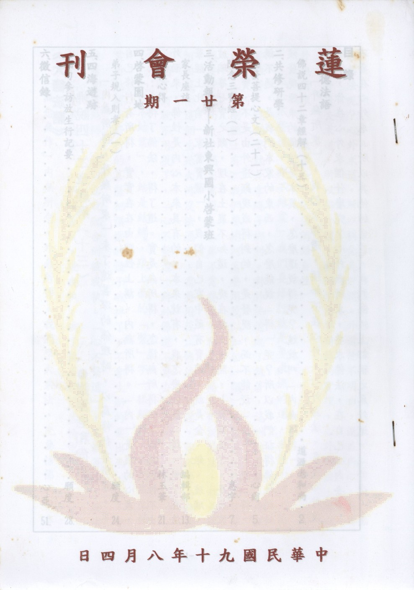

# 第21期

## 大德法語

### 佛說四十二章經解（十三）

*道源老和尚講授*

「內無所得，外無所求」

，未了達甚深的佛理時，以為修行有所求，求自己修行有所得，實實在在由理性上講，內無所得。「內」是我的心裏，有云：我得了佛法，得了道。實是無所得，怎樣無所得呢？因為佛性不由外面來，佛性是內心本來具有的，本來就有，我怎麼能說「得」呢？在法華經上比喻「家當寶藏」，我們自己家中藏有寶藏，就是金、銀、琉璃、玻璃等七寶之類，埋在土裏不知道，現在把土挖開，七寶顯現了，是我家裡七寶，不是由外邊顯現或得到的，是發現，而不能說「得」，說「得」講不通，是我們本家的東西，怎麼能說「得」呢？所以我們証得佛性的時候發現原來的佛性是本具，怎麼還說得呢？這就叫「內無所得」。

「外無所求」，我們求佛道，須知不在心外，心外無法。要是心外沒有法，你在心外求個什麼呢？心外無所求，要求佛法，在自己心內去求，不要在心外求。所以其他的宗教，我們佛經上都稱之為外道，「外道」怎麼講法呢？心外求道，所以稱他為外道。外道他不明白，道在內心，反而都在外邊去求道，所以稱外道。我們學佛要明佛的實理，心外無法，所以外無所求。（故學一切法須消歸自性）

「心不繫道，亦不結業」

，我們要修行就是要求佛的道，求佛的道，不要執著。這個繫就是拿繩子綁到。對於佛道起了執著，這叫做法執。佛說的法（金剛經上有）我們要過河需要用筏（如船一類）登彼岸，你登了岸還要背筏而走？過河需筏，上岸不需要了，釋迦佛給我們說的法，都是過河的筏。這個生死大河沒法過去，需要用筏（佛法）來渡，你不要去執著，過了河就不用筏了，「心不繫道」對於佛道不要去執著。

「亦不結業」，結是結縛，跟上面的「繫」字一樣解釋，我們眾生被業所結縛，修行的菩薩把煩惱的種子破掉了，不會生新的業出來，也不會被舊業所結縛，這句話就配合到破我執。「心不繫道」，不執著法，破法執；「亦不結業」，不執著我，破我執；破了執著就業盡情空了。

「無念無作」

內無所念，外無所求。我們學大乘法，先要悟佛的根本智，這個智慧就是般若智慧，般若智慧按體用上講分兩個，一個叫真實智，一個叫權巧智。「真實智」就叫做無分别智，不起分別，才能大徹大悟。既然不起分別就證得真實的智慧了，得了智慧的本體了，依體起了妙用叫「後得智」，就是證得根本的實智後，再生起度生的智慧叫後得智，即權智（對真實的智慧講），權巧方便的智有何用？度眾生用！度眾生怎麼度呢？「外無所得」，我天天講經說法，無法可說；天天度眾生無眾生可度。金剛經云，說法無法可說，是名說法，你要執著說法之相，則不明說法，說法無法可說，這就是真說法。度眾生，要是執著度眾生相，你度不了眾生。金剛經又說：令一切眾生入無餘涅槃而滅度之，而實無有一眾生可度者。度一切眾生成佛，實實在在沒有眾生可度，這才是真度眾生。

「非修非證」

我們要修行才能證果，按大乘實理講，修即非修，證即非證，為什麼修行叫非修呢？叫依性起修，依著我們本有的佛性來修行，佛性是沒有相，所以沒有修行之相。依性起修，修即非修，而所證得佛果乃全修即證，證無所證，全修即證，所證之佛果乃證得本性，本性本來有，何來新得？所以證即非證。（未完待續）

## 共修研學

### 勸發菩提心文（二十一）

*心爾*

云何念佛重恩？釋迦牟尼佛最初發心即為眾生，行菩薩道，以六度、四攝利益有情，時間是無量劫，為積集福智的資糧，備受諸苦，有很多眾生不但不能體會佛的悲心，反而對佛有種種的惱害，佈施頭目腦髓，人家還嫌臭、嫌髒。吾人發心度眾行菩薩道時，才會體會佛的辛苦，如母親的苦，只有當母親時才能體會。

「我造業時，佛則哀憐」

，佛不是不管，是沒有辦法，如忠臣勸君主，苦口婆心勸君主時，君主享樂的意念已決，忠臣亦無可奈何，彼忠臣之願不是君主惡業的對手，有一天要亡國時，卻大罵臣子，「朕非亡國之君，眾皆誤國之臣」，至死都不改。不管佛苦口婆心的教導（見諸經論），我則依然故我，依然有我的走向、有我的前途、有我的主見，到最後造業受苦，再叫佛在哪裡？佛都被我們趕走了，像忠臣被殺光一樣。

「方便教化，而我愚痴，不知信受」

，如皇帝一旦昏庸以後，看到那些忠臣，越看越討厭。我們若不修行，看五欲六塵，越看越可愛，看教理越看越步入，越修行越沒有味道，看修行人也越看越討厭。

「我墮地獄，佛復悲痛，欲代我苦，不能救拔」

，其實我是得到十方諸佛的關愛、憐憫，欲拔我的痛苦，可是沒有辦法，我太在意我的看法，太在意我的無明我執，太在意目前的享受，太在意人世間的順逆境，因為業太重。

「我生人道，佛以方便，令眾善根」

，釋迦牟尼佛要涅槃的時候，諄諄教誨善知識要流傳教法，付囑諸善知識弘傳法教，以利益眾生。

「世世生生，隨逐於我，心無暫捨」

，彼為我來娑婆世界已八千次，我去地獄他也去地獄，但我的無明，使我依然故我，他奈何不了我，他的願力再大，不如我的業力，

「佛初出世，我尚沈淪，今得人身，佛已滅度」

，度我的因緣都不成熟，天上的明月再亮，都映不到污濁的水裡，佛雖度不到我，但法會中常常付囑諸大善知識，應以眾生為念，弘傳法教以利益眾生，我人或許與佛因緣不具足，然與佛所付囑的善知識有因緣，就從善知識處入佛門，試想佛恩重不重？彼（佛）即便度不到我，亦殷重付囑地藏菩薩等諸大菩薩，作為我們的善知識，好好於苦海中度化我，而佛從旁冥冥加被。

「何罪而生末法」

這是自悲，

「何福而欲出家」

這是很慶幸，兩句是大師的悲喜交集，

「何障而不見金身」

沒有在佛世見到佛身，

「何幸而躬逢舍利」

還好逢到佛色身的舍利，與佛的法身舍利，上兩句亦是大師悲欣交集的心情，還好有善根福德，才能在佛的法教培養出來的善知識，代代相傳中受益，這些都是佛恩，此即飲水思源。

「如是思維，向使不種善根，何以得聞佛法，不用佛法，焉知常受佛恩，此恩此德丘山難喻」

，我們不種善根就聽不到佛法，可見過去種善根還是從聞佛法來，是一個循環講法，我不種善根怎麼聞得到佛法，可是種善根也要聞佛法才種的到，所以是一個循環，聞佛法才知道，原來我能夠做人，是因為聞佛的五戒而如理受持，故我今天能吃能喝即是佛的功德，可歎做人以後馬上不認帳，如同世間人給他利益後反臉不認人一樣。（未完待續）

### 隨念三寶經

惠宇

前言

為了利益盡虛空遍法界眾生，須成就無上正等正覺，為了成就無上正等正覺，眼前以研究經教為下手處。共修會的成員為了自立利他，舉辦念佛共修法會及共同研究教理，以解行並重的方式，將來成就無上菩提。佛法是非常寬廣而深遠的，以世間法來比喻就如同大海般的浩瀚；初學佛者為了方便入門得到真實受用，於諸多經論中選擇以成就諸善法為根本的十善業道經，以增加學習者對善法的好樂、義理及規矩的了解，作為斷惡修善的助功；為了在法的認知上有更確立的走向（成就大乘佛果），因此於研究上述經典後，進一步學習三寶的功德，眼前因緣是隨念三寶經；以三寶作為我們皈依的對象，並時常憶念，將它深植心中，有助於對三寶信心、恭敬心增強，往後不論禮佛、拜佛、問訊，都能有更強勢力，成就更大的功德。

以下就本經的內涵，為什麼皈依三寶到皈依三寶後應做些什麼？及如何實行教法三方面來說明。

本經由我國藏文經典中檢出，並譯為漢文。分為三部分：一、聖隨念佛經，二、隨念法經，三、隨念僧經。就第一部份言：主要說明稱念如來功德。佛陀具足十種功德名號，即：如來、應供、正等覺、明行圓滿、善逝、世間解、無上士調御丈夫、天人師、佛、薄伽梵。由於佛陀能破除一切煩惱怨賊，是自覺、覺他、覺行圓滿者；因此，為饒益一切有情眾生，使其破迷啟悟，離苦得樂，首示自身之福德及身德圓滿。就前者言，是福德等流無盡；就後者言，是三十二相，八十隨形好，行住坐臥具諸威儀，一切動作使人生恭敬心、信仰心。次為利生事業，佛以平等慈悲作饒益業，並以殊勝的三業轉法輪，雖身處三界，但已斷盡有漏苦法，成就諸法無著，故和而不流。末後以斷德及智德圓滿，成就自他兩利。就第二部分言：主要說明佛所說圓滿教法。其以八聖支道為根本法輪，若能依法修行，則能引生戒定慧，斷惑智生。再者，佛所說法是隨機施教，對有解脫因緣者如聲聞、圓覺、菩薩，說以三乘正法，使其不受不漏生死之果；對無解脫因緣者如人天，以五戒、十善方便門安置人天善趣。且一聞教法，終為道種，現前得殊勝利益，將來可獲菩提涅槃之果。就第三部分言：主要說明聖僧功德。所謂聖僧是指出家比丘、比丘尼，要證有學或無學聲聞與初地以上菩薩，其修行表現在四方面：（一）善巧修行戒定慧（二）證入真如空理，所修諸行皆應於理（三）能和合共處（四）內證之理相應於所修之行，無諂無狂，如實顯現。因此，依此福德及智德，能為眾生福田，堪受眾生禮敬、供養、佈施及修福。

綜合上述，三寶具備如此殊勝圓滿的功德，吾人怎能入寶山而空手回呢？那麼應如何做，才能不虛此行又能表現出對三寶無比的誠意呢？依照 法尊法師於《從為什麼皈依三寶到皈依三寶後應做些什麼》一文中，可詳細了解。

一、以正信皈依三寶。何謂正信？可分三層次：（一）希求超諸惡趣，常生善趣；（二）成就出世正因的皈依；（三）依大悲、大菩提心皈依三寶，為具足最無上正因的皈依。

二、為何只皈依三寶不皈依別處？依《瑜伽師地論》言，由四緣故，唯有三寶是真可皈依處：（一）其所皈依之對象，必須已斷盡一切煩惱眾苦；若自未能出苦，不能度他出苦故。（二）要於一切度生方便皆得善巧；倘僅自解脫，而不知隨順機宜宣說諸法要，縱皈依他，也不能度人出離苦海故。（三）要具足大悲心，見有情受苦甚於己受，不暇休息；若無大悲心，縱有度生方便，因見眾生難調難伏，或因時間長遠而生疲厭，不肯利人；縱皈依他，也難得其慈悲攝受。（四）要不顧財利供養，而喜愛如教修行。唯如來具足上述四種勝德，故其為真可皈依處。

三、如何皈依三寶？吾人應以誠信心為基礎，然後以佛所說儀軌加持；心念口言，皈依三寶。四、皈依三寶後，要學作哪些事？依《瑜伽師地論》言，大略為八項：（一）親近善知識（二）聽聞善知識（三）如理思維（四）如所知起正行（五）伏煩惱（六）學戒律（七）修慈悲心（八）供養三寶。

吾人既了解三寶的殊勝功德，又正信受三皈依，於日用平常應如何實行佛之教法呢？一、時時覺醒：應時常提醒自己，五濁惡世的可怕、輪迴六道的痛苦，遇逆境時勉勵自己，提起精神想想惡道眾生的悲慘；遇樂境時應冷靜下來，不要被眼前現象所迷失，因為諸法皆無自性，只是依因仗緣而起現行；不苦不樂境時，更應督促自己不要被這種境限制住，而忘失成就佛道度化眾生的大願。二、時時觀照：將所學諸教法，於內心時時觀察、覺照，先了解自己問題所在，進而將煩惱縛住，最後加以對治。使自己內心保持清靜及平和，有助於對問題的解決及增強對善知識和教法的接受力。三、時時懺悔：將自己的過患，於三寶前發露懺悔，對於已發生的能重報輕受，並以歡喜心來接受及祈請三寶的加持；至於未發生的應時時修改，於起心動念時不要惱害眾生，所謂：罪若起時將心懺，即是此理。四、時時隨喜：正面來看於作任何事情，如為公發心辦理佛事等，心態上除了隨念三寶功德外亦應盡心、盡力、隨份、隨緣；反面來看不可嫉妒，縱然無法親自參與也要隨喜，且所做善法不須故意表現怕人不知。五、時時回向：末法眾生跟機陋劣，所做諸法皆是有漏法，縱然做了很多善法，很容易遇境逢緣而起貪嗔癡，而將諸功德耗盡，若能將所做功德予以回向，以作為成就無上正等正覺資糧。

經中有言人身難得，以得人身如掌中沙，失人身如大地土為喻。而今有幸得人身並聞到此無比殊勝之法，怎能不好好把握確立目標及志向呢？故身為佛弟子的我們，應隨時以三寶為學習的依歸，培養對三寶的恭敬心，提昇好樂善法的心，並精進不懈，才能報答三寶及眾生之恩德。

## 四海遊蹤

### 緬甸參訪放生行紀要（上）

願度

一、緣起

廖居士為了帶領一個佛教團體（約一百五十人）的緬甸朝聖活動，特別到緬甸探路兩次；一到緬甸，他就覺得這個佛教國家的人民非常的淳厚、善良，全國人民平均月所得只有十元美金，其中約有百分之五十以上的收入用作供養三寶，全國有超過五百萬座佛塔，人民最貴重的東西大部分都供養，卻沒有到佛塔去偷任何的供養；於是便邀請老師到緬甸參訪放生，再加上李老師為了幫父親祈福、迴向父親業障消除、成就父親往生的順緣，便成就了這次的朝聖放生之旅。

一直以來，末學做任何善法的勢力都非常薄弱，這次也不例外，在第一次聽到老師說緬甸行的時候，內心非常嚮往，但後來由於自己的簽證關係就打算放棄此行，但由於老師與周阿姨的鼓勵成就了此次的朝聖之旅，回過頭來，著實非常感激兩位善知識的提攜，讓末學堅定此行的意志，亦感激蓮榮諸位學長的護持與民族東路各位同學的幫忙才成就了此次的知性之旅。

二、雪達根大金塔

這是第一日晚上的行程，當我們一行人到達塔底的入口時，依規定必須赤腳上塔，開始時，大家都覺得怪怪的，但後來很快就習慣這種風俗了。在緬甸這個國家裡，進入所有的塔院都必須赤腳參拜，而我們自己也是如此去感受沒有穿鞋的感覺，確實嚐到了所謂真正的腳踏實地的感覺，希望藉由身體的腳踏實地到內心的腳踏實地。大眾經過了電梯，進入了大金塔的範圍，穿過了一個二百公尺的長廊，進入眼簾的是一重重的樓閣與殿堂，彷彿回到了二千五百年前釋迦牟尼佛時代的祇樹給孤獨園，給孤獨長者以黃金舖地，成就了釋迦佛宣說通途與淨土法門的殊勝因緣。大金塔熠熠金光，象徵著阿彌陀佛的無量光明，遍照十方國土，無所障礙；四周圍繞了六十四個大大小小的佛塔，亦象徵著一佛出世、千佛擁護，又像西方極樂世界諸上善人聚會一處，以阿彌陀佛為主弘揚各種教法。在七重欄楯、七寶樓閣的環境中，每個人都是很悠閒的在繞佛、念佛、浴佛、供燈及禪坐；緬甸人浴佛有一個習慣，就是自己是幾歲時就浴幾次佛，當我們用此種方法去浴佛的時候，就會發覺自己很容易手酸，做善法報恩的能力是這麼的不堪，但無始以來我們是承受了無量的佛恩、父母恩、師長恩、施主恩及眾生恩，他們給我們的恩德都這麼的無始無終、無怨無悔，但我們在回報的力量卻是如此微弱，不禁想起省庵大師所說的只有發菩提心才可以回報這無量的恩德。巍巍的殿堂中蕩漾著善知識的法音宣流，讓我們去除無盡的煩惱—特別是瞋恚，而開發智慧；晚風吹拂，風鈴正叮叮噹噹的響，正如西方的微風吹動，出微妙音，讓眾生從皆悉念佛念法念僧到自然念佛念法念僧，成就無生法忍。在這樣一個祥和、極樂與安定的環境中把自己培養成人才，因為每天都能很快樂的做種種法行—可以觀想正在禮敬十方諸佛，每一殿堂裡都有我帶著無量眾生去供養諸佛，禮請善知識轉法輪，並懇請善知識長久住世以讓我及眾生可以常隨佛學，能恆順無量眾生親證佛性；非常隨喜緬甸的人民可以在最艱苦的環境裡把最上妙的東西供養三寶，表面上緬甸是個很窮困的國家，但實際上他們可以把最好的的東西供養出來，莊嚴道場與環境，讓每個人都可以享受這樣美好的境界，事實上他們才是世界上最富足的，應驗了遺教經上所說的：「知足之人，雖臥地上，猶為安樂。不知足者，雖處天堂，亦不稱意。不知足者，雖富而貧。知足之人，雖贫而富。不知足者，常為五欲所牽，為知足者之所憐憫。」最後我們可以把種種的法行作無盡的迴向—願眾生離苦得樂、願眾生往生西方、願眾生得成佛道，希望我們這樣的願力就像大金塔一樣堅固不動，並讓我成就像大金塔一般的智慧與禪定，才可以荷擔如來的家業，就像在荷擔我們的孩子一樣。

此塔始建於2500年前，高近100公尺，是當今世界最高的佛塔。塔頂及外觀以16噸純金構成，頂上金質寶傘下有一直徑27公分之黃金鑽球，球面鑲有鑽石及各色珠寶多達7000餘粒，其中之一粒鑽石有76克拉，價值連城。佛塔四周環立64座各式小塔簇擁著大塔而形成金色的塔林，周圍圍繞著很多天王請佛沐浴的塑像，也有些殿堂是佛陀度五比丘的塑像。佛陀在世時，有兩位兄弟到印度經商，遇到了佛陀並很歡喜的供養佛陀，於是佛陀便把自己的八根頭髮送給他們，當送回緬甸時，得到了國王的歡迎，並建了此塔來供養佛陀的頭髮，當時的大金塔只有2.1公尺之高，經歷代的修建，才擴建至今日的規模。置身於雄偉的殿堂中，不禁讚嘆緬甸人的虔誠、恭敬與毅力，讓自認擁有五千年文化的我們深深感到慚愧。

晚風徐徐的吹拂當中，當地的長者子善知識—吳塞牟居士與我們做了詳盡的對談，其內容約如下：吳塞牟先生為當地一位部長級官員的兒子，是英國法學碩士；十三歲時患有心臟病，在父母的善巧接引下開始學佛，並親近馬哈希禪修中心，學習禪坐，他是一位富貴中人，一般說是很難來學佛的，就如四十二章經上說：「富貴學道難。」他是如何走過這個瓶頸呢？他的禪修老師告訴他說人到最後無常來時不論好的、壞的東西都需要捨棄，所以平常就應做這樣的訓練，把自己的一切捨棄—供養三寶或幫助眾生，並願以此功德迴向自己得到強大的力量來修習禪定，達到了脫生死的目的，並經過累劫的修行而證得阿羅漢果。因此平常時期，他就把所擁有的一切錢財盡量用於佈施，二分之一供養於三寶，二分之一用作幫助孤兒及無能力繳交學費者；除此之外，在他留學外國以後他更肯定自己國家的傳統文化與佛教，並希望盡己所能的招待遠道而來欲了解緬甸文化特色的外國人，以文化為基礎、科技為輔來讓緬甸成為一個有方向、有活力、有朝氣的國家。在興辦善法的過程，雖然遇到很多的困難，但他都本著最誠懇的心幫助需要的人，而不論對方是否是一位有誠意得人，他認為從這裡已經得到了功德。他正在進行重修五塔山佛塔的工程，在這當中遇到一些村民的反對與當地地神的阻礙，但他都本著慈悲的心態與為公的智慧一一克服，最後甚至有村民都來幫助他修建佛塔，以讓他早日完成建塔的大願。

三、風動石

經過了一整晚的大金塔法味之旅，第二天一早大眾五點半就起床了，趕路到風動石。

在遊覽車上，除了欣賞緬甸明媚的風光外，李老師發心講解有關齋僧的心態：（1）懺悔心，懺悔從前盜僧食之惡，對治偷盜的習性，並發願未來可以供養一切僧眾。須至誠恭敬心的供養，因為僧寶是天人師表，出家乃大丈夫所為，非將相所能，所以應對彼起無比的恭敬心。（2）感恩心，僧眾讓我們供養只是培植我們的福報，他們就像磨刀石，我們就像刀子，我們供養僧眾就像把刀子放在磨刀石上磨，我們這把刀子變利，可是磨刀石卻損減了。（3）慈悲平等心，眼前我一人供養現前的僧眾，其實是整個團體乃至全體眾生供養所有十方三世一切的僧眾與十方三世一切佛。（4）清淨無所得心，其實施者、受者及施物是三輪體空，只是緣起法現行而已，剛好今日我有此一個機會來到這裡，手上剛好有此供養物（或其他人幫我準備的），而又遇到此一機會可以供養僧眾而已，在這當中的施者、受者及所施之物都只是剛好碰在一起，而非有一個能施的常一主宰的我在作主，物與所施者都是隨緣現起，當體即空。（5）無上菩提心，我此供養是不為己、不求報，而是為了帶領一切眾生來行此供養法行，並積聚成佛的資糧以迴向一切眾生都能離苦得樂、成就佛道；如此供養，功德無量無邊，這就是地藏經所說的：「捨一得萬報。」（6）對治慢心，其實我們的學問、道德及能力都很薄弱，由齋僧引發我們欲向僧寶學習教法的心意，以對治我們不肯學習的慢心。（7）僧寶是佛的代言人，供養僧寶即是供養佛，讓僧眾能安心辦道即是護持教法，令正法久住。（8）我們今天所擁有的財富是過去於三寶門所修的福報，所以今天也應於三寶門中供養，以延續自己佈施的心態來對治自己慳貪心的相續，由「因」去對治自己餓鬼道的果報。（9）隨喜心，若我們在齋僧之時無法親手佈施，也能以很高興的心態隨喜團體與眾生能一起拿飯、端菜及給錢供養僧眾。古德說：「泥龍雖不能致雨，禱雨者必祭泥龍；凡僧雖不能降福，求福者須供凡僧。」但若我們能努力發起以上的心態來齋僧的話，必能感應賓頭盧頗羅堕尊者的應供，而得到供養聖僧的果報。

從前在佛陀在世時，緬甸有二王子到印度向佛陀求法，佛陀各給了他們兩根頭髮；弟弟建塔供養，但哥哥卻把這兩根頭髮帶在頭上，一直到他垂死時才肯把這兩根佛陀的頭髮拿出來建塔供養，但條件是此供養髮舍利之佛塔的石基必須是懸在半空中，結果帝釋天滿其所願，所以此兩根髮舍利便得以供養在風動石的佛塔上。

我們遊覽車經過了五、六個小時終於到達了山腳下，需要在山腳下換貨車上山，大眾匆匆忙忙的坐定了座位，接著車子開了，站在車上向遠處眺望，頓覺心胸開闊、神清氣爽，山路顛顛簸簸，這時我們大家都有一個覺受—就是緊緊的握著車身，這時末學產生了一個覺受—因為三界的過患、輪迴苦的觀修，我由於害怕落入輪迴的深淵，就像我害怕從車上掉落一樣、落入山谷的深淵，所以我緊緊的握著車身，就如我緊緊的捉著阿彌陀佛的佛腳，把每句佛號都念的清清楚楚，不讓它有任何的閃失。好不容易經過了半個小時的車程，抵達了放生蜥蜴的場地，在微風細雨當中，大家誦念放生儀軌，以最至誠懇切的心期待著蜥蜴離開籠子，但蜥蜴的頭卻卡在籠子上，就如我們是被這個五蘊色籠所控制，思考的範圍沒有辦法超過我們身體的束縛。後來想出了一個方法—把籠子倒過來，讓蜥蜴的身子往下傾，並用一隻木棍輕拍它的頭，讓它慢慢的把頭從籠子外縮回來，從這裡可了解到善知識是費心的幫助我們脫離三界的束縛—手段有軟的、也有硬的，但我們卻死也不肯把頭縮出來以擺脫三界的束縛，這就是我們的寫照，所以當我們幫助別人而得不到別人的回應時—或者遭受困難、或者遭受誤會、或者眾生恩將仇報，都應堅固自己的願力、發展自己的悲心，於善法有堪忍性，對於自己該做的事能義無反顧的去做。在放生後，又迅速的開車往山上奔去。經過了不久，終於到達了爬山步道的入口，這裡有好多的孩子們正等待著幫我們背行李以幫忙補貼家用，我們一行人很快的拿出一早準備好的原子筆、舊衣服與孩子們結緣，孩子們風雷似的把我們的結緣品一掃而空，末學起初對他們興起了憐憫的念頭—在台灣像這樣的大的孩子正在學校唸書，並在父母的呵護下快樂的過著他們的童年；但換個空間，在緬甸這些孩子們就必須出來謀生以貼補家用，可是轉念一想，到底是台灣的孩子們可憐？還是緬甸的孩子們可憐？那就不得而知了，其實或許可憐處不同吧！緬甸孩子或許在物資上是缺乏，但其實孩子們面對逆境的力量卻比我們強得多了，他們有豐富的生活經驗、克服困難的能力、知足常樂及綻放的笑容；但反觀我們卻沒有他們的能耐—對逆境的不耐、對慾望無盡的追求、沒有面對生活的能力、心裡種種的苦悶等等；所以得到一個結論到底誰是可憐者那就見仁見智了。其實我們佈施與悲憫心尚須藉他們而引發，見到他們渴望我們給予原子筆及讓它們背行李以賺取生活費的眼神時，恨不得把身上所有的東西都給他們，其實他們才是我們引發悲心的對境，由此而深深體會自己對佛法覺受完全來自於眾生的幫忙，而眾生才是我們累積資糧的大恩人，自己是沒有任何東西可以仗恃的，而不會引發一個我可以施予的慢心出來。還記得德蕾莎修女是在搭乘火車時，看到眾生向她乞討水的眼神而發起了無量的大悲心，願意排除萬難到印度最苦難的貧民區去幫助最需要的人；而證嚴法師也是在看到醫院不願收留一位山地同胞而導致他的失血過多，因而發起大悲心，成就了慈濟的志業。

結緣之後，每個團員挑好要背行李的小朋友後就各自上路，只見每個小朋友用一條塑膠帶頂在頭上、兩個架子分別靠在肩膀上、背上挺了一個約一公尺高的竹籃子，健步如飛，他們身上背了我們的東西，可是步伐卻比我們還要快，讓我們很辛苦的追上他們，想一想自己實在不如他們之處多矣，行行復行行，一路上覺得有點辛苦，但想到自己或沒有背東西、或背的東西比他們還要少，但走起路來卻比他們慢、比他們辛苦，就覺得很慚愧—想起我們承擔的事情比師友少，事情卻做的比師友慢，再加上做的時候也是一堆的煩惱；忍不住想起地藏經上所說的：「是等輩人，如履泥塗，負於重石，漸困漸重，足步深邃；若得遇知識，替與減負，或全與負，是知識有大力故，復相扶助，勸令牢腳。若逢平地，須省惡路，無再經歷。」善知識幫忙我負重的重點是讓我於諸惡道，無再經歷，這是多麼大的悲心啊！所以我們於自應好好去體會師友的心意，重點在於諸惡路無再經歷。

一路上細雨紛飛，但孩子們一點都無視於雨的存在，可是我們這些從先進國家來的客人們卻害怕自己著涼了，用盡各種方法保護自己。不知不覺的我們走到住的地方，準備好了雨具就到風動石朝拜；雨越下越大，卻絲毫沒有影響我們到風動石的熱情，末學第一次感覺自己是在團體的保護下對善法的堅固不退，其實當下很慚愧，自己獨自就算有辦法到風動石來，在這麼大的風雨下，末學一定躲在落腳處休息了，可是在團體相互勉勵之下卻能勇往直前，第一次感覺到自己在團體的受益是如此的大；經過很滑的磁磚地板與大理石地，團友們相互扶持，也不知道過了多久的時間，我們終於到達了欣慕已久的風動石，慈悲的老師對我們開示了繞石的意義—希望我們能像佛菩薩在最艱苦與最危難的地方建立自己的菩薩願，就如風動石一般雖懸在崖邊，但在大風大雨中仍可以絲毫不動穩如磐石；我們要堅固自己的悲願，對於利衰毀譽稱譏苦樂等八風絲毫不動心，在風雨中考驗自己朝聖的志向，就像在人生的逆境考驗才知道自己的志向，其實逆境與風雨才是我們悲願的試金石。在風雨中，依著階梯，我們小心翼翼的圍繞著風動石，似乎深怕自己被風吹掉或滑倒在地上，末學在這聖地繞佛就深深的發願，從此造善法時一定要像此石一樣堅固，不為八風所動。

在風雨中我們且驚且喜的供養了此道場的出家僧眾，主持和尚幫我們做了簡短的開示：「學佛的修行者必須隨時隨地都堅持有佛法僧的觀念，由無常、苦、空及無我的觀修中產生強烈的出離心以對治粗猛的煩惱。雖然我住在這山上，有的時候禪修時，突然會想到要去那裡的念頭，但都可以用數息觀及無我的觀修來對治；其實修行必須耐得住孤獨與寂寞，精進不懈的把心放在數息觀上，就能得到喜悅，而沒有想下山的念頭。」末學對於聽不懂緬甸法師的開示，深深的懺悔自己的無能，若能多學ㄧ、兩種言語，於自於他都具很大的意義，更希望在將來能具足言語的陀羅尼而能自利利他，但當下在言語上必須對治口的四種過惡，並具足誠實語、柔軟語、和合語與有益語，最後才能達到自己的目標。其實末學從來不覺得學習是一件很重要的事，從這次緬甸行之後，末學才真正體會到「書到用時方恨少」的覺受。

供養後，我們就冒著大雨到大石前面點燈發願，藉著大雨洗淨我們內心的污垢，雨一滴一滴的從我身上流下，把我無始劫來的過惡—親近惡友、不喜親近善知識、說謊、惡口、嫉妒、瞋恚、不隨喜善法、疑法、無慚無愧、輕慢佛法、於善法的不堪忍及於惡法的猛利造作等等毛病慢慢的從我及一切眾生的身上帶走，而流出很污穢的髒水，接著是法雨普降，讓眾生隨其根器的大小而得到這場雨的受用--「佛以一音演說法，眾生隨類各得解。」

隔天一早，當我們用完早餐後，走到外面一看，很多當地的小孩子已經在外面等候多時了—從早上四點就開始在外頭守候，等著幫我們拿行李下山，眾生在賺取世間財是如此的夙夜匪懈，反觀我們在造善時卻是休息必須足夠，才能有精神造善，其實這是多麼薄弱的意志，用這一點小水的善法就想撲滅我們累劫以來惡業習氣的大火，這是可能的事嗎？面對著一張張渴望的臉孔，末學選擇了其中一位小朋友幫忙背行李，很慚愧自己無法幫助這麼多的小孩，讓它們都能賺取外快貼補家用，但結合團體的力量，才可讓每個小朋友都能得償所願，這就是藉團體造善法的一個寫照。在下山的途中，樂學長帶了一群當地的小孩大聲的念佛，讓每位團員就如置身於極樂世界的喜悅—眾鳥演法音，讓團員們皆悉念佛念法念僧，也教會當地的小朋友念佛法門；我們依依不捨的慢慢往下走，一路上都可以看到三三兩兩出來托缽的僧眾，我們三五成群、一字排開、很恭敬的跪下供養僧眾；僧人們很有威儀的往下山的路走去，經過人們的家門口時，當地人便把食物供養僧眾，末學可以皮毛的想像僧人們必須赤著腳走下山到有村落處去托缽，然後再回到山上時已經是近中午時分準備吃飯了，這一來一往費時三至四個小時，都是靠兩條腿而已，從這裡我們可以很膚淺的去體會佛陀在世時僧眾的生活，對於佛經上所說的「一時」的時代背影便可以稍微想像。

以我們的雙腳為交通工具，不久就到了搭乘貨車之處，這時雨越下越大了，我們身上穿著雨衣，幫我們背行李的小朋友們以渴求的心向末學索取雨衣，但末學因為沒有帶雨傘、又怕感冒，所以就捨不得將自己的雨衣給他，起初自以為理所當然，到後來想到在山上有一位學長把自己的雨衣（雨衣不足）給長輩穿，而淋雨好幾個小時的精神，就深深的自嘆不如，保護自我的心態還是非常的強，在考慮事情處處以自我的利益為出發點，從這裡去懺悔遍滿虛空的慳貪與執我的意識，真是可怕極了—果報當熟在餓鬼。望著小朋友渴望物資的眼神，我們一行人慢慢的乘著貨車離開，帶著我們的「大蟒蛇」去放生了。一路上雨越下越大，但大眾不畏雨勢，一點也不馬虎的完成放生儀軌、為蛇祝福，希望它及所有動物都能永不遭遇網補吞殺、獲盡天年、速生淨土，也希望自己能去除瞋心、勿墮蛇道。

到了遊覽車的乘車處，才發覺有一位學長為了把雨衣給小朋友而淋得全身濕濕的，末學很隨喜她造善法的勇氣，反觀末學是在姨丈的三催四催下才把雨衣拿出來，由團體統一分給小朋友，不會因力量分散而造成分配不均（有的小朋友重複拿，有的小朋友卻沒有拿到）。

四、參訪達門樣長老

又是一次的「長期抗戰」--乘遊覽車，鍾師姑與大家分享了自己多年累積的寶貴經驗：老人家剛從公司退休，這次應可算是黃師伯與老人家的畢業旅行；老人家十七歲時就進了中華電訊服務，剛進去時很謹慎小心、非常恭敬長官及前輩們，深怕自己有錯、丟了工作，與現代女性的特質截然不同；後來投資了朋友的生意，損失了一千多萬，黃師伯二話不說，一起幫師姑承擔了這份債務；師姑從來不因此而怨天尤人，反而從環境中訓練了一股堅忍不拔的毅力，在師姑的臉上可以讓人感受到一股祥和之氣，看到她老人家就覺得心裡很舒服。學佛後，她一直覺得很受佛菩薩與蓮友們的關照，這應該是她老人家的慈悲心所感吧！以佛心看眾生，所有眾生都變成佛了。

成長是一個很重要的學習--「成長的過程是手上的疤痕，疤痕是生命的刻印。」從成長過程中，我們必須反省體會和學會感恩，從中體會人生一步一腳印的重要，並讓這個過程成為修學的資糧。從前的教育有一個很好的特質，就是年輕人必須學習尊重、體會及不妨害他人，這也就是我們這一個時代所欠缺的，讓我們繼續努力吧！

達門樣長老是緬甸的一位素食高僧，連現在泰國皇后也是其信徒，其方圓6.4公里內的居民全部吃素，由此可見高僧教化的力量。當我們車子駛進其教化區，可以感受到恍如「桃花源」一樣的風景--「阡陌相間，雞犬相聞。」一望無際的稻田與偶爾突起的小山，就像重回桂林一般；在回程中，大家下車散步；遠處的山上有著為數不少的佛塔，湊合著身邊小小的池塘與池塘邊的茂盛的柳樹，形成一幅人間仙境，似乎在向我們招手歡迎我們這些遠道的客人；看著小水溝清澈的流水，不禁令人羨慕當地人民的居住品質，沒有環境污染的問題；其實我們所看到的境界只是回應我們的內心，居住環境的清淨是回應自己內心的清淨，台灣的物資豐富，但卻找不到一塊淨地，或許是回應了我們內心的慾望、永不滿足，這裡環境卻回應了他們知足常樂、民風淳樸。

慢慢進入達門樣長老教化的「聚落」，最先進入眼簾的是稀稀疏疏的高腳屋，接著才有緊密相連的房子，末學第一次看到有這麼多的僧眾在街上活動，有點興奮；然後我們被引導到一間類似廠房的地方，決沒有想到那是一位萬人崇敬的得道高僧的住處，更不會想這裡居然每天可以24小時不停的供應超過10,000人的信徒用餐。這裡沒有金碧輝煌的殿堂，有的只是高僧的身教，嚴格的奉行頭陀法—去世資財、乞求取足、日中一食、樹下一宿，從「去世資財」去成就「斷欲去愛」，因為「使人愚蔽者，愛與欲也。」緬甸的僧眾之所以得到舉國上下的一致恭敬，就是因為他們保有了佛陀在世時的頭陀法，讓世人覺得他們把生活欲望減到最低，真正只為修行而已，由頭陀法去引發世人認同出家人與佛法，這也就是佛陀當初分半座給頭陀第一的迦葉尊者之原因，因為頭陀法的實行才可以讓教法流傳下去，才可以讓人尊重教法，而令正法久住不滅亡。

參訪了達門樣長老，我們又離開了這片樂土—僧眾的聚落，匆匆的趕路。途中經過了薩爾溫江，只見其河面寬廣、氣勢磅礡，在我們懺悔自己的業障、修學佛法時就必須有如此的勢力，就如風雷卦一般--「何患不消乎」。

車子開了不久，我們遇見了一群大象，上面都有人騎著，司機先生把車停下來讓我們去和大象合照，末學想去摸它，但大象的腳步很快，一下子就跑得很遠了。上了車，林老師就為我們講解了一首應景的詩：「鵝湖山下稻梁肥，豚柵雞栖對掩扉，桑柘影斜春社散，家家扶得醉人歸。」

在緬甸這個環境中，佛塔多、田園風光優美，在加上下雨時的風動石，就如唐詩江南春上所說：「千里鶯啼綠映紅，水村山郭酒旗風，南朝四百八十寺，多少樓台煙雨中。」

在車上，導遊小張幫我們翻譯了達門樣長老法語的偈頌：「出生相同，命運不同；命運相同，毅力不同；毅力相同，警惕不同；警惕相同，公正不同；公正相同，願不同；願相同，果不同。」

蔡老師也勉勵我們：在人生的過程中會有很多的障難，或許這些障礙就來自於我們至親的人，但佛法就是讓我們克服障難用的，而這些障礙都是「內外諸法，盡知不實，從心變起，悉是假名。」若我們把它看成考題，增加自己的忍辱與承受力，並在這當中懺悔自己的過惡—重報輕受，就可以累積我們往生的資糧。

林老師對於自己這次能夠來緬甸，要感謝很多的媽媽，因為這些媽媽知道林老師要參加此行都願意照顧微智及維典，為了感謝這些媽媽們，老師就與大家分享了孟郊的遊子吟：「慈母手中線，遊子身上衣，臨行密密縫，意恐遲遲歸，誰言寸草心，報得三春暉。」慈母手中的線是為了遊子，我們可以試著想想母親的手為我們做什麼事？洗衣、煮三餐、倒垃圾、掃地、梳頭髮、拖地、洗碗筷、收拾東西、曬衣服……等等事情，而縫衣服只是其中之一的事情，媽媽縫衣服的線是密密的，而用的心意也是密密的—無時無刻都記掛著孩子，而且很害怕孩子們遲遲回來，孩子們用的心意也是遲遲的、慢吞吞的、漫不經心的；母親綿綿密密的心意，我們是無法報答的；「三春暉」，春天有三個月，春天的太陽是不會灼熱的，這裡用以比喻父母的心對我們的照顧，孩子們生下來就被三春暉所滋潤，從沒有間斷過，直到父母親過去方止。

我們一行人必須到勃固去用晚餐，緬甸的電話很少且不方便，因為車程拖延的關係，我們到用晚餐的飯店已經深夜十二點多了，而且無法以電話通知飯店；當時正下著大雨，我們車上的司機先生與飯店的工作人員馬上拿著雨傘一字排開，用很真誠的笑容迎接我們，讓我們免去受雨水淋濕的惡運。用餐時，所上的菜是都是熱騰騰的，大家一致對緬甸人的誠意留下深刻的印象—加班等到十二點還笑容可掬。約凌晨二點，我們才到了下榻的飯店。

五、水中佛寺

水中佛寺，顧名思義是建在水中的道場，由岸邊乘船到達只需五分鐘，我們帶了一些水族到佛寺的入口處放生，也與當地的居民結緣—讓他們一起參與放生。放生後我們先到釋迦牟尼佛的殿堂去繞佛與迴向，然後再拿飼料去餵魚；順著階級走下去，我們把飼料分到各團友手上，開始一丟，沒動靜：接著下來就可看魚游出水面吃飼料的情景，這裡很多的大頭鰱，都會把頭伸出水面吃東西，人們也不會來捉它們，據說在緬甸佛塔方圓五公里內都是禁捕區。

水中佛寺所供養的是水中佛，他是一位臉稍往上仰年輕出家人的形象，相傳有一位國王，從一條魚腹中得到了一個女孩，此女孩雖然長得很美麗，但卻有一股魚腥味，後來此女孩懷孕了，就生下了水中佛。後來水中佛去出家，有一位痲瘋病患供養他食物，他以「缽」承接供養時，看到此病患的手，且病患有一隻爛手指掉到缽裏，而猶豫要不要吃飯，然後臉往上仰而深思是否未過中，但發現未過午須吃飯以惜福，在亡淨穢相而受用缽食之後，證了羅漢果。緬甸水邊佛寺都有供養這一位向上仰的聖者。
在水中佛寺中記載一位國王夢到一些景象，他去向佛陀請教尋求解
**答：** 

（01）四隻牛互相鬥爭，表示世界將會越來越亂。

（02）小樹結成果實，表示未來人類年紀還很小時就開始傳宗接代。

（03）大牛吃小牛的奶，表示父母親要靠兒子的臉色過活。

（04）大牛不用，用小牛托運重物；表示有能力者不被重用，而在上位都是都是能力較差者。

（05）兩頭馬一邊吃穀一邊吃草，表示有權者黑白通吃。

（06）一位農夫在結繩，而床下有條狗在咬繩；表示先生在外辛苦工作，妻子在家裡打牌玩樂。

（07）一位婦人倒出三種米，表示未來的稻田有三種：茂盛的稻子、土地乾裂及水分過多。

（08）葫蘆浮在水面上，表示無內涵的人出來講話人人都聽。

（09）一隻小船快碰到大石頭，表示有才德的人出來說話人人都不聽。

（10）青蛙正在吞蛇，表示妻子比丈夫還凶。

（11）一群金雞當中有一隻烏鴉站在高座，表示有才德之人須聽無德能者說話。其實這些預言都一一應驗在現代的社會，我們應該有所警惕，若無法轉變共業，只能求共中不共。

遊過水中佛寺，我們回到岸上，在一露天的地方享受著椰子汁，這時有很多的小孩來幫老人家或其他蓮友按摩，大家在這裡拼命的喝著椰子汁，一個、二個，往肚子灌下去；末了，才依依不捨的離開了這裡。（待續）

### 緬甸參訪放生行紀要（下）

願度

六、馬哈希禪修中心

這是我們第一次體會在緬甸齋僧的情境，一早我們到中心時，吳塞牟先生的團體已經幫我們把菜都準備好了，我們分成男女眾兩部分，把菜裝入小的塑膠盒中，裝好後就在路旁等待供僧。僧眾排成一列，拿著一個大缽徐徐而來，末學只是感受到佛陀在世的正法時代或許就是如此情況，我們到這個國度才能約略得知；以前末學很會在造善法時偷懶，後來想造善法，就像此次的齋僧，因為事少人多，就會開始爭著去做、而沒有考慮到別人，老師曾對末學說緬甸這個居士團體的器度非常好，它們一早把飯菜煮好以後就往後退、不爭功，而齋僧的功德讓我們去成就；聽了老師的話，末學開始思考—造善法時，要看情況，別人喜歡做的事情，我們可以退到後面去隨喜別人的功德，若別人有所不足之處，我們應該很敏銳的去補足它，可以讓人無後顧之憂的去興辦各種善法，並非一定要我親手去成就（或可是貪功德），從這當中可以破我執--「這是我做的」；其實每一件善法的成就都端賴團體的促成，何來有我一人可以獨立承擔呢？

齋僧後，住持和尚幫我們做了簡短的開示：這裡的禪修中心是以數息觀為主，在一呼一吸當中把意識集中到丹田，從觀出入息當中慢慢得到禪定的喜悅。以禪定讓心定，讓心力很強，而產生戒定慧三無漏學。在學習三學之前，我們必須生起出離心，知道人生與輪迴的苦，看清諸法實相：身體是不淨的、是由微小元素所構成，而心卻是念念遷流不住。對於自己面對的生死問題，神通並不能解決，唯有斷除煩惱、達到涅槃的境界，才能了脫生死；因此有心出離的行者必須修行解脫法，以禪定來扶持戒（定共戒）及慧（定共慧）。以禪定鞏固自己的出離心，去觀察心念是無常的；身體是不淨的，它只是由細胞元素所組成，生命只是維繫在呼吸間，呼吸是肚皮的脹縮來維持，從這裡去生起對身體的厭離—身心只是無常性、一切都在變化之中，而沒有常恆不變的一個我存在，而由我這個身體是產生對朋友、財產及眷屬的執著。有了厭離心，我們就必須運用方法好好修行，其方法包括：坐中修時用數息觀把念頭定在丹田，歷緣對境修時則在四威儀中好好維持當下的一念，譬如走路時，知道我是要走路了，再把腳跟提起，右腳往前跨、放下，對於每一個動作都知道的清清楚楚。訓練自己的明瞭意識，很清楚的知道自己在做什麼事情，而且很清楚的掌握所有現象的生起都是無自性的。從禪定當中去觀察三法印，可以把心念定在教法上，念念去觀修自己的所作所為而不會再造惡業，這就產生了戒，並觀察無獨立存在、常一主宰的自我，從這裡可以使我們產生很多的能力斷煩惱以自利利他。

林老師說出了自己的覺受：這裡的修行人放下所有的欲望，從身、到心，最後連我執也放下了，我執的過患就像非常大的一個胖子，他要過門就無法通過，會把所有的門都弄壞了，我們的我執即是如此，會處處妨礙到別人，讓別人很難受。從身、心及我執當中去看到其痛苦的一面，產生厭離；而快樂是來自於內心的清淨—從深刻的觀察當中深刻的體會而得到深刻的覺受。我們對於眼耳鼻舌身意，只要單純的去感覺即可，所有境界來了，就單純的觀察，沒有任何好或壞的自性，事情來了須做完，做完了就完全的放下即可，是非對錯是良知良能，做錯了知道下次不要再犯就好了，盡心盡力做完了就放下，不要再去緣慮境界緊緊的抓住他不放，也不要去餵養與縱容境界的愛執，不要隨著自己的煩惱思路去攀緣而讓它在心裡留下痕跡，就如在天空飛過的小鳥不曾逗留，又如波浪起了又回復到原點，而視一切境界其淡如水、水過無痕，而留下的只是對生活的體會與殊勝的覺受而已。

七、塞卡灣佛學院

經過了早上馬哈希禪修中心的齋僧，接著我們又趕到勃固市的塞卡灣佛學院；這裡有一千二百位僧侶，我們到達以後分成四隊供養白飯給這裡的僧侶；看到他們整齊有序列隊而過，沒有發出任何的聲響，進到齋堂也很整齊無聲的到達自己的座位上，一千多人用餐沒有一點聲響，難怪從前一位宋明理學家看到僧眾過堂的威儀時，他不禁要讚嘆：「三代禮儀盡在其中矣。」托缽是身心全部放下，修行已經融入生活之中了，每一刻每一秒都學習放下自我的身段，從這個苦行當中可以降服慾望，並與信徒們結善緣，讓信徒們培福報，並藉此機會說法給信徒聽。

八、雪達良臥佛寺

這是世界最大的臥佛寺，長五十五公尺，高十六公尺。看到臥佛，老師帶領我們提起意樂：佛陀示現涅槃也是為了讓眾生了知生滅無常之道理，並希望眾生在往生西方時都可以示現像佛涅槃如此安詳之像。看著佛陀靈動喜悅的眼神，不禁懺悔自己：「佛在世時我沈淪，佛滅度後我出世，懺悔今生多業障，不見如來金色身。」若平常對自己家裡的佛堂一杯供水、一枝香也無法供養的話，我們還以什麼資糧去感應生於佛陀或阿彌陀佛的正法時代呢？更以什麼能耐去修學正法呢？

九、五塔山

這是吳塞牟先生著力興辦的道場，在決定興辦這個道場時，先生遭受到人與非人的一些阻力—人即是村民的反對，而非人則是或許此地是龍族所居，但都被先生的誠意所感而一一克服，我們到達山上時，末學為了洗毛巾而到處找水，結果當地的居民竟誠意到幫末學用肥皂洗好，再拿給末學，一時不知所措。

休息了一下，我們先去放生—放穿山甲，他是很可憐的動物，身體的鱗片上有很多小蟲吸它的血。放生後，我們就開始供燈，因為風很大，我們想盡了各種方法讓我們的蠟燭不要熄滅，有人把幾根蠟燭合起來點（團結力量大）、有人把它點在佛像處、有人把它點在風吹不到之處，大家拼命的點燈發願，並代為這次無法同行的眷屬與善友乃至全台灣、全世界及法界眾生來點燈，我們都希望自己可以發起無漏之因來供養我們手中的燈，所以大家都點的不亦樂乎、流連忘返。

當我們用晚餐時，當地的居士們便拿了扇子在後面幫我們搧，就像古時的皇帝一樣，讓我們非常的惶恐。我們將桌上的菜吃完，它們就快速的把菜又補足了，吃完了又很快的把飯桌移到後面。在用完餐之後，住持就告訴我們必須以慈悲、宽容及善良的心態來面對眾生，對於護持者每日幫他們迴向，希望他們早日解脫生死輪迴。

下山時，他們已在山路上點好了蠟燭，又怕我們看不到路，並走在泥濘的路上，用手電筒照著我們的前路，以讓我們好走。等到我們要上車時，又準備好了水讓我們洗手洗腳，其實這些都非他們刻意的，而是他們平常招待客人就是用這樣的禮節，所以對於「禮」，我們要平常訓練，才會表現的落落大方；這種誠意表現緬甸民風的純樸，難怪孔子要說：「先進於禮樂，野人也。後進於禮樂，君子也。如用之，則吾從先進。」

十、孤兒院道場

早餐後，懷著最至誠恭敬的心去供養一千三百位孤兒的出家人，約一小時的隊伍，有條不紊的依序接受供養，可以揣測正法時代的威儀是如何的攝受人心，我們真的生不逢佛世，無法體會佛陀在世他老人家真正的教化是如何。午餐後，大家懷著依依不捨的心到達了機場，三寶給了我們緬甸之行的最後加持—一場大雨，看看我們緬甸行的豐富覺受是否一場大雨就把我們洗刷殆盡了，但我們似乎都不受影響，而懷著歡喜的心情滿載而歸。（完）

編後話：此篇文章乃匯集各位長輩的心得及記錄而成，在此感謝大家「編輯資源」的提供，阿彌陀佛，願大家法喜充滿，光壽無量！

## 啟蒙園地

### 弟子規　入則孝（一）

願度

「父母呼　應勿緩　父母命　行勿懶

父母教　須敬聽　父母責　須順承

冬則溫　夏則凊　晨則省　昏則定

出必告　反必面　居有常　業無變

事雖小　勿擅為　苟擅為　子道虧

物雖小　勿私藏　苟私藏　親心傷

親所好　力為具　親所惡　謹為去

身有傷　貽親憂　德有傷　貽親羞

親愛我　孝何難　親憎我　孝方賢

親有過　諫使更　怡吾色　柔吾聲

諫不入　悅復諫　號泣隨　撻無怨

親有疾　藥先嘗　晝夜侍　不離床

喪三年　常悲咽　居處變　酒肉絕

喪盡禮　祭盡誠　事死者　如事生」

「入」就是指在家裡，在英文中的家庭「Family」其意思就是「

F

ather and

m

other

I l

ove

y

ou」，中文的意思就是爸爸和媽媽我愛你，而「愛」的內涵是什麼呢？我們就要認真的去探究了。「入」是在我們家中，家非單指外在的房子，而是指朝夕相處的父母家人，若家人要得到健全完整的發展，我們的子弟必須要講求「孝」，若我們在家裡連最基本的「孝」都沒有做到的話，出外又如何與人相處呢？

家財萬貫的權貴們如今又安在？所以與其留財富給子孫，不如把自己的德學教給子孫，才是能夠傳之萬世的。有一位學長提出了自己的經驗：「我們家小時候很窮，吃飯時若吃到「卓卓幸」（客家話，是一類似麵粉加蛋的東西），我們就很感恩父母親了，但現在的小朋友就算吃了麥當勞，內心也沒有半點感恩之心，所以我說我雖贫而內心很富有，內心充滿了感激父母之心，我單吃鹽巴配飯，都覺得我好愛我父母親，我們若能把愛發展出來，其實就是家財萬貫之人。」因此「入則孝」就提供一個方法讓我們成為內心最富有之人。

在弟子規所述的「孝」道的作法分為雙親尚健在與雙親歿時，而父母親尚在的時候又可分為健康時與生病時；在父母親很健康的平常時期，父母對於我們的呼命教責，我們就必須即至、即辦、敬聽及順承。

「父母呼，應勿緩，父母命，行勿懶」其實大部分人小時候都會有一個經驗—媽媽在煮飯時，醬油沒有了請我們去買，當時我們正在看電視看得正精彩，只隨便應了一下，隨後又被電視所吸引而把母親的話拋在腦後，結果母親終於忍不住拿了鍋鏟跑了出來，這時我們才會匆匆的跑去買，但心裡一定不高興—母親怎麼這麼緊張，難道看一下電視也不行嗎？這都是我們孩子們常會犯的錯誤，因為我們很難體會到父母呼叫我們時的心態，等到我們長大以後，煮了飯請人家吃飯，叫了十分鐘、二十分鐘以後，對方仍在忙，我才體會到等待的心情是非常難過的，我們也才能體會到父母呼叫我們，而我們不應、不理的時候那種難受真的是想要跳起來了；其實我們在與孩子溝通的時候也可以把我們的心思、心態說出來：「你知道嗎？當媽媽在叫你的時候而你不應、不理的時候，我心裡在想等一下要怎麼辦呢？」我們應善加與孩子溝通，讓孩子在往後的日子更加了解我們，並且吸取我們這樣的經驗，讓孩子在往後的日子更加會去體諒別人。若我們沒有與現代的孩子們溝通，而只是一味的要求他們馬上去做，而無法體會他們以功課為理由，所以在父母呼叫而孩子無法達到我們的要求時，我們應與孩子做溝通讓他體會我們當時的心情—媽媽在焦急、媽媽在等，為了不使父母做長久的等待，所以孩子們應該馬上答應：「好，我馬上去做。」因為父母的呼命一定是有急事、要事或是父母忙不開的時候要我們去做的，這時我們必須立即的行動，不再拖延，以免父母親心焦，覺得生氣、難過，這是很不孝的行為。

其實師長的角色要多加強，告訴子弟在家裡要孝順父母；而對於子弟的尊師重道，則父母的角色要多加強。父母的意義，狹義的當然是指我們在家裡的父母，而廣義則可推展到愛我們而我們對他有絕對信任的人、師長等等，其實佛菩薩是等視眾生猶如唯一的愛子，例如在文殊菩薩的讚偈中他為菩薩師（即佛請他來做菩薩的老師），為諸佛母（對立志成佛的眾生，他愛護他們像媽媽一樣，請老師來教導他們）。西方極樂世界的阿彌陀佛與我們是母子或父子關係，因為在極樂世界阿彌陀佛沒有親自教導我們，而請了諸上善人來教育我們，所以我們如果尊師重道，就是孝順父母親，父母親的心願就是要我們尊師重道，老師也要引導子弟來孝順父母親，若他能孝順父母親、尊師重道的話他一定能夠成就佛道，因為大勢至菩薩與觀世音菩薩的表法就是孝順父母、尊師重道。

父母親的「呼命」是要我們做家事，父母親叫我們做家事的心，我們若能體會，就能學會在家中與父母良好的關係，出外就知道如何面對尊長，我們就能體會尊長的感受、心情。比如說，看到侍者如何侍奉大德時，我就知道侍者的功夫好壞，標準就是弟子規實踐了多少分。有一天我們往生西方時，知道與長輩的關係，與師長的關係，捉住了這個角色，應用這樣的方法，這樣的心態來學習佛道，很快的就在佛道上步步勝進。（下期待續）

## 活動報導

### 新社東興國小啟蒙班 家長座談

*編輯部*

時間：七月八日

班主任：本暑期啟蒙活動，是以詩、禮、樂教化薰陶各位的子弟，禮者，儀也，有禮行遍天下，無禮寸步難行，因此若在教育中培養孩子成為一個彬彬有禮之人，那麼在社會上自然能受到重用，最起碼在家中能夠聽得進去父母親的話，並且以恭謹、溫和的態度對父母親說話。

這次禮的教化是弟子規，重點是「謹」的內涵，希望同學在做事時能「一心ㄧ意」，能說好話、做好事，並且將漸漸失去的禮儀傳承下去。

在日常生活中，家長們每天辛苦的在校門口接送小朋友，但是小朋友卻不好意思對父母親說「再見」、「我回來了」，殊不知這其實是爸媽最喜歡聽的。這些是做子女的規矩，在「弟子規」中，從日常生活中規範子女的行為，禮節可教導我們該如何做，有個規矩在，這個人到那兒去，都會受到歡迎和尊敬。

另外詩、樂，詩可使人性情溫柔敦厚，說話客氣而知道他人心理，詩人寫詩大都藉著外面的景色抒發自己內心的想法。懂得詩的內涵便懂得替人著想，這樣的教育加上樂的薰陶，能調柔一個人的心性。

當然五天的效果實在有限，若能經由學校老師以及家長的配合，在日常生活中持續地教導小朋友，使小朋友在家中孝順父母、在學校尊敬師長，將來出社會定能獲得老闆器重。

希望家長們多多給予批評與指教，更希望藉由這樣的交流，讓這個活動辦的更好，讓學生學的更多，而能在家中是個孝順的孩子，以後能在社會中成為國家的棟樑。
家長
**問：** 在課堂中老師請小朋友站起來回答問題，但因為回答不出來，結果便被罰站，孩子因此有挫折感而情緒受到影響。
班本部
**答：** 在學習過程中，老師向學生問問題是很重要的一項學習方式，在「聽」課當中到底有沒有真的聽懂呢？在授課當中是不是有所遺漏？這些都可以從「問」當中知道問題的所在。歐美國家孩子讀書比我們強，即是因為他們知道問題所在而加以改進。

做為一個學生，不僅要有吸收的能力，更應當要具備思考與咀嚼能力，這些能力一旦被激發出來，對學生的成長便會有很大的幫助。

孩子若是認為受到傷害時，可能要請父母親幫忙安慰孩子，或是老師讓孩子了解這些內涵其實對於人生是有極大幫助的。

這次啟蒙班的課程內容有論語、弟子規、唐詩、影片欣賞及專題等，此外，除學校老師，大部分老師們在各機關團體上班，在工作與佛法領域皆有所長，且為此次啟蒙活動，在肯定啟蒙教育與這些課程的重要性下，經過長時間的集訓。且教學地點在鄉下，環境好不用說，人心也比較單純，若好好的辦這個啟蒙活動，會有很好的成果。此次啟蒙班的活動，首要在老師們教育的理念與共識，其次設計課程與擬定主題，再者是外圍工作人員的護持，所以看起來只是小朋友來參加啟蒙活動，名稱叫做小紳士小淑女養成班，可是它的內涵應該是要有一個正確的中心思想，再配合相關課程。我們現在這個社會媒體的氾濫，很多的思想已經變了，事實上我們應該更肯定以前留下來很好的思想，讓這個家庭、讓這個社會變得很健康。有蓮友在法院當青少年觀護人員，他們說現在的孩子們變得很麻煩，在我們電視媒體報導裡只是冰山一角，愈都市愈嚴重，所以說我們這個教育需從小開始，並且受教育的環境要單純，比如此次我們去過緬甸，發覺他們人心很單純，原因之一是他們家家戶戶買不起電視機，他們晚上睡覺都不用關門戶，家裡面的任何東西都不會被偷，也沒有什麼搶案，因為沒有偷、沒有搶案、沒有這些壞事，所以他們沒有地震、沒有天災、沒有颱風，什麼大的天災地變都沒有，所以他們導遊就說，如果你不相信因果，可是這個現象要如何解釋？印度的大地震、其他隔壁的國家都發生很多問題，而緬甸這個國家都沒有這些問題，可見人心與環境有關係的，我們研究儒學、佛學就能了解環境和心靈是相互觀待，特別是以心靈為主，要肯定我們過去所留下來的美好觀念，幫助人格的建立，或者是學習應該有的正確心態，或者是與人交往應有的禮節與分寸等等，都應該是我們教育的主體。

在這個純樸的地方，透過養成班的辦理，以及論語、弟子規、專題、故事、影片欣賞和戶外活動等等課程，希望建立一個很好的風氣，當然練習讀文章，也是很重要的，記得有一個蓮友說，他的作文從來沒有拿超過三分之一，就是說作文五十分他從來不拿超過十五分的，如此則很可惜了，就是說他看文章以及寫作沒有能力，這是很吃虧的，所以也希望透過這個課程讓孩子們看文章有能力，而且老師要用問答方式讓他們習慣於上課注意聽，如果一個不懂得問問題的老師，他會沒有辦法收攝同學的注意力，而同學們如果習慣於上課不注意，在他人生的學習是一個很大的障礙，因為他會花掉很多的時間去補他過去沒有學到的東西，因為他每一段的學習都有很多的漏洞，當他的年級越高的時候他的基礎就越差，比如說到國中畢業的時候，他還不會寫作文，或者是英文二十六個字母會以外，音標都不會，這就是上課注意力不集中，所以透過老師的問答當中，把他的注意力收攝起來，對他的學習是有很大的效果。
家長
**問：** 在這個課程結束之後，我們要如何把效果延續？
班本部
**答：** 第一、父母親一定要肯定這樣的教育，比如說我們辦國學啟蒙班的人，在自己家裡面是不是願意讓這樣的觀念延續，讓孩子們懂得為父母親服務，而不是父母親為孩子服務，我們現在這個社會是顛倒的，父母親常常問孩子：你需要什麼？什麼東西是父母親要幫忙準備的？現在透過我們這個教育應該是：子女回過頭來服務父母親，幫父母親拿拖鞋、對父母親進巾奉茶，應該是回過頭來子女去考量父母親的。如此教育在社會時，也比較容易體諒別人，懂得去了解別人的需要，比較容易跟別人相處。有蓮友小時候，只要家裡有客人來，爸爸媽媽絕對不會讓他趕快跑到房間把門關起來，一定要他出來向伯伯叔叔打聲招呼、問好，甚至拿開水給長輩喝，而且要叫出長輩的稱呼，比如說王伯伯好，李媽媽早安等等，吃飯的時候要幫忙長輩挾菜，這是從小的訓練，如此有什麼好處呢？長大的時候不會笨笨的不知應對，也不會粗俗地對待他人，我們現在很吃虧的是坐在那邊發呆什麼都不會，人家問我怎麼辦時，我也不會回答，乃因從小不會練習去應對。所以家裡有客人來就是練習子女應對，現在能坐在這裡與大家交談，都是小時候的磨練，我們不必花一些錢去補一些什麼演講補習班、禮儀班、才能訓練班等等，生活就是訓練，而且懂得跟長輩相處有很多好處，依來可以學習到很多的經驗，二來長輩在這個社會上比較有實力，也比較有能力提拔我們，那我們在孩子們這個階段習慣於不跟長輩相處，習慣於去找自己的玩伴，將來在社會上要被提拔是很困難的。有位蓮友子弟在大學研究所畢業，要爭取國防役，到某家電子公司應徵時，總經理一一詢問求職者，結果總經理錄用他，因為他認為一般的大學生都是不懂得與人家應對，比如說進門不懂得要說總經理好，就呆呆的進來，坐下來之前也不懂得要請總經理先坐，他連這種基本禮節都不會，總經理一看就知道這個人是死讀書的，這些都是從小被練的，所以這麼多人來應徵，總經理卻用他，所以國防役他就過關了，不但過關，還可在當兵的期間學到很好的技術，將來可以在公司裡上班。所以懂得禮儀，懂得與人相處、懂得為他人著想，很多福報在裡面，可是我們卻看不到，以為這些都是不重要的，人生好像只有讀書，其實讀書只是能力的培養之一，還必須透過很多能力的培養，才能湊成一個人生的成功，可是我們都忽略了相關能力的培養，所以為什麼說我們在三個班裡面，要推動孩子們跟老師問好，以及進巾奉茶，要推動老師們去問同學你聽到什麼東西？將來在公司裡面，上面交代什麼你至少要聽懂上面在交代什麼，如果連這個能力都沒有，他要怎麼在這個公司生存？如果連這樣聽話的能力都不被訓練的話，成功的條件是很少的，所以我們如何延續啟蒙班的效果，第一就是父母親要很肯定這樣的教育，讓孩子把所學的帶回家來，比如說幫父母親拿拖鞋、進巾奉茶，或者是幫忙整理家庭，所以有些同學幫忙搬點心時，才發現原來點心這麼重，他以為一人發一瓶飲料，或一人吃一個果凍好像很輕鬆，輪到他搬一箱時才知道這麼重，他恍然發現我們隨便用一個東西，並不以為意，其實這些物件的搬運是困難的、是辛苦的，如此他才懂得去體會別人。我也很希望這些課程要背誦，據說：「嘴巴的神經是通腦神經的。」至於看電視其實是用左半腦，不用右半腦，因為左半腦司記憶，右半腦是思考，所以我們長期看電視的人都在運動左半腦，沒有運動右半腦，所以你注意看電視看久的小孩子，他不會去思索問題的來龍去脈，而只要答案，因為他右半腦都不曾用過，所以只要是背的題目他可以背，但是叫他去想就完了，這個問題老師如果轉個彎就完了，所以如果說推動佛學背誦，一方面背誦、一方面去聽這個義理，在誦念的時候，嘴巴的肌肉去牽動頭腦轉，所以讀書一定要下嘴念，比如說唐詩、弟子規等課程，要同學們張嘴吟誦，就是希望藉此牽動腦部的運動，我們都習慣於孩子們讀書是不出聲的，用看的其實效果很差，反觀以前讀書不管是國文、或者英文、地理、歷史，都是互相問答的，所以可以清楚的了解整個內容架構。

再者我們這個社會很亂，很容易污染孩子們，若要孩子們不變壞，要有三個條件：第一、要有思想正確的父母去引導他；第二、要有好的老師去提攜他；第三、更重要的是人生旅途中要有好的朋友，因為身心健康的朋友，對我們有正面的影響力，同學們即可藉著啟蒙班的因緣變成好朋友，反之，如果你在電動玩具店、網路咖啡店交的朋友會是怎麼樣的朋友呢？想想看我們身處在這個功利掛帥的環境裡，若沒良朋益友的互相來往、互相砥礪，我們會做這個工作嗎？所以朋友的影響是最重要的！擔任青少年觀護人員的蓮友，曾經非常沮喪的說六年來他的輔導成功率是零，他很想知道是怎麼回事？我告訴他，在你諄諄教誨後，他被放回同樣的環境中，又回到他的原點，面對的朋友還是那些人，因此所有的教育就像過眼雲煙，曇花一現，所以苦口婆心就好像石頭丟到水裏，起了一陣漣漪後，又恢復了平靜，所以你一直沒有業績，剩下的就是苦悶與納悶，因此今天請諸位家長座談，不是閒來沒事做，而是共同謀求教育應有的理念，幫助孩子們得到好的成長，而這個成長可以讓孩子們得到很大的快樂，又能夠護持自己的家庭，形成好的門風綿延不斷，並且促進社會的良性成長，這就是無盡燈的意義。但前題是先要確立正確的人生目標，目標確定以後，你會任勞任怨、全力以赴，歡喜做、甘願受，把不如意的境界，當成考驗，以耐力與誠心，堅持到底，而教育的意義也就在此啊！

團體是非常重要的，在這兒大家有樣學樣、互相提醒，即使忙到半夜三更仍然精神飽滿、無怨無尤，而這精神力量到底是哪裡來的？這就是助人為快樂之本，所以服務實在是培養能力的好方法，總裁獅子心的作者嚴長壽，高中畢業後到通運公司上班，因為他有服務的人生觀，所以他的同事把工作推給他做，他就通通做，而且做得很快樂，結果每一樣工作都會做，協調溝通的能力也轉強，最後在三十歲的時候，以一個高中畢業生，做到台灣通運公司的總裁，及亞都飯店的總裁，一個從小練習服務的心態，竟然可以得到這麼多的福報呢！

再談到考試，台灣的學生是從小考到大，縱然有一天考上公務員或者私人機關，然而在那個職位上，不曉得做何種歷練與服務，日子久了，將會心思落寞、無所成長，面對煩惱時，不知如何對治，他所受的教育，對他毫無幫助，而電視節目，也無益於士氣的提振、問題的解決。

曾經有一篇報導說，某一天忽然停電了半小時，電視不能看，而親密的太太、小孩或者是父母親，竟然沒有一句話可以談，在停電的半個鐘頭完全是沈默的，人生難道要過的這麼枯竭嗎？所以說今天辦啟蒙教育，就是要重拾我們人生的內涵，讓生活更快樂、更有意義、更有理想，謹以此與大家共勉之。

### 家長心得

林玉華

當東興國小的大門映入眼簾時，心中不禁喊道：「久違了-東興！」一樣地花木扶疏的校園，一樣地整齊樸實的校舍；哦！不，還有那即將完工的嶄新校舍，在末學的心中泛起陣陣的漣漪與懷想。

六月份得知學校與無盡燈儒佛學會序辦「小紳士、小淑女養成班」，毫不猶豫地趕緊為孩子報名，誰加父母不期望「望子成龍、望女成鳳」，天下師長誰不希望自己的學生「品學兼優、才德兼備」。然而「羅馬不是一天造成的」，理想亦非一蹴可幾的。但是只要有開始，便可向目標、理想一步步邁進。所謂「千里起於足下」，俗話也云「登高必自卑，行遠必自邇」，參加養成班即是一個很好的開始，雖然僅有短短五天的課程，也許無法收到立即的效果，但是引發日後良善的影響力，卻是不容忽視的。因為已將一顆成聖成賢的種子，播於孩子的心田中。老師們觀機逗教、循循善誘，猶如汩汩不絕地知識長河滋潤著，師姑師伯們的關心與慈愛，猶如冬陽般暖暖地照耀著，大哥哥、大姐姐們在生活起居上猶如保姆般細心呵護著，在如此富有愛心而又嚴謹的環境中學習，種子焉能不萌芽呢？

然而人生的道路是長遠的，養成教育與學校教育須相輔相成，而非唱反調或背道而馳。若要使我們的志向逐步實現，便要發長遠心、恆心，使這顆種子無論在家或在學校，均能茁壯成長，蔚成一株高大而能庇蔭人群的大樹。

末學得知將代表家長表達心聲時，心中不勝惶恐，亦感慚愧。回想數日來像電影般一幕幕重新倒帶，再次細細回味，不自覺地廚房裡師姑、師伯們忙碌的身影浮現腦海，他們手不停、頭不抬地賣力工作著，只為能烹調出美味、可口、色佳的點心及料理。尤其正值盛夏，師姑們更特別精心調製許多養神潤喉的飲料，為孩子們解渴消暑。當末學聽聞有位師姑不慎被燙傷，仍堅守崗位，不肯休息，令末學十分感恩。諸如此類，或知、或不為人知的種種情事，皆化為一個共同的信念-那就是如何圓滿此次的養成班，莫不全力以赴。

養成班雖已圓滿，而懷抱著理想的舟子，正待遠颺。至此地，方知何謂「鳳凰群樹插天高，蟬聲齊鳴仲夏鬧」。在知了一聲聲的鳴叫下，似乎也明瞭我的情懷-「知了！知了！」。可敬的工作伙伴們，時間、空間未曾隔閡我們，因為在蟬兒、鳳凰木的見證下，已為我們約定了下次相見之期。謝謝大家！
