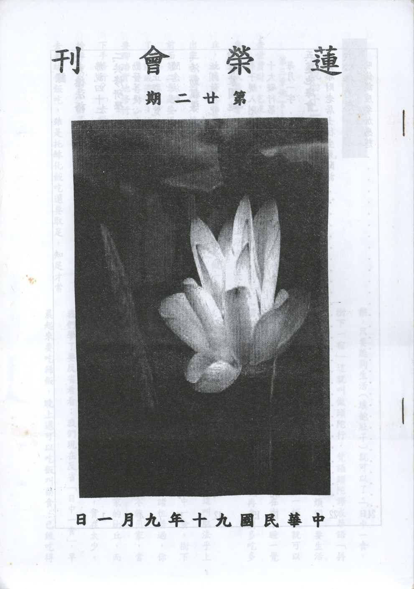

# 第22期

## 大德法語

### 佛說四十二章經解（十四）

*道源老和尚講授*

第三章佛言：

「剃除鬚髮，而為沙門，受道法者，去世資財，乞求取足，日中一食，樹下一宿，慎勿再矣，使人愚蔽者，愛與欲也。」

受佛的道法者就是比丘，此處亦先指著比丘以做榜樣，「剃除鬚髮」做一個出家人叫沙門（接受佛的道法者）要腳踏實地修行，前面第二章是要悟佛的實理，悟後還要起修，並非開了悟就成佛了。悟是悟道理，實實在在還是凡夫，還要腳踏實地修行。出家接受佛的道法要修行，由何處下手修行？「去世資財」，把世間資養生命的錢財通通捨掉去出家。出了家還是凡夫還要生活，「乞求取足」去托缽化飯吃，雖是托缽化飯吃還要取足，知足才常樂，只要能夠生活（填飽肚子）就可以了。「日中一食，樹下一宿」這就叫做頭陀行，梵語頭陀譯成華語「抖擻」，抖擻是振作精神，打起精神來斷除煩惱。要生活就得要吃飯，否則不能活，但是日中吃一頓飯就可以了。不睡覺也不行，睡覺也是果報法。在樹下睡一覺謂之「樹下一宿」。「慎勿再矣」，你不要再貪圖多吃多睡。

「慎勿再矣」就是取足日中一食，這叫取法乎上（最高的修行法）叫做頭陀行，就是日中一食，樹下一宿。我們取法乎上只得乎中，先前向諸位講過，你是居士也要學這個法，學出家的法，你不能出家，當居士亦合適嘛！我們現在就是已經出了家的比丘，而日中一食，樹下一宿的比丘，不是沒有，實在太少。我們學了要反省看看：我們現在反省「日中一食」，早晨起來要吃稀飯，晚上還可以吃飯叫藥食，已經吃得太多，不可以再多吃點心了。「樹下一宿」，我們現在住的房屋，有床棉被，已經夠享受了，何必再多貪。所以「慎勿再矣，使人愚蔽者，愛與欲也」。為什麼要修苦行呢？因為要去除煩惱，使人愚癡與蔽縛，就是愛與欲。這個「愛」是內裏貪愛之心，「欲」是追求外面五欲之境，就是財、色、名、食、睡，即貪財、貪色、貪名、貪食、貪睡。前面的「去世資財」不要貪財，「日中一食」不要貪吃。「樹下一宿」不要貪睡，去除五欲，不要貪愛五欲。因為一貪愛五欲就愚痴了，就把原有的智慧蔽縛了，欲開悟而不能開悟，所以使人愚癡蔽縛者就是愛與欲，就是內心裏貪愛與追求外面五欲之境，則永遠不會開悟。

第四章佛言：

「眾生以十事為善，亦以十事為惡。何等為十，身三，口四，意三。身三者：殺、盜、婬。口四者：兩舌、惡口、妄言、綺語。意三者：嫉、恚、癡。如是十事，不順聖道，名十惡行。是惡若止，名十善行耳。」

眾生就是凡夫，以十種事為善法，以十種事為惡法。何種為十？身三、口四、意三。吾人修行就是修這身口意三業，身業有三種，口業有四種，意業有三種，合起來有十種。

先講身業三種：殺、盜、淫。殺害眾生的生命叫殺業；不與而取曰盜，眾生沒給你財物，你拿就叫盜，或者是偷盜或是強盜；兩相交會叫淫，就是好色，都屬於身業，殺生、偷盜、淫屬於身體做的，謂之身業，身體有三種惡業。

「口四」乃吾人語業有四種惡業：兩舌、惡口、妄言、綺語。口業最重者就是「兩舌」，兩舌是形容詞。他鬥亂兩頭離間恩愛。他到甲方說乙方不好，怎麼不好。到乙方又說甲不好，等於一個人生兩個舌頭。「離間恩愛」譬如說人家弟兄兩個人很好，很恩愛，他（兩舌者）見到哥哥說弟弟怎麼樣罵你，怎麼說你不好，見到弟弟又說哥哥怎麼說你不好，怎麼樣罵你。本來人家兄弟很好，結果結了冤仇，都是這一個人兩舌口業，造出來的。第二種口業叫「惡口」，出口罵人叫惡口，就是說了一些粗野的話，凡是說了令人很難過很傷心的話，出口傷人都屬於「惡口」。第三種口業叫「妄語」，口與心違叫妄言，平常叫謊話。口說與心相違背，他的心是這樣子，口裏說的是另外一個樣子，這叫妄言。第四種口業叫「綺語」，綺者不正。不正當的話，腹言蜜語！是不是兩舌、惡口、妄語？都不是！但也不是正當話，無益世道人心之語是綺語也是口之惡業。

意三者，「意」是我們的心。我們的心裏有三種惡業，就是嫉、恚、癡。嫉是嫉妒，恚是瞋恚，癡是愚癡。四十二章經最初翻譯為嫉、恚、癡，後來佛經都翻譯成貪、瞋、癡。嫉乃意業的三種之一叫「嫉妒」，是貪心發展出來的一種煩惱，「嫉妒心」是不耐他榮。別人有了榮華事，有了光榮之事，他心裏就耐不得，就障礙人家，謂之嫉妒障礙。「貪心」自己貪財、貪色，當然這還不至於嫉妒他人！貪心發展出來的一種「嫉妒」是專門障礙別人的心，這是最要不得。「恚」是瞋恚，以後翻「瞋」。「癡」是愚癡，事理不明，對因果報應之理通通不了解叫愚癡，此意業之三種。「如是十事，不順聖道，名十惡行。」所言殺、盜、淫、兩舌、惡口、妄言、綺語、嫉、恚、癡，此十種事不順佛的聖道，因為不順聖道就叫十惡行。「是惡若止，名十善行耳。」十種惡行停止，止惡就是善，反過來就是十善行。去惡修善很容易叫「易如反掌」，例如我們手掌是十種惡業，把它一反過來就是手背，就是十種善業。手掌與手背還是一個手，還是我們的身口意，你停止十種惡業，不要做，就是十種善業。（未完待續）

## 共修研學

### 勸發菩提心文（二十二）

*心爾*

「自非發廣大心，行菩隡道，建立佛法，救度眾生，縱使粉身碎骨，豈能酬答？是為發菩提心第一因緣也。」

發廣大心是慈悲心的行相，為報佛恩縱使粉身碎骨以救度眾生，亦難酬答佛恩於萬一，然如何救拔眾生？即行菩隡道建立佛法。菩隡道中的法行有佈施、持戒、忍辱等無量法行，主要的核心就是建立佛法，若佈施不能顯示佛法，這佈施是世間的佈施；持戒若不能顯示佛法，是外道無意義的苦行；忍辱若不能把佛法的味道表現出來，忍辱只是強忍，而不是成佛的大忍，建立佛法的目的就是救度眾生，這個情況下，縱使粉身碎骨，我也甘願。

教法之美，美不可言，越觀修越知道人世間的種種境界，不論是有情無情，不論是凡夫或聖者，在我修學佛道上他對我的助益原來這麼大，因此很樂於在境界裡面昇華自己的人格，昇華自己的情操，昇華自己的見地，圓成自己的佛果，對眾生的恩無盡的感激，無盡的度化眾生，是我唯一的樂趣，除此之外，無有別樂﹗如此人生會過得很有意義，很充實。

此處念佛重恩，通指十方諸佛，特指釋迦牟尼佛，「釋迦」是能仁，為佛的大悲。「牟尼」是寂默，佛的大智，大智不住涅槃；大悲不住生死，他在生死境上，以涅槃的心境，來往生死的世界，在生死當中說涅槃（解脫），在涅槃當中說生死，涅槃是他的證量，但他所對的境界是生死的世界，這二者說不住，不能說單純的住生死，也不能單純的住涅槃，因為他是悲智相應的狀態，是在生死苦難中，說他的涅槃法樂。「最初發心」指四弘誓願的心，其菩薩道是自利利他，上求下化，經無量劫。佛最初發心行菩薩道經無量劫而成佛。經無量劫的勤修，是指別教的成佛義，藏教則是三大阿僧祇劫成佛，是二乘人所體會的成佛義，至於別教圓教（入大乘教）的成佛義是經過無量阿僧祇劫的苦行，乃至於捨頭目腦髓等等，在建立教法當中成就佛道。成就佛道其實都為眾生，所以「佛則哀憐」佛度眾生，或現人道，或現他道，就是哀憐的心態下所表現的各類的形相，各類的形相有種種教化，叫種種方便。我出世佛卻沒辦法攝受我，因業太重。我墮地獄時，佛復悲痛，欲代我苦，佛之心態雖是大悲，然亦無法扭轉眾生的業，沒辦法攝受我們，如同天上的明月再亮，也沒辦法映到污濁的水裡面，欲代我苦，而卒不能。欲代我苦是一種心境上，如母親照顧子女，心境上是欲代苦，但是子女身心的病痛，還是要自己去承受，因為欲代子女之苦，所以母親才會找各種的方便，去拔除子女的痛苦。或按時給子女吃藥或找高明的大夫，自己好好去學習醫技，以拔除子女的病苦，所以是「常受佛恩」。如生人道，一切善知識都是諸佛化身，即各處宏法之人，皆是如來之使，佛之化身。可將善知識觀修為幾種行相：

（一） 是諸佛的代表：如欽差大臣，古時候欽差大臣，到各地去宣揚王令，各地官民要當帝王親臨一樣恭敬，因為他是帝王的代表。善知識是諸佛代表，也可說是諸佛的化身。

（二） 是諸佛請來的老師：諸佛像我們的媽媽，疼愛我們這些眾生如他唯一的愛子；大勢至菩薩念佛圓通章云：十方如來憐念眾生如母憶子。善知識如同諸佛請來教導我們的老師。對善知識的尊重，尊師重道必為母親（諸佛）所喜。善知識所講的話，就是佛心裡話，如同諸佛化身。好比老師教孩子們要孝順父母，這就是父母的心裡話，唯有子女孝順父母，子女才有前途。

（三） 諸佛就像發電機，善知識像電線，發電機再強，沒有電線，電燈（眾生心）猶不發亮，眾生依善知識而得諸佛加被，引諸佛的能量到眾生心中（因諸佛最希望加被眾生，因善知識而能加被眾生，此亦可說是諸佛的化身）。

（四） 證量相同：但是緣起不同，亦可說是諸佛的化身。例如雪公老師就是地藏菩薩再來，他就是地藏菩薩的化身，他跟佛的證量相同，覺受相同，為度眾生而現世間的老者，諄諄教誨後學，或在大學當教授，或在蓮社講經說法。

諸佛的化身，可由這四類的解釋，吾人由此而知常受佛恩。換句話說，佛沒辦法度眾生，他可以用代表，可以用傳達，可以用引請老師，也可以隨緣示現各種形相〈讓我們可以接受的形相〉，而用此四個角度去觀修，可知常受佛恩。所以要發廣大心，對佛的恩要感念在心，最好的感念方式就是度眾生，是真正報佛恩，要從諸佛對我們的點點滴滴攝受之恩引發我的菩提心，因為有菩提心方能度化眾生，此佛最為在意，謂之報佛重恩。（未完待續）

### 小止觀導覽（一）前言

*蓮心*

前言

※研讀緣起

雖云吾等修學以淨土宗為主，並以求生西方為志，惟於平日念佛時，或妄念紛飛，或昏沉、或掉舉、或散亂、或煩惱熾盛，始覺降伏妄想的困難，若不得其要旨，遑論斷惑證果，故益發彰顯「止觀」法門的重要性；行者須透過止觀的修學，方可獲得佛法的真實利益，若未修學止觀，就連佛法的下等利益都得不到，若好好修學，或可得到佛法的中等利益，堪為佛門中人，所謂「止乃伏結之初門，觀為斷惑之正要；止則愛養心識之善資，觀則策發神解之妙術；止是禪定之勝因，觀是智慧之由藉。」此之二法，如車之雙輪，鳥之兩翼；不可偏廢。

修學止觀坐禪，乃按部就班、由淺入深，循序漸進，若在事前有正確的認知，可減少在靜坐及修行過程中「嘗試錯誤」的次數，對於各相狀及境界的現起，不致心生驚恐、憂悔、貪著，而障礙了修行的進步，而「小止觀」一書，即為修學止觀之入門書，否則恐為歧路亡羊，不知歸途。今日「小止觀」的研學，是冀望做為有心修行者的指針，並收按圖索驥，依止修行的依據。

中國人修學佛法的特色為：「解在天台，行在淨土」，而智者大師臨終亦念佛往生西方，故選擇「小止觀」一書為念佛助功之參考資料，實為當務之急。

高登海居士云：「此書效用，小之則可使人身心健康，大之則可以佛家慈悲救世之精神，為國家圖長治久安，為人類幸福、世界和平，奠定良好之基礎。」洵不虛也。

※小止觀簡介

雪公太老師云：「三藏煙海，難窮其際，但提綱判行與解，是能入矣。解則藏通別圓，十二分教，重在聞義思維；行則禪淨密律，八萬四法，尚乎修習止觀，然必解行合一，偏之事或有不成。﹒﹒﹒止觀云者，遍及教法，非於各教法外，別為一端。至專書而論者，自天台始，後則形成一學，以為修定之範焉。」由此可知八萬四千法門，以修習止觀為入門樞機，且應解行並重、止觀雙運，偏於一端，事或不成，「小止觀」乙書，言簡意賅、理事圓融，允為修行法寶、解脫之要也。

智者大師一生所說止觀有四種：

一、圓頓止觀，在荊州玉泉山說，即今之摩訶止觀。

二、漸次止觀，在南京瓦官寺說，即今之禪波羅蜜。

三、不定止觀，即今之六妙門。

四、小止觀，亦稱為童蒙止觀。

「小止觀」的「小」字，非指大小之意，乃簡明扼要、提綱挈領之意，可說是止觀的濃縮版或精華版。本部止觀之生，乃智者大師為俗兄陳鍼所說，陳鍼四十歲時，遇仙人張果老告之曰：「看你的面相，陽壽已盡，頂多再活一個月。」陳鍼就請教他的弟弟智者大師，於是智者大師講授此小止觀，請陳鍼切實依法修持。過了一年，又遇到張果老，張果老見之大駭，認為陳鍼不死，難道是吃了長生不死的藥？還是做了大好事？陳鍼說：「我只是照我弟弟教我止觀坐禪而已啊！」張果老乃知佛法之不可思議，能使人起死回生、延年益壽；自此以後，「小止觀」就洛陽紙貴了。

本書開宗明義即以「諸惡莫作，眾善奉行，自淨其意，是諸佛教。」為總綱，以為修學止觀正確態度，並以廿五方便，做為止觀的前行，除了要具足這五個修學的條件外，還要對五欲有喝斥的覺受，以及內心也要去除五蓋的煩惱，並且在食睡身息心上要調和，修學止觀時，也要有好樂心，並且對止觀的內涵了解，以及辨明世間是虛妄的，不要去沾染，出世間的止觀是真實的，是需要去追求的，一心一意的去修學止觀，廿五方便講完，再坐上修止觀，及歷緣對境修止觀，能引發善根，在魔境現起時懂得對治，並且可以止觀來治病，最後是能證得果位，這是整個止觀法的架構。

※智者大師小傳

研讀「小止觀」，應先體會智者大師，大師乃證量最高的祖師，由智者大師的修行成果，更可增益吾等研修的信心。

「小止觀」為天台山修禪寺沙門智顗所述，智者大師（538～597）為我國天台宗開宗祖師（一說三祖，即以慧文、慧思為初祖、二祖；一說四祖，即以龍樹為初祖，慧文、南嶽為二祖、三祖），因大師駐錫於天台山，故號天台宗，世稱智者大師、天台大師。

大師為隋代荊州華容（湖南潛江西南）人，俗姓陳，字德安，世居潁川，因晉時避亂，止於荊州華容。母徐氏，夢香煙五采，縈迴入懷，又夢口吞白鼠，因此懷孕。誕生時，紅光聳霄，鄰人以為失火，視之並無火事。大師眉分八彩，目耀重瞳，有帝王之相，在襁褓即能合掌，坐時必向西。七歲即好往伽藍，諸僧口授普門品一遍，即能成誦。十七歲時，欲發心出家，父母不允許，夜夢身至一高山，下臨大海，上有僧人，舉手招之，伸臂接師入伽藍中，復謂之曰：「你以後當居於此，當終於此。」年十八，投果願寺法緒出家。未久，隨慧曠學律藏，兼通方等，後入太賢山，誦法華、無量義、普賢觀經等，二旬通達其義。一夜夢諸經像雜亂滿室，覺自身處高座，足躡繩床，口誦法華，手整理經書。此表大師後來，判五時八教，大小圓頓，條理分明。

陳天嘉元年（560），入光州大蘇山，參謁慧思大師，慧思曰：往昔你與我，同在靈山，共聽法華，今日乃宿緣所追；師遂居止之，命其誦法華經，精進不輟；某日，誦法華經藥王菩薩本事品：「是真精進，是名真法供養如來。」豁然開悟，於定中親見靈山一會，儼然未散，是知釋迦牟尼佛，現仍在靈山說法，惟因眾生障深慧淺，故未見也。智者大師將所證悟者，稟南嶽大師，南嶽大師曰：「非汝莫證，非余莫識。」另告智者大師曰：「汝所得者，乃法華三昧前方便；所發持者，乃初旋陀羅尼，獲四無礙辯，縱令文字之師，千群萬眾，尋汝之辯，莫能矣！當於說法人中，最為第一。」智者大師依止南嶽大師約有七載，後南嶽造金字般若，遂代慧思開講，更受其付囑入金陵弘傳禪法。於瓦官寺開法華經題，從而樹立新宗義，判釋經教，奠定了天台宗教觀雙美之基礎。

陳太建七年（575），入浙江天台山，於佛隴之北建寺居之。九年，帝敕賜「修禪寺」之號。至德二年（584），陳後主率后妃從師受菩薩戒，三年奉敕出山，寓金陵靈曜寺，未久，於太極殿宣講大智度論、仁王般若經，又於光宅寺講法華經等。及隋軍攻破金陵，師西遊荊土。隋開皇十一年（591），晉王楊廣（煬帝）累請東返，師鑑其誠，乃至揚州為授菩薩戒，王敕賜「智者」之號。其後西行，至當陽玉泉山建寺，開皇十三年於寺講說法華玄義，文帝乃敕賜「玉泉寺」之額。翌年又宣講摩訶止觀，十五年復應晉王之請，東返金陵，撰淨名義疏。開皇十七年，坐化於山中大石像前，世壽六十，戒臘四十。生前造大寺三十六所（一說三十五所），著書一百四十餘卷，度僧無數，傳業弟子三十二，其中著名者有灌頂、智越、智璪等。師入寂後，楊廣派人依其所遺圖畫於天台山下建寺，大業元年（605），即位後並親賜「國清寺」之額。後周世宗時追諡「法空寶覺尊者」。南宋寧宗慶元三年（1197），又加諡「靈慧大師」。

大師之思想，係將法華經精神與龍樹教學，以中國獨特之形式加以體系化而成。又將佛教經典分類為五種，將佛陀之教化方法與思想內容分為四種，此綜合性之佛教體系的組織，被視為具有代表性之教判。依禪觀而修之止觀法門，為大師之最具獨創性者。生平撰述宏富，少部分為親自撰寫，大部分由弟子灌頂隨聽隨錄整理成書。有法華疏、淨名疏、摩訶止觀、維摩經疏、四教義、金剛般若經疏、禪門要略、觀心論等數十種。

大師之著述，建立了天台一宗之解行規範，其中法華經玄義、法華經文句、摩訶止觀，世稱為天台三大部；又觀音玄義、觀音義疏、金光明經玄義、金光明經文句、觀無量壽佛經疏，稱為天台五小部，其學說影響中國佛教頗鉅；大師悲智雙運、行解並重，是將佛學中國化的第一人，人稱東土小釋迦。

※參考資料

為求事半功倍，參考書、工具書不可不講究；智者大師之釋禪波羅蜜次第法門、六妙門為必備者，另雪公太老師曾稱高登海居士為仁人之心，讚其注本為：「是可傳者也，義不古法已詳，文不聱牙理而顯，解無摸索之苦，行有轍跡之象，是知達乎變，契乎機，載乎道，應乎時者矣。」故高居士之「佛家靜坐方法論」洵為佳選，並參以會性法師「小止觀講座」、寶靜法師「修習止觀坐禪法要」，以為周延。

## 專題研學

### 十大礙行（五）第四條

*心筑整理*

「立行不求無魔，行無魔則誓願不堅，願不堅必未證謂證，達魔妄有究魔無根魔何能嬈，以群魔為法侶。」

以上是十大礙行第四條的經文。

大家都希望能夠成為社會上有用的人，並且努力的學習，在啟蒙班當中聽到古聖先賢所流傳下來的美好概念，要實踐出來，與所有人分享，真正的將所學發揮到最大的作用，這就叫做「立行」，十大礙行本來是對修學佛法的人所行持的菩薩行而說的，此處我們就利益他人所行的許多善事而加以闡述。「魔」字本來是「磨」字，後來梁武帝才改成「魔」字，磨就是磨練之意，作任何事都需要接受磨練，有事項上的磨練與有情的磨練，有情中包括長輩、平輩和朋友對我們的磨練，所以這一條很明顯地表達出「玉不琢不成器」的道理，也就是作任何事情，不論是自己品德及內涵的充實，或者是利益他人時，都要欣然接受種種魔事的考驗，要知道磨練對我們的好處而不要害怕磨練。

我們常常是「初生之犢不畏虎」，聽到了美好的觀念要下手實行之時，總是因為沒有遇到逆境而信心滿滿，當遇到逆境時又畏畏縮縮，而輕易的就放棄該要努力的事情。從古至今，所有成功的人，沒有一個是遇到逆境就被打倒或者是裹足不前而害怕失敗的。

記得曾經和大家提過愛迪生的故事，大家都知道愛迪生是一個偉大的發明家，從小就愛窮根究底，靠自己找出事情的真相，但也因為如此常常會給父母及師長們造成極大的困擾，但是他做任何事都勤勞不懈怠，十幾歲的時候他因為救了一名小孩，那小孩的父親為了感謝他，所以教給他許多電報學的知識，從此以後愛迪生就和電學產生了不解之緣，他得到一千多項專利的發明權，每一項發明都是為了讓我們的生活更加便利，而他的兩千五百本筆記簿中記載著千萬次的實驗，而其中一次次失敗的實驗就是造就往後成功發明的基礎，所以愛迪生的成功，是由於他不畏懼磨練甚至是勇敢面對磨練的緣故。

而佛經上說到觀世音菩薩是「侍多千億佛，發大清淨願」，為了要成就清淨的願力，跟著許多佛到各處度化眾生，吃苦受難，為眾生做牛做馬，解決疑難雜症，種種磨練都是為了增強自己的願力，增加自己幫助眾生的能力。

然而若是未遇到考驗，便容易以為自己很厲害，修行一兩天就以為自己證果了，已經將所有的煩惱都給斷除了。這就像我們學生在學習的過程中，讀書讀了很多遍，以為自己通通都會了，可是考試考出來才發現不盡理想，但是沒有考試的時候，卻認定自己全部都瞭解，這就是經上所說「未證謂證」的道理。其實事非經過不知難，惟有虛心、誠懇地去面對所有的歷練和考驗，才會讓我們的生命更充實，能力更增勝。

「達魔妄有，究魔無根，魔何能嬈，以群魔為法侶」，在我們下定決心要改正自己的壞習慣，或者是想要持續不斷地將自己所學幫助他人之時，總是會遇到許許多多的磨難，那要如何來克服面對呢？要知道遇到困難想要退縮其實都是我們的「心」在作祟，正是自己自私自利的念頭甚至是怠惰的心。在擾亂我們想要進步的心，以及想要幫助別人的心，幸而這些磨練不會永遠存在，只要我們轉換念頭面對它，將自己的心安住在自己所下定的決心上頭，相信大家會珍惜這種種境界的磨練，與父母、師長給我們的考驗，所以下一次，如果我們因為作錯事而被父母以及師長處罰的時候，要想想父母和師長都是相信我們能夠作得更好，才會處罰我的，這時我們心裡不應該不開心，甚至認為父母、老師不愛我了，而應該要心懷感激，感謝父母、老師讓自己有機會改進而更上一層樓。

由以上的經文，我們知道無論我們計劃做任何事及訂下任何目標，在到達成功之前，最重要的必須要有堅強的心力，也就是經上講的誓願，唯有堅強的誓願才能陪我們到達成功的彼岸。而如何才能知道自己的心力強不強呢？那只有面對境界的考驗才知道。遇到了逆境就生氣，遇到了順境就貪心，那就表示我們的心力還不夠堅強，面對境界還不會調整和使用我們的心，而忘記我們原來該走的路，所以才會常常被路邊的小石子絆倒，所以當我們真正勇於面對境界的時後，才知道我們所面對的並非境界本身，而是我們的心，這是我們面對種種境界時的心態與觀念，而當我們能夠在任何境界下起最好的心念，這才能將自己原有的潛能發揮出來，才能因此得到成功的果實。所以我們的亞聖孟子也這麼說：「天將降大任於斯人也，必先苦其心志，勞其筋骨，餓其體膚，空乏其身，行弗亂其所為，所以動心忍性，增益其所不能。」所說的也就是這個道理呀！（未完待續）

## 蓮池海會

### 劉添財老居士往生見聞記

*編輯部整理*

劉公添財老先生，祖籍福建省莆田縣，民國十四年五月十一日生於台灣省基隆市，兄弟姊妹共六人，劉公排行老大，自幼秉承庭訓，在家協助父母照顧弟妹，為弟妹心目中敬重的兄長，小學期間即以一手超乎同儕之書法造詣，而屢次獲選代表學校及基隆市赴日本參展，並多次榮獲優勝名次，在台北中學以卓越的成績畢業之後，進入當時交通鐵路管理委員會及基隆水產學校等單位服務，之後進入現在台灣中小企業銀行前身之台灣合會儲蓄公司，於民國七十九年屆齡退休，在職三十五年期間奉公守法，績效卓著。

老先生郭月女士結婚五十五年以來，始終夫唱婦隨，伉儷情深，建立良好家庭倫理典範，並以身作則將儒家傳統倫理道德的精神充分表現，並以此教導子女，在子女之教誨和顏悅色，並盡力滿足子女所需，且尊重彼等前途之決定；老居士一生克勤克儉，以一名公務員之薪水含辛茹苦地栽培六名子女，使其皆完成高等教育，而為鄰里所稱頌，這些都是老居士放棄享受，勤儉自己所成就的。其為人處事急公好義、樂於助人，親朋好友有困難時，老居士皆主動協助，為眾人眼中之好好先生。

老居士於民國八十八年三月間身體感到不適，而檢查出罹患胃癌，開刀切除全胃後，少量多餐，在家人的細心照顧之下，老居士身體也漸漸恢復。今(九十)年四、五月間發現身體開始不適，於六月住進台大檢查及治療，因老居士長子參加佛教合唱團，對佛法有些認知且知淨土法門之殊勝，於七月二十四日乞請蓮友前往台大安寧病房探視老居士，並予以開示淨土念佛法門，二十六日早上家屬將老居士接回家中，全家輪班念佛，幫助老居士提起正念，而老居士於二十七日零時四十五分在大眾佛號聲中安詳往生，深夜中大眾輪班助念，在持續助念十二小時回向之後，老居士全身柔軟，面帶笑容，宛如沉睡中的嬰兒，使大眾驚呼佛力不可思議，淨土法門殊勝至極，老居士善根福德深厚，感應兒女後輩以孝心稱念彌陀名號，助老居士往生西方極樂世界。

晚年老居士退休之餘，經常赴基隆月眉山靈泉禪寺協助書寫標語、對聯及經文，歷六、七年不斷，因此便與靈泉禪寺結緣甚深，生病期間亦蒙師父多次探望，老居士往生之後，蒙師父撥冗主持法會，因緣極為殊勝。

老居士一生謹慎，律己甚嚴，凡事替別人設想，以自己的言教及身教，將中國傳統敦厚的美德表露無遺。老居士臨命終時善根福德具足，定能蒙佛接引往生西方極樂世界，並透過孝眷家屬為老居士誦經、念佛、吃素及齋僧等種種功德，老居士必能蓮品高昇，速證無生。

## 日常省思

### 明倫講座參加感想

*願度整理*

這次參加明倫講座，是希望好好的充實基礎的六門課程（佛學十四講表、唯識簡介、八大人覺經、般若心經、普賢行願品、阿彌陀經），對其作一基礎性、概括性的認識。並觀想為到西方極樂世界聽阿彌陀佛及諸善上人開演教法，以對治自己長久以來上課打瞌睡的毛病，並將法喜充滿的覺受延續下去。

從前不知道老師重視譯師的原因，到蓮社之後，才知道是師承的關係；講堂外面寫著唐義淨三藏的取經詩－「晉宋齊梁唐代間，高僧求法離長安，去時成百歸無十，後者安知前者難；路遠碧天唯冷結，沙河遮日力疲殫，後學如未諳斯旨，往往將經容易看。」現在我們可以看到很多的佛經，都是當初古德用血汗、生命換來的，而今佛經隨手可得，所以養成了對佛經輕慢的態度，因此不易得到佛經受用。

我們到蓮社上課，應該好好去觀待因緣的難得（包括１．蓮社的成立２．師資的養成３．各方的護持４．物資的提供５．精神的支持６．生活起居的照顧７．交通提供．．．．等），從這部經由印度翻譯而來的過程、注解的大德們所花的心血、老師要上這門課要準備的資料、科判、講義，書本的印刷過程與籌款、場地的商借、學員的湊合，再加碰上我們剛好有此福報現行，才能成就這場聽經的因緣，但我是否有好好的把握呢？我是否上課漫不經心呢？從聽經的意樂開始調整，從為利有情願成佛、眼前真的是以這部經來自利利他，希望末學常以這樣的心態來對治聽法的輕慢，也願與天下所有的聽經者共勉之。

心一

「發揚大乘佛教，勵行淨土法門」這是雪公太老師開辦大專明倫講座的宗旨。慚愧學佛十餘年，對這句話從未發猛厲向上、志求解脫之心，猶如閒逛寶山，進進出出，卻不知無常、老、病，不與人期，朝存、夕亡，剎那異世，平時因循懈怠，蹉跎光陰，幸蒙唐老師一片悲心，發起參加大專明倫講座如此殊勝的緣起，更為我們講示參加講座須具足的正確心態，俾使我們能真正獲大利益，滿載而歸。亦感謝師姑、師伯和諸師、諸善知識們的護持 (包括場地的供應、開車接送)，乃至彭師姑絞盡腦汁為我們煮出一道又一道令人垂涎欲滴的佳餚，諸如此等的關懷和照顧實在太多了，在此末學除了感恩還是感恩，並隨喜讚嘆如此殊勝的布施功德，見賢思齊外，我應當發菩提心，修諸教法，堅固信願，自度度他，往生淨土，這才足以報答重恩！

雪公太老師深知佛法的好處，遂慈悲為大專同學們特開以「佛學十四講表」為首等六門課程，為有心上求佛道，卻不知在浩浩三藏中從何處下手的同學們，指引了一條清淨光明、通達無礙的康莊大道。吳老師說得好：「研究過十四講表後，就可說是入門了，不是一個門外漢！諸位應感到慶幸，上過十四講表後就正式入門了。」末學深感慶幸和歡喜，能得聞正法、真理，這是多麼好的人生觀、宇宙觀，回視以往狹隘的心胸可說是幼稚、可笑到了極點，那種剎那間心胸頓開的舒暢之感，哪怕海闊魚躍、天空鳥飛的開闊之景，也為之遜色。

十四講表詳明闡述正確的人生觀、宇宙觀，說明「覺」的重要性，層層遞進、井然有序、深入淺出，從先明佛義的確立目標到如何實行，消除誤會，說明眾生的病況、佛法內涵為戒定慧、五乘修習方法，乃至於特開念佛淨土法門，警眾無常當精進於解脫，一氣呵成，條理分明，讓末學歡喜讚嘆，法喜源源不已。

佛說八大人覺經敘明修行為正確的信念之建立，直至自度度他、出世了義的要領；唯識簡介的萬法唯識，讓我們知曉境界是由心識來了別，而萬法不離心識；般若心經則精煉地道出諸法的真空實相；佛說阿彌陀經首談阿彌陀佛莊嚴世界的人、事、物之莊嚴，次而示眾如何稱佛名號帶業往生，最後一勸再勸三勸，我等凡夫應當發願願生彼國，成就阿耨多羅三藐三菩提；最後普賢行願品則以十大願王導歸淨土。講座期間為更堅定大眾對佛法的信心，特別開講蓮池海會一課，宣說蓮友大德們的往生事蹟，期勉學子們念佛一心不亂，方得了生死、成就佛道。

講座期間同學之間均以學長互稱，令人有種溫文爾雅、兄友弟恭的君子風度，能在眾多學長之間學習成長，實在是非常的幸福，如霧露中行，雖不溼衣，時時有潤，謝謝諸位學長在講座期間對末學的種種教導、鼓勵、提醒、安慰，容忍，末學絕不忘此恩，並知道其實您的責難，是不忍末學走偏而著急，提攜末學向上的一片慈悲，真的令人感謝啊！希望未來能一同研學經教，聽經也一次比一次契合經義，那就一次比一次受用，願將來共在念佛聲中，成為菩提眷屬。

淨如

過去從沒如此這般接觸佛學的教化，雖然曾在宜蘭看過兩次的放生，不過當時真的完全不了解其意義，甚至產生了愚痴的想法，以為只是一個表面的功夫，而且不過是個循環，向商人買了生物放生，讓他們再有機會去捉來賣，而且放生之後(譬如魚)，不是讓釣客更有機會釣到魚了嗎？然而參加了講座後，才知道其功德是如此殊勝，畢竟每個生物都是生命，有權力獲得他們該有的自由。

十四天說起來不算長不算短，不過對一個完全不熟悉的人來說，其實是有點漫長的，起初的心態是為了「使命」，而且六門課程與平常上課是完全不同的內容，仔細一聽才知道那不單只是〝知識〞，它所想表達的是心靈上的啟發，更是我們日常生活中息息相關的問題，像十四講表內容談的是人們不敢面對的〝死亡〞，其實生老病死是一個人在一生中必然會經歷的事，或許一般人會以為做人好，不像是畜生，其實做人亦是在受苦，唯有成佛才是最殊勝的，而上了這些課程後，更能了解其實萬法都是因緣和合而產生，而唯識簡介中所說的「一切為心造」，就是這個道理。

對於事事物物的道理，在瞭解與不瞭解之間，心態上的差距是很大的，未接觸佛法之前就像老師所說會以為是〝老太婆在念的經〞，其實所含之意義是如此廣大，若能對其教義有所覺受並加以讚嘆，功德是不可思議的呢！以前看到別人做好事，會替他感到高興，又或者聽到有人遭遇困難，而產生了惻隱之心，在這次的學習之中，才知道原來像如此般隨喜的功德也是非常大的，其實以前自己就蠻相信因果的關係，如今有這麼好的因緣，讓我們有機會到蓮社學習，真的得來不易，既然有了這機會，或許我們也應該好好反省自己，為未來人生的走向訂下一個目標！

吟貞

在一個非常難得的機會和因緣下，在唐老師的鼓勵和眾人的期盼下，我們一行人就這樣參加了台中蓮社大專明倫講座。由於之前從未接觸過佛學，所以學習上稍有障礙，不過在其他學長和彭媽媽的協助下，讓我在這段日子裏走得很順暢也很愉悅，真的非常感謝各位學長。

十四天完全新的生活裡，除了要適應每天五點半起床之外，還要消化六大課程，而這六門課程分別為：十四講表、唯識簡介、八大人覺經、般若心經、阿彌陀經和普賢行願品，與平常上課所學的不太一樣，其實是有點吃不消的。而且每位老師上課的方式都不同，唯一相同的就是老師們都把最精華的內容，非常有次第的傳授給我們，最重要的是觀念都一致，絕無任何偏差，甚至連說話的內容有時都一模一樣，我很佩服也很感謝各位老師。

我發現佛學似乎比較針對我們的心靈和一些切身、實際的問題，就像十四講表裡提到一切萬物都是因緣所生、虛幻不實的，快樂、煩惱都是假像，還有唯識裡說的萬法為心現，譬如天見水為琉璃、人見水是水、魚鬼見水是窯窟，和人有八識等等，一切都是唯識所現。

學佛不僅利己也利他，比如在待人處事、讀書、事業上都非常有幫助，還有最主要的是幫助我們在命終時，能很安詳的往生西方極樂世界，不必在六道中輪迴。而這一切都有相當多的實例，實在讓人非信不可，當然也希望能像唐老師說的，以後能將這六門最基本的教理繼續研討完。最後要感謝唐老師給我們這個機會，彭媽媽及彭師伯提供住所和食物，還有莊師伯及其他的師姑，大家都非常關心我們，我只能很誠懇的說一句謝謝，阿彌陀佛。

治鈺

首先要非常的感謝老師以及父母親給學生這個機會，能來參加台中蓮社大專佛學講座，也非常的感謝師伯、師姑們所付出的愛心，研討時的從旁指導，改正錯誤觀念，補充重點，可說是無微不至，還有學長們的用心良苦。

這次在蓮社所上的每門課程都非常精彩，老師講解生動、活潑，內容豐富精彩，但學生業障深重，生性魯鈍，在這次講座中不但不能全程參加，而且上課又會昏沈，真是愧對大家，在此深深懺悔，希望下次有機會能再次聆聽，也希望自己能將這些昏沉掉舉的毛病改掉，做一個精進奮發的學子。

亦倫

參加明倫講座前，唐老師和許多長輩幫我們做前行，聽他們把明倫講座說的好像人間天堂、世外桃源般的好，進去出來後整個人就好像脫胎換骨似的，面貌莊嚴，身上散發著現代人少有的讀書氣息，只能用清淨殊勝、法喜充滿來言喻，想想反正已是騎虎難下，不如深入其境一探究竟吧！

剛開始幾天坐立難安、上課打瞌睡，內容也不太瞭解，而且本來就不是一個喜愛上課的人，但是幾天後，不知不覺減少了這些煩惱，因為要複講上課內容，就只好認真抄筆記，接下來幾天就漸入佳境，上課內容也大都可以聽得懂，再者，看到其他學長認真專心的精進態度，就會鼓勵自己、惕勵自己，自己也從中學到不少事情，也增進了個人的佛學常識。

明倫講座裡的課程我最喜愛的是唯識，因其萬法唯心造，一切皆心法（假象）所生，遭遇了逆境或是困難，心情不好，換個角度去想，或許是自己前世罪障太重，故今世顯現，而且失敗為成功之母，成就一件大事前必須歷練一番，舉凡成功做大事者無不是如此，或許這就是以後自己成就或成功所需之條件，因此只需要心境轉一下，看法觀念就不同了，也感謝各位師長的鼓勵，與各位師伯、師姑的護持，及各位學長的參與，才有明倫講座的和合與圓滿。

舜傑

一進入蓮社時便感到一股股心心上求佛道，念念下化眾生的氣氛，看到每一位學長都努力不懈地為自己的菩薩道精進、打拼，不斷地為自己的菩提種子灌溉、施肥，看了這個情況，自己也不由自主地用功，以積聚成就無上正等正覺，往生西方的資糧。

起初，聽到要上六門課程，心中難免有一些疑惑和害怕，害怕的是上那麼多課腦袋會不會裝不下？聽得懂嗎？疑感的是有必要上那麼多嗎？課上得完嗎？但是想一想，上這六門課程一定有他的理由和次第，又聽了唐老師的前行後，便沒有了害怕及疑惑了。

上課時，突然發現每位學長都在振筆疾書地在抄筆記，而自己卻靠在椅背「聽」課，便覺得自己光用聽的，並不能留下什麼，所以末學坐正，加入了抄筆記的行列。

老師上課時不僅很有趣，而且很用心，還另發了講述備覽，做為補充教材，而且老師講解教理時，都一字不漏，講到我們完全了解，教學態度的認真，真令人佩服。

初次與善知識過團體生活，實在有趣，但也是檢討自己最好的時機，唐老師說過：「在家時，時時自以為是，溫、良、恭、儉、讓，但是過團體生活時，則自己認為的溫、良、恭、儉、讓，一樣也沒做到。」真的是如此，記得有一次吃完飯要去上課，而當天是末學洗碗的，原本以為自己不需要別人幫忙，但是快沒時間了，當末學正在著急時，蓓怡學長及其他學長趕來幫忙，實在感激他們，也證明團結力量大。

這次末學能有幸參與明倫講座的活動，是許多的因緣際會，要先感謝唐老師的允准及提攜，也感謝師姑們的護持和關愛，還有彭師姑提供的場地，末學和學長們才可以共聚一堂，互相切磋琢磨、相觀而善，還有感謝蓮社不計成本辦講座，蓮社老師有趣、生動又詳盡的講解，和各位學長的提攜及啟發，在在強化了我們修學時的勢力！

這次參加明倫講座，感覺意猶未盡，好像不應該結束，應該要繼續，應該是我「深入三藏十二部，不改彌陀行」的開始，也希望這次講座能改變自己的習氣，增加一點道氣，才無愧於此次因緣。

## 啟蒙園地

### 弟子規　入則孝（二）

*編輯部整理*

「父母呼，父母命，父母教，父母責」，是為人子女最大的福報，是爸爸媽媽對我們關心愛護的表現，所以要享有爸爸媽媽的愛，就是要歡喜地接受對我們的呼喚、命令、教導和責備。所以如果可以順從父母對我們的「呼、命、教、責」，就可以慢慢學習侍奉父母、體察父母親的心意、幫父母親來分憂解勞，並培養自己的耐性、培養自己能即時回應他人的需要，這樣出門在外就能體察長輩的心意，也能夠和所有的人相處地很愉快。

父母的呼或命一定是要我們完成某些事情，這時我們必須立即的行動，不再拖延，以免父母親心焦，覺得生氣、難過，這是很不好的行為。而「父母教，須敬聽；父母責，須順承」；「教」是父母親為了我們好而給我們種種的教導，或許我們會覺得父母好囉唆，我都已經知道了還一直念不停，其實這都是因為我們所作所為讓父母擔心的緣故，所以要讓父母親放心的最好方法，就是自己好好照顧自己的身體，把本分的事情認真的完成，如果有做不好的地方，趕快照著父母的教導加以改善，這樣就不會讓爸爸媽媽有太多的擔心和煩惱。

現在有很多小朋友沉迷在電視、電動玩具和玩樂中，所以「父母呼」很久不理會，嫌父母囉嗦；「父母命」要我們洗碗、掃地、做家事，就推拖要讀書，讀書真偉大。想一想，這樣的讀書是改變了氣質，還是助長了傲氣，養成懶散的態度呢？其實如果沒有把「呼」「命」好好的做好，就會產生五點的壞處：

1、助長自己的傲氣。

2、養成懶散的態度。

3、一個不會替最親的父母親著想的人，也不會體諒他人。

4、這樣的人，得不到朋友的信任，因為他不懂得幫助別人，所以朋友也不會來幫忙他。

5、也沒有一個團體會來幫忙他，因為他不懂得去幫忙團體，團體怎麼會來幫忙他？

所以五點壞處，都在「父母呼與命」而緩、而懶當中出來。相反地，如果「父母呼」不緩，「父母命」不懶，竟然可以對治我們的傲慢、降伏懶散，並且可以很積極的來辦事，盡孝道、體貼別人、得到朋友的信任以及團體的幫忙，內心坦然，外緣上有很多人來幫助他，自然就不會處處遇到障礙；所以不要忽略呼、命原來是這麼多的好處在裡面；所以「父母呼」，我們就趕快「有！」非常的高興去辦，「趕快洗碗！」「是！」這麼多的好處就蘊藏在裡面。但是「呼、命、教、責」都是平常的表現，孝順不是表面的，不是在母親節的時候送一朵康乃馨、送一個禮物、製作孝順卡……，孝順應該是由衷地，日久天長的來實行。

弟子規這四條規矩，看似平淡無奇，但是如果認真的實行，會帶給父母親寬心的快樂，這不是有形的東西可以比美的。「子孝父心寬」，「孝」就在「呼、命、教、責」當中去表現，所以弟子規不只是個理論，它還必須去實踐，它可以讓我們體會聖人之言，而不是高談闊論，原來是付諸於日用平常中去體會美好的生活，原來只要心思一轉變，作法一落實就會發覺生命原來是這麼有意義的。如果，現在我們在家庭中能培養出這麼好的言行舉止，自然將來就會有意想不到的收穫~因為這個人在家裡就修天爵，未來會得到人爵，就像舜這樣的孝子就能享大名、有大位，原來都是從家庭出來，替國家培養了一個這麼偉大的人才。

其實站在父母的立場來說，一個好的父母親，必須常常的「呼命教責」他的小孩，這是他的責任和義務，由「呼命教責」當中把自己的小孩教起來，由「呼命教責」當中培養小孩尊重別人的心，從尊重他人當中拿掉自己的我執。為什麼有些孩子不給人家呼、不給人家教、不給人家責、不給人家指導呢？就是因為他們的我執非常強。我們現在小孩很難教就是因為他的我執很強，從小就被灌輸說要尊重他們、傾聽他們，其實如果爸爸媽媽沒有教好我們，就會培養我們強烈的我執心，而這我執心就會造成我們以後與人相處的種種困難，也會產生許多的煩惱。所以有愛心的爸爸媽媽就是從小要用「呼命教責」來幫助我們克服我們的我執心，在生活當中磨去我們的我執。我們要知道爸爸媽媽有他必須扮演的角色，他們的心意絕對是為了小孩好，所以我們也是要用美好的心意來接受爸爸媽媽的教導，父母呼喚我們時，要快快答應，父母有事交代時，行動要敏捷，切勿懶惰，父母教導我們時，應懷著感恩的心，虛心接受。如果做錯事，父母責備的時候，也應順從父母的心意快快改過。相信這樣的小朋友，一定是一個和爸爸媽媽心心相印的好孩子。（未完待續）

### 每月一字 — 里

*蓮心*

里：是由「田」「土」二字組成，「田」是樹穀之處，「土」是指土地；人民過日子，往往會選擇近於樹穀的土地築屋居住，以便於墾植，故其本義是指人民居所。

一、民戶聚居處~古時以五家為「鄰」，五鄰為「里」，現在戶籍編制，以十家為「鄰」，十鄰為「里」，因此有「鄉里」一詞。

《例句》「里仁為美，擇不處仁，焉得知？」(論語里仁篇)就是說：居住在民風淳厚的地方，是最理想的，一個人選擇住處而錯過了民風淳厚的地方，怎麼算得上明智呢？。

二、長度名~舊制以三百六十步為一里，今以一千公尺為一公里。另沿著路線用以標記里程數字的木牌或石碑稱為「里程碑」。

《例句》「騏驥驊騮，一日而馳千里」(莊子秋水篇)。就是形容騏驥等良馬行進速度很快，後來也用以形容某些情事進展速度很快。

三、姓~如晉有里克，鄭有里析。

## 活動報導

### 蚯蚓放生記

心刻

一、時間：

八月十一日(週六)

二、地點：

中壢

三、放生生物：

黑蚯蚓及紅蚯蚓。

四、緣起：

（一）為桃芝颱風受災的民眾消災祈福。

（二）願各單位的佛學社團人才輩出、和合共辦善法、社運昌隆。

（三）為所有的蓮友及家親眷屬迴向，往生者能往生西方、蓮品高升。現存者業障消除，佛道精進

五、蚯蚓簡介：

（末學謹就自網路上所查詢到的資料供大家參考）

台灣是個寶島，不論動物或植物的種類或數量，都相當豐富，蚯蚓也不例外。大的粗如手指，泛稱蛇蚯蚓，長可超過五十公分；小的如絲蚯蚓，生長在水中，細如線。種類相當多。

二、三十年前，到池邊、河邊或田間挖掘，不一會兒的功夫即可挖到不少的蚯蚓。然而，近來由於社會變遷、環境破壞及污染，都市裡柏油馬路一條條的鋪設，公寓大廈一棟棟的蓋，公園綠地所剩無幾，也就是說，都市裡的蚯蚓不是慘遭活埋，就是隨著棄土被任意堆棄而流離失所。鄉村的蚯蚓也好不到哪裡，由於肥料的大量使用，改變土壤的酸鹼值，不適合蚯蚓生長；農藥的濫用，雖然消滅了不少害蟲，但同時也毒害了蚯蚓的生存；河邊及湖邊的土地也因水質污染及酸雨的影響，明顯地降低了蚯蚓的族群數量；生長在水裡的絲蚯蚓是中度污染水域的指標生物，以基隆河為例，二十年前基隆河中下游污染還不太嚴重時，絲蚯蚓的數量還不少，現在則因污染嚴重像條黑水溝，連絲蚯蚓都難以生存了。不僅如此，近幾年人工釣場的興起，使得蚯蚓的使用量大幅增加，說蚯蚓是瀕臨絕種的動物，一定有人會斥為無稽之談，但不可否認的是蚯蚓的數量在寶島台灣的確正在大量銳減中，且相信有不少種類蚯蚓，因對環境改變的不適應已經消失了。

蚯蚓並無眼睛的構造，因此無法以視覺來觀察及聯絡，同時蚯蚓也無聲帶及聽覺方面的器官可以作為當對方呼喊時接受的方式。蚯蚓在頭部（口前葉）的部位具有化學受器，因此可以對一些物質做感應，有報告指出，蚯蚓可以分泌費洛蒙，因此可能當一蚯蚓的化學受器接受到另一個體所分泌的費洛蒙後，藉此而互相聯絡。並且蚯蚓的皮膚具有許多纖毛狀的受器，主要是觸覺受器，可以感受震動，與另一個體接觸等等接觸方面的感覺，因此觸覺也可能作為蚯蚓間互相聯絡的方式。所有的受器接受到訊號後，都需經神經傳導到腦及神經索做適當的動作反應。

為何下過大雨後的清晨，會有許多蚯蚓奄奄一息？目前初步結果顯示，蚯蚓會在夜間到清晨有一呼吸高峰期，因此推測蚯蚓在下過大雨後的清晨爬出地表，可能的原因是因為土壤飽含雨水，將孔隙封住，土壤中氧氣降低，而耗氧量從晚上到清晨皆很高。

蚯蚓鑽土的行為及以土壤中的有機物為食的生活方式，可改善土壤的物理及化學性質，因此贏得「大自然耕耘機」及「大自然施肥者」的美譽。

六、結語：

因為在台灣放生的環境越來越差，適當的地點越來越少。前一些日子曾報導放生造成環境污染、生態不平衡……等問題，使得很多人不贊成放生。但是因噎廢食，並不是解決問題的良方，其實問題的產生，往往是因為事前準備工作沒有做好(比如未勘查場地、沒有完備的計劃……)，才會造成種種的疏失，因此若能在放生活動前，將下列各項工作詳實做好流程計劃，應可減少錯誤的發生：

（一）生物的習性、生物的生存環境。

（二）放生氣候、時間、地點。

（三）生物貨源商家的慎選(應考量其信用度、配合度、時效性)。

（四）放生方式、路線、聯繫、運送。

（五）工作分配、輔助用具的運用。

護生放生是長養慈悲心、善心，與敦厚社會人心，廣種功德福田的活動，若不能在我們自己生長與生活的地方推廣，實在可惜又可悲啊！因此希望藉著此次因緣，將放生的善行如法舉辦，期使更多人能認同及參與，以共襄盛舉，蔚為良風。
