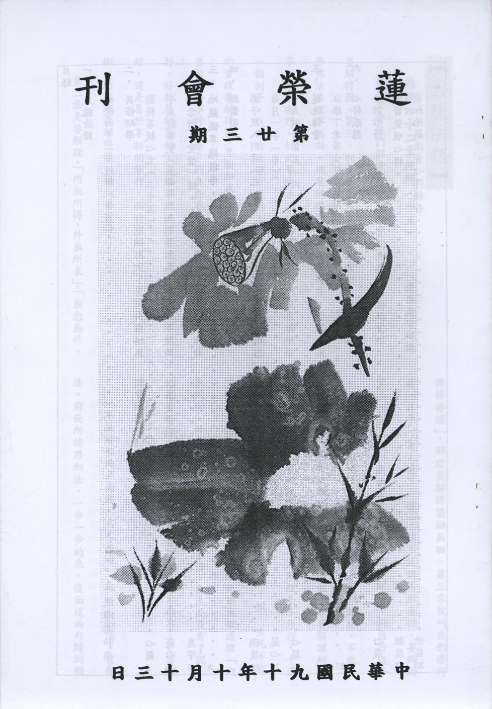

# 第23期

## 大德法語

### 佛說四十二章經解（十五）

*道源老和尚講授*

第二章要我們解悟實理，解悟實理是要瞭解佛的實理，要解得圓。第三、四章要吾人腳踏實地修行，屬於事相，學佛法要理事無礙。理要解得圓，事要行得方，要理不礙事，事不礙理。如此學佛才不會偏差。以我們現在講經做一個例子。我們請法師升座講法是解釋佛的實理，解釋佛的實理要解得圓，要圓融無礙。法師升座以前要捻香禮佛，要做那些事幹什麼？因為捻香也屬於修行，禮佛也屬於修行。修行屬於事相，這個事相必須要方正，一步也不能做錯，這是屬於事相的修行，而升座解理呢？要解得圓融無礙。所以理要解得圓，事相要行得方。

第二章是要解理，

「內無所得，外無所求」

，

「無念無作，非修非證」

，解理要解得圓融無礙。第三章就叫我們修行要「日中一食，樹下一宿」，這不能講圓融無礙，要腳踏實地的修行而「斷欲去愛」。第四章要斷除十種惡行與修十種善法。事相修行就是按部就班，一步不能錯，不能講圓融無礙，一定要按部就班一步一步的做。你要解理解得圓融無礙，一定要腳踏實地修行，只解理而不修行，十惡法不能斷，十善法不能修，則生死不能了脫，生死不能了脫歸閻羅王管。你要是見了閻羅王跟他講無礙道理「內無所得，外無所求」，閻羅王完全不懂，你生死沒有了脫，他就要辦你。所以你要瞭解佛實理，是理不礙事，更要腳踏實地地修行。

「不歷諸位而自崇最，名之為道」

，佛法有漸法、有頓法。前面所講乃漸法，一步一步的來。後面這兩句歸到頓法，頓超即不歷諸位。小乘（聲聞乘）有四果位：初果、二果、三果、四果。大乘的階位更多：十信、十住、十行、十回向、十地，五十階位再加等覺則五十一階位，歷經五十一因位才能成佛，這都是漸次的教法。講頓超的法門，直指人心，見性成佛，那裏有什麼階級、地位？不要經過這麼多階級、地位，這才叫最崇高無上，名之為道。強名之為道，本來沒有名，然眾生不瞭解，所以強名為道。

不了達佛甚深實理而慢慢地悟叫「漸」，漸次地悟，它有階位、次第上升，要是你能了達佛之實理，悟到無為法，那有什麼階級、次第！所以永嘉禪師證道歌說「夢中明明有六趣，覺後空空無大千」。這六趣就是六道（三善道三惡道）輪迴生死，這是在做夢中有的，夢覺悟了以後，空空無大千，大千世界都空了，大千世界都沒有了，那還有階級次第！是最崇最高。

或云：說來說去還是要修行，那只要修行就好了！講來講去還是要修行嘛。師云：你不聽講，怎麼知道圓融無礙之理？你不知道圓融無礙之理，你去修行，結果內有所求，外有所著，心外求道，名之外道，你本來是佛的弟子，結果在佛門修外道，為什麼？心外求道！所以你懂圓融無礙之理，再去腳踏實地的修行，這就叫做理不礙事，事不礙理，這樣理事無礙才不會有偏差。 （下期待續）

## 共修研學

### 勸發菩提心文（二十三）

*心爾*

念父母恩

「哀哀父母，生我劬勞」

此文引自詩經，總說父母養兒育女的辛苦，下文為別說。「十月三年」懷胎十月，三年的養育，才慢慢的自己會走路，自己會照顧自己一點，三年之內都要靠父母，走路靠父母牽，自己走會被車撞死，自己吃飯會被嗆死，自己倒熱水會被燙死，三年內父母沒有辦法脫手，所以父母之劬勞至少要三年，「推乾去濕」棉被自己蓋單薄的，孩子蓋暖活的。嬰兒便尿，污穢褓被，母將乾者推以與之。「嚥苦吐甘」在養育中，好的都給子女，例如好吃的菜都夾到子女的碗上，自己吃菜根喝菜湯。在家女人至已生育兒女時，方知母之苦，故女子孝親多於男子。女孩較知道母親之苦，較貼心媽媽。「才得成人」成人之後指望「紹繼門風」能延續家門，祖德流芳，過去祖先美好的德性，希望將來能長存下來，「供承祭祀」就是能祭拜祖先，香煙不斷，希望子女能光耀門庭，光宗耀祖。「今我等既已出家，濫稱釋子，忝號沙門，兩途既失，重罪難逃」省庵大師是出家人，可以責備出家眾，我們千萬不行，一定要知自己身分。出家人不是我們喝斥的對象，對出家人只有恭敬，若是善知識我們親近，若是惡知識我們遠離，但是心態絕對要恭敬，出家人再怎麼樣，他是代表佛的形象。「甘旨不供，祭掃不給」，沒辦法對父母提供甘美的供養，祭祀灑掃也沒辦法來做，不能祭祀祖先，不能在家承歡膝下。「生不能養其口體」，父母在時不能養其口體，因為我出家了，「死不能導其神靈」父母死了也沒有功德力引導他的神識超生善道，或往生淨土。「於世間是大損」孝都沒盡上，「於出世又無實益」，無法超拔其靈，未能以世間出世間之利益來報答父母，於世、出世兩途既失，重罪難逃，「如是思維，惟有百劫千生，常行佛道」這叫做上求佛道，「十方三世，普度眾生」則是下化眾生，「則不惟一生父母，生生父母，俱蒙拔濟」，印光祖師有一篇論文佛教以孝為本論云，出家於世間或有所不足（不能孝養父母，安邦治國），於出世間有大利益，因為不只這一世父母能蒙拔濟，生生父母亦蒙拔濟，而且「不惟一人父母」乃至「人人父母盡可超生，為發菩提心第二因緣」。不應只念這一世父母恩，還要念到往昔父母恩，若論生生世世每一生父母則其數是無量無邊，如此體會而知一切眾生都曾為我父我母，上求佛道，下化父母眾生為我的重責大任，此責任最要承擔無可取代。

父母對於兒女分上，有多少勤勞辛苦，不念則已，念則不覺心痛，故曰哀哀父母，生我劬勞，重言哀者，表示悲切、心酸；此恩是無法比擬的。然父母之恩，側重在母親，舉十月懷胎等，以為發菩提心的所緣。有情第八識的神識投入人道的母胎是與父精母血和合，現起生命現象，初七日名歌羅羅，初凝如酪狀（似蛋之胚團）；二七日名羯羅藍，此云軟肉；三七日名遏部曇；四七日名閉尸，此言堅固；五七日名形位，開始成形；六七日名泡位（頭手足五泡出）；九七名髮毛爪齒位，髮、毛、爪、牙都長出來，從這裡還要再養到三十八個七，九七到三十八個七還要再經過二十九個七才養得住，母親要很辛苦地養著胎中小兒，經過了三十八個七，即二百六十六日名為十月、是預產期，其實是九個月零四天，母孕子胎，腰酸腳軟，飲食行動均失常態，此十月中，母之劬勞為何如也！有的懷孕期間害喜，飲食不正常，身體發寒、發熱、嘔吐、腰酸、絞痛如刀割等，生產時胎兒經產道擠出，生命交關之苦，不可言喻。（下期待續）

### 小止觀導覽（二）

*蓮心整理*

經文

諸惡莫作，眾善奉行，自淨其意，是諸佛教。

註釋

（一）諸惡—諸種惡法，約分為：殺、盜、淫（身三）、兩舌、惡口、妄言、綺語（口四）、貪、嗔、癡（意三）等十種。

（二）眾善—諸種善法，約分為消極面：不殺生、不偷盜、不邪淫、不兩舌、不惡口、不妄言、不綺語、不起貪、嗔、癡。積極面：放生、布施、修梵行、起布施、慈悲、智慧心、說柔軟語、和合語、真實語。

大意

本段為「小止觀」一書總綱，旨在說修行止觀的正確態度。

導覽

一、「小止觀」原係智者大師為其兄陳鍼消災延壽而述，然「祛病延年」僅為止觀一隅，為免眾生捨本逐末、因小失大，故開宗明義言明止觀者，乃使三業清淨、了生脫死、破迷啟悟、圓成佛果之無上法門，此亦為修習止觀之真義。
二、印光祖師曾說：世間善人方可往生淨土；而極樂世界是諸上善人俱會一處；試
**問：** 世間人如何往生淨土？奉行「諸惡莫作，眾善奉行，自淨其意」而已矣！蓋因「諸惡莫作，眾善奉行」是論世間法，「自淨其意」是論出世法，故世間法、出世間法一以貫之，即名佛教。

三、為出離生死、利益一切有情，必須成就出離與成佛的能力，「諸惡莫作，眾善奉行」為戒法的實踐，止觀的前行，更進一步為「自淨其意」，而「自淨其意」必須靠止觀、靠定慧，因此「諸惡莫作，眾善奉行」為修學止觀的資糧，「自淨其意」為止觀的修學，及止觀的成就，再者「是諸佛教」，一言以蔽之，就是「止觀」，總而言之，「戒定慧」是為佛法大意。

四、「諸惡莫作，眾善奉行」是希望藉著斷惡修善，以調伏內心初萌的煩惱，而內心細密的煩惱，則須藉著修學「止觀」，以去除我相及細密的煩惱，並激起內心的清淨，達到真正的解脫，如此方為「自淨其意」，進而發揮度化眾生的能力，自立利他，自度度人，這就是「是諸佛教」。（未完待續）

## 專題研學

### 十大礙行（六）第五條

*心筑整理*

「謀事不求易成，事易成則志存輕慢，志輕慢必稱我有能，量事從心成事隨業事不由能，以事難為安樂」

以上是十大礙行第五條的經文。

「謀事」就是辦事情，「謀事不求易成」就是說我們辦任何的事情，不要求很輕易地就能完成。之前我們已經將身體上所遭遇的病痛、做事情的心態、辦事情本身的磨練和大家說明過，而有了正確的心態後，下一步就是要講究如何辦事情。而小朋友能夠辦哪些事情呢？雖然年紀還小，但我們每一個人都像是社會國家的小螺絲釘，都扮演了很重要的角色，有了大家的參與，我們每天的生活才能有效地被推動，所以在家裡和學校裡面每一位小朋友都有機會學習如何辦事情，而隨著大家年齡的增長，所要辦的事情也會漸漸地複雜起來，事情成功的困難度也會漸漸增加，這時候事前的計畫就非常重要了。古書上說：「行前定則不困」，就是說在做任何事之前，如果能夠定下心來周詳地訂定計畫，那麼辦起事情來就不會遭遇到太多的困難。所以經文告訴我們做任何事情時，不可以用容易、簡單、輕鬆、馬虎、不在意等的心態去處理，這就是「謀事不求易成」的意思。

在明倫月刊中，曾記載一篇短文叫做「人的責任」，是大提琴家馬友友先生。談到他十五歲時參加一個音樂夏令營，當時有一位前輩卡薩爾斯：「首先要做一個人，再做一個音樂家，然後才是做一個大提琴家。」馬友友先生聽了很感動，並且把這句話當成自己一生的座右銘，他說：「我看自己就是一個人，時時想到做人的責任是什麼。」所以馬友友先生後來成了一位世界有名的音樂家，而且受到大家的歡迎。從這個故事中，我們可以知道任何一個成功者的氣度都是從學做一個人而來的，做人可以說是一切發展的基礎，也是福報的來源。那什麼是「做一個人」呢？做一個人就是必須具備美好真誠的為人處世之態度，孝弟、謹信、汎愛眾、親近有仁德的人，再一步步地往聖賢的路子走去，並且把握所有的時間精力不斷的充實自己，不斷的學習。所以如果一個人失去了做人的本分，就好比一棵大樹，樹根受傷了，枝葉如何茂盛？所以不管自己內心有多少理想與抱負，都要秉持著「大處著眼，小處著手」的原則去實踐，就是事先做一個詳盡宏觀的規畫，再本著我們的良知良能，點點滴滴逐步踏實的去做，這樣就算是小小的實踐，也會有滿心的歡喜。否則如果空有理想，卻不願意真誠地對待周遭的人事物，只想自私自利的為自己謀求利益，而不從關懷他人的角度來處理事情，這種人是不可能成功的。所以我們要常常想自己能夠為父母、家庭或者是整個國家社會做些什麼？在處理事情的時候，不是把事情完成就好，更重要的是我們的心意是否圓滿，心態是否正確，處理事情的過程是否曾為他人著想，事前是否有詳盡的規畫等等，認真處理事情的每一個環節，其實就是做人的基本態度和責任，絕對不可以用輕忽的態度去面對。

「事易成則志存輕慢，志輕慢必稱我有能」這句話是說，如果事情很輕易的被完成，那我們就容易生出驕慢的心，以為自己最棒，最有能力，但是好好想一想，如果不是結合大家的力量，或是父母長輩的幫忙，事情是不會這麼容易辦成功的。如果認為是自己人緣好、能力好、頭腦仔細、資源豐富等等，這種輕忽事情、凌駕他人的心態，就像是一個溢滿水的杯子，已經裝不下任何東西了，所以他也不能從事項上得到多方面的學習，一個聰明的小朋友應該常常虛心請教他人，配合團體的運作，用心傾聽他人的意見，並且在事前作詳細的規畫……等，就像是一個空的杯子，才能再裝進好喝甜美的飲料一般，放下自己的想法與意見，接納並傾聽他人的想法，這其實才是我們面對事情應該有的心態與作法。

「量事從心成事隨業事不由能，以事難為安樂」。這句話所說的便是「盡人事，聽天命」的內涵，就是面對事情時，我們要用全部的心力盡其所能的認真去做，不要計較事情的得失，因為事情的成敗有時候不是我們可以掌握的，但是我們能夠掌握的是自己辦任何事情時的心態與作法。經上有一個解釋說「火雖欺金，金必成器」，就是說火能將金變軟，乍看之下覺得火是在傷害金，猛火把金的形狀改變了，可是金變軟之後卻可以利用加工塑造出更美麗的形狀，卻無損於金屬本身的性質。所以我們辦任何事情，就好像接受事情的考驗，應該要用上百分之百的心力，就算是遇到挫折的時候，也要虛心的接受它，因為挫折乍看之下好像傷害了我們，但是事實上這些挫折卻正在粹鍊我們的耐心、恆心與毅力，仔細想想，對於我們只有幫助而沒有絲毫的傷害，所以有了事項上的種種歷練後，當我們面對任何事情之時，我們會更講求事前規劃，一方面立定理想和目標，不會好高騖遠，一方面給自己期許，務實的往前走，就算碰到了困難，也會安然的領受。

西蓮淨苑的一位師父曾開示：「不求萬事如意，要求萬事如法。」也就是說做任何事情，要從開始的計畫起步，就用心規劃、請教長輩朋友、甚至於在做事情的當下也要耐得住性子，一件件地完成。更重要的是，凡事要多為他人著想，做任何事情都要對得起自己的良心，想想自己是不是盡了全力去做？是不是有虧欠別人的地方？而順著自己的良心就是如法，所以師父說要大家不一定要事事都求如自己的意，而是要求心安理得，凡事不違背自己的良心，理得了自然心安，至於事情的成敗與否，其實已經不是我們所在意的了。這樣子說來想必大家都更能夠瞭解妙叶大師的用意，而進一步在事難當中，培養自己的涵養與能耐，在此祝福大家「事事如法」。（未完待續）

## 蓮池海會

### 江添丁老居士往生見聞記

*編輯部整理*

江公添丁老居士，出生於民國十三年九月十九日岡山鎮福興里石螺潭，父親江朝珠母親侯箱，倆老於江公添丁三歲時就相繼逝世，留下孤兒寡女三人相依為命，因為勢單力薄，為繼承家業遂於十八歲時即與路竹鄉大舍村姻親高玉珍老先生掌上明珠高小春小姐結婚，夫妻恩愛有加，育有五男三女，此時正是日據時代，太平洋戰爭最堅苦的時期，家庭生活之清苦，可想而知。

老居士成家以後，為承擔全家之生活重擔，曾先後擔任部落會書記、里幹事、岡山農田水利會、岡山鎮公所鎮民代表兩屆，後又經營營建工程數年，轉任高雄市政府鹽埕區公所服務三十年直至民國八十六年元月退休，服公職期間，負責盡職，故履獲長官的器重，並獲內政部獎狀。

俗話說，家和萬事興，此是老居士最在意的事，常常舉出親友周遭間的實例來勉勵兒女，期勉其作為前車之鑑，並且勉勵兒女在兄弟姊妹之間不要太計較，故其子女們皆手足情深，相親相愛。為人人稱羨的模範家庭。老居士更於民國七十四年榮膺高雄縣『模範父親』，實為實至名歸。

綜觀老居士一生對鄰里秉公好義，擔任福興社區老人會會長。一生「樂善好施」每年春節，端午節，中秋節都捐款給孤兒院家扶中心。九二一大地震時，將兒女買給他的新衣服都捐出去震災。老居士悲天憫人，民胞物與的大愛胸懷，乃留給兒女最好的學習典範。

老居士於民國八十六年五月發現肝腫瘤，在醫師醫治及子女細心照顧下病情逐漸穩定好轉，於今年初病情惡化，自七月十七日再度入院，雖經群醫細心治療，仍於九月五日上午接到醫院病危通知，即接回家大眾排班助念，蓮友接獲通知隨即由豐原、東勢專程南下，更有蓮友遠自台北搭飛機趕來助念，九月五日中午十二時五十分與世長辭，享壽七十八歲。在兒女們孝心及蓮友誠心護持助念十二小時後，為老居士「沐浴更衣」，由於佛菩薩加持，現出全身柔軟之生西瑞相，此是佛力不可思議的示現，也是老居士宿世善根福德的善報，祈願老居士能於西方極樂世界，蓮品高升，早日乘願再來，廣度有情。

## 日常省思

### 學習梵唄心得

願度

九月五日星期三，依著老師的指示，末學和心筑學長至西蓮淨苑向慧乘法師請教學習法器及梵唄時基本上應該注意的心態、意樂、法器的拿法乃至於唱腔等等，慧乘師因為怕我們在淨苑敲打法器容易干擾大眾，故帶我們至其俗家妹妹的家中練習法器。慧乘師十八歲即出家，早年寺中僧眾多以外省僧人居多，故習得內地唱腔，又因慧乘師宿世因緣，對於種種梵唄唱腔及法器板眼等，皆銘記不忘，今日有此因緣得以親近學習之，乃弟子莫大的福氣。

從前在家人是不能打法器以及學習梵唄的，但是現值末法時期，為了有利於佛法的宏傳，開了方便讓大家來學習，大家要珍惜，以護持三寶，恭敬三寶的心態來學習梵唄，師父在一開始的時候就說即便如此，但是要注意梵唄是為修行而用，絕對不能以梵唄來趕經懺販賣佛法。當然佛教徒是以研究經教為主，但藉著唱頌、儀軌等佛事，可以幫助我們去除深入經藏的障礙，為修行的助功。

接著就是必須要具備清淨心，其實喜捨心、慈悲心、大悲心、平等心、歡喜心、菩提心等等的心就是清淨心，我們學法器是為了讓大眾都可以藉由梵唄而生起歡喜心，並可以對治自己昏沈掉舉的煩惱，由此而去除自己研經的障礙，最後引發欲帶領大眾一起來念佛、唱頌的心態。當然從反面上說就是要去除欲表現自我的心態，這都是我執在作祟，因此要著意於對治它，這都是我們在學習法器時需要注意的。

有了正確的心態，接下來就說到學習梵唄與法器的方式，我們對修行提起了正確的意樂，師父這裡提出一個心態，就是欲令眾生生歡喜心來念佛及作種種的法行，首先我們要熟悉所學梵唄的音調，並且能唱出來，再來就是對板眼的熟悉，這樣學習法器就很簡單了，接著我們必須要把板眼背下來，打法器的時候才能投入，若一直看板眼，就無法專注於大眾和諧地唱頌，更遑論將法器打好。

再說到對於梵唄與打法器要有感情，就要靠心地上的功夫了，平常時期要著意對治自己的煩惱，而且在作課時我們自己必須先念出法喜，能隨文入觀，而且對於儀軌極有覺受，這樣才可以引發大眾得到法喜。在唱誦時，我們必須注意調整自己的聲調，盡量讓自己的聲音放柔軟，而非僵硬不知變通，自己得不到法喜，也沒辦法利益大眾。若我們到一個新的環境念佛，我們必須先聽別人怎樣念，盡量以自己的音階配合別人，這樣久而久之訓練出來以後，我們到那裡念佛、誦經都不會造成別人的困擾；更進一步讓自己訓練成他人若起音太低或太高時，可以將低音拉高、將高音拉低，使大眾能在和諧的氣氛中念佛，皆得殊勝的法喜。簡而言之，我們學習法器的步驟乃先調整自己的心，再用唱頌來帶動法器，若不會唱頌（自己不先生出法喜），則法器的敲打無由利益大眾（大眾生不起歡喜心），這樣就可惜了每一場的佛事。

各種法器的拿法，包括引磐、木魚、鐺及鎘等拿法，拿法的一個通原則是威儀好、讓人看起來覺得很舒服，拿法器要拿得穩但是很輕鬆，打起法器時，不要執著法器，要讓法器跟著我們的音聲去和，而非是音聲去和法器的拍子，這樣自然就夠把法器敲得得心應手。

雪公太老師於梵音集中序文曾云：「相傳曹子建遊漁山，開巖壑誦經，清婉猶麗，遠谷流響，遂擬其聲而製梵唄，法華玄贊稱為冥符三契。兩千年來，淋宮紺宇，踵事增華，有裨於教法之宏揚，志趣之涵養者至鉅。」吾人應感念先賢所制之梵唄，起恭敬心而學習之，不罔祖師大德制訂、傳承之用心良苦。

## 啟蒙園地

### 弟子規　入則孝（三）

*編輯部整理*

「冬則溫，夏則凊；晨則省，昏則定。」

前面所說的「呼命教責」是指爸爸媽媽對我們的訓練，當中蘊含了無限的福報在其中，這是爸爸媽媽給我們最大的福氣，以讓我們可以改變自己懶散、隨便的性格，並養成體會他人、尊重他人及配合他人的特點，這當中就可以去掉我們很大的「我執」，在往後的日子當中能更好的與長輩、晚輩、朋友及長官們相處，並得到他人的回應，如此一來，在做各種好事時就能得到很多的幫忙，自然就不會處處產生障礙。

而接下來所說在孝上的表現，是針對我們作為孩子的應如何向爸爸媽媽回饋，也就是指生活起居上的照料〜在冬天我們該如何做？在夏天我們應怎樣服侍爸爸媽媽？在晚上我們要如何讓爸爸媽媽很安心的睡覺？在早上我們該如何表示我們對爸爸媽媽的在意？「冬則溫」是指冬天的時候，我們要讓爸爸媽媽所睡床舖很溫暖；「凊」是一種清涼的、清爽的，在夏天的時候，天氣很熱，我們要使爸爸媽媽床舖很清涼。在從前，冬天時會用火爐摀在被子裡，讓床舖一下子就很溫暖，而且很安全；夏天時做子女的我們要把爸爸媽媽所睡的床舖、墊子、蓆子抹得乾乾淨淨的，汗氣沒有，再把它搧得很涼爽。「定」就是指床舖上用的被子要把它安排妥當，「定」有安之意，是指在晚上的時候就要把爸爸媽媽的床舖舖好，讓爸爸媽媽能安心的就寢；「晨則省」，「省」就是指省察，早晨一起床的時候，就要去向爸爸媽媽問安，看看爸爸媽媽這一夜是否睡得好，有沒有什麼事情要吩咐我們做的。在夏天時，我們要把蓆子、墊子安置好，冬天時要把被子墊子折疊好；在晚上的時候，一定要把爸爸媽媽招呼就寢了以後，再回到自己房子裡邊去睡覺，應讓爸爸媽媽先睡好、睡安，一切都安然，自己再去睡；早上的就要到爸爸媽媽的房間去看看省察省察，瞭解爸爸媽媽的需要與爸爸媽媽的狀況，這都是為人子女必須要做到的，我們若能從小就這樣的訓練，培養成良好的習慣，爸爸媽媽年紀老的時候，就更需要我們這樣做了。

我們可以想想平常時期，爸爸媽媽對我們的日常生活也是如此細心的照顧「晨昏定省，冬溫夏凊」，現在只是換我們來做做看爸爸媽媽日平當中為我們所做的無量事情當中的一小部份罷了，爸爸媽媽為我們所做的一切，除了日常生活的種種照顧外，我們還可以去想想從媽媽開始有我們這個小娃娃在肚子裡的時候，她就非常的不方便，媽媽什麼事都不能做，每天就挺了一個很重的東西在身上，比我們上學背的書包還要重很多倍，等到要生產的時候，媽媽還要承受很大的痛苦，痛徹心髓才能把我們生下來，但等到媽媽一看到我們安全的誕生，她就把她之前為我們所受的種種痛苦都忘記了，在三年的哺育期當中，媽媽都把我們抱在懷裡，她把最好吃的東西都留給我們吃，而自己留下不好吃的東西來吃，她也把乾的地方給我們睡，而自己卻睡在我們弄濕的地方；除此之外，在我們還很小的時候，沒有辦法自己上廁所的時候，還幫我們清洗大小便，幫我們包尿布等等，讓我們的身體可以保持很乾淨而舒服；若我們離開了媽媽到外地或辦事、或留學、或旅遊，爸爸媽媽的心就會一直掛念我們的生活與安危；爸爸媽媽都希望能夠代替我們去承受我們所遭遇到的痛苦，爸爸媽媽對我們的掛念、擔心一直到他們老人家生命完盡的時候才會停止。所以，爸爸媽媽對我們有這麼大的愛護、照顧與恩德的時候，我們是否應該在「冬溫夏凊及晨昏定省」上好好對爸爸媽媽的生活起居表示我們的關心，以微薄的「寸草心」來報答爸爸媽媽的「三春暉」。

其實在對爸爸媽媽「冬溫夏凊」的過程中，我們可以從爸爸媽媽穿的衣服開始關心；冬天了，爸爸媽媽是否有多加衣服、爸爸媽媽臥室的窗戶是否有關好，爸爸媽媽是否有什麼毛病，例如心臟病、類風濕關節炎等等讓他們冬天時候會比較難過，這些我們都要幫爸爸媽媽考慮到，再來是爸爸媽媽的棉被是否斤兩夠，若不夠的時候，我們可以幫爸爸媽媽處理這些事，甚至幫爸爸媽媽買個電毯，讓爸爸媽媽可以過個溫暖的冬天。夏天到了，台灣是又熱又濕，我們就可以幫爸爸媽媽準備風扇等等用具，把爸爸媽媽的衣服準備好，讓爸爸媽媽換上清爽、涼快的衣服；在臥具方面，也可以幫爸爸媽媽準備草蓆、涼被，讓爸爸媽媽在夏天時可以過得輕爽又愉快，由生活中體貼爸爸媽媽的身體上的需要到心理上能幫爸爸媽媽分憂解勞、讓他們能安心。在從小我們就可以被訓練成這樣子的，有一個只有一歲大的小孩就可以做到了，我們是不是都比一歲的小朋友年紀還大呢？所以，我們人人都可以做到「冬溫夏凊」，其實這個並不困難。在一個刮風的下午，媽媽向這個一歲的小朋友說：「玲玲冷不冷？」玲玲說：「我很冷！」媽媽說：「那給玲玲加一件衣服；那爸爸會不會很冷，我們也給爸爸加一件衣服，好不好？」玲玲說：「玲玲冷，爸爸也冷！給爸爸加衣，加衣！」媽媽就帶著這位玲玲去給爸爸加一件外套。等到吃飯的時候，爸爸還沒有來吃，這小玲玲也不開始吃，別人問他為什麼？玲玲就說：「玲玲餓餓，爸爸也餓餓，玲玲等爸爸。」其實我們自己在冬天也想可以暖活一點、在夏天可以涼快一點，爸爸媽媽的心裡也和我們一樣，當我們冷的時候，他們也會冷；當我們熱得難受的時候，他們也熱得難受，我們就可以從這裡去體會爸爸媽媽的需要，從而給予他們適當的關懷。

我們一般的小朋友，一大早起床，第一個念頭就是想到要多睡一會兒，一直到爸爸媽媽不停的摧我們起床，才依依不捨的離開了我們床舖，若我們一起身就能想到我們的爸爸媽媽，到爸爸媽媽的前面去問安，瞭解爸爸媽媽的健康狀況，昨天晚上睡得好不好，是否有不舒服，再來就看看爸爸媽媽有什麼事情要吩咐我們的，所以一大早就可以在生活當中表達我們的孝心了，由這裡來發展體貼爸爸媽媽的心意，感念爸爸媽媽為我們所做的一切，而我們能為爸爸媽媽做的只是一小部份。到晚上的時候，我們就要去幫忙爸爸媽媽整理臥具，讓爸爸媽媽能安心的就寢，我們可以注意爸爸媽媽是否有任何需要，像曬棉被、整理枕頭及墊被、擦草蓆，把汗氣全部擦得乾乾淨淨的，再安排爸爸媽媽睡覺，從身體上的安頓，而進一步察看爸爸媽媽有什麼心事我們可以分憂解勞的，或許我們可以代勞的、或許我們可以找人幫忙的，一定要招呼爸爸媽媽安心就寢以後，我們才到自己的房間去睡覺。

在起居照料上，我們能為爸爸媽媽保暖、除熱，乃至於早晚的問安，將被動讓爸爸媽媽安排我們的生活轉而由我們主動來安排爸爸媽媽的生活起居。這樣我們對爸爸媽媽的情況就能掌握瞭解、以盡孝道，從我們小時候就開始這樣做，等到我們長大，爸爸媽媽也已經年老了，就更需要我們對他們做出這樣的關懷。現在的工商社會就常發生老爸爸與老媽媽自己住在外面，等到其中的一方死了，另一方就自己過生活，往往有了病，死在房子中幾天了才被發現，這是因為老年人年紀大，天氣一轉變，身體雖然沒有什麼大毛病，但就無法起身了，所以做為小孩的我們在小時候就養成了「冬溫夏凊，晨昏定省」的習慣，到爸爸媽媽年紀大時，我們就更應該注意了，以讓恩情似海的爸爸媽媽能很安心度過他們的晚年，並很自信的認為「養孩子還是很有效的」。

從家庭的訓練到出社會的工作，我們就能夠以侍奉爸爸媽媽的心態來對侍長官，並且能尊重長官而與長官維持一個良好的關係，這樣一來，從關心當中去體會長輩的心意而尊重長輩的意見，到執行長輩的決定，而且能體會朋友、晚輩的心意而得到很多的認同、幫忙，最後就會得到很多的幫助，我們福報的源頭其實就來自於「冬溫夏凊，晨昏定省」這生活當中的點點滴滴而已。（未完待續）

### 每月一字 — 串

*蓮心*

串：甲骨文為  ，是象形字，其形狀象徵以繩子貫穿兩物，所以「串」的本義是「物相連貫」的意思，比如「一串念珠」、「一串銅錢」。另外，尚有其他的意思，如：

一、互相勾結以進行壞事〜如串供、串騙、串通。

二、出入、往來〜如串門子。

三、扮演〜如客串。

四、藉由不斷的學習，以貫穿通曉其義理，並生起殊勝的覺受〜如佛教用語「串習」。

五、親戚〜當「串」做親戚解時，讀做「ㄍㄨㄢヽ」，如親串。

《例句》「因歌遂作賦，聊用布親串」(謝惠運秋懷詩)。就是說賦詩獻給親人。

## 禮懺法會

### 參加地藏懺法會心得報告

世昌

末學奉命報告參加本次（九月一日）地藏懺之心得，故思維吾輩行者拜懺或做佛事，所為不外自利利他。求自利者，欲罪障蠲除，修行增上；求利他者，則是現生家人障難病苦消除與超拔過世親人，使投生善道。僅就參加者應如何發心與提起，易得實益，分會前、會中與會後，報告心得，以供養大眾。

參加前首應確定目標，先問自己是為了什麼要參加？當然最好是每次上課或辦佛事之前老師一再提醒的「為利有情願成佛」。而如果心態不是如此，也應藉此機會串習提起，並期勉自己，希望未來能真心發起成佛的意樂。至於串習的方法，老師與諸位師長也曾教導過許多次，要發起成佛的意樂，首先要升起出離心，內心要對娑婆的苦有覺受，己身乃苦本，是裝苦的器具，看清人生的本質是無常，自己因為無明起惑造業所受的種種痛苦（三苦、八苦），將這些觀念時時觀修，自然能引發出離心。其次是看到自己的苦，想到眾生的苦，而又想到眾生無始劫以來皆曾做過我一世的父母，對我有極大的恩德，興起欲救拔眾生離苦得樂的念頭，所升起的菩提心。

確立拜懺的目標之後，其次應體認自己是業重凡夫，亟需懺悔。這可以從幾方面來提起覺受，先從平時所受到的障難，如己身欲親近善知識修學佛法，但遇到家人阻止，觀察這些障難不過是反應過去所造的惡因，也許是自己過去一起興辦善法時，內心所起的不隨喜、嫉害之心，而現在因緣成熟，業果所致。再試想，吾人日常生活究竟是如意事多，還是不如意事多？這樣就可知吾人宿世行業了。進一步再觀察自己的起心動念，是清淨的念頭多，還是貪瞋癡的念頭多？是追逐外境多還是專注一境多？對事情的來龍去脈是清楚的多還是迷糊的多？想必答案都是不好的多，那真的需要徹底地懺悔一番。再從吾人的根器來觀察，想想自己並沒有天台大師七歲時一聽聞普門品即能背誦的根器；在上課聽講時，對教法亦無法一歷耳根，永不忘失，總是左耳進右耳出；研讀教法是過目即忘，甚而一開經本，瞌睡蟲即上身，這樣思維乃覺悟自己實是根器差而業障深重的凡夫。最後看看自己的戒律持得如何？無犯無缺？今生所行，符合十善業的基礎？今生所行滿是罪業，死後三途受苦當屬必然，想來令人毛骨悚然。地藏經云，閻浮眾生舉心動念，無不是罪，無不是業。故根器陋劣、惑業滿滿的我輩眾生，豈能不以至誠心參加此懺悔法行？

本次的因緣是地藏懺，所禮敬的是地藏法會中的諸佛菩薩。若時間許可，可以於參加法會之前多加瞭解地藏菩薩因地行願，或誦讀相關經典，內心隨喜地藏菩薩的行願力，此舉有助於拜懺時提起至誠恭敬之心，而得到殊勝的轉變。

法會當中誠心地隨著維那悅眾的引導，誠心禮懺，若能善於提起至誠之心，不但可滅除罪業，亦可超拔先亡，往昔所造的罪因，因無現世惡念為緣，苦果自不易現起。法會當中若自己不曾感動過，無由幫助先亡滅罪超生，所以自己的一念至誠心啟請、禮敬與回向就更顯重要了。

法會結束之後，要如何將此美好的覺受延續，甚至作為日常用功的助行，以積聚往生的資糧？在家中可以自己依著懺本拜懺，也可以隨順學習地藏菩薩的行願-「孝」。地藏菩薩因地為光目女時就是因著為救拔母親的孝心，而發下「地獄不空，誓不成佛」的大願。吾輩惑業凡夫可以先從世間的孝道做起，盡甘旨之養，體察親心，然後進一步喻親於道，助其往生西方極樂世界圓成佛果，令父母親得佛法之益，這才是出世間真正的大孝，當然這也是末學努力的目標。

最後願大家每次參加法會或種種善法時，都能有好的發心，增上德學。本篇報告所闡述的內涵回向給大眾，心想事成，法喜充滿，往生西方，圓滿菩提，光壽無量。

### 地藏懺專題報導

*編輯部整理*

一、時間：

九月一日(週六)

二、地點：

中壢研學會

三、緣起：

農曆七月三十日是地藏菩薩的聖誕，我們也藉此機會對地藏菩薩祝壽，祝壽的心態是惟願大士能乘願再來、利益有情。地藏菩薩在我們中國是四大菩薩之一；「地藏」二字即表示他是大地的寶藏，此有三意，第一是地藏菩薩發願要分身到十方世界去度地獄與惡道的眾生；第二是說大地是萬物所依止，能夠乘載萬物，地藏菩薩發願要救度一切眾生，如同大地承載萬物般承擔如來家業；第三乃大地是一切生長的根本所依，依著地藏菩薩威神力的護持以及自修懺悔的功德定能蒙地藏菩薩的教化及接引，讓我們在道業上有所增上。

今日又正值中元節的前夕，我們來做地藏法會，讓大家來效法地藏菩薩的悲心、願力、精進行，依著內心的懺悔、皈依、發願、禮拜、持名，其實在所有的懺法當中，這些儀軌都一樣，只是我們依著外相〜地藏菩薩以大乘菩提心示現聲聞乘，這個因緣是很殊勝的，這是一個正法住世的行相，能夠在這個懺法上好好的做，蕅益祖師說這樣做力量是最強的，在恆河沙世界供養無量無數的大菩薩，都不如在一頓飯的時間來表彰這樣的行持與願力。

從儀軌中我們可以發覺到地藏菩薩在成佛的路上都走在前面，我們要懺悔，他在前面引導；我們要度眾生，他也在前面引導；我們要做任何事情，地藏菩薩都已經在前面做引導，我們只要逐步的跟上。地藏菩薩承擔救度我們這些釋迦牟尼佛的孤臣孽子的責任，如吾人修學止觀的前方便當中，須要拜懺來先去除我們修學止觀上的障礙，讓我們能把心安住在善法上，在念佛當中去除沉掉的過失、讓煩惱不起現形、讓佛號持續、讓佛號成片、成就三昧、引動阿彌陀佛的加被｜往生西方極樂世界，在具足止的能耐下，我們就可以利用此定力在善法當中去緣念空性。

蕅益祖師曾提到說大法已經湮沒很久了，人們對於教法的見解大部份都是錯誤的，或者是執著大乘毀謗小乘，此乃造地獄眾苦之因，就算投生到人道，也是盲聾咽啞，障難重重，因此地藏菩薩非常的慈悲，他在大集會中（包括地藏三經，即是占察經、十輪經及本願經），示現聲聞相，即比丘相。釋迦牟尼佛廣大讚歎地藏菩薩殊勝的功德而且說到假使有人在恆河沙大菩薩前用百劫的時間來至心皈依、稱念、禮拜並祈求各種願望，還不如用一頓飯的時間皈依、稱念、禮拜及供養地藏菩薩，這是為什麼呢？因為地藏菩薩是久修堅固的大願大悲菩薩，其精進力是諸菩薩中的模範。

地藏菩薩的這種表法對我們很重要，因為在末法時期，雖然我們自認為是大乘行者，但是在戒行上卻沒有切實的去做，真的是廢小談大，因為小乘尚且沒有做好，這個「大」稱不上大乘，沒有建立大乘的基礎。但如果以悟大乘的心而以小乘法來表現，這樣小乘也可說是大乘，所以法華經警誡宏揚經教的人一定要有不殺、不盜、不淫及不妄語的四種安樂行，才能夠得到教法的實在受益。在涅槃經上也說，雖然佛性光明殊勝，但戒律更重要，必須以戒律作為明心見性的基礎。地藏菩薩正是如此的表法，他是一位發大菩提心的行者，但卻示現戒律精嚴的比丘相，在這樣的聖相前，我們的禮拜、供養、讚嘆及皈依，一食頃間都勝過百劫至心皈依供養諸大菩薩，這就是地藏菩薩用行相顯勝之因。

蕅祖說自己非常的慚愧年輕時造作了毀謗三寶的無間地獄的罪，現在得到地藏菩薩三經，知道有出世間的大孝，於是就對佛法有正知正見，但他謗法的餘業讓他在教法當中難以生起覺受，所以他非常的慚愧、懺悔；而對地藏三經他自己有很深刻的覺受｜希望在末法時期，大家能夠尊重孝道，並且發菩提心來尊重戒法，這樣就能夠效法地藏菩薩的因地，將來可以證得無生的果位，以上是蕅益大師地藏懺的序文。

四、壇場佈置

眼前這個壇場是殊勝莊嚴，花團錦簇中地藏的壇城現起，地藏菩薩著五佛冠表示他有佛的證量，拿著錫杖是代表這是大乘的菩提心、實踐六度的行者，但示現的是比丘相，代表他是實踐戒律的行者，這樣的行相很難得，是菩薩最殊勝的行相，所以地藏菩薩能夠勝過菩薩各類的表法，即是表示菩薩雖有各類的表法，但以地藏菩薩示現的這種行相最為殊勝，如果能夠在這樣的行相下作懺法，那不是一世、二世、三世、四世及五世的福報，這是已經在無量百千萬億佛所種諸善根，因此我們要來好好的做前行，這樣才能使讓佈置壇場的蓮友們、苦練的悅眾們及在風雨當中來參加的蓮友們獲得法益。

地藏菩薩雄鎮的地方在中國是九華山，法界的各個地方都有他的化身與應化，如忉利天宮神通品第一就說地藏菩薩是分身十方恆河沙世界，釋迦牟尼佛將度化眾生的重責大任交給地藏菩薩的時候，他是分身來集忉利天宮，在十方諸佛的見證下、十方菩薩的擁護下、鬼神天龍八部的讚嘆、隨喜下，地藏菩薩承擔了度化眾生的重責大任，如同出師表中的諸葛亮一樣，是要動之以情（托孤的行相）、而曉之以禮，最後諸葛先生必定是鞠躬盡瘁、死而後已。

所以在末法時期，彌勒菩薩在五十六億七千萬年後出世之前，我們與地藏菩薩有著很深厚的法緣，尤其地藏菩薩說眾生做一些善法，乃至於一塵、一毛、一沙、一渧，地藏菩薩都能藉著這樣微弱的善法，起最殊勝的威神力來幫助眾生；當一切眾生都能在業障的苦海當中脫離纏縛、得到善知識及諸佛的護念，進一步離苦得樂，娑婆業報盡而得生人天，或者往生淨土，或者得生人天，此乃於地藏法會中，我們對主尊要有這樣的認識。

我們要將自己的意樂調整成菩提心，反面要懺除五逆十惡、謗佛、謗法、謗僧及盜用僧物等種種罪惡；正面要隨喜十方善知識的功德，並帶著一切的眾生來懺悔、發願、禮拜、誦念，就可以圓滿這整個法會的功德。

在壇場的供養中，燈代表智慧延續、香表戒定真香、果代表佛果的圓成等等，水水花香燈塗果樂代表淨土的展現，這些都是地藏菩薩威力所莊嚴的壇城、也是我們眾生善業所成的壇城。

五、懺本觀修

在儀軌本中，地藏菩薩帶著我們去皈依頂禮供養十方常住三寶，我們用香花來供養一切的佛菩薩，香成就的是供養的法行以及一切菩薩的法行，最後成就佛的五分法身香，接下來觀修香花遍十方，我們帶著無量的有情，以此香花變現成無量的供品，供養十方的佛菩薩，由供養的法行當中發起六度四攝勝深力行菩薩行的心，最後體證空性得到佛果，而眼前因緣為拿著香花由地藏菩薩帶著我們去供養十方三寶。而且今天法會的現起是靠地藏菩薩而有，因此我們必須對地藏菩薩所現的菩薩現的聲聞相特別讚嘆。

以下就對這位現聲聞相的比丘有廿二句的讚嘆，第一句就是說他是一切功德的寶藏「功德伏藏」，向地藏菩薩挖寶是挖不完的；第二個是所有解脫的源頭「是諸解脫」，第三個是眾生清淨的眼目「名淨眼目」；第四個是像商人一樣引導我們去探寶，即引導我們得到涅槃的寶藏「是趨涅槃，商人導盲」；第五個是說菩薩像如意寶珠一樣，一定能夠遍佈各類的財寶、解決我們世間的苦難；第六個是我們所要的各種的願望都能滿足「如如意珠，雨眾財寶，隨所希求，皆令滿足」，我們在這個法會當中希望超薦與消災的願望都能滿足；第七個是菩薩像太陽一樣能照亮行者，找到光明的前程「照行善者，猶如朗日」；第八個是失去道路的人，菩薩能夠像燈塔一樣讓他得到方向「照失道者，猶如明炬」；第九個是除掉煩惱像晚上的月亮非常的清涼「除煩惱熱，如月清涼」；第十個是在生老病死的四瀑流當中，地藏菩薩就像橋樑一樣讓我們不要在瀑流當中虛生浪死「渡四流者，為作橋樑」；第十一個他能夠像船一樣，把我們帶到彼岸「趨彼岸者，為作船筏」；第十二個菩薩像獅子一樣能夠壓服百獸的來震服一切的外道「伏諸外道，如師子王」；第十三個是菩薩能夠降伏所有一切的天魔，就像大龍象一樣，大龍象是玉皇大帝戰敗敵人的交通工具「降諸天魔，如大龍象」；第十四個是說菩薩像父母親和知音好友一樣能夠安慰我們，讓我們不會有恐怖憂愁「護諸怖畏，如親如友」；第十五個是菩薩就像城池一樣防衛我們的怨敵「防諸怨敵，如塹如城」；第十六個是救各種的危難就像我們的父母「救諸危難，猶如父母」；第十七個是菩薩會幫我們保護讓我們不會怯弱，就像鹿躲到叢林裡面一樣不會怯弱，我們進入菩薩的願海當中，再也不會怯弱了「藏諸怯劣，猶若叢林」；第十八是讓我們的善根不壞「令諸有情，善根不壞」；第十九是現出很美妙的境界，讓我們很歡喜「現妙境界，令眾欣悅」，例如在地藏經中，地薩菩薩就示現了無邊身以加持眾生，讓眾生開智慧，一聞經教便永遠銘記不忘；第廿是能夠勸發有情得到很殊勝的善心〜慚愧心「勸發有情，增上慚愧」，例如印光祖師就是懷著慚愧心來修學一切的教法，但我們一般凡夫生不起慚愧，當然就無法生起對教法的覺受；第廿一對於有心求福慧者讓我們得到福慧「求福慧者，令具莊嚴」；第廿二是讓我們無功用轉大法輪，即是任運的可以講經說法「能無功用，轉大法輪」，就像天台大師講妙法蓮華經等五字可以任運的講九十天，九十天的筆記寫成「法華經玄義」，由此引申出天台八教大義，再引生成天台四教儀，都是由五個字去引生的，這就是無功用轉大法輪，最後的結論是這樣的功德是不能測量，他的大願大悲是堅固的，對於這種勝過一切菩薩的行相來至心皈依、稱名、禮拜及誦念，我們所有世間的願望都得到圓滿、所有出世間的願望包括涅槃之道都能夠得到，所以一心歸命頂禮。從這裡瞭解到地藏菩薩的各種果德，維那在帶領我們儀軌時，我們就可一步一步的隨文入觀，而得到拜懺的利益。

地藏菩薩有如此大的功德，我們要來向地藏菩薩求受大法，就必須在法會上現起地藏菩薩的本尊，然後才能向主尊求受大法；接著下來就是地藏法會的聖者，像釋迦牟尼佛是地藏法會的主持人，師子奮迅具足萬行如來與覺華定自在王如來是本願經中忉利天宮神通品第一，地藏菩薩的因地中曾經做過長者子與婆羅門女，而彼時的佛即是師子奮迅具足萬行如來與覺華定自在王如來；一切智成就如來與清淨蓮華目如來出現於閻浮眾生業感品第四，地藏菩薩曾為小國王與光目女，那時候的佛分別是一切智成就如來與清淨蓮華目如來；從無邊身如來、波頭摩勝如來、師子吼如來等等一直到拘留孫佛及釋迦牟尼佛等賢劫七佛，這些都是稱佛名號品第九中出現的佛，他們出現的好處包括：

１．反面來說可以幫助我們超越生死重罪。

２．正面來說可以得到佛的授記，眼前得到人天的快樂，未來能夠得到解脫的聖果，在無上道得到不退轉，最後在佛前能夠成就佛果說法利益眾生。

以上兩點是所有這些佛功德的總說，若有一天我們成佛時，也該期許自己總攝這些佛的功德，當眾生念到我的佛名〜禮拜我、恭敬我時，我們可以幫助他們除掉生死的障難及重罪，除掉世間與出世間一切的苦難，正面能夠引發眾生去見善知識、往生淨土，現前者可以得到一切的快樂，未來者往生淨土得到諸善知識的說法、得到諸佛的授記，並成就涅槃與解脫的聖果，最後成佛來利益眾生。就像阿彌陀佛在因地時攝取二百一十二億佛國土的莊嚴變成自己的莊嚴，他的修行就是這麼的善巧，所以世自在王佛才稱讚阿彌陀佛是高才勇哲、出類拔萃超過一切的菩薩，這就是阿彌陀佛在因地時善於把一切菩薩的功德納為自己的功德，也就是論語上說的「見賢思齊、見不賢而內自省也。」這就是善於修行的人，而非我們這等凡夫「見不賢而生煩惱，而賢而生不以為然。」若是如此的話，就不會進步。五十三佛是在大集會上的佛，再加上三十五佛就是八十八佛，這是除障最強的集合體，再加上恆河沙佛及忉天宮的一切諸佛，忉利天宮的佛都是地藏菩薩度成佛的，這些忉利天宮上的佛也是無量無邊，可見地藏菩薩累積的功德也是無量無邊，所以大菩薩的特點有四個，即其悲心、智慧、威神力、與眾生結的善緣，此四者中缺一不可，其中與眾生結的善緣越多，他來到世界轉變眾生共業的力量就越強，其實佛就是願與緣而已，若沒有結過這樣的緣，我們要來施展我們的願力就不容易，就像五濁惡世就一定要釋迦牟尼佛來到，因為他與眾生的緣結得深，在這苦難的世界當中，只有他有辦法讓正法住世，他的證量與十方諸佛一樣，但就緣來說，釋迦佛與眾生結的緣較深。所謂緣結得深就是他過去的努力，這個結緣是要點點滴滴的去做、無量無邊的結下去，這樣就自然會有不可思議的功德。接著下來是無相如來，這尊如來就是閻羅王眾讚嘆品當中的主命鬼王，他希望我們在生產的時候不要殺生進補，所以當我們功成名就、結婚時也不要殺生，人的喜事千萬不要加在畜生身上；第二個就是臨終助念；合起來說就是放生與助念是轉變命運的兩大法門，有蓮友說自己的命運就在很誠意的放生與助念下得到轉變，這些表面上看起來是為別人而做，其實骨子裡都是自己得到好處，正所謂「為而不有己愈有，為而不失己愈多。」反而在不求當中得到很多的利益，就像影子隨著身子一樣。前面所說的是過去佛與現在佛，而無相如來是指未來佛，所以整個地藏法會就是三世一切諸佛，空間是十方諸佛；這些佛不只示現色身，還示現舍利、形像、浮圖、塔廟以及一切佛事，這種種的功德就含藏在一句佛號當中。

法就包括地藏三經：即是地藏菩薩本願經、大乘大集十輪經、占察善惡業報經以及十方三世的一切法藏。

僧就是地藏菩薩，忉利天宮神通品第一的文殊菩薩、無毒鬼王最後成就的財首菩薩，閻浮眾生業感品中啟問地藏菩薩是因何願而得成就的定自在王菩薩，法華經中為等覺菩薩的無盡意菩薩在幫助光目女時尚為阿羅漢，由此可知一個人在不同的因緣時節當中發起不同的願，他就會有不同的成就，因為沒有一法是有自性存在的；解脫菩薩在因地當中就是光目女的媽媽，普賢菩薩在地獄名號品當中請問地獄的痛苦，讓我們這些凡夫眾生有所警惕；普廣菩薩是在利益存亡品第六當中請問地藏菩薩的功德，而觀世音菩薩是在見聞利益品第十二時請教地藏菩薩不思議的事情，而釋迦牟尼佛也希望觀世音菩薩來宏揚地藏菩薩的悲願；虛空菩薩則是請教眾生在見像、聞名、誦經的情況下眾生會得到多少的利益，最後彌勒菩薩就是要來承擔地藏菩薩的責任，最後是禮拜十方三世一切菩薩。

接下來就是禮拜地藏經當中出現的聖者，第一個就是光目聖女，以發願來讓母親離苦得樂、最後成就菩薩的果位，大辯長者告訴我們臨終助念與作七的重要觀念，這就是我們幫助眾生最重要的方法，在團體中發展這樣的方法才可以把佛法落實到死亡、往生，這才能把佛法的悲心發展到究竟；摩耶夫人是在觀眾生業感品第三當中請問南閻浮提眾生受苦的差別〜各種的業有各種的苦；最後就是在地藏三經當中，有各種地藏菩薩的示現〜大集會中聲聞相的地藏菩薩、占察經中的善安慰說地藏菩薩、入諸智定的地藏菩薩（入諸智定是指各種的定都能夠彰顯佛的智慧）；這個懺軌可以告訴我們很多人生的真相，我們藉由此而去禮拜本尊地藏王菩薩及所有十方的佛菩薩，並藉由此而引發我們懺悔、皈依及發願的意樂，在這裡我們要飲水思源，這本儀軌本是由蕅益祖師與乘戒大師所做的，若沒有他們我們不知道要如何來做這個懺法；最後，我們還要帶著這些海神、江神、樹神、山神、天地神及有心要解脫的有情來做這樣的懺法，也就是說這個懺法不只是為我個人懺悔、消災、祈福、發願、精進、成就，還為一切的有情來發願懺悔，這就叫做大悲心。

我們有了前面所說的種種心態，地藏菩薩就會傳我們滅定業真言及地藏菩薩聖號，而用懺悔、發願、精進等自他二利的心態來念地藏菩薩的聖號與咒語，而我們在日用平常當中稱念阿彌陀佛的時候也應提起這種心態。在地藏菩薩傳我們咒語與名號之前先要帶著我們發願，我們除了有以上的意樂外，還要特別對著地藏菩薩來發願，其中永離三惡道是果，而速斷貪瞋癡是因，這是反面來說，而正面來說是常聞佛法僧，其主體在於法，法的內涵是戒定慧，而戒定慧要迴向常隨諸佛學，這是回因向果；而不退菩提心是回小向大，決定往生極樂世界則為迴向淨土，往生淨土是為了得到佛的授記，得到成就以後分身剎塵去度眾生，這就可以圓滿我們的大願，發了大願以後，我們就稱念地藏菩薩與阿彌陀佛的名號。接著儀軌本就說到假如我們有心要成佛的人可以好好禮拜供養、讚嘆地藏菩薩和稱名，此人就可以得到無邊無量的利益，不只得到現世的利益，也能得到出世間的利益，這些利益在經上與儀軌本上都這樣說的。有了以上的心態與願力，地藏菩薩就教我們持地藏菩薩的名號及滅定業真言，教完我們以後，地藏菩薩就告訴我們若是以這樣心態與意樂去稱念佛菩薩號，可以得到無量無邊生前與死後的利益，臨終就可以得到此佛名號無量無邊的利益，但這個利益的得到與我們的心態和願力有著很密切的關係。

我們要得到清淨的願力就必須先懺悔三業，才能夠身心清淨，得到清淨的願力，因為惟有在懺悔的基礎下，我們的皈依、禮拜、稱頌、讚嘆才能夠得如實的果報，所以必須依順流（順著生死流有十種心態）十心來好好懺悔：１．有我見人見因此起自他對立「內計我人」。２．外緣則有惡知識引導我產生惡觀念「外加惡友」。３．我不會隨喜他人的善法「不隨喜他，一毫之善」。４．三業都污染「惟遍三業，廣造眾罪」。５．惡心從早到晚都不消失「事雖不廣，惡心遍佈」，譬如說念佛念個十分鐘都覺得無法念下去，這就是惡心的力量。６．晝夜都讓煩惱在相繼「晝夜相續，無有間斷」。７．保護過失「覆諱過失，不欲人知」。８．不怕三惡道「不畏惡道」。９．無慚無愧「無慚無愧」。10．不相信因果「撥無因果」。

回過頭來，要好好的逆著生死流得到涅槃，這就要靠逆著生死流的十種心態：１．「深信因果」。２．「生重慚愧」。３．深恐怖心「生大怖畏」。４．「發露懺悔」。５．把相續心斷掉「斷相續心」。６．好好的「斷惡修善」。７．好好的在身口意三業上用功「勤策三業」，努力改正自己的過失「翻昔重過」。８．好好隨喜凡夫與聖人的善法「隨喜凡聖，一毫之善」。９．好好的念佛，希望佛能救拔我及眾生得到佛的三德「念十方佛，有大福慧，能救拔我，及諸眾生；從二死海，至三德岸」。１０．好好的體會空性「今知空寂，為求菩提，為眾生故，廣修諸善，遍斷眾惡」，而體會空性是要前面這麼多的善法去幫助體會的，並不是什麼善法都不要做然後說「諸法皆空、自由自在。」

我們有了順流十心的瞭解及逆流十心的體會，這時候就可以知道順流十心會以各種的行相表現出來，這些行相包括：我們在輪迴當中不知道輪迴的可怕，所以不會想要出離；仗恃聰明，其實很愚笨；聽了大乘法就謬生空解，譬如說聽了金剛經講說一切法不執著，就說不要助念、作七，什麼都不要做；認為沒有因果的道理，若要說因果，請拿出證明來；斷滅善根，外面是遠離善知識，而內也不勤修戒定慧；隨著惡友，起惡知見，如「人不自私，天誅地滅；只要我高興，沒有什麼不可以。」這樣的人來學習大乘法，也對大乘法提出很多的質疑、責難〜「大乘非佛說」、「馬鳴菩薩沒造起信論」、「楞嚴經非佛說」，按網路一查，讓我們對佛法就產生一連串的疑問，很可怕的罪業就產生了，謗三乘法〜謗大乘法、謗獨覺乘法、謗聲聞乘法就通通產生了，仍至於對三寶的種種毀罵、諷刺，隱善揚惡，不令善名流佈，這種種都是我們過去所造的罪業；毀壞塔廟、盜用僧物、五逆十惡等等惡業，我們在往昔生中曾經造過這些惡業，因為我們這一世要修學善法時都會有很多障礙，譬如看經書就打瞌睡、念佛不是昏沉就是掉舉，這些都是業的等流相，這時候就要來好好懺悔自己的惡業，把自己的惡業除掉，因此要對著殊勝的皈依境〜佛菩薩修種種的法行，包括發露眾罪、護持三寶、發願宏揚無量道法、摧壞眾生煩惱、正法住世、願力堅固，在向地藏菩薩及諸佛菩薩表白以後，諸佛菩薩會幫助我們早成十法，即是天台大師在教觀所說的十法成聖（透過這十種修行方法可以得到法的受用，包括空性的成就，這十種方法含括了所發的意樂、所要對治的道品、所要懺悔的法門等等都包括在這十種方法中都有說，並且得成十輪，即身口意三業當中總共有十輪，然後得到一切的成就。幫助我們得到教法的成就、障礙的消除、福慧的增長、願力的堅固及十方諸佛的護念，這些全部的能耐就收藏在我們現前的一念心，我們生生世世就隨著這樣的期望一直不停的往上走，這就說明因地的重要，我們因地曾發過這麼強的願力，而且有做過這些懺法，並且做過如此的表白的人，會發覺到我們以後的修行很容易，我們可以觀察到有些人老師講一講課他就能聽懂，做起科判，他很輕易就做出來，有些人就是怎麼都弄不懂，佛法怎麼看都不會，這就跟以往的願力有關。

法會最後再次頂禮地藏法會的聖者，接著是三皈依，就是地藏懺的結束。法會前後都必須禮拜皈依這些聖者，在法會結束以後，覺受必須提起；最後以地藏讚結束，聲聞相、大乘心，手上拿的是明珠與錫杖，「法雨繽紛、大地布陽春」就是教法開演、眾生向善、地獄震破，這就是大地回春，所有的障難（桃芝颱風、九二一地震）都可以解決，這時候我們在這裡拜懺的義意就非凡了，以改善人心來利益國家社會，其實在這裡拜懺就是「國家興亡、匹夫有責」，那我們在這裡吃這個國家的一頓飯、腳踩在這個國家的土地上，我們都覺得心安理得。以我們一個人的力量、十個人的力量乃至一百個人的力量，就能慢慢的改善社會的風氣，勝過千軍萬馬，就如蕅益祖師當初在山上閉關，念了五百萬遍的滅定業真言，而產生了自己是地藏菩薩孤臣孽子的覺受，最後努力研究教法，把教法延續下來，他一個人的力量就勝過萬人的力量；若萬人做地藏懺，卻沒有一個人發起菩提心、堅固菩薩願，是不是比不上蕅益祖師一人呢？所以今天的懺法，其目的是眾生心，並希望大家都能夠緣眾生苦而發起欲以教法、梵唄、辦事等種種方式來利益眾生的願力，最後是以這種種的功德來莊嚴無上的佛菩提。

六、結語

法會的圓滿是靠著各種因緣的成就，這當中就包括了維那組、場地佈置組、插花組、聯絡組等等，每一個環節在法會當中都是很重要的角色，是讓法會成功的因素。

一、維那組：本組可以引導整個法會的氣氛，帶領參與的蓮友在儀軌中隨文入觀，因為地藏懺沒有錄音帶，所以是維那組一字一字去斟酌如何把這個音唱出來的，並讓大家在很和藹的氣氛中，讓氣調順而圓滿這個儀軌。

依著地藏菩薩的悲願以及精進力，來作為持名用功的依據，則持名念佛很快地便能入三昧，以大悲心、大願力來入彌陀的願海，修行的勢力更強，所以地藏懺法乃淨土法門殊勝的助功，將來往生西方，也因為自己在生前曾經做過地藏懺、禮拜過地藏菩薩，而容易感應在淨土中遇到如地藏菩薩般的善知識來引導我們成就。我們在做了幾次的懺法以後，若能體會自己心念的重要性〜心淨則國土淨，而能提起一念的誠心〜至誠一定必蒙感應。對自己過往的家人，我們可以藉著這樣的力量來超度他們，孔子說：「祭如在，祭神如神在，吾不與祭，如不祭。」我們祭祀的時候，要把他們當成就是真實的存在，若我們自己親自來做懺法，很誠意的依著懺文來入觀、感動自己，自然而然就能感動我們祖先、冤親債主及一切眾生，利用親屬之間心連心的因緣，就可以引動他們投生善道、往生淨土、見善知識、聞法而破除執著、證悟真如，這才是上上的超脫，所以懺法可以引導我們過往的親人走上菩提的大道。

就自利來說，我們藉著拜懺可以得到四種的利益，即內心罪業的去除、現形煩惱的摧壞、菩提意樂的引發、防護自己未來不再造惡業等等，因此在內因上，我們必須靠著悔力、誠力、自性功德力等三種力量，而在外緣是則須靠佛力、法力及菩薩的誓願力等三種力量，這樣一來就可以消除我們彌天的罪業，再來研討拜懺的心得、以吸收正知正見，這樣一來我們的法身慧命就得到無量的維他命，再來以法喜、發願度眾生的意樂來吃這一頓午餐，用這一頓飯來分身十方法界供養無量諸佛及無量無邊的眾生，這樣我們吃這頓飯就有無量的功德。

二、場地組；我們今天可以在這裡拜地藏懺，首先要感激提供場地的主人，感應如彌勒菩薩一樣，在不是很起眼的外觀內，具足十分莊嚴的殿堂，我們隨喜這樣的功德，感應將來以莊嚴樓閣的方式來度化眾生，就像德生童子與有德童女一樣，以幻住法門來接引眾生。

而所有的供品，例如：水果與壽桃繁盛的擺設，一層層地堆積上去，必須非常細心、法喜、耐心、而又辛苦、耗費許多時間，才能將這些供品慢慢的層疊堆積上去。師姑很謙虛的表示其實這都是向大家學習，集思廣益而成，並非自己一個人的力量，而在這個過程中，師姑以懺悔及恭敬的心將這些供品擺設完成。而在辦事當中，師姑以師長的教法，配合同修蓮友們的相互增上，以及看到每位同修的同學們都是默默的付出而不求人知，而突破「做得很多，但別人都不知道。」的盲點。平常時候，我們就要慢慢的累積自己的內因，藉著每次拜懺的因緣，逐漸改變自己的氣質，多次累積下來，成就了大改變，到時才知道自己原來有這麼大的能耐、可以做這麼大的改變。

## 參訪觀摩

### 參訪心得

心筑

九月四日，林老師帶著我們參訪依佛教大學附設文教基金會副執行長陳大德，在一個下午的參訪中，這位長者總是對於他人的長處侃侃而談，對自己的修行默而不言，在委婉中表現出一位謙謙君子的行相，這是那一個下午末學最深刻的印象。

老師一直以來都是親近此大學創辦人，天台宗大德某法師，故由自己親近法師說起，漸漸聊到自己親近法師的原由。法師生性喜安靜，在倓虛老和尚座下，承襲天台宗的教義，二十二歲即辦學，對於教育一直是法師內心的職志，因為感到眾生皆有佛性，皆可成佛，且為一個尊貴的個體，故在因緣成熟的狀況下出家。法師深覺教育的重要，所以一方面成立佛學園，教育僧材，學員們不但研讀教理，粗活也需要照樣作，一樣不減少，在工作中練磨習氣，培養對人事物的耐心與細心，故造就出許多法門龍象。不但如此，另一方面也積極培養社會的人才，有鑑於當今社會上的教育方式，使得學子們覺得考上學校就心滿意足，只要有錢賺就好，但是卻不重視精神層面的提昇，故法師於七十六歲的高齡興建大學，曾說過：我先做，若是你們覺得不錯就來護持。法師以慈悲喜捨的精神對症下藥，使宗教的力量發揮到最大。這也使得大德內心非常感動而更進一步的親近法師。

而大德也勉勵我們在末法時期，跟對善知識乃有大福報者，要我們好好珍惜這些福報，不要輕易被外境所迷惑。目前的佛法看似興盛，道場豪華，雖是度眾生的方便之一；但是如何透過樸實的道風，影響個人的修行，能夠樸實莊重內心平靜，且勿使心翻動，儘管在任何動的境界中仍然保持平靜，並能在對眾時腳踏實地、不計成敗和毀譽，這才是善知識所要引導的，也是道場存在的真正價值。

陳大德侃侃而談華梵的建校理念，如何將人文教育在工學院中推廣，其中有通識課程的安排、佛學社團以及藉由環境潛移默化來教育學子，使其能透過覺知教育，內心自我反芻及覺醒，在善知識的護念中學習成長，將本身善良的心性發揮出來，這真是一件非常幸福的事情。

但是發心為公固然是我們的所願境，但是遇到人事之間的逆境與磨練，如何能夠不退轉？大德用自己這幾年來發心為公的經驗，告訴我們自己心裡面認為應該怎麼做就怎麼做，要立定志向，在大眾和合辦事的時候，事前需要有詳盡的規劃，事中若有人持有不同的意見時，要作最妥善的處理，「忍」之一字最為要緊，內心要存著大家都是為了公眾的事業而非個人的利益下而接受每個人的意見，並且作最合理的解釋和處理，自己面對不同的意見時要站得住腳。大德同時舉出佛學園的園長，是一位大智若愚的師父，師父就像橡皮糖一樣，不管遭受任何的誤會、打擊或是過不去的逆境，在任何一個角落仍然看到笑容滿面，努力不懈的師父出現，不論如何的揉捏，總是如如不動，看不到師父埋怨、落寞、沮喪和任何不平之氣，任何事情只要落到師父頭上，必定能夠圓滿完成。師父辦任何事情，總是讓人感覺有原則像是沒原則，沒原則又像是有原則，凡事總可看見他的蹤影，不管別人的毀譽稱讚，他總是秉持著「有得作有得學」，能夠為大眾做事情方是真正利益自己的修行，而不僅是坐在禪堂中用功、書桌前研讀經教；從粗活、雜事中磨練自己的習氣，堅定自己的志向。還說道「人家不作的我拿來作這樣我才有得學」，不但是該我做的才做，別人不願意做的還主動拿來做，抱著學習的態度，內心不曾因此而有所委屈。這些話一句句烙在我們的心上，如同鏡子一般照著自己的齷齪。

然而有人的地方就有是非，雖然我們仍然會被境界所轉，但是修行便是要從對境上著手，可以由被境所轉的時間長短來檢驗及反省自己修行的功夫，慢慢地化解並且消化這些是非；靠著團體共修的力量可以讓自己增上，有是非其實都是自己的藉口，在遇到逆境的時候內心要生起般若的思想，知道萬法都是因緣所生，隨著過去的善惡業緣所起，無有其自性可言，煩惱便容易加以對治。陳大德說起這些經驗與覺受，語調中不見義憤填膺，也從不誇讚自己的修行功夫，大部份的時間，都是在讚賞他人，舉凡德蕾莎修女、台灣的法師們，乃至於大德等等，都是陳大德稱揚的對象。

而大德在面對病魔的糾纏、開刀的衝擊，以及對生命的執著當中，藉著善知識的引導，在理上瞭解在這短暫的生命現象當中，不管是活到四、五十歲或是一百歲，然而在長久的時間洪流當中僅是短暫的一剎那而已，用空慧的思想不斷轉換自己的念頭，並且在事項上藉由發心為公、做種種善法（例如放生、拜懺等等），來改變自己的心，進而一步改變自己的命運。陳大德平淡的語氣，像是在講別人的故事一般，陳大德這種對於世間無常的深刻覺悟與改變命運的決斷力，使我們可以感受陳大德的堅定而不被病魔所擾動的心，而深深地感動著在場的我們。

大德看起來神采奕奕，一點都不像是個遭受五次開刀的病人，在生病之後，慢慢地接觸了生機飲食，學習氣功等等，並且告訴我們，養身之道和身心靈皆有關係，需要有均衡的養分，大自然中五種顏色的食物都要均衡攝取，不要忽視自己的身體，作無意義的苦行或者是揮霍健康的生命，當然若是修行人，則會因為妄想少便自然而然可以吃得少。再來便是平常要培養運動的習慣，將血液當中的含氧量增加；心靈方面要化解心中的壓力與心結，並且對於宿世的業障藉由至誠拜懺與放生來加以對治。眾生所具備的佛性乃光明無與倫比，但是凡夫業力所成此會改變散壞的肉體，要用此會壞散的色身做最有用的事情，人的生命是很短暫的，能夠親近善知識並且學習到佛法是很難得的，生命的每一分每一秒其實都往最終的一點走去，要好好運用妙有，做真正有意義的事情。大德便是如此勉勵自己，平實溫和而不起煩惱，默默地為著善知識、為著眾生，扛起一切瑣碎繁雜的大小事情，遇到逆境時不斷用佛法來調整自己的心態與作法；善於觀察別人的長處，並且學習力行之。這就是大德，在身體、心理、以及種種事項的磨練當中，內心篤定自己的走向，恆常不斷地朝著目標前進。
