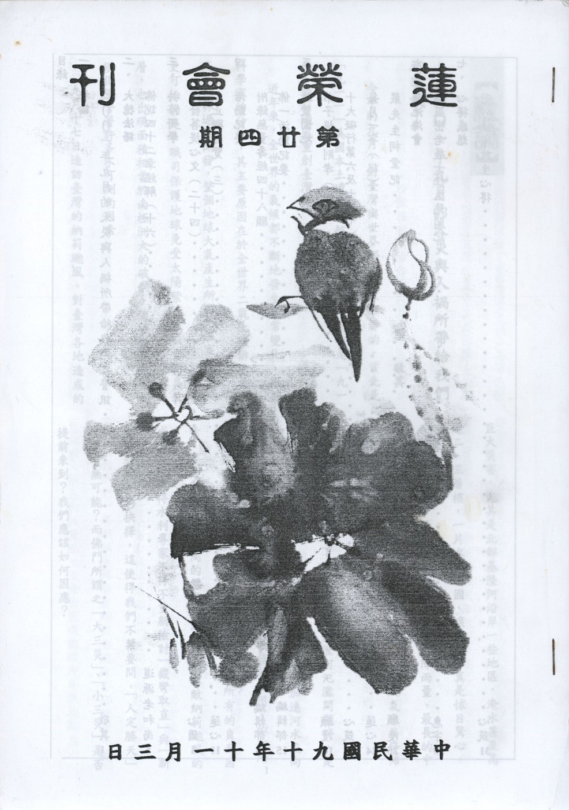

# 第24期

## 社論

### 二ＯＯ一年九月的天災與人禍所帶給我們之警訊

敬其

今年的九月，對臺灣與世界都是極不平靜的，首先是「九一一」美國本土遭受民航機自殺攻擊，其次是「九一七」納莉颱風重創臺灣。

近年來，全世界的氣候都不斷地發生異常變化，根據科學家的分析，其主要原因在於全世界二氧化碳排放量過高、森林過度開發，整個地球大氣產生所謂「溫室效應」，更可怕的是，職司保護地球免受太陽紫外線威脅的臭氧層，也出現面積相當於南極洲大的破洞，使得世界氣候的變化隱含著許多不可測的因素。

九月十七日造訪臺灣的納莉颱風，對臺灣各地造成的巨大災害，尤其是北部基隆河沿岸一些地區，淹水甚至高達二、三層樓，一片水鄉澤國，讓人看了真是怵目驚心。而納莉颱風創下的紀錄，如歷史新高的降雨量、最長的中心停留陸地時間、最詭譎多變的行進路線以及氣象局發佈警報次數之多，實在是洋洋灑灑。

十多年前當政府下定決心整治基隆河氾濫問題時，是以二百年洪峰為標準，而截彎取直，除了可加速河水流向大海外，亦可運用新生地作為都會區發展之用。似乎所有的規畫，都可以人為的方式來掌握問題所有的負面因素。可是即使以如此高的標準治洪，卻仍不敵納莉颱風的威力，而使得水利專家不得不重新檢討「截彎取直」與「新生地利用」的抉擇，這使得我們不禁要問，「人定勝天」究竟有無可能？佛門所謂之「大三災」、「小三災」是否提前來到？我們應該如何因應？

《易經》上說：「夫大人者，與天地合其德。」這句話告訴我們，人生於天地之間，是整個大自然的一部分，應該尊重宇宙萬物運行的法則，亦即所謂「天人合一」。遠古大禹治水，因勢利導而竟功，時下環保團體所提出「回歸自然」、「尊重自然」的呼籲，均是「合天地之德」最佳的體驗。

「人以惡感，天以災應。」萬法不離心識，不離因果法則，我們的生存環境皆是由變化無常的人心去感應而得，造善得樂，造惡得苦，今日所感得的災害，正是回應吾人內心自私自利的行相，如此想來，以內心深刻的反省取代無意義的怨尤，方是防止災害發生與改變個人命運之不二良方。所謂「天作孽，猶可違；自作孽，不可活。」倘若吾人無法意識到自己與大自然乃生命之共同體，必須要彼此維持共存共榮的和諧關係，更甚而為一己之私而恣意破壞，所感得的果報，正是歷歷如繪的大自然反撲。

「九一一」美國紐約與華盛頓遭受飛機自殺攻擊，則是另一件駭人聽聞的事件。表面上，此一事件僅僅是單純的「恐怖」犯罪，可是實際上，背後所牽涉的有各種形式的衝突，政治的、文化的、宗教的與種族的。政治上的利益衝突，解決之道較為容易，但是文化、宗教與種族的衝突，由於相互瞭解不夠，甚至認知錯誤，要想尋求根本解決之道，則首先需要對情勢做理性的瞭解，而不是一昧地聲討撻伐。

回教世界一般人民之所以普遍瀰漫著反美情緒，主要源自於美國長期大力地支持以色列，對真正遭受苦難的廣大阿拉伯人民，卻不聞不問或視若無睹，未見以「國際警察」自居的美國，在這地區維護應有的國際正義。如無視以色列長期佔領巴勒斯坦，使巴勒斯坦人民流離失所，而更諷刺的是，以色列居然利用此次美國遭逢危難之際，加強對巴勒斯坦人的軍事佔領與壓迫；另外，已長達十年制裁伊拉克的禁運行動，所造成該國因糧食與醫藥短缺而死亡的人數難以估計。這股憤怒的情緒，促使一些激進組織，以「聖戰」為號召，以「恐怖」行動為手段，藉以吸引世人的關注與同情。

不可諱言，每一種社會運動在某個發展階段，或多或少都會訴諸「恐怖」行動，但是我們必須特別注意其可受質疑之處，看它是否會將宗教與政治理念以及過度簡化的迷思結合在一起，尤其是當只有少數人在主導這一類的行動，牽涉的每一方，更應以理性、平和與認真的態度，共同致力解決問題，以避免往後發展遭到扭曲。對於「九一一」事件，美國以及中東國家或許都應該如此。

美國已經對阿富汗展開攻擊，無論其動機為何，我們都希望美國以蒼生為念，所有的軍事行動能夠知所節制，不要讓原本已經複雜的情勢更加惡化，甚至一發不可收拾。也殷切希望美國能體認到，以最先進的戰機與飛彈進行轟炸而傷及為數不少的無辜平民，與世人所認知的「恐怖」活動，其動機、手段及其達成的效果，實在並無差別。

「佳兵不祥」，當擁有精良的武器時，好像無人敢與之爭鋒，可是很可能自以為有恃無恐，而在盛怒之下，犯下難以彌補的過失。有史以來，所有戰爭的過程都是非常殘酷的，以暴制暴絕無法保證和平，因為開戰只要一方就能決定，而和平卻是需要雙方都同意的。

《阿難問事佛吉凶經》上說：「怨對相報，世世受殃，無有斷絕，現世不安，數逢災凶。」世間人冤家對頭，為著一己的私利，不願解冤釋結，相互報復，不但現世不得安寧，災難不斷，乃至生生世世，沒完沒了，又因為惡心的不斷增長，長劫在地獄中受著極大的苦難與折磨。我們不願戰爭發生，不願意看到人們在仇視及怨恨的心態中被殺，甚而造成許多無辜的民眾流離失所，骨肉離散，內心慞惶失措，能不警惕而有所作為嗎？

「世上多殺生，遂有刀兵劫。」相互殘害性命感召的果報就是刀兵劫，因此佛門將戒殺列為根本戒—五戒之首。戒殺的對象，包括一切有情眾生，假如我們要斷刀兵劫之因，則提倡戒殺是很好的方法，進而一步若能對治自己的口腹之欲，站在為他著想的立場上而採取素食則更佳，所謂：「千百年來碗裏羹，怨深似海恨難平，欲知世上刀兵劫，但聽屠門夜半聲。」

世間一切法，生滅遷流，剎那都留不住。萬物雖無常，唯福方可恃。《中庸》云：「唯天下至誠，為能盡其性。能盡其性，則能盡人之性。能盡人之性，則能盡物之性。」此正如《華嚴經》所說：「情與無情，同圓種智。」性德，在有情眾生謂之「佛性」，在無情眾生謂之「法性」，佛性與法性實二無差別，而同一法身，因此我們正報之身，或淨或穢，即能感得依報之環境，而淨而穢。

災字，上為水，下為火，記得全世界才剛慶祝進入二十一世紀，卻立刻遭逢「九一一」、「九一七」兩起水火具足的災難，趨吉避凶之法，端賴人心的向善進而一步進德修福。如此，則正報身之清淨莊嚴，即能感得依報環境也清淨莊嚴。

## 大德法語

### 佛說四十二章經解（十六）

*道源老法師講授*

第五章佛言：

「人有眾過，而不自悔，頓息其心，罪來赴身，如水歸海，漸成深廣。若人有過，自解知非，改惡行善，罪自消滅，如病得汗，漸有痊損耳。」

第五章由第四章來，第四章要我們按部就班、腳踏實地的修行，要斷除身口意十種惡業，而行十種善業。第五章要我們求懺悔。或云，修行就好了，為什麼要求懺悔呢？要曉得我們是一個凡夫，身、口、意三業不清淨，今生發心要修行，今生以前身、口、意造了很多的罪，這罪業就是業障，罪障令你發生很多障礙，叫你不能修行，有今生修行之前造的，還有前世，還有多生多劫造的，通通要受障礙，所以你不發心修行，還不知道有業障，一發心修行，業障全發現了，令你不能修行，所以必須要懺悔罪障。

普賢行願品十大願王，一者禮敬諸佛，二者稱讚如來，三者廣修供養，四者懺悔業障。十大願王第一願，我們在佛的面前要頂禮，這叫禮敬諸佛。再唱香讚、讚嘆如來，就是二者稱讚如來。三者廣修供養，點蠟蠋、點燈、獻花、獻香、獻水果等等，這都是廣修供養。那麼拜佛也拜好了，香讚也唱完了，供養也供好了，要修行了，要先懺悔。第四個大願要懺悔業障，不把業障懺悔清淨，它會障礙你不能修行，所以第四個大願要懺悔業障。

地藏經說：「業力甚大，能敵須彌，能深巨海，能障聖道」。不學佛、不修行，不知道什麼叫業力，當你學了佛要修行了，才知道有一種力量叫業力。這業力甚大，不能小看。說兩個譬喻，業力甚大有多麼大呢？能敵須彌，能深巨海。須彌山又高又堅固，但抵不住業力；大海甚深，業力能勝過大海；這兩句是譬喻、是比方。第三句說修佛法，業力能障礙聖道（佛道），這業力之大令你修佛法修不來，所以說這業力太大。

經文「佛言：人有眾過，而不自悔」。前面講的身、口、意三業，分開來有十種惡業，詳細分起來有無量無邊的罪業。所以「人有眾過」，這罪過很多很多叫眾過。「而不自悔」自己不知道懺悔，不知道悔改（悔是懺悔），學了佛要修行了，才知道懺悔改過之重要，不學佛時不知道自己的錯誤。

「頓息其心」要懺悔、要改過，就要一下子把造罪的心放下來，不能慢慢的放叫「頓」，頓時把造罪的心放下來，「罪從心起將心懺」罪是由身、口、意三業所造，但身、口業由意業推動，意業就是我們的妄想心，是他造的罪。你現在知道錯了，一下子就把造罪的心放下來，不能再造惡業，若造了惡業、造了罪，就生障礙，不能修行用功。

「頓息其心」息就是息滅、斷除，斷除什麼呢？斷除你造惡業的心，這在懺悔法門叫斷除相續心。我們的妄想心不停止，所以造了惡業就會繼續造，繼續增加，那永遠不能修行了。現在要懺悔，懺悔要斷相續的心，就是將繼續不斷造業的那個心頓時熄滅下來，就是頓時把它斷除了，斷除相續心。

要是懺悔不斷相續心，這懺悔不成懺悔。舉一個例子，譬如你喜歡喝酒，現在要修行了，知道喝酒是一種罪過法，不要再喝酒而要修行了。過去喝酒是有罪過的，今天我要懺悔，懺悔什麼呢？不能斷相續心，今天喝酒今天懺悔，明天還要喝酒，喝了酒，覺得不對呀，還要懺悔；再過一天，還在喝酒，這懺悔變成兒戲。這懺悔不成懺悔，自己跟自己開玩笑，而且對佛祖而言，在佛祖面前也打妄語了。所以要斷相續心，我知道喝酒不對，我頓時把這種心息滅下來，今天起我永遠不喝酒，把這飲酒的相續心斷掉，這懺悔法門才叫懺悔。

人有眾罪而不自悔改，則不能頓息其心。不能頓息其心，有什麼不好呢？造了業（造了罪）這罪便附到你身上來了，就像水歸到大海，漸成深廣。本來是小水歸到大海，則變成深水、廣大水。如罪業附到身上，則愈來愈重，罪業愈來愈大，變成深廣之罪。人有眾過而不知懺悔改過，不斷相續心，則罪愈造愈多，如水歸大海而「漸成深廣」。佛就告訴我們一個消滅罪的方法，「若人有過，自解知非」，你自己有了過錯，你自己了解了，知道它是不對的，它是錯誤的，自己改惡修善（這個罪過就是惡法，乃身、口、意十種惡法），你把惡法改正過來，便是十種善法，這個惡業便變成善業了。

「改惡行善，罪自消滅」這是消滅罪過的一個妙法。千般的罪抵不住一個「悔」字，那造業的業力甚大，而懺悔的力量也很大，比造罪的力量還要大，千般的罪業，抵不住一個「悔」字，你只要真心懺悔，誠心懺悔，那過去所造的罪業自然就都消滅了。

下面說一個譬喻「如病得汗，漸有痊損耳」，如我們害病時，如感冒時，一吃了藥就要發汗，汗一出來病就好了；如人有病發了汗，汗出來了，這病就「漸」慢慢的逐漸好了，「痊損」痊是痊癒，損是減損，雖不能完全好，但天天的減少病痛，慢慢就完全好了。（下期待續）

## 共修研學

### 勸發菩提心文（二十四）

*心爾*

經過種種呵護與培養，種種辛勞難以言喻，終於將子女養大成人，男為之娶，女為之嫁，母親心念無刻不繫於子。如此之恩如何報？母若存時，宜時常存心勸她念佛。母與女兒，愛情更重，女若能勸，母必能聽。須知食母衣母，不足為孝，勸母念佛求生西方，方是真孝。母老臨終要念佛生西，母能生西，方是孝女，如母已沒，應於自己做功課時，代母拜佛回向。唯有父母往生西方，離苦得樂，才是真孝，念佛回向、超薦，想到就做，如吃飯一樣，肚子餓就吃，把它當作平常，凡子女不是討債就是還債。討債行相，如子女常常生病，或很多讓人操心的事（但非忤逆父母），父母一直需要付出，這就是討債的。若子女對父母只是口體之養，而無心於孝養父母，父母一死，牌位一立，七七作完就沒事，此即還債。如前世欠他債，此世來討債，如前世放他債，此世來還債的，世人不知，貪著子女，真是可笑。母親的恩固然偉大，然要把母愛擴大，否則會很可憐，心情隨著子女起伏，一生生活重點都放在子女身上，沒有好好增上自己，豈非可憐乎！要由母愛去體會佛的悲心，要知道祖師說法的本意所在。尤其世間討債、還債、報怨比較多，尤其末法時期大抵都是報怨、討債而不是還債、報恩的，如植物人可知是來討債，若父母親好好的學佛轉變心念，可以藉著此情境發起很強的厭離心，並擴大自己的慈悲心（不忍其苦而欲拔之），進而常常念佛作功課回向，不但能加深自己的功德，且能改變個人的業相，否則耗在這種情境裡面，既無功德，又生很多煩惱，而造很多罪業，留下很多遺憾，不要說她自己無從脫困，三寶也無從加被。越是末法越難找到報恩的眾生，換句話說不是報恩意樂的人，無福進入正法時代，或有隨願而到末法時期，然大抵是煩惱業重者，故稱五濁惡世。一群不講道理的人組成的世界叫末法，故或養到逆子來討債或報怨，不足為奇！

若再論「紹繼門風」，很多父母拼命培養子女出人頭地以光宗耀祖，然子女當了權貴，連最基本孝養之責也未盡上，父母沒有一起住，卻終老在鄉下，只是表面的風光，有苦難言。世人藉著求虛名以光宗耀祖，真的有用嗎？實質上的意義在那裡？有時要透過出世法把我們敲醒，不要繼續作夢。

「供成祭祀」，若你一生造善得生天，或生為他家為人，這個祭祀安能享受？墮落到孤魂野鬼或稍能享受，業重的餓鬼，亦不能得享，若入畜生道，亦無享受之分，祭拜祖先，他能吃到，表示他是孤魂野鬼，他吃不到要更高興。他生天、做人吃不到，但還是要祭祀，只是心態要回轉過來，改成以佛法的方式，替他供養三寶，乃至念佛為他回向，這才是真正的報恩方式。子孫若有出世的正見，用如上方式才是真正跟祖先結善緣，報父母祖先之恩。「紹繼門風，供承祭祀」二句，固係世間情見，然出家者，如不能以佛法利親，反不若俗人之一片痴孝。出家者，但出父母之家，非真出家。要有心出家，出三界之家，若不好好修，有愧這個名，唯百劫千生，常行佛道，顯出發菩提心的報恩方法。

「十月三年」十月懷胎生日的那一天，應該是母親的受難日，那一天是生命的交關，子女生日時在不妨礙世俗的情況下，結合對母親的懷念，祝福母親光壽無量，而不是祝福小孩子生日快樂，應該祝大家光壽無量，這是以十月懷胎觀點說。三年乳哺，乳是母親的血液所成，將己身養分養兒軀命，子女生病時的痛苦、關懷、眷戀，在旁寸步不離、衣不解帶、遍找名醫、低聲下氣，為籌措醫藥費，不惜典當物品，回過頭來殺雞進補，該捨皆捨，不惜造惡業，然後孩子長大了，一飛衝天，什麼也不管，你想這果報如何？想到自身的成長，父母的心血太多了，一樣一樣去想，這一生欠這麼多恩，再講前生、再前生，假如每一生都這樣的話，久曾為母的眾生恩有多少？這時發起菩提心的力量轉強，想要走向正、真、大、圓的心態轉強，世間的名聞利養就不在意了，種種利衰毀譽也不在意，重點都在這裡，每天或有時可以拿出來觀修，看看我內心深處，是不是這樣想，而發起上求佛道、下化眾生的心態；認真問我因地，是不是被這些報恩心態所策逼，否則菩提心是假的，每天作反省檢點，我的心態是否被這些因緣所策逼，上求佛道、下化眾生的心態是不是被這些因緣所策逼，如此自我反省。（下期待續）

### 小止觀導覽（三）

*蓮心整理*

經文

若夫泥洹之法，入乃多途；論其急要，不出止觀二法。

注釋

泥洹—涅槃、滅度、寂滅、解脫也；即不生不滅。

大意

旨在說明止觀二法乃入涅槃的急要之法。

導覽

一、佛法八萬四千法門，門門可證泥洹，惟無論直接緣空性，或就緣起門修習，均要藉止觀二法，故止觀二法乃成就一切法門中唯一方便。

二、就止觀的修行言：止觀可緣有門（此之謂方便止觀）；亦可緣空門（此之謂真實止觀）；在未證空性前以緣起有為法為所緣而修止修觀都是方便止觀，以空性為所緣而修止修觀為真實止觀，從空出假，重緣有為修止修觀才是真實止觀的運用，以上均名之為「止觀」，故一切法之成就均以止觀為方便。

三、修習止觀的目的就是為了斷惑證真，而所謂斷惑證真，即是先觀察空性（空觀），俟空性成就以後，回過頭來再來緣有門，這是空性的運用（從空出假），而後把空性運用到出神入化、發展到究竟（中觀），這就是一心三觀。故止觀門之用，以空性為緣可以破見思惑、從空出假破塵沙惑、空假相即破無明惑，所成乃一切智、道種智、一切種智，若一切種智之成即是成佛，開顯本性之三德秘藏，即法身德、般若德、解脫德。

四、佛念得清清楚楚、明明白白，遠離沈掉二相，使內心安住在佛號上，在佛號當中全然忘我、一心不亂，此為「止」門成就相，即是念佛三昧。緣著「止」門成就相，如實觀察佛號的功德（如四十八願所莊嚴乃一句佛號，具足西方依正二報殊勝能令六方諸佛加被，且能結合佛力降服魔怨，解決眾生的痛苦、除去一切的障礙），以上種種觀察，名之為「觀」。若念佛降服其心，蒙佛加被以入空性為目的，是為涅槃的前方便；進而以空性為所緣修止修觀，證得空性以後，回過頭來對念佛做殊勝的發揮，這叫做涅槃的運用。在「止」上才可建立「觀」，如蓮池大師念佛可使乾旱下雨、虛雲老和尚誦咒可以除魔，但這些都是真實止觀的運用；真實止觀須就空性上講，空性成就以後，回過頭以念佛為殊勝緣起此即真實止觀的運用，於是大大的念佛，故念佛法門亦為止觀。

五、又如放生活動也是止觀，當行者被交付放生工作時，內心深處專注於放生的前行、正行、完結等義趣，並決定帶著蓮友，把活動做好，使大家法喜充滿，這叫做「止」，若再考量放生如何結合六度、三十七道品等等即為「觀」。

六、止門成就以後才能建立觀，因為止門成就以後，你想要安住在此境界上你就可以安住，要安住多久就安住多久，想要離開就可以離開，任何人都莫可奈何，心安住在境界上想怎麼跑都不會跑掉；如梁山伯想祝英台，任何女人他都不喜歡，內心只有祝英台，弱水三千只取一瓢飲；此即止門成就相。止門成就以後可以分出一部份心力來觀，例如梁山伯回過頭來觀祝英台有多少美德、優點、內涵，此時止觀門叫做止觀雙運。然上者不過一比喻，若論止觀須以善法、空性為所緣，不可以五欲境為所緣，除非觀修其過患與不淨，產生出離心，此另當別論。此時念佛的勢力非可比擬〜萬牛莫挽、一夫當關萬夫莫敵，如徹悟祖師在空性的體悟下念佛的功力使其臨命終時異香滿室、西方三聖親自接引，上善陪同，天樂鳴空。

七、無常無我是諸法的根本；修無我時，需藉無常修無我，無常是無我的初門，無我是無常的成就，涅槃寂靜是破執我的成就，證入無我的人內心最安靜，任何境界都擾動不了他，因為境界的現起等同水月空花，例如世尊昔為歌利王割截身體時，內心是寂靜的，這是成佛兩大快樂之一〜涅槃寂靜樂，此亦為止觀的成就。（下期待續）

## 專題研學

### 十大礙行（七）第六及第七條

*心筑整理*

「交情不求益我，情益我則虧失道義，虧道義必見人之非，察情有因於情難強情乃依緣，以蔽交為資糧。」「於人不求順適，人順適則內必自衿，內自衿必執我之是，悟人處世觀人妄為人但酬報，以逆人為園林。」

以上是十大礙行第六以及第七條的經文。因為這兩章的內容有其關連性，所以我們採取相互照應的方式將這兩章經文合讀，並加以簡單的闡釋。

之前我們討論過在這個世界上會遇到許多的障礙，除了本身生理上的病痛無常外，還有處於世上會面臨的問題，天災人禍造成大環境的變動，諸如近期內國際間的迅息萬變，都是值得吾人加以省思的課題；乃至於辦事情時在事項上、行持上以及心態上會遭遇到的種種障礙都已介紹過，接下來要討論的就是人與人相處時會遇到什麼樣的磨練與問題，依照人和人之間交往的深淺程度分為有交情或沒有交情的兩種情況來說明，合說就是第六條的「交情不求益我」和第七條的「於人不求順適」。

在複雜的人情事理中，人和人之間的相處有很多種情況，大抵不出於中國的五倫關係，此五倫乃夫妻、父子、兄弟、君臣以及朋友五種人與人之間的相處模式，而彼此之間又有相互對待的關係，如家庭中就有夫婦、父子和兄弟三倫，而對外則形成君臣和朋友二倫，各有其應盡的本分義務，所以又形成五倫十義的關係。在這當中又以家庭為一切人際關係的基礎，所謂「人倫肇端於夫婦」，由夫婦組成家庭開始了人倫的關係，夫婦之間講究「夫義婦順」，彼此要相互體諒、互敬互愛，有了美好的相處，家庭才能和諧。而生下小孩以後又有了父子及兄弟的關係，父母和子女的親情是天生的，切不斷也分不開，講究的是「父慈子孝」，父母慈愛子女，使子女樂於親近，並接受父母的教導；而子女對父母能盡孝道，常常主動地關懷父母，善體父母親的心意，不會作任何使父母蒙羞或擔心的事情。再則，兄弟姊妹的相處要「兄友弟恭、長幼有序」，作兄長的愛護弟弟妹妹，而作弟妹的凡事要敬重家中的哥哥姐姐。彼此和睦相處，這樣父母親心生歡喜、家庭和樂，此乃齊家之道。

走出家門，推而廣之則有君臣、朋友二種關係。有言「四海之內皆兄弟」，朋友之倫，是人在社會活動中絕不可少的，除了和家中的長輩與兄弟相處，到了學校便是師長與同學之間的相處，朋友之間要「朋誼友信」，就是說朋友要講究情誼，必須以道義事業互相勉勵，彼此多為對方著想，有困難時能互相幫助，有過錯時能規過勸善，在學習過程中彼此交換學習心得等等，如果要讓友誼能夠長長久久、更深一層的交往，便要約束自己的行為，謹守信用使對方知道我們的重視，這個樣子才能夠讓友誼歷經時間的考驗。

而君臣之倫，就是上司與部屬之間的關係，在學校中又如同我們學生和老師的關係，必須要做到「君敬臣忠」，如老師關愛我們、認真的教導我們，而我們也要盡心誠意地努力做好學生的本分，出了社會以後、對待自己的上司或是部屬，也是要用敬愛與盡心的態度去對待。以上乃就五種人倫關係，衍生成十種人與人之間相處應有的態度，做一個簡單的說明。

其實我們正處在一個世界互動頻繁的時代，人際的分位遠比古時候複雜多了，我們在生活中會面對許多其他的對象，像是爸爸媽媽會帶我們去拜訪朋友或長輩，生病的時候要看醫生、到商店內買東西有老闆、店員的招呼、坐公車、捷運或火車會碰到司機和許多乘客，出國旅遊更會遇見許多外國人、、、，甚至走在路上都會遇到形形色色不同的人，有句話說：「老吾老以及人之老，幼吾幼以及人之幼」，處於社會我們要將這五倫的精神發揮出來，恭敬比我們年長的人，愛護比我們年紀小的人，勉勵自己，從自己開始做起，進而影響周遭的家人、朋友等等，讓這樣美好的德行流傳出去，使人人都能從中獲得真實的利益。

雪公太老師在常禮舉要中說到，不可以小看人和人之間的相處，這些都是大學問，除了理論知識的瞭解外，最主要還要靠經驗閱歷的累積，才能和他人相處得宜。我們在社會上，會接觸到許多不同類型的人，不管是有交情、沒有交情，每個人因個性不同，心理的想法、說話的方式、處理事情的態度、、、也不盡相同，所以和每一個人的相處方法當然就不同了。以上舉出了人與人之間相處的種種可能，以此為基礎再來看妙叶大師在十大礙行中所談到的處世之道，就比較能夠深入了解。

經文中就「交情不求益我」以及「於人不求順適」兩方面來說明人與人之間複雜的人際關係，「交情不求益我」是說在與人相處中不可以凡事只想到我自己，只求大家都喜歡我、幫助我、利益我；「於人不求順適」則是說與人相處不可以要求別人一定要隨順我們的個性、好惡、想法、意見、、、，而遇到困難、忤逆、瓶頸時，妙叶大師慈悲地告訴我們不管是和有交情或是沒有交情的人交往，都一定會遇到障礙，在遇到障礙時我們應生起何種的心態？用什麼樣的解決方法呢？如何進而一步自我反省，而在面對各種境界時都能泰然處之，這些內容我們將在下一期會刊中再做介紹。（未完待續）

## 蓮池海會

### 楊巫鑾老居士往生見聞記

惠宇
楊巫鑾老居士生於民國前十年四月十日；出生地為彰化縣永靖鄉獨鰲村。父巫寅務農，漢學造詣頗深，與友合夥經商，兼辦記帳工作。七、八歲入私塾讀漢書，因父身體不佳，二年後輟學在家幫忙家務，讓母親出外做工賺錢養家。十五、六歲下田幫傭，因工作勤快認真並乖巧伶俐，賺取工資為別人二倍。其間因妹妹想讀書，遭父母阻止，老居士私下拿印章支持妹妹繼續求學，並承擔其學費。十八歲父過世，母多病，於是獨立耕作養家，空閒時常向朋友請教閱讀書籍。後遷居彰化縣田尾鄉，經營小本水果買賣生意，獨立家計。二十四歲嫁入楊家，經營農產品加工製造，並提供幼弟就學、居住，情同母子。後又與先生、大伯共同經營製粉工廠，並育有三男四女，除長女早年辭世外，其餘均已成家立業，並有美滿和諧人生。因其早年辛苦持家，養成刻苦耐勞個性，且身體十分硬朗，九十歲高齡仍可不戴老花眼鏡，一針一線仔細縫補，並利用閒暇時間種菜、灌溉及除草，雖然每每汗流浹背，但仍樂此不疲。有時家人勸她不要那麼辛苦，她總回
**答：** 人要動才會靈活、健康。勤儉樸實的老居士，對日常生活物質十分節約，時常將洗米水用來洗碗、澆花，洗衣服用剩的水用來擦地板，家中門板、椅子壞了自己動手修補，一雙手成就了一個圓滿的家庭。

老居士晚年身體頗為硬朗，可惜未遇善知識，無法認識佛法。但因宿世善根，每每勸其念佛，仍能欣然接受，並知道臨命終時佛祖會來接引，要跟佛一起去。於民國八十九年六月間，因身體不適，送進醫院，此後一年多來陷入昏迷，無法開口言語，雖然如此，但仍有意識存在，因為握住她的手都有回應。子女於住院期間，隨侍在側，悉心照顧，不敢絲毫懈怠，醫院工作人員多有讚嘆。民國九十年十月二十四日中午病危，醫院通知家屬帶回，於救護車上家屬大聲念佛，並鼓勵老居士念佛，此時家屬中有人看到老居士竟也能微微地開口跟著念，後來老居士在家人及蓮友助念近二十小時下，蒙佛接引，捨報安詳。

綜觀老居士一生，勤勞刻苦、堅忍耐勞，日出而作，日落而息，數十年如一日，身體健康、享高壽，可見其宿植福本；於一生未學佛的情況下，又能於臨命終時，蒙善知識護持助念，可見其宿植善根。老居士示現病苦及治療的過程，令後生晚輩思考人生無常，縱使醫學發達，仍有極限，不知老實念佛求往生才最妥當；此外，亦以此作佛事之因緣，對未種善根者另種善根，已種者令其增長。老居士的示現是如此的殊勝與慈悲，病苦由自己承擔，成就他人的智慧福德。吾人若不能從中體會，豈不白白辜負老居士示現的一番苦心！

## 日常省思

### 佛一活動紀要

*編輯部*

為了利益等虛空際一切有情眾生，我們必須成就無上正等正覺，以集聚念佛為殊勝成佛方便，此乃發起佛一活動之真正動機。並結合所發生苦難作為發起因緣，以此善法感召佛菩薩加被以除苦解難。

今年九月遭逢颱風與水患乃至國際上的戰爭，造成本國與世界的重挫，為欲護國息災以導人心向善，因蓮友發起，特於十月二十八日假中壢研學會舉辦佛一成就念佛三昧。眼前增上個人修行功夫，並積聚往生資糧；更特別祈求人心祥和、風調雨順、國泰民安、正法久住。

法會仰仗諸佛護持與大眾的全力配合下圓滿結束，規矩的演練、法器的練習、場地的布置、分配大眾休息處，乃至於受限於場地，絞盡腦汁想出的過堂與繞佛形式等等，在在都顯示出每個人對此法會的誠懇與誠意。不管是工作人員或者是參與者，在此法會中都佔有極為重要的角色，念佛堂中非僅需維那與悅眾即可，仍需要大眾的參與，善友的凝聚，在道業上相互提攜，才能成就此殊勝的佛一法會。

難得有此暇滿人生，大眾集聚一堂以念佛的方式共度一整日，把握每一個當下，在念佛中對治內心沈沒、昏沈、掉舉乃至散亂的行相，並將念佛的勢力提起，訓練自己對佛號的專注力，能夠增上個人的修行，進一步轉個人的別業，臨命終時能正念分明，蒙佛接引。

此次的佛一乃屬於試辦性質，往後若有因緣，仍會繼續試著於念佛堂中集聚大眾共修念佛，共造殊勝淨業並增上自己的修學，還望大眾繼續給予批評指教。

### 附錄無量壽經四十八願

*編輯部*

由十一月開始，每週六晚間於蓮榮共修會，將要研討阿彌陀佛四十八大願的內涵，今僅就淨土十要中於阿彌陀經要解後所附錄之四十八願前，蕅益大師所寫之序文，附錄出來，以資參考，以利大眾於研討四十八願前了知彌陀發願緣起，且為西方淨土成就之因緣，誠如大師所說：「念佛之士，不可不知」。

附錄無量壽經四十八願—蕅益大師

阿彌陀佛，於世自在王佛時，作大國王。聞佛說法，心懷悅豫，尋發道意，棄國捐王，行做沙門，號曰法藏。復詣佛前，禮足右繞，長跪合掌，以頌讚佛。頌讚已畢，而白佛言，我發無上正覺之心，願佛為我敷演諸佛如來淨土之行。我聞此已，當如說修行，成滿所願。時世自在王佛，知其高明，志願廣大，即為說廣說二百一十億諸佛剎土，天人善惡，國土粗妙，應其心願，悉現與之。法藏即一其心，具足五劫，思維修習。如是修已，復白佛言，我已攝取莊嚴佛土清淨之行。佛告比丘，汝今可說，悅可大眾。比丘白佛，唯垂聽察，如我所願，當具說之。於是發此四十八願。此一ㄧ願，皆為阿彌陀佛西方淨土之最初緣起，念佛求生之士，不可不知，故為附錄於此。

## 啟蒙園地

### 弟子規　入則孝（四）

願度

「出必告，反必面；居有常，業無變。」

前面我們談到「冬則溫，夏則凊；晨則省，昏則定。」最主要是藉著對父母親的起居照料，來關心爸爸媽媽的需要，將孝道落實在生活的實行上。接下來「出必告，反必面；居有常，業無變。」就是要我們進一步來體會爸爸媽媽的心意，從日常生活中做到不讓爸爸媽媽操心，所以為人子女在許多生活細節上應該特別留意。

「出必告，反必面；居有常，業無變。」是出自禮記-曲禮：「為人子者，出必告，反必面，所遊必有方，所習必有業，恆言不稱老。」「出必告，反必面」是說不論我們外出或回家的時候，一定要面見父母稟告之。「必」是必得如此；「告」是當面告知，也就是出門前必須告訴父母去向，並徵求他們的同意；回家以後也一定要向爸爸媽媽打招呼，讓他們知道我們回來了，讓他們安心。「居有常，業無變」則是說明日常生活起居作息有一定的次序，而且對於所學習的事物不要隨便改變。「居」是指居處，包括日常生活的點點滴滴；「常」是指平常；「業」指學業、德業；「無變」是指有恆心，就是我們做任何事，學習任何學問都要有恆常心，生活作息也一定要維持正常，才能讓我們所做、所學都步入正軌。接下來我們就一一來看看其中的內容。

「出必告」就是說我們如果有事情需要離開家裡時，無論時間的長短，都必須向爸爸媽媽請示，必須告訴爸爸媽媽我們的去處（地）、和誰在一起（人）、我們什麼時候會回來（時）、以及我們要辦什麼事情（事），讓爸爸媽媽知道我們的動向。甚至晚上如果我們比較晚回家，或因為很重要的事無法歸家時，我們必須馬上向爸爸媽媽報告，這是非常重要的。在常禮舉要中也提到：「夜必歸家，因事不能歸時，必告父母。」我們可以來想想看為什麼要這樣做，第一點，所謂「天有不測風雲，人有旦夕禍福」，這世間充滿了許多的變化，我們外出時不能保證自己一定能安全回家；萬一發生了任何問題，超過了時間沒有回來，爸爸媽媽就可以依著我們告訴他們的地點，甚至朋友的電話號碼來找我們，或許就可以避免我們發生危險或意外；第二點，爸爸媽媽心心念念都在我們身上，非常擔心我們在外的安危，所以如果我們外出時忘記告訴他們，他們會很在意，甚至心裡會很失望，更會焦急、叨唸著我們，所以為了不讓爸爸媽媽擔心，我們就要做到「出必告」；第三點，我們在外面，如果臨時改變了行程，就必須馬上打電話向爸爸媽媽報備，告訴他們我們現在的去處，若無法聯絡到他們時，我們必須考慮到為了避免爸爸媽媽擔心，就應該要先回家，千萬不能在無法通知爸爸媽媽的情況下改變我們的行程。再說到我們如果和學校的老師、同學去校外教學，我們就必須要遵守領隊老師的指揮和口令，接受團體的規定，若臨時有特別的需要，一定要向領隊老師報告，讓他們知道我們的去向及我們要做的事，才不會讓領隊老師一直找我們。最後，如果我們要出遠門，一個星期、一個月，或者更久的時間才能回來，那我們除了要向爸爸媽媽報告，也要向長輩們告辭，這樣可取得他們的諒解，免除他們的擔心。所以，我們若好好用心的來實行「出必告」，我們就可以發現有很大的利益在裡面哦！因為爸爸媽媽可以幫助我們來判斷我們所做的事是否正確，是否對班上、學校以及自己的學習上有利益的，也可以幫助我們選擇朋友，提供我們更好的意見、教我們如何把事情辦得更好或如何侍奉長輩、與朋友相處等等；這樣一來，我們就可以學習到很多的待人處世之道，可以使自己的生活更豐富而多姿多彩，就像畫一樣美麗，所以「出必告」是在得到長輩的祝福下開開心心的出門，而更重要的就是平平安安的回家。

再來說到「反必面」，當我們回家時，一定要去面見爸爸媽媽，讓爸爸媽媽知道我們回來，他們才不會一直等待我們，擔心我們的安危，這一點非常重要，其實讓爸爸媽媽放心就是真正的盡孝道。因為爸爸媽媽最關心我們，也最想瞭解我們在外面發生了什麼事情，是否有忽略的地方或須要改進之處、我們好不好、開不開心、有沒有受傷、、、等等；這些都是我們可以向爸爸媽媽報告的，就算是在外面受了一些委屈，也可以藉此機會向爸爸媽媽傾訴、讓他們幫我們解開心中的結，相反的，如果我們今日有很好的收穫，也可以與爸爸媽媽分享快樂的經驗，讓他們高興。另一方面，「反必面」最重要的，就是我們也可以藉此機會看看爸爸媽媽今天過的好不好，身體舒不舒坦，心情是否開朗、有沒有任何事情須要我們服務的，更可以傾聽爸爸媽媽在工作上的經驗或分擔他們所面對的困難等等，這些事項都是我們可以藉著回到家的時間，作一番親子的互動，讓我們心心念念都在爸爸媽媽身上，與他們一起分享我們在外面遇到的一切，包括我們的快樂、憂愁與困難，我們也可分享爸爸媽媽的憂悲喜樂，從而增進家庭生活的情趣，這樣我們和爸爸媽媽的心就可以融合在一起，這也就是「孝」所詮釋的內涵〜上一代與下一代的心是結合在一起、沒有任何分歧點的出現，爸爸媽媽的心就是我們心，我們的心也就是爸爸媽媽的心。

再則，我們要讓爸爸媽媽安心，就必須做到「居有常，業無變」；也就是我們的生活作息必須有一定的次序，不能隨便改變我們原本做的事情。「業」可以包括我們日常生活中良好的生活習慣及學業；例如什麼時候起床、吃三餐、做功課、做家事、洗澡及睡覺都要有一定，不能順著自己的喜好，什麼時候想做麼就做什麼，如果喜歡看電視、看故事書、打電腦，就一直做下去，而把自己該做的事情忘記了，這樣一來，生活次序就會大亂，造成晚上很晚了還在寫功課，早上就無法起床，上課時的精神又不好，這樣一來學業就會日落千丈，身體也得不到充分的休息，增加爸爸媽媽的擔心。所以作息正常是很重要的，有了良好的生活作息，我們才可以在學業上有所進步，而學業包括「德、智、體、群、美」，其中以「德」業為重要，「德」就是處處為他人著想、處處想著利益他人，我們一切的學習都必須建立在這個基礎上才能成功，才能讓所有的學習都變成有用處，而且時時都能夠幫助他人、處處都能夠讓別人很快樂，這樣一來，我們就能「德業無變」。我們有一顆想要利益別人的心，進一步在學業及才藝上就要「業無變」，不能隨便改變自己學習的事物，這樣對於我們所學習的事物才能夠深入的瞭解，才能學有所成，才談的上幫助他人。因此「居有常，業無變」就是培養我們的規矩及恆心，不善變、有恆心，長大後我們到社會上工作，這就是我們成功的條件，也就是爸爸媽媽對我們的最大期望。

上來所說的「出必告，反必面；居有常，業無變」是從考慮爸爸媽媽的心意出發，讓他們對我們的一切都感到很安心，由「出必告，反必面」來培養我們正大光明的氣度，因為我們所做的事情都可以向爸爸媽媽交待；而從生活的規矩及學習上有恆地來培養自己，讓自己不論在生活上或學習上的體驗都很深刻，再則心念常常想到如何幫助他人，最後就可以讓自己變成一個善解人意、人見人愛的小朋友哦！（未完待續）

### 每月一字 — 記

*蓮心*

記：是由「言」、「己」二字組成，是一個形聲字；對於事務了解其實情後，直言無隱的分別一一條錄下來，這是取「言」的意思，另外，「己」是「紀」的初文，其意為把各條絲的頭緒分別抽出來，再把若干絲的頭緒和為一束；因此二意綜合後，可知「記」的本意是條理分別的分析，而又可使其得合而為一。此外「記」尚有其他的意思，詳如下列：

一、文體名，是一種以敘事為主的文體，嚴先生祠堂記、岳陽樓記、桃花源記等。

二、經史子等經籍的通稱〜如史記、禮記。

三、經史子等經籍以外，以記事物及讀書心得為主者〜如閱微草堂筆記。

四、劇曲及小說〜如西廂記、老殘遊記等。

五、標記或符號〜如圖記、戳記。

六、計算次數的單位〜如一記悶棍。

「記」、「紀」二字用在「記載」之意時是相通的，惟「法律統一用字」規定，「記錄」用於動詞、「紀錄」用於名詞，如「我正在記錄一份會議紀錄」；但是用在統理、準則時，一律用「紀」，如「本紀」、「綱紀」、「經紀」；用在記載文章等意時，一律用「記」，如「日記」、「遊記」等。

### 嚴先生祠堂記（上）

*願度整理*

本文（范希文）

「先生，光武之故人也。相尚以道。及帝握赤符，乘六龍，得聖人之時，臣妾億兆，天下孰加焉？惟先生以節高之。既而動星象，歸江湖，得聖人之清，泥塗軒冕，天下孰加焉？惟光武以禮下之。在蠱之上九：眾方有為，而獨不事王侯，高尚其事。先生以之。在屯之初九：陽德方亨，而能以貴下賤，大得民也。光武以之。蓋先生之心，出乎日月之上；光武之量，包乎天地之外。微先生，不能成光武之大；微光武，豈能遂先生之高哉？而使貪夫廉，懦夫立，是大有功於名教也。仲淹來守是邦，始構堂而奠焉。乃復為其後者四家，以奉祀事。又從而歌曰：雲山蒼蒼，江水泱泱；先生之風，山高水長！」

壹、人物介紹：

一、

范仲淹

：本文作者，字希文，北宋蘇州吳縣人。太宗端拱二年（西元九八九年）生，仁宗皇祐四年（西元一〇五二年）卒，享年六十四歲，諡文正，世稱范文正公。公二歲而孤，母謝太夫人再嫁長山朱氏，從其姓，名說，少有大節。到了長大以後，知道自己的家世，於是辭母到應天府（今河南商丘縣南）去，依戚同文學，晝夜不息；在這當中，文正公之「起居飲食，人所不堪，五年中未嘗解衣就枕」，到晚上如果感到昏怠，輒以水沃面提神，曾自比「人不堪其憂，回也不改其樂」。食不足，就用稀粥餬口。真宗祥符八年，考中進士，為廣德司理參軍。迎其母歸養，恢復了本姓，改名仲淹。文正公每派駐到一個地方，就首先興辦當地的教育、培養人才。仁宗時，遷吏部員外郎，權開封府。忤呂夷簡，罷知饒州。西夏趙元昊反，仲淹以龍圖閣直學士，經略陝西。守邊數年，號令嚴明，羌人呼為「龍圖老子」，夏人不敢犯其境，說「小范老子，胸中自有數萬甲兵。」慶曆三年，拜樞密副使，參知政事，大事整飭吏治。因受人反對，罷相，出知青州，不久病卒。著有范文正公集二十卷。

二、

嚴光

：字子陵。先生從小喪母，其記性強、悟性高，由父親親自教導。其深受祖父（嚴景仁）遺留下來的家風〜「讀書為明理，做人當守真。國有道則進，國無道則退。寧窮困終身，不昧心求榮。」所影響。因此在小時候就以節操聞名於世，十五歲時並以新野神童聞名，後又與劉秀立志到洛陽遊學，成為患難與共的同窗好友，兩人原本要一起輔佐王莽，但後來發現王莽有篡漢之心，嚴先生於是就失望的回到故鄉，而劉秀則加入起義軍的行列，討伐王莽。老父死，他便於父親墓旁搭草棚讀書，後來漢光武帝即位以後，先生又到桐盧去隱居、垂釣於富春江。光武帝思念先生的賢能，想請他出來做官，繪其畫像，昭告天下，後來被富春縣令湯久可發現，上報朝廷，光武帝很高興，立刻派遣使者，駕馬車，攜幣帛去禮聘他。先生拒不應聘，經過三次的往返徵聘，先生拗不過，只好隨使者進京。光武帝特別命主膳之官早晚進膳，禮敬有加。大司徒侯霸（字君房），與先生為舊識，聽說先生到了京城，特別派姪兒奉書問安。先生回書說：「君房足下：位至三公甚喜，懷仁輔義天下悅，阿諛順皆要領絕。」侯霸將回書上呈光武帝，光武帝笑著說：「他仍和以前一樣狂啊！」於是立刻移駕去看先生。到了賓館，先生正臥於床上假寐，帝摩著他的肚皮說：「喂！喂！子陵，為什麼不肯相助呢？」先生睡著不答。經過許久，才睜開眼睛，回答說：「從前堯舜有天下，帝德遠聞，尚有巢父、許由不受遜位。士各有志，何必強迫我？」不久，帝又請先生入宮，和他敘談舊事，不覺日落，於是留下先生，夜間與他同席共寢。睡眠中，先生以腳伸於光武帝腹上，並偽做鼾聲，帝全不在意。第二天，拜先生為諫議大夫，但先生不受。先生考察當時的局勢已經安定了、難免有分一杯羹的嫌疑，所以便回到桐盧隱居，耕釣自娛。年八十，終於家。後人稱他釣魚的地方為嚴陵磯；其後山，稱為嚴山，以紀念他的高節。

三、

漢光武帝

：（公元前6〜57年）字文叔，蔡陽人，漢景帝後裔。新朝王莽末年，起兵反對王莽，昆陽之戰，光武挽狂瀾于既倒。王莽政權的喪鐘，由此而敲響。光武以偏師徇河北，平王郎，降銅馬，艱難奠定中興之基。統一天下，定都洛陽，重新恢復漢室政權，為漢室中興之主。政治措施皆以清靜儉約為原則，興建太學，提倡儒術，尊崇節義，為一賢明的君王。在位三十三年，諡號光武，廟號世祖。

貳、釋題：

嚴先生指嚴光先生。有些版本題目為「桐盧郡嚴先生祠堂記」，因為此祠堂是在浙江桐盧郡，但大部分版本之題目都為「嚴先生祠堂記」。嚴先生，為浙江會稽人，嚴先生之祠堂之所以在桐盧，而非在會稽之原因是因為他隱居在桐盧，並且在富春山耕種，而垂釣於富春江。他在垂釣的時候，穿的是羊裘，所以在釣台旁就有四字〜「羊裘高風」，高風是指嚴先生有很高潔的風範、令人敬仰。嚴先生與漢光武原為一齊讀書的好朋友，等到光武帝作了皇帝，便四處派人尋找嚴先生，結果在富春江找到了一位穿羊裘垂釣的人，大家認定就是嚴先生，所以才有「羊裘高風」這個典故。祠堂為祭祀祖先或先賢、烈士的殿宇。在文體上，此篇文章後面有個「記」字，都是屬於雜記類。

參、大意：

本篇文章是在文正公因反對仁宗廢郭皇后，被貶至睦州時所做，紀錄構建嚴先生祠堂記之由來，並冀藉此影響整個世道人心及改善社會風氣。（下期待續）

## 護生放生

### 碧砂漁港放生心得

碧

砂漁港放生心得

心筑

十月二十四日上午。蓮友們於碧砂漁港近海試辦放生活動，以作為正式放生活動之試探，且為了共修會每週迴向之消災與往生者所舉辦。於碧砂漁港乘著滿載螃蟹、魚類與大眾歡喜心的船，向大海駛去。

在船上做完儀軌之後，漸漸有人不堪船隻的晃動而暈船，有的人伏臥一旁努力讓自己睡著，也有人完全不敢亂動，更有人開始嘔吐起來。也有一些人絲毫不受海面上波浪的影響，努力地將生物放完。反倒是我們這些年輕人，不堪海面上的船隻晃動與胃的翻攪，一個個「陣亡」。善知識常云：做善法時，若遇到障礙要觀修此乃消除業障最為快速之方法，並看待自己造善的能力薄弱而進一步反省之。

午餐時許多蓮友對於這樣的現象提供了許多美好的覺受，有人云在暈船時痛苦的感覺中，念不出佛號，觀修往生時若遭逢類似的狀況，就算遇到修行功夫極好的善知識在旁提醒，自己無法提起正念，往生之機會仍然非常渺茫；體會學佛乃為利益等虛空際一切眾生，自己必須具備充分的能力及體力，方可救人於危難之中；另有人云，在波濤洶湧的大海中體會諸佛菩薩願力如海浪一波波地相繼不絕，但眾生的業力亦如海一般來勢洶洶，猛厲而難以抵擋。

人生在世難免會面對許多障礙，就如同海浪一波波的打來，隨著海浪的起與伏就像是遇到順境與逆境一般，心中若能不預設立場，不因順逆境而起種種的執著，如同讓身體隨著海浪的起伏搖擺，內心不用起任何煩惱。境界不過是回應過去的善惡業，沒有什麼好執著的，執著也沒有用，只是徒增煩惱而已。

前年與師父一起去放生，遙想彼時海面上風浪非常大，船家向我們說道：「浪來了更要迎上去，若把船舵轉偏方向，則一定會被海浪所吞食。」這讓末學想起了妙叶大師的十大礙行，我們和小朋友分享了這許許多多美好的概念，卻忘記了原來生活中可以如此來體會障礙的美好，生命中所遇到的每一個挑戰，就像海浪一樣一波接著一波永無止盡的前來，要努力去面對每一個障礙，因為只要心裡面想要逃避就一定會被逆境所打倒，但是迎著風雨向前進，卻可以看到更美好的風光，想必曾經用心突破障礙的人定能體會其中的愉悅吧！

雖然還是頗為懊惱自己做善法的能力如此不堪，不過能夠稍稍體會臨命終時的痛苦，也算是一種奇特的經驗，倘若在極端的痛苦中還能保持正念分明，那修行功夫才真正是更上一層樓呢！隨喜大家在障礙中歡喜興辦善法，在台灣今日極端困難的放生環境中，仍然辛苦地尋找適當的放生環境，給這些苦難的眾生一條活路，也給自己一條光明的路子走去。
