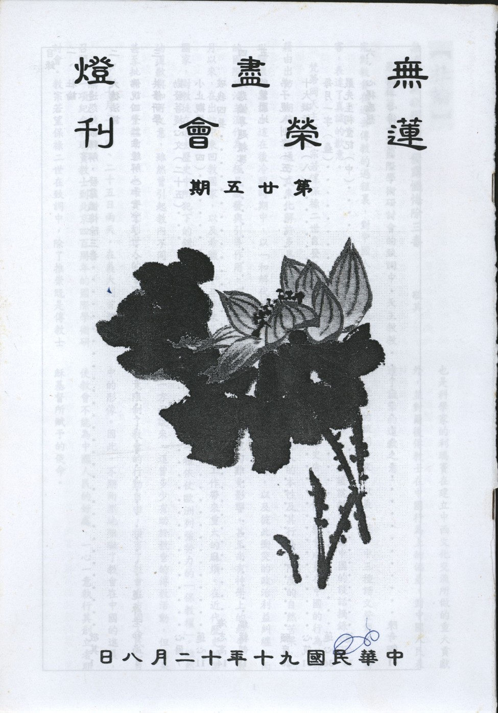

# 第25期

## 社論

### 無邊冤結欲釋解，發露懺悔除三毒

敬其

最近藉著在一項國際學術研討會的致詞中，天主教教宗對教會在過去傳教的過程裏，對中國人民所造成的傷害，表達了真誠的歉意。

梵蒂岡天主教教宗若望保祿二世自登基以來，不斷地藉由出訪，期待以溝通方式來化解許多具有歷史背景而難以釋懷的恩怨，這在後冷戰時期中，以「和解代替對抗」的國際政治主流作為，極具啟發與引導作用。而自去年三月以來，在出訪中東回教國家，以及希臘、中亞等東正教國家，對教徒在過去歷史中所犯下的錯誤，表達了一連串的道歉與和好之意，雖然曾引起教內不同的爭辯與看法，甚至批評，但整體而言，也確實受到世人的肯定與尊敬。

今年十月二十四、二十五日兩天，在義大利首都羅馬召開了一項紀念利瑪竇教士到北京四百周年的國際學術研討會。教宗若望保祿二世在致詞中，除了推崇既是傳教士也是科學家的利瑪竇在建立中西文化交流所做的重大貢獻外，並對爾後傳教士在中國行為上的偏差，對中國人民表達了誠摯的道歉之意。

教宗的致詞全文，以義、英、中三種語文登載在梵蒂岡官方網站中，在此謹就教宗有關中國的談話摘錄如下：

「可惜，歷史告訴我們，教會成員在中國的行為並非絕無過失。這是人的本性及其行為有限度的自然苦果，也是與複雜的歷史事件，以及彼此衝突的政治利益糾纏，而造成的惡劣環境的難免影響。甚至尚有神學上的紛爭，激怒人心，更為福傳工作帶來重大的麻煩。在近代歷史的某些階段曾出現一種依仗歐洲列強勢力的「保教權」。雖然從一方面說來，這曾多少有助於教會的傳教活動，但結果究竟限制了教會的行動自由，損害了教會在中國人民心目中的形像。因此，不期而然地阻礙了教會在中國的進展，使教會不能為中國人民的好處，一心一意執行其創立者耶穌基督所賦予的使命。

因為這些過去的過錯和缺陷，我深感惋惜。我很遺憾，這些不幸的事情竟在有些人的心裡造成了天主教對中國人民缺乏尊敬和重視的印象，使他們相信天主教對中國懷有敵意。因為這一切，我向所有自覺，多少地，被天主教徒的這類行為所傷害的人們，請求寬恕和原諒。

教會不應該怕懼歷史的真理，雖然內心痛苦，也要為它的兒女們過失擔負責任。這也包括它對中國人民過去和近來的關係在內。」

看了這段文字，再回頭想想整個二十世紀，在這一百年當中，從第一、第二次世界大戰，到戰後民主與共產兩大陣營的冷戰，直到今天整個中東地區愈演愈烈的衝突，整個世紀在戰爭的衝突下，無計其數的生命喪失了，但是殘酷的戰爭與衝突，是一波未平、一波又起。歷史的恩怨情仇似乎並未隨著時間而冰釋，其無止息的徵象，似乎對一位在世界上擁有十億信徒之尊的教皇，也不忍心再看到人類繼續深陷無法自拔的荒謬迷思中，而能夠如此主動而謙遜地為解冤釋結而努力，令我們也不禁讚嘆教宗的道德勇氣與智慧，對我們佛門弟子而言，教宗的這種胸懷，實有莫大的啟示。

「太虛飲光消契闊，幽谷回聲話晚煙。」在心包太虛、量周沙界的性德含藏中，一切眾生是沒有什麼親疏之分，所有的冤親債主，不過是我們過去生中所結善惡緣現形而起，因此若要續結善緣、止息惡緣，就必須要以無上的慈悲心平等地對待一切眾生，如此則在「幽谷回聲」的禪定境界中，才能覓得我們「話晚煙」法身慧命的歸宿。

解冤釋結的第一步，就是懺悔。但是懺悔並不是說在佛菩薩面前，坦白訴說自己所造的罪業與過失，請求佛菩薩原諒與寬恕。這雖然是很重要的一步，但更要酬償自己所造業，如此自助方得佛菩薩之助，否則只要佛菩薩原諒，而自己卻不肯努力改正過失，佛菩薩不就成了我們罪過的鄉愿與幫兇嗎？

有關懺悔的定義與方法，六祖大師在法寶壇經中說的好：「懺者：懺其前衍；從前所有惡業、愚迷、憍誑、嫉妒等罪，悉皆盡懺，永不復起，是名為懺。悔者：悔其後過；從今以後，所有惡業、愚迷、憍誑、嫉妒等罪，今已覺悟，悉皆永斷，更不復作，是名為悔，故稱懺悔。凡夫愚迷，只知懺其前衍，不知悔其後過。以不悔故，前衍不滅，後過又生。前衍既不滅，後過復又生，何名懺悔？」

一言以蔽之，慧能祖師所昭示的真正懺悔，就是孔老夫子所讚歎顏回「不貳過」的德行。如果對自己已知、已造的過錯僅僅表示遺憾或懊悔，而無勇氣積極地改過，使過失不再重複，則懺悔之法非常容易流於形式。其流弊是，根本上並無懺悔之意，因為累犯之後，寄望於懺悔之法，來消弭自己的罪業，但實際的結果是，非但自己罪業無法剷除，更使得自己往後造就的罪業愈來愈大，終至在迷惘沉淪中，墮入三塗。

孔子曰：「過而不改，是謂過矣！」我們不應畏懼自己所犯的過失，應該勇於認錯、懺悔，不再故犯。所謂的「修行」，亦是串習不斷的改過，孔老夫子又告訴我們：「知恥近乎勇」，能恥己過，又能力行改過，於世間，就是勇者的體現。

於世出法，當我們力行懺悔時，首先應以恐怖心與冤親平等心做為懺悔的發起。我等凡夫，昧於貪、瞋、癡三毒煩惱之病根，而造作無量無邊的罪業，自當反躬自省以破迷起悟，了知不斷此三毒，則生死輪轉，無有出期。而所有冤親，皆是我業因緣，若我能以平等心（對愛憎之境去除貪瞋）對之，彼亦將以平等心待我，能如此解冤釋結，則在出離娑婆的道業上，才能共勉同發菩提心，相互扶持以證無上菩提果。如此，正如《佛說佛名經》上所云：「若能慚愧發露懺悔者，豈惟正是滅罪而已，亦復增長無量功德。」

## 大德法語

### 佛說四十二章經解（十七）

*道源老和尚講授*

第五章是自己有了過錯自己求懺悔，或云：懺悔好了，好修行了啊？還不簡單呢？尚還有人來擾亂，那你如何待他呢？第六章告訴我們一個對待惡人的方法。

第六章

「佛言：惡人聞善，故來擾亂者，汝自禁息，當無瞋責，彼來惡者，而自惡之。」
你要修行行善法，這惡人他要來擾亂，或
**問：** 我在行善法他為什麼要來擾亂我呢？因為他是惡人，他見不得你做好事，說好話，所以你愈行善，他愈來擾亂，要不然他怎麼叫惡人呢？

釋迦佛告訴我們一個對治惡人的方法〜「汝自禁息，當無瞋責，」你要是看到惡人來擾亂你，不要動瞋恨心！若云，我現在要修善法，他為什麼要來擾亂我？要向他報復一番，那麼你就上了惡人的當了。舊業剛剛懺悔完，又要造新業了。所以你應該自己禁息，想要動瞋恨心，責備惡人，此時要把它（心）禁止住，把心息滅下來，瞋恨心不能發起來。你用不著責備惡人，因為惡人他要作惡，你責備他，他還是作惡，所以應該禁止息滅這個瞋責之心。

「彼來惡者，而自惡之。」你不要對付他，你不要責備他，你只不理他，他來擾亂你，他要作惡法，一定會得到惡的果報，他自己惡到他自己，而惡不到你。那麼你對待惡人有一個妙訣就是「不理他」，因為惡人你理不得。他要來擾亂你，他罵你，你忍不住要跟他對罵，本來他罵你一句就好了，要跟他對罵，他就罵你兩句、三句，愈罵愈多，如此你便上了惡人的當。所以你不理他，不理他又怎麼樣呢？他自有因果報應。所以彌勒菩薩告訴我們：要有人來污辱你，或者罵你、打你、欺侮你，彌勒菩薩教示：要忍讓，忍他、讓他，再過幾年，你且看他。你忍讓了，你並不是吃虧，因果報應會替你報復的，再過幾年看看他，非遭惡報不行。這個因果報應有現世報、有來生報、有多生報，這三種。你看見那個作惡的人，他今生作惡沒有遭到惡報，則來生要報，來生還未報，那麼就多生報，早晚都是要報的。

再看幾年就看到，不是等到來生或多生，再過幾年就報是現世報。他怎麼樣得現世報？因為他太惡了，你是要行善的人，他故意要來擾亂你，他惡意太大了，那惡念的種子種的太強了，發的現行發得更快，所以他惡因造得快，惡果也很快，現世現報。

講因果報應時，佛經上有三種，有現世報、有來生報、有多生報。現在人不相信有來生報、多生報。因此一切法唯心造，你不相信，他也不相信，這個心的力量大了，使造的惡業通通變了現世報。所以造了惡業你等著，過不幾年，他（造惡者）就要遭報。第六章教我們對待惡人，不要理他。

第七章

「佛言：有人聞吾守道，行大仁慈，故致罵佛。佛默不對。罵止。問曰：子以禮從人，其人不納，禮歸子乎？對曰：歸矣。佛言：今子罵我，我今不納，子自持禍歸子身矣。猶響應聲，影之隨形，終無免離。慎勿為惡。」

佛以自己做一個例證〜這叫現身說法，你看佛對待惡人怎樣對待。我們是佛弟子，我們學著佛就對了。「有人」就是惡人。「聞吾守道」他聽說佛修行、受持菩薩道，行大仁慈、教化一切眾生，使之改惡趣善，了生死以成佛道，「故致罵佛」成了佛，彼（惡人）應該恭敬而卻不恭敬，故意要來罵佛。要來罵佛時，佛怎麼樣對待呢？經文「佛默不對」。默是默然不說話，那人在那兒罵，佛不開腔，佛默不對，就這樣子不對他。「罵止」對方就不罵了。怎麼著沒有勁了？你要還他的罵，本來他要罵一句、二句的，一回罵他（惡人）他就罵三句，罵四句，罵個沒完。佛不還他，不罵他「默而不對」，他沒勁了，不罵了，「罵止」。

罵人的不罵了，罵止了，佛就說話了。「問曰：子以禮從人，其人不納，禮歸子乎？」子是「你」的客氣稱呼，「你」說客氣點就說「子」。「子以禮從人」你用禮物來送人，比方說買點糖果、餅乾來送人。「其人不納」對方那個人他不接受你的禮品，那你這糖果、餅乾怎麼辦？是不是歸你自己呢？

對方的人就說「歸矣。」我拿禮品送對方，對方不納，不接受，那麼禮品就歸我自己了。佛說「對了」，下句為解說「今子罵我，我今不納，子自持禍，歸子身矣。」那麼現今你罵我，我不接受你的罵，那麼你這個罵人的罪過歸到你自己身上了，等於你送禮品，人家不接受，這禮品歸還到你自己一樣。

「猶響應聲，影之隨行，終無免離，慎勿為惡。」你這樣罵人，有罪禍歸到你自己身上，絕對免離不了。等於那響之應聲，比方會響的音，這裡叫一聲，對方的響就應一聲，今迴響應你的聲音，你發聲，它以響回應。又如「影之隨行」你有個身形，就現影子，絕對沒有免的，你要不就不要有聲音，他就不會響，有聲音一定有迴響，有身形一定有影子，那是一定的道理。那麼佛這樣子是希望他（惡人）自己遭果報嗎？不是的。還要勸化他，要攝化他，「慎勿為惡」勸他從此以後要改過自新，不要再做惡了，你做了惡你害了你自己。（下期待續）

## 共修研學

### 勸發菩提心文（二十五）

*心爾*

云何念師長恩？

「父母雖能生育我身，若無世間師長，則不知禮義，若無出世師長，則不解佛法」

，禮記有云，鸚鵡能言不離其獸，我們如果沒有世間的師長來教，跟會說話的鸚鵡沒有兩樣，謀取自身安居樂業，想要有好的地方住，好的受用，跟畜生一樣，螞蟻、蚊子、老鼠等都是這樣想，而且我們的力量有時都不如牠，老虎可以在山裡面展現牠的威力，護持牠的家業，牠的力量比我們強，螞蟻出來找食物，經營牠的家庭，春天就想到冬天，我們眼光有那麼遠嗎？瑜伽論講：謀取一人的快樂，一家的快樂，行相跟他們差不多，但是力量還輸人家，人家還做你的老師，螞蟻的深謀遠慮，分工合作，搬運食糧，遇到敵人的時候，全部合力抵抗，節節撤退。人有這樣嗎？人有時保護自己時，結合一個村莊，結合一個鄉里，組自衛隊，互相守望相助，謀取治安的安定，跟螞蟻一樣，若不知禮義跟牠們都一樣。義就是正知見，禮就是在正知見下，知分寸進退，五倫十義的關係，

「不解佛法，則何異俗人」

，在世間沒有出世間想法的人都是俗人，

「今我等粗知禮義，略解佛法，袈裟被體，戒品沾身，」

以世間來講略知禮義，以出世來講略解佛法，反顯師長之恩，沒有師長成異類、成俗人。聖賢所有的善法都從師長出，

「此之重恩，從師長得，若求小果，僅能自利」

若目的為求一生的安身立業，多麼辜負人家的恩德，

「今為大乘，普願利人，則世出世間二種師長，俱蒙利益，是為發菩提心第三因緣也。」

世間的師長一定蒙到我的利益，在報恩的意樂下，以出世法來利益他，把他提攜上來。若出世師長怎麼蒙利？有三種講法：

１．他（出世師長）也有他的障礙，他也有他的困難，有他的挫折，也要靠人幫助。

２．出世的師長引導你的時候，你好好做，其實就是助他成就的行相，老師其實跟同學們是相互成長的，學生越爬得起來，老師越能警惕自己往上走，所以俱蒙利益。

３．且他（出世師長）能教出人才（能發菩提心者）他的功德亦無量無邊。

云何念施主恩？

「謂我等今者，日用所資，並非己有」

無論在家出家都要這樣看，開車車子難道自己製造的嗎？鞋子自己製的嗎？衣服自己織的嗎？原來日用所資都不是自己所造的，而且事業都是大家分工合作，才有我這份薪水可得，自己的努力要靠大家的幫忙才有眼前的收穫，不是光靠自己的努力，公司的老闆若沒有員工來工作，也做不起事業，一個人做不了什麼事業。台中蓮社當初落成的時候，大家都讚歎雪公老師功德巍巍，才有今日巍峨的殿堂，他老人家上台很謙虛的講，縱然我有些微德，而有今日的成果。可是不是全部，至少房子不是我蓋的，水電、瓦斯不是我接的，今天之成可以說是眾緣和合。今云施主對修行者生活上的幫助，方能讓他們用功辦道，

「二時粥飯」

出家人一天吃兩餐，早上、中午、過午不食，

「四季衣裳」

衣服是四季衣裳，

「疾病所需，身口所費」

都是施主的恩，

「此皆出自他力，將為我用」

變成我修行謀生的資糧，由生活點點滴滴看到別人的恩，某一類歸父母恩，某一類歸施主恩，某一類歸眾生恩，某一類歸師長恩，認真的去看都是恩，然而他們受苦受難，我全不管，如此修行可乎？次舉受用當中有愧，今天提供我食的，二時粥飯的食是怎麼來。

「彼則竭力躬耕」

是指農夫施主，

「尚難餬口」

是指收成時，除還租稅所餘，已所剩無多，自己尚難餬口，猶肯布施於我，

「我則安坐受食，猶不稱心」

他所供養的東西沒有讓我滿意，怎麼供養這麼少？這是舉出貧施主。父母若心態上護持我們，在一些理念上幫助我們另當別論，在辛苦工作而有微薄收入，才有我們生活的安樂與種種受用，這如同是施主的形相，而孩子猶不滿意，父母做牛做馬賺錢來養家庭，上班下班都戰戰兢兢，為業績拼命，工作努力賺錢無非想多賺幾個錢給孩子受用，有時要起很多的煩惱，很多子女的成長都是父母這麼辛苦下培養出來的，甚而造了一些惡業，未來墮入三途，故有情在六道輪迴墮落都跟我有關係，以上說食之供養，

「彼則紡織不已，猶自艱難，我則安福有餘，寧知愛惜」

現在浪費的程度已讓人瞠目咋舌的階段，古人說由儉入奢易，由奢入儉難，若地球資源在奢侈浪費中消耗殆盡，引發的種種爭亂將難以形容。

「彼則蓽門蓬戶，擾攘終身，我則廣宇

（廣大屋宇）

閒庭

（閒靜寬敞），

悠游

（自得貌）

卒歲

（從歲首至歲暮）

」

這個比擬乃祖師讓出家人生警惕之心，在家人大部分人生活只能溫飽，遑論房子整修，只求過得去即可，而寺院則金碧輝煌、大殿巍峨、山門廣大，

「以彼勞而供我逸，於心安乎？將他利而潤己身，於理順乎？」

此話省庵大師可以講，我們則不可，廣義說我們在家人也是靠施主的恩才能活命，若無父母的護愛、師長的調教、社會人士的幫忙，國家的政局安定，眼前如何會有這一分的薪水（待遇）而能安定的生活。

「自非悲智雙運，福慧二嚴，檀信沾恩，眾生受賜，則粒米寸絲，酬償有分，惡報難逃，是為發菩提心第四因緣也。」

先說施主的恩，再說受用有愧，最後結束要發心（悲智雙運），悲心運起來的時候，會走向智慧，當悲心一起來，才知道能力不足，悲心還未運作起來總覺得能力不錯，養家活口安身立命，吃喝玩樂逍遙自在，綽綽有餘，悲心運起來想要利益無邊有情，方知自己能力不足，例如很多煩惱無法對治，很多惡業無法解決，沒辦法處理眾生煩惱與業，乃至臨命終時也不會處理，無法助其正念與未來去向，沒有悲心時，什麼都可以，反正交給葬儀社、殯儀館，沒有悲心渾渾噩噩很好過日子，反正要跟眾生一起輪迴，怎麼樣都可以，一發悲心之後發現什麼都不會，一無所知，一無是處，而努力尋求智慧與能力，如此努力智慧就能生起，悲心與智慧二者能雙運，注重有情的苦難發起悲心，而渴望追求利眾的智慧，悲心發起希求智慧，此即福慧二嚴。然如何求得智慧呢？

一、為了智慧積福，福夠了慧就開發。悲心生起欲得無我慧，須修六度以得福慧，並以福慧莊嚴佛果。六度中的布施、持戒、忍辱屬於福，禪定、般若屬於慧，精進通前通後。

二、六度圓滿的成熟相就是無我慧的發起，悲心就能落實。此時度眾生時不會起煩惱，不會生障礙，不會有解決不了的問題，而能如法如時的掌握世間因緣，「檀信沾恩」對你有信心的施主叫檀信，他就能得到恩，你發菩提心就能加被他，間接或直接利益他。為什麼吃人家的東西要供養，要發菩提心乃珍惜人家對你的恩，並以此酬償回報，受人點滴之恩都要有如此心念，維持此有用的身，能夠悲智雙運、福慧二嚴，眼前吃他的飯，乃至受他之恩，「否則粒米寸絲，酬償有分，惡報難逃」，所以出家人說：「施主一粒米，大如須彌山，今生不了道，披毛帶角還」。（下期待續）

### 小止觀導覽（四）

*蓮心整理*

經文：

所以然者，止乃伏結（注一）之初門，觀是斷惑（注二）之正要；止則愛養心識之善資，觀則策發神解之妙術；止是禪定之勝因，觀是智慧之由藉。

注釋：

(一) 　結〜結集之義，繫縛之義。煩惱之異名。為煩惱因而結集生死，故謂之結，又繫縛眾生，而不使解脫，故謂之結。即為生死之因者。約有九種結縛眾生令不得出離生死之煩惱：(一)愛，(二)恚，(三)慢，(四)無明，(五)見，(六)取，(七)疑，(八)嫉，(九)慳。即六隨眠之根本煩惱加以取、嫉、慳三者，以系縛之義強，故特稱為結。

(二)　惑〜迷妄之心，迷於所對之境而顛倒事理謂之惑。貪瞋等煩惱之總名也。大乘義章五本曰：「能惑所緣，故稱為惑。」探玄記十三曰：「心迷前境，目之為惑。」仁王經合疏中曰：「所言惑者，謂迷妄之心。」

大意：

旨在說明止觀之妙用與功能並彰顯其重要性。

導覽：

一、無論止門修行得再好，僅是伏惑，尚未斷惑；止門成就，再緣空性，建立對空性的觀照，才能生起空性正見，將人我執、法我執二種執著破掉，所以觀才是斷惑的正要。比如念佛有事一心及理一心，而理一心對無生之理就是要觀修，當內心安住佛號不跑掉，任何狀況都不會改轉我的心念，與對佛號的安住，造次必於是，顛沛必於是，此為止門的成就相，此時九結煩惱均起不來，此之謂伏結，但未斷煩惱，若未進入空性，緣念空性的止，及對空性許多的觀照，是無法斷煩惱的。故念佛可念到一心不亂、煩惱不起、往生淨土，但若未以念佛的覺受重緣空性，修止修觀，是無法斷惑的，因此真正懂得止觀修學者而來念佛，必能借佛號為所緣境，修止而得安住，並以觀除欲界煩惱相，而得念佛三昧，臨終得蒙佛接引往生淨土。更進一步以實相（空性）為所緣，修止修觀生起智慧，才是斷惑之正要。

二、「止」是以善法為境而養心，導引心識，使心識安住，如人以菜飯養身，心無善法的滋潤，則妄念紛飛，令人無精打采，頹廢喪志，若以善法(如念佛)養心，則心心念念安住在佛號上，再加上佛力加被，自會煩惱不起、神采奕奕，故名為愛養心識之善資糧。

三、吾等透過聽經聞法得知念佛的殊勝、佛號的功德與威力、淨土的莊嚴，及攝持六方諸佛的護念，此等均為修止前的正知正見，而非策發神解的觀，依著正見下手去念佛，過程中有沈掉都能加以對治，乃至沈掉將生未生，都能令之畢竟不起。此為以念佛為善（愛）養心識之妙法。

四、「無礙清淨慧，悉從禪定生。」其實禪定並不能產生智慧，智慧亦非由禪定生出，定歸定，慧歸慧，只不過借著定的基礎去做慧因、結慧果，這叫做因戒入定，因定開慧；如馬祖與懷讓之打坐成佛、磨磚做鏡的對話可為例證。而定的體性是止，慧的體性是觀，止乃專注的能力，此能力未發出，則禪定無從生起；觀乃觀照的功夫，此功夫未發揮，則智慧無從得到；所以定慧為止觀門的成就相。

經文：

若人成就定慧二法，斯乃自利利人，法皆具足。

大意：

說明止觀之殊勝利益。

導覽：

修學止觀係為利他，但眼前先尋求自利，吾等欲成就定慧二法，依著止來成就定，依著觀來成就慧，即為自利的成就，此時將覺受告訴別人，別人也因此得利，此之謂自利利他。止觀可同緣一個境界，這叫做止觀雙運。定慧亦係緣同一個境界上說定慧，而非此為定、彼為慧。比如齋堂用餐時，師父們說：「好好吃飯，不要起煩惱。」「好好吃飯」叫「止」，而從好好吃飯建立吃飯的功德，觀功念恩、引發善念、利益眾生，這就是在止上建立觀，所以吃飯、走路也可把法的煩惱拿掉，建立善法、調柔內心，建立使命感，自然不起煩惱無明，但這些均是方便止觀，俟善法的止觀修學有成，再緣到空性上觀修，這才是真實止觀。

### 破我四要

海志高

學「毗鉢舍那（觀）」的性質分三：一、加行時如何；二、正行如何；三、完結時如何。

第一、加行、正行、完結三部分中，第一加行法極為重要的是：依靠一位很淵博的善知識，並如理尊重，而聽受毗鉢舍那的教法，把師長看作與佛無二無別，並以猛力的心發下強大的誓願，勤於消業積福，這三者結合而行，是學毗鉢舍那時不可缺少的加行法。

第二、正行分二，正確修習人無我、正確修習法無我。佛經中說：正確修習無我的方法很多，而初發業的人們最好從四種重要門中修是比較容易成功的。

其中我們平時連睡夢中也有的「我」，「我」的這個居於自心之中的緊念（原意是一種緊守不鬆的念頭），這是俱生我執心。假如我們沒有做壞事，但別人偏說你做了壞事，在這樣受到誣陷的時候，我就會想：我根本沒有做這樣的壞事，我受到冤枉了，由是心中生出一種強烈的「我啊！我….」的心，這就是俱生我執的明顯表現。這個時候，我要用一種較細微的、較弱的心智去觀察：「我」由什麼而存在？怎麼樣執著的情況。這樣的時候，假如後者的觀察力大於前者的我執力，則整個修習過程不會收到效果，全盤失效了。應將前者持我之心一直保持著，只用很細微的小部分心智分析我執心。在這樣觀察時，所執的我應在什麼地方存在呢？一定是在我們的五蘊之中，或說是身心二者吧！絕不會在這之外的其他地方。而我執的真實執著法並不是以為他是由五蘊或身心組合而成的名言上的假有。我們是把「我」看做是自性存在的狀況而執著的，就是俱生我執的真實行相。這種執著的對象「我」，就是所需破除的所破事，這個並不是別人的口中說出而可以清楚的，他存在於自心之中，須由自己親自體認出來，這就是四種重要中的

第一要法：認識所破事。

第二重要：決定所破。

心所執的我，已認清後，他存在於自心之中，那麼就是與五蘊有關了，既然如此，他（「我」）是與五蘊是一體嗎？還是不同（相異）呢？除了一與異之外，絕對不會再有第三種存在的可能性了？無論任何法（事物的存在）要嘛是一，要嘛是異（多），要知道除這二種之外，肯定再不會有第三類情況，這一點要肯定下來。

第三重要：破一。

若以為所執的我與五蘊是一，那麼在『入中論』中說：若五蘊是我，蘊多，我應多。每一補特伽羅都有五個蘊（這裡泛指人，因補特伽羅的定義是由四或五蘊構成者，如：中陰、無色界等為四蘊），若我與蘊是一，每一蘊都應有一個不同相續的我。另外，因只有一個我，故蘊也只應有一個，因我與蘊是一，說我與蘊為一，就有眾多過失，因此，心中所執之我與蘊應不是一，從而否定了是一的可能性。還有，若我與蘊是一，因五蘊是生滅法，那麼所執的那個「我」也應是有生滅。『中觀論』中說：若五蘊是我，則我有生滅，就如五蘊有生滅一樣，心中所執的自性之我也有生滅者，那麼，生滅過程中的「我」，前一剎那「我」與後一剎那「我」是一呢？還是異呢？若是一，則前世之我與今世之我成為毫無分別的一體。若是相異，雖不必說總義上的截然不同，但是有自性的「我」之間應是毫無關聯的相異。『入中論』中云：若我性各異，非一相續不應理。若認為前我、後我與今我的確是毫無關聯的相異，則沒有造下的業有遇上了，已造下的業也變沒了，等等有諸多過失，由此而決定認為所執事與五蘊不是同一體了。

第四個要義：破異。

如果認為所執的我與五蘊是相異的，那麼除了色受想行識五蘊之外，還應有一個我存在（在第三要義中已肯定了不是一），就像除了驢之外還有一個馬存在，但事實上，當色蘊等一一被剔開之後，根本沒有一個我可以找得到，『中論』中說：我與所取蘊是異。這種情況不可能，若是相異則可尋，另外有我不可尋。

利用這四種方法去觀察，就會發現在身心之上，根本沒有那個原來所執著的一個我存在，這就是初前獲得了中觀正見。如果是前世以來曾修習過這種正見的人，一旦聽受了這樣的說教，就會像找回一件遺失多年的珍寶一樣高興，如果先前沒有修習過而是今天初次聽受和獲得的，就會像失去了一件珍寶一樣，心中產生極大的恐懼。如果這兩種都沒有，則是還沒有了知所破的對象，或者沒有很好地破除。

「按」：海先生能在雲南德欽藏族自治區，奮發向上勉力為學，極為難得，此為其學習「中觀」翻譯之作，見解正確，翻譯無誤，足見其受師長教導，學習有成，故特去函以共勉，文如下：

「佛法無人說，雖智不能解」，中觀正見獲得極為不簡單，對法須有各種觀察，諸如離四句生，離四邊生，以及緣起的觀察，文章不容易看懂，觀修也極為不易，要生起以空性為所緣的止，並且以空性為所緣的觀，還需要對空性有諸多的辯證，且四派看法不同，具有因明的涵養亦屬重要，傳來中國的系統以陳那菩薩為主，不但義理深奧，連文都難可了知，所以因明一派在中國不甚弘揚，近有慈航法師之提倡，亦不過簡單略述而已，禪宗所說開悟，大體亦偏向唯識所證，此即中國教法，及印度弘揚至中國教法的狀況。

辦佛事以研學為主，人數多寡不一定，多也未必好，少也未必壞，若培養人才，方能相續正法，依著研學而辦的各類善法也極為不易，牽涉到共識、場地以及經濟，在未成事業之時，或可還能戒慎恐懼，在既成事業之後，能維持昔日風範，則極為不易，對三寶的護持是心存平等，但供養護持的團體要有所揀擇，護持如法團體即是護持正法，並防範太過精進發心，而導致對家庭的疏於照顧，又無外人幫忙，且所行與理想又差距太遠，會覺得內外不適，萌生退意，此其所應避免。

## 專題研學

### 十大礙行（八）第六條與第七條

*心筑整理*

「交情不求益我，情益我則虧失道義，虧道義必見人之非，察情有因於情難強情乃依緣，以蔽交為資糧。」「於人不求順適，人順適則內必自衿，內自衿必執我之是，悟人處世觀人妄為人但酬報，以逆人為園林。」

以上是十大礙行第六以及第七條的經文。

上來我們已經將人和人之間相處的對待關係，以中國的五倫十義為內涵作了說明，接下來就是回到經文來看看妙叶大師如何來看待人際關係中所遇到的障礙，文分為「交情不求益我」及「於人不求順適」兩方面來合併說明。

先看第六條的「交情不求益我」，「交情」就是人和人之間交往的情分。「交情不求益我」是說與人相處，不能一味要求朋友都對我好，凡事都想佔盡所有的好處，也應該想想我們能為朋友做些什麼。「情益我則虧失道義」則是說如果人和人之間交往只想到要利益自己，就會虧失朋友之間的情誼，朋友重在以道義相交，「道義」指的是為對方著想的心，朋友之情珍貴在於彼此能相互切磋琢磨，彼此能夠在進德修業上相互勉勵，所以和他人相處，如果只從自己的觀點出發，只想在與人相處中得到好處，佔別人的便宜，這樣不但虧失朋友的道義之交，更會助長自己許多煩惱與過失。

再來看看第七條的「於人不求順適」，「於人」是指所有的對象，其中包括親朋好友，甚至是和我們沒有交情的大眾。我們知道，人生於天地間，皆賴眾人的扶持得以生存，沒有一個人可以離群索居，獨自生活，所以如何與人相處是門大學問，「於人不求順適」就是告訴我們，在與他人相處時應有的心理準備，所謂「人如其面，各自不同」，我們和別人相處，也一定會出現種種的狀況，所以不能祈求一切都能順利，合乎自己的意願。「人順適則內必自衿」，如果人與人之間的相處，都要求大家喜歡我、順我的意，這樣會有什麼過失呢？如果每個人都隨順我的意願，相信這樣會讓我們以為自己很厲害，而看不到事情的真相，迷失在自我陶醉之中，慢慢地產生了驕傲的心態，所以相反來說，「於人不求順適」才能讓我們更加體會眾生給我們的恩情，才能深深對所有眾生來觀功念恩。

反觀，一般人如果有了某些特殊的學問或技能，甚至是品德地位比別人高一等，在不知不覺中就會顯露出得意之色，甚至還會自我讚許一番，而看不見他人的優點，與人相處時，也會不知不覺地顯露出高傲自是的態度，這些都是站在大家和我的交情很好，或者是眾人遷就於我，大家隨順我的意見下所產生的衿誇與驕傲的行相，這樣下去總是以為自己的意見真是棒，你們大家都要聽我的才對，這就回應了經文中「內自矜必執我之是」的意涵；而在自衿自是的心態下，看不到自己的過失，只要有所不順意，就以為是他人不當的言行所致，所以心中只看到別人的缺點而不自見，這樣不但妨礙人家，自己也損了德性、虧失了道義，所以經文說「虧道義必見人之非」就是這個意思。而這種種的毛病都是因為和別人交往時只想到自己的利益，凡事只求能順己意而產生的弊病，所以我們要時時觀察自己的心中是否有這些煩惱，如果有，應重新思維這種只謀求一己之私的過患，進一步體會他人的心意，作一個謙虛且有道德的君子。

其實每一件事情都可以從不同的角度去觀察，想一想與人相交都順我心意時有什麼好處，又有什麼壞處？而遇到別人處處和我作對時的好處、壞處又是什麼？有句話說「得道多助，失道寡助」，正面來說在與人交往的過程中如果對方和我的心意相合，就如同得到許多助力，如果可以一起建立幫助眾生的事業，大家一起來互相勉勵、共同成辦有意義的事業，由於自己心態的不自私，而且珍惜所有的善因緣，便會感應許多順利的助緣這就叫做「得道多助」；反之，失去了道義的交往以及善法的開展，便得不到眾人的和合相處與諸佛菩薩的護念，當然就「失道寡助」了。而處處要求別人隨順我的想法，就會虧失道義，更容易疏忽掉他人的想法，忘失應該要替對方著想的心，不但虧失了朋友之情，更只看見他人過錯，而見不到自己的缺失，這就是凡事順我心意的壞處，不但如此，當別人老是和我們持相反的意見時更會在心裡面產生莫名的難過和委屈，好像失去了什麼一樣，忘記了原來別人拂逆我其實有許多的好處，一方面可以自我反省，另一方面可以聽到他人對我的真心勸勉，這比起情益我的好處要更多呢！

再從因果的角度來看，「察情有因，於情難強，情乃依緣」。人和人之間的交情，常常是回應我們過去和別人所結的善惡緣，所以彼此之間的情份不可以用勉強而得，若要有好因緣，必得自己更用心的關懷他人，處處為他人著想，彼此之間好的交情才能維持的長長久久，惡的交情也會因為我們態度的轉變，處處與人結善緣，而成為善的交情。

所以就算遇到惡因緣，也應該轉變我們的想法、態度，經上說：「以弊交為資糧」，「弊交」就是彼此的交情不好，而「資糧」就像旅人走遠路要具備充足的糧食，而我們想要學習佛菩薩幫助眾生的心，也要具備許多美好的德行，這些都是我們成佛的資糧，所以說「以弊交為資糧」，就是如果別人和我的交情不好，可以從這當中看到彼此過去的關係，之所以會產生弊交有可能是因為彼此沒有結過善的因種，所以面對惡因緣，我們更要努力和對方結好的善緣，反省自己是否欠缺關懷他人的心，而更加用心為他人著想，作為我努力的目標。

再更深入的思維，其實「悟人處世，觀人妄為，人但酬報」，大家要瞭解處在這個世間，人和人之間的關係不可能永遠不變，都是短暫而容易變化的，在家裡暫時和爸爸媽媽相處，到學校暫時和老師、同學相處，「酬報」的意思便是曾經和大家說過的「種善因得樂果，種惡因得苦果」，人和人之間的關係也都是因果的關係，都是酬償以前的善惡業。十四講表第一表當中，雪公太老師寫到要對治煩惱障和所知障，必須要用覺察和覺悟的功夫，也就是說要先知道煩惱會減損德性以及遮蔽智慧，就像盜賊一樣會侵害家中的財寶，若我們能時時反省警惕自己的內心，煩惱便不容易侵害我們；這個「悟」也就是觀念上的開解，要知道我們處在這世間，就如同金剛經：「凡所有相皆是虛妄」是說萬事萬物的真實相就是時時刻刻都在變化，在剎那的生滅中是找不到不變的相狀，不實在叫做「虛」，不真實叫做「妄」，回應到經文，「悟人處世，觀人妄為」人和人之間的相處亦是如此，都是極為短暫，彼此之間的角色扮演無時無刻不在變化，永遠沒有不變的關係，所有的因緣造作都是虛妄不實的，所有執著的境界都了不可得，這就叫做「觀人妄為」。金剛經的另一段偈誦：「一切有為法，如夢幻泡影，如露亦如電，應作如是觀。」世間萬法就如不真實的夢、如幻化的魔術、如水中的一漚泡、如摸不著的影子、如清晨的露水亦如沒有行相的閃電一般，沒有任何一件事情是恆常不變的，就像人生的每一個階段隨著搬家、畢業、換工作甚至是一方的死亡等等，緣聚又緣散，這些都是一時的因緣湊合，不管我們面對的是順境界或是逆境界，其實都是回應我們過去對待對方的善或是惡。大家已經很熟悉無常的行相就是因果的法則，世間上所有的事情都離不開無常，也離不開因果，也就是作善得樂，作惡得苦，所以說人和人之間的順適或是忤逆其實也只不過是回應我們心的種種造作，當我們為他人著想時所回應的必是他人對我的尊重，反之，則是他人對我的不尊重，這就是「人但酬報」，人與人之間的關係，都是善惡業的互相酬報罷了。

所以妙叶大師說要「以逆人為園林」，就算別人討厭我、不喜歡我們，心裡面絕對不可以有任何的不舒服，心態要像在欣賞花園一般地賞心悅目。為何這樣說呢？人家忤逆我是增加我忍辱的德性，人家處處和我唱反調一定是我自己沒有做好，種種的不如意不順心也是我曾經這樣妨礙過別人，用無常和因果的角度去想每一件事情，實在是沒有任何障礙可以妨礙我們學習的腳步和德性的增長，故云「以逆人為園林」，就是處於惡因緣的磨難中亦要以愉悅的心情去面對，知道這些逆境和考驗都是我們在學習佛菩薩幫助眾生時所要具備的能力。

以上就是從十大礙行六、七條的文義所作的簡單詮釋，下次再和大家談談，在眾因緣中朋友之倫影響我們甚深，而我們在面對種種障礙下又該結交何等的朋友，才能使我們在人生的旅途中過得更有意義。（未完待續）

## 日常省思

### 參加佛一法會心得報告

奇卿

現今世界災難頻起特別是美國「九一一」事件，因人為所使遭此大災難，又加上炭疽病的散佈使世界人心惶恐動盪不安。

每星期四在蓮榮共修會共修，討論助念須知，蓮友們都互相祈求世界和平，勤加念佛以迴向世界眾生消災免難，並決定辦一次佛一法會，增上功德用作回向。佛一先在中壢研學會試辦，若效果良好則可循此好的模式繼續辦理。經過二星期三次開會後，將住宿、餐飲、交通工具、法器演練、規矩…..等一切事宜安排妥當，由於師友們和合辦事效率良好，讓我們很快有一個非常好的念佛場所，我們除感恩再感恩外，覺得慚愧沒有幫上忙，實在應該好好念佛以不辜負此番良緣。

十月廿七日晚上報到後即開始於道場灑淨、規矩講解，作八十八佛及懺悔文儀軌等，以作佛一前行，令念佛無障礙。之後住進所分配的寮房，有的住蓮友家，或在佛堂後面或四樓等。十月廿八日，早上起床四點半開始前行緣念後受持八關齋戒，而後便一柱香接著一柱香沒有間斷的念到中午十一點午供之後，便進用午餐，午餐後接下來又念佛，末學心想難道中午也不休息嗎？大概念了十幾分鐘便宣佈休息一小時，男眾在餐廳後面，女眾在餐廳休息，我們按照秩序念佛出班到餐廳後才發覺在這短短十幾分鐘的時間似變魔術般將餐廳的桌椅全部搬開，舖上地毯讓我們休息。休息一個鐘頭後又開始念佛繞佛，這次參加同修有八十高齡的師伯師姑，也有讀小學的兩位小朋友，都全程跟進，沒有人說話，一切井然有序，因限於場地只能容納六十人，但眾人心連心凝聚一堂，宏亮的佛號聲，清清楚楚聲聲入耳，至晚上大回向完聲音都沙啞了，卻有欲罷不能之感。

聽師姑師伯們說他們念得法喜充滿，一點兒也不想打瞌睡，受了八關齋戒也不會餓，但回家後卻一覺到天亮，末學當天很擔心老菩薩們能否撐得住？最後卻發現大家精神抖擻，法喜充滿，這真是要感謝佛菩薩加持。

末學業障深重，前些日子裡感冒非常嚴重，孩子們都不放心讓我去念佛，但末學心中早已篤定非參加不可，就算去當義工也可以，唯一擔心的只是怕將感冒傳染給別人，說來奇怪，廿七日晚上咳嗽一夜未曾好眠，第二天卻也不覺疲勞，念佛也不昏沈，大概是老師說的心平靜下來不會消耗能量，末學因不能入眠整夜念佛，除咳嗽外心是平靜的，由於咳嗽使我頭痛，拜佛時腦袋好像會轉動痛處，一旦專注念佛卻忘了疼痛，也見證了境隨心轉的道理，繞佛時一時想掉眼淚，圓通章：「如子憶母」這句話令末學感受良多，心想菩薩若不是親身體驗，怎會形容的如此好呢？末學拜佛時觀想佛光普照願莊嚴明亮的佛光能遍照世界各個角落，使遍地都成淨土，人心都能向善。

感恩師友們慈悲和辛苦，及其他工作人員無微不至的細心照顧大家。  阿彌陀佛！

## 啟蒙園地

### 弟子規　入則孝（五）

願度

「事雖小，勿擅為，苟擅為，子道虧；物雖小，勿私藏，茍私藏，親心傷。」

我們前面已經談過了「出必告，反必面，居有常，業無變。」為人子女應居有定習、去有定處、做事要有恆心，這樣做才可以讓爸爸媽媽安心，才可談得上體會父母的心意。接下來弟子規更進一步的告訴我們在日常的行為上、想法上應注意的事項。文中提到不論事情的大小，我們應常常向爸爸媽媽請教，並徵求他們的同意才去做，所以弟子規說「事雖小，勿擅為，苟擅為，子道虧」是說就算遇到很小的事，我們也不要擅自作主張、輕率為之，不經一番考慮就去做，我們應該先祈請父母師長的指導，再經過仔細的思維考量才做，不可以做的事絕對不要輕易嘗試。假如我們隨著自己的意思去做，而不敢讓爸爸媽媽知道的話，就會虧損我們的孝道。再則我們應該學會和他人分享我所擁有的事物，甚至和他們同享我們的想法和快樂，所以說「物雖小，勿私藏，苟私藏，親心傷」，就算我們得到的東西不多，也不要自己藏起來獨享，如果我們只是一味的自私自利，凡事只考量到自己，而不懂得關懷別人，相信爸爸媽媽一定非常的傷心難過。

或許大家會認為小事情自己處理就好了，何必麻煩爸爸媽媽呢？就算是小小的東西自己用都不夠了，又何必與人分享呢？其實所有的快樂和福報都是從這些小事物上累積、成就的。什麼是小事呢？凡舉日常生活中瑣碎的事情，看起來或許並不很重要，但都必須謹慎處理，這包括了我們在家裡或在外面所做和所發生的事情，例如如何與老師或同學相處，學校發生了什麼事、我們交了些什麼朋友、有沒有聽從長輩的教導、在學習上有沒有遇到障礙、在待人接物上有沒有需要改進的、還有我們正計劃進行的事情等等，都須要經過妥善的思惟和反省。再則我們在思想觀念上有沒有需要建立和加強的、要買什麼參考書、要看什麼電視節目、、、等等都可以和爸爸媽媽來商量、討論；因為爸爸媽媽最關心我們，一定會提供最好的意見給我們當參考，他們最怕我們交到壞朋友，學到不好的行為、染上壞的習慣、、、，其實這種種不好的言語和舉止就來自於對小事情的不留心而產生，若擅自作主張，一旦壞習慣染上身，以後要改過就非常的困難。

我們的言語和行為都來自於我們的心，起心動念就是一個因、一個種子，將來會結成果實產生作用，因此產生了因果業力。而大體而言，因果有三種特性，第一、因果有決定見：我們所受的一切都是由因果來決定的，我們種善因就會產生善果、種惡因就會有苦果，因此我們未來會得到快樂或痛苦，就是看待於我們現在所起的心，是一念為他人著想的善心或一念自私自利的惡心。第二、因果是可以增長廣大的：小種子可以結成大樹，而小小的惡念，如果不馬上處理，未來就會結成很大的苦果，譬如說我覺得偷懶一下沒有關係，但慢慢就會養成懶散的習慣，內心就無法集中精神、氣力就會慢慢的衰弱，接著所有的毛病就都出來了，由於我們一念的懶惰，引發了很多的煩惱〜像喜歡生氣、貪愛別人的東西、看到什麼都想要、沒有信用等等，在這一生當中，這些壞習慣就足夠讓我們一事無成了，最後甚至是潦倒度日，而且在下一生當中我們就到三惡道去受苦了；這都是由於我們當初一念想偷懶的心所造成的苦果，所以因果是可以增長廣大的，從一顆小種子就可以造成很大的苦果。我們來看看憍梵波提的故事，他在有一世當小沙彌的時候，看到一位證果的老和尚在誦經，他譏笑這位老和尚誦經的樣子就像牛吃草一樣，老和尚知道小沙彌所動的心念，就很誠懇的告訴小沙彌，他是一位證果的阿羅漢，嘲笑他會有很大的苦果，於是小沙彌馬上向他懺悔，但還是轉生做了五百世的牛，後來雖轉世為人並隨佛出家，但他吃東西時仍然會發出牛的叫聲，這就是從一念嘲笑的心產生很大苦果的實例。第三、我們不去造因，就不會得到果報：如果我們沒有造殺業，就不會感到刀兵劫，如果我們沒有偷盜別人的東西，我的東西就不會失去；乃至於如果我們上課很專心聽課，就可以瞭解老師所說的；我們想買很多的餅乾、糖果及文具，零用錢自然就無法剩下、也靜不下心來好好念書；我們如果不停的看電視、打電動，我們的眼睛自然會受傷、、、。記得從前報紙上記載了一位日本八十幾歲的老先生，第二次世界大戰時美國在日本投下了二顆原子彈，他老人家剛好兩次都在附近而已，居然奇跡式的沒有受傷，輻射塵也沒有傷害到他，老人家活到八十多歲的時候身體還是很健康，這必然是他沒有造過殺生業，所以雖處在惡劣的環境下他也不會受到傷害。

所以對於我們自己的行為、語言和心念都必須小心謹慎，因為這關係到我們未來是否會活得很快樂或者很痛苦，所以在「事雖小，勿擅為」上要好好講究，培養自己正大光明的氣度，做事的時候要用至誠心來誠實的面對自己，使自己成為一個表裏如一的人；在小事上要好好講究、留意，遇到大事時就不會有差錯。「勿擅為」是指我們的行為不但不會自作主張，甚至我們當下的每一個念頭都很講究，清楚的知道或善或惡，善的念頭就培養它、讓它增長，惡的念頭就呵斥它、讓它消失，從純善的心念引發自己為他人著想的行為，這就是我們幸福的來源；在佛經當中說到，所有的菩薩都是很講究因的，他們對每一個行為和心念都是非常小心謹慎，可是我們一般人雖然害怕遭遇苦果，在因上卻不好好的講究，所以說「眾生畏因，菩薩畏果」，如果能知道這個道理，我們就不會因為善小而不為，更不會因為惡小而為之。「茍擅為，子道虧」如果我們在爸爸媽媽不知道的情況下去做了一些我們認為的小事，那就會有損我們的「子道」。「子道」即是為人子女之道，我們必須要先立住自己的人格，讓自己成為一個有信用的人、言行一致、表裏如一；再者就是要對自己負責、好好的照顧自己，不要讓父母擔心；再者我們要考慮到爸爸媽媽的想法，如果常常向爸爸媽媽商量、討論、請教，就可以從爸爸媽媽那裡得到很多寶貴的經驗，更可以讓自己減少犯錯的可能，而不會種下惡因，讓自己未來遭受惡果，並且爸爸媽媽還會教我們如何引發善的心念、教導我們如何來處理事情，讓我們種下好的種子，以後就可以得到快樂的果實。

再則，我們生在天地之間受到所有眾生的恩惠，所吃、所住、種種的受用都是由其他人辛苦的完成，而我們卻坐享其成的，所以我們有了東西，是否應該和大家一起來享用呢？如果不和大家分享，那不是很自私自利嗎？所以在心態上，我們必須願意和所有的眾生一起分享，而在作法上可以由最親愛的爸爸媽媽開始做起，因為爸爸媽媽最大的希望就是我們能把人格立住、成為社會有用的人，更希望我們是一個慷慨的孩子，是一個有東西能與他人分享的孩子，所以說「物雖小，勿私藏，茍私藏，親心傷。」假使我們為了自己的私欲，凡事只想到自己，把東西藏起來獨享，爸爸媽媽知道以後一定會很傷心，而這種自私自利的心態，更會讓自己產生很多的煩惱、種下惡因，將來就會得到苦果。但如果我們換一個念頭，歡喜和爸爸媽媽分享我們的東西，甚至願意和所有人分享我們的一切，知道我們所擁有的其實來自於他人的恩惠，而和他人分享只是回報天地與他人的恩德罷了，而一個內心充滿感恩的人，將是天底下最幸福的人，因為他可以得到一切眾生的關愛，更可以得到一個與人分享快樂的機會，以及融合在這個情境中的快樂，從這裡我們還可以學習古人，他們在受用東西的時候都會想到爸爸媽媽、供養父母親，希望他們可以分享我的東西、我的想法、我的快樂和我的一切，而我們的「子道」就可以從這裡慢慢的完成。

所以弟子規這段文告訴我們在面對事情的時候，必須常向爸爸媽媽請教、討論，經過仔細考量再做，而對於我們自己擁有的東西也樂於與人分享；我們如果有了這個習慣，長大以後遇到任何事物都會非常小心、謹慎，對於我們不確定的事情就不敢去做，而東西也不會私藏，因為「苟擅為」和「苟私藏」都是不好的，它會讓我們造下惡的種子而結成未來的苦果；另一方面，我們處理事情若在長輩和爸爸媽媽的指導下，對事情的考慮才會週詳而面面俱到；這樣一來，就可以去除我們自以為是的毛病；若物品不私藏，常常能和爸爸媽媽兄弟姐妹們分享，就可培養我們正大光明的心態，到了學校、社會就會自然而然的能與人和樂相處，這樣，我就可以在感恩的心態下和許多人結到很好的善緣，得到他人很多的幫助，所以我們要擁有幸福快樂的日子，當下的秘訣就在小事「勿擅為」、小物「勿私藏」當中學習，您說是嗎？（下期待續）

### 每月一字 — 蠱

*蓮心*

蠱 — 由「蟲」及「皿」二字組成，是一個會意字；皿是用來盛食物的，而毒蟲由飲食傳入腹中，產生疾病，因此說文解字說「蠱，腹中蟲也」，此外「蠱」尚有其他意思，詳如下列：

一、毒蟲〜以前造蠱之法，是以百蟲置於皿中，讓他們互相啖食，存活下來的即為蠱，用來毒害人。(通志六書略)

二、迷惑〜如蠱惑人心。

三、美艷〜當此解時，通「冶」，音也讀做「冶」，例句：「妖蠱艷夫夏姬，美聲暢於虞氏」。(張衡西京賦)

四、卦名〜易經六十四卦之一，蠱卦是由艮、巽兩卦所構成(艮卦在上，巽卦在下)；巽卦代表順，在自然現象當中代表風；艮卦代表止，在自然現象當中是代表山。而由「蠱」引申為三義：（１）一種東西放很久不去動它，它就會慢慢腐蝕長蟲子；（２）當一個人安於逸樂，不去勞動，久而久之就會生病；（３）從國家大事來看，這個國家的人民很順從皇帝的命令，內無內亂、外無外患，這是一個的靜止的狀態，非常好治理，皇帝是一個止的狀態，人民是一個順的狀態，這是一個長治久安的現象，但此一現象長久以往就有問題，因為飽暖思淫欲，政治慢慢就會產生腐敗的現象，例如唐玄宗，原本是一個太平盛世，因為寵愛楊貴妃，重用楊國忠、高力士、安祿山等人，最後造成國家內亂，在歷史上，我們確實看到這樣的現象，所以易經的道理其實是與人世間的道理息息相關的，「蠱卦」原本是順和止的狀態，可是因為沒有好好的利用、珍惜它，所以造成物極必反的現象和腐敗的結果，就像東西長蟲一樣，所以易經並不是只讓我們知道現象而已，而是讓我們能夠去處理它、整頓它，比如一個人生病了，我們就必須去醫治，而一個國家的政治腐敗，我們就必須去整頓。

嚴先生祠堂記：「在蠱之上九：眾方有為，而獨不事王侯，高尚其事」〜出自易經，而易卦原文為：「在蠱之上九：不事王侯，高尚其事。」上九為陽爻，代表有才能、地位很高；上九是第六爻，以得位的狀況來說，第六爻應為陰爻，所以是失位，若本身有才能又處於一個好地位，就能大大的施展他的才能，這就是得位，但現在的情況，是陽剛之質卻處在一個陰柔的位置，這是失位的情況，代表他有才能卻不願意作官，所以曰：「不事王侯，高尚其事。」陽爻得位的狀況是在一、三、五的位置，所以到五的時侯應該是陽爻盡了，可是第六爻還有陽爻出現，就代表他是一個不問世事的現象〜「下不友諸侯，上不承天子」，往下他沒有和諸侯之間來往，往上他也沒有去承事王上，即指他在世上有很清高的聲望，但不願意居官位。另「眾方有為」代表明主在上，這正是天下有為的時侯，而嚴先生不選擇作官，他選擇「高尚其事」來成就自己清高的事業。

### 嚴先生祠堂記（中）

*蓮心整理*

本文（范希文）

「先生，光武之故人

（注一）

也。相尚以道

（注二）

。及帝握赤符，乘六龍，得聖人之時，臣妾億兆，天下孰加

（注三）

焉？惟先生以節高之

（注四）

。既而動星象，歸江湖

（注五）

，得聖人之清，泥塗軒冕

（注六）

，天下孰加焉？惟光武以禮下之

（注七）

。在蠱之上九：眾方有為，而獨不事王侯，高尚其事。先生以之（注八）。在屯之初九：陽德方亨，而能以貴下賤，大得民也。光武以之。蓋先生之心，出乎日月之上

（注九）

；光武之量，包乎天地之外

（注十）

。微先生，不能成光武之大；微光武，豈能遂先生之高哉

（注十一）

？而使貪夫廉

（注十二）

，懦夫立

（注十三）

，是大有功於名教也

（注十四）

。仲淹來守是邦，始構堂而奠焉

（注十五）

。乃復為其後者四家，以奉祀事

（注十六）

。又從而歌曰：雲山蒼蒼，江水泱泱；先生之風，山高水長

（注十七）

！」

肆、注解

一、故人〜老朋友。

二、相尚以道〜尚，重之意；以道義為重；即以道義互相交往，這裡是指嚴先生與漢光武帝為道義之交，也就是忘機友。

三、加〜超越之意，漢光武帝貴為一國之君的地位是沒有人能夠超越他的。

四、以節高之〜節，節操也，即品德、操守。指嚴先生的操守、品德是超過漢光武帝的。

五、歸江湖〜嚴先生沒有接受光武帝之盛情，回到桐盧 富春江去隱居。

六、泥塗軒冕〜泥，是不被看重的東西，引申有「輕視、鄙棄」的意思；軒指禮車，冕指禮服；此句是說嚴先生的人生宗旨並非追求高官厚祿，因此高官厚祿不是他所看重的東西。

七、以禮下之〜光武帝以禮節來尊敬嚴先生。

八、先生以之〜以，行也；在易經上所說的「不事王侯，高尚其事。」這種行為嚴先生真正做到了，他有陽剛之質，但卻處於一個陰柔的位置，即表示他很有才能，但不願意居官位，而成就清高的志業。

九、蓋先生之心，出乎日月之上〜嚴先生的內心非常光明磊落，可以和日月互相輝映，表示嚴先生心地光明、德行昭然。這句語就是回應到「不事王侯，高尚其事。」

十、光武之量，包乎天地之外〜光武帝的氣量、肚量可以說是涵蓋到天地之外，甚至比天地還寬廣。這句話就是回應到「以貴下賤，大得民也。」

十一、微先生，不能成光武之大；微光武，豈能遂先生之高哉？〜因為嚴先生而成就了漢光武帝「以貴下賤，大得民也」的氣量；也因為漢光武帝才成就了嚴先生「不事王侯，高尚其事」的氣節。

十二、貪夫廉〜愛財曰「貪」，愛吃曰「婪」；「貪婪」即指欲望很多，不知滿足。一個貪婪而不知節制的人看到嚴先生這樣好的榜樣、好的教化時，他會反過頭來檢討自己，改進自己，而不會一天到晚只知道茍求與奢求。

十三、懦夫立〜懦指懦弱。一個人安於現狀，怠惰而不知精進、或很容易被挫折打倒，或不肯好好的立定志向，或雖立定志向而不能貫徹始終，這都叫懦弱的人。嚴先生的行為能讓懦弱的人自我檢討而確立以道德為基礎的人生目標及方向。

十四、是大有功於名教也〜若大家都注重名節與道德，而不把功名利祿放在前面，那麼貪婪、虛浮的社會風氣一定會改善，大家都會慢慢變成一個重視廉潔的人，所以嚴先生的行為在道德上是有很大的教化功能，所以叫有功於名教。

十五、仲淹來守是邦，始構堂而奠焉〜奠，祭祀之意；宋仁宗時，郭皇后被廢，范文正公不同意此事，於是上書表態，結果被貶至睦州(即今桐盧和富春等地)當太守，他來時就已經知道嚴先生的事跡，所以希望藉著嚴先生的事跡來改變社會風氣，為社會建立一個好的典範，並藉此來表達自己的心聲，於是就建了祠堂來祭祀嚴先生，並為文記之。

十六、乃復為其後者四家，以奉祀事〜復，免除賦役之意；范文正公在此建了祠堂祭祀嚴先生，他有感於嚴先生德行的高潔，所以就對於嚴先生的後代〜共四家的後代子孫免除他們的賦役，不用繳稅，也不用徭役（出來為公家服勞役之事）。

十七、又從而歌曰：雲山蒼蒼，江水泱泱；先生之風，山高水長〜蒼蒼，翠綠的樣子；泱泱，水遼闊的樣子；山、水兩者都是用來誇獎嚴先生的德行。這篇文章寫好以後范文正公請同鄉李太伯先生過目，李先生讚嘆此篇文章一定會傳世千古，但建議把原文中的「先生之德」改為「先生之風」。而用「風」比用「德」字好，這個原因可以歸納為三點：１．用典：蓋因「貪夫廉，懦夫立」之語，出自孟子 萬章篇：「故聞伯夷之風者，頑夫廉，懦夫有立志。」２．「君子之德風，小人之德草，草上之風必偃」意即重視道德的教化大大的推行起來，能夠影響別人、感化別人，改善社會風氣，就是一種風行草偃的影響力。３．代表風範。嚴先生人格的清高，可以造就成一種風範，就像山一樣巍峨高大，就像水一樣源遠流長，永遠得到世人的懷念和景仰。（下期待續）

## 禮懺法會

### 大悲懺專題報導

*編輯部*

一、時間：

九十年十一月四日（週日）

二、地點：

中壢研學會

三、緣起：

懺法是我們修學止觀的前行，因此藉祖師大德所著懺法依之而修，以懺除自己修行的業障，本次以大悲懺為主修的懺法，本尊為千手千眼觀音菩薩，故先須體會主尊觀世音菩薩的因地發願和度眾生的本懷。

觀世音菩薩有各種各樣度眾生的形相，其中以千手千眼的形像最為殊勝，經典上記載觀世音菩薩有各類的表現，或顯示慈悲、或表現智慧、或展現威神力，對眾生有種種助益，但最殊勝處即是以善知識的形像來提攜人才。

在普門品中，觀世音菩薩以三十二種應身，包括凡夫與聖者、男人與女人、大人與小孩及一切的天龍八部和鬼神等等，用十四種的方法來救拔苦難的眾生，利益有情無量無邊，恩德既深且廣，家家戶戶都知曉觀世音菩薩的慈悲和威神力，因此在我們中國就流行這麼一句話「家家彌陀佛，戶戶觀世音」。觀世音菩薩是十方諸佛慈悲的總代表，而娑婆世界眾生又是最為苦難的，因此觀世音菩薩特別憐憫我們，所以觀世音菩薩與我們娑婆世界眾生特別有緣。觀世音菩薩在因地修行時與釋迦牟尼佛是很好的同參道友，所以在果地圓成的時候就是相互扶持，因此佛陀來到五濁惡世救度眾生，觀世音菩薩當然是乘願再來、鼎力護持。觀世音菩薩現在也在極樂世界做脅侍菩薩，輔助阿彌陀佛接引十方苦難的眾生往生西方，特別是娑婆世界，這也是因為釋迦佛與阿彌陀佛宿世時是交情要好的同修，所以一個是示現在穢土救度眾生，另一個則是示現淨土利益群萌，兩人是隔岸互相幫助，釋迦佛是推（推出火坑）、阿彌陀佛是拉（拉入蓮池），而觀世音菩薩與這兩位教主都非常的有緣，所以經上常記載若要流佈大菩薩的名號、功德以利益眾生的時候，都需要觀世音菩薩的幫忙，例如在地藏菩薩本願經當中，釋迦佛為了讓地藏菩薩救護眾生的事業能夠開展，他還請觀世音菩薩鼎力護持，由此可知觀音菩薩與眾生結的緣有多深；觀世音菩薩還有一個特別點就是提攜人才，在華嚴經善財童子五十三參中的第廿八參就是參訪觀世音菩薩，若能體會觀音菩薩的大悲願海，而見賢思齊必能進入到毘盧遮那的功德性海。觀世音菩薩不但是十方諸佛悲心總代表，亦具足佛的甚深智慧，在般若心經中，主要的說法者就是觀世音菩薩，上首的當機眾是舍利弗，當時釋迦牟尼佛入法品三昧，觀世音菩薩入甚深空義三昧，佛陀就加被舍利弗，要他來向觀世音菩薩請法，觀世音菩薩就宣說大乘甚深法空義諦，釋迦牟尼佛出定後讚嘆說一切菩薩和諸佛都要隨喜觀世音菩薩所證悟的教法，它與十方諸佛的證悟是無二無別的。所以總的來說，觀世音菩薩有三大特點；第一、觀世音菩薩慈悲護佑眾生、結緣最廣；第二、具足佛的證量，與佛的智慧是無二無別；第三、能隨緣利益苦難眾生，並提攜人才。觀世音菩薩不論是在若因若果、若事若理、若悲若智的表法都是最殊勝的。

適逢今日為觀世音菩薩出家紀念日，我們緬懷聖者的利益眾生的行誼，誦持大悲神咒（能令觀音菩薩助吾人大悲心安穩不動）進入觀世音菩薩的義涵，並請觀世音菩薩住世以利益群萌。

如今的環境，危機重重，從世界的變化、國家局勢的動盪、思想的敗壞、環境的混亂、風氣的怪異到個人的業障深重等等，我們在這當中不只自己要求得共業當中的不共業，因為我們人生在世受到眾生很大的恩惠才能活命，所以也應帶眾生一起來懺悔，再以此褔迴向一切的有情、一起來造善淨之業，使得有情苦難不生、災厄不降、褔報能增長、善友能住世、十方諸佛菩薩能乘願再來，所有眾生內心的祈求都能夠心想事成、法喜充滿，這就是我們今日拜大悲懺的本懷。

我們這個世界的混亂其實就是回應有情的沒有慈悲心〜所謂弱肉強食、物競天擇、適者生存、不適者滅亡，所以真正要改變外相亂相，就必須以慈悲心來作為改變外相的基礎、扭轉外相的共業。因此我們就以觀世音菩薩為榜樣，好好引發我們的慈悲心

一、儀軌觀修：

我們今天要拜的儀軌是宋朝四明尊者法智大師根據大悲心陀羅尼經所編而成，他是宋朝天台教下最有名的祖師，從儀軌當中就可以看出祖師依經修行的知見、格局及眼力。在大悲心陀羅尼經中說，為了讓眾生在反面上可以清除宿世的業障，正面來說可以引發生活上的順緣、得到三昧的辯才，未來可以往生淨土、圓成佛果，眼前請觀世音菩薩示現最殊勝的形相〜千手千眼來幫助眾生，千光王靜住如來宣說大悲心陀羅尼，使他堅固自己的悲心，並且借著佛的加被及神咒的加持從初地頓超到第八地，且以大悲咒及其經文來傳世，此法門是由千光王靜住如來傳給觀世音菩薩，再由觀世音菩薩傳給一切善知識，特別是九十九億恒河沙諸佛都是領受並宏揚此法門。在大悲法會上，觀世音菩薩除了很強的悲心和崇高的智慧外，為了彰顯他最殊勝的能力，觀世音菩薩示現千手千眼，應機而給予眾生種種的需要、或物質或教法以滿足眾生需求。

儀軌首先是香讚，先燃香供佛為法會的緣起，接著三稱南無大悲觀世音菩薩，以觀世音菩薩為本尊來進入大悲法門，由觀音菩薩帶領我們去頂禮十方的常住三寶，以香花及香來成就香塵的供養，以香塵來攝持淨土六塵的供養，以供養來攝持菩薩的法行，以眼前的香攝持佛果地的五分法身香，以香塵去攝持六塵，從六塵當中去變現法塵，從法塵又變現六塵，讓眾生在受用六塵當中也去受用教法，在受用教法當中也去受用六塵，這就與西方淨土是一樣的，越享受越修行。

而供養之後，便是讚嘆千手千眼觀世音菩薩的功德及他對三寶的護持與對眾生的護念，反面上消除眾生的業障，正面引發眾生無量的辯才，未來可以得到佛的果位，這些都是對觀音菩薩的讚嘆，以如此順緣現起昔日大悲法會，並對法會的聖者一一的頂禮，以作為求受大悲咒之順緣。首先頂禮本師釋迦牟尼佛〜大悲法會的主持人；其次頂禮阿彌陀佛〜觀世音菩薩的本師；接著頂禮千光王靜住如來〜教持大悲神咒的主尊；其次是九十九億殑伽沙諸佛世尊〜傳大悲法門的佛；接著是正法明世尊〜觀世音菩薩過去的果地；而後是十方一切諸佛世尊〜擁護大悲法會的佛，空間上是十方，時間上是三世，所以頂禮賢劫三世一切諸佛世尊；以上佛寶頂禮完畢。

接著頂禮法寶〜廣大圓滿無礙大悲心大陀羅尼神妙章句〜是法會的主體，所以必須頂禮三拜；並頂禮觀世音菩薩所說的各種教法以及十方的一切法，將大悲法會的法寶頂禮完畢。最後接下來是頂禮僧寶，第一位是千手千眼觀世音菩薩〜法會的主尊，頂禮三拜；接著是頂禮大勢至菩薩，也是西方的脅士菩薩，再來是總持王菩薩、日光菩薩、月光菩薩、寶王菩薩、藥王菩薩、藥上菩薩......等十方三世一切菩薩，是指大悲法會上大乘的僧寶；再接下來是摩訶迦葉及無量無數的大聲聞僧〜迴小向大或以大示小的聲聞僧，所有的菩薩及聲聞僧都是大悲法會的聖者；亦頂禮本儀軌本的作者〜法智大師，感念彼之編輯儀軌；最後是代為現場的天龍八部來頂禮十方大悲法會的三寶，整個大悲法會的聖者在我們供養、頂禮、讚嘆下得到加被，並發起菩提心向觀世音菩薩求受大悲咒陀羅尼法門，下為菩提心所攝的十六大願〜「願我速知一切法」，這是因地，「得到智慧眼」是果，而「速度一切眾」是結果的作用，「早得善方便」是產生作用的方法，以上四者是法相上說，而後面六者是一個一個層次來譬喻所成就的，藉著「速乘般若船」來「越苦海」，「越苦海」是反面上說，正面來說是依著戒定慧證入「涅槃」，得到「無為」，成就「法性」，「涅槃」是指空性上的成就，「無為」與「涅槃」是一件事，「無為」是有為的攝持，從「無為」攝持有為而進入法性身、造作一切圓滿的教法來利益群萌；上面是十大悲願，後面六個願就是向惡趣願；我得到這麼強的能力，依著大悲心、陀羅尼的威力、十方諸佛的護念，我要到刀山〜十六遊增地獄之一、火湯〜火海地獄（根本地獄）、地獄〜其他的地獄，到餓鬼、修羅及畜生道去利益眾生，讓這些地方的眾生都能轉迷為悟，轉苦為樂。

所以發了這十六大願，再以阿彌陀佛和觀世音菩薩為皈命的對象，因此稱念觀世音菩薩和阿彌陀佛的名號，經過他們的同意之後就傳大悲咒，觀世音菩薩說誦持大悲咒的人，不但不會墮落三途，更能除掉現世的障礙、乃至於得到三昧的辯才，未來能夠得到三乘和佛果的成就，所以觀世音菩薩是發過這樣的願，我們也是依著這樣的菩提心來求受大悲咒，接下來千手千眼大悲觀世音菩薩才傳大悲咒，這樣做才是最圓滿的，才能得到咒陀羅尼最大的加被力量。觀世音菩薩說這個咒後，大地各種的震動，正面來說十方諸佛歡喜讚嘆，反面則是天魔恐怖，對現場的有情來說〜大乘人可以得到各種的成就、二乘得到四果的成就，凡夫能依順緣發起菩提心。今日大悲懺法會若有一人發起菩提心，法會所有的一切努力都值得、所有的牌位都得到超薦，就如同光目女的因地一般，因為她發起了心力最強的菩提心，因此超薦了自己的媽媽。

接著下來我們要來懺悔，從無始劫來成為正等正覺和果位的修行人無量無邊，而我卻仍然在這裡勉力發菩提心，這就是因為我業障太重了，所以我們要懺悔。懺悔有兩點要注意：第一、我帶著一切眾生來懺悔；第二、我們要從源頭上懺悔〜我和眾生都是有一個執著（執人我、法我有自性），從這個執著當中再加上惡友的幫忙，引發惡心，此惡心走到嘴巴上則造四種口業（妄語、惡口、兩舌、綺語），走到身體上則造三種罪業（殺、盜、婬），走到心念上則把心念全部染污，心如此被染污之後，不只自己壞，還要拉別人一起壞，不只是風氣上的影響，還要著書立說，影響下一代，看看這樣的業有多重；對外來說，則對三寶佛菩薩不信、對因果的否定，這樣的業障是非常的可怕，但法律上是無罪（因為沒有世俗認定的罪相、罪行）。我們有了這樣的觀修以後，開始就要來至心懺悔，我的罪障是從內心的執著，外面的惡友，引發我的惡心，我的惡心表現在三業上、風氣上、未來惡人才的提攜上，而且別人做壞事時我非常的歡喜，否定因果的知見、不承認三寶、藐視出世間的聖者，我無始劫來隨緣有這樣行相的次數是無量無邊的，表現在五逆十惡、盜用僧食、輕損常住、污蔑三寶等等，我把它一樣樣的念出來，在大悲觀音菩薩乃至十方諸佛前承認我每一樣都曾做過，希望在大菩提心、大悲神咒的加持下及觀世音菩薩和十方諸佛的加被下把這些障礙徹底的去除，我們才有教法的覺受。在懺悔之後，反面上去除我和眾生的障礙，正面來說能夠引發世間和出世間的善法，尤其是造做淨土的業，最後往生淨土，所以說「至捨此身，更無他趣，決定得生，阿彌陀佛，極樂世界。」我能往生是靠了大悲法會的幫忙，所以我往生到淨土以後我除了向阿彌陀佛學習教法和親近諸上善人外，我特別親承供養觀世音菩薩來學習諸陀羅尼、來學習各種的法要，並且幫助一切有情能夠同生西方、同圓種智，整個大悲法會就結束了，最後就禮拜三寶而結束，希望下一次現起的法更殊勝。

二、壇場的佈置：

透過壇場的觀修，我們可以當成是觀世音菩薩的淨土，由此觀想我們就是在此淨土拜大悲懺、懺悔業障。眼前的燈代表佛的智慧，是清淨生命的緣起，花代表佛菩薩的六度因花，果代表佛果的莊嚴，幡代表戰勝煩惱的標誌，千手千眼代表利益眾生無量無邊的德能，最殊勝的佛頭代表觀世音菩薩的證量，它所引導的是我們眾生從苦輪到智地，中間的安排是從娑婆到極樂世界，這是我們整個拜懺的意義所在。至於依著菩提心來超薦歷代先亡，以及迴向堂上現前的眾生，都是依著菩提心下就自然會有如此的利益，這是不待言說的。

插花的部份，首先上面象徵一個孔雀開屏的樣子，俗話說「鳳凰來儀、百鳥朝鳳、萬民歸心」，這是一個慶賀的意思〜大悲法會的殊勝，另外還有四個涵意：蓮花代表敬愛，包括了對諸佛菩薩的敬愛、對教法的讚嘆和護持。孔雀羽〜代表消災免難、趨吉避凶；具緣果代表調伏的意思，這就是我們學佛的目的〜調伏自他的煩惱；吉祥果代表迴小向大的意思，雖然只是一點點的因，可是在因地上非常的講究，所以得到很豐碩的果實；上面的珍珠代表褔德之意，因為成佛是福慧雙修、悲智雙運。接著三盆花代表三學增明；其中康乃馨代表觀世音菩薩如慈母般的慈悲帶領我們三學增上，來破三惑（見思惑、塵沙惑和無明惑），以得三德（解脫德、般若德和法身德）和三智（一切智、道種智和一切種智）。再來四盆花代表四色蓮花〜青色青光、黃色黃光、赤色赤光、白色白光各四種顏色，代表彌陀淨土，因為大悲法會除了懺除業障，最後還是導歸極樂，大大的葉片代表觀世音菩薩的千手救護眾生，向日葵代表觀世音菩薩的千眼照見眾生，這就是四弘誓願和四無量心的發揮與作用。前面的三朵水晶蓮花，在未接上電源時，有一種空靈的感覺，代表對空性的觀修，一旦我們接上電源以後，就變成五彩繽紛，就是從空出假，把空性發揮到淋漓盡致、出神入化也就是空假相即。

四、結語：

每次法會都依賴各方的因緣的湊合而成，結合各方的努力，有力出力、有智慧的出智慧，才湊合成這次法會的因緣；譬如說貯水箱我們必須前一天就準備好，法會當天的用水就不缺；場地打掃得很乾淨也是靠中壢師伯師姑們的護持，再加上維那、樂眾的練習與配合，還有蓮友的參與法會才造就了此次殊勝的因緣。

兩年前，九二一大地震後，我們在中壢開始舉辦大悲懺法會，懺悔和祈求佛菩薩加被苦難眾生的心非常的切，到現在我們這種深深懺悔和深深求護念的心意仍舊，求觀世音菩薩憐憫眾生不要讓眾生再受種種苦，兩年來我們的懺法仍然不停的再做，但眾生的苦難從來沒有停息過，反而有增加的趨勢。其實佛菩薩從來沒有棄捨過任何一個眾生，而是眾生的妄念把自己給放棄了，我們眾生一個心念出去，就像太極拳一樣，我們一個力道出去，一定會有反作用力回來，這就是一個因果的作用，我們舉行法會的目的就是希望眾生都可以和我們一樣起一個非常好的心念，讓整個世界的氣氛都能夠祥和，這就是佛菩薩對我們的加持，希望我們帶著這個加持更有智慧的來面對我們的生活與困境，並且好好地去利益眾生。

但如何來懺悔呢？要引發自己的怖畏心、慚愧心發露罪業、永不再造，但最重要是引發菩提心，因為這就像如器受電、如藥加硫（藥引子），是諸善中王、力量很大、又很迅速；再來就是斷惡修善，「諸惡莫作、眾善奉行」；第三就是要誦經、念佛和持咒，而必須具信心、至誠心和專心，如此一來以清淨心來持咒必能業障消除、圓成佛果。因此，外在必須靠佛力、法力和菩薩的誓願力，而內在則必須靠誠力、悔力及自性功德力，全部加起來就自然可以使我們業障消除、顯現我們本有的德能。再來一個重要因素就是要如法，包括莊嚴的壇場、功德主及齋主的誠心，這些條件都具足，但苦難仍然沒有改變是因為業障太深重了，業障就像一座大山，而我們懺悔的力量像小鞭炮，如何把山炸開呢？因此我們必須如法的行懺悔法，就好比用原子彈來炸大山，而大山一定可以被我們炸毀。雪公太老師作另一譬喻，我們業障像一大缸的濁水，若我們只加入一塊明礬是不夠的，因此我們必須加入很多的明礬讓這個缸水澄清，所以我們無始劫來的業障又深又重又廣又大又臭，必須藉著我們長時間很努力的懺悔才能奏效，但必須始自眼前的「一塊明礬」。其實我們在這世間上就必須「盡人事、聽天命」，「盡人事」的部份就是我們種種的法行〜誦經、禮拜、發菩提心、持咒等等；至於「聽天命」，於自就是自己的業力，於眾生來說就是天命、眾生的共業，因此我們發大心、行大行，再加上對佛菩薩的懺悔力自然就可以改變業力，改變命運、超薦祖先、往生西方、成就佛果。
