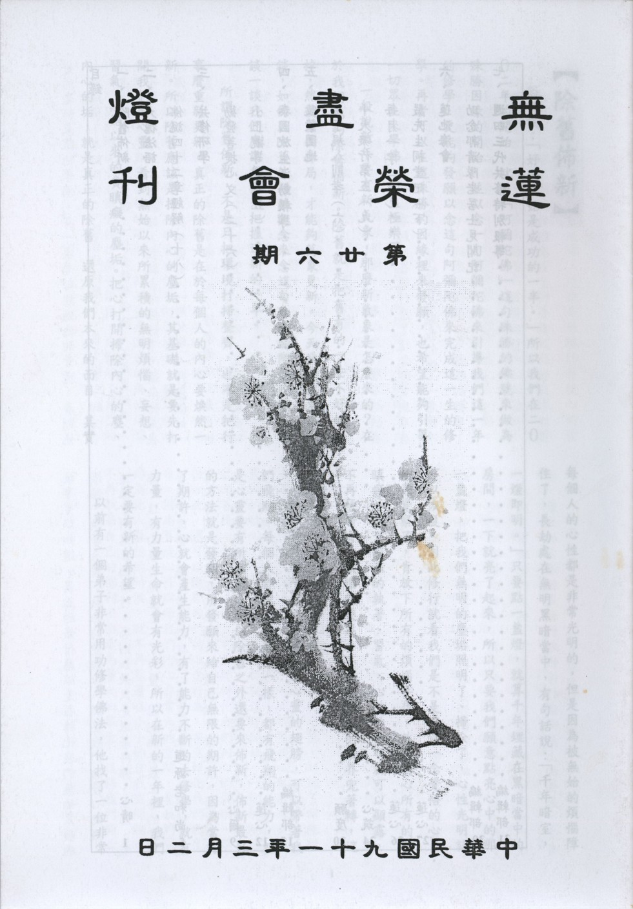

# 第26期

## 社論

### 除舊佈新

心晴

俗話說：「好的開始是成功的一半。」所以我們在二００二年的開始，就用「阿彌陀佛」這句殊勝的佛號來做為殊勝因緣的開始，並以念一句阿彌陀佛來引導我們這一年的修學，更能夠發願以念這句阿彌陀佛來完成這一生的修學。再者可以在這殊勝的因緣裡來發願，也希望能夠引導一切眾生來學佛，同生極樂國。

一般說新年要有新氣象，那麼新氣象是怎麼來的？在於我們能夠除舊佈新。除舊就是把舊有的一些不好的除掉，然後重新佈局，才能夠萬象更新。今天我們就來談一談，如何用除舊佈新的觀念來念這句殊勝的阿彌陀佛，也談一談我們應該怎樣來把握這新的一年。

所謂除舊佈新，不是只把環境打掃整齊，也不是把行事曆重新更新。真正的除舊是在於每個人的內心要煥然一新。所以除舊應該是掃除內心的塵垢，其基礎就是要先打開我們的心靈，看到無始以來所累積的無明煩惱、妄想、習氣，無始以來的貪瞋癡的塵垢。把心打開掃除內心的塵、內心的垢，就是真正的除舊，還原我們本來的面目，其實每個人的心性都是非常光明的，但是因為被無始的煩惱障住了，長劫處在無明黑暗當中，有句話說：「千年暗室，一燈即明。」只要點一盞燈，就算千年埋藏在黑暗當中的房間，一下就亮了起來，所以只要我們願意點亮心中的那一盞燈，把我們無明的塵垢照明了、掃除了，心性光明就可以恢復。因此修行就看我們是不是有這一念覺悟的心，如果覺察了，肯放下所有的煩惱妄想，放下內心所有的貪瞋癡，放下深深的執著、習氣，心性的光明就可以顯露，不再被所有的煩惱所迷惑，不再被所有的境界兜著轉，這才是真正的除舊。

新年要有新希望，希望就像心靈的翅膀，可以帶著我們飛翔。每個人都像諸佛菩薩一樣，都有飛翔的能力，就是心靈要有所期望，所以除舊之外還要來佈新，佈新最好的方法就是發願，用發願來給自己無限的期許，因為當有了期許，心就會產生能力，有了能力不斷的去修學，就有力量，有力量生命就會有光彩，所以在新的一年裡，我們一定要有新的希望。
以前有一個弟子非常用功修學佛法，他找了一位非常好的老師來跟他學佛。有一次老師經過他的旁邊，看到他正在繞佛，老師問他：「你在作什麼？」弟子說：「師父！我正在繞塔。」師父說：「你去修學佛法，不是更好嗎？」弟子想想繞塔不夠好的話，我就去拜佛好了。後來他正在拜佛的時候，師父說：「拜佛很好，」師父說：「拜佛很好，可是你怎麼不趕快去修學佛法呢？修學佛法不是更好嗎？」於是這個弟子又跑到佛堂開始念佛，當他念佛的時候，師父又過來了，說：「你在做什麼呢？」弟子說：「我正在念佛。」師父說：「念佛很好，可是你怎麼不趕快去修學佛法呢？」這個弟子真是丈二金剛摸不著頭，於是就跑去讀經，師父又過來
**問：** 「你在做什麼？」弟子說：「我在讀經。」師父說：「讀經很好，可是你為什麼不趕快去修學佛法呢？」這個故事到底在說什麼？這位師父到底告訴弟子什麼呢？雪公太老師曾經常告誡我們說：「念佛不改心，念破喉嚨也枉然。」就是說修學一定要抓到精要，這精要就是內心的發心；外在的修行，繞佛、拜佛、念佛、讀經都是非常殊勝的法行，但是一定要調整內心的動機，有非常好的發願、很好的動機，才叫作真正的修行。從這故事可以知道，真正的修行應該是在轉化我們無始累積的煩惱、執著、放下無始的愛執心，調整我們的發心動機，這樣才叫真正的修行，否則如果只是跟著拜佛、念佛、繞佛，這樣的修行是產生不了力量。因此佛法最主要的就是要我們改變心態，當我們改變心態真正來修行的時候，就可以得到內在真正的快樂。而最圓滿、最殊勝、最實在的發心動機為何？經上有句話說：「發菩提心，一向專念。」最好的修行就是要發出殊勝的菩提心，然後來一向專念這句阿彌陀佛。所以今年之始，我們是不是也一起來發殊勝的菩提心？當作我們新年的新希望。

什麼叫殊勝的菩提心呢？我們這一生修學的過程中，會發現原來我們的內心有無始累積的煩惱，很多的障礙，了解世間無非是苦，因此發心來學佛，而且看到所有的眾生也都一樣想要追求快樂，離開所有的痛苦，卻不得其門而入。所以發起想要引導一切眾生都能脫離所有的痛苦，給予他們所有快樂的心，為了利益十方世界的一切有情，來發願要幫助他們成佛。可是我們又沒有能力幫助他們成佛，最好的方法就是我們趕快修行證得無上的佛果，才有能力引導一切眾生都能夠成佛，這就是殊勝的菩提心的發起。為了利益等虛空的如母有情，引導他們都能成佛，所以我要快速證得無上正等正覺，來引導一切眾生成佛，發出這樣的菩提心之後，再來念這句殊勝的阿彌陀佛，是一個最好的法行了。

我們今天發的菩提願心，最能對治我們無始以來的自我愛執，我們每天為什麼有那麼多的煩惱？不斷的生出貪，瞋、癡、慢、疑？其實種種的煩惱、執著都是來自於放不下自己的利益，為了自己的利益籌謀、設計、追求，而追求到最後無非求不得、怨憎會、五陰熾盛，求到最後原來是一場空，生無邊的煩惱，有種種的恐懼、顛倒、夢想，這些不但不能帶我們證得佛果，還會惱亂許多的眾生。所以唯有發起菩提心，想要利益大家的時候，最能對治我愛執。菩提心就是為了引導一切眾生都能證得佛果，所以努力的修行趕快成佛。所以當我們發起菩提心，就正對治我們無始以來自我愛執的煩惱，就不會再沈迷的無邊煩惱中，可以脫離追求五欲的挫折痛苦煩惱，先對治了自己的煩惱、給了自己的利益。而且華嚴經上說：「忘失菩提心，修諸善法，是名魔業。」當我們修一切善法，如果沒有菩提心的引導，只是變成人天的果報，是輪迴的因，當我們菩提心發起來修一切善法，才叫作真正的佛法。所以當發起菩提心的時候，所有的事情都可以承擔，也唯有發起菩提心，最能累積功德。

有一個比喻：如果我們以非常歡喜好樂的心發起要布施給全世界眾生財富，但是這麼了不起的一個佈施，還比不上發起為了利益一切眾生願修學成佛的菩提心。因此當發起菩提心的時候，就有無上殊勝的功德，超過了佈施所有眾生的法行，這是天壤之別。可以說菩提心的發起是最圓滿的發心，一切佛法的基礎都從這裡開始，一切的功德就從菩提心來增上，而且它最能轉化我們內心的煩惱，不但如此，還可以激勵我們的心念行為，甚至轉化我們的生命。因為菩提心可以給我們內心非常大的空間，當我們全部為他人著想的時候，就不再執著在小小的自我空間裡、不再執著自己的福利，而是為廣大的眾生，這時我們的心量就無量的擴展，創造了一個會飛翔的心，一個可以遨遊在十方世界的心，這就是儒家所謂的仁心，又是佛家的慈心-想要給眾生所有的快樂，也是佛家的悲心-拔掉眾生的苦。更是無上的大悲心-承擔來拔除所有眾生的苦。當我們這些心發出來，就懂得將心比心，懂得為人家著想，關懷所有的眾生，包容別人，原諒別人；就不會因為別人傷害我們而生一絲的煩惱。因為我們發心利益眾生，所以眾生傷害我們，不會引起任何的煩惱，還會很歡喜的想幫助他拔除所有的煩惱。我們就能夠心開意解、心平氣和、平安喜樂，遇到任何的因緣就不會有煩惱，而且藉這個發心，會想要不斷的增上自己修行的力量、努力來修行。因此菩提心可以趨使我們奠定修行的礎基，而且不斷的促發我們增上、讓我們修行有充沛的活力，又可以把我們所有的煩惱，煉鐵成金、轉煩惱為菩提。所以這殊勝的菩提心，就好像磁鐵一樣，可以吸引全世界最美好的東西，所有世出世間的一切善法，由於菩提心的發起而得法喜。

在今年的開始，讓我們一起來發殊勝的菩提心，在四弘誓願中也說道：「眾生無邊誓願度。」我們要度無邊的眾生，所以「煩惱無盡誓願斷」，我們要趕快斷除無始煩惱，讓我們有修學的力量。用「法門無量誓願學」來斷煩惱，要精進的在所有的佛法上去修學、提升自己，讓我們今生就能夠速速證得正等正覺的佛果，所以「佛道無上誓願成」。今生就要把握最後的這幾年，來求往生西方極樂世界、圓成殊勝的法行。佛法一點點的概念，就可以幫我們減輕一點點的我愛執。當我們具有菩提心的時候，無論做什麼，就算是穿衣吃飯、睡覺，都可以給眾生帶來最大的利益，而且在日常生活中就可以累積無比的功德。所以這發心僅僅一次很強烈的發出來，就能夠產生非常大的力量，那怕只是電光火石的發心，也都非常難能可貴的，甚至發心一分鐘、或者一天而已，都是非常難能可貴，何況我們發菩提心專念一句阿彌陀佛，來當我們一年發心的開始，所以真的是難得殊勝。

## 大德法語

### 佛說四十二章經解（十八）

*道源老和尚講授*

第八章

「佛言：惡人害賢者，猶仰天而唾，唾不至天，還從己墮；逆風揚塵，塵不至彼，還坌己身。賢不可毀，禍必滅己。」

這第八章可以解釋第六章，惡人自己得果報的解釋。亦解釋第七章說明你要是罵人，對方不接受你的罵，你就罵你自己。這第八章再說一個譬喻，一個比方，一方面勸我們要忍辱，他害不了你，他害他自己；一方面勸惡人不要再做惡。

「惡人害賢者」賢者賢善的人，惡人看見賢善的人，他要加害於他，等於什麼呢？「猶仰天而唾」猶如仰著臉要吐口水，吐到天上去，可是你吐的口水，不會吐到天上，吐到那裏去呢？「還從己墮」你用口水吐天，吐不到天上，口水墮下來，還到你自己，你口水是吐到你自己臉上、自己身上。

再說一個譬喻，喻如「逆風揚塵，塵不至彼，還坌己身」。「逆風揚塵」抓一把塵土要灑到對方身上，可是逆著風，把這一把土撒過去，塵土沒有撒到對方身上，吹落到自己的身上，染污了自己的身體。

「賢不可毀，禍必滅己」懇切地勸惡人不要做惡，不要害賢人，賢人不可以毀。你毀他毀不了，等於仰面唾天，逆風揚塵。賢者，你毀害不了，你造的罪業，「禍必滅己」結果毀滅了自己。

第九章

「佛言：博聞愛道，道必難會，守志奉道，其道甚大。」

第六、七及八章云要想修行用功，昔之罪業成修道障礙，故必須先懺悔罪業；罪業懺悔了，要修行用功了，惡人來擾亂，於是忍辱不理他；過了惡人這一關，現在開始要好好修行了，告訴我們修行的方法。

用功不要用錯了，「博聞愛道，道必難會，」會是會悟，要開悟：欲開悟得先學佛法，所以說「博聞」。博是廣博的意思，或云：廣學可以增長智慧啊！這個地方錯了。怎麼錯了呢？你這個博聞專記名言，不能隨文作觀。你廣學多聞，自己看經，聽講經，你要隨著經文作觀想，觀想它的理，這就是用功。你專記名言，過去沒看過經，也沒聽過經，佛教的名相通通不熟，現在看到了，聽到了，儘記一些名言，不能隨文做觀，一講起來你知道的很多，比如說過去不知道什麼叫六度，現在都知道了，布施、持戒、忍辱、精進、禪定、般若，你這些名相很熟，但卻只是外相，你依了六度法門去修了沒有？沒有。專記些名相，自己以為自己學到佛法了，這就是錯誤了。「愛道」，愛道是愛好佛道，要修行用功，錯誤了一點，就不能開悟。怎麼錯誤呢？他不知道「道」是自己的心而心外求道。愛好佛道要修行了，卻以為心外有個道可以得到，這麼樣就開悟不了。所以「博聞」是求解，「愛道」是修行，但卻走錯了路，想開悟就開悟不了。所以「博聞」求解是對的，但要隨文作觀，不可以專記名言，愛道要修行是對的，但不可以心外求道。

「守志奉道，其道甚大」怎麼樣是正確的呢？「志心」志是志願，你這個志願的心，這就是菩提心，發了菩提心且發了菩提願，這就叫志心，你依著你的願來修行。奉道就是奉行菩薩道，「志心」發菩提心，「奉道」行菩薩道，那你這個道就大了。

第十章

「佛言：睹人施道，助之歡喜，得福甚大。沙門問曰：此福盡乎？佛言：譬如一炬之火，數千百人各以炬來分取，熟食除冥，此炬如故，福亦如之。」

這就是勸我們要隨喜功德，也就是我們普賢十大願中的第五隨喜功德。此章欲令吾人「隨喜功德」，見人家做功德，你就發隨喜心，這便是大修行，再看經文「佛言：睹人施道」，睹是看見，看見人家行布施之道，或是施財，或是施法。睹是看見人家發心，看見有人發心，你就盡你的力量去幫助他，令那個行布施之道者生歡喜心。比方說人家要行財布施，你看見了，你也參加一份，行布施，把他的功德行做圓滿了，那麼對方也歡喜了。又譬如對方要發心行法布施，要講經說法，卻沒有講堂，我有一個房子很大可以做講堂；或者人家有了講堂，我給他搬搬椅子，搬搬桌子，這都是助歡喜，幫助他行法布施。

「助之歡喜，得福甚大」法華經上有明文，有人在講法華經，大家都來聽，最後來了一個人找座位找不到，你把你的座位讓出來一半，讓那個後來的人坐，讓他去聽法華經，那法華經上的形容很多，此人（讓座者）得福，得的很大。

法華經上是說，把自己的座位讓一半給人家聽經。現在我們說發心幫忙，給聽經的人找一個座位，得福甚大。怎得福甚大？他要是到講堂來找不到座位，經聽不下去。既不能站的聽，他要走了，你給他找一個座位坐好聽經，他聽經種了大善根，而且眾生根基不平等，他第一次聽經，且是你幫他找座位，但是他的善根勝過你，追到你前面去了，他修行辦道進步很快，既是進步很快，功德成就，他的成就是你的幫忙，所以你得福很大。

「沙門問曰：此福盡乎？」沙門就是有一個比丘，他聽到佛講到這裡，心裏覺得有一個疑惑，就出來問佛：「此福盡乎」？佛說人家在那兒做功德，有個人出來隨喜布施者，幫助施者作功德，這個幫助的人，得福甚大，然會不會把那個正在做福那個人的功德佔去了？是不是把那個正在修布施做福那個人的功德佔完了？問這樣一個問題，怎麼問這樣一個問題？這就是初發心做功德的人，怕別人分了自己的功德，人家要來幫助他，他反而不歡喜，他怕人家分了他的功德，他不要人家幫忙，所以起了這個疑惑，請佛解釋。

佛向他說一個譬喻：「譬如一炬之火」譬如一個人有一炬火把，就是「一炬之火」。換句話說，就是一盞燈火。「數千百人各以炬來分取，熟食除冥，此炬如故。」有數千百人，各人拿了一個火把來分取，這火把的火分去了，幹什麼呢？或者作飯「熟食」，或者晚上能照明「除冥」除去黑暗得光明，你的火炬不會滅，福亦如之。你所修的福，別人是分不了的，還是你的福。

以上維摩經上云無盡燈法門，譬如你有一個燈火，別人也要點燈，來你的燈火上點燈，那麼你的燈火是不是有所損失呢？不會！他把他的燈火點著，你的燈火如故，不會損失。維摩經上還要我們發心叫別人來點燈，他一個來點，又多一個來點，大家都來點燈了，且希望別人再來點；一個人在講經說法，希望大家都來聽，聽了法了，都去弘法，在各人一個講堂。比方我們講堂一百多人，你們都成了一百多個法師，在一百多個講堂講，講了變成幾千個法師，在幾千個講堂，這叫「無盡燈」。一個燈能以分成了無盡個燈，叫無盡法門，這功德無量。（下期待續）

## 共修研學

### 勸發菩提心文（二十六）

*心爾*

念恩亦是一種修行，推動觀功念恩的主題就是一種修行，團體裡互相能觀功念恩，團體風氣一定改善，就是一種修行，這種力量結合佛號、結合教法，凝聚的力量會很強。反之心態不能如此（觀功念恩），也是口念彌陀心散亂，吃飯時看菜飯嫌差，不知他人煮飯辛苦勞累，晚上睡覺嫌蚊子多，不知別人已很努力地整理環境。若能憶念眾生恩德，也在念佛當中欲拔其苦，欲與其樂的菩提心，就油然而生。

云何念眾生恩：

「我與眾生，從曠劫來，世世生生，互為父母，彼此有恩，今雖隔世昏迷，互不相識，以理推之，豈無報效？」

我與眾生無始劫以來都曾做過彼此的父母，並且互相有恩，也許以前曾跟我有父子或母子的關係，可是到了今世，因為我們第八識已經攬父精母血變成另外一個生命現象，忘記了前世的因緣，所以現在看到都不認識對方，經過了投生彼此互不相識，互不相識就無關了嗎？因改形易貌就對過去種種造作不認帳？隔世之迷有兩種，一種是「入胎之昧」，一種是「隔陰之迷」，入胎之昧，即是中陰身結束以後，直接攬父精母血，神識與父精母血和合，住在胎中臭穢環境十個月，迷惑顛倒，不能承接過去延續的善修學力，謂「入胎之昧」；隔陰之迷就是從此身變中陰身，帶著宿世最強的善惡業，為業所牽引而迷惑，去投生六趣而天人永隔。而羅漢有隔陰之迷，菩薩有入胎之昧。羅漢、菩薩都迷昧，眾生更不用說了。蓮池大師在竹窗隨筆當中亦寫到，祖師自己當初也懷疑聲聞乃具備六神通，菩薩亦是雙修定慧，何繇昏昧均未能免？我們看看自己也看看別人，今日忘昨日之事，長大以後忘記小時候的事情，何況是經過出胎入胎這些痛苦，當然會忘記！但是聖賢的昏昧是暫時的，一碰到因緣馬上就會覺醒，而我們凡夫是始終昏昧而不自知也。

既然他過去世曾做過我的父母，而我也做過他的父母，他為了我曾經發起愛養之心，我何嘗不是也為了他而發愛養之心，這樣講來不就扯平了嗎？我為何要為了他將心量放大，而發大菩提心（欲拔其生死苦，欲予成佛之樂）呢？我們現在可以學到佛法，明白出世間的大樂，若站在念恩的角度而不是站在扯平的角度，那一定是要將佛法的大樂給眾生的，只在意他曾做過我的父母來報答他，這樣才對得起自己的良心，才能心安理得。並且眾生只要是做過我一世的父母，不管他任何的改形易貌，我都還是願意以報恩的心對他，那怕是他曾做過我一世的父母，但我做過他三世的父母，我也要一直報他那一世的恩，一點都不覺得苦。就像世間的孝子，要給父母最好的，那就是最殊勝的佛法，但是我沒有成佛怎麼給他佛法？所以這時應該要發起想要成佛的心，這就是菩提心。

「今之披毛帶角，安知非昔為其子乎？」

所看到的狗、貓、雞、鴨、牛、羊、馬等，戴角的、披毛的，難道過去沒做過我的兒子嗎？可能是過去世我很滿意的愛子，今生卻變成這樣，而任人鞭打宰割，而我也不知愛惜。

「今之蠕動捐飛，安知不曾為我父乎？」

像這些飛的小蟲，地上蠕動的小昆蟲，如蝸牛、毛蟲等，都有極大可能於宿世做過我的慈父母。

因為他生生世世曾做過我的父母，雖然現在形貌改變了，但是我在意的是他曾做過我的父母，故當我慧力有所成就的時候，不管他是在怎樣的生命現象中，我都希望他能得到慧命、得到解脫，這是我非常在意的重點。

「每見幼離父母，長而容貌都忘，何況宿世親緣，今則張王難記」

不用說到他變成畜生而我忘了他，連今生幼離父母都不會記得！例如年紀小的時候離開父母，長大與父母相見時，早就忘了父母的容貌，當面相見不相識，更何況宿世的親緣。眼前姓張姓王都難以讓我記憶與他從前的關係，他其實宿世跟我有親緣的關係，眾生的恩經過如此的觀修，才知今世助我，與前世為我親人，恩是既大又深。

有云：連今生小時候的事情都忘記了，更何況前世的事情？既然如此，又如何能知道有前生？例如現在所得到的形像以及所受用的業報每個人不同，這是前生的證明，因為前世的差別業故有今世的差別相，這即是異熟果與領受等流果。但是還有造作等流，我今天的心態是昨天等流下來的，今年的想法和去年也有關係，如同釋迦牟尼佛小時候就喜歡獨處，這即是從前生延伸過來。而從畜生道（例如豬）出來的人，就很喜歡髒，襪子不洗、蓬頭垢面等等，就是從畜生道出來，一時不能適應人道的現象。還有士用果，就是有的人喜歡文學、有的人喜歡工程，這些都是前生的影響。另外還有離繫果，就是前世是修行人，今生碰到因緣就跑去修行而得到解脫，例如紫柏大師，身上帶了十兩黃金進京趕考，途中經過寺院時聽到梵拜的鐘聲，就進到寺院將身上所帶的十兩黃金全部布施給寺院，並且在此出家，最後得到成就，這就是離繫果。由此五果的觀修可證知眾生皆有前世。（下期待續）

### 小止觀導覽（五）

*蓮心*

經文：

故法華經云：「佛自住大乘，如其所得法。定慧力莊嚴(注一），以此度眾生。

注釋：

(一)莊嚴〜以善美飾國土或以功德飾依身云莊嚴。阿彌陀經曰：「功德莊嚴。」探玄記三曰：「莊嚴有二義：一是具德義。二交飾義。」輔行一之一曰：「一心三諦為所莊嚴，一心三觀為能莊嚴。」

大意：

旨在說明止觀之妙用與功能並彰顯其重要性。

導覽：

一、佛在因地修學大乘中的每一法都是靠止觀去深入這一法，證得這一法，把這一法的作用發揮到究竟（在此法中定慧之成就），然後再將此法教給眾生，而眾生也需透過止觀門去修學、悟證、發揮這一法，以利世度人，此即法輪常轉。比如念佛一法就是藉著止觀門、成就定慧力把念佛的作用彰顯到究竟，故念佛可以除魔、可以消災、可以免難，可以得到六方諸佛的護念，可以往生淨土，並弘揚此一法門使大眾得到受用。

二、大乘法乃利益一切眾生之善法，若要學好必須專注於所緣的善法，以及觀修所緣善法的內涵，戮力去實踐他，成就對此善法之定慧力是屬於方便止觀；若能以法之體性（空性）為所緣，止住體會，此止住修即是修止，此空性境界現起，再好好觀察與辯證得到真正觀慧，即是修觀成就，這個是屬於真實止觀，是對空性境界定慧力的成就。如此才能發揮大乘法的作用，自利利他，這就叫做定慧力莊嚴。

三、能莊嚴為一心三觀，所莊嚴為一心三諦，三諦為觀與止所緣的境界，止與觀為能緣的心，所緣的境界是諦。諦者真實不變也，真諦即萬法皆空，空性是萬法不變的真理，故當內心安住於這種狀態，謂『止』，以空性為所緣，此境界可以不必努力，就能生起成為內心影像，在此意境上，生起種種觀察，並用很多的辯證，真實體會法無自性的這是『觀』，由止上建立勝觀，此即為空觀，對於萬法連微塵許自性都了不可得產生殊勝勝解。出定之後（此定為止觀雙運所成正定）在俗諦（緣起的變化）上止住與觀察，一方面知其無性，故知此法為幻，二方面又知法因無自性故，無法自己生、獨立生，須依因仗緣而現起；比如修學布施，特別以止觀法修學布施，讓施心、施法能純粹不夾雜，依布施之緣起可使人袪病延年、健康富貴，有此等功德，利益眾生，必能讓眾生受益良多，此即從空出假。從空出假是出了空性定之後，安住在利益眾生善法上，且生種種觀察，能將善法作用發揮到極致，這叫做假觀，若能同時出定緣念善法利益眾生，而又同時能入定現證空性，此即空假相即謂之中觀。此時所莊嚴的果報就是佛果。故所莊嚴的果報，必須藉著能莊嚴的心方能現起，比如淨土世界必須藉著阿彌陀佛的四十八願、諸上善人的努力才能現起，故可知淨土的存在是無自性的，須仗持我們的心而現起的，這些法都是互相觀待、互相依靠的。又比如止的輕安相，必須藉修止方可現起，觀的智慧相必須藉著勝觀方可現起，因其無自性，故不可獨立現起，所以宇宙萬法均無法逃離緣起法則與性空法則，故宜如實看待法的無自性與法的隨緣而有。一心三觀均是站在二諦上說的；就世俗諦上說其所建立的為方便止觀，就勝義諦上言其所建立的是真實止觀，換言之，止觀僅是幫助我們去了解緣起法、性空法的一種方法，故云「佛自住大乘，如其所得法。定慧力莊嚴……」因此懂得運用止觀法門就可幫助我們去體會萬法、了解萬法、運用萬法，也就是一個解脫的聖者。

四、止觀法門可將內心的潛力發揮到究竟，把即心本具的佛性全部彰顯，若對止觀法徹底了解，內心呈現無我慧的狀態，可體察萬法的緣起與性空，在萬法的空性上又種種照見的能力，故不受萬法的束縛，在萬法的緣起上能發揮萬法殊勝的作用，這就是成佛的兩大快樂：涅槃寂靜樂（不受萬法的束縛）、菩提覺法樂（發揮萬法殊勝的作用），而這二者均藉著止觀法而引起。（下期待續）

## 專題研學

### 十大礙行（九）第六條與第七條

*心筑整理*

「交情不求益我，情益我則虧失道義，虧道義必見人之非，察情有因於情難強情乃依緣，以蔽交為資糧。」「於人不求順適，人順適則內必自衿，內自衿必執我之是，悟人處世觀人妄為人但酬報，以逆人為園林。」

以上是十大礙行第六以及第七條的經文。

前兩次我們已經將人和人之間相處的對待關係，以中國的五倫十義為內涵作了說明，並且回到經文中看妙叶大師如何來看待人際關係中所遇到的障礙，亦將十大礙行六、七條的文義作了簡單的詮釋，接下來便是和大家談談，在眾因緣中朋友之倫影響我們甚深，而我們在面對種種障礙下又該結交何等的朋友，才能使我們在人生的旅途中過得更有意義。

有句話叫做「善人我師，惡人我資」。好人、善人皆可以作為我們學習的對象。德行高操之人稱作賢善，親近有德行的人，以其為師學習他們的所作所為，於耳濡目染中漸漸可薰陶成一個有德行的人；而惡人就像一面鏡子，可以看到自己的問題，反省自己的所作所為並且提醒自己不可以這樣做，故云惡人可以作為我道業上的資糧。論語中亦有相同意思的文句，子曰：「三人行必有我師焉，擇其善者而從之，其不善者而改之。」三人以上可稱為多數，此句的意思是與人交往，人人皆可成為我學習的對象，選擇跟隨賢善的人，向賢善的人學習種種好的德行，而面對惡人的種種不當行為，要自我檢查自己的行為舉止，由內心反省自己是否也犯類似的過失，並且加以改正之。

論語當中，孔子亦告訴我們，我們應當結交對我們有益處的朋友，就是有「友直，有諒，友多聞」的朋友，「直」就是個性正直不說謊話，「諒」就是講話信實、個性溫和並能體諒他人，「多聞」則是見識廣博，願意學習新知。結交性情正直的朋友，在彼此誠信的互動中，他們會對於我們的過錯加以善意的勸諫，而凡事信實的朋友必定是一位從不欺騙的人，和這種朋友相處最能體會溫柔敦厚的情誼，與見識廣博的朋友在一起可以彼此在學問道德上相互切磋琢磨，不但可以增上自己的德行，更能從中學習並識得許多道理，這對我們的一生實在有莫大的好處，所以結交友直、友諒、友多聞的朋友，是人生莫大的福氣！而我們自己也要朝著正直、信實與廣博多聞的方向來努力，成為一個誠正又有見識的人。

反身錄中有云：「人生不可無友，交友不可不擇。」人與人之間的友誼要建立在互惠的基礎上，彼此互相幫助長見識，互相規過勸善，才能有長久不變的情誼，也才能使自己道德學問日日增上。結交友直、友諒、友多聞的朋友，也期許自己是一個講道義並且有見識的人，相信人人都願意與我作朋友，共同分享人生寶貴的經驗。（未完待續）

## 共修法語

### 共修法語-週四共修止靜法語

心晴

為了利益等虛空際的如母有情，我們要快速的證得正等正覺的佛果，來引導一切眾生都能證得佛果。為此之故，我們來到蓮榮共修、拜佛、念佛，研討法語。

人生難得今已得，佛法難聞今已聞。我們在此擁有適合修行的條件，這是一個非常獨特的機會。今天是二００一年十二月廿七日，又是一年將盡，放眼世界，在這一年當中，各處頻繁的發生戰亂及很多的災難，像巴西地方是洪水氾濫，在墨西哥地方，因為冷風過境已經凍死了兩百多人，世界各地還在陸陸續續的發生災難。而教法、文化是非常沒落之際，我們能在這裡安心辦道，真的是難能可貴。因此我們在這裡共修，是非常殊勝難得之因緣。

一個國家要興，要靠佛法來興，唯有佛法興才能帶動一切。何謂佛法興？乃法輪要常轉，法輪要如何常轉？必先在每個人的心續中轉動法輪，讓佛法在我們心中轉。來到道場共修，讓道場的法輪轉動，道場的法輪轉動以後，就可以帶動地方的佛法興盛，地方的佛法興盛，影響全國，才能夠調整全國的民心，才能夠談到國家的興盛，國家興盛再去帶動全世界的人心在佛法上轉，乃至於十方眾生都能夠使法輪常轉佛法常住。所以雖然我們只是在這裡共修、拜佛、念佛，就已經結了如此殊勝的因緣。就是因為佛法在我們心中轉，帶動道場轉，帶動地方轉，帶動台北轉動，帶動整個台灣轉動佛法，甚至世界各地來轉動佛法，如此才談得上有希望，談得上新年新希望。

「希望」存在每一個眾生的心中，雖然「希望」的聲音很小，但是它確實存在，因為萬法唯心，而心之一念是氣象萬千。只要我們把心力提起，就沒有過不了關，成不了的大事。而且心念的改變，就可以帶動生命的態度改變，生命態度一轉變，我們的生活習慣就能作調整。生活習慣調整以後，我們的個性就會改變，個性一改變，命運就全部改變，於是人生整個的走向全部改變，就在我們這一念的改變。

今天正值歲末，在這麼殊勝的因緣，我們就來談一談，在回顧過去展望未來的時候，要如何來用功辦道？要怎樣來念這句阿彌陀佛？回顧過去，一言以蔽之，就是「無常迅速」，因此首先要將無常的心念提起。什麼叫無常？看看我們的日子是怎麼消失的？這一年是怎麼不見的？仔細想一想，一眨眼一天就日薄西山，一眨眼，一年就過去了，一眨眼，人生就走到了盡頭。時間是在我們的心念無常幻滅中消逝。杜甫有一首詩叫「小至」（小至是冬至的第二天），詩的第一句是「天時人事日相摧」，時間就是在天時人事日相摧中過去，天時指歲月的流逝，人事就是世間上的人事變化，原來時間就在歲月的變化與人事的變化當中，互相催促的消逝。而且是流逝的歲月來催促人事的變化，人事的變化又催促著歲月往前推動，所以歲月流逝、人事滄桑、時光飛逝，這就是無常。

什麼才是真正無常的體會？首先需瞭解「生命不定如水沫，迅極趨滅當念死。」就是說生命像泡沫一樣，是暫時的現起，很快就會消滅。所以真正無常的體會，叫作「念死無常」，每天要抱著：今日必死的想法。把一天當作一生來過，這才是真正無常的體會，萬法皆是緣聚緣散、變化迅速，一時的因緣過去了，就不會重來。所以當我們抱著念死無常的概念而生活，面對每一個因緣，都會讓我們倍感珍惜，好因緣也好，惡因緣也好，都去珍惜它。遇到好因緣我們感恩，遇到壞因緣，隨緣消舊業，而且順著壞因緣生起慚愧，生起學習之心，所以一切的因緣都變成好因緣。面對生活的種種，剎那剎那變化的因緣，我們必須要好好把握。 好好的把握當下這一念，在每一個念頭上，每一個因緣中盡上一己之心力。在每一剎那無常的生滅中，賦予它無比的意義。有句話說：「是日已過，命亦隨減，如少水魚，斯有何樂？」我們必須要生起這樣的體會，生命是隨著日子遞減，絕對沒有增加，而且遞減的速度是非常迅速，像沒有水的魚一樣，是要生起警惕心的，所以說：「但念無常，甚勿放逸。」這就是對無常的體會，每天早上醒來，都把它當成最後一天。就因為是最後的一天，所以也是全新的一天，每一件事全部都是新的開始，都是第一次，也是最後一次，面對每一個因緣都去珍惜它。相信提起這樣的心念，我們就會善用每一個心念，去珍惜每一個念頭，每一個因緣。
龍樹菩薩說：「一切痛苦都是由惡因緣來，一切安樂是善因緣累積而來。」所以我們回顧過去這一年、這一生、甚至無始劫來，都可以藉這歲末的因緣，生起深深的懺悔。孔子有一個好朋友叫蘧伯玉，是衛國的大夫，有一次他派他的使者來拜候孔子，孔子與之坐而問曰：「夫子何為？」你的老師在忙些什麼？使者回
**答：** 「夫子欲寡其過而未能也。」我的老師正在努力的來修正自己的過失都還來不及。這就是論語裡的一段典故。在淮南子厚道篇也提到：「蘧伯玉年五十，而有四十九年之罪。」蘧伯玉五十歲的時候，回顧四十九年以來，都有種種的過失，所以蘧伯玉是一個恆思己過，恆常來修正自己的修行人。

我們藉著蘧伯玉的這個故事來想一想：我們每天都有每天的過失，一個月有一個月的過失，一生有一生的過失，無始劫來有無始劫來的過失，在佛法當中有一個懺悔法門，是修學佛法的重要法門，其實一句佛號要念得好，還必須要勤加懺悔才能夠念得上力。阿難陀也是靠懺悔法門而得成就。所以正值歲末的今天，我們就來發起深深的懺悔。

須知我們無始劫來所積的罪障多如須彌，是無法盡除的，而我們這一生，一天二十四小時當中，心中所造的罪業屬於不淨的也是佔大多數。所以我們為什麼對佛法的瞭解不能深刻？甚至不能落實在心中？或者就算落實在心中了，有了少分的通達，卻很快的又消失了，這無非都是被無始以來累積的罪障障礙住了。因此我們一定要好好的懺悔，藉由懺悔使我們易生對佛法的覺受，乃至於修行可輾轉增上。惟有懺悔法門能夠消除我們的罪業，要知道業果是不爽的，不造不受，造已不失，且業果會增長廣大。因此在一年的盡頭，我們來好好想一想一生以來所做的種種罪業，一年以來所造的罪業，乃至於今天從起床到現在，所生起的種種不善，我們都來勤加懺悔，生起大慚愧、大怖畏來懺悔往昔所造的種種惡業，這些惡業都是從我們無始的無明、無始的貪瞋癡發動我們的身體去造作，口說種種不好的話，心不斷的動壞念頭，這些從身口意所造的種種惡業，今天我們都來生起深深的懺悔。而最能幫助我們的就是諸佛菩薩，所以求懺悔一定要先求皈依，皈依佛求諸佛菩薩來救度我們，歸依法讓佛法在我們心中常轉，皈依僧希望藉著團體的增上來互相增上。所以在懺悔前一定要先發起皈投依靠三寶的心念，不但要自己增上，還要帶著所有的眾生增上，帶著所有的眾生成佛。眼前先從不再造種種的罪業、不再去傷害所有的眾生、發願利益所有眾生開始，必能很快的成佛，並度一切眾生成佛。發起這樣的菩提心求受皈依，皈依三寶之後以這一句佛號求懺悔。懺悔法門若能依此因緣生起，必能很快懺除無始以來所累積的諸惡業。

除了懺悔之外，我們還要發隨喜心。這一年來所有的蓮友都非常精進努力，所以我們要隨喜自己的善念功德，隨喜自己在善法上所做的努力，並隨喜所有蓮友的善根、福德，甚至隨喜諸佛菩薩過去、現在、未來度眾生所有的善根福德，再將此懺悔隨喜的功德回向做為往生西方極樂世界的資糧。

今天正值歲末，我們就是以體會無常及業果的道理，來向三寶求皈依、求懺悔。並且隨喜所有凡聖自他的功德，發願當生一定要往生西方極樂世界，成佛度所有的眾生，我們用這樣的心念來念這句佛號，來為新的一年祈福，也在這裡祝福所有的蓮友，新年快樂，萬事如意。

## 蓮池海會

### 助念郭清隊老居士見聞記

*編輯部*

郭清隊老居士生於民國二十二年，台灣省雲林縣人，一生務農為業，勤儉樸實，辛勤耕作以便使全家得以溫飽，尤其前妻早逝，使原本清貧的家更是陷入困頓。老居士為了讓三個年幼無知的小孩免於飢寒，除了更辛勤操持自家農事之外，更是四處替人做工貼補家計，無論是割稻子、砍甘蔗、挖水井、清水溝、巡水田，只要有工事可做，都不放過。老居士總是勇敢、開朗的面對生活困境，一手承擔所有的壓力，從不讓三個兒女感受生活的艱難。以其辛勤耕作及替人做工換取的收入，用作改善家庭經濟及撫養三個子女接受教育，長大成人，家庭生活美滿，子女同心學佛，並且對待父母孝行感人。

老居士生長在純樸的農村，對儒家倫常道德觀念極為尊崇，教育子女，以孝、悌為重，常告誡子女要飲水思源，敬重長輩，並且要互相友愛、團結互持，而其子女也都能謹遵庭訓，傳承孝悌純厚的家風。

老居士雖然是務農為生，但他思想開通、知識豁達，憑藉著小學二年級的教育基礎，努力進德修業，通達人情事理，因此能為知識封閉的鄉親排憂解難，受鄰里敬重。

老居士前半生努力操持農務，改善家庭環境，呵護子女長大成家之後，即積極參與鄰里建設，老居士人熱心，樂於助人，雖然只受過小學二年級的教育，卻憑藉著自己的努力而充實很多知識，並練就一手好字，經常替村里中不識字的鄉親寫信、看信，為人服務，卻從不接受饋贈，也因此頗受鄰里敬重。綜其一生，勤樸仁厚，不畏艱難，雖只是一位平凡的農夫，卻樹立了不平凡的偉大典範。

在學佛因緣上，老居士生前雖未入佛門，卻能得佛緣及善友的護持，自從八十九年十月發病以來，蓮友們在每一次的共修中為老居士念佛迴向，使老居士能減輕痛苦，並且消除業障累積往生資糧，十二月十日晚上彌留之際，順利的獲得眾多蓮友的助念，蓮友們盼望以最殊勝的念佛方式助老居士了脫生死，出離三界。這都是老居士往昔及今生善根福德一時成熟的示現，在此為老居士祝福，祈請老居士能蒙佛接引，往生西方淨土，早成佛道，乘願再來，度化有情，阿隬陀佛。

## 啟蒙園地

### 弟子規　入則孝（六）

願度

「親所好，力為具，親所惡，謹為去；身有傷，貽親憂，德有傷，貽親羞。」

爸爸媽媽對我們無微不至的照顧，所有的事情都是以我們為出發點作為考量，他們所有的重點都在我們身上，因此我們所喜好的事物、所厭惡的事物，他們都能夠瞭如指掌，可是反過來想一想，我們對爸爸媽媽的一切是否瞭解，我們有沒有用心的觀察過他們所喜歡的事物、所討厭的事物，然後對於他們所喜歡的，我們就認真的去做，對於他們所討厭的事情就好好的去除它，這就是弟子規上面所說的「親所好，力為具，親所惡，謹為去。」而爸爸媽媽最歡喜的是看到我們成為社會上有用的人才，但要成為人才的重點首先要有健康的身體，所以我們要好好的珍惜愛護自己，以免父母親擔憂；並且要好好的立住自己的人格、在道德上講究，否則就會讓爸爸媽媽蒙羞，這也就是弟子規上面所說的「身有傷，貽親憂，德有傷，貽親羞。」接下來我們就一一分釋其內容。

「親所好，力為具，親所惡，謹為去」；「好」是指喜歡的事物、爸爸媽媽希望我們有的言行舉止，「力」是努力、盡全力、全心全意，「具」是指完備、具備、具足及籌備，也就是說爸爸媽媽所喜好的事物及他們希望我們達成的目標，我們應該全力以赴；「惡」是指他們不喜歡的事情及不希望我們有的行為，「謹」是說小心翼翼的，「去」是指去除，也就是說爸爸媽媽不喜歡的事情及不希望我們有的任何行為，我們都應該小心謹慎的馬上去除掉。「身有傷，貽親憂，德有傷，貽親羞。」「貽」是遺留；這是說身體上有了傷害，爸爸媽媽就會非常的擔心，若道德上有了缺失，就會使父母親蒙羞而沒有面子。

「親所好，力為具，親所惡，謹為去。」天下所有的父母親最大的心願就是希望孩子們可以平安幸福，甚至希望子女都能離苦得樂，而最大的快樂就是儒家的成聖成賢和佛家的成佛作祖，因此爸爸媽媽內心最深刻、最隱微處就是希望我們成為一個有用的人才、能造福一切的人類和眾生，要達到這個目標，我們就必須好好的培養自己，從盡孝道開始做起，首先就是要認真的在「親所好，力為具，親所惡，謹為去」上下功夫。爸爸媽媽所「好」的，我們就要「力為具」；對於爸爸媽媽所「惡」的，我們就要「謹為去」。

「親所好，力為具」爸爸媽媽對我們的一切都非常的了解，而我們自己是否也了解爸爸媽媽的興趣、嗜好和習慣？喜歡吃什麼？早上幾點鐘起床？晚上幾點鐘睡覺：：：：？如果瞭解，就可以在生活當中去關懷他們，放下以自我為中心的壞習慣，譬如說爸爸媽媽喜歡安靜，我們就不要太躁動；總而言之，會令爸爸媽媽高興的事情，我們就全心全意去完成，這才算是體察父母親的心意。另一方面，「親所好」除了講爸爸媽媽個人的喜好以外，還包含了對我們行為上的要求。父母一定希望我們是有禮貌、有恆心、做事能專心、生活有規律、能熱心助人、安靜懂事、尊敬長輩、與人和睦相處、愛護弟妹、勤快簡樸，會主動幫忙做家事等等的小孩；如果我們能這樣做到，爸爸媽媽一定會很高興，我們也可以融合在這個快樂的環境中，讓所有的人都感染這份快樂的氣氛。

接下來我們再來討論「親所惡，謹為去」的內涵。做為一個孝順的孩子，我們應盡量讓爸爸媽媽開心，盡上所有的力量來關懷他們，他們不喜歡的事情，我們就要小心翼翼的不要去做，讓爸爸媽媽覺得很寬慰、放心。有什麼事我們不能做呢？爸爸媽媽不喜歡我們吵鬧，我們講話時就要盡量壓低自己的聲量；爸爸媽媽喜歡很乾淨的環境，我們就可以打掃環境、維持整齊、乾淨；長輩對我們說話時，要很恭敬地注意聽。其實爸爸媽媽希望我們不要懶床、交壞朋友、做事拖拖拉拉又不負責任、把家裡弄得又髒又亂、生活沒有次序等等；為什麼爸爸媽媽會不喜歡這些事情呢？我們有沒有想過，因為這些事情都是會影響我們人格建全的發展，所以為了讓父母欣慰，就必須把自己培養成一個人才，讓我們就從「親所惡，謹為去」上來好好加油。

總之，父母所有的好惡都是為我們著想，對我們有利的、有幫助的，他們就喜好；對我們有害的、不好的，他們就希望我們改善，所以在實踐孝道的時候就必須兼顧到我們的身和心兩方面，所以在弟子規上說：「身有傷，貽親憂，德有傷，貽親羞。」這是說要照顧自己的身體，以免除父母親的憂慮，也要照顧自己的心理，在德業上好好講究，使父母不至於蒙羞，因為我們若有任何的過失，別人都會覺得是因為父母親沒有把我們教好的關係，所以我們必須小心謹慎，不讓爸爸媽媽因我們而被恥笑。孝經上所說：「身體髮膚，受之父母，不敢毀傷，孝之始也。」所以孝道的開始就是把自己的身體保養好，然後才能好好利用這個身體，去做各種對大家有益的事情，而且我們身體健康與否也是爸爸媽媽最關心的，所以盡孝道的第一步就是要好好的照顧自己的身體；反之，我們若沒有好好的照顧身體，像生病了、受傷了，都會讓爸爸媽媽很憂心，這樣一來，我們的孝道就會有虧損；所以，我們生活作息要有規律、飲食節制，更不要去做有危險性的行為等等，用各種方法來保護我們的身體，才算孝順，絕對不能隨著自己的心意為所欲為，必須用它來做各種有益大眾的事情，讓它發揮到最大的效用，才不辜負父母親給我們的這個身體。孝經上也說：「立身行道，揚名於後世，以顯父母，孝之終也。」孝道完備於自己德性的建立，我們可以把自己培養成一個有利於社會的人才，做各種有意義的事情，讓生命不空過。

我們從「親所好，力為具，親所惡，謹為去」當中就可以除去我執的壞習慣，而培養處處為他人著想的態度，從「親所好，力為具」，我們還可以延伸關心到長輩、朋友、晚輩的所好，這樣就可以讓我們在做每件事情的時候，先考慮到他人的想法和心意，從更多的角度來思考事情，而獲得更圓滿的解決；而且善自珍惜我們的身體，趁自己還年輕健康的時候多學習，多做些有意義的事，更讓爸爸媽媽希聖希賢的心意可以落實在我們身上，好好的立住自己的人格、培養自己的品德，才不會失去爸爸媽媽給我們這個身體的本意，更不會「德有傷，貽親羞」，讓爸爸媽媽因為我們行為的不端正而蒙羞，因此應該在德業上好好的加油，讓自己能夠「立身行道」，進而「揚名聲，顯父母」，從德業上去光大自己的門楣，這也就是成就孝道的不二法門。（下期待續）

### 每月一字 — 屯

*蓮心*

屯：是象徵草木初生時，地下根莖彎曲難伸，在地面的苗芽往上生長困難，故本義作「難」解，此外「屯」尚有其他意思，詳如下列：

一、土阜〜如「生於陵屯」。

二、聚集〜如聚草屯糧。

三、堆疊、阻擋〜如「屯街塞巷，都來看迎大蟲。」(水滸傳)

四、駐軍防守〜如「但聞虜騎入，不見漢兵屯。」(李商隱詩)

五、駐軍墾荒耕種〜如屯田。

六、軍營〜如「京師有南北軍之屯。」(漢書)

七、村莊〜村落亦名屯落，簡稱為「屯」，如李家屯、皇姑屯。

八、卦名〜易經六十四卦之一，當卦名時讀音為「尊」，同「迍」字，由坎卦和震卦所組成(震卦在下，坎卦在上)；屯卦主要是說明一個人在開創事業的時侯是最困難的，俗話說萬事起頭難就是這個道理，而成功是必須歷經千辛萬苦，才能成就偉大的事業，所以說「多難足以興邦」。例如漢高祖劉邦創業的過程中即是九死一生，為了逃命甚至把自己的小孩都丟掉了；所以屯卦的本意是代表困難，其衍生義就是當我們遇到困難的時侯，應該積極面對，力求解決。

嚴先生祠堂記：「在屯之初九：陽德方亨，而能以貴下賤，大得民也」〜出自易經，這是指地位崇高的人去拜訪地位比自己低的人，這是最容易得到民心的做法，例如：周文王當初到民間去尋訪，找到了呂尚，這就是一個「以貴下賤」的行為，最得民心的做法；又如劉備三顧茅廬，以誠意感動諸葛亮為蜀國效力，一直到最後是「鞠躬盡瘁、死而後已。」所以漢光武帝以帝王之尊，不斷的邀請嚴先生出仕，這也是一個「以貴下賤，大得民心」的做法，所以老子說：「以其終不自大，故不能成其大。」而「陽德方亨」易經的原文無此句，「陽德」代表帝德，「亨」，通也，「陽德方亨」此句的意思即是指現在皇帝的威德是最盛的時侯，而在此時，卻能以尊貴的地位去尊敬地位比自己卑下的人，這種行為是最得民心的，所以在易經中之「以貴下賤，大得民心」這句話漢光武帝做到了。

### 嚴先生祠堂記（下）

*蓮心整理*

本文（范希文）

「先生，光武之故人也。相尚以道。及帝握赤符，乘六龍，得聖人之時，臣妾億兆，天下孰加焉？惟先生以節高之。既而動星象，歸江湖，得聖人之清，泥塗軒冕，天下孰加焉？惟光武以禮下之。在蠱之上九：眾方有為，而獨不事王侯，高尚其事。先生以之。在屯之初九：陽德方亨，而能以貴下賤，大得民也。光武以之。蓋先生之心，出乎日月之上；光武之量，包乎天地之外。微先生，不能成光武之大；微光武，豈能遂先生之高哉？而使貪夫廉，懦夫立，是大有功於名教也。仲淹來守是邦，始構堂而奠焉。乃復為其後者四家，以奉祀事。又從而歌曰：雲山蒼蒼，江水泱泱；先生之風，山高水長！」

伍、 賞析

一、 修辭：

（一）運用典故以豐富文章的內容：

１、握赤符〜出自後漢書光武本紀；指光武即天子位。漢光武帝統一了天下，但他並沒有馬上即位為帝，他的部屬一直請他即位，都被他推辭了，後來行軍至鄗，並且在關中地區挖到了一個赤符，上面寫著：「劉秀發兵補不道，四夷雲集龍鬥野，四七之際火為主。」這表示天有瑞應。

２、乘六龍〜指天子。馬八尺以上稱為龍，天子坐的車子，是由六匹馬來牽動，故稱六龍；另一說法為在易經中的第一卦是乾卦，全部為陽爻，易經上說乾卦是「乘六龍，以御天」，這就是指做皇帝的人。

３、得聖人之時〜出自孟子萬章篇：「孔子，聖之時者也。」原是指孔子的思想學說不僅合乎時代的需要，而且經得起時代的考驗，故孔子是人天之大德。而本文是指漢光武帝得時宜之利而為帝。

４、得聖人之清〜出自孟子萬章篇：「伯夷，聖之清者也。」是指嚴先生是一個不隨波逐流，品格高潔的人。
５、動星象〜事見後漢書嚴光傳。嚴光與漢光武帝夜相臥，嚴先生以足置帝腹上，次日，太史奏曰客星犯帝座，光武帝笑
**答：** 「朕與故人嚴子陵共臥耳。」

６、貪夫廉，懦夫立〜出自孟子萬章篇，只是原文「貪」作「頑」。

（二）取易卦以加強文章的可信度：

１、在蠱之上九：眾方有為，而獨不事王侯，高尚其事。

２、在屯之初九：陽德方亨，而能以貴下賤，大得民也。

（三）以對句、排句彰顯文章的脈絡：（僅舉二例之以明之）

１、「乘六龍，得聖人之時，臣妾億兆，天下孰加焉？惟先生以節高之。」

「歸江湖，得聖人之清，泥塗軒冕，天下孰加焉？惟光武以禮下之。」

２、「在蠱之上九：眾方有為，而獨不事王侯，高尚其事。先生以之。」

「在屯之初九：陽德方亨，而能以貴下賤，大得民也。光武以之。」

二、章法：

本文以表明嚴先生之高節為主旨，開宗明義即指稱嚴先生與漢光武帝是「相尚以道」，接下來整篇文章都沒有離開這個主題來描寫。另外，本篇文章並非直接寫主角，而是藉著第二主角（漢光武帝）去拱托主角，這叫做「雙點」；以光武帝來陪襯嚴先生，從中體會光武帝的「以貴下賤，大得民也。」以及嚴先生的「不事王侯，高尚其事」，結語時的「雲山蒼蒼，江水泱泱」更證明了嚴先生的節氣長存。

陸、 結語：

漢光武帝貴為天子，嚴先生是平民百姓，但范文正公同樣以聖人來尊稱他們，在文章中把他們相提並論，但事實上是暗分高下，因為嚴先生是「使貪夫廉，懦夫立，是大有功於名教也。」所謂「卓哉嚴子陵，可惜漢光武，子陵有釣台，光武無寸土。」

禮記云：「君子隱而顯。」東漢初年，士大夫崇尚氣節，一改莽朝積弊，此固光武帝崇敬賢良所致，而先生等隱逸君子之清風高節，滌盪世道人心，亦有裨益焉！范文正公為文的目的，除彰顯嚴先生高節外，亦冀能改善社會風氣，期世人以志節相勉，以操守自勵，其用心之苦，躍然紙上。（全文完）

## 活動報導

### 泰國放生活動報導

*編輯部*

九十年十一月底，大眾前往泰國參訪放生，此行不但見識了小乘佛教寺院的金碧輝煌，也看到泰國人民在純樸的文化背景與西方享樂主義衝擊的兩相矛盾中，所產生的特有現象。其政治型態雖與本國狀況不同，而其人民對於國家與領袖的尊重，實為吾人所敬佩。

泰國七百年來多奉佛教為國教，君王與人民同為佛教信徒，雖然改朝換代，但是無不傾出全力建造佛寺，故泰國的佛寺不管是遭受戰爭所摧毀的王朝古蹟或是卻克里王朝中金碧輝煌的玉佛寺等，都極具特色。泰國雖然是小乘國家，然站在小乘解脫的基礎上，才能成就大乘無上正等正覺的佛果位，故小乘的基礎是非常重要的。發大乘心的行者，在未發起菩提心之前，所修的都是三乘共法，尤其小乘的戒律與頭陀行，更是我們所應該學習的，雖然小乘與大乘國家的法運都朝著正、像、末、滅的趨勢走，不過我們仍要自我期許，效法他人優點，以他人之缺失自我警惕，雖不能力挽狂瀾於既倒，然絕不做滅佛種之人。今逢行旅泰國，可以在末法時期多多體會他人的長處，學習泰國君主與人民對佛教的尊重與虔誠，及由所留下的古蹟中，體會彼前朝佛教之盛況。

此行的一開始便是參觀泰國四大王朝之一的艾尤塔雅王朝（大城），彼王朝在與緬甸的戰爭中所遺留下的佛教遺跡，有大臥佛、佛塔與佛像，於各處散落的佛寺與佛塔中可看出戰爭對它的迫害，古樸的建築物中依稀彷彿可以想見當年的雄偉。大眾並在此處繞塔與誦念「繞塔功德經」，在微風中席地而坐體會此經的義涵。從繞塔的法行中現世能得鬼神親近供養，來世生於有佛法之處，遠離八難，具足妙色相（福），並能生起智慧（慧），生於人中能獲大名稱，得清淨的種姓，容貌端正、富貴，心、樂布施極得人緣，所住之處皆安樂，或於閻浮提為婆羅門、大長者、正法王、轉輪王等，或於忉利天為天王，能將大福利益群萌，為成佛的資糧，生生增上，未來得決定乘的成就（十地成就），乘願再來度眾生，入胎時父母親族皆保愛，生出時其身、眼、色相等皆莊嚴，並能於各天示現天王（十地寄報）以度眾生，並得諸佛護持，即使到苦世界度化眾生也因己身之白淨法所感應身及衣皆無垢染，修學的勢力極強，絕無疲勞與懈怠，不被障礙所難倒，並且說法與眾生結殊勝的法緣，令眾生降伏煩惱，成就出世的智慧，度生功德圓滿能證佛果而示現為天人師。以上種種殊勝走向乃由身語的讚歎，右繞於佛塔所得的小部分功德，若廣而言其繞塔功德是不可窮盡的。故今日可於泰國行此殊勝的繞佛塔的法行，乃吾人之一大福報，若實言之任何一法行，皆有無量的功德，皆可為往生西方與圓成佛果之資糧，端看個人發心之真切與否。

參觀完大城古蹟之後，晚上的活動便是夜遊湄南河並於此放生，因為等待生物，放生組以及會計，隨後跟著滿載生物的船而來，我們其他人因為久候不耐飢餓，早就將眼前的美食一掃而空，放生組辛苦的追著我們的大船，船家用大燈照著滿載生物的放生船，魚兒們活潑的從放生組手中的簍子裡跳出。之後，飢腸轆轆的放生組才登船吃飯，愉悅的大眾歡喜的唱歌與述說心得，那一晚因為非常成功的放生和大眾心得的交流，而法喜充滿。

在桂河的放生，即所住飯店之後院，在此處放生和所住的飯店結下很好的法緣，想必宿世定已有善緣，才有今日殊勝的法行，而此處正適合這些眾生。反觀在台灣雖然有願但是無緣，在市場雖然可以找到刀口下待宰的生物，但是因為台灣的放生環境不好，所以放生活動易招致批評與責難（例如放生即是放死，或者破壞生態環境等等），以致放生法行便無由開展。

桂河大橋曾經歷第二次世界大戰，走在曾經犧牲了無數生命的鐵路上，以及好幾次途經埋葬陣亡將士之墓園，對於無辜戰死他鄉的戰士們，大家心中都充滿無限的感慨，這些苦難的眾生皆是我們在善法中要回向的對象之一，希望他們轉世為人，得聞佛法，或者求生淨土，亦希望人類不要再有無謂的戰爭，珍惜寶貴的生命。

桂河的環境非常的清幽，但是因為觀光業發達而漸漸富裕起來，所以原本寧靜的湖面，因為卡拉OK與種種遊樂設施的進駐，而喧鬧了起來，世俗的吵雜之聲隨著我們到山區水邊，想要於此放鬆並收攝身心恐怕今後就更不容易了。

最後我們在芭塔雅乘著漁家的船至其位於離岸不遠的魚塭中，我們做完儀軌之後，一邊放生物一邊和漁家交涉，希望能將其所有的生物通通放回大海，並且希望他們能夠改行不要作這種生意，最後經過長時間的交涉，漁家終於點頭答應全部賣給我們，眾人歡欣鼓舞，頓時覺得此處的山水都變得美麗了起來。

此行除了參訪外，放生活動亦為主要法行，共放了十一次（包括放生組先行勘查場地時放了三次），累計放了2585.8公斤的魚，螃蟹19.5公斤（二次）、蝦子0.8公斤，187隻貝殼，小鱔魚171隻，紅鱘7.7公斤，紅石斑5.1公斤，黑石斑153.5公斤，沙魚25隻，綜合的魚45.4公斤、烏魚及觀賞魚各一隻。地點分佈於湄南河各個河段、飯店旁的桂河邊、國王水庫、芭塔雅沿海等。在放生活動中，蓮友們同心協力，放生組的人購買生物，法器組負責壇場佈置與放生法事進行，人人專注於善法，儀軌做完後共同將生物放至最安全的地方，讓生物在生死的關頭，能夠擺脫恐怖的心態，回到大自然，這是一件令人非常愉悅的事。所以不管是與台灣的生物結緣，或和國外的生物結緣，結緣的對象雖然不同，但是從中得到的歡喜或者是感動，都是相同的。

弘一大師說放生有五個好處，約自身說，如延壽：這是所有福報的源頭；癒病：光有壽命而體弱多病，此福亦是有障礙的；免難：天災人禍、人心動盪，政治不安，藉著放生可化凶險為吉祥。約家人說乃得子：家中有好的後代，大家一起共學共識，來延續家庭；生西：光有以上的福，死後輪迴未免遺憾，故需要有出世的福報，引導到淨土的成就及佛果的圓成。放生活動應結合此五決定實行，則每一個生物，個人乃至團體皆可於此善法中，積聚往生及成佛的資糧，獲得殊勝的功德。除了使生物得到了重生，但更重要的便是賦予其對於破迷啟悟、輪迴的覺受，求生淨土的覺受，不僅給予牠們生命，更給予牠們慧命，這才是我們真正放生活動的本懷。

佛法是不離開日用平常的，藉著參訪放生便有許多歷緣對境修的機會，車子路途遙遠，長途跋涉，太陽太大等諸多不便，甚至買生物與放生時嚐到許多的苦，耐力、毅力、忍辱力與平常修學的經歷，在歷緣對境時都可以考驗我們坐上修的功夫，果然平常善於應用自己功夫的人，自然在遇境逢緣時能夠操持自己。平常坐上修不夠好，在歷緣對境時難免有諸多的放逸以及種種不如法，不過我們也不要氣餒，站在自我反省的立場上，看到自己的缺點與過失，作一個調整與改善，用高興的心情來面對自己的過失，因為當我們找到過失方能除掉過失，從這立場上比起不知道自己過失的人強太多了。古代的聖賢都是反省寡過，有這種能力應該要慶幸與隨喜自己的功夫，這樣的人是幸福的。

在曼谷的塞車過程中，可以體會佛菩薩在度化眾生的時候，往往要花無量劫的時間，要投諸諸多的心力，他的心力若有行相的話，虛空都不能容受的，我們眾生的業力正把佛的願力塞住，佛碰到眾生就塞車，無可奈何的塞車，被眾生團團的業力包住，釋迦牟尼佛來到娑婆世界度化眾生來了八千次，我們一樣在作凡夫，佛雖然是解脫的，但是面對善根福德微弱、起心動念無不是業、無不是罪，剛強難化的眾生，此種狀況就是一種塞車的感覺。所以孔子就是「吾道難行」甚至有匡人之難、陳蔡之餓與周遊列國諸無所成，此皆是塞車的狀況，但聖人面對這樣的境界是「不怨天不尤人，下學而上達，知我者其天乎」，而內心的心境是一片的空靈，所以是「有匹夫問於我，空空如也，扣其兩端而竭焉」。故我們應該在日用平常中細細體會聖人的心境，聖人若遇到這種種的狀況時，會如何作來表現悲心與智慧？這樣子自己心境慢慢便會有所改變，教法也會覺得慢慢用得上力量，這樣子將我們種種的福報轉化成殊勝的清淨福，所造作的善業都轉成殊勝的善根。

誠摯的希望教法住世，人才輩出，讓古蹟找到新的意義，而非僅是古蹟甚或旅遊景點供後人憑弔，希望能重振正法，引動大家對法的尊重，祈求諸佛菩薩乘願再來，帶領眾生破迷啟悟，離苦得樂，此是吾人所殷切期盼的。

## 三代共修活動報導

### 師長的話

*編輯部*

九十一年一月十七日，是我們年前共修的最後一次，因此特別邀請師友們將自己近來的覺受、心得作一個分享。每個人都暢所欲言，法喜充滿。

今天是我們年前共修的最後一次，學人是懷著很慚愧的心，因為這個活動是如此的重要，但因為與外面的課衝突，所以無法來這裡隨喜，但心立學長對佛法很有誠意、對助念的觀念很了解，並且結合教理和實務，如此一來才能把助念的觀念說得清楚，對大家的幫助較大，因此在這裡辦這個活動對大家的受用非常大，這是學人的第一個感想。

第二個感想是學人從民國六十五年開始學佛，教理上有一點收穫，但也得力於與長輩們的交往，如黃師伯、鍾師姑、彭師伯、蔡老師和彭媽媽等人生閱歷豐富的長輩，和他們交往，使學人更能感覺到學教法的落實處，雖然學人也有利益到他們，但畢竟是互相利益，互相得到佛法上的受用。

第三點是要讓長輩們在這裡共修念佛是不容易辦成的，過去我們共修會也曾經辦過，但沒有成功，現在藉著彭先生夫婦的幫忙才把這個聚會辦成功，不只是很成功，而且氣氛改變了，整個修行的觀念都增上了，所以雪公老師說：「為政在人。」辦事情要看人辦，若有人才辦事，事情一定成功，因為「中興是以人才為本」，人才是最重要的，我們這個地方並不寬敞，要活動也不是很舒適，種種的不方便，但是能夠把大家凝聚在這裡，就靠著張老師、彭先生和幾個工作人員的誠意護持才有這樣的力量。

第四點感想是把這個地方好好的利用〜辦共修、辦研討其實就是學人熱切的盼望，以對得起借給我們場地的主人。

第五點感想是現在不論是政治、經濟和人心都是每況愈下，人心是非常的動盪，很多人對未來都充滿著不安定的感覺，而我們能夠在這裡很安定的研究佛法、共修念佛、了解生死問題進而解決生死大事，這是宿世的大福報，在未來還能了解淨土的殊勝、念佛的法門、臨終助念的重要，我們若好好仗著這股善緣，將來的福氣就全部都是我們的。　雪公老師就說了一個例子〜姜子牙有一點失敗之處就是把大家都封神了，連他太太都被封為掃把星，當大家都榜上有名，封入神列，卻無人來封他了，所以在這裡的師姑、師伯們全部都是很有福氣的，因為在三代共修中通通把長輩送到極樂世界，而我們這些晚輩都留在娑婆世界，若我們若沒有好好把後輩提攜起來，其實福氣全部都是給長輩得到，因此坐在這裡即是隨喜諸位長輩，又嫉忌諸位長輩，因為好處通通是給長輩拿走了。

第六個心得是這個助念的專題一定會結束，因為法之生起必待因緣，緣生緣滅，因此另外一段的因緣現起時，就再請諸位長輩商量更好的主題來接續，若在佛法當中，一個主題接著一個主題的談下去，以後就是一個很強的互相扶持的蓮友陣容，這個陣容不只可以利益家庭，在個人要往生時也可以得到大家的護持。大家的目標是確立了、生活的習氣也對治了、教法也深入了、團體上也和合了，各人也知道如何去走完人生美好的未來，這些都是學人非常隨喜的，學人也希望來年能夠和鍾師姑一樣，把大家都當成是老師，這樣才會獲得更大的增上。

並希望新的一年有新的氣象，在修學上、團體的凝聚上步步勝進，大家心想事成、法喜充滿、光壽無量。

### 週四三代共修特別報導 — 前言

*編輯部*

前言

為了讓蓮友們暇滿人身身心有一個依止處~阿彌陀佛，因此藉「週四三代共修」做為念佛、共修與研討的聚會場所，並進而凝聚勉勵與增上、溝通與互動、的共識，確立正知正見，期能共造善法、同蒙法益、正法久住、法輪常轉。

三代共修上課時間為星期四白天，上午九點至十一點卅分念佛，以訓練我們念佛的功夫，下午一點卅分至三點卅分研討「助念須知」，以建立往生的正確知見。

本班的成員有大至九十一歲的婆婆，也有小至三歲的小朋友；這兒有台北的蓮友，也有遠從中壢、宜蘭、東勢來的長輩們；大家共聚一堂，經過了四個多月的時間，師伯和師姑們在這裡都得到很大的受用，而這些沒吃過苦頭的年輕人也藉著這樣的因緣得以有機會向長輩學習，效法他們的毅力和堅忍不拔的精神。

「週四三代共修」是大家的園地，竭誠歡迎您們的加入，來到這兒就是「諸上善人聚會一處」哦！

### 心得分享 — 蔡老師

*編輯部*

我們是一群非常幸福的老人家，每當一到星期四下午講課，總是笑聲不斷，成了一個老人們的天堂，就像在止觀當中所說「以佛號養心的人，就是一群最愉快的人」

因為我們都只會養身而不會養心，一天到晚心裡都是在胡思亂想、煩惱重重，因此我們到這裡來就是以佛號來養心，一早來念佛共修，大家都切合在一句佛號當中。

第二點是林老師的法語，表面上看似簡單，其實很受用，不論是對家庭主婦或是上班族來說，在做每一件事情的當下都是一切為眾生、為利益大家，在這樣的心態去做事時就可以做得很高興；如此一來，也可以對治我們的執著，因此執著是來自於我們的煩惱，因為有煩惱和執著，所以念佛就無法一心，因此必須對治它們以使我們念佛得一心。

第三點，週四下午的研討課，非常令人感動，從前雖然聽過了，但仍然必須不斷的串習，才能有所收穫。不論早睡或晚睡，末學每天早上四點多就起床了，有時甚至三點多，接著就是謄寫唐老師的錄音帶，並把重點寫下來，然後再不斷的思維其中的內涵。剛開始的時候，末學也很懷疑自己的能力，因為小時候是日治時代、沒有讀過國文，注音符號也是國小六年級時才開始念，因此在謄寫的過程中，很多字、詞不會寫就開始翻字典，因此末學覺得遇到唐老師以後才真正開始念書、溫故而知新。當聽到自己的缺點、毛病時，非常的慚愧，會感覺到自己失去的太多，為什麼過去這麼多簡單的事情都無會，人就是如此的愚癡，愚癡到一直造業，過去世所造之業已經無量無邊，我們這輩子還要再繼續造、繼續受苦嗎？因此在聽到了自己的毛病，末學是懷著即慚愧又感謝的心，慚愧自己造了這麼多的業，感謝師友們把自己的毛病一一的指出來並告訴我們如何去對治，因此越寫就越法喜、越寫就越高樂。有時候雖然身體不舒服，但一寫下去就著迷了，為佛法而著迷，就忘記了身體上的痛苦，聽到感動處我就會痛哭流涕，而聽到法喜處也會笑瞇瞇的；除非真的腰酸得受不了，就躺一下，或感到累了就扒在桌子上休息一下，有時候真得很不舒服就去看醫生，但看醫生不一定會好，因為這是過去的業力現前，因此再怎樣痛苦，只要想到古大德的「為法捐軀」和「斷臂求法」的堅忍不拔，我就想自己現在有佛法可以聽，就應該紀錄下來，因此有時候就算遇到身體上的障礙，讓自己休息一下，再奮力的寫下去，心想若現在往生也無懼了，因為最後一念心是在法上。我認為自己非常的幸福，因為自己可以活到現在都是靠著佛法來養心，否則的話自己恐怕已經不知道在那一道了。
