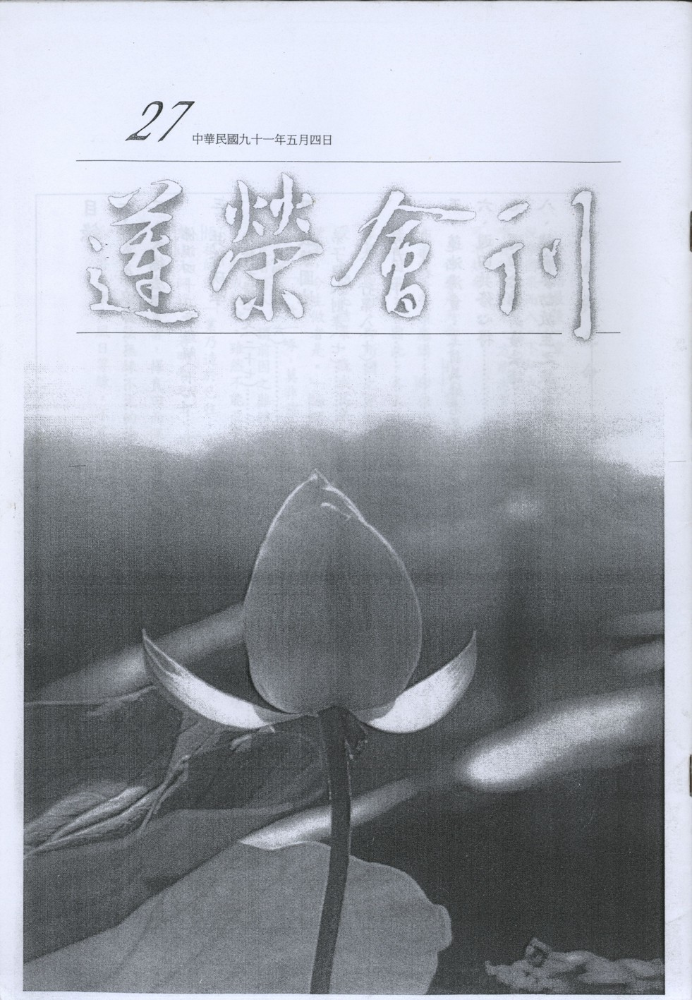

# 第27期

## 社論

### 知命與立命

心行

論語最後一章，孔子說：「不知命，無以為君子也。」雪公老師說：「學儒從學天命而入，學佛從學因果而入。不知天命，不能守道不移。不知因果，不能勤修戒定慧三無漏學。尤其修淨土法門，唯有深信因果，方能老實念佛。」知命為學儒之入門及成就君子之德的條件，有志於學為君子者不可不知命。

什麼是天命？孔子說：「君子有三畏，畏天命，畏大人，畏侮聖人之言。」（論語季氏）。天命，古注當善惡報應講。印祖說：「命者何，即前生所作之果報也。」憨山大師說：「孔聖之安命，即吾佛之因果。」因此，各人的命乃各人所造，不是由天或其他人所賦予，今世之命乃過去所造的善惡業種起現行，即所謂之定業，定業係因緣具備已成熟者，既孰不能再使生，所以不可轉變，必須承受，如開花結果，既成花果，不能再使轉變成秧與芽。故偈云：「欲知前世因，今生受者是，欲知來世果，今生做者是。」論語顏淵篇記載：「死生有命，富貴在天。」俗云：「萬般皆有命，半點不由人。」，「一飲一啄，莫非前定。」均指既成的天命，不是世人所能改變，故印祖說：「前因俗所謂天。天定者勝人，謂前因之難轉也。」

既成的命，雖然不能改變，但未來的命為現在所造，是好是壞，自己可以把握，可以轉變。徹悟祖師說：「業乃造於已往，此則無可奈何。所幸而發心與否，其機在我，造業轉業，不由別人。」憨山大師說：「若明智之士，的信因果報應，不必計其前之得失，但稱今生現前所有，以種未來之福田。如世之農者，擇良田而深耕易耨，播種及時，則秋成所獲，一以什百計。為何命運可以轉變？首先，根據萬法無緣不生的原理，以前所造的業因，不遇「緣」則無從結果，如一粒瓜種，雖能結瓜，若無水土風日等緣，不能突然結瓜。太虛大師說：「雖佛亦不能超越及改變於因果律，然若了知於因果律，則能創造善，和集善緣，生於善果。因不值緣，終不生果，故因亦非必能生果。或遠其助緣，或別造強因，皆可使此因之果暫不生起或終不生起。」雪公老師曾以念佛說明定業可轉，他說，心能造業，心能轉業，造業是心，念佛亦是心，造業有業力，念佛豈能無佛力，若前迷而造業，後覺而念佛，且不造新殃，是斷惡緣，前業無緣而不起，後佛有力而續發，前業時久，或斷或伏，即是轉爾，但須前業未熟，提早念佛，若待業果已熟，則念佛恐嫌遲矣。其次，經上說萬法皆空，宇宙無法，皆是因緣所生，並無自性。萬法性空故可轉變，天命無自性，因此可改變。第三，業隨心造，業隨心轉，故天命可轉變。雪公老師說：「萬法無常，皆是生滅，心能造之，心能轉之，造造轉轉，安有一定，實則定時，可使之轉，轉時又能使之定。」徹悟祖師云：「一切現前境界，一切當來果報，皆唯業所感，唯心所現。唯業所感，故前境來報，皆有一定，以業能縛心故。唯心所現故，前境來報，皆無一定，以心能轉業故。若人正當業能縛心，前境來報一定之時，而忽發廣大心，修真實行，心與佛合，心與道合，則心能轉業，前境來報，定而不定。又心能轉業，前境來報不定之時而大心忽退，實行有虧，則業能縛心，即前境來報，不定而定。」綜合以上三點理由可知命運是不定的，是可以改變的，故書經云：「天難諶，命靡常。」、「惟命不于常」；雲谷禪師說：「易為君子謀，趨吉避凶，若言天命有常，吉何可趨，凶何可避。」又說：「但惟凡人有數，極善之人，數固拘他不定，極惡之人，數亦拘他不定。」印祖說：「人生世間，壽夭窮通，皆有一定，皆無一定。其一定者，儒者謂之命。……所謂天命者，即佛所謂果報也。佛以此身為報身。報前生所作善惡之因，故感今生所得壽夭窮通之果也，此其有定者。其不定者，或勵志修持，積德累功，希聖希賢。與任意放縱，蕩檢踰閑，自暴自棄者。乃由今生所作善惡力強。轉前生之業報，或增勝與增劣耳。即所謂天定者勝人，而人定亦能勝天也。詩曰，永言配命，自求多福。書曰，作善降之百祥，作不善降之百殃。易曰，積善之家，必有餘慶，積不善之家，必有餘殃。禮曰，故大德必得其祿，必得其位，必得其名，必得其壽，皆約現生修持所感而言也。以是知命自我主，福自我求。壽富康寧之權，操之在我。」綜合以上經文及祖師開示可以得知，天命即因果，有自作自受，通於三世，有命定與不定，以及作善作惡為改變命運之關鍵等特點，明朝袁了凡先生一生改變命運的過程及結果，即是一個著名的例證。

了解天命的意理對吾人生活與修道有何好處呢？首先，知命的人，必定會斷惡修善，因為真知天命，即知萬事皆有因果，作善得樂，作惡得苦，所以一方面不敢造惡業，免受苦果；一方面也肯行善積德，以得樂果及成就君子之德。在待人方面，徹悟祖師說：「因果者，感應也。我以惡心感之，人亦以惡心應，我以善心感之，人亦以善心應。」而天命即因果，因此知命的人，也會以恕道待人，以免與他人結惡緣，造惡受苦，進而廣結善緣。所以孔子說君子畏天命，佛經云：「菩薩畏因，眾生畏果。」印祖解釋謂：「菩薩恐招惡果，預先斷除惡因，由是罪障消滅，功德圓滿，直至成佛而後已。眾生常作惡因，欲免惡果，譬如當日避影，徒勞奔馳。」其次，知命的人，知道命自我立，福自我求，因此不會求人求天，也不會求神問卜，因為彼等均不會也無能力賜福。遇到逆境時，也不會怨天尤人，而知反求諸己，逆來順受，保持心氣和平，向學賢學聖的大道上邁進而不憂不懼，例如孔子在周遊列國時，遭遇不少危難，但都因為知命而無所懼。司馬桓魋欲害孔子，孔子說：「天生德於予，桓魋其如予何。」注解謂，聖人處變，知道自有其德而無憂。

第三，知命的人較無得失之心，固為窮通得喪，皆由前定，故得之而不喜不驕，失之亦不憂不慍。第四，懂得天命的人，知道天命無常，因此處於富貴，能以所享財富與地位修善積德而不會驕奢淫逸；處於貧賤則能安分守己，不敢胡作非為，是故印祖云：「人之處世，一一須按當人本分，不可於分外妄生計慮，所謂君子思不出其位，又曰君子素其位而行。」最後，知命的人才能守道不移。因為天命即因果，真知命的人，必會諸惡莫作，眾善奉行，其次，道即天爵，是永久存在與不變的，道也是人爵之因與安樂之源，反之，富貴功名等是無常的，且屬命定，不可求而得之。所以知命的人才能順性而修，守道不移，以斷除惑業，開發本性德能，故徹悟祖師云：「深信因果者，終必大明乎心性。」例如孔子自謂：「富而可求也，雖執鞭之士，吾亦為之；如不可求，從吾所好。」（論語述而）孔子所好者即「道」也。「飯疏食飲水，曲肱而枕之，樂亦在其中矣。不義而富且貴，於我如浮雲。」（論語述而）總之，能夠知命、安命、畏天命的君子，必能樂天知命，上不怨天，下不尤人，素位而行，隨遇而安，無往而不自在逍遙也。

個人的壽夭窮通有天命，國家的禍福興衰也有天命。語云：「凡夫任命，智者造命。」了解天命的意理及知命的利益之後，在現今的患難世道，吾人應在何處立一己之命與人群之命呢？古聖先賢教導吾人，第一：立志斷惡修善，積功累德，孟子說：「殀壽不貳，修身以俟之，所以立命也。」（孟子盡心）又說：「修其天爵而人爵從之。」（孟子告子）官位是人爵，無常；道德仁義是天爵，永久。天爵是因，人爵是果。雪公老師說：「為一切乃先修天爵，人爵隨之，若人爵不隨，此乃天命，人不知而不慍，不亦君子乎？當修天爵以待之。又天爵乃至高無上，人爵乃自己不要，此須蓋棺論定矣。」例如孔子及顏回修天爵而人爵不隨，印祖說：「孔子不遇賢君，不能令天下治安，乃天下群黎之業力所感，於孔子何干，顏淵之夭義，亦若此。」復次，雪公老師說，世人行善，自得福報，然享福則減善因，福盡而善亦盡。此即若器漏水，隨貯隨漏，是名有漏善。佛法行善，不求福報，可為無漏。修善所得福報，積而不享，其福無盡，如貯水無漏之器，可以常存，並以之去除修道及往生之障礙，及作為助行菩薩道之資糧，是謂福慧雙修，化有漏為無漏。故為求道而行善，則能去垢明心，為求福報而行善，其心益染五欲六塵。心染欲塵，愈墮生死。心去塵垢，即脫輪迴，得漏盡通。上述開示，吾人應緊記在心，作為斷惡修善的指導原則，否則修善所得福報，必將成為有漏之三世佛怨。

第二，立志修道：道就是本性，生佛同具，眾生本性具足一切智慧德能，能夠成就萬事，利益眾生。道也是齊家治國平天下的根本與長久安樂的根源。故孔子云：「朝聞道，夕死可矣。」（論語里仁），中庸云：「道也者，不可須臾離也，可離非道也。」因此吾人應立志修道，開發本性智慧德能，使自己成為有道之人，也發心幫助別人成為有道之人。雪公老師云：「發菩提心與志於道是一個意思」、「諸位應當志於道，心中先立起志向，心安在道上，若心不在道上，學佛不會有結果。」立志修道後，孔子教導我們應當專心求道，不要顧慮自己的生活問題。孔子云：「君子謀道不謀食。」（論語衛靈公）。注解謂，既是君子，就應當謀道，不必分心謀食。求道的最終目的即在成為聖人，在未成聖人之前，只要求得一部分，就是有道之人，即能齊家治國平天下。道是齊家治國平天下的根本，無道則家不齊，國不治，天下大亂。所以君子必須求道。然而求道必須專心，不要害怕自己貧得沒有飯吃，因為一飲一啄，莫非前定，一切皆是個人福報。例如顏回，簞食瓢飲，不改其樂，所以君子謀道，不須謀食。雪公老師說：「人都患得患失。功名、利祿，都能失掉，唯有道，永久不會失去，所以像孔子、孟子上等的人，心在道上，心就安樂。所以論語上說：『君子坦蕩蕩』，因為沒有什麼東西會失去的緣故。又說：『仁者，不憂不懼』，心中坦坦蕩蕩，當生無可憂慮，當時光明，心廣體胖，不用吃維他命。」

第三，立志傳承發揚中華文化：雪公老師說，民族的延續生存，主要是文化，我們民族的文化，就是儒佛兩大學派的揉合風俗。我們護民族，就應護民族文化。因此想要維護民族文化，首須隱居求志，發心學習與傳揚中華文化，尤其在今日中華文化漸趨式微之際，更應負起傳道的責任，雪公老師說：「你們都是失學的一代，要更用心好好的學，並且要發心教導下一代，否則他們更可憐，中國文化一點也銜接不上。」

傳揚中華文化必須不畏艱難，矢志不移，孔子周遊列國時，經過匡地，遭匡人圍禁五天，情況險惡，孔子自謂承擔傳遞中華文化的責任，安慰弟子說：「天之未喪斯文也，匡人其如予何。」孔子深知天命不喪斯文，所以遇到任何艱難不為所阻。注解謂，匡人何能勝天？所以聖人終於化險為夷。孔子除了畏於匡，還有在陳糧，微服過宋等災難，但都轉危為安。學中華文化，有志於為文化的傳遞者，遇見惡劣的環境時，當學孔子的精神，深信天不喪斯文，以道自任，環境自然隨之改變。

第四，立志一心念佛，求生淨土：發菩提心，老實念佛，往生西方，成就佛果，是吾人究竟安身立命之處，也是所有志向的指歸處，雪公老師說，生死岸邊，念佛第一，是常久安樂之道，西方極樂世界是真正福地，是安穩家園。徹悟祖師說：「真為生死，發菩提心，是學道通途，以深信願，持佛名號，為淨土正宗。」。印祖說：「念佛一法，超過一切，或薦亡，或祈親壽，並一切所求，皆可如願。但以求生西方為主。」、「舉凡禮拜、讀誦大乘經典，及作一切於世於人有益之事，悉皆以此回向西方。不可唯以念佛回向西方，其餘功德，另去回向世間福報，則念不歸一，便難往生。須知，真能念佛，不求世間福報，而自得世間福報（如長壽無病，家門清泰，子孫發達，諸緣如意，萬事吉祥等）。若求世間福報，不肯回向往生，則所得世間福報，反而下劣；而心不專一，往生便難決定矣！」又說：「現在是一個大患難世道，災禍之來，無法可設。若能常念佛及觀音，決定蒙佛慈庇，逢凶化吉，即無災難，亦得業消智朗，障盡福崇。」因此，吾人應在業果未熟之前，發大菩提心，力行善事，一心念佛，並勸家人及有緣之人念佛，以轉個人別業及眾生共業。

在發心立命之後，必須力行，否則不得實益。雪公老師說：「有願，空發心，也沒用處。心裏有，嘴裏說，不做，則一點用處也沒有，說了就得做。」在修學過程中再加上以恭敬至誠之心祈求三寶加被，因為三寶有大威神力，所謂正願必滿，如果所求合理合法，則必蒙三寶加被。印祖說：「先盡人事，後聽天命。人謀不及處，以三寶之威神是託，則冥冥中自有不思議之轉旋矣。」又說：「凡修行人，必要心地好，心地好，再加以恭敬至誠，斷無不靈者。心地不好，又不恭敬，既無有感，何能得應？此事理所必然者。」

地藏經云：「業力甚大，能敵須彌，能深巨海，能障聖道。」因此能夠聽聞正法，如法發願立命以及力行而改變命運的人，並不多見。印祖說：「天定者勝人，人定者勝天。實則世人所得之苦樂吉凶，多半屬人所造，有幾人一本於命乎。大約作惡而不能如命者多，修善而反更勝命者少。是二者，皆人定勝天者。」吾人應以此警惕，在業力未成熟現行之前，及時發大心，修大行，做一個孟子所說：「富貴不能淫，貧賤不能移，威武不能屈」及「至死不變，強哉矯」的大丈夫。

雪公老師說：「幹任何事，必得叫它有成果，不幹無意義之事。」印祖云，修持在我，命自我立。果能常存敬畏，發菩提心，改惡修善，一心念佛、及念觀音，自行化他，求生西方，則無業不消，無福不臻，尚復能了生脫死，超凡入聖，此人定勝天之大義也。吾人苟能依教奉行兢業修持，願力及轉業力量勝過業力，則可變更果報或者減其成分，得到消災免難，趨吉避凶，改變命運或重報輕受，以及往生西方的結果。

## 大德法語

### 佛說四十二章經解（十九）

*道源老和尚講授*

第十一章

「佛言。飯惡人百。不如飯一善人。飯善人千。不如飯一持五戒者。飯五戒者萬。不如飯一須陀洹。飯百萬須陀洹。不如飯一斯陀含。飯千萬斯陀含。不如飯一阿那含。飯一億阿那含。不如飯一阿羅漢。飯十億阿羅漢。不如飯一辟支佛。飯百億辟支佛。不如飯一三世諸佛。飯千億三世諸佛。不如飯一無念無住無修無證之者。」

上章云，睹人施道是看見人行布施道，內心隨喜，得福甚大。然布施有財布施、法布施、無畏布施，此處講的是財布施。財布施有上施、下施，對我們之上的人行布施叫「上施」，對我們之下的人行布施叫「下施」。依佛門的說法：上施就叫供養，下施就叫結緣，這比較好分辨。此章何以釋迦佛開示我們要去供養，去結緣？是要我們種福田的。然先著重發心，其次要分別福田。這四十二章經講的是分別福田，就是種福種在田裡，而福田有多種不同，種不好的田，生的福很少，種的田好，得福很多。

此章較量福田的不同，一共有九番的比較，就是有九種福田的不同。經文：「佛言：飯惡人百，不如飯一善人」，這個「飯」字當動詞念「反」，當名詞念「泛」，現在考校注音的人少，念「泛」也可以。本章此種財布施，謂之「打齋」，平常叫打齋供眾。要是你打齋供養佛菩薩，則福報大。這地方說要是惡人，我們應該跟他結緣；但是你供養惡人，他的田地太不好了，你得的福很少。要是供養善人，他田地好一點，得的福多。以上三番的比較，都是供養凡夫。第一供養世間的惡人，你供養惡人一百個，不如供養一個善人，但你供養善人一千個，不如供養一個持五戒的居士。這三種較量都是凡夫，我們不應該說供養，應該說結緣，打齋結緣。

前面三種比較都是凡夫，就是我們打齋跟他結緣。下面的比較都是上施，也就是供養聖人，聖人也有不同，吾人所供得的福報也有不同。「飯五戒者萬，不如飯一須陀洹。」你結緣持五戒者一萬個人，不如飯一須陀洹。須陀洹是初果的聖人，翻成中國話叫「入流」，他已預入聖人之流了。但「飯百萬須陀洹，不如飯一斯陀含。」不如供養一個二果聖人，二果聖人就是斯陀含，又叫「一來果」，一來天上，一來人間就超出欲界了，飯千萬斯陀含，不如飯一阿那含，阿那含中國話叫「不還果」，飯一億阿那含（一億是萬萬），不如飯一阿羅漢。阿羅漢是聲聞乘的最高果位，即第四果，翻成「無生」就是他不在三界受生死。

「飯十億阿羅漢，不如飯一辟支佛。」辟支佛翻成中國話叫緣覺，他觀飛花落葉了知世事無常，體性空寂，證得涅槃出離三界，叫緣覺。「飯百億辟支佛，不如飯一三世諸佛。」這個果是最高的果位了，你飯百億辟支佛，不如供養一個三世諸佛（三世是過去世、現在世、未來世）。只要是一個佛，你供養他，就超過百億辟支佛的功德。

「飯千億三世諸佛，不如飯一無念、無住、無修、無證之者。」前邊有八番的比較，最後再加上一個第九番的比較，若供養千億三世諸佛，不如供養一個無念、無住、無修、無證之者。布施以六塵境界為所布施，能施的心是無念、無住，就是內心無念(無能念所念之念，是指現證空性)，心外無境(出定時如實了知，心外無真實之境可住)，無修無證之者，他是稱性起修，修即無修，全修作證，證無別證，叫無念、無住、無修、無證之者。以上是消文。

我們學佛知道佛果是最高無上的，如何又來一個無念、無住、無修、無證之者？這是個什麼人呢？不解釋會有誤會，要解釋這個道理，就要研究教義。佛有三身：法身、報身、化身。法身沒有相，報身有相，化身有相。報身是翻譯成盧舍那佛，毘盧遮那佛譯成法身，法身（即所緣真理）無相，報身佛有相，乃為登地菩薩示現的殊勝，菩薩修了無量的願行，而得了這個功德之報，叫報身。按梵網經說法，我們住的世界的總名叫華藏世界。教化華藏世界的佛稱作報身佛。這華藏世界就像一朵大蓮花，外面有一千個蓮花葉（蓮花瓣）。

此華藏世界形似蓮花，教化一個華藏世界的報身佛稱盧舍那佛。這蓮花有一千個蓮花瓣（蓮花葉），一片蓮花葉，就是一個三千大千世界。每一個三千大千世界有一個釋迦佛來教化，報身佛（盧舍那佛）變化出一千尊釋迦牟尼佛。

一千尊釋迦牟尼佛，每一尊釋迦佛教化一個三千大千世界，而一個三千大千世界，有一百億個小世界。每一個小世界又有一尊釋迦佛，每一尊教化三千大千世界的釋迦佛再變一百億尊釋迦佛，此化身稱作應化身。教化一個三千大千世界的釋迦佛是勝應身，是殊勝的應化身，教化一個小世界叫劣應身，勝應身稱大化身佛，劣應身稱小化身佛。

我們念釋迦佛的聖號，是千百億化身釋迦牟尼佛，什麼是千百億呢？就是由報身佛先變化出來一千尊大化身佛，由一千尊大化身佛，每一尊再變化出來一百億小化身佛，叫千百億化身釋迦牟尼佛。

經上所指的三世諸佛是指小化身佛講的，因小化身佛是小乘教的佛，比辟支佛高一級，若以圓教菩薩而論，十行還未圓滿，此小化身是九信菩薩。而無念、無住、無修、無證之者是什麼人？是圓教的初住以上的菩薩，稱作發心住。菩薩分藏、通、別、圓四種行相。圓教的菩薩，證到初住以後，分身百界作佛，分化自己的身在一百億三千大千世界做佛。

千億三世諸佛，是有千個三千世界，而每一個三千大千世界又有一百億的世界，圓教初住的菩薩能在百億世界，就超過了三世諸佛百億倍。所以不如換一個無念、無住、無修、無證之者。

這是要研究教理才能知道，在我們中國大乘的八個宗派，都有判佛說的教法，何以要判教？乃因佛經很多，有的經談有，有的經談空，有的說不有不空，有的說亦有亦空，且談空有的深淺亦有種種不同，這些道理很難分辨。過去有大祖師如隋朝天台宗智者大師，他把一切佛經都研究、整理，分藏、通、別、圓四個教。藏教就是小乘教。通教是初步的大乘，通於小乘，通於大乘。小乘教等於現在的小學，通教等於初中，通於小乘，通於大乘。其次是別教，別為菩薩所立，等於高中。再上去就是圓教，等於大學。到了唐朝賢首國師，因這個時候頓教禪宗大興，他把頓教禪宗收到教典裡面去，就是分五個教：小、始、終、頓、圓。第一小教；第二始教，始是開始的始，大乘佛門；第三終教，大乘的道理講到究竟之處；第四頓教，叫做頓教禪宗；第五圓教。那麼，賢首的五教跟天台的四教一樣。天台四教，藏教就是小教，通教就是始教，別教就是終教，天台圓教與賢首五教中的圓教一樣，就是少了一個頓教，因為天台智者大師屬於隋朝人，那時頓教禪宗還沒有，頓教禪宗是由六祖大師才興起的，在唐朝興起來，所以這個四教跟五教一樣。

懂得這個教義了，三世諸佛的佛就是小乘教的佛，這無念、無住、無修、無證之者的菩薩，是圓教的菩薩，圓教的菩薩是初住以上的菩薩。小乘教的佛果位若比圓教，未到圓教十信滿心，與第九信的菩薩相齊。十信修圓滿才能有初住位。所以這無念、無住、無修、無證之者的菩薩超過了三世諸佛，超過了這小乘教的佛。

希望諸位研究教義，我介紹兩部書，一部是天台四教儀集註；一部是賢首五教儀開蒙正註。看教義，不看註解不行。本章種福田有九番的比較，得福不同。而地藏經上說，你要是布施一個貧窮下賤的人或者六根不具的人，得福比供養百恒河沙佛的福德還大，那怎麼講呢？

這個四十二章經上講的是心外的福田，這個田地不同，與地藏經上講的發心不同，你發心要是發平等心，得福報比供養佛還大。這地藏經上說，你是個富貴人，或是國王，或者是大臣，你要來行布施，布施貧窮下賤的人，或六根不具的人，布施給他們吃飯，還要軟言美語，說盡安慰他們的話，這個國王大臣是社會上最高的人，這個地位的人他能發這樣最平等的心，來供養社會最下賤的人，他的心發的最大，供養一個貧窮下賤、六根不具的人得的福，等於供養一百恒河沙諸佛的功德。（下期待續）

## 共修研學

### 勸發菩提心文（二十七）

*心爾整理*

我們要如何念報眾生恩？

「彼其號呼於地獄之下，宛轉於餓鬼之中，苦痛誰知，饑虛安訴？」

饑虛特別指餓鬼，苦痛特別指地獄，地獄有火燒的苦，有寒冰之苦，還有種種刑具逼迫眾人的苦……。餓鬼之苦，是刀杖苦與飢餓苦，特別是飢餓苦，何以鬼會有飢餓之苦？乃因彼之飲食有三障，分別為內障、外障、自有障，內障行相喉嚨似針，肚子如大海，如何吃得下東西，此即飲食的內障；外障行相就是要去找東西吃的時候，有鬼卒在保管、守護這些物品，沒有辦法靠近食物，而飢腸轆轆，真是苦不可言；飲食的自有障行相是要吃東西時的一剎那，由喉中出火把食物燒掉，焰口鬼即是如此，放焰口就是開他的咽喉，除掉飲食的自有障，不是屬於內的器官問題，也不是屬於外緣問題，而是碰到食物就一把火燒掉，或是將食物變成臭穢不堪而難下嚥，此即飲食的自有障，換句話說要吃飯卻有障礙。

此處云念報眾生恩當中，為何要明其苦難求救呢？因為當說出眾生於三途中苦難求救時，最能夠引發我們想要救拔他的心！故談到放生、寺廟中蒙山施食等等，莫不是站在苦難求助的立場中將吾人的悲憫心引發。

記得以前去看一些病人，有得極為虛弱，吃不下任何東西，有的病苦呻吟似牛叫，陀羅尼被往嘴巴上咬，如牛吃草，他兒子見之不忍，將陀羅尼被抽出來，唉！前生的習氣都會在臨終表現，也有見過生前愛打牌，有著打牌的習氣，臨終時拚命打牌，牌局打了三天，猶不瞑目，外人看了很辛苦，但他一樣在打牌。有的蓮友功夫很好的，平常以念珠念佛成了習慣，臨終時將棉被上緣當成念珠數著念佛。

每個人的習氣都會在臨命中時有所表現，業或者重，或者是近，或者串習，生前串習得多，臨命終可以表現這個力量，如果是念佛的習氣，就容易往生西方，菩提心也要串習得多，臨命終可以表現這個力量，助成念佛的習氣，而往生西方。業之成熟分為重、近、串習、隨先所作，假如業重在菩提心，往生西方的力量很強，重就是心思都用在菩提心的引發，近就是往生之前，來引導他的都是助成他往生，而他也生極強的歡喜心，雖然平時或許不是很用功，善知識來開示勸他發菩提心，蓮友來開示也是勸他發菩提心，好好念佛求生西方，親友、家族、朋友們都勸他趕快去極樂世界，乘願再來，他亦生起歡喜心，隨大眾佛號往生西方，此為近業。

串習就是平常練習很多，看的書都是這一類的，平常也常常串習引發菩提心，雖然用的力量強，然最後那一念要斷氣的時候還是念佛走掉，或者是以上三種都沒有，最後臨終因得蓮友助念與開示，先生起佛念，就隨佛往生。

然以上四種要用在淨業有其相當困難，吾人平常重點在五欲六塵（業重），當快死的時候，親友們在那邊哭哭啼啼，東摸西摸，然後準備後事（業近），平常串習的部分菩提心是少之又少，世間的無益書讀得又多又熟，自然在臨命終時沒有蓮友護持，自己也沒有念佛，糊裏糊塗的死掉，這種修行人真不少。所以生涯規劃很重要，未來的路，應該現前好好想一想。

「我雖不見不聞，彼必求拯求濟。」

沒有天眼所以不見，沒有天耳所以不聞，有時不見不聞有兩種情況，一種是麻木不仁，明明見了，他卻沒感受，此即見如不見，見而沒有覺受；聞沒有覺受，所以是聞而不聞。如上課不注意聽，心思很多，上完了都不知所云，言之者諄諄，聽之者藐藐，就是聽而不聞，這種人很多，上課似很注意聽，但下課一題也不會，古人云：身在曹營心在漢，謂之心粗眼翳，不見不聞。第二種的不見不聞乃沒有天眼、天耳。

「彼必求拯求濟」，一般人在危難的時候，一定喊我的媽！老天爺！或呼叫一些親人，問題是我做過他的親人，我卻無關痛癢，他一定是哀嚎慘叫，一定是求救的，可是我卻或不見或不聞，沒有天眼的不見不聞還好，最麻煩的是見聞等於不見不聞，從佛經或從善知識所聞都沒有覺受。所以

「非經不能陳此事，非佛不能道此言，彼邪見人，何足以知此？是故菩薩觀於螻蟻，皆是過去父母，未來諸佛，常思利益，念報其恩，是為發菩提心第五因緣。」

聽信佛言從佛經上面得知此事，佛告訴我們眾生的苦相，假如我們能深入佛經的意涵，從中觀修，便能夠練習惻隱之心，久而久之，他們的苦痛、他們的求救都能夠能見能聞。（下期待續）

### 小止觀導覽（六）

*蓮心整理*

經文：

當知此之二法，如車之雙輪，鳥之兩翼；若偏修習，即墮邪倒。

大意：

旨在說明止觀二法偏修之弊。

導覽：

一、止觀的前方便為出離心及菩提心的引發，此為方便止觀，依著出離心及菩提心以空性為所修，觀修空性法時，現證空性時方為真實止觀。

二、止觀二法應相輔相成，觀未建立於止上，均僅為正見的力量，名為方便觀，止若無觀的建立，止永遠是世間止，如有止而無觀，亦為世間止，無法建立出世間的快樂，即如鳥僅單翼，如何展翅高飛？故須止觀雙運，定慧均等，建立正見，引發修止，入於止中，住於止中，將正見的力量提起，從新對所緣的境界如實的觀察，以建立勝觀，此之謂止觀雙運。吾等在因地修學時應掌握止觀的內涵，用止觀法直接探究大乘，以免落於世間的輪迴，或落於二乘的解脫，方可得到大乘的佛果。

經文：

故經云：「若偏修禪定福德，不學智慧，名之曰愚。偏學智慧，不修禪定福德，名之曰狂。」狂愚之過，雖小不同；邪見輪轉，蓋無差別。若不均等，此則行乖圓備，何能疾登極果？！

大意：

引經證明止觀二法偏修之過，以引發止觀雙運的善法欲。

導覽：

一、「愚」係指行者於止觀修學前，未研究經教，於解門上引發正知正見，因此在止上無從建立勝觀，故縱然深山石洞修定，僅為枯定，而墮坑落塹，無法出離三界。

二、「狂」係指行者雖在空性上有所認知，但不知空義的建立是從親近善知識、思惟因果、斷惡修善、利益有情眾生等增上而來，而偏解空義為不執著，致流於斷滅見，未從世間的禪定引發出離心、悲憫心，好好體會空性，發展空性、運用空性，將利益眾生離苦得樂的觀念建立於空性上，進而求生淨土，修集福智資糧，成就殊勝果位，方可乘願再來，幫助眾生，破迷啟悟，離苦得樂，否則即謂之「狂」。

三、狂愚係指行持偏失、不圓滿，故無法得到殊勝之果報，失於愚為福多慧少，失於狂為慧多福少，要之定慧均等、止觀雙運，方為眾德圓滿之道。

四、疾速得果包含兩種，一為世間的樂果，一為出世間的樂果，前者為方便止觀，後者為真實止觀，惟有止觀雙運、定慧均等，方能破見思惑、塵沙惑、無明惑，成就一切智、道種智、一切種智，開顯三德秘藏，故三乘世、出世間一切功德，皆止觀之果也。（下期待續）

## 專題研學

### 十大礙行（十）第八條

*心筑整理*

「施德不求望報，德望報則意有所圖，意有圖必華名欲揚，明德無性照德非常德亦非實，以施德為棄屣。」

以上是十大礙行第八條的經文。

之前我們已經將人生當中會遇到的十種障礙，以無常的角度告訴大家，要珍惜自己所擁有的一切，在遇到病苦、逆境考驗或者是挫折時，做每一件事情應有的心態與作法，甚至是在面對複雜的人際關係時，所應該抱持的原則和態度。接著這一次要來談談，當我們有能力幫助別人的時候，會遇到怎樣的障礙，而我們又該如何面對呢？

「施德不求望報」，「施」就是給予的意思，也就是佛家所說的布施，「德」是一種能力，在此處可以說是一種幫助別人的能力，整句話的意思即是說，當我們幫助別人的時候，站在為他著想的立場，一心一意地只希望盡可能地幫助他，而不是希望人家感激我。「德」可以分為陰德與陽德兩種，陰德與陽德是以幫助他人時別人知道與否來加以分別，當然為善不欲人知，做好事不是要做給別人看的，當然陰德比起陽德而言，有更多的功德在其中！

「布施」共分為三種，有所謂的「財施」、「法施」以及「無畏施」，布施種種物品、錢財（外財）或者是頭目腦髓(內財)都是財施範疇；法施指的是將美好的概念、想法與心得與人分享，乃至於站在佛家的觀點，以言語善巧方便度化眾生，以及研讀經文當中的意涵，向大眾說明等等都算是法施；無畏施即是令眾生無所畏懼的意思，具體而言像是放生的法行，幫助眾生解決命難的痛苦，令其免於刀口下的迫害，以及用種種方法幫助別人，使其遠離痛苦，都算是無畏施。這三種布施是佛菩薩為救度眾生，首先先和眾生結善緣時所用的法行。

在我們的日常生活中，不論是在家裡、學校或者是走在路上，都有許多機會可以學習布施，布施自己的身語意，常做好事、說好話、存好心等，都是簡單容易又美好的布施。諸如父母親回到家裡，我們可以幫父母拿拖鞋、端熱水以及拿毛巾等等，甚至是用心去觀察父母師長的心意，把自己該做的事情一一地做好，在學校也是如此用心地過生活，不管是物質上或者是心靈上，幫助需要幫助的人。

「德望報則意有所圖，意有圖必華名欲揚」，「德望報」，這裡的「德」指的是布施這樣的行為，整句話的意思就是希望人家感謝我，「圖」就是追求的意思，「意有所圖」就是動機不清淨，雖然幫助別人心裡面卻想要得到些什麼，「華名」就是好名聲，或者是他人的讚美，「華名欲揚」指的是，想借幫助他人的事蹟來發揚自己美好的名聲，心中存著：我做了好事情、我幫助了某某人、我真是厲害可以把這件事情辦得那麼好……等等，如果幫助別人而人家不感激我，就生氣、難過，這些不好的心態都有可能在幫助別人的時候產生，這是我們要警惕的，祖師大德常常說，「名利如利劍，可以斬人頭」，如果作種種的善法，心中充滿了求名求利的心，就能將修道人的根器全都斬斷。

「明德無性照德非常德亦非實」，這句話承接著前文，讓我們來想一想，到底是行布施業的我們要感激受幫助的他，還是他要感激我的幫助呢？「性、常、實」有不改變及實在的意思，我們要瞭解布施這樣的行為，並不是單方面就可以成就的，必須是他人一時的需要，以及我們剛好有能力幫助他們，所以才能夠成就這樣好的布施行為。舉個例子來說，當我們坐公車，坐在位子上面，剛好有一位老人家上車，老人家年紀大了站不住，所以需要座位坐下來，此時我們將位子讓給老人家坐，成就了小小的布施法行，我們來分析分析這件事情，我們是不是可以常常讓位給需要幫助的人？不行，如果我們站著，就沒辦法讓位給需要座位的人，如果我剛好受傷需要座位，也沒辦法讓座，如果上車的人是身體健康不需要座位的人，如果我們和老人家根本就是坐在不同的公車上……，太多的「如果」讓我們無法成就布施這樣的善行，所以說，所有布施的法行，都是因緣湊合，沒有他一時的需要和我剛好有這樣的能力，就成就不了這樣的法行，所以我們要感謝這些讓我們作善法的機會，感謝成就我們布施度的眾生，沒有他一時的需要，我們也沒辦法恰到好處地給予他所需要的一切。換句話說，要把握每一個能夠幫助別人的機會，因為「時不可失，機不再來」，不是每次想要幫助別人時都有機會做到的，時機一旦錯過，那真的就是錯過了！

最後一句「以施德為棄屣」，「棄屣」是破鞋子的意思，為何要將布施這樣的行為像破鞋子一樣丟掉呢？這句話的意思是指做善法的時候，會有種種不好的心態產生，再舉一個例子，好比我上學的時候，穿了一件外套，到了學校覺得不需要穿它，而把外套放在一旁，剛好有同學穿得太少，故我把外套借給同學穿，我們通常腦子裡會想著「是我！我把外套借給你穿的」、「這件外套！這件外套是我借給你的」、「是你！是你向我借外套穿的」、「等一下大家知道我把外套借給同學穿，一定會大大誇獎我一番」、「我真是太好心、太慷慨了！」，腦子裡面都繞著我的好心布施、我的外套、你虧欠我、別人誇獎我而打轉，妙叶大師說要將這些想法像破鞋子一樣丟掉，相反地心裡面要時時存著感激與珍惜，努力地做種種利益大眾的事情，這就是祖師「施德不求望報」的意涵，希望大家都能珍惜每一次作善法的機會，不論是來念佛、學習種種美好殊勝的概念，都能用這得來不易的心態，並且將這樣美好的概念傳達給周遭的人，圓滿自己的布施度。（未完待續）

## 共修法語

### 週四念佛共修法語

心晴

我們來蓮榮一起共修可以做如是思維：想想這是人生非常暇滿的果報，而且聽聞到佛法，又有自己的時間，能在佛法上用功。如果我們這一生沒有好好把握這個機會努力修學、累積資糧往生西方極樂世界的話，可以想像的是我們將會在惡趣中受種種的痛苦。為此之故，我們必須要在還能作主的時候，好好修學，而且將心比心，發起非常殊勝的菩提心，因為一切眾生跟我們一樣，都希望離苦得樂，而最大的快樂莫過於佛果的成就。所以要發起饒益一切有情的心，要怎麼饒益呢？就是一定要把握今生能夠往生西方極樂世界，在這一生裡修學證得佛果，再回到娑婆廣度眾生。所以一定要發起無上的菩提心｜為利一切有情願成佛，來修學種種的佛法。也因此之故，我們來到蓮榮一起共修念佛、研討法語，就成為非常殊勝難得的法行，而這種心念要常常提起。

上次說過無常觀是非常重要的，最重要的無常是「念死無常」。何謂念死無常？就是把每一天當成一生的最後一天，把這一天當成一生來過。把一輩子的修行，集中在這一天來修行，這樣，我們的心念裡頭，就會非常珍惜、把握這一天的時光，用僅有的一天來作唯一的修行，這樣就不會在罪業當中空過時間。如果提起這種無常的心念，知道暇滿的難得，知道佛法的可貴，在行住坐臥之中只要善用我們的心念，則穿衣吃飯無非都是修行，每天如此，每個月也是如此，每年也是這樣過，則臨命終時因每天都具足了佛法最主要的內涵，而必定往生，這是非常要緊的。所以真正對佛法有信心的話，就可以把我們生活的各個層面、所有的經驗都融合在一起，把它變成一個很有意義的修行。

今天就來談一談我們每天除了早晚課修行之外，日常生活還要如何來用功夫？我們就從生活最基礎的打掃住處來談起，像在座的各位菩薩，大多是家庭主婦，或者一輩子為兒女辛勞，回首過去會覺得辛苦了一輩子，但是如果善用心念，在這灑掃做家事當中都可以累積無量的福報。就好像平常有客人到家裡來，我們一定會把家裡打掃乾淨，如果我們能換一個心念，同樣做家事，心中卻現起為了迎請諸佛菩薩到家中來，我要好好來打掃環境，為了恭迎諸佛菩薩的到來，我們每天做家事、把家中打掃乾淨，但是所求的不是自己的快樂，也不是為了排場，而是為了成佛來做這些家事，這樣就是非常有意義了。如果只是為了求環境的舒適，為了排場來做的話，無非是一個清潔工的工作而已，是毫無功德的，如果我們發起的是為了饒益一切有情來做家事及整理環境，是為了生活其中的眾生能夠得到安樂，更是為了證得佛果來饒益一切眾生，這樣的話功德是極為廣大的。

如果我們是為了承事諸佛菩薩、為了利益眾生來做這些家事，會有什麼功德呢？在經典當中告訴我們，可以感得自心的清淨，心就因為發起這樣的心態，而得到非常清涼，來世也易感得莊嚴身，不但自己內心覺得清涼，來到此環境的有情也覺得清涼，叫他心清涼。當我們把環境整理乾淨，就會感得所有的護法來護持，諸天眾願意到人間來庇護這些如理修學佛法的人，但是如果住處沒有灑掃乾淨，天人習氣就是喜潔淨，而害怕這種不乾淨，不願來圍繞、庇護你。所以把環境打掃乾淨，就可以感得護法來護持，感得莊嚴身，不但自己得到莊嚴的果報，且由清涼的內心持戒，也容易感得戒律清淨，再者用灑掃來供養諸佛，供養所有的眾生，還會感得來生生到清淨的佛淨土。阿彌陀佛創造了極樂世界，來接引所有眾生，也是從莊嚴極樂淨土開始作一個發起，所以我們在家做這些法行，也是跟極樂淨土相應。再看我們在灑掃當中就可以增加無量的福德，用智慧來灑掃，就可以生出無量的智慧，而在灑掃當中，不會有疲憊。如果心態調整得好，就不會被貪、瞋、癡、慢、疑種種煩惱所圍繞，而變成了清淨的法行。

我們再來看看到底在灑掃當中還能提起怎麼樣的心態。現在先來談一談，「阿彌陀經」裡所提到的佛弟子當中，有一位叫周利槃陀伽的故事。他叫做「小路」，他的母親在生產的時候，往往發生難產，所以之前的幾個小孩，都沒有辦法留下來，後來人家建議她：「你生的小孩就把他抱到路旁去等，看看有沒有出家人過來為他加持。」後來她生了一個小孩，就請僕人把小孩抱到路邊，去等出家人來加持，僕人非常努力，把小孩抱到大馬路邊，很快的就遇到了出家人為小孩加持。到傍晚這個小孩也活了下來，於是就帶回家，這個小孩就取名為大路。因為他是在大馬路等候被出家人加持，這就是周利槃陀伽的哥哥。後來又生了一個小孩，同樣的，母親也是請了一個僕人把小孩帶到路邊，等待出家人來加持，可是這個僕人非常的懶惰，他只是選擇了家裡附近的小馬路（小徑）等候。可是等了一整天，根本沒有任何出家人來為小孩加持。後來天上的護法看到了，就降下來為這小孩作加持，使他以後有聽聞佛法、修學佛法的機緣。這小孩也活了下來，因為他是被抱到小路上等候加持，所以名字就叫小路，這個小路就是周利槃陀伽。他曾經譭謗過正法，他雖然有修行，也是一個很有定力的人。但是毫無智慧，他的哥哥很有智慧，後來他跟隨佛修學也證得了阿羅漢果，周利槃陀伽曾在家裡，把家產都用盡，於是前去找哥哥，哥哥入定觀察，觀察到周利槃陀伽有法緣，因此讓他出家跟著哥哥修學。哥哥教他一個偈子：「莫以身語意造業，遠離偏執諸世欲，具足正知正念者，勿近有害諸痛苦。」教他念這個偈子來觀修。這是說不要用身語意去造惡業，要離開所有世間的欲望、執著。要具足正知正念，遠離所有會危害修學的諸痛苦，可是周利槃陀伽非常的愚鈍，經過三個月的修學，連這個偈子都念不出來，背不起來。而他在念誦的時候，旁邊常常有一些牧童，這些牧童都已經把這些偈頌背誦得爛熟了，回過頭來教周利槃陀伽，可是他還是學不起來，他的哥哥「大路」經過種種努力依然無效，也就放棄了教導小路，並把他逐出寺院，小路一路哭著，見到了釋迦牟尼佛，佛問其故之後就叫周利槃陀伽來說：「我教你。」周利槃陀伽就問世尊說：「我那麼遲鈍，而且是極為遲鈍，那麼的拙劣，而且極為的拙劣，您要怎麼教我呢？怎麼教得起來呢？」世尊就說：「正因為你非常的遲鈍、愚劣，而且自己知道自己愚鈍、遲劣，所以你反而是智者，一個愚鈍的、又自以為是的話，才是真正的愚癡。」於是世尊非常慈悲的來教周利槃陀伽，教他念一句話，叫作「掃塵除垢」，可是周利槃陀伽連那幾個字都念不來，念了掃就忘了塵，念了塵就忘了垢，念了半天也是念不起來，連持這個偈頌都沒有辦法。後來佛觀察到他一定要盡除他的業障，就命他去幫所有的僧人（比丘眾）擦鞋子。在他擦拭鞋子的時候，再請所有的比丘教他念「掃塵除垢」，經過了這樣的修行，還是念不好。世尊就叫他不用再擦鞋子了，去掃寺院的地。他掃地的時候，東邊掃地西邊的灰塵又落下，西邊的塵剛掃起，東邊的塵又落下，這樣反覆的掃，周利槃陀伽是非常有定力，而且非常的精進，就依著佛陀所說的，認真掃地，邊念這個偈頌。就在他清淨的法行當中，他的業障慢慢的盡除了。這一天他忽然領悟到了，我真的在掃外面的塵嗎？還是應該掃掃內心的塵，就在那一剎那間，他證得了阿羅漢果。在掃地，念這頌偈、消除業障當中證得了阿羅漢果。再回想哥哥教他的偈頌，也完全明白，原來世尊要他掃的不是外在的塵垢，而是內心的塵垢。於是周利槃陀伽念了一個偈頌：「塵非土塵貪欲塵，塵名貪欲非土塵，智者縱已斷此塵，彼於佛教而精進。」所有的塵土，其實都不是泥土的塵，是來自於我們內心貪念的種子的塵，叫塵非土塵貪欲塵，這些不是泥土的塵，外在泥土的塵都是由我們內心的貪欲所造成的塵，所以「塵名貪欲非土塵」。塵應該叫作貪欲的塵垢，貪欲的種子，而不是真正的塵垢，因此真正要修學的人，一定要了解這一點，原來我們要清除的不是外在的障礙，而是我們內心的障礙，這些障礙來自於內心的塵垢。我們內心的塵垢，不離貪瞋癡慢疑，甚至不離開貪瞋癡三毒煩惱，我們內心被貪瞋癡的塵垢所佈滿了，所以我們要了解，原來修行除了去除外障礙，最主要就是要去除我們內心的煩惱、塵勞、塵垢、不信因果、不信正法、無明執著、喜歡發脾氣、非常的愚癡、貪心，這種種內心的塵垢，周利槃陀伽是因為這樣來證得阿羅漢果。

由這個故事可以知道，我們除了早晚的定課之外，日常的修行是非常重要的。那麼要怎樣來把日常生活的點點滴滴也當作修行呢？就在於我們的心是不是可以察覺內心的塵垢，當我們知道灑掃環境真正要清除的不是外在的塵垢，而是內在的塵垢，在打掃當中提醒自己：我是要除煩惱、除掉內心的貪瞋癡；如此來做灑掃就可以累積無邊的功德，盡除我們無邊的罪障，所以簡單的掃地都是法行，更何況做種種的家事；舉凡擦桌子、摺棉被、摺衣服、洗衣服、洗菜、做飯等，都可以用這樣的心態來看待。所以只要在灑掃心垢，去除我們自己和他人心中的塵埃、障礙，來緣念我今生一定要成佛，就可以在這些灑掃工作中累積成佛的資糧，來感應成就淨土的因。

在灑掃當中，我們可以對治自己最重要的習氣，像周利槃陀伽一樣念這樣的偈頌：原來掃地掃地掃心地，是掃貪心的心地、瞋恚的心地、愚癡的心地，掃我們種種不正念的心地。在灑掃環境當中，不但可以成就美好的環境來供養諸佛、盡除我們無邊的煩惱、累積無邊的殊勝功德，這才叫作真正的除舊佈新。所以菩薩們每天整理佛桌、佛堂、乃至整理家務，都應該這樣作觀想，我們是為了迎請諸佛菩薩的降臨，所以每天一定要把環境打掃乾淨，而且為了要利益無邊的眾生，讓他們得到歡喜能夠修學佛法，而來做這樣的法行。

那麼如何來掃除這些塵垢呢？就是用無我慧當作我們內心的那一支掃帚，來掃我們和眾生無始劫來的煩惱罪業，掃我們內在的塵垢，再將這些法行的功德回向淨土、回向菩提，用掃除塵垢的心態來念這句佛號，一定可以念入心中。所以在念佛的時候，也必須要先掃除塵垢，把內心的貪、瞋、癡、慢、疑種種的執著，無明煩惱，通通放下，通通掃除，然後把佛號提起，這樣全心全意念一句清淨的佛號，就叫自淨其意來念佛。而這句佛號也像清涼的大水，我們的煩惱就像無邊的大火，熾然漫天漫野的在燒，還等待我們清涼的佛號來熄滅煩惱、妄想。

## 蓮池海會

### 王翁美妹老居士往生見聞記

順福

王媽翁美妹，浙江溫州人。王媽六歲時失怙，家中遂陷入困境，王媽排行老三，上有二位姊姊下有弟妹，母親為了沉重家計，只得將女兒陸續送給親戚當童養媳，納王媽親戚家之長輩，後因經濟因素不便留下王媽。從此王媽為了貼補家用，小小年紀便知以物易物方式，常披星戴月，走上數小時路程，批購日常用品販售以獲得白米養家糊口，此一段日子除練就好腳力，也養成逆來順受不怕吃苦的習性。

及長與弟弟松周來台，同鄉有人介紹與王公學弟結為連褵，相互扶持、相敬如賓，克勤克儉養育三兒一女，為了補貼家用，替十數人燒飯、洗衣，洗衣對象是挑煤炭之工人所穿的衣服，其髒可知，然而為了兒女，卻甘之如飴，即使從早忙到晚，也未嘗叫累。民國五十七年遭祝融之災，二十年積蓄毀之一空，王媽與王公學弟重新堅強地站起，胼手胝足，一生持家雖始終拮据，但對孩子們的照顧卻是無微不至，總是為孩兒們打製毛衣，等到冬天，一件件新的毛衣既美觀又溫暖。因深感不識字之苦，知讀書向學之重要，其間曾為鄰里所譏，何不讓孩子國中畢業就賺錢！縱使每逢開學，常須向鄰里借貸，仍堅持不改讀書能明理之信念，一直鼓勵孩子努力升學。闈訓亦以教導孝悌為主，而子弟也皆能秉持教誨，三兄弟於工作崗位上均能戮力從公，可謂育子亦有方。

待到老年，因年輕時過勞，為病苦所迫，尤其是嚴重骨質疏鬆，曾一度長達半年無法臥床，只能於藤椅上就寢，憑著堅忍意志力，終壓制病痛。並於學弟公退休後，鼓勵其念佛，護持其用功，致而臨終前仍手撥佛珠，足見其鼓舞之功。爾後王媽感於念佛往生西方極樂世界之殊勝，平時精進念佛，同時亦歡喜子女於佛道上精進，不論是放生、齋僧等各種善法，都能於病苦中隨喜做善法，語云：「天道無親，常與善人」，待其無常一到，得力於孝眷以淨土法門護持往生，家屬及蓮友助念八小時後，老居士全身柔軟，法相莊嚴異於生時，不罔其一生辛苦，更足見淨土行者功不唐捐，與淨土法門之殊勝而能當生成就。

## 日常省思

### 越南參訪放生之旅有感

*心爾*

為了成就正等正覺，以利益遍滿虛空際的有情，三月三十日我們到越南作九天的參訪放生之旅。越南位於中南半島東側，北與中國大陸的廣東、廣西、雲南相接，南與馬來西亞隔海相望，面積是台灣的九倍多，屬於熱帶型季風氣候。

過去越南一直是刀兵大劫連連，人民生活困頓，教育不普及，因此人們缺少溫柔敦厚、善良有禮的氣息。這都是由人心好殺生，引起的刀兵劫，刀兵劫過後人們的心已變得凶險，所以唯有戒殺放生，人人保全慈悲愛物之心，才能扭轉人心棄惡向善，刀兵劫自然消滅於無形。我們在美拖九龍江，北部的下龍灣以及河內的鎮國古寺前的西湖，都大量放水中生物，救度一些魚類臨死得活，並且為牠們懺悔皈依三寶，發四弘誓願救其慧命。

經云：戒殺放生之人，可得長壽多福無病之果報。而且是諸佛最歡喜，因為佛視一切生物如子，救一物命如同救佛一子，因此如果人人能戒殺放生，生生不息，則善心相感，正似子孫代代相傳，永遠福壽無病，也希望越南以及世界各地的人民，能發悲憫心，提倡戒殺放生，轉移世運的大運動。

越南的佛教是大乘佛法，可惜不受政府重視及護持，因此他們維護佛法甚為艱辛。我們到佛恩寺、永嚴寺、萬行禪院，觀世音寺，鎮國古寺等，參訪供僧，寺院都供奉華嚴三聖或西方三聖，與台灣的佛寺極為相似，令人有一股親切感。佛恩寺以大場面、莊嚴的儀式接受我們供養，使我們非常感動。希望以此注入清流，引發他們的信心。佛恩寺及永嚴寺設有佛學院，專門做培養人才，鑽研佛經及譯經的工作，為的是要讓正法久住。因為政府禁止對外弘法，所以在家人不容易有學佛的因緣。我們何其有幸，生長在自由民主的國家，信仰自由、聽法自由、作善法自由，應該好好珍惜所擁有的、精進修學，培養人才，讓人才輩出、法輪常轉，讓佛法遍及世界各國。唯有佛法的住世，才能使眾生因學法而有靈性、改變氣質。有正知見而不造惡業受苦，社會自然安定，最後達到破迷啟悟、離苦得樂、了脫生死的果報。

最難得的是河內市的一座文廟（孔廟），是仿造中國曲阜孔廟的建築，建於公元一四七六年所建，是培訓人才之處，亦為越南第一所大學所在處。國王之子(太子)、達官貴人之子，無不送往文廟接受儒家教育，因此有「國子監」之稱。其中最有成就的是周文安老師，所教授生徒，成就者多，堪稱桃李滿天下，其畫像亦被供奉於文廟中，可見當時他們是多麼重視教育。但是今非昔比，目前只是供人觀光之古蹟而已，遊客絕大多數是外國人。他們的民風似乎與儒家思想不相應，可見人才的培養，教育的相續有多麼重要，否則容易隨波逐流。在前面展覽室有一則短文：「賢材國家之元氣，元氣盛則國勢強以隆，元氣餒則國勢弱以污，是以聖帝明王，莫不以育材取士，培植元氣為先務也。」真佩服聖帝明王的睿智見解。人才的培植也是我們國家當務之急，唯有賢人輩出，提倡儒學，才能導正民風，以孝、悌、忠、信為作人處世的準則，暴戾之氣自然消弭於無形，社會祥和而國家興盛。

這次越南行，在殘障育幼院及精神病院救濟時，碰到一些波折，但是在老師以及所有承辦人員，堅強的毅力及智慧，經過種種管道將困難一一克服。蓮友們或念佛，或誦經念咒，祈求佛菩薩加持，終於突破障難，順利完成往後四天的行程。

作善法本來就會遇到各種障難。妙叶大師十大礙行裡指示：謀事不求易成，事易成則志存輕慢，要以事難為安樂。一般人都想謀事能順利，而且很快的達成目的，這是不容易的。因為與眾生的共業有關，我們所施的對象是不是能接受這樣的福報？或者入境隨俗，按照他們的規定去辦事？否則容易生出一大堆的問題，如果所做的事情順利達成，會認為我們能力太強，好像沒有教法所說的難行能行，難忍能忍，沒有什麼麻煩，不知道事成都是三寶的加持，在眾緣和合當中，有我們的願力、智慧，全都用上去，事情未解決之前，大家都能平心靜氣，不急不躁，毫無怨言，這是安樂之因。

學佛之人因為接觸的人事，都很單純而正直，緣世俗辦事應倍加謹慎，在名言認知不同的情況下，難與俗人溝通；但最重要的是，在障難現起時，要反觀自己，檢討自己，反瞋為喜，歡喜接受逆境的磨練。隨著與善知識，作齋僧、濟眾、放生之緣，消除舊業，更不要起煩惱迷惑造新殃。這樣就可以消除業障，成為學佛的增上緣。但願佛法能在越南興盛，人們具有正知正見，安貧守道，轉無明為智慧，轉貧困為富貴，這是我們所期盼的。

## 啟蒙園地

### 弟子規　入則孝（七）

*願度整理*

「親愛我，孝何難；親憎我，孝方賢；親有過，諫使更，怡吾色，柔吾聲；諫不入，悅復諫，號泣隨，撻無怨。」

前面我們已談過對父母的「呼命教責」，我們必須「勿緩、勿懶、敬聽、順承。」並且我們要用心的來照料他們的起居，更進一步說到要體察父母的心意，如何來體察他們的心意呢？我們就要在以下幾方面好好努力、加油，首先我們不要讓爸爸媽媽擔心我們，所有的事情都要事先啟請爸爸媽媽寶貴的意見，要很用心盡力去完成父母歡喜我們做的事物，而不要去做父母不喜歡我們做的事物，再來對於自己的身體和人格我們要努力好好的愛護，不要讓爸爸媽媽擔心、蒙羞。這所有的一切都是希望我們的心能和爸爸媽媽的心更貼近，最後自然而然的就可以成就孝道，但如果爸爸媽媽不喜歡我們，我們還能夠盡全力來孝順他們，這就非常的難能可貴了，所以弟子規上說「親愛我，孝何難；親憎我，孝方賢」。對父母親的孝順是要認真的講究，但當父母親有了過失，我們為人子女的一定要努力勸諫他們，如何來勸諫呢？在弟子規上就告訴我們說「親有過，諫使更，怡吾色，柔吾聲；諫不入，悅復諫，號泣隨，撻無怨。」

「親愛我，孝何難；親憎我，孝方賢」；「憎」是不喜歡、厭惡。一般上，父母親對我們都是無怨無悔的付出，從懷胎開始，到生下我們，三年乳哺、不離母懷、推乾去濕，心心念念都在我們身上，若是如此，我們就比較容易感受到父母親的恩德，自然而然的去孝順爸爸媽媽，不敢讓爸爸媽媽有所掛心，這樣的孝順是不難做到的。反之，若父母並不喜歡我們，對我們無法做到一般父母親對子女的愛護關懷，我們就比較無法感受到父母親的恩德，倘若我們也能夠盡孝的話，這就顯得難能可貴了。因為中國文化所講究「五倫十義」相對待的關係，一定是長幼有尊卑的，如此一來家裡才會有規矩，社會才能有秩序，國家才能安定祥和；因此在五倫當中所謂的「父慈子孝」，是我們每一個人應盡的本分，我們只能要求自己先把自己的本分「孝道」做好，而不能先論父母親的情況如何，對我到底好不好，父母親到底有沒有盡上他們的本分等等，要了解盡其在我是本分，和父母的因緣是緣份。在遠古的唐堯時代，有一個孝子名叫「舜」，母親不幸早逝，而父親瞽瞍不能分辨是非，總是聽信後母的讒言，對舜做出嚴苛的要求，甚至在言語上、行為上辱罵他、虐待他，而後母所生之弟「象」，也同樣對舜十分不友善，顯得傲慢又無禮。雖然他們是這樣的暴戾乖張，屢次設計害他，但他仍在合情、合理、合法、不違禮的條件下，尊敬而竭力的養親之生、衛親之身、悅親之情、諫親之非，服親之勞，解親之憂，侍親之疾；由衷盡孝，始終如一。像舜這樣寬大的胸襟，以及孝順的行徑，感動了上天，當他在山東的歷山耕種時，動物們都紛紛跑來幫忙了。孔武有力的大象幫他耕田，身手敏捷的鳥兒幫他除草，靠著大家的努力合作，把歷山開發經營得非常好，因此舜的孝行與名聲，也就流傳開來，無人不知，無人不曉了。最後甚至因此而當上了皇帝，這就是一個「親憎我，孝方賢」的很好典範。舜對於父母親的「孝」，不會因為父母親不喜歡他並且處處與之為難而有所改變，內心完全沒有一點怨恨父母之意，而一心一意只想如何來孝順父母親、如何來友愛弟弟，從修身齊家開始，進而改善社會風氣（由捉魚當中教導人民禮讓、優先老人家），最後甚至也完成了治國平天下的目標，這都是由孝心所發展出來的，正印證了弟子規上所說的「親憎我，孝方賢」，而舜也成為古往今來孝順典範的第一人，不只當上了賢人，孔子還推尊他為聖王。

再來說到父母親有過失的時候，我們要怎麼辦呢？在孝經上說我們為人子女的必須勸諫父母親，那如何來勸諫呢？弟子規上就告訴我們說「親有過，諫使更，怡吾色，柔吾聲；諫不入，悅復諫，號泣隨，撻無怨。」父母親免不了會有失誤犯錯的時候，這時我們就要好好的規諫父母親，讓父母親也可以修正過失，在態度上我們臉色要非常的和悅、聲音要特別的柔和；若父母親不接受我們的勸諫時，為了幫助父母親，我們甚至可以放聲大哭來勸父母親改過，即使遭到父母親的毒打，也沒有任何的怨恨。「諫」是一件非常需要學習的事，因為孝經上說：「父有爭子，則身不陷於不義。」因此為了不陷父母親於不義，當父母親有過失的時候，我們就必須以關懷的心態來勸諫父母親。而中國文化在五倫十義相對待的關係當中，講究的是長幼尊卑有序，對長輩我們一定要有做弟子的態度，所以就算我們有一個目標要引導父母親的時候，或者當父母親有過失我們要來勸諫，這時候要比一般的情況還來得用心；因為我們知道一般家庭是以情為主，家人、親人之間的親情，不能理字當先，所以這裡說不能理直氣壯、得理不饒人；因為「父慈子孝」「夫義婦順」「兄友弟恭」，這就是一個家庭基本的氣氛，所有的勸諫必須在這個基本下，所以當我們平常對父母親的關心夠時，我們的勸諫才能夠被接納，而且更重要的一點是必須把孝心表現出來，處處為父母親著想，才能收到勸諫父母親的效果，而不是站在一個指導原則，想要改變他的生活習慣，所以這是最基本的，也是我們必須要努力去做的。弟子規這一段說得非常的細膩｜從勸諫的心態、到勸諫的態度、勸諫的臉色和聲音，以及遇到困難時絕對不能灰心，而且對父母親沒有任何的怨恨心，這些全部都是本著親情來互動。

在周朝時，孔子的一位學生閔子騫，在幼年時他的母親就過世了，後來父親又娶了繼母，繼母陸續生了兩個孩子，或許因為閔損不是她親生的，所以心中不免會產生分別偏私之情，他們冬天的衣服就用厚厚的棉花，細心裝填縫製，而對閔子騫，繼母卻用不能保暖的蘆葦花給他縫製冬衣。有一天父親叫他駕車，寒風吹襲著閔子騫單薄的身軀，手腳都凍僵不聽使喚了，一時不慎，牽車的皮革便掉落而勾破了外衣，起初，父親還怒罵閔子騫做事不認真、不專心，但當他看到閔子騫的衣服裡竟然塞著蘆花，全身瑟縮顫抖著，不禁覺得心痛和歉疚了。父親一怒之下，便想將繼母休掉，但仁厚的閔子騫知道後，急忙跪地懇求父親：「母親在的時候，只有我一個人飢寒，若是母親被休了，我和兩個弟弟也都將乏人照料了。」繼母聽了這番話，深感閔子騫的懂事明理，也就痛改前非，將閔子騫視如己出，疼愛有加了。像閔子騫這樣來勸諫父母親，他是以全家大局著想，考慮到「母在一子單，母去三子寒」，而且勸諫時的臉色是非常的溫和誠懇，因此能夠先說服父親，再感動母親和兩位弟弟，不但能保全家庭的完整，最後甚至化導全家成為一個「父慈子孝、兄友弟恭」的家庭，所以孔子稱讚他說：「孝哉閔子騫！人不間於其父母昆弟之言。」這就是一個非常成功諫親的例子，他不只諫父、諫母，還諫了兩位弟弟，並豎立了諫親的典型例子。

總而言之，孝順是順乎我們的天性，因此不論外在的條件如何〜親愛我或親憎我，孝弟就是一個人的根本，是絕對必須如此來做的，也正因為我們這樣做了，我們才能有機會向父母做適時的勸諫，而我們的勸諫才會有成功的機會。就像後漢時的薛包，為人敦厚，事親至孝。不幸母親早逝、父親再娶，後母不願與薛包同住，要他遷出，但他傷心痛哭、不忍離開父母親，以至遭到父母親的杖打，他不得已於是只好順從父母心意，在屋外搭茅屋獨居，每天早晨照常入內灑掃。父親的怒氣未消，又驅逐他，他只好到離家較遠處另搭茅屋居住，心中毫無嫌怨，每天早晨仍然回家請安，夜晚為父母安鋪床席，倍加謹慎孝敬，委婉事奉，從不間斷，希望能得父母的歡心。經過年餘，父母慚愧，回心轉意，於是讓薛包回家居住，從此全家和樂相處，共享天倫之樂。薛包如此孝親的德行，早已傳遍遠近，後來被薦舉任用為侍中，為人主親信官職。直到薛包年老因病不起，皇上下詔賜准告老辭歸，更受尊敬，享年八十餘歲善終。薛包在行孝時雖然遭受到種種的阻攔與困難，但他的孝心和孝行反而有增無減，用這樣無形的諫言來感動父母親，不露任何的痕跡，所以終究能讓父母改過，自己也因此而受到尊重且得享高壽；而我們在現實生活中，勸諫之時一定要先做到前面所說的善體親心、對父母親有妥善的照料等等，再來站在為父母親設想的立場來規勸過錯，這應該是不難達到我們想保護父母親善根的目的，並且讓父母親也可以步上希聖希賢的道路，這就是我們可以盡的最大孝〜「寓親於道」。（下期待續）

### 每月一字 — 表

*蓮心*

表：本義作「上衣」解，乃著於外的罩衣。此外「表」尚有其他的意思，詳如下列：

一、事物外在的一面〜如「出人意表」、「虛有其表」。

二、標識〜如「猶揭表而令之正也」。(管子)

三、將事件以表記方式分類排列，以便閱覽〜如「一覽表」、「統計表」。

四、儀容〜如「儀表」。

五、石碑〜如「千里立表，萬里連紀」(漢書)。

六、師法、模範〜如「萬世師表」

七、墓誌〜如歐陽修的「瀧岡阡表」。

八、計時器或計量器〜如、「手表」、「電表」。

九、傳達、宣布〜如「聊表心意」。

十、顯著〜如「鄙沒世而文采不表於後」(漢書)。

十一、會議之議案經討論後，將結果周知與會大眾以為取決〜如「表決」。

十二、上奏表明〜如「亮自表後主」(三國志)

十三、漢魏以來，臣民標明事序，以呈給帝王的一種奏書〜如李密的「陳情表」、曹植的「求通親表」、諸葛亮的「出師表」。

### 出師表 — 緣起

*蓮心*

民國八十九年八月起在蓮榮處，我們從嚴先生祠堂記開始了古文的課程，請了王老師來教授古文觀止，希望透過古文的薰陶，了解中國文化的精髓，從不同的時空、不同的作品中看到國家的興亡、天下的興衰、人心的走向，從中建立自己的傳統、尊重自己的文化，進而建立傳承文化、紹繼儒學的使命感。

迨至民國九十年，我們以諸葛亮的「前出師表」做為研學古文的內容，茲將其緣起略述如下：

一、 適逢機緣，本團體得以到雲南金沙江諸葛亮五月渡瀘之處，睹物思人，遙想當日鐵馬金戈，因此便興起對諸葛亮作一個介紹。

二、 文章乃經國之大業、不朽之盛事；透過文章我們得以了解古人美好的心意、知道古人的心志，再來透過學習和思維得到決定的正見，來抉擇自己的心志，確立自己人生的走向，這大概就是孔子所說的「弗學何以行，弗思何以得」之理；因此從前出師表當中，我們可以認識到一位名垂青史的人物，從中深刻的去體會他之所以會名垂千古的原因，絕非偶然，而是因為他的人格特質所致，並由此建立自己一個取法的對象，勉勵自己把這些成功的特質，盡己所能的培養起來；其中包括了仁（完全為公，全無私心）、義（劉備託孤）、禮（謹守君臣之禮而不僭越）、智（運籌帷幄之中、知人之明）、信（信守對劉備的承諾）、勇（兵力雖不如曹魏，卻毫無畏懼）等，並以這些內涵做為自己傳承文化的前行準備。

三、 在這個亂象頻仍的時代裡，上下交爭利，多數人都茫茫然，不知所措，心靈空虛而毫無目標，科技雖然日新月異、一日千里，卻無法解決這些日益嚴重的社會問題，唯有正確的思想導向，才能澈底解決這些問題，因為正確的人生觀，能豐富我們的內心，讓我們心有所向，而不至於被外界的物慾所驅使，因此出師表就更具其時代的意義，因為它提供了我們一個模範人格的特質，讓我們在取法其特質的當下就確立自己人生的目標~立志成為一個有用的人，因為國家興亡，匹夫有責，這是我們每個人無法逃避的責任。

在此心態的串習下，研讀本文，也就深具意義了。

### 前出師表（上）

諸葛亮

原文

臣亮言：先帝創業未半，而中道崩殂；今天下三分，益州疲弊，此誠危急存亡之秋也。然侍衛之臣不懈於內；忠志之士忘身於外者，蓋追先帝之殊遇，欲報之於陛下也。誠宜開張聖聽，以光先帝遺德，恢弘志士之氣；不宜妄自菲薄，引喻失義，以塞忠諫之路也。

宮中府中，俱為一體；陟罰臧否，不宜異同。若有作姦犯科及為忠善者，宜付有司，論其刑賞，以昭陛下平明之治，不宜偏私，使內外異法也。

侍中、侍郎郭攸之、費褘、董允等，此皆良實，志慮忠純，是以先帝簡拔以遺陛下。愚以為宮中之事，事無大小，悉以咨之，然後施行，必能裨補闕漏，有所廣益。將軍向寵，性行淑均，曉暢軍事，試用之於昔日，先帝稱之曰能，是以眾議舉寵為督。愚以為營中之事，事無大小，悉以咨之，必能使行陣和穆，優劣得所也。

親賢臣，遠小人，此先漢所以興隆也；親小人，遠賢臣，此後漢所以傾頹也。先帝在時，每與臣論此事，未嘗不嘆息痛恨于桓、靈也！侍中、尚書、長史、參軍，此悉貞亮死節之臣也，願陛下親之信之，則漢室之隆，可計日而待也。

臣本布衣，躬耕于南陽，苟全性命于亂世，不求聞達于諸侯。先帝不以臣卑鄙，猥自枉屈，三顧臣于草廬之中，諮臣以當世之事，由是感激，遂許先帝以驅馳。後值傾覆，受任於敗軍之際，奉命於危難之間，爾來二十有一年矣！先帝知臣謹慎，故臨崩寄臣以大事也。受命以來，夙夜憂勤，恐託付不效，以傷先帝之明；故五月渡瀘，深入不毛。今南方已定，兵甲已足，當獎帥三軍，北定中原，庶竭駑鈍，攘除奸凶，興復漢室，還於舊都，此臣所以報先帝而忠陛下之職分也。至於斟酌損益，進盡忠言，則攸之、褘、允之任也。願陛下託臣以討賊興復之效，不效則治臣之罪，以告先帝之靈；若無興德之言，則責攸之、褘、允等之慢，以彰其咎。陛下亦宜自課，以諮諏善道，察納雅言，深追先帝遺詔。

臣不勝受恩感激！今當遠離，臨表涕零，不知所云。

### 壹、人物介紹

心刻

一、諸葛亮

（西元一八一〜二三四年）

諸葛亮字孔明，三國蜀漢琅琊郡陽都人（今山東省沂水縣）。少年時父母雙亡，隨叔父避亂荊州，隱居於南陽隆中(今湖北省襄陽縣西)，常自比管仲、樂毅，愛唱《梁父吟》，結交龐德公、龐統、司馬徽、黃承彥、石廣元、崔州平、徐庶等名士。其智謀為大家所公認，人稱「臥龍」。娶黃承彥之女為妻。

諸葛亮在隆中十年，雖躬耕壟畝，卻胸懷遠大，不僅通曉歷代興亡之道，而且對天下大勢也瞭如指掌，形成了他的政治見解和經營天下的宏規偉略。劉備屯兵新野時，徐庶為幕僚，向劉備推薦諸葛亮。劉備三訪其廬，諸葛亮為其誠意所感動，把自己多年對社會形勢的觀察與分析和盤托出，提出了一套完整的統一全國的戰略、策略、實施步驟和方法，這就是為後世廣為傳頌的「隆中對」，即佔據荊、益二州，聯合孫權，對抗曹操，統一天下的建議，成為蜀漢建國立業的總方略，深得劉備的讚賞，自此成了劉備的主要輔佐良才。後助劉備，聯孫抗曹，勸說猶豫不定的孫權，定下了抗曹決心，兩家結成聯盟。於是孫、劉聯軍在赤壁（今湖北蒲圻境內）火燒曹操戰船，大敗曹軍，這就是著名的「赤壁之戰」。赤壁戰後，劉備佔據荊州（今湖北、湖南及河南南部）；公元二一一年，又率兵西征，迫使劉璋出降，從而實現隆中對提出的「跨有荊、益」的戰略目標，使劉備得以與曹操、孫權鼎足而立，「三分天下而居其一」。曹丕代漢為帝後，劉備也稱帝，諸葛亮出任丞相，總理國家大事，關羽鎮守荊州。

章武三年（西元二二三年）春，劉備在永安病危，召諸葛亮囑託後事說：「君才十倍於曹丕，必能安國，終定大事。若嗣子可輔助，便給予輔助；若其不才，您可取而代之。」諸葛亮忙哭道：「臣必竭心盡力相輔，效忠貞之節，死而後已！」後主即位，諸葛亮受封武鄉侯，建立丞相府以處理日常事務，又兼任益州牧。當時，全國的軍、政、財，事無大小，皆由諸葛亮決定。

建興五年（西元二二七年）三月，諸葛亮上《出師表》於後主，率軍至漢中，準備北伐，建興六年，出兵散關，圍陳倉，終因軍糧不繼，於蜀漢後主建興十二年，積勞病逝於軍中，諡號「忠武」。

孔明先生擅長運用攻心戰術，並重視外交配合，建興元年（西元二二三年），益州郡（今雲南東郚）豪強煽動孟獲等人武裝叛亂，反對蜀漢。為了穩定後方，諸葛亮決定率軍南征，平定叛亂。採取「心戰為上，兵戰為下」的原則，率領大軍「五月渡瀘」，深入不毛之地，在軍事進攻同時，展開強大的政治攻勢，將孟獲「七擒七縱」，使其心悅誠服，獲得了南中地區長期安定的大好局面。其卓越的攻心戰術，為後世兵家所稱道。

陳壽說他以「治戎（治軍）為長」（三國志‧蜀書‧諸葛亮傳）。當時，蜀國弱小，不能動用太多的民力。因此，諸葛亮主張在精兵省將，精練能戰的前提下，訓練一支能攻善戰的隊伍。所以經他調練的蜀軍，行軍作戰很講究陣法，諸葛亮從嚴治軍，賞罰分明。馬謖是他器重的參謀，在第一次攻魏時，因為貽誤戰機，諸葛亮揮淚將其斬首。而王平勸阻馬謖於前，失利後又能從容撤軍，被破格升為討寇將軍，凡此均是軍法明，賞罰信的證明，他的善於治軍，連其敵手司馬懿也十分欽佩，謂之天下奇才。

諸葛亮還十分重視改革軍械兵器，他把戰國以來使用的兵器「弩」加以改進，使其一次能連發十支箭。為了解決軍糧運輸，他又設計製造木牛（一種獨輪車）、流馬（人力四輪車），大大提高了軍需物質的運輸能力。尤其是他總結前人作戰經驗，創造了八陣圖，深受後人重視，史書稱「推子（諸葛亮）八陣，不在孫、吳（孫子、吳起兵法中沒有）」（三國志‧蜀書‧諸葛亮傳，注引蜀記）。杜甫則以「功蓋三分國，名成八陣圖」給予了高度評價。

總之，諸葛亮是一位具有深遠見識的軍事家和謀略家，他運籌帷幄，多謀善斷，為蜀漢政權的建立和發展，立下了豐功偉績，將永遠彪炳於史冊。

二、漢昭烈帝劉備

（西元一六一〜二二三年）

劉備字玄德，中山靖王之後，漢景帝玄孫。祖父劉雄、父親劉弘曾舉孝廉為吏，不幸早喪。劉備從小就跟其母過著貧窮的生活，以賣草履織蓆為生。為人寬厚仁義，不善阿諛奉承；但做事精明果斷，常以眼淚作為武器，達到其目的。身長七尺五吋(大約175公分)，眼能顧其耳，雙手過膝，面如冠玉，唇若塗脂。東漢末年起兵，參與鎮壓黃巾起義。在諸侯混戰中先後投靠公孫瓚、陶謙、曹操、袁紹、劉表等人。三顧茅廬請出諸葛亮，聯合孫權抗曹操，大敗曹操於赤壁。西元221年稱帝，建都成都。為報義弟關羽的仇，及討回荊州，出兵伐吳，大敗而歸，於西元二三三年病故於白帝城。

三、劉禪

（西元二○七〜二七一年）

劉禪字公嗣，小字阿斗，劉備子。為人懦弱，不理政事。二二四年，十七歲即位成都，諸葛亮約四十四歲；宦人黃皓於二五八年開始專政，至二六三年蜀漢為魏所滅。後主輿櫬自縛，向鄧艾投降。為魏元帝封為安樂縣公，二七一年薨於洛陽。

初嗣位，諸葛亮輔政。亮死，寵信宦官黃皓。費禕、董允秉國時，皓尚不敢為非作歹。允、禕相繼去世後，皓遂用事，朝政日非。炎興元年（西元二六三年）降魏，封安樂公，徙洛陽。晉王司馬昭與禪宴飲，為他表演蜀地歌舞，隨降的蜀漢官員都很感傷，而禪仍嬉笑。司馬昭對賈充說：「人之無情，乃至於此。雖使諸葛亮在，也不能輔之久全，何況姜維！」這就是俗諺「扶不起的阿斗」的來歷。一天，司馬昭問禪：「頗思蜀否？」他答道：「此間樂，不思蜀也。」對蜀國滅亡沒有絲毫傷感。後人將「樂不思蜀」做為成語，泛指樂而忘返或樂而忘本。

貳、釋題

出師乃出兵也。左傳文公十六年：「夫麋與百濮，謂我饑不能師，故伐我也。若我出師，必懼而歸。」

漢代制定禮儀，把「上書」分成四類：「章」以謝恩；「奏」以按劾；「表」以陳請，「議」以執異。表是古代大臣寫給皇帝的奏章，文辭華麗，貴於婉轉含蓄，而本文則文辭簡樸，語重深長，充滿感情，故古有名言：「讀出師表而不哭者是為不忠，讀李密陳情表而不哭者是為不孝。」

諸葛亮曾上《前出師表》及《後出師表》。本文為建興五年（西元二二七）三月，諸葛亮準備率軍北伐至漢中，所上《前出師表》於後主。

參、大意

諸葛先生以親賢臣、遠小人勉勵後主，並以討曹魏、復舊都自誓。（下期待續）
