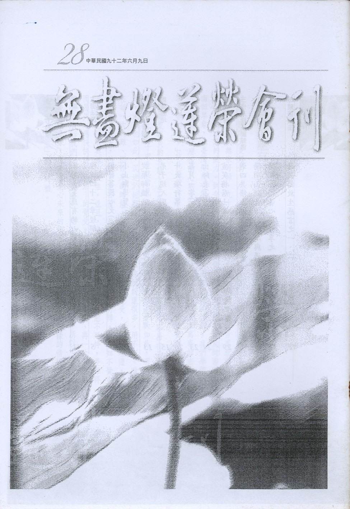

# 第28期

## 社論

### 面對天災應有的心態

淨昌

這幾年國內天災頻仍，八十八年九二一大地震，在二分鐘內奪走二千多條人命，令數萬人無家可歸，九十年納莉颱風，水淹北台灣，讓六百萬北台灣居民，見識水患的威力。到今年五月，連續七個月的乾旱，雖有些及時雨解決南部旱象，北台灣降雨有限，水庫逐漸乾涸，面對這樣的情形，我們學佛的人，應該用什麼樣的心態來面對呢？淨苑師父說：「我們當求萬事如法，莫求萬事如意。」故此僅就平日上課所聞，做一心得報告，希望有利於大眾。

面對今夏旱災的來臨，生起覺受即是「無常」。吾人實在太容易在平時「無憂無慮」的日子中生起常見，以為這樣的日子昨天如此，今天如此，明天如此，未來也如此，沈迷於短暫虛妄之樂。總以為福報還很多，用不完。雖然在每一次災難、困頓來的時候，都曾經短暫興起無常的覺受，但事過境遷，覺受也跟著消失，然後又是日復一日的在辦公室及家庭中打轉。在不知不覺中浪費自己閒暇美滿的人生。並且，也無法生起〜這樣的狀態不可恃，是難得而易失。應快快修學善法的覺受。所幸，佛菩薩是慈悲的，再一次用這樣的景象告訴我們「世間無常」，應「痛念無常，慎勿放逸」。所以，面對今日乾旱的景象，也許會憂心未來的情況是否能改善，但面對這樣的情境，正是體會「無常」的好時機。

其次應了解所謂的天災其實是人禍，佛法說萬法乃唯心所造，福報是由心的造作而現，惡報亦然。所以這天災其實是共業所感。既是共業所感，應肯定的是在造作的時候，自己也有一份。於課堂曾聞說法者有云：「看見吾人所受的惡報有多痛苦，其實應觀待自己在造作時，有多可惡。」既是自己所造，自當甘心受之。又天災既是人禍所感召，則旱災何由致之？因緣果報之事千差萬別，唯佛澈知，吾人惑業凡夫，又加教理不通，故在此僅提供一個觀點供大家參考。時至今日，全台居民大概沒有一個人內心不希望趕快下雨吧？但為什麼，所求不遂意呢？地藏經說：「遇非理毀用者，說所求闕絕報」上會下性法師解釋：「物不盡其用，不愛惜器具，如夫妻吵架摔東西洩恨等，必感欠缺、斷絕報。」所以，我們要懺悔過去不惜物資的造作，並自今時起，好好珍惜，善用自己的福報。

第三、天災的來臨，我們眼看眾生受苦而無力救拔，更不用說眾生的生死大難，我們同樣無計可施，甚至自己亦不能免。面對這樣的情形，內心覺得非常的慚愧。明朝的蓮池大師念佛，所到之處普降甘霖，虛雲老和尚的念佛可以降魔，而吾人呢？大概能降服自己的煩惱，念佛念的下去就不錯了，遑論其他，而生起如此心態，即是慚心。愧是愧他，任憑上課時聽諸師苦口婆心的相勸，下課後遇境逢緣，依舊為五欲境所轉，依著自己的舊習氣辦事，遇順境生貪，遇逆境生瞋，這樣號稱是吃素學佛的人，想起來真是慚愧。

再者，吾輩淨業行人，平生所求即是臨終蒙佛力加被，接引往生。佛力的加被亦不能自性生，必觀待眾生的誠心祈求而後生。而臨終的誠心還待平時的誠心串習而來。平時誠心的串習，須從教法的觀修而來，而此時依著現在的環境因緣來將誠心提起，就更容易了。「心本無生因境有」，在豐衣足食、無災無難的時期，祈求佛菩薩加被的心不容易生起；但在「苦」的認知下，期待佛菩薩的加被之心油然而生。牢記這依苦而生，誠心祈求的覺受，好好在平時研學及助念放生等善法上用心，必有莫大的助益。末學念佛時常常妄念紛飛，但在前些日子的一次助念的場合中，對誠心祈求佛菩薩的加被有一些的體會。記得是在榮總的往生室，當到達往生室時，亡者已斷氣十小時蓋上陀羅尼經被，家屬及蓮友在旁念佛，剛開始念時，並沒有很強的心求佛加被接引亡者往生淨土，但念著念著，忽然間看到家屬那種痛失愛子哀痛逾恆的表情，當時內心非常震撼，非常希望佛菩薩來接引往生，讓亡者不再痛苦。此後，只要去助念就會回想當時的覺受，雖然自己念佛斷斷續續，上氣不接下氣，但總是努力提起最大的誠心祈求佛菩薩的加被。

印光祖師在上海護國息災法會法語裡告訴我們，要護國息災惟有靠吃素念佛、戒殺放生，這點當無疑義。但就藥師懴法會上有聞說法者云：「我們盡心的辦善法。作懺軌是所興辦善法之一，把下雨的問題，交給佛菩薩。如果佛菩薩認為下雨可滋潤人心的善根種種就下雨，如果不下雨能令人心有所警惕，生起止惡之決定見，就晚降甘霖。」因此，不管面對什麼樣的困境，仍應秉著平常心，不變初衷，繼續走下去。把天災的問題交給佛菩薩，把握時間，好好充實自己的德學，以便在因緣成熟時，能利益眾生，與成熟眾生善根。最後祝大家處障不退，德學增上。

## 大德法語

### 佛說四十二章經解（二十）

*道源老和尚講授*

第十二章

「佛言：人有二十難。貧窮布施難。豪貴學道難。棄命必死難。得睹佛經難。生值佛世難。忍色忍欲難。見好不求難。被辱不瞋難。有勢不臨難。觸事無心難。廣學博究難。除滅我慢難。不輕未學難。心行平等難。不說是非難。會善知識難。見性學道難。隨化度人難。睹境不動難。善解方便難。」

前章要我們去種福田，若能種到無念、無住、無修、無證之者的圓教菩薩得福最多，但是我們一個人要是想修行用功，還要通過這二十個難關。一個難等於一個竅門的管道，要通過去，通過這二十難，你修學佛道才能成就。

「貧窮佈施難」，修道人有二十難，不是一個人，人各種不同，眾生以差別為性，或者你有這一種難，或者他有那一種難，這就是你要是貧窮人，貧窮行佈施難，為什麼？因為他自己衣食不足才叫貧窮人，他自己生活都過不了，他怎麼能行佈施呢！這叫貧窮佈施難，但是佛經上釋迦牟尼佛開示很多的公案，都是貧窮人行佈施得感應很大。所以貧窮佈施難，突破了這個難關，自己省吃儉用還是要行佈施，所得福報最大。

「豪貴學道難」，大富大貴的人受持佛道最難，受持佛道，須持戒、修定、求智慧，這都是佛的道法。富貴之人他都是前生修來的，他都有善根，因為有善根，所以與佛教很容易接近。但是聞到戒、定、慧的佛道，他不能受持。為什麼呢？富貴之人，五欲之樂太多，所以持戒也持不好，修禪定也修不好，求智慧也被五欲所障礙到，學佛要把難關通過去，才能成道。然大富大貴的人，往往過不了這富貴關。可是釋迦佛就是個大富大貴的人，他就能出家修道。

「棄命必死難」，什麼東西都容易捨，命捨不掉，為什麼？命只有一個，到大災大難總有逃命的時候，平常捨不掉的，他都能捨，比方家財能捨，眷屬能捨，但是他的命，他不能捨，因為命只有一個。不怕命捨去掉，該死就死，叫棄命必死難，這是很難的。釋迦佛何以說此難，乃佛定的戒律，修道人要守持這個戒律，必要時連命都要捨棄，戒是不犯，此時失命因緣成熟了。戒律不能犯，尤其重戒，出家戒如此，在家菩薩戒，六條重戒都比命重要，到了要我的命的時候，我還是不犯戒，這個樣子才能把戒守住，所以說棄命必死這個難關要通得過去。

「得睹佛經難」，佛經是文字般若，有了文字般若，你才懂得修行，依文字般若起觀照般若，才能證得實相般若。所以說佛經是成佛的根本，一切佛都在佛經裡面生出來的，我們要沒有善根，看不到佛經，即使看到了還會造業，看到佛經，若沒有善根，他把佛經當廢紙了。所以說，他不但不得利益，反而造業。唯識三字經作者唐大圓居士，對於唯識宗研究的最好，做了一部三字經，可以令所學的人易學唯識。

唐大圓居士成就怎麼樣來的呢？最初他也不懂佛法，某日到了一處大寺院裡，前後去參觀，參觀到後面的藏經樓上，在藏經樓上所藏的藏經都是清朝的龍藏，份量很多，整層樓上就是一部藏經。有一個當兵的，他在藏經本上練大字，因為軍隊駐紮在寺廟裡，寺裡的出家人不敢惹他，他自己到藏經樓上，一看那麼多的經本子，他想練習大字沒有錢買紙，正好利用，唐大圓居士正好到了藏經樓，說你這位先生，你怎麼拿這個佛經來練字呢？彼云：這個佛經有什麼用？廢物利用嘛！沒有用的東西，我來利用它，你還說什麼？唐大圓居士他也不敢惹當兵的，不敢跟他較量，就看這個藏經，一看，有幾部唯識法相宗的典籍，覺得很好。彼時藏經樓上面沒有出家人，於是唐大圓就拿了幾部詮釋唯識（法相宗）的藏經，回家去看一看，以後就出了一個唐大圓居士，所以得睹佛經難，有善根的人才能看到，沒有善根的看到了，像當兵的他造業，拿了佛經當紙來練毛筆。再說到我們自己身上，現在諸位看佛經不算難，而且不用拿錢買，印出來的經書，送人的很多，就怕你不看，要曉得，這都是我們的善根，你要前生前世沒有種下善根，你看不到佛經，所以看到佛經，就是得睹佛經，這一難關通過去了，通過去了你不要辜負你的善根，你要好好研究佛經，好好依經義而修行。

「生值佛世難」，出世為人，值（遇到）佛出世，這很難。你遇到佛出世了，佛他觀機逗教，他知道你是什麼根基，說的法迎合你的意，如名醫治病，應病與藥，開一個藥方，吃了一個藥，你病就好了，所以「生值佛世難」。可是我們的善根太少了，太淺薄了，出世為人的時候，佛已經涅槃三千了，然此處有方便解釋，釋迦佛雖涅槃了，法還在，正法一千年，像法一千年，末法一萬年，還有九千年釋迦佛之法才滅，我們這個難關（生值佛世難）還算通過了，但是你要好好的修行，你們修行若不能了生死，再轉眼，九千年也已經過去了，那才真是睹不到佛書，與生不到佛世。

「忍色忍欲難」，財、色、名、食、睡乃吾人所欲之境，能引發貪欲，所謂貪財、貪色、貪名、貪食、貪睡，為什麼要貪呢？是一種欲樂，叫做五欲之樂，這個五欲之樂，最重的是這個色欲，色就是男女之色，這男女之色，他是生死的根本，所以在五欲中將色欲提出來，我們是凡夫，煩惱沒斷，見了五欲之境就動心了，動心不斷的時候要忍耐，要安忍，令此貪欲之心不動，你就把這個難關通過了。

「見好不求難」，好就是外面五欲的境界，上面所講的五欲是粗重的五欲：財、色、名、食、睡。此處約五塵之好，所謂色、聲、香、味、觸，這個色不是男女之色，是眼睛所看到的都叫色，聲、聲音是耳朵所聞，香是鼻子所聞叫做香，味是舌頭所對的味，觸是身體所接觸的塵，色、聲、香、味、觸都會讓人起貪愛心的，你見了好的，你就求，要是不求，這個難關就通過去了。

「被辱不瞋難」，上面說的忍欲忍色難，見好不求難，都是要去除貪欲煩惱，煩惱有三根本煩惱，貪煩惱、瞋煩惱、愚痴煩惱。此處為瞋煩惱，你要忍受著逆境方能不瞋。這個瞋煩惱就是被人污辱、欺負了，罵你或是打你或是殺你，你不動瞋心，這個很難。在金剛經上，釋迦佛說自己的往事，他過去當忍辱仙人遇見歌利王節節砍自己的身體，他不動瞋恨，這是很難很難的一個難關要通過去，不然一動瞋恨心，比動貪心還來得厲害，叫做瞋恚火能燒功德林，你過去所得多少功德，一動瞋恨，等於一把火給燒掉了，把功德林燒掉了。

「有勢不臨難」，有勢叫做富貴人，富人有財勢，貴人有官勢，有這個勢力，不臨（臨，駕凌），不駕凌於人，在現在就是不壓迫人，不用自己的財勢力，不用自己的官勢來壓迫人，這也是個難關，很難，要能通過這個難關。

「觸事無心難」，觸是接觸，我們一個人全天都有事情跟你接觸，接觸是要接觸，辦事要辦，但是不要動心，這個是一個難關。與人做事，好的事，一個順境的事，你就動貪心。遇見逆境時，就動瞋恚，所以觸事無心，做錯是我做錯，不動瞋恨心這是很難。

「廣學博究難」，廣學文辭，博究其義理，廣學就是包括聞，多聽講，包括看多，看精，這都是廣學，廣學多聞，增長智慧，雖須廣學多聞，但是還要博究經理，博也是廣，多研究經的義理，廣學就是屬於聞慧，博究就是屬於思慧，聞、思、修三慧，然前章有，博聞愛道，其道難會。世尊前後說話不對？前章云：你要是博聞，執著名言，不深究義理，那你就生了文字障，不容易開悟，所以前章是令你不要執著文字相，不要生文字障，此處不但要你多聞，還要多研究經義理，不會生障礙的。

「除滅我慢難」，自己執著自己了不得，就生出了我慢貢高，平常講三種煩惱是貪、瞋、癡，若講五個根本煩惱：貪、瞋、癡、慢、疑，這個慢是第四種根本煩惱，有了這個我慢，生了一種障礙，修道不會修下去，所以要把我慢貢高除滅，此難關很難很難通過去。

「不輕未學難」，這是對治我慢說的，有了我慢煩惱，對於沒有學佛裡的人，你一定輕視他，輕是輕忽、輕視，學了佛法認為自己是個了不得的人物，你學佛已學多年，對於這一個還沒有學佛法的人，如何能看得起他呢？自然就輕視他，輕忽他，要不輕未學的心裡很難發起來。

「心行平等難」，心行平等就是心念，不起差別，管你是久學的或是沒學的，都有佛性，佛性是平等的，要生平等心這個是很難的，我們一起心動念就是分別。上來三條不起我慢、不輕未學、心行平等都是講到意業。

「不說是非難」，此條為修口業，一開口說話，不是「是」就是「非」，尤其我們這個佛弟子，無論是出家弟子，或是在家弟子學佛法，你開口講話，就算依經本講佛法也講的不好，然講是非可不要看本子，一講，講的頭頭是道，可是頭頭是道說的是佛道？不是！全是些是非（說是非變成頭頭是道），要不造說是非這個口業也是個大難關。

「會善知識難」，善知識就是良師益友，最好的師長，最好的道友。良師善友，怎麼樣的好法？行解並重，佛法他了解，他能講、能說，而修行又修行得很好，行解並重的師長，行解並重的朋友，這都是善知識。你要遇到這樣的善知識也很難、很難，很難把這個難關通過了（善知識難遭遇），遇到了要久久勤勤，不久久勤勤，遇到了等於沒有遇到。中國大乘佛法有八大宗派，其中有淨土宗，開淨土宗的祖師是慧遠大師，慧遠大師是東晉人，親近道安法師有二十五年之久而不離開，後來桓溫帶著兵要來打襄陽這個地方，這個兵災來了，道安法師三度說，你們個人都逃難，打戰友打戰的危險，因師父的支持，慧遠法師才離開道安法師，以後到了廬山才開創淨土宗，是淨土宗的初祖，這個淨土宗是慧遠大師親近道安法師這樣善知識，親近二十五年之久學到來的。

「見性學道難」，學佛法先求明心見性，悟了佛理以後再修道，就是悟後修道，這個是很難的，開悟不容易，開了悟，見了性，再學道（悟後起修），這個很難、很難。

「隨化度人難」，教化眾生，眾生以差別為性，隨著眾生的根基而去教化他，這也是很難很難的難關。

「睹境不動難」，遇到什麼境界你不動心，前面要觸境無心，遇見好的境界，你不動貪心，遇到不好的境界，你不動瞋心，這個很難、很難。

「善解方便難」，這是第二十個難，你要教化眾生了，教化眾生能以隨化度人，這很難了。隨化度人，但是人不是好度的，你要懂得方便，否則，他不能接受，聽不懂。善解方便即是應機說法，佛七大迴向文最後兩句：「善知方便度眾生，巧把塵勞為佛事。」你要度眾生，你不知道方便法門，你度不了眾生，所以六塵九界懂得拿來利用，巧把塵勞拿來做佛事，這個是很難很難了。如何巧把塵勞作佛事，如何善知方便度眾生？比方，我們要度這個人，人各有個嗜好，他這個人歡喜畫畫，或者畫山水，或者畫人物，那麼遇到這個人，你就要善知方便，把他的嗜好抓的住。你說，你要是歡喜畫畫，你不如畫佛菩薩像，畫了佛菩薩像，能令所見者種善根。若你懂這個方便法門，你就度了一個眾生；比方說一個人，他歡喜插花，插花是給人看的，你說，你要給人看沒有功德，還引起貪愛的煩惱，你要會插花很好，你不如插花供佛，供佛有功德，這都是巧把塵勞作佛事，這個四十二章本來定一次講完，今天就講完第十二章經。（下期待續）

## 共修研學

### 勸發菩提心文（二十八）

*心爾整理*

為何不從眾生皆為未來諸佛的角度，而由眾生皆為過去父母的角度緣念眾生恩？念父母恩是一種我必須要去幫助他的動力，而依著他在受苦更能夠引發我們的悲心，進一步引發我們想要幫助眾生成佛的心，但是必得要自己成佛方能幫助眾生成佛，故起了上求佛道的心，此菩提心建立在大悲心上，是我要成佛的決定見。

此處為何不云觀三途的苦，特別是地獄的苦，而舉出觀於螻蟻之苦？因為現前可見微不足道的螻蟻，尚且不能觀其苦，無法引發吾人的悲心，又何況是見不到的地獄眾生呢？那我們又該如何「常思利益」？除了將種種的功德迴向之外，還可以幫他們懺悔，因為他們的行相，可能在前世作我們父母的時候，殺雞、殺鴨為了幫我們進補，造很多冤業，所以來世受苦，為此我們帶著愧疚的心態來為其懺悔，現在亦要好好充實自己，以便將來能夠互相幫忙，彼此增上。

開出去說，如果眾生的行相很卑劣，品德很差，或直接衝擊到我的利益、冒犯我，甚至我對他有恩，他對我恩將仇報；這時候若還能夠緣念眾生恩，克服自己不平衡的心態，那真不是普通的心量。須知緣著菩薩是修不到忍辱度的，必須要緣著惡人才能修忍辱度，而想要成佛，六度是缺一不可，故惡人跟佛一樣的殊勝。但是要如何培養這種心量？要把人與煩惱分開來講，觀修煩惱很可惡，而他的人常常被煩惱帶去受苦，這個人在煩惱束縛中不由自主地對境起煩惱，且半點煩惱也沒法對治，這樣子的人非常可憐。從這個立場來講，同情都來不及了，怎麼可能再惱害之？

我們每個人都想把自己的煩惱擊垮，都不想被惱人的習氣所束縛，可是都辦不到，那是因為我們沒有修行的方法、沒有團體、沒有教法、沒有正知見、沒有願力。

在諦閑法師講義中有云：「諸佛、父母、師長、施主等恩，多以明了，已度我苦、生我身、教我禮、給我衣食故。惟眾生恩甚為難知，儒道經教中多未道及，惟我佛經中言之。」為什麼我悲心發展出來，都變成有特定對象，而且是愛見慈悲，就是因為眾生的恩甚為難知，愛見慈悲就是夾雜我的情執，不是我情執範圍則漠不關心，是我情執範圍則特別關心，理由就是對眾生的恩觀不出，所以儒家與道家的經典在這部分的教授亦不足，惟我佛經中言之。

「何以佛能言之？因佛有三明六通，能知過去未來；世間夫妻父子，無非恩怨關係。」

佛能知過去的是「宿命明」，能知未來的是「天眼明」，能知當下煩惱盡斷的是「漏盡明」，叫做三明，六通的核心處是三明。世間的夫妻父子，無非是討債與還債，無債不來，報恩報怨皆是相報，上聯叫「討債還債無債不來」，下聯叫「報恩報怨無非相報」，橫批叫「因果關係」、「皆是情執」，這些是佛的看法，而且是確實的看法，都是恩怨關係，若是由報恩的關係而來，則法容易是正法，報怨的關係而來，法容易變成末法，所以一般說末法時期，都是討債的多，冤親債主很多，遇到的眾生都很麻煩，這樣的人來修學教法，法都容易變成末法。

「佛為出世之救主，無量劫來，廣度眾生，洞知灼見，皆從實驗得來。」

實驗就是信解行證善巧，從解上有他的信心，實行上有他的體會，從實驗中真實的瞭解。

「法身墮於五道，名曰眾生。」

法身為何會墮於五道？乃迷於無我的真理，不知諸法實相起於無明妄見，而造種種惑業，現起各種色身來酬業，此色身隨業所成而無自性即是法身，故永嘉大師說：「幻化空身即法身」當修行照見五蘊身體性空寂時，知色身不過是幻化身，非真實所成，此即幻化空身，而幻化空身就是法身。肉身不過是化現象能為我所用，依身起心，以身為所緣，照見體性空寂，生起無我智慧，故身可令我人發展無我的智慧，彼即殊勝外緣。

「從最初一迷之後」

，最初是無始，沒有開始的；

「從迷積迷，遂至今日」

，從迷積迷到現在，與眾生彼此之間常互為眷屬關係，並且在不計其數的輪迴中，投生在各道都有父母，所以有情都曾做過我至少一世之父母。

「每見幼離下，以今世狀況比諸前世」

，這一世小孩子和父母分開，長大了在街上見到父母不認識。賀知章有一首詩云：

「少小離家老大回，鄉音無改鬢毛衰，兒童相見不相識，笑問客從何處來」

。多麼讓人心酸，回到家鄉，我是家鄉人，卻笑問我這位客從何處來。所以這一世來比前世，六道的眾生之所以忘掉恩情，或因改形易貌，乃至於時間久遠，失去記憶，而忘掉恩情，但不能說我們沒有記憶就不認帳。在阿含經、大日經、悲華經、地藏經等經中均有言之者。一般人說一靈真性，死後化為虛空，所以放大膽去造惡業，不享受是傻瓜，人不自私天誅地滅，但是當受報的時候，才知道不是這麼簡單。（下期待續）

### 小止觀導覽（七）

*蓮心整理*

經文

「聲聞之人，定力多故，不見佛性。十住菩薩，智慧力多，雖見佛性，而不明了。諸佛如來，定慧力等，是故了了見於佛性。」以此推之，止觀豈非泥洹大果之要門，行人修行之勝路，眾德圓滿之指歸，無上極果之正體也！

大意

引經說明止觀雙運之重要性。

導覽

一、「聲聞之人，定力多故，不見佛性。」指聲聞之人，可安住於空性，但無法運用空性，雖定中有慧，可出離三界，斷見思煩惱，然其慧力不足以見佛性，離成佛尚有距離；此等與偏修禪定福德，不學智慧的「愚」不同。

二、「十住菩薩，智慧力多，雖見佛性，而不明了。」係指別教十住菩薩，慧多定少，其智慧雖可見到空性，運用空性，但未完全運用徹底，此為定力（即專注力）不足，故雖可遊戲人間，利益眾生，助眾生出離三界，但對佛的願力以及佛所展現的殊勝內涵，和成佛所凝聚的善知識的力量仍嫌不足，故須就教於諸佛，向諸佛學習，故曰：「不明了」，觀世音菩薩普門品：「侍多千億佛，發大清淨願」，即此之謂也。

三、初住至七住，斷見思惑，八住至十住，分破塵沙惑，能從空出假，得道種智（重緣世俗的世俗慧）；聲聞乘定多慧少，雖具有出三界之現證空性的智慧，在大乘慧上（重緣世俗的道種智）不足；十住菩薩慧多定少，雖已回小向大、從空出假，廣學大乘法，惟大乘法無量無邊，故尚須遍學大乘法，方可利益無盡眾生，雖有智慧力，但在教法的安住上力量不足，如此在上順佛法及下化眾生上均未究竟，未足圓滿菩提心。

四、對於修學成佛的人，除了發起菩提心以外，並應積聚菩薩的資糧，菩薩的資糧有福有慧，即定與慧，而止是禪定之勝因，觀是智慧之由藉，故止觀門為定慧雙修，止觀雙運，其成就可破除二種我執，二種我執可破，三界則可出離，佛果即可圓成。

五、學止觀門得以成就，所依的理由即為三佛性，所要成就的亦為三佛性，所以止觀門行者，若不知三佛性，則不知止觀之目標何在？就中觀宗之講法，所有法均依他起，所有的法均在彰顯自性空，故三佛性乃了不可得，不可自己生、獨立生，必藉止觀修學而後開顯；而止觀亦了不可得，必藉緣佛性而後現起，藉境現起止，藉境現起觀，故止觀不可以不依境界自己生、獨立生，乃互相觀待，互相依靠。

六、止觀修學應定慧均等，止觀雙運，方可將佛性彰顯究竟；若偏修習，即墮邪倒，或流於愚，或流於狂，均屬邪見輪轉。止觀法門有淺有深，有綱領有細目，小止觀為綱領，乃通往止觀門之要津，可由此而入六妙門、入禪波羅密、入摩訶止觀。小止觀通淺通深，通小通大，可謂三世諸佛之心要，若運用於淨土法門，乃上品往生的資糧，必可圓成佛果、廣度眾生。

經文

若如是知者，止觀法門，實非淺故。欲接引始學之流輩，開蒙冥而進道；說易行難，豈可廣論深妙？

大意

說明止觀法門非淺，並以實修為要。（下期待續）

## 專題研學

### 十大礙行第九（十一）

*心筑整理*

「見利不求霑分，利霑分則癡心必動，癡心動必惡利毀己，世利本空欲利生惱利莫妄求，以疎利為富貴。」

以上是十大礙行第九條的經文。

上來已經將生命中會遇到的十種障礙，諸如病苦、災難、對法領悟力的不足、辦事上的磨練、人際關係中的逆境，乃至於在利益別人時動機不清淨會造成的過患，都已經做了說明。上次說到別人好處時要心存感激，感謝別人給我們機會造作種種的善法，這一次要來談談在幫助他人時，如果遇到別人的讚美、得到好名聲或是被賦予更多的權力，這個時候我們要如何看待這些得到利益的事情呢？

妙叶大師說：「見利不求霑分」，「見利」就是看到好處，「霑」同「沾」，整句話的意思就是不論是不是我應該得到的好處，心裡面沒有想要得到的念頭。好比因為把老師交代的事情做好，得到老師的喜愛，做了班長，要知道這是一種責任，而不是炫耀的工具。以前春秋時代楚國令尹（宰相）子文，三次做官臉上看不出欣喜的樣子，三次被罷官臉上也看不出忿忿不平的樣子。所以不管是在辦事情上得到讚美、掌聲，或者是其他的好處，都要想成是大家一起努力的成果與經驗的分享。

「利霑分則癡心必動」，只要心裡面有想要得到好處的念頭產生，這個念頭就會和癡心相應，到底什麼是癡心？又為什麼這麼說呢？癡心就是不知道吃虧的妙用，也不知道佔便宜的大壞處。春秋魯國的柳下惠，當官的時候循著正道而行，孟子說柳下惠是聖之和者也，他不以侍奉不好的君主而羞愧，也不以官小而不做；當官時不隱埋賢才，若被朝廷忽視了也不埋怨，自己處窮困之中也不哀嘆。與普通人交往，和悅親近，好像不願離開一樣。所以雖然柳下惠沒有罪而三次被朝廷貶官，也是從容自在，無怨無尤。柳下惠的風範，使得鄙陋的人學習柳下惠的氣度變得更加寬容，刻薄的人也變得更為敦厚。像柳下惠這樣的人雖然眼前吃了小虧，可是得到世人的尊重，久遠之後的我們，仍然能夠依循聖人的事蹟，瞭解處世的標準，不僅我們得到了大利益，聖人更是累積了無量的陰德在內。

「癡心動必惡利毀己」，但是我們如果不知道吃虧的妙用，祖師說如同惡利毀己，「惡利」指的是該得的得不到時，用一些違背良心、人情的手段去得到，這就是惡利。而這些惡利會激起我們的執著與煩惱，並且毀掉我們良好的德行。

「世利本空欲利生惱利莫妄求」，善因緣的和合才會出現利益，大家都知道世間所有的事情都離不開因果法則，也就是造善得樂與造惡得苦，故好名聲和地位的尊貴，都回應大家以前的好因緣，才會現起如此快樂又殊勝的果報，如果滿腦子只想要得到我應當得的好處，就會生起煩惱，得不到的想得到，得到了又怕失去，所以祖師告訴我們見到利益不要想非份的求取。地位的崇高當中，看見的不是自己的尊貴與高高在上，而是自己的責任與良心，不能得到利益，也不會妨礙我們繼續增上的想法與行為。

「以疎利為富貴」，「疎」有少許與疏遠之意，整句話的意思可以說是以佈施來成就大大的富貴，有一顆能捨得心，就是大大的富貴，大家都聽過「捨得」，就是能捨方能得，捨去的是我的小氣與見不得別人好，見不得該我的利益好處被別人搶走，得到的是大眾的尊重、崇高的人格與內心平靜，我們所擁有的財富多寡，看不出內心真正的富貴與貧窮。東漢時諸將軍打仗回朝，在論功行賞時，每個人都說我是後勤的功臣、我是帶兵衝鋒陷陣的功臣等等，但是有一位將軍在樹下反思勝利的經驗和失敗的教訓，漢光武帝說最大的功臣是樹下睡覺的那一個，那一個才是真正的大將軍，帶兵領將，在戰爭中屢建奇功，不僅具有很高的軍事、政治素養，而且又具有良好的作風和品質，改變當時頹糜的風氣，這就是「大樹將軍」—馮異。馮將軍因為內心將這些事情當作是一種責任，所以才會表現出不邀功的行相，自身不但不會起凡，也保全自己的德行，並且獲得了眾人的尊重，這是我們應當加以學習的，這也說明全德行方是真富貴。歷史上有太多只求一時的功名利祿，終至惡利毀己的例子，他們不但不能全德，更因眼光短淺而換得千古罵名，所以在見到利益時，何妨深深體認「以疎利為富貴」的真滋味，給自己另一種思維選擇的空間。（下期待續）

## 蓮池海會

### 宣笑梅居士往生見聞記

*心筑整理*

宣笑梅居士生於民國四十六年二月十一日，歿於民國九十一年五月十日，享年四十六歲。父宣萍先生自安徽省合肥縣而來，居於桃園，與母宣蔡秀蘭女士共結連理，育有一子一女。笑梅居士事父母至孝、姊弟手足情感深厚，家風儉樸嚴謹，生長求學環境單純，堪稱順遂。

年輕時就業於台北佳美公司，與夫莊明鑫先生結識。於相知交往四年後締結良緣，婚後一年產下一女，為盡心照料幼女，而辭去了原台北的工作。待女兒稍長後，進入了飛利浦公司中壢廠。

為人節約惜福，孝順父母、侍奉公婆不曾輕忽怠慢，時時體察長輩的心意，盡心盡力，事必躬親。夫妻相處和睦恭順，不相苛求於對方，婚後並鼓勵其夫發憤向上，順利完成求學時期中斷之學業。教育兒女言教、身教並重，並盡力滿足所需；縱有過失，也是適切地責備孩子，而不嚴厲苛責，從旁給予協助，但尊重女兒的抉擇與意見。即使重病住院其間，亦不忘教誨其女為人處世、應對進退的道理與方法。教女有方，實不愧為母儀典範。身為職業婦女，家庭工作兩者兼顧；為人妻、為人媳、相夫教子，此傳統美德在其身上發揮淋漓盡致。

服務於飛利浦公司近十八載，在職期間，與同事相處和睦融洽，策劃執行活動，鉅細靡遺；後期轉任協助採購事務作業，表現優異，平日堅守崗位、敬業盡職，深得相關工作人員之好評。經選拔為九十一年度桃園縣之模範勞工，足謂實至名歸。

笑梅居士平日待人謙恭有禮、平易近人，凡事不願勞煩他人，以身作則。為人處世也總以「嚴以律己、寬以待人」為歸依。生活簡單樸實、勤儉持家。平日喜好閱讀，舉凡不同種類的文章書籍，皆略有涉獵；求知慾旺，吸收新知不遺餘力，可說「不出戶而知天下」。

後因病苦因緣，割除胃部腫瘤，進食困難，並了知人世不久，雖有心解決苦難，但不知方便，有蓮友因同事之誼，善巧安慰開導，並以趙榮芳老居士往生錄影帶引發其羨慕西方之心，以及臨終正念分明往生之殊勝，遂受蓮友勸其發願念佛求生西方，心中雖懊悔健康時與佛法差肩而過，但是卻歡喜得以在生命的最後旅程中得聞淨土法門之殊勝，欣然接受生命的早逝，丈夫與女兒更全力護持，令笑梅居士於臨終時無有罣礙，安詳往生。

綜觀笑梅居士一生，做人以和、處世以真、對上以敬、對下以慈，與人為善、樂善好施、不計利害，真所謂「性情中人」；其淑德可風，懿範常留。

## 啟蒙園地

### 弟子規　入則孝（八）

*願度整理*

「親有疾，藥先嘗，晝夜侍，不離床；喪三年，常悲咽，居處變，酒肉絕；喪盡禮，祭盡誠，事死者，如事生。」

前面我們已經談過平常應如何來孝順父母，接下來這一段則談到如果遇到非常的時期，譬如說父母親生了病，我們應該怎麼做？再來就是父母親逝世後和祭祀時，我們又該如何？如果能在父母親的生時、死後和行祭祀之禮時盡到孝道，這才是一個完整行孝的表現。

「親有疾，藥先嘗，晝夜侍，不離床」；這裡是說父母親生病時，我們為人子女應有的態度。小朋友，我們可以來想想看，當我們生病時，父母親是如何照顧我們？他們總是無微不至的照顧我們，希望我們趕快好起來，甚至我們有病痛的時候，他們比我們更難過，心裡希望這些病苦是發生在他們身上，而非落在我們身上；那反過來說，當父母親生病時，我們是否也可以試著以父母親照顧我們的方式來照顧父母親，例如幫他們倒開水、蓋被、拿藥、扭毛巾、冷敷和他們一起去看醫生、、、等等，其實我們每一個小朋友都可以變成一個能力很強、能幹、又有愛心的小朋友喔！就像當父母親的小天使般照顧、關懷他們。

「親有疾，藥先嘗」說的是許多古時候的孝子盡孝道的一種表現，當父母生病時，代為抓藥，回來細心的煎煮，並且親自嚐藥，因為中藥煎煮的時候要注意火候〜燒乾燒壞，或者是熬好以後變冷，藥味就變了，火候足不足，都會影響藥的力量，所以為了讓父母親的病能快點好，在煎藥的時候特別要用心，而且晝夜在旁邊服侍，隨時觀察父母的需要、預防病變，這裡面還包括服勞役、換藥、按摩、陪父母說話，或者是聽他訴說心裡的話等等，這就是「晝夜侍，不離床」的重點，甚至也可以在父母親身旁念佛，幫助他們想到阿彌陀佛，心裡才不會一直認為生病很難過。雖然時代不同，行孝的方法也不同，但孝子的心意是不會隨時代改變的。

古人很多是這樣來侍候父母親的，例如漢文帝劉恆是高祖的第三個兒子，最初被封為代王，他對於自己的母親薄太后，總是殷勤的侍奉，從來不會偷懶、厭倦。有一次母親一病三年，他更是費盡心思照料，幾乎沒有好好的閤過眼睡過一覺，甚至連衣服也不敢稍微解下，以備母親不時的召喚。母親要吃的湯藥，他都要親自嚐一嚐，確定湯藥無毒、冷熱合宜後，才送給母親服用，所以，他這份仁孝的心意和行徑，很快地便傳遍了天下，百姓無一不對他讚歎佩服。而且因為他能夠如此用心的來服侍父母親，並且把這個心意推展到所有的長輩、朋友甚至全國人民身上，他愛護老百姓的心就像侍奉自己的父母親一樣，所以能夠成為兩漢最好的皇帝，甚至成為堯舜以來，繼聖人之後最好的皇帝，就是他能夠把孝道徹底的實行，並且以帝王之尊來行孝，對母親的誠意正表現在煎藥上，所以說日理萬機的皇帝尚且如此，他的孝順行為也就產生了教化人民的作用，讓人民都像他一樣來孝順自己的父母親，真是了不起！

再來說到唐朝的崔沔，為了醫治母親的眼疾，把所有的家產都賣掉了，親自奉養母親，三十年來沒有脫下帽子和帶子，由此可以知道他是如何小心謹慎的侍奉父母親，我們是否也應該以他們為榜樣，好好的來向他們學習，因為能體會父母親的需要，慢慢的才能體會長輩、朋友，甚至到所有人的需要，這一切都要從體會父母親的需要、奉侍父母親開始。

「喪三年，常悲咽，居處變，酒肉絕」這裡是說到當父母親不幸去世，我們必定要守喪三年，守喪其間，對於食衣住行上的種種都無心享受，內心只是不斷憶念父母親過去對我們的恩德，以及對我們的種種美好的言語和教導，讓這美好的身教、言教透過這「喪三年」的回憶追念來做為我們立身處世的依據以及引導下一代增長的基礎；「常悲咽」是想起父母親的恩情深重而無法報答時，自然悲從中來、無法言語。在論語上也說：「高宗諒陰，三年不言，百官總己以聽於冢宰三年。」高宗就是殷高宗，諒陰就是人死了居喪所著之處，殷高宗父親過逝時守喪三年，文武百官都聽命於宰相三年，皇帝不理朝政，三年當中就好好想父母親的恩德，孔子又說：「何必高宗，古之人皆然。」古代的人皆是如此，不是只有殷高宗而已。

至於說到為什麼我們要為父母親守喪是要三年呢？論語上就有提到，有一次宰我問孔子說如果守喪三年，禮樂都無法維持了，孔子答說：一個有德的君子在居喪時如果吃的、聽的、住的好，會覺得心不安；因為小孩生下來三年以後，方能離開父母的懷抱，因此三年是天下普通的喪期，古人都是這樣來守喪的，而且時時刻刻想念父母，想到父母親的恩情深重而無法報答，就不由自主的悲傷嗚咽起來，而不會想要住舒適的地方、吃好吃的酒肉了。因此在歷史上很多偉大的人物在做官時父母親去世，他們都會辭官回家守喪三年，例如：曾國藩就是一個很典型的例子。

「喪盡禮，祭盡誠，事死者，如事生」對於父母親的喪事，要依照禮儀，不可草率馬虎，並且很誠意的來祭祀，對待已經去世的父母親，要像對待父母親生前一樣的恭敬。在《論語》上就說：「祭如在，祭神如神在。子曰：吾不與祭，如不祭。」就是說祭祀父母親的時候，必須盡上十二萬分的誠意，好像父母親在世時一般。歐陽修的瀧岡阡表裡面就提到他的父親歐陽觀在逢年逢節祭祀的時候，一定會涕泣的說：「豐厚的祭祀，比不上父母親在世時微薄的奉養呢！」有時自己進食酒肉，便又泣涕認為從前父母建在時，物資常嫌不足，現在有餘了卻來不及奉養父母親了，他終身都是如此的表現，不只「喪三年，常悲咽」，而是終身因思念父母親而「常悲咽」，更做到「喪盡禮，祭盡誠，事死者，如事生。」由整個孝道的完成，再推而廣之，對於他所審理的案件，他都能夠盡上十分的努力，為犯人們尋找生路，深怕有任何的冤屈在裡面，若真的沒有辦法找到，才很不得已的下判，如此一來犯人和他都沒有遺憾了。因為他的孝行，終能推己及人、成人成己，最後還能把這樣的祖德留給歐陽修，成為一代賢孝。

「大孝終身慕父母」真正有孝心的人是終生慕父母，這個慕我們可以說它就是一種善體親心，一個真正的孝子一定是做什麼事都想到父母，所以他做的任何事都會合乎天理良心、不會妨害到他人。其實「大孝終身慕父母」就是「事死者，如事生」，無常到來的這一天是每個人都必須要面對的，在面對時的心態就是「大孝終身慕父母」，秉持著父母、師長給我們的教誨，把我們的人生過的很有意義，對父母孝道的表達就是在喪禮和祭禮中完成。中國文化的根，立足在孝道上，尤其表現在祭禮和喪禮，像歷朝歷代平定天下後，第一件事情一定是建立宗廟，然後由帝王親自來祭祀，在行祭祀的時候就是要稟報天地，感謝天地和列祖列宗，行禮如儀，絕對不能輕慢的，這就是祭祀之禮。《論語》：「慎終追遠，民德歸厚矣。」其實中華文化要落實，一定要認祖歸宗，有一個根本；「喪盡禮」就是一種「慎終」就是說辦喪禮的時候一定要照著禮節來盡這個哀思之情，要非常謹慎的來辦；像我們現在助念，做告別式等，其實這就是一個最好的慎終之情。而「祭盡誠」，這個「祭禮」就是「追遠」，就是終身慕父母的追慕之思，其追思必須誠心誠意，誠到什麼程度？就如《中庸》所言：「事死如事生，事亡如事存，孝之至也。」所以如果每個人都能這樣來追本溯源、知恩報本的話，相信整個社會民風都會很淳樸、很篤厚，整個文化才不會像水面的浮萍一樣隨波逐流，所以要挽救中華文化的話，必得從孝道做起。（下期待續）

### 每月一字 — 否

*蓮心*

否：由「不」、「口」二字組合而成，「不」指事理之非，「口」指說明事理之非的所在，故「否」的本義作「不」解，即指出事理不當之意。此外「否」尚有其他的意思，詳如下列：

一、不同意〜如「否認」、「否決」、「否定」。

二、否則、不然〜當連接詞用，如「義則進，否則奉身而退」。（左傳）

三、用於應對，表示否定之意〜如「萬章問曰：『人有言：至於禹而德衰，不傳於賢而傳於子，有諸？』孟子曰：『否，不然也。』」（孟子）

四、用於句尾，表示詢問〜如「知否？知否？應是綠肥紅瘦！」（李清照如夢令）

另讀音為「痞」時，其意如下：

一、易經卦名〜坤下乾上，象天地不交，閉塞之象。

二、閉壞〜如「否極泰來」。

三、穢物〜如「鼎顛趾，利出否」（易經）

四、惡也〜「宮中府中，俱為一體，陟罰臧否，不宜異同。」（出師表）

## 法會與活動迴響

### 從藥師懴法會中談儀軌之觀修（一）

*心筑整理*

為了遍滿虛空有情眾生，我人必須成就無上正等正覺，為了成就殊勝佛果，以興辦懴法做為大眾成佛的資糧，並藉法會功德特別迴向歷代祖先與過往親人能神超淨域。並因釋迦佛誕生日前舉辦懴法中的藥師懴法，更具意義。乃因藥師八佛以釋迦佛為主尊，依著藥師懺做事懺與理懺的觀修，期望在事懺中破除障礙的現行，在理懺中將障礙的根本予以拔除。對治眼前所現的苦難，例如本國久旱不雨的現象乃至於其他國際間的戰爭、災難、飢荒、貧窮與溫室效應帶來的災難等，去除世界的障礙，進而帶動人心向善、世道暇昌、國泰民安、法輪常轉、正法常住，並在諸佛，特別是藥師八佛威神力之加被下，讓我們在修學的旅途當中，將五逆十惡的障礙，以及持戒的戒墮一併予以對治，大乘的根本戒律，都仗著八佛的總聚合體破除戒體上的虧損，讓我們持戒清淨，對教法有覺受，在大乘道上安住，在六度的實踐上能勢如破竹，在菩提的佛果上能速疾達成，並且亦如藥師八佛一樣的利益有情，去除彼眾生最嚴重的障礙，如此則對拜懺的正確心態就會油然而生。

藥師經自古以來有五種譯本，其中唐義淨三藏所譯之藥師經有藥師七佛（南無藥師琉璃光如來、南無善名稱吉祥王如來、南無寶月智嚴光音自在王如來、南無金色寶光妙行成就如來、南無無憂最勝吉祥如來、南無法海雷音如來、南無法海勝慧遊戲神通如來），再加上釋迦牟尼佛、藥師八佛。今天所拜之懺軌乃以唐三藏法師玄奘所譯之藥師經為主，透過拜懺我們可以瞭解，古德如何將這整部經編成修行的儀軌，並了知古人何以能善修經教。

懺本前列九橫圖，九橫：一者生疾；二者王法所誅；三者非人奪其精血；四者火災；五者溺水；六者惡獸所噉；七者橫墮山崖；八者毒藥咒詛；九者飢寒不得衣食。在救脫菩薩請問延壽法時，藥師如來知眾生修行時會有這九種障礙，故破此九橫能令修行無障礙。

照例以香讚供養諸佛海會，眼前是藥師海會的諸佛菩薩。接著迎請普賢王菩薩象駕光臨，此懺主體為理懺，普賢菩薩乃是帶著我們做供養懺悔的主尊，在法華三經中，即以普賢菩薩為主尊入法華一乘實相義海，故此懺將引導我們進入一乘實相成等正覺。佛一切的禪定以五十種項光代表，諸毛孔流出金光，金光當中有無量無邊的化佛以及無量無邊的菩薩為眷屬，安詳徐步，雨大寶花，至行者之前，普賢菩薩所騎六牙大象開口，諸池玉女（亦可觀想乃吾人善心所現，對十方聖眾獻沐浴），鼓樂弦歌，其聲微妙，讚歎大乘一實之道，大眾並頂禮十方諸佛與多寶塔佛（佛說法華一乘實相時，此塔必現，證成佛說法成就）及釋迦牟尼佛，並在這詩樂聲中與普賢菩薩進入法華義海，并禮普賢菩薩及諸大菩薩，我發是誓願，以普賢菩薩為主尊，藉由藥師懺的觀修（事懺及理懺）進入法華一乘實相義海。普賢菩薩依著我們的禮請帶著我們頂禮十方常住佛法僧三寶，依著眾生常住真心感得常住三寶，若眾生為五欲六塵之心，則看到涅槃佛、滅法以及無有正法修行之僧，若眾生是常住真心，則感得常住佛、常住法、常住僧，並以眼前香花變現成微妙六塵供養，如同極樂世界，彼世界中五塵與法塵相互變現，莊嚴無礙，演說一切的妙法，將所莊嚴的淨土供養十方三寶，乃是最殊勝的供養，而眼前藥師佛壇場亦觀想成藥師佛的淨土，在十方三寶前都有我修此淨土的供養，而且在每一尊佛前的供養可以同時變現至十方佛淨土並且十方佛前都有我所有身對一佛的供養與一身對所有佛的供養，空間如此，乃至於時間上現在如此，過去與未來亦如此，此種威神力即是普賢行願威神力供養、禮拜與讚歎，供養數量多但不雜亂，並且能盡未來際永遠地做佛事，讓法界一切眾生，感動得發菩提心，同入無生得到佛的智慧。其次以偈頌方式來代表前文的意思。再者臨命終若往生淨土未定者，八大菩薩會引導吾人往生西方，寶曇華菩薩乃其中之一，引導吾人往生淨土。

其時觀想藥師佛証明理懺，接著主法者表白：無始來的執著在念念中執著有自性，故看不見真實相，在輪迴生滅中有苦苦、壞苦以及行苦，次第現起，有情眾生苦不堪言。但是若好好地修學佛法，由事入理、現證空性，在空性定中隨世俗的緣起做種種教法的流布。特別仰白十方三寶中藥師如來，與剎海龍天一切聖眾能夠以慈悲心攝持我們，傾聽我們的稟告，依著藥師懺盡除障礙，積聚資糧，圓成佛果，觀想在大圓鏡智中的藥師佛同意祈請，是以修種種香花、燈燭的供養，且藥師佛令我等代行懴法，我則依仗著如來，洗蕩罪業，剪去生出罪果的芥蒂。為得佛力加被滿我所願，一定要將心與法相應，理事圓融，行願成就，我既如是相信佛必定非常歡喜與哀憐我們，在任何狀態下滿我們的願，加被我們。

其次依對佛之讚歎而入懺軌，讚文云：佛的相貌就像十五的月亮那般圓滿，其所放光明亦像千日般的光明普照十方，光中慈悲喜捨皆具足。依藥師道場懴法與三世諸佛及賢劫七佛與未來彌勒尊佛的傳承（彼皆會傳藥師法門）進入藥師海會，接下來從開經偈進入藥師懺。（下期待續）

### 母親節放生感言之一、二

傳行、常柏

緣起：為報答現世父母及一切眾生皆是我過去父母之恩情，並祈願國家久旱逢甘霖，蓮榮共修會特別於五月十二日母親節在基隆濱海舉辦放生活動，共有二百五十位蓮友參與，總計放生紅鼓魚約四千斤。

母親節放生感言之一 / 傳行

母愛三字經言：「十月胎，母懷憊。悶無聊，心力瘁。母產兒，傷痛多。坐長月，漸復和。兒在胎，母體養，兒出生，母乳饗。呱呱叫，試啼聲。母期望，德成龍。縫衣被，禦寒冷。換洗頻，衛生本。給飲食，母先嚐…」由上可知母親哺育兒女可謂心力交瘁備極辛勞，為感念母恩浩蕩，所以在老師的悲心教化下，緣起此次母親節放生活動，希望將此放生功德迴向今生及過去生之父母。

五月十二日的放生活動除了感恩母親外，也祈求上蒼憐憫眾生受乾旱之苦普降甘霖，護持此次活動之蓮友及親眷約二五0人，所放生物〜紅鼓魚約四千斤，放生法會特別請與會母親主法，以示對天下母親致最高敬意。在放生儀軌法會進行中，天空飄下雨水，是否眾人虔誠恭敬心感應道交，亦或菩薩悲憫眾生缺水之苦灑下甘露，所有生物就在雨水聲與大眾佛號聲中回歸大海，頤享天年。

放生活動結束後，續前往海洋大學舉行浴佛儀式，大眾在「我今灌沐諸如來，淨智莊嚴功德海，五濁眾生離塵垢，同證如來淨法身。」唱誦聲中扶老攜幼依序浴佛，會場瀰漫祥瑞之氣，與會大眾個個法喜充滿。今日我們除感念母恩外，更要感念佛恩，大勢至菩薩念佛圓通章云：「十方如來，憐念眾生，如母憶子…」，故眾生皆為佛所念、皆為佛之子；緣此，我們除了孝養母親助其了脫生死外，更要以信願為宗，以菩提心為本、以是心做佛，是心是佛為據，以都攝六根，淨念相繼，為下手功夫，憶佛，念佛，求生極樂淨土，以圓彌陀慈父之大願。

經云：浴佛利益：「可現受富樂無病延年，於所願求無不遂意。親友眷屬悉安穩，常辭八難永出苦源」。放生利益：「上順佛法，下度眾生。消弭殺劫，減免災厲。癒病延壽，逢凶化吉。解冤釋結，廣結善緣。善神擁護，惡鬼遠離。夜夢安穩，心生法喜。深植善根，後培福德。不墮三途，當生極樂。」由此可知浴佛功德與放生功德無量無邊，末學參加本次活動與大眾共修善業，儲備往生資糧，有幸得此福報，在此特別感謝老師的帶領與佛法上的教化，並感恩本次活動前置作業之諸位學長以及在浴佛法會殷勤遞送茶水、甜點、水果的小菩薩的辛勞，因為您們的費心與細心，才能使這次的活動圓滿順利。

母親節放生感言之二 〜緣起我的大哥 / 常柏

我的生活目標，和升斗小民無異，圖的是安康的家庭，和諧的生活，能夠多賺些錢，就樂得不得了，但總覺得少了什麼。

這一兩年家裡有了些許改變，大哥將念佛的心得，漸次的融入了家庭，使得我可以釐清一些迷信的觀念，而對「阿彌陀佛」產生了歡喜的感覺。

今年，得知父親得了胃癌，家裡氣氛整個改變，但在大哥、大嫂與一些貴人的幫助下，我的家庭開始與佛結緣之路，最為特殊的是我從未想過我會參與放生的活動。

最感動的是這麼大一群人，除了熱烈參與放生活動外，讓我對生命的價值更產生了一份尊重。在放生的過程中雙手捧著由師兄、師姐傳遞過來活跳跳的魚兒，魚兒似乎知道自己即將重獲自由，在聲聲「阿彌陀佛」伴隨下，每一次的傳遞，讓魚和我都產生了無比的歡欣。

有個故事是這麼描述的，有兩個人在河邊散步，產生了一段有趣的對話「魚兒在水中游來游去真快樂！」「你又不是魚，你怎麼知道魚兒快樂呢？」「你又不是我，你怎麼知道我不知道魚很快樂呢？」我可以告訴大家，我知道魚兒很快樂，因為透過雙手，魚兒的律動直接撼動我心。

如果此次的活動，有些什麼回報，我想我已經得到了，我讓我的孩子產生了些許對眾生平等的觀念。我讓我自己心情無比的歡愉，但我更希望我的父親能更添智慧，歡喜面對未來。

## 三代共修

### 陽明山踏青活動緣起與遇境觀修教法

*編輯部*

為了讓週四的老菩薩們體會另一種修行的樂趣，於是在四月十八日舉辦了陽明山參訪踏青的活動，到中山樓和陽明書院參觀，藉由中國宮殿之美來體會西方極樂世界的宮殿樓閣極其莊嚴。我們常常一起共修、共學、共處一車，道情便會慢慢的增上，變成道義之交，生死之交，例如明末紫柏大師和憨山大師也是結伴參訪行腳、莫逆之交、生死之交。這次的出遊，在世俗來看或許只是遊山玩水、欣賞宮殿樓觀，但是若有前述的導向，則對我們修學佛法有莫大的幫助。

我們有志於利益眾生的淨土行者也必須要了解人和人之間的互動，雪公太老師說大菩薩若要利益眾生也必須要通達人情世故。在遊山玩水當中，欣賞眾生在善業所成時，會出現怎麼樣美好的境界，並且隨喜我們宿世所造的善業，所以眼前才會變現出如此美好的境界而讓我們受用，但我們要在這個美好的境界裡引發殊勝的善心，美好的境界變成我們種種善法、善因、菩提心的環境，才不會消耗福報，反而能在福果中種下福田。因此我們就可以把中山樓、陽明書院變成我們引發善心，作為成佛資糧的環境，這麼說來，這個環境就是幫助我們成佛，這次的旅遊就變成我們成佛的資糧，並且以念阿彌陀佛來攝持這樣的心態，引發阿彌陀佛和三寶對我們的加被，使我們不但是法喜充滿，而且是光壽無量。

我們這次的踏青，也可以說是大眾每週四的共修，長期的默契，引發出一個很好的聚會，在這樣聚會中大家是彼此互相讚歎、隨喜，至於有其他人一起參加，我們也非常的歡迎，因為孔子說：學而時習之，不亦悅乎？有朋自遠方來，不亦樂乎？所以應該是一個很快樂的事情，新朋友能夠跟著我們一起來走這趟路，這是我們大家的福報，我們就把這功德迴向往生淨土、迴向佛果圓成、迴向眾生的廣度。我們有時候在家裡念佛，昏沈和沈沒的勢力厲害到不論是用經行、拜佛都沒有辦法對治，此時出來看亮麗的風景，藉著遊山玩水，讓亮麗的風光、美好的景色將內心的黑暗破除，因此光明的心態除了觀待菩提心以外，還觀待於我們見美好的景色，這也就是西方極樂世界之所以如此殊勝莊嚴的原因，因為心的莊嚴必須觀待外境而有，而境界也必須觀待心而莊嚴，譬如說我們懂得去欣賞景物、懂得去保護景物，這個景物才能綻放它的莊嚴，所以心和境界是互相觀待的。說到止觀門如何運用於這次的郊遊當中，就是把我們所有的工作放下，一心專注於我們這次所遊覽的景色當中，此為止門的修學，而從景色當中產生善法的覺受，這就是觀。

首先我們到中山樓參觀，當初參與策劃、興建的人員都認為是他們莫大的光榮，因此他們都非常用心而且迅速的就把中山樓建設完工，只花了十一個月的時間，這裡珍藏了有關 國父與革命的一些照片，讓我們對過去先人創建民國的艱辛和篳路藍縷有了膚淺的了解，更能珍惜我們眼前所擁有的一切。

接著我們到竹子湖去用餐，這一次的素食是我們有生以來最奇妙的組合，因為所有的菜都是真正的蔬菜類，而沒有用到再製品如素肉等去配合，讓大眾飽餐一頓青菜大餐。午餐後，我們就到竹子湖的附近去走走，在遼闊的山谷裡體會經行念佛和雨中漫步的樂趣，大家走在鄉間的小路上，並觀想把這所有的一切，包括一花、一草、蔬菜等，甚至所有的景色都供養給十方的佛法僧三寶，而我們的心意盡未來際不斷的行此供養的法行，並且希望以此功德迴向往生淨土、迴向佛果的圓成。

陽明書院是先總統 蔣公最後的行館，裡面規劃得非常好，無論是森林的步道，乃至房間的擺設都是非常的好，我們可以看一看一代偉人〜蔣公最後安居的地方以及他招待外國來賓的地方，蔣公還有一個很大的美德就是這些行館都是國家的財產，他不會把它變成私人的財產，這一點在政治家裡面，他是一個蠻有風骨的政治家。

大家先經過一個很長的花園步道，才進入到真正的行館，內心就想著，大概在西方極樂世界的經行就是如此吧！慢慢的在花園步行，細細的體會這花園擺設的一切，都是出自於工作人員的用心，就如西方的一點一滴，都是出自於阿彌陀佛千億歲的聞法、五劫的思維和無量劫的修行所致。

到了行館的大門，首先參觀的是大廳，接著又到書房、臥室等處，裡面所有一切的擺設都維持著蔣公和夫人當初居住時的原貌，對於他們的生活狀況可以約略的知道一、二，參觀了地面上的建築，我們一行就到地下室存放黨史處，再經由地下通道出到外面的花園，就完成了整個參觀的過程，在了解皇式生活的當下，希望自己所做的一切善業，不要作為來世大富大貴的享受，而是全部迴向往生；若沒有迴向的意樂，將善業作為來世享福的資糧，再下一世就要墮落受苦，此即三世佛冤。因此當下就要很清楚地抉擇自己的心念不要隨境而轉。約下午四點時，我們一行人便踏上歸途返回台北溫暖的家。

### 陽明山踏青心得分享之一

*心爾*

四月十八日老師率領我們到陽明山踏青，欣賞大自然的美景，並參訪中山樓及先總統 蔣公的行館〜陽明書屋，讓大家增廣見聞，舒暢身心，增進彼此間的交流。

中山樓是三十多年前先總統 蔣公為了紀念國父百年晉一誕辰所興建，矗立於陽明山青山翠谷之中，四周山勢雄偉峻拔、枕山抱環、氣氛莊嚴而肅穆。樓內鋪設鑲嵌大理石、高級地毯，特製座椅、茶几等傢具。並懸掛各式大小宮燈及名家巨幅圖畫，與彩畫、浮雕相互輝映，集中華文化傳統建築藝術之精華，為老先生伉儷精心設計之傑作，其巧奪天工、美輪美奐，令人嘆為觀止，尤其在沒有現代化機械運作之下，卻能夠在短短一年又一個月之間完成，真屬難能可貴。

當時他老人家，一心一意，想為國家興建一座代表中華文化之建築物，作為政府重要集會、盛典、接待國賓之場所，讓國際人士能從這些景物，略窺中華文化之堂奧，生起無限仰慕之心。他的心安住在這意趣上，這就是佛法說的「止」。有了這個目標，才會去請專家、蒐集古代各式宮殿設計，精心選擇，是為了「觀」，方能完成一座具有中華文化傳統之建築，這就是方便止觀，是完成世間福報的秘訣，完全展現在中山樓一瓦一石之中。

止觀門的應用，不只工程建設如此，上班工作如此，學生讀書也是如此。把心安住在書本上，止息妄想雜念（止），才能了解各種名詞、原理、數學公式。然後演算各種問題（觀），這樣學習才會有所成就。而以緣起為所緣的止，以緣起為所緣的觀，成就世間福，是為世俗諦。緣起就是因果，但是其範疇比因果還要大，因果可以是緣起，但是緣起有時可以超越因果。比如空性必觀待心識的認知才能生起，這是緣起，但不是因果。而以空性為所緣的止，以空性為所緣的觀，成就出世間的慧，是為聖義諦。

陽明書屋是 蔣公的行館，館內有客廳、書房、臥室等，壁上懸掛著他們的生活照，其中有一幅四代同堂，約二十人左右的全家福。每個人都流露幸福美滿的笑容，多麼令人羨慕憧憬的畫面。如今照片裡的人物，除了兩位老夫人，幾個女人以及默默無聞的第四代之外，其他的人大多不在了，幾十年之間，變化竟然這麼大，不禁令人感嘆。 蔣公曾經追隨國父革命，推翻滿清、建立民國，領軍東征北伐、八年抗戰、建設台灣，他一生的豐功偉業，在他晚年身體衰弱時，只能藉心念起這些輝煌的影像而已，猶如回憶夢，事後的回憶又很快的過去，如電光火石那麼短暫，多麼虛妄而無實。

接著我們去觀賞海芋花園，一片片萬紫千紅的花卉，爭豔奪麗、美不勝收。猶如極樂世界朵朵蓮花，青色青光，黃色黃光，赤色赤光，白色白光，微妙香潔，與中山樓、陽明書屋的寂靜，綠樹、樓閣、小橋、池水、蟲鳴鳥叫相結合，如同身處人間仙境，令人心曠神怡。讓人想起世間任何美景所不能比擬的西方極樂世界，亭台、樓閣、寶池、八功德水、金沙布地、寶樹出微妙音、眾鳥出和雅音的依報莊嚴。內心無比的嚮往，生起更懇切的願力〜當生務必往生淨土。

那麼要如何才能往生西方極樂世界？就是要發菩提心，一向專念阿彌陀佛名號。並且修學教法，特別是天台小止觀，因為止觀門是解脫的方法，也使成佛之法。而修行功夫要紮實，必須先持戒、懺悔，其次就是外訶五欲（財、色、名、食、睡）內棄五蓋（貪欲、瞋恚、睡眠、掉悔、疑）。五欲惱人，得之轉劇。五欲心是藉著五欲境長養出來的，會讓人貪得無厭，作奸犯科者多，社會問題層出不窮。五欲本質不會帶給人快樂，只會增加人與人之間的鬥爭，又燒掉自己的善業，讓煩惱起現行。美好的親情關係、道義之交也可能因此破裂。五欲又如回憶夢，只是未來藉著心念起的影像而已。若引發五欲心，就像踩到毒蛇一樣，會被毒蛇咬到（傷到自己）。所以要深知五欲的過患，遠離它、喝斥它，不要去追尋，心不去緣塵，作欲望的奴隸，就像「百花叢裡過，片葉不沾身」，心不隨著根去緣塵。而且還要破除對自身的愛戀、執著。了知境界無自性、就能夠降服對五欲境的追逐。

再者，要內棄五蓋，就是除去對法塵的愛執，從訶五欲的不取形像，達到棄五蓋的不取隨好（心裡面不留下影像），因為內心留下影像容易蓋覆心性，使善法不生。所以要除去貪、瞋、痴等一切不善之法，讓心安穩無患、清涼快樂，使得「照見五蘊皆空」，內心才靜得下來，念佛才念得出味道，觀修教法也能觀修出味道，修行才能夠有所成就。

### 陽明山踏青心得分享之二

慧好

我於民國八十七年退休之後，生活不像從前那麼忙碌，比較有空閒安排、規劃自己的時間，因此就可以做一些自己想做的事，當然也學了不少東西，但讓我感到慶幸的是能接觸佛法，認識佛教，使我的生活更充實，對人生不再害怕、徬徨。

想想中古時代，全世界無論東、西方都是民風淳樸，人們對宗教信仰是那麼樣的虔誠；宗教在那個時代確實扮演了重要角色，成為安定社會的力量。但從中古走向近代這一段過程，使東、西方社會轉變，比從前活潑進取、思想求新求變，學者對自然界的解釋，使人們的宇宙觀改變。加上科學突飛猛進，導致宗教式微，所以現在的人都相信科學，認為宗教信仰是迷信。尤其是受過教育，讀了一點書的人更自以為是，跟他們談宗教、鬼神、因果，他們不會相信；像我（先生的）的父親。他說：「我教書教了三十五年，我不信這個。」我在退休之後，同事聚會中他們問起我，我說：「我最近在研讀佛經、走道場、參加念佛共修班。」我也藉機要他們一起加入，他們認為我：「精神有問題，好好的幹什麼學佛？」殊不知他們真是福薄，而我是最有福報的人，能來蓮榮道場與這些前輩認識，更能在師友指導下，令修學的方法、方向更正確、更進步，這一點我非常高興，更要感謝大家對我如同家人般親切。

感激這一次陽明山（中山樓、竹子湖、陽明書屋）旅遊參觀。師友們與工作人員用心良苦，在這一趟知性之旅給我的感觸很深，的確與一般旅遊不同，不是說笑話、聊天、吃東西而已，還真是獲益匪淺！

老師為了成就我們，在車上，在一路上皆能隨機教學，這一點我非常佩服、也非常感激；在車上時並有寶珠阿姨講述她到大陸護持病危的先生，突破重重困局返回台灣這一段。聽了之後，當下就感受到寶珠阿姨不同於一般女人，不但有堅強的毅力，不畏困難與挫折，且內心非常柔和能隨順於道，從其述說中感受到念佛的功德，真不可思議，能讓一個垂危的人這樣的平安度過。

中午的用餐，嚐到陽明山的野菜香，吃在嘴裡，樂在心頭，真是人間美味呀！

在飯前的簡單座談會中，陳媽媽的女婿談到為了陪岳母陽明山旅遊踏青，特別在前晚加班到深夜，今天才能向校方請假，想想如果自己也能像陳媽媽一樣有這樣孝順的女婿，我往後就不用愁了！另外汪先生也是陪媽媽參加活動，談到學佛後不但吃素也能戒殺蚊蟲，尤其蚊子叮咬不但不會怒殺，且輕輕趕走，在朋友聚會中也不許朋友當面拍殺兄弟（蟑螂、蚊子），我亦有同感，這些蚊蟲往昔一定做過我之父母兄弟，想到我女兒此刻如能在場多好，我曾經也這樣告訴她過，她就是不信，現在好了，連留美有先進思想的汪先生也如此說，她就不會說我這個老媽整天胡說八道。

此次踏青活動參觀景點中，最難忘懷是早上中山樓的參觀，令我們這些老友們開了眼界，能在硫磺坑上建築這樣的宮殿、樓觀，把兩座不同的建築物併在一起，時間這麼久了，一點裂縫都沒有。殿堂中的座椅，最前與最後排的高度差距這麼大，約一層樓高，但卻感覺座椅非常平穩，且坐上去舒適，整個殿堂非常空曠，能容納千人開會但卻無半根樑柱。以二、三十年前的建築技術，堪稱一絕，真是了不起啊！其中（堂、宇、房、閣）設計美侖美奐，不用說，也算是人間最美的殿堂，難怪老同修們嘆為觀止，說西方極樂世界不知道有這麼美嗎？

唉！心志何其小哉，如果讓她去西方極樂世界，會嚇死！

當然再美的建築物，再好的人生都是短暫的，現在早已人去樓空了。想想西方的長久廣大、光明快樂，還是好好修，老實念佛，往生西方去吧！

願　福田心耕〜念佛要持續，行善須及時〜與大家共勉！

### 週四共修止靜法語

心晴

民國九十一年四月十日

我們來這裡念佛共修，就是為了成就無上正等正覺，以來利益無量無邊的眾生。如果想快速成佛，就應對淨土法門有所認識。淨土法門方便之處在於「往生與否全憑信願之有無」。往生西方極樂世界有兩個條件：一、相信有極樂世界，相信有阿彌陀佛。二、願意往生西方極樂世界，跟阿彌陀佛學習。往生則以九品來分品位的高下，品位的高下全憑念佛功夫深淺來決定。為了對極樂世界以及阿彌陀佛有更深的了解，我們來談談讚佛偈中所讚歎的阿彌陀佛。

在一般共修念佛法會中，通常都以讚佛偈為念佛的開始。「讚佛偈」能讚的是眾生，所讚的是佛。為什麼以讚佛偈來做開始？因為修淨土法門的內涵就是統攝在這讚佛偈裡。所謂的佛通說是三世一切諸佛，別說就是阿彌陀佛，所讚的文體是偈頌。

讚佛偈：

「阿彌陀佛身金色，相好光明無等倫，白毫宛轉五須彌，紺目澄清四大海，光中化佛無數億，　化菩薩眾亦無邊，四十八願度眾生，九品咸令登彼岸。」

偈頌共分八句，前六句是讚歎阿彌陀佛的果地風光〜法身、報身、應化身的種種功德；第七句「四十八願度眾生」就是說明阿彌陀佛成就的因地發心；第八句「九品咸令登彼岸」說明成佛以後在果相上所產生的大作用，就是以九品來度所有的眾生都能夠成佛。

讚佛偈的前四句主要是讚歎佛的報身；五、六句讚歎佛的應化身。「阿彌陀佛身金色」在無量壽經裏說：阿彌陀佛的身體有六十萬億那由他恆河沙由旬的高度，是非常殊勝的報身相（為登地菩薩以上的受用境）。「那由他」是無量的數，大約一萬億左右；「恆河沙數」亦表無量數；「由旬」大約四十里。也就是說阿彌陀佛的高度就有六十萬億乘以一萬億，再乘以恆河沙數，再乘以四十里這樣的高度，用世間的數目是無法算盡的，這是阿彌陀佛的報身相。而報身相全身都是紫磨金色（身金色）。世間的金、銀、琉璃、玻璃、硨磲、赤珠、瑪瑙，這些寶物都有各種不同的光彩色澤，而所有顏色中最尊貴的是紫磨金色，還勝過夜摩天天上的閻浮檀金色百千萬億倍，是無與倫比的。金色是指佛身上的顏色及所展現出的光彩，是福氣的表徵。我們通常會從人的身、眼、臉上所現出的光彩，來看出一個人的福報。而阿彌陀佛的福報就顯現在他的身金色上。阿彌陀佛是梵音，翻成中國話叫無量光、無量壽。表壽命無量、光明無量，乃至於他的智慧、慈悲力、大願、大行、神通的功德、度化眾生的能力，一切的一切都是無量，而種種的無量就表現在他的金色身上，所以說「阿彌陀佛身金色」就已經道出佛無比殊勝的智慧福報德能。

「相好光明無等倫」。相好分兩種說法：一、就應化身而言有三十二相，八十種隨形好，此是佛的應化身所表現出來的相好光明，為三賢位的菩薩、二乘人、凡夫所受用的境界。例如我們所看到的佛像，或雕塑的、或畫的，都可以代表阿彌陀佛的應化身。然真正的阿彌陀佛應化身是三十二相八十種隨形好。二、就報身而言則有八萬四千相，一一相中又有八萬四千種的隨形好（隨著他的形像而有的好）。每一個好裡又有八萬四千種光明，一一光明遍照十方世界念佛眾生攝取不捨。這是佛的報身，是登地菩薩以上的受用境。

「相好」代表福德相，「光明」代表佛智慧的顯現。在四十八願的第四願「形色相同願」裏說：「設我得佛，國中天人，形色不同，有好醜者，不取正覺。」只要眾生相信有極樂世界、有阿彌陀佛，願意到極樂世界去成佛，到極樂世界還沒成佛之前就和阿彌陀佛有一樣的受用，都是相好光明、身金色。

「無等倫」指阿彌陀佛的相好光明是無與倫比，亦分兩方面來講：一、阿彌陀佛的相好光明是超越所有的菩薩。因為等覺菩薩仍有一品無明未斷，因此其福德智慧不能跟佛比，佛乃三祇修福慧，百劫修相好，其福德智慧遠勝過大菩薩。二、阿彌陀佛的相好光明勝過其他的佛。雖然佛佛道同，但是因每一尊佛在因地所發的願不同而有所差異。阿彌陀佛所發的願與眾生結的緣最深。以放光為例：諸佛都可以放光於無量大千世界，但是就常光而言，只有阿彌陀佛勝過其他諸佛，因為其他諸佛不常放光，必待大事因緣（如說法華、華嚴、、、會上）才大放光明。所以放光要看眾生的福報，遇到善法生起的時候佛才會放光，故放光的機會就比較少。但是阿彌陀佛卻是常常放光（常光）。在阿彌陀經裏說：「彼佛光明無量，照十方國無所障礙」，此處說的就是常光。因此諸佛放光的威力雖與阿彌陀佛相同，但不常放光。而阿彌陀佛卻時時刻刻都在放光，遍照十方世界的念佛眾生，這也說明了他與十方眾生的因緣極為深厚，既然佛恆常的放光，但是我們為什麼無法感受到佛光呢？那就是因為吾人被無始無明煩惱所障蔽，所以無法感受到阿彌陀佛的佛光。

「白毫宛轉五須彌，紺目澄清四大海」。佛的應化身有三十二相，八十種隨形好。三十二相裡一一都有殊勝的功德。讚佛偈裡特別舉出兩相：一曰白毫，一曰紺目。佛像的眉間都有一顆珠寶，就是象徵白毫的所在處，它是一根白色的毫毛，像一根很長的透明管，右懸宛轉繞在阿彌陀佛的眉間，而白毫的長度可以圍繞五座須彌山。一座須彌山大約橫、豎八十萬里，五座就有一千六百八十萬里大，這是他的白毫相。

「紺目」指佛的眼睛，呈深青色微帶紅色。「澄清」指非常清澈如大海水，且有四大海那麼大。一個大海水約有八萬四千由旬，四個大海約三十三萬六千由旬，其大無比，讓人難以想像。但阿彌陀佛的身體既有六十萬億那由他恆河沙由旬高，配合白毫、紺目就不足為奇了，這是佛報身相的顯現。而白毫、紺目特別表佛相上的作用。彌陀大願王裏說：「彌陀佛大願王，眉間常放白毫光，接引眾生生西方」。原來阿彌陀佛就是用白毫光來接引十方念佛眾生往生西方。而紺目像海水，能照見十方眾生的苦難，能了知眾生的需要，以及眾生往生的心意。所以阿彌陀佛的白毫、紺目無非是為了攝受眾生而有。以上是就佛的三十二相當中，擷取白毫、紺目二種功德做一個代表。

在四十八願裏，只有十六個願講接引眾生往生西方，但是整個四十八願的主體就是接引眾生往生西方。因為四十八願所莊嚴的是佛淨土，而佛淨土就是要接引眾生往生西方，佛的相好光明、種種功德，也無非是要攝受眾生往生西方，當眾生誠意地信願、好樂、持名念佛求生西方時，正是阿彌陀佛所樂見的。以上六句所講的是佛的報身相。其實佛是以應化身來接引眾生。讚歎報身就是因為報身佛的出現是幫助眾生成佛最殊勝的表法。

「光中化佛無數億，化菩薩眾亦無邊」。這兩句是讚歎阿彌陀佛的化身佛。觀無量壽經裏介紹阿彌陀佛頭上的圓光，有百億個三千大千世界大，在圓光裡又有百萬億那由他恆河沙數的化身佛，每一尊化身佛旁，又有化身的菩薩作侍者，數目之多如彌陀經裏所說：「其數甚多，非是算數所能知之」。不是用世間的數字所能計算，所以叫做光中化佛無數億、化菩薩眾亦無邊。「無數億」「無邊」都是無量大的數，說明阿彌陀佛的化身佛，以及化身菩薩都是無量無邊，而且都是為了眾生的需要而應化。眾生應以何身得度者，佛和菩薩就化何種身來度脫他們，佛無非是幫助眾生往生西方才有三身的成就。

以上六句就是讚歎阿彌陀佛的報身和應化身的成就，而報身和應化身的成就乃為成就佛的法身。所以前六句雖然沒有提到佛的法身，其實已統攝了佛的三身來做讚歎，因為報身和應化身是依著佛的法身才有，所以讚歎了報身、化身，也就是讚歎了法身，而法身是盡虛空遍法界，無形無相，無法描述。而以化身佛、化身菩薩來接引念佛眾生往生，所以我們只要靠阿彌陀佛的大慈大悲，大願大力，一心求生西方極樂世界認真持名念佛，一定都能滿願。

「四十八願度眾生，九品咸令登彼岸」，此兩句偈頌乃讚歎佛接引眾生往生。阿彌陀佛往昔在法藏比丘時，為了度脫十方一切眾生，攝取了兩百一十億的佛國土，發了稱合自己本性的四十八願，願願都是要度眾生。所以四十八願度眾生，就是佛的因地成就，他在因地發了四十八願度眾生而成就佛國，成佛之後還是一樣以四十八願度眾生成佛。四十八願度眾生有三種「度」：一、幫助本國的眾生成佛二、幫助他國不想往生的眾生，想以增上生成佛的，阿彌陀佛也做他成佛的增上緣。三、幫助他國眾生往生西方成佛。三種度眾生的方法，以幫助他國眾生往生西方極樂世界的度法最為殊勝。所以四十八願乃為度一切眾生往生淨土而發的大願。其結歸處就是九品咸令登彼岸。若將「九品咸令登彼岸」拿掉，四十八願就沒有作用，此四十八願的核心處，就是以九品的品位來接引眾生。

九品在極樂世界分成四土，特別有一土叫凡聖同居土。雪公老師說，阿彌陀經所說的九品往生，指的就是凡夫和聖人住在一起的凡聖同居土，這是為了十方眾生往生而設的。所以四十八願每一個願都說「國中天人」，天人所指的是凡聖同居土裏的天人。九品就是品位的高下，有言「往生西方全憑信願之有無，品位之高下全憑持名之深淺。」九品分為上品上生、上品中生、上品下生、中品上生、中品中生、中品下生、下品上生、下品中生、下品下生。念佛越深入，發的願越大，度生的願越大，品位就越高。這九品都是為了讓眾生度彼岸。叫「咸令」，「咸」就是令所有眾生都能往生西方極樂世界。

「南無西方極樂世界，大慈大悲阿彌陀佛」。有了讚佛偈的內涵，再來念佛求攝受，求往生的心就全部具足。阿彌陀佛的悲願就是為了度脫眾生往生西方，而我們也是為了往生淨土來念這句阿彌陀佛。「南無西方極樂世界」的「南無」是歸依之義，我們歸命之處是西方極樂世界（依報），歸命所持的名號是大慈大悲阿彌陀佛（正報）。「大慈」就是佛以慈眼視眾生，視眾生為唯一的愛子，以四十八願建立極樂世界，無非是為了給予眾生所有的快樂，而他以大悲心、威神力來拔除所有眾生的痛苦，度所有的眾生都能成佛，所以叫大慈大悲阿彌陀佛。大慈大悲乃佛之心，接引眾生往生西方為佛之德，而佛心佛德的表現就在一句佛號上。所以持名念一句佛號是最穩當容易的方法，乃萬修萬人去，是直接以佛的果地覺，當成我們的因地心，所以只要至誠懇切念阿彌陀佛是最能稱合彌陀的本願海，是最能夠與阿彌陀佛的心相契合，所以師資道合就在於「弟子發願願往生，惟願慈悲哀攝受」的那一念心。
