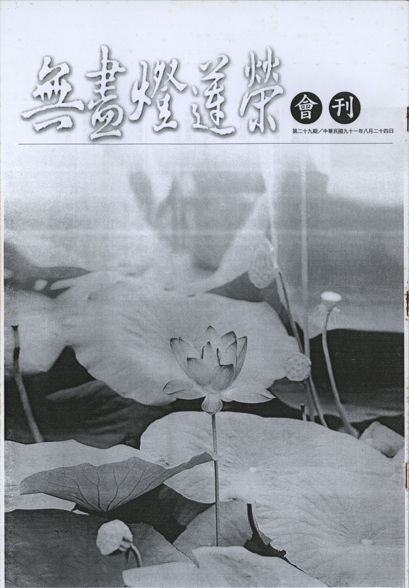

# 第29期

## 社論

### 青年應有的人生觀〜吳賽牟先生來訪省思

*編輯部*

吳賽牟先生出生於緬甸政要家庭中，十六歲時至英國唸書，在英國取得法學碩士，於新加坡與泰國都是執業的律師，而且也是臨床的心理學醫師，事業上極為成功與忙碌，對於佛教事業的推展更是不遺餘力的護持，只要有需要他幫助的地方，他必定毫不猶豫放下手邊的工作，來興辦善法。

年初的緬北之行受到吳賽牟先生的全程熱情招待，不但是在供佛、齋僧及放生等等善法上，非常盡心地幫助我們，連生活料理照顧也不例外，同行的團員即使身體有微恙或者有煩惱，都逃不出他的眼光，受到他的關愛或者迎請醫生來治病，讓我們非常感激。吳賽牟先生此行陪同禪修中心的住持和尚，於台灣弘法三個星期，並且和我們一起度過正當離開台灣前，最後一個安靜的下午。

來到台灣，吳賽牟先生和他的同事每天早上兩點起床，為大眾準備所有的一切雜項。準備兩百人的早餐及午餐，大眾於清晨四點開始禪修，五點鐘用餐，到了晚上九點半之後，還要充當翻譯將三藏法師的緬甸文翻成英文，再請他人翻成中文，雖然很累但是內心卻充滿法喜，覺得此行能夠來到台灣實在是極有意義，非常值得也很成功。

他立定決心在他這期生命結束之前，要儘可能幫助需要幫助的人，因為以後因緣不知道會如何變化，也許會因為生病而無法幫助他人，也許今日就會死……，人生有太多的變化，所以趁著現在有力氣的時候，只要有機會就應當好好把握去幫助他人。只要對別人好，別人也同樣會對自己好，因為這樣的信念支持，他不斷的盡自己的能力去幫助他人。因為幫助別人所產生的歡喜心，讓他就算每天清晨兩點起床做許多雜務服務大眾，使大眾安心修法，也是他非常樂意的一件事。

一般人做好事，內心會希望能夠得到或名或利，而他因為替別人做事看到大家因此而歡喜，故內心得到了快樂與滿足，從以前作善法累積到現在，內心得到一次又一次的滿足，慢慢地內心就能夠真實肯定做這些善法的好處，雖然從早到晚都在做事，但是內心卻非常快樂。他舉例說就像在浦甘的村落中請村民吃飯，這對我們而言是微不足道的一點小錢，這些錢可以用在任何享受上，但是當我們將這些錢拿來請村民吃一頓午餐，對他們而言卻是這一整年最豐盛的一餐，看到他們內心的滿足就是我們內心最大的富足，所以若是無法利益他人，那怕是出生於富貴的家庭中，內心必定無法獲得滿足。

吳賽牟先生出生於尊貴的家族中，卻放下身段，拉下面子，去服務他人，尤其是對於窮苦的人民，對於他人異樣的眼光，卻毫不在乎，他所在乎不是地位與錢財，而是自己內心的善行，他以自己的言行來保存家族的顏面，例如不在公開場合唱歌（即便他擁有一副極佳的歌喉），也不說粗魯的言詞，更不做任何壞事，而且不論身在何處必定早晚向父母請安，報告每日所作所為，並向父母頂禮，故他的父母也非常隨喜他這樣的善行，服務眾生就算是全身弄得髒兮兮也覺得是一項榮譽，這樣做來保存家族的尊嚴，更保持了自己內心良善的本性。

在利益他人當中，必得要了解他人的需求，有一次要到一個村落中修塔，剛剛開始他會將自己的車子停在很遠的地方，坐計程車到村落中，這些村民不知道他的真實身份，長時接觸之後，慢慢地就可以觀察出窮人的需求，譬如有時他會和村民一起搭巴士，發現有些人連搭巴士的錢都沒有等等。雖然因為所賺的錢是有限的，沒辦法滿足所有人的需求，但是他願意儘可能地幫助需要幫助的人。

內心當中常常有許多想要做的善法，但是不是每件事登能夠完成，受到了障礙內心會覺得非常的孤獨與痛苦，有時會獨自的哭泣，可是慢慢地給自己打氣，瞭解到自己其實只是普通人，不是一個具有極大能量的人，所能做的事情是有限的，所以遇到障礙時請教有經驗的長者，在累積經驗之後，慢慢就有抉擇事情的能力，可以先做重要且急需要的事情，雖然在成長的過程中，受了許多苦，內心感到非常孤寂，可是這些挫折讓他獲得了更多內心的心靈成長。

又因為作為一位在家人，前提要賺錢養活自己並且訓練自己的能力，以及建立良好的名聲，來成就一些善法，當然這些都不是一朝一夕可以成就的，必須要經年累月的努力與學習，不論是從書本上、有經驗的老人、或者是老師的教化上，不斷的學習，方有足夠的知識、經驗與錢財做善法，故其父母對於他的支持是必須具備這些基本條件，再去做種種社會服務的工作，建議年輕人培養自己各方面的能力，增上自己的能力，服務他人，不管是財物或是名聲的累積，都是做善法的資糧。

由於父親的影響力，所以他已經有極佳的條件可以利益他人，但是他卻不會利用既有的名聲來滿足自己的私欲，而是儘可能的幫助他人，不過好名聲是非常難以建立卻極容易失去，可能在一天或是一小時之內，就失去了好的名聲，失去了好名聲，失去了別人的信任，善法的推展上就有困難。

且彼云在年輕的時候，做善法時總是遭遇種種嘲弄與不信任，那時心情極為煎熬，但是一次又一次不斷的做下去時，漸漸地不論是他人的讚揚或者是批評，內心不會起很大的漣漪，心中不會有驕傲或者沮喪，因為「想要成就的善法一定要不斷的做下去」的信念支持他，雖然做善法難免還是會犯錯，但是漸漸地累積經驗之後，不但錯誤越來越少，而且自然而然就會有包容與無謂他人批評的心量。

在他年輕時，他曾夢想在窮苦的地區中當一位老師，但是他發現到這樣的夢想難以實現，因為如果僅是到一個村落當老師，所幫助的是一個村落的人，但若是總統就可以利益一個國家的人，一位出家人與一位高僧所能利益的眾生也是不一樣的，所以他在自我實現中儘可能的多賺一些錢，幫助更多更多的人，也成就更多的善法，就如同我們至浦甘與曼得列放生，在這之前他從來沒有做過類似「放生」的法行，覺得內心十分歡喜，之後他每個月自動拿一筆在緬甸不算少的錢來養活這些牛群，內心從不期望有所回報，因為他以為內心若期待有所回報，未得到現前的利益時，內心會難過沮喪，如果不報任何期望的善法，當得到回報時內心會更加的喜悅，因果報應是不需要期待，而必定是自動自發會產生的（不論是任何的職位都能發揮應有的功能，可將吳賽牟先生此段當成另一類的理想）。

他以流利的英文用作為佛法的傳播，讓許多人由語言無障礙中得到內心的淨化，他也描述當接觸到國外的文化及傳統，此時反而會更加尊敬自己的文化與傳統，並且更加愛護它，故吾等有心學習他國語言者，當熱愛自己的國家與文化，認同自己的國家文化以及佛法的尊貴，以流利的英文傳播佛法與文化。

由以上吳賽牟先生來訪的對談中，相信大眾於此寧靜的午後，對於這位年輕人所擁有的豐富人生經驗，與做善法的覺受，必定在內心中引起極大的震撼與衝擊。瞭解別人的需求，放下自己的顏面，樂意做善法並從中獲得內心的法喜，瞭解人生的無常，能夠做一天即是累積一天的功德，並且於身口意三業中常行斷惡修善，這些即是維持人格、顏面以及家庭尊嚴的方法。內心有面對障礙的心理準備，乃至於障礙現起時有調伏煩惱的能力，並且於事後懂得檢討與重新出發，給自己打氣，於做善法中培養自己斷煩惱的能力，回過頭來定能資助研讀經教與念佛的功夫。

## 大德法語

### 佛說四十二章經解（二十一）

*道源老和尚講授*

今講第十三章，

「沙門問佛，以何因緣，得知宿命，會其至道？佛言：淨心守志，可會至道。譬如磨鏡，垢去明存。斷欲無求，當得宿命。」

沙門問佛，就是出家人來請問佛：以何因緣，才得知宿命？他看見佛過去事都知道，還有這些諸大阿羅漢，也是過去的事都知道，過去的事知道這叫宿命通。阿羅漢有六種神通，第一、他心通，第二、千眼通，第三、天耳通，第四、宿命通，第五、神足通，第六、漏盡通。阿羅漢有六種神通，佛當然更有了。於是沒得神通的出家人，就很羨慕也想得神通，特別是過去事都會知道，更羨慕。尤其久聞這六種神通。它是以何因緣，能得到宿命通呢？以何因緣會其至道，至道就是成佛的道，成佛之道至高無上，所以叫至道，沙門問這兩個問題。答覆他，佛雖答覆這個請問佛法的出家人，但是我們大家都要注意聽到，這也是答覆我們（一般學佛初機者亦有此好奇）。佛言：淨心守志，可會至道。「會」就是會悟、開悟了，可以悟到無上的佛道，怎麼樣能悟到佛道呢？上面有個方法〜淨心守志，淨心就是清淨其心，清淨其心即前章所云將眾生的十種惡業：身三、口四、意三，把這個惡業不做了，再做十種善業，惡業不順佛道一定要戒之，善業是與佛道相順的，須盡量去做。但是盡量的做了，也不可以著相，著了相，就想得個善的果報了，還是個貪心，所以先把身、口七支惡業去除掉，再把心意貪、瞋、癡去掉，這麼行十種善業，行十種善業來，也不要著相，這個心清淨了。十種惡業，將心污染了而不淨，若你修十種善業雖是好的，但若著相，猶被善果所污染，所以學佛法要洗心、愈洗愈淨，惡業不能做，善業也不能執著，這樣的心就清淨了。

守志，守志就是守持你的志願，什麼志願呢？菩提志願，就是你學佛法，發過了菩提心，這就是你的志願，發了菩提心，要行菩薩道。發了菩提心，不行菩薩道，你發這個願是空願。以願起行，以行填願，以菩提大願引發菩薩行。行菩薩道就是行門，以菩薩道的行門，將你的菩提願給填滿了，叫做以行填願。你要是發了菩提心，不行菩薩道，等於發了空願，發了願等於沒有發。所以守志，守持著你這個菩提志願，一定要行菩薩道（以十善、六度為總綱）。諸位聽佛法要細心的聽，修行也要細心的修，前面所講的十種惡業一定要斷除，乃因不順佛道故；十種善業盡量的去行，他與佛道相順故，但是不可以著相，不可以著相不是不做善事、而是善業盡量做，它與佛道相順故，但是不可以著相，這個得聽的細心。發了菩薩願，然不行菩薩道，則這個願是空願，等於沒有發菩提心。發了菩提心，就得守此志願，使之不退不失，不要退失了菩提心，不要忘失了菩提心，如何守此菩提心？就是要行菩薩道，行菩薩道就是度眾生，度眾生一定要教眾生修十種善業，那麼我們自己也要跟眾生作伴呀（同事攝）！也要行十種善業，但是呢？不可以著相，你著相了，你這個心不會清淨。行惡業而被惡業所污染了，現將惡業去掉了，雖是不錯，但執著善法卻被善法所污染了，這個心還是不清淨。下面以磨鏡子做比喻，鏡子喻為心，本來是清清淨淨的，抹上了黑煤染污了。將黑煤擦掉了，就等於把惡業靜止了。然修善業若著相，等於在鏡子抹上白粉（善業），如此則鏡子清淨不清淨呢？還是不清淨，為什麼呢？被這個白粉所污染了。所以修善業而不可執著，不執著才是清淨心。

若惡事不做、好事也不做，怎樣能會道呢？能成佛嗎？所以要聽佛法，要細心聽，修行還要細心修。惡業是完全去掉了，然善業要做越多越好，但是不可以著相，說了三遍了，要記清楚！你不作惡業，還要盡量去做善業，不然你怎麼能成佛呢？淨心守志，可會至道，會是會悟，至道就是佛道，在我們自己本分上做起，就是我們自己的佛性，可以開悟，悟到自己的佛性，譬如磨鏡，垢去明存。心等於一個大明鏡，然現在不明，怎麼不明？上面有塵垢，若將鏡子磨的清淨，將塵垢磨掉，垢淨則明存。鏡子它本來就有光明，只是被塵垢蔽覆，現在用功修行將塵垢磨的乾乾淨淨，他本體是清淨光明，磨淨了不會再不看見了。這個比喻最好，不然我們不懂得修行幹什麼用，修行不是修佛性的，佛性是本來有的，只是被無名煩惱給蓋住了，所以要修行，修行不是修佛性，是破無明、去煩惱的，等於我們磨鏡子，鏡子裡面的光明本來有，不是你磨鏡子磨出來的光明，木板子你去磨，木板子你磨得出光明嗎？它沒有光明，你怎麼磨也磨不出來，它是個鏡子，它本來有光明，現在被塵垢蓋住了，所以要磨，磨鏡子比喻如修行，磨去污垢，將塵垢磨掉了，光明現出來了，一現出來就永遠存在，不會再失掉，就是只要我們開悟，悟到自己的佛性，不會再失掉。

再答覆他，知宿命，怎樣知道的？斷欲無求，當得宿命。斷欲，欲是愛欲，求是求得，世人貪圖五欲之樂，財、色、名、食、睡，是麤重的五欲，要不得；色、聲、香、味、觸，是幻化的五欲之境，也要不得，也要斷除掉，這個伴著五欲的世間法，通通都得去掉，你愛佛法，愛宿命通，還不是個愛欲。你不求財、色、名、食、睡，而求宿命通，還不是個求得嗎？所以你要有一個愛欲之心，一個求得之心，你宿命通現不出來，要把你的愛欲斷了乾乾淨淨，佛法的神通也不要愛，不要求，如此則心才能清淨，心清淨了，那麼光明就現出來了。神通是什麼？應為真心的妙用，你只要心淨，光明就現出來了，六種神通都具足，不只是單一的宿命通。你要有個慾望心，有個求得神通心，絕對不會得到神通。

有出家人來問怎麼樣才能得宿命通，再問怎麼樣才能會得佛道，佛答覆他，先答覆怎麼樣才能知道得佛道，再答覆得宿命通，這個意思要注意，因為學佛法絕不能求神通，先要斷煩惱，如磨鏡子，把你塵垢磨清了，心裡磨清淨了，光明現出來就是神通，神通不用求，自然就會得到，你有求的心，反而得不到。

你要是有個求得之心，絕對得不到神通，你不去依著佛的開示去做功夫，不去斷煩惱，要求得神通，非著魔不可，這個魔是過去的冤家落到鬼神道，鬼神它也有五種神通，它看你有不斷求神通的煩惱，它正找你報仇報不到，這個時候，你心裡有一個空檔，它趁虛（空檔）而入。你關門，它進不來，你開了縫，它進來了，它看你在求神通，你不斷煩惱，它來加被你，加被你叫你得小小的神通，那麼你執著更厲害，自以為厲害，以為真得了神通，那魔更厲害、令得神通者自以為是，孤芳自賞得了精神病。不怕前生不悟，就怕今日著魔，你沒有開悟不要緊，慢慢的修持，到時著了魔顛倒錯亂，不知道修持，這個害了。

鬼神要加被了你，超出了平常人的境界，最近發現一個出家人，不吃飯，多少天不吃飯也不餓，他師父嚇得不得了，把他送到台大醫院去檢查，不吃飯不餓，總是有點生病，他住了七天回家，一點病也沒有，但不吃飯就是不餓呢？還有一個人能吃十幾個人的飯，吃飯吃的很多，這個廟煮十幾個人的飯，他能一頓吃十幾個人的飯，吃到哪兒去？吃到胃囊裡，胃囊它有一定的大小，這不是神通是什麼呢？你想想看，這不是著魔嗎？你不吃飯能成功，你吃十幾個人的飯也能成功嗎？這不是顛倒錯亂嗎？

要是真正得了神通，不可以講，也不可以隨便顯神通，要什麼時候才能顯神通呢？降服外道的時候。先前講佛教傳入中國的歷史，迦葉摩騰到了中國四年，他怎麼不顯神通呢？沒有顯神通的因緣。到了四年以後與道士比賽，為了要降服外道，保住佛法，不顯神通不能降服外道，有神通即使有人問，也不能說，也不能講。開口就說我得了什麼通，絕對是做夢。（下期待續）

## 共修研學

### 勸發菩提心文（二十九）

*心爾整理*

云何念生死苦？

「謂我與眾生，從曠劫來，常在生死，未得解脫，人間天上，此界他方，出沒萬端，升沈片刻，俄焉而天，俄焉而人，俄焉而地獄、畜生，餓鬼，」

人間、天上還好，叫頭出，投生到地獄、餓鬼、畜生叫頭沒，「此界」指此界的人天，此界的六道（是一三千世界的單位世界，此單位世界由地獄至初禪，共有百億單位世界合集為一個三千大千世界），「他方」的六道為此單位世界之外，或可在此三千大千世界之內，或可在其他的三千大千世界，而三千大千世界的數目在這宇宙間無量無邊（連佛都數不盡），「出沒萬端」，出，得到人天小果，沒，淪落三塗；萬端，就是各類的狀況，千變萬化；「升沈片刻」，升也片刻，沈也片刻。

「俄焉」乃快速之意，喻如人的五十年是四王天的一天，此人從小讀書，考功名考上狀元，跨馬遊街、封侯、拜相、告老還鄉、壽終正寢，頂多頂多四天王天兩天而已，不過是忉利天一天而已，夜摩天上半天而已，他化自在天一小時而已，如此俄焉卻讓我們百般的辛苦，原來是夢幻不實，自上界來看下界都是「俄焉」。然四王天的一生是人間九百萬年，只不過是等活地獄的一天，等活地獄還可以活五百年，天堂的享受豈非俄焉乎。一般來講快樂的時候，總覺得良宵苦短，所以九百萬年很快就過去，但是苦的時候是度日如年，甚至是度日如劫。以上是「俄焉」第一個解釋，乃長短的比較。

第二個「俄焉」的解釋是以曠劫壽命來看，生命由無始以來就有，到了現在已經太久了，無法想像（連佛都看不到邊）。所以今日相見是古人相見，乃業緣相逢。或云：盤古開天，此還講淺，或日、星雲未開之前，亦淺，或說：西方極樂世界未成立之前，猶淺，或明釋迦牟尼佛未成佛之前（參看法華經壽量品）還淺，乃因輪迴太久了，所以在地獄來講也短，生到天堂也短，變來變去如轤轆理一樣。轤轆理乃井中的繩子，提水上來下去、下去上來、上來下去。又像車子的輪子轉，如轉了無數圈，此種轉速即是車子的時速，車子的時速都是輪子轉速在推算。我曠劫來輪迴六道，像車輪一直轉，宿世所受的苦這一生都忘光，年輕闖事業的苦，年老都忘記了，即便想起也無苦的覺受。

越王句踐，當他打敗夫差而建國的時候，忘了臥薪嘗膽的苦，一味享樂，明明這一生發生的事都忘記，何況前生的，更何況往昔生中，更何況多少劫前，早忘光了。吾人有時看洗衣機在轉，或車子的輪子在轉，就像輪迴旋轉不停，輪迴的覺受油然而生，內心恐怖的感覺不知不覺的現起。若沒有學到佛法、沒有善知識的引導、沒有好好地皈依三寶，一生從迷入迷這樣下去。梵音集紅葉那一首歌，葉子飄盪，「猛然間捲入雲霄，滿地滾滾情顛倒，幾片翻下糞圊，幾片飛進酒瓢」，或飄到酒家，或飄到妓女戶，飄呀飄呀！轉呀轉呀！好不容易轉到這一生，好不容易遇到好的因緣，聞說死苦，輪迴可怕，卻沒覺受，知道三寶要皈依，但世俗也很快樂，滾出一身滄桑，你看可不可憐。

「俄焉」戲一直演，像走馬燈一樣，那檳榔攤的閃燈，警車的閃燈，那感覺就是輪迴的感覺，在曠劫壽命以後，還沒有搞清楚又要下地獄，所有經歷都過了，履歷表琳瑯滿目，在曠劫壽命以後的我們，卻一點覺受都沒有，真是悲哀！

### 小止觀導覽（八）

*蓮心整理*

經文

今略明十意，以示初心行人，登正道之階梯，入泥洹之等級；尋者當愧為行之難成，毋鄙斯文之淺近也。

大意

明止觀法門乃登正道之階梯，並告誡行者應愧行之難成，而不可以文淺而鄙之。

導覽

一、具緣、訶欲、棄蓋、調和、方便、正修、善發、覺魔、治病、證果等十意的架構乃前前引後後，後後由前前出，故云登正道之階梯，入泥洹之等級。

二、行者於止觀修學無成，或因廿五方便未講究，或因障難不知如何對治，或因資糧未具足等，故行者應在修學止觀定慧前有完整正確的認知，並隨緣進修，以期有成。

三、尋者了知煩惱可怕、三界可畏，眼前微小善業的現起，不敵即將引爆的猛烈惡業，因此尋求止觀法門，以破迷啟悟，而吾等錯覺以人生有苦有樂，故想要尋求止觀離苦得樂的心不強，其成就必微小，因此有心尋求止觀門，應先引發正確覺受。

經文

若心稱言旨，於一眴（注）間，則智斷難量，神解莫測。若虛構文言，情乖所說，空延歲月，取證無由；事等貧人數他寶，於己何益者哉！

（注釋：眴，眼睛轉動也，讀音為「眩」。）

大意

欲明止觀修學的種種好處，以引發善法欲，並說明止觀修學應解行並重。

導覽

一、虛構文言乃自以為是、閉門造車，情乖所說乃表裡不一、紙上談兵，其結果必為貧人數寶、空延歲月。而所謂心稱言旨有悟、修、證三個歷程，其可謂智斷難量，神解莫測，如蕅益大師注經立論，將所有佛裡彙歸為當前的一念，即為智斷難量，日人譽為三百年來之大思想家；天台大師由瓦官寺移至天台山即為神解莫測。

二、「智斷難量」的「智斷」指佛果位所具足之三種德相，即：智德、斷德、恩德。（一）智德，指其所具之德，乃是從佛之立場觀察一切諸法之智慧。（二）斷德，指滅盡一切煩惱惑業之德。（三）恩德，由於救度眾生之願力，而予眾生以恩惠之德。以上三德配於法、報、應三身，同時智、斷二德具有自利、自行、自覺之內涵，而恩德則具有利他、化他、覺他之內涵。故智斷難量有智慧、斷惑、解脫、度眾等義。

經文

具緣第一，訶欲第二，棄蓋第三，調和第四，方便第五，正修第六，善發第七，覺魔第八，治病第九，證果第十。

大意

示修學止觀之十意。

導覽

具緣、訶欲、棄蓋、調和、方便為前行；正修、善發、覺魔、治病為正行；證果為結果。具五緣乃修學止觀門的基礎，進而內訶五欲，外棄五蓋，調和五事，行五方便，內心方能調理得當，先奠定前行的基礎，再下手正修，並於修中隨時調整，方能修行得力，以至證果。

經文

今略舉此十意，以明修止觀者，此是初心學做之急要。若能善取其意而修習之，可以安心免難，發定生解，證於無漏之聖果也。

大意

發心學坐應以止觀為急要，並善巧抉擇十意之內涵，方可安心免難，發定生解。

導覽

一、發定為止，生解為觀，而解為斷惑資糧，智慧為勝解之狀態，可生無漏之聖果。

二、三般若為文字般若、觀照般若、實相般若。文字雖非般若，但為詮解般若之方便，又能生起般若，故稱文字般若。觀照，謂慧心鑒達之用，其體即為般若，故稱觀照般若。實相，為觀照所知之境界，其體雖非般若，而能生起般若，故稱實相般若。

三、文字般若涵蓋教理教法、善知識的教導以及世間的森羅萬象；觀照的觀由止來，故觀照般若即為止觀門，止觀門所緣的境界，就是文字般若所顯示的境界（即影像），如云火、水，內心即生火、水的感覺，內心顯現的現象與原來的差不多，如坐上觀修三皈依，並未直接對到境界（佛、法、僧），但他們的功德證量，猶如鏡現像一般顯現於心，了知三寶為唯一可皈之處，離開三寶生死不可了、覺受不可發、惑不可斷的決定見，此即為皈依的殊勝覺受。又如觀修空性時，空性的義理變成法塵，第六意識緣法塵，就好像心現境（如鏡現像），由鏡像去分別、考察、觀修、體會五蘊沒有自性可見，真實不生，現起如幻，空性的勝解一出，在定中無一真實法可見（實際理諦一法不立），出定後在日用平常間看到境界的幻化不實，對境生起覺受不必靠文字，乃因文字的道理體會得很強烈。例如講到人生的諸苦，而感同身受，淚下如雨，乃因過去發生的事情在其內心顯現逼附實體，如同身歷其境，如鏡照人像時，與真人差不多，這叫做觀修，淨土十六觀即是這樣觀出來的。依著文字所顯現的義理，透過觀修證到實相即是二諦圓融，證悟空性同時可以成立緣起，此種正見的生起均由觀修文字所顯現的義理而來。

四、空性與緣起相互觀待、互相成立，此有故彼有。即以緣起而言，「緣」是憑藉之意，一法成立必憑藉於他法，若法為自性所成，則不必憑藉。「起」是關聯、聯繫之義，此法必與他法有關聯，才有此法之成立，故成立緣起義即是成立空性義，成立空性義即是成立緣起義。

## 專題研學

### 十大礙行第十（十二）

*心筑整理*

「被抑不求申明，抑申明則人我未忘，存人我必怨恨滋生，受抑能忍，忍抑為謙，抑何傷我，以受抑為行門」

以上是十大礙行第十條的經文。

之前談到在作利益他人的事情時，所遇到的障礙與磨練，不論是身體上遭遇的病痛、做善事時應當有的心態與作法、人際關係的建立、甚至是面對名利應有的心態，皆和大家做了說明。此次要和大家談的是十大礙行中的最後一條，也是人生當中最難度過的障礙〜「被抑」。

經文說到「被抑不求申明」，「被抑」即是「被誤解」之意。整句話的意思是幫助別人的時候，要能夠忍受別人遺忘了正義、慈悲、誠信等等，誤會了我們，甚至扭曲了我們美好的心意。之前所談過的「念身不求無病」、「處世不求無難」、「究心不求無障」、「立行不求無魔」、「謀事不求易成」、「交情不求益我」、「於人不求順適」、「施德不求望報」、「見利不求霑分」等等，都是一種處於被抑的狀態，在人事上不得伸張，當我們沮喪、生氣、憤恨，產生種種的煩惱的時候該怎麼辦？妙叶大師告訴我們，正是這些「被抑」的考驗讓我們成長，讓我們的人生更加光明與美好。歷史上也有許多偉大的詩人，也是因為不被朝廷重用而有志難伸，但是他們並沒有因而喪志，也沒有急於為自己的處境辯解、求申明，反而將憂國憂民之心，寄情於山水天地之間，做出了許多美好的詩文，也藉此表達自己的心志。

「抑申明則人我未忘」， 意思是被人誤會而想要伸張自己內心的不平，此時就處於一種他人和我對立的立場，不但沒有站在對方的立場替對方著想，反而將「我」占滿了心中所有的思緒，「他」為什麼誤會「我」？「他」為什麼這樣不尊重「我」？「他」不給「我」面子、「他」對不起「我」、「他」不懂「我」的意思，「我」不甘願被「他」壓榨，這時出現了一個好大的「我」在對抗「他」的侵略。

但我們都知道打仗的結果必定是兩敗俱傷，也就是經文的下一句「存人我必怨恨滋生」，被他人誤會、壓抑時，擺不平內心而想要為自己辯解，此時彼此之間就產生了怨恨，這樣做善事不但沒有功德，還把功德林通通都燒掉了。舉個例子來說，如果遇到有的人喜愛誇張自己的善行來掩蓋他人的付出與努力，此時我們通常會產生幾種想法與作法，例如討厭這個人而處處與此人針鋒相對，或者消極地以眼不見為淨為理由，不願意理睬等等，這都是存人我對立的行相，但祖師大德總是勸勉我們要給人自新的機會，改變儘管不是那麼簡單，但是我們必須要盡力試一試，要發願度此可憐之人，給自己養一塊寬厚的心田。

「受抑能忍，忍抑為謙，抑何傷我」，「忍」字是心上插了一把刀，用這樣的行相，比喻受到污辱時，就像遭遇到心上插把刀那般痛苦，若還能夠「忍」下來那真是不容易！而能夠忍辱者，即是拉下自我，拉下自我其實就是一種「謙虛」的行相，易經六十四卦，每一卦都有吉有凶，唯獨謙卦無凶，六爻皆吉，謙卦是艮下坤上，也就是山（艮）在地面（坤）之下，可是山比地高，怎麼會降至地下？中庸上提到，地和山都是由土石積成的，有許多高山昔日曾在海底，今日的海底亦有可能會因為殼變動而提升至陸地。另外從方位言之，我們都以為山在我頭頂之上，地在我腳底之下，可是如果順著腳底，穿過地球到另一面，那麼山就在地之下了，不是嗎？所以說如果我們平常做人處世，都能拿掉自我根深蒂固的偏見，虛心請教他人，且看那高大的山也可以含藏於低下的地底之內。古聖賢如周公，才氣過人但卻謙恭有禮，以「一沐三握髮，一飯三吐哺」，深恐失去天下有志之士。故做人處世，若能去除驕傲，學習謙虛，和他人建立尊重與信賴，對他人生起慈悲與愛，不論遇到什麼境界，沒有絲毫保護自我的自私心態，只要內心保持良善的動機，自然能安然度過一切境界，被壓迫、誤解等等挫折都沒法傷害我向上學習的心。

「以受抑為行門」，受壓迫、受誤解、受毀謗等都是考驗我們繼續行善的心，菩薩在度眾生的時候，也是遭遇許許多多的挫折與磨難，可是卻從來不喊冤枉，也不會難過喪志，瞭解因往昔所造的惡業，感應今日的被迫害，而至誠地懺悔，更甚而突破我執的束縛，做為修行解脫的資助。敵人可以教導我們寬容，可是喜歡我們的父母、師長卻辦不到，如此看來，敵人對我們其實是良師與益友。達賴喇嘛也說，在他的人生經驗中，知識和經驗最豐收的階段，正是他最困頓的時候，因為困難，所以學習、發揮內在的力量、決心與勇氣，來面對障礙與挫折。這就是以受壓抑為我最好的行持，它（受抑）是幫助我成就最好的法門。（下期待續）

## 蓮池海會

### 蕭賴換老居士往生見聞記

*心筑整理*

應知佛力不思議

突來無常能救拔

撒手歸去且歸去

無來無去事宛然

蕭賴換老居士，生於民國三年十二月十八日，十幾歲時便與蕭連坤先生結婚，育有四子四女。六月八日早上於家中二樓跌落一樓，送醫之後昏迷，回家助念後於晚上八點四十五分安詳往生，享年八十九歲。雖說人生無常，但是老居士驟然辭世，這突如其來的變故，卻仍然讓家屬措手不及，無法接受。

老居士平日待人親切，總是諄諄善誘，柔軟話語中教導子女如何於人情世故中尋得圓滿解決之道，如同俗語所說：「家有一老，如有一寶」。從庄頭到庄尾，從小到大，無論親疏、長輩對老居士的為人，總是讚歎有加。年輕時候的老居士，不但勤奮工作，對長年臥病在床的婆婆，更是盡心盡力的予以照料，從無半句怨言，當別人一再對老居士說：「你對婆婆架呢有孝，將來一定有好尾」時，當時年輕的老居士，可能沒料到，事隔七十餘年，在老居士往生極樂國土之後，老居士的妯娌、親戚，還在老居士的兒媳面前，讚歎老居士的孝心。百善孝為先，老居士的為人是子孫最佳典範，孝順父母、尊敬師長，寬大為懷、與人為善的處世態度，故其臨終具足大善根與大福報，蒙家屬與蓮友護持，蒙佛接引往生西方，並將此德澤加被後代子孫，代代相傳，做為子子孫孫行為準則。

老居士家庭早期經濟情況不佳，兒女眾多，食指浩繁，全賴老居士夫婦耕種之餘，以勞力賺取微薄的工資，含辛茹苦的把兒女拉拔長大。子女記憶所及，不論寒暑，老居士總是日未出即工作，日落後仍未停歇，白天在田裡的工作，從插秧、除草、施肥、割稻、挑糞、種菜，乃至種植苧麻，養豬，上山撿柴。晚上，則經常孤燈伴隨，埋頭織布，幾至天亮。由於手藝高超，品質一流，而且信用良好，每次買布的商人，都會主動預付訂金，要求購買下一匹麻布。

子女每回帶便當時，總會詢問老居士：「為什麼別人的便當，飯都是白色的，而我的飯是褐色的呢？」，同學吃的是白米煮成的飯，而子女吃的是從一大鍋蕃薯籤中，撈起那僅有少許米飯做成的便當！雖然三餐不繼，老居士仍然咬緊牙根，讓孩子接受教育，如今想來，更是令人感佩。

當兒女一個個長大成家後，老居士終於可以放下重擔，享受清福，但因長年辛苦勞動，加上骨質疏鬆，兩腳逐漸不良於行，須借輔助器才能行走，雖然行動不便，但老居士從不怨天尤人，含飴弄孫之餘，受子媳影響，而接觸淨土法門，日日專心念佛，臨終並得家屬護念，蓮友護持，助念三十小時之後，全身十分柔軟，臉色紅潤，含笑西歸。家屬謹遵佛制，至誠誦經、念佛迴向，如法作七、告別式，並辦理佛事（齋僧、放生等），祈願老居士仗佛慈力，接引西方極樂淨土，蓮品高昇，成就佛果，乘願再來。

### 童明生老居士往生見聞記

*心筑整理*

吃齋唸佛忍譏誚

五十年來好結果

休言天命難可測

臨終瑞相已昭彰

童明生老居士是浙江省杭州市人，民國元年出生於一個務農的家庭，民國九十一年七月十三日星期六往生於義子蔡崇瀚家中，享年九十二歲。

童明生老居士早年從軍，並參與抗日戰爭，民國三十四年抗日戰爭勝利後解甲還鄉，並擔任杭州市-長興警察局管區警員。後因國共內戰，又投入軍旅報效疆場；民國三十八年大陸情勢急轉直下，隻身隨軍撤退來台，駐防於左營的海軍，接受最嚴格的軍事訓練，但從未喊過一個苦字。老居士回想當年在大陸參與各種作戰，四周的同袍都戰死身亡，故深感人世間的無常，常覺得還能夠活著，都是佛菩薩保佑。

民國四十二年海軍總部在大直成立，老居士被調到海軍總部醫療單位服務，雖然生活方式比起以前改善很多，環境也非常舒適，更配有寢室，但老居士卻自動放棄舒適的環境，自己在海軍總部內山上搭建草寮一間，在旁邊的空地上種植各種蔬菜，分給辦公室每位同仁，同時在草寮旁修建一小廟，供奉觀世音菩薩、彌勒佛菩薩，因感恩佛菩薩加被及生命無常，於同年開始吃齋唸佛。

老居士律己甚嚴，表現在工作上更是一絲不苟，尤其遇到檢閱時，他便帶領一群戰士將診療所的地板清洗打蠟的光可照人，到處窗明几淨，雖然戰士們有些怨言，但他總不介意，還自己花錢為他們加菜或買點心。「童班長」的種種嚴格，早已成為那些義務役士兵們的話題。

老居士樂於助人，平時為老人取藥並介紹醫師等，而其最殊勝的福報就是對佛法有堅定的信心，每天早晚必須誦經拜佛各三小時以上，開放大陸探親時，許多朋友請老居士回去大陸探親，老居士卻說每天早晚要做功課，不方便出遠門，又因為兄弟父母均已經往生，晚一輩又不認識，且住在別人家裡會造成別人不方便，所以老居士一直都沒有回去的念頭。

與義子朝夕相處十三年，老居士的虔誠信仰、守戒典範，使其家屬與同事在各種生活處世中受益良多，雖然老居士沒讀過什麼書，但其家屬今日有因緣學佛並接觸佛法，有機會學習正知見，並使孩子們知道要諸惡莫作，眾善奉行，自淨其意，使生活中的起心動念圓滿祥和，都是依老居士所開顯的福報。

老居士民國七十五年退休後仍然在單位擔任義工長達十二年，其間一文不取，連掉在地上的錢，也不會去檢，又常常自動自發在社區從事砍雜草工作，一點怨言都沒有，並且對於金錢看得更淡，每次花錢都是為了別人，又經常上市場買素菜時，定要送個香皂給賣豆腐的，說賣豆腐的為人好，家境又不太好，而每次提醒老居士要為老年打算要存點錢時，老居士就說相信佛法及拜佛之人不必存錢，屆時自然會得到佛菩薩接引，老居士能有這種想法，就是達官貴族都不敢相信，何況我們一般凡夫俗子。老居士臨命終時能得到蓮友助念，在殊勝佛號中瀟灑的往生，這所有的一切都在在顯示老居士一生功不唐捐。

八十八年眷村改建完成，雖然老居士身體還健康，但頭腦記憶力已大減，經常外出不知道回家，經也不念了，為了老居士的安全，家屬將老居士送到中和海軍祥和山莊，由老朋友負責照顧，但又因人地不宜，二個月後又被送往桃園永安私人養老院，因為靠海，交通不便，老居士就沒有機會亂跑了，住在養老院期間，老居士無心念佛，煩惱習氣引發而不快樂，雖然每每勸老居士要念佛，但老居士總說念不下去（因老居士的修行是閉門自修，完全沒有接觸經教，亦未與大眾共修，得師友調教，故無法轉自己心念），沒念佛無佛加被，身體退化程度每況愈下，以致得了老年癡呆症，只認得義子及老朋友，老居士示現晚年種種無奈的心境，讓我們大眾瞭解團體互相扶持的重要性與修行必須克服自己的煩惱習氣，所幸老居士與義子一家人有深厚的善緣，感得家屬與善知識護持，並善巧開導安慰，陪伴老居士念佛，告知老居士西方極樂世界才是殊勝歸依處，至此老居士重拾念佛的信心，功力就此提起，歡喜念佛並知道念佛有許多好處，還向子女說今後必定會來接引大家往生西方極樂世界。從此老居士重拾記憶，更認得義女及孩子們。

七月三日老居士因器官退化，無法吸收營養，又再次進入榮民總醫院，經醫師檢查後發現腦血管破裂、肺炎等症狀，醫師認為九十多歲的人不宜開刀，在往生前一天（七月十二日）老居士仍意識清楚正念分明，氧氣不足或呼吸困難時還是大聲念阿彌陀佛，七月十三日上午老居士陷入昏迷，同日下午五時四十分往生，蓮友們相繼助念十二小時後，擦拭身體，老居士的面容祥和圓滿、身體柔軟、腰部以上身體圓潤飽滿、皮膚光滑、頂上仍有微溫，猶如在生，這都是老居士一生樂於助人、廣結善緣等功德所招感。家屬謹遵佛制，於四十九日內如法念佛、吃素、放生、齋僧，唯願老居士萬緣放下，具足信願行，累積資糧，定能於西方極樂世界，蓮品高昇。

## 日常省思

### 學佛與行醫

薛樹清

「佛、醫的世界觀」

佛云：萬法無常，小而世界大而宇宙，一切現象（法）之生起皆須因緣，既是因緣故有生滅變異，即所謂「萬法因緣生滅」，雖由五蘊和合因緣而有一切法（現象），然五蘊之各蘊生起亦有其因緣，五蘊即為色、受、想、行、識—後四者在未生起明顯作用時謂之「名」，但有心識之名，而無心識之用。色蘊與科學的物質相當，色蘊中的四大—地、水、火、風，相當於肉體架構物元素：碳、氫、氧、磷、氮，而其中一大乃一元素，生起亦必待因緣，非自性所生。受、想、行、識四蘊組成有情眾生的精神或心理各種情緒、感覺、意象、意志、認識等功能表現，每一心理變化亦必觀待因緣，而非自性所生。故曰：萬物（色心二法）生起導因於因緣，萬物之生起即是果，此即佛家的因果律，果相生起又是下一果的因，或是他因之緣，因緣果相續不斷，不但物如此，心亦如此，心物和合亦如此，此即萬有因果律，與科學物理所說的「萬有引力」、「質量不滅」定律及生物醫學「物種原始」、「致病機轉」等說相應合。心法上的因果不若物質科學因果律的容易瞭解，但卻是佛法入世觀的重點，造善惡之因，即入八識田中，積成業力，緣生成果，不論時間久暫業力不亡，遇緣必感果，故佛偈有：「假使百千劫，所作業不亡，因緣會遇時，果報還自受。」說明業因不滅，遇緣起現行，自作自受，菩薩知業果之理，故而畏因，若下因種，遇緣感果，可不畏哉！而凡夫昧因，不畏因種，但怕結果而已，然果可逃乎？不可也！

佛教將世界分為有情世間和器世間。有情者（如人類）含有肉體及精神，而有六道種種差別，且以禪定力有無及高下，分為欲、色、無色三界，三界中一單位世界是以須彌山為中心，最高為初禪天，集合一千個單位世界，上至二禪為一小千世界，集合一千個小千世界，上至三禪為一中千世界，集合一千個中千世界，上至四禪則為一大千世界，因有三個千故稱三千大千世界，實則乃一大千世界耳。而宇宙則集合了無量的三千大千世界，每一個三千大千世界都有六道分佈，這包括動物、植物、微生物、鬼神魔等，而其中的高級動物—人類，則為醫學焦距的重點。器世間指依報，為有情所依（生物賴以生存物質或環境），是山川大地、風雨雪月、電雷冰雹、衣服飲食、天堂地獄等（即無生物）。整個宇宙空間無盡、時間無始無終，成住壞空無邊時劫循環相續者。有情界眾生亦無量數的生有變滅。萬法因緣生，萬有因果律及心物相互觀待的緣生觀為佛教的世界觀。而醫學宇宙觀是一切由簡單物質演化分生而來，肉體如此，精神亦如此，只有高級生物的精神才受到重視，此與佛家所言業報所感，一體圓融不同。

「醫、佛的生命觀」

醫學對於人類肉體這一部份研究的相當清楚，大體知道是由父精母卵相會而成合子，合子在母體內經十月胚胎期的孕育而出生為新生兒、嬰兒、孩童、青少年，而成人歷經青年、壯年、老年各階段的發芽、成長、茁壯、衰老。而精神（心理）發育方面則表現在腦、神經系統，由原始的情緒反應如飢來哭食、睏來眠，經由學習、教育、認知而形成現在的我（現我）、私我（自私的我）及超我的各種意識層次於腦海中。現實是現我在掌握，處理現有的實際問題，私我源自原始的私心，超我為培養而得的超高美德，這三種我均在意識中，其中私我、超我在潛意識裡佔大部分，但可以在現實中隨時影響處事規劃及待人方式，亦可在睡夢中悠遊表現。

人的出生以佛經觀之，由入胎之前，即由業力推動而受生，由業力所束縛與支配，或云：業力由何而來？由自我造作而來，生前累積在八識田中（阿賴耶識），死後雖肉體四大分解，但阿賴耶識（即精神）不滅，業種藉緣而生果，由因到果有推動的力量稱為業力，有情眾生由業感果，依果而造業，故不斷地生命延續，而因有種種業的差別，故果上就有六道（三界）的差別。若投生人道，須由業力推動對男女結合有染，入胎成孕而生為人，而有五蘊和合的我，此現象本無今有謂之生，變化謂之老，本有今無謂之死！且繼續不斷地依此模式，繼續不斷地受生。而醫界所觀察不到的就是精神（能量）儲存在內心，乃當前一念最微細作用，他有遇境逢緣感果的力量。

人為萬物之靈，當然有解剖上、生理上、心理上的演化及實驗證據，但因為太強調物競天擇、優勝劣敗、適者生存，而造成夜以繼日、連綿不停的鬥爭與殺戮，這種不謙虛的說法，與偉大主張的眾生平等截然不同。眾生平等且有佛性，萬物（法）因緣生，為何有六道不同的眾生，導因於自性真如（佛性）被起惑造業所蒙蔽，起惑造業又始因於妄想執著（無明），無明與湛然恆常的本性相續相牽，薰習不已，此即阿賴耶識的行相，乃真妄和合之相，雖是生死流轉的根本，亦是解脫成佛之所由藉。

「病因說」

醫學極希望瞭解，人在死後如何還有業力依附的阿賴耶識仍在宇宙間大權掌控六道循環，在空間上萬有皆是因緣所成，時間上因果通三世，且絲毫不爽，不由得你僥倖。一般人認為死後一切空，人生娑婆界對酒當歌，今朝有酒今朝醉，明日愁來明日當，不信因果，不信來世，不信一報還一報，才會不瞻前顧後，私心盡出，妄念四伏，膽大妄為，造作惡業。醫界只相信的是今生的因緣、現世的因果，但屬於物質、生理上。如病從口入、禍從己出，如不忌口易得腸胃炎，不注意安全則易車禍等外傷的短因即時報。其他疾病呈現不論在肉體上、身體上各式各樣的種類可說就是一種現世報或累世（上幾代或上一代）遺傳下來的結果，例如吸煙、喝酒、葷肉腥羶不忌，就是種惡因，加上污染的環境與種因的身體結緣，因緣相會，終結於五年、十年後的慢性疾病惡果，像氣喘如牛、心廣體胖、肝膽俱裂、柔腸寸斷、肝腦塗地、五竅生煙、七孔出血、頭皮生瘡、腳底流膿各系統器官壞透的疾症無不現前。而目前較時髦的癌症、愛滋病、搖頭病，更是吃肉、殺生、嗑藥、性氾濫，不守五戒、行十惡業等自食其果的現代文明病。慾海難填、恨難消，若貪瞋痴慢疑邪見樣樣俱全、火燒功德林的妄念、執著、不瓶、不安，更是導致精神分裂、神經衰弱、躁鬱焦慮、狂想失心、人格異常、性變態等精神疾病的禍源！亦即周而復始、業網恢恢、疏而不漏的因緣果報的現世報明證。最嚴重的是種長因，造惡緣，結了遺禍下一代或數代遺傳疾病之惡果。疾病觀不妨可視為先世的種因遺傳到後代的基因（染色體中），到了現世，繼續可能種相同或不相同的因，加上結惡緣（環境的因素）、攀緣（情緒精神的因素），因緣相會密切結合結果就生病（現世報），未報完的因緣就繼續相傳至後代（後世報）。

「藏諦不滅論」

佛家認為佛性人人本俱，與種種存在於藏識（真如實相中、亦稱阿賴耶識），因妄想執著而起的妄心，造作的業力，亦累積於此識中，因而藏識中有了染淨兩面，亦即為本性（佛心）與妄心的和合體，此和合體依照因果律及萬法因緣生的道理，在六道永無止息的輪迴。人生的價值就在於不斷的修行，以六度除六弊，使生命本體恢復靈明洞澈，脫離無明、業障、習氣、煩惱、獲得永恆的解脫，即使肉體尚未捨報，清淨無垢的心念仍駐紮於常樂我淨的涅槃之上（空性），如此生死界線就消失殆盡，無生無死，或假死空生，進而自度度人，自利利他，行入究竟的佛道。

「致病機轉」

佛書上所說的疾病原因：一為四大不調五臟增損；二為鬼神魔所做；三為業報得病。就西醫而言四大五臟就相當於人體各系統器官，是肉身疾病的匯合處。鬼神所做大約是精神分裂、妄想症及部分神經系統的大宗，為神經、精神專科醫師所專治的疾病。最特別的業報病，或由先世宿業或今生殺生、破戒、造業等所致病，表現在五根、五臟的疾病或失心，相當於身心雙重的疾病、人格異常、變態等徵候群，為最難痊癒根深蒂固之疾，亦非凡夫之眼所能洞察。佛書所談的病大多與心病有關，與西醫七分生理三分心理，重視肉體者稍異其趣。

「而臨絕症時」

醫學的人生觀就是身體的健康，精神的愉快，心理的衛生，就是在娑婆世界這一段指導眾生無病少惱、清涼快樂，物質營養均衡攝受，精神適當調節，至少達到人壽有餘的地步，生、老、病，死前這必經過程中，活的夠久、活的安寧，但不一定活的有意義，醫者慈悲的心不能少，金剛的手段不能不用。但對於生前死後醫者無所交代，也逃避了這一段責任，把它交給了哲學家、宗教家、預言家。而面臨重病危急瀕臨死亡邊緣所發生的憂悲苦惱、恐怖罣礙及顛倒夢想等情緒，亦束手無策，有時是無能為力或行無餘力。在患者面前，不屑開口言佛，羞於言阿彌陀佛，更恥於談觀世音的感應，因為這樣做，會落於醫師無能，醫藥無力之譏，病人棄他而去。醫師訓練過程中亦缺乏此一訓練，宗教或佛法的介入甚至被視為忌諱或侵犯神聖。

罹患絕症到死亡前有一段人生猶豫期，距離捨報可能數月或數週，甚至數日，這時醫師有的辦法可能微乎其微，要妙手回春可能只有希望奇蹟的出現，醫療的力量只限於生命有量無質的延長或施捨到暫時舒適的感覺，當時最迫切需要的是醫者安寧的照護，家人及朋友的精神資助，尤其是佛法的加被更為關鍵，不但平常未受佛法浸潤者需要，已信願解法行者，愈要精進，因為這是證佛果的勇猛加速期，善知識適時於病人或病患家屬徬徨無助時介入導向，應該是提起正念積極面對未來的最佳時機。「放下屠刀，立地成佛」可以發生在意識消失昏迷的前一句佛號之前的時刻！亦可擴散於肉體消亡後念佛、誦經、助念、迴向之時。醫師若能以佛法引導病人萬緣放下，一心求生西方，所扮演的推手角色，往生者雖然已無法轉命改運而延年益壽，但對彼往生者之未來「轉迷成悟，明心見性」卻有助成之功。

「佛法的助益」

生病接受藥石的投予及心理治療是最立竿見影的作法，但久年之疾不能急求一時之炙，需要斷因不再造業，要靠自己修行佛道，一步一腳印，一鞭一血痕，絲毫馬虎不得，需要醫者、善知識者的雙重指點，不可事倍功半的盲修瞎練，佛學參與針砭，有益無害，生命的永續不只是一代轉一代，而是三世無止境的輪迴，善者生起，惡者沈淪，業因果報，一切由自己造作。醫者需謙虛的承認醫道力量有限，佛法才是無邊的，平生這一段是有限的，而死後卻是無期的，肉體精神疾病的防治醫家說的頭頭是道，但心靈的改造，積極、樂觀、創造的佛法人生觀，在平時就需要建立，它可以讓我鑑因知果、避惡去苦、斷惑證真，不但能益壽延年、四大調和、離苦得樂、了生脫死，以致醫佛圓融一體，則娑婆國土即是極樂淨土。

「醫者的心」

醫師平時診治患者，抱行的宗旨是「視病如親，追求卓越」，一如行菩薩道、發慈悲、無我的父母心，同等重視身心的照護，對於堪忍世界的眾生，帶著充滿眾苦和煩惱的病人們，他們安於十惡、忍受三毒，又肩負業報所成四大皆空的假體，雖是假體，但在這一期生命中，以身體接受各種痛苦而酬償夙昔今生所造的惑業。在行醫過程中，醫者接觸病患時，不失為一個給予教化佛法的好時機，除了探究疾病的原因，不妨了知「諸行無常、諸法無我、涅槃寂靜」三法印，助成病者體會無常破除執著，內心得到殊勝的寧靜，而降服病苦。或發四弘誓願—「眾生無邊誓願度，煩惱無盡誓願斷，法門無量誓願學，佛道無上誓願成」將眾生視為病人，疾病視為煩惱，醫術觀成法門，成就無上醫王（經上有云將佛比成大醫王），何嘗又不是醫者的最高願望。六度（六波羅密）是發心度眾各種菩薩行之總綱，醫者行醫亦須觀修己乃發心利眾，以行醫為菩薩行，收攝入六度菩薩行的總綱中。要佈施你的能力予所有的患者，使他們免於恐懼；要持戒（清心寡欲）行醫不以求利為目的，對治貪欲，要忍辱患者的抱怨不滿，要精進你的醫術，要禪定你的煩亂，要圓融你的智慧，藉著醫治病人的生理，進而一步以醫其心。猶需效法地藏菩薩度地獄眾生的精神而發願：「病人治盡方證菩提，…人間有疾（特別是無明病），誓不成佛。」雖在人世行醫，卻是成就究竟道的資糧，此即六祖所云：「佛法在世間，不離世間覺」。醫師接觸的眾生苦是生老病死苦都有，如何助成病人離苦得樂，醫師的角色在其中，於工作行醫之中勤修佛法，或三增上學「戒、定、慧」，或四無量心（慈、悲、喜、捨），或行四攝法（佈施、愛語、利行、同事），深入病人身體苦痛與心靈苦痛。醫生若欲成就病人大利，猶須皈依佛門，並親近能傳道、授業、解惑的善知識，於佛法一門深入，以期能執破、惑破、障破，除卻那根本無明，成就究竟佛道，即是真能利益眾生的大醫王。

「醫者之心聲」

病患多時，一般的醫者樂，但我憂；何以故？憂眾生界病苦何其多也，憂眾生由業故而生病。憂我能力不足、醫術不精進，病人要一來再來，故需求自我修學，不但能治眾生生理病，進而解眾生惑、斷眾生障。病人少時，我樂不憂，不憂斗金之不入，不憂病人棄我而去，但樂我這渡得眾生離病離苦，樂眾生少垢少惱，醫病二者皆有時間修道、聽聞佛法也。

### 一切都是阿彌陀佛所變現的

心亞

每個眾生都有光明的本性，只因被煩惱覆蓋而不得見，然而，這些就如病一般，佛是慈悲的大醫王，他希望眾生的病都能快快好，恢復光明的本性，於是他針對各種眾生的病症下各種不同的藥。慈悲的佛，為了要度眾生，不惜犧牲自己。

就拿我來說吧！我是個非常不耐煩的人，佛就變現一個怎麼溝通也很難達成協議的人，來磨我的耐性，增強我的耐煩力；又知我是個自尊心強的人，就故意說些冷冷的言語，來破我的我執，另一方面，也是用激勵的方式，要我上進；了知我是個很愛護自己東西的人，愛護的成了種執著，或造成修學上之障礙，為破我此執著，佛就故意變現向我借東西，歸還實是損壞的，不然就是不還亦或是不見了；了知我是個不愛被自己不佩服之人所支配，佛就故意示現支配我，要我學習服從，不要堅持己見，也許別人的方法才是好的。再者，佛知道我於疲勞時，更易不耐煩與生氣，就故意於我疲勞、想睡時，還有很多工作必須做，來磨我的耐性。

再談談老大與老二哲學。什麼是老大？老大必得要有整體規劃的能力，為大局設想，愛護一切的人。老大有兩種情況：一種是凡事必親征，此者可增強各方面的能力，觸角較多，提高各方面的注意力；另一種，他有很好的老二協助興辦各種法行，這一種就比第一種好多了。什麼是老二？老二是最幸福的，前有很好的榜樣帶領，碰到困難老大會交予該如何解決。老二有兩種情況：一種好好利用時間，不斷地增進自己，積極地向老大學習，就如顏回。另一種，享受於幸福之中，而不知好好增進自己，等老大倒了，則全面倒了。

有一朵看似弱不禁風的小花，生長在一顆高聳的大松樹下。小花非常慶幸有大松樹成為它的保護，為它擋風擋雨，每天可以高枕無憂。有一天，突然來了一群伐木工人，兩三下的工夫，就把大樹整個鋸了下來。小花非常傷心，痛哭道：「天啊！我所有的保護都失去了；從此那些囂張的狂風會把我吹倒，滂沱的大雨會把我打倒」

若小花當時能好好地紮穩腳根，此時雖少了大樹的保護，但陽光會照耀、甘霖會滋潤；弱小的身軀將長的更茁壯，盛開的花瓣將一一呈現在燦爛的日光下。人們會看到，並且稱讚說，這朵可愛的小花長的真美麗啊！

然而，佛的用心，他給了我很好的老師，更令人訝異的是，他給了我全心模仿的對象，明白地告訴我，就是要這麼做。無論處於哪種地位，皆是好的，就看自己如何用心。但，我比別人更幸運地，兩者地位我皆有，只是在不同的時間與空間罷了。

天人為何難以成就，因為他們沒有很多的障難來對治自己的煩惱，所以到了晚年，稍有一點點的不舒服，就全都受不了。幸運地，我生在人間，現在於這些小障難中，慢慢地磨練，將來放諸四海時，碰到更大的障難，方能迎刃而解。

## 啟蒙園地

### 每月一字 — 其

*蓮心*

其：本義為簸箕（一種用來除去穀類糠皮的器具，或者為掃地時盛塵土的器具，亦稱為畚箕，「簸」讀音為「跛」，「箕」讀音為「機」），「其」為「箕」的古字，惟其本義為「箕」字所取代，故人多不知其本義。另「其」尚有其他的意思，詳如下列：

一、姓氏〜古文多寫成「亓」，今山東省萊蕪縣及關外東北地區多有姓亓的人。

二、代名詞〜如「聽其自然」、「出其不意」、「學問之道無他，求其放心而已矣。《孟子》」。

三、指示形容詞，是「這個、那樣的意思」〜如「不厭其煩」、「子貢欲去告朔之餼羊，子曰：『爾愛其羊，我愛其禮。』《論語》」。

四、將要〜如「五世其昌」《左傳》。

五、難道、豈〜如「欲加之罪，其無辭乎？」《左傳》。

六、應該，表示期望〜如「吾子其無廢先君之功！」《左傳》。

七、如果，表示假設〜如「彼其能有所忍也，然後可以就大事。」《留侯論》。

八、還是、或是，表示選擇〜如「秦誠愛趙乎？其實憎齊乎？」《史記》。

九、然也，即語體「的樣子」〜「言念君子，溫其如玉。」《詩經》。

十、發語詞，無義〜如「其以沛為朕湯沐邑。」《史記》。

十一、表示加強語氣〜如「尤其」。

十二、置於語尾，表疑問，讀音為「機」〜如「夜如何其？夜未央。」《詩經》。

### 暑期心靈成長營特別報導 — 對「國學啟蒙班工作同仁研習會」開示

雪廬老人

前言

本班也藉著昔日雪公恩師在台中蓮社，對國學啟蒙班工作同仁研習會開示，作為辦學宗旨，令此次活動能圓滿，受學者法喜充滿。

雪廬老人講於七十三年八月二十六日

諸位老師、諸位家長：

我們啟蒙班今天開討論會，這個事情啊（辦啟蒙班），現在是一天一天地發展，這都是各位老師和各位家長諸位的力量！這種力量絕對地沒有企圖，皆是發自個人良心裡頭，應該這樣子辦！這個值得欽佩！

這個重要性可以給諸位說說。什麼事情呢？各國有各國的風俗，一國家一省有一省的風俗，這個風俗，自古以來不能改。就是國家訂的禮，禮皆是國家訂的，諸位要知道，不是任何人訂呀！歷代以來有禮部，跟訂憲法一樣，不是隨便的。但是訂禮節的工夫得合乎各處的風俗，採各處的風俗訂的禮，不能跟當地風俗違背了，「禮從俗」！大家要明白這一條。

既是這個樣子，大家要明白，各國的風俗不同，各省的風俗不同，不能硬硬地把我們的風俗取消了，硬改成他的風俗，要是這樣改，必會天下大亂！大家要不信這話，諸位都是現代人物，古時候的情形，大家不甚明瞭，雖不甚明瞭，所以歷史不能不看，歷史是我們的家譜啊！一代代的風俗都不一樣啊，它都有變化。

既是這樣子，古時的亂沒有像今天亂到這個樣子！給諸位說吧！為什麼古時沒有像今天亂到這樣子呢？古時候，除非國家穩定不住了，俗名叫造反，造反，那就是不講理了！你殺我，我殺你，勝的就是王侯，敗了的不管有理沒裡，敗的就是賊寇，勝的別管辦的好辦的壞就算王侯，歷史上是這個樣子的。可是那一國的歷史除了造反以外，社會上沒有這個樣子，怎麼樣呢？現在社會上沒有造反啊？沒造反？實實在在現在是造反！現在哪有造反的？殺官劫庫是造反了吧？警察是執行義務的，殺警察，搶銀行，銀行是國庫，並且搶法院，這不是造反是幹什麼！從前幹這些的都在夜晚哪，現在是在白天裡！明火執杖哪！這還不是造反嘛！現在這個事情〜造反〜是什麼造成的呢？追源求本，就是把中國的風俗取消了，一切一切完全學外國的。外國有外國的好處，在他們這樣辦就好，在我們這裡就不好！一處一個樣子。闢如今日之下，咱憑良心說，來到台灣三十多年了，怎麼來到這裡？大陸上站不住了，跑到這裡流亡到這裡來，這叫偏安，待在一角落上，受外國人的保護，名字是獨立國，實質你是被保護國，到這個樣子啊！這個樣子自己還不爭氣，還不往好處走。提倡中國文化，提倡的這一套是誰辦呢？文化是一國的教育，不是任何人辦的，教育有主題，有副題。學校教育是主題，從前有學校，可訂有功課。那時也講考試，考的工夫就考這幾門，沒這幾門不能中試，這是一定的規矩啊！大家要是懂外國歷史，還得懂其古今歷史，譬如中國人講孝〜行孝，中國人的行孝法如何行呢？咱說個平常的，叫老人休息，養著他，什麼事替老人幹，大概這樣子的，這是行孝！在百十年前，非洲也講究孝，那不很好嗎？孝與我們不一樣。有了年紀，不能動，怎麼行孝法？看見中國的行孝法，人家不贊成〜這不是行孝！怎麼呢？老人在前頭走，後頭拿一棒子，一棒子打死叫行孝，有了年紀了，太苦了，一下打死，要不打死，這人（活著）就沒味道了，這也是行孝！你說誰說的對呢？大家想想〜他行孝的方法對呢？還是我行孝的方法對呢？人家一棒打死了，你看了不對！你把你這套拿到人家那裡，人家看了也是不對！為什麼這樣子呢？他那裡文化不開，總是野蠻！中國是自古以來就出聖人！這一些政治皆是聖人訂下的，中國的祖宗就是聖人，外國的祖宗是猴子！那怎麼會一樣呢！唉！

說到這裡，今日國家雖然提倡中國文化，我問問，這裡現在媽祖出巡等等這一套，國家用區公所下了命令，必出去遊行，不遊行不行，有這個沒有呢？沒有。這都是老百姓自動這樣子辦！風俗！你看媽祖出巡，大家是真心實意的拼命幹，花多少錢不在乎。現在提倡這些西洋文化，大家不得不服從，嘴裡隨著說，口是心非！這個不行哪！中國自古以來辦事，什麼叫聖人？幹事一個「誠」字，一點都不假，真心待人！這不是很重要的嗎？闢如今天我們啟蒙班，不錯，是蓮社裡提倡，蓮社提倡的力量大？還是你們這些老師與家長的力量大呢？總得懂理呀！怎麼別處提倡不這樣子呢？這都是你們老師、家長、你們的良心，自己動的啊！這就叫「天理良心」哪！

現在的人天理良心有沒有？有。有怎麼不辦呢？外頭的環境傳染，染的壞習氣太多了。什麼習氣呢？這些外國不三不四，雜亂無章的習氣，跟我們本國的風俗不合，就這麼個情形。

那中國的風俗是什麼呢？中國的風俗我給你說，你們聽聽，很重要的一句話，全部的中國文化都有了！不過是難懂一點，頭一句難懂，第二句就好懂，第三句容易，第四句就更容易了。四個字是什麼呢？現在我們推動就是按這四個字走。

頭一個是「道」啊！這個字就很難講，什麼叫「道」啊？有道明君，無道就昏君。大家聽著，這個道字，你念中國書就注重這個字！這是頭一個。你們諸位上學，學校裡孔子是老師。你們信宗教信佛教，佛是老師，佛也是講道，孔子也是講道，「道」誰懂得呢？人人都有，迷了！迷了就亂，明開就什麼迷暗都沒有了，就安穩了。所以說頭一個字道〜「志於道」啊！「志」是把心裡定一個標準，標準以外莫論，單是在這上頭就是一個「道」字。「道」這字暫且不講。我們這裡很注重「道」，現暫且不講，我說完再講，這字大家先記住。

講第二個字，根據著什麼辦呢？「德」。大家常言某人有德行啊！這個大家都會說吧？這與道字有連帶關係〜道德。這裡辦道德會，那裡辦道德會！「道」是什麼？「德」是什麼？光嘴裡會說，與「道」談不上，他根本不懂〜他自己有而不懂得。「德」字他也不會講啊！這些注解注的亂七八糟，孟子說：「盡信書不如無書。」你信這書上的話還不如沒有，他愈說愈亂！「德」到底是什麼東西？我說一簡單說法。「德」是道之一字，只要不變動，不改變，就叫「德」，他不變動。不懂得「道」，懂個「德」就行，不變動啊！這個很簡單了。這兩個字說起來，「道」很難講，「德」比較容易一點。

第三字是「仁」。中國〜仁義道德嘛〜「仁」右邊是二字，左邊是一個人字，有你有他，這是簡單的講，細講就麻煩了，孔子一輩子講「仁」。「仁」是做事情的工夫，一切一切都是為大家謀幸福，這個好懂了吧！為大家謀幸福，一舉一動的，不是說空話，不是滿嘴說的好聽，要拿出真心來，真犧牲自己，替大家謀幸福。佛家叫「慈悲」，孔子叫「仁」。

這三個字是這樣子的。今日之下你們辦啟蒙班，辦出來，誰給你錢？你辦的好，誰封你個官？有沒有呢？咱連名還不出，並且吃飯還得自己往外掏錢，你們圖個什麼呢？你們這樣不是為了個人的子弟往好處走嘛！不就是為了這個嗎？為大家謀利益嘛！你們子弟長大了，不當太保，不殺官劫庫，這不就好了嗎？天下就是求個平安，求個公安哪！有了這個字，就很好了。但有這個字，怎麼個辦法呢？

第四是「藝」字。藝就是藝術。什麼叫藝術呢？種種的工業等等的這一些叫做藝術。像吃的、穿的、用的、做的，這些都是利益大家的呀！你做這些東西得想想，這些東西與大家有好處沒有好處？譬如中國不能說不打仗，打仗得動槍刀，做槍刀這就已盡意了。除這以外還有什麼呢？中國在漢朝時就有火砲，大家禁止。槍〜雙筒〜大家一律反對。一根打死一個人就可以了，兩個管一出來打死兩個人，這就是不道德！中國的風俗是這樣子的！至於機關槍，一打打死多少人哪！中國人會也不發展。機關槍現在也不行了，現在有原子彈。原子彈在中國人絕對不造！要說中國人會造原子彈，你念佛經你就懂得，他（洋人）沒唸過中國書有什麼法子，中國不肯這樣！這東西造出去以後，留害無窮！今日之下，全球上是「共存共榮」啊？是「共殺共死」？諸位仔細想。有云：「老百姓受了多少壓迫」，抬不起頭來，就是沒有原子彈哪，有了原子彈就不在乎了，你也放我也放，這一套是外國人的。這幾年來，我來到台灣已三十多年了，台灣風俗，我一聽一看，過去與現在大不相同了。大家認為好，我認為倒楣！怎麼呢？現在吃飯，人人吃毒藥，沒有一個不吃毒藥的，在從前賣飲食，裝上毒藥，這是喪了天良，這一家子不會好的。因果報應大家都講，現在大家不在乎這個了，誰講因果報應就是迷信！要金錢，殺官劫庫，這是正常，不是迷信。風俗到了這樣子，怎麼會好啊？

所以這幾年為什麼要有啟蒙班呢？「蒙」是年輕的人下生以後還沒開智慧，此時傳染性很大，要他學什麼他就學什麼。本性裡原來有善惡，開蒙的時候就薰染善的，這就行了！教學以「道德」為第一，大家聽明白：有了「道」，「德」是根據那個「道」來的，往外推展為「仁」，絕對地不害對方，有益於對方，這多麼好呢！為什麼有益於對方呢？因為種種的工業都是與大家有利益的，與大家無利益的一概不造。這是中國的文化，這四個字談完了。

今日之下，向大家說「道」字，人人都有。但是一個字與我們有好處了吧？有好處。可是我們還不會死，你們諸位想想，人人死不死？沒有一個人不死的，「自古皆有死」〜這是書上的話〜沒有不死的人。但是佛家發現了一個不死，也不生也不滅也不死，是什麼呢？就是「道」。「道」是什麼呢？「道」就是我們的本性，人人有性啊！佛家講「明心見性」嘛！俗語「山難改，性難移」，性是不變的。怎麼不變法呢？這個不念佛書就不懂得。我們這個肉體，譬如我現在九十五了，九十五算什麼呢？你們大家還年輕，不曉得，人活九十五就很不容易了，「人生七十古來稀」呀！有云：不是。怎麼說不是呢？有說七十是人生的開始，這是好聽話，我說得比他還好聽〜活七千年以後才是人的開始呢！這不更好聽嗎？這是說廢話，得要真心誠意說實話！道永遠不滅，我們的本性永遠不滅！佛學講有生有滅，怎麼說性不滅呢？要是什麼學問你也研究了，才知道。現在的科學不能反對，它有好的我們就採取，壞的我們不取。科學有這話：「物質不滅」，物質永遠不消滅，它只有變化。「能力不滅」，什麼叫能力？能力就是他的本能，本能存在，性就是本能。怎麼個存在法呢？這一些東西皆有能力，能力就等於空氣，那兒也有，沒有就不行。人兩三天不吃飯不要緊，一點鐘不呼吸就完了，這東西太重要？「道」就是咱的本性，「道」說出來了。咱們的肉體早晚是要死，死了以後有六道輪迴〜天、人、阿修羅、畜生、地獄、餓鬼。譬如我不怕死，你不怕那個死啊？死了就沒有了！沒有了更好，我最喜歡死了就沒有了，但是死了，死而不了，這是倒楣處！不了怎麼樣呢？不了就在六道輪迴裡變豬、變貓、變羊、也入地獄，痛苦就大了，活著受的罪還小，死了若沒解決的辦法，不說別的，就說變個豬吧，人人都知道的，變了豬總得挨刀，那怎麼辦呢？得懂得這個。所以佛家就不必說了，能解決生死。孔聖人也有這話：「朝聞道，夕死可矣。」這個「道」原來是有你的，道不遠人，就在你本身上。你要是明白了，就算懂了，早晨明白了，晚上死也就不要緊了，有辦法了，就是如此啊！

咱們啟蒙班不得了啊！你們老師、父母們這樣的功德太大了，當時可以叫社會安定。你家庭得先要安定，怎麼家庭安定呢？現在家庭怎麼壞法呢？我來的時候所看與現在不一樣，現在壞在電視上。從前是和睦家庭，一家人和和睦睦的，這是家庭歡聚嘛！現在電視話劇，夫婦兩人也是吵嘴，婆媳也是吵嘴，兒子也是吵嘴，儘是教你們大家吵嘴，家庭革命去！他怎麼會安穩呢？

幼稚園裡訂的功課，德育很少，小孩子別叫唸書，會傷了腦子的…，人是早晚會死，傷什麼腦子啊！我上學時身體非常地健康，一個班上，同學們要是有一個近視眼，大家皆開他玩笑，這是奇怪的事情。現在呢？上學的學生誰不是近視眼，這成了奇怪了！看我九十五了，我不戴眼鏡，我也不近視，我也不老花眼，這成了怪物了（笑），這怎麼造成的呢？別的辦不到，就以教育部訂的教科書，我（雪公）唸書時字都這麼大，晚上點豆油燈，只那麼點亮，還怕傷眼，外面用燈罩罩住。現在是什麼？很小的字，所用洋紙反光，唸上幾年就受害了。難道不能換大字嗎？我提倡了多少年，這幾年報上才有說要換大字，三十多年來才有，這不就是都在睡大覺！

你們諸位算是早醒者，先知先覺，自動地出來幹這套。諸位與大家有很多的利益，與大家有利益就是你們的功德，有了功德，你們後來就結好果。這是今天見面我說個大概，若仔細說起來，在這裡不下臺，我也可以說三天。說三天，愈說愈多，言之不盡，聽得受不了（笑）！我們就談到這裡為止。

希望各位老師，各位家長「志於道」，後來你能不生不滅，不入六道輪迴；「據於德」，別跟道變了樣，德就是不變樣，變樣就不叫德了；第三只要做出來的事，皆與大家謀幸福，謀幸福不是空口說的，得實實在在辦出一些謀幸福的事情來，說空話沒用處。這是今天本人的貢獻，也是本人希望！好！

### 暑期心靈成長營特別報導 — 洪校長致詞

洪騰祥

前言

此次無盡燈儒佛學會於六月三十日至七月六日，假慧燈中學舉辦暑期心靈成長營，承蒙校長與校方大力護持，才有活動之進行與圓滿的結果。以下是慧燈中學校長洪騰祥先生對同學之勉勵。

同學們參加此次心靈成長營，應感謝各位授課老師、各班導師、輔導老師、助教以及義工伯伯、叔叔、阿姨們。為了辦心靈成長營，事前的準備就已開會討論了五、六次，擬定出宗旨、教學方法與行政、後勤事項，及如何彼此配合，落實教化的效果。而助教會議亦召開了三、四次。為了這次的活動，老師們以及工作人員每天都忙到好晚才睡覺，甚至有時一些事情沒處理好，他們連覺都不能睡好，大家可知道？每位老師為了一堂課五十分鐘的內容，要準備八、九個小時才敢上去講，義工媽媽為了煮好吃的菜餚給同學們享用，不知花了多少腦力在想如何配菜、如何調味、如何讓大家吃起來可口，這樣反反覆覆想了又想，乃至其他義工為了這活動付出的辛勞，或在寢室幫忙整潔與清洗、披曬、收拾、分發學生的衣服等等。大家可能不知道，你們舒舒服服的坐在那裡吹著冷氣上課，殊不知那些在後面辛苦的各位義工、老師等，因為有他們的努力，大家才可以坐在這裡舒舒服服地上課，他們為什麼要這麼努力？他們對於同學們並沒有什麼虧欠？他們也不需要討好大家？這樣地努力有什麼值得的？無非就是希望同學們能夠養成自動自發的好習慣，什麼場合要有什麼樣的禮儀和禮貌，這些都是做人處世的基本道理，在這裡老師會教你如何落實到日常作息上去！

學習的目的是為了使自己增上，若不好好充實自己的內涵，以後到了社會上覺得不足那就太晚了，基礎要從小做起，樹要長的茁壯，根必定要紮得穩，根紮不穩的樹絕對長不高、長不茁壯，更不用說要往上發展了！由此可知小時候學習的重要，學習不只在小時候，人的一生都要學習，當不學習時候的你，沈浸在追求刺激、玩耍的過程當中，你就失去了學習的時間；人的一生中有三分之一的時間會花在睡覺上，有三分之一會花在聚會、辦事或處理一些生活瑣事上，另外還有生病及情緒的調伏等等，讀書的時間就非常少了，如此少的時間還不努力學習又待何時呢？當沈浸在玩耍的時候，雖有短暫的快樂、一時的刺激，事後回想起來又帶給了你什麼？每當夜深人靜的時候，就會覺得孤獨，心裡好空虛，就會開始尋找目標、想抓住些什麼？但是又找不到、抓不到，心裡的那份空虛及失落感就更重了，唯有不斷的學習才能帶給你無盡的快樂，唯有艱辛困苦的去追求才會好好珍惜。很多人不好好珍惜眼前垂手可得的學習機會，往往在失去光陰後，才開始後悔沒有好好珍惜。有句話說：早知如此，何必當初？但是世人往往都會被眼前的歡樂給迷惑，反而看不到或忘記遠大的目標，短暫鬆懈而錯過了學習的年齡與機會，而遭致嚴重的後果。

在這裡老師們會教你們眼光要放遠、心胸要放大，看事情不要只看表面，要看到深層裡面的涵義，這才是以後你成功的秘訣，還有許多許多的事情和道理，都在各位老師及義工、輔導老師、助教身上及頭腦裡，等著你們去發掘，也希望你們在這心靈成長營學到如何待人處世接物的道理，更希望你們在這裡學會如何尊重他人以及平日的基本禮儀，有好的禮儀，一定可以使你在外受到別人的尊重和重視，如果再加上所學方向的正確，相信日後你一定會是個處處受歡迎、人人尊重的人才。

## 法會與活動迴響

### 從藥師懴法會中談儀軌之觀修（二）

*心筑整理*

卷上

為何今日要來此拜懺？懺文中云：眾生因為煩惱垢重，不諳因果，不勤懺悔，所以有貪瞋痴、妄想與煩惱、造殺盜淫等種種惡業，罪垢無量無邊，並且所結的冤業，亦不覺不知，例如生日時殺一隻雞，吃起來覺得極為美味，便是造了冤業而不覺不知，得到果報時以為自己很冤枉，其實那是因為我們在不知不覺中做了種種的惡業，若沒有佛菩薩的慈悲宣說，我們是不會知道也不會承認原來我們有如此無邊的罪業。最後得到的苦果乃本來壽命長但是卻短命；本來事業順利但是一下子就垮了；本來富足的變成貧窮；本來子孫滿堂但是最後孤獨；遭遇九橫；最後自作自受墮入三塗受種種惡報苦果。

此時釋迦如來很慈悲地宣說藥師如來本願功德經，並且希望吾人造如來形象七軀，每一尊佛前有七盞燈、燃至四十九天，然此為富貴有能力者堪能為之，而吾等是「綿力」眾生，心緒軟弱如棉絮，心裡雖然歡喜但是不能如法莊嚴，有種種障礙不堪為之，諸如上班、家務等等，忙得團團轉，無法挪出強而有力的心力，做殊勝如法莊嚴之佛事，故祖師於本願功德經中，譯出阿難尊者所祈請之消災法與救脫菩薩祈請之延壽法。眾生齋戒沐浴，於寺院或於家庭中，環境灑掃薰修，與出家僧眾或善士，隨分隨力供養花燈燭等，虔誠敬禮讚歎吟詠，則無求不應，無願不成。經上有說懂得懺悔的人，一定得到清淨的名聲，可以洗浣多劫以來種種罪愆，然真正懺悔的人，是藉著懺軌刷洗污垢的身心，將過去之惡一併除去，未來以願力而勤修善法，所求必得佛菩薩之加持而滿所願。故眾等至心頂禮，求哀懺悔。

此時真正進入藥師懴法的懺軌，以藥師佛為消災延壽懴法之主尊，大眾好好將壇場清理乾淨與供養，更結合善知識們一起行此懺悔法門，此藥師延壽法由毘婆尸佛至未來彌勒佛皆之，今吾等根據佛所說而修此法行。

先頂禮藥師海會聖者，以此順緣入消災延壽法，開首毘盧遮那佛乃釋迦牟尼佛所證的真理，釋迦牟尼佛乃真理所表現的生命現現象，釋迦牟尼佛所宣揚的是藥師琉璃光如來的藥師法門，而藥師法門的指歸乃西方極樂世界，故頂禮無量壽佛，接下來頂禮十方三世佛，以上是頂禮佛。其後頂禮本願功德經（法），接著是藥師海會的諸大菩薩（僧）：藥師淨土上首菩薩為日光遍照與月光遍照菩薩，如同西方淨土之觀音菩薩與大勢至菩薩，之後為八大菩薩，在藥師經上說，行者往生淨土之前，在因緣未定狀況下由此八大菩薩引導吾人至極樂世界。接著因藥師懺及時著眼點為消災與延壽，故頂禮消災障與增福壽菩薩，之後是釋迦牟尼佛宣說藥師法門時聽課的現場大眾有三萬六千菩薩，證果的聲聞僧以阿難尊者為代表有八千，最後頂禮問延壽法的救脫菩薩。頂禮之後，以此順緣生起了莊嚴無比的藥師海會，此時更以藥師佛為主尊修藥師法門。

在藥師經上說，佛法於像法轉時，有情會有很多的障礙，吾等時值末法，障礙想必更多，此時若有情想要得到下述的十六項利益者，須至誠懺悔業障，向藥師佛祈求以滿所願：

一、為欲利益安樂，拔除一切業障，建立殊勝功德者。

二、為欲滿修諸佛大願，具足受持諸佛名號，及正法寶藏者。

三、欲得阿耨多羅三藐三菩提，三十二相，八十隨行，莊嚴其身者。

四、欲得無量智慧方便，令諸眾生安利大乘者。

五、為欲修行梵行，得不缺戒，具三聚戒，究竟清淨，無有毀犯者。

六、欲得諸根完具，無諸疾苦，家屬資具，悉皆豐足者。

七、欲得破魔絹網，解脫一切外道纏縛，拔種種惡見稠林者。

八、若有女人，欲轉女成男，具丈夫相者。

九、為欲求男求女而得男女，求長壽而得長壽者。

十、或當王法所加，欲解脫一切憂苦者。

十一、欲得上妙飲食，飽足法味，及種種上妙衣服，一切寶莊嚴具者。

十二、欲行惠施，一切所有悉無貪惜，施來求者。

十三、欲得正見精進，善調意樂，多聞聰明，解甚深義，恆求勝法，常遇善友者。

十四、欲受持學處，願生西方極樂世界無量壽佛所，聽聞正法者。學什麼都可以受用，並且得到往生西方的利益。

十五、若有已毀之戒，而欲還清淨。已盡之命，而欲復救續。或往生前若有已經毀壞的戒，想要清淨，並且在壽未盡時能去除命難。

十六、乃至國界人眾，種種諸橫，種種諸難，而欲消伏隱沒，順時歡樂者。

此十六件事情，有治本有治標，有解決眼前現實問題，亦有助成我人往生淨土者。

因藥師如來於因地中發了十二大願，得到種種的成就，故可以滿我們眾生的願，若對藥師佛產生上述信心，其信心能和等覺菩薩的信心無二無別，此時放下生命財產，不吝惜地竭力莊嚴，必能獲上述所願。故吾等今日於此當萬緣放下，不要想著財色名食睡、榮華富貴等，這是第一段。吾等根據十二大願，提出十六需求，也相信藥師佛有此能力滿足我的需求。（下期待續）

### 放生感言

薛樹清

那天—五月十二日是個好日子，五月份的第二個禮拜天—偉大的母親節，我們全家四人，決定參加無盡燈儒佛學會為全天下母親祈福所舉辦之放生浴佛活動，也成就我們家女主人的願望。

放生前數週，我的同修就向全家放出通告，今年的母親節，家裡的老修行兼男主人及二個小菩薩不必傷腦筋送母親節禮物給她，隨同參與她的放生、茹素、浴佛一日遊，即是對她的最佳獻禮。（省了買花、寫詩，斷了世俗購物、買珠寶等的煩惱障，又可兼得放生利益功德何樂而不為？）

被知識框住了慈悲的女兒，提出不少放生與保護動物、環保觀念相左的質疑，我的同修搬出《大智度論》中：「諸餘罪中，殺業最重，諸功德中，放生第一」的理論曉以大義。我則暫時放下：「放生觀音慈、放生普賢行、放生悟無生、放生生死盡」的高妙理論。只告之「以當下一念清淨惻隱之心，將心比心，見其生，不忍見其死。無需巧辯自我設障，興起阻斷千萬生機的妄念，當信即行就可。」

一家四口，帶著慈悲、喜捨、惻隱與認同四心，坐上行善的大巴士出發，參加的同參道友一共有二百五十人，分組後循序在相互介紹、寒暄，互念「阿彌陀佛」聲中向放生目的地—基隆和平島海岸出發。四輛遊覽車滿載感應道交的諸眾信念，浩浩蕩蕩向虛懷若谷的大道行去。我家同修，多次參加過共修會所舉辦的的放生行團，我始終隨喜一心嚮往之，加以讚歎。此次放生之旅尤為殊勝，除了帶著上述的善心參加外，另附加怨親平等、視病如親的醫者喜捨無量心，還有兒女憐憫眾生，認同放生之心。

大巴士奔行於高速途中，設想周到的歡喜菩薩發給大家素食早點、水果和礦泉水，茹素一日夜，今日天下殺生害命與我無關，當於來世中不遇刀兵劫，也是資聚資糧，長養慧命好的開端。

在車上有談到放生的好處，如延壽、祛病、免難、得子、生西，乃至圓成佛果，都是大家耳熟能詳的。尤其感人的是老師為家庭佛化所下的工夫，一一要同修們介紹各家庭此次參加放生的因緣，及個人學佛的經過，可謂用心良苦。平常未精進修學，或遇障難退轉念佛心，或有諸多藉口而不能戒殺吃素，能無愧乎？

歷代祖師大德提倡放生的殊勝功德，不勝枚舉，如流水長者子為魚群遣象負水救濟，為其念佛說法終得升天；智者大師為魚兒請命設立諸多放生地，西湖即是其中之一；永明大師因放生魚蝦得自救證果；慧能大師埋名獵戶群中，救活不可勝數畜生性命，且感動獵人放下屠刀，改惡向善；蓮池大師圖文並茂普勸世人放生，告誡世人殺生的惡報；憨山大師謂放生合天心、順佛令、免三災、離九橫；寒山、拾得廣行勸勉放生能成就諸佛心願，善令群生同歸悲化；印光大師謂挽救天災人禍應提倡戒殺放生；虛雲老和尚所主張的內外加修，勇猛精進（外修即指戒殺放生）；金山活佛謂供養和尚，莫若放生，放生為最大善業。

到了七尺門前邊，大夥兒下了車，踩著無垢的泥沼，順著未染著的水路來到海岸邊，岩石嶙峋，同參道友們依組別排列就緒，隊伍莊嚴肅穆，迎著天空飄下久旱未雨的甘露，大夥兒披上雨衣，撐起雨傘，風雨不太大，但是已足清涼、並滋潤眾人虔誠的心。放生法會敦請與會偉大的母親們主法，藉此對天下如佛無私般母親，致上最高崇敬之意。隆重簡單的放生儀式在香讚、持咒、稱名聲中祈請十方諸佛均來加被盛會，大眾隨著儀軌，為待烹宰的眾生說法、懺悔、皈依、發願、求願、念佛、灑淨。在洪亮大聲的佛號及引磬引導下，開始最高潮的放生動作。

由於三寶的加持、在眾緣和合中，大家的願力，眾志成城。這樣美好的放生活動，必藉種種辛苦的因緣，方能生起，諸如：放生地點的選擇、海岸潮流水文的探測、魚兒的選購（近四千斤的紅鼓魚，即將成為老饕的美食）、以及其他辛苦的籌備，在突破諸多障難之後，終能使業重福薄的放生佛弟子們有一個救生贖命、償還殺業的機會。亦是廣積福德、消除業障、積聚放生資糧之千載難逢的機會。

放生功德殊勝、放生機緣難逢，在感激涕零之際，一袋袋的魚兒在跳躍喜悅中傳過眾人的雙手，懷著眾人對它們（魚兒）無量無邊的祝福，並在大眾阿彌陀佛的聖號中，魚兒們順利滑過放生膠布，雀躍入海中。諸佛菩薩似乎在起伏的海浪中接過累世夙有福報的紅鼓魚群，也似乎接去了眾生的諸多障礙與無明煩惱。由衷地希望魚兒們不曾傷到一層皮、不掉一片鱗、不少一絲氣息、重回自由的大海。不論魚兒們以前起的是貪瞋痴哪一煩惱、或犯五戒十不善的哪一戒，放生後能皈依佛不墮地獄、皈依法不墮餓鬼、皈依僧不墮畜生。搖著鰭、擺著尾、帶著我們的祝福，此生不再遭網補、吞殺，安享餘年，來世投生西方世界。

回程的車上，車長讓大家熱烈討論放生感想，「放生」的積極面是「戒殺」，二者需相輔相成。放生是償還以前的殺債，戒殺則不再積欠新的殺業，亦即「隨緣消舊業，更莫造新殃。」放生可以種因、斷緣、轉果。不但放生還實行戒殺，戒殺不但是不去殺害生命，更積極地吃素，吃素可以漸進方式達成，如：先食三淨肉、肉邊菜、去掉重口味的習氣，也不上好吃的館子，不參與大宴，漸減口欲的享受，就能漸養慈悲心。戒殺、放生、吃素都是培養慈悲、消彌殺劫，挽回劫運最好的事功。誠如 雪公太老師所言：「下功斷緣戒殺、中功斷緣兼素、上功斷緣放生。」

有首白居易的偈：「莫道群生性命微，一般骨肉一般皮，勸君莫打枝頭鳥，子在巢中望母歸。」蘇東坡亦云：「愛鼠常留飯，憐蛾不點燈。」魚兒如是、鳥兒如是、老鼠又何嘗不是，都是愛惜小生命及放生的擴充表現，眾生皆具佛性，皆堪作佛，率皆平等一如，就是本次放生所得的極致觀念。

## 三代共修

### 週四共修止淨法語

心晴

九十一年五月九日

慈雲懺主淨土文：

「一心皈命極樂世界，阿彌陀佛，願以淨光照我，慈誓攝我，我今正念，稱如來名，為菩薩道，求生淨土，佛昔本誓，若有眾生，欲生我國，志心信樂，乃至十念，若不生者，不取正覺，以此念佛因緣，得入如來，大誓海中，承佛慈力，眾罪消滅，善根增長，若臨命終，自知時至，身無病苦，心不貪戀，意不顛倒，如入禪定，佛及聖眾，手執金臺，來迎接我，於一念頃，生極樂國，花開見佛，即聞佛乘，頓開佛慧，廣度眾生，滿菩提願。」

我們每次念佛之後，會念兩篇發願文：一篇是慈雲懺主西方發願文，另一篇是大慈菩薩發願偈。今天我們就來介紹慈雲懺主西方發願文的內涵。這是宋朝慈雲懺主遵式法師作的發願偈，淨土懺也是他作的，威德聲廣大，宋真宗賜他名號為「慈雲懺主」。

為什麼要念發願文作回向呢？願是心之所欲（願望）。當我們一心發願的時候，以發願文的內涵來幫助我們平常身口意的清淨，言行的指歸，選擇這篇發願文，是因為其內涵與念佛求往生的內涵完全相應，故以此為我們的願。

「一心皈命極樂世界，阿彌陀佛。」「皈命」是整個發願文的主體，皈命阿彌陀佛之外，還要總皈命十方諸佛菩薩，皈就是皈投、依靠，心要歸向何處？依靠什麼？叫做皈命。用我們最寶貴的生命，一心一意的來皈命，叫一心皈命。皈命彌陀求加持，使行者能滿所願，求生西方。所以「一心皈命」是發願文的主體，一心就是把我們的六根完全收住，不去緣六塵，起煩惱、妄想。心把六根收攝在所皈命的極樂世界阿彌陀佛，把我們的生命、生活、心力全部皈投、依靠在這裡。我們平常是皈投狹隘的、自我滿足的行為、言語、心念？還是以佛法僧的內涵做為依靠處？這篇發願文就是告訴我們，我們皈投、依靠的是極樂世界阿彌陀佛。阿彌陀佛的正報就是我們所要皈命的對象，而他所在的依報就是極樂世界。

「願以淨光照我，慈誓攝我」皈命就是為了求加持、希望彌陀以他的淨光（智）來照我們，以他的慈誓（悲）來攝受我們。佛四十八願裡的第十三願，光明無量願：「設我得佛，光明有限量，下至不照百千億那由他諸佛國者，不取正覺。」如果他的光明沒有辦法遍照百千億那由他諸佛國，他就不成佛。如今他已經成佛了。也就是說他的光明是無量的。

第三十三願「設我得佛，十方無量不可思議，諸佛世界眾生之類，蒙我光明觸其身者，身心柔軟，超過天人，若不爾者，不取正覺。」他發願成佛之後，他的光明可以照射一切眾生，眾生蒙佛照射，得身心柔軟，沒有任何妄想、煩惱。都能被佛的淨光（智光）所照，彌陀經裡也說：「彼佛光明無量，照十方國，無有障礙。」

「慈誓」就是彌陀的大誓願，他在往昔生中，曾經發過四十八願，其總綱就是攝受一切念佛眾生，往生西方極樂世界。所以我們要祈求彌陀，以智光（淨光）來照我們，以他的四十八願來攝受念佛的我們。使我們不再輪迴六道，往生淨土。

「我今正念，稱如來名，為菩薩道，求生淨土。」正「念」就是今心（現在的心）。現在的心就在佛號上。正念不是失念、妄念。是沒有雜念、妄想、昏沈、掉舉，以此心來念一句佛號，叫做我今正念稱如來名。求加持的理由，就是為了要成就上求下化的菩薩道。為了要圓滿佛果（上求），來廣度一切眾生（下化），最殊勝的方法，就是求生淨土。

「佛昔本誓，若有眾生，欲生我國，志心信樂，乃至十念，若不生者，不取正覺。」這是四十八願的第十八願。只要有眾生願意生到極樂國土，很誠心、歡喜念我的名號，那怕臨命終只念十句，如果不能往生，我就不成佛。但是條件要至心信樂，至心即心之所至，一心一意求往生，而且信受好樂求往生來念這句佛號，必得往生。這是阿彌陀佛最真實的願，為廣度眾生最善巧、最真實之處。無力斷惑的眾生，以臨終至誠懇切的十念，透過阿彌陀佛的加被，令其最強的業不起現行，往生淨土之時以最卑劣的凡夫身，受用佛果的安樂。故第十八願乃四十八願的總核心，彰顯阿彌陀佛的大慈大悲，所以要好好念佛，來入彌陀願海（四十八願）。只要往生就能得三時的成就：一、平常的成就。二、臨命終的成就。三、往生以後的成就。

第一、平常的成就：「以此念佛因緣，得入如來，大誓海中，承佛慈力，眾罪消滅，善根增長。」求生淨土，不是馬上就能往生，而是平常就要用功，臨命終才能用上力，才得往生，方能成就。因此平常的成就非常重要。念佛的因是為求菩薩道，求生淨土，廣度眾生。平時以正念稱如來名，圓滿佛果。念佛的緣是仗著阿彌陀佛的四十八願，尤其第十八願。當我們具足因，又有阿彌陀佛的緣，因緣和合時，果叫「入如來的大誓海中」，得以進入阿彌陀佛大慈大悲所發誓願的海中。「海」指阿彌陀佛的四十八願，誓願海遍法界，因此以海來比喻其廣大無邊。只要念佛就可以入阿彌陀佛的大誓海中，與阿彌陀佛的誓願相結合。並且承阿彌陀佛慈悲力的加持，得以重罪消滅。罪不可以自己滅，不可以獨立滅，觀待於至誠念一句佛號使煩惱不起，罪障就沒有因緣生，在念佛的當下，可以滅八十億劫生死重罪，而增長與佛相應的善根。以阿彌陀佛的果地覺，為我們的因地心。

第二、臨命終的成就：「若臨命終，自知時至，身無病苦，心不貪戀，意不顛倒，如入禪定。」求往生最重要的一刻就在臨命終，如果平常就在佛號上下工夫，入如來的大誓海中，承佛慈力。在臨命終就可以自知時至，而且蒙佛加持，使身無病苦，內心清淨，沒有貪戀，沒有難捨、放不下的。以正念為引導，意不顛倒。意就是思心所，臨命終進入亂心位時，像搖彩一樣。如果平常就用工夫，會以正知、正念為引導，心就不顛倒，就不會產生種種的貪戀、不捨、放不下、不起妄想，叫如入禪定。在正念的攝持下，心心念念以阿彌陀佛為我們的所緣境，把亂心位變成定心位，如入禪定一樣，這樣臨終方能成就。

「佛及聖眾，手執金臺，來迎接我。」因為眾生一心，才能蒙阿彌陀佛以及聖眾，包括觀世音菩薩、大勢至菩薩，以及其他許多的菩薩，手持金臺來迎接我們，到極樂世界去。平常當我們念佛的時候，極樂世界就開了一朵蓮花，隨著個人用功的深淺，就會有不同顏色的蓮花，代表不同的階位，臨命終阿彌陀佛以及聖眾，就手持著蓮花來接我們，金臺為最上乘的蓮花座。上品上生就是金剛座、上品中生是金臺，還有銀臺、七寶蓮臺等等。「於一念頃，生極樂國。」接引的速度只要一彈指的時間，就到極樂世界，是生前往生，非死後往生。到極樂世界所受用之法為一乘佛性，能令吾人當生成就佛果。

第三、往生以後的成就：「花開見佛，即聞佛乘，頓開佛慧。」到極樂世界，就可以生在七寶池蓮花中，以我們品位的高下來決定開華的時間，一旦華開就能夠見到阿彌陀佛，就能親聞阿彌陀佛為我們說法，而頓開佛慧，所以往生極樂世界是不立階位，一佛乘的圓教，是直超如來地，當生就能夠成就。

「廣度眾生，滿菩提願。」上言求生西方有三時的成就，然最重要乃平常的成就。平常求成就，臨終才能成功，臨命終成就，才能滿求生西方的願。而往生西方的成就，才能圓滿上求佛道，唯有上求成就，才能下化無礙。而唯有廣度眾生，才能真正圓滿我們菩提心願。

若以慈雲懺主的西方發願文，作為我們的皈命處，發願處，以其內涵來念佛，平常就要志心、要信樂、要正念，如此念這句阿彌陀佛，絕對能夠往生。
