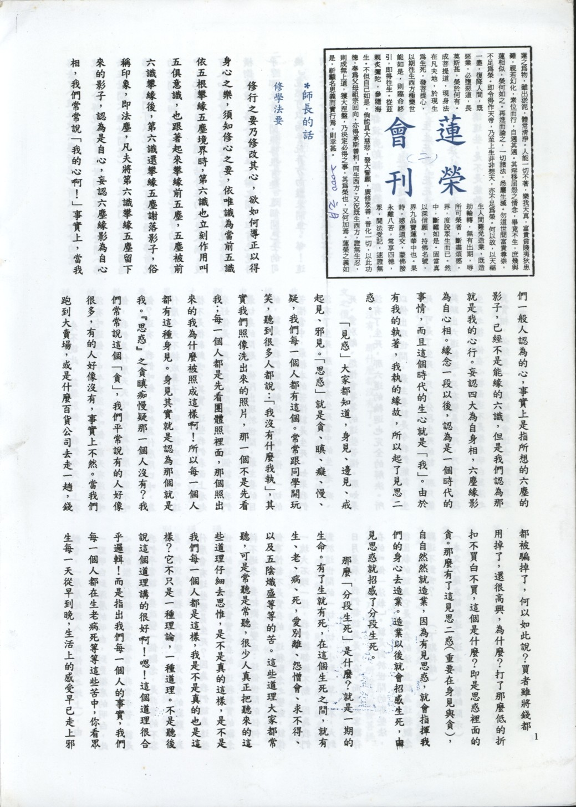

# 第2期

## 師長的話

### 修學法要（一）

*連志道老師講授、編輯部整理*

修行之要乃修改其心，欲如何導正以得身心之樂，須知修心之要，依唯識為當前五識依五根攀緣五塵境界時，第六識也立刻作用叫五俱意識，也跟著起來攀緣前五塵，五塵被前六識攀緣後，第六識還攀緣五塵謝落影子，俗稱印象，即法塵，凡夫將第六識攀緣五塵留下來的影子，認為是自心，妄認六塵緣影為自心相，我們常常說「我的心啊！」事實上，當我們一般人認為的心，事實上是指所想的六塵的影子，已經不是能緣的六識，但是我們認為那就是我的心行。妄認四大為自身相，六麈緣影為自心相。緣念一段以後，認為是一個實在的事情，而且這個實在身心就是「我」。由於有我的執著，我執的緣故，所以起了見思二惑。

「見惑」大家都知道，身見、邊見、戒取見、邪見。「思惑」就是貪、瞋、癡、慢、疑，我們每一個人都有這個。常常跟同學開玩笑，聽到很多人都說：「我沒有什麼我執」，其實我們照相洗出來的照片，那一個不是先看我；每一個人都是先看團體照裡面，那個照出來的我為什麼被照成這樣啊！所以每一個人都有這種身見。身見其實就是認為那個就是我。「思惑」之貪瞋癡慢疑哪一個人沒有？我們常常說這個「貪」，我們平常說有的人好像很多，有的人好像沒有，事實上不然。當我們跑到大賣場，或是什麼百貨公司去走一趟，錢都被騙掉了，何以如此說？買者雖將錢都用掉了，還很高興，為什麼？打了那麼低的折扣不買白不買，這個是什麼？即是思惑裡面的貪。那麼有了這見思二惑（重要在身見與貪），自自然然就造業，因為有見思惑，就會指揮我們的身心去造業。造業以後就會招感生死，由見思惑就招感了分段生死。

那麼「分段生死」是什麼？就是一期的生命。有了生就有死，在這個生死之間，就有生、老、病、死，愛別離、怨憎會、求不得、以及五陰熾盛等等的苦。這些道理大家都常聽，可是常聽是常聽，很少人真正把聽來的這些道理仔細去思惟，是不是真的這樣，是不是我們每一個人都是這樣，我是不是真的也是這樣？它不只是一種理論，一種道理。不是聽後說這個道理講得很好啊！嗯！這個道理很合乎邏輯！而是指出我們每一個人的事實，我們每一個人都在生老病死等等這些苦中，你看眾生每一天從早到晚，生活上的感受早已走上邪路去了（被五欲六塵所迷）。所以有一分的覺，就有一分解脫能力，在世 間就等於出世間（佛法在世間不離世間覺）。如果我們沒有接觸過佛法，我們可以說是從來沒有覺悟過，佛所說的世間真相包括這些生老病死等等的痛苦當中，此屬於自身，還包括外在的天災人禍。沒有人知道會發生什麼樣的事情，尤其現在開車橫衝直撞，路人生命在一瞬之間，但有此覺悟乎？那天看新聞報導很有趣，這個開巴士的司機，竟然可以兩手玩弄方向盤來開車。哇！這個是拿生命開玩笑，現在竟然有這樣的事情。如此說來，人生就是充滿苦惱，如果，人生結束以後什麼都沒有的話，那我們根本不用學佛。可是結束以後，並不是這樣就結束。死了生，生了死，生生死死，死死生生。即使學佛的人去聽人家講佛法，或有一錯覺，云：我聽來聽去都是講這些，是不是能夠講一些我們沒有聽過的東西呢？

先不說此，茲舉別例。我們今天早上有沒有吃過飯？中午有沒有吃飯，前天有沒有吃飯，我們為什麼天天吃飯？為什麼不能不吃飯？還有，我們吃飯，我們為什麼用口吃，為什麼今天不換成鼻子吃，明天換成耳朵吃？這樣不是很新鮮嗎？其實，這些我們表面上看起來好像是一再重覆的問題，其實這個就是我們最切身的問題。佛陀出現於世間，最主要的目的，就是要我們能夠解決一切的苦惱。一切的苦惱當中，最根本的苦惱就是生死。如果我們沒有生死，哪還會有生死當中的生、老、病、死、愛別離、怨憎會等等的這些苦惱？那如果沒有了生死，那六道的輪迴也完全的解決。所以佛出現世間，最主要就是令我們能夠了生死。可是了生死，只了分段生死的話，那只能夠跳出六道輪迴。另有變易生死，乃了了分段生死之後，他在心裡面還不是徹底明白萬法之真實相，必須要一層層地體會進去（對境界之體會，一層層地深入，即悟境之增上），由一點明白到深層的明白，到更徹底的明白，此心裡的徹底轉換，在突破當中非常辛苦。就是我們平常說，要改變一個觀念，是非常的不容易，何況是那種的大轉變，是非常的艱難。為什麼會有這些變易生死？因為我們認為這些世間的事情都是實實在在的，這種執實的觀念轉不過來，要把觀念變成：這個世間的任何一個事情都不是實在的，這種觀念之變動，就像一塊大石頭一樣，我們搬都搬不動，因為我們對於這世間的一切一切，小到一草一木，大到日月星辰，我們都認為是實在，而且是客觀存在的叫做「法執」。就是對於世間的那些法，很固執的認為它是實在的法，並認為這種觀念難道不對嗎？（下期待續）

（本文乃蓮友請教連志道老師，蒙師開示）

## 研習心得報告

### 勸發菩提心文（二）

*心爾*

文之由來：

此一篇文是淨土大德省庵大師所作，法師在阿育王寺，供養釋迦牟尼佛的真身（舍利）寶塔，發起兩種感想。

一、不生佛世，不見真佛，自悲悲人：

這是一種悲的狀態，自悲就是生不在佛世，不受佛的教化，所以不能修行成就，眾生跟我一樣所以產生自悲悲人。

二、猶得讀經典，猶得見真身舍利，自慶慶人：

沒見到真身佛，猶得見真身舍利（靈骨），自慶慶人，沒有見到真身佛，猶得讀經典，其實是看到了法身舍利，它能帶領我們破迷啟悟，離苦得樂，自慶慶人，有悲的部分有欣的部分。很歡喜的就是能讀到佛法，還能見到舍利，所以是很高興的一件事；「於涅槃紀念日作供舍利大會，發四十八願」。今天我們看不到釋迦牟尼佛的真身，真身就是法身，依法身隨緣現起的三十二相，八十隨形好的比丘相，充滿了智慧（應化身）這個我們沒看到，是我們很悲哀的。但我們能有祂的遺物，包括舍利、經典，乃至於發揚經典的善知識，這是我們最後可以把握的，連這個也沒有，那什麼都沒有了。

文之價值：

「此文是祖師所作，名雖非經、非律、非論。」因為是勸發菩提心文，也不是勸發菩提經等等，可是「經、律、論三藏無不攝在其中，勸人發佛果因心」，成佛的因在菩提心，「為顯法身慧命之關鍵」，因為唯有發起菩提心，才會上求佛道。唯有上求佛道，才能成就佛果，才能圓顯法身續佛慧命，真正續佛慧命，要以成佛來說。我們只能說隨順地續佛慧命，教理通達是隨順的第一步，依教理修行是隨順的第二步，按照教理實修而證果，才是真正的延續慧命。「實可當作經讀」，因佛經的義理都在這裡面；「當作律看」，因所有的戒律都依菩提心方為成佛資糧；「當作論研究」，這是勸我們發菩提心的論文。

文題之分釋：

文題：勸發菩提心，文要對題，題目的分析很重要，題目要看懂。

人題：省庵大師乃能詮之人，所詮乃勸發菩提心文，省庵大師乃人題。須從省庵大師傳記補充人題，則吾人對省庵大師名號一提起，立刻很有覺受，因為知道他的證量，他的成就，他的悲心，自然對其所撰的論文，生起甚深之信心。

通別能所：

通題：『文』是通。

別題：『勸發菩提心』是別；心緣菩提（佛智）是發菩提心。

前言：有感於放生護生之慈悲教育，對眾生之重要，能轉個人與團體共業，由短命多病，天災人禍，轉成健康長壽、風調雨順、國泰民安，乃至能夠往生淨土，圓成佛果，對此活動需認真規劃，使成效落實，大眾歡喜，活動延續，善力增上，所願能成，故列組織表，以利欲辦此活動之善士參考。

## 啟蒙園地

### 聖誕節

心印

想到聖誕節，小朋友的腦中很快就浮現出聖誕老公公、聖誕樹和許多禮物。然而這是西方人慶祝他們的聖人-耶穌基督誕辰的方式。試想身為中國人和佛弟子的我們，應該要如何過這『聖誕節』呢？

首先，我們要瞭解，誰是中國的聖人呢？有的小朋友說『國父』，因為他創建了中華民國。但是他應該屬於民族英雄。聖人是代表高尚品德且所做皆合天意。中國的聖人有周文王、周公和孔子。他們一生的表現，都是教導我們如何成為一位好人，當一個君子。而最基本的是先學習盡本分，之後才有能力去幫助社會，報效國家。小朋友的本分又是什麼呢？除了大家都知道的要把功課做好，在學校要守規矩，其實最重要的本分是孝順父母，替父母分勞家事。於兄弟間要兄友弟恭，於朋友之間要守信用，對長輩要尊敬。這些若能一步步的去實踐，你就一定是一位人見人愛的小朋友，未來在社會上也將受人敬重。像這些安身立命的內涵都應該在慶祝孔子聖誕-教師節時好好想一想，才不會失去節日的意義。

身為佛弟子，誰又是我們應該尊敬學習的聖人呢？很簡單，所有佛、菩薩都是聖人，他們都是沒有痛苦，只有快樂，一心一意只想幫助我們的聖人。其中特別是阿彌陀佛，他發了四十八大願，建立了極樂世界。我們只要肯相信他，願意去極樂世界，且常常念阿彌陀佛的名字，我們將來也就能到那裡去。那個時候，我們每天都可以生活得很快樂，過想什麼有什麼的日子。並且很快的，我們都能成佛，來幫助更多的人得到快樂。

去年聖誕節，剛好是阿彌陀佛的誕辰。在林老師精心策劃下，啟蒙班的小朋友用許多亮紙、亮粉、彩帶和彩色筆，勾勒出每一個小小心靈中的極樂世界。連在一旁的小老師們也開始手癢，熱心得幫忙畫了起來。在輕鬆愉快的氣氛下，完成了一幅幅生動的極樂淨土圖。最後我們將這些圖貼在白板上，供養佛，作為送給阿彌陀佛的生日禮物。小朋友！這樣的『聖誕節』，你們覺得如何呢？

### 沙彌救蟻

心印

從前有一個小沙彌，他師父是一個能知未來的老和尚。有一天他看出小沙彌最多只能活七天，隔天就讓小沙彌啟程回家。他走了一段很長的時間，開始覺得很累，就在一棵大樹下休息，而洞內有一群螞蟻正在掙扎，他想：「我必須救這些可憐的螞蟻！」

他拿一些樹葉放進洞裡，部分螞蟻爬上了樹葉，但是水流繼續沖入洞裡並且把樹葉沖走。小沙彌於是築了一個小水壩，這水壩擋住了水流並使水慢慢地流出洞外。他用這種方法救了所有螞蟻的生命。

小沙彌回到家裡和父母住了七天，然後他又回到師父那裡。他師父非常驚訝的看著他，他要小沙彌說出離開的這段期間裡做了什麼事。小沙彌告訴師父所發生的每一件事，包括有關螞蟻的事情。

師父這才知道，小沙彌為何沒在七天內死去，這是因為他有一顆非常仁慈的心，而且積極的拯救螞蟻的生命。
