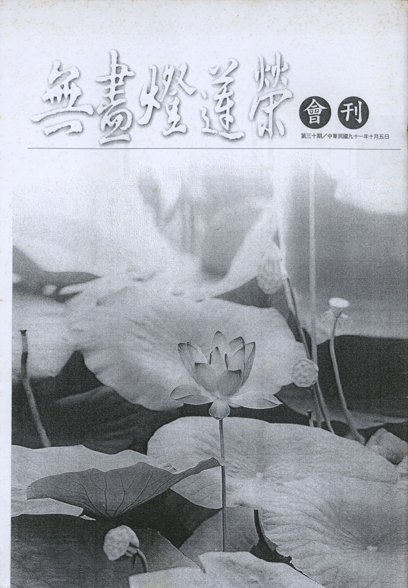

# 第30期

## 社論

### 教師節謹以此殊勝的法供養（明佛之十種通號）向全天下的教師祝賀

*編輯部*

教師在佛法名相中，尊稱教授善知識，能生出學子們的慧命。他的恩如同世間父母能生出子女的身命，但有身命無慧命，如無靈魂之軀殼，而慧命之生必觀待於身命之生。或更勝於世間父母，乃因慧命之得，未來有無盡的安樂。而身命之得未必得到安樂，必觀待於慧命之得才有世、出世間之安樂。而真正慧命之得唯佛，若欲彰顯佛之無量無邊德能，能以十種通號攝盡，真實而言，此殊勝境界應是教師自利成就目標，亦是利他成就目標。因為唯有自能離苦得樂，以及助他離苦得樂，才是教之意義所在。

華嚴經亦以十十無盡來彰顯佛的願力、智慧、神通、道力、德能。也彰顯住、行、向、地四種層次的菩薩，其解（住）、行（行）、回向（向）、證悟（地）之成就亦以十來表彰其內涵是無盡的。儒家也有聞一知二、聞一知十，聞一知二是舉一反三，為子貢之能；聞一知十是體悟無盡，乃顏子之德。故「十」乃是圓滿又吉祥的數字，今逢教師節之際，以佛的十種通號來敘述佛德，來讚嘆佛之為師堪為萬世師表、百代宗師，亦以此讚嘆孔子，以莊嚴教師節，為師道之楷模，為學子之目標。並為修淨土者往生之資糧，何以故？乃因敘述佛德，即是稱讚如來，亦是普賢大願，善財以此功德進入彌陀世界，成就毘盧遮那功德性海。茲略述佛之十種德能之內涵。

一者「

如來

」：如來且約「世俗」而言，是乘著真如（空性）而來，來娑婆以及生死世界度化有情，來來返返不疲不厭，如釋迦世尊已來娑婆世界八千多次。再則約「勝義諦」而言：乘如實道，而成正覺（破二障），故佛之所以能真實利益有情，就在於其證悟為圓滿，故曰「如來」。

二者「

應供

」：佛不但如阿羅漢能應三界之供，還堪受一切世間之供，做眾生的無上福田。阿羅漢的應供是他殺了煩惱賊，但其雖斷煩惱，尚餘有習氣；然佛是習氣永斷，故佛之應供更勝於阿羅漢，不但範圍是一切世間，就深度而言，也是一切凡聖所應供之對象。

三者「

正徧知

」：「正」為聖者的體悟，為空義的通達（破煩惱障），阿羅漢亦有此種能耐，然徧一切法而通達空義（破所知障），此是佛的覺悟，是佛智德圓滿的形象，立「正徧知」之名是在彰顯佛智德圓滿，以立此號。

四者「

明行足

」：「明」指宿命明、天眼明、漏盡明等三明。其中「漏盡明」是在空性上的證悟，破除了二障，淨除了一切煩惱。而「天眼明」「宿命明」是在緣起上澈見無盡，且約過去無盡是「宿命明」，未來無盡是「天眼明」。「行」是指菩薩的萬行即是度眾生的種種方便法，都是佛的成就處。「明」且約破障的能力，「行」且約度眾生的能力而言，故安立名號為「明行足」。

五者「

善逝

」：善逝乃好去的意思，好好地去，去到哪？就是佛的一切種智功德海，若二乘人雖「善」而不「逝」，彼有智慧通達空義，但不能破除二障得到佛的種智，也不能得到依著種智所成就的功德。

六者「

世間解

」：一、佛能解世間有情的根器、習性、所欲，不論與佛是有緣或無緣。二、佛能調伏世間的有緣眾生，乃因無緣不能度化。對於有緣的眾生要如何度化？乃於無善根者令種善根，已種善根者令其成熟，已成熟者令其解脫。且世間解不獨瞭解世間眾生，亦知器世界世間，知彼世間種種境，是由眾生的何業而成熟，而有染境的差別。地獄之染、淨土之淨皆不離眾生的業感。

七者「

無上士

」：一般希求人天安樂者為下士夫，故僅希求此生安樂者，連士夫之名都夠不上。希求解脫安樂者為中士夫，希求成佛並利益有情善得佛果安樂者成為上士夫。至若「無上士」乃真實成就，非僅希求，乃真實成就佛果的安樂。

八者「

調御丈夫

」：調御丈夫乃於難調伏的有情，具有殊勝調御的方法，如調伏貪欲重的難陀，瞋煩惱重的指鬘，痴煩惱重的周利槃特。而其調伏的法門既殊勝且易行，例如如何降伏貪瞋痴，其法行都勝過外道無益的苦行，尤其現證空性出離生死，更是外道永遠不能。

九者「

天人師

」：佛說法利生事業的依止處為人天二趣，佛之利生事業雖多，然以說法利生最為殊勝，而其依止處在人天。其他道則無能力聽聞與思維，因為障深慧淺；無閒暇聽，因為苦逼；無因緣聽，因為福薄。故人天為三乘種性共同受生之處，有閒暇、有能力、有因緣來聞佛與善知識說法，故為佛說法利益事業的依止處（人天）。故佛稱「天人師」，是因人天是佛教化處，其他道則無堪能，只能結結善緣、或顯示其威神力助其脫苦而已。

十者「

佛、世尊

」：在「隨念三寶經」中將「佛、世尊」合為一解，因為佛是具足三智，依著二覺(覺察、覺悟)，通達三智(一切智、道種智、一切種智)，利益眾生所成就的福亦是圓滿，不但智慧圓滿，福德亦圓滿，皆為世所尊崇，成為「世尊」。

此十種通號就是詮釋佛的種智莊嚴功德海，名以召德，以十種通號之名攝持佛德，若能成為我們所嚮往、效法的目標，並在念念中修福修慧，即是以佛的果地覺悟為我們凡夫的因地心，故得「因該果海」，若能了知彌陀名號亦是具足此佛之十種德能，即是真正的名以召德，以持佛之名做為成就佛德的正因，可謂善於念佛，此種念佛最能稱合佛之本懷，最能蒙受佛菩薩的加被，最能得到善神之擁護，也最能除卻極重之障礙。以此法語功德，供養法界之教師、善知識，不論一切凡聖教師，皆所供養。諸供養中法供養最，並以此供養的功德，回施一切有情，做為彼往生淨土及成佛的資糧，大眾聞法之功德亦復如是，說聽皆圓滿，法會不思議。

## 大德法語

### 佛說四十二章經解（二十二）

*道源老和尚講授*

第十四章：

「沙門問佛，何者為善，何者為大？佛言：行道守真者善，志與道合者大。」

此善不是世間善，是出世間善。出世間善行相如何？行菩薩道要守持著真心，此真心就是菩提心，也就是前章的守志（志即菩提心），依菩提心修菩薩道，這是最好善法。你要是志願與道相合，你發菩提心，行菩薩道，菩薩道與菩提心相合，這個叫做最大。

第十五章：

「沙門問佛，何者多力，何者最明？佛言：忍辱多力，不懷惡故，兼加安健，忍者無惡，必為人尊。心垢滅盡，淨無瑕穢，是為最明，未有天地，逮於今日，十方所有，無有不見，無有不聞，得一切智，可謂明矣。」

什麼法它的力量最多？什麼法它最光明？佛答覆他：「忍辱多力」，忍辱的力量最多，為什麼？不懷惡故，他能忍辱，不動瞋恨，心中不懷惡念，生出忍的力量，心中又安定又堅強。

前面教我們要忍辱，有人罵我們，我們絕對不要報復他，要安忍不動。他罵我，我不接受，他帶著罵人的惡業，他自己帶著到自己的身上去。前面要這樣解釋，此章有修行人再來問佛何者多力，佛說忍辱之人能發揮最大的力量。

然忍辱有三種：一、生忍，二、法忍，三、無生法忍。第一生忍：就是忍眾生，亦名叫耐怨害忍。忍就是忍耐，有怨家對頭來加害於我，我就忍耐，耐怨害忍，加害於我的冤家對頭就是眾生，生忍也叫眾生忍。第二、法忍：就是心外之法，也叫做安受苦忍，要是這個境界逼迫到你的身心，你受到苦了，你要安受而不動其心，就是你忍辱的功夫到了家，名安受苦忍，亦名法忍。第三、無生法忍：乃第一義忍（諦察法忍），這是最高的忍，於無生法（空性）安忍不動，亦名無生法忍，能諦察無生法名為諦察法忍，意境最高，名第一法忍。

舉一個例證，就是活到一百二十歲的虛雲老和尚，他發願要報他母親的恩，以朝五台山由南海普陀山開始去拜，三步一拜，拜到五台山，拜到五台山要拜多長的時間呢？拜了三年之久。他拜的三年之中，是過了三個夏天，三個冬天，中間還有刮風下雨的時候，他還是三步一拜，三步一拜的往前拜，這就是安受苦忍，颳風下雨他能忍，夏天再熱，他還是要拜，冬天再冷，尤其到了北方還下雪，他還是要拜，這都是要安受苦忍。後來遭遇到土匪找他要錢，他沒有錢，土匪把他打了一頓，還是想到他有錢，過幾天又來打，這一回打得厲害，把他打得昏過去了，打死了七天又反醒過來。但是他對打他的土匪，他不動瞋恨心，這就是耐怨害忍，就是眾生忍。他（虛雲老和尚）能安受苦忍與耐怨害忍，自然會證到無生法忍，但是他沒有講給我們聽（潛修默證），且活到一百二十歲，成就一個虛雲老和尚。還有金剛經上釋迦佛現身說法，前世當忍辱仙人，遇見歌利王，割解肢體，然不動瞋恨心，此時現出非常大的忍力，他對歌利王不動瞋恚，意念中惡念不起，還發了大願，我要得佛道，先度你（歌利王）。先前講述佛度五比丘，第一個先開悟的憍陳如〜就是那時候的歌利王，忍辱仙人成了佛先度他，這都是忍辱的功夫。舉虛雲老和尚忍辱的力量，再舉釋迦佛過去當忍辱仙人的忍辱力量，給我們做一個榜樣。我們自己遇不到如此大的辱境而無法成就忍力，比方你要來聽經，且知聽經機會很難得，可是天氣太熱你不能來了，下點雨也不能來，一點忍力都沒有。到這個地方來學法，或者是出家人、或者是在家信徒說一句話不如你的意，你就不來了，這都是忍辱的力量一點都沒有，所忍辱的境界太小了，然而你都不能忍嘛！你連天熱、下雨都無法忍，那不是只有一點點的忍力，一點點的安受苦忍。到這個地方或者出家人，或者在家信徒，一句話對不起你，你就不來了，這就是眾生忍的力量一點都沒有。

「沙門問佛，何者多力，何者最明？」沙門提出這兩個問題問佛，佛云：忍辱多力，為什麼呢？他不懷惡念故，若不能忍辱，必動瞋恚的煩惱。瞋恚煩惱不是惡法嗎？若過辱境不動瞋恚，心中無懷惡念，無懷惡念力量生出來，且安健堅強的力量出來。「忍者無惡，必為人尊」為什麼不能忍呢？你怕你不如人，要跟人爭強勝，不曉得愈爭，人家愈看不起，你能忍辱不懷惡念，自然不做惡事，不說惡話，忍者無惡，必為人尊，人家會更加尊重你。

佛再答覆第二個問題，何者最光明呢？「心垢滅盡，淨無瑕穢，是為最明。」什麼最明？真心最為光明，真心現在為什麼現不出光明？被無明煩惱給染垢了，你要用功修行斷無明煩惱，就是把那個染垢滅盡，染垢滅盡而無瑕穢，此時真心清清淨淨無瑕無穢。瑕就是玉有痕疵，這個穢就是清淨的鏡子被塵垢所染，叫做穢。淨無瑕穢，心裡清清淨淨等於玉沒有瑕疵，明鏡無污穢一樣，這個最光明了。

若將心垢滅盡了，真心之體最光明，尤其這真心之體起用，依體起妙用，就是得了一切智。「未有天地，逮於今日，十方所有，無有不見，無有不知。」沒有天地之前，一直到了今天，十方世界十方是東、南、西、北，四維上下空間，是一切所有，世是指時間，在沒有天地之前，到了今天無有不見，通通是在心上見到，沒有不知道的。「無有不聞，得一切智，可謂明矣。」依經觀修證悟了性體得到了真心，即是證了一切種智，能以知道一切法。得了一切智，可謂最光明了。前章云如何，能得宿命通？有宿命通則能夠知道過去的法發生過的種種現象，佛云：無欲無求，可得宿命。有欲有求得不到神通，比如磨鏡子（與本章所喻同），磨去心垢得了一切種智，不但得了宿命通，一切神通都得到。（下期待續）

## 共修研學

### 勸發菩提心文（三十）

*心爾整理*

以下講兩種地獄苦：

一、 八熱地獄：

「黑門朝出而暮還，鐵窟暫離而又入」

黑門就是地獄之門，早上出去晚上就回來（此約等活地獄、四王天一生即等活地獄之一天），早上出地獄之門去四王天享受，享受了九百萬年的快樂，晚上就回來等活地獄繼續受苦五百歲。他化自在天之享受，彼之一天乃人間一千六百年，他又有一萬六千歲的壽歲，一生相當人類壽量九十二億一千六百萬歲，然只炎熱地獄的一天。故由炎熱地獄早上出門，晚上又回來了，繼續受苦一萬六千歲，試問有何可樂？享天福享什麼？獄卒說：奇怪，才剛剛說痛苦的要命，下決心要出離，好不容易出去，怎麼晚上又回來？

「登刀山也，則舉體而無完膚」

此為十六遊增的刀山地獄，

「攀劍樹也，則方寸皆割裂」

，此為劍樹之遊增地獄。

「熱鐵不除饑，吞之則肝腸盡爛」

，吾人修行須以地獄內容作觀修，對生死世界深生厭離，認真看待這世間無非是苦，樂是苦的前兆，試問三界內有何樂可言？世間的刀山劍樹，攀登其上，手被刀割，用紗布包紮，甚為痛苦，或手術被割的苦，不打麻醉劑，非常苦而頻哀嚎，在刀山地獄的刑犯來看則輕鬆，所以說修行、拜佛拜到腰酸，念佛念到口累，這些苦要如何與地獄微分苦相比？以地獄的苦行來修行早就成佛了。任何大德的苦行修行，絕對比不過三塗所受苦，然三塗苦行是白吃，無其價值。所謂「熱鐵不除饑，吞之則肝腸盡爛」，吃熱鐵吞銅丸等等，都是阿鼻地獄的形象，

「烊銅難療渴，飲之則骨肉都糜」

，灌銅汁與熱鐵汁，一喝進去骨肉都糜爛。以前有一種處罰犯人的方法，就是將頭皮割開灌水銀，立刻人身與皮膚分開，風吹像刀割一樣。每天早上去市場看青蛙，若晚一點去救，都活活的被剝皮，肌肉直接跟空氣接觸，那種痛楚如刀在身上片片割。所以畜生、地獄、餓鬼道多恐怖。蓮池大師沐浴未先試水冷熱，直入浴池，受到熱水燙傷，躺在床上受苦非常，大德都受不了了，何況一般人。如此說來，修行最輕鬆，修行的善業可以抵住這麼大的惡業，小小的苦（修行）可以對治這麼大的苦（三塗苦），佛法是不是慈悲？

「利鋸解之，則斷而復續」

，指黑繩地獄，要切的東西量好再用刀切，像宰豬肉一樣，

「巧風吹之，則死已還生」

，此為等活地獄，在此獄中有情互相打打殺殺，將對方剁了多少刀，慘死以後，被風一吹又活，如人與人互鬥一樣。凡是勇於內鬥者必怯於外戰，勇於內鬥的人，絕對不會保護家園，只要敵軍壓陣，這些人最先逃亡，勇於內鬥的民族，很快就亡國。自古以來，中國不像北方那麼彪悍，然若為安邦定國而北伐等都能成功，攻打塞外也都能大破匈奴等蠻貊之邦，因為夷狄他們沒有什麼民族觀念、家庭觀念，沒有民族文化的意識，所以建國沒有崇高理想，人民沒有凝聚力。

「猛火城中，忍聽叫嗥之慘，煎熬盤裡，但聞苦痛之聲」

，猛火城是指無間地獄，在此獄中就是一片猛火，只看到火相，只聽到受苦的喊叫聲，不知道人在那裡，嘗見世間火災火海慘相，可以想像是無間地獄的慘相，火是由業所感。例如太陽表面的熱度，溫度是六千萬度，有情在火海地獄，被熊熊大火所燒，那個痛苦非筆墨形容，如岩漿灌下來，整個人被燙到、燒到的感覺，整個人活生生的被燒烤，這是「猛火地獄」的形象。

二、 寒冰地獄：

「冰凍始凝，則狀似青蓮蕊結，血肉既裂，則身如紅藕華開」

，青蓮花地獄已經夠苦了，到了大紅蓮花地獄，凍到血肉模糊，身上冷凍迸出來像紅蓮花一樣華開。寒冰地獄的苦，如冬天打赤膊到外面走一圈，就可以體會。

「一夜死生，地下每經萬遍，一朝苦痛，人間已過百年」

，「一夜死生，地下每經萬遍」有兩種講法：一種講法就是，如人世間有很多動物，朝生暮死，一夜就生死。地下每經萬遍是指地獄苦眾生或火烤或冰凍，一夜已痛苦地死去又活來有萬遍之多，痛苦到死，馬上又活過來，因為愛執力與業力緣故，是為一夜死生，每經萬遍。第二種講法乃依俱舍論云：人間五十年，四天王天一日夜，四天王天百年為等活地獄一日夜。一日的生死，死時業風一吹又活，受苦死時又活，已經備嘗千辛萬苦，叫每經萬遍。

「頻煩獄卒疲勞，誰信閻翁教誡，受時知苦，雖悔恨以何追？脫以還忘，其作業也如故」

，獄卒處罰犯人，乃至於對犯人種種的鞭打，以種種的刑具迫害犯人。從反面的立場來看，他們是很殘忍、很無情，從正面來看他們（獄卒）很辛苦，因為他們是來對我們的惡業做一個處罰，以前古代也是一樣，這些犯人通通關到集中營，這些都是作奸犯科的。獄卒令他們（受刑犯）出公差，並鞭打處罰這些犯人。反面來看很無情，正面來看是我們惡業去感應的，若無惡業那有牢獄之災，並受獄卒種種的迫害，此其一。或有云這些獄卒是我心裡所現，我內心會變現這樣的狀態出來，例如白天做虧心事的人，晚上容易作惡夢，夢見被老虎追，然後拼命跑，掉進大便坑，這些現象都是惡心的顯現。總而言之，他的疲勞是我的惡業去招感來的。閻羅王每每處罰完以後，都有一些教誡。「受時知苦，雖悔恨以何追？脫以還忘，其作業也如故」受苦難以忘懷，可是脫苦以後變人變天，卻忘了前苦繼續享福與繼續造業，朝出（地獄）而暮還（地獄）。念生死苦需將三塗苦一個一個去念，常說皈依三寶，然真正皈依乎？沒有把三塗苦好好體會的人，是沒有得到皈依之體，因為皈依的決定見是求救護，沒有把三塗的苦觀出來，怎麼會有求救的心態呢？只覺皈依是生活上的一小部分而已，只是人生旅途上求一心靈的安慰，殊不知它是在求救護的立場。因為我們的業身繫在三塗，眼前無力拔斷，上至大總統，下至凡夫走卒，根本無力拔斷，一口氣不來即隨業受三塗苦，那種恐怖的感覺是否生起，人道的命一天一天減少，三塗的痛苦一天一天也接近，恐怖感的覺受生乎？總覺得自己沒有做壞事，沒有殺人放火，也沒有為非作歹，怎麼會去三塗，生起向三寶求救護的覺受力是很薄弱。其實我們的命運跟三塗息息相關，過去的惡業沒有淨化，菩提心沒有引發，對善知識沒有真正親近與學習教法對治惡業，父母之恩也沒有好好地念，乃至於一切該做的都沒有做，一切煩惱妄想沒有對治，一切求救護的對象也沒有好好地生起求皈依過，一切惡業都還在，然後說死後生天，可能性高嗎？往生西方可能乎？常常一心念佛乎？菩提心有好好引發了嗎？若言皈依三寶希求救護，須好好地觀三塗的苦與三寶的功德，確信這樣的對象是可以救護我的，一心一意的找他尋求庇護，他（三寶）告訴我的，我認真去辦，因為這有利害關係。如此說來很多人皈依但卻得不到皈依的體，只有表面。皈依的體沒有得到，三寶的力量加持不上，所以我們感受不到三寶的加持。這些觀念對我們修行幫助很大，有時教理談一談，不妨依教法觀修地獄之苦好好地感受！看看餓鬼之苦，感受感受吧！教理不好好往下紮根，而好高談闊論，不如好好體會餓鬼之苦，有時讓自己餓餓去體會餓鬼餓苦，進而體會刀杖的苦，在受迫害中的恐怖感，乃至於生出五百個鬼子，每位子女都嗷嗷待哺，做為母親的那種茫然無助的感覺，多麼的無奈，我人可以體會出來嗎？（下期待續）

### 小止觀導覽（九）

*蓮心整理*

經文：

夫發心起行，欲修止觀者，要先外具五緣：

大意：

修習止觀應先具五緣。

導覽：

一、發心是指發出離心及菩提心，發心修學正面而言可離苦得樂，小則出離三界，大則成佛證果，發心修學反面來說是破除煩惱及業（煩惱為主），煩惱的核心是無明我執(包括人我執及法我執)，無明我執的對治，以戒為前方便，定慧為正行，定的因是止，慧的因是觀，故止觀的成就，就是定慧的成就，破除我執，即可出離三界、圓成佛果。因此修習止觀者的動機，就是發心，發心大小不同，其果亦千差萬別。

二、外具五緣，是指修學止觀門成就之前最外圍應具備的條件，約內因講是指持戒懺悔、約外緣講是指衣食具足、閒居靜處、息諸緣務、近善知識，以上均為止觀修學有成的要件。

經文：

第一、持戒清淨：如經中說：「依因此戒，得生諸禪定，及滅苦智慧。」是故比丘應持戒清淨。

大意：

說明持戒的重要，並引經證明。

導覽：

一、戒定慧是所有行持的總綱，而其成就法亦是止觀。戒行清淨亦須止觀，在善法上修止修觀，方有斷惡修善之力，此即戒律之成，然以世法為所緣之止觀稱為方便止觀。定慧的究竟處乃成就解脫，然須以緣空性的定及緣空性的慧，才能成就解脫，方是真實止觀。緣世俗(緣起法)的止及觀為方便止觀，成就斷惡修善勢力，此歸為戒之內涵。

二、「比丘應持戒清淨」乃舉一攝四，正說比丘，兼說在家，涵蓋四眾，在家人應隨順修學。在家居士為十善戒，若在十善法上好好講究也有入定開慧的能力，在家人也能成就解脫，以及菩薩功德的成就，十善戒也可做為淨土法門的助功。另如八關齋戒、菩薩戒均可作為止觀修學的能力，若未持戒清淨，不易降伏世間的欲望，將妄念紛飛，無法安止於教法，修學止觀門亦無所成就。

三、持戒懺悔是內在相，非外在相，是福慧雙修，因為持戒就是斷惡修善，斷惡修善即是福，慧是在持戒中要善於思惟因果關係，在因果中若能體會空義，更為殊勝，持戒者如法持戒、在定上成就、慧上圓成，回過頭來再來持戒，戒會更為清淨，為無煩惱的清淨戒，故現證空性以上的二地菩薩，能成就戒的增勝德。

四、佛垂般涅槃略說教誡經中云：「持淨戒者，不得販賣貿易，安置田宅，蓄養人民、奴婢、畜生；一切種植，及諸財寶，皆當遠離，如避火坑；不得斬伐草木，墾土掘地。」是指凡夫戒，乃約束行者不要跟凡夫造共業；以上會使吾等追求五欲境，無法專心修學佛法，有志於修學止觀者，應生起避如火坑的覺受。「合和湯藥，占相吉凶，仰觀星宿，推步盈虛，曆數算計，皆所不應。」屬外道戒，約束行者不與外道造共業，若廣為弘揚此等內涵，將本末倒置，使眾生不能破迷啟悟，離苦得樂，妄卻了生死之大事，造成佛法的泯沒。「節身時食，清淨自活。」是少欲知足而能以充沛的體力與精力來修學善法，「時食」指出家人的過午不食，及用餐的定時定量。「不得參預世事，通致使命，咒術仙藥，結好貴人，親厚媟慢，皆不應作。」是斷惡，屬生活上的行為，不要結太多擾亂修學的外緣，且有些外緣易引發惡心，成為修學的障礙，且遭致苦果。應求三業之清淨。「當自端心，正念求度。」並且要好好收攝內心，希求解脫，作為修學止觀之動機。「不得包藏瑕疵，顯異惑眾」乃約去惡而言，修學止觀的目的乃為去除內心的煩惱。而非求名求利並以神通惑眾。「於四供養，知量知足」指在受用的資財上，要知量知足。「趣得供事，不應蓄積。」指除你所應得的供養(如比丘為三衣、瓦缽及頭陀的十八種法器物，在家人則日用平常之物足矣即可）之外，不應再蓄積。戒固為佛所制定，但一部分亦開放給今日的戒師視時局在不違背制戒精神下，依時代的潮流而遮止，故今日之下四眾弟子亦應戒電視、電影、賭博、吸煙、吃迷幻藥，學生戒逃課、作弊、男歡女愛、長幼無序，以厚培學佛的基礎。

五、定是梵語「三昧」翻譯過來的，智度論上說：「善心一處住不動，是名三昧。」所謂三昧即是隨心所欲將心安住於任一境界上，而且可隨心所欲安住多久就多久，百法直解：「於所觀境，令心專注不散」為定的體性，但心專注於一境界上僅是定的一部份，定是想要專注在那一種境上，都能隨心所欲的安住。比如念佛，心緣在佛號上，可隨心所欲，安住多久就多久，猶如清澈暢通的水流，不會阻塞。研究教法，也要有這種定功，如窺基大師研究唯識學至吐血，其心好樂唯識學，心就在唯識學上，此即定的功夫，因定可生出輕安的感覺。

六、禪譯為「思惟修」，例如欲修色界禪者，須思惟欲界的過患、色界的功德，一心安住於善所緣上，提起正知，警覺煩惱，欲界的煩惱(昏沉、掉舉、散亂)一旦起來，立刻剪除，而得到初禪未到定的證量，故思惟修就是幫助行者在緣境界時能修止修觀，得到止後的思惟修即是觀。比如念佛時，以思惟力察覺欲界煩惱(特別指男女飲食睡眠)之生起、將生，及如何修對治法以去除之，此時佛號轉為精緻、純淨。另外值得一提是欲界善法，但卻是禪定障礙，那即是「沉沒」，若在修學時，沒有力道，即是沉沒相，於境界有安住力而無明顯力，以致堪任性不足，此亦須依思惟修予以對治。故禪定為將心緣念在所緣境(或為佛號、或為咒語、或為無常的義理、或為皈依的決定見)，一方面遠離男女飲食睡眠的障礙，一方面對治沉掉，加強緣念的力量，當你如此往上走時，會發現忘了身體的活動，連呼吸、身心都慢慢的靜下來，到最後連鼻子都不用呼吸，變成身上的毛孔在呼吸。吾等未在禪定上下功夫，因此這個佛號沒法提起來，或提起而無力伏惑，臨命終時，也沒有辦法將心力提起緣念西方，並在佛號上好好執持，淨念相繼，則無法了生死，得淨土受用。

七、禪即「禪那」、「思惟修」，但思惟在未生止時不可名為觀，而是正知，在修止的過程中若有沉掉之障此時立刻察覺，而予以對治，雖可隨順說觀，然實為正知。真正的觀是在止的成就下所建立的。故思惟修有二種名義，懂得思惟修的運用，方可除掉禪定的障礙（如沉沒、掉舉、昏沉、散亂），思惟修所引發的定叫做三昧，這個定可由心輕安引發身的輕安之樂（如風大充身、六根愉悅），從身的輕安之樂再引發心裏愉快的感覺(心輕安之樂)。故真正的輕安，一定要透過心輕安(對境界之專注力成就)，而引發身的變化，由欲界的四大脫胎換骨成為色界的四大，此時身的輕安快樂引發心的輕安快樂，才是禪定的成就，即使初禪未到定亦須如此。

八、禪定可分為世間禪及出世間禪，以空性為所緣，建立出世間禪，以緣起為所緣建立世間禪。但以空性所緣得到破執的成就，回過來對世間的緣起如實的安住及觀察，了知如幻而破愛，仍屬出世間禪。因悟證空性故，回觀緣起則為甚深的緣起，能知世間幻化如水月空花。聲聞緣覺但以出離心為主修解脫道時須以空性為所緣，得以破迷啟悟了生脫死，故為出世間禪。若以菩提心為動機，以無量法門為所緣而抉擇空義，得到的成就為出世間上上禪。不發菩提心者不知其妙奧，只能出離生死，發菩提心者則不但能出離生死，且能利益無量無邊有情，在無量眾生與無量法門上顯現空義。故出世間上上禪與出世間禪本質雖同，但作用卻大異其趣。

九、在無色界時生命現象並無色界四大，透過禪定的力量，擺脫形體的束縛，可隨心所欲的現起生命現象(意想身、定果色)，並隨心所欲的去受用這些依報環境，但不可誤以為是解脫，因為解脫是破除對相的執著，然不妨相的現起，此即外道內道的差別；世尊遍參印度的外道所得的答案都不是解脫，因此回過頭來在菩提樹下好好思惟什麼才是解脫，夜睹明星，成等正覺，大開方便利益有情。

十、「滅苦智慧」的「慧」是對空性的認知，「智」是在緣起上對空性的證知，證悟空性能滅分段生死苦(六道輪迴)，為利益眾生，從空出假，並由無量假法抉擇空義時，會生起很多解脫大用，是變易生死的對治。

十一、戒是廿五方便之一，其餘廿四方便與戒同是定慧的前行。「因戒生定，因定開慧」，非指戒中有定，定中有慧，而是指持戒清淨的人有修定慧的能力，但仍須講究入定的方法與開慧之方便。定中亦無慧，若定中有空性慧，則四禪八定的外道即可出三界，然實非如此。而是以四禪八定的功夫緣念空性，對空性種種的觀修，種種的觀照，發起對空性的證悟，破除執著，這叫「因定開慧」。定的體性是止，慧的體性是觀，故運用止可以得定，運用觀可以得慧。定的主體是止息妄念，可任運緣住所緣境，而且不夾雜，此為定的成就，觀是在此義趣上(所緣境)種種的觀察思惟，如止住空性上(止)，對空性種種的思惟辯證(觀)，得到對空性的證悟，能破除執著、出離生死。此時回過頭來對緣起觀修時為甚深緣起，可以破愛而出離三界，並進一步以無量眾生與無量法門為所緣而抉擇空義，得甚深智慧破所知障(變易生死)。

十二、「滅苦智慧」是透過觀修，開發智慧，方能把苦滅了。因此開智慧的目的，是要解決痛苦，如訓練部隊要先認識敵人，以強化作戰能力，當我們對無明我執有真實的認知時，下手修學空性以破執(無明我執的正對治即是修學空性)，執破則煩惱不生，不造新業，不潤舊業，則何來生苦。故學佛者應以人身難得而易失、無常可畏、輪迴可怕，眾生可憐，引發出離心、菩提心，以及自己內心深處對佛法的渴望，好好找到決戰點(以戒為修學空義破執的資糧)，佛法才能展現真正的實用性。（下期待續）

## 專題研學

### 十大礙行（十三）

心晴、心筑

「如是則居礙反通，求通反礙，於此障礙皆成妙境，故得之與失自不能知，人悉於中強生取捨，是以如來於障礙中得菩提道。」

以上是十大礙行結言的經文。

雪公太老師做了一首詩叫做「大寒節偶感」，詩文是「天時人事莫相猜，無不隨緣笑口開，經過大寒春始至，何妨橫逆似山來」，此首詩正可以詮釋十大礙行的內涵及其精髓，大寒是二十四節氣中的最後一個節氣，寒到了極點的時候，春氣就發動了，所以人生如果沒有咀嚼過苦澀，就不能體會出真正的甜美；一隻蝴蝶必須經過艱辛的蛻變，才能長出美麗的翅膀翩翩起舞；一粒種子必須衝破冷硬的地層才能萌芽開花，結出甜美的果實；古代煉鐵師將頑鐵放入火爐中經過反覆煉火、浸水、敲打，經過千錘百鍊而成鋼；一個人更得經過一番艱辛的奮鬥，才能激發潛能，創造出不凡的事功。宛如彩虹橫跨在暴風雨後的天空，又像浴火的鳳凰在烈焰中重生，生命經過嚴格的淬煉，才能展現耀眼的光芒和純美的質地。所以生命是由一個個追求理想，突破困境的歷程串連起來的，也唯有經過現實的琢磨考驗所獲得的人生才是最有價值的。就像春天含藏在橫逆之中，唯有隨緣笑口開的人，才算真正懂得個中三昧。

就像面對妙叶大師所說的十種障礙，能生起「十不求行」（不求沒有障礙困難橫逆）的信心時，才能夠在障礙中安住，也才能夠真正的突破障礙，而在人生的旅程中可以達觀開朗、通行無阻。反之，若只求一生順遂平安，想盡辦法逃離任何不安感覺的人，反而是在處處為自己設下無法超越的屏障，所以說「居礙反通，求通反礙」，其關鍵就在於我們的心念，如果我們心中寧靜安詳的程度非常深，則面對任何的處境都能安然自若，所有的境界都是美好的，這就是「於此障礙皆成妙境」，能夠瞭解這樣道理的人，正因為他明白得與失都是回應我們過去所造作的種種善惡事業而已，所以他不會費心的在所有境界中有所取捨而強生煩惱，故曰：「得之與失自不能知，人悉於中強生取捨」。對於生命送來的任何禮物，都可以帶著欣賞的態度來面對，即使是微不足道，只要我們不放棄對生命的堅持，去珍惜和生命接觸的每一天去盡心努力，就能於小困中小進，大困中大進。正像過去諸佛菩薩們都是在障礙中得菩提道，他們在往昔修行時，皆是「以病苦為良藥」、「以患難為解脫」、「以障礙為逍遙」、「以群魔為法侶」、「以事難為安樂」、「以弊交為資糧」、「以逆人為園林」、「以施德為棄屣」、「以疏利為富貴」、「以受抑為行門」。而在種種患難當中，還發願代眾生受一切苦，終於成就了無上的佛果。故十大礙行結歸處為「是以如來於障礙中得菩提道」，原來唯有想幫助、利益一切眾生的修行人，才願意面對一切的障礙而不會生起任何一點煩惱，而擁有直到成佛都不退轉的勇氣。

讓我們想一想，這世界有多少的苦難？有多少人承受著病的折磨、殘廢、癌症、車禍？有多少人沒有飯吃、沒有水喝、活不下去？有多少的戰亂逃亡、骨肉離散？又有多少的不如意、孤單寂寞、有志難伸、無可奈何，錯誤不斷的打亂我們成長的腳步，這個世界中，每個人都可能隨時要接受這些障礙的襲擊，現在雖然沒有發生在我們身上，但是並不代表我們不會面對。當有一天我們老了，甚至是面臨死亡時，會驚覺以前種種的是非、苦樂、憂喜、富貴、窮通，猶如幻化，果真大家能體會妙大師的苦心，將十大礙行做為我們立身處世的準則，那麼在一切障礙未起時，內心已經有了處障礙的心理準備，在遇到障礙時，必能知道一切的順逆境都在顯示因果，天底下沒有一件事情是憑空發生的，所有的障礙皆是來自於我們自私自利的心、不正當的言詞、甚至是粗魯的行為所造成的，如果能誠實的面對自己的缺點與錯誤，在不斷的反省與學習經驗中，或許不見得馬上就能豁然開朗，但是堅持下去定能突破障礙的束縛，這就是「居礙反通」的意思。而唯有障礙才能鼓舞我們去瞭解這世界有多麼廣大，多麼奇妙，有許多值得我們學習、挖掘的寶藏，可以使我們懂得謙卑，讓我們更成熟，讓我們的心柔軟下來，能夠去瞭解別人的遭遇，而使我們的心靈獲得更多的啟示，在我們一生中總會遇到一些失敗、失意、失望和失利，但是不要失去了積極的生活態度。

而「求通反礙」有兩個意思，第一就是如果一生順遂沒有遇到障礙，就不容易知道自己的過失，就沒有機會反省與改正，更不可能體會他人的需要，長久下來必定不受大家歡迎，此時障礙就一步步地靠近了！第二個意思是在受到困難時，如果我們的內心充滿錯誤的想法，那麼我們正在建構一個自我設限的牢籠，而很難在生命中找到祥和，總是以自私的心來衡量所有遇到的境界，而在這當中產生許多煩惱，諸如：抱怨、憂愁、頹廢喪志、難過等等，不願意在吃虧受苦中學習成長，我們一起想一想，這樣下去有可能突破障礙的考驗嗎？當然是「求通反礙」囉！這樣說來，我們所認為的障礙其實說穿了才是真正的順境，是幫助我成長的原動力。其實人生一帆風順並不值得羨慕，一個沒有經歷過驚濤駭浪的人，很難去體會風平浪靜的安詳，逆境並不可畏，可畏的是沒有面對逆境的堅忍與勇氣；順境並不可喜，可喜的是在順境中仍能自我惕勵，完成更高遠的理想。

我們往往因擁有健康的身體而放縱享受，在聰明伶俐中成為驕傲自私又不堪磨練的人，在接受大家喜愛的同時忘了愛人的能力，做善事時總想要得到受幫助者的感激與旁人的讚美，「得」到了享受、大家的喜愛、讚美等等，但是實際上卻消耗了善業，「失」去了惜福、謙虛、品德、道義、仁慈與成佛度眾生的堅固願力；雖然失去的是健康、安定的生活、掌聲、地位與財富，吃了虧但是得到了大家的尊重與自我內心心安理得的平靜。也就是「得」其實是「失」，「失」往往才是真正的「得」，凡夫不知這個道理，所以才會在順逆境界當中迷失了自己。老子說：「既以為人己愈有，既以予人己愈多。」俗語說：「吃虧就是佔便宜」，都說明了得失之間微妙的關係，其實一般人所認定的「得」未必就是「真得」，失去的也許比得到的更多；而表面的「失」未必就是失，他可能是「真得」，所以當我們有所「得」時，要先想到這個「得」是某些「失」換來的，更應以謙卑的心去面對，當我們有所「失」，要想到這個「失」可能是讓我們另有所「得」，而歡喜接受。在得失之間蘊含著生命的歷練，每次歷練都在累積我們的經驗，提升我們的能力，而且我們常說「捨得」，有智慧的人就能夠捨，能捨也就能得，若不肯捨反而會失去心境的平靜，「故得之與失自不能知，人悉於中強生取捨。」

那這樣說來，人生真正的快樂到底是什麼呢？十大礙行的結言是「是以如來於障礙中得菩提道。」正是告訴我們人生的快樂是磨練、是吃虧、是惜福、是付出、是慈悲、是得到成佛度眾生的廣大圓滿智慧，這些都必須要透過障礙、透過妙大師十大礙行教導我們的內涵，來看待生命中的每一個過程，心平氣和的接受每一個成長過程中所遭受的磨練，堅固自己的志向，最後能得到佛菩薩度眾生的圓滿能力。所以障礙其實是諸佛菩薩對我們的加持，從障礙中我們可以瞭解到人情的多秘，事理的多變，心的無常變動不拘，更可以瞭解立志發願的可貴，以及心量擴展的可能性，給人方便就是給自己方便，與人慈悲就是對自己慈悲，所以我們在面對困難的時候要一一去面對，去瞭解、去發心、去處理，恆常從橫逆的境界中力爭上游，而千萬不要喪失了珍貴的菩提道。最後就讓我們一起恭讀十大礙行全文。

十大礙行（十不求行）/ 妙叶大師著

一、念身不求無病  身無病則貪欲乃生　貪欲生必破戒退道　識病因緣知病性空病不能惱　以病苦為良樂

二、處世不求無難　世無難則驕奢必起　驕奢起必欺壓一切　了難境界體難本妄難亦奚傷　以患難為解脫

三、究心不求無障　心無障則所學躐等　學躐等必未得謂得　解障無根即障自寂障不為礙　以障礙為逍遙

四、立行不求無魔　行無魔則誓願不堅　願不堅必未證謂證　達魔妄有究魔無根魔何能嬈　以群魔為法侶

五、謀事不求易成　事易成則志存輕慢　志輕慢必稱我有能　量事從心成事隨業事不由能　以事難為安樂

六、交情不求益我　情益我則虧失道義　虧道義必見人之非　察情有因於情難強情乃依緣　以弊交為資糧

七、於人不求順適　人順適則內必自矜　內自矜必執我之是　悟人處世觀人妄為人但酬報　以逆人為園林

八、施德不求望報　德望報則意有所圖　意有圖必華名欲揚　明德無性照德非常德亦非實　以施德為棄屣

九、見利不求霑分　利霑分則癡心必動　癡心動必惡利毀己　世利本空欲利生惱利莫妄求　以疎利為富貴

十、被抑不求申明　抑申明則人我未忘　存人我必怨恨滋生　受抑能忍忍抑為謙抑何傷我　以受抑為行門

是則居礙反通求通反礙，於此障礙皆成妙境，故得之與失自不能知，人奚於中強生取捨，是以如來於障礙中得菩提道。

*十大礙行啟蒙班上課內容整理，已全部刊出，未臻圓滿之處望各位大德見諒。*

## 日常省思

### 觀無常之痛 — 燙傷加護中心學習報告

智見

人類文明的起源是「火」，「火災」卻是毀滅文明與生命的禍首之一，不管是天災或是人禍，皆是人心所招感。人心的不調合，牽動業力，引發未可預知的人為或意外，所造成的傷害使患者生理及心理上的創傷難以抹滅，未來人生完全改觀。

心的污染—「貪、瞋、癡」如垃圾般堆積而生病，使造作的人不自覺種下惡因。一位先生被懷疑蓄意縱火，燒死太太、燒傷三歲的兒子，並利用其顏面傷殘騙取社會愛心及社會福利。有年輕清秀的女孩因要離開男友而被潑硫酸，顏面變形、沒有鼻子、雙手殘廢失去功能。任何人對突發災害完全無招架之力，這不良的示範具有傳染性、破壞性，對他人威脅很大，潛在的危機皆需家庭、學校、社會、宗教共同推廣心靈淨化，使人人每日都發善念，讓我們的社會祥和，災難減少，再創生機。

在病房只要看到百分之五十以上燒傷病友，直覺反應是「唉！這麼嚴重，祝福他們、願他們都能業障消除、減輕疼痛，有耐力度過危險期，勇敢面對無奈的打擊，能走出黑暗，迎向未來。」

燙傷加護中心治療分：（一）水療：血淋的傷口如被劊子手般用藥水洗刷壞死的皮膚，傷口淌著血，如此刑罰使病友快虛脫般，卻是救命的治療。（二）清創、焦痂切開術：燒壞的皮肉都要去除，剮骨刺心的痛使病友全身哆嗦。（三）植皮：用頭皮、大腿或背部的皮移植補在已壞死的皮膚上，雖可縮短療程，卻使病友又多了一處疼痛難忍的傷口，因補皮打釘，傷口如魚兒咬食般剌痛。（四）截肢：手或腳的神經壞死，無法恢復功能則需鋸掉。（五）復健：在傷口未完全痊癒前要把握時間做有效的活動，預防關節攣縮、疤痕增生變形。在每一處傷口治療告一段落後，皮膚修護過程必呈現「癢」的階段，如螞蟻在傷口上爬行，必須不斷拍打或打止癢針方能紓解。燒燙傷需要一段漫長且艱辛的復健歷程，在過程中淒厲的哭叫聲，那種椎心撕裂的疼痛，病友常常是忍著痛含著淚將復健做完。

曾經有一位小學四年級的小男生，洗澡時燙到下半身，不是很嚴重也不需要植皮，但換藥後使他疼痛難忍的大叫：「嗚嗚！好痛好痛！阿姨拍拍、拍拍，怎麼這麼痛、痛死我了。」對小朋友除了肢體安慰外，心靈的陪伴、同理、感受他的痛，引導他做深呼吸及轉念「神經有知覺才會痛，皮膚傷口很快會好起來，如果神經沒有知覺不痛了，那腳腳就要鋸掉，就不能騎車子、跑步、打球了。」並肯定他的勇敢，安定他的心、減輕他的徬徨無助。

因此預防勝於治療，教導孩子生活起居養成小心的習慣，起心動念常存善心，必得善神護佑，尤其是看到同學有顏面受傷或殘障者，勿猛開他弱點的玩笑，要關心安慰他，才不會傷他的自尊心及自信心，這也是無畏布施。萬一業力牽引無常遇上突發意外時：（一）要遵守燙傷守則：沖、脫、泡、蓋、送，尤其是沖水要持久（嚴重燙傷要沖三十分以上）將熱度降低，必可將傷害降至最低。有病友說：考試都可考一百分，遇上意外時卻只沖一下子就急著找醫師，到醫院醫師看了傷口指示再去沖水降溫，在重要時刻延誤了真是後悔莫及。（二）誠心念佛真的可逢凶化吉，曾經見賣早點的媽媽因豆漿倒了，燙傷而發高燒，她很虔誠念大悲咒求佛水，沒幾天就出院了。她是末學印象中最快出院的病友，因此對信仰有信心，對身、心的恢復幫助很大。

平常結善緣、種善因也相當重要，有病友遇突發災難時，找不到水源而傷得較重。也有病友經朋友告訴訊息，輾轉到馬偕醫院，才知馬偕在燒燙傷的專業及權威使他恢復得好又快；而他的同事無此機緣，傷口反反覆覆常感染，花更多的時間、金錢與精神，潛伏的危機使身、心疲憊。

病友在治療過程的反應是懼怕、沮喪、驚嚇、失眠、頭痛、嘔吐感、哀號，一波一波的疼痛、精神錯亂等，加上機能退化、外貌的改變，其心理受挫皆需醫療團隊「醫師、護士、社工師、復健師、志工」依病友不同的年齡、不同的需要與幫助，使他們早日面對現實提起信心，放下內心的不甘，走出陰霾。

看到病友每日要面對壓力症候群，末學每次的陪伴期許自己對他們的關懷能做到：（一）真誠心：與病友第一類接觸讓對方的感覺是誠懇。（二）平等心：對不同年齡、種族、傷口異味皆無分別心。（三）同理心：感同身受病友的疼痛及情緒反應。（四）覺他：病友的迫切需要、契機的引導，或反映社工師、護士。（五）盡力、隨緣、轉念使自己保持初發心。

並且增強病友（一）信力：相信醫療團隊、醫院的專業、權威，以及虔誠信仰使自己走出困境化解忿恨。（二）願力：將身歷其境所受的苦轉為增上緣，將訊息告知周遭的人，不使他人有受意外的危機，發願利益眾生必可將完全改觀的人生扭轉。（三）行力：按部就班配合醫療做最完善的治療，以毅力、恆心克服心理障礙，從昨日的創傷走出，找到自己的人生方向，勇往直前！

從服務、學習中，末學體悟「人為萬物之靈」應是從觀照自己心念做起，然而累劫的習氣業力牽引不可預知的無常，每日戰戰兢兢，時時懺悔。面對佛菩薩感到自己很有福氣，有佛可以依靠、經教可以奉行、慈悲的老師願意教誨、善知識的提攜、生死之交的團體可以學習、家人的護持，真的非常感恩，願自己智慧增長，善用時間，念念利於人、事、物之善事，把握此生跟緊佛的腳步，努力〜阿彌陀佛。

### 「百法明門論」研學心得（一）

心在

八月二十五日至二十九日，正逢中部蓮友的新活動場所在主人徐居士夫婦慷慨提供而落成啟用，再者心靈成長營的服務學長們於活動結束之際，深感充實教法內涵以及培養和合共識之重要性，於是啟請老師開演教法，並決定以百法明門論作為本次幹訓的主題。

老師此行放下繁重公務，犧牲個人寶貴的時間，不但親自設計百法功課表、規劃研學複講進度、每日利用下課及午休，不斷地為學長們解答疑惑，並在最後一天舉行考試，以驗收大眾薰修成果。其間，學長們不但在教法上獲益良多，每日早晚二課，更以念佛法門清淨三業，並在老師引領下，聽聞法語開示，於座上觀修、串習課堂概念，以邏輯推演、歸納匯入心田。這幾天就在中部蓮友們不辭辛勞的籌備策劃下，各項日用資具不虞匱乏，舉凡飲食、衣物、臥具、醫藥皆能滿足大眾需求，甚至交通運輸的接駁往返也都未曾中斷，末學心中感到慚愧萬分，唯恐自己道業荒廢、行持懈怠、辜負外護善知識的殷切發心！

「百法明門論」可謂佛家探究心理微妙變化的論典，末學障重慧淺，於幹訓五日講座中，對所聽聞的教法，未能完全融會貫通，謹此將個人粗淺皮毛之心得，略為表述，還請諸善知識、予以不吝指正。今日研究「百法」，必先明其目的，約解門而言，能透澈了知宇宙萬法的真相、掌握其根本要義；本論亦演述緣起性空之理，並且能於一一法中，照達二空(人我空及法我空)，宇宙萬法皆是無有自性而虛幻不實，既無法獨立生、自他生，必須觀待種種因緣和合而後生！聖人於定中，破除人我執及法我執，同時證得了空性，在出定之際明瞭萬法猶如幻化一般，觀照因緣法的流轉以及諸法業用。約行門而言，研究百法可藉由串習緣起法、性空義的概念，而將堅固的執著破除、遠離束縛牽纏的煩惱並且永脫流轉不息的生死苦海；由此可見，聽聞教法、研究經論不但可作為淨土法門之助功、堅固念佛的信心以及提振行人修學的士氣，而且能對治我們無始劫來，貪著五欲六塵的習氣！

論主天親菩薩為利樂一切盡虛空、遍法界之有情，令其了脫生死、成就佛道，因而發心造作本論。眾生如欲遠離輪迴六趣之苦，而證得究竟解脫涅槃之樂，必須要對宇宙萬法的真相，有了正確的認識，也就是本論開宗明義所云：「如世尊言，一切法無我。」凡夫外道對二空真理迷惑不知、小乘行者又對其錯謬誤解、但證偏空。菩薩造論能令二者生起正解。眾生依著正解破二執、斷二障，方可證得大涅槃、大菩提的殊勝佛果。蕅祖百法直解云：「若於一一法，照達二空，則一一皆為大乘證理之門！」，佛陀時代的大菩薩、聖者們無不以般若甚深智慧，觀察一切萬法，照見二空真理，契入周遍一切、妙用無礙的真如本性。

一切萬法、唯心所變、唯識所現；有情眾生無明煩惱未斷、妄想紛飛、異念奔馳、廣造眾罪、召感諸苦。今日有幸，得聞「百法明門」一論，此乃稀有難得，又生逢末法，時值亂世，得領納大善知識的慈悲教誨，這又更加殊勝可貴了！末學日後，當善用靈明湛寂之真心，好好串習教法、努力斷惡修善，發願自我增上、利益一切有情。

### 「百法明門論」研學心得（二）

林滿惠

東勢對我來說是個陌生的城鎮，年少時旅遊路過，從不曾真正走近認識它。

八月二十五日參加共修會舉辦「大乘百法明門論」的研學會。有幸隨同，興奮之情，不可言喻。

東勢蓮友們個個莊嚴慈善，辦起事來有志一同，有條不紊。心中想著五天的時間，不僅讓我暫時放下世間俗事，至「阿蘭若」處進修，更能讓我在老師及諸前輩前就近學習，身心得大利益。期許自己今日入寶山，豈可空手而回，正心一念，精進的心立即生起，內心感謝諸佛菩薩、世親菩薩及師友們給我的機緣，慚愧淺短學佛至今能有此大福報，感動懺悔的心差點掉下淚來。

共修道場乃中部蓮友們研學多年之成果，環境清幽，位於純樸地山谷中，建築物之屋頂高於一般民屋，入內清涼不壓迫，莊嚴的佛像，以及佛前尊貴之擺設，讓人當下攝心、正念感召。面對三寶前要求自己惜福，把握每一刻的法喜，也不忘懇請佛菩薩賜我智慧，能快速進入研學課程內容，希望蓮友護持的一片誠心不致付諸流水。

「百法明門論」：世親（天親）菩薩將宇宙人生一切法（現象與理體）提綱契領為百法，乃學者入佛法的門徑，並將百法依之分為五類，解說分類次第，並秉承佛陀言教以「一切法無我」做為本論的綱要，其用意是希望眾生能了解萬法之法相（歸納成人我、法我）以及法性，若能照見人我、法我非實有，則「我執」、「法執」皆不得生。進而達到「無我」的真義。

一切法（攝為百法）者，略有五種：一、心法；二、心所有法；三、色法；四、心不相應行法；五、無為法。前一〜四是有為法（法相），五是無為法（法性）。只認識前四種有為法或是二乘凡夫、或是大乘凡夫只親證無為法而不能從空出假（觀有為如幻，並在幻化世間運用幻化法度幻化眾生）就是小乘偏空，不能證得大乘聖果，大乘聖者境界即有為而無為，即無為而有為，就是在有為法（法相）上體會無為法（法性），並在無為法中觀有為如幻，運用妙法度幻眾。

煩惱正是吾人成道之大障礙，若欲成道了生死是有情眾生當前最重要的課題，也是學佛的最終目標。而煩惱有哪些？「貪、瞋、癡、慢、疑、不正見」為根本煩惱（又稱本惑），又有二十枝末煩惱（又稱隨煩惱或隨惑）忿、恨、惱、覆、誑、諂、憍、害、嫉、慳、無慚、無愧、不信、懈怠、放逸、昏沈、掉舉、失念、不正知、散亂，都是隨著根本煩惱生起，以上種種煩惱皆眾生內心之思所生。例如眼前觸境界，想到過去的不愉快（思其為逆境），一時忿恨的心生起（忿），發出喧囂急燥、凶惡狠毒的言語（惱），也有一些造惡隱藏在心，偽裝出清高廉潔、道貌岸然，卻荒謬怪誕的言行迷惑人，等不恥的心思（誑）。以上煩惱行相在「百法明門論」詳述明白，吾人要斷煩惱，就得先知過患、行相、對治法，於起心動念處一一對照、省察，己生善令增長，未生善令速生；己生惡令斷滅，未生惡令不生，令善心日增，煩惱日損，損之又損，成為純善之人。印祖文鈔有言：「善人念佛，求生西方，決定臨終，即得往生，以其心與佛合，故感佛慈接引也。」念佛是去除煩惱最有效方式。

上課的第二天（二十六日）恰逢十齋日，晚課結束已十點多了，特別到蓮友家中（在佛堂怕影響蓮友的休息）漱洗乾淨，點香持誦〜地藏本願經，隔日清晨持誦楞嚴神咒三遍，並將此功德回向大地有情，障礙消除，諸蓮友早成佛道。

雖知煩惱行相與對治法，然如何修只能伏惑，不能斷惑，真正斷惑必通達空性，即百法之宗旨：「一切法無我」，真正無我，就是不執著（執著真實的人我與法我，就是我執，就是障道的因緣）。若見人我、法我非真實所成，二種我執不生，所有的煩惱無從生起，就破了煩惱障。進一步去破法我執的習氣，此習氣不生法我執，即是所知障。

回家後清晨持誦金剛經，卻有迥然不同的心境，金剛經雖是我最常念的經文之一，當時只是持誦，也曾為了其中一句，感動得哭得唏哩嘩啦，但畢竟也只是持誦。上過「百法明門論」後，不再只是快速誦讀而已。慢慢地念，仔細地想經文的涵義，那種心情真的很感恩的。

## 啟蒙園地

### 每月一字 — 師

*蓮心*

師：根據許慎的說文解字稱「二千五百人為師」，乃周代軍制的單位名；如周禮就有「師，二千五百人」的記載。另「師」尚有其他的意思，詳如下列：

一、軍隊〜如「班師回朝」就是調回出去打仗的軍隊，或指出去打仗的軍隊勝利歸來；「興師問罪」就是說出兵討伐有罪的人。

二、古代官名〜如「太師」即三公（太師、太傅、太保）中最尊者。

三、教授道德學問的人〜如「師長」、「老師」、「一日為師，終生為父」、「師者，所以傳道受業解惑也」(韓愈師說)。

四、專家、具有專門技藝的人〜如「律師」、「醫師」、「工程師」、「廚師」。

五、對出家眾的尊稱〜如「法師」、「禪師」。

六、都邑、都城〜如「京師」。

七、榜樣〜如「前事不忘，後事之師。」就是說記取過去的經驗教訓，作為日後行事之依據。

八、神名〜如「雷師」就是掌管打雷的神，又稱為「雷公」。

九、卦名〜坎下坤上，象徵君子以容民畜眾。

十、 效法〜作此解時為動詞，如「師法」、「今諸生不師今而學古，以非當世，惑亂黔首。」（史記）

### 心靈成長營返班活動報導 — 緣起及課程簡介

*編輯部*

壹、緣起

昔日師長們親近  雪公太老師，在其門下學習儒家的內涵以及佛法的義理，得到很大的受益，感覺這樣美好的概念，不能將它流失，所以在台北期望將這樣的教法播種下去，再加上暑期於宜蘭慧燈中學舉辦心靈成長營，效果良好，並探知學子與家長們有返班意願時，即以無盡燈儒佛學會的名義，向松山工農申請教室使用。無盡燈乃取薪火相傳、燈燈相續之意，上一代的智慧傳給下一代，下一代再將智慧傳給下一代，讓每一代都過著清楚明白光明的日子，因為我們不希望下一代是處在一個黑暗愚癡不能抉擇事理的狀況，糊里糊塗的過日子，故結合志同道合者，大家手攜手心連心的舉辦心靈成長營這樣的活動，希望在每個月一次的活動裏與同學們在文化的內涵中一起增上。

所謂依文化內涵使我人心靈成長之義，乃心靈有了美好的觀念（來自於對文化的認知），就能帶領我們往正確的方向，當我們具有正確的觀念和行為，將來就可以得到真正的幸福和快樂。雖美好的概念來自於文化，然對文化的體會須要辦教育，尤其是在身心成長的兒童與青少年，更是主要的對象。我們希望把最正確、最美好的種子散播到每個學子的心靈當中，並且藉由返班的活動，讓父母親陪著孩子們一起將暑期七天心靈成長營種在心田的善種（美好的觀念）再繼續施肥、灌溉，加上陽光、水份、種種的營養，讓我們心靈內的善種子可以不斷的豐富、淨化、美麗，變成一顆顆活潑有生機的大樹，讓美麗的中華文化淵遠流長的傳承下去，所以我們相信從一年一度的心靈成長營延伸到一個月一次，可以讓我們的心不斷地在這樣的快樂的學習中持續美化。

返班時，我們設計了三堂課程，但更希望大家把這學習的內涵變成生活上的活水源頭，故真切的希望每位家長在孩子的學習過程中，能竭力來與孩子們一起成長，跟著孩子一起學習，因此我們設計了一些與家長互動的課程，也把孩子們學習的內容清楚的傳達給大家，讓家長可以一起來輔導孩子突破學習上的障礙。

貳、期許

為了讓大家的心靈可以一起的成長，授課師長們都很盡心的準備，不但對中華文化有深刻的了解，而且對孩子們各種學習的瓶頸都必須深入了解，在教法上也常互相切磋琢磨；辦事人員也都是戰戰兢兢、歡喜地來服務，返班的當天，他們很早就來整理環境，引導交通以及規劃場地，等待同學們的報到；事前我們也開過多次會議確定了教學的內涵、課程等。希望同學們在這樣好的資源下，能夠好好的學習，過去老一輩的歷經了戰火，沒辦法好好的學習，　雪廬老人說他是在烽火連天，槍林彈雨當中讀完了中國文化，而我們今天在冷氣當中，在教室中享受老師們研讀文化的結果，更應該好好珍惜這樣的福報。

當然每個月的返班同學要克服準備學校功課的時間，但是如果事先將功課在平時好好的做完，相信週日可以有活用的空檔，藉著文化充實美好的一天。論語開宗明義就說「學而時習之，不亦說乎，有朋自遠方來，不亦樂乎。」學習才是真正的快樂，而休閒活動所產生的快樂，只是短暫、空洞而自我麻痺的，惟有好好的學習才能有真正永恆的喜悅，這是我們老祖先代代相傳的智慧，而我們很多人或許受功利主義的影響，在繁華的社會裡面，迷失了自我，以為那是獲得快樂的方法，殊不知在其臉上已經失去了純真的笑容、身心上看不到純樸的生活、在人際關係上看不到道義之交，在未來走向上看不到光明，想想我們要過這樣的日子好嗎？感佩家長們的配合，來自不同地方的家長證明了凡是有志者事竟成，不論路途的遠近，只要有這一份心，父母們必定伴著孩子們在光明的大道上成長，相信有一天當學子們完成了學業，進入社會中，這一段的學習必定是最值得回味的。

我們的前輩總是一再地告誡我們，以前的他如果能夠再努力一點的話，那麼現在的他成就就不只這個樣子了，我們都知道年輕的時候玩瘋了，年老的時候絕對不會說還好年輕的時候有玩過了！年輕的學習到老了會有很美好的回憶，所以如果老天爺給長輩們重頭來過，他們還是選擇好好的學習文化的內涵，學習先民的智慧，確立自己人生的方向，找到人生的目標，並且把人生各種的努力，都結合這些目標往光明的大道前進。

從前有幾位農夫分別得到了一小把非常美好的種子，有的農夫很懶惰的把它們丟在一旁；有些農夫把這些美好的種子烹飪成很美味的佳餚吃掉了；還有一些農夫非常謹慎的利用這些好種子，把一半的種子做成非常好的食物來和大家分享，另一半的種子則拿去播種，經過不斷的努力，就會有源源不斷的收成，就有源源不斷的好種子可以分享給所有的人，於是他一年年的繼續耕種，把他努力的成果和大家一起分享。我們來想一想，其實我們每一個小朋友都擁有一把美好的種子，我們有什麼樣的好種子呢？我們有很好的父母親、很好的家庭、有非常舒適的學習環境、很豐富的學習資源，還有很好的身體與聰用才智和所有的時間，這些都是美好的種子，我們要如何來利用呢？是把它浪費在無意義的事情上？還是好好的珍惜，藉著大家的愛心來把自己培養成一個有用的人才，不但接受美好的種子，再把美好的種子繼續傳播下去。

同學們，可曾靜下來思考過父母親花了多少的心血在栽培我們嗎？曾經有一項報導的統計數字顯示一個小孩子從出生到大學畢業所需的花費是八百萬元，因此要讓一個孩子大專畢業，僅就物質的部份來說，對父母親來說就是一個很沉重的負荷，所花費的心力更不是八百萬可以衡量的，從這裡去想想看面對這麼深、這麼大的恩情，同學們可以用什麼來回報他們呢？有沒有好好期許自己來灌溉自己美好的種子，讓它盛開各種果實來利益大家，並且更讓自己把這一顆美好種子，永遠永遠的散播下去，影響更多更多的人。物質的分享有窮盡的一天，而心靈的分享卻愈分愈多。

參、課程簡介

此次針對學員與家長二部份開出不同的研學課程，茲介紹於後。

一、同學

心靈成長營課程的主體在以美好的文化為引導，所以我們把國學的精義提出來，國學不同於其他學問在於它著重在「文以載道」，就是在文學當中包含了美好的人生意義在裡面；所謂「道」就是一個可以通行的路，國學就是告訴我們行的方法，正是「道也者，不可須臾離也，可離非道也。」也就是說人生要走得通，一定要在道上走，所以我們希望整個課程安排能夠讓同學們培養光明正大的心性，找到人生真正的方向和意義，還有從生活中懂得去懷關別人，願意把自己培養成為人才。所以國學就是帶領大家能夠變成成聖成賢的小朋友，在生活中可以處處行得通、處處受歡迎，這就是整個教學設計的重點，期許引導同學們能夠成就中華文化的內涵，可以發揮自己的潛力，活出生命的意義。

我們希望從常禮舉要開始紮根，凡居家、在校、處世等重要的為人之道，將由導師們做詳細的引導。另外我們將推行背誦，期許同學們在耳濡目染和口誦之中去吸收這些美好的內涵。再則本次返班的重點在推行自省表，希望同學們可以將心靈成長營所學的一切落實在生活中。我們舉列了簡單的條目，希望每天作一個反省，如果能夠持之有恆的話，一個月可以養成一個好習慣，而長久以後就可以慢慢培養成很多的好習慣，更期待能夠將此主題走入生活、走進家庭。

我們教學上還有一個特色，就是每一班的導師都設計了自己的班名，以期讓同學們的學習都能夠成就每一班所詮釋的內涵，現在我們就來看看各班的班名和其所詮釋的內涵：

１．和合班：乃國中班；國中生的心情比較多變、血氣方剛，而佛法有所謂的六和敬，我們希望學生們的學習可以達到這個效果，盡量把心沉穩下來，與人相處時可以達到身心和諧的狀況，這是本班取名的基本初衷。

２．怡心班：乃國小六年級；怡即為心曠神怡、心裡舒暢；希望同學都能夠身心安定、舒暢、歡喜的情況下來學習，學習之後也能保有安定、舒暢的心情，表現出來的是一個規矩、有禮貌的行為，在這樣的內化之後身心是輕安、快樂的；也期許我們能夠帶領孩子走入這樣一個心曠神怡的境界。

３．明道班：乃國小三、四、五年級合集而成；因為年齡層比較低，好塑造，因此著重在品德的陶冶，藉由一些美好的故事培養他們向學的興趣，達到潛移默化的效果，由此建立他們的品格。所謂「大學之道，在明明德，在親民，在止於至善。」因此會設計一些主題，例如：孝道、師道、為學之道、朋友之道等等，希望能夠涵養他們的心性，讓學生們在道上泰然自若的走下去，不會受到環境的誘惑，也藉此培養彼此的信任感，讓學生們把聽到的落實在生活當中，而用一顆同理心來接受他們不同層面的感受，並想藉由主題的設計和同學們談談「明道」之「道」的意思。

４．天使班：這一班的學生是從學齡前到二年級組成，此時的小朋友非常純真與潔白，他們能夠接受美好的引導，並產生深遠的影響，就像天使一般。天使最喜歡默默的幫助別人、保護善良的人，當天使看到別人快樂時自己就很快樂，他們不只自己做善事，而且也帶領大家一起做善事，為了幫助更多的人，所以他會不斷地增強自己的能力，讓更多的人更快樂，因此希望這一班的小朋友都是快樂的小天使。

二、   家長

印光祖師曾經說過：「教婦初來，教女嬰孩。」當女孩一生下來，就要趕快好好教育她，而媳婦一娶進來就要趕快教導她，因為婦女在社會上佔的地位是非常重要，是家庭的重心所在，小孩一生下來就是和母親接觸的時間最多，因此母親良好的典範從小就深植在孩子的心田當中，所以影響了整個家庭教育的成敗，因此教女又比教子更為重要，所以印光祖師說：「治國平天下之權，女人家操得一大半。」而父親則是作為孩子學習的榜樣，所以家庭教育是決定了一個小孩的成功與否，國家的人才全部出自家庭，因此家長在孩子的教育當中，扮演了舉足輕重的角色，所以為了讓家長了解心靈成長營的教學理念，以利家長在家庭當中可以協助子弟們把所學習的課程內化於心靈和行為上，達到一個攜手共進，陪伴學生們的成長而一齊努力的共識，我們也設計了一些課程，期盼與家長一同做經驗上的分享，其中包括：１．常禮舉要〜這是子弟們返班上課的內容，我們會向家長們報告，讓家長們可以幫助子弟達到一個規矩上和氣質上的改變。２．導師報告〜向家長報告今日同學們學習的狀況。３．文鈔〜研讀印光祖師或是弘一大師教育的經驗，確立家庭成長的目標和走向。４．家長教育的子女的甘苦談和對子女改變的觀察。５．專題演講：禮請富教育經驗的專家來作專題演講。

肆、義工：

這麼龐大的活動，需要很多人力、物力和時間的投入讓大家可以安心在這裡學習心靈的成長，所以從決定要舉辦返班的活動的一開始，第一件事情就是找場地，我們工作人員打了幾十通的電話與台北各小學和少部份的大學聯絡，結果發現所有的學校都有提供場地的困難，最後在蓮友施組長的幫忙下找到了松山工農這麼好的場地，我們也多次的到該校去勘察場地，義工們以充滿喜悅的心情，小心翼翼的來策劃自己分配到工作，希望當天的活動能夠順利進行，更希望活動當中所有參與者的心靈都能夠有所洗滌、有所成長。因此在活動當天舉凡聯絡、點心、總務、服務、交通、迎賓、環保等等各組的工作都配合得天衣無縫，大家互相的支授，義工叔叔阿姨們都用最喜悅的心在辦事上面展現了心靈成長營美好的內涵，讓我們在「知行合一」上有另一番不同的體會。

伍、經驗分享

一．家長

家長把孩子送過來的目的都是希望孩子成龍成鳳，有一個好的學習環境，可以塑造好的人格特質，使他們免於目前社會的亂像，懂得如何保護自己。

從前因為看到一些被調教過的孩子，希望自己的孩子也能夠這樣，因此就來接觸啟蒙班，並且把老師所教的落實在生活上，並且很認真的在家中推行自省表，讓孩子們把好習慣慢慢的培養起來。實行結果發覺每天只是花很少的時間，就可以幫助孩子建立一些很好的習慣，從這裡去建立孩子們的人格，將來出到社會上就會左右逢源、無往而不利，因為他懂得尊師重道、懂得與人相處、懂得去付出，而非一味的考慮自己的時候，這才是對他最好的。為了讓孩子有更好的成就，家長的付出是絕對必要的，雖然孩子的學習是慢慢累積而成，需要花一些時間，但卻可以引起小孩無限的學習潛能，讓他培養一個會體貼別人的人格特質，作為日後成功的基礎。

二．學長

從小參加啟蒙活動，並在父母親的全力護持下，慢慢成長。原本在家裡很自我為所欲為，但與師長共住時，居然可以每天早上五點起床做早課，一點都不會賴床，還要做家事，由於父母親全力的支持啟蒙班，知道自己沒有退路，因此就只好開始改變、調整自己，讓自己學習著去配合環境、去配合所處的人、事、物。而且慢慢在啟蒙班當中學習到感恩的心，知道父母為他所付出的一切並非理所當然，並且懂得被要求、懂得去容忍，在很多時候必須調整自己的心態和行為，是不可以為所欲為的，是要隨著環境的變化去做調整。

陸、結論

這次的活動不論在教學、行政、總務上尚有很多的未盡善之處，我們非常期盼各位師長、長輩、家長和義工們繼續給予我們指導，希望下一次的我們將會比這一次辦得更好，並由衷的感謝每一位參與者，因為您的付出，使每一位成長營的與會者都可以在這塊肥美的土地，種下自己心靈美好的種子，並期待這些美好的種子可以生生不息、淵遠流長的一直傳播下去，直到永遠、永遠，讓中華文化美好而精深的內含深植在每一人的心中，讓每人都過著美滿、幸福、快樂、寧靜充實的日子。

### 前出師表（下）/ 諸葛亮

蓮心、心刻

原文

臣亮言：先帝創業未半，而中道崩殂；今天下三分，益州疲弊，此誠危急存亡之秋也。然侍衛之臣不懈於內；忠志之士忘身於外者，蓋追先帝之殊遇，欲報之於陛下也。誠宜開張聖聽，以光先帝遺德，恢弘志士之氣；不宜妄自菲薄，引喻失義，以塞忠諫之路也。

宮中府中，俱為一體；陟罰臧否，不宜異同。若有作姦犯科及為忠善者，宜付有司，論其刑賞，以昭陛下平明之治，不宜篇私，使內外異法也。

侍中、侍郎郭攸之、費褘、董允等，此皆良實，志慮忠純，是以先帝簡拔以遺陛下。愚以為宮中之事，事無大小，悉以咨之，然後施行，必能裨補闕漏，有所廣益。將軍向寵，性行淑均，曉暢軍事，試用之於昔日，先帝稱之曰能，是以眾議舉寵為督。愚以為營中之事，事無大小，悉以咨之，必能使行陣和穆，優劣得所也。

親賢臣，遠小人，此先漢所以興隆也；親小人，遠賢臣，此後漢所以傾頹也。先帝在時，每與臣論此事，未嘗不嘆息痛恨于桓、靈也！侍中、尚書、長史、參軍，此悉貞亮死節之臣也，願陛下親之信之，則漢室之隆，可計日而待也。

臣本布衣，躬耕于南陽，苟全性命于亂世，不求聞達于諸侯。先帝不以臣卑鄙，猥自枉屈，三顧臣于草廬之中，諮臣以當世之事，由是感激，遂許先帝以驅馳。後值傾覆，受任於敗軍之際，奉命於危難之間，爾來二十有一年矣！先帝知臣謹慎，故臨崩寄臣以大事也。受命以來，夙夜憂勤，恐託付不效，以傷先帝之明；故五月渡瀘，深入不毛。今南方已定，兵甲已足，當獎帥三軍，北定中原，庶竭駑鈍，攘除奸凶，興復漢室，還於舊都，此臣所以報先帝而忠陛下之職分也。至於斟酌損益，進盡忠言，則攸之、褘、允之任也。願陛下託臣以討賊興復之效，不效則治臣之罪，以告先帝之靈；若無興德之言，則責攸之、褘、允等之慢，以彰其咎。陛下亦宜自謀，以諮諏善道，察納雅言，深追先帝遺詔。

臣不勝受恩感激！今當遠離，臨表涕零，不知所云。

五、賞析 ：

本文脈落分明、章法嚴謹，可大分為三段：

第一段：諸葛先生以人臣的身分，曉之以理：先分析天下局勢，乃危急存亡之秋，但也是勵精圖治之時，正示開聽納諫、宮府一體、任用人才之道，並舉「桓、靈」事件以為殷鑑。

第二段：諸葛先生以父執輩的角色，動之以情：諸葛亮先生表明心志，為報先帝知遇之恩，故臨危受命、臨終托孤，報恩盡職，以聊表寸心。

第三段：結勸應提振朝綱、討賊興漢，千言萬語、赤膽忠心，淚隨筆下，以「臨表涕泣，不知所云」為結。

六、結論：

諸葛先生為相國，安撫百姓、教示儀軌、用人唯才、循名責實，國家興亡，繫於一肩，左傳：「臨患不忘國，忠也。」其此之謂乎！「夫忠，興於身，著於家，成於國，其行一也。」握髮吐哺、宵衣旰食、席不暇煖，鞠躬盡瘁，死而後已。

論語為政篇：「人而無信，不知其可也。大車無輗，小車無軏、其何以行之哉？」先生重然諾、守信約，卓然而立，「忠昭日月，氣壯山河。」洵非謬讚。

縱然大江東去，浪濤盡千古風流人物，故國神遊，只見亂石崩雲，驚濤裂岸，多少豪傑盡付笑談中，惟天地英雄氣，千秋尚懍然。

忠、信乃成聖成賢之道，惟今物欲橫流，人心不古，知其莪者已少，況行之者乎！吾等書生報國，願以本文以移風易俗於萬一也。

## 法會與參訪心得

### 從藥師懺法會中談儀軌之觀修（三）上

*編輯部*

卷中

一佛土所度化的眾生是三千大千世界，有一百億個四大洲，百億的四王天、忉利天乃至初禪天、千萬的二禪天、一萬的三禪天。（若論玉皇大帝，乃忉利天王，那比地上螞蟻還多。）

頂禮藥師海會聖者之後，發露吾等所要懺悔的惡業，乃此逆流十心：

一、

我與眾生，無始來今，由愛見故，內計我人

：吾等從無始以來，見有真實的人我與法我，因見而生執，因執而生愛，而生種種煩惱與造作種種有漏業，不論善、惡業，果都成熟於六道。

二、

外因惡友

：外面有惡知識的幫忙，生起種種堅固的身執見。

三、

不隨喜他，一毫之善

：他人做的善，那怕是一絲一毫我都受不了，乃因不耐他榮，不願助他成善。

四、

惟遍三業，廣作眾罪

：我的身口意，因為無有正知見之思而造作許多惡業。

五、

事雖不廣，惡心遍布

：雖然惡事看似沒有做很多，但是惡心是遍佈的。

六、

晝夜相續，無有間斷

：白天煩惱延續到晚上，夢中也是亂相相續，所謂日有所思、夜有所夢。

七、

覆諱過失，不欲人知

：我的過失一大堆，我只講一點點，甚至不承認，乃至將過當成功德而沾沾自喜。別人的過失一點點，我講一大堆。

八、

不畏惡道

：身體健康時，不怕地獄、餓鬼、畜生，及時行樂尚且來不及，哪裡怕惡業顯現的苦報，但是臨命終時卻開始害怕，一種良心難安，對未來的恐懼，未來一定很慘，眼前心知肚明。

九、

無慚無愧

：我們眾生笨到覺得沒有什麼可以反省的，每天晚上睡覺前反省不出一天所做的壞事，卻安心睡覺，任由罪業增長廣大。

十、

撥無因果

：不信因果的道理，所以辦事時也不會掌握好的動機，過程也不會好好降伏煩惱習氣，完結之後也不會作殊勝回向，每天茫茫然追求五欲境。

這樣的罪障，我從來沒有好好地加以懺悔。今日對十方佛和藥師如來前，我要如下所做：

一、  深信因果。

二、  生重慚愧。

三、  生大怖畏。

四、  發露懺悔。

五、  斷相續心。

六、  發菩提心，斷惡修善。

七、  勤策三業，翻昔重過。

八、 隨喜凡聖，一毫之善。

九、 念藥師佛，有大願力，能救拔我，出二死海（分段生死與變易生死），置三德岸（法身、般若、解脫）。

十、 從無始來，不知諸法，本性空寂，廣造眾惡，今知空寂，為求菩提，為眾生故，廣修諸善，遍斷眾惡。惟願慈悲，哀憐攝授。以上是逆流十心。

吾等何以有這些生死中種種障礙是因為順流十心，吾等必須將此十心對治（逆流十心）方能消除障礙，否則藥師佛來都沒有用，故對藥師海會聖眾，加以禮拜，以期生起逆流十心以對治順流十心。

吾等因有此十種不好的心態與外緣，而產生種種惡果，以下便是說明會產生的苦果，說與佛聽，並加以懺悔。

一、  所有貪瞋嫉妒之病。

二、  憍慢自傲之病。

三、  不識善惡之病。

四、  不信罪福之病。

五、  不孝五逆之病。

六、  破辱三寶之病。

七、  不修齋戒之病。

八、  破犯尸羅之病。

九、  自讚毀他之病。

十、 貪得無厭之病。

十一、迷聲逐色之病。

十二、貪香愛觸之病。

十三、信邪倒見之病。

十四、耽淫嗜酒，放逸無度之病。

十五、設復遇醫，授與非藥之病。

十六、及餘無量災難陵辱，悲愁煎逼，身心受若之病。想要將此病苦消除，滿所求所願。

透過吾人懺悔發菩提心，並且發露懺悔，願以逆流十心對治順流十心，並將順流十心遭遇的障礙與苦果去除。此時藥師如來入大定，於肉髻中放大光明演說神咒。如此可知，想要破除障礙的人，一定要發菩提心，皈依三寶，將障礙的心、障礙的相，以及障礙的果對佛菩薩懺悔，佛菩薩方能依眾生誠意展現威力宣說咒語，將障礙破除，故佛力亦必須觀待眾生的菩提心、皈依、懺悔等等法行方能展現佛的威神力。

藥師如來宣說咒已，眾生病苦皆除，得到安隱的快樂，故可以知道懺悔的功效幫助吾等消除諸病，了脫生死。須知神咒能發揮功能是在如此狀況下發揮的，而佛要我們除了懺悔是治業障之良藥以外，還開出了各種心藥，諸如：

一、 慈悲喜捨是藥。

二、 忍辱柔和是藥。

三、 正信三寶是藥。

四、 勤修福慧是藥。

五、 六波羅蜜是藥。

六、 飽餐甘露是藥。

七、 欲求法味是藥。

八、 修真養氣是藥。

九、 返本還原是藥。

十、 有過能改是藥。

十一、善巧方便是藥。

十二、不動聲色是藥。

十三、清心斷慾是藥。

這些藥吃下去，非常奇特，有過失非常樂意改正，聲色現起不會被慾望驅動造作種種惡法。

眾生的病歸到最後就是執著一病，所有的病都是從執著而來，歸到一藥乃破除執著，證得空性（一乘實相），即是一切病根之對治。以下空性的觀修，是藥師懺中非常重要的重點，乃理懺的觀修，聽不懂要當成所願境，用這種心態來聽，通通聽不懂也有功德，若是用排斥的心態，則造成往後修行的障礙。

在空性的認知下知一切法沒有自性所成的增減、垢淨、善惡、罪福、病藥，故想要淨化煩惱，還得要好好的修，做善也要好好聽善知識說何為善何為惡，並且以法相應，沒有自性所成的罪，都是因為聽到不好的觀念而起不好的煩惱並由此造作罪業，亦沒有自性所成的福，都是因為聽到好的言語以及起好的心量，才得到福，沒有自性所成的病，都是因為害人或起煩惱，才會得病的苦果，沒有自性所成的藥，因為觀待病才說藥。 （續下篇）

### 從藥師懺法會中談儀軌之觀修（三）下

*編輯部*

我們人生像是在作夢，隨緣夢心起種種顛倒得種種的苦果，現在隨著夢醒，昨日種種如夢一般的過去，法會結束之後亦像夢一般過去。又如假日辦完放生活動之後，一切亦像作夢一般，隔一日上班去，回思昨日所辦放生，恍惚如夢。所以我們要知道得病、得快樂都像是作夢一般，吾等若真破除執著就如同夢醒，再也不在夢中起種種顛倒夢想，故破除執著則所有的煩惱不生，苦果沒有，請問還需要什麼藥？一個藥也不需要！所以悟得本來無病，沒有自性所成的無病，都是隨緣現證空性而得的成就，本來無病，又何況醫藥？所以眾生的病，都是同一幻病，都是在執著當中而有種種惑與造種種業，生起種種病。如來的藥也同一幻藥，也都是根據病說藥，非自性所成，故知如來說法，最後的藥是一個味道，幫助眾生破除執著現證空性的這一相一味，這一相一味若被我吃到，則永遠不會生病，永遠也不要藥。藥師佛幫助眾生就像下雨一樣，各種植物各取所需。看吾人用何種心態、願力及根器去接納法水，眾生要怎樣接納就怎樣接納，有人從事相接納，有人由理體接納。所以吾人蒙藥師佛的恩德與威神力，成就無上菩提，故頂禮藥師佛及其海會聖眾。

剛才瞭解藥師懺最後目的乃破除執著現證空性，方能除掉病源（根），以後再也不需要藥，故修懺法資助吾人於理性上的證悟，是修懺的目的。但是目前我們應在事相上要如何修持，脫離目前身心的障難，否則目前身心的障難無法除去，遑論現證空性。於藥師經內佛說消災周中，依著曼殊室利的祈請宣說此段，行者七日七夜受持八關齋戒，並且以供養、禮拜、行道、讀誦藥師經四十九遍、燃四十九燈至四十九天光明，依此自心懺悔力及外緣藥師佛與海會聖眾加被力，就可以度過種種的危難：

一、懺悔人間惡夢惡相諸不吉祥之報。

二、懺悔人間惡病，連年累月不瘥，枕臥床席，不能起居之報。

三、懺悔人間冬瘟夏疫，毒癘傷寒之報。

四、懺悔人間水火盜賊，刀兵危險之報。

五、懺悔人間為被獅子、虎、狼、毒蛇、惡蝎、蜈蚣、蚰蜒，害人之報。

六、懺悔人間生老病死，憂愁苦惱之報。

七、懺悔眾生身語意業，造作增長種種惡業之報。

（以上現報）

八、懺悔眾生當墮三惡趣中，無量千歲受諸劇苦之報。

九、懺悔眾生應以地獄、傍生、鬼趣，流轉無窮之報。

十、懺悔眾生不復更生諸餘惡趣之報。

（以上後報）

十一、懺悔眾生為人奴婢，受他驅役之報。

十二、懺悔眾生或作牛馬駝驢，恆被鞭撻之報，又常負重隨路而行，飢渴逼惱之報。

十三、懺悔人間魘魅蠱毒，飛屍邪鬼，偽作妖異之報。

（以上餘報）

總結：如是現在未來人天之中，無量禍橫，災疫死難衰惱之報。今日至誠向藥師海會聖眾求哀懺悔，願皆消滅。此段特別三種報應，要將這些障難通通予以去除。反面是去除種種障難，且須誠心向藥師佛及海會聖眾求哀懺悔，願皆消滅。在幻化中隨惡友生惡念造惡業而有一切報障，要好好發願回向，不但要懺悔三障，所生的功德也要回向一切眾生一起懺悔，除盡上述所說十三條報障。並由現今直至成佛要圓滿後述九項成就：正面要：

一、念生死苦，發菩提心，改惡修善，返邪歸正，身心安樂，妙算無窮。

二、衣食豐饒。

三、家屬資具，倉庫盈溢。

四、形相端正。

五、聰明智慧。

六、勇健威猛。

七、諸將擁護。

八、佛聖匡扶。

九、凡所施為悉希慈蔭

（所有的善造作完全受到聖者慈悲庇蔭）。

是我人配合藥師佛隨順藥師佛成佛的誓願來發起自己成佛的誓願，最後成就佛果，弟子眾等又願（從今以後有下述十五項的功德成就）：

一、速證菩提，相好光明，莊嚴殊勝。

二、願諸眾生，蒙光開曉，隨意所趣，作諸事業。

三、願諸眾生皆得無盡，所受用物，無所乏少。

四、願諸眾生建立大乘，悉令安住菩提道中。

五、願諸眾生得不缺戒，設有毀犯還得清淨。

六、願諸眾生端正黠慧，諸根完具無諸疾苦。

七、願諸眾生眾病悉除，家屬資具悉皆豐足。

八、願諸眾生轉女成男具丈夫相，乃至菩提。

九、願諸眾生出魔羅網，解脫一切外道纏縛。

十、願諸眾生王法所加，悲愁煎逼，皆得解脫。

十一、願諸眾生飲食飽足，後以法味畢竟安樂。

十二、願諸眾生如其所好，種種衣服，隨心滿足。

十三、願諸眾生長壽富饒，官位、男女，凡有所求，一切皆遂。令諸世界，百怪、九橫、八難、三災、他國侵擾、盜賊反亂、一切惡難，盡皆消滅。國界安隱，風雨順時，穀稼成熟，一切有情無病歡樂，菩提行願念念增明，救苦眾生，常如己想。

十四、又願生生世世，在在處處不墮邊鄙，生正信家。相貌端嚴，智慧辯才，遠離惡法，親近善友，堅持律行，安立大乘。

十五、又願生生世世，在在處處，興顯佛法，破諸魔網，奮志滿修六波羅蜜，廣修供養，福慧莊嚴，忍辱精進，證菩提道。

吾等今日要好好念藥師佛的恩德，要好好報答藥師佛的恩德，如何念恩與報恩，即欲利益安樂一切有情，並在志心歸命頂禮藥師佛中完成此大志業。藥師佛在光中現出神咒，能在事上理上破除種種障礙，成滿我人所願。以上是藥師懺卷中（下期待續）

### 參訪觀摩心得 — 入寶山滿載而回（一）

*編輯部*

連志道老師於草屯辦國小教育，兼弘明幼兒園畢業成果發表。吾人有幸觀摩學習，並在老師許可下就教育與個人修學上，提出若干問題就教老師，承蒙老師慈悲一一回答，使參訪者受益良多。今將座談內容記錄，令閱讀者能受益，是所至願。

開場白（連老師）：感謝大家從遙遠的地方來台中，參加弘明幼兒學園第一屆學齡前小朋友畢業典禮，雖畢業生只有十一位小朋友，或許沒有必要辦一個這樣的畢業典禮迎請大家觀禮。然緣於三年前，欲發心要辦一個以  雪公老恩師教化理念（儒佛兼修）且由小孩子開始來紮根，讓他們成長的學校。當時非常感謝在場大眾全力的幫忙，讓我們覺得非常的感動。雖然因緣不成熟，可是我學人心裡一直記著這樣的恩情。後來經過三年的時間，學校用地一看再看，最後無意中看上了這塊地。當時沒有中二高，學校前面的別墅也沒有蓋，一片荒煙漫景，來看的人都不看好，覺得怎麼是這麼一塊地方？要怎麼動工呢？經過三年的時間，歷經了很多的困難，終於將房子蓋起來。雖然還沒有完全的完工，其實只剩下三樓的地板而已，其他的大致都蓋好了。這個工程非常的神奇，真的是工期不到半年的時間，諸位如果留意的話，這個工做的蠻細的，幫我們蓋這個房子的簡先生非常發心，非常辛苦的每天幾乎都在這裡監工，而且讓我們用中等的價格，建出來中上的建築。當這個房子蓋好的時候，我們不想很誇大的舉行落成典禮，可是房子蓋好了，當年幫忙的人又很多，要怎麼答謝大家呢？我們就善巧方便以托兒所的畢業典禮來邀請諸位，事實上是請諸位來看看我們所蓋成的校舍，雖然還沒有完全好，但是大致規模已經出來了。今天之所以能成就，要非常感謝在座的諸位，在三年前幫我們的忙，雖然因緣不成熟，可是我們始終都非常的感激。

房子蓋好之後就要辦實驗小學，一個非學校型態的教育，由一年級招收到四年級，來我們這邊上課的孩子，不需要受到正軌學校的束縛，也不需要受到私立學校的限制，依照我們的實驗，有這樣的教育方式，可以讓我們放手去做。

我們申請的時候，以讀經為特色，這樣的實驗教育，教育當局覺得沒有問題，可是他們發現所排的課程給孩子是有壓力的，而且在管教孩子方面，他們覺得要讓孩子更放鬆、更輕鬆才好，所以我們就第二次重新修改以後，申請通過，成立實驗學校，因為地點不是很大，所以收的學生不能多。不過到目前為止，確定能夠來的已經有二十五個孩子，目前大概一年級開一班、二年級開一班，三、四年級目前是合起來是一班，如果再多幾個孩子來報名，可能也可以再分成兩班。

其次還要將書苑繼續辦下去，對象是大學在校學生或畢業的同學，加強他們儒佛的文化，一期是兩年，因為有收在學的學子參加書苑，所以主要的課程大概都放到星期六。如果他已經畢業整天都在這裡（書苑），我們會另外替他安排課程。學校建築如ㄇ字型，中間主建築樓下是講堂，二樓是圖書室，三樓是佛堂，左棟是行政資源室（辦公室），右棟樓上是教室與托兒所。

何以還要續辦托兒所？因為學校學生來自於托兒所，以托兒所為主體，因為他們前面已經受了三年的訓練，再上小學就會非常的容易，尤其愈小孩子，你為他建立的基礎愈堅固愈好。以後要將小學擴充為每一個年級兩班，一班以不超過二十五個孩子為原則，也就是一個年級在五十個孩子以內，並辦至國中，國中也是兩班，因屬義務教育故無問題。而現在高中的實驗教育在卓蘭那邊已經有人通過，所以我們很希望能夠辦到高中，因為他到高中以後就比較安定了，念大學變化的機會就比較小一點，所以我想這樣繼續把它做下去。今天非常感謝諸位到這裡來，然覺得非常抱歉是此處還沒有完全弄好，在此處辦活動有諸多不方便，而且今天來參加的人很多，沒有辦法來招待諸位，更讓諸位來幫忙，非常的感謝，從那一步開始我們才有今天。

以下是與老師對談，吾人問，老師答，簡寫之，以饗諸君：

**問：** 老師很慈悲，我們當時幫的忙非常非常的少，嚴格說起來沒幫到忙，老師是受人點滴答以泉湧，其實我們點滴的忙都幫不上，今天在這裡承蒙老師的招待非常慚愧，也希望老師在學養與辦事的艱辛過程上，能將這些經驗開示吾人，讓大家有入寶山不空手回，滿載而歸之感。且在這三年的過程當中，難免很多人會有一些疑問，諸如辦教育固然好，若沒有學生則如之何，或者辦教育的理念彼此看法不一，或者說現在國家經濟欲振乏力，家長如何付得起私立學校收費，或是這樣的教育能不能適應外面多元的社會，諸如此類的問題老師是怎麼一一的克服？

**答：** 所提的問題的確在這三年當中很多人都有這樣的疑問，但是我學人一直有個想法：人性在儒家說是善良的，在佛家說是萬德萬能最為光明的，所以人人都有向上的意念，尤其在社會最亂的時候，亂極思治，在最亂的時候，很多人反而會回過頭來想一想，我們這個社會到底出了什麼問題？所以在這一路當中，相信一定很多人對於我們的教育（包括家庭、社會、學校），都會慢慢的反省，而且儒佛的文化，他所教給人的是什麼？與其他的知識完全不一樣，乃是教人做人的道理以及正確的價值觀，所以相信如果人性不亡，尤其在混亂的社會裡面，會有很多人慢慢的接受，亂極思治這是必然的道理。

而且當中很多人都提出疑問說，這些孩子被保護如在溫室之中，那他將來怎麼適應社會呢？其實我們所設計的課程，裡面包含九年一貫的精神，以及他所需要知道的領域。有很多學校老師都覺得一般學校尤其在小學一、二年級，一星期的課程，用一、兩個早上就學完了，他們真的時間太多了，所以我們只是把他該學的那些領域的課程都教給他，另外最要緊的就是加上讀經，可是我們讀經並不是叫孩子死背，為什麼呢？現在科技這麼發達，四庫全書早就輸入電腦，手指一按，資料出來的比背的還快，我們的主體並不是說讓他當一個遊走書局人物，而是將這些經文慢慢讓孩子能夠內化，為什麼呢？這些這些經史子集的內涵事實上都是前人的智慧，所以我們讓孩子在學習的當中，要他讀誦而不是背誦，我一直跟老師們強調一件事情，就是不要叫孩子「背」書，而是要孩子「讀」書，讀書讀到後來他愈讀愈大聲、愈讀愈樂；可是你叫他背書，背到後來他愈背愈不想背，那你叫他讀書和背書，有什麼不一樣呢？我們要孩子們讀書，每一段最少都要念四十遍以上，那是每天讓他們念幾次，合起來就有四十遍以上，念了四十遍他早就滾瓜爛熟。比方說今天表演當中，像那些畢業生吟的詩，在校生也能吟的出來，在校生吟的那些詩畢業生也能吟的出來，他們也沒有學，可是他們就可以背，為什麼？他們只要聽就可以，所以我們就是用讀誦的方式，讓孩子一定要念到那個遍數，遍數一定要夠，這樣子他所記下來的才不是強記，而且他以後會永遠記住，在念當中，用節奏與音樂配合，再加上孩子們一起讀誦，會令人感到快樂。所以我們很希望孩子在「讀」書當中，將「讀」書培養成一種快樂，而不是一種要求與束縛，最後孩子達到了記起來的目標。

也同時讓孩子學各種的才藝，尤其在他很小的時候，這些基本的才藝，如美術、音樂等等，我們都很希望孩子有一個基礎，但並不一定要當美術家、音樂家，可是他在小的時候，如果有這些基礎，將來碰到機會，他對那方面有興趣，就自己可以去發展，所以我們並沒有與時下的教學領域違背，而且媽媽們不用那麼辛苦，孩子更不要那麼辛苦，試問小小的孩子一個星期一直換場，星期一去學什麼、星期二學什麼，媽媽辛苦的開車，小孩子換場換的那麼多，現在普遍孩子情緒不穩定，因為他太小而接觸太多的環境，而我們不必要他們常常換，一樣可以學到這些才藝。但這不是主體，主體是什麼？就是從小培養他有一個光明磊落的人格，給他們一個正確的人生（價值）觀，所以他們並不是今之古人，並不是脫離時代的孩子，不是！他是跟時代接合，現在孩子有的東西他們有，然而現在那些才藝，一般孩子不知道要怎麼游法，我們除了告訴他們方法以外，還要有一個主導，他們學這些藝術到底要做什麼？人生到底為何？他學的這些東西到底要用到那裡去，如果我們培養出一個游於藝且能夠益於人的孩子，這個孩子在社會上會到處受歡迎啊！他怎麼會跟時代脫節？他怎麼會與時代配合不上呢？所以我們在遇到這些家長疑問的時候，如果他們是有心人來向我們提出疑慮，我們會跟他說明，如果他只是說一說而已，則我們不必一再的說，當有一天有結果的時候，自自然然很多問題就迎刃而解，更不用解釋了。所以我學人碰到事情只要我們向他講清楚，他願意聽的我們解釋給他聽，他如果一直講不是想要了解的，我們也不一定要一再的解釋，當有一天大家都看清楚的時候，自然那些誤會就沒有了。所以一路走來，雖然有很多的問題，但是始終覺得這樣做應該是對孩子蠻好的，所以就一直走下來。（下期待續）

## 三代共修

### 大慈菩薩發願偈

心晴

91年5月16日

十方三世佛，阿彌陀第一。九品度眾生。威德無窮極。我今大皈依。懺悔三業罪。凡有諸福善，至心用回向。願同念佛人，感應隨時現。臨終西方境，分明在目前。見聞皆精進，同生極樂國。見佛了生死，如佛度一切。無邊煩惱斷，無量法門修，誓願度眾生，總願成佛道。虛空有盡，我願無窮，情與無情，同圓種智。十方三世一切佛，一切菩薩摩訶薩，摩訶般若波羅蜜。

本週以大慈菩薩的發願偈為共修法語。發願偈共分兩個部分：一者、特別說明皈依阿彌陀佛。二者、總說皈依三寶。我們從凡夫的修行，到佛果的圓成，都必須皈依三寶，而且特別以阿彌陀佛為我們的皈依境。因為他是修學淨土法門的對境，也是十方三寶的代表（皈命的對象）。依著阿彌陀佛的引見，來皈依十方三寶。對著阿彌陀佛殊勝的所緣境來修學善法，最能成就。所以大慈菩薩發願偈裡說明特別皈命阿彌陀佛。

「十方三世佛，阿彌陀第一」。這兩句是總讚阿彌陀佛，是十方三世佛裡第一。「十方」指空間，「三世」指時間，包括過去、現在、未來 。十方三世裡有無量無邊的佛，佛佛道同，佛的境界都一樣。為什麼阿彌陀第一？這是就阿彌陀佛發的願，以及與眾生結的緣，來說明阿彌陀第一。十方諸佛裡面，以阿彌陀佛的願力最多、最深、最廣；而與娑婆世界，以及十方世界的眾生，所結的緣最深，釋迦牟尼佛雖然亦以一經、二經來讚歎宣說其他的佛淨土，但是都不如對彌陀淨土的讚歎來得多，可知阿彌陀佛的願和緣是特別深廣，所以說阿彌陀第一。

阿彌陀佛四十八願的核心處，在接引眾生往生淨土。尤其是幫助三類眾生往生淨土。第一類：幫助他自己佛淨土的眾生成佛。第二類：幫助他方世界無力斷惑的眾生，往生西方極樂世界，圓成佛果。第三類：幫助他方世界，並沒有發願往生，但是以增上生、聖道門來成佛的眾生。

這三類之中，以幫助他方世界，無力斷惑的眾生往生淨土，最為殊勝，是四十八願的核心。其中以第十八願，十念往生更為願中之王，世尊在彌陀經也說：「五濁惡世說此難信之法，是為甚難」。有兩種難：一、娑婆世界的眾生成等正覺（佛果）非常難，因為無力斷惑。二、佛接引娑婆眾生，以凡夫身往生，受用佛果的安樂，一生成佛，這種願要讓眾生相信最難。從這裡證明十方三世佛，阿彌陀第一。

「九品度眾生」。以九品蓮華稱合無力斷惑眾生的根機，接引往生淨土。讓他們在蓮華中聽聞佛法。最後花開見佛，使他們受用佛果的安樂，稱為九品度眾生。極樂世界有四土的安養，其中都有九品。阿彌陀經所指的淨土，是極樂世界四土中的凡聖同居土，凡夫的九品往生是凡聖同居土的九品。此乃阿彌陀佛願力最深，結緣最廣的表現。所以淨土法門的當機眾，就是我們這些無力斷惑的在家人，只要願意稱念阿彌陀佛，求生西方，就能蒙佛接引，而這九品度眾生，最能說明淨土法門的三根普被、利鈍全收，是阿隬陀佛的悲心所在。

「威德無窮極」。「威」指阿彌陀佛度眾生的威神力。「德」是智慧力，而神通力是靠智慧力，有言「知識就是力量」。威是無窮，德是無極，亦即阿彌陀佛的智慧神通無窮極。以上四句是對阿彌陀佛的總讚，故以阿彌陀佛為吾人皈命的對象，依此皈依境來發心、皈依、懺悔、修善、回向，這是修學的主體。

「我今大皈依」。「大」就是發心、發大菩提心，以大菩提心來皈依，其目的是為了成佛，來利益眾生，叫「為利有情願成佛」。

「懺悔三業罪」。娑婆世界眾生業力重、福報輕、障深慧淺、染心易熾而淨德難成。所以曠劫至今、輪迴三有、受諸苦惱，是因為迷失了本有的心性。放縱貪、瞋、癡，染穢三業，造無量無邊的惡業，結無量無邊之怨業。故發心求皈依，來懺悔三業罪。修學佛法就是發心、皈依、懺悔，遠離惡法誓不更造；反面來說要懺悔，正面而言要修善、回向。

「凡有諸福善，至心用回向」。「諸福」代表福德，指緣起法，為世間的福，是世俗的資糧。「善」就是智慧，指空性的智慧，是出世的善，是勝義資糧。此福慧二嚴的資糧回向至何處？回向所願，叫回向發願心。回向發願文中分：別願、通願兩部分。

甲、別願：將所修福善特別回向此四個所願境：

一、「願同念佛人，感應隨時現」。所修的福善回向的所願境是念佛人（修淨土之同業人）。只要他們有感就能應（感，是修行人內心的感動；應，是阿彌陀佛來應，如水清月則映），或於夢中現、或於定中現、或於平常現，乃修行的成就相。

二、「臨終西方境，分明在目前」。不只是平常的感應，臨終也能隨著眾生的機，現起西方極樂世界之境。遇臨命終，能預知時至，身無病苦，心無貪戀、迷惑，諸根悅豫，正念分明，捨報安祥，如入禪定，此時阿彌陀佛、觀音、勢至、諸聖賢眾，皆放光接引，眾手提攜，西方聖境昭示目前，叫分明在目前，即蒙佛接引往生。

三、「見聞皆精進，同生極樂國」。我人平時皈依、發心、懺悔，以念佛為正功，以諸福善為助功，將此殊勝功德回向作為往生的資糧，臨終示現種種往生瑞相，令見者、聞者歡喜感歎發菩提心，並精進念佛，未來得以往生淨土。

四、「見佛了生死，如佛度一切」。往生後，華開見佛，與諸菩薩，聞一佛乘實相妙法，頓開佛智，悟無生忍，證得空性。此即彌陀經所云：皆悉念佛念法念僧，自然念佛念法念僧。此時不但了脫生死且得到佛的智慧，與佛的威神力。然後不違安養，迴入娑婆，分身無數，遍十方剎，以不可思議自在神力，種種方便，度脫眾生，令離垢染，得清淨心，同生西方極樂世界。如同佛一樣的度眾生。

乙、通願：並將所修福善（淨業）回向此二所願境，一是釋尊的四弘誓願（亦是諸佛菩薩之通願），一是普賢菩薩的普賢願海。

「無邊煩惱斷，無量法門修，誓願度眾生，總願成佛道」。皈依、發心、懺悔、修善，回向，都是希望能夠對治無邊的煩惱（見思惑、塵沙惑、無明惑），破二種障礙（煩惱障、所知障），斷二種生死（分段生死，變易生死），並且修學無量的法門（緣起法、空性法、淨土法門）。修學佛法是為成就佛果，廣度眾生，無論冤、親、中庸、或是恩將仇報的，體性為惡的地獄一闡提眾生，都要無盡的度他們，最後成就殊勝的佛果。這就是釋迦牟尼佛的四弘誓願，亦是諸佛菩薩之通願。也是我們往生淨土的目的。其次是回向進入普賢的願海。

「虛空有盡，我願無窮，情與無情，同圓種智」。普賢菩薩以十大願王導歸極樂，並將此十大願一一結歸對無邊有情作無量利益，而其願海無窮無盡，「乃至虛空界盡，眾生業盡，眾生煩惱盡，我願無盡」。我們如果將所修淨業回向進入普賢願海，功德即使只有一滴水之微少，但當滴入釋尊與普賢諸佛菩薩之大願海時，功德已無有窮盡。無窮的大願指歸於「情與無情，同圓種智」。有情依種種發願修行功德，證得佛的一切種智；無情則依著有情的發願修行，而攝入成為佛淨土的依報莊嚴。此即是心淨故佛土淨，佛土淨彰顯心淨，二者相互觀待，叫「同圓」。以心淨來莊嚴佛土淨（心轉境成清淨、則境隨心轉）。種智之成，必須觀待佛土淨，佛土淨之成，也必須觀待種智，境界和心共同圓滿，叫「情與無情，同圓種智」，這是最後回向所願的境界。

最後通明皈依三寶就是「十方三世一切佛，一切菩薩摩訶薩，摩訶般若波羅蜜」。結歸十方的三寶，都是我們的所皈依境。「十方三世一切佛」就是所皈依的佛寶。「一切菩薩摩訶薩」，一切大菩薩（現證空性得勝義菩提心的聖者）都是我們所皈依的僧寶。「摩訶般若波羅蜜」，是所皈依的法寶。大慈菩薩的發願偈，最後結歸皈依十方三寶，是我們一念心的歸依處以及證成處，並將此殊勝義涵攝入在一句「阿彌陀佛」的佛號上，此即修淨土無上的修法。
