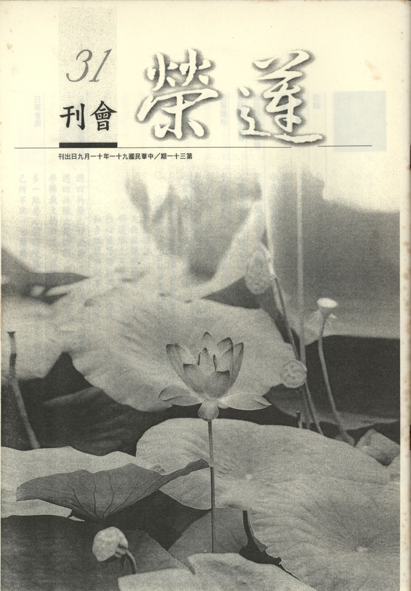

# 第31期

## 社論

### 弘一大師圓寂六十週年紀念音樂會有感

*編輯部*

約略二十多年前初學佛時曾閱讀了陳慧劍老居士撰寫的「弘一大師傳」，深深為此文所描述的弘一大師所感動，大師早年出生於富裕的家庭，是書香世家，父親本身是前清進士，且官職吏部，後經營鹽務而致富，且深信佛法，大師除了受紮實的儒學教育外，也暗暗受到父親學佛的影響。在戊戌政變之後與母親遷居上海，與當時的文人組成城南文社，詩文如泉湧，朋友給予其極高的評價，但因國事板蕩，無法排遣憂愁，有時側身於歌臺舞榭之中，清末的局勢有如大廈之將頹，有志之士莫不奔走革命，李叔同（弘一大師的俗名）在這新舊交替的時代，慨然有愛國憂民之心，在二十六歲時，母親因病而逝，悲痛之餘決定東渡日本留學，以《金縷曲》填詞，對國家的興亡，有莫名的悲傷，也有慷慨激昂之志氣。在日本留學期間，組成春柳社，並演《茶花女》話劇，學習各類西洋藝術，六年後 （民國元年） 負笈返國，正值辛亥革命，填了一首《滿江紅》，詞中有經國濟世的情懷，後來在浙江第一師範學校以及南京高等師範學校教授繪畫、音樂、戲劇等等，有名的豐子愷在繪畫上的成就，以及劉質平音樂上的成就皆出自於李叔同的教導，後受夏丏尊及馬一孚的影響，遠離紅塵出家為僧，法名演音，字弘一，一般人皆稱他為弘一大師。三十九歲時出家，已是中年，然有他儒學的底子以及在藝術上敏銳的觀察力和音樂的體悟，再加上對南山律的精研，正法的聽聞（常從應慈及靜權老法師處聽聞佛法），雖然僅出家二十三年，圓寂時才六十三歲，然成就已是眾所公推以及仰望，尊為民國五大師之一（禪宗虛雲老和尚、淨土宗印光大師、教宗諦閑老和尚及太虛大師）。

陳慧老因寫「弘一大師傳」而深入研究大師事蹟與行誼，進而景仰大師人格風範，學習淨土念佛法門，為弘揚大師的人格精神典範，而籌組社團弘揚大師的精神與教法，並建立永久紀念大師的場所，以及收藏展示身後的遺物（文物、字、畫），並舉辦多次的兩岸學術界討論會，呈現出大師人格精神與佛法之體會，做為中國人的人格導師。

陳慧老身後後繼有人，已於弘一大師圓寂六十週年舉辦音樂會以紀念大師，音樂會中所唱的歌詞曲中，有的是大師依著西洋樂曲來填詞，有的是他人作詞大師作曲，在這些歌詞曲中，可以體會大師在青年時期，是一位風流倜儻，對人生有許多感性體會的藝術家。如《隋堤柳》，乃李叔同廿七歲（光緒三十二年）目睹了朝政腐敗，列強侵略，國家岌岌可危，風景淒涼，一種慨然悲憤之心躍然紙上。特別在三十三到三十八歲間，人生有著極大轉變，所做的歌詞中有著對童年的念舊，如《憶兒時》，也有著他對大自然的欣賞，觸景生情，處處是天機的《早秋》，也有他昔日對父母感恩的《夢》，也有感傷韶光流逝，歲月不待人，今日朱顏明日憔悴，今日繁華明日非，落花飄杜鵑叫，聽的都是警告，覺悟呀！青春已老，青春一去徒傷悲，須及時覺悟，才是真正青春不留白的《悲秋、傷春》。若僅僅將寶貴的青春努力追求繁華的盛況，猶如春花正當百花燦爛，芳菲以爭妍之時，便已春殘，傷花事其闌珊，感朱華易消歇，青春不再來的《落花》，所以在《歸燕》中表明不欲苟合於世，浪費時光，不如歸去，芳華歸於平淡。並絕於塵埃之外，遊神太虛，超乎萬物之表，與世長遺的《天風》。並渴望與眾生能沐浴佛光猶如在清涼的月色下，也希望自己能夠像月亮一樣，照亮世間，並讓世間有情享受清涼快樂的《月》，更願自己能遠離世俗的塵囂，回歸自然，體會物我一體的《幽居》。若細細品嘗這些充滿對生命體悟的歌，即知世俗的紅塵已挽留不住李叔同了。

至於他出家之後，所填的歌詞大都是對無常的體會，萬物靜觀自得，有為如幻，透過三學次第成就而得真正清涼與安樂，例如《花香》這首歌即是說鼻觀（以鼻根對香塵生起鼻識的作用）是一，對著庭中百合花開，晝香淡，夜香濃，對境是同一百合，何以晝夜濃淡有殊別，原來是白晝喧動，夜晚安寧，鼻觀若無外境喧動所擾，方能真正嗅出花香，同理心清聞妙香，用志不分，乃凝於神，萬物靜觀皆自得。並在《山色》中體會近觀山色其色如藍，遠觀山色藍成靛，隨緣變化萬法皆然，在心識之前呈現的只是幻相。遠離幻相執著，成就身心無比清涼，乃無上究竟真常的《清涼》。

由上幾首大師所做詞曲中可觀出大師的一生，有好的家教，懂得念舊與感恩，並有愛國的情操，更有恬靜的心靈，體會萬事無常不欲沉迷與苟合世俗，希求超脫而出家，出家之後有崇高的宗教理想，在深刻體會無常的覺受下，努力的學習教法以及嚴格的持戒，並老實地執持佛號，在戒法中能夠傳承南山律學為一代的祖師，在教法上能有空性的體會，在念佛上也有三昧的成就而預知時至，並在一副對聯中表明自己的心志，「願盡未來普代法界一切眾生，備受大苦，誓捨身命，弘護南山四分律教，久住神州，」可見是發大菩提心的行者。

在二十一世紀的人類，雖然享受高科技的文明，生活上有種種的便利，各種資訊也不難取得，可是所擁有的淳厚人性光輝，日益黯淡，生活的目標已模糊不堪，憚精竭慮不過是五欲六塵的追逐，一生的重點不過是只求個溫飽，心靈已經被層層的污垢所遮蓋，若能藉大德的人格、精神、法語，特別是弘一大師的音樂作品，能讓我們在游於藝的同時學習慈悲的內涵淨化心靈，此乃以音樂作佛事最好的典範，此其聆聽弘一大師圓寂六十週年紀念音樂會的感言，並維護與弘揚大師所遺留之佛法與藝術寶藏，如此可讓諸佛歡喜，眾生受益。

## 大德法語

### 佛說四十二章經解（二十三）

*道源老和尚講授*

愛欲垢盡，道可見矣。學道見諦，無明即滅，而明常存矣。

第十六章：

「佛言：人懷愛欲，不見道者，譬如澄水，致手攪之，眾人共臨，無有睹其影者。人以愛欲交錯，心中濁興，故不見道。汝等沙門。當捨愛欲，愛欲垢盡，道可見矣。」

何以前章云：「斷欲去愛」，因為世人被愛欲所害矣，令你愚癡，蔽塞你的本性，使具有的光明顯現不出，都是被愛欲所害，所以你要是懷念愛欲而不肯斷欲去愛，就見不了佛道（不能明心見性）。

以喻明之，「譬如澄水，致手攪之」澄水即是清水，比喻無塵垢。讚彌陀佛句子中「紺目澄清四大海」，佛的眼睛本無塵垢叫澄清。若不棄愛欲，如同攪澄清的水池，這一攪，怎麼樣呢？把澄下的沙也攪起來了，清水攪成濁水了。「眾人共臨，無有睹其影者」，你把清水攪混了，成了混濁之水，不要說一個人來，看他的影子，看不見，眾人臨到這盆水，想照照影子，也通通照不出來，為什麼？因這水已混濁了無法映現一切事物。

「人以愛欲交錯，心中濁興」，吾人之心本來是清淨，此時候有愛欲心興起來，此愛欲心，不只是一個妄想，而是一個妄想跟著一個妄想交互出來，將清淨的心，攪成混濁的心，心中混濁興起來，故不見道。雖欲見到佛的至道，卻見不到。「汝等沙門」，此四十二章經都是對著比丘說法，其實含著比丘尼、優婆塞、優婆夷等四眾弟子，而以比丘做代表（當機眾），佛告訴出家的比丘，也告訴比丘尼、優婆塞、優婆夷，你們當知道修行、辦道，當捨愛欲，愛欲垢盡，愛欲是染垢之法，將之斷盡，道可見矣！你聽懂了道理（須斷欲去愛），再研究經典可以隨文入觀，心就非常的清淨。須知研究道理（研究經典），不能打個妄想，或是想到要貪錢財，或者想到貪男女之色，心中的混濁生起來了，你看經，研究經典，研究了半天，一句也沒有記得，滿腦胡思亂想怎麼能見到道呢？靜坐觀修（或念佛）若不打妄想，心裡非常的清淨，然而正在打坐時，忽然打起妄想，或者想財，或者貪睡，混濁心一生起來，心中亂糟糟的，平常每一次坐一點鐘，坐得很好，今天坐一點鐘，坐得身、心不安，就是自己把心水攪混濁了。

第十七章：

「佛言：夫見道者，譬如持炬入冥室中，其冥即滅，而明獨存。學道見諦，無明即滅，而明常存矣。」

所云見道，即明心見性，此乃至高無上的佛道。然要明心見性（大徹大悟）須斷無明煩惱（人我執、法我執），進而去除愛欲。然吾人不知道開了悟是什麼樣子，且無明煩惱不容易斷掉，因為無始劫來就帶著無明煩惱的習氣，如何能將彼無明煩惱斷盡呢？入見道位現證空性時（即是尋覓真實法我與人我了不可得，將無始以來俱生的執著頓除），譬如持炬入冥室（黑暗的室）中，一進黑暗當中，其冥（黑暗）即滅，這房間變成光明的房間，而冥頓除。如云：千年暗室，一燈能破，不要怕無明煩惱破不了，無明煩惱沒有本體自性，此房子暗了一千年，成為千年暗室，你今天點了這盞燈，那個一千年的黑暗當時就破，一燈就破，就怕你智慧不現前，智慧一現前，乃因無明煩惱無自性故，現證空性破除執著時，立刻頓除。

「學道見諦，無明即滅，而明常存矣。」見到真諦之理，那就是智慧現前，無明當時即破掉了，等於黑暗當時就滅了，真心光輝常存而不滅。（下期待續）

## 共修研學

### 勸發菩提心文（三十一）

*心爾整理*

真為生死發菩提心是學道通途，深信願持佛名號為淨土正宗。

——澈悟祖師

念生死苦中之畜生苦

第六因緣念生死苦中之畜生苦：

「鞭驢出血，誰知吾母之悲？」

牛馬為主人幹活，從早到晚不曾休息，此乃畜生第一種苦，叫被奴役苦。且若力量不足，或超出負荷，無法負擔，然無情主人不知體恤，反而鞭打出血，這是畜生的第二種苦，叫鞭杖苦。凡是畜生都要做苦工，牠可能是宿世的母親，眼前做驢子。

「牽豕就屠，焉識乃翁之痛？」

豬被抓著準備受宰割之苦，殊不知或可能是食肉者自己的公公或父親。畜生被殺成為桌上佳餚，這種苦是畜生的第三種苦，被宰殺做佳餚之苦。第四是互相吞啖的苦，例如螳螂捕蟬黃雀在後，或在影片中看到小羚羊走著走著，豹在後面跟著，那種恐怖的感覺，簡直讓人無法呼吸，然後衝過去一口咬上去，咬死後再慢慢嚼食。釋迦牟尼佛還做王子時，曾經坐在樹下，看到一隻鳥飛過來，一下子將地上的蟲一口啄掉，後面的老鷹又飛過來，一口將此鳥吃進嘴裡。王子感慨生命現象是這樣弱肉強食的。嘗見釣魚也是如此，魚鉤從魚嘴刺進去從頂門出來，那種痛苦的感覺，無法用筆墨形容。第五是剪毛之苦，人為了穿毛衣，把動物（如羊、狐等）的毛全部剪光，讓牠們在過冬時冷得發抖。乃至所住環境是黑暗、髒、臭、濕等，是第六居住惡劣環境之苦。所食亦是臭穢不堪之下劣食物，乃第七受用惡食苦。

「當年恩愛，今作冤家，昔日寇仇，今成骨肉」

，從畜生苦裡旁舉人的苦，由苦的觀修中，產生欲離苦得樂的覺受，是修行的原動力。欲助一切有情離苦得樂，也能藉著觀修三塗苦中，從內心深處生起。念生死苦，不只是說生的時候痛苦，死亡時的痛苦，在生死當中含藏著愛別離，怨憎會的種種眾苦以外，還包括到他道裡面去受生死的痛苦，死了生地獄的痛苦，死了生畜生的痛苦，畜生苦就是被人擄役苦，剪毛苦、互相吞啖苦、居住環境的辛苦，如黑暗、髒、臭、濕等，身上的毛夏天熱脫不掉，被剪毛以後冬天很冷加不上，這種苦都要細心去體會，慢慢去體會。

旁舉人苦：

「食其子而不知，文王尚爾，啖其親而未識，凡類皆然，當年恩愛，今作冤家，昔日寇仇，今成骨肉，昔為母而今為婦，舊是翁而新作夫，宿命知之，則可羞可恥，天眼視之，則可笑可憐」

，舉文王食子肉的典故：文王不是不知道而是不得已，他的兒子伯邑考被紂王剁成肉醬，他吃了兒子的肉被紂王認定其非聖人而得放釋。人的輪迴苦還有一種，即是怨親不定，前生為親今世為仇，前世為仇今世為親。其次像饑、渴、寒、熱這些苦，還有老人家的苦，年輕人不能體會，即使追求物質享受，都是很疲勞的苦（心苦）。發生在自身的生、老、病、死，發生在外的愛別離（梁山伯與祝英台，生不能結伉儷，寄望死後九泉相會）與怨憎會（不是冤家不聚會）等等，皆是煩惱業所成的苦相，琳琅滿目。更從這苦引發惑業，是有情最愚癡的。人道中還可再分六道：有的地方很炎熱（如非洲）像熱地獄的苦，北極圈人則如受寒冰地獄的苦；印度大部分的人窮得像鬼，食物僅能從有錢人倒出的餿水去找；戰敗被人擄役，要做種種工程，就是人中畜生苦；聰明才智高的人要受心苦，聰明才智低的人受身苦。那些為政者出來時很威風，其實內心的煎熬我們無法體會。

有蓮友去印度觀光與參訪佛教聖蹟，雖沒看到佛陀的聖教，也沒見到善知識，但看到有情的苦而內心的感慨與憐憫也是修學佛法之一。有情眾生的不平等，以及身心的苦痛，認真的去看看他們生活的環境，應該可以體會他們生活的淒涼，而起悲憫之心，固然是重點之一，更要曉得自己未來的出路，未來若沒有好好學習教法，這種情形會變成我所相應的，三塗或人種的下賤會成惡性循環一樣，我若成為這種狀態，就沒辦法聽經聞法，為生活所逼也沒辦法好好觀修教法起殊勝善心，遇境逢緣起惑造業，情況只會愈來愈糟糕。

輪迴苦：

先明此世苦，又分四：

約住胎苦：

「糞穢叢中，十月包藏難過，膿血道裏，一時倒下可憐。」

指住胎與胎產的可憐，嬰兒在媽媽肚子裡十月住胎，佛經形容，環境與受用皆是污穢，母親跳的時候如插尖鏢，母親熱飲時如受熱地獄的苦，冷飲時如受寒冰地獄的苦。出胎的時候，從產道被擠出來，身體變形，全身血淋淋，接觸空氣時如刀割，如何不苦。

約成長苦：

「少也何知？東西莫辨﹔長而有識，貪欲便生」

，小時候看起來很可愛，其實這種狀態很苦，他們可愛當中含藏愚癡，看事情看得很皮毛，東西莫辨，刀、水、火，不自知，碰到熱爐會被燙到，對於危險與不安全事物都沒有警覺性，每天生活在危機裡面，一時不注意，就出狀況，這難道不可憐嗎？「長而有識，貪欲便生」，六識一發起來的時候，就把貪欲的心發起來，當第六識分別好壞，是非善惡美醜時，與無明愛執（心所）相應，故引發的動機都是為我著想，並且助成其他煩惱的生起，生活中很辛苦，讓人靜不下來。有一位蓮友到國外讀書，打電話回來，他說他母親一個月寄二、三萬讓他讀書，但他都讀不下。環境很好，老師也很好，就是讀不下，念佛念不下，讀了凡四訓讀不通，說要做善事，也不知有什麼善好造？好可憐！

約老病苦：

「須臾而老病相尋，迅速而無常又至。」

老病有好多的痛苦，前已敘述，須多複習複習，在老病苦當中身力的衰敗，心力的憔悴，乃至於身體的枯槁，生理不協調的各類的疾病，以及不能受用美好的境界等等，這些都要一再的觀修，才能生起把握現在，充實教法，提振心力，在老病苦現起時，不起惑業，免除結生未來老病苦。

約死亡苦又分二：

約神識：

「風火交煎，神識於中潰亂」

，人的臨命終，心到底有多亂？如一個人十天十夜的忙碌不能休息，就會發現人都枯乾了，腦筋不管用，心思茫然。又有如三天不吃飯，感覺上很空虛，攝不住正念，整個人都昏昏的，更何況是將死之人。平常有十分的定力，晚上睡覺剩下一分，晚上睡覺有十分的定力，病的時候剩一分，病的時候有十分的定力，臨命終剩一分。神識潰亂，要找未來的出路，又為現世愛執所羈絆，才會痛苦地抖動。

約身：

「精血既竭，皮肉自外乾枯。」

人要死的時候本相都失，去助念，看那生前相片與死亡的時候都不一樣。瀕臨死亡時是

「無一毛而不被針鑽，有一竅而皆從刀割」

，針來鑽、刀來割，那感覺就是神識脫離之苦。

「龜之將烹，其脫殼也猶易﹔神之欲謝，其去體也倍難」

，因為愛執力太強，神識要離開軀殼有多麼的困難，所以說母親要離開子女的時候，那種困難、那種苦，因為愛執力故，所以非外人可以想像。如人世間有情人的悲歡離合，尤其在戰亂的悲歡離合，那種苦難真的是無盡的呼喊，而人的神識在離開軀體的感覺比那個還強，因為對身體的依賴，尤勝過世間親情的依賴。我見（身見）是最重的，若要離開則拉也拉不開，扯也扯不了，業力與愛執力在推拉，那種感覺，可以用親情的分離來比擬那種痛苦，此即死亡的痛苦。梁山伯、祝英台一日不見如隔三秋，最後要分離的那種痛苦、那種張慌失措可以比擬死亡的恐懼，因為他要離開他最愛的。一般人都是身見太重，臨命終常是這種現象。有時候去助念，亡者死亡前沒交代，沒念幾分鐘就在抖，給他安慰安慰，好不容易平靜下來，一下子又抖起來，那種放不下以及不願離開眼前，對未來不可知的恐懼、業力與愛執力在那邊拉拉扯扯，有時折騰了十幾天，很痛苦的。（下期待續）

### 小止觀導覽（十）

*蓮心整理*

上品持戒最難得

毀犯皆應如法懺

若得無垢淨戒體

即是止觀勝資糧

經文：

然有三種行人持戒不同：一者、若人未作佛弟子時，不造五逆；後遇良師，教受三歸五戒，為佛弟子。若得出家，受沙彌十戒，次受具足戒，作比丘、比丘尼。從受戒來，清淨護持，無所毀犯；是名上品持戒人也。當知是人修行止觀，必證佛法；猶如淨衣，易受染色。

大意：

行人持戒可分上中下三品。上品持戒人從受戒以來，清淨護持，無所毀犯；故是人修行止觀，必證佛法；猶如淨衣，易受染色。

導覽：

一、三品持戒之行者，均得入止觀。惟不同形象的持戒行人，其入止觀的能力亦有別。

二、尚未入道修行者，於未作佛弟子時，不沾染世間習染、不造五逆罪，不造惡業，人生暇滿，學佛則易成，倘造五逆業再來學佛，障礙現起，阻礙修學，內因外緣不具足，辛苦難成。

三、老子：「不見可欲，其心不亂」，如法持戒者不會刻意攀緣可欲境，會努力的在因果上軌範自己，對治煩惱，了知煩惱的過患，緣念善法的力量轉強，而緣念善法當中分為止與觀，一心安住曰止(無分別修)，種種的觀察曰觀(思惟修)，此種行人修學止觀較易有成。

四、和合分為事和合及理和合，事和合即六和敬：身和同住、口和無諍、意和同悅、戒和同修、見和同解、利和同均；理和合是證擇滅，就是大家一同抉擇寂滅之理，而得到明心見性。

五、戒是在事相上(如食、衣、住、行、財、色、名等)圍堵我們的放逸心、慢心及貪愛心，如不往觀聽歌舞、不坐臥高廣大床、不著香華鬘衣，目的是使煩惱心無由現行，因為煩惱不能自己起、獨立起，必須觀待境界才能起現行，所以首先不去碰觸這些境界，以防範煩惱的起現行，進而由內心去觀修煩惱的過患，以及修學種種對治法來摧壞煩惱，然真正摧壞煩惱的力量須藉著修學止觀成就，真實止觀若能成就，必破除煩惱執著，而戒就是止觀門的前方便，因此清淨持戒者修學止觀，必證佛法。

六、戒律以防非止惡為根本，從防非止惡的基礎上，建立種種善法，以利益眾生，因此三聚淨戒(攝律儀戒、攝善法戒、攝眾生戒)中的攝律儀戒是遵守佛法不作諸惡；攝善法戒是奉行一切之善；攝眾生戒是廣修一切善法以利益眾生。每一條戒均有這三種精神，是一種自利利他、二利圓滿的行為，為大乘學者所應共持。防非止惡者身心清淨，緣念善法力量較強，故經云：「依因此戒，得生諸禪定，及滅苦智慧。」以上為上品持戒的形象。

經文：

二者、若人受得戒已，雖不犯重，於諸輕戒，多所毀損；為修定故，即能如法懺悔，亦名持戒清淨，能生定慧。如衣曾有垢膩，若能浣淨，染亦可著。

大意：

中品持戒人雖不犯重戒，但對於輕戒多所毀損，倘能如法懺悔，亦能生定慧。

導覽：

一、正法時期是戒成就，像法時期是禪成就，末法時期是淨成就，像法時期輕戒已難守，更遑論末法時期；中品持戒的形象是不犯重戒，但於枝末輕戒則多所毀損，其或肇因於外在環境之受限(比如托缽及頭陀行在中國無法實行，易被視為乞丐的行為)，故根本戒或可持好，而於枝末戒則有所毀犯，此時應如法懺悔，以保全修學止觀的勢力，以生定慧。

二、「懺」是陳露先惡，「悔」是改往修來，古德所制懺法，則有大悲懺、地藏懺、淨土懺、藥師懺、慈悲三昧水懺等。寺院亦多設有懺堂及觀堂，在懺堂作懺悔法，令身心罪障消除，無諸障緣且能作動意念清淨發心，方入觀堂修學止觀，成就世出世間定慧。

三、無論是上品持戒者、中品持戒者、下品持戒者均應如法懺悔；在未成就解脫前，均有無明(我執)的束縛，所以上品持戒者也應懺悔；依照小乘法門，犯根本戒是不通懺悔的，但依照大乘佛法還可以懺悔，因為在懺法當中，依著自己的出離心及菩提心，以十方三寶為依止的對象，至誠向佛菩薩發露罪愆，以拔除過去的罪業、罪根，並且發願剷除未來生起的煩惱及業，因此眼前以如法誦咒、持名以為對治，猶如把深埋土中的罪種，翻出來曝曬，以免妨礙善種的生長，此名之為「事懺」；「理懺」是要觀無生，也就是在空性上觀修，比如以瞋恨心為觀修對象，發現瞋恨心必須結合過去不愉快的經驗，與眼前的逆境(在第六識名言認知彼為逆境，對我不利)方可生起，若瞋恨心不生，瞋恨業無由造作，也不會受瞋恨的果報。若瞋恨心為真實有，則不必藉境及緣過去的心，故可知罪性本空，煩惱無體，對境當下若能依法覺照，即能轉煩惱為清淨心，並令己心清淨相續。

經文：

三者、若人受得戒已，不能堅心護持，輕重諸戒多所毀犯。依小乘教門，即無懺悔四重之法；若依大乘教門，猶可滅除。

大意：

下品持戒人輕重諸戒多所毀犯，依小乘教門，不通懺悔，若依大乘教門，猶可滅除。

導覽：

持戒者毀犯輕重戒，或因知見不足，或因缺乏善知識之教導，或對教法覺受不足，或因因果觀念薄弱，或因意樂不夠圓滿，或因職業環境欠佳(比如以捕魚為業者)等，均是受戒者不能堅心護持之因，此等眾生可憐，應好好懺悔，期能改變命運，擺脫困窘與束縛，下品持戒人犯戒或有其無奈之處，因此提供懺悔之法，讓他懺其前愆、悔其後過，慢慢脫離苦難，而不是把懺悔當成給犯戒者鑽漏洞的機會，因此行者應了解懺悔的意涵，以改往修來，滅罪除愆，俾得三寶及善知識的護念，增強對教法的覺受，以增上修學止觀的能力。

## 日常省思

### 多一點慈心關懷受傷的心靈

智見

桃園少年輔育學院學習報告

人與動物不同的原因之一是人有較長的幼兒依賴期，一個人生命的成長需要愛與關懷，然而這些福報是桃少輔孩子所欠缺的。他們大多來自破碎家庭、流氓世家、吸毒家庭，所以孕育出不健全的身心靈與產生偏差的行為、情緒障礙、學習障礙；當年紀漸長後，他們心中會吶喊，不願生於此種家庭，一個個令人心酸的故事由此展開。

其實只要多一點慈心包容與關懷，大多能啟發這些孩子善良的本性。末學陪伴第一位孩子是因暴力案件進入少輔院，不苟言笑，但願意學習也會提出問題，互動幾次後變得柔軟有笑容了，老師肯定他行為改變很明顯。當他得知父親生病，家中經濟有困難時很著急，念經回向給父親，努力表現，希望早一點出院，修汽車賺錢貼補家裡，他的孝心真值得讚歎。

第二位是老實的孩子，為了得到友誼，參與偷機車還為朋友頂罪，他得知弟弟不聽奶奶的話，不學好，行為偏差時很難過，自責自已沒有做好哥哥的榜樣，他的使命感激發了自己的用功、認真做幹部，表現優異而提早出感化院。

第三位資質不錯曾經考上公立高中，他自小不知母親是誰，父親也不承認他，且常以暴力對他，他最後與父親連絡的信中說：「你將我生下來卻又不照顧我，當初又何必生我呢？」他沮喪的表示所作所為無人關心、在意，如果這世上從來沒有他就好了。面對如此令人心疼的孩子，除了拍拍他的肩表示安慰，表達阿姨的關心與重視外，並肯定他能在此複雜環境得到老師讚賞，由幹部升為班長很不簡單，鼓勵他從今以後好好應用智慧選擇自己人生的路，做自己生命的主人。

了解這些孩子來自的家庭與成長環境，讓人理解到他們都不願意有這樣的結果。因此末學都會與他們分享一則真實案例：一位搶劫犯被捉時，記者問他你為何有此膽量，他回答我要搶時也很害怕也不敢下手，但腦中突然有一句「無毒不丈夫」心一狠就搶了，但他現在也很後悔與難過。末學問到如果當時的念頭是「一失足成千古恨」，相信他們搶時都會三思，結果必會不同。所以透過學習得到正知正見才會有正確的價值觀，使心不受污染，行為也不會偏差，更不會結下苦果。同時也會告訴他們一位父親的心聲：美國有一位小男孩很愛看電視，沒上學時就整天盯著電視，但他卻不快樂。父親建議他幫鄰居奶奶清理門前堆積的雪，當小男孩聽從父親的話完成後，見老奶奶又驚訝又快樂的神情以及安全出門購物的情景，小男孩內心的愉悅引發他樂於助人的種子。三十年後小男孩也為人父，他與孩子分享三十年來快樂的秘訣是為善、助人，過去看過電視的內容至今已無印象，但幫助老奶奶的記憶猶在，善的習氣使他過著喜悅的日子。

在與孩子每次相聚中，除了真誠地關懷以外，也會準備勵志文章、靜思語、因果故事、宗教觀念等針對孩子的需要，善巧方便的一起學習。也必需提醒他們未來的路會比別人辛苦，凡事要忍，要增強自我克制的能力。淨空法師說：「忍，能增長智慧，忍，可以保福，唯有痛改前非斷惡修善，才能改變未來，扭轉命運」。

寶積經云：「一切法如緣，唯所欲隨轉，何人發何願，如彼果得成。」因此與孩子互動學習時，必會告之老師的指導，要他們好好發願（一）親近善知識：人生旅途若能遇到好的師友，必能增上自己，走上光明的前程，（二）做利益他人的事，廣結善緣，必能開發自己的潛力，也能適時地得到他人的幫助，所謂我為人人，人人為我。福報是觀待善心，善心是觀待真誠的願心，在真誠的願心與善心下，種下了殊勝的善因，結下殊勝的善緣能使前世的惡業不能結果，能使前世的善業結成樂果，眼前也是殊勝的善因，也會成為未來殊勝樂果，真是一本萬利。證嚴上人說：「人生最大的懲罰是後悔」，青少年人生的價值觀很重要，不可步步錯才不會後悔一輩子。人生有許多隘口，平常多存善念善養正氣，常將內心的戾氣化為詳和，當生命難關出現時才能逢凶化吉。

所以，末學同時也會鼓勵孩子們積極地信仰宗教，任何宗教都是以愛為基礎，以道德做行為規範，確立了人生的目標，作為心靈提升的增上緣。有正確的信仰在人生旅途上，走的路就不會偏差，並且在偏差時能速速地自我糾正，或是在師友的提攜下立刻改正。善與惡、天堂與地獄都在一念之間，完全由自己心念決定，勿寫錯人生劇本，上錯劇場。

現今社會亂象叢生，人心像浮萍般無根，做事以個人利害、一時快意為主，忽略內在生命比外在名利重要。看見災難、無常事例，由同情、憤恨、無力感、無奈感、無聊、習慣至無情，凡事只等別人來安慰自己，這都是資訊社會不以文化為導向的影響。

在短短一年與孩子們相聚、伴他成長的日子中，瞭解他們其實是很有善根的，在他們的觀念裏認為，一切努力只要對家人有所助益，即使辛苦也是值得的，也有的孩子覺得已懂得許多做人的道理，此正向拉拔力量，使自己不再幼稚。已出院的孩子也曾表示，會以行動努力證明給大家看，由他們在知見上的進步，證明人有無限的潛能與向上向善的動力。願已改過向善的孩子成為善的種子，將走在偏差行為邊緣的同伴拉回來，勿有第二位陳進興，才不會造成社會傷害。

很感恩孩子們讓末學陪伴，與他們共同學習收穫良多：在遇境時能啟發覺性，在短暫的人生裏懂得把握機緣，積極地學習正知見，培養善的習氣為心靈把關。並期許自己做個有「心」的人，用心去「運轉」、用心去守「分」，起心動念對人、事、物等一切境界都能有圓滿的智慧以自利利人。

### 己所不欲，勿施於人

心亞

此恕一字行終身

大賢子貢疑思問

若能觀修日用間

依此興仁成聖賢

無始劫來，第一個念頭至最後一個念頭，都是為自己著想，串習得非常自然，不經思考，不經思索，都是自私心。

自私心的作祟，使自己無形中傷害了許多人，卻渾然無所覺。當自己的私心有所損害時，便責怪是別人不對，何嘗反省過自己的心。

事實上，很多事情的發生，皆是自己的私心而引起的，把原因探究至最根本，皆是保護自己，為自己圓謊，使自己活於假象之中。然而，因果的定理，是讓任何一個人，皆虛假不得。好吧！你真的要讓自己的自私心任意發展嗎？繼續的我行我素？繼續輕易地傷害任何人？現在任意地傷害別人，使別人內心難過得如刀割，如箭射，甚至使人非常窘迫‧‧‧，別忘了，因果是會增長廣大的，下回回報回來的，不止這些。

定下心來，自己是怎麼殘害別人的。不耐煩地聽別人說話，亦或是從中打斷、銳利的眼神、兇猛的面孔、刺入骨髓的言語，甚至大吼大叫、思想統系不同時，即不能容人，自己真是一個道道地地的自私人，當別人求救於我時，總是面有難色，更不願意主動伸出援手，每一件事情一出來，一定先選擇利於己的。相反的，當我碰到困難時，別人的心量總是比我大，他們都會幫我，甚至主動伸出援手。相較之下，自己的心量之小呀！

別忘了，有一顆柔軟的心，才是利己利他，然而，什麼是柔軟心呢？最柔軟的心就是「為別人著想的心」從他人的立場出發，然而，每個人皆被自己的煩惱所困而快樂不起來，一樣是表情、是言語，為什麼不要讓他人快樂呢？身為人已經夠苦了，為什麼還要加重別人的痛苦呢？

若真要「自私」，就「自私」的徹底吧！什麼是「自私」？就是凡是只為自己著想，找對自己最有利的。到底什麼是對自己最有利的呢？即是「明心見性」，解決了自己所有的煩惱。然而，當真正解決自己的煩惱時，也就不會傷害任何人了！

無論如何，將心比心，自己不想要的，別人也不想要，為何要將自己的圾垃倒往別人身上呢！無論工作也好、言語也好、表情也好、一個小動作也好，皆是如此。若可以交換角色，自己願意當被自己倒圾垃的人嗎？

很多事情自己靜靜思考時，總覺得自己溫良恭儉讓，一定要這麼辦，也相信自己應該辦得到，剛開始幾次，也許還可以忍一下，但再來，自己原本的本性又出現了。當走出房門，接一通電話，或是與人面談，則覺得自己貪瞋癡全出現，平靜的心湖開始不停地搖擺。其實根本就沒有真正對治自己的問題。改習氣真的很難，為什麼子路可以喜聞過、顏子不貳過？為什麼老一輩的人，可以說改就改，不生氣就是不生氣。天呀！我的心真是太堅硬了。好佩服那些修養好的人，他們是怎麼克服自己無法克服的情況呢？當他們面對這些問題時，他們又是如何一笑置之，使自己平靜的心湖不起漣漪？

以恕己之心恕人，則全交。以責人之心責己，則寡過。——

格言別錄

## 啟蒙園地

### 每月一字 — 序

*蓮心*

序：根據許慎的說文解字「序」的本義為「東西牆」，是指屋子前堂東廂西廂的牆，此外，依古禮「序」為依次敘禮之所，如禮記：「主人坐，奠爵於序端」。而「序」尚有其他的意思，詳如下列：

一、古代學校名〜如禮記學記篇就有「古之教者，家有塾，黨有庠」的記載，古代五百家稱為「黨」，黨的學校就叫做「序」。

二、排列的次第〜如「順序」、「次序」、「程序」、「長幼有序」等詞，又如形容條理分明而有次序稱為「井然有序」。

三、時節、時世〜如「這些時慵怠妝梳，正遇著務農忙養蠶時序」，又如「芳序」是指良好的時節，又可稱為「芳辰」。

四、開頭〜如戲劇上在第一幕前的一場戲，用來介紹劇中人物的背景或全劇內容的主題稱為「序幕」，後來也運用在文學作品上。

五、敘述〜如形容寫文章只是平淡的敘述，而無曲折雕飾叫做「平鋪直序」也可做「平鋪直敘」。

六、文體名〜序可分為「書序」、「贈序」兩種：

(一)置於書文前，說明為文的義趣，又稱為「前言」或「卷頭語」。有「自序」及「他序」之別，王羲之的「蘭亭集序」、李白的「春夜宴從弟桃花園序」屬於「自序」，而  國父孫文先生的「黃花岡烈士事略序」則屬「他序」。置於書文後的序稱為「後序」或「跋」，又可稱為「後記」、「結語」，如韓愈的「張中丞傳後序」。

(二)為表達敬愛或忠告之言因而作序以贈稱為「贈序」，且多用於贈別，如王勃的「滕王閣序」、韓愈的「送孟東野序」、宋濂的「送東陽馬生序」。

### 心靈成長營返班活動報導—家長班研討專題　家庭教育為天下太平之根本發隱（一）印光大師著

心怡淺釋

前言：

家庭教育是整個教育的核心處，在「家庭教育為天下太平之根本發隱」乙文中，印光祖師提出了他老人家對這個見解深刻的看法，今日研討這個主題對我們是非常有幫助的，我們想藉這篇文章作為家長班課程的發起，希望能夠得到家長們的共鳴，為我們國家社會帶來一個很安定的力量，讓我們未來的前途是一片光明。

期以正確的心態、動機和意樂來研究本篇文章，因為天下太平是每一個人所渴望的，它的因重在家庭教育，這個事情一般人可以體會，但體會的不夠深刻，隱微處也不夠了解，所以印光大師就把隱微處闡明，讓大家對家庭教育產生重視，如果能夠善用家庭教育，子弟才能夠成德成才，有很好的走向。

就如  雪廬老師，老人家在顛沛流離當中一路走來，沒有遭遇到種種的惡報，最後成就自己成為有氣節、成德成才的讀書人，其走向非常好，一定有好的下場；像范仲淹這樣的人，他的後代現在還在大陸上過得非常好；孔子就更不用說了，到現代七十七代子孫還是地位很高的名人，並且得到  雪廬老人的護持。所以成德成才是非常實際的，因此我們在教育孩子時，必須以德行為核心，所培養的能力才可以使他生活得好、可以突破生活上的瓶頸。這裡有一個明顯的例子：有一位派駐在奧地利的外交官，非常的英俊畢挺，在當地卻遇到很大的挫折，一年以後就辦理他的告別式。他的才藝無足以解決他的煩惱、且不足以突破他的瓶頸，亦克服不了他的障礙、對治不了他的煩惱。所以我們眼前以成德成才來培養子弟，讓他可以面臨人生種種的境界、突破人生種種的障難，積福積德，讓自己能夠過得好、讓家裡能夠代代相傳，這個應該比任何東西都實際得多，其他的事情都是過眼雲煙，所以這篇文章就很值得大家一起來探討。

正文：

天下太平是世人所希求的善果，其根本原因乃在於家庭教育的成功。兩者一因一果看似簡單，但其隱微處卻罕為世人所注重，因此印祖特以此文來顯揚其精微妙義，期使家家都能善教子女，令天下早日太平。

一個社會國家是否能長治久安，端賴賢才之興起，而賢才之興起需靠教育。其中又以家庭母教為根本，若能由根本講求，誠如大學所說的修身、齊家、治國、平天下的理想才能實現。故孔子說：「天下之本在國，國之本在家，家之本在身」。所謂天下興亡匹夫有責，此乃一切人民的天職，不單是在位或為官者的責任而已。

本文作者印光大師諱名聖量，字印光，別號常慚愧僧。陜西郃陽趙氏之子，出生於清咸豐十一年，父德母慈，家風世德相承，為村中父老所樂道。師幼隨兄讀儒書，頗以聖學自任，年十五已具弘毅致遠、己饑己溺之胸襟氣度，但因受韓愈、二程、朱熹等闢佛言論影響，後病困數年，經其研究佛門經典，始悟前非，並知佛法廣博精深，圓賅世出世法。年二十一歲於終南山南五台蓮花洞禮道純和尚出家，師能吃苦耐勞，事無鉅細，皆承師命，作務之暇，學習功課讀怡山發願文、小淨土文，知禪淨功夫成就之難易，遂決專修淨土。師出家後除參訪善知識外，並住過北京紅螺山資福寺、龍泉寺、圓廣寺，普陀山法雨寺、上海太平寺、蘇州報國寺及靈巖寺等，其中影響最深為紅螺山資福寺及普陀山法雨寺時期。師二十六歲進紅螺山資福寺，入念佛堂用功，因「沐澈祖之遺澤，而淨業大進」。師因好樂正法，在資福寺期間，除念佛正行外，更用心研讀大乘經典經三年不斷，因此深入經藏，妙契佛心，徑路修行，理事無礙。師於普陀山法雨寺期間，曾於珠寶殿側閉關二期六年，於是學行倍進。師出家三十餘年，始終韜光養晦，潛修默證，不喜與人往來，亦不願人知其名，以期晝夜彌陀，早證念佛三昧。至師五十二歲，因高鶴年居士發表他的文章後，開創了師以文傳道的新時期。由於師之為文，不獨佛理精邃，即儒家五倫八德等經世之學，亦必發揮盡致，文義典雅，所以一時洛陽紙貴，緇俗爭相傳閱。師之為文，開導學人，如耳提面命，流自肺腑，不離因果，不涉虛文，一種平懷，三根普利。民國廿九年，師預知時至，並在大眾念佛聲中，安然坐化生西，世壽八十。後代尊崇印光大師為淨土宗第十三代祖師。

全文依科判分三段，甲一、總明亂極望治宜知本，甲二、別釋賢平根本求家教，甲三、結勉學佛成聖由蒙教。甲二、別釋又分三，乙一、總標，乙二、別明，乙三、結歎家庭母教。本次研討進度由甲一、總明亂極望治宜知本，至甲二、別釋賢平根本求家教中之乙一、總標家庭母教及乙二、別明家庭母教中有關胎教的重要。依文分述如下：

甲一、總明亂極望治宜知本

「世亂極矣，人各望治，不知其本，望亦徒勞。其本所在，急宜知之。」

這一段總明亂極望治宜知本。印祖說：推究世亂之因，其近因乃由近百十年來，一切讀書居官之人，只知以科舉考試求取功名為主，不知提倡因果報應及家庭教育。若論遠因，實因程、朱破斥因果報應，及生死輪迴所致。因未受家庭之善教，又常聽說人一死即滅，了無前生後世。因而一遇歐風東漸，便覺此廢孝、廢五倫、不恥等言論，認為自在無礙，遂一致進行。其根本誤人，不得不歸罪於理學諸子。如今之計，當認真提倡因果報應及家庭教育為根本。此乃當務之急，不可不知。

甲二、別釋賢平根本求家教分三，首先總標，其次別明，第三結歎家庭母教。

「家庭母教，乃是賢才蔚起，天下太平之根本。不於此講求，治何可得乎。」

這一段為總標家庭母教。印祖說：「國家人才，皆在家庭，儻人各注重家庭教育，則不數十年，賢人蔚起，人心既轉，天心自順。是以憂世之士，莫不以提倡因果報應及家庭教育，為挽回世道人心之據。」相信人人都有離苦得樂之欲求，無不希望天下太平，但不由家庭母教講求，無異緣木求魚，了不可得。試觀今日世道人心比之印祖時代，雖表面科技發達，經濟繁榮，但根本問題更加腐爛，家庭、社會、環境、政治乃至國家等一切問題，更加亂相橫生。這一切其實都是人心的問題，故解決之道應從家庭母教下手。如果賢母善教子女，使人人懂得如何做人，如何修養自己，如何利益人群社會，各個都能希聖希賢，則其餘問題自能迎刃而解。縱未能人人成聖成賢，但其志向與聖賢相去不遠，天下何來一切問題？故印祖常云：「今欲返亂為治，若不極力提倡家庭教育，則無從下手。」

甲二、別釋、乙二、別明，丙一、通明家教重要，丁一正明，分三，戊一、胎教，己一、正因：

「母教第一是胎教，胎教乃教於稟質之初。凡女人受孕之後，務必居心動念行事，唯誠唯謹，一舉一動，不失於正。」

胎教之正因，有通有別，這一段說明共通處，應講求稟質養正。印祖常開示：家庭之教，母教最要，以人之性情，資於母者獨多，居胎期間稟其氣質，幼時則習其行儀。故古之賢母，從事胎教，乃為鈞陶於稟質之初，化育於未生之前，而必期其習與性成也。如周朝之三太（太姜、太任、太姒），婆媳三代，各個誠敬端莊，行為處處合於道德規範，能陰相其夫，胎教其子，故為女中之聖人，實開周家王業之基。周文王之母太任，一懷胎後更是坐立必正，目不視惡色，耳不聽惡聲，食物烹煮或宰割方式太殘忍則不吃（所謂割不正不食之意），一切舉止行為皆中規中矩，使文王受最好的胎教，養成聖德，是歷史上最有名的典範之一。

談到母親受孕後，凡起心動念及一切喜怒哀樂等情緒，對胎兒皆有一定的影響。一般母親在懷胎期間，自己身心本受極大壓迫及變化，情緒起伏較大，若常處於焦慮、不安或生氣等負面心緒，或受外來的聲色環境等污染，皆對胎兒日後性情及個性產生不良影響。若母親的行、住、坐、臥等，太急、亂跳、或歪、或倒、或蹲，也會壓迫胎兒身心舒展，乃至母親的一言一行，對其日後之言行舉止皆有所影響。這些都是在不知不覺當中，漸漸地日積月累所成之胎教變化。所以母子連心，在懷胎期間，母親僅靠起心動念、言行舉止和一條相連之臍帶，就能直接或間接地對胎兒產生莫大影響。故印祖開示：女子受孕後，居心動念行事等，皆求謹慎恭敬，務必身口意等一舉一動，皆以正氣胎教其子女，變化其氣質於無形之中。現代科學發達後，從事胎教或零歲教育等研究論述，都能證實胎教確有其效果，不過古之賢母早已能知而行，故而現代婦女應急起效法古之賢母，落實胎教。

「尤宜永斷腥葷，日常念佛，令胎兒稟受母之正氣。」

這一段為正因中特別處，印祖在闡明胎教的因果道理時，自然悲智雙運，毫無保留地將少為人知之重要處說明白，教勸宜永斷腥葷，令吃素及念佛為最上因。能否做到需視個人因緣，但取法乎上，不可不愷切為人說明，使人人知所趨向，均能獲益。

談到母親受孕後之飲食，如太多、太少、太膩、太乾、太冷、太熱、太鹹、太辣、太苦、太酸等，都會影響胎中環境及胎兒營養的吸收。一般葷腥食物，主要來自動物血肉之軀，而動物經宰殺後烹煮成食物供人所食，當其被宰割時，身心受極大痛苦，生理上自然釋放出毒氣，對胎兒及母體皆有不良影響。若論其營養，動物性蛋白質也不如植物性蛋白質易為人體所吸收。況且以彼動物最愛之生命，供我母子餐飯之食，亦不符合仁心。所以吃素念佛不但長養慈悲正氣，並能有益身心健康，此不可不知。故印祖說：母親特別適宜吃長素，並日常念佛，使胎兒在母胎中稟受其慈悲與清淨之正氣，以利其福慧增長。為人父母者，果然了解因果道理，必能掌握胎教之先機，使兒女決勝在生命的起跑點。

「則其生時，必安樂無苦。所生兒女，必相貌端嚴，性情慈善，天姿聰明。」

這一段為胎教之善果。所謂萬法不離因緣生，有正因必有善果，這是因果相應的道理。母親在十月懷胎中，不但身心受盡辛苦，臨產時必經生育之苦，除須強忍從極窄小產道中，壓擠胎兒出生之苦，還有血水臭氣垢穢等不淨物相隨之窘，遇有產難時更有母子生命之危險。如地藏經所說：生時如能作善事，增益家人善福，自會令土地神歡喜而護佑母子，及其眷屬等安樂。所以生產時，切勿殺害生命來祭神，或以鮮肉補給產母，或請親友來慶祝飲酒食肉，歌舞歡樂等，這樣會令產母和嬰兒都不能得到安樂。這是什麼道理呢？這是因為生產時，本有我們看不見的無數惡鬼、魍魎和精魅來吸食腥血，而地藏菩薩已令土地神保護母子安樂，但人們不但不知作善事來答謝土地神慈悲護救之恩，反而殺害眾生，飲酒作樂，如此犯殃自受，而使母子皆損。

如上所述，母親善於胎教，不但心念行事能唯誠唯謹，一舉一動合乎禮節，更能吃素念佛，如此善因勝緣，能令胎兒稟受母親正氣，自得善神擁護，諸佛菩薩護念，故生時必然母子安樂，一切順遂。至於所生子女，必然相貌端正莊嚴，性情慈善，天資聰明。外相端正莊嚴，則是人人見了歡喜；性情慈善，子女自然容易受教；天資聰明，則學行容易增長。如此子女，在家必得父母之歡心，出外能得師友之提攜，相信必成社會國家之賢才。（下期待續）

### 心靈成長營返班活動報導—唐詩賞析　九日藍田崔氏莊

*心在整理*

九日藍田崔氏莊／杜甫

｜｜——｜｜—　　｜——｜｜—— 　  ——｜｜——｜       ｜｜——｜｜—

老去悲秋強自寬　 　興來今日盡君歡　 　羞將短髮還吹帽　 　笑倩旁人為正冠

（強上聲養韻）

—｜｜——｜｜　　｜——｜｜—— 　  ——｜｜——｜　   ｜｜——｜｜—

藍水遠從千澗落　 　玉山高並兩峰寒　 　明年此會知誰健　 　醉把茱萸仔細看

農曆九月九日是中國傳統的重陽節，「重陽節」一詞命名的由來，源自於易經中以九為陽數、六為陰數，而九月九日正逢並陽，故云「重陽」，談到重陽佳節的歷史典故，大約可追溯至梁朝，傳說汝南之士桓景，曾經跟隨費長房習遊仙術，有一日，費長房告訴桓景：「九月九日，汝家有災禍降臨，宜急去，令家人各作縫囊，盛茱萸以繫臂，登高飲菊酒，此禍可除！」當天桓景率家人登上高山避禍，待傍晚返家之後，赫然發現，農舍中所飼養的牲口全部暴死！後衍為俗，重陽飲酒登高、臂繫茱萸的習俗便一直留傳在中國社會。

且秋高氣爽正是踏青的好時節，更為文人雅士所喜愛，到了魏晉時期，重陽佳節野宴出遊、登高飲酒、為文賦詩、賞菊吃糕，可說是蔚然成風，據〈晉書〉孟嘉傳的記載，陶淵明的外祖父孟嘉，年少時，即才華洋溢、德學兼備，不僅深獲桓溫的器重而且官拜參軍一職，某年，正逢重陽佳節，桓溫於山野間宴請幕僚賓客，眾人吟詩作對、談笑風生。突然颳了一陣風，將孟嘉的官帽吹落，在當時官帽落地是一件不禮貌的事，於是桓溫便命令孫盛為文嘲諷一番，孰料，才思敏捷的孟嘉，立刻以他的生花妙筆作了另一篇文章回答之，且文章作得更妙，反博得大眾的喝采，莫不嘆為觀止，這就是「孟嘉落帽」的典故，後人即以「孟嘉落帽」形容人文采之美。

本詩作者杜甫，字子美，是盛唐詩人，早年生活困頓貧乏、進取無門，而後遭逢安史之亂，四處避難、顛沛流離，甚至於在飄泊不定中客死異！雖然作者歷經世間無常、國土危脆的滄桑，但他卻善於處逆，就其個人而言，不但極具堅韌的生命力，而且對廣大的天下百姓，更懷有一片悲憫之情。本詩詩題「九日藍田崔氏莊」，正是杜甫晚年之際，於九月九日重陽節時，前往友人崔氏位在藍田的寓所作客，有所感想而作之詩。

「老去悲秋強自寬」，歲月流轉不息，青春年華漸漸老去，幾經戰亂，漂泊異鄉，世宦之路又十分坎坷崎嶇的杜甫，此時此刻，蕭瑟淒涼的秋風更增添其內心深處的愁悵與感傷，但是今天正逢重陽佳節，且經好友崔氏邀約一起登高玩賞，雖自內心悲愴慨然，但仍勉強自己提振精神，強顏歡笑，生起一絲絲寬慰之心。「興來今日盡君歡」，更因今天杜甫受邀，來到友人崔氏家中作客，便將原本抑鬱寡歡的情緒，收拾起來，由於他明白賓客之道，深恐這愁苦的思緒，會影響崔氏莊歡愉的氣氛，因此乘興而來，聊以隨緣，以盡眾人之歡，以不負崔氏邀約的美意。

「羞將短髮還吹帽」，但杜甫仍喟嘆自己盛年不再，而老邁將至，官帽下的髮絲也由烏黑轉為灰白，更加上連年憂愁，白首早已搔更短，所謂「縱使登高祇斷腸，不如獨坐空搔首」（高適九日詩文）無乃更適合其心境，所以心中不敢存有效法孟嘉落帽那種風流瀟灑、器宇昂揚、為文賦詩驚倒全座的念頭，「笑倩旁人為正冠」，反而以長者的姿態除卻先前的喟嘆，滿臉盡是可掬的笑容，謙和地招呼其他賓客正衣冠入座。

而由崔氏莊向外遠望，「藍水遠從天澗落」，淙淙流水自綿亙蜿蜒的山巒奔騰而下，數以千計的瀑布，彷彿潔白的絹帶，順著層疊河谷，匯入寬闊的藍水，這樣如詩如畫的景色，真教人心曠神怡！「玉山高並兩峰寒」，玉山的兩座高峰，並列崢嶸、巍峨高聳，矗立在藍水之後，特別顯得雄偉壯觀。千澗匯流，兩峰遙峙，崔氏莊四周的風景壯觀秀美，正足以發興盡歡。然著「寒」字，既標出深秋的時令，點出此乃重陽時節，又令人有高危蕭瑟之感，詩句豪壯帶幾分悲涼。
「明年此會知誰健」，此刻歡愉熱鬧的氣氛洋溢在這場難得的聚會之中，然愈是歡聚，愈是感觸，杜甫心中暗忖，山水無恙，人事難料，不知明年還有沒有機緣，再來參與好友相會的宴席？可見杜甫，正在紓發內心，對「月有陰晴圓缺，人有悲歡離合」的無限感傷！「醉把茱萸仔細看」想到後會，憐惜當前，不禁自
**問：** 茱萸啊！茱萸，明年此際還有幾人健在，配戴著你再來聚會呢？不禁沉吟凝視、把之不捨，情思不盡、百感交集，戀今日之會，欲擬明年之會，對自己年華逝去、仕途困頓、生活漂泊，充滿了無奈與感傷，而明年自己是否依然健在、友人相逢的機緣是否得以延續，而感到飄泊不定！「醉」字將全篇精神收攏，深刻地刻畫出詩人此時的情態，不置一言，卻勝過千言萬語。

本詩發人省思並且蘊涵許多深遠的哲理，  雪公老師：「此詩以老境強自寬為主，乘興盡君歡為賓，凡述情處皆為強自寬，凡布景處，俱為盡君歡。」一場人生、無常幻化，因此要格外珍惜難逢稀有的相聚，朋友相處之道貴在真誠相待，人際間重於彼此親密加厚而不是刻薄寡恩，杜甫這種對人情世故的體會實在值得我們學習！

### 天使班課程簡介

願習

現今時代因為社會結構的改變、科技進步，整個社會在物質上非常充裕，兒童教育多元化，由於小家庭佔大多數，家中小孩不多，所以無形中小孩子容易養成好逸惡勞、不懂得感恩惜福，所以在此特別以「父母是我們的天使」為主題來啟發小朋友對父母報本還恩之心，一方面可令小朋友們植福田；另一方面亦可替社會注入一股清流。

這次的主題及引導的內涵，包括：

（一）天使的形象是什麼？

（二）如何認識自己？分別由名字、性別、年齡、小朋友的特色來說明。

（三）自己從哪裡來？引發小朋友飲水思源的心。

老師與小朋友間透過上述問題互動，引發小朋友期許自己如天使般的可愛、善良、美麗、聽話，並由認識自己的部分，了解每一個人都有他不同特色，雖然每個人有不同的特質，但是在父母的眼裏都是唯一的、平等的。最後讓小朋友想想自己是怎麼來到這世界的，引出今日主題--念父母恩。

以母親懷胎、哺育的過程來引發小朋友對母親感恩之心。

（一）懷胎：母親懷了小孩後，剛開始會有嘔吐、腸胃不適等狀況。漸漸胎兒長大，母親身體要負荷更多重量，特別以一個懷有三胞胎的母親為例，說明她的行動非常不方便，甚至要包尿片，不能下床走動，只能吃流質東西。所以母親為了要保護脆弱的胎兒，整個懷孕過程中在食衣住行上非常不便，但母親為了生出健康正常寶寶都能忍受。

（二）哺育：小嬰孩剛出生時很脆弱，什麼都不會，需要母親無微不至的照顧，譬如哺乳、洗澡、穿衣、處理大小便等。又小嬰孩生病時，母親更是犧牲睡眠日夜照顧；小嬰孩喝母乳長得健康活潑，還得拜母親之賜，因為母乳是從母親身上的血液及養分而來的。所以母親在小孩出生三年內，幾乎將自己所有精神與體力皆花在小嬰孩身上，自己卻睡不好、吃不好。小朋友知道了這些後更應該好好孝順父母。

接下來誦念詩經蓼莪篇數次，以呼應剛才的課程內容，一方面介紹小朋友中國古代孝順的詩歌；另一方面藉著小朋友善良純真之天性，在他們的腦海中存入最佳的記憶。

並在課程中安排了定靜時間，引導小朋友作簡單的頭部運動、肩部運動及全身放鬆活動，目的希望小朋友們藉此課程達到身體的放鬆、心情的沉澱與寧靜，以便提升更好的學習效果。再依著定靜課程所營造出來的平靜安詳的氣氛，將今日主題「父母是我們的天使」，以說故事的方式與小朋友以問答的方式來進行，內容包括：

（一）學走路篇：小朋友從爬行到學走的過程，雖然整個階段大部份仍須靠小朋友自己站起來，但是能有長輩在旁鼓勵持及保護則學習過程將會更容易且減少許多不必要的危險。故事中小包學走路是媽媽教的，平日他與媽媽在玩遊戲中建立很好的默契與感情，以至於後來媽媽生了很重的病，因此而不太認識人且雙腿不能走路，大家都以為媽媽不會好了，但藉著小包與母親間的默契，終於有轉環餘地，後來透過小包與媽媽間的努力，終於使媽媽的病有起色。此故事想要啟發小朋友對父母感恩之心，是個十分溫馨感人的小故事。

（二）生病篇：小朋友生病時媽媽守在旁邊，一有情況發生，不管晚上多麼晚了媽媽還是起來照顧，當小朋友病好了媽媽比小朋友更高興，若更嚴重媽媽比小朋友更擔心。故事中的山姆住在波蘭，那一年的冬天特別冷，媽媽正哄著山姆睡覺，當他們說完了最喜歡的故事後，吹熄了蠟燭，媽媽說：「晚安，山姆」她用紅毯子把山姆蓋住，山姆的身體暖了起來，突然間她發現山姆病了，媽媽非常的擔心，並且拿了藥要給山姆吃，但是小朋友總是很討厭吃藥，但藉著媽媽的耐心與智慧，終於讓山姆將藥吃下，雖然媽媽已經很累了，但是為了生病的山姆，仍然不疲不厭的陪山姆在一起，最後不知不覺山姆睡著了，媽媽也睡著了，這時窗外也悄悄地飄起雪花了！此故事具體告訴小朋友母親為孩子犧牲的一面，讓小朋友更加珍惜及愛護自己的身體。

正如詩經蓼莪中所說的：「父兮生我！母兮鞠我！拊我畜我，長我育我，顧我復我，出入腹我。欲報之德，昊天罔極！」父母的恩情說不盡、道不完，從一雙雙真摯的眼中，我們知道小天使們觀功念恩的心正在啟動著！

### 明道班十月返班花絮

心在

為了延續心靈成長營啟蒙教育之功，以及給予助教福慧雙修的磨練機會，師長齊聚一堂、運籌帷幄，於九月舉行第一次的返班活動，也承蒙許多蓮友的護持，使返班得以順利進行。

還記得上個月的返班，小朋友尚未進入情況，也許浮動之心在短時間內還難以收攝，是故，於開訓典禮上，秩序略顯紊亂，不過，本月份的返班情況，有了上一次的經驗，再者，時間的安排也較為寬裕，因此小朋友的學習情況進步甚大！明道班廖老師，對兒童啟蒙教育投入甚多心血，不論是準備上課教材或者設計出種種適合小朋友的活動引導，皆得到肯定的迴響。在導師時間，廖老師和小朋友一起作簡單的定靜活動，藉著規律的呼吸，小朋友輕輕閉上了雙眼，小手自然下垂，頭部很柔軟的擺動，等到孩子的心慢慢沉靜下來之後，廖老師再引導班上小朋友，觀功念恩的次第，讓他們細細體會父母、師長及義工們的恩德，從而自內心深處，發出最真誠的感謝！廖老師告訴孩子，應該從日常生活中去培養好習慣，也許起初覺得十分彆扭不自在，但若能持之以恆的實踐，久而久之便可習慣成自然。最後老師要小朋友找尋心中快樂的泉源，每個月的返班，就是要我們不斷學習好的概念、接受師長的薰陶，回家之後，聽從家長的指導，落實自省表的條目，每個月都有很大的進步空間。

接著廖老師帶小朋友一起背誦弟子規及常禮舉要，另外論語也是孩子回家之後的背誦範圍，本月常禮舉要的進度是『在校一~四」廖老師特別為孩子講述了國旗、國歌的故事，我們中華民國的國旗是由陸皓東先生所設計的，而陸先生在第一次廣州起義中，壯烈殉國、成仁取義！國旗的正式確定，可以說是對他無限的追念，除此之外，國旗在誕生的過程中，也充滿了周折和深遠的意義，「十二道光芒」象徵中國十二地支，也代表時間的運轉恆常及國家命脈生生不息！「青天」則是代表光明純潔、民族自由，「白日」代表心中坦白無私及民權平等！「滿地紅」則象徵民生及博愛。在中日戰爭爆發時，曾經有一位年僅十七歲的女童軍楊惠敏，她是個熱愛國家的女青年，當時整個上海除了租界區外均被日本人佔領，並且早就插滿了日本國旗，唯獨四行倉庫例外，四行倉庫在謝晉元團長的率領下，由八百壯士負責掩護國軍撤退，但是那裏卻少了一面中華民國的國旗！楊惠敏見了，心中十分難過，她一個人前往上海總商會，拿了一面國旗，趁著深夜，渡河至四行倉庫，同時將這面國旗交給了謝團長，士兵在升旗典禮時，莫不感動落淚！此外，廖老師也為小朋友，講述國歌的由來，  國父孫中山先生，於民國十三年六月十六日在廣州黃埔軍校開學典禮上，所作的一篇演講致詞，民國十七年，譜曲完成，三十二年正式宣布為國歌。

現在的小朋友往往忽視禮節的重要，因此老師針對日用平常的規矩和禮貌向孩子傳導謙卑恭敬的利益，就像古時候的樂器「磬」，從它的形狀來展現鞠躬的精神，清雅的磬音就和謙謙君子一樣，受到人們的景仰！小朋友的表現都有常足的進步，課堂上，皆懂得起立舉手發言，見到師長也會恭敬問候！最後林老師為小朋友講述九九重陽的故事，老師準備了許多相關教具和器材，故事內容不但生動活潑而且兼具教育意義，無形中，灌輸小朋友敬老尊賢的概念，也為今天的返班活動劃下了美好的句點！

### 怡心班導師時間

傳英

十月十三日第二次返班上課，大部分同學是父母陪同來的，有些是帶著歡喜好奇的心，有些則是心意闌跚。為使同學瞭解返班上課，是希望能給予同學美好觀念，並將觀念融入內心，再將此美好的感受，藉由動作及言語，傳播給週遭每一個人，使人人皆能感受溫馨和樂的氣氛。因此在導師時間，先講一個孤獨的孩子轉變心靈的故事。

有一個孩子老是覺得家裏、學校裏沒有一個人瞭解他，讓他覺得很孤獨，很不快樂。有一天，他終於鼓起勇氣跑去問村裏年長的智者，「活著究竟有什麼意思？」「生命的價值又在那裏？」長者並沒有直接回答他問題，只是拿一塊色彩斑斕的石頭教他到普通市場去賣，但叮嚀他，無論別人出價多高，都不准「賣」。當第一個人出價，小孩不賣時，引起第二個人的好奇，出價比第一個高，小孩仍不賣，如此陸陸續續有人出高價求售，小孩仍遵守長者的叮嚀，堅持不賣，到日終市場關門，石頭價值竟然比早上第一個人出的價格多了十倍。第二天，長者教小孩拿石頭到黃金市場去賣，同時再叮嚀他，無論別人出價多高，都不准「賣」。想不到，結束營業時，石頭價值竟比昨日多出一百倍，第三天，長者教小孩拿石頭到寶石市場去賣，仍然叮嚀他，無論別人出價多高，都不准「賣」，最後。石頭價值竟然漲到一千倍。小孩不解的問長者，為何一塊不起眼的石頭，會被認為稀世珍寶？長者說：石頭之所以會被傳揚為稀世珍寶，是由於你的珍惜不賣而提升了它的價值。我們或許是一塊不起眼之石頭，但它是惟一的，獨特的，而且是無價的，絕不廉售的稀世珍寶，懂得珍愛它，看重它，使用它，生命就有意義。

每個人都希望被熱愛，被珍重，但前提是要懂得如何熱愛自己、珍重自己。不懂得感恩的得人最孤獨無奈，因他眼中所看，耳中所聽，都是別人的不是，心裏老是裝著一大堆不快樂的垃圾，不僅使自己發臭，而且臭氣薰人，讓他人不敢親近自己。反之，懂得感恩的人，心裏裝著皆是想要回饋別人的想法，因此會想要努力充實自己帶給別人快樂，當給別人愈多，代表自己擁有的也愈多，自己活得也就愈快樂，這就是懂得熱愛自己、珍重自己。

懂得熱愛自己、珍重自己的人，才會真正懂得熱愛別人、珍重別人。自古以來，「天、地、君、親、師」就是我們要感恩的對象。尤其父母及師長是我們這輩子最親近的人，也是對我們最有恩情的人，因此更應該尊重他們。而要讓彼此之間深刻感受到相敬相愛的情感，就必須由「禮」表現。禮在家就是表現在孝順父母、友愛兄弟上面，在校則表現在尊師重道上面，所以「常禮舉要」先講居家，這在上次宜蘭舉辦之「心靈成長營」已講過，現在要講在校之禮節，希望同學能注意學習，藉由禮，調整自己的心態及言行舉止，變化氣質，養出恢宏的胸襟，做個快樂的小君子。

### 和合班返班記事

心隆

踏進松山工農校門，就看到身穿蓮榮志工背心的學長笑容可掬的招呼引領返班的家長和學子。有了上次返班的經驗，大家在配合度上顯示的更有默契。

由於九月份第一次返班課程較緊湊，來不及替同學安排座位，這次返班花了些時間重新安排座次，看到返班同學人數增加，內心著實高興。

李老師首先和同學交換「自省表」執行心得，了解同學們是否真正落實去做？有無窒礙難行的地方？以及有無其他更好的想法可供參考？然而同學們似乎惜口若金，甚少回應。但是李老師仍諄諄地告訴同學，「自省表」的關鍵在於「自發」，因為是「自己省察」，其目的在於自身人格的養成。故須經由剛開始的「勉強而行」，進至「習慣接受」，後達「自然無礙」。過程中尤需家長從旁鼓勵、支持，以耐心、安心、細心陪著孩子成長。

李老師準備了一首歌〜「煩惱即菩提」，在教唱中，老師問大家來參加返班活動快樂嗎？但見同學們沈默不語，李老師便善巧地以歌詞內容引導同學體會什麼才是快樂？真正的快樂不在我們日常所緣的五欲六塵，而是我們自己的心底。當我們心無所執，無二無別，則當下即是快樂。

李老師另以論語先進篇中「子路、曾皙、冉有、公西華侍側」一章向同學說明立志的重要性。志者士之心也，也就是一個人（尤指讀書人）內心的願景。但是俗話說，「千里之行，始於足下」，有再好的理想和抱負，如果不能經由實踐力行，便如說食數寶，流於空談。

「十大礙行」課程由班主任〜唐老師任課，老師以互動問答方式激發同學思考「礙」與「不礙」，另由劉老師現身說法經歷九二一地震的種種情境，末學相信每位同學在二位老師用心的帶領下，對「順境」和「逆境」有深一層的體會。

每一次的返班都是許多師長付出心血的成果，希望同學們能珍惜每次返班的機緣。相信懷著珍惜、感恩的心情參與，內心必有所獲。

煩惱即菩提

煩惱在哪裡呀！

在這裡...在這裡...在你的心裡

菩提在哪裡呀！

在這裡...在這裡...在你的煩惱裡

若無所住，煩惱即菩提；若有所住，菩提即煩惱

痛苦在哪裡呀！

在這裡...在這裡...在你的心裡

菩提在哪裡呀！

在這裡...在這裡...在你的痛苦裡

若無所住，痛苦即菩提；若有所住，菩提即痛苦

無明在哪裡呀！

在這裡...在這裡...在你的心裡

菩提在哪裡呀！

在這裡...在這裡...在你的無明裡

若無所住，無明即菩提；若有所住，菩提即無明

### 春夜宴從弟桃花園序（上）

*蓮心*

夫天地者，萬物之逆旅也；

光陰者，百代之過客也。

而浮生若夢，為歡幾何？

古人秉獨夜遊，良有以也。

況陽春召我以煙景，大塊假我以文章。

會桃花之芳園，序天倫之樂事。

群季俊秀，皆為惠連；

吾人歌詠，獨慚康樂。

幽賞未已，高談轉清。

開瓊筵以坐花，飛羽觴而醉月 。

不有佳詠，何伸雅懷？如詩不成，罰依金谷酒數。

壹、人物介紹

李白：

本文作者，字太白，號青蓮。籍隴西成紀（今甘肅秦安北），家居綿州昌明（今四川彰明）青蓮鄉。生於武后大足元年（七○一），卒於肅宗寶應元年（七六二），年六十二。李白於開元年間離蜀出遊，欲一展雄圖。至長安，賀知章見其所為詩文，嘆為「天上謫仙人」。後玄宗召見，極盡禮遇，詔令供奉翰林，惟遭人讒毀，而以賜金放還。安史亂發，李白南奔，入永王璘幕府。永王不聽肅宗號令，為肅宗所擊潰，白受牽連，流放夜郎，後因大赦得以釋回。因老病侵奪，生活艱難，往依族叔堂塗令李陽冰，不久病卒。 李白喜縱橫之術，傾慕劍客、游俠之風，又深受道教影響，好煉丹求仙，曾受道籙而成道教徒。白才華洋溢，文采豐贍。詩近千首，文存六十餘篇。其詩體兼長，時創新意，尤擅古體、歌行，兼具俊逸清新與瀟灑奔放之風，世稱詩仙。詩與杜甫齊名，並稱李杜。文多抒情、記遊、送別之作。著有李太白集。

謝靈運：

陳郡陽夏人。小名客兒。謝玄之孫。東普時襲封康樂公，故稱謝康樂。以蔭除員外散騎侍郎，不就，為瑯琊王大司馬行參軍。累遷秘書丞，後坐事罷。入宋，降為侯爵，歷任永嘉太守、秘書監遷侍中、臨川內史等職，因受劾謀反，謫徙廣州，元嘉十年處死。其詩多寫會稽、永嘉、廬山等地山水名勝，為「山水詩派」的開創者。原有集，已佚，明人輯有「謝康樂集。」

謝惠連：

南北朝宋陽夏人，幼聰敏，年十歲，能屬文，族兄靈運深加知賞，後因以為美弟之稱。嘗云每有篇章，對惠連輒得佳語，嘗於永嘉西堂思詩竟日不就，忽夢見惠，即得池塘生春草，大以為工。

貳、釋題：

「春夜宴從弟桃花園序」或作「春夜宴桃李園序」，今依「歷代散文選」取前者以為題名。

「春夜」點出事情發生的季節與時間│春光明媚的夜晚；「宴」點出事│宴請賓客、飲酒賦詩；「桃花園」點出事情發生的地點│長安的桃花園；「從弟」點出人物，人物有主有伴，主是李白，伴是從弟。「序」是文體名，可分為書序與贈序兩種，書序又可分為前序（亦名為「序」）、後序（亦名為「跋」）本文屬於序跋類的前序。〔序字的詳解請參見本刊每月一字〕

參、大意：

作者描繪一個春夜裡，與諸從弟在桃花園飲宴、幽賞、清談、賦詩的情景，而總成其為詩前之序。並將浮生之無常、生命之短暫與天地之長久兩相對照，襯托出「浮生若夢，為歡幾何」的感傷情緒，並渲染出春夜宴飲之氣氛，但實則隱含著積極向上的義趣。

### 十四講表（一）

傳瑛

編輯組報導：

週六啟蒙班在大啟（國一以上）與小啟（小學及學齡前）班上皆有十四講表的背誦與講述。佛學十四講表乃  雪廬老人依據三藏十二部經典，依次第所編列的十四個表解，十四講表從九十年九月八日開辦講解以來，目前已講述至第七講表，謹將其上課內容稍加整理與大眾分享，一方面也讓家長了解啟蒙班上課內容。

啟蒙班小班開辦講解十四講表緣起

眾生心性本是無盡藏，但須藉教法方能開顯。台中蓮社老師勉勵第七期明倫講座班學員時，曾謂眾生皆有真如本性，至大無外，具備萬德萬能，核子武器之威力不能與之比擬，假設有全球這麼大的一顆核子彈，在本性中爆炸，也不過像一粒看不見的微塵，在鼻孔裏的毛端上無聞無臭的消失，本性不會為此打一個噴嚏。可惜，人人卻因一念不覺，致心中常因無明起種種貪瞋癡煩惱而廣造生死苦果之業，如身懷無價明珠之乞士，只知向外乞討，倒不知反求自己。

要開發眾生心性之無盡藏，須先去除無明。智慧就是明，智慧一開，任您海闊天空、自在悠游地開發心性潛存的不可思議之能量。古聖先賢的教育，目的就在教人發覺自己的智慧，小學叫開蒙，大學叫明明德。開蒙明德的理論與方法最完備的是佛學，所以求智開慧必須學佛。

為幫助大專青年研究佛學，台中蓮社創設明倫講座班。講座名稱原為慈光，於五十年代由  雪廬老人創辦。佛學三藏，浩如煙海，以眾生有涯之一期生命，要窺其究竟，實在困難，因此  雪廬老人特為大專青年編了佛學十四表，依據三藏經典，簡要說明出佛學是什麼，怎樣學，怎樣行，得什麼結果，這是學佛入門的基本教材，也是發覺人人本有智慧的一把鑰匙。

佛學是一門覺悟的學問，可內覺人生本身，外覺宇宙環境，  雪廬老人特將此內涵分為十四表來講述。首表先明佛義，瞭解佛是智者、覺者，指出眾生學佛的目標；第二表說明諸法萬象可從「體、相、用、因、緣、果、事、理」八面分析，以得提綱挈領之便，若能體證萬法自相性，即是成佛方便；第三表在消除時人對學佛的幾種誤會，確立正知見，以免在學佛途中迷失方向；第四、五表在講人生過去、現在、未來三際輪迴不已之真象；第六、七表概說六道有情狀況及所處之宇宙環境；第八、九表說明佛法總綱戒定慧及五乘解脫方便法；第十、十一及十二表依序講人天乘、聲聞緣覺乘及菩薩乘的修學方法，第十三表講行門中一特別捷徑之淨宗念佛法門，最後一表提醒人身難得、世法無常，當珍惜當下學佛因緣，一錯過，當真下墮三途萬劫難復！

佛學十四講課程本是應大專青年而設，今在啟蒙班學講，實是自不量力，惟念及兒童心地純潔，若不及早給予美好的觀念，實屬可惜，當然，佛理深奧難明，自己所知亦有限，方便之法是藉事顯理，因此，多以因果的故事啟發之，希望讓小朋友從深信因果，啟發善心，進而開顯本性之光明。此外，亦請林老師帶小朋友背誦，在他們小小的心靈上灑下金剛佛種，作為未來成佛的緣起，並以此學講機會，勉勵自己能更進一層瞭解佛學的內涵。（下期待續）

## 法會與參訪觀摩

### 從藥師懺法會中談儀軌之觀修（四）

*編輯部*

應知懺悔力無窮

貴在發露與發願

若能念佛及觀修

一生上品功自成

卷下

在禮拜藥師海會聖眾後，受其殊勝加被，作為去除空性觀修的障礙。空性正見之生起即是理懺的成就，懺有事懺、理懺，以理懺為究竟意，事懺為方便，依事懺得世間福，依理懺得出世間慧。

修觀空性之前乃對一切有情起利益安樂之心，以證悟空性為成就方法。收斂自己的念頭修觀空性，乃去除煩惱種子唯一方法，但此時不是修煩惱對治法，是在尋求法之真實性而了不可得，故執著無從生。行者觀心為因心（例如善心），非自性所成，自性所成之因心盡虛空無一粒微塵可得，例如布施的善心乃遇到貧窮的人方能起布施心，或心想著貧苦之人則布施之心方生，若遇到快樂的人，則布施之心尚且無從生，何況布施法；要對著苦難與剛強的眾生方能行慈悲忍辱法，對著諸佛菩薩便無法修慈悲忍辱法，故心為因心，亦不為因心，需對境方起。自性所成的因心，一粒微塵亦無，但有無量無邊隨緣而起的因心，皆非自性所成，現證空性下，找不到自性所成的因心，故自性所成的過去心、現在心與未來心皆不可得，都是隨緣在因果的流轉中，說過去、現在與未來，皆是依因果相續而有的概念，真實所生的過去、現在、未來皆了不可得。心若以身為所緣則在內，若以外境為所緣則在外，心在所緣的任何一件事物上，心到底在哪裡？無自性所成，都是隨緣現起。舉例言之，心若專注於看電視，則心在電視上，故長輩叫我們沒聽見！沒有固定的足跡、方所，故想要尋找自性所成的心，那是不可能的！

這時候行者不見自性所成的生死，生死都是隨緣起執著而來，亦無自性所成的涅槃，不是跑到地球外說涅槃，涅槃是以境界為所緣，了其非實有所成，執著之心自然不起，沒有自性所成的生死，也沒有自性所成的涅槃。若以自性為所緣的境界，無一法可得，故無能觀所觀，能所雙亡，無一法可取亦無一法可捨，無一法可依亦無一法可著，亦沒有一個真正寂然的狀態可得，乃尋覓真實法時，無一法現起，此乃寂然，非有一寂然相可得。現證空性時，心與境界融入一片，無能念所念，在了不可得中，罪福之境非其所緣，出定後觀察一切法，都是隨緣幻現而起，無一法有自性可得，在現證空性時內心的境界猶如虛空般，不是指眼識看虛空的狀況。現證空性下，破除所有的執著，出定之後以有為法為所緣，有為法會以夢幻泡影露電的行相出現在聖者的心識之前。以上說完理懺的部分。

再一次禮拜藥師海會聖眾，惟願聖者加被保任吾等證悟的善根，不要浪費好不容易從儀軌中得到的一點覺受，不要馬上失去這樣難得的覺受，故「若行若坐。若出入大小便利。灑掃洗澣。運為舉動。俯仰視聽。應當一心存念三寶。觀心性空。不得於剎那頃。憶念五欲世事。生邪念心。及與外人言語議論。放逸戲笑。視色聽聲。著諸塵境。起不善業。無記煩惱雜念。不能如法修行。若果心心相續。不離實相。不惜身命。為一切眾生。行懺悔法。是名真實。一心精進。以法莊嚴」。

最後導歸西方極樂世界，將所有的障礙透過事懺及理懺的觀修予以破除，並且生起空性的正見與妙明的心態，除去不理解空性的障難，作為上品往生之資糧，於臨命終決定往生西方極樂世界。最後以蓮池大師西方發願文（印光大師云蓮池大師的發願文勝過所有淨土發願文）做為藥師懺的導歸。

### 入寶山滿載而回（二）

*編輯部*

般若將入畢竟空，掃除一切戲論

般若將出畢竟空，成就嚴土熟生

連志道老師於草屯開辦弘明國小，在弘明幼兒園畢業成果發表會時，吾人有幸觀摩學習，並在老師許可下就教育與個人修學上，提出若干問題就教老師，承蒙老師慈悲一一回答，使參訪者受益良多。今將座談內容記錄陸續刊登，期令讀者亦能受益，是所至願。

**問：** 剛剛透過老師的解釋，我們也了解老師辦學的理念，相信老師一路走來有很多心酸、或者很多的障礙，都靠著老師的毅力跟耐力，特別是對教法的覺受才能突破障礙，請問老師如何突破眼前的困難？要用什麼樣的心面對？

**答：** 所提問題很好，我學人在遇到這些問題的時候，有時候也不以為然，但覺得這一生最大的幸運就是學佛，一般人認為教理是教理，一直在問怎麼樣能夠把教理應用到生活，好像教理跟生活是不能配合的，教理很深很玄，好像需要再用一些其他方法來對治，事實上教理與生活是非常的貼切。學人般若的習氣很重，以前就很喜歡看一些屬於般若的教法，尤其最近也常常觀修般若經，所以在碰到這些事的時候，一直提醒自己一句經上的話，是什麼呢？就是金剛經裡面說的「一切有為法，如夢幻泡影」，可是一切有為法，如夢幻泡影，並不是頑空，也不是偏空，雖如夢幻還要大作夢中佛事，大作夢中佛事而一切法如夢幻。當然不是真正能夠做到這樣，常常用這些觀念來觀照自己、勉勵自己，所以雖然碰到很多事情，佛菩薩的加被都能讓心情容易地轉變過來，謝謝大家的關心。

**問：** 剛才老師講到般若的氣氛、習氣，培養這個習氣是很重要的，尤其在面對順逆境的時候，我們要知道那是沒有本質的，如果能把握純正的動機，以及一個崇高的使命感，還有將心繫念（安住）在法上，這些的境界都可以隨著我們心念的轉變而轉變。可是往往在辦事過程中，有些學教理之人他很怕煩，很會辦事的人尤其討厭讀書，老師是如何把這兩者統合起來？

**答：** 誠如所言，一般人大概容易犯上這兩個毛病，尤其是在家人。一般研究教理的人，一定要靜下來，而且要很安靜，頭腦很清楚、思維很清楚，這樣教理才會很清楚。可是辦事情不能坐在那裡辦事，辦事是擾動的狀態，如果在學佛上面，沒有培養鎮定的力量，即使培養了也會在辦事當中輕易將佛法丟掉，忘失佛法時間一久了，對研究教理無興趣，且自己給自己找一個台階下，是什麼呢？歷事練心！佛法在日用平常，那需要研究教理啊？所以整天在那裡很熱忱的一直做事，做到最後自己不知道在做什麼事，自己也搞不清楚。其次研究教理的人因為需要靜，所以愈研究愈有趣，如果諸位有研究過的就知道，只要坐下來這樣研究，其實一天都不想動，研究到最後你也會有一種心理，自有人辦事嘛，我們只要把教理研究好，再來弘揚佛法，不是很好嗎？常常會有這樣的情況。

事實上我已經講的很清楚，叫做解行並重，也就是說教理跟修行是要互相配合的，為什麼要互相配合？因為教理就像眼睛一樣，修行做事情是修行的一部份就像走路一樣，如果你走路沒有眼睛，走到最後不知道走到那裡去，連掉下懸崖都不知道。可是若光有眼睛坐在那裡不走路的話，一輩子也走不到目的地。所以一邊要研究經典，一邊要做事，真正要歷事練心，在家人這點很難。所以在座的諸位非常的難得，其實一個人學佛非常的孤單，而且眾生之所以名為眾生不得解脫就是因為有懈怠，反正一個人學佛，每天都有忙不完的事，尤其在家人忙不完的事情很多，所有事情都很重要，即使重要的先做，做到最後到了晚上八、九點已經沒氣了，這個時候你要怎麼坐下來研究道理？甚至連念佛都很難，於是自我安慰說今天實在是太忙了，明天一定要好好用功，日復一日，年復一年，就是這樣的情況。所以有同參道友共學，與有老師帶領的學習是最好的，團體的力量非常的大。比方說什麼時候要研討，到那個時間不能每一次都藉機說對不起我今天有事情，總是要來的，來的時候如果是大家輪流講，那你總是要講，來的時候你不但聽了一些道理，自己還準備一番道理，所以大家有這樣的師友，一起定時的研究，遇到事情大家一起辦，這樣就是最好的。在家人要想好好的解行並重不容易，要有好的團體才容易。我學人覺得大家真的很有福報，同參道友都是這樣子，而且都有如此的發心很難得。

**問：** 老師領導團體才是不簡單，是我們學習的榜樣。其次一般學法者都比較瞻前顧後，比較會考量利害關係，而且又站在一個如法與不如法的考量，或者是一往直前，或是裹足不前，請問老師在這兩個當中，要怎麼找到平衡點？

**答：** 我學人今天所說的都是供大家參考，不一定對！供大家參考而已。你看六度裡面有一度叫做精進，可是這個精進在百法裡面還有另一個「勤」，勤懇的勤，而勤裡面又有「正勤」，勤有邪、正以及無記；有的人打麻將很勤勞（惡性），有的人雕刻東西很勤勞（無記性），造作有三性就是無記性、善性、惡性都有勤，可是所謂「精進」就是不一樣，精進是什麼呢？「精」就是很純粹的，「進」就是往前，所以這個精進其實就是勤裡面的正勤。我們一旦學佛法以後，一定要有正勤，一定要精進，精進的行相是什麼呢？就是說你在往前走的時候，一定要把這一條路弄清楚，路到底要走到哪裡去？你的能力辦得到辦不到？可不可行？而不是都還沒有弄清楚，然後悶著頭、閉著眼睛勇往直前衝啊！衝到那裡去沒有人知道。所以學佛六度裡面「般若」非常重要，就是智慧，如果五度沒有般若就不叫做波羅蜜。所以在修行的這條路上，智慧很要緊，就是要去辨別那一些事情該做，那些事情不該做，那些事情應該勇往直前去做，應當把它認清楚了，覺得有意義且該做的事情，量力而為，一直往前走，如此辦事問題比較少，如果盲目地往前衝，可能就會碰到很多的問題。

**問：** 老師在回答問題的時候，不只是對教法的深度，在辦事上也有很好的意念，所以回答時懂教理的聽有受用、辦事的聽亦覺受用，辦事且懂教理的聽亦兩邊受用。若無此內涵而聽老師所講則聽不大懂，若有內涵者，老師就算皮毛的點到，卻會悟得很深。其實就是一席話大家是同聽異聞，同時聽到但是聽的感受是彼此不一樣的。而在辦事當中，難免同辦事的人良莠不齊，或者是肯賣力的、或者不賣力的、或者是觀望的、或者是作表面功夫的等等，請問老師您是怎麼去調眾？

**答：** 若以我們一起來辦這些教育工作的同學，他們都非常的善良且都很有心、也很有理想，所以在基本上他們的心都是一樣的，裡面只有一個不一樣，是什麼呢？就是個性不太一樣，大家個性都不太一樣，而且經驗不太夠。所以難免有的人個性就很急啊，有的人個性慢慢來，同樣一個事情一個慢慢來一個急著衝，可是在這當中，因為大家理念一樣，大家心地都很善良，所以慢慢地彼此都了解對方的個性，三年來彼此之間已調適，已經知道那個人就是那個樣子，不是說他不好，而是他的個性就是這樣，然而在基本上他們都不錯。至於經驗也不是一天可以得到的，需要慢慢來磨鍊，三年來他們這群同學由彼此之間不太了解對方、默契不夠，到今天真的默契很好，他們到今天大概說要辦一件事情大概都比較有默契，說做到天衣無縫是不可能，然而慢慢的相處，已漸漸訓練的不錯了。

**問：** 所以在老師帶的團體裡面，可以看的出來大家的默契非常的好，相處的很和諧。這需要領導者以身作則，而且懂得擅於調伏自己，並且知道所領導的學生們學習的狀況，以及他們的個性等等。經過種種的調理之後，就可以把士氣帶起來，相處得非常的好，帶動了孩子們在托兒所的學習效果非常的好。今天在這裡看到老師弘明幼學園的成果展，內心非常感動，既隨喜又讚嘆。其次請教老師未來辦學或可往國中、高中辦學，困難度一定是一層比一層困難，在面臨心有餘而力不足的時候，老師是怎麼把心提振起來，尤其以前有  雪公老師這樣的大德做老師的後盾，可是在這個時候只能自我期勉，之前有  雪公老師打氣，現在是老師怎麼自己給自己打氣？

**答：** 非常感謝提醒的這些話，將來不但會遇到一些困難，其實在娑婆世界是不遭磨難不成佛，沒有說辦一件事情都非常順遂而沒有任何困難的，不僅過去如此，將來也如此，可是這三年來我學人有一個感覺，覺得我們凡夫的力量非常的小，微乎其微，以一個凡夫想要辦一個往下紮根的事情，而且影響很深遠，尤其是對文化影響，這不是一個凡夫所能夠辦得到的。如何將這件事情助成呢？那是佛菩薩的力量，所以我學人三年來心裡面逐漸有一種感覺，只要我們盡力的做，真心的來做，雖然遇到很多困難，我們可以一直慢慢的往前走，只要佛菩薩想要渡化眾生的話，我相信在冥冥之中佛菩薩都再再的加被我們。我們舉個很簡單的例子，比方說像我們蓋的房子不到半年，旱災鬧的這麼大，在旱災當中大家都覺得很苦惱，可是這個房子就是在旱災中才能蓋出來。因為都沒下雨所以工程才沒有耽擱，這真的是佛菩薩加被，要不然在半年中根本蓋不出這樣的房子來，前幾天又颱風又大雨，但是今天卻是好天氣。我學人最近所做的事情，一直覺得並不是我個人的力量能夠辦這些事，我們只是為佛菩薩盡一點點自己的力量，這都是佛菩薩的加被，他們很希望眾生能夠有福來學這些做人的道理，一直到解脫的道理，所以不是我們能力所能夠的，因為有這樣的一股力量，所以碰到任何的事情雖是有障礙，只要慢慢的走，相信佛菩薩必會加被，我們一定能夠到達所要到的目的地。（下期待續）

## 三代共修

### 週四共修止靜法語 — 名以召德（三十二相果德觀修）

心晴

相好由來有前因

福智莊嚴現勝果

若謂何為其然也

一一皆為所攝生

九一年四月廿五日

之前我們介紹過讚佛偈的內涵，由讚佛偈來遙想意念阿彌陀佛的法身、報身，乃至應化身的種種功德，作為我們的所緣境，使我們也能證得佛的法身、報身、應化身。佛的相好光明是他福德智慧的展現，乃佛陀以三衹修福慧、百劫修相好，故其相好中含藏無量殊勝的福報與智慧。

今天我們再來談佛陀三十二相的本地風光。所謂「常隨佛學」，就是要跟隨佛的腳步，所以我們要瞭解佛的因地功德，由佛陀的三十二相了解他因地的修行，作為我們修行、修心的借鏡。佛的法身、報身有八萬四千種相，每一種相好中有八萬四千種隨形好，每一隨形好中又有八萬四千種光明，一一光明攝受所有念佛眾生往生淨土。佛以智慧、福報所呈現的殊勝果相，來攝持眾生的注意力，無非是為了攝持一切眾生能離苦得樂，讓眾生擁護佛法，也願意這樣來修行。佛的三十二相，因地是怎麼修成的呢？以下就簡單說明。

一、

千輻輪相

：佛陀在因地當中，以恭敬心迎送師長，而得手足具足的千輻輪相。

二、

足安平相

：佛的腳底平整，如同龜腹相，站立時足底平貼地面，沒有絲毫空隙。乃佛在因地當中以希有心來正受戒律，並守護清淨，一心 安住在律儀上，而得的安平相。

三、

手足縵網相

：手足有縵網相連，猶如鵝王之相。不像我們手足伸展開來，手足之間是空的。這是佛以菩薩心來修習布施、愛語、同事、利行等四攝法，所得的手足縵網相，其網是透明的，張指則現，不張指則不現。而佛所修的四攝法：（一）布施：以財施、法施、無畏施來利益眾生。（二）愛語：佛以愛語來攝持眾生。如以柔軟語、和雅語、溫和語、直諒語、六十梵音、偈頌......等，眾生易於接受的言語來引發眾生的善法欲，讓眾生樂於以善法修行、離苦得樂。（三）同事：諸佛菩薩在因地當中，願與眾生為離苦得樂一起成長，其悲心乃願荷擔眾生的無量苦，而將所有成佛的快樂給予眾生，並且不遺漏任何一個眾生。（四）利行：利導眾生身口意的行持。如身不犯殺盜淫三不淨，而能行持布施、放生......種種的善法功德；口不妄語、惡口、綺語、兩舌等四種不淨，而能攝持種種的愛語；意念當中能利導眾生不貪、瞋、癡，而以慈悲喜捨來引發種種正見。若以菩提心行持以上四攝法的功德，就能成就佛的手足縵網相。

四、

手足柔軟相

：乃佛在因地修行中以上等美味的食物惠施他人，而得手足柔軟細膩的相好。

五、

七處平滿相

：包括手掌、足掌、兩肩、頸部等七個部位，都非常的飽滿端正，這是佛以上等美味飲食惠施眾生而得的相。

六、

手指纖長相

：乃佛以大悲心救護遭受毒打、綑綁、拘禁，即將被殺戮的一切眾生，以其手足行種種善法，果地上即感得手指和腳趾纖長可愛之相。

七、

足跟寬廣相

：乃佛以大勇猛心，饒益一切有情，讓他們具足一切順緣，生命得以延續，而得足跟寬廣相。

八、

一端直相

：佛的身體洪大端直，緣於佛在因地時，遠離殺生的一切過失而得身體洪直相。

九、

身毛上靡相

：佛身上的毛都是向上而靡的，這是他在因地修行中生起一次比一次強的增上心力而得，其心志從不退卻，愈是逆境就愈慈悲，願力就愈增廣，其所行的一切善法，通通回向給眾生得到究竟的安樂，而得到身毛皆上向而靡之相。

十、

足跟滿足相

：佛以無所得之心，正受布施等一切善法。如在布施時，是無我、無人、無眾生、無壽者相，三輪體空的布施，而得足踝膝骨皆不突現之相。

十一、

腨如鹿王相

：雙腨（小腿）漸次細圓，如鹿王腨相。鹿站立時非常穩重、跑行時疾如風，這是形容佛的足腨之相，乃佛以醫方明、工巧明、聲明等多種技藝，殷勤傳授他人。如以種種醫術救度眾生的病苦，以科技的展現發明各種工具，使眾生在生活上得到便利，再以種種的音韻、音樂......等給眾生快樂，而得到此雙腨漸次細圓如鹿王腨相。

十二、

手過膝相

：這種相在人中非常難得，如三國的劉備就是手長過膝。乃因地中眾生有求於他，佛都不捨棄、不瞋恨、不輕視所求眾生而行布施，得此手臂長妙雙手過膝相。

十三、

馬陰藏相

：這是佛在因地當中，引導一切眾生都能遵守清淨戒律、行清淨行，並能保守祕密之語而得之相。

十四、

身金色相

：佛是紫磨金色，為所有金色相無能比擬，乃佛以上好的衣服、臥具、金銀珠寶等惠施給眾生而得之相，故佛的皮膚清淨鮮明，比此世間，乃至天上金子的顏色更為亮麗。

十五、

皮膚細滑相

：佛以華麗的屋舍、宮殿、樓閣惠施給他人，得身皮細薄潤滑相，得此身相、塵土不著身，猶如蓮華葉不受塵水沾染。

十六、

毛孔生青相

：佛一一毛孔唯一毛，毛不雜亂，且皆上向右旋之相，乃佛以深樂寂靜，遠離喧譁、憒鬧及散亂心，一心攝持而得之相。

十七、

眉間白毫相

：諸佛以眉間白毫的相好光明，來攝受眾生往生西方。這是緣於他能隨一切眾生及師長之意樂來恭敬承事，並且教他人也同樣恭敬承事師長、眾生，而得此眉間白毫相。

十八、

身如獅子相

：八十八佛中有一佛名獅子奮迅如來，獅子身體健壯，是獸中之王，此中以獅子為表法，比擬佛的上身如獅子之相那麼健壯，為人中之王、國中之王，這是佛在因地中未曾輕毀他人，並為一切眾生做依怙而得之相。

十九、

臂髆圓實相

：乃佛以隨喜的心，讚他人之善巧言論及精闢見解，得此手臂肩骨圓實相好之相。

二十、

肩圓滿項、兩腋滿相

：雙肩之中項部位極善圓滿之相，或兩腋下飽滿之相。這是佛曾對病患者惠施醫藥，對饑渴者惠施飲食、茶水所得之相好。

廿一、

得上味相

：佛所吃的食物皆為上味，有一次佛因饑餓只得到馬麥，他吃了這些馬麥，猶如食用天廚妙供一般美好，叫非上味中亦得上味之相。這是他曾為病苦眾生承事湯藥，而且作看護者看護眾生，以施藥因緣可得長壽、無病、健康、出苦之果報，並得此上味相。

廿二、

身縱廣相等相

：佛身非常廣大，這是他曾為人建造優美之庭院，怡情悅意的林園，施於眾生而得之相。

廿三、

頂上肉髻相

：是無見頂上成法螺之相，是佛最崇高最殊勝的福報，代表他崇高的智慧。白毫、紺目功德的千萬倍，合起來才成就無見頂上的相好。這是由於佛在因地中惠施寺院給他人作修行的場所而得之相。

廿四、

廣長舌相

：佛的舌面呈紅蓮色，大舌從口中出能覆蓋一張臉，舌入口中，卻一點也不覺得擠滿。這是佛以三大阿僧祇劫與人交談時，都說柔軟語、和合語、誠實語而得廣長舌相。

廿五、

梵音深遠相

：佛的音聲非常美好，音聲和雅、音質清澈、聲音深滿、聲音正直、聲音可周遍遠聞。這是佛為十方世界所有的眾生，宣說教法而得此五種梵音相。

廿六、

頰車如獅子相

：佛以遠離綺語之過失，不說無意義的話，得兩頰飽滿如獅子王相。

廿七、

牙白淨相

：佛以清淨心，承事稱讚一切眾生，而得到牙齒潔白相。

廿八、

齒白齊密相

：佛不以邪因緣獲得生活資具，正命清淨故，得牙齒平整相。

廿九、

牙齒細膩相

：乃牙齒與牙齒之間，不容一絲一毫的空隙，彷如一顆牙齒。這是佛以修諦實語，所說得都非常實在、無戲言，全部都說合乎真理之語言而得。

三十、

四十齒相

：佛的牙齒有四十顆，是佛在因地中遠離離間語之一切過失，不搬弄是非、挑撥離間而得此四十顆牙齒相。

三一、

眼色紺青相

：紺目澄清四大海，就是為了恆視一切眾生的苦難，乃佛在因地中以大慈悲心視一切眾生猶如唯一的愛子，而得此眼如紺青寶相。

三二、

睫如牛王相

：佛以無貪、無瞋之心觀視一切眾生，得兩眼上下睫毛不相雜亂，猶如牛王的睫毛相。

以上是佛的三十二種相好，都是緣於佛在因地的修行所得，是其世俗諦的成就，能為世人之所緣。若在勝義諦來講，是不能以三十二相來度眾生。因為金剛經云：「若以色見我，以音聲求我，是人行邪道，不能見如來」，因為「不應以三十二相觀如來」，故不可以一相見如來，更不可以三十二相見如來。所以現此相好的目的，只不過是引導眾生趨向佛道的方便而已。讓我們也了解佛在因地是如何的發心修行，而得到種種相好，而且並不是所有眾生皆可以三十二相度之，因此佛悲心廣闊，故「應以何身得度者，佛即現何身而為度之」。

阿彌陀佛的種種形相都是為了攝受眾生，希望以其殊勝的形相為眾生所緣，來生起眾生自己的殊勝，如影印一般，將佛的三十二相影印成我們的三十二相。修行時能以佛的性境為眾生的帶質境，以佛的果地覺作為眾生的因地心，而此成就皆攝持在一句佛號上，一句佛號即攝持了佛的三十二相，包含佛的無量智慧、福報、道力、神通、德能。因此印光祖師讚嘆淨土法門：「理是祕密藏，事是大因緣。」所有成佛的祕密全部含藏在這句佛號上，其功德難以思量，以一句佛號可成就往生的大業，成佛的大因緣就在一句佛號上，所以持名念佛是因緣中最殊勝的因緣，事上就是持一句佛號往生極樂世界，成就佛的種種相好光明，再以此相好光明的德相來廣度十方眾生。

### 週四共修止靜法語 — 解行並進談念佛

*心爾*

有解有行成就快

念佛求生亦如是

依解確立正助行

轉障成助上品生

九一年十月十日

我們修學佛法常常聽大德說解行並進，我們念這一句佛號一定也要了解佛法，要知道念這一句佛號的原因、功德、利益、目的，這個就是解，所以在這裡我們可以聆聽到法語和下午的研討（臨終須知和彌陀四十八願），都是讓我們能夠知道教法。教法就是過去釋迦牟尼佛在四十九年當中所講的佛法，但我們無法在一生當中學完三藏十二部，因此我們在解的時候就要看自己的根基，譬如上根器的人，又年輕、身體又好，就可以來好好的研究三藏十二部；若是根器較差者可以研究一宗，例如淨土宗；再差一點的人就是一經｜彌陀經；下下根的人就是一句佛號念到底，有言唯上智與下愚不移，此種人已經看破一切、放下一切，因此可以暫時不研究經典，但必須要有善知識作依靠；其他人則是妄想紛飛、煩惱重重，所以一定要多聽聞經教，由善知識引導我們正確的修行方法，因為「解如目、行如足」，我們有了眼睛才能看指標，才知道方向要如何走；又好像蓋房子一樣，有一個藍圖，照著這個藍圖來建房子就不會有錯誤，所以說解就是讓我們有正知見。

若我們不知道念佛的殊勝、功德、利益和目的，遇到逆境且一時無法突破時就很容易退失對念佛的信心，因此解是非常重要的，若解得多，我們就不會退道心，方向捉得準、就不會走錯路，有了解以後，行就像腳一樣，我們就要行在持戒念佛上；若我們沒有好好的持戒念佛的話，我們念佛就好像一手掃地、一手灑垃圾，永遠掃不乾淨，這個垃圾就是煩惱，念佛就是在掃煩惱，掃來掃去煩惱永遠這麼多，掃不乾淨，所以解行一定要並進的。我們行的時候要根據教理去做，教理讓我們分辨是非善惡、捨惡取善、知道念佛的目的、善惡因果等；行就是戒、定、慧，「戒」是防非止惡，不殺生、不偷盜、不邪淫、不妄語、不飲酒、不貪、不瞋、不癡，最起碼要做到這些，因為我們懂得戒律才知道如何去預防、不要做錯的事情、不要造惡業，因為造惡業就會受苦，不但不造惡業還要積極的去做善，有了斷惡修善的基礎，心不作後悔之事，且無惡業之障，心就能安於一句佛號上，一直念下去就會生定，定以後就有開智慧的能力；戒就能夠捉煩惱，因為身口不去造惡業，就把煩惱捉住了、不會去造惡業；定是綁煩惱，因為專注在正念裡面，讓煩惱不起就是在綁煩惱；慧，有了定就可以開慧，有了慧就可以去掉各種的疑惑（見思惑、塵沙惑、無明惑）。知道世間上的一切事情都是因緣所生（萬法因緣生），都是沒有自性的，因緣聚就生、因緣散了就滅，一切都是幻化，知道這樣的狀況就是開智慧，得到這個智慧就是煩惱真正的對治（斷惑）。

如果一個人雖然了解教理就像一個人有眼睛，但不去走路，就好像說食數寶，又像銀行裡面的職員在數錢，數來數去都是數別人的，不是自己的；就如佛菩薩的教理很殊勝，如果依教奉行大家都可以成就，如果知道了卻不去做的話，還是得不到那個殊勝的果報，它還是屬於佛菩薩的，我們還是我們，是一個煩惱很重的凡夫，所以不可以有解無行，也不可以有行無解，只知道念佛而不了解其中的意思，這樣遇境逢緣時就很容易退失對念佛的信心；有行無解就像盲人騎瞎馬，那就真的非常的危險，盲人已經看不到路，又騎上一匹瞎馬，那簡直是橫衝直撞，到處闖非常的危險；因此說我們一定要有正確的概念把我們的煩惱降伏，然後提起佛號好好的念下去，才可以得到一心不亂。因此我們一定要解行並進，才可以往生西方極樂世界，就像鳥的雙翅，雙翅具全就可以飛到目的地。

### 週四共修止靜法語 — 學佛最大的好處

*編輯部*

週四共修已年餘

彼此默契日俱增

念佛圈點蓮臺圖

信心誠意入願海

每週四的共修已進行年餘，不但大眾共修佛號越念越殊勝，彼此之間的友誼與默契也與日俱增，蓮友們每日固定念佛，並圈點九品蓮臺圖，姑且不論數目多寡，所圈的每一點都是對阿彌陀佛信心與誠意的展現，甚而有蓮友已要求不需計數，因整日一心都在佛號上。大眾在佛道上相互提攜與鼓勵，共修時佛號綿綿密密，課堂中笑聲連連，此節錄蓮友們學佛與念佛的心得，供養大眾，同沾法益。

◎這一年來對佛號的執持力轉強了，不論是走路或睡前，都訓練自己不離佛號；而且對境自我反省的力量也變強了。〜蔡媽媽

◎有了這個共修的機會，退休的女兒可以陪我一起念佛，這是一件令人十分歡喜的事。〜汪媽媽

◎念佛除了可以往生西方、成就佛果外，在現實生活可以消災免難哦！有一次我從樓梯上滑下來並沒有受傷，我堅信這是佛菩薩的加持；還有一次被開水燙到了，也沒有傷到糖尿病的我，真是不可思議。〜鄭媽媽

◎覺得念佛是一件很快樂的事；在家裡的時候，儘快把該作的事情做完，變得不愛吃零食也不和別人聊天，一有空就是念佛，這是我最喜歡做的一件事。〜張媽媽

◎學佛以後身體變得更好了｜可以拜佛了、眼睛也順利治好了，因為念佛的關係心裡變得更清淨，所以心情就更開朗。我每天除了運動，一有空檔就趕快念佛。學佛以後也改變我剛烈的性格，讓從來不認輸的我也要在學佛上不認輸，並且好好規劃自己往生的事宜，我也已經和女婿說好了，將來要到女兒家往生，讓團體可以助我一臂之力，往生西方、成就佛果。〜陳媽媽

◎學佛後，發現與他人快要產生磨擦時，念頭可以快速轉變，將不必要的摩擦化解，而且在共修當中學到很多長輩的優點。我也常對女兒說：你看釋迦牟尼佛有多了不起，世間上怎麼會有人想得出「往昔所造諸惡業，皆由無始貪嗔癡，從身語意之所生，一切我今皆懺悔。」聽到這句偈，怎能不改變自己？〜潘媽媽

◎一年來印像最深的就是一定要建立佛化家庭，作為自己往生的助緣，也作為報答長輩恩德、協助長輩往生的前行。〜美妃師姊

◎身體變得更有活力，先生也開始念佛、不發脾氣了，女兒也一直鼓勵我來學佛、念佛，我每天都過得像小孩子一樣的快樂，真感謝諸佛菩薩的加持。〜趙媽媽

◎智慧開了，煩惱也去得比較快，以前生氣一個月的事，現在只要二、三天，甚至只要二、三個小時的功夫就可以處理了。〜滿惠師姐

◎學佛最大的好處就是改變習氣，讓我們看得開、不會計較，因為都是虛幻不實的東西，遇到逆境時也會用理智來處理，一切的事情都交給阿彌陀佛就可以了。〜蔡老師

◎來蓮榮半年了，覺得太好了，因為妄想分別越來越少了，而且在吵鬧的城巿當中也能讓我像在深山一般的寧靜，心裡很靜、心如止水，感覺非常的好。〜邱老師

◎改變最大的是倔強而有理不讓的性格；對於行動不便的先生，較有寬容的能力，並且用佛號慢慢來調伏自己各種的煩惱。〜陳師姑

◎有一位朋友的先生經常罵人，所以我就教她回以阿彌陀佛，後來居然他也可以念出阿彌陀佛了；因此我們只要有心令眾生念佛，到最後他一定可以念出佛號。〜林師姑

◎對於一句阿彌陀佛，由衷地喜歡念，且越念會越想念、越念會越高興，可以忘記一切的煩惱。記得有一次助念時，發覺男主人的臉色不太好，可是他很專心念佛，到後來他的臉相已經變得很莊嚴了，阿彌陀佛的威神力真是不可思議。〜秀英師姊

◎看起來似乎我們大家的運都變好了，所以命就跟著改變了。因為一句佛號就是無量光無量壽，有智慧、有福氣就會運好、命就好，就像許多蓮友這樣有智慧、有福氣。在此要特別感謝家人，因為我太太看到我的念佛功課薄，都不讓我做事，叫我趕快去念佛補功課，這樣子就可以賺到佛號的無量的功德法財，真是感恩家裡人的護持。〜宋師伯

◎學佛之後，覺得最重要的體會就是「出離心」，面對境界時，知道這些都是因果的展現，就不容易生起煩惱。〜唐媽媽

◎學佛有好多數也數不完的利益，讓我的心更加篤定，沒有「後路」的一直走下去。〜彭媽媽

◎生命中有太多事情值得學習，要學的太多，真的是佛道長遠，到成佛方止。〜彭師伯

◎因為前些日子到北歐旅行，故有幾次共修無法參加，所以在此將北歐行的心得來供養大家。有一次在山上看日出，日出的光照在因經年未融化綠色的雪面前，讓我感覺到這世界有如此不可思議的美麗，之後經過了小橋，看到彩虹與陽光，心裡覺得很歡喜，一直念佛念到下山，這是我記憶非常深的一次感動。北歐到了十點半才剛要日落，太陽落到地平面下之後射出金紅色的光，內心有著莫名的感動，我們人一輩子能夠有多少機會離開台灣這蕞爾小島到這麼遠的北歐，也許不會再有任何機會！想到一位師父說過，每天晚上要反省自己一天到底作了多少錯事，有過則改，無則嘉勉。希望自己往生時，能像太陽一樣圓滿又光明。〜星媽

◎生命的意義就從學佛開始，快樂的生活就從早課開始，圓滿的人生就從改過開始。〜願度學長

◎變得比較會做家事，也更能體會媽媽收拾廚房的不容易；而且每次念佛共修完畢以後，因為長輩用功念佛氣氛的感應，都會覺得很舒服、法喜充滿。〜心筑學長

◎感覺上日子過得很快，可以藉此機會修福，作為自己修慧的資糧。〜心雅學長

念佛可以幫助我們精神不會喚散，身體也比較健康，因為心念不會在五欲六塵當中打轉。對於當前所受的種種逆境，也知道其是因緣假合而虛妄不實，只是過去的惡業所顯現的，所以比較容易放下煩惱；再則更會珍惜眼前、把握當下，來開發未來光明的前程。其實學佛的利益是如人飲水、冷暖自知，也唯有在佛號上下功夫的人才會來讚嘆阿彌陀佛，所以我們只要依教奉行，就可以得到這些上述所說的種種的利益。
