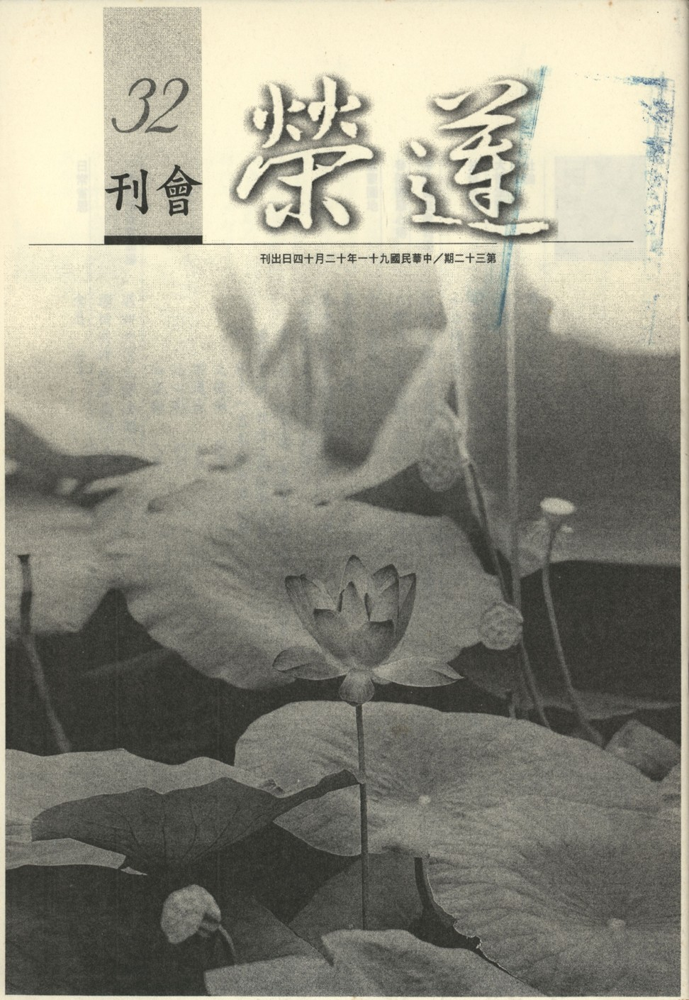

# 第32期

## 社論

### 尋求人生的真實義

*編輯部*

人生的價值，在於他有尋求高層次目標的能力，而不只如同一般動物尋求飽暖而已。然而這樣的目標真的是究竟離苦得樂呢？還是暫時而已？這樣的目標可以達成嗎？還是遙不可及的目標？中國人大抵以儒家學說為中心，彼學說所要引導的是成聖成賢的目標，另外對中國文化影響至深的是佛家的東傳，佛家學說所要引導的是成佛做祖，講到極處，儒家是成聖，佛家是成佛，然要達成此目標，依著孔子所言即是「志於道」，志於道就是志在明心見性（天命之謂性，率性之謂道，天然所賦予即是性，循著性不改謂之道，故道即是明心見性），明心見性的極致處，儒家云，是聖者的證量，佛家云，是佛的證量，這也是我們讀書人學儒、學佛的目標。所以一上來的學習是有目標的，就叫做志於道，就好像我們來這裡共修、研學與興辦善法，我們的目標也是為了成佛。如果我們的目標是在志求解脫，那我們的所為就是一個解脫的法行，如果我們是在志求來生的人天安樂，那麼所有法行就是一個人天安樂的法行，所以到底我們所作所為會引導我們結成什麼樣的果，那要看我們做這些法行的心態，這樣的心態就是我們最要講究的一個前方便。

而儒家所講的成聖以及佛家所云的成佛，其實就是心性彰明的極致行相。但是它必須要有它成就的方法，成就的方法孔子說是據於德，根據德，德就是一個智慧力，然德有明德有昏德，明德就是很正確很光明的智慧力；昏德就是很昏昧的智慧力，就像現在的人他的犯罪技巧，運用科技的新知，發展精密度極高的犯罪業，他這個德就是一個昏德，昏德就是一個昏暗的智慧力，他的智慧也能夠做很多的事業，不過因為他是狂慧，所以他所結出來的果報大多是三塗的苦果，而且所受的苦比一般人更劇烈。佛法所要開發的就是光明的智慧力，根據這光明的智慧力，得到種種殊勝快樂，名之據於德。據於德就是儒家所說的明明德，此明德（光明的智慧力）要如何明法呢？其成就法為格物、致知、誠意、正心。格物在  雪公老師的講法就是來了物（境界），格當來了講，來了境界要清清楚楚的覺察叫做致知，若能照見境空（觀自在菩薩行深般若波羅蜜多時，照見五蘊皆空）即是我執的對治，即是煩惱的去除。乃因煩惱的生處是執著，執著有真實的人我與法我這樣的實執，果然能夠見到人我、法我（五蘊以及一切法）非真實所成，則能執的心不生，能執的心不生則煩惱不生，煩惱不生則新業不造、舊業不潤，業不造不潤則苦果不生，這就是明明德。所謂的明明德就是很光明的智慧力，此智慧力能夠藉由格、致、誠、正的四個方便法引發出來，所引發的光明智慧力之正對治就是執著以及二種障礙（煩惱障與所知障），這種光明的智慧力一旦發展起來就能夠達到佛陀的果位，或者是聖人的果位，名為志於道。要有據於德（根據光明的智慧力）才能志於道（達到所願的殊勝證量，即是明心見性，見性成佛）。

然而欲得殊勝的智慧，成就離苦得樂的果位，其下手處是仁心，為什麼呢？因為他是有心於幫助眾生究竟離苦得樂的人，他才會有志（努力尋求）於讓自己離苦得樂，欲離苦須尋找苦的來源，苦是觀待業（因），業是觀待於惑（緣），惑依執而起，所以有心於幫助眾生究竟離苦得樂的人（儒家云成聖，佛家云成佛），他一定要自己先離苦得樂，自己先離苦得樂必觀待於得到殊勝的智慧，以破除苦因遠離苦果，種樂因得到樂果，所以依於仁又是據於德的根本心態，依靠著這個仁心，他自然能夠得到佛菩薩加被，善知識的教導，正確的法本而生出智慧力以明心見性。

依於仁就是想要對眾生拔苦與樂，而拔苦與樂的方便是「藝」，包括種種才能、技藝與藝術（或佛家所說各種陀羅尼），所以度化眾生時不只要助他破除煩惱，乃至他所需要有各種的生存方法以及在社會上必須要適應的種種才藝，所以有心於利益眾生的人，他不只要幫眾生破除障礙、破除執著、破除煩惱，還要有種種的才能，幫助他在生活上免於恐懼，免於缺乏而能生存，在生存的基礎上他（眾生）才能好好的修學，所以這個聖者他也要游於藝，涵泳沈潛於各種才藝，中國文化講究的就是六藝：禮樂射御書數，此即幫助眾生的各種才藝。以上所述志於道、據於德、依於仁與游於藝是整個中國文化的總綱，也是學佛的總綱。

即使修學念佛法門的淨土行者，也是不離開這樣的總綱，因為依著菩提心來念佛才是一個成佛的法行，所以這叫依於仁，而念佛的首要處在對治煩惱，並且從事相的念佛到理上的念佛，如此念佛能夠伏惑（事一心）到斷惑（理一心），觀待於斷惑的心稱之為德，根據此德能稱據於德，依據此德能，能達成所志的目標（成聖成佛），名為志於道。而他在法門無量誓願學當中，以無量無邊的有情為所緣，修學各種利益眾生的方法來利益眾生，這叫游於藝，即使念佛的行者也不離開這樣的總綱。所以如果我們能瞭解中國文化的綱要，也就能夠瞭解修學佛法的綱要，依此修學也就能夠幫助我們得到果位的成就，通途法門也是要這樣走的，特別法門也是要這樣走的。

尤其時至今日，時代混亂，很多人雖都有就學的機會，教育幾乎是百分之百的普及，遠比古人好很多，可是到底求學的總相（總綱領）是什麼，此今日之大弊端，現在人讀書學了一大堆，在六歲、七歲的時候就開始入學，但是在三、四歲時就有各種才藝的學習，在現在還有九年一貫的教學，可是到底一貫的宗旨是什麼，它所要得到的目標是什麼？這一點是現在的教育所缺乏，如果這些學子們並不瞭解所學的目標，不瞭解他的走向，他只是以才藝為他的目標的話，就像陸隴其的《松陽講義》所云，以名利為目標，以才藝為方法，此求學的人愈多，世道人心更壞，如此教育是壞亂世道人心壞亂天下，不但教育的功能不能正面的彰顯，反面的還加速整個國家的滅亡。

所以我們今天有志於修身齊家乃至治國者，未來的目標是往生成佛的人，眼前也應以一己之力來報效國家，因為我們生於斯長於斯，尤其從日用平常點點滴滴的受益一直到學問的獲得都是觀待於三寶、父母、師長、施主、眾生的恩，所以理應該是要回報的，那最好的回報就是讓正法能夠住世，果然透過自己對正法的學習，並且能夠依著正法來引導別人，使得他能夠找到方向，依著正法不斷地修學，如此則是一種對眾生最殊勝的報恩，也是我們往生與成佛的資糧。即使對修學念佛法門者來說也是一樣，念佛法門也是必須觀待正法才能夠住世，如果念佛的道理、念佛的心態、念佛的方法、念佛的目標，這種教法不能住世的話，念佛法門也不能存在，到最後念佛法門不但被別人看輕看扁，甚至淪為這些趕經懺作佛事（替死人作佛事的伎倆），而且不瞭解此法門是冥陽兩利、自他兩利，是成佛的方便，亦是菩提心攝持下最殊勝的成佛方便，如果不能把這個道理彰顯，念佛法門也無從住世，所以不管通途法門要住世也要靠正法讓通途法門住世，淨土法門也要靠正法住世才能夠讓淨土法門住世，那麼我們在這邊有共修、有研學的目的在於斯，所共修的念佛也能夠在一個殊勝的心態上，讓佛號能夠彰顯這樣殊勝的心態，變成我們大家伏惑、往生與成佛的一個最好的心態，以念佛心來彰顯這樣的動機以及目標。

## 大德法語

### 佛說四十二章經解　第十八章　（二十四）

*道源老和尚講授*

第十八章，

「佛言：吾法念無念念，行無行行，言無言言，修無修修，會者近爾，迷者遠乎，言語道斷，非物所拘，差之毫釐，失之須臾。」

吾（釋迦佛）法就是佛的法，是甚深之法。甚深之法就不大容易瞭解，所謂：念無念念，行無行行，言無言言，修無修修，這四句話就是佛所體會的深法，先瞭解佛的深理（開悟），然依文解義先須聽聞，依文解義就是把文字所含的義理瞭解清楚，即是開悟，然真正的開悟很難，而淺的依文解義較容易，雖文淺而義實深，何以不易瞭解，乃聽經聽的太少的緣故。要多學學名相，及瞭解名相所含藏的義理。

佛法雖不易懂但也很好懂，何以故？佛法就是心法，佛法就是詮釋我們人人本具的真心（佛心），這些道理應該是一聽就會瞭解，不過你要留心聽，所謂諦聽諦聽，「諦」字何義？要詳詳細細的聽，實實在在的聽，這個時候，你全不能打妄想，不怕你是第一次聽，也可以聽得懂。

此章經文義理深微，我（道公）做三番的解釋，第一番先解經文，要隨文入觀，不可以起分別心（動妄念），專注於所緣之法，若能於空性證悟（能所雙亡）無真實法可分別叫不起分別，所念之法了不可得，能念之心不生，此時與佛法相應（成就勝義諦）。

現在第一句「吾法念無念念」，佛法要我人成就的正念是雖念而無能念所念，乃是證悟空性之念，空性非斷滅空，也非虛空之空，乃萬法之體性（依緣起而明之），證悟空性時之心念是無分別，且雖有心念而沒有能念所念。能所雙亡，念無念念，只有心念而沒有能念所念，下面這二個念字就是能念所念，沒有能念所念分別，所以叫做念無念念。

再以喻明之：我們的心念不起分別（指證悟空性的狀態），就是真性自體（空性）現前，即是心經「照見五蘊皆空」依此起證悟產生妙用，譬如一面鏡子，這真性自體就等於鏡子的體，能起妙用，人來照人，物來照物，它有照的功能，鏡子有沒有分別說我是能照的，物是所照的，它能所雙亡，能所皆空，但是它有體有用，鏡即體（喻如心）有照之功用（照見五蘊皆空），這個照的功能就是照見真性之用。

懂得「念無念念」的解釋，下面三句就好懂了，第二句「行無行行」，行是行菩薩道，你發了菩提心，要行菩薩道，行菩薩道不要起分別，若起分別就著相，若著相則菩薩道行不好了。所以不起分別，不起能所，行無行行，雖然行菩薩道而沒有能行所行的分別（在行菩薩道的有為中見到無為的法性），這樣才是真正的行菩薩道。

要是在修行菩薩道的時候，起了分別，你這個菩薩道不能普遍去實行，因為行菩薩道度眾生要冤親平等，不管他是我的冤家，他是我的親人，我平等的度脫，若有冤親之分別，則親人同我有緣我才度他，冤家同我沒有緣，還尚且有冤仇，我怎麼肯度他呢？若有冤親分別則你的菩提心就不普遍，菩薩道也不能普遍。所以若要發廣大的菩提心，不可被你這怨親分別心給障礙住，且行菩薩道，亦不可起分別，不可以有能行所行之念。

第三句「言無言言」，言語就是說法，不是閑言閑語，說法不可以起分別（著說法相），你說法只管說法而不能起分別，雖然言而無能言所言，這樣子才是平等說法。

說法不能著說法的相，怎麼著說法的相呢？起了分別心，我能說法，法是我所說的，有能有所，起了分別，起了分別有什麼不好呢？第一、你講的法都不合實理，因為你有這個分別心講出來，都與佛的實理不能相契合，第二、尤其增長自己的煩惱。

說法者若是聖人用不著解釋了，他如何會起分別心呢？若說法者是凡夫則需要解釋與觀照。說法若起分別心，就增長我慢煩惱，因為別人都不會講經說法，只有我會講經說法，這個我慢增長起來，我慢增長起來不是煩惱增長嗎？起了增長我慢的煩惱錯誤。

你自己講經說法，都是在勸聽法的人要斷除煩惱，你自己起了分別心以為你能講能說，你增加慢的煩惱，你自己以為你天天在講經說法，天天在轉法輪，其實天天在那養無明，講經講的時間愈久，你的無明就增長愈大，所以平常有一句話叫做法師的架子大，架子大是個土話，就是法師難款待，怎麼法師難款待？他以為他自己了不得，怎麼樣款待也款待不好，容易發脾氣，怎麼容易發脾氣呢？無明太大了，那來的大無明？自己天天講經養起來的，所以你以為你在轉法輪，其實是自己在那養無明。

第四句「修無修修」，要修行用功，所用功的是大乘行門，不只是自己斷煩惱，了生死的小乘行門，而且要修一切的善法，度一切眾生，但是不許起分別心，修善法儘管修，度眾生儘管度，雖天天在修行，而不許起能修、所修，謂之修無修修（修要體會無能修所修之大旨）。

以上第一番的解釋，依著經文解釋義理。第二番解釋，依著金剛經來解釋，大家都對金剛經很熟，依著經文來解釋，比較容易了解。

第一句「念無念念」，就是《金剛經》上說「應無所住，而生其心」，生心（起念）然無所住著，不住一切法（無有真實法可住），他就無能無所，沒有能念所念，即是所謂的「應無所住，而生其心」，雖然生其心而無所住，這樣才是念無念念。

第二句「行無行行」，行是行菩薩道，就是《金剛經》上的「應無所住行於布施，不住色布施，不住聲、香、味、觸、法而布施」，為什麼要行布施呢？行菩薩道與眾生結善緣，有所謂財施、法施、無畏施，然行布施須不住於六塵（要三輪體空），內無能布施之我，外無所布施之人，我相、人相都空了，能所的相空了，中間亦無布施的財物，這叫三輪體空。終日行菩薩道，而沒有能行所行，謂之三輪體空。

第三句「言無言言」，即是《金剛經》上所說的「說法者無法可說，是名說法」，《金剛經》上之說法，應這麼樣才叫說法，說法不許執著說法的相，終日說法而不起執著，說法者無法可說，無法可說這樣說法，才是真正的說法，這叫「是名說法」。這就雖然言語，雖然說法，而沒有能言所言，叫言無言言。

第四句「修無修修」大乘菩薩的修行，就是修善法度眾生，就是《金剛經》上所講「離一切相，修一切善法」，你要修善法，你不可以著相；離一切相，一切相都不要執著，你還要去修善法，雖然修善法而不著一切相，這樣就是雖然修行善法而沒有能修所修。

行善法要度眾生，度眾生不著眾生之相，《金剛經》上講的「度一切眾生皆入無餘涅槃」，什麼眾生得滅度？是一切眾生。度到何種成就？將一切眾生都度成佛了，而沒有一個眾生是我度的，為什麼？我根本不著度眾生的相，所以叫修無修修。

以上依著《金剛經》解釋此四句話，就比較容易了解了。再說第三番的解釋，以前面的經文來解釋本章（以四十二章經解四十二章經）。

《四十二章經》第一章是講「有」就是出家者要持戒，進修四真道行，修苦、集、滅、道四真道行，修四真道行就能證得阿羅漢果，證得阿羅漢果，就有神通變化，且有曠劫的壽命；證阿羅漢果能得神通，能得長壽。皆說「有」沒有說「無」，這是第一章的道理。

為什麼第一章講有呢？因為度執有的眾生，彼將五欲都當成實有的，而去貪執，現明五欲不可貪，然若說「空性」，他（界內鈍根）接受不來，不如先說「有」，若捨五欲並出家持戒修四真道行，一定可以證得阿羅漢果的神通變化，且得曠劫壽命，拿佛法的「有」換他世間的「有」：世間五欲之樂，財、色、名、食、睡是地獄五條根。或云，你貪著五欲之樂，將來要墮地獄去酬償所造之業，倒不如來貪圖（好樂）佛法，證得了阿羅漢果，具足神通變化，得到曠劫壽命，這樣多好呢！所以度眾生要用方便，以佛法之有換取了他的世間之有，如此眾生都容易接受。

第二章講「無」，無也就是空，所謂內無所得，外無所求，你想得阿羅漢果，具足神通變化，你不曉得那還是不了道的，須是內無所得，外無所求，無念無作。內無能念之心，外無所念之境，無修無證（以上皆是指證悟空性而言），依著性來起修，修即無修，全修作證，證了什麼呢？證了我們的本性，那裏還有一個證？此謂無修無證。第二章以「無」字將第一章所學佛法之有，空其實有。雖非實有，依修行之緣而有羅漢果位，成就了殊勝神通與曠劫壽命。

第十八章，透過了「有」「無」二觀，匯歸中道，要修菩薩道│要修中道，不偏有無，透脫二關，才能匯歸中道。

這四句經文依文解義，「會者近爾，迷者遠乎」，會是會悟，依文解義解釋清楚了，佛法歸佛法，必依著文義會悟到自己的心裡來，會悟到自己的本性上，這個很近，原來佛法所說即是吾人心性，明佛法即是明心見性，那裡遠呢？迷者遠乎，你要是不能消歸自性，則愈學愈遠。

「言語道斷，非物所拘」言語之道雖能辨別法相，然而實相（法性）不是你講得出來，我們能講能說的都是對待的假相（有能緣的心與所緣境），然而在現證法性時是無能無所、能所雙亡，你說有也不是、說無也不是，你說亦有亦無也不是，你說非有非無也不是。乃至於你把這四句再分再分，分成一百句，通通不是，這叫「離四句，絕百非」，要把這有、無、亦有亦無、非有非無，離開這些對待假相這叫離四句，再分別成一百句，亦通通非，通通不對，叫絕百非。離開了這些有能與所之對待，就能證悟實相，此時非你言語說出來的，凡有言說皆無實義。你天天講經說法是為眾生，且能依文解義而說法，必須要會悟自己的本心自性，會悟到本心自性時，非你說那些言語相，凡有言說皆無實義，說得再玄妙，再高深，都無法讓眾生體會，必須要聞法之人，下手實修方能體會親證本性（空性）。

佛所親證之實相非言語相可說，此種證悟是不容易得到，不只是聽聞，須是唯證相應。你想證悟，先須聞而定解，依解悟而起修，才能以證得，證得了就與法性相應了，唯證相應。

若你開悟而證得了諸法實相，是個什麼樣子呢？不是言語說出來的，古人有一個比喻「如人飲水，冷暖自知」，我們要飲水，是飲的冷水？飲的暖水，冷暖自己知道，你用言語形容，怎麼形容都不是本來的冷，本來的暖。

比方我們飲水，飲的是熱水，要告訴對方能知道，我這個水是熱水，熱到什麼程度呢？你得解釋，怎麼樣解釋，都不是那個熱水本來的面目。問你這個熱水熱到什麼程度呢？不太熱，不太熱是個什麼樣子呢？不燙口│對方沒有喝到，不燙口又是個什麼樣子的熱呢？不曉得！那麼有人說，現在有辦法知道，現在有溫度表，你拿個溫度表一試就知道。比方這個不太熱的水，拿這個溫度表一量，七十度，不太熱，再拿換一個溫度表，還是七十，真標準，怎麼樣不容易瞭解，還是不容易瞭解，你那溫度表量的七十度，七十度是個怎麼樣子的熱呢？對方那個人，他沒有飲到，你還是沒有說到本來面目上。

要叫對方那個人，親自了解這個水熱，熱到什麼程度，你叫他飲一口，他飲一口，你不要再解釋了，也不要講七十度，八十度，他瞭解了，這叫以心印心。法性證悟狀態是無能所，此非言語說得出來的，所以凡有言說，皆無實義，到了言語道斷的時候，即是唯證相應。

「拘」受阻礙，這個「物」包括有情之物與無情之物。有情就是眾生，無情就是這一切山河大地等等的身外之物，物都能拘束人，都能障礙人，但在現證之後，心識前一法不立，無物可拘（此時無為法乃彼心之境而非有為法），出定見有為如幻，「物」無法阻礙、繫縛障礙，此修行者，所以「非物所拘」。

「差之毫釐，失之須臾」，是佛在警告我們，你要以佛法會悟實相，要細心、不能粗心大意，經文以四句的深奧之理而明法性即使你聽懂了，離開悟還有一段距離，你還是個凡夫，還須要不斷辯證得到定解，依解悟而修，才能會悟本性（實相），否則一開始即依文而錯解，愈修就愈遠，即是差之毫釐、失之須臾，若證悟時無能所（能所雙亡），此時離心緣相、離言語相（言語道斷），能所雙亡，開口即錯，動念即乖。然而開始須由聞而得正見，極其重要，否則差之毫釐，失之須臾，愈修愈遠。（下期待續）

## 共修研學

### 勸發菩提心文（三十二）

*心爾整理*

輪迴苦難喻

心似商賈忙

別離淚波濤

積骨須彌山

橫尸滿大地

不依佛語覺

貪戀復痴迷

三塗報難逃

（續前期）

輪迴苦中曰三世之苦分二：喻其投生狀況（又分約心與約身）及歎身淚尸骨量難喻：

約心：

「心無常主，類商賈而處處奔馳」

做生意的人到處奔馳，追逐利益，那邊有利益，往那邊走，商人就是這樣。業力也如此，那邊是我們的因緣，就往那邊投生，投生當中會變現成我們感覺可愛的境界，喜歡殺豬的人，死亡一剎那所看到的都是豬，他本能就想去宰豬，樂趣在宰豬，一過去豬群時，自變豬相，以自己的所愛執去追逐，結果發覺到，原來是墮入三塗的坑洞。

「身無定形，似房屋而頻頻遷徒。大千塵點，難窮往返之身」

大千世界磨成沙，很快的算完，我人投生的身體算不完，且相差太遠。廣欽老和尚年老力衰時，有一回我們去見他，請老和尚住世，老和尚喝著熱牛奶說：「不行了，厝要壞掉了！」他有這個覺受，他不怕，他知道反正就是搬家，搬家而已。但是我們不行，我們死執一個身以為是我，是我所擁有的，如榮民叫他搬家時，誓死抗議，光搬家就這樣，何況搬離身體這個家。所以平常看修行，就是從這幾個執著去看，到底有沒有在修。

若約身而言：

「四海波濤，孰計別離之淚？」

流過別離的愛恨之淚超過四大海，身骨所積，超過須彌山，

「峨峨積骨，過彼崇山」

峨峨是高山貌，尸骨所積早已超過須彌山，這在佛經上都有，要依佛語產生決定見，不是把它當成上聯下聯，賣弄文字，這是我輪迴之身之形容。

「莽莽橫屍，多於大地」

我死亡的屍體橫放起來，地球早已鋪滿了多層，六道輪迴就是這樣，狗屍、貓屍都是我每一生所愛執的屍，雞屍、鴨屍、鬼屍都是我的屍，來來回回，好不容易這一生變成人，在科考功名榮華富貴當中忘了一切，忘光並不代表沒有。

「向使不聞佛語，此事誰見誰聞﹖未睹佛經，此理焉知焉覺？」

見聞覺知是我們第六意識產生覺受的方便，眼睛見耳朵聞，身體的感覺，都是我人第六識產生覺受的來源，不能小看見聞覺知，雖然見聞覺知不是真理，然卻為通向真理最殊勝的一條路，尤其在論上說，欲通達中觀正見，捨卻從他聞則無門可入。

「其或依前貪戀，仍舊癡迷，祗恐萬劫千生，一錯百錯。人身難得而易失，良時易往而難追」

人身難得而易失的覺受若生，則修行轉捩點就出來了，比方說你要好好轉變你自已，然苦於無機會，無立足點，忽然人家給你機會的時候，你會死死的抓住，否則機會稍縱即逝。得到人身方有解脫與成佛的機會，人身難得如高山穿針，大海盲龜浮木一樣，是很難得到的。然卻很容易失去，是一口氣不來就失去。青春一過就難以追回，再大的權力與地位，甚而貴為總統，都沒有追回青春的能力，不會再青春。

「道路冥冥，別離長久」

有情在六道的旅途上，內心都是昏暗的，且死後的輪迴路上，杳杳冥冥，從前恩愛，轉眼成空，昔曰風流，如今安在，但所作之業並非消逝，乃不作不有，作已不失，所以是

「三塗惡報，還自受之。痛不可言，誰當相代﹖興言及此，能不寒心﹖是故宜應斷生死流，出愛欲海，自他兼濟，彼岸同登，曠劫殊勛，在此一舉，是為發菩提心第六因緣也。」

我們常說打仗立功是殊勛，為國努力是殊勛。為國努力往往有勳章，可是最重要的勳章，應頒給有了生死志向，能了生死的大丈夫、大勇士，可是我們世間人的勳章都頒給求名求利的，得那勳章有何用。且為了求生死安樂（名利）反而墮入三塗嘗受種種苦痛，且無人相代，即便生前最寶愛的妻子兒女等都沒辦法代受我人一分的痛苦，想想怎能不寒心。所以要好好的提起觀照的心力，照見諸法（人我、法我）非體性所成，不真實如水月、空花，了無執著破除愛欲，即是斷生死流出愛欲海。且尤須化他，乃因不忍見他苦，以及欲報其厚恩故，而伴他成長，共登涅槃彼岸，這才是曠劫以來最殊勝的榮譽。此是發菩提心第六因緣。（下期待續）

### 小止觀導覽（十一）

*蓮心整理*

懺悔須具十法懺

由事達理拔罪根

若為止觀前方便

直入涅槃更無疑

經文

故經云：「佛法有二種健人：一者、不作諸惡；二者、作已能悔。」夫欲懺悔者，須具十法，助成其懺：一者、明信因果；二者、生重怖畏；三者、深起慚愧；四者、求滅罪方法；所謂：大乘經中，明諸行法，應當如法修行；五者、發露先罪；六者、斷相續心；七者、起護法心；八者、發大誓願，度脫眾生；九者、常念十方諸佛；十者、觀罪性無生。

大意

說明欲懺悔者，須具十法，助成其懺。

導覽

一、若犯了戒或行為上有缺失、有雜染，擬將過失、雜染除掉，要得到夢遊太虛，夢幢幡寶蓋，夢佛菩薩提攜接引等淨罪相是很難的，另外在懺堂當中的痛哭流涕是一種良心發現的自然表現，乃真實懺悔的徵兆相，但還未到淨罪相，然不可刻意，若是刻意易著悲魔。修行人最大的瓶頸是慢心的突破，當我不沾染世間的欲望，在教法上也有體會，在善法上也有表現時，容易產生貢高我慢的心態，而成為我們修行的障礙。觀飛花落葉而開悟的「獨覺」者，在因地聽經聞法時，即對教法中的解脫法（順、逆十二因緣之觀修）具修學的好樂心，及觀修的能力，然主體上並沒有好樂親近事奉師長、好樂大乘及以佛為榜樣而欲利益無量無邊有情，無此殊勝的覺受，來世會感應善知識攝受的因緣不具足，但已具備解脫能力，觀飛花落葉而深悟無常，現證空性，但這種解脫是孤調解脫，很孤獨、孤單，只會調自己的心，不會調大眾的心，攝持及統合眾生的能力不足，故吾等須透過善法一步一步地對治自己錯誤的心態，有助於未來發展好的緣起，所以因地的善調心態，與果地修行的成就是息息相關的，這也是懺悔的意涵之一。

二、念佛是善法，但是若無防非止惡的助功，則一面念佛一面打妄想，一面感覺良心不安，這樣的佛號念起來不善巧。故持戒清淨為念佛成就重要助功，然從正面來說，是要好好堅持戒律，從反面來說要好好的懺悔業障，二者配合，可使身心清淨，緣念善法的力量轉強，若以佛號為所緣，易修成念佛三昧，此即是止，止在善法當中種種的觀察（思惟修）即為觀，止是禪定的體性，依止而得定，觀是智慧的體性，依觀而得慧。

三、佛法有二種健人：一者、不作諸惡，二者、作已能悔，不僅生理健康，心理也要健康。行者倘因無知而犯過，或勉力要做好，但煩惱太強而造惡，或環境的薰習使他造惡，以上均可懺悔，但若故意造惡再來懺悔，是無用的，因為懺悔不是罪惡的保護傘。

四、懺悔十法中，「明信因果」為總說，「生重怖畏」、「深起慚愧」、「求滅罪方法」、「發露先罪」、「斷相續心」、「起護法心」、「發大誓願，度脫眾生」、「常念十方諸佛」、「觀罪性無生」為別說。在因果的決定正見下，才生得起其他九種心態，比如「生重怖畏」是因為他知道過去所造的惡因(包括惑與業)，所結的苦果是難以忍受的，想到要去承受那些苦果，就會產生恐怖與畏懼的感覺，也必須藉懺悔拔除罪業、罪根。

五、在因果的觀修下對果報會生起怖畏，也會生起慚愧的行相，對己所造過惡，覺得慚愧，且覺得愧對聖賢、佛菩薩，在法（法鏡）的覺照下感覺羞恥，簡直非人也，這叫做「深起慚愧」。而此時會努力對治惡因，但對治惡因，要講究對治的方法，這就是「求滅罪方法」。依止經教，透過抉擇與觀修，建立修行的次第，並講究滅罪的方法，進而下手實修，其源頭均來自於因果的思惟。

六、五逆十惡、毀壞塔廟、盜用常住等罪惡之大相，及兩舌、綺語等罪惡之小相，均可藉著大悲懺、淨土懺等懺法在三寶前發露，其目的是培養反躬自省、防非止惡的習氣，這就是「發露先罪」。

七、懺悔若未斷相續心，則無以對治煩惱，比如念佛不能斷除煩惱，臨終助吾等往生西方淨土的能力就薄弱。「發露先罪」及「斷相續心」在四力懺悔中屬於拔除力。經由發露，把深藏的罪業翻出來曝曬，其目的是為斷相續心，發露後再犯，則減低發露懺悔的威力，因此在寺廟中破了根本戒要處重罰，就是希望經由重罰，建立犯者戒慎恐懼、如臨深淵、如履薄冰的心理，而不可心存僥倖。

八、「起護法心」屬於四力懺悔中的防護力，也就是要發願護持正法方能真正改往修來，然如何護持正法？正法教誡吾等要防非止惡、斷惡修善，吾等以恭敬、尊重、實修、弘揚於正法，使惡業、煩惱不再起，此為防護力。大乘起信論：「法者，眾生心」，懂得護法的人，就是懂得以法調整自己與他人的心態，使法住世，因為若吾等學佛有成，他人易起而效尤，反之吾等若學佛無成，徒增苦惱是非，不但無法使別人學佛，反而易使他人產生謗法之心，因為彼等看不到法的殊勝、法的好處，所以護法是要先護住自己的心，從修學佛法中得到覺受，才是真正護法。故護住自己的清淨心，才是積極的護法，了凡四訓云：「法者，萬世生靈之眼目也。不有正法，何以參贊天地？何以裁成萬物？何以脫塵離縛？何以經世出世？」誠不虛也。

九、「發大誓願」乃四力懺悔中的第三個力量—依止力，上來發露罪業是拔除力，護持正法是防護力，使自己的心態不再起惑造業，並且依止菩提心發大誓願真誠懺悔是依止力。世尊的四弘誓願，是一切菩薩于因位時所應發起的四種廣大之願，能攝持一切菩薩之別願，故又稱總願。以所願廣普故曰弘，自制其心故曰誓，志求滿足故曰願。緣四真諦而發此四願也，「眾生無邊誓願度（依苦諦門），煩惱無盡誓願斷（依集諦門）」代表下化的對象，「法門無量誓願學（依道諦門），佛道無上誓願成（依滅諦門）」，是上求；發大誓願，乃因眾生可憐，煩惱可惡，但在度眾的過程中，必須對治眾生難度的疲倦心態，故要學無量的法門，成就無上的佛道，以不疲不厭的菩提心度脫眾生。

十、「常念十方佛」及「觀罪性無生」是屬於懺悔的第四個力量—對治力，懺悔之對治力是對治無明我執，先伏惑及斷惑；「常念十方佛」是約伏惑而言，約斷惑言則是「觀罪性無生」。念佛若能理事圓融，方能伏惑斷惑。「念十方佛」的心態應為「如子憶母」，而十方佛對眾生都是以唯一的愛子來看待，所謂十方如來憐念眾生如母憶子，心心都是對佛菩薩的願力、神通、智慧、道力、德能的認知與求救護，念念都是瞭解佛菩薩對淨土的莊嚴、對眾生的攝受，內心法喜充滿，感應道交。

十一、事懺、理懺是相輔相成的，理懺即須以止觀門修學空性得到空性的證悟，止觀門重在將煩惱的現行、種子及習氣，全部除掉，也就是「觀罪性無生」，故「觀罪性無生」為懺悔十法的正行，而前九法則是「觀罪性無生」的前行，所以觀罪性無生的人會很努力的做前九項，令罪行不生。「反觀罪惡之性，當體無生；心滅罪空，是真懺悔。」是指罪惡沒有一個能生的自性，必須藉著眾生的煩惱及所造作的惡業才能產生，此罪惡會招感苦果，若見不到眾生的煩惱及惡業，罪業是無從生起，故罪性本空。若能讓心轉成清淨心，業轉成清淨業，則罪業無從生根、發芽及結果。（下期待續）

## 日常省思

### 念恩

願度

從來他人錯

自今始知非

若能思彼恩

慈悲油然生

我們無始劫來輪迴三有，不得自由，就是因為我們熟悉於刻薄寡恩、熟悉於體會自己的苦而不知他人的苦、熟悉於自我的需要卻不瞭解他人的需要、熟悉於順從自己的心卻不知他人的心、熟悉於自我的習慣卻不理會他人的習慣、熟悉於他人必得如此而我卻非常的委曲：：：的概念、想法，因此要我們來觀待他人的恩德，是一件非常困難的事；所以從前世、從今生以來，我們就存在著一切都以自己為中心的想法：怎麼都不照著我的意思來做、怎麼都不知道我的苦、我的心、怎麼都不知道我的需要、怎麼如此無理、怎麼：：：：，總而言之全部都是他人的錯，一切都是以自我為出發，而從來不考慮他人的立場。其實靜下來想一想，當真每一樣事情都是我們自己成就的嗎？非也，從來沒有一樣事情是我們可以獨立完成的，它是眾緣的和合而生，更重要的是它得自於三寶的加持、師長的悲心、長輩的護持、同儕的協助等基本因素湊合而成，其他尚有數不盡的條件在其中；也沒有一樣物品是我可以不需要抑賴他人而有的，光講一滴水就好了，它就來自各種條件的配合而成，無數的工作人員努力所成，而非單純我付了錢，就可以得到水的享用如此簡單而已。

從我們一出生，父母給予我們生命，而我什麼能力也沒有，必須要依賴父母親才能活下來，一切都要靠父母親的保護，若稍一離開父母親，馬上就會有生命的危險；從十月懷胎、推乾就濕、嚥苦吐甘、三年不離母懷等等，那一樣不是父母的恩德，我能有什麼能力自己獨自承辦自己的生活呢？從以前到現在，內心總覺得父母親沒有好好的培養我，所以現在自己很差勁，就是因為家庭的關係，把自己沒有好好學習所呈現的果全部推到父母親身上；但反過來一想，從小學到現在所受用的資源全部來自於父母親，甚至現在能留在台灣學佛，父母親雖不是很贊同，卻沒有劇烈的反對；再說到父母親身體康泰，我也才得以不須要留在身旁親自照顧，因此現在才得以無後顧之憂的留在台灣學習佛法，這一切的一切都是父母給予我的大恩大德，若沒有認真的去思考，總是覺得我應該就是如此，完全沒有想到父母的恩德，他們甚至給予我最大的空間，讓我選擇自己要走的路．

再來說到佛法的學習，所學習與皈依的對象是佛法僧，先以本師釋迦牟尼佛而說，世尊無量劫來為我們發菩提心、修菩薩行，捨身餵虎、割肉餵鷹、捨身求半偈、身燃千燈供養求法，這種種難行能行、難忍能忍、備經艱難與辛苦，最後終於成佛了，來了娑婆世界八千次，說法度眾生，然而眾生剛強難化，或有不領情、或有還在懈怠、不在意、馬虎者，更有恩將仇報欲害佛陀與破和合僧者，佛陀都能一次又一次不疲不厭地不捨棄任何一個違逆他的眾生；佛陀視眾生如唯一的愛子，把他歷劫的苦行全部回向給我們成就佛果，希望我們快速成就，並為我們抉擇一成佛殊勝環境，以及去彼處之方便，於是開出了淨土法門，告訴我們有西方極樂世界，有教主阿彌陀佛的名號可以稱念。若能好好稱名臨終能見彌陀佛，並仗佛力往生西方。阿彌陀佛也如同本師一般，在因地的他看出了眾生修行的瓶頸，因此經過了千億歲的聞法和五劫的思惟，並經歷無量劫的修行，終於成就了西方極樂世界，讓我們去受用西方的一切；先來想一想吧！我們在承辦一件事件經過多少時間的思維呢？是十分鐘、二十分鐘、半小時，還是二小時呢？可是阿彌陀佛居然可以為了我們去淨土修行思惟了五劫，世界上有誰有這樣的耐心呢？或許我們的煩惱可以持續的比較久，一天、一星期、一個月、半年，甚至是終身不忘，但我們用多少心在思惟利益眾生身上呢？說起這樣的一個問題，就足夠讓我們慚愧的無地自容了，全部都是私心滔滔的，盡虛空遍法界的全部都是我執而已，拿掉我執，我們還有什麼內涵呢？再說到阿彌陀佛利益眾生的心，他老人家歷劫的修行，為國王、為長者、為居士、為：：：，無量劫來歷經了多少千辛萬苦，可是他唯一的心念就是把他成就的佛淨土，雙手捧給眾生享用，這是毫無保留的，試想想若我們辛苦一輩子、二輩子，甚至多輩子所聚集的財產，我們會很輕易的給別人嗎？或許會吧，那就是我們唯一的愛子，因此佛就把我當成他唯一的愛子，把他所有歷劫修行的果報，都毫無保留、毫無隱藏的送給我們，甚至當我們還不領情時，他也是想盡辦法幫助我們，讓我們得以往生西方、離苦得樂，甚至現在他已經成就了，還在西方日夜的盼望我們可以回到西方的老家；而我們受苦時，他則深切的期盼可以代替我們受苦，這就是佛無盡的恩德啊！父母親的恩或許是盡此一報身，但佛恩卻是盡未來際，豎窮三際、橫遍十方，此大慈大悲，是綿綿無絕期。

再來說到師長恩，在勸發菩提心文裡提到說有了世間和出世間的師長，我們才可以知道禮儀，有了出世的師長，我們才可以知道佛法，如此一來才可以讓我們免掉當異類、當俗人的過患；不只如此，傳承教法的歷代祖師，他們是如何辛苦的把正確的教法流傳下來，他們經過多少的努力培養自己、訪求明師、刻苦讀書，西行求法等等，才得以讓教法保留下來，這一切的一切都是歷代傳承祖師不惜以生命續佛慧命的成果。在現實中師長不但長養我們的慧命，也解決了我們的生活上的問題，不但常常舉辦研討，還在團體生活中培養我們的人格，不但以折法來折服我們，也以攝法來鼓勵我們，不但以言教來教化我們，也以身教來感動我們，不但以關心來引導我們，也以默擯來警告我們，處處都表現師長的悲心，使得種種或在家、或在學校裡沒有學到的內涵，都在這裡得以學習，學習的時候還心不甘、情不願的，有氣沒力的，但是師長都耐心的等待我們的成長，就像阿彌陀佛一樣把所學的毫無保留的全部奉上，但我們都只是漫不經心、有氣無力的接受下來，想想這樣對得起師長和歷代祖師的恩德嗎？午夜夢迴的時候，我能心安嗎？若沒有認真的去思考，我真的刻薄寡恩到認為這一切都是應該的、這一切都是理所當然的，怎麼又到了上課時間呢？怎麼又要作七、助念、共修了啊？殊不知師長準備功課比我們要花上多少的時間，在百忙中甚至要熬夜準備功課，批改作業又是一點也不拖延的，若現在還能有一些不錯的觀念，都得自於師長的願力和慈悲，用了多少的心力、時間、努力、言語、人力、物力等等，才建立我這麼一點點如泡沫般不堪一擊的善念；在觀念的建立當中要靠培福，最好的培福方式就是來自於各種佛事，例如作七、助念、齋僧、放生等等，這一切的一切最大的利益者就是自己，可是我們卻不願意去做對自己有益的事情，還認為師長不夠慈悲、不知體諒：：：興辦這些善法都是讓我們能成就，讓我們變成一個人才，但我們卻是一次又一次的扭曲師長的心意，就像我們歷劫來扭曲了諸佛的旨意一般，才讓自己一直在煩惱堆中打轉，而不得出離；我們需要這樣一而再、再而三的漠視十方師長善知識的本懷嗎？而一而再、再而三的傷害他們的誠意，也戕害了自己的慧命嗎？

總而言之，不斷努力自我增上的老師，馬不停蹄的開辦各類的研討開拓我們閉塞而無明的知見、興辦各類的佛事讓我們在辦事當中成就智慧，使我有一個較好的思惟與行為模式，使我在社會上有生存的能力，不致於挨餓受凍，並且有微薄的能力來做有益於眾生的事業，過著安定的生活，看似平常，卻需要師長全心的努力在背後的運作。

長輩與同儕的鼓勵、提攜，讓我在待人處事上學習加大自己的心量（對治自己小氣的心思和妒嫉的毛病）、學習配合別人的需要和體會別人的心意，使愚笨又我執深重的末學，慢慢在工作當中拿掉以自我為主的心態，也比較懂得辦事的分寸和技巧，這些都端賴長輩和朋友的幫忙，他們在我們犯錯時，馬上給予指正；不論在工作、生活、習慣上都給我們很好的建議，在師長無法顧及的情況下糾正我們不如法的地方。

再來說到施主恩，從我們的共修場地開始就不是自己所能成就的，再來裡面擺設的種種都來自於不同的施主，行住坐臥都來自於他人。甚至微細到觀察生活當中的每一點，無一不是來自於他人的恩惠所成就；若不仔細去想，會有一種錯覺，認為所有的一切都是我用錢去換來的，但試問若沒有人去做某一樣我所需要的東西，我縱使有錢，在急須的時候我也無法應急，就譬如說當我急須影印時，我縱使有錢，但找不到影印店，試問我如何來印資料，這時若有影印店出現，我就會非常的感恩，謝天謝地，也謝謝他來從事這個行業；推廣到日常生活的所有細節，例如在團體當中完成了任何一項工作，都是靠他人的護持，使我得以在預期的時間裏完成這項工作，甚至我在完成這項工作的當下，也是靠著很多因緣的幫忙，而非是我一個人獨力承辦的。

最後說到眾生恩，在生活上的點點滴滴都是眾生的恩德，因為這是一個分工的社會，我們有水電瓦斯可以用、有房子可以住、有公車、機車、汽車可以代步、有吃的、有喝的、還有種種的器材可以用，這一切都是來自於眾生的恩德，而且眾生可以幫助我們解決各種煩惱，最後把我執去得乾乾淨淨；眾生可以幫助我們去貪、去瞋、去癡、去貢高我慢、去懶惰、去懈怠、去殺、去盜、去淫等等十惡業，他們可以幫助我們去除各種各樣不同煩惱，可是我卻常常與眾生處在對立的情況下，這真是天大的刻薄寡恩；若我們看到眾生對我們這麼大的恩惠，我們就很自然在與眾生對境當中去掉我執，最後成聖成賢，這亦是眾生所賜，阿彌陀佛！

## 啟蒙園地

### 每月一字 — 宴

*蓮心*

宴：根據許慎的說文解字「宴」的本義為「安」，是閒適的意思，代表家居時身心閒適，「宴」的意思，詳如下列：

一、安逸、安閒〜如「閒宴」就是形容閒暇無事。又如白居易的詩句：「宴坐小池畔，清風時動襟。」是形容悠閒自得的情景。

二、以酒食款待賓客〜此處是當動詞用，如「宴請賓客」；又如「春夜宴從弟桃花園序」的「宴」就是設宴款待的意思。

三、酒席、筵席〜此處是當名詞用，如史記上記載：楚漢相爭時，劉邦先入咸陽，項羽設宴於鴻門，欲加害劉邦，幸得項伯、張良等人協助，始免於難。後來對於不懷好意，居心不良的邀宴，就稱為「鴻門宴」。另外慶祝成功所舉行宴會，稱為「慶功宴」。又如「三日一小宴，五日一大宴。」就是形容大小宴席不斷。而白居易的長恨歌也有「承歡侍宴無閒暇，春從春遊夜專夜」的句子。

四、快樂〜如「宴爾新婚」就是形容新婚生活的甜蜜。

另外與「宴」字形很類似的「晏」字，雖形似但義不同，「晏」是形容晴朗無雲，如「天清日晏」。「晏」也可做「晚」或「遲」解釋，如晚起，亦可稱為「晏起」。此外「晏」也是姓，如「晏殊」就是一個很有名的詞人。

### 十四講表(二)

傳瑛

佛法是在二千五百四十六年前，由釋迦牟尼佛為有緣眾生所宣說。

釋迦牟尼佛的父親是淨飯王，母親是摩耶夫人。未成佛前，他的名字叫悉達多，悉達多生為太子，生活在非常舒適的環境裡，為什麼會想出家求道呢？因為悉達多看到了人生的生、老、病、死，了知所有的事物皆是無常，正因為萬事萬物常在變化中，因此，更應該要把握每一個當下，做有意義的事。

悉達多太子告訴他的親人：「如果不成道，永遠不回來。」那時他十九歲。悉達多太子離開王宮後，父親淨飯王很掛念他，派了幾位臣子，帶著幾車食物和衣服，去探訪他，並且勸他回宮。悉達多不肯接受。他說：「我立志修道。凡是有意義的事情，都要盡心盡力去做，絕不會中途退縮，也不受物質引誘，我決定成功才回去。」其中有五個臣子敬仰他的道心，自願留下，追隨修道，其餘的人，只好帶著車子及衣物回去。

悉達多每日只食一麻、一麥，歷時六年，身體愈來愈弱，精神也很差。後來他覺悟到修無益的苦行不是解脫生死的真因。首先他到河中沐浴，洗去身體的塵垢，並接受牧牛女奉獻的牛乳，也接受割草的男童把軟滑的清草鋪滿他坐的石上。但是五位隨從卻誤會悉達多失去道心，貪圖享受，很是生氣，因此都離開他。

後來悉達多太子證得佛道，名為釋迦牟尼佛。釋尊先在鹿野苑附近，度化以前追隨他的五位隨從。釋尊清淨、莊嚴的相貌，令他們恭敬、仰慕，他們向釋尊頂禮，請他說法。並跟釋尊出家做了佛弟子，從此就有了佛、法、僧三寶。佛寶是指釋迦牟尼佛。他的人格、行為、事業都是我們的模範。法寶是指釋尊的教法，他告訴我們止惡行善，慈悲濟世及解脫自在的方法。僧寶是學佛的團體，這裡是指佛度化的五位弟子，他們依佛陀的教導修行證果。釋尊說法共四十九年，最後於雙林示現圓寂。

以下介紹「佛學十四講表」，讓大家概要地瞭解佛法的內容。

第一講表，先明佛義，學佛就是要成佛，「佛」代表什麼意思？佛就是智者、覺者。佛知道宇宙人生的真相，並有度眾生的智慧。釋尊成道時，曾說：「眾生都有智慧德相，只因妄想執著不能證得。」覺是指佛是透過覺察、覺悟的方法得到智慧。智慧有三種：一切智、道種智、一切種智。

一切智就是「知法總相」。什麼是「總相」？總相就是「空相」。空是什麼都沒有嗎？不是的，空相是指萬法皆是隨因緣變化，本身並沒有一個固定不變的個體存在。如樹本來就是一棵樹嗎？不是的，最早它是顆種子，埋在土裡，經過澆水、施肥，吸收陽光、空氣，種子慢慢地向下生根、向上發芽，然後長成大樹，開花結果。種子並不是永恆不變的，當它碰到水、肥料、陽光、空氣時，就會生根發芽，是無自性的，同樣地，長成的果樹也不是永恆不變的。所以說，諸法的總相是空，是隨因緣而起變化的。小寶寶也不是永遠都是小寶寶，他會慢慢長大，上小學、中學、大學、結婚，成了別人的父母，然後老化，一生就是這樣的變化。又如：當兩手相合，產生一條縫，此縫是因(指兩手)緣(指相合的動作)和合而產生的，當兩手一分離，則此縫又消失不見了。

世間萬法就是經過因(如前面說的種子)、緣(如水、肥料、空氣、陽光)、果(如長成大樹)條件的聚合變化產生種種現象。因緣果簡稱為因果，因果有三個特性：一、決定性。二、果報會增長廣大。三、不造不受、造已不失。

一、決定性

有因就會有果，如是因，如是果。所謂做善得樂，做惡得苦。做善或做惡就是因。得樂或得苦就是果。如種苦瓜的種子，不會長成蘋果。當做好事，就會得到好的報應，做壞事，就會得到壞的報應。這就是因果的決定性。
每個人皆有不快樂的時候，凡是對別人好時，就會得到好的果；若常常為自己著想，自私自利，就會得到不快樂的果。孔融在四歲時，有一客人來家中拜訪，帶來一籃梨子，就請他先選，他選一顆最小，客人問他：「你怎麼選最小的呢？」孔融回
**答：** 「大的讓給兄長，我吃最小的就可以了。」當孔融替兄長著想時，兄長也會替他著想，因而增進兄弟間的情誼。

因果的決定性就是造善得樂，造惡得苦。那善惡怎麼分呢？凡是利益他人的，就是善；自私自利損害他人的，就是惡。

二、果報會增長廣大

小小的一顆種子，是可以長成一棵大樹，當它長成大樹時是很高大的，所以果報是會增長廣大。雖然我們現在只是造小小的惡事，以後會結成很大的苦果，現在造小小的善事，以後會結成很大的樂果。

從前有一佃農，向主人借了一千貳佰元，後來他還一千貳佰元給主人時，忘了拿回借據，這主人就故意拿這張借據，再去向這佃農要錢，佃農只好再給他一次。過了幾年，這主人死了。有天夜晚，佃農就夢見從前的主人來找他，並向他說：「對不起，以前你還我錢，可是我卻因貪心作祟，又向你要債。現在你養的豬群中，有一隻黑白相間的，那就是我，明天就要被屠夫殺了，請你不要讓屠夫殺我，並告訴我兒子，請他來把我買回去！」隔天一早，佃農真的就在豬群中，發現一隻黑白相間的豬，佃農為了要確定這隻豬是不是從前主人投胎轉世的，於是呼喚從前主人的名字，這黑白相間的豬，竟帶著哀憐愧疚的眼神看著佃農，於是佃農就通知他的兒子來買回去。原來只是欠一千貳佰元，來世卻用一條命來償還，證實果報是會增長廣大的。

在印度有個地方，每當有人結婚，他們就會灑豆子祝福。有一回，正好佛經過此地，拿豆子的小孩子，見了非常歡喜，就將豆子灑在佛的身上，一顆落於佛頂，四顆落於佛缽。後來這個小孩來世成為統治四大洲的轉輪聖王，長的相貌也和佛很像，非常莊嚴。

三、不造不受，造已不失

只要造因一定會得果報，反之，不造因就不會感得果報。以前一隻狗追著一隻豬玩，繞著佛塔轉一圈，因繞佛塔功德，來世升天。目犍連神通第一，但因曾對母親造惡口的業，後來雖然神通第一，仍然遭人棒打，所以一旦造因，就會得果，因果絲毫不爽。

我們已經知道造惡得苦、造善得樂。每個人都想得到快樂，若要得到快樂就要造善業，以及對治煩惱開始。因煩惱會像賊一樣，把我們的光明德能偷光，所以說「侵害如賊」。

要對治煩惱賊，一定要知道賊長得什麼樣子（若現在告訴你，賊穿白色上衣，藍色長褲，紅色球鞋，紫色眼鏡……，描述得非常地清楚，那是不是很容易發現賊是誰了。）發現煩惱賊起時，能夠馬上「覺察」，煩惱就無法產生作用了，就好像發現賊時，賊就會害怕逃得無影無蹤，這就是「覺賊無能」。如在餐桌上吃飯，這個好吃，我要吃多一點，這個不好吃，我不要吃，就起了「貪」。又如：經過麥當勞時，就一直吵媽媽要進去吃東西，若媽媽不答應就一直哭、發脾氣，這樣就因貪而起「瞋」。還有眾生懷疑因果的道理，不相信，就是起了「疑心」。因此，不願做利益別人的好事，反而到處做自私自利的壞事，這就是不知事情的真相而生的「愚痴」。對治了貪、瞋、癡等煩惱，就能證得一切智，遠離生死輪迴的痛苦，這就是阿羅漢的智慧。

再來，說到菩薩的智慧，菩薩發心要幫助所有的眾生得到快樂，但眾生的習性個個不同，所以菩薩會用各種方法來度每一位眾生，眾生無量無邊，菩薩就必須懂得無量無邊的法門度眾生，這就是道種智。

道是種種度眾的方法。種是眾生的根器，菩薩度眾的方法無量無邊，但總歸起來有四個：

一、愛語：

發自內心關懷的話，如眾生遭受苦難，安慰他、開導他，讓他能心開意解。

二、布施：

（一）財布施-將我們的食物、衣服、金錢給予需要的眾生，這屬於外財。將我們的生命奉獻給需要的眾生，則屬內財。如釋尊累劫修行中，曾有一世在深山修行，碰到一隻老虎，這隻老虎很餓，餓到幾乎想吃掉自己的孩子，基於大悲心，佛就將自己的生命布施出來給老虎吃，這就是內財布施。

（二）法布施-將自己所學到很好的佛法，與眾生分享，並藉此幫助他脫離困境。

（三）無畏布施-若眾生心裡很難過，或很害怕，我們就想辦法幫助他，讓他不難過、不害怕，而且勇於與他一起面對困境，解決問題。

三、利他：

只要是利益眾生的事都去做。

四、同事：

每一個眾生的喜好皆不同，眾生喜歡什麼，菩薩就陪他做什麼，而且做得比眾生還好，讓眾生打從心裏非常佩服他，而跟他學法。如一個人非常喜歡學習，菩薩就陪他學習。台中蓮社有位江逸子老師，以畫著稱，他曾跟  雪公老師學詩，可是無論他怎麼作詩，總覺得  雪公老師就是比他的意境高一層。

金山活佛是乘願再來度眾生的菩薩。金山活佛，每天都會帶飯菜給牛吃，當他在餵牛時，也為牛三皈依，所以牛見到金山活佛時，都會非常高興的一直叫，而金山活佛就為他們說法：「你們知道你們今生為什麼會當牛呢？就是因為你們前世欠錢不還，還打人、罵人，所以今生才會無法說話。」由於金山活佛餵牛又與牛說法的因緣，來世這些牛將會成為佛的弟子。又有一位法師，身邊有一位十八歲的弟子，有一回法師說：「你們知道我這位弟子是誰？他就是我以前在山中放生過的一隻野豬。」我們平常放生，所放生的生物，他們來世都會是我們學佛的伴侶，所以放生就是一種菩薩的布施，包括財施、法施、無畏施。

菩薩發心要度眾生，除了須對治煩惱障外，還必須透過種種覺悟的方法，對治所知障，因為無法了知過去無始、未來無終，種種因緣變化，對法的所知有障礙，對度眾生就有障礙。什麼是所知障？你們看這是一個杯子，杯子原本就是這個樣子嗎？不是的，它是由陶土捏造成杯子的形狀，然後拿去燒，再上釉彩，才成為現在這個杯子，但我們往往認為杯子原本就是這一個樣子，不知道杯子的前因與後果，就算知道也只能知道個大概，不知細節是如何。對治所知障後，就能知道各種現象的因緣變化，這時再來看這個杯子，就可以把所有的因緣看得很清楚，是誰捏造陶土成杯子的形狀，然後又是誰拿去燒，又是誰上釉彩，是誰帶到街上賣……，所以能夠掌握最有利的因緣度有緣的眾生。

有位小男孩，白天打電玩，打得很認真，晚上就夢見自己與鬼王打架，快打贏時，卻被媽媽叫醒。小男孩就很生氣地對媽媽說：「我在跟鬼王打架，快打贏了，你為什麼要把我叫醒？」我們對事情真相不瞭解，把假的當成是真的，就如小男孩把夢當成是真的，所以佛法比喻眾生是「昏昧如睡」。

菩薩對治所知障，知道種種因緣變化，證得度眾生之「道種智」，就是「覺即分明」。菩薩有五十二階位，分別是十信、十住、十行、十迴向、十地、等覺、妙覺。十信就如幼稚園，十住就如小學、十行就如中學、十迴向就如高中、十地就如大學、等覺就如碩士、妙覺就如博士。越高階就對事情看得越透徹，度眾能力就愈強。當十地菩薩要度眾生時當然比十信菩薩更有能力，而終究能完全破除所知障，具足圓滿度眾生的智慧，就是「妙覺」的佛位。

釋迦牟尼佛有回看到機緣成熟，要度母子二牛，於是示現生病，告訴阿難：「我想喝牛奶。」於是阿難就向一家婆羅門乞討，但這婆羅門卻非常的吝嗇，他心想：「若不給佛，別人會說我吝嗇，而佛又與我不同教派，這樣好了，我的牛群中有二頭牛最兇，就請阿難去擠這二頭牛的奶，這樣一方面別人也不會說我吝嗇，一方面又可以欺負阿難，看看他要怎樣去擠到這二頭牛的奶。」很多人聽到了這件事情，都跑來觀看。當時佛制戒中有條規定佛弟子不可用手擠牛奶。現場突然有位男子挺身而出願意幫忙，其實這位男子就是天帝化身，因為他知道供養佛的功德很大。此時二頭牛忽然變得很溫馴，還自動跑上前給這位男子擠牛奶。前來觀看的人都覺得很奇怪，這牛奶到底是要給誰喝的？於是就跟著阿難回去，才發現原來這牛奶是要給佛喝的。阿難就問佛：「牛為何今生會為牛呢？」佛回答說：「這二頭牛原本是一對母子，非常的吝嗇，又放高利貸，過世後就變成牛，因前世詐人的利息收得太多，就變成欠別人的債，因此當了十六劫的牛，讓人擠牛奶來還，現在這二頭牛藉著供養佛的大功德，大牛以後會在彌勒佛的座下證阿羅漢；小牛未來會成佛，佛名為乳光如來，並度無量無邊的眾生。」

每個人修行都是從零開始，就像一條數線圖，若做好事就得廿分，可以為人，若再做更多的好事，分數又增加到四十分，可以為天人，若發心度眾生，分數又增加，成了菩薩，菩薩有五十二階，慢慢地就達到了滿分，成佛了；相反，若行壞事，分數就減到負廿分，來世成畜牲，壞事再行得多一些，就成餓鬼，再壞壞到了極點，就到了地獄。所以了知萬法皆無自性，完全依造善得樂，造惡得苦的因果法則在運行。

佛也是由凡夫修成的，我們要怎樣修才可以成佛呢？身為凡夫的我們，首先要對治煩惱障，然後證得一切智，但這只是「自行」，只能幫助自己，若再發心度眾生，就成了菩薩，而菩薩要度無量眾生，就要廣學無量法門，這就須破除所知障，證得道種智才能「化他」。當做得很圓滿，具足一切種智時，就是妙覺、佛，所以是「行滿」。

每個人都要對自己學佛成佛有信心，因為每個人皆是未來佛。（下期待續）

### 心靈成長營返班活動報導　家長班研討專題 — 家庭教育為天下太平之根本發隱（二）印光大師著

心怡淺釋

前言：

本文乃印光大師提出欲天下太平之良方，其根本問題在於家庭教育，家庭的教育又以母親對子女的教育為主要，然而教子女當中又以教女更為重要，因為有賢母才有賢女，有賢母才有好的家教，有好的家教才有好的子弟，有好的子弟才能培養為賢才，有賢才方得以安邦定國，這樣的決定見非印光祖師說明，吾人很難產生殊勝的覺受，誠所謂「此語舉世咸知，此道舉世咸昧」。

家庭母教要從求子開始，所以印光祖師有一篇禮念觀世音菩薩求子疏，即說明欲得好得子弟先從求子開始，其次重視胎教，母親在懷孕的時候要注意於居心動念行事，若能導之以正並配合吃素念佛，則能生出相貌端嚴、性情慈善、天資聰明之子女，母親也無胎產之苦，並且在子女幼齡時，能夠向他說做人的道理及因果輪迴的故事，讓他有所警惕，也對善人君子充滿敬畏與羨慕，在日用平常修正各種不良的習慣，使得子女能夠在口業上及身業上避免種種過惡，例如打架、偷竊、說謊、亂看漫畫書、隨意看電視、說粗話，也教他常念阿彌陀佛，得到三寶加被，可以免除各種的災難，以及增福增慧。

慢慢長大以後，教讀因果教育的書籍，將來必能導正他讀各類書籍的動機，而且越讀書品德越好，能成為家庭的好子弟，社會的棟樑之才，如果不這樣教導，隨順世俗，對子女非常的驕寵，養成他任性的習慣，讓他不知因果報應的可畏，也不幫他找好的老師引導他走上人生的正道，將來他的才能越多，對社會的危害就越大，而父母跟師長的罪過，也因無善教而變得非常嚴重，因為培養匪類而壞亂世道人心，其罪不小。

因為父母親有正確的引導以及真正的目標，故能從生活的小細節來調教子女，這種生活小細節的重視，會使得子弟們在日用平常不知不覺中，建立好的習慣，以及因為造作了種種的善法，內心常在愉悅之中，且又受到師長及長輩的愛護以及同儕的尊重，在他人生的旅途上，他會過得非常的快樂，即便有一些障難也會得到很多人的幫助，更相信這樣引導的重要，也更能相信古聖先賢教育的用心。

正文：

本次研討段落為甲二、別釋，乙二、別明，丙一、通明家教重要，丁一正明分三，其中戊二、幼教及戊三、修身之內涵。依文分述如下：

「及至初開知識，即為彼說做人之道理。如孝、弟、忠、信、禮、義、廉、恥等。及三世因果之罪福，六道輪迴之轉變。」

父母的恩德當中，主要有生育、養育及教育等，其中又以教育恩德為要。印祖在開示胎教後，續說幼教。幼教分初知及稍長二部分。首先初開知識時，即為說正法，並教其篤行，令其知行並進，以得實益。

首述說正法時機，「及至初開知識」，家庭幼教從最初稍懂知識約三至五歲起，即為說正確知見。或許有人認為幼小天真，教此是否太早、太嚴肅呢？印祖說：「初開知識時，天性未漓，薰習易入，習善則善，習惡則惡」。故勿以年小而不教，錯過時機悔已遲。現代中外各國幼教學者提倡零歲教育，主張孩子從一出生開始，便給嬰兒發展階段的正確學習指導，則將來個個都能成為優秀的孩子。因嬰兒時期頭腦活動最靈活，潛力最大、可塑性最高，對環境具有高度適應力，故教育時機宜愈早愈好，關鍵在好的學習環境及正確的指導與栽培，此與印祖所開示的胎教及幼教之道理相通。

正法之內涵，含世法及佛法。「即為彼說做人之道理。如孝、弟、忠、信、禮、義、廉、恥等。」世法方面，即教子女做人道理，如八德及五倫十義等，此乃中國五千年文化之精髓，為人處世應知應學之本份，亦恆常不移之懿德美行。凡修身、齊家、治國乃至平天下等修己利人之事業，無不建立在此人格道德教育上。「及三世因果之罪福，六道輪迴之轉變。」佛法方面，更涉及三世因果及六道輪迴之轉變，這些事理在三藏經典及儒家經傳都有詳明記載。蓋因果教育，乃儒佛相通，淺則攸關世間禍福罪報等利害關係，深則影響出世間六道生死輪迴之解脫。故印祖常云：「因果者，世出世間聖人，平治天下，度脫眾生之大權也」。離此因果，聖人亦無法度化眾生，然其根本處要從家庭幼教著手。一般因果法則有：如是因、如是果，不作不受，作已不失，業增長廣大等特性。其時間則通達三世，空間則遍滿六道十方。儒家著重今世五倫八德等敦倫盡份之道，此為世間福報之泉源。佛家講究三世六道輪迴，能超越世間有漏福報，了生死成佛道。因果道理看似簡單，現象卻錯綜複雜，若看一世或短時間，易產生矛盾或誤解，故須會通三世六道因緣之變化。所謂善有善報，惡有惡報，不是不報，時機未到。又罪福是果報，即過去造善，今日得福，往昔造惡，今日獲罪；同理今日所造善惡，也必影響將來六道升墮之果報，此乃因果不變道理。

教子女之方法，不外言教及身教，雖身教為要，然以言教為先。除父母教育外，易子而教或請師長教導，均能獲益。至於方法之善巧，依時代背景或有調整，但其精神、原則須不變。言教乃為子女說正法內涵，以建立其正知見。應常為子女說八德大意│如孝是能體親心，悌是兄弟和睦，忠是對人做事盡忠職守，信是言語老實、不說謊，禮是尊人敬事的恭敬態度，廉是處世清白，不貪取名利等，恥是確實的覺悟，能反省改過。此外，並為子女講述歷史及因果報應等故事，如閔子騫之孝，孔融讓梨之悌，孔子俎豆禮容之遊戲，乃至因果實事等，以吸引子女興趣，使其了解並肯定內涵，則隨其年齡大小，自能發揮其樂好向學之功。身教方面，應以身作則，從生活層面上落實，給與子女學習機會，使其易於行善，勇於改過。幼教時期父母若能為子女營造一個良好的環境，將正確道德觀念及好的行為教給小孩，並藉日常生活中循循善誘，由言教而至身教，不斷地薰習，使子女一回生、二回熟，漸漸習慣成自然，養成人格特質，如此潛移默化，效益最大。正如易經云：「蒙以養正，聖功也」。

「俾彼心中常常有所恐怖，有所冀慕。」

這一段承上結願，以此正法道理教育子女，使其心中對造惡獲罪受苦之事，有所了解而知恐怖，對造善獲福受樂之事，有所明白而希羨。子女心中有所恐怖，則能畏苦而不造惡因，有所冀慕，則能好樂而力求善因。只要父母本身有正確觀念，用心體會並將之落實於生活中，自然發覺倫常道德及因果教育之重要及可貴處。故印祖常說：由果推因，慎始造作，如此教化，必能使子女，漸能去惡習善，終能養成賢善，獲福得樂，更進能求了脫生死。

「再令念佛、念觀世音，以期增福增壽，免災免難。」

這一段說明教子女正法後，須令其身心篤行。首先約心而言，教其念佛、念觀世音菩薩等聖號，以期增福增壽，消災免難。世人都希望一生能平安亨通，但天災人禍常避之不及。父母養育子女過程中，除種種呵護照顧之辛勞外，還要耽憂天災人禍等意外事故，現今社會更害怕子女遭綁架勒贖或受人欺負等，可謂煩惱不已。如能教念聖號，透過誠心恭念，則能以正去妄，與佛菩薩慈悲普度眾生之心願相應，則所求必能重報輕受、逢凶化吉、乃至福壽自得。如印祖云：「承此善力，必能禍消於未萌，福增於不知。而關、煞、病苦等險難，可以無慮矣」。故教念聖號以存養正念，以期趨吉避凶，增福開慧，遠勝過世間父母無窮的耽心煩惱。

「不許說謊話，說是非，打人罵人。不許遭踐字紙，遭踐五穀，遭踐一切東西。不許亂喫食物。不許與同里群兒聚戲。」

約身口而言，教其斷惡修善。正面教禁，暗合修善，因斷惡修善乃一體兩面。俗云：「勿以惡小而為之，勿以善小而不為」。因積小惡恐成大罪，順小善易成大福。斷惡方面，「不許說謊話，說是非，打人罵人。不許遭踐字紙，遭踐五穀，遭踐一切東西。」這些惡習慣都不許。修善方面，應教其說真實話、不談論別人是非、不打人、稱讚人，應知愛惜字紙、五穀菜食等，不許隨意浪費一切受用，乃至不踐踏蟲蟻、應愛惜物命並行放生等。此外，更當教育子女，思惟一切福報得來不易，應知惜福、感恩，更應培福，方能一生受用不窮；否則暴殄天物，消福損德，不但對不起父母、眾生，連老天爺也要懲罰。

戒口養身方面，「不許亂喫食物」。飲食應知節制，並注意衛生習慣等。不亂吃零食，可防病從口入，及腸病毒等流行疾疫。惜時防染方面，「不許與同里群兒聚戲」。就惜時而言，幼時天性單純，記憶力能，學習力佳，可塑性高，父母應妥善規劃，把握契機，應教子女讀誦經書，學習孝悌、忠厚誠實等德行，培養良好生活習慣及練習做家事等有益身心之事；否則少時不教，養成懶散好玩，不但浪費光陰，長大再要求指正，則難以調教。又防染而言，群兒聚戲，在嘻戲吵鬧中，不知不覺中互相模仿惡習，易生粗暴行為，乃至互相推擠等危險傷害。故歷史上孟母不惜三遷，即為避免孟子從小受不良環境之薰染。此孟母之睿智，雖令人敬佩；然亦說明資質為亞聖之孟子，亦難逃薰染之害，何況中下資質之幼童？為人父母者能不謹慎其事？

「稍長，即令熟讀太上感應篇，文昌陰騭文，關帝覺世經，俾知有所師法，有所禁戒。一一為其略說大意，以為後來讀書受益之前導。」

這一段為稍長後，即令熟讀三書，並為解意，使其受益。「稍長，即令熟讀太上感應篇，文昌陰騭文，關帝覺世經」。幼兒稍長能讀書時，約當五至七歲起，即教其熟讀此三本書。熟讀方法，印祖開示每日念三、五遍，至少須念一遍。此三書均闡揚因果禍福事理，鼓勵人心去惡向善，諸惡莫作，眾善奉行，以為遠禍致福，成己利他之道。以此基礎更勝進佛道，則可助成了脫生死之功。故不只教育子女，父母本身亦應作為終身奉行之處世妙方。

太上感應篇乃道家勸善之書，如雪廬老人云：「其文尚樸不事浮華，其言舉事以明功罪；婦孺能喻，雅俗不傷，茍非至頑至癡，聞之未或不興趨避之心，其輔世間風化，開人天之路，豈曰小補之哉。」陰騭文為文昌帝君訓世之作，帝君自述一十七世為士大夫身，又嘗為仙為龍等，往來諸道之事理，令人知因識果，止惡行善，廣行陰騭，進求了生脫死。印祖甚讚感應篇及陰騭文，謂能「熟讀而詳審以行之，則人人可以為良民，人人可以了生死矣」。關帝覺世經為關帝君教化世人修善致福，去惡遠禍之作，與前二書之功用相通，故印祖亦倡導之。

「俾知有所師法，有所禁戒。」此乃熟讀三書之用意。若能熟讀、常思，使子女知道是非善惡及其因果報應道理，對一切美德善行，有所認知而努力學習；對一切悖惡心行，有所怖畏而不敢妄為。「一一為其略說大意，以為後來讀書受益之前導」，此為解意受益。熟讀三書後，再順著文字為其講解大意，使其知義理後，再依書中所說照作，方獲實益。如印祖開示：其日用行為，合於善者，則指其書之善者而獎勵之；合於不善者，則指其書之不善者而責之。如金入模，如水有堤，豈有不能成器，仍舊橫流之理乎？如此熟讀、解意並照行，必能建立正知正行，不但眼前受益，並能奠定日後讀書，成聖成賢之基礎。盡此一生依之而行，自可歸於正人君子之域矣。

「幼時如是，愈讀書愈賢善，不患不到聖賢地位，光宗耀祖也。」

胎教、幼教後，這一段結歸修身有成之功。幼時能依此善教，則愈讀書愈賢善，將來不必憂患得不到聖賢地位，必能光宗耀祖。印祖說：「人的一生成敗，皆在幼時栽培與因循所致」。父母從小就能正確教育子女做人本份，依因果道理學習去惡從善，並篤行聖賢所教學問，使一切心行有所遵循。依此學習成長，必能知書達理，明辨是非，則愈讀書愈賢善，終能成大器，光宗耀祖。故印祖說：「如此善教，于祖宗則為大孝，于兒女則為大慈，于國家社會則為大忠，故治國平天下之權，女人家操得一大半」，足見善教子女之權責，母親操持一大半，而子女之賢善及其光宗耀祖之成就，也以母親功勞居首。三字經云：「幼而學，壯而行，上致君，下澤民，揚名聲，顯父母，光於前，裕於後。」此即自幼學習聖賢之道，修身養性，長大後在工作崗位上盡忠職守，將所學貢獻社會國家，服務大眾，則其功績能顯揚於世，使父母祖先均獲得榮耀，並垂裕於後代子孫，這些都是讀聖賢書的大功效。

因果教育之啟迪、認同，在讓子弟心中，有所怖畏，不是什麼都不驚？能夠參與成長班相信一定認同印光大師顛仆不破的見地。

家長心得迴響〜父母如何善教子女？

印光大師這篇文章值得一讀再讀，老人家語重心長地勉勵後進，雖然距今已逾半世紀，但今天讀來仍感受用。大師一針見血指出教育之根本在家庭，家庭教育之核心在道德教育與人格養成，尤其提出以八德教育與因果的認知，來培養子弟成聖成賢成君子，不正是我們所企求的嗎？而透過因果教育之啟迪，讓子弟心中有所怖畏警惕，心中有把度量尺。相信參與返班之家長，一定都能認同印光大師顛仆不破的見地。

印祖提到，幼時不許遭踐字紙，不許亂吃食物，不許與同里群兒聚戲等，令末學感觸良多。因先母從小教我們愛惜字紙，不許我們吃冰棒，也不許我們外出過夜等。先母雖不識字，但對子女之教導，卻暗合印祖所教內涵。家母從小就吃苦耐勞、勤儉持家，凡事以身作則，這些點點滴滴，深深地影響我們子女一生之人格教育。每每憶此，不覺母恩浩大難報。

大師所述說對象，雖為子弟，事實上更是為我們而說，末學渾渾噩噩，年齒也將近五十，往昔也曾抱有淑世之志，奈何進入社會這個大染缸，雖無作奸犯科，可是志向已漸漸消弭；大師文章真是苦口婆心！重新燃起以成聖成賢為己之目標，所以在此呼籲，要期望子女成聖成賢，必先自我期許成聖成賢，以聖賢為欣慕對象，作子女之榜樣，所謂身教重於言教，為人父母不以聖賢為目標，要期望子女成聖成賢，鮮矣！

教育是薪火相傳之偉大事業，家庭教育尤為其磐石。古德聖賢乃至我們上一代，所留給我們美好之文化內涵及實踐方法，實為智慧及福報之源，有賴我們努力地深耕及延續。而家庭幼教之重點在於蒙以養正，因此父母應把握時機，儘量空出時間陪伴子女成長。時下之小孩，許多都是被吾等寵壞，或為溫室花朵，或養成自私、自利、自我之人格。而他們所接觸之環境五花八門，其心裡常處於躁動不安，這也是我們所造成。所以為人父母，若能為下一代選擇良好之學習環境，幫助他們把心靜下來，時常親近良師益友，並以八德及因果事理等內涵建立其知見，令其身體篤行，以確立其人生之志向，並健全其人格之發展。相信縱處於今日之社會亂象中，也懂得如何保護自己，避免同流合污，遠禍就福。期待有志一同之家長，大家攜手共進來傳承此一要責大任，使子弟都能依此修己利人，將來個個都能成德成材，光宗耀祖，垂裕後代。

### 心靈成長營返班活動報導　九一年十一月各班返班記事 — 天使班

願習

中國儒家十分重視孝道，孝經：「身體髮膚，受之父母，不敢毀傷，孝之始也」，大學亦云：「身修而後家齊，家齊而後國治，國治而後天下平」，可見孝道是為人處世的基礎，基礎若不穩固，不異於建華廈於沙洲上，是非常危險的，不僅個人家庭受損，嚴重者更影響到整個的國家社會，君不見社會上許多嚴重案件的當事者，皆來自不健全的家庭，因此特別於課程中安排孝順的主題，希望在小朋友們幼小的心靈中注入一股清流。

本次課程延續上次孝順主題，首先以中國孝順的楷模—曾子「孝之至誠，精感萬里」的故事為例，告訴小朋友孝順的重要。曾子一生行孝，有一次生重病，召集他的弟子們說：「啟予足！啟予手！詩云『戰戰兢兢，如臨深淵，如履薄冰。』而今而後，吾知免夫！」由此可知，曾子力行孝道，一生小心謹慎，連身體髮膚都不任意損傷，更不會以父母所賜之身來為非作歹，有損自己德性，故真孝者必是大善人。

接下來讀誦孝經「開宗明義章第一」數次後，由小朋友自由上台背誦上次進度蓼莪篇，其目的希望小朋友藉此機會背誦中國先聖先賢智慧的精華，作為他們以後做人處世的目標。

再來安排定靜活動，藉由簡單的頭部、肩部及全身放鬆運動並配合優美的背景音樂，令小朋友身心放鬆，以增加注意力，並提昇學習效果。活動過程中大部分的小朋友都可隨著老師的引導來動作，得到內心的安靜及坐姿的調整。並以說故事方式帶領小朋友進入孝順的世界。例如小時候晚上睡覺會尿床，父母是如何犧牲睡眠，以愛心、耐心，不斷地鼓勵，來陪伴小朋友走過這段時間，老師並進一步提醒小朋友，其實所有學習過程都是不斷靠著自己努力及佛菩薩、父母師長、朋友的護持才能完成。

再來以動物為例，說明動物都如此，身為人類更應該體會父母的慈悲。「猴橋」的故事是以印度深山的猴媽媽帶領一群猴寶寶為背景，猴子雖為動物，但母親保護孩子的心是一樣的，猴寶寶無憂無慮吃著、玩著，完全是拜母親謹慎地眼觀四面、耳聽八方之賜，遇到危險小猴子緊張得不知如何是好，也是母親以沉著之心，用自己體力的極限換回猴寶寶的安全。「鳥銜花」的故事是以鹿媽媽生二隻鹿寶寶為開始，媽媽是如何無微不至的照顧寶寶們，以致於身體一天天消瘦，但鹿寶寶卻一天天茁壯，媽媽為了要給寶寶們更多的營養，到老遠的地方覓食，不幸誤陷獵人陷阱，此時的鹿媽媽不但不想自身的安危，反而心心念念擔心著鹿寶寶沒有母親了該怎麼辦？媽媽彷彿聽到寶寶在飢餓中呼喊著媽媽的聲音，鹿媽媽心碎了！

天下無不是的父母，他們奉獻出全部的精力、時間、金錢、甚至是生命，來給予子女最好的環境與資源。想想我們的父母又何嘗不是如此呢？世間是無常的，它分分秒秒變化無人能控制。譬如天上的雲，不停地變化，風一吹它的形狀、位置、大小就改變了；又如流水，不斷地向前流，所謂逝水如斯矣，若想用強迫的方式挽留，徒增感嘆！同理我們無法永遠在父母親的身旁，就如同現在的你，不能回到剛出生時候，父母也無法再年輕一次，故事中的鹿寶寶沒有媽媽了，以後再也沒有人會這樣地保護牠們、關心牠們，所以聰明的小朋友應該好好把握跟父母在一起的時光，一方面要聽父母的話，因為父母都是為我們著想；另一方面不要讓父母生氣，因為瞋恨心會引地獄之火，我們如何能讓最親愛的父母因為我們而造下地獄之因呢？

俗語說：「樹欲靜而風不止，子欲養而親不待。」人們往往忽略現實，而努力追求不可知的未來，等到有一天失去了才後悔不已。古聖先賢所諄諄告誡後人之事，總被當成耳邊風，或認為自己不會如此，事實上我們不斷重蹈覆轍，否則釋迦牟尼佛來了娑婆世界八千多次，為何我們仍在此輪迴而不得出離呢？因此小朋友應該及時行孝，由日常生活中做起，從中培植福德，爾後才會有好的資糧（如身體健康、有親近善知識、團體、教法的好因緣等）幫助自己至親的父母和有緣的人皆能出離六道輪迴，成就出世間之大孝。

### 心靈成長營返班活動報導　九一年十一月各班返班記事 — 明道班

心在

成長營每月的返班總帶來不同的新氣象，在十一月，小朋友的出席率較過去略為提高，遲到的現象也有了顯著的改善，從家長的臉上，我們看到了笑容與鼓勵，也使所有參與返班工作的師長、蓮友們士氣大增！

導師時間，小朋友繳交自省表之後，班導請同學發言，各自表達心中的感想及檢討一個月來的言行表現，有小朋友說，由晨起生喜心，不賴床、衣被自己整理，體會出愉悅並展開美好的一天，有的小朋友說，在家中和兄弟姊妹發生口角，多半是因為對方蠻橫不講理，老師以「生命之反作用力」來教導孩子，使其明瞭人與人之間的對待關係，好比拳擊手打沙包一般，出力越大則反彈力量也越大，兄弟姊妹之間的相處亦然，彼此包容體諒，化暴戾為祥和，則家庭氣氛也更加和諧美好！共識的凝聚力也轉強，家庭成員的情感也就更親密加厚了！也有小朋友表示，自省條目的實行雖然帶來些許的不便，可是卻令他很有成就感！班導期勉同學，每個月都要有進步，未來能夠漸入佳境！ 背誦時間，有五位小朋友，主動上台背誦，而且十分流利，由此可見小朋友的用心功不唐捐！

本月「常禮舉要」首先複習上月的進度，旨在加強小朋友的愛國意識，以飽受戰亂之苦的阿富汗為例，和小朋友一起討論「沒有國，哪有家？」的景況，進而籲請同學珍惜現有的一切。接著進入本月課程主題，逐次引導小朋友重視學習的態度，包括聽講時應有的心態及正確姿勢，不可支頤、不可交股、彎腰蹺足，不支頤乃指不托腮之意，支頤表示自己精神萎靡、心思渙散，學習情緒不佳。交股，不但有礙觀瞻而且相當失禮！彎腰則代表懈怠懶散，其間更由輔導老師示範各種正確及錯誤的姿勢，不僅加深小朋友的印象而且憑添幾許輕鬆的氣氛。班導特別以印祖開示：「一分恭敬得一分受用、十分恭敬得十分受用！」來期勉小朋友好好重視學習的態度。其次談及考試時不交頭接耳或左顧右盼，有同學反映，在校考試作弊的種種現象，班導藉著弟子規「信」的概念，告訴小朋友明辨是非、擇善固執的知見。

「常禮舉要」「在校」中的第七條，「安其學而親其師，樂其友而信其道」應屬本月課程的主軸，所謂「安其學」就是把心安住在所學之各項技藝或學問之上，並因此可得到良好的學習效果，老師以小朋友最常學習的才藝：彈鋼琴及寫書法為例，引導小朋友瞭解「安」的意義。並以宋朝米芾習字的典故，讓小朋友體會「用心」的重要性，而「親其師」乃指親近善知識之意，學習任何一門學問或才藝，若透過老師的指導，其學習效果自是不同，因此要常親近良師！班導舉了一個「敬師」的溫馨小故事，讓孩子體會師長的細心及耐心同時灌輸小朋友應有的感恩之情。在「樂其友」中，引導孩子多多結交益友，並與志同道合者相互砥礪、交換心得，學習氣氛亦更為融洽愉悅。班導也讓同學發表「如何結交益友？益友的種類為何？」之意見，最後歸納出：「孝順」、「正直」、「誠信」、「多聞」的人，最值得我們結交。最後在「信其道」的部份，何謂「道」？「道」可大可小，也就是泛指一切學問，班導師也將班名「明道」作了一番介紹，「信其道」係指作學問時，對它生起不退轉的信心，立下一定要學好的志向，這就是「信」的層次了！老師也舉「舜何人也？予何人也？有為者亦若是。」的典故，以此激發小朋友向上努力的堅定信念！在「安其學」之前，必得「信其道」，因為信心最為重要，當有了師長的指導、朋友的互相砥礪研究，再加上信心，則這樣的學習將有不可預期的成就！

故事時間，廖老師以一則真實的故事「辱師者的下場」提醒小朋友「尊師重道」的重要性，千萬不要像故事中之主角，雖然天資聰穎、功成名就，然而卻輕慢平日諄諄教誨之恩師，終得為世人唾棄的果報！

課程最後進行問題搶答，同學們各各精神奕奕，舉手迅速且答題精準，可見同學均很用心聽講，返班課程就在歡娛美好的點心時間中進入尾聲，同學準備進入下一堂期待已久的唐詩課程，和班主任一起進入古人的內心世界。

### 心靈成長營返班活動報導　九一年十一月各班返班記事 — 怡心班

妙音

第三次心靈成長營啟蒙教育之返班課程，因班導謝老師費心傾力設計教材之下，故在整體教學上呈現活潑流暢。首先講述三字經：「性相近，習相遠」，意思是說每個人的本性是很接近的，不善不惡，無優無劣，但因後來在不同的生長環境，學習了不同的事物，漸漸地，相差就愈來愈遠。古德言「蓬生麻中，不扶自直」正是說明學習環境對個人有很大的影響力。三字經有云：「昔孟母，擇鄰處；子不學，斷機杼。」透過孟母三遷的故事，可以知道小孩子都是天真的，不會分辨好壞，只是一味的學習，而且學習能力非常強，因此，從小父母就要替孩子選擇良好的環境，一個可以學習聖賢的環境是非常重要的。由於孟母的用心，最後孟子終成大儒，後世尊稱其為「亞聖」，孟母亦為我國賢母的典範。

一個人生下來，首先接觸的是家庭環境，再來是學校環境，所以「常禮舉要」先講「居家」再說「在校」，即希望子弟能先在家庭及學校養成良好的習慣，並進而藉父母及師長教導，能在子弟心靈深處培植正確進取的人生觀。

本次上課講「在校」篇「五、聽講時，應端坐或直立，不支頤交股，彎腰蹺足」，是要同學養成正確的學習態度。因為若在上課時，表現出恭敬專注的態度，自然能提起心力專心聽講，這樣不僅上課時不會浪費時間胡思亂想或打瞌睡，也會提起老師教學的熱忱，傾囊相授。再來「六、考試時，不交頭接耳或左顧右盼」，是要同學不要養成僥倖苟且的心態，應以誠信待人處世；最後「七、安其學而親其師，樂其友而信其道」是要同學能將心定在課業上、並常親近老師，不會的問題隨時請教老師，這樣就能收到事半功倍的效果，而且須結交具有良好品德的朋友。老師更引用「割席絕交」的故事，讓同學對這章的意涵更能了解。東漢靈帝時有兩位名士，一位是管寧，另一位是華歆，二人是好朋友，常常在一起研究學問，但是兩人的個性和志趣卻完全不同，管寧生性淡薄名利，華歆則喜愛追求榮華富貴。有一天，他們正在讀書時，聽見外面鑼鼓喧天，管寧聽而不聞，仍端坐在草席上讀書，而華歆就忍不住跑到外面觀看，原來是新官上任正在遊街，華歆流露出很羨慕的表情，直到熱鬧的隊伍走遠，他才意猶未盡的回到席上。管寧見他如此，就用刀子把二人同坐的席子割成兩半，並嚴肅地說：「我讀書的目的，是為求明白道理以便修身，而你卻貪求名利，你我志不同道不合，不適合做朋友。」華歆最後當了賊官被殺，而管寧避難到遼東，用仁德教化當地百姓，使得人人和睦相處，受人重敬愛戴。此故事是勉勵同學要親近像管寧這樣認真學習、心無旁騖且具有正確知見的人，必定受益匪淺。同儕對子弟人格的影響很大，所以砥礪我們在德學上向他學習，這樣不管我們學了任何學問，如數理、科學、醫學、文學、法商等皆能載道。載什麼道？就是做人之道。若大家懂得做人、懂得守禮，無形中會消除許多無謂的紛爭，讓家庭、學校及社會更加和樂。

故事時間介紹何謂立冬及二十四節氣的制定。

二十四節氣的制定由來：在地上豎立一根竹竿，看見太陽東昇後，竿影就從西方移向西北方；到中午時影子在正北方較短；太陽西下時，竿影逐向東北偏。依據全年觀測所得的結果，發現夏天太陽位置較高影子也較短，冬天太陽位置較低也較長；因此取中午竿影最短的那天為夏至，竿影最長的那一天為冬至。制定夏至以後，在春秋兩季發現各有一天晝夜時間長短相等，便定這兩天為春分和秋分。

從節氣當中可以了知先人在生活中所展現的高度智慧，有一首歌訣可以讓學子們很快就能將二十四節氣朗朗上口，其取節氣中一或二個字所編成的。其歌訣是：「春雨驚春清穀天，夏滿芒夏暑相連，秋處露秋寒霜降，冬雪雪冬小大寒。」

冬季第一個節氣即是立冬，亦在告知天氣逐漸轉寒。在天候轉變之際，尤其要注意保暖，不要因為一時輕忽而生病，令父母憂傷，所謂「身有傷，貽親憂」、「父母唯其疾之憂」。而家有長者，更應須時時問候關懷以盡人子之孝。

人生天地之間，直接或間接受天地之影響，處乎日夜，屈伸應有序，白天伸展筋骨，努力精進一己之本分；夜晚屈身休養生息，藉以調養固本，士農工商、聖賢愚劣、老弱婦孺莫不如是。而非如時下一些青年學子，日夜顛倒，完全罔顧日伸夜屈之道，久而久之，健康江河日下，將是可預見的。四時運行，荀子王制：「春耕夏耘，秋收冬藏，四者不失時」；周易繫辭下：「寒往則暑來，暑往則寒來，寒暑相推而歲成焉。往者，屈也；來者，信（伸）也」，一年四季也需講究屈伸之道，人能法天象地，能師萬物，便不見棄天地萬物之間，而法天法地法萬物，難與居於水泥叢林之現代人道也！二十四節氣乃古人體察天地萬物之變化，所訂之養身作息之結晶，台灣雖處亞熱帶，並不完全吻合其所揭示之涵義，但仍有其參酌之價值，尤其是其暗含之精神，生於斯、長於斯，取其適用，調整其落差，去其不適用，自能發覺合乎此地之節氣，以供我等耕種、養身之依據，明乎此，願與大眾共勉，一起走出戶外，迎向大自然，讓心連著天地之心、足貼近高明的天、博厚的地，學習天地萬物屈伸之常道，方不付「萬物之靈」之美名。

### 心靈成長營返班活動報導　九一年十一月各班返班記事 — 和合班

心隆

此次主題仍以上個月主題「立志」為基礎，結合本月主題「勸學」與同學分享心得。

班上同學雖是十幾歲的青少年，或具思考的能力，故課堂上以實例來和同學們互相探討引發正確的思維，產生互動效果。在找尋案例的過程中，雖不乏往聖先賢的故事，但總希望能在現世今人中尋得事例，較為契機。偶然發現刊載專訪現任東吳大學英語系林教授的成長心路歷程的訪談記錄，林教授自述生長在一個賭場中，注定將來的成長過程要和黑道、流氓扯上關係，然而今天卻會有這樣的成就，首先要感謝的就是自己從小立下當詩人的志願。因為這樣的志願，使得曾在監獄及管訓隊管訓之後，還是有辦法走回正途。林教授強調他認為最重要的事是要提早立定志向，並好好地學習以達成所願，當好的學習習慣被培養起來時，所要達成志向已具足十分的信心了。
談起立志相信每個人從小就經常被問到：「你長大後要做什麼？」或是作文的題目—我的志願。以林教授成長的心路歷程可發現，他年少所處的環境，尤其是日常的眼耳見聞，深深影響他日後發展及走向。於是在黑板上寫下「流氓」和「教授」二個名詞。問同學看到這二個極不相稱的名詞時，腦海中是否同時浮現二種不同影像？同學回
**答：** 「是」。這就告訴我們任何影響（外境）一旦經由眼睛、耳朵進入我們的「心」，就如同錄影機將外境如實存錄在我們的心識中，日後遇境逢緣，就會影響我們的思考和行為模式，所以應十分謹慎於自己平常的眼耳見聞，和自己對境的第一個念頭（動機），千萬不要相信自己的「自制力」，好奇嘗試接觸不好的事物。

從林教授的案例中，可體會推動他在谷底中積極向前（上）的力量，除了是內心懷藏的願景外，另一個很重要點燃動力就是一種深層的自省，一種亟欲扭轉現況，朝向積極光明的自省，經由自省而喚起對自己的生命負責任的覺醒，從而建立自尊。為了讓同學體會此一內涵，更引述了洪蘭女士一篇名為「快樂是發自內心的成就感」一文，文中洪女士表示自尊不是每天自己對著鏡子大喊：「我最棒！我最好！我最酷！」口號式的自我膨脹，它必須來自別人對你的尊敬，而別人對你的尊敬來自自己人格的完整與卓越的表現。這正是請大家實行自省表的意義和目的，正是希望同學們從日常生活中培養出完整的人格。

並在「十大礙行」的課程中，藉著東勢地區九二一大地震照片，向同學傳達無常的觀念，任何美好狀態都可能轉變成逆境，沒有心理準備的人，在這個狀態下會非常無奈、憂愁或憤怒。但我們藉著「十大礙行」課程，培養同學們處逆境的能耐，與對境的正確觀念。藉照片十分詳細地述說當時情景，且將照片讓同學傳閱，並請劉老師現身說法，如何走出這個陰霾，並積極地協助其他難民走出困境。接下來進入十大礙行正文的研討。第一條「念身不求無病，身無病則貪欲乃生，貪欲生必破戒退道，識病因緣知病性空病不能惱，以病苦為良藥。」告訴我們：雖然每個人都希望自己擁有一個健康的身體，但是如果不知善加珍惜而放縱歡樂，就可能引發對自己的傷害，所以遭遇到病苦也不要懊惱、憤怒，要藉著對病苦的瞭解，好好珍惜健康的身體，以身體作種種善法，創造更多的福報。接著老師們很善巧地引導幾位同學述說自己曾經受傷和生病的經過，同學也都表示因為有了「患病」的經歷，讓自己更加珍惜身體，也更加小心處世。另有一位同學說到媽媽因病須回外婆家養病，媽媽藉著養病的因緣，要孩子們學習獨立與料理家務。這段期間她和妹妹學著做家事，學著獨立照顧自己，也因此體會以往媽媽持家的辛苦，而且發現並不會因為每天要做家事，而影響到功課，反而更會把握時間。此即以病苦為良藥（師），讓人懂得平常要愛惜自己，體諒他人，學習獨立，興辦善法，創造福報。並藉著各位同學的陳述，讓大家體認逆境、困境雖然人人不想要，但並不意味它們一定不會發生，在未發生之前要有處逆境心態與正確觀念之培養，例如健康的身體人人想要，但不生病卻是人人辦不到，雖不可糟蹋自己身體，讓自己受到傷害而有種種病苦，即使有意外傷害與不能避免的病苦，祇要有正確的知見，善用此困境、逆境，如此不但不會成為己患，且大有助益於人格心靈的成長。

每一次的返班都是許多師長付出心血的成果，祇希望同學們能珍惜每次返班的機緣。相信懷著珍惜感恩的心情參與，內心必有所獲。

### 唐詩賞析 — 秋登宣城謝朓北樓

*心在整理*

秋登宣城謝眺北樓／李　白

———｜｜      —｜｜——      ｜｜｜—｜  　  ——｜｜—

江城如畫裏　　山曉望睛空　　兩水夾明鏡　　雙橋落彩虹

———｜｜      —｜｜——

—｜｜—｜      ———｜—

人烟寒橘柚

秋色老梧桐

誰念北樓上

臨風懷謝公

李白〈西元七０一〜七六二〉字太白，祖籍隴西成紀(今甘肅秦安縣)，號青蓮居士，人稱詩仙，自幼家境富裕，尤其愛好文學寫作，李白才氣縱橫，為文行雲流水，個性豪放不拘，然其詩風飄逸瀟灑，堪稱千古絕唱，一生徜徉於山水之間，熱愛山水，達到夢寐以求的境地，然其山水詩中寄寓著詩人對人生的幾多失意與深沈的感慨。「秋登宣城謝朓北樓」系李白從金陵又再度來到宣城，登上他平素所仰慕的南齊詩人謝朓昔日的書齋，在此樓極目眺望，有所感想而作的一首詩。

有言：「山不在高，有仙則名，水不在深，有龍則靈」，此詩除了描摹登城所見，如詩如畫的秋景外，更因懷想宣城之風土民情，昔人往事而發出神交古人，寄予未來的千古慨嘆！宣城位於今安徽省，乃六朝以來的江南名郡，詩人如謝靈運，謝朓等曾在這裡做過太守，而謝朓樓則是謝朓任宣城太守時所創建，又稱北樓、謝公樓。謝朓字玄暉，品行好，詩文佳，素為太白所推崇，在太白詩文中亦曾自比為小謝。（「蓬萊文章建安骨，中間小謝又清發。」）李白一生凡七遊宣城，此詩作於天寶十二年（七五三）秋末遊宣州時，距他被迫於天寶三年離開長安已有整整十年的時間了，長期漂泊的生活，使李白飽嚐了人間冷暖、世態炎涼，而當此搖落秋風的時期，他那孤獨寂寞的心情是可想而知。宣城是他的舊遊之地，一到宣城，他就會懷想起謝朓，不但是因為謝朓對宣城有著和他一樣的感情，更重要的是兩人一生的遭遇相似，寄情山水之情更是遙遙相接。而寫下此傳之千古的優美詩篇！

「江城如畫裏，山曉望晴空。」李白於深秋時節登上宣城北樓，居高臨下欣賞如詩如畫的宣城景緻、閭閻之美，此瀕江之城，竟如一幅圖畫盡收眼底。晨曦中，俯瞰城外郊野的旖旎風光，一眼望去，無垠無際的蔚藍晴空，因著旭日東昇，光影丕變，映襯著如同人間仙境的勝景！而萬里無雲萬里晴的清晨，更傳遞著秋高氣爽、天高雲淨的氣息。起聯寫景，首句近瞻城內，次句眺望城外，宣城表裏，盡覽無遺，總寫出江城之美，因望而得，而在此清新曠邈的天地之間，舖出一幅圖畫，其畫如何？

「兩水夾明鏡，雙橋落彩虹。」宣城外有二條溪流，宛、勾二溪合流環抱著宣城，由於時令漸入深秋，溪水顯得格外澄湛清澈，而那波光瀲灩的水面，猶如明鏡一般，正可謂「秋水淨而寒潭清」！而橫臥溪水的鳳凰、濟川二橋，一上一下，相互輝映成趣，彎蜒優雅的橋面，就像兩道瑰麗繽紛的七色彩虹，跨著兩岸。頷聯二句，將城外風光、描繪刻劃的極其細膩、淋漓盡緻，上句以澄淨之溪水喻明鏡，此乃自然化人工，下句以飛落之雙橋喻彩虹，則屬人工化自然，美景似畫、渾然天成，作者舖陳運筆之妙，由此可見一般。

「人煙寒橘柚，秋色老梧桐。」脛聯亦為寫景，但全以城郭莊舍為主，清晨宣城人家，縷縷炊煙，裊裊升起，好一幅恬適靜謐的祥和景象！屋宅四周，盡是橘柚，薄霜輕附其上，暮秋的晨風，微帶絲絲寒意。此「寒」字，猶如畫龍點睛之妙，直指破題之用，將秋景、秋色、秋光、秋意細膩深刻地概括出來，用筆絲絲入扣，其季節與環境的氣氛，呼之欲出。而一棵棵朽朽老矣的梧桐，枝葉雖早已枯黃、凋零，但仍屹立挺拔、英姿煥發，此足以象徵高風亮節的情操，一如諸葛孔明一生的志向：「鳳翱翔於千仞兮，非梧不棲。士伏處於一方兮，非主不依…」，而此院落梧桐，更點染出漫天漫地的秋色！

「誰念北樓上，臨風懷謝公。」李白憑臨北樓，古蹟重遊，藉著登高望遠，緬懷思念謝朓之遺風。結聯敘情，時跨三世、空越十方，作者今日以登樓懷謝公，心中蘊含無限的崇敬與仰慕，這份深厚的情誼，超越五百餘載的歷史鴻溝與時空樊籬，李白自詡是謝朓的千載知音，但在內心深處，卻也不禁慨嘆喟然，後世之人，是否也如同自己一般，對古人有一份緬懷之心、思念之情？是否他日，亦有人登上北樓，極目眺望，懷想著當年「臨風懷謝公」的太白我呢？其殷切企盼，能在後世擁有千古知音，又何嘗不是透露出此「臨風懷謝公」的情懷是沒有人能理解的，「自是今人懷古，卻傷後不知今。」早已超越了一般的懷古。

縱覽李白的一生可以說是極富傳奇色彩，然「相看兩不厭，只有敬亭山」、「舉杯邀明月，對影成三人」、「冠蓋滿京華，斯人獨憔悴」‥‥‥的詩人，其萬古愁、千載憂，又有誰能知悉，其懷才不遇、孤獨寂寞、遍尋不獲知音的慨嘆‥‥‥，全化作一篇篇不朽的詩作，在上友古人、神遊山水之外，為後世之人留下無限想像的空間，待來者有所追憶，滿懷思念！

### 春夜宴從弟桃花園序 — 李白（下）

*蓮心*

夫天地者，萬物之逆旅

（注解一）

也；

光陰者，百代之過客也。

而浮生若夢

（注解二）

，為歡幾何？

古人秉獨夜遊

（注解三）

，良有以

（注解四）

也。

況陽春

（注解五）

召我以煙景

（注解六）

，

大塊

（注解七）

假

（注解八）

我以文章

（注解九）

。

會桃花之芳園，

序

（注解十）

天倫

（注解十一

）之樂事。

群季

（注解十二）

俊秀

（注解十三）

，皆為惠連；

吾人歌詠

（注解十四）

，獨慚康樂

（注解十五）

。

幽賞未已，高談

（注解十六）

轉清。

開瓊筵

（注解十七）

以坐花，飛羽觴

（注解十八）

而醉月 。

不有佳詠，何伸雅懷？如詩不成，

罰依金谷酒數

（注解十九）

。

肆、注解：

一、逆旅〜旅館、客舍也。

二、浮生若夢〜指人生短暫如夢幻。（浮代表萬法之成，必須依因仗緣，故為無常暫有。如夢是形容緣聚緣散的虛幻不實。）

三、秉燭夜遊〜語出《古詩十九首》「晝短苦夜長，何不秉燭遊？」，表示人生短暫，應好好把握時光。

四、「良」有「以」也〜良，確實。以，原因。

五、陽春〜溫暖的春天。（春天可分為三個時期：孟春：春季的第一個月，即初春，其氣候為乍暖還寒、春寒料峭。仲春：是春季的第二個月。季春，是春天末期，又作「暮春」、「晚春」。）

六、煙景〜指春天煙霧朦朧的美景。

七、大塊〜天地也，亦指大自然。出自莊子齊物論：「大塊噫氣，其名為風。」（噫，吐氣。）。

八、「假」我〜借也。

九、文章〜指錦繡河山。

十、序〜通「敘」，暢談也。

十一、天倫〜原指父母與子女或兄弟姐妹等親屬關係。此處指兄弟的關係。

十二、群季〜諸弟也。（古時兄弟依年齡大小依序排行為伯、仲、叔、季。）

十三、俊秀〜才智傑出的人。（俊，說文解字：「才千人也。」代表才華出眾，可敵千人。秀，說文解字：「禾實。」 乃禾吐華所結之果，引伸為人之傑出者。）

十四、詠〜唱歌或吟詩，以抒發感情。

十五、康樂〜即謝靈運，謝玄之孫，後襲祖爵為康樂侯，世稱謝康樂。

十六、「高談」轉「清」〜高談，暢快而無拘束的談論。清，清雅。

十七、瓊筵〜豐美珍貴的筵席。（「瓊」本為赤玉，「筵」本為席地而坐時所舖的席子。）

十八、飛羽觴〜指宴會中開懷暢飲、杯觥交錯的情景。（羽觴或指雙耳酒杯，或指爵形的酒杯，有頭尾、有羽毛。）

十九、金谷酒數〜晉石崇有金谷園，宴賓園中，賦詩不成者，罰酒三斗。

伍、賞析：

一、對仗〜衣之美須求諸色，食之美須求諸味，文之美則對仗的運用，為重要關鍵。文章要意思貼切，又要對仗工整，則是功力之所在，因為對仗之渾成，常不免失於粗率，對仗工穩的又不免失於纖巧，唯有高手，方能兩者兼顧。

「天地者，萬物之逆旅也；光陰者，百代之過客也。」字面工穩，然隨口念去，了不覺其對仗，二句似一句，意思相接，如流水不斷，是名「流水對」。李白送友人：「青山橫北郭，白水繞東城，此地一為別，孤蓬萬里征，浮雲遊子意，落日故人情。揮手自茲去，蕭蕭斑馬鳴。」字面工整，自然流轉，無斧鑿之氣，堪為流水對之佳作，

二、用典〜即是徵引史例，以資佐證，用之妙者，如鹽入水，溶化無跡。

（一）「群季俊秀，皆為惠連。」

（二）「吾人詠歌，獨慚康樂。」

（三）「如詩不成，罰依金谷酒數。」

以上均為辭簡義豐、運用巧妙之用典。

陸、結語：

作者觸景生情，情景交融，寥寥百字，駢散交錯，如行雲流水，渾然天成，人生看法躍然紙上，層次轉落，語無虛設，辭短情長，餘韻無窮。

「少年易老學難成，一寸光陰不可輕，未覺池塘春草夢，階前梧葉已秋聲。」幻身夢宅，空中物色，眾緣共成，觀待而生，人生如寄，颯然白首，焉可等閒空過？宜掌握時光，努力勤修，破迷得悟，莘莘學子，記之慎之！

## 法會與參訪觀摩

### 從淨土懺法會談儀軌之觀修（一）

*編輯部*

拜懺須具儀與觀

或能清淨身口意

能觀隨文通其義

所觀真實隨心起

淨土懺以及其他懺本皆可作為修行的儀軌，依之唱誦以及禮拜、懺悔、發願等可得殊勝利益。另外一種方式就是依懺軌觀修，頂禮的部分觀想頂禮，比如面對佛像，拿著懺軌隨文入觀，按照次第做下來，將其中的內涵作一個觀修，亦有助於我們在淨土法門修學上的成就。

先來明淨土懺法儀規前言：

「凡禮懺者」

家裡面其實可以自己作懺，不一定需要唱誦，只是因為唱誦比較容易入觀而已，而維那必須對懺法有所了解，且融入其中才能感動拜懺大眾。

「外之威儀。內之觀想。必須先期習熟。免得臨時訛擾。有乖軌範。」

我們修行必須注意外面的威儀和內心的觀想，外在的威儀如果不講究，內在的觀想也不會堅固，所以孔子說：「君子不重則不威，學則不固。」一個沒有莊重、沒有威儀的人，他所學的一定不會堅固。

「如未能修觀者

」我們如果這個觀修做不起來的話，怎麼辦呢？

「亦當清淨身口意三業，一心禮誦」

不論那一宗的修行都是這樣的。

「不得草率從事，自取過咎」

我們做早晚課也是一樣，像  雪公老師做早晚課，他就是很慎重其事，所以功夫很好，而我們因為做得很草率，所以功夫就不好，故凡事豫則立，不豫則廢，看你的心態。

「禮懺者。排班。對面立。鳴引磬。接鐘鼓。轉身向上。禮佛三拜。一問訊畢。仍轉身對面立。唱香讚。」

這是維那師的事情，我們在家裡面就不用這麼麻煩，可以直接跟佛菩薩很誠心的拜三拜，拜三拜可以觀想南無十方佛、南無十方法、南無十方僧各拜一拜，或者結合華嚴經帝網的觀念：我弟子某某願以多生、現在父母、師長、知識、檀越、法屬、眷屬、冤親、債主、乃至四恩三有、法界眾生，以上述眾生為所緣，就已經把所有的眾生都攝持在眼前，然後帶著他們作普賢行願的觀修，各個都仗觀音菩薩、普賢菩薩的深智行願威神之力清淨三業，分身塵剎，禮拜不只是現時的禮拜，還攝持三時無盡的禮拜，由現世增長禮拜之習氣，且盡未來際一心頂禮盡虛空、遍法界微塵剎土中的佛法僧，就是說佛到那裡我就拜到那裡，他無盡的分身，我也無盡的分身，那怕是示現像小螞蟻這樣小的，他的前面也有我的身在禮拜，這就是普賢行的學習。成就普賢行應有的三種心態：一、對普賢菩薩行願威神力的信心。二、對教法的信心。三、本身對自己的信心，此殊勝普賢行能成為我之菩薩行，因為眾生都有佛性，皆可成佛。這三者若能結合而禮拜十方常住三寶，我們未來的果報就會和普賢菩薩一樣的殊勝。所以華嚴經有一兜羅綿手的菩薩，他的手只要一伸開，就像有無盡的寶物由此湧現，「似龍噓氣以成雲」像龍這樣哈一口氣，天上就很多的雲（興雲佈雨）。若因地能作如是觀，所以果報現起時，供養佛只要手一伸出來就不斷的湧出寶物來、遍滿虛空、殊勝五塵供養，且五塵和法塵互相變來變去，五塵轉變成法塵，法塵轉變成五塵，所以西方淨土其實就是這樣，譬如七寶池、八功德水、寶道蓮池、四色蓮花等等，然後轉變成微妙音，譬如百千種樂，聞是音者皆悉念佛念法念僧，自然念佛念法念僧，法塵和五塵這樣變來變去，讓行者能夠在很愉悅當中不斷的增上，這些能力的現起都是因地當中的作觀。

入懺文：先

「香讚」

，香讚是中國祖師對佛菩薩的崇敬而寫的一個讚偈，等於從上香供佛當中表現自己的誠意，不但供養眼前佛菩薩，且運心作觀去供養法界的佛菩薩，叫做

「法界蒙熏」

，佛之所在就是菩薩之所在，亦是四眾弟子之所在，因此叫做

「諸佛海會」

，也就是說佛說法的聚會像海一樣看不到邊，眾生之多讓人看不到邊際，一尊佛就有一尊佛的海會，更何況十方諸佛就有十方諸佛的海會，每一法會聚會如海都有我誠意的供養，他們都知道我供養的誠意，叫做

「諸佛海會悉遙聞」

。

「隨處結祥雲」

在每一個佛菩薩的聚會當中，都有我供養的吉祥雲，雲代表很多的意思，這很多當中裡面有香、燈、花、果、飲食、衣服、醫藥、臥具、幢幡、寶蓋等等一大堆，盡所能的供養都是我誠意的變現，眼前如此，盡未來際如此，現前是拿一枝花、一枝香來供養，把這一支香、這一朵花賦以這麼多的意義。

「誠意方殷。諸佛現全身」

誠意不只是一般所說誠心誠意，還要結合教法的觀修，剛才講的那一段都是誠意的內涵，依眾生誠意這麼切時佛菩薩都現出來了，所以說：「莫謂西方遠，西方在眼前。」隨處所見，十方世界如在目前，這是初地菩薩的境界，初地菩薩就有這樣的能耐，想要見那一尊佛，隨眼就見、舉足就到，因地裡面就是這樣的觀修。

「南無香雲蓋菩薩摩訶薩」

皈依這些菩薩摩訶薩，彼能以威神力令香結成雲蓋供養諸佛海會，此雲蓋能變現出五塵，包括燈、花、香、水果、飲食、衣服、醫藥、臥具，乃至於變現成法塵，法塵變現成五塵，取悅於佛菩薩，讓眾生受用，此菩薩摩訶薩供養的法行就是這樣的法行，如此供養必定成佛。

供養後，稱念

「無南阿彌陀佛」

三稱，問訊，這是淨土懺本尊，這個法門是由他開始，在密法當中長壽佛就是阿彌陀佛，所以不論長壽和往生都可以念阿彌陀佛。再來說對於淨土的觀修，善導大師的觀念法門裡面說對淨土的觀修，你只要作意能觀都能消八十億劫的生死重罪，所以在歷代就有很多淨土的經變圖，都是用以懺除障礙用的，例如李太白的金銀泥化淨土變相讚裡面提出馮翊郡秦夫人為亡夫湖州剌使韋公就以金銀泥化畫淨土的變相，用這畫淨土的變相、觀修淨土的變相，乃至於頂禮淨土的變相畫都能夠消八十億劫生死重罪，所以我們要把這些淨土的經變畫、佛菩薩的相當成懺除罪障、積功累德的用途。據唐代張彥遠的歷代名畫記所載，安國寺境內大佛殿之西壁有吳道子所畫西方的經變圖，雲華寺小佛殿內有趙武瑞所畫之淨土變，乃至於宋代盛行於蓮社念佛及圖繪淨土經變圖。

「一心頂禮。十方常住三寶。」

頂禮淨土懺本尊阿彌陀佛後，再頂禮十方常住三寶，須以普賢行願威神力來頂禮之。

「是諸眾等。各各胡跪。嚴持香花。如法供養。」

這時候就捧香花。

「願此香花雲。遍滿十方界。一一諸佛土。無量香莊嚴。具足菩薩道。成就如來香。」

眼前這個香花像雲海一樣多，乃至於它的香味不但遍滿三千大千世界、甚至遍滿十方界，每一個國土都有我香花雲的供養，此香花雲遍滿十方佛土世界，這個香攝持了無量的香，包括燒香、末香、塗香等等香，還攝持了如來的五分法身香（戒香、定香、慧香、解脫香和解脫知見香），因為此供養法行攝持了一切菩薩道，故而成就如來五分法身香，所以眼前以一朵玉蘭花來供佛，就可以攝持佛的五分法身香，這一朵玉蘭花就可以幫助你去成佛，隨起的一個動作其意義都非凡、都可以幫助你去成佛；因此論上說八地的菩薩隨手所做的一個法行，都勝過我們累劫勤苦的修行，乃因具足誠心誠意與教法觀修力故。這時候維那白云：

「我此香花徧十方。以為微妙光明臺。」

就是變成色塵，「光明臺」就是佛坐的法座，釋迦牟尼佛在說般若大法的時候，先頂禮他的法座，法座就是說坐在那裡能夠將法開演。

「諸天音樂」

香變化成此微妙聲塵，聞之心曠神怡

「天寶香」

所供養香花變化成微妙香塵，以鼻聞之令人開神悅體。

「諸天肴膳」

此蓮香花又變幻出微妙味塵，食之令人身心飽足喜悅，

「天寶衣」

香花同時也幻現出微妙觸塵，此天衣穿之令人覺得身相無比莊嚴；換句話說這個（香花）香塵變幻出五塵，

「不可思議妙法塵」

且變成法塵，意思是說當你看到這樣的表法的時候，內心的印象很深刻，叫「法塵」。

「一一塵出一切塵」

，色塵變現成五塵，乃至於觸塵變現成五塵。

「一一塵出一切法」

就是說五塵變法塵，法塵變五塵。

「旋轉無礙亙莊嚴」

就是說互相變來變去，都是讓眾生高興，樂於修法來增上自己，能將道場莊嚴起，讓眾生歡喜。此供養能顯示三寶尊貴，令眾生歡喜讚歎。

「徧至十方三寶前。十方法界三寶前。悉有我身修供養。」

此依普賢行願力，以佛菩薩的海會為所緣，各個法會聚會如海，皆有我身廣修供養，因地就是這樣作觀，果上能成就普賢行願之德。

「一一皆悉徧法界」

，不但每一身供養眼前的佛菩薩以外，還可以分身到十方諸佛前去供養，就像鏡子互照的道理一樣，兩面鏡子面對面，一個人在中間，那就無盡的照來照去，就像我們進到飯店裡面的電梯，三面鏡子裡面的人所呈現的人像是無量無邊，此時可修華嚴重重無盡觀，只要有佛菩薩之所在就是你之所在，你在佛菩薩的海會裡面修供養。

「彼彼無雜無障礙」

這是空間上沒有障礙的，所以佛淨土雖然是遍滿虛空，但是彼此之間是不會互相障礙的，猶如這間房子裡面所有的燈是不會互相障礙的、是互相輝映而已；這也就是善法可以由各類善知識去表法，不會互相衝突的；就像各盞燈不會互相妨害，它只是讓這個房間更亮而已，就如法界有無量諸佛，他們都是在法界上互相幫忙、互相照耀而已。而時間上是

「盡未來際作佛事」

，這叫做「上供」，「上供」的心態是如此，空間如此、時間如此、分身如此，此即普賢行，乃成佛之最勝方便。

「普熏法界諸眾生」

這是下化，換句話說我這樣的目的就是要起帶頭作用，讓別人能夠見賢思齊，有的人看你這樣做，他想要學你，就是你熏他，這就是潛移默化。且供十方佛學彼教法，必具足度眾能力而廣度眾生。

「蒙熏皆發菩提心。同入無生證佛智」

眾生蒙熏而發菩提心（或彼見賢思齊，或我度他）、依菩提心修學佛法而得佛的智慧，換句話說要入佛的智慧一定要發菩提心，所以省庵大師說發心立願是修行的根本，若不發心立願，縱然塵劫修行，總是徒勞辛苦，即使修行進入四禪八定，若未能體悟空性，亦無法成就解脫，即使我們宿世都有過四禪八定的成就，甚而有各種三界的快樂，然皆非解脫，依蘊生死輪迴。

補註：我們一般說曼達供，包括須彌山、四大洲、八中洲、數百小洲、四洲所相應的四寶、轉輪王的七寶，再加上大寶藏瓶、八天女，以及十方尊勝幢，其實它就是一個淨土的概念，沒有離開淨土說一個曼陀羅。你的五塵供養、六塵供養、法塵變五塵、五塵變法塵，其實最後就是成熟一個淨土，眼前拿這個淨土來供養，攝持你將來成佛的時候，你就是把整個淨土拿出來給大家受用，你此時觀想淨土並拿出來供養，將來你成佛時所成就的淨土，自然就是一個大家受用的佛淨土，你眼前作供養，將來你成就佛淨土的時候大家都會來，所以你的淨土即成為諸上善人所聚會處。（下期待續）

### 入寶山滿載而回（三）

*編輯部*

從來正見最難生

善根生時亦回向

若能自他同體觀

便是諸佛也讚歎

連志道老師於草屯開辦弘明國小，在弘明幼兒園畢業成果發表會時，吾人有幸觀摩學習，並在老師許可下就教育與個人修學上，提出若干問題就教老師，承蒙老師慈悲一一回答，使參訪者受益良多。今將座談內容記錄陸續刊登，期令讀者亦能受益，是所至願。

**問：** 請問老師能不能說說佛菩薩到底加被老師那一點，老師怎麼可以求到佛菩薩的加被？

**答：** 佛菩薩不只加被我學人，而是加被所有一切眾生，只是眾生的心太粗了，沒有去感受而已，就像空氣瀰漫在整個太虛空，沒有人覺得有空氣存在一樣。事實上每一位佛菩薩他們都願力無窮，他們都在加被眾生，只是凡情的眾生心非常的粗，不能跟佛菩薩感應，只要你一念回心、一念回光返照，就能感受到佛菩薩的加被。佛菩薩的加被有冥加也有顯加，冥冥之中佛菩薩都在加被我們，若能將道理弄清楚，會發現原來佛菩薩隨時都在加被我們。大家若不信，見《彌陀經》中有云：「彼佛光明無量，照十方國，無所障礙。」我們現在都在阿彌陀佛的佛光照耀之中，但是我們不覺得。可是你若不信的話，你晚上念佛的時候你真誠的坐下來，就會感受到佛光加被。

**問：** 既是念佛求佛菩薩加被，並願求生淨土，且生死事大，無常迅速，但念無常，老實念佛，求生西方都尚且來不及，為什麼要去做一些世俗的事情，障礙往生？

**答：** 此問很好，確實是生死無常，解脫生死非常的要緊，可是怎麼樣子解脫生死，這是一個大問題。諸位會說：「不知道啊，我們現在學的就是當生成就的佛法，念一句阿彌陀佛當生就可以往生，所以我們只要緊緊的捉住這句佛號，我們這一生就能成就，其他事都不用做，捉住這句佛號就好了。」如果你心中這麼認為，而且你曾經這麼樣做過的話，那我學人現在請問你，你一心不亂了沒？你有沒有把握你這生一定能夠往生？你說學了十年，很慚愧實在還沒有把握，那就可見你說只好好念佛，什麼事都別做往生就好，是辦不到的，也就是說你只要老實念佛捉住一句佛號，不但不要做其他的事情，連教理都不研究，可是誰能這樣？一句佛號對初學的說，很簡單！三歲的小孩都會，可是對久修的人說卻非常的難，為什麼？你要念到佛號相續不斷沒有雜念，那不是普通人能夠辦得到的，如果沒有下過死功夫絕對是辦不到，而且下到什麼樣的功夫呢？就是所有的一切凡情當時頓斷，就是在那個時間裡面，所有的一切雜念一下子就沒有。若沒辦法做到這樣，我們只要信願堅固，所以這個法門非常強調信與願，往生與否，前提為信願之有無，並不是不要行，可是非常的強調信願，為什麼呢？因為信與願就是我們往生最主要的原因。比方說，你願不願意去台北？願意，我知道台北很好，可是我現在還很忙我沒時間，等我有時間再去，你說誰能夠到台北去呢？一定要願意去才能去，你說很好但我現在很忙不能去，一輩子也沒有辦法去，所以願意去是非常的要緊，但願意去建立在哪裡？相信台北很好，你才願意去，台北若很糟糕你還願意去嗎？所以這個信願兩個字很重要，然後加上修行。所以加強信願後好好念佛，然念佛以外要怎麼樣？就是要多做善事，為什麼呢？我們不可能一天二十四小時都在佛號當中，可是我們的心沒有一秒鐘不起念頭的，沒辦法歇念，所以我們無有不起念時，然起的是什麼念頭？不是善念就是惡念或是無記念。我們的念頭除了念佛的淨念以外，我們還要讓自己存善念做善事，要讓自己的念頭都趨向好的方面，然後把所做的這些好事，不要求人天福報，轉過來做為往生的資糧，則所做的事情就不是世間的事喔！只要你道理明白，那些世間事都是佛事，既然是佛事，就是能夠幫助我們作為解脫的資糧，你要把它當成世間事，那就真的是世間事。你把念頭一轉，則所做的事情，一切一切都是佛法。

**問：** 老師曾經閉關修學，有很多的法喜，我們在修行有時會有法喜，但辦事當中法喜就不見了，所以請問老師您怎麼能夠把自己的心調過來，忍著不入法喜，為眾生來犧牲？

**答：** 大家在念佛或研究教理當中，有很多的法喜，但卻要慢慢地尋求出一邊辦事，一邊也要繼續的研究教理，如果有繼續的研究，法喜應該不會很容易喪失掉，為什麼呢？心鏡書磨，我們的心像明鏡一樣，研究道理，自自然然能夠把我們那些灰塵都磨掉，所以只要心裡面弄清楚你在做什麼事情？你不是要學佛嗎？學佛是誰？是菩薩在學佛，菩薩是什麼？就是自利利他。自利利他就是說，你在這個社會上所做的事情，對自己解脫是有幫助的，而且是幫助別人的。如果你在做事情的時候都存這樣的心，那所做的任何事情，其實都是菩薩道。若都是在行菩薩道，則什麼不是修行？你有什麼是世間法？你所做的一切，都是在菩薩道中呀！但是裡面有一個原則，就是不要一直做一直做，做到讓自己愈做愈煩惱，所以大家學佛有一個原則，學佛是清涼法！如果有一天在學佛的當中，覺得愈學愈煩惱的時候，請你靜下來想一想，到底出了什麼問題，你這個時候一定已經跟佛法不相應了，你已經走在佛法之外，縱使說我在做佛事，其實也不是在做佛事了。你在做什麼事呢？你在做煩惱事，所以在做任何事情的時候，如果愈做愈煩惱的時候，縱使你表面上那些文字與說法是做佛事，事實上你已經在做煩惱事了。這個時候就要讓自己迴光返照想一想，到底出了什麼事情？是不是心裡面，時間久了沒有佛法了，再釐清自己在做什麼事？這樣子釐清之後再重新出發，就會很好，千萬不要愈做愈煩惱，那很麻煩的。（下期待續）

## 三代共修

### 週四共修止靜法語 — 出離心下談活法身之法

心晴

聞法念佛承昔緣

善根厚故心生喜

趁此生是暇滿身

執持聖號出乾坤

九一年九月二日

為了利益等虛空的如母有情，我們必須速速地證得正等正覺的佛果，為此之故我們來到蓮榮拜佛、念佛、研討法語。全地球大約有六十一億人口，共住在這塊大地上，呼吸著相同的空氣，但是卻有著種種不同的際遇，懷著種種不同的心情過日子。有人飢寒交迫，有人富貴亨通，有人造罪、有人積德；有人覺悟、也有人迷惑；有人盡日生活在恐怖、憂惱、顛倒、夢想當中，也有人一心向道，努力地積聚資糧，淨除罪障。

在這茫茫人海中，我們竟然是最幸福的人。每天可以禮佛、念佛、瞻仰佛的相好光明，聽清淨的法語宣流，燃起裊裊的信香，誦念清淨的佛號，身體禮拜的是萬德莊嚴的諸佛海會聖眾，內心思慕憶念的是大慈大悲的阿彌陀佛，如此我們的眼、耳、鼻、舌、身、意六根，所營造出來的是自性清淨的淨土。而此清淨心對治的正是無始劫來的無明、妄想、執著、煩惱，因此最可以和阿彌陀佛機感相應。

須知今天我們能夠聽聞佛法、持名念佛，都是無量劫來與諸佛菩薩結下深厚的因緣，具足無比的善根福德，才能聽聞佛法而心生歡喜。不但深信淨土的殊勝，更能一心一意的持念這句無上殊勝的阿彌陀佛。

但是會不會生起一種懷疑，既然我們無量劫來就已供養無量的諸佛如來，結下殊勝的法緣，為什麼仍然還在生死輪迴中，當一介苦惱的眾生呢？原因就在於我們雖然生生世世都與佛結下殊勝因緣，卻從來沒有生起迫切了生死、出三界的決定見，所以至今仍是輪迴中人，我們只要靜下來思維，吾人平日內心所起的念頭中是佛多、還是魔多？是清淨的念頭多？還是貪瞋癡慢的煩惱多？是與法相應的念頭多，還是是非人我、自私自利的想法多？釋迦牟尼佛曾經感嘆，末法時期的眾生都有「世人共爭不急之務」的現象，也就是大部分的人總汲汲營營地忙著與修行無關之事，而且在極苦當中又造下惡業，並且奮不顧身的勉力經營自己的三毒煩惱，無論男女老少、貧富尊卑，世間人處心積慮的籌謀奔走，都是為了自身的生活。貧窮的、富貴的、無眷屬的、乃至於多眷屬的，各有各的煩惱，無田憂田、無宅憂宅、眷屬財物，有無同憂，盡其所能的謀取，想得到更安適的生活，有此還慕彼，內心永遠有一個無法填滿的慾望坑。

我們是否也像世間人一樣，被名聞利養、種種的貪瞋癡慢障蔽了修道之心？一般能看破的已經很少，能放下的就更少了。所以雖然生生世世與佛陀結下了深厚的因緣，而大慈大悲的世尊亦留下無盡的佛法寶藏，為我們指出離苦得樂、往生西方淨土的大道，可是我們仍舊選擇了三塗輪迴之苦，試想還有比這個更愚癡的嗎？吾等眾生正因為無始以來就沒有用功過，所以妄想紛飛、迷惑顛倒。今生得聞佛法，若再不用功，盡未來際可以想見，我們依然會沈淪在生死海中，了無出期。

那麼應該如何把握住難得暇滿的人生來努力呢？  雪公老師常勸勉大家：「打得念頭死，許汝法身活。」唯有把念頭打住，我們的法身慧命才能夠活活潑潑。慈舟大師也曾經說過：只要妄想心起來，都是與道相違背，這時必須內心痛責，並懺悔業障。而此內心痛責並非另起心自責，而是以正念棒呵之，即提起一句正念的阿彌陀佛，來喚醒自性的清淨心，唯有當下一念專注在佛號時，才能喚醒自心的清淨，將出軌的念頭速速拉回，叫「打得念頭死」。如此以一句清淨的阿彌陀佛就能讓我們轉迷為悟、轉凡成聖。

何謂出軌的念頭？無非就是財、色、名、食、睡、色、聲、香、味、觸等，六根緣六塵生起種種的妄想分別，吾人念佛不得力，全因心念攀緣到這些境界上頭的緣故，所以雖然口念彌陀，心卻散亂，恆常被無明的業力所牽引。所以唯一用功的方法，就是重新提起一念清淨的彌陀聖號，日久天長的用功下去，則所有的俗情、牽絆、名利、罣礙自然漸漸鬆脫，能夠從心底連根放下，使內心清淨，如此把阿彌陀佛名號聲聲念入心田，當下所有的妄念就會冰消殆盡，可以永熄輪迴之苦。

我們既然是淨土的修行人，就必須要發願力除妄念、至心念佛，並願與一切念佛人同生淨土，作為今生最重要的願力及目標，而皈依的因，就是怖畏生死輪迴之苦，對娑婆世界深深生起厭離心，一心皈依阿彌陀佛，當下在日常生活中，就可以轉變心念，不再被貪、瞋、癡煩惱妄想所繫縛，一心一意將佛號提起。

### 週四共修止靜法語 — 佛法總綱是修淨土殊勝助功

*心爾*

從來正見最難生

善根生時亦回向

若能自他同體觀

便是諸佛也讚歎

九一年十月三一日

淨土法門修行的方式，有正功夫和助功夫。發菩提心，一心專念阿彌陀佛名號是正功夫，聽聞經教，盡心盡分作善法，持戒懺悔，平時行為造作符合佛的教誡是為助功夫。正助雙修才能有所成就。

我們常常聽人講：「諸惡莫作，眾善奉行，自淨其意，是諸佛教。」這幾句話是出自涅槃經，是佛法大綱，也是一切諸佛通行的教法。學佛的人只要依教奉行，一定能了生死，出三界。世間人若能依此奉行，國家一定長治久安，人民生活安樂，世界和平。

「諸惡莫作」是攝律儀戒，消極的禁止作惡，凡是有害眾生，事無大小皆不可作。「眾善奉行」是攝善法戒，積極的勒令作善，凡是利益眾生，事無大小皆要去作。這兩句合起來就是「戒」。禁止和勒令之義。  雪公云：學佛的人，不論哪一宗、哪一派，這兩句話最重要。修學淨土宗念佛的人，切實做到才能夠跟人廣結法緣，臨終減少很多障礙。

「自淨其意」包括定和慧，由戒而後能入定而開慧，使我們意業清淨無染。而「自淨其意」最方便的方法就是念佛，加上發願回向，一心不亂就能往生。但是最能自淨其意是空性的正見。「諸惡莫作，眾善奉行」只是破煩惱的現行，成就世間的福報。「自淨其意」是「定慧」。以空性為所緣去觀修，才能將煩惱種以及煩惱習破掉，成就出世間的無漏智慧，才是真正的「自淨其意」。所以「諸惡莫作，眾善奉行，自淨其意」，就是戒定慧三無漏學，是整個佛教的總綱。

「諸惡」是指種種的惡法，約分：身三（殺生、偷盜、邪淫）。口四（兩舌、惡口、妄語、綺語）。意三（貪欲、瞋恚、愚癡）。這些都不去違犯，叫諸惡莫作。學佛之人應該守口、攝意、身莫犯。

「守口」就是守口如瓶，因為災禍往往是從口出，所以要特別留意我們所說的話，若發覺說妄語，就趕快向對方道歉。說到綺語就趕快收回來，有惡口要馬上壓住，就是守口如瓶。

「攝意」就是把意念收攝住，叫防意如城，就是不取行相。把城門關好，不許六識往外走，也不許外面的六塵進來，六根不接觸六塵，就不起六識，心不去對境就不會引發識。能好好的管束六根，才是真正懂得修行的人。如果六根對到六塵，也不取隨好，不執著就不會愛染，沒有愛染就不會滋潤生死，意業就清淨了。

「身莫犯」就是身體不要犯惡業。從守口如瓶，再慢慢的身莫犯，並且攝住意念去除貪、瞋、癡。一個人無論做什麼事，或者建立人格，或者與人相處，或者教育子女，或者作為念佛法門的助功，就必須做到這十善業。

「眾善」是指種種的善法，我們不但不殺生，還要放生。不但不偷盜，還要布施，不但不邪淫，還要修清淨的梵行，不但不起貪欲之心，還須起布施心（貪的反面），不但不瞋恚，還要起大慈悲心。癡就是無明執著，對因果事理的不瞭解，要用般若智慧來對治，不但不惡口，而且要說真實語。不但不說綺語（無意義之言），還要說質直語，要常常觀察惡業的過患，善法的功德。

「自淨其意」是要淨其意如虛空，這是佛的境界，必須從空義上去體會，當破除執著的時候，內心是遍一切法，因為證空性的人，對一切法才能如實的了知，一切緣起都是內心所認知的，像虛空一樣寬廣，這樣的境界是遠離妄想（虛妄的取相），不會在相中見好見壞，見好生貪，見壞生瞋，由貪瞋癡引發煩惱。如果從相上遠離自性，自然不生愛染，破除對相上的執著，了知其相如水月空花，這樣的人對相就沒有種種的愛取。這種境界是佛所證悟的，也是我們眾生具有的潛力。只是沒有被善知識，被教法好好的引導。

佛法要在身心上下功夫，心可以執著，也可以破執。所以煩惱心，正是覺悟的心，蕅益大師說：「煩惱的時候，正是作菩薩的時候」。眾生都有這個心，會用心就最殊勝，不會用的話，所有的罪障也從心裡出。所有的快樂都從心來，所有的痛苦，也可以從這個心去掉。會用心的人才是真正的「自淨其意」。

總之，「諸惡莫作，眾善奉行，自淨其意」就是佛法戒定慧三無漏學，用來對治貪瞋癡三毒煩惱，要好好的斷惡修善，修觀空性，體認空義，了知萬法因緣生，以清淨無染的心來念這句阿彌陀佛最為殊勝。
