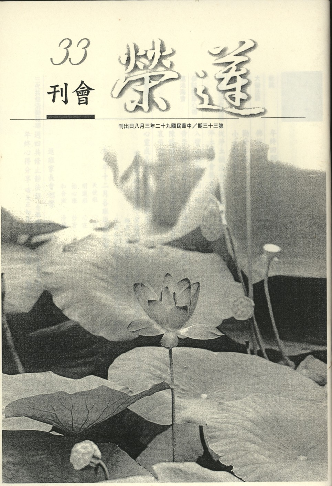

# 第33期

## 社論

### 年終歲末回顧與展望

*編輯部*

時值歲末，個人修學，家庭佛化與團體道風的建立，在過去一年的努力，不知成效如何，是需要被檢討的，雖是時值末法，作法要保守，但也需盡量興辦善法，以利個人、團體、社會。先明過去一年團體所造的善法，讓大家一起隨喜之，並生起未來興辦善法之歡喜心。

年度齋僧供養三寶的法行，如下所述：於西蓮淨苑結夏安居期間約有十次的齋僧法行，為何要選在大眾僧結夏安居？乃遵照佛制於僧人結夏禁足之時，由在家人供養，令僧眾安心辦道，供養時並觀想代表一切的有情行此供養法行。根據淨苑師父說這些法行在  老和尚住世期間，對  老和尚的精神有極大的鼓舞，老和尚講經如同  雪公老師晚年講經一般，體力越來越衰，雖有願力但觀待於體力不足，只能無奈地抱病說法，如同  雪公之「未改心腸熱，全憐暗路人，但能光照遠，不惜自焚身。」將自身當成蠟燭一般雖是發光發熱，然是自己全部燃燒。那時不但有齋僧供養法行外，並聆聽週日的中觀講座，且在家人至淨苑聽中觀論的幾乎只有我們，課程中不但能得二諦教法受用，也能鼓舞老和尚與師父們，在老和尚荼毘期間也得到師父們的愛護，分擔各項工作表達對老和尚崇高的敬意。

其次在一月份時，依SETT MAW先生因緣至緬甸有為期十天的善法，以及三月底至四月初至越南的六天齋僧等法行。至於放生分國內、國外，國外除了在緬甸與越南放了十六次以外，在國內則於五月第二星期日母親節有放生與浴佛的法行，中部蓮友並在台中某海水浴場有放生活動，以及十二月底至金門放生三天。感慨國內之放生環境漸漸變差，一般放生團體有些因不如法而被媒體攻擊，有些則因放生蓮友感覺環境漸趨惡劣而不敢逕行放生，故此法行於國內是越來越難辦了，故吾等在放生活動上都是採取極為保守的態度。

至於拜懺法行則有：配合春秋祭祖，有兩次的地藏懺，另觀世音菩薩聖誕舉行大悲懺、釋迦佛成道舉行藥師懺以及阿彌陀佛聖誕舉行淨土懺，這些懺本皆為天台祖師（如四明尊者法智大師或慈雲懺主等所編述）於修學教觀時以懺法為殊勝前方便，在修學止觀前先懺除障礙，須依據懺法來進行，方能於正行止觀時引發殊勝的覺受，以三寶為皈依境、以菩提心為皈依心態，請三寶加被而發露罪業，在儀軌中如法觀修，對於修學止觀以及念佛行者有莫大的助益，並依拜懺的因緣來祭祖、回向現前以及往生之眷屬等，亦可令彼得殊勝利益。

國學啟蒙教育部分，今年於六月底至七月六日舉辦為期七天之心靈成長營，由於成效良好，為配合啟蒙教育之延續，故於九月份開始每個月有一次的返班活動，並配合返班活動於共修會有兩週一次的師資培訓（課程為論語及常禮舉要）以及每月一次的人才培訓（八大人覺經）。吾等須將教育辦好，以體會文化的心做為國家的國魂，現今台灣經濟蕭條，政治不安，人口外移嚴重，若能用文化凝聚向心力，則人口不會如此快速的流失，舉例言之，如民國六十多年時，廣欽老和尚於土城開山時，雖是一片荒山，但是年輕人絡繹不絕的山上去，這就是文化的力量！再看看西藏，雖然日子苦，但是依靠佛法的力量，可以留住年輕人的心。若吾國文化可以往下紮根，相信是可以留住人心的。

至於蓮友服務方面，於蓮友親人臨終時，為助其往生淨土離苦得樂，而有助念的法行，總共助念了十五位居士，要真正護持一位蓮友往生淨土，須從病時予以照顧與關懷，並與家屬溝通達成助彼往生淨土的共識，或要經過多次的走訪，方有一定的效果，且達到對臨命終往生最大的幫助，斷氣後也有八時的助念，以及後面作七與告別式的幫忙。

在共修會裏固定的活動則有每週四三代共修：早上念佛共修，下午研討四十八願；週五則有內部研學，目前是論語的講解；週六晚上的共修除了大眾念佛外，還有各種課程之研學，已講過十善業道經、四十八願、西方發願文等等，目前是彌陀要解導讀等的研學，另有啟蒙班教育蓮友子弟，分大班、小班，大班有論語、十四講表以及每月的專題等課程，小班則有十四講表、弟子規以及故事等等的課程。在小啟蒙班竟然有十四講表的開講，並且以提問問題的方式讓小朋友印象更加深刻，相信  雪公老師於西方淨土，也會很高興有一群小朋友正在背誦以及聽聞十四講表，瞭解佛法的真實內涵；大班有一些同學們也去參加明倫講座，在多采多姿的大學生活中還能夠坐在這裡好好上課，改變以往嗜打電動玩具或者是懶散的習慣，變成很有氣象的年輕人。大堂的研學，大家互相搭配，一起增上。相信大家一定歡喜於動盪的末法時期，還能夠靜下來對正法論典一字一句一行慢慢的研析與觀修。至於週四共修的效果也非常好，老人家不忌諱談死亡，在修行上也十分精進，每週六共修時為每週能念滿十萬聲佛號的老菩薩回向，且念的名單總是長長的一串，令人隨喜不已。

未來的一年除了繼續興辦上述所說善法外，更要抱著節約、愛惜人力、發揮同舟共濟精神，不怕艱難、肯反省、肯充實，相信在艱辛的未來歲月，還是能開出一番新的氣象。

## 大德法語

### 佛說四十二章經解　第十九章〜第二十二章（二十五）

*道源老和尚講授*

觀無常　捨情欲

離割舌　念無我

證空性　得解脫

第十九章

「佛言：觀天地，念非常。觀世界，念非常。觀靈覺，即菩提。如是知識，得道疾矣。」

第十八章是解理的，解理要解的圓，解釋要解釋的深，不容易懂，你懂得那個深奧之理了，依著你所了解的來起修，須是不離事相，由事顯理，且須腳踏實地的修行。

此章先修無常觀，觀是觀察、觀想，觀察一切法皆是無常，最大的法莫過於天地，莫過於世界，天地也不是常住之法，世界也不是常住之法，若觀察彼為無常，你才能不隨境轉，將心安在法上，修行悟道。

所云世界無常，即以我們所住的世界，就是地球，你以為這個地球是長久住世的？此是大大的錯誤，它（世界）是無常之法│是成住壞空，原來沒有這個地球，成了個地球為「生」，暫時有叫「住」，慢慢就「壞」了，最後沒有了「空」掉了，地球乃至世界皆循成、住、壞、空，所有事相皆不是常住之法。

這個地球要壞，雖然我們現在住這個地球還沒有壞，但是將來還是要壞、要空的，這個世界以外虛空之中的世界多得很，這些都會漸漸壞死變成空。例如我們眼睛所看見的流星，在這個虛空之中忽然有一道光，名字叫流星，掉到我們這個地球上是一塊石頭，名為隕石。隕石就是在虛空之中，別的星球爆炸了，炸後有許多碎的石頭到處飛，到我們地球上來的這一塊，被空氣所擦到，放了光落下來是個石頭。現在科學家可以在太空中觀察到不只是一個流星，而是隕石雨，爆炸的星球成碎石頭像下雨的雨點那麼多，世界之中許多像地球的星球已壞滅的太多了，這是科學家證明的。圓覺經上亦說，虛空之內，世界無邊，亂起亂滅。

「觀靈覺即菩提」前云世間法都是無常的，回光返照，返觀自己的靈知靈覺的心，此靈知靈覺的心即是菩提道，梵語菩提，翻成中國話為覺，乃成了佛的證得，行者須最初發成佛的心，名之為發菩提心，返觀我靈知靈覺的這個心就是我的菩提，即是有漏凡夫能以凡夫心成佛，凡夫心一轉即是佛心。「如是知識」，你這樣的知識，瞭解佛的菩提（佛的證量）在那裡？就在我心裡（所云眾生皆有佛性，皆當成佛，即是此義）。「得道疾矣」前面說修道是差之毫釐，失之須臾，此乃錯解而修；但此章你要這樣觀照就不會差、不會失，很快得到菩提。

第二十章

「佛言：當念身中四大，各自有名，都無我者，我既都無，其如幻耳。」

觀一切皆是無常而生出離心，其次則破繫縛根本—我執，我執之行相是依身、心之上，妄計有一個真實的我（或是離蘊我，或是即蘊我），凡夫執著這個身體為實，並且在身體（身心）之上執有真實的我，由真實的我生出我執，這個身體就是我所（身體是我的），而欲謀求我之受用，所以一天到晚，忙忙碌碌為我而求衣（妙衣）、食（美食）、住（華屋）、再加上行（名車），還要求得育樂（運動、娛樂、旅遊、宴會），一切種種為誰呢？為我，我在那兒？不但我這身體是假合的，是幻有不實；即使所計執真實的我，也了不可得，只是觀待身心而有的認知而已。

或云：身由何原料組成？由四大種組合起來，四大種為地、水、火、風；地是堅硬之性，例如我們身體上的骨頭是堅硬之性，屬於地大；火是熱燥性，例如我們身體上的暖氣，屬於火大；水是濕性，我們身上有水分，有血液，這都屬於水大；風是流動為性，我們有呼吸，乃至身體上的活動，就屬於風大。地水火風四大種假合起來，假合起來，成就了這個身體，四大種各自有名，地大、水大、火大、風大，沒有那一個大叫做我的，都沒有我，假若四個大都叫我，那變成四個我了，所以四大種各自有名，而都不是我，「我」找不到，所以沒有我，如是觀察，「我既都無」，在這個四大種上找這個實我既然都找不到，「其如幻耳」我不過是在因緣假合的身體上的名言安立，是幻化而不是真實的，能如此即將我執破除。

第二十一章，

「佛言：人隨情欲，求於聲名，聲名顯著，身已故矣。貪世常名，而不學道，枉功勞形，譬如燒香，雖人聞香，香之盡矣。危身之火，而在其後。」

財、色、名、食、睡是五欲之境，能令眾生貪圖五欲之樂，此章佛要我們破除這名欲之境的追求，不要貪名。試問世間的人為什麼要貪名呢？他隨他情欲之心，對境起了愛執，他要貪圖這個聲名，以為聲名是所樂境而生貪欲，然而可不可以得到呢？可以得到，但是不容易得到，你今天貪名，明天貪名，名譽聲名顯著，你的大名已令你得到了，社會上都知道你的大名了，身已故矣，你的壽命也到了，人也該死了。

「貪世常名而不學道，枉功勞形」，這個世間的聲名，是個平常的聲名，並沒有什麼高明，何必要去貪？佛道是真實的然而卻不學，你要貪世間常名，世間常名還不容易貪到呢？也要用一番功夫，即使費一番功夫你貪到了，也是個平常的聲名，而你的生命已經盡了，所以叫枉功勞形。枉功、你用這些功都是空虛的、冤枉的，勞形、當去求聲名時，也要去奔波勞碌，勞累你的身心，然而勞累你的身心也是冤枉的，得這個虛名有什麼好呢？所以應該學道。

「譬如燒香，雖人聞香，香之燼矣，」 譬喻燒香，把這個香燒起來，人家可以聞到香氣，香氣是聞到了，香呢？香已經燒完了，所以一再警惕我們「危身之火而在其後」你單求個虛名，名聲得到了，你的壽命也盡了，把香燒完了，名是貪到了，如同燒香有香可聞，香燒盡了以後呢？這危身之火（危害你身體的火）在你貪名的後面，平常講「樹大招風，名大招禍」，風來了，把大樹先吹倒，為什麼？他樹太大，他招的風也大，樹大就招風；你的聲名大，相對的，你招的災禍也大，叫做名大招禍，危身之火可在你求聲名之後跟著來的，你要注意，不要貪名。

第二十二章

「佛言：財色於人，人之不捨，譬如刀刃有蜜，不足一餐之美，小兒舐之，則有割舌之患。」

財、色、名、食、睡是我們所追求的五欲之樂，前章佛勸我們不要貪名，本章則勸我們不要貪財、貪色，人為什麼要貪財、貪色，不肯捨離呢？財色如同刀刃上有點蜂蜜，有點甜味，佛說法不是不承認五欲之樂，五欲之樂是有的，等於那個刀刃上有點蜂蜜，不足一餐之美，試問這個刀刃有點蜂蜜能當一頓飯吃否？不足一餐之美，可是小兒舔之，則有割舌之患，小孩子不知道那個刀刃危險，但看見刀刃上有蜜，他就用舌頭來舔，舔、就是用舌頭取過來吃，則有割舌之患。這個小兒，譬如人沒有知識，沒有智慧，要貪圖財色，結果把自己貪到地獄裡去。（下期待續）

## 共修研學

### 勸發菩提心文　尊重己靈（三十三）

*心爾整理*

尊重己靈甚為要

釋迦世尊早成佛

若能恥於為凡夫

不孤佛化不負己

尊重己靈：

「云何尊重己靈？」

我要怎麼樣來尊重自己與佛無二的靈性？然何謂靈性？「謂我現前一心，直下與釋迦如來無二無別﹔」靈就是現前的一念心，此與釋迦佛、十方佛無二無別，可以隨緣證悟空性，並發大願來修大行、證大果，都一樣。

可是

「云何世尊無量劫來早成正覺，而我等昏迷顛倒，尚做凡夫？」

性德無別，就性德來講，生佛體同。但修德來講，作用大相懸殊。印光祖師上海息災法會上講，就性德來講我是佛，好比嬰兒也是人，大人也是人，就人的立場一樣，可是就作用的立場來講，大人跟嬰兒怎麼可能一樣？所以就修德來講，佛與眾生天壤之別，約著成就相來講

「又佛世尊則具有無量神通智慧，功德莊嚴」

對比於我

「而我等則但有無量業繫煩惱、生死纏縛」

無量的神通對著無量的業繫，智慧對著煩惱，功德莊嚴對著生死纏縛，正好是解脫、般若、法身。我們有沒有業繫的樣子？從哪裡表現？業繫就是你什麼事情都做不了主，想要升官發財，能嗎？除非有過去的善業，要不都是白費心機，業繫就是在日用平常中沒有一件事可以作得了主，都是被善惡業所繫縛。

或云：神通不敵業力，如何是無量神通對無量業繫？此處之無量神通是指明心見性、斷惑證果以後所產生的能力，這個能力就是一種打破業網的能力。我們有很多業網，諸如生死的現象，很多的苦痛，而諸佛菩薩具足無量神通，只要我們信得過，祂都可以解決。譬如：我們業繫會在種種苦中顯現，昔日雲棲乾旱，眾人求蓮池大師，在大眾對大師的信心下，好好懺悔，好好隨著祖師念佛就下雨了，能藉著咒力下雨除旱，這叫神通對業力，但這種神通不是我們世間的四禪八定。其次智慧對煩惱，煩惱有發業及潤生的作用，故若沒有煩惱，就不會潤業而得到生死的苦果，並且要藉著智慧的觀照而對治煩惱，讓業種不起（不發業），進一步更能夠依著智慧引發各類神通，轉變業力。接著是功德莊嚴對生死纏縛，法身即功德莊嚴，義理在哪裡法身就在哪裡，換句話說理在哪裡，哪裡就有它的功德，所以說「有理走遍天下，無理寸步難行。」依著理才做出功德，如布施得富貴、持戒得清涼、相好得眷屬，乃至於緣起無性的空性理，對內能產生種種智慧，對外可建立種種事功，所以說理之所在就是功德智慧之所在。

如此，凡夫無量的業繫、無量的煩惱、無量的生死沈淪對上諸佛無量的神通、無量的智慧與無量的功德莊嚴， 這樣對比之下，內心會產生討厭凡夫（惡不仁），喜歡佛（好仁），如果聽到這些概念卻依然不好仁者，不惡不仁者，那這個人真的就完蛋了，這樣的人叫做神經麻痺。

「心性是一，迷悟天淵；靜言思之，豈不可恥？」

很可惜的就是我們的心性與佛一樣，結果卻有迷悟之別，且迷悟差別如天與深水，差別如此之大，想想是不是很可恥呢？最後的關鍵點就是迷悟，迷就是愚癡，悟就是開智慧，所以整個的重點在開智慧。

「譬如無價寶珠，沒在淤泥」

無價寶珠代表一念心性，淤泥代表煩惱，沉沒在煩惱的污泥堆裡。

「視同瓦礫，不加愛重」

眾生起心動念與無明我執（心所）相應，轉清淨心成八識。如同瓦礫就是一無是處，毫無用途，何以八個識的分別是毫無用處？吾人所分別之貴賤、美醜、善惡、是非、真假，一言蔽之就是惑業苦，就是六道輪迴，一點用也沒有的！我們把無價之寶珠，竟然這樣用。

「是故宜應以無量善法，對治煩惱」

特別指戒定慧的善法，用聞思修引發的戒定慧來開顯無量的善法，來對治煩惱。戒能抓煩惱，定能綁煩惱，慧則能殺煩惱。戒定慧的對象都是煩惱。

「修德有功，則性德方顯，如珠被濯，懸在高幢。洞達光明，映蔽一切；可謂不孤佛化，不負己靈。是為發菩提心第七因緣也。」

所以我應好好尊重這一念心性，好好發起大願，懺悔業障，好好對治煩惱，就能夠成就佛果。所以尊重己靈也是發菩提心的重要因緣。越了解心性是這麼可貴，而知道發菩提心方能展現這麼殊勝的內涵，那麼我樂於發菩提心，所以它（尊重己靈）是發菩提心的因緣。（下期待續）

### 小止觀導覽（十二）

*蓮心整理*

止觀修學勝方便

成就佛果最莊嚴

若能如法行懺軌

便是止觀妙前行

經文

若能成就如此十法，莊嚴道場，洗浣清淨，著淨潔衣，燒香散花，於三寶前，如法修行，一七、三七日，或一月、三月，乃至經年，專心懺悔所犯重罪，取滅方止。

大意

說明修持懺法的準備與修有所成所需時間。

導覽

一、十種助懺之法，必須好好講究，方能懺除罪相、罪業、罪根。懺悔是改過、反省、發願、力行、回向的表徵。取相懺是因誠心懺悔取到瑞相，是罪業被懺悔掉的行相，能將修學止觀的障礙去除，取相懺必須要懺者有懺悔的決定見，次者必須道場中均為如法修行的蓮友，更有懺悔的誠意(包括齋戒、沐浴、著潔淨衣、莊嚴壇場、燒香散花等種種外事莊嚴)，再下手修懺悔法，直至取到淨罪相，所犯罪業才能除掉。

二、「持戒懺悔」，所持的戒分在家與出家戒，顯教戒與密咒戒，淺處為在家的五戒，可依懺悔儀軌懺除自己的染汙，以斷相續心，如內心生氣可能三天不能止息，透過懺悔可能只有一天或一頓飯的時間，或者一個念頭即轉出去，即可止息，顏回 「不遷怒、不貳過」，即不會把這個心思遷到第二念，故云「不怕念起，只怕覺遲」，「只怕覺遲」是覺悟力很強，不會把妄念遷到第二念，因為當下知道心思受困於境界，正在起煩惱，但也知道如何去轉變他，此為心思靈敏的表現，此外也懂得善於觀察人事的變化，知所進退，以上均可謂止觀的運用。（下期待續）

## 蓮池海會

### 黃李正妹老居士往生見聞記

*編輯部*

天資聰穎具巧思

年高九旬孝眷多

病時能得多照料

助念功成化闔家

黃李正妹老居士，出生書香世家，父李公祥甫為前清秀才，卓著文名，與連雅堂先生(連前副總統戰之祖父)及辜鴻銘先生(海基會辜董事長振甫尊翁)同期，對於子女教育一向甚為重視，惟當時日治時代社會習俗趨向重男輕女，致兄弟均得受高等教育，而老居士則早於十六歲時就嫁至黃家，雖然如此，仍因家庭教養良好，事親盡禮，育幼忘勞，應對進退無不恰如其分，堪為家人垂範。當年黃家四代同堂，人丁興旺，食指浩繁，膳食家務均由媳輩輪流操持，老居士與妯娌五人相處甚為融洽，雖身為長媳，仍樂於替人換班，且不願麻煩別人，即使到了晚年，依然堅持如此，九十二歲時還是自己清洗衣服，不假他人。

老居士天資聰穎甚具巧思，初嫁至黃家，即能為長輩縫製衣服，並常利用零碎的毛線，碎布，編織成帽子，圍巾等多樣日常用品，而自己所穿的背心亦是由數塊碎布拼湊製成，內衣褲則補到不能再補才願丟棄，兒孫們的襯衫衣領破了，也會為他們拆下重新翻補，這種節儉惜福的德行，令兒孫們深為感動，而引以為最好的榜樣。

老居士一生養育了二子七女成家立業，可以說辛勞備至，但從不考慮自己個人的享受，她老人家無時無刻不在關懷家人與親友，對於子孫後輩的關懷是十分的公平無私，應當指責改進的地方，則會以坦誠懇摯的方式加以勸勉，因此凡是與她老人家有過接觸的人，都會稱讚她真是一位品德言行完美的好人，老居士日常生活規律正常，晨間六時起床，晚上十時就寢，三餐之外甚少零食，老居士八十歲起吃全素念佛，專心修行，早晚誦經不輟，始終如一。

老居士身體一向健康，耳聰目明，每年就醫的次數很少，兒孫們都十分高興，莫不相信阿嬤必能延年益壽，長命百歲，也都衷心希望老居士能多享幾年無憂無慮的天倫之樂，但是天不從人願，今年六月，老居士因為感冒，咳嗽了一個多月，接著頸部疼痛，雙腿無力，終由持杖而四腳助行器而至坐輪椅，家屬自動自發排班當起看護的責任，舉凡吃飯、吃藥、上廁所、按摩等大小事皆由以年過半百的兒女們親自照料，就算因為連著一、兩個月沒睡好，導致嘴巴全破、重感冒等，仍盡心隨伺於老居士身旁照料，並虔誠誦經、念佛，做種種善法，但老居士漸漸因運動量越來越少，飲食胃口越來越差，原本輕瘦的老居士變得僅剩皮包骨一般。數度延醫治療直至十一月初，發現主要病因是由於腦幹腫瘤，但體力的限制，已無法進行手術，終致病情每況愈下，於十二月七日下午逢善知識探望、開導，之後沐浴淨身，家屬隨侍在旁，一句一句佛號引領著老居士念佛，直至十二月八日清晨一點老居士於家屬佛號聲中，安祥往生。助念廿四小時之後，老居士慈祥地笑著，全身柔軟，臉頰微溫，皮膚也比生病時白皙許多。兩個多月的病痛之苦，讓子女們感同身受，也讓子孫們因此而加緊念佛，有報答親恩的機會。

老居士辛勞終生卻從無怨言，以身教、言教為子孫指引了人生的正確途徑而從不居功，一生擇善固執，慎終如始。家屬謹遵佛制，如法作七、誦經、念佛，以虔敬真摯的心意，祝禱老居士往生西方極樂世界，蓮品高昇，速成佛果，廣度眾生。

### 陳勝雄居士往生見聞記

*編輯部*

孝親能睦弟與妹

苦學有成善持家

金融界中真清廉

助念生西有其因

陳勝雄居士出生於屏東市，自幼聰穎過人，深得父母之喜愛。及長，對其弟妹關愛備至，是其弟妹心中的好兄長。鄉里亦誇讚其孝行可風。

由於勝雄先生之才智與好學，讀完南部著名的屏東高級中學後，以優異的成績考上學子們夢寐以求的東吳大學經濟系。東吳大學辦學甚嚴，經濟系的教授均要求學生用英文版教材，勝雄居士以嚴謹的治學態度，完成經濟系所有課程，甚得教授們之器重與同儕之敬佩。

大學畢業後適逢第一商業銀行招考正式行員，經教授遴選推薦，在競爭激烈中，勝雄居士靠自己之能力參加考試，以優異成績錄取。婚後與夫人鶼鰈情深，育有一子一女，在其夫妻呵護與薰陶下，子女均已完成大學教育，並在社會貢獻力量，堪為時下家庭之模範。

在第一商業銀行服務期間，勝雄先生以經濟學長才，參與銀行業務之執行與變革。由於秉性耿直，治事嚴謹，工作勤奮，績效卓著，深得銀行長官之賞識與信賴；由於謙沖為懷，虛懷若谷，寬以待人，處事公正，徵信翔實，擔任經理一職時，其放款業務，貸所該貸，嚴守分際，不讓資金有半分浪費。勝雄居士為銀行界樹立良好典範，也以身教代替言教，潛移默化地影響子女們的人格發展與價值觀。

勝雄先生在銀行界工作三十餘年，平日自奉甚儉，淡泊名利，實而不華，像一根蠟燭般燃燒自己，長期工作辛勞，以致積勞成疾。三年多前，經台北榮總開刀治療，並退休在家養病。三年中，勝雄居士因妻子學佛之故，開始吃素、念佛，並參與放生等種種法行，全家人相互扶持，歲月與家庭的重擔，在勝雄居士臉上刻下痕跡，雖有家人於病苦中的細心照顧，然不敵業力，於今（九十一）年十一月十五日舊疾復發，於家中，在家屬以及蓮友的護持助念下安詳往生西方極樂世界，不再受娑婆輪迴之苦，出殯日依然全身柔軟，足徵往生極樂世界，惟願彼速成佛果，回入娑婆，廣度眾生。

### 哀弔SETT MAW先生祭文

心超

短暫瀟灑走一回

護持正法及慈善

無數懷念與感慨

化成淨土諸莊嚴

敬愛的SETT MAW先生：

來此祭拜您，心情極為複雜，對您的一生是極高的肯定，不論您對父母的孝順，對朋友的護持，對窮人的慈愛，特別是對正法事業（供養三寶、齋僧、重建與修復佛塔），以一個在家居士的能耐來說，依我們看來，您表現的最為傑出，雖然有一個顯赫的家世，但不傲慢、不放逸、不失志，以及不染世俗的壞習慣，本想常常向您致意問候，不料在元月二日驚傳噩耗，極為的不相信，認為是謠傳或是誤傳，一再地證實是事實時，放聲一哭也無法改變這一項真實，相信認識過您的人，不論是您的親人、朋友，您正法上結識的道友以及被您護持過的出家人，都會對您充滿懷念。

在最後一次與您相聚時，還記得是去年八月，您告訴我們護持僧團來到台灣禪修中心弘揚佛法，您與隨行的同事每天早上兩點起床，為大眾準備一天生活所需，特別是早餐與午餐，晚上還要充當三藏法師的譯師，您說你很累但是內心卻充滿法喜，也認為依僧團來台灣弘揚佛法、護持僧眾是極為有意義，也熱愛這裡的熱情，喜歡這裡的學佛風氣，並且暢談您的人生觀，原本以為每一年或者可以在台灣相見，或者可以在緬甸相見，彼此敘說所做的善法，以及所有對人生的體會，當然在這一點上我們都是要聆聽您的經驗才是，可是想不到那一別卻是永別，套具中國俗話說真是「情何以堪」。

還記得因蓮友推薦而第一次來緬甸時（二零零一年六月廿二日至廿七），在我們到緬甸所做的善法中需要您的協助才能推展我們的願望，在那一段期間的相處中，對您的隨和以及灑脫印象深刻，在安排各類的參訪與供養的法行中，您都在旁邊親切的教導我們如何供養與請法，我們透過您的教導，學習了各種在緬甸入寺的規矩，並聆聽這些了不起師父的開示，做了這些法行內心也有莫名的歡喜，您也一旁默默觀察，我們是否是正法團體，在對我們肯定之後，提出了對我們下次緬甸行的邀請。第二次的緬甸行竟然是我們出國放生、參訪、旅遊的空前，或者說是絕後，想不到您是事先探走所預經的路線，並且親自打點所有的細節，估算我們在有限的經費裡如何發揮最大的效果，並不忘安排美麗的景點，兼具旅遊，讓我們一路做善法，法喜充滿之際享受那美麗的風光，我們有一些團員漸漸被您同化，說起了緬甸話，穿起了緬甸服，不但想去緬甸禪修，還想在緬甸居住。以前中國古代的聖王都是四夷歸附，歸附的方法不是用武力作戰也不是用傲慢的經濟侵略，而是用那種誠意以及寬大的心胸，與正法的攝受，使得近者悅遠者來，儒家所說的治國平天下就是這樣的義涵，所以我們有團友讚嘆您是一個護持正法不可多得的人才，即使從政亦復如是，以前中國古代了不起的帝王都懂得挖掘這樣的人才，替老百姓謀福利、護持正法以及攝持民心。

尤其我們在寺院中不但輕易做到法行，並且不困難地見到德高望重的住持以及聆聽開示，此是您護持正法道場，深具功德，才有的結果，我們等於運用您的資源在緬甸大作善法，您不分國籍的把我們當成一家人，處處照顧我們，招待我們，並且引導我們見到您慈祥的父母親，父母親都讚嘆您的為人，如果說您今天是一個中國人，相信您也是很受歡迎，在正法上是大德很樂意攝受的人才，也是在家居士所擁護的對象，因為興辦善法就需要您這種人來帶頭，像您那出必告，反必面等等都是中國禮的內涵，所以相信人是有膚色種族的差別，但是真理是無差別的，在一個國家得到民心，到其他國家也是一樣，在此處可以成佛，在彼處也可以，所以孔子云：「言忠信，行篤敬，雖蠻貊之邦行矣，言不忠信，行不篤敬，雖州里行乎哉？」。您在敘說美好觀念時都可以侃侃而談，相信您的來世要弘揚正法也不困難，您因為這一生結了很多的善緣、人脈，所以來世讓您出生尊貴並不困難，您因為這一生親近高僧大德，所以來世要親近善知識聽聞正法也不困難，您這一生護持我們放了這麼多生物，有魚、有鱉、有羊、有牛、有雞以及豬，來世要得到健康的身體，充沛的體力以及極長的壽命也不困難，在您重修千百座佛塔的善業現起時，會象徵著您人格的聳立，事業的超群，德學的宏偉，中流砥柱的毅力，以及成就那像塔尖般的佛頂智慧，所以到底是來哭著祭拜您，還是高興地看待您未來的走向，心情上真是百感交集。

原本您說規劃今年的行程，我們卻因為時間上無法馬上配合而導致連最後一面都見不到，想來有無限的遺憾，也懊惱於自己是這麼不珍惜相見的緣份，今日組團前來雖是按照您所排的行程來做種種的法行，想不到竟然是一個奔喪的團體，但也想藉著這樣的因緣，好好地真誠祭拜您，懷念您，感恩您，隨喜您，讚嘆您，也樂於見到您基金會的成立，讓緬甸正法的護持不至於人存政舉，人亡政息，相信您的父母親、您的朋友以及佛教的蓮友及高僧大德都樂於見到這樣的結果，我們也很樂於在精神及物質上提供資源，也會真誠在緬甸這一段的旅程中，做種種的善法給您回向，不管任何人怎麼說SETT MAW先生您，或褒或貶，或譽或毀，或者說您過往之後有無超脫等等一類的言語，我們對您的信念是一致的，是毫無懷疑的，對三寶的供養，正法的護持，以及貧苦人民的救濟，這些的結果會是什麼呢？這還需要懷疑嗎？

參加異地他鄉的祭拜，是我人生的第一次，不必排除萬難就很快的成行，此說明我們宿世的緣份是很深的，這其實是打破國界、打破種族，這些有形的分類都擋不住無形的結合，原本祭文應當是很規格化的，但卻想到哪裡講到哪裡，看似雜亂無章其實處處是想表達對您的真誠懷念與祝福，只要您滿意，也真的得到美好的走向，到底它是不是一篇流暢的祭文，就不是很重要了。

想起密勒日巴尊者傳中的無常歌，以此尊者對無常體會所做的歌，表達吾人對您這一期生命示現的真誠懷念與祝福。

## 啟蒙園地

### 心靈成長營返班活動報導　家長班研討專題 — 家庭教育為天下太平之根本發隱（三）印光大師著

心怡淺釋

前言：

印光大師所著「家庭教育是天下太平之根本」這篇文章很好，印祖是一位非常了不起的淨土宗祖師，也是民國五大師之一，他非常瞭解國家治亂興衰之道，是一位通儒通佛、通理通宗的大德。在儒學部份，他深深的瞭解它是學佛的基礎，不學佛的人學儒也可以得到很多的利益。尤其一個孩子將來他會是個人才，一定要先從小開始培養起，並從儒學奠定基礎，學儒有成更進一步學佛才能成就。太虛大師云：「大哉唯佛陀，完成在人格，人成即佛成，是名真現實。」

中國人結婚的時候須拜高堂、拜天地，就是要跟祖宗、天地稟告，甚至學佛者跟佛菩薩祈請，他們所希望就是有好的子女來到他們家繼承香煙、代代相傳，因為一個家庭要興、要敗，看子女就知道了。舉例說，周朝的古公亶父有三個兒子，長子泰伯、次子仲雍、老三季歷，這三個都非常優秀，但他不曉得要傳那一個，可是當他發覺到老三季歷的孩子姬昌（後來的周文王），這位孫子是這麼賢能、聰慧之才，還有一顆善良的心地及好學的精神，他就決定傳位給老三。老大、老二都很好，孔子曾讚嘆過他們有聖人之德，但是為什麼會傳給老三呢？因為老三的兒子文王有開國的氣象，所以古時候看這個家庭子女，就知道將來會興或會敗。還有雍正王朝，當時康熙皇帝有十四個皇子，很多皇子對國家都有汗馬功勞，為什麼傳位給雍正？因為雍正的孩子之一就是後來的乾隆。乾隆小時候就被康熙皇帝找進宮中好好栽培，他早就知道能夠把清朝延續的孫輩中就是他，所以為了讓他將來當皇帝，就優先考慮他爸爸。因此在十四個皇子之中，反而把皇位傳給了四皇子雍正。

可見古人都很瞭解、也很重視人才之興，人才是一個家庭、團體、社會國家興盛的關鍵。現在台灣的危機絕對不是「債留台灣，前進大陸」，人才的流失才是最嚴重的。當時大陸遷台的時候，台灣什麼資源也沒有，可是一樣可以變成經濟開發的強國，原因就是像孫運璿、李國鼎等這些人才過來，故現今當務之急是人才要留在台灣，並要趕快加緊再培養人才，錢是無常法，所謂千金散去還復來，但天生我才必有用，這是非常重要。人才一定要先從家庭教育開始培養起，家庭教育若培養得不好，學校教育、社會教育都無法加成。那整個家庭、社會、國家都不可能興旺的。印祖這篇文章裡，舉出很多正確教導孩子的方向及許多寶貴的意見和方法，真正值得大家一起來努力實踐，以期我們的家庭及國家的未來能呈現美好的前景。

正文：

本次研討段落為甲二、別釋賢平根本求家教，乙二別明，丙一通明家教重要分二，丁一、正明，丁二反顯。其中有關丁二反顯部分，依文分述如下：

「否則任性憍慣，養成敗類，縱有天姿，亦不知讀書為學聖賢，則讀的書愈多愈壞。」

闡述過家教之重要及利益後，反顯續說無善教之過患分三，一為子弟不知學為聖賢，二為師長不知教學聖賢，三為父母師長罪同子弟。首述子弟不知學為聖賢。「否則任性憍慣，養成敗類」，劣因有二，一為任性驕慣。若父母從小放縱子女，一切行為概不教誨訓示，養成其任性驕慣，長大則無主見，易隨邪說薰靡，養成敗類，如此將好子女教壞，此乃父母因循所致。印祖說：富貴人家子弟，父母愛之不以其道，故多不成器。或偏與錢財，或偏令穿好衣服，錢隨彼用，則必至妄吃致病，或養成其浪費好闊習氣。故欲兒女成才，當為培福，不當為積財。又富貴人家子弟，當令親自操作家事，一來習勞做家事，能調和血脈，有益健康，二來少閒，易消諸妄念，此實為愛子女之根本辦法。「縱有天姿，亦不知讀書為學聖賢」，劣因之二為學非聖賢。又子弟縱有天姿，亦因不知讀書之道志在聖賢，故雖有好天姿者，因無善教，習為狂妄，最後成為頑庸敗類，天下由之而亂。若無天姿者，則狎于頑惡，甘為匪頑，二者皆國家社會之禍非福。「則讀的書愈多愈壞」，基於任性驕慣及學非聖賢之因，所得是惡果，即愈讀書愈壞。因缺乏正確目標及良好的學習內涵及方法，所學無根，因而自私自利，讀書愈多反使犯上作亂的能力加強，故愈讀書愈壞。

印祖云：父母雖志在成就子弟，而不知子弟之成，唯在家教。故教養子女必須從幼教以孝、弟、忠、信、勤、儉、溫、恭，至其長而入學讀書方有受益之基。故改善之道須從根本原因處講究。古德云：「教婦初來，教兒嬰孩」，以其習慣與性情都是從小教養而來，故當謹慎於始也。即從小教子弟學聖賢為目標，若天姿高者，更須從淺近處、根本上落實。淺近處即勿以善小而不為，勿以惡小而為之。根本上著手，即從孝親、濟眾、忍辱、篤行，乃至灑掃、應對進退等學起。父母並應以身為教，以道德為模範。否則眼高手低，多在枝末上忙碌，一生終無大用。

「古今大奸大惡之人，皆是有好天姿大作用之人。只因伊父母先生，均不知教學聖賢，躬行實踐。止令學文字，為應世謀利祿之據，其智識之下劣，已到極底。以馴至於演出廢經廢倫，爭城爭地，互相殘殺之惡劇。」

次段談到師長不知教學聖賢，故使好材教成奸惡，終究造成惡劇。「古今大奸大惡之人，皆是有好天姿大作用之人」，首先感歎人才教成奸惡。原是好材料，可惜被糟蹋了，良材無善用。雖有好天姿，但未受善教栽培，原期大作用反教成大奸大惡，事與願違，造成惡劇之罪過。「只因伊父母先生，均不知教學聖賢，躬行實踐」，害在父母師長均無善教，故而輕義重利。印祖云：世有才高八斗、學富五車，而其所作所為，皆仗此聰明，以毒害生靈、毀滅道義者。其因皆由初無家教，以為之肇也。試看古今大奸大惡之人，如曹操、王莽，皆是有好天姿，非庸流資質，聰明好學，本應有一番大成就、好作為之人。可歎父母師長無善教，輕視聖賢道德，不知教其學習典範，及依教親自實踐之義利。

「止令學文字，為應世謀利祿之據，其智識之下劣，已到極底」，正面輕義，反面重利，兩者均為其害。父母師長不知教子弟讀書之目地，乃學習聖賢之道並用以服務他人，只重視子弟學習文字表相，作為應付個人謀求世間功名利祿之追求，故而捨本逐末，輕義重利，罔顧個人對社會國家之責任，可謂自私自利而已。由於父母師長缺乏正確知見，其智識水準之低劣已到極點，嚴重危害子孫及國家未來前途。

「以馴至於演出廢經廢倫，爭城爭地，互相殘殺之惡劇」，此乃惡劇之結果。原因為何？家庭及學校均失教所致，故漸漸演出廢經廢倫，爭城爭地，互相殘殺之惡果。提倡廢經者，因受歐風東進之染，如民國元年我國教育總長即下令，小學堂讀經科一律廢止，繼而宣布廢止師範中小學讀經科系，如此讀經之師生具廢，中國經典之傳習，正式排除於教育體系之外，其毒害之深遠，豈不將中國文化連根拔起？提倡廢倫者，如印祖所云，亦有無知之民受潮流邪說所惑，覺此父不慈子不孝，兄不友弟不恭，夫婦不和順，朋友間無信，主不仁僕不忠，均無所謂，致人與禽獸無異，試問家門如何興盛？子孫如何賢善？至於爭城爭地，互相殘殺之惡劇者，有軍權在握者、或甘為匪類者，由彼等興起爭戰、鬥亂，互相殘殺，天下於是大亂。如民國初期之軍閥割據，及賊寇流竄等，都是國家不能安定之禍害。上述之種種惡劇，無異將中華文化從根拔起，使中國五倫社會之體制隨之崩壞，乃至國家安全汲汲可危等，其為禍之烈可謂至極已矣。

「此種禍亂，皆彼父母先生，不知教子弟之道所致。自己縱無大惡，而壞亂世道人心之罪，當與彼子弟同受惡報於永劫矣。」

本段是父母師長罪同子弟。「此種禍亂，皆彼父母先生，不知教子弟之道所致」，先明惑因。前述導致社會天下大亂、人民不安等禍患，皆在於父母先生無善教所致，令子弟不知學為聖賢而引發造惡害民之罪。「自己縱無大惡，而壞亂世道人心之罪，當與彼子弟同受惡報於永劫矣」，再示惡果。因果的道理是自作自受，無人能替，此為何講連坐罪呢？父母師長本身雖非親自造惡，似無大惡，但教養之責，過無可推。印祖云：誤人子弟固損德，誤己子女亦損德。不善之愛每有甚於殺人者。又三字經云：「養不教，父之過，教不嚴，師之惰」。因失教之子弟，無惡不造，其壞亂世道人心之罪，重大惡極，非此生可了、非一死可償。而子弟造惡業之源，起於父母師長未克盡己責所生，不但子弟將來應受惡報外，父母師長亦同蒙羞辱，更隨子弟同受三途惡道苦報，萬劫難復，此乃共業所致，亦因果報應絲毫不爽之利害關係。

俗云：天下無不是之父母，倘父母能移愛於善教，則子孫之德性可成、福壽可常，亦為祖宗與自己積德之徵據。而師長之樂，莫過於得天下之英才而教化之，所貴在教學聖賢，令弟子福利社會，貢獻國家，以立千秋事業教化之功。父母師長若能如此善教，其福國利世之陰德，亦當與彼弟子同享福報於千秋萬載矣。（下期待續）

### 心靈成長營返班活動報導　家長班研討專題 — 師長心得迴響

心超

印祖文中所闡揚家庭教育之重要，或從正面或反面觀其功過，事理愈辯愈明，見聞者勿以為老生常談而忽略之。若能從中產生很好的覺受，雖如鳳毛麟角，只要能勉力為之，相信對整個世道人心，必能注入一股浩然正氣及美德懿行。家庭如沒有善教，對子女必定會付出很嚴重的代價，如富有人家，父母雖賺很多錢，但若未善教子女，小孩子必成為不聽話的不定時炸彈，甚至離家出走。故印光祖師提倡要從根本好好講究，再行發展才藝，才能學有所用、利己利人。什麼叫根本呢？就是所學的目的在服務他人，先學會服務家人，和兄弟姊妺和合相處。一個在家庭裡能創造和諧氣氛的人，他才能夠在團體、在社會上創造和諧氣氛。古人說宰相是調和鼎鼐之才，什麼叫調和鼎鼐呢？它就是像甘草一樣，雖不是中藥，但每一味中藥都要靠甘草調和。我們的國家就需要這樣的人才，而人才都是從小開始培養起來，所以從小就要讓他們先確立目標，志在服務他人、學習他人的優點，並接受良師益友的規過勸善，從這些內涵開始培養，則他所確立的目標才有發展的可能。如果他不懂的去服務家人及他人，不懂得去接納他人的規過勸善，不善於體會他人的長處，這樣的人就算他確立目標，他也不可能有所成就。所以一方面要確立聖賢的目標，二方面也要有達到聖賢的方法。而聖賢並不是遙不可及的目標，它有下手的方法，印光祖師這篇文章所提的內容正是吾人的目標以及下手的方法。

真正成就聖賢時是最快樂，為什麼呢？因為這時最有能力處理自己的煩惱，能在順逆境當中調整自己的角色和分寸，能結合共識來興辦善法，能以功德來加被後代。像中國聖人孔子一樣，能夠加被他的後代，至今已有七十八代的子孫，這正說明家教、家風確實很重要。

所以回過頭來，我們應好好尋求真正應有的走向，讓我們的各種奮鬥、發展才有意義，否則諸如物質文明的發展，只會帶給我們一個動蕩不安的人心、目標不確定的明天，尤其是煩惱不能被正對治，以及一個茫茫然、不知所從的學習困境。難道我們希望投入大批的資源造成這樣窘困嗎？所以今天回復到古籍文化中老祖先們帶給我們的美好概念，讓我們平心靜氣的來了解它、接受它，立住根本，再求才藝，如此才能收到中體西用、擷長互補的真實效益。

談到讀經，先要背經，所謂書讀千遍其義自現，主要是讀很多遍以後，自然內化，藉由對經中義理的串習並進而實踐。讀經的過程中，是否會增加孩子的負擔？這與父母在強迫孩子學英文、學數學、學各種的才藝、電腦等，所遭遇困難來比，應該是更易克服。也許讀經方法需要改進，但是不能夠整個否定讀經的勝益。印祖開示：「四書當全讀，書經文理甚好，亦宜全讀，易經之道大，或可從緩，詩可從緩，以非大聰明之資格，不能善會其意，禮記左傳則選其予身心有益，于世教有大關係者讀之。」其實我們很多的觀念都需要善知識教導，而且要有人願意提倡，才能確立這樣的走向。好的觀念須要引導，人才須要提攜，讀經的教育須要被提倡，這是等待大家一起來努力的。譬如常禮舉要「為人子，不晏起，衣被自己整理，晨昏必定省」，透過自省表來建立學子正確的觀念，並將它落實在生活的實踐。

至於中國文化的薪傳，做老師的人一定要以身作則，教學相長。一位好老師，應能傳道、授業、解惑，不善教的結果，學生愈學愈迷惑。如果今天我們在學自己的文化時，沒有找到文化的精華，一昧的承認外國強盛以為外國文化比我們好，這何嘗不是自取其辱，喪失了文化的自信心。其實我們有很多比外國人還好的地方，現在古文明的民族都滅亡了，只有我們中國民族還存在，靠的都是是文化的延續。如果今天我們不再承認自己的祖先，那就很可怕，可謂數典忘祖。所以我們如不好好學習文化，把祖先的精神延續，那我們立國就沒有什麼意義。同樣的，一個家庭它有好的家風、思想，再延續給子女，家道才能延續。所以 雪公老師在連老師辦育幼院時，就勉勵她一定要好好辦教育，否則看著一堆孩子鬧成一團，從早忙到晚又有什麼意義？孩子是國家未來的主人翁，應好好栽培，所以維持文化、吸引人才、培養人才，才是整個立國振興除弊之道。

其實我們國家現在最要培養的人才，就是一種大格局、大方向、大眼界的人才，而人才一定要從小紮根，從小處做起。如果把好的子弟都培養成技藝之能，而不能確立他遠大的目標，服務人群的志向，並好好從根本做起，那再好的質地、再好的才能，將來慢慢的成長，一樣會變成巿儈之徒。反觀我們國家在啟蒙教育這方面投注的太少，我們在拼經濟的當時忽略了教育，只重視升學還有才藝的發展，忽略了人格養成的重要。坊間一些歐美的童話故事、歷史人物，我們的孩子都背得耳熟能詳，倒是我們自己的先民典範反而記得很少，如廿四孝的典範，他們的孝行如何？譬如說孝子當皇帝時，他的政績如何？廿四孝裡最有名的皇帝，第一個是舜，第二個是漢文帝，漢文帝侍奉他的母親是三年盡心盡力，他是漢朝最好的皇帝，他的仁政使得他的政治非常清明，漢景帝在位十一年都是用他父親的資源，有一回漢文帝到軍營視察後，就跟漢景帝說：如果以後有什麼災難的話，諸將都不可以用，只有周亞夫可以用。後來果然靠周亞夫平息戰亂。我們不要小看我們的中華文化，它能幫我們把子弟們培養的很有智慧（台語為很有眼識—目色）。我們現在教孩子只要會念書，會考試就好，但是沒有「眼識」，客人來不知道如何招呼，家裡面有長輩但不知道如何侍奉，根本處都沒有講究的話，所培養的子女只是眼界低且目光如豆之人，在乎的只是現在，沒有打開大格局。但我們所需要的人才，是能夠關心所有人的需要，對整個局面能瞻前顧後，能留心世道人心的走向，而像這樣的人才必須從小培養。江逸子老師曾說現在坊間的啟蒙書藉太少，很多歷史的典範，我們一般人都很模糊，譬如說「竇燕山，有義方，教五子，名俱揚」，竇燕山是誰？五子怎麼教，內涵是什麼？很多很美好的人，很努力的表現他的一生，結果後人流傳下來的卻成空白，然後在才藝上拼命的發展，在支末上努力學習，流失了生活中許多珍貴的資源，這才是真正令人遺憾的事。所以吾人必須重新開始，找回原來的快樂，老天爺是不會把人框住的，只要自己把這個金箍咒拿掉，就可以過著父慈子孝、兄友弟恭、夫和婦順的快樂日子，自然能感應風調雨順、國泰民安、正法久住、法輪常轉、人才輩出，就不會把自己套牢承受種種的苦，使未來的走向弄得這樣麻煩，而讓無垠的痛苦留給下一代去承受。相信公道自在人心，讓我們有志一同的人能攜手共進，以期不辜負印光祖師的一番慈悲教誨。

### 心靈成長營返班活動報導　家長班研討專題 — 父母於啟蒙教育中配合之事項

濟理

當我們肯定認同啟蒙教育之必要，同時把子弟交予好的團體及德學兼備之師長時，千萬別忽略了父母在啟蒙教育中扮演之角色，否則希聖希賢之初衷，恐有未能圓成之憾。

惟處當今之世，如何珍惜如此殊勝之啟蒙機會，不至辜負師長之期許及眾人之付出，末學謹就小兒校長開學致詞要旨整理下述感想提供參考，彼此共勉。

首先，為培養子弟專注之定力及自制力，以利學習，應避免不正常之作息及接受不良之電腦電視訊息。

定靜安慮得古有明訓，惟有定恭方能學有所成，然現在的孩子定力及自制力似有不足，觀其所以，電腦、電視不良之訊息，引發其等煩惱習氣，心智因之躁動不安，言行容易犯錯應是原因之一，接著作息不正常，晨昏顛倒，飲食無節，心不安定，更加深了學習之障礙，對於聖賢之道的學習就難有好的感應及收穫；因此，解決之道在於提供規律之作息，俾利孩子神清氣爽、耳聰目明，身心輕安，輔以親子共讀四書五經等有益活動，取代電腦及電視之觀看，則子弟專注之定力及自制力之養成指日可待。

其次，重優雅之言行並遵守團體之規矩，自利利人。

「經書涵養心如鏡，福德薰陶語似蘭」，藉由不斷熟讀古聖先賢所著經典，將古人溫、良、恭、儉、讓之德行，內化出自己優雅之言行，沈穩莊重，人見人敬，無限福報即蘊含其中，故為子弟著想，時下嘻笑辱罵，言不及義之言語不宜出口，粗魯不雅之動作切莫為之，行住坐臥如面佛神，方能引發其等之誠意，展現謙謙君子之風範，進而以常禮舉要為依歸，遵守團體之規矩，不侵擾他人，人亦不會犯我，吉祥平安，自利利人，德業日進，何樂不為。

此外，排定每日自我反省之功課，改過遷善。

曾子一日三省，無非斷惡修善，不貳過，吾等子弟濛濛懂初學，待人接物，應對進退，難免有失，唯有每日定課，陪其自省檢討，方能助其德日進，過日少，福慧增長，學業有成；至於自省之項目，「對父母之道早、晚安」、「尊重師長教誨」、「友愛兄弟」、「同學和睦」、「衣被自己整理」、「分擔家事」及「每日閱讀一書」等，均應隨啟蒙團體之定課確實為之，方可日見有功。

「蒙以養正，聖功也」，感念師長不棄，傾其所學，培養人才，無非希望古聖先賢教以安身立命、齊家治國之優良文化，得以傳承下去，俾子孫獲福，國強民富，天下太平，吾等為人父母者，於感恩難逢難聞因緣之際，配合上述事項，並進而陪著子弟一起參與啟蒙教育，跟著成長，應是回報師長及義工辛苦之最佳心意，希共勉之。

### 心靈成長營返班活動報導　九一年十二月各班返班記事 — 天使班

心依

「孩子專注的眼神，是講台上老師最大的鼓勵」此乃天使班小朋友們上課最佳寫照，經過前三次返班的經驗，即使是稚齡的孩童，揮手與窗外父母親暫別後都能安分地坐在自己熟悉的位子。課堂上輕揚著優美的音樂，那是弘一大師未出家前為懷念父母所作的曲子，曲名「夢」，正述說著這四次返班授課重點〜「父母恩」。

導師藉「蘋果小喇嘛」的故事，描述可愛的小喇嘛把得來不易的蘋果，滿心歡喜地爬上高高的菩薩像，把蘋果塞在觀音菩薩的手心裡，這份純真虔敬的供養，感應佛菩薩讓寺院終年有吃不盡的蘋果，來引發孩子們應以最美好的心意來學習「孝經」，以供養天下辛苦的父母親；「孝經」的真義對孩子來說是似懂非懂，但要求他們上台背誦時，現場可是「萬頭鑽動」小手紛紛舉起，台上的孩子落落大方又熟練地背誦，台下的孩子則躍躍欲試，足見「見賢思齊」是人類的本能，為鼓勵上台背誦的孩子，導師們賞以一人一塊夾心餅乾，當他們一入座便毫不遲疑吃了起來，馬上引起旁邊稚齡同學欣羨的眼光和騷動，為此老師鼓勵孩子在下一次每個人都能上台背誦。

為了將現場孩子們「躁動」的心稍作調整，展開第二階段的課程「定靜」活動，學齡的同學，隨著老師的引導慢慢舒展肢體，稚齡的孩子則非常認真地閉上眼睛，但又不確定地張眼四處瞧瞧他的左右鄰居。教室裡除了老師的聲音，一片靜默，只有弘一大師的樂曲「夢」優美地流動著整個空間，柔軟和安靜是孩子天生的本性，藉著「定靜」活動讓他們體會回歸自性的滋味。老師在孩子的心沈靜下來時，以「貧者變富者」故事，講述一位早年失怙的孩子，因不學好做了許多錯事，而被迫逃逸他鄉，遠離了他親愛母親，日後痛改前非，經十幾年在外奮鬥，生活安定後，決志返鄉覓親，尋親的過程充滿挫折，終於找到母親，並把老母親接返家中奉養，讓辛苦一輩子的老母親，得享安樂的晚年；故事中簡單的人物，刻劃鮮明，課堂上孩子們個個身入其境，彷若自己是故事的主角，張大眼睛，專注地聆聽，當故事主人翁費盡心思找到母親後，席間孩子們好似鬆了一口氣，老師藉此故事來提醒同學，要珍惜感恩父母親的辛勞，雖然大家現在年紀小，但孝順父母親是不能等待的，唯有把握此刻努力學習，平日聽父母的話，就是報父母的恩。

經過一小時四十分鐘的課程，「點心時間」是天使班孩子期待的時刻，一時間「上廁所、喝水、、、」聲音紛至，孩子沈靜已久的細胞早已按耐不住，他們急欲「串串門子、外出跑跳、、、」，此刻老師們則個個提高戰備狀態，因為此次點心可是用碗盛的「麵線羹」，一不小心就會打翻，在老師要求下，果真個個高度配合，並以行動力來「回饋」幕後辛苦煮食的師姑，「再來一碗」不絕於耳；除此並能精確回答老師的考題，包括「麵線羹」裡有哪些食物種類？味道如何？（其中的答案不乏令人莞爾，如有的孩子非常確定麵線羹的味道是甜的、、、等）；孩子們為展現自己惜福成果，紛紛舉起自己吃得很乾淨的碗，搖晃空中，教室裡洋溢著一片歡樂的笑聲，孩子的讀書聲、笑聲，是社會的希望，他們能在快樂的學習環境中成長茁壯是天下父母的心願。

### 心靈成長營返班活動報導　九一年十二月各班返班記事 — 明道班

心在

本月份是今年最後一次的返班活動，雖然出席人數略減，但一踏進教室，仍可感受出小朋友們愉悅的心情，特別是那份殷切學習的求知欲，全然寫在每個孩子天真活潑的臉上。

十一月二十四日曾經舉行「天文台知性之旅」，為了不讓上次缺席的同學有所遺憾，班導師特別準備一張「太陽系圖片資料」。其間，廖老師不但詳細介紹九大行星和太陽的相關位置，同時也為小朋友揭開了澔瀚宇宙的神秘面紗！原來在繁星點點的夜空中，有著許許多多的銀河系，其中，太陽圍繞著本銀河系公轉，根據天文學家的研究發現，本銀河系中有兩千億個恆星，而廣闊無垠的宇宙裏，則由兩千億到四千億個銀河系所組合而成。相形之下，人類所居住的地球，是何其渺小。

近半個世紀以來，全球人口已趨於飽和狀態，西方各國尤其感到壓力倍增；再者，現代科技日新月異，乘著太空梭、探訪外星球已經不是遙不可及的夢想，然而仔細觀察，其他星球的生存要件遠不及於地球，得天獨厚的陽光、空氣、水份，滋養了生生不息的萬物，賜予人們無窮無盡的資源；因此，我們應懷有感恩之心，並積極作好「環保尖兵」的角色！

上來提及「水」與人類生活的密切關係，班導師特別引用日本量子科學家〜江本勝先生的實驗，來說明環境薰習和水結晶的因果關係，江本勝先生將水裝在各種器皿中，藉著播放古典、搖滾…等音樂並急速冷凍的實驗中得到不可思議的有趣結果，那些「收聽」古典樂曲的水結晶，紋理優美十分令人賞心悅目，可是「收聽」噪音的水結晶，卻產生了扭曲變形的模樣，他還將水瓶分別置放在電視機前，同時打開不同的頻道，結果發現節目內容竟然也對水結晶造成一定程度的影響！班導師提醒同學們，人體百分之七十由水份組成，江本勝先生的實驗亦可類推適用在日常生活之中。小朋友快放寒假了，在家應從事正當休閒活動，收聽好音樂、欣賞好節目，才能淨化心靈、提昇氣質與涵養。在「植物的秘密生命」一書中，敘述有位科學家叫白克斯特，他找了六個人，其中一人將對兩棵植物中的一棵行兇。六人矇眼抽籤，中籤的一人要把其中一盆植物，連根拔起踐踏弄死，而唯一的現場目擊者，是另一棵植物。白克斯特將這棵植物接上測謊器，讓這六人一一從植物面前經過。結果，當兇手一靠近，記錄表上就出現激烈的起伏，但其他五人經過則沒有反應。由以上植物透過測謊儀器的偵察產生出類似不安恐懼的波動變化，班導師告訴小朋友，「起心動念」的力量超乎我們的想像，從「植物的秘密生命」實驗中，須體會用愛心對待一切情與無情，學習說出讚嘆他人的美好言語、傳遞友善的訊息，並將愛的種子散播到每個角落。

小朋友在家中常會面對與兄弟姊妹摩擦的情形，延續上個月的教學，班導和大家一起分享「生命的反作用力」，廖老師舉了一個手足情深的感人故事，從前有對相互扶持的兄弟，母親往生後，兩人平分繼承財產，小弟體諒大哥成家立業，生活開支必然大增，於是趁著三更半夜，跑到穀倉將自己的米糧分了一半給哥哥，怎知，大哥心中也一直疼惜小弟，憂心單身未婚的他，至老沒有經濟依靠，於是也偷偷將自己的稻穀撥給小弟，結果第二天兩人都發現自己穀倉的糧食不減反增。隔晚，當兩人又準備前往穀倉時，意外碰頭，兄弟兩人感動莫名，相擁而泣。老師呼籲在座的同學，回到家中應該好好友愛手足，讓父母無有牽掛。

本月常禮舉要的主題：「不道人之短、不說己之長」。在正式入題之前，班導首先提問，讓同學腦力激盪：『如何才能將愛散播給他人？』小朋友反應十分熱烈，最後並得出四大結論：「我們日用平常，應隨時包容、關懷、讚美、幫助周遭每一個人。」「不道人之短」就是在修養口業，不談論、傳播別人的短處及缺點。「不說己之長」，在於培養我們謙虛的美德，同時讓別人更喜歡與我們相處交往。論語衛靈公十五：「吾之於人也，誰毀？誰譽？」孔子自說，我對於人，不毀謗誰，也不稱譽誰，如有所譽，必經試驗 其人有所譽的事實。他能將真理全然落實於日用平常之中，對著正知正見的決心亦能擇善而固執。同時班導也舉了西洋聖人耶穌的故事，在受盡門徒毀謗背叛，甚至飽嘗種種屈辱折磨之後，耶穌依然堅定「博愛世人」的志向。而宋代名相王曾，終其一生，恪守「隱惡揚善」的精神，更是值得現代人效法及學習。
時下社會風氣充斥功利主義，人人為了競爭往往傷害彼此友誼，當年與阿姆斯壯一起登陸月球的奧德倫，卻擁有寬大的胸襟及詼諧的幽默感，話說當年結束探訪月球任務之後，一名記者詢問奧德倫：「現在全球矚目的焦點，是阿姆斯壯踏上月球的步伐，請問你個人有什麼感想呢？」此時的奧德倫，臉上非但沒有任何嫉妒與不悅，反而露出親切溫暖的微笑，慢條斯理的回
**答：** 「阿姆斯壯是第一位登陸月球的太空人，但各位請別忘了，我卻是第一位，從月球返回地球的太空人呀！」可見隨喜他人，心中自然充滿快樂而沒有煩惱。此外老師講述「大樹將軍」馮翊的典故，這位武將面對眾人爭相論功行賞的境界，依舊心如止水、雲淡風輕！沒有一絲一毫不平之怨氣！老師告訴小朋友，凡事不自衿誇、處處讓賢於他更能贏得眾人的尊敬。

俗語說：「利刃割體痕易合、惡口傷人恨難消！」我們發脾氣口出惡言，往往傷人卻不自知，過去一位父親曾經告誡他的孩子：「當你發脾氣、開口罵人時，就釘根釘子，至後院圍籬的木板上。等你有足夠修養，忍耐包容別人時，再將釘子拔下！」於是孩子照著父親的教導實行，結果發現，當他拔下釘子時，木板上仍舊留下清晰可見的釘痕，孩子頓時恍然大悟，原來我們一句傷害旁人的言語，竟會使對方憤恨難平留下無法抹滅的痕跡！從此以後，我們更應謹慎口業、修維口德。 雪公太老師也曾說過：「經書涵養心如鏡，福德薰陶語似蘭」，班導師提醒小朋友，平日多多背誦經典，即能達到潛移默化、涵養氣質的作用。當我們心中有了福德滋養，並接受種種教化薰陶之後，我們的言語談吐，自然芬芳高雅而不粗俗，猶如蘭花一般清淨脫俗。

本月故事時間，由輔導老師講述『完璧歸趙〜藺相如』的故事，配合弟子規「信」的內涵，傳達給小朋友「人無信則不立」的觀念，故事中的主角藺相如不但足智多謀，而且忠心愛國，最後還因此感動了秦王，同時化解一場原本山雨欲來的戰爭。本月返班活動就在機智搶答中，畫下美好的句點，同學笑語不斷、各各滿載而歸！

### 心靈成長營返班活動報導　九一年十二月各班返班記事 — 和合班

淨調

本次返班課程的主題為「勸學」。這是從劉向「說苑」一書中擷選出來的，說苑總共有二十篇，都是十分長的文章，劉向從建本篇中摘錄出三段與勸學有關的文章，匯編成勸學篇。當初劉向編說苑的目的是供皇帝們學習以及教導子弟們。古時皇帝，如康熙五歲就開始拜師學習經、史、子、集充實學問，康熙十歲即帝位，在位六十一年，手中從來未離書本，即使三十幾歲南巡，在舟車上也是手不釋卷，臣子們見其太過勞累，便勸他休息，康熙卻回答，看書是他唯一的嗜好，而且從中可獲得許多治國的相關資料，所以往後從他的手中編出的康熙大字典、庭訓格言，都是拜勤學所賜，因此即使貴為一位皇帝也是需要不斷唸書，何況是吾等。在家如果能夠隨處有書可唸，也是培養唸書的一種方法，也可以利用零碎的時間來唸書，例如點餐等待的時間，一般人往往會利用這段時間喝茶、聊天，將時間浪費了。再則有些人認為報章雜誌就是知識，其實不然，報紙等是資訊而非知識，因為看了幾天後就忘了，而有價值的文章如「勸學」，卻可從漢朝流傳至今約有一千九百多年了。

勸學篇雖然以文言文寫成，但並不是那麼艱深，開頭第一段，孔子曰：「可以與人終日而不倦者，其惟學乎！」是說可以和人每天討論一件事而不厭倦，只有學問這件事情，如果只是說長道短、聊閒話、談政治議題，很容易讓人感到乏味，可是學問探討讓人覺得很有意義，這是孔子在整個學習教學過程中所體認出來的。「其身體不足觀也，其勇力不足憚也」身體很健康，長相很好的人，如果沒有充實內涵，會讓人知其不足，如現今電視上的俊男美女，如果沒有氣質、學問涵養，很快的觀眾也會覺得無趣。然而在不斷的唸書中就會讓我們的氣質不斷地改變，在整體上展現的就是智慧，而不只是一個漂亮的面孔。所以身體照顧與內涵的充實必須兼備。李老師也提出自己的寶貴經驗，李老師說他在二十七歲以前都是凌晨二點以後才睡覺，常吃路邊攤、又喜歡吃辣的食物，因此很快地身體就出現問題了，所以希望大家在晚上十一點到凌晨三點一定要休息，因為十一點到一點是脾臟休息的時間，一點到三點是肝臟休息的時間，如果這段時間不休息那肝、脾臟就會繼續工作二十四小時，就算隔天再補四小時，身體還是會很疲勞。「其祖先不足稱也，其族姓不足道也」是說不管自己以前的祖先、家世背景多麼好，如果自己沒有將其好的德性沿襲下來的話，對自己的幫助都是一時的，不會長久；同樣的道理，一樣是姓李的，就算是別人多麼輝煌，那總是別人，所以不需要去說我們同一姓氏的人有多好。「然而可以聞四方而昭於諸侯者其惟學乎！」能感召別人來臣服於你的，很高興向你學習的，惟有學問而己。學問做的愈紮實，他人才會來向你學習，如果只做表面功夫別人是不會跟你學習太久的。就如同詩經中所說「不僭不亡，率由舊章」，一個人要沒有過失就要循著先王的禮樂制度來做。以前有一些很好的典章制度，只要我們好好學習，就能有所成就。然而從清末以後，我們整個國學系統被破壞了，現在必須到國中才開始接觸國學，其實啟蒙教育必須從小開始，如天使班的小朋友很幸運地從小就能背誦與瞭解國學，他們天真無邪沒有太多的紛擾與壓力，可以有很深入的學習，但到了國中有了課業壓力，就無法那麼專心地學習了。所以我們現在再回過頭來學習先王的禮樂教化是有很深的用意，這與我們現在常接觸的散文不同，散文是以個人的觀點寫成的，多半是一時興起所作，通常以抒情文居多，而典章制度以論說文居多，如策論，是經過不斷思考咀嚼所得，這也是孔子要我們從先王的禮樂制度學習的原因，所以一個良好的學習環境與從小開始紮根學習都是相當重要的。

第二段孔子謂子路曰：「汝何好？」子路曰：「好長劍」，孔子問子路說，你喜歡什麼？子路回答，喜舞長劍。孔子曰：「非此之問也。請以汝之所能，加之以學，豈可及哉！」孔子言下之意是說，子路在某方面很有才幹，只要再好好學習，別人就遠不及他了。子路曰：「學亦有益乎？」子路問，作學問有什麼好處？學習對我們到底有什麼幫助？其實讀書能涵養性情，從書本上不斷學習成長、不斷地增上，那才是真正的智慧。下面則舉例說明，孔子曰：「夫人君無諫臣則失政」，如果君王身邊沒有諫諍的君子，國事就不會處理的非常好，如唐太宗時魏徵的十失疏。「士無教失則失德」，讀書人如果沒有老師的引導其德性就會有所缺失。「狂馬不釋其策」，是說一匹未馴服的野馬，那麼手上的鞭子就不能丟掉。「操弓不返於檠」，檠是輔正弓弩的器具，在射箭時是不能把弓拉直的，如果不以繩子將弓調成半月形，那會使這件事物失去原本的功效。「木受繩則直」就像繩墨能使木直。「人受諫則聖」，一個人如果願意接受別人的規勸，必是一個有智慧、明白事理的人。「受學重問」，學習最重要在於問，所以學習是要主動去學，遇到不懂的地方就要請教他人。現在大學以下、甚至大學的學生都習慣只是聽，很少提出問題，這樣的效果會比主動提出問題差很多。而請教時要心懷謙虛。「毀仁惡士，且近於刑」，說話去毀損仁義道德或是去憎惡讀書人的人，將來是要受罪的。子路曰：「南山有竹，弗揉自直；斬而射之，通於犀革，又何學乎？」，在南山有一種竹子你不用去管它，它自會長的很直，砍下來當箭用，可以射過皮革，既然本身已經這樣好了，又何必再學習呢？孔子曰：「括而羽之，而砥礪之，其入不益深乎？」，孔子說，箭的尾端如果用羽毛再把它裝飾一下，箭的前端再裝上一些磨尖的金屬器物，那不就可以射的更遠、更深入。孔子的意思就是即使本質再好的人若是經過學習以及學問的累積，就能夠更上一層。子路拜曰：「敬受教哉！」，子路恭敬地夫子說你講的是對的，我願意接受。

第三段晉平公問於師曠曰：「吾年七十，欲學恐已暮矣。」春秋時代的晉平公問當時相當有名的樂師師曠，我已經七十歲了，要再去學習可能太晚了。師曠曰：「何不炳燭乎？」師曠回答說，你為什麼不去把蠟燭點亮呢？平公曰：「安有為人臣而戲其君乎？」哪有為臣來戲弄他的君的呢？師曠曰：「盲臣安敢戲其君乎！」，我這個瞎了眼的臣子怎麼敢跟你開玩笑呢！「臣聞之：少而好學，如日出之陽；壯而好學，如日中之光；老而好學，如炳燭之明。」我曾經聽說，年青時的學習如剛上升的太陽，陽光不是很強，但是已經會開始發亮了；到了二十至四十歲這段時候的學習，就如正午的太陽，威力最強；年老的時候學習，就像點了蠟燭的光。「炳燭之曘，孰與昧行乎！」，點了蠟燭的光和在黑暗中摸索前進，你說哪一種比較好呢！師曠的意思就是學無止境，即使年老了，如果能夠不斷虛心學習，智慧就能不斷增上。晉平公曰：「善哉！」，晉平公說，你講的真是好啊！

以上為和合班此次上課的內容，以饗大眾。

### 心靈成長營返班活動報導　九一年十二月各班返班記事 — 怡心班

妙音

本次背誦的內容為「孔顏之樂」共計五章分述如下：

一、子曰：「小子！何莫學夫詩？詩，可以興，可以觀，可以群，可以怨；邇之事父，遠之事君；多識於鳥獸草木之名。」

此章言學詩之重要，在日用平常及治學等均多有裨益，詩可以陶冶心性，培養溫柔敦厚、不毛躁的個性；將來侍奉父母甚至出外做事，如何與長輩、同事、上司相處都能祥和圓融。

二、顏淵喟然嘆曰：「仰之彌高，鑽之彌堅，瞻之在前，忽焉在後！夫子循循然善誘人；博我以文，約我以禮。欲罷不能，既竭吾才，如有所立，卓爾。雖欲從之，莫由也已！」

此章乃顏淵讚嘆孔子之學問與德性如山高，愈與老師相處愈覺高不可測。

三、子之武城，聞弦歌之聲，夫子莞爾而笑曰：「割雞焉用牛刀？」子游對曰：「昔者，偃也聞諸夫子曰：『君子學道則愛人，小人學道則易使也』」。子曰：「二三子！偃之言是也，前言戲之耳！」

此章乃孔子讚嘆子游以禮樂來治理武城，人民得以絃歌不輟生活安居樂業。

四、閔子侍側，誾誾如也；子路，行行如也；冉有、子貢，侃侃如也。子樂。「若由也，不得其死然。」

此章是言孔子之弟子各有其特性。閔子說話謹慎，子路個性果決剛毅，冉有、子貢口才無礙，是傑出的外交人才；因弟子各有所長，孔子甚為高興。閔子即閔子騫其生性至孝，其母早逝，閔父再娶並育二子。繼母虐待閔子騫，寒冬讓其穿單薄之衣裳，而自己生之子則穿溫暖的冬衣，閔父知道後，欲休去後妻，閔子騫卻向父親勸諫說：「母在一子單，母去三子寒。」繼母因此大為感動而悔改，成為善待閔子騫的慈母。因其孝行，孔子稱讚他說：「孝哉閔子騫。」

五、子曰：「從我於陳蔡者，皆不及門也。」德性：顏淵、閔子騫、冉伯牛、仲弓。言語：宰我、子貢。政事：冉有、季路。文學：子游、子夏。

孔門有四科，各領域皆有其傑出之弟子，此即是孔門十哲。導師為讓同學加深印象，採隨機問答，同學均能朗朗上口。

常禮舉要此次研讀的內容是「處世篇」。此章教我們如何與人相處。你可能在家會鬧情緒，家人會大力包容；但在校、出外你隨意鬧情緒，或以不正當的言行態度行之，則只會引發紛爭及人際間相處的危機。故本章告訴我們應如何做才能說話適切、應對得體，勿造爭端，圓融和合；如此才能明哲保身，行事無礙；縱使遇到困難別人也樂於伸出援手助之。「無道人之短，無說己之長。」人之習氣容易流於喜歡揭人隱私，也會自我膨脹，但我們卻不喜歡與自大自誇者交往。然而「道人之短」會有何缺失呢？一者容易引起被批評者自暴自棄，阻斷他人上進之心。二則如得罪心量狹小之人，必會處心積慮俟機宣揚你的過失，造成自我的難堪。而「說己之長」有何害處呢？第一、如你有才學而自誇不謙虛，會讓人認為你自大，不喜與汝接近。如你無才學卻自誇，更是無人敢將重任交付不實在之人，更可能藉機讓你出糗；再則你已自滿，必不能虛心接受別人善意之教導，畫地自限，喪失自我提昇之契機，豈不令人扼腕。故一個人能謙虛以待人，他人自會樂於親近傾囊相授，則做任何事必能迎刃而解，逢凶化吉。一個人即使有真正的內涵與修養，口德上更須講究。本章可與弟子規「汎愛眾篇」之「人有短，切莫揭；人有私，切莫說。道人善，即是善；人知之，愈思勉。揚人惡，即是惡；疾之甚，禍且作。」相互對照呼應。誠意讚嘆，可激發他人上進之心，亦可檢視自己與之學習而提昇自己。我們時時口吐蓮花，無形中心胸會更為開闊，不會因小事就鬧情緒，願意尊重其他不同的意見與想法。在家中亦然，俗云：「親則狎」，我們在外對自己言行會自我要求，但對親密家人反而任性待之，往往在無意間傷害了最愛我們的親人。殊不知在父母愛的羽翼下，我們才得以健康快樂地成長；受了委曲，我們在無私的愛中才能一一消融，犯了過錯唯有父母寬廣的胸懷會予以體貼包容。有了這層體悟，焉能再等閒視之？今後對長上說話語氣要溫和，態度要恭敬，舉止得宜，隨順父母的心意，做個能知福、惜福、感恩之人，才是真正有福的人。

但是口德不容易修，那要從何處著手呢？從行善開始。一個人願意行善即表示有顆美好的心，既有慈悲之心，怎忍心以刻薄言語加諸其人呢？久而久之必會謹慎言詞，口禍亦會離之遠去。人常存慈悲心、作善事，好的意念時時縈繞心中，其福報自不可言喻。

再則故事時間與學員們講述「至聖先師的一生」。

時值耶誕節即將來臨，已感覺有聖誕節的氣氛，但氣氛為何呢？一言以蔽之，狂歡享樂而已；然撫西洋思東土聖誕，雖未以聖誕名之，古名釋菜之禮，今稱教師節，旨在表彰孔聖「有教無類」無我之教化情操，然聖人典範何止教育教化一端，其一言一行載之文章，隨處掇拾皆可為千萬世後之來者學之習之，豈是跳跳八佾舞、拔拔牛毛呢？是以不論東西聖誕節之紀念作為，覺與聖人德行已漸行漸遠，特趁此每月一次之返班時節，為同學們談一談至聖先師的一生，茍能透過短短時光對孔聖人之讚嘆，使同學們興起以「孔聖」為偶像，便不虛度此堂課。

宋代書畫名家米芾曾盛讚孔子「孔子孔子，大哉孔子。孔子以前，既無孔子；孔子以後，更無孔子。孔子孔子，大哉孔子」，梁朝文論大家劉彥和於文心雕龍序志言「自有生民以來，未有如夫子也」，看古之能人，如是讚美，怎不油然生起，一探聖人生平。

二千五百多年前，虔誠的孔母顏徵在與孔父叔梁紇至尼山祈禱天地賜子，至誠的心，便值得後之為人父母者求子應學之心態；而孔聖自幼好學，童年雪爪最為後人稱道之事，即俎豆禮容，嬉戲以演祭禮為樂，足見異之常人，猶自謙非生而知之，童蒙好禮，無怪乎及長以知禮聞名。

職業是神聖的，無尊卑貴賤之別，小至委吏、乘田吏，敬慎其事，全力以赴，不自以為才大屈小廟，凡走過必留痕跡，留下令人稱讚之政績；感念邦君贈雙鯉之厚賜，以鯉命子名，見其志知終一生不忘父母之邦，思源之心，如何不叫人感念師法！大山不辭一土，巨河何曾棄涓流，聖人之所以為聖人，以其無驕慢之心，以其無常師，師樂於萇弘、學琴師襄子、問禮於老子、與齊太師論韶樂，在在顯示聖人有容乃大之胸襟。

學以致經世之用，拯庶黎於樂土，既為堯舜之志，亦是孔聖之懷抱，祖述堯舜、憲章文武，惟實現願望，其捷徑莫如從政治國，臻乎大同理想盛世；而聖人非僅空談，不論內政外交俱有一番成就，任魯大司寇，三月大治；攝行相事，夾谷會齊，不畏強權力挫齊君，此一示現，在明求學致用之大體。

念天下蒼生，何必有魯，以半百有六之齡，周遊列國一十四寒暑，望能得一明君以申安人之志，既使遭逢障難亦不退初心，舉其大者：匡地之圍、宋人伐木、東郭迷途、在陳絕糧，幾次面臨死亡邊緣，聖人不憂不惑不懼，一一克服，怎不叫人崇拜，嘆其智慧如海！

「木鐸起千里應，席珍流萬世響」孔聖為百代宗師，垂流萬世典範，其一感應後代最深者，乃其知其不可為而為之精神，想彼時舉世滔滔，不論避人或避世賢者如荷簣者、楚狂接輿、長沮桀溺等，非但未於志於道上予以正面隨喜讚嘆，反而冷嘲熱諷，均未動搖孔聖濟世熾熱之菩薩心腸。

縱觀其一生，不論少者、壯者、老者壹是以其行誼為表率，為崇拜偶像，則動於心，行乎動靜，布乎四體之一言一行，庶幾乎寡過，進而邁向不貳過，更臻於無過矣，謹以此與同學們於孔聖之道上共勉。

### 心靈成長營返班活動報導　返班家長會迴響 — 師長的話

*編輯部*

返班家長會總紀錄

民國九十一年十二月十五日，假松山工農舉辦第四次心靈成長營返班活動，並分成四班進行家長座談會，茲將四班座談會內容分為四個單元「師長的話」、「家長心得分享」、「自省表的迴響」、「問題討論」，重點整理節錄於後，以餉大眾。

師長的話

昌老師：雖然孩子們年紀還小，可是他們的觀念必須從小就深植入心，就如種子一樣，一定要埋在土裡，每天澆水，才能慢慢地茁壯，觀念是一種薰習、長久的累積，而不是一種速食文化，必須透過一次又一次地對孩子教誨。現在孩子的傾向都是比較自我，因為現在父母生的少，又沒有大家庭，所以孩子的自我意識都比較強，也比較無法顧及到別人，所以在這樣的一個情境之下，目前天使班的課程內容以孝做為引導，雖然有些年齡比較小無法體會，但是相信一次一次的帶領，孩子便會有這些觀念，古人說「蒙以養正」，在家長與師長的相互配合下，我們也與孩子一起學習，對於他們的所言所行，常常要關懷、督促，有這樣的共識，大家相互配合，孩子才可以健全地成長。現在的孩子在呵護的環境下長大，忍受挫折的能力是很薄弱的，如果平常沒有這樣的訓練，以後出去外面，就可能有出乎意料的行為發生，所以承受挫折力也是很重要的學習，否則孩子不能忍受自己的不完美，不允許自已做不到，不能忍受自己的缺點，別人告訴他，他就會起反感，也聽不下，那對他反是一種傷害，所以孩子在家裡一定要恩威並重，必須是雙管齊下的，很多事情不能順著孩子，要適度地給他否定與拒絕，讓他知道這是很正常的事情。我們在簡短的課程中，特別設計了十到十五分鐘的定靜活動，從定靜中讓孩子找到自己的心。來這邊學習，家長們都不要有心裡的負擔，不要對孩子的背誦結果太過在意，其實文化的傳遞、觀念與規矩的養成，待人處世的應對進退，這些孩子比較薄弱的地方，才是我們上課的重點，孩子成績好不好，以後念的是不是名校，其實都不是那麼重要，他的規矩能夠養成，就可以少操好多的心，所以在上課時若看到孩子彎腰駝背翹腳，都有助教老師幫他糾正，在這一部分，我們也都是很注意的，這也是我們教學上的重點。

雪貞老師：我希望透過跟孩子之間的相處，能了解孩子內心的想法，在這裏找到遺忘的童心，讓生活更美好。謝謝家長的愛心，把孩子帶來，跟我們一起互相成長，相信藉著陪伴孩子成長，我們也能一起成長，孩子給我們一些很快樂的泉源，同時我們也給孩子機會，讓他們互相觀摩、互相學習。我們把這個美好的印象流傳下來，讓我們的國家、我們的小孩都有很好的環境成長。

杰廷老師：感謝有這個機會和大家一起學習成長。因為現在打開電視，從新聞報導中可以發覺，現在的教育有許多盲點。自己以前在國中（小）的時候，就覺得社會風氣已經變質、已經在走下坡了！沒想到現在更是每況愈下，時下的孩子，因為環境變遷，思想較不單純，老師們談到教育，往往有種無力感。我很佩服在座的家長，能將父母的角色扮演的那麼好，以後輪到我們當父母時，也會面臨同樣的課題，所以現在儘量從各位師長身上學習，也了解到「教化孩子」及「培育人才」的重要，希望藉著這樣的一個活動，讓自己成長、充實智慧，能夠對下一代的教育，盡些微薄的心力。

廖老師：我們可以用許多美好的生命概念和一些教育理念，將每位小朋友塑造成一個全人，而不是只有才藝方面的技能而已。有很多的家長認為他們的教學理念跟時代無法配合，但其實競爭只是表象化的走向，真正的教育是落實在心靈與生活的成長，而教育必須是全面的，所以與家長的溝通是重要的，如果家長把想法告訴老師，老師就能夠依據家長的想法來互相協調，對小朋友加以引導，他們會有很大的進步空間。以下是個人對啟蒙教育的一些理念，將它用在我們明道班上：「明道班」的「道」是真理、道理。至於真理為何？可以很小、也可以很大，小到很小的基本道理，如孝順父母，但大到可以是成聖成賢之學，大學：「大學之道在明明德」，有時候，我們對小朋友講大道理，他們可能不懂，所以就儘量以一些小故事來啟發他們明白深奧的大道埋，這是本班第一個經營理念。還有就是對固有文化、倫理道德的認識，尤其現在很多年輕人，對於這方面的觀念已經很淡薄，以年輕人來帶小孩子更是困難，也因此很多年輕的小學老師覺得學生很難帶。還有現在教育普遍以鄉土教材為主，至於傳統文化的部份，學校已經很少去提倡了，所以返班最主要的目的，就是希望把一些美好的概念｜倫理道德、固有文化傳達給小朋友，來培養他們完善的人格。另外，第三個經營理念，是想透過一些故事跟美好概念的引導，來啟發小朋友心眼跟智慧，讓他們懂得感恩，並且能夠珍惜他現在所擁有的一切。第四是想藉由自省表的實施，讓小朋友能自我管理。第五，藉由簡易呼吸法和故事來培養小朋友定靜的能力，讓他們了解定靜學習中的美好。

謝老師：家長應是肯定這樣的教學方向，才會持續帶小朋友來上課，在此介紹一下怡心班的教學狀況，課程內容是以返班手冊為主，其科目分為，弟子規、常禮舉要、論語、唐詩欣賞，目前礙於時間，論語只帶同學念誦而已，弟子規在宜蘭慧燈中學已經上過一部份了，接下來我們會在往後的心靈成長營中，為小朋友加強。目前上課是以「常禮舉要」為主。「人無禮不立。」，其實這個禮是非常重要，現在的人都說禮是一種約束，其實不然，禮除在個人的修養方面很重要外，將來出外到社會工作更是重要，坦白說，凡已在社會上工作的人士，才會真正體會到禮儀的重要，待人處世若能符合常禮舉要內涵的話，一定是一個非常有氣度的人，而且能夠得到長官的重用，至於在學校，如果同學懂禮，老師對他一定印象深刻，而且也會頃曩相授，這是人之常情，目前在講常禮這部分，主要是居家、在校、處世，居家主要是講子女要懂得報父母恩，在校就是要懂得尊師重道，處世這部分就是講如何跟他人相處，這些都非常重要，唐詩欣賞由唐老師主講，詩之教在溫和敦厚而不愚，有些人會覺得說，教同學這些，是不是會讓他們變得很呆板？事實上不會，真正懂詩的人，他很會察言觀色，心是非常敏感的，不是很愚鈍的，所以在論語當中提到，「詩可以興、可以觀、可以群、可以怨。近之事父，遠之事君。多識於草木鳥獸之名」。意思是說：藉由學詩來抒發個人志向及情感，而且還可以觀察社會風俗的盛衰，了解政治得失，甚至可以藉詩來調教個人刻薄寡恩、善於嫉妒的習氣，而懂得如何與人和樂相處。不論個人修身、在家侍奉長上，以及出外工作與上司相處，皆不離詩之教，此外還可增廣動植物的知識，所以詩的內涵是非常的豐富，也希望大家能夠藉由上課慢慢的體會，這是做個前言的介紹。重點是，我們辦什麼教育，都是希望能夠確立人格的培育，現在台灣的資源非常的豐富，尤其教育的資源很豐富，但教育的內涵坦白說是有點偏了，雖在多元化的教學理念，好像可以學到很多知識技能，但都淺而不深，尤其人格的德性教育往往被忽略了，所以反而會有一種現象，就是孩子越學知識就越豐富，知識越豐富就越自私自利，所以希望能夠藉由這樣的返班，彌補現在教育體制不足的地方，尤其在德性教育的部分。

我們希望能灌輸小朋友正確觀念，但仍必須透過自省表的實施，讓小朋友認真的去做，透過實踐而變成他們的生活經驗，不只是書本上的知識，應該要讓他們去體會實踐的好處，如果很認真的去做自省表，並且也體會到其中的好處，就自然而然地把它變成生活習慣，所以也啟請各位家長一定要配合，如果家長沒有配合，可能小孩就沒有動力，包括背誦，希望家長也能陪著小孩一起努力，這樣背誦的意願也比較高，速度也比較快，成效自然十分顯著。相信只要引導小孩子的方向正確，一定可以讓他們回復到純真的本性，我們很高興有這樣的溝通機會，由此也讓我們瞭解每位學生的長處及優點，可以藉著課堂上來多多賞識孩子，透過鼓勵能讓他們更加增上。其實我們在做的當下，就是改變自己，因為透過實踐才能有所體會，我們現在只是一個觀念的散播者，透過上課，先把觀念傳出去，至於小朋友能吸收多少就看他們自己的因緣，回去之後，希望家長配合，加上鼓勵，讓他們解行方面都能夠相應，就比較容易去改變自己的缺點。

李老師：自己有了小孩之後，才知道教育的過程與方向，把自己在學習過程的理論跟現實經驗搭配起來。在選材上面，給他們有深度的東西是比較重要，因為你給他們一些很粗淺的文章，像散文、或是抒情之類的東西，它只是一些感情的發表，最重要的是，應該給他們一些策勵性的作品，比如說像是論說文比較能夠啟發他們的心志。中國有許多美好的文學，都是先賢學者經過一番深思謀慮的呈現，他知道要如何去應對人生，所以選這些文章對子女的幫助比較大。再則，我們的家庭教育出了很大的問題，為什麼呢？因為很多家長認為，我把孩子交給學校，這是老師的責任，回家以後不聽話，那是老師在學校沒把孩子教好。但是最重要的環節，還是在家庭教育。為人父母應該要犧牲一下，儘量把個人的時間撥出來給孩子，如果家長還是以自我為中心，家庭教育便很難作得成功。當父母在陪伴小孩成長的過程中，會發現到，家長的收穫其實比孩子更大。

劉老師：在這個團體中，大家透過發心，共同學習、共同增長，無形中也培養出人間至情。在學校或許交得到好朋友，但不見得會交到「以道相交」的師友。參與成長營的義工，都是無給職的；大家都是抱著一份理想，希望在這混亂的環境中，能夠建立完美的人格與正知見。

尹老師：我們現在處於知識爆炸的時代，所以一定要不斷的終身學習，這回應論語的第一章「學而時習之，不亦說乎」，這是整個論語開宗明義的要旨，然而我們現在要把它當成一個努力追尋的方向。反省一下，我們從小到大所接受的教育及生活環境，有沒有把讀書當成自己的興趣，其實這跟環境有很大的影響。我們是不是每天就只有看電視、看報紙、批評時政，如此週而復始的過日子？或許我們能以另外的方式去規劃我們的生活。我們大人本身生活的寫照，往往會反映在孩子的身上，孩子長大以後的思維模式、習慣也是來自父母。而我們通常結婚、生子之後，才開始學習教育自己的孩子，可是如果我們從來沒有用心學習，又怎麼能了解、教育自己的孩子？所以在成長過程中，不用心學習，便會演變出許多負面的影響。雖然今日教育的資源非常豐富，但我們都不明瞭教育孩子的正確方向，主因在於現在的文化是斷根的，大家一直談要本土化，可是什麼叫本土化？如果你對自己的母文化都否定的話，本土化是沒有落根的地方。我永遠記得我妹妹念台大歷史系的時候，她晚上還去附近聽四書，這個老師已經八、九十了，他是滿清皇朝的後裔，他說為什麼來到台灣之後，一直在講這些中國的文化？因為他要替自己贖罪。他經歷過五四運動，那時年輕人，西風東漸，看到中國的衰弱，就認為應該要打倒孔夫子，打倒禮教，禮教是吃人的，是讓中國不能跟列強競爭的毒瘤，所以要推翻。他經過人生成長，經過顛沛流離的戰亂之後，他反省了，他錯了。今天一個民族，如果對母文化都不去保留的話，便無法發揚光大。像美國，雖然只有幾百年的歷史，但他們不會去否定他們的源頭「英國」，仍是不斷地學習他們的母文化；如果對母文化都不肯定，我們也無從去教育下一代的。

我們今天最麻煩的一件事是對自己的文化不認同；心靈成長營的舉辦，就是希望文化的遺產，絕對不要在我們這一代中喪失掉了；不管是從古到今改朝換代多少了，不管是漢人、滿人主政，甚至是蒙古人入主中原，從來沒有一個朝代，把這文化從根斬斷。今天在華人世界，竟然也要把自己五千年的文化斷掉，這是很不可思議的事情。所痛心的是，祖先的文化慢慢的被人家漠視、斬斷，這是我所擔憂的。孩子在此學習除了希望讓他在成長過程中有美好的觀念外，健全人格的建立也很重要；有了這些條件，孩子就能趨吉避凶，將來或許他不見得會大富大貴，但是在無形中他能免除非常多的災難。

### 心靈成長營返班活動報導　返班家長會迴響 — 家長心得分享

*編輯部*

家長一：很高興來參加這樣的活動，雖然一個月只有一次而已，我們還是很珍惜能夠返班的時間。承蒙各位老師及各位義工的發心，我們把小孩送來最幸福的地方，而且來這裡上課，不只孩子成長，得到最大收獲的還是我自己，因為我從前對孩子的教育方法不對，雖然會與其他家長討論，他們總是告訴我，要讓孩子多學些才藝，但在這裏所學習到的是，以道德為本、才藝為末，讓我覺知對孩子的教育要有一個正確方向，應該要怎樣教才是正確的。現在的小孩心比較定不下來，如果這個環境能讓他們的心比較安定下來的話，這對他將來人格的發展，有正面的影響，在這裡所聽到的、所看到的都是在一般學校學不到的東西，希望孩子在這邊會有很大的收獲與成長。

家長二：有緣千里來相會，今天我們是因為子女，所以我們來此相會，其實我們常說，我要教育子女，可是自己所學的要更豐富才行，自己先有內涵，才能教導他們，一起陪伴孩子成長是一件很幸福的事，很高興今天有這樣的機緣，現在的人要找到知心的朋友不容易，可是我們因為小孩子的因緣，我們就建立了志同道合的友誼，希望這好的開始，能夠延續下去，教育須要要互相交流，瞭解自己也瞭解小孩子的根器，想想我們有什麼資源可以用，這個資源是一個好的組合，用這樣的資源來培育我們的下一代，其實我們也被培養起來，我們大家就相觀而善，在這裡互相學習所謂德不孤必有鄰，聖賢何其遠？其實不遠，在我們的心中有學習的對象，我們有步可進，就覺得這樣的一條路是一個坦然的大道，很高興大家有志一同，因子女而得福，交了這麼多的好朋友。

家長三：非常感謝老師舉辦心靈成長營，小朋友與家長都有這麼大的福報可以參加這個活動，把儒家的思想，從小、從根紮起，我覺得他們參加這個活動之後，懂得從生活中去體會，自己也受益很多，我們要進一步地藉著這個機會學習與小孩子有良好互動。

家長四：自從參加本活動，給我一個很大的震撼，回去以後都給我們很大的心靈共鳴，非常地激賞，有這麼好的團體，有這麼多的人願意奉獻他們的時間與智慧，教導這些成長中的小孩，以前常常在找尋一個能夠讓孩子學習的環境，有幸來這邊參加，非常感謝各位師長協助這些對於教育十分茫然，不知如何做起的家長們，對小孩引導出一條正規的道路。

家長五：從前念書時代所念的論語、大學、孟子，或可朗朗上口，可是沒有辦法了解它深刻的內涵，甚至運用到我們的日常生活，但是來到心靈成長營以後，以往的印象全部浮現，自從上大學、上班以後，所有讀經的經驗，都被功利的色彩沖淡了，以後常常追尋如何將這些經典落實在生活中，這樣的一個印象，慢慢地又拉回來，很高興孩子在那麼小的年紀就可以接觸到正法，可以在這樣的環境中成長，包括小孩子與我個人也都一起增上，讓這個家族更加和諧，大家都感受到老師與義工們奉獻的精神，大家都很用心，這樣無私的貢獻讓我們非常地感謝，希望我們能夠跟你們學習這種精神，運用於日常生活之中。

家長六：其實第一次要來的時候，內心並不願意，可是來了之後，聽了老師們的授課，心中非常地感動，我背誦這些經典，比我兒子還用心，因為我以前在國中時，老師都用強迫的方式，那時候背得很反感，一拿到書就覺得很討厭，為了成績只好不斷地死背，因為面對聯考，內心的壓力愈來愈大，不管是上國文課，或是相關的國學課程，都是採取填鴨式的教學，因此我也從來感受不出文章的優美，可是這次由老師們所準備，如唐詩這些課程，都讓我擁有深入其境的感受，我在上這些課之後，才開始欣賞這些作品，同時也讓我讀出它們的味道！我覺得中國的固有文化，非常值得代代相傳，而且我可以慢慢地體會作者的心情。從返班的學習當中，我比較願意去了解禮、義、廉、恥的內涵，我以前看到禮、義、廉、恥，連聽都不聽，想都不想，可是我現在在來聽禮、義、廉、恥時，感覺就不一樣了，雖然這些道理人人會講，可是我們如何將這些道理推己及人，就不是一件容易的事了，今天我們有幸得聽聞正法，可是有很多人，卻聽不到這些很好的觀念，即使他們能夠聽得到，但可能吸收不進去，不知道他們什麼時候才有這樣的福報，以上是我的一些心得，也謝謝老師們的努力，精心設計更生動的教學方式，帶給大家更多的收獲，謝謝。

家長七：本以為孝經對小孩來說，略為困難，因此，每天睡前我喜歡講一篇故事給小朋友聽，那些故事比較生動，不過小孩子的學習能力真的很強，念過幾次後，很快就可以記在心裡，至於內容是不是都很了解，這倒是其次，長大後，他對內容會有更深的體會，包括他對弟弟的相處方式，在經由自省表的實施後，變得更為融洽，他對生活的自理能力也更加強。

家長八：能參加心靈成長營及返班活動，我覺得很有福報。本身對教材中的「十大礙行」感觸很深，有這個機緣從中獲得增上的力量，我覺得很感恩，它幫我克服了許多心理障礙，也使我度過不少難關，我希望這個活動能繼續下去，雖然效果目前還不是很大，但這是一個潛移默化的過程，希望以後這些孩子有一個大格局，雖然沒有功利的成就，但至少孩子的人格教育是完整的，讓他們快樂的在這個社會立足。

家長九：返班課程中，令我覺得有趣的部分是父母也要上課。上課中令我覺得震憾的是「母教」的部分，其實我們四五十歲的人受的是傳統教育，所以很多東西我們都會覺得理所當然。上「母教」課程的時候，讓我反思，雖然自己在職場是一個不錯的角色，但在為人母、為人婦方面，還有許多需要學習的地方。現代人能自省的太少了，如果說大家都能自省，大家都能知道自己肩膀上的責任，我想即使在工商社會，也有那祥和的氣氛。心靈成長的教育，雖說不能馬上就見到效果，不過我相信只要持續來努力，對孩子的影響將會是很正面的。

家長十：我在這裏深深的一鞠躬，謝謝老師及各位家長。女兒來這邊受教的關係，心中一直存有一股善念，他也會學著調整自己。俗話說：「十年樹木、百年樹人」，我不急於要他一定要達到某個標準，但是我感覺到他有用心在做。透過師長的引導，善心善念將在孩子心中慢慢累積，總有一天我們會看到它開花結果。相較時下在外遊盪的小孩子，我們很慶幸小孩有這樣的環境，引導他們不走向偏路，請在容許的範圍，給他時間，讓他們慢慢的成長。

家長十一：感謝大家如此發心地對我們的小孩付出，比起大家，為人父母的我們，付出實在太渺小了。說實在，教小孩真的很不容易，我們都要互相成長配合。

家長十二：這個團體十分可貴，在這樣的社會潮流下，有這麼一群人來貢獻自己的經驗，帶動這些學生，對社會一定有帶動的力量，它的重要就在因為它是少數民族，今天如果大家都在推行讀經，反而無法觸發我們向上提昇的力量。今天在這樣惡劣的環境，會使我們未來更堅定的走下去，不會遇到挫折就不去做，報紙不會提到我們今天在松山工農辦了這樣的活動，所以這完全是自己內心的提昇，自己有自己的力量。所以各位家長能夠來這裏推動，大家把力量凝聚起來。未來我們也要加強跟家長的溝通，導正家長把英文補習班擺第一位的觀念。否則美好的概念就很難堅持到底，需要家長和老師之間的配合砥礪，分享大家教小孩的經驗，也希望這個團體能繼續成長，各位家長也能推廣至親友，即使來一次也好，讓他們知道社會上有許多努力向上的人，讓我們知道有需要時，可以有一起增上的機會，而不會對社會失去了信心。

家長十三：我請小朋友來，他不會拒絕，這是一個好的開始，希望家長可以加強聯繫，因為有時候我們教小孩會有一些缺點，透過互相分享，對我們跟小孩都有幫助。

家長十四：感謝心靈成長營的所有同仁，讓我和孩子有再次成長的環境，讓我有跟孩子一同學習的環境。

家長十五：身為家長的我們，其實都是望子成龍、望女成鳳，但是在我們不斷將孩子朝金字塔頂端推時，一定有瓶頸，而回過頭省思，只要孩子不學壞就好，但不變壞是要從小薰習的，坦白說，我們並不重視人格教育，而我和我的小孩一樣，是從接觸心靈成長營才開始學習的，所以，在做自省表時，我就會想說：「這是小孩子的自省表？還是我的自省表？是只有督促他嗎？」所以，這個成長營，不只是他成長，而是我們整個家庭的成長。

家長十六：在參加過這個活動以後，女兒改變很多，她跟弟弟現在可以很溫和的講話，甚至可以準備早餐給弟弟吃，不但很主動而且也很喜歡幫忙做家事，甚至我在廚房忙的時候，她會幫我處理一些事情，在讀書方面，這次學校的月考，她對我說：「媽媽！我覺得這次月考對我沒什麼感覺！」，因為以前她都會很緊張，學校的考試對她是一種不小的壓力，但是自從她上了啟蒙班以後，學校的課程，反而沒有對她造成壓力，而且還背了更多的書，現在她在背中庸論語，現在學校也開始在推廣背三字經，而且她能從以前愛看電視到現在她完全不看電視，她晚上的時間，就拿來背唐詩、背經文、背中庸論語，很努力的學習也很主動，我覺得說，學習路程是蠻遙遠的，但是也獲得很大的收穫，所以我覺得相當值得。

家長十七：來到這個團體，才能讓自己的心作主，自己以前做錯很多事情，包括沒有用正確的觀念來教導兒女，現在遇到各位師長，讓我明白許多正確的觀念，因此我非常感恩，謝謝這個團體，所以希望這個團體能夠繼續下去，讓我們能學到更多古人的美好觀念。

家長十八：我認同這個團體，我要求女兒不要離開這個團體，我要讓她知道，我們必須以這樣的團體來帶動我們的思想和觀念，當我們遇到困難的時候，會立刻知道正確的方向，好好珍惜這些課程，就等於我們母子最好的互動，讓我們珍惜當下各自的成長。

家長十九：返班回來，孩子總是覺得說，以前學校老師上的課程沒有讓他覺得這麼好，但啟蒙班這裏的老師講的很活潑，內容讓他吸收很多，然後她回去甚至會主動背經，這個月之後，他開始學習敬巾奉茶，我覺得和她一起在成長，她從不接受到接受，所以我就很開心了，她一直在進步中，所以我覺得她成長了很多，她會問我：「我要來上多久？」我會跟她說，你能上就是成長，你會收穫很多東西，包括她以前做錯事，糾正她時，她會辯解，但現在不會了，然後會誠心地說：「媽媽！對不起，我做錯了，我馬上道歉。」所以真得不一樣了，我很感謝這個團體給她的教誨，不論她今天得到多少，我都很開心。

家長二十：我常到學校當義工，我把每個小孩當成自己的孩子一樣，我想很多老師一定也和我有相同的看法，他們都會用心去愛護每位孩子，我們對老師的信任也是很重要的，所以我很願意讓孩子接受啟蒙教育的薰陶。

家長二十一：我希望父母有時間，能親自帶著孩子，多參加啟蒙課程，讓他們多接觸這樣的團體，得到更大的收獲。

家長二十二：上這裡的課真得很不一樣，這邊交的朋友，都沒有利害關係。我覺得孩子最大改變就是，開始懂得體諒別人，也能夠明辨是非。

家長二十三：我也是在一個很偶然的機緣，參加這個團體，看到這麼好的活動，我那兩個孩子回來之後，就很興奮，會一直分享這邊發生了什麼有趣的事，上了哪些課，還說有機會還要參加，人生在世，要碰到這麼好的因緣真得不多，每次上完課，就感到法喜充滿，遇到了障礙也曉得對治的方法，我覺得團體對我有恩，因此不能愧對這個團體，如果今天懈怠就是逃避，因為你們這樣無私的奉獻，讓我的孩子學到很多，團體的力量真得是非常廣大，許多老師對我循循善誘的教導，面對自己的習氣，也能漸次革除，自己先改才能教導孩子，要不然怎麼去教孩子呢？而我的孩子也在其中得到許多收穫。感恩大家的發心！

家長二十四：我們對小朋友的管教，愈來愈覺得無力，在工作上的時間真的花很多，能每個月來返班真得是蠻期待的。尤其是自省表，給小朋友督促進步的力量，這是我最感動的，不管上床前或出門前，都會看表格，自己做到什麼？沒有做到什麼？現在家庭很難得，看到小朋友會奉茶，已經很久沒有看到小朋友會對我奉茶。回想自己，對自己的父母，好像來家裡做客才會對父母奉茶，回娘家也不可能會去倒杯茶給長輩。這真得是小朋友最大的改變。此外還有許多生活習慣都可藉著自省表的填寫來改善。

家長二十五：其實來參加返班，媽媽也是一種成長，事實上要教一個孩子，媽媽需要先成長，先有智慧，而且你的視野、心量都要在他們之上，而且必須要有所體會。老師的智慧也是我們家長要吸收的，當然，或許你的一句話、一個動作，我們都會深思在心靈的細微深處，我相信這對小孩子的影響非常大。個人對小孩子比較寄望的是，希望小孩子懂得感恩、人格健全，我跟小孩子說：你在學校成績中等以上，那只是知識的累積，我希望你能有智慧，有個廣大的心量，「心」是根本，「起心動念」非常重要，希望透過引導，他們將來能夠幸福、快樂並且解脫自在。小孩子來這裡，我很放心，也很感恩，參加成長營，可看到孩子成長的軌跡。

家長二十六：今年參加完慧燈中學心靈成長營後，孩子告訴我，老師怎樣教唐詩，回家也常在吟誦，又說老師哭了，我說老師的苦心你知道嗎？他那時成長很多，參加第一次返班上課之後，他回家就真的下跪進巾奉茶，我吃了一驚，為什麼要這樣？他說：「老師說要這樣。」你怎麼做得出來？他說：「大姐姐都做啦！沒有什麼啦！」而且他也影響一些朋友，一些較不容易做到的自省表條目，每天一定要念一遍之後再去做，慢慢就會記住。

家長二十七：我的女兒現在是國二，暑假到宜蘭參加成長營，回來以後，的確蠻感動，她照著老師講的做，第一天我們不曉得他要幹嘛！他說：你們倆老請坐好，我們很奇怪她突然間有這些動作，我們就傻傻的坐著，他就真的跪下來，進毛巾、奉了茶。那真的是我們人生歷史的一刻，我永遠記在心中，真的是非常感動。想一想，我們對父母從來沒有這樣子做過，第一次讓我女兒這樣做，真的是一輩子記憶猶新。至於參加成長營也是很有感觸，對老師們一直感恩在心。看我們生長的台灣，處在一個非常尷尬旳環境，很多人說要本土化，要把一些固有文化去除掉，這是相當可惜的一件事情，以前可以根據四書、五經、論語、道德經來做我們人生的準則規範，而現在整個社會都走上功利主義，人的行為也沒有約束的力量，電視、報紙打開來都是殺盜淫妄。現在的人很苦悶，自殺率那麼高，憂鬱症那麼多，社會的病態慢慢產生，當初一聽到有這個成長營，找我女兒來參加，他回去後覺得很不錯，影響也蠻大，我們的觀察覺得，成長營真的是很有意義也很有必要，感激所有的工作人員，在社會上努力的推廣成長營的理念，我們必須讓小孩子，從根本去紮實。那時候在想，為什麼每個學校，不做這樣的工作呢？雖然這個班不是很大，也才剛開始，希望能愈做愈好，愈做愈廣，謝謝！

家長二十八：我是從商的，生活像行船一樣，忽高忽低，從白手起家開始，到龐大的企業，但最後我也嚐到了一貧如洗的滋味，從這邊才讓我頓悟人生的真理？事實上，就如同孔子所說的：「三十而立，四十而不惑，五十而知天命。」我到四十歲才知道，人生的真義？覺悟之後再去修持，才真的懂得快樂在哪裡？所以我堅持小朋友一定要來上課。

家長二十九：來到這裡，覺得這個團體非常的用心，譬如從進大門的那一刻開始，沿路上，整個氣氛真好，那種環境的塑造，無形中就會讓孩子心定下來，然後看到學姊、學長的好榜樣，自然就會學習效法，很多習氣也可以改掉，我很欣賞這個班，像各位老師們從來都不趕課，如果照我的個性，十大礙行怎麼上了四次，還只有上到第二條之類的，都會覺得很急，可是在這裡覺得，好像大家都很從容，大家都可以好好的把自己的話講完，然後好好聽完別人的意見，把內涵深化，這讓我孩子開始知道，怎樣從散亂當中，慢慢的收攝身心，真的是非常感謝。

家長三十：很多東西透過引導都在潛移默化，譬如出必告，已經做到了，而且慢慢習以為常，內化成自己的習慣。基本上孩子至少不會排斥，這要細水長流慢慢來，當然，有時也會有挫折感，有時要道德勸說，到最後你能看到他有點改變，不期望他有很大的改變，但是他要學會怎麼去做人，這是我比較在意的。

家長三十一：講義中十大礙行我感受很深：因為有一陣子工作上有困擾，翻到那篇，就一直重複的看，看不懂還去問國文老師，回家再自己慢慢體會，心情便能平靜地度過挫折，跟孩子分享的時候，他不能體會，但至少這些是種子，等到那一天遇到，他有能力去抵抗挫折，就好像免疫力一樣。

家長三十二：孩子從慧燈中學回來後，讓我們夫妻蠻感恩的，孩于表現的很可愛，持續將近有一個多月的時間，他們不斷的去播放錄音帶，還會念那些書給我們聽，學習是細水長流的，希望跟大家多學習。

家長三十三：我有兩個孩子，一個是國一，一個是小五，參加暑假的活動，老大的感言是：接觸這個營好像到天堂，老二好像到地獄去了，可是那天晚上，帶他們到餐廳吃海鮮，結果，老二卻說：「不行，我已經習慣吃了七天的素食，今天是不能吃葷的！」從他的言談當中，雖把七天的生活比喻成地獄，可是回來後，行為上還是有慢慢的改變，接觸了四個月的返班後，有時他會跟我頂撞，事後他會懊悔地說：「媽咪，對不起，我剛才講錯話了。」說實在，有些成果不是可以馬上呈現，但孩子在日常生活中真的有在改善！於此我有說不出的感恩，日後我會更加惜福。

家長三十四：有一次參加放生，感受到各位師長文質彬彬的氣質。回去跟我先生說：這個團體的同修都很有修養。我兒子現在是國二，氣質有點粗俗，所以我想讓兒子參加這個團體，接受薰陶，以後應該可以像老師一樣溫文儒雅。我發現兒子最近的氣質逐漸改變。我覺得這個團體很棒，大家能夠一起融洽辦事，我認為一定是主事者對辦事人員相當用心的緣故。我相信孩子跟著這些老師學習，收穫一定很大，這是我所期盼的。

### 心靈成長營返班活動報導　返班家長會迴響 — 自省表的迴響

*編輯部*

家長一：我把這自省表釘在門後面，他們會很習慣，每天做到什麼都會去記錄，一路走來，讓我覺得父母親一定要有所堅持，孩子他們會為了自省表而很踴躍地想要去實踐，而且還每天提醒我：「媽媽，我已經劃好了，你一定要幫我簽名。」這種感覺很不錯。過去常常都要媽媽提醒，現在卻是非常主動，想要自己完成。

家長二：其實自省表是一個能幫助我們落實理論的工具與方法，在這裡透過老師建立美好的觀念，把這個內涵盡量地去講述，讓小朋友體會，然後回家實行，有時候也要給孩子一些鼓勵！

家長三：經過這幾個月來的實驗，小孩子都很有榮譽感，希望能夠藉著自省表，受到鼓勵，他們心中就會覺得特別高興，並且很願意來實踐，這個月訂這些條目，下個月可能會在改一些其它的方式，其實他們小小的心靈裡沒有很大的分別心，如上個月所訂的條目，這個月沒有了，這些條目已深入他們心中，雖然我們沒有看到他們有很大的改變，其實他們在慢慢薰染當中，自己那裡做得好，那裡做得不好，心裡都有數，所以末學也是覺得要堅持下去，才能將好習慣培養出來。好習慣與壞習慣都是逐漸養成的，好習慣久而久之，會變成他的習性，壞習慣不改，久了也一樣會變成他的習性。

家長四：曾經看過一篇文章，日本以往的建築法，只能蓋十七坪，政府的用意就是希望人民待在家裡的時間很短，大家努力去工作，可是在十幾年前他訂下這個建築法，在最近做出了修改，改成了三十幾坪，為什麼呢？因為那個時候，空間小，孩子都不在家裡，他們無法三代同堂，所以有時祖父母的訓誡，兒女就會聽，這是不同的角色，讓孩子在不同的角色中學習，這是非常難得可貴的，所以我很讚歎。再者，孩子都很重榮譽，你給他一點鼓勵，他會肯定自已。上回聽一位學長講，有一次他很累，回到家躺在床上，已經準備要睡覺了，可是他女兒說：「爸爸，我還沒有供茶。」他的女兒就將茶與毛巾，拿到他的床前，於是他就趕快坐起來讓他的女兒奉茶，其實這是鼓勵孩子的一種方法，有時父母親忘記的時候，孩子就會變得很主動，在平常應該要多鼓勵、肯定他，讓孩子有責任心與榮譽感，這一點是我小小的感想，孩子的成長環境不一樣，父母親帶領的方式也會不同，大家切磋切磋。孩子是可以要求的，他們會看看別人，然後自己做，適度的肯定他，他會做的很好。

家長五：每位老師的愛心都像那個愛心水，他們以這種水的能量，灌溉孩子成長，能讓孩子來到這個地方，真的是很有福報，而我們孩子很被動，真的需要家長主動來督促他。當然不是要求他自省表要百分之百的做到，而是他能做到一分，你就讚美他兩分，他能做到兩分，你就讚美他三分。自省表中前八項有做到，他在我心中就滿分了，其中有一條「不起瞋恨心」他都給他目已打Ｘ，我問他：「你為什麼從頭到尾都打Ｘ」？小孩子還是很誠實，他說和同學在一起容易生氣，他已經知道「起瞋恨心」是不好的，所以他努力改進自己的習氣，那個善種子已經種下了，它慢慢會開花結果，他很用心修正行為，我就覺得很開心，因為他可以愈做愈好，這是我一點心得分享。

家長六：雖然剛開始做自省表的時候，可能都需要我們去提醒她，但是慢慢的這幾個月下來，她能夠自動自發，而且將它變成生活中的一部分，在無形中就能培養出好的生活習慣。

### 心靈成長營返班活動報導　返班家長會迴響 — 問題討論

*編輯部*

問題一：小孩子都是太太在帶，不乖時要處罰，其實也動不了手，若處分她，一定要告訴她為什麼？不打她，一次、二次，她的壞習慣就會養成，最近背孝經，例如子曰，她就會說小紅帽說，這該怎麼辦呢？該如何引導呢？

**答：** 小孩子雖然年紀小，但其實有安定的本質，只是他不善運用，例如請孩子坐下來念書，而他的心卻一直跑出去，這正是需要父母師長來協助他成長的地方，我們可以試著讓他靜下來的時間能夠久一點，如果他可以靜下來十分鐘，慢慢地變成二十分鐘、三十分鐘逐漸去增加他安定的時間，這樣就有進步，讓他能夠突破現有的狀況慢慢成長。再則教導子女，父母的默契要足、觀念要一致，才能達到快速又美好的效果。所以對於他們不當的言行，一定要平心靜氣的予以糾正。我們可以透過溝通建立他正面的想法。而小孩子呈現的叛逆，應觀察是他本身的習慣、還是環境的習染？不當的學習模仿會造成愛搗蛋的性格，明明是孝經，卻偏偏故意說成小紅帽，家長要去查明是什麼原因，有時小小的一個地方可以看出他性格的傾向，能夠了解他內心的想法給予引導，當他遇到事情時，正面的觀念才會先出來。就如好勝心強的孩子，容易輸不起，輸不起的孩子會很辛苦，他的心低不下來，不能謙虛，不能與大家同樂，不能容人，相對的也無法體諒別人。再者，可能他想太多了也會造成困擾，另一方面，可能是他每天串習這樣的觀念，不自覺得就講出這樣的言語，所以必須加以調整。且教導子女要有彈性，要小孩子瞭解父母親是以愛與關懷為前提，讓孩子心中有是非的觀念，知道事情的輕重，而在教導孩子在嚴格鬆緊之間，拿捏的分寸，是一件很大的學問，因為每一個孩子的特質不一樣，教誨孩子的方式也應不同。但主旨皆在於導正他們的言行舉止，讓他們在生活中能夠趨吉避凶。

問題二：糾正小朋友時，小朋友會反辯怎麼辦呢？

**答：** 首先家長要以身作則，再則機會教育是很重要的，必須帶領他瞭解自己錯誤之處，讓他有機會去反省，告訴他對與錯之間的差別與結果，且讓他明瞭，唯有接受長輩的教導才能日日進步，成為受歡迎又有福氣的人。

問題三：我們小朋友很歡喜來這個地方，他好幾次都說：「媽媽，我們可不可以請同學來？」我的孩子他很高興有這個課程，他也很希望班上一些很皮的同學應該來這邊上課，而且他在學校也會推廣介紹我們的課程，我想請教老師，如果沒有事先報名，我們可以帶他的同學一起來嗎？

**答：** 我們很歡迎有更多的同學來參加返班活動，但是我們希望這個理念家長們也能知道，如果只有小朋友來，家長沒來，那他在家裏實施情形我們並不知道，是不是能由您的親身經驗來跟家長溝通，也請家長撥空前來瞭解我們的教學，但是基本上需要跟班本部事先報名，因為那樣比較好掌握人數及小朋友的基本資料。如果說大家都很肯定這樣一個團體，就讓我們每一個人由點變線、變面，讓更多人一起學習成長，透過大家了解的理念、心得告訴我們的親友，等到時機成熟，他們就可以一起來加入學習，而且非常歡喜，所以，需要各位家長把您的支持擴散到親朋好友，將這種好理念、好機會要和我們的好朋友一起來分享、一起來成長。

問題四：關於小朋友看電視的問題？

**答：** 家長能夠做到正確的抉擇，本身一定要有很強的認知，因為像這樣的教育理念，坦白說除了這裏以外，學校大概沒有，尤其是不玩電腦，因為時下他們都很流行網路，一般家長會認為，孩子從小就要學會許多基本技能(電腦和英文)，將來才找得到好工作。如果家長能有這樣的認知：「孩子從小就是應該以培養德育為主，等有基礎德行之後，再來學這些才藝」，家長必須先做好心理建設，否則心中會有恐懼及懷疑」。雷久南教授有一篇文章〜電視帶大的孩子，那篇文章裡面，最震憾的一句話，孟子如果生在現代，他就沉迷在電視，我們就看不到偉大的孟子了！其實專家作了很多研究，根據一項調查，美國孩童的數學能力、語文能力明顯地退步許多，追究原因，是電視造成的結果。所以在英美有些家長已經慢慢在減少看電視的時間，甚至根本不看電視了。所以，每位家長要有那分決心。我們不能否認電視、電腦中有一些美好的資訊及美好的概念，但電視節目一定要有所篩檢，而父母親就要扮演好把關的角色，有些孩子已經很難改變，那我們只好慢慢去引導他，不能一下就要他都不看，讓孩子知道去選擇好的頻道來欣賞。我們最重要的是，引導孩子認識正確的價值觀，然而家長需要對它先有個認識，接下來，我們才能夠引導我們的小孩，就讓我們一起來共同成長，一同建立美好、正確的價值觀。

## 法會與參訪觀摩

### 從淨土懺法會談儀軌之觀修（二）

*編輯部*

懺軌觀修殊勝行

止觀成就前方便

若能導歸極樂邦

上品往生速成佛

「供養已，一切恭敬。」

迎請諸佛菩薩海會來時作廣大供養，並讚嘆彼之德能，這就是迎請佛菩薩來的兩大秘訣；如同請尊貴的客人來了，就必須好好的來招待和禮敬。因此我們把佛菩薩迎請來的時候，若能得到佛菩薩的加被，必先好好懺悔、供養、讚嘆，以下就是讚嘆佛菩薩。

「如來妙色身。世間無與等。無比不思議。是故今頂禮。」

這是頂禮佛的應化身，應化身具三十二相、八十隨形好，世間沒有一個比得上的。所以阿難尊者見到釋迦牟尼佛的時候，他讚嘆釋迦牟尼佛相好殊特、瑩澈光明，從未曾有，所以頂禮佛足並從佛出家。阿難尊者根器這麼高的人，尚且還要見相學佛，更何況是根器差的，所以家裡面擺設一尊很好的佛像或莊嚴一處很好的佛堂攝住自己的心是很重要的法行之一。其次讚嘆佛的報身是

「如來色無盡。智慧亦復然」

，「色無盡」是佛種種應化身的表現，應以何身得度者。即現何身而為說法。他的智慧能隨緣有各類的表現，以各類色身利益有情，例如因地中以九色鹿去度化動物，因為他本來就有度化鹿以及其他動物的智慧，所以當說色身無盡即是指智慧無盡，智慧就是佛的報身。

「一切法常住。」

是法身常住。

「是故我皈依」

我們皈依的就是佛的三身，迎請來的這些聖者都具足佛菩薩的三身，佛菩薩的三身成就都是為了利益眾生，所以叫做

「大智大願力，普度於眾生」

。為了利益眾生，所以成就法身，相應法身，展現無盡的應化身利益眾生，而能夠成就佛的三身就是他的大智大願；大願，因為要利益眾生，所以要成就佛的智慧，佛的智慧得到了就叫報身，應用各種身度化眾生叫做應化身，智慧所緣的真理叫做「法身」，這就是大智大願，一定要先有大願才會有大智，沒有大願是不會有大智的，沒有大願的人不會把潛能激出來，潛能就是大智。如何來普度眾生呢？就是

「令舍熱惱身。」

讓我們眾生捨掉煩惱，有煩惱時內心就平靜不了，身體也會躁動，而難以安靜，這個人身能靜下來，代表他的心已靜下來，因為相由心顯。心靜得下來，身就靜下來，所以佛四種相裡面最能表現佛的安靜相就是禪定坐相，雖然佛的舉手投足無不在定中，但是最能表現定的就是佛的跏跌坐；據道源老和尚說熱惱就是五陰熾盛，即是我們的色受想行識會躁動，就是安不住；所以慧可大師才向達摩祖師說：弟子心不安，心不安就是躁動，所以這個時候

「生彼清涼國」

，淨土法門的目的就是有一個清涼的環境，讓眾生可以對境生心，將熱惱的身心降伏。因為我們眾生在初地菩薩以前都是隨境而轉，所以有著好的環境來修學有多麼的重要。以上是約著佛而說（彼如何利益眾生），若約著我（眾生）來說是

「我今淨三業。皈依及禮讚。願共諸眾生。同生安樂剎。」

以上是對十方三寶的供養、讚嘆之法行，此時特別以淨土三寶為所緣而頂禮，以助成修學淨土之成就。

「一心頂禮宏揚淨樂土。釋迦如來。千百億化身。徧法界諸佛。」

何以先頂禮釋迦佛？乃因彼為淨土法門之開演者，然釋迦牟尼佛不只是一身，示現千百億化身；不只是一處，還徧法界。如此觀修與禮拜，每一拜都具足法界觀。其次

「一心頂禮常寂光淨（實報莊嚴、方便聖居及西方安樂）土。阿彌陀如來。清淨妙法身（微塵相海身、解脫相嚴身、大乘根界身和十方化往身）。徧法界諸佛。」

以上正好是示現四土的主尊彌陀佛，彼皆是我禮敬的對象。常寂光淨土是佛所證之理，是佛以智慧所緣之理，即是佛所受用的境界，非此證量無法受用。實報莊嚴土就是佛所創造的淨土，為法身大士所居，亦非凡夫可以看到的；例如堯在朝廷裡面君臣歡樂，講天下大事，大家共識的歡樂，老百姓受用不到；老百姓只能受用政治安定、夜不閉戶的歡樂而已。阿彌陀如來的微塵相海身，一般說是八萬四千相、無量隨形好，是智慧最殊勝的表法；此相亦徧法界，就是說可以讓法界的登地菩薩受用。再者「方便聖居土」就是二乘受用的淨土，此土是發大菩提心先斷見思惑的行者所受用的淨土，這是更外圍的受用，好比說是堯時代的地方官吏來討論政治，君臣歡樂一堂，這個就是「方便聖居土」，尚非走到內圍的。換句話說，我們的功夫越高越能去受用殊妙的境界，一路一路這樣走進去；功夫越高的時候，對方的好你越能體會。所以完全都是唯心所感，我們心靜到什麼程度就會感應人家什麼內涵，一定可以感應得到。因此我們要過意境高的生活，還是過俗不可耐的生活，取決在於我。再者一心頂禮西方安樂土，此安樂土是凡聖同居土，也是阿彌陀佛的管區；就像堯時代的老百姓，他們只能體會聖人的執政不錯，政治清明、路不拾遺，而無法體會堯真正主政的內涵，聖人治國平天下的理想、用人的原則，如何知人善用，老百姓體會不到，只能在生活上享受種種的安樂，所以這叫凡聖同居土，聖人會和凡夫常常見面，但是凡夫還有待努力，才能體會方便有餘土、實報莊嚴土。真的到實報莊嚴土的時候，各種成佛的秘密都會顯現，如同善財童子進入彌勒樓閣的時候，此樓閣含藏與顯現毗廬遮那佛性海的全部功德。在凡聖同居土與凡夫共同生活的阿彌陀佛是大乘根界身，界就是十八界（凡夫世界），根是大乘的根（大乘的心），整個大環境是阿彌陀佛和凡夫在一起，但是凡夫除非心境要提升，才能進入到方便有餘土和實報莊嚴土；因此我們越學越多的時候，我們的看法才能越來越深入，到最後你很清楚的知道佛淨土要如何設、要如何利益眾生。在凡聖同居土中的阿彌陀佛除了是大乘根界身外，還示現到十方去接引眾生，此形相我們比較可以接近，就像堯對老百姓只能表現平民的風範，天子的威儀他無從表現，因為眾生體會不到那裡；事實上治國你不能光和，還要有威勢，佛家講的是四威儀，乃至三千細行八萬威儀，此種英姿可以雄鎮九洲。有一幅畫是唐太宗接見西域酋長圖，你只要看到唐太宗坐在那裡的威勢就知道這個國家非常強盛，還有一幅圖是堯去拜訪舜的時候，舜正好躬耕於田畝，堯站在舜前面那種穆穆巍峨，一般凡夫只見到帝王親民和藹相（十方化往生）。

以前　雪公老師曾經考大家，阿彌陀經所言之淨土是在四土中的那一土？阿彌陀經當中講到供養十方佛後，還至本國飯食經行等，可見是人天境界，既是人天境界，那就是凡聖同居土，整部阿彌陀經，沒有說方便有餘土，也沒有講實報莊嚴土以及常寂光淨土，可見講阿彌陀經是為下根人說，然往生凡夫可以得到阿鞞跋致以及一生補處的成就，換句話說可以讓下根人得到最上根的受用，所以說淨土法門：理是秘密藏（秘密到只有佛能說清楚），事是大因緣（因緣大到凡夫可以受用佛果的安樂）。以前在研究教理時沒有善知識指點，這種書即使看多也看不到重點的所在。

在頂禮每一尊佛時，最後都有一句「徧法界諸佛」，換句話說，我們在拜每一尊佛時不要覺得佛很孤單、可憐等著我來拜，我若不拜，他孤單坐在那裡沒事幹，其實每一尊佛都是徧法界，在法界中只要眾生需要，他都能隨眾生意現起，度化眾生非常忙碌，來此則是百忙中為度我而來。故我們可以如此推理，佛智的所在就是佛身與佛語的所在，否則佛的身、口、意不搭配；即有過失，如何能成就十八不共法？而吾等現在就是身口意不搭配，廣欽老和尚曾說，若我們想去美國，則心去了美國但身體沒去，身口無法配合，因為煩惱障蔽了我們的通力。徧法界諸佛即是佛智慧的所在就是身語意之所在，而佛的智慧可以徧緣法界，故其身可徧法界，語亦徧法界，謂之常住十方佛。而吾人看不到佛，是因為沒有常住真心，沒有常住真心自然感應不到常住佛、常住法與常住僧。

「一心頂禮。三十六萬億。一十一萬九千五百同名阿彌陀佛。」

此出處可參考《龍舒淨土文》，何以有如此多的同名阿彌陀佛？有大因緣故，好比賢劫千佛，為何此賢劫有此千尊佛應世？理由何在？乃其過去因地修行菩薩行時互為眷屬，所以我們不可以小看眷屬的力量，好比大家每個星期見面，不要小看這種因緣，我們因為對未來的事情不知，眼前的事情也看不懂對未來的影響，賢劫千佛乃過去行菩薩道時一起造共業，故感應此賢劫次第成就來利益眾生，佛事門中一舉手、一投足、一動念，未來的果報都是不可思議。這些同名阿彌陀佛亦是同時造共業，同時要利益眾生，特別勸進眾生往生阿彌陀佛西方淨土，故我們誦念其名號可以盡除往生的障礙，並得到這麼多佛的護持，更能助成我人破迷啟悟、離苦得樂、往生西方、圓成佛果。

「一心頂禮。六方諸佛。阿閦鞞佛。日月燈佛。無量壽佛。燄肩佛。師子佛。梵音佛等。徧法界諸佛。」

頂禮淨土三寶之後，此時頂禮擁護西方淨土的六方諸佛，也就是彌陀經上所云的六方諸佛，彼諸佛等出廣長舌相，徧覆三千大千世界，稱讚不可思議功德，一切諸佛所護念經。此彌陀法會包括了釋迦牟尼佛、西方極樂世界的佛菩薩，還有六方諸佛出來讚嘆，我們在拜淨土懺時對淨土三寶之禮敬，現起淨土，求受淨土法門，去除往生障礙，積聚往生順緣，未來能往生成佛，並利益無量無邊有情。所禮敬的六方佛，第一尊名為阿閦鞞佛，義為不動佛。身口意不動是對生死世界種種染緣的不動，並非連往生西方、成就佛果的心都不動，若如此則變成一灘死水、毫無功能。日月燈佛之「日」指勝義菩提心（現證空性的智慧為菩提心的助伴），「月」指世俗菩提心，「燈」乃合說日月，即菩提心的成就相。燄肩佛之「燄」指智慧火燒毀一切煩惱，煩惱是我們的垃圾，但是我們每天所造的煩惱卻是無量無邊，無始劫來到現在所積的煩惱、惡業若有體相，則盡虛空徧法界都撐破了，「肩」即是一種承擔，是一種對無盡眾生成佛大業之承擔；師子佛，指其說法群魔喪膽，因具足四無礙辯（法、義、辭、樂說）的行相。如果我們將佛名所詮釋內涵當成修行的所願境，那真是善用其心。四無礙辯中的「法」是能通達世出世一切法，「義」無礙辯是能通達法所詮釋之義，「辭」無礙辯是能通達各種方言，「樂說」無礙辯即是由悲心策動而樂於說法。梵音佛之「梵」為清淨意，乃指聲音從清淨意出來，最清淨的言語從最清淨的心出來，佛語無過，十八不共法當中「口無失」，此乃唯佛獨有，不與菩薩共，不但無有過失，也能彰顯清淨的德行，以上是禮拜六方諸佛。

我們在禮拜誦念這些佛名時要有三個決定見：１．念此佛名時即與此佛結下殊勝的法緣，彌陀佛經云，稱念這些佛名，能不退轉於阿耨多羅三藐三菩提，亦即念名號和這些佛結緣，可得往生的護持、或護持我們在娑婆世界修行的不退轉。２．啟發自己了解成佛的內涵，每一尊佛的名號就代表佛某一部份的內涵，所以有一天我成佛的時候就具足這些全部的內涵，說法的時候群魔喪膽、威勢大、心行清淨、梵音宣流、有承擔、有智慧、壽命無量等等，這些都是佛的證得，所以你越念這些佛名，你越高興，他幫助你了解佛德的全部。３．讓我們體會一佛出世千佛護持，所以宇宙是和諧的，不論你到那一個佛淨土佛都歡喜，甚至到西方淨土佛更歡喜。

念到每一尊佛名，要產生很踴躍的心態，比如念到地藏菩薩本願經的稱念佛名品時，覺得地藏菩薩為何要介紹這麼多佛名？其實介紹這麼多尊佛一來為了令我們與這些佛結甚深法緣，二來藉著佛的本願功德力清除所有修道上的障礙，佛名有通盤的加被，也有特別的加被，例如有的佛名對治戒墮的力量最強。

以上將西方淨土有緣的佛頂禮完後「一心頂禮西方安樂土。阿彌陀如來。十方三世一切諸佛。」此句有多層意思，或歸結阿彌陀佛，並以阿彌陀佛代表十方三世一切諸佛，不只阿彌陀佛，其實每一尊佛都可以代表十方三世一切諸佛，能令一尊佛歡喜就等於讓十方三世佛歡喜，能得一尊佛加被就等於十方三世佛一起加被。如果一尊佛無法代表十方佛的話，表示一尊佛所證悟的真理和十方佛的看法不一樣，如此說來，誠如  雪公老師云：難道真理有兩個嗎？明心見性有兩個心性嗎？ 如此則出現無窮的過失！佛佛道同是說每一尊佛看法都一樣，沒有一尊佛例外。例如娑婆世界目前的因緣是釋迦牟尼佛，十方諸佛的看法都一樣，不會有另一尊佛跑來示現成佛，大家的角色都是來擁護釋迦佛，宇宙間就是這樣才最和諧。（下期待續）

### 淨土懺法會後大眾感言

*編輯部*

應知業力不思議

臨終現起尤可怕

若能平時勤加懺

伏惑帶業生淨土

*在九十一年十二月七日為彌陀聖誕之因緣辦理淨土懺，在誠意拜懺法喜充滿之後分享心得，茲整理重點以分享大眾：*

藉著淨土懺的因緣，希望可以幫助家中病苦、業障現起，或欲臨終之家人，除苦、除障，感佛接引等，特別是助成大眾除去往生的障礙，除去往生的障礙並非馬上往生，就好像佛門大德每日誠意念佛求往生，不但沒有往生且皆享高壽，辦大事利益眾生。

修行人修行不能得力，或是表現在往生的力道不足，或是未將子女的角色演好（敦倫盡分），當護持家中老人生西大業時，要善巧體會老人家，並時時提振其正念，自然就能排除往生障難，這當中遇到種種挫折與考驗也不要氣餒，要有耐心與恆心，要相信佛菩薩的加被，也要相信一句佛號不可思議，一直念下去，乘此機會訓練自己的耐力與持久力。要像秀英學長非常喜歡念這一句「阿彌陀佛」，當遇到困境或是不能解決的問題，無法求助於他人時，就將這些困難求助於阿彌陀佛，不要想這些煩惱與困難，只要相信佛號不可思議，只要一心念佛，自然一切都會解決。

這一次也要像黃師伯全家一樣，護持母親，尤其在她老人家體弱病重時，家族都回來輪流照顧，到最後只有惡化沒有好轉，最後去醫院檢查才發現腦幹長腫瘤，身體越來越虛弱，力不從心也沒有氣力好好念佛。剛開始老人家還會念佛，但是最後因為被情執所困，所以有點力不從心，老人家一向對子女非常的關愛，比如明天子女要回來，前一天她就沒法好好睡覺，所以情執的牽絆，可能也是障礙她老人修行的原因之一，一般老人在修學上無法得力，大抵皆與此有關。(所幸黃李正妹老居士最後擺脫此情執束縛，在子女與蓮友護念下往生西方。)

鍾師姑：真的非常慚愧，三年前公公往生的時候，曾在公公耳邊承諾過，請公公放心，一定會護持婆婆往生西方。末學夫妻以前上班時，天天都會叮嚀婆婆要念佛，去年退休以後，同修非常盡心的護持媽媽。

沒想到婆婆在四個多月前感冒，躺了一個多月以後可以好好的吃飯，那時我們很高興，當然也勸她好好念佛，將來能夠長壽一點，也是子女的幸福，沒想到她開始脖子不舒服，到醫院看時醫生說神經壓迫到，我們只好幫她貼貼膏藥，但都沒有解決她的病痛。

這樣子過了兩個多月，最近（尤其這幾天）她沒法進食，最後連流質的食物，不管喝牛奶或者喝水就有痰，只要進食（流質亦然）就吐痰，這給末學很大的覺受，覺得婆婆非常的慈悲，示現這麼苦給我們看，就是希望子女們能好好用功，婆婆實際上也是度了我們大家，子女們天天大家都手拿念珠在念佛，天天在媽媽身邊，一句一句地陪她念佛，但是效果有限，誠如老師所說，或許臨終時往事像錄影帶在倒帶，一幕幕地現起所做，而障礙著自己的修行，如何在平時練習棄捨世緣之執著（善盡責任發揮慈悲而不執著）。

按：在淳厚風俗未褪失之前，老一輩的人很有福報，他們含辛茹苦把子女帶大，回報的都是孝順的中年子女。現在的年輕人可沒有這種福份，將來都不會有老人家這樣的福氣，藉著老居士的示現，體會法義去除老人家往生的障礙，以及所有有同樣情形的老者，都能因此除障具足生西順緣。

在此提出十點覺受，助成老居士往生淨土：

一、現在的教育和政治都非常的亂，往後的社會狀況與傳宗接代的問題，都面臨嚴重的考驗，所以我們很羨慕老居士有這樣多的賢子賢孫，這種福氣我們後輩可能是不會再有的，我們的未來或可是孤苦無依的老人，不知如何終老。

二、老居士的孝子賢孫不但陪伴她度過晚年，亦助成她安心念佛，以及在彼臨終前輪班助念這是很了不起的福報。

三、要相信業的厲害，業在還沒起現行的時候，我們總認為日子過得快樂，反正我年輕、健康、快樂、自主……，都太不相信業現起來的厲害，別人惡業起來的時候我總覺得他們業障很重，但是我不相信我的業障在未來會起來，也不相信很難收拾，所以我們要從老居士的因緣下瞭解業障的可怕，必須要在業現起之前懺除，業的厲害不是世間善可以對治的，就像上次華航空難一樣，有些人心地非常善良，但是卻面臨了這樣的大的災難，為什麼？因為世間善不是業力的對手，業力一定要在業未起時先懺除，先發願、念佛，依靠觀修教法、護持正法等等的力量來對治，這樣做還不一定能夠根本懺除，所以說業力起來的時候，往往我們是受不了的。

四、當老人家病苦起來時，子女們也正好藉著此機緣盡孝，因為多盡一分孝道是多一分的福氣，盡十分的孝道是十分的福氣，可嘆現今沒有這種教育，在以才藝為走向的教育中忽略了孝道才是根本之道，是福報的來源，老居士若以病苦令子女更盡孝道，並好好念佛，則老居士此番示現等同菩薩的示現，因為她讓子女們一心念佛。

五、在兩個月家屬無怨無悔的照顧與念佛可以看出黃家家屬咬著牙關，考驗著是對佛菩薩的信心，這是非常難得的。我們一般人對佛菩薩的信心，如同天上的鴻毛，業風一吹就不知飄到何處，只要一點點障礙與不順利，就對佛菩薩的信心馬上退轉，而黃師伯等卻能逆境堅定力，佛號一句一句念下去，這是對三寶、阿彌陀佛很了不起的信心。

六、親情有可能是順緣，也有可能是逆緣，親情可貴在相互扶持與好好地教育下一代，使之成為國家的中流砥柱，即是對國家民族的恩德，但是在天倫之樂若處理不當而深生愛執，便是無始劫輪迴之因，我們有許多人對子女有很深的愛執，子女固然要好好栽培，但是在經營美滿家庭中，要避免成為菩提道上修學的障礙，要將親人變成菩提眷屬而非羅剎之愛，這是我們要好好思考的。

尤其吾等在年老時若得到賢孝子女這樣的護持，仍然要對三寶、阿彌陀佛生起皈依之心，念佛之心反而更加懇切，比念飲食、念看護的力量更強。

七、家人若能趁老居士病苦因緣好好地發菩提心，並且表現在善法中，那麼對清除老居士往生障礙的力量就更強，且家人也種下成佛之因，這是何等殊勝。

八、趁著大眾拜懺的因緣，報告老居士病苦、家人護持與助念的因緣，讓大家體會親情、無常與業障的可怕，也讓大家生起對佛號的信心，以及親人應如何在往生的菩提路上被護持，如此老居士就是菩薩的示現，其功德也就無量無邊。

九、我們每一個人都可以觀想自己是佛菩薩，此非慢心而是一種承擔，當我們在護持眾生之時，就要想著這就是一種菩薩與成佛的學習，因為佛菩薩都是在護持眾生當中成就的，我們若將護持眾生當成佛菩薩的事業，由眾生幫助我們成佛，而我們也會無盡地利益眾生。

十、惟願大家都能破除自己與家人身心的障礙，乃至於一切眾生都能提起往生成佛與利益有情的大願，這是我們拜懺很重要的發起、內涵、走向與目標。

### 入寶山滿載而回（四）

*編輯部*

親近善士學儒佛

立志預習與聽聞

陶然融入忘時年

依然成嶺側成峰

連志道老師於草屯開辦弘明國小，在弘明幼兒園畢業成果發表會時，吾人有幸觀摩學習，並在老師許可下就教育與個人修學上，提出若干問題就教老師，承蒙老師慈悲一一回答，使參訪者受益良多。今將座談內容記錄陸續刊登，期令讀者亦能受益，是所至願。

**問：** 其次做弟子的每一個人都認為  他所看的 雪公老師就是這樣，自認所做不違師意。到底 雪公老師是一個什麼樣的人物？老師您心目中的 雪公老師是一個什麼樣的老師？如何能令所作不違師意？

**答：**  雪公老師是什麼樣的人物？相信沒有一個人知道，比方說像這個杯子放在中間，每一個人都看一方面嘛！對不對？有的看到花紋說這是花，另外看到茶杯的顏色說不是花是白的，又有云：ㄟ不是不是那是一片葉子，有的看到葉子、有的看到花、有的看到白的、有的看到金的，你說哪一個人錯了？每一個人都對，你說哪一個人對了？沒有一個真的對，所以橫看成嶺側成峰，遠近高低都不同，不識廬山真面目，只緣身在此山中。我也不知道。

**問：** 如果有人
**問：** 老師您這樣做，   雪公老師如果在世看到老師這樣做的時候是高興呢？還是不以為然？還是沉默？還是怎麼樣？老師您能預知  雪公老師的心？

**答：** 我學人不能預知  雪公老師的心，但是我想用一個道理來加以說明，任何一個學佛的人都一樣，可以按照一個道理來說明， 雪公老恩師他交給我們的道理是什麼？他常常告訴我們，我們要以孔子為師，以佛為師，就是說我們要把孔子與佛菩薩當成我們的老師，來向他學習。佛菩薩、孔子，到底他們的內涵是什麼呢？孔子他一生的想法，都在論語裡面，廣泛的是在六經或十三經中，精華處就是在論語。佛菩薩內涵就在這些三藏經典，所以我們只要是按照這些永遠不改的道理來走，相信不但是    雪公老師，佛菩薩他們也會助我們一臂之力。

**問：** 既然老師幫我們推薦孔子與佛，以之為師，作為原本的老師，那我們為什麼還需要這個眼前的老師？老師已幫我們推薦孔子與佛菩薩為老師，我們就直接去經書與論語中去找老師就好，何必向眼前這個老師來學？

**答：** 所提的問題，豈不聞古人於佛法的深奧處而云「佛法無人說，雖智不能解」，也就是說，佛法的經典（經是永遠不變不改的道理），若沒有懂得經典真義的人來告訴我們，吾人是不太容易瞭解。一個人能夠不需要已經研究過很久且又有心得的人來告訴我們佛法，這種無師自通的人，有沒有呢？我們不能說沒有，比方說六祖慧能大師，可是在整個佛教史上，其實也是很少很少的，而且六祖也是要經過五祖的指點，才真正的大徹大悟。所以佛菩薩、孔子雖然是我們心目中所追求的最後目標，可是我們要如何能夠正確地慢慢走向這個目標，必須要有引領的人，此引領者就是我親近的善知識，所以我們要從親近善知識當中，去了解孔子、佛菩薩的內涵，慢慢的去學習，所以善知識非常的重要。在經典裡面說，善知識是成道的全因緣，有一次阿難尊者就跟佛說，他覺得善知識真的很好，善知識是成佛的半因緣，一半是因為善知識的緣故，一半是自己的緣故，佛向他說不是，善知識是成道的全因緣，由於有善知識的誘導提攜，所以即使是懵懵懂懂地學習，也能走到真正的路上去，最後走到目的地，所以是善知識讓我們到達目的地。

**問：** 雖然善知識的領導是非常的重要，是成道的全因緣，但是學生的立志也非常重要，老師能有今日之成就，必是當時很有志向，試問您在大學的學佛過程中，如何克服這些障礙？尤其一般人都說要有世間的出路，如果學佛沒有先把世間的出路先想好，這個佛能學嗎？有時候學佛不要太死，也不要太理想化，要兼顧事實，請問老師那時候怎麼去突破這樣的障礙？

**答：** 提到學佛要兼顧事實，這點確實很要緊，學佛就是要兼顧事實，但是在行走學佛的道路當中，我學人相信在座的諸位，如果不是過去多生多劫，曾經在佛法中種過善根的話，這一生絕對沒有辦法來學佛，尤其是在這麼亂的當中，也很難學到真正的佛法，所以就是金剛經所說的，其實不只聽聞金剛經，因為在末法時要聽聞到正法都是不於一佛二佛三四五佛而種善根，已於無量千萬佛所種諸善根，今天才能夠來學佛法，而且碰到真正的佛法。我學人以前在學佛的時候，自己也搞不清楚，尤其是在年輕的那個時候只覺得很想要一樣東西，不知道是什麼東西，就是一直心裡面覺得很希望能夠學到一樣東西，但是不知道是什麼，後來接觸佛法之後，才知道原來要的就是這個東西，尤其是第一次參加  雪公老師所辦大專佛學講座第一期之前，我學人已經看過很多的書，尤其是禪宗的書，看的很多，現在比較少看，以前看很多很多，但是第一次參加了講座之後，一下子覺得非常的暢快，因為在這以前，自己所學的那些，就像一顆一顆的明珠，是散落一地的明珠，而碰到  雪公老師那次講座下來，就像有一條繩子，將那散落在地上的明珠，一下子串起來。所以從此以後，就走上學佛的這條路，而且是一條不歸路，是自己讓自己不歸，再也沒有做其它的想法。

那麼這樣是不是不顧現實呢？什麼叫做現實？你們研究過十四講表都知道，一般人所謂的現實其實是什麼？就是造業啊！你看現在電視上每天在做什麼事情？如果你打開電視，相信在座的諸位一定一直轉台不知道看那一台才好，看到電視所報導的，你會覺得怎麼是這個樣子，所以雖然學佛，我們還是在做利益世道人心的事情，只是你所要的不是去打知名度，不是要人家瞎捧我們，不是去報紙上一直見到那些名字而已，而且在做這些佛事的當中，有正當職業與收入，可以過日子。至於過日子則很難說，粗茶淡飯也是一天，一擲千金也是一天，或云：要維持生活的水平，然而你說什麼是真正的生活水平？人比人氣死人，你說什麼才是真正有水準的生活，很難說。像那慈禧太后每天大概一兩百種佳餚，結果筷子拿起來要吃那一種呢？都不吃！端過來一碗小粥的稀飯，覺得好吃！一兩百種的山珍海味卻吃不下去，就吃一碗稀飯，那我們就只吃稀飯就好啦，何必擺上一兩百種美味在那裡看呢，而任意浪費福報。所以如果慢慢對道理了解的話，其實你對人生的看法就會有很多的不一樣，可是要達到這樣很不簡單，為什麼呢？因為一般的人，他覺得活得很有價值都是因為別人的肯定，自己不能去肯定，自己這樣做這樣走，是否非常的有意義，都想得到你的親朋好友以及周圍的人肯定，所以當那些人都是一般人的看法，給你壓力，你會覺得對喔！雖然他們不一定對，但你自己會感受到很多的壓力，可是當有一天，你自己弄得很清楚的時候，走這條路就很坦然，也有正當職業，又能夠做利益世道人心的事，那有什麼問題呢？所以我學人覺得，要先把觀念弄清楚是最重要。（下期待續）

## 三代共修

### 週四共修止靜法語　念佛與相應助功 — 隨喜之認知

心晴

隨喜種類分四種

功成即是普賢行

若能回向生淨土

一生成佛是善財

九二年一月九日

念佛必須結合其他的法行，才能更圓滿，上次談過懺悔的內容，把心念、意樂都能自行反省、懺除障礙，念佛就更清淨光明。另外還有一個很好的法行，就是「隨喜功德」。今天是今年（農曆）最後一次的共修，我們就以「隨喜」的法門作為結束。

什麼叫「隨喜功德」？隨喜就是隨順歡喜之意，謂於自他一切善根、善法都隨之心生歡喜、踴躍。隨喜通善法和惡法，隨喜惡法即是惡行。我們談的隨喜，純粹對善法來講，隨喜功德分四類：

第一、自己行：自己生善心，做善法時，生歡喜心。

第二、勸他行：勸他人行善時，能生歡喜心。

第三、隨喜行：見他人做善法，生善心，生歡喜心。

第四、讚嘆行：對自他所做善法，都能讚嘆，以激勵大眾。

隨喜是菩薩法門裡，非常殊勝、最妙無上，無與等的法門。隨喜一切菩薩及眾生的功德，都能回向佛果，因此其福是最上第一。

隨喜的對象，在普賢行願品裡說：「十方一切諸眾生，二乘有學及無學，一切如來與菩薩，所有功德皆隨喜。」即見他人行善累積功德，皆為隨喜的對象。乃至於地獄道眾生，在熱火地獄中，善業成熟，生起一絲的清涼，皆為吾人隨喜之處。隨喜對象包括凡夫以及聖者。一般善行不外乎人天的福德。聲聞、緣覺乘、有學、無學的功德，菩薩發大心、廣修福德、自利利他的功德，如來圓滿大菩提，現已成佛，發心說法度眾生的殊勝功德，皆為我們學習的內容。對這一切功德都心生歡喜，即見他人累積功德，如同自己積德般歡喜。比如見佛陀初發心，不惜生命，捨頭目腦髓，修諸苦行，以至成佛，度化眾生，這種種都隨喜，乃至六道眾生、聲聞、緣覺，一切菩薩之諸善功德，我皆隨順歡喜。

隨喜是十分重要的法門，當隨喜自己或他人的功德，就像收到銀行存款的利息一樣，不同之處乃銀行不會隨時給我們利息，但是每當我們隨喜自己或他人的功德時，功德立刻加倍。比如拜佛、念佛、聽法語、深研經教，事後生歡喜心。那麼每一拜、每一聲佛號，所積集的功德，都難以思量，會加倍增長。而隨喜的心持續越久，功德就越增長廣大。同樣，如果隨喜吾人無始劫來所累積的功德，乃至於今年在佛號上、修行上精進用功，每一位菩薩都隨喜自己的功德，只要隨喜的心發出來，功德就無量無邊，令人難以置信。

在佛經上說：隨喜者之功德，有時勝於行善者本人。只要隨喜他人的功德，自己亦得莫大的功德。譬如隨喜他人的功德，如果那個人的境界（修行工夫）高過我們，我們可以積集那人一半的功德。若他的境界低於我們，吾人隨喜積集的功德則是他的兩倍以上。光是隨喜獲得的功德，就超過對方積集的功德。如果隨喜菩薩一天所積集的功德，我們也因而積集了一半的功德，或菩薩半天積集的功德。假使不隨喜的話，我們大約要一萬多年才能積集到那麼多功德，這都是經典上所記載的。

如果我們隨喜的是佛陀一天的修行，佛陀的功德是無量無邊的，沒有辦法隨喜他全部的功德，但是光發隨喜心，也可以積集他十分之一的功德，因為佛已成辦一切功德的積集，而且遠高於菩薩。只要我們願意隨喜，就可以得那麼大的利益。因此光一念的隨喜就超過吾人一生的修行，或長劫的修行，所以隨喜的利益非常的殊勝。

諸佛菩薩有無量多，當我們隨喜過去、現在、未來一切諸佛菩薩的功德，便積集了浩如虛空，無法置信的功德。而有情眾生在無始世中，亦積集了非常多的功德，即使在幾秒鐘內，因隨喜所積集的功德就難以想像。當建立了隨喜的心態，在日常生活中，見好事臨頭，應當隨喜。例如：見他人的莊嚴、定力、善心、善念、用功、人緣好、能力佳、財力足（富貴）、精進、慈悲、戒律嚴謹、行廣大的布施（財施、法施、無畏施）、忍辱、智慧力等等，都要發隨喜心。因為這是他人無始劫來的善業所成。從因上隨喜，從果上也隨喜。這樣隨喜別人的美好，可造下自己成功的因。當別人如願以償，善緣成熟，好事當頭，或高興的時候，都隨喜他，也是菩薩行。

隨喜功德之所以有很大的福報，原因有三：

一、能隨喜代表確信福德因果，得正見故，隨而歡喜。

二、我應予眾生樂，而眾生能自行福德，作福一定得安樂，就和自己行善一樣，因此也隨喜。

三、眾生行善，與我相似，是我的同伴、我的善知識，故應隨喜。

光隨喜心，其功德就無量無邊。我們發了菩薩心、菩薩行，菩薩致力於有情的安樂，所以每當眾生安樂時，菩薩就非常歡喜、生出隨喜心，會積集大量的功德，並且可以免除嫉妒的惡業。我們的自我意識非常強烈，每當眾生發善心、做善法時，其智慧功德常常引發他人嫉妒、障礙、或遭破壞。這些都是修菩薩行的大障礙。今天不但不嫉妒，又能隨喜，在隨喜當中，就自行化他了，就是菩薩行。這樣隨喜，就不會妨礙自己現在及未來的成就（包括成佛）。

吾人發菩提心，是承諾要解除眾生之苦、帶給他們安樂，只要眾生能夠修學佛法、累積功德，會覺得非常高興而隨喜他。只要眾生能修學佛法、成就證量、或僅僅是快樂的體驗，都應當如母親親愛獨子，見獨子有成而真誠地心生歡喜，如找到如意寶藏般的快樂。

隨喜福德者，不勞身口意作諸功德，以心見他修福心生歡喜，就圓了這法行，因此隨喜功德，在修福行道當中最為殊勝，是非常清淨的法門，因為不涉及與世俗八法（稱、譏、毀、譽、利、衰、苦、樂）相應的種種惡心，不需作任何外在的活動，純粹是內心的意樂，隨喜是不為人知的修行，因此最容易成就清淨的法行。只要下一點點功夫，都能積集很大的功德。有一位具證量的修行人曾說過：如果想躺在床上，或海邊休息、又想累積很大的功德，唯一的法門就是修「隨喜」。

在今年最後一次的共修，隨喜各位菩薩，不只是來道場修學，每天又能精進辦道。在這五濁惡世精進念佛、修學，讓我們暇滿人生過得有意義，是非常殊勝難得的。阿彌陀經說：「若有人已發願、今發願、當發願，欲生阿彌陀佛國者，是諸人等，皆不退轉於阿耨多羅三藐三菩提（無上正等正覺的佛道）」。這是佛陀跟我們保證，只要已發願、今發願、當發願，願生極樂國的人，絕不退轉，一定當生成就佛果，因為念佛往生極樂世界為橫超，所以一生就能成佛。

又說：「舍利弗，如我今者，稱讚諸佛不可思議功德，彼諸佛等亦稱讚我不可思議功德，而作是言。釋迦牟尼佛，能為甚難希有之事，能於娑婆國土、五濁惡世，劫濁、見濁、煩惱濁、眾生濁、命濁中得阿耨多羅三藐三菩提，為諸眾生說是一切世間難信之法」。裡面提到釋迦牟尼佛能在五濁惡世修行成佛，是極為難得殊勝，而吾人修學念佛法門，就跟世尊一樣，難行能行、難信能信、難忍能忍，這五濁惡世是百歲鬥爭的時代，想修學佛法障礙重重，例如：劫濁｜時代混濁（末法時代），很多戰爭、天災，出現許多的疾病，人們互相折磨。劫濁無別體，以見濁、煩惱濁、眾生濁、命濁為體，就是因為見濁、煩惱濁、眾生濁、命濁，所以才會產生劫濁。

見濁：眾生見解邪知、迷惑顛倒、不知因果、不談究竟的空性正見。

煩惱濁：眾生起貪瞋癡、煩惱很粗猛、很難調御。

眾生濁：眾生常常被見濁、煩惱濁所繫縛，依著見濁、煩惱濁等的眾緣和合而生，此等眾生內心頑固，難以馴服，不管學過多少教法，儘管得到多少知識，內心卻絲毫沒有變化。

命濁：娑婆世界生命很短暫，藉這短暫的生命來修學佛法，很不容易，要非常大的福報。

非常隨喜各位菩薩在這五濁惡世，能夠在佛法上提起正念、深信因果，產生強烈的皈依來念這句阿彌陀佛，這種發心都值得我們學習。故於今日，不但隨喜諸位大德念佛修學的所有功德，並且亦隨喜吾人此生、或餘生（未來）、或布施持戒、與眾生結善緣、一切修淨行所有善根、成熟眾生所有善根、修行菩提（發菩提心）所有善根、及無上智（成佛）所有善根，在此思惟，一切合集校計籌量，皆悉迴向成就阿耨多羅三藐三菩提。如過去未來現在諸佛所作功德，我亦如是隨喜。

但是隨喜必觀待因緣而生，若沒有隨喜的對象、以及能隨喜心，還有對隨喜法的認知，無法產生隨喜的功德，隨喜的心是觀待作功德的對象與對隨喜法的認知、才能生起隨喜的心（體性空寂，隨緣現起）。隨喜的功德也是觀待於隨喜的心才能生起，隨喜的對象也是觀待於隨喜的心認識隨喜的法，而生起他是隨喜對象，隨喜的對象也是體性空寂隨緣現起。所以「喜所喜法性空寂，感應道交難思議，我此道場如帝珠，十方凡聖功德影現中，我今影現功德前，一切我今皆隨喜。」

在今年結束之際，我們大家來發無比殊勝的菩提心，並配合老實念佛的法行，作為今年以及未來最好的走向，並隨喜一切有情所作的功德，作為往生成佛殊勝資糧，並願快速成佛以利益無量無邊有情。

### 週四共修止靜法語 — 年終心得分享（上）

*編輯部*

夢幻泡影過一年

共修善業已造作

未來隨緣當現起

便是淨土真菩薩

確立正知見與生活的體驗（巧把塵勞為佛事）

心超

緣起：

對於臨終的處理，外面的道場也講很多，但是能夠按照印光祖師、雪公老師的指示：以正確的概念，以及助念的方法，來幫助臨命終的人往生西方極樂世界的道場就不多。過去在這裡談過臨終須知，目前正在開演四十八願，這是阿彌陀佛因地的修學，才有果報的成就，在因地以四十八願莊嚴西方極樂世界，在果上成就淨土種種殊勝莊嚴，攝受眾生到極樂世界成佛。

四十八願幫助我們瞭解阿彌陀佛的悲心，極樂世界的環境，以及這句佛號的功用，對念佛有莫大助益。參加本活動之蓮友有遠自宜蘭、台中、中壢而來，真是難能可貴。成員約三、四十位，年齡層由八、九十歲至四歲，是標準的三代共修。唯有在共修研學中有共識，就不會形成所謂的代溝。

我們在此看到的是老菩薩修行的風範，年輕人的護持、孩子們對佛法的好樂。在這裡先經營一個淨土，才會對西方淨土產生好樂，若對眼前的淨土，不覺得很歡喜、好樂。那麼對殊勝的西方淨土，當然也不會起歡喜心，眼前就是往生西方極樂世界的踏板石。

上午的念佛共修以及法語，是修行的訓練，下午的研學是佛法正知見的確立，使每個人內心法喜充滿、沒有煩惱。  雪公老師說法喜很重要，修行若沒有法喜，就不會繼續修行，容易退道心。念佛行者若沒有確立正知見、提不起歡喜心，修行的勢力就會慢慢往下掉，最後念得索然乏味。如部隊的訓練，不但有主義引導，還有各種訓練，則士氣旺盛，同樣的比擬共修團體，解行並進則修行一定得力。我們曾經參訪過幾位大德，瞭解他們的成就處，原來是修行很有士氣、原來是來自於對佛果的仰慕、對眾生的關愛、對煩惱也知道對治，由這個啟示，願與各位善知識共勉。

每週六共修的時候，都會為在場念佛十萬聲以上的善知識回向。一面回向，一面歡喜，因為不只對得起提供道場的人，也對得起護持的善知識，對得起三寶與西方三聖。並不是念的不多的人就不好，有的人比較沒有時間，但是只要心中能憶佛或念佛，功德也是一樣。大勢至菩薩念佛圓通章說：「憶佛念佛，現前當來必定見佛。」心裡想去極樂世界，每天雖然有煩惱的事情，例如要吃飯穿衣，以及世俗的交往等，但是內心知道做這些的目的是什麼，都是為了往生，此即是憶佛！乃至善法的造作，煩惱的對治，跟人結善緣等都是為了往生成佛的資糧。

修學通途法門的人說：修淨土宗就是太執著，他們認為佛法的究竟處不要執著。所謂不執著，是指瞭解萬法的體性是空寂，了知法沒有真實性，既知法不真實，則能執之心自然不起。然體性空寂處就是因果的生起處，種因就有果，沒種因就沒有果，如是因如是果，這種緣起法體性了不可得，體性空寂而生不起能執之心，但現起卻是依因仗緣，要認真講究。比如：子女對父母是不是孝順？父母對子女的教育好不好？修行好不好？念佛是否認真？是否有往生？成佛與否？都覺得無所謂，不必執著，這樣講佛法就錯了。這種邪見是最大的惡業，就是謗法，是對佛法最大的錯解。

世間有很多的宗教，雖然勸人為善，但是佛勸勉我們不可以皈依他們。信佛之後絕不可以皈依天神外道、鬼神。不和鬼神打交道，不供養土地公、太子爺、王爺等，他們認為釋迦牟尼佛的心量太小。但是一個人的知見不正確，人生的理念沒有被確立，目標沒有被定好，過程沒有講究，人生的走向就不對。不僅勸人為善，還要講究作善的心態、方法是什麼？目標是什麼？做法又如何？是依照孔子與佛所說的作法？還是一般外道鬼神的作法？結果都不一樣。依  雪公老師的師承，就是要按照孔子和釋迦牟尼佛的做法，這就是我們的傳承，是最究竟圓滿的。

在這一段時間，聚會了五十次左右，相信大家對佛法的認識跟以前不一樣，有的老人家自從參加這活動之後，心情改變了，在家裡也很好侍候。以前忌諱談死的問題，現在卻很歡喜。有一天無常到來，歡喜接受要去西方極樂世界，這就是五十次來對大家的改變。年輕人也經過薰習，相信對生死無常，已經有正面的了解，也知道修行的可貴。最重要的是護持家裡的老人家往生淨土，或者自己先走也不畏懼。這些觀念都比一般世間人強得多，世間沒有修行的人，或者對佛法只有皮毛認識的人，家裡有親人往生的時候，家人的意見是無法整合的，老人家是驚慌的，年輕人是手足無措的。年輕人要往生也很恐怖，想想自己還年輕，希望身體早日康復，能好好的過美滿的人生，所以死也不瞑目。要從佛法了解世間無常，在一切世間相中，吾人都作不了主，控制不住，所以是苦。生、老、病、死都不能控制住，不讓它發生，不苦嗎？明明所愛的，偏偏要別離。明明不喜歡的人，冤家仇人，卻常常聚會。想要辦的事情卻常常生障礙。想希求順境，可是順境卻常常變化。希望逆境趕快消失，可是卻常常現起，這些難道不苦嗎？只要是無常就是苦，無常苦是娑婆世界的真相，要好好的在世俗的萬緣當中，放下對它們的執著、愛染。

但是善業是要認真做，為什麼？因為善業的造作，才能夠對治惡業，苦果才會消失，而且修學真如法身，都要靠善業作資糧，做善法要認真。因執著產生的煩惱，造出種種的惡業，這種執著是必須要對治的。所以佛法要好好的去體會，不可誤用佛法，濫用佛法，錯解佛法。

在這新年的開始，回顧去年，隨喜讚歎大家，每星期四在這裡安靜的念佛，大家知道去年國家是多災多難，政治不穩定，治安敗壞，人心動盪，教育也失了政策，甚至天象也警告，在冬天打雷，未來會發生什麼事情都難預料。但是老人家們在這裡三代共修，安靜的念佛，淨化了自己的身心，莊嚴道場，對社會國家也提出了最好的貢獻。

想想我們在這裡念佛，對國家有什麼貢獻呢？好好念佛內心平靜，在家裡變得很好侍奉，且能以正確觀念提攜後進，家庭變得美滿又幸福，這就是對國家貢獻的一部分。因為大家好好地發心念佛，引發佛菩薩對我們的加被，對國家的加被，不只加被往生西方極樂世界而已。平時就保佑我們身體健康，家庭吉祥如意，也因為我們的誠意，佛菩薩也有再來的因緣，只要佛菩薩肯乘願再來，吾人即對國家作出最大的貢獻，因為國家的興旺端賴於人才，而這人才如果是佛菩薩乘願再來，就是中流砥柱的人才，力挽狂瀾的人才。老菩薩在這裡念佛，對國家就做出了最偉大的貢獻。當然一般世俗人，是無法了解高瞻遠矚的人，格局遠大的人與坐井觀天的人，看法是不一樣的。

我們只要在這裡對得起良心，確立目標，不管世俗的稱、譏、毀、譽，乃至身體的苦樂，好好念佛修行。相信善業會對我們做最好的回報，善友也會對我們做最好的回報。佛菩薩的加被，阿彌陀佛的接引，在極樂世界很快的開花，阿彌陀佛親自來指導，使我們很快的成佛，莊嚴自己的佛淨土，並且感得諸上善人聚會一處，幫助我們完成度化眾生的大業，這些都是善業對我們最好的回報。所以天道無親，那有不回報的呢？在回報的成果當中，大家會歡喜、好樂、快樂。歡喜地的菩薩，歡喜心是遍滿法界的，就像我們念佛的法喜。

當我們有一天接受善業、淨業的果報時，內心不知有多歡喜？想想以前的善業、淨業是多麼有價值，有多麼的好！眼前是不是應該很認真的在這裡種善因？就是要好好的發菩提心，好好的念佛。

### 週四共修止靜法語 — 年終心得分享（下）

*編輯部*

◎星媽：這一年當中，聽了老師的教法，煩惱減去了許多，尤其是為了四十八願的消文，看了許多的參考書，藉由這個壓力而進步很多。一般上，在世出世間法當中，我們習慣於看到對方的缺點，由此引起很多的煩惱，當然就無法做到印祖所說的「若真修道人，不見他人過」，而現在卻不一樣了，縱使看到他人的不足之處，境界過了就算了，不會成為自己心裡上障礙，這就是我們大家需要勉力為之的地方，好好想盡辦法用智慧來轉化煩惱，就可以突破自己目前的困境，因為我們的人生境遇原本就是崎嶇不平，若我們好好的克服困難，就可以讓自己不斷的增上，變成自利利他的資糧。

在日常生活當中可以降伏煩惱，我們念佛的功夫就可以增上，其實兩者是互相護持的，因此在大勢至菩薩念佛圓通章裡面說「都攝六根，淨念相繼」，若我們可以把六根（眼耳鼻舌身意）都攝在一句佛號上，讓清淨的佛號不斷的念下去，自然可以得到「憶佛念佛，必定見佛，去佛不遠」；其實我們學佛之人要見佛並不困難，因為佛並沒有離開我們，只因我們被妄想執著遮住了，倘若我們六根清淨的話，以一句佛號為我們的所緣境，自然可以見佛、明心見性，就是「不假方便，自得心開」。

◎智見學長：每天在禮拜佛時都非常的歡喜，認為自己真是太幸福了，因為可以接觸佛法，又有這麼好的師長和團體可以讓我們學習。佛菩薩是絕對感應道交難思議，只是觀待我們的信心、意志力，功夫下得夠不夠深，其實學佛並不苦，苦的只是智慧沒開、煩惱熾盛，而自己所下的功夫不夠深厚而已，想用杯水來撲滅森林大火是不可能的，所以下定決心開發智慧、培養能力，進而可以幫助一切需要之眾生。

◎蔡媽媽：萬法因緣生，其中不乏好因緣和壞因緣，碰到好因緣時，例如像週四的三代共修，大家一起念佛、增上，就要隨喜、感恩、珍惜這樣的因緣；如果遇到不好的因緣障礙我們，不但要默默承受，而且要深深地懺悔自己的過去世的惡業；所以在「諸惡莫作，眾善奉行」中，必須好好檢點自己的念頭，引發善心，對治自己的惡念，若起了不好的念頭，在晚上做課時就會好好的懺悔，希望對方可以原諒自己的過失，並把做課的功德迴向給他。

◎潘媽媽：自從共修以後，接受老師的教導，覺得自己很幸福、常把幸福掛在嘴上，而遇到逆境也不會當一回事；來年希望大家能夠身體健康、共同增上，阿彌陀佛！

◎汪媽媽：現在女兒和我同住是我最高興的事，因為她每週四可以送我來這裡念佛，而且她回家也可以吃到現成的晚餐。

◎鄭媽媽：謝謝女兒帶我來共修；在家的時候念佛、煮晚餐給大家吃，是我最高興的一件事，因為大家吃得很高興，我也就很高興了。來這裡共修以後，知道要斷惡修善，所以脾氣改善很多。並請大家多多指導，讓我可以更加進步。

◎陳媽媽：起初我認為自己的修行是會開花、不會結果，因為我有很多的壞習慣，幸好女兒帶我來這裡，讓我把煩惱的習氣轉變成學佛的助力，學佛要具有信心、耐心、堅定心，而且要放下不好的情緒，所以現在我已經改了很多的壞毛病，因此越肯定阿彌陀佛是無上大醫王、是摩尼寶珠，所以常常把它藏在心裡，越念越認真、越念越歡喜，希望達到往生西方極樂世界的願望，如此一來我就很快樂、很幸福。來到佛堂以後，原本不能下跪的腳已經變成可以下跪了，真的非常感謝阿彌陀佛的護佑。

◎秋錦師姑：希望自己的身口意三業都能清淨，並向佛菩薩和諸位老師學習。

◎唐媽媽：我希望國泰民安，大家都能夠安居樂業；多少年來學佛都是在原地踏步，希望自己在新的一年當中可以更精進的學佛。

◎吳媽媽：來到蓮榮就像一個大家庭一樣，比自己的親人還要親，非常的溫馨，但是慚愧自己沒有好好的認真學習，希望來年可以向各位老菩薩看齊，更認真的來學習佛法。

◎謝師姑：來這裡後，知道念佛可以降伏煩惱，心也變得較清淨、較有信心，並覺得人生更有意義、更充實了。

◎趙媽媽：非常感謝阿彌陀佛和釋迦牟尼佛，因為先生每到週四都會催我趕快起床來共修，而小兒子也會自己按時上香，不用我的提醒了。

◎佩芬學長：在生活上會遭遇到一些阻礙，例如經濟上、教育子女上的，但只要換另一個角度來思考問題，就可變成我們學佛的動力，比方說我把自己的身體保養好，家人就更加讚成我學佛，因此原本的病體反而變成我學佛的助緣。再來，常常和母親分享這裡學習到的觀念，所以當我有任何煩惱時，母親也會用我告訴他的觀念來開導我，真是自利利人。

◎秀英師姑：學佛如「逆水行舟，不進則退」；過去世我們都有學佛的因緣，應該好好思考一下自己沒有成就的原因何在？所以應該好好懺悔、好好認真念佛來往生西方極樂世界。但往生西方，尚且要把心量擴大到十方的眾生，願十方苦難的眾生都能夠一起有好的飯菜可以吃、有好的覺可以睡、可以遇到好的善緣一起念佛增上，甚至任何一個眾生所做的微小善業都是我隨喜的對象，並與十方眾生結下殊勝的善緣。

◎宋師伯：希望大家都能夠依照自己所說的來修習，將來一定能夠往生西方、成就佛果。我們學佛是一舉兩得之事，在生活上可調伏自己的煩惱、引發善良的意樂，往生之後又可以成就佛果。我們團體是正法的團體，大家互相護持、幫忙，各種活動都辦得很好。

◎陳媽媽：非常感恩老師和阿彌陀佛讓我們三代都可以來此學佛，也感謝老師和各位善知識的教導、加被，也灌輸了我們很多的正知見。

◎彭師伯：非常感謝老師和各位菩薩讓這個團體成立，才可以培養一個極樂世界的氣氛，真如彌陀經上所說的眾上善人聚會一處，所吃的都是天廚妙供，並且加大自己的心量、相觀而善、互相學習，因此覺得自己非常的有福報，俗話說：「家有一老，如有一寶。」，而現在我們這裡有那麼多的寶，是令人最感到幸福快樂之處。

◎高媽媽：很高興兒子念佛，幫助人們助念、往生成佛，也帶我來這裡學習。

◎高先生：台灣是一個寶島，佛法算是全世界最興盛的、正法道場算是全世界最多的。從學生時代即接觸佛學，所以有很多的機會接觸佛教團體。來過這裡兩次之後，深感這是一個很好的團體，具有正法、氣氛很好，老師不但具有正知見，而且有親和力，團員們也都可以融洽的相處。我們學佛就是為了要往生成佛，因此平常可以多做善事、多幫人家助念結善緣，以備往生之資糧，這是一件很捧的事，希望大家一起共勉之。

◎黃師伯：參加共修聽林老師法語學得很多，不會在意別人的態度而生煩惱，如印光大師所講將自己管好、只求盡本份，只看他人好樣子。此次護持母親圓滿往生，親友感動都很滿意，非常感謝老師及蓮友大力協助。

◎鍾師姑：公公婆婆往生示現兩極化，婆婆事前已收拾好的衣料布施，斷斷續續苦難示現使子孫無怨無悔的念佛、吃素。在病痛時會反省曾做錯事，雖情執重仍有無常覺受，珍惜時間念佛。婆婆往生使晚輩常相聚的念佛，體會世間無常，死後不可下地獄，唯佛才可以給我們保障，西方極樂世界才是故鄉。

◎周叔叔：七年前接觸佛法卻不積極，此次丈母娘危急才真正早晚課用心念佛，起初自己起分別心、擔憂很多，沒想到佛感應使擔憂迎刃而解，同修也發現他念佛後想法、做法改變很多。念佛後覺察自己的母親很有智慧，一句話使他解除憂鬱，往後要更孝順、帶母親一起來學佛。

◎周阿姨：很歡喜接觸老師、認識淨土法門，有機會了解教法，知道時時要保持正念，以及信願的重要，使我們有機會薰習佛法。

◎蔡老師：來到這裡是抱著兩種心態而來：

一、贖罪心：過去世我們也有修行，但仍然無法往生，就是因為功夫不夠、放不下、看不開，都是淨土的落第生，所以非常慚愧輪迴到現在，修行都沒有成就。

二、感恩心：感恩正法（佛法）難聞今已聞、善知識難遇今已遇，大家都是生死之交，不斷的在此砌磋琢磨、以求進步，這對我們修學是非常的重要。上午的法語和下午的研學，不斷的提醒我們西方依正二報的莊嚴和修行的方法，使我們對西方產生欣求之心，並堅固自我的信願行。修行即是以佛陀所說（聖言量）之標準來修改我們的言行舉止，若遇到逆境時，我們就是要依照教理來突破，譬如說我們遇逆則瞋，若我們對眾生生起慈悲心時就不會起瞋心了，因為你看到一個眾生起瞋心時，他的果報是下地獄，而眼前是會傷害身體，因此你憐憫他都來不及，怎麼會起瞋心呢？所以我們就會提醒自己盡量不要製造讓其他人起瞋心的緣，這就是學佛得力之所在，因此我們學佛時也要兼顧出世間及世間法，敦倫盡份，這就要靠智慧的運用了，擷取中庸之道，因此要多聽老師的教法、多念佛，就可以轉變自己的心，心一轉，境界就改變了，因此遇到逆境時正說明自己的醜陋，不但是我們的惡業起現形，也是佛菩薩對我們的考驗，我們突破之後，其實就是我修行的增上緣，功夫又往前跨了一大步了，正所謂「玉不琢，不成器」、「不經一番寒徹骨，那得梅花樸鼻香」，這也就是老師所說的「煩惱處就是解脫處」，願與大眾共勉之。

結語： 　心立

我們來此聚會念佛、研討共修，發願往生西方，必須將自己培養成內因具足者，內因就是我們要認真念佛、廣作佛事、萬緣放下；再來就是要佛化家庭，讓親人具備和我們一樣的共識，以幫助我們完成生西的大業；除此之外，尚須廣結善緣，能得蓮友護持助念，若具此三個條件，現世可增福增慧，時間一到，一彈指頃就能往生西方極樂世界了。

三代共修可為佛化家庭鋪路，在這裡我們可以看到夫婦、母子、母女、婆媳及祖孫搭檔一起來同修，令人稱羨，其實家庭的氣氛，媽媽掌握了一大半，所以我們來這裡修行以後，心情變好了、情緒開朗了，就可以帶動一家人和氣、融洽的氣氛，家裡圓滿，就帶動社會的幸福，然後國家就會安定富強，因此我們今天在這裡念佛的功德是無量無邊的。祖師說「親得離塵垢，子道方成就」，讓自己的母親學佛、念佛，將來可以求生西方、離開六道輪迴，這就能夠盡上最好的孝道。

而且在生活中感覺人生更有意義，我們修行的方向就正確了。並且時時學習諸佛菩薩擴大自己的心量，這表示學佛有進步。把自己的心量放大，才是我們學佛真正的目標，因為能夠包容一切，就能對治我們的煩惱，就不會產生人低我高、人錯我對的想法；並且懂得設身處地為他人著想，也可以把對方當成佛菩薩的示現，進一步警惕自己不要造作這樣的業，讓別人難過、傷心，反過來要非常感激他如此的犧牲來示現給我們看。從不和他一起造共業開始，進一步要發起幫助他和所有眾生都解脫煩惱的悲願，這就是佛菩薩的本懷—幫助眾生離苦得樂、成就佛果。學佛就是向佛學習，當我們想佛的時候，佛的功德、智慧、威神力都在這個內涵之內，因此心想佛時當下我們就是佛。而修行就是修改我們的壞毛病，一位確實的修行人，從凡夫地一直改、一直改，改到圓滿的時候就是佛果的圓成，而最了不起的修行就是能夠把佛的行為變成我們的行為、把佛的言語變成自己的言語，相信每一個人都可以達到佛果的圓滿。

我們的人生由苦而來，覺得人生沒有意義，這就是一種出離心，先具此心，再培養菩提心，由菩提心才能夠成佛。因此我們學佛第一階段要先體會苦，生起出離心，由此出離心才會欣求西方極樂世界。好好利用暇滿人生來修行，將來才可以得到佛的果報，因此做人其實是具有很大的意義的，在六道當中，具有人身是最好修行的，因為人的思惟力最強，這是人最了不起之處，好好利用人的思惟力就是我們學佛上最好的幫助，所以好好利用此生就是我們成佛最好的資糧。

週四三代共修又是一年的圓滿，這當中大家從對佛號非常生疏，到認真的念佛、到好樂念佛、在念佛當中得到法喜與感應，菩薩們一次又一次地圓滿十萬聲的佛號，甚至把整本的九品蓮圖都圈點完成，如此發菩提心，一向專念，都是後輩們可以好好學習的地方；也因為大家都默許彼此為生死之交、道義之交，因此都願意把自己內心的話說出來，而當下就是懺悔與發願，可作為我們學習的依據及突破障礙的典範，更讓我們能期勉自己能以長輩為榜樣，在菩提道上自利利他，永不退轉。
