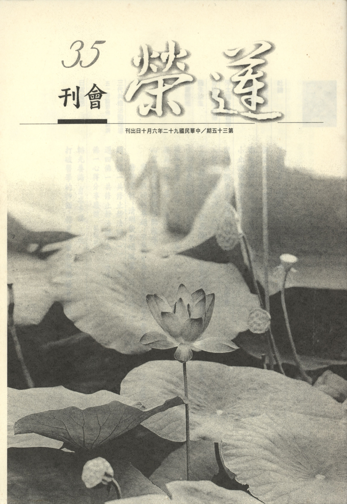

# 第35期

## 社論

### 了難境界，體難本妄，難亦奚傷，以患難為解脫

*編輯部*

曾聞：世上最有智慧的人，莫過於願意受教的人；而世上最有福氣的人，莫過於願意教化他人。不論受教與教化都是為了累積成佛的資糧。唯有快速成佛才有能力幫助一切眾生離苦得樂。為此之故，集眾共修，研討儒佛教典、興辦啟蒙及其他助念、放生、慈善等種種善法。但現今因急性呼吸道症候群（SARS）之故，大眾無法相聚一堂繼續共修，相信大家內心懷念往常的共修念佛、研討時的氣氛，凝聚共識興辦善法的心力，發願往生西方的決定。雖然疫情已漸趨緩和，七月份或可恢復一切的活動，但仍不可大意，在這一段休會期間無法每週見面，但彼此可以用「心」關懷及祝福。其實SARS之生起與世間的天災人禍、疾疫等病相同，皆因人心趨下，猜忌、瞋恨及貪口腹之欲恣意殺生等煩惱業招感而發生，對治之道無它，唯有至誠皈依三寶、發起吾人的善心、慈悲心、菩提心，斷惡修善，才是挽回天意消彌災難，斧底抽薪之不二法門。但不能只是嘴上說說而已，必須真正付諸實行，故此次疫情爆發、政府宣布為國難之時，社會大眾同心協力，共同防治之際，本會亦發起大眾齊心用功，共同回向祈求人心向善、瘟疫平息、風調雨順、國泰民安、世界和平，以報父母恩、師長恩、國家恩於萬一，若大眾能齊聚善業，凝聚成為一股強大的共業，方能免諸疾疫災難之侵襲，恢復過去的安定生活，並也藉此除舊佈新，展現一番新的氣象，以不辜負天象警惕。

希望大家在團體暫時停課這段期間無外緣的干擾下多多地提升內心的修為，尤其是加強誦經、觀修與念佛的功夫，若能在這段期間內充實德學，增上念力，修止修觀，真正能轉變個人的命運，才談得上轉變團體及社會之命運。而趁此瘟疫之際，正是如法僧團中結夏安居之時，彼等皆藉此機緣努力修學正法，利益世道人心，改變現起的苦果。吾人雖無福居蘭若，且須籌作世事，雖無法安心辦道，但也願隨順修學，即使身不能住蘭若而安居，也願以心安居之方式作佛法之實修。因此本會建議與本會有因緣之團體，以及各團體蓮友，依不同教法因緣而有各種功課的修學，故本會做出因應SARS疫情休會期間用功課程規劃表，以茲參考。

若欲觀修誦念教法先具詳細前行意樂，而隨緣讀誦其中一部，例如依人身難得，無常可畏，須及時努力修學教法而誦習無常經。並以三寶為唯一皈依境而實修佛法，為了確立皈依之信心，故可誦習隨念三寶經，增上自己皈依的心態。而皈依三寶重在修學教法，修學教法重在因果知見之確立，因果知見之確立須落實在十善業上，故可誦念十善業道經。因十善業之修學使得三業清淨，故而改變命運，最成功例子即是明末袁了凡先生，故可誦念了凡四訓，堅定對十善法的信心。並須在世法中斷欲去愛，以作為出世法之資助，故可誦念佛說四十二章經。然而專為自利不能成就殊勝佛果，也不能報答有情之厚恩，故須發菩提心作為成佛之正因，故可誦念勸發菩提心文。菩提心之發必以願力表現，十方諸佛最殊勝之願力即是阿彌陀佛四十八願，故可誦念彌陀四十八願。而發願若無菩薩行，願力猶不能落實，故以普賢行願為諸菩薩行之總綱，故可誦念普賢行願品。而發大乘心修學大乘法若不能現證空性，猶是大乘凡夫，故可誦念小止觀以作通達空性之方便。而通達空性之成就行相，能以般若心經作為標準，故須誦習心經，以作空義之勝解。然通達空性必在人上法上尋求真實，非別有空性可得，故須誦念百法明門。然往往修學佛法功敗垂成，乃因順緣未至，障礙先來，還未實修佛法已被障礙打敗，故須誦念十大礙行，先作心理準備，方不至受困於逆境障緣而成佛法退轉的增上緣。

然此身若欲解脫生死成就佛果，終屬困難，乃因五濁惡世正法衰頹，善友難逢，故須以西方淨土為所緣，以作不退轉之增上緣，此土三寶具足，善友易見，正法易聞，壽命長遠，故得一生成佛，然此淨土法門須讀誦佛說阿彌陀經，方知殊勝。平常修學淨土力量易起，然而臨終正念難生，故須閱讀往生助念問答，了知淨土法門如何以助念自利利他。然初機學佛者，或欲求佛法總綱，以對佛教全面瞭解，故可誦習佛說八大人覺經以及十四講表，必得其力。然今世道人心大壞，方有種種惡相現起，如欲護國息災，可誦習印光大師上海護國息災法會法語。若欲弘揚淨土法門，反難通途之質疑，故可讀誦淨土十疑論以及淨土決疑論，能為淨土弘法之健將。

然保留文化除佛家思想外，儒家思想亦是重要一支，儒家思想之精華乃是孔子的證量，詮釋於論語，故須誦念論語，以作儒家文化住世之增上。上來這些修學之成就，端賴子弟如何能成為父母、師長攝受的好子弟，是學習儒佛成就的關鍵，若能誦習弟子規，當有莫大之助益。且須常常自我鞭策，方不會一曝十寒，故須誦念溈山警策，使每日有步可進，而不因循怠惰，成為豪傑。

並將這些功德義涵莊嚴西方淨土，所以每日也當好好老實念佛。所定功課於即日起至中元節（國曆八月十二日），期間內自行完成，最後各人可將所做功德，每週一告知負責同修以資統計，本會並於中元節時隨順僧團自恣日，發露懺悔並將團體所做功德做特別的回向：「令心憂惱諸疾病，業力眾緣所和合，鬼病四大等侵害，願此世間不復現。四大不調諸衰損，剝奪身心眾歡樂，願諸苦痛得調伏，身心健康壽命延。並能成為福慧因，以及往生勝資糧，報盡得超佛淨土，圓成佛果利群蒙。」

## 大德法語

### 佛說四十二章經解（二十七）第二十七章

*道源老和尚講授*

修道猶如木在水

不為欲惑不受嬈

若能精進證無為

中流而行入大海

第二十七章，

「佛言：夫為道者，猶木在水，尋流而行，不觸兩岸，不為人取，不為鬼神所遮，不為洄流所住，亦不腐敗，吾保此木決定入海。學道之人，不為情欲所惑，不為眾邪所嬈，精進無為，吾保此人必得道矣。」

佛說法很善巧，先說一個比喻，下面再說法來合這比喻。

為道者，就是要修學佛道的人，「猶」字是譬喻的意思，譬喻一塊木，在水裡面尋流而行，順著流水往前走不觸兩岸，這個木要流到那裡去呢？要流到大海裡，然流到大海裡，須順著流水走啊！若是觸到此岸，它也流不到大海，若是觸到彼岸它也流不到大海，要不觸兩岸才可以。

兩岸中此岸是生死，彼岸是涅槃，你觸到此岸，就是觸到凡夫的生死，喻為貪欲相續，不斷煩惱，流轉生死，就是你觸到此岸，此岸是生死，那彼岸呢？彼岸是涅槃，涅槃者，就是不生不滅，證得了涅槃之境，這就是二乘人的涅槃，叫做偏空涅槃，他雖證了偏空涅槃，但不發菩提心，無誓度眾生之願力，而耽著於涅槃。那麼你在此岸流轉生死，如同木觸到此岸，那麼你要了生死，了生死到達了彼岸了，不去度眾生，又觸到彼岸，這個木再也不會往前流走。

「尋流而行」尋著兩岸中間是流水，表示菩薩的中道，你不流轉生死，也不貪著二乘的涅槃，不觸這兩岸即是修行菩薩的中道法門，謂之尋流而行。

既不觸此岸也不觸彼岸尋流而行的木頭，若為人取則如何？人取之喻乃愛情來取，當你修行菩薩道，想要入佛的功德大海，你這個愛情心不斷，就是不能斷欲去愛，等於有人將你這個木材取走了，也流不到大海。

「不為鬼神所遮」遮是遮住，遮擋，當你這個木材要往前流行，但被鬼神障礙，這個鬼神就比喻一切外道，你學佛的正道，但卻邪正不分學了那些外道，學外道之法怎能入佛法大海，所以等於是被鬼神將這木材給遮住而無法再往前流，流不過去了。我們看看現在社會上外道很猖獗，眾生真是可憐，雖想要修道，但卻修不到佛法的正道，而去修那些鬼神的外道，等於被鬼神給障住著，永遠流不到佛法大海。

不為外道（鬼神）所遮住，且「不為洄流所住」洄流水之行相是打圈轉，若木材流到洄流水那個地方時，儘在那裏轉圈子出不去，這個比喻什麼呢？譬喻我們行菩薩道時積集福智資糧，而證悟空性破所知障（直心正念真如），若自己的心不直，不能直心正念真如，要想這麼樣修、那麼樣修，修來修去都在那裡轉，等於流到迴水的漩渦中，轉來轉去，流不到佛法大海裡去。

「亦不腐敗」腐敗乃木材本身爛掉了，比喻道心退失了，最初是發了道心修菩薩道想要成佛，這個時候連這一點點道心都退失了，等於是木材自己本身爛掉了一樣。「亦不腐敗」，表示木材沒有腐敗，比喻道心沒有退，如此則可以入海，「吾保此木決定入海」將上述這些障礙去除，如同木頭在水流中沒有被障礙住，本身也沒有腐敗（沒有退道心），我保證這個木材一定會流到大海裡去。

「學道之人，不為情欲所惑」以佛法來合上邊之比喻，學道人一定要嚴守自己的道心，不為情欲所迷惑，學道人若動了情欲心，為情欲所迷惑，如同上述比喻，此木在入流水中已觸兩岸，已為人取，不能流入大海。

「不為眾邪所嬈」，佛須學到直心正念真如，了悟無為法，成辦生死大事。若學這彎彎曲曲的邪道，這些都是邪知邪見，若不被這個邪知邪見所擾亂，如同前喻「不為鬼神所遮」此木方有流入大海可能。

「精進無為」乃行者精進修無為法，悟證無為法，無為者無所作為，乃曰法性非吾人所做出來的法，凡所作之法乃屬有為而無常，無為者乃彼法之性，法爾如是（本來就有）此即所謂佛性。

修道學法若欲成就，可合前面的比喻，第一、不為情欲所惑：你修行辦道，絕對不要動情欲心，不要被情欲所迷惑。第二、不要被眾邪（外道）所擾亂。若能精進修無為法，「吾保此人，必得道矣」那我保證這個人，絕對能證得佛道。（下期待續）

## 共修研學

### 勸發菩提心文（三十五）

*心爾整理*

菩提心是成佛因

累劫難發未轉凡

若能因緣具審思

能探大師秘密藏

佛菩薩如此地有誠意，可是我們看不到，反而覺得佛菩薩阻礙我人生的享受，定了一大堆的戒條。不學佛時可以吃喝玩樂，怎麼學佛之後有那麼多麻煩處啊！戒律這麼多，這也不能做，那也不能做，目前的生活這麼享受我一點也不覺得痛苦呀！就如同紂王看不到比干的誠意，病人看不到醫師的悲心。

倘若吾等內心沒有使命感，不想往上增上，必定看不到佛菩薩的誠意。如果我們在省庵大師如此苦口婆心的勸誡下，覺得大師很煩、很討厭時，佛菩薩乘願再來想度我們，也無可奈何而言：「吾末如之何也已矣。」吾等準備要敗了。

我們能聚會修行都是宿世的善緣和福氣，在業力還未現起時，眼前坐在這裡要好好體會佛恩、父母恩、師長恩、施主恩、眾生恩等的外緣，點燃菩提心的火苗，以及添加菩提心的汽油，讓菩提心火一發不可收拾。在內因上要好好想生死的痛苦以及如何解決，個人與眾生的業障如何對治，如何具足求生淨土並令正法久住的資糧，若能由此五因配合前五緣引發菩提心，此種修菩提心法非常善巧。平常將經教的概念拿出來反省檢點，看看內心能不能有這樣的覺受，這種修行是很善巧的，有了菩提心那怕是一個小小布施的行為、一句佛號、或持一條戒律，或者是向人家說一句法語，立刻變得有意義，只要在這概念下，隨作何事立刻變得有意義，即使塵勞都能轉成佛事，都轉成成佛的資糧。否則不管做多少善事，都是世間的雜染，果報都繫縛在六道，甚至沒有認真地去對治惡業，果報卻熟在三塗。一般治理國家、治理一個家庭，乃至於個人的自我管理，都要有危機意識，並不是杞人憂天，而是他能夠知道過患在哪裡？問題在哪裡？或者能針對預期的問題，如老子講的消弭問題於無形，問題還沒發生就解決問題，那是最高層次的。當我們能找到問題點，能夠好好的對治，才是真正會修行的人。

再重複言之，此文乃省庵大師要我們發正、真、大、圓的菩提心，才是菩提心的行相。正是不為名利所夾雜，若專求外務則在辦事當中很在意名聞利養，這件事對我有多少利益我才做，這樣就不是正，是邪。省庵大師教我們不要這樣，唯為生死，唯為菩提來發心。真是在發心的過程當中，一定要有「必至成佛而後已」的決心，然在修行的過程當中，一定有很多的辛苦與魔難（障）但我一定要到達目的地，非到達目的地絕不終止，要有這種決心與毅力。「大」是以無量眾生為所緣，不能棄捨一個有情，若棄捨一個有情都不名「大」，釋迦牟尼佛的眼中沒有敵人，包括侮辱他的提婆達多，彼甚至用政治勢力來瓦解僧團，然佛的心中沒有棄捨有情、仇敵有情的意樂，這叫做大。所以我也不可以在緣一切有情而發心時，卻說那一個人我不度，那一個人我看了就討厭，這樣就不是大，大就是在因地裡連一個眾生都不能棄捨。

「圓」是結合自性空的觀念，真實所成的眾生是一粒微塵也沒有，所以每一眾生都可以轉變的，而一切眾生都可以是我所緣的對象。法界現象皆是隨緣現，眾生隨著惡業見到苦眾生，隨著善業見到好眾生。佛菩薩則用很強的悲願，與惡的眾生聚會（感應惡的眾生令起現行）然後去度他。這些惡眾生的苦實與佛無關，因為沒有共造惡業的關係，但是法界是有情所居，且各各皆具成佛的潛力，無始劫來互為眷屬乃至為母，其恩如何？其苦吾可置之不管乎？故佛菩薩用很強的願力去感應惡眾生起現行，所以地藏菩薩會生到無間地獄去救度極苦眾生，乃至於釋迦牟尼佛生到五濁惡世（已來八千次），用願與惡世眾生的業結合，為什麼能合在一起，乃因佛初發心時，依眾生之業而有佛之願，他的願發起時一定感應苦難的眾生，從業繫苦的眾生裡面現起殊勝的悲願，展現稱法界的六度，令一切輪迴有情在佛無盡的努力下破迷啟悟、離苦得樂，這是我們從省庵大師勸發菩提心文所詮釋正真大圓的菩提心，我們內心要如何成就如此殊勝行相呢？

第一要念佛的重恩，因為佛對我恩重如山，佛的目標就是要幫助眾生離苦得樂，為了報答佛恩所以要發菩提心。第二要念父母恩，父母之恩如果不以度化他們成就佛道，所報之恩有限，尤其只是盡世間的孝有很多的缺憾，只是助他們生活一輩子安樂而已，卻無從助其脫離生死的苦海。第三念師長恩：我們在人世間，能夠有衣有食、有住有行，都是師長的教育，才有生活的技能與知識、才能賺錢吃飯，並且教我們禮儀讓我們不成為異類，乃至於有出世間的師長，我才能夠修學佛法，知道應該以離開輪迴、成就佛果為人生的目標。所以我要好好發菩提心來度化他們，使他們具蒙利益。世間的師長我當然要度化他們，出世間的師長我或者度化他們、或者助他們興辦佛事利益有情，何以要助他們，因為他們的教化而有我的成就，所以要好好護持他們興辦正法事業，所謂一佛出世、千佛護持。第四念施主恩：雖有佛、父母、師長的恩德，但我人也要活命方有正法可修，以利興辦正法事業，而能活命就是仰賴施主的恩德，此恩德也要報的。而且中國人講究受人點滴答以泉湧，受人一點水還他一條泉。韓信受漂母一飯之恩，只是受人一碗飯，卻報了千兩之金，更何況施主從我們生命的現起一直到斷氣這一段，都是施主護持衣食住行，乃至於士農工商分工合作才有我受用。我在家中用水也不是我自己建水庫，我開的車子也不是自己建的汽車廠，通通是施主與眾生的恩。眾生表面看起來跟我沒關係，但是內部裡都是息息相關的，甚至是過去的眷屬未來的諸佛。這樣看來這些恩不能不報，尤其報他的恩只有好沒有壞，不報恩只有壞沒有好，即便對方不計較，我人此種刻薄寡恩的習氣也招感不到福報，不但佛如此指示、我人詳細觀察也是如此。

前五(念佛重恩、念父母恩、念師長恩、念施主恩、念眾生恩)是約外緣講，後五(念生死苦、念尊重己靈、念懺悔業障、念求生淨土、念正法得久住)約內來講，念自己的生死苦而發菩提心，對治生死苦，不只能對治分斷生死還能對治變易生死，試問變易生死如何對治？當發起菩提心欲成佛度眾生時，除了會修大乘方便道，更能修學甚深見，生起無我的智慧、破所知障，遠離變易生死。（下期待續）

### 小止觀導覽（十四）

*蓮心整理*

持戒懺悔前方便

止觀證空是正行

若能勝解真如後

戒體清淨無生懺

經文

從是已後，堅持禁戒，亦名尸羅清淨，可修禪定，猶如破壞垢膩之衣，若能補治浣洗清淨，猶可染著。

大意

說明懺悔後，堅持禁戒亦名清淨。

導覽

一、止觀門為如來禪的修法，有志於成佛者，應抽出時間、心力研學止觀，透過止觀的修行方法，在修行的內涵中得到真實的利益，進而證悟空性，故云：止觀為行人修行之勝路，眾德圓滿之指歸，無上極果之正體也。

二、有心修學止觀者應講究前方便（如具五緣、訶五欲、棄五蓋、調和五事、五方便行），而首先須外具五緣(即持戒清淨、衣食具足、閒居靜處、息諸緣務、近善知識)，持戒懺悔為修止修觀的能力，因為懺悔可以降伏煩惱的勢力，遠離五欲的束縛，使緣念善法的力量轉強，而「止」就是緣念善法，「觀」就是觀察善法。

三、透過如法懺悔，可使身心清淨，而現罪滅之相。靜坐時，由粗心住進入細心住，再進入初禪。在初禪未到地定前，先證八觸十功德，觸發乃因由欲界的四大進入色界的四大，引發身體的變化，每一觸有十種功德以為眷屬，作為是否為善根發相之依據。

四、如法懺悔必須誠心發露懺悔，結合懺法（如金光明懺、淨土懺、梁皇懺、慈悲三昧水懺等），及止觀門的修學，將內心安住於善法，由粗心住進入細心住，使善心開發，解悟心生，才是破戒障道的罪滅相，可見止觀門為懺悔罪障的究竟法，亦為懺罪的前行。因為在懺罪的當下，緣念菩提心的力量很強，此名為「止」，並在作懺當中了了分明，內心隨順懺法往前走，此為「觀」的作用，但此種觀力實為正見力，當「止」成就以後，才可真正說「觀」，當禪定的境界起現行，此時豁然解悟心生，善識法相，隨所聞經，即知義趣，乃因緣念善法的力量及緣念經教的力量轉強，二者和合，會增強對善知識以往的教誨與開導的回憶力量，故會透過經教文字以及過去善知識的講解概念，回過頭來重緣經教等善法，可打破以往對經教的迷惘與不解，忽然對教法有所通達。但這不是開悟，只是對經教的解悟力量轉強，隨著對經教緣念的力量轉強，以及對善法的執持力，與日俱增，假以時日，會使對經教的解悟力大增，進入佛菩薩的證量範圍。

五、經過作法懺、取相懺的發露懺悔之後，再以清淨心來持戒，此時修得的禪定，就是清淨的禪定。破根本戒就像衣服破了，破枝末戒像衣服髒了，故須補治，故應回過頭來好好懺悔，期使戒體恢復，戒體恢復猶如補丁，戒體清淨猶如洗浣；「猶可染著」是指善法的染著。故云：「猶如破壞垢膩之衣，若能補治浣洗清淨，猶可染著」。

六、尸羅有四義：清涼、安穩、安靜、寂滅。清淨是戒的作用，能令熱惱止息。安穩與安靜的成就必須要靠定，也就是「止」，止的人就是既安穩又安靜。安穩就是寵辱不驚，若所緣的境界是空性，就安止於空性、觀修於空性，得到空性很多的運用，將無明我執破掉叫做「寂滅」，這些都是戒體清淨的輔助。戒是防非止惡，但真正要止息惡，必須要靠定慧將煩惱摧壞，才是真正惡的止息，才是真正戒律的清淨，也就是依戒來修止觀門，依止而得定，依觀而得慧。這樣的戒最清淨，故戒的清淨也是修學止觀的成就，可讓戒律任運持住。故一方面說持戒懺悔是止觀門的前行，一方面說止觀門的成就是持戒真清淨，這種懺悔才是真正的清淨懺悔，也就是無生懺。無生懺就是以止觀門修學空性得到無我的正見，才能將無明我執徹底對治，如此則不生煩惱，不造惡業，才是罪業懺悔清淨。華嚴經普賢菩薩十大願中第四為懺悔業障：「往昔所造諸惡業，皆由無始貪瞋痴，從身語意之所生，一切我今皆懺悔」，連等覺菩薩都要懺悔，何況吾等薄地凡夫，通身業障能不懺悔？且不但煩惱清淨名為懺悔清淨，更進一步以清淨心廣行善法，故摩訶衍論云：「好行善道，不自放逸，是名尸羅。」

經文

若人犯重禁已，恐障禪定，雖不依諸經修諸行法，但生重慚愧，於三寶前，發露先罪，斷相續心，端身常坐，觀罪性空，念十方佛。若出禪時，即須至心燒香禮拜，懺悔誦戒，及誦大乘經典，障道重罪，自當漸漸消滅。因此尸羅清淨，禪定開發。

大意

說明無相懺與作法懺相互運用的方法。

導覽

一、此段云得到空性正見之修行，是清淨的修行，持戒是清淨戒律，以之懺罪亦是懺罪清淨相（無生懺）。然未得空性正見之前，須以持戒為開慧之殊勝資糧，對所犯的過惡與戒墮都要好好懺悔與修學空性，否則求出無期。透過懺悔方能真正持戒以及修學空性，才能將無明的勢力袪除。所以說懺悔的清淨（成就）必須是空性智慧（證得無生的智慧）的生起，然證得空性的智慧必須藉著止觀門的修學而證得無生，是名無生懺，亦是整個懺悔的究竟義趣。「罪從心起將心懺，心若滅時罪亦亡，心亡罪滅兩俱空，是則名為真懺悔。」此為理懺（無生懺）偈，也說明了理懺功德最大。心是起惑造業的源頭，因此若要將罪業滅（即果報滅亡，罪業是果報的因，果報是罪業的果），須從心滅，心滅除煩惱之後，不會造罪業、滋潤罪業，所以不會感果，此為心滅，而「心亡」是亡掉了煩惱，「罪滅」是因為沒了煩惱，故不會造業，不會滋潤惡業，就不會感果，故名「罪滅」；「兩俱空」罪滅以及心亡都是了不可得的，因為罪業必須依因仗緣現起，要除掉罪業、滅除煩惱也要依因仗緣才可滅掉，因為兩者都沒有自性，必假因緣方得現起，若能通達二者的空性，即是輪迴根本（無明）的正對治。所謂「無明」是指執有自性之見，並非有一個東西叫無明，若通達事相之體性了不可得，即是無明的正對治，然須以善知識、教法為所緣如實觀察有為法（或心或境或五蘊上的人我），尋覓其體性了不可得，即是現證有為法的空性，而此空性亦是了不可得，必藉有為法方能顯現故。通達空性除掉無明我執（對有為法實有的執著），此之有志於解脫與成佛的人方名真正懺悔。因此要有使命感的人才懂得真正懺悔，而從作法懺、取相懺到無生懺就是「逆流十心」，而十種助懺之法就是助成作法懺、取相懺、無生懺的方法，以無生懺通達空性為懺悔的成就。

二、行者若能知法虛妄，永息惡業，修行善道，是名懺悔。釋禪波羅蜜次第法門：「作法懺悔，罪滅或復不復。如冷病人服於薑桂，所患除差，身有復不復。觀相懺悔，非唯罪滅，能發禪定，此則過本。何以故？本無禪定故。如冷病人服石散等，非但冷除，亦復肥壯過本。觀無生懺悔，非唯罪滅，發諸禪定，乃得成道，此為增上過本。如病服於仙藥，非直病除，乃得仙通，神變自在。」

經文

故妙勝定經云：「若人犯重罪已，心生怖畏，欲求除滅，若除禪定，餘無能滅。」是人應當在空閑處，攝心常坐，及誦大乘經，一切重罪悉皆消滅。諸禪三昧自然現前。

大意

引經證明禪定罪滅、罪滅定發。

導覽

諸禪必須結合智慧（空性正見），才有真正滅罪的能力，才能真正將罪業、罪根全部滅掉。「誦大乘經」是隨著經文了解經義，尤其是對心性的詮釋（大乘法最殊勝處），並將心安住在經文、經義上，此即修止，引發勝妙輕安，即是止門成就。而「觀」門是透過祖師大德的剖析，依因明論之辯證，在各種正因上成立比量之智，不斷地在法義如此的思惟修（觀），若以所破的我成立空性之比量作為觀修所依，不斷地思惟修必能破除無明的執著，止門僅能伏住無明，而觀門才可破除無明，此時才是罪業的消滅相。（下期待續）

## 日常省思

### 韜光養晦、自求多福

大敬

病苦由來是惡因

法語巽語改繹之

若能苦中學教訓

大地重回一片春

世之動亂戰爭、貧病憂苦，皆因眾生惡業所致，惡業成熟災禍必至，無能倖免。而惡業又以三毒為因，貪瞋痴隨慾望之無窮而熾盛，為遂其慾望、滿足私心，則巧取豪奪、爾虞我詐、機關奸巧，無所不用其極，故饉饑疫癘、天災人禍、戰火兵燹於焉而生。

近日ＳＡＲＳ疫情肆虐，其對吾等日常生活起居之影響，幾乎與柴米油鹽醬醋茶等開門七件事同等重要，再者，ＳＡＲＳ的威脅性甚至重於洪水猛獸，蓋因洪水之洶湧在於泛濫之時，猛獸之可畏在於攻擊之時，而ＳＡＲＳ卻造成社會的脫序，人心的惶恐與不安、自私與猜疑、空虛與害怕，經濟旳衰退，景氣的蕭條，這種後遺症是前所未見的；疾病的可怕在於造成身體的痛苦與不適，以及生命的消失，但是ＳＡＲＳ不僅如此，甚而成為滋潤惡業的溫床，在ＳＡＲＳ效應下滋長了貪瞋痴三毒，則豈非三途根源、苦果種子？

或云病患之起，乃因衛生不佳、病毒侵襲，非關人心良窳、善惡好壞，然依智者大師小止觀云，病發雖復多途，……然有三種得病因緣不同，一者四大五臟增損得病，二者鬼神所作得病，三者業報得病，四大之病可依止觀而息心和悅及服以金石草木等治，鬼神病則勇猛精進、堅強心固，並加上持咒，以助治之，若是業報病，要須修福懺悔，患則消滅。據報載，ＳＡＲＳ的病源，來自野生動物，人們為了進補及滿足口腹之欲，恣意殺生害命，自招禍端，一九一八年殺死數千萬人的可怕感冒為例，當時的中國似乎未受到波及，可見物必自腐而蟲生，病苦之起，豈無關善惡與福德？楞嚴經云：「一切眾生，六識造業，所招惡報，從六根出，非從天降，亦非人予。自妄所招，還自來受。」誠不欺我！

夫人有色身，故有飢渴疾病、寒熱毀謗等苦，而吾等為保色身，卻汲汲營營，枉造惡業，然有生必有死，致死之由，或因病死，或因橫死，死雖可憎，無能免者，觀諸ＳＡＲＳ死者，多亡於肺部浸潤，無法呼吸，一息不屬，便陷沉淪，人命僅在呼吸間而已矣！另為免感染，ＳＡＲＳ患者隔離與臨終時骨肉至親，均不得陪同在側，遺體也必須於廿四小時火化，則言笑歡娛、情深意濃，終究歸空，清肌玉骨、軟玉溫香，化為骨裂煙臭，則此色身可愛耶？又和平醫院護理長陳靜秋女士於發病前一日與先生、孩子同到花蓮遊玩，青山綠水、嬉笑歡樂尚在目前，遽爾天人永隔，世事多變、人生無常，苦樂無有自性，不能常在，萬法遷流變化，無暫停息，吾等不能以此色身斷惡修善、進德修業，亦不過是眾苦之本、諸罪之藪罷了。

昔者韓宣子憂貧，叔向賀之，蓋以有其貧，方能以貧之因緣而進德修業，進德修業則國泰民安，風調雨順，反之，若不憂德之不建，而患貨之不足，則弔之不暇，何賀之有？故若因ＳＡＲＳ現起，而怨天尤人、自怨自艾，則為坐以待斃之愚者，反之若「每想病時，塵心漸減；常防死日，善念自生。」而觀修無常與病苦，則為韜光養晦、自求多福之智者。

### 打破醫學的神話〜梅襄陽醫生演講錄音帶輯要

大敬

病從口入禍口出

挑選飲食除飢病

不忘清淨心垢染

即是真正養生學

我和在這個社會中長大的許多人一樣，從小就對醫學神話深信不疑，認為一切都是真的，相信自己的健康全靠醫生、藥房、醫院來維繫，從來沒有想到疾病有可能是一個傳達訊息的方式，或者說我們身上的各種體驗，不論是健康、或生病，都可能提供機會使自己對身體有所瞭解，且從來也不知道自己有能力去追尋一個能夠提供身心靈各方面都健康而且充滿活力的生活方式，從來也不瞭解自己的選擇與生活方式會對生活品質的體驗，產生這麼大的影響，並且從來也不曾想像真正使我們痊癒的關鍵完全在於自己。

梅襄陽醫生是台大醫院的醫生，在他卅三歲時，檢查出肝臟有三公分的腫瘤，斷層掃描肝臟一片模糊，小便赤色，吃了兩年素食後，病情未可轉，體重反而增加到八十公斤，經過不斷的收集資料及追尋答案後，不但解決了自己的腫瘤問題，也自利利他，幫助許多人重獲健康。

相信您一定非常關心自己的健康，但是您的醫學常識是否正確？以下有十個題目，請測試一下自己的實力吧。錯誤的觀念可能造成終生遺憾哦！

◎前五題為單選題，後五題為複選題，每題十分。《請認真作答》

一、西醫對下列那一項病症最有貢獻？（１）緊急治療(如骨折、流血不止、皮膚嚴重灼傷、急性盲腸炎等)；（２）慢性病(如糖尿病、高血壓、心臟病等)；（３）非患病但被西醫處理者(如分娩、身體檢查、打預防針等)。

二、你認為癌症病人的死因，下列那個因素占50%以上？（１）腫瘤破裂大出血而死亡；（２）病人被告知時日無多而被嚇死；（３）用藥導致器官功能衰竭而死亡。

三、婦女到了更年期，沒有了月經，也就是少了一個排毒的管道，此時應如何因應？（１）飲食清淡，以防油脂不易排出；（２）切除子宮，以防腫瘤的發生；（３）多吃荷爾蒙，以防止老化。

四、要有健康的身體，應吃對食物，也就是「四低一高」的飲食，所謂「四低一高」，下列敘述何者錯誤？（１）「一高」就是「高纖維」；（２）「四低」就是「低蛋白、低油脂、低糖、低鹽」；（３）「一高」就是「高熱量」。

五、下列敘述何者正確？（１）吾人蛋白質的需要量只占卡路里消耗量的2‧5%〜8%；（２）吾人蛋白質的需要量只占卡路里消耗量的21.5%〜30%；（３）沙拉油是最好的食用油；（４）癌症的造成與飲食中的蛋白質無關。

六、預防腸病毒，有那些情形是必須要注意的？（１）少出入公共場合，或少待在人多的地方，以防傳染；（２）停止動物實驗，因為實驗室中的動物實驗是致命病菌出現的主因；（３）經常洗手，以保清潔；（４）儘量不要以手指觸碰眼睛，以防病菌侵入；（５）不要吃牛肉，因狂牛症的病毒，是連煮沸也殺不死的。

七、根據調查癌症患者癌細胞突變的情形，發現90%的患者，在突然好轉前，曾改變其飲食習慣，你認為可能包括那些改變呢？（１）吃天然素食；（２）不吃白麵、白糖及過度加工的食物；（２）以維他命及礦物質等作為食物的補充；（４）飲用藥草茶。

八、請問下列那幾項是錯誤的？（１）深綠色的葉子含有鈣質，所以我們可由此攝取鈣質；（２）為了預防骨刺，最好多吃鈣片；（３）防癌不是只是吃素，而是改變飲食習慣；（４）為了維持身體的健康，所以要多吃肉類、蛋類及乳製品。

九、若您發現您的孩子經常為了一點小事，心焦氣躁，易怒不穩定，缺乏集中力，容易疲勞，睡不著，心情低落，有嘔吐感及頭痛等，可能與下列那些因素有關？（１）經常吃漢堡、糖果、餅干、米果、蛋糕、巧克力等；（２）常吃速食麵、杯麵、罐裝咖啡、碳酸飲料等；（３）他的體質多半為酸性體質；（４）長此以往，他的腦部發育可能會受到影響。

十、有關最近沸沸揚揚的話題〜「非典型肺炎」，下列敘述，那些正確？（１）致病原為肺炎雙球菌；（２）傳染途徑為飛沫傳染；（３）診斷時白血球的數量較「典型肺炎」高；（４）最近最好不要前往越南、大陸、香港等地區。

作答好了，請核對答案。

一、（１）；二、（３）；三、（１）；四、（３）；五、（１）；六、（１２３４５）；七、（１２３４）；八、（２４）；九、（１２３４）；十、（２４）。

◎ 如果您答對少於五題〜請繼續努力。如果十題全對〜請不要太高興，因為題目不難。

我們的身體本來就是一個穩定的生物圈，當您的身體出現不平衡的狀態時，某些微生物獲得一些廢物變成它的食物，就開始繁殖，使原來不容易分解的東西變成細的，以利排除，我們不應該認為這些細菌是造成生病的原因，其實是自己吃錯了東西，排不出來所造成的，因此改變自己的飲食習慣才是當務之急，而不是本末倒置的去殺死細菌。

現代飲食含有過量的蛋白質、砂糖、脂肪、化學添加物，會導致身體失衡，只有把不平衡調到平衡，把廢物排出去，才可以使身體好轉，若經常發生內耳感染、喉嚨發炎、扁桃腺發炎，感冒等，是反應飲食出了問題，而這些小毛病，與癌症有很大的關聯，因為這些都是身體發出的訊號，也表示身體正努力運作，企圖把過剩物質排除的過程，所以正確的飲食才是最好的醫藥，自己才是最好的醫生。

工作與情緒是無形的壓力，脂肪與毒素是有形的壓力，因此造成疾病最大的因素是脂肪、粘液、毒素及壓力，而非癌細胞、濾過性病毒等，所以癌症就是一個錯誤的營養學。

當您攝取的蛋白質過多排不出來時會長腫瘤，在未長腫瘤之前，會先出現粘液（如痰、鼻涕等），所以痰多是因為吃了太多蛋白質及太多甜的東西，此時身體就會想要從呼吸系統的粘膜或扁桃腺把它分泌排出來，而癌症病患的多咳也與此有關，因此正確的飲食、保持淋巴系統的暢通、淨化血液，才是消除腫瘤的當務之急。

※健康的密訣：改變飲食習慣〜要吃對食物（四低一高飲食：低蛋白、低油脂、低糖、低鹽、高纖維），不吃錯誤的食物（如化學添加物、氫化油等脂肪），而其中關鍵點在低蛋白。瞭解生命的意義，啟動自己的康復力。邁向健康之路，坦然接受排毒。知行合一。

## 啟蒙園地

### 每月一字 — 集

*蓮心*

集：根據許慎的說文解字「集」的本義為「群鳥在木上也」，禽經云：「獨鳥曰止，眾鳥曰集。」因此「集」就是群鳥棲息的意思，故詩經有「黃鳥于飛，集于灌木」的句子，另外「集」尚有其他的意思，詳如下列：

一、市場或人口聚集進行交易的地方〜如「市集」就是指在固定時間、地點，進行貨物買賣的場所，後來亦指人口的聚集地或商業中心，如老殘遊記：「那山裏關帝廟有兩處，集東一個，集西一個。」；另外在偏遠地區，買賣貨物有一定的地點、日期，到時商販、居民都趕往交易，稱為「趕集」。

二、地名〜儒林外史：「話說山東兗州府汶上縣有個鄉村叫做薛家集。」又如「王家集」、「張家集」等。

三、聚合〜如「集合」就是指聚在一處（也可用在數學上的專有名詞）。儒林外史：「且說那苗酋正在洞裏聚集眾苗子，男男女女，飲酒作樂過年。」的「聚集」也是指聚在一處的意思；又如「集腋成裘」指狐狸腋下的皮毛雖不多，但聚集起來就可縫製成一件皮衣，後來也比喻為「積少成多」的意思；而「冠蓋雲集」是形容許多達官貴人聚在一起；另外「景從雲集」指如影隨形，如雲聚集，是形容隨從眾多簇擁而來。

四、輯錄詩文等的書籍〜如「詩集」；又如五代後蜀趙崇祚編的「花間集」就是詞有專集之始；而「古今圖書集成」就是清朝康熙時敕撰，雍正初校印的，是我國最大的類書，共計六千一百零九部，一萬卷，乃集經史諸子百家之大成。

五、我國傳統圖書分為四部，即經、史、子、集，故在四庫提要的記載，集部以楚辭最古，別集次之，總集次之，詩文評又晚出，詞曲則為額外而增的。

六、計算書籍或影劇系列的單位〜如「這齣連續劇已經演了廿集了」。

七、成就〜如書經：「大統未集」就是指大業未有成就的意思。

八、齊〜如漢書：「動靜不集」就是動靜不齊的意思。

九、雜〜如「紫朱雜廁，瓦玉集糅。」的「集糅」就是錯雜混合的意思。

### 十四講表（四）第二講表（甲、乙）

傳瑛

佛學是詮釋宇宙與人生的真相，而宇宙與人生的事理又是非常複雜，所以佛法的內涵自然又深又廣又複雜；而要將此深廣複雜的內容讓大家瞭解，當然不容易，雖不容易，但有方便方法，那就是「信」依總相、「解」從別相。

為什麼鳥兒可以在天空自由自在地飛翔，雲兒可以在天空中悠游地飄浮？那是因為在天空中沒有任何障礙，只有無限的包容。我們的心是否也可以跟天空一樣無礙？眾生的心往往處於糾結狀態，為什麼糾結？因為總覺得喜歡的得不到，討厭的又偏偏來到面前，這是一種煩惱形相，有煩惱就不能像天空一樣沒有罣礙。但是如果我們瞭解萬法的總相，就是第一講表所說的「空相」，也就是明了萬法皆是隨因緣時時在變化，本身並無一個永恆不變的「我」，以及永恆不變的「我所喜歡」或「我所討厭」的人事物存在，那麼就不會被「我」及「我所」牽纏而苦惱不已。

「信依總相」的「總相」指的是萬法的實相〜空相，可是大家看不到空相，只有佛究竟證悟，他證到那個境界然後跟我們說，因此我們要相信佛說的，也就是相信聖言量。量是現量，佛所說的一點都沒有差，剛剛好是他們證悟的境界，然後告訴我們。所以「信依總相」的「信」就是相信聖言量。「解從別相」，佛為了要度各種不同根器因緣的眾生，所以開示了無量無邊的法門，這個「別相」就是很多的意思，大家相信聖言量後，應該要開始慢慢瞭解佛所開示的各種法門，以求自利利他。

修學佛法有四個階梯，那四個呢？信、解、行、證。信為道元功德母，要證入佛智，須以「信」為基礎，其中最主要的是信聖人所說的話，而聖人到底說什麼呢？聖人應機說法，說了很多法，叫「別相」。我們想要成佛度眾生，就必需要瞭解這些「別相」，而要瞭解這些「別相」，就必需透過善知識的教導。如我們想要求學，就要到學校註冊，然後學校會安排授課老師；若我們想成為佛的學生，也要先去註冊，如何註冊呢？就要皈依佛、法、僧三寶。

什麼是「皈依」，就是歸命依靠，將我們的身心全都託付予佛，如同一個不會游泳的人，掉入大海中，在海中掙扎快要溺斃時，突然看到一艘船，此時只有一個念頭，趕快靠上那艘船，將自己生命全部託付它；又如我們好喜歡一樣東西，喜歡到日也想、夜也想、作夢也想，整個身心都在想它。同樣的，我們若想學佛有成，就要有這樣依靠歡喜的心態。

皈依佛，最重要的就是相信聖言量；皈依法，就是依著佛所說的方法切實去做，譬如上課瞭解了很多的道理，之後，應當要實行才能獲得利益；皈依僧，就是跟著好老師學習。如果一個人對佛法修持得很好，他就是一個好老師。佛是聖人，他說的法我們要學，但是佛已於二千五百多年前，於印度示現入滅，而佛法無人說，雖智不能解，所以只有靠修持的僧眾，透過他們把佛法的道理傳授給我們，讓我們不會在道上走錯路。

找好的老師是件很重要的事情，如果遇到不好的老師，會有什麼後果？很久以前，在印度住著五個瞎子，他們常聚在一起討論他們不曾看過的事物。有一天，他們討論起大象，他們只知道大象很大，但不曾觸摸過，因此很好奇。最後，他們決定請一位朋友帶路去「看」大象。他們每個人把手放在大象身上，開始摸象。第一位瞎子摸到大象的身子，「大象像一座高牆。」他這麼說。「不對」，第二位瞎子說，他摸到的是尾巴，「大象像一條又粗又長的繩索」。「不對，不對」，第三位瞎子說，他抓的是耳朵，「大象像是一把大扇子」。「大象像一根柱子」，第四位瞎子爭辯說，他摸的是腿。「你們都錯了」，第五位瞎子說，他順著大象鼻子摸，「大象像一條蛇」。如果我們親近不好的老師，就如上面故事一樣，以盲引盲，這樣我們就會被誤導；如果是好的老師，因他真的看到大象，然後他就給我們述說大象長什麼樣子，而且還可以把大象畫出來給大家看，所以老師很重要。「欲知上山路，須問過來人」，如果我們想要去爬一座很美的山，可是又不曾去過也不知道怎麼走，那要怎麼辦呢？這時就要問下山的人，因為他走過了，現在他回來了，所以他知道路。

相信了聖言量，也有好老師，接下來我們就要好好的學，如某甲很餓，某乙就告訴他，你趕快去煮飯，吃了飯就不餓了，某甲不願意去煮，一直用想的，想像自己現在煮了一鍋香噴噴的飯與好吃的菜，他只用想而沒有付出行動，結果他還是餓，愈想愈餓，就餓昏了。所以學佛只是用想的，不付出行動，怎麼也學不成。所以信之後，還要「解行相應」才是學佛的正確方式。

佛法三藏十二部，浩如煙海，初學者如何入手？ 雪公老師列舉下面三個方向讓我們瞭解一個概要且完整的架構。

一、諸法三分：體、相、用

（一）體：空而無質。當一個聖人或佛，他看到一件事情時（舉木魚），他不只看到木魚，還看到木魚從沒有到有是怎麼形成的，以及它存在時發揮了什麼功用，何時它又會趨於敗壞。就像房子，我們看到房子是說有幾間房間幾間廁所，但如果是建築師來看，他的專注點就是鋼筋、水泥、磚頭，如果裝潢師來看，他會看到那個地方需要佈置，每個人看的角度不一樣，而聖人或佛因具足圓滿的智慧，所以看到諸法緣起，了知萬法本體並無任何自性可得，故說體性空寂。喻如花之香、鏡之光。大家看得到花香嗎？看不到，聞得到鏡之光嗎？聞不到，形容體性無法用世間的心識來證得。

凡夫雖看、聽、聞不到體空，但可從現象分析瞭解。如衣服的質料是布，布的質料是絲，而絲又是農家植桑養蠶而來……，一直分析下去，發現衣服的究竟體性了不可得。現在科學證明所有物質現象分析到最後，是微小粒子「侉克」組成，但這並不是究竟發現，科學家仍陸續在找尋更微小的粒子。以佛眼來看，一切的東西都是緣聚而成，緣散而滅，體性本空，所以說「析之本無」。

（二）相：暫起幻有。相包括物質及精神二個層面，以人道眾生為例，物質指的是我們的身體，包括五臟六腑，還有所有神經系統；精神指的是「心」，心雖看不到，但可以透過念頭感覺得到。當下的每一個心均是透過念頭而表現出它的作用，所以真正的修行人很注意他們剎那所起的意念。如現在看見一件東西，眼睛就盯上去了，覺得漂亮，就會產生歡喜與執著，這種愛執就是意念已在產生作用，但我們察覺不到。修持好的人，就有這種內觀的功夫，因其瞭解萬法體性空寂，所以能在對境的時候，使後續的意念不生執著。我們也要很注意我們心念的反應，如果常常放任自己的心念，不去注意觀察，我們就變成情緒的奴隸，如生氣時，就口出惡言而造了惡業。

事實上，萬法不過是藉因緣聚散而有種種生滅的假相，所以稱為「暫起幻有」。眼前的現象只是暫時存在而有，一旦因緣產生變化，亦將隨之改變，如夢幻泡影般。例如水，水是因為氫加上氧而成的，若將氫和氧分開，何來的水呢？又如山，山也只不過是土石堆積而成，若將土石分開，何來的山呢？

眾生長久處在無明狀態，猶如在一個暗室內，放了一條花繩，誤認為是蛇，然後把自己嚇的半死。正因為不解因緣變化的真相，而對萬法有種種的錯覺，甚而產生種種的顛倒執著，所以整日都過著不安苦惱的日子。

（三）用：能變現狀。萬法有相就有功用，如杯子的相，就能盛水止渴，毛巾的相，就可擦拭身上污穢，此外，隨著相的變化，功用也不同。如水、氣、冰的本體（成分）是一樣的，但因環境不同，相狀亦異。如常溫之下是水，在低溫之下是冰，在高溫之下是氣，因其相的不同，所以功用也不一樣，如水有洗滌的功用，冰有保鮮的功用，熱蒸氣有讓人體血脈通暢的功用。又以我們人道眾生為例，若為學生相，學生的功用就在於學習，因此要很用心於所學的事物上以期進德修業；又如現在是父母相，就要負起養家及教化子女的功用。

從前孔子帶著弟子周遊列國，席不暇暖，可是都遇不到明君推行仁德大道，有人甚至覺得孔子像喪家之犬，雖然如此，秉持救民濟世的初衷，孔子一點也不灰心。有一回，孔子碰到一位隱士，這位隱士對孔子說：「你不用這麼辛苦，不會有國君要用你的，你跟我一樣隱居山林好了，日子過得很清閒不是很好嗎？」孔子說：「我是一個人，我要盡做人的本份，如果我隱居山林，我就做鳥獸就好了，為什麼要當人呢？」。人者，仁也。做人就是要行仁道，不僅愛家人，還要愛朋友，甚至不認識的其他眾生，由親至遠，隨自已的能力盡力而為，這樣才真正發輝「人」的功用，同時也能淨化社會趨向大同祥和。（下期待續）

### 心靈成長營返班活動報導—家長班研討專題　家庭教育為天下太平之根本發隱（一）印光大師著

心怡淺釋

前言：

印祖談到家庭教育是一切教育根本，其中以母教最為重要，母教之成功從其為人女即開始受教，故教女為尤要。今日之人女，他日即為人妻、人媳、人母，需負起教育子女之重責。善教兒子也很重要，如此兒子將來娶妻，也會注重妻子對其子女的教育。子女若成才則能興家，不成才則敗家。現代人都忽略真正福因為何？其實有德方有福，有才有德固然好，有才無德反是過，有德無才仍有福，從歷史記載及人情體會中可以得到證實：德才是福報源頭，離開德則無福可言。心靈成長的教育，最重要應以培德為主，培養子弟能立志定下目標，能替人著想，能學習處理自己煩惱情緒的能力，不帶給他人痛苦。從小即灌輸這些良好概念，引導子弟正確走向，令其對所學引發意樂，將來自能培養其獨立成熟的人格。而在學習過程中，心靈的感受及成長，比認知教育還重要。我國科學教育興辦下來，讓全國學生害怕學物理、學數學，害怕思考、不敢面對問題。為什麼？因為害怕被考倒，成績不理想，信心受損，連帶興趣缺缺。歐美的認知教育，以啟發式教學，引發其興趣，教材編選亦以適合學齡發展程度為主，自然讀到大學時能養成興趣，及獨立思考能力，如此才能對科學發展有所貢獻。反觀我們的認知教育，把學習思考年齡層提早了五、六年，以考倒學生方式，使其喪失學習的信心與興趣，最後卻輸掉了一輩子。音樂教育亦然，過於強調樂理教學，不知以美好音樂喚起學生內心共鳴，培養其對高尚音樂的鑑賞力，以引導其內心善性的走向。結果是家家戶戶愛聽靡靡之音的流行歌曲，比之維也納的孩子，個個懂得聽高尚音樂，實有天淵之別。故為人父母者，應掌握教育的重點，不可瞎忙。像全國教師都很努力辦教育，教學設備也很齊全，但成效卻很差，此乃教育焦點對錯，不但事倍功半，浪費教育資源，也無法培養出氣度高尚與才藝兼備的人才。此頗值得父母及教育人士等予以重視檢討。倘母親能善於引導子女，將此美好啟蒙教育觀念從小就讓孩子薰習，父親也能護持母親，全家互相學習增上，加上師長也能從因果教育及中國文化內涵引導學生知行並進，相信必能為家庭國家培養真正具德具才之子弟。

正文：

本次研討段落為甲二、別釋賢平根本求家教分三，其中乙三、結歎部分。

「此種極平常之道理，人人皆能為之。所痛惜者，絕少提倡之人。俾為母者，唯知溺愛，為父者亦無善教。及至入塾讀書，為師者亦由幼時未聞此義，故亦絕不知讀書為學聖賢，不教生徒躬行實踐聖賢所說之道。但只學其文字，以為謀利祿計。而不知學聖賢有莫大之利益，自己與子孫，生生世世，受用不盡。謀利祿，謀之善，不過現生得小富貴而已；謀之不善，現生身敗名裂，子夭孫絕者，比比皆是。」

依文分述如下：

結歎分二，易行、難知。首述易行之道，「此種極平常之道理，人人皆能為之」。前述賢平根本求家教，以家庭母教及因果教育乃賢才蔚起，天下太平之根本，而教女尤要等，乃極平常之道理，如種瓜得瓜，種豆得豆之因果道理，行之實不難，只要人人能重視家庭教育，將因果吉凶禍福之道，落實於日常生活中，自然家庭賢才興起，國易治而天下自臻太平。故印祖常云：「家庭教育乃治國平天下之根本，而因果報應為輔助教育之要道。」

次述難知分三。首標「所痛惜者，絕少提倡之人」。因果道理看似平常，一般人只知其然，不知其所以然。有關家庭教育的內涵、重要性、功過、對家國社會乃至對後代子孫之利害關係等，非聖人亦難可盡知；其所涉及因果事相之深廣，惟上智者能徹知，故為知難。雖知難，關鍵在有人肯提倡，則人人皆能為之。故提倡家庭母教及因果教育之目標、方法等重要性，除有聖者宣揚教化外，更賴教育當局及有心人士等予以倡導，並親身立行，以帶動風氣，令落實於個個家庭中培植子弟。否則，若絕少人提倡，往往因而被忽略，使一般父母及師長亦無由善教。季康子問政於孔子，孔子對曰：「子欲善，而民善矣。君子之德風，小人之德草，草上之風必偃。」故知啟蒙教育之推動，需賴在位者等有力人士倡導實施，其次仍需有心教育人士蔚為善風，如能提倡兒童讀經及研學儒佛思想等，以傳播正法淨化人心，或提倡詩禮樂教化，以導正社會風氣，重視德育養成，乃至實踐聖賢之道等，均能推廣助成聖賢教化之流通。

次示父母無善教及師長不知聖賢之道、不教生徒躬行。「俾為母者，唯知溺愛，為父者亦無善教。」因絕少人提倡家庭教育之內涵，使欲有所為之父母，因缺少正知見及善巧引導，或因不懂教育原理及重點，故唯知溺愛、無法善教子女學習積德植福之道，使家庭教育無從紮根。法國盧梭云：「你知道用什麼方法，一定可以使你的孩子成為不幸的人嗎？這個方法就是對他百依百順。」清朝黃宗羲亦云：「愛其子而不教，猶為不愛也；教而不以善，猶為不教也」。世上最偉大之愛，莫過於母愛，而母愛最盡善之發展，乃在於母教之成功。一般父母縱知溺愛及不善教之過患，然因絕少有人提倡，亦不得其法而教，致天下父母空有愛子之心，卻難盡其善教之本份，更無教子之功，豈不令人痛惜也。

三字經作者王應麟云：「人遺子，金滿籯，我教子，唯一經。」此乃宰相教子之智慧。不遺子金銀財產，不幫子求官位利祿，而是以經書內涵教子人生走向、目標及致學之道，令子孫賢能，此乃真正傳家之道。書中撮述：天地、人倫、群經、諸子、歷史、歷代示範人物等，堪稱一部國學經典總綱。賢明父母若能從小教子女讀誦國學經書，使其熟悉聖人智慧法語，稍長再請師長教其義理，使能通曉道理，自然易樂學聖賢之道，此乃真愛子女之善教也。

「及至入塾讀書，為師者亦由幼時未聞此義，故亦絕不知讀書為學聖賢，不教生徒躬行實踐聖賢所說之道。」曰師教而言，稍長入校讀書，亦因今日之師長本身幼年家教求學時，其父母及師長均未教以習聖賢之道，不知讀書之志貴在學聖賢，故不能躬自實踐，亦無法引導及傳授學生實踐聖賢之道。如此不單家庭教育無法往下紮根，學校教育亦無法向上加成，一生基礎教育失敗，子弟將如何成德成才？

一般父母都希望孩子不要輸在起跑點，但人生真正起跑點是志向之確立。須知確定人生目標之可貴，須以聖賢為榜樣，發展仁心道德，培養反省改過能力及包容他人氣度，再以好學進取態度增上所學，如此自可成就大格局棟樑之才，社會國家又何患不興？倘不立定人生目標，其人格教育亦無法養成，遇逆境時，往往不能堅持是非善惡、不易突破困難、通過考驗，自我無法提昇，縱使好學亦因無志向，所學退退進進，終究一事無所。此乃師長不教聖賢之過也。

感歎所學為利祿及不知功過。先歎所學為利祿，「但只學其文字，以為謀利祿計。」讀書求學主要賴師道之傳道、授業、解惑也，並藉語言文字學習文章義涵，而語言文字乃讀書工具並非目標。若只學其文字，以為謀取名利福祿之考量，那僅學到文字的表皮，所得利祿僅私利而已。古人云：「文以載道」。真正讀書之道，係透過文字之精髓，學習聖賢之內涵。

上根利智者求取學問，能志樂聖賢之道，故可以自行化他，傳道利眾；若中下根者，亦應勉力而為，以克服其私欲及惰性，方期有小成。所謂取法乎上，僅得中下之意也。若不志道，則無所取善，欲學何為？如子弟自幼父母任性驕慣，入學後師長亦不以聖賢之道教授之，縱使子弟有天資，其心中只知利用文字學問作種種機巧謀利之計，不知學聖賢之道，則其將來亦祇成個文字工人、儒門敗類而已。故印祖主張 「幼年讀書之時，不可即入現設學校，宜合數家請一文行兼優、深信因果之師，令其先讀四書五經耳。待其學有幾分，舉凡文字道理，皆不被邪說俗論所惑。然後令其入現學校，以開其眼界，識學校事。不致動與時乖，無由上進矣。」故幼教之重點在於蒙以養正，先令讀經書入門，並輔以因果知見教其義理，以培德積善養成其人格，令其對是非善惡有所去取，則心中漸能胸懷聖賢之志。

末段談到不知功過。「而不知學聖賢有莫大之利益，自己與子孫，生生世世，受用不盡。」 功約學聖賢，其利益不只利己，乃至澤及子孫；不只現世，乃至未來生生世世亦受用不盡。如易云：「積善之家，必有餘慶」。積善之人，正報在己，餘慶及於後代子孫。中國人講求五福臨門，所謂五福，即福祿、壽、康寧、考壽終及攸好德。其中以攸好德為因，自然福祿壽等善果，如影隨形。而積善之功，莫大於積聖賢之德，其果報最殊勝，利益最大。如我國歷史上最佳典範│孔子。孔子一生，十五而志於道，三十而立。為學多逢良師，如問禮於老子，學琴於襄子，訪樂於萇弘等。雖處亂世，往來不乏志同道合之賢士，如益友史魚，籧伯玉等。有得意門生十哲、七十二賢等，其中大智若愚好學如顏回，經商致富賢如子貢，為孔子守喪廬墓六年，乃至有曾子繼其道統等。周遊列國十四年間，只為勸說各國諸侯行王道、施仁政。返魯後並刪詩書、定禮樂、作春秋、理典籍，教化生徒三千餘人。晚年雖喪子伯魚、痛失高徒顏回及死子路，一生似乎時運不濟，空有聖人之德，而無聖王之位，但無妨其修天爵之功。本慶在己，受尊封為至聖先師，功垂萬世，德及後代無數蒼生。餘慶則澤及子孫，孫子子思即得曾子之傳道授業，作中庸以傳後世。世代道德傳家，至今已七十八代，歷久未衰。

儒家之聖賢之道，即大學之道，在明明德，在親民，在止於至善。其義利窮則獨善其身，達則兼善天下。透過實踐聖賢之道，以達修己安人、福國利民之功。大學之道欲治天下國家者，如印祖云：必從格物、致知、誠意、正心而起，此儒門教人希聖希賢之無上秘訣。至於佛家之聖賢之道，其義利小則斷煩惱了脫生死，大則發菩提心，度化眾生，成就佛道。故知學聖賢有莫大利益，小則從立住人格，永生不敗，顯揚父母，利人澤後，大則能成聖成賢、了生死、乃至成佛作祖。此等利益，試問致力於讀書且高尚其志之士君子、仁人等，何樂而不學聖賢乎？

過約謀利祿，不論善、不善謀，均有過患。「謀利祿，謀之善，不過現生得小富貴而已；」謀之善者，因能謀之識見短淺，僅為利祿，故所感之果報亦淺薄，僅現生得小富貴而已。雖謀之善，然不若學聖賢之道，有莫大義利也，此為不學聖賢之過也。所謂富貴名利何人不愛？但必以因果正道謀求，方可謂善也。如君子愛財取之有道，求祿位亦然。論語子張學干祿，子曰：「多聞闕疑，慎言其餘，則寡尤。多見闕殆，慎行其餘，則寡悔。言寡尤，行寡悔，祿在其中矣。」 由多聞闕疑中，謹言以求寡過，由多見闕殆中，慎行以求寡悔，如此福祿自在其中。然此等利祿之報，雖謀之善，亦僅得現生之小富貴。

反說謀之不善之過患。「謀之不善，現生身敗名裂，子夭孫絕者，比比皆是。」倘自私自利，作奸犯法，以下犯上，圖一時之利祿，損人利己，不顧道德仁義、及後來之因果罪禍者，終必害人害己，不只身敗家亡，更殃及子孫，歿後神墮惡道也。如曹操、王莽等，以下弒上，權謀奸算，無非為一己及子孫篡謀皇位權利，到頭來身敗名裂，連同子孫亦受其殃累。縱位如秦始皇，欲以愚民政策，焚書坑儒，以保皇位國基，然傳位不到兩代即家國皆不保，歷史上類似個案，比比皆是。易云：「積惡之家，必有餘殃」，誠不欺也。印祖亦云：「凡發科甲，皆其祖父有大陰德。若無陰德，以人力而發，必有大禍在後，不如不發之為愈也。」 蓋爵祿有人爵、天爵。人爵是官位，變化無常，天爵是道德仁義，永久可享。二者兼具，可以利人利己。若有人爵無天爵，害人害己，此謀之不善也。人爵有求不得者，天爵求必得之。修其天爵，而人爵從之，此求祿之道也。

所謂 「十年樹木，百年樹人」，真正紮根之教育，才能培育安邦定國之人才，成就偉大之事業，此乃教育之功也。正如孔子云：「志於道，據於德，依於仁，游於藝」。果能以聖賢之道為根，以啟蒙德教為芽，以培育仁心為幹，再發展各種才學為葉，則百工技藝之花果，皆能有善用。俗云：「在家靠父母，出外靠朋友」。實則在家端賴賢父母之啟蒙善教，出外則不離良師益友之相輔相成。而師長之授業，尤以學聖賢之道為貴；進而志同道合之益友相互提攜，規過勸善，此乃人生最有意義之走向。人人皆欲子弟賢孝，成德成才。但根本之道在提倡家庭教育，重視德學，再發展多元化才藝，方能有濟。期盼心靈成長營之父母師長們，個個有志一同，攜手共進，自我落實並提倡印祖之教示，由一而十、十而百，漸漸推廣至人人均能行之，相信必能挽救現今每況愈下之教育頹勢，如此方不負聽聞聖賢之教化也。（下期待續）

### 唐詩賞析 — 清明後登城眺望　劉長卿

*心在整理*

清明後登城眺望／劉長卿

—｜——｜      ——｜｜—       ｜——｜｜      ｜｜｜——

風景清明後　　雲山睥睨前　　百花如舊日　　萬井出新煙

｜｜——｜      ——｜｜—       ———｜｜      —｜｜——

草色無空地　　江流合遠天　　長安何處是　　遙指夕陽邊

劉長卿，字子房，河間人。開元二十一年進士。唐肅宗至德宗，為監察御史，但因「剛而犯上，兩遭遷謫」。第一次遷謫在至德三年春天，由蘇州長洲縣尉貶為潘州(今廣東茂名縣)南邑尉。第二次在唐代宗大曆八年至十二年間因被誣陷，由淮西鄂岳轉運留后被貶為睦州(浙江建德)司馬，官終隨州剌史。以詩馳聲上元、寶應間，其詩多寫政治失意之感，亦有反映離亂之作，善於描繪自然景物，設色清淡而情意深濃，最宜緩緩味之，為大曆十才子之一，長於五言詩，權德輿嘗謂為「五言長城」。有「劉隨州詩集」傳世。

「清明後登城眺望」乃詩人於清明過後登上城樓眺望四周景色，有所感想而作的一首詩，全詩以清明、寒食二節為主要取材背景。據淮南子、天文訓：「春分後十五日，斗指乙，則清明風至。」按照歲時百問的說法：「萬物生長在這個時候，顯得格外清明而潔淨。」清明乃中國二十四節氣之一，正由於春暖花開、草木蓬勃，氣清景明、萬物皆顯，因此得名。自古人們喜趁著風光明媚的時節，出外踏青、遊覽各地，以達調劑身心之目的；且中國人因著慎終追遠、飲水思源的固有美德，在唐朝時即有寒食掃墓祭祖的習俗，而歷代相衍成習，至今清明仍為祭祖、上墳、踏青、掃墓以表孝思的重要節慶。

清明、寒食二節大有焦不離孟之勢，其實它們是兩個獨立的節日，寒食節大約在清明前一、兩天左右，依照傳統習俗，寒食節這一天，歷代君王頒有嚴格的禁令，全國百姓不可舉火烹煮食物，因此家家戶戶只能品嘗一些預先準備的冷食，而市面上林林總總的涼糕點心以及春捲潤餅，也就應運而生了！寒食的由來有多種說法，其中以介之推的故事最為感人。
話說春秋時代，晉獻公寵幸愛妃〜驪姬，並且因為誤信了驪姬的謠言，以為太子申生意圖謀反叛變，同時又擔心太子弒君，竟然逼迫親身骨肉走上絕路，太子的胞弟〜重耳，明白自己也很難置身事外，於是帶了大批臣民潛逃海外，在流亡的艱苦歲月中，有一位名為介之推的大臣，自始至終追隨公子重耳，也因此特別受到倚重信賴；有一天，公子重耳因為不堪長途跋涉的辛勞，體力不支而染上疾病，氣息殘喘幾乎危在旦夕，介之推忠心耿耿、隨侍不離，又因護主心切，竟然咬緊牙關，割下腿肉煮了鮮湯供奉給主人品嚐享用，後來重耳知悉內情，感動不已地對介之推說：「您如此待我，我要如何才能報答這份恩情呢？來日必定不忘前情，以報救命之恩！」介之推回
**答：** 「不求公子的回報，只望公子記得我今日割肉事君的一片忠心，日後能夠多多關心百姓疾苦，做一個清明的國君。」後來，公子重耳與隨從們在國外流亡十九年後，在秦國的協助下，返回祖國順利取得政權，並如其所願地登基為王，史稱晉文公。即位以後他冊封了當年所有曾經跟隨他流亡、同共患難的功臣們，卻唯獨遺漏了介之推一人，而介之推認為文公的成功完全出於天意，從此和老母隱居綿山、過著深居簡出的平凡生活！晉文公後來心生愧疚，決定迎請介之推回朝任官，但介之推避不見面，文公於是派眾人搜山，卻遍尋不著介之推的下落，當時有人建議，放火燒山便可讓孝順的介之推攜母出山，這場三天的大火，讓綿山化作焦土，但介之推卻抱著一棵大柳樹，被大火活活燒死！晉文公內心悲痛非常，為了彌補這份深深的愧疚，便將介之推安葬祭祀、永懷追思；並通令全國上下，每年到了介之推的忌日，必須嚴禁煙火，以哀悼介之推的喪亡，此乃寒食節的由來。寒食經過兩千多年的演變，已變成一個令人遺忘的節日，其實吾人亦不妨在清明前後仿古人寒食禁火的遺風，嚐一下冷粥糕餅…，此對日常飲食講究的現代人而言，或許可重新體會一下介之推淡泊名利的願望。

「風景清明後，雲山睥睨前」，詩之起聯先記時令風景，為全詩之綱領。劉長卿於清明時節過後，登上了城門，遠望旖旎秀麗的錦繡河山，佇立在城牆上，靜靜欣賞著城外宜人優雅的風光，迴視周遭，映入眼簾的是橫臥在漫漫遙遠的前方，層疊起伏的山峰脊嶺，爭嶂而上的顛頂盡覆渺茫的氤氳嵐煙，一巒巒翠山聳入雲霄、直達若無邊際的蒼穹；一朵朵浮遊的白雲徜徉在藍天的懷抱，構成這一幅美侖美奐、如詩如畫的彩繪勝景。起聯首句率先點出題旨，以清明之後作為全篇時序的背景；接著由次句眺望雲山的美麗風光，開衍出頷、脛聯更為賞心悅目的宜人景致。

「百花如舊日，萬井出新煙」，頷聯直寫清明後城內風光。古代朝廷制下每年農曆二月十二日為百花節，春天二十四番風信花，以梅花為首，開至荼蘼花事終了，三月初之清明正是百花齊放的日子，直到每年榖雨(三月中旬)之後，原本繽紛多采的百花便逐漸凋零枯謝。詩人登城眺望之際雖值清明之後，但未過榖雨，因此百花依舊齊放而競相爭奇鬥豔；萬戶人家於寒食禁火律令解除過後，紛紛更換木薪，燃燒取火，據馬融注：「周書月令有更火之文，春取榆柳之夾，夏取棗杏之火，季夏取桑柘之火，秋取柞楢之火，冬取槐檀之火。一年之中鑽火各異木，故曰改火也。」古人極為重視大地環保和自然生態，為顧及草木生長，一年四季皆以不同木材作為薪火來源，各朝皆有政令，如唐時賜百官新火，特別是在寒食節過後，率先由皇帝親自換木點火，再透過各地州吏傳遞薪火至百姓人家，頓時可見萬戶屋簷縷縷炊煙而上的恬適景象，可說是別有一番風味。頷聯所描述的風光直接烘托出清明過後的情狀，並且勾勒農舍莊稼溫馨祥和的氣氛。「舊」與「新」為此二句之詩眼，「如舊」是因經過花朝而百花依然盛開，「新煙」乃以其經過寒食禁火，而家家戶戶抽換新柴也。

「草色無空地，江流合遠天」，脛聯乃憑高望遠之境，特以「遠」字傳神地引動作者思緒中無限的慨然，正可謂景中含情，從登城之處俯看，大地經過長時的冬眠，此時無垠的曠野中青草初長，遼闊的大地盡覆在一片嫩綠之中，一改黃土塵泥的風貌，無限的延展裏盡是青青草色。而一條彎蜒的江水漫漫長流，遠處與天空相接，江天一色中早已分不出涯際，緊緊相依至無窮的天邊。詩仙李白在送孟浩然之廣陵一詩中，也曾對這種水天一色的勝景有著極為傳神的著墨：「故人西辭黃鶴樓，煙花三月下揚州，孤帆遠影碧山盡，唯見長江天際流。」此江水漫漫和天空融為一體的景致，向來給人飄渺悠遠的空靈感受。此聯皆詩人憑高所見城郊清明後的景緻，然心有所思，故即景生情而發出無限的感懷。

「長安何處是，遙指夕陽邊」，結聯收攝詩旨，方是劉長卿詩言志之處，原來所有美好的景色無非彰顯詩人心中的牽掛和感慨；原來盡其所以的看，所想見的無非是長安之人事物，而長安正是京城國都之所在，更是君王之所在，劉長卿儘管遭逢貶官的命運，但仍懷有 「思君不思鄉」的恢宏氣度，此處以「長安」 暗喻國君，原來國君才是詩人所想望之人，國政是其所擔憂之事，而社稷百姓更是他所關注的焦點。故詩人登城眺望，倚著城牆瞻顧思念的是遙遠的長安，其思念之心正如草無空地般，是寸心無間的，而藉詩寄情、托物寓意，來表達其思君之情無時而斷，無限的憂思，宛若叢叢春草，深植在等同大地的心田，於每一個朝晨，綿延不絕； 於每一個夕暮迴旋縈繞！然其內心雖一片赤誠，但自己只不過是遭朝廷貶謫之人，始終得不到皇上的器重和賞識，就在孤獨流放的歲月裏，嚐盡孑然漂泊的際歷，昔日君臣之間的風雲際會也似流水般漸行漸離、日益疏遠了。

故「長安何處是？」身處江南之地，站在睥睨(城牆)前，只見雲山而不見長安，長安遠被雲山所阻，更遠在天際之外的夕陽西沈之處，其實讓詩人最掛念痛心的正是日益下沈的國運，以及小人當道而忠臣卻遠在天邊的無奈，結聯可謂春秋之筆，以 「夕陽」 來評議聖明英睿的皇帝早已不復存在，由登城高處眺望西天，凝視這一輪火紅般的落日，復以褪盡光彩、僅存餘暉的暮色，比喻出日薄西山的朝政以及逐漸走向衰頹的國勢。無一字言愁，而憂國憂民的愁緒滿溢於詩中，極其溫柔敦厚之意。

隻身流蕩蠻邦，獨自逐放異地，雖有愁悵但也徒呼奈何？詩人逢時興感，由詩文的字字句句表述所見之美景，實乃以勝景抒發內心的感情，所見皆若有所思，若有所思而眺望風景，再以其所見，寄其所思，全詩「境中有情、情中有境」，予人讀後「發無限之深省、興萬千之感慨。」

### 蘭亭集序（中）

蓮心、亦倫

永和九年

（注一）

，歲在癸丑，暮春之初

（注二）

，會於會稽山陰

（注三）

之蘭亭，修禊

（注四）

事也。群賢畢至，少長咸集。

此地有崇山峻嶺，茂林脩竹

（注五）

；又有清流激湍

（注六）

，映帶左右

（注七）

，引以為流觴曲水

（注八）

，列坐其次

（注九）

，雖無絲竹管絃

（注十）

之盛，一觴一詠

（注十一）

，亦足以暢敘幽情

（注十二）

。

是日也，天朗氣清，惠風

（注十三）

和暢。

仰觀宇宙

（注十四）

之大，俯察品類

（注十五）

之盛，所以遊目騁懷

（注十六）

，足以極

（注十七）

視聽之娛，信

（注十八）

可樂也。

夫人之相與

（注十九）

，俯仰

（注廿）

一世，或取諸懷抱

（注廿一）

，晤言

（注廿二）

一室之內；或因寄所託

（注廿三）

，放浪形骸之外

（注廿四）

。

雖趣舍

（注廿五）

萬殊，靜躁

（注廿六）

不同；當其欣於所遇，蹔得於己，快然

（注廿七）

自足，不知老之將至

（注廿八）

。及其所之

（注廿九）

既倦，情隨事遷，感慨系

（注三十）

之矣。

向之所欣，俛仰

（注三一）

之間，已為陳跡，猶不能不以之興懷

（注三二）

；況修短隨化

（注三三）

，終期於盡

（注三四）

。古人云：「死生亦大矣

（注三五）

。」豈不痛哉！

每覽昔人興感之由，若合一契

（注三六）

；未嘗不臨文嗟悼

（注三七）

，不能喻

（注三八）

之於懷。固知一死生為虛誕

（注三九）

，齊彭殤為妄作

（注四十）

。

後之視今，亦猶今之視昔，悲夫！故列敘時人

（注四一）

，錄其所述

（注四二）

，雖世殊事異，所以興懷，其致

（注四三）

一也。後之覽者，亦將有感於斯文。

肆、注解：

一、永和九年：永和，東晉穆帝年號。九年時羲之年三十三，當西元三五三年。

二、暮春之初：農曆三月初。

三、會稽山陰：會稽郡山陰縣。晉會稽郡轄有今浙江省紹興、蕭山、諸暨、嵊、上虞、餘姚、慈谿、鄞等縣地。山陰，會稽郡屬縣，也是郡治，今併入紹興縣。

四、脩禊：脩，通修，治也，此處是舉行之意。禊，袚除不祥也。古修禊之俗，於陰曆三月上巳日(即三月上旬的巳日)舉行，是日臨水洗濯，以袚除不祥。自魏以後，但用三月初三日，不復泥用巳日，內容也改成水邊宴飲和郊遊一類的活動。民國十九年改以國曆三月三日為修禊之辰，並廢上巳之稱，惟此風已不流行。

五、茂林脩竹：茂林，茂盛的樹木。脩竹，長竹、高竹。

六、激湍：阻遏水勢使奮躍曰激。急流叫湍。

七、映帶左右：映指水光反映。帶是圍繞。左右指近處。故映帶是指景物相互襯托，彼此相連。

八、流觴曲水：古人脩禊之日，引水環曲成小渠，以漆製羽觴盛酒置於水上游，與會者環坐曲水旁，任杯順流隨波而下，止於某處，則其人取而飲之。觴是酒器。今故宮至善園之流觴曲水，即師此意修建。

九、列坐其次：在曲水邊依次就坐。次，處所、地方。

十、絲竹管絃：絲、絃，是指琴瑟一類的絃樂器。竹、管，是指簫笛一類的管樂器。

十一、一觴一詠：指飲酒和詠詩。一，有的。詠，長聲吟唱。

十二、幽情：深情，發自內心的感情。班固西都賦：「發思古之幽情。」

十三、惠風：溫和的風，指春風。

十四、宇宙：淮南子：「往古來今謂之宙，四方上下謂之宇。」宇指空間上下四方，宙指時間往古來今，宇宙猶言天地、世界。

十五、品類：指萬物。品，眾多也。

十六、遊目騁懷：遊覽景物，開暢胸懷。遊目，眼光從近到遠，隨意觀賞眺望。騁懷，開暢胸懷。

十七、「極」視聽之娛：盡也，是指盡情享受的意思。

十八、「信」可樂也：的確、實在。

十九、相與：相交接、相往來。呂氏春秋慎行：「為義者始而相與，久而相信，卒而相親。」史記滑稽列傳：「歡然道故，私情相與。」

二十、俯仰：交往也，或形容時間短。

廿一、取諸懷抱：取之於內心。諸，之於。懷抱，思想抱負。

廿二、晤言：相對談論。

廿三、因寄所託：隨所遇而寄託情懷。因，依隨、憑藉。寄，寄託。

廿四、放浪形骸之外：謂行為不受禮俗所拘束。放浪，放蕩無檢束、放縱不羈。形骸，身軀。

廿五、趣舍：趣通「取」。舍同「捨」，捨棄的意思。

廿六、靜躁：靜與動。靜，指「晤言一室之內」。躁，指「放浪形骸之外」。

廿七、快然：歡樂愉快的樣子。

廿八、不知老之將至：語出《論語‧述而》：「其為人也，發憤忘食，樂以忘憂，不知老之將至云爾。」

廿九、「及」其所「之」既倦：及，等到、到了。之，到達、經歷，追求。

三十、感慨「系」之：接連、繼續。

三一、俛仰：一俯一仰。形容時間短暫。俛通「俯」。

三二、興懷：引發感觸。

三三、修短隨化：生命長短，隨天地之造化而不同。修，長也。

三四、終期於盡：終必走到盡頭，指死亡的意思。

三五、死生亦大矣：死生總是大事。亦，總：皆。莊子德充符篇：「仲尼曰：死生亦大矣。」

三六、若合一契：如兩契相合一般，形容完全相合。古人刻木為契，各執其半，履行契約之前，先審視兩契是否相合。故形容兩相一致為契合。

三七、嗟悼：歎息悲傷。

三八、「喻」之於懷：明白、寬解。

三九、一死生為虛誕：視死生如一的觀念是虛誕的。虛誕是大言不實的意思。

四十、齊彭殤為妄作：把長壽的人和短命的人看成沒有分別的說法是胡言亂語。彭是彭祖，相傳活到八百歲。殤是未成年而死的人，此指短命。妄作，虛妄不實。莊子齊物論：「莫壽乎殤子，而彭祖為夭。」

四一、時人：與會之人。

四二、所述：指與會者所作之詩。

四三、其「致」一也：情致、情景、方法。（下期待續）

## 禮懺法會

### 從淨土懺法會談儀軌之觀修（四）

*編輯部*

往生所依勝經典

五經當中彌陀經

懺法四力對治力

能令三昧速成就

下面是阿彌陀經的受持，是淨土法門所依最主要的經典，雪公老師云，有兩部經最難講，一部是彰顯「有」的阿彌陀經，一部是彰顯「空」的般若心經。本經之經名原為「稱讚不可思議功德一切諸佛所護念經」，鳩摩羅什大師改成「佛說阿彌陀經」，這樣的改好的不得了！將整部經看完，真知其為七佛譯經師。

「如是我聞。一時佛在舍衛國，祇樹給孤獨園。」

這是法會六種成就中的五種成就，經首安六種成就是釋迦牟尼佛入滅的遺言，不可以改它。如是、是信成就，我聞、是聞成就，一時、是時成就，佛、是主成就，舍衛國，祇樹給孤獨園、是處成就，以下

「與大比丘僧千二百五十人俱，皆是大阿羅漢，眾所知識，長老舍利弗、摩訶目犍連、摩訶迦葉、摩訶迦旃延、摩訶俱絺羅、離婆多、周利槃陀伽、難陀、阿難陀、羅睺羅、憍梵波提、賓頭盧頗羅墮、迦留陀夷、摩訶劫賓那、薄拘羅、阿那樓馱。如是等諸大弟子。」

是眾成就中的聲聞眾，因為常隨眾故擺在第一，十六尊者都各有其特色，有神通第一、智慧第一、議論第一、苦行第一、星宿第一等等，可以參考彌陀要解，這些彰顯出淨土法門是其大無外無所不包；

「并諸菩薩摩訶薩。文殊師利法王子、阿逸多菩薩、乾陀訶提菩薩、常精進菩薩，與如是等諸大菩薩。」

舍利弗是聲聞眾的當機眾、為智慧第一，菩薩眾的當機眾為文殊菩薩、亦是智慧第一，換句話說淨土法門要以智慧去承擔，非智慧第一無法承擔淨土法門，所以淨土法門不是只適合什麼都不會只好念佛的老太婆！阿逸多菩薩(彌勒菩薩)是指其當來下生，先來聽課將來成佛時要弘揚此法門；乾陀訶提為不休息之意，不休息與常精進為修此法門應有的習氣，此處為眾成就中的菩薩眾；

「及釋提桓因等，無量諸天大眾俱。」

這是天人眾，釋提桓因是玉皇大帝，無量諸天即包括各個三千大千世界，每一大千世界皆有三界二十八層天，大眾包括天龍八部。以上為通序，乃諸經都有。

以下是別序，為本經獨有，諸經不許可有，別序分兩段，第一段

「爾時，佛告長老舍利弗」

，此是無問自說，他經都是弟子問而佛說；或者弟子與佛之間的議論；或者是佛問弟子，弟子回答；或者是弟子講完了，佛說善哉；本經是從頭到尾都是佛說，舍利弗連問都沒有。這本經出來最多的字眼是「舍利弗」，但是舍利弗都沒有問題，何以故？因為無從問起，這非其能問的概念，所以佛只好一路點名舍利弗，一面問一面自己回答。每一部經或者佛跟弟子說或弟子說等，只有這部經從頭到尾都是釋迦牟尼佛說，沒有摻雜別人一句的言語，這就是淨土法門，全部是佛境界，其他人都夠不上說。

「從是西方，過十萬億佛土，有世界，名曰極樂」

此為別序中的依報莊嚴；

「其土有佛，號阿彌陀」

此是正報的莊嚴；

「今現在說法」

乃說法莊嚴。彌陀經注解共有廿八家，科判亦有廿八種，今採 雪公老師的科判，依報、正報與說法莊嚴，開出下面的正宗分。

「舍利弗，彼土何故名為極樂，其國眾生，無有眾苦，但受諸樂，故名極樂。」

這是依報莊嚴的第一段，整個環境就是無苦唯樂，受用的都是樂，遠離的都是痛苦。

「又舍利弗。極樂國土，七重欄楯，七重羅網，七重行樹，皆是四寶周匝圍繞，是故彼國名為極樂。」

本段以下是描述極樂世界的住區組織，最外圍由七重的行道（邊有欄楯）七重行道樹上有羅網等圍繞，何以為七？代表七科道品，或代表所度的眾生分七類，或成佛的次第分七階段，樹代表智慧高聳，羅網代表定，降伏煩惱，並可以從羅網中看到十方世界的生活狀況，從這裡引發上求下化之心；欄楯代表戒，表彰西方淨土是成就戒定慧的大環境。由彌陀經描述西方淨土依報大環境的周邊是七重行樹所組成的森林。但這森林裡沒有蚊子、毒蛇、螞蟻…等的這些騷擾，以及森林的昏暗、污穢，西方極樂世界的森林是鳥語花香、光明、還有種種七寶所組成的行道，以及樹上莊嚴的羅網，如元宵燈節樹上有燈火莊嚴，這些都有各種的表法，以上是大環境。

「又舍利弗。極樂國土，有七寶池，八功德水，充滿其中，池底純以金沙布地。四邊階道，金、銀、瑠瓈、玻璃合成。上有樓閣，亦以金、銀、瑠瓈、玻璃、硨磲、赤珠、瑪瑙而嚴飾之。池中蓮花，大如車輪，青色青光、黃色黃光、赤色赤光、白色白光，微妙香潔。舍利弗。極樂國土，成就如是功德莊嚴。」

成就如是功德莊嚴之字句在彌陀經出現四次，此處是第一次出現，這是指極樂世界遠近環境中的近環境，乃指吾等之生處，生在七寶池的四色蓮花，從蓮花中可以走到岸邊的樓閣，我們就是住在樓閣中，可以在整個大環境中聽聞鳥語花香，和善知識在林邊水下樓閣中談三十七道品、談無量的佛法與陀羅尼，此處的四色蓮花所指的是吾等的生處，生在蓮花有許多的好處，非父精母血故無愛別離苦，亦無生苦，這些近環境（住處與生處）是和我相關的。

我們的生處是在七寶所成的水池，內盛八功德水，水上長了微妙香潔的四色蓮花。每天清晨拿水供佛時，要觀想水具八德，即使供水也與淨土結上勝妙的法緣。觀修水滋潤我們心理有五種內涵：如水很柔和，代表我們的心思很柔軟、慈悲；水很清涼，代表我們持戒的圓滿；水很輕，代表得到禪定輕安；水很清澈代表思路很敏捷；反面來說，水無污穢，代表能突破煩惱障與所知障。滋潤身體有兩種內涵：當將供水喝進去時，喉嚨很舒服，可感應未來聲音美妙，水是不害喉；喝到肚子裡會長養諸根，會感應未來身體的強健。約著外緣有一個幫忙，喝得很甜美，感應未來會得到甜美的食物。所以供養水可以讓我們得到慈悲、持戒、輕安、思路敏捷，突破生死的煩惱障與所知障；身體上幫助我們聲音美妙、諸根發達；最後一種是外緣之助益，得到美妙的食物，就如水的甜美。所以供水一定要親自供，從水的柔和、清涼、清澈等當中，觀想心理面得到五種利益與身體上得到的二種利益，及外緣上得到的一種利益，共具八德。乃至一枝香、一朵花、一顆水果，都能有很多的表法。

所以在極樂世界喝的水就有這些功德，這些功德會讓我們在泡水當中，心思變得很聰慧。有些人在喝水當中就變得很聰明，如地藏菩薩本願經裡就有提到為了讓自己笨的小孩開竅，母親如果在菩薩面前供一杯水，七天不要吃葷，好好地發菩提心誦念菩薩名字萬遍，小孩將水一喝就變得很聰利，過目不忘，在極樂世界喝八德池水就有如此的功效。台灣的水很清淨，很容易藉水觀修八德，印度的水很污濁，難以觀修水之八德，從前有位印度尊者到西藏，看到西藏的水，就說這是印度所沒有的，就算在印度用黃金來買這杯水供佛，也買不到。而在台灣隨便拿就是一杯清淨的水，容易觀修水之八德。而在極樂世界將七寶池中的八功德水拿來洗澡、拿來喝時，會幫助我們身心很柔和，思路很敏捷，幫助我們不會去做壞事，有些是因為吃了燥熱的食物，所以才會做壞事，現在的青少年為什麼會做壞事，除了報章雜誌與電視的引誘以外，所吃的食物都是燥熱的食物。淨土世界的食物與水容易讓有情安定，能養身體諸根，令根力強，聲音美妙。阿彌陀佛先用環境養人，再以善知識提攜有情的道心，此即五塵說法。有些國家氣候很溫和，風俗很淳厚，養出來的人，質地都非常的好，再加上有好的老師來提攜，這樣的人進步都是非常快的。

四色蓮花，印祖說的「蓮榮」，此「蓮」就有很多的表法，可表世俗的君子，周敦頤以蓮花比喻君子，或表離俗的出離心，因為蓮花是出淤泥而不染、濯清蓮而不妖，或表達菩提心乃至一乘佛法時，都用蓮花來表達，為什麼？因為蓮花開花是花果同時，最殊勝的佛法是一乘法，也是彰顯因果同時，果地覺就是因地心。而生到極樂世界，坐的就是蓮花，表一乘法，所以光看這個「蓮」就合乎下士、中士、上士的內涵，乃至合乎五乘佛法的內涵，合乎一乘佛法的內涵，此四色蓮花就是長養我們生命與慧命的地方，並表彰我們菩薩的階位。八德池水長養我們的身心，以及感應美妙的食物。乃至樓閣都是回應我們的心境而有的樓閣，如華嚴經善財童子參訪彌勒菩薩，彌勒菩薩以樓閣表現他的證量，善財童子在門口等了很久，等到彌勒菩薩帶著弟子回來，當彌勒菩薩看見善財童子在樓閣外面等很久的真誠心時，回過來讚歎善財童子參訪善知識的可貴，然後彈指樓閣門開，進去之後看到種種莊嚴，表現的是毘盧莊嚴功德海，用樓閣表現毘盧遮那莊嚴功德海，殊勝佛果的莊嚴，全部在樓閣裡面擺設出來。就如有錢人家，家中的裝飾很高貴，來表現他的財富，如青花瓷、宋官窯、商周鼎…等來表現富貴，一進去就是眼花撩亂，目瞪口呆，善財童子進去時，就是這樣的感覺，讓他看看佛的果地功德海。極樂世界有很多的善知識都是住樓閣，往生者在西方淨土早上供十萬億佛，回來吃吃飯、洗洗澡，躺在蓮花上，佛光曬一曬，再去善知識所住的樓閣，體會聖者的勝況，像彌勒菩薩這種聖者在西方淨土是無量無邊阿僧祇這麼多，阿僧祇是十的四十七次方，無量是阿僧祇再乘以阿僧祇，無邊是無量再乘以無量，數目這麼多，換句話說，在極樂世界與彌勒菩薩一樣境界的人，比地球上的螞蟻還要多，人在善知識的團體裡，進步是多麼地快，每天沒事幹，就去樓閣裡玩一玩，八功德水池裏洗洗澡，四色蓮花上佛光曬一曬，每一個地方都可以長養學問，這種玩法多好！一般出國去玩，絕對不會有受用，因為沒有人帶領，不知道要如何去玩，如果有人帶領著去玩，並以佛法詮釋內涵，這種玩就是讀書，讀萬卷書不如行萬里路。還可以玩一種遊戲，就是帶著花去供養十萬億佛，敦親睦鄰，與十方佛菩薩結善緣，與佛菩薩結一次善緣，就有一次的法緣，就與佛的弟子增加了一次的緣份，當乘願再來時，就可以得到諸多善知識的幫忙，所以不論是大環境、小環境，乃至於敦親睦鄰，都與法有關，在玩樂當中暗合道妙，而娑婆世界在玩樂當中迷失自己，極樂世界卻是在受用快樂當中不斷地增上，此乃阿彌陀佛徹底瞭解生死眾生的習性。

何以能有如此殊勝的表法，乃因殊勝願力故，且此殊勝願力乃依於眾生惡業而有。在娑婆世界，有些人在遇境逢緣時，骨子裏都想著如何損人利己，而極樂世界的善士骨子裡都是想要為別人好，此世界與彼世界(娑婆與淨土)是對比世界。比如認真教孩子，若大兒子未教好且變壞，會非常認真地教二兒子，因為大兒子讓他們太傷心了，同樣的，當這一類的眾生讓佛菩薩傷心時，彼會回過頭來組成一個很美好的世界，來引導眾生，文王治國時為什麼會很認真地治理？因為前面的紂王讓他太傷心了，所以他回過頭來，走的路都與紂王不一樣，政策完全跟他相反，所以會成就他成為一代的聖王。阿彌陀佛為什麼會成就為最殊勝的佛？生死界的眾生讓他看了太傷心了，產生很強的悲願，創造一個真正理想的世界，引導眾生成為真正有人格、有尊嚴的眾生，幫助他們成佛，所以我們立志要成佛的人，要看看人家是怎麼經營他們的佛國土，成佛最殊勝的方便就是生到佛淨土求學，所以有志成佛的人，當然要選擇最好的淨土去看看他們是怎麼規劃佛土的，來做為我們將來引導眾生成佛的參考。真正懂得增上的人是看懂別人的優點而自我增上，這樣的人比閉門造車的人強太多了，阿彌陀佛不是閉門造車的修行者，他是參考二百一十一億佛國土的優缺點，把優點集中變成他的佛淨土，此即是善巧修學，今天我們往生西方極樂世界，其實就是往生二百一十一億佛國土，是一樣的道理，因為阿彌陀佛已經將二百一十一億佛國土的莊嚴都設在一佛國土上了，所以這時候我們往生西方，其實就是往生二百一十一億佛國土，等於是參考二百一十一億佛國土的莊嚴來作為未來我人成佛之佛淨土參考。

「又舍利弗。彼佛國土，常作天樂。黃金為地。晝夜六時，雨天曼陀羅華。其土眾生，常以清旦，各以衣裓盛眾妙華，供養他方十萬億佛。即以食時，還到本國，飯食經行。」

代表吾人只是天人的境界，還需要吃飯，吃飯的習氣是欲界天習氣，故可看出本經是凡聖同居土，僅僅是天人卻可以供養他方十萬億佛土，換句話說，除了漏盡通尚未得到以外，其他的神通力都可以得到，這是阿彌陀佛的悲心展現，從百病叢生的娑婆世界一變變成具有神通的神妙世界了。一頓飯的時間居然可以走十萬億佛土的距離，而這天人的神通可以說是以十萬億為一單位，可以想見功夫更高者，神通更是厲害！想想看一個早上作的功德如何？吾人今天出去不要說和別人結十萬億佛緣，只要出門就覺得很辛苦了！而西方淨土是一個敦親睦鄰的世界，阿彌陀佛如同世上偉大的媽媽，會創造各種機會給她的愛子，每天護持我們和十萬億佛見面，聆聽他們智慧的開示，很快得到智慧，世上偉大的媽媽，也會想盡幫法幫孩子找偉大的老師來調教她的愛子，這是媽媽最了不起的地方，希望孩子和好的善知識學習。吾人每天去見十萬億佛，功夫必是與日俱增。不知不覺成就佛的功德莊嚴。如經文：

「舍利弗。極樂國土，成就如是功德莊嚴。」

這是經文第二次出現成就如是功德莊嚴。

以上是在西方淨土大環境的受用、小環境的受用，以及與他國交往的受用，這些都是在淨土五塵說法之受用，特別是聲塵說法的受用，如下經文所云：

「復次，舍利弗，彼國常有種種奇妙雜色之鳥。白鶴、孔雀、鸚鵡、舍利、迦陵頻伽、共命之鳥。是諸眾鳥，晝夜六時，出和雅音。其音演暢五根、五力、七菩提分、八聖道分，如是等法。其土眾生，聞是音已，皆悉念佛、念法、念僧。舍利弗。汝勿謂此鳥，實是罪報所生，所以者何，彼佛國土，無三惡道。舍利弗。其佛國土，尚無惡道之名，何況有實。是諸眾鳥，皆是阿彌陀佛，欲令法音宣流，變化所作。舍利弗。彼佛國土，微風吹動，諸寶行樹，及寶羅網，出微妙音，譬如百千種樂，同時俱作。聞是音者，自然皆生念佛、念法、念僧之心。」

鳥音、行樹說法，這些鳥就是阿彌陀佛欲令法音宣流變化所作，此特別是對娑婆世界的根基而言，因為娑婆世界的人最喜歡鳥語花香，詩人在表現山水情懷時，絕對脫不開鳥語花香，所以是適合娑婆世界的眾生，阿彌陀佛藉著鳥語花香來說法，眾生在鳥語花香當中，自然接受了殊勝的教法，能使行者皆悉念佛念法念僧，此是伏惑的功夫，一直到風吹寶樹演法令行者自然念佛念法念僧，此功夫是斷惑， 雪公老師云：「依報培養人才培養到這個程度時，就已是最高了」，所以經文：「舍利弗。其佛國土，成就如是功德莊嚴。」這是第三次出現成就如是功德莊嚴。

一般修學佛法最重要就是正知與正念，整部彌陀經裡面所要成就的即是以阿彌陀佛為所緣境，成就正念正知。若懂教理而念佛是與一般人不一樣的，所以徹悟祖師說，他念佛與大眾是不一樣的，祖師有一宗乘百偈，內容云彼念佛有一百種大作用，何以有如此大作用？乃從正念正知而來，一般人的念不是從正知來的，所以他的念作用不大。

依報從正報而來，故以下是正報莊嚴，然正報功德亦以名號為代表，所以整部阿彌陀經，一言以蔽之就是阿彌陀佛，而彌陀佛以名號為代表，是由釋迦牟尼佛所說，即是佛說阿彌陀。

「舍利弗，於汝意云何，彼佛何故號阿彌陀」

名以召德，名將德召集，召集無量的德，

「舍利弗，彼佛光明無量，照十方國，無所障礙，是故號為阿彌陀。」

此處光明即彰顯佛之智慧德，故名號代表智慧，代表彌陀佛的智慧無量。

「又舍利弗，彼佛壽命，及其人民，無量無邊阿僧祇劫，故名阿彌陀。」

名號代表彌陀佛無量福德，此處特別指壽命，福德以壽命為主，若沒有壽命，福德在多也沒有用，錢財很多，但夭折沒有用，壽命無量代表福報無量。我們與阿彌陀佛的命在極樂世界有無量無邊阿僧祇劫，這麼久的。

「舍利弗，阿彌陀佛成佛以來，於今十劫。」

這本經出現最多次的就是舍利弗，釋迦牟尼佛點舍利弗，點完舍利弗就是直接答，甚至有些問題，還來不及舍利弗答，釋迦牟尼佛就答了，為什麼呢？因為這本經全是佛境界，只是提醒舍利弗要注意而已，不是要舍利弗答，如果要舍利弗答，即是不通人情，因為這種答案不是舍利弗可以答的。正報的莊嚴裡有三段，第一段就是指佛德的攝眾，佛德之德在哪裡？德在光明，德在壽命，還有德在報身的久長(無量無邊阿僧祇劫)，眼前彌陀佛成佛只有十劫，後面還有無量無邊阿僧祇劫的因緣，所以如果我們今天生到極樂世界，我們與阿彌陀佛相處的時間還有多久？還有無量無邊阿僧祇劫，因為才過了十劫，對比於無量無邊阿僧祇劫，實在太少了，這是佛德攝眾的部分。佛德攝眾，眾生會得到什麼成就呢？

「又舍利弗，彼佛有無量無邊聲聞弟子，皆阿羅漢，非是算數之所能知，諸菩薩眾，亦復如是。舍利弗，彼佛國土，成就如是功德莊嚴。」

那裡的弟子在佛德的攝眾下，隨機證果，隨著他們的機緣，有的是證小乘的果為阿羅漢，有的是證大乘的果位為菩薩，這些都不是算數所能知，到底有多少呢？無量無邊阿僧祇，阿僧祇是十的四十七次方，無量是阿僧祇乘以阿僧祇，無邊是無量乘以無量，換句話說極樂世界的羅漢這麼多，菩薩也這麼多，一生補處也這麼多，高手如雲，很難想像在高手如雲裡，我們的成就會有多快，因為那不是我們腦袋可以想的範圍，不可思議，不要說我們難以想像，舍利弗都難以想像，所以全部是佛境界，所以要舍利弗答，舍利弗沒辦法答，所以這部經佛不但無問自說，連問舍利弗的部分，也自問自答，絕不給舍利弗回答，舍利弗是無資格回答，因為那種環境到底會進步多快，不是我們這種腦袋可以想的。根據正報的莊嚴，一主一伴，主是阿彌陀佛光明無量、壽命無量、報身久長，伴就是這些聲聞菩薩，所以釋迦牟尼佛勸我們要在娑婆世界好好地增上自己的德性，作為往生的資糧。

「又舍利弗，極樂國土，眾生生者，皆是阿鞞跋致，其中多有一生補處，其數甚多，非是算數所能知之，但可以無量無邊阿僧祇說。」

光指一生補處(後補佛位的等覺菩薩)，數目就這麼多，經過三賢位、十地位之後成為等覺菩薩，而一生補處是等覺菩薩再累積種種善緣之後，後補佛位，俟時成佛。善財童子見普賢菩薩時，已成補處菩薩，普賢菩薩仍以十大願王導歸極樂，所以極樂到底是成佛的大法、成佛的環境呢？還是只是一時的權巧方便，讓我們先休息一下的地方？華嚴經都講得這麼明，我們還讀不出來嗎？所以這是佛德的部分。吾人在極樂世界從阿鞞跋致(不退轉的果位)到一生補處，都攝在正報的莊嚴，

「舍利弗，眾生聞者，應當發願，願生彼國，所以者何，得與如是諸上善人，俱會一處。」

這些都是歸到正報的莊嚴，勸我們要進德。我們要如何受用依報的莊嚴與說法的莊嚴、正報莊嚴呢？經文接著說，要吾人在生死世界好好地行持。

「舍利弗，不可以少善根福德因緣，得生彼國。」

彼國包括三個莊嚴，依報的莊嚴、說法的莊嚴與正報的莊嚴，可是往生彼國不可以少善根福德，可見善根、福德很重要，請問什麼是善根福德？下面就是講到善根福德，

「舍利弗，若有善男子善女人，聞說阿彌陀佛，執持名號，若一日，若二日，若三日，若四日，若五日，若六日，若七日，一心不亂，其人臨命終時，阿彌陀佛，與諸聖眾，現在其前，是人終時，心不顛倒，即得往生，阿彌陀佛極樂國土。」

可見念佛就是多善根多福德，前面告訴你不可以少善根福德，後面只告訴你念佛就可以往生，那麼念佛就是多善根多福德了。淨土這麼殊勝的環境，是從阿彌陀佛四十八願而來，攝持著依報莊嚴、說法莊嚴、正報莊嚴以利益無邊的眾生。吾人在念佛當中要發起菩提心，並以菩提心來念這一句萬德洪名，這就是多善根，念佛隨喜佛的功德，就是多福德。要知道隨喜的福德大到什麼程度，世間人如果你隨喜他的善法，有時候你隨喜的功德會超過他所做的善業，福報也會超過他。例如波斯匿王請釋迦牟尼佛來供養，辦七天的法會，前六天波斯匿王都請釋迦牟尼佛回向給功德最大的，釋迦牟尼佛不願意回向給波斯匿王而回向給梭麥，波斯匿王心裡不愉快，覺得這是他作東、他發起，東西是他拿出來的、錢是他出的，怎麼回向的是梭麥，梭麥到底是誰呢？找了半天，原來是是路邊的乞丐，這個乞丐在門外高興得不得了，國王好有智慧、好聰明、能恭敬聖者，國王聰明，全國的老百性一定有福報，如果國王腦袋昏昧，則全國老百姓倒楣，很高興國王做出這麼美好的舉動，肯親近良師、肯親近益友，我們國家有福報，在外面高興地讚歎、歡喜、跳躍，其實他是一個乞丐，釋迦牟尼佛把法會的功德都回向給他，到了最後一天，總算有大臣知道了，不讓梭麥到現場，第七天波斯匿王又請佛回向時，佛才肯回向給波斯匿王，可見隨喜的功德這麼大，懂得隨喜，有時勝過造作那些造橋、鋪路、齋僧、濟眾的善心人士，而念佛即是隨喜佛的成果，因為有佛果的成就，眾生都有救了，生死世界的眾生都有出路了，乃至於佛的菩提心是這麼地美妙，用這樣隨喜的心來念佛，蕅益大師說：「念佛一聲，勝過布施百劫」，這就是多善根多福德，但是世間人不會有這種看法，所以蕅益大師說：「只可為知者言，不可與俗人道。」很多的看法與世間人不一樣，不要迎合世間人，世間人的看法如果對的話早就解脫，他沒有解脫表示他的看法錯誤，所以不用因為學佛了而與世間人的看法不同而難過，而不能生存，其實倒楣的是他(世間人)，怎麼可以把眼睛打瞎與他變成一隻眼睛的猴子呢？

經文：

「舍利弗，我見是利，故說此言，若有眾生，聞是說者，應當發願，生彼國土。」

這些都是行持莊嚴，接著經文：

「舍利弗，如我今者，讚歎阿彌陀佛，不可思議功德之利。」

此是指釋迦牟尼佛讚歎阿彌陀佛，而六方恒河沙佛也與釋迦牟尼佛一同讚歎阿彌陀佛，這就是一佛的看法，諸佛都同，所以如果我們得罪一尊佛就等於得罪十方佛，違背了這一尊佛，就等於違背了十方佛，因為十方佛的看法都一樣，他(釋迦佛)在這裡讚歎阿彌陀佛，十方的佛也同時在讚歎阿彌陀佛，沒有他在這裡讚歎，而其它佛不讚歎，所以念佛法門也是一樣，我們念一尊佛，就很誠意地念一尊佛，這一尊佛如果不靈感的話，那麼其它的佛也都不靈感，這一尊佛如果救不了我們的話，那麼十方佛都救不了我們。（下期待續）

## 參訪觀摩

### 入寶山滿載而回（六）

*編輯部*

依師學法多喜悅

練講受教除憍慢

他日驀然一回首

應知機緣極難得

連志道老師於草屯開辦弘明國小，在弘明幼兒園畢業成果發表會時，吾人有幸觀摩學習，並在老師許可下就教育與個人修學上，提出若干問題就教老師，承蒙老師慈悲一一回答，使參訪者受益良多。今將座談內容記錄陸續刊登，期令讀者亦能受益，是所至願。

**問：** 老師的話我應該是用另外一個角度去聽，老師他們當年是聽他們的老師，如果我們沒有學到這樣的風範，其實是一代不如一代，我們今天聽老師講這話，是要正確掌握到思維的方向，來體會老師所說的。還有就是老師在學佛的過程當中，有一陣子身體狀況一直不好，在這病苦當中，老師您怎麼用修行去克服身體障礙，而不是被身體障礙打倒，請問老師是怎麼克服的？

**答：** 當時向 雪公老師學習的時候（法喜充滿沒有什麼不舒服的感覺），後來是住院開刀，在此時之前，我學人都不覺得自己有問題，那天是覺得人很不舒服到醫院去看醫生，醫生說妳今天就要住下來，馬上輸血馬上開刀，在這個以前都不覺得自己真的有什麼大問題，所以我個人覺得，善知識給人的影響是非常的大，我學人覺得這生最有幸的事情，就是碰到善知識，碰到 雪公老恩師是我個人一生中的一個非常大的分水嶺，走這條路讓我學人無怨無悔的一直走下去，就是因為碰到了 雪公老恩師，而且自從跟他學習以後，跟諸位說一個你們或許不太相信的，每天都是在快樂中學習，不論是做事也好，聽課也好，每天都非常的快樂。不只我學人在那個時候（那段時間）如此，所有同輩的師兄弟在那段時間每一個人都非常的快樂，都不知道他是幾歲，也就是說大家都很年輕，都比實際的年齡少十歲以上，每一個人都非常的快樂。 雪公老師上課的時候，通常都是用晚上上課，沒有一個人說我家裡有事情我不能來，所有的時間裡面，就是 雪公老師上課排在第一，而且還理直氣壯回去跟太太說，我今天要去聽課喔！意思是說你要準時做飯給我吃，說的非常理直氣壯。那段時間其實大家都覺得很快樂，所以並不覺得在生病當中。

**問：** 換句話說修行的法喜，能夠對治身心的痛苦。其次在學習的過程當中，不論是解或行，不斷在增上時，會得到同儕或是學生的肯定，請問老師您是如何讓自己在德學增上時沒有貢高我慢的習氣，並維持謙謙君子的風範？

**答：** 今天能一直維持學習的心情，要感謝 雪公老師。當時我們在念書的時候課很多，雖然 雪公老師很少罵，可是他每次在課堂中一再、一再的強調很多的道理，讓人生起慚恥之心。其後輪流在蓮社練習講經，早期是 雪公老師在教那些師姑師伯時選一經本，經過講說後記錄下來，然後他們依此藍本練習講。可是到我們時就沒有如此作，老師說你們自己隨意講，我們剛開始的時候都選最薄的經本來講，結果沒有註解，大家反而都不知道要怎麼講，那更辛苦，第二次練講時每一個人都選註解厚厚的，我學人記得第二部就講普賢行願品、註解最厚，第一本講釋迦佛六方禮經，以為父慈子孝很好講，結果都講不出來。在練講過程當中我覺得很難得的是什麼？就是 雪公老師聽我們講經應該是很不耐煩，我們常常覺得他坐在那裡睡覺，他坐在前面聆聽我們臺上講經，蓮友看在他的面子上只好乖乖的坐在那裡聽，結果我們就在臺上胡說八道，可是我們練講以前，大家真的很認真喔，我們那些師兄弟都準備講稿，先預講一、兩次，並拜託其他師兄弟無論如何也要指出缺點來，每次練講下來人家都指出了一堆缺點，可是下一次還是這樣（故態復萌），比方說原文不要講那麼多，你也知道人家勸你不要講那麼多，或者是你原文引出來以後要解釋一下，可是輪到你上臺，還是依然故我原文講一堆。或是上臺之前原是準備許多，然而站在台上時一下子腦筋都空空的。現在我學人才知道那時候 雪公老師是忍著耐性在聽我們練講，看他老人家好像一邊聽一邊在睡覺，可是很奇怪，每一次下臺以後，在會客室裡面他就開始罵了，說你那一點怎樣怎樣，把你批評的一文不值，所有的人都享受一樣的待遇，我們都覺得很奇怪，何以師兄弟上去講時竟然沒有一次講對的、沒有一次講好的。不只我學人，所有的人都是這樣，每一次下臺以後，他就批評說那個地方該怎樣那個地方該怎樣，所以當你下臺受教時，你的心情早就沒有什麼高興、不高興，心裡想著接下來還有一頓教誨，在那個時候覺得學海無涯，一輩子的學習也沒有辦法達到一個究竟處。而且 雪公老師這樣的方式，讓我們講經的那種自以為講得很好的心，當下就把我們壓下去，在我們最少都講了兩部經以後，使我們養成一種習慣，就是雖然我們這樣講，但自己知道事實上所知的很有限，即使這一生真的很努力研究且很通達，然而大開圓解了嗎？好！就算你大開圓解，你斷惑了嗎？我們如果沒有辦法達到大開圓解，沒有辦法斷惑的話，與其他學佛者不是五十步、一百步之間嗎？人家不太懂而你好像懂得一點點，所差其實無幾啊。如此養成了我們這樣謙懷的心態， 雪公老師實在很了不起，他知道這些年輕人一上臺就講的天上天下（忘了我是誰），所以下來時都一一教誨，沒有一個人一次是講好的，到後來我們每個人私下都在笑，說我們竟然這麼多人上臺去講兩部經，沒有一個人一次講對了，可是事後想一想我們非常的感謝，他那個時候其實是在調伏我們的心。老師德高望重，自然能攝服學生。

**問：** 曾經看到老師責備過自己的學生，然而發覺到學生的氣質是非常好的，能夠安靜的聽老師的責備，可見老師對學生的調教，然而對於學生們學習的過程當中，面臨一種望學生成龍成鳳，或者是出類拔萃，可是他們學習進度緩慢時，甚而有退轉的現象，老師要怎麼去克服這種不安與苦悶的心？

**答：** 學人跟同學在一起，只有一種心情，就是當年受惠於  雪公老恩師，覺得教法非常難得（百千萬劫難遭遇），今天我們有因緣，能將這些很好的觀念送給大家，至於大家學習的情況怎麼樣，那不是我們所能預期的，因為每個人都不盡相同（根器、習性以及對善法之欲），所以我們只能盡力地幫助，至於學生學的如何，我想不能預期他一定要怎樣，這樣煩惱就會比較少。

**問：** 如此說來老師也要善於調伏自己的煩惱情緒，理想過高無法達到目標，難免產生失落感。其次老師教學時要如何充實自己，使自己增上，有時候當然是教學相長，但要如何另外的充實自己，老師都是用什麼方法？

**答：** 我學人在與同學研究的時候，我從始至終都存一個心情，就是說我是一種學習的心情，我學人絕對不會認為我已經學成了在教別人，從來沒有這麼想過。每一次在與同學們一起研究的時候，我都覺得非常歡喜，有這樣的機緣，能夠藉著這樣機會，自己好好的研究，也把自己的研究與同學一起分享，至於另外的學習，我學人很希望有機會自己學習，所以才有一段自己學習的時間，學習了一下（指三年的閉關閱藏與念佛）。

**問：** 作為一個老師他的樂處當然是看到學生能有所成就，這是做老師非常高興與快樂的事情，不只如此，與學生的互動，也是向他們學習，這也是做老師的一個法喜，這樣的日子過得非常的快樂，這樣的快樂，老師能不能形容一下，到底多快樂？

**答：** 這個問題把我學人難倒了，不知云何言樂。(有云：樂在其中。〜一笑)（下期待續）

## 護生放生

### 「現代優生保健」省思錄〜漫談生命倫理重建暨拯救胎兒生命計劃之護持

心在

迷失五欲腐蝕心

價值偏差墮胎易

提倡放生兼護生

刪除不當優保法

緣起：

道證法師在南部一次放生場合中將此訊息告知大眾，希望能夠凝聚大眾的力量來推動此拯救生命的計畫，經蓮友得知此事，在謀得諸位師友共識之下，進行大眾聯名支持的活動，本會亦提撥放生款隨喜贊助此計畫。

二十一世紀的台灣社會沉浸在科技文明的斐然成果，高度發展以物質為導向的生活，帶給人們前所未有的享樂；而西風東漸的滾滾潮流如同波濤洶湧的巨浪正深深地影響現代人的意識型態，演變至今的結果，不但使純正的倫理規範遭逢崩解的危機，固有文化的傳承尚且缺乏後繼培養之人才，住在這塊寶島的人們即將面臨堪憂暗淡的前景；在表相的富裕生活中迷失自我，從放逸身心、追求物慾橫流，沉淪於紛陳雜沓的現實社會裏，漸漸漠視生命存在的價值。昔日樸實無華的社會風氣、真摰誠懇而熱絡緊密的人際關係早已消失殆盡，再加上道德淪喪由來已久，各種號稱先進前衛的思維概念正迅速蔓延，藉著無孔不入的傳播媒體走進每一個家庭；結合時下求新求變的速食文化，染污腐蝕衿衿學子原本潔淨的心靈。

曾幾何時，「尊重生命、平等愛物」的觀念，成為現代人心中所謂應被束之高閣、拋諸腦後的陳舊理念，台灣於一九八四年通過「優生保健法」，自此社會風氣丕變，未婚懷孕的情況得到推波助瀾的效用而日趨嚴重！許多婦產科提供更為普遍化的「墮胎」醫療工作，令人忍不住嘆息的是，胎兒可貴的生命價值，竟淪為成年人輕忽踐踏的對象！

隨著「女權運動」的興起，各種針對女性身體自主權的相關議題，紛紛浮出檯面；人工流產也從晦暗的角落步向法律保護的層面，支持墮胎合法化的聲浪與日俱增，這股逆流迅速淹沒人類原有的理性，將殘害骨肉的實際暴行予以包裝粉飾，假以女權至上的光環，鼓吹邪知邪見，危害之大、不容小覷！

輔仁大學神學院生命倫理中心深知，這二十年來，台灣社會大眾因貪婪縱欲而犯下墮胎殺生之殘酷暴行，再者優生保健法若干條款的內容十分模糊而規範不夠明確，形成剝奪胎兒生命的灰色地帶，由於法律漏洞的出現，往往造成千古悔恨的憾事不斷地上演。輔仁大學神學院生命倫理中心表示，有了天主教團的鼎力護持，該中心已積極展開一場挽救胎兒生存權以及喚醒成人良知良能的大型計劃。縱觀優生保健法第三章第九條第六款的規定：「因懷孕或生產，將影響其心理健康或家庭生活者，允許墮胎」，若和其他國家相較，台灣對禁止墮胎的門檻堪稱最為寬鬆（我國的墮胎比例為美國的六倍）；每年大約會有三十到五十萬的胎兒不幸因母親實施人工流產而離開世間。換言之，台灣百分之九十五以上的墮胎案例中，是在母子均安以及非不可抗力因素下，促成這項極其殘忍的惡行，實為天理所不容。令人髮指的是，優生保健法的背書竟然成為謀害胎兒的罪魁禍首！有鑑於此，生命倫理中心決定結合有志之士，經由社會大眾共同連署，提交立法院展開實質的修法行為，倡議推動刪除「優生保健法第三章、第九條、第六款」，以期扼止因貪婪自私而妄造傷天害理的惡業。

此外該中心亦積極提倡為孕婦設立專業輔導機構，並且採行靜思時期的措施；除了下手從立法層面努力，更不惜投入大量心血，製作宣傳書面資料及影音光碟，凡此種種無非是想透過教育化導的力量，給予和墮胎行為有直接利害關係者，一些正確的知見，同時引導盲從愚昧的人們邁向光明聖潔的康莊大道。

「殘蝕的理性」是一部由美國婦產科醫師製作，有關人工流產過程的紀錄片，透過醫護人員的解說分析，眼前赫然發現這血淋淋的恐怖畫面，使人不禁毛骨悚然、膽顫心驚！片中揭露許多手術房裏不為人知的內幕，在美國有八成以上的墮胎為晚期墮胎（亦即懷孕第二及第三階段），而所謂的晚期墮胎乃戳破羊水、以鉗子將嬰兒鉗碎後取出，如此慘絕人寰的暴力屠殺方式，也絕對不能見容於講究人權法治的現代理性社會。世界各大宗教的經典皆以白紙黑字表明墮胎是殺生害命的罪業！佛教經論中也提及，受精成胎七日以後因出現神識，便不得採行墮胎，否則即是違背戒律。該片同時邀請曾經因為無知而接受墮胎的兩位婦女，親自現身說法，闡述這段內心深處的悔恨與煎熬，就心理傷害而言，將近百分之七十的墮胎婦女於人工流產後八周，出現焦躁難安、睡眠障礙甚至因罪惡感而企圖自盡的問題。一般墮胎婦女所造成的後遺症（乳癌、骨盆激烈受傷、大出血、子宮穿孔等）更是不計其數，其中罹患乳癌的比例最高；倘若該項手術進行不順，導致孕婦死亡的悲劇，更讓人遺憾扼腕！

我們既已明瞭墮胎之緣由及其過患，當今必須好好深思防止墮胎的根本之道。舉凡身口意業應常保清淨，同時持守五戒以杜絕邪淫；深信三世因果、體認業力之大難可思議的道理，日用平常潔身自愛、遠離惡因緣。眼前為了拯救每年數目驚人的胎兒生命，輔大神學院生命倫理中心已發起「推動刪除優生保健法第三章、第九條、第六款」之連署方案，迄今已有一百八十個佛教團體簽署支持，本會日前亦正式加入連署行列。該中心往後達成目標的走向包括了：藉由立法，改變惡質的現狀為主軸，並且配合社會教育、逐步整合中途之家等慈善機構，協助照顧未婚母親以及無辜的小生命；所謂巧婦難為無米之炊，生命倫理中心目前積極勸募資金，希望廣納你我的愛心、結合大家的力量，共同成就這項自他兩利的善業。本會基於佛法慈悲為懷的宗旨，方便救護一切有情眾生，故由本會放生款項中提撥新台幣十七萬元，作為贊助輔仁大學神學院生命倫理中心，推動拯救胎兒之計劃經費，特為此文昭告蓮友大德同修，以收徵信之效。

## 三代共修

### 週四佛一共修止靜法語 — （一）最難風雨故人來

心超

障難現起須對治

殊勝即是念佛時

若能念佛成三昧

轉障成助危亦安

九二年五月一日

為了遍滿虛空的有情眾生，我們應當成就無上正等正覺，為了成就阿耨多羅三藐三菩提，所以今天在這裡打佛一（念佛一日）。

外面正下著大雨，古人說「最難風雨故人來」大家都是老朋友，在這裡共修也有一些日子，風雨當中，能在這裡共修是莫大的福報。

須知在有為法當中最重要的就是通達該法的因緣（所作性），也就是在果相中要通達因緣，即如此次佛一亦須知道因緣非常難得，須具如是因緣方有眼前殊勝莊嚴的佛一。例如週四三代共修已行之有年，在臨終助念須知、四十八願的講解及止靜中的法語開示已對於諸位善知識建立出離心、菩提心及念佛的方法，以念佛三昧為功夫的成就，以往生西方極樂世界為手段，以成佛為目標，這樣的概念已經確立了；其他還有外圍護持的蓮友，來隨喜讚嘆；並有善心人士提供如此好的市中心場地，解決大家交通的不方便；維那、法器、法語各種人才都具足；佛一所需餐點也準備好了；有了這些因緣的具足才有佛一的現起。而且還要藉著五一勞動節國家放假，以及大家善根福德的生起，眼前並沒有身體上的病苦，也不怕SARS的感染也沒有其他外緣的干擾，家庭還算平順，也沒有經濟壓力必須要為衣食奔波，這些諸多的因緣湊起來才有眼前一支香、兩支香、三支香等等的共修，每一支香的共修須好好觀修它的難得。除了確立往生的決定見、成佛的決定見外，我們在這裡到底還要修什麼？

淨土宗講究的是持名念佛，持名念佛要念得好必須要有念佛功德的認知，以及念佛三昧功德的認知，這兩種是不一樣的；從念佛當中能夠對治煩惱習氣，引發善根福德，得到三寶的加被、阿彌陀佛的提攜，且能避免天災人禍、種種的橫逆，這是念佛的功德。念佛三昧的功德是能引發輕安，使其修學勢力轉強，得到教法種種的受用，例如有的行者以教理為他興趣的所在，所以念佛一心也助成他教理的覺受，為什麼呢？因為先有念佛生起的專注力，再以此專注力緣念教法，生起殊勝覺受，亦即當他在念佛中得到專注力的成就，同樣地他能以無常為所緣得到無常的覺受，以皈依為所緣得到皈依的覺受，所以念佛不只是特別法門也隨順通途法門之修學，尤其在末法時期無力斷惑的凡夫，見思惑、塵沙惑、無明惑滿滿的眾生，更應該仰仗佛力，執持名號往生西方極樂世界。

但是念佛的功德知道了，念佛三昧的功德也知道了，可是要怎麼去念呢？就是要一個字一個字地去念，一句一句地去念，出口念入耳聽，聽的清清楚楚，歡喜地念、恭敬地念、讚嘆地念，禮拜地念、皈依地念，果然每一個念由清淨心所生投入彌陀的願海，每一句名號都與法界的功德與彌陀的本願相應，誠如祖師所讚嘆的「以果地覺為因地心」，果地的覺悟功德收攝成一句佛號，為我眼前一念心之所緣，「故得因該果海」以一念心圓成佛的果地功德，「果澈因緣」以果地的覺悟徹底彰顯我們當前一念心的殊勝，將來我們去成佛原來就是收在我們眼前的一句佛號，由它所引發的功德。所以每一句佛號不只能消八十億劫生死重罪，更能夠引發無量無邊的善根福德，引發六方諸佛的加被、阿彌陀佛的提攜、諸上善人的擁護，若論對治眼前身心病苦、業障等等那是綽綽有餘，更能結合同道的共修以淨化社會，且願將這念佛的風氣普遍於台北、台灣、全世界、全法界。不只是念佛的佛名，更進一步去體會念佛的佛德，在教法上，不管佛怎麼樣的開示，怎麼樣的宣說世俗諦與勝義諦，吾人都能以念佛引發佛的加被，逐步通達二諦。所以我們不要小看念佛的功德，好像這一句一句地念沒什麼，然而欲通達世俗諦與勝義諦，特別是勝義諦時，一定要佛的加被才有辦法，念佛祈求佛菩薩的加被就是一個最殊勝的方便，依佛菩薩之加被引發吾人得到世俗諦與勝義諦的通達。

所以今天在這裡念佛絕對不可以想說反正今天沒事幹，那我就來念佛吧！或者是說反正外面正在下大雨我什麼地方也不能去，那我就來念佛吧！或者是說我有很多事情要做但是SARS疫情流行我什麼事情也不能做，那我就來念佛吧！絕對不能有這種念頭，一定要把今天念佛的意義從內心建立起來，才會過很有意義的一天，所有法器人員、工作人員、共修蓮友以及外圍護持善知識的努力才不會白費，我們在這裡每一聲的佛號才能回報他們的努力，並稱合前述之殊勝因緣，若能在念佛上念出佛號成片，成為未來往生的資糧。尤其是在進入禪定的佛號成片，在論上說是一個不動業，不動業的成就是指在任何的情況下或是臨命終時，要提起這個佛號就非常簡單，不會受其他種種外緣的困擾以及身心病苦的逼迫，成就不動業就有這種能耐。如果修習善業成就不動業時，就是在色界以上的業，這樣的淨業在臨命終或是在任何時候要讓它起現行就非常的容易，而往生淨土的人當然要起的就是佛號，希求的是佛菩薩的加被與現起，引導的是極樂世界的往生。要訓練自己不管是平時、病中、壽終等，不管是任何的情況能一起心就是佛號，在臨命終時自然能一起心就是佛號，一現起的就是阿彌陀佛，一接引就是我們的第八識，進入的是蓮池海會的四色蓮花，花開後與諸上善人聚會一處，聽聞的是善知識的法音，眾鳥行樹宣說法音，內心生起的是皆悉念佛念法念僧以及自然念佛念法念僧，從伏惑到斷惑，為了要成就念佛三昧（不動業）眼前還得一句一句（佛號）的念，一直念到佛號成片，在念佛成片當中身心世界完全投入這一片的佛號聲中，今天過的日子會很有意義，未來也值得回憶與懷念。

且要知道這五支香過了以後就過了，下次要提起這樣的心力或是要具足這樣的因緣，或者是在諸多善知識的擁護下要來做這樣的佛事都非常的困難、非常的難得，所以請大家好好把握，努力的在這一天萬緣放下佛號提起。也把這樣的覺受帶到未來的每一個日子，在未來的每一個日子裡，起心的是佛號，或者是沒有辦法在佛號上念，因為要辦事、說話乃至於受種種世俗牽纏的時候，也能夠憶佛。什麼叫憶佛呢？為什麼要辦善法，就為了要累積往生的資糧，為什麼在日用平常當中要好好的敦倫盡份，就是要去除往生的障難……，這就是憶佛。憶佛就是每一個事情都跟我往生有關，為什麼要跟這個人好好的交往呢？也是成就我往生的順緣。有此憶佛的功夫，在境界中有這樣的用心，事過要提起佛號用功就特別容易，若在今天念佛中有此殊勝覺受，那今天佛號的功德就不可思議了。

到底佛號的功德是可思議還是不可思議？除了阿彌陀佛果地的覺悟是不可思議外， 還要觀待我們的內心，我們是否以一個不可思議的心來念佛（清淨心來念佛），這一句佛號才變得不可思議，就好像天上的月亮映照在地上的水，水要清澈天上的月亮才映照下來，水如果不清澈，月亮也無從映現。所以到底這一句佛號是不可思議的，還是只是讓我們得到來世的人天福而已，還是只成為未來解脫的遠因，或是能消八十億劫生死重罪的佛號，或是成為當生成就的佛號，都觀待我們的清淨心與否（念佛的動機）。所以希望大家在一個以希求成佛為目標，以往生為手段，以念佛為方便的心意下，結合念佛的方法以及對念佛功德和念佛三昧功德的認知下，好好的一字一字、一句一句地隨著維那的引導一直念下去。

### 週四佛一共修止靜法語 — （二）靜中養成動中磨練

傳瑛

修學成就依善識

教授同行及外護

除障加油作增上

自己還得苦中修

九二年五月一日

嚴格的說，「修行」是指真正的「上路」，其有別於「初學」。以開車為喻，初學者好比還在駕訓場學開車，處處需要指導與練習；又像剛出生的小鳥，須依附在樹上的鳥巢才能生存。上路則是自己可以掌握方向盤，而且很清楚的知道目的地在哪裡，並能自主的掌控車往目的地開，此時的教授善知識就如交通警察，幫我們去除種種路障，而同行善知識就如加油站的職員，車沒油了，幫我們加油打氣。

週四共修班的諸位菩薩，可說是上路的修行人，因您們都已知念佛往生淨土的修行方向，而且以加深求生之信願及念佛之工夫為目標，努力不懈。所以今日來此，是向諸位學習，並與大家共勉，如何有效對治煩惱習氣，增上念佛功夫。

平常每個人修行的功課，或有坐禪、念佛、拜佛、誦經等，功課作完，把功德迴向，這是一種靜中修的自利利他方法。此外，還有對境的動中修，其中一種是在團體中為公發心做事，若做的好，亦能做為往生資糧。如何是做的好？大家都知道，為公做事是要利益眾生，因此，若在做事中處處與人計較，增長自己的貪、瞋、癡的煩惱習氣，那就不是利益眾生，反而是損惱眾生，徒增惡業。所以修行人，懂得善用為公發心的機緣，串習自己以無所求的心，廣行利他的菩薩業。這種無所求的心，就是清淨心、將來感應的當然是清淨的佛果。

以清淨心工作，跟以清淨心念佛，其實功德一樣，只是方法不同，對此瞭解，則做什麼都是修行。「菩提道果誠難尋，日常事中仔細尋」，誠如祖師大德所說，搬柴運水，無不是道，修行就是在日用平常中下工夫。上任承天禪寺的住持上傳下悔法師曾說自己的經歷，以勉勵後學。他說：以前山東老家種田，每次要去水井擔水，約需走二十分鐘，走了三、四趟，肩膀都腫起來，第二天，扁擔不敢再放在那邊肩上挑。但發心做事就不一樣，為完成道場的所有工程，每日努力工作，挑磚擔沙，一天、二天…，也不覺得痛，心放在佛法上就不累，心放在俗念上就不行了。又說：出家時，尚未瞭解為公發心做事的意義，只知道拿退休金買僧鞋、僧襪送他人，自己也穿得體面。後來作夢，夢到自己乘坐在一艘大船上，忽然這艘大船一直往下沉。醒後覺悟到，這種屬外財的布施還不行，內財的布施更要緊！不計較、不分別、不覺得吃虧，真正把自我布施出來，才能消業障。

其實業障並不可怕。古人說：「苦作道緣」，有業障的苦，較能令人覺悟。但不要吃無義意的苦，而是遇到困難要勇敢面對，懂的用佛法改變世間的命運，甚至成就出世的慧命。所以對要出煩惱之家的人而言，壞事就是好事，吃虧就是佔便宜。而淨土念佛人，要成就了生死之大業，不須學釋迦佛日中但食一麻，苦坐八年。也不須學廣公入深山，於老虎洞苦修多年，只要懂得念佛、為公發心做事，迴向往生西方，一樣能成就道果。

在此SARS肆虐之際，人心惶惶，大家還能安坐在此念佛一日，並以一句萬德洪名之彌陀名號，迴向所有受難眾生及祈求SARS事件趕快平息，可謂是福報中人，希望大眾更能在福中造福培福，做一個福慧具足的修行人。最後，以四句話與大家共勉。

念佛做事隨緣了，積得廣大資糧田，業障淨除慧眼開，西方勝境即現前。

### 五一勞動節佛一心得分享 — 雖是他心得還歸己覺受

*編輯部*

具足使命打佛一

止語經行威儀顯

座上修持離沈掉

加減乘除法喜多

九二年五月一日

前言：

首先感激請假來念佛共修的蓮友善知識們，此次的佛一是一年多來星期四三代共修的成績。在每星期的法語中，令參與同修對一句阿彌陀佛深深瞭解，大家都有一個深深的體會，那就是今生是最後一輩子作凡夫，臨終時要靠這一句阿彌陀佛進入淨土轉凡成聖，所以除了早晚以及平常的念佛以外，一定要有一個時間來串習這個佛號，靠著串習才能在遇境逢緣，乃至臨命終時，將這一句佛號念出來，才不枉費我們這一生的修習，這是一年多來星期四的共修成果。

心得分享：

（一）我們今天一定要抱著一個使命感來念佛，除了往生成佛是我們的使命感，眼前來念佛更要對治在台北台灣流行的SARS瘟疫，有人說我們念佛可以對治SARS這種症狀嗎？要知道SARS的症狀現起其實是眾生的共業所成，我們在這裡造淨業其實就是一種消除共業的最好方法，祈求佛菩薩來消除這樣的瘟疫，難道對SARS疫情的消除沒有幫助嗎？過去地藏菩薩因地以光目女、婆羅門女的因緣來念覺華定自在王如來、清淨蓮華目如來的名號，尚且將她們的母親從地獄中超拔出來。而我們現在念佛讓正在深受SARS痛苦的、或已經往生的、或被隔離者，或在恐懼當中者，以這樣的因緣（集眾發心念佛）令他們遠離恐怖、顛倒、病苦，難道沒有力量嗎？且將自心淨化，身體抵抗力加強，對治SARS病毒入侵，難道沒有幫助嗎？所以今天一定要懷著這樣使命感來念佛。

其次是止語：在無閒雜言語的安靜環境中易於念佛，成就念佛三昧。第三、或以外面雨聲太吵，可將雨聲當成是大眾誠意念佛的背景音樂，共同莊嚴這一聲聲的的佛號，在這種天籟之音的幫助下，讓我們感覺天地都與我們一起在念佛，並助成我們的念佛三昧。第四、我們固然已經拋下了世俗來這裡念佛，不能令內心的昏沈、掉舉、散亂繼續而不加以對治。比如心想東想西時要好好地拉回來，想要睡覺時要讓它（心）亮起來，避免變成禪定最嚴重的障礙。所以在念佛中覺照煩惱的正知力是要在今天這種場合被培養起來，那種警覺力，警覺自己的心已經往外掉出去了（掉舉）、已經往內收而昏暗了（昏沈），這種警覺力的行相除了在教理上要認知以外，在共修上，念佛上是要被訓練起來的。我們一般人為什麼念佛念的很久沒有得到輕安的快樂，就是不知道正知力是要被訓練起來的，正知力一定要在這樣的場合被訓練起來，那種警覺、察覺的能力是要在大眾共修、止靜念佛的時候被訓練起來的，他才有能力進入念佛的三昧。第五、千萬不要小看我們自己的潛力，不要認為我今天身體不舒服只是來念一念而已，看看能不能好過一些，也不可以說反正我不是祖師，我不可能得到念佛三昧啦！或是說我這一輩子不可能往生啦！所以不用認真念佛，或是說我家裡事情還很多，我要趕快念一念回家去辦事，我們千萬不要忽略我們無始劫來的潛力，因為我們每一個人都沒宿命通，也都沒有具足漏盡通，所以我們不知到我們宿世是怎麼樣走來的，那種潛力一旦被發揮的時候，你會很訝異原來我們能夠在這裡念佛都是具足不可思議的善根福德。所以若抱著這五點來共修念佛，相信大家一定都能圓滿收獲、光壽無量。

（二）外相遠離了塵囂與善知識們一同共修，內心也遠離了五欲境的影像（內心也不會去沾染五欲的外塵），在坐上修能一心安住在佛號上，將佛號綿綿密密的念下去，若今天念佛的善根福德可以數的話，如以三千大千世界作為水瓢去舀那功德大海一樣，三千世界這麼大當成一個水瓢，來舀我們今天的念佛功德大海，像太平洋、四大海水那麼多，今天念佛的善根福德是無法形容。尤其在行住坐臥四威儀中，大家也都非常的嚴謹，在經行時每一個人都展現出大丈夫相（虎行牛步），為什麼修行人來生會投生在尊貴人家，因為尊貴的樣子可以在繞佛經行中顯現。雖然我們並不願意再到娑婆生死世界，要以往生成佛來度有情為殊勝走向，然而這種尊貴身將來會在西方淨土生起，並接受善知識的教導，在阿彌陀佛的加被下，很快的成佛。並且在經行（繞佛）當中如同善財童子在華嚴會上，依著菩提心及佛菩薩的加被，在善知識、大德之前繞無數匝，向善知識求受無上甚深微妙法，並與善知識在二時臨齋儀中將食物做最殊勝的供養（並結合食存五觀），吃飯時也非常安靜，表現殊勝的尊貴相。在午休當中大家或者午休、或者禮拜、或者坐念，氣氛非常的好。

（三）若以念佛法行結合六度，在佛號聲中助成他人的道心，並且放下眼前身心世界就是布施；以念佛對治煩惱習氣就是大持戒；一句一句地念下去，很安忍的念下去，即是諦察法忍；並且是一支香一支香的念下去，這就是精進；念佛當中不昏沈、不掉舉、不散亂，於此名號有殊勝專注力，即是大禪定（彌陀大定）；念佛引發我們將來很好的順緣，特別是成佛的大因緣，就是大智慧；剛好稱合我們六度的修學。尤其這次的瘟疫（非典型急性呼吸道症候群SARS）已經造成社會、國家很嚴重的傷害，不僅受到隔離的、生病的、過往的都造成社會的恐慌，醫療網已經破洞了，我們與其在這裡恐怖，不如祈求佛菩薩的加被，並透過觀修教法與念佛使自己的身心淨化、讓三寶的加被現起，社會的亂象迅速止息，非傳統性肺炎的症狀趕快消除。

（四）念佛法門通一切的法門，能通六度（如前述）、亦通十善，比如念佛引起慈悲心就是不殺生，念佛中身心世界放下就不會偷盜，而在念佛中引發清淨的身口意三業就是不邪淫...。念佛法門不但通顯亦通密，一般密法修本尊壇城要閉關幾個月或幾年念上咒語幾十萬遍或幾百萬遍，我們今天不過念四支香，並以念佛功德入佛淨土，猶如彼等以持咒入本尊壇城。不但藉著念佛與我們最有緣的佛感應道交，具足進入西方淨土的殊勝勝因外，也是六方諸佛護念之所在。

（五）所謂念佛的人一點都不寂寞，一點也不孤單，今天非常感謝多位老師與善知識一起贊助這次的佛一，相信大家都念得法喜充滿。今天念一日佛相信對老菩薩來講是很平常的事，因為大家平常都是這樣來念佛，那為什麼我們還要來辦佛一呢？佛一也是一個因緣的累積，就好像把早課變成兩炷香就成了半日佛，現在再加上了三炷香、四炷香到了傍晚，即成了本日的佛一。其實老菩薩們平常在家也是終日念佛，與此處念佛一天有何不同處呢？不同處是到這裡能真正把外緣都放下了，不但內心遠離，也無這些外緣干擾，這是非常大的一個福報，除了外緣放下以外，大家也能在法義上提起，在佛號上用功，將內在的塵勞（貪瞋痴）放下，這才是最殊勝難能可貴之處。下午聽法語時，想到修行就好像數學裡的加減乘除。其實我們念這一句佛就好像加法，一字一字念的清清楚楚，從心裡起的清清楚楚，口中念的清清楚楚，耳朵聽的清清楚楚，聽到心裡去，它就好像加法一樣，一字一字一句一句慢慢的累積上去，一步都不能蹉跎、一步都不能錯過，一錯過就分心。但是念佛的心量就像乘法一樣，以為了度脫有情這樣的菩提心，這樣的意樂來念佛，功德是要用乘法來乘的，還有我們今天念的法喜也要用乘法來乘的，讓它（法喜）無限的擴大，但眼前還得用加法一步一步慢慢的念。那減法是什麼呢？在念佛當中我們所要減損的是貪瞋痴的煩惱，對於種種的煩惱我們就要用減法，一步一步地減下來，減一步是一步，減一個貪是一個貪，減一個瞋是一個瞋，一步一步地把它減下來。那除法是什麼呢？所有的煩惱裡面我們最要對治的是無明我執，最好是用除法一次用Ｎ倍數來將它除盡，讓我們整個法喜是用Ｎ倍數來乘，遍滿整個虛空法界。今天念佛下來如果是法喜充滿的話那恭喜大家，希望大家延續這個法喜繼續用功，然而在念佛當中如果覺得不夠如法或者起種種煩惱，那也恭喜大家，因為在念佛當中起種種煩惱，即是在念佛定中照見我們的問題所在處，就好像抓賊的人抓到賊一樣，更應正對治來加功用行。

（六）其實生在病苦中來念佛，更覺得佛號的彌足珍貴，本來以為今天不能來念佛的，因為今天早上才能出院。昨天本來要打四瓶點滴，打到第二瓶時護士小姐放我出去吃午飯，回來時護士小姐跟我說，你馬上辦出院，我們這一層樓都要整修，可能是因應SARS的疫情，所以在打完第三瓶的時候就辦出院。今天才有機會跟大家一同共修，在念佛當中曾經起了很多的煩惱，所以剛剛提到找賊的事，煩惱起來時，佛號大聲的念下去把它給伏住了，真的是找到了賊。下午的觀修裡面談到了貪瞋癡，這個貪瞋癡無始劫以來不知到有多少，當然一一要去對治，所以很感激這段時間師友們對末學的關心，會將這些體會牢記在心，以後也會把它用出來，並聆聽到以公心念佛即是一個對治貪瞋癡最好的方法，故願將我所有的生命都要奉獻出來，真的很感恩大家，阿彌陀佛。

（七）現在每天上班都倍感壓力，因為只要一不小心都會面臨無法回家的狀況，每次看到急診室又在大消毒就知道又進來一位SARS病患，故醫院的氣氛非常凝重，想著念這一句阿彌陀佛，能儘快將SARS疫情控制住。也覺得今天的因緣非常殊勝，很難得有這麼多師友來共修，希望能把這樣的功德迴向給所有受苦受難的同胞。我也很敬佩廖老師這麼勇敢，剛出院還來念佛，念一整天佛對健康的人好像很輕鬆，但對一個生病的人來講，要克服種種身心障礙，病中猶能共修念佛真的是很勇敢，謝謝她的示現。

結語：

今天來此聆聽法語與共修，此須具足福慧因緣方可。平時若常散念，打佛一時可能會妄想紛飛，會將自己的一些障礙考驗出來。好在大家的護念之下，慢慢的練習這一句佛號由一句一句到一句句，然後到成片，藉著一支香一支香的機緣練習坐上修，坐上修的功夫在一般有工作有家庭者無法努力訓練，將來希望在坐上修更增上。希望能將今天帶動起來的憶佛念佛意念帶到生活當中，由於平常坐上修修的不夠，所以遇境逢緣功夫提不起來，在辦事中也常常忘失了佛號，或是無法在佛號上訓練專注力，所以在事情上也無法專注與辦得有效率。並希望將坐上修的法喜漸漸帶到動中修，動中修固然難，也須慢慢地提起，提起的一分是一分，並累積為下一次佛一的增上緣（資糧）。
