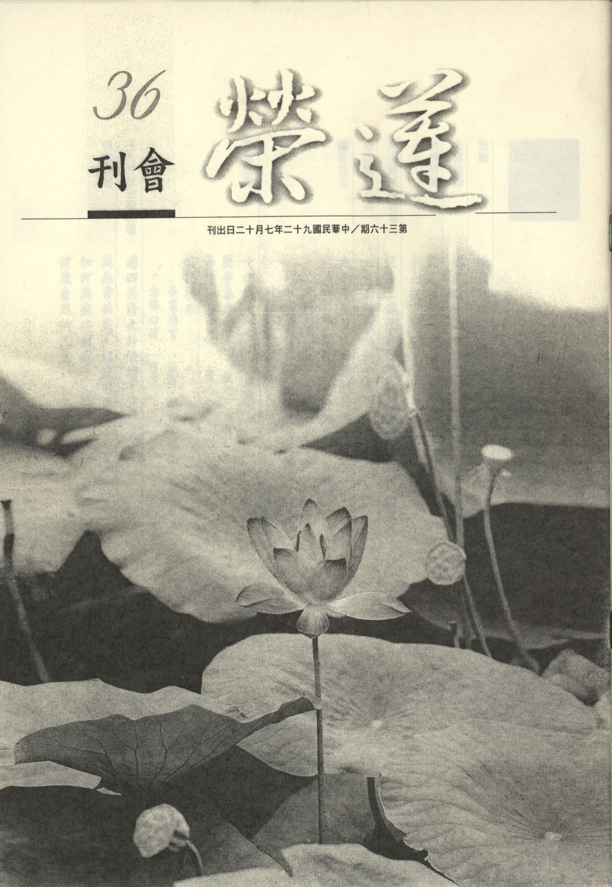

# 第36期

## 社論

### 復會有感

*編輯部*

沉寂了一陣子，即將於七月十二日復會，在這一段的沉寂期間，相信大家內心都有相當的感觸，再重新出發想必也想有一番的新氣象。因而共修會將擬定道場的規矩，作為聚會的依止以及道風的提振，若能將團體辦好也是淨化社會的方便，亦是對眾生及國家的一種報答。

回顧以往，我們曾經在週末共修後之大堂研學研究了若干經論，確立了道場的走向與應有的道風，眼前特別是彌陀要解導讀，未來也希望在安排的進度內完成此一課程的研學，確立對淨土不二的信心。至於啟蒙班小班的規矩及研學的風氣至為良好，相信將子女帶來的家長，內心一定非常的喜悅，想來也有許多的收穫，未來也希望繼續開展讀經的風氣、確立人生的目標以及因果決定的思想。啟蒙班大班在上課的管理以及研學風氣須待加強，培養他們成為人才，作為國家之棟樑或法門的龍象，看似陳意過高，但相信這是可為，乃因學子都有無窮的潛力，若能得到老師之調教，或私下與師友互動良好，相信要達到這樣的目標是指日可待。至於週四念佛共修，也將依例有止靜法語的開示及相關淨土教理的研學，並確信老菩薩們念佛的功夫將更上一層樓，特別在臨命終能有一心不亂的表現，是本班最殊勝的成就。

雖然暑假並沒有辦理心靈成長營，乃因嚴重急性呼吸道症候群(ＳＡＲＳ)瘟疫之故，事前也經過一番努力的籌備與規劃，自此可說是前功盡棄，然工作人員之辛苦功不唐捐，此興辦教育之誠意，三寶可作垂鑑。為彌補暑假教學的空白，將舉辦另一種形式的知性之旅。至於在開學後的心靈成長營返班活動將作一番新的調整，希望朝向於精兵制，讓老師的教學能落實、學生求學意願高、家長熱心的護持及素質良好的四者相互觀待下，開展一番新的氣象，所用的場地亦是松山工農，在此感謝校方場地的提供以及居中協調商借的蓮友，並希望昔日的義工也加入返班活動的學習，讓每月一日的聚會都在學習中成就善緣。至於為暑期心靈成長營所設計的師資研學班以及人才培訓班，也希望在來年暑期辦理心靈成長營的活動而繼續進行，使得教學人才輩出，相信學子每年暑期的集訓必有一番增上的作用。

在休會期間統計個人所作的功課中，有的人是專修幾門、有的採取通修所列科目、有的從容完成、有的在統計時間到之前趕功課，不論如何，相信都有許多收穫，只要不是應付、也不是為了面子、也不是有口無心、也不是毫無目的，相信必有一番好的心得，有些蓮友已將在休會期間美好的心得訴諸於文字，將刊登於會刊上，諸君看了或深受感動，或內心莞爾。至於與本會有緣的各社團研學課程之復課亦定於七月十二日後相繼開始，也歡迎舊雨新知，繼續相聚學習為荷。在這一段休會期間公眾聚會的活動幾乎沒有辦理，只除了和平島放生浴佛功德回向大眾外，亦曾聞有蓮友為其同事助念，亡者得很好瑞相，對於蓮友不畏疫情的威力可能損及自己的健康及生命而完成此一神聖之任務，至為感佩。

古德云：相聚就是有緣，若此緣是善緣，且是成為往生與成就佛果的淨緣，則極為難得，誠屬百千萬劫難遭遇，若是此緣應心生歡喜，然此之覺受最難生起，故容易空過這般善緣，所以修學者多成就者少，且於居家上班能將佛法運用於日用平常，將家庭及上班場所當成道場，練磨自己的煩惱習氣，成就自己修學的道業，這種的觀念更是在道場的研學中最要生起。盼望復會之後，在大家體會因緣難得以及對教法的好樂因緣下，開展一番新的氣象，則反因瘟疫之禍而得此之大福，可謂因禍得福，並作為以後處逆之心態以及將逆增上緣轉化為最好的修學資糧。

## 大德法語

### 佛說四十二章經解（二十八）　第二十八章〜第三十一章

*道源老和尚講授*

修道猶如守禁城

常時惺惺不放逸

若能擒殺情執賊

高枕無憂做法將

第二十八章

「佛言：慎勿信汝意，汝意不可信，慎勿與色會，色會即禍生，得阿羅漢已，乃可信汝意。」

此章佛警示我們初學佛道的凡夫，你豈可以粗心大意，要謹慎小心，慎勿放逸。此章先警告你不要信你的心意，你的心意是個凡夫的妄想心（有情執的心），遇境逢緣情感發生，自己做不了主，所以說「汝意不可信」，你這個心是不可以信仰的，因為你那個心是妄想心，欲境逢緣會動感情，動了感情，生了煩惱，控制不住這個妄想心，就造業。

「慎勿與色會，色會即禍生」，若對男眾說，此色就是女色，你一定要遠離女色，不可以接近，接近要毀了一切，一定要生禍害的。

此章警示我們是凡夫，粗心大意，以為自己的道心很堅固，與女色相會不會動愛欲心。我要度眾生，除非不度女眾，若要度女眾，我不與女色相會，我怎麼度她呢？認為自己的道心很堅固，天曉得！這個愛欲是生死的根本，到你與這個女色相會的時候，就迷惑了，感情一衝動，你自己控制不住你自己，你所認為的那個道心很堅固，到現在靠不住了，所以你生了禍害。

「得阿羅漢已，乃可信汝意」你修行辦道證得四果阿羅漢時，那你可以相信你的心了，為什麼呢？證得四果阿羅漢已把三界以內的煩惱賊都殺死了，見了女色不會打妄想，不會生煩惱，煩惱斷盡了嘛！已經沒有生死了，了生死了，所以說，再不會生禍害，所以你證了阿羅漢果，才可以信你的心意。

若約女眾而言，妳是比丘尼，你要度男眾時，你也要注意，要保持距離。第一、不要與比丘接近，第二、不要跟男居士接近，因為彼此都是凡夫，要保持距離，妳這位比丘尼也可以成阿羅漢啊！你證得阿羅漢果了，你才可以去度這些男眾。

第二十九章

「佛言：慎勿視女色，亦莫共言語。若與語者，正心思念，我為沙門，處於濁世，當如蓮華，不為泥污。想其老者如母，長者如姊，少者如妹，稚者如子，生度脫心，息滅惡念。」

此章亦是約束，乃約束思想，腳踏實地用功，一步一步的走哇！或云：要怎麼樣走法才開悟？遠離女色！要怎麼樣遠離法？第一、你要把你的眼睛收好，不可以看這個女色，你眼睛不看女色，心就不打妄想了，要說話也不要跟女人說話，不要跟女人說話就不會發生感情。若我是一個男眾，比如是位比丘，就不能跟比丘尼講話，也不能跟女居士講話，即使要講話的時候，要正心思念，自己把自己的道心要把持好，要端正其心，息住這個邪念，才可以跟女眾講話。

這個正意、正心、息念就是要起正當的觀想，怎麼樣正心法、怎麼樣觀想法呢？我為沙門處於濁世，當如蓮華、不為泥污：我出家當一位比丘，所住的地方是五濁惡世，然要修學清淨法門，要與蓮花一樣出淤泥而不為淤泥所染，等於我們住在五濁惡世，不被五濁惡世所染一樣，所以有如蓮花不為泥污，雖然生在淤泥裡，不為淤泥所染。

妳要是女眾，或是比丘尼或是女居士，妳把本文反過來，妳將眼睛守好，不要看男眾、不要看男色、也不要跟男眾多說話，一定要說話就得正心息念，要徹底想到，我雖然出了家，但卻住在五濁惡世，像蓮花一樣出淤泥而不被淤泥所染污，不要跟男眾多接近，多說話，不得已要說，要正心、要息念。男眾要跟女眾講話，要正心觀想：這女眾是我的家親眷屬，就不會起淫欲之念，想著年紀比我大的女眾如同我的母親一樣，長者如姊、少者如妹、稚者如子，比我年紀大一點的，想著是我的姊姊，比我年紀小的想著是我妹妹，那個年紀太輕的女眾，我想著她是我女兒，如此觀想而生解脫心息滅惡念。

不得不說話時要觀想她是你的家親眷屬，我要度脫女眾，要生解脫心息滅惡念。惡念就是淫欲念，你對你的家親眷屬，你能生淫心嗎？或者，你要度你的家親眷屬，你還能有什麼惡念嗎？不能！所以這樣叫做正心息念，心調至此才可以和女眾講話。若妳是個比丘尼，妳不得已要與男眾講話，要正心息念、觀想著：比你歲數大的那個男眾像妳的父親，比妳年紀大一點像妳兄長，小一點年紀像妳的小弟，再小的男孩子等於自己的兒子一樣，如此妳對於家親眷屬能生解脫心，息滅淫欲的惡念，如此方可與男眾講話。

第三十章

「佛言：夫為道者，如被乾草，火來須避。道人見欲，必當遠之。」

本章學道比喻身上被著乾草遇見火，就要趕快避開，火它容易燒草，而且這個草是乾草，遇到火就燃著，燃著會燒壞你的身體。所以，學道人要是欲境現前了，一定要遠離，不可以接近，接近等於披著乾草近火一樣，一定會燒壞你的身體（五欲火燒壞法身慧命）。

第三十一章

「佛言：有人患淫不止，欲自斷陰。佛謂之曰：若斷其陰，不如斷心。心如功曹，功曹若止，從者都息。邪心不止，斷陰何益。佛為說偈：欲生於汝意，意以思想生，二心各寂靜，非色亦非行。佛言：此偈是迦葉佛說

。

」

我們是個凡夫，凡夫的煩惱各有偏重，有的人他偏重於淫欲，雖有道行但淫欲煩惱卻止之不住，患淫不止！不是沒有道心，不是喜歡打妄想去行淫欲，而是因為這個淫欲煩惱太重，控制不住這樣的煩惱，想要以斷陰（男根）要斷其淫。佛知道後就向他開示：若斷其陰，不如斷心。你為什麼斷陰呢？說是因為患淫不止。你想斷陰還不如將淫心斷掉，為什麼要斷心呢？心如功曹，功曹若止，從者都息。功曹就是長官，心如長官、陰如從者隨從長官（心），它（陰）是聽長官的命令的，若將淫欲心（功曹）斷掉了，聽從長官這些佣人（陰等）也都息止了。「邪心不止，斷陰何益」，病根在於你那個邪心（淫欲心），若不停止下來，只是表面斷陰，又有什麼利益？欲淫心未斷，還在那相續現起。

佛為想斷陰者講了一番開示後再說個偈子，這就是佛的大慈悲心。因為這個人，他雖然欲淫煩惱偏重，但是他的道心也很可取，所以他才發狠要斷陰，不過，他不知道重點是要斷心，佛就開示如何斷心，乃因此人還是可教之材，所以佛才教導他。

佛為說偈：「欲生於汝意，意以思想生，二心各寂靜，非色亦非行。」淫欲心怎麼會生起來呢？你若沒有心，又如何會生起淫欲之念？心意又如何會生起？意以思想生，思想就是分別心，你因為有思想的分別，分別這是男人、那是女人，這是個老的女人、那是年輕的女人，年輕的女人這個長的美貌、那個不好，你在那裏思想分別，有了這個思想分別生起來那淫欲，若將那兩個心（欲、思想）寂靜下來，思想心寂靜下來則不起分別，不去起分別就不會再起淫欲心，那個淫欲心也寂靜下來，二心都寂靜。

「非色亦非行」，若將分別心寂靜，不起分別了，那個淫欲心自然不生。你見了女色，她不是女色，她不過是內心顯現的影像而已，等於鏡子照出人的影子一樣，謂之「非色」。「亦非行」（行是行動、行為）若將女色看成不真實，你自然不會有淫欲的行為。

「佛言：此偈是迦葉佛說。」佛佛相傳，釋迦佛上一代就是迦葉佛，迦葉佛傳這個偈頌給釋迦佛，釋迦佛又傳給我們。談玄說妙重在停止你的分別心（證悟空性），若將分別心寂靜下來，淫欲心停止下來，這就是妙法。佛佛相傳，也不過傳這個偈頌。此章對機雖是男眾，也適用女眾，若是女眾將本章反過來，對於男眾也不起分別心，她就不起淫欲念。

## 共修研學

### 勸發菩提心文（三十六）第九因緣：求生淨土

*心爾整理*

發心成佛卻難成

乃因尋求增上生

若能五清境界中

一生圓成功行滿

其次尊重己靈而發菩提心：此一念心能引導我們成就佛果，也能引導我們墮入惡趣受無邊大苦，眾生不知心念之可貴而隨意浪費，諸佛菩薩最尊重的是現前一念心。蕅益大師是日本人公認三百年來中國的大思想家，他註解經典皆以當前一念心作為發起以及結歸。當你能將現前一念心好好掌握、尊重、珍惜、充實、堅固，不但能出離生死，亦能成就佛道。但是要如何尊重、充實、擴展、成熟這個心念？要靠菩提心！不依菩提心修學善法，是名魔業，所以尊重己靈為使自己潛能發展至極，故發菩提心，從任何角度看都要發菩提心，所以說菩提心能不發嗎？菩提心不發會有任何的成就嗎？

接著懺悔業障而發菩提心：有我自己造的業、有眾生造的業、有我與眾生造的共業（我領導人家做壞事，或是他引導我造惡業），今天他發生問題，我以為不干己，我修行得到解脫卻不管他苦，如此可乎？所以在懺悔業障下，也是要發菩提心，因為過去領導他們或隨喜他們造作惡業，使他們受很多的痛苦，今天也要在發菩提心下贖罪，發願將他們的痛苦拔除，幫助他們遠離無明、成就樂果。更何況自己造的五逆罪與破戒的惡業，也只能在發菩提心下才能懺除，講來講去都是要發菩提心，修行的秘訣在菩提心。如果佛法學了半天，不知道菩提心的重要，那學佛真是白學了，這個觀念要常常串習。

而我們在這娑婆世界，十萬人修行，九萬九千九百九十九人退轉，所以欲發起菩提心救度眾生，必得求願往生西方極樂世界，速速成佛，故發菩提心第九因緣：求生淨土。

云何求生淨土：

「謂在此土修行，其進道也難，彼土往生，其成佛也易」

進道難成佛易，在許多經論上都有開示，在娑婆世界修行很難，難在哪裏？

一、世道不好、年多災難謂之劫濁：

就是一群福薄而又剛強難化的人所組成的世界，由於往昔惡業所感，故多災難，或天災或地變，或因人心不好而造成人禍、例如戰爭等所造成禍害，有時更勝於天災地變。當今世界天災、地變、人禍一年比一年奇怪，問題一年比一年複雜。

二、知見不正、外道朋興，謂之見濁：

有的人讀書讀一輩子，聽不到聖言量、聽到的都是人不自私天誅地滅等等這類錯誤的觀念，這些概念攝持著他要往上爬、要拼才會贏、不拼就會輸，甚而是一種今朝有酒今朝醉、有錢大家花，這些頹廢不正常的知見。現在國內又有很多邪門外道、報紙一登，哇！不得了，都以為他們是佛教，群起而攻之，說佛教有問題，要整頓佛教：：：。他們藉著佛教之名鬧事以後，政府及輿論都說要整頓佛教，真正的正法(佛教)沒有被弘揚，外道與凡俗的知見卻在那大行其道。

三、貪瞋情熾，昏散交侵，謂之煩惱濁：

現在人煩惱多又重，尤其是錯誤概念攝持下的貪瞋等煩惱，它們的勢力非常強，追求名利的心都很切，且用了各種不正常的方法與手段。在東漢末年的三國，曹操等奸臣在爭權奪利的時候，那種用盡心機的爭權奪利，有多麼的厲害，心機無所不用其極！另一種的貪瞋等煩惱不與心機相應，遇到順境很歡喜，遇到逆境很生氣，這種人比較沒有什麼心機，但有屬於情緒上的貪瞋，這些貪瞋等煩惱皆是煩惱濁。

四、身口意業悉不清淨，謂之眾生濁：

眾生身口意受了煩惱業的薰染，都成了染污的狀態，意常貪瞋癡，口常妄語、惡口、兩舌、綺語，身常殺盜淫。在這世間已難找到一言九鼎、言出必行等口業清淨君子，更何況是在意業中真正不貪、不瞋、不癡的心地光明的賢聖更屬難遇！

五、壽命短促謂之命濁：

在南贍部洲的每個人生命或長或短，就算長也不過百歲。現在的平均壽命雖然是七十歲，然依經上講，人的惡業在增上的時候，雖然命還維持住，其實每況愈下，即使有命，可是體力已維持不住健康的狀態，環境也愈變愈差，對境所生的快樂也愈變愈少。例如過度使用農藥已使養人的植物失去威力，所以現代人常多病，醫院遍及都市與鄉鎮。其次能對治疾病的藥方也在眾生善業不顯的時候逐漸散失，現在要吃很多藥才能把小病醫好，以前一個大病用一小藥就可治好，乃至於受用當中乍似真實而隱藏許多過患，例如水果雖是很甜，但用了很重的農藥(好年冬)注下去，從水果根上注下，所以水果外表好看、果肉藏毒，這些過患都是回應眾生內心的虛偽不實，如妄語、貪、瞋等等，可是我們卻沒有這種覺受，雖有吃有喝，但卻吃不到食物的真正營養。吃藥的時候藥力也弱了，身體的多種根力也變差了，雖然壽命還是維持住，可是身體的強健性已經與古人不一樣，在三國演義中的關公，六十歲時還生龍活虎，長山趙子龍七十幾歲猶能馳騁沙場。

西方有五種好處（對比此土娑婆世界五種難處），故曰求生淨土，然須觀待菩提心，方能蒙佛接引往生淨土：

一、生西方皆得不退(煩惱清)：

彼土清淨莊嚴，煩惱自然不起，故非此土之煩惱濁。

二、四季無更(劫清)：

非如此地四季各種節氣以及天災地變，令人不調而有各種疾病甚至死亡，故非此土之劫濁。

三、水鳥風林，皆說妙法(見清)：

聞之知見正確而非此土邪說橫行，令人不知取捨，不知何去何從，故非此土之見濁。

四、觀音、勢至為善友、彌陀為良師(眾生清)：

在淨土所交往者皆具悲智之上善，非此土之知見不正、煩惱深重之眾生，故非此土之眾生濁。

五、壽命長遠(命清)：

非此土壽命不定且極短暫之命濁。故將娑婆的五濁轉為淨土的五清。

故祖師曰：「在此土修行，其進道也難；彼土往生其成佛也易，易故一生可致，難故累劫未成」往生西方極樂世界只要這一次往生，這一生就可以成佛，我們卻不選擇這樣的易行道而選擇在娑婆世界以及其他十方的生死世界修行，所以，難故累劫未成。累劫是曠劫、無量劫，由無始到現在還沒有成就， 雪公老師說連一個小解脫都沒有，難到這個程度！上來所講此土五種難處，不要小看它，原來在這樣的環境裏面，或見解不正、或貪瞋癡日盛、或壽命短促、或年多災亂等等，這些問題我們住在這環境的人若未學佛，無法以心轉境，大抵是心隨境轉，在登地菩薩以前的聖者、三賢位的人乃至於凡夫，都是心隨境轉的行相，賢位行者尚且如此，更何況是凡夫，心早就隨境轉。想想我們從無始劫來的修行，都沒有好好選擇修行的境界，所以在逆境、挫折、煩惱、情境當中退轉自己的道心、成熟自己的無明，乃至於六道輪迴，自受無邊的痛苦。原來西方淨土有這五易，對比娑婆世界的五難，所以「往聖前賢，人人趣向」，聖者是指登地的法身大士，例如文殊、普賢、天親、馬鳴、龍樹等等，天親菩薩雖是四加行者，乃登地之前行，亦是聖者行相。龍樹菩薩是初地的聖者，馬鳴菩薩是八地菩薩都是往聖。至於前賢例如中峰、楚石諸禪師，慧遠、善導、徹悟蓮宗諸祖師。禪宗淨土宗的祖師都宏揚淨土，臨終念佛往生，故曰人人趣向。人人趣向包括往聖前賢，所修法門雖廣如八萬四千，然以禪淨擇之，此印光祖師所言，禪為專仗自力，淨兼他力，專仗自力開悟者必了解往生的好處，此乃成佛勝異方便，故回過頭來修學念佛法門求生淨土，故曰：

「往聖前賢，人人趣向」

。

「千經萬論、處處指歸」

華嚴、法華、文殊問般若經、起信論、十住毗婆沙論、、、等經論，末後皆導歸淨土。

「末世修行，無越於此」

末法修行再也不會越過這淨土法門了，然淨土法門有實相、觀想、觀相、持名等四種念佛，註解講無越持名念佛，為什麼？我們認為最平常的持名念佛竟然是所有法門裡面最高的，沒有法門能超過它。持名念佛是下手易而成功高，無知無識的老太婆都用得上力量，且佛之名號能召佛德，引導我們透過種種修學得到現證真如(空性)的成就，此即實相念佛。所以不要以為老太婆拿念珠念阿彌陀佛無啥稀奇，事相雖是簡單，卻含極深義理。

一般人以為吃飯最平常、最簡單，但吃飯在肚中要消化，須經一百多種化學變化，連全世界最有名的化學專家也不能認知，現在頂多分析出三十幾種化學變化而已。往往最簡單的事相，卻含藏著最深的道理，一般人往往追求玄妙的內涵，忽略了玄妙的道理，原來融於平常事相，道能運用在平常日用中，看似平常最奇絕。（下期待續）

### 小止觀導覽（十五）

*蓮心整理*

莫謂衣服僅禦寒

愚俗求質亦求量

增長貪欲難入道

學佛成就在驢年

經文

第二、衣食具足者：衣法有三種：一者、如雪山大士，隨得一衣，蔽形即足；以不遊人間，堪忍力成故。

大意

修習止觀應先具五緣，本段係言衣食具足的部分，衣法有三種，此為上根行者之衣著需求。

導覽

一、雪山大士有二解：一指釋迦牟尼佛曾在雪山苦行六年，日食一麻一麥；一指釋尊於過去世修菩薩行時之名，又稱雪山童子、雪山婆羅門，略稱雪童。據北本涅槃經卷十四記載，釋尊過去世為婆羅門時，入清淨之雪山修菩薩行。一日，帝釋天化現為形容可怖之羅剎，欲勘驗婆羅門，而宣說過去佛所說之偈：「諸行無常，是生滅法。」婆羅門聽聞此偈，心生歡喜，要求羅剎告知後半偈；然羅剎欲食婆羅門之血肉，始肯相告。婆羅門求法心切，慨然應允，遂得聞後半偈之：「生滅滅已，寂滅為樂。」並將此四句偈書於岩壁、樹幹等處，使後人得知。繼而至高樹之上，投身往下，捨身於羅剎。其時，羅剎還現帝釋身形，自空中安接婆羅門於地，並率諸天人於足下頂禮。釋尊以此因緣超越十二劫，先於彌勒之前成佛。而雪山大士捨身羅剎的事蹟所彰顯的是求法的殷切心，世間凡夫窮其一生苦苦追求功名利祿、榮華富貴、妻子兒女，到頭來卻只是空歡喜一場，而這個「空」非指空性，是指世事無常，所求辛苦卻轉眼成空，憂惱無已。以證悟空性之聖者觀之，猶如水月空花，但吾等為幻境欺誑、自甘受騙，當此之時，吾等應自問對教法的追求、對真理的探究，是否如對五欲境一般好樂，甚至如雪山大士的捨身求法？彌勒菩薩雖早釋迦牟尼佛六十小劫發菩提心，但釋迦牟尼佛早其九大劫（或云十二大劫）先成佛，即在於其對佛法渴求的心，超過彌勒菩薩，而求法心可以增上修學佛法的能力，也是成佛的無上資糧。 雪公夫子亦云：三藏十二部一言以蔽之，即是求。成就秘訣在求，故孟子云：求則得之。

二、雪山大士，結草為廬，隨得一衣，蔽形即可，吾等雖非此能耐，但應以此為所願境，做好吃苦的心理準備，縱遇人生困境，也能「一簞食一瓢飲，人不堪其憂，回也不改其樂。」

經文

二者、如迦葉常受頭陀法，但畜糞掃三衣，不畜餘長。

大意

此為第二種衣法，乃中根行者之衣著需求。

導覽

一、三衣是指印度僧團所准許個人擁有之三種衣服，每一種衣只能有一件，或可有二件，要視情況而定，即：（一）僧伽梨，即大衣、重衣、雜碎衣、高勝衣。為正裝衣，上街托缽時，或奉詔入王宮時所穿之衣，由九至二十五條布片縫製而成。又稱九條衣。（二）鬱多羅僧，即上衣、中價衣，又稱入眾衣。為禮拜、聽講、布薩時所穿用，由七條布片縫製而成，故又稱七條衣。（三）安陀會，即著中衣、中宿衣、內衣、五條衣。為日常工作時或就寢時所穿著之貼身衣。以上皆規定以壞色製成，故又稱為袈裟。三衣之製法，規定頗詳細。即將一整塊布，切割成長短不一之小布片，縱的縫合之後，再以規定之條數作橫的縫合。由此種裁剪樣式觀之，亦稱為田相。此一製法，因部派不同，細節上亦有差異。我國與日本之製法趨向華美化，僅在裁割方法上沿襲舊規。由於其製作特殊，故不為其他地方所採用。穿著此種衣服，可令人捨棄欲望，且不虞被盜。另有不按規定裁製者，稱為縵衣。他人丟棄之穢布洗淨後所縫製之衣，稱為糞掃衣。此外，尚有以棄置於墳墓、包裹屍體，及被老鼠咬過之舊衣布料所製成者。

二、糞掃衣又作衲衣、百衲衣。即摭取被捨棄於糞塵中之破衣碎布，洗滌後作成之袈裟。據載，著此衣有十利：（一）慚愧。（二）防寒、熱等。（三）表示沙門之儀法。（四）天人恭敬。（五）無貪好。（六）隨順寂滅，無煩惱熾然。（七）有惡易見。（八）無餘物之莊嚴。（九）隨順八聖道。（十）精進行道，無染污心。故知比丘以糞掃衣為袈裟，最為殊勝，最受尊重。糞掃衣之種類，約有四種：（一）包裹死者而棄於墓地之塚間衣。（二）包裹死者而布施給比丘之出來衣。（三）在聚落中，置於空地而無所屬者之無主衣。（四）捨棄於巷陌、塚間或糞塵中之弊物，稱為土衣。

三、「但畜糞掃三衣，不畜餘長」是為了對治對衣服的軟觸貪、上妙貪及多衣貪，拿掉對衣服貪著的習氣，才有持戒的能力，行者若無法擺脫對衣食等欲望的貪求及束縛，將致使防非止惡、斷惡修善的持戒能耐不足，故吾等應以三種衣食具足，做為我們的所願境，進而培養耐怨害忍、安受苦忍、諦察苦忍等忍辱的能耐，增上自己遇境逢緣的解脫能力。

四、佛弟子當中修學頭陀行最有成就的就是迦葉尊者，當迦葉老比丘來時，世尊均讓半座給他，以示尊重；世尊在靈山會上拈花示眾，眾皆默然，惟迦葉微笑，世尊云：「吾有正法眼藏，涅槃妙心，實相無相，微妙法門，不立文字，教外別傳，付囑摩訶迦葉。」人有心眼，但多專注於專五欲境，但佛的心眼徹見正法，最能體會正法，故名「正法眼」，「正法眼藏」是指正法眼含藏一切的功德；「涅槃妙心」是指此心甚妙，善體涅槃（涅槃即證悟空性破除執著、破除煩惱的狀態），能破除執著、降伏煩惱，得極清淨；萬法的真實相就是空性，空性就是無相，無相是說這個相是無可指陳的，但卻可隨緣展現，每一法的真實相就是空相，空相遍一切法，故曰「實相無相」；「微妙法門」是指證悟空性之法門，比如淨土法門亦是微妙法門，因為往生淨土是花開見佛悟無生；「不立文字」猶如因指見月，是要透過語言文字去體會空性，但語言文字並非真如實相（空性），然猶是教內別傳（如來禪）；至於禪宗則是教外別傳，不藉語言文字傳佛心印，反而要從舉手投足、運柴挑水當中去體會無言之教，此種教法一般人更難體會，引導老師須是開悟大善知識，弟子須是上根利智；「付囑摩訶迦葉」是此種教外別傳的頓悟法，只有迦葉尊者懂得，故佛將此心印（教外別傳，以心印心的頓悟法）傳給迦葉尊者，成為禪宗第一祖，同時還有事相的證明，即佛以袈裟及缽傳給迦葉，代代相傳，到第廿八祖菩提達摩東來，並將佛的袈裟及缽傳到中國來，此兩件寶物後被六祖惠能埋掉了，因為佛之袈裟及缽是得心印的表徵，若大家不重在得心印，只重在爭奪衣缽，猶如捨本逐末，徒具形式，有何意義？故將之埋之何罪之有。

五、修頭陀法應守十二種規矩，分為衣服的二種 （糞掃衣、但三衣） ；食物的四種 （常乞食、不作餘食、一坐食、一端食）；住處的六種 （阿蘭若處、塚間坐、樹下坐、露地坐、隨坐、常坐不臥），目的在除掉衣食住的貪著習氣，鍛練安貧守道、惟慧是業的修學能耐。世尊曾對弟子說：若有頭陀行法，佛法方能久住於世。善財童子向德生童子請益時，德生童子 （以淨智觀諸世間皆幻住，係由因緣所生之故，乃至一切菩薩眾會變化調伏諸所施為皆幻住，係由願與智所攝成之故，而證得菩薩解脫），傳他二個法門，一為親近善知識，一為頭陀行法，乃入菩薩的總持門。

六、小乘國家保有世尊修學佛法的外在形相，大乘的國家保有世尊修學佛法的內在精神，二者要一體同觀，才得窺佛法的全貌，若只重精神而忽略外相的磨練，則精神將流於口號，而無法下手實修，縱然陳義極高（如高談出離心、菩提心等），但生活的習氣仍重，則不僅無以服眾，亦無度眾的能耐，故學佛固然要重精神 （大乘的義趣），但也要尊重外在的表法，內心有頭陀法的觀修，也渴望在學佛的過程中有此能耐，厚培解脫的資糧；八大人覺經：「五欲過患，雖為俗人，不染世樂，常念三衣，瓦缽法器，志願出家，守道清白，梵行高遠，慈悲一切。」 即此之謂也。

經文

三者、若多寒國土，及忍力未成之者，如來亦許三衣之外，畜百一等物，而要須說淨。知量知足，若過貪求積聚，則心亂妨道。

大意

此為第三種衣法，乃下根行者之衣著需求。

導覽

一、百一等物是指三衣六物【六物為佛制定比丘所必須蓄存的六種器物，即僧伽梨 （九條乃至二十五條之大衣）、郁多羅僧（七條之中衣）、安陀會（五條之下衣）、鐵多羅（鐵缽）、尼師壇（坐具）、漉水囊（保護水中蟲命之具）。】之外，一切資道的什具，但只得保存一件。

二、三衣是鼓勵我們在日用平常上，不要有衣與食的習氣，並增加對治物欲的能力，假若過於貪求積聚，則心亂妨道，但若為了利益眾生，給眾生種福田，而非貪求蓄積，亦非妨害道業，才接受施主的供養，則另當別論；但須有能捨的意樂，降低對生活的欲望，如此才有能力說要利益眾生，否則即是以利益眾生之名，行蓄積之實。

三、說淨乃以諸物均作委寄之心，代為使用，不可有己有之想，而現在暫時借用，乃為資道修行、服務眾生之故，「欲為佛門龍象，須做眾生馬牛」是也。（下期待續）

## 日常省思

### 與無常共處，以病苦為師

妙音

病後方知身是苦

面臨存亡知無常

苦無常無我法印

能令行者得解脫

清晨，獨自走在阿里山海拔一千五百公尺的松林小徑，享受芬多精森林浴，整座山林除了蟲鳴鳥叫空無一人，經過連日雨淋，雖非蓑笠翁，獨釣寒江雪，卻有「空山新雨後，萬徑人蹤滅」之感。回想這幾個月的際遇，猶如大夢一場，有時仍不敢相信這是事實，然它卻真實的發生。在經歷病苦的過程中，對「無常」的感受尤其深刻。住院中、療養期捨離親眷，面對孤獨之體會更深。以下謹就此次病苦之發現，初期心情轉變，住院接受治療、放生、蓮友大德及同修之護持與關懷，出院後之療養以及佛法於此次病苦中對末學之幫助與啟發之實際情況分述於後。

約於去(九一)年十月，感覺腹部有一硬塊，當時不疑有他，蓋以往也曾因卵巢囊腫開過刀，心想應無大礙。然隨著時光流逝，硬塊逐漸變大、變多，甚至開始造成夜間睡眠障礙，有時疼痛難以入睡，經常以默念佛號度過漫漫長夜。直至農曆年後，晚上無法入眠之情況更為嚴重，疼痛轉劇，甚至無法平躺下來，方覺事態嚴重。待同修勸說前往醫院檢查，才真正去面對病苦之事實。經過驗血、照超音波、電腦斷層掃描、切片等種種檢查之後，醫生告知罹患的是惡性淋巴腫瘤。在面對醫生之宣判時，心情出奇的平靜，沒有驚恐與不安，但頓時覺得無常來得令人措手不及，此刻心中暗想：「老天爺給我開了一個大玩笑。瞧！我不是活得很好嗎？」殊不知這只是山雨欲來風滿樓前的假象，無始劫來造作之業因果報即將現前，豈是如此輕鬆便能度過的。

在確定自己的病況後，首先將道證法師之《把癌細胞變成快樂的佛細胞》一書重新看過一遍，以往懷著瀏覽的心情，沒想到此刻卻要真實去面對這殘酷的事實。於是當下決定「我要善待身上的每一個細胞，不用化療對治」，當然也就拒絕了醫生的治療建議，而將開列的口服化療藥劑置於一旁。之後，前往拜訪已自台大醫院退休的李豐醫師，她是抗淋巴癌三十年的沙場老將；與其見面時，她並未給予任何建議，只傾聽末學細述病況。當末學告知學佛修習淨土法門時，她猶如看到親人般語氣變得特別明亮與親切，她說：「假設你接受醫生的治療，那麼你就有希望，否則所有的後果自己承擔」。當然，這意味吾人對佛菩薩的信願力有多強了。當進一步請教該如何做時，她說：「念佛、誦經、持咒、拜懺、放生。」這是她在接受化療、電療產生諸多後遺症轉而學佛後所體會的心路歷程，當然配合運動、力行清淨素食，常保心情愉快，時時起懺悔心更是不可或缺之要素，感恩她的指導。

接下來的一個月是真正的實踐期。每日晨起第一件事是爬山，用以增強體力。在因緣具足下，前後做了梁皇寶懺、地藏懺、藥師懺，並受持八關齋戒，藉由懺文之觀修起真正懺悔心，每日更於佛前懺悔往昔所造諸惡業，念佛、誦經回向，祈請諸佛菩薩讓弟子重報輕受，並發願放下萬緣，一心念佛，求佛接引；若是塵緣未盡，亦祈請諸佛菩薩令弟子保有此色身，弟子願學觀世音菩薩之慈悲，以自己之病苦為例來幫助有類此病苦之眾生，使其免於恐懼、憂苦，並願學習大勢至菩薩之智慧，努力精進於啟蒙教育工作。

然而由於無始劫來不知造作多少惡業，註定此時必須接受嚴厲的考驗。雖然如此力行一個月，後來晚上卻完全無法躺下休息，只能坐著斜靠於床上。針對此情，同修和末學討論一個最嚴肅的問題，他說：「假設你要念佛求往生，亦得正念分明；倘若你的病情導致最後五臟敗壞，臨終意識不清，如何念佛呢？」所以，他建議末學接受醫師的治療。經過同修這一提醒，於是不再執著於原來的決定，看著逐漸腫脹積水的腹部，心中只有一個念頭「我不能死，因為我還想做更多的佛事與啟蒙工作，這是工作至今深覺最有意義、最值得的事，即使真正無常到來，我也要很清楚自己該走的路，而不是目前這麼倉促與快速。」在接受同修的建議後，於一位朋友介紹下將所有病歷轉至國泰醫院，由一位她覺得既細心又富耐心的醫師治療。事實上，這個決定是正確的。對於淋巴腫瘤之治療方式，之前已由一些醫學論文中稍有涉略，在與醫師討論後，她並未站在醫學權威角度上強要末學接受化療，而接受病人自己的選擇，採取只針對癌細胞做破壞的單株抗體療法。這是一種先進的治療腫瘤方式，不若化療般會破壞身上所有好壞細胞，並且產生許多嚴重的副作用，而這也正符合當初自己的決定—「要善待身上的每一細胞，不用化療對治。」

人的一生總免不了會遇上困難、挫折與無常，關鍵在於你有沒有用有意義的積極態度來面對。假使你能看見一切的全貌，假使你能知道一切的始末，你就會瞭解〜「人生中每一個障難的出現都有它的作用與目的，沒有一樁不是為了增進你內在的成長而發生的。」如果能看清這點，就能明白困難、挫折與無常乃機會的化身。這點在住院中體會尤其深刻。面對病苦，心中未曾有絲毫怨嘆；反之，末學感恩這些癌細胞讓末學真正面對自己無始劫來累積的習氣。在病中一一細思致病之因，雖然力行清淨素食，但我是如此的堅固執著，並且貪瞋癡慢疑全部具足，以往所造身口意諸惡業一一現起。在感恩癌細胞是末學善知識的同時，末學發願往昔所造諸惡業，從今一切皆懺悔，這是一個再生的機會，若得佛菩薩慈悲加被，生命得以延續，則唯有忘掉自我，發菩提心多行佛事，否則無以為報。就如一位高僧於《喜樂泉源》一書中所說：「死亡並不是一件嚴重的事，因為生生世世我們都會死亡，不論因什麼原因、條件而死亡；死因不重要，如果死亡時，心不被煩惱控制，能夠保持清明大悲，就算死了也沒有關係。倘若心像狂象，仍在貪欲、瞋心、無明的運作之中的話，則死亡之後就很危險了，來世會去經歷更大的痛苦。」事實上，這些話大家都知道，也都會說，問題是當有一天無常來臨時，你用什麼心情去面對。於是在這段住院期間，末學慢慢學習調伏如狂象般的心識，試著學習將無明轉變為智慧，把貪瞋轉變成慈悲與包容。

在前後住院治療近六週的時間裡，也正是ＳＡＲＳ風暴襲捲台灣的時刻，身處於醫院中感觸更深。冠狀病毒不斷地突變，而真正的來源卻仍未能掌握，未知的將來讓很多人不免恐懼，擔心自己會是下一個嗎？看到每個人戴口罩面無表情，醫護人員更是小心謹慎，此情此景身處病房中，只有時時想起老師的勉勵與叮嚀：「將病房當關房」，不敢稍有懈怠。英國文豪狄更斯認為最壞的時代，也是最好的時代，是黑暗也是光明。這一波來勢洶洶的潛存病毒，不但直接挑戰醫學領域的公衛、預防、病理與藥研能力，更嚴峻的向人類投下「道德良心」的戰書。當災難來臨時，如何因應是我們的抉擇，而如何抉擇又取決於我們的智覺，是以，創造共業中之別業乃當務之急。「二十一世紀，看不見的在影響看得見的」，ＳＡＲＳ啟動的究竟是人類的負面情緒，還是激發人心更高的覺醒？覺醒到唯有保持對天地萬物產生那份敬畏、感恩、慈悲和溫暖，人類才能從萬物之靈的狹隘成見中，轉變為萬物皆靈的同體悲心。

猶記得初住院時，身體狀況簡直糟透了，不僅腹部的淋巴腫瘤到處都是，甚至腹部積水，最嚴重時腹圍達九十二公分，猶如十月懷胎即將臨盆之孕婦一般，走路無力且食不下嚥，整個人消瘦了一圈，唯獨大腹便便。望著日漸形壞衰殘的色身，《溈山警策》「夫業繫受身，未免形累」之語如雷震耳。此時，心中再度響起「這是業力牽引，我要堅忍並且發菩提心」之聲。雖然有幾次身體產生極大的痛苦，且前兩週幾乎都無法躺下來，只能坐著，但在整個治療過程中並沒有懼怕之心態，因為當你認識清楚病苦從何而來，找到對治方法時，接受它並真誠起懺悔心，自然就能撫平痛苦。如果你不害怕死亡，在人生中將放下一個非常巨大的重擔。

回想這一路走來之心路歷程，如今能有心力提筆追憶這段刻骨銘心的病苦經驗，除了感恩佛菩薩慈悲加被之外，更有許多值得末學感恩的人事，那便是老師、諸位蓮友大德、末學同修、子女以及親友們的護持，使得這一路走來雖然艱鉅但卻溫暖無限，一點也不孤獨、無助。雖然目前病症獲得緩解，但並未完全消除，而這也提醒末學不得稍有懈怠，惟有更加緊努力精進方足以謝報眾恩。

在整個病苦過程中，老師安排多次讓末學得以消業之機會，兩次放生更是永難忘懷。四月廿七日試放時，一早六點半從醫院請假外出直至返回醫院已是晚上十一點。當天從台北出發至宜蘭買生物，再返回至和平島公園時已下午一點半，礙於遊客眾多且海水又已退潮，故無法順利施放；幾經場地勘察，終於在下午四點半左右才找到合適場所，做完放生儀軌至整個活動結束時，已然萬家燈火，漁船歸航。當時的身體尚未開始接受治療，只是辦理住院與前行檢查，老師讓末學站在漁車上為生物灑淨，挺著滿是腹水的大肚子及透支的體力，將近一個半小時的灑淨竟也撐過去了，口中大聲念著佛號，一點也不感到疲憊，望著每隻生物強大的生命力，更激發末學求生之意志，默勉自己要勇敢的走下去。而第二次母親節的放生更經歷人性最大之試練。感恩老師讓末學有再度為生物灑淨的機會。曾看過一本書提及癌症乃是殺業的果報，素食是治本之道。雖然自己已經茹素七、八年，且從小便不愛吃肉，但無始劫來累積的殺業不知何幾，一樣抱著慈悲懺悔之心懷向魚兒一一灑淨。由於有幾組蓮友大德在漁車上撈魚，自己站在漁車上前後左右為每一袋魚兒灑淨，深怕錯過任何一隻生物，待整個儀式結束後下車一樣不感到疲憊，也許這是末學唯一得以贖罪的機會吧！

就在放完生、浴佛儀式即將結束時，發現有人在捕捉放生之物，於是急忙趕到現場。在勸告這是為癌末病人放生時，他們仍不以為意，直至末學出示手上掛著的醫院住院手環，有一婦人方嚇得趕緊離開，另有一位揹著一袋生物游到對岸去，最後剩下一位執著不肯離去。當時，跪在岸邊，望著茫茫大海，更感到自己業海無盡、罪障深重。如果這一跪能喚醒這位捕漁人，如果這一跪能求得諸佛菩薩、龍天護法保護這些生物順利游出海，如果這一跪能懺除些許業障，那麼跪再久都值得。尤其看到老師及幾位蓮友不顧一切地勸說，內心更形感動，此恩唯有更發菩提心，否則無以為報。在向這位捕漁人士表達，唯有他上岸離開，末學才會起來的情況下，他才緩慢不願地收拾漁具離開岸邊。於此，末學向他三頂禮，感恩他放走這些生物，因為放牠們生，即是放我生，並請求他今天無論如何不再來捕捉，則末學感恩他生生世世；見他離開，這才放心。而看到他的堅固執著不肯離開，正好像也看到自己無始劫來的習氣，不也是如此嗎？他是末學的善知識，他提醒末學眾生造業容易、做善法難，故應把握一切做善法的機會，更應徹底的反省懺悔。回到浴佛檀場，老師已在為此次不圓滿放生行做圓滿的法語開示，並帶領蓮友們觀修。末學今生何其有幸能得此大善知識之引導，而「蓮榮」這個大家庭至此更顯得彌足珍貴。

除了感恩老師及諸蓮友大德的護持外，此次病苦中另一讓末學得以放心接受治療，出院後無掛礙安心養病的感恩對象，便是末學同修及子女。長久以來建立的佛化家庭，於此更適時發揮其功能，尤其同修的護持及寬宏大量，更非筆墨得以言喻。他不僅要上班，每天抽空到醫院照顧末學，還得一肩挑起照顧兩個小孩的責任，上下學接送、照顧生活起居以及課業輔導、、、等，真正做到父代母職，然卻未曾有半句怨言，即使是末學觀察出其身心俱疲之態，要其多注意身體並補充營養時，他總是答以：「我沒事，你放心。」之語。看到他的付出，想及以往種種嘮叨習氣，凡事欲凌駕於其聲勢之上，更讓末學自慚形穢。此刻，除了感恩之外，便是努力把身體調好，回到家中以另一種全新無我的態度來照顧他們。除了同修的護持，兩個小孩表現出的堅強與鎮定，亦是末學於病中每每憶及不由得心酸的一面。以往黏媽媽的小孩，一下子失去媽媽的照顧，兩三個月期間僅偶爾週末碰面，每次見面時，六歲的小女兒總是不忘告訴媽媽：「祝妳早日康復」，或是抱著末學親遍臉上每一處，或是講笑話給末學聽，或是告訴末學她都在心裡邊想媽咪，或是急著要背書給末學聽，好讓媽媽放心，以她小小心靈卻要承擔媽媽不在身邊的思念，但帶給末學的是如此之溫暖與安慰。至於讀小四的兒子，其原來比小女還依賴的個性此時亦獨立許多，且各項課業表現並未因媽媽不在身邊而變差，甚至還得了幾張參賽獎狀，常於見面時拿來讓媽媽驚喜與開心，雖不似小女兒嘴巴之甜美，但末學知道他想以行動來表示。儘管如此，末學卻也發現他說話不若以往開心，也許在他內心深處隱藏著一股不安，害怕失去媽媽吧！憶及此，內心不免有股不忍與無奈感。但一枝草、一點露，天地間到處是養份，他們自有其成長的因緣與機會，尤其有蓮榮這個大家庭為依止處，末學相信，即使我不在他們也能成長得很好，於是便不再掛礙與不安。而此次病苦也真正學習到如何捨下家親眷屬，因為一旦無常來臨，該面對的是自己，任何人都無法代受。此刻的我唯有努力精進誦經、念佛，將自己的心念定下來並且發菩提心，時時刻刻體解無常，希望自己斷煩惱、了生死的道業日有精進，除此別無他途可走。

在病苦中，雖有諸多蓮友大德、同修子女及親友的護持，備感溫馨滿懷，然仍不免有獨自面對孤獨的時刻，但這種孤獨比起《雪洞》一書中，丹津．葩默獨自在海拔一萬三千二百尺的喜瑪拉雅雪洞深居閉關十二年所面對的孤獨，實在是太微不足道了。事實上，在以往煩擾喧囂的生活中，曾經很渴望一個人做些真正想做的事，看真正想看的書，應該說是「渴望孤獨」吧！於是末學把這段病苦時間獨自一人面對無常，視為一種孤獨的享受。因而十分把握這段難得的孤獨時光，不容有絲毫浪費，利用這段孤獨懺悔、感恩、誦經、念佛、靜坐，不敢稍有懈怠，因為「是日已過，如少水魚，斯有何樂。」每天醒來感恩又是一個美好的日子，須把握當下。

最後要感恩平溪大香山觀音禪寺開順師父於末學住院治療前的慈悲開示，她說：「人生就像賽跑，重要的是遇到困難時要勇敢的跨越過去」，並要末學持大悲咒，祈求觀音菩薩慈悲加被。而事實上，在後來的治療中，大悲咒的確幫助末學渡過最痛苦難熬的時刻。曾有一次打完針後，腹部疼痛難忍，坐立都不舒服，全身更是無力，此刻大悲咒很自然地於腦海中一遍又一遍的覆誦不已，有時夜晚無法入眠，每每持完大悲咒，想起禪寺中慈悲莊嚴的觀世音菩薩法相，隨後便能安然入睡。更幸運的是，在開順師父引介下認識了許亞伯醫師，而許醫師於高中即將畢業時亦曾罹患淋巴腫瘤，其父親也因淋巴腫瘤往生。其以「得知自己僅剩有幾年生命時自願請調馬祖服務，獨自面對病苦不願家人知曉，甚至在馬祖服役期間，公而忘私地幫助二十四戶貧苦人家，最後腫瘤消失」的例子，來勉勵末學 「忘掉自己，沒有自己，時時行善。」感恩他的勉勵與關懷，而因緣巧合，也在他的介紹下來到阿里山龍雲渡假山莊療養。這幾天正值梅雨季節，山上雲霧籠罩，每天大雨不斷，沒有遊客，是真正的孤獨。走在空蕩滌淨的山林裏，念著佛號，加上主人溫暖用心完全有機的蔬菜及藥草調養，使得身、心、靈得到完全的休息。

末學相信，這一路走來是佛菩薩慈悲加被，否則沒有如此之福份得以在癌末仍有如此之轉機。當然末學也深信未來的路仍很遙遠，病症的緩解並不代表它不再復發，倘若病因不除，病果仍會再現，唯有徹底的學習，從心出發，將五欲六塵，貪、瞋、癡、慢、疑之毒素從心拔除，力行五戒十善發菩提心，方足以報諸佛菩薩慈悲加被及老師、諸蓮友大德、同修、子女及親友護持之恩。同時也懇切祈請諸位蓮友大德不要當您失去健康時才後悔、嘆息，從現在起觀照自己的生活、工作、思想和情緒，觀照每一個心念，轉惡念為善念，轉善念為淨念，進而轉惡業為善業、為淨業，讓留在身體中的每一滴血液、每一個心念都清淨無染，否則純粹的清淨飲食尚不足以斷病苦之魔。這是末學此次病苦最大的感觸及收穫，用以回報諸位蓮友大德。由於末學佛法修習熏染不足，致未能用圓滿法語供養大家，僅將這段如夢一場之際遇雜亂地記述下來，尚祈見諒，並懇請賜正。

末後，在大自然的脈動中，心中油然響起「風中奇緣」這部電影中的那首歌〜「風的顏色」，歌詞中那耐人尋味的意韻，「一個圓圈、一個循環、永不中斷。」願我們都能尋回心靈的智覺，不再自大、無知，每日精進於佛法之修學，永不懈怠。阿彌陀佛！

### 如何與疾病相處

峽飛

疾病由來有三因

外傷內感及宿業

發心敦倫作息常

三管齊下病根除

美國洛杉磯國家抗老協會執行長阿諾‧福克斯博士認為：「我們所罹患的疾病中，其實大部份都是我們「內在醫生」（doctor with-in）的衰竭所造成的。」我們可以稱它們為心臟病、傳染病、中風、高血壓、癌症、愛滋病甚或ＳＡＲＳ，歸究其因皆是我們的自然防衛系統崩潰所導致。如果我們的免疫系統很強的話，就能夠擺脫大多數的疾病，不為疾病所困擾。

免疫學是當紅的醫學科學，一個人的生理高峰期是廿五歲，此後便一路走下坡，免疫提昇是長壽健康的要訣，但我們為世俗所惑，卻以生命來換取一時的聲色，實在是划不來。據醫學的研究，人的平均壽命為一二五歲，今日的百歲人瑞，也不過享受了五分之四的生命，尚少活了五分之一，何樂之有。但在現今之世，能活過百歲的人瑞，仍是值得我們慶賀的。《聯合報》曾於民國八十九年專訪百位人瑞，綜合渠等能享有長壽之因，不外是「清心、淡食、規律、多運動」，希望大家都能如菩提流支法師一般，年高德劭一五六歲。

以末學而言，自民國八十二年以來，被診斷為「僵直性脊髓炎」的患者，聽聞者莫不流露出同情與訝然之情，十年來歷經種種的試煉，西醫也僅能在個人病痛上打一問號？因為檢驗報告明示我是此一病類，但起居坐息卻一如常態，毫不為病所苦。

回想發病初期，夜間無法安穩入眠，背脊如針鑽刺；晨起則身硬如木，不能翻身起床，盥洗下樓往往費時兩刻，脖子僵硬、腿骨疼痛使得開車不再是一件易事。西醫的處方籤不外「抗消炎與肌肉鬆弛」兩類藥劑，治標固見神效，但久服亦將引發消化系統的糜潰。經多方思索，決定放棄西醫的減痛治療法，改從增強自體免疫之道入手。坊間常見「斷食」、「生機飲食」、「健康食品」、「氣功」、「針灸」、「中醫」等方法，個人多經嘗試，成效稍有，但不足以恆斷。個人體質因緣不同，不能盡凡適用，還須多方求證小心為是。

人體平均每天有兩萬個癌細胞新生，但為什麼有人終其一生不罹患癌症？卻有新生兒一出生即因癌症而往生？其關鍵處就在「自體免疫」功能的強弱。免疫系統一如大樓的消防警示設備，新建大樓凡申獲使用許可證者，代表此大樓的消防系統完備，但它卻不保證永久的安全；蓋時日的久遠，或因設備老化，或因維護不周，皆會使得此一功能失效，故肇生火警時一發不可收拾，人體亦復如是。

人有「生老病死」，物有「成住壞空」，是以「老化」是一必經的過程，雖都不可避免，但我們卻可以使之不病、不壞。何以達致不壞、不病，總持一句即是 「正念」，心無所求，當下清淨，進言之即是 「放下」。常人所最在乎者，莫不是「我能活多久」？個個都想求長生，生若苦來，長生又有何用？「看得開、想得透、認得清、放得下」，才是自體免疫的原動力。

人貪生，細胞也是如此；吾人不想生病，細胞也作如是觀。病理學家李灃醫師，長期在顯微鏡下觀察癌細胞的生成變化，她總結出這麼一個論斷：「癌細胞的病變，導因於我們對它的虐待」。我們長期虐待它，又要用藥物毒殺它，在絕望之時它只好產生變異以求存，其結果是癌細胞擴散與毒化。回想人體每日有兩萬個新生癌細胞，何以大部份的人都相安無事，其因即是「無念」，我們根本就不知道它的存在，因為無心，所以無事。反之，如果念念於此，心病將導致體病。所以，對抗疾病的上方，非於藥石，而在於一己的心念，真空方得妙有。

一日，「知」到北方遊歷，見到「無所謂」，問︰「如何思考才能明大道？怎樣動作才能安於大道？怎樣的法門才能獲得大道？」無所謂說︰「無所謂」。「知」又前行遇到「狂屈」，再問此三題，狂屈言︰「我知道，但忘了我要說什麼」。「知」無奈去問黃帝，帝曰︰「不要用心去思考，方能明大道；不要用心去動作，才能安於大道；不要用心去依據法門，才能獲得大道」。「知」回答︰「你我皆知大道，『無所謂』與『狂屈』卻不知」。帝曰︰「錯也，『無所謂』是合於道，『狂屈』是接近大道，你我遠矣」。

「知」是「言」的境界，常人最容易犯此毛病，自以為是，我執仍重，所以經常造口業。「狂屈」是「言無言」的境界，雖無外相之執，但煩惱習氣仍重，內病叢生。「無所謂」是「無心、忘言」的境界，一切的執著煩惱都不現形，清淨自在。吾人用知、用言是無法測量大道，既無法分辨大道，即不能合於道。

學佛之人，非於佛學，此意在於建立「正知見」，正念分明，即便身有微恙，於心無礙，心無罣礙，則遠離顛倒夢想，無有恐怖，生死自在，既可立身成佛，何憂疾病困擾。

按：依佛法言，「知」分能知、所知，此即是世俗諦（此世俗在愚者心識前顯現為諦實，謂世俗諦）。在通達空性時，世俗法不能顯現在聖者的心識之前，即無所知（約境），觀待於無所知就無能知（約心），此即為「無知」，無知並不是愚癡、一無所知，是無能知所知的知（或名無知），猶如一輪明月高掛虛空，即印光祖師所云：「慧風掃蕩障雲盡，心月孤圓朗中天」，此種境界即是本文第八段名為「無所謂」的聖者。至於以比量通達空性時，也知道真實之法無有，所以沒有所思，既然沒有所思就沒有能思，自然忘言、忘思，但是這種狀態是在比量推知，若言比量推知，僅是義理的瞭解，而不是現證的狀態。若是現證空性的狀態時，空性之義境在聖者心識前猶如眼睛看見杯子這樣的實在，此即名為現量親證空性，若是比量得知，只是在義理上的體會而已，無法顯現空性的義境（如眼見色這般真實），就好像偵探去推理命案的現場，推理正確則是屬於比量得知的境界，不斷的推理，直到發生命案整個情節的影像出現在心識之前，此即現量親證（比量與現量之差別如此）。至於沒有辦法在現量親證之時（比量階段）還有世俗的認知，此即本段的「狂屈」。至於「黃帝」、「知」此二人都在世俗境界，安得體會勝義諦之大道。

但佛法並非不要世俗諦，而是在通達空性之後重緣世俗，方知世俗如幻如化，世間看的明明是真實，聖者一見如水月如影像如鏡像，並非沒有世俗，而是世俗不真實，所以一般在未通達勝義諦的知是一種執著的知，知而言當然就是在情執下的口業，情執生煩惱，身語二業若與情執相應，身語二業即與煩惱相應，自然就造作了口業與身業。

至於無心忘言並不是沒有心，也不是啞巴，而是在現證空性是無世俗的境界可緣，名為無心，也不緣世俗的美醜、貴賤、善惡差別（因為真實的世法在定中尋覓，看不到微塵許），所以也沒有觀待世法的言語可生，是為忘言。學佛貴在得正知見，正知見的所緣即是二諦，依著對二諦的通達，方能生起正知見，尤其通達勝義諦之後，再出定重緣世俗，才能真正遠離顛倒夢想，無有恐怖，生死自在，甚而可以立地成佛。（編者謹識）

### 健康自然的人生

心依

飲食如藥治百病

疏食飲水樂在中

不義富貴如浮雲

即是孔顏真樂處

現代人生活在人際關係複雜，如之物質充斥的環境污染下，深受飽食之害、攀緣之苦。也由於飲食觀念的錯誤，所引發的慢性疾病，與日俱增。許多醫生說道：「我們用牙齒挖掘我們的墳墓」，這是事實，因為我們不知道如何正確的吃，經由吃正確的食物，我們一生都可保持年輕和快樂的心情。有心之人，早已覺察這項危機，紛紛從飲食減味，改變生活習性著手。素食的主張，正是意味著一個人期待將生活由繁化簡的一項選擇。

愛因斯坦曾說：「在我的觀念中，素食者的生活方式，提供了人類氣質自然的改變，而這種改變，將對人類有最好的影響。」可知飲食的內容與理念，影響著一個人的心性、氣質，乃至生命的品質，更是整體社會和諧與否的關鍵。而如何從飲食活動中，經由覺醒而回歸樸素、清貧的生活本質，是現代人重新思考飲食文化的主要課題。

日前台灣社會上正面臨如何防制「ＳＡＲＳ疫情」？報章媒體除宣傳著一般防制措施外，另一方面也強調藉由食物提增個人的免疫力，來共同預防這看不見的隱形病毒。目前致力於預防醫學近四十年的吳老師（自身於十七歲即罹患腎臟癌，在拒絕醫生建言「割除一只腎臟外，並定期洗腎」的診療下，他博覽醫學叢書，並赴日本鑽研相關醫療課程，藉著食物治療自己，與癌症和平共存四十年，並於大霸尖山闢一有機農場，推廣此「食物即是最好的醫生」理念），他曾在ＳＡＲＳ疫情擴散的高峰期，取得ＳＡＲＳ病毒採樣，在個人實驗室中，將ＳＡＲＳ病毒分置於酸性與鹼性環境培養，實驗結果，ＳＡＲＳ病毒在酸性環境裏急速增長，但鹼性環境中卻無法生存」。吳老師語重心長地道出：「預防ＳＡＲＳ必得從自家餐桌上做起，斷除一切動物性食物，涵蓋乳製品、蛋類等，因上述食物為身體製造了酸性環境，成了疾病和病毒滋長的溫床：然而從土地裏所孕育的鮮果、蔬菜、種子、五穀，是大自然賜給人類最好的食物選擇，且提供了人類最完整的營養。」

現代人的生活在工作、家庭、人際關係、等忙碌壓力下，無暇為自己或家人愉悅地烹煮菜餚，享受食物的真味，待身體出現警訊，卻趕緊花費大量的金錢購買營養品養身，此種現象，現今生活中可謂比比皆是。殊不知我們獲得健康的傾向，遠超過感染疾病的傾向，吾人應該重視的是，如何排除體內過多的物質，而不是一天到晚擔心罹患疾病。

古人云：「布衣暖，菜根香，詩書滋味長」說明了美好生活體驗，不在於物質的奢求，而在心靈的關懷，如能將一粒米、一顆蔬菜，視同自己的生命，平等對待，尊重菜蔬的原味與本來的面目，將快樂與喜悅的心情，灌注在烹調過程中，不僅是自己或他人都可感受到食物正面的能量，因此我們應下定決心自己治療自己，學習排毒（身、心兩方面的毒素），讓新鮮蔬菜、水果、草藥、種子來增強體力，使生活中充滿陽光、愛心和一切真理，獲得健康、平和的身心，進而強化我們的覺性，去除不必要的雜念，讓身體的組織強壯有力，才能真正擁有健康自然的人生。

（本文多處引用下列參考書目：瑜伽素食、瑜伽科學觀、新世紀飲食）

## 啟蒙園地

### 每月一字 — 羲

*蓮心*

羲：根據許慎的說文解字「羲」的本義為「气之吹噓」，即是气舒展而出的樣子，惟此本義很少人用，故後人多已不知此本義，另外「羲」尚有其他的意思，詳如下列：

（一）姓：如書經堯典：「乃命羲、和」的句子，而「羲、和」就是指羲氏、和氏，乃掌理天地四時的官員，據說在羲和以後即以「羲」為姓氏。

（二）伏羲氏〜伏羲氏是古代的一位皇帝，教人民種田、捕魚、畜牧，傳說八卦就是由他所作的，而「伏羲」略稱為「羲」；另外「羲皇」一詞也是指伏羲氏，而「羲皇上人」是指伏羲氏以前的人，即太古時的人民，太古時代的人內心恬淡，而無俗念，生活悠閒，因此隱士常以「羲皇上人」自喻。陶潛的與子儼等書的文章中就有「五六月中，北窗下臥，遇涼風暫至，自謂是羲皇上人」的句子。

（三）易經：「羲經」為易經的別名。

（四）太陽：「日御謂之羲和」而「日御」就是指太陽，因此略稱日（太陽）為「羲」，而「羲和馭日」這句成語，就是古代的神話傳說，據說太陽乘坐著由羲和所駕御的六龍馬車，每日在天上行走，因此後人便以「羲和馭日」比喻為時光的流逝。

（五）光明盛大的樣子：晉朝的潘岳有「隆暑方赫羲」的句子，而「赫羲」就是光明的意思。

### 十四講表（五）　第二講表（丙、丁）

傳瑛

二、諸法生起三由：因、緣、果

我們看得見的所有事情與所有現象，都是由三個條件聚合而成的。哪三個條件呢？就是因、緣、果。

因是動機、造作，如種下地。因像在地上播種，播種後，種子本身若養分不夠或缺乏照顧，它不一定可以順利結果，且有的種子有很快開花結果的能力，例如花生，此謂「暫」；有的種子要很久才開花結果，例如桃子需時三年，此謂「常」；所以說「常暫不同」。種子的成長，除了看它本身成長的能力以外，還得看它的「緣」。

「緣」包括哪些呢？表上云：所緣緣、無間緣、增上緣。如日水肥，當種子下地，它就需要陽光、水、肥料的滋養。如兩顆種子，一顆種子得到充足的陽光、水及肥料，而另一顆種子卻缺乏適當的照料。想想，這兩顆種子，哪一顆種子可以順利結果？當然是得到很好照顧的那一顆。所以表上說「強弱之判」。意指這個緣如果是強的，種子就容易長大結果；反過來，如果這個「緣」是弱的，這種子就不容易長得好，甚至無法開花結果。

果如植物熟。之前說過有陽光、水、肥料照顧的種子，容易結果，而另一顆少被關照的種子，因它的緣比較差，就會長的比較慢，所以叫做「遲早有時」，以示結成的果報，有早晚的差別。以上是以植物來做比喻。

除無情的植物外，我們有情的眾生也是由因、緣、果所組成的。我們的「因」就是「發心」與「造作」，如果有人以愚痴的心，造作惡事，將來他就會到畜生道，如果一個人常發嗔恨心，喜歡與別人鬥爭，將來他就有可能到惡鬼道或成為阿修羅。如果一個人貪、嗔、癡都具足，而且到處為惡，將來就會到地獄道。如果一個人常常替別人著想，幫助別人，將來就會得到很好的人身，甚至升天，享受天福。

心到底長什麼樣子？古人說心是「三點若星相，橫鉤似月斜，披毛從此得，成佛也由他。」「心」上面三點像天空的星星，橫鉤像天空的月亮，本是很明亮的，可以幫助我們成佛；可是如不好好用這個心，將來可能引我們當披毛的畜生，或者墮到其他的惡道去受苦。所以千萬要善用這個心！

有情眾生結成苦果或樂果的緣有四種：

第一種是

「親因緣」

：就是上面所說的發心（動機）與造作（業）。

其次是

「所緣緣」

：是指心所緣的對象。如小朋友經過麥當勞，看見蛋捲冰淇淋，心裏一直想吃，這時，蛋捲冰淇淋就成為小朋友的「所緣緣」。我們為什麼要到佛堂念佛？為了要成佛，成佛就是我們的「所緣緣」。這是一種非常好的「所緣緣」，它會使我們的心愈變愈好。相反的，當「所緣緣」是不好的時候，我們的心也會受影響而變壞。譬如有些人只想吃喝玩樂時，一旦他們沒錢花費時，就會由心驅動做出偷竊、搶錢等不法的事情，甚至犯下勒索綁票的惡罪，因而斷送一生的前程。所以「所緣緣」對我們心的引導，具有關鍵性的影響。

第三是

「無間緣」

：主要是指眾生剎那剎那生滅不停的心念。眾生的心念像猴子一樣，整天二十四個小時，動個不停，有時想好的，有時又想壞的，整天轉來轉去，上下起伏，讓我們每天都覺得好疲累。譬如有的小朋友很喜歡吃冰淇淋，雖然冰淇淋沒有在他的面前，但是他的的心念常常有冰淇淋的影像。「無間」就是沒有中斷的意思，念佛時，就是要把心念安住在佛號上，佛號一句接著一句很專心地念下去，可以使我們的心很安寧，不躁動。像小朋友每次上課前須念十五分鐘的佛號，從慢板、中板、快板，然後止靜，止靜時，嘴巴雖然沒有發出聲音念佛，但心裡依然佛號不斷，當我們的心都在想佛、念佛時，我們就不會想壞事。但要如何使心常常放在佛號上？還需要下面一個很重要的緣。

第四是

「增上緣」

。現在我們發心要念佛，也有成佛的目標，無論出聲念佛或心中默念佛號都可以，但是有時候我們會忘記，若忘記的時間多，功夫就會慢慢退步，這時就需要靠老師、朋友、團體來提醒我們，鼓勵我們，這就是「增上緣」。

有因緣就會結果。果是「結成」、「起相」。如果大家都發心要去西方極樂世界，也有成佛的目標，並且時時把心放在佛號上，就具足「親因緣」、「所緣緣」、「無間緣」，除此之外，又有良師益友為「增上緣」，幫助大家提升念佛的功夫，結果一定會往生西方極樂世界。「結成、起相」就是這個果相成熟了。

「因、緣、果」通常簡稱為「因果」，本來種什麼因，得什麼果，但因外緣不同，而有「因同果異」或「果同因異」的差別：

「因同果異」

：如在同班名列前茅的同學，長大以後，各自的發展不盡相同，有的從商、有的從政、有很卻很潦倒失意。為什麼會這樣呢？是因為外緣的不同所造成的。

「果同因異」

：如考上同一所大學裡的學生，每個人上過的小學、國中、高中不盡相同，生活環境不同，智商也不一樣，甚至有的可能是曾做錯事，後來改過自新，奮發考上的。果同而因異，問題是出在哪裡？也是出在「緣」上。所以先天資質比較差的人，不要氣餒，只要後天好好努力，並且多親近良師，虛心接受其教導，多交益友，相互切磋，仍會有成就。

當一個人有能力幫助別人時，就會成為別人很好的善緣，所以自己好好念佛，就有能力幫助別人好好念佛。在念佛前，老師都會說，請大家萬緣放下，佛號提起，至誠懇切，一直念下去。這個「至」就是到了極點，是非常非常的誠懇，而且這個心很專注、很恭敬。凡學任何事，都要很用心，才會成功，同樣的，念佛也要很用心，甚至比做其他事情還用心，這樣心力才提得起來。對三寶有恭敬心，才可以與佛菩薩感應道交，也才能累積福報功德。
釋迦牟尼佛在世時，有回他來到迦陀羅國的境內說法，說法地點的旁邊有一沼澤，剛好有一隻蛤蠣爬到沼澤邊，因為佛說法的聲音很好聽，這隻蛤蠣佇足聽得好開心，而且好專心，但很不巧的，有位牧牛的人經過，看見佛在說法，也跑來聽，並隨手將他趕牛的手杖往旁邊一插，不小心把蛤蠣給插死了。由於蛤蠣是在非常歡喜、恭敬、讚歎佛法時被插死，所以死後往生忉利天。忉利天環境很莊嚴，而且升到那邊的天人有宿命通。蛤蠣升天後，知道自己是因聽法的因緣，而得到此世的樂果，於是就飛到佛的面前頂禮答謝。佛也藉此因緣向弟子說法。佛故意
**問：** 「你是什麼人？」這天人就回
**答：** 「我以前是隻蛤蠣，在聽佛說法時，雖不巧被牧牛人刺死，但因當時恭敬聽法的福報，使我死後能夠升天。」所以用恭敬的心來學佛，福報是非常的大。

三、法有兩端：事、理

一切法都要從事、理兩方面來看。事是跡象、行動；理是義趣、解說。如諸法三分的體、相、用。其中「相」、「用」屬「事」，是看得到，而「體」屬「理」，雖然看不到，卻是事所蘊藏的道理。譬如上課時，同學在事相上如何表現對老師的尊敬？同學在課堂上坐好、專心聽講，就是一種敬師的表現。每個人都喜歡被別人尊重，但要獲得別人的尊重，一定要先尊重別人。尊重別人，從禮做起。「敬人者，人恆敬之」，懂得禮貌的人不僅廣受歡迎，也能贏得別人的尊敬。大家若能相互尊敬，社會就會和諧，世界也會太平，這就是禮所含藏的「大道理」。

「理指義趣、解說」。義理的解說很重要。如果理不講清楚，弄明白，事也無法做得很圓融。所以講事時，也要講道理，這樣做事才不會有問題。

從前有位長工要去主人家做工前，有人向他說，你是卑，所以走路時，一定要走在主人後面，而你用過的東西，不可以給主人用。有一回主人很晚還沒回家，家中的人就請這位長工提著燈籠為主人引路。長工提燈出門，遠遠地看見主人迎面而來，這時長工想起，自己一定要走在主人的後面，主人說：「你要引路，應該走在前面」，但長工執意一定要走在主人後面，主人很生氣但莫可奈何！又有一回，下大雨，主人忘了帶傘，恰巧看見長工拿傘走來，就請長工為他遮雨，可是這位長工卻說，我是卑，你是主，我用過的東西你不可以用，結果主人淋得像落湯雞。這都是因為長工只固執「事」，而不懂其中的「理」，才會做出這樣的事情，當然，這位長工也因此被解僱了！

「無事理何所立」，當然，只會講理而不去做，等於說食數寶，毫無用處。像父母對我們的恩情最大，我們一定要孝順父母，這是為人子的道理，可是要怎麼孝順父母呢？就要照「弟子規」中「父母呼，應勿緩，父母命，行勿懶，父母教。須敬聽，父母責，須順承。：」的教則去做，否則「孝」無由展現。

「不可執理廢事」，當瞭解道理時，就要去實行。像學佛注重「解行相應」，儒家也說「知行合一」，否則解而不行，算不得真解，知而不行，也算不得真知。瞭解法有兩端：事、理，目的就在知道理，並依理行事。

萬法皆須由體、相、用、因、緣、果、事、理這八個角度來看，才能面面俱到，圓融無礙。（下期待續）

### 蘭亭集序（下）

蓮心、亦倫

蘭亭集序　王羲之

永和九年，歲在癸丑，暮春之初，會於會稽山陰之蘭亭，修禊事也。群賢畢至，少長咸集。此地有崇山峻嶺，茂林脩竹；又有清流激湍，映帶左右，引以為流觴曲水，列坐其次，雖無絲竹管絃之盛，一觴一詠，亦足以暢敘幽情。

是日也，天朗氣清，惠風和暢。

仰觀宇宙之大，俯察品類之盛，所以遊目騁懷，足以極視聽之娛，信可樂也。

夫人之相與，俯仰一世，或取諸懷抱，晤言一室之內；或因寄所託，放浪形骸之外。

雖趣舍萬殊，靜躁不同；當其欣於所遇，蹔得於己，快然自足，不知老之將至。及其所之既倦，情隨事遷，感慨系之矣。

向之所欣，俛仰之間，已為陳跡，猶不能不以之興懷；況修短隨化，終期於盡。古人云：「死生亦大矣。」豈不痛哉！

每覽昔人興感之由，若合一契；未嘗不臨文嗟悼，不能喻之於懷。固知一死生為虛誕，齊彭殤為妄作。

後之視今，亦猶今之視昔，悲夫！故列敘時人，錄其所述，雖世殊事異，所以興懷，其致一也。後之覽者，亦將有感於斯文。

伍、結語：

本文由「蘭亭」的聚會，點出聚會的人、事、時、地、景、物，以說明視聽之娛的聚會之樂；在「修短隨化，終期於盡」的無奈與感慨中，透露出對生命的熱愛以及對人生的期許，故集文興感，傳於後世。

晉朝剽竊老莊餘唾，崇尚清談，致使風俗頹敝，不務實際，右軍有心人也，藉蘭亭盛會，感慨抒懷，駁斥「一生死、齊彭殤」的虛誕妄作，力排潮流，以挽狂瀾，並期後世知音，主持世教，立言不朽之意，躍然紙上。

蘭亭序因為文詞雅麗，為右軍書法代表，唐太宗題曰「禊帖」，原件雖已殉葬於昭陵，而輾轉臨摹，流傳遍於天下。文人雅士摘取文中秀句，改編為詩詞者頗多，茲選錄一詞，以作補白。

沁園春　方岳

歲在永和，癸丑暮春，修禊蘭亭。有崇山峻嶺，茂林脩竹，清流湍激，映帶山陰，曲水流觸，群賢畢至；是日風和天氣清。亦足以供一觴一詠，暢敘幽情。悲夫，一世之人！或放浪形骸，遇所欣；雖快然自足，終期於盡。老之將至，後視猶今。隨事情遷，所之既倦，俯仰之間已陳。興懷也，將後之覽者，有感斯文。

（附注）本篇選自秋崖詞。沁園春是詞牌名。作者方岳，南宋祁門人，字巨山，號秋崖。理宗紹定進士。才鋒凌厲，尤工駢體，著有秋崖集。

## 禮懺法會

### 從淨土懺法會談儀軌之觀修（五）

*編輯部*

彌陀莊嚴清淨土

六方諸佛咸護念

只緣上善聚一處

不退直至補處位

「東方亦有阿閦鞞佛，須彌相佛，大須彌佛，須彌光佛，妙音佛，如是等恒河沙數諸佛，各於其國，出廣長舌相，徧覆三千大千世界，說誠實言，汝等眾生，當信是稱讚不可思議功德，一切諸佛所護念經。」

這本經的經名是稱讚不可思議功德，一切諸佛所護念經，鳩摩羅什大師改成佛說阿彌陀經，改的真好，何謂不可思議功德？行者只是一個凡夫，依然可以往生，竟然在依報莊嚴、說法莊嚴、正報莊嚴當中，從阿鞞跋致到一生補處，大環境、小環境，乃至於敦親睦鄰當中，培養很殊勝的善根、福德，再加上善知識的調教，竟然很快的成就，這就是不可思議，到底他的成就會有多快，他積的福報會有多廣，他每天出去與十方諸佛結緣，到底結的緣有多深，不可思議，舍利弗的腦袋是想不通的，沒有辦法想，只有佛知道。然而六方諸佛讚歎，連等覺菩薩出來讚歎都不可以，因為菩薩以下都沒有資格讚歎，這就是阿難不知迦葉境界，迦葉不知佛境界，這是佛境界，只有佛才可以讚歎。例如有蓮友問 雪公老師：「印祖的功德如何？」 雪公老師請他覆耳過來，大聲地對他說：「我不知道。」真的不知道大德的境界在哪裡，初地的菩薩絕對不知二地菩薩的境界，二地菩薩也絕不知三地菩薩的境界。有一次文殊菩薩與迦葉尊者同時要度一個眾生，迦葉尊者看他的根器快要成熟了，準備好好宣說無常與空性的道理，使他今生出離三界，但是文殊菩薩卻為他說大乘法，結果讓這個人起惑、造謗法罪而墮落到地獄受苦，迦葉尊者說，當時此人若聽我的話，他現在就證果了，佛言：不然，他要在受苦以後大乘的根機才會出來，這就是迦葉尊者看不到的。天底下很多事情不一定的，或許我們只看到一個角度，所以很多事情不要一廂情願地看，不要自以為是、自我固愎，只會徒增困擾、徒增煩惱。不是那樣證量的人，不可以強擔聖者之名，而說那樣的話。本經不只是不可思議功德，而且是一切諸佛所護念，往生西方極樂世界，不只他在淨土能夠成就不可思議的功德，而且還是諸佛所護念，怎麼知道諸佛所護念，因為他可以供養十萬億佛，一定是諸佛都歡迎，如果諸佛不歡迎，絕對供養不到。要知道五不還天的人，他躲在三界內，連天王都供養不到，別以為要供佛，佛就出來，不是那個因緣則供養不到。李白尋雍尊師隱居：「群峭碧摩天，逍遙不記年。撥雲尋古道，倚樹聽流泉。花暖青牛臥，松高白鶴眠。語來江色暮，獨自下寒煙。」在兵慌馬亂當中，難以相信還能有這麼詳和之處，做皇帝也想不到，做皇帝的以為只要勾以名利，一大堆的政客就圍繞左右，大家唯利是圖，他們不相信天底下還有不把錢財名位看在眼裡的聖者，這些賢者隱者享受的是他的逍遙，皇帝難以相信，他的國家還有這等聖者，他們也不接受皇帝的贈予與供養。所以當他在接受你的供養時，表示他在歡迎你，你才供養得到，這就是護念，護念就是你供養，我收下來，這時候就是福報我給你。

雪公老師快要過世時，侍者拿桑椹給老師吃，老師全部吃，但是他已經衰老到末期了，另一位侍者進來時，發現老師的嘴鼓鼓的，再將嘴裡的桑椹全部掏出來，換句話說，老師要將最後的福報留給侍者，他雖然吃不下去，但他通通咬在嘴巴裡，老師就是這麼慈悲，這就是護念，所以念佛求往生是一切諸佛所護念經。到了極樂世界，每天早上都出來與十方諸佛結供養的善緣，這麼多的善緣給下來，這福報不可思議，一言以蔽之就是不可思議，腦袋瓜想破了也想不到。

「南方世界，有日月燈佛，名聞光佛，大燄肩佛，須彌燈佛，無量精進佛，如是等恒河沙數諸佛，各於其國，出廣長舌相，徧覆三千大千世界，說誠實言，汝等眾生，當信是稱讚不可思議功德，一切諸佛所護念經。西方世界，有無量壽佛，無量相佛，無量幢佛，大光佛，大明佛，寶相佛，淨光佛，如是等恒河沙數諸佛，各於其國，出廣長舌相，徧覆三千大千世界，說誠實言，汝等眾生，當信是稱讚不可思議功德，一切諸佛所護念經。北方世界，有燄肩佛，最勝音佛，難沮佛，日生佛，網明佛，如是等恒河沙數諸佛，各於其國，出廣長舌相，徧覆三千大千世界，說誠實言，汝等眾生，當信是稱讚不可思議功德，一切諸佛所護念經。下方世界，有師子佛，名聞佛，名光佛，達摩佛，法幢佛，持法佛，如是等恒河沙數諸佛，各於其國，出廣長舌相，徧覆三千大千世界，說誠實言，汝等眾生，當信是稱讚不可思議功德，一切諸佛所護念經。上方世界，有梵音佛，宿王佛，香上佛，香光佛，大燄肩佛，雜色寶華嚴身佛，娑羅樹王佛，寶華德佛，見一切義佛，如須彌山佛，如是等恒河沙數諸佛，各於其國，出廣長舌相，徧覆三千大千世界，說誠實言，汝等眾生，當信是稱讚不可思議功德，一切諸佛所護念經。」

南方如此，西方如此，北方如此，下方如此，上方如此。至於佛名所攝德能，可參看 雪公恩師之阿彌陀經摘注。

為什麼這些佛名要念這麼多，目的在那裡？經文有云：

「舍利弗，於汝意云何，何故名為一切諸佛所護念經。」

按照理講這一句應是「何故名為稱讚不可思議功德，一切諸佛所護念經。」本經應是十六個字，釋迦牟尼佛只有解釋後面八個字，前面八個字（稱讚不可思議功德）不解釋，為什麼？因為在序分、正宗分都講完了，不可思議功德就是在這個世界裡正報莊嚴、說法莊嚴、依報莊嚴中。小至家庭，大至社會、國家有一番的氣象都要正報莊嚴、說法莊嚴、依報莊嚴。依報莊嚴就是環境要講究，擺設整齊清潔，且有內涵有道氣。正報莊嚴就是環境中的有情都有正知見的修學，德學能日日增上。說法莊嚴是環境中有教法的流通，孩子們都會變得很好（蒙以養正），來這裡的人都容易起善心，辦事者都是替他人著想，此處充滿了一片吉祥的氣氛。若依報環境亂七八糟，東西不歸定位，不但陋劣，而且髒亂，人（正報）也是在看電視、打妄想、造作種種非法行為，說的法也都是相似法，不說氣氛還好一點，一說出非妄語即惡言、綺語、兩舌等，如此的環境一看就知沒出路。所以瞭解西方淨土的經營，其實娑婆世界的經營都是一樣的。

同理，到一個道場看他們有道無道也是一樣，道風要如何看？廁所有沒有掃乾淨，拜墊有沒有排整齊，供品有沒有排的很好看，供佛的花有沒有換，環境有否整齊清潔，擺設是否高雅亦或亂七八糟，此即以依報莊嚴來觀察。正報莊嚴則是道場中之蓮友有沒有在修行，表現的氣質如何？待人接物如何？說法莊嚴是此處所談的教法是對的還是錯的。如果這些人有在反省自己、增上自己的道業，環境也整理得很清幽、整齊，所說的教法很好，此處一定興，與極樂世界的道理一樣，必能近悅遠來，諸佛護念，由佛經文中可以告訴我們很多人生的真理。

「舍利弗，若有善男子善女人，聞是經受持者及聞諸佛名者。」

要受持這本經，要好好地深信切願力行，收攝到一句阿彌陀佛的名號，以持名受用全部的佛境界，至於何以要聞六方佛名，釋迦牟尼佛何以要廣宣六方佛名？其目的乃

「是諸善男子善女人，皆為一切諸佛之所護念。」

佛護念有二種，一種是他心意希望你這麼做，你這麼做時他護念你：其次是你念他的名號，他護念你，結果本經二種皆有。第一、諸佛的心意希望你往生西方，成就佛道，你做了，他護念你；第二、是你念他的名號，他的加被力轉強，使吾人

「皆得不退轉於阿耨多羅三藐三菩提。」

、

「是故舍利弗，汝等皆當信受我語，及諸佛所說。」

而且六方諸佛讚歎時，是各於其國，出廣長舌相讚歎，換句話說，每一個國家都是宏揚淨土法門，不是只有娑婆世界。本經釋迦牟尼佛要舍利弗相信世尊與諸佛所說正理，其實不只是舍利弗乃至本經法會有情眾，乃至末法眾生皆應如此。且世尊所說與六方諸佛所說皆同，佛佛道同故，故信一尊佛語即是信十方諸佛之佛語。（下期待續）

## 參訪觀摩

### 入寶山滿載而回（七）

*編輯部*

堅持理念遭障礙

反省且顧世間法

辦事能通他人志

自覺安穩他願調

連志道老師於草屯開辦弘明國小，在弘明幼兒園畢業成果發表會時，吾人有幸觀摩學習，並在老師許可下就教育與個人修學上，提出若干問題就教老師，承蒙老師慈悲一一回答，使參訪者受益良多。今將座談內容記錄陸續刊登，期令讀者亦能受益，是所至願。

**問：** 剛才老師講到，我們學佛的過程要是確定目標以後，不要太在意一般人的看法，一般人的看法有時候與我們的理念是不大一樣。或因他輩份很高，或因與我們的關係密切，或者是常常來我們家串門子的，反正很有因緣的，他們的看法有時候也難免讓自己的內心很在意，我們要如何去克服這樣的障礙？

**答：** 剛剛所提的問題是你在學習的過程中，有心要走向既定之目標時，可是比你輩份高或你的其他師長、朋友等等他們的看法與你不一樣，而且非常熱誠的、一再的要來跟你討論的時候，你怎麼辦？或者一再的跟你解說，甚至是糾正，這時候該怎麼辦？我學人覺得每一個人的習氣不一樣，每一個人宿世的因緣也不盡相同，所以走的方式未必全然相同。但是有一點，如果你是在正法的這條路上走，他雖向你講的也是正法，你可以採取你自己想要的走法，因為正法有很多。比方說門有好幾個，你要從那一個門進來都可以，如果你覺得從這個門進來，你比較喜歡，你就從這裡進來，他說不行，這個門實在不好，從另一個門進來覺得更好，你可以如此走，但是你也不必去反對他說那樣，為什麼？因為那門確實也可以進來，那一個門都可以進來，你覺得你走這個門進來很好，那你不妨這樣子走，但你也不要在意他由那門進來。

**問：** 在學佛過程當中，或因為不在意世間名利的追求，難免親戚朋友說，這樣會娶不到老婆，或是嫁不到先生，或是說被人看不起，或是說沒有一個很好的社會地位，你講話人家也不要聽。這些障難如何克服？

**答：** 娶不到老婆、嫁不到先生這一點，與你學佛或許有些關係，但不是全然的關係。例如結婚之事，是依宿世之緣，只要有緣，則超越所謂世俗地位、名利等。不過這個問題確實是每一個學佛人的問題，因為學佛者畢竟是少數，而整個社會的價值觀確實與學佛的人完全不一樣，所以在這樣的時代裡，你自己這樣一直走下去，你要自己很清楚，你對你自己這樣學的價值，要非常的明確，自己心裡是非常的清楚，才不會受任何的影響。如果是比較年輕的同學我倒覺得一方面好好學佛，充實學佛的道理，以及落實在修行上，修行就是包括平常的為人處世以外，不妨好好的讀書，去求取個功名，考個研究所、求取碩士、博士的名位。如果你還年輕的話，不妨這樣，為什麼？因為如果你這樣的學習，未來以這樣的學歷，對於佛法的弘揚也有很大的幫助，世間法不完全是糟粕，認為全部不要，一心念佛就好，不一定要這樣。

**問：** 現在學校的學風大不如從前，去學校學習有時愈學愈壞，走向偏差，反而不如開始就不要去，不是更好？

**答：** 現在得到文憑很容易，確實不錯。或可用一、兩年的時間去求學得文憑，可是有一點，或入不好的學習環境，整個人都退轉了，何以如此？乃因在年輕時，思想、見解未堅固時，或許如此。如果能在善知識的護持，還有你自己很清楚的狀況之下(有使命感)，則不至於如此！用一、二年的時間去得到這些學歷，我覺得在這個時代應該有正面的幫助。

**問：** 我們在辦事的過程當中，如何學會聽得懂別人的言外之意、弦外之音？

**答：** 這點很不容易！很不容易！需要的是學養與經驗，還有一些天生的氣質(悟性)。有的人就算跟他講了多少次，他還是聽不到你的弦外之音。有的人一聽即知弦外之音，所以這一點很不容易，要聽得懂別人的弦外之音，那就不得了了！

**問：**  雪公老師講經時，老人家其實不完全在講經，老師您是怎麼聽得懂 雪公老師的言外之意、弦外之音？因為有些是針對某些發生的事情， 雪公老師暗示他的看法。

**答：** 如果是那種情形則很簡單，因為那件事情我們原來就知道，所以當老師在大庭廣眾裡，雖表面上沒有說那件事情，可是在話說了一些的時候，我們早就聽懂老師在講某一件事情，他對某件事情的看法是什麼，那是因為我們心裡都已經明白，所以我們很容易聽到老師的弦內之音。

**問：** 因在華嚴會上，有教授善知識的講經，同行善知識及前輩與老師們的引導，慢慢能體會到聽經，不光只聽經文的表面，在講經會上 雪公老師會針對目前大家學習的狀況有所指示，或者藉講經在調某些眾生，瞭解 雪公老師講經的義趣，與完全不瞭解只純然的聽經，其間差別多少？

**答：** 這件事情很有趣，當年在華嚴經會上  雪公老師在講經時，老人家在講每段華嚴經前都會有一段大概半個小時以上的玄談，每一個人在聽經結束後，都會互相在那裡討論：「老師都在講我！」 每一個人都說老師今天都在講我，你看看多厲害！我們因為不知道  雪公老師他老人家的本地，所以我們不敢說他老人家是怎麼樣的人，只借用一句佛經：「佛以一音演說法，眾生隨類各得解」，聽的各個覺得法喜充滿，人人都覺得  雪公老師只是在對我講而已，人人都這麼覺得！

**問：** 所以善於聽經的人，就懂得藉著經文來改正自己煩惱習氣，而不只是充實文字知識。然而論語中有「法語之言，能無從乎，改之為貴；巽與之言，能無說乎，繹之為貴；說而不繹，從而不改，吾末如之何也已矣。」對於老師講的話很高興順從老師的教導，但卻沒有真正改善自己，幾年下來習氣依然，身為老師要怎麼樣來看待這種事情呢？

**答：** 前云聽聞佛法，也懂得佛法的道理，且依經而知自己的毛病，可是習氣很重很難改，應該要怎麼改？雖然佛經三藏十二部千言萬語，可是事實上只說了一個道理而已，就是要眾生改習氣，所謂習氣就是起惑造業、就是迷惑顛倒，若將習氣對治即是將惑斷除，豈非達到目標乎？所以學佛真正的用意就是要眾生改習氣。眾生聽聞佛法、雖瞭解自己的習氣但卻沒有辦法改，這是理所當然的事情。舉例子而言，當年聽  雪公老師說中國人一週都叫「星期」，不叫「禮拜」，外國人才說禮拜一、禮拜二，中國人七日稱作一個星期，所以應該講星期一、星期二，我們同學下課互相勉勵說以後都要講星期一、星期二喔！不要講禮拜一、禮拜二喔！然後接著就說，咦…明天是禮拜幾啊？所以你看一點無傷大雅的事情，只要成為習慣以後就很難改，所以佛因眾生習氣很難改，所以才開了一個留惑帶業往生的淨土念佛法門，但是這個意思並不是說不要改習氣，以為我理所當然就是這樣，不是這個意思。而是不要去講說別人：你看他聽了那麼多，卻還是那個樣子始終不改，你看看他學佛有什麼用。我們不要往那方面去講，而是回過頭來說，我們聽了那麼多卻沒有改習氣，我們希望回過頭來將這把尺放在自己的身上來校正自己，而不是校正別人，將無始以來自己的煩惱習氣好好的反省，要一點一滴的努力，真正改變自己。

**問：** 可是現在有一麻煩處，我如何知道我在進步，或者我如何知道我在退步？有的同學說我進步或退步我尚且不知道，又如何能檢驗出我進步多少，或者退步多少？

**答：** 自己進步或是退步有兩個方式或許可以瞭解，一個方式就是你有沒有覺得自己在學佛的這條路愈走愈穩、愈愉快，如果你愈走愈穩愈愉快，大概你是在進步當中，這是一種方式。另一個方式就是有善知識的指導，接受調教才知，到底是進步還是退步，可是你千萬不要說某某老師你看看我最近是進步還是退步，他(對方)一看，喔！你進步很多，自己就開心的不得了。（下期待續）

## 護生放生

### 九二年五月十日母親節浴佛放生　母親節浴佛放生法行紀要（上）

*編輯部*

一年一度母親節

放生浴佛來祝福

慈悲施供功德大

用作無盡報母恩

緣起：原訂於母親節前一天所辦的放生法行，因急性呼吸道症候群而被迫取消，為圓滿大家的善心，故仍於五月十日，假基隆海邊，隨緣舉行放生與浴佛法行。下為放生與浴佛法行之觀修，以及面對障難時所應抱持之心態節錄出，以嚮大眾。

放生活動紀要：

甲、放生法行觀修：

一、殺生果報：

先明殺生的果報：與所殺害的眾生結下惡緣，與一切眾生結最大的惡緣就是殺害他的生命，因前世對他的傷害，所以這一生變成冤家，若不化解來世亦成為我們學佛的障礙，這是所有障礙中最為可怕的。其中有一種最嚴重的障礙，就是我們要死的時候，他在旁邊或搬動或哭泣牽動我們的神識入三途受苦，這是往生淨土最嚴重的障礙。

殺生業也和佛菩薩斷絕關係，因為佛菩薩內心的行相是慈悲心，而殺生起的是瞋恨心，不但和眾生結惡緣，和佛菩薩也斷絕關係，死後無法去快樂的世界，也無法脫離三塗的痛苦。

造殺生的業是三毒所引發，例如因為愛吃所以以貪造殺生業，因為被蚊子咬故起瞋心造殺業，又因為不明白因果，以為動物生來就是我們的食物，殺牠們來吃有什麼關係呢？這就是愚癡來造殺業，殺業雖是三毒所引起，但要以瞋為究竟。

這些都是我們行放生業時必須要帶著一切有情來懺悔的，不是一種我高高在上，所放生的魚兒等回去吧！當抱著慚愧之心棄捨往昔的惡緣、特別是棄捨內心的貪瞋癡，和眾生與佛菩薩結善緣，作為我與有情往生西方成就佛果的資糧。

二、放生功德：

其次瞭解放生的功德，依放生儀軌：「上順佛法，下度眾生，消弭殺劫，減免災厲，癒病延壽，逢凶化吉，解冤釋結，廣結善緣，善神擁護，惡鬼遠離，夜夢安穩，心生法喜，深植善根，厚培福德，不墮三塗，當生極樂。」因為放生引發慈悲心，或因慈悲心行放生業，有慈悲心則上順佛法（論云：法性悲愍，乃因法之指歸處即是利益有情），因慈悲心下化眾生……，依放生法行所觀待的慈悲心，可以上通下達，旁通（諸佛菩薩天人之加被）內證（能作現證空性破除二障之資糧），全靠慈悲心成就。故今天放生最重要的就是要引起慈悲心，慈悲心若未引起，則此放生業功德就很小了。

三、放生意樂：

在俞淨意公遇灶神記中，俞淨意先生也常常放生，但是命運卻沒有改變，灶神點示他雖常常放生，但是慈悲心卻一絲毫也沒引起，如此之功德只是微少，且一面放生一面在家裡大魚大肉，還是照常踩螞蟻、殺蟑螂、打蚊子，如此非但無功尚且有罪，只不過以放生法行來博取好善之名，且殺生業未止息。還不如我們將慈悲心好好引發，貫串所有的法行，特別是放生法行。

四、放生法行攝持六度：

放生法行不只要依菩提心意樂成為大乘的法行，還要結合菩薩六度，作為成佛之增上緣。然放生法行如何與六度結合？若有發菩提心修菩薩行之行者，對於所放的生物，有錢出錢有力出力是財布施，放出去前為它們說十二因緣法相令彼了知生滅之法悟不生滅，是法布施，至於讓他們免於被殺的恐懼，是無畏施。放生對治我們的殺生業及瞋恨心＜這叫做持戒：其中攝律儀戒就是以善法對治煩惱法（如上所述），攝善法戒即是將放生法行結合所有法行，只要心完全站在利益眾生的立場下就是饒益有情戒。作善法遇到挫折時不能發脾氣，且越作善法他人越指摘與障礙，歡喜接受即是耐怨害忍，何以能歡喜受之？須知業障可藉做善法時受到逆境障難與挫折中快速消除，不但不瞋逆緣還要感謝，此為耐怨害忍；環境或許不好，比如說天候不良、或者沒有車子搭、位子很擠，活動的場地廁所太少造成諸多不便、或是工作人員服務不周、、、仍不改放生之意樂，歡喜安住在放生法行上，此即安受苦忍；放生活動時內心要安住在法上，講究放生的心態是否與法相應，或者安住在佛號上，或者與菩提心相應，或者在十二因緣的教法觀修中做完，以佛法的意樂與正知見完成放生的法行，是為諦察法忍。隨緣興辦放生活動，眼前把握當下，努力地將善心提起，努力地將善法做圓滿，努力地將煩惱降伏，努力地配合大家，努力地生起歡喜心，努力地生起對佛菩薩的信心，此即精進。所專注的是生物能夠歸於大自然，海闊任魚躍，天空任鳥飛，而且注意自己菩提的意樂，專注地發菩提心，專注地去觀修十二因緣去放生，這叫做禪定。而放生時用各種方法讓自己煩惱不起、讓法行圓滿、讓眾生起歡喜心，這就是放生與智慧結合，並且在放生當中體會隨緣現起的放生體性空寂，此名般若。以放生的事業結合六度即是殊勝菩薩法行，莊嚴殊勝佛果。

最後有一點非常的重要，就是你真的相信剛剛所講的都是真的！而不是只是一個法行。

五、與放生動物結下勝善緣：

將來我成佛時，他變成我的上首弟子，或者他成佛時可以護持我們，此乃「一佛出世，千佛護持」，如釋迦牟尼佛出世，有這麼多佛護持他，而阿彌陀佛出世，亦得釋迦牟尼佛以及十方佛護持，所以行放生業是非常有意義的，若將這個事項看成是殊勝的，所累積的功德是不可思議，若把它看成單純的活動，那就很可惜了，一方面時間也耗費，二者錢也花得不少，乃至於行前籌備，人員之調配及義工的疲於奔命，若沒有達到效果是很可惜的。

六、放生功德回向：

放生之後要做回向，回向有四種回向。第一、回自向他：將自己所做的功德通通送給一切眾生，自己的功德不但不會少，也與眾生的功德增長廣大，如四十二章經第十章：譬如一炬之火，數千百人各以炬來分取，熟食除冥，此炬如故，福亦如之。第二為回小向大：將自私的心態轉變成菩提心，以放生的法行將只顧自我生命不顧別人的生命轉變成愛他勝自的菩提心，大家今天都變成了菩薩。第三為回因向果：將所有因地的修持都轉成佛陀的果位。第四、回事向理：將所有事相的修持都轉成通達空性破除二障的資糧，通達所有事相皆是因緣所現的幻化法，在因緣所現的幻化當中累積功德，破除人我與法我的執著，以上乃放生之後所要做的回向。

七、念佛助成放生善法：

上來乃放生所要講究的內涵，然何以要持名念佛呢？因為今天的事情若沒有三寶的加被是不可能辦到的，有可能下大雨或放生車拋錨等等障礙現起，若沒有大眾的善心與三寶的加被，是不可能完成此放生業的。其次於金光明經中，述及過去流水長者（釋迦前身）為救一池缺水喁喁將死之魚，為彼稱念寶勝如來名號，且說十二因緣法相，並以廿隻大象乘載皮囊裝水救之，雖然魚最後還是死了，然仗佛名與法力昇天變成佛的護法。

八、結語：

此次活動之興起主要因緣是為報答母親的恩德，不只是報這一世母親的恩德，亦要報宿世母親的恩德，不只是一人報母恩乃人人皆報父母恩。其次是最近瘟疫橫行，得了此病立刻要人命，且無特效藥，感得此病與吾人宿世的殺業有關，今天以放生業來對治殺生業，以慈悲心來對治瞋恨心，就可以遠離天災人禍。第三、久旱不雨旱象已現，若上天不降甘霖，七、八月就沒有水，生活陷入種種不便。其實旱象亦是瞋恨心所感，瞋恨心會感應乾燥的氣候，以及坑崁丘陵等尖銳的景色，或可是前生說話苛刻及瞋恨心所感的現象。

乙、放歸大海，對海之觀修：

將所放眾生，放歸於大海，見到波濤洶湧，一波波浪打岸邊，瞬時生起對海的觀修：

一、觀想為佛菩薩的願海深廣無盡，願力又像浪一般永無止息的湧現。

二、觀想是眾生沉淪的業海，眾生在這當中沈浮。眾生六道輪迴就像在業海浮沉一般，頭出時似上三道（天、人、阿修羅），頭沒似下三道（地獄、餓鬼與畜生）。

三、在海當中有許多漁船在撈魚，就像在業海當中有許多現起的苦報，乃吾人惑業所感。當我們在業海中造惡業時還有許多人幫我們一起造共業，比如邀我們去打牌、抽煙、喝酒等，使我們無止息的受苦。

四、在海中有許多的寶藏，佛經上有載商主帶領商人到海上尋寶。若能在業海中好好的修行，可以得到許多殊勝果報，猶如在污泥當中可以種植蓮花。

五、在業海當中浮沉（漂流）的許多有情，其數目無量無邊，都曾做過我往昔父母，且次數無量，亦具佛性未來能成佛，是我們要報恩的對象，也是我們要救度的眾生。

六、海中有許多的船隻，可觀想此舟船乃彌陀佛與十方諸佛之大願船，可帶領我們從生死此岸到涅槃彼岸。

七、海浪一波波地打到岸邊，我們修行也當如海浪般持續、不間斷地精進修行，越挫越勇。

八、讚佛偈中：「紺目澄清四大海」，紺目範圍廣如繞須彌山之四大海水，能照見十方眾生的苦難，能了知眾生的需要，以及眾生的心意。

九、海能包容、含藏與消化萬物，吾等心量當如大海般寬廣與包容，俗語說宰相肚裡能撐船。

十、大風一吹，海面上即泛起了漣漪，猶如眾生心性原本安靜，境界風一吹即現識浪，情想奔騰，輪迴無盡。

丙、放生後檢討與心得座談：

放生後發現有人網補，經交涉、溝通、請求，有人迅速離去，有人執意不悔仍網捕，經過一番折騰，終於感動捕生者，俟彼離去後，大眾再座談檢討之：

他們（捕生者）其實是非常可憐的，煩惱是很可惡的，我們阻止他們捕魚，其實是阻止他們墮落輪迴，眼前保護我們所放的生物，也保護他們（捕生者）的善根福德。

感慨台灣在末法時期，善業難做，惡業橫流，所以興辦善法會有種種障難。

看到執意捕生、屢勸不改、剛強難化者，想想我們其實跟他一樣，別人認真造善時，我們何嘗從善如流？面對剛強難化的眾生，當我們向他乞求不要阻擋善法時，百般乞求千般誠意猶不能感化他時，回頭想想我何嘗不是他？只是今天我變成似道貌岸然般人模人樣，其實我內心跟他沒有兩樣，與他一樣剛強難化，雖在教法上知道要生起世間的善心，但是卻從未生起出離心與菩提心，甚至種種的法行也只是依樣畫葫蘆，並沒有真正依著慈悲心與菩提心來造作。

在我人生的旅途上，老師朋友如此愛護我時，我是否也該回頭想想要如何回饋社會？要用怎樣的心態充實自己？所以今天的放生，雖然看起來有些魚被抓被殺，甚至有些蓮友苦勸這些趁機捕生者，他們不聽從，令人氣憤、無奈與悲傷，但從另外一個角度想想，何嘗不是顯現我們剛強難化的內心。

不過在辦事時，仍須考慮周詳，使不如法事儘量不要發生，茲舉幾條作為勉勵與警惕：

一、做善法要有無怨無悔的心態，越挫越敗，越敗越戰，勉勵自己做一個常敗將軍。

二、體悟做善業之難，做惡業之易，例如在餐廳裡面，很快地就可活魚三吃，但是做放生業卻是這麼的不容易。

三、每一個生命都想離苦得樂，他們那種害怕病苦（一點苦也不想受）希求快樂（愈多愈好）的心情，我們有否好好體會，幫助他們離苦得樂（最殊勝的離苦得樂是成佛），以及自己好好充實離苦得樂的能力，是不是我人生命的意義以及存在的價值？

四、體會體會佛菩薩度化眾生時，一定有很多眾生的表現讓佛菩薩情何以堪，在情何以堪的情況下，如何能再發菩提心，重新出發。如同觀音菩薩在初地時度眾難度而欲退心，千光王淨住如來教持大悲咒，並在阿彌陀佛以及十方諸佛的引導，使菩薩繼續安住發心，依著大悲心與菩提心，繼續修下去。

五、在眾生的業海中越勇越挫，越挫越勇，我們只是這一次放生法行遇挫折，但是佛菩薩是永劫度眾受苦。吾人在事情作不下去的時候，應該想想不是事情難做，而是業力難擋，我們應該堅固的是願力而不是害怕業力，業力是不敵願力的。

六、善法凝聚有賴於大眾的共識，這樣的共識應該在佛法的領域中多多地凝聚，讓我們將心中所有的嫉妒、貪、瞋、癡、無慚、無愧以及忿、恨、惱、害、嫉、慳、憍、慢等等的煩惱不生，在清淨心當中，大家心連心、手牽手，以佛菩薩為榜樣，以佛菩薩的加被為我的憑仗，以善法為我內心所依，以佛果為我的目標，以苦難的眾生為我無盡行菩薩道的所願度化之境，今天大家雖然有很多禍，但是會因禍得福，雖然有很多的不如法，但是會在不如法當中建立如法，雖然有煩惱，但是會在煩惱堆中重新出發，雖然有很多的不滿，但是會在不滿意當中尋求滿意，雖然有許多的痛苦，但是卻可以把所有的惡業，藉著眼前的痛苦而消除，所以希望大家藉著此次因緣而一起成長、增上。

### 九二年五月十日母親節浴佛放生　母親節浴佛放生法行紀要（下）

*編輯部*

浴佛活動紀要

甲、浴佛法行觀修：

一、浴佛法行的出處：

浴佛的法行出於浴佛功德經，乃清淨慧菩薩請教釋迦牟尼佛，在末法時期有心要成佛者何種法行最為殊勝？佛告訴清淨慧菩薩，以浴佛法行最好。

二、釋尊之認識：

然依 雪公老師所言，浴佛之前要先認識所浴的對象—釋迦牟尼佛。釋迦牟尼佛在三千年前由其母親摩耶夫人在藍毗尼園生下，當時釋迦牟尼佛由其母右脅處誕生。出生之時即週行七步，一手指天一手指地而云：「天上天下，唯我獨尊。」此句乃云眾生都有佛性，若能開發，此則最為尊貴。既是佛性如此珍貴，我們每一個人這一生最重要的任務即是將佛性開發，而非只養家活口或升官發財。釋迦佛誕生時，當時九龍吐水，菩薩亦現天人來沐浴，釋迦佛誕生七天之後，母親即過世，由姨母摩訶波闍波提撫養長大。

釋迦佛成道後說法四十九年，談經三百餘會，說了許多的善法可做為吾人解脫與成佛之資糧，眼前即是浴佛的法行。

三、明浴佛功德（依浴佛功德經）：

一者常有慚愧：論語云：見賢思齊。試想釋迦牟尼佛即使一根頭髮、一個手指甲、一顆牙齒大家都急著建塔供養，反觀我人呢？無任何顯著善行可作為身心莊嚴，藉著浴佛法行引發我人反省的能力，何以他可以如此尊貴，而我呢？彼與我皆有佛性，而他早已在無量劫前成佛，我卻還在六道輪迴，思之可羞可恥。因此發起慚愧心，反省自己怎麼和佛菩薩差距這麼遠？

二者發淨信心：藉此法行對三寶發起清淨的信心，浴佛的法行在浴佛功德經、灌洗佛形象經裡面都有敘述，所以我們依經而做，就表示我們對三寶有清淨的信心。

三者其心質直：何謂質直？乃心地正直，極有誠意，從浴佛法行中發起誠意的心，內心真正要向聖人學、真正要降伏煩惱、真正要學無量法門、真正要利益無量無邊的眾生。

四者親近善友：從浴佛法行當中引導我們去見善友，因為我們對這樣的形象（釋迦出生相）非常好樂，想要以八相成道成佛，所以冥冥間能親近善友，並受提攜。如果只想吃喝玩樂，是絕對找不到善友的，所以若一個人能找到善友，並且能夠親近，代表這個人內心是很有使命感的，倘若這人只想吃喝玩樂，那是絕對找不到善友的。當內心很有使命感，想要好好成就與開發自己時，吃喝玩樂就像夢一樣的消失，善友就像夢一樣的出現。

五者入無漏慧：無漏慧就是現證空性的智慧，或云開發真如的智慧，靠著浴佛的法行洗滌污穢的身心，在冥冥中引導我們遇到許多善友，開發智慧而成就佛果。

六者常見諸佛：浴佛的法行讓我們不但見到善知識，也讓我們見到佛，尤其是在臨命終時見到阿彌陀佛。

七者恆持正法：藉著浴佛的法行，掃除、洗滌與教法之違緣與障礙，對於佛法有憶持的能力，以前是忘失正法的特性，即使聽到好話也很快就忘記了。現藉此法行對正法有憶持能力，如智者大師與道安大師。

八者能如說行：因為對佛法的印象深刻，所以要做善法的時候才有辦法如說修行，恆持正法與能如說行這兩者是相互觀待。

九者隨意當生淨佛國土：因為修學正法的能力轉強，當然生佛國土的能力亦轉強了。

十者若生人中，大姓尊貴，人所敬奉，生歡喜心：初地以上，不管投生那裡都是尊貴人家，大菩薩有五類受生：息苦生、隨類生、大勢生、增上生、最後生。其中大勢生就是投生尊貴，因為禮敬釋迦牟尼佛為尊貴之因，佛之種性最為尊貴，乃因修行有所成就。所以吾等禮敬釋迦牟尼佛時，種下尊貴之因，投生尊貴人家、修學尊貴的佛法、得到尊貴的善知識、得到尊貴的覺受而成尊貴的佛果，不會投生卑賤人家，一輩子追逐五欲六塵，糊里糊塗。

十一者生在人中，自然念佛：為何會自然念佛？眼前的浴佛法行，對象就是佛，我們對著這樣的法行好好地做，好好地讚嘆、禮拜，從釋迦牟尼佛出生就一直讚嘆、供養、禮拜、歡喜、學習他所做的法行到涅槃的示現，故自然念佛。

十二者諸魔軍眾，不能損惱：因為若有心學習，此人必不會被魔所擾亂，我們人生有許多被魔擾亂的時候，有時念書念著念著電視就打開了，或者是朋友打電話來了，聊無義之事，一聊即是大半天。若是有心學習者，別人是沒有辦法邀你去唱歌、跳舞、打麻將等追求五欲境。我們一般人學佛大約十個有五個是被諸魔擾亂，學佛的心很薄弱，外緣一接就走。當有學習的對象時，從因到果、從凡夫到涅槃的學習，內心很清楚是走這樣的路，從出生就開始走尊貴的路，自然不會被魔所擾亂，魔就是要引導我們走卑賤、墮落、死胡同的路。內因無法被擾亂，外緣才有辦法在善知識的培養以及團體的護持下成長，內心若被魔擾亂，外緣不論如何幫忙，都無法幫助此人成長。

十三者能於末世，護持正法：在正法、象法時期護持正法不稀奇，但是在末法時期護持正法則稀奇，在末法時期為何有這樣的力量護持正法？若此人在內因上非常的篤定，在外緣上得三寶護念，當然在末法時可以護持正法，若內心無法篤定，不用說護持正法，在末法時期不被污染就很困難了，內心從小啟蒙時期就很篤定這樣的走向，所以魔軍無法干擾，懂得保護自己，這種人才有辦法在末法時期護持正法，心都被擾亂了，還護持什麼正法？

十四者十方諸佛之所加護：護持正法者佛才有辦法加被，或云護持正法方得諸佛護念，佛豈非偏心？然若此人有心護持正法，佛加被他才有用。若此人想要護持邪法，每天跳舞、通宵打牌，佛加被他、讓他每天身體健康，這樣的加被有可能嗎？所以愈護持正法，感應佛菩薩加被的力量愈強。為何祖師大德受佛菩薩加被的力量非常強？乃因佛菩薩護持這樣的人較有意義！所以越學佛越得到佛菩薩的護持，道理就在這裡！所以若真想得到佛菩薩的加被，就是要好好地護持正法。

十五者速得成就五分法身：五分法身即是戒、定、慧、解脫、解脫知見，是法身五種成就相。

四、以浴佛法行攝持六度：

以下化眾生、上而圓成佛果的菩提心來做此浴佛法行，且浴佛法行與六度如何相應？

１、布施：對上叫做供養，對下叫做布施，眼前花、香以及浴佛香湯水的供養就是布施，不論是心力或財力所成都叫做財布施；藉此法行令參與法會的眾生因作此殊勝善法，內心無有憂悲苦惱是為無畏布施；將浴佛法行之教法加以緣念與串習，並稱念釋迦牟尼佛名號此即法供養（法布施）。

２、持戒：行浴佛法行當下未接觸惡法，內心亦不緣念五欲六塵，此即攝律儀戒；以浴佛的法行成為未來其他法行的資糧，助成未來善法的圓滿，此即攝善法戒；令見者聞者心生讚嘆，生命中的瓶頸與憂悲苦惱藉著浴佛法行脫困，此即饒益有情戒。

３、忍辱：在浴佛法行中若遇到障礙乃至於外緣的不順遂都能安忍其中，不會心生煩惱，此即安受苦忍；做善事中若被他人障礙，要抱著消業以及接受考驗的心態，歡迎他人的挑剔，做下一次的改善，此即耐怨害忍；串習教法，有耐心將法義加以觀修，歡喜安住於教法上，此即諦察法忍。

４、精進：在浴佛當中因有教法的串習，見賢思齊，用歡喜的心態做此浴佛法行，此次內心好樂，下一次也喜歡此浴佛法行，從此引發對其他法行的好樂，這就是浴佛所攝持的精進度。

５、禪定：心專注在此法行中，不會散亂到其他塵境，也就是說該念佛時就念佛，該誦經時就誦經，不會念佛時心裡面誦經，須作如何觀修就如何觀修，此為禪定度。

６、般若：懂得以善巧方便將浴佛的法行辦好，懂得以浴佛的法行來調伏眾生的煩惱，也懂得以浴佛法行令參與者修學的障礙消除，此乃浴佛法行所攝持的世間智慧；至若浴佛所攝持的般若智慧，如云：「能浴所浴性空寂，感應道交難思議，我此道場如帝珠，釋迦如來影現中，我身影現如來前，浴佛頂禮歸命禮。」了知體性不可得，只是隨緣現起，觀待其隨緣現起的果報，尋覓彼之真實性了不可得。諸法雖無自性，然遇緣現起，故有多大的大心，就隨著此之大心生出合量的福報，有多少的誠意，未來就有多少的福報，沒有一定。什麼都不做就什麼都沒有，心中起煩惱而浴佛，將來感得果報樂中有苦，就如同我們現在身體健康但是沒錢，有錢但是身體差：：：等等。通達體性空寂，能知隨緣現起的各種果報。

五、浴佛法行殊勝意樂：

此次放生與浴佛法行之主法者請所有在場的母親，固然是因母親節的緣故，其次母親愛護子女最能代表佛對於眾生的慈悲，以慈悲心來做浴佛的引導（前行意樂）最為合適。

六、結語：

所浴的香水觀想具足八功德，不但對於眼前釋迦佛獻沐浴乃至十方諸佛亦復如是，並藉對諸佛香湯去除沐浴身上一切煩惱與惡業的匯集，成就佛的五分法身香氣。可先浴誕生佛指天之右手意為上求佛道，再浴左肩意為下化眾生，最後浴佛頂代表圓成佛果。並以雙手摝取灌己之頭頂，有入大乘登地（灌頂位）之徵兆，我們在浴佛時若如此觀修，如此浴佛法行至為圓滿。

### 九二年五月十日母親節浴佛放生　母親節浴佛放生有感

仁家

瘟疫橫行人心惶

母親節時修善法

雖知共業難擋拒

能作一分是一分

一、冷清的母親節

往年每到五月，為感念母親，各界慶祝母親節的活動，以及商人各色各樣的促銷廣告，多得令人目不暇給。而今年母親節，則因受ＳＡＲＳ風暴影響，不但各種活動相繼取消，連商業廣告幾乎也都消聲匿跡，使得這一原本應該熱熱鬧鬧的節日，顯得格外冷清。

二、難行能行

值此國內外ＳＡＲＳ疫情嚴重，人心惶惶之際，為了使蓮友們能歡度母親節，團體特別在基隆和平島公園內，舉辦放生及浴佛活動，因該地是係空曠的海邊，沒有空氣不流通的問題，讓蓮友們得以藉由放生與浴佛，來向普天之下偉大的母親們表達敬意，祝福天下母親永遠快樂，一方面亦藉此殊勝法行，祈願ＳＡＲＳ疫情早日遠離。

三、放生長養慈悲心

五月十日清晨，來自台中東勢、中壢、宜蘭及台北等地之蓮友，扶老攜幼，來到基隆和平公園，如法的依放生儀軌，為生物代受皈依、念佛，儀式簡單隆重。「皈依佛，不墮地獄。皈依法，不墮餓鬼。皈依僧，不墮畜生。」使其今生報盡，永不再淪入三惡道中。為其誦念「南無阿彌陀佛」聖號，將六字洪名灌注其八識田，來生轉世為人，必能值遇佛法，念佛修行，往生西方極樂世界，永遠脫離六道輪迴之苦。

放生乃增長慈悲心的方法之一，所謂「眾生有病，我亦有病」，見眾生受苦，心生不忍，猶如自己受苦一般，進而對其生起強烈的關懷，希望被網補之生物，能夠獲得重生，離苦得樂。當目睹生物重回大海時，優遊自在生氣勃勃的樣子，相信大家都能感受到一股發自內心無以言喻的喜樂。

四、浴佛淨化心靈

浴佛是紀念佛陀誕生，感恩本師釋迦牟尼佛啟開眾生的智慧光明，給世界帶來人人皆可成佛的教育。浴佛也象徵著洗去吾人心靈的塵垢，讓個人的身、口、意都能保持潔淨，顯現人人本具的光明覺性。同時，希望藉由浴佛，導邪曲人心為善良菩提，轉五濁惡世為清淨佛土。

在《浴佛功德經》，浴佛有如下利益：

（一）、現受富樂，無病延年。　　（二）、於所願求，無不遂意　　（三）、親友眷屬，悉皆安穩。

（四）、長辭八難，永出苦緣。　　（五）、不受女身，速成正覺。

五、業

大智論云：「諸餘罪中，殺生最重；諸功德中，放生第一」，種善因得善果，種惡因得惡果，因果報應息息相關。放生當天，驚見有人在放生現場網捕生物，渠等不信因果之愚癡行徑，實堪憐憫，幸經諸位發心蓮友前往勸說之後，捕魚人雖然離去，但令人擔心與不忍的是，他們是否了知殺生造成的果報呢？

當今台灣，由於適合放生的場地不易尋找，放生之後又有人捕殺等因素，造成放生極為不易，但我們不應因此而裹足不前，事在人為，場地只要用心尋找，必能克服。至於放生之後，生物遭網捕，實乃少數生物業報現前之故，大多數生物都能重拾生機，回歸大自然。而放生後遭網捕之生物，能於業報將盡之前，經眾多蓮友大德為其皈依、念佛，得聞佛法，亦是一種福德因緣吧！

六、後記

任何活動開始前之預備階段，在整個過程中最為重要，工作人員最辛苦，但也最容易被忽略，如果沒有他們在幕後精心策劃、用心用力，活動就無法順利進行，謹向所有成就此次活動之諸位學長、大德們，致最誠摯之謝意。

### 九二年五月十日母親節浴佛放生　放生活動造魚梯助魚歸海有感

心齋

從來善事須善巧

護生魚梯助放生

不但保護人安全

亦使生物速歸海

承佛菩薩無緣大慈，同體大悲的加被及大德們不忍眾生苦而欲拔苦與樂的大悲心，在因緣和合下不定期的舉辦放生活動。雖然每次放生時放生組大德們對放生場地的堪察非常慎重，總是要讓生物得其所哉，讓放生的人能有最安全的放生環境，在在都經過周詳的考量。為達此目的，而有造魚梯因緣，茲述緣起：

有次曾在鯉魚潭放生，此潭實是水庫（人工湖），潭面露出幾座山頭，有學長說似千島湖的縮版，有些地方可以看到水裡面長著活生生的桂竹呢，放生之岸邊又怕泥土鬆動，而參加放生的菩薩老弱婦孺皆有，而以老菩薩居大多數，大部份的人都不識水性，萬一滑倒就不堪設想。放生之處有一大片的桂竹林浸泡在水中，水面上且浮著一排竹筏，學長們把竹筏固定後，大家在佛號聲中一桶桶的魚被師姑師伯們排隊按次序的上竹筏倒在水中，魚到了水裡非常的悠游自在，周圍有竹園不怕被網捕，因為網一下去就會被勾破。但竹筏畢竟在水中比較不穩，難免會搖晃，這樣放生的速度就沒有辦法加快，且在旁維護安全的學長也很辛苦。

常云不怕一萬，祇怕萬一。為了安全與方便，讓生物很快回到舒適的環境，真是佛菩薩加被，適時有個客戶送來兩卷塑膠皮，彼云不易破且不怕水。正巧又準備另一次的放生，地點還是在鯉魚潭。此次因為水滿，場地也換在比較上游的地方。放生那天將塑膠皮隨車帶到現場，就地取材砍了兩根長竹子，綁在塑膠皮的兩側且固定好，很像加長型的擔架。這是第一次所造的魚梯，依魚梯的長度，人可以離岸邊較遠處，將魚順著魚梯流入潭水，然魚進入梯口則需要兩個人抬著，倒魚時梯口要放低、倒好時抬高讓魚順著梯的斜度滑到水裡，魚就這樣坐著如同溜滑梯般溜到水裡，不但魚兒快活，放生的人更快活，傳遞生物的動作就俐落了。蓮友們阿彌陀佛、阿彌陀佛名號越念越起勁，很快地將一車的生物都倒入水中，看著牠們在水中游來游去，真是快活極了。然而這種魚梯是用的塑膠皮做的，比較軟，若魚倒得太多時就無法溜下，且必須有人從底下將魚梯撐起，魚才能順利滑到水裡。

第二次用魚梯是大安海水浴場放生，那裡沒有竹子可用而改用伸縮捧，然因長度不夠、必須站到海水裡放，若遇到漲潮則較為危險，所以學長們就商量該怎麼來改良魚梯。

第三次用魚梯時是去年（九一年）的母親節在基隆海放時，用ＡＥＰＥ做成魚梯，然而所放的魚較大，魚鰭也比較硬，萬一倒魚時不小心魚頭向上時，魚鰭會插到魚梯而受傷，如此則違背了放生的本意，原本欲其離苦得樂，卻使牠受傷挨痛苦。

今年母親節要放生前先開籌備會，有蓮友提出改進魚梯的方案：

決定要用材質較硬且光滑又能長短自如的材料來做魚梯，在集思廣議用那一種材料最適合之後，正好有同修曾釘過遮雨棚，覺得ＰＥ板的材質很適用，其質雖硬然寬的兩邊可豎起像水溝、將長的部份捲起來可成圓桶狀，收藏攜帶都非常方便，因ＰＥ板的質硬擴張性強，用繩子綁不住，試驗後以背包扣帶來固定。並將貼在ＰＥ板上的紙撕下來，如此ＰＥ板就呈現透明狀態，從任何地方都可以看到魚在裡面溜入大海的喜悅。這些生物都很有靈性，牠們知道自己從死亡的邊緣得到重生；經過這段滑梯，就能重回自然的懷抱，那種喜悅之情，連我們都可以感受到。

尤其這次為對抗ＳＡＲＳ的石崗水壩放生，將魚梯配合蓮友分成四組，生物有泥鰍、鯰魚和鱔魚滿滿的一卡車，來放生的蓮有約略六、七十人，每個人都輪流放了好幾回，放得人歡喜、被放的魚也高興，魚被放到水壩裡還一直從水裡冒出頭來猛點頭，好像在跟我們說謝謝喔、謝謝喔，有的泥鰍乾脆就直立在水中似向我們敬禮。看到這情景，很多師姑都說魚都知道感恩，有幾位新的蓮友直喊不可思議、不可思議，魚在跟我們搖首擺尾說拜拜。

感謝眾多蓮友能來放生，此情此景令人難以忘懷。因為有平日的研學和辦事人員的用心，以及辛苦設計與改良的魚梯，最後更謝謝佛菩薩的加被，成滿殊勝的放生法行。

### 九二年五月十日母親節浴佛放生　防疫息災之道

心行

瘟疫由來有其因

佛語詳明由惡業

防疫息災善方便

古德提出對治法

蓮榮共修會分別在五月十日母親節前一天及六月十四日舉辦放生活動，目的之一在消弭「嚴重急性呼吸道症候群」（ＳＡＲＳ）疫情。ＳＡＲＳ就是瘟疫，本文擬從印光祖師與雪公太老師的有關開示中略述對治瘟疫及息災之道。

根據報載，ＳＡＲＳ源自於廣東，引發ＳＡＲＳ的病毒是由遭宰殺的貍等野生動物傳染給宰殺的人，進而逐漸蔓延，傳至大陸北京等城市及香港、新加坡、台灣、加拿大等地。據五月五日美國「新聞週刊」報導，自一九七Ο年代中期至今，約有三十種新疾病出現，奪走無數生命，且周而復始，定期造訪。醫學研究所在新報告中指出，「傳染病會持續出現」。新疾病多數發生於動物，其後因天氣與其他因素變成人畜共通。最近，ＳＡＲＳ疫情雖有趨緩跡象，唯專家認為以後仍會再度流行。

此次ＳＡＲＳ疫情為何在中國人地區最嚴重？有專家認為與中國人喜食溫體肉的飲食習慣及宰殺販賣肉品的方式有關，動物社會研究會辦公室主任陳玉敏先生登在聯合報的讀者投書指出，「肉品的生產過程，從飼養、活體運輸、拍賣、宰殺至零售販賣，都是動物糞尿血水、各種細菌及微生物交叉感染的最好時機。因此全世界重視肉品生產安全的國家都儘量減少活體動物的運輸，同時規定在肉品的販賣場所，不准販賣活體動物。而台灣的消費者，多是在傳統市場選購活雞後，由攤商當場以手工方式屠宰。屠宰方式未經人道致昏，即以利刃割雞脖子放血，許多雞在尚未斷氣死亡前，就丟入燙毛池中，雞的糞尿血水隨意排放，雞毛、雜碎等含有許多微生物細菌的廢棄物也隨意丟棄，販賣現場隨時可見老鼠、蟑螂等「病媒」或「病毒載體」四處穿梭，不僅違反動物福利，更造成環境污染，增加病媒傳播的機會。」以上作者係以宰殺雞隻為例說明，眾所週知，台灣宰殺豬牛之方式也相類似。

以佛法觀點來看，瘟疫實為眾生惡業所感。華嚴經曰：「閻浮提內，五濁眾生，不修十善，專造惡業殺盜邪淫，妄言、綺語、惡口、兩舌，貪瞋邪見，不孝父母，不敬三寶，更相忿爭，互見毀辱，任情起見，非法謀求，以是因緣，刀兵饑饉，疾病死喪，人禍天刑，種種受報。」印祖云：「殺劫及一切災難，皆為一切眾生惡業所感。近世天災人禍之頻數，而人民死亡之多且慘也。豈天道之不仁哉，實是吾人歷劫及現生之惡業所感召耳。…而諸業中，唯殺最重。…由其殺業固結，以致發生刀兵之人禍，與夫水火旱潦，饑饉疾疫，風吹地震，海嘯河溢等天災，各各相繼而降作也。」

既知瘟疫等天災人禍，大多皆由殺生食肉而起，而今社會物欲橫流，倫理道德淪喪，世道人心趨下，殺業尤其嚴重，日後必如印祖所云：「天災人禍，相繼而興。如立鏡前，不能逃影。」處於這種情勢下，吾人應如何修學才能轉變個人別業，免於災禍，甚而轉變眾生共業呢？以下略述印祖開出的藥方 ：

一、戒殺吃素放生：

印祖云：「若推究災之來因，多由殺生而起。欲止殺業，須從戒殺吃素護惜物命，及買放物命而起。」又云：「佛視一切眾生，猶如一子。以一切眾生，皆具佛性，皆當作佛，皆是過去父母，未來諸佛，故於諸大乘經，嚴戒殺生食肉，以期一切眾生，同得長壽安樂之近報，同證解脫涅槃之遠果也。」入楞伽經云：「一切眾生從無始來，在生死中，輪迴不息，靡不曾作父母、兄弟、男女、眷屬，乃至朋友、親愛、侍使，易生而受鳥獸等身，云何於中殺之而食。」

殺生之果報為何？華嚴經十地品云：「殺生之罪，能令眾生墮於地獄畜生餓鬼。若生人中得二種果報，一者短命，二者多病。」印祖云：「凡是動物，皆知疼痛，皆貪生怕死，不可殺害。若殺而食之，則結一殺業，來生後世，必受彼殺。」至於食肉之果報，經云：「食肉與殺同罪」、「食肉者，所求功德，悉不成就。」、「一切眾生肉不得食，夫食肉者，斷大慈悲佛性種子。…食肉獲無量罪。」

殺生食肉之人，易起殺機，且肉食有毒，有害身體健康。印祖云：「凡學佛之人，更有應注意之事，即切戒食葷，因食葷能增殺機。人與一切動物，生於天地之間，心性原是相等，但以惡業因緣，致形體大相殊異耳。若今世汝喫他，來世他喫汝，怨怨相報，則世世殺機無已時矣。若能人人茹素，則可培養其慈悲心，而免殺機。否則縱能念佛，而尚圖口腹之樂，大食葷腥，亦未能得學佛之真利益也。」又云：肉食有毒，以殺時恨心所結。故食肉之人，多生瘡病，瘟疫流行，每多傳染，吃素之人，絕少此患；又肉乃穢濁之物，食之則血濁而神昏，發速而衰早，最易肇疾病之端，蔬菜係清潔之品，食之則氣清而智朗，長健而難老，以富有滋補之力。

戒殺之功德利益為何？經云，不殺生之正報為三善道，餘報為長壽、少病。婆娑論云：「若一日一夜持不殺戒，當於來世中，決不遇刀兵劫。」印祖云：「瘟疫水火諸災橫事，戒殺放生者絕少遭逢。是知護生，原屬護自。戒殺可免天殺、鬼神殺、盜賊殺，未來怨怨相報殺。」至於吃素，印祖云：「吃素則不造殺業，兼滅宿殃。」 雪公太老師云：「素食不但培養功德，可減血管硬化，避免種種惡瘡，健身長壽，利莫大焉。」

總之， 雪公太老師云：「殺是萬惡之首，兇惡殘暴，是傷天害理最不好的事情。」、「在世俗仁慈的道理上來講，我們應該要戒殺；在公理的平等上來講，我們應當要斷肉；在人生關係上來說，我們應該要吃素。」

在放生方面，首先， 雪公太老師云：「放生是救他生命，解他痛苦，佛戒第一不殺生，天有好生之德（天亦有愛好眾生的德性），可以想見功德之大，所得善報無量無邊。」梵網經云：「若佛子，以慈心故，行放生業。一切男子是我父，一切女人是我母。我生生無不從之受生。故六道眾生，皆是我父母。而殺而食者，即殺我父母。」大智度論云：「諸餘罪中，殺業最重。諸功德中，放生第一。」可見，放生是殺業的正對治。其次，放生的目的在發起吾人的慈悲心，以及戒殺吃素之心。印祖云：「放生一事，原為啟發現吾人之善心，以期戒殺吃素，普令含識各得其所，各盡天年。近之則息殺因，遠之則滅殺果。小之則全吾人之純仁，大之則弭世界之殺劫。」又曰：「放生之舉，事雖為生，意實為人。人若止殺，則固用不著此種行為，然欲一一如法實難做到，是宜極力提倡戒殺吃素以為根本解決辦法。其于放生，略為舉行，以期各體會放生之意而已。」實行放生之後，不可再殺生，印祖云：「蓋放生之意義，即是使大家發心護生，自己放生，當然不再殺生，即己不放生，看到他人放生，抑又何忍殺生。如人能護惜生物，不加殘害，則殺劫可消，而國運可轉矣。但世人尚有一面出資放生，一面仍照常殺生吃肉，如此，雖有放生之小功德，何能敵殺生之大罪過乎。」明朝俞淨意公遇灶神記之故事可作為殷鑑。

總之，吾人應將戒殺吃素放生作為念佛之助行，並以之消除罪障，培養福德。 雪公太老師云：「正行，一句彌陀聖號，能消八十億劫生死重罪。助行，戒殺放生，能得天地和祥之氣。正行培善根消重罪，助行培福德得和祥，欲除障礙，此二可謂無上矣。」印祖云：「放生之舉，原為發起同人戒殺吃素之心。倘能戒殺吃素，則殺業不作，殺報自止，從前已造之業，則以竭力修善，至誠念佛以消滅之。」

二、念佛：

首先，一句佛號是阿伽陀藥，萬病總持，可滅除罪障、消災延壽、癒病轉業。印祖在「上海護國息災法會法語」中說：「此次法會之目的，為護國息災，但何以方能達此種目的。余以為根本方法，在於念佛。蓋殺劫，及一切災難，皆為眾生惡業所感。人人念佛，則此業可轉，如只有少數人念佛，亦可減輕。念佛法門，雖為求生淨土，了脫生死而設，然其消除業障之力，實亦極其鉅大也。」 又曰：「無量光即消災，無量壽即延壽。」、「念佛功德，不但能往生西方，並能消除奇災橫禍，凡怨業病，醫不能治者，若至誠念佛，久之皆得痊癒。以醫者只能醫病，不能醫業。惟念佛則身病心病，無有不治者。」其次、念佛須發菩提心，其滅罪轉業之力量較為殊勝。印祖云：「今之世道，乃患難世道。雖曰念佛能滅宿業，然須生大慚愧，生大怖畏。轉眾生之損人利己心，行菩薩之普利眾生行。則若宿業若現業，皆被此大菩提心中之佛號光明，為之消滅淨盡也。若前生及昔日曾作大業。今雖止惡，未能力修眾善。及但泛泛然念佛，則功過不相敵，固難免或罹惡報耳。非念佛之功虛棄也。以未發菩提心，特以惡業廣大，不能相掩耳。倘能發大菩提心（菩提心者，自利利他之心也。此心一發，如器受電，如藥加硫，其力甚大，而且迅速，其消業障，增福慧，非平常福德善根之所能比喻也。），則如杲日當空，霜露立消。」

然念佛人必須敦倫盡分，斷惡修善，才能得到念佛實益，並且功德較大。印祖云：「為佛弟子，必須敦倫盡分，閑邪存誠，諸惡莫作，眾善奉行。存好心，說好話，行好事。如此行去，方為真佛弟子。若口雖念佛，心存不善，則與佛氣分相反，不能得念佛之實益。」、「善人念佛求生西方，決定臨終，即得往生。以其心與佛合，故感佛慈接引也。」、「若身口意三業通善之人，誦經念佛，比三業惡之人，功德大百千倍。」、「諸惡眾善，皆須在心地上論，不專指行之於事而已。心地上了不起惡，全體是善，其念佛也，功德勝於常人百千萬倍矣！」

且念佛必須至誠恭敬。印祖云：「念佛一法，乃至簡至易，至廣至大之法。必須懇切至誠之極，方能感應道交，即生親獲實益。」 雪公太老師云：「念一句阿彌陀佛，就有祝禱、歸依，求佛加被我，求佛救度我之心。存至誠恭敬的心理念佛，必定靈驗。」

三、念觀音：

印祖云：「念佛念觀音，均能消災免難。平時宜多念佛，少念觀音。遇患難，宜專念觀音，以觀音悲心甚切，與此方眾生，宿緣深故。」又云：「觀世音菩薩，誓願宏深，尋聲救苦。若遇刀兵、、水火、饑饉、蟲蝗、瘟疫、旱澇、賊匪、怨家、惡獸、毒蛇、惡鬼、妖魅、怨業病、小人陷害等患難者。能發改過遷善、自利利人之心，至誠懇切念觀世音，念念無間，決定得蒙慈護，不致有何危險。倘仍存不善之心，雖能稱念，不過略種未來善根，不得現時感應。以佛菩薩，皆是成就人之善念，絕不成就人之惡念。」

總之，印祖云，現在是一個大患難世道，災禍之來，無法可設。若能常念佛及觀音，決定蒙佛慈庇，逢兇化吉，即定業所致，亦可減輕，不至過於酷烈。即無災難，亦得業消智朗，障盡福隆。

四、深明因果、斷惡修善：

經云：「欲知前世因，今生受者是，欲知來世果，今生作者是。」無人希冀災禍，無不希求離苦得樂，了知作善得樂，作惡得苦，自作自受等三世因果與六道輪迴之事理，方能斷惡修善。雪公太老師云：「佛教講的是因果，用因果的力量制裁，人怕得到惡的果報，就不會造惡因了。」 印祖云：「余以為今日治國，須標本兼治。兼治之法，最莫善於念佛吃素，戒殺放生，而深明乎三世因果之理。現在世界之劫運，吾人所受種種災難，皆是過去惡業所招，以致感受現在苦果。故知此惡業者，即過去惡因之所造成也。欲免苦果，須去苦因。過去已種之苦因，念佛懺悔，乃能消去。現在如不再種苦因，將來即能免受苦果。何謂苦因，貪瞋癡三毒是也。何謂善因，濟物利人是也。若人人明達因果之理，則諸惡莫作，眾善奉行，災害自無從起矣。」

會性法師在「佛說阿彌陀經講錄」中曾舉一公案，照錄如下：又藏密喇嘛云：人人都有光，生善念出白光，惡念出黑光。俗說：「人間生一念，天地悉皆知。」如何知？見光也！昔偶聞，言某地流行瘟疫（傳染病），一僧靜坐，善惡念雜，乍現白光，又出黑光，弄得瘟神舉棋不定，喝曰：「你到底是黑還是白？是黑我降災！」禪者馬上收心攝念。不管故事真假，人確有光明，密宗精修者能見之。心念佛，與佛相應，光明顯現，所以老一輩的勸人走夜路，最好念佛，因念佛獲善神護持，邪魔遠離。

印祖云，菩薩畏因，眾生畏果。菩薩恐遭惡果，故斷惡因。惡因斷而惡果無從而生。由是罪障消滅，功德圓滿，直至成佛而後已。眾生競作惡因，至受惡果。受惡果時，不知自往業，又復更造惡法以為對治，則怨怨相報，經劫不息。
以上所述係防疫息災正本清源之道，現今政府及民間所推行之防疫措施，如戴口罩、勤洗手、適度運動與休息，補充營養，增強免疫力等，多屬治標，未能治本，加以惡因未斷，未來必結惡果，故天災人禍，必定相繼而興。因此，吾人應未雨綢繆，預為防範。印祖云：「欲免惡果，先斷惡因，欲得善果，先植善因。」故吾人平時即應發菩提心，自行化他，尤其須注意教育子女。印祖云，平素大家茹素念佛，願力相接，則邪氣消而正氣長。念佛念佛之人，須注意教育其子女，使為好人，存好心，說好話，做好事。果能人人如是，則災難自消，而國亦常蒙擁護矣。又云：「凡有欲家門清泰、身心康寧，天下太平，人民安樂者，請皆于戒殺放生吃素念佛中求之，則無不得矣。」 雪公太老師教導我們，把黑心、私心轉變為公心、慈悲心，必能感應吉祥境界。惟須及時修學，潛移心理，迅挽世風，小之可轉別業，大之可轉共業。他說：「發大菩提心，力行善事，一心念佛，可使惡報由重轉輕，但須前業未熟，提早念佛，若待業果已熟，則念佛恐嫌遲矣。」有人問身體時常生病，有何方法切除病根？雪公太老師
**答：** 「清心寡欲，每日定時運動，飲食起居，要有規律，此為外治；一心念佛，戒殺放生，莫作諸惡，奉行眾善，此為潛轉。但須持之有恆，不可以少作為足也。」上述開示可作為吾人奉行之圭臬。

法華經云：「三界無安，猶如火宅，眾苦充滿，甚可怖畏。」三界無非旅邸，終非究竟安身立命之地。吾人應以現時之天災人禍為緣，及早發起厭離娑婆，欣求極樂之心。印祖云：「本會是護國息災法會，余以為但息刀兵水火之災，尚非究竟，須並息生死煩惱之災，乃為徹底辦法。吾人昧己法身，斷佛慧命，可悲可痛，較之色身被禍，何止重百千萬倍。故必能護持法身慧命，斷生死煩惱，方算盡息災之能事。」、「究竟法，是在念佛求生西方，了生脫死。」願大家依教奉行，眼前消災免難，將來往生西方。

## 三代共修

### 週四共修止靜法語　念佛與禮敬諸佛

心爾、心晴

禮敬共有十種禮

簡除慢心與散亂

若能恭敬行其餘

能作念佛勝助功

念佛必須結合其他種種法行作為助功，此念佛之法行方能更為圓滿。前明「懺悔業障」以及「隨喜功德」，今則略明「禮敬諸佛」。

我們每天作早晚課、或進道場、或到寺院，首先一定要向佛菩薩頂禮三拜，來表達內心對佛菩薩無比的崇敬。此對諸佛菩薩之禮敬即是普賢十大願之一。禮敬的對象，以空間而言是十方一切諸佛；以時間而論分三世：就是過去、現在、未來的諸佛菩薩。過去佛與現在佛都已成佛，那麼什麼是未來佛呢？就是已經發菩提心的凡夫及修道有成之聖者，或在家、或出家，都是我禮敬的對象。若再更廣泛的說，所有的有情眾生都具佛性、皆堪成佛，故是我所要禮敬的對象。法華經上所說的常不輕菩薩（釋迦牟尼佛的前身），即是以禮敬三世諸佛的功德而快速成佛，他恆常不輕視一切眾生，知道眾生皆具佛性、都可以成佛，因此他恭敬所有的眾生。

那麼我們應該以什麼心態來禮佛？禮佛共有十種內涵：

一、我慢禮：

內心煩惱多、傲慢、執著、頭不點地，叫我慢禮，我們應該避免。

二、唱和禮：

隨人伴念、隨人念阿彌陀佛名號，跟隨人拜，內心打妄想，佛號沒入心、拜佛「如碓上下」，這個也要避免。

三、恭敬禮：

五體投地的拜下，並且要運心觀想，以我最尊貴的頭禮佛之雙足，這是拜佛最基本的觀念。佛最卑下的腳比我們的頭還要尊貴。我們的頭腦從來沒有想到要利益眾生，佛最卑下的腳，走路都在利益眾生，佛的舉手投足都是我們要學習的，而從腳學起。

四、無相禮：

此禮能摧壞我執的行相，然如何摧壞？沒有能拜的我及所拜的佛，徹底的念佛而不念我，完全融入佛的內涵。

五、起用禮：

佛的身可以變現很多，我的身也可以變現很多，隨緣而起用。佛隨處所在、隨類的表現，都是我禮敬的內涵，依前無相禮成就無我心行，隨緣而起用，此依體起用之禮即是起用禮。

六、內觀禮：

佛從來沒離開過我的心，我以心中的眾生在禮我心中的佛。也就是說我心中的煩惱、造作、妄想都透過我禮我心中的佛，徹底的摧伏之。對佛各類的表現，無盡的禮敬當中，我都在成就我心中的佛。

七、實相禮：

實相就是佛性，心佛眾生三無差別，當心中的眾生禮心中的佛，成就心中的佛的時候，跟外面的佛是無二無別。是心作佛、是心是佛，就是可以進入佛所證悟的內涵。

八、大悲禮：

不只是自己禮，還帶著一切眾生拜、帶一切眾生懺悔，求福、求慧。

九、總攝禮：

攝持著恭敬、無相、起用、內觀、實相、大悲來禮佛。

十、無盡禮：

事事無盡、事事無礙，十方諸佛無盡的表現，他的前面都有我在拜，叫「如對目前」。他們都攝持在我這道場，像摩尼寶珠一樣。同樣的，我也映現出去，在所有十方諸佛海會中都有我的禮拜，此即「所有十方世界中，三世一切人師子，我以清淨身語意，一一遍禮盡無餘，普賢行願威神力，普現一切如來前，一身復現剎塵身，一一遍禮剎塵佛。」

禮敬諸佛最能夠對治傲慢的過患，得到他人的尊重，諸佛已具有智慧、神通、道力、德能等種種的功德。當我們禮敬諸佛的心生起時，最能引發「見賢思齊」的心。看到成聖成賢的諸佛菩薩，會起效法他們之心，就能確立人生修行的目標，進而能斷惡修善，所謂「敬人者，人恆敬之」，在外緣上可以得到他人的恭敬與擁護。

當我們禮敬諸佛的時候，最能讓諸佛菩薩歡喜，透過禮敬與諸佛結上善緣，成為諸佛菩薩很容易攝受與提攜的對象，藉此禮敬因緣入佛的殿堂，能令諸佛菩薩教化我們。並且從禮敬諸佛的功德中，很容易遇到善知識，因為善知識是為了成就我們的佛果而示現的。大般若經記載的常啼菩薩，就是透過對十方三寶的禮敬，見到宿世有緣又有恩的曇無竭大師而解甚深般若法，成就佛果。

當我們禮敬諸佛的時候，就能得到善神的擁護，因為善神最樂意見到眾生向善的心，相對的惡鬼就遠離了。如果我們犯錯或破戒，都可以透過禮敬來懺悔，禮敬諸佛是懺悔法門中很重要的一個法行，比如：三十五佛懺、八十八佛懺、千佛洪名寶懺等，都是透過禮敬諸佛，來懺除我們無始的業障。

那麼不禮敬諸佛有什麼過患呢？因為不能生起恭敬的心，就不能引發見賢思齊的心念，就沒有辦法確立我們人生的目標，更不會勵力的斷惡修善，於修善毫無勢力，而以猛烈的煩惱造諸惡業，外緣上所謂的「不敬人者，人恆不敬之」。所以得不到他人的恭敬、不能得遇善知識、不能蒙佛接引，更不可能成為諸佛菩薩的入室弟子，無法得到高貴的種性，又因為不知反省懺悔，故善神遠離、惡鬼擁護，引發種種的過惡。

前面講過禮敬諸佛最能對治傲慢的過患，首先要瞭解「慢」的行相，共有七種：

一、慢：

自己與他人相比，他人不如我，就說他比我差，他人與我一樣，就說與我差不多；雖然不妄語，但是有慢心。古書有云：夫禮者自卑而尊人。

二、過慢：

他人的能力跟我相等，硬說我比他高明，或者他人本來勝過我的地方，卻說他跟我一樣。這過份的慢心叫過慢。

三、慢過慢：

他人本來就勝過我，我卻反過來說我比他強，比過慢還要過分。

四、卑劣慢：

自己本身承認不如人家，但是心裡還是要慢一下。自認為仰不愧於天、俯不愧於地，只不過少分的卑劣而已。所以沒辦法承認他人高明的地方，就更不會虛心向人學習。

五、邪見慢：

在社會上可以看到的一些惡人，他們大肆製造惡事，還自逞英雄、自認為了不起，叫「卑劣慢」。

六、增上慢：

這是站在修行的立場來講的。有些人非常精進用功修行，於是得到一種殊勝的現象（相似的境界），就以為自己證果了，這叫「未證謂證，未得謂得」。自己還沒有得到證悟的境界，卻說自己得到證悟。自己還沒有證得聖果，卻說自己得到聖果了，這就是增上慢。

七、我慢：

這是所有慢中之所依，乃執我的慢（我執），將自己看得很重要，內執自我，所以認為一切人皆不如我，我的能力比別人高明，還要超過、還要殊勝，有一種高舉之心。

一個人在這些慢當中，就不會去肯定對方，因此不能藉著對方的優點來提攜自己。只看到他人的缺點，或認為他人跟自己一樣，而不接受教誨使自己增上。所謂「我慢山高，法水不入」。論語上也說：「三人行必有我師焉」。一個懂得修行的人，最要對治的就是慢相，見他人之長，生起效法之心，見他人之短知煩惱業障的可怕，而生起警惕心，所以要感謝他的示現。一切眾生都像阿彌陀佛變化所現一樣。

為什麼要說這些呢？因為禮敬諸佛與念佛有密不可分的關係，禮敬諸佛也可以收攝普賢十大願，來作為我們成佛的資糧，更可以收攝到淨土念佛法門上，作為念佛殊勝助功。我們對佛的禮敬，代表對佛德的仰慕。且觀待我們對佛的瞭解，由此而念佛才能生起禮敬的心。淨土念佛是以阿彌陀佛的名號為所緣境，以名號來彰顯阿彌陀佛的種種德能，生起對彌陀佛無以倫比的禮敬，整個心念都繫在這境界，專注一境的心生起，即能輕易對治攀緣五欲境的心。而我們的業障〜也觀待以念佛及禮佛的心，現起佛殊勝的威神力及殊勝加被來消除之，善根福德亦是以此心感得佛力加被而引發之。

再者，像人天的安樂，聲聞、緣覺的證悟，乃至於菩薩的菩提心、種種離苦得樂的事業、成佛的因緣，全部要靠佛功德的加被而生起。所以我們要深深的生出禮敬的心意、知一切快樂的獲得，一切痛苦的去除，有賴我們禮敬的心而生起。而彰顯佛功德，就是在一句阿彌陀佛的名號上具足。對佛種種功德的憶念而生起禮敬。所以念佛與禮敬諸佛，有密不可分的關係，從禮敬當中最能生出真誠心，此心念佛念念中能消除我們八十億劫的生死重罪，也最能深入念佛三昧，念得心生法喜，成就往生與成佛的資糧。
