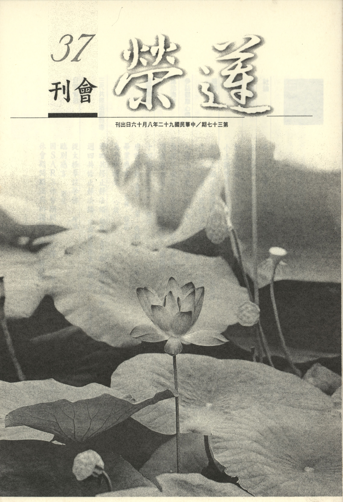

# 第37期

## 社論

### 弔一代大德　道證法師

*編輯部*

道證法師俗名郭惠珍，有一個很好的家世，父親是一位名醫，對待病人極有耐心及愛心，家教非常的嚴格，道證法師就是在這樣的家風下成長，即使成績優越、表現良好，都在父親的鞭策下學會了調柔與謙虛。及長，負笈至中國醫藥學院讀書，抱著濟世利人的心態來學習醫學，一方面是受父親的影響，一方面也是自己悲天憫人的情懷所致。在求學期間，並不因容貌清秀、聲音悅耳、風采高雅而迷於男女的交往、社團的聚會，更不會去作那種種的夜遊與無意義的聚會，堪稱時下學子們學習過程最好的榜樣。

認識道證法師記得是在 雪公老恩師華嚴座下，在聆聽 老恩師的教誨之後，學子們分組討論課程要義，有幸與道證法師共聚蓮社一起研究體會 老師講經之要旨，並如何應用於日用平常，如何導歸淨土。在此複講小座當中，整整三年，有時從晚上九點半至十一時、或十二時、或凌晨、或甚而清晨五時，大夥既疲累又高興，因為在這段複講小座中，除了瞭解 老師講解的大義以外，並知 老師如何準備這一週的講經，以及如何整理講表，以及本週發生的事情， 老師如何藉著上課來訓誨、暗示當事人，只聽大座之人是不能體會，所以要如何認識一位大德，是在學佛過程當中很重要的學習。道證法師當時未出家，猶是順天醫院腫瘤科醫師，工作十分繁忙，因為有愛心、又能體諒病人身體與心裡的痛苦，甚而慷慨解囊，幫助病人無錢治病之苦，工作多年，兩手空空，所租的房子也僅兩坪，一坪用作佛堂，一坪用作個人休息之用。法師在參加複講小座當中，總是靜靜聆聽老師們、學長們的複講、演繹、開演，並以老舊的錄音機錄下華嚴小座，隨即寄往給在美國的妹妹，姊妹情深。

有一次有學長請她講講學佛與行醫的心得，不料，不鳴則已、一鳴驚人，大家內心非常佩服眼前這位仁心仁術的醫生，她照顧病人的慈悲與誠意不假造作，當病人生起病苦時，郭醫師也善巧安慰開導，具有人飢己飢、人溺己溺的大菩薩精神，尤其在治療患者的過程當中，有的情況需要很耐心地陪著病人，在生理上跟心理上帶著他走過一段艱辛的歲月，並引導他逐漸對佛法認識，生起皈依的心態，並教以稱念阿彌陀佛名號，作為往生的資糧，而且在病人臨終時，郭醫師還要排除種種的障難，善巧安慰病人並開導佛法，陪伴著他一句一句地念佛，一字一字念得清清楚楚，在病人斷氣時，也隨緣禮請蓮友為這位苦難的眾生助念多時，有時還要忍受病人無理的要求，怨天尤人的不平之氣，在開導正法當中，病人有時候不願聽受，郭醫師都全憑誠意，在良好的醫德、醫術下，即使外相的病苦無法解決，也要善巧方便將佛法引領到病者的心中，解決他內心裡的苦痛，有的病人在臨終時，雖然病苦讓他痛得無法自主，但是卻能在佛號上一句一句地念下去，撫慰他們的心靈，如此給予無助的病人無比的希望，並改變了他們一生的命運，與阿彌陀佛結下殊勝的法緣。當郭醫師在敘說如何去服務病苦的眾生時，大眾聽得是熱淚滿盈，對於他的慈悲，以及其對佛法的信心、對善知識的頂戴、恭敬，之後總不忘每次小座都請她發表該週心得，她以肺腑之言，對生活的體會、對佛法的認識作一番深入的詳述，變成以後小座最受歡迎的節目。之後隨著 雪公老恩師往生，以及護持江翠裳居士往生等等（註），無盡地奉獻其心力。

未久法師茲因蒙受腫瘤病苦，腹部聽說長有十八公分的癌細胞，疼痛難當，在堅持不以西醫治療，尋求三寶及阿彌陀佛的加被下，了知世緣已了，毅然辭去醫生工作，在中原大學開示「傾聽恆河的歌唱」來表達她內心的心聲，並辭別大眾，放下萬緣，決志西歸，從此歸隱山林，大眾皆不知去向，在這段歸隱期間除了用功修學，時時誦念淨土五經，並剃度出家，法名道證。經過幾年的涵泳沈潛，在最近這一兩年來龍天推出，除了以錄音、法語來開示法義，內容有戒殺、護生、助念及如何發起菩提心、深信因果等等，對世道人心有極大淨化的作用，在錄音帶裡聽不出法師受病苦的折磨，只聽到她那鏗鏘有力的開示，對法義娓娓道來，令聞者歡喜讚嘆，並了知皈依三寶，深信彌陀的重要。

尤其最近法師接替圓因老法師的放生事業，南北奔波，加上參加人員眾多，有時多達三千餘人，不論場地的布置、放生地點、放生法語的開示，法師皆一一親力親為，鞠躬盡瘁，故在病苦不甚負荷的情況下，終於往生的因緣成熟，在交代侍者一定要對阿彌陀佛深具信心，並合掌稱念彌陀聖號自在往生，助念三日，見者聞者見其示現，皆知往生無疑。尤其法師往生日正是觀世音菩薩成道日，寧非觀音菩薩再來歟，亦或因地修學大悲心有成之示現歟，亦或觀音菩薩侍者授命度化有情一期，功成示現歟。在荼毗之日亦示現種種瑞相，或遺體放光、或火化放光、或舍利如寶石，皆明一生學佛有成，對彌陀信心圓滿之行相，值此五濁惡世，災難頻生，人心每況愈下，慾望有如大火，非藉法師與菩薩之願心無法澆熄，在此薰香禱祝一代大德〜道證法師，唯願上品往生，早日乘願再來，轉穢土為淨土，並引眾生往生淨土圓成佛果，乃法師之願，所謂「願將東土三千界，盡種西方九品蓮。」

註：江居士曾為嶺東商專的班花，容貌可人，病苦現起之後，因腫瘤致使頭部臃腫變形，猶如人面瘡，家中視為怪物，除了母親可以包容外，若非道證法師之關懷護持，人早已自殺，不知墮落何處，據聞是前清時期三位冤親債主追逐至此，欲報前仇，令江翠裳居士顯現如此的病苦，所幸在道證法師耐心的治療，乃至引導皈依佛門、教授淨土念佛法門，並在蓮友的護持下，最後含笑西歸，全身柔軟，家中對佛法的信心為之一振，居士可謂善於說法。

## 大德法語

### 佛說四十二章經解（二十九）第三十二章〜第三十四章

*道源老和尚講授*

學道貴在先立志

要能調心不躁暴

勇悍前進破眾魔

離愛何能生憂佈

第三十二章

「佛言：人從愛欲生憂，從憂生怖，若離於愛，何憂何怖。」

我們這些凡夫原本是沒有煩惱，煩惱都是自己找來的。世人妄見有愛欲之樂，所以無法離開世俗的愛欲，殊不知從愛欲生憂，由憂生出恐怖的苦惱。怎麼由愛欲生憂呢？譬如財、色、名、食、睡人人所愛所欲，以為是樂果，殊不知財沒有得到就患得，想著如何能得到這個財，得不到就生一種憂愁，等到得到之後又患失，恐怕所得到的財丟掉了，或給賊人偷去、搶去，或讓人騙去、、、，生一種恐怖之心，患得患失而憂愁恐怖，這都是愛欲錢財引起來的，所以憂愁恐怖的煩惱都是因為那個愛財之心所引起來的，若無愛欲心就不會患得患失，那有憂愁恐怖呢？

第三十三章

「佛言：夫為道者，譬如一人與萬人戰，挂鎧出門，意或怯弱，或半路而退，或格鬥而死，或得勝而還。沙門學道，應當堅持其心，精進勇銳，不畏前境，破滅眾魔，而得道果。」

本章勸勉修學佛道應該這麼樣的精進用功，比喻一人與萬人戰，這一個人喻如專心修學佛道的人，修學佛道就要破除煩惱眾魔，然凡夫從無始劫以來就有無量的煩惱，等於有一萬個敵人，我們一個人與一萬人相戰，這個樣子試問不要勇猛可乎。

掛「鎧」就是鎧甲，喻指三種精進之披甲精進，古時作戰要掛鎧（披甲），此打仗所穿的衣服能防禦刀槍，所以要披掛鎧甲，才出門打仗。

與人相戰，或心意有點怯弱（恐怖），恐怕打不了勝仗，因而內心怯弱，怯弱就是沒有堅強的心力，「或半路而退，」因為心裡怯弱，面對敵人產生恐怖心，這個仗打不得了，打了只有打敗不會打勝，於是走到半路就退回了，或者是格鬥而死。雖是打仗但因為自己勇猛力量不夠，結果還是打輸了。或得勝而還，一個人與萬人打仗，結果打了勝仗回來。

上段比喻合下一段之法，所謂沙門學道，應當堅持其心。我們是個凡夫，要想學佛的道，這個心一定要堅持起來，不能動搖，等於一人與一萬人作戰，用什麼力量才能打勝仗？佛言由戒、定、慧三無漏學，用戒、定、慧三種力量，決定可以戰勝眾魔。

前云作戰須披掛鎧甲，比喻想著降伏眾魔（打勝仗），第一、先嚴持戒律，戒律之嚴持須堅持其心，不能令心意動搖，不令心意怯弱，表示持戒的力量勇悍。

此心堅持而不動搖，乃因志氣已發，只有往前精進，比喻定力（有定的力量）必能精進勇銳，不會半路而退。

不畏前境，是指雖面對萬人，亦不畏懼，如此勇悍決不會格鬥而死，此乃慧力之故。所對的眾魔如死魔、天魔、五陰魔、煩惱魔等各式各樣，尤其煩惱有根本：貪、瞋、癡、慢、疑，至於枝末煩惱則無量無邊。自從無始劫以來我們就當凡夫，就在煩惱堆裏過日子，雖然面對眾魔如同一人與萬人作戰，反而破滅眾魔而得道果，此乃戒、定、慧這三種力，破滅眾魔（打了勝仗），得到佛果（得勝而還）。

第三十四章：

「沙門夜誦迦葉佛遺教經，其聲悲緊，思悔欲退。佛問之曰：汝昔在家。曾為何業？對曰：愛彈琴。佛言：弦緩如何？對曰：不鳴矣。弦急如何？對曰：聲絕矣。急緩得中如何？對曰：諸音普矣。佛言：沙門學道亦然。心若調適，道可得矣。於道若暴，暴即身疲，其身若疲，意即生惱，意若生惱，行即退矣，其行既退，罪必加矣。但清淨安樂。道不失矣。」

有一沙門不但日用功，夜裡還用功，不睡覺在那裡用功，用功於誦經，誦什麼經呢？誦迦葉佛的遺教經。迦葉佛是過去佛，是釋迦佛（賢劫第四尊佛）之前的一尊佛（賢劫第三尊佛），此處有一疑問，就是每一尊佛出世，都有說法度眾，所說的法名之為經。這一尊佛涅槃之後，所說之經就流傳後世，而有正法、像法、末法的法運，到了滅法時期連佛經都沒有了，又過了一段很久時間，另一尊佛又出世了再重新說經。就以迦葉佛而論，彼佛涅槃之後，所說的經雖經流傳，然經過了正法、像法、末法後，經已沒有了，此比丘是如何能念誦到迦葉佛的遺教經呢？此乃釋迦佛傳下來，叫佛佛相傳。前章有行者欲以斷陰（除男根）來斷淫，佛說斷陰不如斷心，並說一偈頌，此偈頌也是迦葉佛說的，此處迦葉佛的遺教經也是釋迦佛流傳出來的。

此時這個沙門（比丘），在誦迦葉佛的遺教經，愈誦心愈覺得悲痛，愈誦心愈覺得緊張。出家一定要破無明、斷煩惱、了生死、成佛道，想著這無明煩惱怎麼斷？自己如何做得來這個事情，愈想就愈悲痛，且緊張過了度，竟發生一種想要退道（還俗）的後悔心。此比丘都受過了比丘戒，此時想要退道（還俗），於是找著佛，向佛說他要捨戒還俗。

佛雖知道他是因為誦迦葉佛遺教經悲傷緊張，以為此生修學無力成就，所以要捨戒還俗。但是佛有大智慧善解方便，並不問他剛才誦經誦得悲痛緊張過度，受不了要還俗，反而問他你沒有出家以前，在家的時候，曾經做過什麼事業？比丘對佛說，我在家歡喜彈琴。

佛就依著他愛彈琴給他說法，依佛智而言，觀一切法皆是佛法，佛就問他琴上絲線做的弦，線弦弛緩如何呢？對曰：不鳴矣！他會彈琴、愛彈琴，佛就問他彈琴的事（契機）。你（比丘）若彈琴弦，若弦上的太緩、太鬆，會彈出什麼情形呢？他彈琴是內行，佛問他所瞭解，他就答覆了，不鳴矣（彈不出聲來）。

（佛問）弦緊了如何呢？會彈出什麼情形呢？對曰：聲絕矣！若琴線上得太緊了，彈一下線就斷了，聲音斷絕了。佛言：急緩得中如何？如果將琴線調得很合適，不太鬆、不太緊、不太急、不太緩、得其中，又該怎麼樣呢？對曰：諸音普矣。什麼聲音，都可以彈得出來，因為那個線調得很得中，很合適。

佛言：沙門學道亦然。出家人修學佛道，等於調琴一樣。心若調適，道可得矣。若要學道，先要把心調好，調得不要太緊也不要太緩，若將心調適得中你再去修學佛道，道則可得。

於道若暴，暴即身疲。暴，就是太急暴了，或云修道不是要精進嗎？其實不雜謂之精，不退謂之進；你修道不要太雜，佛法八萬四千法門，如何能一下子修八萬四千法門？你須看那個法門應你的機，你就修那一種，不要太雜，不雜就謂之精，你不要太急、太暴，你保持著修行的功夫，慢慢的往前進步，只要不退就叫做進，你要是太急暴、太急躁、太躁進，則你身體會受不了，發生了一種極為疲倦的感覺。身體若疲，意即生惱。你這個身體一疲倦了，心意上就生一種憂惱，想著這個佛道難行而生憂惱，就想退道。

本來要精進用功的，因為太躁進而身體疲倦，心意則生一種憂惱，謂之退道，道已不能再修下去，退了道有什麼好呢？退了道，就不得了，就要增加罪過，所謂：「其行既退，罪必加矣」。如前章所云，一人與萬人敵，你要勇猛，精進勇銳，一定能打勝仗，不怕他人多勢眾，必能打勝仗，你要是退怯亦沒有個後路。我們一個凡夫，只有精進辦道，才有了生死那一天，才有成佛道的希望。你要退轉，退到那裡去？諸位多想想呀！退不是只退到凡夫位上，還會在凡夫位上起惑、造業，罪必加矣，所以你不能退轉下來。

但清淨安樂，道不失矣，應當要用功修行，且在身心清淨安樂上念念分明的往前進，不會退失道業。

大家聽了正法，都想好好依經修行，然發心修行，功夫須慢慢的增加，不要來的太急暴，來的太急暴身體受不了，身體一疲倦生起煩惱，道心就退下來，所以前章（第三十四章）修行講究調心，而身心是相互觀待，身體調適好，心也能平和，因為我們是個凡夫，行善也要講究身體負擔得了，譬如發心拜佛，你先少拜幾拜，慢慢的增加。若云我要拜佛、我要精進用功，我一天要拜三千拜，你如此拜得受得了嗎？今天拜三千拜受不了，明天變成一拜也不拜，因為身體受不了嘛！身體受不了，心裡也生起一種憂惱，不想再拜佛了（退了道心了）。所以會用功的人是慢慢的精進，只要不退步就是進步，如此身心就清淨安樂，一定會得道。

以我自己做例證，民國十八年臘月初八在河北武昌寶通寺閉關，在閉關中精進修行，然而自己不會調適，用得太緊、太急了，不到三個月得了個吐血的病，且是大口吐，一吐就能吐半罈子。我在閉關中因為關寮裡沒有照臉的鏡子，所以看不到臉變成什麼顏色，可是我的手我可以看見，這個手像黃紙一樣，那麼的黃，血差不多吐光了，身上幾乎沒有血了。

還好三寶加被我，憐憫我，不吐血了，慢慢地才又活過來，要不是三寶加被，那個閉關，閉三個月就死翹翹了，這就是自己不會用功，用心太緊太急的緣故。（下期待續）

## 共修研學

### 勸發菩提心文（三十七）

*心爾整理*

善根福得不可缺

往生淨土須具備

一句佛號能統攝

是乃發心大因緣

接下來談到求生淨土的第二段，就是往生西方的條件：

「然經稱少善不生，多福乃至」

發菩提心與求生淨土有什麼關係？求生淨土為什麼是發菩提心的因緣？當念佛時，能從佛名攝持佛德，如此即是真正念佛，從中累積殊勝福德，才能往生西方，這是生西的條件。佛最殊勝的德能即是圓滿的菩提心，所以以念佛求生淨土，成佛以度群萌為我人發菩提心殊勝的增上緣。本文大師以十種角度勸我人發菩提心，若能死心塌地，用上全副的精力將一生的修行收攝在發起菩提心的各類觀修，從內心將凡夫俗子的狀態激發出與佛一樣的菩提心，是修行之最重要處， 離開此重要處修行不會成就。相傳印度阿底峽尊者親近金洲大師，以十三年修菩提心，即是掌握修行重要處。「然經稱少善不生，多福乃致」，阿彌陀經云：「不可以少善根福德因緣得生彼國」。所以欲生西必具多善根多福德。

「言多福，則莫若執持名號，言多善，則莫若發廣大心」

執持名號是種多福的表現，佛乃實行各類善法圓滿的聖者，為何要念佛？心中、口裏念出這一句佛名，潛意識中有一個微妙的心態，那就是對佛菩薩的崇拜，當我們的內心對佛菩薩產生崇拜與隨喜時，那善法的氣氛最能感受吾人、加被吾人，在執持名號中，隨喜佛之福德，自所生的福德無量無邊，乃至暫持聖號比世間布施百年的福德還要多。佛說末世修行人，即使全世界只剩一巴掌大的地可以耕田，於我法中修行者不會餓死，因為念佛與佛有共業關係，能受用佛的福氣，在苦難的世界裏不易遭逢飢餓等各類障難。布施百年都比不上你暫持名號的福業，所以看修行人過得都很清涼。而在念佛當中引發的菩提心是多善根，倘若不想出離，不想發心為公，此即善根不足。多善根多福德是往生淨土的因緣，多善根為因，多福德為緣。以一句名號念出佛的慈悲，念出佛的菩提心，念出佛的悲願，感受佛種種善法的氣氛，一方面種植善根，一方面累積福德，一句彌陀就多善根多福德。

「是以暫持聖號，勝於布施百年，一發大心，超過修行歷劫。」

昔優婆陱多尊者，乃釋迦牟尼佛後第四代的禪宗祖師，他是釋迦佛滅度後，度眾生最多的一位大德。尊者每度一位眾生，即將一粒芝麻放在房間裏面，最後將整個房間都塞滿，想看看已度多少人、結了多少緣，此人尚且不是大乘，已是如此殊勝。然大乘人之所以殊勝，乃彼之心態（意樂）絕不放棄一個眾生，雖然二乘功德已經這麼殊勝，現今有的人結的法緣也很大，到處都有他與道場的結緣，然而功德卻遠遠比不上發悲心的菩薩。二乘人雖也有慈悲心如優婆陱多尊者，然對於發大心的弟子，尊者讓他先行，他自己拿著衣包在後面走，其弟子復念，眾生類廣難度難周，尊者就令弟子拿著尊者衣包走後面，其弟子不知何故，而請問之，尊者說你憐憫眾生發大悲心就是菩薩，我是羅漢，應尊你這位大悲菩薩，所以你走前面，今你念眾生難度旋退道心，則我是久修，你乃新學，應在我後面。故發菩提心十種功德之一就是映蔽聲聞功德，如皇帝剛生太子，即貴壓群臣，此嬰兒對著一人之下萬人之上的宰相，宰相猶當禮敬。菩提心一發即貴為佛子，自然受到尊崇，映蔽一切聲聞。雖然對國家還沒有任何的貢獻，但那位皇子的功德就映蔽一切群臣。所以菩提心的功德太多、太殊勝了，如果念佛不好好的講究念佛的心態，會有麻煩的。

「蓋念佛本期作佛，大心不發，則雖念奚為？」

本來念佛就是隨喜佛的功德，發菩提心以成就佛道，可是倘若拿掉菩提心，念佛又是為了什麼？念佛念不出佛的悲心，念不出佛的菩提心，不改世俗心態則怎麼念也沒有用， 雪公云：念佛不改心，等於說空話。念佛往生淨土能速成無生忍力，即是不退菩提之殊勝增上緣，若不往生，在他方生死世界煩惱境強、惡業牽纏、自無忍力、難以度眾、隨境遷轉、退失道心、輪轉六道、墮落三塗，此亦淨土十疑論中第一疑之要義。

「發心原為修行，淨土不生，則雖發易退。」

今生能遇此發心文都是過去曾發過大心，然何以修行不成，乃因退道心故，何以會退道心？未生淨土未得忍力，在生死世界隨五欲境而轉故，如同摩尼寶珠沒在淤泥枉受眾苦。

「是則下菩提種，耕以念佛之犁，道果自然增長。」

因地當中能夠結合前面的八種因緣來發菩提心，再來以念佛的犁將心田犁得更深，種子埋得更深，開花結果則更殊勝。若有因緣發菩提心，結合淨土念佛，菩提心會成就得更好。

「乘大願船，入於淨土之海，西方決定往生，是為發菩提心第九因緣也。」

用求生淨土來護住菩提心，使菩提心不退轉，為使菩提心堅固，精進圓滿成就，所以求生淨土。乘阿彌陀佛的大願船，是你的願與佛的願，願願相合，此即感應道交。感是你要先感動，應是他（佛）來應，道交是二者之道能相應。入於淨土之海乃入蓮池海會、眾善聚會。在一片清澈一望無盡的八德池水中，有無量無邊的四色蓮花或有大如台灣或有大如星球，乃因與大心量相應的大身量菩薩所坐，非吾等小心量的人所能體會，我們的肚量很小、腦筋很小，無法想像，如毛毛蟲或螞蟻，不相信人那麼高，所以爬到人身上，牠只有兩度空間的概念，不相信這叫做人，不相信這世界有這麼大的生物。佛的身量乃至諸上善人身量，依觀經言有像六十億恆河沙由旬的身量，我們這種如毛毛蟲的身量、毛毛蟲的心態，如何體會大心量、大身量、大威神力、大勢、大願。（下期待續）

### 小止觀導覽（十六）

*蓮心整理*

四種食法清淨食

頭陀乞食除邪命

衣食具足心安穩

即是止觀前方便

經文

次，食法有四種：一者、若上人大士，深山絕世，草果隨時，得資身者。

大意

修習止觀應先具五緣，本段係言衣食具足之食具足的部分，食法有四種，此為第一種食法，亦為上根行者之食物需求。

導覽

上根利智者，居於深山，與世隔絕，完全擺脫食的束縛，故修行的能耐非常強，如世尊苦行時，日食一麻一麥，以資身體，即為上根者。另天台智者大師雖被尊為國師，譽滿宇內，而其修行過程是切柏代香，捲簾進月，身心精進，不怠不輟。又如印光大師，普陀潛修，法雨寺閉關三十年苦修。因此不會在意外在環境的好壞及物質的享受，方能成就道業。

經文

二者、常行頭陀，受乞食法。是乞食法，能破四種邪命。依正命自活，能生聖道故。邪命自活者：一、下口食，二、仰口食，三、維口食，四、方口食。邪命之相，如舍利弗為青目女說。

大意

此為第二種食法，亦為中根行者之食物需求。

導覽

一、邪命，謂比丘依不正當之方法謀生活。戒律規定比丘應遠離四種邪命，唯以清淨乞食活命。四種邪命，即：（一）下口食，謂種植田園、和合湯藥以求衣食而自活命。（二）仰口食，謂仰觀星宿、日月、風雨、雷電、霹靂等術數之學，以求衣食而自活命。（三）方口食，謂曲媚豪勢，通使四方，巧言多求以自活命。（四）維口食，維，指四維，乃堪輿家所用二十四方位中之四隅；謂學種種咒術，卜算吉凶，以求衣食而自活命。

二、另有五種邪命，即：（一）詐現異相，謂諸比丘違反佛之正教，於世俗人前詐現奇特之相，令其心生敬仰。（二）自說功能，謂諸比丘以辯口利詞，抑人揚己，自逞功能，令所見者心生信敬。（三）占相吉凶，謂諸比丘攻學異術，講談吉凶。（四）高聲現威，謂諸比丘大語高聲，詐現威儀令人畏敬。（五）說所得利以動人心，所得利，指所受之供養。謂諸比丘於彼得利則稱說於此，於此得利則稱說於彼，令人動心。此五種皆是不正當之活命方法，當深戒之。

三、四種邪命或為世間人賴以維生的方式，但對修行而言卻是障道之由，因為修行是為了解脫生死、出離三界，出家眾的責任在弘法利生，故資身之道，必須依從正法，清淨身口意三業，不但遠離世間四種障道邪命，亦須遠離咒術、占卜等五種與口相應之邪惡的謀生方法（五種邪命），應如法求取衣服、飲食、湯藥、床榻等生活資具，以延續法身慧命，此即稱為正命（八正道之一）。但若行頭陀，受乞食法，係為眾生種福田，則另當別論，吾等雖非出家眾，亦應藉著古德的典範，以及經教的知見，好好自我反省，去除對食物的多食貪、多量貪、上妙貪等，培養對治生活習氣的能耐，及破除執著的能力。

經文

三者、阿蘭若處檀越送食。

大意

此為第三種食法，亦為下根行者之食物需求。

導覽

一、阿蘭若指適合於出家人修行與居住之僻靜場所。阿蘭若有三種：（一）達磨阿蘭若，乃求菩提之道場。（二）摩登伽阿蘭若，即墳場，或距村落一俱盧舍（指牛之鳴喚聲或鼓聲可聽聞之距離），即大牛之吼聲不能聽聞之處。（三）檀陀伽阿蘭若，即無人煙之沙磧。至後代，一般之寺院精舍亦稱阿蘭若，多位於遠離繁囂城市，而又便於出家、在家人出入之僻靜郊野。此外，比丘為修行而常居於阿蘭若，稱阿蘭若行，屬於頭陀行之一。

二、檀越，謂施主也。檀謂檀那，布施也；越謂超越，指布施之功德，可超越貧窮之海。

經文

四者、於僧中潔淨食。

大意

此為第四種食法，亦為下下根行者之食物需求。

導覽

一、於僧中潔淨食，被稱為下下品食，是因為此種食法可以挑選自己喜歡吃的或較豐厚的食物，易養成分別心，四種食法雖有高低之分，但某些食法在中國的環境下，有其難行之處，如托缽乞食，在中國可能會被當成乞丐，而造成大眾對出家人的輕慢，如此將會障礙他們弘法利生，故此戒律便在中國開方便，所以尸羅配合地域、風俗、民情的不同而有所改變（此名之為軌則）；活命法必須清淨（這叫做正命），而修學要具足正見（此即正見），故尸羅、軌則、正命、正見，是修學止觀很重要的前方便。

二、在僧團中，肅供齋法，以此一缽飯，供養十方三寶，乃至施大鵬金翅鳥、曠野鬼神眾，然後進食此飯，已屬供養所遺，非己所有，故稱為淨食。

三、臨齋五觀是僧侶在用餐時所應起的五種觀想，即所謂的「食存五觀」：

（一）計功多少，量彼來處：即思惟此食所用之功甚多，如墾植、耕除、收穫、舂磨、淘沙、炊煮等功，又計一缽之食，觀想作夫之汗多食少，若有貪心，則墮地獄。

（二）忖己德行，全缺應供：自忖己身德行，是否可獲供養。若不坐禪誦經，不營佛法僧事，而受他人信施，則墮惡趣。若是初果以上則為全應供（所以阿羅漢名應供），未證果之前都是負債受用。不過受人供養，若有慚愧心，如法作修行事業，亦可消受供養之福，假如不修行，還得加強還施主之債。

（三）防心離過，貪等為宗：即食分上、中、下；上食起貪，下食起嫌瞋，中食生癡舍。貪重則墮地獄，嫌瞋則生餓鬼不得食，癡舍則墮畜生，故須先觀食，離此過（貪等三毒是主要之過須防止之），方能生三善根。

（四）正事良藥，取濟形苦：即做良藥之想，觀想治饑渴如除故病，及減約飲食如不生新病。

（五）為成道業，應受此食：即觀想藉由食物使身得住，藉由壽命的相續修學而成就慧命。又以此五觀故，齋堂又稱五觀堂。

經文

有此等食緣具足，名衣食具足。何以故，無此等緣，則心不安穩，於道有妨。

大意

總結衣食具足，方能內心安穩，得以進德修業。

導覽

一、行者於上食不起貪，於下食不起瞋，於中食不起分別，是名食時修止，在食時觀功念恩、對治煩惱、建立善法（例如以此食供養三寶等等），是名修觀（方便止觀），若進而觀食法虛幻不實，畢竟空寂，則為真實止觀。

二、衣食具足，就是去除謀求之心，以免形成止觀門的障礙，吾等在家人也應勉力隨順，減少物質享受，以培養知足常樂及感恩惜福的德行。孔子 「飯疏食飲水，曲肱而枕之，樂亦在其中矣。」顏回的 「一簞食，一瓢飲，在陋巷，人不堪其憂，回也不改其樂。」 都是安貧樂道的表現，因此在穿衣吃飯、日用平常中，也能巧把塵勞做佛事，藉事練心、修學佛法，安心辦道。（下期待續）

## 蓮池海會

### 吳蘇芬老居士往生見聞記

傳細

有為所作皆無常

來時糊塗去時明

須是佛名入耳根

依仗助念得大利

緣起

世間無常事頻仍，於五月二十九日晚上八點一刻接獲為吳蘇芬老居士助念時刻到來時，末學因早在一個月前被通知，心裡有譜；也堅信，其家人將老居士從醫院接返家並助念等等，事前已有心理準備，正所謂「凡事豫則立，不豫則廢；言前定，則不跲；事前定，則不困；行前定，則不疚；道前定，則不窮。」因此在趕往基隆的時刻內心篤定。在車上與另位學長談起，老居士是她駐亞特蘭大新聞處主任的母親，以及這是她生平的第二次助念時，心中生起一些感觸：一是能自具「信願行」三資糧的內因以及外在的助念，是何等的困難；二是又多了數位淨土法門的同參道友，也相信他們的道心將藉此燃起。

助念

當陀羅尼經被蓋在吳老居士身上時，老居士的身體逐漸地不再躁動，隨著老居士的呼吸起伏，王家的小兒子也在母親耳旁，懇請母親專一的念佛，廳堂一片的寂靜，只聞家人與蓮友的佛號聲，一字一句聲聲清楚地念著。雖有人曾談及隨著生命一點一滴的流逝，死亡是每個人必須面對最孤獨無助的時刻，但此時正接近夜半時分。遙想起地藏經利益存亡品第七云：「…… 臨命終時，父母眷屬宜為設福，以資前路。或懸旛蓋及然油燈，或轉讀尊經，或供養佛像及諸聖像，乃至念佛菩薩及辟支佛名字。一名一號歷臨終人耳根，或聞在本識。是諸眾生所造惡業，計其感果，必墮惡趣，緣是眷屬為臨終人修此聖因，如是眾罪悉皆消滅。……」囑累人天品第十三又云：「……未來世中，若天若人，隨業報應，落在惡趣，臨墮趣中，或至門首，是諸眾生，若能念得一佛名、一菩薩名，一句一偈大乘經典，是諸眾生，汝以神力，方便救拔，於是人所，現無邊身，為碎地獄，遣令生天，受勝妙樂。……」，因此老居士並不孤獨、也不無助。

更何況老居士早於兩、三個月前因學長的經常開示，相信西方確有極樂世界；也願離這個娑婆的苦世界，現今正與隨侍在旁的子女共同念著「阿彌陀佛」，心不離此一句萬德洪名佛號，有此念佛之緣起，是老居士功不唐捐的宿世福德生起、以及其平日積功累德的感應。

夜半十二時二十五分，吳老居士在句句的佛號聲中安然往生，蓋上了陀羅尼經被，老居士的大、小兒子及蓮友更加勤懇地將佛號一直念下去，渾然不覺東方破曉，是時早上八時左右掀開陀羅尼被，吳老居士面容祥和、全身柔軟，頂上微溫；此皆往生瑞相現起，佛力的不可思議讓家屬心安，九時半換完服後送往殯儀館等待入殮。

頭七

隔週的週三與學長前往老居士家作頭七，在法會的前行，末學隨願供養：弟子傳細懺悔無始業障，修證本具如來功德。並願帶著無盡的大悲心與多生現在、父母、師長、知識、檀越、法俗、眷屬、冤親債主，乃至四恩三有法界眾生，將此一法會功德對治世間ＳＡＲＳ的疫情，並作無盡的供養與回向。

此次藉著聽學長的作七開示，更加體悟「人身難得，佛法難聞」，皈依三寶進入教理因緣應更珍惜。因之每每在家中誦經前的開經偈云：「無上甚深微妙法，百千萬劫難遭遇，我今見聞得受持，願解如來真實義。」都讓末學內心澎湃不已。

頭七法會晚上九時剛結束，門口由吳老居士生前栽種的曇花，綻然大放、空中還飄著陣陣的曇花香，王家子女從不捨的情緒中轉化頻頻讚歎、歡喜信受。

告別式

六月七日早迎靈後，在第二殯儀館舉行家祭儀式中，在祭文與故人生平介紹中瞭解了老居士之生平：吳蘇芬居士江蘇省宿遷縣人，生於民國十五年，幼期正值八年抗戰、國共內戰等社會最動盪不安時，大環境的動盪使她無法接受正規教育。與王老先生結識於民國三十八年，迫於政治因素遠離家鄉到陌生的台灣，一對二十出頭的年輕夫妻，手無寸鐵，來台後一切從零開始，王老先生先後於新竹、基隆的國小任教職，六位子女相繼出世。吳蘇芬老居士秉賦聰穎悟性佳，客家話、閩南語皆難不倒她，平常好與人為善，與鄰人相處融洽。

一家八口單靠先生教書微薄的薪資，常常令家中食指浩繁、捉襟見肘。幸賴老居士替人織毛衣、打零工，貼補家用；子女的食衣住行育樂樣樣不離老居士的慧心巧思。老居士除了對公婆惟命是從，對七姑、六叔亦善盡照顧之責。老居士平日喜看紅樓夢等中國古典文學，對現代中國名著亦常遍覽；在生活上無不省吃簡用、以身作則，從不造成子女的負擔，反而處處嘉惠子女。例如給國外任職的女兒信中提及，栽培六位子女就像保養七彩玲瓏的美玉；時時提醒子女要有如玉般的外表-溫潤剔透、內心-冰清玉潔；切莫割傷他人、跌碎自己。

且教導子女為人處事要冷靜，身在公門，要知恩圖報；老居士不僅是「主中饋、延嗣續、繼蒸嘗」的傳統主婦，更不斷的接受新觀念，也培養子女在逆境中不驚惶失措、在順境中不驕不傲。即使老居士自己在生病期間，也經常告訴子女，她想去當義工，去照顧那些生病的可憐人，子女許以將代她完成時，老居士深表讚許；重病時仍咐囑子女各自忙去，充分展現其豁達開朗、意志堅強的性格，不願見到子女沉浸在憂傷裡，亦不增添兒女的煩惱。

縱觀老居士的一生，處處可見她堅強的個性，毅力不搖的韌性，以及樂觀奮鬥的精神，在在都影響著子女們，子女們願以老居士「忠厚、樸實、活潑思想」的良好家風，傳遞給下一代子孫。

二七至七七

家屬謹遵佛制於七七日內念佛、吃素，如法作七，告別式，興辦佛事（齋僧、放生等），相信吳老居士已仗佛慈力，往生西方極樂世界，華開見佛，蓮品高昇。

家屬也在學長的每次作七開示引導之下，日日增上，對佛法的內涵也漸漸瞭解，祈願另一個緣起，讓另個佛化家庭永續經營。

### 周貴春老居士助念見聞記

*編輯部*

世法經營令人羨

終歸業力無常到

若非親人蓮友助

難藉佛力到西方

周公貴春先生，出生於民國三十二年上海，五歲時隨同父母來到台灣，母親早逝，由父親一人撫養長大。三十歲時，與林淑玲小姐結為夫妻，此後夫唱婦隨，胼手胝足，白手起家，開創事業，成就斐然，業務遍及全球五大洲，獲得多國的專利，在世界各國享有極高的評價，即使已經擁有了很好的名聲，很高的成就，老居士依然秉持著殷實勤勞的經營原則和高瞻遠矚的企業眼光，戰戰兢兢的不敢稍有鬆弛。

而在其子女的眼中，老居士就像一座屹立不搖的大山，給予子女們全然的保護和無私的愛，即使在事業上最艱苦的時候，也從未將所遭遇的沉重挫折感帶回家，只是默默的承擔，為的是不讓孩子擔心，嚴肅的外表，只是為了督促子女不可以鬆懈上進的心。

老居士一生交友無數、交遊廣闊，擁有極佳的人緣，除了個性開朗喜與人交道，也喜歡幫助朋友、其熱愛結交朋友，熱心助人的率真性情，自年輕時便展露無遺。無論是在師大附中，政戰學校就學期間，或是軍中服役時期，師長長官皆對其讚譽有加，老居士更是與不少同學朋友結為莫逆，即使在幾十年後人人各自事業有成之時，仍是固定每年聚會共舒其志。朋友有求於他，他必定盡己所能的幫助，尤其不喜歡與人計較，即使常常吃虧也無所謂。他真誠待人助人，不問回報的個性，開朗幽默的性格，即使在成就事業後，亦廣受同行同業們所歡迎，其義氣萬千、豪情萬丈的瀟灑性格，令朋友敬佩、後輩敬仰。

老居士於今年二月健檢報告中發現癌指數偏高，進一步的正子斷層掃瞄中發現肺中與脊椎中皆有極小的癌細胞，更進一步的檢查中證實為肺癌末期，脊椎旁的癌細胞是肺癌的遠端轉移，原本個性開朗的老居士頓時陷入憂愁、沮喪的狀態，其家人四處奔走，甚至遠赴美國尋求最新的質子光放射線治療，其夫人更開始學習健康與自然的飲食，親自照料老居士三餐及起居生活，在美國的一個多月，癌細胞情況未獲控制，到了只能做消極性化學治療的地步，失望的老居士一家於是回到台灣，後因發燒而送至和信醫院，然因ＳＡＲＳ政策老居士不得已的進入隔離病房中，家人無法隨侍在旁親自照顧，只能以電話加油打氣，老居士的心情自此更是低到了極點，不願吃喝、插管，消極地抵抗醫院所做的醫療行為，在老居士往生前，幸而檢驗出並非「非典型急性呼吸性症候群」，但尚須觀察數小時，在移出隔離病房的一小時前突然停止呼吸，急救三十五分鐘後宣告不治，家人在毫無心裡準備的情況下，頓時慌亂無所措，幸而有蓮友告知勿搬動、哭泣，並隨大眾助念八小時後回向，老居士已然安詳西歸。

老居士一生從容自在，夫妻鶼鰈情深，對父母孝順，對兄弟照顧，對朋友兩肋插刀在所不惜，對子女細心呵護疼愛有加，雖一生未聞佛法，不知淨土法門殊勝，但其憑藉宿世善根福德，感得家人與蓮友的護持，如法助念、作七及告別式，家人更於七七之內茹素、念佛、誦經，廣作種種善法，如慈善、印經、護持講經道場、齋僧及放生等善法回向，相信老居士必然能依此因緣發起菩提心，至誠懇切的和大眾一起念佛求生西方，在西方淨土跟隨阿彌陀佛與諸上善人修學成佛大法，並能成滿菩提大願，迴入娑婆，廣度有情眾生。

## 日常省思

### 從太極拳談學佛

坤城

世法佛法本不離

世間覺處即佛法

若能處處用心會

巧把塵勞為佛事

太極拳是一項易學難精的運動，余學此拳，將近二十年，略有心得，所謂「雖小道，必有可觀者焉」，乃試著將學拳的過程及心態來會通佛法，希對自己有所改進，如有錯謬之處，尚祁大家原諒指正。

從小對學武即有很高興趣，騎馬打仗、以手鬥劍，四郎、真平漫畫，是小學生活不可缺少的部分，常常自己研究如何方能贏過對手，印象中少有對手，隨後北上讀書，又著迷於武俠小說中的功夫高手，不過終究只是春秋大夢，並未真正踏入此世界。就業後，遇上同樣對武術有興趣的同事，由他啟蒙，教導一些太極拳的概念，再經另外一位同事介紹太極拳的老師，從此展開了一段印象深刻的學拳過程。

第一次與老師見面時，老師對旁人說，余待不了幾天，聽了此話，乃暗自決定非將此拳學好不可。從此，一早即到老師處學拳，下班再跟同事研究練習，假日更是學的不亦樂乎，甚至忘了午餐，即使是風雨天亦不例外，幾乎是全年無休；此外，更研讀有關書籍，不斷的揣摩體會，幾年下來，從一個任何人皆可隨意將我擊出，到後來不是那麼容易將我擊出，此種轉變不可謂不大。而分析何以有此效果，約略有下列原因：

一、要對其有欣樂之心，此乃讓己不斷學習的原動力。

二、對老師及古人所述，要能深信不疑。一旦有折扣，則必然未能趨近老師的成就。

三、團體有其必要性，大家互相切磋，較易進步。傾聽別人的看法及意見，亦是增上的助緣。

四、要不斷觀察，不斷改正自己的缺失。有些狀況，只能意會，甚難言傳。

五、堅持原則。不少學習者，常以自忖的方式，改變了原則。

六、行住坐臥，念茲在茲，持續不間斷的練習，此乃進步不可缺少的要素。通常在學習過程中會有瓶頸，但是「日進一張紙」，積久功深，自然會有所突破，此時若不能堅持，則不易突破困境。

七、要能忍苦，但是只要有欣樂之心，並不覺得辛苦。要能吃虧，愈吃虧收穫愈大。

八、要能不畏譏評毀譽，一旦心有掛礙，則不能接觸各式各樣的對手，所得就受到限制。

九、要能身心放下，不著念頭，如此，方能舒展自如。此點甚難。

此拳是改變習慣的運動，唯有願意改變且努力去實行，才能充分發揮它的利益與作用。經常在經歷一段時間後，不能解決的問題，卻豁然開朗，迎刃而解，書上不能理解的敘述，也會不知不覺中有所體會。以上所說，似乎是老生常談，但是卻是自己親身的體驗。

佛法，遠比太極拳深奧，但成就之法，是不分大小的，其基本原則應是相通的，希望以此經驗，與大家分享，盼大家在學佛路上，皆能有所成就。

### 臨別感言

願度

臨別忽生珍惜念

回首往事善法現

惜福感恩知不足

歸去敦倫令法興

從開始決定回家的日期，內心盤算著還剩下一個多月日子，如今卻只剩下一個星期了；每一件事都會走到盡頭，就像時鐘一分一秒的過去了，六十秒就吃掉一分鐘，六十分鐘就吃掉一個小時，廿四小時就吃掉一天，三十天就吃掉一個月，十二個月就吃掉一年；不知不覺當中已經在台經過了十五個寒暑，一眨眼就過去，眼下只剩下一星期的時間，所有的過程就像過眼雲煙，雖此景已待成追憶，但點點滴滴銘記在心。

匆匆的，在團體中的五個年頭就這樣過去，過程就宛如昨日一般、歷歷在目〜民族東路的酸甜苦辣、放生活動的普施無畏、佛法研討的聞所未聞、緬甸之行的種種增上、啟蒙活動的齊心合力及助念作七告別式的報本還恩等等，都如對目前的浮現，真是慨歎自己從前沒有好好認真的學習，現在要獨自承擔的時候，卻發覺所學甚少、愈發惶恐。

記得當初剛親近老師時，老師很放心的讓末學學習辦理很多的事務，當時矇矇懂懂的就接下來；後來漸漸有幾位共事的學長一起辦事，因此也從學長們那裡學習很多的辦事方法；此外從各位師姑、師伯身上也學習到很多的待人處世的經驗；一直到現在，內心雖然還是過惡蝟集，但是至少已經知道待人處世的標準所在，更體會禮的重要性，從外相的恭敬做起，內心就是一個時時設身處地為人著想的內涵，也唯有如此，一切的事相才可以順利的進行、圓滿的結束；而且要時時的反省，才能瞭解自己的不足之處、作為改善的根據；從以上正反兩方面下手，才可以真正對治自我的意識，對有情做到最深廣和最究竟的利益。

父親年已七十，無法再負擔過多的事情，需要末學回家幫忙分攤工作，這是另一種學習的開始；論語上說：「孝弟為仁之本矣。」仁心的根本在孝弟，因此若要開出仁心的果，就必須好好灌溉我們孝心的根，才是仁道的根本；也就是當我們行仁道時，必定要先從對父母親的孝道做起，再推廣至兄弟、師生、朋友、長輩、晚輩、全人類乃至於所有的眾生。

至於佛家，成就佛道必須端賴菩提心，菩提心的引發則來自孝心，例如地藏菩薩的前生為光目女，因為其孝心，才不忍心母親在惡道中受苦，而發起了欲拔一切眾生苦、欲與一切眾生樂的大悲願，最後終於成就了地藏菩薩，具足成佛的證量；因此佛家成道的根本也建立在孝道上，所以經上讚歎佛陀說「大孝釋迦尊，累劫報親恩」。因此為了循著這樣基礎引發菩提心，就必須在孝道上認真的講究，以回去侍奉父母的方式來學習，進而一步引發視一切眾生如母有情而生起欲報其恩、欲拔其苦、欲與其樂的覺受。

雖然結果是必須分離，誠乃「天下無不散之宴席」，但在過程中對於自己在台多年，常常受到蓮友們的照顧，甚至在團體中也是受到長輩們的提攜和教導、同輩們的照顧及後輩們關愛，感到深深的慚愧，因為自己的付出是那麼的少，卻得到那麼多的關愛，也很感激各位師友們對末學所作的種種精神和物質的支持，讓末學可以回去和那裡的有情一起來受用這些有形和無形的資源。

讓末學最感動的是有形的支持中背後的那一份的誠意〜完全是為末學做到最完善的考量，因此而體會到「誠於中，而形於外」，這是末學所欠缺的，或許外表可以勉強做到，但卻需要在內心上多多的加強，而且對境又常常粗心大意，沒有用上全部的心力去體會其中的意涵。因此論語上說「學而時習之，不亦說乎」，在團體當中，點點滴滴和善知識相處當中，都是末學最值得學習的榜樣、最值得效法的對象。

和兩位老師的相處當中，可以深切的感受到老師的誠意，記得當剛親近老師時，就覺得老師像媽媽一樣，護佑著我們這些大孩子們；此後的種種接觸當中，老師也很耐心的教導我們，用各種方法來詮釋教法，以期讓我們這些「聽之者渺渺」的學子們有所收穫。至於初次和師母接觸，最讓末學印象深刻的就是老師「以雙手奉接」錄音帶，對於後輩們從不苟且。在接電話當中，老師總是很耐心的聽完末學的話，但末學總是和老師搶著說話；要對兩位老師懺悔的事情太多了，在此處雖無法一一述及，希望在回國的將來，能確實的改正這些過失，並且可以堂堂正正的向人提及自己的老師，而不至於辱沒師門。

至於從師姑和師伯的身上，末學也學到了許多，二位長者為「堅持其心，精進勇銳，不畏前進，破滅眾魔，而得道果。」作了最好的註解；其中師伯對末學的提攜良多，與他在一起相處，他總是在身邊耳提面命，只要有錯誤，都可以得到他悉心的指導。因此末學常常和其女戲言有如此的父母親作為她效法的榜樣，實為人生一大幸事。

在民族東路的大家庭中，自我的磨練上又更進一步，在大家長嚴格的要求下，其實是隱藏了更大的慈悲心；每次和她意見相左之後，發覺的卻是自己的無知。至於每一個孩子都是可堪學習的對象，或辦事負責、或彼此友愛、或為人熱忱、或受命快速行動、或輪流做種種家務瑣事等等，從小有如此好的訓練，都是末學遠遠不及的；因此在民族東路與孩子們朝夕相處三年下來，真是獲益匪淺；尤其是在煮飯方面，更讓末學有很大的學習空間和機會。

除此之外，也慢慢喜歡和老人家及小孩相處，這是以前所害怕的事情。週四的三代共修，讓末學有機會服務長輩們，打破和他們之間的距離。當看到這些老人家們時，就像久逢的老朋友一樣、雀躍不已；而每當看見某位奶奶，感覺她就像是自己的奶奶般，似一個愛心的集合體，每次見面總是可以從那裡得到慈愛的鼓勵、令人快樂不已。在和長輩的相處當中，更不斷的看到長輩們的優點和生活的歷練，不論是他們的質樸檢約、老實率真、謙恭有禮、忍苦悍勞，或者是「打拼念佛」等等，都是後輩所不能及的，真不禁令人讚歎老人家真的是寶〜國之瑰寶。

在啟蒙班與小朋友的接觸當中，也有很多學習的機會。和他們相處是一件快樂的事，若我們有任何的錯誤，他們會毫不隱瞞的當面說出；若我們有任何的問題，他們也會一股腦兒的說出他所知道的；若有任何的需要，他們都會勇於伸出援手；這些真誠的特點，常提醒已經不再是小孩的自己要保有一顆赤子之心。並從他們可愛的行相當中，尋求唯一愛子的覺受，將此一覺受推廣至所有眾生，引發等視眾生猶如一子的菩提心。

在決定回家的日期以後，才開始熱切地引發學習的欲望，人總是如此，因為時間不多，才開始會珍惜眼前所擁有的，以往浪費了太多的時間，也錯失了許多成長的機會。所以近日來，不論是到師長們的家中辭別、或者僅是接觸交談，都抱著學習、傾聽的心態，試著走進師長們的世界裡向他們學習，多挖一些修學與人生的寶貴經驗；師長們多告誡末學，回去別急著要家人學佛，要在敦倫盡份上下功夫，畢竟在外多年，這幾年變生疏的情分要先補起來，末學會謹記在心，如實照著師長的建議，勉勵自己好好努力。

最後希望回國以後，仍以學習為目標，向父母學習、向兄長學習、向長輩學習、向同儕學習、向晚輩學習，乃至向一切的有情學習，最後並期勉自己不論身處何種境界中，都能在佛道上不間斷的學習，並且樂在其中。期盼當我們再相聚時，能夠更進一步的在道上互相砌磋琢磨，並再續殊勝的法緣。

### 因ＳＡＲＳ瘟疫休會期間自修心得

心爾、心仰、法明、慧好、阿姜、鄭媽媽、心筑

莫謂災變難為力

居家閒暇好用功

若能溫故而知新

因禍得福不枉然

休會期間修學感想  /  心爾

在這一段呼吸道症候群橫行期間，依團體指示隨順僧團結夏安居，以心安居的方式各自在佛號及所學經教上，多多的加功用行，因為學如逆水行舟，不進則退。「聞」是修行的第一步，法華經十種法行當中，「聞」就佔八條（書寫、供養、轉施、聽聞、披讀、受持、開示、諷誦）。我們或讀誦、或書寫、或披讀經文，都是在成就「聞」，聞不但能瞭解經義，還能記住經文，內心好樂緣念經文、經義，文所詮義乃內心所好樂的境界。其次不斷地用各種邏輯推理來成立經義，此即是「思」。在日常生活中，不斷地串習思所決定之義理就是「修」，由修所成的慧能成就佛法各項功德（世、出世功德）。所以聞思修就是修行成就之次第，但要先成就聞。由「聞」就能得諸多的功德，可以潤澤善根福德（善根福德須觀待於正見方能生起與增長廣大），也可以在世間種種障礙當中，增長道心、降伏惡業、對治煩惱等等。

處此障難當中，應好好把握所聞的正法，觀修世間無常，體會三界如刑場，身為苦本猶如監獄（關在五蘊的牢籬裡面），使我們一生逃不開痛苦、逃不開業的牽纏，直到死亡，這是我們的危機。所以必須時時策發自己、警惕自己，勤求出離，並發菩提心修學戒定慧（如來禪），再以持名念佛為往生的方便，在成佛的環境裏與善知識聚會而悟無生，並迴入十方廣度眾生，共證真常。

在這段休會期間，一遍遍的誦念經文，一次次的依文觀修，深深體會佛菩薩及祖師大德們的慈悲與願力。尤其是省庵大師苦口婆心、嘔心瀝血，勸勉大家依著十種因緣，發正真大圓的菩提心。唯有發菩提心，立廣大願，佛道才有可成之因。

然眾生無始劫來無明煩惱習氣很重，不易生起慈悲心及菩提心，其中慈悲心又是菩提心之根本，乃一切善法之源，亦是佛法之關要。若生起瞋心就危害了慈悲，是故瞋恚者，是失諸善法的根本，墮惡道之因，也是法樂的怨家。然如何對治瞋恚發起慈悲心呢？對一切有情要有生起母親行相的覺受，乃因輪迴無始是無量的無量，而有情的數目是有量的無量，故在輪迴之中一切有情決做過我母，其恩德如此世之母，故要先生起這一世母親的影像，觀她的可愛處，不斷的想她對我的好，諸如養育、教育等種種護持的恩德，拔苦與樂之心當油然而生。再看對所有的親人（包括老者、少者、朋友）中庸境（不親不疏）或仇人。甚至對狗、貓、雞、鴨，再以十方的有情為所緣，對著他們生起這個為母的覺受，才能真正的生起慈悲心。百法明門論云：「唯一慈心，能除瞋恨惱三事。」慈悲完全是為他人的快樂，拔除他人的痛苦為目標，因此不會在意自己的痛苦，不會因為我執而產生煩惱。修過慈悲的人，沒有瞋心而且很快樂、舒服、平和並關懷他人的心境，是念佛殊勝的助功，也可以幫助教法的修學。

然依慈悲而發菩提心欲成就佛果，必須要有解脫及成佛的方法，而最殊勝且唯一的方法就是止觀法，止是心能專注一境，止息妄念，制止心的散亂，使心能澄清。有止的修養能在平常面對境界時，能安住在正理上（如法的觀念上），即是內心深處止在對真理的緣念，止在為對方著想，如此則執著（人我執、法我執）就不生，自然妄念心息。若是以空性為所緣而修止（體真止）：知一切諸法，悉從因緣生，無有自性，當體即空。法必須透過因緣的聚合，相互觀待，名言的安立才能現起，沒有一個法可以自性生、獨立生、真實生，皆依因仗緣而現起，所有的境界真實性了不可得（空性），依空性正見破執著，了知障難沒有本質（空性），是過去的惡業所感，自然不會被境界所束縛。誠如溈山祖師所言：「內外諸法，盡知不實，從心變起，悉是假名。」因此「聞聲、見色，蓋是尋常」不會因執著起煩惱，並且隨緣的用各種心態去積功累德。即使在生病時，也能識病因緣，知病性空，以病苦為良藥，否則生病只會懊惱、沮喪、自怨自艾。不但在病苦須如此觀修，在障難中亦能體難本妄，而以患難為解脫，才能以障礙為逍遙，甚以逆人為園林、以受抑為行門，轉煩惱為菩提。以上對一切法（見色、聞聲、生病、受障、見逆人…）應作夢幻現，不但能止息諸惡、止息妄心，更能達到寂而常照，照而常寂，這是佛的境界，也是我們修學要達到的最終目標。

夏夜省思  /   心仰

仲夜酷熱不成眠  獨坐廳堂細思量

唯有孤燈相為伴  佛號聲聲不絕耳

句句分明烙心坎  彷彿慈母喚兒聲

迷途浪兒何時歸  夜夜倚門殷切盼

跪乳之恩深似海  徒嘆報恩何其難

南北相隔兩相遙  唯有舉頭託明月

祈禱眾佛賜悲憫  圓此殘生報恩願

今生何其有幸欣逢善知識，教授佛法的種種殊勝，無不令人感動涕零。更加上老師不厭其煩的教誨、解惑，傳授種種教法，受益匪淺，非寸管所能述盡。每次共修回來感動之餘，往往會有感而發，倘如母親也能有如此因緣聽聞佛法，是何等幸福。多年來，每晚七點必會透過電話向母親問安並互報平安電話中，總會將共修心得一併報告，老師如何以善巧的方法教導，相互勉勵求精進，由其中得知母親心中最掛礙放不下，無非是兒孫晚輩們的諸多瑣事，於是便將老師授予的十念法，轉述給母親。倘如心中有任何不順、不悅、罣礙、惶恐不安，皆及時念十句佛號，以佛的慈悲、智慧、德能必能解世俗間週遭的一切苦厄。凡事先將心安下來進而方思定，由定中而生慧，世事將可迎刃而解，困惑也可得到舒緩乃至解脫。

壽命有時盡、慧命無盡期。人生本無常，尤其歷經這場世紀瘟疫後，大家都曾嚐過無以言喻的恐慌，心中也曾經百般的無奈，更有萬般的無力感等諸多體驗。如今見到這些忘年的莫逆生死之交，彷如隔世，大家別來無恙，心中更感恩由衷至誠地念一句阿彌陀佛。百感交集中，更有感無常的如影隨形無所不在，如同無常經中所言，我們好比群宿鳥，夜聚旦隨飛，而無上諸世尊，獨覺聲聞眾，尚捨無常身，吾人應諦聽真實法，共捨無常處，當行不死門，佛法如甘露，能滅諸煩惱……。由中有所領悟，唯有佛的淨土方是唯一的歸命處。

當我們決定踏上歸途之際，更當珍惜目前，認真的活在當下，精進用功來累積資糧，若無常來臨時，方能不懼、不畏、不怖，自在而正念分明，才不空枉此生。

知福惜福且造福　知恩感恩更報恩　莫忘相約淨土中　蓮池畔前重逢時

依教奉行  /  法明

您是不是和我一樣，早上起來很沮喪，不知道生命的意義是什麼？每天重覆著同樣的工作，渾渾噩噩如行屍走肉般，不知人生的目的為何物？茫然過了三十餘年，直到有一天在路上遇到了一位菩薩。菩薩教我念佛的方法，念佛時要萬緣放下，從心裡起、口裡念、耳裡聽，眼裡看的均是佛，紅綠燈是佛，花草樹木亦是佛。我就照著菩薩教我的方法常常提醒自己。當有沮喪、煩惱時就將他們轉換成佛號，時間一久，早上起床的第一念就是佛號，不自覺的力量，讓我的心情不再沮喪，這真是佛恩的不可思議呀！
又有一次在中正紀念堂散步，迎面而來的是一位師父，很自然地向師父問訊，師父
**問：** 「你為什麼學佛？」我回
**答：** 「想求生西方極樂世界。」師父
**問：** 「如何能求生西方極樂世界？」我回
**答：** 「念佛。」師父說：「只對一半，你再想想看。」我左思右想，說不出一個所以然來，師父慈悲告訴我：「發菩提心，一向專念。」「發菩提心是明白一切眾生，皆是平等一體，皆有佛性、皆能成佛，決定不應存損人利己的心，相反地更須發起自利利他，共成佛道的決定見。」此言解開了我內心的疑惑，我應該好好地依教奉行。

依教奉行非一蹴可成，不僅要長時間的薰習佛法，更須不間斷的力行佛的教誨，依止善知識，聽聞清淨的教法  並落實在日常生活之中如實而行，相信久久必能有所成就。但或許是個人體驗不夠，遇境逢緣時，還是常被自己的煩惱習氣牽引著，正知正見使不上力，通常是事後才恍然大悟，自己真的是愚癡與無可救藥啊！還好身旁常有善知識們的提攜，讓我像魚兒一樣，身陷泥沼裡，但偶而仍能呼吸到一口新鮮的空氣，以維持此法身慧命。

通常我們會覺得「我明天應該還會活著」、「生命應該還很長」，以致於把生死大事放在一旁，反而一心一意地追求財、色、名、食、睡的享受，不知不覺地浪費了生命與時間，等到大難臨頭時，再多的心痛與淚水也不能停止我們必須嚐的苦果啊！有智慧的人苦口婆心地教導我們，但是我總是不能牢記，好好地去實行，日復一日，後果真是不敢想啊！想想今生起心動念所造的惡因，來世所須受的惡報，真是不堪設想。還是趁現在「發菩提心，一向專念」，求生西方極樂世界，以此短暫暇滿的人身，度此無常的苦世界。

自修心得報告 / 慧好

台灣最近這一波急性呼吸道症候群ＳＡＲＳ疫情，特別是台北地區傳染情況較嚴重，使得人心惶惶，大家都盡量少去公共場所。

共修會為配合政府的政令避免大眾集合之下，將共修改成自修，有共同功課和各別的功課，結合大家自修功課，及彙整後在中元節（結夏安居圓滿日）作一個大迴向。

在此自修的期間想多溫習些老師教過的，但限於時間關係，只能選些來讀，經過溫習以後的課業體會更了解清楚，從複習中由正反面來對照例如：十大礙行十條經文都須慢慢去思考，如念身不求無病，以病苦為良藥，由瘟疫死亡的，病苦的都應想人生無常。處事不求無難，事易成則志存輕慢。為了這次災難政府調動眾多人員，在媒體上看到有形形色色不同工作崗位上，有不同呼喚聲，顯得很混亂，若用上十大礙行的處事不求無難，大家心平氣和來共體時艱，就是給大家一種磨練和考驗，整個事件會發展比較順利，瘟疫也許可以提早消除。末學經過一次一次複習經文後覺得很歡喜，現在似乎比以前看得更清楚更明白。

十大礙行和十善業道經，經文不長很想背，可是記憶力已很差，不容易記誦。十善的反面是十惡，末學過去沒有接觸過，經過這段期間反複的讀誦覺得修學的基本原則應該從這裡紮根，若沒有打好基礎就如同蓋樓房沒有打地基，往上蓋時就倒了，今後願把十善落實在日常生活中。

很慚愧過去從來沒有去讀過論語，而這個月讀了一遍論語後發現很多名句都出在論語中，使末學恍然大悟，例如「三人行必有我師」以前在韓愈的師說中念過，就是粗心，不知出自論語，又「溫故而知新，可以為師矣」，也是源自論語，這次真的溫故而知新所以印象特別深刻。

老師吩咐末學寫一篇心得報告，當時真是一喜一憂，憂的是自己沒有學好，沒有心得可以供大家參考，又學識淺薄，喜的是有機會讓末學學習用點腦筋，腦筋須不停去使用，不要留空白，很多老朋友去學打牌為的是害怕不用腦會退化，會變成遲呆，末學覺得活到老學到老，且要學正面有意義的，誠如論語中孔子：「吾嘗終日不食，終夜不寢，以思，無益，不如學也。」想想末學已過耳順之年一事無成，學佛雖感嘆有點遲了，但因學才和孔老夫子的論語見了面，無緣對面不相識，若不是老師給大家這些自習的課業，末學也許這一生和論語錯過，也未可知。末學選擇學佛聞法，這是自己肯定沒有走錯路。

週四的三代同堂，每一位學員都健康活潑可愛，大家學的很開心，同時看的出每位智慧增長、念佛越來越勤快法喜充滿。從來沒有聽說什麼地方有像我們這種班級呢！

非常感恩老師仁慈設有這種三代同堂殊勝的共修班級讓大家共處一堂念佛聞法。

停課兩個月後更珍惜這個團體，有老師細心教導有蓮友彼此的關懷真好。同時想起老師無怨無悔，無論大風大雨炎熱的天氣都是犧牲了中午休息的時間與週末為大家上課弘法教學，行善積善，都是為眾生為大家好。老師為我們付出太多太多了。很慚愧末學沒有認真學習，又習氣煩惱一蘿筐沒有依教奉行，所以只有每天反省懺悔再懺悔。

我看世間 /  阿姜

人自呱呱墜地以後，便開始學習如何黏住世間，一點一滴的黏，黏的越多煩惱越多就越離不開，看每一件事每個人都是那麼真實，很難從人與事的巢臼跳脫而深陷其中，更有甚者是自我了斷，以為是解脫，殊不知那是另一種形式的束縛。再則我們都看著別人死，知道有死這回事，但很少有人想到輪到我時會是如何？我能走的了嗎？做好過客而非永久定居的心裡準備嗎？亦或如小孩般認為媽媽是「永遠不會死，永遠不會分開的。」好比每個人都希望自己能像風箏一樣，任意遨翔在天際，一旦風箏被主人收回或因斷線而不再飛翔時，又該如何呢？

若無善知識的傳授佛法，我們無法知道「世間原來是如此」，但要如何做到釋放出煩惱痛苦，讓輕安自在快樂應運而生呢？必須靠修行來改變我們長久養成「順境生貪，逆境生瞋」的種種積習，就因我們把自己牢牢的繫在此間，心也就被困住不得自在，我們的心往往隨外境而起伏，自己做不了主，如果能明瞭一切皆暫時了不可得，未有真實性，世間萬般無法帶得走，所有的際遇來自往昔因緣，就要時時提醒自己不要掉入陷井，學習把在意的放下，隨時做好走的準備，灑脫與自在是可以做到的。

此生該做的事負責任，要扮演的角色盡本分，隨順因緣不希求，隨緣教我們勇敢的面對所發生的事，逆的來也要順的受，想辦法妥善解決，如果一有抵抗的心生起，不僅會消減處理事情的能力，心境無法平復下，恐怕祇會撞的滿頭包，無法順利的度過難關。對於無常的體認，應該善於珍惜緣份，不順己意的惡緣也要轉化它，至少止住不再惡化下去，否則冤冤相報無了時，放不下的往往會時常盤旋於腦海不易褪去，不但影響自己的心情，臨命終時難保不會現起擾亂我們的心。

歲月的逝去提醒我們要好好的把握光陰，處在娑婆，多重角色的扮演，多少塵勞的付出，已耗費大半的體力時間，剩餘有幾何？所以「不該做的不要做，不應想的不去想」，時間的管理是一門學問，要讓每天不空過，一步一腳印踏實的走。每天都會有很多的事情考驗著我們，應該要學習做自己的主人，不為名與利而活，不被別人世俗的想法左右，以正法來莊嚴自己，真正做自己的主宰。但是處在世間的五欲六塵，如果你的心不夠堅定隨時就會被拉走的，所以這顆心是要不斷的被薰修，每日的固定功課，以及佛法的研學，靠聞思經教的內涵來洗滌沾滿了五欲六塵的心，並幫助我們瞭解道理之所在，方能看破放下世間。並藉隨緣參與助念、做七、告別式及各種的法會，提供一個可以靜下心來誦經念佛的機會，否則懸在世間的心，妄想紛飛，清淨心無由生，藉由專心誦經念佛而生起的清淨心非常重要，且要常常串習的。

我們承認佛法的道理，相信佛所說的因果法則，尤其是以念佛為因成佛為果的無上因果正見，就樂於將佛安住在心中，以念「阿彌陀佛」讓佛住在心中，令心有依靠而安住不亂動，此時會產生力量，遇境逢緣能對治煩惱操持自我正需要這股力量的支撐。修行的目的是不讓世間牽絆住，往生西方極樂世界成佛度眾才是我們終極的目標，當地震等災難來臨時也因有阿彌陀佛相伴（念佛），讓死亡的畏懼降低，不再驚慌失措。僅管天災人禍一波平息一波又起，猶喚不醒沉睡的人們，世間人泰半都是以看熱鬧的心，議論著所發生的事，祇要自己平安無事就好，總是責怪外在，不會檢討自己的心念與言行。而學佛人反而要省思自己的內心，不管世界的亂，內心仍然是踏實篤定，不要在乎別人世俗的看法，否則心一動就會隨他轉。然儒家云：恥獨為君子，試問要如何去轉變別人，且每個人的自我中心都很強(剛強難化)，且言語易得罪人不易收到成效，唯有身體力行做榜樣，才能潛移默化地影響他人。

此次ＳＡＲＳ的衝擊，更體認「人命在呼吸間」，感謝團體所定功課，讓我們在慌亂的世間中，將心靜下來，亦知自己仍有那麼多的經書未接觸過，感歎佛經的浩瀚，並感謝停課期間防止我們懈怠放逸的三封勉勵信來鞭策我們，畢竟「團體的制約」是可以去除人的惰性，就像「戒律」能約束我們遠離惡念惡行。我們有幸與團體善友共學，應該藉由此次定期功課的要求，增上修學與念誦的能力，期許讀完老師為所有修學團體開出的「書單」，乃不愧於老師的用心。我們既然肯定學佛這條路是此生唯一的選擇，不管學佛的人有多少，這一條路是一定要走下去的，並應期許自己在學佛路上能更上一層樓。

在家作功課的感想與心得  /  鄭媽媽

頃接蓮榮共修會九二年六月十日二次來信，為了ＳＡＲＳ的侵害，參加週四共修蓮友，須讀誦阿彌陀經暨阿彌陀佛四十八願各乙遍，並繫念佛號阿彌陀佛。

我也受佛菩薩加被受到感應有兩次。第一次是在我家二樓滑落到一樓，第二次是被開水燙傷小腿，都安然無傷，作功課有如此重要力量的感應，致必須積極的誠誠懇懇念佛號，累積往生淨士資糧廣結善緣，能引發眾生的慈悲心及發菩提心。

此次瘟疫災情將過去，蓮友大家一起安康無恙，深感安心，深念復課早日來臨，為了眾生消災免難吾等應更積極念佛並要正念分明作功課，此 祝大家平安，事事如意。

修學心得 / 心筑

原來這幾年上過這麼多的課程！感謝這瘟疫讓這些年所聽聞的教法有機會加以反芻，當老師開出這些功課時，內心也曾暗暗下決定要全部都做完，但是最後所規定的註解還是沒有辦法都看完，許多都只看了一些而已，當中元節的前一天，已經到了十一點多的時候，才把大眾的功課統計出來。唉！真的沒時間了，滿懷著遺憾，懊惱著沒有念完想要念的註解，為何之前不多挪點時間念書呢？之前不需要集會的時候，為何沒有好好把一部經的註解念完呢？睡了吧！沒有用了！沒念完就是沒念完！

「披讀」的法行和「研讀」的法行都是聞法行的一種，但是不同的法行有不同的效益與作用，想到忍辱度當中的「安住法忍」，自己是不足的，忍辱忍不下去要靠「精進度」持續，這點也是不足的，所以才導致該念的註解到最後還是沒法念完，諸如「小止觀」的研讀，看著上課的筆記，看著看著昏沈的勢力就慢慢的增長，內心也開始犯嘀咕：「小止觀的功課只有誦念，還是誦念經文就好了吧！」在花了兩個寶貴的週末以後，宣告投降，但僅僅是誦念小止觀還是很痛苦，心無法安住，讀誦的進度緩慢，花了兩個鐘頭將之誦完，事後向老師提及，方知老師可是念了四個鐘頭才將一本小止觀誦念完畢，誦完時已是半夜兩點鐘，「安住」這兩個字，可真是容易說卻難以做到的。

自從開始要將功課公諸於表格上，每個星期要交功課給老師看，從一個星期湊不到兩千聲佛號，到一天可以念三、四千聲，以前總覺得坐公車浪費時間，坐捷運時也常呈現發呆狀態，現在則很喜歡坐捷運和公車。拿著計數器坐在捷運與公車上，按壓著計數器，腦子還是會不經意地胡思亂想起來，心裡默唸著著佛號，一邊有許多念頭竄出來，看著天空，阿彌陀佛也在看著自己，今天的天氣很好，很幸福！念著念著，佛號開始在腦子裡堆起三三四的積木，但常常到了六、七百附近就忘記念到哪裡，只好重新開始，總覺得懊惱又好笑，標準的散亂加掉舉！不過這幾個月來，天天這麼做，常常這麼做，佛號時常浮現，三三四的積木堆得很熟練，不一會兒一千聲就完成了，功課表上的佛號數也漸漸地多了起來，這些都僅僅是最最皮毛的念佛心得而已，和長年作功課的長輩和學長相比，實在是不足掛齒之事，不過也希望就此勉勵自己能持續早晚定課與佛號的散念，持之以恆地努力下去，直到變成習慣、習氣。

剛開始幾週總是慢慢地作功課，慢慢地念書，覺得時間還很多，坐在書桌前，慢慢地跟著道證法師誦著「阿彌陀經要解」，第一次覺得法師誦得好慢，急切想要完成功課，切掉了錄音機，開始自己誦念了起來，越誦經越痛苦，想著這麼一大本要何時才誦得完？花了好多時間，最後下定決心重新跟著法師緩慢地誦著要解，慢慢地隨著經文、釋文進入要解中，時間是花了一些，可是內心的愉悅是難以形容的。

每個星期都要到了星期六、日才急急忙忙的趕著功課，有時候還會拖到交功課給老師之前才補些功課，有時功課作得很零落，有時又很雀躍，還是不夠努力，要更加努力才行。有形的功課目前看似告一段落，但是學佛的道路上要學的東西實在太多了，煩惱習氣也多到無力招架，今後還當要時時反省自己的過惡，讓自己不斷地進步！

### 休會期間點滴與功課統計表

*編輯部*

時難無為無不為

修學功課度難關

若能恆心做下去

危處能安禍變福

因應於此次瘟疫所定的功課，從五月廿二日發出休會以及有緣蓮友們修學功課通知，直至八月十二日（農曆七月十五日）結夏安居圓滿日，隨順僧團安居之自修功課統計，至此劃上完美的句點。此次因瘟疫橫行所制定的功課，在大眾眾志成城、團結一心，於共修因緣不具足之中，仍精進於自修，將所學複習，在種種聞法行中，看到自己的障礙以及可以進步的空間，種種無形與有形的成果皆十分豐碩。期待大眾因為此次的災難，了知依止善知識與修學團體共修的重要，也體會自修對於個人道業的重要性，而生起對淨土堅固的信心、對了生死的決定見與教法的承擔力，進而轉變自己的別業，甚而轉變國家民族的共業。

有的蓮友平常訂有早晚課，在公務之暇也或有散念，但因散念易較忘記，此次在團體號召下，做為大家作功課的增上緣，除了有研學過的經文須為誦念外，由於佛號也需要計數，所以或在公務之暇、或在上下班途中、或俗務之餘，不知不覺、自然而然就會拿著計數器將散念記錄下來，才發現原來散念的收集，成果也是可觀。從中將修行由生處轉熟，熟處轉而勝進。眾生因為著相，故而釋尊慈悲教以彌陀名號，作為現世消災免難、往生淨土、圓成佛果之資糧，將吾等易胡思亂想的心思轉而稱念佛名，體會如子（眾生）憶母（彌陀）、如母憶子，將此一句萬德弘名之佛號念到底，則一念相應一念佛，念念相應念念佛。

在這段休會期間，或有懷念上課的光景，此時方知聚會、共修與研學誠屬因緣難得。許多蓮友也因為此次瘟疫休會，而將過去曾經早起誦經（定課），並運用暇時用功修行（散課）的習慣延續，並且希望能不因疫情過去而間斷，期望能夠維持每週統一登記並回向之。

至於誦經的部分，因為休會期間俗務較少，故可以好好安心紮實地誦經，在誦經當中雖然也會被環境影響，時而對較長的經典生起煩躁之心，但每次誦完經後，總覺得法喜充滿，越念越順，越順越念。腦中並常想起祖師曾告誡，誦經可超拔冥界眾生，使其獲得大利益，故而誦念經文時總是時刻提醒自己生起恭敬心，虔誠諷誦，如此便不會因為太過於熟悉而放任妄念起，更能從中體會諸佛菩薩的大悲願力，善巧方便度化眾生之方法。

研讀所學的經典，雖然有一些地方依舊如霧裡看花，然不斷地薰習，此時打下深厚的基礎，將來遇境逢緣遇到善知識開演教法，或者往生後聽聞此法時，皆能迅速進入佛法義涵。在剛開始研讀經典時，勉強自己每天都要讀一點、每天都要複習一些，慢慢地便如論語中「日知其所無，月無忘其所能，可謂好學也已矣。」也有的人會懊惱當初若能好好規劃，應當可以更加從容地研讀所要複習的功課，此機緣雖已過去，仍期許自己爾後能好好地更加把勁用功。

有蓮友曾帶著女兒到山上誦「彌陀要解」，那星期的功課雖然只多出了一部彌陀要解，可是作功課的喜悅卻延續到現在，許多蓮友也有類似的感覺，不管與哪部經典相應，誦經後總是十分愉悅，不論數量多寡，相信對於爾後聽聞教法、持咒、念佛，乃至於造作種種善法之堪任性與修學勢力，皆在無形中漸漸地增加。

至於小啟蒙班學員與年輕學子，小學生為每天念佛、誦念心經與大悲咒，中學生加上論語與十四講表，大專生則加上了每天誦念一部佛說八大人覺經，累積了兩個多月下的成果也是斐然，有的被盯著作功課，有的在中元節前一天才補了功課，有的功課時多時少，有的雖然數目少，但是卻天天作，沒有一次缺過。看著每個人豐碩的成果，這些成果都是一點一滴累積而成的，小水滴終成大海水，一點一滴的努力都是功不唐捐，但這些努力當持之以恆、不間斷地作下去，直至成佛方休，隨喜所有蓮友於這段休會期間，作功課時真誠的心意與高昂的修學勢力。

最後謹將這兩個多月來，蓮友自修的功課統計表附錄於後，祈願大眾依此斐然的成績，相互隨喜，並持續不斷地努力，願於佛道上彼此提攜、步步升進。

## 啟蒙園地

### 十四講表（六）第三講表（甲、乙、丙）

傳瑛

我們想學佛，第一講表先讓大家瞭解什麼是佛。第二講表說明佛法涵蓋的層面，以及學人應從哪幾方面學習佛法，才能面面俱到。再來就要消除世人對佛法的誤會，這些誤會源自本身或他人看錯或者聽錯，因此有必要澄清。

誤會分為「我假理想」與「聽信妄談」。什麼是「我假理想」？假理想表示不是真理想。我們說話時，常常會說：「我認為……」，這個「我認為…」可能是對的，可能是錯的。事實上，錯的比例佔大部分。若是錯的話講給別人聽，當別人聽進去且加以採信時，就是「聽信妄談」。

誤會的來源主要有下列幾種情況：

一是

「未見而言」

：有些人並沒有看到這件事情的發生，就向別人說：「我聽說…」。這種人很多，而且傳達錯誤的訊息居多，同時也讓很多人誤聽訛傳。

二是

「見蛇為龍」

：把蛇看成是龍，應是不可能，但在世上常常會這樣的事喔！佛法中有一個類似的故事，叫「見繩為蛇」：在一個很暗的房間裡，有條麻繩很粗很長，若沒開燈進去，在黑暗中會以為是一條蛇而把自己嚇昏。為什麼會錯認？因為太暗，「暗」就是「無明」。「無明」代表沒有智慧，智慧沒有開顯，很多事情看不清楚，如同誤認繩為蛇。眾生「我認為」的事物多是「無明」的狀態下而說的，所以很多是夾雜錯誤的見解。學佛就要把「無明」變成「明」，如同在很暗的房間，打開燈光，讓房間變成很明亮，這時才會清楚看到原來房間裡放的是一條繩，而不是一條蛇。

最後是

「未究其理」
：即使是親眼所見，但沒有仔細探究它的原委，也會產生誤會。孔子周遊列國時，於陳、蔡被圍了六天，無食物可吃，孔子見弟子們都快餓昏了，就請子貢帶一些人衝出重圍去買菜飯。買回來後請顏回烹煮，顏回煮好時，卻發現飯上有一團污垢。顏回想：留著這團黑飯，其他人看了，可能以為飯不乾淨而不敢食用，丟掉又覺得可惜，於是就自己吃了。很不巧吃的當下被子貢瞧見。子貢以為顏回受不了饑餓，竟做出偷吃飯的卑賤行為。子貢跑去問孔子：「一個高尚的人，會不會碰到不好的環境就改變他的志節？」孔子回
**答：** 「不會，如果真的是個仁者，無論碰到什麼環境，他都不會改變他的志節。」子貢就將剛剛看到顏回偷吃飯的行為告訴孔子，孔子不相信，就說：「讓我來問個明白。」孔子對顏回說：「我們於陳、蔡被困了六天，昨晚夢見祖先對我說，我們最近就可以脫困，今天我們來祭祀祖先吧！感謝祖先的保佑。」顏回就將剛剛吃飯的事情告訴老師，並且表示這飯已用過，不能拿來祭祖。這時子貢才瞭解，原來顏回是為了惜福才吃了那口飯。

我們做事情或說話若是未見而言、見蛇為龍、未究其理，結果就是「自非其真」。說出來或做出來的事情若是錯的，不僅害了別人也害了自己。

一般人對佛法有幾種誤會，認為佛法是「迷信」、「消極」、「神權主義」、「忽略現實」、「不合科學」。所謂的迷是對事理的真相不清楚而說的。如果清楚瞭解就叫做「正」、也叫做「覺」。

以下逐一澄清上述幾種誤會：

「迷信屬他」

，一般人不知道佛法就說佛法是迷信，不懂佛法的人說佛法迷信，這些人才是迷信。迷信的內涵包括：

一、「無謂有」如渴鹿陽焰：

在沙漠中有一隻鹿很渴，因為氣候很乾燥，再加上太陽的照射產生一種幻覺，好像遠遠的地方有水在流動。其實是太陽的熱氣及光線折射所造成的一種幻象。渴鹿不知道那是幻象，他總覺得遠方有水，好像就在那裡，可是當他走到那個地方的時候，卻不見水。眾生也有類似的情況，我們往往認為呈現在眼前的東西是很實在的，而且錯覺認為它永遠都會存在，從沒想過它也會有消失的時候。譬如眾生認為錢財很實在、地位很實在、別人的稱讚很實在、別人的毀謗很實在，因此，很在意得失。當他得到名位財富時，會產生一種反應〜很高興，然後想愈得愈多。當失去時，也會產生一種反應〜很懊惱、生氣，接著千方百計想再獲得。不管是得到後想愈得愈多，或是失去後想再獲得，這些都是貪瞋癡的煩惱相，都會趨使人不擇手段，造作惡業。事實上，萬法無自性，任何人、事、物，都是依上一講表所說的，藉由因緣變化而產生的假象，沒有恆長不變的自體存在，但眾生不瞭解，所以產生「無謂有」的誤會。

二、「有謂無」如「近視斥星」：

好像一個人近視很深，又沒戴眼鏡，在滿天星空的晚上，看不到星星，他就說沒有星星。佛法講因果，造善得樂，造惡得苦。萬法無自性所顯現就是因果的變化。一般人不承認有因果，並且會說某某人這世不造善，為什麼卻得樂果，那麼有錢還那麼享樂？有的人一生行善事，還是很貧窮過苦日子？這是因一般人只看到現世這一點，因果有時要看三世，過去世造惡因，現世成熟苦報；而現世他造的善因，樂果在下一世成熟。由於眾生沒辦法看到前世或下一世，所以誤認沒有因果。古時有位名叫王硯虛的船伕，他跟一個富翁借了一兩八錢，他沒還錢就先死了，有一天這個富翁模糊地看到這個王先生穿著一件中間繫有白腰帶的衣服，走進他們家的牛圈，沒多久就傳出牛圈裡有一頭母牛又生了一頭小牛，富翁很好奇去看，發現小牛身上有一個很特別的標誌，牠腹部有一條白色的紋路，富翁想，這個可能是王先生欠債，此世以一條牛命來還。富翁對養牛人說：「我們養一陣子之後，等到這個小牛強壯了，你把牠帶到市場去賣，記得只要賣一兩八錢就好了。」等這頭小牛強壯了，養牛人就以一兩八錢的價格賣給某甲。有一天某甲牽牛走在街上，有個農夫看到了，農夫想家裡剛好要一頭小牛來工作，所以他就向某甲買牛，並以二兩六錢成交。農夫很高興把小牛牽回去，結果做不到幾天，這頭牛突然暴斃死了，農夫很生氣，追蹤這頭牛到底是誰賣的，找到賣牛源頭的富翁，富翁就把這個賣牛的原因告訴農夫，他說：「我會賣這頭牛，是因為我知道牠是來償債的，所以我只賣一兩八錢。」然後他就去問某甲，某甲說：「你這麼講我倒想起來了，這個王君生前也跟我借了八錢，可是他也沒還，難怪我會多賣八錢，以二兩六錢賣給您。」這時農夫也想起，生前我剛好欠王君二兩六錢，因是我欠他錢，他不需要替我工作啊！所以我買回來沒多久他就死掉了！

上次講過果報有「增長廣大」的特性，一顆小小的種子很不起眼，可是長成一顆大樹時，那果報是很厲害的。像王先生才欠一兩八錢，可是他來世以一條畜牲的命來還，所以「勿以善小而不為，勿以惡小而為之」。不要以為嘴巴隨便講都沒關係，我們有時候以為一句話講出去沒關係，只是笑話而已。切記！一句話出去就是一個業，將來還是感得果報。有的人為什麼講話，人家不願意接受，或者聽了不高興，這是因他曾造綺語的口業所致。

現在我們學佛之後，瞭解因果，要把眼光看的很遠，不能只看到現在這一世，還須含括過去世及未來世，這樣才能把自己心量擴大。一個人的格局大，是因為他的見地高遠，懂得包容。格局大、心量大，這種人才能成就大事。嚴格的說，真正對因果確信不疑的只有佛。因他才能看到過去無始、未來無終種種的緣起相，可是一般眾生，因看不到種種的緣起相，而把「有因果」錯認為「沒因果」。

三、「偏陋執」：

眾生有些見解是帶有偏見且陋劣的，這包括前面的「無謂有」、「有謂無」，無自性說有自性、有因果說沒因果，就如「轎付前價」。以前人的交通工具是轎子，轎子是前面兩個人加後面兩個人抬，嘿咻嘿咻抬到山下後，坐轎的人付錢時，竟然只付前面兩個人，因為他只看到前面那兩個人，後面我沒看到我不付。眾生的眼光、看法、心態就好像是轎付前價，很可笑也很可憐！
「正信屬佛」，什麼是「正信」？唐朝有位玄奘大師，七、八歲時跟父親讀書，有回父親寫個「正」字，他疑惑地問父親，什麼是正？父親回
**答：** 「正就是不歪。」玄奘大師又追
**問：** 「心要怎樣才算是正？」父親回
**答：** 「心要走正道就是正。」玄奘大師再
**問：** 「什麼是正道？」父親回
**答：** 「正道就是古聖人所走過的路，跟著他們走就對了。」玄奘大師聽了隨即發願，我這一生一定要遵循古聖人的道走。佛法的聖人是佛，所以這裡的「正」是指佛道。佛道可從三方面來學習：一、現量。二、比量。三、聖言量。

什麼是「現量」，現量是佛的親證境界，佛看所有事情都清清楚楚，佛看三千大千世界，就像看手掌紋那麼地清楚。三千大千世界外下多少的毛毛雨，佛都知道，所以佛的現量是不可思議。思是思考，議是用口說、討論，換句話說，佛的境界是眾生無法想像的，當然，也很難用言語去形容的。但為讓眾生瞭解，佛說法就用「比量」，用比喻的方法讓眾生知道。現量、比量都是從「聖言量」而來。什麼是聖言量？佛將他證悟的道理與他修行的方法，宣說出來之後，弟子將他記下來，成為佛經，就成為聖言量。修行依著聖言量才是正信正行。（下期待續）

### 畢業感言

紘偉、惟盛

時光於人同消逝

卻能造就各種才

真誠謹慎能大用

不可多得天下福

未來四年的大學生活 / 紘偉

內心一直對大學四年的生活充滿著期待與想像，尤其是大學的學習方式更是令人嚮往：自由的學風、與教授暢談學習的內容、在課堂上精彩的答辯等等，這些都是與高中上課方式有著很大的不同，也是我所憧憬的，希望能有一段嶄新的大學生活，也希望這四年是多采多姿的。

我想，過往三年的高中生涯，對於即將進入大學的我而言，是一種學習的延續，而不是一個段落的結束。因為三年的努力即是為了未來的四年做準備，就如同一株大樹的茂盛必須先要固其根本，方能使之茁壯，而我想高中所學即是這根、這株樹的本，有了穩固的根本，相信這四年的大學生活必能更充實，更有意義。

聯考前，我不斷祈求佛菩薩的加被，希望能讓弟子考上理想的校系，並且能好好充實自我，努力學習，未來將一切所學貢獻社會、服務大眾。當然，這樣的祈願也是未來大學四年在學習道路所謹奉的規皋。因為深知大學並非是 「由你玩四年」，而是深造知識、砥礪志節的場所，所學的是更深入的課程，並且結合了自己的興趣、志向、能力以培養「專才」，這機會是難得可貴的，若將此虛度，那真是浪費人生，浪費人一生中最珍貴的黃金歲月。

其中，語文的學習更為重要的一環，語文能力的加強是必要的--英語能力的提昇及國語語文的加強。在現今知識科技與網路發展迅速的時代，整體社會的變化是日新又新但也是日「異」又「異」的。現代人因網路與科技的瞬息萬變，而忘記了屬於自己的傳統文化之美，甚至是傳承文化的重要媒介，那就是文字，藉文字的表達，傳統文化才得以歷久彌新，但網路語言的充斥，讓我們的文化漸漸被淡忘，無怪乎對年輕一輩的批評--語文表達能力普遍低落，也就接踵而至了。所以以國學知識的培養為根基，再加以英語能力的訓練為手段，用心學習，將英語視為一種工具，與世界接軌，發揚固有文化。相信，這將是這四年的重要目標，更是一份責任。

除了知識的探索，更要學習情緒的管理。知道自己的個性太直接、太過衝動，常會因此得罪人而不自知，所以情緒的管理學習成為重要的一部分。相信進入大學之後，對於人際上的來往定會更加頻繁，ＥＱ的管理也就更顯重要了。人與人之間的相處、交際，如何恰如其分，在情緒上該如何表達才能合乎情誼，這些都是重要的「必修課程」。我認為不論是才識的培養抑或是情緒管理的學習，兩者同等重要，缺一不可。

對於大學的四年，內心有許多期待，也對自我有諸多的期許。國語文能力的紮根，英語能力的培養，這是除了所選修的課程之外，重要學習的一環；還有情緒ＥＱ的管理，這是在人際來往上，一門重要的課題，讓自己在人與人之間相處更能如魚得水，自在通達。未來四年，不容許自己懈怠半刻，當以更積極的態度，踏實的腳步，用心去體驗四年的大學生活，讓這四年更充實、更具意義，積極為未來服務大眾培養自己的能力，做最好的準備。

回顧高中三年 / 惟盛

時光飛逝、歲月如梭，彷彿昨日方進入生氣蓬勃的校園，然今天卻以揮揮衣袖不帶走一片雲彩的輕盈之姿。離別朗朗書聲的校園，告別高中三年，感覺時間就像滾滾長江〜不捨晝夜、向前奔流。往後更應該慎重手上僅存無幾的一分一秒，充實正知、堅固正念、正義，把握「誠」字，有諸中而形於外，希望外表是人，內心更是人。人啊！是非常脆弱的，身體如是，心理亦如是，成就、財富、榮耀就如泡沫般，在表面張力下形成完美的圓，再加上光的反射、折射，散發出七彩華麗的色彩和圖案，但經不起風的吹動、水流的考驗，終將還是「波！」的一聲，發出生命的激光、吐出最後一口氣或老病纏身的最後一聲響咳，留下的是迷惘還是安然，是遺憾還是滿足，是空虛還是實在。人啊！要不是有良師引導，三五好友一同扶持朝正知、正念前進，行利益大眾之事，付出愛心、關懷、展現笑容、挺身正義，恐怕茫然虛度一生，留下的就是迷惘、困惑、遺憾、空虛和恐懼了。

高中三年最大的震撼是：人不要鄉愿。

人一旦鄉愿，個人的品德學養就不會提升，這樣的人組成的團體必是藏污納垢，心中的正義感（正知、正念）也就越來越薄弱，終將與世隨波逐流、同流合污。所以人與人的相處，講究的是「真誠」，是「真」是「誠」。朋友間不只在「皇路當清夷，含和吐明庭」 的太平盛世能一同學習、一同玩樂地和平共處，更是在身旁同好怠惰放蕩的時候能忠告而善道，這樣才是所謂的「真誠」，但也要有三諫不從可去的魄力，方不受污染。可當汎愛眾之列，至於朋友倫必是有仁而可親。

不曾有過和師長這麼深入的接觸，但是高中三年，我卻是認真思考、玩味再三地聆聽老師說的每一句話、每一個啟示。有時候，所說的並不是那麼直接，但是必須得聽懂弦外之音、言外之意。或許無法像其他人自在地和老師打成一片，但是至少可以成為道義之交、君子之交。老師的行為、態度、言談，正是我缺乏的，所以不斷地親近，正是我上進的表現。

在「為風雨中的台灣掌舵的孫運璿」一片中瞭解孫先生一生謹慎經營台灣，為國效勞效力，於人是個「誠」字，於天下是個「大」字，是我打從心底尊敬之人，他的一生就值得我尊敬、流淚。師長為學生的燈塔，幾番拉拔學生從歧路到康莊，更是我等必須肅然起敬之人。要我的一生，也要當孫運璿、也要當老師，不在他們的功績而重於他們的精神。人一生的價值，在此晰然可見。

### 為子祈禱文

心超

父親節上念父恩

寄予愛子無限情

若能深體禱文義

便是真正報父恩

父母恩重難報經：「一個人即使用左肩擔負父親，右肩擔負母親，任憑他們在肩上大小便，無論走多遠的路、走多久，都無法報答父母之恩......。」實則吾人現在的福報，乃至於一生的福報都是父母給予的，而父親在我們生命的過程中，更扮演著重要的角色。對我們有著無限的付出，具足慈悲、智慧、大力......，給予我們所有的溫暖，為我們抵擋了生活中所有的憂愁、恐懼。無限的包容，只為了給予我們光明的樂土與寬闊遨遊的天際。在此一年一度的父親節，祝天下所有的父親 「爸爸節快樂！」 在此並恭錄父親們對子女們的期望，祈求孩子們能依此有莫大的受用。

唯願阿彌陀佛與十方三寶加被我們這些可愛的孩子，讓他們懂得親近良師益友，這是他們成就百分之百的關鍵。

唯願阿彌陀佛與十方三寶加被我們這些可愛的孩子，能珍惜可貴的人生，可貴的人生是非常的難得，意義非常的重大，可以積集很多的善業，使得今生過著幸福美滿的日子，來生得到解脫，並且能成就佛果來利益眾生。

唯願阿彌陀佛與十方三寶加被我們這些可愛的孩子，懂得瞭解人命無常，要好好珍惜有限的光陰，努力地充實自己，使自己成為有用的人才，能好好利益他人。

唯願阿彌陀佛與十方三寶加被我們這些可愛的孩子，懂得害怕三塗的痛苦，懂得地獄的可怕，餓鬼的可畏以及畜生的可懼，好好的遠離罪業、遠離煩惱，好好的希求皈依、好好的供養三寶，並且每一件事都能向三寶及父母親秉告，讓三寶的加被及父母親的提攜能伴隨著孩子，給予他們最好的成長。

唯願阿彌陀佛與十方三寶加被我們這些可愛的孩子，讓他們懂得思維因果而不敢為非作歹，讓他們奉行十善，身體上不殺、不盜、不淫，口業上能不妄語、不惡口、不兩舌、不綺語，心意上能夠不貪、不瞋、不癡。在世間作一個堂堂正正的君子。

唯願阿彌陀佛與十方三寶加被我們這些可愛的孩子，讓他們懂得人生的目的，不只需要好好修學善法，以得到此生及來世的幸福，更重要的是瞭解六道輪迴的痛苦，人天其實是不究竟的，從中好好地發起出離心來出離六道輪迴的痛苦。

唯願阿彌陀佛及十方三寶加被我們這些可愛的孩子，讓他們懂得體會眾生都是我的恩人，都在宿世中曾做過我的父母親，像眼前的慈父母般地提攜我，所以我們更要為所有的有情眾生拔苦與樂來努力，好好地發起殊勝的菩提心。

唯願阿彌陀佛及十方三寶加被我們這些可愛的孩子，讓他們在人生的旅途上好好修學拔苦與樂的能力，能夠以心裡的光明照亮世間的黑暗，並且帶領一切有情，脫離世間一切的障難，特別是引導眾生往生西方極樂世界，在究竟處領導一切的有情成就佛果。

## 禮懺法會

### 從淨土懺法會談儀軌之觀修（六）

*編輯部*

業力甚大障聖道

依懺觀修入法海

若能進入極樂邦

飽餐甘露妙法味

「舍利弗，若有人已發願，今發願，當發願，欲生阿彌陀佛國者，是諸人等皆得不退轉於阿耨多羅三藐三菩提，於彼國土，若已生，若今生，若當生，是故舍利弗，諸善男子善女人，若有信者，應當發願，生彼國土。」

只要發願，願一定是不虛的。

「舍利弗，如我今者，稱讚諸佛不可思議功德，彼諸佛等，亦稱讚我不可思議功德。」

佛的不可思議功德，釋迦牟尼佛懂得稱讚，釋迦牟尼佛懂得稱讚阿彌陀佛的不可思議功德，這個我們瞭解，可是諸佛的不可思議功德，釋迦牟尼佛怎麼懂得稱讚呢？因為諸佛在稱讚淨土法門，所以這就是諸佛的不可思議功德，釋迦牟尼佛懂得用這種角度去稱讚，而他們（六方諸佛）稱讚釋迦牟尼佛不可思議功德有二點，那二點呢？

經文：

「而作是言，釋迦牟尼佛，能為甚難希有之事，能於娑婆國土，五濁惡世，劫濁、見濁、煩惱濁、眾生濁、命濁中，得阿耨多羅三藐三菩提。」

第一就是在娑婆五濁惡世修行成就難，釋迦牟尼佛與十方佛都說難，而我們卻說很容易，到底是佛錯還是我們錯。既是釋迦牟尼佛與十方佛都說在五濁惡世成就難，換句話說，要做人家的善知識很難，人才培養難，得阿耨多羅三藐三菩提不管是信得、解得、行得、證得，都很難，換句話說，要找到一位善知識很難，要成就一位善知識很難，要培養一位善知識（人才）難，所以一個道場裡最重要的就是培養人才，而不是人多，人才最難了，為什麼顏回死孔子哭之慟。即使辦事業也要得人才，才能辦出好事業，所以孔子去武城，告子由說：「女得人焉爾乎？」曰：「有，澹臺滅明者，行不由徑，非公事，未嘗至於偃之室也」。以上明惡世成就難，此是第一難。

「為諸眾生，說是一切世間難信之法。」

說這個法門（淨土法門）眾生很難相信，很容易不相信，十方諸佛讚歎釋迦牟尼佛不可思議功德是這二點。而釋迦牟尼佛讚歎十方諸佛不可思議功德是一點，就是宏揚淨土法門。而且釋迦牟尼佛自己也說難，難以辦到諸佛所說二難，因為辦成了，所以難能可貴。

經文：

「舍利弗，當知我於五濁惡世，行此難事，得阿耨多羅三藐三菩提。」

釋尊自承第一難。經文：

「為一切世間說此難信之法，是為甚難。」

釋尊自承的第二難。可見諸佛的看法都一樣，十方諸佛說釋迦牟尼佛難能可貴處有二，釋迦牟尼佛也自承此二難，能做到是難能可貴。不會有十方諸佛說很容易，釋迦牟尼佛說很難，也不會有十方諸佛說很難，釋迦牟尼佛說很容易，所以佛佛道同，一尊佛的看法與十方諸佛的看法一樣，所以違背一尊佛的看法就等於違背十方諸佛的看法。所以整個教法就是做人家的善知識難，第二個是說淨土法門難，尤其是到佛淨土去成佛，這個是最難相信。

「佛說此經已，舍利弗及諸比丘，一切世間天人阿修羅等，聞佛所說，歡喜信受，作禮而去。」

此是彌陀經流通分之勸行流通。在這對十方三寶、淨土三寶禮拜、供養中求受淨土法門，阿彌陀經即是修學淨土法門最為重要的依止處。阿彌陀經詮釋著淨土的依報、正報與說法的莊嚴，而依報、正報、說法的莊嚴的核心處是四十八願，是阿彌陀佛的本心、本誓、本願、本功德力，而往生咒就是詮釋阿彌陀佛的本心、本誓、本願、本功德力的秘密咒，所以顯說是阿彌陀經，密說是往生咒。往生咒此處念四十八遍，代表彌陀佛的四十八願，以此持誦功德，令一切眾生所修淨行悉皆成就。復念過去今生與諸有情無惡不造，罪既累積，世世相續，若不懺悔無由解脫道業難成。所以要好好地懺悔。

試想我人學了大乘法而沒有覺受，就是因為障礙太重，為什麼不能好好地上於諸佛等齊？所以要好好地發露懺悔，對治惑障、業障以及報障，乃至於發願對治未來的惡法。特別祈請以十方諸佛，特別是阿彌陀佛護佑，並以皈命十方三寶及淨土三寶為法會之圓滿。

皈依不止是要有外相的皈依，還要有內在的肯心皈依，從內心而發的，最後收攝到本尊南無阿彌陀佛。法會剛開始時，也是從皈依南無阿彌陀佛發起，進而皈依禮拜淨土三寶與十方三寶，最後收攝回本尊南無阿彌陀佛，以上就是整個淨土懺大義。

集會辦淨土懺無非是願參與者與淨土結下殊勝的勝緣，並且做為觀修淨土法義的前方便，淨土法義最殊勝處，亦是唯心淨土，此乃大乘甚深空義。好好依懺軌來修持，不但能將罪障懺除，亦能作觀修實相法之殊勝前行。並以如法懺悔的功德超薦冤親債主，現前眷屬增福增慧，這一定沒問題的。就如地藏菩薩往昔生中為光目女，為母而發心，此心一發，彼母立獲超薦，後至成佛。可惜今日懺軌大家只重在超薦過往與現前眷屬增福增慧，忽略了懺本的真實義。

佛為了接引眾生而發了四十八願，累劫修行成就。換句話說，為了請你到淨土去享受，他花了無量無邊阿僧祇劫的努力才成功的，想想佛的誠意，如果我今天要請你吃飯，我準備了十天，想想這個誠意，或是為了請你吃飯，準備了一個月，此誠意如何？如果沒有去，主人內心多難受，所以 雪公老師說，要讓人家短命很簡單，主人誠意邀請，你答應後而晚去或不去，彼必短命。所以真的想去西方淨土時，真能暢彌陀佛之本懷，因為那是他（彌陀佛）無量無邊阿僧祇劫的努力，所以暢佛本懷，佛之悲心得以發展，願力得以舒通，六方諸佛得以護念，釋迦牟尼的勸導有成效，整個法界都開了，通通因為你想要往生時而開了，他的誠意有回報了，你有路可走了，六方諸佛的讚歎能落實了，釋迦牟尼佛在娑婆世界辛苦地成佛沒白費了，很簡單的事相可以圓滿這麼多的內涵。

大悲懺、淨土懺等都源自於法華三昧懺，天台大祖師們依法華三昧懺的編法，編成各類的懺軌，觀修懺法能讓我們體會原來大乘經教是要這樣修的，比如大悲懺即依大悲心陀羅尼經而整理的懺軌，以迎請、讚歎、皈依、求授大乘教法，再配合五悔，皈依、回向，完成整個儀軌的觀修。

在求授大乘法之前，心一定要是大乘心，大乘心分為內與外，對外而言，要供養與迎請，以供品表現誠意來迎請三寶，三寶現起時，要讚歎、皈依，並求授大乘法，在求授大乘法之前有一個表白，表白什麼呢？表白自己的菩提心，求授大乘法的目的就是要上求佛道、下化眾生，如淨土懺文：「南無大悲彌陀佛，願我速斷貪瞋癡、願我永離三惡道、願我常聞佛法僧、願我勤修戒定慧、願我恒隨諸佛學、願我圓滿菩提心、願我速會極樂國、願我早同法性身」依著菩提心，求授各類大乘法，如在淨土懺中就是求授淨土法，淨土法能幫助發菩提心的人很快成就，然發菩提心要有因緣才能發起，如省庵大師的勸發菩提心文就是勸導我人以十種因緣發菩提心，這些觀念要常常觀修，將發菩提心當成生活的重心，生活應該是過得很快樂的，雖然人生會面對很多的打擊、挫折、逆境，但是它只不過是一時的現象，如果能內心安住在法義上，這些現象不但不會挫折我們的內心，反而會成為我們成佛的資糧。

法是大乘法，心也是大乘心，可是要懺悔，為什麼呢？因為我們無始劫來造的惡業太多了，我們就是不相信我們會造這麼多的惡業，在日用平常裡我們也可以這樣想，比如我們跟人家約會，我們可能遲到，別人可能在寒風中等了一個多小時，別人可以生氣大罵你一頓，可是別人只有很含蓄地說說你一下，我們就說，你把我說得太嚴重了。我們不把別人的怨氣看重，覺得自己只有小小的錯，然在別人認為是大大的不可原諒，可是我以為只有小小的錯。又如有些人作奸犯科，犯的過是很大的，可是去看他時，他還是認為小錯而已，不要苛責他。所以想想，無始劫來我人所造的惡業是很重的，在菩薩來看簡直是無可救藥的，但在我看來覺得所犯的錯並沒有這麼的嚴重。但以從自作、教他作、見作隨喜，而且恆長的作，乃至於用邪見做惡業的引導，一直沒有懺悔，或懺悔不清淨，就算有懺悔的心態，可是過還是復造，這些合集起來會構成很嚴重的障礙，構成嚴重的障礙有那些罪業呢？包括殺父、殺母、出佛身血、破合和僧、殺阿羅漢、盜用常住、盜用僧食、污淨梵行、毀壞塔廟、傳播邪見、說相似法，為什麼我們這一生學佛會沒有覺受？都與這些障礙有關係的，最大的業力不是沒有飯吃、沒有衣服穿、身體不好、家庭不順、事業不增上，這些障礙不可怕，最可怕的是能障聖道，對教法沒有覺受。如聽無常法聽了二十遍，但沒有無常覺受；聽皈依法聽了一百遍，也沒有皈依的覺受；也常常聽菩提心法，但為利有情的心一念也發不起，所以是言之者諄諄，聽之者渺渺，為什麼呢？此乃業力最嚴重相，障礙了對聖道門的增上，所以一定要好好的懺悔，以求有勝法之覺受。

修完懺法能為大乘法義觀修之前行，如觀修無常、空性、皈依三寶，這時候才會有覺受的，或者專門來念佛，此時念佛也容易一心，與佛菩薩感應道交。乃至於臨命終時，可以得到很大的感應，就能進入淨土的世界，從容地修學教法，按步就班的增上，很輕鬆的情況下成佛。（全文完）

### 九十二年大悲懺法會紀要

*編輯部*

恭逢大士成道日

悼念道證生西時

若能拜出大悲心

即是南無觀世音

為了遍滿虛空的有情眾生，我們必須要成就無上正等正覺，為了成就阿耨多羅三藐三菩提，舉辦各項拜懺法會。此次特別是大悲懺法會，特別紀念觀世音菩薩的成道，原來一年三次舉辦此法會（依觀世音菩薩誕生、成道、出家三節日），但是因為大眾生活忙碌，道場活動多，所以一年辦一次大悲懺法會，又因一年只有一次的大悲懺，故彌足珍貴，尤其在這一段嚴重急性呼吸道症候群瘟疫橫行，幾乎有兩個月無法聚眾共修，吾人要以大悲心及菩提心來對治自己的別業以及扭轉眾生的共業，唯有靠大悲心、菩提心才能突破個人修學的瓶頸以及轉變既成的業力。所以復會的時候能以觀音普佛以及大悲懺來作為開始，亦極有意義，未來或許有諸多的障難，不只是國家、團體乃至於個人，皆需以大悲心以及菩提心來度過這樣的障難。以此法會功德，回向國家政局穩定、世道暇昌、國泰民安、正法久住、法輪常轉、人才輩出外，並特別回向道證法師（蓮品高增、乘願再來），大家心中所願皆遂，心想事成。

大悲懺主尊是觀世音菩薩，觀世音菩薩有各類行相救度眾生，諸如以佛、菩薩、聲聞、緣覺、宰官、居士、童男、童女等等，乃至內道與外道的種種行相度化眾生，幫助眾生或解脫、或去除種種世間的痛苦（以三十二應化身救度眾生十四種之障難，二者相乘故有四百四十八種度化眾生之方便），故云 「普門」。此普門之義乃從那一門進去皆可幫助眾生成佛，即使以外道的行相度眾，也能以外道的行相引導眾生去成佛，而眼前特別以觀世音菩薩的千手千眼為禮拜的對象。因為觀世音菩薩在初地時，因為看到眾生剛強難化，數目無量救度不完，生起對自己能力不足、因緣不濟之懊惱悲傷憂憤的退道心，違背了過去的宿願而腦漿迸裂，阿彌陀佛便坐鎮在他的頭頂上，使觀世音菩薩重新發起與堅固大悲心，威神力轉強，得到阿彌陀佛與十方諸佛的護念，現出千手千眼，表示其度化眾生的能力轉強，並由初地進入八地觀自在的境界，進而成佛，以其成佛的證量來示現佛或菩薩等等，以利益群蒙。

眼前特別示現菩薩，菩薩有幾類，第一類是尋聲救苦的菩薩，如普門品中所說；第二類是特別培養人才，例如善財童子第廿八參，觀世音菩薩教導他引發大悲心以及成佛的方便法，楞嚴經觀音菩薩耳根圓通亦告訴我們，從何處入門最為快速，以及在般若心經中受佛的加被，開示舍利弗修學的方法，此種空性修學乃甚深空性之修學方法，釋迦牟尼佛出定讚嘆此種證量及修學法，亦是十方三世諸佛所應隨喜的。觀世音菩薩不只是十方諸佛慈悲的總代表，其智慧甚深亦是十方諸佛之隨喜處，所以今天以觀音菩薩為主尊來辦大悲懺乃深具功德。觀世音菩薩在遊方度化眾生的各類示現當中、以示現伴著眾生成長的大善知識最為難得。其與眾生結緣既深又廣，即使在我們中國亦是「家家彌陀佛，戶戶觀世音」。釋迦牟尼佛亦在地藏菩薩本願經當中，付囑觀音菩薩大力幫忙，流通地藏菩薩的法門、名號。在印光祖師的讚偈中明此菩薩與法界有情皆有緣，但特別與娑婆世界眾生結的緣最深；也在西方極樂世界做脅侍菩薩，輔助阿彌陀佛接引眾生往生西方，特別是娑婆苦難眾生，並幫助阿彌陀佛在西方淨土辦理教化眾生事業。

所以兼念觀世音菩薩，不但能除去瘟疫的障難，水火刀兵的障難，也能助成往生的因緣，所以我們念阿彌陀佛，觀世音亦非常的高興，因為觀世音菩薩就是阿彌陀佛的脅侍菩薩，在娑婆世界受到觀世音菩薩種種的保佑，往生極樂即可和觀世音菩薩見面，與諸上善人把臂同歡，一起聚會，即能步步升進，從因位的阿鞞跋致，到果位的阿鞞跋致，再到一生補處，這都是與觀世音菩薩結善緣的果報。不只如此，乃至成佛之時，名號以及願力的流通還得仰仗觀音菩薩的大力護持。故眼前舉辦此大悲懺法會，不只是去除個人障難，如身心不舒服、事業或者學業的不順利等等，應當將眼光看遠、心量加大，立足眼前但是心向佛果，來經營我的一生，世世生生都得這樣經營，眼睛看到的是佛果的安樂與眾生的苦難，不論誦經、念佛、拜懺、坐上修或是歷緣對境修、是辦公事或私事、是與人交談或處理雜物或辦正法的事業，都要有這樣的格局與心量。尤其今日乃觀音菩薩成道日之際，辦此大悲懺法會則更具意義，紀念觀世音菩薩、禮念觀世音菩薩，向觀世音菩薩供養、禮拜、求懺悔，最重要的是要效法觀世音菩薩的大菩提心以及大智慧行，與觀世音菩薩一樣地成道，這才是我們拜大悲懺的根本目的。

## 參訪觀摩

### 入寶山滿載而回（八）

*編輯部*

法門雖易實修少

善士共學貴相親

知音難尋卻易尋

敦倫盡分益有情

連志道老師於草屯開辦弘明國小，在弘明幼兒園畢業成果發表會時，吾人有幸觀摩學習，並在老師許可下就教育與個人修學上，提出若干問題就教老師，承蒙老師慈悲一一回答，使參訪者受益良多。今將座談內容記錄陸續刊登，期令讀者亦能受益，是所至願。

**問：** 老師辦教育的辛苦非外人能知，除了有很好辦事的能力，辦事過程中吹過了大風大浪，在挫折障礙中成長，所以對人情世故非常的通達，對教理非常的深入，今天所講的都是非常寶貴的經驗。其次我們都知道淨土法門是一個當生成就的法門，可是問題是有人說像我們這樣一路的修學，也聞不到往生的味道，將來是不是真的可以往生也不知道，甚至這樣做時，會感覺你真的可以往生嗎？

**答：** 所提的問題非常的好，在引導初學的人修學淨土法門，都跟他說淨土法門很容易，只要念一句佛就可以，所以大家也都歡歡喜喜的這樣子來學佛，每天念佛做早、晚課，甚至於散念都用來念佛等等很精進，可是我學人發現很多修淨土法門的雖然這麼用功的在念佛，但事實上念的時候卻妄念紛飛，並不能真正念的很好。就是說以淨土法門接引初機時，所接引的人很容易進來，可是進來以後很少人真正用心去瞭解，佛要怎麼念？要如何念這句佛號，才會很紮實一句一句一句延續不斷，淨念相繼沒有雜念，所以我們常常會覺得修淨土念佛法門修了一、二十年，好像沒有什麼功夫、也沒有什麼把握，可是我們另外修別的，會覺得好像很有效果。主要的原因就是你覺得這個念佛法門念阿彌陀佛就是這麼簡單嘛！事實上你並沒有去追究這句佛號該怎麼念，如果你在修行這個法門時，用心去瞭解該怎麼念佛，所謂該怎麼念佛就是你怎麼念，才會讓你的心安定，而且一句一句的佛號相繼且雜念很少，如此才真正進入了淨土法門。所以我們說永明大師的四料簡云：「無禪有淨土，萬修萬人去」，一萬個人修行淨土法門，一萬個人往生。可是我們修淨土法門時事實上沒有真修、沒有實修。例如在修行時，總認為念了多少堂功課，早課有做了，晚課也做了，也念多少佛了…，其實那是接引才入門的。現在是說我早課做的怎麼樣，我在做早課時是不是很清淨，我是不是念佛念的很好！要這樣的追求。如果你常常如此要求自己的話，對於自己念佛的功夫如何就很清楚，有一天你就知道你有沒有把握。所以淨土法門說容易很容易，說難是比任何法門都難。

**問：** 請問老師在修行的過程當中，如何克服（去除）與善知識之間的距離，比如會怕與善知識交往、寒暄，所以他往東邊走我就往西邊溜，他從那邊來我就從這邊離開，要如何克服這種心裏的障礙？

**答：** 我學人覺得這就是我學人這生中最大的幸福，何以故？遇到 雪公老師以後，非常的佩服他老人家，而且樂意向他學習，所以提的問題（見善知識的心裏障礙），我學人就比較少。因為遇 雪公老師時，是老人家的晚年，而我們那時候年紀還不大，所以中間有一個很大的年齡距離，而且老人家的人生經驗非常豐富，各方面都足以作為我們的表率，無論他的言語、行為、修行、教理等等，都令我們佩服得五體投地，所以在這裡，我學人覺得當今之下，如果諸位尤其是年輕的同學們有心將來弘揚佛法，從今天開始一定要好好的在教理以及修行上下工夫，解行並進以自利，並且有智慧、有善巧方便能夠度化眾生，因為這個時代的眾生疑比信還要重，所以在這個時代想要讓人家能真正佩服你，需要的是有德有修，各方面都足以當他的表率，否則的話是越來越難。這個時代因為接受的教育就是這樣，你說的道理他未必相信，其次所用的方式不能不合理，現在軍隊也不能太操練，以前說什麼合理的是訓練，不合理的叫磨練，現在你可以合理的訓練，而且還不能太過分，他會昏倒，你不能磨練他，為什麼？他說你怎麼可以這麼不合理。所以現在的人為什麼修行不容易成功，就是現在很難用折法，比方你用折法去教他，管他有道理沒道理你就罵他一頓，他會私下不以為然，並以為你不瞭解他，聽都聽不清楚你在講什麼，他就這麼把你認為如此！所以現在這個時代你要用折法已很難了，再下去為人師已很難很難了，除非你真的各方面都很好，否則的話若真的有心度化眾生也很難了，此時你好好發心，隨緣影響一些人，無論如何要當生成就，乘願再來，才會沒有這些問題。

**問：** 剛才老師講到有心要度化眾生的人，先要充實自己，特別是在佛法上面充實教法，可是那畢竟是一個曲高和寡，愈往上走愈是高處不勝寒，到最後是要有自己享受孤獨與寂寞的心裏準備，如此走上去真是如此嗎？

**答：** 記得很早以前，有一回錢穆先生好像在台北的歷史博物館演講，講完時，竟然有一個人提出了一個問題說，你會不會寂寞？有人就問過錢穆先生這樣的問題。其實不只是學佛，學歷史、學文學的也是這樣，你看杜工部（杜甫）的「悵望千秋一灑淚，蕭條異代不同時」，你看鍾子期、俞伯牙彼此相知何以千古流傳，就是因為知音難尋，所以你這一生裡面有知音沒有知音，不要那麼在意，可是事實上你的知音很多，在那裏呢？那些佛菩薩都是你的知音，所以你不要很在意世上有沒有知音。其實在同學當中也有知音，這條路上有很多人都在默默的陪著你走。

**問：** 學成以後，知音難尋，曲高和寡，可是又可以和光同塵，和世俗人相處又不會讓他們感覺到怪怪的，這樣的涵養是如辦到的？

**答：** 這點我學人覺得趁早好好立定志願，當生成就往生西方，回來時必能巧把塵勞為佛事（曲高和寡而又…），這樣很不簡單，至於大家對我學人的讚美，一概都不是，我個人反而想跟諸位學習。學成而又能和光同塵，不是一件簡單的事，常常和光同塵之後就會有很多的問題，可是你沒有合光同塵又無法度化眾生，所以我們現在都談不上度化眾生，只能說在修行的路上，隨緣作一些利益眾生的事情而已。

**問：** 記得以前在 雪公老師座下學佛時，法喜充滿、生活過得很愉快，華嚴經複講、研討甚至可以辦到清晨五點，大家深入教法興趣高昂，可是今天要維持這個美好的學習風氣，已非常的困難，當時除了 雪公老師住世以外，還有很多的師長護持老師維持這樣的風氣，所以當時在蓮社的美好學風下，來學習的後輩都有種法喜愉悅的感覺，而且很願意來為公發心，甚至在助念的場合裡面，都很樂意去幫忙人家助念，甚至在為公發心與家庭的敦倫盡份當中，不會有難以抉擇，甚而操煩，然而 雪公老師往生後，風氣不再，有些人會面臨了家庭敦倫盡分與為公發心的抉擇，試問要如何折衷？

**答：** 在家學佛必須兼顧敦倫盡分，尤其小孩子，也須父母其中一人能夠照顧孩子，雖引導他合掌問訊，與菩薩頂禮等等佛門禮儀，並帶著他背書等等之外，是要有有時間與他（她）做雙向溝通，尤其孩子在國中以前很需要父母親，或許你覺得發心是很好，佛菩薩自然會替我們管，忽略與孩子雙向溝通，等到他上國中以後，你再抽時間來陪他，然他要的是他的朋友，而不是跟你溝通，所以在孩子還小的時候，父母中最好有一個人能夠照顧小孩，與孩子做雙向的溝通，過了這個年齡之後，你（妳）再出來發心，就沒有後顧之憂，你在孩子需要你的時段裡好好照顧孩子，讓孩子的成長安定，接下來就能順利的學習，爾時出來發心，孩子也不會怨你。也不會走的不好。在雙向溝通中，瞭解他在想什麼，在做什麼，比方說他從學校回來，你每一天都要做他的清潔夫，將他學校學來的垃圾洗掉。如果沒有做這樣的事情，只供孩子在家裡吃住等等，可是他在學校接觸的人，給他很多錯誤的觀念，你如果在這時候沒有辦法去瞭解，沒有辦法適時的來糾正與誘導，等到他長大到了國中以後，這個時候不管告訴他什麼都沒有辦法。所以在孩子小的時候，應該有一個人好好的照顧孩子，如果你的那一半需要你在某些時候來協助帶孩子，應該義不容辭。（下期待續）

## 三代共修

### 週四共修止靜法語　經歷一番考驗，別後用功如何

心晴

共修自修待因緣

皆當珍惜勿空過

若能借他作增上

一番提起一番新

九二年七月十日

經云：「三有無常如秋雲，有情生死等觀戲，眾生壽似如閃電，如堐瀑水速疾逝。」以秋天雲彩變化迅速多端來說明世間的無常，眾生生死就像一齣齣上演的戲劇，時悲時喜......，而有情的生命更如閃電般的剎那趨滅，更猶如堐邊飛瀑急流而下，迅疾而逝，不能不對此無常生起惕慄之心。

各位別來無恙！猶記五月一日與大眾在此聚會念佛一日，法喜充滿之際，更期待下次的聚會共修，當此之時，傳染疾病的疫情一時之間漫延擴大，所以在不得以的情況下休會至今，非常的想念諸位長輩蓮友，對於不能一起共修甚感抱歉與遺憾，尤其此次讓我們對無常之法有了更深的體悟，故今日欣見諸位蓮友再行聚會一堂念佛共修，真是有說不出來的歡喜與珍惜，這都是沾得菩薩們宿世修行的善根福德，才能有此難能可貴的共修機會。而在休會期間欣聞菩薩們都更加地用功辦道，並不因為環境人事的擾動而有所懈怠，相信也正因為大家以向道之心竭誠念佛，國內方能安然渡過此一難關，也因著菩薩們的祝福，蓮友皆得以安然無事，回顧之際，也很感謝這一個能讓大家靜下來反躬自省的因緣。

正如三字經：『親師友、習禮儀』又有言：『獨學而無友，則孤陋而寡聞』皆說明了依止善知識、依止團體學習的重要性，但在修學的過程中，除了依止團體共修外，自己私下的修學也很重要，若問個人自修或是大眾共修，何者對我們有較多的幫助？其實二者對吾人皆有實質的幫助，一般而言應該以共修為起步。藉由大眾共修。能夠依止教授善知識的引導，同行善知識的規過勸善，更能得到外護善知識的種種提攜……，所以大眾共修，等於集合大眾的心力，而僅將吾人一分心力加乘其上，就像一滴水加入大海，大海水磅礡的力量，遠遠超過小水滴，故參與共修即能得到身旁蓮友們的助力與加持。而且來到道場，自有它莊嚴嚴肅穆的氣氛，能使我們自然收攝心念，借道場的莊嚴來莊嚴自身，所以也不會輕易地放縱身語意業，而這正是端正心念最好的方法，以此心念來念佛也最能有所成效。再則大家用功之際，必不可擅自離席或妄自主張，就算妄念紛飛，想偷閒半餉喝茶…甚至想放棄修行，不管當下感受如何，您仍得繼續與大眾精進共修。故來到道場，無形中加強了自己的紀律，把握了分秒必爭的時間，更因彼此相觀而善，而更堅定了自己的道心，不再把時間作無意義的虛耗與浪費，而且正當妄念心游離出去後，也能借蓮友的提醒而速速拉回……。所以大眾共修有說不完的益利，大家有志一同，結合共識，彼此可相觀而善、切磋琢磨，不但能解決諸多疑惑，結成生死莫逆之交，遠離世俗凡務，丟開習氣雜染，關閉懈怠、墮落、放逸、懶散之門，且能全心全意、放下世俗、心無旁騖、專注一意來此念佛共修，如此則離成佛的目標有步可進，而借由一次次的共修更能挽回我們極易退惰的道心，所以對修學行人而言，依止如法道場，與大眾一起共修精進，是重要且必要的條件，方能保証至少不會退失道心。

而此次休會，缺少了共修進道之機，可說是對大家修學的一次考驗，所謂師父領進門，修行在個人，故個人的自修本來就是學習上非常重要的一環，修行可說是一場恆心、信心、長遠心的耐力戰，若能將道場修行之內涵風氣帶回家中，即家庭便是道場，方能圓滿此生的修行。

佛曾問海裡的水多，還是一捧之水多？答曰：海水多。佛曰：非也，海水非多，一捧之水多。因為手中一捧之水，可以飲用、可以解渴，是你能活用的水，大海的水雖多，但距離太遠了，搆不到它也用不上它。所以一捧之水就如我們清淨的一念心，要成就這念清淨心，必須共修之餘持續自修，方能在日常生活遇境逢緣中，成就自己的善業。 雪公老師也常勉勵吾人要學做無依道人：要常常反省自己在修學上是否得力，是否能全然放下對五欲境的追求，在面對生死關頭是否有自在作主的能力......。所謂自己吃飯自己飽，個人修行個人了，所以依止道場修學之外，更須講究在日用平常中，不雜亂用心，這端賴個人恆常的用功，所以自修非常重要。

因為修行是日久天長之事，絕不能一天捕魚、三天晒網，時作時輟、一曝十寒，必須滾瓜爛熟，方能嚐到鮮美的滋味，又如鑽木取火，若未熱而息，亦不生效，故一鼓作氣的承擔力是修學佛法的利器。欣聞諸位菩薩不但有共修的因緣，在自修上亦能得力，實乃內在善因、外在善緣全然具足，加上日日精進、時時精進，則可收自利利他之功，以此一生來度餘生。

### 週四共修止靜法語　修福修慧根本心態 — 孝：中元普度根本意義

心晴

從來七月是吉月

訛傳鬼出事不宜

中元僧恣佛歡喜

供僧護法報親恩

九二年八月七日

欲立一國之根基，莫若推行孝道，欲立孝道之根本，莫若能慎終追遠，故父母生時敬養之，父母過往追薦祭祀之，方能圓滿孝之本懷，孔子亦云：「慎終追遠，民德歸厚矣。」唯有孝道落實，民俗方能淳厚，百姓才能廣培福德，故孝道為立國之根本。有言「百善孝為先」，故一孝舉，萬德盡賅。而孝之大者，儒家言「揚名聲，顯父母」，然說至究竟處，則莫過於佛家之孝親，不唯孝敬現世之父母，更須孝敬過去未來的父母；不唯度脫今生之父母，更須普度累世的父母，所以每年的清明祭祖與七月中元節的超薦先亡就具有無比深遠的意義。農曆七月可謂佛教的教孝月，是一年之中最吉祥的月份，而中元節稱「孝子節」，又稱「佛歡喜日」，更是最吉祥的日子， 此次中元節，我們很有福報可以到西蓮淨苑齋僧，因著這樣的殊勝因緣，故在此先明中元節之意義。

每年農曆的七月十五日，就是民間所盛傳一年一度的「鬼節」；傳說此日閻王下令打開鬼門關，讓鬼道眾生從這天起可四出活動，直至七月結束，故七月之中諸事不宜，而民間習俗在七月裡都會進行拜祭，燒些元寶蠟燭、金銀衣紙，或者是宰雞殺鴨拜祭餓鬼，祈求他們不與侵害及保佑平安大吉……，此皆是不明因果、無知妄作的行為，為禍又怎能招福呢？故唯有依正知見發大菩提心，才是消災祈福、超拔祖先的不二法門。

中元節又稱「盂蘭盆節」，其典故出自盂蘭盆經。根據盂蘭盆經記載：釋迦牟尼佛在世的時候，他的十大弟子中神通第一的大目犍連尊者，為了報答父母生育之恩，便以天眼觀察，見其亡母竟然生在餓鬼道中，腹大如山，喉細如針，無飲無食，祇剩皮和骨相連而已；尊者看了悲痛欲絕，便盛了一缽飯菜，以神通力拿給母親吃，其母得食，便以左手障缽，右手摶食，急欲食之，但食物剛到口邊，忽然化為火炭；目連不勝悲傷，於是便去見釋迦牟尼佛，把情形向佛陀陳說。佛陀開示尊者道：「你母親在世時，因慳貪、瞋心甚重，造下許多罪孽，故死後墮入餓鬼道受種種的苦報，此非你一個人的神通力量所能救度，必須仗恃十方僧眾的威神力，方能解脫。」於是為說救度之法。

因每年四月十五日至七月十五日的三個月中，印度為雨季，故佛將此三月定為結夏安居日，僧眾需安居一處精進修行，不得外出，一方面不會中暑，亦不會因外出誤踩蟲蟻，也不會造成在家人的困擾，而以七月十五日為圓滿日，僧眾們必須在此日發露懺悔，並報告修學所得，此日稱為「僧自恣日」，在此日必定有很多僧眾修行成道，且結夏完畢僧人法臘得增一歲，這樣的修行最令十方諸佛歡喜，故此日又稱為佛歡喜日。佛告目連，汝若欲救母親脫離餓鬼之苦，必須於是日備辦飯食、百味、五果、各種上妙飲食、汲灌盆器，香油錠燭、床敷臥具，盡世甘美之物，置於盆中供養十方大德眾僧，如是供養功德力大，不但能使過往父母、六親眷屬得出三塗之苦，應時解脫，乃至過去七世父母，皆能離餓鬼苦，得生人天享福；而父母現在者亦能增福延壽、無病無惱。尊者便照著佛陀的教導去做，他的母親果然於供養之日，得脫一劫餓鬼之苦，得生天上享福。目連尊者悲心深重又為眾生請法，佛則歡喜開演道，凡所有出家、在家眾，乃至國王以至平民百姓欲行慈孝者，皆能於七月十五佛歡喜日、僧自恣日行大供養，施十方自恣僧，皆可得到同樣的利益，且一切佛弟子皆應奉持是法，以上即是盂蘭盆經的內涵。

「盂蘭」，為梵語（ULLAMBANA）之音譯，意為「倒懸」；比喻將一個人永遠地頭向下、腳向上的倒吊起來，其苦可知，而以此倒懸之苦比喻三塗所受之苦，大目犍連尊者母親墮落在餓鬼道之苦，有如倒懸之苦，而尊者卻設法救度，這就是「盂蘭」兩字的意義，而救度之法乃以供養僧團以救倒懸，此即「盂蘭盆」之意。

本經源起於目連救母的故事，因其知母之苦、念其恩德、欲報母恩、救拔母苦，是為菩提心的源頭，而菩提心即是將此行相擴大，知一切眾生皆吾人過去生父母，知恩欲報，而發起為利眾生願成佛的願心、行心。此為源頭，源頭若枯竭，如花葉無滋潤，終將枯萎，故佛菩薩來至世間必會以孝子忠臣來表現， 雪公：「無王莽佛，無曹操佛」，本經之殊勝處與地藏經一樣，皆是報母恩，故目連尊者的最殊勝處，一如地藏菩薩的成就或至成佛，皆是可預期的。

世間的孝，乃對父母口體奉養，使父母歡喜，或常行善法使父母有體面，然仍非究竟之孝，名言安立為世俗孝，但孝道不只如此，真正盡孝還須注意父母親未來的走向，避免其墮落三途受輪迴之苦，或者以特殊的因緣供養三寶令諸佛歡喜，來超拔親人的神識，或念佛引導其神識往生極樂世界，或透過吾人廣發大願令親人的神識超脫，這才是真正的孝順，名言安立為出世間的大孝。

須將盂蘭盆經與地藏經一體同觀皆是佛門的孝經，孝道若存，一切善法、三乘的正法得以住世，孝道若亡，則一切善法、三乘的正法則亡，故今日之下欲護持正法，改善世道人心，須從孝道入門，捨此無由，此方是中元節、諸佛歡喜之日的真正意義。

諸佛歡喜為何？乃因正法住世，正法若不住世，諸佛何來歡喜？而孝道不存，則正法何以住世？故孝道存則正法得以住世，正法住世則諸佛歡喜。所以今依諸佛歡喜之日，為明其歡喜，說其根由。若能由孝道入門，引發大悲心及菩提心，則何止諸佛歡喜、菩薩歡喜、聖人歡喜、龍天護法歡喜，凡夫亦歡喜！原來諸佛歡喜者乃皆大歡喜。

再則須明齋僧、供僧之意，雖然求救護的對象是三寶，而僧眾更是三寶的主體，唯有清淨的僧團能住世，正法才能住世，正法能住世，佛乃住世，若以此正見來供養僧團，則有無邊利益，施微塵而得無涯之福，若加上供養之心為菩提心，則其福更是不可思議，此福若不佔為己有，作一回向此世之母親、前世之母親……，則上溯無始，一切的有情自然變成吾人回向的母親，故若有供養的殊勝境與供養的殊勝心與供養的殊勝回向，作為成佛的資糧，此人成佛早已不遠，前途無可限量。
