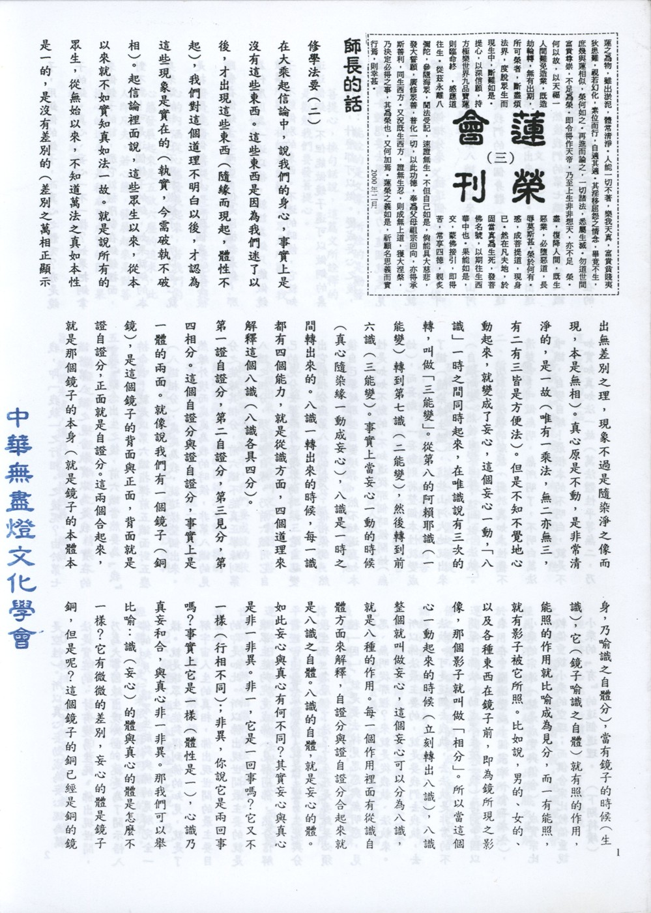

# 第3期

## 師長的話

### 修學法要（二）

*連志道老師講授、編輯部整理*

在大乘起信論中，說我們的身心，事實上是沒有這些東西。這些東西是因為我們迷了以後，才出現這些東西（隨緣而現起，體性不起），我們對這個道理不明白以後，才認為這些現象是實在的（執實，今需破執不破相）。起信論裡面說，這些眾生以來，從本以來就不如實知真如法一故。就是說所有的眾生，從無始以來，不知道萬法之真如本性是一的，是沒有差別的（差別之萬相正顯示出無差別之理，現象不過是隨染淨之相而現，本是無相）。真心原是不動，是非常清淨的，是一故（唯有一乘法，無二亦無三，有二有三皆是方便法）。但是不知不覺地心動起來，就變成了妄心，這個妄心一動，「八識」一時之間同時起來，在唯識說有三次的轉，叫做「三能變」。從第八的阿賴耶識（一能變）轉到第七識（二能變），然後轉到前六識（三能變）。事實上當妄心一動的時候（真心隨染緣一動成妄心），八識是一時之間轉出來的。八識一轉出來的時候，每一識都有四個能力，就是從識方面，四個道理來解釋這個八識（八識各具四分）。

第一證自證分，第二自證分，第三見分，第四相分。這個自證分與證自證分，事實上是一體的兩面。就像說我們有一個鏡子（銅鏡），是這個鏡子的背面與正面，背面就是證自證分，正面就是自證分。這兩個合起來，就是那個鏡子的本身（就是鏡子的本體本身，乃喻識之自體分），當有鏡子的時候（生識），它（鏡子喻識之自體）就有照的作用，能照的作用就比喻成為見分，而一有能照，就有影子被它所照。比如說，男的、女的、以及各種東西在鏡子前，即為鏡所現之影像，那個影子就叫做「相分」。所以當這個心一動起來的時候（立刻轉出八識），八識整個就叫做妄心，這個妄心可以分為八識，就是八種的作用。每一個作用裡面有從識自體方面來解釋，自證分與證自證分合起來就是八識之自體。八識的自體，就是妄心的體。如此妄心與真心有何不同？其實妄心與真心是非一非異。非一，它是一回事嗎？它又不一樣（行相不同）；非異，你說它是兩回事嗎？事實上它是一樣（體性是一），心識乃真妄和合，與真心非一非異。那我們可以舉比喻：識（妄心）的體與真心的體是怎麼不一樣？它有微微的差別，妄心的體是鏡子銅，但是，這個鏡子的銅已經是銅的鏡子，用銅做的鏡子，而真心之體呢？亦是鏡子的銅。真心、妄心一不一樣？如果把銅拿來做鏡子的話，那它就被限制在銅鏡裡面，對不對！可是這個鏡子的銅，如果就銅的本身來講的話，它不限於做鏡子，所以妄心就是把它限制在做鏡子上，而那個真心是不被限制在做鏡子上而已，但是同樣都是銅，那為什麼因為一迷以後，就認為銅只能做鏡子，不能做別的東西。不迷的時候，它就知道這個銅，不但能做鏡子還可以做銅的桌子、椅子，什麼都可以做。變成妄心之後，自然有一種想要去攀緣的能力，這個就是「見分」，當它有這個能力一出來的話，自己就會變出一個相分來，被這個見分所攀緣，叫做自變自緣。第八識變出來的相分就是山河大地，與我們的這個身體（根身器界），這個就是第八識變出來相分。當第八識變出這些以後，然後我們的第七識抓著這個第八識的見分，把它抓成是實在的法而且是實在的我，即「我執」之行相。之後呢？由於第七識將第八識之見分執實以為是我，實在的『我』觀念出生之後，前六識當然要為『我』拚命啦！就是以第六識指揮前五識面對五塵（八識相分），處處為我，就這樣整個出來。然緣外境而處處為我的時候，非第八識的見分之能緣其相分，前六識不能真正攀緣到第八識之相分，須自變自緣，乃前六識用它自己的見分去攀緣外面境界的時候，它自己變出它的相分，與第八識的相分很相像的。然後自己攀緣那些自變境界，然不知道真如本性是如如不動的，不知道從哪個時候開始（無始），而妄動，一妄動則將整個本性就變成了識（隨染緣生識），這些山河大地就出來（自識所變）然後自變自緣，這叫做「法執」。

所以有法執的緣故，對於真如本性弄不清楚啦！叫做無明，無所明了，不明白萬法唯識，自變自緣！最根本的不明白，就是不如實知真如法一故（萬法體性平等無二，乃是空性）。所以真心妄動成為妄心，認為萬法是實在的，才有變易生死。佛出現世間，乃為大事因緣出現於世，就是為了開示悟入佛的知見，讓眾生能夠與佛的見解完全一樣。就是讓眾生能夠得到佛的知見，就是了解宇宙人生的真相，佛出現世間的最主要目的即是如此。所以佛出現世間最主要的就是讓眾生能夠究竟成佛（見解同佛，然分信解行證）。究竟成佛為了就是了變易生死與分段生死。怎麼個了法？了生死是要結果必須種「因」，就是要去掉見思惑與無明惑，見思、無明從哪裡來？就是從我執、法執來。所以佛法最主要的，就是要我們去我執、去法執。可是這個去我執、去法執是非常的不簡單。佛法（助成眾生破二執）傳到中國以來，在中國演變成十個宗派（小二大八），小乘的宗派（就是成實與俱舍）。成實宗比較偏重說小乘的空理；而俱舍宗比較偏重說小乘的「有」的這個道理。 （下期待續）

## 研習心得報告

### 勸發菩提心文（三）

*心爾*

通別所能：

通別：

通題：文是通。

別題：勸發菩提心文是別；心緣菩提（佛智）是發菩提心。

三重所能：

能詮所詮：能詮的是文章，所詮的是勸發菩提心，換句話說，這篇文所詮釋的是勸勉我們要發菩提心。

能勸所勸：祖師是能勸，大眾是所勸，我們是他所勸的對象。

能發所發：能發是這個人，菩提心所發，發是能發，菩提心是所發。要把菩提心的內涵從心態發展起來，若我們的心態發展起來是五欲六塵的追求，此人即凡夫，若心態發展起來是對菩提心的追求，是種成聖成賢的因，果報一定能成聖成賢，乃至成佛。

這一篇文的重點：

一、告訴我們要怎麼發？有幾種因緣，幾個條件。

二、所發的狀態是什麼（正、真、大、圓之菩提心）？藉著因緣（內五因、外五緣）要發起正、真、大、圓之菩提心，必能成就菩提。此省庵大師的苦口婆心，嘔心瀝血，泣血稽顙，哀告大眾，大家若不以為我此人很卑下、淺陋，請稍加聽我幾語。文裡表現他勸眾的苦心。勸的苦心都在文裡表現，這一篇文如果沒有把這三個重點表現出來，這篇文章叫文不對題，菩提的狀態沒有顯示，我們要成就的狀態沒有顯示，發的因緣沒有講，勸的苦心沒有顯示，洋洋灑灑一篇論文，全部文不對題。先把上面弄懂以後再看五重玄義。

五重玄義：

講經之前，將經義幽微之處、精奧之旨，於前先述，讓我們攝持經義、經旨，讀經文時，必能有所體會。先了解經義之所在，藉由誦經串習經義，越誦經體會經義越深，則悟性越增上，此殊勝之見解於日用平常能任運現起，此即所謂將佛法運用於日用平常，於日常積聚了生死與成佛之資糧，誦經的目的在此，而不僅只是誦經治病，助孩子考上大學﹑﹑﹑等等。所以每一部經之前先述五重玄義，乃令讀者先抓住一經之玄義。誦經無非是堅固這個義理，使我在遇境逢緣時，以此義理為攝持境界的主要心態。這叫做佛法用在日用平常，否則佛法怎麼用在日用平常？佛法運用於日用平常，非佛法世俗化，而是遇世俗時如何將心相應於佛法之法義。

五重者：

１、釋名：解釋經題。

２、顯體：顯示本經詮釋之境，乃一經之體，亦是行者依經修持可證悟的境界。

３、明宗：下手修行的方法。

４、論用：這本經的作用。

５、教相：這本經是大乘經教，還是小乘經教，清清楚楚的說明。且屬於五時說法之何時。

經過以上五重玄義，彰明一經之玄妙義理，更能顯出佛的悲心（拔苦予樂），也能看出佛度人的因緣（約五時而言），日用平常當中若能用這個心意，第一能看出對方的誠意，一般人只見別人的好惡，生起內心的貪瞋，看不到人的誠意（助我人破迷啟悟，離苦得樂），只在意自己的感受，很自私。注重人家的誠意，與看到事情的因緣。會讀書就會做人，做人不會做表示書不會讀。五重玄義之運用，例如在一場合中，我是什麼人，我到底是爸爸、媽媽是哥哥、姊姊（釋名），依此名要顯示什麼內涵（辨體），下手要怎麼做（明宗）？會產生什麼大作用（作用），此法相是怎麼樣的教相？是世間的教相，還是出世間的教相，小乘的教相或大乘的教相。而且從五重玄義裡了解佛的悲心及度眾之時節因緣，時節因緣之掌握就是佛的智慧。真正有智慧的人，會掌握時節因緣，在時節因緣裡該做什麼就做什麼，於時節因緣看得懂，看得準，要怎麼做，代表很有智慧。依五重玄義，就可讀出佛的悲心，佛的智慧，這叫做會修行。

釋名：此題以單法立名。

勸發菩提就是單法，一切經題分七種（乃天台智者大師所立）。

單人：如佛說阿彌陀經，佛是人，阿彌陀也是人，叫單人。

單法：大般若經，大般若就是一個法，發菩提心也是一個法，持戒，戒裡面分為不殺、不盜、不淫等各一法，但以發菩提心這一法最重要，若菩提心沒發，修不殺、盜、淫，無出世與成佛之大用，只是世間的層次而已，甚至是三世佛冤的善業。

單喻：大寶積經，讀這個書如積集大寶（成佛）之資糧一樣，比如積錢先存一百元，再存一千元，一千元存完了，換手飾去存，然後再存寶物，存房地產。『大寶積』是否能存到真正的寶，內心裡是否能存到真正的寶，內心裡是否能積真正的內涵。

人法立題：佛說無常經，佛是人，法是無常法。

人喻立題：如來獅吼經，如來是人，獅子吼是比喻。獅為萬獸之王，彼一吼而百獸潛藏，比喻佛說法能降伏邪魔外道。

法喻：妙法是法，蓮華是比喻，蓮花比喻妙法，蓮華最能比喻妙法，蓮華是為蓮而開華，華開蓮現，華落蓮成，比喻一乘法因果同時。

人法喻立題：大方廣佛華嚴經就是人法喻，佛是人，大方廣是法，華嚴是比喻，用華勝的佛果。此題「勸發菩提心」都是法、無人無喻，故曰單法。題目雖有含攝省庵大師為能勸，眾生為所勸，在題目文字上沒有明顯的表現，所以是單法立題。（下期待續）

## 放生專欄

### 劉居士指導海域放生應注意事項摘要

*編輯部整理*

放生海域的瞭解：放生海域應選擇適合生物棲息的處所，港區若屬不易對流的水域會因水質影響生物的存活，應予避免。

放生生物的生存習性：放生生物各有不同的生存習性，如螃蟹屬爬行運動的生物，放生後往往停留於原地，為免大量再遭網捕，可搭船出海沿途放生，使螃蟹散布於廣大的海域，較不易再遭網捕。

捕生手法的研究：對生物遭遇網捕的概況能多點瞭解，有助生物放生後不再遭遇網捕。譬如螃蟹的捕捉係在籠子內放入已往生的魚類，再沉入海底進行誘捕，因此將螃蟹分散放生於廣大的海域，可降低再遭網捕的機會。

放生氣候的考量：海中生物不適合較高的水溫，因此海洋生物在冬季放生存活的比例較高，但要留意購買生物後雖有水車並於水中打入氧氣，仍不應停留太久，避免因水溫的上升影響生物的存活。

放生生物的考量：放生生物除考慮其存活能力外，產卵期亦是應考慮的因素。對於生命力較弱的生物，則在放生設備上應有較多的考量，譬如出海放生，則魚類生物在船上的氧氣供給與水溫的保持等。

採購現場應注意事項：採購人員抵達時，應先全場瞭解生物狀況，包括生物種類、價格、生物的活潑性等，再決定如何採購。對於因緣不具的生物，亦應念佛予以回向。

採購人員編組及注意事項：採購人員應以三人為一組，一位負責生物撈取的安全及過磅，一位負責登記生物數量，一位負責會計部份，並於當場詳列各項金額。三人應協同作業，避免分散，以免秩序失控延誤時效。

參與放生諸大德需注意事項：生物一旦上水車後，與時間的賽跑就已同時開始，為免時間的延誤，參與的諸位大德應儘可能集中，以免團體移動時因人員未能到齊而延誤時間。

放生現場的安全：放生現場的秩序，直接影響人員的安全，應接受工作人員的安排，避免全部擠到海邊，容易造成危險。一次安全的放生，正是下一次放生的好緣起。

放生後現場的維護：海邊放生後，可在海邊撒些紙錢，此為捕生人的忌諱，一則保護所放生物不至立刻遭遇網捕，一則可免捕生人等多造殺業。

### 放生心得與感想

德銓

很高興藉此機會發表感想，將放生心得感想發表，請不吝指教，藉此機會檢查自我，以提昇德能。

放生活動之前，為何要做前行緣念？

加強自己的信念，消除自己的疑惑及障礙，建立正確的觀念並產生做善事的推動力。

確立放生的宗旨及理念，在正行時心念才能專注，才會有受用，才不辜負眾人的努力。由於習性使然，往往到了目的地，下了遊覽車，六根就開始被外境牽著走，看到順眼的則生起貪念，看到不順眼的則生起瞋念，看到既非不順眼也非順眼之境，則腦袋空空，而把放生的宗旨及理念拋到九霄雲外，好不容易安排時間，參加放生活動，結果還是在長養貪瞋癡，辜負舉辦人的用心，非常可惜。

如何做前行緣念？

在每次參加放生活動之前，先閱讀「放生問答」，了解放生的意義：什麼叫做放生？（放生就是看到有生命的異類眾生，被擒被抓被關被殺，驚惶失措，命在垂危之際，發慈悲心，買物救贖，予以解救釋放的一種行為！）為何要放生？（放生就是還債，還今生累世以來我們所欠無數的殺債。要知道因果報應，絲毫不爽，有罪必報，有債必還，今生我們所造的殺債已不可勝數，更何況累劫多生！所以我們要積極地放生，救贖生命，償還宿債，以期滅罪消愆，消除罪障！）放生有哪些殊勝的利益？（無刀兵劫、免除戰爭殺禍、免天災橫禍、長壽、健康、少病、子孫代代昌盛，生生不息等）透過不斷的串習，將有助於心力的提昇。參閱「放生問答」第八頁。

建立為何要常常參加放生活動的觀念

或有認為參加放生活動不要太頻繁，最好是兩個月參加一次就好了！這是末學的看法，我們來看看祖師大德的看法：

寒山問拾得：放生可成佛否？答曰：諸佛無心，惟以愛物為心，人能救物之苦，即能成就諸佛心願矣。故一念慈悲，救一物命，是一念觀世音也。日日放生則慈悲日日增長，久久不息則念念流入觀世音大慈悲海矣。我心即是佛心，焉得不成佛乎！故知放生因緣，非小善之所能比。凡我同願，宜廣行勸勉，善令群生同歸悲化。參閱「放生問答」第四十九頁。

由此即可看出菩薩為何會成為菩薩，而凡夫仍為凡夫的道理了。

菩薩的慈悲心如瀑布一般源源不斷擁出，因此可以成佛，而凡夫的慈悲心有如小溪，隨著氣候的變化，時而有水，時而乾涸。

因此放生活動不僅是每月做，最好是日日做、時時做。

建立放生乃造清淨善業的觀念

目前的環境要造善業容不容易？要造純淨的善業容不容易？什麼是純淨的善業？以布施乞丐為例，末學有一段期間上班必須經過地下道，看到的都是同一批乞丐，就會引發許多煩惱，首先會懷疑他們是不是真乞丐，如果是真乞丐，到底要投給他多少錢，只投十元是不是太吝嗇，我得到的功德是不是很小，甚至於會想他會不會拿錢去喝酒，沒有幫助他反而害他；有時候還會分別乞丐的等級，看到比較順眼或比較像乞丐的，才投錢給他；如果每次經過都要投錢，也是非常麻煩，或有時身上只有大鈔，乾脆繞道而行，眼不見為淨。

當有這麼多雜念時，這種布施就不是純淨的善業。反觀放生活動，就具有造純淨善業的條件，從到漁市場買生物開始，並不會以生物的大小、美醜做為挑選的依據，而是以生物的立場來考量，今天的放生地點、水質及氣候是不是適合這些生物。如果碰上交通阻塞或路途遙遠，不但不會引發煩惱反而更歡喜，因為可以有更多的時間薰習善法；如果碰上風雨交加、飢寒交迫的情況，大家更能發勇猛心去行善，因為大家都知道善事越難做，法財賺越多；還有我們屢次參加放生，也沒有疲憊不耐的心情，因為我們很清楚了解菩薩在成佛之前，也是如此時時行善而毫無疲憊之心；在放生的時候，我們也不會要求這些生物要如何報答我們，因為我們都知道，他們是我們累劫的父母，放他們生路，乃是天經地義的事。因此，參加放生活動，雖然沒有在家裏舒服，但短短的一天卻可以長養這麼多善法欲，要成佛或為凡夫，就完全繫於心中一念了！

發願做一些自己以前不敢做或不願做的事，給自己設定一些挑戰的目標，例如發願在大眾面前供養心得、發願不畏懼冰冷的海水、不怕因而感冒、不怕自己的衣服弄髒或弄濕等等。

正行時之意樂及觀想

一心專注，依照老師的帶領觀想。

放生旅遊活動看能不能在事項中辦的圓滿，意樂也能夠建立的圓滿，使我們參與的家屬乃至於所屬的單位都能夠歡喜讚嘆、發菩提心，把它當成一種教化，使得人心向善，風俗淳厚，也能夠將此功德迴向世界和平，乃至於未來有這個往生殊勝因緣，當然意樂要圓滿也要配合事項的圓滿方引發意樂的圓滿，因為一般都是對境生心，如果境界不好，要生起殊勝的意樂是不容易的，如西方極樂世界清淨莊嚴，往生後對境生心，能夠生出希求佛果的殊勝意樂，所以事項上的圓滿也有助於參與的大眾意樂圓滿。然事項的圓滿需講究分工，分工的目的就是為了合作，一定要結合大家的共識而造業，方有殊勝的果報。造共業即是種一佛出世，千佛護持之因。若有發菩提心來修菩薩行之行者，放生就是一攝六度之菩薩行，如放生對於所放的生物，花錢去買叫做財布施，放出去為他們說法叫法布施；至於讓他們免於恐懼，是無畏施。放生對治我們的殺生業及瞋恨心這叫做持戒。這個生物就算對我們有危害，我們也不怨恨，這叫做耐怨害忍，就像我們當初放螃蟹，被螃蟹咬到，那也沒有關係，這叫做耐怨害忍；環境或許不好，比如說天候或許不良、路途難行、交通不便、方便之廁所太少、而卻歡喜安住放生之業，這叫安受苦忍；放生也要講究放生的心態是否與法相應，這叫做諦察法忍；從這放生也可以修學此三種忍辱度。而放生活動可以不斷的辦下去這叫做精進。所注意的就是這些生物能夠歸於大自然，海闊任魚躍，天空任鳥飛，而且注意自己菩提的意樂，這叫做禪定。放生也知道所放的生物體性本空，眼前隨緣隨業變成畜生相，如果能夠為他們說法，乃至於以菩提心來迴向，他們未來都能夠成就佛道，這叫做般若。放生的事業結合六度即是殊勝菩薩行。大家來造這樣的共業，將來就能夠感應我們都是能夠成就莊嚴殊勝佛果，且彼此互相扶持，是故釋迦牟尼佛出世，有這麼多佛護持他，而阿彌陀佛出世，亦得釋迦牟尼佛以及十方佛護持，乃因地中大家一起造共業。所以我們若把這個事項看成是殊勝的，所累積的功德是不可思議的，若把它看成單純的旅遊活動，那就很可惜了，一方面時間也耗費，二錢也花得不少，再加上這些的支援及資源，乃至於行前籌備，人員之調配及義工的疲於奔命，若沒有達到效果是很可惜的。

活動後之結行

觀察蓮友的善言與善行，做為自己學習的榜樣。譬如在放生的時候，有些蓮友捲起褲管，站在最前線，不怕冰冷的海水，不怕身體弄濕。有些蓮友小心翼翼用雙手捧著魚送到海裏，不怕手被魚鰭刺傷。有些蓮友大聲提醒大家小心，不要輕忽海浪的威力。

檢討正行時的想法與行為和前行緣念做一比較，將沒有做到或做不理想之處，記在筆記本上，做為下一次活動提昇的重點。

透過不斷的參加放生活動，無數次的前行緣念、正行及結行，調整自己的行為與思想漸漸與法相應。

當無法參加放生正行時，意樂如何安立？

在家中觀想前幾次活動的過程，好像自己也跟著蓮友一起去放生，體會魚蝦躍入水中的喜悅。

往年兵荒馬亂之時，幸虧老天保佑，我們僥倖逃過一劫，保全了性命，假若當時，盜賊在後面追殺，一步步逼近，我知道被擒被殺必不可免時，當時的心情，慌張不慌張？

假若當時，刀已殺到我的身上，我的四肢殘廢落地，痛澈心肺，疼痛已極以致哭叫不出聲音來，但命還沒有斷，又不得馬上死亡，求生不能，求死不得，當時的心情，冤恨不冤恨？痛苦不痛苦？

節錄「放生問答」八十四頁。

## 臨終關懷與助念時效

### 陳敦臣老居士往生記

*編輯部*

老居士生於民國十三年三月十二日出生於福建省閩侯縣（林森縣）東門外廣尾鄉（今之福州市），民國三十四年七月福建省立福州高級工業職業學校機械技術科畢業，民國四十年一月經銓定資格考試，取得普通考試及格資格。民國三十五年五月渡海來臺灣，進入臺灣糖業股份有限公司虎尾總廠運輸課，夫人陳周秀清隨即於同年中秋時分亦來臺灣團圓，次年長女錦璋出生，過兩年長子際榕、次子際桐先後來世，三子際松亦於民國四十二年出世，四十年來，老居士微薄薪俸，承擔起一家六口之生計，老居士在工作上的努力不懈、勤勉克苦，使子女個個皆完成高等教育，並於家庭樹立孝悌淳厚的家風。

老居士一生行事嚴謹，雖然學的是機械，但儒家倫常道德觀念極為濃厚，下班假日，就是督促子女讀書，每日起早為子女準備早餐，將每枝鉛筆削得渾圓剔透，只要子女用功讀書，老居士對操持家務、灑掃庭除是不疲不厭地歡喜而作，數十年如一日，了無倦怠。

老居士行為保守，作事謹慎，一生中規中矩，以身作則，令子女們感受他的辛勞而倍加用功讀書。除了督促子女教育，老居士對身處老家福州的祖父傑生公、繼祖母楊氏與姑姑一家人，亦從微薄薪俸中省吃儉用，時加接濟。常聞老居士對夫人敘述他的思鄉情懷，印象深刻的是，當祖父於民國五十四年七月逝世，老居士在虎尾龍善寺辦超渡法會而哭得涕泗交流，在子女幼小的心靈烙下很深的感動，子女們於今憶及，歷歷如新。此後老居士對繼祖母亦盡心地接濟照顧，直到祖母往生，對姑姑手足情深的照護猶不間斷，此種孝悌行持，實足作為傳家之典型。

老居士除了對父母手足的孝悌心與對子女的用心教養外，於同仁部屬更是關懷有加。四十至五十年代，時值臺灣糖業盛期，老居士身為總廠運輸課主管，彼時掌管之臺糖小鐵路，為甘蔗運輸與城鄉客運兩大經濟與運輸脈動，常常夜半時分，喇叭式電話鈴響起，他接過電話，寒夜出門，幼子睜開瞇矇的眼睛問道：「爸爸，您又要去翻火車起來？」常常到早晨醒來，才見老居士滿身汗水回來，又開始為子女削鉛筆、準備早餐了，做完才跨上鐵馬上班去。老居士領取微薄薪俸，對公務卻是盡心盡力，這種敬業精神，也影響子女此後的行止。在臘月寒冬，製糖盛期，為鼓舞鐵道維修工廠同仁的士氣，夜半時分，老居士以腳踏車和同仁載著兩百多個夫人做的饅頭去慰勞員工，令孩子們感覺既溫馨又有趣，將老居士敦厚溫和的個性看在眼裡、印在心裡，不知不覺感染了老居士儉以律己、寬以待人的德性。

老居士民國六十二年八月自斗六糖廠退休，蟄伏了兩年，隨夫人到臺中縣太平鄉的田園社區開了一間雜貨店，從來沒見過一家雜貨店如此乾淨，老居士愛清潔勤懇的個性，讓小店容光煥發，四鄰近悅遠來。民國六十九年家人帶著老居士就醫，診斷出罹患巴金森病，頗配合醫生的囑咐規規矩矩服藥，病情控制良好，也讓醫生譽為眾多同症病人的模範生。俟後，照顧二子兩位長孫，讓孫兒喜歡親近嚴肅的老居士，展現老居士慈祥親和的一面。

在學佛道路上，老居士早於民國六十二年即皈依佛門，依止於廣欽老和尚座下，註記為佛弟子後，雖未見如法修持，仍是早晚勤於上香供水，去年十二月至今年五月住了半年多的醫院，三子將老居士接回埔心奉養後，時刻以一句阿彌陀佛名號提醒老居士將來的依止處，初時雖泛泛的念，仍是滿臉憂鬱、煩惱無邊、一臉苦相，直到照顧老居士的陳姊（陳錦雲女士）勸老居士清口後，逐漸地在清瞿的臉上有了光澤，眉間額頭的皺紋盡去了，精神來時，抱著佛號機宏聲念佛的聲音令人動容，最後的一個半月，讓三子際松覺得和老居士的距離由遠而近，執著老居士的手念佛，首次感受到父子是如此的貼近。

老居士於去年十二月三十一日上午十時在子女親眷與諸多蓮友的佛號聲中很安祥的往生了，在家中由一九九九年千禧之為老居士日夜誦持佛號，跨到了二千年元旦日晨九時，啟被沐浴更衣時，但見全身關節自頭頸至腳指是如此的柔軟無礙，尤其頸關節柔如嬰兒，需用一手撐住，方不致搖晃不止，與生前因巴金森症造成的僵直、遲滯與蜷曲相較，真如解下了一生的病苦，了無罣礙，輕鬆自在，此情此景，若非親身經歷，實在無法相信，更堅信老居士是真的往生彌陀淨土了。

正如小孫子驛鑫在靈前上香時道：「阿公坐在蓮花的時候，不要動來動去，然後要念佛，那你就跟我一樣，全身都有阿彌陀佛，好不好？」家人目睹此一瑞相，感受良多，並願在七七四十九日中為老居士與一切有情誦經、念佛、興辦佛事，並願日後為公發心，護持正法，為臨終蓮友助念往生。惟願老居士在彼淨土，品位高增，早成佛道，承願再來。

## 啟蒙園地

### 孝

陳敦臣老居士往生記

*編輯部*

老居士生於民國十三年三月十二日出生於福建省閩侯縣（林森縣）東門外廣尾鄉（今之福州市），民國三十四年七月福建省立福州高級工業職業學校機械技術科畢業，民國四十年一月經銓定資格考試，取得普通考試及格資格。民國三十五年五月渡海來臺灣，進入臺灣糖業股份有限公司虎尾總廠運輸課，夫人陳周秀清隨即於同年中秋時分亦來臺灣團圓，次年長女錦璋出生，過兩年長子際榕、次子際桐先後來世，三子際松亦於民國四十二年出世，四十年來，老居士微薄薪俸，承擔起一家六口之生計，老居士在工作上的努力不懈、勤勉克苦，使子女個個皆完成高等教育，並於家庭樹立孝悌淳厚的家風。

老居士一生行事嚴謹，雖然學的是機械，但儒家倫常道德觀念極為濃厚，下班假日，就是督促子女讀書，每日起早為子女準備早餐，將每枝鉛筆削得渾圓剔透，只要子女用功讀書，老居士對操持家務、灑掃庭除是不疲不厭地歡喜而作，數十年如一日，了無倦怠。

老居士行為保守，作事謹慎，一生中規中矩，以身作則，令子女們感受他的辛勞而倍加用功讀書。除了督促子女教育，老居士對身處老家福州的祖父傑生公、繼祖母楊氏與姑姑一家人，亦從微薄薪俸中省吃儉用，時加接濟。常聞老居士對夫人敘述他的思鄉情懷，印象深刻的是，當祖父於民國五十四年七月逝世，老居士在虎尾龍善寺辦超渡法會而哭得涕泗交流，在子女幼小的心靈烙下很深的感動，子女們於今憶及，歷歷如新。此後老居士對繼祖母亦盡心地接濟照顧，直到祖母往生，對姑姑手足情深的照護猶不間斷，此種孝悌行持，實足作為傳家之典型。

老居士除了對父母手足的孝悌心與對子女的用心教養外，於同仁部屬更是關懷有加。四十至五十年代，時值臺灣糖業盛期，老居士身為總廠運輸課主管，彼時掌管之臺糖小鐵路，為甘蔗運輸與城鄉客運兩大經濟與運輸脈動，常常夜半時分，喇叭式電話鈴響起，他接過電話，寒夜出門，幼子睜開瞇矇的眼睛問道：「爸爸，您又要去翻火車起來？」常常到早晨醒來，才見老居士滿身汗水回來，又開始為子女削鉛筆、準備早餐了，做完才跨上鐵馬上班去。老居士領取微薄薪俸，對公務卻是盡心盡力，這種敬業精神，也影響子女此後的行止。在臘月寒冬，製糖盛期，為鼓舞鐵道維修工廠同仁的士氣，夜半時分，老居士以腳踏車和同仁載著兩百多個夫人做的饅頭去慰勞員工，令孩子們感覺既溫馨又有趣，將老居士敦厚溫和的個性看在眼裡、印在心裡，不知不覺感染了老居士儉以律己、寬以待人的德性。

老居士民國六十二年八月自斗六糖廠退休，蟄伏了兩年，隨夫人到臺中縣太平鄉的田園社區開了一間雜貨店，從來沒見過一家雜貨店如此乾淨，老居士愛清潔勤懇的個性，讓小店容光煥發，四鄰近悅遠來。民國六十九年家人帶著老居士就醫，診斷出罹患巴金森病，頗配合醫生的囑咐規規矩矩服藥，病情控制良好，也讓醫生譽為眾多同症病人的模範生。俟後，照顧二子兩位長孫，讓孫兒喜歡親近嚴肅的老居士，展現老居士慈祥親和的一面。

在學佛道路上，老居士早於民國六十二年即皈依佛門，依止於廣欽老和尚座下，註記為佛弟子後，雖未見如法修持，仍是早晚勤於上香供水，去年十二月至今年五月住了半年多的醫院，三子將老居士接回埔心奉養後，時刻以一句阿彌陀佛名號提醒老居士將來的依止處，初時雖泛泛的念，仍是滿臉憂鬱、煩惱無邊、一臉苦相，直到照顧老居士的陳姊（陳錦雲女士）勸老居士清口後，逐漸地在清瞿的臉上有了光澤，眉間額頭的皺紋盡去了，精神來時，抱著佛號機宏聲念佛的聲音令人動容，最後的一個半月，讓三子際松覺得和老居士的距離由遠而近，執著老居士的手念佛，首次感受到父子是如此的貼近。

老居士於去年十二月三十一日上午十時在子女親眷與諸多蓮友的佛號聲中很安祥的往生了，在家中由一九九九年千禧之為老居士日夜誦持佛號，跨到了二千年元旦日晨九時，啟被沐浴更衣時，但見全身關節自頭頸至腳指是如此的柔軟無礙，尤其頸關節柔如嬰兒，需用一手撐住，方不致搖晃不止，與生前因巴金森症造成的僵直、遲滯與蜷曲相較，真如解下了一生的病苦，了無罣礙，輕鬆自在，此情此景，若非親身經歷，實在無法相信，更堅信老居士是真的往生彌陀淨土了。

正如小孫子驛鑫在靈前上香時道：「阿公坐在蓮花的時候，不要動來動去，然後要念佛，那你就跟我一樣，全身都有阿彌陀佛，好不好？」家人目睹此一瑞相，感受良多，並願在七七四十九日中為老居士與一切有情誦經、念佛、興辦佛事，並願日後為公發心，護持正法，為臨終蓮友助念往生。惟願老居士在彼淨土，品位高增，早成佛道，承願再來。

### 孝順的閔子騫

*編輯部*

孔子弟子閔子騫，年紀很小的時候，母親就去世，父親娶了後母，後母再生了兩個孩子。

有一年冬天，天氣寒冷，父親要外出，就叫閔子騫駕車，在途中，閔子騫突然掉落了駕馬的韁繩，父親以為兒子太粗心，就責怪他的不是，誰知一接觸兒子的衣服，才發現閔子騫穿的布袍裡面，全是不保暖的蘆花。回家後，再摸摸另外兩個孩子的衣服，卻是暖和的棉花。父親的心裡明白了，是後母虐待了閔子騫，一氣之下，就要趕走後母。

這時閔子騫跪下來哀求父親，說「母在一子單，母去三子寒」母親在家，只有孩兒一人受凍，如果母親走了，家裡就有三個孩子要受寒。這兩句話感動了父親，留下了後母；也使後母成了慈母。

閔子騫的孝行是發自天性的，他不管父母對他是疼愛，或是憎惡，他始終都是用心盡孝，安頓了一家人的心，讓一家人知道反省改過，各安其份，保全了一個瀕臨破碎的家庭。孔子在教學時，還特別稱讚閔子騫，真是難能可貴的孝子啊！
