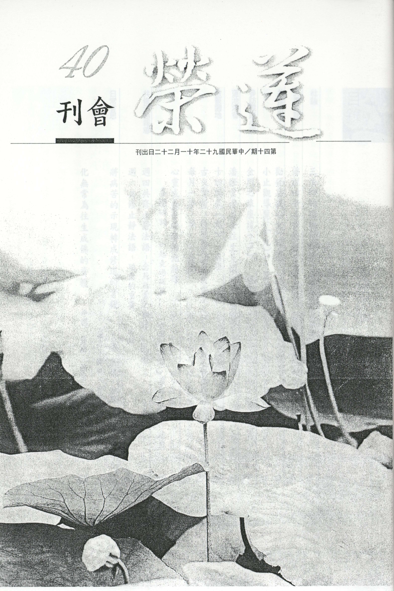

# 第40期

## 社論

### 三法印的認識與禪修　法善法師來台開示

*編輯部*

佛法須依三法印

五人說法同佛說

若能依教且奉行

便是真正佛弟子

（於淨苑紀念堂）

前言：

法師原籍英國倫敦，修行南傳原始佛法，出家至今歷時十九年，在出家前，高中三年得到機緣開始修行禪坐，一九八一年入BRISTOL大學參加佛學社研讀佛法、定時禪修並組成樂團，過著快樂的大學生活。在大學畢業後，赴泰國尋訪高僧，於曼谷禪修，後經人告知有高僧阿姜查，隨赴泰北參拜阿姜查，在國際僧林禪寺中過著辛苦的生活，對於阿姜查以及佛法產生極高信仰的心，並對僧林禪修的僧團產生極大的信心。此後數年都成為阿姜查的親身侍者，尤其在阿姜查重病之後，悉心照顧，阿姜查於一九九一年逝世，法善法師又轉為阿姜查弟子之一的安南禪師下繼續虔修，並多次到森林荒野獨自修禪，也翻譯阿姜查的法語為英文，並在一九九八年隨安南禪師至澳洲多處說法充任翻譯。法師所顯示的風格，給澳洲弟子留下深刻的印象，終於在二ＯＯ一年初，受安南禪師之託，到墨爾本弘揚佛法，並領導僧團教化四眾弟子，戒行嚴謹，托鉢維生。法師久聞台灣佛教興隆，在二ＯＯ三年二月三日至十七日到台灣參訪高僧大德，並盼與台灣信眾廣結法緣，以下是法善法師在淨苑老和尚紀念堂簡短的開示的核心。

法師云：

阿姜查弟子不但有許多泰國人，並也度化許多歐美弟子出家學佛，乃殊勝佛學的教師，此行來台見了許多法師、尼師，樂見台灣修行的盛況，並在蓮友的請求下說明阿姜查教法的核心。

阿姜查要我們放下自我的執著，這是修行最重要的一步，但是要怎麼放下呢？我們一般人都以為身體是我，心是我，這樣的認為是痛苦的根源，對著五蘊的執著要學習的是放下，他(五蘊)其實不屬於我(我所)，他(法我)其實也不是我(人我)。在禪觀當中，首先先看到這些五蘊的變化，他是個幻相，有這樣的智慧就能破除對五蘊的執著，我們都以為身體是真實的，其實只不過是四種元素的組成，他並不是我，也不是我所擁有的，這種現象若能看得清楚，就會破除對身的執著。即便是嬰兒的神識也很自然地以身為我（俱生我執），所有身體各種的變化，只不過是前世的相續，所以若不好好地思考，則吾人從出生到死亡都會以身為我或我所，見到了什麼？聽到了什麼？覺知到了什麼？都很真實地以為我見到了什麼！我聽到了什麼！我覺知了什麼！並且在見到了、聽到了，認為是好的就生起愉悅的心，見到了、聽到了認為是不好的就生出厭惡的心，並把這愉悅或不愉悅、不舒服的感覺認為是我的，在未修行時，見事情都是這樣見的，以為這種愉悅、不愉悅的感覺，都是有一個真實的我去感受的，於是就要進一步地再去尋求那舒服的感覺，並且以為那是真實的快樂，不斷地去尋找，這種尋找就是痛苦的因。不舒服的感覺，也認定那是真實的我之感覺，在生起這種感覺時心情是不舒服的，也認定是真實的我的感覺，所以努力地要排斥這種不舒服的感覺，此種反應會越來越強，所帶來的痛苦就會越來越多，心以為有一個我在那裡受樂或受苦，並且很害怕快樂失去，痛苦來臨，這就是我受生的因。

佛說我們在喜怒之境當中以為有一個我，被這個我團團包著，這種現象是最悲哀的心理現象，佛在菩提樹下證道之前，他觀察前生發覺到生命的次數無量無邊，看到了自己所流過的眼淚多過了漫漫的大海，自己無益浪費的生命所積的枯骨高過崇高的峻山，做過的人、畜生、天、神，享受或貧或富，其中生命現象的差別雖然極大，但是有一個共同的特色就是在苦樂中的打轉，心中生出一個真實的我，有這個我生起一個對樂的追求，對苦的遠離，所以不斷在苦樂中打轉，原來追求快樂遠離痛苦都是苦，內心覺得很累，何必苦上找苦，回觀他人生死死生，生命的次數也是無量無邊，被因果與業力所推動，受苦受樂也是在那裡生起一個真實的我，而有種種的悲歡離合，所以對眾生也生起很強的慈悲心，想要幫助他們離開這樣的痛苦，並且也努力的尋求幫助他們遠離痛苦的方法，生起了上面殊勝的覺受後就努力的禪觀，生起了定力，並在智慧的觀照下徹底瞭解宇宙人生的真相。宇宙的真相就是所有的現象都是變化的，都是無常的，本質都是痛苦的，而尋求這些現象的真實性，一粒微塵也找不到的，這即是三法印，不只生理、物質的現象如此，即使是心的感受亦復如是，我們都很在意家庭的美滿與事業的成功，以及其他的種種殊勝，並努力地追求圓滿，不知道這些現象其實是無常的，找不到真實性的，即使升到天，享受美妙的五蘊快樂，也在無常的變化中逐漸消失，當五衰相現起時也會恐懼地流眼淚，到底什麼才是永久真正的存在？連天人都搞不清楚，所以當我們能夠看到現象的本質是無常、無我的，內心進入平靜的狀態，那才是真正的永恆。

心對境會有慾望的生起，但是這樣的心理也不會永久地持續下去，因為對境界的看法會改變的，當他對境界的看法改變時，原來有的貪心也消失了，所以到底什麼才是真正的貪？所以既然連真實貪都找不到，那就放下它吧！更何況它是大苦之因，貪如此，瞋也亦復如是，所以心裡再也不會有任何的追求，在心裡不會產生任何追求的慾望時，既不會貪求也不會發脾氣，在一切境界當中享受的是內心的平靜，在平靜的內心當中，還要提起觀察力，看看一切的現象是不是就是苦果，造成這些現象的苦因到底在哪裡？離開這些痛苦後是什麼狀態，以及如何離開這些痛苦的方法，這就是四諦的覺照，就是內心智慧的生起，也是最明亮的，佛的悟道就是這樣的明亮，他明亮的程度甚至連天都為之震動，天人去尋求震動的原因，發現在凡人世間有聖人悟道，而歡喜讚嘆，原來修行只不過是看破、放下，內心平靜而又善於觀察產生明亮。

至於在家人要怎麼在日用平常自我訓練體會空義？在家人當以五戒來約束身心，依五戒而行，學習布施，學習服務，學習放下，特別是放下自我，例如你喜歡吃的蘋果，有大有小，你把好吃的、大的給別人，留下小的、不好吃的，自我就放掉了一些，內心就有跟法相應的機緣，連這個都做不到，修行是談不上，心要存著慈悲、戒律與布施，就為禪觀打下深厚的基礎。就以五戒來說，守五戒要有羞恥心，怖畏因果的心，尤其是羞恥心更是殊勝的護法神，羞恥心會讓我們觀照功夫轉強，不會去傷害自己以及他人，不會去造作任何的壞事，對自己與對他人都不會產生傷害的動作，就像父母照顧嬰兒儘量避免嬰兒受到任何的傷害，守戒不僅在公眾面前要如此，在私下獨處更要如此，而且要有羞恥心作助伴，才能察覺自己的過失。阿姜查曾告訴僧團，對羞恥心及五戒的覺察，要非常努力，使自己在羞恥心的狀態下認真地持五戒，保護自己不犯錯，若有犯錯好比在眾目睽睽下拉大便，守戒如果守到這種地步，不會恐懼，也不會憂愁，心中也有莫名的喜悅，這種狀態最適合禪修，利用守戒的快樂進入更美妙的狀態，是一種修行的善巧。當然禪修是要找時間的，定時的禪修會越學越熟練，內心會越來越容易達到寧靜的狀態，猶如樂器的訓練一樣，越來越熟悉彈奏，也越來越容易彈出美妙的樂曲，樂曲的訓練如是，禪修的訓練亦復如是。阿姜查對禪修有一個很美的比喻，例如雞在雞籠裡，怎麼跑、跑來跑去都在雞籠內，禪修亦復如是，內心不管跑來跑去都在這個範圍。因為守戒的關係，再加上禪修，使得內心既安靜又放鬆，久而久之就進入了正定，在定中即使有雜念也會自然消失（不必修對治法，內心自然寧靜，正是禪定的成就，修對治法是禪定的前方便），在定中觀察法義，思想會像波濤洶湧一樣的生起，然而就像海浪打到岸邊又回到海中、再打到岸邊又回到海中一般，所以若有定功去觀察某些現象而引發的思想，會像海浪一樣波濤洶湧，可是打到岸邊又回海中，即使再多其他思維也不會引發什麼問題。

結語（編者按）：

在五濁惡世日趨嚴重，眾生身心靈亟需得到依止之際，相信大家都會希望有一個新的氣象出現，但是這新的氣象不只是環境的整潔，不只是事業的重新出發，應該是內心有一番新的氣象，提起正確的知見，找到修行的方向，在世法裡面雖然有一份該盡的責任，但是更重要的是要有那不為人知的內心寧靜與一分觀察與覺照的力量，才會幫助我們過好每一個當下。

## 大德法語

### 佛說四十二章經解
（三十二）第四十章〜第四十二章

佛說四十二章經解

（三十二）第四十章〜第四十二章

*道源老和尚講授*

行道猶如牛出泥

直心正念可免苦

勝義觀空現幻化

方是真正解脫處

第四十章

「佛言：沙門行道，無如磨牛，身雖行道，心道不行。心道若行，何用行道。」

磨牛是拉磨的牛，在中日開戰七七盧溝橋事變之前的社會，所吃的麵粉都是用石頭磨出來的，石磨在以前常常可看到，自從發明了可以磨麵粉的機器以後，石頭磨就不用了，所以到現在看到石頭磨的人很少，此處先明白石頭磨就是做麵粉的一個工具，此磨子要如何將麥磨成麵粉呢？得用一頭牛來拉這個石磨，拉石磨磨麵粉的牛叫磨牛。

牛要拉著那個磨在行（行道），若牛不走則磨就不轉圈，就無法磨麵粉了。所以拉磨的牛要一直行（行道），但那個牛的心可沒有行道，吾人出家要行道，不要學那隻磨牛，身體行道，心裡不行道。「心道若行，何用行道。」試問佛道在那兒？佛道在心裡，若心學了佛道與佛道相應了，何以在身體上行道呢？此話不可錯會，以為以心修道，若得了道，則身體不必行道，事實上是身體行道與心裡行道兩者相應（身心相應），若只重身體行道則是心外求法，要曉得佛道不在外而在心內，若心裡要行道（大徹大悟）才能真正斷惑證真，若只身體修道而不重心行道，則無可成就。

第四十一章

「佛言：夫為道者，如牛負重，行深泥中，疲極不敢左右顧視，出離淤泥，乃可蘇息。沙門當觀情欲，甚於淤泥，直心念道，可免苦矣。」

修行佛道的人，譬如一隻背負著很重東西的牛，走到了深泥中間，牛的腳陷入深泥之中，身體上擔負著很重的東西，那麼，這個身體疲乏之極，疲乏之極要出離這個淤泥，不敢左右顧視，一直往前走，一直往前走，就得精進，就得努力了，「出離淤泥，乃可蘇息」等身從淤泥出來後，才可以休息、休息。

「沙門當觀情欲，甚於淤泥，」

出家人要修學佛道，應該觀察到非要斷除這個情欲心不可，要是這個情欲不斷呢？如同牛走到深泥裡面一樣，而且情欲比淤泥更可怕。「直心念道，可免苦矣。」若不要打妄想（想到情欲上面），直心念著佛道，如同負重行入深泥中，不敢左右顧視，一直往前走，出了淤泥，喻如直心念道的行相，才可以休息，可免深行淤泥（六道輪迴）。

第四十二章，也就是本經的最後一章，

「佛言：吾視王侯之位，如過隙塵。視金玉之寶，如瓦礫。視紈素之服，如敝帛。視大千世界，如一訶子。視阿耨池水，如塗足油。視方便門，如化寶聚。視無上乘，如夢金帛。視佛道，如眼前華。視禪定，如須彌柱。視涅槃，如晝夕寤。視倒正，如六龍舞。視平等，如一真地。視興化，如四時木。」

這個過隙塵就是浮塵，牆壁或者是門窗若有洞隙，就從洞隙中射進一道太陽光，在這一道光線之中，你就看見有很多的塵土飄揚著，此即浮塵。因為份量很輕（輕過空氣），所以不會掉落下來。要是沒有那個洞隙，陽光透不過來，若藉陽光即可見到塵土（灰塵），此即過隙塵。

凡夫所以不能解脫，乃因有兩種執著，一是我執，一是法執。先破我執，在五蘊的基礎上，成立的只是名言假我（與五蘊相互觀待）。其次破法執，觀想到這個身體是地、水、火、風四大種假合起來的，四大種分開了，這個身體還有沒有？當體就空了！等於是變化的假東西，不要執著。當身體觀空了以後，再觀察我們的妄想心，妄想心不過是受、想、行、識四種念頭，觀待於受、想、行、識的各種心理變化而說妄想心，妄想心沒有本體（沒有自性了），妄想心也空了。不但我執空了，連這個受、想、行、識也空（破法執），此即法空成就。心經云：「觀自在菩薩，行深般若波羅密多時，照見五蘊皆空，」五蘊皆空就是色、受、想、行、識這五蘊法，其自性了不可得（空性）。觀自在菩薩照見五蘊皆空，我也空了，法也空了。

本章乃觀法空（破法執），出定見世間法，虛幻不實，吾視王侯（國王、諸侯）之位，是人間最富貴的人，令人仰慕、欣羨，一般人想得都得不到，這叫求不得苦。若觀其真實性了不可得（空性），王位、諸侯之位沒有什麼了不得，都是世間幻化之法（不實在的妄法）。所以佛說我視王侯之位如過隙塵（陽光照射的浮塵），沒有什麼可執著的。

「視金玉之寶，如瓦礫。」

前已視功名、富貴如隙塵，此又云將金銀、財寶之類以我（佛）眼觀之，如瓦礫一樣（瓦是瓦片，礫是沙子），像瓦片沙子那麼樣。

「視紈素之服，如敝帛。」

紈素就是絲織品，綢織緞織，我看到綢緞等高貴衣服，如同敝帛（破布）一般。「視大千世界，如一訶子，」大千世界很大，一訶子很小，訶子不常見，就等於像一粒桂圓，如此之觀能破堅守財產這些執著。你一棟房子也放不下，試問那有什麼房子？連大千世界亦如同訶子之微小，有什麼好執著的。

「視阿耨池水，如塗足油。」

阿耨池是很大，塗足油很少，這個印度呀！比丘出去托鉢，不許穿襪子。且在那個時候，根本就沒有發明襪子，鞋有但不許穿，要赤著腳走路。當托鉢化飯回來了，飯食後要打坐用功前一定先洗腳，洗了腳後再抹油叫塗足油。因為印度是個熱帶地方，若赤著腳走路，很容易受熱，洗了腳將塗足油抹一抹，就不會受熱。

阿耨池也叫阿耨大池，翻成中國話叫無惱熱，意為清涼水，此清涼水位於大雪山上面，周圍有八百里路那麼大，但塗足油只是一個小杯子裝著，很小，佛在世俗上的觀察，隨著心包太虛、量周沙界的心量，觀察阿耨大池也不過如塗足油那麼小。且不過顯現似有，真實性全無的世間法都不去執著。不但如此，連佛法也不能執著，真實性了不可得。

「視方便門，如化寶聚。」

要度眾生，要善解方便，有了方便法門才能度一切眾生，但此方便門亦是隨眾生根器而顯現，非自性所成，故菩薩視度化眾生的方便法門，如變化出來的七寶一樣，雖是很多七寶的聚集，但都是變化出來的，既非真寶則不要去執著。

「視無上乘，如夢金帛。」

無上乘就是佛乘（圓教的大乘或名一乘）已是最究竟的佛法，因為眾生沒有成佛，所以需要用無上乘之妙法，若成了佛視此無上乘等同夢見了金帛，乃因眾生本具佛性，本來即佛，何來什麼上乘、無上乘，不過是為了幫助眾生去除性垢，使恢復本來佛性耳。這些方便法皆如夢如幻，猶如做夢，做夢要過河，努力精進地乘船過河，一旦上了岸（醒了），醒時那來的河？那來的岸？你在未成佛之前，無上乘是最高的佛法，若成了佛、視佛法（度眾生成就之方便法）等同做夢，如夢金帛一樣。

「視佛道，如眼前華。」

在未成佛以前以為佛道很美麗，然如空中花，試問空中那有花？所以在眾生未成佛前看似有佛道，成了佛則見如空中花，了無真實可得？

「視禪定，如須彌柱。」

我們這個小世界，東、南、西、北四大部洲，中間有一個中心點，這個中心點就是須彌山，翻成中國話為妙高山，有八萬四千由旬那麼高。每個單位小世界都有須彌山來支柱著（等於一根柱子），一般名為須彌柱，雖由金、銀、琉璃、玻璃四寶所成亦是無常之法（生異滅），所以須彌山也有空的那一天。若要降伏自己的煩惱妄想需觀待於禪定修學，若將煩惱妄想息滅以後，禪定也成空（病去不需藥），如須彌柱（不過四寶四微合成，無微塵真實）一樣。

「視涅槃，如晝夕寤。」

涅槃翻成中國語為寂滅，是無明煩惱通通滅除的湛寂狀態（證得聖果），此即證得涅槃。證得涅槃之行相如何呢？等於白天行道晚上也行道，原來是白天睡覺晚上也睡覺，現在是白天晚上都醒了（晝夕寤）。

顛倒法是凡夫心識的顯現，聖人所悟乃正法，凡夫如何起顛倒呢？乃因六根背覺合塵（違背覺悟起了煩惱），今聞佛法則不起顛倒而合己之靈知靈覺（背塵合覺），謂之正法，顛倒是六根，覺悟還是六根，都是六根在變化而已。

「視平等，如一真地。」

平等是觀待十地而說的，此時不執著而通達一切法體性平等，真正平等如一真如實地一樣，真如在那兒呢？不是離開一切法，另外還有一個真如，一切法皆以真如為本體，所以此平等即在十地之中顯現的平等，如大地一樣（一真如地平等）。

「視興化，如四時木。」

教化眾生要興起佛法，興起佛法方能教化眾生，然不可執著，猶如四時的花木一樣，到春天就發芽生樹葉，到了夏天就開花，到了秋冬天就結果，是隨順因緣。吾人度眾生也是應眾生之機而說法，眾生善根成熟，一聞法就得度了，並不是你逼他得度的，而是他善根成熟了，如同樹要開花結果，時間到了就水到渠成，所以用不著執著。佛法難學就在這裡，若未破二種我執之前，須先以佛法破之，然佛法亦不能執著。

四十二章經講到這兒，講圓滿了。（全文完）

## 共修研學

### 勸發菩提心文（四十）

*心爾整理*

勸發心文今刊完

祖師成就秘密藏

夫子曾有相似言

朝聞道夕死可矣

「又若以修行為苦，則不知懈怠尤苦，修行則勤勞暫時，安樂永劫，懈怠則偷安一世，受苦多生」

，若以為發菩提心修諸萬行好辛苦，則懈怠更苦，但修行中若沒有受苦，表示他沒有發心（古云：道大魔亦大），然修行真的會苦嗎？茲以下述幾點說明：

一、不是修行本身苦，是修行引起宿世業障起現行才苦，例如戒賢論師（玄奘法師之師父）此世精勤修行，引發往昔為王征戰之殺業。原本要到三塗去酬償，眼前以頭痛等病苦清還，不知情者以為高僧大德精勤修行還有如此痛苦，那修行又有何用？修行就算是有小苦，也是以小苦除大苦，猶如感冒，以打針吃藥的小苦，除掉感冒、腸炎等的大苦，修行就是以小苦出大苦。

二、提攜眾生時，他們會將很多煩惱傾倒給我們，或者有惡性眾生的種種阻擾，如孔子周遊列國欲推行王道文化時，就遇到司馬桓魋這樣的眾生。

三、發願要往上走時，會遇到教法上的困難或瓶頸，像窺基大師讀唯識讀到吐血，這是修行時要突破瓶頸的苦。

四、修行本身是不苦的，懈怠最苦，懈怠起貪瞋癡造殺盜淫、輪迴六道、墜落三途最苦。例如注解言有因眼前偷四兩銀子，來世一輩子做驢來償還。懈怠而不修善法，就受永遠輪迴的苦。

五、我們都是怕苦、怕累、怕受逼迫，然而這些偷安苟活的心態將業障養得好好的，只有增加沒有減少，一旦無常到來，方知輪迴墜落苦。

六、倘若一樣是得到苦，眾生會佩服修行的辛苦，由此而默默引導眾生，使得頑夫廉、懦夫立志，但是懈怠墮落者只讓君子感嘆，小人幸災樂禍。

七、要相信修行利益眾生，本身就是快樂，將眾生視為我唯一愛子的悅意相，其恩德皆如我此世之母，乃因眾生宿世都做過我多次之母，都如此世之母般呵護我，當他們得到快樂時，我內心更快樂！

八、用修行去感應大苦時，感覺到的全部是護持，全部都是三寶的加持。在苦境中仍不改道心，這道心是何等堅固，這一生就是增上、就是轉變！

祖師最後再叮嚀，釋發心不退之三緣：

一、以淨土無生為導而欣發：

「況乎以淨土為舟航，則何愁退轉」

，往生淨土是成佛的方便，幫助我們得到不退轉、得到涅槃以及成佛，

「又得無生為忍力，則何慮艱難」

，往生淨土最殊勝的就是證無生法忍，得到身口意三輪不思議業，意輪鑒機，隨機施化，身輪現通，應以何身得度者即現何身，口輪說法，應以何法得度即說何法，何難之有？千言萬語最後的導歸在極樂世界，只要你收攝起來往生淨土，不但能把菩提心作最殊勝的導向，還能成熟菩提心，圓滿菩提心，第一個重點在這裡。

二、以獄苦眾生為功而警發：

「當知地獄罪人，尚發菩提於往劫，豈可人倫佛子，不立大願於今生？」

世尊曾於往昔墜入火車地獄，在彼獄中天氣十分酷熱，我們既然做人，還整天都在保護煩惱，沒有作善法的士氣、理由一堆、藉口十足，菩提心似發而未發，業障滿滿地，還不趕快立大願以對治業障嗎？

「無始昏迷，往者既不可諫，而今覺悟，將來猶尚可追。」

過去無始劫來喝無明酒，一路昏迷。不提過去事，但希望我們今天覺悟，將來可以追、發菩提心，追到淨土、追到佛果，發展所有的大願，廣度眾生。

「然迷而未悟，固可哀憐」

，省庵大師講兩種人，第一種是迷而不悟，講不通不開竅，很可憐；另一種像我們這些苟知而不行的人，尤為痛惜，比迷而不悟的人更可惜。

「若懼地獄之苦，則精進自生」

，地獄之苦，尤其是五逆與破戒的業所招感，要遠離地獄的苦，只有發菩提心。所以精進勇猛的發起菩提心，用這十種因緣，朝向正真大圓的菩提心，以菩提心好好護持教法，斷惑證果，廣度眾生，共證菩提。唯有這條路，沒有其他，因為地獄的苦就在我們的前面，跟我們只有呼吸之隔，一口氣不來立刻墮地獄，雖遠隔兩千由旬、四千由旬，然一口氣不來就下去，此即業力不可思議。

「若念無常之速，則懈怠不起」

。佛法所云粗品的無常是什麼？「你相信不相信今天會死？」若不相信，連佛法粗品無常觀都沒有。看了棺材、知道某人死了，這是無常觀嗎？真正的無常觀是「相不相信我今天會死」，你說不相信，然憑那一點說今天不死？閻羅王跟你談判過了嗎？你跟死主打過契約了嗎？將要發生的事情你知道嗎？每個人在緊急的時候都會想到先作什麼？ 雪公老師說，躺在床上沒事幹，抽鴉片的哀聲嘆氣、吐綠痰，家中大火一燒，此病歪歪的人能將二十幾箱的鐵箱統統搬出去外面，裡面放的全部都是地契、金子、銀子、借條等等，等到搬出去火熄了以後，大家讚歎他，「哇！力氣這麼大，」他又想到，「喔！對了我是抽鴉片的人如何會有力氣？於是又躺了下去」，有情都會在緊急關頭做他認為最重要的事，同樣的「無常死想（今天會死）」在這最緊急情況下，最重要的事情便是發菩提心，因為惡業現起，只有菩提心能對治。

三、以識教為緣，不退初心：

「又須以佛法為鞭策，善友為提攜，造次弗離，終身依賴，則無退失之虞矣。」

又需要以佛法來鞭策菩提心，所有對佛法的學習，都要以發菩提心的概念為主（如經云：信解大乘發菩提心）都要用這個概念為主，交的朋友都要是這一類的朋友，叫做會交朋友、會讀書，很緊急的時候，也不離開這個心，也不離開這樣的善友，也不離開這樣的佛法，終身依賴，如抽嗎啡的終身依賴嗎啡煙，則在菩提心攝受下無退失的憂慮。

別讚心願：

「勿言一念輕微，勿謂虛願無益，心真則事實，願廣則行深，」

一念發展上來若沒有好好的修正，若將惡念發展上來，有時後果難以收拾。昔日琉璃族王因一念之忿恨，不惜將釋迦族全部滅掉。不要以為一念是輕微，無有啥大作用，有些人一念發展上來是不得了的。或者演變成殺人放火，殊不知都是由平常看電視一念一念的發展上來。為政者不會去注意一念的問題，不知辦教化的重要，遇到社會案件時，只會用大批的警力維持，深夜查身分證等等，去處理已發之事。問題是一念在發展的時候，會去注意嗎？辦教化之重要有覺受嗎？心發得很正確、很誠懇，做善事的力量很強、很真實；同理可知，若心發得壞（壞心眼）、且真實的時候，做的事也很恐怖，讓人驚嚇。願力越深，做時行事越強，人家受不了但你受得了（有堪能），這叫萬流砥柱（如孫中山先生的革命起義）。境界走不過，靠願力走過去。一般人行持到山窮水盡時就向後退縮，只有你（發願者）向前衝，自能戰勝業力，因為業的正對治就是願，除此之外別無良方。

「虛空非大，心王為大，金剛非堅，願力最堅」

。省庵大師說，大家讚歎虛空大，虛空大嗎？非也！心王最大。楞嚴經也講過，我們所看的虛空，在大心的觀察下，不過是太虛空裡面的一片雲，大海裡面的一漚泡，科學家所認知的太虛空，不過是大菩薩心量中一小境界（如海一漚泡）。心性隨緣而現的各類法界（依願力而顯現），隨類去示現各種眾生的同類，以方便度眾生。可能投生至無窮遠的世界，去利益那難以教化的有情，超出人類想像範圍。即使眾生臨終引業生起，亦與菩薩願力、威神力同樣不可思議，一彈指就從此處的人道投生到彼無窮遠處去做豬，速度之快（在中陰身所展現的業通跟佛一樣厲害），等同阿彌陀佛從十萬億佛土來接引眾生的一彈指之速。一般人以為金剛為堅，殊不知有一似金剛般的大石頭，若有一個仙女以手帕來拂拭，每一百年來輕輕的拂一次，即使如金剛般的堅硬，也可以滴水經過長時間而穿過。昔有小鳥的母親被波濤洶湧的海浪捲走了，於是牠發願要將海水填平，用鳥嘴銜土去填海，此時海神趕快出來懺悔，乃因小鳥之願力震驚海神，若不懺悔，彼必有願能成。就如越王勾踐立志圖強而臥薪嘗膽，三年就改變現況。故曰：金剛非堅，願力最堅。一切法都是心法。

結勸：

「大眾誠能不棄我語，則菩提眷屬，從此聯姻」

，一般聯姻是兩家聯姻，菩提眷屬就是，不管是道友、親友、蓮友，心都結合在菩提心上，成為菩提眷屬。

「蓮社宗盟，自今締好」

，盟就是聚會，宗就是宗旨，就是發菩提心念佛求生，是聚會共同宗旨，大家共同在此締造好因緣。

「所願同生淨土，同見彌陀，同化眾生，同成正覺，則安知未來三十二相，百福莊嚴，不從今日發心立願而始也」

，發心立願將來感應三十二相、八十隨形好，百福莊嚴，跟彌陀一樣，同化眾生，同成正覺，所以

「願與大眾共勉之，幸甚！幸甚！」

結語：

經上講發菩提心，是眾生唯一真正的殊勝心態，它有十種意義，不論從迷到悟，從凡到聖，從染到淨，關鍵點就是菩提心，菩提心是打開一切殊勝之門，從邪到證悟，從染到淨，從迷到覺，關鍵都是菩提心。生起菩提心第一個重點是要觀修菩提心的功德，反之不生起菩提心有其障礙，也是我們要觀修的，生起一個欲生菩提心的覺受，這是我們修學生起菩提心的第一個重點；第二個重點是要好好確認菩提心是什麼行相，猶如射箭，須知靶之所在，沒有靶射什麼？不了解菩提心的行相如何生起菩提心，所以要了解菩提心的行相；第三、要掌握那些因緣（條件）發起菩提心，對於發起菩提心的因緣要好好觀修，有發起菩提心的五緣，從佛恩一直到眾生之恩，要好好觀修以發起菩提心；有發起菩提心的五因，亦要好好地觀修，我跟眾生一樣有生死的苦，有業障現起的苦，乃至於自己有一個很殊勝的心念〜靈性，但未好好地開發，乃至於為了正法久住，我都要發起菩提心，這是我們修學菩提心的第三個重點；第四個重點是菩提心已發起來了，還要結合各類的善法來表現它，或布施、持戒、忍辱、精進……等等來表現菩提心，菩提心要靠著善法來表現，就猶如心理要藉著事相去表現，有曰：理無獨立之能，事有挾理之功。好比做父母的誠意，要藉著煮三餐，料理家務等事相來表現對子女的誠意，同樣的菩提心藉著八法十緣發起之後，還要藉著各類的善法來表現它、堅固它，並以此功德導歸淨土，來做我們菩提心不退轉的增上緣，圓成佛果才是真正菩提心的成就相。

希望將這些內涵，當作日常生活的觀修，若將這些文章背起來是很好的，古人說：「開卷有益，取善無窮，心鏡書磨」，心像鏡子需要書來磨（去除塵垢），書就像拂塵一樣，可以將鏡子的塵垢拂去，同樣依菩提心欲成佛果的概念，很容易將我們凡夫心做一個轉化，很容易將我們的情執當作敵人，就像拂塵般將鏡子的灰塵抹去。從此開創光明的人生，迎接美好的未來，圓成夢寐以求的佛果，廣度與我密不可分的眾生，真正回報那恩德無以回報的眾生。（全文完）

### 小止觀導覽（十九）

*蓮心整理*

染著五欲成五蓋

訶欲止觀前方便

若能了知彼過患

能生出離得解脫

經文

四、訶味欲者，所謂苦、酸、甘、辛、鹹、淡等種種飲食肴膳美味，能令凡夫心生染著，起不善業。如一沙彌染著酪味，命終之後，生在酪中，受其蟲身，如是等種種因緣，知味過罪。

大意

說明訶欲的第四部分：訶味欲，並舉故事以明其過患罪惡，故應訶責。

導覽

一、戰國策記載：禹帝女令儀狄作酒，味美甘甜，故夏禹嘆曰：後世必有以酒亡其國者。齊桓公半夜不飽足，啖易牙烹調之食，才得以安眠，故人云：後世必有以味亡其國者。五味雖令人口爽，然美味可口的佳餚，乃因苦、酸、甘、辛、鹹、淡等六味的和合得宜，離此六味，美味遍尋無著。眾生因貪口福，而殘害生靈，橫結惡緣，斷慈悲心，廣造惡業，可謂錯謬至矣！廣化法師在未出家前，嗜食雞鴨，業報現起時，求償的雞鴨，多不勝數，他後來跌倒變成殘廢，大德尚且如此，何況吾等凡夫，但他不怨天，不尤人，深信三寶，以清淨心面對自己的善惡緣，因為善緣是我們以善心去感的，惡緣是我們以惡心去感的，在順境、逆境中可以看到過去的造作，所以用懺悔、忍辱、發願來酬償惡業，這就是學佛的可貴處。
二、「沙彌貪酪，命終之後，生在酪中，受其蟲身」的事例，是為了警惕修行人，應內心清淨，不可染著，方能與道相合。或
**問：** 「沙彌乃受沙彌戒之出家眾，戒律何以無由防非止惡？」事實上沙彌持戒的目的就是要對治內心的妄念和物欲的誘惑，若不能以此持戒，則持戒無法增長道心，也無由破迷啟悟、了生脫死。而行者應以破除二障、成佛度眾為職志，倘不能確立志向，發廣大道心，而貪求美味，以持戒修善之福，甘為酪蟲之報，乃心志狹隘之愚者也；倘善業用盡，淪落餓鬼道，豈非可悲又可憐？再者沙彌對於酪味特別偏好，便會使得心念緣念酪味的力量轉強，當自己無法調整心念，捨邪歸正，終致墮落畜生道，成為酪蟲，一生的善法，只是去享酪蟲的福〜吃酪，以果推因，絲毫不差，吾等行者焉能不戒慎恐懼？

經文

五、訶觸欲者：男女身分柔軟細滑；寒時體溫，熱時體涼，及諸好觸。愚人無智，為之沈沒，起障道業。如一角仙因觸欲故，遂失神通，為婬女騎頸。如是等種種因緣，知觸過罪，

大意

說明訶欲的第五部分：訶觸欲，並舉故事以明其過患罪惡，故應訶責。

導覽

一、觸欲是指愛著於冷暖細滑、輕重強軟、名衣上服、男女身分等物之觸樂。「冰肌玉骨清無汗」，貪戀男女觸樂，角仙受惑於婬女扇陀，失神通定力；紂王受媚於妲己，夜夜笙歌、無心朝政；夫差受制於西施，殘害忠良、終至亡國，五欲過患，不僅無心造作世間善法，更遑論出世間之斷惡修善。五境本非欲，然因吾等愛著，引生貪欲之心，牽入魔境，故稱五欲，而應訶斥。樹德務滋、除惡務盡，勿以善小而不為，勿以惡小而為之，防微杜漸，以免積重難返，罪成千古。

二、佛說四十二章經：「佛言：愛欲莫甚於色；色之為欲，其大無外。賴有一矣；若使二同，普天之人，無能為道者矣！」 藉著眼見色、耳聞聲、鼻嗅香、舌嚐味、身受觸，會使內心生起妄念、惡念、邪念，而其中身觸是最後一道防線，最能引發欲念，故吾等應訶斥五欲、謹慎六根，訶斥法有二種：(一)訶斥境界，防止六根去攀緣，若不訶斥境界，會妄見苦為樂，壞為好，染為淨，而生染著。(二)訶斥內心，不要讓貪、瞋、癡起現行，障礙我們的菩提道。訶欲、棄蓋二法都是為了對治內心的愛執，使雜染不起現行，方能修學止觀。

經文

如是訶欲之法，出摩訶衍論中說。

大意

說明以上的訶欲之法，是出自於大乘經論。

導覽

一、摩訶衍為大乘，而摩訶衍論，即大乘論之異名。「優填王以色染故，截五百仙人手足」、「五百仙人雪山住，聞甄陀羅女歌聲，即失禪定」、「一角仙因觸欲故，遂失神通，為婬女騎頸」等故事均出自於大智度論，智者大師引經論中之事例為證，就是為了說明五欲過患，幫助吾等之禪觀修學。而各家修行的秘笈，都是源自於大經論，故不可把大經論視為佛學的常識，而應以修行的角度仔細研讀，方能有益觀修。

二、止觀修學者不應在意外在境界的良窳好壞，但在未親證空性之前，宜先深知境界的過患，以及在境界中調整心念的方法，也就是逐一檢視修正各項前方便，應具足者具足，應訶斥者訶斥，期使緣念空性的能耐增上、助緣轉強，俾成就止觀之修學。（下期待續）

## 日常省思

### 將病苦的示現轉成修道的資糧　前言

文愧

病苦由來業力生

通達能懺與集資

都攝六根佛念繼

臨終現瑞生上品

九十二年十月四日

前言

班本部告知：「廖老師已經住院了，周六晚上可能沒有辦法教中班同學上英文課，故安排上課時段帶領同學去探望廖老師，為她加油！打氣！並藉此機會引導同學了解一些正確的知見，上一堂珍貴的生命課程。」原企盼廖老師早日康復出院的想法也隨之破滅……周六晚似乎來的特別快，出發前，大眾一起念佛，並先觀修「世間無常，人命在呼吸之間，今天過去了就不一定能看到明天的日出，粗淺的無常覺受就是把今天當做最後一天來過，所以要惜福、感恩。而身為佛弟子，若有善根福德因緣，能夠持名念佛，一心不亂，到了臨命終時，就可以蒙佛接引往生西方極樂世界！如果明白這個道理，大家就要把握當下各盡本分，例如孝順父母、尊敬師長、友愛兄弟，講信修睦、用功讀書等就是我們的本分，應該逐一反省有無盡力去做？不如法的事是否避免接觸？遇到善法是否隨分隨力去做？有無持續每天念佛？只要每天不間斷的念佛，不論定時或定數念佛皆可以，所謂日久行深，自然得力，以後往生才有把握。」以上的話無非希望同學聽後內心能生起無常覺受，確立人生走向，珍惜寶貴的光陰，確實做到敦倫盡分，老實念佛，以求生西方極樂世界為努力的最終目標！

《地藏經》云：「業力甚大，能敵須彌，能深大海，能障聖道。」即使廖老師學佛多年，一路走來道業始終精進不退，然而一旦業障起現形，仍不免遭到病苦的逼迫與煎熬，所以學佛的人仍有可能貧苦交迫，受盡各種磨難，所以請同學進一步思惟：「從無量劫以來，只要我們造了惡業，因緣成熟時都必須償還果報，而學佛者也不能例外，今日廖老師受病苦纏縛，正好可以清償宿世舊業，減輕業障，掃除往生的障礙，可以說是重報輕受。待會探訪廖老師時，大家陪她一起念佛，並將念佛的殊勝功德，做無盡的回向，祈求三寶加被，唯願廖老師業障消除，增福增慧，發菩提心，求生西方。」印光大師復黃涵之書中談到：「凡人有病，可以藥治者，亦不必決不用藥。不可以藥治者，雖仙丹亦無用處，況世間藥乎。無論能治不能治之病，皆宜服阿伽陀藥。此藥絕不誤人，服則或身或心，必即見效。」又與方聖胤書中提及：「宜將一切家事，并自己一個色身，悉皆通身放下，以一塵不染心中，持萬德洪名聖號，作將死想。除念佛求接引外，不令起一雜念，能如是者，壽已盡，則決定往生西方，超凡入聖。壽未盡，則決定業消病癒，慧朗福崇。」上來祖師大德的一番話，想必正是廖老師目前意念的所在處，也是她下手對治病苦的方法吧！

在病苦中能夠生起正念來念佛，才是真功夫，蕅益大師每逢生病時反而更加用功念佛，讓智慧不斷增長，自己得到大受用，故在病中還可以下筆寫文章，著述許多重要經論，對後人有志於道業者影響甚鉅。廖老師能夠聲聲佛號不絕於口，而沒有一句牢騷、怨言，就是真功夫的展現。另外她完全深信佛菩薩的願力，再加上周遭親屬及蓮友不遺餘力的護持，所以能夠坦然面對病苦，將悲傷、沮喪化為力量，當下獲得受用。這一次要帶領中班同學去探望廖老師，與其說為她提振士氣，倒不如說是借重廖老師的「身教」，讓同學知道及早學佛的重要，趁年輕身心健康的時候，把念佛的功夫穩固，即使以後老苦或生病了，也可以內心平靜、安詳不起煩惱，蒙佛垂慈接引往生西方。大眾在一樓大門口集結，此時天空飄起小雨，慈悲的彭先生立刻去開車，以便能載大家前往國泰醫院探視廖老師。「哇！馬上要見到廖老師了！」有人難掩內心的期待，不禁脫口而出。一路上，大家幾乎沉默無語，或許都是心繫著廖老師……

病中的廖老師

終於與廖老師會面了！她斜靠在病床上，身軀略顯單薄、瘦弱；然而眼神依舊柔和，語調也十分平順，精神狀態還不錯，看不出是一位癌症病患者。大家首先唱誦慈悲經，之前廖老師以英文教授過二堂課，接著就因住院而停課，此時她一邊聽一邊拭淚，同學們見了心裡難免一陣酸楚！

「小時候家境不好，自己很懂得節省」廖老師娓娓道來：「甚至到了高中時期，每晚都是以一碗陽春麵當做晚餐，可是我非常用功讀書，最後同時考上臺大及軍校，但為了減輕家中的經濟負擔，達到自立更生的目標，所以我選擇了軍校。」廖老師在年輕時就曉得為父母分擔壓力，同學們都感到無比的欽佩，她繼續說：「比較之下，你們實在太幸福了！想要甚麼就有甚麼，父母都會儘可能滿足你們的需求。但是大家有沒有認真的想過，我們孝順父母嗎？言行符合師長的期望嗎？有確立自己的志向和人生的目標嗎？」只要想到許多年輕人整天沉迷在網咖或電腦遊戲，浪費了大好光陰，就令人惋惜！甚至有許多年輕歌迷為聽取演唱會，居然排了五天五夜去買入場券，真是愚昧無知的人！這種精神與時間，若用來讀書則成績一定名列前茅；若用在學佛則道業必然有所成就，同樣的時間內種下不同的因，其未來走向卻是千差萬別啊！

人身難得，佛法難聞，究竟有多少人會預先籌辦往生資糧？至今仍有許多人不願學佛，不相信因果，就算是不反對或阻礙你學佛，對方也可能自認好心提醒你不要太迷信，無怪乎廖老師有感而發的說：「你們知不知道自己真幸福，因為你們現在年紀輕輕的就能夠學佛，如果抱持著以後有時間再來學佛的想法，到時候可能就來不及了！老年人身體較差，精神昏昧，記憶力不好，也有可能未到年老時就生重病，像這種狀況下，心力尤其不夠，要想學佛就很困難了！」同學們都很專注的聆聽廖老師說話：「你們是以何種心態學佛？是否仔細思考過學佛真的不錯，對你們有實質的幫助？現在可以一邊讀書一邊學佛，就能懂得佛法的道理，少造許多惡業，進一步會去做善事，累積福報，生命雖然愈來愈短，但是慧命卻愈來愈長，這就是長養慧命的道理。」同學們也輪番的表示自己為什麼要學佛的看法：如「要成佛」、「要了脫生死」、「要救眾生」……老師的苦心畢竟沒有白白浪費，至少大家都有正確的知見，修行的目標才不致偏差。廖老師又補充說明：「國中生最容易受到同學的誘惑，例如經常相約一起郊遊、喜歡看電視、逛街買東西，若以佛法的角度去思考，就會認為以上行為不值得去做，大家可將五戒十善應用在日常生活中，如此才有具體的標準，讓我們判斷去做有意義的事。」接下來廖老師問父母很在意同學們什麼或自己最擔憂的問題？同學們答案不一而足，但歸納起來不外品德與課業二項，其實啟蒙教育早就朝這個目標邁進，除深入淺出、循循善誘同學們修學佛法外，有關待人接物及在學業上應該遵守的行為道德規範，更是不遺餘力的啟發與教導，這就是蓮友願意將他們的子女帶來蓮榮共修會一起研學的原因。

「不怨天、不尤人，這是學佛給我的好處！」廖老師用充滿自信及堅定的口氣緩緩說到：「我用了大半輩子的時間，全力以赴去做一個好女兒，以及盡力去扮演一個好老師，今天得到這種病，我一點都不會覺得不公平，我相信這是累世的果報，故今生歡喜受，即使有時肚子脹的很痛，根本無法下床，內心也坦然接受，現在我已有心理準備，要放下，要念佛求往生。」沒有學佛的一般人普遍都是迷惑顛倒，不知道三世因果的道理，凡事斤斤計較，稍微遭受了一點點的挫折或逆境，就自認諸多委屈，受到不公平的待遇，繼而起煩惱，怨天尤人，起惑造業。反觀廖老師卻能不怨天尤人，視病苦的磨難為酬業，以障礙為逍遙，萬緣放下，至誠一心念佛求往生，相信必能與佛菩薩感應道交，依著壽命是否已盡，決定能否儘速業消病癒或往生西方。廖老師一路走來，從佛法中找到出路，可說是因病得福，也是大眾修行的好榜樣，蓮友們莫不隨喜讚歎！今天廖老師對同學們所說的一番話，如果同學們能夠聽進心裡，他日必然受益匪淺！最後大眾在念佛、回向中圓滿結束這趟探訪之行。

佇立在國泰醫院的門外，此時已不再下雨，一起走路回蓮榮共修會的建議，在徵得同學們一致同意後得以付諸實施。此外，同學們也願意將今天所體會的心得寫下來，以分享大家，真是法喜充滿，阿彌陀佛！

### 將病苦的示現轉成修道的資糧　中班同學心得

新惠

廖老師說過：「人生無常，不知道下一秒又將遇到什麼事？」這句話真的讓我徹底了解到人生的無奈、世事的嘆息，也許上一秒你還活著，但下一秒就走了，這是誰也無法預料的。所以廖老師才詢問我們為何要學習佛法、聽聞佛法、誦經念佛、且發願往生西方極樂世界？其實就是希望我們能在這五欲六塵裡，不受其干擾，而且能念佛求生西方極樂，不拘束於這無常的人生，更加知道把握當下努力學習、充實自己。

求生西方極樂，就必須放下你所有放在心上的事物，也就是要懂得放下、求得解脫以及遠離煩惱。雖然這是個看似簡單的工程，卻是個極為困難的事，學會放下真的很難，因為你有親人與你之間的親情、有伙伴與你之間的感情、有朋友與你之間的友情、有情人與你之間的愛情等，這都是放不下的原因所在，而其次的就更不佔少數。想想廖老師哭泣的眼神，每一滴淚都是無比的珍貴，因為她為了所有的人付出了不少心血，希望這一點點的眼淚能化為無盡的力量，讓她轉危為安，仍能繼續不斷的去體會萬物之美，再為這世間劃下感動的符號。

人生真的是無常，讓人摸不著頭緒、讓人捉摸不定，雖然我們尚年輕，還不能真正體悟到何謂人生，但畢竟都會在偶然的情況下遇到突然的狀況，所謂人生無常，還真的是如此、百般的不穩定，但這也讓我更加深信佛法的重要，更加深信求往西方極樂世界的願力。

伊晴

十月四日晚上，我們去國泰醫院探望廖老師，才剛剛到達那裡，心裡頭一片混亂，腦筋也是一片空白。到了病房，看到廖老師日漸消瘦，心理不自覺的感到一陣心酸。

之後，我們也唱誦了「慈悲經」，雖然只有短短上了兩節課，但我們每一個人都很努力在唱誦這首歌。廖老師很感動，可能是覺得，她無法把更多的知識交給我們，所以，她落下眼淚，和我們一起唱誦「慈悲經」。

唱完後，廖老師跟我們上了一課，老師在話中說到「求往生」這幾個字，當時聽到這句話，我心想：「為什麼那麼不幸的事會發生在廖老師的身上呢？」當時我心理只有這一句話。

其實早在好幾個月前，媽媽早已說過廖老師得了這樣的病，當時的我，還沒什麼感覺，現在，我覺得老師好勇敢、好堅強！更讓我覺得「老師是個活菩薩，讓我們了解生命的無常」我更應該有所體會，希望老師早日康復。

偉珉

十月四日這一天，我本來以為和平常一樣的上課，但做完晚課之後，王老師說要帶我們去探望廖老師，並要唱慈悲經給廖老師聽。謝謝彭師伯開車分二次載我們過去，不久我們進入病房，廖老師見到大家顯得非常驚喜，當全部同學一起唱慈悲經的時候，廖老師聽了很感動，她一邊和我們唱一邊落淚。

廖老師將她以前的經歷，和一些求學及做人做事的道理說給我們聽，我覺得看到了廖老師就好像看到了我的媽媽一樣，很親切！廖老師生病不舒服，我由衷的祝福她早日康復。其實早在幾個月以前看到一篇關於她自己得到癌症的文章時，我就知道廖老師的情況了。人生實在無常，之前廖老師還在蓮榮教我們英文，但是過沒多久就因為癌症住院了，所以我認為如果不把握現在趕快行善及孝順父母，那更待何時啊！

智荃

廖老師生病了，我們一起去國泰醫院看她。廖老師現在好虛弱哦！而且整個人消瘦了許多，我們見到她都不知道該說些甚麼，只能為她唱慈悲經，雖然慈悲經唱的不夠熟練，但是廖老師還是感動地哭了！廖老師對我們講了一些道理，也向我們詢問了一些話，另外廖老師說她自己已做好準備了，她說這句話很果斷，聽起來好像是就快見不到她了！她還希望我們好好把握現在的時間，要孝順父母、友愛兄弟姊妹、存好心、做好事……

人生無常，我們要要珍惜目前的一切，要把握光陰，趁我們年紀還輕的時候，多做一些有意義的事，才不會浪費時間。因為我們從小就學佛，所以已經知道十善業的道理，就會少造許多惡業，以後也不會到三惡道去受報。

雖然廖老師得了癌症，可是我覺得她好勇敢哦！跟周大觀一樣，很勇敢的對抗病魔，希望廖老師最後可以戰勝病魔，早日痊癒。

雅卉

人的一生真是難以預料，探訪廖老師的車程上，心中覺得非常雜亂。到了醫院看到老師，發現她瘦了好多，使我立刻想到病魔真的很恐怖！慈悲經雖然念的不好，但是我們卻出自一片誠意，我想廖老師應該感受的到吧！老師說她已準備好求往生，真是好勇敢。也許有些人會有這樣的想法，我做了這麼多的善事，也學了許多年的佛法，為什麼老天爺還要這麼對我？可是老師竟然沒有如此想，反而樂觀的面對，我想這是一般人做不到的吧！

老師講了許多她以前的事，也說了很多道理給我們聽，聽得我都快哭出來了！以後我會更努力的去做善事，以回報老師的恩惠。最後，我們在念佛中結束了探訪廖老師的行程，我會把這一天牢記在心裡……希望廖老師能儘快戰勝病魔，趕快好起來。

微智

淋巴癌漸漸侵入了她身體裡的細胞，病魔像是帶走了她健康的身軀，無情地讓她日漸消瘦，臉色蒼白的廖老師，彷彿還帶著慈悲之愛遨翔在世界的每一角落。在她身上，我看到了智慧的光芒、無常的道理，和她那不怨天、不尤人的偉大情操，同時也讓我想起了以前的英文課，廖老師教我英文已經長達五年了，期間她非常認真負責，而且用心良苦，為培養下一代人才，她努力不懈，心甘情願一點一滴教，只要對我們有幫助，那怕是費盡心力、用盡體力，也在所不惜。她就像蠟燭一般燃燒自己，照亮別人，她的愛像天一樣高，像地一樣厚，真是用言語無法形容的……

我們無始劫以來造了種種的惡業，只是還沒有起現行而已，有因就有果，造了這個因，我們就必須承受這個果，許多障礙和困難都是先前所意料不到的，但是我們可以做很多的善法來讓惡業減輕，甚至發願修五戒行十善。昨天是一面鏡子，今天是一個現實的生活，明天是一個目標，而最重要的就是把握當下，並且反省自己的過失，因為人生就像一場夢，如同金剛經所言：「一切有為法，如夢幻泡影，如露亦如電，應作如是觀。」所以要懂得珍惜這個生命，創造美好的未來。在此我也祝福廖老師能夠免於仇恨及險阻，免於精神之苦，免於色身之苦，並且願她能夠幸福快樂的照料自己，更祝福廖老師早日康復，光壽無量。

宥琢

感謝廖老師這幾次英文的授課，雖然只有短短的兩堂課，卻令我獲益良多，慈悲經雖不是什麼多麼著名的文章，但是裡面蘊藏的內涵，向無垠的草原一般，看不見底。現今雖然有另一位老師教授我們英語課程，教授的也十分精采，但是我們還是不會忘記您的。

記得上禮拜我們曾去醫院探訪過您，您那時虛弱的躺在床上，王老師和我們中班的同學一起朗誦慈悲經給您聽，您聽了都感動的哭了出來，老師還跟我們說您小時候是怎樣精進的讀書，為了省錢放棄台大而選擇了軍校的事情，以及教導我們如何抵住誘惑，在我們的生活當中，充斥著五花八門的慾望，我們幾個人之中，有人會跟同儕一起去逛街購物來滿足慾望，相對的廖老師在學生時代，夙夜匪懈的勤學讀書、不為慾望所引誘的努力，相較之下，我們的行為真是不能相提並論！

今天的探訪使我記憶深刻，相信在往後的日子當中，每當作錯事的時候，回想廖老師所講的一席話，應即時覺察到，並修正自己的錯誤。

千瑜

上次去醫院看廖老師，感觸良多，當我們正唱著她教過我們的慈悲之歌時，心裡忽然湧出一種感慨，人生真的很無常，我們不知道下一秒會發生啥事，或許就這麼一秒，就已不在這世上了，這一秒就足以改變所有的人、事、物。

當許多人生病後，就開始怨天尤人：「為什麼是我，不是別人？」「我也做了很多善事呀！為什麼？」但廖老師是一個標準的例子，得知了這消息後，她欣然的接受了，希望和身體裡的癌細胞和平相處，老師當時也對我們說了一番話，要活在當下且抱著無常的觀念是一件很重要的事，即便你下一秒就會死亡，但好好把握這一秒也就無憾了，不是嗎？

後記

經由廖老師病苦的示現，此次探訪可以有如下覺受：

一、當業未起現行時要懂得轉業，世間善法絕非業力的對手，若未發起殊勝善心，就會被業力所擊退。

二、當現起果報時，觀想重報輕受，並慶幸能將宿世所有業障當下承受。

三、平日要培養面對障礙的能力，否則業力現起時十個修行五雙皆退，煩惱不能對治、正念無法提起，更起惑造作新殃。

四、這一生未造作的業，不代表過去沒有造作，必須以出世間的善法或菩提心來對治，並誠心懺除前愆，悔其後過，否則我們都不是這些業的對手，更可能動搖修道的根本。

五、僅此祝福所有病苦眾生，皆能依苦生起甚深覺受，發起向道之決心。

### 化無常為往生成佛的資糧　從潘際雲老居士驟然往生談起

淨調、道融、雅丰、心淳、心刻

觀待業力之有法

生住異滅乃無常

重視生命當下修

撒手歸去極樂邦

九十二年十月十七日

緣起：

潘老居士驟然示現無常，考驗著家屬與蓮友對於臨終護持往生者的正確知見，緊急情況時所應採取的應變措施，以及彼此間行事的默契。臨終得遇助念是殊勝的，但不可否認的是即便一生順遂，臨終遭遇電擊急救乃往生者最大的障礙；老居士因著平日和蓮友結下的善緣，而感得善知識與蓮友全力護持，以一句彌陀聖號助老居士提起正念，方能扭轉即將墮入三塗之惡業，進而超拔至西方蓮胎中安養其身，其所感應之外緣可謂異常殊勝。

然行者不可小覷此特殊因緣而視為平常，或妄自以為學佛之人必不會遭遇此種橫禍，老居士的無常示現可作為吾等之警惕。世間的種種善行若無出世善法加以保任，不足以成為往生乃至成佛之資糧，更無力對治惡業，「假使百千劫，所作業不亡，因緣會遇時，果報還自受。」故而平時當竭盡全力造作善法，來懺悔將生、已生與未生之業障，每個人一生當中最大的障礙即是臨終遭遇往生的障難（諸如急救、家屬哭泣、搬動......），是故為了好死，必得要及早準備資糧，方不至於在面對無常時亂了方寸。死之一字甚為重要，內因與外緣皆需講究，此老生常談乃佛菩薩與祖師大德苦口婆心勸勉之語，吾等不可不戒慎恐懼。

依著此次老居士往生的因緣，令學子們深刻體驗無常並學習如何正確護持亡者，倘若學子們能依此而發起對生命的重視與珍惜，進一步地精勤於教法與善法的學習，則老居士便是佛菩薩的示現。茲將學長們參與老居士入殮與告別式之心得整理如後，俾見者聞者同沾法益。（編輯部）

潘際雲老居士往生助念心得 / 淨調

死生是人無法避免的大事，在每個人的一生中必定會遭遇到，可能是自己的親人、朋友以及一切可能相關的人、還有自己，而在我二十幾年的歲月中，對死亡的認識應該說是模糊且片面的，說模糊是因為過世的人在自己記憶中並不深刻，可能是當時年紀還小，如爺爺、奶奶等長輩，或是亡者和自己的交集很少，如一些遠親；說片面是因為中國人大部份對死亡的談論是非常禁忌的。

然而在回憶中，還常能浮現一些對爺爺的印象與感覺，因為我從小就很黏爺爺，不過這也應該是爺爺很疼我這個孫子的關係吧！他騎腳踏車出去的時候後座多半會載著我，連剪個頭髮都是結伴同行的，後來上小學成績還不錯，爺爺都會把成績貼在牆上，有人看到那占滿半面牆的獎狀時，就是我爺孫被稱讚的時候，我們爺倆的感情現在再回想起來還蠻親密的。然而爺爺年老的時候因為腦中風而導致行動不方便，後來甚至癱瘓、去世。在喪禮中，我的心中充滿著難過與不捨，但是卻又帶著一點害怕，這種害怕是因為看到穿著長袍馬褂躺在棺材中的人和之前認識的爺爺不大相同，加上一些對死亡錯誤的認知，如黑貓若跳過亡者，則人會成為殭屍，種種因為無知帶來的恐懼佔據了先前的懷念之情，我想如果當時長輩們能稍加引導我們這些晚輩，經過爺爺的喪禮後我們這些子孫們對爺爺的緬懷該會更加深遠才是。

這次到潘伯伯家中幫忙助念以及入殮，使自己對死亡有更進一步的認識，對「子欲養而親不待」這句話也體會的更深了，一個健康的人都隨時有過世的可能，更何況是家中已經有染過重病的母親呢？真的擔心家中有一天突然傳來惡耗，現在自己不能常侍父母左右，只好藉著這個機會在學業和品德上好好用功，才不會辜負了他們對自己苦心的栽培，以期他日盡孝心的方式能更加圓滿。在整個入殮的過程中氣氛是祥和的，秩序是有條不紊的，唯一的聲音是莊嚴的佛號，與一般喧鬧的形式以及浮動的人心大大不同。在為亡者更衣時也是帶著尊重來進行的，猶如是為還在世的潘伯伯穿上衣服般，孝心從此流露而出，代表潘伯伯在子孫們心中將長久地流傳下去。我想如果有看到這樣入殮形式的人，一定不會再想以傳統方式來入殮亡者的。

以佛法的知見來辦理往生者的喪禮，還得平常家中的成員有共識才能順利進行，像末學就還要再努力才行，如果對佛法認同的家庭就不會對死亡避而不談，也不會因此而使得對死亡有錯誤的見解與猜測，而把喪禮辦的令人覺得神秘又畏懼，而且佛化家庭懂得以助念來送往生者最後一程，作子女的能夠真正盡到世、出世間大孝。而且在作七及往後的祭拜中也會懂得緬懷亡者，將先人美好的事蹟流傳下來，培養出一個良善的家風。

藉著這次潘伯伯入殮的機會，應該要更加警惕，好好地把握自己能孝順父母的機會，以免以後徒生感嘆，也要勉勵自己好好地表現，讓家裡或是親戚朋友們也能對佛法生起好感，才有可能達到佛化家庭的目的，依著佛法知見的告別式也才不會有太多阻礙，進而讓家族親戚們也能感受到這樣安詳、美好的喪禮，把對亡者的尊敬與懷念長久地流傳下去。

心得感想 / 道融

常言道：「人生無常。」但是真正面對無常的時候，大部分的人只能含著淚水，把這一切變化歸咎為命運的捉弄、上天的造化，而陷在其中悲嘆悔恨，不知所措。然而，在這次潘老居士往生的示現裡，末學卻看到了超越無常、超越命運的積極態度。

即便事情來的突然，不過有了平時的修為與訓練，家屬們忍住哭泣為老居士助念，不見一絲慌亂張惶；蓮友們也都陸續趕來支援，無論時間多晚、天氣多冷。助念二十四小時之後，在小殮的過程，望著老居士安詳的面容，自在往生，末學以為，生命能夠如此莊嚴的結束，生前縱然多麼叱吒風雲也不及此之萬分之一。

告別式當天，首次由年輕一輩擔當重任，即使並非身居要職，內心惶恐仍免不了，因為有許多長輩無時無刻觀察著「這群年輕人」的表現，我們言行好壞攸關這個團體的榮辱，只有在每一個細節的戒慎用心，才能不負老師平常課堂教誨。感謝能夠有這樣的機會學習與觀摩，因為總有一天，「養生送死」這樣的棒子會交到我們手上，自己是否能把這些繁瑣的事務處理得像長輩們一般有條不紊呢？想到這裡，也不禁汗涔涔了。

告別式上，聽見曉青學長那番哽咽低泣的悼父文，許多蓮友以及老居士的軍中袍澤皆頻頻拭淚，人畢竟還是有情眾生之一，誰能不念往日相聚的時光？誰會捨得曾經同甘苦共患難的親友，轉瞬間不在身邊？也許因為他的安然離去而使仍在世間的我們感到些許安慰，但是那份悵然的失落感，卻還需要時間與智慧的撫平啊！是不是真的看慣秋月春風悲歡離合之後，就能像江渚漁翁一樣，不悲不喜灑脫自在了呢？

曾聽一位老師說過，如果把人生的每一個事件都當作是為救度眾生、增長智慧的一次機會和考驗，就不會把這樣的起伏怪罪於業力或是宿命。用這樣的態度來面對人生，那麼這個娑婆也就不那麼苦了。老居士的往生示現，讓末學對老師的話有了更深一層的體會。

潘際雲老居士助念心得 / 雅丰

禮拜六是大家共修的日子，那天忽然接到通知：秀鳳姊姊的父親過世了。聽了十分震驚！還記得暑假時第一次見到潘爸爸是在與大家去雲仙樂園郊遊時，今日再見，已相距遙遠。

在幫潘爸爸助念告一段落後，楊老師帶著我們大班的同學進行心得分享。「當時自己看完整個小殮的過程，心中受到了很大的衝擊，腦中浮現自己父母親的身影，如果今天換成是自己，我會怎麼做呢？」看著宛融姊姊哽咽的說出這一段，頓時覺得自己有很大的無力感。

平常聽很多人說要好好積聚往生的資糧，也有聽過彭媽媽講的往生助念須知，那時總在想為什麼我們這麼年輕也要準備、也要聽？經過這次，充分的了解到「世間無常」，因為誰也不知道下一刻會發生什麼事，就算知道這一生的命運是如何運轉，自己也沒有動力去扭轉它，所以自己現在很珍惜蓮榮給末學的學習機會，希望自己能好好學，不要怠惰。

心得 / 心淳

當真正目睹大小殮的過程之後，才知道原來我要學習的還是很多很多。也知道一個人福報的累積，並不是單純參與共修而已，而是在時時刻刻的為公發心以及研學殊勝的教法，兩者是相輔相成的，少一個都不行。潘爸爸因為家人學佛，往生時才能感應許多的善知識護持。感謝潘爸爸，讓我知道，對於父母親除了盡世間之孝以外，更重要的是能盡上出世間的大孝。學習是無窮盡的，謝謝您……

潘際雲老居士往生心得報告 / 心刻

記得當初參與團體的緣起是因為爺爺往生。

四年多前，爺爺午休起床後突然急促的一直吐氣，奶奶趕緊聯絡家父家母回家。家父母回家看了爺爺的情況後就立即通知家人，家人們都立刻趕回中壢家裡；當晚爺爺在家人輕聲助念聲中安詳往生。當時末學內心相當難過、不知所措。

不久老師帶領了蓮友來助念，從中壢、從台北、從台中東勢，一批、一批的來，自深夜、凌晨到天明。

除了助念外，老師與師伯、師姑、學長們關心親切慰問、並幫忙打理喪葬事宜。無論是關心慰問的談吐、打理事宜的舉止、表現儀式的內涵都是關懷別人、為他人著想。

當時心中產生很大的疑惑？為什麼？為什麼他們要這麼做？不為名、不為利，接到助念電話，不管深夜、凌晨，台北或台中，難道他們都不用上班嗎？為什麼這麼做呢？

老師在作七的法會法語開示及上課的第一句話：「為了利益無量的有情眾生、我們要成就阿耨多羅三藐三菩提，為了成就阿耨多羅三藐三菩提、我們現在……」

潘媽媽在大眾為老居士助念時，驚魂未定地述說著無常的可怕，老居士早上還精神很好的去醫院檢查；下午打電話回家說要住院，二十分鐘後醫院就通知老居士正在急救，到醫院時卻已經往生。

一般人在醫院急救往生，大多會在醫院助念室助念，接下來送入太平間冷凍。但是潘老居士卻在蓮友的建議和潘媽媽的決定下立刻送回家助念。老居士當時經過急救，剛往生的面相並不是很好，但是在家中經過家人及蓮友的助念後，面容整個改變得非常慈祥。

因為在家裡，所以從助念、小殮到大殮的處理，潘老居士的子女都隨侍在側，其中老師也很慈悲的安排啟蒙班的同學去觀禮學習。

潘家姊妹們忍著悲傷及整天整夜的疲倦，三人輪班為老居士助念。每位學長都自星期五晚上剛下班、剛下課或者還在念夜間部一下課就趕來助念，無論排班是幾點、一班或兩班、從深夜到凌晨，都很懇切專心的以一句佛號幫助老居士提起正念，至誠的心護持老居士能往生西方。許多師長、蓮友不僅是助念也細心的安慰著潘媽媽，提醒三位子女要注意潘媽媽的身心狀況，幫著家屬聯絡葬儀社；助念、小殮到大殮全程參與，所看到的是無常的示現、子女的孝道、蓮友的關懷及協助，使末學不禁想起爺爺及奶奶。

承蒙老師及其他師長們深切的用心，告別式的籌辦由養成班的學長們共同擔當。由於第一次學習從跟喪家溝通、葬儀社的協調、活動人員組織、事項的安排準備、程序時間的排定……等，在老師及所有的師長們關愛的協助，及所有執事學長認真努力發揮互助合作下完成了此次告別式。

事後與參與執事的學長舉行檢討，每位學長都將自己的心得感想、意見及自己未來尚須加強學習的地方與改進的方法，提供給每位學長相互學習的經驗與意見，其他學長們也提供了對事項不同的看法，也提及了人與人的問題。

當然有很多的不足與可進步的空間，但是這次活動給末學最大的感受及收穫是：年輕學長們都相當用心，有很多想法也很有能力，對事情的看法也都可以抓到重點，只要經過詳細的說明、共同的規劃，與足夠時間的演練，慢慢的訓練培養默契一定能做得更好。

此外末學最大的感受是大家談論到人與人的問題。因為總覺得學佛最重要就是「心」，自己的心、眾生的心。

大到利益眾生、自己尋求解脫，小至吃飯穿衣，都與眾人有關。諸如在活動中有師長、蓮友、家屬……等多層面的接觸，在辦事、處世、與人互動的過程中是否能相互配合、相互尊重、相互以對方的立場來考量，是很重要的一件事。每一位學長、每個角色都有其重要性。大家如果能尊重、配合對方的需求、培養出十足的默契，必能將事情辦好。

大家都是為了利益眾生、為了學習佛法、為了護持教法的流傳、為了維護團體的利益、為了自己的解脫而發心。故發心的過程中，對於自己的想法是否正確、作法是否恰當、態度是否合宜、與人溝通表達的方式是否清楚、禮貌且不傷人、內心的意樂是否完全為他人著想，這些都是必須自我省察的重點。若只站在「自己」的立場，以「自我」為中心來考量，就容易掉入自以為是的想法，而不能夠與他人和合辦事。

所以如果能少分的利益他人，使他人獲得佛法利益，就算咬緊牙根也要努力盡上一份力量，不管過程及結果如何，只要用心為他，則真正獲得最大利益的還是自己。相反的若因發心不當、作法未為他人著想，而造成他人的瞋心，損壞師長、團體的利益，即便事相看來順利又莊嚴，這對真正學習發心的人而言，都是不如法的。

無常之事是每個家庭都一定會經歷的，應如何做最有利益的決定，如何做最妥善的安排，看看別人，想想自己。每位學長都在這次老居士的示現裏皆得到很大的啟示，早上精神奕奕的出門，晚上卻成了助念往生的情況，生命只在呼吸間，是多麼的無常；而能得到蓮友助念的因緣必須觀待日常用心造作累積善緣而來；子女的孝順也是需要很多的善緣與自小父母親身教言教影響而有。故今天要成就老居士的往生大業，不知是累積多少的資糧與福報，才能有此因緣的現起，故老居士乃福氣中人。

## 蓮池海會

### 潘際雲老居士往生見聞記

*編輯部*

奉公守法一輩子

待人真誠且和顏

臨終障難能超越

仰仗助念與佛力

潘際雲老居士，民國十三年七月二十五日生於陝西省渭南縣吳陽村，渭南專科學校商科畢，乃鄉村中一平民老百姓，不欲介入政治是非、戰爭慘烈之中，但民國三十七年，老居士與父親自陝西往上海經商，途經徐蚌會戰，其父不放心家人而返回家鄉，留下老居士獨自一人前往上海，孰料命運就此不同，因戰事使得老居士無法回家，又因陝西口音，怕人以為是共產黨一員而東躲西藏，曾躲在空盪的豪宅中，亦曾躲在朋友的小閣樓裡，倉惶無助之間加入革命軍隊，此後跟隨軍隊遷移至台灣，開始十多年的軍旅生活。

老居士熱愛國家民族，不僅對於中國文化歷史如數家珍，更對古來愛國志士極為推崇，並特別對 國父有著極深的景仰，在軍中不但積極地學習軍職專長，獲得卓越的成績，也常閱讀古文觀止，以古之愛國志士為己之榜樣，並且對於同袍多所照顧，遇到犯錯而受罰的部屬，總會實際了解其原委，若有隱情定親自書寫公文請求長官開免其罪；與眾人相處有著過目不忘的能力，只要見過面就叫得出名字，親切有禮，故而贏得部屬的愛戴，且令整個部隊一團和氣，深得部屬及長官的尊崇。

老居士於民國四十九年自陸軍總部裝甲兵第一師工兵中尉退役，之後至稅捐稽徵處駕駛公務車，民國五十九年與張貴玉女士結為連理，共組美滿家庭，以微薄的薪水與夫人共同撐起一個幸福美滿的家，其間亦曾長期幫助同事（同鄉）度過生活上的困頓。老居士於民國七十三年六十歲時屆齡退休，但因子女年幼，老居士又經友人介紹至基隆港務局上班，之後於多處擔任管理員職務，直至民國八十七年女兒碩士畢業之後，方真正退休。

老居士平淡的一生中，雖無豐功偉業可供傳唱敷揚，在大時代的動盪中，獨自一人遠離家鄉而來到台灣，身無恆產，卻樂於助人，從不求回報，從年輕時代起，便常幫助孤苦無依的同袍，或救人於危難中，但卻絕口不提，晚年亦常老遠坐著公車或火車，探視昔日老友，靜靜陪伴。

老居士身體十分硬朗，且凡事總自己親自料理，不願意麻煩他人，作息十分規律，每天早晨總會信步走至自家對門山丘上（此亦是老居士置放骨灰處），亦常常獨自坐著公車至市場扛回一整箱的水果，或者老遠到中華路買饅頭，喝碗小米粥！老居士就是這般簡約樸素，只要饅頭配辣子就可以過一餐。老居士也愛看大陸尋奇以及秦腔，流露出對家鄉難以忘懷的思念。

老居士那令人覺得溫暖又慈祥的笑容，口不出惡言、絕交不出惡聲的恬淡氣質，深深影響著周遭的親人、朋友。且對於妻子、女兒在外從事善法活動，總是靜靜觀察，默默護持，即使許多天獨自在家，也從不發一句牢騷話。晚年也曾參加佛學、儒學的研討，對於中國文化以及國家民族有著深厚的涵養與認同，對於淨土念佛法門也有涉略；或參與放生活動，數著自己一共放了幾條魚，歡喜踴躍；或與三代共修的蓮友們至烏來踏青，與淨懇學長表演國慶閱兵禮，老居士所展現出的不凡氣質與威儀，皆令見者、聞者留下深刻的印象。

十月十七日，老居士例行性至榮總檢查身體狀況並拿藥，醫生告知心律不整的情況，請老居士住院觀察，老居士在辦好住院手續，並與家人通過電話後，欲外出採買日用品時暈倒於電梯口，醫院旋即加以急救，並告知家屬，家屬於一個多小時後趕至醫院，緊急停止急救後送返家中助念，家屬以往生之正知見護持老居士，又因為老居士平常和蓮友所結的深厚善緣，感得大眾一聽到老居士往生的消息，紛紛至喪宅輪班助念，老居士在蓮友大德的幫助下，於莊嚴、宏亮且整齊的佛號聲中，往生西方極樂世界。老居士雖因急救受著極大的痛苦而面有難色，但卻絲毫不顯惡相。助念廿四小時後，神色安詳，與急救時相較則大有轉變，且更甚於平常，此足見老居士善根深厚，家屬與蓮友之誠意不可思議，佛力加被不可思議。

家屬謹尊佛制，於七七日內吃素、念佛、誦經，為老居士皈依、齋僧、放生、資助講經道場以及拜懺等種種善法，祈願老居士於西方淨土中，能仗此殊勝佛力，蓮品高昇，早日花開見佛，悟無生忍，乘願再來，廣度含識。

## 啟蒙園地

### 每月一字 — 誡

大敬

誡：根據許慎的說文解字「誡」的本義為「警告規勸」，就是面予警告，使人警惕，而知所約束的意思，如「告誡」、「規誡」等，《誡兄子嚴敦書》的「誡」就是戒飭的意思，通「戒」字。雖然「誡」與「戒」在許多地方是通用的，但是二字的本義並不相同，「戒」為古「拱」字，是持戈以為防備的意思。

茲列舉「誡」之解釋如下：

一、戒備〜通「戒」字，如漢書賈誼傳：「前車覆，後車誡。」

二、告示〜如荀子：「發誡布令而敵退，是主威也。」句中的「誡」就是公告的意思。

三、格言、教條〜如「女誡」（本書為後漢班昭所著，以柔順之道，告誡婦女三從四德的倫理傳統）；又如猶太教、基督教的十種戒約「摩西十誡」等，還有「狐丘之誡」是狐丘丈人告誡孫叔敖，人有三怨，當戒慎之，三怨為：爵高者，人妒之；官大者，主惡之；祿厚者，怨逮之。後來「狐丘之誡」就用來比喻人應當謙虛，不可自滿，方能避禍得福。另外後漢書也有「乃為人設四誡，以定六親長幼之禮。」等句子。

四、警誡〜如易經：「小懲而大誡（亦可作「戒」），此小人之福也。」就是指受到小懲罰，而有大警惕的作用，可避免將來重蹈過錯。又如「炯誡」是當成名詞用，就是指明顯的警惕。

五、古劍名〜據說秦昭王曾鑄了一把長三尺的劍，名字就叫做「誡」。

### 十四講表（九）第三講表（庚）

傳瑛

科學就是能經得起考驗，證明結果無誤。一般人對於人生有什麼意義、目的都很迷惑，也不了解宇宙的真理，顛顛倒倒的，甚至不了解佛學的內涵是什麼，即妄說佛法是迷信、消極、講神權，忽略現實等，所以其實真正不合科學的是他們。
以前有一位主人，他請了好多個工人幫他做事，其中有位工人特別笨，比如主人說：「我口渴了。」他也不會去倒水，就站在那裡，主人非常地生氣，有一次主人就給他一根柺杖告訴他說：「我看你是世界上最笨的人，我給你一根柺杖，代表你是世上最笨的人，如果有一天你遇到比你笨的人，你就把這根柺杖給他。」這位工人到處找，看看周圍的人有沒有比他更笨的，找了好久仍沒找到！過了幾年，主人生了重病，好多醫生都治不好，主人想：「我壽命大概已經盡了，」於是他將所有工人都叫來，交代後事。結果這個最笨的人就問主人：「主人你要去哪裡？」主人說：「我要去一個很遠很遠的地方。」工人又
**問：** 「那是什麼地方啊？」主人說：「大概是另一個世界吧！到底是什麼地方，我也不知道？」工人又
**問：** 「主人你要去多久呢？什麼時候才能回來呀？」主人說：「我大概不會再回來了。」工人又
**問：** 「你要去那個地方的東西都準備好了嗎？」主人說：「沒有，我不知道怎麼準備。」工人說：「主人啊，您要去多遠的地方不知道，去多久不知道，如何準備也不知道，像這麼重要的事，一問三不知，我看你是這世界上最笨的人吧！」等主人死後，工人就把柺杖放在主人的身邊。

小朋友學佛後，知道人生的意義是要幫助眾生，人生的目的就是要往生西方極樂世界。因為去西方極樂世界可以幫助我們成佛，有能力度更多的眾生。像西方極樂世界有無數的佛菩薩，讓我們跟著學習。佛菩薩之所以偉大，是因為他們有顆慈悲的心，慈是給別人快樂，悲是拔除別人的痛苦。小朋友如果看見人家不快樂的時候，可以跟人家聊一聊，好言相勸、並拿出好東西和他分享，讓他高興高興；當別人生病痛苦時，也可以用柔軟語安慰他，這就是在培養我們的慈悲心。人有兩種命，一種是生命，一種是慧命，慈悲心不僅可以使萬物生命生生不息，也可灌溉我們的慧命，當慧命增長到一定的程度時，成佛就有希望了。

可惜的是，一般人不了解人生真諦，不僅不懂得幫助眾生，還任意破壞我們居住的環境。像有些人濫墾濫砍，破壞樹林，等大雨一來，就發生土石流，把房子淹沒了，甚至危害居住者的生命財產；還有污染水資源，浪費用水，把前人留給我們的好山好水一一破壞，將來我們拿什麼好東西給後代？當他們在破壞環境，就是在破壞我們的生存條件，但因眾生的無知，而有如此害人害己的顛倒行為。

從前有一個人很愛生氣，煩惱很多，有一次他被人家罵，心裡很不滿，一直記恨在心，想找機會報仇。那時流行學咒語害人，他想：「我既然力氣打不過他，那我就去學咒語來害他。」這個人去拜見一位師傅，師傅問他：「你真的要學嗎？如果學了是會害人害己的。」那人說：「沒關係，只要能把他打倒就好。」師傅說：「你既然這麼說，那我就教你一個咒語，你每天念這咒語，那個人一定會被你念到生病死掉。」這個人就這樣天天念，念到一段時間，結果他自己開始生病了，他請教師傅：「怎麼會這樣？」師傅說：「我不是告訴過你，念這個是會害人害己的，再繼續念這個咒下去，你也會生病死掉，而且可能比你所要詛咒的人更早死掉。」這個人聽了後悔不已！

如果一個人常懷貪瞋癡的心活著，這個人一定很痛苦。這麼多的生氣、忌妒、貪心等煩惱像垃圾，垃圾不清除，我們就會生病，就如我們將垃圾堆在家裡面，一段時候，整個房子將臭氣薰天。同樣的，這麼多的垃圾堆在我們心裡，就會使我們痛苦生病，所以佛用非常有系統及次第的方法教我們如何清垃圾，即是所謂「統系屬佛」。

佛法告訴我們，人生是來酬業的。一個人如果相貌很莊嚴，表示他宿世懂得忍辱不生氣；一個人如果很健康、很長壽，表示他前世能夠幫助別人而且常行放生；一個人如果很有錢，表示他前世常行布施；一個人如果常得貴人相助，事業愈做愈順利，表示上輩子喜歡幫助別人，所以這輩子才會有人幫助他；一個人如果很美麗、健康、富貴、長壽，表示他曾經做了好事，相對的，一個人如果很窮、常常生病、壽命很短，表示他曾經做了惡事。今生得到好的或不好的果報，都與宿世有關。我們知道因果關係之後，就要做好事，來世才能得到很好的人生。同學現在可以做什麼好事呢？當其他同學有困難的時候，多多在言語上安慰他、幫忙他；還有不要常生氣，生氣會變成很醜的人，想要變成一個漂亮的人，就要常常面帶微笑，笑容是世界上最好的語言及化妝品。

其次要眾生了解真妄覺迷，使能對真理有所覺悟，不要迷失在假相裡。什麼是真理呢？就是眾生本具佛性，努力修行開顯佛性就可成佛，開顯佛性的方法可用念佛求生西方為主，並以發慈悲心幫助別人為輔。什麼是假象？誤以為有一個恆常不變的「我」存在，一切的想法行為都以我為考量，自私自利，為得到自己想要的東西，不惜手段陷害他人，到最後終究是害人害己，有何快樂可言？真與假怎麼分呢？終究能得到快樂就是真的，得不到快樂就是假的。成佛的快樂是永恆的，而世間的快樂僅是短暫，假名為樂，本質卻是苦的。
以前有位年輕人，每天都拿新鮮的花，到寺廟裡去供佛，寺廟裡的師父覺得這位年輕人很不錯，就
**問：** 「你為什麼天天來供佛啊！」年輕人說：「我聽說用花供佛，來世一定會長得非常莊嚴，就像菩薩一樣，所以我天天來供佛。」師父回答說：「很好很好，有善根。」這個人疑惑地問師父：「我每天拿花到道場裡來供佛，覺得好高興、好清淨，心情非常的平靜，可是只要我一走出這個道場，回到我的工作崗位、家庭，我的心就亂了，本來在道場都不會生氣，可是一回到社會、家裡，就會生氣，怎麼辦？好苦惱！」師父回答說：「問題並不是在道場裡面或外面，而是在我們的心。如果我們的心是清淨的，到哪裡都是道場啊。」。

修學佛法的宗旨就是「萬法歸一」，一歸何處？歸於清淨。什麼是清淨呢？清淨代表一點垃圾都沒有，乾乾淨淨的。可是要清淨之前一定要有慈悲心，藉由幫助別人將心裡面的貪瞋癡煩惱垃圾一一除掉，除掉所有垃圾後心就清淨了。現在我們整日妄念紛飛，念頭一個接著一個，一直在打架，心裡很想要安靜，卻躁動不安。其實我們可以從日常生活中訓練自己，品嚐類似清淨的感覺。像小朋友上課專心，心無雜念，就是訓練自己不躁動的善巧方便；還有念佛，心專注在佛號上，也可以慢慢產生清淨的感覺，心較清淨，頭腦也會清楚，做事、念書效率也會跟著提高，好處多多。

在講完本表「消除上述幾種誤會」後，大家就可以以正確的觀念開始學佛。（下期待續）

### 古文賞析　馬援誡兄子巖敦書（上）

大敬、智高

【原 文】

援兄子嚴、敦，並喜譏議，而通輕俠客。援前在交趾，還書誡之曰：吾欲汝曹聞人過失，如聞父母之名；耳可得而聞，口不可得而言也。好議論人長短，妄是非正法，此吾所大惡也；寧死不願聞子孫有此行也。汝曹知吾悪之甚矣，所以復言者，施衿結縭，申父母之戒，欲使汝曹不忘之耳！龍伯高敦厚周慎，口無擇言，謙約節儉，廉公有威。吾愛之重之，願汝曹效之。杜季良豪俠好義，憂人之憂，樂人之樂，清濁無所失。父喪致客，數郡畢至。吾愛之重之，不願汝曹效也。效伯高不得，猷為謹敕之士，所謂刻鵠不成尚類騖者也。效季良不得，陷為天下輕薄子，所謂畫虎不成，反類狗者也。訖今季良尚未可知，郡將下車則切齒，州郡以為言，吾常為寒心，是以不願子孫效也。

壹、人物介紹

一、馬援：本文作者，字文淵，東漢扶風茂陵（今陜西興平縣東北）人。其先趙奢為趙將，號曰馬服君，子孫因為氏。馬援生於成帝永始三年（西元前十四年），卒於東漢建武二十五年（西元四十九年），年六十四歲。援年十二而孤，少有大志，諸兄奇之。馬援兄長馬況卒時，援守喪一年，不離墓所，敬事寡嫂。新莽末年為新城大尹，後來依附於割據隴西的隗囂，最後歸附於劉秀。建武十一年任隴西太守，率軍擊破先零羌。建武十七年任伏波將軍。次年奉命率兵進軍交趾，封新息侯。後來五蠻溪造反，以六十二歲的高齡，自請率兵征討，後病死於軍中。他曾說過：「大丈夫為志，窮當益堅，老當益壯。」又說過：「男兒要當死於邊野，以馬革裹尸還葬，何能臥床上在兒女子手中邪？」著有《銅馬相法》一書。（「老當益壯」一語出自於後漢書馬援傳，本專指馬援，後被用來指年紀雖大，而志氣豪壯的意思。「馬革裹尸」一語亦出自於後漢書馬援傳，後來被用來比喻英勇作戰，效命沙場。）

二、馬嚴、馬敦：是馬援兄長的兩個兒子，馬嚴，字威卿，為兄；馬敦，字儒卿，為弟；二人居鉅下，交結諸賢，有名於時，號「鉅下二卿」。

三、龍伯高：名述，京兆人，當時為山都長，後被拔擢為零陵太守。

四、杜季良：名保，京兆人，當時為越騎司馬，後來有人上書，說他行為浮薄，亂群惑眾，終被免官。

貳、釋題

本文出自後漢書馬援傳。是馬援在交趾時寫給他的侄子馬嚴、馬敦的家書。馬嚴、馬敦二人喜歡議論，好結交輕薄俠客，馬援在信中即針對他們的這些弱點，諄諄告誡。

參、大意

馬援針對馬嚴、馬敦兩個侄子的缺點，苦口婆心嚴加規勸，訓示嚴、敦二侄要敦厚周慎、謙約節儉，切忌議人長短、輕薄不實。並舉龍伯高、杜季良二人為例，相互對照，讓他們知所取捨。（下期待續）

### 心靈成長營返班活動報導　九二年十月專題研討 — 一起走過從前　緣起

班本部

緣起：

每段走過的歲月皆有它深刻的足跡，隨著年代的推移實有似無，端賴還原真相、回首探源、顧視反思，方能在原有腳步的基礎上再前進。歷史是文化的傳承、時間的累積，跨越空間十方時間三際，在此宇宙時空當中，我們與整個歷史源流、國際動態乃息息相關，絕非獨一的存在，故須打開心量、擴展視野、加大格局，來與歷史接軌從中學習，並了解我們今日安樂的生活，實乃前人努力的成果。

感聞 蔣宋美齡女士目前以一百零六歲之高齡過世，其乃跨越三世紀的歷史人物，且與民國史息息相關，其一生正紀錄著民國的起步與成長，在看到公視「世紀宋美齡」這部難得的影片時，班本部決定以返班的部分時間與學員一同探討、回顧此作品中史實紀錄片的部分。

回顧在於飲水思源，飲水思源一定要溯本追源，所謂「一粥一飯當思來處不易，半絲半縷恆念物力維艱」，瓜有藤、樹有根，數典不容忘祖。

回顧在於感恩，所謂前人種樹，後人乘涼，我們今日的享有皆是前人胼手胝足、篳路藍縷、以啟山林、造橋鋪路、逐一建設而成，誠如國歌所言「創業維艱」是也，今日教育普及、經濟繁榮、生活富裕，絕非憑空而有，而受人點滴之恩當報以泉湧，更應知道守成誠屬不易。

回顧在於了解，在歷史洪流裡，冥冥之中都有因果的記載，了解歷史可以還原歷史真相、知國家的定位、知文化傳承的不易，對於文化我們已經忽視太久，必須透過重新的認識來了解，不該讓歷史文化被無知、零碎的觀念誤導而漸漸地流失，因為這不僅是我們的損失，更是這個世間以及後代的損失。

回顧在於學習，因為見賢以思齊、知古以鑑今，從歷史教訓中可以知興衰、別善惡、定取捨、知吉凶禍福之所在，而從中吸取經驗、培養智慧、拓展眼光、放大格局、踐跡而不蹈覆轍。

回顧在於展望，所謂「繼往聖之絕學，開萬世之太平」，我們應該在老幹的基礎上發展新枝，能夠承先啟後、繼往開來，取之於社會，用之於社會。

今日在此觀看歷史片時，希望站在以上所提及的角度與心態下，來了解中國的近代史，學習懂得緬懷與感恩，從歷史的教訓中加大自己的格局，擴展自己學習的領域，並在興衰中有所取捨、有所簡擇，並且了解自己生活與生命意義之所在。希望我們能給予學子們文化的學習、大格局的學習、能力的培養，對父母、師長的尊重，規矩的講究與學生們彼此之間的關懷，並且從中瞭解人生的走向，得到心靈成長與滿足的快樂。（班本部）

### 心靈成長營返班活動報導　九二年十月專題研討 — 「世紀宋美齡」　啟蒙班返班記錄與感想

光真

十月二十四日，旅居美國紐約的蔣夫人宋美齡女士在睡夢中安詳過世，有關她的生平種種立即成了媒體上最熱門的新聞，末學正想藉機蒐集一點資料給孩子們「講古」呢，沒想到緊接著二十六日上午返班，就發現當天的主題正是觀看公視影片「世紀宋美齡」。精心籌製的影片，加上老師鞭辟入裡的講解，讓孩子們上了一堂精彩的中國現代史。

在播放影片前，老師先提示了幾個重點。首先是一個國家應該保有對自己民族文化的自覺與認同，若能如此，國家即使滅亡也可以重新建國。綜觀世界四大古文明，只有中華文化一脈相承，綿延五千年，期間歷經朝起朝滅而民族精神始終維繫不墜。身為其中一份子必然要對自己的歷史和由來有一個真實而不偏頗的認識，並以充滿感恩的心情去體會前人的貢獻。

若國內社會習慣於隨意批判、彼此攻訐、卻又毫無評判準則，且民情澆薄、族群感情撕裂、互信蕩然，二千三百萬人民找不出一個共同的國家願景、一個共尊的典範人物、一首願意齊心合唱的愛國歌曲，一面可以昂然揮舞的旗幟。這樣想來，以前兩蔣統治時代的「普天同慶、萬眾一心」式的政治統合努力，雖然過於表面功夫，但卻成功營造出一個單純和樂的社會氛圍，相較於今天的紛紛擾擾，那種單純格外令人懷念。

老師同時提醒我們，學習歷史，是為了知興替、明因果，小至個人、大至國家的吉凶禍福，都繫乎自己的行為言語及起心動念。歷史誠然不能重來，但善讀歷史，可以培養我們透視未來的眼光和格局，這也是現今教育最缺乏的。

由於影片長達三小時，老師是用跳帶方式觀賞，基本上只看史實紀錄片段，今人的評論因尚須斟酌，因此大部分略過不看。從影片中，我們可以看到牽繫現代中國命運的「宋氏家族」的教育養成背景，日後當因緣際會，被推上歷史舞台時，才能堪當大任。

影片中特別著墨了蔣夫人一生中影響中國大局的幾件事，像是「西安事變」、「籌建空軍」、「赴美演說求援」、「來台共赴國難」、「堅守漢賊不兩立」，以及「阻止李前總統倉促接任國民黨主席」等，其中任何一件事如果蔣夫人的作法稍有不同，整個國族命運及黎民生死就要改觀，從中也可以看出蔣夫人的才幹、剛毅與堅持，這和小時候印象中蔣夫人總是打扮得美美的，陪蔣公散步、畫國畫，是完全不同的。

透過紀錄影片，蔣夫人的剛毅，最讓末學嘆服。一九三六年底「西安事變」爆發時，南京的國府大員們意見紛諑、戰和不定，蔣夫人不僅很快地把局勢穩定下來，並且不顧眾人勸阻，深入虎穴，甚且已有慨然赴死的準備，這種膽識和氣魄，連男人也要自嘆不如。

其後蔣夫人赴美，出國時是躺在擔架上送上飛機的，雖經調養，但在東西岸風塵僕僕的巡迴演說中，還是難掩一臉的病容與倦容，但她神情中有一種「燃燒自己，奉獻國家」的堅毅與執著，令人肅然起敬。到了一九四九年，國民黨大勢已去，黨國大員都在自尋退路時，蔣夫人還是不放棄，隻身到美國求援，在備受冷落的難堪中黯然離去，行前以罕見的尖銳言詞指責英（美）「將為此流血」，驗證其後韓戰、越戰接踵爆發，自由世界為中國的赤化付出了慘痛的代價，蔣夫人果然是有先見之明的。

此外，蔣夫人有一種極大的包容性，似乎可以把許多相反的特質調和融入，讓自己變得更完整、更完美，這也是末學非常嘆服的。例如：她有著不讓鬚眉的才幹，卻又有女性善於周旋調柔的手腕；她從小浸淫在美式文化中，極力吸收西方文化，卻又處處顯現中國女子的貞靜與典雅，喜歡穿旗袍、畫國畫；她一生養尊處優，是軍權和財勢的象徵，卻又不忘俯身關注社會底層的愁苦，並且設立遺族學校、殘障學校……。

影片中，蔣夫人的人格表現與分際拿捏也令人敬佩。例如「西安事變」平息後，蔣介石欲殺張學良，蔣夫人不僅力保，而且終其一生仍與張學良保持誠摯的友誼。

而在國府撤退來台後，作為國府領導人的太太，蔣夫人選擇來到一個陌生而凋蔽的小島，與丈夫共赴國難，鼓勵丈夫勵精圖治、重新奮起。經國先生在位時，蔣夫人對國家大政也多所建言。但當經國先生去世，蔣家不再是台灣政壇焦點後，蔣夫人在善盡言責後，便選擇飄然赴美，對國內政治亂象，她雖然關心，但不再涉入，也不願意隨意評斷。

有人說，蔣夫人不願寫回憶錄，是中國現代史上的一大遺憾。但從另一個角度來看，即使蔣夫人出版回憶錄，爭議攻訐又何嘗會減少？蔣夫人這樣的無言，不僅顯示一種寧將缺憾還諸天地的寬容與自在，而且能讓國人從過去的包袱中脫身，儘快迎向一個新的未來。

平心而論，從中國「成王敗寇」的歷史大架構來看，蔣介石夫婦是失敗的悲劇人物，甚且連他們苦心孤詣經營的台灣，如今也對他們多所否定。然而，取代國民黨的共產政權，讓中國蒙受了一場浩劫，而豐衣足食的台灣，站在前人的成果上要另闢新路，尤其應該戒慎恐懼，誠如老師所言，要懂得追本溯源、珍惜當下，才能繼往開來，可長可久。「世紀宋美齡」，值得我們深思。

### 心靈成長營返班活動報導　九二年十月專題研討 — 蔣夫人紀錄片觀後感

傳緒

公視花了兩年時光，拍攝蔣夫人紀錄片，殺青未久，適值蔣夫人辭世。不論是紀錄片適時播放，或報章媒體連篇報導，撩起國人無限緬懷之情。

余對蔣夫人之認知，以往只是透過國慶畫面，見其與 蔣公一起攜手，向國人揮手致意，一個始終是昂首挺胸之軍人氣概，一個是雍容大方，風華絕代、氣質高雅堪為懿範之國母，一剛直一柔順，如是記憶而已。直到觀看紀錄片，對蔣夫人之過往，稍有認知，一生行跡，粗解一二，不敢茍同紀錄片中穿插人物訪談之述說，不論正反面之評價，正面者或失之閒話家常、或失之淺薄、或失之空洞，無法令人興起對一代巨星仰慕之意及見賢思齊之心；反觀紀錄片本身，足以油然生起一位家事、國事、天下事、事事關心之跨世紀長者，不為自己口述歷史或寫回憶錄立傳，已然為當代立下良好典範，一切公評，留於後之董狐；反面者或失之偏頗、或失之草率、或失之嚴苛，人非聖賢，孰能無過，果其然證實其過，亦應秉持哀矜勿喜之心，條陳過失，以儆效尤。雖歷二年採訪，持平之論不多見，褒貶之道亦失之分寸，頗為之惋惜，此為觀看本片應審酌取捨之處，亦見老師及蓮榮諸師友之用心處，誠所謂「盡信書，不如無書」。

仰視巨人一生，童蒙時期，中國尚是一個民智未啟之時代，啟蒙教育紀錄片未呈現，或為文獻不足；訪談人物亦未談及，殊為可惜！宋氏家族能在彼時「中學為體，西學為用」之傳統氛圍，逆流而上，將男女子弟一個個送至美國，習西人長處，學成歸國，再學固有之優良文化，若只為一己家業，何苦勞師動眾，遠度重洋，而割捨天倫親子之情，可見其家志向遠大、深謀遠慮，所為為何？應烙印著有為之士關心家事、國事、天下事之傳統，料想蔣夫人亦秉持此優良傳統。

古之成大功、立大業，無不是眾緣和合，蔣夫人何曾例外？若非負笈美國求學有成、若非身為蔣委員長夫人、若非日本侵華八年抗戰、若非太平洋戰事爆發、若非游說美國國會山莊、若非西安事變、若非開羅會議……，怎顯現其外交之才智、才華，為國人之喉舌，向西方社會之演說風範，其不卑不亢之辭令打動美國人心，獲得友邦援助；怎顯現其仁愛之心，關懷國軍遺族子弟，發揮人溺己溺之胸懷；怎顯現其大勇，偕友與師深入虎穴，化解一場政變。其不顧一己之生命安危，為國事、天下事疲於奔命，不僅攸關國族之存亡，也拯救了成千上萬生靈，應足以在歷史上留芳。

宋家姊妹內舉不避親，造就孔宋王朝，身為宋家一份子，家事家業難分離，可惜對國族之表現以開元始天寶終，終為中外人士所唾棄，亦牽連蔣夫人一生功過，若是其過，亦人情之常，臨其境，試問古今多少英雄豪傑，能免此乎？「蓋有南威之容，乃可以論於淑媛；有龍泉之利，乃可以議於斷割」，除非我等已臻南威龍泉之境，凌越英彥，評之方不失公允；然美服患人指，高明逼神惡，居高明之處穿美服之時，本易十目所示、十手所指，蓋地位不同，所遵循之準繩，自亦迥異，此應是春秋責賢者之大意所在，師友以為然否？

### 心靈成長營返班活動報導　九二年十月專題研討 — 「世紀蔣宋美齡特別報導」觀後感

博仁

首先感謝老師們利用週末假期製作「世紀蔣宋美齡特別報導」，喚起我們對蔣夫人的記憶，雖然我們無法深切體會從小就能朗朗上口的「殺朱拔毛」、「反共抗俄」等口號的意義及其歷史背景，但是當我們漸漸年長又進入社會後再看蔣夫人跨過三個世紀，經歷百年來中國政治變遷的記錄片後，感覺是看到一部中國當代史的部份縮影。

記錄片中首先介紹蔣夫人在美國受教育及成長的過程，最後在衛斯理學院完成大學教育，並於一九二七年十二月一日在上海市與中國當時的領導人物蔣委員長結婚，當時是全世界為之矚目的世紀婚禮。宋美齡從此成為蔣夫人，也展開她和中國近代史緊密相連的人生。

蔣夫人的膽識及智慧，在一九三六年發生的西安事變，即可見得。剿共將領張學良及楊虎城於十二月十二日劫持了蔣中正，這次事變是中國現代史上最重要的轉捩點。蔣夫人毅然前往西安折衝協商，為西安事變急轉直下，終得和平解決之主要關鍵。

對日抗戰期間，蔣夫人呼籲美國不要袖手旁觀，正視日本侵略中國進而危害世界的問題。一九四三年二月，她赴美訪問，在參眾兩院的兩場演說，使她成為美國歷史中繼英國女王之後，第二位在國會殿堂裡演講的女性。她以鏗鏘有力的演講，展現了智慧及勇氣，並且以中文「美國」兩字成為在美國國會說中國話的第一人，她風靡了全美，發揮了對輿論界至深且廣的影響力。

就任國民政府主席一個多月的蔣中正，偕同蔣夫人飛往埃及首都開羅，出席中、美、英三國元首高峰會議，她是羅斯福、邱吉爾、蔣介石之外的第四位巨星，蔣夫人除了爭取西方世界支持中國抗日，也成為中國與西方文明撞擊和融合的界面。。

一般人稱蔣夫人是空軍之母，因為她最喜歡在禮服上別一枚銀色的飛行胸章，象徵她在空軍曾有的奉獻與懷念。

在抗戰過程中，空軍健兒與日軍不斷交手，雖然成功阻擋日軍西進，但幾乎犧牲殆盡。此期間蔣夫人聘請陳納德將軍來華協助空軍，成立「中國空軍美國志願大隊」、並有「美國第十四航空隊」來華助戰、「中美空軍混合團」空中聯手擊日等光榮戰史，亦使任務代號「飛虎隊」的聲名遠播。立下不朽的功勳，也為中美同盟作戰立下佳話。

蔣夫人對國軍陣亡將士的遺族子弟非常照顧，使我們不能不感懷在大時代的悲歡離合中，這一位對國家、對台灣、對國軍曾經付出努力的偉大女性。

蔣夫人的一生，充盈著奇瑋瑰麗而耐人尋味的傳奇意味。至少，她以世所罕見的一百零六歲高齡，跨越了三個世紀，成為近現代史上許多重大事件的參與者和見證者，這樣的歷史經驗本身就是一種難能可貴的生命傳奇。如今，她已走入歷史，走入傳奇；就某種意義而言，似也標誌著一個時代的結束，以及一種風華的消逝。

觀賞完紀錄片後由各班導師提出與影片有關的問題請學員們回答，天使班學員年紀雖然最小，但是在近二個小時的放映中皆能聚精會神安安靜靜地坐著觀看，而且也全部正確地回答了老師所提的問題。

接著明心班、明道班的學員也不輸給小弟弟小妹妹們，個個競相踴躍舉手答對了所有的問題，也很高興獲得了獎品 。

歷史上的今天我們見證了蔣夫人不平凡的一生，多少人因為她的為國、為民而改變了一生的命運，緬懷先人、感謝前人所播種的善因，不正是我們身為現代的父母想教育我們下一代的倫理觀念嗎？

### 心靈成長營返班活動報導　九二年十月專題研討 — 走過從前的歲月　珍惜眼前、活在當下

*心爾*

退休之後非常慶幸，能夠皈依三寶、親近善知識、修學教法、念佛共修，導正自己錯誤的思想、見解以及不良的習性。日子過得很充實，有意義、有價值。使人生有正確的目標、明確的走向。深深體會「學無止境、活到老學到老」的道理。世間有著學不完的學問，只待我們努力去開採，因為這機緣來得太晚，所以格外珍惜。這一天是心靈成長營的返班日，跟往常一樣本著學習的心態去參與這難得的活動。

回憶小學適逢日據時代，沒有接受中國教育、儒家的論語、詩詞的研究更不用說了。只依稀記得幾首童謠以及防空演習，躲避防空洞的情景，腦袋裡是一片空白，六年級台灣光復後，才開始學注音符號、讀漢文。真羨慕現在的孩子，尤其參加心靈成長營的學生們，從小就接受古聖先賢的教育，了知孝弟忠信、禮義廉恥的義涵，在待人處世接物當中，能明辨是非善惡，這是家庭和樂、社會祥和、國家安定的原動力，也是世出世間成就的根本，這些孩子們真的太幸福了。

台灣光復當初，社會混亂因為通貨膨脹，物價日日暴漲，人民衣食匱乏，生活極為困頓。因此失學者多、能完成小學教育者已屬難得。末學家居市區，有幸能繼續升學，就讀嘉義女子中學（分初中部及高中部）。日據時代是「五年制」名為「高等女子學校」，學生絕大多數是日本子弟，台灣人只是點綴性的錄取一兩成而已，處處受到限制。所以富有人家只好送子女到國外就學。要不是時代改變，真不敢奢望有此升學的機會，從此正式接受中國教育。

初中畢業後，因為家境關係，放棄升高中的機會，跟幾位同學在完全沒有家人陪同下，結伴到台南報考師範學校（未改制前）。當時因為校舍不敷使用，規定一年級新生，住嘉義以北以及需轉車者（北港、朴子學生）優先住校外，其他一律通車上學。每天清晨為了搭乘六點開的火車、五點半務必出門趕路，經過兩個小時的車程，再走到學校、也趕不上升旗典禮，回程亦如此。八點左右到家，已經是萬家燈火了。所以必須利用乘車時間，靠微弱的燈光看書，但是比起古大德：智者大師的卷簾進月、匡衡的鑿壁引光、身心精進、不怠不輟的學習精神，還差一大截呢！

二年級開始住校、一間寢室十張兩段床，容納二十人。除了食米之外，每人每月有四十多元的伙食費（公費），能享用什麼菜餚？實在不難想像，遠不如現代人丟棄的剩菜。有時候還會剩幾塊錢退給我們，大家都如獲至寶、非常感激承辦伙食的同學們。民國四十年，政府推行軍事教育，由師範學校開始實施。我們每天清晨六點起床必須在廣場早點名。九點四十分在寢室晚點名。棉被衣物的整理與軍隊無異。我們上學之後，教官會來檢查，如果被褥不方正、不平坦，就記缺點，公佈於佈告欄，幾次缺點就是一次警告。所以大家一點都不敢馬虎，還要爭取時間趕七點的早自修，下午七點是晚自修，自修地點是學校教室，必須按照號碼入座，因為要點名，沒有來的以曠課論，學校對學生的管理十分嚴格。

學校距離宿舍步行約十分鐘，走的是沙石路，連中午回宿舍用餐，每天來回共需走三趟。過著緊張規律的生活但是卻變成習慣，而且很自然，內心毫無怨言。至於現代人享受的宵夜、逛街、看電影都跟我們無緣。所以三年來對台南市街還是十分陌生，也因此磨練出勤儉的習慣、堅忍的意志以及健壯的身體。

凡事都是一體兩面的，無論處順境或是逆境，但看我們以什麼心態去面對。若能了知惡劣的環境是自己的惡業跟眾生的共業所致，能在困苦中吃苦、忍苦、不怨天不尤人、不起煩惱，心甘情願去承受一切，自然能慢慢消耗惡業、修無量福。日後台灣的經濟奇蹟，豈不是前人艱苦奮鬥、結合過去服務眾生的因，這一生努力經營創造來的？反觀現代人，在富裕安定中，生活奢靡、揮霍無度，只知享樂，不知前人經營的艱辛，認為什麼都是應該有的，孩子們在美好的環境，父母師長的關懷與鼓勵，尚不知上進。年輕人也不見得肯奮發向上，認為「只要我喜歡、有什麼不可以」的錯誤見解。中老年人也沒有生活的目標、正確的人生走向。每個人只知道追逐名利、你爭我奪，爾虞我詐，以致經濟衰退、社會混亂、人心惶惶。

這都是因為沒讀過聖人的經典，接受善知識的教導，對因果道理的不認知。在他們心識之前，無法顯現因果法則，所以不知珍惜這些由各種因緣、得來不易的福報，當前更需要好好惜福再培福，努力斷惡修善，讓福報延續不斷。可見親近善知識、聞思教法有多麼重要。

參加心靈成長營的孩子們，從小就接受聖人的教育，有因果的知見，在行、住、坐、臥、言語、作事當中，能順天理、盡人事、有分寸、有標準，在惡劣的環境裡，能出淤泥而不染、潔身自愛、不易與人造共業，往後不但自己會有源源不斷的福報，也是社會國家之福。但願大家能珍惜這難得的因緣，好好學習。

### 心靈成長營返班活動報導　九二年十月專題研討 — 爺爺的往事

暄惠

返班看完歷史紀錄片後想到爺爺一生的故事。

有一天，我們回爺爺家探望他老人家，吃過晚飯後陪爺爺聊天，爺爺講起了一些陳年往事，他十三歲就離開四川故鄉，跟隨政府軍對抗日本的侵略，之後又參加剿匪的戰爭，還經歷了徐蚌會戰，當時戰況激烈，雙方都傷亡慘重，令人不堪回首。爺爺說：「在打仗的日子裡，我總共被抓了三次。」還好爺爺他老人家鴻福齊天，命不該絕，最後都能化險為夷，順利脫離敵人的掌控。

爺爺還說，有一次他和二位同袍戰友正圍坐在一起煮一鍋菜湯時，突然發生一件不幸的事，有一顆炮彈從天而降，就在他們身邊引爆，他們根本來不及躲避，結果其中一位戰友當場斃命，另一位戰友的手臂則被炸斷了，真是慘不忍睹！而爺爺也因為被炸傷，所以送到醫院療傷，尤其臉上全都是炮彈的小粒碎片，爺爺就對著鏡子，自己拿著細針，一粒粒的挑出來。哇！爺爺實在太勇敢了！不過，因為那次爆炸聲音太大，也造成爺爺嚴重的聽力障礙，爺爺反而說，自那個時候起，耳根倒是清淨多了！

聽完爺爺的話後，我覺得我們應該要懂得惜福及感恩，因為我們一生下來就有一個很好的環境供我們成長，有疼愛我們的父母、和樂相處的兄弟姊妹，也可以上學讀書，還有互相扶持的善知識，而且沒有碰到戰爭，可以減少親友間離散的機會，因此我們要多積福行善，不但不殺生，更要多放生，這樣就可以遠離戰爭，避免許多人間悲劇的發生。

## 參訪觀摩

### 金門之旅座談（二）

*編輯部*

往生主因在好樂

七寶莊嚴上善俱

念著彌陀求接引

娑婆緣盡淨土生

九十一年十二月廿八日於小金門青岐

傳瑛：

我們每一個人都希望得到快樂、遠離痛苦，佛法就是要讓我們離苦得樂。但要能離苦得樂，須先自我反省為什麼我們會有痛苦？為什麼我們想得到的快樂，往往都得不到？人生不如意事十有八九，不如意的主因來自我們的煩惱，而煩惱從那裡來？煩惱從「我執」生，我執就是妄執我們這個有漏的五蘊身為真實不變的「我」，依著「我」計較種種的利害得失。譬如某事對我有利益，是可悅意境，這時就會執著起貪心；如果某事對我不利，則會對此不悅意境起瞋心；還有，對做善得樂、做惡得苦的因果道理不了解，只想得到快樂，卻以不正確的方法獲得，結果快樂不但得不到，反而苦上加苦，這就是愚癡。眾生往往就在我執中起貪、瞋、癡三毒的煩惱，並且在這煩惱中造種種的惡業，受種種的苦報而過著苦惱的生活，總覺得被束縛著很不自在。其實這都是我們的煩惱惡業束縛著自己，像無形的繩子綁得讓我們很不自在，所以如果想要解脫自在，必需先將煩惱的繩子解開，這也就是要對治我執煩惱的理由。

要如何對治我執煩惱離苦得樂呢？佛法中有很多方法，但是最重要最方便的是西方淨土法門，西方淨土法門就是念阿彌陀佛，因為阿彌陀佛曾發願，若有眾生聽到我的名號，至心欣樂因而發願念我的名號求生西方，將來一定會得到解脫。怎樣得到解脫？就是到西方極樂世界解脫。

自己發願往生西方極樂世界和一般死後由道士超度的意義是不一樣的。發願往生西方極樂世界是要成佛，所以去西方極樂世界不是死後迷迷糊糊去，而是活著的時候，意念清清楚楚堅定要去的。去西方極樂世界有如出國深造，但比一般留學生到歐美還要殊勝，因他們是到距離地球十萬億個佛國土之外的極樂世界去深造，而且不僅成就一般世間的博士學位，更是要成就佛的聖果位。

到西方成就佛的聖果位，除了可以解脫自己生死外，同時也幫助眾生解脫生死。為什麼往生西方極樂世界可以成佛？因西方淨土是教授眾生成佛最好的學校，現在我們所見到的西方三聖，中間阿彌陀佛是教主也就是校長，訓導長是觀世音菩薩，教務長是大勢至菩薩，還有大家所熟悉的普賢菩薩、地藏王菩薩、彌勒菩薩……等等，都在西方極樂世界幫助阿彌陀佛教化我們。我們到那裡，天天接觸這些很殊勝的教授善知識，怎會沒有成就呢？像今天來這兒，感覺這裡的民風很淳樸，每一個人都很善良，來這兒受大家的影響，心情變得很平靜，感覺舒暢，如果長住下去，我們的心境一定會變得更詳和。

在西方極樂世界不只教授好，環境也很好，環境好到什麼程度呢？佛經上說：「黃金鋪地。」黃金是世界最寶貴的東西，極樂世界的地是用黃金做的，它的宮殿是由七寶琉璃造成的，金碧輝煌，世間無與倫比。有人說極樂世界如此的金光閃閃，到那裡可能眼睛都張不開，其實極樂世界的光是非常柔和，和佛菩薩發的光一樣，很亮但是很柔和，讓人覺得很愉快，就像聖人的智慧非常殊勝，為人隨和，一點也無銳氣逼人的感覺。西方極樂世界就是有這麼好的環境，讓我們能在種種快樂的享受中學習，加速學習效果。

西方極樂世界這麼好，有的人反而會懷疑我能去嗎？其實不必懷疑，佛經上有云，十方的佛菩薩救度眾生的心像母親救度孩子一樣。有位師父曾經說過一個真實的故事，他說：「有一位媽媽在河邊洗衣服，她那三歲的孩子也跟在河邊玩耍，一不小心就滑到河裡去了，河水很急，媽媽看到了自然反應就跳到水裡救孩子，但是媽媽不會游泳，所以跳下去後載浮載沈。為了救孩子，媽媽還是拼命划水朝向孩子，這時，岸上有人，看到母子都不會游泳，趕快跳下去救他們，但因為水很急，跳下去看不到他們在那裡，正在找時，忽然在不遠的地方，看到孩子浮上來了，那個人趕快去救孩子，才發現孩子會浮上來，是因為媽媽沉在水裡頂著孩子，讓孩子浮上來，那個人救起母子，但是很不幸母親卻溺死了。」這故事讓我們了解媽媽救孩子是無私的，佛菩薩就像母親，他救度眾生不會考慮救了以後，自己會有什麼危險，他一心一意只想讓眾生解脫生死。佛菩薩思念眾生如母親憶念兒子一樣，如果兒子思念母親像母親思念兒子一樣，就可以感應道交，讓佛菩薩時時加被我們。不過我們無始以來因為迷惑而忘了母親(佛菩薩)，所以藉著大家在這裡共修的因緣，希望大家提起感念佛菩薩對眾生的慈悲心，引發我們的慈悲心，甚至增上為願成佛度眾生的菩提心，也期望將來大家到西方極樂世界共成蓮池海會的菩提眷屬。

心立：

剛才傳瑛給大家介紹西方極樂世界，心裡想趕快去有多好！如同這次到金門的感覺一樣，雖然聽心迎說此處種種殊勝，到這裡會很自在，很悠閒沒壓力，準備前來金門時，正逢台灣的天氣不好，又遇到種種的困難，心裡想不要去也沒關係，其實在台灣活動就很好了，何必來呢？可是來了以後，卻感覺還好來了，沒來才遺憾呢！想想每一個眾生都很會忍受痛苦，受苦時覺得很苦，想要脫離苦海，但痛苦過後又覺得自己很有忍耐力，只要受到一點甜頭，剛才所受的痛苦都忘記了，所以西方極樂世界沒去也沒關係，甚至也不想去了，覺得在這娑婆世界也不錯，我們都有這種想法。可是有一天，我們真的到極樂世界的時候，看到如傳瑛學長所說種種七寶莊嚴所成世界等，一定會說還好來了，不來是無法彌補的遺憾，此刻的心情即是如此的感覺，當一踏上貴地，呼吸到這裡的空氣，接觸到這裡的風景，實在非常的舒服，來此雖是未來活動的試辦，來了以後希望以後能再請更多的人來共襄盛舉，隨順極樂世界的氣氛，因為這裡不只是空氣新鮮，每一個人看起來就是那麼忠厚、老實，每個人都很友善、面露笑容，能助我們更想去極樂世界一探佛菩薩的奧秘。

要去極樂世界其實也很簡單，只要念「阿彌陀佛」就好了，可是一般人一聽到念「阿彌陀佛」都覺得很奇怪，一般人都有一個錯誤的觀念，平常好好的沒念，等到發生重大事情時，才來念「阿彌陀佛」，可是如果知道「阿彌陀佛」的內涵時，半夜醒來也會認真的念「阿彌陀佛」。

在過年時，每個人碰面都會說「恭喜！恭喜！」說吉祥話，過生日時，我們會說：「祝你有很大的智慧！」或者說：「祝你有無量的壽命！」 「阿彌陀佛」這四字其實就是「無量光！無量壽！」 所以學佛的人最有禮貌且心量最大，互相碰面就說：「阿彌陀佛」，不管是人家生小孩或者新居落成、甚而祝壽都以這句話來祝福，祝福對方「無量光！無量壽！」 我們每天念佛也是在祝福自己「無量光！無量壽！」，所以這句「阿彌陀佛」是不是很吉祥？每一個人都希望離苦得樂，所有的快樂都來自無限的智慧，所有的快樂都來自長長的壽命，如果我們沒有很長的壽命，即使有很好的受用，很大的享受，也無法享受到。

每一個人都希望一期的生命現象結束，能再換另一期更殊勝的生命現象，聽到佛法後，知道最快樂的事，是以我們現在這個身體，將來能換「阿彌陀佛」這樣的生命現象，所以只要我們每天祝福自己和別人「無量光！無量壽！」每天念「阿彌陀佛」，每天串習，就能換更殊勝的另一期生命現象，就能換一個更殊勝的地方，那就是極樂世界。因為極樂世界的主人「阿彌陀佛」最有誠意，他把誠意表現在四十八願上，極樂世界的環境最殊勝，他可以幫助我們成佛，所以往生是我們最大的改變命運處，也希望能往生到極樂世界成佛，將凡夫的命運改成佛的命運。阿彌陀佛！

心超：

謝謝兩位老師講這麼好的佛法。一句阿彌陀佛以及極樂世界的殊勝，並不是隨便聽來的，能聞須具大善根與大福德。一般凡夫無法在這一世證果，要怎樣得到解脫的殊勝方便？釋迦牟尼佛為了讓眾生有離苦得樂的方便，所以在三千年前介紹殊勝的法，讓眾生得到受用，最殊勝的法就是介紹「阿彌陀佛」，介紹「極樂世界」，並咐囑弟子流傳與弘揚，「淨土法門」才流傳到現在。

這世界有幾十億的人口，但是真正有修行正法的人很少，其中真正有心要了脫生死、離苦得樂、成就佛果的人更少，而這其中想要以往生極樂世界達到上述目標的人更是稀少，所以我們能認識念佛法門，真的要隨喜自己的善根；昔日夏蓮居老居士（一代的通宗通教大德）一聽到念佛法門，關門歡喜三天，因為他得到這麼好的法門，讓他知道凡夫也可以得到解脫，可以成佛。

念佛雖然是正功夫，但也需要種種的助功夫，種種的助功夫就是在這世間好好的斷惡修善，斷惡修善的惡就是根本煩惱與隨煩惱，所以我們要好好修學善法以對治煩惱，譬如明天的放生，即是很好的善法，藉著受苦的水族畜生引發慈悲心，能對治往昔引發惡業的我愛執煩惱。（下期待續）

## 三代共修

### 週四共修止靜法語　念死無常之觀修

心晴

無常入門在念死

命在呼吸是正觀

放逸不生精進起

能得三乘勝功德

九十二年十月二十三日

無常法的示現即諸佛菩薩的示現，有感於蓮友潘際雲老居士示現無常往生的因緣，今日來談一談「念死無常」的珍貴與重要。

誠如「人生不滿百，常懷千歲憂」，一般世間人因不了解無常一法，皆以百年身作千秋大業之計，殊不知千秋大夢也不過是黃梁一夢。因執於不死的一面，故念今日不死、明日亦不死……念念皆以為今日必不死，於是生出長久住世之心，以為可以活得任意且自在，於是將生活的重點置於現世的經營，產生對現世的貪著不捨。即便有因緣聽聞佛法，因執於不死的一面，亦不能對佛法生出好樂、迫切修學之心，修學時或提不起勁、心力怯懦、因循苟且、拖延怠惰，恆為睡眠、昏沉、掉舉、懈怠、放逸、失念、不正知、散亂……等喧雜的生活所困，不知修對治法，更無力修對治法，終將紛紛擾擾、煩煩惱惱地虛度一生，待死亡到來，縱使千般悔恨、萬般不捨，已然隨業牽流輪墮三塗矣！

所以「念死無常」非常重要，若無念死之心，不但人生虛度，隨修任何的佛法都不能清淨圓滿，且無念死之心，所行的善法皆成世間法，因為內心所謀求的還是世間的利益，則空有衣裏明珠，可惜了逢此成佛大法的因緣。所以「念死無常」為入道之要門，居三法印之首，是修行的初重要、中重要、後重要。若能生起念死無常的心，即便日常的穿衣吃飯皆成佛法，故吾人應於「死無常」殷重修學。

昔日釋迦牟尼佛為王子時，因出皇宮的四門，見生老病死而體悟無常，尤其對死無常的示現深感震撼，而志願棄捨王位出家修學，此即釋尊慈悲所現之無常法。在四十二章經中記載，釋尊曾問弟子人命在幾間？對曰：數日間。佛言：子未知道。復問一沙門，對曰：飯食間。佛言：子未知道。復問一沙門，對曰：呼吸間。佛言：善哉，子知道矣。又印光祖師在其淨室，惟大書一死字，即是警人，命在呼吸之間。故對於無常法的體會，須從人命在呼吸間體念之，苟能知之，則於道少分知之，患乎生死者，方能於道有所精進。

無常的覺受不但在世間人身上不容易生起，若不思惟亦不容易在修行人心中生起，然無常法卻遍於三界，遍於一切法、一切有情、一切時處，世間無一法不被無常所包括、所控制、所限制，無常之到來沒有預警，毫無商量的餘地，凡積集皆銷散，崇高必墮落，合會終別離，有命咸歸死；假使妙高山，劫盡皆壞散；大海深無底，亦復皆枯竭；大地及日月，時至皆歸盡；未曾有一事，不被無常吞。如是盛者必衰，實者必虛，滄海可為桑田，桑田或為滄海；如秋雲之變幻莫測，如電光之剎那易逝，如水泡迅即趨滅，如瀑流水一瀉千里，如東逝水不捨晝夜，如群宿鳥夜聚旦飛，如過客旅人暫歇非止......。無常法淘盡千古風流人物，摧壞殆盡三界有為盛世，一切有為法等同無常，不能擁有、無法掌握，不可呵止、不容漠視。故於無常一法應多方思惟、比量推理、微觀體會，莫再執於「常」的一端！

無常又分粗品的無常和細品的無常，粗品的無常即「死無常」，此乃最粗猛的無常形相，然巨大的變化實乃由剎那剎那微小的變化累積而來，此剎那變化即細相的無常。所以行道之人應從剎那剎那來體會這細品的無常，了知原來剎那之間生命可能終結，剎那之間業果即將成熟，剎那之間無常必定到來，所以真正無常的觀修是念我今天必死，即便今日不死，明日亦必死，以此必死的決心來修學佛法。

雜阿含經中以四馬警喻來比喻對無常的體會：一等顧見鞭影而馳，乃見器世間不住地成住壞空、人有生住異滅、六道輪迴而生覺醒；二等鞭著毛尾而馳，必得親自體驗世間痛苦而有所警悟；三等鞭杖小侵而馳，必得受到很深的挫折、痛苦，方能有所感受；四等鐵椎刺傷著路，必得遭逢家破人亡、疾病纏縛、生命垂危之際方幡然醒悟。再則此四馬警喻又特別就「死無常」而說：一者喻凡見他人死即驚覺無常而修行者；二者喻見鄰里之人過世而警覺者；三者喻見親人過世而有所覺悟者；四者喻必須死無常親臨己身時方覺醒者，然為時已晚。故吾人應生起「我見他人死、我心熱如火，不是熱他人、漸漸輪到我」的真實覺受，必須體會到自己的生命非常危脆、危脆到就在呼吸剎那之間，此方是真正死無常的體會。

若能真切生起念死無常之心，初不入道者能使入道，中不精進者能使精進，後不圓滿者能使圓滿。念死無常能遣除三界貪著之心，能令放下為此世籌謀之念，能摧破無明煩惱的妄執，能息除諸行的造作，能發起勇猛向道之心，能成就一切善樂之法，能轉趣成辦一切成佛的殊勝大樂。故一切心想中以死無常想為最，念死無常如大鎚能同時擊破所有煩惱和惡行，又如馬鞭能調整行徑方向，調柔內心的煩惱、策發修行的動力、使行者不行紆曲的險道。在經中亦以象跡為喻：如諸獸中以象跡為大，一切想中亦以死無常想為最勝；且象跡印於污泥之中深廣明顯，即如念死之影響面深廣且令人印象深刻、乃至刻骨銘心；又象跡形如蓮花，誠如念死之心不會被妄想煩惱所染著，亦如蓮花之出淤泥而不染；而象車所經之路絕無險道，可被遵行，譬之念死心為諸念中最為深穩，可藉此打下修行最穩健的基礎。故念死無常為一切善妙之門，若晨能念死，一日之心皆可入法，半日念死，則半日之心皆可入法，即此一生可離三塗、趨人天、入佛位。故時時思惟死無常法，能令今生暇滿不空過，故孔子云：「朝聞道、夕死可矣」，即是對死無常的真切體認。

當無常心念生起時，才會真正珍惜暇滿義大的人生，才會真正生起厭離生死輪迴的心，而一個出離心愈強的人，對其他眾生也會愈慈悲，愈能把握時間來修學佛法。所以要保持、發展我們長遠廣大的道心，一定要時時念死無常，直至成佛為止。能深觀無常不但是勇氣，更是成佛的智慧，以此做為淨土念佛的助功，觀待一念佛號的提起，即是萬緣全部的放下，無惱人情緒的擾動，安住善法的力量自然轉強，在每一個遇境逢緣、無常變化、造次顛沛之際，皆能將心安住在佛號上，即便臨命終時內心亦能寧靜、詳和、調柔，正因心不顛倒、意不貪戀，安住在一句殊勝的佛號上，即得蒙佛接引往生安樂剎。

潘老居士示現無常往生的因緣值得吾人三思，無常的示現就是諸佛菩薩的示現，吾人若能從潘老居士身上獲得珍貴的啟示，潘老居士就是菩薩的示現。祈願老居士能依此因緣往生極樂、蓮品高昇，早日花開見佛、乘願再來、廣度眾生、共證真常。

### 週六共修活動止靜法語　助念的重要

心妙

臨終助念淨宗要

護持正見不可缺

若能廣為宣傳之

各各善修佛接引

九十二年十月十八日

為了利益遍滿虛空界的有情眾生，我們必須成佛，為了成就無上正等正覺果位，眼前在此念佛共修。今日法語與大家共同勉勵，惟願一切如母有情都能臨終無有障礙，決定仗佛慈力，往生西方極樂淨土。我們淨土學人一生的行持，最終所願莫過臨終求生極樂，而臨終卻是我們四大分離，五蘊散壞之際，平常的功夫若有十分，病時恐剩一二分，病時功夫若有十分，臨終時恐剩一二分，倘若功夫都不得力，臨終則不知念佛。因臨終是亂心位，此時根識與意識全不能作主，一切唯有業決定，隨業流轉是娑婆六道輪迴，隨願念佛求生西方，必能蒙佛接引橫超三界。

所謂助念乃是幫助往生者生起正念，信願念阿彌陀佛聖號。能助者乃善知識、親眷、蓮友們，而最大的增上助緣，莫過於阿彌陀佛的悲願護念，攝受接引。被助念者乃往生者能念的心識，外緣有助念者的誠意及念佛音聲，提攜往生者宿世今生之善根內因，引發其緣念聖號。故助念可說是親眷蓮友們在娑婆此岸送行，阿彌陀聖眾在極樂彼岸接引，一送一接當中，以助往生者正念念佛，感應道交，決定往生西方。

事實上，每一分每一秒每一剎那間，都有無量有情生命在生滅不已。就人道眾生而言，能歸依三寶，修行五戒十善，感應壽終正寢之福，固然未來能趣生善道；若能發願不求人天福報，惟願求生西方淨土，正念阿彌陀佛，則是稱合彌陀度生本懷，此乃了脫生死之無上捷徑。故善修淨業者，不只平日要信願念佛，積聚往生資糧，臨終更求身無病苦，心不貪戀，意不顛倒，一切無有障礙，以期正助相應、因緣相成，才能決定往生。行者所願如此，則內因具足，但外緣尤不可缺，仍賴善友等為其助念，以排除臨終之種種障難。因我們無始劫來惑業造作，在三界輪迴受苦，生而復死，死而復生，總因在每一段生死交關之際，未能超越了脫。臨終之際，一般唯有隨業流轉，所謂隨業重者、隨習重者、隨念強者牽引受生，縱然平日修行淨業，臨終時正是心昏神亂，業障現起之時，自己全作不了主，故若得善知識開導，勸其放下眼前一切留戀不捨等塵緣執著，並以一句彌陀聖號，引導提起正念念佛，以助其往生，此即助念之重要。淨土歷代祖師，初祖慧遠大師至十三祖印光大師，現代廣欽老和尚、智諭法師，乃至 雪公老師等往聖先賢們，彼等雖能具足正念，預知時至，往生西方，然均樂於示現臨終助念，蓋以攸關芸芸眾生生死大事，利益宏大，亦能增長助念者往生資糧，故而大力倡導之。我們切不可自居為淨業行人，而輕忽臨終不可預知的障礙，忽視助念之重要。

閻浮提眾生之死緣有八萬四千種種不同，自然老死或病死，或天災、人禍、意外橫難而死，死相因緣各各不同。末法眾生要能自在往生，死得美如秋月，萬萬人中難得一二。我們今世已信受淨土法門，如何護持親友生西呢？一般而言，病為死緣，如係病重者，勢難痊癒者，宜發孝順慈悲之心，勸彼念佛求生西方並為其助念，並依印祖開示臨終三要，切實為之助念。三要者：一者、善巧開導安慰令生正信；二者、大家換班念佛；三者、切戒搬動哭泣，以防誤事。此外，若為急症身亡，如心臟發作，或發生意外生命危險時，切記臨終不可急救，以急救之害尤勝於搬動更衣之苦，尤其受醫院章程規定及無益之醫療所害，往往無法助念，為害最大。

在助念生西須知中有提到助念成功三要素：一、往生者本身信願行三資糧具足，平時交代家屬往生注意事項，如蕅益大師云：「得生與否，全由信願之有無﹔品位高下，全由持名之深淺」。二、子女眷屬發大孝心、慈悲恩惠心，謹遵佛制，如法護持父母親屬往生西方，所謂「親得離塵垢，子道方成就」。三、大德蓮友竭誠道義助念，成就別人往生，亦得別人成就自己往生之報，如印祖云：「勸親修淨盡儒道，祈眾往生暢佛懷」。果能依上三要素如法護持助念，決定萬修萬人去，成就眾生往生西方，圓成佛果，功德不可思議。若有往生障礙，則須竭誠求佛加被，排除障礙，成就生西大事。

大集經云：「末法億萬萬人修行，罕一得道，唯依念佛得度」。我們今世幸得人身，又得聞淨土法門，可謂因緣殊勝，然於臨終時，恐受業力酬對，正愁苦萬端之際，若缺乏善緣助念，則獨生獨死，恐墮三途。倘能蒙善知識提攜，善友助念，引發正念，隨願往生，則必能依淨土法門得度，故謂萬修萬人去。而往生者臨終能否具足勝緣或現起障礙，亦不離其宿世今生之因果業力所現。故能遇善友開導助念，相信必是我們無始劫來蒙受三寶加被，殷勤救拔，在佛門中所植善根成熟之兆，故能以願力克勝業力，扭轉生死，誠可慶也。

在印祖文鈔中附錄「得助念與失助念之損益比較」一文中，舉出劉曉愚與李丁氏二位居士，生前皆已皈依印光祖師，並知念佛法門。因臨終因緣不同故，一者正念分明，一者糊塗過世，關鍵差別在於助念因緣。劉居士因歷任公職常為國忙，並護持佛教，常培福德，然因公私眾務紛繁，信心雖發，實難專行，每日不過隨緣修習少時功課。後因宿世今生殺業所感，大病發作，纏延日久，痛苦難堪，然於病中能發心供養三寶等功德，實行斷葷，重報輕受，且眷屬均知臨終助念法要，並延請二僧帶領助念，終於在大眾助念聲中，安詳捨報。李丁氏居士皈依後就長素奉佛，與其繼母相依修行，結為法侶。因痛念俗緣福薄，眷屬凋零，幸遇良師開導，修行淨土，恭敬印祖十分真切。後因傷寒住院，受醫院章程阻礙，飭終助念，萬難照辦，至學佛法友，不能前往助念，經二三日糊塗死在醫院。若論平日之信向修持，李丁氏皆在劉居士之上，倘臨終得如法助念，往生瑞相當不在劉居士之下，但因宿世機緣所礙，全失助念之益，致平日之信心，現生不得受用，只作未來得度因緣。由此確知，縱是修行淨土中人，臨終有無助念，實關重大，不可輕忽。

經云：「閻浮提眾生，舉心動念，無不是業、無不是罪」。障礙或致身心受困，或於平日或臨終現起，然一切皆因緣業力果報所成，非無因生、非冤枉報。我們一生當中凡遇障礙受苦報時，皆應懺悔業障，作消業想、做償債想，令重報轉輕，輕報化無，勿在逆境中沉淪、退信、迷失自我，必在舉心動念處深信因果，斷惡修善，並發願回向生西，如此淨障積資，期使心心厭離娑婆，念念欣求極樂，決定成就往生勝緣，方不致辜負阿彌陀佛、辜負善友之護持恩德，亦是尊重自己的佛性。

普賢菩薩發願偈云：「願我臨欲命終時，盡除一切諸障礙。面見彼佛阿彌陀，即得往生安樂剎」，印光大師亦開示：「成就一人往生淨土，即是成就一眾生作佛，此等功德，何可思議」。故知生死大事是人人必經之路，往生淨土更是出離生死，發菩提心速成佛道的最佳抉擇。淨土行人平日除聽聞正法，努力信願修行外，也應觀修無常觀，知人命在呼吸間而已，更應擴充心量，學習菩薩發廣大願，隨緣盡力幫助他人助念往生，以期自他兩利。又居家學佛，平日對家屬，不離敦倫盡份，並應善巧引導，勸其念佛。其中對年老長輩要儘量陪伴照顧，以防不必要的意外發生。此外亦應結合志同道合者精進共修，廣結善緣，以利道業之增長。總之，一毫一渧之善，均用以回向法界眾生，臨終無有障礙，具足正助順緣，決定往生為目標。在此也特別回向 「潘際雲老居士」 能消除障礙，決定蒙佛接引，往生西方，究竟離苦得樂。
