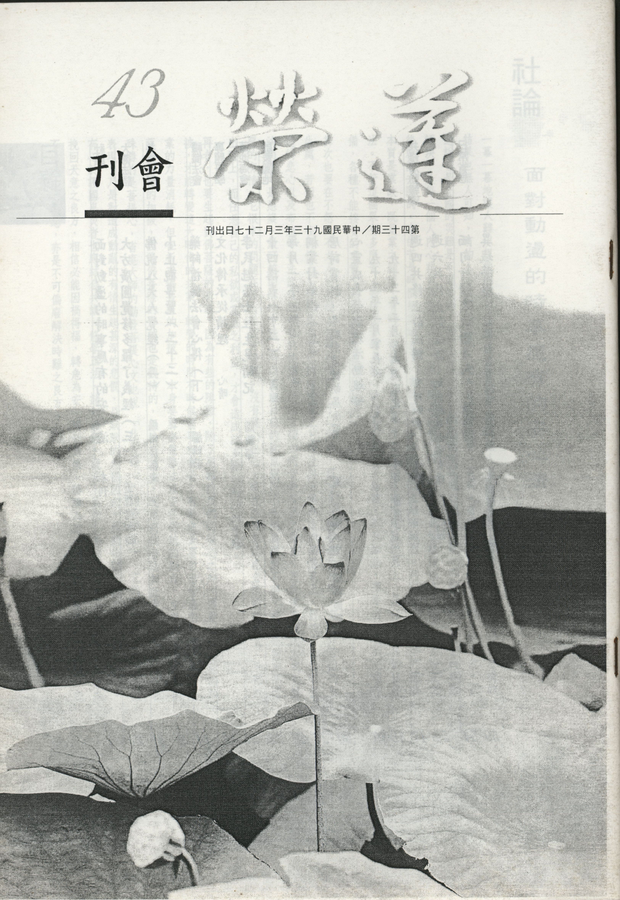

# 第43期

## 社論

### 面對動盪的時事應有的安心法

*編輯部*

一幕一幕地讓人難以想像的畫面呈現在電視機前，造成國人很多的不安，這些事情會演變到什麼樣的結果也無人可知，有的人希望趕快落幕，平息此次的紛爭，有的人希望長期抗爭，以期真相大白，不過說它是全國的災難是不過份的，甚至比ＳＡＲＳ的嚴重性有過之而無不及。不管如何，盼望此事能解決，是每一個人內心非常強盛的渴望，就如同為疾病所苦，都盼望此苦趕快消失，但並不是盼望之後就能去除的。有的苦是時間短就過去了，有的苦是長期相續而且越演越烈，何以不能控制？乃因其本質是業故，既是業之顯現，有時連佛都無可挽回。所以安住在業所成熟的果上，是非常重要的修學法。不管這個果有多麼苦，安住在苦果上的心情是不失意、不悲憤，不只如此，還要有健全的心理準備，各種不能接受的事實，都要訓練有接受的能力。

其次也要在不怨天不尤人的基礎上去尋找苦因，予以對治，這才是一個智者的表現。有情非苦因的出生處，苦因也不在有情上，苦因是在自己的煩惱業上，以及與有情共造的煩惱業上，觀待有情的苦生起的悲心以及布施等善法能生起一切的快樂，所以有情如何會是苦因之所在，用仇恨有情的方式來解決問題，是愚癡、最可笑的解決方法。所以國內目前的亂象絕對不是因為種族不同，或者是對方是可惡的有情，它根本的問題在沒有替對方著想，沒有將心比心，眼光並沒有站在全民的福祉上、子孫的出路上，而任憑自己的私欲或黨派之利益，才會造成諸多難以解決的困難。

再者，也要生起對佛菩薩的祈求，因為有些的障難，除了要觀待我們的發心之外，還要有佛菩薩的加被，才能轉變這大時代的共業，轉變的時間有時候需要相當長，有時候是要付出慘痛的代價以後才將業的力量消耗，但在祈求佛菩薩的加被上，本身要有安住善法或安住佛號的能力，才有辦法得到佛菩薩最殊勝的加被，因為佛菩薩的加被也是觀待的，無法自性生。既然安住善法如此重要，然善法中最殊勝的是菩提心，省庵大師的勸發菩提心文也說 「此菩提心，諸善中王」，它的行相落實在眼前的表現，乃是對造成動亂的有情生起甚深的悲憫，且默默的念佛回向，並願他們回改心意，提起公心。有心於護國息災者也應結合共識、修學正法，諸如讀經、說法、共修、念佛、啟蒙、放生等，以作為挽回天意之良方，相信必能因禍得福，轉危為安、轉苦為樂、轉障為助，諸君讀之雖是老生常談，但不出佛法之觀念，亦是不可偏廢解決時難之良方。

## 大德法語

### 大方廣圓覺修多羅了義經（三）

*道源老和尚講授*

圭峰宗密通宗教

曾閱圓覺深感悟

得法頓禪十一祖

亦是賢首第五祖

「然如來垂教，指法有顯密，立義有廣略，乘時有先後，當機有深淺」

，釋迦如來為度眾生廣說諸經（三藏十二部），且法有顯有密、有大有小，皆如來垂教。垂就是垂留下來的教法，名為垂教，所指示的佛法有顯密的不同。立義有廣略，有時一部經典上建立這個義理是廣說；有的經典建立這個義理是簡略的說，有廣有略；乘時就有先後，乘時是釋迦如來四十九年說法，先說小乘後說大乘，先抉擇世俗，後抉擇勝義；當機有深淺，如來說法是為度眾生而說，每一部經都有每一部經的當機者，這一個當機者若是甚深的根器，如來說的法就深了，這個當機者是個淺根器，說深了他不懂，那就得說淺的。所以各種經有深有淺，不是佛法有深有淺，因為當機的根機不同。

「非上根圓智，其孰能大通之？」

要不是上等的根機，這樣的當機眾，其誰能大通之？

「故如來於光明藏，與十二大士，密說而顯演，潛通而廣被。」

圓覺大法是一切法的根本，唯有上根圓智的當機者才可直下承當，所以如來於光明藏中對著十二位法身大士、等覺菩薩來請問時，佛則當機而演說，然眾生未能耳聞，謂之「密說」，不是秘密不傳人，因眾生聽不懂、看不見，叫「密說」，然而佛在光明藏中對十二位法身大士開演圓覺之後，由他們流傳到世間，此是顯演（顯密），是將密說處演說出來。由顯演而令眾生潛通（佛智）廣被眾生，令一切眾生都可以領略圓覺的道理而開發心性。

「以印定其法，為一切經之宗也。」

由這十二位法身大士來印定，如來說的圓覺大法，是一切經的根本旨趣。以上理序，亦名序理，下為序事。

「圭峰禪師，得法於荷澤嫡孫」

，圭峰禪師就是宗密大師，乃華嚴宗第五位祖師，亦是禪宗內學有所成的禪師，圭峰乃一山峰之名，依中國的習俗不能直稱對方之名，稱其名則不恭敬，此與印度不同，與現在的歐洲、美洲都不同，各國的風俗禮貌不同，但是在中國就講中國，雖然是順著歐美的潮流，但此不稱對方名的風氣到現在還沒完全變更過來，如民國時袁世凱人稱袁項城（河南項城人），徐世昌叫徐東海，乃至於我們的國父孫文，別號孫逸仙先生，他是廣東省中山縣人，故人稱孫中山。至於歐洲、美洲之習俗，直接稱對方之名並沒有什麼不恭敬。宗密大師，人稱圭峰禪師，在終南山住一茅篷，有一山峰如圭（圭峰），故以這個山峰為名，人稱圭峰禪師，就是宗密大師。大師在出家之後，先學禪宗而有所得（得法），其師是荷澤神會大師之嫡孫。禪宗六祖大師門下大德很多，有一小孩子年才十四稱為童子，就是神會童子，在六祖壇經上有其名，他是荷澤的人，一般人不稱神會而稱荷澤。當時禪宗分南宗、北宗，神秀大師在北方弘揚的禪宗稱北宗；六祖慧能大師在廣東曹溪所弘揚的禪宗稱南宗，神會童子在六祖大師那兒得法之後，到了北方來弘揚南宗，於是南宗日盛而北宗大衰。民初胡適之常常譭謗佛法，卻對神會大師崇拜的不得了，給神會大師送了個德號「北伐總司令」，喻如蔣介石總統任北伐總司令，北伐成功統一全國。當時的禪宗（南宗）在北方消滅了北宗，此乃神會大師（荷澤大師）的功勞。其時頓門禪宗傳祖師只到第六祖，往後都稱禪師，然肅宗因其對國家之貢獻而詔入宮內供養，德宗時集諸禪師，楷定禪門宗旨，遂以師為禪宗第七祖，磁州法如為第八祖，至益州南印禪師（第九祖），有一個法嗣名道圓和尚，乃第十祖（嫡孫），故曰

「南印上足道圓和尚」

，彼為圭峰大師（第十一祖）的師父，圭峰禪師出家就是向道圓禪師求法。

「一日隨眾僧齋於州民任灌家」

，有一天，圭峰禪師隨眾僧到府吏任灌家，任灌是個大居士，他請眾僧到他家去吃齋，道圓和尚就派他寺院的眾僧去應供，

「居下位，以次受經，遇圓覺了義」

，彼時圭峰禪師才出家不久，所以坐在最下位，在座位上，依次受經而得圓覺經。這位居士請出家人吃齋，他家裡還存了各種經典，可能上座得的是大部的，中座得的是中部的，圓覺經只有一卷，所以依次受經時，圭峰禪師得了一本，名為圓覺了義經。

「卷未終軸，感悟流涕」

，當圭峰得到圓覺經時就打開看，當時經書都是抄寫的，圓覺經文少僅一軸（一卷），這一本經還沒有念完（未終軸）已感悟流涕，因感動而開悟，因開悟而流淚流涕。哎呀！佛法真妙！能令人有如此之變化，此人當然是個上根圓智者，現在則不同，去應供吃齋，吃完最好每一個人都供養一個紅包，最好是大紅包，那才叫歡喜。若不給紅包而送經典，彼以為受這個經幹什麼？很納悶，也絕對不會感悟流涕。為什麼？因為你對於佛法根本沒有尊重心。所以根機是一回事，重法是另一回事，圭峰大師當然前生有大根機，但是他今生尊重佛法，得了圓覺了義經，就打開認真看，深入其意，一下子就感悟到最深的道理了，情不自禁眼淚與鼻涕流個不停。

「歸以所悟告其師」

，圭峰回到了自己的寺院將他所悟的道理，報告給他師父道圓和尚聽，

「師撫之曰」

，道圓和尚是個大徹大悟的禪師，一聽馬上就安慰他，撫就是安慰他，

「汝當大弘圓頓之教」

，你（圭峰）非平常出家人，看到圓覺經能悟到甚深的道理，乃上根利智者，應當弘揚圓頓之教。大乘法有權教大乘、實教大乘，圓頓乃實教大乘。你（圭峰）應當弘揚實教大乘之法，你要當大法師了。

「此經諸佛授汝耳」

，這部圓覺經是諸佛給你的，何以不分給你圓覺經之外其他之經典呢？此冥冥之中諸佛傳授給你，令你在經上開悟的。

「禪師既佩南宗密印，受圓覺懸記」

，禪師（圭峰禪師）既佩南宗密印（六祖慧能大師的心印），所以南宗的祖師都叫南宗密印，這是宗通；受圓覺的懸記，等於是如來在世時就預先為他授懸記，這是教通，宗教皆通（禪宗也通、教相也通），

「於是閱大藏經律」

，此時大師並不貢高我慢，雖通禪宗圓覺經的道理，然三藏十二部的一切經、律、論都還沒有通啊！所以要閱藏，經、律與論都看！

「通唯識、起信等論」

，貫通經、律、論，成為一位三藏法師，以上是讚歎宗密大師。（下期待續）

## 共修研學

### 小止觀導覽（二十二）棄瞋恚蓋

*蓮心整理*

觀瞋過患及所生

無瞋功德生慈忍

觀待生起無我慧

安樂無憂是大雄

經文

二、棄瞋恚蓋：瞋是失佛法之根本，墜惡道之因緣，法樂之冤家，善心之大賊，種種惡口之府藏。是故行者於坐禪時，思惟此人現在惱我，及惱我親，讚歎我冤。思惟過去未來亦如是，是為九惱。故生瞋恨，瞋恨故生怨；以怨心故，便起心惱彼。如是瞋恚覆心，故名為蓋。當急棄之，無令增長。

如釋提婆那以偈問佛：「何物殺安樂？何物殺無憂？何物毒之根？吞滅一切善。」

佛以偈答言：「殺瞋則安樂，殺瞋則無憂；瞋為毒之根，瞋滅一切善。」

如是知已，當修慈忍以滅除之，令心清淨。

大意

說明棄蓋的第二部分：棄瞋恚蓋，並舉偈語以明瞋恚過患，故應棄之。

導覽

一、對著境界愈想愈好，貪心就會慢慢增上，若對著境界愈想愈壞，透過各種角度去想這個境界無益於我、迫害於我，則瞋心油然而生，不僅見到對方的面不舒服，連聽到他的聲音也不高興，甚至別人轉述他的事情都覺得厭惡，內心浮現他的影像也是恨之入骨，這就是瞋恨心猛利的行相，所謂「一念瞋心起，百萬障門開」、「起一念之瞋，能燒盡菩提之種」，而且由於前世多瞋，會感應今生二種瞋報：（一）常為他人求其長短，因前世不能容物，稍不如意，即興瞋恨，故感今生被人尋求長短，而動輒得咎。（二）常為眾人之所惱害，因前世瞋惱眾人，令不安穩，故感今生常被多人之所惱害。故云：瞋是失佛法之根本，墜惡道之因緣，行者不可不慎。

二、瞋恨心不可以獨立生，不可以自己生，一定是對方惱我，而對方惱我分為現在他惱我、惱我親、讚歎我冤，使我生起不愉快的感覺；或者追想到他過去惱我、惱我親、讚歎我冤，內心很不舒服；或者預測他未來也會惱我、惱我親、讚歎我冤，引發我的瞋恨心，這些狀況名之為九惱；甚至起忿、恨、惱、害之心，倘若在坐禪時九惱變成法塵境界，會覆蓋真心、障礙修學，故名瞋恚蓋。在九惱的境界可能會產生下列三種瞋恚發相：第一為非理瞋，行者修禪定時，瞋覺突然而起，不問是非道理，無故而發瞋恚，障於禪定，是為非理瞋相。如果修學者平日很容易動怒，是有礙禪定的；第二個是順理瞋：行者修禪定時，為外人所惱而生瞋恚，猶如持戒之人，見非法者而生瞋恚，此瞋雖順理，然亦障於禪定，是為順理瞋相。如果修學者平日常有憤世嫉俗的表現，是會障礙禪定的，因為理得心安、心平氣和是入禪定很重要的心態；第三個是諍論瞋：行者修禪定時，執著自己所解悟者為是，而以他人之所行所說為非，以他人所說不順於己，即起瞋恨，亦障於禪定，是為諍論瞋相。如果修學者平日常有與人較量、爭長短的心，或者自以為是的心態，是容易感應障礙的，應是學習有師承（傳承）的正法，且不墮黨類，藉著修止修觀不斷地體會正確道理，必能得非常殊勝的證量。

三、對治瞋恚有二種修法：（一）如果在修止當中無緣無故產生惡念（如想做不如法之事），這種狀況屬於掉舉，要用正見的力量，把掉舉對治掉，以便安住在善所緣境上（如念佛）。若內心緣念瞋恚境的力量，比緣念佛號強，可能安住不了，此時應暫時放下所緣境，並修瞋恚心的對治法。先觀修瞋恚的過患，遠離瞋恚的功德；其次對所瞋恚的對象各種面相觀察，息滅瞋恚，例如他雖與我為仇，何嘗不是我先對不起他，且怨由親來，惜昔日之親願化眼前之仇。再者往昔我所造惡業藉眼前逆境可淨除，也能增上我的忍辱度，作為我成佛之資糧，即是我成佛之增上緣，因為逆境現起可以消你的業障，生起寬宥包容的心量，能引發堅固菩提心，也就是我的恩人，則瞋恨心無由而生；須降伏瞋方能進入色界、無色界禪（上二不行瞋），乃因上二界非瞋恚所行境。（二）修行（或念佛）至心水澄清時（或佛號成片時），進入輕安的境界，此時是初禪未到地定，好像已沒有欲界的煩惱了，為了確認有否欲界的尋伺，此時將所有在意境界生起，例如一些不可欲境或逆境（九惱等），若煩惱猶在，則一一加以對治，這叫止上修觀（七種作意位）。亦即當瞋恨再也不起現行，緣念善法境界的力量轉強，就進入初禪的正分。

四、廿五方便的通達是入止觀前的正見，乃因藉廿五方便調理心念則易於修止觀，比如念佛前，維那說：「萬緣放下、佛號提起」，萬緣放下可結合廿五方便之訶五欲、棄五蓋，佛號提起則可結合具五緣、調和五事，進行五法。有些修學禪定者在未到地定時會錯認自己已明心見性了，其實不然，因為還有欲界尋伺，雖然在念佛時煩惱不起現行，但並沒有破掉煩惱現行，也沒有破煩惱種子（若破煩惱種子及破煩惱習氣，是屬於斷惑位，必須深觀空性才有辦法達到），倘若內心浮現的這些欲界可愛、不可愛的境界，不會起貪瞋等感受，而是非常平靜、澄清，那才是破欲界煩惱現行，將欲界的上、中、下三品的貪愛煩惱都對治後，進入初禪正分，在初禪未到地定（或各禪未到地定）的七種作意位都稱觀，而不是修止觀前的正見。由此可見教理的重要，不諳教法，才會產生自以為修學有成的錯覺，錯覺愈大，罪過就愈重，若貿然引導眾生禪修，則一盲引眾盲，後果不堪設想。尤有甚者，在禪坐當中，沒有深知煩惱的過患，一一對治，而夾帶著慢心及名利的習氣，致使過去禪定的力量和覺受漸漸退失，而渾然未覺，所以只有虛懷若谷，結合教法，步步勝進，方為正途。
五、「殺瞋則安樂」、「殺瞋則無憂」，安樂即涅槃、無憂即菩提，也就是所謂的「涅槃寂靜樂」與「菩提覺法樂」。而瞋則是煩惱，殺瞋有一種是破煩惱現行，而破煩惱現行可入禪定，此種即屬於禪定的安樂，一種是殺煩惱種子、掃除煩惱習氣，此種即屬於涅槃的安樂，法的無自性被徹底的認知叫涅槃，萬法在證得空性的聖者的觀察下，都是現起如幻的，因此不會受境界的束縛，內心也不受貪瞋癡的擾動，直接破煩惱種、破煩惱習氣，內心呈現最平靜、安樂的狀態稱之為涅槃寂靜樂，而不是富可敵國、閒適安逸、心滿意足叫安樂，因為這些都只是把過去的善業拿來消耗而已，若善業用罄、惡業現起，就不舒服了，所以暫時的滿足舒服是一種假相和錯覺，是妄認而不是真實。「殺瞋則無憂」，是指懂得運用種種的方法對治瞋恨的現行，拿掉瞋恨種子和習氣，在涅槃寂靜樂的同時說菩提覺法樂，因為深諳各種法門，所以可以自利：對治煩惱，得到真正的解脫；也可以觀機逗教、利益別人，進入涅槃。瞋恨的根本在無明（煩惱障），以及不生瞋的瞋習（所知障），二者之破除只有佛辦得到，所以能究竟殺瞋（種子與習氣）得到涅槃寂靜的安樂，以及殺瞋得到菩提覺法的無憂，只有佛做得到，因此有佛名 「無憂佛」。或
**問：** 色界、無色界及三乘人不是已離開瞋了嗎？為何云：只有佛才是真正離瞋呢？事實上，雖說有些聖者已離開瞋，是指不會引發瞋煩惱，但瞋的習氣（不會引發瞋煩惱的瞋習），比如舍利弗證阿羅漢果，雖破了瞋的種子，但仍留有瞋的習氣，此習氣非心法、心所有法，而是心不相應行法，猶如酒瓶已空，仍留有酒味，直到成佛的時候，瞋的習氣（名言安立為所知障）方能究竟斷除，如此才是真正的安樂與無憂，達到這個境界的聖者縱然百千萬劫都受到眾生的惱害，也不會有些許瞋的味道，小乘聖者不能對治所知障（中觀派把所知障解釋為煩惱習），大乘聖者依以空性正見發大願力利益眾生而無怨無悔，能將煩惱習去除，因此只有透過無盡的串習才可把煩惱的習氣對治掉，而這樣的人才是真正的安樂無憂。

六、「瞋是心中火，能燒功德林，欲行菩薩道，忍辱護真心」，慈忍是滅除瞋恚、令心清淨的重要法門。慈忍是慈悲與忍辱之合稱，法華經文句以慈悲、忍辱、法空三者為弘通法華經之三種法規，稱為弘經三軌。據月燈三昧經卷七所舉，修菩薩行者為利益眾生，於一切違順等境皆能慈忍，故獲得下列十種利益，即：（一）火不能燒，指修行者常懷慈忍之心，於一切違逆之境，了知身心自性本空而無所惱，故瞋恚之火不能燒之。（二）刀不能割，指修行者常懷慈忍之心，於一切橫逆之境，了知自身體性空寂而無所畏，故瞋恚利刀不能割之。（三）毒不能中，指修行者常懷慈忍之心，于人加害時，了知身心本空而不以為意，故貪瞋毒藥不能中傷之。（四）水不能漂，指修行者常懷慈忍之心，於一切順情之境，了知諸法本空而無所染，故貪愛之水不能漂之。（五）為非人護，指修行者常懷慈忍之心，于一切時處，為鬼神之類所護衛。（六）身相莊嚴，指修行者常懷慈忍之心，愛念於人，故招感色身相好莊嚴之果報。（七）閉諸惡道，指修行者常懷慈忍之心，成就善法，故惡道之門自然閉而不開。（八）隨樂梵天，指修行者慈行具足，梵行無虧，故命終後，隨其意樂而生於梵天。（九）晝夜常安，指修行者常行慈忍，利益有情，而不加惱害，故得身心寂靜，晝夜常安。（十）不離喜樂，指修行者常行慈忍，利益眾生，使其皆獲安穩，故自己之身心亦不離于喜樂。（下期待續）

### 佛說八大人覺經講記（二）譯者簡介

*編輯部整理*

譯經事業德無邊

助成正法傳後世

難得他國善知識

利益此方恩無疆

參、譯者簡介

後漢沙門安清譯。姓安，名清，又叫安世高，是安息國的太子。沙門是「勤」「息」，勤修戒、定、慧，息滅貪、瞋、癡，以戒定慧來息滅貪瞋癡。持戒能伏貪瞋癡，入定亦可伏貪瞋癡，開慧則破貪瞋癡。持戒之要如果不是降伏貪瞋癡，持戒有何意義可言？如守八關齋戒，飢腸轆轆，一直起煩惱，守此八關齋戒就沒有什麼意義。真正持戒者在辦事、修行、處眾、獨居的時候；能被清淨動機所攝持，就是無癡，遇境逢緣也能考量因果降伏貪瞋等的煩惱，此方是佛陀制戒本意。由無貪、無瞋、無癡的意業引發出來的身口是什麼呢？口不兩舌、不惡口、不綺語、不妄語，身體不造殺、盜、淫。身口上不違犯身三、口四的惡業，才是整個戒法安立的義趣所在。若有大乘戒法的辦事人員（被戒所攝持者）的動機應好好講究。以如法的動機（無癡）為出發點，希望所辦的事能自利、利他，作為往生與成佛之資糧；即使辦的成功也不希求別人的掌聲而完全付出（無貪）；於辦事當中有障礙時能將障緣轉成菩提資糧（無瞋）。

其次「定」所緣的境界是善的境界，如以佛號為所緣產生專注力時，不會以其它不如法的境界為所緣，自然就不會生起種種不如法的心，所以「定」 是根本不去攀緣不如法的境，則煩惱起不來，故定是降伏煩惱的良方。比如平日對錢生貪，但念佛時對佛號產生專注力，不以錢為所緣，則貪心在那裡？貪心沒有了。同樣不以仇人為所緣時，生不起瞋恨心。「定」是以專注於善所緣的方式降伏貪、瞋、癡。

「慧」之實義是通達空性，真實的法了不可得，此一覺受生起即是執著的正對治，此時才能將貪、瞋、癡的種子與貪、瞋、癡種子的習氣一併破除，所以是勤修戒、定、慧，息滅貪、瞋、癡。修行者至少要心出家、身不出家，若心不想出煩惱之家還修什麼佛法呢？在家與出家之差別只在行相上一個是留髮著世俗衣，一個是剃髮染衣。以上是沙門之意。

後漢桓帝時，安世高來到中國。諸葛亮的出師表裡說，劉備最痛恨的就是桓、靈二帝，這麼好的天下可以在這二位帝王手上敗得徹底。孔子說：「君子危邦不入，亂邦不居。」朝代很亂，人心很浮動，想要移民，想要逃亡尚且來不及，苛政猛於虎，安世高膽識過人，選在這個時候（天下大亂）來中國。然所謂天下大亂，自古來是朝廷亂，老百姓不亂，因為儒家的文化非常普及，長幼有序，一村只要掉一隻雞，則全村轟動，在家族裡都是敬老尊賢，這些都是學佛的質地，所以很多印度的祖師大德都喜歡來中國，雖然朝廷很混亂，但是人心是可以教化的，而且學佛真的學到深處時，亂邦危城都是他們（高僧大德）行教化之處，來到這種地方很多的變局都不是可以掌握，在混亂的時代裏，教化人心使其安定，更顯出他們的慈悲。

安世高來到中國，首先，學通中文（辭陀羅尼）。無量無邊的陀羅尼，總綱有四個，就是法、義、辭、咒。有辭陀羅尼的證得，就是成就學習各種語言的能力。他學通中文的目地就是為了廣翻經論來利益這個國家，讓這個國家從讀經內化。須知一個國家要興，一定要辦讀經會，透過對經的講解與讀誦，世道人心能歸於正，風氣必能淳厚。安世高法師翻譯的經典有二十九部，共計一百七十六卷，其用心之善，可謂至矣！

安世高的前身亦為僧人，來到中國，廣行教化，後謂弟子詣廣州償宿債，果真受刺身亡。被殺以後投生到安息國當太子，然後又出家學佛，再來中國，至廣州度殺彼前身之仇家，再至紹興還另一個宿業，在數十人爭鬥中，無端被重棍擊頭而殞命。祖師在證果之前一定要懺悔業障，沒有懺悔業障是不會證果的，懺悔業障有三個懺悔，分別為：作法懺、取相懺、無生懺。當造了惡因，給它緣，它就結果；不給它緣，它就不結果。所以經過努力懺悔時，緣就沒有了，因此也就不會結果。殊勝的懺悔就是發菩提心，發露罪障，並且以三寶為我的所皈境，好好地發露懺悔，並誦經、念佛，或者做善法、或者觀空性，就能將造罪的因種摧壞而不感苦果。尤其證得空性就是最殊勝的懺悔（無生懺），乃因證悟空性則破我執，我執不起煩惱不生，不造有漏業，如此則必不引生輪迴的各種苦，此才是真正懺悔。或問安世高是證得空性的聖者，此時業障已經被懺掉，為什麼還要來還宿業？

證果的人雖然是觀空性而證悟，但是有發不發菩提心之別，發菩提心才能將最嚴重的罪拔除，沒發菩提心是拔不掉的，否則菩提心的殊勝在那裡？尤其是忤逆罪(殺父、殺母…等)，或受戒者犯到根本戒，這種罪必得靠菩提心去懺，沒有菩提心是懺不掉的。一個證阿羅漢果的人，如果沒有發菩提心，這種罪猶要償還，只是因為他們證得空性，所以諸法如幻，自身的五蘊身也是幻化，這種覺受會在他的心識之前，所以在償還的過程當中，捨身也不覺得苦。登地菩薩在捨身時，如丟棄發黃的菜葉一樣，不覺得苦，趁著捨身去償還宿業，何樂不為？因為他們本身就是破身見上來的聖者，所以不會有對身的愛執，所以捨身時也不會覺得痛苦，這是被他串習出來的能力，而且他們很願意以這種方式來償還宿債。換句話說，如果有能力償債時，遇到債主上門，自己又很有良心，其實是會很開心地還債，與安世高償還命債是一樣的。安世高很樂於要以這種方式去還債，而且又可以藉此來顯示因果，不但把債還了，還可以顯示教化度化有緣，還可以積功累德，何樂而不為？藉著還債當做一種教化，讓人家了解因果。證果的聖人，他們知道空性的證悟原來是一種償債能力的成就，諸法雖然是體性空寂，遇緣時還如夢幻泡影般的生起，但知其幻化而不受影響。以上是第一種解釋。

或問安世高大德若是證果且發菩提心的聖人，應該不會有此橫死？諸法是如幻的，發菩提心者冥冥之中應當不會發生橫逆而死之事，然藉此橫逆可以利益有情時，則示現之，經云：「應以涅槃身得度者，即現涅槃身而為說法」，例如有些父母親要度子女，就得等到他被助念往生後，子女才會如夢般被驚醒。所以菩薩最後的示現就是涅槃，因為這是一種教化，這是所有沒了門中的門，若這最後一個牌打下去時，眾生還是不開竅，那就再等未來的因緣了。

此故事有二個過程，首先他死了，投生到安息國當太子，出家學佛。可見王位是不可靠，世間虛假是不可靠，功名榮華富貴都是水月空花。安世高認真修學，成就後，來到中國，翻譯佛經，利益當世，但他還是再去找宿緣，讓它現起，教化那位殺他前生的年輕人，此人已成老翁，而那位老翁就在那一次開竅了。如果不用這個方式度他，讓他在安世高的門下，也許為他講再多佛法，他依然故我。

其次安世高到䢼庭湖，此地的廟神非常地靈感，只要有供養的，就好來好去，沒供養的，行船於湖則受種種風浪傷害而致喪命，所以此廟神常受血食。為什麼這個湖神的威神力這麼大，原來這湖神與安世高從前一同出家學道，這個人好行布施，但性多瞋。因好行布施，所以福報大，但性多瞋，所以墮落成人家不歡喜見的行相，即一條非常大的巨蟒，巨蟒接受安世高的咒願，而淚如雨下，安世高說此蛇是湖神。晚上安世高夢一少年向安世高致謝，說明已脫離此惡道，果然在山西澤中，見一死蟒，頭尾長達數里，就是現今潯陽郡大蛇村。（下期待續）

## 專題研學

### 文化傳承從讀經

心晴

難值暇身與正法

三天安住生大福

聆聽讀經發心利

佛果安樂能生起

九十三年一月三十日

緣起

：本會假九十三年一月三十日至二月一日舉辦為期三天之「寒假啟蒙定靜活動」，結合學齡前之學子與小學、中學、大專等學員，大家齊聚一堂，法喜充滿。茲將第一堂讀經課程之前行法語整理以供養大眾。（編輯部）

我們今天能夠聽聞到佛法，念一句佛號，讀誦大乘的經典，聽聞到很好的開示，這都是吾人百千萬劫所累積的福德，才能夠手捧如此珍貴的經書，此善根誠如《金剛經》所說：「當知是人，不於一佛二佛三四五佛而種善根，已於無量千萬佛所種諸善根。」所以我們一定要為自己感到歡喜，為我們能夠做那麼有意義的事情感到歡喜。而且大家能夠共聚一堂學習的因緣非常難得，有賴於國家安定、家庭富足、家人的護持，我們才能夠來此學習，且光憑自己想學的心還不夠，還必須有莊嚴的道場、老師長輩們的護持、結合共識，大家才能志同道合齊聚一堂共結法緣，這樣的機會真是非常殊勝難得。

再則我們還要感謝自己的善根福德，由於往昔生中所累積的福報才能夠有福氣坐在這裡享受法味，才能夠放下五欲六塵的染著，放下所有的煩惱，在這樣殊勝的情況下來求學，求什麼學？求的是一個覺悟的學問，這個覺悟的學問就是要來助成吾等成聖成賢、成佛成菩薩。每一位學長、小朋友的心裡都曾經發過誓願：為利眾生願成佛。因為唯有成佛、成菩薩，才有幫助所有的眾生離苦得樂的能力，但前提是自己先覺悟、先離苦得樂，所以大家來這邊求學，就是求世間最殊勝的學問，學習孝順父母親、恭敬師長及利益眾生的方法；在出世的學問學習皈依三寶、了解因果的道理、求覺悟之道。此皆源於我們多生多劫的善根福德在這裡成熟了，所以當大家打開經本，念到開經偈中：「無上甚深微妙法，百千萬劫難遭遇，我今見聞得受持，願解如來真實義」時，內心就會產生極大的撼動，這樣的撼動就能夠帶領我們好好的學習，每一堂課都用最歡喜、最恭敬、最誠懇的心來接受法義，這樣全心全意的學習才能夠報答父母、師長、長輩等護持我們修學的所有恩德。以上是我們在參加三天定心活動之前所應具備的殊勝難得想。

此次活動以讀經為始，希望藉由這三天的帶領，我們平日也能以讀經書做為學習的內涵，因為讀經最能安定我們的身心，荀子勸學篇：「學惡乎始？惡乎終？曰：其數則始乎誦經，終乎讀禮。」故求學從讀誦經典開始是不二法門。讀誦經典可以讓我們明瞭萬事萬物的道理，以經典做為我們立身處世的準則，建立人格的基礎，此乃「蒙以養正」，就是以讀誦聖賢經典來培養吾人浩然的正氣，並藉此陶冶性情，提升我們的道業， 雪公：「經書涵養心如鏡，福德薰陶語似蘭。」所以讀經書就等於站在巨人的肩膀上，踏著古人足跡、依著佛菩薩的提攜，以佛菩薩、古聖先賢的智慧來提升我們的智慧，讀經之殊勝就在於此，我們讀經時就像和佛菩薩、古人做朋友，而大眾一起讀經更是以文會友的好方法，這是非常重要的。

讀經有什麼好處？如果能夠養成讀經的習慣，就能夠培養我們的忍耐力、堅持力以及意志力，上述這些都能成就一個人的承擔力。讀經還可以開啟我們的心靈、智慧之窗，讓我們擁有寬闊的視野與無限豐富廣闊的內心世界，能夠遨翔於佛菩薩以及古人的智慧當中；藉由不斷的讀經，將經文內化於心，如水滋潤土壤般的滋潤我們的心弦，成就我們個人的慧命。所以讀經可以培養高貴的性靈，高尚優美的人格，開闊我們的眼界，擴大我們的胸襟。讀經要從聞下手，多讀，慢慢地就會思考，有了思考才能夠正確修學，所以讀經就是聞思修、就是修行。而我們從讀經開始此次的活動，所讀誦的都是最寶貴的經典，尤其是大乘的經典，當我們讀誦大乘經典時，就等於進行一個大乘的修學。

而且讀經的時候，身心泰然舒暢，正因為我們在讀經的時候非常專注，專注就容易放鬆，可以讓我們的腦波呈現非常調和的狀態，在科學的研究上稱做α波，此α波在我們日常生活中很難被產生，我們平常都處於其他躁擾的波動中，所以讓我們無法定心。而讀經時產生的是最祥和的α波，此波可以提升我們的專注力以及記憶力，乃至於理解力、判斷力、分析力都藉此提升，再者它還可以開創我們的創造力，產生源源不斷的靈感。所以讀經等於開發我們內在的潛能，誠如每一個同學都有成佛的潛能，潛能在那裡？因為沒被開發，所以不知道，當我們靜下來願意去開發的時候，就嚐到了！原來每一個人真的都可以成聖成賢，都有那樣的潛能。讀經的利益實在是說不完，以上簡略說明。

讀經的方法，古人作了很多開示，但是都不離「讀書法，有三到，心眼口，信皆要」，也就是讀經的時候要心到、眼到、口到，若加上耳到、手到，此五到可以幫助我們更專心。三字經：「口而誦，心而惟，朝於斯，夕於斯。」讀經很簡單，只要開口念，心繫於經義之上，口能夠熟讀其文，心能詳解其義，叫做隨文入觀。讀經除了方法正確外，更重要的就是要朝於斯，夕於斯，要日日夜夜、每天每天持續地做，當我們能夠每天持續地、有規律地讀經時，必能樂在其中，就會很專注、放鬆、沒有壓力，在讀經的音律節奏中產生非常愉快的心情，在愉快的氣氛中記憶力就增強了，所以讀經不是背書，而是自然而然以聲音的記憶進入心田，這樣的記憶效果其實比硬生生背書效果高達二至五倍，可以愉快有效率的全盤吸收，且不易忘記。

還有一個要點，就是讀經要盡早，我們小朋友越早接觸讀經越好，在如海綿吸收的學習年齡，讓美好的經義進入心靈的深處。學長們如果小時候沒有這樣的薰陶也沒有關係，雖已過了黃金記憶時期，用這個方法還是可以得到效益。再則，環境也必須儘量的好，常禮舉要：「安其學而親其師，樂其友而信其道」，若能得到師長的引導，結合志同道合的朋友，在一個很安定的場所讀經，大家一起切磋琢磨，它的效果是非常好的。接著讀書的態度一定要講究，像是對經本一定要恭敬，端身正坐、氣定神閒，很有精神地口而誦、心而惟，專注的融入其中，非常快樂的讀經，這些都是讀經正確的方式。

再則，讀經要讀出味道，有一個非常重要的訣竅，就是次數要多。具統計讀經累積六十次時就不容易忘記經文；讀經高達一百次的時候可滾瓜爛熟，其甜美的滋味已可慢慢品嚐出來了；讀經五百次的時候，經文就烙印在我們心田當中；然書讀千遍其義自現，如果我們能讀上一千遍，它的義理就會自然顯現。所以讀經是日積有功，我們只要願意去讀誦，累積的次數越多，它的經義就會越探越出、自然顯現而了然於胸，蘇東坡：「舊書不厭百回讀，熟讀深思子自知。」即好書不厭百回讀、千回讀，讀經就是修行。讀經的方法非常簡單，但是最後達到的效果是難以想像的，古人曾說 「一經通，經經通」，把一經讀通了，這時很多的經書就連帶地可以通達，像蘇東坡先生也說：「一書數讀，可八面受敵。」經書讀到通達的時候，就可八面受敵，他人從任何一方向來探究、問難，都不會被考倒，學問有了立足處。

杜甫曾自言：「讀書破萬卷，下筆如有神」，同學們為什麼作文沒辦法文詩泉湧？就是因為累積得不夠，當我們讀書破萬卷的時候，下筆就非常有神采、像有一隻神來之筆一般，所以如果能夠悠遊涵詠在經典之中，自然就能夠培養吾人的文化素養，成就古人倚馬可待之材，可一思便得。故讀經在培養能力的同時，也提升我們的眼力、格局、心量，建立了我們的人格與道德，所以正逢新年的開始，在此祝福大家「福至心靈」，福至心靈從讀經開始，當我們讀經有所成的時候，只要一動念頭就合於智慧、合於道，自可福至心靈、一思便得，利己利人。

## 蓮池海會

### 李民魁居士往生見聞記

*編輯部*

敦倫盡分走一生

家庭佛化猶待成

臨終雖經幾波折

助念圓滿未唐捐

李民魁居士於民國四十一年出生在雲林縣崙背鄉的純樸農村，自幼活潑好動，聰穎過人，在嚴父慈母的調教之下養成了樸實、樂觀進取的個性，求學期間一路平順。

民國六十四年退伍後進入製造膠布的高冠企業營業部門工作，任職期間克盡職守、能言善道、廣結善緣，奠下日後創業的良好基礎。民國七十一年由公司選派至日本學習精密刀模製造技術，民國七十二年奉派到新成立的公正工業股份公司服務，民國七十四年元月與李麗珍女士結為連理，婚後生二子，一家四口生活美滿。

民國七十六年由於公正公司改組，不得已離開服務的公司，休息數月後，幾番長考毅然和幾位志同道合的朋友共同成立宗德工業股份有限公司共同奮鬥，公司在他努力不眠不休帶領全體同仁共同努力下迅速的成長茁壯，短短幾年中成長數倍，成為同業中的佼佼者。

正當事業蓬勃發展時，不料居士卻因膽管結石引發敗血症，導致肝臟代償不完全，生病住院的三個月期間，家人不眠不休地細心照料，其生病中還念念不忘家人生活、孩子的課業、公司的營運，歷經幾番波折、伉儷情深，夫人且心甘情願冒生命危險捐贈肝臟以圖挽救居士性命，無奈在萬事具備等待換肝期間，居士的病情卻急速惡化，雖經群醫全力搶救，終究難逃病魔侵蝕，九十三年二月三日晚間移至家中助念，在家人親友及蓮友的護持中，安詳往生西方極樂世界。

綜觀居士五十三載的歲月裡，奉公守法、急公好義、樂善好施，深獲親友鄰居的稱頌、好友的肯定，平日尊敬三寶，亦與夫人共同參與放生等善法，居士因宿世善緣，臨終感得善知識開示，在蓮友以及眾親友的佛號聲護持中，蒙阿彌陀佛慈悲接引至西方極樂世界，助念十六小時之後面貌安詳、全身柔軟，家人僅遵佛制，吃素、念佛、誦經，至西蓮淨苑齋僧等，祈願將所有的善法功德，令居士在西方淨土中，蓮品高昇，乘願再來，廣度有緣的家人、親友以及眾生。

## 日常省思

### 緬甸行歸來致謝友人

*編輯部*

難忘八日緬甸行

廣作善法喜難量

因緣何來如此妙

賽莫賽奧兩兄弟

緣  起

二月廿三日至三月一日的緬甸善法之行，承蒙賽奧夫婦的協助安排圓滿達成，茲將此次法行之緣起與內容做一簡單報告，並將回到國內後致謝賽奧先生所發的一封英文感謝信函，及賽奧先生之回函分享大眾。

此行重點主要是放生、供僧、齋僧以及濟貧。選擇緬甸乃源於此佛教國家，雖然修學的是小乘佛法，但是不論道風、寺院的規矩，乃至釋迦牟尼佛所留下的遺制如托缽等等，在緬甸都還可以看得到，故所有的法行很容易在此進行完成。

再則想進一步評估緬甸是否有舉辦寒暑期啟蒙班的因緣，看能不能依著緬甸的民風民情來增上台灣的學子。

第三也願此等善行回向國內政局穩定、國泰民安、風調雨順。

第四就是藉此法行從事國民外交。雖然我們並不是官方機構，也不是外交人員，但是如果我們團體表現得好，則有助於彼國人民對我們國家的肯定。相信這個世界是美麗的世界，可以推行「近者悅，遠者來」的王道文化，所以希望此行能從事很好的國民外交。也願意因著莊嚴緬甸這個地方，認同那裡的文化，肯定宗教對這個國家的貢獻，以及肯定他們美好淳厚的風俗，回過來也讓別人肯定我們，彼此互相隨喜學習。

第五就是此次出國期間正逢佛教的神變節，乃釋迦牟尼佛破邪顯正，以種種的神變及教法降服外道（九十六種外道的邪師說六十二種的邪見，擾亂當時瑜伽行的修法），故這段時間來做善法，功德可千倍億倍的增長。

第六則緣於去年緬甸歸來，收到賽奧先生（賽莫之弟）的來信，表達願承繼其兄之遺志，將繼續協助所友善法的因緣。故試著與其聯絡，竟因其熱誠使吾人能速速成行。

故因緣和合，倉促成軍，以致於無法廣邀蓮友們的參與，在此致歉，並將所有法行布達於後，以期徵信、同沾法益。

實則《圓覺經》言：「修學空花梵行，晏座水月道場，降伏鏡裏魔軍，大作夢中佛事。」所有的善法因緣，皆須觀想是人生最寶貴的一次機會，應以著非常珍重的心態來看待每一次善法的造作，雖然這些善法或為吾人曾經串習過、親身做過，但是有心要求解脫、成佛者，就必須具備眾多資量，故即使已經做過了，或者是做過的次數非常多，在佛看來都著實不足啊！正因為有情的數目是無量無邊的，要利益眾生的法行亦是無量無邊，故所行的善法次數也要無量無邊，而有情遍滿虛空、時間三世延續，所以利益有情的善法也必須無盡的做下去，方能成就無量無邊的德能、莊嚴最殊勝的佛果，所以為善最樂！

此行承蒙賽奧夫婦鼎力相助，讓種種善法得以圓滿，雖與賽奧先生素昧平生，但他與賽莫先生散發著相同的熱誠，一個人獨立擔負起我們全團的大小事務，他最常說的就是「What can I do for fou ?」與「It’s my pleasure!」。由信件的往返、事情的安排與八天生活的相處裏，我們被其服務的熱誠、工作的效率和不疲不厭的精神所感動。在過程中賽奧先生也慢慢地了解我們對於放生、齋僧以及濟貧的種種需求，積極地幫助我們找到幾家物資貧乏卻道氣十足的孤兒院道場、僧伽團體等。並在特殊的情況下找到各類奇珍異獸，諸如蛇、孔雀、熊、貓頭鷹、鹿及牛、羊、雞等，滿足大家放生的心願。分享時賽奧先生道及心路歷程：在沒有頭緒下開始為我們尋找生物、一次次與商家周旋、又害怕生物在未談妥價錢時被宰殺、不知從何找起的大大小小孤兒院、先行至浦甘打點行程……，煞費苦心，只為了滿足我們口頭上的要求，倘若沒有賽奧夫妻的鼎力幫助，此行是無法圓滿完成的。

事前與賽奧先生的溝通、書信往來、以及八日全程的翻譯，承蒙楊老師細心、幽默、風趣又流利的英文，使我們和賽奧先生之間的距離更為拉近，而隨堂的英文課更讓人留下深刻的印象。

為了和這個國家以及廣闊的世界接軌，嗅到這是界不同於我們的脈動，為了無盡的善法，不斷湧現的善心，以及無盡的感謝，就讓我們從第一堂的英文感恩課程開始吧！

Tuesday, March 09, 2004 8:37 PM

Dear Mr. Sett Aung,

A week has now past since we returned from Myanmar, but the memory during our stay is still hovering in our minds.

The trip was so wonderful, and for many times more, because of your companionship, had made the experience extraordinary. We owe you our heartiest thanks. As a person of good character, you are not only a worthy friend but also an example to follow. Whatever you did, would have always affect us, very sensibly, one way or another. You stayed up late and got up early. You’ve always fulfilled our requests, majors or minors, and given way to our constantly changing schedules. You are such a décrotté, always energetic and nice to everyone. “My pleasure” has become a motto among the young ones and is rippling around them with multiplying effect. We hope good influences as such will perpetuate.

When we were in Myanmar, you had a lot of trivial things to deal with, but you never showed impatience. You are humorous but never flippant. You are learnt, but not egoistic. You are well off, but material benefits are not your focus. You own a silver tongue, but never oppress anyone. Virtues, like gold, your patience, capacity to accommodate, and proficiency in languages are all worthy qualities for us to learn.

Thank you for everything. Now the short trip has transformed into our lasting memory to be cherished. We are looking forward to seeing you again soon and also hope we can have the honour to see you in Taiwan. Please send our regards to your family and transfers the benefits of all the good deeds to your parents for the early recovery of U Sett Senior.

Heartfelt thanks again!

Best regards

The Wu-ching-ting Confucian & Buddhist Society, Republic of China

三月九日謝函

親愛的Sett Aung先生：

自緬甸返國已逾一星期，勾留期間的事事物物歷歷如在眼前，久久不能忘懷。

由於您的隨伴，這趟美好的行程更顯意義非凡，不能言表。我們是由衷的感激。您端正的品性，不單只是益友更是我們學習的對象。您為人處事，常在不經意間即能利益大家。您晚睡早起，事無大小皆答應，就算我們時常更改行程，您還是事事包涵。您彬彬君子的風範，待人和善卻又是精力充沛，您常回饋我們的感謝以無限量的「這是我樂意做的！」此言現已是年輕一輩同行學子的座右銘了，真是正量倍增，迴響不絕，這種良好的影響有望延續下去了。

當我們在緬甸的時候，麻煩您的瑣事實在太多了，但您從來都不會不耐煩。您幽默而不輕浮，有學問而不會自持，家境優渥卻對物慾不關注，善言而不誇言。美德有如黃金，您的耐性，容人之量及多國語言的能力，是大家追隨學習的重要質地。

謝謝您為我們所做的一切，短暫的旅程已化為長久的記憶。真希望能再敘，若有緣敘於臺灣，更是求之不得。請代問候貴府各人安好，善行利益增長回向令尊令堂，並祺令尊早日康復！

由衷致謝！

中華民國無盡燈儒佛學會

Tuesday, March 16, 2004 4:42 PM

Dear Mr. Tarng,

Very glad to hear from you again. Sorry for my late reply for I have been traveling as usual. I will be coming back to Myanmar in the first week of May. I plan to stay in Myanmar longer instead of traveling from one country to another all the time depending on where the projects are. It means that I am planning to settle down in Myanmar as long as my parents are in Myanmar as I have the sole responsibility to take care of them. This time, for sure, I'll be back to Myanmar in the first week of May and will stay as long as I can. So if you have a plan to visit Myanmar, please feel free to get any kind of assistance from me since it is always my pleasure to assist you and your noble activities. I also have to express my heart-felt thanks to you and your group for the opportunity you have given me to also learn a lot from you. What I have learnt and the extent I have learnt from you and your group is something which cannot be measured with any kind of mathematical measurements but is to be measured with my heart. Thank you for everything.

Kind regards, Winston

三月十六日回函

親愛的唐先生：

很高興您來函。由於公務往返各國旅途，耽擱了回信的時機，很對不起。五月的第一個星期，我會返回緬甸。我計劃能多留在國內，不再長途跋涉，東奔西走於各國間，以便照料待在國內（緬甸）的雙親，這是我的責任了。這次，我很確定五月的第一個星期會回到緬甸，而且會待上很長一陣子。如果您有到緬甸的計劃，請不要客氣，提出我能幫忙些什麼，我是非常樂意效勞並為您們的善舉出力。我還要感謝您及您的團體讓我服務，獲益良多，這種利益既深且廣，無法以我所學來量化，只能用我的心來感受。感謝一切！

請珍重

溫士敦

### 異域夢遊　記緬甸法行歸來有感

息霜瞥影、淨昌

佛塔湖水夕陽景

生活落後心善良

僧侶托缽處處見

或是夫子欲居地

其一 / 息霜瞥影

「山不在高，有仙則名；水不在深，有龍則靈。斯是陋室，惟吾德馨......」，不知怎麼得腦中想起了陋室銘，似乎劉禹錫正在訴說著他內心的情懷：浦甘的古城、佛塔是那麼令人佇足而不想離開，但是沒有知音的他是那麼的孤獨；古書、古畫是多麼讓人愛不釋手，但是沒有了像鍾子期這樣的知音，他們卻又在暗地裡哭泣，正所謂「摔碎瑤琴鳳尾寒，子期不在對誰彈！春風滿面皆朋友，欲覓知音難上難。」。而周禮更是如此，若不是遇到像孔子這樣的聖者的話，這可能又是另外一齣悲劇吧！

夜裡的茵列湖透著幾分的神秘，對我這個沒見過大山大水的人來說，更覺如此，逆著湖風，抬頭向上一望，星網羅列伴著一輪明月，月亮看來不孤單，但是劉賓客說出了他的心聲「淮水東邊舊時月，夜深還過女牆來。」，就只他自己一個，看過了一代又一代。可是弘一大師，卻也是月亮的另一個知音，「清涼月，月到天心光明殊皎潔」。同樣的景致卻造就了不同的心境，而大概也正因為如此才使眼前的美景靈動起來，無以復加。

茵列湖的早晨，真是像極了阿彌陀佛的國土，不僅氣候宜人，而且從窗外望去，蓮友們正從容的散著步，活像是菩薩們飯食經行的模樣；而湖面上氤氳飄逸，真令人想一窺他的究竟，正像是阿彌陀佛「循循然，善誘人」的教法一般，讓我們「欲罷不能」。而那背著山的水鄉澤國，如畫才有的景色，也彷彿可以嗅出他的寧靜、恬適，不只眼睛看到了，就連全身也像是跟這裡打成一片，此時用盡了自己所有的言詞，卻也只能用「極樂世界」來下一個註腳。

一步步的前進，一句句的佛號，踏著老師的腳步，聽著老師所說的教法而觀修，繞塔三匝由上而下，放眼望去這一片佛塔，似乎變的有生命，釋迦牟尼佛慈悲的眼神正眷顧著我們這群不畏末法頹勢的弟子，頃刻間，古老的佛塔像是遇到知音一樣，和我們一起共鳴，情感的綿遠就如同「大金塔」與「國王禪修石窟」的點燈一樣，一盞引一盞，燈燈相續，一心傳一心，濟濟一堂，真希望就這樣一直下去、、、、、、。

緬甸的生活是落後的，遺跡是老舊的，但就在那看似無希望中，有一熠火星，正所謂絕處逢源，那就是道德人心的純樸與善良。試想孔子至周邑拜見老子，老子卻與之言周禮無用，此時孔子的心情必然是跌至谷底，但孔子卻不退縮反而更將其推行於世道人心的教化中，憑的是什麼？就是孔子看見了周禮中的堯舜精神與弟子們孜孜不倦求學的心，就是這樣的力量，把看似了無生趣的灰燼中，又搧出燦爛的火花，一燒兩千多年直至於今。所以想要學的心與欲挽頹運的使命感，正是吾人所欠缺的，因此縱然坐擁龐大的資源也是沒辦法學至底極的，徒然是絲竹卻亂耳、案牘且勞形呀！到底何時才能夠和劉公共吟陋室銘呢？

其二 / 淨昌

此次為第三次去緬甸，末學有很深的覺受，謹此供養大眾。

以前跟老師出國參訪放生，感覺都很好，但是不大能理解為何行程要排得如此緊湊，身體的疲累導致偶爾也會生起煩惱。可是此次可以體會很高興無止盡作善法的心情，也很樂意去作。

第一天放生後到大金塔點燈時，因為油燈隔一陣就會因風被吹熄或燈芯燒盡而熄滅，末學發現了就開始去再點燃，因為有時風實在太大，所以點了又熄，熄了又點，可是卻很高興的守護著油燈。在如此反覆過程中，心中忽然明白了佛菩薩護念眾生善根的心意也是如此，乃不厭其煩，一教再教，且很高興的教，因為一心一意樂在其中。而我也願意跟佛菩薩學習，一樣無盡的護念眾生，無止盡的作善法。在往後的行程中，這樣的覺受，很容易就再被提起。

乘船遊於茵列湖上時，則感覺倘佯於諸佛那沒有邊際的大願海中，雖然身體偶感不適，但是心情始終都是愉悅的。

回來面對不同的世界，俗務纏身，幸好可跟著善知識及團體學習，希望能把好的覺受延續及增長。

## 啟蒙園地

### 每月一字 — 辨

大敬

辨：根據東漢許慎的說文解字「辨」之本義為「從中剖分成二半」的意思，據云「辨」字本作「辦」字，但後來分歧為二個不同的讀音，也就形成二個不同的字了。

「辨」、「辯」、「辮」、「瓣」、「辦」五字形體近似很容易混淆，「辨」字中間為「刀」，所以有分別的意思；「辯」字中間為「言」，所以有辯論的意思；「辮」字中間為「糸」，所以有髮辮的意思；「瓣」字中間為「瓜」，所以有瓜果、花實的意思；「辦」字中間為「力」，所以有辦事的意思；五字各有其義，古書雖有互通，但今日仍以分別使用較妥。

壹、茲列舉「辨」之解釋如下：

一、分別、判別：

（一）如「辨別」、「分辨」、「辨認」、「辨白」等。

（二）荀子榮辱篇：「目辨白黑美惡，耳辨音聲清濁」，就是說明眼睛、耳朵等二根的功能。

（三）唐朝杜甫的秋雨歎：「去馬來牛不復辨，濁涇清渭何當分。」，句中的「辨」就是分別的意思。

二、爭論是非曲直，通「辯」字：

（一）如「爭辨」、「辨駁」、「辨論」等。

（二）晉朝陶淵明的飲酒詩：「此中有真意，欲辨已忘言。」是形容其中真意，只可與智者道，非藉言傳，而須心領神會。

（三）禮記：「不慢不爭，則遠於鬥辨矣。」是指不驕慢、不爭奪為遠禍之道，句中的「辨」字，就是爭論、紛爭的意思。

三、文體名：乃論斷是非真偽的文章，旨在論證說理，亦作「辯」字，據云此種文體源於古代諸子（如孟子、莊子），至唐朝韓愈、柳宗元等文學大家，都有這類的作品，如柳宗元的「桐葉封弟辨」，又如清朝姚鼐的古文辭類纂有論辨類，即今之論說文。

四、布告：如漢書：「吏以文法教訓辨告」句中的「辨告」就是「布告」的意思，若作此解時，讀音為「班」。

貳、茲列舉與「辨」有關的成語如下：

一、雌雄莫辨：就是分不出是雌性還是雄性。如木蘭詩：「雄兔腳撲朔，雌兔眼迷離；雙兔傍地走，安能辨我是雄雌！」

二、口才辨給：是形容一個人反應很快，表達能力很強，可以隨機應變。如三國演義第四十七回：「卻說闞澤字德潤，會稽山陰人也；家貧好學，與人佣工，嘗借人書來看，看過一遍，更不遺忘；口才辨給，少有膽氣。孫權召為參謀，與黃蓋最相善。」

三、慎思明辨：語出禮記中庸「博學之，審問之，慎思之，明辨之，篤行之。」是指不但要謹慎的考慮，還要分辨清楚。

### 十四講表（十二）第四講表（乙）

傳瑛

上次講完三苦中的「苦苦」，接著說「壞苦」及「行苦」。

壞苦是指萬法無常。眼前感覺是快樂的事，總會有變成苦受的時候。舉個例子，我們在外面很熱，進來之後吹到很強的冷氣，剛開始覺得很舒服，可是如果吹了一整天可能就受不了，這就叫做壞苦。《無常經》講人都會面對三件不可愛、不稱意，不光澤的事，那就是老、病、死。人不是一下子就會老病死，當小孩子時，每天都無憂無慮，但隨著年歲的增加，就會嘗到這些苦受了。壞苦就是在顯示萬法無常；任何人、事、物都會變化，所以我們應該好好把握當下，讓無常變為我們累積福德資糧的機緣，而不是造作煩惱的淵源。

南北朝有一個人叫傅宰，七歲的時候就可以讀十幾萬句的詩，文章也寫的非常好，到處受人稱讚。長大後入朝為官，皇帝覺得他文才很好，對他很倚重。想不到他卻越來越驕傲，覺得天下人都不如他。不僅不願意接受別人的勸諫，還罵別人，覺得都是別人不對，後來他在朝廷裡跟很多人結怨。其實他本來有一些好朋友，但因他們的好心勸言，全遭傅宰毫不留情的惡口相向。因此，只好遠離他，結果與他結交都是那些想討好他的壞朋友。有一次，跟他結怨的人趁機報復，寫了一張告狀，列舉傅宰曾做的壞事，皇上看了非常的生氣，判他死刑。傅宰死後入殮，有人看到棺材的下面鑽出一條毒蛇，人家就說他生前瞋恨心很重，所以死後馬上變成一條毒蛇。所以同學們在順境時，應更要懂得修心養性，謙虛待人；否則，像傅宰最後嘗到壞苦時，卻是慘遭被斬、變成可憐的毒蛇！

日本有一個良寬禪師，他住在山腳下一個小木屋裡。有一天來了一個窮小偷，剛好良寬禪師不在，他把每一個抽屜都翻遍了，想不到這個禪師比他還要窮，根本沒有東西可偷。他很生氣的走出去，剛好碰到禪師回來，小偷被嚇到了，可是禪師並沒有被嚇到，他認為眾生平等，所以他覺得看到的不是一個賊，而是一個很窮苦的人，急著找東西卻沒東西可找。良寬禪師對他說：「很抱歉！我沒有東西可以給你，不然我把身上唯一穿的一件最好的衣服給你好了。」他把外面那件最好的袍子脫下來給那個小偷，小偷一下子愣住了，不知道是該感謝還是該懺悔，心裡覺得很慚愧，拿著東西就趕快跑了。禪師走出門外，看到月亮說：「今天的月色好亮、好美，如果能把天下所有的美好的東西，送給需要的人，該有多好！」

其實同學不太能體會禪師的心。之前提到我們每個人都會老病死，可是人有一樣東西是不會老病死的，它就是真心。就像禪師一樣，雖然他自己已經沒有任何東西，可是他卻可以給別人無窮無盡的愛心，如果可以的話，就連滄海大地他都想給，甚至願意幫助別人成佛。這種無窮無盡的愛心就是我們的真如本性。唯有將真如本性完全開發，我們才能真正的自在無憂，轉苦為樂。

行苦是指剎那生滅，這是很微細的，譬如我們的念頭，念頭就像是河流一樣，中間沒有斷過，而且一直流動，從不停止；這要修行很用功的人才會察覺。像我們每個人都有他的執著煩惱，這個執著煩惱，平時我們不覺得它的存在，一旦面對境界它就會浮現。譬如我們很討厭某一個人，可是當我們沒有看到這個人就不覺得，平常睡覺、上學、讀書……都不覺得，可是忽然有一天碰到那個人，那個討厭的念頭就起來了，其實那個討厭的念頭不是現在才起來，是一直都存在，只是我們不自覺。再假設，我們喜歡某樣東西，這個喜歡的執著就埋在潛意識中，平常不覺得，但這種愛執如果不對治，以後就會讓我們遭受痛苦。

有個和尚很用功修行，有一天他打坐時，知道他自己壽命將盡，黑白無常要來抓他，於是他就入定，讓黑白無常找不到他的心識。無常鬼抓不到他，心裡很急，不知回去如何交差！突然他們想到，這個老和尚還執著一件事情，就是擺在他房間裡的一個古董瓶，那是他最喜歡的東西，無常鬼為了讓和尚出定，就把古董瓶打破，和尚捨不得啊，喜歡的東西突然破掉，動了心就出定了，一出定就被無常鬼抓到了。

我們這個行苦主要就是來自念頭裡有貪、瞋、癡、慢、疑等煩惱所致。國外有個人叫安德生，他是一家公司的高階主管，有一天他發現他竟然得了癌症，他到處打電話給那些曾經得過癌症，後來治好的人，問他們是怎麼治好的，他得到共同的答案〜要有一顆寬恕的心，不生氣，包容別人。安德生反省自己：「我每次看到如果有人表現比我好時，我就很不高興、很生氣，而且常常看到都是別人的不對，同事說的話、做的事情都不滿意，所以每天都在煩惱中度日，這就是為什麼我會得癌症，因為毒素太多了，形成癌細胞，現在我要改變自己，希望我自己能有寬恕的心。」因為以前的習慣是常常生氣責怪別人，現在突然要變成有一顆寬恕的心，實在很不容易，可是他想到如果不這樣做的話，他的病就不能好，為了要讓病好，剛開始只好很勉強去做，一旦踏出第一步，再踏出第二步、第三步、第四步就容易多了。安德生想：在辦公室裡我最恨誰，就從那個人開始包容。他發覺他最恨的是一個新來的財務長，財務長的能力很強，讓他時常受到威脅，安德生發現自己得癌症之後的一個月，財務長也得了癌症，為什麼？因為兩個人每天上班都很不高興，體內每天積聚毒素，積久自然就生病了。有一天，他去財務長的家裡拜訪，他對財務長說：「以前我所做的事情都是我不對，我向你道歉，希望你早日康復。」 安德生也對每個以前他認為不好的人道歉，然後希望他們都能幸福快樂。過了一段時間，安德生的病果真漸漸好起來了，還到處去告訴人家要常保快樂、健康的身體、就要有一顆寬恕包容的心。

安德生雖不知道什麼是行苦，但他懂得時時存著寬恕、包容、幫助別人的心念，就是對治行苦的初步工夫。講到這裡，大家也應該開始學著轉變自己心念了。（下期待續）

### 心靈成長營返班活動報導　家長班研討專題 — 學習是福報，不是壓力

光真

這個冬天罕見地又濕又冷，陰寒之氣一直鑽到骨子裡去，好不容易才熬過去，很高興心靈成長營也開始「收假」返班了。

新學期第一次上課，老師為家長們選了一篇台中女中老師吳省常的退休感言「驪歌聲中的叮嚀」，文章中，吳老師殷切叮嚀學生人生中應該具備的品格，包括「柔軟的心」、「宏闊的眼」、「殷切的願」、「踏實的腳」，以及「剛毅的骨」。末學不知道年輕孩子是否能體會吳老師的苦心深意，但自己行過中年，累積了一些社會經驗，分外覺得這五種特質的確都是現代人非常需要、但卻顯少有人提倡及深思的。

翻開市面上琳瑯滿目的職場競爭力書籍，「柔軟的心」大概會被解釋成高EQ、營造人際關係或人性化管理等可以助人成功的技巧；「宏闊的眼」一味著眼於縱橫全球，卻忽略了寬闊的胸襟和心量；「殷切的願」只有在汲汲於功名時才會發起；「踏實的腳」讓人聯想到政治人物的「全省走透透」；而「剛毅的骨」則讓人聯想到「浴火重生的鳳凰」之類的反敗為勝案例。雖然吳老師的文章是為了鼓勵高中孩子發展生涯而寫，為切合孩子需求，文中也帶有濃厚的功利目的，但如果跳脫出來，像唐老師所闡釋的，以儒家和佛學的角度去體會這五個要件，就會發現另一層的境界和視野。

末學認為，在競爭激烈的現代社會，因優勝劣敗而引發的勝者傲慢、敗者暴戾問題十分嚴重，因此特意強調「柔軟的心」，無分貴賤，將心比心地對待每一個人，實在是很有必要的。只要翻開報紙社會版，每天都有因為滿腔怨懣無法控制而傷害親友、波及路人，要不就是攜子自殺的新聞，讓人深感「人心生病了」，「愛拚才會贏」的結果是大家都拚搏、大家都輸了。

「柔軟的心」除了溫柔敦厚，寬以待人外，其根本處更在於是否有一顆菩提心。就算做不到「捨身飼鷹」、「割肉餵虎」，也至少要有一種慈悲心、一種悲天憫人的人道情懷。如果看到世間一切苦難都感同身受，撫慰別人的傷痛都來不及，又怎麼會刻意在傷口上灑鹽、甚至有傷害別人的妄念呢？

看到最近發生的西班牙火車大爆炸事件，更令人驚覺世間的仇恨何其熾烈、又何其盲目？當然我們可以譴責恐怖組織，但想到中東地區巴游自殺炸彈客那種不願苟且偷生、寧可和敵人同歸於盡的悲憤，又覺得恐怖份子何嘗不是受害者？是屈辱和仇恨扭曲了他們的人性。如果強權國家不要打著正義之師的旗幟揮軍入侵，硬要在基督教與回教的千年衝突史上再劃下狠狠一刀，再深的仇恨原也應該可以慢慢化解的。只可惜對政治人物來說，製造衝突與對立有助於凝聚民氣、鞏固自己的勢力，即使「以百姓為芻狗」也在所不惜。「溫柔的心」要隨時以別人的幸福為念，要像母親呵護子女一樣善待身邊的一切眾生，果能如此，人人都是菩薩，五濁惡世也成人間淨土了。

再說「宏闊的眼」吧，除了高瞻遠矚的視野外，其實它更是一種 「心眼」或 「法眼」，一種可以盱衡情勢、明判是非的眼力。可惜末學每天慌慌張張、庸庸碌碌，被日常瑣事壓得如老牛拖車，不敢須臾分心盼顧，久了自然目光如豆，即使熟讀國際化與全球運籌的管理要訣，還是一個心眼很小的人，就如同大部分台灣企業到異鄉設廠只為取得廉價勞力一樣，更別提遇有家國大事時可以知所抉擇，進退有據了。

至於「殷切的願」，現代人不是不會發願，但發的都是如何學好英文、如何年薪百萬之類的自私自利的小願，願小自然願力也小，不但容易退心，就算達成願望也對眾生沒有裨益。為此，老師以大陸河南省 「希望小學」 創辦人馬文仲的故事來砥礪大家：馬文仲在剛以第一名成績考上鄉裡高中時就發現自己得了進行性的 「肌肉萎縮症」 （俗稱 「漸凍人」），知道自己來日無多後，他反倒拋開了個人前途的考慮，一心只希望自己短暫的人生 「能夠在歷史的長河中／盪起一圈漣漪」 （摘自馬文仲生病後寫下的詩「我的人生」）。

馬文仲利用休學在家的日子開始遊說村裡的失學孩子到他家來學認字，一連奔走兩個月都沒有人來，村裡人怕他的病會傳染，更不相信世界上真有這種不顧自己、一心只想奉獻別人的「傻子」。不過還有更傻的，是馬文仲的太太谷慶玉。這位來自湘西的美麗女子只因看到報導，聽說了馬文仲的故事，竟千里迢迢來到這陌生的窮鄉僻壤，一待十多年，下田耕作、伺候公婆、照顧學生……，成為馬文仲的最大助力。難過的是，他們的獨子不幸也遺傳了肌肉萎縮症；幸運的是，在他們快撐不下去時，得到台灣慈濟的幫助，讓這份心願能夠持續下去。

記得課堂上老師講到 「所有的福報都來自對眾生的服務，所有的衰損都來自對自己的珍愛」，原本預期壽命不過三年的馬文仲，如今已活過二十年。對照之下，許多人遇有病苦時，因為拋不開對自己的愛戀和不甘，怨天尤人的結果，不但身體苦，心裡更苦。此外，馬文仲在十六歲就發下大願，因為心靈雜質少、計較少，青年時的大願也特別有力。因此老師提醒大家，願力要及早培養，不要等人到中年，體力心力都逐漸衰頹，有心奉獻卻心有餘力不足。

寒假後的第一堂課，讓末學收穫甚多。只是稍感遺憾地發現，來返班的孩子人數不少，但家長出席聽課的情況卻不夠踴躍，看來許多父母仍有「小孩子才需要學」的錯覺。其實大人每天忙於瑣事，特別容易散亂掉舉、隨波逐流，更應該給自己一點靜心反省的時間，有時老師的一句提醒，會讓人心頭一震，茅塞頓開，再回頭來接物處事、教育小孩，又會有另一番體會。心靈成長，不光是孩子需要，我們當父母的更要警覺時光不多，要加緊學習喔。

### 心靈成長營返班活動報導　九三年二月各班返班記事 — 天使班

願習

本次返班是九十三年新學期的開始，特別以「相見歡」的活動增進彼此的熟悉度，有的小朋友大方地向大家問好，有的祝大家平安吉祥、幸福快樂；也有報以微笑；甚至有人出來講笑話，活動氣氛和諧、溫馨。

接下來背誦時間，老師告訴大家收攝六根的方法。六根即：眼、耳、鼻、舌、身、意等六根，收攝是使身心專注合一。譬如讀經：眼睛專注看課本，嘴巴恭敬的念出經文，耳朵仔細聽朗誦的聲音，鼻子隨著讀誦而調勻呼吸，身體坐端正並以手點字，意念則專注在讀誦經文，果能如此念書，必定事半功倍。

本次主題是：「動物美譚」，藉由一連串包括佛書中常見的「老鼠念經」與「安甲與羊」，描述動物善良美好行為的故事，使小朋友們知道即使看起來很卑微的動物都是有靈性的，都會作出捨己為人的行為，號稱萬物之靈的我們，更應看重自已，努力學習不辜負父母師長的期許。上課中也請某位小朋友帶唱「沙彌救蟻」歌曲並講述其中故事大意，也得到同學很好的迴響。

在吃點心的時候，老師也利用時間帶領大家讀誦今日唐詩「冬晚對雪憶胡居士家」並簡單告訴小朋友五言絕句與七言律詩的區別及吟誦規則，作為聽唐詩課的前行，果然在聽課的時候小朋友比較能專注地進入唐詩的境界，並踴躍地回答課堂上所問的問題。

活動結束前，導師再一次提醒大家要用自省表反省自己每天的行為，希望每個小朋友都能有先賢曾子「吾日三省吾身」的好習慣。

### 心靈成長營返班活動報導　九三年二月各班返班記事 — 明心班

道融

新年度的第一次返班，老師在黑板上寫了幾則台中女中吳省常老師退休前給同學的叮嚀：

一、柔軟的心；二、宏闊的眼；三、殷切的願；四、踏實的腳；五、剛毅的骨；六、團隊意識；七、虛懷若谷。

柔軟的心用一個字來說就是「恕」。要有包容別人的雅量，做任何事情要用對方的立場想一想，例如東漢名臣劉寬就是一位宅心仁厚的人。同理同學也要善體父母的心，能夠體察父母的想法，好好照顧自己的身體不讓父母擔心。還有要包容比自己資質差的同學，如果其他同學在功課上有不如自己的地方，我們不可有驕慢的心，要能夠幫助別人，如此一來在自己有困難的時候，別人也會來成就我們的需求。

宏闊的眼，舉一首王陽明先生的詩「山近月遠覺月小，便道此山大於月，若人有眼大於天，還見山小月更闊。」這首詩就是告訴我們，不要太短視，眼界要放寬，才能看的更高更遠。如台機電董事長張忠謀先生就是一個眼界很寬闊的人，他說他只要有關於國際全球發展的書，無論文學藝術商業科技他都會去閱讀，以開闊自己的視野，看見大格局大方向。老師並舉了一個他大學時代學長的例子：那位學長在學校的功課並沒有非常出色，但是他有一個習慣就是常常去圖書館看書，而且他最常看的就是歷史名人的書籍，看他們如何在失敗中獲得教訓，在自己的領域出類拔萃，藉此吸取他們成功的經驗。畢業後這位學長投入保險業，他身體力行，實地去拜訪客戶，接觸各式各樣的人，剛開始總是碰釘子，不斷被拒絕，但是他越挫越勇，不斷修正自己的態度還有方法，最後成為那家企業裡最年輕的講師，教導新進的人員自己成功的經驗。

殷切的願即是要我們立定志向，努力去實踐自己定下來的目標，李商隱有首詩說：「春蠶到死絲方盡，蠟炬成灰淚始乾。」我們的決心與志向就要如此堅定。

但是有了志向之後不可以整天做白日夢就期待它會實現，必須腳踏實地去實行，有一句俚語說：「與其看星斗，不如去播種。」就是告訴我們坐而言不如起而行的道理。而且要從小事做起，就如同日本人拖地，他們拖地的方式不是用拖把隨便抹一抹，而是跪下來把地板從左邊擦到右邊，接著把髒的那一面翻過來，換乾淨的一面再從右邊擦到左邊，然後再去把抹布洗乾淨接著繼續往下擦。所以在小事情上不苟且不隨便，作大事才能夠成就。

剛毅的骨，就是告訴我們不要怕失敗不要怕挫折，因為有了這些磨練，我們才會越來越堅強。明朝抗敵名將于謙寫過一首詩：「千錘萬鑿出深山，烈火焚燒若等閒，粉骨碎身渾不怕，要留清白在人間。」就是一種高尚情操堅定意志的表現。所以我們要拿出骨氣來不怕失敗，正因為我們明白了失敗時的痛苦，在我們成功時才能體諒失敗人的感受。

老師告訴同學，在新的一年裡要有決心去實現這七項條目，若覺得自己做不到是因為我們內心有障礙不能克服，為革除心病，老師又提供了一帖治心病的良方：唐太宗有一天外出巡視，夜裡，太宗口渴難耐，出外找水，見一潭水便捧起來喝，覺得甘美爽口，豈知隔天一早仔細一看才發現那是一攤髒水，還有無數黑色小蟲在其中游動，頓時覺得腹內隱隱作痛。回到宮中召集太醫為其治療，但是所有太醫把脈問診結果都說無大礙，太宗卻認為是太醫無能，仍然覺得腹中有小蟲在作怪。有一名太醫叫做孫思邈，他告訴太宗說：「嗯，您的病的確需要治療，我開一箋處方服下後可治癒。」在太宗服用孫思邈的藥方之後，腹痛如絞，如廁時竟排出了好幾隻小蟲。太宗頓時覺得身體康復了。回頭稱讚孫思邈醫術高明，沒想到孫思邈說：「那幾隻小蟲，是原本就包在藥中讓你服下的，這帖藥所醫治的是您的心病啊！」由此可知，真正高明的醫師不僅醫身更會醫心。

本月背誦課文為周敦頤的「愛蓮說」。是從德行上說明蓮花的可愛：水中陸地可愛的花草很多，晉朝的陶淵明獨愛菊花，而自唐朝之後一般人很喜愛牡丹，而周敦頤先生特別喜歡蓮花，因為它生長在淤泥中卻不被污染，如在水中清洗過般清新卻不帶妖媚，中心通暢外表挺直，沒有橫蔓也無旁枝，香氣越遠越清雅，潔淨高高地立著，可以遠觀卻不可以輕佻地玩弄。

菊花代表隱居山林的品行高潔的隱士，如陶淵明的詩中所言：「採菊東籬下，悠然見南山。」是一種出世的，澹泊名利的象徵。牡丹代表富貴，為世俗人最愛，至於蓮花代表處於濁世君子，即使所處的環境再不堪，不但自身不受染污，還有淨化的環境的能力。

蓮，事實上為荷，又叫「芙蕖」，它的花稱做「菡萏」，果實為「蓮」，地下莖即是藕。後來蓮與荷混用無別。蓮花整株植物皆可利用，它的根還有淨水的功能，所以可以生長在淤泥中。老師拿出實際的蓮蓬、蓮子以及荷花的照片供同學傳閱觀賞，並鼓勵大家接觸大自然，到植物園仔細觀察蓮花的生長的姿態，看它如何在淤泥中淨化濁水，期許同學也能如蓮花般在社會上作一名有德行的君子。

### 心靈成長營返班活動報導　九三年二月各班返班記事 — 和合班

心一

《無際大師心藥》乃齊家、治國、學道、修身必服之妙藥。藥方上清楚寫著：「好肚腸一條、慈悲心一片、溫柔半兩、道理三分、信行要緊、中直一塊、孝順十分、老實一個、陰騭全用、方便不拘多少。此藥用寬心鍋回炒，不要焦，不要躁，去火性三分，平等盆內研碎。三思為末，六波羅蜜為丸，如菩提子大。每日進三服，不拘時候，用和氣湯送下。果能依此服之，無病不瘥。切忌言清行濁，利己損人，暗中箭；肚中毒，笑裏刀，兩頭蛇，平地起風波。以上七件須速戒之。」此次返班，承蒙李老師的悲心，同學們得以獲此良方，實為莫大的福氣，老師闡述了心藥的每一味藥之功效，並且以自省表要求同學回家後，每日讀誦三遍，以期同學隨文入觀、依教修行。

心藥是對著心病下藥，希冀我們達到存好心、孝心、慈悲心，培養中直、守信、慎言的特質。每日服藥次數為三，若能用藥有恆，此藥即是避禍取福之良方，更是改變命運之妙法。

另外專題的主旨為「懶惰的害處」。懶惰是眾生的惡習氣，老師特別說到「變相的懶惰」，譬如自省表規定每天要運動，若一邊運動一邊看電視，雖然有按時依條目行事，但實際上是達不到效果的。現代人出門，以車代步，鮮少走路，科學上就提出了警告：人類第一個退化的器官是腳，然而，人有約７０％的肌肉都在腳上，這告訴了我們腳的重要性，若腳退化了，那對身體健康造成的衝擊則難以想像。而懶於行走只是眾多懶惰項目中的冰山一角，因此，要如何對治懶惰呢？老師希望同學能按照自省表的要求勉力行之，漸漸地就能養成勤勞的好習慣，而習慣後就會成自然。

接著上「了凡四訓」課程。上次講到了凡先生遇雲谷禪師，雲谷禪師以「只有凡夫才會被命運所束縛」開示之。今日，造成我們命運走向的就是我們的習慣。用孔子的一段話來形容了凡先生極欲改變的心，非常恰當：「不憤不啟，不悱不發，舉一隅不以三隅反，則不復也。」憤，是內心有一個想要改變的動力；悱，是學習遇到瓶頸，內心極想突破，這時若遇到好老師的開導就能清楚明白，所以了凡先生一遇到雲谷禪師的開示，便立即豁然開朗。
了凡先生問命可改否？雲谷禪師從詩書及佛家兩個角度回答。了凡先生接著
**問：** 「道德仁義，可以力求；功名富貴，如何求得？」孟子說：「修天爵，人爵以適之。」若不內省(無利益眾生心、無因果知見)，而只是向外追求，則徒勞無功。今天擁有的福報是昨天累積的，明天擁有的福報是今天累積的。然而，福要如何累積呢？譬如鑽石的分子是最密堆積結構、無雜質、最堅硬。這反映到人生，就好像在告訴我們—若內心無煩惱、無私欲，內心堅定，就擁有安定人心的力量，看事情可看得透徹明白，就像鑽石的每一個解理方向都呈現絕對的透明一般，看似不存在，卻能發揮極大的作用。修福，即是修天爵，天爵就是完全以抱持「為大眾服務」的公心為宗旨。修天爵，可以安定周遭的人，在冥冥中人爵就悄悄地隨之而來了，此乃求福之道也。

那金榜題名不是靠努力讀書就可求得嗎？非也！科舉功名是要靠修天爵而取得，非力求可得。譬如一般人雖努力念書卻很容易受外緣影響，然而，能定靜念書不受外緣所擾的功夫，還要觀待內心有安靜的力量，這就是非只知整日埋首書堆、力求可得了。

歸納了凡先生遇雲谷禪師改變命運的四個過程，即是：知曉凡夫都是被定業所繫縛、福自己求、反省應得子登科否、積善厚德。

同學們都年輕，讀書時難免遇到障礙，有人讀書一點就通，有人讀書就定不下心來，百回讀千回讀，還是沒讀進心中。宿世等流的習性和此生慢慢累積的壞習慣，造成今天自己或懶、或散、或貪、或瞋等種種過失。

自省表是學習面對自己，進而培養福報的一個自我督促的方法。很多觀念希望同學們能夠吸收，並勉而行之。知莫若行，行到了，才能改變命運。

### 古文賞析　桐葉封弟辨（上）

大敬、心淳

桐葉封弟辨 / 柳宗元

原文

古之傳者有言：「成王以桐葉與小弱弟戲，曰：『以封汝。』周公入賀。王曰：『戲也。』周公曰：『天子不可戲。』乃封小弱弟於唐」。

吾意不然：王之弟當封耶？周公宜以時言於王，不待其戲，而賀以成之也；不當封耶？周公乃成其不中之戲，以地與人，以小弱弟者為之主，其得為聖乎？且周公以王之言，不可茍焉而已，必從而成之耶？設有不幸，王以桐葉戲婦寺，亦將舉而從之乎？

凡王者之德，在行之何若。設未得其當，雖十易之不為病；要於其當，不可使易也，而況以其戲乎！若戲而必行之，是周公教王遂過也。

吾意周公輔成王宜以道，從容優樂，要歸之大中而已。必不逢其失而為之辭；又不當束縛之，馳驟之，使若牛馬然，急則敗矣。且家人父子，尚不能以此自克，況號為君臣者耶！是直小丈夫缺缺者之事，非周公所宜用，故不可信。

或曰：「封唐叔，史佚成之。」

壹、人物介紹

一、柳宗元：本文作者，字子厚，唐河東解縣（今山西省解縣。解，音ㄒ一ㄝˋ）人，世稱柳河東。生於代宗大曆八年（西元七七三），出生於長安京城，卒於憲宗元和十四年（西元八一九），年四十七。

在北朝時期，「柳、薛、裴」三大姓是河東地方的望族，柳氏在當地是著名的名門，聲譽顯赫。他曾在《故大理評事柳君墓誌》中提到：「柳族之分，在北為高。重於史氏，世相重侯」，一直到高宗時期。

子厚的家庭教育雖然提供了豐富的文教資源，但他的幼年時期，並不全是安然無憂的。子厚生於安史之亂後十年，社會凋敝，流寇四起，大環境的動蕩不安，促成了子厚的敏感和早熟。

德宗貞元九年，登進士第，時年廿一歲。十九年，拜監察御史。順宗永貞元年，官禮部員外郎，參加王叔文、韋執誼主持的政治革新運動，但因為改革步調太過急迫，影響朝中諸多大臣及宦官的利益，反對聲浪，波濤洶湧；後順宗因為疾病纏身宣布退位，傳位憲宗，八個月的政治革新運動如曇花一現宣告破滅。王、韋等人被貶，子厚之後也被貶為永州（今湖南省零陵縣）司馬。子厚之母因長途跋涉，未得到適度的安養，到永州半年，就撒手歸西了。他對自己遭竄斥，而連累老母困死他鄉，充滿了無限愧疚與自責。由於官場失意，永州又屬荒癘，使得子厚精神鬱卒困頓，健康也大受影響。在給朋友的書信中，曾提到身子虛弱，五臟六腑時常如小火交攻，疼痛難熬。

在仕途乖蹇的歲月中，柳宗元也曾囑託友人向朝廷表明自己想要入朝施展抱負的情志，無奈在秋後算帳濃厚的政治氣氛中，朋友紛紛走避，再一次把柳宗元推向絕望的深淵。所以後來就開始寄情於山水，讀書創作，寫出了一連串膾炙人口的作品。憲宗元和十年，調任柳州（今廣西省柳州市）刺史，任內政績卓著，深獲百姓愛戴，為文益為精進，世稱柳柳州，十四年，卒於任所，居民建祠奉之。

子厚主張「文以明道」，認為文章非以辭藻華麗為能事，而應以五經為取道之原，很重視文學的教化功能。與韓愈同為唐代古文運動的倡導者，世稱「韓柳」。

作品以古文和詩歌為主，古文雄深雅健，題材廣泛，形式多樣；山水遊記、寓言故事、小人物傳記、議論文等四類，多有佳作，柳宗元的寓言內容充實，寓意深刻，形式短小精粹，獨立成篇，形象生動逼真，使人過目不忘，有很高的典型性，在思想和藝術兩方面都有新的開拓，在中國寓言發展史上有承先啟後的重要作用。最著名的作品如《三戒》（分臨江之麋、黔之驢、永某氏之鼠三部分）等。詩歌大多作於貶謫之後，以山水詩最為出色，另外山水遊記的特色，承襲了《水經注》筆法細緻精工的傳統，但又在筆觸中抒發了個人的際遇和感懷，使得山水遊記呈現了「情景交融」的境界，其中又以永州所作的諸遊記最為傑出，韓愈稱其「雄深雅健，似司馬子長」。好友劉禹錫將其遺稿編成柳河東集傳世。

二、成王：指周成王，武王之子，姓姬，名誦，即位時年紀尚幼小，由其叔父周公旦攝政，制禮樂、立制度，七年歸政，在位卅七年崩，諡曰成。

貳、釋題

本文選自柳河東集。體裁屬於論辨類。世傳：「周成王曾把桐葉削成珪形給小弟做為封地的憑證，周公看見了，就進去道賀，而成王卻矢口否認，認為自己只是跟弟弟開玩笑，周公攝政輔佐成王，對於此事，並無勸諫之語。」作者柳宗元針對這項記載，推理議論，認為此事不可信的翻案文章。

參、大意

本文就古傳成王桐葉封弟周公入賀之事，據事推理，進行辨別，論斷此事乃虛妄不實，並說明周公輔佐成王，宜以中正之道，從容優樂，而不會為其文過飾非。（下期待續）

## 禮懺法會

### 禮拜藥師懺法法會心得（下）

*編輯部*

藥師大願世難量

功德唯有釋迦說

虔誠依懺禮讚供

往生能作增上緣

九十三年一月一日

童蒙教育，匹夫有責

此次拜懺特別將小朋友編成一組，祈請老師們帶著他們作拜懺前的觀修，以生起拜懺的法喜。首先將懺軌前文之「九橫圖」作為引導，讓同學們了解所有的障難皆有其因果。如鬼神啖精氣、衣食不具足……等，這些都可能會發生在我們身上，或許現在尚有福報壓得住這些惡因，但並不代表未來不會發生這些苦果，正如伊朗人民也不知會發生如此大之地震，此種大災難看起來莫名其妙，但皆是過去惡業現起。諸如此類的因果概念教導小朋友，就是最好的童蒙教育。

再則也介紹小朋友體會佈置壇場的難得，並認識壇場的莊嚴，如供養油燈四十九盞的目的，及種種擺設的意義，並觀修藥師佛及釋迦牟尼佛的功德，以及懺法中相關的工作配合都是非常不易與難得。期待他們能珍惜這樣的機會，在一年開始之際，發願做個人見人愛的孩子，除學習了凡先生改變命運的方法外，也教導孩子們立願改掉所有的壞習慣，作個孝順的孩子，在功課上能蒸蒸日上。

此種學習法誠如印光祖師所說：「教婦初來、教子嬰孩」，帶著孩子們體會大人的種種善業是十分重要的，過去在 雪公老師門下學佛的有下列幾種狀況，第一是全家學佛；第二是一個人學佛，全家冷眼旁觀不學；第三種是一個人學佛全家反對。這在雪公老師座下都有，當了解其背後所隱含的關係，才發覺要讓小孩習慣於體會大人修學內涵的重要性法是非常要緊的。往往大人只知道去注意小孩的食衣住行等生活情景，卻少有讓小孩反過來去注意、去學習、去了解體會父母長輩為他們造作的種種，並在日用平常中關心父母餓了沒？冷了嗎？我如此作，父母是高興的還是生氣的？唯有如此才容易培養小朋友成為人才，將來或在善法的事業上，或在教法的傳承上可以一肩擔起。

莊嚴壇場，願力所成

所有壇場上的莊嚴必得眾緣和合用心完成，非一己之力可成。在壇場的莊嚴上大家同心協力，可感受其共鳴力，包括前行的隨文入觀，維那悅眾種種法行的配合都令人十分感動。願藉著拜懺隨文入觀所生起的一點覺受，祝福未來一年能圓滿吉祥與順心，在世間法與出世法上能步步勝進。

接下介紹壇場布置的意涵。首先就唐卡後方的兩盆雙層花說明，以其代表今日的懺法是冥陽兩利，對往生及現存者都有益處，且將事懺做空性觀修的前方便、助成理懺的成就；也代表著佛果依、正二報的莊嚴；樓閣、宮殿的淨土莊嚴。在花材的色澤選樣上也有四種顏色的表法，藥師八佛是以釋迦牟尼佛為主尊，最上方的黃色代表釋迦牟尼佛、淺紅色代表無憂最勝如來、紅色代表遊戲神通如來、藍色則以藥師佛為代表，是悲智雙運，給眾生藥方、救眾生的病，都是悲心的表現。

八尊佛有四種顏色，金色表示宮殿的巍峨、富麗堂皇之外，也代表著金色、紅色佛身的莊嚴。唐卡的擺設乃以釋迦牟尼佛宣說藥師法門為主尊，至於其他七佛由藥師經之五種譯本中得聞：「文殊師利菩薩啟請世尊說出其他諸佛的名號，佛才宣說其他六位佛的名號」。而義淨法師所譯之「藥師琉璃七佛本願功德經」，其中再以藥師七佛加上釋迦牟尼佛合為藥師八佛。唐卡的上方正是釋迦牟尼佛，宣說藥師七佛的法門，特別宣說「藥師琉璃光如來本願功德經」的法門，藥師佛最後亦導歸西方極樂世界，故最後方立的是西方三聖，如是表法十分莊嚴。

壇場下方的部份，青色的藥師琉璃光代表藥師佛智慧的圓滿，是悲智雙運的表現，若以藍色為主尊是藥師七佛的表法。藥師佛乃東方的教主，東方代表東西南北的第一個方位，也代表著春夏秋冬的一元復始、萬物滋長的季節春天；藥師佛在世出世間皆圓融無礙地護持著我們直到往生淨土為止。兩旁的日、月光菩薩是光明燦爛的象徵，日光菩薩代表溫暖、讓萬物成熟的能量，是光明的表徵；月光菩薩代表清涼，乃煩惱去除時所得的清淨。

消災延壽法中，用牡丹表花開富貴，代表世間法一切的殊勝。在中國史上護持藥師經的玉琳國師曾寫出：「……人間亦有揚州鶴，但伴如來功德禪」的故事。故事的源頭在討論彼此的志向，有人想為官、有人想財富、有人喜遊山玩水、有人欲成仙。玉琳國師則答，世間法之一切順遂如願並非究竟，真正的內涵應藉著世間法之順遂來了生脫死、破迷啟悟，這才是世間法一切順遂之要義。旌旗表十二藥叉大將他們發願將護持修持藥師法門的信眾。另一邊是燈海及八尊佛所構成，包括中間主尊及兩旁的七尊佛像，可觀想本願功德經所言：「令讀誦者。造彼如來。形像七軀。一一像前。各置七燈。一一燈量。大如車輪。燃至四十九日。光明不絕」。祈願能得世間法之一切殊勝，也願大家在世間法上消災免難趨吉避凶，也願風調雨順、國泰民安。最後仍應以出世法之願力，敦請藥師佛及八大菩薩牽引我們導歸西方極樂世界，在極樂世界中成就佛果。

道心巍峨，導歸極樂

「樂」的教化容易讓我們將來往生到遍滿美妙天樂的西方極樂世界，眼前因地有如是造作，這種造作與未來的果報都有關聯。比如眼前的花團錦簇將來感應極樂世界天雨曼陀羅花、寶道蓮池邊有棻陀利花、優婆離花等各式花；供水則感應七寶池內八功德水；供養蓮花感應自己能夠投生在蓮花中，乃至於壇場的莊嚴則感應到極樂世界住處的莊嚴；音樂則感應到極樂世界聽各種的梵唱，內心非常的愉悅高興，對法的體悟轉深；就如同我們對佛的禮拜、供養、讚歎，藉著唱誦當中體會得更深入道理是一樣地。藉著經教的觀修、介紹壇場的佈置，也有助於我們有朝一日往生西方極樂世界，或未往生者在讀淨土之經典上知道，水代表八功德；七寶代表七科道品、度化七類眾生；四寶組成代表涅槃之四淨德；欄楯、羅網、菩提道場樹各代表著戒、定、慧三無漏學；甚至樓閣、異香、天樂皆各有表法。這些表法的目的乃成為我人意識當中的法塵，成為我人對淨土真正的認識。

而在五塵認識中最重要的是對法塵的認識，藉著對法塵的認識了解在極樂世界就是這麼美妙，比如想去住宮殿、樓閣就幻化出宮殿樓閣讓我們居住；欲到八德池水中沐浴長養善根，福德就現在八德池水中沐浴長養諸根；想到四色蓮花則就見到自身坐在蓮花上；欲蒙佛光照處就在光芒懾持下全身柔軟；欲見觀世音菩薩，則藉著觀世音菩薩的引領見到樓閣的莊嚴、宣說大悲的重要；也藉由樓閣體會觀世音菩薩大悲的證量及顯現淨土世界的功德莊嚴。每天生活從早到晚，從年頭到年尾很快地與佛菩薩打成一片，那種氣氛從頭上一根毛到腳底下一根毛都是佛菩薩的味道，少了世俗的味道。讓我們在娑婆世界的修學藉著拜懺、經教的研討、諸上善人的聚會，有這樣的體會，學習這樣的味道，使身心有如此的走向。

結語

拜懺不僅僅是在教理上有個複習，也能體會祖師大德怎麼運用經教來修學，在梵唱當中體會廟堂雅樂的殊勝。廟堂之樂在世俗中已經亡佚多時，欲知一國之國力如何？光到其國廟堂即可一窺究竟。佛法也藉著保留廟堂之樂，以顯示佛法正法之氣氛猶存，也是大眾凝聚對教法體會的力量所在，藉著唱誦讓禮樂的教化得以住世，是非常重要的。拜懺不是一年三節的趕集，而是在拜懺當中生起美好的體會，帶回到學校與居家生活中，並將懺悔的精神表現在日常的居家生活、求學工作等處，相信對於大眾都有莫大的助益與增上。（全文完）

## 三代共修

### 週四共修止靜法語　吉祥如意

心晴

三業恆常行利他

吉祥八物能表法

供養觀修種福田

成佛資糧眼前聚

九十三年二月十二日

一年之始，萬象更新，在此祝福大家吉祥如意，並以吉祥如意之內涵作為吾輩修學法喜之增上，今日即以八吉祥的表法及其象徵意涵供養大家。

在日常生活中有許多圖形或符號，有其約定俗成的意義，如「龜鶴延齡」表長壽健康、「柿柿如意」表事事如意，以牡丹象徵「花開富貴」，以年糕、魚等作為「步步高升」、「年年有餘」的祝福、、、，此皆取材自日常生活常見之事物，以其諧音或表法作深入淺出的鋪陳，使人們一看到圖形或符號，立即就能理解其所要傳達的訊息。

佛教中也有許多具有特殊意義的符號或圖象，如卍字，蓮花、、並逐漸形成特定的組合，「八吉祥」就是這樣形成的，集合了八種佛法中的吉祥事物所構成，一方面代表崇高的佛法，另一方面也蘊含著佛法所帶來的祥和喜悅。

這八種吉祥物分別是：法輪、法螺、法幢、寶傘蓋、蓮花、寶瓶、雙魚、吉祥結，總稱為八吉祥，或八瑞相。以下作簡單的介紹。

一、金輪：也稱法輪或寶輪，是佛法的象徵，以輪形象徵佛法的圓滿精深。法輪雖通名一切佛法，然常指八聖道而言，如正見、正思惟、正勤、正念似車輪輻，正語、正業、正命似輪轂，正定似輪輞，故名法輪。金輪也如車輪之轉動，生生不息故有法輪常轉之說，喻佛說的法，輾轉傳人，好像車輪的旋轉，無遠弗屆；且象徵佛所說之法，能夠輾碎眾生的一切煩惱，好像巨輪能夠輾碎一切的岩石和沙礫一樣；又車輪疾速，如能依法修行，行亦速疾也。故維摩經慧遠疏曰：「名四諦以為法輪，比喻名之，如轉輪王所有輪寶能摧剛強，轉下眾生上升虛空，四諦如是，能摧眾生惡不善法，轉下眾生上入聖道，故以為輪。」又金輪，代表佛的足，因佛足有金輪的圖案，表示佛廣度眾生，常轉法輪，以正法輪治一切世間天及人。

二、法螺：又稱海螺或寶螺，因海螺可以吹奏，螺聲遠揚，象徵佛法的傳播無遠弗屆，以喻佛之說法廣被大眾，亦顯示佛法有廣被之能。又螺聲勇猛，表佛法勢力威猛能滅諸惡業。又昔吹螺號令三軍，故以螺聲譬喻說法降魔，以示進退。傳說右旋白螺的威力很大，可以平息海中之風浪，是航海的寶物，清朝大臣出海遠行時，皇帝往往賜以右旋白螺以示宣慰祝福。再則海螺是無量音佛頂尊之三昧耶形象，是佛的法音標幟，吹之則諸天善神歡喜而心嚮往之，且聞之者滅諸罪障。故海螺代表佛的法音流遠，生生世世以法音度化眾生，且佛以一音演說法，眾生隨類各得解，一切眾生聞而受益。

三、法幢：又稱勝利幢、寶幢（形體瘦長的圓筒形），本是古印度的軍旗，因此也叫勝利幢，以之象徵佛法的偉大，可以戰勝外道、解除煩惱。以譬喻佛菩薩之說法能降伏魔軍而得勝，大經慧遠疏曰：「宣說証法，証法高勝，如幢上出」，乃喻妙法高聳如幢之上出，故名法幢，代表在三千界中沒有任何人事物可以勝過佛，佛就像勝利幢，不斷說法令眾生得到解脫。

四、寶傘蓋：或稱華蓋、傘蓋，以其可以遮蔽日光雨水，因此用以象徵佛法之張弛自如，遍覆眾生。古代只有帝王及高僧才能使用傘蓋來顯示其崇高的地位，如敦煌石窟的唐代壁畫中，諸佛菩薩的頭頂上都繪有傘蓋，因此傘蓋也代表佛法的崇高偉大。且寶傘的樣子似佛的頭，比喻傘可以保護眾生在輪迴中不受煩惱、痛苦和障礙，幫助眾生依止佛的法門來修持。

五、蓮花：取其出淤泥而不染，是純潔的象徵，代表可以跳脫一切煩惱與妄念，昇華至清淨澄明的境界，是佛教最常見到的吉祥物之一。蓮花亦象徵智慧恆常純淨，綻放於輪迴的泥沼上，即表空性智慧的證悟。蓮花又代表佛的舌頭，佛在說法時，流利順暢燦爛宛如金蓮，名為舌燦蓮花。且吾等他日蓮邦之中感得蓮花化身，青色青光黃色黃光赤色赤光白色白光，微妙香潔，此皆因娑婆堪忍苦中修行所得，經云：娑婆一日修行勝過極樂百日之修行，實乃火中化紅蓮也。故蓮花與修行人有不解的因緣，吾等乃在娑婆遍種極樂之蓮。

六、寶瓶：或稱寶罐。瓶內可插鮮花，或盛淨水以供養佛菩薩，是佛前常見之供養器皿，相傳釋尊在菩提樹下成佛之時，地神自地下湧現，雙手捧持滿盛珍寶之七寶瓶，向釋迦牟尼佛頂禮奉獻，因此寶瓶、寶罐也象徵富足飽滿。又寶瓶的形狀像佛的頸子，寶瓶中充滿甘露，代表佛口不斷說法利益眾生。

七、金魚：或稱雙魚。佛經中有佛化身為魚救助人的故事，而魚與餘同音，延伸為年年有餘、豐裕富足之意，因此民間一向視魚為吉祥的象徵。且魚晝夜常醒，未嘗合目，故木魚乃刻木象形擊之以警昏情也，用魚晝夜常醒的形象來警惕眾生，希望修行者晝夜忘寐，莫貪著睡眠，以志於道。故擊木魚警惕眾人不可昏沉懶惰，應該精勤修行佛法，直到成功為止。再則以魚眼常開來象徵佛眼之恆視眾生，就像佛時時刻刻等視眾生、照顧眾生、永不捨離。

八、吉祥結：也稱盤長。盤長（盤腸），取其盤繞纏結、連綿迴旋，象徵佛法之義理連環貫徹、永無止境，而一般民眾更以其迴旋無盡作為長壽的象徵。吉祥結又代表佛的心，佛心乃廣大圓滿，充滿智慧。

「八吉祥」是佛身所擁有的吉祥徵兆，代表佛身語意的種種功德，亦代表度眾事業的種種神通智力慈悲德能。所以供養八吉祥，或思惟其義理可帶來吉祥如意；以八吉祥當贈品也可祝福他人吉祥如意；若將祥瑞的八吉祥供養諸佛菩薩，象徵自己福慧圓滿；且觀修八吉祥殊勝之義涵來供養虛空之中的無量諸佛菩薩，更可使我們福報廣大、智慧增長。祈願在新的一年裡，一切眾生都能福報具足，智慧增長，諸事順心，法喜充滿，降伏煩惱，滅諸惡業，精進用功，吉祥如意。

### 週六共修活動止靜法語　紀念釋尊出家有感

心超

釋迦處中成道時

鹿苑說法現三寶

一期弘化讚難盡

由通入別生淨土

九十三年二月廿一日

為了遍滿虛空的有情眾生，我們必須要成就無上的正等正覺，為了成就阿耨多羅三藐三菩提，眼前興辦釋迦普佛作為成佛的資糧。在農曆的二月初八是釋迦牟尼佛的出家紀念日，十二月初八（臘八）是釋迦牟尼佛成道紀念日，四月初八是釋迦牟尼佛的誕生日，以此特別的日子來紀念釋迦牟尼佛有其重要意義。釋迦牟尼佛是我們娑婆世界的根本老師、根本教主，阿彌陀佛與諸佛菩薩都是由釋迦牟尼佛所介紹的，乃至於小乘解脫法、大乘成佛法以及成就佛果的通途法門、特別法門都是由釋迦牟尼佛所傳，代代相傳至今，祖師大德或弘揚小乘或弘揚大乘，源頭都是釋迦牟尼佛所說，釋迦牟尼佛的恩德可以說是無量無邊。

釋迦牟尼佛在三千年前誕生於印度的迦毘羅衛國，父親是淨飯王、母親是摩耶夫人。釋迦佛在藍毘尼園誕生之後，步行七步說：「天上天下，唯我獨尊」。於十九歲遊四門看到生老病死的現象，而後毅然出家，在尼連河畔六年的苦修，了解苦行不是解脫的方便，應該要好好體會宇宙人生的真相。在苦行體力不支的情況下接受了牧羊女的乳麋供養，於菩提樹下繼續修學，在十二月初八夜睹明星大徹大悟成佛。

釋迦牟尼佛一期弘化，小乘說是八相成道（成就自利利他之道），大乘說十二相成道；而其中的一項就是出家，放下世緣以出家的行相來修學教法，尤其在六年苦行當中日食一麻一麥，瘦骨如柴，仍不改其向道的決心；但知道這樣也不是修學正法最好的行相，尤其以體力不支、心力都提不起來，還談什麼修學正法。所以唯有好的體力才能提振心力，以堅強的心力緣念正法，才可使自己破迷啟悟、成等正覺。

在唱誦釋迦佛的讚偈當中，特別是唱誦般若心經，此經乃詮述佛所證悟的究竟實相，以及能證悟的智慧。雖然般若心經說法者是觀世音菩薩，當機眾是舍利弗，此時是觀世音菩薩在入深妙的般若三昧時，釋迦牟尼佛以法品三昧通達觀世音菩薩的般若三昧，以威神力加持舍利弗去祈請觀世音菩薩說法，觀世音菩薩亦在佛的加被中宣說成就般若的甚深法門，雖然顯示的是觀世音菩薩殊勝的證量，但也是釋迦牟尼佛的加被才能有此殊勝的證量，菩薩修學的成就，都會以佛來教導而顯現菩薩修學的成就相。

當觀世音菩薩說到如何證得殊勝的般若智慧時，釋迦牟尼佛也非常高興地說三世諸佛都應當隨喜，此經也是佛究竟的證量。我們在唱誦般若心經乃讚歎釋迦牟尼佛殊勝的證量，這是最好的讚歎，因為是佛無見頂相的智慧，也是般若究竟空性的智慧。

其次，我們在家人或出家人，不管是修學小乘法或大乘法、或者淨土法門，皈依三寶是入門。皈依三寶除了有正確的動機外，還要有對三寶正確的認識、如何皈依、以及皈依後的學處。皈依的學處非常多，其中有一條就是每天要讚歎三寶，且所作所為要對三寶稟告。三寶其中的一寶如何讚歎都讚歎不完，何況是整個三寶。例如釋迦牟尼佛在菩提樹下證悟，即是殊勝的佛寶。世間任何的苦難，祈求佛寶都能救苦救難，這些世間種種的障難，祈求佛寶都能夠消除。

既是如此為什麼還要三寶呢？雖然世間種種的痛苦、障難，祈求佛寶都能得到解決，然而這個人若是為了解脫生死、究竟離苦得樂，就非得三寶的力量不可。所以釋迦牟尼佛在菩提樹下成道後，為了幫助眾生脫離輪迴，所以來到鹿野苑說法度五比丘，說法部分是法寶；五比丘的證悟是僧寶，僧之所以稱為寶乃因得到證悟才能稱寶。此是三寶初出現於世，後因不斷地向外擴充，故有許多證悟的比丘領導的小乘的僧團、大乘的僧團，這些都是三寶住世的行相。

有三寶的住世才能幫助眾生破迷啟悟、離苦得樂，此乃釋迦佛深知正法的流通，必須靠團體，不是一個人成等正覺就辦得到的。誠如阿彌陀佛在西方極樂世界也組成了淨土的三寶，阿彌陀佛是佛寶，宣說法音、法音宣流變化是法寶，諸上善人聚會一處是大乘的僧寶，聲聞無數是二乘的僧寶，組成一個三寶的團體才能令眾生皆悉念佛念法念僧，以及自然念佛念法念僧，果真能念佛念法念僧則能伏惑乃至於斷惑。

雪公老師在往生前講淨土安心法門十八次開示當中就講到這一段，可見唯有三寶的顯現，才能幫助眾生從伏惑到斷惑。雖然三寶的組成是互相觀待的，可是根源出在佛寶。佛雖是觀待教法才能夠證悟的，然法寶也因有證悟的佛寶才能開演顯現於世，如此說來三寶的源頭是佛寶，因為有佛寶才有法寶的顯現，如果沒有佛寶，法寶是不能顯現的。

有佛寶就有法寶，而度化眾生就能成立僧寶，依此而說三寶的源頭就是佛寶。尤其眼前因緣對釋迦牟尼佛這尊殊勝佛寶的讚歎，在讚偈中提到，釋迦牟尼佛在這一生雖然示現為印度淨飯王的太子，努力苦修方才成就佛道，其實佛在法華經的如來壽量品中，表明在久遠不可思議的塵點劫前早已成佛。成佛後不斷地來到十方世界度化眾生，特別是到娑婆世界度化有情，釋迦牟尼佛的悲心雖是普緣法界一切有情的大慈大悲心，然更具遍緣苦難一切有情的大悲心，故得十方諸佛之讚歎。

因為釋迦牟尼佛的願力，所以與娑婆世界偏有緣。菩薩中觀音菩薩與地藏菩薩，彼與娑婆世界亦是偏有緣。釋迦牟尼佛來此世間八千次、說法無數次，在讚偈中讚歎釋迦牟尼是這樣的慈悲大菩薩，所說的法振聾發瞶。聾是耳朵聾，更是心耳不開竅；瞶是眼睛瞎，更是心眼不張開。透過釋迦牟尼佛的善巧安慰、開導、說法，自然讓眾生的心眼打開，從迷到悟，所以希望在西方淨土修學成就後，迴入娑婆願在「靈山會上相逢，授記振宗風」，願意在佛說法的場合中得到佛的授記，傳承佛的宗風。宗風特別是指如來禪、祖師禪的宗風；此種宗風的修學亦助成淨土修學的成就，對般若的體悟能成為往生淨土殊勝的助功；觀經云、第一諦的修學，是成就上品往生的資糧。因此讀到般若經典應該要有這樣的歡喜以及好樂心，也知是修淨土法門殊勝的助功。

本道場雖是修學淨土宗的團體，然不妨礙我們對佛菩薩各種的讚歎。一方面是修學皈依的學處；二來也是助成我們往生的勝緣，在臨命終時會感得與我們結過勝緣的佛菩薩，引導我們往生西方淨土；三者到了西方極樂世界在阿彌陀佛的教化中，能與諸佛菩薩（釋迦佛、觀音、普賢、文殊、勢至、地藏等諸大菩薩），眼前特別是釋迦牟尼佛再相逢，蒙其教誨，快速成就。因為這些聖者都會被阿彌陀佛禮請到極樂世界，作為教授善知識，以諸上善人的行相來利益眾生，我們也願意在西方極樂世界接受他們的教化。在此願以普佛的唱誦與這些聖者結殊勝的法緣，藉著這些讚偈隨文入觀，開展我們的心量，見賢思齊、隨喜彼功德，並且懺除我們的業障。尤其是無緣與這些聖者相見的障礙。

我們應好好珍惜目前的共修因緣，累積殊勝的資糧，將來必有與這些聖者、諸佛菩薩相會的一日。應該要抱著這樣的心態來普佛，也願以此禮樂讚誦令人心向善、民風淳厚；串習此梵唄的唱頌即是令樂教住世；大家在唱誦中如禮如法，也是禮教的住世；隨文唱誦也是詩教的學習，詩教傳世的行相；詩、禮、樂三者使我們溫柔敦厚、恭儉莊敬、廣博益良。在禮記的經解中，詩教、禮教、樂教的功能是如是；並且以此美好的梵音感應我們往生之時，聽到淨土的梵音；到極樂世界聽到種種的天樂鳴空，乃至水鳥樹林的法音宣流，以眼前梵唄的音聲來感應未來妙音的薰習。也願因為我們的讚歎、唱誦、禮拜、恭敬、懺悔而感應佛菩薩乘願再來，讓末法轉為正法，法運更為興隆。

猶如省庵大師勸發菩提心文中所言：「云何令正法久住，謂我世尊，無量劫來，為我等故，修菩提道，難行能行，難忍能忍，因果圓滿……發四十八之大願，願願度生，期百千劫之深心，心心作佛，……。」也是希望在末法時期能夠再轉為正法，知其不可而為，而勉力為之。也願以這樣的因緣，即使正法不能住世，我們也因希求正法，禮拜、供養諸佛菩薩，使我們投生在佛菩薩莊嚴的世界修學正法。同樣地當見到自己的親人往生極樂世界也是非常殊勝的，我們應該興起往生淨土的心；或許我們會說，親人往生，我不往生也無妨！那表示內心並不肯定極樂世界是最好的；既然要把親人送到極樂世界，就是肯定極樂世界是最好的。當然我們也要選擇往生西方極樂世界，代表著我們過去護持他們的誠意。

其次，就在極樂世界的聚會中，了解淨土的莊嚴，有助於我們將來成佛時，要以如此美好的淨土來利益群蒙。否則的話，我們生命的走向到底是為了什麼呢？念佛的目的是什麼？斷惡修善的目的是什麼？學佛、皈依三寶、修學正法的目的是什麼？也願大家在此對正法尋求覺受、在佛號上勉力執持、在淨土上努力修學、在臨命終上破除種種的障難，使自己身無病苦，心無障礙、無顛倒，句句佛號正念分明，捨報安祥，如入禪定，方不辜負釋迦牟尼佛這一期的說法。

雖然釋迦牟尼佛來娑婆世界有八千次的說法，但我們常常辜負他老人家的一番悲心。希望我們這一生不要再辜負他老人家的悲心，不要再讓釋迦牟尼佛來這個世界，跟我們同甘苦共患難，只因為要度我們這群心眼未開、業障深重、習氣深厚、惡事一犯再犯的苦難眾生，我們不要再作這類的眾生。他人在做，我們要可憐他們，我們自己不要再做這種可憐的眾生，惟願大眾相互扶持、奮發向善、規過勸善、向上提昇，彼此相互隨喜，大家盡此一報身同生極樂國。
