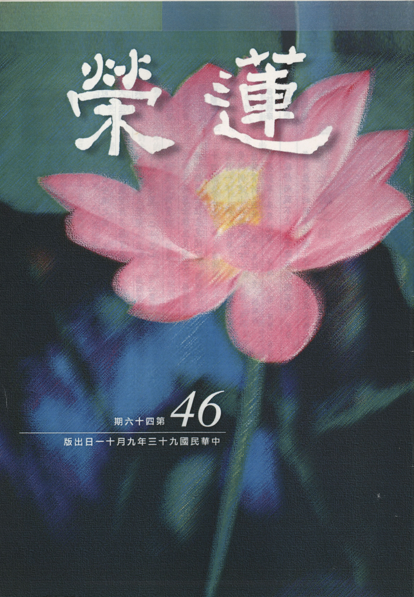

# 第46期

## 社論

### 聽一首安魂之曲

*編輯部*

世間無常國土危

屢受苦難不知困

少欲知足為他想

學法念佛真離苦
近來因敏督利颱風來襲造成的七二水災，使中台灣山區飽受蹂躪，受害程度超過民國四十七年的八七水災，隔了不久又因艾利颱風來襲，使台灣各地淹水，諷刺的是桃園下雨之後卻無水可用，居民飽受了半個月無水之苦，民怨沸騰，好不容易告一段落。環顧世界也好不到那裡去，日本史無前例的飽受強震和強颱威脅，在電視上還看到百姓在平房屋頂上望著汪汪的大水等待求救；蘇俄貝斯蘭中小學遭恐怖攻擊事件，造成數百位師生傷亡，震驚全世界；美國不但在天候上飽受風雨之苦，若干城鎮在強風暴雨下，受到了史無前例的創傷，也為了恐怖攻擊的傳聞，全國上下忙得焦頭爛額；台灣政治局勢也不易穩定，種族的對立以及兩岸的政爭，有一觸不可收拾的危機，又加上教育功能不彰，利人的心態不生，競爭越強，對未來不安定的感覺就與日遽增，所以越來越多生活上沒有目標，只知賺錢享受的現象，家庭倫理結構脆弱，一種對時代的承擔、對生命延續的負責都已漸漸流失，人口成長趨於下滑，年齡結構的老化，使得未來有許多的老人無法享受子孫承歡膝下的天倫之樂。面對這時代的共業，人心惶惶有著說不出的茫然，試
**問：** 我們將來如何穩定自己的身心，走出自己的康莊大道，應該有下述幾方面的抉擇。

第一、對這世間的現象要產生厭離，所謂的厭離並不是厭世，而是不願這些現象生起，來世也不要投生到這樣現象的世界，除非從西方淨土乘願再來悲願濟世另當別論。但是這些現象的生起，不是你用討厭的就可以避免它，必須找到這些現象的根由，努力的對治，這些現象才不會生起。若以氣候變得惡劣，或時而高溫，或時而暴風雨，或時而冷風寒流龍捲風等現象，造成人民生命、財產無數的損失，此乃溫室效應造成，皆因人類過度使用能源，恣意地浪費等等所致，這些問題看似複雜實為簡單，皆是人心想要追逐世俗之樂，不能少欲知足，乃至於不為他人著想所引起。所以在這個時代就要學習少欲知足，學習為他人著想，避免過度浪費能源，乃至於人與人的對立，甚而造成國與國的戰爭。

第二、要避免自己來世投生到這樣多災多難的世界，所以要規劃未來的出路，因為相信生命的現象是無盡的，眼前必須要有不投生這樣的世界之心志與方便。例如想要投生到沒有爾虞我詐、縱欲享受、災難頻生的環境，且大家都有正確的人生觀，過著幸福美滿的日子，眼前先要培養少欲知足的習氣，修學正法的好樂，未來所投生的世界必是詳和無難，互相替對方著想，彼此在正法上相互提攜，而欲投生善道的習氣並不是臨終時才突然現起，乃是平常薰習所成，即使現在累積這樣良善習氣，也不會未來才得到好處，眼前也能過得與眾不同的幸福人生，對淨化社會作出最正面的努力。所以對於未來是有理想的人，反而最能淨化眼前的社會。同理，有心要往生極樂世界的人，也會努力將娑婆的穢土轉化成極樂的淨土。

第三、更要結合共識來作正確的努力，使得大家在好的環境中享受身心靈的快樂，除了上述的少欲知足，為他人著想的基礎外，還要多多學習正法，莊嚴團體，能令近者悅遠者來，發揮淨化社會的力量，為了讓這樣的力量與利益延續下去，還要多多地興辦教育事業以培養人才。

第四、至於念佛、念菩薩名、念咒、誦經等，乃祈求佛菩薩的加被，護持我們不退的善心，增上學法的順緣，去除學法的逆緣，成熟我們處世的智慧，解決人世間各種障難，並幫助我們未來投生到佛淨土，給我們更好的學習，能助有情離苦得樂，這才是我們念佛、念菩薩名、念咒、誦經的意義所在。

## 大德法語

### 大方廣圓覺修多羅了義經（六）

*道源老和尚講授*

研經得旨有方便

消文釋義解科判

若依祖注勤修學

便是當代傳法將

讀古文等於吃橄欖，文句很艱深猶如將橄欖往口裡放，既艱澀又苦，可是越嚼越有滋味，嚼到最後還捨不得吐出來。古文聽懂了以後，要讀才有效果，不會高聲朗誦古文，你得不到法，你要高聲朗誦的大聲讀。經題：大方廣圓覺修多羅了義經，其中圓瑛法師注的圓覺經講義，簡單明瞭，分科分得很清爽，但我（道公老和尚）現在眼睛看不見，須找個同學將圓覺經的正文抄寫出來，並要附上科；若科沒有抄上去，講到時會看不見，眼睛已壞到這個樣子。以前講經看不見文時，將眼鏡取下來，靠近一點就看見了，現在是帶著眼鏡還看不見。聽講的同學有讀三年的、讀二年的、最少讀一年多，大概都可以看科了，一定要看科文，否則段落分不清爽。

若看了圓覺經注解，你就知道中國教派分十大宗派，天臺、賢首、三論、法相等，但主要是依天台宗、賢首宗來解釋經義。你打開注解一看，開首是五重玄義，那是天台宗的注解，若打開注解一看，先十門釋經（懸談：以十種義門懸談一經大義），則是賢首宗的注解。本經之注，圓瑛法師是依著賢首宗，開顯是十門分別。前八門是懸示本經大義，後二門之第九門是總釋名題（解釋題目），第十門講解經文是解釋經文的文句。我一再說都不怕麻煩，你不會看注解，就當不了法師，也不會辦佛學院。經、律、論都有注解，佛法傳來中國二千多年，古人都有替我們用過功夫，對這些經、律、論都注有注解，且一部經有多種注解，若找個二種、三種對著看，沒有搞不懂的。

經題：圓覺是法，大方廣是義，乃圓覺一法含藏大方廣三種義理，若聽過大乘起信論，知道三大：體大、相大、用大。經題「大」就是體大，起信論注解如何解釋體大呢？是當體立名，不是比較的大，不是對著小乘說大乘（對著小乘說大乘是比較的大），大外還有小，此處之大則是絕對的大，非相對於小的大，此大包含一切法，大外無法、方為絕對的大，乃法體，為圓覺所證之理，亦即起信論所講的「真如」，亦是般若經之「實相般若」，名字不同而本體唯一。體大是包含一切法，所謂豎窮三際、橫遍十方。按時間上講：過去、現在、未來三際豎窮，按空間上講：東、西、南、北（四方）、四隅、上下共十方無不包含，所以稱之體大。方為相大，什麼相呢？功德之相。起信論上講的真如那有個相呢？此處指真如功德之相，此功德之相最方、最正，方者正也，怎麼樣正呢？不偏、不斜、是大體之中所有功德之相啊！不偏不斜，所以是方正之相。廣指的是用大，三世諸佛都依著圓覺而成佛，三世菩薩都依著圓覺修行而證得菩薩的果位，十方三世一切眾生，將來能夠轉凡成聖、了生死者，還是依著「圓覺」，依著圓覺而得妙用。起信論言真如有內薰的功能、外薰的功能，依內薰能發菩提心，行菩薩行，依外薰能相應善知識與教法。起信論上真如的妙用即圓覺的妙用，其用廣能以普度一切眾生皆成佛道，此用字非廣乎？圓覺之用依裴休所言是「統眾德而大備，爍群昏而獨照，故曰圓覺」，乃圓滿覺悟。圓覺（圓滿覺悟）其體甚大，其相至方，起用最廣，所以稱之「大方廣圓覺」。以上是經題中之別題。

其次「修多羅」是經題之通題，梵語修多羅翻到中國話為契經，乃契理契機故名契經。契者合也，上契諸佛之理，釋迦佛所說的經與十方諸佛乃至過去諸佛所說，在義理上沒有兩樣，都是相合的；下契眾生之機，佛所說法與眾生的根機是相契合。有云佛經好呀！但難懂呀！我的業障深重呀！我的根器不夠呀！其實是你自暴自棄，你研究佛經了嗎？你聽了佛經了嗎？人家講經你不聽，聽了你不研究，怎麼能合你的根機？孔夫子門人冉求向孔子說：「非不說子之道，力不足也」，夫子，你的道太好了！我真是歡喜啊！但我能力不足、根機不夠，孔子喝斥他，半途而廢，是你現在畫地自限。力不足是走到半路就走不動了，半途而廢所以是力不足，這是冉求自說現況。孔子說你還沒開步走就先畫地自限，說我走不動！你這叫力不足嗎？是你自己自暴自棄、自卑自賤，你本來可以學你不學，本來可以成佛你不成，人道為能而你不為，吾末如之何也已矣！孔子沒有辦法，釋迦牟尼佛也沒有辦法。說法你不聽、聽了你不用功，叫你看注解你不看，送你看注解不要錢，你還嫌囉唆，你不是太對不起你自己了嗎？經上沒有看不懂的，看不懂的不會在這世間上流通，上不契諸佛之理，下不契眾生根機，不叫修多羅（契經）嘛！一定要與眾生的根機相合，看不懂是你沒有看、你也沒有聽、聽了你也不研究，所以你要自己想想，你能成佛啊！你不要自暴自棄啊！（以下是老和尚對出家人特別的開示：你難得有出家的因緣，好不容易出了家，你沒看見別人想出家，想盡辦法都出不了家，你這麼樣地容易出了家，不是善根深厚嗎？你怎麼說你善根不夠？出了家有幾個人能到佛學院天天聽佛法，你居然可以天天聽佛法，不是你善根深厚嗎？你不好好研究，不好好用功，不是太對不起你的善根了嗎？你不要說你的善根淺薄、業障深重，你說的那話都是推責話。）

「了義」指佛所說的是究竟的義理，了是究竟之義。有究竟之義的經，有不究竟之義的經，比如佛說人天諸法，是觀待不能生起念出三界的根機，先將他度出三惡道，故修人乘、天乘，但是人乘、天乘之法不是究竟之義啊！因為沒有出六道輪迴嘛！或有眾生感覺到生死是苦，要發心了脫生死、脫出輪迴、但菩提心發不起來，那麼佛只好向他說二乘法（四諦十二因緣），將他度出六道輪迴呀！此亦是不了義。為什麼呢？乃因三界以外，還有個變異生死，乃因有塵沙惑、無明惑未斷，所以要學大乘法才是了義經，但是大乘中還有真實大乘與權巧大乘，權巧大乘義理還不究竟，真實大乘之法義理才究竟，方謂之了義經。述「其四依之一乎」之四依，有分人四依與法四依，其中法四依有依了義經不依不了義經，依經典來研究佛理要依了義經，你不要依不了義經。

其次「經」，經就是梵語修多羅，翻成中國話叫「契經」。因中國人說話愛簡略，翻譯經典祖師迎合眾生，把「契」字略掉，單說一個「經」字。

然經題中修多羅是梵語，經是中國話，經是由修多羅翻譯過來的，豈非重複乎？其實此處修多羅是指著一切經，此經是指這部圓覺了義經，故修多羅了義經是指一切經中的了義經，再合上大方廣圓覺，乃一切究竟了義大乘經中之大方廣圓覺的這部經，是諸了義經中的一種，所以合起來「大方廣圓覺修多羅了義經」，一共是十一個字，前邊十個字是別名，經之一字是通名，通名就是通於一切經，例如華嚴經，法華經都稱為經，別題十字是所詮之義，經是能詮之文，由經文（表詮的經文）所表詮的就是 「大方廣圓覺修多羅了義」，「卷上」就是兩卷圓覺經之卷上，如同現在的上冊、下冊之上冊。（下期待續）

## 共修研學

### 小止觀導覽（二十五）棄疑蓋

*蓮心整理*

疑師疑法或疑自

信心不生法不入

無力興起善法欲

一生修學皆空過

經文

五、棄疑蓋者：以疑覆心故，於諸法中不得信心。信心無故，於佛法中空無所獲。譬如有人入寶山，若無有手，無所能取。然則疑過甚多，未必障定，今正障定。

大意

說明棄蓋的第五部分：棄疑蓋，敘明其過患，故應棄之。

導覽

一、疑能障道，固為過患，但有些疑是不會障礙禪定的，如禪宗的參話頭，先欲人起疑情，進而探究其理，以此為所緣境，專注的觀察，純粹是開慧用的，比如對我義的觀察，去探究這個過去我們所認知的我，究竟在自性上可得還是不可得？是自性生起，還是必須依仗名言生起？這樣的疑情，要去觀察、去分析、去判斷，這種疑不會障道，大疑大悟，小疑小悟，不疑不悟。但本文所說的疑是對佛法懷疑，不能生起正信且會對佛法產生不信的疑，這種疑是禪定上必須要去對治的。

二、疑能障正信，能覆真心，因無信心，故於佛法中，空無所獲，失如來無上知見。如入寶山，若無有手，必無法取寶（手喻信心，佛法喻為寶山）。觀待於信生起的行相是欲，欲乃希求、好樂之義，於法有希求好樂，始能求解，進而身體力行，進而得到佛法殊勝的覺受，最後證果，此名為得寶。世間所有的殊勝妙用，都是藉著佛法的覺受才能現起，比如你以布施的的正見和覺受來行布施，勝妙富貴的果報乃至解脫成佛的安樂才能現起（所謂勝妙是指此福德能作成佛的資糧，而不會變成三世佛怨），因此修佛法就是修福修慧，世間珍妙的寶藏唯你能知能得。信的行相就是以佛法僧三寶為所緣境，生起一個確定不疑的決定見（是我人離苦得樂的所皈境），尤其是歸依法更是三皈之主體，因為法為佛所證所說，對佛法有信心的人會如實的安住在這個法上，產生覺受，如實修行得到殊勝的功德及果位，此種修學佛法所得證量，不但能成就自己世間及出世間的善因果（別業），亦能為人排疑解難，轉變世間的命運（共業），此為世間的因果；教人得到解脫、了生脫死，超脫世間的命運，此即出世間的因果。

三、阿彌陀佛國土之邊地有一宮殿，以七寶莊嚴，若於疑心中念阿彌陀佛者，胎生於此宮殿中，五百歲間，不得聞三寶之名。為疑惑人所住，故曰疑城。為胎生之宮殿，故曰胎宮。但籠居宮殿中，不得見佛聞法之益，故曰胎生，即疑城胎宮是也。這個邊地疑城，是觀待於對佛之證量有懷疑者，進一步對法也產生了懷疑，所現起的環境，因為當他對佛法無法建立正確的知見和好樂時，讓他先居於此，等他有了善法欲時再進入凡聖同居土接受善知識的調教，何以故？必須要他能體會到佛法的重要和尊貴，也懂得恭敬佛法時，才可堪教化。

經文

疑者、有三種：一者、疑自。而作是念：我諸根闇鈍，罪垢深重，非其人乎？自作此疑，定法終不得發。若欲修定，勿當自輕，以宿世善根難測故。

導覽

一、障礙禪定的疑蓋，可分為三種：疑自（疑惑自己）、疑師（疑惑師長）、疑法（疑惑所修的法門），此段言疑自。

二、「宿世善根難測」約自己來說，是相信自己無量劫來，一定有種下善根，所以今日才可以修學佛法，聽聞正法，即使是很微弱的善根，也能引發很深厚的潛力，比如靈祐禪師在未發跡時，親近百丈懷海禪師，學習參禪，參了很多年，終以「撥火因緣」而開悟，某日將近半夜，天氣很冷，法堂的角落有一個火爐，百丈禪師就對靈祐禪師說：「你去撥一撥，看裡面還有沒有火？」，靈祐禪師撥了半天，發現火已熄了，沒有火了，結果百丈禪師走到火爐邊，再撥，撥到火爐底下很深的地方，撥到一點點火星，就對靈祐禪師說：「你說沒有火，這不是火嗎？」靈祐禪師就開悟了，因為他用功久參，藉著這個特殊因緣，啟發他的悟門。故吾等縱然善根微弱，被無明妄想執著蓋住，但若能以願力及在善知識調教下，突破障難，努力修學止觀，就可把微弱的善根引發出來，當然可以證果。「宿世善根難測」 約眾生來說，眾生宿世善根難測，如馬大師未成名時，為鄉人所輕賤；印光祖師駐錫普陀法雨寺之藏經樓，世罕知者。當知一切聖賢，皆由凡夫做，十方諸佛，亦從眾生成，決無天生的彌勒，自然的釋迦。

三、摩訶止觀：「我身即是大富盲兒，具足無上法身財寶；煩惱所翳，道眼未開；要當修治，終不放捨。又無量劫來，習因何定，豈可自疑，失時失利。人身難得，怖心難起，莫以疑悟而自毀傷。」行者當自信宿世善根深厚，不可思議，只因煩惱障蔽，道眼未開而已。所謂道眼即指可以認識道的心眼，乃觀道之眼，然此心眼必觀待聽聞思維正法而生。俗云：某人心眼太多，此指他的心機太深，但心眼並非惡語，一般人只會用肉眼（包括天眼），卻不會用心眼，也就是眼睛看到了，但心裏沒有覺受與感想，至於法眼、慧眼、佛眼，都是指心對法的認知，比如說：「這件事一看就知道如法不如法」，所謂的「一看」是肉眼，而分辨如法不如法是道眼（即你對道的認知），比如　雪公太老師看報紙只要看標題，就知道會發生什麼事，因為老人家是以道來衡量世事，而非世俗情見。吾等幸得人身，應加珍惜，發大勇猛，進修勝法，以開道眼，方能解脫輪迴，證得佛果。

經文

經文：二者、疑師：彼人威儀相貌如是，自尚無道，何能教我？作是疑慢，即為障定。欲除之法，如摩訶衍論中說：如臭皮囊中金，以貪金故，不可棄其臭囊。行者亦爾。師雖不清淨，亦應生佛想。

導覽

一、本段是在說明向善知識求教時應有的概念。在向善知識學習時，應有死心蹋地的學習精神，如慧可參達摩，久立雪中，及斷臂求法；又如密勒日巴尊者投馬爾巴門下學法，前後經歷六年八個月，勤服勞役，極盡苦修，終得老師傾囊相授。故求師的重點在「依法不依人」，不是在意他的名位、權勢、相貌，而是要著重他所說的教法是否能詮釋法的真實義，他所說的教法，若能幫助我對佛法的認識，對解脫的認知，引發我的菩提心及對空性的證悟，在法上讓我得到受益，這個人就是我要親近的對象。迦葉尊者其貌不揚，但受佛正法眼藏，傳佛心印；六祖慧能家境貧困，靠賣柴養母，後得五祖傳與衣缽，成為禪宗第六祖；若行者不了解依法不依人的道理，在法上悟修證的力量是很薄弱的。

二、法四依：修道者所依止之四種成就的方法。即：

（一）依法不依人：謂修道者當以教法為依，不可以人為依。若其人雖為凡夫，或外道，而所說之理契合正法，亦可信受奉行；反之，若其人雖現相好具足之佛身，而所說者不契合正法，則自當捨離而不可以之為依止【請參看前條所述】。

（二）依義不依語：謂修道者當以文所詮義為依，不以文字、語言之華麗為依，若華而無質，依而無益。

（三）依了義經不依不了義經：謂三藏教文所詮釋義中有了義經論與不了義經論，修道者當以空性（實相）義之決定了義經論為所依，以求解脫乃至進破二障（煩惱障、所知障），不可以不了義經為依。不了義經是不可如言取義，雖說無我之理，但非究竟空義，無法成為二障的對治。

（四）依智不依識：謂修道者當以意識為所依，不可以根識為所依。並且要以聖人的證量為所依，而非以凡夫的證量為所依，比如修學止觀要以天台大師的著作為藍本，而不是以時下世人的著作為依歸。在體會義理的時候，應以聖人的證悟為依歸，故須是有師承及有古本遵循，因為這些都是聖人的心得，捨此，則為緣木求魚，了無所得。

三、摩訶止觀：「上聖大人皆求其法，不取其人，雪山從鬼請偈，天帝拜畜為師。大論云：不以囊臭而棄其金。慢如高山，雨水不停。卑如江海，萬川歸集。我以法故，復應敬彼。．．．常起恭敬三世如來，師即未來諸佛，云何生疑耶？」親近善知識要講究親近的心態及方法，恭敬老師當生諸佛之想，彼雖凡身，而口所言者，乃諸佛之法，故當以觀佛之心觀師，理由如下：

（一）報答佛恩：大勢至菩薩念佛圓通章：「十方如來，憐念眾生，如母憶子」，十方如來與我們的關係是母子關係，教我們的大德就是諸佛如來請來的老師，比如文殊菩薩就是釋迦牟尼佛請來教導善財童子的老師，所以想要孝順父母親的孝子，就必須尊師重道，而尊師重道就是最好報恩的行相。

（二）傳佛欽命（旨意）：老師在宣揚佛法時，就像欽差大臣在宣揚聖旨一樣，欽差大臣等同皇帝，此大臣有如朕親臨之信物，能令他臣頂禮受旨。同理大德在宣揚佛經的義理時，就是代佛弘法，豈可褻慢不恭乃至妄生批評，橫論長短？

（三）諸佛示現：因為佛菩薩對眾生的教化是以種種形，遊諸國土，度脫眾生。應以何身得度者，即現何身而為說法，所以對於老師的傳道、授業、解惑，要當成是諸佛的應化身隨緣示現。比如西方極樂世界裏的眾鳥，皆是阿彌陀佛欲令法音宣流，變化所作。

（四）恩澤同佛：今日遇此老師，乃宿世因緣，故現在度化我們的因緣在他，修學的關鍵在他，成就的大小也繫乎於他，故其恩德等同諸佛。

綜合以上的這些概念，除去了疑師之障方能進入止觀門修學，才會得到止觀的殊勝利益，若疑慢在心，則障於禪定，禪定不開，則般若之門深閉。故智者大師把疑自、疑師、疑法，收攝在止觀門的前行，道理在此。（下期待續）

### 佛說八大人覺經講記（五）

*編輯部整理*

或問佛法之要義

八條覺悟是修要

常於晝夜為修時

至心誦念乃修法

第一覺悟所要引發的是出離心與空性的正見，出離心要靠什麼去引發？出離心不能自己生，不能獨立生，必藉者苦、無常而生起。三法印裡的有漏皆苦與諸行無常，生出了出離心。第一覺悟那些是講無常，那些講苦呢？無常的部分為世間無常，國土危脆；苦的部分為四大苦。無常與苦是我們有漏世間所面對的境界，此境界包括正報與依報，雖然四大是苦，但四大也是無常。「世間無常，國土危脆」，其實無常也是苦，因為你面對的是一個變動不居的環境，請問快樂在那裡？

今天報紙說，外資大量撤離台灣，新台幣面臨嚴重的考驗，貶值貶到十五年來的最低點，未來會到什麼程度，不知，將來國家的走向是什麼，不知。以前聽安居樂業好像是老生常談，沒啥稀奇，但現在想想安居樂業是多麼的難得，能安居就是無種種災難與戰亂，能樂業就是這職業可以做到退休，你的努力別人肯定，老闆也護持你一輩子，現在看看有多麼的難得。想想看台灣才建國幾年，看起來很久，其實才五十年，五十年就已經變成這樣，昔日清朝盛世康熙六十年，雍正十四年，乾隆六十年，以那時的盛世再看台灣才五十年就已經搖搖欲墜，所以一個安居樂業現況的維持有多麼的難得，想想我們的後代未來將如何因應。這世間難道不苦嗎？

無常就是苦，為什麼會苦？正因無常。從這裡去引發出離心，我們這個世界就是一個無常苦的世界，所以必須要找到苦因，世間的外道與佛法都是要尋求苦因去對治，佛深深的瞭解苦因是來自於業，業來自於煩惱，煩惱之生在於執著。而執著的正對治在第一覺所用方法，是以四大、五陰為所緣，尋覓它的自性，了不可得，破除了執著，因為執著必須觀待於境界的真實才會生執著，境界不真實如何生執著？束縛我們的境界就是四大與五陰身，以它為所緣，發覺到它的自性是了不可得的。如此則執著不生，執著不生、煩惱就不起，煩惱不起、業就不造，業不造苦果就不生。是這樣觀察的。

身為見惑之首。此身是什麼？身包括四大與五陰，說身一定說到心，因為身跟心是互相觀待的，心不能離開身獨立現起，身不能離開心而有作用，如果身能離開心有作用，那麼死人的身為什麼沒有作用？所以說身一定包括心，以五蘊身為所緣會產生見惑，見惑就是執著，執著有一個真實的人我和法我，五蘊就是法我，在五蘊之上有一個人我在攝持五蘊叫人我，去尋覓一個真實的人我與法我到底在那？發覺到了不可得，人我、法我二者是互相依靠，隨緣現起的假相，此時執著才不生，煩惱就可以破，業已不起，苦果則不生。

第二覺

「貪為思惑之首」

。我們為什麼會貪？貪從執著來，貪瞋癡全部從執著來，尤其三界的貪愛是無始來執著（無明）所串習出來的煩惱習氣，行者要不斷串習無我正見，體會有為法幻化實有空，方能去除三界之貪愛。所以第二覺知明貪為思惑之首，思惑就是執著所串習出來以貪為主的煩惱習氣，所知障是不會生出執著的習氣，此處所指的習氣是跟執著相應的習氣屬於煩惱障。所以執著去除，還須更進一步破除執著所串習出來愛的習氣，俗云：看得破，放不下。然真正看得破時，已放下大半了。將煩惱種子去除之後（破煩惱障），剩下煩惱障所留下來的習氣，此習氣不能生起煩惱障是屬於所知障的範疇。

雖然執著拿掉，但跟執著相應的習氣猶在，舉例來說，把樹連根拔起時，花葉果會馬上爛掉嗎？花葉果與根有關係卻沒有馬上爛掉，所以重觀有為如幻實有空，有為如幻包括四禪八定都是幻化，不但欲界實有空如幻，即使到了色界天時，彼處形體殊勝，宮殿巍峨，壽命久長，甚而到無色界還有二萬劫、四萬劫、六萬劫、八萬劫這樣長的壽命可活的，其實都是實有空幻化，無微塵許真實性，都是待緣而生，所以破除對境界的愛染，這時才能夠出離三界的繫縛。以上是此二覺，此二覺是小乘的成就，雖然大乘是究竟的成就，然而小乘的證量亦無比的殊勝。

經文：

「至心誦念八大人覺」

，做每一件事、修每一個法行，包括布施、持戒、放生、齋僧、濟眾、甚至向人說好話、在家幫忙做家事的動機，都是求開悟、求成佛以及利益無邊有情的動機，但以求開悟為當務之急，而所修的福資糧都是要幫助我們求開悟，以福作為慧的資糧。沒有福報的人是身體不健康、遇不到善知識、遇不到教法、沒有好的環境修行，甚而天災人禍，試問在這樣的狀態下要怎麼修，想要開悟的人不需要開悟的資糧嗎？開悟的資糧從修福來，所以為什麼古來的祖師大德一方面求開悟，一方面也認真做服務眾生的事相，印光祖師在寺廟做過水頭，四十個人喝的水一個人挑，作過藏主而曬過藏經，作過庫頭管過倉庫，這是印光祖師，以他這種人都知道修福的重要，所以修福修慧是要相互配合的，為了修慧所以修福，得了智慧以後再以智慧指導福，這才是正確的人生觀，如果人生觀不是這樣建立，這人生觀是錯誤的，此人再聰明都不會有前途，以上是至心誦念八大人覺。

第一、二覺是求破二惑，得到三界的解脫，第三覺到第八覺則是大乘二利的成就，表解是

「齊修六度，智悲雙運」

，齊修六度之前的心態是菩提心。何以故？因為第三覺出現「菩薩」二字，乃是發菩提心的行者，此菩提心是修學六度的所依，修學六度是否是大乘法？要觀待於菩提心。所以如果至心誦念八大人覺的人，在事相修福要有出離心與菩提心，並且把法行攝入六度及攝入開悟的資糧、成佛的資糧，並以成佛的能力來利益無量無邊的有情，這個人才是真的會念八大人覺經。六祖也說佛法在世間不離世間覺。

第三覺何以是定度智重？第三覺知是發菩提心的人，為什麼發菩提心的人把禪定擺第一？「守道」就是虛雲老和尚說的貓捕鼠，雞孵卵，鎖定目標，「道」就是明心見性，究竟處就是佛的證量，

「安貧守道」

就是以佛果為目標而不在意眼前貧困等逆境與障難，例如儒家顏回以成聖為目標，簞食瓢飲居陋室沒關係，而一心追求聖道這叫禪定度。禪定度是對目標有專注力，第三覺知是發起菩提心的人，他應該要以佛果為目標，所以叫禪定度。

為什麼是智重？因為

「惟慧是業」

，一切的造作都是為了要開發智慧。如果智慧不開，會有很多的過患，善惡不會分別，乃至於作惡自以為是，作善心生不快，都是一個邪見，現代人就是因為智慧沒開，所以你跟他講孔子他聽不下，講真理他聽不下，哈拉哈拉的他很有興趣，綜藝節目的他專注，在綜藝節目當中產生禪定度。沒有開智慧的人很奇怪的，他看人正好相反，比如紂王看到比干，比干是不錯的人，他（紂王）看比干就相反，覺得此人很可惡、討厭，妲己明明是狐狸精，他（紂王）看起來很可愛，言聽計從。沒有智慧的人看法就與有智慧的人不一樣，智者看事情能見真相，什麼就是什麼，所以我們如何讓自己開智慧，看到事情的真相，才能有幸福快樂的日子可過。

歷朝國家是如何亡的，就是皇帝把忠臣看成奸臣，無有例外，此歷史教訓載在史實。例如明崇禎最後是如何亡的？就是將忠臣害死，如孫承宗、熊廷弼，特別是將袁崇煥捉來凌遲，其死法像魚一樣一刀一刀被刮死，他（思宗）就是把忠臣看成奸臣，奸臣看成忠臣，結果，在他（皇帝）要逃出城門時，部將把城門關住，讓皇帝逃不出，關城門者竟然是他最親信的人，後來他上吊在紫禁城裡的一座假山（梅山）。人不開智慧就是這樣，看到善人悶悶不樂，看到蓮友心情不愉快，看到酒肉朋友高興得不得了，蓮友打電話來說今天要做善法，心情不舒服，聽到要去助念的時候很沮喪，要出去逛街聊天則高興得不得了，要來上課不情願，要去玩樂心情很高興，沒有智慧的時候會把事情看成相反，他喜歡交的朋友都很奇怪，所以這個世間是各看各的，各受各報，以上是智重，重點是要開出佛的智慧，佛的智慧是無上正等正覺，叫做阿耨多羅（無上）三（正）藐（等）三（正）菩提（覺）。 （下期待續）

## 蓮池海會

### 王仲年老居士往生見聞記

*編輯部*

春風化雨四十年

慈父良夫好同鄉

觀待子女學佛後

助念生西得大利

王仲年先生，江蘇省睢寧縣人，民國十七年九月六日生，民國三十七年畢業於江蘇省立泰興師範學校，同年受聘為無錫羊華鎮中心小學與羊尖中學教師。民國三十八年隨其父王俠民先生軍旅來台，民國三十九年三月起擔任新竹縣福興國小教師，民國四十三年起調派基隆巿和平國小教師，之後於基隆巿安樂、深澳、仙洞、建德、中和及深澳國小擔任教師、主任及代理校長，民國八十三年初退休，總計在教育界服務超過四十四年。

先生為充實所學，參加無數次之公餘進修與訓練，並積極參與校內行政工作，多次訓練學生參加桌球比賽及各類國語文競賽，履獲佳績，因此獲記嘉獎，記功二十餘次。民國七十九年獲教育部遴選為資深優良教師及公開表揚。

先生教學認真，對待學生溫和淳厚，一生從事教育工作，每遇以前教過學生回來探望，或寄來一封信，或在路上相逢熱情招呼，這些學生們都各有本業，勤懇地作事與為人，是先生津津樂道，引為生平最快慰之事。

先生以一份小學老師的收入撫養六個孩子，平日十分慈愛子女，充滿童心，舉凡說故事、炸油條等遊戲，在在都令子女懷念不已。平日雖捉襟見肘，但對於子女的教育卻十分重視，倘若成績不佳，則親自解說教導，雖然每遇開學交學費，需要標會，東挪西借，但仍堅強樂觀地渡過，更在子女的人生關鍵時刻給予適時的扶持，至使六位子女皆完成大學教育，並已組成圓滿幸福的家庭。先生與賢伉儷老年從容有餘裕的生活，仍不改節省、簡單的生活方式。

先生之夫人吳蘇芬老居士於去年五月廿九日助念往生之後，即對淨土法門產生極大的信心，吩咐子女自己的後事亦要如此如法辦理。

先生平日身體十分硬朗，今年三月始，皮膚開始出現癢症，遍尋不出病因，直至四月證實為銀屑症，住進臺大醫院治療，之後因肺部感染住進加護病房，七月十六日在家屬、蓮友誠意助念中安祥往生，助念十二小時後，面容安祥，含笑西歸。

家屬謹遵佛制，如法念佛、誦經、齋僧並祈請善知識講經回向，以及捐助獎學金等種種善法，祈願先生於西方極樂世界蓮品高昇，早日乘願再來，滿菩提願。

## 日常省思

### 樹欲靜而風不止，子欲養而親不待

淨琴

一生浮沉到老年

兒孫滿堂兒孫福

若問未來何處去

快向世尊討分明

民國九十三年七月二十九日晚上七點左右，電話鈴聲中斷了正在廚房拿著鍋鏟的我。面對著這突如其來的訊息，似乎只有幾秒鐘的錯愕就以鎮靜的心態，一路心中念佛由外子駕車陪伴至台北馬偕醫院急診室。

到了急診室川廊即視兄長一臉焦急在外等待，並由其引領至急診發燒隔離室。隨後見家父經由醫護人員的緊急處理，人已退燒；吊著點滴；戴著氧氣，整個人因病苦而顯得氣力衰弱。之後展開一路緊急醫護及追蹤病因的檢查。半夜，血壓曾一度掉落到低血壓十一至廿二。目視著儀器，心中焦急地默禱念佛。折騰至天亮，兄長緊接著幫忙辦理住院手續，醫師確認是腸阻塞並懷疑是敗血症及腹部淋巴病變，當被醫師通知病危時，眼眶一度泛紅。雖心中感到不捨，但幾年來的臨終關懷經驗明確告訴自己該如何處理。整個過程要面臨的就是醫療的抉擇及往生大事的處理兩個方向。

家人獲悉家父病危曾一度愕然，住院後二週，一邊做敗血細菌培養及治療和腸胃道整治，一邊繼續做切片檢查。直至八月十日醫生宣布為攝護腺癌末期，建議做摘除睪丸手術並終身服用女性荷爾蒙，來控制病情以防病情嚴重時導致洗腎。此時家屬頓時陷入天人交戰，隨即請益老師，決定詳實告訴父親實際病情，並分析中西醫的利弊得失，由父親自己做決定。家父勇敢面對老、病、死的問題，當下決定出院改採中醫路線，希望於人生最後一程走的安詳，且意識清楚能獲得善終。家父平時頗隨喜放生活動，曾和老師蓮友們出國兩次放生並參與國內放生多次，與蓮友結下共造放生的善緣，感得此次對醫療能做正確判斷且免除開刀之苦。也承蒙蓮友至家中探望並勸其修行念佛往生西方修行，並立下將來能做菩薩回入娑婆度有情之大志。

俗諺：「人生七十古來稀。」家父已年屆七十五之高齡，於三年半前做攝護腺癌血液指數檢查出是癌症，卻不想造成對妻子兒女的拖累，對家人佯稱是醫生檢查錯誤，堅持服用一些利尿劑，此次無常示現亦給自己上了一課。誠如古德言：「我見他人死，我心熱如火，不是熱他人，看看輪到我。」人有生，必有死；聖哲云：「萬般帶不去，惟有業隨身。」所以，死亡是人生必經的過程，無一可免，而生命的意義不在其長短，而在其所皈依處才是應求之道。

記得上學期學校請彰化師範大學紀教授蒞校演講，當下感動不少同事落淚；還記得演講中曾提及如何向重病患者善巧引導面臨死亡一事。此次正好派上用場！且家父家母均悉知我及外子常為蓮友及有緣人做臨終關懷，故此次家母甚是信賴，並配合勸導兄長及舍妹能以最人道的方式來處理父親的病苦且讓父親在人生最後一程活得有尊嚴；將來父親若歸西能依佛制來處理家父的往生大事。

家父出院後，一切行動自如，甚至仍然維持平日早上運動之生活作息。並對治一生穿梭於商場中養成貪杯之惡習，心態上也願意和癌細胞和平共存。

無常經云：「有三種法於諸世間是不可愛、不光澤、不可念，此謂之為老、病、死。」亦云：「未曾有一事不被無常吞。」無常乃死亡的代名詞，清朝，省庵大師：「所愛竟常別，淒涼不忍看，識才離故體，屍已下空棺，夜火虛堂冷，秋風素幔寒，勸君身在日，先做死時觀。」

一般人病情會受心理影響，尤其端看此次家父在醫院的攝護腺特異性抗原指數的變化可知。家父八月九日做的血液指數為九十九ng/ml，然而在醫生宣布為癌末期時，再次的抽血指數竟高達一千ng/ml，此一數據是顯示癌細胞已嚴重侵犯骨骼，連西醫最後要進行的開刀手術都相當棘手。前後才三天，數據竟發生如此大的變化，可見心念影響一切。而後再次善巧引導家父平靜面對癌細胞，於八月十二日至核醫室做電腦骨骼斷層掃瞄檢查，報告出來竟未發現骨骼有癌細胞侵犯的現象，此亦令醫生感到疑惑！並要求家父再重新檢查。

無常不可怕，可怕的是不能自我警惕勵力修學正法，何謂修學正法？乃通達身為苦本發起猛力的出離心，努力修學解脫道，通達法的自性空，方知身乃幻化，生死是幻化，才是真正脫困於無常的束縛。不然亦要好好求生淨土，在殊勝的修學環境中得到解脫的成就。家父雖罹患攝護腺癌末期，但不覺得自己病的可怕。在醫院時，他常對我說：「能多活一天就多賺一天。子女均已成家立業，他責任已完了！……」抱持隨緣就醫的心態，一切不強求。若家父能在有生之年面對無常，徹底放下世緣，好好地念佛，與蓮友結殊勝法緣，做為將來移民西方極樂世界的資糧，此亦不枉父女一場的因緣。

行文至此，想起詩經蓼莪篇：「哀哀父母，生我劬勞！哀哀父母，生我勞瘁！……」願天下有情眾生能於父母在世時多盡孝道，祖師大德云：「小孝乃口體之養，中孝乃順親之志，大孝喻親於道。」想想自己在孝道方面似乎不及格！盼此際能發懺悔之心，勉力為之！免得徒增遺憾。

## 啟蒙園地

### 每月一字 — 岡

大敬

岡：根據東漢許慎的說文解字「岡」的本義為「山脊」，就是山背，故有人將「岡」字列為「山」部。「岡」字取「网」為聲的原因，是因為古時張網捕鳥獸，多置於山脊之廣平處，以利捕獲。後來又有增加「山」字成「崗」，為「岡」的俗字，「岡」、「崗」二字為同字異體，本義相通，但某些時候仍不得互用，如「崗哨」（站崗放哨的地方或人）就不得寫為「岡哨」，又如「站崗」（站在崗位上，執行守衛警戒的任務）也不得寫為「站岡」。

壹、茲列舉「岡」之解釋如下：

一、山脊、山嶺：

（一）同「崗」字，如「山岡」、「高岡」等。

（二）《詩經》周南：「陟彼高岡，我馬玄黃。」就是指想要攀登高山，但是馬已經生病，不能走了。

二、小山：

（一）如《詩經》小雅：「如山如阜，如岡如陵。」大山叫「陵」，小山曰「岡」。

（二）蘇轍的《黃州快哉亭記》：「岡陵起伏，草木行列。」是指在快哉亭向西南面眺望，可見武昌群山，峰巒起伏，草木成行成列。

三、地名：如「黃花岡」，又可寫為「黃花崗」，位於廣東省廣州城北門外的白雲山，在清宣統三年三月廿九日（西元一九一一年），黃興率領革命黨人起義，進攻兩廣總督，與清軍發生激戰，事敗，林覺民等八十六人英勇殉難，後得遺骸七十二具，合葬於此，史稱「黃花岡之役」。

四、山名：如「瀧岡」，位於江西省永豐縣南一百六十里的鳳凰山，宋朝歐陽修葬其父母於此地，並撰有《瀧岡阡表》一文。

貳、茲列舉與「岡」有關的成語如下：

一、岡連嶺屬：語出馬融《長笛賦》，是形容山嶺相連，綿延不絕的樣子。

二、振衣千仞岡：語出晉朝左思的詠史詩：「振衣千仞岡，濯足萬里流。」是指在高山上抖落衣上的塵土，在長河裏洗淨足上的汙穢。比喻心志高潔，遠離塵世而歸隱的意思。

### 十四講表（十五）第五講表　人生三際之抉秘　十二因緣（下）

傳瑛

現在因緣

上次講到現在苦果有識、名色、六入、觸、受五支，接著說現在因緣〜愛、取、有三支。

「愛」指因受生著；當我們接觸境界時，若是感受很喜歡、很悅意，就會生起想擁有的執著；反之，若是感受很討厭，不悅意，就會生起憎離的執著。這種愛或憎的情緒均屬「愛」支的煩惱相。現在有些年輕朋友覺得電玩很有趣，玩到生活都不正常，甚至忘了該做的正事，這個「愛」就很糟糕！有時我們覺得這個東西很好，事實上它不一定好，比如我們知道蒼蠅最喜歡臭臭的東西，看到腐肉或是大便，牠們會快速飛去，一黏在上面就不動了，我們覺得牠們好噁心，但蒼蠅本身因為習氣的關係一點也不覺得污穢，所以養成良好的習氣及有判斷是非好壞的能力，才能對「愛」有正確的取捨標準。

「取」乃因執追求；眾生大多因無明愛而費盡心思的想擁有種種事物，於是千方百計的追求。「取」之後為「有」，意指業牽後有；因眾生在計劃籌謀得到它的過程中，會造作種種不清淨的業而引生來世的輪迴，以致於未來生、老死苦果相續不斷。

未來苦果

當然，現世有生、也會有老死的苦果。人隨時光流逝終會老化，老人雞皮鶴髮、行步龍鍾、百病纏身，實在可憐，所以對家裡的爺爺奶奶，大家要多尊重照顧。以前有一對夫婦，太太生了一個很可愛的孩子，這個媽媽非常疼小孩，好的東西都給他吃，可是對家裡的婆婆就沒像對小孩這麼好。她覺得婆婆這麼老，一點都不可愛，又不會做事，隨便給她吃就可以了。先生看了非常不高興，告訴太太要好好對待老人，可是太太不但不聽，還說婆婆老了沒有用，為什麼要對他這麼好。先生每次勸，太太都不聽。這位先生是果農，有一天，他到果園工作時竟把所有的果樹都砍掉，然後就回家了。太太覺得奇怪，怎麼先生今天這麼早就回來了？等到她看到果園裏所有果樹的根都被砍斷，很生氣的跑回家罵她先生，你怎麼這麼笨把果樹都砍了，今年怎麼收成！先生說，果樹沒有根就不能活，就像我一樣，我是媽媽生來的，媽媽就是我的根，妳不對我媽媽好，就好像砍掉我的根，那麼生活中的一切對我也沒任何意義！太太聽了很後悔，從此變得懂得善待婆婆。

再講一個有關的故事，以前有一個兒子，因自己的爸爸媽媽年老手會發抖，怕把好碗打破，於是就給他們用破舊的木碗吃飯；而且覺得老人家吃東西不好看，菜都掉下來，所以就分桌吃飯。有一次，他的小孩跟其他小朋友玩遊戲，有二個小朋友扮演這位小孩的爸爸媽媽，這位小孩就拿破舊的木碗給他們，並且說：將來我也要拿這木碗給我的爸爸媽媽用。小孩的爸爸無意中看到兒子的舉動，非常吃驚，心想：我拿破舊的木碗給我的爸爸媽媽吃，我的小孩就學我的樣子，將來也要拿破舊的木碗給我吃，這真是因果報應！同學們要記得家裡的老人是我們的根，所以一定要好好孝順他們，而且現在我們照顧他們，將來我們老了，自然也會有人來照顧我們。

除了老之外，每人還須面對一件很痛苦的事，那就是死。其實死不是說沒呼吸就是死了，當我們死時，神識就準備要離開肉體，此時痛苦有如生龜脫殼，所以人在臨命終時，不可以去觸碰他的身體，否則他會感覺有如萬針穿刺般的痛苦；也不可以一直哭，哭聲會引發他捨不得離開的心緒，此時他身體很痛苦、心裏又很掙扎，會讓他身心陷入非常苦惱的折磨。最好的方法就是不搬動、不哭泣，幫他念阿彌陀佛，使他心裏慢慢清淨後，也能跟大家念阿彌陀佛，讓阿彌陀佛接引他到西方極樂世界。

總說雙重因果

眾生從無始劫來輪迴至今，皆是依著十二因緣流轉，而藉著十二因緣讓我們瞭解三世因果的道理，所以從現在起大家要謹慎行事，因每做一件事都是一個因，就像一顆種子，以後遇到陽光、水，就會開花結果。同學們想要將來得樂果的話，現在就得栽種善因。

十二因緣含括過去因緣的無明、行，現在苦果的識、名色、六入、觸、受，現在因緣的愛、取、有，及未來苦果的生、老死，共十二支，比喻為十二重城，意指眾生在六道中輪迴宛如犯人被關在牢獄中不得自由，而且這個牢獄是由眾生自己所築的十二道重牆所圍成的，這十二重牆就是十二因緣。此外，依著十二因緣，讓我們的生死輪轉不息，所以又稱為十二輪。

以前有五百個商人相約出國作生意，途中走到一座大森林，那時天色已晚，大家就在一棵非常大的老樹下休息，天亮後，大家自動起床集合出發；可是有一個人貪睡，沒趕上隊伍，起床後發現大家都走了，非常著急，時值冬天，大雪紛飛，那個人迷路了，怎麼走都走不出這棵大樹的範圍。正在苦惱的時候，大樹突然開口說話，原來這棵樹是千年的旃檀樹，它說：「你不用憂愁，我是旃檀樹神，由於現在是冬天，天氣很冷且雪茫茫一片，不容易找到出路。這樣吧，這個冬天你就在我這邊暫住，我幫你張羅飲食，等到春天來了，我再指引你出路吧。」那個人聽了非常的高興，於是就在那邊待了一個冬天，等到春天，他跟樹神說：「我好想家喔，請你指點我出路讓我回家。」在走之前，那個人跟樹神講，這個冬天你供我吃住，非常感謝，我想知道你的大名，回去後，我就可以幫你廣為宣揚。」樹神當然不想這樣做，如果大家知道後一定都會來看它，而且可能不會好好愛護它，甚至還可能把它砍掉，所以樹神不願意說。那個人又道：「這樣好了，我不幫你宣揚，但是我總要知道你的名字，因為您是我的恩人。」樹神想想，就告訴那個人它是旃檀樹神。

後來這個人回到自己的國家時，聽說國王忽然得了一種頭痛的怪病，醫生說要砍旃檀樹，因旃檀樹的樹香能治療國王頭痛的怪病。由於當時沒有人見過旃檀樹，所以國王就公告，如果有人找到旃檀樹就可得到很多賞金。這個人看了公告心動了，他在掙扎到底要不要告訴國王他知道在哪裏可以找到旃檀樹？如果講了就可以變成富翁，可是講了自己就是忘恩負義的人！最後因貪心的驅使，他還是跑去跟國王講，國王馬上派士兵跟他去砍旃檀樹，經過千山萬水終於找到那棵旃檀樹，士兵發現這棵樹是千年老樹且長得很挺直莊嚴，心想：這麼好的樹砍了豈不是太可惜，但不砍回去又不能向國王交代。這時旃檀樹神很慈悲的說：「你砍我上面的樹幹就好，留下樹根，這樣我仍舊能活。」士兵就照它的話做，而那個出賣樹神的人則在旁邊四處走動，一不小心他踩到一根被砍斷的樹枝，樹枝的尖端剛好插在他身上，那個人流了很多血當場就死了。後來士兵把砍下的旃檀樹幹運回去給國王，並治好了國王的病。

事實上，這個忘恩的人跟國王及旃檀樹神，宿世是父子關係，國王是爸爸，旃檀樹神是哥哥，忘恩負義的人是弟弟，這個哥哥宿世雖然常行善事但脾氣不好，弟弟整日玩樂不務正業，常跟哥哥吵架，吵架時弟弟常常口不擇言，有一次對哥哥罵道：你有什麼了不起，再說我要砍掉你的四肢。哥哥聽了很生氣說：如果你再這樣，我就要你的命。他們都是在生氣當中不由自主的口出惡言，那時爸爸聽了很難過說：你們兩個不要再吵了，吵的我頭好痛。哥哥說：爸爸，對不起，我願用我的身體當成藥治好你的頭痛。來世雖然爸爸成了國王、哥哥成了旃檀樹神，弟弟成了生意人，彼此不再為父子關係，但因宿世所造的口業，讓旃檀樹的樹幹（如人的四肢）被弟弟帶人砍了，弟弟被旃檀樹枝插死了，國王的頭疼用旃檀樹（如用人的身體）治好了。

當然，造惡因得苦果，造善因就會得樂果。艾森豪是第二次世界大戰的美軍名將。有一回他在法國諾曼帝半島登陸，統帥三軍準備與德國作戰。備戰時須每日巡視前線備戰的情形，有一天他照例坐上很威武的吉普車要去巡視前線，途中看到一對老夫婦很傷心的在路旁哭，他覺得好可憐，就下車詢問，那位太太說：「我的女兒在巴黎生病了，我想去看她，可是現在是戰亂時期，沒有車可以搭，從這裡走到巴黎有一段很長的路，我們真的不知道該怎麼辦！」艾森豪動了惻隱之心，他說：「沒關係，我有吉普車很方便，我載你去巴黎找你的女兒吧。」那對夫婦很感激的坐上車，之後艾森豪再從巴黎繞很遠的路到前線巡視。由於艾森豪一念之善，讓他逃過一劫。原來美國得到情報說，那天德國已預謀在他每天去巡視的固定路途中安排殺手，準備在他經過的時候暗殺他，結果那天艾森豪因為做了一件好事繞道而行，免於命喪黃泉；戰後艾森豪還做了兩任的美國總統。

結言

本表十二因緣告訴我們三世因果的道理，如是因如是果，欲知過去因，現在受者是，欲知來世果，現在造者是；過去造什麼因將來就會得什麼果，所以瞭解十二因緣後，可以讓我們建立諸惡莫作，眾善奉行的因果正見。（下期待續）

### 古文賞析　黃岡新建小竹樓記（下）

大敬、道融

原文

黃岡之地多竹，大者如椽（一）。竹工破之，刳去其節（二），用代陶瓦，比屋皆然（三），以其價廉而工省也。

予城（四）西北隅，雉堞圮毀（五），榛莽（六）荒穢，因作小樓二間，與月波樓（七）通。遠吞山光（八），平挹江瀨，幽闃遼敻（九），不可具狀。

夏宜急雨，有瀑布聲；冬宜密雪，有碎玉聲。宜鼓琴，琴調虛暢；宜詠詩，詩韻清絕；宜圍棋，子聲丁丁（十）然；宜投壺（十一），矢聲錚錚（十二）然：皆竹樓之所助也。

公退之暇，披鶴氅衣（十三），戴華陽巾（十四），手執《周易》一卷，焚香默坐，消遣世慮。江山之外，第見風帆沙鳥，煙雲竹樹而已。待其酒力醒，茶煙歇，送夕陽，迎素月（十五），亦謫居（十六）之勝概也。

彼齊雲（十七）、落星（十八），高則高矣！井幹（十九）、麗譙（廿），華則華矣！止於貯妓女，藏歌舞，非騷人之事，吾所不取。吾聞竹工云：「竹之為瓦，僅十稔（廿一），若重覆之，得二十稔。」

噫！吾以至道（廿二）乙未（廿三）歲，自翰林出滁上；丙申（廿四），移廣陵；丁酉（廿五），又入西掖。戊戌（廿六）歲除日，有齊安之命。己亥（廿七）閏三月，到郡。四年之間，奔走不暇；未知明年又在何處！豈懼竹樓之易朽乎？

幸後之人與我同志，嗣而葺之（廿八），庶斯樓之不朽也。

咸平（廿九）二年八月十五日記。

肆、注解：

一、椽：屋樑上支撐瓦片的木條。

二、刳去其節：剖開竹子，挖掉竹節。刳，剖其中而空之。

三、比屋皆然：屋屋都是如此。比，並也。

四、予城：城門外用以保護內城的半圓形城牆，也叫月城。

五、雉堞圮毀：短牆傾覆毀壞。雉堞，城上的短牆，即城堵，又名女牆。圮，毀壞。

六、蓁莽：叢生的野草。蓁同榛，棘叢。莽，眾草。

七、月波樓：樓名，王禹偁所建，在黃岡城上。王禹偁曾作《月波樓詠懷詩》，序云：「月波之名，不知得於誰氏，圖經故老，皆無聞焉。」

八、遠吞山光，平挹江瀨：遠望可以飽覽山巒美景，平視可以盡觀江水風光。挹，汲取，引而取之也。瀨，水流沙上。

九、幽闃遼敻：清幽寂靜，廣闊遙遠。闃，寂靜。敻，遠也。

十、丁丁：本指伐木聲，此處是形容棋子聲。

十一、投壺：古代宴飲時的一種遊戲。以圓腹高頸的壺為目標，將箭形的籌投出去，以進籌的多少為勝負，負者罰酒。

十二、錚錚：金屬相撞擊的聲音。此處形容矢（即「籌」）投入壼中所發出的聲音。

十三、被鶴氅衣：穿著道袍。被，同披，穿也。氅，鳥羽也。鶴氅，用鳥羽製成的衣服。世說新語記載：晉人王恭乘高車，著鶴氅裘衣，涉雪而行，孟昶見之，嘆曰：「此真神仙中人。」

十四、華陽巾：隱士或道士所戴的帽子或頭巾。梁時陶弘景，自號華陽真人，華陽巾可能為其所創。【另說：《神仙傳》記載：曹魏時韋節隱居華陽山，號華陽子，時人稱其頭巾為華陽巾。】

十五、素月：皎潔的明月。

十六、謫居：官吏因有過失，降職外調。謫，職官降調也。咸平元年，王禹偁參與纂修太祖實錄，直書其事（即直言趙匡胤篡周而有天下），被貶於黃州。

十七、齊雲：樓名，在江蘇省蘇州市舊城內，為唐曹恭王所建，即古月華樓，今名飛雲閣。

十八、落星：樓名，在江蘇省金陵（今南京市）東北落星山上，為東吳孫權所建。

十九、井幹：樓名，漢武帝所建，高五十餘丈，樓以木造，如井上木欄，成八角形，故名井幹。幹，通「韓」，井上木欄。

廿 、  麗譙：樓名，魏武帝曹操所建。

廿一、稔：穀熟曰稔。古代稻作一年多一熟，故借一稔代一年。

廿二、至道：宋太宗年號（西元九九五~九九七年）。

廿三、乙未：至道元年（西元九九五年）【至道元年孝章皇后卒，未用后禮舉喪，王禹偁認為應用古禮，太宗聽說此事，便以謗訕朝廷為罪名，將王禹偁從翰林院的翰林學士貶為滁州（今安徽省滁縣）刺史。】

廿四、丙申：即至道二年（西元九九六年）【王禹偁在至道二年調廣陵（今江蘇省江都縣）刺史。】

廿五、丁酉：即至道三年（西元九九七年）【王禹偁在至道三年被調回中央，任知制誥（起草國家詔令），該職屬中書省，而中書省因位在皇城西邊，故稱西掖（又稱西臺）。】

廿六、戊戌：即咸平元年（西元九九八年）【王禹偁在咸平元年除夕被貶於齊安（齊安為宋時黃州之郡名，隋以後改為黃岡。）】

廿七、己亥：即咸平二年（西元九九九年）【王禹偁在咸平元年被貶為黃州刺史，咸平二年閏三月到任。】

廿八、嗣而葺之：繼續修整竹樓。葺，修整、修補。

廿九、咸平：宋真宗年號（西元九九八年至一○○三年）。

伍、賞析：

大凡文人遭貶謫，往往建亭築樓，觀賞山光水色以作自我心境的調適；同時也不忘為這些亭樓取個雅名，藉命名之意來抒發心志。如范仲淹勉勵滕宗諒「先天下之憂而憂，後天下之樂而樂」的岳陽樓記；歐陽修貶滁州，而寄託「與民同樂」儒者襟懷的醉翁亭記；蘇軾貶黃州，藉江、月起興而歸結於天、地、人之「不變」價值的赤壁賦；蘇轍為張夢得所築、蘇軾命名而闡述「惟有自得方能快」的黃州快哉亭記等。

王禹偁這篇文章，皆早於前述幾篇作品，也自有其抒發的情懷。本文概分為三部分，茲分述如下：

一、下筆時並不先說貶謫，而是介紹黃岡之地多用當地的特產〜竹子為建材以代陶瓦。

二、說明居樓情趣，並藉以抒懷。

（一）緣由：因竹而築樓。又因子城西北隅，雉堞圮毀，蓁莽荒穢而擇此地為竹樓的位置。

（二）居樓情趣：

１．視聽之美，可分為：

（１）樓前所見：「遠吞山光，平挹江瀨」是雄渾與寧靜兼攝，「幽闃遼敻」是悠遠的心境。

（２）樓中所聞：用六個「宜」字寫樓中所聞的六種聲音，也就是在樓中所適宜的六種生活情趣，讀來如詩如歌，趣味盎然。宜夏、宜冬；宜琴、宜詩；宜棋、宜戲，此樓是四時佳趣、萬般皆宜啊！

２．燕居之樂：一身道士裝扮，手執命理寶鑑〜周易，焚香默坐，這些說明作者在「消遣世慮」。「世慮」若能消掉、遣掉，自然能品酒、觀景、送夕陽、迎素月。

３．寫完樓中生活之後，作者的筆鋒逆轉，轉出對古代名樓的批判〜「高則高矣」、「美則美矣」，卻止於「貯妓女，藏歌舞」而已，和前半段「第見風帆沙鳥，煙雲竹樹而已」的竹樓比較之後，以「吾所不取」收束。如此狷介的筆調，就心境而言與前述相較，顯得突兀，試問他在樓中「焚香默坐，消遣世慮」的結果，真的是「滌除萬慮」了嗎？

（三）興感抒懷：末段呼應首段竹材「價廉而工省」的缺點〜易朽而難久，但想到近四年來的四度改官（作者並未說「貶」官，而是「出」滁上、「移」廣陵、「入」西掖、「有」齊安之命），不說升與降，也不說寵與辱，只說離去以後，這樓的朽與不朽？但隱然有「人不如竹」的嗟嘆。所以才希望「後之人與我同志，嗣而修之」。願得知音庶樓不朽的心志，躍然紙上。

此外，本文作者利用遣詞造句的技巧，整散互見，排偶兼施，使情景交融，韻味無窮。

排句就是將敘述同範圍、同性質的文句，排列於文中，運用得宜足以表現文章之工巧，如：「夏宜急雨，有瀑布聲；冬宜密雪，有碎玉聲」、「宜鼓琴，琴調虛暢；宜詠詩，詩韻清絕；宜圍棋，子聲丁丁然；宜投壺，矢聲錚錚然」、「彼齊雲、落星，高則高矣；井幹、麗譙，華則華矣」。

對句是字數相同，意思相對的句子，運用巧妙可凸顯文章的氣勢，如：「遠吞山光，平挹江瀨」、「被鶴氅衣，戴華陽巾」、「送夕陽，迎素月」。

陸、結語：

全篇以竹瓦起，以竹瓦結，中間撰出六宜，皆與竹瓦聲音相應，信手寫來，飄然出塵，自得於景象之外。

作者以寫景敘事表達竹樓的獨特魅力，並藉對竹樓生活的刻劃，流露出恬淡怡然但又不免孤寂落寞的謫居心情。此外，逐年排列自己的行蹤，反應出內心的無奈與滄桑，使人讀之，不勝感傷！

## 參訪觀摩

### 前塵影事　吳哥記事（上）

淨域、心雅、淨聖

難得成團赴高棉

曾是戰火洗禮處

種種善法莊嚴她

盼望苦盡不復來

九十三年五月十九日至廿三日

緣起：

為利益遍滿虛空界一切如母有情，以速成就無上正等正覺為目標，並特別因應國內政局面臨空前的震盪，人心未安，以及蓮友等往生因緣，故有此次柬浦寨之行，並於九十三年五月十九日前往柬埔寨金邊、吳哥窟等地，行齋僧、放生、濟貧、參訪、古蹟巡禮等五日活動，以期國家安定、人心向善、法輪常轉、正法久住；並願以柬國見聞做為吾人警惕，前鑑未遠，更應知福惜福更造福。

茲將蓮友們美好的心得感想分享於後。（編者）

因緣遊記柬埔寨 / 淨域

飛越柬、越邊界，一條彎蜒的藍帶鋪陳於大地之上，霎時喚起塵封已久的記憶，不禁大喊它的名字〜湄公河。走出台灣，才知世界的遼闊；邁入他邦，方體文化的異同。一樣的地域，因著時空的遞轉與變遷，展現出截然不同的風貌。十個世紀前，吳哥城曾是中南半島的政經中心，有著廣垠的沃土，良善的子民，教儀創發出璀燦的文明，但這一切卻也無常地藏於荒煙蔓草間；是幸或不幸，難以世俗之眼觀待；數百年來的沉寂，也許就在這一刻的光顯。

拜ＳＡＲＳ之賜，原先規劃的「閩江武夷之行」生變，隨緣轉赴柬埔寨。飛上青天，遠離喧囂騰吵的寶島，滿心期待有一心靈之旅。對於世人而言，柬國是一甫經動亂、民生凋蔽、建設落後的國度，旅遊的安全指數不高；近來，在外資的挹注下雖大力開發，但昔日赤色政權對知識分子的殘害，卻導致「人才」憾缺。因為歷經戰亂，失怙的孤兒特別多；由於戰雷密佈，身殘的百姓不少；致以流離失所遍地乞討者眾，孩童光溜著身子四處乞討，於此時反成為常景。隨行的兒女不敢正視，對於蜂擁而上的乞行，反倒嚇得慌張失措，經開導勸教後始融入隨喜布施；若無此緣生境，恐怕說爛了嘴也無法讓人生信。

在台灣，五月正是稻香垂穗粒粒金黃的鄉野榮景；在柬國，卻是田園荒草遍地枯黃的蕭瑟凝靜。在記憶裡，它曾是東南亞的穀倉，一省所產，全國足食；但此刻何以全然菲同。尋由所致，又是政局的攪亂，政客們忙於爭鬥，怎有時間精力開渠育種，慨嘆為政者不體「政舉人存，政息人亡」之理。金邊是柬國首府，暹粒是旅遊重點發展地，想來應有整潔的市容，但車行少有的雙向公路，卻是住民謔稱的「高速公路」；這不禁讓我想起 國父孫中山先生萬言書中的「人盡其才，地盡其力，物盡其用，貨暢其流」之高瞻睿智。走在泥地，行於水邊，都讓我觀照著台灣的一切；在台灣，赤足是養生，行舟是遊憩；在柬國，踏泥是無奈，搖槳是謀生。佛說「眾生平等」，但一樣米又養百樣人，同是「稻米文化」的眾生，當下真要好好省思：今天的有，是前所努力而得，但不保證明日存有。所以我們要學習歡喜活在當下，珍惜眼前的一切。

柬國為一小乘之邦，僧眾之威儀自不同於北傳佛教。在這兒，僧侶不著鞋、隨地坐臥、進食葷腥，若不體解異地儀禮，還以為僧眾犯戒不如法。此行舉行兩次供僧活動，僧眾來自四面八方，有長期出家亦有短期修行者，皆溫文含蓄充滿笑容，施食一餐滿心歡喜，能於柬國供養僧寶，真是累世修來的無上福田。《佛說布施經》云：供養三寶可得五種利益：一、身相端莊；二、氣力增盛；三、壽命延長；四、快樂安穩；五、成就辯才。財法兩施等無差別，清淨的供養，當下遠離煩惱，除心束縛，得清淨心；也因此生生世世與三寶結清淨善緣，功德無量無邊。

柬國古稱「真臘國」，元朝時，周達觀隨使昭喻真臘，返國後撰寫了《真臘風土記》一書，記述吳哥城的昌盛與精美。西元一八六０年，法國探險家亨利‧穆奧藉此遊記深入探尋，讓隱沒叢林四百餘年的吳哥文明重現。吳哥王朝建立於九世紀，以吳哥城為王都；後因外族入侵而南遷，終結於十五世紀。王朝文治武功鼎盛時全力建設吳哥，造就舉世稱讚的第七大奇蹟。

吳哥位於柬國的西北方，隸屬於暹粒省（暹粒意即「平服暹邏」）距泰國邊境約一百五十公里。因受印度教的影響，人民普遍相信輪迴，認為善惡行為附著於個別存在的「阿特曼」（意為「我」）身上，而人類就在善惡中不斷地輪迴，反覆地死亡，所以只有把死亡切斷才是真正的解脫，而解脫的方法便是沐神之恩，與神結合為一。因此，吳哥王會在生前決定死後與自己結合為一體的神，而忠實地祭祀祂，為祂建造寺院（神居於石室，人住於木屋），目的就是希望死後解脫個別存在的「阿特曼」，而與神合為一體，成為真正的神。所以國王就是寺廟中所供奉之神的化身，因此「神王」信仰便是吳哥王朝中，諸王建造這些偉大建築的主因。

十二世紀時，蘇利亞華爾曼二世大力建造小吳哥窟，成為世界上最大的廟宇。相對於大吳哥窟，小吳哥窟展現出文化的精美，九百年來，護城河仍護衛著它。在長達一千公尺外牆範圍內，有層層迭進的三重迴廊，及四隅拱中的五座高塔，古印度傳頌中的須彌山（四王天居山腰四面，忉利天在山頂，山根有七重金山，在金山外有鹹海，鹹海之外有大鐵圍山），被表現的維妙維肖。來到小吳哥中央平台主殿下方，登階爬上近十樓高尖塔的參訪者，都不免先深呼吸壯膽一番。廟塔平臺上風勢拗勁，變幻風雲就在塔頂上戲謔舞弄，好像一伸手就能觸及那神秘的幻化時空。站在迴音室裡，又不禁讓人讚歎工藝建築之精巧。

大吳哥城係由一一八一年登基的加亞華爾曼七世所建，此國王虔誠信奉佛教，其所留下的吳哥都城遺址緊臨著小吳哥，是一處被長達十二公里城池所包圍的城市。在進入都城前，遠遠便會見到高及十餘公尺的大石城門上頭，四面都刻著加亞華爾曼七世的面容，惟與印度教不同的是，此乃象徵眼觀四面、耳聽八方的佛菩薩。在護城河上有七頭蛇橫亙於上，其間又有王國的五十四位諸侯共執蛇身，象徵王國的團結一心。

在大吳哥都城中央，依須彌山觀念建立起壯觀的巴戎廟，其最特殊的設計，是每一座塔的四面，都刻有三公尺高的加亞華爾曼七世微笑面容。兩百多個微笑浮現在蔥綠的森林中，多變的光線或正或斜、時強時弱的探射，林間的蟲鳥此起彼落的交織輪唱著，好似一個原野聲光舞台秀；軒昂的眉宇、中穩的鼻樑、熱情的厚唇、慈祥的神目，國王的微笑反而勝過建築本身的宏偉，而成為遊客最深的記憶，無怪乎會被其後代子孫尊稱為「高棉的微笑」。

加亞華爾曼七世為紀念母親，於一一八六年興建塔普倫寺。當年它是一所具有廟宇和修院雙重功用的神殿。此寺廟因被樹根莖幹過份盤結而放棄整修，故保持了原始的模樣。陽光穿過樹頭，悄悄地從殘破的屋頂伸入塔普倫寺內，然後像嬉遊的靈魂般輕飛游移，一會兒駐足在無頭神像上，一會兒憩息在牆上浮雕神祇中。隱身樹中的山鳥啼咕出叩叩聲，像是昔日僧侶敲打木魚的殘響，喚活了瀰漫四野的邃古靈氣。

自從加亞華爾曼七世去世後，吳哥王朝國勢驟弱，鄰國暹羅便趁機侵擾，於一四三一年攻下吳哥都城，而將宮殿珍寶、神廟金佛洗劫一空，王都被迫遷往金邊，吳哥因此被冷落了四百餘年。當初加亞華爾曼七世在吳哥都城內留下的皇宮、官衙等建築，除了校閱大象軍團的「鬥象台」外，幾已頹傾。廊柱土瓦湮沒於林蔭樹叢中，昔日的大殿石板也已換上蔥綠的苔蘚地毯，成了落葉奔颺的舞台。大自然已成功接管了這塊寶地，若要追憶往日王朝情景，也許周達觀的記敘還能憑弔追思一番〜「...其正室之瓦，以鉛為之，餘皆土瓦，黃色。橋柱甚巨，皆雕畫佛形，屋頗壯觀，修廊復道，突兀參差」。

睹物思情，不勝欷吁。吳哥先王開疆闢地，以暹粒之名表功，不知與四鄰修好，反遭暹邏的侵滅；此正說明因果報應。夫子曰：「丘也聞有國有家者，不患寡而患不均，不患貧而患不安。蓋均無貧，和無寡，安無傾。夫如是，故遠人不服，則修文德以來之；既來之，則安之。」若對證於護城河上的五十四位諸侯，國王當明瞭此理，惟若心念皆在求一己之私，則使民役物於國無益。加亞華爾曼七世的微笑，現雖已成為高棉人的驕傲，但究其因還在求神人合一，成為真正的「神王」。諷刺的是，一九七五年柬國淪入共黨手中，三年中人民被屠殺三百萬，波布所求者不正也是成為「神」嗎？從文化的興衰、國家的強弱、社會的治亂，我們都可以觀照出「無常」的真理。

吳哥窟建築與修復過程 / 心雅

位於中南半島東南部的柬埔寨，相傳是二千多年前印度甘布親王和娜亞女王所建，但據文字記載，柬埔寨的歷史是從西元一世紀建立扶南王國開始。

柬埔寨，漢代稱為「扶南」（為Phrom的譯音，原為「山丘」之意），隋朝稱真臘，唐代稱吉蔑；從南北朝至明代，均曾入貢，和我國關係匪淺。歷史上的柬埔寨，在西元一世紀至七世紀末，為外來的印度人和當地的吉蔑族組成的扶南王國所統治，後來被印度人建的真臘所滅，因此柬埔寨是一個深受印度文化薰陶、影響的國家。西元九世紀初，分化的真臘王國內部情勢混亂，在來自爪哇婆羅浮屠（世界上最偉大的佛教寺廟建築所在）的剎朗特拉人侵略之下，終於瓦解崩潰。婆羅浮屠的統治者〜加亞法曼二世（Jayavarman II）在統一高棉後，入境隨俗，捨棄原有的佛教信仰，而就高棉地區盛行已久的婆羅門教（印度教），並企圖在洞里薩湖北面的吳哥，建立媲美婆羅浮屠的大建築和偉大的王朝，此時即為高棉文化大放異彩極盛之時。

一般所稱的吳哥遺址，是泛指西元九世紀到十五世紀，吳哥文化時期所建築的寺廟，主要以小吳哥及大吳哥建築為其精華所在。九世紀末，加亞法曼二世第三代的印德拉巴爾曼王，在吳哥平原中心，首先建造吳哥城偉大的建築群中的首座王城-哈里哈拉拉亞。基本上，吳哥時期的王都，乃根據佛教宇宙論所建造，都城均呈方形，中央以一座建在小丘上，最高、最大的寺院建築作為整個宇宙的中心。神廟中心由五座寶塔作主體，象徵須彌山與四大洲。

由於印度教的基本教義是以善惡得報為基礎的輪迴，建造寺院忠實地祭祀，目的就是希望死後能解脫與神合為一體，成為真正的神。而吳哥窟的英文Angkor指國家或城市，Wat指寺廟，顧名思義是說吳哥窟就是王者之廟，所以國王就是寺廟中所供奉的神之化身，因此「神王」信仰便是吳哥王朝中，諸王建造這些偉大建築的原因。

吳哥窟建築特點在於完全採用方塊大石頭堆砌而成，不用灰沙、金屬或木材。石頭由表面切開，形狀不一，沿著洞里薩湖流到吳哥。石塊依據大小分別由象及牛車運送到工地。一塊石頭兩組孔，成對木樁打入平行的兩孔，以繩索接合，如此可用三腳架、分離器及滑輪將石塊抬起。

塔、亭台及走廊的基本結構由石頭建造，高起部分則用磚紅壤填補，大部分的磚紅壤由砂岩覆蓋，所有建築用石塊都經過修飾，未經修飾的則會小心的埋在最下層，用複雜的形狀密合銜接，而銜接處至今竟也不可思議地緊密且精細的契合。

證據顯示，吳哥王朝作為政治中心之遺蹟少數被保留使用，但大部分自十五或十六世紀以來均被人遺忘或至坍塌，直到廿世紀初聯合國世界遺產組織才展開修復工作。期間多數遺跡被湮沒在叢林中甚少維修，但大部分結構依然屹立著。

主要坍塌的原因在於工程構想簡單，大石塊無臼或金屬固定物支撐以及石頭間草率的接合。另一潛在因素為石頭品質與強度依據獲取地而異。例如吳哥窟使用的石頭受到強烈侵蝕的原因是因為大量使用班脫土。班脫土是一種會吸收大量水份而膨脹的岩石，如此將導致成層的石床成片剝落。另一損壞結構之原因，係歸因於水位的升降造成濕度提高及基礎結構的位移。上述種種原因通常均由於上層結構的變形，讓熱帶季風氣候侵蝕弱化了作為石柱之磚紅壤的支撐力。

無疑地，最大的破壞來自於植物。當地熱帶雨林植物生長極快，在短短近廿年的修復古蹟工程中，植物的問題就佔了大部分的維修工作。石塊上生長的榕樹及藤蔓均為寄生類。剛開始，樹會依附於石頭中的水份生長，而後角色對調，石頭結構被樹根分開而必須靠著樹根的糾結才能免於崩塌。因此今日首當其衝的是控制古蹟中年輕植物的生長，如果植物已經是古蹟中的一部分，就需要保留它。

吳哥遺址現今已有約四十座廟宇開放供遊客參觀，修復工作由柬埔寨政府及國際組織共同合作努力。一個國家的興衰是值得我們去鑑往知來的，藉此當思因緣成就之不易，再藉此能發懷古之幽情，而感念多少興衰事都付笑談中。

柬埔寨放生齋僧參訪心得 / 淨聖

得知老師要帶隊前往大陸放生時，為了完成所許的願，毅然的決定跟隨前往。雖然行程改往柬埔寨世界七大奇景之一【吳哥窟】，不改初衷參加此次的放生齋僧參訪之旅。這次的行程包含旅遊與行善，一切活動經由各位前輩及蓮友大德精心策劃，末學是第一次參加國外放生，蓮友們一路上的照顧，感恩不盡。

旅遊方面：

【大吳哥窟】乃吳哥王朝所遺留下神殿與佛寺，皆由大石塊、石板所堆積而成，故稱「窟」，且有外城保護。因範圍較大，故安立名言為大吳哥窟。在王朝沒落後，長期淹沒在叢林裏到十九世紀才被發現，工程艱巨浩大，不是現代人所能想像，其中巴戎廟牆壁上的雕刻敘述高棉王朝的歷史，壁雕的精美更令人歎為觀止。

【小吳哥窟】是吳哥王朝蘇利雅華爾曼二世以三十七年的歲月，花費許許多多的人力、時間才完成此偉大的宗教建築，如今幾成廢墟，而貧窮的柬埔寨亦無力整修，必須靠世界各國人士維修，令人無限感慨，當面對陡直的階梯要通往神殿最高處，心裡很恐懼，導遊說不往後看一直往上，爬上去之後，可以體會當年國王禮佛的虔誠及君臨天下之氣勢。

【寶劍塔】是大吳哥城內另一項宗教建築，十字型的架構，乃吳哥王朝加雅達摩七世所建造的社稷宗廟，也是放置兵器的地方，可見其用武的謹慎，並以建築來表達對祖先的尊敬。

【塔普倫寺】是加雅達摩七世獻給母后的一座珠寶鑲嵌之寺院，王朝被滅時，此寺院被洗劫破壞嚴重，是電影古墓奇兵的場景，寺院的巨大空榔樹盤結在圍牆及塔寺，樹根延著牆壁竄在地下，經年累月的成長破壞了整座建築，小鳥無意間帶來的幾顆種子，卻有如此的威神力，一個小小的因，足以形成一個不可思議的果，不可不謹慎。

【變身塔】是一座平民廟，當時的國王認為自己就是神的化身，死後會變化為神，當他往生時要在此火化，可是當他往生時非但沒在此火化，甚至遺體也不知去向，許多事情不是自己可以做得了主的，即使貴為國王。

【洞里薩湖】是東南亞的第一大淡水湖，適逢枯水期，水量只有原來的四分之一（約當台灣的十二分之一大），看來很污濁的水，而當地人民的生活全部依賴它，一般居家、商店、甚至水上學校，雖在水邊卻無法飲用、使用其水，不但過著「缺水」的生活，連基本的生活都很困難，每年還要依水面漲潮、退潮而遷徙居所五、六十次，看他們是無憂無慮在水上來來去去，但是否曾經想過，還有更好的生活方式是他們可以去追求的，想來想去只能愛莫能助的離開。也祈請佛菩薩的加被讓此行的善緣，如一顆小小的種子能在此萌芽，讓他們能夠開啟智慧，生活得以改善。

其他的景點如金邊的皇宮、獨立紀念碑、巴肯山觀日落的神殿、空中宮殿、古代法院，即使是一塊石頭、一塊磚，每每讓人印象深刻，引發深層的省思。

行善方面則有放生、救助孤兒院、齋僧等善法。

這次的行程最主要的目的還是在於行善，乃是為了消弭國內不安的政局，祈令國泰民安、法輪常轉、正法久住，其次也能利益柬埔寨當地。感謝旅行社大力協助，讓我們在參訪古蹟之後還能做很多的善行。

【齋僧】敬設齋飯供養僧寶，僧寶是無上福田，為世間供養、布施、修福之處，能使施者因之得無邊福，遠離煩惱，去除心縛，得清淨心。

行程中，安排兩次的齋僧每次供養僧眾五百人，而兩次齋僧的方式不一樣，第一次僧眾坐著，我們上奉供養金，第二次以托缽方式把供養金和供品奉上，方式雖不一樣然齋僧的心是一樣的，尤其在吳哥窟的偉周寺僧眾不足五百人，寺方還特地將附近的僧眾請來，接受我們虔敬的供養，實在感激。

【放生】就是救那些被擒被抓、將被宰殺、命在垂危的眾生之命，眾生最寶貴的就是自己的生命，救他們的命是大善法。吾人累劫以來所造的殺業早已經無量無邊了，出錢出力來救贖眾生的生命，以償還我們所積欠無數的殺債，何況每一個眾生在無始的輪迴中，都曾與我們互為父母、子女、手足、親眷，今生我幸而為人，放生就是救拔我們累世以來的親友眷屬。放生時，是直接對眾生有利，因為所放的眾生，暫時已經解脫難忍遭殺的痛苦，再加上放生時為其依儀軌皈依、念佛號、眾生也獲得度因緣。

行程中，共有七次的放生活動，因為柬埔寨的放生環境好，每次的放生，無數瀕臨死亡的生命馬上重拾了生機，而當地的居民幫忙搬運生物、幫忙將生物放入水中、更幫忙念佛號、幫忙把魚兒趕入河中，希望它們不再被擒被抓，可以安養天年，更因此次放生因緣不再墮畜生道，往生善道。放生過程中讓我們體會到天地萬物率皆平等，皆有感覺，皆具佛性，皆能成佛的真理，使我們慈悲看待每一條生命，並且尊重珍惜。

【救助孤兒院】救助孤兒給予生活上的資助，提供教育，淨化人心，感受到佛法的慈悲精神。

此次旅程有一次救助孤兒院的善行，這家孤兒院是只要人送孤兒來就收容，所以一間小小的房屋擠了四十多人，我們到時，是他們午休時間，小孩們依然歡喜迎接我們，看他們年紀有大有小，個個中規中矩的，相信在院方的教育及有心人士的幫助，將來這群小孩都可以成才，對社會國家有貢獻。

短短的五天參訪之旅，行程匆匆，對一個國家只是皮毛的認識，對他們純樸、善良留下深刻的印象，能將此行的一切殊勝功德迴向給予當地的人民，啟發他們的智慧，走出戰爭的陰影，能夠漸漸茁壯，走出苦難、走出貧窮，保護歷代祖先遺留下的文化資產。迴向國內政局穩定，國泰民安。迴向在學佛的路途上，能得佛的加被，能永不退轉，直至極樂世界成佛，再迴入娑婆度眾生。

### 前塵影事　吳哥記事（下）

善淨、智高、淑如、法蓉

柬埔寨參訪放生之旅心得 / 善淨

當我們到達柬埔寨的首府〜金邊時，差點被它兩旁那金碧輝煌的建築給嚇到了。柬埔寨因為戰亂連連，在印象裡，它是一個殺戮的戰場，據說過去還到處都埋有地雷，應該是很貧窮很落後的，怎麼會是一個這麼現代化的城市呢？後經導遊解釋，才曉得這裡也是貧富懸殊落差很大的地方：「這裡有錢人吃一餐，往往是可以給窮人吃半年的，等離開了這個城市，就可以看到棕櫚葉蓋的克難房子，一天也許只能吃到一餐飯的窮人。」這也是示現給我們看的眾生相呢！警惕著我們唯有時時精進修行，力求往生西方淨土，才能免除這種輪迴呀！

因為已經接近中午了，所以我們首先到烏那隆寺供養僧團，供養的出家師父大約有五百人之多，接著又驅車前往孤兒院去參訪，院裡收容了四十二名無家可歸的孤兒，大大小小，男孩、女孩都有，雖然我們停留的時間不多，卻可以看出每個孩子都教養得很有規矩，很有禮貌。隨後再前往四臂河放生。綜觀這第一天的行程，我們竟然是從台北搭機到柬埔寨，然後再做了這麼多的善法，心裡真是充滿了不盡的感動與感恩，但願我們的這份心意，能做殊勝的回向，祈求高棉這個國家能永遠消弭殺戮，人民能永遠脫離苦難，並願正法能永遠常住。

第二天一早，我們就搭乘國內班機飛往暹粒。似乎吳哥的古蹟都在暹粒，在這裡我們還遇到了幾個來自台灣的旅行團，也都是來參觀聞名世界的吳哥建築群的，幾乎每一個看到吳哥窟的人，都會被它那恢弘壯麗的建築以及精緻絕倫的雕刻所震攝住，昔日博大輝煌的吳哥王朝，今日竟淪為落後貧窮的地方，戰爭的殘酷與恐怖，在這裡可以作見證；世事的無常，也讓我們有著更深的覺受。在這裡住了三天，我們除了對吳哥古蹟作巡禮外，也做了供養僧團以及多次放生等善法，尤其是在洞里薩湖放生時，印象最為深刻，該湖是東南亞最大的內陸淡水湖，面積有台灣的三分之一大，湖上住有水上人家，連學校都是在水上的，孩子們都須划著小船上下學，他們住蓋在湖上的小木屋，以捕魚為生，喝的水卻須仰賴儲存的雨水，生活非常儉樸而艱苦，但是他們都好像蠻快樂和滿足的樣子，不禁想到「快樂」的定義到底是什麼？是「知足常樂」嗎？還是「習以為常」？「知足常樂」是好的，可是不良的習性就必須靠修行來轉換了。

最後一天，我們還是返回金邊，在湄公河與洞里薩湖交會的四面河放生，下午就搭機回台北，圓滿的結束行程。

非常感恩老師以及所有參與工作的學長大德們，由於大家不眠不休的辛苦策劃，才能使這次的「柬埔寨參訪放生之旅」如此的順利圓滿。願此次殊勝的功德回向世界和平、永無戰爭；我們的國家國泰民安，眾生得離苦，正法永常住，阿彌陀佛！

柬埔寨參訪心得 / 智高

這一次柬埔寨之行是末學第二次出國，原本一直對出國沒有特別興趣的我，沒想到在短短的幾個月內，卻連續出國了兩次，而這次，柬埔寨之行，老師如同以往地，一路上不厭其煩一直帶領著我們作觀修，所以在參訪中更充實了它的意義與內涵。

這次參訪，末學擔任放生組的職務，但很慚愧除了第一天外，就再也沒做過放生組的工作了，因為老師慈悲，害怕我無法好好欣賞吳哥城的美景，所以以後放生的事就全交給旅行社的張先生辦理了。

第二、三天，我們參觀了吳哥城，吳哥窟的美是壯觀的！它的美是一種令人震撼的美，但在它的背後卻也含著一種淒涼......。「舊苑荒臺楊柳新，菱歌清唱不勝春，只今惟有西江月，曾照吳王宮裡人。」或許李白說的就是這種感覺吧！古代帝王的福報是令人震撼的，他能命令他數萬子民及大象從數百里外開採建石，然後搬運至吳哥為他蓋一座城堡，若是護持正法莫論，若護持的不是正法，或目的只為己身享樂，或內心不在人民只為顯示國威，這更令人震撼，震撼他用這種方法來花費他的福報！這也讓我想起了同是世界七大古蹟的埃及金字塔及中國的萬里長城，末學心裡想，從另一個角度來看，這些偉大的建築物竟然只是一個笑話！埃及國王花費了一輩子的福報買了一座偉大的墳墓，中國萬里長城，從秦建造以來，歷代不斷翻修，卻從未阻止過外患入侵，西元一二六０年，我們所謂的外患「蒙古」南下滅了南宋，建立了空前的大帝國；西元一六四四年外患「女真」入關，大清朝正式入主北京。而沒想到真正差點讓中國天翻地覆的卻是從海上來的敵人！

而若此建築，國王的內心是為維護正法，為了造福他的子民，雖然令人遺憾的是，再強的盛世，再清明的政治，都有它沒落的時候，連釋迦牟尼佛的教法亦有正象末滅，但國王能利用他的福報造福百姓，維護正法，不僅不損失他的福報，反而能使福報增長廣大，所以老師在放生的時候就這樣問我們，我們所放的生物數量很多，如果我們所放的生物，有一天他們都無怨無悔的護持我們，我們就像那國王一樣，我們要該如何做呢？

第四天，我們到洞里薩湖放生，在那邊我們看到了很多貧窮的水上人家，雖然他們很貧窮，但在小孩子的臉上總是掛滿了笑容，而他們的笑容卻引來末學內心的一陣心酸！若我過的是他們這種生活，我大概笑不出來吧！我可憐他們的貧窮，老師也可憐他們，但老師更可憐他們的是他們沒有辦法聽聞教法，一輩子受苦卻白白受苦，不知道要求解脫。晚上我們到了全柬埔寨唯一的一間百貨公司，一九九三年才結束戰亂的他們，卻好像聞不出一絲絲振奮的氣息......，善忘好像是人的本能......，我驚覺的發現到正知見的重要。

富貴榮華名聞利養，不是我們真正的福報，貧困也不是我們真正的惡報，擁有正知見才是我們最大的福報，沒有正知見才是我們人生最大的障礙！在富貴之時，若無正知見攝持，不僅在此生浪費前世所積累的福報，甚至造諸惡業，歿後下墮三途，這樣的富貴我們怎麼可以稱之為福報？在貧困之時，雖物資匱乏、生活前途困頓，但在心中卻明瞭因果，甚至能企求解脫，而盡此一報身，永脫六道輪迴，這樣的貧困，豈可稱之為惡報？而且人們總是善忘的，所以老師說：「歷史的教訓，就是人類永遠不能記取歷史的教訓！」是沒有正知見才不會記取教訓，甚至也不知該如何記取！用正知見立定志向才不致偏頗，用正知見造諸善法，才不成魔業，用正知見度過危困，內心才不憂慮，甚至要用正知見，運用富貴，才不致損福造業。所以正知見對人生而言是非常重要的，易經云：「其唯聖人乎！知進退存亡而不失其正者，其唯聖人乎！」這正是在描述聖人正知見的可貴！

月亮靜靜地看著蘇臺，也看著吳哥城，它看著全人類的演變，人們不斷重覆著歷史悲劇！它知道，但它沒嘴巴告訴我們，它只能難過的、靜靜的、不捨的陪著我們。

一場新奇的旅遊 / 淑如

在週六共修會中，承蒙蓮友代為報名參加柬埔寨參訪、齋僧、放生之旅。柬埔寨（俗稱高棉）國中有與埃及的金字塔、大陸的萬里長城等齊名，世界七大奇景之一的「吳哥窟」，乃吳哥王朝所遺留歷史遺蹟，內心充滿興奮與隨喜。

五月十九日清晨四點半懷著忐忑的心，佇立在台電大樓前，約過了十五分鐘才開始一輛輛轎車戴著家人到達，在晨曦中洋溢著「阿彌陀佛」的問候聲，這祥和之氣使一顆心安定不少。人員到齊後大家輕聲細語的互相幫忙裝行李，同時陸續上遊覽車。接著由老師引導做早課，開始嚮往已久的五天四夜「柬埔寨〜金邊、吳哥窟」參訪、放生、齋僧之旅。

在金邊經過齋僧、放生、慰問孤兒院等一天緊湊的行程後，第二天一早就飛往吳哥窟。在前往巴戎廟途中，老師詢問參與此行的感想，回答說：內心充滿了「三心二意」，三心就是歡喜心、虔誠心、學習心；二意就是敬意和愜意。就這樣在「三心二意」中帶來了太多太多的驚奇，和太多太多的感動。

驚奇中接觸了好些的第一：

佛聲伴隨整日遊，適時善行不錯過，

全程五日純素齋，觸目驚心好景緻，

夕照日出吟詩樂，高唱國歌祈國安。

感動中增加了許多的智慧：

早起晚睡精神佳，善用時間學習多，

隨機共修添見聞，分工合作好團隊，

互相關懷高品德，歌聲笑聲滿行囊。

緣續

這真是一次奇特又快樂之旅，一生中又能有幾回呢？盼望能夠再度有機會參與像這樣邊修佛、邊行善、邊學習的旅遊。在這次的旅途中，但願對佛法能累積更深厚的因緣。並對引導我、幫助我的蓮友們說聲「有您們真好」！

柬埔寨參訪點滴 / 法蓉

柬埔寨之行，無限法喜，末學的拙筆無法將其完整的紀錄下來，但末學有一些感觸和心得願與大家分享，人身難得、佛法難聞、中國難生，此次柬埔寨的參訪、放生、齋僧，末學深深的體會到，老師常說我們什麼沒做過？天上、人間、地獄、餓鬼、畜生，我們是常客，唯獨佛沒成過，也因為如此，所以累劫以來結下了無量無邊的惡業。

放生，在柬埔寨，他們是第一次見到如此浩大的放生活動，當地人也歡喜參與，老師帶領著大家唱讚祈請十方諸佛菩薩降臨壇場加持，我們大家跟魚兒們一起皈依、懺悔、發願，希望在魚兒的八識田中種下金剛種子，等待因緣的成熟，將來成為佛門的龍相。末學何嘗不是跟這些魚兒一樣愚痴，也有過跟牠們一樣的長相，甚至於也有在這樣困苦的環境中成長過，只見我們都忘了，今天看到當地的人們，天真的臉孔，想到我們貪婪的生活環境，心中感到不安與慚愧。

齋僧在台灣我們沒有辦法一次供養那麼多的僧眾，但在柬埔寨我們做到了，末學看到當地人虔誠的供僧，心中非常感動，雖然他們的生活並不富裕，但卻能夠如此恭敬供養，真是難能可貴。老師教導我們做善法心量要大，供僧時我們要觀想供養盡虛空遍法界，無量無邊的僧眾，眼前的因緣是柬埔寨烏那隆寺及偉周寺等千位僧人。供養的當下末學不會觀想，但心中卻充滿著法喜。做善法一定要團體，個人的力量有限，今天如果不是跟著團體，是不可能完成這麼多的善法。

執著使我們在娑婆大海中頭出頭沒，永遠無法出離，吳哥窟是八百多年前，吳哥王朝所建築的宮殿，工程之浩大艱鉅，令人難以想像，一塊一塊由人工切割而成的大石塊，從五十里外搬運過來，然後一塊塊堆築起來，所動用的人力物力之多，我們無法了知，牆壁上還有精工雕琢的文化歷史人物的記載，讓人嘆為觀止。當年富麗堂皇的宮殿，而今也只成了歷史的遺跡，當時權傾一時的人物，如今何在？

世間的無常就這麼清清楚楚的顯現在我們的眼前，我們還能不覺醒嗎？一切有為法如夢幻泡影。這一生所爭得的名與利，如果不善用，不去做善法回向，將來不是又成就另外一種身相去受苦嗎？

## 活動報導

### 每月最好的親子活動　介紹心靈成長營返班

*編輯部*

心靈成長由正見

多方引導方具足

感恩惜福與情趣

家庭和樂子孫賢

前言

本會於民國九十三年七月廿四日至廿八日，假桃園縣東勢國小，舉辦暑期心靈成長營活動。八月廿一日至廿五日，又經台中縣新社鄉東興國小校長的邀請之下，舉辦今年暑期第二次心靈成長營。在諸位老師精心準備教材，以及義工學長們行政工作上全力配合下，雖然八月廿四日因艾利颱風來襲，活動提前結束稍有遺憾外，暑期所舉辦的兩次心靈成長營培養青少年動靜得宜，舒展其身心靈活潑之機趣，並培養其儒佛正見之旨趣已深植學子們心中。

多元化教學，開出論語、詩樂、朱子治家格言、因果邏輯、歷史感應統記語譯、國學背誦、影片欣賞、威儀之訓練等課程，融入生活藝術之美，帶領學員於靜定之中，體會生命當下的每一個現在進行式，並開啟身心靈中最可貴的真善美。

為延續心靈成長營的學習，涵泳在先民文化的美好概念之中、學習待人處世之道，藉此激發人性真善美的潛能，學會體貼、感恩、惜福及尊重等美德，建立為他人服務的美好情操，成為社會的中流砥柱，故本會擬於九月份開始至本年年底，每個月的最後一個星期日上午假松山工農（北市忠孝東路五段二三六巷十五號）舉辦返班活動，即九月十九日、十月三十一日、十一月廿八日以及十二月廿六日。

屆時希望參加返班活動的家長及學生們，不遲到、不早退，歡喜與深入上課內容，並與老師們有良好的互動，也觀摩義工們的發心，相信會有最好的學習成果，也是最好的假日親子活動。

## 文化導覽

### 台語漢文詩賞析　雪廬老人淨土詩選讀之三

淨資

週三讀經漢文詩

選用雪廬淨土言

解義吟誦不偏廢

生起正見勝覺受

soat  l^o  lo   ji^n  ch-eng  th/o  si  so/an  thok  chi  sam

雪  　廬 　老　  人  　 淨   　 土 　 詩  選   　讀  　之  　三

kah  g/on  lia ^ n  chhun  le ^ ng  san  s-i  hut  chhit  khai  s-i

○ 甲  午   　年   　　 春   　靈  　　 山 　寺  佛  　七  　開  示

so    p ^ o   phi\an   khek   put   kham     li ^ u

∣  　  ∣        　  ─    　 ─       ─       ∣       　　 ∣

娑  　婆（一）  片   刻（二）不   　堪（三） 留 ，

ke\k  lo\k    ia ^ u     iau     su    ch/o     ki ^ u

─   　 ─          ∣           ∣        ∣        ─          ∣

極 　　樂    　遙       遙（四）須       早       求  。

chiat   liap    j-I    bu^n    be^ng     lio\k     j-i

─           ─      ─        ∣             ∣          ─          ─

折           攝     二     門（五） 名          六    字（六），

chi\    oa^n  chi\     tu\n    b-an       kin      siu

─            ∣        ─         ─         ─           ∣         ∣

至           圓       至    頓（七） 萬         根     收（八）。

一、國語讀音：從略。

二、釋義：

（一）娑婆：梵語。華譯堪忍，謂此土眾生安於十惡，忍受三毒及諸煩惱而不肯出離，故名堪忍世界，或簡稱忍土。

（二）片刻：喻極短時間。

（三）不堪：不可。

（四）極樂遙遙：阿彌陀經：「從是西方，過十萬億佛土，有世界名曰極樂。」一佛土，即一佛所住的國土，或一佛所教化的領土，有淨土、穢土、報土、法性土之別。一個大千世界，為一佛之化境，為十億個小世界合成。一個小世界，含九山（須彌山、七重金山、鐵圍山）、八海（七重香水海、鹹海）、一日月、四大部洲（東勝神洲、南贍部洲、西牛貨洲、北俱盧洲）、六欲天、上覆以初禪三天。一個小千世界，為一千個小世界，上覆以二禪三天。一個中千世界，為一千個小千世界，上覆以三禪三天。一個大千世界，為一千個中千世界，上覆以四禪九天及四空天。因為這中間有三個千的倍數，所以一個大千世界，又稱一個三千大千世界。可見極樂世界離此娑婆甚遠，但是臨終蒙佛接引，則「一剎那中離五濁，屈伸臂頃到蓮池」，神識在一念中活著去，而不是死了去。

（五）折攝二門：為攝受、折伏之並稱。攝取納受，折伏摧破之意，為教導眾生之二種方法。攝受，即為令對方了解，而以平和之言語解說，為攝住於善的引導方法；折伏係嚴厲斥責對方，並仔細分析道理，使其理解，而令破迷得悟，為摧伏離惡之引導方法。對無智者或意念上犯罪者，適合用攝受法；對邪智者，則須使用摧伏法。

（六）名六字：即「南無阿彌陀佛」六字佛號。

（七）至圓至頓：至極圓頓之法門。是大乘窮極的實教，若悟圓教之理，能頓入佛位，頓足佛法。圓頓教有四門：空門、有門、亦空亦有門、非空非有門。淨土法門，持佛名號，從有門入，是靠佛力及自力之二力法門，為最簡易最方便成就，古大德曰：「徑中徑又徑」，故曰「至圓至頓」。

（八）萬根收：「三根普被，利鈍全收」，任何根器之眾生皆可修成。

全詩：娑婆世界，雖稱「堪忍」，實際上是「三界無安，猶如火宅。眾苦充滿，甚可怖畏」，是片刻都不宜耽留啊！奉勸諸位仁者，定要求生極樂世界，到那裡是「無有眾苦，但受諸樂」啊！可是極樂世界距離此方有十萬億佛土之遙唷！所以必須早早儲備往生資糧，（按：若能誠敬持佛名號，與佛相應，臨命終時，剎那即得往生）。佛法雖有八萬四千法門，歸納之，不外「折攝」二門，而此二門可以「南無阿彌陀佛」六字來涵蓋，正是「萬法精華六字包」。所以修學淨土法門，持佛名號，可謂最為圓頓，通攝各種根器，最容易成就。

三、教讀台語：

提示：

（一）「刻、不、極、樂、折、攝、六」諸字，收音有ｋ、ｔ、ｐ是入聲字。「極、折」雖然國語讀第二聲，仍屬仄聲。

（二）留、早、門、名、圓，有讀音、語音之別，採讀音。

四、台語吟誦：

提示：

（一）此詩是七言絕句，平起首句入韻。韻腳有三：「留、求、收」，收音是ｉｕ。

（二）請留意入聲字。

（三）請留意「堪」，收音有ｍ。

九十三年七月二十一日完稿
