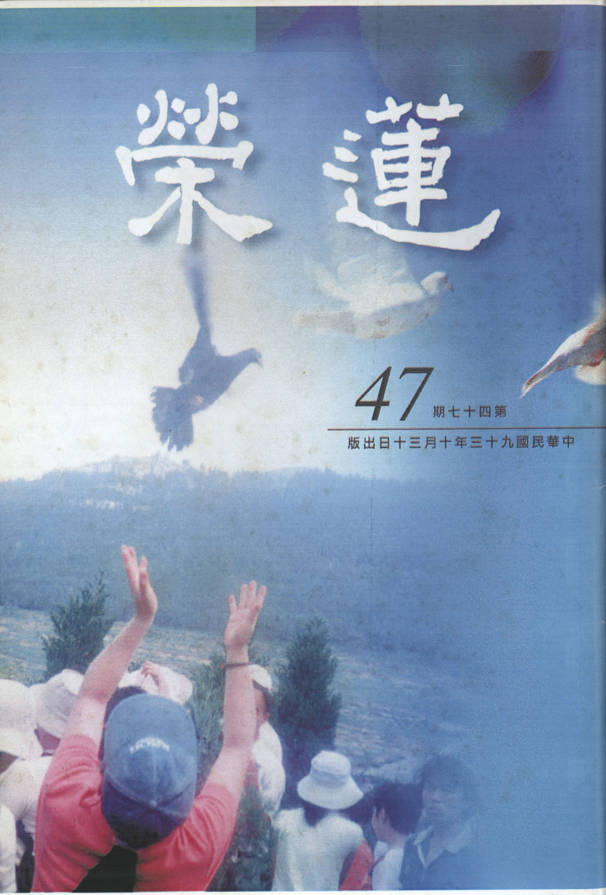

# 第47期

## 社論

### 論放生

本刊

放生壞生態

爾後謹慎行

傳承佛子行

護生慈悲心

動物保育團體近日發表「放下殘酷的慈悲〜全臺宗教團體放生現象調查報告」，統計自去年三月至今年八月，走訪二千餘個宗教團體所得的定期或不定期放生資料，放生地點遍及全台灣與世界各地，放生物種琳瑯滿目，金額據估計每年至少在兩億元以上。調查中亦言市場上供應宰殺的動物物種和數量，未因放生而減少，反而因放生的大量需求而引來業者直接從野外獵捕動物，或增加飼養繁殖的數量。

保育團體亦公布放生影片，對近來放生活動之草率指證歷歷，舉凡將淡水魚和海水魚一起放生、烏龜一個一個往日月潭裡扔，生物在運輸、搬運途中常造成緊迫與傷亡的痛苦，放生鳥因一抓一放，許多無辜的麻雀死於鳥籠中，又因不知所放生物屬性而對生態平衡引來嚴重破壞等。保育團體沉痛指出臺灣宗教放生行為，已經到了集團化、商業化、大量化的地步，反而害更多動物因而犧牲，故呼籲宗教團體別再從事錯誤的放生。

事實上，每一場如法的放生活動應有事前的規劃，從南到北沿岸、山林中，一一仔細評估、考量是否可作為放生場地，評估適合物種，乃至於交通、飲食、人事、法事、物品準備、甚或試放以及祈求佛菩薩加被能讓活動順利，參與者歡喜感歎發菩提心，所以往往會在活動數月前即開始籌備。善心由決定舉辦放生活動的那一刻開始啟動，即使在找場地過程中，所想的都是如何能拯救生靈放至適合的環境，所以慈悲心一直相續，並非活動當天僅在將生物放下去的那一剎那方生起，甚而到市場買生物時，看到被殺、剮的慘相時，惻隱之心油然而生等等。活動當天在儀軌觀修以及發願為遍滿虛空一切有情，我當成就無上正等正覺時，看到生物歡喜回歸大自然的那一剎那，大慈悲心也提升到究竟。

須知放生護生法行非吾等今日所發明，早在無量劫前釋尊前生〜流水長者子，曾見十千條魚困於枯竭的池中，向國王借廿頭大象負盛水皮囊水來救，並為池中游魚稱揚寶勝如來十種通號以及十二因緣法，雖然池中游魚仍因久渴而死，但命終脫離畜生身而生忉利天，回來向流水長者子答謝，大地震動。乃至於中土祖師大德（天臺、永明、蓮池諸大士等）皆曾提倡此法行，不但為文提倡，且親身興辦放生活動，詳見高僧傳。而憨山大師更在彼所寫的放生文中，詳明放生真為佛事業，慈悲心的引發是佛種的延續，不但在世俗上能得人天增上身的福報，亦在勝義上能解脫煩惱障、所知障成就佛德。所以放生不應僅是我多病才要放生，短壽所以我要放生，遇到障礙所以我要放生，想要生活順遂所以我要放生；當視放生善法為發廣大悲心之因緣，累積殊勝的成佛資糧，並與眾生結甚深善緣、法緣的重要法行。

尤其將放生事業結合啟蒙教育來舉辦時，小朋友小小年紀中種下了對生命的尊重，以及惻隱之心的引發，此是最重要的引導，了凡四訓中亦云惻隱之心人皆有之，求仁者求此，積德者積此。亦即想要學仁積德的有情先要發起的是惻隱不忍之心，而放生活動正是發生此心最殊勝方便。此對於國家社會民族善良風氣的影響，絕非保育團體所能通達。

末法時期人心變化趨下、正知見的教育太過貧瘠，對法的信心無法根深蒂固，所以善法漸漸隱沒。即便放生善法亦然，吾人爾後從事放生活動當更為小心，不但放生環境要好好的評估、對生物物種要慎重的選擇，興辦善法的前行心態要好好的建立，並以教法的正知見來莊嚴放生等各類善法。未來，不論放生等善法的因緣是否具足，吾等救生護生等的慈悲心當百分之百的提起。

## 大德法語

### 大方廣圓覺修多羅了義經（七）

*道源老和尚講授*

譯者國名曰罽賓

遙遙他方為法來

恩德厚重生敬心

亦感當前老法師

經題：

「大方廣圓覺修多羅了義經卷上」

前已解釋，大是體大，方是相方，廣是用廣，體、相、用三大，聽過《大乘起信論》即知道此三大，乃詮釋本體，在起信論上是曰真如，在此處則名曰圓覺，亦即圓覺之大方廣：圓覺之體大、圓覺之相方、圓覺之用廣。這部經是修多羅了義經，修多羅是梵語翻成中國話叫契經，泛指一切經，然經有了義與不了義，乃因佛說法有小乘、大乘，大乘叫做了義經，小乘叫不了義經，大乘裡面還有實教大乘、權教大乘，詮釋實教大乘叫了義經、詮釋權教大乘是不了義經，本經（大方廣圓覺經）亦為了義經之一部，分二卷：卷上、卷下。以上經題是以法立題。

經題已述，其次人題：

「唐罽賓國沙門佛陀多羅譯」

，唐是唐朝武則天時，有個罽賓國的沙門名曰佛陀多羅將本經由梵譯華。當時罽賓國在北印度喀什米爾一帶，有說是迦濕彌羅國之古稱，那時印度分東、西、南、北、中五印度，梵語罽賓華言賤種。昔末田底迦尊者（釋迦牟尼佛涅槃以後，度眾生最多的就是末田底迦），乃阿難尊者涅槃前最後之弟子，尊者常行腳遊方，來到了一地廣人稀處，昔日台灣亦然，現在台灣已人滿成患。尊者發現此處周圍都是山，中間一大片平原，覺得這個地方太好了，要能在這個地方開道場修行用功，那真是個好地方。末田底迦尊者之心量大得沒法學，欲以此寬大之處建道場，且認為蓋一、二座太少，他發願建立五百個大道場供養修行人，你看看這個心量多麼偉大，建立五百個大道場，得先搬運材料並一一建築之，然所請之木匠、泥水匠，誰也不去，離家太遠故。當時印度中階級分得很嚴格，貴族是貴族，賤種是賤種，這些賤種的人都是屬於奴婢，可以拿錢買賣。末田底迦尊者發現了這事，去買了許多賤種人，運到此處開荒、建築道場，道場建成後許多出家人都到那兒修行用功，這些買來的賤種人就在此結婚生子，愈生愈多，後來成為一個國家，可是別的國家瞧不起他們，所以叫罽賓（賤種），可是他們不承認是賤種，他們覺得自己很有實力，且國家四面都是山，易守難攻。

梵語「沙門」，此曰勤息；勤是勤修戒、定、慧，息是息滅貪、瞋、癡，乃出家人的通稱，亦即翻譯這經典的人不是在家人，是出家人所以稱為沙門。然在印度外道出家人也叫沙門，所以釋迦佛的弟子，或者加上釋氏兩個字，就是沙門釋氏，簡別不是外道沙門，但在中國之外道則不稱沙門，所以我們不必再加這兩個字，直接稱沙門，就是釋迦佛的出家弟子了。當你聽懂沙門這兩個字，你就知道出家人應該做什麼事，現在常常勸勉同學們要發菩提心，或問菩提心要怎麼發呢？觀眾生苦啊！眾生太多啦！而且距離好像離我們太遠，不大親切，你就觀察出家人吧，出家人也是眾生；出家人現在懂不懂佛法？苦不苦？出了家不知道出家人應該做什麼事，你想想苦惱不苦惱？你出家做什麼呢？出家就是吃菜（台語），所以出家人叫做吃菜人（台語），出家人做什麼事？就是吃菜，這個吃菜錯了嗎？沒有錯啊！要錯怎麼各各寺院都吃菜呢？吃了菜還做什麼呢？不知道！豈非可憐乎？出家人名曰沙門，梵語沙門，翻到中國話叫勤息，亦即勤修戒、定、慧，息滅貪、瞋、癡，你出了家應該做什麼事呢？就是勤修戒、定、慧，息滅貪、瞋、癡！這是出家人做的事！多劫善根才能今時出家，結果出了家不知道應該做什麼事，是不是太苦了？所以佛經不能不講，佛經不能不聽，不講不知道「沙門」兩個字怎麼來的，不知道出家人應該做什麼事，以為出了家就是應該吃菜，但是在家居士也有吃菜的居士啊！那麼你跟他有什麼不同呢？出家了，修戒、定、慧，而且還要注意勤字，勤是精進、精勤，要精勤的修，修戒、修定、修慧。釋迦牟尼佛說了四十九年的法，可以歸納為三大科就是戒學、定學、慧學；你持戒要精進的持戒，修定要精進的修定，求智慧要精進的求智慧，那麼不就有事情做了嗎？我精勤修戒、定、慧幹什麼呢？息滅貪、瞋、癡，先把貪、瞋、癡止息下來，再把它滅除掉，如此豈不是了生死成佛道了！所以要懂得沙門這兩個字的涵義啊！有云，我聽的太多了！我老早就懂了。可是你聽到耳朵裡了，你聽到你心裡了沒？你沒有聽到你心裡，等於沒有聽一樣嘛！你雖比其他未聞沙門義的出家人還好一點，但仍未聽到你的心裡，你還是沒有勤修戒、定、慧，沒有息滅貪、瞋、癡，所以聽了等於沒有聽。

戒、定、慧怎麼樣修？貪、瞋、癡如何息滅？歷代祖師給我們定了一個共修的功課，早、晚兩堂功課就是修行方法，你依著早課、晚課來隨文作觀，將這兩堂功課做得好、那就是真正的修行，你還能犯戒嗎？你天天晚上念八十八佛懺悔文，懺悔都懺悔不清，你還敢再犯戒嗎？當你持戒清淨時，你自然就能修定，自然就開智慧。但是到現在我們出家同袍還是有苦惱的人，功課雖做，或流於公式，或給人家唸唸經、拜拜懺，還賺幾個錢回來，不知每日作兩堂功課的意義，豈非可憐？那兩堂功課正是教我們修行的方法。早課開始念《楞嚴經》中阿難尊者的發願文，你要是沒有聽過楞嚴經，你不曉得發那個願是怎麼發的？若隨文作觀則發了菩提大願，並依著十大願王攝持一切菩薩行，到了晚上做功課回向淨土，其中先念八十八佛懺悔文懺罪，再念阿彌陀經。若能在二堂功課隨文作觀，那就是真正修行，但是你得懂得這個道理；若不懂得道理，每天在清晨四點鐘時，在家社會人士正睡好覺，我們出家人打板後都得起來，叮叮咚咚跑到大殿來念了一點多鐘經文，若一邊念一邊打妄想，不打妄想就打瞌睡，你這不是冤枉嗎？所以你得隨文作觀以息滅貪、瞋、癡。必得自己迴光返照，對治貪等煩惱。或云，自己控制不住，控制不住就讓它去嗎？你不能隨它（煩惱）去呀！現在新名詞：我的個性就是這樣，你的個性是個凡夫性，你要隨你的個性嗎？那又何必學佛呢？又何必出家呢？你隨你的個性墮到三惡道裡去！你得改過自新啊！我向同學們開導了幾年了，你是個頓超的根機，那不用我講了，要是同我的根機差不多，你得考慮、考慮（觀察）！我學了一年了，我的貪、瞋、癡是不是比去年輕一點，我貪心很重是不是比去年輕一點？我的瞋恨心很重，是不是比較輕了一點？若是依然故我，那你要懺悔，不然你再學下去亦是如此。今天大家請我來講經，出家人多，所以講幾句我們出家人該做什麼事，由經題沙門引出我們出家應該做的事。

其次譯師名佛陀多羅，佛陀名「覺」，多羅名「救」，謂之覺救；譯主覺此道，謂之上求佛的覺道，並以此道救一切眾生覺此道，此亦菩薩之義。今天講些閒話耽誤時間，講完了感覺身體支持不住，講得累了，出了一身大汗，下一堂課你們自修。（下期待續）

## 共修研學

### 小止觀導覽（二十六）

*蓮心整理*

信能治疑功德母

觀待正見生正信

根本後得雙證時

功行圓滿成正覺

經文

三、疑法：世人多執本心，於所受法不能即信，敬心受行。若心生猶豫，即法不染心。何以故？疑障之義，如偈中說：「如人在歧路，疑惑無所趣。諸法實相中，疑亦復如是。疑故不勤求，諸法之實相。見疑從癡生，惡中之惡者。善不善法中，生死及涅槃。定實真有法，於中莫生疑。汝若懷疑惑，死王獄吏縛。如師子搏鹿，不能得解脫。在世雖有疑，當隨喜善法。譬如觀歧道，利好者應逐。」佛法之中，信為能入。若無信者，雖在佛法，終無所獲。如是種種因緣，覺知疑過，當急棄之。

導覽

一、「信為道元功德母，長養一切諸善根。」基於對法的信心，而產生好樂，努力串習，終厎於成，故道的源頭在信。今日信佛者多，學佛者少，法會時人山人海，而愈深入教理人愈少，主要是因為他們認為教法的實用性不大，而且曠日費時，殊不知很多的經驗和覺受都是行者觀待教法的修學，一點一滴累積出來的，並非一蹴可幾，然修學第一步在依師聽聞，故若能於法，信心堅固，誠心依師聽聞尋求體悟，敬心受持，用心證悟，則必慧光開朗、安樂自在。

二、「天雨雖多，豈能潤無根之樹，佛門廣大，亦難度不信之人。」疑的反面是信，有疑就不會有信，有信就不會有疑，信：心淨為性，對治不信，樂善為業。信是善法的根本，其特性會使心淨化，因為對正確的目標有十足的信心，就有淨化煩惱的力量，覺得這樣的走向是對的，就愈會產生信心，對治煩惱的力量就愈強，因為真理的作用之一就是對治煩惱，煩惱對治以後，內心就得到清涼。信心可分為對佛、對法、對僧的信心，但此處特指對法的信心，因為佛傳法的目的是要眾生信法，所以示現相好殊勝、萬德莊嚴，使有情對他產生很強的信心，再告訴有情他是修這樣的法，才能有此成就，故主體仍是法，而法的核心處是諸法實相，諸法實相可從二個角度探討：

（一）空性：在法的現起當中能照見性空，就能破除在相上的執著，在這個相上得到解脫，這是成佛的第一種快樂〜涅槃寂靜樂。

（二）緣起：從相上認識緣起、掌握緣起、運用緣起，這是成佛的第二種快樂〜菩提覺法樂。這些都是法的信心所緣的境界（信的所緣境就是法的空性，以及現象和所產生的作用），果能善於了解，自然能在法上得到解脫，以及做種種運用，發揮種種的功能。比如每一個人的一生都有很多種角色，首先我們應拿掉對這個角色的執著，因為這個角色是沒有自性的，是隨緣現起的，是觀待名言的認知，再者，若能善於利用這個角色發揮作用，不僅能積功累德，也能懺除過去的罪障，茲以舌頭為例：講話要靠舌頭的鼓動，舌頭可以發揮最好的作用，也可發揮最壞的作用，比如世親菩薩曾經不信大乘，利用這個舌頭毀謗大乘，所造的業可使他生生世世入拔舌地獄，也無法懺除，其兄無著菩薩教其以舌頭弘讚大乘為滅罪之法，故世親菩薩廣造諸論，釋大乘經，後有千部論主之譽。

三、世間人對於自己的困境，若是無法用正確的知見去開通、去突破，則一生落寞消沉、鬱鬱寡歡，故可見知見的重要性。見之釋名有二：

（一）悟上見：悟上見是真正破疑，真正起信，真正看到目標，如十信位的凡夫，還沒有體會到真理，對真理的信心是如天上的鴻毛，風一吹就東飄西蕩，經上稱之為毛道菩薩。入初住位以上的人，對菩提的信心是穩如泰山，不可動搖的。吾等在日用平常時就應培養自己對真理的信心，對三寶的信心，以及對淨土的信心。要假想各種的狀況，自問遇境逢緣時是否會退初心，不斷串習，以強化對法的信心。這種觀修法，就好比在初禪未到地定的人，已佛號成片，仍要回過頭來把他在欲界看不開、放不下的人事物重觀重緣，以鍛練念佛的功力。此種觀修法，不必親身對境，而以第六意識浮現這個影像 （法塵境界），以回想、回憶變成影像，看看所起的變化，以考驗本身修行的功夫，當破欲界尋伺才能證入初禪正分。當你對真理有所體悟時，這個「見」才是真正破疑生信（大乘起信論所言的起信是從初住位算起），《論語雍也》：「子曰：回也，其心三月不違仁，其餘，則日月至焉而已矣。」可見顏回對仁的信心是不會搖動的，這也是他人生的走向，而諸弟子們或只可維持一陣子而已。雖然行者以仁心、菩提心的覺受做人處世、待人接物，但有時會在遇境逢緣時，遭受到一些痛苦和挫折，此時你應自問，此時的心態為何？是覺得好人難做而心生退轉呢？還是甘願承受而認為這是在消耗惡業呢？那爛陀寺戒賢論師為病所苦，唐朝三藏法師玄奘晚年時生病，正是他消耗惡業、重罪輕報的方式，當你對仁心、菩提心有強大的信心時，即使苦現起時，你會有如上的覺受，而不會怨天尤人、自怨自艾。同理，一個國家民族都是自私自利的人，卻享受富有，這是不會長久的，而中國人講究的就是仁心，這個仁心才可以維繫民族文化五千年而不墜，又如緬甸人純樸善良，所以感應的是沒有颱風、地震的環境，可見人心與境界是休戚與共、息息相關的。此處悟上見特別指見道位的見地，此見生起 （根本位） 能斷遍計執及觀待此執生起的一切煩惱，從此再也不受世間邪見所轉，以入聖流，必能得成聖果。

（二）證後見（後得位）：現證空性的根本定（位）後，起定重緣世俗，此為後得位，屬修道位，若為大乘修道位，不斷在利益有情中能現證空性，與入定是同時，亦即出定等於入定，此時即是破所知障成就佛果。他對真理的見是任運見，不論任何狀況都不會做不如法的事情（身無失、口無失、意無失等乃佛十八不共法之一），即使在睡夢中也不會夢到不如法的事，這個境界在佛家來講：佛有之，在儒家來講：孔子有之，《論語為政》：「子曰：吾十有五而志於學；三十而立；四十而不惑；五十而知天命；六十而耳順；七十而從心所欲，不踰矩。」由此可知「見」的力量，不僅是在入定可以見，出定在任何情況亦可見，造次必於是，顛沛必於是，在榮華富貴與顛沛流離的狀況下，他看到的還是真理，所作所為必定如法，這個眼力是非常強的道眼。

四、諸法實相不是一個空洞的名詞，其所顯現的是一個究竟的空義，究竟空義的反面是執著，故必須以究竟空義來對治執著，而執著的對治可分為粗對治、細對治，粗對治是愛執的對治，愛執的對治要靠發慈悲心、菩提心去對治，如愛著自我，就不肯利益他人，故從利益他人來摧破愛著自我。細對治是執我的對治，以空性破除執我，才能在利益眾生當中，不引發任何煩惱，因為執我是煩惱的根源，為了報答眾生的恩，為了拔眾生的苦，而引發慈悲心、菩提心，引導自己去修學空性的正見，破除根本無明，得到究竟的安樂。若我們不能了解體會空性的正見，最少也要隨喜善法，對仁心、菩提心有殊勝的覺受。《論語里仁》「子曰：朝聞道夕死可矣！」，所聞之道以儒家來說特別是仁道，以佛家來說是發菩提心之道，這是我們人生在世很重要的覺受，人是六道中最能思惟的，思心所作用最強的，應思惟菩提心的利益，不生起過患，以及思惟菩提心的行相，思惟生起的方法，並在遇境逢緣時，維持此種殊勝的覺受，並且在辦事時努力提起這樣的動機，在過程中儘量避免私心，最後將這些功德做回向，以圓滿善心（菩提心），這個人就是最懂得用心的人了。我們對法若有信心，就會產生好樂，並精進的實踐，最後得到的必是菩提的大樂，就是涅槃寂靜樂及菩提覺法樂，這樣的人才是真正的離苦得樂。（下期待續）

### 佛說八大人覺經講記（六）

*編輯部整理*

斷盡二惑得解脫

齊修六度能成佛

由語能攝彼要義

即是佛說八大覺

第四覺知何以是精進度？佛法所需要的精進是什麼？是以智慧破煩惱，所以精進度是智重，第三覺專注在開智慧，第四覺就好好的在智慧道上前進，所以發菩提心度眾生要以開智慧為主要的目標，所修的福報都是幫助我們開智慧，所以我們學佛的人要瞭解修福要隨緣修，不是從早到晚都在修福，因為它是作為資助你開智慧的資糧，不能把本末搞錯，助念也是要隨緣做，比如大家和合變成一個近者悅遠者來的團體，變成一個有道風的團體，然後在這個因緣下隨緣做善法，資助你在這樣的團體好好的求學問開發智慧，這是發菩提心重點所在，重點在開智慧，但開智慧要有福作資糧，此為第四覺。

八大人覺後六覺與六度相應的判法與一般六度的排法不同，一般六度的排法是布施，持戒，忍辱，精進，禪定，般若，此處與六度排法不一樣有它的理由，先說禪定度是鎖住目標（第三覺知），精進度是向目標前進，目標是開佛的智慧（第四覺知），第五覺悟是已經得到成佛的智慧，所以是「成就辯才，教化一切，悉以大樂。」什麼是「大樂」？成佛的快樂為「大樂」，有能力幫助眾生成就佛的快樂叫做「悉以大樂」，稱為智度，有這個能力就是智慧。讚歎佛的神通、智慧、道力、德能種種；其中以智慧最為重要，因為所有能力的核心處就是智慧，所以稱為智度，但為什麼是「智悲平」？一切的眾生都是他教化的對象，因為他要教化一切的眾生，所以他要去成佛，要教化一切眾生給他成佛的快樂，稱為「悉以大樂」，所以他要去成佛，成佛以得到佛的智慧為主。

第六覺知判為布施度是怎麼回事？在利益眾生之前要先以布施來結緣，先以財布施比較會結到緣，財布施有外財與內財，外財分為有情無情，無情就是財產，有情就是眷屬，內財就是頭目腦髓，眾生需要就給他，行此善法乃為結善緣，所謂「先以欲勾牽」先以財施，後以法施，即是「後令入佛智」，所以第六覺知是布施度，為什麼是悲重？他的智慧與悲心相應，所以才肯如此的付出，布施完全是悲心，而且所布施的對象包括親人、無親無怨者、仇人，尤其是恩將仇報的冤仇是最不可原諒，對這種人是最不肯布施予他；給他十分的恩，而他卻還百分的怨，當聽到他的名號，心都涼了，牙齒都不禁地打架，這時候還肯不肯布施？這得要悲心生起才可，悲心生不起，那就是仇恨，悲心才是仇恨的正對治。第六覺知時，你知道要不要布施，因為有智慧，如果他回心向善，你要不要布施，你說他以前就是我的仇人，那就是智慧沒開，比如我們宿世有與阿彌陀佛結過仇的，現在念佛往生淨土，阿彌陀佛要不要接？阿彌陀佛會說好小子，修理他都來不及，還要接引往生淨土嗎？不會！高興都來不及，浪子回頭金不換。為什麼他（佛）有這種心量，他這種心量是怎麼修出來的？進入經文再慢慢觀修。

第七覺悟是戒度，這時候要在五欲的環境中度化眾生，換句話說，五欲在阿羅漢與菩薩來看是火坑，因為無始劫的輪迴都是依著五欲起愛染，依著愛染造業，依著造業去受苦，所以五欲不是火坑嗎？現在要到五欲境去度眾生，而且所扮演的角色是要受用五欲，例如當皇帝享受大名大利，菩薩最怕人家給他享福，可是他現在扮演的角色是皇帝，是大臣，是宰官，他知道五欲有過患，可是眼前他要扮演的角色是俗人，請沒有悲心的智者作俗人，他是不會要的，在維摩詰經裡，有個人將舍利弗變成天女他就受不了。

所以「雖為俗人」，這個俗人有五欲的過患，可是他（菩薩）此刻是要去當俗人，然「不染世樂」是在世樂當中不染，否則應該叫做離開，不是叫不染，不染是在裡面而說不染，在火坑裡而沒有被欲火燒到，跳入火坑是要很大的慈悲心才辦得到。政府裡有很多忠義之士，比如要到毒窟裡去抓什麼人，這都是要冒生命的危險與這些毒蟲相處，才有辦法繩之以法。要知道每一個人為了追逐五欲境都是各懷鬼胎，想要度化他們，你是言之者諄諄，他們是聽之者藐藐，你講的全部是正道，他聽的是另有目的，所以以前古時候的皇帝學佛，很多的大臣都跟他學佛，為什麼？有的是真的要學佛，有的是希望在這裡面謀得國王的賞識，而這個國王，這個受用五欲的俗人，他其實是菩薩再來，他渴望的是三衣、瓦缽、法器，渴望的是出家，渴望的是守道清白，渴望的是梵行高遠，這都是他的智慧，慈悲一切是悲心，故為智悲平。何以謂此覺受持戒度？經文：常念三衣，瓦缽法器，志願出家。只有大乘的菩薩才願意示現俗人，像維摩詰居士，受用五欲，度化眾生，助佛宣揚教法。

第八覺知為什麼叫忍辱度？第八覺知是大慈大悲，要如何稱觀音菩薩呢？大慈大悲觀音菩薩，怎麼稱阿彌陀佛？也是大慈大悲，最能表彰佛菩薩的就是大慈大悲，當他證悟了以後剩下的就是大慈大悲，什麼是大慈大悲？上聯為「願代眾生受無量苦」，下聯為「令諸眾生畢竟大樂」，橫批為「大慈大悲」。願代眾生受無量苦要怎麼代法？眾生造無間地獄業的苦因，苦果觀想在我身心上成熟，我之修學成佛的因，現起成佛的快樂本來是我可以享，現在卻高興的送給眾生，這就是大慈大悲。佛就是這種心量，阿彌陀佛在接引我們的時候，就是要把佛果的安樂送給我們，我們無間地獄的業在成熟時他拼命救，為什麼他要拼命救，因為他希望無間地獄的苦在他身上成熟，媽媽就有這種心量，當孩子病一直沒辦法好的時候，媽媽就希望病乾脆在自己身上，做媽媽就有這種心量，所以一般彰顯菩薩的慈悲都是以慈母面相去畫的。

試問他種無間地獄的業，他自己去受苦果，絕對不會是其他人去受，那麼什麼情況下他人會代受呢？有的人就說，反正他造業他受苦，我發這個願沒有關係，佛經那裡有他造業我受苦的，所以我樂於發：他無間地獄的苦在我身上成熟的願，我樂於發，因為不可能。可是千萬別這樣想，這是可能的，試問在什麼情況下呢？佛布施圓滿，可是我們貧窮；佛持戒度圓滿，可是我們還在造惡業；佛忍辱度圓滿，可是我們還在憎恨；佛精進度圓滿，可是我們還在懈怠；佛禪定度圓滿，可是我們還在散亂；佛智慧度圓滿，可是我們還在愚癡。請問佛還有那一度圓滿呢？佛幫助眾生成就功德才算圓滿呀，可是現見的我們並沒有真實的成就，若說佛功德沒有圓滿，那麼佛是怎麼成佛的？眾生雖未成就，但佛度眾生的心意是圓滿了，此其一。其二、佛真實的也有受到這樣的苦（代眾生受苦），例如佛到無間地獄度眾生時，伴他們成長，將心比心地去感受他的苦，他（苦惱眾生）才會跟你站在一條線上，此為菩薩度眾四攝法中的同事攝。

大德來人間度化眾生時，人世間發生逃難等各種的苦，他（大德）依然要受，例如 雪公老師真是地藏菩薩再來，他的殺業應是對治清淨了，可是現見的他是在戰火中逃亡，理應是看不到戰火連天的，可是 雪公老師卻說他一生是逃難專家，他就是伴著眾生成長（代眾受苦），這時候眾生比較能接受他的善說苦勸，因為這個苦他也受了，這種歷練他也歷練過了，再說法時眾生也比較會聽。若完全沒有歷練，是一個坐在雲端的佛，這時候跟眾生說法，此時眾生感受會如何？伴你成長是最辛苦，最不計成本的引導，這要母親的慈愛才有辦法，大菩薩的慈悲，佛的大慈大悲才有辦法，佛的行相不只對一個，而是對一切的有情，不只給眾人世間的安樂，還要給眾人成佛的快樂，所以更勝過於世間母親的恩德，所以佛會代受到眾生的苦，此為忍辱度。

慈悲心無法相續，是什麼行相呢？對方實在太可惡了，太無情了，他的苦我再也不想代受了，他的快樂我再也不想給了。此時若想把慈悲的障礙突破，就要靠忍辱。華嚴經云，菩薩行相就是慈忍， 雪公老師說慈不下去怎麼辦？要忍！反正就是要慈就對了。老師常說有個字是他一生的實踐，是別人比不上的，眾學生回答都未得老師之首肯， 雪公老師寫了一個「忍」字，老師對忍體會到這種地步，他就是走到第八覺了。看不下去了，還要不要做？他（眾生）的苦已經不想再拔了，太可惡了，這種缺德的人一點快樂也不要給他，太可惡了，慈悲走不下去了，還要不要再走，靠著忍辱就可以走下去，否則就像小乘人一樣，現證空性，不管了。尤其是願代眾生到無間地獄受無量的苦，給他成佛的快樂，這個人要悔改要花百千萬大劫才能悔改，你要不要花那麼久的時間去讓他悔改，不惜血本的事要不要幹？所以地藏菩薩、觀音菩薩、阿彌陀佛、釋迦佛偉大不偉大？真的有良心的人讀佛法會感動的，人家說讀李密的《陳情表》不流淚，此人一定不孝，讀諸葛亮的《出師表》不流淚，此人一定不忠，讀到這還不學佛，此人大概沒良心。於世俗人中要找有佛菩薩這種的良心，打燈籠找，找不到半個，一粒微塵都找不到，這種心態不是經過累劫去串習，是絕對串習不出這種心態。

每天誦經要在這樣的架構下去誦，經義變成你承辦善法的動機，變成做善法產生煩惱的對治，變成做善法後功德的回向處，這才是稱做為佛弟子至心誦念八大人覺。換句話說，作善法是為了開智慧成就佛果，並以大慈大悲的心態來利益無量無邊有情，吾人要將善法的功德回向到這種狀態，果然如此，將來一定是一個很有智慧且又是大慈大悲的聖者，這個人才叫做會誦八大人覺經的人。

為什麼第一覺悟、第五覺悟、第七覺悟立「悟」之名，其餘立「知」之名？第一覺悟是凡夫到小乘，證悟空性；第五覺悟是破所知障；第七覺悟是從在家到出家，其實他的心是一個出家的心，不是說心出家而已，連身都是好樂出家身，然眼前做宰官、做居士、做大德、做皇帝、做國王，都是為了利益眾生，而在五欲境中潔身自愛。「悟」是分水嶺，凡夫與二乘的分水嶺（第一覺悟），破所知障與否的分水嶺（第五覺悟），在家與出家的分水嶺（第七覺悟），心出家是在家與出家人共同處，第七覺悟更談身出家，眼前示現居士，為什麼要這樣呢？有些人透過第六覺其實還度不到他，因為有些人是因你的地位、你的權勢才度得到他，第七覺悟是你不得不然的做法，其實他們（聖者）的渴望處都是三衣、瓦缽、法器，眼前穿很華貴的衣服，示現大長者，家裡有著絡繹不絕的賓客，在喧鬧中其實他的渴望處都是寂靜，在喧鬧處有他不得不然的做法，都是以非常慈悲的心去利益眾生，自古來堯舜禹湯文武周公，每天國事忙碌，大臣進出，在受用五欲當中其實渴望回歸自然，這種人其實帝王名利是綁不住他的，他能真正把良心拿出來好好的給老百姓辦事。（下期待續）

## 蓮池海會

### 彭寄老居士往生見聞記

*編輯部*

聽罷祭文後

涕淚滿衣裳

生西有因緣

隨喜復稱讚

故彭寄老居士於民國十七年九月六日出生雲林縣虎尾鎮墾地農場，自幼即協助家事及農務。及長，於民國三十六年贅故 許點為夫婿。

民國五十一年舉家遷往台東縣初鹿鳴橋開墾山坡地，種植玉米、花生、蕃薯等五穀雜糧維生，其時子女尚幼，開墾工作皆落己、先夫、長女身上，忍烈日之煎曬，受寒雨之酷淋。民國五十六年，又遷花蓮縣富里鄉竹田村崙天之秀姑巒溪畔，種植鳳梨、黑麻、畜養豬牛、幫農務傭等雜作，由於土地貧瘠，收入微薄，常無明日之炊，仍瀝苦勤耕，勉強度日，己飢而少食，但哺眾子女飽餐無虞。

民國五十八年九月十六日晨，其先夫 許點帶長子永雄至花蓮師專註冊入學，時值暴雨傾盆，其夫為顧其子安全，自己先行試渡，未料河水迅速暴漲，竟於瞬間淪為波臣。老居士於眾子女待哺之際，生活更為艱辛，逢此巨變，無異晴天霹靂，仍毅然獨力撐起沉重家計，使子女無憂成長。

民國六十年頃，其在虎尾之雙親年邁體弱，遂回廉使里躬身奉養，並承接雙親農務，又至磚窯工廠從事耙土、搬磚等工作，事親育子，其勞倍之。其子女皆以老居士為榜樣，謹遵母親「勤儉持家、刻苦自勵」之教誨，如今皆已成家立業，生活美滿。

老居士雙親相繼往生後，其年亦長，體力已不勝粗重勞苦，故遂己意，隨興之所致，或於虎尾老家，或遊走北中南東子女家，或幫忙家務，或協助照顧孫兒，或與三五老友、家人，國內、國外嬉玩，享閒雲野鶴、含飴弄孫之樂，並茹素念佛，除隨緣布施之外，亦定期隨力護持慈善團體。大病時，亦將其儉省之大部份積蓄、零用捐作弘法利生及濟貧扶困等之用。

民國九十二年五月，老居士因身體不適，經林口長庚診斷為肺癌末期，後雖極力醫治，病情未見好轉，但無論身體如何苦痛，為了不使子女擔心，總是忍住不言。九十三年五月，又發現癌細胞已轉移腦部，八月十三日，住進台中榮總安寧療護病房。

由於其子任東興國小校長，僅耳聞三、四年前小紳士小淑女暑期啟蒙活動成效極佳，隨即致力推動暑期心靈成長營以嘉惠學子，並因此與蓮友、善知識結上殊勝善緣，隨後亦與蓮友至西蓮淨苑齋僧，並做種種善法（放生、慈善救助等）以回向老居士去除往生障礙。

九月十三日，老居士不敵病魔摧折，於當日下午八時四十分在家屬與蓮友護持下安詳往生，享年七十七歲。往生時蓮友暨家屬助念十二小時，入殮時全身柔軟，神情安詳。喪事期間，老居士子女誠心誠意聽從善知識、蓮友的建議，如法作七並為老居士舉辦告別式，且誦經、念佛、茹素，言行中所表現的哀思之情令見者聞者忍不住涕淚滿盈，老居士有如此溫良孝順之子以延續家風，其一生所受的無以言喻之苦（生活艱苦、愛別離苦）可謂沒白受。在此祈願老居士於西方淨土中，早日花開見佛，悟無生法忍，並乘願再來廣度含識。

### 彭文龍老居士往生見聞記

*編輯部、智高*

問宇宙間誰最尊

大雄大力大慈悲

通身業障臨終時

一念回心出乾坤

彭公文龍老居士，民國廿六年二月十七日出生於新社鄉東興村（水底寮），彭家世代務農，早期一般農家生活均甚清苦，彭公文龍是家中長子，除了一位姊姊外，底下尚有弟妹七人，分攤家中生活重擔，自然就落在他身上，所以從少年時期起就在家裡協助父母親從事農務工作，同時也練就一身健壯的體格，另外他對音樂也頗有天分及興趣，農暇之餘對小喇叭與歌唱也甚有心得。民國四十六年於桃園龍岡服兵役時，認識了在龍岡工作的嘉義女子莊金子小姐，兩人不久即共結連理。成家之後，彭公曾短暫參與石門水庫的建設工作，不久夫妻二人即返回家鄉，彭公種植水果，夫人經商，二人胼手胝足，共同為家中生計而努力，至此家中生活也大幅改善。

彭公育有一子二女，皆已成家，各各家庭生活美滿，其子服務於桃園中正機場之桃勤公司，工作勤奮努力，深獲公司肯定，履受公司表揚、升遷，亦為標準的時代青年。

彭公平日身體健壯，驟然而逝，實在出乎親友意料之外，身為親友之一，除了長流懷念外，也慨嘆人世無常。彭公於西方淨土中必深知佛化家庭之重要，彌陀願力之不可思議。

大伯往生見聞記 / 智高

今年的八月三十一日，是我大伯往生的日子，而他的往生，卻帶給我一種矛盾的心情，一方面他的示現讓我更感於阿彌陀佛的大悲，另一方面卻也給了我一個反思的機會......。

小時候，雖然父親的兄弟們都已成家分居，但其實我們還算是個大家庭，爺爺和我們一起住，奶奶住在二伯家，但二伯家就在隔壁，而大伯家就在我們斜對面，甚至大姑就嫁到大伯家越過一條馬路的對面而已，還有我那未出嫁的小姑就住在我們家，所以小時候常常和這些「大人」們互動。在記憶中，通常有兩種情況我會到大伯家裡去，一種是母親命我去的，一種則是被大伯哄去的。

大伯家開理髮廳，大伯母在鄉裡也算是有名的理髮師傅，每當我的頭髮礙著母親的眼時，母親總是會對我說：「去！到伯母那兒剃頭。」其實我並不討厭去，因為可以藉著排隊的理由，在大伯家裡和躺在長椅上的大伯一起看電視。而另一種情形會去大伯家，是因為有時候經過大伯家門口，大伯總喜歡叫我進去，有時候會給我一些糖吃，但他總會對我說一些開玩笑的話，那些話現在我早已忘了，我只記得他有時候會抱我抱得緊緊的，不讓我掙脫，然後用他臉上如鋼絲般的鬍子往我臉上刷，那真是痛極了，雖然如此，我卻從不討厭大伯，只覺得他大概是喜歡我吧！

漸漸長大之後，因為讀書的關係，和大伯的互動就減少很多，只有在放學回家，經過大伯家門口時，喊他一聲「阿伯（台語）」而已吧！甚至到台北念書之後，除了寒暑假能見面外，也很少和他聊天了，但他有機會還是會取笑我，說我將五專讀成了醫學院。

大伯是不信佛法的，父母親學佛多年，也不敢和他提起佛法，更遑論勸他學佛，其實我們心裡也知道，那幾乎是一件不可能的事情，大伯甚至還用一種揶揄的口吻對我說：「你們信的這個是不是雞蛋教？」

今年七月，大伯到山上工作，整理他的橘子園，因為之前脊椎就有舊傷，所以一不小心就摔倒了，但他不以為意，回家看了醫生，在家休養了幾天又上山工作了，七月下旬，中部連續幾天都是陰雨天，大伯開著他「農用」的工作車，在山上、車子一不小心翻覆了，大伯被車壓成了重傷，就緊急送進了林口長庚醫院的加護病房，大伯的傷勢很嚴重，不僅是新傷，之前的舊傷也因為他的疏忽早已轉成嚴重的內傷，在加護病房期間，幾乎是昏迷不醒的，縱使有些意識，也只能用簡單的睜眼、閉眼表示。父母親知道大伯的狀況，大概不久人世了，於是極力勸說我堂哥，讓他父親，看看是否能在不無義急救下，安然送回家中助念往生，我堂哥很孝順，但沒有佛法的觀念，雖然尊重我父母親的意見，但他對大伯的復原有著極大的希望，因此之故大伯就在加護病房足足待了廿二天，受盡了折磨。之後大伯的病情急轉直下，醫生宣告病情不治。因為大姑平時都和父母親在無盡燈儒佛學會定期共修，所以母親很善巧的安排讓大姑向堂哥勸說，才順利在大伯斷氣之前送回家裡，接受助念，而大姑更是以出奇的鎮定在大伯的身邊對大伯說：「阿文龍，要念佛，跟佛祖去！（客語）」

我私下想，阿彌陀佛的悲願真是偉大啊！像我大伯這樣生前絕不相信佛法的人，平時亦不和蓮友結善緣，最後還在加護病房昏昏迷迷的待了廿二天，直至臨終前才有我大姑勸他放下，念佛求生西方。

在助念大約十小時之後，大伯身現柔軟之相，阿彌陀佛已將大伯接引至西方了。阿彌陀佛為了度盡一切苦難的眾生，所以發願要成就無上的佛果，甚至發願有情一生造惡那怕只是臨終的一念回心，至誠稱念十句彌陀名號乃至一句，阿彌陀佛都會慈悲接引他往生西方淨土，而大伯的示現我是見證人。

另一方面，這也讓我想起老師常說佛化家庭的重要，若不是父母親的學佛，怎會有我大姑勸說我堂哥安排大伯回家助念、及勸大伯放下萬緣，念佛求生的因緣？又怎會有蓮友親屬助念十小時的因緣呢？親屬的影響有時候不是直接的，而間接的影響往往都是我們所忽略的，所以佛化家庭庇蔭的不只是家庭而已，甚至是整個家族！

最後讓我感到慚愧的是佛陀之所以要成佛，就是完完全全為了眾生，想要讓我們離苦得樂，但我卻總用一種僥倖的、投機的心態回報佛陀，以為平時不必用功，儘量追求世俗的名聞利養，只要臨終十念即可往生，自己這樣的心態對得起待我們有如母親的彌陀嗎？彌陀發的大願是專為我這種投機的心態而設的嗎？還是為了悲憫那些平時沒有因緣聽聞佛法，而臨終悔悟，一心投靠佛陀的人呢？若自己一直保持著這種心態又怎能安然企求往生？

大伯的示現，給了我這樣一個反思的機會。

### 臨終助念問答　記地藏懺法會後之助念問答及其他

*編輯部*

本願經中詳大願

特別臨終持佛名

震破地獄送往生

了知助念有大利

緣起

地藏菩薩最大的悲願就是幫助我們眾生離苦得樂、而顯現各種相來利益眾生，其中一種殊勝的行相乃示現為八大菩薩之一，在行者罪福未定，升沉難料之際，引導眾生往生西方極樂世界，此亦是地藏菩薩根本願力所在。

拜懺除了讓大家超薦自己的冤親債主、過往親人或者為現前家親眷屬解脫障礙，特別有喪家在守喪期間之特殊因緣而來此修懺法，今日藉著這些過往的老居士之往生因緣作一番整理，並作各各不同面相的觀察，堅定往生西方極樂世界的信心，相信助念的殊勝，知道佛化家庭的可貴，也堅信幫助親人往生是在這一生中與他結最好的緣。

**問：** 家人的聚會，如何去除情執、愛染？

**答：** 我們對親人難以割捨的情愛，往往會變成我們往生西方的障礙，但是如果用道眼觀察，一般家庭的聚會，大概都是報怨的多，報恩的少，討債的多，還債的少，有的冤親債主以軟冤家方式出現，即是家中令我人難以割捨的所愛者；有的以硬冤家的方式出現，即是家中處處令我生厭煩，令我不安樂的對象。對著硬冤家容易拿掉情執，對著軟冤家就不容易拿掉情執、愛染。應學習正法，不可以有貪愛、不捨、瞋恨之心，以平等心觀修冤親不定之法，對著親人除掉愛憎。

**問：** 為何有人一生吃喝玩樂，且享高壽，歿了亦能往生淨土？

**答：** 此須有業果決定見，相信累劫以來此人一定有修行過，一定有種過善根，只是未遇善緣而造作種種不如法事，在臨終危難之際善根乍現，然此是萬萬中難得其一，不可心存僥倖。我們反而要好好把握每一個可以引起善根的因緣，也要相信每位眾生皆有佛性、要好好引發他們的善根，只要因緣具足時，都有成就的機會。即便這一生距離佛法很遠，甚至造過種種違緣，但是彼在臨命終緊急危難時生起求救護的心態，若外緣上以佛號護持，助他在臨命終時將宿世善根引起，使其一心一意專注在佛號上，能將這一生所造的惡業暫時遮蔽，到了西方極樂世界時，再慢慢地對治。

但萬一臨命終沒有外緣的護持，沒有往生或墮到惡趣，那就浪費了這寶貴的人身，所以不能平常放逸懈怠、無心於正法的修學，期待臨終十念生到西方極樂世界！

有的人剛強難化、不信因果，對正法不相信，也無法在親人當中建立親密加厚的關係。然而宿世的善根福德是難以測知，我們不能以牛羊眼視眾生，有些人平常學佛的因緣不具足，但是臨命終善根被引起來的力量也是我們難以忽略。所以要相信有些人的修行是可以超越其他悠悠泛泛的行者，當修學的誠意被引起來時，可以越過多劫的障礙，成熟宿世的善根，才發心便已勝過一般多劫的修行，這些都是難可思議的。雖然如此，我人仍要好好修行，絕不可有僥倖的心理，這樣的例子是十萬人中難得其一。

**問：** 這一生沒有學佛因緣卻能臨終十念往生西方，與一生努力修行最後也是往生西方，較此，吾人應如何看待？

**答：** 臨終遇到善知識需要很大的福報，且一生如果沒有好好種善根福德，在臨命終要引出宿世善根福德也不容易。即便獲得善友的護持助之，以佛號令正念生起而往生西方，然因為這一生沒有好好地造作，在西方極樂世界修學正法也有障礙，即使在淨土之蓮花開亦有遲速不同，修學正法成就佛果也有快慢之別，並非此世造惡因，臨終得到助念往生極樂世界，惡業全部消除，沒有這一回事！奉勸修學多年者，必須要將目標放在發菩提心、修學正法、努力建立正法事業，方能在極樂世界掌握種種順緣而快速成佛，若僅將目標放在能往生就好，那就太過可惜了！

**問：** 往生的時候現起許多障礙以及痛苦，如何體會人生本質是苦的？

**答：** 正因為業障眾多才會輪迴六道，人道因為可以親近教法，是六道當中最好的，人道的苦就已經是這樣子了，其他道的苦就不待言。至於人生的苦不止在臨終所現病苦還有老苦、死苦乃至於平常身苦、心苦及愛別離、怨憎會等，苦的面相會在各各層面上或隱或顯的呈現，需要依佛法的觀察才能顯現。

**問：** 這一生不如法的造作，仍會引發臨終的痛苦，如何從臨終的痛苦中體會人生惡業的可怕？而家人在其臨終時又如何捐棄成見，勉力護持？

**答：** 好比有某位居士身前常對父母頂嘴，使得臨終顯現出從跌倒中一再跌倒，這種苦不待言，開刀傷口長度極長可用麻醉劑但無法用止痛藥，就像解剖青蛙一樣，全身無法動彈，等到受盡煎熬，可以送入普通病房時卻又感染敗血，開刀之後卻又不能縫線，一般難以想像的苦在他身上顯現。臨終時無可避免業障生起，受盡病苦後才有辦法親近佛法並接受助念。從這一點我們可以知道善根要提早引發，不要到最後一刻才引發，這樣是極為危險與可惜的，就算最後可以遇到善知識和蓮友的幫助，以及彌陀的願力而往生極樂，但是相信他修學的階段會比蓮友們更加辛苦，因為這些過去所造業障都需先懺除。

吾等不可全仰仗佛的願力就忽略了培養與引發自己的善根福德，修行要越早越好，不要造了一大堆的業之後又急著消業障，業障若沒有消掉，會以各種痛苦的行相，以及各種障礙顯現，這些痛苦若磨不過去會成為牽引到三途受苦的力量，所以平常這些會引發痛苦的業不要造。

此時當觀他（卑劣親屬）的苦，拿出自己為人子女、兄弟、親屬的應盡義務，全力護持。平常對於朋友甚或不認識的臨終者都是如此護持，又何況是自己的親人？佛菩薩對於所有眾生平等大慈悲的付出，吾等要學著這樣去做！

**問：** 如何面對家人的病苦，並從中善巧開導安慰？

**答：** 除了平時依著團體對於臨終往生的學習以外，亦要多多為公發心，祈求三寶加被，用柔軟語並以同理心來開導安慰病苦的家人，從中學習每一句話、每一個動作都要對機，並且適時請教蓮友、善知識，以成就往生的殊勝因緣。就算面對送入開刀房的親人，滿懷了傷痛亦要對佛菩薩威神功德力充滿信心。

**問：** 為了讓我們子女有善根福德，平常應如何培養子女對父母的孝順與對正法的恭敬？

**答：** 不要對子女百般呵護，噓寒問暖，折煞了他的善根福德，應該要將這樣的服務拿來對父母、三寶與善知識。我們若把對子女孝順的心態拿來恭敬我們自己的父母、三寶與善知識，相信善根福德方能不斷的出現，我們對子女百般呵護，給他種種享受與財產，子女是不會知足的。所以我們要提早讓子女知道種善根福德的可貴，不要以為時間還早，拖到子女長大才知道為時已晚，浪費了對孩子正知見的教育，而且還會引發自己做善法的障礙，甚至是臨終的障礙，這樣的引導就是不慈悲了。

**問：** 如何由家人往生而凝聚對正法的共識？

**答：** 有蓮友依著平常修學的共識，以及與家族結的善緣，在親人臨終時召集家族一同為亡者念佛，家屬看到蓮友這麼賣力護持，更激勵自己念佛，越念越大聲，震動整個村莊！而家人的凝聚力，亦並非一時現起，不可以忽略該位蓮友為公發心的努力，將有緣的家族納入團體中一起共修，才會有這等力量以護持亡者。所以眷屬要轉成菩提眷屬，方能在正法上面顯現威力。就建立佛化家庭而言，父母親若體恤子女讀書辛苦，不令其為公發心做善法，看似慈悲實為摧毀子女的善根福德，也有可能成為自己往生的障礙，故團體的興辦、共修的力量極大，在潛移默化中對佛法的正知見、臨終的狀態等都有概念，進一步可提升蓮友家庭之凝聚力，體會佛化家庭的可貴，這一生幫助他往生就是與他結最好的善緣。吾等不可以小看每一位眾生的因緣，人與人之間的關係，有時候必得要某些人的因緣方能度某位眾生，這時候正知見的學習就極為重要了。所以除了蓮友平常的共修，觀待家庭凝聚力也十分重要，一個成功的助念，必得要有家人動員的力量、蓮友的護持、三寶的加被以及自己本身的善根福德，各種的因緣湊起來，才有辦法造就。

**問：** 病危的時候家屬想盡辦法讓臨終者活下來，應該是福氣，為何言是業障？

**答：** 就色身的病苦，以及面對家人種種妥善的照顧與遷就，對病者而言亦是折磨，什麼事都不能做，只能消耗福報，這就一種業障的顯現！即使救活了，生命現象也許會以更苦的方式存在，又可能導致神識昏迷，臨終糊里糊塗去了，如果子女孝心不足，也可能這樣病苦的因緣磨光了子女的孝心，世俗過去所造的善業可能在病苦中消耗了許多醫療資源以及被妥善照顧中消耗殆盡。

結言

由家人的往生，可有下列體會：第一、體會佛菩薩不捨一人的悲願，就連提婆達多這等出佛身血、破和合僧的忤逆眾生，佛也沒有一絲一毫棄捨的意樂，反而慈悲心更轉為勝。第二、依此因緣培養護持眾生的能力。第三、體會佛菩薩名號功德的殊勝，尤其在種種病苦交煎、罪障滿滿的情況下，持佛名號仗著佛力加被皆可往生西方。第四、藉此機會凝聚家人正法的共識，幫助往生者在西方蓮品高昇。第五、讓家族了知以正法方式組成的家庭之重要性，家庭和樂必須站在正法的基礎上，如此方不會將和樂變成冤仇，冤仇又變成親密，故應努力從世俗的眷屬變成菩提的眷屬，懷抱著慈悲的心做法上的學習。

另附週六彌陀要解導讀研學，有關如何往生淨土之問答。

**問：** 如何體會得助念往生的意義？

**答：** 曾有學長的弟弟，在一次昏迷不醒當中，由家人與蓮友在他旁邊助念，當他漸漸清醒後，說到當時茫然抓不住東西，在眾人念佛引導當中顯現極樂世界，雖然極樂世界已出現，又同時聽到家人的呼喚（因為有家人看到他已正常呼吸，臉色亦恢復正常，在旁叫他名字），極樂世界馬上消失，因為當時想去的心已退轉。所以我們想去的心如果能夠現起，必定能夠往生極樂世界。

**問：** 何謂往生的正因？我們沒有去西方極樂世界，是不是阿彌陀佛不靈感？或淨土法門不夠圓滿？或沒有發菩提心所以不能去？或者沒有證成念佛三昧所以不能去？

**答：** 往生西方的主要原因是一個非常好樂往生淨土的心，一般常說往生要持戒念佛、發菩提心、斷惡修善等等，這些都是往生的條件，但是都不是主因，主因是一個非常想要去的心。理由何在？現見許多發菩提心的行者，也沒有往生西方極樂世界，臨終聽到佛號而緊急往生的人是否得到三昧？是否發菩提心？沒有！所以有人說淨土法門是萬修萬人去，可是事實上卻萬修一、二人去，是否法門不廣大，或彌陀佛不慈悲，實則不然，萬修一、二人去，表示只有一、二人想要去，這應當是無庸置疑的。若萬修者都想去淨土，則萬修萬人去，這時候可以下一個結論，沒有去極樂世界的人，其實內心當中都有一絲毫不想去的心！

今天為什麼沒去極樂世界？因為在娑婆世界，內心肫肫（一心一意地盼望）賺錢、享受，日子如何困難，內心當中都有一絲想法就是「我還可以忍受」、「我還想留下來」、「雖不滿意但仍可以接受」。然而往生淨土只要你想要去就可以去！有心想要去者，彌陀經中言「已發願者已生，今發願者今生，當發願者當生」，此乃彌陀經流通分中所言！所以「我想要去」是最為重要的往生法！

助念是為了幫助亡者提起正念，並非亡者不念旁邊的人幫他念，所以助念的功德並非在家裡念佛回向亡者或臨終者即能生起，必得要在亡者旁邊助其引起正念助其離苦得樂方能生起助念功德！當看到助念成就時，亡者示現的瑞相有全身柔軟，火化時燒出若干舍利，家人在七七日內為亡者作善法時沒有任何障礙，對佛法的信心便會一次次地增加，對於西方淨土亦愈發肯定是絕對有。而亡者無常的示現，能令我們體會無常，肯定助念的功德，以西方淨土為我的所願境，則此亡者的示現即是菩薩的示現。

那怕業障滿滿的阿闍世王，有著殺父（殺阿羅漢，因為父親已證阿羅漢果位）、出佛身血的罪業，不通懺悔的罪業在他身心上成熟，所以在臨終時生起火海的地獄，但是他想要去淨土的心非常強盛，雖然地獄相現還是彈到淨土（論上說如彈皮球），地獄的火海現前猶能出離，此乃想要去淨土的心，觀待於佛力的接引才是往生淨土的正因。

**問：** 既然想要去淨土的心，是往生西方極樂世界的關鍵心態，日用平常如何串習此心？

**答：** 中庸云：「肫肫其仁。」此肫肫即是一心渴望（欲求），若以此心求生西方，猶如澈悟祖師所言：「如飢思食，如渴思飲，如久病之思良醫，如嬰兒之思慈母，如遊子之思歸故鄉。」唯有餓到怕了才會真正體會飢餓的苦，生活中追求衣食無缺。在口很渴時一心只想要喝水，或如病久了只想要得到良藥，或如乾旱久了苦苦盼望老天爺趕快下雨，嬰兒在晚上時只想要媽媽，哭喊著媽媽，無法用其他方式取代他對媽媽的思念，或如遊子在外面漂泊久了一心只想回故鄉，又如戲曲中梁山伯為娶祝英台，姻緣不成而柔腸寸斷，天下豈無其他才德雙全之女眾？雖是弱水三千彼只取一瓢而飲。所以想要往生的心態如果沒有生起，往生的障礙猶在，這種無可取代之渴望往生的心思才是往生主因，必須要真正發起，才能萬修萬人去，才是真正修學淨土法門。

## 啟蒙園地

### 歷史故事　驕黷的夫差

淨域

歷史通達由因果

斷惡修善源此見

趨吉避凶是其利

成聖成賢為彼果

前言

為延續暑期心靈成長營歷史故事之課程，特於每月返班活動中，於明心班設立此一課程，並將授課內容佈於會刊，俾學子能了解本國之歷史，知興衰存亡之道，要皆不離乎因果。若能於課堂聆聽，課後並作一番思維，由此而確立因果正見，在家能行孝弟之道，出外能禮敬尊長，謙恭好學，建立人格與道德學問，不枉師長備課辛苦，亦是學子之人生大幸！

驕黷的夫差

「臥薪嘗膽」這句成語多數人都朗朗上口，這其中交織著春秋時期吳、越兩國的歷史恩怨，主角人物分別是「吳王夫差」與「越王勾踐」。

吳國相傳為西周初年所分封，它的始祖為周文王伯父太伯、仲雍的後裔，最初建都於蕃離（今江蘇無錫東南），後定都於吳（今江蘇蘇州）。吳國到闔閭執政時，以楚國舊臣伍子胥為相，用齊人孫武為將軍，使國勢日益強盛。西元前五零六年，吳軍在孫武、伍子胥的率領下，從淮水流域西攻到漢水，五戰五勝，攻陷了楚國的國都郢，逼得楚昭王出逃。之後，楚臣申包胥向秦國乞請出兵，後雖哭使秦國出兵助楚復國，但楚國從此一蹶不振。

越國係古代越人所建之國，越王允常在位時國勢漸強，所以，楚國聯合越國用以牽制吳國。當吳國忙於征伐楚國之際，與吳國相毗鄰的越國經常派兵襲擊吳國。西元前四九七年，越王勾踐即位；次年，吳王闔閭趁越王允常過世，舉國哀痛之際，派兵攻打越國，吳、越兩國交戰於檇李（今浙江嘉興南），吳國敗於越國，闔閭受傷而亡，其子夫差繼位（前四九五年）。

夫差繼位後急於復仇，派人在他每天進出時大聲問他：「夫差，你忘記越王殺了你的父親嗎﹖」夫差便回答說：「不，我決不會忘記。」勾踐獲知夫差報仇心切，決定先下手為強，不讓夫差有絲毫反撲的機會，范蠡極力勸阻不成，勾踐執意出兵；結果吳王夫差於夫椒（太湖之中）一役大勝勾踐，再而包圍越都會稽（今浙江紹興）。當勾踐走投無路時，後悔且低聲下氣地向范蠡求教，范蠡回答說﹕「當今之計，只有用謙卑的言辭、送厚重的禮物來求和；如果不成，大王您也得犧牲自己，委身當他的隨從。」勾踐不得不接受這種屈辱的建議，派大臣文種赴吳國求和。

文種見到吳王夫差後，態度謙卑地行禮請求說：「勾踐請求做您的臣子，他的妻子當您的妻妾。」吳王本想答應，但謀臣伍子胥進諫說：「吳、越兩國，境土相接而且彼此世代仇敵，今日既然得勝，若不平定越國，反而允許越國的請和，這是違逆天意滋長寇讎，千萬不可答應。」吳王回絕了越國的求和。

文種回報此一壞消息，勾踐氣得想和吳國決一死戰。文種繼而分析越國軍力不如人，圍困中靠蠻力脫險機會不大，於是急忙勸阻勾踐，並獻上一計說：「吳國太宰伯嚭生性貪婪，請派我秘密遊說他，以利誘來換取支持。」伯嚭受賄後，便安排文種晉見吳王；文種頓首行禮說：「希望大王赦免勾踐的過錯，接受越國奉獻的珍奇寶物，否則勾踐將殺掉妻小、燒光寶器率軍做困獸之鬥，屆時必將兩敗俱傷。」此時，伯嚭也為越國美言幾句，吳王心動，不顧伍子胥的勸諫，撤兵回去了。

勾踐依約到吳國當奴僕，臥薪嘗膽圖謀復國之計；而夫差卻驕奢黷武，不聽忠諫之言，集民力資財營建姑蘇臺。勾踐為迷惑夫差的心志，獻美女西施與鄭旦；夫差迷於西施之美，聽不進伍子胥「美女者，亡國之物也，王不可受」之諫言。夫差為取悅西施，在姑蘇臺建春宵宮，在靈岩山上築館娃宮，並修築大水池，以供美人嬉戲遊玩。夫差自從有了西施以後，就常與她一起帶著樂師們四處遊玩，不再理會朝政，使勾踐有修養生息東山再起的機會。

勾踐在吳王身邊三年，養馬駕車的屈辱生活，終於在伯嚭的勸說下，夫差讓他回國。為了復仇，勾踐再度發揮驚人的意志力，刻苦自勵，他把一塊動物的苦膽懸吊在屋中，進出坐臥都要嚐一口，整天口裡都含著苦味﹔讀書通宵達旦，想瞌睡的時候，就用蓼草的苦汁刺激眼睛，以打消睡意﹔冬天腳冷，索性浸泡在水裡提神﹔食衣住行都簡樸到了極點，這一切的一切都為「復國」。在范蠡與文種的輔佐下，積極生產建設，並親自下田耕種，鼓勵生育增加人口，十年不收稅，家戶有積糧；此外，廣築都城，大量製造兵器，以充實戰備。十年生聚，十年教訓，對照出吳、越兩國不同的發展。

西元前四八八年，吳王要舉兵攻打齊國，伍子胥又進諫說：「越國存在，好像我國心腹的疾病一樣，吾王不先除掉越國，反而先要攻討齊國，這豈不是本末顛倒嗎？臣惟恐討伐齊國未必取勝，而越國的禍患反而已經到了。」可是吳王仍然不聽。

西元前四八四年，夫差又要攻伐齊國，越王勾踐親自率領群臣前來朝賀吳國，以豐厚的禮物饋贈吳國朝臣，吳王非常歡喜勾踐的順服，唯有伍子胥憂懼地說：「越國對吳國柔順服從，是以利做餌討好吳國，這就好像人養豬、牛、羊一樣，心念並不是愛護牠，而是準備殺了牠；這是越國暗想滅吳的手段，還要趁早擊破越國才是，如果不滅越國，將來吳國必為越國所滅。」但是吳王仍不聽子胥的勸諫。

伍子胥見到吳王這種情況，料想吳國終將遭越國的禍害，為了避免遭禍斷絕後嗣，私下差遣他的兒子到齊國，將之付託於齊國的鮑氏，自己誓願以死來諫正。吳王知道此事後大怒，賜伍子胥屬鏤利劍一把，命令他自殺，伍子胥臨死前說：「我死後，在我的墳墓上種植梓木，梓木長大後可以做有用的器材，另挖出我的雙眼懸掛在東城門下，讓我看見越國進城來滅吳國。」

伍子胥死後，越國計劃從松江北邊開渠攻伐吳國，越軍夜夢伍子胥教他們從東南邊進入，以攻破吳國；勾踐設立祭壇，祭祀伍子胥，子胥鬼魂顯靈，杯搖酒乾後，勾踐命令掘渠。

西元前四七三年，夫差率吳國精兵到黃池大會諸侯，要和晉國爭奪盟主的地位，國內空虛僅留太子與老弱守國，勾踐乘虛而入，大敗吳師殺太子，夫差倉促與晉國定盟而返，連戰不利。勾踐伐吳，伍子胥顯靈作波濤衝擊城門，羅城東門蕩開一大穴，越軍從東門大穴驅兵入城，困夫差於吳都西面的姑蘇山上。吳王求降，勾踐欲遷移夫差到東海中洲的甬東，給予百戶人家同居，讓他在那地方終了一生；夫差說：「我後悔當初不聽忠臣伍子胥的話，使自己陷落到這種地步。」於是引劍自殺而亡。

越王勾踐既平吳，聲威大震，乃步吳之後塵，以兵渡淮，會齊、宋、晉、魯等諸侯於徐州（今山東滕縣南），周天子派使臣命勾踐為「伯」（霸），當時「越軍橫行於江、淮東際，諸侯齊一祝賀，號稱霸王」。但此時春秋時期行將結束，霸政趨於尾聲，勾踐實乃春秋末期最後一位霸主。

中國近代兵學家蔣百里先生曾說：「生活條件與戰鬥條件一致者強，相離者弱，相反者亡。」越國全民皆兵，充滿戰鬥氣息，符合蔣百里「強」的條件，吳王享樂於宮室、珠寶和美女，對勾踐全無戒心，淪為前述「相反者亡」的境地。兵書《六韜》亦說：「根據敵人的喜愛，逢迎他們，使其驕傲﹔賄賂敵君的左右近臣，與他們深交，使其心向我方。」伯嚭被收買，胳臂向外彎﹔夫差沉迷享樂，驕奢自大，吳國覆滅自不離因果定律。

### 每月一字 — 言

大敬

言：根據東漢許慎的說文解字「言」的本義為「直言」，即古書所云：「在心為志，發氣為言」，就是由口發聲宣講自己的心意，或述說一件事情，意即說、講或陳述的意思。如難言之隱、不苟言笑、大言不慚等，又如白居易的琵琶行：「自言本是京城女，家在蝦蟆陵下住」。

壹、茲列舉「言」之解釋如下：

一、精闢可傳的訓誡、嘉言或學說：左傳襄公廿四年：「太上有立德，其次有立功，其次有立言，雖久不廢，此之謂不朽」，立德、立功、立言三件事，可以永遠受人懷念及景仰，即所謂的三不朽。

二、議論：

（一）書經大禹謨：「無稽之言，勿聽。」意即沒有根據，或無從考查的議論，不可盲從，也不可聽信。

（二）荀子正名：「無稽之言，不見之行，不聞之謀，君子慎之。」可見君子是以謹言慎行來約束自己。

三、話語（當名詞用）：

（一）如：忠言逆耳、人言可畏、不聽老人言，吃虧在眼前等。

（二）論語公冶長：「始吾於人也，聽其言而信其行；今吾於人也，聽其言而觀其行。」

四、量詞：

（一）如：七言律詩、五言絕句、三十萬言。

（二）如：一言興邦、一言以蔽之、君子一言既出，駟馬難追。

五、學說、言論：

（一）如：一家之言。

（二）  孟子滕文公下：「楊朱、墨翟之言盈天下。天下之言，不歸楊則歸墨。」表示楊墨學說盛行於世。

六、姓：如孔子弟子言偃，字子游，春秋吳國人，仕魯為武城宰，孔門四科中列為文學科。

七、和悅恭敬的樣子：如：言言，作此解時，讀音可為「銀」。

八、語助詞，無義：

（一）置於句首，如：左傳僖公九年：「凡我同盟之人，既盟之後，言歸於好。」

（二）置於句中，如：詩經邶風：「駕言出遊，以寫我憂。」

貳、茲列舉與「言」有關的成語如下：

一、不言而喻：語出孟子盡心上：「施於四體，四體不言而喻。」不言而喻是指事理淺顯，不需說明，即可曉悟。

二、捫蝨而言：語出晉書：「桓溫入關，猛被褐而詣之，一面談當世之事，捫蝨而言，旁若無人。」指王猛見桓溫，態度從容不迫，旁若無人。

三、桃李不言，下自成蹊：語出史記李將軍傳：「李將軍悛悛如鄙人，口不能道辭。及死之日，天下知與不知，皆為盡哀，彼其忠實心誠信於士大夫也？諺曰：桃李不言，下自成蹊。」是指李將軍外表忠厚篤實如鄉下人，口才也不好，但他死之時，舉國盡哀，乃因其為人真誠篤實，自然感召人心。（「桃李不言，下自成蹊」，本義為李樹不會說話，但因花朵美麗，果實可口，所以吸引人們競相摘取，於是在樹下踩出一條路來。）

### 十四講表（十六）第六講表　欲界六天

傳瑛

上表已就眾生輪迴的因緣，向大家說明；再來要介紹眾生輪迴六道的環境。這環境又分（一）有情世間，指動物環境；（二）器世間，指植物礦物環境。本表先講有情世間；廣義而言，除佛外、菩薩、聲聞、緣覺、天、人、阿修羅、畜生、餓鬼及地獄九界眾生均屬有情；狹義而言，但指天、人、阿修羅、畜生、餓鬼及地獄六道凡夫。因菩薩、聲聞、緣覺是聖人境界，我們凡夫無法親得受用，所以今就專以六道凡夫來說。

先講天界，天界共有二十八天，包括欲界有六層天，色界有四層十八天，無色界四層天。

欲界的六天，第一天就是四天王天，古時叢林道場有一定的格局，大門一進去就是四天王殿，有四大天王威武的站在那邊守護道場、守護佛法。天界也是由四大天王守護，位居須彌山腰。再上一層就是忉利天，位居須彌山頂，共分四部分，每一部分有八天，中為帝釋天王，即俗稱的玉皇大帝，由他掌管忉利天。此二天因分別在須彌山腰及山頂，所以稱為地居天。再往上的天層，因安住在虛空中，所以統稱為空居天。忉利天往上就是夜摩天，接著是兜率天，兜率天分內院及外院，外院是一般天人居住的地方，內院則是目前彌勒菩薩修行之處；而第六層天就是他化自在天，乃魔王波旬所居。

我們人間可以活一百歲就算很幸運了，但四天王可以活五百歲，而且是以人間五十年為一日計算：假設四天王天的一年也是三百六十五天，壽命五百年，若換算成人間歲數，則為五百歲乘以三百六十五天乘以五十（人間五十年為其一天）等於九百一十二萬五千年，把尾數去掉，四天王的壽命約為人歲九百萬年。每一天界的壽命是按倍數遞增，所以到了忉利天就是一千歲，約為人歲一千八百萬年。以此類推，一直算上去，真可謂天文數字。由此可見，天人的壽命是非常的長。

另就身高而言，人間都以公分為計算單位，但他們是用里為單位，四天王天就有半里的身高，往上再乘二，忉利天人就有一里的身高，所以有人夢到護法神，卻只有看到腳，天人很高又很強壯，一站出來就很有威勢，雖然如此，他們穿的衣服卻很輕，是以銖來衡量，四天王天只有半銖重，越上去越輕，幾乎是沒有重量。天人的享受也是非常的好，包括天廚妙供，人間覺得好吃的大餐、水果等等，在天人看來就像是餿水食物一樣，住的宮殿也是非常華麗的，七寶莊嚴且是琉璃鋪地。天人能夠得此樂果是因宿世修善業所得的果報。尤其天人有一個很好的習氣，不瞋，這就是我們看到天人大都慈眉善目的原因。我們知道瞋心是不好的，常常生氣不僅對自己身體不好，而且會造成大錯，到時後悔都來不及。

以前有一個國王很喜歡打獵，他有一隻很心愛的老鷹叫阿猛，他常帶著阿猛去打獵，可是到深山有好長一段路，水都喝光了，好渴！後來國王看到前面壁巖上有水滴滴答答，他好高興，拿木碗盛水，當盛滿一碗要喝的時候，阿猛突然飛過來了，用牠的翅膀把碗打掉，國王很生氣，就大聲喝斥阿猛，阿猛只是一直拍著翅膀，於是國王又去盛第二碗，連續三次都被阿猛打翻，這下國王簡直氣瘋了，不由自主拿起弓箭射向阿猛，把阿猛射死後，國王頓時覺得鬆了口氣，總算可以喝水了。由於阿猛把碗打的很遠，國王趕忙去找碗，找到水的上頭時，看到水裏死了一條大蛇，原來這條河是有毒的，阿猛會飛，他從高空就可以看到那邊有死蛇，知道水是有毒的，所以牠要警告主人，但因為牠沒辦法講話，只好用翅膀把碗打掉。國王好後悔，因為在盛怒中，沒有經理智的思考，平時跟我這麼好的阿猛，會打掉我的碗，一定是有原因的，現在阿猛死了，後悔也來不及了！

天人因有不瞋的習氣，所以他感應到的環境非常華麗、祥和，相貌也非常莊嚴，而且可以自在無礙的飛行。反觀人心處處有礙，所以人世間的一切受用，與天人相較，真是天壤之別。

天人雖有快樂，但也有苦厄。以欲界天人而言，他們在天界中大都在消福。譬如一般人在很快樂的環境都是一直在享受，等福報用完了，天人就要面臨死亡的墮落。這時他們會現出五衰相〜衣垢、花萎、身臭、腋汗、厭座。平時天人身上都著光亮的衣服，且有各種鮮花飾身，這些都是自然變現，所以天人身上都有異香；可是當天人要墮落時，原本光亮的衣服開始變髒、鮮花開始凋謝；本來香滑的身體，現在也開始發臭、流汗，本來可以安坐很久不動心，現在也不行了，心很煩躁、坐不住。如果一個人長期處在一個很香、很舒服的環境裡，突然有點臭味出來，一定會受不了。當天人身體開始發臭的時候，其他的天人都躲的遠遠的，不敢跟他往來，所以這個天人非常的孤獨，他很渴望有人能來到他這裡坐坐、跟他聊聊天、安慰他，可是沒有人敢接近他，即使平常他最親愛的人，頂多拿一根棍子，遠遠的把那已經萎謝的花，從他身上挑開，然後祝福他能投生到人道，不要墮落到三惡道。

天人除了面臨五衰相苦及孤獨苦外，他還知道下一世將投生至哪一道，即使他不願意投胎當畜生，他自己也無法阻止，所以內心備受煎熬。這種死苦真得很可憐。

天人在那麼好的環境，為什麼不知道要好好修行呢？其實，天人雖然宿世修善，但是他不知道解脫之道，所以他得了福報之後，只知道享受，享受完了，就等著墮落。譬如人間皇帝，住在華麗的皇宮裡面，百姓的生死大權都操在他一人手裏，在這種的情況下，會產生錯覺，以為我一人獨大，所以任意享受消福。小朋友，我們想想，如果我們得到的福報，是準備讓我們享受後墮落受苦的，有如給你一顆包著毒藥的糖果，你還要嗎？（下期待續）

### 古文賞析　賣柑者言　劉基（上）

大敬

原文

杭有賣果者，善藏柑，涉寒暑不潰；出之燁然，玉質而金色。置於市，賈二倍，人爭鬻之。

予貿得其一，剖之，如有烟撲口鼻。視其中，則乾若敗絮。予怪而問之曰：「若所巿於人者，將以實籩豆，奉祭祀、供賓客乎？將衒外以惑愚瞽乎？甚矣哉，為欺也。」

賣者笑曰：「吾業是有年矣，吾賴是以食吾軀。吾售之，人取之，未聞有言；而獨不足於子所乎？世之為欺者不寡矣，而獨我也乎？吾子未之思也！今夫佩虎符、坐皋比者，洸洸乎干城之具也，果能授孫、吳之略耶？峨大冠、拖長紳者，昂昂乎廟堂之器也，果能建伊、皋之業耶？盜起而不知御，民困而不知救，吏奸而不知禁，法斁而不知理，坐糜廩粟而不知恥。觀其坐高堂、騎大馬、醉醇醴而飫肥鮮者，孰不巍巍乎可畏，赫赫乎可象也？又何往而不金玉其外、敗絮其中也哉。今子，是之不察，而以察吾柑！」

予默然無以應，退而思其言，類東方生滑稽之流。豈其憤世嫉邪者耶？而託於柑以諷耶？

壹、人物介紹：

劉基：本文作者，字伯溫，明處州青田（今浙江省青田縣）人，生於元武宗至大四年（西元一三一一年），卒於明太祖洪武八年（西元一三七五年），年六十五歲。

劉基自幼聰穎，長而通經史，工詩文，尤精天文兵法。元至順年間舉進士，任高安縣丞，有政聲。元至正八年（公元一三四八年）方國珍（元末黃岩人，世以販鹽為生）在浙江慶元（寧波）起義，江浙行省元帥府起用劉基為都事，劉基因力主征剿，反對招安，而與左丞相帖里帖木兒不合，遂棄官還鄉，隱居青田山中，並作《郁離子》十八篇以諷世。（「郁」是繁榮茂盛的樣子，「離」為火，是光明的象徵，為盛世文明之治，故曰郁離子。作者希望藉著寓言故事喚醒民智從而建立新的社會與秩序，意謂天下後世若用斯言，必可臻文明之治。）

元至正二十年（西元一三六○年），劉基年五十，應明太祖朱元璋禮聘到金陵，陳時務十八策，太祖建禮賢館以上賓之禮待之，敷陳王道，帝每恭己以聽，太祖以張良視之，譽為「吾之子房」，常呼老先生而不名，又曰：「數以孔子之言導予。」劉基輔佐太祖滅陳友諒，平張士誠，降方國珍，北伐中原，統一天下，官至御史中丞，兼太史令，封誠意伯，為明代開國功臣。明代開國制度多為劉基、宋濂、李善長等所訂定。後為胡惟庸陷害，憂憤而死，諡號文成。

劉基為明初文學家，明史稱其文氣昌而奇，與宋濂並為一代宗匠，其文或同情民間疾苦，或論點鮮明，或犀利諷刺，其宗旨均期能藉文學作品產生移風易俗、勸諫教化的作用。後人將郁離子與其他詩文作品，合編為誠意伯文集。

傳說《燒餅歌》是劉基利用象緯之學，推算國家未來的預言。這首預言可以在中國傳統的曆書『通勝』 中找得到。何以名為「燒餅歌」呢？據說於公元一三六八年，某日早上明太祖在內殿裏吃燒餅，只咬了一口，便聽到內監會報劉基進見，太祖心想測試劉基一下，於是便以碗蓋住只咬了一口的燒餅，再召劉基入殿晉見，劉基入殿後，太祖問曰：「先生可知碗中為何物？」劉基對曰：「半似日兮半似月，曾被金龍咬一缺。」明太祖不得不為之讚歎。明太祖見他擁有奇門之術，於是便向其請教明朝以後的國運，劉基隨即卜卦曰：

木下一頭了，目上一刀一戊丁。（李自成亂）

天下重文不重武，英雄豪傑總無春，

戊子己丑亂如麻，到處人民不在家，

偶遇飢荒草寇發，平安鎮守好桂花。（吳三桂）

（木下一了就是「李」字，目上一刀指「自」，一戊丁指 「成」 字，就是說明朝末年李自成自立為闖王，與張獻忠等興兵作亂，鎮守山海關的明將吳三桂，因李自成搶奪其愛妾陳圓圓，吳三桂大怒之下大開城門引清兵入關，終導政明朝滅亡。）

小說家筆下所描述的劉基就像《三國演義》裡的諸葛亮，成了未卜先知、呼風喚雨的高人。民間崇拜劉伯溫，甚至將唐人袁天罡、李淳風的作品《推背圖》記到他的名下，或云《燒餅歌》乃後人編造，以此神化劉基。《明史‧劉基列傳》：基虯髯，貌修偉，慷慨有大節，論天下安危義形於色。帝察其至誠，任以心膂，每召基，輒屏人密語移時。基亦自謂不世遇，知無不言。遇急難，勇氣奮發，計畫立定，人莫能測。由《明史》的記載來看，劉伯溫不僅相貌雄偉，才氣縱橫，更是一個有節操、講義氣的英雄人物。

貳、題解：

賣柑者言是一篇寓言體的文章，作於元朝末年，選自誠意作文集。賣柑者是能說的人，言是賣柑者所說的話，作者劉基假借賣柑者的口，諷刺元明交替之際，統治階層的腐敗，文筆犀利，一針見血，表現出作者憤世嫉俗的心情，本文在當時影響頗大，並成為流傳後世的作品。

寓，寄也，謂言在此而意寄於彼；即「寓真於誕，寓實於玄」。寓言一詞最早見於莊子的寓言篇：「寓言十九，藉外論之」（指莊子一書，寓言占十分之九）。所謂寓言，就是指有所寄託、有所比喻的話，以淺近假託的故事，或以擬人的手法，表達某種哲理，常常語帶雙關，託喻巧妙，藉以闡發哲理，印證概念。這種文章常含有訓誨的教育作用，它所敘述的人或事，大多虛妄浮誇，所以在初起階段，離奇與誇張，是兩個主要特色，有時甚或近乎神話。到春秋戰國時期，作為據談雄辯、陳辭說理的手段，寓言被先秦諸子廣泛採用。在孟子、莊子、列子、韓非子、呂氏春秋等著作中，都蘊藏著豐富的寓言故事，很多中國文學的寓言，已被提煉成約定俗成的成語典故，豐富了中國的文學語言，一直被人們所廣泛採用。例如：畫蛇添足、守株待兔、狐假虎威、鷸蚌相爭、井底之蛙、東施效顰、刻舟求劍、唇亡齒寒、愚公移山、揠苗助長、朝三暮四、南轅北轍等。

綜上所述，可歸納如下：

一、寓言的要件有三：

（一）  虛構的。

（二）  有情節的故事。

（三）  用以寄託某些哲理，多用於勸誡或諷刺。

二、寓言表達的方式有三種：

（一）  以遠喻近。

（二）  以古喻今。

（三）  以物喻人。

三、寓言的發展可概分為四期：

（一）  先秦的哲理寓言。

（二）  唐代的佛理寓言。

（三）  宋代的諷刺寓言。

（四）  明清的詼諧寓言。

參、大意：

採用設辭問答的形式，假託賣柑者的話，揭露元末社會的黑暗與政治的腐敗，並且諷刺當時的文武官員 「金玉其外，敗絮其中」，欺世盜名，坐享富貴的醜惡面貌。（下期待續）

### 論語略說　前言

心威

文化精髓在論語

按月教導和合班

雪廬抉擇各家注

能令學子智慧開

前言

三字經云：論語者，二十篇，群弟子，記善言。此中國文化之精要，是學子終身必讀之寶典。有鑑於吾國文化之凋零，不忍聖教衰頹，故延續暑期心靈成長營論語課程，於松山工農辦理每月返班時，在和合班設立論語讀誦講解課程。

所依教本特別是徐自民老師《論語講要》，並參考各家之注，依 雪廬老人抉擇，淺釋各章。本文乃和合班上課講授大義，非論語完全解釋，因受限時間故。唯願依止講授大義引發學習論語興趣，進而深研論語講要以及各家注解，作一文化的傳承者，帶給自己與國人乃至世人生命真正的走向，由入世到出世，由出世再入世，則不枉論語之學習，並帶來個人、家庭、社會、國家之安樂。

綜觀人類文明的演進，文字無疑的具有舉足輕重的影響。而隨著科技的日新月異，資訊累積的速度，更可說是百年勝於千載。但是，多少的書籍在時光的洪流中，消失得彷彿它不曾出現過一般。然而我們相信，能夠歷經時間的考驗，仍能為人所傳誦者，必有其存在的價值與意義，論語正是這樣一部歷經數千年焠鍊，依然不墜的經典。

論語是孔子與弟子或當時人的言談，為弟子所記。夫子卒後，依據弟子及再傳弟子的記錄，加以整理編篹而成。秦始皇焚書坑儒，經典遭遇浩劫。到漢朝逐漸興復儒學，當時傳世的論語有三家。魯人所傳的稱為魯論，共二十篇，就是現今所傳的篇次。齊人所傳的稱為齊論，比魯論多「問王」、「知道」二篇，凡二十二篇。漢景帝之子魯共王拆孔子故居，於壁內發現古文經，論語亦在其中，得二十一篇，稱為古論，其中有兩個「子張」篇，篇次不與齊、魯論相同。

漢成帝為太子時，張禹曾授太子論語，成帝即位，奉張禹為帝師，後為丞相，封安昌侯。張禹先學魯論，後學齊論。並以魯論為本，兼採齊論之精華，號為張侯論，為當世所推崇，學者亦多從之，因此，其餘諸家之論語，也就漸漸末落。後漢鄭玄亦以魯論的篇章為主，並參考齊論、古論加以註解。而我們現今所讀的論語，乃是融合的論語，非復孔門之舊。

古來解釋論語的「論」字有五種意思。一、論者，綸也。有經綸世務的意思，先哲云，半部論語可治天下，就是對經綸世務非常傳神的解釋。二、論者，次也。是說此書內容事相與義理相互發明。三、論者，理也。說明此書之中蘊含萬理。四、論者，輪也。言此書義旨周備，能傳之後世，如車之輪，圓轉無窮。五、論者，撰也。此書出自門徒，必先詳論，而後撰記，為群賢所集定。由此可知，論語是一部蘊含萬理，事理相生，為群賢所審慎撰定，可傳之萬代的修身、行事準繩。

論語二十篇，義理蓋括六經要旨，實非一家註解可以道盡經義。論語漢宋集解的作者錢地之教授曾說，自漢以來，對論語用心注解者，不下千餘家，現存於世者，尚有三百餘家。由此可知聖道難明，非有擇法眼力則下手不易。 雪公取述而篇志道章，以道、德、仁、藝為綱領，俾學者知其要旨。論語講要解釋說，道乃人之心體，即中庸所謂「天命之謂性，率性之謂道」。是性天然而有，寂然不動，而人不自知。德者，由體所起微動之相，亦即初動之心念，人亦昧而不知。仁與藝，則為體、相所發之大用。仁者，親也，厚以待人，進而推至於物類，乃用之根本。藝者，禮、樂、射、御、書、數，以及一切藝術技能。讀論語者，要在知有此「道」。知而修之，則漸與世俗習染相遠，與天性相近。修至極處，則無世俗習染，而唯顯自性，即至聖人之境。到得聖人地位，則通明無礙，無所不能。

既知修學的目標及成就的果相，然而要如何修學才不致迂迴呢？論語講要進一步解釋說，修此「道」 者，須依事相而行。禮樂以至百工，施於政教百業，皆事也。由此可知，所謂事者，並無大小，要在福國利民。而其下手處就在去爭行讓，公而無私。初由勉強而行，後則安而行之，終至動念是道，則聖功成矣。

由　雪公的開示及論語講要的闡發中，不難看出研學論語的目的，絕無半點要學者雄其詞章，逞其筆墨，以為進仕之階，名利之鑰。考之漢學家治學之法，對於論語中因錯簡，或後人附記，於傳抄時混入正文造成難講的疑問，雖經諸儒之審定，其無可考者，必以闕疑待之，絕不妄為增減、刪改，貽誤後學，博其能解經之名。　雪公曾說，開講論語，注重學道，並以立人格、知天命為學道之本。孟子盡心篇曰：「得志，澤加於民。不得志，修身見於世。窮則獨善其身，達則兼善天下。」此吾人研學應有之認識也。

### 啟蒙班家長會心得座談

*文愧整理*

教子端賴正知見

父母老師須一致

讀經解義日常行

千古立品成龍象

九十三年十月一日

緣起

共修會舉辦一系列啟蒙活動已近五年了，其中曾於共修會召開過二次家長座談，就啟蒙教育的成立動機、宗旨、目標、教學內容，如何永續健全發展，以及孩子們學習成果等諸多事項充分交換意見。雖然過去只舉辦過二次家長座談會，但家長基於對老師的信賴與尊重，彼此良好的互動默契，或利用各種共修時段的短暫會面，善巧的把握時間予以溝通，對佛化家庭的建立、讀經的倡導、孩子們的進德修業等，都帶來莫大的助益。日前共修會為報告目前孩子們的上課狀況，同時進一步聽取家長們的寶貴意見，於是再次舉辦座談會，以收改進之效，讓啟蒙教育更臻完善，希望藉此培養出法門龍象、國家棟樑，利益一切有情眾生。綜觀本次座談會的心得交流，有多項新建言及共識值得大家深思、惕勵、或採納，謹摘陳要旨如后：

如何將啟蒙班成為培養人才的搖籃

首先就讀誦課程而論：讀誦課程可分論語、古文、詩三類，論語是終身必誦讀，何以故？乃記錄至聖先師孔子談學論道，回答弟子與時人的一部書籍，是十三經之首、六經之總義、中華文化的精華所在，也是儒家思想之所依，其中道理包括了修身、齊家、治國、平天下。古人曾說：「半部論語治天下」，這是約著世間法而言，子貢曾云：「夫子之言性與天道不可得聞也。」此是約著出世法而言。為了孩子們將來能成聖成賢（唯有成聖成賢才能真正離苦得樂）必得先從誦讀論語開始。至於讀文先由經典開始，如目前之帶讀童蒙經典及易經等。其次讀詩，先由唐詩入門，藉由吟詠讀誦及略說詩義，能令學子性情陶冶、溫柔敦厚、觀察入微、體會人情世故、寬厚待人，如此必是學道的好質地，蕅祖云：「立身行己之道，志欲剛，氣欲柔，志不剛，不足成千古品格；氣不柔，不足陶多生習氣……」並由唐詩學習進而上溯詩經下及宋元明清之詩，深深了解中國文化之美。

第二、誦讀解義並重：雖然一般讀經班注重讀誦方法，須讀得清楚、看得清楚、聽得清楚，但還須引領孩子瞭解經文大義，若能帶領學子讀經並藉由正確讀經法體會正統經義，則孩子們較容易讀出經中的韻味，逐漸潛移默化其氣質，培養正確的人生觀與種種抉擇力。

第三、讀經要講究次第：要有本末、先後之別，那些經要先讀、那些經要後讀，必得清楚明白、不可本末倒置隨緣選讀，方可避免事倍功半，甚至障礙了孩子的善根。

第四、坊間之經典其文字常有誤植，容易生起對經義之謬解，且儒佛思想應並重，乃因二者道同，不過儒家重在世法，佛家重在出世法。故亦引導他們誦讀佛教經論，例如讚佛偈、三皈依、四弘誓願、心經、阿彌陀經、慈雲懺主淨土文、大慈菩薩發願偈及十四講表……等，目前週六啟蒙班小班則在讀誦華嚴經淨行品。須知孩子從小誦持佛經除了上述理由外，尤其避免日後遇到有門戶之見且具造詣的儒者，因受其影響以致無知而謗佛，造下嚴重的謗法罪。蕅祖曾自述他一生雖在道業上極力努力的修學，但卻無法得到親證法性的成就，乃與謗佛有關，此為大師慈悲的示現，我人豈能不深以為戒！

第五、論讀經與文化的傳承：或許有人會認為讀經無益於高普考及升官發財，然藉由讀經者面對吉凶禍福時能知用甚麼樣的面相來看待，許多人在面對順境時以為是吉，在面對逆境時以為是凶，在煩惱起來時認為這樣的煩惱無足為害，生起人生皮毛的體會誤以為是究竟，但經由讀經後，才恍然大悟以上的觀念實在太膚淺了！完全不足以立足於現在，不足以曠觀三世，不足以體會聖賢。試問，孩子們只要功課好就保證以後一定有前途嗎？功課差就一定沒有出路嗎？有許多有才無德之下場，不是我們最好的警惕嗎？傳承文化，此時即使沒有被提拔，或許正是最好的出路，因為他沒有被惡知識提拔，可免造惡業，避免遭遇災難；若被提拔也是最好的出路，因為他被善知識提拔，能與善知識一起造善業，共同增上。

讀經是要將心量打開，格局加大，有三世因果走向，有歷史眼光的通達，此人出來服務國家社會必定是遇到明君，如隱居不出必然是無道之邦，此乃真吉祥、真福報！若此人將正知見傳承下去，如何傳承下去？領導後生晚輩讀經解經，則此人福報之大是無量無邊，餘蔭加被子孫亦難以形容，至聖先師孔子之例可知。即以 雪公太老師而論，老人家功在傳承文化，平時弟子大眾對老人家恭敬有加，老人家臨終正念分明，弟子大眾們誠心護持助念四九日，火化舍利無數，並有種種瑞相。有傳承文化理想的人，即使在亂世也能安身立命，不隨俗人誤入歧途，並以傳道為己任，在太平盛世時也能受到提拔，以福國利民。

第六、讀經啟蒙要有尊師重道的精神：古之學者必有師，老師之教誨，弟子們當謹遵。蓮池大師云：「從師，非只要學文藝，要以德行為本……若遇賢師，須視如父母，終身依附也。」尊師與重道是互相觀待的，一個能尊師的人，也必定是一個能重道的人，所以一個能尊師重道的孩子，必定對正法、道場及師長尊重，不會說今天想來道場讀經就來，明天不想來道場讀經就不必來，這就是恭敬心的一種表現。佛法與世間學問皆須向恭敬中求，古靈禪師大悟後欲報剃度師之恩，於是多方啟迪，剃度師心知有異，令他宣說法要，古靈禪師說：「說法必得敷設法座，並恭迎升座禮拜。」剃度師一一照辦，故能在聽講後大徹大悟。如古靈禪師不是如此重法，他的剃度師也不如此重法，莫道不說，即便開講，也不過是文字知見而已，所謂「下人不深，不得其真」！或問一個三歲的小孩那裡懂得甚麼是尊師重道？殊不知學齡前的孩子是一生中可塑性最高，施教最容易的階段，誠如日本鈴木先生所說：「你只要肯給，他就有。」這段期間的幼兒對於外在的資訊，他能不經選擇的全面吸收，因此尊師重道的知見與行為，端賴家長主動給予正確的引導。若孩子在學習的過程中，以為教導才藝是有能力的老師，在道場裏教導做人處世以及讀經、解經的善知識，只不過是義工罷了，毋需服從指導、給予尊敬，甚至讓孩子認為老師要完全聽從家長的想法，而非家長要尊重老師的意見，這是孩子學習的最大障礙，未來也難以受福而吉祥！

第七、學習重要的方法〜守規矩，然有說孩子從小不就是要活活潑潑、蹦蹦跳跳才是天真可愛，要給他們一個快樂的童年，何必處處規範孩子令他遵守許多規條，此非違背人性乎？其實正好相反，或許小時候的可愛處正好是長大時的可惡處，最有愛心的家長其實是讓孩子守規矩，如果孩子不守規矩，他也是在串習，只不過他是串習錯誤的不規矩，錯誤的串習一旦養成習性，那就會有無窮過患。而且對孩子不能講到皮、罵到皮，一旦變成皮條就難以塑造其才了。所以孩子有錯要立即改進，否則一旦油條習氣透入骨髓中，爾後要改正就猶如油麵去油之難了。

所謂幼兒養性，童蒙養正，這段期間要求孩子重秩序守規矩，即是影響孩子人格健全發展的重要因素。一舉一動或處事應對若雜亂無章，此人必難以成功，因心收不起來，絕無成事之理，雪公太老師云：「無論幹甚麼事，有次序，就能成功。學佛之人，飲食、起居，如果亂七八糟，斷定不能成功。」又云：「無規矩不能成方圓，大家學辦事得有次第，務求不亂，說話則須簡要詳明……一切求其規矩行事。」另外在程漢舒筆記中記載：「一家之中，老幼男女，無一個規矩禮法，雖眼前興旺，即此便是衰敗景象。」因此從小要求孩子守規矩，自可端正孩子良好的品性，使其終身受益。

第八、檢討當前啟蒙班各班狀況，週三讀經班（含小小班），或是週六小班及中班的孩子們，其質地非常美好，讀了不少儒佛經典，家庭教育都是德學並重的。但不可諱言，仍有諸多缺點極待改進，例如同學上課專注力不夠，所以學習效果不彰；平日或好逸惡勞，四肢不勤，常以課業繁重為由，不能養成服務的人生觀；說話不講究，言語未能得當；學習心態未能做好調整，故規矩上的要求往往事倍功半；對師長尊重心不夠，且禮儀也不周到；或因個人習慣未調，影響整體教學效果，凡此種種缺失需靠家長深入瞭解，再配合老師共同努力，以期培養出身心和諧、人格建全的好孩子。

事項要求

另有下列七項請家長注意，並叮囑孩子確實遵守：

（一）、因故不能到班上課時請打電話請假，以養成子弟負責的態度。

（二）、上課盡量勿遲到，以示對老師及課程的尊重。

（三）上課的課本、講義、筆記本及文具要帶全，所謂工欲善其事，必先利其器。

（四）、在道場內要保持安靜，見到師長蓮友們請合掌問訊。

（五）、課後主動關心孩子上課狀況。

（六）、督促孩子讀誦相關課文。

（七）、出入一樓大門隨手關門，尤其在共修結束離去時，以保鄰居居住的安全。

結語

總之，教育是十年樹木，百年樹人。對於這種能傳承正法的啟蒙活動，本會幾乎將所有的人力、物力投入，若將子弟培養成尊師重道、惜福感恩、勤勉好學，對家庭、社會與國家都是最好的交待，企盼這樣的緣起，必得三寶之加被，龍天之護持，以此功德莊嚴佛淨土，成就往生成佛的大業。

### 活動迴響　點燃希望的燈，傳承無盡　暑期心靈成長營之迴響

台中縣新社鄉東興國民小學校長許永雄

教育百年之大計

人才興起國家強

猶賴有志相結合

燈燈相傳無盡燈

「無盡燈儒佛學會」前曾兩次在本校辦理「身心靈成長營」，深獲教師、家長認同與肯定，今年暑假，在家長的期待和教師的力薦，及本校懇切邀請下終於成行，這是東興國小學生們的福氣，也是家長們的福報，對於「心靈成長營」班主任暨所有師長志工們的付出印象深刻。

這次舉辦的「身心靈成長營」，具以下特色：

一、德育實踐，相輔相成：

目前的教育課程在德育教學方面，大多採融入各領域教學，立意雖佳，但因一則融入之議題甚多，造成課程排擠效應，二則週休二日，減少授課時數，領域學科教學時間明顯不足，所以造成趕課現象，對於德育教學與實踐幾乎無暇落實，「身心靈成長營」的課程規劃與教學，正可以補此方面的不足，不但讓學生能有「知」的正確認識，還有據以「實踐」的具體行動，對現行教育實況而言，可謂相輔相成。

二、歡喜付出，樂在工作：

此次「身心靈成長營」原不在「無盡燈儒佛學會」本年度的規劃活動中，前已言及，在學校的懇切邀請下，乃臨時規劃成行，動員的師長志工要上百位，這個過程中，要花很多心力和克服很多的困難，但不論在事前準備或活動期間，從班主任、上課師長、行政協調、廚房及其它很多的瑣碎事務打理工作中，可感受到每位志工士氣昂揚，再累再煩，大家都清楚自己的志向與目標盡力赴之，「歡喜付出，樂在工作」的氣氛充滿校園，對身在公門者，有非常深刻的啟發。

三、臨危鎮定，有始有終：

原預定進行的五天活動課程，到第三天「艾利」颱風已到，晚上開始中部亦起風雨，尤其北部受到強風豪雨侵襲，有很多志工來自北部，其家人安危令人擔憂。第四天早上七時左右在風雨中到學校，所有志工師長仍然堅守崗位，並已依原規劃煮好早餐，接學生上課，此情此景，不得不讓身歷其境者動容；最後雖因考量學生安全決定提早結束，仍然舉行簡單隆重的結業式，家住中部的志工師長留下收拾復原妥當才離開，「臨危鎮定，有始有終」的典範，令人由衷感佩。

其它甚多值得道出分享及貢獻影響者無法罄書，可以確信的是：「無盡燈儒佛學會」此次在東興國小點燃希望的燈，並已在學生心苗中燃起，而且傳承無盡。

謹綴數語，表達無限感激。

## 禮懺法會

### 禮拜大悲懺法會心得　此是選佛場拜懺成佛因

*編輯部*

難逢良緣修懺法

生起大悲受神咒

蒙受觀音加被力

要作西方上善人

九十三年七月十九日

前行準備能生覺受

為了遍滿虛空的有情眾生，我們必須要成就無上的正等正覺，為了成就阿耨多羅三藐三菩提，特別選觀世音菩薩成道之日舉辦大悲懺法會。在拜懺、持誦咒語或誦經之前，我人應該有以下的心態：先修供養，興起殊勝法會難遭遇想；至誠的發大慈悲心，再行修學教法或神咒。為什麼現在修學教法與神咒無法成就，就是沒有以供養、頂禮、發願作為修學教法的前行，就直接念咒誦經，當然是得不到佛菩薩的加被，而難以在誦經念咒中得到殊勝覺受。因此我們應以難遭遇想的心態來參加大悲法會，並好好地做前行準備。

觀修無常珍惜良緣

我們常會有種錯覺，認為拜懺的因緣很多，在這裡拜不到大悲懺，其他地方也有此懺法，今年拜不成還有明年；誠如上課般，這個老師的課聽不到還有其他老師的課可聽，年輕聽不到還有老年可為；甚至有通知就來，沒通知就不來，反正也不會有任何損失，於是日復一日、年復一年，蹉跎了竭誠向上精進的機會；縱使有很好的因緣拜得到懺法、聽得到正法課程等等，其實是連丁點成就也談不上，就是因為有這多重選擇的心態及看法佔滿了我人全部的心，讓我們在事相上無法誠心地在難遭遇想中得到殊勝的體會。

因之，藉著大悲法會的因緣至誠的懺悔，求加作為成佛度眾的資糧。為了將拜懺誠意提起，要將此法會當成我人的最後一場法會，這就是「無常觀」。人們常覺得現在過得很好，以為不會有什麼變化，殊不知世事難料，人無遠慮必有近憂，平常就要念念觀修，勿讓時間空過，這種無常的觀修十分重要，必能讓我們珍惜眼前，活在當下。所謂心念不空過，能滅諸有苦。有佛示現各種佛頭中，其中一尊佛頭是骷髏頭，就是要我們眾生體會無常。密勒日巴尊者成道後，也警醒眾生一切都是無常。因此我們要把此次法會當成我人最後一次，要把每天都當成這是我的最後一天來過。俗話說：「今朝別了鞋和襪，明日不知穿不穿」，子路不收隔夜的帖，這是非常重要的觀修法。

具足六信投誠懺悔

其次，須相信菩提心是可以被引發的，而菩提心的引發是所有福報的泉源、所有功德的源頭，至誠的相信這是受到十方諸佛加被最重要的心態。第三，我真的相信，觀世音菩薩及大悲法會的聖者就在眼前生起。第四，相信自己依儀軌的觀修，將具足成就觀世音菩薩及諸佛的大願。第五相信因為拜懺以著這樣的心態，回向現前親友（紅牌位）及過往親友（黃牌位）皆可以消災免難求生西方，現前者增福增慧、往生者都可以蓮品高昇。司馬光曾說：「事無不可對人」，世間的君子最大的恥辱就是欺騙他人，諸佛菩薩出廣長舌相，更是不打誑語。藉此發心拜懺的善法，必能令冥陽兩利。第六，相信如儀軌所說，能令現世修學正法的障難懺除、順緣積聚，特別是成就三昧辯才，利益廣大群生。第七，確信雖未往生已是極樂佳賓，死後往生淨土，迅速成佛。就以上七點，作五體投地至誠的懺悔及依儀軌觀修，否則拜大悲懺僅是結個善緣，得到世間有漏福，於佛道上沒有多大的助益。

結明修懺得利

由於時間有限，也只能就發菩提心、懺除障礙、希求佛菩薩加被、希求體會懺軌的四個面向作前行，依此前行進一步由維那帶領我們進入大悲懺的儀軌、求受大悲神咒，依此咒力進入觀世音菩薩的大悲願海及十方諸佛的功德大海。觀世音菩薩將現千手千眼行相教授大悲神咒，須知此行相是大悲菩薩度化眾生最殊勝的行相。當初觀世音菩薩因眾生剛強難度而欲退道心時，阿彌陀佛住其頭頂，使其能依諸佛及大悲神咒的攝持而重發廣大道心，今日大家亦應發心依著圓滿神咒的威神力，未來能令我們離開惡道、得生佛前，眼前不但可以將種種重病、業障懺除，另方面則興起了三昧辯才，得到三乘的功德，最終得到佛果的成就。

拜懺意義，非凡成就

藉著今天在此辦大悲懺法會另有幾種意義：首先感謝明弘老居士將中壢居所、純樸的農舍，提供成為大家共修、研學的場地，以拜大悲懺來作緣起，期盼此道場之設立有共修軌則及人員組織表推動各項會務。其次，最近有許多蓮友的家親眷屬受到老苦、病苦、死苦的障難，經論上形容老苦、病苦之行相是根力、氣力衰敗，乃至於想受用的（山珍海味、旅遊等）不能受用；不想受用的（如打針吃藥）則偏偏受用。尤其老苦現起時，行動種種不便，坐下來如斷線的束袋、起身時如樹連根拔起般的困難，期藉此大悲懺法會的因緣以懺除之。三者今日是大亂之世，更需要觀世音菩薩的大慈大悲來加被，讓我們有安定祥和的環境以修學正法。尤其目前興辦啟蒙教育，期盼孩子循規蹈矩，懂得應對進退，不但將來能與他人建立良好的人際關係，更能興辦善法、厚植福德，不怕沒有出路。

惕力自勉，修行為要

在十四講表中之第十四表吾人應有警覺，舉阿含經中將人比喻成四等馬：第一等馬是主人舉起馬鞭，馬就知道跑，如同有人看到不相干人的老、病、死就警覺到要修行，釋迦牟尼佛即是這等上上根器者；第二等馬是主人馬鞭在天空飛舞，馬就知道跑，如同有人看到自己村莊有人老、病、死，此人警覺到無常，而要修行；第三等馬是主人舉鞭輕打馬腿，馬即知道跑，如同見到自己的親人老、病、死時才警覺要修行；第四等馬是主人舉起馬鞭重重鞭打馬腹，馬才知道要跑，如同有人見到老、病、死已近己身時，才警覺要修行。前四種都是指修行人而言；還有第五等是已經發生老、病、死大難臨頭了還不知道要修行，世間中這類人比比皆是。因此我人應具學佛的根器，隨時警覺無常、努力修行。

積功累德，發菩提心

這次拜大悲懺的時間與上次已經相隔一年半左右，然而，每次拜大悲懺都可以將千千結的心脫困，像孩子般地對母親（十方諸佛菩薩）宣說出心中的秘密，將內心最隱微處的過失與執著藉著懺法發露無遺，也因此銷融了不為人知、如冰山一角的內在世界。內心對大悲懺「悲」字的造字感到好奇；「悲」字竟由「非」、「心」二字所組成，暗自揣測悲心的「非心」為何心？是否無法從正面解釋時，只能以反寫、側寫來凸顯「當什麼心也不是的時候」就是悲心的顯現，是否當我們不再預設立場、不再自我設限、拿掉我執分別時，就契合了這個悲心？在整個發菩提心「為利眾生、願成佛」的內涵中，為利眾生就是大悲心的啟動；願成佛就是要成就佛的智慧，這是悲智雙運的軌則，而菩提心的長養處就是從悲心而起。正如觀世音菩薩在發願偈子中所言：「我若向刀山，刀山自摧折。我若向火湯，火湯自枯竭。我若向地獄，地獄自消滅。……我若向畜生，自得大智慧。」的種種示現，都讓人十分感動。相信我們只要時時發心，且以諸佛菩薩的大悲心提醒自己，朝目標努力，相信在發菩提心的當下就是個最快樂的人；也相信悲心越開展時，積聚資糧的能力就會不斷地具足。

然大悲心開展時，往往遇到很多讓人難以忍受的逆緣， 雪公老師曾說，他有一個字的成就是諸眾弟子比不上的，就是個「忍」字。當面對剛強難化、恩將仇報的冤親債主，慈悲心無法相續時，仍然要忍過去，因為所持的悲心是沒有設限、是無量地，這就是修行。當我人的悲心受空性的智慧攝持，在利益有情眾生時，不但不會生起任何的煩惱，反而更為勇悍，這樣的福報及證量，連佛來都看不到邊。

大悲懺法是宋朝法智大師的拜懺儀軌、也是觀世音菩薩圓滿示現的懺法，觀世音菩薩在宣說悲心時，十方諸佛護持；觀世音菩薩在宣說智慧時，釋迦牟尼佛在般若法會說，十方諸佛都應當隨喜，可見觀世音菩薩以悲心來發菩提心，依菩提心來成等正覺，這是成佛最殊勝且唯一的方法，再沒有比幫助自己、幫助有情離苦得樂更簡便、更殊勝的方法了。「道也者不可須臾離也！可離非道。」這就是大悲心，大悲心就是菩提心的根本，而菩提心也是成佛的根本，所以大悲心是一切善心中根本中的根本，大家拜大悲懺有這樣的體會，此次法會就十分有意義了。

## 參訪觀摩

### 禮拜地藏懺法會心得

*編輯部*

颱風當日修懺法

能生有力治苦因

苦果當下已衰損

他日即能生安樂

九十三年九月十二日

※

善法成就皆賴因緣

場地莊嚴之幕後甘苦

中壢修學會新址啟用至今已兩個月了，半年前，明弘居士伉儷發大心，毅然決定整修住處，提供大眾一個寬敞又理想的念佛共修研學、弘揚儒佛、興辦教育、培養人才的場所。

就在今年四月末著手整理自家用具，蓮友們都來協助打包「搬家」，接著動工打通牆壁，他們將財力、人力、時間全部投入。黃居士做聯絡及整理場地的工作，在炎熱的夏天裡，幾次病了還不自覺。鍾師姑每天張羅工人們吃的跟其他瑣事，累得心臟痼疾時而發作，有一次嚴重到黃居士已經考慮通知家人的程度，然而皆由她的意志力，一一突破難關。

省庵大師云：「金剛非堅，願力最堅。」 可見心念之所在，即力量之所在，他們心安住在一切為佛法、為眾生的大慈悲心上，忘卻自身的病痛。以願力克服一切障礙，當工程設計意見紛歧或者作種種修改的思維時，也都能在心平氣和的情況下互相溝通，摒棄己見而圓滿解決。未曾看過他們發生爭執、賭氣，將佛法教理運用在日用平常，在坐上修串習之後，歷緣對境時，就有對治煩惱的能力。因此廚房高低不平的地面，也能觀修人生旅途的坎坷、修行路上的重重障礙，會戰戰兢兢的鞭策自己，在道業上精進不懈，不但心不被境轉，而且能轉煩惱為菩提，誠如老師所說：「道人不一定會辦事，但是辦事的，一定要道人。」因此他們所建立的三聖殿，是最殊勝的福田，讓眾生來播善種，其功德是不可限量的。

工程期間，研學不但沒有暫停，而且是更為積極，在雜亂的工地上課，正考驗大家是否能將心定下來讀書。藉著研學讓大家提起殊勝清淨的意樂，引發利益眾生的菩提心，課後老師率領大眾參與搬動傢俱及整理環境的粗重工作，一面做事，一面不著相，體會一切法了不可得，皆為因緣所生。要大家好好把握當下認真做事，讓善法的功德，不但不被煩惱所摧壞，並且可以增長廣大，變成解脫及成佛的資糧。池學長也住在這裡幫忙，一心一意、任勞任怨的做各種雜務。彭學長夫婦每週來回台北與東勢間，都會路過此地，做種種的關懷與鼓勵，提振大家的士氣。可見一事之成，須要結合眾人之力。因此僅僅三個月，就陸續完成三聖殿堂、寮房、廚房等，讓蓮友們能夠在這莊嚴殊勝的道場，共修、研學、作種種善法。

壇場布置功不唐捐

這次地藏懺，是在這福田舉辦的第二次懺摩法會。會場的佈置由中壢蓮友負責，在營養及口味的考量下，中餐決定自己動手做，鍾師姑擬菜單之後，兩天前就著手做手工菜，還要考慮數量的多寡，不能不足，也不可剩太多，很費周章，非常辛苦。而所有供品的採購及壇場的佈置，是劉學長設計的，此次除水果、紅包子、麵線之外，增加三籃用糖果排得非常精緻的供品，圍繞著主尊地藏菩薩。一顆顆小小的糖果，要堆排成圓錐體，需要很長的時間，因此為了兼顧家務，事先就在家裡動手慢慢做，使佛法不離敦倫盡份，她的善巧、智慧與一心為公的精神，實令人敬佩。

花藝為張學長所設計，十八盆花，除兩盆之外，其餘皆成對的，如果由她一個人做，也許一天也做不完，因此由蔡老師充當助手，同時一人插一盆，邊學邊做，節省很多時間。實則世間百工技藝，皆有其竅門，若沒有經過師傅點破，光憑自己摸索，絕對不得其門而入，也不能知道自己平時之問題癥結所在。學佛也不例外，沒有聽善知識演說教理，自己閉門看五年甚至十年書，也未必能了知修行的方法、解脫的方法，甚而錯解佛法的義涵，更是過患無窮，可見親近善知識、聽聞教理的重要。

此次插花之工作從白天到深夜十一點多才完成。當張學長冒雨騎機車回到家之後，外面開始傾盆大雨，正是「九一一」北台灣多處淹水的時刻，由衷的感佩她那不畏艱難，熱心為佛法的精神，是我們應該效法的。而且整個壇場在黃學長精心設計的燈光照射下，頓時呈現無比殊勝的莊嚴，在一片花團錦簇中，地藏菩薩的壇城現起，見者皆歡喜讚歎。

因為豪雨之故，法會也順延一天，大家在地藏菩薩威力所莊嚴的壇城，至心禮拜、懺悔、皈依、持名、發願。地藏菩薩帶著我們頂禮、供養十方常住三寶。並祈求三寶哀憐攝受，幫助我們超越生死重罪，除掉世間和出世間的一切苦難。引發我們去見善知識、往生淨土。也祈望大家多多在此殊勝的福田，勤播念佛、研學、供養、禮懺的善種，作為解脫及成佛的資糧，往生西方淨土的跳板。

※

懺前觀修

珍惜因緣，勤求法義（益）

拜懺之前我們須先了解儀軌內涵，稍後在維那、悅眾的帶領下便能依著懺軌好好地懺悔、皈依、發願、禮拜、持名、回向，相信今天的地藏懺將十分地殊勝。

今日拜懺的主尊是地藏菩薩，其分身無數，並與中國特別有因緣，是唐朝時期由高麗國來到中國遊方的金喬覺大士，大士後來定居於九華山以利益眾生，因大士生日為農曆七月三十日，故訂此日為地藏菩薩聖誕。聖誕日即將來臨，我們特來為地藏菩薩拜壽，祈願地藏菩薩能乘願再來，並希望一切有情能發起菩薩的悲願。

藉著今天的法會也作一個中元普渡，普渡之意並不是將這些食物布施從鬼門關出來的孤魂野鬼。七月在佛門中是吉祥月而不是鬼節，但是一般人相信鬼節的心比相信吉祥月的心強盛太多，這也是學佛者多、成就者少的原因，因對佛法的相信不夠刻骨銘心。然而為什麼七月是吉祥月呢？因為釋迦牟尼佛規定僧團四月十五日開始結夏安居三個月，而很多修行人在七月的時候就會陸續地成就，因為在這三個月中，一來將身心靜下來，二能懺悔、發願修學正法，進而得到十方諸佛的加被，使自己的善根福德也在修學正法中迅速地增長，到了七月就能陸續地成就。如目連尊者就是在佛歡喜日供養僧眾，使得身陷焰口鬼的母親及七世乃至累劫的母親都得到超拔，因此七月就稱為吉祥月。在這個僧團修學成就、諸佛歡喜的月份興辦地藏法會，藉此來超薦我們累劫的冤親債主，利樂堂上父母親。

我們今天這樣做有五方面的好處：一、盡大孝：眼前及累劫父母的大恩我們都能報答。二、回向歷代祖先：歷代祖先因為眼前我們的修學而得到安樂。三、使禮樂教化住世：維那樂眾敲打梵唄的樂器，大眾隨之依文唱誦就是樂的教化住世，表現得肅穆莊嚴就是禮的教化住世，這些都有助於我們來世投生到有禮樂教化的地方。四、佛菩薩歡喜：佛菩薩最樂於見到眾生一起來宣揚正法，此乃佛菩薩的大願，我們今天所做的就是佛菩薩最歡喜的事，特別是在颱風天中，在體會眾生的苦難中來興辦法會，這最符合佛菩薩的悲願，因為他們最希望看到的就是眾生能離苦得樂。五、正法住世：依儀軌唱誦而觀修正法，能令正法住世並利益無量無邊的有情。所以我們今天應該抱著非常歡喜的心態來興辦法會，須知地藏菩薩不只在忉利天宮傳承正法，也示現在各各地方來弘揚正法，將來我們往生西方極樂世界時，地藏菩薩（八大菩薩之一）也會隨著阿彌陀佛來接引我們，可見他不只是幫助我們現生消災免難，更幫助我們往生西方極樂世界。在《閻羅王眾讚歎品》中說，地藏菩薩很辛苦地把眾生度到天堂，可是此人天福享盡後依然墮落，如此菩薩的悲願便有遺憾，倘若我們能了解菩薩的悲願，依著懺軌發願往生淨土，究竟地離苦得樂，那菩薩的悲願才是真正的落實。

佛力加被，正法久住

真正的吉祥是觀待佛菩薩的加被、個人願力的生起、團體一起造善的共業，所以只有內心安住在正法上、結合菩薩的悲願以及一起和眾生造善的共業，才能真正的永遠吉祥。

其次有人問地藏菩薩如何加被我們？其加被的方式有好幾種，其中第一種是冥冥中的加被，第二種加被是在夢中生起，第三種是在定中生起，第四種是示現大德的形象，說種種法來利益我們，這四種中以第四種最為殊勝，所以在大德座下受教，就是受到菩薩最好的加被。就如楞嚴經中釋迦牟尼佛，雖以神變救了阿難尊者於摩登伽女之難，但佛知道唯有令阿難斷惑證果才能真正免於魔難，所以開了楞嚴法會，以徵心七處、二十五圓通、破五十種陰魔，讓阿難尊者真正斷惑證果，這才是究竟幫助阿難尊者破除魔障的根本（破煩惱魔才是真正破魔）。所以我們今天在唱誦地藏菩薩本願時要觀想地藏菩薩與十方諸佛一起來說法，觀想我們正進入佛淨土接受菩薩教導的因緣，這樣的拜懺最為殊勝。因此今天我們要以能夠得到地藏菩薩的加被，隨喜地藏菩薩所宣揚的正法，將來到極樂世界去接受地藏、觀音、文殊等菩薩的引導與幫助，以如此殊勝的意樂來拜懺。

※本次特殊因緣之提斯

風生雨起生信心

一件善事之成就是非常難得的，難得之處就在於興起時會有很多障難，如此次拜懺就因海馬颱風來襲，而順延一天，且風雨交加中須克服許多心理及外在的障礙，然正因為在如此風雨交加的天氣下來拜懺，相信對眾生惡業力量所形成如此強盛的苦果，一定更容易體會，也更容易生起心安住在正法才是最殊勝的躲避災難之道，而正法顯現不是某處叫做有正法，是觀待善友們的聚會與個人內心對正法希求，就如同極樂世界諸上善人聚會一處稱有正法。眼前在地藏壇城裡是諸蓮友聚會一處，正法就能湧現出來，所以外面儘管風雨交加，我們就在壇城裡接受地藏菩薩與十方三寶的護佑下好好地努力修學正法。

此時也要生起強盛的憐憫心，可憐那些受到災難的人，他們的內心不曉得要安住在哪裡，又因為內心沒有正法，所以不知道要安住在正法，因此對這些災難產生埋怨、無助、無奈，我們應該好好乞求佛菩薩來加被他們，使他們遠離恐懼的生活。財產的損失，生命的喪失固然可怕，但在菩薩、二乘人眼裡最恐懼的是內心正法的消失，可是一般人卻不這樣認為，因此我們也要反問自己的擔憂是屬於哪一類，若是世俗的恐懼，那麼我們學佛多年可能都沒有真正在佛法上用功，果然我們是立志要利益有情的佛教徒，應該要問佛：高興、歡喜的是什麼？憂愁、恐懼的是什麼？佛憂愁的是眾生依然故我，歡喜的是他能講經說法，眾生能安住在正法上，此為吾人須學習發心處。

而面對此風災障難吾等內心應作何思惟？什麼才叫做安穩呢？其實有正法的地方才是真正安穩的地方，我們都以為在世界的某一地處有一個安穩的地方，殊不知唯眾生正知見、善心、善念的顯現才有那安穩的地方。大家不要以為天堂就是一個安穩的地方，天堂一樣有水、火、風災，而且聽聞不到教法，死後也是墮落到三途， 雪公老師曾說：「寧受地獄苦而得聞佛法，不受天堂樂而不得聞佛法。」我們現在處在這苦難的世界裡，顯現的是水災、地震、疾病等災難，這些災難不獨只會發生在某一地區，因此看到這些災難應該要抱持幾類的心態：一、災難是無常的、變動的，可能上一次是別人嚐受，這一次換我們遭遇，不可有幸災樂禍的心情。二、這些災變都是我們眾生的惡業所顯現的，不論是以身體感觸、眼所見、耳所聞等，都是惡業以苦的行相產生而為六識所領納，觀待我們六識去感應才能生起的，正因為惡業、心識是觀待而生，所以本質是空的。

三界無安，猶如火宅

今天的颱風是整個台灣的共業，我們應基於這樣的立場好好依著地藏懺來懺悔我們的共業。尤其能在颱風天來拜懺，我們所蒙受地藏菩薩的加被力一定特別大，除掉內心障礙的力量也就更加強。而且今天能以蓮友齊聚的方式來離苦得樂、躲避災難這樣的方式是非常好的，就如同在臨終所面臨最大的障難亦須靠佛力加被，蓮友、家人的助念方能除障。

也許懺悔法會結束時，颱風已經煙消雲散了，就如同到一個安全的地方躲避災難，但這卻又不同於世俗人的做法，因為真正的躲避災難是內心安住在正法上。或許我們不在家會擔心家裡受到颱風的侵襲，殊不知這個家只是短暫的居住點而已，我們修行人有兩個真正的家，一是西方極樂世界，另一則是內心安住在正法上，這兩個家都非常重要，而世俗的家是建立在共業的基礎上，是短暫的，危如累卵，如此怎能說是安穩呢？我們為什麼一定要把所有的精力來保衛這樣脆弱的家呢？八大人覺經也說世間無常，國土危脆，如此的危險脆弱，我們再怎麼保護都沒有用的，在眾生共業的迫害下，很容易就蕩然無存的，果然知道內心正法的家非常堅固，那我們何不來護持這樣的家，住在這樣的家？十住位的菩薩也有個家可住，初住叫做發心住，也就是住在菩提心的家裡面，不受五欲六塵風雨的影響。所以不管外相上有多少的橫逆障難、顛沛流離，就如 雪公老師的家在山東卻輾轉逃亡到了台灣，示現在台中正氣街九號的家也不是家，菩提心的家才是 老恩師真正的家。菩提心的家就是內心都以眾生的苦難為我的緣念，不以個人的得失、榮辱、安穩為在意處，所在意的都是眾生的安危，並懂得好好地學習佛法來幫助眾生。

追求佛法分為三部份，一是內心真的希望自己是一個能夠成佛的法器。二是能得到佛菩薩殊勝的加被，讓我們在佛道上積聚順緣，消除違緣。三是在追求佛道的過程中有良師益友對我的引導，成長的過程中或許因為修學正法不夠善巧所引發的障礙，或往昔與眾生的惡業相共，而與一般人一樣面臨到颱風、地震、土石流等等的天災人禍。須好好趁此因緣觀修三界無安，唯有學習正法才是真正安穩處，在三界中逃避災難，即使生到無水、火、風災的四禪天一樣不能出離，在四禪時是空死墮，乃因在四禪天安樂地享受，把宿世的善業都花完後，最後墮落到地獄去受苦，所以四禪天有什麼快樂呢？猶如法華經云：「三界無安猶如火宅，眾苦充滿甚可怖畏。」 當以感恩與懺悔的心態來面對災難，感恩這些水、火、風災對我的警惕，使我人知道三界是可畏的，欲尋求出離。

※結行

正念分明生智慧

結行與前行、正行法會一樣重要，前行能使我們發起正確的動機來攝持懺法，以及發起善心來貫串儀軌的所有內涵，故能在拜懺時特別有體會，正因此時心緒最容易得到調和，而內心在心平氣和時最能夠得到諫諍，故懺悔的心力被強力的提起，全部的意念能與正法相應，與佛菩薩圓融智慧相結合，故藉著拜懺可消除習氣、業障以及開智慧，自我反省能力會越來越強，斷除壞習氣能力越來越大，一場懺法下來真是無比的歡喜。

結行法會更提醒我們把這樣的功德作殊勝的導向，其實一般而言，拜懺是正修前行，如入佛堂念佛或入禪堂觀修前皆需拜懺，即是先懺除業障，再進入正修；而且團體的共修主要也是幫助大家的自學能力轉強，故懺法其實是整體修學的前行，而正行就是把拜懺的心緒延續到生活中，使所有的修學皆能與正法相應。希望藉著今天一個這樣殊勝的懺法，能夠將地藏菩薩及所有諸佛菩薩的精神帶回生活當中，自我增上。

## 三代共修

### 週四共修止靜法語　人生幾度秋涼話無常

心晴

有為所作皆無常

特別死亡瞬息間

觀待此想生精進

三乘功德從此生

「一葉知秋」乃言從一片落葉可知秋天到了。比喻從初發生的一點蛛絲馬跡，就可以推知大局的結果。如緣覺菩薩觀飛花落葉而悟道，蘇軾亦言：「溪聲盡是廣長舌，山色無非清淨身。」

秋天是一個讓人反思、沈澱的季節，當時序進入秋天即代表一年將盡，而人生邁入晚期亦暗示著人生之秋已至，秋天可以是個豐收的季節，代表一年（一生）的辛勞即將有所成果，但也意味著有些人即將空過一年、乃至空過一生；秋天帶有肅殺之氣，故當此之時最宜作一番深思反省，以待來年作一番調整，或重新出發。只要有一顆覺醒的心，秋天仍是個好季節。

故吾人所應畏懼害怕的並不是此時序自然的推移，或一年容易又秋天的慨嘆，也不是人世間的起起伏伏、紛紛擾擾、熙熙攘攘，而是沒有了那種「一葉知秋」的警覺能力，讓時光空過、人生空置，枉費了如此美好的暇滿人生。

只要有心，不難在生活中探知無常的訊息：在年復一年、四時推移、春生夏長、秋收冬藏、寒來暑往、經年累月、日月如梭、日以繼夜、時時刻刻、分分秒秒之中；從食衣住行、言語動作之中；從念念遷流、快樂、生氣、悲傷、難過、憤怒、開心、成功、失敗、煩惱、平靜、憂愁、喜悅、得意、失落、精進、懈怠之中；在冷熱寒涼、陰晴圓缺、花開花謝之中；在嬰兒、幼年、童年、青年、壯年、中年、老年之中；在生滅變異、成住壞空、生老病死之中；在事事如意、事與願違、事過境遷之中；在時來運轉、時不我與、時不可失、機不在來之間……。

無常的腳步是如此輕盈，劃過長空，走入生活的每一時刻、每一角落，正因生滅迅速，以至矇騙了所有世人的眼目，讓人誤以為無常是常，誤以為所有的勝事是不會改變、相續的、永恆的、不會失去的，而繼續過著不知不覺、無所畏懼的生活。

有一位比丘曾問釋尊：「您說諸行無常，那壽命遷滅到底有多快呢？」佛陀答道：「要我回答是容易，但是你要了解則很困難。」於是佛舉例以作說明。言有四個神射手，同時拉了向四方發射的箭，有一神人在箭未落地前，已然神速的接獲這四枝箭，其速可謂快哉！然地神天子的速度為其兩倍；虛空神天子又快過地神一倍；而四王天子又更快一倍；日月天子又還要快一倍；乃至導日月神又比日月天子更快一倍；如此之速已快到難以想像的地步，而無常、壽命遷滅的速度，竟比導日月神又快了無數倍，時光與命光共謝。佛告比丘：「無常迅速，你能了解嗎？」

誠然無常之速難可了知，倏乎逝矣，然而只要保持「一葉知秋」的警覺心，在週而復始的日常生活中，處處皆是覺醒之處：在公事繁忙中覺醒，在運籌帷幄中覺醒，在與人言談共事中覺醒，在做不完的家事中覺醒，在一頓頓飯之中覺醒，在來來往往的腳步中覺醒，在人際的錯綜關係裡覺醒，在每個清淨正念中覺醒，在長劫的無明大夢中清醒！

還好有無常，也正因無常的逼迫，所以吾人會更珍惜每一時、每一刻，會珍惜此暇滿難得義大卻易失去的人生，以及短暫人生中的種種因緣，故願珍惜每個念頭來與正法相遇，來與這句清淨的佛號結緣，並願觀待在每一句清淨佛號的當中廣發大願，願一切眾生覺醒，願一切眾生離苦得樂，願一切眾生同成佛道，而此重責大任唯我一人來荷擔，故在每句佛號中皆是願生西方極樂世界，廣學教法、成就佛果、廣度群蒙之清淨大願！

無常真好！讓此無始凡夫身轉為佛清淨的法報化三身成為可能，讓一切事物可以常新，法輪可以常轉，人心可以不斷向善……，讓我們珍惜這「一葉知秋」的覺醒。

## 文化導覽

### 台語漢文詩賞析　雪廬老人淨土詩選讀之四

淨資

觀待淨土以詩詠

了知正助二力功

臨終障礙平時除

生西輪迴至此終

soat  l^o  l/o  ji^n  ch-eng  th/o  si  so/an  tho /k  chi  su\

雪  廬 老  人   淨   土  詩  選    讀   之 四

kah   g/o n   lia^n   chhun  len^g  san  s-i  hut  chhit  khai  s-i

○ 甲  午   年    春   靈   山  寺 佛  七   開  示

go-an   g/o n    li^m   chiong   b^u   chi\ang   g-ai

─   　　 ─   　　 ∣    　　∣   　　 ∣    　　─     　─

願    　　我    　臨 　   終（一）   無    　　障     礙（二）

pe^ng    s^i      u^i       i/u       ki^n    chh^i      ka\ i

∣    　　　 ∣   　　∣   　 ─   　　 ∣   　　 ∣  　　  ─

平    　　 時 　　  唯  　  有    　勤  　　  持 　    戒（三）

i/ok     chiong   p/o       khi\     se^ng     t^e     o^

─    　　∣    　　─   　　 ─    　　∣   　　 ∣  　　 ∣

欲    　將（四）  寶    器（五） 盛（六）  醍  　 醐（七）

put       s/e      hoe     ti^n     khong    p-ai    h-oai

─  　　   ─   　　 ∣   　 ∣ 　　    ∣    　　─    　─

不   　  洗（八）  灰   塵（九）    空   　 敗   壞（十）

一、國語讀音〜從略。

二、釋義：

（一）臨終：臨欲命終，此期壽命即將結束之時。

（二）障礙：二障或三障。若就二障言，指煩惱障，所知障。凡夫眾生二障並存，二乘人（聲聞、緣覺）破煩惱障〜我執，未破所知障〜法執。若就三障言，指煩惱障（惑）、業障（業）、報障（苦）。所以若要往生無障礙，則宜平時勤持戒，莫要造苦因。

（三）持戒：泛言諸惡莫作，眾善奉行，此為淨土法門之助功夫。念佛是正功夫。

（四）將：把，拿。

（五）寶器：寶貴之器物，喻「阿彌陀佛」聖號。

（六）盛：音se^ng，下平聲，當動詞，盛裝。國語讀ㄔㄥ㇀。

（七）醍醐：最為精華之乳製品。乳類，最初提煉出乳酪，從乳酪再提煉出生酥，從生酥再提煉出熟酥，從熟酥再提煉出醍醐，故醍醐為乳製品最為精華者。此喻為成就無上正等正覺。

（八）洗：清洗、清除。

（九）灰塵：喻煩惱如灰塵，能染污清淨自性。

（十）空敗壞：徒然受到破壞。

全詩：願我臨欲命終時，沒有任何障礙來影響我往生，所以平時就要堅守「諸惡莫作，眾善奉行」。想要以執持「阿彌陀佛」聖號，往生極樂世界，來成就無上正等正覺，若是不清除（或伏住）煩惱，則會徒然使得清淨自性受到染污，而不能達到成佛的願望。

舉例說明：某人平生嗜好釣魚，病危時，在醫院病房中，屢見眾魚群集前來索討命債。此病人非常恐懼，幸遇善知識提醒他：懺悔往昔所造諸惡業，並發願當來救度諸眾魚。終獲解冤釋結，安詳往生。

三、教讀台語：

提示：

（一）「我、無、有、空」四字有讀音、語音之別，採讀音。

（二）「障」可讀Chioˋng或Chiaˋng，為避免與同句「終」音重複，採下者。

（三）「勤、琴」二字，國語同音，台語不同音，上字收音ｎ，下字收音ｍ。

（四）「塵、沉」二字，國語同音，台語不同音，上字收音ｎ，下字收音ｍ。

（五）「鄰、臨」二字，國語同音，台語不同音，上字收音ｎ，下字收音ｍ。

四、台語吟誦：

提示：

（一）此詩是七言絕句，韻腳有三：「礙、戒、壞」，收音是ai。

（二）「欲、不」二字，收音是ｋ或ｔ，是入聲字，屬仄聲。

（三）請留意「臨、勤、塵」諸字的收音。

完稿於九十三年十月八日

## 後記

### 請服一顆降伏焦躁不安的定心丸

*編輯部*

今年的地震與風災雖然沒有造成國內的嚴重損失，此雖值得慶幸；但對其他國家受到風災及地震的迫害，也應抱著同理心，同情他國的遭遇。吾人須知眼前跨過這些困難並非就是天下太平，面對著傳聞要發生的地震，以及國內政局的不穩、兩岸的對峙、台美關係微妙的變化、企業界對明年發出悲觀的訊息等，在在都使得人心惶惶終日，此即何以躁鬱症成為最新流行病例之理由所在，面對困局找不到出路，降伏不了躁動不安的妄想心，使得這種病例有向上發展的趨勢，成為患者最多的病例。

雖然上述這些困局都能讓我們不愉快，舉國士氣受重挫，個人未來出路也充滿了障礙，然處於大時代的共業下是無法避免。須想想古人不是也經歷了這些行相不同但程度同等的艱難嗎？他們古人可貴的是不為境界所逼，而有那一股想要衝天的大志，那是要為生民立命，為往聖繼絕學，為萬世開太平。他們將這些困局比喻為冬天，只要做好心理準備，警惕內斂並將所學內化，好好充實自己，迎接來年的開春，不也是因禍得福嗎？

吾人亦然，生活雖然感覺到種種的不自在，但更要緣念那情緒不寧、無正法淨化自己煩惱的有情眾生，內心生起感同身受的慈悲心。為了要幫助他們離苦得樂，先得自求多福，才能助其求福而免難。

自求多福的方法非常多，總原則在業果的思維，只要在身口意上，遠離損人利己，造作著利益他人的善法，就是求福的根本來源。其次也要努力使狂心歇息，除了前述業果的思維之外，也要多多的皈依三寶。皈依三寶的目的除了祈求佛菩薩加被減輕或除去眼前苦難之外，並加被對正法產生殊勝的覺受，特別是無常的覺受，把這些困局都轉換成無常、苦的觀修，產生對五濁惡世的深深厭離，作為往生淨土的增上緣。並在正法的事業上多多結合有情，一起來造轉危為安的善淨之業。定能挽回天命，迎接那具有新氣象的開春。
