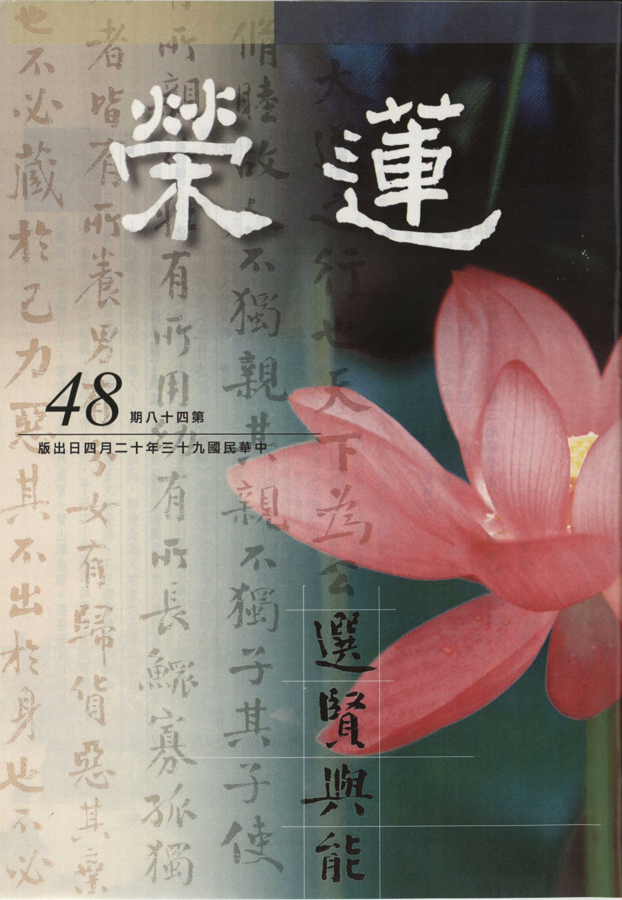

# 第48期

## 社論

### 論選舉

*編輯部*

選賢舉能真選舉

為政在仁重禮樂

公安環境能修道

功在萬世父母官

隨著年底的選舉，政治人物挑起民眾對立的手段越來越激烈，社會上對於是非善惡的價值觀越來越模糊，甚至為了勝選，也不惜對過去歷史的否定，並不惜與傳統文化劃分界限，前人昔日的努力，今日好像都變成罪人，所要被民眾選舉的人物，許多都是爭議性的人物。想想這塊曾是修學正法之淨土，未來還能保有那一份的安定嗎？有人說修學正法重在出世、莫論世間事，吾人今日之修學雖重在出世，然世間政局穩定與否，也會成為我們出世的順緣或逆緣，是故何以儒家廣談為政哲學，透過正確為政的心態與方法，才能創造公安的環境，唯有公安的環境，才能夠安然推廣正法的教育。

為令政治清明，儒家亦講究舉賢才，《論語 子路篇》記載著仲弓曾為季氏的邑宰（在季氏的封地上做父母官），問孔子如何將政治辦好，孔子就談到要重在舉賢才，仲弓問孔子，我如何才能知道他是賢才而重用之？孔子說據你所知道而薦舉，別人看你真心在舉薦人才利益人民，於是就會爭相向你推薦人才。不只如此，即使是為人君者也是要端正自己的品格並且舉用賢才，方能治理天下，所以古代的聖王尤其是舜，孔子讚歎舜王的無為，是舉用賢才，據《尚書 舜典》記載，舜命禹作司空，平水土；命棄為后稷，播種百穀；命契作司徒，辦教育；命皋陶作士，掌法律；命益作虞官，管山澤鳥獸。這些都足以說明他能知人善任，所以能無為而治。本身也存著對人對事的恭敬心，正坐於君位上，故能天下大治。所以孔子讚歎舜：「無為而治者，其舜也與！夫何為哉？恭己正南面而已矣。」然為政者除了有恭敬心舉用賢才外，本身也承正大光明，心存為公，否則上行下效，風氣大壞，雖舉用賢才，彼亦不為所用。魯國季康子是三家大夫之一，把持國政，又治不好，因此問孔子，如何把政治辦好？孔子把政解釋為正，是公正無私，辦政治就要守位正字（非黨同伐異，瓜分政治利益），並說你是魯國上卿，只要你行得正，處處以身作則，孰敢不正？政者正也，雖對季康子說，但後世為政者，皆當奉為至理名言。

現今民主制度，政府雖由人民選舉而產生，若民風刻薄，則如何選出真正君子，猶如愛玩不愛讀書的班級是不會選出品學兼優的班長，社會上一些不如法的團體是無法選出大公無私的領導人，是故純熟的民主政治必須要有淳厚的民風為基礎，所以要先將環境改善，並施辦正法的教育，使民風淳厚，方能在這個基礎上來談論由人民為國舉才，否則選舉愈全面，選風亦敗壞，不只難以選出優秀人才，也將前人努力培養出來的善良民風毀壞無餘。

孔子政治學說的根本講究處是堯舜為天下人舉賢才的公天下（祖述堯舜），政治上的典章制度則從周文王、武王（周公）所立，因為周代之禮法文章，迥視夏商二代，加以損益，禮文非常完備，可以為治國者之所依，即所謂憲章文武；若能依之而行，必能創造一個天下太平的盛況，令老百姓安居樂業，聖賢君子能推展教化事業，百姓能安心修學正法，此之淨土必是他國人民所樂移居之處，亦是他國學習效法處（平天下）。

## 大德法語

### 大方廣圓覺修多羅了義經（八）

*道源老和尚講授*

圓頓大教是圓覺

多生多劫難遭遇

雖遇無說亦難懂

能顯教義是道公

前述五重玄義是依天台判一經玄義，而華嚴宗亦名賢首宗，亦以十門懸談詮釋一經玄義。前八門是懸示，第九門是總釋名題，第十門是別解文義。十門中分別實際只有八門，圓瑛法師在講義中，為了方便初學，將第九門總釋名題移至第一門。先解釋題目，令大家依經題知道圓覺經的大意，再講八門懸談，之後方講解經文。

佛法傳到了中國，有許多大德分判整理，其中以天台宗、賢首宗的研究最好，天台宗將佛之一代時教判為藏通別圓四教，賢首宗則判為小始終頓圓五教。圓覺經注解中最好的就是華嚴宗第五祖圭峰大師所注，所判的教當然也是最標準啦！圓瑛法師也是依著圭峰大師的判教。大師將圓覺經判成什麼教呢？判為頓教大乘。有漸教，有頓教，頓是頓超、漸是漸次，最高深的道理是頓超法門，然裡邊含著漸次的法門。雖廣說頓教，然攝機不廣，須有頓教的根機才得利益，不是頓教的根機不得利益，所以頓教中也有漸教的教義在其中，以上是圓瑛法師的講義，其判圓覺經教就是這樣判，我（道公）現在眼睛看不見，同學看看圓覺經的略疏中圭峰大師的判教，也是將圓覺經判成頓教大乘，可知圓瑛法師是根據著圭峰大師的判釋。講到這兒諸位同學要注意了，這頓教大乘不是賢首宗判佛的一代時教小始終頓圓的頓，因為小始終頓圓的頓是專說中國頓教禪宗，祖師禪是不談觀想、不講次第，直接明心見性，見性成佛，這就是中國頓教禪宗。圓覺經雖是講頓教（頓超）的道理，名為頓教大乘，但並不是中國禪宗的頓教。中國禪宗是頓教，乃頓超之教，開口即錯，動念即乖，直指人心，見性成佛。但圭峰大師判圓覺經為頓教，是屬於華嚴經那個圓頓大教的「頓」，也有頓超的意思，但非禪宗不須開口的「頓」。

古德讚圓覺經等於略本的華嚴經，歸於圓教。華嚴經判屬於圓教，然份量太廣太多，圓覺經很簡略，意思與華嚴經的道理一樣，等於一個略本華嚴。圓瑛法師注此經的十門懸談，顯示一真法界有十個法界，每一個法界又有四法界，所謂：事法界、理法界、理事無礙法界、事事無礙法界，見解本華嚴經。諸位學教，將來定要學華嚴經，依圓覺經可以引入華嚴之門，入於圓頓大教。你能將圓覺經的圓頓大教道理，攝持到自己心裡，將來你研究華嚴經必有大幫助，等於入門了。古德判圓覺經為大乘勝義，所勝者何？乃頓教大乘非漸次的漸教，然此頓不是中國禪宗的頓，這個頓是華嚴經的圓頓大教的「頓」，顯示的是一真法界與四法界圓融無礙的道理，但中國頓教禪宗之頓超是不許說，不許開口，不許動念，以上將判教的道理解釋明白，方開始講圓覺經的正文。

先明諸經三分，每一部佛經都要分三大科：序分、正宗分、流通分，其中序分可分為證信序、發起序，證信序就是經文中的六種成就，一切法因緣生，佛講這一部經，也得有六種因緣才能成就，是那個六種成就呢？

經文：

如是我聞：一時婆伽婆，入於神通大光明藏，三昧正受，一切如來，光嚴住持；是諸眾生，清淨覺地。

（經文有其文法、文氣，經文念到此處是一段落。）

身心寂滅，平等本際，圓滿十方，不二隨順，於不二境，現諸淨土。

「如是」乃六種成就之信成就，信受之詞，若不信受則不容易研究佛經也不能了解佛理，要能有信心才有未來各種成就。「如是我聞」是指法之辭，如是乃指著圓覺經，「我聞」是阿難尊者自稱親耳所聞，為六種成就之聞成就。如是我聞這一句話包括兩個成就（信成就以及聞成就），有了信心，若不多聽經則得不到佛法的利益，所以信了以後要聞。小乘三藏（經藏、律藏、論藏）之經藏是阿難尊者結集的。大乘的經藏也是阿難尊者結集的，在佛教的歷史上說是文殊師利菩薩把阿難尊者帶到鐵圍山結集的大乘經典，那時阿難尊者已另立名為阿難海，海是讚歎之詞，阿難尊者雖是阿羅漢乃小乘弟子，但到他結集大乘經典的時候才知道他是個大菩薩，海是指他智慧廣大甚深。其次一時為時成就，並未記何年何月何日，乃不容易分年、月、日，理由是：第一、印度年、月、日與我們中國的年、月、日時間不同，無法翻；第二、釋迦牟尼佛在印度說法他並不是一個時間把這一部經講完，例如一部法華經講了八年，在中間也講了其他的經，集結經藏時將法華一類都結集到法華經，圓覺經亦復如是，所以不能預定那一年，那一個月說的，尤其是講大乘經典更是深奧不可思議，到鐵圍山結集，試問在鐵圍山那裡要安立什麼年、月、日？即使有個根據而說出來，你也不知道，而且愈說愈費解釋。圓瑛大師講解的最簡單恰當，就是師資道合，說聽究竟。師是釋迦牟尼佛乃我們的本師，資就是弟子是聽法的弟子，其道相合。釋迦牟尼佛要說法，弟子要聽法，師資之道相合，這樣的事情（儀式）還不圓滿，還得說聽究竟，說法、說究竟了，聽法、聽究竟了，這個儀式才完成了、圓滿了，所以謂之師資道合，說聽究竟，名為一時，乃時成就，是六種成就之第三時成就。

其次「婆伽婆」，別部經有翻成「佛」，圓覺經翻譯的是「婆伽婆」，亦有其他的經翻成「婆伽梵」。何以有「婆」及「梵」的不同，乃因為印度地方很大，分為五印度，雖念的大部分是梵文，但因地方太大了，傳到中國時，南印度的法師與北印度的法師傳過來的梵音絕對不同。現在普遍是念英文，都是跟美國人學的，南美的人跟北美的人念的絕對不一樣，這就是為什麼有些翻「婆伽婆」，有些翻「婆伽梵」。其義如何？依圓瑛法師的講義，具足六義名為「婆伽婆」，此乃含多義不翻。一、自在義。如何佛是自在義？乃不為煩惱所障、生死所繫故。我們眾生何以不得自在？乃繫縛於生死，在人說人，你歲數到了你就得死，死了以後呢？還得生，你想著不生還不行，生了以後還得死，死了還得生，被生死之法所繫縛，不得自在，自從無始以來，就被生死繫縛著，那來的生死呢？乃因煩惱故，煩惱是生死之因，生死是煩惱之果，所以生死之果都是你自己造的！沒有事你卻動煩惱，沒有事卻造業，不過是庸人自擾之，你不動煩惱，你不造生死之因，根本就不會被生死所繫縛嘛！凡夫他愚癡，他沒事找事，沒有煩惱他也要動個煩惱，不該造的業，也要造個業，是誰叫我們流轉生死呢？既不是上帝，也不是閻羅王，是我們自己造的業，業力不可思議，看地藏經之地獄名號品，即謂：「業力甚大，能敵須彌，能深巨海，能障聖道。」那個業力的力量大的很，怎麼樣大法呢？須彌山高，它比須彌還高，大海甚深，它比大海還深，這兩句是形容詞，直接講到業力最可怕是能障聖道，你想修行，業使你修不成功。剛才說凡夫沒事找事，要動煩惱，要造業了，造了業後，你現在學了佛法發了道心了，你發了你修修看！你修不成功，不是這個障礙，就是那個障礙，是誰障礙你了？是你自己的煩惱與業障礙了你，受到障礙了還自在嗎？不自在！所以「婆伽婆」六種義，第一是自在。我們聽法都要聽到耳朵裡、聽到心裡，你要好好激發你的道心，你要好好求懺悔，你不要被業力所轉，我們凡夫最苦惱的就是我執，我要這樣、我要那樣，但一點都做不了主，是你的煩惱叫你這個樣，你就得這個樣，叫你那個樣，你就得那個樣。所以你隨時要常常觀照，觀照這些令我們不自在的苦惱，努力修業去除以得自在。至於佛為「婆伽婆」得了自在，將三界以內的煩惱都斷掉了，三界以外的煩惱也斷掉了，已無煩惱障礙，生死之因斷了，生死之果也沒有了，三界以內的分段生死沒有了，三界以外的變異生死也沒有了，不為生死所繫縛，得了自在，以上是婆伽婆的第一種含義。

諸位聽佛法聽了三年了，光聽到耳朵裡是不行的，一定要聽到心裡去，隨時激發自己的道心，不然呢？就這麼混時光，混了三年，還有一年，很快的畢了業了，將來還有什麼時候再能聞到佛法？若此時你的道心還振作不起來，天天被煩惱所障，那就生生被生死繫縛，永遠不得自在，不得解脫。

第二是熾盛義，熾盛就是光明盛大的樣子，熾盛：身光與智光，熾然照耀故。熾然就是很光明、很茂盛，試問那來的光明呢？佛的身體都有光明，謂之身光，佛的心一放光，心光名智光，身光與智光熾然照耀，此乃婆伽婆第二種含義。

我們凡夫本來具足般若智慧（大智慧光明），在大乘起信論上說人人都有真如，真如自然具足大智慧光明，但是被業與煩惱障到了，智慧光放不出來，亦即心裡邊的光明放不出，放出來的光是什麼光呢？都是業光。若用神眼（道眼），非一般世俗神通，用神眼一看，那個業障重的通常冒黑煙，他說這個話我還很相信，那就是業嘛！他造些惡業如何不冒黑煙？他怎麼不冒白光呢？「白光」屬於智慧嘛！他沒有冒出智慧光，所以眾生可憐，本來有的智慧光明都放不出來。可是婆伽婆放出的身光、智光常常熾然照耀，這是婆伽婆第二種含義。

第三、端嚴：具足微妙相好，端正莊嚴故，具有三十二種大瑞相，八十種隨形好，若是報身佛依起信論形容，相有無量相，一相復有無量好，一好又有無量莊嚴。報身佛我們看不到，應身佛也沒有看到，乃因我們業障重。應身佛的三十二相是示現於人間的相，眼睛長的端正莊嚴，鼻子也長的端正莊嚴，身上每一處都端正莊嚴，反觀我們現在為人，然不能考校，若仔細考校三十二相一相也沒有，為什麼？沒有一相是端正，沒有一相是莊嚴，根本不夠人應有的相，應該生慚愧呀！

第四、名稱：名聞普遍十方，稱揚無盡故；佛有大名稱、十方世界都聽到他的大名，而且都在稱揚他的功德，佛說阿彌陀經中六方諸佛都在讚歎我們的釋迦牟尼佛，這就是釋迦佛的名稱普聞於六方諸佛，六方諸佛都在稱揚他的功德，這叫做有大名稱。此處得再解之，我們學法做法師者，馬鳴菩薩說有三關要過：不求名、不求利、不求恭敬，此處怎麼還求名稱普聞呢？你弄錯了！釋迦佛的名不是求來的，此名乃實之賓（實至名歸），實為主、賓為客，真實的功德一旦得到了，自然會有大名，不是我們凡夫求名求利，求來的那個名。現在我們學法時，反而要打破這三關，不求名、不求利、不求恭敬，你只要認真的學法，認真的講給眾生聽，你天天講，年年講，越講越好，大家都知道你這個大名，雖然名聞十方世界還沒到，可能這個小地球都會知道你的名，是不是？是你求出來的嗎？不是！求也求不到的，越求還越糟糕，這是為什麼？你沒有真實的功德，沒有真實的本事，還要求大名，你越求越沒有名，而且名字越大越挨罵。所以你最好踏實的求解、講經說法，你做了若干功德，名自然就大起來。

第五、吉祥：威德冥加顯護，消災滅罪故，「婆伽婆」（佛）的功德大，就怕你這個眾生沒有一點點善根，你要是有點善根，你聽到佛的名，念念佛、拜拜佛，你就能得到吉祥的利益，怎麼得到吉祥的利益？消災、你的災難就消了，滅罪、你的罪就滅了，如何消災滅罪？冥加，你不曉得災是如何消、罪是如何滅的，是佛加被你，但你沒看見所以是冥加；有時候會很明顯的，你會覺察出來，你若是善根深厚就真的能見到佛的示現，向你說法，或是雖不能見到佛，但你能以很顯明的感覺到佛在加被你。若不是佛加被我，我的災難不能消，我的罪不能滅，自己相信是佛的冥冥加被或是明顯的護持，這就是婆伽婆的吉祥之意。

現在說了佛法了，還有不去拜佛，不去求佛，反而去求外道，求什麼神、求什麼鬼，這還不說，現在佛教亂的厲害，很多的魔都在末法時代混到佛教裡來。你看現在台灣的生活很好過，大家生活都提高了，錢好賺啦！社會上現在流通一句話很好，以前日本統治時是吃飯配菜，現在日子好過是吃菜配飯，你看這話說的多直接，這是眼前的事實！現在大家錢多了，在社會上誰不享受呢？吃的菜太多了，不配點飯還不行哩！在日本時代時，唉呀！窮的可憐，叮叮噹噹，買個菜沒有錢，沒有錢還吃不到飯，買了一點菜，配了飯拼命的吃。社會上大家生活的享受是提高了，但是總有不滿意的地方，人家做生意都賺了錢了，你做生意卻沒賺，這就是共業之中有別業呀，他不學佛法他不知道，必須好好求懺悔呀！多念佛、多拜佛他不知道，跑到了似是而非的佛教來問出路，台灣話叫做問因果，某處會什麼「跳神」要去問，另一處說未卜先知就去問，我們佛教就出這些寶貝，這是我最近聽說的有好幾檔事。哦！還有比這幾檔事更厲害的，他說他是古佛再來，他有一萬八千多年了，釋迦牟尼佛才二千多年，那比得上他？他比釋迦佛高明的多，已一萬八千年，轟動了全台灣，人住在高雄，台北的信徒就去找他去問，一問怎麼樣呢？就聽他說神話了。他比釋迦佛還大這話，你看看他敢講嗎？他敢講，你聽了卻相信，聽了相信就罷了，他要蓋道場，要化緣，怎麼化呢？每一個人要出三萬塊錢，這是你問因果，他去找西方三聖來讓你問前因後果問完了，錢規定這個月十五你要來繳錢，你要不繳，你家裡出了事，你可不要來找我。乖乖！這一句話簡直嚇死人，你不出三萬塊錢，家裡出了事，要自行負責。本來應該是做生意賠了錢，家裡出了什麼不如意的事，才跑到高雄去問因果，問到他頭上了，這一問還弄了個神回來，還得出三萬塊錢給他。佛教弄到了今天這般不如法，唉！怪誰？怪我們佛學院的同學，你們不發心講經，你知道我 道源講到八十一歲還在講，怎麼講也講不到高雄去，你們大家發心去講嘛！你講因果報應，最吉祥的就是佛，你求佛、拜佛、念佛就消災、就滅罪，你不要去「問因果」，那些自命有神通都是騙人的，不要去上這個當！大家同學也知道，現在佛教出了很多魔。

第六、尊貴：乃為天中之天，聖中之聖故。欲界六層天比起來誰也沒有佛高，三界內二十八層天誰也沒有佛高，佛是天中之天。至於聖人、世間的聖人，大都是凡夫，不出三界，佛教講的聖人，都是超出三界的，如聲聞、緣覺、大乘菩薩，乃至菩薩中的三賢十地，都沒有佛高，佛證到最圓滿的境界，稱為聖中之聖。以上佛德具足這六種義，稱為婆伽婆，若按第六義直接翻譯應該翻作「世尊」。婆伽婆具六種義故，為五不翻中含多義不翻。我講了一課還沒出什麼大汗，還可以，下一課再講！（下期待續）

## 共修研學

### 小止觀導覽（二十七）

*蓮心整理*

五蓋能攝諸煩惱

根本在於自相法

觀空能生般若慧

世間如幻無惱害

經文

問曰：不善法廣，塵數無量，何故但棄五法？答曰：此五蓋中，即具有三毒等分，四法為根本，亦得攝八萬四千諸塵勞門。一、貪欲蓋，即貪毒。二、瞋恚蓋，即瞋毒。三、睡眠及疑，此二法是癡毒。四、掉悔，即是等分攝。分為四分煩惱。一中有二萬一千，四中合為八萬四千。是故除此五蓋，即是除一切不善之法。行者如是等種種因緣，棄於五蓋。譬如負債得脫；重病得差，如飢餓之人，得至豐國；如於惡賊中，得自免濟，安隱無患。行者亦如是，除此五蓋，其心安隱，清涼快樂。如日月以五事覆翳：煙、塵、雲、霧、羅睺阿修羅王手障，則不能明照。人心五蓋，亦復如是。

大意

本段為設問答以釋疑，藉此說明棄五蓋的理由，以及棄五蓋的得益之相。

導覽

一、所謂八萬四千塵勞係謂眾生之八萬四千煩惱，塵勞乃煩惱之異名。摩訶止觀：一一塵有八萬四千塵勞門（亦即每一境能生八萬四千煩惱）。因煩惱能汙人之真性，使人煩勞，故稱為塵勞，眾生被邪見煩惱勞役不息，輪轉生死，無有盡時。

二、煩惱當中總共有十個使，十使就是五利使、五鈍使。五利使是身見、邊見、見取見、戒禁取見、邪見，這是屬於見解上的，乃分別我執所生之各種邪見，觀待分別我執所生的貪瞋癡慢疑亦是利使，此十使在見道位斷分別我執時可斷，何謂分別我執，乃是學習非法的宗派而有之我執，若在見道位上現證空性時，此執可破，觀待此執所生的見解與煩惱都可以破除，亦即見道位的聖者得到強而有力的正見，不受邪宗義與世俗見解的影響。至於不與分別我執相應的貪瞋癡慢疑稱為五頓使，須觀待於學道位重緣空性破俱生我執（此質不觀待邪宗義，乃凡夫無始虛妄分別能執有我的心識相續至今），方能破除此五頓使的煩惱，乃因此五頓使與俱生我執相應，不與分別我執相應。

三、八萬四千塵勞之算法如下：

（一）塵勞之根本，不出十使，隨各以一使為首，餘九使為助，即每一使中各具十使，遂成一百。【十乘以十等於一百】

十使其中每一使生起時，由十使其中一使乃至十使的幫助，令起現行，比如現起貪現行時，或由前念貪心幫忙生起的，或由癡扶助生起，或由身見為助而生起，或因邪見等流而生起。所謂等流是因心念如流水，前念落謝後會引發後一念，每一使可由十使助成生起，故云：十使成百。比如有些人認為有福儘量享，死後一場空，此之貪心即是身見、邊見之助而生起，故在論斷當前心念的生起之因是很難論斷的。

（二）約三世各有一百，共成三百。【一百乘以三等於三百】

十使成百，還要分為過去、現在、未來三世，因為過去的煩惱，會引發現在的煩惱，雖然現在的煩惱出來，過去的煩惱就消失了，但所謂消失的煩惱又會成為未來煩惱生起的等流，所以佛法要行者修行以斷惑，而斷惑最重要就是要斷煩惱生起的所依〜有自相的我，所以過去的煩惱是潛藏的，但會現起於現在乃至於未來，所以過去的煩惱一百，現在的煩惱一百，未來的煩惱一百，三世就是三百。

（三）現在世之一百，時促不論相助，仍是一百，於過去、未來二世二百之中，又各以一使為首，九使為助，共成二千，合現在世一百，共成二千一百。【過去（一百乘以十）＋現在（一百）＋未來（一百乘以十）等於二千一百】

過去的煩惱能幫助現在的煩惱現起，現在的煩惱也會影響未來的煩惱，而一使的現起必有其他九使的幫忙，所以過去、現在、未來這些煩惱互相為助變成二千，再加上現在的一百煩惱，即成二千一百。

（四）又約多貪、多瞋、多癡、等分四種眾生，各有二千一百，共成八千四百。【二千一百乘以四等於八千四百】

這些煩惱裏面有四類眾生，就是貪、瞋、癡、等分的眾生，各具足這二千一百個煩惱，意即這二千一百個煩惱分別觀待貪、瞋、癡及等分的煩惱生起，這樣合起來就是八千四百，貪、瞋、癡、等分四類眾生是說這個眾生雖然有貪、瞋、癡、等分煩惱，可是他的貪心最重、則歸於多貪眾生，或者瞋分最重、則歸於多瞋眾生，或者癡分最重、則歸於多癡眾生，或者等分重，則歸於等分眾生，所謂等分即一時一念中，具有貪、瞋、癡三毒，或貪而復瞋，瞋而復癡，癡而復貪。

（五）又約四大、六衰，各有八千四百，總成八萬四千塵勞。【八千四百乘以（四＋六）等於八萬四千】

煩惱會緣著眾生的四大與六衰起現行（四大是地水火風。六衰是指色、聲、香、味、觸、法，因此六者能衰損善法，故名六衰），八千四百再乘以十就是八萬四千，所以煩惱是無量無邊的。煩惱擾身就像身負千斤重擔，若能對治煩惱，則身心輕利、清涼快樂，尤其是在定、慧當中的對治煩惱能生起輕安，其行相是風大充身、輕快舒適，因為心情很愉悅，所以身體也變得很輕鬆，也因為身體很舒服，所以心裏也感覺很快樂。反之心情不好的時候、身體就變得很沈重，身體不舒服、心裏也會很愁悶，身心二者是相互觀待的。

四、煩惱是不善法，論業的輕重可由四個角度去觀察，心態是否有煩惱是其中一面相的觀察：

（一）約事相而言：比如造橋、鋪路、齋僧、濟眾等，約事相而言，屬於善法，但是否真為善法，尚要論心。

（二）論心態良窳：善惡的關鍵處，就在那一念心，以心論善惡，是佛法跟世間法不同處，世人判案時，往往未深入了解犯罪的動機，或者犯人內心的隱微處，所以在判斷善惡時，往往未盡允當。

（三）所對的對象：對象或為親人，或為仇人，或為路人，但其中以父母、師長、三寶、恩將仇報者，這個境界最強，此時不論引發的是很增上的慈悲心，還是很猛利的貪瞋癡，所造的業都很強。

（四）使用的方式：比如同樣是殺螞蟻，雖然對象是靈性不高的，可是心態很殘忍，手段很殘酷，則此業報就很重了。又如殺人，雖然人的靈性很高，可是到底是無意殺，還是蓄意謀殺？雖然世間法可能都是被判處死刑，但是若論業報，則很難論斷，除非是有證量的聖者，否則是難以說清楚的。

尤其是論到因果的影響，可以延續到百千萬億劫之久，這種前後的關係，可能連阿羅漢或登地菩薩都說不清楚，比如孔雀開屏，五顏六色，但為什麼會有這樣的顏色呢？又比如某人死了，假設他這一生做的是惡業，必須投生到畜生道，結果跑到三千大千世界以外的佛世界去投胎，做了一條狗，為什麼會跑到這麼遠的地方去做狗，阿羅漢也難以了知，所以民間的牽亡者又怎能弄清楚這些現象呢？假若亡者投生到地獄道，若可把亡魂牽來相見，那威神力簡直比菩薩還大，所以牽亡，並不一定可信，因此教理愈了解，就愈不會被外面的邪知邪見所困惑。

五、五蓋即貪欲蓋（貪毒）、瞋恚蓋（瞋毒）、睡眠蓋和疑蓋（癡毒）、掉悔蓋（等分攝）。嚴格說「掉」是貪所攝，因為對於在意的境界，看不破、放不下，所以念茲在茲，比如某人對錢財放不下，所以一面念佛，一面想怎麼處理這些錢，這就是為貪所攝的掉，當然就不能專心念佛！

六、諸佛菩薩度化眾生，縱然身處五濁惡世，邪見橫流，苦難當道，但他的內心並沒有被煩惱束縛的痛苦，和被逆境逼迫的窘困，因為他沒有產生煩惱，也不會造作惡業，自然也不會滋潤這些惡業，他的內心只有不忍眾生苦，而沒有其他的苦，我們眾生卻沒有這種覺受，反而具足其他的苦，所以我們應該好好對治五蓋障，以除不善之法。

七、「棄於五蓋，譬如負債得脫；重病得差，如飢餓之人，得至豐國；如於惡賊中，得自免濟，安隱無患。行者亦如是，除此五蓋，其心安隱，清涼快樂。如日月以五事覆翳：煙、塵、雲、霧、羅？阿修羅王手障，則不能明照。」以上是除五蓋障後，應有的體會，好像債務還清，病苦消除，飢者得食，又好像免於賊難，無患安隱。

八、在尚未修學止觀門之前，行者的煩惱必須加以對治，當煩惱被對治以後，身心熾盛的感覺，才能止息下來，以平靜的心態去善學止觀，善學止觀中最重要的是緣念空性，依空性來破執著，執著一破，煩惱無由生起，前述的對治法，不管是多貪眾生不淨觀、多散眾生數息觀、多瞋眾生慈悲觀、愚癡眾生因緣觀、多障眾生念佛觀，或去除五蓋障，但都不是真正的對治法，只是破煩惱的現行，不是破煩惱種，也不是破煩惱的習氣，但是可做為止觀門的前行，因為在尚未修學止觀門之前，若沒有好好修學這些對治法，身心尚且不能寧靜，遑論止與觀呢？至於真正的對治法，是後面修止觀的時候，以空性為所緣的止，空性為所緣的觀，所以天台宗所謂的空觀、假觀、中觀，都是以空性為所緣境，因為煩惱的所生處是執著有自相的法，若能觀察自相不可得（空性）則能執著的心不生，煩惱種及煩惱習則無由生。

九、斷除煩惱不必針對各個煩惱一個一個去斷，若能現證空性，將萬法的自性不生處，如實觀察清楚，了知萬法的現起，必觀待因緣和合、名言安立，則萬法現起猶如水月空花，所以貪什麼呢？又瞋什麼呢？另外癡是看不明白，若能看清楚，則癡在那裏呢？這三毒都沒有落腳處，等分要在那裏立足？等分都沒有的話，靠著貪瞋癡等煩惱現起的十使又何由而生呢？十使不能起現行，還談什麼八萬四千種煩惱呢？

十、羅睺阿修羅是阿修羅王之一，羅睺意為障月，因其與帝釋作戰時，手能執日月，障蔽其光，故有此名。據載，羅睺阿修羅住在海底地下第一層（二萬一千由旬），身量廣大，如須彌山王，所住光明城縱廣八千由旬，園林房舍皆以寶莊嚴，舉手障日光輪，即形成日蝕；以手障月，形成月蝕。論其業因，該王過去為婆羅門時，見火燒塔，遂滅火而令塔不壞，欲以救塔之福德為因，願得大身，然雖作此願，猶不信正法，不正思惟，常愛鬥戰，不修正業，有天福而沒有天德，故死後墮入阿修羅道。（下期待續）

### 佛說八大人覺經講記（七）觀第一覺悟證空性

*編輯部整理*

執實身心生自我

愛我樂生貪瞋癡

由惑造業能受果

漫漫長夜幾人醒

前言

佛法通世間法和出世法，在世間法上要生起的是出離心和菩提心，這是美好的善心，能攝持如百法明門所說的信、慚、愧、無貪、無瞋、無癡、精進、不放逸、行捨、不害等等的善心，對治的是貪、瞋、癡、慢、疑、無慚、無愧、忿、恨、惱、害、嫉、慳、驕、慢等等的煩惱法；這些煩惱法的對治以及善法的造作，不但能令吾人得世間的安樂，也會引導我們通達空義(出世法），亦即能得解脫生死或成就佛陀的果位。須知佛法是百千萬劫難遭遇，自己學法的心要像一個開口向上的好器皿，並且洗得很乾淨、沒有漏洞，方能承接甘露妙法，在學法之前應抱著這樣的心態。再者，學習佛法是世間改變命運最好的方法，天台智者大師的哥哥陳鍼，他在世間上是一位將軍，可是他卻脫困不了既定的命運，還得靠著他弟弟所著之小止觀努力修學之，才能擺脫命運的束縛，且多活廿四年，最後臨終坐化。須知世間王侯將相在享受富貴榮華時，看似快樂，其實都是消耗過去的善業，本身亦是業力中人，不過是酬業耳，當善業耗盡，惡業顯現而受苦時，身心所受煎熬更甚於一般人。至於顛沛流離者也難以離開憤世嫉俗的心態，而平庸者亦庸庸碌碌過了一生。唯有學佛者才能心平氣和、不怨不尤，並且處在各類的狀況都能懺除罪障積功累德，最後解脫生死、成就佛果、利益眾生。

丙一、見惑（身為見惑之首）〜詳釋請參考第四十六期

「世間無常，國土危脆」

，才上來先統論世間，下一結論〜無常，每一法之生都快速趨向於敗壞，有情所居的國土也危險脆弱，亦即國家處境危險，土地脆弱（天災地變）。國家的國，外口內或，表示所領之疆域常常改變。以前中國大陸像一個秋海棠，現在像一隻母雞，從堯、舜、禹、湯直到梁、唐、晉、漢、周，唐、宋、元、明、清這些朝代所攝疆域有一樣嗎？立國時有許多政治的危險（群臣權力鬥爭），在國際上也是遠交近攻，親戚好來往，鄰居高搭牆。中國歷代的仇敵在那裡？在近鄰！第二次世界大戰，中國就是受日本、蘇俄的侵略。

先觀大格局，世間是無常，再縮小看國土，是國土危脆；世間、國土尚且變動不居，在此之上建立之家庭、事業、功名等，吾人又豈能生起安住的感覺，能將這些追逐的心態予以對治。

「四大苦空」

，再觀依於世間、國土所生起的有情，也是受苦不斷。此句之四大乃地、水、火、風，就是有情的色蘊組成成分。地大〜性堅，支持萬物，有情身中皮肉、筋骨、骨架等屬於地大；水大〜性濕，收攝萬物，有情身中的血液、汗水、痰等屬之；火大〜性暖，調和萬物，有情身中體溫、暖氣等屬之；風大〜性動，生長萬物，有情身中的呼吸等屬之。

為何四大是苦空？苦在那裡？空在那裡？身中四大猶如四條毒蛇在屋內，互不相咬時（四大暫時平衡）感覺很舒服，一旦相咬（四大互侵）則百病叢生，苦不可言。尤其四大亦是無常法，會變異敗壞的，當心以四大為所緣，會不斷生種種痛苦。觀待四大所生的我，這個我並非常、一、自在、永恆不變，我相生起不過觀待而生，那有如外道所說的神我，靈魂的我，這種不變的我根本了不可得，所以說是「空」。

「五陰無我」

，五陰是指色受想行識，色指生理，受想行識指心理，如何說是無我？色受想行識所和合的五蘊身無常，觀待五蘊生起的我相也非獨立實有，並非有一個能背負五蘊的我來所背負的五蘊，甚而在五蘊和合中連自相的我都不可得，不過是分別心名言安立的我，所以是五陰無我。

「生滅變異」

，所受用的依報環境是世間無常，國土危脆，其實就是生滅變異（生、異、滅）所謂生異滅就是本無今有，不斷變化，最後歸無。不但依報環境如此，正報五蘊身亦如此。

「虛偽無主」

這些變化現象不真實，觀待正報、依報生起的我相虛妄非真實，所以必有執著，必追逐我樂之事（起惑）而造作種種損人利己之業（造業），所以「心是惡源」。而以形（五蘊身）為受苦之器，乃罪業生起報應的聚集地，所以是「形為罪藪」。

「如是觀察，漸離生死。」

這樣的觀察，漸漸的離開生死。亦即得到小乘見道位的成就，以入聖流，已漸離生死。（下期待續）

## 專題研學

### 國際化與本土化〜青年人應有的格局（上）

*敬其主講、智中整理*

認識國際知處境

推動文化強國力

青年懷抱大格局

泱泱大國作模範

前言

本人在政府外交部門工作，三年前被派至非洲某一未開發落後的國家，乃佛法的邊地，整個國家約有一千餘萬人，可說只有我一位學佛〜百分之九十以上都是回教徒，百分之五是基督徒或是天主徒。其他百分之五是傳統宗教。

世界風潮　盟邦（經濟體）之建立

今日座談以互動的方式來討論一項重要的題目，那就是本土化與國際化的問題，若能認識這個主題，則對未來的社會有深度的認識。我們先談國際化，何謂國際化？不是會講兩句外文就叫國際化。今日世界的互動非常頻繁，需要了解整個國際間的互動，然後尋求自己在國際互動中的定位與扮演的角色，這就叫國際化。所以國際化的前題是必須要了解世界的政經形勢及其發展，如目前世界五大洲下的三大貿易區：一是東南亞國家成立的東協，現在又擴大互動、變成東協加三〜中國大陸、韓國和日本；二是歐盟經濟體；三是美加的北美經濟體。未來的亞洲，很有可能形成以中國大陸為主體的另一經濟體。預計於二０一０年這三大的自由貿易區形成的三大經濟板塊能完成，在這其中的互動排除了各種行政障礙，諸如關稅、人員、車輛和物資都能自由流通，形成一個互相利益的經濟體。在每一個國家既競爭，又聯合，又鬥爭的情況之下，都在尋求它自己的定位，以及尋找本國的利益。

譬如歐盟於今年五月一日，又加入十五個國家，以前所謂的西歐經濟體現在漸漸往東歐移動。東歐包括波羅的海三小國（立陶宛、拉脫維亞和愛沙尼亞）皆已加入歐盟。目前土耳其積極加入，然有其入盟障礙。昔日土耳其建立的顎圖曼帝國，其領土範圍曾橫跨今日歐洲一半以上的領土，此乃歐盟畏懼土耳其加入其中原因之一，其次是宗教因素。不過歐盟現在也積極地與土耳其談判，假如要加入歐盟，有些法律不可以依國家的或是傳統的特性，尤其是回教一些較嚴厲的法律，必須要廢除，而土耳其現在也漸漸答應。何以歐盟還是傾向同意土耳其加入？因為土耳其在二次世界大戰後冷戰的時期扮演一個非常重要的角色，該國擁有控制前蘇聯黑海艦隊出入的地中海，所以加入北約，這對民主陣營貢獻很大。

那歐盟為何會意識到必須擴大範圍？因為要與北美經濟體抗衡！在過去冷戰時，世界的經濟火車頭就是美國，所以美國經狀況的好壞會影響到整個世界，可是歐盟成立加上擴大之後，整個的穩定度相對提高，現今歐元非常強勢，而美國到目前為止外債赤字逼近一兆美元，且這三年來經濟一直沒有起色，因為對外用兵頻繁，尤其對阿富汗與伊拉克之用兵。在對伊拉克戰爭時，歐洲國家（法國與德國）首先就公開反對攻打伊拉克。雖然美國變得孤掌難鳴，但仍執意要打這一場戰，於是就找一些附和的國家，例如西班牙、義大利、波蘭、韓國、日本等等，但主要的部隊還是美國人，死傷也都是以美國部隊為最多。不過主要不是在戰爭時期，而是在戰爭後，某些伊拉克人視美國為侵略者，而組織一些游擊部隊與之作戰，美國稱之為「恐怖活動」，不過這是不太正確與不公平的。假如外國人佔領我們台灣，我們奮起抵抗而被說成是恐怖主義時，我們大概不會承認這樣的名言，不過將自己國家的利益無線上網超過（侵略）其他國家利益，此謂之國家恐怖主義。

認識國際的重要

當我們看到世界經濟體形成的時候，我們要意識到在這幾個經濟體之間的互動為何？此乃所要了解的國際情勢。我們常說今日國際是個世界村，已經不能置身於度外。身為世界村的一員，國際上發生什麼事，我們要多多少少了解一些，尤其是重大的事情，它對於國家本身的影響，對周邊國家的影響，對世界的影響，通通要有正確的分析與認識。可惜的是台灣這方面消息的探討少之又少，除了在學校裡面相關科系的教授會介紹到，即使媒體發達，但在這方面的探討卻非常少，造成我們看世界是一個偏狹的觀念。在此種情況下，對我們本身乃至國家未來的發展，都是一個不太好的現象。尤其政府在制定五年到十年以上政策時，會有相當大的偏差，因為不了解世界以後會如何發展，也不了解它以前發生的一些事情，對這些原因也沒有好好探討，此時在制定政策時，就很難稱為國際化，因為不曉得擬出來的政策與國際未來的發展如何配合。

我們制定的政策，不但要合乎國內的需求，也要合乎國際的需求。通常在經濟活動上，跨國企業在這方面做得很好，我們國內幾個大企業，他們國際化的程度就很高，因為他們自己也會有專人在研究國際政治。雖然有時大家覺得政治之事不關己，但是實則任何一件事情都是政治，國父孫中山先生將政治詮釋得最好，就是『管理眾人之事』。牽涉到我們每一個人的事情，就是政治。

認識國際（國際化）的方法

網路若好好運用，則是了解國際化的殊勝方便，網路的發明是一位瑞士的工程師為了要對抗美國雛型的網路，經過了一番構思，形成現在的internet（網際網路），發展到現在大概有幾十億的網站。當我們要獲取眾多資料時，其中有一個工具必須要具備，這個工具就是語文，國際化的第一步就是語文〜外國語。現在有許多父母親讓孩子幼稚園時就開始學習外國語，其實未必是好事。因為孩子小的時候本國的語文都還沒學好，就開始學外國語，屆時兩種語文都學不好，此非我一人之主張，亦有著名學者說過，要學好一個外國語言，首先，必須先把本國語言學好，除非是在外國土生土長、那母語就是外國語言，而不是中文。如華僑子弟，他們的母語就是外國語，亦即當地的國語，而我們的母語，毫無疑問的，一定是中文。

然現今學生中文程度令人擔心，因為伴隨著電腦的發明與使用，造成大家寫作的程度大大降低，或有學生做報告，從網路上下載貼一貼，就是一份完整的報告。並沒有經過自己的思考與整理，變成剪貼大賽，對於自己做出來的報告內容都不知道是什麼，這種速食化的學習，學習的深度不足，將來會產生很大很大的問題。大家也許無法意識到做每一樣事情，尤其是在求學時、要非常地紮實，提升自己的判斷能力。再次強調語文要學好，因為現在網際網路上，有很多人願意將研究心得放在網路上，其次如報章雜誌等資訊乃至論文都放在網站上面。網站內之資料非常豐富，如何取下閱讀，除了語文能力以外，還有自己閱讀能力。語文是一個綜合體的產物，是文化、科技、人文，各方面所產生出來的結晶，所以學習語文雖然表面上是一項工具，但帶給人的是各式各樣的學習，所以語文在未來的世界與社會裡，是絕對不可或缺的。因為我們需要吸收各國的資料，但翻譯成中文的非常之少，所以拿到國外資料時，想要看得懂，首先要具備語文程度。所以國際化的第一步，先學好第二外國語，尤其是英文。（下期待續）

### 自由錄上　和平者平治天下度脫眾生之大權

愛蓮、心雅的英文翻譯

文化傳播賴語言

世界通行中英文

普遍正見若通暢

世道人心能淳厚

前言

本篇文章出自印光祖師文鈔，祖師陝西郃陽縣人，二十歲出家，多方行腳十餘餘能量至普陀山法雨寺閉關三十年，閱畢全藏三次，故而熟貫三藏，解解行並進，自己化他，道高德被，臨終預知時，生西示現身瑞相，大眾公認為民國五大師之首。在祖師文佛敘述淨土、抒情、化家庭、辯證魔佛之別以及各種修學疑難雜症之解。本篇是無錫金師有居士採集報應之事，期能淨化世俗人心，讚歎其祖之功，並盼此書之流傳，有功世道此篇文章有幸於同伴研學過，心雅居士知其大意後譯為英文，冀其流通，並經愛蓮居之指導，以期所譯之中文能符合文義。

望閱者一者依祖師開示能了解真相之大要，口口能通達英文，並依語文能力弘揚儒佛之法。（編者）

因果錄序

印光大師　因果報應記錄（或佛法因果記）

前言

（殷廣法師）

1.響應報應者，乃人事與天理或順或逆之影響也。

報應法是與人有關的影子和迴聲，預示有利或不利的情況，以回報人們與最高秩序相關的工作的功績或應得。

2.故書曰：惠迪吉，從逆兇，惟影響。

所以尚書說：「行善帶來好運氣; 而惡行帶來厄運。關係的反映類似於陰影和迴聲。」

3.人雖雖至愚，斷無幸災樂禍、避吉趨兇、願一切同人排斥名罵罵，天鬼奪魄魄殛誅，及死後靈魂永墮三途惡道，受諸極苦。經百千劫，莫之能出者。

人再愚昧，也不會幸災樂禍，避吉避禍，也不願招惹親人的謾罵。人們也不歡迎神靈奪魂，導致他們永遠重演三惡道的極端折磨。在這種情況下，即使經過十萬劫，也沒有出世的希望。

4.然反皆其所願為，多也其所願。

但是為什麼人們傾向於違背他們預期的推理意志？

5.由世少通人，不可視報應之道。

現實中，能透徹了解報應法的博學多才的人很少，因此無法廣為流傳。

6.而襲習習，唯知以自私自利相傳家之也。

此外，家族遺產只傳給後代的不良傳統自私地限制了外人對知識的理解和受益。

7.間有盡理所為，順乎天地盡善盡美，而內家庭，盡己分，外而交際，務益於人，奉以及種種善舉，悉皆行。

時不時會有人，雖然極少，卻順從了至高無上的秩序，承認並履行了自己的家庭義務，同時又為整個社會造福，他們也以不同的方式投身於慈善事業。

8.若卹災賑飢，濟難扶危，戒殺放生，護惜物命，持齋吃素，誦經念佛，以期自他兼利，幽顯均益者，無不家門清吉，子孫興隆，富貴尊榮，令人景仰。

如果這些人致力於布施，例如：安慰災難中的受害者，餵養飢餓的人，幫助困難的人，拯救處於危險中的人，修習ahimsa（不殺生），釋放和保護生物，禁食，與素食有關飲食、誦經、祈求阿彌陀佛。所有這些都是為了在促進個人利益和利他利益方面產生顯性和未顯性的好處。作為回報，善行會帶來實干家的平安和好運；為子孫後代贏得富足、富貴和尊稱，以及公眾的尊重和良好的聲譽。

9.歷觀傳記，凡賢哲挺生'功業之徒，或道傳群傳之心，或德之望者，先代皆利人利物，資幽資顯之懿行陰德焉。

細讀我們古代聖哲的傳記，讀者會發現他們要么是眾生的仁慈守護者，要么是睿智教義的最熱心傳授者，要么是具有令人欽佩的美德品質的著名道德領袖。可以看出，他們所有的祖先都是善行的行者，或者是公開和私下地造福人民或其他眾生的善行的實施者或支持者。

10.然此特凡眼所見之緒餘耳，而其人之神識，或上生天宮，或高超佛國，世間凡夫，又何能悉知之而悉見之耶。

然而，物質回報形式的遺產可以被世俗的眼睛觀察到，但這只是因果律中能夠回答的零星部分。與神通、意識、天界或佛界有關的要領，是遠超凡人視覺感知和理解的空間。(下期待續)

## 蓮池海會

### 悼現代佛教教育拓土者　上曉下雲老法師

仁家

晴天霹靂傳無常

一生風骨辦教育

各種創舉及榮耀

莊嚴華梵育英才

九十三年十月十五日上午接獲曉雲老法師圓寂之訊息，一時之間百感交集，激動之情久久無法平息！佛說無常經云：「假使壽命滿百年，終歸不免無常逼。」明知天下沒有不散的筵席，但是心中仍不免悵然難捨。

親近老法師純粹是一個偶然，記得民國七十六年間，有位親戚要到陽明山永明寺拜謁師父，邀末學及內人一同前往，由於尚未學佛，對佛教一無所知，當時懷著郊遊踏青的心態上山，渾然不知所要謁見的竟是一位深受崇敬的當代高僧！更沒料到初謁老法師，聆聽一席開示後，就被師父慈悲莊嚴的威儀與道風所攝，當天就因著法師的因緣，皈依三寶，成為雲門弟子，如今回想起來，真是不可思議，這大概就是所謂因緣成熟吧！

老法師崇儒尚佛，其思想融合中國儒佛文化之內涵，嘗謂儒佛如雙燈拱照，其創辦之大學亦以「華梵」為名，「華」代表儒家之倫理道德思想，「梵」代表佛家之悲智精神。提倡覺之教育，期以此端正社會風氣淨化人心，為國家社會造就「人文與科技融匯，慈悲與智慧相生」的棟樑之材。華梵大學乃老法師七十多歲時發願創辦，在人力、物力、財力均付之闕如的狀況下，為了籌備購地基金，遠赴新加坡、馬來西亞的古晉、亞庇舉行書畫義展，以所得款項購置第一期校地，這種不為自己求安樂、堅苦卓絕、不知老之將至之精神，令人讚歎！也因此感召十方善士護持，共同圓成建校大願。

老法師生於民國元年八月二十一日，廣東南海人，早年從事文學美術研究，後師事嶺南畫祖高劍父先生，畫藝精湛，三十歲之前就獲得『嶺南女畫傑』之雅譽。抗戰期間跡歷西南半壁，獨上峨嵋寫冰雪，戰後負笈印度遊學四年，研究古印度文化及印度藝術，同時任泰戈爾大學藝術學院客座教授，講授中國繪畫藝術。回僑居地後，又環宇周行介紹中國藝術，遊跡遍及歐、亞、美洲各地共三十餘國，訪問各著名大學，主辦畫展十餘次，深獲盛譽。回港後旋依止倓虛法師座下，成為倓老唯一出家女弟子，發願終身不建寺院、不當住持，一心參究佛陀遺教覺之教育，獻身佛教文教工作。民國五十六年應文化大學創辦人張其昀之邀，來台擔任該校哲學、藝術兩所研究所教授，並兼任佛教文化研究所所長，開比丘尼於社會大學任教之首例。民國五十九年仿古叢林之制創辦蓮華學佛園，培養佛教女眾僧材。六十九年創辦全國第一所由教育部核准立案之華梵佛學研究所，以培養學行並重之佛教研究人才。民國七十六年獲教育部核准創辦華梵大學，七十九年正式招生入學。民國八十六年榮獲行政院頒發「國家文化獎」，表揚其在文化、教育藝術等方面對國家社會的貢獻與影響。

老法師一生攝斂不炫，沉著努力，卻是佛教界多項第一的領標者。例如：

‧第一位站在佛陀誕生地之印度喜瑪拉雅峰前，描寫冰雪的女畫家。

‧第一位隻身環宇周行，跡歷三十餘國之佛門女畫家。

‧第一位任教大學研究所兼任所長，前後十八年，住華岡宿舍，適應順利，而又深獲器重之女法師。

‧第一位在大學藝術研究所開設「佛教藝術」課程的教授。

‧第一位著作「藝術、佛教藝術」（原泉出版社八十三年已印行）、「教育、佛教教育」、「參方行旅三十三國」之幾種套書，陸續印行問世之作家。

‧第一所經教育部核准設立之宗教學術研究機構〜華梵佛學研究創辦人。

‧第一所佛教界創辦之大學〜華梵大學的創辦人。

‧第一位承傳佛教天台宗法脈的尼眾接法人。

‧第一位榮獲「行政院文化獎」的出家法師。

老法師可說是一位集佛學、藝術、文學、哲學、教育於一身的般若行者，一生奉獻文教，著作及畫作都十分豐富，所畫之禪畫饒富哲理，具有導正人心的意義。並且每年都舉辦「清涼藝展」，期以佛教藝術、書畫創作，化世俗熱惱人心為清涼，以藝宣道，意境深遠，發人深省，迄今已三十屆之久。並首創「現代經變圖」，將佛經的故事以畫作來表現，宣揚聖人事蹟及佛教真理。「現代經變圖」與「傳統經變圖」的區別，在於一幅畫只序述一個故事，並配以文字說明，予人以深刻之印象。並嘗參加過國際性學術會議達廿八次，發表論文涵蓋佛教教育、藝術及般若與天台等類別，在在顯現法師學養之精深與博大。

老法師嘗開示：「學佛是宿生的福德因緣，若無因緣是不能得聞佛法的。吾人信佛、學佛是三寶門中的善信，當然三寶弟子是已獲得佛、法、僧三寶的教化，而有法益、法樂的人。那不是未信佛、學佛以前的無所皈依。有皈向、有依憑，則煩惱漸輕，法喜增長，待人接物都會有智慧慈悲的態度。於是隨緣、隨分參與佛教功德，由是展轉增益，迴向給大家自己的慧命和家庭事業等等的善因緣。所以說，亂世中能學佛是福報；希望有緣人以能入佛門為欣幸，多念佛禮佛，而安樂自在，人際關係和諧，消除諸障，晝夜吉祥！

學佛、信佛要內、外功德齊修，內功德是修靜慮，如念佛、靜坐、誦經、拜佛等，外功德則是行慈悲，所以《法華經．序品》云：以慈修身，善入佛慧。入佛知見，就是要把已悟到的佛法去實行，能說不能行，不是真智慧。菩薩道是最難行也是最易行的，只要一念慈悲發出來，處處都有機會給我們行菩薩道，我們當機不要錯過」。

「放下自在歸西去，不捨本願還再來」，老法師雖然已入「無餘涅槃」，但法身與精神常在，我們確信老法師終將依願再來度化有情。

十一月四日適逢老法師圓寂三七紀念日，蓮榮共修會三十餘位蓮友，專程驅車來到石碇鄉大崙山上老法師靈前拈香、念佛，摯情感人，謹此簡介老法師一生行誼及數則開示法語供養蓮友大德。同時也祈願所有有緣參與念佛的大德，都能藉此因緣，積聚資糧，光壽無量，同生西方。

### 悼念華梵創辦人〜記一段為曉雲老法師助念勝緣

心筑

藝術修養承天台

創辦華梵興人文

其間辛苦誰人知

捧出心來予佛看

有幸與週四共修的老菩薩們一起上山為華梵創辦人〜曉雲老法師助念，令人不禁想起約莫四年前西蓮淨苑的住持老和尚智諭法師的往生，也是四十九日的助念。看著母親與阿姨一通通電話聯絡著要帶海青、要多穿衣服，與安排接送車輛，未曾親見老法師的我，懷著敬慎與崇拜的心態，願與這位大德結殊勝法緣。心裡想著，老法師能得大眾四十九日的助念，是何其殊勝的一件事？

井然有序的助念與誦經區，穿上海青後依著蕭師兄與華梵護持委員的指示進入助念區〜涅槃堂，進入眼簾的是老法師慈祥的笑容，十幾歲時華梵的破土典禮上，和母親坐著車子搖搖晃晃到尚未建設的石碇山上，記憶依稀彷彿的存在，但是懵懂的我卻只記得媽媽那時虔誠的臉，後來念大學時，每個月要到綠洲大廈幫媽媽繳交華梵的護持金，順便享受佛堂幽靜的氣息，但我總是急急忙忙而去，未曾好好在那莊嚴的佛堂坐上一會。

山上臨時搭建的衣物間讓我們安心的放置多帶來的衣物，並由專人留守管理，不得不佩服護持委員的貼心。陸續就坐之後開始念佛，念的是不甚熟悉的六字佛號，維那師父敲著引磬帶領大眾念佛，旁有類似知客的師父引導大眾入座念佛。接近中午時刻，華梵的學生為感念創辦人創校一番苦心而陸續前來，或隨老師整班動員，或三三兩兩結伴上香瞻仰，或有隨眾念佛者，令見者聞者皆感動莫名，創辦人之於學子們的萬般誠意，不容待言。

沒過多久，就被叫去用餐，真是不好意思呢！路過正在舉行三時繫念的誦經堂，虔誠又莊嚴的誦經聲由臨時搭建的棚架中傳出，內心益發感動莫名。而到達餐廳後，更見執事法師與護持委員的辛勞，此時已非用餐時間，但見桌上原只剩不多的菜餚，不一會兒就全補上，待我們用餐即將完畢時，三時繫念正好結束，又見一批人餐廳移動，忙碌的廚房與餐廳，就這樣全日無休的一直忙碌著，是怎樣的信念讓大家無怨無悔的護持？面對善知識的辭世，又是怎樣一個失怙的感覺？是對善知識作育英才的堅持、恩德的感念與不捨吧！最後，能做的就只剩這些了吧！

接續著上午的念佛，佛號漸漸熟悉，正想要好好體會時，一不小心即被昏沈找上門，強打精神跟上節奏還是沒用，只好睜大眼睛大聲的念，沒辦法了，就算是不經意的散亂也不容許被昏沈勢力打倒，睜開眼睛念佛之後，才發現維那法師居然兩小時換一班，站著的法師也沒閒著，時時有團體來上香、念佛或者離去，椅子不夠時要添加椅子，太悶熱要開窗，風太大要關窗，有人昏沈時冷氣開冷一點。平日的老法師是一個怎樣的人呢？何以有如此高瞻遠矚的眼力？是怎樣的悲心看到國家之興亡在於人才之有無？不禁胡思亂想起來。堂外的茶水是年輕的學長們負責由廚房提至位於二樓的涅槃堂，茶水邊上還有貼心的羅漢果和小糖果。就這樣大聲的一字一句誦念著佛號，不知不覺已到了該要下山的時間，咦！時間怎麼過得這樣飛快？

蕭師兄帶領大眾繞著校區參觀，不知後山所放生的鳥和青蛙是否仍舊安然無恙？曾經是荒山一片的石碇山上，因為老法師的宏觀大願而漸漸地綻放國家未來的希望，內心真切的祈願老法師於西方淨土中安養其身，早日回入娑婆廣度群蒙，並願自己能更勇悍地面對境界的考驗，並於佛道上受善知識之不捨提攜。

## 啟蒙園地

### 歷史故事　仁慈寬厚的劉寬

淨域

官場險惡是非多

揣摩上意虐所轄

仁慈寬厚是劉寬

公門泥巴種蓮花

劉寬，字文饒，東漢華陰人。生於漢安帝永寧元年（西元一二０年），卒於漢靈帝中平二年（西元一八五年），享年六十六歲。桓帝時（西元一四七年至一六七年）徵拜為「尚書令」，遷南陽太守。靈帝時（西元一六八年至一八九年）累官至「光祿勳」，封為「逯鄉侯」；其子劉松官至「宗正」。

劉寬心地仁慈，性情溫和，待人十分寬厚，最能體恤他人，即使在繁忙匆促的情形下，也從不疾言厲色。有一次，劉寬乘牛車外出，遇見有人遺失牛隻，找上劉寬的牛車來辨認，指認該牛隻為他所失，劉寬靜默不語，隨即下車徒步返家。過了一會兒，遺失牛隻的人找回自己的牛，親自登門送回牛隻，叩首謝罪說：「我很羞慚，愧對長者，願長者任意處罪。」劉寬和言悅色的說：「世上相似的東西很容意錯認，我的牛隻還麻煩你親自送回，這有什麼好謝罪的呢？」鄉人都稱讚他這種不與人計較的德性。

夫人覺得他的性情實在太好了，暗想難道他真的一點也不會發脾氣嗎？於是有意試探他。有一天，劉寬要去參加朝會，等他穿戴好了以後，夫人刻意安排婢女去激怒他。夫人囑咐婢女送一碗肉羹去給劉寬吃時，故意將羹湯翻灑在劉寬的朝服上，看他會有什麼反應。夫人以為這樣一來，劉寬一定會很生氣，哪知他神態自若全無惱怒，還關心地細問婢女說：「有沒有燙傷妳的手？」夫人見了，知道自己的丈夫果然真的是一位仁慈寬厚的君子。

劉寬曾經當過三個郡的太守，對治下的百姓，也是以仁教德化為本。他認為用刑罰來規範百姓，人人就只求免於刑罰罷了，不會有羞恥心；如果用人格來感召他們，用禮制來規範他們，人人便存有羞恥心，而且還能隨著在位者的領導，到達善的境界。所以凡是他治下的官吏和百姓犯有過失時，並不用嚴刑處分，只用香蒲莖做的鞭子打幾下，使他們自己感到羞恥。白居易《題府廳》詩云：「推誠廢鉤距，示恥用蒲鞭。」說的正是這種情形。至於啟蒙教材《幼學瓊林》一書中，亦有「劉寬蒲鞭」之語，其的歸導於儒學「齊之以刑，民免而無恥；齊之以禮，有恥且格。」正因為用香蒲做的鞭子打人，是刑寬政清的一種表現，所以後世就用「蒲鞭之罰」來形容為政的寬厚。

唐朝末年，貫休（禪月）禪師因亂事避居於浙右，詩《避地毘陵上王慥使君》云：「……氣高吞海岳，貧甚似漁樵，庾亮風流澹，劉寬政事超，……」詩中特別稱許劉寬的政能。依《後漢書》〈劉寬傳〉所載，其辦理政事之行如次∣「凡推行政事有良好的績效，都歸功給部屬；若發生災殃變異，便引咎自責。到基層巡視時，如果留駐夜宿，往往與地方官員及書生研討經教；見到地方父老則慰問鄉務與農田之事；對年少者則勉勵他們善事兄長。百姓感念他的德政，漸漸受到感化。」

對於劉寬的德行（不怒婢女）與政能（蒲鞭之罰），蓮池大師曾撰文讚歎說：「從這兩件事看來，就可以知道他是真正的菩薩，不是一般人可以比擬的。就現今而言，管理人民特別著重嚴刑峻罰，尚不能使牢獄空蕩，而蒲鞭之罰卻能使民自化，這若不是人格感應教化之力，是無法達到的。」「今天我們對待屬下，若有小小的不順心，動不動就暴力相向；反觀劉寬朝服被羹湯所污，不但不責罰反而溫恤有加，此若不是大慈悲願力，怎麼可能會有如此的示現。」「上朝面聖在即，卻能不慌忙地更換朝服，一點也不心急，這若不是具有大禪定力，不可能會如此不動如山。」「身於娑婆世界，而具有如此操守與器量，實高於出家眾苦修三十年之工夫。我等能不感到慚愧而加緊努力勤修嗎？」

古德云：「見遺金於曠途，遇豔婦於密室，聞讎人於垂斃，好一塊試金石。」這般的勘驗的確不容易通過，劉夫人以羹湯試夫，見出夫婿的真性情。「曠途遺金」在測試我們對財帛動不動心；「密室豔婦」在考驗我們對美色把持幾分；「垂斃讎人」在磨練我們對人我是非放下多少。原來試金石無所不在，一如照妖鏡般，比試驗證即無所遁形。到底什麼是試金石？因無所不在，故難以名之；但當橫逆出現時，試金石也就躍躍欲出。蓮池大師說：「一位將領若不經過磨練，就不能顯出威武的氣概；一位戰士若不經過磨練，也不能具備精湛的技能；至於修行者更要放下一切，拼命往心念上去勘驗，如此一心專向，枝節旁務跟我們又有什麼關係？如果真能這樣，『金非金』、『豔何豔』、『讎不讎』，用心至此，還有什麼事辦不成？」所以，原來試金石就是我們皆具的「本心」；一念間，心善則生十善業，心惡則現十惡業，既簡單又明快。劉寬仁慈寬厚，其心性之表現，正是我們學習的好榜樣。

### 每月一字 — 賣

大敬

賣：古字由「出」和「貝」所組成，根據東漢許慎的說文解字「賣」的本義為「出物貨」，也就是售出貨物以換錢的意思，如變賣、賣花、賣貨，又如明朝劉基賣柑者言「杭有賣果者，善藏柑，涉寒暑不潰。」

此外，買賣二字常合用，買的古字，是由「网」和「貝」組成，根據東漢許慎的說文解字「買」的本義為「網羅財貨以相易」，也就是以金錢換取貨物的意思，因此「出曰賣入曰買」，即買進賣出也。

壹、茲列舉「賣」之解釋如下：

一、背地害人以利己：

（一）如：賣國求利、賣友求榮、賣公營私。

（二）史記李斯傳：「微趙君，幾為丞相所賣。」

趙高陷害李斯，但秦二世不察，反而說：「如果沒有趙高，我幾乎要被丞相（李斯）出賣了。」後李斯被判在咸陽街上腰斬，三族的人都被處死。李斯死後，秦二世任命趙高為中宰相。

二、炫耀：

（一）如：賣弄、賣乖（為迎合人意，假裝乖巧以得人歡心）。

（二）莊子天地：「子非夫博學以擬聖，於于以蓋眾，獨弦哀歌，以賣名聲於天下者乎？」

這段話是子貢由南方的楚國回來晉國，經過漢水南面的地方，遇到一個在菜園種菜澆水的老人，老人對子貢所說的話：「你不是去求博學之道，期能比擬聖人，超越眾人，而一個人在那裏弦歌哀歎，向天下人炫耀名聲的嗎？」

三、記載買賣之事的紀錄：如賣契（為出售貨物所訂的契約）。

四、姓：如：明朝寧德縣丞賣廷傑。

五、做事盡力：如：賣力、賣命、賣勁（做事不惜氣力）。

貳、茲列舉與「賣」有關的成語如下：

一、賣李鑽核：語出幼學瓊林，晉朝的王戎有棵品種很好的李樹，因為害怕佳種外流，所以在賣掉李子之前，先把李子的核仁鑽洞，別人就無法以此種繼續繁殖。後來用來比喻鄙吝的小人。

二、酈寄賣友：語出史記酈生列傳，酈寄乃漢朝人，字況，與呂祿是好朋友，呂后過世後，大臣謀誅諸呂，以剷除外戚的勢力，當時呂祿為將軍，太尉周勃無法進入其軍，於是挾持酈寄的父親，令酈寄騙呂祿出遊，再趁機攻入，誅殺呂祿，時人稱此事為「酈寄賣友」，亦可稱為「賣友求榮」，即是形容出賣朋友，以求得榮華富貴的意思。

三、關公賣豆腐：關公是三國時的名將，性格剛強，而豆腐是柔軟的食品，所以關公賣豆腐是譏諷人想逞強，但卻沒有本事。也就是歇後語「人硬貨不硬」的意思。

四、孔夫子門前賣文章：歇後語，孔老夫子是聖人，在他面前賣弄文章，是不自量力的行為。比喻在行家面前賣弄本事，是不知衡量自己能力的做法。

五、賣文為活：語出唐朝杜甫的聞斛斯六官未歸詩：「本賣文為活，翻令室倒懸。」是指文人以賣文章來維持生活。（「翻」是反而的意思；「倒懸」是困苦的意思。）

### 十四講表（十七）色界及無色界

傳瑛

上次講完欲界六天，現在接著講上二界〜色界及無色界。

色界包括初禪三天、二禪三天、三禪三天及四禪九天，共計四禪十八天。色界的天人因修禪定而獲得此世生天的果報，他們已無男女之別，而且因宿世修禪的習氣，已無世間飲食之欲，而以禪悅為食。可惜的是，他們修的是世間禪，不是出世間的解脫禪，因此等到福報享完，還是要墮落到人間或三惡道。

其實禪定就是專注在一個境界上的修行方法，目的是在訓練一種專注力，當你全神慣注在一個境界上時，就不會東看西看、東想西想，長久訓練這樣的定力，心情自然歸於平靜不躁動，這就是定靜的功夫。一個人有定靜功夫時，一定會增強學習能力，提昇學習效果。

以前有一個發明家，他做事情非常的專注，甚至達到廢寢忘食的地步，當他在做實驗時，都非常專心，而且一到實驗室，一定要把事情做完一個段落，才會出來。有一次他生日，他的朋友就事先跟他說：「今天是你的生日，你要進去做實驗沒關係，但是記得晚上一定要出來，我們要慶祝你生日。」雖然他的朋友千叮嚀萬交待。結果到了半夜，還是不見這個發明家出來，朋友實在等得不耐煩，於是決定不再等他、就把東西都吃光。發明家在裡面實驗，告了一個段落之後，突然想到朋友約在外面要幫他慶生，等他出來一看滿桌杯盤狼藉，東西都吃得光光，他心想：「原來我吃過了。」然後又進去做實驗。由於他這麼專心的實驗態度，終而成為一位有名的發明家。

一個人如果很專注的話，就會全心全意投入所學習的事物上，並在學習上得到快樂而有欲罷不能的覺受，因此其他事物，包括吃飯、睡覺等事，對他而言，就變得不重要了。有些眾生覺得生死輪迴是非常痛苦，所以決定修禪定，他們以為修世間禪升天，就是究竟的解脫了；其實不是，可惜的是，他沒有遇到好老師，讓他再進一步修習了生死的出世間禪定。現在我們都很幸運，都懂得了生死的念佛法門，如果有人真的很在意了生死這件事，他一定會很專心念佛，這樣到臨命終，一定可以如入禪定，蒙佛接引，自在往生西極樂世界。

以前有一個國王，他請一個修行人吃飯，吃飯的時候，就安排很多好看的節目，讓他邊吃飯邊欣賞。可是國王發覺這個修行人似乎沒有在品嘗美食，或是欣賞節目。於是他問這位修行人：「難道我的飯菜不好吃？節目不好看嗎？」師父就說：「不是的，因為我的心都在了生死的大事上，這些東西對我都沒有什麼吸引力。」國王還是覺得很奇怪說：「真的是這樣的嗎？」於是，修行人出了一個主意，請國王叫一個死刑犯過來，並且告訴他說從東城門到西城門，捧一個裝滿水的碗，如果從東城門到西城門一滴水都不漏，就赦免他死刑，並且恢復他自由。此外，在東城門到西城門之間要安排像雜耍或歌舞等熱鬧的表演節目。看看他會不會分心？」死刑犯聽了這些說，心想：「這是一個難得的機會，如果我從東城門到西城門順利走過，我就可以恢復自由了。」死刑犯就這樣，一步一步都非常的小心的走，沒有左顧右看，每一步都只專注碗裏的水，不讓它滴出來，就這樣走到了西城門。那時國王就問他：「你看到了什麼？」死刑犯就說：「我只有看到碗裡的水，其他什麼都沒看到。」

如果我們真的很專注的念佛，耳朵及心裡就只聽到佛號聲，其他什麼聲音也聽不到；其實，這就是一種專注力的訓練。

再講無色界的四空天。無色界的天人已無形體，只剩意識。他們是修四空定而成就的。他們的修法是儘量讓心識空空蕩蕩的，什麼都不想。我們的心識其實應該用來分辨是非善惡及取捨之道，如果什麼都不想，久了就會變得很遲鈍。修這種空界定的人，等他福報享完，還是會像下二界的天人一樣，墮落到人間或三惡道。由於他們修定的方法是在阻斷妙觀察慧的運作，所以死後墮落下處，會變得比一般人更為愚笨。

色界天人雖無男女之別，但有莊嚴形象及有美麗的宮殿，雖然他們有如此殊勝的受用環境，仍然會面臨無常的到來。色界初禪天有火災，當火燒起來時，會將初禪天化成灰盡；二禪天有水災，當水災來時，會將二禪天給淹沒；三禪天有風災，當大風來時，會將三禪所有的東西都吹壞，連微塵都不剩。當三禪天遇到這些劫難時，所有的東西都不存在了，生存在裡面的天人自然也就跟著被毀無餘了！至於四禪天的天人，雖然深具禪定，一旦面臨無常時，就會變得不喜歡入禪定，當大風吹到他們的身體，除了眼識之外，其餘身心都感受到痛苦的折磨。

無色界的天人雖然已無形象，只存神識，可是依然會面臨死亡。無色界的天人死亡有什麼感受呢？無色界有四空天，第一層空無邊處的天人，臨命終時，就有如長瘡一樣地痛苦；第二層識無邊處天的天人，會有如瘡口紅腫的痛苦；第三層無所有處天的天人，會有如瘡口潰爛的痛苦；最上層非想非非想處天的天人，會有如箭射體的痛苦。

原本他們都在享受禪定的快樂，但面臨無常時，定力會慢慢消失，而且感覺如長瘡、紅腫、潰爛及如箭入體的痛苦；此外，還預知將要墮落到下處，所以非常的怖畏。這種恐佈的心情猶如將從高山掉入深淵，所以稱為「空死墮」；甚至有些天人把這種定誤認為解脫，所以在得定時以為已經證得解脫，及至後來發覺仍須輪迴受生，誤以為無解脫道可修而生瞋謗法，終墮落三惡道受苦！（下期待續）

### 古文賞析　賣柑者言　劉基（下）

大敬

原文

杭(一)有賣果者，善藏柑，涉寒暑不潰(二)；出之燁然(三)，玉質而金色。置於市，賈(四)二倍，人爭鬻(五)之。

予貿(六)得其一，剖之，如有烟撲口鼻。視其中，則乾若敗絮(七)。予怪而問之曰：「若(八)所巿(九)於人者，將以實籩豆(十)，奉祭祀、供賓客乎？將衒(十一)外以惑愚瞽(十二)乎？甚矣哉，為欺也(十三)。」

賣者笑曰：「吾業是有年矣(十四)，吾賴是以食吾軀(十五)。吾售之，人取之，未聞有言；而獨不足於子所乎(十六)？世之為欺者不寡矣，而獨我也乎？吾子未之思也！今夫佩虎符(十七)、坐皋比(十八)者，洸洸(十九)乎干城之具(二十)也，果能授孫、吳之略(二十一)耶？峨大冠(二十二)、拖長紳(二十三)者，昂昂乎(二十四)廟堂之器(二十五)也，果能建伊、皋之業(二十六)耶？盜起而不知御，民困而不知救，吏奸而不知禁，法斁而不知理(二十七)，坐糜廩粟(二十八)而不知恥。觀其坐高堂、騎大馬、醉醇醴(二十九)而飫肥鮮(三十)者，孰不巍巍乎(三十一)可畏，赫赫乎可象(三十二)也？又何往而不金玉其外、敗絮其中也哉。今子，是之不察(三十三)，而以察吾柑！」

予默然無以應，退而思其言，類東方生(三十四)滑稽之流(三十五)。豈其憤世嫉邪(三十六)者耶？而託於柑以諷耶？

肆、注解：

一、杭：指浙江杭州。

二、涉寒暑不潰：經過嚴寒和酷暑也不會腐爛。涉，經過。寒暑，約一年之久。潰，腐爛。

三、燁然：鮮艷耀目，很有光澤的樣子。指柑橘外表新鮮，有光澤。

四、賈：通「價」，價錢、價格。

五、鬻：買或賣，此處指買的意思。

六、貿：購買。

七、敗絮：破舊的絲絮或棉絮。

八、若：你。

九、市：賣，名詞轉為動詞用。

十、籩豆：古代在祭祀或宴會時盛放食物的兩種器具，形狀相近，類似高腳盤，有蓋子。籩以竹為之，豆是木製、陶製或銅製。

十一、衒：炫耀、誇耀。

十二、惑愚瞽：欺騙愚者和盲者。

十三、甚矣哉為欺也：即「為欺也甚矣哉」，把「甚矣哉」這個謂語拿到主語的前面，形成主謂倒裝句，是為了加強語氣。本句的意思是指賣柑者騙人騙得真是太厲害了。

十四、吾業是有年矣：我做這種生意已經很多年了。業，從事某種職業，名詞轉為動詞用。

十五、食吾軀：養活我的身體。食，通「飼」，供養、養活。

十六、而獨不足於子乎：卻只有無法讓您滿足嗎？子，您，對別人的尊稱。

十七、虎符：銅質虎形的兵符，代表兵權，是古代調兵用的信物，一半由皇帝掌握，一半由軍隊的統帥掌握。

十八、皋比：虎皮，古代將軍的座席上多墊有虎皮，故有虎皮椅之說。

十九、洸洸：威武的樣子。

二十、干城之具：捍衛國家的將才。語出詩經周南：「糾糾武夫，公侯干城。」 干，盾也，這裏作動詞用，有捍衛、保衛的意思。具，人才也。

二十一、孫吳之略：指孫武和吳起的兵法謀略。

（一）孫武：字長卿，春秋齊人，通曉兵法，吳王闔閭任用為將軍，西破強楚，北威齊、晉，助吳王稱霸諸侯。著有孫子一書，共一卷，十三篇，內容分析戰爭形勢，探討作戰的策略，為百代談兵之祖，被推崇為兵經，亦稱為孫子兵法。

（二）吳起：戰國衛人，擅長用兵，初為魯將，曾大破齊國，後聞魏文侯賢，前往投靠，魏文侯任命為將，領兵擊秦，攻占五城，授任為西河守，後被譖而奔楚，楚悼王任為相，楚日益強盛，因主張廢公族之疏遠者以養戰士，遂招怨貴戚大臣，後被射死，史書記載其母死不赴，殺妻將魯，李克用又稱其貪而好色，然深諳用兵之道，允為將才，著有吳子六篇。

二十二、峨大冠：戴著高大的帽子。峨，原為高聳的意思，這裏是形容詞作動詞用，謂高戴也。

二十三、拖長紳：垂繫著長長的帶子。紳，古代官吏束在腰間的大帶子，有一部分下垂，作為裝飾用，是身分的象徵。

二十四、昂昂乎：意氣風發、氣宇軒昂的樣子。

二十五、廟堂之器：指朝廷中的重要人物。或者是指可以擔當大任的人才。

二十六、伊皋之業：伊尹和皋陶的事業。

（一）伊尹：名摯，為商初的賢相，相傳湯伐桀滅夏，遂王天下，湯崩，其孫太甲無道，伊尹將其放於桐宮，俟其悔過，再迎之復位，卒時，帝王葬以天子之禮。

（二）皋陶：字庭堅，曲阜偃地人。帝舜時的獄官長。皋陶作獄官，刑罰清明、公正廉明，使罪犯心悅誠服，百姓都對他們所得到的判決心服。漢時，獄皆祭皋陶；宋時，州縣獄皆立皋陶廟，以時祭之，崇為刑獄之神。

二十七、法斁而不知理：法紀敗壞、法律廢弛，卻不知整飭。斁，敗壞之意。

二十八、坐糜廩粟：坐吃公糧，而不事生產。坐，有不勞而獲的意思。糜，消耗、浪費。廩粟，公庫裏的糧食。

二十九、醉醇醴：醉飲醇厚的美酒。醇，酒味濃厚。醴，甜酒。

三十、飫肥鮮：飽食肥美的魚肉。飫，飽食。

三十一、巍巍乎：高大的樣子。此處指高高在上、高不可攀的樣子。

三十二、赫赫乎可象：氣勢盛大顯耀而值得效法。象，效法、取法。

三十三、是之不察：即「不察是」的倒裝句。是，此也。之，助詞，幫助賓語提前。

三十四、東方生：即東方朔，字曼倩，西漢武帝人，能言善辯，以詼諧滑稽著稱，做過太中大夫，是西漢著名的文學家，善辭賦。後人輯有東方先生集，其事蹟可參閱史記滑稽列傳。

三十五、滑稽之流：指詼諧多諷、機智善辯的人。

三十六、憤世疾邪：對社會不滿，對邪惡痛恨。

伍、賞析：

本文概分為三部分，茲分述如下：

一、引言：記敘杭州賣柑者善藏柑，金玉其外，故價高貴賣，然柑之內裏卻如敗絮，作者受欺責問，點出賣柑者欺人太甚。

二、議論：賣柑者承前質問為己辯解，辯解的重點在欺人者眾，何獨賣柑者？並藉以抒發議論，點出武將虛有其表不能衛國家，文臣表裏不一不能興太平，在位者欺世盜名、尸位素餐更令人深痛惡絕，為全文主旨的所在。

三、結語：作者聞賣柑者之言後，以「默默無以應，退而思其言」平撫全文的忿懣之氣，再推論其人乃託柑諷政的憤世嫉邪者。

作者利用寓言的體裁、文學的手法、譏諷的口吻、豐富的想像力和創意的藝術形象，借題發揮，寓意深長，濃厚的批判意味，不僅耐人尋味，更發人深省，在若虛若實之間，生動的描繪出在位者顢頇無能的嘴臉。是一篇極富感染力和渲染力的諷刺佳作。茲歸納其寫作特色如下：

一、借物諷諭，文筆流暢。

二、敘中帶議，借問引答。

三、類比推論，反詰申辯。

四、文詞犀利，生動有力。

陸、結語：

古之學者咸以「暗室不欺」為個人立身處世之初基，古之商家皆以「童叟無欺」為從商之道。所謂欺者係以欺他之意，作不實之言行，乃明知其不當而故意違犯的行為；暗室乃人所不見不聞之處，學者若能正心誠意、不欺不苟、慎其獨也，自然心安理得，卓然而為君子。童叟乃年幼無知、老而不敏者，商者若能老實營生、不欺老幼、規矩買賣，自然生意興隆、財源廣進。

善良無欺的風氣，是人類社會應有的道德修養，也是維繫國家綱紀軌則的規範。「君子之德，風，小人之德，草；草上之風，必偃。」在上位者，若能以身作則，以德化民，灌輸和教導人民善良無欺的觀念，則人心向善，朋友有信，家庭和諧，社會安樂。反之，在位者虛有其表、粉飾太平，不重德教，則必充斥著爾虞我詐、貪贓枉法、以假亂真、寡廉鮮恥、自私自利的風氣，其國之衰微，指日可待矣！

佛說須賴經：「欺為眾惡本,自絕善行業,是故致痛聚,妄言何益人？」欺誑妄語為十惡之一，然而吾等或為名聞利養，或為掩飾文過，蓄意欺人，而後為自圓其說，一欺再欺，終致陷入罪惡之網，無法自拔，故欺誑如毒藥，豈可不慎！（完）

### 論語略說　學而時習之章心得

心威

人生求學喜悅源

有志一同利群萌

不知不慍真修養

要為聖學立楷模

古來解釋本章的「學」字，所謂「學，覺也、悟也。言用先王之道，導人情性，使自覺悟，而去非取是，積成君子之德也。」大學開宗明義即說大學之道，在明明德、在親民、在止於至善。而此「明德」就是聖人之德，聖人明此「明德」，透徹宇宙人生一切事理，垂訓後世。吾人昧此「明德」，妄生顛倒，辜負己靈。聖人有此「明德」，一般販夫走卒又何嘗無，所以論語首章即點示，用先王之道，求明此「明德」，終至復吾人之本有，成就聖人之德，進而深刻的體認到，此正是吾人本分所當為。

既知用先王之道以明德，然先王已去，聖人往矣，所幸先王之法言、聖人之垂訓載於經典，此又不可不讀書也，故孔子斥何必讀書然後為學之佞。但是，讀書的初心，影響至巨，不能不加以講究。若為明善復初而學，則內心之所存養，外在之所動發，無非循天理、應人心，如此，世道必定暇昌，生民能有所賴。若為辭章名利而學，則其所存所發無非人欲，如此，生民毫無利濟可言，世運寧有不否？

欲學聖人，必須時時在心地上用功，不能有所中輟，學者應於聖人之言時時涵泳，處處實踐，心有所得，物欲漸輕。所謂「道也者，不可須臾離也，可離非道也。」學至於此，自有一份法喜。　雪公曾說：「吾人學而厭，無所得故。」　蕅祖在論語點睛中亦開示：本章以「說」字為血脈。因此，出入起居之時、學也，飲食游觀之時、學也，疾病死生之時、學也，人必須體認到造次必於是，顛沛必於是，方可以學聖人。曾子臨終，即作示範，而召門弟子曰：「啟予足，啟予手！詩云：『戰戰兢兢，如臨身淵，如履薄冰。』而今而後，吾知免夫！小子。」

可惜，今人但以求知識為學，古人的芳範少有與聞，要在這物欲橫流的時代中而不迷失，不亦難乎。故　雪公開示：前清人學論語，用於科舉考試，吾人今日用於復興文化。天地人三才，天地皆有好生之德，人為天地之心，應具天地之德，始可稱為人，此為中國文化。學即是學作人之道，初學為士人，乃至學為聖人，皆不離學。

及至學有所成，能成一鄉一邑之典範，自能產生移風異俗的作用，所謂近者悅，遠者來。若能得志同道合者，自遠方前來共同研究，使學道之風更為興盛。真求學問者自然雲集，聖賢之道得以弘揚，眾生都能蒙受利益，可謂真正樂事。

求學的目的，就自身而言，是為希聖希賢。若得先王之道，復本天真，不為物欲所累，自有法喜，人之知與不知，豈能損其毫髮。然而在求學的過程中，卻是要多多講究，精益求精。古人曾說：「不慍不是大怒，心中略有不平之意便是慍。」可見要達到人不知而不慍，非有深厚的涵養不可。張履祥備忘錄進一步說：「為人忽，易而已。甚者，賤辱之、咎責之、怨惡之，無所不至。舜之於家、文王於朝、孔孟於春秋戰國之世，一時父子、兄弟、君臣、朋友其孰能知之。當時而能不慍，豈非甚難，非甚盛德，何以履之而泰然乎？」　故藕祖開示說：「朋來及人不知，皆是時習之時。」聞之如暮鼓晨鐘。

論語講要在解釋「人不知而不慍」時說：「學在自己，用由天命，學成而不知，不得其用，天命也，民無福也，君子何慍之有？」意在說明個人的生死窮通固然有命，國族人群的治亂興衰又豈能無命。然而在論語講要正式刊版行世時，卻將「民無福也」四字去掉。此一純粹用以說明，天下太平與否亦有其天命的文字，何以要去掉呢？原來鈍根如我，就會在瞭解天下治亂有其天命的同時，用「民無福也」四字來安慰自己，原來是民無福，與我無涉，這又那裡是不慍呢？由此更顯出師長們的悲心與涵養。

## 禮懺法會

### 禮拜藥師懺法會心得

*編輯部*

當年樂音樹

文殊作祈請

釋迦順像末

宣說藥師法

前行供燈法行功德難量

今持著大悲心帶著一切有情來供燈，除了去除黑暗的障礙：內障、外障與修法上的障礙（內障乃病苦，心神不寧、情緒起伏等等，此種人難以修學正法；外障如天災人禍、尋覓不到善友等等，此種人亦難以修學正法；至於修法的障礙就是指雖有心修學正法，且無內外障，但卻無力證悟正法）；眼前以供燈的善法除去這些暗障。並以供燈的善法代表著普賢菩薩的供養行，除去我與一切有情宿世堅吝的障礙，並以此供養的善法，令一切有情於供養的善法中成就佛果。

亦即供燈的善法可從四個面相來觀察：

一、廣大：指供養的善法無量無邊，有所謂上供下施（飲食、衣服、醫藥、臥具、燈、花、鬘等），此時以供燈的善法攝持一切供養的法行稱為廣大。

二、無染：指所作供燈的善法，不為三界的安樂、不為眼前現世的利益，而是為了解脫與成佛而供養。

三、義大：指所有修學供養善法的眾生，我都安置他成就佛陀的果位。

四、無盡：我以三輪體空的智慧來攝持供燈的法行，使得供燈的功德在輪迴未窮盡前，此供燈的功德都不會窮盡。何謂三輪體空？能供所供以及中間供物都是觀待生起而無有自相，例如眼前對著藥師海會的三寶生起能供燈的善心，對著能供燈的善心生起了所供的藥師海會及十方三寶的皈依境，一一皆是觀待的生起而無有自相，作如是觀修即是以三輪體空的智慧攝持著供燈的善法。

以供燈來表示吾等對三寶的禮敬，供燈就是禮敬諸佛；供燈是為了請佛（三寶）住世，供燈即是請佛住世；供燈是為了請佛菩薩、善知識說法，供燈即是請轉法輪；供燈是為了向佛菩薩學習解脫與成佛的能力，供燈即是常隨佛學；供燈的善法回向一切有情成就佛果，供燈即是恆順眾生；供燈的善法回向空性正見的獲得，供燈即是普皆回向。

以上所說供燈的善法結合了大般若經供燈養四面相的觀修、十大願王的觀修，依觀修而生起的功德，眼前佛菩薩都說不盡。

眼前以一盞燈攝持上述善法，供養藥師海會的三寶及十方三寶，無論這燈的位置是放在佛前、或放在佛堂外面，其所照亮的都是法界，觀待供燈的善法能生起藥師海會，生起之處就是我供燈的供養處。

觀修懴法前 應有的意樂（祈求）

依藥師懺儀軌本之觀修，在外緣上不但得到藥師佛及藥師海會的三寶乃至十方三寶的加被；就內因而言，心中法喜充滿，對教法的領悟力不斷地增上，在日用平常中能將塵勞轉為佛事，將障礙轉為菩提道之資糧，將逆順之緣都作為學佛的增上緣，並累積現證空性的習氣。

此時吾國在國際現世上充滿了危機，要將殊勝的善法作於前，期望扭轉共業，共業不能扭轉，一旦業力現前，眾生就要受苦受難；講得更現實些，我們修道的環境被破壞了，那就無法安心修學了。不但要在共業上扭轉乾坤，也要在別業上脫困自己修法上的障難，依藥師懺法，幾番對藥師海會聖眾的禮拜，最後有導歸淨土的禮拜，更能彰顯吾人修學淨土的本懷。

了解懴法之所依（藥師如來本願功德經）

這本慈悲藥師寶懺儀軌本，就是《藥師琉璃光如來本願功德經》的修學法。該經明釋迦牟尼佛與僧團眷屬走到樂音樹下，文殊菩薩看到請法的因緣成熟了，於是請教釋迦牟尼佛，在正法過後，像法生起時，學佛法的障礙轉強，要如何令有情學法無障礙。菩薩擔心於像法的有情，更何況是末法；而我們今處末法時期卻仍覺得安然無恙，過著平安百年的大夢，認為每天的日子都是這樣的安穩快樂，不覺得無常的可怖。到底是文殊菩薩過度緊張呢？還是我們愚癡，心眼被無明翳所障而盲目了呢？

佛依文殊菩薩的勸請，說了藥師佛的名號、功德、願海來轉障礙的有情。其中重要者乃藥師佛所發的十二大願，能含攝藥師佛往昔生中所發的無數大願，其中重要點乃能令有情衣食具足、生活安定；不被王法拘閉、勞改；能離不如法的師友以及環境；厭女者可轉男；病苦去除；六根完具；戒律清淨；發菩提心。藥師佛依願力成就的淨土與彌陀佛的西方淨土是無有差別，行者應誠摯的相信藥師佛的不可思議功德。

拜懴法會中應有的修養（正確的心態）

首先，無論維那帶的音高、音低，或東班拜、西班拜，大眾都要配合維那，完全以維那帶領為主。再者拜佛場地容納有限，無法舒展身心來拜的情況下，也要降服自己不順暢、不滿意的心境，因為有這樣的場地來禮拜供養已經是很有福報了。

其次隨喜造作藥師佛壇城的善知識們、莊嚴道場環境的蓮友們等等，以各種的隨喜獲得法會全方位的功德。

即使今天來此之前遇到違緣，心情不佳，要想成是惡業的消除、是三寶的考驗，在此勉勵發起清淨心、歡喜心、隨喜心、供養心、禮拜心、讚歎心、隨順心、回向心，這其中就攝持了普賢十大願的功德來作藥師懺的禮拜，也帶領我們進入毗盧遮那佛的功德性海，阿彌陀佛的功德願海。

懴法顯示持誦藥師佛名與心咒之利益

一、能除往昔慳貪的心態、能令布施的心生起，尤其登地菩薩布施的心量生起時，十地乃至成佛的功德也能獲得。

二、已破根本戒者能恢復戒體，行者當違犯根本戒時，此種罪業非常嚴重，必須要有殊勝的對象來發起懺悔，若能藉著藥師七尊、或藥師琉璃光佛的皈依境，必能懺除違犯根本戒之罪業，並恢復戒體，此藥師佛乃最殊勝的福田，為我人最殊勝的懺罪對象。

三、滅除行者在因地當中的忌妒、自讚毀他的罪障，得到解脫三途或輪迴的利益。

四、人與非人，乃至於病苦的惱害都可以去除，亦得以往生西方極樂世界。

行者當往生極樂世界因緣未定，在成與未成之際，此時藥師佛及八大菩薩（文殊、普賢、觀音、大勢至、寶曇花、藥王、藥上、彌勒）引導行者往生西方淨土；即使不得往生，也能得人道或天道而繼續修學正法，以上是聽聞藥師佛名的利益。然在世間之障礙，特別是久受病苦難以去除、修學正法之良緣難得等諸障礙，誦念藥師佛心咒都可以去除上述障礙，此乃念咒的殊勝利益。

嘗見標示：請常念「南無消災延壽藥師佛」，此乃肇始於藥師本願功德經中救脫菩薩問延壽之法而來，當此人壽命並不該絕，卻偏偏遭逢壽難，藥師佛就是助其延壽最殊勝的主尊，因此有讀誦這部經的因緣、能發願、點燈供養等等，就可很快解決這樣的障難。不但自己的命可以延續，國家的命脈也可以延續，天災人禍也可以去除。

有人常會問，學佛者到底有沒有報效國家，若大家在每次的懺本儀軌法會上都能如法至誠地禮拜、供養，這就是在報效國家、就是延長國家的壽，因為這樣的功德能助成國家風調雨順、國運昌隆。

而十二藥叉大將各領七千藥叉親自作證明，誓願保護至誠禮拜修持儀軌者，讓此人一生都少有障礙，受用種種不可思議的福報。釋迦佛亦歡喜這些大將護法的誠意。

結行

惟願大眾在禮拜藥師懺時，能瞭解每一番禮拜的目的、意義，在藥師懺儀軌中，特別是空性的修學法。一般人無始劫以來修學空性的習氣最為薄弱，在懺本中有云：「現前一心，妄心隨所緣起，如此之心為因心故，心為不因心故，為亦因心，亦不因心故。」我們眼前的心是因心，如何言之？我們修學佛道，眼前之懺悔成為因心，是觀待懺除罪業之果而說因心，但是當下懺悔心也不是因心，何以故？因為是觀待所要懺的罪業說因心，並非有一個因心的自相可得，此時是藉著藥師懺軌才可以成立因地心，不是離開藥師懺軌、離開佛果的安樂別有因心可得。

然空性的觀修並不是否定一切，也並非沒有因心，而是沒有因心的自相，此因心之生起必須要觀待他法方能生起，觀待果報方說因心。是故今天當如何成立因心？自相的因心不可得，是藉著藥師懺法、藥師佛以及藥師淨土三寶化現的境界乃至十方佛的加被，令我此一欲求成佛的心安立為因心；此是因心也不是因心，因為因心的自相不可得，是故心不是因心，也不是不因心。此即是空性的觀修法，而非一下子有因心，一下子又沒因心，那到底是有因心還是沒因心呢？

修學藥師懺的心必須藉著修學藥師懺才能生，不是有一個自相的心可以生，所以沒有能見的心，心的生起必須觀待所對的境界才能生起，不是有一個自相的心可成，生死也是由心的顯現，涅槃也是由心的顯現，不是離開心而有生死與涅槃的顯現，緣生死與涅槃的心都無自相可得，都是觀待而生起，此即空性的修學法。

而法會之興亦是觀待而興，維那必須要觀待唱誦者才能成立維那，我們也是觀待維那成立唱誦者，維那觀待我們成立領導者，壇城也觀待我們要來禮拜方能生起所拜的壇城，能拜的心生起，所拜的壇城方生起；同理，所拜的壇城生起，能拜的心才生起。今天能懺的心若出不來，所要興辦的懺法也是空有其名，此皆自相空，都是因緣一時的顯現，不要小看這一時的因緣，將如此功德投入藥師海會三寶的功德大海，未來要用盡我們這一分的功德時，必得要將這藥師海會佛菩薩的功德大海用盡，我的那一分功德才會用盡，如此想來，今天應該抱著許多的心態（歡喜心、感恩心、懺悔心、發願心……），來拜此藥師懺。

中國各朝在祭祀宗廟時也是整個廟堂當中，鐘鼓齊鳴，隨著美好的音樂唱誦著美好的詩文：觀待所祭的對象，能祭祖的誠意油然而生，《論語.泰伯》中孔子感嘆大禹菲飲食而致孝乎鬼神，惡衣服而致美乎黻冕，卑宮室而盡力乎溝洫。大禹個人的受用如吃的、住的等等可以不重視，但是對宗廟祭祀卻十分講究，不是一路寒酸到底、連宗廟祭祀都寒酸；同理，莊嚴的法會不可以簡單用鮮花兩束，兩三樣微薄的供品，一炷香就好，這是不行的！必得儘量豐富、氣派！大禹在營建農民水利、宗廟祭祀、乃至於上朝所穿的朝服都是十分講究的，令孔子十分讚嘆大禹。而今日此法會中之種種講究，大眾方會生起難得希有的心，隨著對三寶的歌功頌德，種下未來種種威勢的因。

觀修儀軌時，了知內涵極為完整，從我們所犯的罪愆、未來會嘗受的種種苦果，乃至有八大菩薩在行者臨終時引導出路；反觀我們苦難的世間尋求一條出路而不可得。中外史學上也有許多記載，如陶淵明的桃花源記、柏拉圖的理想國、摩爾的烏托邦等，說得十分美好但是文章的結尾是不知道如何進入此境；乃至於老子的理想國：小國寡民，雞犬相聞，老死不相往來、、、，而這些理想國是否存在？它們終歸是桃花源、理想國、烏托邦，是現實不可能存在的國土，終歸是理想，終歸是無法進入！相較之下，孔子建立的大同世界，乃至慈悲的諸佛菩薩清清楚楚的指引淨土，只要我們遵循之，必得其受用，人世間還有什麼放不下？還有什麼可以憂慮的？

## 參訪觀摩

### 結夏安居法語開示記要〜記一段齋僧因緣（上）

*編輯部*

修學六念勝功德

淨土往生正助功

念三寶是救護緣

念施戒天聖果因

前言

印度夏季之雨期達三月之久。此三個月間，佛制戒禁止出家人外出而聚居一處以致力修行，稱為安居。此係唯恐雨季期間外出，踩殺地面之蟲類及草樹之新芽，或因天氣炎熱而中暑，或在家人服裝不整，故聚集修行，避免外出。

我國行安居之制始於姚秦時代，施主齋僧親往寺廟迎請僧眾至家，從比丘受三歸五戒，然後將食物送至比丘手中，食畢，復送日用品供養。後比丘為其全家誦經祝福並說法，讚頌其布施功德，然後由施主送比丘回寺。

安居之時期，一般多以三個月為期。四分律刪繁補闕行事鈔卷上之四，以四月十六日為安居之始日，七月十五日為終日，翌日為自恣日；安居之首日，稱為結夏；圓滿結束之日，稱為解夏、過夏、夏竟、夏滿、夏解、安居竟。安居圓滿後，大眾反省安居中之行為，若有罪時則自宣己罪，相互懺悔，稱為自恣；自恣之日稱為自恣日、佛歡喜日。又安居結束時，應解除安居期間禁止外出於結界範圍之規定，此為解界。又安居圓滿後，比丘、比丘尼等增加法臘一歲。法臘又稱夏臘，為出家人定長幼次序之規準。

蒙 老和尚慈悲開允吾等於結夏期間上山供養僧眾，從民國八十三年至今，已成為有緣之各團體蓮友每年例行的善法之一，茲就住持師父於本年結夏期間對中壢修學會開示之法語，整理如後，希冀蓮友們能相互隨喜，福慧增長。（編者）

緣起

大家都有來過淨苑供齋，所以比較了解結夏供齋的意義，在印度有三個月的雨季，可能類似這幾天午後的雷陣雨，不適合外出，所以他們會集聚在一個地方精進修行，有一些在家眾會依著這樣的因緣來護持。

標名六念

平常大家都有念佛共修，今天就來談談佛開示的六念法門：即念佛、念法、念僧、念布施、念戒、念天，稱為六念的法門。這六念法門當中，佛法僧稱為三寶，乃念他的功德；相對的念布施、念戒、念天乃念自的功德。

念功（恩）德生報恩心

我們一般心念對著什麼樣的境界會起什麼樣的作用，一般說念佛會讓我們的心向善、向戒法、向解脫道。而平常我們在什麼機會上可以感受到功德？那種功德的體會或許是自或許是他，先就他而言，我們最自然的經驗是父母，父母對兒女無私的照顧，我們兒女想到父母親的恩德就自然會有感動；念到師長或者對我們有恩者，我們亦會感動。還有在宗教領域當中，我們也會感受到三寶的功德，宗教的範圍很廣，其中佛教也算一種。此外還有世間的種種會令我們感到功德，我們是否曾想過呢？除了父母、師長之外，其實還有社會眾多層面的關懷，有時候離我們越遠的，我們會感受不到其恩德；或因對眾生為我們所做的一切習以為常，而不太容易感受，簡單的說我們的一切食衣住行都是靠社會大眾互相關懷，大家今天來淨苑，走的馬路、坐的車、吃的飯、穿的衣等等，很少是我們自己做的，但是這方面的恩德我們很少感受到。

而念功德會有什麼作用？念功德方能生起想回報的心，而且使我們的心非常純淨。另外念功德有一個很重要的作用，那就是產生信心，譬如當我們自己照顧子女生起無力感時，為何會生起無力感？乃因照顧子女的確很不容易，子女會生病、會有其他偶發的狀況，有時也不一定那麼好調教，此時想起了自己的父母也是這樣熬過來，就會產生一股力量，這就是信心。

念功德生信心

所以六念法門在我們信心薄弱時能產生力量，信心大概會在兩個狀況下產生，一是遇到逆境，一是遇到順境。或許有人會疑惑，遇到順境如何會導致信心薄弱？當遇到順境時，就不會替他人著想，以為自己永遠都處在順境，所以對善法的信心會很薄弱，以為天底下沒有事情可以難倒我，我能呼風喚雨。所以反而很多錯誤的事情是在順利的時候做出來的，當有權有勢的時候，反而會作出很多錯事，以為我說了算，法律也奈何不了我，以為善法不一定重要，我的權利、利益最重要。而念佛功德的法門所產生信心，能使我人在順境或逆境中產生力量，面對境界不會疑惑，且相信此正是佛菩薩的考驗。

其次在社會上可以看到各行各業的榜樣，如每年都有所謂的總統獎，是國家每年頒發鼓勵在艱苦環境中求學的學生，他們之中有很多父母可能已往生，或者家庭經濟等狀況非常惡劣，但是他們這些小菩薩在逆境當中不但品學兼優，更進一步去照顧別人，有很多小小年紀就有很多善良的事蹟，看了令人覺得感動，他們小小年紀就可以做到，我們為何做不到？這也是激勵我們，令我們產生做善法的信心（這亦是念功德生信心）。

其次各行各業乃至於國際間許多人在默默地作很多的善事，當念到這些人或團體的功德能令我們產生信心，生起別人能做得到，我們一樣可以做得到的信心。今天大家來供齋是容易起信心的，乃因對象是三寶，倘若能將這樣的心擴展到所有的眾生，那樣就更有意義。

如何念施

例如拜佛時維那總會帶領大眾觀想十方三世諸佛，作為禮敬的對象，此三世佛亦包括未來佛（即所有的眾生），在觀想的時候也許都是觀想莊嚴的行相，那些能令我們起信心者，但是真正觀想到與我們沒有關係的人，甚至是自己的冤家仇人，而且以莊嚴的面相站在我們的面前時，自己的頭是否能夠低得下去？拜下去時我們是否也存有尊重感恩的心？大家好好想一想，我們每一天的生活其實都依賴社會大眾，大家相依相存，現在天氣很熱，我們在這裡吹著電風扇還覺得不夠涼爽，但是很多工人在修馬路、做建築、或其他做戶外工作者，他們要躲到哪裡去？要是沒有這些人，我們怎麼會有馬路可以走，有房子可以住，甚而有其他方便設施可以用。這些我們都要放到腦海裡面好好想一想，了知這些與我們都息息相關，若能如此緣念，我們的心量就會更廣，當我們行布施的當下，所布施（供養）的對象就很廣泛，不會只對我們親愛的人才布施，以上是念施。

念戒功德普遍施

而任何讚歎、感念他人功德者，通常要具有普遍性，才會引起他人的共鳴和感動。布施乃幫助別人，持戒乃自己遵守應該要遵守的善行為，而遵守善良的行為，並養成習慣，其實是一種最大的布施，是另外一種殊勝的布施。我們平常布施需要很多條件，比如對方剛好需要，另外我們也要有能力，有時給別人東西別人還嫌多，彼此之間的供給與需求必須要條件配合，所以布施的因緣有很多條件性。但是持戒的因緣就有持久性，我今天遵守某一個正確的行為與習慣，它所影響的層面是每分每秒，只要我活著都會有影響。比如我們去救快要被殺害的動物，將牠買起來放生，救了這個眾生，但是今天我們如果不殺生乃至於不吃眾生肉，保持這個習慣，我今天不殺，明天不殺，我這一生讓多少動物得到無畏布施？如果我今天放生，但是回去照樣吃眾生肉，這樣的效果就有差別，一時的救眾生但天天卻在吃眾生，想想功過如何。其次開車禮讓，即是布施車道給他人方便；但是我不遵守交通規則，妨礙了他人即非布施。或者我遵守交通規則，這是有普遍性的，此時我該讓時就讓，該停就停，速度當如何就如何，一直給人方便，一直皆為他人著想，所以持戒其實是很普遍的布施。因為我遵守這樣的法則，不管對任何人都一樣，不管在台北市開車或在鄉下開車都一樣，對象不管是誰都一樣，所以持戒有一種不管面對任何境界的穩定普遍性。

念天功德生定力

其次念天，在印度人的想法，天的層次有兩個特色，即是光明與清淨。所以由天界的名稱可以知道，如少光天、大光天，梵淨天、遍淨天。但是如何能達到清淨光明？須由禪定。所以念天的功德其實是在修學禪定（引發智慧）的功德，這是我們自己可以做得到的。

六念為緣念淨土

所以每當我們對別人或對自己沒有信心時，要想起這六個修學的項目，會讓我們增強信心，相信我們曾經做過的，就算是微小的善法，咦！我居然有做過，我可以再做一次、再做一次，這是念佛法門成就的重要基本觀念。（下期待續）

## 共修法語

### 週六共修止靜法語　念佛三昧修學法（修定須知）

心超

六力攝持九住心

總歸成為四作意

八斷行治五過失

即為修定勝方便

九十三年十月三十日

前言

修學正法須以正法為所緣而修止修觀，修止能以該法為所緣上得到禪定，修觀是在止的基礎上得到對該法的現證，伴隨著止或觀的證量生起會有輕安之樂，輕安之樂是止觀成就的眷屬，如果不把方法好好的講究，就像禮記的學記篇說，勤苦而難成。何以有些人終年苦修，難以得到些許的成就，就是因為沒有方法。謹論修止方便，為令念佛同修能得到念佛三昧，能於臨命終時自在往生。明倫月刊在九十三年十月有刊登欲界的九住心，乃修欲界定的九種次第，容待後述。須知修定利益多，因為有多的殊勝處，所以好樂修定。即以念佛而論，以佛號為所緣不斷的緣念、不斷的緣念，產生專注力謂之修定。然修定會有修定的障礙，若不去除則難以成就，亦即輕安不現。所以須認知修定的方法〜欲界的九住心修持法。九住心的修持法是被六種的力量所攝持，此六種的力量又能歸納成四種的作意位。果然對這些名言通達，對我們修定有非常殊勝的認知，依如此的認知來修行一定可以得到三昧。

明修定先知障礙

此處先述修定之障礙，共有五種，稱五過失：第一是懈怠，懈怠是修定第一障礙（過失）。要如何對治呢？亦即要先生起對修定的信心，相信修定功德。信心的生起方能解決諸多的障難，比如在臨命終時無始的業障一時頓起，若能相信佛力的加被是不可思議，心才能安住在佛號上，此時心水澄清，佛的加被如天上明月能顯於臨終者心識上，如果心水晃動（對佛力無信心，很害怕、很惶恐），那佛力加被是不能顯現的，因為佛力的加被不能自己生、不能獨立生，必須觀待行者的定力而後生，如同地上的水若是清澈，天上的月亮就能夠映現，若水是擾動的、裡面的塵垢是遍滿的，天上的月亮是不能顯現的。所以行者欲修定有所成，第一要對修定的功德有信心，相信修定的功德非常多，尤其能在臨命終時將無始的業障一時壓住，能將善根引起，尤其是得到佛力加被的善根能夠生起，觀待這種善根的生起、佛力就能加被此人往生淨土。所以對修定的功德要有信心（信），產生非常殊勝的好樂（欲），並且好好的修定（勤）而引發輕安（安），此即懈怠的正對治。輕安相生起時之法喜，於行善有堪能，以上是懈怠的對治，即：信、欲、勤、安，依此四個步驟將懈怠對治了。

修定的第二個障礙是忘念。亦即忘記修定的方法，所以靜坐時胡思亂想也不以為過患、在那裡想睡覺也不認為過患、坐著無聊打發時間也不認為過患，以為坐在那裡就是修定，甚至有的打開電視一面看，一面念阿彌陀佛都不以為意，此乃修定之障礙，如此心不在焉的念阿彌陀佛，當然佛號是不能入心的，但因為不知修定的方法，所以雖然每天都在修行，但是修行的功夫很淺，他的道根就像種苜蓿牙一樣，不要颱風（臨命終強勁的業風）、只要電風扇的風（世俗微弱的業風）就可以把他的道根連根拔起了。

修定的第三障礙是什麼？就是已經生了昏沉掉舉散亂，而無對治的正知。修定之第四個障礙（過失）是沉掉生起時，雖有正知卻不去思維對治（不作行），所以這也是修定的障礙，此時應以思來對治這個障礙。

在對治了沉掉之後，已無沉掉可對治，但你還在思維如何對治沉掉（作行），此乃修定的第五障礙（過失），所以應將此思維對治之心捨掉（行捨）即能除此作行的過失。

破五過失能生輕安安定

所以修定應該是怎麼樣呢？就是好好的記住修行的方法，並且很喜歡的修行、努力的要對治修定的障礙（沉掉），並且當沉掉去除以後，再也不要刻意的對治沉掉，好好的在所緣境上緣念。例如：在佛號上好好的緣念產生殊勝專注力時，此時沉掉已不能成為障礙，也不必刻意的對治，欲界定就修成了。將此欲界定的證量持續到身心輕安相生起的時候，就是色界未到定（未到色界初禪的正分定），也算色界定（三昧），以上乃定的修學法基本的認識，對我們淨土法門的修學也有莫大的助益。

果然我們有這種修行的觀念，不論行、住、坐、臥都能夠幫助我們修定，修定雖然是坐上修最好，但並不代表走路等不能修定，只要懂得修定的方法，在任何時皆可以修定。大眾共修中，藉著大眾佛號的加被力練習修定，回到家中以此覺受在家中繼續用功，必能過有意義的一生，不但此世能得安樂，來世亦得安樂。

隨喜自己能修定

看那世間來來往往的人們，隨著世間的情境而散亂掉舉，看那燈紅酒綠當中，年輕人一批一批的在那裡流連忘返，每一個人都想尋覓快樂，乃至一隻狗、一隻貓、一隻蚊子都是想尋覓快樂，可是你會很感嘆、很惋惜、很驚訝，如此尋求快樂無非飛蛾撲火，怎麼是用這種方法尋求快樂？好比老鼠進入那打開的籠子，準備要吃那一塊豬肉一樣，已成甕中鱉。時下這些逐五欲尋求快樂者，未來已經要墮落三途了，眼前還在那裡尋求歡樂。當看到在燈紅酒綠那裏閒逛的那些人，不禁有一種悲憫心，我們還好有佛法的知見，不會去走這樣的路，若能清心寡欲，知足常樂，修定不成功也難。

## 文化導覽

### 台語漢文詩賞析　雪廬老人淨土詩選讀之五

淨資

證得菩提說淨土

釋迦能辦此二歎

十方諸佛廣讚歎

往生須是大因緣

soat  l^o  l/o  ji^n  ch-eng  th/o  si  so/an  th/ok  chi  G/on

雪 　 廬  　老 　人 　  淨   　 土  　詩  選　    讀 　 之  　五

ba-n  siu  ba-n  se^ng  -e   hoat  bu^n

萬  　 修 　 萬  　 成   　的  　法   門（一）

b-an  kiap  la^n  ho^ng  b^u  si-ong  p/o

─   　─  　　 ∣  　 ∣   　　∣  　　─  　  ─

萬    　劫   　難   　逢    　無 　　 上    寶（二）

ga/n  chi^an  bia/t  ch-oe  t^u  ho^an   l/o

─   　　 ∣   　　 ─  　 ─  　　∣  　　 ∣　   ─

眼   前（三）  　滅   罪（四）除   　煩   惱（五）

than  li^an  kong  b/oan  to\  li^an  t^i

∣   　　 ∣    　 ∣   　　 ─   　─  　 ∣    ∣

他   年（六）  功   滿（七）  到   蓮    池（八），

/i    hut   tio^ng  seng  to^ng  put  l/o

─   　 ─    　 ∣  　  ∣    　　∣   　 ─  　 ─

與   　 佛     長     生   　　 同    不   老（九）。

一、國語讀音〜從略。

二、釋義：

（一）萬修萬成的法門：淨宗六祖永明大師曰：「無禪有淨土，萬修萬人去。但得見彌陀，何愁不開悟？」是淨土法門，即是萬修萬成的法門。

（二）無上寶：至高無上的寶器。喻淨土念佛法門，難遭難遇。眾生歷經萬劫輪迴，於六道苦海中，載浮載沉，幸遇淨土法門，當視為無上妙寶，真信切願念佛，求生極樂淨土。大集經云：「末法億億人修行，罕一得道，唯依念佛，得度生死。」妙寶當前，萬勿錯失。

（三）眼前：目前、當下。

（四）滅罪：古德云：「念佛一句，福增無量。禮佛一拜，罪滅河沙。」地藏經云：「南閻浮提眾生，舉止動念，無不是業，無不是罪。」欲求滅罪，則持名念佛，是最便捷、最殊勝之法門。

（五）除煩惱：滅除煩惱。煩是惱義，惱是亂義，能惱亂眾生身心，令使心煩意亂的見思惑，叫做煩惱。見惑是見解上的迷惑錯誤，指身見、邊見、見取見、戒禁取見、邪見等五不正見。思惑是思想上的迷惑錯誤，指貪瞋癡慢疑等五煩惱。小乘初果須陀洹，大乘圓教初信菩薩斷見惑。小乘四果阿羅漢，大乘圓教七信為斷見思惑。修學通途法門，欲斷見惑，如斷四十里瀑流，經無量劫未必能斷盡，更遑論成佛。極樂世界，託質蓮胎，花開見佛悟無生，成就佛道。阿彌陀經云：「極樂世界，眾生生者，皆是阿鞞跋致，其中多有一生補處。」念佛之人，於往生前，亦能仗佛慈力，眾罪消滅，善根增長，何其超勝。

（六）他年：他日、將來。

（七）功滿：功德圓滿，念佛有成。

（八）到蓮池：往生極樂世界之七寶蓮池。

（九）與佛長生同不老：無量壽經阿彌陀佛「第十三願：設我得佛，壽命有限量，下至百千億那由他劫者，不取正覺。」第十五願：「設我得佛，國中天人，壽命無能限量。除其本願，修短自在。若不爾者，不取正覺。」阿彌陀佛亦號無量壽佛，往生極樂世界之眾生，亦是無量壽。天台智者大師曰：「生彼國即壽命永劫，共菩薩佛齊等，故不退也。在此惡世，日月短促。」娑婆世界，百年左右壽命，不易修成，況一旦命終，六道輪迴，再入娘胎，有隔陰之迷，欲求成就，難矣哉！

全詩：吾等眾生，經歷萬劫，猶在六道輪迴，苦不堪言。今幸遇淨土念佛法門，可望當生成就，此是難遭遇之良機，當視為無上妙寶，善自珍惜，善加修學。憑仗自己信願具足，至心念佛，並祈求阿彌陀佛慈力加被，眼前得以滅除眾多罪障、煩惱。將來功德圓滿，往生極樂世界七寶蓮池，託質蓮胎。花開見佛，即可與阿彌陀佛同享無量壽，長生不老，成就佛道，廣度眾生。

三、教讀台語：

提示：

（一）「他」字：羅馬拼音，右上有ｎ（鼻音），與國語ㄊㄚ，不同音。

（二）無、前、年、滿諸字，有語音、讀音之別，採讀音。

四、台語吟誦：

提示：

（一）此詩韻腳有三：「寶、惱、老」，壓上聲十九皓韻，收音是“ｏ”。

（二）劫、佛二字，國語讀第二聲，可能被誤為平聲字，其實收音是ｐ、ｔ，應屬入聲，是仄聲字。

完稿於九十三年十一月廿日
