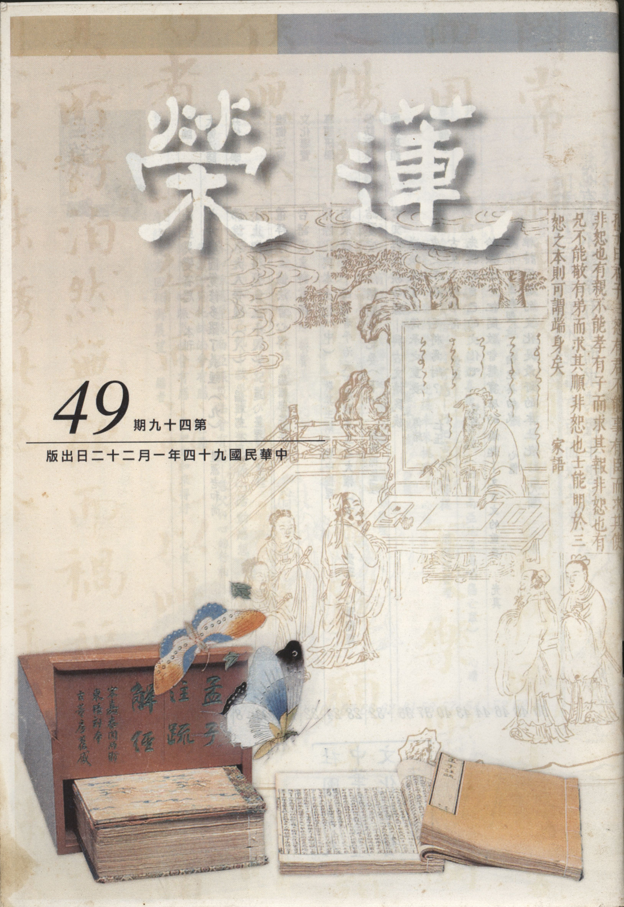

# 第49期

## 社論

### 南亞災變省思

本刊

莫謂災變我無關

隨業生起可奈何

發心利眾求加被

往生圓成菩薩道

十二月廿六日侵襲南亞的九級強震，為二十世紀以來規模排名第四的強震，而海底地震所產生的波動，因其傳播時速可高達一千公里，在毫無預警的情況下，產生的海嘯造成了斯里蘭卡、泰國、印尼與印度等地有數以萬計的民眾罹難。而這些國家半數以上外匯來源的觀光景點也因此次的災害而滿目瘡痍、百廢待舉。

生活在幸福的國家裡面其實是有好有壞，好處是生活安定、飲食受用具足、錢財的受用極為豐富，人情來往十分歡樂。打開報紙看到那些富裕的國家（包括台灣），在九十三年底的跨年歡樂，好像世界沒有發生過這場災難，災難似乎離我們十分遙遠。但是想一想，如果今天是我們國家受到這樣慘痛的災難，打開報紙時卻看到別國在舉行跨年度的狂歡時，內心會作何感想？雖然受災的國家有人道的支援與救濟，但救援者若無法發揮人同此心、心同此理的惻隱心，僅著重於物資的救濟，是無法從災難中對於國際的和平有所幫助。

護持苦難的眾生除了物質的護持外，重要的是生起同理心，他們有可能是我前生的母親，或是我唯一的愛子，當他們在受苦受難時，我們那裏生得起這些世俗的狂歡。地藏菩薩的母親往昔生中墮在地獄，那種痛苦比這次的災變中受苦受難的有情更勝多倍，此時作為地藏菩薩前身的光目女 （或婆羅門女），除了供養三寶祈求救護以外，更發起殊勝的菩提心，藉著如此的努力，將他的母親從苦難的地獄中救拔。所以此次災變我們除了隨喜世界各國物力的支援與人力的投入外，個人更應該在教法上勉力體會，努力興起大慈悲心，用這樣的功德回向他們作為救援的增上緣，方是根本之道。

就機率而言，我們未來也有可能會面臨這樣的慘狀與痛苦，這些未發生災變前的國家，他們的人民在生活的歡樂中，一定也想不到剎那的災變會發生在他們身上，所以生在娑婆苦難世界，當發起出離心，倘若這一次南亞的災變，我們無法得到覺受、教訓，那當我們讀到三十七道品的觀身不淨，觀受是苦；或者八大人覺經的世間無常，國土危脆；或者祖師開示的厭離娑婆，欣求極樂；或者無量壽經提及有情眾生所處世間是五痛五燒等等，又如何能生起覺受呢？

學佛者有兩種行相，當避免之，第一種就是大德說的「生牛皮」，一點也不柔軟，修學多年，世間看法與習氣依然故我，內心毫無體悟。第二、皮下無淚、無血，名為修行，憐憫眾生苦的惻隱之心尚且不能生，還談什麼儒家的仁心，佛家的慈悲心？儒家的仁心、佛家的慈悲心無法生，學儒、學佛能有所成就嗎？地藏經云，閻浮提眾生，剛強難化，像山上的禿石，下雨時無法潤澤山上，所以長不出草來，我們有情眾生就是這樣難以度化，經云，我慢山高，法水不入。所以我們一定要藉著這次的災變，好好的引發惻隱之心、慈悲之心，將天災地變的警告及人世間的惡業，好好的警惕，並且發願要像佛菩薩一樣的利益有情，且要成就佛菩薩的能力以利益有情，而眼前有情眾生的痛苦必然是我們要學習體會的，依這些有情而發菩提心，他們得度的因緣都能成熟，而我們也能真正的利益他們。

整個世界都是息息相關，不要以為災難離我們很遠，跟我們無關，所以以冷漠的心情面對，也不可以生起幸災樂禍的心情，亦不能當成只是報紙、電視、雜誌上的資訊獲得，要知道這種共業是輪流的，機率是普遍的，或者今天發生在甲國、或者明天發生在乙國，或者發生在歐洲、或者發生在亞洲，也有可能發生在自己的國家，我們應當用怎樣的心態來體會這樣的災變？除了發起出離心、菩提心以外，還有那些應發而未發的心態？尤其在臨命終即將遠離我們親愛的家人、功名、財產、榮華富貴等，我們將如何面對這樣的情景？我們將如何面對我們的未來？就像面對災變，如果所有努力的成果都化為烏有時，我們當如何走向未來？有情眾生的哭喊、流淚、懊惱、失落，這些呼天搶地的畫面，是不是三途的有情皆是如此？他如果是我前生的母親，我當如何在報母恩的立場來提攜他們？

遭受海嘯、地變災害的這些國家面臨的是同一個共業，但是在共業當中亦有別業，即如斯里蘭卡一列前往首都可倫坡的火車，僅有一人鎮靜的爬出車外，逃離死難，為何在千餘人乘坐的火車遇難時，僅他一人逃出？除了當下的鎮靜以外，觀待他平常以及往昔所修的善業就很重要了，此乃共中的別業。

我們未來或許會面臨許多共業，以及共業所生的果報，我們現在努力的修學即是創造自己的別業，團體一起修學就是共業中的小共業，將來顯現的果報即如同世界的災變當中，有的國家並未受災，此即是大共業中的小共業。所以共修的力量不可小覷，一般學佛時或許忽略了共修的重要，或者遲到、或者早退、或者來結個善緣，或者念佛並未入心，雖然造的業並非一般世俗的業，但是在整個小共業中，因為未努力成就一番小共業，所以即使未來在普遍受災中，另處其他樂土，亦無法得到很好的受用，所以吾等應當好好講究善共業的修學，善共業的造作有時甚至比自己私下的修學（別業）還要重要，如同廣欽老和尚曾說，在僧團當中懂得為團體（為公）發心，這比個人私下的用功還要重要；如周利槃陀伽的開悟，不僅是私下的用功，更是以服務僧團累積資糧而成就的。

在楞嚴經廿五圓通當中，許多菩薩與阿羅漢的示現，都告訴我們修行應當要如何修行才是善巧，我們要尊重這些聖者的示現。又好比我們未來也要到極樂世界，我們到那樣的環境當中會有怎樣的遭遇？那裏諸上善人很多，世界非常寬廣，但是各人也有各人的走向，有的人會很快速的成佛，有的人會慢慢的成佛，我們須好好把握在娑婆世界這一段的努力，我們每一個起心動念、每一個造作都會影響我們的未來，而我們未來的走向都觀待現在的努力，所以應當要好好的過這一段有意義的人生，好好的活在當下，尊重每一階段的示現，更要在共業當中求別業，在團體的共業當中要造作那善淨的別業，且更努力護持團體的共業，不但能在未來大時代共業中有其殊勝別業走向，並且也容易進入殊勝的共業環境當中。有的人曾在共業中造作過別業，所以感應此次在海嘯巨浪中存活下來，但是卻受用苦難的環境，但是有的人卻連這樣的業都不會生起，即是在過去生中曾經努力的創造過團體的共業，果報上即不會遭受大共業的苦難，眼前一切受用都是回應過去的業。所以有業的觀修，讓我們知道必須要努力過有意義的人生，好好的護持團體善良的道風，更勝於各人別業的斷惡修善。

在此迎接新的一年當中，希望有情眾生不但去除在輪迴當中的天災人禍的苦外，並能在三寶善知識的引導下止息輪迴的苦，得到解脫與成佛之樂。因災難發起誠心對有情的祝福，相信苦難有情能得到三寶殊勝的加被，走向菩提的康莊大道。

## 大德法語

### 大方廣圓覺修多羅了義經（九）如是我聞

*道源老和尚講授*

神妙莫測佛圓覺

現證二諦示淨土

凡夫受用安樂土

漸次引導成正覺

「如是我聞，一時婆伽婆，入於神通大光明藏，三昧正受。」

這個六種成就，「如是」信成就第一，「我聞」聞成就第二，「一時」時成就第三，「婆伽婆」是主成就，在其他的經上講佛，乃說法的主人。其次處成就，講經得有個處所，等於一個講堂。圓覺經與其他的經不同，本經是在淨土上講的（如來入法性源，現無礙境）亦即文：「入於神通大光明藏，三昧正受，一切如來，光嚴住持」，此時世尊（婆伽婆）入三昧，梵語三昧，華言正受，正受則不受一切諸受，受以領納為意，領納什麼呢？領納心外的境界，有能受、所受，或者受苦或者受樂。

此時所領納非世間諸受境界，就是苦受、樂受、不苦不樂受，通通不領納謂之不受一切諸受（所受乃空性境界），此三昧即是正受，此時佛就是入大定了！然三昧是通名，還要觀待是入那種三昧，所以別名很多，但圓覺經入的是什麼三昧？入的是神通大光藏三昧，神通者乃神妙莫測、通達無礙，然此時是佛的境界，不但凡夫猜測不到，二乘人猜測不到，連菩薩也猜測不到，故神謂之不可思議神妙莫測，如何是神妙莫測呢？乃因佛通達無礙故，此通達無礙亦是前述婆伽婆自在意。佛入此大定行相如何？通通是光明，這個大光明藏的境界裡沒一點黑暗，為什麼沒有黑暗呢？乃因將三界內、外的煩惱都斷盡了。煩惱、生死都是黑暗的境界，煩惱生死了脫時已無黑暗，完全是個大光明藏。這大光明藏行相如何？神通莫測，通達無礙，只有佛與佛才知道，等覺菩薩還不知道，所以是神通大光明藏。此時佛入此三昧是無入而入的入，沒有出入之相的入，亦即雖入而無能入所入。我們平常要修定，卻入不了所入的境界，修不了，入了定想出定卻不簡單（迷於定樂）！出了定後為俗務所纏，要入定亦無法。若功夫練得自在則要入定就入定，要出定就出定，出入自在了。然出入自在有出相、有入相，入到定是個什麼行相，出了定是個什麼行相，有出入之相。但佛入定出定是同時，沒有入沒有出，為什麼？乃因行住坐臥常在定，楞嚴經裏佛之楞嚴大定就是如此，行住坐臥常在定，沒有不在三昧之中，既然常在三昧還有什麼入個三昧？而那些大菩薩入定出定還有出入之相，就等於我們所見的應化身佛有生死之相。在四月初八，淨飯王的王妃摩耶夫人，在藍毗尼園伸出她右手，在右脅處生下了釋迦太子，成道後講經說法到八十歲，在婆羅雙林入涅盤，佛示現的生相、滅相，凡夫、二乘人等都看到了，佛沒有生滅的法身，以及無入而入（沒有出入相）的禪定境界，除了佛以外沒人看見。

「一切如來光嚴住持」

，佛入神通大光明藏，與一切如來是相通的，乃佛佛道同，不是我們釋迦佛才會入這個定，一切如來都會入這個定，我佛入了這個三昧，一切如來的光明莊嚴都住持這個三昧，這就是與十方三世一切如來相同、平等、無差別。

「是諸眾生清淨覺地」

，這一句話要特別注意，前邊你聽明白了沒什麼稀奇，釋迦佛入了神通大光明三昧，祂是佛當然神妙莫測，通達無礙，同十方如來的光嚴住持，那當然了，然與我眾生有什麼相干啊？釋迦佛入大光明藏的三昧就是我們諸眾生的清淨覺地，在圓覺經上講的是圓覺心地，也就是本覺理地。依大乘起信論，一切眾生都有本覺，事實上我們凡夫本覺在哪裡？看不見了！是在理上講本覺理地（圓覺心地），這個圓覺心地並不是諸佛所專用，一切眾生通通有，是諸眾生不是說一個兩個，諸就是一切的意思，一切的眾生心性覺地，所以此經是頓教大乘。你聽到這裡要迴光返照，釋迦如來入的神通大光明藏，就是我人本來具有的圓覺心地，此與釋迦佛無二無別，也與十方諸佛無二無別。你若大徹大悟 （明心見性），你就會悟到圓覺心地，也是神通大光明藏，亦即華嚴所說心佛眾生三無差別。佛的心與眾生的心沒有兩個樣子，十方諸佛這個樣子，一切眾生也這個樣子，心佛眾生三無差別！可是你不往這個地方用功，不往這個地方去追究，儘管具足清淨覺地仍不得妙用，眼前還是苦惱凡夫，所以一定要好好用功，要好好的追究，將本來有的清淨覺地悟出來。

以下讚歎入於神通大光明藏三昧正受之境界，所謂「身心寂滅，平等本際」，佛入了三昧，既沒有身相也沒有心相，入三昧是無入而入，是一個平等本際的行相，本際就是本來的理地，這個本來的理地就是人人本具，各各不無，平等不二，謂之平等本際。

「圓滿十方、不二隨順」

，這大光明藏之邊際為何呢？「圓滿十方、不二隨順」，此時三昧行相沒有出入相，平等無差別，平等無差別謂之不二，此三昧境與這個不二的境界是隨順的。依大乘起信論最後將最初一念妄動的無明（生相無明）斷掉了，若斷除生相無明，一念所知就遍滿十方，只因眾生妄想執著，眾生執著，越執著心量越小，在人道裡執著，執著身體就是我，執著到這個臭皮囊裡邊來，此時若能將生、住、異、滅諸無明之相通通看透盡，將無明斷盡，必能遍滿十方，不二隨順，與十方諸佛平等，與十方眾生無差別。以上四句是讚歎婆伽婆入的神通大光明藏，所入的境界。

「於不二境，現諸淨土」

，這個「土」字要念ㄉㄨヽ，圓瑛法師的講義也特別印上，老法師對字音很注意，是佛的清淨國度，此境界不是凡夫的境界，也不是諸大菩薩的境界，是佛的境界，佛的境也是於不二境現諸淨土，在那個身心寂滅之不二隨順的境界之中，現出了一個世界相，是清淨國土的影相，以上乃處成就，為六種成就之第五。（下期待續）

## 共修研學

### 小止觀導覽（二十八）第四章　調和

*蓮心整理*

食眠身息心五調

修學止觀好基礎

心如金剛不退轉

諸法實相能親證

經文

第四章  調和

經文：夫行者初學坐禪，欲修十方三世佛法者，應當先發大誓願。度脫一切眾生，願求無上佛道。其心堅固，猶如金剛，精進勇猛，不惜身命。若成就一切佛法，終不退轉。然後坐中正念思惟一切諸法真實之相，所謂善、不善、無記法，內外根塵妄識一切有漏煩惱法，三界有為生死因果法，皆因心有。故十地經云：「三界無別有，唯是一心作。若知心無性，則諸法不實。」心無染著，則一切生死業行止息。作是觀已，乃應如次起行修習也。

大意

廿五方便前已說明具五緣、訶五欲、棄五蓋，本章係說明調和五事，五事包括調食、調睡眠、調身、調息、調心，調和得所，可使身心安泰，保持修學止觀的最佳狀態，方能得益。

導覽

一、「欲修十方三世佛法者，應當先發大誓願。度脫一切眾生，願求無上佛道。」所謂欲是指以信心為基礎的欲，因為對十方三世的佛法有信心，相信離正法之修學無樂可得。要離苦得樂，一定要破迷啟悟，而欲破迷啟悟須皈依三寶，依師友修學正法，否則別無他法。若能建立這樣的信心，就會產生欲心，想要好好的體會佛法的內涵，得到真正的解脫和快樂。可惜世間人不明此理，縱情追逐五欲樂，在紙醉金迷中徬徨失措，在流金歲月中空虛寂寞。欲使內心對正法有覺受和體悟，須修學止觀方真正離苦得樂。然應有正確的動機和願力，就是「上求佛道，下化眾生」，下化眾生即四弘誓願中的「眾生無邊誓願度，煩惱無盡誓願斷」。其中「眾生無邊誓願度」是苦，「煩惱無盡誓願斷」是集，欲下化眾生，須上求佛道（上求佛道包括向善知識求教，也包括往生淨土向諸上善人及諸佛菩薩學習），因為德能具足，方能度眾，否則自顧不暇，遑論助人；上求佛道即四弘誓願中的「法門無量誓願學，佛道無上誓願成」，其中「佛道無上誓願成」是滅，「法門無量誓願學」是道。有此志向和決定見的人，才可以破迷啟悟、離苦得樂、自利利他。

二、「其心堅固，猶如金剛，精進勇猛，不惜身命。」是指欲修十方三世佛法，以度脫一切眾生，其心志猶如磐石，精進勇猛，猶如金剛，以金剛能摧破一切，而不為一切所破，故 雪公太老師云：境界突不破，是因為願力不堅固。因此行菩薩道處逆境時，應自問初發心尚在否？願力堅定否？精進如故否？並以此清淨的發心，善修止觀以證得諸法實相，得忍力（無生法忍）方能於五濁惡世、煩惱境強處度剛強難化之眾生，而不會退轉證量，最終能成就菩薩大願！

三、「若成就一切佛法，終不退轉。」不退轉就是精勤修習而得成就，依天台家解釋不退分成三種：

（一）位不退，別教的初住至七住為位不退，破見思惑，超三界生死，永不退失超凡之位。

（二）行不退，自第八住至十迴向之終為行不退，破塵沙惑，永不退失菩薩之位。

（三）念不退，初地以上為念不退，斷無明惑，不失中道正念。

四、楞嚴經中說：「有一眾生未成佛，終不於此取泥洹。」這是阿難尊者對釋迦牟尼佛說明自己修學佛法的動機和誓願。又云：「將此身心奉塵剎，是則名為報佛恩。」是指在所有的佛國淨土中，都願意把自己的身心奉獻出來，以利益眾生，而這才是真正的報佛恩。在勸發菩提心文中說報答佛恩最好的方法就是好好的發菩提心，佛是隨逐於我，心無暫捨，但我們卻一向忤逆，如果沒有發菩提心，佛恩是無從報答的，所以一定要透過發菩提心來利益眾生，才能真正報答佛對我的恩德。

五、「一切德行，非禪不深；一切覺智，非禪不發。」禪者佛心，佛心最殊勝處是空性智慧，止觀修學就是要引發我們和佛一樣的智慧，此乃修學止觀門的究竟處，所以在禪修之前，要有上求佛道與下化眾生的願力，要有出離心跟菩提心的決定見，如此才能將修學的潛力激發出來，吾人從生到死，潛力大概只發揮了百分之一至二，其餘的百分之九十九都未被開發出來，因為沒有願力去和使命感修學止觀去引發，才是德行和覺智的所在。
六、或
**問：** 佛菩薩應在三界內度化眾生，為何修學佛法立志作佛菩薩度化眾生者要獨處深山，遠離人群，修學止觀坐禪呢？因為度化眾生，必須「德高行備，覺妙智神」，德高是指智慧力，這個智慧力一定要靠時間的培養，在善知識的教導下好好的觀修教法；行備是指萬行具足，萬行必須要在智慧力的現起下才能具足，善法的圓滿要靠智慧去圓滿，天台四教儀云：「方等之後，次說般若，般若觀慧，即是家業。」般若時佛把般若正見力付諸眾生，般若就是佛的家業，佛最殊勝的財產就是佛的智慧，這個智慧如果眾生能夠具足，才能荷擔如來家業，利益有情。「覺妙智神」的覺妙是指具備去除煩惱障及所知障的能力，智神是指得到一切智、道種智和一切種智，一切種智是通達空性和緣起二諦，乃佛所成就的智慧。故高登海居士於佛家靜坐方法論云：「暫捨眾生，靜坐求道，如人有病，將身服藥，暫息事業，病癒則修業如常。佛菩薩亦然，身雖暫捨眾生，而心常憐愍，於閒靜處，得實智慧，除煩惱病，起六神通，廣度眾生。」所服之藥乃禪藥，禪是止觀非世間禪定，依止修觀能得到佛的智慧，除煩惱病，生起無漏的六種神通，方能廣度眾生。

七、小止觀所言的止觀，是指如來禪，如來禪與祖師禪不同，如來禪是明示修學的方法，讓行者一步一步的去通達諸法的實相，中間過程若有錯誤，也可以知道錯在何處，以求改進；而祖師禪是不立文字，全依止老師所傳授的修學方式，因此教者是否為正見的教授善知識是非常重要的，因為正見是佛法不共外道的。尤其空性正見是不可能藉由外道師長與典籍生起的，因此祖師大德或以如來禪的方式或以祖師禪的方式教化眾生，或將其對修學的體會行諸於文字，以著書立說方式教化眾生，這就是慈悲為懷的情操。

八、「然後坐中正念思惟一切諸法真實之相，所謂善、不善、無記法，內外根塵妄識一切有漏煩惱法，三界有為生死因果法，皆因心有。」正念思惟就是指我的內心好好去想到底何為善？何為不善？何為無記？以及三者的導向和因果的關係，發現這些因果關係都是從心造作來的，心的現起是靠著過去的心種，依著眼前的根，攀緣外面的塵，生起這樣的心，而眼前心的造作就是結成未來果報的因，也就是以煩惱為因，生死為果，這些都是被造作出來的，這些叫做有漏法，而有漏法又分為善、不善、無記，這些有漏法雖由心所造作，即便是心亦與境觀待而生，覓心尚且了不可得，觀待心所生的煩惱業又如何而生？內心安住在如此的義境（所緣境），這個叫正念（緣念空性的正念），乃直心正念真如，念念皆與法性相應，並將沉掉散亂等障礙破除，此即由初住位至細住位，亦即由念至定的行相生起，此正念任運相續就名為定，即專注力的成就相，亦即緣空性所生禪定成就了。

九、思惟有三種：

（一）第一種思惟是止的前方便，是幫助你在入定前的思惟，比如在念佛前，先想佛號的功德、念佛的目的、念佛的使命感、念佛所要對治的煩惱，透過以上的思惟決定要好好的念佛，此時將心緣在佛號上，不要去分別到底念阿彌陀佛有多少功德，只是抓住這個佛號，不必分別，這就是正念。

（二）第二種是指在止中，若有昏沉、沉沒、掉舉、散亂的現象，要藉思惟去推動正知找尋方法對治上述現象，使正念相續。

（三）當三昧力成就時，回過頭來再思惟，這個思惟名為觀，比如念佛者觀阿彌陀佛四十八願以及與淨土的關係等；又如在色蘊中成立空性，再觀受想行識等蘊是否了無自性？若經思惟發現都是如此，透過觀門發現萬法均無自性可得，出定時對世間幻化的覺受更為強烈，如金剛經云：一切有為法，如夢幻泡影。

十、道次第論云：「如調象喻，譬如於一堅牢樹柱，以多堅索繫其狂象，以正念索縛於所緣堅柱，若不住者，以正知鉤治罰調漸自在轉。故中觀心論云：『意象不正行，當以正念索，縛所緣堅柱，慧鉤漸調伏。』」 大象比喻為妄想的心，樹比喻為所緣的境界，繩子喻為正念能將心繫縛在所緣的境界上，狂象是昏沉、掉舉、散亂、沉沒，以鉤為正知之喻治罰大象是藉正知將心念緣在所緣境上即正念。比如做晚課時，行者可以自我告誡，我現在要調和我的心，因為我的心就像喝醉的狂象，所以要用正知的鉤使這個心慢慢的調伏下來，才可安住在所緣境上（佛號），如此方謂老實念佛，在念佛當中可能有些心念已經衝出去（粗掉）或內心昏暗（昏沉）或有想要衝出去的心（即細掉），就如同大象不安分一樣，所以我們不僅要注意已散已掉（粗分），也要善於對治將散未散、將掉未掉（細分），否則這些過患，將使你停滯在欲界定，甚而不修還好，愈修愈與三途氣氛相應，而無法進入色界定。

十一、慧遠觀經疏：「捨相入實，名為正念」就是從相上去思惟空性，破除相的自性，所以入實即是入空性，這是指對空性的緣念，當你一個一個去尋覓和思惟法的自性時，發現萬法都沒有自性可得，去鎖住這樣的義境（空性），如像貓在捕鼠、雞在孵蛋、又像鑽木取火，此時燒掉煩惱柴薪的火花就慢慢冒出（四加行的修學法），當成就聖位依根本智亦即生起現證空性的智慧時，重緣世俗時幻化的感覺就出來，誠如廣欽老和尚所說：我看世間就像在看電影一樣，沒有一樣是真的。因為所有緣起法都是互相觀待，沒有因緣的造作、相互觀待、名言的安立，萬法何在？所以都是不實在的，對緣生如幻的世俗假法怎麼會生貪呢？怎麼會生瞋呢？

十二、「正念者，無念也。無念之念，是名正念。」 行者在證悟空性時，無一法可得，則無所念的境，何來能念的心，稱之無念；能所雙亡，如水投水，已無能所之分，此之心念才是真正的心念。（下期待續）

### 佛說八大人覺經講記（八）入聖流之修學法

*編輯部整理*

現證空性生見道

漸離生死入聖流

涅槃不遠必到達

堪能應供三界尊

表上之「虛偽無主」為本表最重要的概念，由第一覺之觀修所要證到的是人無我（虛偽無主），亦即無有獨立自主的我（無主）與真實的我（虛偽），不過是觀待五蘊而有，是名言安立所成，所以提到表之最上。四大及五蘊假合的身不真實，所生起的我是觀待而有，無真實性可得。亦即由世間無常、國土危脆的觀察中，生起對三界的厭離，進觀於四大、五陰所生的人我也是了不可得，不過依名言安立而有，亦即虛偽無主。國土、世間是我們依報環境，如不知於外，如何知於內？所依存的環境尚且變動不拘，安在此上的五蘊（如沙洲建塔）還能天長地久嗎？我所安立的生命現象只不過是因緣和合、暫時的，隨過去的善惡業而受用種種苦樂報，在此之上安立的名言我不過假名無實，而強立有我，欲求我之離苦得樂不惜起貪瞋癡，造種種罪業，結果苦上加苦，輪迴不已。所以 雪公老師要把虛偽無主高高掛在上面，免增誤會，說明世間、國土、四大苦空所要引導的就是這個概念，虛偽無主所要攝持的就是下面的苦空無我。

苦是生命現象的本質，空是指它沒有實在的自性，眾生都是妄認有自相（自性）而生種種愛憎，由此苦因而生苦果。

如此觀察就能漸離生死，可是我們為何無始來不曾離開生死？就是不肯用這樣的角度看事情，不肯從無常的角度看世間，不肯從危脆的角度看國土，不肯從苦空的角度看四大，不肯從無我的角度看五陰；在世間的國土以及四大五陰中看不到它的生滅變異，在四大五陰所生起的我看不到它的虛偽無主，這時候要心不起心動念執著起惑造惡業也困難，想要離開生死的苦更是難上加難。

而這個概念為什麼很容易幫助我們對治煩惱？因為我們的煩惱都來自於看不開，而且最大的煩惱就是我相的堅執，世間要爭強、國家要鬥爭才能壯大，人類要競爭才能生存，我自身則要努力奮鬥才能生存……，這些爭強、鬥爭、競爭、努力、奮鬥中有很多自私、自我的觀念夾雜，例如在機關上班，沒有他人的考績乙等那有我的考績甲等！政黨競爭也是在權謀下，聯絡次要敵人打擊主要敵人。

德烈莎修女在印度創立垂死之家時，她要義工先把自己變成窮人，來服務窮人，因為放下自己的優越感以及體面的驕傲，才能將心比心去體會他人的苦，好好地為他人設想，若能進一步以空性智慧去除我相，必能斬斷種種的自私煩惱，能成為為公發心的助緣。

結言

此第一覺悟符合佛之三法印，如世間無常，國土危脆，四大苦即是諸行無常（有漏皆苦）法印，依此法印引發出離心，四大空、五陰無我的觀修能得空性正見，此即諸法無我的法印；由此而得涅槃寂靜（法印）。是故觀說法者說的是不是佛法？要看此人所說的是不是符合三法印？如果符合三法印就是佛法，如果不符合三法印就不是佛法。若是符合三法印即使是凡夫說法亦等同佛說，在佛學辭典裡有五人說法（佛、弟子、仙人、諸天、化人），所以不只是佛說的才是佛法，上述五種人說的都是佛法，如善財童子參訪五十三位善知識中，有一些示現是外道，當他說的是符合三法印時就是佛法。行者在生滅變異的有為法當中，有為法就是法之生起必待造作，循著生異滅（生滅變異就是生異滅）而行，在生異滅的有為法當中，行者了解五蘊（有為法）上安立的人我是虛偽無主，虛偽是不真實的，無主就是做不了主、沒有自性的；安立的人我不能是常、不能是一、不能自在，且非獨立實有，且其自相本空不過是名言安立，此之教義是了義的三乘教。

因為不了解法是虛妄的、人是虛妄的，所以執著。「心是惡源」乃心執著法我、人我有自相，因執著而有煩惱，依煩惱而造業，所以說心是惡源。「形為罪藪」是由身體去受報應，罪藪就是罪業的聚集地，身何以是罪業的聚集地，乃因往昔所起惑業聚集此身，由惑業感苦，身體是感苦之器，以身去接受痛苦，所以在經論上說身是苦苦器、是壞苦器、是行苦器，是接受痛苦的器具，老子云：「吾有大患，唯吾有身，苟無吾身，吾何患之有？」所以有此有漏五蘊之身，就代表要承接過去惑業所結的苦果，當我們每一個人顯現五蘊的生命現象時，到底要慶幸呢？還是覺得可悲？不學佛的真可悲，學佛者則慶幸，因為可藉由此身酬償惡業，藉由此身修學善法，因為酬償惡業，所以惡業可以消耗，修學善法所以未來可以得樂。是故有了身體就要好好地善用它，不善用它時真的很可憐。

「如是觀察，漸離生死」，漸離生死是因為通達空性，所以漸漸離開了生死輪迴。沒有通達空性的人，生死的苦果完全沒離開，即使修學四禪八定，在世俗上有很高的證量，也有很多追隨者，或者著書立說，而有多如牛毛的信徒；其實他連微塵許的我執都沒對治到，煩惱的根本（種子）也從來沒斷過，所以不可能不起惑，既起惑則能造業，能潤業，苦果不可能不生。依著這樣的修學來引導徒眾出離六道，是一盲引眾盲，相牽入火坑！（下期待續）

## 專題研學

### 國際化與本土化〜青年人應有的格局（中）

*敬其主講、智中整理*

掌握資訊前瞻眼

觀待語文通古今

傳承正見續慧命

能攝深廣是文言

我們常說現在是一個資訊的時代，在資訊的時代裡誰掌握資訊，誰就勝人一步。試問資訊如何掌握？得靠速度！所以電腦會一直追求速度，而我們也追求尋找和吸收的速度。第一是尋找資訊，第二是吸收資訊。吸收資訊還得要會判斷資訊，或可到大學以後，學到了各種分析、判斷的方式，一般在國高中階段是以吸收為主。現在雖有啟發式的教學，讓大家發表發表對事情的看法，雖然大家可以自由發表意見，但大多數事情不是那麼簡單的。

我記得以前在法國時，他們的教育是以做報告為主，而不是隨意發表意見。須依據所出的題目整理報告，到圖書館裡面找尋資料來做報告，此是吸收的階段。到高中以後，才漸漸的加上討論，然後發表自己的意見。所以在中小學的階段是以吸收為主，雖然有的作文不錯，但深度還是不足。若論到吸收資訊和知識，就要靠語文，有兩種語文是不能不學，一個是自己的母語，一個是外國語。在自己的國語中特別要加強文言文的學習，假如大家要讀古代經典時，那就需要文言文，否則文化則無法接續，這個國家就談不上深度、談不上繼往開來。

我們現在所讀的佛經也是文言文，各位皈依佛門若連個佛經都看不懂，如何傳播佛門的思想？佛經裡有許多文言文寫得精簡淺顯，一般大眾很容易接受，偈頌是佛陀開示法義時，說了一段解釋，再以偈頌的方式（如古詩般），將剛剛所講的義理用精簡的方式再重複一次，一方面讓聽眾容易接受與記憶，另一方面就是再強調一次，這是佛陀的悲心。也許會有人問，為何不用白話文？民國初年胡適之先生不是在大力提倡白話文運動？事實上白話文有許多的缺點，不但無法用少文表達深義，有時長篇大論也無法將意思說得清楚明白。且會隨著時間改變用詞，譬如現在年輕一輩講的白話，有時已讓人聽不大懂。若用文言文則千古不變。各位看的論語是兩千五百年前的典籍，沒有變過，稍微訓練一下各位就看得懂，不難！但是需要花點時間訓練。所以想要懂自己文化的東西時，首先要學習自己的文言文。

文言文在整個世界歷史與文明中，是一個偉大的發明，外國文字裡面絕對沒有這種結構，文言文的創造就是精簡，不因時代的用詞、用語而有所改變，即使有時代的產物，也可以註解。所以除了自己的母語要好好學習以外，另外加上一個外國語〜英文，依目前的狀況，英文是整個歐美洲語言中最容易的語言。

我可以稍微介紹其他語文，如我所學過的法文與德文，例如法文之任何名詞都有陰陽性，譬如桌子是陰性，玻璃杯是陽性，這個要死背。再則是法文的動詞變化，你、我、他、我們、你們、他們，六個人稱就有六個動詞變化，光一個現在式就有六個變化，一共有十二個時態，所以一個動詞最飽滿有七十二種變化，要用背的，於是其文法當然複雜。英語在相形之下就顯得簡單多了，至於德文有三個性〜陰性、中性、陽性，我學德文也是很苦惱，法文說桌子是陰性，德文說是陽性的。至於陰陽性從何而來？他們說從拉丁文而來，從拉丁文怎麼會同一個東西不同性呢？法文從前也有中性，後來將中性歸到陽性去。所以各位不要認為英文難，英文是最容易的語言，大家比較能接受，所以能成為世界性。十九世紀是英國人的世紀，二十世紀是美國人的世紀，所以英文是必學的語文，基於上述理由，學英文心理上的障礙要除去，雖說語文是工具而非學問，但它的重要性在於它可以讓人認識很多內涵，不只能吸收各國的知識和時事，尤其是文化上的內涵。

各位在求學的過程中語文要加強，加強之後吸收資訊的範圍才會廣大，當吸收的資訊越多時，會增加自己本身的本職學能與判斷力。前面說很多人將他的心得放在網路上面，當靠著語文吸收那麼多資訊，經過一番整理之後，變成自己的體會時，視野就擴大，這就是國際化先決的條件，亦即要有國際的視野，要了解人家在想什麼，不是自己想什麼人家就跟著我們想什麼，那是錯的，尤其是國家領導人，更不能犯此錯誤。今天假如我是甲國人，乙國發生某一件事時，我如何設身處地去了解乙國的反應？要有什麼樣的處理方式？這牽涉到乙國的文化、民情，才會有正確的處理方式。假若我們不去做這一步，就憑著自己的觀感說別人是錯的，那這樣永遠是井底之蛙、不會國際化。

我們今天看國際上發生的事情，要看它互動的關鍵在哪裡，國際間的互動只有利，這說起來很遺憾。在《孟子梁惠王篇》中說：「王何必曰利？」但國際間的交往就是利，所謂正常的外交關係是在當地國爭取自己國家的利益，通常是做企業的先鋒。美國與歐洲在外交工作上做的很徹底，這就是國際化。

講一有趣之事，我有很多電腦的軟體，看中文不懂意思，但英文一看就懂，這不是要炫燿我的英文有多好，或許牽涉到一些名詞術語，我們沒有建立標準、或是翻譯的理工人員中文不好，令人看不懂，反而看英文一看就懂，不需要多做解釋。日本人今天會成為科技大國，其中一項因素就是他們勤於翻譯，所有很好的東西通通都在翻，今天大陸也在做這件事，台灣沒有做，所以看不到中文的著作。

**問：** 如何將英文學好？

**答：** 先依學校課本、上課認真聽講；其次吸收課外資訊時要貴精不貴多。如讀外語雜誌中，先看有興趣的議題，像是新聞或是廣告，從第一個字到最後一個字，把每一字句都認識得清清楚楚，以一星期看一篇是足夠的，這樣的學習外文會進步的很快。

在外語的學習中每一句話都有文法，我們每天背文法背得很累，但只要將這些句子念過去，每一句裡都有文法，以學校老師教的文法，去印證那些課外文句的文法，有問題去請教老師。這些的學習是貴精不貴多，不但吸收知識，也磨練語文，這樣的腳踏實地，語文程度就會提高很多。因為語文所詮釋的上至天文，下至地理，無所不包，在一開始我們不可能通通學，因為專業知識不懂時，即使把單字全部查出來也未必能懂裡面的內容，所以一定要從自己的專業知識配合語文才會快。如今日商品的使用說明書中，最少有中文和英文，就從這裡開始。先把使用說明看清楚，這樣對於物理、電子的常識就增加，常識增加有時可以增加判斷力，在選購東西時，可以依據它所設計出來的東西，去判斷另一個產品是不是比它的功能好；近一步對照中英文，則英文也在進步，就從買東西開始。所以學語文俯拾皆是，就看會不會利用。知識學到，語文也進步，不需要花很多錢嘛。

**問：** 在國外三年的期間，舉國千餘萬人民中只有您在學佛，試問如何持續？因為現在這些同學也是課業繁重，要如何不放棄與兼顧？學佛對他們切實的好處如何？

**答：** 有很多祖師大德都有做很深入的分析，假如人生一開始就建立起正確的觀念，會使所有的學習都變成有意義的學習，康德有一名言：「假如方向搞錯的話，一切的天才都是白費。」 所以各位在求學的階段，立足點和方向要先建立起來。例如到共修會聽儒佛課程，是否抱著歡喜心，還是不情願？在我來說學習儒佛知見有絕對的價值，尤其學佛之前要學會做一個堂堂正正的人，人都不會做，如何成佛？或說不想成佛，不想成佛沒有關係，須先學做人，如何學做人？所有標準全部在論語和四書裡面。

如果今天還有人講儒學那一套是臭老九的學問，那是絕對沒有資格，尤其民初發起五四運動那些學者，甚至包括共產黨等等。為什麼？兩千五百年前的所流傳的文化，中國歷經了兩千多年的考驗，假如不好、不能適合人性，何以二千多年的歷史都在流傳，這些文化歷經各種變革都沒有被廢掉，輪到廿一世紀的中國人有何資格廢掉這些傳統文化呢？不可能！我們沒有這個資格。舉例言之論語為何會被我們接受？因為是從中國人的天性與民族性出發，是很自然的呈現，而非一種硬性的規定。內容中最重要的是表彰人倫的關係，亦即現在講的人際關係，將人際關係分成五種：君臣、父子、夫婦、兄弟、朋友，從這幾個人與人的關係好好學習，就能將人做好。所以在社會上如何扮演好自己的角色？如何跟別人互動？都在論語上有清楚的詮釋，絕對不要把這傳統文化看成是臭老九的學問。做好一個人之後，就有成佛的資格，若是大家對佛學還沒有感應 （善法欲） 的話，我是鼓勵大家先做好一個人。

**問：** 如此上課會不會很辛苦？

**答：** 不會！我很高興，在國外反而覺得很苦，因為沒有同修一起共學，只好勉強自己不要懈怠，有時就藉著拜佛來修學，以音樂配合佛號來拜佛。拜佛是很好的運動，並配合自己的呼吸，可以慢慢拜，就像打太極拳一樣。總之有健康的身體，才有健康的心理，有健康的心理，才有健康的生理，二者互相觀待。（下期待續）

### 自由錄宣～和平者平治天下度脫眾生之大權（下）

愛蓮、心雅

儒佛正見在精神能令遊善流

社會風氣淳厚後天災人禍以潛消

他世受用此生空閒慶子孫代代享

若能迴向安樂土彌陀相迎離五濁

因果錄序　印光大師　因果報應記錄（或佛法因果記）

前言

（殷廣法師）

11.宇宙之理大發明實維佛經，而儒教經書亦常宣說。

因果報應法其實是在佛經中有所揭示，在儒家經典中也有廣泛的含義。

12.若書之作善降之百祥，作不善降之百殃與洪範五福六極之說。

正如《史書》所言，〝……以善報應，以善報應，以惡報報。“的書偉大的計劃還指出報應的後果「五種類型的財富和六個四肢。」

13.及之易積善之家必有餘慶，積不善家必有餘殃。莫不皆以報應之理示之人。

在易經說， “ ......好運氣要高興將重視與滋補行善的傳統家族譜系的後代的獎金; 而過分的厄運會附在世家子孫身上，惡業累積。”畢竟，這是因果報應法則如何影響人們的示範。

14.但如果言若言簡略現說及與孫只漏詳言過去現在未來輪迴六道三途，事之不研深精思或致當面想。

報應的簡單推理，只描述了今生的報應和對子孫後代的影響，而沒有詳細說明過去、現在、現在六界三道輪迴與轉世的因果關係和後果。未來的生活。如果人們不徹底深入地研究因果律，他們就無法認識到超越輪迴（samsara）的重要性。

15.兼以俗儒每欲各豎門庭與佛競異縱令之亦不肯畫。

此外，庸俗的儒家也一直強調儒家與佛教的差異，企圖建立自己的儒家教派，故意與佛道分裂。儘管他們中的一些人知道兩者的共同點，但他們拒絕成為佛教倡導者。

16.賢賢者莫由樹淑世善民之極功，愚者悉皆弱肉強弱之惡念，由茲互相攻擊成千未聞之劫。

因此，沒有這樣的基礎，聖人就無法達到培養誠實人、建設正派社會的最大成就。無知的人因此會信奉邪惡的思想，依靠叢林法則；從而導致人與人之間的激烈鬥爭和相互攻擊，使前所未有的殺戮劫浮出水面。

17.被殺者人固知其可慘，而殺者之慘當更酷烈萬倍，惜世人不能深知悉見，其見者，若被人殺，若滅門絕殺千萬分二分之一耳。

被害人的不幸下場令人痛心，而兇手的下場更悲慘。因此，兇手要承受受害者一萬倍的痛苦。地球人無法預見和理解兇手將要承擔的可怕後果。如果人們能夠預見，他們就會知道，家庭屠宰的受害者的痛苦可能是被屠宰者所承受的痛苦的一兩千萬倍。

18.其在三途所受之苦，則是竹難書矣，可不悲夫。

屠戮者在三道中所經歷的痛苦和折磨是無法形容的。在這樣的情況下，會有多慘？

19.吾常間曰晝者，世出世聖人平治天下度脫生之大權也。

我一直說的業報，應該是指地如天上的大能。這種能力使睿智的領導者能夠為世俗世界帶來和平，並幫助所有眾生擺脫輪迴的束縛。

20.即聖教昌明之世若不顯現，尚不能普令愚民潛息隱惡悉使智者大積陰功。

即使在佛教鼎盛時期，沒有因果律的倡導者，天真的人也難以擺脫自己的惡行，聰明的人也無法通過善行積蓄功德。

21.況今世世道人心壞至其極，棄聖、同載兄弟，邪說橫流胥其思溺。有心道者，挽回狂瀾，若不以世報報應為震聾發瞶之資，雖佛菩薩聖賢悉意世亦莫如之何，況其下焉者乎。

在當今道德淪喪的環境中，人們的心已敗壞，心思雜亂。他們放棄了教導的經典，顛覆道德準則，並導致惡念溺水他們全部刷新。一些精力充沛的人決心重新引導人們進入正確的道路，努力扭轉潮流。他們要做的第一件事就是求助於因果報應法則，作為一種足智多謀的工具，可以糾正錯誤和啟發思想。沒有這樣的道理，即使菩薩化身再現，古聖也無濟於世間的人，更何況是低等智者。

22.無錫金居士昌世有見，特記錄近及現時各有事排印流布。

江蘇省無錫市的金西昌先生，一位僧人觀察到了這一現象，將問題歸結為因果律在民間的傳播。他收集了當代故事和因果關係的記錄，並將它們彙編成一本小冊子——《報應錄》，即將出版發行。

23.冀人人各懷自利利人之心以行己立立人之道。

陳先生希望大家都能珍惜自己的利益，成就他人的利益；並通過支持他人發展自己來實現自力更生。

24.則習尚正而風俗淳淑，人禍息而眷類常臨。舉此戰士同作羲上人。

也就是說，幫助建立一個尊重良好習慣和誠實習俗的社會。人為的災難將停止，天意變得頻繁。我在這裡說誘導智力的智慧可能有助於實現我們古代正義國王時代出現的理想和諧世界。

25.因序其大意以貢閱者。（完）

前言作為獻給讀者的禮物，應該是對讀者的引導。（完）

## 啟蒙專題

### 古文與民族命脈　興古文續民族　緣起

*編輯部*

先民思想在文言

能令學者開見地

繼往開來大格局

近悅遠來平天下

緣 起

中華文化博大精深，歷數千年考驗而成，是炎黃子孫最大的資產，更是建立人格、成聖成賢的依歸處，然民國八年五四運動後，白話文學的倡導、乃至歷年來歐風東漸、新文風崛起，文化遂至沒落，人心不古，吾人已然成為失學的一代，而失學之人又如何教化下一代？在此文化傳承青黃不接之際，應是吾人靜心思惟的時候了， 雪公：「生為中國人，必須有中國人的風骨。」「想要中國再延續下去，必得落實中國文化。」又言：「咱今在此乃是風雨飄搖，若台灣不存，則是天欲滅道德仁義。天欲滅中國文化，是天之將喪斯文也。」

故欲存天理，須先復興中華文化，欲振興文化、扭轉風氣必得從自身做起，從珍惜文化、深入文化、維護文化、傳承文化做起，更應有計畫的栽培下一代，因為教育絕非一蹴可及之事，所謂十年樹木、百年樹人，有三代的基礎，才可望造就出類拔萃之人才，且蒙以養正聖功也，我們必須讓子弟學有所承，所以必須重拾經典之教育，讓子弟能從小深入經典，更應將此文化教育加以推廣，不唯自己子弟的培養，更要匯集大眾之心力，挽狂瀾於此道德淪喪之際，將文化重新扎根，如此才能夠扭轉此已荒腔走板的社會風氣。

心靈成長營十一月返班即以「如何維護文化之傳承」為專題，藉由師長與家長們的熱烈討論，由文言文的重要性，論及古文經典與文化的關聯性、現前教育的缺失與隱憂、以及文化教育的當務之急……等，引起師友們廣泛的討論與迴響，相信此間所能探討的範疇應更為深廣，故於此廣邀各方蓮友大德就此文化議題作更進一步的探索，感謝各方所惠賜的文稿，會刊將於近期陸續刊登。欲以諸文拋磚引玉，期能引發各界對文化再次的思惟、重視與認同，更祈願藉此能重振經典教育以延續民族之慧命，莫讓五千年的文化命脈斷喪在吾人手中！

### 古文與民族命脈　興古文續民族　淺談文言文傳承之重要

傳緒

文化遺產乃文言

琳瑯滿目遍各行

重要在於開見地

品格學問文章成

一、前言

寰宇各國，今人能披閱二千年前古人之文章，且卷帙數量龐大，蔚為文化遺產，中國必屬其一。每思及此事，直歎不可思議，更覺殊為難得。一個古老民族之所以博大精深，不啻是時間長遠，有古物出土；更重要得仰賴文獻之積累，因那是在人類歷史長河裡，先民篳路藍縷之歷史經驗。中國文學能綿亙數千年，代代推陳出新。祖先遺留之典籍，供後世子孫立身處世之借鏡，誠發揮一定之功效。而曩昔之遺冊，所載名為文言文，拒讀它、少讀它，可謂一己之損失、社會之失落、國族文化之遺忘。常言道人類歷史之演進，由漁獵而畜牧、農業、工商業、資訊社會等，處今日資訊社會，可一刀兩斷將之前之發展型態割棄嗎？曰：當然不能；而文章者乃語言另一型式，傳道者宗乎文以載道與明道之說；上焉者謂經國之大業，不朽之盛事；下焉者吟風弄月，介乎其間，經世致用。芸芸眾生，處於其中居多，而古人文章以文言文呈現，不論詩賦誄贊對問，乃至章表奏檄史傳書記統稱文言文，以別於時文之語體文，依理而推，今人讀前人之文章，正如同資訊社會與農工商社會，乃至於漁獵畜牧並存，有何異也；爾來乍聞降低文言文之份量，乃至心存廢存，實不足取，但述一己之淺見於後，祈關懷者有所指證。

二、不薄今人愛古人語云

陽光底下沒有新鮮事，老杜曾作「戲為六絕句」，其中詩句寓含之理念，頗值時下私心對文言文存廢之借鏡，如目睹初唐至盛唐之詩風演變，但並未排除四傑，其詩句「楊王盧駱當時體……不廢江河萬古流」，更上溯肯定「庾信文章老更成，凌雲健筆意縱橫……」，又暢言「不薄今人愛古人」，是以為學子選文定篇，決不宜廢古文。杜子美何許人？唐代詩聖，人所皆知，雖名戲作，不難看出其成聖之取材途徑，尤其是「轉益多師是汝師」之至理名言，正與聖人無常師之重言相呼應，經千古汰棄遺留之文章，莫不是經過千錘百鍊而成，無論詩詞歌賦駢體或古文，一篇篇佳文，皆是神遊之經師或人師，近代文人或今人之文章，畢竟未經時間之洗禮，良莠不齊，故以古文為師勝於今文，其理至為明顯，幾十年來文言文之比例因不夠高，故強仕以上其語文能力每況愈下，此其因之一。若依目前國文課程暫行綱要之規定，由原先百分之六十五再調降為四十五，文化基本教材由必修改為選修，其江河日下是可預期的啊！非一己之私意，近聞千餘位從事國文之教師連署反對此一舉措，更有三所大學中文系主任連袂向教育官員進言，未來發展趨勢雖未可知，恐難挽其狂瀾吧！

三、閱讀次第

閱讀應由淺而深，由泛覽而欣賞，由記問而義理，此蓋學習之階梯，體會文章之津梁。就個人對閱讀能力之淺薄知見，終其身不細讀大部書，不精讀經典，要能培養有深刻獨立之思辨能力，進而發為宏言讜論，止於利益人群之不刊鴻教，蓋亦難也。而閱讀知解深度由小學、中學而大學，古文之比重，亦應隨之水漲船高，本無庸置疑之論調，怎會弄得擾攘不安，噫！怪哉！此難道繼貪婪島之台灣經驗嗎？一般認知，文言文無論內容、文意、修辭、結構、章法、字義均深於白話文，不增加文言文之比例，是否意味閱讀之怠惰？

四、愛之適而害之

孔聖垂訓循序學習之道，由困而知之、好而知之而樂而知之，此百代學習之共法，除少數上知者或可躐等，莫不依此而漸進入學習佳境，明乎此，迎合、疼惜甚至溺愛學子，只因學習文言之艱苦，未能趁時讓其學習古文，愛之適而害之。蓋學習任何世間學問，未有立即嘗到好知樂知之境地，莫不是長時間困知勉行，再三突破瓶頸，學習古文又何嘗不是如此呢？快樂學習之口號，正如包著糖衣之毒藥啊！

五、無用乃大用

詆毀古文，莫大乎學文言文無用論之謬誤，一偏之見，本無須浪費唇舌辯論，凡百學問，若取決於實用，學理工農商則廢文史，習文史則當棄物理化學數學，而二者又均可拋藝術，就彼等而言，非日後專業，日用平常鮮接觸，咸可束之高閣，如是舉國之士，無有通人，造就一批批缺乏人文素養之科學怪人與一群群漠視自然奧秘之文史癡漢，昔人鑑於此，乃有所謂通識教育之孕育，而人文素養培養之媒介，讀文言古文實是一捷徑。依稀記得，昔日國家目標於經濟發展後定位於文化大國，除文化中心之普遍設立，更重要的是承繼璀璨的華夏文明之豐富遺產，而此文明遺產正蘊藏於古文中，苟能修焉習焉藏焉化焉，一日吾國吾土吾民，人人口出雅言，行為舉止大方，語默動靜散發中和之氣質，各行各業揮翰為文，無所障礙，則文言文正如莊周所云：無用乃大用。

六、考試制度斲喪文言文學習

今日國語文測驗考試，較之曩昔科舉八股更箝制學子之思維，所學更支離破碎，難賞古文宗廟之美百官之富，孰令致之？考試方式實乃罪魁禍首，考試領導教學，有以致之，尤其取消作文，完全以電腦閱卷，更讓文言文教學雪上加霜，學習土壤更加貧瘠。搦翰為文，囊括立意、鎔裁、練字、儷辭、聲律、情采、章句、隱秀及夸飾等，測驗選擇焉能替代，作文不恢復，文言文教學難以正常，學子亦難全面重視。

七、莫隨時俗，重蹈覆轍

吾輩因五四運動之白話文興起，而少讀文言文，已受其遺毒，遺毒為何？普遍全面語文程度低落，當上輩逐漸老成凋謝後，料想幾十年內將乏大師級思想家、文學家再現，甚至難以尋覓各類學科之中國方面之專家，就以本身所學經濟學而言，六○年代讀大學，已乏專門教授中國經濟思想史之師長，時至今日，更可想而知，此乃冰山之一角。回想五四前之大師級人物，那些學貫中西文化之人物，能有建樹莫不是有身後古文為址基，而吸收他國文化時有高度鑑別力，見樹復見林知所取捨，而蔚成一家之言；即使僅飽讀中國文化之前賢，亦能卓然成家，何以故？彼等自幼接觸古文，尤其是經典，時時沉浸在偉大心靈之氛圍，根深柢固，一旦因緣具足，左右逢源，時逢際會，開花結果。蓋無積學儲寶、酌理富才、研閱窮照、馴致繹辭，除少數家學淵源及以中文學習為使命者外，以五四以後之語文教育要能了知文言文之涵義並駕馭而無礙，鮮矣。以過往之文言文比例，一己經驗所接觸只是蜻蜓點水，對古之大思想家、文學家等欠缺宏觀體認，如是鮮少且支離之文言文脆弱根基，要能再進德修業上成岑，未之有也，而現行語文教育，文言文比例下降，教學時數更為短少，祈能孕育劃時代之大思想家或大文豪，實乃緣木求魚，預期產生競爭力之國民，恐也南轅北轍，蓋語文教育一如數學教育為教育之礎石。

八、結語

吾性駑鈍，吾材平庸，年近半百，雖未兔走烏飛，披星戴月，一路行來除精神上尚能安身立命，工作亦堪勝任，除略具專業智能，志學之年時困學論孟之說及古文、而立後好樂彥和文心雕龍、年近不惑，福報具足親近善知識，於職場上能出商入文，均拜戔薄之文言文基礎所賜。時潮已進入知識經濟時代，未來學家預言新生代已難一生終一行業，而需具備多樣才能方足肆應轉業，一己之得語文能力強，尤其是古文能力，再確切的說經學能力厚實，相信於未來將更具競爭力，而時時親近經典或神交古人，心靈將更有額外之豐收。莫遲疑！趁年少多充實古文，莫讓斗筲之輩誤了青春，而絕了大鵬展翅之機會，所謂機一失已百年身，而後悔莫已。

### 古文與民族命脈　興古文續民族　皮之不存，毛將焉附？

仁玉

文言根基白話用

人生哲理經驗談

士農工商有傳承

立心立命繼絕學

一、前言：

據報載：教育部主事者認為古文中「古道、西風、瘦馬」與台灣沒什麼關係，要大幅縮減新高中國文課程文言文比例，所以新修高中國文課程綱要把文言文的比例由六十五％調減為四十五％，而調升語體文的比例，這種作法，引起多方爭議，茲就文言文的存廢略述己見。

二、文言白話之辨：

文字是表情達意的工具，而所謂的文言文是書寫用的文章體裁，是經過文飾，不同於口語的文體，是相對於白話文說的，時人多以為文言文就是古文觀止的古文，事實上古文只是文言文的一種。而白話文是以口語為基礎的書面語文，亦即語體文；民國初年的五四運動，由胡適等人提倡白話文，主張 「我手寫我口」，目的是讓大家能看得懂報紙、雜誌等文字，以提昇國民的知識水準，在取捨之間，白話文取代了文言文，成為當今的通用形式，但卻失去了文言文優美典雅、言簡意賅的特色了。

三、文言文為語體文的基礎：

印象畫與國畫的潑墨山水、人物寫意表面雷同，但是我們能見五歲小孩與猩猩畫出的印象畫，卻無法見到只有幾年國畫造詣即可畫出氣勢磅礡的潑墨山水或筆力雄厚的人物寫意之作，因為雖是簡單幾筆的勾勒，卻是數十年的功力，其中筆法之運用、力道之掌握，若無深厚的造詣與火候，必不能運筆如神，因此學國畫必從工筆入手，至隨心所欲，信乎非塗鴉者所能及。白話文平鋪直敘的表達方式，雖平易近人，但是白話文學大師胡適、徐志摩、朱自清等人都有深厚的國學基礎，因此他們的白話文作品才能文筆流暢、言之有物，雖然白話文人人會寫，但是國學基礎不足的人，會有辭不達意、詞窮理盡之憾，「無龍象之利不可論斷割，無南威之容不可論淑媛」，多數人因為國文素質差，嫌文言文太難懂，而主張廢除文言文，這是因噎廢食的膚淺作法。所以倡導讀經教育的王財貴博士也說：文言文是根基，白話文是應用，如果在十三歲以前不能學好文言文，在高、國中的國文課程文言文的比例不能刪減。

四、文言文的價值與意義：

（一）是中國文化的表徵、歷史的紀錄：中國文化博大精深，透過文字得以不墜，中國歷史源遠流長，透過文字代代相傳，所以文言文的運用，可以拉近我們和古人的距離，是承先啟後的樞紐工具，而白話文雖有淺顯易懂、讀書不用口譯的方便性，但是白話文卻造成我們和傳統文化的隔閡，我們沒有能力從文字的紀錄去了解前人的成果，和探究先民的智慧，這是可悲的，也突顯出我們對自身文化的輕忽與漠視，一個不尊重自己文化和文字的人，又怎能得到別人的重視呢？尤有甚者，這樣的結果，將會使中國歷史的延續造成斷層，間接影響國家命脈的延續。

此時應該是培養閱讀文言文的能力，神遊歷史文明的迴廊，與文人雅士相濡以沫，瞻仰古聖先賢的風範，以古鑑今，在豐富的文字記載中，挖掘寶貴的人生哲理和經驗法則，宏觀未來，而不是貶損文言文的實用性，而低估它的價值。

（二）教化寓於文言：文字雖非般若，但因指見月，無文字無以窺般若堂奧；文言文雖非萬能，但藉文字產生移風易俗的教化作用，才是文言文最大的功能。無文言文無以知中國的瑰麗與豐富，如山海經等書，雖然多記載中國古代的神話，但我們不可以神話故事荒誕不經而排斥它、否定它，因為文字要彰顯的是先民開疆闢土、胼手胝足的辛苦劬勞與艱忍不拔的精神，期使後人效法那種無畏橫逆的毅力與耐力，這是一種教化的力量，也是古之學者以立言作為永垂不朽的宗旨所在。中國的瑰寶藉著文言文保存著，卻被視為落伍的象徵，真是令人不勝欷噓！

（三）文字技巧的運用：文言文是正式的書面文字，因此有別於口語式的白話文，透過文言文可以訓練閱讀的能力、作文的功力，達到文字精簡、辭達意雅、敘事分明、辯證有力、描述生動的目標。

五、對文言文的抉擇：

我們應把文言文分成二類：

一者為有實質內容的文言文，這類的文章有精鍊的文筆、靈活的運用，或在遣詞造句中描繪出人生百態，或為情景交融的佳作，或為文以載道的古文，或為經世致用的作品，或為針對時弊的警世之文，或為貫串歷史的巨作，或為先民的典章制度，或為移風易俗的經典，若能深入其中，優游涵泳，不僅可以充實自我的思想體系，更可以建立正確的人生觀和宇宙觀。韓愈與尉遲生書云：「夫所謂文者，必有諸其中，是故君子慎其實。實之美惡，其發也不揜，本深而末茂，形大而聲宏，行險而言厲，心醇而氣和，昭析者無疑，優游者有餘，體不備不可以為成人，辭不足不可以為成文。」 這段敘述為有實質內容的文言文做了一個最好的定義。一者為無實質內容的文言文，這種文章是只講究辭藻的華麗與文字的堆砌，多用冷僻艱深旳字句，以展現作者的文學造詣，或內容空洞，或無病呻吟，或思想邪淫，這類的文章是阻礙思想進步的病態文學，浪費學子的寶貴時間。故我們應該是選擇有實質內容的文言文，而不是因為文言文難懂而全盤排斥。

六、結語：

羅素在《中國與西方文化比照》的論文中說：「我認為一般中國人或許貧窮而不如美國人，但他們是快樂的人，因為這個國家建立在超出我們所知的人性文化基礎上」，西方的哲學大師極力推崇中國思想的偉大，我們卻要放棄自己固有的財寶，豈非本末倒置的作法？

全世界的教育都重視固有文化和傳統文學的傳承，而在學校中開設古典文學和文言文的課程，以奠定真正的語文能力，據聯合報記載，希臘教育部長瑪納庫認為，增加對古希臘文的知識，可以提升學生使用現代希臘語文的能力，因此未來初中課程的古希臘文授課時數將從每周四小時增加為五小時，高中生研讀希臘經典原著的時數也從每周二小時增加為四小時。

其實學生不喜歡文言文（但是他們也不一定喜歡白話文），老師要負很大的責任，因為他的教學方式和技巧，最容易影響學生的喜好，老師如何將作品的精神透過個人的生活體驗和與學生的交流互動，活絡文言文的生命，詮釋出作品的血肉，做好文言教育的紮根工作，才是當務之急。

文章千古事，今人若能藉著文言典籍與文章作品，產生對自己德學不足的厭下忻上覺受，進而以古聖先賢為楷模，變化氣質、進德修業，建立強烈的使命感，確立人生的正確走向，這才是文言教育的指歸處，而不是在文言與白話之爭中迷失了方向、模糊了焦點。泱泱大國的風範，不是汲汲於船堅砲利和物質科技，而是在固有的文化道統中，薪火傳承找到一片天地。「皮之不存，毛將焉附？」失去源頭的水是不可能成為江洋大海的，沒有根的樹是不能枝葉茂密的，我們應當好好深思這個問題。

### 古文與民族命脈　興古文續民族　古文　捨不得

愛蓮

視野膚淺人俗氣

心浮氣躁學時髦

學習古文能內化

出類拔萃大格局

月前教育界披露教育部長主導要減輕學生學習古文的壓力和負擔，要減少古文的課程，因為古文太難了；閱後，內心實在非常惶恐，擔心下一代的語文程度又得下降了，更害怕他們欣賞先賢優美文字及內涵的權利被剝奪。

記得多年前與世界接軌的號角響起時，英語教育變成國家政策，霎時間英語學習的相關產業應運而生，英文老師也就不知有多風光了。因為工作與英文有關，曾受人請託勉強為英文補習班代課一個月，基本上隨風潮走的學生只希望能說的溜，可以寫即可，從來沒有確立學習的目標，沒有立定志向或訂定學習計畫，譬如說：要讀完某西方要典、讀完某作家的作品等。可能有人認為這些經典誰會用的上？覺得會現代的、流行的、實用即可；要立志，似乎說太遠了，但我可以肯定的告訴大家諾貝爾獎得獎人會用的上、普立茲得獎人早已用上、要出類拔萃的人亦會用得上。

西方經典對西方人很重要，那東方人的經典如太難就不必讀，在邏輯及實際狀況來說都說不過去。那麼，讀西方經典就好了，不必讀中國的古文，這不就合理了嗎？全盤西化不就成了？就是不可能。語言是文化最重要的部分，假若對自身國家文化的了解能力不足，又如何去理解他國文化！曾經看過一篇報導，文章中提及現今最當紅的英文女老師，她的補習班是橫跨兩岸，學生是以數十萬計的，她的教學經驗，對學生的觀察應是無容置疑的，文中她慨嘆現在學生的進步潛力不足，在英語對話中只能說些很膚淺的事物，難有進步的空間，她認為問題出在學生的國文程度也差，視野膚淺狹隘，無法闡釋論述發展主題討論。

試想中國古文精鍊的論述方式，文字優美簡潔，觀察敏銳、思考邏輯謹慎，人情練達而周到，這些不就是學生鍛鍊的好素材嗎？千古的文章之所以能流傳下來，在於它充滿活力，字裡行間如行雲流水，不受時空左右，不過最主要的還是有人懂得欣賞它。若視古文為畏途者一定沒有深入其神髓，更是需要多加指引，好好地去把古文細讀。若沒有這種學習態度，遇難則退的人生，學甚麼也一樣不會成功的。一個不珍惜自己祖先文化的人是不會懂得欣賞他國文化的，因為他本來就缺乏這種鑑賞能力，不要說走出去與世界接軌，要走出自己的房間也很困難。真希望多年來對外經濟力量的誇富宴後，也能把真正有可看性的文化瑰寶與世界分享，因為好的文化歷久彌新，很好分辨，給自己多些機會去看些好的文章，也給下一代機會，不要鄉愿的只想當個洋涇濱。年輕的一代要珍惜每個學習的機會，古文更是捨不得，學習的機會是因緣也是自利，絕不放棄。

### 古文與民族命脈　興古文續民族　先救救自己的文化吧

智高

可憐父母心

尋覓子前途

知末不知本

大用成庸才

近年來，國人對於英文的教育普遍越來越重視了，家長們害怕自己的孩子因為英文不好而考不上好的大學，甚至長大之後找不到好的工作，故拼命的將大把的鈔票灑向補習班，為的就是希望自己的孩子能說一口流利的ＡＢＣ。其實學習外文原是無可厚非的，而且有時是必要的。國際化的時代早已來臨，學習外國語有它的重要性。眾所週知，學外語就其大用者不僅能用於外交，減少國際間的隔閡，進而消弭戰爭，甚而能促進文化上的交流，看看我們中國不也是因為無數偉大的譯師，才使大乘佛法有幸宏揚於中國；而小者，對於國際商業往來、學者汲取新知等，外語都是極其重要的工具。但這國際化與殖民化的差別就在這一念之間。

去年幾次和老師去一些東南亞的國家放生，深深瞭解到「人必自重而重之，人必自侮而侮之」的道理。那些國家雖然並非強盛的大國，但卻能明白的感受到他們強烈的民族自尊心。最記得的就是緬甸這個國家有一個習慣，只要進入佛塔就必須要赤腳，以表示對佛陀的尊敬。這緬甸大大小小的佛塔不計其數，且並非都像仰光的大金塔一樣金碧輝煌，但這來來往往的遊客卻鮮少有因為害怕腳髒而不赤腳的，這是因為什麼呢？而令人難過的是，中國堂堂五千年悠久的文化，我們愛護它、保護它、尊重它的決心卻比不上緬甸人維持赤腳入佛塔的決心！這也讓我想起新聞局的張秘書一次和我們年輕人談天時對我們說的一段話：「我們國家派出的外交官員很少有被尊重的，但這不全然是國際局勢的因素，大部分是因為我們外交官員連自己國家的文化都不太清楚！」。

什麼是殖民化呢？日本統治台灣五十年，視台灣為其殖民地，故教授我們日語，灌輸我們日本的思想，使我們台灣人不再讀中國書，為的就是讓他們方便統治。而反觀今日的台灣，除了政治經濟獨立外，在文化上我們和殖民地有何不同呢？現今國文程度普遍降低，父母、學子大多不重視國文的教育，國人可以忍受自己的孩子寫白字，但卻不能忍受英文考不及格，才幼稚園、國小就急著幫他補英文，幻想著越小學習英文越好，怎知孩子們所學的外文，充其量只不過是一些沒有內涵的對話，賠掉的卻是孩子對國家的認同與民族的自尊！記得去年中壢啟蒙班時，末學擔任天使班論語的帶讀課程，曾經問同學我們國家名稱叫什麼？竟過了十分鐘才有答案，而我相信這些小朋友當中有些小朋友英語會話程度已不在一般國中生、高中生之下，這代表著什麼意義呢？

當年日本用武力強迫台灣人學習日語，這是不得已的呀！現在台灣光復了，沒有外力強壓著你，怎麼還做著相同的事呢？國際化，並非學習外語就是國際化，若不尊重自己的文化，重視自己的文化，在國際間只有被矮化。但有人會說少唱高調了，國家只要有經濟好，國力夠強誰敢矮化你？

去年十二月份，一位朋友到歐洲觀光，我好奇的問他，如果謊稱自己是大陸人，歐洲人會不會比較尊重你？至少大陸現在是個強國，他努力的搖頭說道：「不！剛好相反，談尊重，那是國際間官方為了國家利益的做法，在民間的歐洲人民一般都較不喜歡大陸人，他們認為他們沒有文化，而且常常還會做出一些失禮的事，反而有些大陸同胞還謊稱自己是台灣人呢！」高大鵬先生在「經-中國人的身分證」中說到，「一個中國人對中國文化只有皮毛的瞭解是一件可恥的事，這和一個人說不出自己的爸爸是誰同樣丟臉！」想想看，一個人連自己的父親是誰都說不出，如何奢望別人尊重你呢？如何不讓人矮化你呢？

誠亦如高大鵬先生在文章附識中所言：「我們絕不反對西洋文化，更不反對現代化，只不過懷疑，一個人不充分認識自己，如何充分認識別人？蔣夢麟先生說的好：『凡愈懂中國文化者，愈能懂西洋文化。而愈懂西洋文化者，愈懂中國文化。』」誠哉斯言！我們充分的了解自己，尊重自己，然後心胸放諸世界、瞭解世界、關懷世界，國際觀不就是這個意思嗎？所以我們要使台灣能國際化、全球化、受到世界的尊重，根本不在於英文的教育，而是在我們的身分證-中國文化的教育啊！

### 古文與民族命脈　興古文續民族　給孩子一把開啟智慧寶庫的鑰匙　文言文教育的重要

光真

藉口本土化

似是愛台灣

若是斷了根

什麼也不是

今年八月間定案的新修「高中國文課程暫行綱要」，將文言文的比重由原先的五十五％到七十五％，大幅調降為四十％到五十％。消息傳出後，面對各方質疑，教育部長竟表示，「古道，西風，瘦馬，和台灣有什麼關係？」結果在媒體上又引爆新一波「去中國化」疑雲。十一月的返班活動中，老師便以「提升國學教育的重要性」為專題，和家長們座談，希望能導正歪風，再次確立經典教育的重要性。

早在這之前，末學記得老師曾說過，蓮榮的宗旨是「確立正確的儒佛思想，效法佛陀與孔子的至善人格。」其中宏揚儒學與國學還比宏揚佛法更重要，尤其在當前「去中國化」、「孔子和國父都是外國人」的泛政治化操作下，儒家經典和國學傳衍已岌岌可危，而儒學與國學一旦亡佚，則年輕人學佛的根基無法扎實建立，對宏揚佛法也會構成莫大的障礙。

就國學的學習而言，在台灣的學子其實是很幸運的，首先，中華文化歷經戰火、災變，但在崇敬讀書人的傳統下，數千年來知識的香火未曾斷絕，使先民的智慧結晶得以完整保留，不至於像古埃及文化、馬雅文化等，空有文獻卻無人能讀，無人能解。

其次，國府遷台時，許多國學大儒隨政府來台，在此興辦教育，之後台灣一直以中華文化的復興基地自許，沒有經歷中國大陸的文化大革命與文字羅馬化、簡體化的浩劫，也使得台灣的國學教育有著一定的水準。即使這次事件的爭議主角杜先生本人，也是精研先秦文化，能用文言文寫作的。

撇開「本土至上」、「台灣優先」等意識型態之爭不談，有人說，文言文詰屈聱牙，內容又和台灣的時空與生活脫節，學生們花那麼多時間學習有什麼用？這是完全錯誤的。因為文字不只是日常溝通的工具，更承載了書寫者的思維和感情；年輕人學習文言文，也不應只是有口無心地背誦，而是要藉此熟悉先人的話語，讓孩子們貼近先人，從先人的智慧寶庫中擷取力量。

換句話說，今天教導孩子閱讀古籍、背誦經典、熟悉文言文，等於是將一把通往先民智慧寶藏的鑰匙交付給他們，只要他們有心，長大後不管是從事科技、醫藥、哲學，甚至經濟學、政治學等各領域，古籍中都有取用不盡的寶藏。正如日本人靠鑽研孫子兵法而有了獨步全球的日本式管理學，德國人最愛老子道德經，而電腦的發想靈感，則是從易經陰陽相生相剋而來的。反倒中國人在數百年積弱之下，對自己的文化失了信心，東洋化、西化，學了半天卻找不到出路，實在很可惜。

末學覺得，「學習」是人類最獨特的秉性，讀萬卷書，行萬里路，不必汲汲營營地計較有用沒用，格局放大，眼光放遠才是最重要的。記得末學去中國大陸參訪時，曾聽大陸人羨慕地說，台灣的商人好厲害，對中國的歷史地理好像比大陸人還熟悉。例如十幾年前，當外國企業還只敢待在沿海城市找機會時，統一企業就已進駐新疆設飲料工廠，原因無他，新疆的水果又多又好，這是台灣孩子在中小學課本裡就學過的，當時若是排拒這些學習內容，今天又怎能在大陸上縱橫睥睨，來去自如呢？

文言文不僅有用，藉著文言文汲取古人的智慧與能量，在存亡關頭甚至可能產生極大的力量。末學的父親在抗日期間華北淪陷時，因遁入太行山區打游擊被日本人逮捕繫獄，不僅慘遭火燎水浸等酷刑，還得忍受猶如地獄般的惡劣環境。當時獄中肺結核蔓延，同一牢房十多位獄友陸續去世，只有末學的父親因朝夕背誦正氣歌，以文天祥的志節情操惕勵自己，鼓舞自己，終於熬到抗戰勝利出獄。父親九二高齡去世前，臥房裡始終掛著巨幅的正氣歌，就是感念這段經歷。

從美學上來說，自從民國初年胡適提倡「白話文運動」後，文言文不再用於日常書寫，結果是文言文婉轉精鍊、餘意不盡的美感少見了，日常寫作趨向庸俗聒噪。現在教育不重視古文，孩子寫起作文來更是拉拉雜雜，全無章法，就連連續劇的對白和品味都慘不忍睹。老師說，一個國家寧可貧窮也絕不能俗氣，台灣目前卻崇尚鄙俗，什麼樣的鄉土粗話都可以宣於國家重臣之口，還洋洋得意，簡直讓人瞠目結舌。因此，今天的國文教育癥結還不在於念了多少篇古文，而是能不能打從心底尊敬這個文化，尊重中國文人以廟堂雅言來議事或抒發情感的傳統，並願意藉前人的智慧來提昇自己。如果自甘俚俗，自絕於大國文化，即使考試時能將古文默寫得一字不漏，終歸還是沒有用的。

當然，在關注事件發展的同時，末學在此也想作一點小小的澄清，因為制訂這份高中國文課程綱要、並主張適度降低文言文比例的小組召集人，是末學在大學時的國文教授柯慶明。柯老師不涉政治，對中國文化的熱愛更無庸置疑，他的「中國文學史」堂堂爆滿，無數學子透過他充滿感情、直透人心的解說，首次得窺中國文學殿堂之美。而他與杜先生的幾番爭執，為的是杜先生要以「典論論文」、「夢溪筆談選」等文章，取代「阿房宮賦」、「緹縈救父」等，雙方的爭執應是國學品味之爭。且據柯老師表示，未來增加的白話文（語文體）中，也將包括「紅樓夢」、「老殘遊記」等古典文學，不致有太嚴重的偏廢。

末學認為，或許是杜先生就任教育部長後，有太多意圖竄改史實、割裂中華文化傳承的「前科」，才讓這件事一開始就予人政治化聯想。不過這樣也好，可以趁此機會作一番省思，因為政治是劃分彼此的地盤勢力、非我即你的零和遊戲，文化卻貴在同化與包容，淬練與提升。如果透過思辯後，能讓國人更知道研學古文的意義，激發國人對研學古文的熱忱和信心，那才是最重要的。

### 古文與民族命脈　興古文續民族　尋根　重新塑造一個完美的我

心儷

洪流巨浪大海嘯

淹沒學子慧命根

登上經典山峰頂

不入俗言萬重波

『孩子是國家未來的主人翁』！這個口號不知喊了多少年？我也曾經是這個口號下的一顆棋子，或為將相或為兵卒或為車馬，或勝或負，怎麼也無法走出自己的路！只能任由潮流、時事、當局、政策命令將我送到不同的宣傳位置。然而充其量我只不過是一個傳令兵罷了，偶爾找個時間小憩片刻，便又開始跟著廣大群眾敲敲邊鼓，或者在當局的誘惑鼓勵下搖旗吶喊，讓血液上揚到沸騰指數。

也有人說我像一隻最好的八哥鳥，在精確的訓練下，毫無誤差的以流利的國、英、閩、客等語言說出政要大老們的政治慣用語，久而久之，我忘了自己原先的語言，甚至忘了怎樣唱歌？怎樣和同伴交談？最嚴重的是，我竟然說不出心裡真正想要講的話！這讓我既驚訝又無奈。

其實，我真正想當的是一本書！一本至情至性、撼動人心的書，一本文字優美讓人再三玩味吟詠的書，一本觀今鑑古影響久遠的書。這樣我就可以閱讀到每一張臉，無論是生、旦、凈、末、丑；我可以飛躍每一個時代，不管是春秋、漢唐還是現代；我也可以竄入每一條動脈，去聆聽每一個大小人物的心聲。但是我的願望終究還是落了空，在實用主義的最高原則下，『文以載道』的功用蕩然無存，我只能在殘羹剩馥下尋求餘味，最後在政客的口水下化為泡沫。我是一堆死亡的文字，以往的燦爛逐漸乾涸，再也無法讓觀眾的生命發光。

但我終究還是不死心，陽光隱匿後也許還有燭影搖紅的機會。我開始在四書五經、諸子百家、詩詞古文中尋伺，也震攝在前賢的古風裡。說是找到了知音，毋寧說是找到了一個可以讓漂泊生命依憑的地方。古來高潔的靈魂，彷彿都有著同樣命定的桎梏！雖然可以因為與世推移而稍霽，然而，他們卻都選擇了永不妥協。我終於知道，我也可以這樣的不妥協！因之，我不再是一顆棋子，不再是學話的八哥，不再只是用文字圖像堆砌的書，我要用生命畫出經緯！

只有不朽的文字可以在歷史洪流中佇立，只有濟世的經典可以在茫茫大塊的洪爐中鍛鍊成鋼。所以莎士比亞依舊是歐洲文學的教主；舊約聖經仍然為廣大的教徒歌頌諷詠；而中國古文學的清奇博大，至今仍令中外多少學者驚嘆！列為必修必學。反觀現代中西的文學作品，標榜著純文學或鄉土文學，或為情色、或為暴力、或為俚俗，總走不出愛恨生死的網，最後也在一陣旋風後歸於寂靜，塵封在歷史的某個角落，彷彿從來不曾淹留過。為政者如果忽略這些事實，將中國經典文化放在腦後，繼續高唱國際化、本土化，以為就此掌握了世界的脈動？以為這樣就可以為孩子擘畫未來？希冀可以從此飛上枝頭作鳳凰！可以站在世界的最高點呼風喚雨！這無異是緣木求魚！因為只有文化才是真正遺傳學的ＤＮＡ，如果任憑俚俗或異色的文學作品在我們的思想中流竄，恐怕後代的子子孫孫也將難有清明的機會。

井裡的青蛙，怎麼會知道湖海的遼闊、山勢的奇絕？不了解中華文化獨特美學的人，也將在笑談去中國化之後，擠身為另一個笑譚。如同泥淖中的螃蟹，無論大小種類，終究離不開--『眼前道路無經緯，肚裡春秋空黑黃』的評價。以這樣的眼光來培養未來掌握天下大勢的人才，永遠慢了一步，最後只能撿食其中的糟粕果腹。真正的先覺至少要有放遠未來二十年的格局和氣度，旴衡時勢、摒棄成見，才能真正為自己也為下一代訂做未來，否則，在殘陽中泣血吧！

### 古文與民族命脈　興古文續民族　維持固有的文化是最好的本土化

心韜

兄弟賭氣後

卻棄祖先教

另成新家後

子孫亦棄你

近來台灣地區推行台灣本土化，而產生所謂去中國化的問題，此一想法令有志之士感到憂心萬分；因為一個國家之存亡關鍵，不在於其國家武力之強弱、疆土之大小、與百姓之多寡，而是在於其文化之存廢。猶太人之所以在亡國幾千年後，還可以在以色列復國，原因就是他們一直保有猶太文化。中華民族之所以能歷經數千年而不亡，也是植基於博大精深的文化。幾千年來，朝代雖有更易，文化卻仍深植於人民的心中，三綱五常的倫理關係，以孔子言教為道德標準，從未因改朝換代而改變或廢除。外族入侵如清朝，不但不廢固有的文化，還將之以發揚光大，造就了強大的國力，令蠻夷歸服，而有今日民國之版圖。

兩岸人民流著共同的血液，說著同一種語言，使用著同一種文字，保持著相同的文化習俗、宗教信仰，近十年來，兩岸民眾進行了很好的交流與溝通，這正是因為同文、同種，承襲著共同先民所傳承的文化，這種融洽無隔，在與其它民族的交往中是不存在的。

不論兩岸或分或合，在弘揚與傳承共同的文化中，能消彌歧見、去除爭端，必能謀造一個共同的出路。所以若藉去中國化而去除固有文化，不會解決當前台灣的經濟困境，對政局紛亂的整合和族群融合是百害而無一利。或迫使對岸向我宣戰，屆時，帶給台灣人民的，只能是一場噩夢。為了解決這種政局，須先從文化的交流和情感的溝通，來增進理解與信任，消除隔閡與分歧。並加強兩岸經貿往來，建立自由貿易區，相信目前各種分歧的見解屆時都能得到解決。

總之，不能因為兄弟鬩牆，卻憤而斷除與這個家庭的任何關係，不承認祖先與優良的家風，相信這樣的子孫是不能立足於天地，更不為他人所尊重。是故處於今日不但不能去中國文化，還要保留好的中國文化，亦即優良古文中的聖賢智慧言語，將其精神傳承下去，相信明日的兩岸必定是塊可安身立命的人間樂土。

### 古文與民族命脈　興古文續民族　沉潛古文浩蕩大海，薪傳華夏悠遠道脈

心在

文化精鍊傳思想

能令不俗與兼容

泱泱大國由氣質

中興人才能輩出

有感於日前報載，政府新公布的高中國文課程暫行綱要，即將大幅刪減文言文之比例，而文化基本教材亦由現行的必修改為選修制。當前適逢中國固有文化道脈日漸衰微之際，該政策一旦實施，不僅將使下一代，逐漸喪失汲取古人智慧的機緣，未來更有可能阻絕華夏民族，五千年來悠久文化的綿延與發展。

語言文字乃溝通人類觀念、傳遞社會思想的重要媒介，倘若語文傳承終止，則倫理規範將無由相衍成習、多項科技文明更難以傳播及研發。除此之外，藉由文字所串連集結的章冊典籍，亦為炎黃子孫彌足珍貴的共同資產。綜覽源遠流長的華夏民族，不但擁有廣博精深的高度文明，同時兼備世代薪傳的道脈，因此無論從古至今，抑或周遍中外，這份綿延相續的文化道脈已產生無遠弗屆與鉅細靡遺的影響力，尤其當前整個東亞地區的思想文化早與中國相互依存、融合一味。由此可見，培養古典文學的學習能力，乃登文化堂奧之樞機，而今人若欲深入中華固有文化者，更需具備涵泳古文之深厚基礎。

中國的語言文字，向來具有精鍊雋永、義涵深遠的特色，舉凡透過古文之鋪陳，不但可完整詮釋古聖先賢之思想，亦能宏揚傳統固有之王道文化，進而博采儒家學說的核心與精髓。然而隨著時代潮流的推演，今人凡事力求簡潔迅速，此種觀念尤其表現在和日常生活息息相關的語言文字上，每當我們步入校園、翻閱報紙甚至連結至網際網路，便可輕易察覺，新新人類所慣用的語言文字，不但日益荒謬怪誕而且缺乏內涵，究其弊源之所在，乃現前漠視古文教育之結果。再者，由於時下普遍缺乏對古文存在重要價值的瞭解，故平白喪失了許多學習古文的契機，自然也就無法汲取典籍中所蘊含古人智慧的結晶。

今日之下，努力延續中國文化綿延不輟的道脈，乃當前教育工作者之要務，尤其經由學習古文的階段，能使每位學子深刻感受出本國文學之美及瞭解薪傳一脈的道統思想，也唯有充實古文閱讀能力、深入浩瀚的篇章典籍，方可體會出古人那份崇高篤實的志向，並且培養年輕世代希聖希賢的健全人格，與弘傳中國文化道脈的使命感，終究可為華夏民族注入一股生生不息的源泉。

### 古文與民族命脈　興古文續民族　聞「刪減古文」有感

淨調

昔日背與抄

今知不可少

有讀必有用

無學則混俗

回想自己國中時期，國文老師會要求我們背某部份課文和抄錄佳句，在那種高中聯考的氣氛下，大家無論是否有興趣，都很自然地接受老師的教導方式，如此半強迫式的學習，卻建立了日後自己對國學的基本觀念，自己心中很慶幸當初能有這樣的學習過程，否則如今可能連對國學僅存的一些印象都沒有了吧！

當時讀文章的目的就是測驗能拿高分，作文能夠多引些古人之言，增加一些肚裏的墨水。然而這些學習充其量只是些國學常識，根本談不上對文章的欣賞，更甭提文以載道了。不過這畢竟是因為在學校學習的時間有限，因此義務教育的功能主要在能種下種子，然而要把這種子種得夠深，才不會在外力的侵襲下消失殆盡。要種多深，從胡適與梁啟超先生所開出的國學入門書目看來，至少也須有一百六十餘種才行，而且梁氏認為無論學礦、學工程學……皆須一讀。若未讀之，真不能稱為中國學人矣！讀到此話實在令人震撼現今古文基本教育之貧乏。

歷經時代考驗的古文，即今在大眾的討論下又有不同的意見和看法，是否有實用性也因個人見解而有差異。然而自己所讀之書實在太少，對於其內涵之深遠，用詞之精準，文體之優美等等的詮釋實在力不從心，也恐有畫蛇添足之餘，因此只能就進入社會後有機會再學習古文的心得來與大家分享。

再次學習古文後，才能體會篇篇佳作何以成為傳誦千古之文學作品。這是由於老師們內化後所詮釋的古文，那文意講到骨子裡，我們才能發現其真義與優美之處，也才能揣摩古人的精神於今日，否則真的都是與自己無關的「古道、西風、瘦馬」。在老師們認真的教導下，自己常常心生書到用時方恨少，如果從小就能多接觸古文那該有多好的想法，也因此對國文課「刪減古文」一事深感可惜。

不過無論「刪減古文」的結果如何，重要的是如梁啟超先生所說的，一個人總要養成讀書趣味。凡事要能有所成就，就要把它變成自己的興趣，否則久而久之便容易有交差了事的心態，如此實在可惜。若能把讀古文當成興趣，那便能徜佯在歷代古人的殿堂中與文化傳承接軌，這該是人生最幸福的事了。共勉之！

### 古文與民族命脈　興古文續民族　白話與文言之思

淨域

可笑是意識型態

可憐是天下學子

可悲是格局氣度

可歎是腐根敗芽

「十年樹木，百年樹人。」教育乃百年大計，非關管見，若無宏觀高視，一時改弦易轍，或自滿得意，但留遺誤萬代。

日來，考試委員主張 「高普考只考臺灣史地」，其立論基礎為「中國是外國」。隨之，教育部研提「高中國文減少文言文的比重，增加本土白話作品的分量；教學時數從一周五小時，減為四小時；中國文化基本教材從必修改為選修。」若從技術面看，堪可納受；但就立學之本觀之，無疑乃腐根敗芽之舉。

知名學者王邦雄教授慨嘆：「當今大學生的書寫能力，不僅錯別字連篇，甚至到了不知所云的地步。」令人感同身受；然質疑文言教學之效，倡白話可入文學殿堂之論，卻使人心悽悽難以茍同。

何以現今大學生國語文底子薄弱？究其因，惟「功利」使然。功利者，社會之趨向；社會之趨向，導於政風之淳靡。子曰：「上有好者，下必有甚焉者矣。君子之德風，小人之德草，草上之風，必偃。」 如今則是「君子之德草，小人之德風。」為政者隨意亂吹風，學子們則跟著亂倒！此況猶如晉惠帝之言：「何不食肉糜？」令人噴飯錯愕。

白話者，語意表述之用；文言者，立說傳教之作；二者相乘則起作用，前者彰於外，後者隱於內；內外有別，各不可偏；內為基石，外為牆牖，孰重孰輕，高下立判，無庸擾擾爭論不休，徒費唇舌。察考先賢教學傳宗之第，莫不先於啟蒙之教，繼之四書五經，後學詩詞歌賦。試問今日多少學子，習讀〈千字文〉、精熟〈三字經〉、高誦〈弟子規〉？但聞一片「春天來了，桃花紅，李花白。」蓋君不見《詩經》云：「桃之夭夭，灼灼其華，有蕡其實，其葉蓁蓁。」何者入木寫實、賞心悅目？讀者自評。

常言道「腹笥甚窘」，換作白話就是「肚子裡沒有墨水」，腦中既然空白，又怎能寫出好文章。前人將 「士」列為四民之首，而置「商」於其末，其意即在「尚文去利」；僅管家財萬貫，祖宗庭訓總期望 「子秀孫賢」。昔日江西婺源商賈雲集，俞家祖祠立規勸後，中舉掄元方能開門入祠，欄聯書道：「無情歲月增中減，有味詩書苦後甜。」「風來翰墨香，雨過琴書潤。」若無十年寒窗苦，怎得梅香撲滿懷。反思今日噢噢於學子無力為文，何再推向「春天桃李」中。

## 禮懺法會

### 禮拜淨土懺法會　風雨生信心

*編輯部整理*

淨土殊勝處

諸佛說難盡

依懺儀觀修

除障生樂邦

九十三年十二月四日

前言

一、彌陀聖誕祝壽話聖誕由來

為了遍滿虛空的有情眾生，我們必須要成就無上的正等正覺，為了成就阿耨多羅三藐三菩提，故興辦淨土懺法會。因為十二月廿六日（農曆十一月十七日）是阿彌陀佛的聖誕，為何說本日是彌陀佛的聖誕？相傳中國淨土宗第六代祖師永明大師是彌陀佛再來，所以以大師的生日作為阿彌陀佛的聖誕，或云：如何證明大師是阿彌陀佛之化身？相傳記載吳越忠懿王曾經很感慨地問永明大師：「諸佛菩薩慈悲度眾為何都未見其來應蹟呢？」永明大師云：在路邊打坐的長耳和尚就是定光佛再來。於是吳越王虔誠的禮拜長耳和尚，而長耳和尚則疑惑地問吳越王為何禮拜？吳越王提及是永明大師的指引，長耳和尚說了句：「彌陀饒舌！」就坐化而去。吳越王恍然大悟，永明大師就是彌陀再來，回過頭來禮拜永明大師，永明大師也坐化了。

二、行懺求正法住世

可見佛菩薩不僅是在淨土利益眾生，也在苦難的世界現起種種殊勝的行相來利益有情。可是有情眾生都只會拜泥塑木雕的佛，卻不知有血有淚有肉的佛是更為殊勝。佛住世不光是顯神變，佛住世最主要的本懷就是為了說法度眾生。因此今天在此興辦淨土懺，除了將虔誠禮拜的心生起外，更重要的是祈求正法能住世。

三、以何殊勝心攝持

（一）菩提心：以為利眾生願成佛的心參加淨土懺法會，使拜懺功德成為成佛之資糧，亦能令正法住世。

（二）依懺軌隨文入觀之心：根據整個懺軌的內容隨文入觀，依維那悅眾之帶領，對淨土三寶及十方三寶修學供養、讚歎、禮拜、發願、誦念、懺悔，不但令正法住世，特別是大乘往生法住世。

依此法會引發的殊勝功德來超薦冤親債主、回向歷代諸祖先、堂上父母親、現前眷屬。當誠意生起、正法覺受引發、功德起現行、佛菩薩的加被生起時，所有的有情眾生都能夠得到利益，眼前所要回向的眾生更能得到利益。

（三）希有難得的心：特別今日颱風來襲（南瑪都颱風，屬百年未見的冬颱）拜懺更為難得。須知作善法如果沒有逆境來考驗，作善的心即不切；如果善法垂手可得，這種作善就無足珍貴。過去到台中聽  雪公老師講經時， 老師常抱病宣講華嚴經，但卻振奮地為遠來的學子們講經，因為老人家知道由遠方來聞法學子必是帶著無比的誠意來聽講。

因此，應當了解作善本就會有逆緣來考驗吾等的誠意；再者，惡業會以三途的痛苦來顯現，若能作善引發現前小苦受，將未來三途的劇苦去除，如眼前車況不順、遭雨淋濕、身體不適等等，可觀想為重報輕受。所以面對眼前的小苦應該產生歡喜受的心態，並且明白在苦果中種樂因，樂因的誠意會特別俱足，苦果的勢力將會減弱，未來所結成的快樂將更為殊勝。十方聖者的成就，都是歷經種種艱難，我們也可以趁此拜懺之辛苦，對彼皈依境之殊勝有些許的體會。

正行

一、禮拜稱讚誠心如何生起

當禮拜阿彌陀佛時，真的相信阿彌陀佛是經過無量阿僧祇劫的辛苦方成就，且每一生的辛苦都非吾等粗疏所能體會，當看到成佛巍巍的功德時，要好好的深入探討其成佛的因。對佛果無盡的功德一一讚歎，如普賢菩薩十大願王中，第二願言稱讚如來者：「……所有盡法界、虛空界，十方三世，一切剎土，所有極微；一一塵中，皆有一切世間極微塵數佛；一一佛所，皆有菩薩海會圍繞。我當悉以甚深勝解，現前知見。各以出過辯才天女微妙舌根，一一舌根，出無盡音聲海；一一音聲，出一切言辭海；稱揚讚歎，一切如來諸功德海。……」其中「各以出過辯才天女微妙舌根」，乃指佛所示現各種的功德都可被我同時、分別地讚歎，不會遺漏，且辯才超過天女。佛的功德無量無邊、相續不絕，吾的讚歎就無量無邊、相續不絕。以此稱讚、禮拜之功德，成為佛所攝受之上首弟子，而速速成佛。現今的政治人物，將此辯才作為數落他人的缺點、挖掘他人的黑暗，將來感應啞巴、口吃或無力宣說正法。

二、懺悔求救護之心如何生起

而吾等很難相信我們眼前的快樂、乃至於未來無量無邊劫的快樂，都與我們供養、讚歎、禮拜、發心、立願、持名、修學正法有關。就世俗的體會，大家都會認為我的薪水是老闆給的、安定的環境是來自於國家的努力、家庭富裕是來自於家人共同的奮鬥，在這其中反而完全看不到三寶與阿彌陀佛的加被。觀宮廷劇可體會難民在求救時會說：請青天大老爺做主！這些有苦在身的小民求救拔的心是相當有誠意地，因為他清楚地知道，他的痛苦無力解決，必須仰仗宰官的幫忙。因此吾等拜懺時當瞭解降伏惡業免墮三途，乃至得增上生及決定乘皆仰賴三寶加被，若連這種世間希求救護而離苦得樂的覺受生不起來，則禮拜、懺悔的誠心也難生起。

吾等無量無邊的惡業其實都沒有對治，輪迴三有乃至墮落三途的因緣準備要成熟了，眼前世界的變化是朝向苦果逼近。人的煩惱越來越重、惡業越來越強、災難越來越多，例如冬颱是百年難得發生，今年卻接二連三的生起，其他以前難得發生的災難，未來將會變為輕鬆平常，這些即將現起的苦果將越來越難以想像。印祖在因果錄序述及，比起墮落三途的苦，眼前所受的只是其中的一毛。將來受三途的劇苦在所難免；是故眼前拜懺的誠意當然要更切、希求離苦得樂的心須更誠摯、往生西方極樂世界心願要更強盛、禮拜淨土懺的誠意須更虔誠。

三、修學大乘往生法

因為有前行的供養、讚歎、禮拜、發願，以如此殊勝大乘心態求受往生法，亦即彌陀經的修學法，如此心態往生淨土必能幫助我們成就佛果。

在唱誦彌陀經文時，文云：「……若有善男子善女人，聞是經受持者，及聞諸佛名者，是諸善男子善女人，皆為一切諸佛之所護念，皆得不退轉於阿耨多羅三藐三菩提。……」並非依目前泛泛的修學，就能得到阿耨菩提，而是約著諸佛菩薩有能力幫助我們成就無上佛果，但不代表著我們就可以成就諸佛的阿耨多羅三藐三菩提。我們必須好好希求往生以成佛，這些聖者才能幫助我們成佛。比如父母請鋼琴名師來教導，但並不代表孩子可以成為鋼琴的名家；又例如 雪公老師一些世俗朋友自視甚高，未曾向老人家請益佛法，即使老師有能力令彼解脫，但他們卻受用不到，辜負了大好因緣。

四、善用逆流十心除三障生淨土

因之吾等應該生起懺悔的心，藉著諸佛菩薩的願力作無盡的增上；否則就算大家把三寶都請至家中，能供的心、懺悔的心、悉求正法的心都出不來，頂多請對方吃一頓飯得一些世間福報而已，產生不了殊勝的作用，因之在唱誦儀軌本中一面唱誦一面要有這樣的體會。尤其在順流十心（乃指我人不知懺悔、輪迴六道、墮落三途的心），使我們在六道中受極端的苦，今以逆流十心（乃指我人要解脫成佛的心） 欲解脫輪迴及成就佛果，回過頭來作懺悔的表白。懺悔往昔為無明所障，眼耳鼻舌身意六根 （身口意三業）造了很多的罪業，名之為十惡業，其中最重的為五無間罪，每一條罪業起現行時，不曉得要用多少死罪來酬償。只是我們沒覺受或因隔陰之迷而忘失，如同有人每天吃雞鴨魚肉、享口腹之欲，卻不知成天都在造作殺生的共業，有些罪是不知不覺地造下、有些是造了想不起來、有些是造了也不承認、或只承認一部份，當這些成為果報的時候或可都是死罪。當只有阿彌陀佛可以救拔、接引我人出離（往生淨土），其實我人對其懺悔的心會特別地殷切、誠懇。

五、空性的智慧攝持修懺的心

然懺悔的心是觀待於能懺（我的罪過能真的顯現）所懺（諸佛菩薩能夠指出一條明路），當能懺的心觀修不到自己的罪過，請問能懺的心怎麼生？懺是對著自己的過失說懺；當所懺的對象，其功德無法顯現時，所懺的對象將如何生？要向誰悔過？觀待能懺所懺的心都出不來，則云何為拜淨土懺嗎？當我們有上述的體會，則將來每個懺都會越拜越好、越拜越莊嚴，功德越來越增長、意樂越來越清淨、三寶的加被力越來越顯現、轉眾生共業的力量愈來愈強、國家愈來愈太平、世道人心愈來愈淳厚，深信我們每次觀修正法而拜懺，這些的美好果報定逐漸顯現。

結行　日用平常如何以懺法觀念降伏煩惱習氣

一、皆彌陀所現而無愛憎分別

彌陀經云，一切皆是阿彌陀佛欲令法音宣流之所變化。在世俗上有許多順逆境，考驗我們的道力，往往使我們不堪面對，而生起種種愛憎分別， 雪公老師晚年講經，常常強調所修學的重點：將一切順、逆境都當成是阿彌陀佛所變化的觀修，此乃彌陀經的經義所在。

二、因果知見而無怨無尤

增上的究竟就是解脫成佛，欲得解脫與成佛必須要證得般若智慧（證得空性智慧），要證得則必須要先有因果的決定見，相信作善得樂、作惡得苦，依此正見成就解脫的因。而順流十心和逆流十心的觀修，正是瞭解由惡生苦、由善得樂的因果內涵，絕對相信自己今日所遭受的苦報是過去生作惡而來，並不只消極的相信，更要積極地有所作為，反省過後要行逆流十心的善法。

三、好樂成佛而老實念佛

即使出世間法也不離因果，心中有佛，一言一行向佛學，將來必定成佛；西方極樂淨土亦是以念佛即成佛的究竟因果來引導眾生，一念相應一念佛，念念相應念念佛，所以念佛不應僅是口念佛而已，還得觀待我們有無想成佛的心，念佛才會幫助我們成佛。例如老人家因孫子不見了，而專心念佛，證得念佛三昧，此念佛三昧也僅只幫助她找到孫子而已，想想大家念佛想解脫成佛的心力，是否如唯恐失去世間安樂般的急迫呢？當心態不尊重解脫、成佛的功德時，而希望來世得解脫、成佛的快樂，是絕對不到的。

## 專題報導

### 共修會觀南亞災情影片有感〜巧把苦難成菩提

*編輯部整理*

仁道救援須隨喜

根本在於治惡業

有情除業能除苦

無苦唯樂是淨土

業力生起時匪夷所思、難以想像，昔紂臣費仲、尤渾曾被文王姬昌卜卦，未來會在六月雪中凍死，此二人覺得被西伯姬昌羞辱，因為那是不可能的，然業力現起時什麼都成可能。故須有神通不敵業力，富貴難免輪迴之體會。此次地震與海嘯造成之傷亡歷來罕見，雖是自然性的災害，但總不離因果感召。

吾人應站在同理心的基礎上，引發大悲心及菩提心，去觀待每一個有情的苦難，以轉變自己與有情的惡業，唯有發起為利眾生願成佛的菩提心，則不論念一句佛或捐一日所得或給予其他種種實際的護持，此利益是一般人難以想像的，甚至只一粒微塵的幫忙都勝過對七級寶塔之供養。

今天我們將南亞地震海嘯的災情結合了無常、慈悲心、菩提心及念佛求加被的觀修，並希望作功課回向給災民，如念誦彌陀經，回向苦難有情往生西方；如誦地藏經助他們除去土地不安、瘟疫等障礙；誦十善業道經作業果的觀修，幫助他們深心懺悔、斷惡修善作為障難根本的正對治；或誦普賢行願品，將苦難結合十大願王作觀修；也希望結合菩薩六度之觀修，以布施、持戒、忍辱、精進、禪定的善法，得般若（三輪體空）的智慧。應知苦果自相空，隨緣生起，吾人在名言上要好好通達這樣的苦果，好好的引發惻隱心、慈悲心、菩提心，作種種法行，並將全部功德回向受災有情，以上是作功課回向部分。

再則災難後，國際社會的救援物資不乏，一時間國際的力量湧入災區。綜觀，急時當無虞，緩時恐難濟；基於此，學會亦發起 「救災護生不缺你」之行動，首先參與三峽西蓮淨苑的托缽法會，除了供養三寶，更借僧團之力齊力賑災；並冀望在災情舒緩之際，能結合力量至部分災區濟助災民。

值此年歲交替之際，願大家因苦難有情而生悲憫，因造作善法的有情而生隨喜，並以此作為資糧普獲佛法的七聖財，得到佛果的證量，並廣大利益有情。

### 以菩提心面對災難，迎接未來挑戰

心怡

無常苦是世間相

常被短暫安樂欺

難生出離及菩提

修學依然在輪迴

相信在人類歷史上將會留下紀錄：「西元二○○四年十二月廿六日在印尼亞齊省，爆發規模九級的南亞大地震，相當於一萬六千顆原子彈的威力，比台灣的九二一地震要大二百五十六倍。雖是史上第四大地震，但死傷卻最慘重。引發大海嘯更波及十二國，造成災民及世界各地觀光客的傷亡，數百萬饑民流離失所，等待救援。世界六十餘國投入金援及人道救助…。」這一顆超級大震撼彈，震驚全世界，是否激起了距離不遠但未被波及的台灣？是否也在我們的心海裡激起大波浪？還是微小的漣漪？

當災難緣起之際，我們的第一念心想為何？具有正念否？相續之後決定有所作為，乃至所作之後，意樂善行增長否？相信隨著時間過去，人們恐會漸漸淡忘了，援助之力也弱了，一切或又隨緣變化。這世間誰都不要苦難，但當苦難逼迫時，誰當正受？雖說因緣果報由業決定，但當災難發生時，見聞者能不為之動容，為之警悟？如大德云：「驚世的大災難，應要有醒世的大覺悟。」在這次大災難中，我們學習覺悟到什麼？又能為災民或世人相續做些什麼？

一、應串習無常努力修學覺悟之道。觀修之法可得嗎？若苦境不現，凡人很難生起苦空無常的覺受。須透過境界的觀察，數數串習而修。八大人覺經第一覺悟云：「世間無常，國土危脆，四大苦空，五陰無我。」問世間誰願承受山崩地裂，海嘯侵襲、國土脆弱不堅固、不安穩，及親友生死永別之憾？但誰需觀修，又誰能觀修呢？恐無一能免。法華經亦云：「三界無安，猶如火宅。」問三界人誰能悟？那南亞之大海嘯，不正是千百億萬年來，世間成住壞空無常的小變遷而已；那生離死別，豈非有情生住異滅的八苦寫照之一罷了。覺悟者對無常的體會，早已現證了然，不驚不怖，並以無常為教授之要。故志於離苦得樂者，應不空過死無常的修學。若眾生經歷苦難仍迷而不覺，那是白受苦。而見聞者雖非身歷其境，但類比可知，以人同此心故，當有所警覺惕勵，否則空過白學。誠如「菩薩畏因，眾生畏果」，當眾生於自受或見聞他人受苦難時，均應以苦為師，以無常為知識，以解脫為方便，戮力提升自我覺性，策勵精進，以達真正的離苦得樂。相信吃過苦的人能知苦，唯有知苦發心才是自他離苦得樂之正因，依苦發自利之出離心及利他之菩提心，方能成就修學解脫究竟之樂。

二、浩劫啟示居安思危，思惟業果與對治之道。時值娑婆五濁惡世末法時節，人壽福報不過七十，眾生善根微弱、惡業勢強，善少惡多，剛強難化，遍造五逆十惡，當業力成熟時，其力甚大，「能敵須彌，能深巨海，能障聖道。」作惡時雖不樂欲苦果，但苦果自應，因果決定法爾不爽。業果呈現時，現實又複雜，同樣遭逢天災人禍，卻有共有別，共中又有共及不共。共中共者多已受災身亡，或有亡國亡族之虞；共中不共者，及時得救逃過一劫，或漂流數週而生還者。又同樣災後存活者多流離失所，數百萬人等待食物，饑渴難當，雖受世界各國的支援，但來自各地的救助物資、多寡難易亦均不等，加上埋屍防疫等當務之急，所有境遇猶如雪上加霜，諸多苦難，亦是生不如死。至於惡果未熟的別業者，莫要慶幸，以吾人宿世所造惡業，若有體相者，則是盡虛空法界不能容受。若僅坐待業熟，則惡報便是早晚而已。以地球村而言，依報變遷，彼此終相牽累，所謂滄海變桑田，桑田又滄海，古今皆然。人心互動亦同，彼此志同道合或臭氣相投者，所造共業亦互相消長，感報之變異也。故志於解危者，應親近善知識，聽聞正法，善用理智，建立因果正知見，努力懺悔業障，去惡從善，廣積福慧資糧，方能邁向離苦得樂之解脫路。

三、依苦難起慈悲心，歷緣修菩提心。當災難發生之際應如何觀修呢？約他而說，依他苦難而生起同理心，發起人飢己飢、人溺己溺，欲拔苦予樂之慈悲心，並串習成為利眾生願成佛之菩提心，發如是意樂，而後有力出力、有錢出錢，隨緣盡力，便是隨順菩提心觀修法。若說業力恐怖，那一念觀修菩提心之善利，至心回向苦難有情乃至一切眾生，則一念相應，蒙佛力加被，與法界相應，又何嘗不廣大無邊呢？所以天下興亡匹夫有責，或可如是解也。

若約自修學，難得承藉宿世微妙善根及三寶加持力，令我等生在中國，親近善士，得聞佛法，雖處末法亂世多難之際，更應珍惜善根福報，努力持戒修善廣利眾生。唯有修學菩提心法，住持正法，期能力挽狂瀾於萬一，扭轉共業於未然。如無量壽經云：「汝等廣植德本，勿犯道禁，忍辱精進，慈心專一，齋戒清淨，一日一夜，勝在無量壽國，為善百歲。所以者何？彼佛國土，皆積德眾善，無毫髮之惡，於此修善十日十夜，勝於他方諸佛國中為善千歲。所以者何？他方佛國福德自然，無造惡之地，唯此世間善少惡多，飲苦食毒，未嘗寧息。」故知愈處苦難之末法，為善修福機緣愈多；愈是難修能修之時節，所積福報愈大；愈對難度能度之眾生，增長菩提心愈廣。故當人在福報中，應厚培善根，持戒修善，勿以個人力小福淺，妄自菲薄。若無苦難眾生的示現，何以修福報？若無邪見無明的示現，何以激發般若正見？若無利他之發心，何以成熟自己的善根，積聚福慧之資糧？故真正要感恩的是五濁惡世及多災多難的眾生，唯有見識到娑婆的苦難，才肯真心求出離，唯有渴望得到西方的極樂，才是真願求生西方。此亦將無常之現實苦逼化為真常之修學契機，而今之計，要在心地上下功夫，莫忘菩提心修學利眾善法，並將所作功德一毫一渧，普皆回施國泰民安，風調雨順，世間和平，無有鬥爭，災殃歸無，一切有情，同生西方，共證真常。祈願以此與大眾輾轉共勉。

### 南亞海嘯有感〜業力如滾滾洪流

愛蓮

投生人道已難得

消災免難更不易

若能發心修正法

萬中更難得其一

在西方社會，耶誕節本應是平安、分享、歡樂的節日，但在去年耶誕節翌日，南亞海域發生歷史上第四大，芮氏規模九級的深海地震，上下撕裂的海床造成綿延一千多公里長的海底裂縫，被推擠往上湧的海水，引發東南亞等十一個國家的海嘯，喪生人數已達十六萬八千人，另有五百萬人流離失所。然而，能死裏逃生者亦有之，究竟是甚麼原因讓他們存活下來呢？是他們的聰明機智、臨危不亂嗎？

在世人眼中，這次突如奇來的慘劇是大自然力量所造成，只能歸因於其未能預測性，把大難不死的人視為幸運，就如一些科學家認為這只是一種可能性，說人類的存在的宇宙也是一種機率。但是在尋求真理的人眼中，這真的只是一種機率嗎？難道真的無法知其究竟嗎？

在某種程度而言，科學家是相信因果的，但基本上是片面的、簡約的，對報應之說更是懷疑；不過，當人們對科學越了解則越無法用機率解釋這些複雜的現象。一般的俗人在衣食無憂時更是隨煩惱起伏，惡業叢生而不自知，果報焉能來得不烈？

沒有善知識的引導，人們對於因果律是不得其門而入的，以相信因果為起點，才能了解甚麼是共業甚麼是別業，了解業力風吹起果報即現的道理；業力的強大就像恐怖咆哮的海浪抓著人隨著一波波的業浪翻滾，要逃過惡業的現起或共業的波及，種善因是唯一最可靠的方法了，能免遭惡流沖走的倖存者，不必懷疑，事必有因，他們不單是幸運而已。

### 迎接新年有秘訣　清掃淨苑道場記事

*編輯部整理*

處處留心是學問

好樂善法造共業

體會他人難為處

能生世俗微細智

大眾或在平時研學佛法上的交集，或在念佛共修上的交集，依一時的勝緣，於九十四年元月二日同時在西蓮淨苑舉行清掃法會。這清掃法會有很多的含義：

第一、莊嚴道場，令環境整齊清潔，引發在此環境修學的行者心情愉悅，能懷著喜悅的心修學正法及念佛，此乃讓正法久住世間的徵兆，所以將修行人所居環境整理得整齊清潔是非常重要。此中包括清理佛龕、洗除窗几塵垢、掃除地上塵垢，以及外圍的水溝、整理柴房的柴薪。當我們灑掃畢將感覺：哦！原來維持一個寺廟環境的莊嚴有多麼不容易，回到家裡面才知道，要維持家裡的整齊清潔，父母親要花多大的辛苦在裡面，當做孩子的有這樣的體會時，就不會在家坐享其成、只知茶來張口飯來伸手。而道場的道風不只是念佛，還有許多相關的配合，才能形成莊嚴的道風；比如有研學、講課、議論、讀經、禮佛、拜佛，還有大殿的香燈將佛堂的供品擺設整齊，廣作供養，典座煮出簡單清爽的飯菜，廚房的大寮、寮元將寢室與外面環境打掃乾淨……，道風由此顯現。同理，西方極樂世界的成就亦復如是，不是阿彌陀佛入定放光就變成極樂世界，是諸上善人合集的努力，才有那美妙淨土的生起。阿彌陀佛在成佛的過程當中有很多的示現，或作國王、或作宰官、或作居士、或作婆羅門、或作將軍、或作修行人，其目的在維持公安的環境，以利大眾正法之修學，或在正法上培養人才，能令正法久住於世；總之各種的角色，阿彌陀佛及釋迦牟尼佛都演過了。

我們今天也應該像前賢一樣，將莊嚴寺廟當為成佛功德的一部分，因為佛是攝集一切世間及出世間的功德，才有一尊佛功德的顯現，所以我們應該把世間的善法都納入為成佛的一部分，如同釋迦牟尼佛見到某位年老比丘無力縫衣服，於是為他縫衣服，看到另一位年老比丘無人照顧而主動照顧，這些都是佛不捨棄的世善，亦是成就佛德的一部分，所以我們要把種種世間的善法，都納入成佛的一部分來修學，每一個世間的善法都變成我們成佛的資糧。如果沒有這樣的觀修，則善法也只是世間的善法，能帶給我們的或許只是此世皮毛的安樂，或是來世有漏人天短暫的安樂；所以我們應該將今天打掃西蓮淨苑莊嚴道場的功德，納入我們成佛的一部分；也唯有我們成佛，才真正有能力幫助眾生離苦得樂，此之觀修非常重要。

第二、感謝淨苑師父們維持這麼好的道風，提供這麼殊勝的福田，讓我們在福田當中種上善種子。老和尚往生三年後，住眾還能維持道風不變，更令人欽佩讚歎。此之難得勝於老和尚在世，其故何在？如禮拜塑像與禮拜真佛，假如恭敬心一樣，則禮拜塑像的功德勝過禮拜真佛的功德，因為對著塑像生恭敬心是極為不容易的，對著真佛生恭敬心是極為容易的。所以相較之下，老和尚圓寂所遺留的道風依然存在，更令人隨喜讚歎。在中華民國九十四年元月二日開春，我們沒有去跨年狂歡，選擇在此默默地做如此殊勝的善法，相信諸佛歡喜龍天護佑。

第三、想想我們的善根福德是何其薄弱，如果善根福德不是薄弱的話，怎麼會感應天災人禍的環境呢？有人說：災難是在斯里蘭卡，是在馬爾地夫、印尼、印度，是在泰國普吉島，不在台灣。錯了，我們難道沒有九二一的地震嗎？難道沒有七二的水災嗎？有人說：那是在中部，不是在北部南部。殊不知，或中部、北部、南部，這些都是機率問題，或上一回發生在中部，這一回發生在國外，下一回或許就發生在北部南部！想想看，假如地震、海嘯發生在臺灣，臺灣或許與馬爾地夫一樣有滅國的危險呀！馬爾地夫宣布有滅國的危險，試問當這個災難還沒有發生的前一秒鐘時，他們還在歡樂時會想到有滅國的危機嗎？同樣的，當果報在我們身上生起之前的前一剎那，彼時會相信這個果報在我身上發生嗎？當在泰國普吉島度假的那些人，難道會相信這個災難即將在下一秒鐘發生嗎？正在歡樂、狂歡、享受福報時，他們會想到宿世所累積的福報是剎那剎那的消耗殆盡、是逐漸逐漸的損失嗎？在福報不生起時，小小的惡業都會形成有情大大的痛苦，我們相信嗎？

所以，當我們跪在佛前，一定要堅信自己是善根福德薄弱的有情眾生，我們眼睛看到的、耳朵聽到的、或者是感覺到的，都有一些災難，而且是一次比一次的猛利，這表示我們是福薄的眾生，所以我們必須要好好的來懺悔，並且帶著一切有情眾生來懺悔。並發願新的一年在教法上用功，在修行上加強。因為沒有在教法上用功，沒有在修行上加強，即 使你每天很忙碌的在作世間善法，所有的善法通通是流於世間善，必須要在教法上用功，在修行上用功，才有辦法將這些善法轉成出世間的善法，轉成成佛的善法。

所有的善法特別是在正法事業的護持，尤其是對正法團體之護持。不但可使自己的善根福德增長廣大，團體的善根福德亦增長廣大，進而能令國家的善根福德增長廣大，進而能令世界的善根福德增長廣大，乃至法界眾生的善根福德增長廣大。我們要作這樣的努力，這一生努力不夠，下一生努力，下一生努力不夠，作菩薩來努力，作菩薩努力不夠，成佛來努力，成佛時就無盡的努力下去。我們這些善根福德薄弱的眾生，要有這樣的觀修。

第四、還要慶幸此生福德薄弱，所以有苦逼迫而能激發往昔所種善根，能於正法中好好修學。假如今天我們福德殊勝投生到天堂，或許不但跨年，每天還在跨日，還跨分跨秒。每天遊戲玩耍、打曲棍球、郊遊、赴宴等等，有種種受用，如天女散花、天廚妙供、天衣無縫、天馬行空、天池流芳、天女妙容，在那裡盡量地享大福，福盡乘業墮落於三途。還好有這些災難警惕我們免於墮落，提醒我們還有很多的惡業要懺悔，還有很多的善業要造作，還有很多他人已作、將作、正作的善業等待我們去隨喜護持。所以一方面懺悔自己福德薄弱，一方面也要在這基礎上，慶幸有這些災難來警惕我們，使我們不要沉迷，不要墮落，不要放逸，不要懈怠，要好好珍惜暇滿人生，修學正法。

第五、如何在莊嚴道場、掃除塵埃的善法中種下般若修學的習氣？成立能掃的同時所掃的對象才能生，成立為所掃的對象時能掃的心觀待對象同時生，亦即西蓮淨苑是我們所掃的對象，能掃的心方生起；能掃的心生起，才有所掃除、所莊嚴的對象生起。觀待於莊嚴道場的善法，就可以生起非常多的善法功德。

最後要將這些功德如何回向呢？有人會想來年我的孩子考上理想的學校，我的家人事業順利，我的身體健康無病……，這些都無庸置疑，因為造作如此殊勝的善法，必然功德無量，所求必能如願，可是我們眼前還有那麼多需要我們回向的，比如許多發生災變的國家，我們要站在同理心的基礎上：他過去是我們的父母，他眼前是一個可憐的眾生，他也可能是我未來的菩提眷屬，而那個倒地不支，哀嚎慘叫死亡的人，有可能來生是我親密的兄弟……，當站在一個同理心的觀點出發時，會將這些功德回向給他們，想想當我們看到那一隻求救的手、那一隻想要脫困的腳，假如是我爸爸的手我媽媽的腳，假如那個伸出來求救的手是我女兒的雙手、是我兒子的雙手，此時我們的心會是什麼樣的行相呢？會在這裡若無其事嗎？會以平常心來看待所發生的事嗎？所以，我們要把所作善法的功德回向苦難的眾生，並希望他們的國家真誠地投入救災工作，世界各國同伸援手投入於救災工作，並在投入救災工作的時候，能夠物盡其用，人盡其才，力盡其用，而不是在貪污腐敗的行相中，一次一次的將這些愛心消耗殆盡。

或許有人說：我們到災難現場去賑災比較有用，我們在這裡念佛、掃除壇場塵垢有何用？殊不知我們在這裡念佛莊嚴道場而作回向，會讓整個救災的工作更為順利，會讓整個災難重建工作順利進行。尤其透過我們回向的時候，我們救災的工作，不管是他人作或者是我們隨喜，或者其它各種作法，都會轉換成他們學佛的因緣；這些苦難的眾生、死亡的眾生、被無情海浪捲走的眾生中，他們都會因此而有有學佛的因緣，那才是我們更重要更根本的關懷。因為人在六道中的苦難不是只有一時而已，比如施飯予窮人，雖屬急需，功德巍巍，但只能治標，不能治本，何以故？試問他們享用中餐之後，晚餐呢？第二天呢？以後呢？來生呢？這個災難雖一時止息，以後呢？未來呢？死後呢？輪迴呢？我們的苦難要從同理心去比較，他們與我一樣想離苦得樂，只是不知道離苦得樂的方法，我們知道離苦得樂的方法，要把這些方法回向給他們，使得他們懂得真正離苦得樂的做法，而不要一生一生的虛生浪死，一生一生的愚癡、一生一生的造惡業、一生一生的輪迴，我們要使他們不要再過這樣的日子。同樣的，回過頭來也希望我們的國人，在迎接跨年狂歡的當中，也要靜思如果面臨災難，要如何同舟共濟？要以何種力量止息這些災難？這次災變在科學的常識裡面是說地殼的變動，釋放能量等等，但是在佛法來講，這都是觀待有情業力才能生起，沒有惡業的生起，不可能有這種的感召，不可能有這種的引發。善業生起的時候，一定能夠降服這些現象的生起，即使這些現象生起時，引起的傷亡都能減到最低。

所有善業中最殊勝的法行之一是對三寶的護持，而莊嚴西蓮淨苑的道場，即是對三寶的護持；並將此心量作無限的擴大，莊嚴一切的法界，令一切的有情眾生，都能受用具足修學正法，大家和樂共處。在未達成莊嚴法界目標前，也能因這樣的願力與善業投生到清淨的佛土，特別是西方極樂世界。

感謝師父們提供這樣的機會，讓我們作這樣的護持，相信我們今天所作的善法，來回向南亞的災變，相信是一個最好的回向，雖然我們並沒有直接投入賑災工作，而是用間接的力量來回向，也是盡了一份世界公民的力量。

### 歲末打掃心得

淨念

擦拭聖像好因緣

侍奉菩薩生正念

觀修勢至念佛法

掃除塵垢真方便

轉眼間，又是新的一年。歲月不饒人，若任其蹉跎，將後悔莫及，能不警惕！

在此新曆年之始，大家迎著寒風來到西蓮淨苑，幫忙清理打掃。往常，覺得只要是善行，去作即可，並未特別去觀修，不過如有前行的觀修，先行了解發心的動機、要持何種心態辦事以及如何成就無漏的功德，有了這些概念，在成辦善行時容易生起歡喜心，且易緣念菩提心、上求下化等觀念，甚至推而廣之，在日用平常應用，對於累積福慧資糧，應有相當大的助益。

自己分配的是擦拭大勢至菩薩佛像的工作，雖然未能盡善盡美，但還差強人意。所謂掃地掃心地，同樣的擦拭亦復如是，唯有不斷的擦拭，方能將塵垢去除，但如不能根絕染垢的因緣，塵垢將再度上身。心念亦須有同樣的關照，否則正念、妄念相互夾雜，相信很難讓光明的自性顯現。所謂道也者不可須臾離也，大勢至菩薩念佛圓通章裏憶佛念佛、都攝六根、淨念相繼應是很好的方法，念念是光壽無量的佛號，如能作到，相信必能再現自性的光明。

回想起來，擦拭亦須有方法，否則可能事倍功半，不易得到效果。因為時間有限，所以須選擇重點來作，一段時間後，須以乾淨的布料再反覆擦拭，如此方能將佛像光亮再度顯現。修行似乎也是如此，人生有限，只能就自己契機的部分先行深入，以清淨心反覆思維及踐行，庶可有所成。

自己一向怕繁瑣，常將就過去。此項工作，需要一點耐心，且不可馬虎，正可對治自己的毛病，以事鍊心，當是此義。

同樣的工作，觀念不同，則結果亦大異其趣。有正知見的攝受，則發心大時，成就亦大，故事情不分大小，只要觀念正確，發心廣大，因果不虛，福慧必然廣大。

佛的智慧光，是遍滿一切處，無處不光明，凡夫的光明則是隱晦不顯，致處處是障礙，如能以法為師，點亮心燈，常思惟佛的光明，擴展心量，則順逆境將都是助緣，能利己利他。

世間無常，國土危脆，在此災難頻仍的當世，亦是在提醒大家，世事難料，順逆境不可靠。唯有佛法的指引，如實行去，才能究竟解脫成就佛果，光明才能真正顯現。最後，謹願南亞的受難者，皆能蒙佛光的攝受，有得度因緣，同霑殊勝法益。

### 佳節之省思

智見

跨年狂歡隨潮流

不如反省憫他難

人溺己溺同理心

莊嚴道場回向彼

今日的社會風氣污染人們的心念、思想、行為、精神，在傳播媒體渲染下，很多人趕著風潮在節日中慶祝狂歡，因此共業聚集的機會增多，娛樂中充滿危機。元旦的跨年捷運人滿為患，以致發生多起意外，受傷的情況完全失去文明社會應有的規範。

「每逢佳節倍思親」，假期中除了與親人溫馨的相聚外，最好的慶祝是做善法，回向親人及一切眾生，特別是正逢大海嘯災難，許多人遭遇不測，我們更需要發起 「人飢己飢，人溺己溺」的襟懷，發菩提心。

同時更要珍惜現有的福報，把握平安的佳節做有意義的活動，回向盡虛空遍法界眾生，使都能有因緣遇上正法，特別是念佛法門，求生西方，乘願再來，利益有情。

元旦假期與團體赴西蓮淨苑大掃除，為三寶住持聖地除舊佈新，在老師帶領大家前行觀修做善法的動機後，當下大家都發勇猛心，全力以赴，希望做到圓滿，並將莊嚴道場殊勝功德回向災區，令各種賑災工作順緣顯現，傷亡降低到最少，飢渴交迫的現象去除，眼前所受的苦以及所得的護持，都成為未來得度的因緣。

此次與多位學長負責清潔香爐內部，老師指導可將粗細的香灰觀成是善惡法，藉著過濾網（教法），將粗香灰（惡法）去除，保留細香灰（善法），而多聽聞教法才有能力去除煩惱習氣（粗香灰）。當除鏽及清洗香爐時如同去除自己累劫的煩惱塵垢。

而小兒與同學亦加入莊嚴道場的行列，很幸運的被安排在中午時供養師父，因堅持要完成清潔佛堂的工作，在不斷地催促中才匆匆趕上打齋供養的隊伍，此責任感是不自覺中養成，無疑是最好的教化。

午齋後觀賞「和尚道影」時，小兒同學因前一天跨年體力透支，他忍著疲倦仍很專注的觀賞，他認為這是對師父尊重應有的態度，替他人、大眾著想才是善法，對自他能生利益，此知見來自小時候閱讀《了凡四訓》及《佛教故事》，所以可知啟蒙教育非常重要。由善念感應善緣，所以能在元旦佳節做如此殊勝的善法，儲存功德消災免難。

過去的一年，非常感恩佛菩薩加被在懈怠、退轉時都有機緣聽聞到正法，能振奮精進、落實行善之心。在影片中師父開示：「將生命以秒計算才知可怕，要覺悟用功成就自己，以報今生父母，甚至累世父母皆可得大利益。」因此生命如魚少水的覺受不可無，惡業引起的災難需要靠善念聚集才可化解。未來期許自己秉持佛的教誨，以戒、定、慧攝持六波羅密的修學，將有漏善法轉成無漏，並以菩提心攝持善法利益一切有情，元旦佳節以此期許自己，相信是對開國紀念日最好的慶祝。阿彌陀佛！

### 難忘的一天　記淨苑年終掃除辦事心得

心刻

負責行政事繁冗

耐心處理人與事

不被凡庸心態轉

方能為生辦佛事

在歲末年初，感謝三寶（佛菩薩及淨苑師父）給我們有機會到淨苑莊嚴道場。自師父告知有機會護持莊嚴道場開始，從各單位的聯絡到車輛的安排，乃至於老師的前行觀修、每個人各司其職的擦拭打掃，以及用齋後的心得分享，乃至最後在老和尚紀念館看「和尚道影第二集」等，從善心啟動的那一剎那到善法圓滿結束的整個過程中，都提醒自己當充滿法喜，一切用心作為佛道上的資糧。
在辦事的過程中，不禁想起一則故事：有個班級分組上實驗課，每十個人一組，當分組完畢，一位小朋友因同組中有一位他不喜歡的同學而想要換組別，老師問他：這位你不喜歡的同學對你很重要囉？
**答：** 才不呢！我最不喜歡他，他怎麼可能會重要呢？老師接著
**問：** 那其他八位同學是不是你的好朋友？對你來說重不重要？
**答：** 當然重要囉！老師：不對喔！應該是那個你不喜歡的同學比較重要！因為你為了這位同學竟然願意離開其他八位好朋友，仔細想想這個選擇好嗎？

這個故事給末學的啟示是：在做善法的過程中，我們的心識會生起很多朋友，有善朋友、有惡朋友。在某些狀況下我們自然知道要遠離惡朋友、親近善朋友。但是在我執起現行的時候，常會忽略真正重要的，反而最在乎那不應該在乎的。在接到打掃的消息，老師所帶領的前行觀修、直到觀賞影片後回家，真正對我重要的好朋友是常佔據我的心？還是明知道不好的惡心卻一直顯現在心頭？在辦事當中，這樣的思惟常常浮現在腦海中。

當聽到師父邀約打掃道場的消息時是生起厭煩心還是歡喜心？是感謝有機會供養三寶廣修福田？還是想放逸懈怠生起懶惰心？

在法行的前行觀修時是否專心聆聽？對於善知識的教授是否生起好樂的意樂？還是胡思亂想？或默然以對？

在打掃時是依前行觀修來專心仔細的打掃？還是隨便交差了事？在打掃工作分配中是相互合作？還是依煩惱而生貪、瞋？

在心得分享時是生起隨喜心、學習心？還是生起瞋心、我慢心？

在觀賞「和尚道影」時，是認真地感受師父修行心路歷程的艱辛，而起隨喜讚歎心、恭敬學習心？還是沒有感覺、白白空過？

原來，生活中的點滴都是學習、都是用心處、都是斷惡修善處。在新的一年裏，將看到的一篇文章以及對自己的啟示與大家分享，也希望自己能如實恆常的思惟反省！

### 新春淨苑掃除談法喜

心訓

莊嚴佛像大心量

更能除去身所患

財法二供真侍奉

未來得作法中王

元旦假期至西蓮淨苑掃除，已不記得這是第幾年？但今年的經驗，算是非常特別的：尤其，透過師姑言辭之隨喜，這次讓末學百分之百有「法喜充滿」之體驗。

首先，要感謝老師於此次做法行前，為蓮友所做的前行與開示。很慶幸當初開始對佛法感興趣時，能受教於老師座下，因為，老師每次於舉行放生、齋僧、懺悔法會及其他各種法行之前都會做前行，深入淺出的說明各種法行之功德，引發蓮友好樂心，並能導引蓮友持正法做種種法行。相信，這是末學能感受到法喜之關鍵。

當初確認將被指派莊嚴「阿彌陀佛」聖像時，感到誠惶誠恐。但回想數年前，有一次也是參加新春的淨苑掃除活動，曾看到學長用銅油將淨苑佛堂門口前之香爐擦拭得亮晶晶，除能回味當年在部隊裡擦拭皮帶銅扣之要領外，也些微領略擦亮銅像之技巧。而且，很幸運的，在開始擦拭時，清楚的聽到師父叮嚀：「請特別把佛像的臉部與手，擦亮些！」於是謹遵師父的話，開始從「阿彌陀佛」聖像之臉部與手，用心的擦。專注擦拭中師父走近佛像，讚許佛像顯得非常光亮！其實，當時兩手已幾乎沒有力氣使勁，但在師父的讚許下，卻也忘記莊嚴佛像的辛苦，而繼續賣力的擦拭。最後，下佛龕準備到齋堂用齋時，才真正確信不辜負莊嚴 「阿彌陀佛」聖像之機會。

謹將莊嚴佛像之幾點心得，報告如下：

１、記得老師在做前行時提到，在佛像前做清淨道場之法行，應生起如同在佛面前清淨道場之恭敬心，更何況末學當下是做清淨佛像之法行。想到，阿彌陀佛既已成佛，其法身實已遍滿虛空法界，末學之修行雖夠不上能看到阿彌陀佛之報身，但眼前莊嚴之佛像不就是阿彌陀佛之應化身嗎？內心做如是觀想，對「阿彌陀佛」聖像的恭敬心，油然而生。著實言之，很慚愧的，平日在家作功課時，面對著佛像總覺得與阿彌陀佛有一段距離，但在莊嚴「阿彌陀佛」聖像當下，頓時感到與阿彌陀佛非常親近。加上，佛菩薩的加被，更能體會阿彌陀佛之慈祥與威儀，而忘掉擦拭佛像的辛苦。

２、雖用心的在佛龕上莊嚴佛像，但也一覽佛堂裡所有蓮友，各個都正用心的在清理佛堂，故更加提起精神，希望能將「阿彌陀佛」聖像擦得更亮、更莊嚴，讓佛堂裡的主尊（阿彌陀佛）照亮整個佛堂，進一步成就所有蓮友莊嚴佛堂之功德。套用中觀相互觀待的思想，其他蓮友悉心打掃佛堂精神之感召，是末學能專心莊嚴佛像之另一個動力。畢竟，每個人對佛堂的用心，才能達到佛堂整體的莊嚴。就好像，一個身心健康的人，是靠身體每個部位、器官及細胞所組成。任何器官與細胞都是一個生命個體，它的敗壞，都可能讓這整個人無法維持生命。這就是，總觀待於別，別觀待於總，總別相互觀待之最好的體會。

３、將佛堂主尊莊嚴得亮晶晶，以便把佛光照徹宇宙，特別是南亞災區，祈能引領遭海嘯襲捲之眾生，往生西方極樂世界。

４、鼻子有過敏問題，故而賣力、用心的將阿彌陀佛的鼻子擦的更亮，祈能藉此感應阿彌陀佛的加被，減輕鼻子過敏之業苦。

５、最重要的是在莊嚴佛像時，祈能以普賢十大願裡的第三大願「廣修供養」做觀想：

（１）記得老師在講普賢行願品時，強調「供養佛最重要目的，在於得佛歡心」，相信進一步莊嚴佛像必能得佛歡心，故更能用心做此法行。

（２）老師又強調：「財供時若能做觀行（即做法供），其功德無量無邊，故做財供法行時，應觀想惡道眾生自己能離苦、三寶能幫惡道眾生離苦、我能幫惡道眾生離苦、三寶能加被我幫惡道眾生離苦。」莊嚴佛像是結合內財供養與法供養，應如是觀想。

（３）老師再強調：「做供養時，要觀修空性，惟有觀修空性才能證得空性獲得般若智慧，亦是破愛執的正對治，若不能作空性的思惟，則無法將所修的福報轉成無漏，將來福報亦有窮盡之時。」

最後，特別感恩師姑言辭之隨喜，讓末學更深刻感受到莊嚴佛像之法喜；還有感恩會刊的邀稿，讓末學能把法喜的感受寫出來，分享蓮友。在此，願將此次打掃莊嚴道場之功德，迴向道場及蓮友大德，特別是南亞海嘯受災與其他一切眾生。

### 莊嚴三寶地　迎接新年最好的方法

心回

跨年狂歡世俗行

學佛不向三途去

莊嚴三寶福田地

迴向南亞苦眾生

欣逢元旦假期，不是趁此假日出遊，而是齊聚於西蓮淨苑做農曆歲末之清掃。想一想幸好學佛、幸好有老師無量的悲心，為了讓我們積聚福德資糧而帶領我們一起行善法。同樣是過一天，豈知其所招感的果是千差萬別呀！焉能錯失良機？雖然寒冬的清晨大地還呢喃著微弱的夢語，天空尚陷於一片混沌之時，我已擁著那暖呼呼的忱摯之心，邁出家門向前行。

每一次的法行在開始之前，老師必然一再一再的殷重告訴我們，應該如何的去觀修，才能夠產生最好的功效…師長諄諄之言所作的前行，無非是為了引導大家都能夠發起純正的動機與意樂的提昇，為的就是要我們種下菩提心種，結究竟殊勝果（譬如為了煮一壺好茶，在最初採購時就應鄭重其事，因為它們（前行）是引發殊勝正行之勝因）。所以很感謝有善知識為我們的導航、為我們的依怙處；也感謝有這個團體，才有機會承事三寶福田以培植善種。

至淨苑打掃，悠悠晃晃不知不覺已過了幾個寒暑，猶記得有一年無意中撞翻打破了燈檯嚇得差點哭出來，雖然師父慈悲一再安慰不要緊，幸好下山能夠請回一樣的燈檯以補過失，從此在大殿上的行儀是戒慎的、是恐懼的。前幾年工作分配時，執事師父看到末學脫口而說：「我就是在找你。」蒙師父不棄從此即延續清香爐的緣。

「工欲善其事，必先利其器」，終於湊齊了用具，清灰開始不久之際，適逢老師在面前，正好請教應如何作觀？只要學生有所問，師必定欣然相告，在此謝謝老師的解惑與提醒，亦在此不揣淺陋試述之。

首先工作事相是：

反覆把灰燼倒入網篩裡面，透過不疾不徐的晃動下篩出灰中的雜質，以去蕪存菁並分類好。動作不宜過大，否則會令灰土飛揚把自己及周遭的人搞得灰頭土臉；速度不宜過慢，否則在一定時間內會無法完成。

次如何作觀：

滿爐的「灰燼」就如我們無盡的業、無盡的煩惱（以貪、瞋、癡、慢、疑、身見、邊見、見取見、戒禁取見、邪見十使為根本，生起其他分位等流煩惱，並由種種煩惱引發種種業，故曰無盡煩惱業）在沒有對境的時候，煩惱不現行，但在接觸事相的過程當中，常會不知不覺地隨順習氣，生起了各種煩惱，由煩惱指使生起了各種損人利己的行為，因而讓我們在生死輪迴中輾轉無窮。

「網篩」就如我們所聽聞的教法，經由親近善知識，如理聽聞正法、如量的思惟了知煩惱的粗相細相，透過對法次第深入觀察，可知粗煩惱都是由細煩惱而來，細煩惱之行相乃是將「我」執為實有，而生起粗煩惱，由粗煩惱而造作一切損惱有情的業，因而受到種種輪迴的痛苦。

爐灰處理好時，應即清潔爐之內外，尤其是沈積於底的更難擦拭乾淨，非一遍能淨，必得要二、三回以上才能淨盡。

此時將如何作觀：

器不潔淨，猶如業障不除、身心不清淨。器皿縱然裝再好的甘露水，如同裡面有老鼠屎，再好的甘露水亦被摻雜而成有毒的水，此水始終不能喝。如聽法時有種種煩惱夾雜，例如希求名利，則所聞的法都成為入三途的方便，所以豈可不竭誠盡敬努力去除身心塵垢乎？

香爐的內外潔淨光亮，除了代表我們是認真做好清潔工作，也是為了向佛菩薩表達我們的誠敬，更是我們清淨心所顯現；因為在作務的當下是喜悅之心，此刻不與煩惱相應，而且也不是為了別人的肯定與讚美，所以是自心清淨；而且令他人見之生起怡悅之心，又是令他心清淨；必然也令諸佛感到喜悅（諸佛無心以眾生之心為心），所以當下是造集善淨之業。

此時又可作意觀想，爐內的香有天種種香、塗香、燒香、末香，堆聚如妙高山，祈以普賢行願力清淨身語意，於一一佛所皆現不可說不可說佛剎極微塵數身，一一身遍供不可說不可說佛剎極微塵數佛。

放眼觀察蓮友們雖散於各個角落，擔負不同的職司，卻同享整體成果的喜悅。所以作務不只是工作而已，是集資、是修行、更是內心的昇華；如果做事只求事相的圓滿，沒有作法上的觀修，或許沒做事情沒事，做起事來惹一堆事（煩惱）。所以非常感謝老師苦口婆心的引導，也感謝同行善友間的互助，也慶幸自己可以歷緣對境以練心。

「人生七十並非常，離合悲歡總是忙。」阻塞我們的敵人不是別人，而是我們的心。如果大家能敞開胸懷投入三寶的懷抱，邁開心步接受法水的潤澤，相信生命可以像鑽石一樣，透過琢磨而漸漸露出多面的光亮。這些點點滴滴的體會，能具體體會到師長的功德厥偉啊！

「萬善根本從師出，能生利樂如良田。」

### 淨苑托缽法會，供養賑災記聞

*編輯部整理*

說不盡的同情 念不完的經咒

辦不盡的法會 發不完的心願

作不盡的事業 求不完的加被

學不盡的正法 只因眾生輪迴

緣起

二○○四年十二月廿六日上午，南亞地區爆發強震海嘯，波及十二個國家，其影響所及，除地貌改變、建物毀損外，人命喪亡更是難以估計，據信有的民族因此而亡種，有的國家將至消逝。面對日增的難民，國際社會紛紛伸出援手救濟，基於「四海同心」、「民胞物與」之情，三峽西蓮淨苑於一月九日舉行托缽法會，欲以所化緣之金錢全數投入南亞賑災。學會隨喜此一法行，其主要意涵在於第一、延續托缽制度；第二、發心供養三寶；第三、濟助南亞災情；參加此活動可謂一舉三得，並以此功德祈請佛菩薩慈悲加被，使亡者速速超拔，生者離苦得樂，並引發眾生慈悲心，廣施財物濟助難民。

此次地震與海嘯造成傷亡歷來罕見，總不離因果。印尼亞齊省是最嚴重的災區，沿海地區無一倖免，概僅能以「焦土」形容。翻開歷史不難發現，亞齊自一九七六年以來不斷發生獨立暴動，間有「聖戰」 之舉，並時而有排華運動，災難之後華人又成為劫掠橫行的對象；子曰：「茍志於仁矣，無惡也。」亞齊之民若心存愛人之心，大地受其感召，或可輕受此一重大災難。與之相鄰的北蘇門答臘省，同樣位於震央附近，地理條件一致，但卻沒有重大災情傳出，對照印證即可明知。

遠在千里之遙的斯里蘭卡同受災難，卻不見叛軍搗蛋，原來政爭不息的塔米爾之虎，災後即宣布共赴國難；此外，亦沒有災民掠奪，曾受國際社會幫助的民眾說：「若我還剩一口飯，我願與南部災區民眾共享；若我仍存一張席，請不介意與我共枕。」更顯露出同體大悲的襟懷。這就是一個佛教教義盛行地與眾不同之處；基於此，我們更應竭盡心力幫助他們。

人命在呼吸間，因為無常，所以世事難料；看著堆積的屍體，草草坑埋的深壑，那高舉求生的隻手，還擺脫不了命運的捉弄。看著悲苦的世界，我們豈能袖手旁觀，即便是一滴露、一件裳，都是出自我們至誠的慈悲心。故借助此次淨苑托缽法會之供養，將吾人濟眾之心意，投入三寶之功德大海，祈求三寶加持一切眾生離苦得樂。

供養之觀修與回向

出家人經過的時候，不管捐的是十元、五十元還是百元鈔票，要將這十塊錢的功德融入所有捐十塊錢的功德、融入所有捐五十元與一百元的功德，甚至融入所有菩薩供養的功德及普賢菩薩供養雲的功德，然後進入毘廬遮那佛功德的性海、阿彌陀佛的願海、十方三世一切諸佛的願海、一切剎海功德海，如此則吾人如何可用盡此捐助十元的功德？因為當滴水流入大海中，必得將大海水用盡，方用盡此一滴水，須知大海水功德未盡，這一滴水的功德也未盡，所以今天不管出的是一百塊錢、五十塊錢、十塊錢，大家的功德是一樣的！

並且普遍回向家中的父母親、眷屬、歷代祖先、晚輩子孫、累劫冤親，乃至於回向一切有緣、無緣（對我有恩、有仇，乃至於毫不相干者），我都一併在這裡平等回向，不只回向人道眾生、亦回向一切六道眾生，眼前特別回向南亞災民，希望透過我們的回向，他們都有學佛的順緣，皆能懺悔業障、積聚資糧、求生淨土，皆能深入聖賢之域，沒歸極樂之邦。

眼前之供養若有如此的祈求，相信未來的福報是無量無邊，略說有十種，第一、將來供養時能感應如同普賢菩薩般的多羅綿手，只要手伸出去就有東西可以給眾生；第二、能夠成就初地菩薩以上的證量，當眾生有需要的時候，初地菩薩的法喜比現證空性的法喜還要強盛；第三、所見所聞都是善法、善知識；第四、因為你是一位心量廣大，平等布施的菩薩，所以隨意參訪十方淨土，十方諸佛都敞開大門來歡迎你；第五、會結交與你相同的善友，這些善友都願意坦誠相交、相互扶持，也願意教導你寶貴的正法；第六、在苦難的世界中可以建立慈善的事業、建立法幢的事業，讓眾生除了眼前免苦，更令眾生永遠遠離貧窮與苦難；第七、降伏魔怨，福報強盛則魔怨自然不敢囂張；第八、因為和眾生結上多且殊勝的善緣，所以感應眾生特別喜歡聽你說法，不論是說淺法、甚深法，眾生都喜歡聽；第九、能夠成就佛淨土，納受眾生以成就佛果；第十、你將無盡的利益有情，虛空界盡，眾生界盡，眾生業盡，眾生煩惱盡，而此願力無有窮盡，念念相續，無有間斷，身語意業無有疲厭。倘若大眾皆有這些觀念，今天的功德是說不盡的，想想自己多麼不可思議，竟然在中華民國九十四年初即做如此廣大的善法，接下來的九十五年、九十六年，乃至於臨命終的所有障礙，相信都能逢凶化吉，大家修學正法法喜充滿、光壽無量。

### 參與「人飢己飢〜救災護生不缺你」活動感想

妙音

處處留心是學問

好樂善法造共業

體會他人難為處

能生世俗微細智

本（一）月九日響應蓮榮共修會所發起「人飢己飢〜救災護生不缺你」的活動，同時也懷抱著一顆圓滿全家人的心，頂著寒流，與同修上西蓮淨苑參與平生首次托缽法會。

乘著蓮友一路佛號不斷的大悲願車，心中禁不住與之相和，窗外的寒風似乎也溫柔起來了。當日信眾雲集，不論黃髮垂髫，真是行善不落人後，近淨苑途中下車，老菩薩們端著一大盤、一大盤菜餚，準備供佛後隨喜供養大眾，正待舉步時，忽聞一蓮友叫住末學與同修幫忙端佳餚至寺中，趕忙趨前捧之，隨處可隨喜做善法，心中油然興起一日之晨行善始，暗地叫好，不虛此行，此其一！

至淨苑，方知是日亦吉日，正值增設道場之破土典禮，佛門畢竟係莊嚴地，迥異世俗，在師父莊嚴祥和帶領四方蓮友歌詠讚嘆三寶，肅穆氛圍中進行灑淨，近尾聲時；同行善友陸續聚集於萬德莊嚴之蓮風樓，在引磬聲中跟隨老師念佛、繞佛後，聆聽老師托缽法會之觀修法語，當下雖然攝受，但駑鈍如我，回想珠璣法語，似乎只剩隻字片語，猶記得一年之始即有機緣作善法，真是好的開始；末學感同身受，不虛此行，此其二！

自佛堂下來，信眾已沿著托缽路線引頸企盼，不久即見師父們莊嚴肅穆持缽施施然依序走近，仗著師父的慈悲，大家揚起燦爛的容顏，歡喜地將準備好的功德金投入缽中，將微薄的功德匯入功德願海，透過此種儀式，不禁遙想佛陀住世時托缽的盛況，雖今非昔比，但仍有因緣得以讓眾生種福田，不虛此行，此其三。

返回蓮風樓後，在老師主持下作結行，並與諸蓮友分享心得。老師巧妙安排，為我等規避細行，深懼我等習氣在不經意間流露貪念，特共勉我等延後用齋，護住我等滴水善行；同時又勸我等午齋時，儘自己所能從容不迫享用佳餚美食，以彰顯對供齋信眾，展現最大誠摯感謝之意，令彼等起歡喜心，處處為利他著想的軌範，不虛此行，此其四。

由蓮友處聽聞前一日老師為了托缽賑災，已先為大眾宣講義趣之所在，讓活動之始已知其所以然，活動當日，導之以繞佛法語等前行，續共襄托缽盛會，末尾以自利利他，分享心得作結行，縱使是半日法行，莫不精心策劃，點點滴滴，處處留心，均足以為我師法，真是不虛此行。

### 參加西蓮淨苑南亞賑災法會有感〜慈父內心的行相

心祿

托缽猶如佛世時

護持僧眾供三寶

所捐轉成賑災用

一舉三得福無窮

小時候曾隨緣布施予街頭托缽之僧團，但印象已然模糊，從接獲蓮榮通知，鼓勵大家攜眷參加西蓮淨苑為賑濟南亞災民之托缽法會後，心中即充滿了期待，但由於某些因素，末學只帶了長女隨行。

其實，自小就一直受到學校週記本內「日行一善」的影響，多會隨緣布施予街頭的行者、乞丐或殘障同胞，或做些小善，心中倒殊少會有求回報之想法，但隨著年長，似反而容易產生計較之心，真是長不如幼！寓居國外十餘年，多居於維也納最熱鬧之老城中心，幾乎每天都會帶孩子出門散步，也會刻意攜帶一些零錢，讓孩子們在街上隨緣布施，培養他們與人為善、與人分享的習氣，故孩子們早已習以為常，但托缽法會對孩子們是第一遭，為了讓小女提起做善的意樂，路上就大致解釋此行之意義。

繞完佛從二樓大殿出來，徑旁兩邊已站滿了人潮，因等小女，未能跟上蓮榮團體列隊，而僧團托缽已開始，只好隨意立於徑旁，讓小女站於前面，看著她既專注又小心的將善款一一放入每一位法師的缽中，手中紙幣將布施盡時，回眸看末學，滿臉的企盼，當她又拿到末學遞過去的善款時，欣愉之情，溢於顏表，直至托缽圓滿，返國以來因功課壓力常蹙的眉間也化開了不少。

回到二樓大殿聽老師開示，學習觀修作意，誠如老師所言：「三寶的加被，一定要把菩提心發起，才有意義，讓微微善行，併入一切眾生善行善念中，更流入十方三世一切諸佛菩薩無盡無量的功德願海中，回向南亞災民，回向法界一切眾生。」而老師與學長們大智大慧的機鋒問答，令人讚嘆！學長們隨口一句：「能施所施性空寂」、「能食所食性空寂」，俱見修為，既欣又羨！

十年多前，在國外第一次參加金剛經法會時目睹異象，從此即以金剛經為日課，少有間斷，但因未能體會善法要義，行持也未必如法，故盡在文字障中盲然流竄，不僅真正的悲心提不起來，更遑論發起菩提心，然必因往昔宿世福報深厚，才得幸能在正法團體下斷續接受數年熏習，但以根器劣下，過目即忘，依然入不了法門，雖然，略知緣起、人我之空，但卻體會不出真正的性空義，也因如此，更深感宿世所造罪業之深重！不論在國內國外，每次參加法會及拜懺，只要誦念到「往昔所造諸惡業，皆由無始貪瞋癡，從身語意之所生，一切我今皆懺悔」時，每每心酸而為之潸然，既知罪重，行持善法理當更應奮力，但又常因習氣不佳，瞋心尤重，多所造作，時悔時愧！世間苦海，誠乃不虛！弘一大師往生前所書「悲欣交集」的心境也逐漸略能體會，「欣」求往生西方淨土的意樂也學習著慢慢去滋養，唯求三寶垂憐加被，待這一世緣結束，能來接我速往安養國，將來乘願再來！

回程路上，詢小女有何感受，一句「很好啊！」，對一向不善用言語表達的她，是帶著微笑回答的，的確，善根是需要有因緣去引發的，行善是需要學習的，而修習善法更是需要堅持的！

願一切眾生所發諸善願，盡皆圓成，所起惡念，尋即消滅，所做一切法行俱皆圓滿！南無阿彌陀佛！

### 西蓮淨苑托缽法會有感

仁勵

善心引發待因緣

僧眾福田是所緣

善款捐作南亞災

一舉三得滿心喜

南亞地區因強震引發海嘯，造成十六餘萬人喪生的災難，生靈塗炭，天人同悲，西蓮淨苑的師父們，本著「人饑己饑，人溺己溺」之慈悲心懷，為濟南亞有情而舉行托缽法會。

曾經參加過幾次國外齋僧托缽法會，而在國內卻未曾有此因緣，今日卻因南亞地區暴發強震海嘯，引發世界各地的賑災善行，得以幸臨三峽西蓮淨苑為南亞地區災民興辦震災托缽法會的善行。

這陣子來自媒體、網路、朋友、同事間關心的話題，幾乎離不開南亞的災難，雖然是遙遠的他國，但也有我們身邊的親人與朋友，這世界何其小，當你的業果成熟時，時空距離已不是問題，因此我們會深深的感受災區的那份悲痛、哀傷、無助，因為我們也深怕無常會無聲無息的悄然來到身上，而無法逃避；如今我們能安定幸福的生活著，何嘗不是為人的最基本快樂呢？抱持著幸運感恩的歡喜心，來到三峽西蓮淨苑參加托缽法會。

寒冬的早晨下著濛濛的細雨，師父及發心蓮友們不知在何時已將托缽法會的會場佈置完妥，等待著我們這些幸運兒前來參加盛會，如此的福報當要珍惜，讓自己的悲心不斷的滋長，來利益有情眾生。跟隨著老師到大殿禮佛，帶我們做前行的觀修，並告知我們托缽法會的主要意涵在於：第一延續托缽制度；第二發心供養三寶；第三濟助南亞災情，讓我們帶著一顆慈悲歡喜的心來佈施。走出大殿後隨意尋覓師父們在何處托缽，眼前一亮師父們莊嚴的托缽隊伍，已經由上而下緩緩的走來，說時遲那時快，趕緊將準備好供養的錢握滿雙手，激動的往人群中靠去，深怕漏了任何一個供養的機會，當我為住持師父獻上供養金時，心中無限的喜悅，終於也能在自己生長的地方供養這群莊嚴的僧團，感到無比的溫馨，師父們莊嚴有序的托缽隊伍陸續而過，我專注恭敬的一一供養。此時，身旁的一位小女孩正緊張的詢求媽媽，可否用自己口袋的錢來供養師父，原來媽媽給的供養金已經供養完了，不巧，我準備的供養金也用完了，趕緊抓起皮包拿錢，怕師父從眼前經過而來不及供養，那種迫切之心，已忘了惜金，而只一心想供養師父，小女孩急切的想用自己口袋的錢來供養，不也是跟我的心情一樣嗎？我們都深深受感動了。原來平常我們總是那麼算計著施捨的多寡，但當你身臨法會的當下，目睹師父們的莊嚴、大眾的發心投入，無形中自己也隨著共力的牽引，顯露出善良的慈悲心，而歡喜的佈施，很快的師父們的托缽儀式也近尾聲，當最後師父走過自己面前時，大家均將手中的錢財供養出去，圓滿歡喜的跟隨老師回到大殿將今日所做一切善法，回向有情眾生。

南亞的災情仍不斷的擴增中，這場災難是人類共同的大悲大痛，祈願往生者平安往生西方淨土，生存者早日走出陰霾。並願大家除了盡一己之力伸出援手之外，也能體認人生無常，把握當下。

### 淨苑托缽賑災法會有感〜參加方知來得好

心筑

意樂不振難作善

提起方知善可貴

共業造作轉別業

是名真正行善者

上個星期才隨著團體到淨苑打掃，這星期日又接著上山參加托缽法會，本來因為害怕花錢而裹足不前，想著如果媽媽不去，那我也不要去了，後來沒想到母親倒是滿心歡喜的邀約姨媽和外婆共襄盛舉，雖然外婆因為天候不佳、身體不適等因素不能成行，我們一家還是全員到齊，畢竟是因緣如此深厚，才能全家人一起行種種的善法。

上午九點才集合，算是一個可以好好睡到自然醒的週日，母親早已準備好零錢，分裝成三盒，要讓我們供養師父們（畢竟還是媽媽有經驗），出門前還怕我們站在風雨裏太久，叮嚀著要戴帽子呢！到了淨苑，方知道今天可是個極大的日子，山上的車位已不敷使用，山邊也無位可停，幾經周轉之後，在山下找到它的安身之處，趕忙往山上跑，深怕錯過了老師的前行開示，接著就是佛前大供，然後到舊大殿換零錢，細心的師姑怕大家身上只有大鈔，早已幫大家換好了零錢。

抱著一小盒零錢往隊伍裡站，跟隨著大眾的莊嚴佛號等待師父們拿著缽經過，聽著叮叮噹噹的聲響，此起彼落的銅板丟入缽中，不知不覺眼眶就泛紅了起來，就算佛號聲夾雜著人們講話的聲音，但是那就是一個沒有聽過的、極好聽的聲音！希望師父所排的隊伍沒有停止，而我自己也有雙多羅綿手，無盡的給、通通給出去！曾經也納悶，要賑災直接把錢投入功德箱不就好了嗎？為何要如此勞師動眾，還勞煩師父們繞這一圈呢？愚癡的我終於瞭解了！

午齋是由各個護持講堂所供應的，有冷、有熱、有鹹也有甜，無非是各講堂護持師父們、蓮友們的誠意，在「欲得智慧，如思飲食」的結語中圓滿回向今天的善法，是呀！自己想要得法的心是否如得美味飲食般雀躍？是否如飢渴的災民得到熱騰騰的飲食般滿足？幸福如我，不當只是悠悠泛泛過日。

是誰說幹嘛一定要有心得，你們編輯部很奇怪，為何每次辦活動就一定要到處邀稿？我則覺得看大家的心得是一種享受，在享受當中隨喜大家的心得與覺受，善法不斷的做下去，所以，期待可以看到更多的心得。

## 三代共修

### 週四共修止靜法語　慈悲喜捨生菩提（回向南亞地震海嘯傷亡眾）

心晴

世間無常土危脆

有情共業受劇苦

觀待生起無量心

成就菩提利群生

九十四年一月六日

因日前（九十三年十二月廿六日）印尼發生規模九之地震，又引發海嘯侵襲了周遭十二個國家，其災害威力約當台灣九二一大地震之二百五十六倍，死傷不計其數，舉世同哀，堪稱世紀大災難。今逢一年之始，吾人當好好發心，以為祝禱。

而所有發心中最為殊勝的莫過於發起大乘的菩提心，意指為了利益一切眾生欲證悟成佛之願心。菩提心又分世俗菩提心和勝義菩提心，勝義菩提心是認知眾生皆本具佛性，但此只有證悟空性的行者（了悟所有現象本性空的人）才能領會，故一般皆從世俗菩提心修起。

世俗菩提心亦分成兩部分：願菩提心和行菩提心，前者是發願為一切眾生而證悟佛果，後者則是透過六度萬行的修行來實踐此願望。換言之，願菩提心是目標的確認，而行菩提心是達到目標的方法。而願、行菩提心都是為了一切眾生而修學，不是為了自己。

一個人要如何生起願菩提心？如何生起因著悲憫眾生的感受，而激發自己能證成佛果以利益眾生的決心、願望呢？

首先，須以同理心，將心比心、推己及人得知一切眾生與我相同，皆希離苦得樂，但我與其他眾生最大的不同在於數量〜我只有一個，而其他眾生卻是無數，所以若將自己的苦樂與其他無數眾生的苦樂相比，實在微不足道，故真正重要的是其他眾生的苦樂與否，此即菩提心之基礎。我們應該希望別人得到快樂甚於自己，而對他人的痛苦生出無法忍受的心，而其中有一個非常善巧的修學法，就是修學「慈悲喜捨」四無量心。當此一年之始，吾人就來好好發起此四無量心！

所謂「無量心」乃指心量無盡開放，當能普緣一切眾生時即是大慈、大悲、大喜、大捨，其緣念的對象包括我們的父母師長、家人眷屬、親朋好友，所有認識的人、不認識的人，乃至於曾經惱亂加害於我之冤仇等，再將整個地域放大，包括整個國家、全世界的人類皆是吾人關注的對象，乃至於輪迴三界中的無量眾生都是我們緣念的對象。而慈、悲、喜、捨四心先以無量的有情為所緣，稱四無量心，以此作為助緣，對法界一切有情修此四心，即成為大慈、大悲、大喜、大捨。四無量心是修菩提心最殊勝前方便，以下僅就修學四無量心之方法簡單說明：

修四無量心時須先修捨，後修慈悲喜。

「捨」即無記平等心，即冤親平等、無親疏愛憎之別的心，故須對親人拿掉愛執之心，對冤仇拿掉憎惡之心，令心平等。有情之所以不能脫離輪迴的原因即在於冤親不能平等，一切唯己利益是圖，故發心首須修捨心，如植稼穡等須先平地基方能播種，故行人亦須先整心地，使心平如虛空，故應先修捨心，拿掉冤憎愛親的心，方可真正的生起大慈悲心。

一、捨無量心：修此心時，觀想周圍如母有情（仍可由至親者、中庸者、冤仇者、一切六道眾生等次第觀修），我皆渴望他們都能成佛，但一切如母有情尚未得成，仍在苦中，正因彼等不知冤親不定之理（冤會成親，親會成冤），皆由冤親憎愛、起惑造業所致，故祈願自與一切有情均能安住於平等捨心，而發起「捨無量心」。

儻若一切有情安住無親疏、愛憎之平等，此當何等善妙（此為願無量心）；願其安住（隨喜無量心）；我將使之安住（增上無量心）；惟願諸佛菩薩加持，令我能使有情安住無親疏、愛憎之平等（祈禱無量）。

二、慈無量心：慈乃予樂。所有眾生無非希望自己能健康、長壽、衣食具足、事業順利、家庭圓滿……，然觀一切如母有情缺乏安樂，也不知造作安樂的善因，故急切發起儻若一切有情具足樂及樂因，那該有多好（渴望眾生具樂之心發起）；願其具足；我將使之具足；如上，我能作使一切有情皆具足快樂及快樂的因，請求諸佛菩薩加持，我能如是。

三、悲無量心：悲乃拔苦。眾生皆不能免離生老病死、愛別離、怨憎會、求不得、五陰熾盛等苦，尚有諸多天災人禍之壓迫……，其苦無量不可勝數，而這些有情皆曾為我人一世以上的母親，且猶如我人唯一愛子般的可愛，故見其受苦之情狀遂生不忍之心，知其受苦必是曾經造作種種惡法、損惱眾生所致，而生起悲無量心：儻若一切如母有情遠離苦及苦因，那該有多好；願其遠離；我將使之遠離；唯願三寶加持，令我能使一切有情遠離苦及苦因。

四、喜無量心：此喜必觀待眾生能永離輪迴得解脫之安樂而言，觀想：儻若一切如母有情不離善趣，得到解脫、成佛的真安樂，那該有多好；願其不離；我將使之不離；唯願三寶加持，我能如是。

以上為四無量心之修法，如是修學發願能使願、行菩提心輾轉增上，於此基礎上可再發起：為讓一切眾生安住平等捨故，我須速速成佛；為讓一切受苦有情能得樂及樂因故，我須速速成佛；為讓一切有情遠離苦及苦因故，我須速速成佛；為利一切如母有情皆當成佛故，我須速速成就正等正覺的圓滿佛果，此即殊勝的菩提心。

對眾生修慈悲喜捨是個起點，然後我們必須把希望和願力付諸行動，以吾人之發心為準，如果心中時常充滿利他的動機，時時能保持著願菩提心，則不僅永遠不會偏離正道，在修行上亦會不斷進步，當吾人身語意完全沈浸於利益一切眾生的祈願時，則念佛、拜佛或研經，都將迅速累積資糧，實現吾人成佛的目標。

亦以此發心立願的功德，回向一切受苦的如母有情，願一切受到天災巨變的眾生，能夠遠離一切怖畏，得到救護，並平息一切天災；亦願我與一切眾生獲得諸佛之加被，遠離一切天災、怖畏，及永不受天災之害，能速速生起慈悲喜捨四無量心，並能圓滿具足願、行菩提心。

## 參訪觀摩

### 結夏安居法語開示記要（下）

*編輯部整理*

念佛往生在好樂

淨化家庭及社區

觀待無常解冤結

分秒皆除臨終障

記一段齋僧因緣

但作為大乘佛法的淨土法門，其意義可能又更普遍、更廣泛。大家可知念佛為了什麼？念佛的心願是什麼？（在場居士各別回答住持師父所問）為求臨終正念分明而往生西方，為求現前破除煩惱、現世障礙消除、平安健康、具清淨心、智慧增長、心安理得……。（法師云）念佛真正心願是往生西方，可是那是什麼世界？是極樂世界、是淨土、是佛國土！

往生佛國土是大乘法門，大乘法門講的都是菩提心，是要生生世世度眾生，不僅如此，還要度盡法界一切有情！但是生活的事實告訴我們這是很難做到的，如果鄰居是個冤家、同事中有合不來的，日子就難過了！真的有辦法度眾生嗎？就說要度自己的家中親戚就很難了！所以菩提心要不退轉不是一件容易的事，需要有很堅強的信心！

如何落實念淨土

所以我們每一個人學佛的目標是為了成佛，成佛度眾生要有一個教化眾生的安樂佛國土，而我們每一個人最基本的佛國土是家庭，家庭是每一個人的佛國土，所以想要成佛就要先看看，大家在做家長時做得像不像佛，在家裡面給家人的感覺像不像佛菩薩，這就是最基本的佛國土；再來我們的職場也是我們的佛國土，在工作場合的同事是否感覺我們就是佛菩薩，假如沒有的話，事實上就沒有符合大乘佛法的精神。佛國土的意思是每一個人都要扮演佛菩薩的腳色，也許大家曾經發現，有些人的人格特質很特別，他到每一個團體去，他本領很高強，這個團體的缺點馬上被他激發出來，這個團體馬上變得烏煙瘴氣、亂七八糟；但是換一個人，此時團體的每一個人優點都被他激發出來，你說那一個人是在建立佛國土？是後者！前者是在建立地獄！佛教當中所講的淨土基本上是這樣的概念。

只是大家平常在家裡或在職場乃至其他場合沒有信心，心中想著：好吧！我來世去西方極樂淨土看佛怎麼做，在佛那邊建立堅強的信心，回入娑婆再來度眾生，當然這也無可厚非，因為這是我們一般人學習的模式。例如希望小孩未來到社會上服務大眾，莊嚴社會成為佛國土，現在要怎麼做？送他去學校，為何要送他去學校？因為比較不會退轉，當然在家裡自己教也可以，送到社會上教也可以，但是容易退轉。試問有沒有可能永遠留在學校，不要畢業？不能！最後還是要回到社會。但是大家有沒有注意到，在學校時我們是不是只做學校的事情，其他任何事都不做？那是不可能的，你會發現在學校求學的時候，同時有家庭生活，同時有社會生活，此時就要發揮莊嚴淨土的能力。

所以我個人認為，所謂的修淨土法門要看是否與淨土法門相應，要看在家庭、職場等的表現。家庭是私人生活的空間，而職場是工作的空間，社會則是更廣泛能扮演各種角色的空間，另外還有一個很重要的空間，那是公共生活最小的單位～社區，社區是大家公共生活最小的單位，所以大家要建立佛國土，社區也是一個驗證的指標，最簡單的即是住在大廈當中，大廈中需要有管理委員會來照顧生命的共同體～我們的社區，所以將淨土的觀念發揮到社區當中就更落實了。有辦法把社區帶入淨土，那你往生絕對有保證，因為你天天就是這樣做，天天都是這樣行相，不需要問任何人，大家都知道你一定往生淨土，為何？因為你所到之處大家都覺得是淨土。所以大家念佛要去做的不只是死了之後到西方淨土，更重要的是在娑婆世界，你的家庭、職場、社區是否能同時建立淨土，而且這是一個很大的保證與根本，所以大家平常在念佛的時候，那個心胸是否將家庭帶進來淨土？並擴大到職場、社區，是否有心要包容這一切，想要改善它，讓它進步、淨化。大家修淨土法門不是等到臨終、等到往生才來論勝負，在我們的生活當中，每一分每一秒，每一個時間、空間我們都必須要扮演好淨土行者的本色。

每一時都作好臨終準備

修行上遇到了障礙，現生最好就要盡力建立起信心，往生的那一剎那，會真正面對死亡，世間事已經沒有什麼是比死亡更恐怖的事情，叫做置之死地而後生，那個關卡非常微妙，會令人覺得恐怖，也會令人生起信心，因為什麼都沒有！也就是俗語「人之將死，其言也善」的道理，那時候容易產生一股善的信心，因為一切的一切，再貪著也沒有用了，但是勸大家最好不要賭最後的一剎那，臨終的剎那是每個人最大的布施，與其最後必須要捨，還不如慷慨地布施出去。臨終講無常無我，你絕對是相信！過去認為實在的，很重要的，通通站不住腳。

假如臨終最後一剎那的現象如此，那麼其實每一分每一秒都是臨命終，誰敢保證還有下一口氣？佛教當中真正有智慧的行者，曉得每一分每一秒可能都是最後一秒，所以一個有智慧的人，會把每一分每一秒當作第一秒，也當作最後一秒，因為在無常的法則中，每一分每一秒都是第一秒，因為是第一秒，所以隨時都有改變的可能性，我上一秒鐘再怎麼差，下一秒鐘也還有機會，對方上一秒鐘很兇，但是下一秒鐘就不一定了，所以每分每秒都有改變的可能性，但是同時也是最後一秒，不掌握就沒有了，沒有任何藉口。

一般人都常常有藉口，以為等我閉關五年出來，你就知道我的修行有多高！像我自己學佛時一樣，以為如果可以出家的話，那就什麼煩惱都沒有了，但是頭一剃還是有煩惱；讀研究所的時候，就想著如果可以畢業的話我就輕鬆了，結果畢業之後發現作業更多，各類各樣、大大小小的問題等著我們！拿到碩士學位又有博士學位，發覺一生總是在期待，等我如何如何，我就如何如何！若真正體會佛法中的無常無我，會把每一分每一秒過得創意十足。我們一般人遇到別人打我，我就打他；過去這樣做障礙了，以為下一秒也會遇到障礙；上一秒遇到他沒有笑容，預設我下一秒遇到他也不會笑！這實在是一點創意都沒有。

人類在地球上之所以進步到今天，有著極大的改變，人類在接受挑戰的韌性實在是很強，以前人想飛實在是夢想，現在坐飛機好像是家常便飯，買個機票就可以搭飛機飛來飛去；不僅登陸月球，還發射太空船到土星、火星，乃至脫離太陽系到另外太空中。人類從宇宙的起源（無始）到今日的改變，這些都是由哪裡產生的？由信心而生，對法的信心，我只要找到法則就可以突破現況。以前難以想像網路的世界，現在的網路讓所有的知識串連起來，所以某個程度來講，人之所以有辦法讓這麼多的人類生存，實在是靠一個百折不撓的信心。上一代的人民生活非常艱辛，但是他們可以熬過來，再更久以前更辛苦，只說我們知道的部分，像是婦女洗衣服非常辛苦，但是洗衣機減輕了婦女的負擔；以前有各式各樣的疾病，我們一個疾病一個疾病去面對。

其實我們每天所面對的困難，都是微不足道的，為什麼？大家覺得全世界最困難的事情是什麼？是中東的問題，它非常難解決，猶太人與阿拉伯人之間的冤仇，雖然很難解決，但是全世界的人都很努力，想要去解決。二、三十年前提到環保，大家覺得很奢侈，好像一些奢侈的人在講的，但是現在變成普遍的常識，連小孩子都知道。一代一代所傳播的訊息極為重要，只要肯撒種子，有一天它一定會生根發芽，不要小看小種子，長出來是一棵大樹。（完）

## 文化導覽

### 台語漢文詩賞析　雪廬老人淨土詩選讀之六

淨資

教理通達淨土詩

平仄押韻符格律

學子聞講吟誦後

雪廬寂光乘願來

s\oat  l^o  l/o  ji^n  che-ng  th/o  si  so/an  th\ok  chi  lio\k

雪   廬 老  人    淨   土  詩  選    讀  之  六

chho h/ak  -e  li/ong  ko\  ji-m  s/ek

初  　學  　的    兩   　個    　認   識（一）

Ji/p  bu^n   su   pi-an   l-o  to   k^i

∣   　 ─   　 ─  　  ∣    　 ∣   ─   　─

入  門（二）須   　 辨     路   多   歧（三），

la^n   i-n  siu  he^ng    eng  ke\ng  ti

─   　  ∣　   ─　   ─       　─  　  ∣  　 ─

難     　易   修   行（四） 應　   更   知（五）。

/iu   ha-n  kong  im    ji^n   po\an   l/o

∣  　  ∣   　 ─   　─     ─      　∣   　　 ∣

有   　 限    光   　陰     人     半   　老（六），

ch^u ho^ng  kho\ai sio/ng  b\ok  t^i  t^i

─  　　  ─    　　 ∣    　 ∣     　∣ 　  ─   　─

慈  　  航   　　  快   上（七） 莫   遲   遲（八）。

一、國語讀音〜從略。

二、釋義：

（一）初學的兩個認識：初學佛法，必須有兩個基本認識：１．切莫誤入歧途，經云：「末劫眾生，去佛漸遠，邪師說法，如恆河沙。」又說：「離經一句，便是魔說。」所以或正教、或邪教、或內道、或外道，務必辨明。２．修行有難易之分，宜捨難取易。同是正教，同是內道，亦有通途法門、特別法門之別，通途法門，必須靠自力以斷惑證真，修學無量劫，未必能成佛，是難行道。淨土法門，是特別法門、是二力法門，具足信願行三資糧，蒙佛接引，帶業往生極樂世界，即是阿鞞跋致，永不退轉，在彼土繼續修學，必然當生成就，如大勢至菩薩念佛圓通章言：「憶佛念佛，現前當來必定見佛。去佛不遠，不假方便，自得心開。」 是捷徑中的捷徑，方便中的方便，是易行道。

（二）入門：初入佛門，初學佛法。

（三）路多歧：有許多岔路。

（四）難易修行：修行有難行道、易行道之別。

（五）應更知：更應該辨別清楚。

（六）有限光陰人半老：人生在世，頂多百年，在歷史長流中，猶如一點，何其有限！孔子曰：「逝者如斯夫，不舍晝夜。」 匆匆歲月，催人易老。今生有幸，得聞佛法，倘若不善加修學，錯過往生淨土之良機，則一息不來，三途有份，可不慎哉？

（七）慈航快上：快快登上阿彌陀佛四十八願度眾生之「大願船」。元代優曇大師勸念佛詩曰：「生死茫茫古渡頭，彌陀撥動度人舟。夙生有分今生遇，快上船來歸去休。」 可相對照。

（八）莫遲遲：切莫遲疑，錯過良機。

全詩：

初學佛法，必須明確辨別門路，切莫誤入歧途。而修行法門，也有難行道或易行道之別，更應該辨別清楚。須知人生在世，百年左右而已，何其有限！流光易逝，催人半老，錯過今生，三途有份。切莫遲疑，快快儲備往生資糧，信願念佛，以期順利搭上阿彌陀佛以慈悲願力所構築的「大願船」，往生極樂，成佛去也！

三、教讀台語：現場教讀。

提示：

（一） 「六、兩個、有、人半老」諸字，有讀音 、語音之別，採讀音。

（二） 「更應知」之「應」，國語讀第一聲ㄧㄥ，台語讀上平聲 （第一音）eng，不同於「答應」之「應」，國語讀第四聲ㄧㄥ，台語讀上去聲（第三音）e\ng。

（三）「光陰」之「陰」，國語與「音、因」同音，台語則「陰、音」皆讀作im，「因」字則讀作in。

（四）「學」，國語讀第二聲，易被誤為平聲字，實則為入聲字，應屬仄聲。

（五）「辨、便、變」三字，國語同音，台語則前二者為下去聲（第七音），讀作pi-an，後者為上去聲（第三音），讀作pi\an。

四、台語吟誦：

提示：

（一）此詩韻腳有三「歧、知、遲」，押上平聲四支韻，收音是ｉ。

（二）首句第二字「門」，是平聲，謂之平起。

完稿於九十三年十二月三十日

## 後記

### 年終歲末回顧與展望

*編輯部*

過去的一年，國際形勢極為動盪，國內的政局也極為不安，大德往生，人心極為浮動，興辦善法及教法的勢力不但受種種的阻礙，且社會的振奮之氣已漸漸退失。因古大德為法忘軀的示現，以及修學教法的法喜，所以吾人還能打起精神，為了讓這樣的風氣能繼續推行，除了要有未來的展望，還要有過去的回顧，因為有回顧才能檢討、才能改進，且對所做的善法生歡喜心，才能興起未來持續的勇氣，所以先明過去一年團體所造的善法，令隨喜之，並生起未來興辦善法之歡喜心。以下為民國九十三年全年度之善法回顧：

共修會固定的活動有每週四三代念佛共修暨週六晚上大眾共修研學；無盡燈儒佛學會則有週一、週二的念佛共修研學；中壢研學會有週三、週六之共修及啟蒙活動。國學啟蒙教育部分，除固定每週三、四讀經班、週六啟蒙班外，尚舉辦四天寒訓營，及暑期於中壢、新社各舉辦為期五天之心靈成長營，並配合啟蒙教育之延續，共舉辦七次返班活動及一次戶外放生教學，且於共修會有兩週一次的師資培訓課程。另於刊物出版方面，則計有蓮榮會刊七期、心靈成長營啟蒙特刊一冊，暨出版道源老法師之《佛說四十二章經講錄》一冊。

拜懺法行因配合春秋祭祖有兩次地藏懺，應觀世音菩薩聖誕舉行大悲懺、釋迦牟尼佛成道紀念曾前後舉行藥師懺二次，以及阿彌陀佛聖誕舉行淨土懺等，共計六次。

至於蓮友服務方面，臨終助念總計護持了十一位居士；並有十六次探望拜訪蓮友暨二次蓮友佛堂落成之因緣。

且於西蓮淨苑結夏安居期間共有九次的齋僧法行，並應師父邀約曾多次到淨苑打掃。

國外之參訪、齋僧、放生因緣則計有二月的緬甸八日行、五月之吳哥窟五日行及十二月至江西、福建八天的參訪放生行程。至於國內，則有母親節放生與浴佛法會，以及三月底至石岡水灞、四月底於華梵大學、五月初在深澳油庫共計四次之放生活動，全年度所放金額為壹佰捌拾壹萬壹仟陸佰伍拾伍圓整，而國外齋僧金額總計陸拾陸萬捌仟玖佰參拾玖圓整。

未來的一年相信形勢更危險峻，人心的衰頹更為難知，修學正法、興辦善法的因緣將更為不具足，要有面對這樣情境的心理準備，但這也是磨練願力、深體教法、磨練忍力、兼顧願力最好的增上緣，但它必須要落實，如何能落實？在教法上要有隨順正法的習氣，有隨法而行的風氣，在內心上要懂得慚愧、感恩、隨喜、歡喜，並在正法要懂得互相禮敬、觀察功德、不念過失、和合相處，抱著不居功造共業的心態完成團體的每一件善法，在念佛上也要除掉散漫、不在乎、愛戀娑婆的習氣，要在好樂淨土、成就佛果的攝持下老老實實的念這一句萬德弘名，在正法事業及慈善事業上，特別要抱著節約、愛惜人力、發揮同舟共濟、不怕艱難、肯反省、肯充實的意樂精神，相信在艱辛的未來歲月，還是能開出一番新的氣象。
