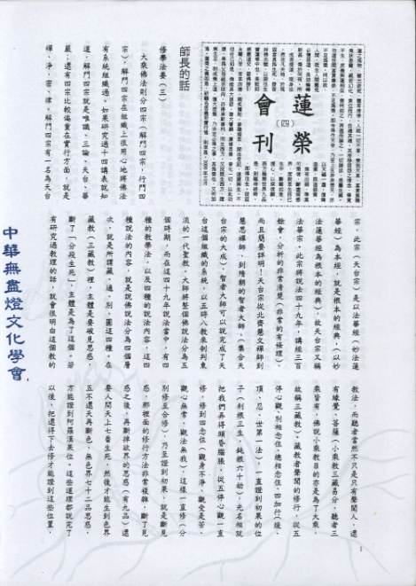

# 第4期

## 大德法語

### 修學法要（三）

*連志道老師開示／編輯部整理*

大乘佛法則分四宗（解門四宗，行門四宗），解門四宗在組織上很用心地將佛法有系統組織過。如果研究過十四講表就知道，解門四宗就是唯識、三論、天台、華嚴；還有四宗比較偏重在實行方面，就是襌、淨、密、律。解門四宗有一名為天台宗，此宗（天台宗）是以法華經（妙法蓮華經）為本經，就是根本的經典，（以妙法蓮華經為根本的經典），故天台宗又稱法華宗。此宗將說法四十九年，講經三百餘會，分析的非常清楚（非常的有條理），而且簡要詳明！天台宗從北齊慧文襌師到慧思襌師，到隋朝的智者大師，（集合天台宗的大成），智者大師可以說完成了天台這個組織的系統，以五時八教來剖判東流的一代聖教。大師將整個佛說法分為五個時期，而在這四十九年說法當中，有四種的教學法，以及四種的說法內容，這四種說法的內容，就是說佛說法分為四個層次，就是所謂藏、通、別、圓這四種。在藏教（三藏教）裡，主體是要破見思惑，斷了「分段生死」，主體是為了這個。若有研究過教理的話，就會很明白這個教的教法，而聽者當然不只是只有聲聞人，還有緣覺、菩薩（小乘教三藏易分，聽者三乘皆有，佛說小乘教目的亦是為了大乘，故稱三藏教）。藏教者聲聞的修行，從五停心觀、別相念住、總相念住、四加行（煖、頂、忍、世第一法），一直證到初果的位子（利根三生，鈍根六十劫），光名相就把我們弄得頭昏腦脹，從五停心觀一直修，修到四念住（觀身不淨、觀受是苦、觀心無常、觀法無我），這樣一直修（分別修至合修），乃至證到初果，就是斷見惑，那裡面的修行方法非常複雜，斷了見惑之後，再斷掉欲界的思惑（有九品）還要人間天上七番生死，然後才能生到色界五不還天再斷色、無色界七十二品思惑，方能證到阿羅漢果位。這些道理都說完了以後，還得下去修才能證到這些位置，在每一個位置是怎麼修的道理說得詳詳細細之後，三藏教的聲聞人方能依此而斷見思惑證到阿羅漢果。並由之而增上到通教、別教、圓教（最高的佛法）。如欲轉凡成聖修菩薩行時，應如何修觀，這些瞭解得很清楚之後，非常明白要以這一生，由修五停心觀一直修到煖、頂、忍、世第一，斷見惑，是非常非常的困難，何況是斷思惑，那更難。可是如果見思惑不斷，則同居穢土這一關就不能出離，同居穢土不能出離，就是說三界六道沒有辦法跳出去了，如此說來佛法再好，我們各各都辦不到，豈不是辜負了佛出現世間的苦心嗎？所以佛在講完了這些道理之後，非常的慈悲，與阿彌陀佛一唱一和，開了一個徑中徑又徑的特別法門，乃令眾生，深信切願念佛求生淨土（求生西方極樂世界），是帶業伏惑往生西方極樂世界，一往生西方極樂世界就橫出三界，往生彼西方淨土（橫出三界），第一能得不退轉，第二壽命無量，不退轉而壽命無量就能證到一生補處，也就是說在極樂世界，那樣好的環境裡面，一生就能夠證到等覺菩薩的位置。以一個沒有斷惑的凡夫，只要能夠伏惑，臨終的時候正念分明，念的是阿彌陀佛，阿彌陀佛與諸聖眾出現在我們眼前，接引我們往生西方極樂世界，一旦往生以後，不但了了分段生死而且能以一生了變易生死而證到等覺菩薩的位置。佛說此難信易行之法門，實具大慈悲，說完了那些通途法門之後，然後告訴我們能夠當生成就的特別法門，所以現在好多人不了解這個特別法門的好處與通途法門難行的道理。

大家研究過淨土十疑論都知道，十疑論是天台智者大師所說，祖師假設十個疑問，然後自己解答。第一個疑問說：此世界行菩薩道的人，當然要發心上求佛道下化眾生，理應生生世世在生死世界度化眾生才對啊！為什麼要消極的求生西方極樂世界自安其身，有違大悲？智者大師自答說：依毘婆娑論說：修行有易行道，難行道，普通的修行法（依次第斷證）為難行道，而修淨土念佛法門是易行道。如果說生生世世在這個生死世間度化眾生，對於一個證無生法忍的菩薩，應該這樣要求他。如果一個證到無生法忍的菩薩，他會說我不要度眾生嗎？不可能。如果，假設那種菩薩不想度眾生，你責備他是對的！可是一位沒有證到無生法忍以前的菩薩，就像是一個初生的小鳥不能離開樹枝，一個剛生下來的嬰兒不能離開母親一樣。如果；剛生下來的嬰兒離開母親不是摔死就是餓死，所以應該不離佛不離法不離僧。在沒有證到無生法忍以前，要常親近佛法僧三寶，以求速速證到無生法忍。那麼要想證到無生法忍，先要能夠親近三寶，最直接最快的路是什麼？就是往生西方極樂世界。為什麼？阿彌陀佛成佛以來已經十劫，是現在佛，方興未艾。我們如果往生西方極樂世界，在那裡很快就能證到無生法忍，花開見佛悟無生，若欲度眾生，一定要悟無生（得無生法忍），得不得一生補處，沒有關係，必有能力乘願再來廣度眾生，所以行菩薩道廣度眾生先求往生西方極樂世界。現在的人不了解，一片好心，說他要生生世世行菩薩道（人間淨土），其實很難，為什麼？我們說，我就發願啊！我就認做人以利益眾生，我下輩子能再做人乎？我就繼續下去行菩薩道嗎？這個願是很好，但是各位師兄師姊，你想想看，請問你上輩子是哪裡來的？請問在座，有沒有人知道上輩子從哪裡來？我們沒有人知道我們上一輩子從哪裡來，請問誰能把握我們下一輩子到哪裡去呀？故需盡此一報身，同生極樂國。 （下期待續）

（本文乃蓮友請教連志道老師，蒙師開示）

## 共修研學

### 勸發菩提心文（四）

*心爾*

法：

「性法」：就是成就的境界。

「修法」：就是下手要修的方法。

菩提心是無我的心態。無我的心態，相應無我的法性，故菩提心就是性法。菩提心是性法，勸發是修行，裡面有省庵大師的苦勸，也有眾生帶木頭耳朵在聽勸，大師並告訴我們怎麼修，要具備什麼因緣？要掌握什麼條件？這就是一種修法，來達成無我的狀態，這就是性法，佛法講的單法立題一定包括性法修行，如大般若經也是包括性法、修法。性法就是大般若所詮釋的境界，即下手處怎麼修，法一定包括性法、修法，單法立題的法一定包括這個。

「心」能成就菩提，菩提就是覺道。菩提是內心所緣的境界，叫菩提心，當我們所緣的境界跟能緣的心打成一片的時候，能就是所，所就是能，能所一如，合成一家人，能所雙亡，泯除界線，菩提心就是心緣菩提，打成一片，泯除差別相的時候，叫做心就是菩提，菩提就是心，如物理學家，物理為他心的所緣，他心緣物理，所以物理的世界全部為他內心所了知，心所了解就是物理，物理為他心所了知，而渾然忘我。法就是心，心就是法。古德云：真正的修行分五次第：１、能所對立。２、能所相應。３、能所一如。４、能所雙亡。５、圓通無盡。（續法大師釋念佛三昧成就次第即分五）我們將心思放在這裡，才不會有解脫的障礙，心緣在五欲六塵是妄心，心緣在菩提是真心，我們帶著無我的心性（性空）叫全真，眼前隨著染緣，攀緣五欲六塵變成妄想、妄心。真者全妄即是凡夫，帶著真心想的財、色、名、食、睡即是全妄，全妄即真就是在五欲六塵中對治種種執著（無明我執），好好的擺脫境界的束縛，（全妄即真）解脫就在當下，解脫乃對境界去執（解黏去縛）叫解脫，不是逃離境界說解脫，所以「佛法在世間，不離世間覺」佛法就在世間相說出世的覺悟，在世間的種種逼迫說出世的解脫，叫全妄即真，唯有在娑婆世界的爛泥巴，才能種出極樂世界芬芳的蓮花，在這裡（五濁惡世）能中流砥柱，能不隨世俗苟合，能不隨境而轉，能不染於五欲六塵，當五欲六塵聲光色相相續現起，不但不受惑反而引發出離心與悲愍受惑之有情，並深觀法性遠離無明，在極樂世界的蓮花，會比別人更大。有師姑往生時，問她蓮花有多大？她說像台灣那麼大，當你打坐的時候，把心量放大，你會感覺身相忽然變得很大。當心量放大時自然身相變得很大。（阿彌陀佛報身相有六十億恆沙由旬）

菩提有三義：一、真性。二、實智。三、方便。

「真性」：就是所緣的境界。「實智」：就是能緣的心，當能緣的心是無我慧的時候，就能緣到無我的真性；對境緣性，此能緣之心即是無我慧，所緣之境即是無我性境；「方便」：就是在日用平常顯現智慧，表現智慧叫方便。佛法在日用平常中，吃飯即解脫，走路即解脫，走路相就是解脫相。金剛經上，當佛托缽乞食於舍衛城，還至本處。飯食訖，收衣缽，洗足已，敷座而坐。須菩提跪著說：「如來善護念諸菩薩，善護囑諸菩薩」。佛處處表現解脫相給眾生看，最為慈悲。我人亦應於所現境中表現解脫。

三種菩提（見諦老之注）：

１、真性菩提：

「我人現前一念心性」，這個心性是無我性，隨緣可以起各類的心念，心念就是心相，相不離性「上至諸佛下至地獄，十法界眾生無不具足」都具足無我的心性，因為無我的心性，才可以隨緣起念，越隨緣起念，越能說明心性是本空，若有自性，絕對不會隨緣起念，因為『性』有不改義。例如：有善的自性，絕不會隨染緣起惡念，若有惡的自性隨著各類的善緣不會起善念，若有自性則教法都沒有用，則何來隨緣？佛菩薩的悲心都一無是處，無法令眾生由惡變善，就是因為善可變惡，惡可變善，才說明其性本空，而善之特性是能招感樂果，惡之特性乃招感苦果，佛菩薩幫助我們了解善惡性空，依性空義隨緣斷惡修善而離苦得樂。且善法能彰顯無我義，乃因善法皆是損己利人，此即隨順去我執而彰顯無我性，佛菩薩如此幫助我們，即彼最殊勝的慈悲，悲就是智，智就是悲，（悲是想要幫助眾生，智是種種幫助眾生的方法，悲智目標一致皆是幫助眾生，故云悲智雙運）吾人對於佛法概念要很熟，對於世間的染污概念要忘記（熟處轉生，生處轉熟）如此整個人會很歡喜，內心感覺法喜充滿，自性本具的如如理，又名本覺，不假造作，離諸虛妄，性空義不是造出來的，法爾如是，佛菩薩也不能增加一分，眾生也不能少一分，諸佛也是性空，只不過諸佛依一切之善法，彰顯性空義，眾生迷性空義而造作一切的惡法，彰顯其迷。所以「君子樂得為君子（作善得樂），小人冤枉為小人（造惡得苦）」。所以一切的因緣法都在彰顯性空義而已，因緣法即是性空，（法之性本空，故生起必藉因緣，故云：因緣即性空，萬法隨緣成無性，無性隨緣生萬法），離一切因緣法彰顯性空，然性空亦是離一切虛妄的因緣法，不隨法生滅，叫「離諸虛妄，故曰真性菩提」。這種概念，所有宗教裡面只有佛法有，所以論法到般若空義時，佛法與世間立刻分開，因為世間的概念都說不到這個內涵，但是我們聽到這個內涵時往往很累，往昔生中串習此等知見力量不足，遇境逢緣往往陷入愛執，而不得萬法之真相。昔天台大師講妙法蓮華經之經題，依五重玄義而講九十天，門人章安灌頂尊者輯為「法華玄義」，雖為一經之奧旨所在，然吾人障重慧淺，無接受之堪能。

２、實智菩提：

「依如如理，起如如智」，依著無我性起無我慧叫實智。（此智認識真實性，故稱實智）如：我人發起好心聽經：（一）當一個人想要改邪歸正，棄暗投明時會想聽經。（二）好心聽經：心很愛好聽經叫善法欲，這個很重要，整個法的成就是看他有沒有善法欲。一個人會不會成功，但看他對這件事有否慾望，以及強烈的使命感，說這個人會不會成功在於恆心，恆心來自於慾望，慾望來自於信心，信心來自於勝解，對它很有體會，自然信心加強，好樂轉強，就會有恆心就做得下去，比如說：運動對治自己的疾病，想要拔除自己病苦，對此相信透徹，每天早上想要運動的心態，比一般人的力量還要強，所以有人為了改善體質而打太極拳，清晨四點起床來蹲馬步。而勝解來自於好惡分別，即是百法明門論說「慧心所」，能清楚分別是非善惡的能力，但一般都在榮華富貴裡面分別；在意權位之高、低，或有名無實（例總統府資政）。或有實無名（例縣長）。名雖不高，但有絕對的權利。吾人之慧心所用在世間的力量太強，用在出世間的力量太弱，「用此慧心所照本覺理」，凡是無明我執部分，與無我的部分都能分別了解，內心遠離無明我執，相應於無我的體性，都要靠慧之分別與相應。最壞的也是分別，最好的也是分別，只是對世間的事情不要太在意叫不要虛妄分別，不是連出世功德的高低（二乘與大乘之別），菩提心的引發，依戒律如何開遮都不要分別，不要分別只講一半，如理分別才全對，禪宗講不要分別，是說世間所起的概念全部否定，叫不要分別，不是不要分別。世間概念依俗情而生，沒有所謂分別對錯、好壞美醜，換句話說，就是全錯！佛法不是不要分別，而是要我人不要虛妄分別。其次若無世間「不要分別」，則無精神體力以修出世的功德，若心思體力都被五欲六塵分散了，哪有心思體力去管出世，禪宗叢林擔柴、運水、香燈、寮元，各職司歷練以磨練煩惱習氣，所有分別全部否定，全部聽師父就對了，按照分配去做，叫你做，表示對你有利，不叫你做，表示對你有害，如此下手修行叫不要分別。而於事相中除去煩惱習氣，我執漸薄，心光乍現，終於開悟而明心見性。

３、方便菩提：

有智慧通達實相理，在日用平常都能表現理智。分兩部分：

約著對眾生心的了解（契機）。

約著對教法的認知（契理）

鑒機說法種種設施，度脫眾生，是為方便菩提。

佛菩薩之實智菩提，我們看不到，乃其內心之證量，而真性菩提也不是我們所緣的境界，唯有從方便菩提去體會。釋迦牟尼佛四十九年講經說法三百餘會，分為華嚴、阿含、方等、法華、涅槃之五時說法，對眾生循循善誘，最後功成果圓時示現涅槃，由說法循循善誘中看出佛菩薩的悲心，且任何境界不能束縛祂，當祂教法最興隆，眾生對祂最恭敬的時候，佛菩薩竟然在這個時候離開了人間，這就是表現度眾生之方便（大解脫），不會愛執任何境界，隨順任何因緣沒有任何執著與眷戀。心緣真性菩提，而發實智菩提，於日用平常裡面，展現方便菩提（用此菩提心，行菩薩道，鑒機說法，種種設施，度脫眾生，是為方便菩提）。勸發菩提心，原來心緣三種菩提、真性菩提、實智菩提、方便菩提（真性菩提乃所現之理，實智菩提乃能生之智，方便菩提乃依理智而生度生之大用）。心本來是凡夫心，菩提是佛的妙心，心緣菩提的時候，就是從凡夫心變成佛心，但是要發，方得佛之實益，此乃祖師苦口婆心所勸。    （下期待續）

## 蓮池海會

### 林李阿杏老居士往生見聞記

*編輯部整理*

林李阿杏，民國十年六月二十一日生，台北縣板橋市江子翠人，有三弟三妹。父親因身體較弱無法從事粗重工作，生為長女需負擔母親農事及家務工作。

年長後與林光明先生結褵，育有六女，生性勤儉樸實，理財有方，在稍有積蓄自購房屋後，亦將公婆大姑接來一起居住。平常除佐理先生事務外，還要照顧全家十人的生活起居。對子女教育方面，除學校課程外，亦注重人品，才藝的培養，另外聘請家教加強輔導，使子女接受最好的教育。

於自家設置佛堂及供奉祖先牌位，早晚供茶及上香，每逢初一、十五以鮮花、素果虔誠供佛並茹素，由廣播電台中收聽三國演義、七俠五義及包公案等忠孝節義的故事以及法師講經等，在生活中古道熱腸幫助他人，慈悲為懷。每年農曆七月時，前往寺院隨喜誦經，並超薦歷代祖先亡魂及冤親債主、護持道場、供養僧眾、助印經典以利流通，做諸善法不遺餘力。

民國八十五年六月因林先生過世，頓失依靠，於七月中風住院，返家後十二月又再度中風，雖手腳能動，但不良於行，不能言語，只能臥床。民國八十六年一月進入國立護理學院附設護理之家安養，其間又數度進出醫院，但佛號機念佛終日陪伴著，八十八年九月家中成立佛堂並將其帶回家中，每天可看佛及念佛，故情緒較為安穩，十一月下旬又生病住進醫院治療，未見起色，於八十九年元月五日由加護病房將之帶回照顧，並將身上所插上的打針管、鼻胃管及排尿管都拔除，不但沒服藥物，不抽痰亦不食食物，只餵食少許大悲咒水，在家人及蓮友的助念中延壽七天，於第八天凌晨家人在側陪伴念佛中，安詳平靜的往生。

## 日常省思

### 印光大師「挽回劫運護國救民正本清源論」讀後感

*蓮心*

人何以為萬物之靈？非因其聰明伶俐、容貌姣好，蓋因人有可「德配天地」之德性，雖較之廣袤天地，其形體渺小，較之日月星辰，光芒亦遜，然人本來具有「道德仁義」，不假外求，故人得以與天地並立為三，等無差別。

天表自強不息、精進不懈，或潮來潮往，或陰晴圓缺，或花開花落，或雲卷雲舒，天均無我執我見，僅規律運轉，白晝黑夜，春夏秋冬，寒來暑往，未曾怠惰。

地表厚德載物、無我無私，可容納江洋大海、高山原野，不獨厚華屋廣廈，亦不輕忽竹籬茅舍，或嬌艷之牡丹，或清雅之水仙，梅蘭竹菊、蒼松翠柏，皆各自綻放，和平共存於大地之上。

菜根譚云：「天地寂然不動，而氣機無息少停；日月晝夜奔馳，而貞明萬古不易。」此之謂也！

「天行健，君子以自強不息」、「君子終日乾乾，夕惕若厲，無咎」，人法天地，進德修道，勤奮戒懼，兢兢業業，非盡其參贊之天職弗止也，故可「為天地立心，為生民立命，為萬世開太平。」

種善因得善果

文中印光大師由正面申論：人人皆應「敦倫盡分、閑邪存誠、諸惡莫作、眾善奉行」修行自身、格除物欲、擴充良知、以德潤身，並植基於因果觀念，教育子女，影響家庭；由修身齊家，進而自行化他、上行下效，以譽于家邦；孝親慈幼、破除私見、無相殘害、愛人若己、大公無私，則人心和平、世界自安、國難自息，風調雨順、民康物阜，何難之有？惟此尚未究竟，不足稱為「兼善天下」，更應戒殺放生、吃素念佛、求生淨土、了脫生死，高登極樂，方為最上脫苦之根本之道。∣

種惡因得惡果

次由反面剖析：世上殺劫及一切災難之起，皆為眾生惡業所感，其中尤以殺生為甚，「欲知世上刀兵劫，但聽屠門半夜聲」，今世汝吃他，來世他吃汝，冤冤相報，世世殺機無已時；「多行不義必自斃」，人以惡感，天以禍應，水旱瘟蝗、風吹地震、土匪刀兵、蹂躪劫掠、國運岌岌、民不聊生，必紛至沓來。∣

綜上，戒殺放生、念佛吃素乃正本清源、護國息災之不二法門；止殺應由護惜物命、買放物命做起，所謂放生，即是使大家發心護生，不再殺生，如此人人護惜生物，不加殘害，心起慈悲，則殺劫可消、國運可轉；茹素念佛、斷惡修善、復本心源、隨分隨力、持佛名號、願力相接，則邪氣消而正氣長，自然可轉業消業，並息生死煩惱；天災人禍、社會亂象，何由生焉？

佛說金光明經卷三正論品第十一：「云何是人，得名為天？云何人王，復名天子？生在人中，處王宮殿，正法治世，而名為天，……因集業故，生於人中，王領國土，故稱人王，處在胎中，諸天守護，或先守護，然後入胎，雖在人中，生為人王，以天護故，復稱王子，三十三天，各以己德，分與是人，故稱天子，……遠離惡法，遮令不起，安住善法，修令增廣，能令眾生，多生天上，……若有惡事，縱而不問，不治其罪，不以正教，捨遠善法，增長惡聚，……三十三天，各生瞋恨，……暴風卒起，屢降惡雨，惡星數出，日月無光，五穀果實，咸不滋茂，由王捨正，使國饑饉，……以造惡故，速得天瞋，以天瞋故，不久國敗。」論語：「其身正，不令而行，其身不正，雖令不從。」在在與印光大師所言不謀而合。

乾隆皇帝下江南，路過鎮江，登金山遊覽，問一老和尚：大江滔滔，風帆片片，碧天無際，煙波浩渺，汝知風帆多少？僧曰：陛下，依貧僧所見，僅有兩張帆。乾隆問其因？僧云：一帆為名，一帆為利。人生苦短，業力無窮，紅塵滾滾，生死茫茫，但求名利，何其狹隘，縱然吾身乃「寄蜉蝣於天地，渺滄海之一粟，哀吾生之須臾，羨長江之無窮」，亦不該妄自菲薄、徒嘆奈何，蓋因「天下不治，匹夫有責」，人人皆應自強不息、閑邪存誠、克己復禮，參贊天職，己立立人，己達達人，以無忝此生。嗟夫！名利風帆僅是雲煙，過盡千帆皆非渡船，願乘般若輕舟，歸我淨土蓮邦。

## 啟蒙園地

### 建不成的第三層樓

心印
《百喻經》裡曾比方有一個愚癡的鄉下人，因為鄉下住的都是平房，不曾見過樓房。有一天，這個鄉下佬到都市去觀光，古代沒有鋼筋水泥，搭建房子都是用木料，能夠建造三層樓就不容易了。所以這個鄉下佬在城市裡，看到三層的樓房，進到樓房裡面參觀，覺得好高興，從來不曾上過第二層樓，上去之後覺得第二層視野很好；再上到第三層樓，視線更寬、看得也更遠了。他覺得太好了，心裡想他也有錢建設第三層樓，第二層固然很好，可是還是不如第三層！因此，他就只想要第三層樓。回去之後，就把水泥匠、木匠都請來，說道：「我要建三層樓。」那些工人說：「好呀！你要建三層樓，我們就替你建吧！」開始做的時候，那些工人就挖土、打地基。這個鄉下佬一看見那些工人在挖地、奠基，覺得很奇怪，就跑來
**問：** 「你們在幹什麼呀？」「你不是要建三層樓房嗎？我們現在正在替你建三層樓呀！」那鄉下佬說：「是啊！我是要建第三層樓，那你在做什麼？」「你要建第三層，沒有第一層、第二層，怎麼能夠建得起來呢？你要建第三層樓，但是要先從第一層做起，把地基打好了，第一層做好了，再做第二層，然後才能建造第三層。」但是鄉下佬說：「不行不行，第一層不好，我不要，第二層也不好，我只要第三層，你只替我建第三層好了。第一及第二層我通通不要！」這些工人說：「那我沒辦法，我沒有能力建造空中樓閣。」

所以，小朋友，如果我們沒有從小事做起，將來又怎能在社會上有所成就呢？如果我們在家裡，沒有盡自己的本分孝順父母，使家庭氣氛融洽，將來在社會中又怎會與別人維持良好關係呢？如果小時候沒有訓練自己有好的規矩，將來則走到哪裡都不會受到歡迎，更不用說能否有一番豐功偉業。所以趁我們年紀小，先培養自己的「一、二層樓」使自己有成聖成賢的本質，將來我們的「第三層樓」才會是最美，最能欣賞遠方美景的地方。
