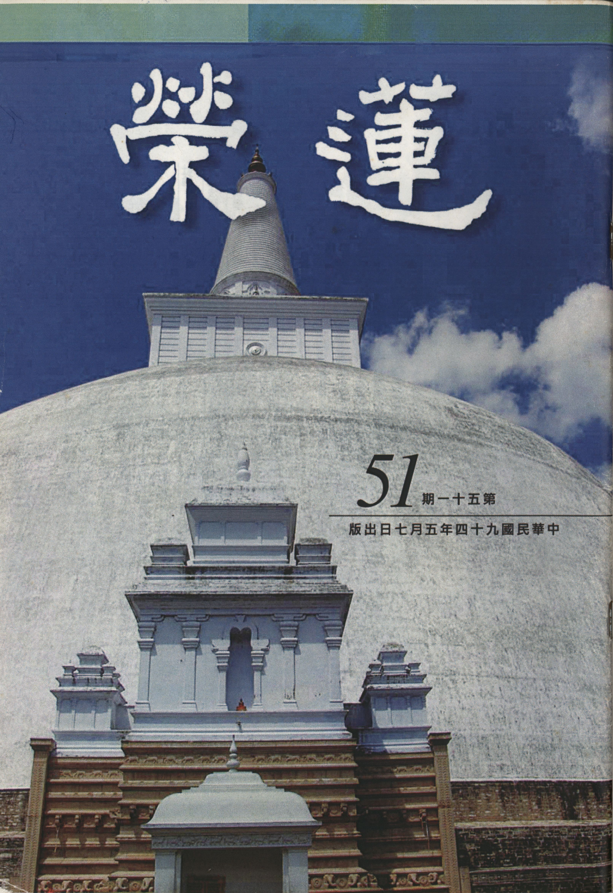

# 第51期

## 社論

### 賑災有感

*編輯部*

世紀災難海嘯時

波及數百萬有情

選擇錫蘭賑災民

能令行者遍歡踴

去年十二月廿六日，在印尼亞齊省，爆發了舉世震驚的南亞大地震，相當於一萬六千顆原子彈的威力，死傷極為慘重。引發的大海嘯更波及十二國，造成災民及世界各地觀光客的傷亡，數百萬饑民流離失所、等待救援。而世界各國也展現了慈悲心作種種的人道救助，捐款與賑災的物資也是一波波的湧入災區，想要實際的對災民有所助益。雖說人心每況愈下，世風不再，遇到災難時人性的光明面卻又顯露出來，誰說世間無可為？

有幸在善緣的積聚與諸多蓮友的護持下，於今年三月五日實際去斯里蘭卡作十日的賑災法行，其中還附帶著慈善、佛塔巡禮、供養三寶、齋僧等等，期望對該國正法的護持。經過了搭機、過境、轉機一番辛苦到了位於印度南方地形如水滴、是台灣近兩倍大、號稱東方明珠的錫蘭（獅子國），今稱斯里蘭卡共和國，發覺到此處民風淳厚，還保留了過去佛教所遺留的正法風俗，比如對人謙恭有禮、對三寶恭敬護持，居家環境典雅、乾淨，小孩上學精神抖擻，且出必告反必面、並每日向父母跪著請安，國民是雖貧而樂道……，總之，處處展現的是佛教大有益世道人心之證明。此外該國並保留著兩千餘年來佛教弘傳正法的足跡，其中除了有佛牙、佛陀的舍利外，還有規模盛大的精舍，是當時國王對三寶的供養，在偌大的精舍中作培育僧伽的搖籃，而隨著國王對正法的護持，國力也達到鼎盛。

今該國發生了舉世震驚的災難，舉國上下一致投入賑災的行列，只是非佛教徒夾帶著宗教意識的對立，而有私己而不肯捨人的心量，再加上吾國與該國未有外交關係，導致賑災物品由海嘯發生至今尚未發予災民，實為一大遺憾。所幸斯國僧團駐台灣代表強帝瑪法師奔走疾呼，趁我們這次至斯里蘭卡賑災之因緣，將機場的賑災物資取回整理，並配合我們至漢班托塔為災民作法會回向之際而發放賑災品。但見現場災民領救濟品井然有序，一字排開，在烈日中等待領取救濟品之舉動，令人深深感動，此行一來為台灣作一次成功的國民外交，二來法師在開示時處處宣揚台灣的功德，但見這些黝黑的災民對我們親切地露出整口白牙的同時，是我們處在炎熱氣候下的清涼，並想到因為我們的因緣，而有該國第一次為災民作法會回向時內心歡喜異常，供養了這一百九十七位上座比丘十八種頭陀物的同時，相信這些法會功德的回向能令過往災民投生善道，現前者不近障難，具足學佛的勝緣。

又見到法師已在此災區蓋了台灣村，容納災民，除了對他們實施世俗的教育，建立他們生存的能力之外，並以佛法因果的觀念灌輸他們人生應有的價值與方向，令具有善根者度其成為僧伽，成為日後的法門龍象，法師也期盼斯里蘭卡的未來是大乘的國家，重建往日正法興盛的光輝，不禁深深佩服法師的遠見，這也正是我們賑災的本懷。

夫賑災不應只是提供物資，應思災變的根由，法師說那是衰損慈悲心造成的，這才是根本的答案所在。感嘆真正有眼力的人在這世界上是少之又少，一般人只會急於表面的解決，忽略了問題根源的所在，同樣的我們如果賑災的心態是一種傲慢、自大，或者以為物資的救濟就能真正解決他們的困難，或者資助外道去從事慈善救濟工作而傷害了正法，或以為平等救濟而不擇正法與非法，都是在作賑災等善法當中的遺憾。

回到國內，抹滅不去的是種種深刻之印象，當在機場與當地導遊告別時，雷克斯先生歡送我們的那種感激眼神，在有力的握手當中問我們是否還會再去斯里蘭卡時，此時只能笑而不答，一切都看因緣吧！是的，因緣是必須要被珍惜的，它是稍縱即逝的，未來要生起勝緣時，還必得要積聚善根福德才有下一次的勝緣興起，珍惜勝緣如同往生淨土般，錯過了這班火車，或許還要經過百千萬劫，才有出離的機會，若抱著馬虎等等的等流心態，那將萬劫不復。

## 共修研學

### 小止觀導覽（三十）調眠為修學止觀資糧

*蓮心整理*

眠少神疲難用功

眠多昏沈障正念

調和能助止觀行

當念無常生勇悍

經 文

二、調睡眠者：夫眠是無明惑覆，不可縱之。若其眠寐過多，非唯廢修聖法，亦復喪失功夫，而能令心闇昧，善根沉沒。當覺悟無常，調伏睡眠，令神氣清白，念心明淨，如是乃可棲心聖境，三昧現前。故經云：「初夜後夜，亦勿有廢。無以睡眠因緣，令一生空過，無所得也。當念無常之火，燒諸世間，早求自度，勿睡眠也。」

導 覽

說明調和的第二項調睡眠，總要調和適度，不可因睡眠因緣而空過人生。

大 意

一、要成就十方諸佛的教法，必須從止觀門入手，因為止觀門是學一切教法的要徑，比如無常的觀修，是以無常為所緣修止，以無常為所緣修觀，才能生起無常的覺受。行者修學無常發現沒有一個法是固定不變的，都是變動不居的，便會有一種隨時變化的感覺，會放掉對法的貪著。欲生起對三界的出離，亦是觀三界無常，因無常故苦，因苦而尋求出離，若欲出離須修學空性，亦即以空性為所緣而修止修觀，就能真正的破除執著，脫離三界輪迴。至於往生西方極樂世界者，也是要花開見佛聞法悟無生（以空性為所緣修止修觀），才能真正脫離輪迴。雖然在淨土的壽命很長，加以環境很好，不造惡因，不起惡念，雖未受輪迴之苦，然非根本上除掉輪迴的種子，必得悟無生（悟空性、修空性、證空性）以後，才是真正徹底脫離輪迴。

二、諸法的真實相必須要好好的去觀察，即以教法所闡釋的義理，去觀察諸法的實相（空性），即以萬法的自性為所緣去觀察，探究是否有自性？結果發覺萬法了無自性，此時進入空靈的境界，行者安住在這個狀態即名為正念，而產生如許的專注力叫做定，並於定中重新依修學空性的推理法，一再推理，顯現法之自相空的面相，此時執著之自相有的心不生，執著心破除之後，才可真正出離三界。然有心修學止觀門的人，必須善於調和自己的食、睡、身、息、心，以利止觀修學。

三、一般人認為因戒生定，所以只要持戒清淨就能入定，但事實上固然嚴持戒律，才有入定的能力，但並不代表必能入定，因為修行如調泥、調弦，具五緣、訶五欲、棄五蓋、調五事等前方便未講究，則無法造就上等陶器，也無以出諸妙曲，行者若無法調整自己在斷惡修善上下功夫，就不是修行的好材質，所以廣欽老和尚認為修行人若事前有所磨練，則打坐念佛的能耐才強，否則打坐念佛便會在昏沉、掉舉、散亂中虛度，因此行者若事先能持戒、懺悔、發願，也懂得捨棄對五欲境的追逐，又能對治內心的五蓋，這才是善於修行的人。

四、調食固然要講究飲食的取捨之道，但也要懂得修對治法，觀修食物的過患：

（一）了知過量、不足、穢觸、不宜等食物是疾病的來源，也是修學止觀的障礙。

（二）因為你喜歡吃，別人也喜歡吃，大家容易在搶食當中結下惡緣。

（三）為了滿足口腹之欲，早出晚歸、忙碌奔波，成為食物的奴隸。

（四）身為苦本，不應為食物奔忙，應以食存五觀的心態來修學，食物養身是為修行，使自己成為法器，能利益眾生，做眾生馬牛。

（五）我們身上有八萬四千蟲，眼前先以食物結善緣，而後以法施度化他們，將來我成佛時，這些細菌、微生物，都變成上首的舍利弗、目犍連、阿難，都成為佛門的龍象。

（六）佛在心中坐，可觀想我們的飲食是供養心內的那一尊佛，而非外在的這個臭皮囊。

（七）以食物供養十方三寶，並且以食物的供養攝持所有的善法，感念三寶的功德巍巍，進而以三寶為我的皈依境及修學的所願境。比如頭陀行，乞食回來要把食物分成四份：一份供養三寶，一份供養同法者，一份供養畜生，一份自食。

雪公太老師在華嚴會上說：我們會吃飯嗎？我們會穿衣嗎？我們會睡覺嗎？可見穿衣、吃飯、睡覺都是修學佛法的好時機，也是一門大學問呢！

五、棄睡眠蓋是指要對治睡眠的欲望，而調睡眠是指要講究睡眠的方法，茲分述如下：

（一）要講究時間：晚上十點至清晨二點是最好的睡眠時間，為培養元氣，中午許可小睡，以利後續修學勢力之提起，一天的睡眠時間為六至八小時，初禪以上的人才遠離睡眠之相，而吾等無法避免睡眠，但須知其目的為長養色身，以利修行。

（二）要講究心態：即正知及正念，正知是隨時警覺睡眠時是否放逸？是否心念馳散？是否胡思亂想，大做白日夢？因為以上的狀況會造成修行工夫的中斷，正念之延續就困難了。正知的目的就是要保持正念的專注與相續，不要讓念頭散失，應調整自己的生理時鐘具有警覺性，可以控制自己在正確的時間起床、睡眠，而且把自我控制當成一種快樂與目標。

（三）要講究睡姿：最佳為師子臥法（臥有四種：師子王臥，天臥，鬼臥，耽欲者臥；天則仰面，鬼則伏面，耽欲者臥左脅著地）。佛是無上人中師子，故右脅而臥，《阿含經》中記載：世尊告誡阿難當臥如師子臥法。此臥為解脫相，慢慢的呼吸（即龜息大法），在睡眠中不失正念，不忘憶佛念佛，這種的睡眠品質最好，起床的時候，就會精神百倍。

佛的行相有一種是臥佛，這代表睡眠也可以修行，因為在正念跟正知都提起的情況下，臥相等於行相、住相、坐相，而這些相都是一種修行的示現。

六、睡覺時內心一片黑暗，是與無明的癡心所相應的，此時不利於聖道的修學，因此在這種狀態是不可以放縱的。睡眠時呼吸會慢慢的減少，血液循環也變得緩慢，適當的睡眠是最好的補藥，但睡眠過多，腦部會缺氧，造成頭昏腦脹，而睡眠不足也會使修學勢力減弱。此外睡眠品質也很重要，有些人夢很多，就是品質不好，因為第六意識的分別功能有等流性，會不斷活動，因此睡前最好不要做太過用腦的事情，以維持最好的休息狀態。

七、修學止觀是為加強我們成就佛果的可能性，保持我們臨終的正念，因此止觀修學攸關我們未來的快樂與痛苦，人生短促、時光匆匆，而修學止觀的時間有限，若貪著於睡眠，道業何成？但睡眠適中，氧氣充足，則神氣清白，清者振奮士氣，白者不想非法，念心明淨，此時內心才可安住所緣境，以利修學止觀。

八、印度把時間分為六時：晝三時、夜三時，一個時段四個小時，夜三時又分為初夜、中夜、後夜，《遺教經》云：「初夜後夜，亦勿有廢。」 可見一天睡眠約為四個小時，但《瑜伽師地論》有二個說法：或為四個小時，或為六個小時，應視個人身體狀況而定，睡眠以外的時間，應好好懺悔業障、修學止觀、積聚資糧，為破迷啟悟、離苦得樂做準備。（下期待續）

### 佛說八大人覺經講記（十）愛不重不生娑婆

*編輯部整理*

擺脫業繫有良方

能知人我自相無

世俗貪欲不能生

涅槃寂靜真解脫

表上迷縛悟解，「迷」了就被繫縛，「悟」了就解開。「迷」就是有執著叫做「迷」，「縛」就是被業所繫縛，這二者行相不同。有執著的人就是「迷」，看不到萬法的真實性是不可得的，他把萬法的真實性看成有，而且是很實在的有，就像把繩子看成蛇一樣，但是在聖者來看沒有蛇，可是他卻看得明明有，所以這叫「迷」。真實的人我在聖者來看看不到，在凡夫來看明明有，真實的法我在凡夫來看明明有，在聖者來看卻看不到，以無為有謂之「迷」。

因為有執著，就會產生煩惱，有煩惱就會造業，所謂造業就是引發思心所去做種種的造作，這叫做業，造作善叫善業，造作惡叫惡業，但是都是被煩惱執著所攝持，所以叫做有漏業。「迷縛」就是有煩惱有業，由煩惱所造的業，觀待此業生起的果報，如繩般將有情繫縛得緊緊的，一點自由也沒有。例如了凡先生還未遇到雲谷大師時，孔先生已將他的命運算準了，該考幾名就幾名，該得多少俸祿就得多少俸祿，是不是被業繩綁得緊緊的。大家都想解開這業繩得到輕鬆自在，試問怎麼解開呢？若能好好的引發出離心、菩提心，乃至尋求般若的義理，悟見空性破除執著，此悟就是解開綁在身上的業繩。

首先一定要先有迷縛的覺受，因為迷所以被業繫縛，被業繫縛一定來自於煩惱和執著。一定要先有覺受，才會產生想要解開業繩的決定見，想要離開繫縛的心是出離心，如何解開？是以破煩惱方式解開，如何破煩惱？知煩惱來自於執著，將執著的所緣境（人我、法我）作一番的觀察，發現自相不可得，所以能執的心不生，貪愛等煩惱則不起，業則不生，苦果不起，此即解開的道理。尋求空義去體悟，把它解開。

「迷」是身入六道，心如瀑流。如瀑流是指對境所起的惑和業如瀑流，對著人我和法我錯解為真實而生執著，因執著而造業，此如瀑流相續不斷。未來不斷以三途六道的五蘊身去酬償所造的惑業，此即「身入六道」，相續的輪迴受種種痛苦卻沒有疲勞的感覺，所以經上說是可憐憫者。心的對境在那裡？心可以身為對境，亦能以身所處的環境（包括有情的眷屬和無情山河大地）都是心的對境，而且心亦能以前一念為對境，對境起心如瀑流，對境當中以為有真實性可得，由此而生執著，由執著而引發煩惱，由煩惱去造業，後由苦果來酬償所造的業，又對此苦果境再起惑造業，然後再以苦果來酬償，如此的輪轉不停止，即是有情的可憫處。

表中所顯指出我們現在的狀況在三界的生死海，倒栽為下三道，頭在上為上三道，倒栽和頭在上都是在苦海裡沒有出來。表上海畫得小小的、淺淺的，其實如果要畫的仔細的話沒辦法畫，因為生死的苦海是看不到邊、可怕的。此時若想要生起欲求解脫的覺受，須先生起被繫縛的覺受，因為觀待繫縛說解脫，連被繫縛的感覺都沒有，那就談不上想要解脫，想要解脫的心生不起來，那就不會去找解脫的方法讓自己解脫。何以有些人學佛會學得萬牛莫挽（絕不走世俗的回頭路），有些人像老牛拖車、一點勁也生不起，有些人像陷在爛泥巴不得動彈。若沒有被繫縛的覺受，則欲求出離的心也不會生出，如蛆蛆在廁所裡面，不覺得自己很可憐，要度他就困難了。

「悟」是法身不動，妄心不起。法身即為實相、空性；不動，並不是有一個不動，而是說緣起法所顯示的空性從來沒有變化過，不論任何時、任何處、任何場所、任何方式，不會有一個有為法去顯示有自性。法身不能解釋成緣起法，因為緣起法變動不居，是生異滅的相續。法身不動是空性，是證悟空性者所顯示的義境。

妄心不起有二義：一者、入定現證空性的時候沒有世俗的心態，因為以境（世俗法）之自相為所緣時了不可得，能緣心則不起，故曰能所雙亡。二者、出定以後觀察世俗緣起時，了知無自性可得如同水月、空花，故不生世俗的情愛。

以上稱為「寂滅自在」，自在是不受境界所繫縛，寂滅是煩惱寂滅相、業寂滅相、苦果寂滅相，此時所得的果位是聖者阿羅漢。所以你看阿羅漢是不是很值得讓人尊敬，這是出煩惱之家的人。不論是身出家、心出家，重點在心出家，心出煩惱之家得到阿羅漢的果位非將相所能為（將相都辦不到）。世間將相其實都是追求功名之人，如漢飛將軍李廣一生最大的遺憾就是沒有封侯，這是他一生當中最大的遺憾，封侯的名位就把他困住了。皇帝如何攝持讀書人呢？很簡單，紫禁城有九門，考上狀元從中門進出，就變成一般讀書人一生的追求，一生只有一次從中門進出，成為他一生的榮耀；公務員分個十四職等，幾十萬公務員就在那裡追逐職等，用盡了寶貴光陰，想想看是不是很愚癡。

第二覺知分兩段，上段病為「多欲為苦，生死疲勞，從貪欲起」，下段藥為「少欲無為，身心自在」是除病的良方，所要除的是分段生死，並沒有解脫變易生死，解脫變易生死是從第三覺開始說。阿羅漢以及大乘聖者第八地的菩薩則是了分段生死，得到身心自在的成就。

兩種生死中分段生死，是以「有漏善不善業為因，煩惱障為緣」而有生死。煩惱障是我執所起，不論是人我執或者是法我執通歸煩惱障。我執所生的煩惱為緣，由此而引發業，亦即有自私的心、我愛執的心，執有真實的人我，對境時會想到什麼情況下對我有利？並思維如何讓我受樂，而有種種造作（業），就會在六道中投生（果），此即繫縛不得自在。

「感受三界六道果報身」，三界是欲界、色界、無色界，六道裡面欲界的六天和色界無色界是屬於六道的天道，其他欲界的天、人、阿修羅、地獄、餓鬼、畜生是屬於三界裡面的欲界，所以三界為總，六道為別，總說是三界，別說是六道，還可以細說為廿五有，廿五有就是廿五種生命現象，或者依生命現象生起的方式有四生（胎卵濕化）。

「其身有分分段段之果報差別」，「分分」是壽命，「段段」是形體，在三界內有如此的果報差別，所以一期壽命的多少、形體的高低就是分分段段，六道眾生都是分段生死；譬如在色界天裡禪定的天人，他的身相非常的高大，壽命非常的長，使人對這個狀況非常的愛執，此貪愛心就障礙天人的解脫；或者是在欲界天裡當個天王，壽命也是非常的長，如生在欲界中忉利天有九百萬歲的生命，形體也是非常的高大，並有很多的眷屬陪伴，甚至有很多的鬼神做他的護衛，看到世間總統的選舉鬧成這樣，覺得十分可笑與幼稚，如同我們看到非洲在選酋長，自問自己要不要去選，我們寧可在這裡吃喝玩樂，也不可能到非洲去當酋長對不對？

既然知道三界六道就是一個繫縛，想要破分段生死要從那裡破起呢？從煩惱障破起，要破煩惱障要靠證悟法之自相空，因為煩惱障是來自於執著，須通達所執之境了不可得，能執著的心才不生起，繫縛在三界的業繩才能解開。所以解開業繩的方法只有靠悟，沒有其他的方法；所以禪宗傳祖師的薪火是傳開悟的，不論輩份、年齡、資歷、出生，只論有沒有開悟，若不開悟怎麼能夠解開身上的業繩呢？如何能幫忙眾生解開業繩呢？

變易生死名之為所知障，所知障是誰在破呢？是大乘聖者在第八地的第二剎開始破，非小乘所能破。「所知障為緣」，所知障是法我執的習氣但不能引發法我執，能引發法我執的習氣稱為煩惱障。何謂不引發法我執的習氣？當對境時仍顯現彼為實有，但內心已無實有的執著，此為所知障的行相，是大乘聖者在第八地第二剎那以後所破，非凡夫、二乘能破。此時已破除貪欲（煩惱障），剩餘所知障，以所知障為緣引發無漏善業（因），所謂無漏是此聖者已破除俱生執著，以無漏善為因感界外的果報，何謂界外果報？乃投生於佛的淨土，或以虹光身現證空性。

「其境但有迷悟的遷移」，此句之迷悟是不得已安立的名詞，因為阿羅漢聖者只有悟沒有所謂的迷，其境但有實有的影相和幻化影相的遷移，沒有所謂的迷悟。若破所知障，則能於心識顯現外境不過是幻化的，若未破所知障則顯現外境的影相似實有，雖顯現實有的影相，但阿羅漢聖者是不會引發實有的執著。

經文「少欲」是指初果、二果、三果修學的進展，「無為」是指四果的成就，以上是小乘的破二惑，第一覺悟破見惑，第二覺知斷思惑，經文之後的六覺可配六度，換言之後六覺是進修大乘。（下期待續）

### 記一段廬山參訪的研學〜慧遠大師念佛三昧詩集序（下）

*編輯部整理*

根本位現證空性

後得位見世如幻

二者相互觀待生

破所知障成佛果

【念佛三昧詩集序】

夫稱三昧者何。專思寂想之謂也。思專則志一不分，想寂則氣虛神朗。氣虛則智恬其照，神朗則無幽則無幽不徹。斯二者，是自然之玄符，會一而致用也。是故靖恭閑守，而感物通靈，禦心惟正，動必入微。此假修以凝神，積習以移性，猶或若茲，況乎尸居坐忘，冥懷至極，智落宇宙，而闇蹈大方者哉。

請言其始，菩薩初登道位，甫闚玄門，體寂無為而無弗為。及其神變也。則令脩短革常度，巨細互相違，三光迴景以移照，天地卷舒而入懷矣。又諸三昧，其名甚眾，功高易進，念佛為先。何者，窮玄極寂，尊號如來，體神合變，應不以方，故令入斯定者，昧然忘知，即所緣以成鑒。鑒明，則內照交映而萬像生焉，非耳目之所暨，而聞見行焉，於是睹夫淵凝虛鏡之體，則悟靈根湛一，清明自然；察夫玄音以叩心聽，則塵累每消，滯情融朗，非天下之至妙，孰能與於此哉。

以茲而觀，一覿之感，乃發久習之流覆，豁昏俗之重迷。若以匹夫眾定之所緣，固不得語其優劣，居可知也。

是以奉法諸賢，感思一揆之契，感寸陰之頹影，懼來儲之未積。於是洗心法堂，整襟清向，夜分忘寢，夙興唯勤。庶夫貞詣之功，以通三乘之志，臨津濟物，與九流而同往。仰援超步拔茅之興，俯引弱進，垂策其後，以此覽眾篇之揮翰，豈徒文詠而已哉。

其次別釋三昧深義分兩段，第一段乃登地所證，「請言其始」，現證空性的開始是止觀雙運的成就，此時「菩薩初登道位」，是菩薩現證空性的登地位，「甫窺玄門」，甫是剛開始，玄門是指玄妙之處，法性即是玄妙之處，非凡夫外道所能見到的面相乃聖者現證之境界，所以「體寂無為，而無弗為。」體證寂滅無為就是空性，而無弗為就是緣起，現證空性者不能現證微細世俗，尤其是佛能在現證空性的同時現證世俗，亦即能證悟一法的兩個面相，空性的面相（無為）與世俗的面相（無弗為）。菩薩登地以上就能累積這樣的能力。

菩薩在後得位時是如何？為了利益眾生所以由根本位出定，「及其神變也，則令脩短革常度」，脩短就是壽命可長可短，革就是變革，常度就是這些固有的法則，換句話說，他能夠改變各種固有的法則，也就是說，這個人可以通權達變，反經合義，就是這個人可以用愛惜萬物來表現慈悲，也可以用殺來表現慈悲，此證量非一般凡夫可以測得的。「巨細互相違」，可以以細含攝巨，可以以巨含攝細，在巨與細當中兩者互相運用，在神變當中小來容大，大來攝小。「三光迴景以移照」，就是指日、月、星的改變，如文殊菩薩的神變，可以以手將這些星球擲往無窮遠的地方，而位於上面的人都不知道，菩薩的神力是令我們難以想像的。「天地卷舒而入懷矣。」可以把天地收到自己的胸懷，如普賢菩薩能將三千大千世界收到自己身上的一毛孔，這是登地以上的菩薩，所具有的神變，後一地的菩薩超過前一地，是後後勝前前，成佛時的神變簡直就是無可測，以上是登地以上的三昧神變。

再者強調三昧修學中以念佛最易，且功德最大，文：「又諸三昧，其名甚眾」，有許多的三昧，比如空性三昧、無常三昧、皈依三昧等等，所以三昧的名數非常多，「功高易進，念佛為先。」 念佛法門下手易而成功高，用力少而得效速，所以修學三昧以念佛為先。

修學念佛三昧深入的時候也是根本位與後得位，根本位是「窮玄極寂」，窮盡玄妙，極為寂靜，亦即理一心念佛三昧的成就，即是證入空性的證量，空性義境顯現時內心極為寂靜，不管是有為空、無為空都是空性，叫做極為寂靜，體會到最玄妙的義境，內心是最極為寂靜的，即是空性的證悟。「尊號如來」，就是能現證空性破所知障的聖者。「體神合變」，體就是指所證悟的空性，神就是指智慧，合就是相應，變就是有各種的變化。「應不以方」，就是不回應各方，何謂？就是可以入定而不回應各方，但是在不回應各方當中，又可以回應各方，佛在任何情況下都是入空性定，如圓瑛法師於楞嚴經講義稱佛之大覺為那伽定，而云：那伽常在定無有不定時。此即佛在任何情況下，都是入空性定的，同時又可以普應十方，此即菩薩與羅漢難可了知的證量，所以是「故令入斯定者，昧然忘知，即所緣以成鑑。」入這樣的定，昧然忘知，能知所知兩不可得，欲尋覓知之自相了不可得，必須對著能知才有所知，對著所知才有能知。雖能緣心與所緣境自相不可得，但能在空性定中同時鑒察萬物，即所緣以成鑑，有喻為鏡子能鑒照萬物。佛在現證空性破所知障時不必出定又同時顯現世俗法來利益有情，這就是佛的證量。阿羅漢因為沒有菩提心的攝持，入定就是入定，出定就是出定，不能如佛在同時入定當中同時顯現世俗法的證量。

就後得位來說，叫做「鑑明，則內照交映，而萬像生焉。非耳目之所暨，而聞見行焉。於是睹夫淵凝虛鏡之體，則悟靈相湛一，清明自然；察夫玄音以叩心聽，則塵累每消，滯情融朗，非天下之至妙，孰能與於此哉。」慧遠大師所用的名相都非常難懂，只能抓到皮毛的意思，「鑑明，則內照交映，而萬像生焉」，對外是鑑明、對內是內照，內照是根本位，鑑明是後得位，兩者交映而色象生焉，同時顯現萬像，「非耳目之所暨，而聞見行焉。」此種對世俗的了知，就不是世俗的耳聞、眼見，世俗人在耳聞、眼見當中顯現有自相，而佛可以同時在空性當中以色塵、聲塵為所緣顯現它無自相，佛有這樣的能力，不但不被外境所轉，同時顯現外境自相空，同時是名言的顯現，不需要比量，乃同時顯現名言相（鑑明），同時顯現自相空（內照），非一般的眼見、耳聞。

「於是睹夫淵凝虛鏡之體」，淵就是非常深，凝就是不動，虛就是無相可得，鏡就是照得非常清楚，亦即現證法之自相空時的形容。「則悟靈相湛一」，湛就是非常清楚的顯現，相與能悟相之心（靈）為一，乃是能所雙亡，現證空性時是以能所雙亡方式而現證。「清明自然」；清楚明白而法爾如是，「察夫玄音以叩心聽」，內心可以聽清楚此玄妙之音，如觀世音菩薩從音當中可以聽到音的玄妙相（自相空），同時顯現名言的聽，「則塵累每消」，所有世俗的塵勞通通沒有了，「滯情融朗」，執著的情融化了、清明的氣象顯現，「非天下之至妙，孰能與於此哉。」天下再妙沒有可以和現證如此的義境相比的！念佛三昧如果下到這樣的功夫，沒有比這個更妙的了，以上是以念佛來說的。

最後歎知音難得，「以茲而觀，一覿之感」，如此看來，當修學見到法性時，不但能破煩惱障，也能「乃發久習之流覆」，將過去久學的法一樣、一樣的顯現，好比過去學過什麼法，此時能很快的生起，如止觀修成可以生起俱生慧，過去的能力一下子就引起來，好像與生俱來一樣。我們宿世學過很多，這一生卻全部都忘光，若能有能力將俱生所學生起，則此生所學可以由過去經驗作基礎而增上，能「豁昏俗之重迷。」豁破了世俗之嚴重的迷惑，「若匹夫眾定之所緣」，一般的世俗三昧，或以木頭、石頭為所緣生起的三昧，或者是修吐納的三昧，這些都算是匹夫眾定之所緣，這叫做「固不得語其優劣」，都相差不多，沒有什麼特殊的，分不出優劣的，以木頭為所緣得到四禪八定，和以石頭為所緣得到的四禪八定是一樣的，無所謂優劣，但是念佛三昧及現證空性的理三昧，它其實不是一般的世俗三昧，所以「居可知也」。可以知道不是這種世俗三昧。

最後結論勸誡我們要深深的體悟無常，勸我們修三昧，「是以奉法諸賢，咸思一揆之契，感寸陰之頹影，懼來儲之未積。」勸我們這些諸賢，好好的想一想，我們大家一致想要契合的心是什麼呢？我們大家都想要離苦得樂，我們今天想要放生也是為了離苦得樂，想要齋僧也是為了離苦得樂，想要參訪也是為了離苦得樂，那我們要好好想想如何幫助自己離苦得樂？是在修行當中得到一個簡單的輕安就是離苦得樂嗎？或是來生投生人天就叫做離苦得樂嗎？或是得到羅漢的解脫就叫做離苦得樂嗎？所以要好好的想一想，要感慨寸陰之流逝將所有的盛況都變成頹景，所以經論上說老法老，壞法壞，死法死，你要知道該老的法會老，該壞的法會壞，該死的法會死，一切的法都是這樣的，而且都是每況愈下，絕對不會越來越好，諸賢者應當有這樣的體會。並且懼來儲之未積，恐懼將來沒有好好積聚功德，面對世間名聞利養的有無不在意，對於功德法財不能好好積蓄應該要好好的在意，因為這些世俗都是頹景，五欲境容易敗壞，努力的追求、保護也沒有用，都是在剎那中敗壞，此是深體無常。

深體無常者害怕光陰之消逝，必把握時間精勤用功，「於是洗心法堂，整襟清向，夜分忘寢，夙興唯勤。」在法堂上好好的洗心，但是一切處都是法堂，放生處是法堂、聚會處也是法堂，要將煩惱去除，要把覺受生起，這就是洗心。「整襟清向」，好好整頓自己，很清楚的是要向道，要「夜分忘寢，夙興唯勤。」用功到晚上忘了睡覺，早（夙）晚（霄）都是要精進。

如此的用功，必能通達三乘的志向，如大菩薩能夠通達三乘的志向，才能夠度三乘，就是「庶夫貞詣之功，以通三乘之志」，貞就是純，詣就是到，用功用到純淨的時候，能通達三乘之志，「臨津濟物，與九流而同往。」到了渡口要來濟物，亦即面對各種境界，要來度各類眾生，如同到了渡口，要用大願船承載眾生從生死的此岸到涅槃的彼岸，要與一切的有情（九流）同往涅槃的彼岸。其次，為了利益無量有情，須「仰援超步」，仰望善知識三寶援助而能夠頓超，「拔茅之興」，拔除心茅的法喜，因為有般若的學習，所以有拔心茅的法喜，心裡有許多孔竅，都被茅草（煩惱）所閉塞，心水不能流通，法水能將茅草沖掉，此謂之茅塞頓開，即是拔茅之興！「俯引弱進」，仰望期待頓超，拔除我心頭之茅，俯指的是引導後進，向上想要頓超，向下要提攜後進，所以是「垂策其後」，在學生的後面用馬鞭鞭策，在後面打屁股，叫他往前跑，也就是說自己往上是想要頓超，往下是要警策後進往前衝，來「以此覽眾篇之揮翰，豈徒文詠而已哉。」，揮翰指的是用筆書寫，像這樣的文章其實是讀很多的書，有這樣的體會時來寫出這一篇念佛三昧詩集序，他難道只是炫耀自己的文筆很好？文字用得很美讓你看不懂？不是這樣的，是因為這種義境很難懂，他必得用這樣的文字來形容，這樣的文字雖然不好懂，但是他也只能用這樣的文字，去詮釋這樣的義境，以上為慧遠大師的念佛三昧詩集序。還望尊重大師的體悟，珍惜大師的悲心，讓我們做個能以般若教法自行化他的菩薩行者。（完）

## 大德法語

### 大方廣圓覺修多羅了義經（十一）文殊菩薩請法

*道源老和尚講授*

常寂光中現實報

文殊請法利聖凡

如來清淨因地行

大乘中發清淨心

此處頓教大乘不是指禪宗的頓教，禪宗的頓教不許你講這些名相，這些都是葛藤，講究的是一念不生，一念不生就是如來。此處之頓是指如華嚴經之圓頓大教，古人有判圓覺經是略本的華嚴，等於一部小華嚴經，是圓頓之教，內容亦含有漸次修學的漸教，乃一步一步的修學謂之漸次，以上是判教。

正文大科分三：第一序分，第二正宗分，第三流通分。序分二科：第一證信序，第二發起序；證信序就是六種成就。經文：

「如是我聞：一時婆伽婆，入於神通大光明藏，三昧正受」

，梵語三昧、華言正受，乃釋迦如來所入的大定，

「一切如來光嚴住持」

，釋迦佛入此定時，一切如來都放光來莊嚴住持釋迦佛所入的定，釋迦所住之定，亦是十方如來智光莊嚴之境，亦

「是諸眾生清淨覺地」

，以上明十方如來所入的定（大光明藏三昧）都是一樣的，或云都是佛，所入之定高不可攀，實則不然，所入之定乃眾生的清淨覺地，你看經看到這一句若能迴光返照，照我們自己本來具有的清淨覺地 （心上法性），你就大徹大悟了，這就是頓超，乃頓教大乘教義所在，這些義理並沒有與眾生不相干，講這些道理不是高談闊論，只是我們不知道而覺得高。此時知道一切如來，光嚴住持，是諸眾生，清淨覺地。

「身心寂滅，平等本際」

，釋迦如來所入的大定，其實沒有出入之相，所入的定是身相寂滅、心相寂滅，謂之身心寂滅，此身心之相寂滅，乃平等的本際，本際就是本來具有的真理，亦即本具之佛性，平等就是不二、無差別，若有身相、心相等差別相，就不是平等本際，

「圓滿十方，不二隨順。」

前文身心寂滅是正報不二，此處是依報上也不二，如來的法身遍一切處，我們眾生有身有心，依報上也有分別，有彼有此，為什麼呢？就因為有無明妄想，若將生相無明斷掉，此心能遍滿十方，然有了無明虛妄分別，不見遍滿十方的法身，卻執著身體是我、身體以外不是我，有我就有他，就有彼有此。當你鑽到螞蟻的身體裡，將遍滿十方的法身，擠到那麼一點大的身體裡，法身有沒有擠壞？沒有！若將無明斷盡時，證量馬上遍滿十方。此時是什麼樣的境界呢？不二隨順，是身心不二、正報與依報不二。

「於不二境，現諸淨土」

，本來是不二的境界（空性），沒有悲沒有智，但在這不二的境界（勝義）之中示現出了淨土（世俗）。

須知如來有三身：法身、報身、應化身，依報的國土有四種：第一常寂光土，第二實報莊嚴土，第三方便有餘土，第四凡聖同居土。如來的三身如何配這四種國土？如來的法身佛在常寂光土，常寂光就是常寂常光，常光就是大光明藏，是沒有相的光明藏謂之常寂。如來的法身是所證的空性，乃身心不二，正報、依報不二，並不是有一個正報的法身佛，依止著常寂光的這個依報，此乃依凡夫而立的名言，實際在勝義上沒有正報也沒有依報。報身佛與法身大士（登地以上菩薩）住在實報莊嚴土，修的是大乘實教與六度萬行，應化身佛與二乘人住在方便有餘土，此處是三界以內的煩惱斷了，三界以內的生死了了，三界以外的生死沒有了，生死有餘（所知障未斷，必有變易生死），因為大乘根機不夠，如來向彼說方便法門（說二乘解脫方便，仍有變易生死），稱為方便有餘土。凡夫住的是凡聖同居土，分三界（欲界、色界、無色界），內再分成六道：三善道、三惡道，在這凡夫住的國土中，亦有聖人：佛、菩薩、聲聞、緣覺在我們三界內隨緣度化眾生。前述如來的法身住在常寂光土，至於如來的報身住在哪裡呢？如來的報身與大乘聖者菩薩住在實報莊嚴土（二乘人與應化身佛住在方便有餘土），另一種應化身佛住在凡聖同居土，有善根的凡夫與二乘人乃至大乘凡聖都能看見應化身佛，例如釋迦牟尼佛就是在印度示現丈六金身（三十二相，八十種好），所以應化身佛住的是方便有餘土，以上是佛的三身配佛所住的四種淨土。此處「於不二境，現諸淨土」，不二境就是指常寂光土，依此之顯現下三土，此時特別指實報莊嚴土。

「與大菩薩摩訶薩十萬人俱」

，顯現出實報莊嚴土有何用途？乃為度這些大菩薩，有多少呢？十萬人俱，此處十萬非只數目之十萬，華嚴經上的十，是十十無盡，此處雖說十萬人實際指的是無量數，上首列名為

「其名曰：文殊師利菩薩、普賢菩薩、普眼菩薩、金剛藏菩薩、彌勒菩薩、清淨慧菩薩、威德自在菩薩、辯音菩薩、淨諸業障菩薩、普覺菩薩、圓覺菩薩、賢善首菩薩等，而為上首。」

一共是十二位上首菩薩，如同學中領眾的學長有這十二位，其所表之法為何？這由文殊至普覺十位大菩薩合集所顯功德就是圓覺菩薩（第十一位），至於賢善首呢？善就是好，首就是第一，賢功德善好第一的菩薩就是具足前邊十種功德，成了圓覺菩薩，那是最賢、最善、第一，合之以賢善首立名，而為上首是所謂之學長、菩薩的領眾者，

「與諸眷屬」

，這十二位菩薩帶領其他菩薩眷屬，

「皆入三昧，同住如來，平等法會」

，這些諸大菩薩，與十二位法身大士，都參加了佛平等法會，入了定平等相，等於參加如來的平等法會。此之道理初聽似高，可以淺喻，如你入了佛學院，不貪名、貪利、貪恭敬，來求的是佛學，若貪名、貪利、貪恭敬，心裡起了煩惱，聽什麼經都入不了心，你得放下一切，等於入了三昧，才能將所聽的經聽得懂（入心），此即參加如來平等法會之淺喻，以上證信序（六種成就）講完。

其次發起序了，發起圓覺經之義理，

「於是」

，於、在，是、此，於是就是在此，就在這個世間，

「文殊師利菩薩在大眾中，即從座起，頂禮佛足，右繞三匝，長跪叉手，而白佛言」

此十二位上首菩薩，又以文殊菩薩為首（智慧第一），所以由文殊菩薩出來發起。原來在平等法會之中，本來沒有差別相，然能於不二境中現諸淨土，所以是理不礙事，學大乘佛法，若學到偏空那一邊就大錯特錯，理與事不相礙，事與理不相礙。你執著事相，是學錯佛法，若著了空也是學錯，所以是既不可執著空理，也不可執著事相，這就在平等空理之中，發起殊勝法會，而且不廢禮貌，依請法的規矩，在大眾中從本座而起，頂禮佛足，以自己最尊最貴的頭頂，禮拜佛最卑、最下的二隻腳，此即人間最敬之禮，並繞佛三匝表示禮敬。所以我們上殿作早晚課，為什麼要繞佛繞三圈（一匝就是一圈），而且還要從佛的後邊繞過去，台灣因為曾被日本人佔領、沒有人講佛法，大家造佛殿時，為了要加大空間，將佛像都貼到牆壁上，繞佛繞不過去後面了，所以這繞佛三匝的禮不能行了，此之禮數與頂禮磕頭一樣的。「長跪叉手」在其他的經上有的是右膝著地，右膝著地是單膝蓋跪下來，此處是雙膝長跪。這是佛的方便，所以長跪是這麼跪，二個膝蓋跪下來，「叉手」就是合掌，亦有種種的方式，將兩手的四隻手指都支叉稱之金剛掌，金剛掌就是堅固不壞的意思，叉手亦是合掌。「而白佛言」，弟子向佛說話稱之為仰白，佛向弟子說話叫下告，這是以文字來表現的禮儀。

「大悲世尊」

，世尊本來就具足大悲大智，謂之悲智雙運，然而為了要彰顯佛救度眾生之本懷，而稱大悲世尊，世尊乃前述婆伽婆，為世間之最尊，稱世尊。

「願為此會，諸來法眾」

，諸來就是諸方而來，法眾就是聞法的大眾，文殊菩薩請法不是為自己請，而是為了法會之眾、諸方來聽法的法眾來請法，

「說於如來，本起清淨，因地法行，」

請法要會請，非大智文殊師利菩薩不能請，此菩薩能將問題問到根本上。沒有天生的彌勒，沒有自然的釋迦，如來最初與我們一樣也是凡夫，是如何成佛呢？是修什麼法門成佛呢？「法行」，是所修的法門，是成佛的清淨因地法行，如來是果地的成就，最初發心稱因地，因地修行的法門謂之因地法行，那個因地法行是清淨的。「本起」，是根本發起、最初發起，此問到了根本問題了。世尊成就前最初發起修行成佛的法門，是如何呢？沒有文殊的大智慧問不到這個問題上。大家都聽過楞嚴經，彼經有云，不務因地法行，所修皆無益苦行，如煮飯不以米（做飯的本因就是米，有米才能做飯），將沙子當做飯的因，而蒸沙做飯，你蒸到無量阿僧祇劫，沙也不會成飯，為什麼？因為沙不是飯的本因。所以外道不是都在修行嗎？修什麼？修無益的苦行也是苦啊！苦的不可開交，以種種苦行想要離生死苦卻無法，乃因找不著苦的因。有佛教徒根本不知道怎麼修，以為吃菜叫修行，吃菜還要吃的清，這才叫修的好，還要清上加清，還要吃苦菜或只吃蕃薯，在台灣佛門裡也有這些外道，著相著的不得了，若吃蕃薯就能成佛，那還不容易嗎？結果苦是吃了，但無益！為什麼不得利益？因為他沒有找到成佛的本因，這個很要緊、很要緊的！所以諸位同學，你要慶幸你自己有善根，所以上了佛學院聽了大乘經典，這些道理你要思維修。

以上文殊菩薩問佛的本因，其次問

「及說菩薩，於大乘中，發清淨心，遠離諸病。」

菩薩行大乘有十種病需要對治，才能成就佛的清淨本因，並祈求以上所問，如來因地法行，及菩薩發清淨心，如來指示分明，不僅有益現會菩薩，亦

「能使未來末世眾生求大乘者，不墮邪見。」

如來在示現的淨土，與法身大士講的佛法，我們怎麼會得到利益呢？文殊菩薩替我們請求的，這些法身大士在當時法會聞到圓覺經就得了利，本來是在實報莊嚴土說的法，現在要流通到凡聖同居土，並且由正法時期流通到像法，像法流通到末法。到了末法時代的眾生還有發大乘心的，然發大乘心，若起了邪見，本來天天學佛法，實際在那兒學了外道，所以要怎麼樣能使末法時代的眾生修大乘者，令他不墮落在邪見之中，因為一起了邪見，所修的行門，都變成無益的苦行。以上是請求者文殊菩薩對佛的二種請求，一種是說給當時法會的菩薩聽（佛的清淨本因），一種是要流通到末世給我們聽（求大乘者，不墮邪見），

「作是語已」

請求了法以後，

「五體投地」

就是倒身下拜，整個身體拜下去，身體五部分與地接觸：頭、兩手、兩腳。（下期待續）

## 啟蒙園地

### 歷史故事　瞋心嫉妒的郗后

淨域

榮華富貴豈偶然

行善雜毒瞋為最

來生醜陋性猶憤

慈悲忍辱是良藥

郄后是梁武帝最寵愛的妃子，但她生性嫉妒又殘酷。武帝篤信佛法，喜歡親近僧人，每天吃素，常與誌公禪師參禪悟道。對於武帝的言行，郄后建議說：「皇上是天下的共主，如果和有德的大儒求教治平之道，自然四海昇平、萬民樂利、國運昌榮。而今誌公不事生產，乃一般的尋常百姓，從未聽聞與平民相處，而能有益於治國平天下的。」武帝回說：「如果妳見了誌公，就不會說這種話了。」郄后說：「我明天就準備齋飯供養他，觀察他的德性到底如何。」於是，郄后命令廚師煎肉，拌著各種素菜製成包子。次日，郄后坐轎子來到佛寺，賜每位僧人四個包子，眾僧立刻將包子吃完。郄后遠望這一情景，大笑不已。惟有誌公合掌閉目不吃，郄后傳旨勸食；誌公說偈道：「道能制魔，魔能亂道，穢食餵人，難免蛇報。」合掌謝恩後，矚咐眾僧把包子埋了。而原來誌公早已請眾僧自備素包，故眾僧所食時乃清淨之食。

過了數年，郄后過逝，武帝思念不已，每日誦經超度她。郄后死後化生為一條大蟒蛇，每當進入後宮，常會變現出龍的形狀。有一天，這條蟒蛇盤旋在後宮殿上，全身反射出閃亮的鱗光，並對著武帝張口吐舌，武帝受到驚嚇，心生恐懼，以為有妖孽在宮中作祟，於是在露天井上建立祠堂，以銀質轆轤（井上汲水器具）及金瓶，裝滿各種食物來祭祀。

有一天，蟒蛇託夢給武帝說：「我是以前的后妃郗氏，因為生前以不淨食物破壞僧戒，所以被罰墮落為蟒蛇；既沒有飲食可以填飽肚子，也沒有洞穴可以棲身，飢困交迫到自己都無法解決問題；又身上每一片鱗甲內，寄生有很多小蟲，叮咬肌肉就如同尖尖的東西在鑽刺；加上以前又曾鞭殺宮女多人，她們全在陰間索命，每逢三、六、九日我要受鞭一百下，實在是疼痛難忍。我化為這一蟒蛇身，並非一般的蛇類，還有變化的能力；所以皇宮雖然森嚴，也不能阻礙我進出。感念皇上昔日對我的愛護，因此假藉這一醜陋的形體，在皇上面前表露陳述心緒，祈求能為我廣作功德，拯救拔度我的苦難。」武帝回答說：「我早已命僧眾為妳超度，難道全都無效嗎？」郄后說：「他們都是凡僧，不能感應，如果皇上肯救拔，須延請智慧道德兼備的高僧超度，方才有效。」

武帝驚醒後，悲歎感慨萬分，心神不寧，憂悶不樂。次日，武帝集合眾沙門（和尚），詢問救拔苦難有什麼好方法？誌公禪師說：「這是郄后過去罪業所感，必須至誠勤懇禮佛拜懺，仰仗佛力才能救她。」武帝聽後大發悲心，先禮請誌公禪師廣集藏經玄文，恭錄諸佛聖號作成懺願文十卷，名為「慈悲道場梁皇寶懺」；後再啟建道場，親自與高僧們虔誠拜懺，為郄后洗濯往昔罪業。過了一段時日，宮中忽然飄來一股異香，又看見虛空中有一位容儀端麗的女子，對武帝說：「我就是蟒蛇的後身，承蒙皇上為我超度薦拔，如今我已脫離蛇身，得生忉利天宮。」說完，再三對武帝恭敬致謝，一會兒就消失了。

佛法中提及「一念不覺生三細，境界為緣長六麤。」眾生的心，因為無法作主，在分別取捨中，面對境界時便生起憎愛取捨。又有句話說：「瞋火能燒功德林。」憤怒的火焰，會把辛苦經營的功德毀於一旦。「瞋」屬火，瞋心一起就會招感火災；瞋心不但對自己的身心有害，而且將來還要受到瞋心的業報。文中的郄后，心中常存瞋心嫉妒，死後墮生蟒蛇，即是所作業力報應。

東漢時有位高僧安世高，原是安息國的太子，因為看破世間的虛幻無常，所以將王位讓給叔叔，選擇出家修行這條路；由於精進修行，不久就證得了宿命神通，知道自己過去生的種種造作。因為與中國有緣，他便決定到中國來修行遊化，期間翻譯許多經典，對中國佛法的發揚有很大的貢獻。

有一次，安世高遊化到江西廬山，廬山附近有個共亭湖，湖裡潛住著一條大蟒蛇，常常興風作浪危害百姓。安世高聽聞蟒蛇擾民的傳說後，便以宿命通觀察，知道這條蟒蛇的前世是個修行道友，平日雖然精進用功修行，但是瞋心、嫉妒很重，只要有點不如意，就會大發脾氣恣意指責。由於瞋恚的業障起現行，所以死後就墮入畜生道，成為大蟒蛇繼續造作惡業。由於過去世道友的情誼，安世高不忍蟒蛇繼續造業受苦，便以其神通力為牠開示前世因緣及三世因果的道理，並為牠代受三皈、五戒。蟒蛇聽了法師的開示後，心生懺悔，立刻捨報往生，不再興風作浪危害無辜的百姓。

其實，我們每一個人的心裡，總是蟠踞著一條蛇，且不斷地因著身口意業在滋生增長。悟達國師年輕時，見一僧人身上長滿膿瘡，心生慈悲帶回去悉心照料，痊癒後僧人告訴他：「日後若有問題，可以來寺中找他。」經過多年的精進修行，悟達國師受皇帝冊封為國師。有一天，皇帝送來一張黑檀木蓮花椅，悟達國師接受後，一時心生貢高我慢，隨即業力起現行，在他的腿上長了一個膿瘡，不論如何醫治都無效。此時，悟達國師想起昔日僧人的話，即刻動身前去求見。奇怪的是，老和尚竟然知道他要來，一邊要他安心，一邊請小沙彌明天帶他到後山以清泉洗足。當國師夜寢時，膿瘡竟然浮現出人形，讓國師大吃一驚；人面瘡開口對著國師說：「明天你就要以功德水來洗掉我，我要把事情的原委說給你聽。其實我已經跟著你十世，因為你是個持戒嚴謹的修行人，所以直到這一世才有機會報仇。」悟達國師說：「我到現在都嚴謹持戒，是什麼原因讓你有機會報仇。」人面瘡說：「當你接受黑檀木蓮花椅，心生貢高我慢的那一剎那，你還記得那個樣子嗎？」悟達國師「啊！」的一聲，頓生萬分的懺悔。

郄后、安世高與悟達國師給我們的啟示是：「無論任何人都必須戒除瞋慢心等煩惱，否則隨之而來的必然是惡道的苦果。」佛法裡有句話說：「一念瞋心起，百萬障門開。」一個人無論做什麼事，都必須化除嫉妒心和瞋恚心。弘一大師說：「瞋是心頭最大的惡賊，要除去非常不容易，但是學聖賢的人，不除去瞋心，就很難進入聖賢之門了。」若問如何化除瞋心？ 雪公太老師告誡瞋怒的人說：「對己著想，我是菩薩，應起覺照，當行忍辱。對他著想，爾乃癡漢，應起悲心，與以原諒。再急用一句洪名，當作金盾，綿綿念去，壓住瞋心。不然他癡、我瞋，一同墮落。」啊！原來「慈悲忍辱」就是化除瞋恚的上上良藥；我們若能對著過去的無明造業，誠心求懺悔；對著現在的言語造作，力行持戒不犯；即不枉費此一歷史故事的編述。

### 十四講表（十九）畜生道及餓鬼道

傳瑛

觀自輪迴生出離

觀他三障生慈悲

未生淨土易墮苦

難逃畜鬼受各報

前二次講完天道、人道及阿修羅道，本次續講畜生道及餓鬼道。

畜生道主要是因眾生所造之愚癡業而有；尤其是對因果的道理不瞭解而妄造了很多惡業，其中造作的惡業可能是因殺生而欠命債，或者因借錢不還或偷盜人家錢財所欠的錢債。

古時有位船夫，名王宴勳。他向一位富翁借一兩八錢，但是他沒還這筆錢就死了。有一次，這位富翁看見這位王先生腰繫白帶，走入他家的牛圈，過了沒多久，他們家的母牛就生了一隻小牛，這隻小牛很特別，牠的腹部有一條白色的紋路。富翁心想：

「會不會是那位王先生來投胎還債？」等牛長壯了，富翁對僕人說：「這頭牛拿去市場賣時，記得不要多賣，賣一兩八錢就好了。」僕人就將這頭牛牽到市場去賣，賣了一兩八錢，後來這買牛的人又以二兩六錢，將牛賣給一個農夫。可是這頭牛住在農夫家沒多久就死了，這農夫很生氣地跑來要賣牛的評理，賣牛的人也很生氣說，這頭牛是富翁賣給我的，我們一起去找富翁評理。富翁說：「這頭牛很壯啊！當時我只賣一兩八錢，是因這頭牛可能是王先生投胎的，而他只欠我一兩八錢，所以我不敢多賣」。第一手買牛的人說：「經你這麼說，我倒想起一件事。如果這頭牛是王先生投胎的話，王先生生前曾欠我八錢還沒有還，所以我賣二兩六錢。」，農夫接著說：「喔！我想起來了，之前我曾向這王先生借二兩六錢，我忘了還，所以我買到這頭牛沒多久，牠就過世了！」

以前說過因果的特性之一就是會增長廣大，造作一個小小的因，將來轉成果報時，威力是不可忽視的，就如故事中的王先生，只欠一兩八錢，來世卻用一條命來還。小小的惡業會引發將來很大的苦果，同理，小小的善也可能引發將來很大的樂果，所以同學要切記，勿以善小而不為，勿以惡小而為之。

畜生道的眾生有胎、卵、濕、化四生。像牛、馬、羊、長頸鹿等在媽媽的子宮裡慢慢長大，然後再生出來的就是胎生；卵生的就不是這樣了，牠們是從蛋孵出來的，如雞、鴨、孔雀等。什麼是濕生呢？藉由濕穢暖氣而生的，如蚊、蠅、蛤、蟲、飛蛾等。最後是化生，無而忽有，如龍依業力變化而生。

每一類動物的形貌、受用及壽命各不相同；以壽命為例，最短的如朝生暮死的蜉蝣，最長的能活數百歲的烏龜與鶴鳥。畜生最可憐的地方就是一生都受主人的指使，任勞任怨直至老死。

畜生有哪些苦厄呢？一般而言，有苦役、充食、人殺、互噉。有些畜生一輩子都被主人指使服勞役；像馬、驢要載人馱物走遠路，牛要耕田，以前有些人不吃牛肉，是因為牛幫人類耕田已經夠辛苦，再吃牠就太殘忍了；可是有些人不這麼想，等牛老了無法工作時，會剝牠的皮製成皮革，取牛角、吃牛肉，所以有一寓言故事說，有一隻牛向老天吐苦水說：「牛真的好可憐！一生為主人拼命工作，老時，皮還要被剝去用，骨還要燉湯喝，真是屍骨無存！」除上列畜生外，雞、鴨、豬等更是世俗人的主食；另外，像螞蟻、蟑螂等小昆蟲，常被人任意蹂殺，很容易失去生命！即使是遠離人群，活在非洲森林的動物，也難逃弱肉強食的互噉命運，而貴為森林之王的獅子，也是難逃被獵人追殺的命運。生為畜生真的很可憐，要怎樣才不會墮落到這一道？最重要的是不要愚癡，要深信因果的道理，進而要善待、愛護動物。

再來講餓鬼道，什麼是鬼？鬼者「畏」也，表示鬼的心中有畏；餓指飢渴，餓鬼道眾生多受飢渴怖畏之苦，故名為「餓鬼」。人中也有鬼道眾生，像有些被通緝的殺人犯，犯了惡罪，良心難安，終日心神很不安寧，而且怕被警方逮捕或仇人追殺，就躲在深山裡，白天不敢活動，晚上才敢出來覓食，就像鬼道眾生一樣，生活在恐怖之中。

餓鬼道眾生主要分三類：多財鬼、少財鬼、無財鬼。這個「財」不是指錢財，而是指飲食，如果能受用較多的食物，就稱為多財鬼；受用到較少的食物，就稱為少財鬼；很難吃到東西，就稱為無財鬼。多財鬼如人間供奉的城隍、王爺乃至土地公等，這些都可以常得人間飲食的祭祀。少財鬼如大癭鬼，脖子上長了很大塊像囊狀般的腫瘤，這腫瘤會不斷地流出膿血，他們所吃的食物是廁坑糞穢，當他們找不到食物，而肚子又很餓時，就吃自己腫瘤所流出的膿血，對他們來說廁坑糞穢已是山珍海味。無財鬼如燄口鬼，他們常覺得很飢餓，可是將東西送到他們的眼前，他們張嘴要吃時，嘴巴就會噴出火將食物燒成灰燼；還有一種無財鬼是腹大如山，咽如針孔的針咽鬼，他們外相很恐怖，其實很可憐，他們肚子餓，可是又因咽喉太細而吞不下任何東西。

餓鬼道眾生有他們的業力，他們很渴，可是看不見水，人看的是水，而餓鬼看到的卻是膿血。再者，鬼母多產，鬼媽媽一胎可以生五百個鬼子，這麼多的鬼子嗷嗷待哺，鬼媽媽只好整日出去找食物，他們每天都躲在陰暗潮溼的地方，看看有沒有人類的排泄物或吐出的痰，只要一發現有這些東西，一群鬼就蜂擁而上，互搶食物。鬼道的壽命約有五百歲，而鬼道的一天是人間的一個月，所以一旦墮落到鬼道，受苦的時間算是很長。

凡夫因貪、瞋、癡等煩惱的造作而墮入餓鬼道，而在餓鬼道中又為搶奪食物互相鬥爭，更加重自己貪的煩惱習氣；此外，又因有大力鬼王刀杖逼迫，心存忿恨，加重瞋心，所以即使再生為人，依舊習氣難改。同學們想想：我們已得難得的人身，如果沒有好好藉這個因緣對治壞習氣，將來我們還是感應到鬼道受生，那就可惜了這一生的因緣！（下期待續）

### 心靈成長營返班活動報導-唐詩賞析　山中答俗人　李白

心超

空有才華棲

碧

山

心境高遠俗難知

詩垂千古人莫識

雪廬夫子是知音

山中答俗人〜李白

問余何事棲碧山，笑而不答心自閑。

桃花流水窅然去，別有天地非人間。

此詩自然到所以然處，有人云李白之詩如出水芙蓉，非人為所能成，所謂天衣無縫，實合詩仙之名，後人難出其右。 雪廬夫子云此詩是絕句，也作絕了，後人難望項背。此詩歷史背景乃李白雖才華橫溢，有心報效國家以利益天下蒼生，無奈漢皇重色思傾國，又加上奸人楊國忠、高力士之饞言，不能施展其才，乃遊天下明山以寄情山水焉。

首先詩題「山中答俗人」，由詩題可知此時太白遊居碧山，有俗人尋訪，欲問何事棲碧山，李太白之答由詩文可知。夫俗人者乃平凡之人，或稱凡夫俗子，其之生活觀念不過是日用平常苟活而已，雖欲離苦得樂，不過是追逐外境，或希求名聞利養、或追逐感官刺激、或無事忙碌、或所求不過填飽肚子，進一步希望住高樓洋房，也盼望子女成龍成鳳，享受體面與風光，與人交往的時候所談亦無非世俗的五花八門，所生的悲歡離合都是觀待世俗的情執而生，與高雅之士相處時互相覺得無聊，不堪思維宇宙人生的道理與未來的歸處，也無法認同生命的意義在追尋真理以及擁有一顆仁厚的心，他們所謂的務實是極其現實，講究的是利害關係，這樣的人或許就是世俗人的寫照。
首句「問余何事棲碧山」，有人問李白為何事放著官不做到山中來，放棄了榮華富貴，豈非遺憾！首句應想想問者的神情，也點題目之「答」，以提問的方式來凸顯出主題，喚起讀者的注意，由此一問已知是俗人。棲者同栖，此於《論語憲問十四》中，有微生畝此位俗人之
**問：** 「丘何為是栖栖者與？無乃為佞乎。」微生畝之問正襯托出俗人之問，不但不瞭解孔子，亦是俗不可耐之疑問。此句「問余何事棲碧山」乃一波三折，既疑來問、又問其事、且問其因，此句當觀想俗人之問與神情。

次句「笑而不答心自閑」，對俗人之問報之一笑而不與答，心自安閒。此「閑」與「笑」是詩眼，心在山水上，若有答意則心不閑，意即俗人之問連聽都沒聽見，不是耳朵沒聽到，而是心根本不想回答，因為不論怎麼答對方都無法體會；「笑」乃整首詩的神韻所在，不但是表現出詩人喜悅的神態，還帶有幾分神秘的色彩，造成聽者的懸想。「心自閑」是山居心境的寫照，妙在不答，使詩增添了變幻曲折的意境，論語 雍也：「中人以上，可以語上也；中人以下，不可以語上也」，「笑」應首句「何事」，俗人之問李白以笑答他，「不答」應「問余」，亦即俗人之問乃不答而答；「心閑」應「棲碧山」，描述了棲碧山的心情，是心境的寫照，接得天衣無縫，信手拈來、出神入化、任運而成、巧奪天工。俗人問「何事」二字窺問者的品流，其骨氣俗傖，畢形呈露，由「心閑」一言亦足以想像笑者的舉止，非輕蔑之笑、非傻笑，亦非苦笑，亦非邪奸諂笑，此乃神態高逸，義境深遠之笑，非俗人之笑。

「桃花流水窅然去」，隨流水窅然是寫流逝的景色，卻沒有一點流水落花春去的衰零現象，而是一種令人神往的美景。就像當年武夷人隨落花流水進入桃花源，詩人雖棲碧山，此「棲」乃表示隱而不隱，不隱而隱，故難以言也。此句由前句「笑」而來，乃李白心境悠閒所笑看的情景，由於是亂世方有所羨慕的桃花源，所以可知唐朝此時的時勢。此句俗人終究是上山來，心中總有印象吧！或云有，怕是不懂，你看見沒，桃花流水窅然去，此中何味？欲覓桃花源去，何故？此世不能同居（欲避亂），吾不屑在此世與你同攪混，乃此句重點所在。

四句「別有天地非人間」，表面上乃桃花隨流水流逝所顯現的桃花源，實際上更是詩人心所羨慕的情境，它或許不存在這俗世間，卻存在於詩人高遠的心中，而至於人間如何，詩人不說了！就從別有天地非人間就知道了，人間之所以污穢，之所以非詩人所欲居，乃因此人間是這般俗人所住。

三、四二句是顯現不同於塵寰之心境，是與人間對比的清濁互異，再怎麼說俗人也不會懂的，所以只有無言，報之以笑，所顯示的是吾居此地別有天地，與汝不同，汝只懂人事，吾居此非人間，汝不懂所以於汝說枉然，所以第三之境故非人間，又加以桃花流水窅然去，其神其境必須自我會心，俗人盲問豈能答哉。

### 論語略說　巧言令色鮮矣仁章、吾日三省吾身章心得

心威

巧言令色鮮矣仁章心得

觀待聖言聞思修

能拔心茅塞頓開

君子小人心上分

各有因果不枉人

說文云：「仁，親也，從人二。」二為加厚之象，從人二曰親，故仁有親密加厚之意。然而「仁」並非僅就事上來論，子貢曾問孔子「如有博施於民，而能濟眾，何如？可謂仁乎？」孔子答曰「何事於仁，必也，聖乎堯舜其猶病諸。夫仁者，己欲立而立人，己欲達而達人，能近取譬，可謂仁之方也已。」此中既已明示，若必以事講仁，則如堯舜這樣有德又有位者，尚難博施濟眾，其他或只有德，或只有位，就更難成辦。所以孔子結示「己欲立而立人，己欲達而達人」，以為學者行仁的指南。

所謂「巧言」就是好其言語，所謂「令色」就是善其顏色，如此之人全心致力於修飾美好的言詞，妝點悅人的面貌，以圖取悅於人，其背後往往包藏著一份對於個人私欲的追求，甚至在關鍵的時刻做出損人利己，背逆倫常的事情。從歷史的教訓中可以看到，王莽當年如何的禮賢下士，如何的謙恭待人，背後卻懷抱著一顆篡漢之心。

朱子註解此章說：「好其言，善其色，致飾於外，務以悅人。則人欲肆，而本心之德亡矣。聖人辭不迫切，專言鮮，則絕無可知。」此中的「絕無」，卻引起了若干的爭議。所謂惻隱之心人皆有之，曹操尚有贖蔡文姬之舉，何況巧言令色者，固然包藏著一份擴充慾望的私心，然因此斷定其絕無一點親密加厚他人之心，則恐如錢地之教授所說：「情辭稍迫切，聖人論事，皆合中道，若巧言令色之人，亦非全無仁，只是少仁而已，少與全無，聖道之分在此也。」

從反面的來看，難道人與人相處，辭色就不該和順嗎？講究禮貌難道也是「巧言令色」嗎？ 雪公以曲禮所云：「禮不妄悅人，不辭費」，點示後人。古德云：「君子悅之不以其道則不悅」，祖師尚有「出一言，不足以自利利他，則不言」的芳範。畢竟禮主於敬，誠於中自然形於外，所應探究的是吾人一言一行是否真正誠於中，而後形於外？還是專務於巧令？

要避免淪為巧言令色，則  雪公特別提到君子有九思中的「色思溫，貌思恭，言思忠，事思敬」。與人相見，要令自己的顏色溫和，態度必須謙恭。與人接洽事務，對於自己所說的話必須忠實，辦事毫不茍且。如此，則能得他人的信任，處事亦不會有太多障礙，自然與「巧言令色」絕緣。

曲禮云：「儼若思，安定辭」，一個人的儀態必須矜莊，如在思量事情般的端嚴。出言必當慮之於心，然後宣之於口。加上言辭能夠和順、態度能夠謙恭、舉止言行依之於禮，而不妄發。就如子夏所云：「君子有三變，望之儼然，即之也溫，聽其言也厲」，如此，能給人一種穩重、值得信任的感覺，欲進德修業之士自然願意與之親近，相互砥礪。

巧言令色與真心誠意在外相上的差異幾微，而內心的思維卻是天壤之別，只是內心的世界，凡夫無他心通難以了知。故聖人亦以「聽其言，觀其行」加以勘驗，只要心口相應，必能經得起時間的考驗。故而，「聽其言，觀其行」，不論是觀之於他人或勘之於自己無不適用。當我們深刻瞭解到人豈可欺，天目如電，因果不無，則我們真的相信「君子樂得為君子，小人冤枉為小人」。

吾日三省吾身章心得

聖賢心要在仁道

孝弟根本忠信油

推動大道行蠻貊

傳承教化觀待習

曾子，姓曾，名參，字子輿，春秋末期魯國南武城人，小孔子四十六歲，為孔子晚年才入門的弟子。論語先進篇中有「參也魯」的記載，在孔門弟子中，被認為屬於鈍根。而以此並非上根的資質，卻能對博大精深的孔子之道「一以貫之」，孔門心法亦賴以得傳，世稱「宗聖」。其成就之用力處，正是後世希聖希賢者所應深加探究之處。

學者既有志為天地立心，為生民立命，則必使此身常在天理之中，不為物欲所蔽，始能為天地生民所依賴。而天理與人欲的拔河卻無時不在，因此「自省」的功夫是不可或缺的。而所謂的自省並非僅就事相上來論，更重要的在於內心的不自欺、內心的坦蕩、內心的光明。

觀曾子一生臨深履薄，即使到了臨命終前，仍召門弟子，囑咐弟子啟視他的手足，表示他的身體未嘗毀傷，真正奉行了孝經所說的「身體髮膚，受之父母，不敢毀傷，孝之始也。立身行道，揚名於後世，以顯父母，孝之終也」。而其所秉持的心態是「戰戰兢兢，如臨深淵，如履薄冰」，深刻的自我反省，不敢有一時的懈怠，直到即將身死，才敢說自己此後可以免於損道。就是這樣的功夫，成就了一代的聖賢。

曾子每日以三事來自我反省，第一個條目是「為人謀而不忠乎？」所謂受人之託，忠人之事，對於他人託付我們的事情，只要合乎「義」的原則，一經答應必須竭盡心力將之完成。個人在自己的崗位上，也要盡力扮演好自己的角色。宋朝宰相范仲淹夜必思所行是否對得起所得之俸？若是，始能安心就寢。諸葛孔明受先主之託輔佐後主，六出祁山雖無法完成興復漢室的大業，最後病死於五丈原，其鞠躬盡瘁死而後已的精神，至今仍為世人所懷念。此正所謂「盡己之謂忠」。

「與朋友交而不信乎？」這是曾子用以自省的第二個條目。同門曰朋，同志曰友，朋友必須是志同道合，共同在道上切磋琢磨以求增上，才能稱得上所謂朋友。一個人或許相識滿天下，但是稱得上志同道合的朋友，往往是相當有限的。也因此，古人對於朋友不但是一諾千金，若父母已不在人世，甚至可以許朋友以死。朋友是道義之交，須講信以維繫。言有準實之謂信，說一句是一句，不打折扣，才能得到彼此的信任。相反的，輕然諾必定寡信，也得不到別人的敬重。

曾子以「傳不習乎？」為自省的第三個條目。傳兼有「受」與「授」二義。除了得之於師的教導必須勤加溫習並努力實踐外，對於要傳授予他人的內容，必須先行溫習，才不致於因為不夠純熟，以致貽誤後學。況且溫故可以知新，對自己的道業增長亦有所助益。

大學云：「君子有大道，必忠信以得之。」而所謂的大道正是孔子所說的「仁」，「仁」的根本在孝悌，所以孝悌仁義之大道必由行忠信而得之。論語衛靈公篇中孔子也說：「言忠信，行篤敬，雖蠻貊之邦行矣。」不懂中國文化的外國人，亦能因吾人說話辦事忠實守信而得以感化。可見「忠信」實為推行仁道的重大推動力，觀諸曾子以忠、信、傳習為日常自省的總綱，而成為一代的聖哲，不論其深切自省的能力，或是用以自省的內涵，都值得我們深思與效法。（下期待續）

### 唐詩賞析迴響篇　讀李白「山中答俗人」有感

愛蓮

大志好學受良教

曠觀時空才華溢

身棲

碧

山心離俗

世外桃源人不知

前時報導中亞地區吉而吉斯共和國政局動盪，造成中國西邊邊陲不安的因子；文中並介紹吉而吉斯古稱「條支」，即巴爾喀什湖之南的碎葉城（漢時，西域國名，在今新疆的天山南麓），是唐代大詩人「詩仙」李白的出生地。對孤陋寡聞的我，很難想像這位中國文化的奇葩竟然是漢代飛將軍李廣、東晉西涼國李嵩的後裔，父李思漢在西域經商，但學品頗佳，家中藏書浩瀚，個性豪邁、高潔、武技與文才出眾；母月娃是突厥族，稱為碎葉之花，四位兄長都是突厥族出名的勇士。李白三歲讀書，家法甚嚴，每天規定進度，母親不但教他認字，還教他突厥文，父親規定只能用漢語對談，但母子仍喜歡偷說胡語。及後，習書法、騎射、劍術、弄刀、胡舞、胡樂、琴、棋等，隨年齡增長，讀書範圍更廣，詩書，百家皆過目不忘且能出口成章。

現代社會常強調所謂的國際人國際觀，唐代的中國其實就是國際的重心，李白即是堂堂的國際人，中外文說寫流利，在西域學漢文，卻比當代其他文人更享有盛名，他的詩作「集無定卷，家家有之」，為中華詩壇第一人，夠瞧！夠厲害吧！因天分加上勤奮好學，所以能精通多國語言與文化，懂音律，善舞藝等，集種種才能於一身。對詩歌創作，語言聲韻的運用應該很有幫助。

我最愛李白的詩了，不因為懂詩，實因為不懂詩，就愛它的音調；李白的詩渾然天成、意氣飄然，又奔放豪邁，吟讀時很容易受感染，心思隨他而去。
三月心靈成長營返班課程特選了李白的「山中答俗人」，經老師講解引導才窺其禪意。「山中答俗人」 又稱「山中問答」，文中只聽見俗人
**問：** 「問余何事棲碧山？」俗人俗言俗語只有煩惱「事」，那知山水意？「笑而不答心自閑」，「棲碧山」的閒情逸致對凡俗之人而言，可能會因為「無事」、「太閒」而惶惶不可終日；李白也瞭解到俗人之問就如明鏡蒙塵，明月當前也照不亮，惟有以清明的心意「笑而不答」，以免徒增俗人的煩惱。「桃花流水窅然去，別有天地非人間」，人生各種煩惱的苦，有如桃花般不管是美麗綻放、是凋零落花，事物隨流水各歸其所窅然而去，最後可以不隨波逐流能在「心」上安住的人才知道此地 「非人間」，這不是隱藏著滿滿的禪機佛意嗎！李白呀！李白，好個天上謫仙人！

### 「笑而不答心自閑」　記一場脫俗的心靈饗宴

光真

歸去來兮胡不歸

心為形役空惆悵

一笑罷休閑處坐

紅塵堆裏桃花源

三月底，又是一個新學期返班的開始，很高興看到許多熟面孔，也發現許多新生家長結伴而來。在此末學很誠懇地呼籲，一個月一次的啟蒙班返班，對大人和孩子來說，都是難得的心靈淨化與成長的機會，或許一開始會覺得陳義過高而不太習慣，但多接觸幾次，在潛移默化中，一旦孩子能夠定下心來，接受了師長正確的價值觀，確立了人生的走向，未來就會多一份沈穩篤定，這才是為孩子扎根立基的最有效方法，也是身為家長最能放心安心的方法，大家一定要珍惜，要堅持下去啊！

這次的家長專題，老師準備了精彩的斯里蘭卡禮佛與賑災之行的照片輯錦，數百張精彩圖片，讓我們這些苦於俗務羈絆而沒有機會跟隨老師學長們出遊的人，也可以稍微分享一下師長的行旅見聞。在觀看過程中，看到在老師帶領下，整個團隊的種種恭敬歡喜，又看到斯里蘭卡的佛國聖地處處透著莊嚴和靜謐，忍不住深嘆自己實在是福薄緣淺，未來末學即使有心去斯里蘭卡一遊，但沒有老師的帶領、講解，沒有學長們的共修，又怎麼能有如此的領略和感動呢？

在老師的講解下，對應著圖片，最吸引末學的是「丹不拉洞窟寺廟」，看到一百多尊佛像，每一尊的神情都是祥和寧靜的，而且很有趣的，涅槃佛佛像的腳趾雕刻得和常人無異，但臥佛卻是十隻腳趾齊平的；還有紅色腳板的佛，則表示是曾經屢踐過斯里蘭卡這塊紅土地、護佑過此地國王的佛菩薩們。在這座因為國王報恩而建的寺廟中，感覺上佛菩薩們似乎從高高的講壇上緩步而下，成了活生生的，有生有死，步履踏實而可以供我們後人追隨的聖者。再想到，兩千年前斯里蘭卡是佛國，今日師長們以東土佛弟子的身份去回饋供養，其間的因緣與願力，不知誰能參解？

此次返班的另一個專題，是由老師講解李白的詩「山中答俗人」。這首詩並未收錄在唐詩三百首中，但卻被 雪公太老師推崇為七言絕句中「實冠各家」的極品。什麼是「俗人」？本來末學讀詩的第一印象，這位山中俗人應該是「往來無白丁」中所謂的「白丁」、砍柴打獵的人，結果看到兆銘學長畫的竟然是穿華服騎駿馬、帶著侍從的高官，令人叫絕讚歎之餘也不禁慚愧，原來末學自己就是個大大的「俗人」！

「俗」與「非俗」，也可以用台灣和斯里蘭卡做對照。老師說，在斯里蘭卡十天，一路有蟲鳴鳥叫相伴，到處都是蓊鬱的參天古木，即使貧窮，家家戶戶都有小花園，各種小動物自由來去。尤其看到假日公園裡，穿著潔淨白衣的男女老幼們，帶著五彩幡旗，絡繹前來誦經禮佛，沒有喧嘩嬉鬧，也沒有遛狗烤肉，比較起來，台灣這麼富裕，民眾的知識和教育程度也很高，為什麼還會這麼「俗」呢？

或許，就像李白詩中第一句「問余何事棲碧山」，只要有了「何事」的掛慮，一切就俗了。尤其中國長久以來總是有著難以擺脫的功利思維，讀書是為了「十年寒窗，一舉成名」，要「吃得苦中苦，方為人上人」，要競爭，要成功，要「有為」、「有用」，要「揚名於後世，以顯父母」……。這些思維如果放大格局，固然可以像孔子孟子那樣做出一番大志業，可以「為天地立心，為生民立命，為往聖繼絕學，為萬世開太平」，但一般人如果沒有那種胸襟和格局，則很容易成為功利的俘虜，天天汲汲營營，目光如豆了。就好像斯里蘭卡人不經營小花園，卻把花園開墾成菜園，再養上幾隻雞，雞糞加農藥加上渴求收成的貪癡心念，美感就大打折扣了。

除了功利思想外，對孩子們來說，現在物質社會「消費時代」的來臨，孩子在大量商業廣告的操弄誘惑下，每個人都更傾向於追求一些流行性的快感，只求很快的滿足，卻定不下心來去細細品味一些深遠悠長的滋味。就像流行歌手周杰倫大受歡迎，儘管他有些歌是很有創意和趣味，但若孩子只習慣那種歌，而失去了領略唐詩中溫柔敦厚、餘意不盡美感的能力，仍然是人生的極大損失。

為了要對治這種文化中根深柢固、近年尤烈的「俗氣病」，老師一個個點名，要孩子們說出做為俗人的各種壞處，果然孩子們悟性極高，有孩子說，俗人就是把大好時光白白浪費在打電動、看漫畫、看無俚頭的笑鬧電影，或是逛街買東西等等，而沒有把時間和精力拿來好好精進，讓自己更進步。也有孩子說俗人會物以類聚，交到一堆俗朋友，結果更難擺脫，只好一輩子俗下去了。

孩子趕流行，沒有定靜功夫，是一種俗，反思大人又何嘗不是如此？末學有時也驚覺自己會攪和在日常瑣事中，自尋煩惱，譬如為了孩子考試的分數和名次大動肝火，卻忽略了孩子內心的感受，沒有耐心和他們分享生活中的喜怒哀樂，這不也是趕大人世界的流行，為了盲目從眾而棄根本的事情於不顧嗎？

「俗」的另一面可以是「雅」，可是文人雅士中儘管不乏滿肚子內涵修養，談吐穿著氣質都令人折服的人，但往往交往久了會發現，他們念念不忘的，還是自己的得失寵辱。這些人雅雖雅矣，但因其格局和視野無法超越一己之私，本性還是很俗的。

要想「不俗」，還必須有一種超脫，能夠穿過事情美醜貴賤有用無用的表象，看到更深邃的本質。像司儀講的那篇蔣勳的文章，稚子可以因為滿地落英沒有落腳處，不忍踏壞花瓣而問媽媽「我要怎麼過去啊？」斯里蘭卡民眾，可以為了保存古城而遷至新城，他們的正規部隊，可以手持蓮花來拜佛。當濁世滔滔，每個人都在為安頓妻小、為溫飽安逸掙扎的時候，法顯大師卻可以橫度沙漠，把個人的生活甚至生死都置之度外，心念堅定純淨，只為了弘法濟世，這才是「不俗」啊。

當然，要想培養孩子們「不俗」的氣質，不能一味說「俗」的不好，而是要帶領他們去領略那種「桃花流水窅然去，別有天地非人間」的法喜，一旦孩子們能體會到「別有天地」的快樂，不必父母催逼，他們自然會來尋覓。像是我家孩子雖然愛聽流行歌，但在老師帶領下，卻也知道吟唱唐詩的樂趣，也知道在世俗的吃穿玩樂、課業社團之外，另有一種更深沈而讓人安心的生活和思維方式，也有了一點點粗略的「無常」和「因果」的認識。就這一點來說，末學自己是沒有能力引領孩子的，因此更感謝老師和團體的帶領，更慶幸自己有這樣的因緣，可以加入這麼好的、「別有天地」的團體。

最後想說，李白「笑而不答心自閑」的意境雖然脫俗，但他畢竟還是寫了這首詩，落入了鑿痕。古往今來，最不俗的，大概就是佛祖在靈鷲山大會上，捻花默然，無視於底下萬千信眾的虔誠祈法，也無視於他們因遲遲不得聽聞佛法而產生的疑惑和焦躁不耐，直到迦葉尊者微笑以應，終於成就了以心傳心、不立文字，頓悟中超凡入聖的禪宗。世尊那種心中無所掛礙的一片空明，才是我們應該窮累世累劫之力去追求的吧。

### 唐詩賞析迴響篇　山中答俗人　課後心得

淨昌

讀詩能通作者意

發其未盡深廣義

安身立命人不知

別有天地非人間

之一
「問余何事棲碧山」，詩聖李夫子身棲碧山，心遊物外的境界，令末學想起學佛後，因所求的是心靈的成長，身口意的造作自然是力求學習依佛法的標準為之，與世俗人不同；對小孩的教育自也不同，要求的是規矩，背國學佛經，不殺蚊蟲蟑螂螞蟻，反而要保護牠們。親戚朋友同事不明白的，常常疑
**問：** 「你為什麼要吃素，雞鴨魚豬本來就是給人吃的，不吃多浪費。」、「放假是休息時間，應該好好去玩，到遊樂區風景區走走，或者是家庭團聚，怎麼還去上課參加活動。」、「蚊子蟑螂不打，將來豈不是到處爬到處飛，整個房子都是。」

「笑而不答心自閑」，剛開始還會詳細解說，我為什麼要這樣做，為什麼要那樣做，也試著影響他人。後來發現，其實，大部分人並不一定要求解答，只是拿來當個話題罷了，有時甚至當成笑話，於是漸漸「不答」。內心是自有定見，所欠缺的便是心自閑及笑顏的修養。

「桃花流水窅然去」，希望這一生的修學，能有這樣的心境，放下世間的種種煩惱執著，人我得失，內心安然的去利益眾生。

「別有天地非人間」，內心慶幸的是，此生竟有修學佛法的福報，遇到好的老師教導，好的團體護持，工作不太忙，六根完好，堪可修學。有機會在原來庸庸碌碌、人我計較、吃喝拉撒的人生中來增上，求得真正的解脫。

之二

「問余何事棲碧山」，凡夫問證果的聖人，為何要修學佛法。

「笑而不答心自閑」，現證空性的狀態，是在定中尋覓萬法的自性找不到，自相所成的法，一個也找不到，那個感覺，出定以後，用言語是無法描述的，因無一法可得，故說不清楚。所以，證果的聖人笑而不答，內心帶著剛才定中輕安的勢力，猶自安閑。

「桃花流水窅然去」，後得位的聖人心中，看春天的桃花盛開，看起來宛然有，可是去尋覓它的真實性到底在那裡？發現桃花的顯現，不在花那裡，因為如果在花那裡，每個人來看都是桃花，現見非洲人來看就不是；也不是在眼睛這裡自己存在，如果眼睛自己就成立桃花，看什麼都是桃花，要過去的種子，桃樹的生長，現在一時的開花，觀待樹枝、樹葉及其他的花說桃花，觀待未來結的果實說桃花，最後靠名言的安立才有桃花的相及桃花的用成立，所以，桃花的生看起來像水中月不實，桃花落下隨著流水而逝也像水中月一樣不實，夢幻的感覺就生了。金剛經中：「一切有為法，如夢幻泡影，如露亦如電，應作如是觀」就是後得位的感覺。

「別有天地非人間」，佛法有別於世間法就是法性的學習，它是世間萬法的體性，可是又隱而不易見，非經教授善知識的教導，同行及守護善知識的協助，可安心修學的環境，聽聞思維後自己努力修學，最後依著佛菩薩的加被，在定中去親證法性，這時候，修行者的心識中所顯現的法性，真正是別有天地非世間，世間尚且了不可得，何況人間。

### 唐詩賞析迴響篇　俗氣病難除

心筑

觀待佛法知世間

俗情俗事俗難耐

渴鹿陽燄一場空

明知猶向火坑跳

俗氣病難除，如油入麵般。想起過去總愛與學長們在假日參訪學社的畢業老學長，在吃吃喝喝中觀摩佛化家庭的模樣，各個家庭氣氛不同，我們每個人所看到的面相與抉擇的人生也不盡相同，這些茶餘飯後的話題，成為每位學長出社會後的迥異走向。始知，出了社會之後，仍勉力在出世法上面下功夫，是需要透過不斷的抉擇、自我的打氣與善知識的提攜，方能一步步的往前邁進，不至於歪斜的飄忽過這難得的人生。

蠢蠢欲動的心無法止息，人就免不了俗氣，既無法心閑，又不甘於同流合污，是不肯承認自己的好命，是身在福中不知福，說著非不悅子之道，乃力不足，皆是劃地自限。自以為聰明的兩邊沾，或者輕鬆的當個不沾鍋，隨著煩惱而任意遊走，不曾警覺時光的流逝，可惜一生空過，後悔難追。溈山警策中，祖師那警醒人的文字，驚駭於老師對於「觸事面牆」的解釋，而了凡先生亦在立命的最後，苦口婆心的勸勉其獨子切勿因「因循」二字而一事無成。

期待自己在他人心目中的地位與肯定，害怕被遺忘的自我保護，天真的以為這就是我維繫快樂的方法，在得失之間如渴鹿陽燄般的追逐著。總在決定與被決定、選擇與被選擇的人生中，顧盼左右以為未曾改變的一切，其實，早就變了。

想起《雪洞》中丹津‧葩默曾言及獨自在那小山洞中，從未有任何一刻曾感覺無聊，內心因學習正法，因依法修行而產生的極大喜悅！那是一個怎樣的慎獨功夫？是需要累積多少福報與堅定的志向？在隨著流水窅然而去的歲月中，聖人與凡夫雖生在同一個世間，卻是永遠不搭軋的平行線，而且從未互相羨慕，也不曾覺得對方的生活有何樂趣可言！一邊是刀頭舐蜜，一邊是別有天地非人間，非難以說明，實在是壓根不想知道吧！

也罷，自求多福去！

### 唐詩賞析迴響篇　山中答俗人　俗病最難醫

洋逵

汪洋大海是心量

能通勝道逵大路

見地千古志傳薪

造就淨土善士聚

第一次跟這首詩見面時，我先看了一遍只覺得它平淡無奇；直到老師解說時候，才感覺到這首詩真是不簡單！此詩看似平淡無奇，詩中俗人與作者的對話牛頭不對馬嘴；但是作者以不答作為答，卻是高招；真為七絕之冠。

看播放詩的動畫，裡面的俗人上穿著華服，騎駿馬，來到隱者所居的地方，以刻意突顯自己的身份，好像怕別人不知道，正如同貴婦人濃妝且穿金戴玉，可見已與聖人言詞「不患人之莫己知」、「人不知而不慍」相背，這就是俗人。不要以為俗人離自己是很遙遠的，事實上，我們無時無刻都可能成為俗人，只要我們稍不小心的話，外在的誘惑就會牽引著我們，如動畫顯示跟人去逛街、看漫畫、聽靡靡之音、跟同學一起玩電腦遊戲、跟同學東家長西家短，這些無疑是浪費自己的時間，對自己的生命、思想都毫無所獲，這些事都會讓自己變俗，而不自覺，到最後成了一個俗不可耐的人，那一生才痛苦呢！

而到底怎麼樣才不會變成俗人呢？俗與不俗外在的樣子不難辨別，所謂「誠於中、形於外」，只要腹有詩書氣自華，氣質的流露是無法掩蓋的，唯有多充實自己，方能避免落入俗人的範疇，ㄧ如作者的心境「桃花流水窅然去，別有天地非人間」。經過長時間的心性磨練，將所有的俗念、俗情隨流水而去，此時心中寧靜安詳之境就能浮現出來，舉目所見枝頭好鳥亦朋友，落花流水皆文章；此時的心地是朗朗晴空；俗人怎能心領神會呢？惟有無言，含笑不答。

### 唐詩賞析迴響篇　山中答俗人　唐詩讀後有感

淨調

俗氣病難醫

超然不易得

和光能同塵

看山還是山

「問余何事棲碧山，笑而不答心自閑。桃花流水窅然去，別有天地非人間。」雖是短短七絕，但卻能令人生起想要反覆吟誦的念頭，而每多一次咀嚼就更多一分甘美，這樣的感覺就像靜靜地欣賞著大自然的景色，它雖然那麼平常地存在著，卻也同時隱藏著千變萬化，在有心人士細細品嚐中，它就毫無保留地流露出來。因為是  雪公太老師讚賞為李白的七絕之最，更讓人對其意境有高深莫測的臆度，自己不得不更細心地依著老師的講解去體會詩中的內涵，或許終究貽笑大方，還望各位老師、長輩多多指教。

本詩起筆便直接道出主題，碧山雖美但終究不是常人所棲之處，俗人不解，故問事因。李白深知俗人不會，只有無言，報之一笑耳。後二句寓志於景，超然物外，留給後人無限遐想。

人生就是一連串的問與答，有時是自問他答，有時他問自答，或者自問自答，無論如何問答，皆應期勉自己避免流於俗化，若能在問答中少一點逛街、壓馬路等俗務，情感脫離只纏繞在自私的愛恨俗情，所生的俗念都能以正知見來修正，如此便可擺脫俗氣，散發出高雅的氣質。

除了消極地不落入俗套，更應積極地提升心靈層次，使自己真能怡然自得，自在地過生活。下筆至此更是嚮往如此心自安閑的境界，因為在我們的生活中充滿著看似理所當然的五欲勾牽。不多點財富，生活就容易捉襟見肘；物質享受是為了回饋自己的辛苦，職等的升遷原本就是自己努力得來的回報；時代在進步，吃的水準當然也要提升；而休息更是為了未來的打拚作準備，種種的想法都是那麼地順理成章，這些都是相當實際的事情，怎能只為了高格調的脫俗而壓抑自己，不去追求呢？這些問題就算別人不問，自己也不可能視若無睹。

當面對這些詢問，若非是心中別有天地是無法心自安閑的，而別有天地來自於對因果觀念的肯定，對教法不斷地串習，對執著的放下，因為財富來自於布施的正見，如果沒有正見，那其它增加財富的方法都無非是緣木求魚。受用財、色、名、食、睡時是為了來幫助我這個五蘊身能為公服務，破除我法二執，而非在受用樂果的同時，長養更大的執著，起更大的貪瞋癡。

能得到如此的觀念是十分珍貴的，而心能安住在這樣的觀念，不被外境所干擾，這又更是重要。唯有能夠在皆是良師益友的團體中，漸漸薰習這難能可貴的正知見，慢慢地培養健全的人格，才能讓我們能在這價值觀混亂的社會中有一個穩固的根。期許自己與大眾之道心都能日益堅固，心自安閑。

### 美妙動聽的心曲　之心曠神怡的長老偈

*編輯部整理*

如歌心曲長老偈

讀之如聞天籟音

開神悅體心自閑

不讓靖節專美前

前   言

聖教根本在比丘，比丘是阿羅漢的因，具有乞士、怖魔、破惡三義，是佛的常隨眾，也是傳承佛法命脈的當機眾。比丘們不但得到佛的攝持成為佛的眷屬，也是菩薩所護持的對象，亦是一切有情殊勝的福田。有如法的比丘僧團則佛法住世，若無依法修學的比丘僧團則佛法亡，所以在這個時代若還有清淨的僧團，就代表正法住世的徵兆，帶給有情的是利樂以及祥和。比丘們的行住坐臥是講究威儀，且在教法上講究實修，並且以六和敬來組成殊勝的正法團體。他們不但可以在林邊水下安禪行道、長養聖胎，也可以彼此議論佛法，或作為佛法的講說者，不但為人天開示解脫的方便，也能為菩薩們講說大乘的佛法。雖然有的比丘並未發菩提心，但是他們懂得如何安心，內心享受著寧靜，並且在對眾時有著慈悲喜捨的顯現。他們所開演的教法，不只是彼此之間議論的心得，也是在日用平常實修之體會，當然也符合佛所說的法義。將長老比丘所開演的教法保留，不但對這些比丘聖僧有一番的認識，附帶知道他們是怎麼用功辦道調伏內心，同時亦能上溯佛的根本意思。所以今日有緣來讀誦此長老偈，應有上述所說的義涵。

「長老偈」為佛聲聞弟子誦出的一部詩歌總集，包含二百六十四位長老，一千二百九十一首偈，產生集結於西元前六世紀至前三世紀三百年間，絕大部分詩歌流行於佛陀時代，乃佛弟子依止佛陀、聞佛說法、生信出家、林中修觀、從而悟道證果、修行有所心得後，透過伽陀的形式發詠而出的詩歌，道出自身修行的經歷和感受，且在僧團中互相傳誦流佈出來，以至許多人皆能背誦而得以集結。

以此「長老偈」可一窺佛陀時代修行的生活狀況，並藉此可想像佛陀時代僧團的風貌與印度社會的情況。長老比丘之偈頌或優美、或跳躍，或富哲理、或充滿感情，或直捷、或反思，或自內省、或感恩，或氣勢磅礡、或如涓涓細流……，讀之令人如沐慧風。

猶記在斯里蘭卡第一古城的菩提樹下讀誦長老偈的感動，今試將偈頌以圖、文結合的方式刊登，並附上鄧殿臣先生自巴利文所翻譯的長老小傳，為伽陀作進一步的背景詮釋，並將偈頌作簡略的釋義刊登於後，祈願釋迦牟尼佛的教法住世，人才輩出，是所至願。（編者）

長 老 偈 略 釋 / 心超

塞那克長老偈

世尊說妙法，身上放光明；天人尊為師，龍象大英雄。

釋迦太子證得佛果，為世所尊崇，稱為「世尊」，從菩提樹下到鹿野苑，三轉四諦法輪，度五比丘，並隨機利益有情，許多人跟著他出家學佛，證得阿羅漢果位，塞那克長老即是其中一位。他得到佛法的受用，以偈頌來讚歎世尊所說的妙法，並讚歎佛在說法時，「身」亦「放光明」來攝受行者，行者在聽聞佛法當中得到佛法最殊勝的體悟，不但長老得到這樣的受用，乃至於來聽法的「天人」眾都得到殊勝的受用，都「尊」釋迦佛為「師」，並以「龍象」來讚歎釋迦佛，龍象是指象中之最殊勝者，比喻佛的威猛勢力，後也引伸將龍象喻為具有最殊勝的禪定力量，具有這樣力用的有道高僧亦稱為龍象，並喻勉人在佛法上修學有成，能傳承正法者稱為法門龍象。「大英雄」亦指佛是斷煩惱勢力最為強盛的聖者。

烏陀夷長老偈之一

塵世生佛陀，未染一世塵；猶如水中蓮，出水自清新。

在五濁惡世當中能夠成佛是如優曇花三千年才一現，極為尊貴、極為難得，不但在世間不染世俗的煩惱，並顯現最尊貴的氣質，猶如水中的蓮花，不受污泥、不受水濕，清新高雅。

之二

龍象喜禪觀，亦喜般涅槃；內心常守定，行禪住亦禪。

佛陀這位如龍象般的尊者，喜好在禪定當中觀察有情的根基以及適應他的教法來利益之，並內心安住在空寂中，行住坐臥都在禪定的喜悅中，這也是烏陀夷長老對佛德的歌功頌德。

大迦旃延長老偈

眼見一切物，耳聽一切音；智者雖睹聞，纖毫不入心。

佛陀不但教導弟子得到受用，自己也親得法的受用，何謂得到法的受用呢？即是眼見、耳聞等這些境界不論好壞、順逆，絲毫都不會擾亂佛的心，在對境不迷當中享受平靜的喜悅。

古拉長老偈

專心持止觀，自可得法樂；縱有五樂音，如何比此樂？

佛陀教導弟子，最殊勝的修學法就是止觀，由止觀所得到的法樂是世間的快樂不能取代，縱然有五欲境的快樂，或者耳聞到這些五欲境的快樂，內心也不會隨之轉動，因為行者知道那如何比得上止觀法喜之樂於一毛。

## 三代共修

### 週四共修止靜法語　在娑婆耕耘，於極樂收成

心妙

應知往生有方便

淨土勝因娑婆種

釋迦為父彌陀母

上善師友證大雄

九十四年三月十日

今日正值老師及蓮友們在斯里蘭卡齋僧賑災，作種種法行善業。而我們在此除隨喜讚歎外，也以發菩提心念佛共修等，來相應老師等所作的跨國善行。雖然我們人在台灣，但如法修行卻可增上西方極樂的志業，有誰能說：「我們的修行，何其小哉？」

每個人心中都有一畝田， 應該用它來種什麼？世間人用來種名利求富貴，造五逆十惡來相應三惡道。若善男子善女人，造五戒十善則種人天福，發出離心則求二乘解脫果，若發菩提心修六度萬行、修福培慧，則成就佛道。而修淨土法門者，則直接用它來種一朵西方蓮，求蓮華化生於彌陀淨土，所謂種如是因，得如是果。如《華嚴經》云：「心如工畫師，能畫諸世間，五蘊悉從生，無法而不造，如心佛亦爾，如佛眾生然。應知佛與心，體性皆無盡，若人知心行，普照諸世間，是人則見佛，了佛真實性，心不住於身，身亦不住心，而能作佛事，自在未曾有。若人欲了知，三世一切佛，應觀法界性，一切唯心造。」故知一念心具足十法界，隨染隨淨，一切看自己心田如何耕耘。人生難得，佛法難聞，末法行人應如何修行來耕耘心田，方可保任其修持能當生成就？
一、以二尊為父母，決志求生淨土：唐朝惠鏡法師親自造了釋迦、彌陀兩尊聖像，朝夕供養禮拜。六十七歲那年夢一沙門，身黃金色，對他說：「你要看淨土嗎？」「你想見佛嗎？」法師答願看、願見。沙門就引他看一個缽，缽內淨土莊嚴黃金為地，宮殿樓閣重重無盡，諸天童子遊止其中，又菩薩海會圍繞世尊聽法。漸進佛前那位沙門不見了，惠鏡法師合掌而立，佛問他道：「你認識那位引導你前來的沙門嗎？」他說：「不認識。」佛說：「那是你所造的釋迦像。」又
**問：** 「你認識我嗎？」
**答：** 「不識。」 佛說：「我就是你所造的彌陀像。釋迦如父我如母，娑婆眾生如赤子，幼稚無知墮於深泥，父入深泥將子抱起，母於高岸接持養育，我們亦爾。釋迦教化娑婆濁惡愚癡眾生，為眾生開闢引導，示其淨土法門，離苦得樂，永不淪淤。」惠鏡法師聽後歡喜踴躍，忽然夢覺，身心安樂如入禪定，從此更加勤禮二聖。十二年後惠鏡法師臨終時，鄰僧曾夢見有百千聖眾從空而來，把他迎接而去。所以我們莫要辜負釋迦慈父救拔及彌陀慈母接引，悲願度我到西方之恩，而當決志修持淨土無疑。
二、咸遵等覺菩薩教導，勤修淨業：淨土宗四祖法照法師因勤修，誠感文殊、普賢菩薩顯瑞於五台山，由善財、難陀引見入大聖竹林寺，方圓二十里，一百二十院皆有寶塔莊嚴，其地純金、流渠華樹充滿其中。法師至講堂中見文殊在西、普賢在東，各據獅子座，法音歷歷，無量菩薩圍繞。照師作禮問言：「末法凡夫去聖時遙，知識轉劣，垢障尤深，佛性無由顯現，佛法浩瀚，未審修行何法門最為重要？唯願大聖斷我疑網。」文殊答言：「汝今念佛，今正是時，諸修行門無過念佛、供養三寶，福慧雙修，此門最為徑要。所以者何？我於過去劫中因觀佛故、因念佛故、因供養故，今得一切種智。是故一切諸法般若波羅蜜甚深禪定，乃至諸佛皆從念佛而生，故知念佛諸法之王，汝當常念無上法王，令無休息。」照師又
**問：** 「當云何念？」言：「此世界西有阿彌陀佛，彼佛願力不可思議，汝當繼念令無間斷，命終之後決定往生，永不退轉。若善男女等願疾成佛者，無過念佛，則能速證無上菩提。」又唐洛陽慧日法師乘船渡海至印度，參訪善知識請教修行捷徑，印度學者皆讚淨土法門。繼至健馱羅國（今阿富汗乾陀彌城），東北大山有觀音像，七日絕食叩頭，畢見觀音。第七天感觀音現紫金身坐寶蓮華，垂水摩法師頂曰：「汝欲傳法自利利他，惟念西方極樂世界阿彌陀佛，當知淨土法門勝過諸行。」說已忽滅，師回長安即普遍勸人念佛。又普賢也以十大願王導歸極樂，開顯華嚴經的奧義。可見文殊、觀音、普賢等諸大士，皆現身普勸末法眾生勤修淨土。所以我們能發無上菩提之心，一心念佛求生極樂，遵行等覺菩薩所勸，效法祖師大德所修，如此便是福慧具足的行者，莫要妄自菲薄啊！

三、以信願具足，種一朵西方淨蓮：《大集經》云：「末法億萬萬人修行，罕一得道，唯依淨土法門，得以成就。」蕅祖亦云：「往生與否，全憑信願之有無，品位高低，全憑持名之深淺。」行者心中具足信願持名念一句佛號，便在西方七寶池感應一朵蓮，其上標名念佛者的名字。一者在娑婆，一者在西方，兩者遙遙相通，無有障礙。如徹悟祖師念佛時，見蓮標名而作一首偈云：「一朵蓮含一聖胎，名標某甲亦奇哉，從來因果隨心現，應事分明不用猜。」正因阿彌陀佛因地參考二百一十億諸佛剎土莊嚴，經五劫思惟修習而發四十八大願，願願都是為了我，兆載永劫的修行也是為了我，乃至八萬四千相好光明也是為了照耀、攝受我，令我安樂，慈心作善，盼我至心發願念一句佛，好求生淨土，使西方寶池中多一位蓮華化生之未來佛。所以每個人西方都應該有一朵蓮，只問自己何時願播蓮種？誠如印祖開示：「無常迅速，輪迴路險，老實念佛，莫換題目。」希望未種心蓮者應速種信願蓮；已種者不改初衷、老實念佛令蓮華增長廣大；因緣成熟者皆由彌陀聖眾前來接引。唯有這一朵西方蓮，可以使我們當生成就，橫超淨土，速成佛道。

四、依淨業三福，來培植三世諸佛淨業正因：觀經云：「欲生彼國者，當修三福。一者，孝養父母，奉事師長，慈心不殺，修十善業。二者，受持三歸，具足眾戒，不犯威儀。三者，發菩提心，深信因果，讀誦大乘，勸進行者。如此三事，名為淨業。」此三種業，乃是過去未來現在，三世諸佛淨業正因。所以要斷惡修善，應從世間的孝、敬、慈、善作起，進而持戒修出世福，乃至發無上大心，深信因果，自利利他。這三種福由世間至出世間，由小乘至大乘，就是為培養將來至極樂能早日華開見佛的資糧，所以我們也應該隨緣盡力地來修持淨業三福。

五、練就行住坐臥中不忘西方、不離彌陀為行：大勢至菩薩念佛圓通章云：「若眾生心，憶佛念佛，現前當來，必定見佛。」故二六時中不忘憶佛念佛，才是淨土宗想要見彌陀的心志。詩言志，在楚石大師的西齋淨土詩中，有兩首可以來相應我們的修行，以期增強我們信願行的資糧，使大家各個念佛有信心，法喜充滿，也感應我們的蓮華隨之增長，臨終時都能預知時至，蒙蓮友助念，彌陀聖眾來接引。

詩云：『紙畫木雕泥塑成，現成真佛甚分明。皈依不是他家事，福德還從自己生。萬樹華開因地暖，千江月現為波清。朝參暮禮常如此，在處皆通極樂城。』大意是：不論是由紙畫、木雕或是泥土所塑成的佛像，即是現成的真佛，而且甚為分明。皈依於佛也不是他家之事，福德還要從自己的心地生起。萬千林樹的華朵盛開，皆因地氣漸漸轉暖，千江當中的月影顯現，都為水波變為平靜澄清。晨朝參拜夜暮頂禮，常常恭敬如此，則在在處處不論何人，皆可通於極樂國城。

又詩云：「經行地上盡奇珍，異草靈苗步步春。國界初無三惡道，莊嚴自有眾天人。長空落日如懸鼓，大聖無時不現身。從曠劫來今始悟，故鄉曾不隔纖塵。」意是：經行的地上盡是微妙的眾寶奇珍，奇異瑞草及靈秀的花苗，使得步步皆似踏著早春。極樂淨土國界之內，根本就沒有三惡道，國土中正報的莊嚴，自有眾多的天人。西方長空的落日，如同懸掛的大鼓，彌陀大聖無時無刻不感應而現身。無量廣大劫以來的生死，如今始得覺悟，極樂故鄉原來從來不曾與我們隔離於纖毫微塵。

這便是將修行化為生活。就在我們一禮一拜當下，一踏一步的經行中，乃至一聲一句的念佛當中，我們本來就不離西方極樂世界，自性彌陀人人本來具足，原來西方淨土就在當下，透過日常生活中的一念一行、一舉一動中來相應修行，所謂「一念相應一念佛，念念相應念念佛」，如此何愁不能成就西方志業？何愁不是極樂永遠的嘉賓？願與大眾共勉之。

### 週四共修止靜法語　願我健康快樂安詳（獅國歸來有感）

心晴

受苦受難一瞬間

將心比心一念心

發願作為一日始

風光氣質一國中

九十四年三月十七日

南亞海嘯發生後，在十二個受難國家中的遙遠彼端斯里蘭卡，在短短三十八秒的海嘯中，罹難眾高達五萬人，失蹤人口六萬人，更有百萬居民失去了家園、流離失所，從其災民口中道出：「若我還剩一口飯，我願與南部災區民眾共享；若我能存一張席，請不介意與我共枕……。」就是這一番在受難中仍發出的民胞物與、同體大悲、響徹雲霄之清音，震撼吸引了此方吾等熱切伸出援手的心靈，遂成了此次斯里蘭卡一行的近因。蒙三寶的護佑，全體蓮友的護持，此行之參訪、賑災、濟眾、齋僧、供養、放生等法行已圓滿達成，願將見聞法喜與君同享。

斯里蘭卡歸來，感動於佛教精神落實在生活中的點點滴滴，斯國境內百分之七十一為佛教徒，不論城市、村野隨處可見莊嚴的石雕佛像座落道旁，佛法的莊嚴喜悅展露在一張張笑顏上，更烙印在斯里蘭卡人民美善的心靈之中。黎明即起，其早課之祝禱詞發人深省：

「願我健康、快樂、安詳，願我遠離煩惱，遠離瞋恨，沒有苦惱，沒有貪瞋癡，願我健康、快樂、安詳。祈願家人如是，朋友如是，所有的有情亦如是。」

如歌般的行板響徹心田，看似童謠般可愛的祈願文，實富有深刻的意義。當回到擾攘不安的國內，回到習於躁擾紛亂的人群中時，斯里蘭卡那單純至誠的祈禱之聲開始迴盪心中，揮之不去。

祈願正是心願的展現，心意的引導，能讓生活有目標，故晨起以發願作為一日之始，一日將有意義。它也是一種加持，如是念誦，即具健康、快樂、祥和的加持力，讓美好的能量充滿四周。而如是發願等同承許諾言，承許的同時即是五戒十善的發心，實踐它，便邁向解脫之道。而不惟自己，亦帶著所有的有情眾生如是發願，即成大悲發心。

發願可以改往修來，唯有修行之人，才能發現自己內心的不和諧與問題所在，而有進一步改過增上的空間，故述聖曾子成就的秘訣在於一日三省，而佛弟子自檢內心、發露懺悔，方可進一步借念佛、禮佛等調和自心。

如是發出訊息，必可收回此訊息，此乃菩薩因地發心，所得到的是佛陀無上解脫的果位。

其祈願文之次第亦饒富深趣，首先祈求健康，因為健康最重要，一個健康的人方有自主的能力，有成辦種種善法的堪能力，進而有助人的能力，健康觀待身心健全，又健康的心理觀待健康的身體，健康的身體亦觀待健康的心靈而有，若經常處在衝突不和諧的狀況中，便會覺得力不從心、身不由己、身心俱疲，所以要擁有健康的身心並非易事，必須有良好的生活習慣與和諧的心理狀態。

再則祈求快樂，每位有情眾生都希望能離苦得樂，快樂正是每一個人的所願境，但如果不能認識真正的快樂，往往以苦為樂，或在追求快樂的過程中妄造苦因。真正的快樂來自於煩惱習氣的降伏與對治，更來自慈悲與智慧的開展，所謂助人為樂，即以己之智慧力，拿掉對方的煩惱，幫助他亦能得到真正的快樂。

其次祈求安詳，祥和來自於內在的寧靜與法喜，來自於放掉對事情的執著與煩惱，此種自在安適的品質，正是現代追求刺激、追求物欲之人難以通達的，而他們在追求的同時，伴隨的是更多的憂愁、恐懼、憤怒、不安、悔恨……，故唯有安詳，才能讓忙、盲、茫的現代人找回自己。安詳非去改變外境，而是能體會因果業報之理，好壞境界，安然處之，在所有的時候都有來自內心的平安。

安詳來自於打開心扉、拿掉執著，改變對人事物的看法，注入更多的體諒、寬恕、善意、感恩、尊重，給予更多的欣賞、讚歎、鼓舞、關懷、友善、溫暖與祝福，以達到喜悅、滿足、寧靜、超然……。唯其安詳，所以自在；唯其自在，所以清涼；唯其清涼，所以沒有煩惱；唯其遠離煩惱，所以健康快樂，反之亦然。

故健康、快樂、安詳三者乃相互觀待、環環相扣，皆來自於內心遠離煩惱、瞋恨，沒有苦惱，沒有貪瞋癡而得。凡是與煩惱心相應的都是不和平，若這些煩惱結不除，我們的心便經常處在不和諧的狀態而產生種種躁擾不安，更因而妄造種種的惡業，而得不到健康、快樂、安詳。

佛法即心法，修行在於練心，若能善治其心，則表現於外在的行為自然相應得宜、不失法度。當自我身心調理好，則面對所處的外在世界便不會產生問題，在接觸眾生時也不會製造問題，如此便可減少紛爭，增加一分和氣。

調心須從自心的前念與後念間的不衝突矛盾做起；前半天與後半天也不衝突矛盾；昨天與今天也不衝突矛盾；漸漸調和而達於內心的平靜，若能如此用功，使身心處於調柔狀態，這才是大修行人。

故此快樂、安詳處於「方寸」之中，由個人身心世界，再推展至身心所處的外在世界，再及於十法界的眾生世界及十方三世的諸佛世界。個人若不起煩惱，才能不影響其他眾生。若每一眾生均能不以自己的煩惱去觸惱其他眾生，無盡的煩惱方可斷除，不惟自己能夠健康、快樂、安詳，一切有情亦能健康、快樂、安詳，故欲成佛，須先從調伏內心世界做起。

在斯里蘭卡一張張知足感恩開朗的臉龐裏可以看到真正的健康、快樂、安詳，或許得到的方法就是那麼簡單〜每天靜下心來，花些時間來感謝你已擁有的，藉著發願將美好的心意落實在生活中，更傳達給我們生活周遭的每一個人。

## 佛國巡禮

### 踏花歸去馬蹄香〜為千餘年佛法的結緣作一相續

*編輯部整理*

佛法交集緣相續

海嘯促成獅國行

多見多聞多善行

編織一個難忘夢

九十四年三月五〜十四日

前言

當暢飲立頓紅茶各式特調飲品時，已和斯里蘭卡結下不解之緣，立頓紅茶遍及世界各國，其茶葉源自於斯里蘭卡努瓦拉愛莉亞高原之錫蘭茶區。

斯國從西元一九五八年至一九九六年已對全世界捐出二萬三千五百一十九對眼角膜，且當時尚有六十五萬人簽署此項捐贈契約，想必至今其數更多。而台灣每年亦接受斯國捐贈的一百對眼角膜，截至目前為止已有三千人士因此而重見光明。

斯國之佛陀舍利於二○○四年分贈予台灣，已供養於台灣埔里；而台灣佛教界善心人士長期供養支助斯里蘭卡之寺廟、僧眾，使之修行資具具足，正法得以延續；二○○五年由台灣集資，於海嘯受災最嚴重的漢班托塔設立台灣村，預計興建寺廟、學校及一千戶民宅來安置受災居民，讓大乘佛法得以重新紮根，讓慈悲心遍及每一個心靈，可謂國民外交行之久矣！

所以當吾等一行三十四人踏上斯里蘭卡之「一時」，早已具集千生萬劫秘密不可宣說之因緣，而此「一時」更緣於彼此同樣流著佛法正信之血脈，亦旁及自古以來中斯二國密切的關係。

由斯里蘭卡出土文物中可以看到世紀初由絲綢之路帶過來的中土之物，此乃最早的往來證明。更因為兩國皆是佛教國家，互動密切（西元前二世紀漢武帝時佛教傳入中國；西元前三世紀阿育王之子摩西羅侯將佛法傳入斯里蘭卡，佛陀涅槃前亦曾親自授記：斯國將有五千年的佛法因緣。）西元四世紀時獅子國王派遣沙門曇摩護送四尺二寸之玉佛像，經過十年的時間抵達南京，送予崇信佛法的東晉孝武帝。當此之時，法顯大師亦於西元四一○年（年七十六歲）時由印度抵達大乘盛行的斯里蘭卡首都阿努拉德不拉，並在無畏山寺停留二年，建立法顯學校，且於西元四一四年返抵國門，在西遊十五年後，以八十歲高齡翻譯經典，並撰寫「佛國記」，當中即詳細記載了斯國當時的佛教情況。從此歷經六朝時代二國往來頻繁，尤其南朝劉宋時期有八名比丘尼由獅子國至中國影福寺，先學習宋語，並於西元四三三年由僧伽跋摩在南林寺為中國尼眾三百餘人重受比丘尼戒，此乃中國比丘尼戒因緣之始。而唐、宋時期二國關係更為密切，乃至唐貞觀十二年（西元六三八年）玄奘法師到達印度南方達羅毗荼國，遙望對岸，亦將其所聞知的斯國佛教情形記載在著作「大唐西域記」當中。而象徵年節祥瑞的中國舞獅臉譜竟得傳自獅子國的吉祥物（獅子），而其面貌更神似於斯里蘭卡僧伽羅人種〜黝黑皮膚上、大大的眼睛、白晰整齊的牙齒……。

凡此種種皆可探知中斯關係深厚之難測難量，國際互動、人道互助互援之頻繁與難得，更感動於佛法弘傳之珍貴與不易，甚至今日斯國之比丘尼戒因多年戰亂早已失去傳承，還待由僅存比丘尼戒的中國傳承回去。故知正法端賴有心人士之慈悲護念方得法輪常轉，而今日因緣的延續又何嘗不是觀待於此？

此次走訪斯里蘭卡的首都可倫坡，第一古城阿努拉德不拉，第二古城波羅那瓦，名列世界第八遺跡之西吉利亞，第三古城坎迪，錫蘭紅茶產區努瓦拉愛莉亞，海嘯災區漢班托塔、卡魯塔拉等各城市，十天的行程遍及了斯國三分之二的土地，親身體驗了斯里蘭卡自然原始的風貌、民風的純樸、生態的豐富，親見佛陀遺跡的保留與佛法原始形貌的遺風，頂戴了佛牙威德的加持與長老的慈悲，領納了菩提樹下的微風輕拂與腳踩泥土的踏實，感受湖光山色的蓮花開放與叢林騎象涉水的驚奇，折服於石雕佛像的莊嚴巍巍與雕刻技法的潤澤如生，飽覽了綠色高原的一望無際與滿載而歸的錫蘭茶香，耳聞那百籟具呈的啾啾鳥語與圓頂佛塔中的和諧共鳴，而手捧十八供物親呈長老、發放救濟物資、啟建法會道場超度亡靈、總統行館放生待宰牛隻……種種法行、百般法喜、在在難忘！

茲將行程中各類談話內容、法行之觀修、長老的開示、眾善知識們的心得寫作、以及善法善款事項之說明刊登於後，以餉大眾，同沾法益。（編者）

獅國行心靈的饗宴

前行意樂　相互配合圓滿善法

為了遍滿虛空的有情眾生，我們必須要成就無上正等正覺，為了使十天的法行能夠順利圓滿，除了宿世的善根福德，以及外緣三寶的加被，還有大家合作的默契。因為是團體的活動，不但意樂圓滿，在事項上也要圓滿，所以必須仰賴各組的負責人以及所有人員的配合。

作善法必定會有障礙，或許是魔怨的擾亂、天候不佳、人員無法到齊、聯絡事項無法一致……等自然人為的障礙，然觀待作善法有障礙生起正是重報輕受的行相，作殊勝的善法顯現障礙，則業障消的越多，且對正法的覺受會轉強，將此作種種供養比入定還重要。

作任何事情一定要請求三寶加被，否則不但外在事項不成，其障難不能突破，連內心的意樂也不能生起。再者，要配合團體的做法，並將自己與團體一起興辦善法的功德納入三寶的功德，三寶的功德無量無邊，我的功德也無量無邊。

懷抱著感恩等心行善

好因緣之生起極為難得，卻易剎那消失，有緣一起作十天的善法，對別人努力的付出，不論我是否看到、聽到，都可以用第六意識來通達，懷著非常感恩的心態來受用別人為我做的努力，因為修學的外護非常重要，若無外緣的攝受，則無法令內心證量提昇。　雪公老師曾云：食其毛、踐其土，到任何地方都要結合善法利益這個地方，不可以光享福。同理到斯里蘭卡享受美好風光及豐厚的飲食，也要懷著感恩的心作種種善法，並以回向方式引導他們一起來修學大乘法。

並感恩於斯國有機緣以十八種頭陀物對僧眾作殊勝供養，因此種善法於國內難興辦，而以此法行作為護持此一佛教興盛國家的增上緣，則眼前斯國僧眾就是我們的福田，我們以感恩心、惜福心、慈悲心、菩提心與供養心攝持善法的種子，相信未來果報生起時，必能回應我們因地這般的努力。

回向我們所居的環境，相信我們所做的善法回向，能令台灣有安定的環境與三寶加被的氣氛，大家能在此安定環境中道業增上，現前能消災免難，報盡往生淨域。

斯里蘭卡特色的欣賞

一個國家風俗的形成，與人民的生活習慣、宗教思想，以及所受的教育都會成為該國的風俗。一般吃喝玩樂等事情在自己國家就可以做了，想要有深度的認識這個國家，就不可以作這種無益且有害的惡行。在斯里蘭卡吾人選擇了種種正法事業，並深深領略斯國之美，其特色非常多，今略舉十條，如華嚴經以十來總攝一切功德：

一、斯國人心十分善良，盡心於保育動物，反觀國內有許多野生動物都被捕殺而瀕臨絕種。在與大自然為伍的觀光飯店中看到了果子狸、蜥蜴、松鼠、猴子等很多奇怪的動物，我們不會害怕被牠們傷害，也不害怕他們被捕殺。

二、該國修學正法的風氣十分興盛，可看到婦女節婦女為正法而聚會的虔誠，或在寺院看到出家修行人愉悅的表情。

三、保護古蹟非常用心，以古蹟來證明歷史。斯里蘭卡鎮國三寶非關奇珍異寶，而是釋尊的佛牙、菩提樹與一部以詩方式撰寫的歷史資料（史詩）。而存放佛牙的佛牙寺，是斯里蘭卡每個王朝首都所在地，何以將佛牙迎請到王朝的所在地？因為他們認為和佛的吉祥物特別是佛牙在一起是最有福報的，如同家中擺設佛堂，是一個家中重要處所，乃家中之福源處。

四、當地景色宜人，環境整齊清潔，堪稱環保的模範，何以能有如此能耐？乃因佛法觀念的建立，有著愛護動物與惜福的正見，所以能建設莊嚴的環境。

五、教育非常普及，如先總統蔣公先前提倡的九年國民義務教育。並且由教育中保留傳統，結合因果的教育，所以民風淳厚。

六、因有佛教慈悲心的修學，所以對外來人非常友善，人與人之間的距離拉近不少。

七、生活幽閑雅緻，由於有正確的宗教信仰，雖沒有如歐美高科技文明的豪華享受，甚至是貧窮，但不會像一般貧窮的社會俗不可耐以及環境髒亂。

八、導遊雷克斯先生為景點作深入的講解，認真的準備功課，並將歷史與佛法融合，讓我們瞭解他們的文化與歷史，是我們在這段行程中的受用。

九、在強法師的引導下瞭解了僧團的實修，彼延續著釋迦牟尼佛教法的修學及制度的維護。

十、各種佛法的教育機構普遍發展，利益社會，如整個佛教對國家及時代的貢獻非常大。

供僧法行觀修　供僧之重要

佛教不滅亡，就是因為仍有僧團，僧團若亡則佛法亡，在家人種不到福田，也難生起學法的善根福德。而出家人也很高興眾生恭敬三寶，供養三寶，並樂於接受我們的供養，因為知道佛法的內涵才會對僧寶修殊勝供養。

有情眾生若無福修學正法，則煩惱日熾，法在滅時世界變化得極為厲害，即使路邊拔一支草都可以殺人，都是有情眾生忿忿不平的業所感招的。因為學正法，所以心情不會有慾火、忿火，地獄的火也熄了，也不會投生到慾火強盛的地方，在清涼之處投生並繼續修學正法，終能得到涅槃。

並注意供僧之意樂，不論自作、教他作、見作都隨喜。並且是供養法界一切僧眾之心，為的是利益無量無邊的有情眾生，且發願自己要成佛，並且將所做的善法回向作為成佛的資糧，開展無量無邊利益有情的事業，並且帶著一切有情懺悔宿世的慳貪，以及禮敬釋迦牟尼佛去除學法的障礙，並以此供養之法行攝持菩薩之六度，其修學法是：供養的法行是布施，供養的心清淨是持戒，心安住在教法上是忍辱，心態勇悍是精進，一心一意在善法上安住是禪定，三輪體空而供僧是般若。

點燈發願文

之一 / 佛牙寺點燈觀修

釋迦牟尼佛滅後傳入斯里蘭卡的佛教，對世界的貢獻很大，斯里蘭卡的僧團人才代代輩出，對佛教最有貢獻也最尊貴的就是深得龍樹菩薩傳承的提婆論師，一直傳承到不空三藏。而對中國佛教最有貢獻的斯國僧人就是不空三藏，是中國四大譯經師之一，從這些了不起的大德相續到現在斯里蘭卡的僧團，唯願這一盞燈能莊嚴斯里蘭卡的佛教，從根本部的佛教、上座部的佛教，到大乘的佛教、顯教的佛教、乃至於密教的佛教，一切釋迦牟尼佛所說三藏十二部的教法，我們以這一盞燈莊嚴之。

眼前是對佛牙舍利來作點燈供養，佛牙是釋迦牟尼佛福德的一部份，此時不但供佛牙，還要供法，還要供三十二相，三十二相中最殊勝的就是卍字相、白毫相、無見頂相與法螺相，以此燈供養佛的色身乃至法身，乃至佛若因若果的修行，供養佛在因上的努力、在果上的大作用，並帶著一切的有情來供養，以此燈供的光明將心中的無明照破，成就佛的證量，並以此殊勝德能利益無量無邊的有情，特別以八相成道或十二相成道來利益眾生，使得有情眾生聞我名、見我人，聽我所說法，或者得到我的傳承，或者讚歎我的、毀謗我的、羞辱我的，都是我得度的因緣，眼前以燈供來表達我這樣的願望。

之二 / 漢班托塔佛寺（學校）點燈觀修

眼前點燈供養令整座寺院一片光明，讓整個寺院燈火通明，將來會感應投生到一片光明的正法世界〜西方極樂世界，並供養眼前僧眾乃至法界無量的僧團。

唯願僧眾住世能令佛教發揚廣大，正法久住。

之三 / 克拉尼亞佛教聖地點燈發願

雖然在點燈時，天降甘霖，點燈的法行無法在戶外舍利塔上進行，卻更殊勝地能在佛的舍利小塔前點燈，這不是很奇妙嗎？點此一盞心燈令各位蓮友家庭放大光明，孩子們都在佛法上增上，並觀想著一切有情來作供養，所要破的是無明障礙，所要成就的是供養及普賢十大願，所要攝持的是菩薩的六度萬行，所要利益的是無量無邊的有情，所要證得的是佛最殊勝的智慧，所要增長的是佛無量的壽命及種種福德，所要延續的是佛的教法，所要親近的是佛的淨土與佛所示現的善知識，所要顯現的是佛的各種證量，眼前以釋迦牟尼佛的舍利塔來做證明，憐憫我們的愚癡、魯鈍，提攜我們的善根福德，增長我們的福報及智慧，讓我們一切所願都能夠成就，破見思惑、無明惑、塵沙惑，破分段生死、變易生死，破煩惱障、所知障，破惑業苦三障，能破的盡量破，能成就的盡量成就，這就是我們真正的點燈發願。願我們所有的成就，全部無條件送給世界一切有情，有如釋迦牟尼佛與十方諸佛一樣，而讓我在這樣的願力當中，不管在那一世，都被善知識攝受，讓我很快的成就佛果，去利益有情，眼前作點燈的發願，讓我們在阿彌陀佛的名號中，一盞燈一盞燈的點亮。

之四 / 另具四見修燈供：

第一、佛任何的東西，包括佛牙、佛髮，乃至佛身上任何的舍利，都能夠建塔供養，足見福報之大，所走過之足跡都是人天讚歎，遺留的聖物都是國家的鎮國之寶。

第二、佛的各種示現及化跡都是眾生最殊勝的福田，由此而引發我們殊勝的善種〜發菩提心，內心生起要證得如佛一樣殊勝的誓願，所走過之處都能幫助眾生出離生死、解脫輪迴，所遺留的各種聖物都可成為有情最殊勝的福田。

第三、能作如此殊勝的善法是因為團體的和合才有這種福氣生起，然團體的和合需觀待於修學正法，故護持團體亦是皈依僧的修學法，也才是真正的皈依三寶。

第四、佛的色身舍利固然殊勝，佛的法身舍利更為殊勝，何謂佛的法身舍利？就是佛所說經，所以讀誦經典或菩薩祖師大德所傳的論典，如同看到佛舍利般，若對法不尊重，態度輕慢，如翹二郎腿、支頤、交股等，不但不能受用正法的甘露，反而有諸多慢法障。若將瞻仰佛舍利的誠意以研學經教、好好念佛，方許可親見佛牙舍利。

之五 / 點燈結言

一切法行在釋迦牟尼佛來過三次的克拉克尼亞佛教聖地告一段落，雖沒在大舍利塔前點三千盞燈，但也在方丈室內金鑲舍利塔前每一位團員代表未克前來的蓮友點燈，我們觀想三千盞燈繼續點亮，來照亮佛塔，照亮法界一切佛陀所示現的聖物、所說的法及其所教化的弟子，乃至各種利益有情的事業；這些境界前都有我們的點燈，都有我們的發願，都有我們的護持，都有我們的莊嚴。

放生七頭牛作七種法義的觀修

強帝瑪法師言：「為了要找放生牛費盡千辛萬苦，乃因此地佛教徒不吃牛，只有回教徒吃牛肉，故須至回教區屠宰場買牛。牛看到出家人會哭，似知出家人會救牠，可知物皆護命。且此處人民會保護放生的牛隻，不敢再抓來宰殺的，故此七頭牛將於此安享天年。」以下原音重現放生七頭牛之法義觀修：

一、做人不能像牛一樣，平常好的時候很好，脾氣一發，六親不認，要抓住這樣的覺受。借牛來警惕我們千萬不要有這樣的情緒，不要有這樣的俱生我執。

二、牛吃草，一次只能吃一口，要慢慢吃，事情一次只能辦一件，循序漸進，結果就次第完成。

三、牛是畜生道，要脫離畜生道得到解脫，以放生業結下法緣，成為未來修法的助伴。

四、牛平常柔順，也能衝勁十足，修行者亦然，可以靜，也可以勇悍於利生大業，衝勁十足。

五、希望所放生的牛能離苦得樂，然真正離苦得樂必觀待學才可，由正法學習才能脫離愚癡，永離畜生道。孔子亦自言好學成就，釋迦牟尼佛能成就無上佛果亦觀待於多生多劫的學習。

六、藉放生的因緣將過去為養家活口而殺多生之業懺除。

七、所有的有情眾生，都曾作我們的父母親，所以愛牛就像愛父母親一樣，當我們對一切有情都懷平等慈悲時，其實就是釋迦牟尼佛的心量，就是阿彌陀佛的心量，就是十方諸佛的心量。既然牛讓我們生起悲心，牛就是釋迦牟尼佛的示現，佛之示現亦不過令眾生生悲心，所以牛是佛的示現沒有兩樣。

強帝瑪師開示節錄

來台已十七年，先在師大學ㄅㄆㄇ，很辛苦地學中文，自覺與中國人很有緣。本國於一千五百年前是大乘佛法的國家，國家富庶，現為小乘國家遭受貧窮之苦，反觀台灣大乘佛法興盛，生活富足，故發願要將大乘法帶回斯里蘭卡。近來飽受帝國主義壓迫，淪為殖民地已四百多年，所慶幸的是百姓未改變宗教信仰，現是主權獨立的國家，還有八成的人學佛。

台灣人很有慈悲心，樂於幫助別人，須知助人才有快樂，在去年十二月廿六日海嘯災變，僅僅三十八秒而已，不管有錢、沒錢，有勢、無勢，在業力生起時都無用。

這次的海嘯中，所有的幫助是微薄的，重點在認識救災的意義，建立災民不只是接受別人幫助，還要生起有能力時能幫助別人的心，在我遇難的時候別人幫助我，但是別人有難時不可有捨不得幫助別人的心。事實上發生災變的根本原因是失去慈悲心，感謝台灣藉賑災來護持正法。此次賑災物品在海關進不來，但已趁此因緣通通取出，希望台灣來的慈悲心不被破壞。

且發願賑災以辦教育下手，一方面辦世俗的教育，讓災民有生存的能力，另外一方面灌輸他佛教的義理，令彼正法之受用，斯里蘭卡的佛教才能發揚光大，同時也能遏止外道對佛教的破壞。

強帝瑪法師之祝福

所有法中以心為最重要，要活在當下，當下快樂就快樂，快樂的事放在心中就越想越快樂，心裡要健康須修慈悲，幫助別人時心中快樂身體就健康。如在斯里蘭卡每天誦經、供僧、點燈、參訪及放生，都是為了修菩薩的心而來做的，不但自己得到光明，也讓別人得到光明，能消諸多業障。若每天存不好的心，不但令自己不快樂，別人亦不快樂。斯里蘭卡每天觀想：願我健康快樂安詳，願我沒有瞋恨心，願我沒有煩惱，願我沒有苦惱，願我快樂的生活，以此祝福大家。

結語暨回向

在斯國中每天出遊都會有驚喜，如同往生淨土，每天出遊（供他方十萬億佛土）都有驚喜，迅速累積善根福德，莫名其妙（不知不覺）就成佛了。

此處是歐美宗教盛行處，能在此共修、作功課，相信是幾百年的第一次，相信能令諸佛歡喜，正好趁此因緣立下與祖師大德相同的誓願，於無佛法處建立佛法，於佛教衰頹處重興佛法，於佛教殊勝處延續命脈。此令正法久住的心，相信是所有回向當中最為殊勝的回向。

並以此參訪、齋僧、賑災、供僧、放生之善種，圓滿我們的善根福德，將我們所修學的六度萬行、普賢十大願等一一圓滿。且回向一切有情生起出離心與菩提心，由此而成就無上的佛果。

祝福寺院以及所有斯里蘭卡的僧團，乃至世界的僧團，都能相續佛陀的正法，示現最清淨的幢相，利樂無量無邊的有情，並成為在家人最殊勝的福田。

也願我們無始劫來與善知識的障難，在正法上無法體會的障難，都藉由這樣的供養一一去除。

對於我們修學淨土法門者而言，也能夠累積我們往生的資糧，在臨命終最後一剎那的心識，是最清明、最不顛倒、最快樂、最安穩，由阿彌陀佛接引我們往生西方極樂世界。

並願在世俗當中心想事成，法喜充滿。以一對聯明之曰：「夢幻泡影的生起，歸言他亦難生信」，橫批是：「自受用他難得知。」

### 行於錫蘭的世界遺蹟上

淨域

古蹟文化立國本

承先啟後飲思源

攝彼善流入我海

泱泱大國悅遠來

前言

飛越兩個時區，歷經轉、候機之煎熬，於午夜時分來到斯國首府可倫坡。在夜航裡，什麼都看不到，昏沈是共相；至於如水滴般的驚嘆點及蔥鬱茂美的雨林，全然隱逸於星空下。張著惺忪的睡眼，拖著疲憊的身子，為了十二件落隊的行李，大夥糊里糊塗地立於候機室一個多小時，雖然沒有太多的抱怨，張領隊還是為大家爭取到應有的權益；此刻老師也以「行善即障」適巧地為大家作心理建設。

穿梭中正、赤臘角與曼谷機場，來到可倫坡國際機場，即可判別出一國的經濟實力與政治穩定度。走出機場，可見以沙袋壘成的簡易碉堡，荷槍的軍人或踱步巡守，或盤查瞭望，倒也清閒適意，感覺不出肅颯的氣氛。抵達希爾頓飯店已近淩晨三點，想著一會兒五點半要起床，大家各自入夢去。

出國旅遊連睡懶覺的機會都沒有，在迷懵中快速地用過早餐，那一聲聲的吆喝，就為了直赴「丹布拉」（Dambulla），行李連解都未解，就又離開了希爾頓。一路車行晃盪，將我們搖入夢鄉，在濃濃睡意中，當地導遊雷克斯先生為我們簡介這一美麗的國家及未來的行程。

斯里蘭卡昔稱錫蘭，位於南亞近赤道處，是一熱帶島國，西北隔保克海峽與印度半島相望，土地面積六萬五千六百餘平方公里，人口一千九百多萬。約二千五百年前，來自印度之僧伽羅人建立辛哈拉王朝，辛哈拉(Sinhala)意即獅族，現斯國國旗上的「獅子」，即與古代「獅族」王朝有關。十六世紀起，分為葡萄牙、荷蘭與英國的殖民地，直到一九四八年始獨立，一九七八年改國名為斯里蘭卡，目前仍為大英國協的一員。錫蘭族為最大種族（七四％），與主張分離主義的坦米爾族（十八％）間衝突不斷。

在行程安排中，我們將遊歷賓那偉拉（Pinnewela）、丹布拉、阿努拉德布拉（Anuradhapura）、波隆納魯瓦（Polonnaruwa）、希吉莉亞（Sigiriya）、坎迪（Kandy）、努瓦拉愛莉亞（Nuwara Eliya）、漢班托達（Hambantota）及卡魯塔拉（Kalutara）；此行參訪的重點在於「訪聖」、「齋僧」與「賑災」上，因為篇幅之故，本文僅置重點於遺蹟之撰述。

斯里蘭卡擁有七個為聯合國教科文組織所認定的世界人類遺蹟，這包括：丹布拉的岩窟寺廟、阿努拉德布拉及波隆納魯瓦的王朝古城、希吉利亞獅子城、坎迪的佛牙寺、高爾（Galle）堡壘的生活古蹟及生意盎然的辛哈拉加（Sinharaja）雨林。高爾與辛哈拉加兩處，位於斯國的西南隅，其實就在從漢班托達返回可倫坡的路途上，宥於時程我們還是錯過了這兩處世界遺蹟。

「聯合國教科文組織」世界遺產計畫，是由聯合國所支援，用以保存具有世界自然或文化價值事物的一項計畫；其聘請「國際古蹟遺產理事會」等非政府組織為顧問，共同參與世界遺產的斟選及管理工作。世界遺產區分自然遺產、文化遺產、文化與自然雙重遺產、文化景觀、人類口述與非物質遺產多項子目，凡入選者皆達到世界遺產真實性與完整性的標準。近年來，世界遺產的概念與實踐不斷地在發展，一九九四年《奈良真實性文件》，確認了世界遺產對多元文化的尊重，自二十世紀九○年代起，「文化景觀和人類口述及非物質遺產」相繼納入。二千年的《凱恩斯決議》提出新的提名方案，以期兼備世界遺產的代表性和平衡性。一九七六年，教科文組織成立「世界遺產管理委員會」，以投票的方式選出世界遺產，其目的在於呼籲人類重視、珍惜、保護和拯救這些獨特的景點。世界遺產的獲選，不僅是一種榮耀，也是旅遊金字招牌，更是對遺產保護的鄭重承諾。文中將記述的五處遺蹟，便是南傳佛教興替的歷史見證。

一、丹布拉岩窟寺廟

相傳西元前一世紀，當時的首都「阿努拉德布拉」遭到印度人的入侵，國王「帕拉克馬巴胡」逃到丹布拉，為當地的佛教徒所救，國王為了表達心中的感激，在此地修建了岩窟寺廟。這一寺廟總計有五個岩窟，面積超過兩千平方公尺，是目前所發現最大的壁畫及天花板畫石窟。內有一百五十尊佛像，所有的佛像即使姿態各殊，皆由整塊岩石雕刻而成，並為了紀念釋迦牟尼佛三次來到斯國，足踩紅土的艱辛，所以這些佛像的足底都塗成紅色。這些岩窟的彩繪壁畫，都是用樹汁調製繪成，雖歷經兩千年依然鮮明，仍保留著昔日的光彩。

進入寺廟一律赤足，山門上寫著「Silence」，意欲我們以虔誠的心禮拜。一號岩窟為「神王廟」；傳說此窟主雕像之成，為神王的最後一鑿，它是斯國佛像雕刻的代表作；雕像長約十二公尺，刻工精巧，表情自然；窟內壁畫因遭煙燻，已污黑模糊，甚為可惜。

二號岩窟是最大的洞窟，主入口處有一座牌樓，每邊有尊石像站立，此窟的頂呈弓形向後牆傾斜，有七十三尊雕像，壁畫和雕像保存的很好。入口的中右方是「舍利」（Stupa）塔，底座飾有面向四方的四個佛像，其他的雕像則倚牆陳置，如此使壁與像之間形成了一個迴廊，另有一臥佛雕於近外牆處。此一岩窟頂端有裂隙滲水，經巧工導引滴漏於洞內容器中，專供佛教儀式之用。有趣的是，我們拜訪時是旱季，仍可見涓涓細水不斷地滴漏，真不知這一岩壁是如何涵養水源的。

岩洞的整個牆面飾滿鮮明的色彩，以黃色為主的繪畫鑲嵌品舉目皆是，離入口最近的窟頂，陳列了啟蒙運動前後的佛像壁畫。沿迴廊前行，東端是一個由巨石形成的壁龕，入口處立著「尼山卡馬拉」（Nissankamalla）國王的塑像，牆體由壁畫所覆蓋，所繪內容多為錫蘭的重大歷史故事；其中有一壁畫描述「迪剌難皮嘎提薩」（Deranampigatisa）國王時期，佛教南傳到斯里蘭卡的事蹟。而最具藝術價值的壁畫，則是表達偉大的「都撒嘎密尼」（Duthagamini）國王和統治此島北部長達四十四年的印度冒險家「艾拉剌」（Elara）之間的決鬥場面；此畫呈現出「艾拉剌」被標槍所傷，及倒地被征服的歷史一刻。在近三號岩窟的入口左側，有四座坐佛面對全窟；主神龕前立著一座粗糙的塑像，簡樸無飾的外衣，經後世鑒定為丹布拉寺廟的最早捐助者。

三號岩窟為第二大洞，與二號之間以一石牆相隔。據信在十八世紀前，此窟一直被當作儲存室使用，頂亦呈傾斜狀，同樣雕飾著精美的壁畫，描述著佛教的歷史和佛陀的生活，是坎迪時期傳統繪畫與裝飾藝術的呈現。此窟有一特大的佛像，呈吉祥臥，長約十公尺，身體均勻，面貌安祥慈悲，善巧的工匠雕出如此的佛像，無論在藝術或技巧上都屬上乘。

四號岩窟亦以傾斜狀向後延伸，內有十座大小相仿的佛像，主佛坐於拱門下，呈深思狀，臉部描繪清晰，五官特徵顯明，前額有細紋，頭髮由圓點表示，在頭頂形成高結，工匠利用溝紋技術展示塑像的穿著，右肩裸露，長袍鬆鬆地著於身上，如流水般從肩到腳裹住，所表現的也是坎迪時期的繪畫特色。在洞中盤繞，好不容易來到第五窟，此時只想快快出去透透氣，所以記憶也最模糊，僅能概說此窟最小，係由一位地方首長所開鑿的，岩洞由頂棚和四個石牆構成，有十一尊塑像及一壁畫區，主佛為一臥佛。

來到窟外的廣場上，盡是不畏人的猴子，你不理牠，牠也懶得回你，若是鬥牠、戲牠、餵牠，那一串的麻煩可就上身了，牠可是精到了懂得「貼身纏鬥」之法，總之一句話就是「討食」。看著遠方的林地與山丘，我們笑著說，如果在中國，這突起的山丘當是最佳的帝王陵寢所在。導遊告訴我們這方圓數里內所見到的土地都是寺產，也就是帕拉克馬巴胡國王對佛教的布施，事過二千年如今依舊，更顯出該國對佛教的護衛。

二、阿努拉德布拉舍利塔

在斯里蘭卡的歷史中，阿努拉德布拉曾是舊都所在，為時約有一千年之久，與佛教南傳的接觸最為貼近，所以，歷史遺蹟隨處可見。第三天猶然一早跋涉，途經一處見不到邊際的蓮花池，在驚歎聲中停車佇足欣賞，此時有居民採蓮兜售，大家捧著新鮮的蓮朵，前往 「加亞斯里馬哈菩提樹園」（Jaya Sri Maha Bodhiya）參拜。

此園的菩提樹為現世樹齡最大的，約二千二百多年，歷有家族專職保護工作，目前共有九位職司人員。據歷史記載，西元前二三六年，印度阿育王（Ashoka）之女聖嘎密塔（Sangamitta）比丘尼將樹苗攜入栽種，如今枝葉扶疏，成為斯國的重要文物。菩提樹原名畢波羅樹（Pipal），因釋尊在樹下悟道成佛，而有印度吉祥樹之稱；在台灣被花蓮縣選為縣樹，並研發出「菩提酥」縣餅，若有機會到花蓮可親嚐一試。

在前往的途中，導遊為我們解說菩提樹的源由，特別囑咐不能隨意揀拾地面的落葉，因為這是國家的資產。緣於強帝瑪法師的因緣，我們在大長老的引介下參訪；在大菩提樹（Maha Bodhi）前，有泥塑雕像說明菩提樹的來歷，拾階而上頓時感受到樹蔭的清涼，菩提樹被金色的柵欄圈圍著，更顯出它的尊貴；在石板的護欄邊，可見隨坐的朝聖者，虔誠地唸著巴利經文。我們一行人在老師的引領下，跪拜於菩提樹前，齊聲唱誦著佛曲及長老偈，一時引起他人的注目。隨後我們財施於護園者，並得到祝福與菩提葉的回贈。在下階時，亭儀開心地走著，有一婦人對著亭儀微笑，並將手中的菩提葉送與紀念，兩人雖無言談，卻因微笑結了一段異國情緣。在四月的 Snana Pooja 節日裡，准許遊客在金色護欄上結帶祈福，彼時五顏六色的祈禱旗隨風飄揚，甚為壯觀；另外，若能以牛奶浴樹，則更顯吉利。

離開菩提園時，我們在入門邊處點油燈祈福，小小的瓦盅裡，燈蕊燃燒著我們的心願。前往「魯凡威利西亞舍利塔」（Ruvanweli Seya Dagoba）的途中，我們途經「千柱廟」遺趾，此廟原有一千六百根石柱，樓高九層，頂覆以黃銅，又稱為「黃銅宮」，惟目前僅存殘圮的石柱與地基；與之對襯的倒是林木蔥鬱，遍地綠茵，閒步啄食的白鷺絲與攀躍走跳的猴子，讓人不因淒涼而心傷。在通渠大道上走著，即能觀見高聳入雲的白塔，這便是我們要去齋僧的「魯凡威利西亞舍利塔」。此塔是「阿努拉德布拉」 城中保存最好的一座，為杜薩（Duttha）國王所建，但他在世時並未見到完工。此塔直徑長八十公尺，高五十五公尺，巨大的圓頂代表佛教教義殊盛，頂上有一四方平台，代表「苦、集、滅、道」四勝諦，再上為無數的同心圓，其間刻有八尊佛像，喻意「正見、正語、正思惟、正命、正業、正精進、正念、正定」八正道；四周為大象壁所環抱，象徵佛法傳承任重而道遠。

來到舍利塔前，正是午豔高照的熱點，赤足走在石板地上，大家宛如熱鍋上的螞蟻，一路跳著喊燙；此時老師又對眾開示「心靜自然涼」，大家只得恭敬地合十跟著老師繞塔。在佛號聲中，末學離隊為大家拍照留影，也順便以相機仔細記錄著一切。隨後前往塔寺齋僧，在供養後我們立於門外恭誦《佛說食施獲五福報經》，並回向給與會的大眾。

中午用餐，領隊張先生擔心我們無法適應異國的飲食，每餐都特別親自下廚為我們調理素料，讓大家感恩不已。午休後，再驅車前往「揭塔瓦那」（Jetavana Dagoba）舍利塔，此為世界第一大塔，佔地八英畝，直徑一百一十一公尺，高一百六十公尺，係由「馬哈珊那」（Mahasena）國王於西元三世紀(二七五〜二九二)所建；在一片綠蔭中，赭褐的塔身散發出濃濃的古意，頂端圓環已毀損，正由聯合國教科文組織維修中。在貼近塔身的路途中，經過兩個對稱的方形水池，分以石砌精造而成，有階梯下抵池邊，專供沐浴之用。圍遶塔寺的建物皆已傾倒，部份史蹟陳列於一旁的博物館中，在參觀史蹟的過程中，館員如影隨形地監視著我們，一則為著陳列物的安全，一則在防止拍攝。出館後，末學與學長戲稱道：「四處都是傾倒的遺蹟，難道館中陳列的是上乘之物？」其保護古蹟之法，也未免顧此失彼，有待加強。

接著來到城北的「蘇帕拉瑪」舍利塔（Thuparama Dagoba），這是該國最早的舍利塔，由「迪瓦南皮亞提薩」（Devanampiyatissa）國王所修建，高十九公尺，用以供奉佛之鎖骨。為保護此一舍利塔，以塔為中心另於外圍用木料加蓋，故造型特異奇趣；因去時久遠，塔身受保護仍現完好，但外蓋已不見蹤影，只殘存斜倚的花崗石柱讓人憑弔。

齋僧完畢，返回渡假村用餐；午後，我們先造訪無畏山腳下的「法顯博物館」，此館為中共所援建，入門處的碑文以四種文字記述兩國關係與建館因緣，傳緒兄依著簡體字讀著：「『摩坷締沙-法顯文化館』，旨在紀念無畏山寺院的創始人摩坷締沙，和西元四一一年至四一二年在此寺院生活學習過佛法的中國高僧法顯，激發人們的敬慕之情……。」想著昔日高僧法顯為求得佛教真義，不遠千里來此苦修兩載，不禁讓人又重又敬，也更激勵自己要好好把握當下，努力向學。

回程中，路過「黑伯哈亞吉利」舍利塔（Abhayagiri Dagoba），其坐落於五百英畝的林園中，高約一百一十公尺，曾有五千名僧眾在此共修，如今塔頂破損、塔身長滿灌木，讓人頓悟世事無常之真理。因為趕赴騎象遊湖的行程，對於此塔僅能目迎又目送。

三、波隆納魯瓦宮殿

「波隆納魯瓦」是斯里蘭卡的第二大古都，辛哈拉王朝即建都於此，之後遭坦米爾族的入侵而成為廢墟。雖然遺蹟的規模遠比「阿努拉德布拉」小，但藝術成就卻比較高，有許多建物都是佛教藝術的菁華，至今仍令人讚歎不已。

在前往參訪的途中，我們受到貴賓級的禮遇，大長老請當地的警察為我們開道，在警車的前導下，一路順暢無比。路途上，導遊指著左邊的軍營要我們看，碩大的營區既無高籬也無屏障，只見綠油油的一片，像是公園中的軍事訓練場。右手邊一望無際的碧波，被電網所圍住，原來是防止大象的穿越，導遊說晚上大象會四處遊走，所以立電網防制意外發生。

方才見到的碧波，原來是斯國最大的人工湖〜「圖帕威瓦湖」（Topa Wewa），水域有六千英畝大，是 「帕拉克拉瑪」（Parakrama）國王所建，以十一條渠道通往其他湖泊，灌溉周遭的良田。稍適休息後，我們沿著湖堤前往博物館，從立體模型中概可鳥瞰出「波隆納魯瓦」的輪廓，環壁而設的史蹟說明，亦有助於我們進一步了解其地理位置與歷史發展軌跡。走出博物館，我們驅車前往參訪此位國王的雕像；「帕拉克拉瑪」國王因水利之功，被後世子民視為是賢哲，其像雕刻於一大石上，高三點五公尺，頂冠頭帶，身著沙龍，慈眉髯鬚中英姿煥發，惟眉宇處似曾斷裂，修補之痕跡明顯可見；因恐日曬雨林之害，現以棚架保護著，是美中不足之處。在前去皇宮遺址的路途中，有木匠雕刻手杖出售，色黝、質堅、工巧、價廉，林老師與莊先生各買一把，此後未再遇此良緣，頗感懊惱。

皇宮遺址離「帕拉克拉瑪」國王雕像不遠，眾人一路優閒踱來。此一遺址曾是七層樓高的巍峨宮殿，僅一樓大廳的面積就有四百平方公尺寬闊，現存宮殿遺蹟雖只到二樓台階，但從廢墟的厚實壘牆、錯落有秩的石柱及精雕細琢的建材裡，猶可遙想當年這棟壯麗皇宮的宏偉。

離開皇宮遺址，我們前去「基裏寺」參訪，此處為「帕拉克拉瑪」國王妃子「莎塔蕊」發心建造的，後增修許多建物，惟多已傾圮，並無常住之僧眾，僅有寥寥的遊人穿梭其間。黃土地上立著巨大的石碑，碑上的巴利文一如天書，令人難窺堂廟之奧。寺中心為一個狀似舍利塔的建物，保存尚好，被設計以同心圓狀，稱為「圓的房子」（Vatadage），原用來安置佛牙舍利，目前則供奉著佛像。欲進入此圓房，必先立於月長石上淨心，此石呈半圓狀，刻有繁複的裝飾，各表殊意。大象、公牛、獅子與鵝，象徵生、老、病、死，要人參透「人生即是苦」。弧間捲起的花草波浪，代表人的無窮貪欲，而蓮瓣圍拱的半圓即是涅槃；當我們前往禮佛立於此月長石時，若能了知苦諦，去除貪欲，當下便入寂靜涅槃；記述至此，不得不敬佩先人的智慧與巧思。

「圓房」西南隅為一大廈建築，稱為「蘇帕拉瑪亞」(Thuparamaya），有厚實的磚牆，多世紀以來雖經烈日、狂雨及密林的破壞，仍堅毅地站立於大地上；從大門進去，壁上仍可見到古老的繪畫。西北西方是 「蓮花聖所」（Latha Mandapaya），係「尼山卡馬拉」(Nissankamalla）國王所修造，用以傾聽歌頌Pirith，此建物欄柱華麗，被雕刻成柔和搖擺的蓮莖狀，天花板已不見蹤影，推想應似蓮花。西北方是「第一牙廟」，由「威加亞巴呼」（Vijayabahu）國王於十一世紀修造，此建物原置有五十四洞的花崗岩塊，用以保存八件舍利遺物，並有三公尺高的菩薩圖像，目前僅存基台與石柱。出寺時一旁橫臥著巨大的石板，長達八公尺，係遠從一百公里遠的「米杏塔雷」（Mihintale）運來，上面密密麻麻的巴利文，道盡「尼山卡馬拉」國王對「帕拉克拉瑪」國王的無盡歌頌。

離開「基裏寺」，我們前往「迦耳寺」（Vihare）齋僧。下車沿著黃土路前去，左邊是一大片的蓮花池，遠遠聽到有集會說法的音聲，原來今天是三月八日婦女節，老老少少的女眾身著白衣來此聽法，滿滿地席坐於林蔭間，此時方才真正領悟到佛經所云：「一時佛在舍衛國祇樹給孤獨園，與大比丘眾千二百五十人俱」的盛況，至今仍歷歷在望。我們先往花崗岩壁前禮佛，此一岩壁刻於十二世紀，有立、座、臥三尊佛像；立佛居中，高七公尺，雙手交叉於胸前；臥佛於右，長十四公尺，現入涅槃狀。因趕赴齋僧之故，我們僅手捧蓮花跪拜於左邊的坐佛前，此佛趺坐呈思考狀，甚為莊嚴。在前往「迦耳寺」 齋僧的路途中，穿梭於聞法者間，那璨爛的笑容、親切的態度、不卑不亢的應對與頭足間的從容，都說明這兒真是一個能令人心安的地方。

四、希吉莉亞獅子巖

返回度假村用餐；午後終於可以一親未來的世界第八大奇蹟〜「希吉莉亞」。其實在「丹布拉」佇留的三天裡，不論去到那裡，都可以遠遠地見到她的樣子，但總不如現在真實。前幾年，曾在《光華雜誌》的報導裡略讀過，因為去國太遠，所以印象中她不過就是一塊突起於大地的花崗石，但隨後我卻要在她的身上登爬，這種時空交錯的幻與真，讓人既期待又興奮。

希吉莉亞的原名為「辛哈基利」，巴利文的辛哈是獅子的意思，基利指岩石，故全名原意是「獅子巖」，建於西元五世紀末期（四七三〜四八○）。一千五百年前，「阿努拉德布拉」王子「凱西雅伯」（Kassyapa），為篡奪王位殺害父親「達出悉那」（Datusena），因逃避兄弟「摩卡拉那」（Mogallana）之追殺，帶領一批人攀上高約兩百餘公尺的岩頂，並於岩頂建造了王宮、蓄水池、崗樓、花圃和果園，成就了著名的「獅巖宮」。西元四九一年，「凱西雅伯」出城迎戰「摩卡拉那」，兵敗被殺。「摩卡拉那」則被迎回 「阿努拉德布拉」，加冕為王；此後「希吉莉亞」即被荒廢，直到十九世紀才被世人發現。

「希吉莉亞」的美是整體的，除了獅子巖外，山腳下的水庭院規劃齊一，發達的地下水道，提供皇室無虞的水資源。我們在護城河邊下車，一路擁來無數的自願軍，又是提供解說，又是提攜扶持，其纏鬥之功夫，至下了山仍緊隨不已；原來這是他們謀生賺取小費的方式。

走在綠茵夾道的泥路上，空曠、清涼、劃一與潔淨，讓我真正接觸到這一世界遺蹟。亭儀興起的一聲 「哞！」驚動了放牧的犢牛，一時間竟低頭向我衝來，一個踉蹌竟慌了手腳，還好牛兒半途知返，否則這下可成了鬥牛場。

拾階而上，穿越一石洞，此洞係由兩塊巨石夾擊而成，可供一人通行，據此而守，真可謂「一夫當關，萬夫莫敵」。過了石洞，由磚石疊成的階梯，既窄又陡，攀登時須高抬貴腳，走來有些不便，正因為不便，更顯出此城的設計與巧妙（利於防守）。走在崖壁間，真有如臨深淵之感，以鋼架懸搭的走道，緊緊地貼在壁上；旁有一道長百來公尺的「鏡牆」，因在壁上塗以釉料，所以光滑如鏡，上面有文字與圖畫，是研究早期辛哈拉王朝歷史的珍貴史料。

攀爬一道直豎的旋梯，可以直登壁畫的所在；此處壁畫據信應有五百幅，但目前僅殘存數處，入口處的兩位仕女畫被保存得最好，在暮陽斜射下，幾塊隨風飄逸的布條，是國寶的惟一屏蔽，但不知此處還能維護到何時。尋原路返回，在旋梯上不可避免地要懸空鳥瞰一番，此時心跳得比腳步還快，此一經驗亦是難得。

一路來到「獅子平台」，這是上岩頂的唯一入口，位於岩石的北端，由磚砌形狀推斷中間應有獅頭，入口即為獅嘴，兩側大獅爪仍虎虎生風伏於地上。亭儀一馬當先往前衝，我也小心翼翼地隨後，畢竟登頂仍具危險性。上到岩頂，頗有「登泰山而小天下」之感，整體面積約有一點六公頃大，所有宮殿依勢而建，但皆已毀損，惟獨蓄水池仍具規模，長寬約廿七乘廿一公尺。從此眺望整個「希吉莉亞」，山腳下的護城河、水庭院及殿台遺蹟羅列於林園中，其壯麗不亞於吳哥窟。

五、坎迪佛牙寺

坎迪是是錫蘭王朝最後的古都，也是第二大城，位於中央山區，是中部山區的政教中心，整座城為群山環抱，第一大河馬哈韋利流貫其中；此地之所以被最列為世界遺蹟，即在「達拉達瑪莉卡瓦」（Daladha Maligava）的佛牙寺，寺中供奉著釋尊的佛牙舍利。

中午到達坎迪，先去齋僧，雷克斯夫人與大長老間的巴利經文唱答，令人印象深刻。在此遇上一段特別因緣，有位於海嘯襲擊中受傷的青年，苦於無經費開刀，我們於此行賑災款中勻撥五萬盧比濟助，祈求佛菩薩保佑手術順利。午餐後，前往坎迪植物園參觀，導遊特別選了一條穿越大學的路前往，整個校區就像植物園般美麗。這兒的樹特高且大，樹冠直入雲霄，樹蔭連片成海，不論是蠟燭樹、香腸樹、雙胞胎椰子樹或荳蔻，都令人大開眼界。在參訪佛牙寺之前，我們尚有時間欣賞一齣民俗表演，其特色在於「擊鼓」之變化，此一民俗廣泛運用於佛牙祭禮中。

日沒西山時，我們進佛牙寺參拜。佛牙之由來，係在「卡帝斯里」（kirtisri）國王統治時期（三○一〜三二八），由王子「甸塔」（Danta）和公主「黑瑪娜拉」（Hemanala）從印度「卡林嘎」（Kalinga）王國帶到斯里蘭卡，並被精心保護在首都所在地王宮內的一個聖盒內，這樣保護舍利的寺廟，在各個時期的每個首府都有，而坎迪佛牙寺便是最後的所在地，也成為佛教界最受崇拜的聖地。

入寺時，因正進行禮拜儀式，我們先至寺外點燈祈福，在無風的黑夜裡，千盞油燈依序點燃，一片火海照亮了每個人的心。這兒的鼓聲不斷，一樓的長廳內有鼓手台，鼓手每天早、中、晚共擊鼓三次，在此時執行禮拜儀式，儀式結束後，遊客始能登上二樓的神龕層外禮拜，而鼓聲將持續到神龕房門關閉。因於強法師的安排，隨後特別被引領至宮殿的二樓，大家手持紫色蓮花（斯國國花），跪於地上至誠地念著佛號，此際的心情祇能以「好樂」來形容。記得去年週六共修時，老師總提問道：「要如何才能往生呢？」大家的答案五花八門，但我仍記得「好樂」兩字，簡單的說，就是「非常想要的心」。我們此刻正努力激發出這樣的心。

約過二十分鐘，再被帶至三樓，一道金黃的帷幕橫於眼前，只見幕後人影幢幢，接著又是一陣的期待，那好樂的心已達極至。猶又憶起老師曾這麼問大家：「飯菜要怎樣才好吃呢？」原來在廚師的巧藝外，還須有「饑腸轆轆」想吃的欲望。期待的心越盛，化為行動的力量就越強。當走入帷幕後方，真是金光閃閃，佛牙被重重安置於三層金色舍利塔中，此時佛牙舍利就在不遠的一尺處，能如此貼近地禮拜佛牙，應是無數劫修來的福報。

出來後，我們還參訪了皇宮、博物館與廚房；廚房工作人員說每天要依早（四點半）、中（十點半）、晚（十八點半）上供三次，每次準備三十二道供品，供完後所有的東西都送給孤兒院，一點都不浪費。每日的禮拜儀式簡單隆重，至於儀式的高潮，則屬於每年一次為期十天的「佛牙展示大會」，日期不定，約在四月左右。此時佛牙寺須動員十萬信眾參與盛會，屆時將有一百頭大象，馱著裝有佛牙的佛龕舉行盛大的遊行，將坎迪這座古城的宗教儀式推向最高潮。

結言

走在歷史的道路上，總能沾染濃濃的文化氣息，而文化就像我們耳熟的「從前……從前……」一樣，當我們的記憶裡不再有「從前總總」時，將會是可憐斷根的一代，既無外在，又乏內涵。出國遊歷在求見學增長，若能洗耳恭聽不燥不煩，又能張目四望不遺不漏，那歷史之門自然輕輕開啟。末了感恩蓮榮會刊的邀稿，若無筆述之機，錫蘭之行恐怕仍是白走一遭。

### 照見盞盞心燈　錫蘭巡禮

菩圓

食毛踐土思利益

讚歎巡禮及賑災

點燈發願點心燈

將心比心心連心
行前無所期許（事實上此次斯國之行根本無暇期許），只知道〜跟著這個團體走就對了。朋友
**問：** 斯國好玩嗎？有什麼特色？蓮友
**問：** 小乘之國，值得大費周章的去參訪、朝聖嗎？末學竟堂而皇之、一本正經的回
**答：** 我不是去玩的，我想去海嘯災區略盡綿薄。

懷抱著這麼崇高的心情踏上斯國土地，款待我們的是淳樸秀麗、清淨淡雅的好山好水，以及一張張黝黑發亮、友善熱情的臉孔，還有保存完善、處處充滿虔敬的佛陀遺址、石窟壁畫〜斯人、斯土、斯物就這樣緩緩地、任運地給予我一波又一波的悸動。

脫下鞋襪〜這回不是下水放生，而是踩在陽光炙得發燙的沙土上、或水泥地上。初時稚嫩的哀叫抱怨聲四起，老師說這樣可以消除業障之後，足下的「煎熬」因有所作意而轉為「堪忍」，大家跟著隊伍到菩提樹下或石窟內膜拜、在巨大的佛舍利塔外繞行，一步一步地踩出對佛陀的緬懷與孺慕。我們的雙腳如此貼近斯國的土地，斯國的苦難與歡樂好像由腳底一點一點地走入我們的心田，成為我們的一部分，更讓我們深深體會雪公老師說的「食其毛、踐其土」〜而今而後，斯國的興衰榮枯不再距我們如此遙遠了。

在賓那偉拉小象收容中心的淙淙溪水裡，成群的大小象或走或臥、或仰鼻盥身、或悠然自得地嬉水納涼，那可愛的模樣和壯觀的畫面，至今仍在腦海中縈繞。上車後，老師滔滔不絕地引導我們作「象的觀修」，舉凡象的忍辱負重、沉穩踏實，象的耿直忠誠、力大無窮（俱生我執被惹起，象可是萬夫莫敵喲！）…等，讓我們對象的認知大大地提昇，正觀想自己如菩薩般盤坐在大象厚實的背上「雲遊」，老師竟適時宣布：「我們一起去騎大象！」四個人一組坐在象背，讓牠帶我們在黃昏的湖邊漫步〜算不算欺負動物？會不會消耗福報？〜老師說：大象是當地人養家活口的重要資源，我們以方才對 「象」 的觀修、以利益當地人的心態來騎象，和觀光客的嘗鮮嬉戲絕對是大異其趣的！

爬上簡陋的梯子，我們戰戰兢兢地坐上象背，三、四位專業又笑容可掬的「象伕」隨侍在側，我們的大象揚揚長鼻，出發了！看似笨重的馬拉將（這頭象的大名）身手矯健地下坡、上坡、左閃、右退，甚至輕巧地避到狹小的路邊讓路給回程的象，舉鼻投足都讓我們安心、舒適，我們不斷的用香蕉和柔聲細語鼓勵牠、讚美牠，馬拉將好似聽懂了，展開腳下工夫向前勇猛邁進，一下子就超越了前頭象友，穩居冠軍寶座，而且毫不遲疑地下探霞光瀲灩的湖水，帶我們渡河！老師說過：「象的性情穩重踏實，不會貿然走危險的路。」也就是說〜安啦！即使牠大半個身子已沒入水中，我們懸著的八隻腳丫子，也絕不會沾到一點兒水！

我們幫馬拉將三皈依、誦心經、持大悲咒，柔軟的語調、慈憫的容顏在湖光村色間低迴繚繞，馬拉將不時以長鼻回應，到終點站，一雙大眼似乎流露著不捨與感謝。我們拿著一紙騎象證書，踩著暮色，也踩著「生命中不可承受之輕」，和馬拉將道別。

清晨湖邊的早課、松鼠鳥兒相伴的餐敘、晚間老師不疲不厭的講課及「今日之回顧，明日之前行引導」，在斯國的每分每秒都過得那麼充實，那麼法喜。以至於在植物園驚艷於一樹璀璨黃花、或在好大好大的樹傘下休憩，都能感受到「鬱鬱黃花，無非般若」、「溪聲盡是廣長舌，山色無非清淨身」；瞻仰莊嚴慈悲的佛像、看到一望無垠的蓮花海或綠意盈眼的茶園、爬上花崗岩峰上頹圮的城堡，唏噓於王朝興衰一如乾城陽燄〜唉！有什麼好爭的呢？

到達瑪莉卡瓦佛牙寺時暮色已深，至誠恭敬禮佛之後，老師帶大家點燈。點燃的酥油燈盞盞相傳，在微風吹拂中一排一排地亮起，不多時，千盞燈在暗夜裡搖曳生姿，美麗又壯觀。蓮友們跪在燈前，有的默默祝禱祈福，有的小心翼翼地照顧才亮即滅的燈，個個虔誠專注、肅穆莊嚴。

幾天後，在強帝瑪法師漢班托塔的道場，三千盞油燈沿路亮起，驚呼未已，轉個彎又見溫柔的燈光被點燃，整座寺院在油燈圍繞中，把我們和斯國人民的心緊緊繫在一起。小朋友們點了幾盞燈後，羞赧地問我：「你覺得斯里蘭卡漂亮嗎？」得到肯定又誠摯的答案後，他們笑得好開心、好驕傲，絲毫不以自己國家的貧窮、落難為恥。望著與燈光互相輝映的笑臉，不由想起 雪公老師說的一段話：

「我們從佛經、從中國書當中，學到許多做人做事的道理和方法，就好像我們從佛陀、從孔夫子那裡點亮了自己心中的蠟燭一樣，我們還要把這些佛法與優良的中華文化告訴別人，也點亮別人心中的蠟燭，這樣子，大家就不會在黑暗中摸索，在五濁惡世中迷失了方向。」

近年來我們生長的地方擾攘紛爭不已，光鮮富裕的外表下包裹著的是空虛恍然、茫然無措的心靈。和不亢不卑、知足惜福、善良誠懇的斯國人民相較，我們幾乎乏善可陳。雖是小乘之國，雖然每天卑微地祈求「願我平安，願我健康，願我快樂」，可是，他們以健康的身體行孝為善，踏實勤快、無怨無尤地整治家園，不就是祖師提倡的「敦倫盡分、閑邪存誠」嗎？

我們在這裡點起盞盞油燈，短暫地照破了大地的無明，卻也看到在我們、在他們心中亮起的熒熒燈火。也許這些心燈禁不住風動氣掩，也許這些心燈稍縱即逝，但是留給我們的溫暖與覺受，卻可以伴著我們繼續走這條長遠坎坷的路；一盞燈火微弱飄搖，但由於善知識的接引提攜、大家的努力精進，集合大智慧、點亮萬盞億盞心燈，應是可期許、可預見的。願我們平安，願我們健康快樂，更願我們照見盞盞心燈！

### 斯土斯民相看兩不厭〜斯里蘭卡紀行

傳緒

兄弟隨行訪獅國

賑災一圓愛子願

隨緣各種妙法行

成就國民勝外交

斯里蘭卡之行，除緣於師友們的悲心及完善規劃之吸引，也帶著妻兒的祝福，更慶幸自己能擺脫塵勞，而隱微處更為了一圓孩子於去年年終與友人相聚時，諸子各許所願，犬子竟突如其來許下「願南亞海嘯之傷亡，降低到最低程度，進而平息」，讚歎其一念心之格局廣大迥異於他子之願，父子連心，也願為其略盡綿薄之力，遂有斯行。返國後思量以何角度分享此趟異國知性之旅，握管沉思，想起青蓮居士詩句「相看兩不厭，只有敬亭山」，將其改成「惟斯土斯民，相看兩不厭」最是能表達此番心情。

拜今日科技之賜，一路拍攝所經過之足跡，留下雪泥鴻爪，足彌補中年記憶漸衰的窘境，瀏覽影像，景物竟也一一憬然赴目，兼之恭讀手冊，讓自己對斯民斯土之認識加邃加深。西元四世紀時獅子國即今之斯里蘭卡，聞遠方東晉王朝崇仰佛教，即派遣沙門送玉佛像一尊，歷時十載，方抵晉京建康，而此玉佛像與當時雕塑家戴逵所塑的五世佛、名畫家顧愷之所繪之維摩詰像壁畫，並稱為「三絕」，真可謂「有朋自遠方來，不亦樂乎？」料想當年東晉朝野，收到此遠從千里來之珍寶，必感動莫名，今日思及此事，尚覺銘感五內，而揣度斯國斯民遙看東晉君臣群黎，應是「相看兩不厭」。

千五百餘年後，踏著先賢僧法顯學法之足跡，來自美麗寶島一群佛弟子，緬懷佛陀遺址，步趨前修利益斯民之舉，來供僧、賑災、放生，形相雖不同，慕道濟世之心，實相暗合。相較祖師旅程動輒數年時間，萬里流沙，困頓異常，我等則乘坐飛機十餘小時便抵斯國，實不可同日而語。

履斯國，一入斯土，我等因依止老師的關係，一一被獻花，宛若明星，頓時生起賓至如歸之感；參訪古寺，警車前導，似迎迓貴賓，斯民看重我等，我等亦重威儀。婦女節成千上萬的信女，著潔白衣裳咸聚佛寺，誦經祈福，見異鄉客朝聖，覺有緣千里來相會；參觀坎迪佛牙寺之佛牙，斯民引我等登堂入室，禮遇之隆，皇親國戚也不過如此！斯民不厭其煩沿寺牆、道路、小徑、花圃擺起三千盞油燈，供我等點明，燈燈互照，煞是奇觀！除了意味燃起我等及斯民心燈，更表意燃起法界光明。臨去斯國之際，造訪克拉尼亞佛教聖地，住持大長老感應我等之恭敬心，親執盛佛牙之寶器，為大眾灌頂，老師祈願勉勵我等仗此難得因緣，爾今爾後，渴求佛法薰習般若智慧，對治無始以來之煩惱。思想我等十日外為斯民所作善法，內則精進早晚課，聆聽老師傳授佛說布施經及佛說食施獲五福報經，車輿當教室，更化作道場，應機弘法，絲毫不浪擲尺璧，無怪乎獲得具愛國意識導遊唐開偉之稱讚，蓮榮師友一行人，真不簡單！很不一樣！想來今之斯民亦對我輩「相看兩不厭」。

回憶歷歷善事，印象最為深刻感懷，莫過九箇家族，世世代代盡心守護佛陀成道時之菩提樹，此樹已二千二百四十七寒暑，為舉世最古老之菩提樹，迄今依然綠意盎然，枝椏繁茂，據說每日須向最高領導人陳報樹之狀況，視為國之重寶，亦不為過；而瞻仰佛陀，前人既愛其羊，後生復存其禮，謙卑立於樹下，思想本師釋迦牟尼為救度眾生，發大悲心，歷盡艱難，成就佛道，膜拜者見樹思佛，必有發誓願精進修道者，砥礪自己……，每思及此事，向人訴說菩提樹種種，此事只有天上有，或存虛幻小說中，竟相逢於斯國，尤難得的是，獲一菩提樹葉，見葉思斯行，猶思見如來，寶愛護貝它，供於佛桌，時時提撕自己，睹物「相看兩不厭」。

齋僧供僧誠難忘懷，試速寫斯國僧人群相，黧黑的膚色、凹陷的眼框、炯炯的眸子、堅挺的鼻樑、健碩的身軀、桔色右脅肩的僧服。而宣說法音，右執蒲扇，一邊長老誦經，另一邊信徒應和，凡此種種，從未見聞，更加篤信行萬里路之信念。彼等無論坐立，如一幅幅畫中羅漢，觀之不厭。一百九十七位僧侶之資具的供養，是此行大事，為成就此一因緣，強帝瑪法師廣邀漢班托達周遭僧人，除接受我等三衣、缽、傘等十八物之供養大會，隨後作海嘯災難後的第一場超渡祈福法會。強帝瑪法師者，我等此行幕後最大的護持者，一心揚言要弘揚大乘佛法於斯國，偉哉其言！認為去年十二月廿六日之南亞大地震，乃源於人喪失慈悲心，信哉斯言！大會中少長咸集，或不畏遠途，或擺脫他事，或生隨喜心等等而來，設身處地思維，我搖身一變，為座上僧，當何云為？內心湧上一股強烈熱流，自我悴勵，向自己述說要在佛法精進再精進，莫讓遠方行者失望，如是思、如是想，座上必不乏其人，果然如是，我等此行，既是一次成功的國民外交，也是一次善法欲的心靈外交，所謂心有靈犀一點通，油然生起「相看兩不厭」之心。

斯國之行，行跡廣及半島，北登阿努拉德布拉古城，東至波隆納瓦，南履漢班托達，西南到可倫坡，中及坎迪，六度換旅館，十日途經千里，所經歷難忘之事一籮筐：難忘的參天古木、難忘的壯觀舍利塔、難忘鐫刻詩歌的鏡牆、難忘石砌獅爪、難忘水上庭園城堡、難忘巨大石壁臥佛像、難忘糾結盤根狀似千手的柳樹、難忘一塊一塊豆腐樣的梯田、難忘高瞻遠矚的人工湖、難忘滿山遍野的紅茶樹……，難怪世人稱其為現今少數僅存之「桃花源」，實名不虛傳。十日夢幻，對斯土滿懷讚歎，「相看兩不厭」 啊！

最難忘為宿希吉利亞旅舍，日日彷彿入花園，又宛似進出植物園，更恰如漫步於精心擘畫的林園。尤難以忘懷的是，當曙光出現，老師引領蓮榮諸道友，群集林邊水下做早課，梵唄聲、林鳥聲、樹濤聲、風聲、落葉聲、蟲鳴聲，氣息聲、眾竅聲和著誦經聲，聲聲交織俱化為演法音；而又於厚毯似的草地經行，一側為清澈湖水，數株神木挺立湖上，疏影水草小橋，倒映在綠波中；另側為蓊鬱的林樹，高低相倚，渾然天成，毫無斧鑿之跡，一派自然美，想此情此景大眾澄懷觀道，只應出現於西方極樂國土，極樂國土夢寐以求，自是 「相看兩不厭」。

古德云：境由心轉，斯國行除同道師友相助互勉，更有手足之親的二哥隨行，兄弟二人五十年首度偕伴出遊，居則同處一室，出則同輿並坐，閒時攜手散步話異聞，自是快活。昔時介紹二哥名字，常以大地藏無盡，勤「勞」資有「生」二字說明，不若二哥自我介紹名字：戴著「勞」力士錶過一「生」 來得深刻而幽默。而想著二哥能結識蓮榮師友等善知識，內心一直便歡喜不已，也無怪乎見一切 「相看兩不厭」呢！

### 斯里蘭卡之旅心靈感受

王勞生

首次隨弟訪獅國

各種學習收穫多

讚歎驚奇法喜滿

忘卻病苦及疲勞

自從接獲舍弟邀遊斯里蘭卡，因為自己從十年前因公出訪紐西蘭後，再未出國，現又退休賦閒在家，毫不考慮即答應了，直到接獲行程表，一看光坐飛機竟然就要十幾小時（從台灣到斯里蘭卡），心中不竟起了憂心，深怕自己的腰椎壓迫性骨折會承受不了久坐而發病，但既已因緣成熱，憂亦無用，也就順其自然，一切只有託之於佛，等待出發了。

十年前的紐西蘭之旅，讓我的體驗是當地的生態環境保護較之台灣是好很多了，而此次的斯里蘭卡之旅，真正是較之所有經歷過的旅遊不同，從台電大樓上遊覽車開始，一路上的早課、晚課、蓮榮共修會蓮友的精心製作的導覽手冊、每日的行程回顧、及諸位師兄、師姊的心得分享、佛法感受、老師的適時開示、以及古剎、古蹟巡禮及供僧、賑災、放生、點燈……等等，這些都是我的初次體驗，對一個連回向文、讚佛偈、三皈依都沒有去涉獵更甭說去背誦了，但我有聽到老師說萬緣放下也就誠心默念阿彌陀佛，十日以來竟然不會覺得不耐煩，反而一天比一天但覺身體放鬆，心靈舒暢的體驗。

在最古老的菩提樹下唸誦長老偈後，要離開時，可能是我們這一個旅行團，猶如一家人親切誠懇、至心歸敬般，竟然無預期的獲得菩提樹守護者贈送每人一葉菩提葉；再次，於觀禮佛牙，竟然能獲得最高級的接待，於最接近佛牙的地方感受佛陀；最後在克拉尼亞佛教聖地，據傳佛陀第三次到斯里蘭卡時來此傳法，參觀時，不期然的竟然獲得主持法師隆重開示舉起佛舍利為每個人來加持，這種種的讚歎、驚奇，直讓我覺得法喜充滿。

雖然行程緊湊，但一路走來，讓我這個對佛法一切都不懂亦沒有皈依，在家沒有吃素的人，感覺身、心、靈都很快樂，學習很多，啊！我只能說可能是我的收獲最多吧。

### 斯里蘭卡朝聖及賑災之行　多見多聞知之次

心祿

文化立國護持難

禮失求野歸仁厚

救援觀待悲與慧

多見多聞知之次

首次參加蓮榮團體的海外朝聖之旅，行前特別蒐集了一些斯國的基本資料，卻也發現我國外交部將斯國列入全世界最不友好國家之一，令人訝異！一個每年捐贈給我國人一百付眼角膜的國家，也從未聽聞斯里蘭卡在國際社會上有過刻意打壓或反對我國參與國際事務，怎麼會被我國列入如古巴之流的 「不友好國家」？因此，懷抱著既期待又好奇的心理隨團而行。十天之旅處處皆可感受到當地傳統文化以佛法為依歸的氛圍，但也體會到文化傳統維護之不易。

此行參訪了斯國最重要幾個佛教勝地，均受到各地長老大們的親自接待及特殊禮遇。此固然歸功於強帝瑪法師的推薦與安排，但也應是斯國僧眾感受到本團對三寶之恭敬及對正法護持之誠意，故給予了我們許多驚喜的回報，例如：克拉尼亞寺長老主動親捧世尊舍利為團員一一灌頂，就是千載難逢的因緣。

參加強帝瑪法師為斯國災民所辦的賑災及超渡法會，也才知道包括一千戶住宅的興建費及大批賑災物品，都是來自台灣善心人士的捐助，令人感動！看到災民們依序領取賑災物，大大小小隨時露出真誠的笑容，可以感受到他們心中的謝意。強法師說〜「台灣是最有慈悲心的國家」，但是他也說〜「如果台灣人也能夠在正信佛法上多加了解，而不是只求現世財富和事業的福報，那就更好了！」強法師以他在華人地區佈教二、三十年的體會，直指一般華人信眾的缺失而提出諍言。斯國人民千百年來將佛陀教義融於生活行儀中，而我們呢？真正是「禮失而求諸野」！

從某個角度來看，大部分斯國人民應是福報深厚，才會生長於一個修學正法風氣鼎盛的國家。老師在路上曾指出「斯國百姓至少都有十種好的特質」，例如：人性善良、民風純樸、對歷史傳承的尊重、自然生態維護良好、教育普及、對外人友善、生活幽雅、重視文化、修學正法風氣盛、一般百姓生活整潔……等等，人民窮得有氣質。或許物質生活上並不富有，但人民在生活上的怡然、謙恭有禮、樂天知命，更顯現他們精神上的富足，這不是一般國家人民所輕易即可享有的。根據醫學報告，廿一世紀最大的疾病是憂鬱症，歐美先進國家，尤其是台灣，已到處可見。反璞歸真〜如斯國人民，或仍有挽回之機會。不過，在參訪菩提園及瞻仰佛牙寺時，卻也遇到少數在聖殿內服務的工作人員，主動向朝聖者索取錢財的情形。此種行為，殊為可惜，可見福報的護持是何等之難！

斯國之旅返國後，雖有機會參與單位內有關南亞賑災的事務，但已發現諸多不妥之處。其實，政府在這方面並非無心，也曾多方鼓勵百姓們多參與與捐助。但或許因為動機上不夠真純，大筆捐款及援救人員屢屢碰壁，此固然是受災國考量國際政治因素而予以婉拒，但僵化的思維或許是主因，故迄今政府的賑災作為及認養難童的計劃，遠不及國內民間團體的動能及成果。而民眾救災物品之捐贈，政府也應昭示民眾，何種物資是災民真正之需求，否則不僅是金錢及資源上的浪費，更平添援助單位在處理上的困擾。

此次在斯里蘭卡，親聞某國際慈善機構在當地以給予捐助而要求斯國人民改變信仰，如果不從，則不予捐助。此種作法，既不人道，更談不上「慈善」。日前又因重要公務匆匆出國，返國後才知國內三個跨國性慈善機構和慈濟功德會已和我國政府某單位初步達成協議，獲撥鉅額善款後，將會陸續動起來。據了解，全國百姓所捐的善款三億餘元及外交部捐贈的一億元，有百分之十可供這些慈善機構作為「行政開銷」（約四千餘萬元）。坦言之，比較可敬的是慈濟功德會，但該會在印尼亞齊省濟難對象，卻也引起世界華人圈及國內不小的反彈。畢竟，幾年前才發生的印尼排華動亂，華人慘遭屠戮的殘忍景象，依然在目！「慈悲要有智慧」，確實不易！親身體會強法師結合斯國政府及寺院，在災區有計畫、有效率的進行賑災及重建工程，這才是正確的做法。或許，這也是各自的因緣福報不同吧！

誠如老師所言〜「多見多聞是修行的前行，也是開啟智慧的法門之一」，斯國之旅不僅是見聞上的增長，更是心靈上的洗禮，衷心感謝老師及所有付出心力的學長們，阿彌陀佛！

### 斯里蘭卡之旅歸後反思

心思

延續國家是民族

民族茁壯文化質

弄瓦弄玉量增上

質量並重無限量

當老師提及將有斯里蘭卡之行，心裏雖嚮往，但知會有一些障礙，所以並沒有很樂觀，但仍試探性詢問家中的男主人。聽他的語氣，並不是非常贊同，再加上近來公私二方，事務都較繁雜，我也就不是那麼積極地想要成行。直至一位同事想去又沒有伴，而想打消她與兩個女兒一同前往的念頭，我不得不回過頭審慎地思考。
我自
**問：** 我自己到底想不想去？無常來時，能帶著這麼多牽絆嗎？若將所有事放下，所帶來的問題可否解決？當答案一一浮現，立即以電話與外子聯絡，表達我想去斯里蘭卡的意願，他見我心意已決，也就由我自己決定，那時真是高興，就像小鳥飛出籠。雖對斯里蘭卡不甚瞭解，但相信在這旅途，可全然擺脫俗務，每天都在正法的浸潤中，難道不令人興奮及可喜可賀嗎？

既已決定前往斯里蘭卡朝聖，心不由的定下來思考，今日可成行是需要多少人成全？他日我若往生之時可有此助緣？我去西方淨土的心意是否也是那麼堅定？淨土之行雖曰有他力，但若無自力，那也是不成，日後在修行上，在信、願、行可得下功夫去磨。而想在這方面用功，還得在經教上多加聞、思、修，他日我若成就淨土之行，我是否仍然不忘世間成就我的人，不管是助緣、逆緣；即使是逆緣，也是訓練我在苦境克服困難、修六度，我是否會獻上深切地感謝？而願回入娑婆度這些親人、怨家，或是毫無關係的人？這恐怕要捫心自問去淨土的目的是什麼？是在眾多善知識環繞的環境聽聞佛法而已，還是將度眾生的責任扛起，非我不可？平時像二乘人？是修慈悲心？或是修菩提心，而至願成佛？

真的覺得台灣是個福地，讓我們能有一個聽聞佛法、共修的場地。雖目前尚未往生西方淨土，但薰習對西方淨土好樂之心日漸增上，心中更暗自欣喜自己往昔之善業，才能一開始接觸佛法就能遇上善知識，接受調教，讓我在佛道的修學上，沒有走冤枉路。

站在佛前，對於三寶的加持，只想五體投地的禮敬，這不得想到藏地的大禮拜，是否亦是這樣發展出來的呢？

此次斯里蘭卡的旅程中引領我們的導遊是當地人，名叫雷克斯，因為父親曾在台灣經銷茶葉的緣故，曾到台灣學過幾年的中文，所以對台灣的風俗習慣較為熟悉，與我們團員的相處也很融洽。當年他在結束台灣的學習時，本可選擇到西方文明國家工作，而他卻選擇回到自己的國家，與同胞一起席地而坐，用手抓飯來吃，這是耐人尋味的。

原來這都是「責任心」所在，當他回到國內，看到許多觀光客常因導遊的素質良莠不齊，而不能瞭解斯國美好的文化，只能如過客般純度假，是多麼可惜的事！因而投身於導遊的工作。當他再看到自己的同胞常為了爭取過較好的生活環境，至異國幫傭、做工，卻因人生地不熟，遭受許多不公平的待遇，甚至喪命，而感慨萬分！他知道必須教導他的同胞，所以他願意在工作之餘，教導同村的學童學習英語，同時趁此機會，教導村人莫為物質的享受，而忽略了家庭及孩子的家庭教育，讓他們認識到自己的根是在斯國，願意在自己的土地耕耘，熱愛自己國家的文化。

還有一點讓我印象深刻的是，雷克斯憂心忡忡提及在斯里蘭卡佛教徒的家庭往往只生育一、二個孩子，而目前約佔百分之廿的回教徒家庭一家生個九、十個孩子是很普遍的現象，再經過幾年，佛教徒所佔的比率將相對的減少，要想使佛教在斯里蘭卡發揚光大，恐非易事！

反觀台灣時下的適婚男女，講求自由戀愛，而又不易擴展自己的生活圈，導致成為單身貴族，或延宕生育的最佳時刻，這種情形就優生學而言是極為不利！其實傳統社會的媒妁之言亦有其好處，透過親朋好友的介紹，又有何妨？當親友願意介紹合適的對象，早已將對方的家庭背景以及個性、特質都篩選過，更何況今非昔比，可先認識，再交往，決定權仍在你！

還有一個不可忽略的現象，即是「外籍新娘」，並非指外籍新娘不好，而是因此衍生的一些社會及文化傳承等問題，中華民族當初也是漢、滿、蒙、回、藏、苗、傜的大熔爐，才能綻放出文化上絢爛的火光，但那是經過長時間融合。如今，一百對婚姻就有十二對外籍通婚，這種比例，不得不讓人擔憂，現前台灣正處於對自己文化認同混淆不清的時代，又如何讓這些離鄉背井的外籍新娘對台灣文化產生認同？印光祖師認為教養女孩比教養男孩更為重要，因婦女最常與子女相處，很多為人處世的道理，大部分都是母親的教導。而外籍新娘正忙著適應台灣的生活，又如何深入瞭解，以往我們教導孩子孝、弟、忠、信、禮、義、廉、恥，要好好作「人」，不可為五斗米折腰的氣節，而非只是過著人的生活！

既然這已非可改變的事實，我們就應伸出手協助她們，因為這群台灣之子也是我們的血脈，台灣的未來，都將有他們參與，能不及時努力嗎？

記得在六十年代開始政府的生育口號，是兩個孩子恰恰好，不知有多少人深受其害，我就是其中之一。

近來家母的身體出了狀況，所幸她老人家有五個孩子，可以輪番上陣一起照顧她，想到我的晚年，我看我還是老實念佛，祈求三寶加持，身無病苦，預知時至，往生極樂世界比較實在！難怪  雪公老師曾在新婚賀詞提醒新人，要多子多孫！

再加上許多新婚夫婦被時下的享樂主義所影響，及子女教育費用高昂所迫，不是不想生小孩，就是只生一個或兩個。據統計去年台灣一年只出生六萬多個嬰兒，在這二千三百萬人口的台灣，簡直太不可思議！此時政府才開始擔心，鼓勵生育，但談何容易！追究起來，這都怪沒有智慧判斷事情，深度廣度都不足，政策才會改來改去，搞得民心動盪不安，過著只看眼前，不看未來的日子，不知他日是否會有愧對祖先及子孫的感覺，而我呢？早已是深深地懺悔！

寫了一堆不過是野人獻曝，但包含無限的關心及對台灣的祝福，更希望時下的年輕人，能多一點承擔力，不要畏懼困難，能有多一點智慧，則亡羊補牢尚不晚。而我們也有責任好好地教育下一代，培養他們的毅力、堅忍力，有屢敗屢戰的信心及勇氣，我們的未來才會充滿希望！祈求三寶加被！雖然挫折、障礙可以磨練我們，但佛道的修學能更順遂，不是更好嗎？

### 斯里蘭卡之行

斯土斯民相看兩不厭〜斯里蘭卡紀行

傳緒

兄弟隨行訪獅國

賑災一圓愛子願

隨緣各種妙法行

成就國民勝外交

斯里蘭卡之行，除緣於師友們的悲心及完善規劃之吸引，也帶著妻兒的祝福，更慶幸自己能擺脫塵勞，而隱微處更為了一圓孩子於去年年終與友人相聚時，諸子各許所願，犬子竟突如其來許下「願南亞海嘯之傷亡，降低到最低程度，進而平息」，讚歎其一念心之格局廣大迥異於他子之願，父子連心，也願為其略盡綿薄之力，遂有斯行。返國後思量以何角度分享此趟異國知性之旅，握管沉思，想起青蓮居士詩句「相看兩不厭，只有敬亭山」，將其改成「惟斯土斯民，相看兩不厭」最是能表達此番心情。

拜今日科技之賜，一路拍攝所經過之足跡，留下雪泥鴻爪，足彌補中年記憶漸衰的窘境，瀏覽影像，景物竟也一一憬然赴目，兼之恭讀手冊，讓自己對斯民斯土之認識加邃加深。西元四世紀時獅子國即今之斯里蘭卡，聞遠方東晉王朝崇仰佛教，即派遣沙門送玉佛像一尊，歷時十載，方抵晉京建康，而此玉佛像與當時雕塑家戴逵所塑的五世佛、名畫家顧愷之所繪之維摩詰像壁畫，並稱為「三絕」，真可謂「有朋自遠方來，不亦樂乎？」料想當年東晉朝野，收到此遠從千里來之珍寶，必感動莫名，今日思及此事，尚覺銘感五內，而揣度斯國斯民遙看東晉君臣群黎，應是「相看兩不厭」。

千五百餘年後，踏著先賢僧法顯學法之足跡，來自美麗寶島一群佛弟子，緬懷佛陀遺址，步趨前修利益斯民之舉，來供僧、賑災、放生，形相雖不同，慕道濟世之心，實相暗合。相較祖師旅程動輒數年時間，萬里流沙，困頓異常，我等則乘坐飛機十餘小時便抵斯國，實不可同日而語。

履斯國，一入斯土，我等因依止老師的關係，一一被獻花，宛若明星，頓時生起賓至如歸之感；參訪古寺，警車前導，似迎迓貴賓，斯民看重我等，我等亦重威儀。婦女節成千上萬的信女，著潔白衣裳咸聚佛寺，誦經祈福，見異鄉客朝聖，覺有緣千里來相會；參觀坎迪佛牙寺之佛牙，斯民引我等登堂入室，禮遇之隆，皇親國戚也不過如此！斯民不厭其煩沿寺牆、道路、小徑、花圃擺起三千盞油燈，供我等點明，燈燈互照，煞是奇觀！除了意味燃起我等及斯民心燈，更表意燃起法界光明。臨去斯國之際，造訪克拉尼亞佛教聖地，住持大長老感應我等之恭敬心，親執盛佛牙之寶器，為大眾灌頂，老師祈願勉勵我等仗此難得因緣，爾今爾後，渴求佛法薰習般若智慧，對治無始以來之煩惱。思想我等十日外為斯民所作善法，內則精進早晚課，聆聽老師傳授佛說布施經及佛說食施獲五福報經，車輿當教室，更化作道場，應機弘法，絲毫不浪擲尺璧，無怪乎獲得具愛國意識導遊唐開偉之稱讚，蓮榮師友一行人，真不簡單！很不一樣！想來今之斯民亦對我輩「相看兩不厭」。

回憶歷歷善事，印象最為深刻感懷，莫過九箇家族，世世代代盡心守護佛陀成道時之菩提樹，此樹已二千二百四十七寒暑，為舉世最古老之菩提樹，迄今依然綠意盎然，枝椏繁茂，據說每日須向最高領導人陳報樹之狀況，視為國之重寶，亦不為過；而瞻仰佛陀，前人既愛其羊，後生復存其禮，謙卑立於樹下，思想本師釋迦牟尼為救度眾生，發大悲心，歷盡艱難，成就佛道，膜拜者見樹思佛，必有發誓願精進修道者，砥礪自己……，每思及此事，向人訴說菩提樹種種，此事只有天上有，或存虛幻小說中，竟相逢於斯國，尤難得的是，獲一菩提樹葉，見葉思斯行，猶思見如來，寶愛護貝它，供於佛桌，時時提撕自己，睹物「相看兩不厭」。

齋僧供僧誠難忘懷，試速寫斯國僧人群相，黧黑的膚色、凹陷的眼框、炯炯的眸子、堅挺的鼻樑、健碩的身軀、桔色右脅肩的僧服。而宣說法音，右執蒲扇，一邊長老誦經，另一邊信徒應和，凡此種種，從未見聞，更加篤信行萬里路之信念。彼等無論坐立，如一幅幅畫中羅漢，觀之不厭。一百九十七位僧侶之資具的供養，是此行大事，為成就此一因緣，強帝瑪法師廣邀漢班托達周遭僧人，除接受我等三衣、缽、傘等十八物之供養大會，隨後作海嘯災難後的第一場超渡祈福法會。強帝瑪法師者，我等此行幕後最大的護持者，一心揚言要弘揚大乘佛法於斯國，偉哉其言！認為去年十二月廿六日之南亞大地震，乃源於人喪失慈悲心，信哉斯言！大會中少長咸集，或不畏遠途，或擺脫他事，或生隨喜心等等而來，設身處地思維，我搖身一變，為座上僧，當何云為？內心湧上一股強烈熱流，自我悴勵，向自己述說要在佛法精進再精進，莫讓遠方行者失望，如是思、如是想，座上必不乏其人，果然如是，我等此行，既是一次成功的國民外交，也是一次善法欲的心靈外交，所謂心有靈犀一點通，油然生起「相看兩不厭」之心。

斯國之行，行跡廣及半島，北登阿努拉德布拉古城，東至波隆納瓦，南履漢班托達，西南到可倫坡，中及坎迪，六度換旅館，十日途經千里，所經歷難忘之事一籮筐：難忘的參天古木、難忘的壯觀舍利塔、難忘鐫刻詩歌的鏡牆、難忘石砌獅爪、難忘水上庭園城堡、難忘巨大石壁臥佛像、難忘糾結盤根狀似千手的柳樹、難忘一塊一塊豆腐樣的梯田、難忘高瞻遠矚的人工湖、難忘滿山遍野的紅茶樹……，難怪世人稱其為現今少數僅存之「桃花源」，實名不虛傳。十日夢幻，對斯土滿懷讚歎，「相看兩不厭」 啊！

最難忘為宿希吉利亞旅舍，日日彷彿入花園，又宛似進出植物園，更恰如漫步於精心擘畫的林園。尤難以忘懷的是，當曙光出現，老師引領蓮榮諸道友，群集林邊水下做早課，梵唄聲、林鳥聲、樹濤聲、風聲、落葉聲、蟲鳴聲，氣息聲、眾竅聲和著誦經聲，聲聲交織俱化為演法音；而又於厚毯似的草地經行，一側為清澈湖水，數株神木挺立湖上，疏影水草小橋，倒映在綠波中；另側為蓊鬱的林樹，高低相倚，渾然天成，毫無斧鑿之跡，一派自然美，想此情此景大眾澄懷觀道，只應出現於西方極樂國土，極樂國土夢寐以求，自是 「相看兩不厭」。

古德云：境由心轉，斯國行除同道師友相助互勉，更有手足之親的二哥隨行，兄弟二人五十年首度偕伴出遊，居則同處一室，出則同輿並坐，閒時攜手散步話異聞，自是快活。昔時介紹二哥名字，常以大地藏無盡，勤「勞」資有「生」二字說明，不若二哥自我介紹名字：戴著「勞」力士錶過一「生」 來得深刻而幽默。而想著二哥能結識蓮榮師友等善知識，內心一直便歡喜不已，也無怪乎見一切 「相看兩不厭」呢！

### 瀟灑走一回　記斯里蘭卡行點滴

心盈

心隨境轉真凡夫

對境觀修心不迷

隨緣隨分能為公

利他原來真自利

出發的前一天，很高興母親發心拿了供養善款，隨喜我們去做善法，願她累積資糧去除往生障礙，現前身體健康，把心靠在佛號上安心念佛。

三月五日當天，我們經過十多小時的飛行，在台灣時間三月六日清晨兩點鐘左右，好不容易到了日溫三十多度的斯里蘭卡共和國，身上穿著冬衣，又累又熱，身體已是滿身臭汗，恨不得馬上衝回旅館洗澡上床睡覺，然而卻由於航空公司的作業疏失，又多等了兩個多小時，還有十二個行李未到。慘了，行李組的我不但因此而產生了俱生我執，更讓我嘗到沒衣服可換之窘境，大熱天沒行李可換，已經是很不方便了，飯店內更是連毛巾牙刷都沒有，真不知明天的日子怎麼過，該懺悔的是，跟老師學佛學了六年，脾氣一點也沒改，一點承擔都沒有，唯一所得，只是些許的體會到災民之痛苦。斯里蘭卡災民受災時不只是一兩天沒衣服可換，更慘的是家破人亡，連住的房子都沒有，沒工作，沒飯吃，他們才更該叫苦，真不知往後的日子怎麼過呢？海嘯才四十秒鐘而已，上百萬的人群不管是有錢人，還是沒錢人，都變成災民。對我而言，這不再是一條新聞，我已踏上這方土地面對他們，想到這裡，連內心都不敢再叫苦了。到了第三天，當我拿到行李時，雖然還是趕快回飯店洗澡換衣服，但更能體會尚未拿到行李的蓮友們的不方便，馬上找衣服給她們換，願我以後對任何事情都能具有眼力，都能站在為對方著想的立埸與需求上，儘快的幫助別人。

旅程中一路蟲鳴鳥叫吸引著我們，後經提議，師長認可下，此次擔任錄音工作的我必須於清晨天未明之際起床前往林中錄鳥鳴聲，剛接到這個指令時，內心暗叫慘了！因為，對一個每天早上還要母親叫起床，又非賴到最後一刻不下床的我來說，早起本來就很痛苦，現在必須起得更早；況且，出國期間，本來就己睡眠不足了，又邀不到同伴隨行的情況下，想到第二天將要獨自前往湖邊錄鳥叫聲，又身處異國陌生地，外面黑不用說，更怕睡過頭，結果，整個晚上睡不好，起來兩次，煩惱一大堆，越想越睡不著，算了，不想了，想這些都沒有用，睡覺去了，明天還要早起呢，一切善法去做就對了，佛菩薩自然會加被，煩惱只是自己嚇自己罷了。

結果到了早上硬著頭皮衝出房門，第一個面對外境接觸的感覺，好黑！真的好黑，又安靜，我好像被虛空還是真空包圍著，靜悄悄的一點聲音都沒有，他們可能為了省電，連路燈都關掉了。拿著手電筒走著走著，不但怕危險，也怕踩到動物，更怕被動物咬。快接近湖邊時，遠遠的又看見一個人影，由於太遠，看不清楚他是誰，在做什麼，又四下無人，真的有點害怕，想回頭，但任務未達，怎麼辦呢？不行，當下決定與他保持距離，先錄音再說。我這麼早起，總不能一點成績都沒有，等他靠近再跑也不遲，就這樣一面盯著他，一面帶著不安的心情念佛，求佛菩薩加被，果然沒多久，有蓮友出現了，終於放下緊張的心情可以開始專心念佛了。

哇！我的四周怎麼忽然冒出來那麼多的聲音呀！剛剛只顧著害怕，活在自己的心境中，以為這裡只有我一個人。定下心來一聽，蟲兒最精進，早就在那讚美大地了，接著還可以聽到魚兒躍出水面的聲音，蛙鳴，更有來自四面八方的鳥叫聲一起大合唱，簡直是身處於交響樂團中，聽得我全身舒暢。早上六點半左右天亮了，更看見了鳥蹤，聽到人聲，原來大地有這麼多的生命與我共舞，斯里蘭卡的動物生活在這一片祥和的土地上，各自扮演自己的角色，共同讚歎美好的大地，奏出美好的樂章，大地若少了牠們，人生是黑白的，相片是死寂沒有活力的。

時間一分一秒的過去，那原本害怕的心情，早就被蟲鳴鳥叫淹沒了；享受之餘，不忘帶著一切有情和這些蟲兒鳥兒一起念佛，將這麼美麗又寧靜的林園，供養十方三世一切諸佛，願我以後有機會與諸佛菩薩們一起在這樣的林邊水下長養聖胎，修學教法。

時間不早了，再怎麼捨不得離開，也得放下，就如同我們面對死亡時一樣，該走的時候，不管是我的眷屬、我的財產、我的車子、我的……等等一切都帶不走，無常大鬼一到，什麼也帶不走，再怎麼捨不得，都得放下，此刻一時的因緣又將結束，收起錄音筆準備下一個行程了。

人生難得今已得，生為人，我更該比這些動物懂得珍惜生命，把握當下，跟著善知識努力學習，在旅行間最明顯的狀況是一個地方換一個地方，就如同我們的輪迴人生一樣，一期的生命現象很快的就結束，馬上又換成另一個生命現象，一個接一個的換，好累好苦呀！願我好好的把握當下，放下一切專心念佛，求生西方極樂世界。好奇怪呀，剛剛還害怕的要命，現在卻捨不得走，真的心隨境轉，一切自相空，互相觀待而已。

三月十一日下午三點多，住進了漢班托達旅館房間，打開落地門窗，白鷺鷥悠閒的在我眼前散步，一點也不怕人，望見遠處山坡上有座涼亭，邀了同伴一起前往認識環境。剛爬上去時，向下看到一望無際的大海及美麗的沙灘，海浪又濺起了美麗浪花，煞是好看！而那海岸又像沙岸也像岩岸，有點遠看不清楚，但轉眼間，一幅幅海嘯受難者，泡在海岸邊伸手求救的相片影像，浮現腦海，美麗馬上變恐怖，如此的沒自相，現在漂亮的海灘，不久前可怕狀況，將來又變成什麼樣子，真讓人難以想像！但想著想著，在享受午後涼風的吹拂，又很快的進入了夢鄉，恐怖又拋向腦後，且又捨不得離開，心境變來變去，當下決定，明天再早起看日出，我想面對海浪。

那是個很奇特的沙灘，不是原本我們名言認知平平緩緩直入大海的沙灘，有些沙灘如岩石般的垂直凸出，待海浪拍打後，大塊大塊的直落大海，海浪不只從你的前方打來，也從你的左方或右方打上岸後，再悄悄的繞到你的後方，淹過你的腳再重回大海。當時，看著那些海浪一個接一個的打上岸，我在想，那不就如同我們的欲望一樣，一個接一個的永不停止，而從後方來的浪，更是像無聲無息的外在誘惑、吸引你，吞噬你；我們也像沙灘上的螃蟹，挖了很多洞，洞內洞洞相通，自以為很聰明很安全，這個洞危險可以從另外一個洞逃走，疏不知，海浪一來，每個洞全進了水，且噴出了水花，沒了家，但水退了，螃蟹並沒有吸取經驗，又爬回洞內，就好像我們的習氣一樣，明知道不是究竟之道，還是一直重複著做同樣的事情。遇境逢緣時俱生我執馬上顯現，事後雖會反省懺悔，但下次還是舊事重演，願常以牠們為借鏡，隨時提醒自已。

以前跟著老師做善法，只會照著做，一直不知道怎麼觀修，所得的功德當然有限，也知道都是用有漏的碗盤去接功德，相當無奈！對於老師的法語開示，真的很想重新串習，但因為聽了就忘了，想都想不起來，如何串習呢？真的一點辦法都沒有，我懺悔我的三業障，願我儘速累積善根褔德，深入經藏體會經義，不過這次參訪斯里蘭卡分派到錄音謄稿的工作，讓我有重複聽聞及事後整理之機會，你知道嗎？法喜充滿一直延續到現在，願我有機會繼續做下去，不但服務大眾更利益自己，何樂而不為呢？

### 斯里蘭卡參訪感言

法濟

懷抱慈悲及好奇

斯國參訪感悟多

隨緣參拜及賑災

瑕不掩瑜種福田

當接到通知要到斯里蘭卡作善行時，馬上報名參加，一來對此陌生國度的好奇，二來想了解被海嘯侵襲過的人們，你們現在可好嗎？

斯里蘭卡處處可看到釋迦牟尼佛的塑像，寺院佔地極廣，而且歷史悠久，當地居民百分之七十以上信奉佛教，世尊曾三次到此弘法，是佛教興盛的國家。

供佛牙舍利的佛牙寺是皇宮所在地，大夥在佛寺前點燈供佛，願此燈明照破黑暗，讓所有眾生無災無難，願此燃燈照亮佛牙所在，即是佛陀所在，為所有居民指引迷津，皈投三寶，也願心燈同被點燃，蒙佛加被，破迷啟悟。

在念佛聲中，懷著戒慎恐懼的心情等待參觀佛牙，何其有幸，能親臨佛牙聖地，在莊嚴的殿堂裡，如見佛般虔誠的令人感動。不料，打開佛牙舍利的布幔後是一陣陣的催促聲和一隻隻伸出要小費的手，錯愕中對佛牙竟無生起誠敬之心，真是遺憾。在尊貴的佛牙舍利前，鎮國的古寺裡，出現這樣的場景，令人惋惜。

漢班托達是斯國海嘯最嚴重的地區，災後的環境，大致恢復，只剩部分的斷垣殘壁，約百萬災民被安置寺院或學校。強帝瑪法師帶我們到台灣村預定地參觀，那是由斯國政府提供約八十英畝的災區土地，由台灣的愛心捐款，預計興建一千戶住家，無償提供災民使用。

當天除供僧祈福法會外，還發放賑災物資給災民。當走近列隊的災民中，頓時覺得感動又羞愧，這些人黝黑的臉上都露出白牙，單純而和善的笑容，表達了他們歡迎之意，看不到他們的愁苦或乞憐，反而覺得他們是幻化無常法以醒大眾，示現災難，讓人種福田，懷著救濟的心讓我更卑微了。

如導遊雷克斯先生所說：「我們做事情是先考慮以後有什麼壞處，並不是考慮現在有什麼好處。」斯里蘭卡人相信因果，故能安貧樂道，居家生活雖不豪華，卻都是簡潔的竹林雅舍，家家敦倫盡份，讓生長在富裕繁榮台灣的我不禁欣羨。其實繁榮富裕的另一個面相也是一種災難。

### 斯國參訪面面觀

心安

隨順勝緣踏斯土

處處驚奇與反思

民風自然及生態

別有天地非人間

每一次出國活動都是一個緣起法，而這次到斯里蘭卡能成行，靠的有張董事長、強帝瑪法師、雷克斯先生、災區法會的幫忙人員、以及大家的參與等等，眾多殊勝的因緣和合，利用短短幾天的時間，把大家的力量凝聚，興辦種種的善法。尤其當自己在面對各種境界時，能從做事中學習，學習中觀修，把握每分每秒，這一點一滴的累積，都是很大的收穫。因為，無論是佛法上的聞、思、修或是要成就任何一件事，都需要智慧和福德資糧的具足圓滿。於世間法上，若是我們開了智慧，就會有眼力來做好的抉擇與判斷；有福報的時候，想投資的時候就會有資金讓你運用，但若是只希求今生的安樂是非常可惜的。相對於佛法，在課堂上我們聽聞了許多正知見，累積了許多智慧的資糧，但是要得到空性智慧來正對治我們的無明我執，輪迴的根本，還需要累積廣大的福德資糧，消除我們的業障，最終能成就佛果，利益無量的一切有情。

這次能參加斯里蘭卡善法之旅最主要是因為當地剛遭受蘇拉米（tsunami）的破壞，重建正需要各界的支援，藉由災區的參訪，讓我們體會「世間無常、國土危脆」，以及看到這麼苦難的景象，我們是否能如菩薩一般的發起慈悲心、菩提心。另外，學校的課業剛好到一個階段，可以抽出點時間忙裡偷閒。

在斯里蘭卡短短幾天的尋訪中，可以感覺到因果的觀念深植在整個國家的人民心中。以當地居民本身來說，他們每天早起的第一件事是在釋迦牟尼佛的佛像前供上一杯白開水，打坐冥想，心中先默唸 「願我健康、快樂、安詳，願我無煩惱，願我無瞋心。」做好種種觀想後才會開始一天的工作。這種活動相對於講求效率的現今社會來說簡直是不可思議，人們往往會認為打坐冥想是多餘而無意義的活動，對於每秒鐘幾百萬上下的企業家來說，這些時間就不知道虧了多少錢，省下這些時間還不如多睡一點覺消除疲勞，或是做運動幫助減肥。但事實上，若是我們能利用每日清晨的一點時間來沈澱自己的心靈，調整我們做每件事的發心以及動機，確立方法以及目標，而不是隨著事相打轉，當障礙現起時也比較不會輕易放棄，做事情反而能事半功倍，而不是盲目地忙。

對於和家人相處方面，斯里蘭卡人在出門工作前都會先向父母請安，拜別後才會出門工作，這種傳承在我們許多家庭中也有。對父母的尊重與孝順有多重要呢？父母生下了我，無怨無悔的付出，讓我可以平安成長至今，相信每一位父母都想對子女好，只是因為不同的思維模式與價值觀，有時候沒辦法達到彼此的共識，因而有誤解產生。以三世因果的觀念來說，今生會成為父子、母女都是久遠劫來的煩惱與業力的感招，不是單就今生的狀況所能通達。若能瞭解這個道理，則應當抱持著知母、念恩、感恩、報恩的心來侍奉父母，而不是像西方社會所倡導的，孩子長大後就和父母各分東西，把父母送進養老院就當是孝順。有一篇住在養老院的母親寫給孩子的信說道：「孩子！當你還很小的時候，我花了很多時間，教你慢慢用湯匙、用筷子吃東西、教你繫鞋帶、扣扣子、溜滑梯、教你穿衣服、梳頭髮、擰鼻涕。這些和你在一起的點點滴滴，是多麼的的令我懷念不已。所以當我想不起來，接不上話時，請給我一點時間，等我一下，讓我再想一想……極可能最後連要說什麼我也一併忘記了。」父母的恩德，我們怎麼可以輕易的忘記。另一方面，我們也要想到自己年老力衰時，我們是想要兒女們以什麼樣的態度對待自己，日常生活中我們是如何照顧父母親，看在孩子們的眼裡，就是最好的示範。

對於環境來說，像我這種在都市叢林中長大的人，一定會被斯里蘭卡的風光所著迷。有一句話說：「科學造福人們的速度，比不上殘害生命的速度。」的確，高科技的發展為我們帶來了許多的便利以及物質生活上的滿足，但相對也讓我們失去了許多東西。在斯里蘭卡可以發現，人與自然相處是如此的和諧，每個家庭無論是鄉下或城市，都有個後花園，雖然會少了些放床櫃的地方，但是卻多了些與自然接觸的機會，用空間消除壓迫感，而不是一昧想著爭每一小塊區域做 「最有效」的利用。此外，在我們幾乎跑遍整個國家的旅程中，走的都是平面道路，因為這個國家沒有一條高速公路，為了要保護當地的生態，國家選擇不要興建高速公路。這麼做雖然會犧牲花在交通上時間，但換來的是沒有驚心動魄的喇叭聲和橫衝直撞的車禍，造就了遍地的蓮花以及過路的大象，沿途景色之美讓人捨不得闔上眼。

我們在Habarana居住的小木屋是點綴在森林當中，清晨起床你不需要鬧鐘，鳥兒各聲部合奏的交響曲會將你從夢境中喚醒；早課環繞著湖水經行，盤坐在樹蔭下念佛，還有樂眾在樹梢間敲著木魚；吃飯時間，有松鼠與你共餐，並不時做餘興表演；漫步在水澤邊，有巨蜥、巨龜擋路，讓我們不得不繞道而行；傍晚騎著最後一班大象，遙望著落日的餘暉、參天的古木、遠處的乾達婆城；當地的居民不需要買按摩浴缸，溪水就是最好的SPA。第一次發現，生活可與自然、動物靠的這麼近，這意外的驚喜都要感謝斯里蘭卡全國人民共同在維護這塊淨土，以及愛護生命的民風，才能讓動物與人們培養出這麼深厚的信任感，也讓我們創下整個旅程只放了一次生的紀錄。

對於災民來說，他們的家鄉遭受tsunami的侵襲，讓許多人失去了親人以及居住的地方，因為政治和宗教等等的因素，全球各地的救濟物資有許多沒辦法有效的分配給災民們，面對這樣的困境他們是如何去面對的呢？斯里蘭卡是一個非常有福報的地方，在這次災變之前，他們幾乎沒有颱風、地震等等天然災害的名言認知，每棟房子的牆都是薄薄一層磚，所以這突如其來的蘇拉米才會造成如此重大的傷亡，但為什麼會突然遭受這樣地的果報呢？我聽到一個很震撼的答案，他們說是因為 「人心變了」，這答案若是由我們口中說出會覺得沒什麼，但由當事者的口中說出就覺得很震撼。總覺得，人在陷入極大的傷害後，會變的怨天尤人，會說出老天為什麼這麼不公平之類的話語；也遇過一些老修行人在遭遇重大挫折後，對教法的信解心完完全全的退失，即使曾住在寺廟中好幾個月，最後還是帶著全家去受洗。淨土法門給我們一條方便法門，只要持名念佛，悉求往生之心能生，臨終時能一心不亂就會蒙佛接引到極樂世界，為什麼要到極樂世界呢？有很重要的因素是因為能成就三不退，必定成佛。能體會人心變動會引發共業、招感苦果的知見，我想跟當地居民從小就要利用假日，到寺廟禮拜、齋僧、薰習佛法的知見有很大的關係，當歷緣對境時，能很快的推究出原因，不被困難所打倒重新再站起來。所以，千萬不要小看我們日常生活中點點滴滴的累積，這些都是我們成就佛果、破魔去障的資糧。

這趟斯里蘭卡之旅兼具人文與生態的薰陶，我們以Habarana此為中心，輻射狀的向外參訪古蹟群及國家公園，體會世界文化遺產的可貴且深富歷史的意涵，觀想釋迦牟尼佛踏著這塊紅土說法時的盛況；此外在晨昏與午間，靜下心來聽聽海、聽聽山，聽聽溪水，享受這份悠閒、無羈的感覺，有人說：「大自然有一種力量，這力量不只是造成地震海嘯的那種物理性力量，而是一種心理性的力量，一種美的力量，可以深入心靈基底處影響一個人。」這也是為什麼行者要閒居靜處，以具足修止觀的增上緣。離開了蘭若，期許回到台灣能培養自己對佛法有鵝王的擇法眼、馬精進的勇悍心、牛堪忍的能力，把斯里蘭卡的精神延續散發，也期望斯里蘭卡這塊淨土的教法能夠興盛，延續佛陀的慧命。

### 如何現起的一段因緣　斯里蘭卡參訪心得

心刻

前有推動後成行

前後共計兩三年

來回一番折騰後

慶幸該國走一遭

記得在兩年前幾次聽聞過斯里蘭卡的美好及值得參訪，師長們也收集了一些資料，但之後在這段期間中去了緬甸、柬埔寨、大陸……等地，百思不解為什麼就是沒有斯里蘭卡之行，直到這次因為南亞海嘯的因緣促成了此行，到了當地走完行程後才又更深入的了解了這個國家。

斯里蘭卡位於印度半島的南方，面積是台灣的兩倍大，人口僅有近兩千萬人。全國人民百分之七十多信仰佛教，其他則信仰印度教、基督教、回教……等。

因我國與斯里蘭卡並無邦交，所以沒有直航的飛機，需要到香港轉機或再飛經曼谷才能到達斯里蘭卡，故實際在飛機上就需七個多鐘頭，再加上轉機近四個鐘頭，出發第一天中午兩點飛機到斯里蘭卡已經凌晨一點多（台灣時間三點多），而回來呢？則是凌晨一點的飛機抵達中正機場已經下午三點左右了。

剛到斯里蘭卡第一個感覺就如其他東南亞國家一樣「熱」。三月六日零晨到達機場僅需穿著薄襯衫或ㄒ恤。還在機場工作或還開著店舖的人每個人臉上都掛著微笑，尤其那黑黑的皮膚露出白白的牙齒特別顯眼。這就是斯里蘭卡給末學的第一印象。

一路上導遊雷克思先生介紹斯里蘭卡一般信奉佛教的家庭生活狀態，跟我們中國固有的傳統相當，尤其在五倫孝道方面思想觀念及生活很雷同。雷克思先生覺得這是維持斯里蘭卡至今民風純樸、維繫社會安定的基礎。

而就各地生態環境而言，隨處之大小池塘皆長滿蓮花，在河流處常看到當地的居民在河邊洗澡、洗衣。天上飛的小鳥、陸上跑的松鼠、烏龜、水裡游的魚蝦……等野生動物到處可見，而且它們並不害怕與人相處。此次行程好不容易在最後一天請當地師父想法子利用關係到屠宰場買下了七頭待宰殺的牛放生，而放生的地點為斯國第一任總統將其行館供養給強師父使用，十六甲清幽寬廣的草地，正可讓放生牛自由自在的安養天年。由放生事件及整個參訪行程中看到了斯國人民並不隨意殺害或吃食動物的美善。

另外文化及文獻的保護發人深省。文是文章典集，獻是能將文章典集做正確的說明並流傳的人員。斯里蘭卡曾經是大乘佛法相當盛行的國家，但是因外患、戰爭……等，使得大乘佛法在斯國失傳。故如何能使法輪常轉？文獻的保存及人員栽培是相當重要的。

祖師曾說：「說一句話如果不能自利利人，這句話不說。跨一步如果不能自利利人，這一步不跨。」又「空性正彰顯因緣有。」現在的果報也只是回應過去的因緣造作，而現在所作就是為未來積聚資糧。老師對出國參訪不就是如此的慎重嗎？每次參訪的行前資料收集、地點的選定、路線的規劃、時間的安排……等都是經過再三的考量才排定的，如果仔細依著老師的前行、活動中的講解、回向等觀修，每一次的參訪都有不同的法益，內心更是法喜充滿。看著別人想想自己，好的我們要學習、有過患的我們要預防，如此才不會白白的浪費走這一遭。

### 斯里蘭卡遊方觀感

心亞

保留傳統住高雅

愛物慈和沐春風

遭逢海嘯災難後

正視危機護正法

斯里蘭卡是個極奇特的國，它沒有落後國家般的落後，至少他們的住家環境優良，有前花園與後花園，而且大部份的房子，也都是由磚塊建造而成的，另一方面，它也沒有先進國家的文明泛濫，至少他們保有最珍貴的原始資產〜森林、沼澤。

當地的人民，性情溫和，十分友善，與整個大自然和為一體，與動物界和平共處，令我訝異的是，他們小至一隻小螞蟻都愛護有加，不輕易踐踏任何一條寶貴的生命，其次，他們竟可以與水蛇共浴，由此可知，他們的心是如何的祥和，人人所懼怕的動物，竟是他們的朋友，更不用談其他的生命體了。

此次的海嘯，雖嚴重地侵襲沿海一帶地區，但他們互助合作的精神，短短的三個月內，幾乎將此殘局撫平，無家可歸的居民暫居於寺廟裡，師父幫助他們走出陰霾，告訴他們此大災難皆是因惡心所感，要好好懺悔，發起大悲心，才是斷除惡果之究竟辦法。

從表面上來看，斯里蘭卡真是一個很好的國家，但更深一層來探討，於政治立場上，印度極度想打壓斯里蘭卡，中國人民共和國藉此機會保護斯里蘭卡，而將共產黨思想為斯里蘭卡年輕有為的知識份子們洗禮，其次，回教勢力，慢慢於此佛教國家蔓延，蔓延速度之快，無從想像，宗教與宗教間之對立，並不是輕而易舉能化解的，就以牛一事為例：印度教將牛奉為神在膜拜，回教極度想吃牛肉，而佛教卻是想盡辦法從回教手中救出牛來放生。

於此人世間，似乎沒有一個完美的地方，表面亮麗的斯里蘭卡，內部卻是危機重重，反觀我國，雖沒有斯里蘭卡的隱憂，但海峽兩岸關係越演越烈，年輕人越來越軟弱、無國家意識，於此不安的世界裡，也唯有好好修習教法，改變自身既定的想法，隨著想法的轉變，言行也於無意間慢慢地轉變了，學習發起大悲心，使心量加大，於往後的日子裡，即使碰上了障難，也才有能力渡過。

### 向友人致敬　感念獅國美好的引導

*編輯部*

千里迢迢到斯國

縱處文化古蹟美

若無名言顯彼義

依然是霧裡看花

敬愛的雷克斯先生、夫人：

自斯里蘭卡返國已逾月餘，不知近況若何？承兄等協助，團項參訪善行圓滿，各員更是法喜充滿，念念不忘。

獅子國是個獨特的國家，很多遊客嚮往它自然之美，以之比作精神慰藉所，暫離塵囂；然而，我等卻是受到它悠悠佛教承傳和佛祖足跡聖地的感召而來。大部分的斯國子民都是虔誠的佛教徒，日常生活皆受佛法的指引，雖然經濟不富裕，他們都是踴躍供養三寶的佛弟子，歷經天災地變的苦難，他們仍時時刻刻心存希望，對異國友人仍以微笑相迎。

在斯國參訪的寶貴經驗，並非求之即可成就，我們竟然有幸能參見佛舍利、受高僧的祝禱、供養僧寶、參訪孤兒院與民眾接觸等，都是極其殊勝的因緣，他處是求之不得的。

參訪的團員對斯國事物實在難忘，實難忘懷那曙光初露，在晨曦中被鳥兒喚起的愉悅；實難忘懷那被生物圍繞所興起的喜悅，它彰顯著斯國的護生傳統；實難忘懷那在中國象徵福報，倒掛樹梢上蝙蝠的模樣；實難忘懷那繞塔念佛，法喜充滿的時刻；更不能忘懷在斯國與兄同行善法，非您之助，參訪之行又焉能如此圓滿！沒有您的處處引薦，在貴國所作法行，要圓滿順利，是障礙重重的。

致此，很感謝您的幫助，並祝事事如意！

中華民國無盡燈儒佛學會

Dear Mr. and Mrs. Perera :

How are things going? Thank you for your assistance throughout our Sri Lankan visit. A month has now past since we returned from Sri Lanka, we still find ourselves full of divine happiness inspired by all the practices during the pilgrimage.

Sri Lanka is such a special country, many visitors were attracted by its natural beauty and found it a temporary spiritual resort. But we were overpowered by its oldest religious history of Buddhism and sacred sites. A majority of the Sri Lankan population is devoted Buddhist believers, they follow the example of Buddha in their daily life, though not economically affluent, they are great donors and dedicated worshippers. Though they have gone through all the pains caused by natural disasters, they never forgot to have hope and welcome strangers like us with their friendly smiles.

Sri Lanka have given us more than we asked for, and the precious experiences of paying homage to the relics of Buddha, receiving blessings from High Priests, offering to monks, visiting orphanage, meeting the general populace and etc. These were all wonderful things we could not attain elsewhere.

Most of the members of this trip, We couldn't forget the joy of morning glory when had woken up by the sweet whistling birds, We couldn't forget the joy of being surrounded by wildlife which signified Sri Lanka a animal-loving nation, We couldn't forget the joy of seeing bats hang on trees which were considered blessings in Chinese tradition, We couldn't forget the joy of reciting sutras while pacing around stupas; and We could not forget the joy of doing all the good deeds with your companionship whose efforts had made the trip a perfect one. Without your guidance, the kind of faith and testimony we got from Sri Lanka would not be the same.

In addition, we would like to express our sincere appreciation of your helps and wish you all success.

The Wu-ching-ting Confucian & Buddhist Society, Republic of China

### 後記

編者

從世紀海嘯災難，舉世震驚，將未來規劃要去斯里蘭卡的活動提前辦理，在倉促成軍之中，從對斯國的認知、善款的募集、行程的規劃、到實際去該國做種種的善法，歷經了一番辛苦，感謝諸多善緣的協助，才有這一段美妙的行程，滿載的收穫。那渾厚的佛塔、那燦爛的微笑、那炯炯有神的獅眼、那野生動物的悠遊、那花園中廣大學佛者的聚會、那難民安詳地排隊接收賑災品、那法師眉飛色舞暢談著台灣村的建設、那接受祝福及開刀經費而興起欲弘護正法的年輕人……，數不盡的是這些美好的回憶，即使向親友敘說，也難以令彼瞭解於一二，因為這其中有太多心靈上的體悟，無法訴諸於語言文字，即使在會刊中披露，也難以有邊的文字來表達這無限的感想，只能留給讀者自己去想像。

載著滿心的歡喜踏上歸程，然回到國內面對國內紛擾的環境，有著潛藏的感慨：如何將貧富的差距縮短，如何創造一個貧而樂道，富而好禮的祥和社會，如何建設一個對正法有認知、懂得惜福、懂得感恩、懂得緬懷、懂得提攜後進的淨土樂邦。對其他世界各國，或者身處貧窮當中，或者受困於天災地變之中，或者邪見充斥而欲興起種種戰端，或者走向庸俗而追逐紙醉金迷，都是我們所要關懷的對象。也藉著這些亂象來警惕自己，使我們懂得互助、懂得儉約、懂得培福，懂得保留國家命脈〜正法的傳承，這些都是我們進一步要去省思的。
