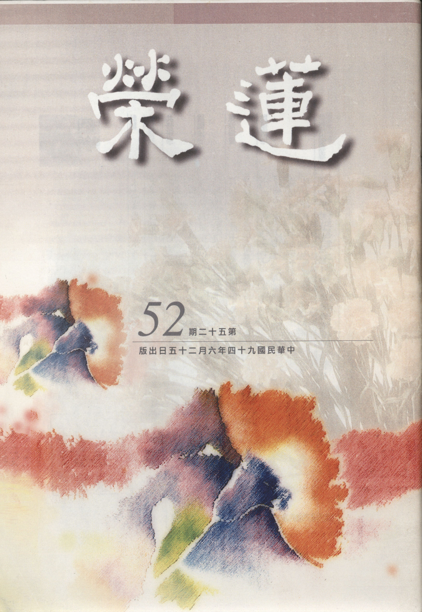

# 第52期

## 社論

### 水患省思

*編輯部*

百年難得大水患

天災人禍兼有之

如何救災防未然

標本兼治乃大幸

由五月底開始下的可怕豪大雨終於過去了！根據行政院農業委員會最新統計，截至六月十八日下午四時止，所下的豪雨創下了農業雨害損失金額最高的紀錄，依農委會統計，農林漁牧業產物損失金額達廿億八六七萬元，其中，農作物損失十一億二零八七萬元；被害面積四萬一五八零公頃，損害程度百分之二三，換算無收穫面積九七五八公頃，一期水稻、落花生、椪柑、蔬菜、高粱、西瓜、木瓜及食用玉米等受損嚴重。擴及的縣市為南投縣、高雄縣、屏東縣、台南市安南區、台南縣、雲林縣、嘉義縣等，誠然是百年以來的大災難，據報中央及地方各級官員救災不遺餘力，此是可喜的現象，但也傳出因過去水利工程及控管地下水抽取的督導不利等人謀不臧的問題，亦是此次水患主因之一。

電視畫面傳遞著許多百姓苦不堪言的畫面及待救援的慘景，見之心情沈重。想想未來類似此種災難仍會生起，因為生起災變的因素並未被對治，依佛家言，因若不消亡，果能隨緣而生，古時或遇此不可抗拒的天災，造成人民財產及生命的損失時，帝王或下詔罪己，或處分失職官員，或君臣戒齋沐浴，祈回天意，除了在人事上有一番除災的作為外，更在內心的反省上有一番的改正措施。

謹就此次災變人事上的作為來說，若能於未來控制抽取地下水避免地層下陷，並且嚴禁濫墾山坡地，以避免隨著下雨所形成的土石流；其次是建設良好的排水系統、堤防以及河川的整治。然這些人事上的作為都牽涉到心裡慾望的對治，例如沒有好吃好殺的風氣就不會有如雨後春筍的養殖業，而養殖業不斷，就無法控制地下水的抽取，同理就無法阻止地層的下陷，雨季來臨時就擋不住這些低窪地方的淹水，這時政府再標榜為百姓投資百千億的整治也無濟於事，這其實也是變相的浪費民脂民膏，有云：政策的錯誤比貪污更可怕。其次若沒有為了享受而興建遊樂設施及私人別墅，或者是為了口腹之欲而種檳榔，就不會有山坡地的濫墾，因此人們享樂的心不能止息，山坡地濫墾的現象便無法對治，觀待下雨所生的土石流就無法避免，即使用種種整治的措施也只是治標而非治本。

至於內心上的反省，更要有萬法唯心所現的體會，所以古來聖王治世風氣淳厚，能感得惠風和暢，無暴雨、水潦、旱災及地震等種種天災地變。而相反的在亂世除了有戰爭、搶奪等人禍之外，也會有水潦、地震等令老百姓煎熬地難以度日的禍害，老子亦云：大兵之後必有凶年。可見整治災變必須標本兼治，根本在國家有道，而所謂的國家有道，在乎領導人要將風氣領導出來，風氣若要淳厚，先講究主政者有為公的心量，凡事求改過及利人，能懲治自己的慾望，在利益百姓的作法上能講究，尤其是辦教化，令老百姓能淳厚篤實、重視倫常，更是根本中的根本。

大水已慢慢地退去，老百姓雖在心情沈重、環境污穢當中整治家園，相信過些時候會恢復到原來的生活，社會上也還是繼續在慾望上尋求歡樂，五光十色及令人腐化的欲樂也繼續糜爛著整個社會，這樣的水患所帶來的教訓很快的就會被人遺忘。但我們相信，只要能夠多多記取這樣的教訓，確立這樣標本兼治的作法，不但能夠改變社會的亂象，並令政治清明、國家有道，所有利民的設施都能作根本的講究，則水患能徹底的根治，還給百姓一個安居樂業的環境。

## 大德法語

### 大方廣圓覺修多羅了義經（十二）

道源老和尚

文殊祈請清淨因

圓照自性清淨心

破除無明顛倒見

是乃圓覺陀羅尼

乙二、別序，

丙一、文殊啟請。

「作是語已」，乃文殊請法，唯願世尊將清淨因地法行開示，及菩薩於大乘中發清淨心，遠離諸病。能使未來世眾生求大乘者，不墮邪見。將這些話說完之後，以「五體投地，如是三請，終而復始」表示重法最極的恭敬，以上是發起序。由文殊師利如此殷重之啟請，而發起本經。雖發起之菩薩稱為當機眾，如《金剛經》就是須菩提一個人請法，須菩提就是當機眾。

但是《圓覺經》與一般經不同，不只是文殊菩薩一個人請法，經文分十二章，是十二位圓覺菩薩請法，這十二位菩薩就是本經之當機，以下是正宗分了，然經文之分科我（道公）眼力弱不能視。同學另抄一本大字本的圓覺經，但未抄科文，因為抄小字的科判，我還是看不見。

大家須依著圓瑛老法師圓覺經講義的科，並依著圭峰大師略疏的科，科判一定要看，這是我一再說的，同學裡有聽我的話、有不聽的，你不聽是你自己糊塗！你不將科判看清楚則經文的段落你無法分。每一段科文，能將經文作一簡單綱要的解釋，不但要將科文看清楚，還要記到心裡。

丙二、師資道合：

經文：「爾時世尊告文殊師利菩薩言：」，請法是拜請，佛之講法曰「言」或「告」，向文殊菩薩（當機者、請法者）開示，實際上是向法會的大眾開示，亦是告訴我們末法的眾生。「善哉！善哉！」連說二句善哉，翻成白話文是你很好！你很好！怎麼樣好法呢？你（文殊菩薩）不但替現在法會的大眾請求如來因地法行，而且還想到末法求大乘的眾生不墮邪見，這是好上加好，所以重言善哉善哉。

「善男子」，對文殊之尊稱，「汝等乃能為諸菩薩，諮詢如來因地法行及為末世一切眾生求大乘者，得正住持，不墮邪見」，汝等，不但向文殊說，實際亦是向當會的十萬大菩薩說，特別是圓覺經當機者，所以「等」是等於其他的十一位當機眾的大菩薩，因為本經分別有十二位大菩薩請法，所以有個「等」字。或說文殊菩薩為十一位大菩薩請法，乃至為諸菩薩諮詢（請問）如來因地法行，亦即在本因地中所修的法門，這是第一個善哉。並且你（文殊）慈悲無量，能以觀念到末法之世求大乘的眾生，令他能以得一個正當的住持，正當住持於大乘因地法行之中，而不偏墮於邪見，這是第二個善哉。

「汝今諦聽，當為汝說。」諦是詳細，諦聽就是要你詳詳細細的聽、實實在在的聽，若諸位同學了解諦聽二字，那你學會了聽法。詳詳細細的聽沒有聽不懂的，實實在在的聽，沒有所謂聽了就忘記。你坐那裏打瞌睡或打妄想，你諦聽了嗎？沒有！即使耳朵聽法師在那兒講，不過是轟隆、轟隆像颳風似的。下課了！你的瞌睡才過、剛睡醒，或者妄想剛打完，你雖聽到耳裡但沒聽進去，所以聽了也不懂，聽了也不記得，既不詳細也不實在。聽法怎麼聽？諦聽！把心靜下來，不要瞌睡，不要打妄想，一句一句聽到耳內，聽到心裡，此謂之諦聽。所以如來說法前，先要開示當機者，你要諦聽、諦聽啊！我應當為你說。換句話說，你不諦聽，我則不向你說，說了枉費力氣。

「時文殊師利菩薩，奉教歡喜，及諸大眾，默然而聽。」當時如來答應說法，文殊師利菩薩奉如來之教而生大歡喜。文殊師利菩薩與大眾默然而聽，這是上課應有的規矩態度。現今上課學生講話的聲音比老師上課聲音還大，學生講學生的，老師講老師的，這是沒有利益的事，現今學校變成這個樣子。學生上課要坐的端端正正，不可以將一隻手靠到桌子上，另一隻手托著腮，這是不是要準備睡覺？規矩好的同學坐的端端正正沒有靠著椅背，有個椅背靠就想睡覺。聞法須三業無染，身體無染是身不躁動，意無染是不打妄想或想睡覺，口無染是不要老是在喝水。身口意三業都無染，這樣子他就諦聽了（恭恭敬敬的聽）！

丙三、酬請開示，

丁一、略示。

「善男子，無上法王，有大陀羅尼門，名為圓覺。流出一切清淨真如菩提涅槃，及波羅蜜。教授菩薩。」稱呼當機者為善男子（文殊）。無上法王是佛自稱，王字怎麼講？乃自在之意，於法自在稱為法王。這些大菩薩初地至等覺菩薩於法亦自在，然屬有上，初地菩薩之上還有二地菩薩，直至十地菩薩之上還有等覺菩薩，等覺菩薩之上還有佛，所以稱之為有上的自在，成了佛謂之無上的自在（無上法王），於一切法得自在。我們所學太少，所以講這個法講不通，講那個法講不通，就是於法不自在。即使講通了，也講得不圓融，不圓融就是有障礙，還是於法不自在，所以一直到了成佛，那就真正是於法自在成為無上法王了。

那麼佛是不是自己讚歎自己呢？不是，為令眾生對於世尊起一個敬仰之心。「有大陀羅尼門」，梵語陀羅尼翻到中國話是總持義，總一切法，持無量義。門指法門，將法譬喻為門，門則能通之義，能以出入才叫門。佛的法稱為法門，你入此門能得到自利，出此門能利益眾生，所以稱之法門。法門之行相為何？有凡夫法（表人天乘），二乘法（表聲聞、緣覺），菩薩法（權教菩薩、實教菩薩）。此處之法門是大陀羅尼門，能總一切法持無量義，含攝無量義理在裡邊，謂之總持法門，總持法門稱陀羅尼。密宗所念的真言亦稱陀羅尼，如念的大悲咒，稱大悲心陀羅尼。顯說是圓覺，此處指出圓覺即名陀羅尼。

「流出一切清淨真如，菩提涅槃，及波羅蜜，教授菩薩」，圓覺名陀羅尼門是總持法門，與起信論所說的真如，涅槃經所說的涅槃，勸發菩提心文所說的菩提，般若經所說的實相般若（空性），與圓覺同義，可說由圓覺流出。裴休之序文，讚圭峰大師做的圓覺經之疏鈔中云：「統眾德而大備，爍群昏而獨照，謂之圓覺。」一切真如、菩提、涅槃，一切諸波羅蜜，可說由圓覺（佛性）流出的。所說是同一義，何以有諸多名言？因為應機說法故，所教授菩薩根機不等，故用不同的名詞。

丁二、詳示。

戊一、長行。

己一、為酬初請。

庚一、明真因有力。

「一切如來本起因地，皆依圓照清淨覺相，永斷無明，方成佛道」，此處答覆文殊之問題，文殊之問是什麼問題？問如來成佛之最初發心修行，修的是什麼行門？問因地之行。世尊答覆說，不只我是這個樣子，一切如來無不如是，一切如來在因地中根本發起的法門皆依圓覺清淨覺相，下手用功（下手處），是圓照清淨覺相，圓滿覺照自己的一個清淨覺相，此即起信論上所云本覺。

人人都有本覺（佛性、法性、真如、空性），修止觀法門，令你迴光返照，此即圓照，要照的圓滿，亦即照自己本覺的相貌（無相），如何是覺照圓滿的行相？任何世俗心行都不起（心行處滅），依此而永斷無明。佛與眾生有什麼不同？有無明即是有情眾生，沒有無明名之為佛。釋迦如來就是我們最好的示範，在菩提樹下靜坐，天還未亮前忽然看見東方一顆明星，反觀自照己之清淨覺相，永斷無明成了佛，此即釋迦如來之頓超法門，但這頓超不是一下就會頓的了，還是由漸次修來，修到機緣成熟才頓。

若依起信論所說斷無明，分四相（生、住、異、滅）斷除，先由滅相斷無明，其次斷異相無明，再斷住相無明，在成佛前斷生相無明，就是斷除最初一念妄動（生相無明），圓照本有清淨覺相。雖云斷生相無明，但沒有初相（生相）可得，無明原來沒有本體（自性），一念迷生出無明，一念覺而無明滅，此時生相無明斷了，沒有初相可得，證得真如，心量馬上遍滿十方虛空界。（下期待續）

## 共修研學

### 小止觀導覽（三十一）調和身息心修止觀

*蓮心整理*

眠少神疲難用功

眠多昏沈障正念

調和能助止觀行

當念無常生勇悍

經 文

三、調身，四、調息，五、調心，此三應合用，不得別說；但有初中後方法不同，是則入住出相有異也。

大 意

總論止觀法之調身、調息、調心三者應合用。

導 覽

一、行者欲將人生的價值發揮到極致，必須要有殊勝的覺悟，而要有殊勝的覺悟，必須要有善巧的方便，善巧的方便就是止觀法門，若想要發起輪迴的覺受、無常的覺受、皈依的覺受、菩提心的覺受、空性的覺受，都要善學止觀，捨此無他，但若僅知其理，情乖所說，則如說食數寶，淪為教理無用者。

二、摩訶止觀：「三事合調者，三事相依，不得相離。如初受胎：一、煖，二、命，三、識。煖是遺體之色（溫度）；命是氣息，報風連持；識是一期心主。託胎即有三事；三事增長，七日一變；三十八七日竟，三事出生、名嬰兒；三事停住、名壯年；三事衰微、名為老；三事滅壞、名為死。三事始終不得相離，須合調也。……若能調凡夫三事，變為聖人三法：色為發戒之由，息為入定之門，心為生慧之因。」茲分述其要義如下：

（一）第八識攬父精母血，成其胎中，住母胎時，是有次第的成長，每一個七天，有一個變化，第一個七天是父精母血和合而成的一團凝滑的穢物。第二個七天漸漸增長成瘡皰之形（其形似蛋打於碗中，有蛋白有蛋黃之狀）。第三七日漸成軟肉之質。第四七日變為堅肉。自第五七至七七日有諸根及四肢的差別，七七日後就開始成熟諸根，一直到卅八個七日（九個月零四天），諸根逐漸成熟，而後從母親的產道中被壓擠出來，此時孩子痛苦不堪，母親也是生死交關（故孩子不應該在生日時唱生日快樂歌，此日實為母難日），生命體在母胎裏面，必須要煖、命、識三者和合，才能住世。

（二）受胎時是煖、命、識三者和合，命即息，因為有呼吸，所以壽命可以延續；煖即身，因為有煖所以身不會敗壞；因為有識，所以心可以住持在這個生命體裏面，使其產生作用，若諳此理，則知修學止觀時調身、調息、調心的重要性，三者應合用，不得分說，若能把握其要領，則入止觀力量會轉強。

（三）「色為發戒之由」是指吾等若能善調御色身，則戒從此生焉。戒乃防非止惡，行者應從身口開始做起，管束自己身不亂為，口不亂言，此為發戒律的前行。或云：為何不從防心始？然防心應先從防身口開始，比如教導童蒙，宜先立規矩，以為遵循。「息為入定之門」，行者若知調息之法，則入定有門，若能在一法上修止，則在其他法上之修止則易，而數息之修止（將心止於息上）最易修，故曰息為入定之門。「心為生慧之因」蓋因覺受由心生，若能用心觀修教法，則易開慧，故曰心為生慧之因。

經 文

夫初欲入禪調身者：行人欲入三昧，調身之宜，若在定外，行住進止，動靜運為，悉須詳審。若所作粗獷，則氣息隨粗，以氣粗故，則心散難錄；兼復坐時煩憒，心不恬怡。身雖在定外，亦須用意逆作方便，後入禪時，須善安身得所。

大 意

入坐前的調身法。

導 覽

一、證量愈高的祖師，愈能在日用平常注重自己的身口意三業，因為這些都是入止觀門的前行，若舉止輕佻隨便，說話浮誇不實，心思散亂放逸，則修行難成。蓋因平日動作粗獷輕佻者，呼吸必會急促，心必不安定難以收攝（難錄），入止修觀時煩惱躁動、心思昏憒（煩憒），難以專注於善所緣境，遑論入定，故平常語默動靜的講究，是入止觀之前的重要課題。

二、「身雖在定外，亦須用意逆作方便，後入禪時，須善安身得所。」句中的定外，是指我們還沒有入定修觀之前的狀態，定外還包括食衣住行育樂等，入定之前要好好的運用心思，以種種的方便，使自己能在修止修觀時，得到禪定的成就。而安身得所，是指行者的舉止動作都非常的安詳平靜，安詳是一種恭敬的表現，吾等要得到心的輕安之前，必須要身先安住，心生輕安後，身自然也會產生莫名的快樂，這才是真正的身輕安之樂，並由身輕安之樂而引生心輕安之樂，故禪定者得到離生喜樂、定生喜樂、離喜妙樂等覺受，皆因心的輕安，帶動身的輕安，但要帶動心的輕安之前，必須預先（逆作）有很安定的身，故日用平常時，能管束自己的行住坐臥，則止觀易成。

經 文

初至繩床，即須先安坐處，每令安穩，久久無妨。次當正腳：若半跏坐，以左腳置右腳上，牽來近身，令左腳指與右陛齊，右腳指與左陛齊。若欲全跏，即正右腳置左腳上。次解寬衣帶周正，不令坐時脫落。次當安手：以左手掌置右手上，重累手相對，頓置左腳上，牽來近身，當心而安。次當正身：先當挺動其身，並諸支節，作七八反，如似按摩法，勿令手足差異。如是已，則端直。令脊骨勿曲勿聳。次正頭頸，令鼻與臍相對，不偏不斜，不低不昂，平面正住。次當口吐濁氣，吐氣之法，開口放氣，不可令粗急，以之綿綿，恣氣而出，想身分中百脈不通處，放息隨氣而出。閉口，鼻納清氣。如是至三。若身息調和，但一亦足。次當閉口，唇齒纔相拄著，舌向上齶。次當閉眼，纔令斷外光而已。當端身正坐，猶如奠石：無得身首四肢切爾搖動。是為初入禪定調身之法。舉要言之：不寬、不急，是身調相。

大 意

此為入坐後的調身法，舉要言之即是不寬、不急。

導 覽

一、修學止觀法門前，很多細節都要講究，以便於入定前，把身心調整到最利於修學的狀態，入定要由粗到細，出定要由細到粗，除如佛家靜坐方法論所述者外，尚需注意下列各項：

（一）心態：在止觀修學前應立定目標以自我期許，或願透過修學引發對教法的殊勝覺受，或者志在解脫以念佛求生西方，或者以圓成佛果為究竟來利益眾生等，總之應在調身、調息、調心之初中後都以正確的動機來攝持。

（二）坐具：坐具係為防禦地上植物、蟲類以保護身體，避免三衣及寢具之汙損而作者，另有坐墊或為吉祥草製成，或者是用棕櫚草製作，不論材質為何，要以軟墊為宜。

（三）坐姿：屬四威儀之一，若能在威儀上有所訓練，在心思上有所調整，不僅可使氣順心平，也可讓人望而生敬，如大將軍桓溫至廬山拜謁慧遠大師，立其背後見其坐如鐘，氣定神閒的威儀，肅然起敬。

１．或雙盤、或單盤、或散盤，結跏趺坐就是成佛的姿勢，行者靜坐時，除應講究正確的坐姿外，並應觀想眼前以成佛的姿勢做為修定的姿勢，引發成佛的意念，使自己得到最究竟的成就，也幫助眾生得到殊勝的利益。

２．初學者不堪久坐，靜坐時間不宜太久（約十至十五分鐘即可），以免畏而生厭。腳麻時應即調整使之舒緩，以免造成後遺症，另外放腿時，不宜馬上起坐。

３．靜坐時若手置於腳掌上，離小腹太遠，則身不易挺直，故應牽來近身，靠近小腹，拇指相扣，但也不可太貼近小腹，以免妨礙血脈流通。

４．入坐時可先將身往後仰一些，然後再往回坐，身體很自然的就挺起來，人一挺直，朝氣自現。坐定後應端身正坐，頭頸靠著衣領，二肩放平，不可前伏，伏則易睡；不可後仰，仰則氣急；身體曲聳，腑臟受壓，容易氣逆昏沉，故脊骨自然正直才合宜。

５．所謂的眼觀鼻、鼻觀心，眼睛順著鼻子往下看，遠不過五尺或三尺，此為垂簾法。至於閉眼法則要小心，因為閉眼會呈現暗相，久之變成沉沒或昏沉相，削弱修行勢力，或引發其他煩惱。

（四）吐納：口吐濁氣，領納清氣，是讓身體內充滿氧氣，呈現利於修學的狀態。吐納時可做以下三種觀想：

１．生理：口吐濁氣是把身體百脈不通之處的濁氣排出來，口吸清氣是把新鮮乾淨的空氣吸進來。

２．心理：吐氣可觀想成將貪瞋癡三毒排出，吸氣可觀想得三寶加被，能令戒、定、慧的修學增上，成就福慧的圓滿。

（五）溫度：靜坐時太冷或太熱，都會引起身心的變化和身體的不適，如太熱易生褥瘡，太冷易感涼氣，故溫度以適中為宜。

（六） 環境：佛堂要清淨，佛像要莊嚴，供品要齊備，環境要整潔，因為這些都是對佛菩薩虔誠與恭敬，能感應善神擁護、三寶加被，則止觀易成。

二、菩提道次第廣論：「如修次中編、下編所說，於安樂具身具八法。足者謂全跏趺，如毘盧遮那佛坐，或半跏趺。眼者，謂不應太開亦非太閉，垂注鼻端。身者，謂非過後仰，莫太前屈，端身內念。肩者，謂平齊而住。頭者，莫揚、莫低、莫歪一方，自鼻至臍正直而住。齒與唇者，隨自然住。舌者，令抵上齒。息者，內外出入莫令有聲、粗猛急滑，必使出入無所知覺，全無功用，徐徐而轉。聲聞地說於佛所許，或床或座或草敷上，結跏趺坐，有五因緣：一、善歛其身速發輕安，由此威儀順生輕安故；二、由此宴坐能經久時，以此威儀不極令身疾疲倦故；三、由此威儀不共外道及異論故；四、由此威儀令他見已極信敬故；五、由此威儀佛、佛弟子，共所開許、共依止故〜正觀如是五因緣故，結跏趺坐。端正身者，為令不生惛沉睡眠，先應令身具八威儀，尤於調息如說善修。」可為止觀修學之參考。

三、「不寬、不急，是身調相。」身以恭敬心收攝來，非放逸坐，此時身正氣順心也提振而不放逸，以恭敬心來作止觀門之修學極為重要，乃祖師成就的秘密法。吾等志求解脫，以往生為手段，以成佛為究竟，止觀即為成就的重要法門，故對止觀法要以恭敬心來修學；不急者安詳也，即身心不緊張。不寬不急就是又恭敬又安詳，行者應培養此種氣質。（下期待續）

### 佛說八大人覺經講記（十一）離愛發心求慧

*編輯部整理*

心無厭足我執生

唯得多求結惡緣

菩薩知足且安貧

守道求慧以利他

第二覺知：多欲為苦；生死疲勞，從貪欲起；少欲無為，身心自在。

補充〜科判部分

由第二覺知，能知生死疲勞之苦果，以貪欲為因，以多欲（境）為緣。緣為「多欲為苦」，果為「生死疲勞」，因為有執我的心，愛我之念，由愛我而欲我樂，所以凡能令我樂皆欲之，以貪欲之心追求五欲之境，感得生死疲勞之苦果。

「少欲」是指聖者在現證空性已破分別我執，但未破俱生我執，猶有煩惱障之聖者（初果〜三果），雖有貪愛之心，然已甚為薄弱（少欲）；「無為」則是指四果羅漢的成就，已破俱生我執，能將俱生貪愛都破除，所以是無為，於三界之業無造作，亦即不造作投生於三界之業，故稱無為；得到的果報就是身心自在，心自在就是任何的狀況下都不會引發俱生執著、不會生煩惱困住自己；身也自在，因為沒有輪迴之業來繫縛他，不是身自在嗎？所以身自在是觀待於心自在。感生死苦果之因是業，其行相乃欲使自己於三界中離苦得樂，而有各種思惟，並由思惟引發三業種種造作，而這種思惟造作是由愛我之煩惱（惑）所發動，而成辦生死苦果，所以是惑緣業因苦果。

第三覺知：心無厭足，惟得多求，增長罪惡；菩薩不爾，常念知足，安貧守道，惟慧是業。

乙二、齊修六度，智悲雙運

乙二包括了第三覺知至第八覺知，為什麼第三覺知是指大乘呢？因為經文裡面提到 「菩薩不爾」，什麼叫做菩薩？菩薩就是發菩提心的修學者。既然是發菩提心就進入了大乘，所以由第三覺知起是大乘的修學者，大乘、小乘之區分是以菩提心有無而分。當阿羅漢回小向大時，是進入大乘的資糧道，並進入加行道、見道、修道、無學道，因為他（阿羅漢）還未發菩提心故，雖已證入空性的位階且破除了煩惱障，已有大乘第八地第一剎那的證量 （約破煩惱障而言），但未發菩提心，若欲入大乘道修學，還得發菩提心由大乘道資糧道修起。

補充〜科判部分

八大人覺經中每一覺依科判區分，都可區分為所患之病，以及能治病之藥，第三覺知亦復如是。學佛法一定要先有苦的覺受（認知）並且尋求以佛法之修學對治苦因，如世間吃藥解除病苦一樣，真正聽聞佛法的覺受應是如此。

經文「心無厭足」乃指世人執我之心未破，觀待執我之心而生愛我之心，並由愛我去追求種種能讓我樂之欲境，所以是心無厭足，唯得多求。此心無厭足是惑，亦即愛我之心，生起要讓我樂的心是沒有滿足的，此是惑（愛我的煩惱），由惑能造業，「唯得多求」是業，因為有愛我樂之心，能生起種種的思維去追求種種五欲的享受，此即唯得多求（業）。由此而「增長罪惡」，何以會增長罪惡？乃因有種種損人利己之業（追逐五欲的享受），而有增長罪惡的苦果，苦果都是罪惡所來，所以罪惡就是苦果，此處罪惡能令苦果現形。

太虛大師將「心無厭足」釋為十二緣起支之愛，「惟得多求」是十二緣起支之取，「增長罪惡」是十二緣起支之有；有三界樂境之愛，因愛而增上為取，就有（增長罪惡）了下一生結生相續的業（定業難逃）。

「菩薩不爾」是有志於修學大乘道成佛以利益有情者，在觀念上是非常的通達，此時他用什麼心態來對治這個病？用「常念知足，安貧守道，惟慧是業」之藥來治三界之愛取（病因）有（病相、苦果）；常念知足可歸為三學之戒，安貧守道可歸為三學之定，惟慧是業可歸為三學之慧；或問  雪公老師何以將第三覺知歸為禪定度，先明常念知足何以是戒，戒律精神在防非止惡，若能常念知足，必能防非止惡。而安貧守道之安貧就是安住於貧困，守道就是追求道業，追求道是心無旁騖，專心致一，謂之定，亦即專注在道業的追求。

而惟慧是業之業就是思，亦是心心念念想的就是要開智慧，想要明心見性一定要開智慧，什麼是開智慧？能正對治二種我執。亦即能見性破除二種我執的智慧是菩薩努力之目標，因為開智慧才能圓滿他欲廣度有情的心願。所以第三覺知歸攝為菩薩六度中的禪定度，以智慧為他追求的目標，對此目標專心致志、心無旁騖，故稱為禪定度。是故將人生的目標鎖定在開智慧，則人生會知足樂道，如顏回是簞食、瓢飲而樂於追求聖道，所以孔子讚歎顏回：「賢哉」。可是你的人生目標如果鎖定在五欲境的獲得，那就不知足了，每天過的很辛苦，常常造作損人利己的惡業，即使得到短暫的五欲之樂，所要付出的代價是慘痛的，不可不察，以上是第三覺知。（下期待續）

### 殊勝的地藏懺法會〜修一尊成百尊，修百尊成不了一尊

*編輯部整理*

年度地藏懺願儀

清明祭祖盼生西

現前不離善士攝

究竟是發菩提心

九十四年四月十日

一、前言：

為了遍滿虛空的有情眾生，我們必須要成就無上的正等正覺，為了成就阿耨多羅三藐三菩提，在此興辦地藏懺法會。何以在懺法中選擇地藏寶懺，乃因配合清明祭祖的因緣，超薦歷代祖先及現前親人。然拜懺之前須先作地藏寶懺儀軌的觀修，這前行法會的觀修非常重要，若不了解拜懺的意義，則難以如法地以歡喜心、感恩心、求懺悔心、求加被之心來攝持這一場法會，如此則法會之功德利益非常微薄。

二、前行：

燈 供

為了令拜懺法會得到殊勝的利益，在觀修儀軌之前先點燈發願，須觀想點燈的義涵，不單是點亮外面的那盞燈，更重要的是點亮心頭的這盞燈，在地藏菩薩及十方三寶面前來點燈，讓我人心頭的燈亮起來，則有以下十種的觀修義涵：

一、以燈照亮地藏菩薩及十方三寶，能令有情相見，並作為有情的皈依境。

二、將自己心頭的燈點亮，使自己不再愚癡。無始劫來我人都在生死輪迴中愚愚癡癡、顛顛倒倒、渾渾噩噩、煩煩惱惱、茫茫然然，所以有種種痛苦的逼迫，此時點起了心燈，唯願不愚癡，不再走輪迴的險路。

三、帶著一切的有情眾來點燈，因為一切的有情都曾經於過去生中，做過我無數次的父母，他們未來堪能成佛。即使眼前是以逆境的方式呈現，也都是來利益我的情境，何況是順境有恩於我使我增長善根福德的有情眾生，今天我能有點燈的善法，應當觀想與一切有情一起來點燈，使一切有情都能造作如此殊勝的善法，成就不可思議的福報。

四、我的心燈不僅是照亮自己，也要照亮一切法界，願以點燈供養的善法成就無上正等正覺，利益無量無邊的有情。

五、並以點燈供養的善法，興起各種善法，令種種利益眾生的事業都能隨緣隨份的興辦。

六、在燈供當中表達我的各種度生的大願，我的願力與諸佛的願力一樣，諸佛的願力就是我一個人的願力，諸佛的事業我願意一個人來承辦，以此點燈發願成就對地藏大士及十方三寶最殊勝的供養。

七、以燈供的廣大利益，特別對過往的親人作殊勝回向，成為彼等往生西方極樂世界的資糧。

八、燈供使我們破除在經教上學習的障礙，由經教的學習來體會佛菩薩的心意，我們多麼希望佛能了解我們，可是我們卻很自私地從來未了解過佛；就如同作子女的很希望父母多照顧他、多體諒他，可是卻從來沒有想到自己也要了解父母、體會父母。所以點燈就是要我們破除學習經教的障礙，真正了解佛菩薩在想什麼、在說什麼、需要什麼、我們能夠護持什麼。

九、點燈使得我們壽命有延續的徵兆，並能夠破除有情命上的障礙。

十、點燈的善法所生起的福報也將攝持世間的福報，作為我與一切有情學佛成佛的資糧。

上來將點燈供養之遠大目標及近程的利益，乃至當下的好處詳明，確信地藏菩薩及十方諸佛能滿足所願。

地藏大士是彌陀之化身

其次有大德嘗言：「修一尊成百尊，修百尊成不了一尊」，有情眾生在修學佛法時大半抱著盲修瞎練、吃速食麵地心態，看看能不能以快速的方法解決自身的問題。今天有障礙就唸一唸普門品，發覺沒有改善；於是明天改誦地藏菩薩本願經，又發覺不靈感；第三天感覺不妨唸阿彌陀經，也覺得沒有什麼感應，或許藥師如來本願功德經消災能力較殊勝，於是再改唸藥師經；其後又發覺到改變業力的速度沒有他想像的快；再回頭看看有什麼秘密咒可唸，秘密咒再唸唸，亦發覺到好像也沒有他想像的殊勝。每天都在尋求其他更有力的法門，最後的結果是對佛法全部喪失信心，果真是「修百尊也成不了一尊」。十方諸佛都想幫忙亦無從幫起；就如同世間人在緊急的情況下病急亂投醫，但他對任何人都沒有十足的信心，所以也沒有人敢出面整合這些力量來幫助他，他只好東跑跑西鑽鑽。

雪公老師曾說過，你們走過的路，他都曾經走過，在密法修持中也修過兩百一十一種神通、各種的法門他都修過。但老人家覺得不如死心塌地修一尊，所以勸導大家應該修一尊成百尊，這才是真正地千穩百當。尤其我們所學的是阿彌陀佛念佛法門，就應該好好專心地來學。即使拜地藏懺時，都可以觀想成阿彌陀佛變化生起的，眼前以地藏菩薩的行相來攝受有情眾等。

在彌陀經上：「……是諸眾鳥晝夜六時，出和雅音其音演唱五根、五力、七菩提分、八聖道分……舍利佛，汝勿謂此鳥實是罪報所生……舍利佛，其佛國土尚無惡道之名，何況有實，是諸眾鳥，皆是阿彌陀佛欲令法音宣流變化所作……」。經上所云連鳥都是阿彌陀佛之所變化，如是亦觀想成一切有情乃至十方諸佛也都是阿彌陀佛之所變現，則所有修百尊功德都能在我們修一尊中生起同等功德。因此應當要好好來學習念佛法門，倘若到處攀緣、到處沾鍋，將來就是修百尊也成不了一尊。

拜懺前五項觀修

一、拜懺的心態：由拜懺的利益產生對拜懺的歡喜、誠意及供養，並以求加被的心態來拜這殊勝的懺儀。

二、拜懺主尊地藏菩薩功德的認識：雖然可以將主尊觀修為阿彌陀佛所變現，然所顯現地藏大士中攝持的功德是如何，應生起一股見賢思齊、勇悍欲證得之心。

三、禮拜觀修懺文能治障礙的認知：在拜懺時隨文入觀，將懺本所說障礙，依誠敬心修四力懺悔，在地藏大士及十方三寶加被下除盡。

四、修正拜懺認知的偏差：將拜懺作為我人親近地藏菩薩、親近阿彌陀佛、親近十方諸佛的增上緣，也藉著拜懺來清除學習教法上的障難。正因為懂得拜懺的要領、心態、作法，故祈求拜懺的善法能夠住世，而洗刷世人對拜懺的曲解。一般世人對拜懺都有趕經懺的誤解，而佛門也有認為拜懺是經懺佛事，正統寺廟是不拜懺，一般則藉拜懺歛財不少。殊不知這些懺軌都是祖師大德所制定的，本地藏菩薩懺法是蕅益大師、乘戒比丘所制定的，既然是大德所制定的，卻用來作趕經懺求名、求利，若將法作賤會成為嚴重的謗法罪障，非祖師大德及法的過患。

五、藉著拜懺結合民俗意義非凡：佛法不外人情世故，我們中國的民俗分有清明、中元祭祖的儀式。清明民俗祭祖有各種方式，包括在祖墳剪草、上香、磕頭，或者緬懷親人在世的恩德；若後代子孫以清明祭祖結合地藏懺法，則歷代的先亡、堂上的父母親，都能蒙受其利。每一年在清明、中元節以如法拜懺行之，必不枉祖先、過往的父母或堂上父母對我們的關照、疼愛與護持。若能為祭祖在法會中隨文入觀，體會主尊的殊勝功德，發起菩提心、欲求成佛，眼前對懺法引發殊勝的覺受，如此之祭祖最為殊勝。

地藏懺廿八種利益

一者天龍護念；二者善果日增；三者集聖上因；四者菩提不退；五者衣食豐足；六者疾疫不臨；七者離水火災；八者無盜賊厄；九者人見欽敬；十者鬼神助持；十一者女轉男身；十二者為王臣女；十三者端正相好；十四者多生天上；十五者或為帝王；十六者宿智命通；十七者有求皆從；十八者眷屬歡喜；十九者諸橫消滅；二十者業道永除；二十一者去處盡通；二十二者夜夢安穩；二十三者先亡離苦；二十四者宿福受生；二十五者諸聖讚歎；二十六者聰明利根；二十七者饒慈愍心；二十八者畢竟成佛

地藏懺儀軌本明修學地藏法之廿八種利益：

地藏菩薩本願經囑累人天品第十三，佛告虛空藏菩薩，為來世有善男子善女人，見地藏像、持名、供養、讀誦經典等，能得廿八種利益。此利益之觀修極為重要，修法前若能通達所攝持的功德與利益，則生起對修法極為勇悍之心。同理，在世俗上帶著一份禮物去見老師時，是只來見見老師？是來受教？還是來學習甚深的義理？若有好的心理準備，瞭解能生的利益，則見面請益時，能得不可思議的受用。是故若先瞭解此廿八種利益，來攝持眼前的拜懺法行，則未來在地藏菩薩與十方三寶護持下，能逐步完成此廿八種功德利益。

首先約外緣之助益，可以分為有情與無情對我的利益，約有情有正明利益與反顯護持，約正明利益上可分為人之敬喜、非人護持及超薦先亡，其中人之敬喜可分為：人見欽敬：我們因為拜懺，身心調整，氣質改變，身心舒暢，修行的氣象顯現，當然能得到他人的欽佩與尊敬，一般世俗人頹廢無志、辦事顛三倒四，如何贏得他人恭敬呢？眷屬歡喜：藉由拜懺改惡修善，消除人與人之間的隔閡，自然使得眷屬和樂融融，一片歡喜。如此善力之發展還能得非人的護持，所以是天龍護念：天龍都曾受佛之咐囑護持修行人；鬼神護持：因能懺悔改惡修善，得到地藏菩薩之加持，故得鬼神暗中幫助護持；諸聖讚歎：有心依正法懺悔改過者，必得諸聖讚歎，如孔子讚蘧伯玉；其中亦具超薦先亡之利益，即先亡離苦，藉著改惡向善，以及發心的力量，令已過往之親人往生淨土。反顯護持是無盜賊厄：當修行能去除身心過惡，將惡業消除時，這些被搶劫、恐嚇、勒索等災難是不會生起的。以上是約有情之助益。

其次是無情的助益，正明利益有衣食豐足：或許有人會納悶，學佛的人不汲汲營營於賺錢，怎麼生活如此快樂？不學佛的人整天致力於賺錢，卻總覺得處處不滿足而煩惱不斷，學佛者少欲知足並得三寶默默護持，身心常覺莫名的快樂，那種快樂是非學佛者無法體會的。反顯護持是疾疫不臨：修行人神清氣朗，身心輕安，即使生病也不覺得苦，即使臨終時遇到病苦，大修行人連眉頭都不會皺一下，如 雪公老師晚年病苦時，所顯現的就是不被病苦所纏的修行能耐；以及離水火災：平常不受這些災難逼迫，即使水災、火災、地震現起時，修行人亦不受災難，此乃共中不共，如同八十八年九二一大地震，傷亡慘重，然住在東勢、新社的蓮友雖處於最嚴重的震區，卻沒有一家傷亡，所住的房屋也沒有一間倒塌，亦如斯里蘭卡的海嘯，佛教徒家庭沒有人受災傷亡一樣。

其次約自己之增上，能得增上身的成就，就異熟果上多生天上，免墮三塗之苦。約等流果尚可分為領受等流與造作等流，約領受等流是善果日增：因為常常有作善的機會，所以作善的果報越來越多；女轉男身：來生投生為人時，可以領受男身；菩提不退：因為有這些資糧的累積，所以在菩提道上自然就不退轉，未來能成就佛陀的果位；為王臣女：即使投生為女子，亦能投生為王臣女，受用具足；且端正相好；聰明利根；或為帝王；有求皆從；宿智命通；且去處盡通：所去之處皆非常順利，亦是所願之境；宿福受生；夜夢安樂。若約造作等流，則為集聖上因：眼前收集成為聖人的因，拜懺當中禮敬諸佛、懺悔業障與發菩提心求成佛的因，就在此場合中累積；及饒慈愍心：因為有反省的心態，肯將損惱有情的惡業去除，所以漸漸地富有慈悲心。

以上是增上身，未成佛前會有這樣的走向，不會孤苦伶仃，煩煩惱惱、糊里糊塗，親近惡知識而毀滅一生。若身為男子，會在男子身上有學佛的順緣，即使為女子，也能在女身身上有學佛的因緣。最終能得決定乘（離繫果），是業道永除，能遠離六道輪迴；不但如此，且能畢竟成佛。以上是拜地藏懺所要成就的功德，在拜懺時須先好好的體會。

## 蓮池海會

### 蔡柏濂老居士往生見聞記

*編輯部*

一身寬柔忍辱功

痛苦能予佛門緣

障礙直至往生前

含笑西歸化緣盡

蔡柏濂老居士出生於霧峰鄉，從小聰穎好學，求學期間成績優異；尤其在台中商專求學時，在佼佼者中不僅為班代，畢業時更得全校第一名。畢業後，為了分攤家計，遂報考稅務員，而被分發到桃園稽徵處服務，隨後又輪調到北斗，最後調回豐原，在豐原稽徵處以股長的身分榮退。

老居士一生行持嚴謹，謹守身口意三業，生活有規律，教子身教重於言教，每天出入必向廳堂上的神明行禮稟告；為人正直寬宏大量，修養有加。一生從不與人計較，不苛求於人，以和為貴，縱有意見相左，或他人虧欠辜負於他，皆將所有的委屈往肚裡吞，也不予人難堪、發脾氣，能忍人所不能忍，故與大眾往來，所結皆是善緣。與人往來謙恭有禮，和藹可親，有客來訪，不論老少，皆親自烹茶、倒茶，且傾盡所有可待客之物，熱情待之，讓人有賓至如歸之感；縱於病中，親友來訪，也不忘請家人盡心招待；老居士育有五女，皆學有所成，已成家立業。老來又得二子，家計雖不甚寬裕，但其弟凡有所求也必欣然應之，時常濟助之，手足情深溢於言表。故凡與他相處過的，不管是家親眷屬、左鄰右舍的老弱婦孺或是昔日的同僚、校友、同窗都讚不絕口，一致推崇他的為人，凡聞其往生者咸悲泣不已，惋惜之。

綜觀老居士一生常持感恩、包容、善解之心，別人誇之，則生慚愧心，總覺自己虧欠於人，做得不夠好；別人對他有所冒犯，總能包容，不與之計較；此不正是貫徹印光大師所開示「看一切人都是菩薩，唯我一人實是凡夫」的修行嗎？也難怪會有後半輩子親近善知識學佛及往生的殊勝因緣。

老居士得聞淨土念佛法門，當追溯於孩子參加啟蒙班，而在善知識的教導、影響下接觸佛法，日常生活中一句佛號常持不斷，但不溢於言表，家人擔心每每提醒要多念佛，皆言常持有念。

老居士於去年總覺胃腸不適，偶而吃吃藥，不當一回事，但或許感於孩子年幼，或許是深感無常的不測，於去年即開始整理親友的住址、電話，並寫遺囑、訃聞。至今年過年，胃腸明顯不適，遂積極求醫。兩個孩子也在老師的指導下，一方面排開課業的繁難，參加老師於二月底在本淨寺開講的心經，將參加的功德融入大眾的功德海中，再回向給爸爸，祈求阿彌陀佛做最好的安排；一方面也請求老師於講座最後一天舉行放生。承蒙老師及本淨寺師父的的慈悲，在本淨寺為老居士放生，當天雖春寒料峭、大雨不斷，但全家陪同老居士欣然同往，老居士於放生完後，感恩的當場下跪道謝。

三月九日老居士前往榮總檢查，確定得胰臟癌，醫生告知胰臟癌無法開刀，到後期會疼痛不堪，是所有癌症中最難過最疼痛者。家人怕引起老居士情緒不穩，起初隱瞞病情，也積極的為他求醫，雖期間偶而稍好轉，但還是抵不過病魔，肚子越來越脹，偶而也隱隱作痛，家人恐其荒廢念佛誤其往生，遂告知實情並善巧令其了知此時唯有依靠阿彌陀佛，別無選擇，一切都交給阿彌陀佛安排，且家人及老居士在老師不厭其煩慈悲的指導下，一步一步的依教奉行。

首先家人不斷地在佛前代其懺悔發願，也請老居士一心皈依投靠三寶，懺悔累劫來所造的惡業，並發願往生西方乘願再來廣度眾生，也請求三寶加被去除累劫來所造的冤業；並堅定信念，視現前的種種苦報皆是提前受，往生西方享大福前，必受一番苦，請其放鬆心情，欣然接受果報；也觀此示現有教化作用，能令世人有所警惕，而知平常修行的重要並及早儲備往生資糧。故全家一心念佛，將整個心定在佛號上，以備承受日後的大痛，去除一切往生的內外障緣。

其後也隨喜團體斯里蘭卡的齋僧、放生、賑災的法行，也因為鄰居的因緣，助印地藏本願經一千部流通；一家人也誦持地藏經一百部，並感念地藏菩薩的慈悲，發願追隨地藏菩薩，以地藏菩薩為榜樣，願救拔一切有情離苦得樂，並將此功德迴向老居士。於是全家歡喜做，甘願受，每天認真的做早晚課，一起念佛，孩子上學前、放學後的第一件事就是在佛前上香禮拜，代爸爸懺悔發願，祈求阿彌陀佛給予最好的安排，並誦地藏經，也發願日後更努力學習，並將所學回饋社會，護持正法，使正法住世，利益有情。全家總動員一起發願、拜懺、念佛、吃素，行各種善法，齊心齊力助成老居士往生大業。

雖然不斷的做善法，但惡業顯現的快速、可怕實在令人措手不及、束手無策，其後發作得更快，腳開始腫脹，肚子也脹得又大又亮，因為胰臟負責消化系統，只要胰臟一分泌消化脢，肚子就痛，所以無法吃東西且肚子脹得無法坐，疼痛的次數也更頻繁，有時痛得整個晚上翻來覆去，根本無法念佛，但老居士都強忍著痛，怕家人擔心，從沒哀叫呻吟，家人看了反而不忍。此時老師教其更就自己受苦之狀況，緣與自己同樣受苦、無力斷惑之有情發起悲心，堅定求生西方成佛度這類眾生之心念，將所念的一句佛號，化成無量無邊的功德，利益法界一切有情、冤親債主等同生極樂國；也觀此病苦轉化成家人學佛的增上緣，體會有情眾生之苦，發願助同樣受苦之眾生。

其間，為了緩和疼痛，曾住院一星期。雖有最好的照顧，加上蓮友不斷探訪，說法打氣，堅定其求生西方信念，知世緣未盡則很快康復，如世緣已盡則往生無慮，此為上策；如只求病好，恐世緣已盡而誤往生。但家人還是深感護持不易，老居士也感諸多不方便，無法安心念佛，加上醫院混雜不清淨，醫生也表明癌細胞已蔓延至食道，隨時會破裂而大量出血，要小心注意，在醫院可給予安寧治療，而且家住在公家宿舍，鄰居來往頻繁，人言可畏，出院或住院實在兩難，經請教老師後，老師說：「但辦肯心，佛菩薩必不相賺。」乃毅然辦理出院。

回家後，全家更用心念佛、誦經護持，不斷提醒老居士至心念佛，老居士也都能欣然接受，雖沒體力，也請家人扶持上香點燈，跟阿彌陀佛懺悔、發願、稟告祈求，然後一心念佛。不可思議的，在往生前兩天，本來腫脹的如臨盆的肚子及腫得像大象腿的腳全部恢復如一般人，在母親節前兩天前得到大眾助念十二小時，安祥自在，沒有痛苦，全身柔軟含笑往生，誠如老師說的佛菩薩不會辜負有心人。

往生後的一切事宜，親友間雖有些意見，也都在佛菩薩巧妙的安排下適時的化解，告別式那天雖傾盆大雨，但親友還是冒雨到場致哀。在發引出發往火化場時，卻雨過天青，這又是佛菩薩的加被，龍天護法的護持，相信這一切的顯現，皆是老居士往生西方的徵兆。

老居士往生後，家人如法做七舉行告別式，努力誦經、念佛、齋僧，更在滿七時完成誦讀一百部地藏經的心願，圓滿的設立佛堂。平時言談間，家人也鼓勵親友們學佛，所住的社區也受到極大的感化，實在不可思議。相信老居士在西方淨土必感欣慰。祈願老居士早日花開見佛，悟無生法忍，乘願再來，廣度眾生。

### 鍾延浪老居士助念見聞記

*編輯部*

出生貧寒成家苦

打拼為家子女成

夢中忽然報盡時

助念作七盼得生

老居士祖籍桃園縣龍潭鄉九座寮，老居士出生不久，二次大戰降臨。戰後，台灣民窮財盡，家中無以維生，新婚不久，不得不帶著妻子北上基隆，跟隨大哥（延繡）學習泥水技藝，定居於現址。每日清晨六、七點上工，晚上六、七點收工，一天工作十二小時以上，不論颳風下雨或烈日曝曬、酷寒或炎夏，都得出外掙錢；除年節外，無一日鬆懈，其中辛酸，實非外人所能體會。

隨著台灣經濟好轉及老居士自身努力打拼，家中生活漸有改善，子女也慢慢長大，各自成家。遭逢建築業十多年的不景氣，老居士不得不於十多年前放下工作，悠遊晚年。其間遭逢兩次輕微中風，均安然度過，只是聽力退化以及行動稍有不便，其餘一般生活多能自理。

老居士一生恬淡，不求奢華，衣著吃食簡單樸素，對家人、親友溫和應對，少見生氣憤怒的臉色，全家人和樂融融，子女相處甚少爭端。

老居士一生困頓奮鬥，自無至有，當子女長大成人，生活有餘裕而可安享晚年之際，卻於五月十三日睡夢中安詳往生，享年七十八歲。家屬謹遵佛制予以助念，更於七七日中如法作七，祈願老居士於西方淨土中，速成佛道，早日回入娑婆，廣度群蒙。

## 禮懺法會

### 清淨僧團結夏安居之供養〜如何於福田中種善種

*編輯部整理*

懷抱意樂為善種

觀修僧眾功德田

時機是結夏安居

福報生起不思議

九十四年六月十一日

前言：

為了遍滿虛空的有情眾生，我們必須要成就無上的正等正覺，為了成就阿耨多羅三藐三菩提，所以眼前於西蓮淨苑僧團結夏安居作供養的法行，並以此做為我們供養十方一切賢聖僧之發起。或觀想時十方一切賢聖僧皆來淨苑接受我們的供養。

而每年淨苑結夏安居，僧眾都慈悲開許我們上山供養，功德用作回向十方、回向淨土，今茲就六月十一日共修會於西蓮淨苑結夏安居打齋供眾所做的前行意樂謄錄如下，作為今年度結夏安居打齋供眾之殊勝緣起。

須知於淨苑結夏安居期間對大眾僧作供養是大眾福報，我們可以由幾方面來觀修：

一、由西蓮淨苑：

此道場由上智下諭老和尚開山以來就是一個非常殊勝的道場，不論在戒律、教法、修行風氣及培養僧眾人才上，堪為國內非常如法的道場，故為我們在家眾殊勝的福田，對此福田作供養是身在俗世塵勞中的在家人天大的福報，應生出殊勝的歡喜心。淨苑能於末法時期有情眾生善根偏劣、教法魚目混珠下，保持這麼清純的道風，是台灣眾生很大的福報，而且有此機會令在家俗人供養，是我們非常大的福報。

二、就僧團本身：

淨苑僧團能代表所有法界僧眾，因法界僧眾一體，由佛引導代代相傳，有其傳承。若偷盜僧眾物等於偷十方法界僧眾物，故現前對西蓮淨苑做供養，等於對十方法界僧眾做供養，若有如此觀修，福報增長廣大不可思議。

三、吾人應懷抱的意樂：

懷抱的心態意樂很重要，絕不可以生起諸多的世俗想法，以為反正今日沒事故來做做善法等。如此雖然也得一些福報，但是很可惜！那麼我們應該懷抱什麼心？

（一）出離心：我們為了出離三界輪迴之種種痛苦，必須累積解脫的資糧，眼前以供僧為累積出離之資糧。

（二）菩提心：為了利益有情成就佛果，所以我必須成就佛果才能幫助有情成佛，眼前以供僧法行攝持普賢菩薩之廣修供養法行作為成佛資糧。

（三）恭敬心：此供養乃提供修行人用功辦道的資糧，感應我們將來於修行時能有道糧，且易受善知識攝受，因為用供養與善知識結善緣，所以亦感應於修學正法時，得到善知識的指導，因而迅速成就。

（四）懺悔心：因供養佈施之心，懺悔往昔之慳貪，能遠離因貪而生起各種苦難的世間。

（五）隨喜心：以此供養善法表示對一切聖者所做善業的隨喜。

（六）求法心：打齋供眾目的除了提供僧眾道糧外，並請僧眾說法，以求法之心破除愚癡，能使供養者福慧雙修。

（七）歡喜心：對於自己以及團體能作這樣的善法要修歡喜心，方能對此善法及一切利益有情的善法具大勢力而為之。歡喜心之生必須觀待善法所生起的利益，所以必須要好好觀修此次供齋的功德，帶給我們現世及來世的利益。

（八）常隨心：常隨僧眾大德善知識學習正法，培養自己利益有情的能力。

（九）回向心：將善法做完後慎重、誠懇地回向菩提。

（十）無所得心：所得的功德是自相本空，是觀待清淨的意樂及觀待認知到如法供眾是在清淨福田上恭敬作此供養而後生。

以這些心來做眼前結夏安居齋僧供眾的善法意樂。

四、從護持釋迦牟尼佛所制定規矩：

釋迦牟尼佛是我們於娑婆世界恩德最重的佛，因釋迦牟尼佛於五濁惡世、善根福德非常淺薄的南瞻部洲，以八相成道說法來度剛強難化的眾生。《佛說阿彌陀經》有云，於此世成就阿耨多羅三藐三菩提是為甚難，並弘揚淨土難信之法是為甚難。釋迦牟尼佛能為我等行此難事，故恩德最重，他所制訂的戒律、規矩是我們所應讚歎、護持、學習的，其中僧眾結夏安居的規制之護持更為重要。釋迦牟尼佛在世時，每年皆有結夏安居，比丘眾經過結夏安居後增一歲法臘，如一生結夏安居三十次，則法臘三十歲，一生結夏安居四十次，則法臘四十歲。何以佛要制定結夏安居之規矩，目的有四：

（一）僧眾常年托缽在外，無法靜下心，若能在每年中用一段時間靜下來好好修行辦道，能夠將一年所學做一反芻，很容易在這段時間修行成就。

（二）夏天蟲蟻多，出去托缽行腳容易踩傷蟲蟻。

（三）天氣太熱易中暑，對身體造成傷害，造成修行障礙。

（四）在家人夏天服裝不整，向彼乞食有所不便。

在結夏安居前先於一處結界，這三個月期間不能違越這樣的界限，由上座比丘領導僧團作結夏安居，而於此期間，一般僧眾所做事為何？

（一）講經說法

（二）觀修教法

（三）議論佛法

（四）研究戒律

（五）懺悔惡業

於七月十五日解夏，說說自己修學心得以及所造過惡，該懺悔則懺悔，該發願則發願，有修行覺受則說說自己體會，此日稱為僧自恣日，在這一天會有許多修行人成就，亦是諸佛最歡喜的，亦稱佛歡喜日。但結夏安居僧眾必須結在一方，無法出外托缽、行腳，在家人理應於僧眾集會處供養，保護此制度即是尊重釋迦佛，尊重釋迦佛即是尊重十方諸佛，尤其對正法時期所制之制度，予以護持、尊重，容易感應投生正法世界，未來能離象法、末法、滅法、八難之世界，而最殊勝的正法世界即西方極樂世界，彼佛國土無有眾苦但受諸樂。

若欲求生西方淨土，須與西方極樂世界相應，才能去西方極樂世界，或問我們心如何與其相應呢？即對釋迦牟尼佛所定正法之制度隨喜、讚歎、護持則易感應我們投生正法世界，這麼說來我們要往生淨土則非常容易，於臨命終發覺自己是無病苦、無顛倒、無障礙、正念分明、捨報安詳，原來是跟未臨終前所造善法是有關的，我們做的是哪些善法呢？可說皆是對正法之護持，這比一般世間人所作善法更重要，絕非世俗這些表面名聲的追求，更重要的是與法相應，此之善法所生之果報能成為修行正法之資糧，非為來世得大富大貴，而由此富貴廣造眾罪，甚或以此追逐更多的名聞利養，若表面看似做一些利益人的事，而骨子裡全為自己著想，此種善法寧可不做。反之觀待正法所起之善法必須努力造作，眼前於淨苑結夏安居供齋之善法，即是觀待正法（佛制）之善法。

五、對淨苑偉大僧眾們的一個鼓勵：

我們以真誠來擁護清淨如法的僧團，給予僧團好的增上緣，如  雪公老師晚年講經時，雖常身體不適，但當聽到遠到的學生要來聽課，老人家即會勉力振作，故我們遠去聽經其實就是對老人家起鼓勵的作用，雖然我們力量微薄，但亦是護持正法的增上緣。

六、約著廣大社會言：

雖然我們未做造橋鋪路之善法以利益社會，但擁護正法團體維持國家善良風氣之不墜，亦是利益國家與社會，有云：天下興亡匹夫有責，此亦是匹夫對國家天下之護持，想想看一個國家亡國難道是亡在沒有船堅砲利嗎？而其興也只是船堅砲利嗎？蘇聯國家之解體就是不斷地發展船堅砲利的果報，許多以武力建國之王朝像元朝只不過短短九十年。觀歷史而知國家之興在風氣淳厚，敗在風氣澆薄，護持善良風氣、修行風氣，就是在護持國家民族，此稱之為天下興亡匹夫有責，我們正在做匹夫應做的事。

七、就個人本身言：

我們人生旅途有諸多的障礙，如：身體不健康、諸事業不順、或衣食不具足、或感前途茫然，若我們不修行，或不造作觀待正法所起善業，我們不可能衝破這些障礙，不可能解開業網繫縛，所以此時也提供解黏去縛、脫困業網的機會，應懷抱各種美好心態來做此法行，且所用的時間也只有兩頓飯的時間；世間人可能一玩樂就一天，一看電視就看一天，睡覺也可以睡一天，一個昏沉掉舉就可能過一天；想想看：我們在懈怠、昏沉、掉舉、妄想、摸魚、無所事事的時間更長，從來不覺可惜，修學正法或造善業時反而覺得時間長有點捨不得，總覺得花太多時間，這樣的想法不是可憐憫者、愚癡眾生嗎？

所以真的將世俗心態對治掉，換上歡喜心、感恩心、懺悔心、隨順心、供養心、發願心、忍辱心，並且生起觀待正法之觀修及大眾一起來共造善業之心，最後是回向心，相信今天功德一定是增長廣大、無量無邊，即使是只有一滴，也將投入到阿彌陀佛及三寶的大願海中，若要用盡此功德，必得把阿彌陀佛及三寶的功德願海用盡，我這滴的功德才窮盡。

## 啟蒙園地

### 歷史故事　祖德庇蔭的楊榮

淨域

讀史能知善惡報

發跡原來祖積德

若要後代子孫旺

改過利他餘慶厚

楊榮，明朝建安（今福建省建寧縣）人，字勉仁，是明朝的重臣；他的先祖以划船擺渡維生，在曾祖父時代，建安發生大洪患，沖毀了居民的房屋，許多災民及財物都隨洪水漂流而去；當時很多擺渡的船夫都趁機爭相撈取漂流物，惟有楊榮的曾祖父和祖父，不顧自身安危划著船全力搶救溺水的災民，對於漂流的財物一點兒也不心動。災後，許多船夫都因此發了橫財，只有楊氏父子依然以擺渡維生。當時鄉人都私底下譏笑他們父子倆太傻了，但是楊氏父子卻以救人為樂。

到了楊榮父親這一代，家境漸漸寬裕。有一天，一位修道之人路過楊家門前，停下腳步對楊榮的父親說：「你的祖父和父親生前積了陰德，你可以把祖父和父親安葬在某地，這是『白兔墳地』，將來子孫必當顯貴。」之後，楊家就依照指示的地點遷葬。

後來，楊家誕生了楊榮，初名為子榮，自幼聰敏，既有才識，又好讀書，年紀輕輕就於惠帝（朱允汶）建文二年高中進士，授任編修官一職。當時惠帝恐於諸藩王（叔父）勢力坐大，威脅到自己的帝位，採用謀士之議進行削藩；燕王朱隸以「清君側」為名起兵「靖難」，歷經三年（西元一四零三）打敗惠帝入主南京城。明成祖朱隸入京時，楊榮立於馬前恭敬地說：「殿下是先來祭拜祖陵，還是先來即帝位的？」此語逼得成祖趕快驅駕前去孝陵拜謁；此後，楊榮受到成祖的重用，入文淵閣，授以翰林院大學士，成祖將他易名為「榮」。

明初延用元朝官制，置中書宰相一職，太祖洪武十三年宰相胡惟庸謀反被誅，十年間誅連三萬餘人，後廢宰相一職並詔告後世子孫不得恢復相職。後因皇帝無法事事躬親，乃立殿閣大學士議政，官秩五品，此為明朝的「內閣」新制。

當時入閣的人員共有七人，楊榮最為年少，但表現卻機智敏銳。有一天晚上，邊防回報寧夏被圍困，皇帝召集閣員議政，但當時僅有楊榮一人在朝，成祖便詢問楊榮有何對策，楊榮說：「寧夏城池堅固，百姓都嫻熟戰技，戰報傳至京城，距離事發已有十多天，相信現在應該沒事了。」到了半夜，果然上奏解圍了；成祖對楊榮說：「你的論斷真是有理有據呀！」

某年，江西當地盜匪作亂，成祖先派遣特使持諭安撫，後再命令督都韓觀率兵平亂。不久，盜匪就撫的消息傳回京城，成祖欲封賞韓觀；此時，楊榮上奏說：「算計捷報回京之日，韓觀還未到達江西，不應論功行賞。」成祖聽後採納所言，對楊榮更加倚重，再拔陞為「侍講」。

成祖立太子後，楊榮又被提拔為「右諭德」，仍兼侍講一職，並賜二品官服，得以評議諸司事宜。成祖相貌威嚴，與大臣們議政，每每爭論到生氣，但只要楊榮一到，常常就能緩解皇帝的怒氣，事情也就順利的解決了。

成祖永樂五年，楊榮受命前往甘肅運籌軍務，一路上他仔細地遍覽山川形勢，詳察軍民的動態，審視城堡的建構。回京後已是盛暑，上武英殿稟奏所見所聞，成祖大悅，親自剖了一個瓜給楊榮吃。

永樂六年父喪，返鄉奔喪。次年母又喪，成祖以北巡在即，命其與胡廣、金幼孜隨行。至永樂九年，方准予返鄉奔喪；回京後成祖詳詢福建的情況，楊榮具實稟奏，帝命其於文華殿陪侍諸皇孫讀書。

永樂十二年，太孫隨帝西征瓦剌，成祖命楊榮於軍陣中講說經史，凡宣詔出令，定徵詢楊榮意見。一天夜裡，成祖於帷幄中詢問楊榮軍糧事宜，楊榮答說：「欲解決兵食問題，須任用良將，嚴訓兵士，自耕自食，不違時令」。永樂十四年，與金幼孜一起入翰林學士。十六年，胡廣卒，成祖命楊榮掌理翰林院事，益加倚重；惟遭到諸大臣所忌，設計推舉楊榮為「祭酒」，成祖說：「我知道楊榮的能力，你們那一位可以取代他？」一時間大家都不敢答話。永樂十八年，再被任命為文淵閣大學士，仍兼舊職。

永樂十九年，成祖定都北京，凡軍事皆令楊榮參決。成祖下詔征討阿魯台，欲徵調惠帝時之江西民兵，楊榮諫說：「陛下許民復業二十年，一旦復徵，非信於天下」，帝從之。永樂二十一年再北征，因天寒兵士死亡二、三成，大軍來到蘭納木兒河畔，不見敵蹤。帝問群臣該不該前進，眾人唯唯支唔，惟楊榮與金幼孜建議班師回朝，帝許之。軍行至榆木川，成祖病崩。中官馬雲等人不知所措，密請楊榮與金幼孜入御幄商議；二人說：「大軍在外，離京城尚遠，先密不發喪。以帝禮斂之，棺外熔錫為槨，載於車輿中。所到之處飲食規矩照常，加強軍紀，使人不明究裡」。有的人建議是否發詔書馳稟皇太子？楊榮說：「先帝在則稱詔書，今帝崩而稱敕，這是欺詐行為，誰敢如此」。眾人稱是。故以遺命傳位之訃稟奏太子，太子命楊榮等辦理帝喪。

仁宗即位後，進太常卿，尋為太子少傅、謹身殿大學士。此時，有人將帝喪當時楊榮的處置情形上奏仁宗，獲仁宗的褒揚，進工部尚書，食三祿；當時大學士楊士奇辭謝尚書祿，楊榮與金幼孜亦推辭，帝不允。

仁宗宣德元年，漢王高煦謀反，帝召楊榮等商議，楊榮說：「高煦以為皇上剛即位，必然不會親自討伐，如今帝親征，出其不意，事情可圓滿落幕」。仁宗從其建議，軍行至樂安，高煦出降。還師後楊榮受賞，褒賜甚豐。

宣德三年，隨仁宗出巡，至遵化聞兀良哈將寇邊，帝獨命楊榮從征，破敵於喜峰口。宣德五年進少傅，辭大學士祿。九年復隨帝巡邊，至洗馬林而還。

英宗即位，委任如故。正統三年，與楊士奇俱進少師。正統五年，請求回鄉掃墓，帝命中官護行，還至武林驛而卒，年七十，贈太師，諡文敏，授世襲都指揮使，子子孫孫都很昌盛，曾孫楊旦官至兩廣總督，吏部尚書。

誠觀楊榮祖上，以一介舟夫，而具有人溺己溺之仁人胸懷，奮勇救人於沉溺急難之中，若非大福德之人不能做到，終得賢貴子孫投生其家，來光大門楣榮宗耀祖，可證陰德善行感應最真。

歷史上因救人而得善報者無計其數，三字經中的「竇燕山，有義方，教五子，名俱揚」便是。竇燕山是五代時幽州人，他是個孤兒，事母至孝，但到了三十多歲仍然無後，因而非常擔憂。有一夜，竇燕山夢見自己的祖父報夢，說他前生作孽太重，以致今生不僅無後，而且短壽，除非他能回心向善多行善事，或能加以補救。從此，竇燕山就立志諸惡莫作，眾善奉行。

他一生所做善事甚多；例如：有一次，他的僕人偷了二萬銀錢遠走高飛，把女兒留在竇燕山家中，並留下債券說要以女償債。但竇燕山並沒有趁機侵犯這個僕人的女兒，而是善待她，甚至備好嫁妝讓她嫁了個美滿夫婿。

又有一年元旦，他在寺中拜神，發現一個包袱，內有白銀二百兩及黃金三十兩。他並沒有吞沒這筆錢，反而守在寺中等待失主回來；等了半天終於有個人哭哭啼啼地來找包袱，原來這個人的父親被山賊綁去，這是他七拼八湊用以來贖回父親的錢。竇燕山知道後物歸原主，並自掏腰包贈予那人路費。

此外竇燕山還做了許多好事，他每年歲入除基本生活所需外，全都投作善事之用，他建立了四十間書院，教育貧苦子弟，又出錢資助生活困難之人，周遭百姓無不受過他的恩惠。結果，多年之後，他又夢見自己的祖父說，由於他多年來行善積福，不僅可以延壽三紀（一紀等於十二年），還得天賜五個貴子，死後並可升天。事後，他真的高壽八十二歲，不僅自己當了高官，五個兒子也先後中進士，成就了一門豪傑。

不論楊榮或竇燕山的一生如何遞變，總不離「因果」二字，自是歷歷不爽。俗謂：「人的命運，四十歲以後由自己決定。」其意即在「命運並非一成不變」。子曰：「四十而不惑」；人的一生，前半輩子祖德可蔭，但若自己造惡多端，現世亦不能福壽雙全；反之，生來窮頓短命者，也可藉由「立命、改過、謙善、積德」之方，來創造新的生命。人的一生就是修行的歷程，修行之成敗在於「內省與改過」，如果今天的我「過日少、德日進」，那命運之神必觀照庇護，豈須頂禮膜拜四處他求。（下期待續）

### 十四講表　（二十）六道狀況〜地獄概述

傳瑛

地獄苦受難堪忍

觀待佛說方了知

八寒熱十六遊增

成佛願入不違誓

對有情世間的六道狀況，我們在前幾次的課堂中已分別介紹了天、人、修羅、畜生及餓鬼，今天介紹地獄的情形。

地獄的梵語，翻成中文的意思為苦具。意指造惡的眾生受種種苦器具。又地指在地底下，獄就像監獄一樣，一進入就不得自由，有如人類做了不法的事情，就會被抓到監獄判刑受苦，所以稱為地獄，但在地獄受苦的罪人看世間監獄的苦刑，則如在天堂的享受，兩者相較，簡直天淵之別。

一般來說，地獄主要分為根本地獄、近邊地獄、孤獨地獄三類。不論墮到哪一地獄，所受的苦都很慘劇，而其中又以根本地獄中的阿鼻地獄更是慘不忍睹。以下就各地獄逐一概述：

一、根本地獄：

分為八熱地獄與八寒地獄。有哪八熱地獄呢？

第一層是等活地獄，到地獄時，業力自然就形成了，手變成了鐵手，而手上有鐵爪，此獄眾生在裏面互相抓來抓去，抓到皮開肉綻，體無完膚為止。

第二層是黑繩地獄，此獄四周及中間皆鐵繩纏繞，此鐵繩利如刀斧，將罪人置於其中，以繩鋸之，甚而以熱鐵繩絡罪人身，徹其身骨，將身體斫為百千段，宛如世人造殺生業時，將動物碎屍萬段之情景。

第三層是眾合地獄，又稱合山地獄，此獄會突然山崩地裂，然後兩山相合，將罪人夾入其中，直至骨肉糜爛，兩山再復位，如是受苦不已。

第四層是叫喚地獄，此獄之獄卒將罪人擲入大湯鑊中煮，罪人在鑊中號咷叫喚，苦痛萬狀。

第五層是大叫喚地獄，如叫喚地獄一樣，獄卒將罪人擲入大鐵鑊中沸煮，之後又擲入大油鍋上反覆煎熬，受苦的情形較前層地獄更慘烈。

第六層是火熱地獄，此獄到處都有大火燃燒，罪人不管走到哪裏，皆難逃火燒之苦，常常燒到皮肉焦爛。

第七層是眾熱地獄，又名極熱地獄，此獄火燒的程度較火熱地獄更熾盛，裏面有火樓、火山、火坑，獄卒並以鐵叉貫穿罪人的身體，並高舉在大火中烘烤，遠看此獄一片火海，看不到任何眾生，但只聽得到淒厲的哀號聲。

第八層是阿鼻地獄，也稱為無間地獄，此獄最苦，在其他地獄所受的苦刑，在阿鼻地獄都受得到，而且是有過之而無不及。此外，八寒地獄則是非常地寒冷，寒冷到什麼程度呢？可以把人凍到皮肉綻裂開來，甚至迸裂出來的血也會結凍。遠看每一個罪人都被凍得像蓮藕一樣，一塊一塊的青紫色。

二、近邊地獄：

係指靠近八熱地獄的周邊地獄。八熱地獄中的每一層熱地獄有四個門，每一門又有四種地獄，四乘以四等於十六，所以又稱十六遊增地獄。墮入每一層熱地獄的罪人，壽盡要出地獄時，須再經過其周圍的十六個遊增地獄受苦，才能脫離地獄的業報。「遊增」是指「墮地獄的罪業眾生須再遊此，倍增苦惱」的意思。八熱地獄中每一熱地獄有十六遊增地獄，合起來共有一百二十八個遊增地獄。

三、孤獨地獄：

意指罪人墮入此獄，只有一個人孤單的受苦。孤獨地獄可能存在於山間、水中或曠野之處。什麼情況下會到孤獨地獄？就世間法而言，父母是我們最大的恩人，如果我們生前對父母有所不敬、有所傷害，就是成了天地難容的罪人，將來就會墮入此獄孤獨受罪。同學們想想看，如果一個人長時間都被關在一個地方，沒有半個人陪，只有刑具陪他，是不是很恐怖，所以我們一定要懂得孝敬父母，才不會墮入此獄受苦。

前面所說地獄中，有一類為「根本」地獄？為什麼叫「根本」？想想我們平常所作所為為別人著想的比較多，還是自私自利的多？多數人的答案一定是自私自利的多，既然如此，我們當然造惡多，作善少，依著造惡業力的牽引，常墮地獄也是理所當然，所以我們的「根本故鄉」是在地獄。其實無始劫來，我們已在地獄待了很久，這次好不容易轉上人道來，若還不知覺醒，下輩子還要再轉下去嗎？

地獄到底有多苦呢？以阿鼻地獄為例，它又稱為無間地獄，是因它具有五種沒有間斷的苦：

（一）趣果無間

，一般人死後，會經中陰身的時期，最多經七七四十九天後，再投胎轉世，但是如果造了極大惡業的人，命終時是直墮地獄受苦，不經中陰身的。

（二）受無間

，各種苦具皆受，不僅慘劇難忍，而且沒有間歇，一點兒休息的時間都沒有。

（三）時無間

，受苦的時間是依著壽命的長短而定，然而在地獄壽命則是相當的長。

（四）命無間

，在長劫的壽命中，縱然經過剝皮、割肉、熱烹、火煮，將肢體折磨的糜爛不堪，昏死後，一陣風吹來又復活了，復活後又開始受苦，如此循環不息。

（五）形無間

，刑具有多大，罪人的身形就剛好配合刑具的大小而受苦，而且不論有多少眾生，地獄皆能容納，受刑時，一個也漏不掉。有人想：地獄的眾生這麼多，雖然有獄卒看管，一定會有幾個漏網之魚，偷偷的休息吧？這是不可能的事情，無論地獄的眾生再怎麼多，只要他墮入地獄，所受的刑苦都沒有間斷，絕對沒有倖免的時候。

墮入地獄道受苦的罪人，主要是生前以熾盛煩惱，造了五逆十惡之業。五逆是指殺父、殺母、殺阿羅漢、出佛身血及譭謗三寶；而十惡是指造了殺、盜、淫、兩舌、惡口、綺語、妄語、貪、瞋、癡等惡業，嚴重迫害其他眾生，使其痛苦不堪，所以死後自嘗惡果。還有，世間人遇到不如意事，就想以自殺解決。事實上，自殺不僅不能解決問題，還會因戕害自己生命讓父母及親人慟不欲生，犯了不孝不仁之罪，同時也戕害自己的慧命，罪加一等，所以死後亦墮地獄受長劫之苦，真是可憐至極！

墮入地獄的壽命有多長？以壽命最短的等活地獄而言，壽同四天王天五百歲，可是四天王天的五百年才等於等活地獄的一天，而人間五十年等於四天王天的一天，亦即墮入等活地獄的壽命等於人間的一千二百五十萬歲。想想如果我們因造善業而去四天王天，但卻沒有好好珍惜這個福氣，反而在享福中造了惡業，死後墮入地獄，等於才去四天王天享一天的樂，卻又要回到地獄受萬萬歲的苦，這是非常不值得的。再來，第二層是黑繩地獄，壽同忉利天一千歲，可是忉利天一千歲等於黑繩地獄的一天，而人間一百年等於忉利天的一天，亦即墮入黑繩地獄的壽命等於人間的一億歲。如是每下一層地獄的壽命皆依此類推遞增，直至阿鼻地獄，壽命等於一中劫，其苦壽如此，我們能不心生怖畏嗎！

就地獄的苦受而言，除前面所說的火坑、堅冰、湯鑊、合山外，還有刀山地獄，墮此地獄的罪人就是生前非常執愛美色，而且不知節欲，所以他死後，常會看到這些美女，一看到就想上前擁抱她，一擁抱，那東西就是變成刀山劍樹，把自己割成一塊一塊的。還有碾磑（ㄨㄟヽ）地獄，罪人生前喜歡將動物或昆蟲的身體碾壓的碎碎的，就像將豬肉放入絞碎機裏絞得碎爛，將來就墮入此獄被磨來磨去，磨出碎肉與血汁。還有沸屎地獄，罪人就在糞屎裡，沉沉浮浮的，裡面的利嘴蛆蟲在罪人身上爬來爬去，從腳爬進去，從嘴爬出來，或是從嘴爬進去，從腳爬出來，非常地痛苦，而且糞屎是熱的，越熱就越臭。

如果世間人的家住在垃圾山旁邊，臭氣薰天，一定飯也吃不下、覺也睡不著，坐立難安，更何況每天在屍糞裡，既髒且臭，熱惱加刺，苦何以堪？除此之外，還有很多的苦受，難以一一說盡！

講到這裏，我們一定要對地獄生起怖畏心，進而警惕自己，不想去地獄就不可以造剛才所說的惡業，進而我們要可憐地獄的眾生。我們現在這裡有好的吃，有好的穿，實在太幸福了，而地獄的眾生因為無知而受苦，其中也有我們宿世的父母及親友，所以我們要發心，將來我們有能力，也要去幫助他們脫離痛苦。現在，我們誠心念佛回向給他們，也是一種幫助他們的方式，不僅可以跟他們結上法緣，也可以長養我們的慈悲心。（下期待續）

### 論語略說　子曰導千乘之國章心得

淨調

半部論語治天下

每章皆是君子行

公安環境能修道

利益當世及未來

此章是孔子論治國之大要，領導之方針。雖言治國但推其理，亦可用於領導團體、家庭，端看個人如何融會與應用。此次對學生上課之內容分為兩方面，一是為君者如何治國，一是如何培養自己成為能治國的人才。

首先說明孔子治大國的五種要道。敬事者，事為國事，敬為謹慎。如漢武帝問太僕石慶：「車前有幾馬。」此可一望而知，然慶以策數馬畢，始答曰「六馬」；孔子入太廟，每事問；諸葛一生唯謹慎，皆是敬義。為人君者，事無小大，悉須敬，為國者，舉事必敬慎。即如荀子議兵篇：「慮必先事，而申之以敬，慎終如始，始終如一」是也。此是說辦事之前必先審慎考慮，以表示對事的敬意，辦事中不許有一絲的馬虎。

誠信者，君與民不用權詐，不朝更夕改，惟此真確之誠，表裏如一，始終如一；雖事之窮，亦濟以變，而守常之時多，濟變之時少也。又如子告子貢，治國者若無信，國家則不能安立。

節用者，因財物出自民間，必須節用。大學云：「生之者眾，食之者寡，為之者疾，用之者舒，則財恒足矣。」此為理財之要。如禹王不重視自己的宮室，所以宮室很簡卑，而盡力為農民辦理溝洫水利以利農田、厚愛百姓。

愛人者，知民之疾苦，愛養之也。如能以齊家之理治國，國必治，愛護家中一切人，故家人能敬愛，推此理治國則民願為國付出。而昏君眾叛親離即是不愛人之故。

使民以時者，農工商各有忙時，不在其忙時使之也。若使之亦如禮記王制云：用民之力，歲不過三日。

故王者若能以此五者存於心，雖禮樂刑政未及備具，而大綱舉矣。此五者為治國、領眾、齊家之精髓所在。

而孔子所言五事亦是培養自己為人才的重點，依之而行即是為未來的成功做準備。同學若能把自己當成人才來培養，便能真正地朝離苦得樂的方向前進，眼前也必能獲父母、師長們的護持，亦能夠有能力解決他人與自己的困難，得到他人之敬重，也正因為與聖賢、佛菩薩所行之路相同，而蒙受其加被。

最後期勉同學好好去觀察父母、師長等為我們營造的學習環境，這是需要相當多的用心與努力才能形成的，若能仔細地去體會其中的難得處，才能對所學有更深的體悟與受用。

### 詩經蓼莪賞析

*編輯部*

詩經之旨思無邪

真情流露孝子心

及時奉養不遺憾

等同供佛福無別

蓼  莪 / 詩經小雅

蓼蓼者莪，匪莪伊蒿，哀哀父母，生我劬勞！

蓼蓼者莪，匪莪伊蔚，哀哀父母，生我勞瘁！

缾之罄矣，維罍之恥，鮮民之生，不如死之久矣！

無父何怙？無母何恃？出則銜恤，入則靡至。

父兮生我！母兮鞠我！拊我畜我，長我育我，

顧我復我，出入腹我，欲報之德，昊天罔極！

南山烈烈，飄風發發。民莫不穀，我獨何害！

南山律律，飄風弗弗。民莫不穀，我獨不卒！

有言：「善之極莫大於孝，惡之極不孝也。」佛陀亦嘗道：「母之悲恩，我一劫之間住世而說，亦說難盡。」正因母恩乃聳天山岳所不及，較之則大海亦猶淺，故若自地積珍寶，上至廿八天，悉以施人，亦不如供養父母；而起一念孝順心，以微少物供養悲母，隨從供侍，其功德亦勝以百千劫供養百千妙膳、百寶莊嚴之物予天人大眾；反之若能隨順慈母之教而無違者，能獲諸天護念、福德無盡；且勤加修習，孝養父母，如是之人，與供養佛所得之福等無差別，故善事父母即是事佛。

詩經小雅蓼莪篇正是孝子表露思親痛切之情的千古名篇，全詩透過迴環往復、述哀訴怨的詩歌形式，亟言孝子因從事征役，而親歿於從役之時，不得終養雙親之痛，與銜親恩莫報之悲，娓娓訴來，盡得詩三百之旨。

詩文分為六章，前三章上興下賦，後三章皆用賦體，然興、賦當中兼用比喻之法。

首二章即以托物起興，而興法中兼比，以陳述辜負父母劬勞生養之美意。文曰：

蓼蓼者莪，匪莪伊蒿，哀哀父母，生我劬勞！

蓼蓼者莪，匪莪伊蔚，哀哀父母，生我勞瘁！

文中以莪蒿、莪蔚對比成文，實則莪、蒿、蔚三者皆是同種之菊科植物，初長之時因葉嫩香美可食，名之為「莪」，至秋天高大老成則粗惡不可食，名之為「蒿」；而蔚即牡蒿，李時珍本草綱目：「秋開細黃花，結實大如車前實，而內子微細不可見，故人以為無子也。」故有子名為「莪」，無子名為「蔚」，形成對比，而草木自以有子者為材。

「蓼蓼」即長大貌，「蓼蓼者莪，匪莪伊蒿」、「蓼蓼者莪，匪莪伊蔚」二句即以二物對舉，透過植物成長的轉折過程，以可食不可食釋莪蒿，以興起美材與無用之正意；又以有子無子釋莪蔚，以興起材與不材之正意。即構成一幼美長不美之義，以興人子幼材長不材之義，而寄意於莪蒿蔚的物性中，來表達父母生我以為是美材，以為可賴以終生，而今卻不得其養而死，是以孝子傷己不能成材，至使不能終養父母以報其長養之苦辛，而自責庸碌無能，有負父母養育之恩，故哀父母之劬勞、傷父母之勞瘁，無以報德，自詆自毀、痛自訶責！

缾之罄矣，維罍之恥，鮮民之生，不如死之久矣！

無父何怙？無母何恃？出則銜恤，入則靡至。

所謂「樹欲靜而風不止，子欲養而親不待。」是一份無以彌補之傷痛，誠如「缾之罄矣，維罍之恥」，即缾（小瓶子）小而盡，罍（大甕）大而盈，此是罍大無資之恥；而對父母的供養日寡，乃至於不得終養竟子之道，則是為人子女一生的憾恨；而此不能彌補的遺憾，竟使孝子生起「鮮民之生，不如死之久矣」的慨嘆，經中亦云：「諸世間，父母在堂，名之為富，名日中，名月朗；父母不在，名之為貧，名日歿，名闇夜。」故有父母的孩子像塊寶，而無父母則何怙何恃？失去了依賴、失去了護念、失去了生活的重心，如茫茫大海中失去方向的旅人，在進退失據中生不如死，在悲痛欲絕中出入皆懷憂悲之戚，終至茫然不知所歸。此章以兼比之興法，將失怙失恃悲傷難言之情境描繪盡出，慟人哀思、風樹亦興悲矣。

而第四章透過深切地觀父母恩、念父母德，令孝子的哀思轉為具體，並遙應「生我劬勞」、「生我勞瘁」之語，將其內涵加以鋪述。並透過類疊法，以九個「我」字疊句直下，將父母愛子無微不至、盡其在我的悲心道出，詩云：

父兮生我！母兮鞠我！拊我畜我，長我育我，

顧我復我，出入腹我，欲報之德，昊天罔極！

文中先舉父母生養之恩（生我、鞠我），再歷陳自幼至長的愛育（拊我畜我、長我育我、顧我復我），以出入厚愛（出入腹我）總括教養之德，結以昊天之德難以圖報之旨收尾。

實則父母之愛無遠弗屆，曾有統計數字指出，養育一個孩子從呱呱墜地到接受完整教育為止，保守估計要花費五百萬元；另有統計指出一般家庭教育經費的支出占總收入的三分之一強，或許金錢的付出是可以計算的，但精神、愛心的支持給予卻是難以計量的。後漢書：「父母於子，同氣異息，一體而分，三年乃免於懷。」故中國禮俗中父母之喪三年，僅聊報三年免於懷之恩德於一二，更遑論那比天高、比海深的浩浩親恩。

在《父母恩重難報經》中釋尊曾向阿難歷陳母親懷胎的種種苦楚，更以十恩歸納分析母德：

第一、懷胎守護恩：在母親懷胎期間飽受種種辛苦，如「體重如山岳，動止劫風災」，且以母血凝成胎兒的飲食，致使己之體質能量消損殆盡，且憂心無時休息，但思維能平安產下好兒。

第二、臨產受苦恩：在入胎十月間，行住坐臥受諸苦惱，「朝朝如重病，日日似昏沉」，且滿腔愁苦口不能宣，飽受生理和心理的壓力。

第三、生子忘憂恩：而生產時如百千刀刃，競來割之，「五臟總開張，身心俱悶絕，血流似屠羊」，等於在鬼門關走了一遭，若遇難產時更如千刀攪、萬刃攢心般的痛苦，而生已聞兒康健，則如貧人得寶般歡喜倍常，暫忘痛苦。

第四、咽苦吐甘恩：為人母者總是咽下種種辛苦，吐出最甘甜的果實予子女，如每生一孩，賴乳養命，乳由血變，故母憔悴，「但令孩兒飽，慈母不辭饑」，於是孩兒一瞑大一寸。

第五、迴乾就濕恩：為人母者凡事但求孩兒穩，而不求己之安，當兒尿濕了、吐奶了……「母願身投濕，將兒移就乾」，種種的犧牲不以為苦。

第六、哺乳養育恩：父母如人之天地，孩兒就在此天覆地載中漸漸成長，父母就像「大罍」一般，永遠支助「缾」無盡的需求，從不憎怒、蹙眉，更不嫌手足痙攣，望著子女，終日憐惜不已。

第七、洗滌不淨恩：從兒始生，把屎把尿，悉心照顧，令兒清爽潔淨，而從不在意己之玉容衰損。

第八、遠行憶念恩：當子女長成，則像放出去的風箏般不復顧念，而母親的一顆心卻日夜懸想，暗自憂傷垂淚。

第九、深加體恤恩：天下父母心，總願代受兒女苦，不願兒勞、暫辛苦，種種的憂思、憐惜、體恤之情總繫在兒女身上。

第十、究竟憐愍恩：所謂 「母年一百歲，長憂八十兒」，其對子女的恩憐無有歇時，「起坐心相逐，近遙意與隨」，命盡方已。

而此中更包括子女成長期間的求師問道、進退洒掃、教以禮義、培養成才，再則交友論學、處世待人、婚嫁營謀、備求資業……等，凡事過問、事事關心，鉅細靡遺，無不總攬於父母之身、縈繞於父母之心！

如此親恩，山高水長、昊天罔極、如日春暉、覆載恩澤，又如何是寸草之心所能報答？故經云：「假使有人，一肩荷父，一肩擔母，盡其壽量而不暫捨，供給衣食醫藥種種所需，猶未能報父母之深恩。」 「假使有人，左肩擔父，右肩擔母，研皮至骨，穿骨至髓，遶須彌山，經百千劫，血流沒踝，猶不能報父母深恩。」……誠如蓼莪此章疊句的九「我」，一氣念下，又如何能不心生慚愧、痛自悲切、感念親恩而欲報其德呢？且不唯今生父母，又有累劫父母，乃至所有眾生沒有不曾做過吾人父母者，又如何報其深恩呢？

如來曾言：「為一切眾生父母故，常修難行苦行、難捨能捨，勤修精進、戒、施、多聞、禪定、智慧，乃至具足一切萬行，不休不息，心無疲倦，為孝養父母，知恩報德故，今速得成就阿耨多羅三藐三菩提。」此正是釋尊慈悲為我們為人子女者明示此唯一、究竟之道，為報父母恩，不唯念恩、供養、承事、恭順不逆、不增其憂、令父母歡心外，更重要的是引導令向正法，令得究竟解脫，此方是世出世間大孝之人，方能真正報答父母有情之恩。

南山烈烈，飄風發發。民莫不穀，我獨何害！

南山律律，飄風弗弗。民莫不穀，我獨不卒！

詩文末後二章交叉互文，以行路之難、嚴寒之苦，描寫征役勞苦之狀，並舉他人得以家人團聚、共享天倫、孝養父母，反形孝子竟罹此孤獨寒苦之害，反覆申明自己不得終養父母之終義，來總結全篇主旨。其悲思令人低迴不已，其情則痛、其聲則哀！

此詩實緣於王室征役不息，民人勞苦，孝子不得終養，哀思不已而作的一首詩，錄於詩經的小雅，而小雅乃宮廷宴饗的樂歌，很難想像當各國賓客齊集、美食當前、絲竹歡樂之際，忽聞蓼莪之聲，食如何下嚥？而毛序：「蓼莪，刺幽王也。」謂民勞失養，乃國家之恥。而為政者聞之能不動容？所謂溫柔敦厚詩教也，所謂「言之者無罪，聞之者足諫」，徵可信也。

## 活動報導

### 母親節共造善業之意義〜報母恩之殊勝方便

心超

母恩說難盡

常常被忽略

節日再提起

以孝作善源

在佛經中有許多聖者在因地中的修行，是以報母恩為殊勝行，其中更以慈悲心、菩提心來幫助母親離苦得樂，更是報母恩之最，如地藏菩薩往昔曾為婆羅門女及光目女以慈悲心、菩提心救拔其母於苦道，不但其母投生到佛淨土，並能輾轉增上，直至成佛，此乃真正的報母恩。所以為了莊嚴母親節以放生之善法引發慈悲心來報母恩，一方面也以浴佛善法祝福與發願令一切的母親都能如摩耶夫人一般，生出最殊勝的貴子來利益無量無邊的有情眾生。

既然是母親節以辦放生來報母恩，則母恩的觀修就很重要了。例如能生起善心，一定是有想要利益他人的心，而想要利益他人的心一定是觀待於對他人恩德欲回報方能生起。所以報母恩先觀母恩，欲觀母親的恩德有總相的觀察及別相的觀察，對我這一生痛苦無不盡力想去除，為了讓我得到快樂而處處關照我的心是任運而生的，這是成立母親對我恩德的總相觀察，對世人有母親的心量的只有菩薩，所以畫菩薩時往往以世間慈母的形相來表現。

母親是如何成辦我的快樂、拔除我的痛苦？

依別相而言：

第一、懷胎之苦：

母親在懷胎時如身上長了瘤一樣，我們變成母親生活上不自由的障礙，身體要負胎兒的重量，且增加她種種的痛苦，行動也不便利，並且在肚中食母親的養分，這些都需母親的血來轉換，故釋迦牟尼佛說於枯骨中分辨男女不難，男人的骨頭是白而重，女人的骨頭是黑而輕，以上是母親懷胎的恩德，尚不包括為了胎兒快樂，而有種種對胎兒的關愛。

第二、胎產之難：

懷胎十月準備從產道出來時是母親性命的交關，所以有些人會在產房外大聲地念佛。不只是母親生命交關，旁邊還有很多魍魎鬼魅要趁機吃胎血，都會造成母親身體的傷害，而生產後坐月子若未將體力恢復，造成身體的虛弱將是一輩子的負擔。

第三、三年哺乳之辛：

孩子生出來的前三年中，母親不時拿著孩子的十隻手指玩，像心肝寶貝一樣，不忍孩子有一點的傷害，孩子只要有一點的快樂就讓母親快樂地不得了。並常以身上的暖氣及心裡的愛護慰小孩，或哺乳或餵食，餵食時嘴巴磨碎食物再餵食小兒，或為小兒除穢，有時用手除穢有時更用嘴除穢而不以為意，由此可見母愛之偉大。

第四、成長照料之勤：

孩子飢了母親一定知道，孩子渴了母親一定知道，孩子衣服穿少了母親一定要他加衣，如此一心繫念。

第五、捨己受用予愛子：

平常孩子受用的，都是母親自己捨不得用，並將最好的給孩子。例如孩子手上的手機一定比媽媽用的還貴，穿的皮鞋一定比媽媽的價高，媽媽捨不得花錢為自己買的，都捨得買給孩子，孩子在成長中的學費、補習費、家教費以及種種生活開銷都是母親自己省吃儉用下來的。

第六、陪伴成長同甘苦、共患難：

孩子病了、受到傷害、婚姻失敗等等，媽媽都會陪伴著同悲同哭。並想辦法找很多方便要除掉孩子的痛苦，盡力地用她自己的人脈、體力、心思給予愛子種種護持。有的媽媽為了讓孩子的成績提升，竟然陪著孩子讀物理、數學、化學，孩子只享受成績好的快樂，哪裡知道母親在背後這樣的犧牲。而有些沒血沒淚的逆子，心比鐵石還硬，不能了知母親盡己所知所能來幫助孩子，甚至求佛菩薩加被，且具足百分之百的誠意代孩子受苦，不帶點虛偽，試問這恩德如何？世間可以找到這種恩人嗎？

第七、不惜造罪令愛子有好受用：

孩子有時好的受用，母親是以造罪業的方式取得，比如為孩子的身體健康而殺雞殺鴨進補，為了要賺錢提供給孩子的受用，有時必須造不如法的業，將來還得自己去承受罪苦。

第八、隨喜愛子各種的榮耀與快樂：

孩子快樂時母親比孩子更快樂，雪山日記中，安金鵬在接受全國表揚數學傑出學生時，其實最開心的是在台下當觀眾的媽媽，雖然那數學的優等獎是頒給安金鵬，台下觀眾的掌聲都是給安金鵬的，但台下的安媽媽卻是最高興的。

以上是母親節對母恩的觀修，如此觀修母親的恩德才能顯現偉大的母恩，以及生起想要報答的心。然而媽媽的心是毫不厭煩且不望回報的，只要孩子稍微的體諒，媽媽做牛做馬都甘願，心裡所想的都是子女的出路。所以吾人所做的善法於公是要利益一切的有情，但於私上一定要為了利益自己的父母親，更重要的是有父母親的參與，那是報答父母親非常殊勝的方便。

以上是於母親節共造善業報母恩之應有心態。

### 感念盛情助成母親節放生浴佛善法〜與傳貴工廠老闆對話

*編輯部整理*

遭逢厄運不喪志

歸零出發愛有情

心量廣大給方便

助成有義母親節

**問：** 

常人擁有好山好水的產業，外以高牆、鐵門與世隔開，請問您如何有這樣的心量將場地借給我們辦這樣的活動？

**答：** 

今天能有這麼多師兄、師姐來我們這裡放生、浴佛，內心十分感恩，看到大家如此的喜悅，我相信能讓這片土地帶來更大、更安詳的氣氛。

（附：在佛法當中曾提及，將環境提供給他人使用，會感應所居住的環境非常的寬廣，門窗打開能接觸到廣大的自然風光，今天老闆有這麼好的地方作為他的工廠，何嘗不是宿世善業所感招，今又將場所提供作為善法活動場所，即是福果中再種福業，福報將增長廣大。）

**問：** 

今天我們在此處附近沼澤地放了約一萬四千隻青蛙，請問老闆有何感想？

**答：** 

大自然當中的每一個生命體都需要我們去愛護它，需要我們去憐憫它。我有一次聽過一位蓮友講了一個故事，有一天他在高速公路上遇到車禍，有一台小轎車卡在腐蝕性的卡車上，車上的強酸倒在小轎車內年輕夫妻的身上，他（這位蓮友）眼見他們這對夫妻哀嚎了半個鐘頭以後斷氣，這個故事讓我非常震撼，每每想到要噴農藥，就噴不下去！因為我想到當我把藥噴下去的時候，這些昆蟲也如同這對年輕夫妻在極端痛苦中掙扎，然後結束生命！所以在不斷思考出路中，最後選擇做有機豆類的食品加工，不生產其他基因豆類製品，為什麼？就是為了讓我們這片土地以及生長在這片土地上的子民永遠健康，因為健康是無價的，謝謝！
（與台下聽眾問
**答：** 

**問：** 

今天我們放生一萬四千隻青蛙，數量相當於兩個步兵師，請問大家將如何受用這放生福報？希望來世當陸軍軍團司令，手下剛好是忠心耿耿的一萬四千名士兵？或者當大企業的董事長，手下剛好是賣力業績的一萬四千名員工？或為轉輪聖王，生了一萬四千個孩子，個個是人才？還是為廣闊的交遊者，有一萬四千個好朋友，成就各種世間的遊樂？或者在修行菩薩道時有一萬四千名法侶，處處助我們成辦利益有情的事業？或是成佛的時候，有一萬四千名諸上善人，來淨土護持國土中有情成辦佛果？
眾
**答：** 

要後面兩種好的因果。）
笑
**問：** 

我們今天放生的這一片有機土地，一隅是老闆的有機豆類製品工廠，何以未有招牌？是不是地下工廠？
笑
**答：** 

因為生意太好，每天從清晨三點忙到晚上十點，為了想要多一點時間休息，所以不敢太廣告。

**問：** 

做生意不宣傳，開工廠不掛招牌，生意卻自己上門來，從清晨三點忙到晚上十點，請問老闆這些經營的秘訣是什麼？

**答：** 

我沒有讀過什麼書，但是在整個生命的過程當中有很多歸零的感受，生命的歸零、財產的歸零等等。在生命的旅途中我親身遭逢過兩次的火災、兩次的車禍，每個人在面對歸零時的感受不同，切入點也不一樣。我有兩位朋友曾經換過肝，這其實也是一種重生，這一位朋友現在在作慈善事業，且一人能身兼數職，這是他的切入點；另外一位認為他享受到生命的重生、重拾健康的快樂，他要好好把握他的下半輩子，要好好的體會生命，這是他的切入點。

而我的切入點則是我自己所從事的工作，我公司的名字是傳貴，乃我皈依師父上廣下欽老和尚所賜的法名，且我的父母都是皈依老和尚，工廠所做的豆類製品大半是出家師父、老菩薩們在食用，如果做出讓他們身體無法健康的食物，甚而破壞他們的健康，那是很大的罪過。今天是母親節，我很感謝母親給我的教誨，也感謝我的妻子，曾經也聽過有同行的妻子告訴他的丈夫說，如果改用成本如此高的有機食品，使得獲利微薄，那他就不要想回家吃飯！所以我十分感謝我的妻子，因為只要是決定要做的有意義事，不管成本如何，她都會支持我。

能做這些有機的產品是很幸運的，當時台灣進口的第一批有機黃豆、黑豆，沒有人願意買，因為製成食品時，成本高、利潤少，有效期間短。我對此領域亦並不熟悉，不知道有機黃豆與市面上基因改造黃豆差別在那裡？（市面上百分之九十以上都是基因改造的黃豆。）所以我自己就當實驗品吃吃看，做豆類的食品加工業是非常辛苦的，當時身體狀況非常的差，雖到處找醫生看病，都沒有辦法治療我的病，最後竟然是自己食用有機食品改善了自己的身體，所以我們發願要製作這些良心的食品。

同時也可以降低我們的社會成本，因為整個社會所付出的醫療成本是很驚人的，除此之外，自己所承受的病苦沒有人可以代受的，所以我也只是努力盡上我自己的社會責任。

**問：** 

原來利益別人就是利益自己，請問您對這句話的體會如何？

**答：** 

昨天和一些蓮友在聊天，談到我自己的理念：最笨的人，其實獲利最大，不論是有形的、無形的都是如此。雖然已經到了休息時間，但是看到員工還在忙，我還是會下去幫忙，大家一起把工作做到完，想不到我自己從中所學習的、所獲得的比別人還要多，能力也比別人好，因為大家都不願意做的工作我會去做，那是我學習的方向。因為利益他人所累積的福報，能感應大家來此處興辦母親節的善法，且每一個人都是我學習的對象。

（補充：亞都飯店嚴總裁也說，大家不願意做的工作他去做，所以成就他今天總裁的能力；傳貴老闆的能力亦是建立在大家都不願意做的事情上面，原來服務他人就是增上自己。）

**問：** 

您人生當中經過兩次車禍、兩次火災，為何不會對這個社會怨恨？為何您的切入點是以服務他人而不是怨天尤人？

**答：** 

當人生的遭遇在一段段的打擊之下，心裡面其實有一種很大的挫折感，曾經也問師父，為何我比別人認真，心腸也不算壞，但是卻比別人還歹命？老天爺實在太不公平了！師父講說，其實地球本來就是不平的，本來就有高山和海洋，才能夠產生氣候。那時候只是點點頭，但是卻無法悟出其中的道理，之後慢慢的體悟出原來人生就是要有波折，才會感受生命的意義與價值，人到底是為何而活？難道每天就這樣慢慢的轉入灰暗和無趣？我難道就這樣活著到老死嗎？看不到人生的意義而生起極度的悲觀，使得現今有許多人是憂鬱症的患者，內心將自己關在黑暗的一角落，再加以多重的鎖，與世人完全隔絕。

我漸漸瞭解到一直在鑽牛角尖是無用的，突然之間我體悟到我要善用我的每一分每一秒，來為這個社會付出，只要是我能力所及我都願意去做，因為能夠為別人工作，從別人身上的喜悅讓我感覺到快樂！所以今天能夠成就你們的需要，那種喜悅是無法用任何有形的物質來換的。

結語感言：

傳貴的詹老闆這些體會都不是用物質換來的，都是用生命血淚去換來的，在他低潮時懂得以地球不平來看待生命的起伏是必然的，若在佛家來說，這些障難其實都是惡業的生起與消耗，也是一種行善的基礎、也是幫助自己堅固願力、修學忍辱，祈求三寶加被的心更加堅固，這何嘗不是因禍得福？所以遭受那兩次的車禍與火災，反而不會變成他人生的打擊，卻轉換成人生的歸零再出發，並以最健康的心態、最慈悲的心態、最服務社會的心態，來改變一生的命運，相信未來即使有大風大浪，他都能一躍而過，在他心識面前是一片康莊大道，我們再次謝謝傳貴老闆。

此次為了向傳貴工廠借場地辦活動，而有與詹老闆的交流，感受到老闆的誠意，滿足我們的需求，帶給我們各種美好的回憶。唯願有理想、有道德、有遠見的人，能在這個社會中出人頭地，讓社會回歸到最客觀與公正的社會。也願在這世間法上常有這樣的善緣，並在善緣的基礎上建立法緣。並在活動結束時，回歸到原來的狀態還給老闆，讓他肯定自己的付出是值得的，因為提供的對象是一群肯負責且有始有終的學佛者。

### 年度母親節浴佛法行〜壇場佈置心得

*心爾*

修學空華梵行

宴坐水月道場

降伏鏡裏魔軍

大作夢中佛事

為了慶祝母親節，幾經勘查，決定在桃園縣傳貴食品加工廠，舉辦浴佛暨放生活動之後，所有工作人員，立即著手籌劃會場佈置事宜。除了廠方現有的一百多張椅子以外，其他的皆須自備，或者外借，除此之外可以說是從零開始。為了完成此處莊嚴的會場，確實頗為繁瑣，因此動員了不少人力，然而大家都能踴躍參與，且充滿法喜。此乃坐上聞思教法之後歷緣對境，在說話、辦事當中考驗自己是否耐得住煩？引發的煩惱是否能調伏？與人言談是否得體？在工作中改變自以為是的心態，感謝讓我們有這歷事練心的機會，開眼力、開智慧的修學法。

浴佛壇城是整個會場的核心，因此供品選擇及擺設、花藝的設計，需格外用心。幾位負責人，數次聚會討論，相互溝通意見，一一列出必用的物品，以便及早採購，或向外交涉相借。其中，為了浴佛用的木杓，就跑遍中壢五金行及大賣場，最後在大溪一家木器店購得，是竹木合製的，極為雅致。又配合誕生佛的大小，購買兩個浴佛盆，用防水的金黃色亮光裝飾布包裹，猶如兩朵大金色蓮花，精緻又莊嚴。預先將香爐、供杯、法器、照明燈、桌巾、膠布……等，分類打包方便載運。

活動的前一天清晨，各地蓮友到中壢研習會，合力將準備的東西分別載到現場，開始作環境的清掃、椅子的洗刷、音響的裝備、插花及供品的排列、香湯的調煮等工作，向工廠借用方形塑膠籃相疊、鋪上合板，罩上黃布裝飾當供桌，前面及兩旁懸掛黃色布幔，以遮掩廠方凌亂的工具，來莊嚴會場，其間有蓮友為了臨時購物，或者折回搬桌子，或借東西，在大溪與中壢之間，不知往返多少趟，卻毫無怨言，在大家通力合作下，直到深夜才圓滿完成會場佈置，幾位蓮友甚至在當地過夜，工作非常辛苦。然而都能提起意樂，隨時觀修教法，在辦事當中，會以「為利有情願成佛」的心態去攝持，樂於在做事中，一面掌握清淨的動機，一面了知因緣難得，造作殊勝的善法，不僅可以與佛菩薩結緣，跟教法結緣，與善知識及眾生結緣，在一片祥和氣氛中，完成莊嚴的壇場，大家無不歡喜雀躍。

在花團錦簇中，現起無比莊嚴的浴佛壇城，一片紅色的花海，意味著對佛的禮讚。拱門代表釋迦牟尼佛誕生的藍毗尼園，壇城兩邊各有九朵天堂鳥，代表九龍吐水，龍天歡喜，來為太子沐浴，香湯是為八功德水。供桌上鋪滿草花，象徵極樂世界金沙鋪地，七朵蓮花是佛陀出生後，走七步時於足下長出來的七寶蓮。中間兩盆花如蛋糕狀，乃為慶祝佛誕辰暨母親節而設計的，配合香、燈、果等各種供品，來對釋迦牟尼佛及十方諸佛作無盡的供養、禮敬、讚歎、隨喜。供品由低而高的擺設，表示修行的次第以戒（十善業）為基礎，一步步的修行增上，把心安住在善法上修定，由西方三聖接引，導歸極樂，整個壇城設計，不離淨土法門的修學，這是如來出世的本懷，唯願能培養出佛門龍象，來弘揚佛法，才能讓正法常住。

興辦一個活動，絕非個人的能力所及，必須仰賴三寶加被，結合眾人的智力、財力。無論是交通的指揮，車輛的安排，午餐的張羅，浴佛及詩樂的唱誦，都需要大家的參與，提起正確的意樂，不只依菩提心，成為大乘的法行，更要結合菩薩的六度，巧把塵勞為佛事，作為成佛的增上緣。活動結束大家賦歸，現場瞬間恢復原狀，活動的現起是那麼短暫，如水中月、如夢幻，但是還是要努力造作，因為唯有種善因，才有殊勝的樂果可得，才能累積成佛的資糧，所以要大作夢中佛事。

### 母親節浴佛放生感言

妙音

眾人護持活動興

慈悲感恩盡本份

眾生歡喜佛歡喜

護根能生妙花果

獲悉五月八日母親節將舉辦浴佛放生之善法，其實心情是相當興奮和期待的，而將母親節和浴佛節結合，並與放生善法同時進行，更是別具意義，使人自然而然就生起了感恩的心。而此次能有因緣參與浴佛會場佈置整理工作及周遭環境灑淨之儀式，使得今年之母親節及浴佛節過得特別充實，而事後更覺內心法喜充滿。

五月七日一早來到傳貴工廠，車行從崎嶇蜿蜒的小路而下，此時正是油桐花盛開的季節，道路兩旁散落滿地的白色桐花瓣迎接著我們到來，猶如進入一座世外桃源，令人頓時心曠神怡、精神奕奕。心想這裡的主人真是好福報，住在這種遺世獨立、與世無爭的環境中，想必亦是量大福大才能感得這片好山水。

接下來浴佛會場佈置整理工作可說是點點滴滴、勞心勞力，但總是在大家通力合作下一件件完成，而成就了一處莊嚴之浴佛環境，能夠提供幾百人在此行浴佛放生之善法，更使我體會到學佛這麼多年一路走來，能夠如此的安穩無憂，其實背後是很多人在默默的付出與護持，在成就我們，因此在浴佛當下，亦祈求佛菩薩慈悲加被，洗除內心之無明煩惱、開啟智慧，好求出世之佛法，並且要堅定自己一顆往生的心。這是對自我之期許，也願與大眾共勉。

而表演的節目也是多采多姿，相信都是蓮友們努力演練、集思廣益所呈現的成果，但總不離佛法之覺正淨，以及對於母愛光輝的抒發，啟發吾等知恩報恩之心，而這些表演活動也使大家明瞭佛法是活活潑潑的、生活化，寓教於樂，並非只是拘泥於某一種形式，而重要的是參與者的一片真誠赤子心。所謂是：「諸惡莫作，眾善奉行，自淨其意，是諸佛教。」

而放生善法是一種尊重生命、尊重眾生最為具體的行相表現，因為物我本是一體。普賢行願品云：「若於眾生尊重承事，則為尊重承事如來，若令眾生生歡喜者，則令一切如來歡喜。何以故？諸佛如來以大慈心而為體故，因於眾生，而起大悲，因於大悲，生菩提心，因菩提心，成等正覺。」而放生使生物免於被宰殺之苦，令其心生歡喜，也能長養自己的慈悲心。

當放生儀軌結束，大眾於念佛聲中將這些生物放入山林大地之中，此時天空亦飄下濛濛的細雨，猶如觀音菩薩以大悲水饒益眾生，滋潤著眾生之心靈，亦滋潤了這片好山好水，而望著生物一跳一跳的回歸山林大地，我心亦是雀躍的，希望這些青蛙菩薩來生得聞正法、永離惡道苦。

釋尊於三千年前出興於世，捨棄王位眷屬，雪山苦修，成道後講經三百餘會，說法四十九年，而最特別的是為末法眾生指出一條出離的門餘大道，即淨土念佛法門。此是釋尊徹底悲心、無問自說，祖師曾云：「如來所以興出世，唯說彌陀本願海。」而我們也確實見到身邊的親人及蓮友臨終念佛蒙阿彌陀佛攝受接引，往生西方淨土中，做阿惟越致菩薩。今日慶祝浴佛節的同時，特別感念的即是釋尊之慈悲不捨為吾等宣說出離輪迴之究竟法，使吾等末法業障深重之凡夫依此而能得度。

而個人只是障深慧淺的薄地凡夫，實在談不上什麼報佛恩，除了親近善知識聽聞法、依教奉行、多行放生之善法外，也只能隨緣盡力將當下每一件事做好，活在當下，提起正念，將個人生命之花朵種在團體中，跟隨著團體成長茁壯，相信將來也必能結出美好的果實。

浴佛放生善法最後順利圓滿結束，相信來參與的每個蓮友一定咸感法喜充滿，不虛此行，祈願這二天所作善法佛事，回向虛空法界有情，同入願海，共證菩提。

### 九十四年母親節放生雜記

心達

年度母親節放生

難覓場所放青蛙

當日放掉一萬餘

普天同歡母親節

年度的母親節依慣例會在當天舉辦浴佛、放生、節目表演等活動，以感恩三寶的護佑、母親的辛勞。

每年也都會為了這個活動去找放生及浴佛的場地，今年當然不例外，先前雖已多次留意，但因放生的環境難覓，始終都沒著落，每年都會為了辦此活動而頗費心神。今年放生地點選擇桃園、中壢一帶，所以先委請中壢的蓮友尋覓，且此次放生以青蛙為主。

中壢的學長、師伯、師姑們慎重其事，開了會議成立小組，在遍尋中壢附近的環境不著後，由鍾師姑推薦，經慎重勘查及傳貴工廠詹老闆的允諾，終將放生的地點確定於該廠之沼澤地。

從此次的經過，讓我了知一個團體的成功，必須結合老中青三代的智慧、體力，且必須是靠團體的共識來完成。

雖放生地點有了著落，但原先浴佛的活動是預備在中壢的東勢國小禮堂，放生後再到禮堂浴佛，交通往返牽涉到三百多人的移動，且過程中時間的消耗，會令整個活動感覺混亂，最後決定浴佛也在此處！雖是明確的決定，但原本只奢求老闆同意我們在此放生，現又要多個浴佛的活動，要借工廠的廠房及更動內部設施，並作種種莊嚴的擺設，實有些難以啟齒，老師及大夥們一同去與詹老闆洽談，出人意料的，詹老闆見大夥的誠意竟欣然同意。女主人還送上親手所作的可口點心，真是感激，難忘！

言歸正傳，眾所周知目前國內的放生環境實在難找，要考慮到環保及生物的生態環境等等，所以才會以本土品種青蛙為所放對象，這也是經過一番抉擇。吾人依著指示先到市場詢價，再委請中南部的朋友詢價，就是希望買到合理的價格，才不負大眾的發心。據市場告知買那麼多的青蛙放生是屬鮮有，相信經由此次放生後，會有其他放生團體跟進之，願樂觀之。

夫惻隱之心人皆有之，更何況是學佛之人，到了市場一定會生起憐憫心、大悲心。就以青蛙而言，青蛙被運到了市場之後，依著顧客的需求便活生生將青蛙先剝皮，想想看那種被剝皮的痛苦、掙扎，剝完皮之後風吹，觸及都是無比的疼痛，此時屠夫無視青蛙的痛苦，卻將它丟在一邊，再依著顧客的要求剁成前後兩段，後段轉交大餐廳，前段給小餐館，最後下鍋，這種死法可謂世間之慘相，我們看它是無價的生命，饕客看它卻是一道桌上的美食，願雲禪師云：「欲知世上刀兵劫，但聽屠門夜半聲。」

我們難以想像的是，世間戰爭及種種殺戮的慘象，都是由我們恣意傷害有情所致。這批青蛙何其有幸，時值此次的活動大眾發慈悲心、修菩薩行，贖其身命行放生業，願彼能獲盡天年，速生淨土。青蛙固然會感恩大眾救其於刀口之下，我們也要感謝它成就我們此一成佛之善行。須知青蛙曾於過去世為我們的父母，理應報恩，當生起悅意的慈悲心來助其離苦得樂，不只幫助它們脫離被烹煮之苦，更要幫助它們成就佛果，而且這個責任是我一人要擔起的，更藉由浴佛的法行來盡除自己的罪障，祈求三寶加被我有能力去完成幫助它們成佛的大業。

最後祝此次參與大眾身心康泰，吉祥如意，學佛有成。

### 九十四年母親節放生浴佛有感

傳緒

觀察入微好眼力

寥寥數語能道盡

檢討方能再進步

逆耳忠言是良藥

誠如自己在車上陳述的心得感言，單做放生法行，抑或純粹浴佛頌佛功德，要不然僅僅呈現不論歌詠、吟詩、舞蹈、誦讀經等之節目表演，以獻給劬勞的母親，以慰親心，逐項擇期舉行，困難度都不高，可是三合一，嗯…嗯…，就具有挑戰性呵！雖參與些微工作，已感受到蓮友之工作張力〜緊繃，不論放生之地點、數量、器具、方式；人員安全與所放生物之不遭捉捕，細數已如是，更何況有疏漏的地方呢？放生浴佛壇場之佈置，由無生有，舉凡台子、佛像、種種鮮花、布幔、音響等，樣樣蓮友自己來，真是創善業維艱。

分布東勢、中壢、台北共修會三地蓮友表演節目之展現，光是設計，遑論彼此默契，節目的流暢度，表演者不失常，眾等一心要將一年來的精進用功，透過演出，活現在母親或至親好友前，凡此種種，一言以當之，稀有難得想，比量推知佛國土之建立，又何嘗不是如此呢？

三合一之舉辦，已行之有年，一想到籌辦工作，數年檔案管理工作的薰習，腦筋一轉眼睛一亮，何不援例辦理，既富效率，且輕鬆又不耗神，四平八穩不易出差錯，何樂不為？旋思量，放生一事便不可行，依稀記得陳薦夫之廣放生論有云：放無常期、放無常處、放無常物，縱使母親節一年一度，廣義而言似有常期之嫌，且固定去年之處所，援例似已觸三無常放中之兩項；若不援例常處已避開，縱然常期及放生之物與去年相同，因不同處所就不犯今人所計較生態平衡問題，更何況放的是與往年不同的生物，且因地制宜，蓮榮師友遵放無常處及放無常物，實已守住放生之精義，也暗合先賢前修之讜言宏論。

而每年都新開發新嘗試，正足以培養各類老中青執事人才，尤其是年輕一代可塑性高，如能體會師長藉事鍊心的用心，及進一步上契古人所云：人須在世上磨，成就自己成為可用之器，應是指日可待！

節目呈現也是今年向往年作挑戰，不墨守成規，上次偏向個人才藝如古箏、長笛、橫笛等之展現，看似較今年精彩。私下揣測，或覺參與層面不夠廣泛，一改舊風，本次每項節目，表演者幾乎都是浩浩蕩蕩。東勢蓮友表演「搖嬰仔」博得滿堂彩；中壢蓮友英文歌曲「母親我愛您」及「遊子吟」，亦饒有情趣；蓮榮師長初試啼聲「神聖舞蹈」，亦是新的嚐試，別開生面。

其餘蓮榮養成班、中班、小班、週四三代共修會及週三讀經班，或佛曲讚頌、或歌詠水的功德、或背誦佛經，或隨興引什錦歌，或誦常禮舉要、唐詩，由於長輩抱著同樂歡喜的心，帶動和氣氛圍，小輩懷著感恩心，將年來學習成果，承順悅親，因出發心是利他，就此點而言不論表演成敗，已有可觀之處。

浴佛壇場莊嚴肅穆，梵唄聲伴隨浴佛偈，蓮友不慌不亂，不論老少婦孺雙路魚貫而行，浴佛時個個笑臉呈現虔誠的心，手指霑灌沐湯，並默誦上契佛智、下化眾生、圓成佛果。維那悅眾以接力方式，羚羊掛角般地替換，或清揚、或渾厚、或高亢、或低沉，聲聲悅耳，入耳入心，攝住眾人浴佛的心，歡喜信受，剎那同入淨智莊嚴功德海。

惟三合一活動，本身難度已高，由於參與對象不同，覺受便相異，站在春秋責備賢者之立場，盼望年年更精純、更臻於至善，略述千慮一得，三合一活動雖涵蓋放生、節目表演、浴佛三活動，然事宜有主從之分，面面俱到誠難也，以末學淺見，名言安立係慶祝母親節，當以節目表演為主軸，浴佛其次、放生又其次，料想師長與主事者亦作如是觀，從節目表演所佔時間最長可得證；活動進行之次第應是合宜，依主從之角色，放生時間容稍縮短，節目表演容再精緻濃縮，浴佛法行從容不迫些，如是建言，祈師長主事者不吝指正。

野人獻曝之語，說不上是良策，主事者之辛勞，略能體會一二。代庖之言，斟酌再三，深恐踰越，縱有發言不當之處，相信師友與主事者亦可容忍。

### 歡度有意義的母親節〜母親節放生浴佛感想

星媽

仙境放青蛙

廠房作壇城

詩樂為供養

母親節快樂

每年的母親節為了報佛恩、報父母恩，老師都會舉辦放生浴佛的活動，今年也照例舉辦。清晨七點在台電大樓集合出發到大溪約八點半左右。下車後要走一小段路，蓮友們共有三百多位，從各地攜眷而來，有老中少等四代同堂，上有九十四歲的阿祖，下有學齡前的幼兒，浩浩蕩蕩走入山區，這裡景色優美，空氣新鮮，清風徐來有股清香撲鼻的大地之氣，這是住在城市中所沒有的，一路上有蓮友指揮交通，一組一組井然有序走進放生的地點，當做完儀軌後在佛號聲中，大家排隊把生物放回大自然的山區中，看到生物高興的跳躍著，自由自在的喜樂，我們大家也高興的跳躍起來。

老師平常諄諄教誨，放生是助一切有情延續生命，引起慈悲心，又能令諸佛歡喜，唯願這些生物在刀口下被我們救出來，經儀軌加被後，令彼蒙受利益，在壽終之後往生淨土或來世為人繼續修學，直至成佛。

台灣目前因環境因素，已很難找到放生的地方了，但這次來到此地放生的感覺是，怎麼能夠找到這似人間仙境的地方來放生呢？覺得真是不可思議！這不是佛菩薩的加被嗎？

這裡的主人傳貴先生，據說他的人生歷程屢敗而不氣餒，因車禍、火災等等，使得他都從零開始，不但不氣餒反而站起來繼續奮鬥，現在擁有的這塊土地從事自然有機耕耘事業，雖然很辛苦，但只要能令大家吃出健康，他（傳貴）就歡喜做，甘願受。他非常歡喜我們來此地作善法，老師常說作這般殊勝的善法容易遇到善人的護持，真的很有道理。

浴佛禮堂是主人工廠的倉庫臨時布置出來的，桌椅從東勢國小禮堂運來，浴佛壇場也是臨時用木板墊高，又有舞台，都是主人和幕後工作人員徹夜布置的莊嚴壇場，在這裡點燈祈福、浴佛，又同時可以在這舞台上表演各項節目。

今年表演的節目有國樂、佛曲演唱、詩樂吟誦、英文歌曲，還有小小讀經班，三到四歲左右的小朋友朗朗上口讀誦唐詩，真的可愛極了；又有週四三代同堂的阿嬤吟詩（台語淨土詩）歌曲等；較特別的有週三讀經班小朋友讀誦易經、唐詩和論語話劇表演，小小年紀演來有板有眼；還有啟蒙班師資組的神聖舞蹈，步履輕盈，感覺非常輕鬆；又有週六小班佛經讀誦等；大合唱時每人分送母親一朵康乃馨，整場詩樂表演大都以孝為主題，表演的節目都是平時學子們努力學習成果的呈現，沒有花費很多時間來彩排，又沒有豪華的舞台、華麗的燈光、表演的戲服等，但一樣能有精彩的演出。尤其是在母親節來供養佛，是獻給普天下的母親們、累劫父母親們的最佳禮物。

傳貴先生讚歎說：這個團體是國際水準的，有老師的領導才有這個團體，我們得到善知識的提攜，諸上善人聚會一處，這一天是最有意義的母親節，大家都法喜充滿。

最後要感恩老師和幕後工作人員，為眾生、為大家不遺餘力地奔波籌畫，讓我們坐享其成，非常感恩，再感恩。阿彌陀佛

### 一份給全天下母親的心禮〜母親節放生浴佛心得

淨念

雖是例行性活動

一番提起一番新

生命意義由報恩

成等正覺能滿願

奇怪了，怎麼有人找我寫稿子，平時難得寫文章，書看的少，觀察力又差，這時候真的是一個頭兩個大，所謂書到用時方恨少啊！

母親節，多麼特殊的日子！母親總是辛勤持家，我們不知不覺中常視為理所當然，此時，細細回想體會母親的恩澤，人生的旅途中，有誰能如此耐心包容無微不至的照顧我們。思及此，以何種方式回報母親是最有意義的呢？放生及浴佛應是殊勝的選擇。

放生，以同理心，將心比心的心態來做，可以長養我們的慈悲心。唯有殺業的消除，社會方能祥和，個人才有保障。今天，選擇的地點，非常適合，不但可以容納眾人，亦不會有外在的干擾。在適當的放生場所不易尋找下，有此清幽的環境，殊屬不易。

「我今灌浴諸如來，淨智莊嚴功德聚，五濁眾生令離垢，願證如來淨法身」，藉著清洗自己身口意的污垢，以成就如來的智慧。此次壇場相當莊嚴，由外觀內，可知工作人員非常用心佈置，方有此成果顯現，自己由衷的歡喜讚歎隨喜。

孝是仁心的基礎，唯有行孝，方能擴而充之，有益於社會國家。在表演節目中，可以看到大小朋友都扣住此孝字，可謂「寓教於樂」。由小朋友所背誦的內容來看，有不少是自己未曾接觸過的，亦是非常好的文章，他們在如此小的年紀就薰習到那麼好的東西，福報真的很大。而表演的舞蹈動作，除了有運動效果亦可培養專注力，真的是法門無量。

此次提供場地的老闆，亦給予我們很大的收穫。從他個人生命的體驗，對於人生的價值，以及事情的看法，有不同於一般人的思惟。生命的意義在於不忍眾生苦，為別人所不為，成就自己利益他人。生命中的順逆境，皆是果報的展現，如能認清其因緣和合虛妄不實的本質，將其當作一種試煉，突破他不為其所困，則順逆境將成為自行化他的催化劑。於此，如能細細體會，受用將會很大，否則輕易聽過，就太可惜了。生命中很多事情，有人願意將其畢生心得提供出來，那是非常珍貴的，願意當它是寶，你才能得其受用。同樣的，佛法的殊勝利益，唯有信受它，珍視它，你才能得其利益。

因果不虛，放生浴佛說法都有其殊勝利益，謹願天下母親皆能身心如意，悟入佛智，成就無上佛果，也誠摯的對老師及工作人員的心血與辛勞，致上無盡的謝意。

### 古文讀誦母親節表演心得

淨調

古文誦解立人格

康莊大道通聖賢

傳承薪火啟蒙班

不枉父母深盼心

在悅耳的古文讀誦聲中，讓人不自覺地回想起表演背後那段難得的緣起。古文是中班星期六共修的重點課程之一，因為唯有了解古文，才能使我們獲得開啟古人智慧寶藏的鑰匙，才能有機會站在巨人的肩膀上繼續成長，其重要性在第四十九期會刊中，多位老師已作了詳盡地剖析，若曾留心之人，應皆能深深體會到這份資源的難得與重要。

古文之可貴處就在於它不朽的經驗傳承，這傳承透老師的融會貫通後，自在善巧地將我們帶入了古人的殿堂中，而此處陳列的是聖賢們最寶貴的讀書密笈，治學成就的寶典。在老師循循善誘下，首先開展在我們眼前的便是易經中的治學次第「藏焉、修焉、息焉、游焉」，在這少文攝多義的文句中，明確地告訴我們治學首在潛藏、吸取先人的智慧，因為唯有不斷地累積學問，打下深厚的基礎，這學問才能發揮大用；對於已獲得的義理也必須要不斷地來串習，從多方面來思考、辨證；進而將心安住在這義理上，就如孔子聞韶樂而三月不知肉味般地專注；最後它就有如天生般地自然，不假思索而皆可出地運用自如。

這精深的道理透過老師講解過後，變得如此淺顯易懂，但老師也再再地提醒我們，第一步下死功夫的重要性，因為有成就之人無一不是「夏練三伏、冬練三至」般地勤奮學習，對時間的利用也皆是「見縫插針」般地珍惜。聞師之言，更令人深深體會到學問難成，中華文化之難能可貴。

古文之可貴，也在於承傳中又有創新，文章彼此皆是相互輝映、相得益彰，如孟子離婁篇中以水比擬為學之道，若能「源泉混混，不舍晝夜，盈科而後進，放乎四海」方是有本之學；若學不重本，則「如七、八月間雨集，溝澮皆盈，其涸也，可立而待也」，其中將有本、無本之學的差異比喻地淋漓盡至，使學者皆能知基本學問培養的重要性。又如蘇軾自評文中，形容自己作文章「如萬斛泉源，不擇地而皆可出」，來勉勵後學之人，學必厚積方可發揮大用。

又如孔子每見大水必往觀焉，正因為流動的河水蘊含了君子立身處世之道，水中即具有德、仁、義、道、勇、法、正、察、志、善化……等德行，故君子見之必觀焉，亦稱合論語中所言的「智者樂水」。更如極樂世界之水具澄清、清冷、甘美、清軟、潤澤、安和、除饑渴、長養諸根等八種功德。

師云：「水對修行者而言是一個非常好的觀修對象，水的澄清代表眾生心性原本是清淨，水的污濁代表著眾生的心被無明執著所染污，心中的本有智慧由明變暗。

水雖因泥沙而變污濁，但除去泥沙就能恢復清淨，這就像心被污染後經過教法的聞思也能回復清淨一樣，由此可知心的本身不一定是清淨或是染污的。

水的各種現象和作用，隨著本身的清淨或污濁而有不同，就如同心被染污後，表現出的就是在六道輪迴；心若是清淨，表現出的就是與佛菩薩相同的解脫。

水隨風而波動，就如同清淨之心受境界影響而變動，但就本質來看，仍是沒有變化的，就好比心的本性從沒有變過。

水能留在各種處所，就好比眾生的心也能留在不同的境界上，然而心雖留在不同的境界，本性卻也仍然不變。

水能隨容器的方圓而變化，就如同清淨之心，在本質不變下，而能隨一切事物來變化。

水又能潤澤大地上種種植物的種子，能夠長成一切的藥樹、穀物，就猶如菩薩的菩提種子以禪定的水來灌溉，而能長成各種快樂的妙果。

水又可比喻為禪定，禪定的水能夠浸漬我們的煩惱種子，使之敗壞，猶如大水清漬大地，草木諸根悉皆壞爛。

水又可比喻成受菩薩戒的清涼，因為受戒能幫助我們除去追逐慾望的躁熱。」

如果對水能夠作以上種種的觀修，水的功德將是無量無邊，當下亦可以成為我們覺悟之因。以此來供養全天下的一切慈母，將必然是母親節最殊勝的供養。

### 不一樣的母親節〜參加母親節活動有感

泉鑫

昔為團聚慶節日

今以善法報母恩

平日共修研正法

這時呈現妙和合

有別於往年，慣例由子孫們齊聚一堂為奶奶賀節，也許是到郊外爬山、踏青，亦或安排一頓精緻的素食美宴，以聊表為人子女的些許孝心；而今年不同，五月八日當天，藉由蓮榮不定期的浴佛、放生活動，配合慶祝母親節一併舉行，以彰顯佛祖的慈悲、放生的慈心、以及母親的慈愛，今年的母親節是細緻而更加可貴的。

曾經思及，亦反問自己，佛在那裡？慈悲何如？我以為，心中有佛佛自在，慈悲心生佛光照；就如同母愛何在？母愛是無所不在的！即使已越不惑之年早已成家在外，母親的叮嚀與嘮叨，拜電話之賜，從不曾間斷，生活起居、夫妻相處、工作狀況、孫兒課業、身體健康……等等，無所不繫，嘆！母親的恩德是無以為報的。

長久以來，對台灣的政治、經濟、教育、社會、治安、人心，似乎已漸漸心灰意冷了，但是，看到了〔蓮榮〕就如同在無盡黑暗的大海中，遠遠望見了一方燈塔，雖然只是一線微弱的光亮，卻燃起了航海人強力的求生意志與希望。

因礙於時空的因素，雖無法常常參與蓮榮的活動，但我所感見的蓮榮確實是一個慈愛、秩序、活力的團體，長幼有序、尊卑得體、導人向善，年長者幼吾幼，年幼者老吾老，尤其是年輕、幼小的學子們，個個知書達禮，有事弟子服其勞，皆可看出乃由平日的教導，而發自內心不矯之所為，在在讓我心悸感動，我好似在閱讀一部小小的《論語》，從中感受那偉大的儒家思想。

母親節真好！希望天天都是母親節，母愛偉大，父愛亦然，為人子女者皆應如是想，感念父母的恩情豈可挑時選日，父母的關愛，自小至大，無時無刻，就如同佛祖的慈悲，佛光普照，無所不至。誠祝天下慈父慈母，健康長在，亦祝〔蓮榮〕蓮心永固，蓮花並茂！

### 母親節活動點滴 〜舞台表演

暄惠

事前勤練習

母親節表演

向媽媽致意

感謝諸師友

為了這次的母親節表演，在家中練習了好幾遍，為的就是希望母親節當天，能夠有好的表現，畢竟台下的都是偉大的母親呀！雖然會緊張，不過自己親愛的母親也在，所以就放下心來克服困難，把在家中努力練習的成果呈現出來。雖然是朗讀，表情和聲音非常重要，但是也因為老師的教導，在不斷的練習當中，漸漸也能體會出君子如水的美德。在此，對自己的表現感覺還算不錯，就算不是參加比賽，我們還是要用心的表現，不可以馬馬虎虎的就略過，這樣一點誠意都沒有，因為是母親節，更要謹慎、莊重些！

每年的母親節，我都覺得好開心，也很感動，因為不管是養成班的大哥哥大姐姐，還是小中班的同學們，都非常用心的去計畫如何將一年所學呈現出來供養大眾，甚至精心設計中途的獻花與放生，這些對母親來說，就是很好的禮物，我想每位偉大的母親們，都相信把自己的小孩，送到團體裡學習是最有意義的，有好的善知識教導、有好的同學相互影響，我們在團體中學習念佛、讀經書、吟詩、背論語、進巾奉茶…，只要我們把學到的東西，應用在生活中，必定可以成為懂事乖巧又孝順的好孩子！

例如在學習論語時，我發現孔子非常重視孝道，孔子的學生非常尊敬老師。釋迦牟尼佛所說成佛的正因淨業三福，其中就有「孝養父母、奉事師長」，可見佛家、儒家都倡導「孝親尊師」，而這些觀念對我們做人以至成佛都會大有幫助。

所以我覺得只要我們肯不斷的學習，確實的運用，並且願意幫助我們週遭的所有眾生，那必定受益良多。最後要感謝每位辛苦的老師們，讓我有機會站在台上和母親們分享我所學到的知識！

### 歡度別開生面的母親節

心筑

四代同堂難得緣

年度母親佳節歡

有別往常吃喝拉

浴佛放生報母恩

年度的母親節活動結束了，想著以前總是發愁著覺得該作些什麼來彌補自己的良心不安和一年當中被自己疏忽的父母。在會場上看到每一個全家總動員的場景，在一年一度的母親節一起參與浴佛、放生的善法。連平常十分忙碌的哥哥們也抽空前來，看著外婆一整天愉悅的臉龐，回到家裡，媽媽對於今天的活動，很感激的說：我們真的很幸福！

活動當天，我們用微笑與欣賞的方式看待外婆不知為何總是固執的穿上那件舊時衣裳。老人家健朗的身體，總被醫生稱讚，但也被哥哥戲稱是「百毒不侵」，在她還堅持自己煮飯的前幾年，因為眼睛看不清楚而將發霉的香菇煮成菜，周遭的哥哥、姊姊都因此而拉肚子，她老人家卻啥事也沒的過著自己悠閒的念佛、誦經生活。雖然從此以後不敢再讓她老人家煮菜，哥哥也不需要委屈婉轉的技巧性處理那又油又鹹的菜，不過，印象中外婆煮的菜真是好吃，那十幾年在寺院中發心煮菜的燕姑，身強體健的果報，是我們全家福報的泉源。

說到姨媽和媽媽，他倆感情極好，總是有著說不完的話，不管任何事情發生，第一個總是想到彼此，媽媽在車上說，大概是因為我們都有學佛吧！也或許是從小到大相互關心的情誼，近幾年漸漸轉成相互的依賴與扶持。

雖然這一年多來因為姨丈和父親相繼過往而憑添些許遺憾，從姨丈中風到往生的一路走來，我看見姨媽和哥哥無怨無悔的付出，就算姨丈因為病苦而發脾氣，但是哥哥卻像對待恩公一般的小心翼翼，深怕照顧的不周到。而面對外婆無厘頭的行為，也總是當笑話的笑笑帶過。有這樣的家人為伴，我們都是幸福的。

腳力因為退化而漸漸不足的母親，前些日子為觀察膝蓋關節內軟骨退化情形，順便取出掉落的骨刺，而入院作了關節鏡的手術，手術後八小時不能進食，第二天才能下床走路，麻藥正退之時，傷口痛、腰痛，半夜除了想要上廁所不得不叫我起床以外，其餘時間都獨自一個人默默忍受酸痛，不忍心打斷我的睡眠。即便自己不舒服，非到難以忍受，決不會要我們幫她挪動枕頭或調病床高度。

媽媽還笑說：還好自己生了三個女兒可以輪流照顧，其實我們啥也沒做，就是移到醫院做自己的事情而已，每次白天換班的時候，媽媽都會說：騎車小心（醫院到蓮榮不過就兩站的距離）、謝謝（一副不好意思麻煩到我們的樣子）。

福報是發心的結果，發心要種在殊勝的福田，福田是善知識和正法的團體，那因緣是不可小覷，要謹慎看待。想到在父親告別式的感謝詞中，感謝善知識以及團體讓我們一家人發心，祈願自己能更珍惜這樣的福報，能更體諒他人，並且改正自己的種種缺點。學習是無止盡的，因緣是要被珍惜的，四代同堂的我們身在福中，一同在正法中學習與成長，是善知識與團體的慈悲不捨與攝受。

### 讓我們郊遊去〜母親節向母親述說心語

心儷

將心比心觀母恩

及時回報莫遲疑

不怕冗瑣與嘮叨

兒心長掛母親身

小時候總是期待春遊〜遠足，滿眼的柔綠、滿嘴的甜蜜、滿心的歡喜，全都在母親忙碌的手中編織出來。飲料、餅乾、飯糰、糖果……沈甸甸地，像是母親微傾的腰桿。

略顯蒼老的臉上，層層疊疊著生活的痕跡，目光裡添了許多歲月的重量，但是聲調卻是只有母親才會有的溫煦和決斷。是不是所有的母親都已經習慣了不提辛苦，也不說要求？疲憊的母親會不會也期待一次的春遊？

母親節的『春遊』在放生和詩樂中拉開序幕，我在台下等待向所有母親告白的機會。通往舞台的路在頃刻間變得好長好長，我慎重地走在每一位母親的情懷裡，在他們的眼神中，終於讀懂了母親的心。原來，母親用一生的努力來兌換我們的幸福：當我餓了、尿濕了，母親三更半夜爬起來為我準備。當我病了、痛了，母親越過山嶺，涉過深水，甘願走上遙遠的路，尋找最好的醫生。當我追逐五慾享樂，母親放下一切，漠視自己的感受，為我承擔、聽我聒絮。當我……當我予取予求，我卻忘了母親受傷的身心，也需要有人細細的修補。

望著台下佝僂的母親們，我彷彿聽到他們輕輕的說：

『當我老了，不再是原來的我。

請理解我，對我有一點耐心。

當我把菜湯灑到自己的衣服上時，

請別責難我，想一想當初我是如何手把手地教你。

當我一遍又一遍地重複你早已聽膩的話語，請耐心地聽我說，不要打斷我。

可還記得小時候，那個重複講過千百遍的故事？

當我需要你幫我換洗時，請不要覺得煩燥，還記得以前我千方百計哄你洗澡的情形嗎？

當我對新科技和新事物不知所措時，

請不要嘲笑我，當初我也是耐著心地回答你的每一個「為什麼」。

當我雙腿疲敝無法行走時，

請伸出你年輕有力的手攙扶我。

就像你剛剛學步，我扶你那樣。

當我忽然忘記我們談話的主題，請多給我一些時間回想。

其實對我來說，談論什麼並不重要，只要你能在一旁聽我說，我就很滿足。

當你看著老去的我，請不要悲傷。理解我，支持我，就像你開始學習生活時我對你那樣。

當初我引導你走上人生的路，如今請陪伴我走完最後的路。

給我你的愛心和耐心，我會抱以感激的微笑，這微笑中滿溢著無限的希望和閃光。』

〜節錄自「當我老了」

這是母親為我們忙碌一輩子最後的心聲。其實，我們忘了，母親每一分每一秒都在逐漸的老去，失去她們原本的青春活力：眼花了、步履蹣跚了、聽力減退到把雷響當作蚊鳴。她們犧牲自己成全下一代，她們以青春來換取我們的成長，她們絮絮叨叨，急著要把經驗塞進孩子們自以為是的腦袋，只不過我們聽得太多，記得太少。直到母親閉口的那刻，我們才發現，還有很多話來不及聽、來不及問、來不及跟媽媽說。我們總以為時間會等我們，容許我們從頭再來以彌補缺憾。豈不知災難永遠在我們猝不及防的時候當頭砸下，讓我們無從躲避，招架無力。

我們可以欣喜的為寶貝更換尿布，輕柔的在稚嫩小屁屁上抹潤膚油。但是，當幫寶適、妙而舒、金貝貝，變成了成人紙尿褲，更換尿褲的人是否依然溫柔？或者早已假手「瑪莉雅、露西」？當我們把最後一抔土灑在母親乾枯的身上，再多的感恩和抱歉她都聽不見。

想起了一段話：父母的手就像一雙放風箏的手，風箏飛不起來時，他們盡全力的想讓風箏飛在天空；風箏飛起來了，又擔心風箏飛得太高太遠而斷了線。每一對父母就像放風箏的手，忙碌於放線、收線之中，而忘了自己。更多的母親像陽光，陪我們走過每一個春夏秋冬，無論大地如何的喜怒哀樂，陽光永遠不會隱匿。

「You are my sunshine, my only sunshine, you make me happy when skies are gray....」

「You never know, dear, how much I love you.　Please don't take my sunshine away....」

「The other night, dear, as I lay sleeping, I dreamed I held you in my arms....」

「You are my sunshine， my only sunshine. Please don't take my sunshine away....」

如果您親愛的母親還在身旁，請牽著她的手，告訴她，走！讓我們郊遊去！

### 流水不盡話母恩〜母親節的意義

微智

伴你成長母恩重

天下太平一大半

孝敬福田生大悲

能證無上正遍覺

幼苗的成長，有賴農夫的殷勤照顧；鳥兒的逍遙，有賴天空無盡的湛藍；魚兒的跳躍，有賴海洋廣大的包容；而我的成長，有賴母親無時無刻的給予、付出。有人說：「上天因為不能無微不至的照顧每一個人，因此創造了母親。」

我的母親，從我小的時候開始，便迫使她不得不陪我聽那些無聊的故事、錄音帶，不知為何，那些音樂故事總是非常吸引我，可以反覆聽也不厭煩，母親當然聽到不耐煩了，甚至可以從第一卷到最後一卷錄音帶倒背如流，有次她偷偷把錄音帶藏起來，不小心又被我找到了，我想她那時大概快昏倒了吧！

當然這只是其一，陪我看電視也是一項重大的考驗，我曾經陪我三歲的表妹看天線寶寶，如果你也有相同的經驗就可知道那是超痛苦的，可是小孩總沈醉在簡單又無趣的片段裡開心許久，那是他們的小小天地……。要是說到我的生活起居，相信每個母親都瞭若指掌，一定是精疲力竭，打從小學起，媽媽就每天接我上下學，一天四趟直到小學二年級，才剛回家又得出門，媽媽也說不知那段日子是怎麼過的，真是難以置信，諸如此類的事甚多，母親總是那麼偉大！

媽媽除了對我生活的照顧外，更重要的是在知見上的引導。雖說愛心引導孩子是母親的天性，但我的母親更有別於其他母親。她知道要如何做才是有智慧的引導，除了教我做人處世道理外，更帶我讀經，並設週三的讀經班，讓我與其他小孩一同讀經，回想一路走來所讀過的經書有：三字經、百家姓、千字文、千家詩、弟子規、常禮舉要、朱子治家格言、大學、中庸、論語、詩經十五國風、易經選讀、孝經、幼學瓊林、增廣昔時賢文、老子、唐詩三百首、詩階述唐一百首、古文選讀……等，佛經方面則背過太上感應篇、陰騭文、阿彌陀經、心經、大悲咒、金剛經、念佛圓通章、八大人覺經、百法明門論、十大礙行……等不計其數。

另外還有英文方面的讀誦，而其中重要的經典還經過多次的複習背誦，如整部論語即經過三輪次的背誦等，這些至今都讓我受益無窮，雖然有時會覺得背書苦不堪言，或是浪費時間，但是當你突然對某一句話有深入的領悟時，就會像是倒吃甘蔗一般，越吃越甜，而且那種體悟可以使人心情舒暢，那時候除了感謝母親之外還是感謝……。

萬丈海底固然深，母愛比海深，海闊天空雖然大，母愛更偉大。我曾聽過一個故事，大意是說兩個女孩住在同一間宿舍，其中一個女孩的母親在每晚九點都會打來問女孩過得可好，對女孩的生活起居都非常關切，女孩卻不以為意，甚至覺得反感，然而有天那個女孩接到消息，他母親因發生意外去世了，她才知道以前的每通電話是那麼的珍貴，都充滿了母親濃濃的愛，但她的錯卻無法挽回，就像你對別人口出惡語，不管你說了多少次對不起，心靈的傷口卻還是有如被刀子捅過而無法復合，現在每晚九點，她會和另一個女孩一同坐在電話旁，由另一個女孩撥電話，只要聽到母親的聲音他們就會相視而笑，因為她知道不能犯跟她同樣的錯誤，不能等到失去了才懂得珍惜，愛是無價之寶，我們要學習去感恩別人，惜福知足，並對父母晨昏定省、噓寒問暖，這是兒女理當做到的。

我知道母親會老去，而我們的關係也會改變，我會成為照顧她的人，而我確信我會像她照顧我那樣絲毫不差的努力照顧她，我擁有一份血融於水的感情，好好珍視那些愛你的人吧！他們讓你的生命充滿了奇蹟。

為什麼？母親是如此無怨無悔的付出，倚門望閭、刺背擇鄰，只為了我們的幸福著想，我想這一切的一切，只為了〜她是我的母親，我最敬愛的人。

## 三代共修

### 週四共修止靜法語　如何莊嚴母親節

心晴

母恩報答慈悲本

一切威儀皆可修

三寶攝受龍天護

時處吉祥妙吉祥

九十四年五月五日

年度母親節總是讓人特別回想母親的恩德，由知恩中生起報恩之心。而最殊勝的報恩方式即是將母親（對吾人最有恩德者）的痛苦去除，且給予種種的快樂，而真正的快樂是要建立在解脫和成佛的基礎上，因為世間的快樂其本質是壞苦和行苦，並且在快樂享完之後要承受的痛苦，比所受之快樂將多上百千萬倍，故以佛陀的聖教量應生起總相（苦與樂）的厭離心，將三界之苦樂一起放下、一起厭離。是故對於眼前的母親，乃至曾為我母的一切有情，要有助其脫離輪迴之苦，獲得解脫與成佛快樂的發心，要有這樣的心願方名慈悲，此亦是學佛的根本心態。

在戲劇中常有慈眉善目的老和尚云：「出家人應以慈悲為懷。」其實慈悲心不分在家或出家，由慈悲心可以生起禪定的快樂，可生起解脫成佛的快樂，慈悲心是得到快樂、遠離痛苦的唯一方便，所以有大德言：「用慈悲心生活；用慈悲心工作；用慈悲心面對死亡；用慈悲心修行；用慈悲心來享受生命；當困難臨頭時，更要用悲心去體驗它。」故一切都是由慈悲心所發動，也被慈悲心攝持，所造作的善法也回向慈悲。是故在母親節時，懷念母親、報答母親恩德最殊勝的方法就是生起慈悲心；即使修學念佛法門也要念出佛的慈悲。

所以在母親節當天為了引發大眾慈悲心的生起，為了報答母恩，故在善法中特別安排了放生的法行，藉著釋放弱小待宰殺的青蛙來引發大眾的不忍之心、惻隱之心、助其離苦得樂之心、希望牠們往生淨土之心來引發慈悲。而以慈悲心和這些青蛙結上殊勝的善緣，期未來能在菩提道上共結成為法侶眷屬，更希望能以此善法默默地去除種種戰爭及刀兵劫難，並能凝聚天地祥和之氣，默默化解即將產生之天災地變，因為這種好生惡殺的仁風最能得善神的擁護，最能使得魍魎鬼魅潛消，也最能默默去除人間諸多的瘟疫。

且此放生法行是祖師大德佛菩薩所做過的法行，效彼前賢而作放生的善法，必能得諸佛菩薩殊勝的加被，內心也因此生起祥和的氣氛，所有瞋恨、憤懣、躁擾的氣氛得以消除，無形中也消除了短命多病的果報，代之而起的是長壽快樂的果報及受用。並且此慈悲心最能隨順佛德，故念起佛號最能夠生起對佛的親切感，也最容易證得念佛三昧。又因慈悲心是法義的所在，所以學起教法來亦最能突破法上的障礙，容易獲得明心見性的證量。

將上述慈悲心的行相及所生的種種功德，供養現世的母親及無始劫來曾為我母的有情，是母親節報答母恩最殊勝的方式，母親若能引發子女這樣的天良，亦是天下間最殊勝的慈母。

讓吾等為人母、為人子者，一起過一個最有意義的母親節。
