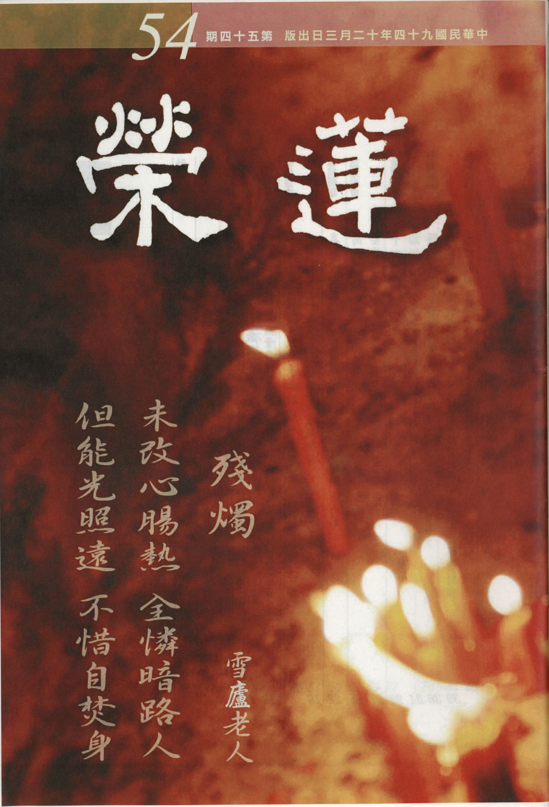

# 第54期

## 社論

### 是非正義與因果

本刊

是非公義價值觀

模糊只為求名利

結黨營私亂公安

地獄劇苦由他受

吾人處在社會不能單獨生存，講究的是分工合作，才有個人的出路，並且可以保障生活的享受，以及組成美滿的家庭傳宗接代，延續社會的生命，所以講究群居。群居的形象是小至一個機關社團公司，大至社會國家，彼此且息息相關、互相影響，例如社會治安出問題，個人的安全就無法被保障，全國上下生活的享受都受到影響。這些群居的團體由小到大，能夠存在而且有凝聚力，不但團體能得利，個人在團體有發展且得到很好的受用。

然這樣的凝聚力是來自於信心，信心則來自於團體是否講究是非公義，這才是核心的價值所在，也是團體活力的泉源。所謂的是非公義，是站在善惡的講究，若在善惡的講究下能獎善懲惡，方是團體的公義所在，則小至團體的每一份子，大至國家的每位人民，都樂於斷惡修善，《論語》為政第二，子曰：道之以政，齊之以刑，民免而無恥；道之以德，齊之以禮，有恥且格。意思是只要在位者追求是非公義，率先以身作則，即使不以號令，百姓亦自動自發且有羞恥心，並建立良好的人格特質〜那就是遵守公義，樂善恥惡。

如果這樣的價值觀被破壞了，被模糊了，學者、為政者、領導者只顧講究自己的私利，而混淆了這樣的價值觀，作種種歪曲的解釋，令百姓憤怒而無所適從，又無法伸張這樣的正義，則社會上普遍存在的是大家苟免而已。下焉者在急功好利中，或還夾帶著隱微處的羞恥，更有上焉者，官冕堂皇的貪婪收刮，也義正言辭，儼然站在公理這一方，口談的是大是大非，心中所想的個人之私、一黨之私，則國家或團體危如累卵，如孟子所言：上下交爭利，則國危矣。不必等待外患，國家已岌岌可危，因為最可怕的是當大家沒有公理可追求，沒有是非可評斷，則弱肉強食，適者生存，不適者滅亡，使得人道變成畜生道，則危害世間甚矣，此才是最可怕的苛政，古書有云：苛政猛於虎。

然對團體要求是非公義，有高尚的道德情操者，樂於遵從，拳拳服膺，其他庸庸之輩、急功好利及世智辯聰者（口才犀利、顛倒是非），只顧一己之名利無視他人之眾苦者，不曾認真體會這樣的價值，因為他們的本能就是只追求自己的離苦得樂，殊不知團體、國家的離苦得樂才有個人的離苦得樂。例如只想多多斂財，國家一旦亡國，所斂的錢財也成廢紙，豈非覆巢之下無完卵。國家或團體亡了，個人即使到其他地方也不被看重，但這樣的概念，很難被庸俗及好名利之輩所體會，所以維持是非公義力量講究的是因果報應。

在印光祖師的《因果錄序》一文中：因果者世出世間聖人平治天下度脫眾生之大權也。因果的現象是聖者所發現的事實，而非發明與臆造，講究的是為善得樂，為惡得苦，絲毫不爽，老子也說：天網恢恢，疏而不失。這些的事實或在當世即可見，或再來世成為更劇烈的果報。為惡者此世享盛名、獲大利，此生不受惡報有三種狀況：第一種是前世的廣大甚深如海般的善業，幾已殆盡，而所造下的惡業在來世要以苦果的方式承受；第二種是已受小苦報，而他人不知，但此為花報，來世所顯現的劇苦才是真正的果報，眼前先開花而後再結果；第三種是雖未顯現在他身上，然他的餘孽已使子孫、家人蒙羞受苦，至於自己所受的痛苦，或將於來生百千萬億倍於他的家人。

以上這些遲來的報應最為恐怖，且最難讓世人了知。其次為善者亦然，此生未享大福，來生之受福更千百倍的增長廣大，第二種是先受小福來世受大福，第三是加被於他的家人、親友，而此人來世所受的福更勝於所加被者的福千百萬倍。這些善惡因果的建立是公義的認知，是整個社會價值觀追求的重點所在，所謂是非公義是建立在為他人謀福、為團體謀福、為天下謀福，古人說：謀福當謀天下福，計利當計天下利。

果然有這樣的格局、眼光、見地，才是士君子的風範，不但如此，追求有情解脫的利益、成佛的利益，而有自己的充實與學習，不但得到諸佛菩薩的加被、稱讚，善知識的傾囊相授，天人恭敬、頂禮護持，眾生擁護成辦正法事業，這才是人生的意義所在，才是所要追求的是非公義與真正的價值觀所在。

## 大德法語

### 大方廣圓覺修多羅了義經（十四）

道源老和尚

無明無體如夢心

了知夢境本無實

夢心亦無修圓覺

因地如是果如來

辛一、先示其相

經文：

「善男子！空實無華，病者妄執。由妄執故，非惟惑此虛空自性，亦復迷彼實華生處。由此妄有，輪轉生死，故名無明。」再叫一聲當機者善男子，「空實無華，病者妄執」

，叫我們注意，虛空之中實實在在沒有個華，是病眼睛的那個人，他由病眼（虛妄執著）所生空華（妄見一切法）。「由妄執故，非唯惑此虛空自性，亦復迷彼實華生處，」虛妄執著此虛空自性，以為空性有自性，且在虛空（空性）中顯現虛華（萬法）以為實有這虛空華，由何生出？是由他病眼睛（無明心識）生出來的，但是他（凡夫）不知道，妄認是虛空裡生的，這就是我們眾生的種種顛倒。

圓覺自性本來清淨，由一念無明生起種種顛倒，由無明顛倒才生起身相、心相，並執著為實有，且增益為實我所擁有，其實都是無明妄心生出來的。「由此妄有，輪轉生死，故名無明。」眾生最大的苦惱，就是生死大苦，一生一世不算大苦，輪轉生死才真是苦，死了還要生，生了還要死，輪轉在三界內，且有六個道的趣向，名之為六道輪迴，其中包括三善道及三惡道。

一世天上、一世人間、一世畜生、一世地獄，輪迴流轉，此輪字可譬如是井上架子吊了一個輪子，叫做滑車，這個輪子滑車上以一條繩子吊了二個水桶，這一個空桶下去汲水，同時有一個載滿水的水桶上來，一上一下，這叫輪轉；現在則可以用車輪的轉動做譬喻，無論是馬車、汽車，都離不開輪子，而輪子的轉動有起頭嗎？它是沒有頭尾分別的，車輪子在上邊一轉轉到下邊，在下邊一轉轉到上邊，叫做輪迴，輪迴不息才是生死大苦呢！你想休息是不可能！

然而眾生怕死，菩薩怕生，眾生一提這個死啊，死之一字不願聞，你怎麼說死呢？尤其早晨起來聽到死字，會認為不吉祥、倒霉！一切眾生都怕死，不曉得死後沒有結束，死了還要生，生了還要死，這叫做生死輪迴，生死輪迴是真實的嗎？它也是妄見的、妄有的，通通從病眼睛幻化而起，如虛空裡邊沒有華，他認為有華，亦即妄執有一個真實的我及真實的法（身心），因此起了我執、我所執以及法執，認為這些身心及身外之物都是我所擁有的，於是動了貪心，貪不到則動瞋恨，不應當貪而貪，不應當瞋而瞋，此即愚癡。

社會上人與人爭，世界上國與國爭，都是病眼睛空華，虛妄執著，古云：「天下本無事，庸人自擾之。」天下本來太太平平，眾生可以活得好好的，他卻不好好活著，他要鬥爭，人與人爭弄得社會不安，國與國爭弄得世界不太平，本來大家都想著生，結果都把人殺死，這都是眾生的愚癡顛倒，死了還要生，生出來了還要繼續鬥爭，永遠沒完沒了，是不是有真實的輪轉生死？是沒有的、虛妄的，故名無明。

辛二、後顯本空

經文：

「善男子，此無明者，非實有體，如夢中人，夢時非無，及至於醒，了無所得。」善男子是佛呼一聲當機者。「此無明者，非實有體」

，這個生死輪轉都是由無明而起，但你毋需害怕，你可以用空性的角度去觀修，為什麼？因為無明沒有實實在在的本體自性，一念不覺，不覺就是個無明，一念不覺就是一念妄動，觀待它而有種種粗相妄念生起，在起信論上有九個相（三細六麤），第一個是無明業相，業是什麼？就是動的意思，無始來心之動皆是無明所攝持，為妄動，然此無明不是實實在在有個本體（自性）。

再說個譬喻：「如夢中人，夢時非無，及至於醒，了無所得。」無明說了半天，我們還是不了解，但用做夢來比喻卻很貼切，凡夫個個都做過夢，你在夢中你可知道它是虛妄不實的嗎？夢中的悲歡離合你都把它當成真的，做了個可悲的夢你會痛哭流涕，你做個歡喜的夢會呵呵大笑；凡是有情有愛的人，不要分離卻分離，有緣有情人，不能結合卻結合，這些悲歡離合的境界在夢中能說沒有嗎？夢時非無，不是沒有，可是等你醒的時候呢？有所得嗎？

你可以依著金剛經上所講六個譬喻來做觀想：「一切有為法，如夢幻泡影，如露亦如電，應作如是觀。」第一個譬喻就是如夢，由做夢觀想，我們夜裡是閉著眼做夢，白天是睜著眼做夢，在夢中你爭我奪，但等到夢醒呢？你想想這是幹什麼呢？根本沒有眼前對頭，那到底在跟誰拚命打架，根本沒有個可愛實有的東西，你貪個什麼？奪個什麼呢？所以不應當貪而貪，不應當瞋而瞋，如此愚癡才做夢，現在都在睜著眼做夢，我們學了大乘佛法，依著聖言量的教理還恍恍惚惚知道這層意思，那些不學佛法的人，誰知道在做夢啊？你看看報紙，世界上一天到晚，不都是紛紛擾擾、你爭我奪，猶如做夢一般嗎？

經文：

「如眾空華，滅於虛空。不可說言有定滅處。何以故？無生處故。」

一旦你察覺有無明時，當下就以圓照清淨覺相將無明照空了，無明呢？沒有了！因為它沒有自體呀！它要有個自體如何將它照空？因為沒有個自體像做夢，你若圓照清淨，等於在夢境中醒了，這些夢境可得嗎？不可得。如空中華，空中華滅時，你不要認為一定有個實實在在的滅處，這虛空華滅到虛空什麼地方去了？沒有個滅處，為什麼？根本沒有個生處，因為虛空裡從來不生華，既沒有生處何來滅處呢？虛空華不過是你的病眼妄見的，同理無明在圓覺本性上根本沒有個生處，當你把它滅掉了，它也沒有個滅處，就像做夢醒了，做夢時是實實在在，夢醒卻了無所得，根本是做夢，夢境沒有個生處又怎麼有個滅處呢？

經文：

「一切眾生，於無生中，妄見生滅。是故說名，輪轉生死。」

這不但說一切眾生，連二乘人都包括在這裡頭，二乘人怕生死啊！是視三界如牢獄生死如冤家，急切用功了生脫死超出三界，猶如從牢獄出去了，試問出了牢獄誰還願意再回牢獄？生死了脫了，如與冤家脫離關係，誰願意再跟冤家碰頭呢？所以要二乘人發菩提心度眾生，他是不敢，他不知生死是虛妄的，都是像那病眼睛見到空華一樣，在無生滅處妄見生滅，實則生滅本來空，這些都是大乘道理（圓頓大法）。「是故說名，輪轉生死。」輪轉生死如車輪子轉動，生了死、死了生，實實在在是個虛妄之相，只有生死的名字，沒有生死的本體，都是虛妄而有，虛妄而滅。（下期待續）

## 共修研學

### 佛說八大人覺經（十三）精進能出三界獄

*編輯部整理*

少欲知足省精力

好樂出世精進學

破除四魔出輪迴

成辦利他是所願

上來第三覺知是以道為修學的目標，「道」即是明心見性，唯有明心見性的聖者才能自行化他。然想要明心見性的人一定要有觀慧，所以第三覺知是明：菩薩唯慧是業。業以思為體性，亦即此菩薩各種的想法都是為開智慧，唯有生起了觀慧才能明心見性。然有心要明心見性的修學者一定要安貧，亦即是不要去追求外面的五欲境，因為不追求五欲境，當然就沒有五欲境的受用，這在世間來說當然就是  「貧」，安貧就有時間樂道，不但樂道，還要有勇悍心去修學正道，如此才能生起殊勝的觀慧（明心見性）而證得解脫，此即第四覺知義理所在。

丙二、進度（智重）

經文：第四覺知：懈怠墜落，常行精進，破煩惱惡，摧伏四魔，出陰界獄。

第四覺知為菩薩六度中之精進度，精進有三種義：披甲精進、攝善精進與利樂精進。其中披甲精進的行相是披願力的盔甲，超越種種修學的障礙。 雪公老師云：沒有過不了關的。為何會過不了關？因為願力不夠堅強，而非境界太過強大。在悲華經中，觀世音菩薩行菩薩道時看到無量無邊的眾生都需要救度，且剛強難化，甚而恩將仇報，慨嘆能力有限發了退轉之心，違背昔日的諾言。後有千光王靜住如來護持，授菩薩大悲神咒，使菩薩重振大悲心，並以修學大悲神咒的勢力，使其從初地的成就一直超越至第八地。

是故一切的障難都需要觀待行者的願力方能突破，亦即沒有使命感的人，許多事情都能成為他的障礙，有志者事竟成。國父亦說：吾心信其可行，則移山填海之難，猶如反掌折枝之易；吾心信其不可行，則反掌折枝之易，猶如移山填海之難。

其次攝善精進的行相，是以勇悍心攝持一切自利利他的善法，凡有助於己之上求佛道及下化眾生，無不奮力為之，且遇障不退，歡喜堪忍為之，不達目的絕不中止，然仍需講究重點及次第，而非漫無章法。

第三利樂精進是饒益有情精進，其行相是完全利他，即使成佛亦是為了有情而成。精進三義同於戒律之三聚戒：攝律儀戒 （防非止惡），攝善法戒（自利利他），饒益有情戒（利益有情）。

第四覺知所說的精進特別是指披甲精進，本質雖是發菩提心，但必須先證得於生死輪迴中的解脫，如果沒有解脫生死是無從利他。然欲解脫生死乃至成就佛果，一種是在生死世界中不斷增上自己，由增上身直至決定乘，此為聖道門的修學；其次是往生淨土修學正法得到成就，再至生死世界去利益有情，此為淨土門的修學。故佛法的修學分為兩門：聖道門（通途法門），淨土門（特別法門）。

天台大師的淨土十疑論第一疑就是在辯證此問題，彼假設問答說，發菩提心而未斷惑的行者，到底應該在生死世界不斷增上，還是先要在西方淨土安養其身？表面上看來菩提心發起了，應該對眾生的種種苦生起種種的不忍，理應要留在娑婆世界及其他生死世界，救度罪苦眾生，何以還要往生極樂世界享受種種的快樂？是否違背了自己的發心？ 然大師云，有心要度化有情的凡夫菩薩，即應著眼於自己的成就，是故應講究修學的環境。

所以在八大人覺經中的第三覺知，明有心要利益有情的凡夫菩薩，理應以明心見性為目標，先求自利方能利他；在第四覺知則是努力發願並且做種種的行持，先具足解脫的資糧，並正式的修學解脫的方便得到解脫。所謂精進於解脫的方便，是指勇悍的修學般若的勝法，能破煩惱惡、五陰魔、死魔，並以念佛、持咒的力量摧伏天魔，所得的果是出陰界獄（解脫輪迴）。

在百法中「精進」是如何定義的？於善惡品，修、斷事中，勇悍為性。作用是對治懈怠，圓滿善法。若是為了解脫及成佛，則所作的善品都成為解脫與成佛的資糧，其次修學善品之勇悍，是於般若勝法努力修學，能破煩惱障及所知障，究竟證得佛果。

欲出陰界獄（六道輪迴），須摧伏四魔（五陰魔、煩惱魔、死魔與天魔），然主體是破煩惱魔，若破煩惱魔則其他三魔必破，陰界獄就可出離。然煩惱魔的本質是執著，執著法是實有。然大智度論上說，除諸法實相（自性空即是諸法實相），餘一切皆魔事。亦即未證得空性者，所作的善、惡法都會成為解脫的障礙（魔），即使作了種種的善法，當這些造作善法之業顯現種種的快樂時，行者會產生種種的貪執，並由此而引發一切的煩惱，擾亂身心、障礙善法、破壞勝事，此為煩惱魔的行相。

其次是五陰魔的行相，五蘊（陰）乃昔日煩惱、業所生，且由五陰能生執我的心，由執著而引發各種煩惱，即使沒事亦生煩惱、坐立不安，情緒不穩，即使修學佛法內心也定不下來，打坐念佛也常常為昏沉、掉舉、散亂所擾。破魔猶如作戰，要先認識彼之行相，如同打靶，要先知道靶在那裏，否則一大堆子彈也不知打哪裡，所以我們一定要認識魔的行相。

是故五陰之所以成為魔，就是會以為有真實所成的五陰，且在五蘊的基礎上會以為有個真實的人我作為攝持五陰的能攝持者，所有五陰的造作，都是為了這個真實的我，讓我樂的我就好好追求，能使我苦的，就好好想辦法去除之，有因果觀念的，就造作種種的善，成為壞苦、行苦的因；沒有因果觀念的就造作種種惡業，不惜損人利己以讓我樂，所造的惡是苦苦之因。不論造善造惡感生的樂與苦，體性皆苦，所以安立五陰為魔的理由，如此的五蘊現起處、五蘊的生處就是人我、法我的生處，人我、法我的生處就是煩惱的所依處，就是有漏業的生起處，就是苦苦、壞苦、行苦的所依處，五蘊（陰）每天造作那麼多的苦因，而生起的種種痛苦又由它來承受，它不是魔是什麼？

煩惱的根本是薩迦耶見，其行相是對自己的五蘊生起我（真實我），若破法我自相不可得時，能回破人我自相不可得，因為對人我與法我的破法是一樣的，若盡破人我之執則能盡破煩惱障，法我與人我是所執的境，二者是不同的境界，能執的心都是一樣，都是執著所執境有自相。在法我（五蘊）上以為有一個人我作為攝持者，由他擁有五蘊及眷屬、財位等等，終日患得患失成為煩惱的根源。

本覺所破的煩惱惡是指破人我，摧伏四魔中之五陰魔是指破法我，二者破法一樣，真正能破四魔者，在大乘是第八地的第一剎那，約二乘的修學是阿羅漢的果位，這二者都是能破薩迦耶見的能破者。只不過在第八地的第二剎那開始能進破所知障，阿羅漢則無法。

其次死魔的行相為何，乃一期生命（色心的相續）中斷，另一相續生起時又有另外因緣，往往隨業而有各種生命現象的生起，障礙了前世的修行，且有時投生到苦處，亦成為修行嚴重的障礙。修行若破煩惱障，不再隨業投生於六道，不受死魔所攝持，不會有生生死死，一期期無可奈何的生命現象。

其次天子魔的行相，特別是修學有道力者，障礙其修行。此魔或其眷屬鬼神魔都非常厲害，最強的魔王是居在他化自在天（六欲天之頂）神通力最強、福報最大。有問靠善法生天，為何成魔？雖昔曾作殊勝十善，生至他化自在天，為欲界之最勝處，然在欲界的五欲境中享福而心志腐化，如在世間享樂五欲境者，當他看到正人君子時，反而會有厭惡之心，尤其修行人不喜歡同流合污，會被認為不合群，是故天子魔雖以善法為因，生到他化自在天享樂為果，但在那裡權力欲望的享受當中，早就變質了，像現在的政治人物。

很多歷代帝王其實是修行人來當帝王，可是佛教也被他破壞，與魔王破壞修行人的道理是一樣的。天子魔特別以相似法來擾亂正法，這種的破壞法最厲害，若取其隨順義，則人道的惡知識即是天子魔的眷屬，他會鼓勵你在欲境上追求，會讓你覺得學佛不實用，會讓你升官又順利，做壞事也有保佑，對正法產生褻慢，及作種種毀謗，或開演許多相似法，令人誤會佛法就是如此。

昔日釋迦牟尼佛在菩提樹下修學即將成佛時，天魔即來干擾，軟硬兼施，軟有天女之誘惑，硬有魔軍的傷害，世尊不為所動，並以慈悲心降伏，方能豁破無明，成等正覺。魔最可怕的加持就是使學佛者內心深處最渴望的就是五欲境的獲得，嘴巴雖念阿彌陀佛像是求往生，「世間無常，國土危脆，四大苦空」的句子也朗朗上口，但是內心很隱微之處就是想要那迷人的五欲境，天子魔就在這個人開始修行時送給他五欲境的享樂，讓他一蹶不振，甘願作慾望的奴隸。（下期待續）

## 蓮池海會

### 高向榮老居士往生見聞記

*編輯部整理*

名為向榮向蓮榮

有緣護持賢士夫

觀待孝子能發心

助念功成大因緣

高向榮老居士，安徽省懷寧縣龍山鎮人，先世耕讀傳家。老居士幼具慧根。從塾師讀經史子集，奠定良好之文化基礎。當時外有列強環伺，內有軍閥橫行，國勢阽危，民生疾苦，老居士目睹心傷，毅然投筆，入中央軍官學校，以遂救國救民之志業。賡即歷任軍中各級幹部，在敉平軍閥之戰爭中，無役不與。抗戰軍興，調中央警官學校特警班受訓，派任軍事委員會調查統計局安慶敵後工作組長，殺敵除奸，既多建樹。尤以爆破安慶日軍軍火集中庫及策動偽和平建國軍獨立第一師郝文波部反正來歸案，使佔領安慶之日寇海軍清水司令部及偽軍安慶城防司令部劉邁部眾驚心喪膽，為國軍反攻安慶戰役，造成皖西大捷，提供有利條件。

勝利復員，老居士奉調中央警官學校甲級警官班受訓，畢業後派任為上海市警察局分局長，打擊奸宄，撫輯流亡，安定地方以及配合經國先生經濟檢查工作，都有良好表現。

大陸情勢逆轉，老居士隨政府撤退來台，歷任台灣省政府警務處暨國家安全局督察職務，均能清廉自持，努力為公，成績有足稱者。嗣因當局之器重及工作之需要，調法務部調查局工作，先後擔任第三處、第七處及公共關係室副主官，克盡職責。

老居士於七十年自公職退休，以不甘於枯守書屋，獨善其身，亟思以熾熱之情懷與旺盛之精力服務社會，故接受全國同鄉聯合會之委託，創辦「鄉情」雜誌。尋後受同鄉之推舉，擔任台北市安徽省懷寧同鄉會理事長，自力辦理「安慶鄉訊」，聯絡兩岸同胞之感情，提供兩地鄉親之資訊，對促進兩岸和平、民族團結，有極大之貢獻。近年居士迭次返里，恆受鄉人族眾之盛大歡迎，期間續修高氏宗譜，為一人歷四十年之間隔，兩度主修譜牒，傳為佳話。九十一年適逢老居士九十大慶，鄉親族晚為之稱觴，祝壽賀者踵相接，光耀崇隆，為半世紀鄉中一所僅見。

老居士一生，樂善好施，急公尚義。在日常生活方面，生活規律，不吃零食，由於飲食適度，減少了病從口入的機會。閒暇之餘，喜好的就是閱讀古書。晚年並將自我督促的能力，充分表現在念佛的精進上，在老居士往生前一年裡，常常早上用完早飯後，便能坐在書桌前，眼睛看著佛像，認真念佛。往生前四十天裡，雖然有著病苦，都能勉強排除，打起精神，認真和陪伴助念的學長們一起聽佛號，打拍子，看佛像。

其次待人處世方面，以真誠對人，眼中不看別人的過失，夫人常說老居士是「濫好人」，自己雖很節儉刻苦，對他人卻非常的大方，若有別人請求幫助時，不論其動機，老居士都會盡力以金錢或自身的奔走來提供援手。遭逢別人言語上的橫逆，都能默然以對，不和對方衝突。除了能忍之外，還能做到不記恨，與人談話盡量替人留餘地，不會在言語上讓人起煩惱。

正因為老居士能在言語、心念、行為各方面累積福德，所以得到健康長壽的果報，尤其是感得臨終前蓮友們諸多的助念護持，從原本病危，醫生堅決不贊成出院並認為有必要時需送入加護病房治療，到能夠完全不用醫藥，回到家中四十多天後，坐在輪椅上，沒有痛苦的自在往生，就是最好的證明。其中憑藉的，就是師友們以這一句佛號的護持。在臨終助念十餘小時後，身體柔軟，面帶微笑，歡喜往生極樂世界，果報的殊勝，令大家都讚歎不已。

由於親身見證到阿彌陀佛名號的不可思議功德，讓老居士真實得到受用，其子也發願，為了要利益一切有情眾生，自己要更不懈怠的修學正法，斷惡修善，老實念佛，並願將阿彌陀佛及西方極樂世界不可思議的利益，介紹給更多的人，使大家同霑法益。

### 晏珍祥老居士往生見聞記

*編輯部整理*

夫妻相處子孫羨  居陋儉約拒橫財

公門積德真修行  常為苦難求觀音

病重得力太座賢  子孫一致助生西

蓮友護持生瑞相  往生圓成菩薩道

晏珍祥老居士生於江蘇泗陽，四代單傳家境富裕，聰穎好學，就讀省立淮安中學，成績優異。民國三十八年二十一歲，隨先祖父遷台，立志報國投身警界為民服務。婚後投考警官學校來台復校首期，即官校二十二期。畢業後依規定服預備軍官役，民國四十七年八月，三子出生即到金門報到，任排長職便發生八二三炮戰，戰時奉命率全排弟兄構築工事，挖掘地下碉堡，老居士于地面指揮時發現腳下出現裂縫，立刻下令全排弟兄回到地面，瞬間坑道完全崩塌，所幸僅最後一人壓傷小腿，否則數秒之差全軍覆沒。移防小金門時，亦遭巨型炮彈正中碉堡上方卻未爆炸，眾人皆謂此必積善之人方得神佛保佑。歷經萬險役滿回台。

於警界服務期間，剛毅正直，無善不為，無惡不除。當時法令嚴格，許多貧苦小民為求生存擺地攤、沿街叫賣，凡犯紀者重輒沒入所有物品，拘留數日，輕者罰款。老居士常因為不忍，而僅以口頭訓誡處罰之，情節較重者亦以處罰條例中最低額罰之。外出沿途亦經常遇到陌生人士行禮致謝，更有許多百姓於前後左右豎起拇指暗地稱道。但對於奸惡之徒絕不手軟，生平破獲重大刑案不計其數，維護治安，為受害者伸冤，尤以七彩藝園一案偵破轟動全國。

老居士生平奉公守法，廉潔自守，生養四子安貧樂道。當時薪俸微薄、經濟拮拘，但對於其他饋贈一概不取，半夜甚至有人來訪，以金錢托求開脫事項，皆被老居士怒叱趕出。常與子弟言：「不當之財，取之乃是取用子孫之財，取用子孫之福田。」俟稍有能力後便濟困扶貧，常年捐助育幼院、安養院等。

民國五十一年遷入警署配給警官宿舍一戶面積八坪，且位於消防隊樓上，長達四十多年，雖經常被消防車、救護車不分日夜呼嘯驚擾，他人不堪其擾，但老居士伉儷在每次聽到時卻是共誦佛號祝禱保佑受災者，祈將災害降至最低。所育四子皆已成家立業，共育孫子、孫女六人，每逢年節全家十六口團聚時幾無立足之地，老居士伉儷卻甘之如飴。

老居士伉儷事佛至誠，早晚禮佛，拜祭先祖數十年如一日。彌留之時於醫院病房內，不斷看見千隻彩鳥眼前飛繞，時有笛樂聲響起，多次詢問旁人是否聽見看到。

後經子媳引薦蓮友，與家屬溝通後，決定將老居士帶回家中，並安排蓮友前往助念，鼓勵老居士放下萬緣，跟隨大眾念佛，其間子女亦替老居士發露懺悔，以求除去往生障礙，老居士遂於大眾助念十小時後安詳西歸。家屬謹遵佛制，於七七日內如法作七、告別式，並依此因緣成立佛堂，祈願老居士於西方淨土中蓮品高昇，早日乘願再來，廣度群蒙。

## 啟蒙園地

### 歷史故事　不伐善不施勞的丙吉

妙音

公門好修行

為國延命數

任相識大體

舉才知公心

有賢德的人，雖離世很久，依舊活在後人心中，斑斑可考的歷史故事，可以驗證左傳的古訓：立德立功立言，為三不朽。復聖顏子的賢者形象，其心三月不違仁，其志願無伐善無施勞，是三尺童蒙都知道的了不起人物，距今已有二千五百餘年。顏子後數百年，西漢王朝一位丞相名叫丙吉，字少卿，漢朝魯國人，是顏子的追隨者。一生經歷載於史傳，傳云其為人厚道，待人能掩其過揚其善，更是一位有功不誇、有善不伐的人，以護主之勳業著稱，卻從不宣揚誇耀，流芳百代，世稱賢相，諡號為「定」。

話說武帝晚年親小人江充，以巫蠱之事誣陷太子據，太子即因此事而身亡，且以此事致冤死者達數萬人。當時太子之孫（號皇曾孫）出生僅數月亦身繫囹圄，丙吉奉詔治巫蠱罪，心知太子冤屈，憐憫其無辜繫獄，特選派獄中謹慎忠厚女子保護養育，每日再三探望。武帝後元二年，有流言上奏「長安獄中有天子氣。」武帝不明其理，聞之下詔，獄中犯人無論輕重罪狀，一概格殺。當使者夜間抵達，丙吉避門拒絕，還奏武帝，方聞言省悟，赦免天下；丙吉將皇曾孫託付故太子妃史氏家教養，暗中護佑，直至長大成人。

武帝崩，遺詔霍光輔佐少主昭帝，授為大司馬大將軍；昭帝崩，迎昌邑王，因其荒淫無道被廢，朝廷議立新帝，時丙吉議霍光迎立皇曾孫，獲採即位為宣帝。前後二事，功在國家，丙吉不邀功，誠難得啊！後有宮婢自說保育有功，並牽引出事之始末，言丙吉知之甚詳；宣帝親問丙吉，才知其恩蕩蕩。對其不居功之德行大為激賞讚歎，特封為博陽侯，後代魏相為丞相，成為「一人之下，萬人之上」的崇高地位。

史書又載其問牛一事，後成為人所稱道及反諷之掌故，深入人心，於今仍為人所樂道引用，敘其梗概，明學子效其處事之道。話說時序乃春，一日丙吉微服出巡長安，走出城郊，遇城牆邊有一群人互毆，中有人被打死或奄奄一息或血流受傷，丙吉見狀並未下車攔阻興師問罪，反而吩咐車駕與隨從者繞道而行；復行，瞧見一頭牛力不勝地蹲於地上氣喘吁吁，下車趨前左右端詳、前後細視，並問主人牛行走幾里、牛近日有無異常狀況、牛舍裡或鄰里間其他牛隻之情形若何，仔細求教一番，方才離去。

隨行掾吏不明丞相之取措，覺其失問，善巧相詢，人不如畜乎？丙吉深知彼等疑惑，因當過獄吏、廷尉，深知分層負責之拿捏尺寸，乃娓娓道來：群架互毆致死，自有長安令（類今日之警察局局長）及京兆尹（相當首都市長）緝捕到案，繩之以法，丞相不能親事越權；僅於歲末對所有地方官員實施考核；而牛喘關係時氣失節，恐有瘟疫產生，若以今日眼光來看，或憂狂牛症，丙吉言丞相之責在「調和陰陽」，是以關心牛喘一事，遂成名言，掾吏恍然覺悟知丞相「識大體」，而「丙吉問牛」一事，亦以成語流傳後世。當今之溫室效應，舉世莫之能禦，勝於昔日，撫今追昔，更加令人懷念先賢之遠識。

容忍部屬過錯，本是一件難事也，殊不知老練幹員，莫不是從挫折中學習成長，而為官者常無法容忍下屬犯錯，今世亦不例外。「丙馭吐茵」，說的是丙吉任丞相時車夫好酒，一日醉酒污了車墊毯，西曹主吏（類相府總管）欲將其免職，但所謂「宰相肚裡好撐船」，丙吉批示道只不過污車茵，且一旦免職，車夫將何去何從呢？遂不去。難事在丙吉行來，看似易事，蓋其修為有成，一如莊周所言「常寬容於物，不削於人，可謂至極。」車夫感念其恩惠，常思圖報，後來因國之邊境有事，車伕秉持自幼生長於邊境、熟悉邊境之事，於事情發生之極短時間內獻策於丞相，後來宣帝詔聽三公對策時，丙吉從容不迫知所應對，此亦得利於車夫之還恩，考其因，當初丙吉並未嘗求其報，乃一念為部屬著想，實亦仁心之顯現也。

丙吉有知人之明，為國舉才，亦為人所稱揚，方其病篤，帝臨親問，卿後誰可取代，本謙遜己無所能識，惟明主所知，帝誠心再問，薦杜延年、于定國、陳萬年，後居位皆稱職，足以顯現其公心之氣度，及培養人才之遠見。

綜觀其一生，不伐善、掩人之過，實印證在公門修行有成，誠大隱之賢才；能知人、用人，顯示其無嫉妒心，皆源其能識人，此真學問。唐太宗曾言，以人為鏡可以正得失，丙吉蓋一明鏡也。

### 十四講表　（廿二）第七講表 宇宙器界概說

傳瑛

三界統稱一佛土 如是佛土亦無量

有情眾生渺如芥 心量卻能包虛空

第六講表所談的是宇宙有情眾生的概況，現在要說的是宇宙器界。宇是指空間，若是以方位來分，略可分為東、西、南、北、東南、東北、西南、西北、上、下各十方；宙是指時間，又分過去、現在、未來三際。器界是指有情眾生所依存的國土及所使用的種種物質。

這個器界範圍到底有多大？可以直豎或環周兩方面來看。直豎是上下看，一個世界有二十八層天，而且往上、往下各有這樣的世界綿延不斷。環周則是四邊看，佛所教化的世界稱為一個大千世界（或稱大千系），為無數個世界所集成。每一個大千世界的四週，各有無量大千世界圍繞，且每一個大千世界各有其佛土名稱。如我們所居住的娑婆世界的東方有阿閦毘佛世界，西方有阿彌陀佛世界，南方有寶勝佛世界，北方有成就佛世界等。事實上，每一世界的十方皆有微塵數世界圍繞，如是重重無盡，看不到邊際。宇宙到底有多大，唯有佛才能盡知！但為讓大家能稍微瞭解世界組織的情況，就近取譬，以我們所居住的娑婆世界為例，加以說明。

娑婆世界就直豎而言，分為三界二十八層天。

最下為「欲界」：包括天道六天，由下而上依次為四王天、忉利天、夜摩天、兜率天、化樂天、他化自在天。其中四王天居須彌山腰、忉利天居須彌山頂；此外，還包括人道、阿修羅道、畜生道、餓鬼道、地獄道，這是欲界所涵括的範圍。由於欲界的眾生皆有男女飲食等種種的欲望，所以稱為欲界。

中間有「色界」：包括四禪十八天，即初禪三天：梵眾天、梵輔天、大梵天。二禪三天：少光天、無量光天、光音天。三禪三天：少淨天、遍淨天、無量淨天。四禪九天：無雲天、福生天、廣果天、無想天、無煩天、無熱天、善見天、善現天、色究竟天。色界範圍的眾生，具禪定力，無男女之別，但仍有身相及受用殊勝的宮殿，以禪悅為食。

最上為「無色界」：包括空無邊處天、識無邊處天、無所有處天、非想非非想處天。此範圍眾生，依四空定，不但無男女飲食之欲，也無身相，所以稱為無色界。以上三界就是六道凡夫所居，若不思出離，則永在三界生死流轉不斷，受苦不已，法華經比喻如「火宅」，意指危險的處所！

再就環周而言，佛法所說的一蘇迷盧系，即以須彌山為中心，山外有七重金山，七重香水海圍繞，四周有一大鐵圍山，其中有四大「部洲」分布，分別為東勝身洲、西牛貨洲、南瞻部洲、北俱盧洲。部洲就是現在所說的星球。南瞻部洲即是我們所住的地球，而佛法所稱之「蘇迷盧系」或即為「太陽系」。蘇迷盧系是太陽的光熱能到達的範圍，是一單位世界，由初禪天王所攝持，亦即一單位世界能為日月所照。

而合一千個小世界（單位世界），上至二禪天為「小千世界」。而合一千個小千世界，上至三禪天為「中千世界」，又合一千個中千世界，上至四禪天為「大千世界」。因一大千世界是累積小千、中千、大千等三千而成，所以又稱為三千大千世界，這是一尊佛教化的區域，所以又稱為一佛土，約有百億蘇迷盧系（太陽系）。現在我們所居住的娑婆世界，即是釋迦牟尼佛教化的世界。但這世界，就宇宙而言，僅是一微塵而已。宇宙是如此的浩瀚無垠，地球與宇宙相比，可說是微不足道，何況是居住在地球的我們，從宇宙看，簡直是看不到我們的存在。

我們常會起煩惱，那是因我們自以為是宇宙的中心，在家裡父母要聽我的，因為我最大，在學校老師、同學要聽我的，因為我最大，遇到任何事情都以自我為考量重心，不順我的意就鬧情緒。可是事實呢？我們真的很大嗎？上面說過，我們在宇宙比一粒小芝麻還不如呢！既然如此，我們實在不需要自我膨脹。應將心量打開，多為別人想，而且很奇妙的是，心量愈大，就愈能與宇宙相通，甚至通到十萬億佛土之外的極樂世界。

中國淨土宗的始祖為晉朝的慧遠大師，他建立東林寺，在寺中又創了白蓮社，凡到蓮社的人，都是發願要往生西方極樂世界，而且從早至晚念佛不停，慧遠大師在東林寺三十年都沒有離開，老人家生前曾見阿彌陀佛三次。想想阿彌陀佛是在十萬億佛土之外，可是慧遠大師竟然可以在娑婆世界見到阿彌陀佛三次，是怎麼辦到呢？慧遠大師是用他堅固的信願力感應佛的加持力，而見到阿彌陀佛的。他每次所見到的阿彌陀佛都是大到充滿整個虛空，而且放金光，非常莊嚴雄偉。

雖然如此，慧遠大師並沒有告訴任何一個人。在大師要往生前七日，看到阿彌陀佛帶著無量的菩薩來見他，並且告訴他：「你七天之後，將要到我的佛國土來，到時我會來接你。」慧遠大師不只看到眾佛菩薩，還看到極樂世界的樣子，有黃金鋪地，七寶池、八功德水，諸寶行樹…在彼世界中充滿了法音宣流。於是慧遠大師召集所有的弟子，對他們說：「以前我見到阿彌陀佛時，並沒有告訴你們，那是因為我覺得因緣還沒有成熟，現在，阿彌陀佛已經說七天後要來接我，現在我已將事情安排妥當，也請你們念佛助我往生西方。」

發願往生西方極樂世界是一件非常殊勝的事情，臨命終時，不受時空的阻隔，佛來接引，一剎那間就能到十萬億佛土之外的極樂世界。可見佛力不可思議，眾生的心力也是不可思議，希望大家好好念佛，不要辜負自心的潛力！（下期待續）

### 論語略說　賢賢易色章心得

心威

人倫學問百代宗

行依解能篤其功

造端夫婦成於信

子夏傳承聖道脈

六經以詩經為首，而詩經又以關雎列為首篇，其要義在樂得淑女以配君子，憂在進賢，不重其色。中國的學問是建立在五倫的基礎上，而五倫正是以夫婦為始，有夫婦然後有父子，有父子然後有君臣，乃至兄弟、朋友。本章首句正在說明夫婦重德不重色，以正人倫之始。

古來有若干注解，將「賢賢易色」解釋為「以好色之心好賢」，並進一步說明，「凡人之心，莫不好色，而不好賢；今若有人，能改易好色之心以好於賢，則此人便是賢於賢者。」 這是以親近善知識，對治個人的習氣為出發點，勉人改易好色之心為好德之心。立義雖好，但與下文的聯貫似有不足。

父子之道天性也，為人子必當竭力以事親，即使無法免於不匱，也要竭盡心力，對父母提供種種的供養。除此之外，所謂「兄弟睦，孝在中。」兄弟能和睦相處，兄友弟恭，兄弟之倫就在此中展現，父母也必定十分寬慰。

孝經云：「孝子之事親也，居則致其敬，養則致其樂，病則致其憂，喪則致其哀，祭則致其嚴。五者備矣，然後能事親。」為人子平常居家之時，冬溫夏凊，昏定晨省，當須盡於恭敬。若進飲食，要怡顏悅色，令父母歡心。遇父母有疾，孝子則面有憂色，行不正履，盡其憂謹之心。若親喪亡，孝子自然表現出哀悽之情，雖聞樂聲不以為樂，美食當前不以為甘。春秋祭祀，齋戒沐浴，以盡其嚴謹之心。如此才能稱得上是事親盡孝。

處在現今民主化的社會，以往忠於君的概念，必須加以擴展，而為忠於民的概念。公務人員，為國家辦事，必須盡責，先公後私，乃至犧牲小我，完成大我，為盡忠於民能不愛其身。

與朋友交往必須信實，曾子一日三省而傳揚於後世。「與朋友交而不信乎？」正是曾子日日省察的條目之一，可見朋友間的信實有多麼重要。而所謂信，就在言語、辦事皆無欺中顯現。

對於那種能確實做到賢賢易色、事親竭力、事君致身、朋友有信，於五倫能敦篤力行的人，雖然他自謙的說自己未嘗讀書學習；子夏認為此等人一定是經過學習的。因為，實行必由實學而來，若不學而只言行，則所行無由達到更高的層次。

舉例而言，事親而不學，無以知力之當竭。即知竭力，而無學以充實內涵，則只知竭力以養口體，未必懂得養父母之志。假令怡怡祇奉，愛敬無歉，而不盡力於聖賢德業的學習與踐履，行道以顯親，則於事親亦不能無憾。再若只知事君而不學，未必能知犧牲小我，完成大我的道理，則臨難豈能無茍免之心。即知致身，而無學問以充實之，則不學無術，不足以匡君定國，康濟時艱，雖鞠躬盡瘁，孜孜奉公，臨難殉節，不有其身，卻無補於治亂安危。

中國自古以來就是以倫常來維繫整個社會的運作，透過聖人的教化，諸賢的傳承，內化到每個中國人的心中，成為我中華民族獨有的文化內涵，雖經時代的變遷，然真理卻不會因時間的更迭而有所改變。五倫以夫婦為始，娶妻娶賢，重德而不重色，美貌會隨著歲月的流逝而消失，德行卻隨著時間的淬鍊而日漸光輝。倫常的踐履隨著學問的增長，更見其深廣的內涵；學問也在倫常的力行中，展現其真實的價值。

## 禮懺法會

### 慈悲藥師寶懺法會儀軌觀修　如何修學藥師寶懺為淨土助功（一）

*編輯部整理*

象法轉時有情障

難得文殊憫眾問

世尊為說藥師法

偕眾拜懺大利益

九十四年十月廿九日

為了遍滿虛空的有情眾生，我們必須要成就無上的正等正覺，為了成就阿耨多羅三藐三菩提，所以興辦慈悲藥師寶懺法會。

在藥師寶懺中首先出現的是普賢王菩薩，何以故？須知法華三經無量義經、法華經、觀普賢菩薩行法經（略稱觀普賢經，被稱為法華之結經），亦即由普賢菩薩帶領眾生入一乘實相。不但如此，在華嚴經中善財童子為了成就無上佛果，而參訪了五十三位善知識，從最初在德雲比丘座下開始學習殊勝的菩薩行，直至第五十三位善知識普賢菩薩時，普賢菩薩宣說十大願王，並勸進善財童子及華嚴會上的海會聖眾往生極樂淨土，成就佛果，所以普賢菩薩出現的徵兆也代表著我們未來有往生成佛的徵兆。

因此在普賢行願品中，告訴我們修學正法的秘訣是：「深心信解，如對目前」，深心信解之行相為何？

一、普賢菩薩的威神力：真誠相信，修學正法能得佛菩薩不可思議的加被。

二、教法的功德力：薰修正法之人，會產生一股對煩惱強而有力的對治，內心的潛能將被無限的激發。

三、自心的承擔力：得到正法殊勝的受用後，行善將極為堪能，雖面對移山填海之障難，卻如反掌折枝之易。

藥師懺法的十一番禮拜，共分為卷上、卷中、卷下的祈求，能有各種法義的證得。

十一番禮拜，因緣各異

首先第一番的禮拜，乃頂禮、供養、讚歎十方三寶（可知藥師懺為大乘法門），並仰白十方三寶，祈請藥師三寶加被，為興起藥師懺法會的皈依境，因為在末法時期人根陋劣、業障深重，唯有靠藥師佛的加被，現實的障難才可能除去，比如個人有業障纏身，有病苦之難，或生活上過不去，或者世間的瘟疫、魘魅等等障礙，倘若這些現實的障難都無法去除，都將成為個人修行上的障礙，更遑論修行。並觀想得到同意，命我等代行懺法，除種種罪障，能令心與法相應，行願成就。

第二番禮拜：乃啟運藥師道場懺法，皈命三世諸佛，特別是藥師法門的傳承，即毘婆尸佛至彌勒尊佛。並皈命藥師佛，來作為藥師懺法的發起。

第三番禮拜：乃修學藥師懺法的開始，末世有情惑業熾盛，難脫九橫，未來難離三途之苦，當依藥師經所說之廣大懺法行之去障，然眾生心力如綿不堪為之，故大德依《藥師如來本願功德經》錄出消災延壽之懺法，能令吾等結合同道、齋戒沐浴、選擇清淨之處、佈置壇場、依懺軌薰修、除滅罪障，得到世出世間種種安樂。此番禮拜之對象乃釋迦牟尼佛說藥師法門時的聖眾，作為進入藥師懺法之殊勝方便（因緣）。

頂禮毘盧遮那佛是釋迦牟尼佛的法身（證量），頂禮藥師如來、因是藥師法門的主尊，頂禮無量壽佛、因藥師法門導歸處是西方淨土，並頂禮十方三世一切諸佛、是為佛寶，其次頂禮《藥師如來本願功德經》，是為法寶，頂禮日光徧照及月光徧照、為藥師佛脅侍菩薩，頂禮文殊菩薩、是藥師法門的發起者，並頂禮觀音、勢至、無盡意、寶曇華、藥王、藥上、彌勒等菩薩為引導修學藥師法門往生西方淨土的八大菩薩。其次，消災障與增福壽兩位菩薩，代表著禮讚藥師懺法功德利益。樂音樹下三萬六千菩薩及阿難尊者八千比丘諸大聖僧，此乃世尊宣說藥師法門時現場聆聽之聖眾。救脫菩薩則是向世尊請問修學藥師法門之儀軌及可免災厄之請法者。

緣念象法轉時，諸有情欲離各種苦得各種樂，並有修行之資糧，當知往昔，藥師佛發十二大願，成就佛果能滿足眾生之需求；共為十六項：一者、為拔除一切業障，建立殊勝的功德者；二者、為欲滿修諸佛大願，具足受持諸佛名號及正法寶藏者；三者、欲得阿耨多羅三藐三菩提，三十二相八十隨形好，莊嚴其身者；四者、欲得無量智慧方便，令諸眾生安立大乘者；五者、為欲修行梵行，得不缺戒，具三聚戒，究竟清淨，無有毀犯者；六者、欲得諸根完具，無諸疾苦，家屬資具，悉皆豐足者；七者、欲得破魔羂網，解脫一切外道纏縛，拔種種惡見稠林者；八者、若有女人欲轉女成男，具丈夫相者；九者、為欲求男女而得男女，求長壽而得長壽者；十者、或當王法所加，欲解脫一切憂苦者；十一者、欲得上妙飲食飽足法味，及種種上妙衣服，一切寶莊嚴具者；十二者、欲行惠施，一切所有悉無貪惜，施來求者；十三者、欲得正見精進，善調意樂，多聞聰利，解甚深義，恆求勝法，常遇善友者（尤其能遇了解甚深空性義理的善知識，並引發我們善法欲，渴求與聽聞正法）；十四者、欲受持學處，願生西方極樂世界，無量壽佛所，聽聞正法者；十五者、若有已毀之戒，而欲還清淨，已盡之命而欲復救續（印光祖師在壽康寶鑑一書中提及，人壽一般很少活到該有的年齡，乃因個人情緒、慾望及造惡業等影響，倘若能好好的懺悔，所折的陽壽可以補回來）；十六者、乃至國界人眾，種種諸橫（特別是禽流感的橫行）、種種諸難（特別是天災、人禍等諸難），而欲消伏隱沒、順時歡樂者。若能如法至誠懺悔業障，向藥師佛祈求必滿所願。
在藥師經中當釋迦牟尼佛問阿難尊者，你可相信如來行菩薩道時，所發十二微妙大願殊勝功德，令諸聞者業障消除，一切所求皆得滿願；阿難雖然回
**答：** 我相信。世尊卻語帶保留的回
**答：** 阿難，具足對佛如此信心，是一生補處菩薩的善根；可見我們信心的建立是十分難得。例如有位在美經商的蓮友，過去是佛學社的社長，因做生意虧了大錢，立刻對佛菩薩失去了信心，過去他對三寶是有信心、也常親炙大德；但是退道心時，退得比誰都徹底。

因此十萬人修行是九萬九千九百九十九人往後退，能夠不退道心者是人中稀有難得，所以是唯一生所繫菩薩，為能如實信解，即使我們咬著牙根強信，如此的善根都不是普通人辦得到的。昔曾助念過一位蓮友的父親，彼曾作過屠夫的行業，蓮友排班助念了十三天，好像沒有什麼改變；如果不具足對阿彌陀佛的信心，則很可能退了道心；但是助念到第十四天時情況完全改觀，他那像牛羊眼的掙扎都轉變成人眼的安祥，慌張的神色頓時安靜，房間的氣氛也全轉變，臨命終的最後剎那，以慈悲的眼神環伺大眾，在佛號聲中斷氣。因此能對佛號生起信心都非普通的善根，所以藥師懺上云：如說修行應當以身命財不生吝惜，竭力莊嚴必獲果遂。（下期待續）

## 日常省思

### 命運多舛，達人知否？〜面對禽流感應有的認知與態度

淨域

世紀災難禽流感

無畏人類高科技

共業難轉唯別業

大悲遍轉成正覺

一七九三年流感（流行性感冒）首次列入紀錄；此後，每個世紀均要爆發三次大流感。上世紀，以一九一八年西班牙豬型流感最為嚴重，死亡人數超過兩千萬人；而一九五七年，則導致約一百萬人死亡；近期一九六八年，亦有七十五萬人死亡。據統計分析，平均每三十年流感就要肆虐一次。

距前次全球流感大爆發，已過了三十七年，依經驗法則推算，下次的大流感「已經遲到了」。二○○四年底，世界衛生組織首席傳染病學專家克勞斯‧斯托爾（Klaus Stohr）曾如是提出警告。因此，新一輪全球大流感，已不是「會不會」而是「何時發生」的問題。

所謂禽流感，就是禽類流行的病毒性感冒，係由Ａ型流感病毒所引發，藉由空氣傳染，因容易影響肝功能，肇致嚴重敗血症，所以禽類在感染後死亡率很高。其病毒型式包括Ｈ５Ｎ１高病原性及Ｈ５Ｎ２低病原性兩種，目前在南台灣出現的病毒株都屬Ｈ５Ｎ２型，尚不具致命性。

每年台灣有近一百萬人罹患典型流感，多能產生抗體痊癒；但近來在亞洲肆虐的Ｈ５Ｎ１禽流感病毒，據信將是大規模流感的斥候。Ｈ５Ｎ１禽流感病毒具高度致命性，目前感染者的死亡率為百分之七十，較於典型流感的百分之零點一，更顯出它的可怕。拜海島之賜，台灣目前仍處於亞洲流感風暴之外，但冬季候鳥的南徙，與全球化的互動往來，卻也不保證我們可以置身事外。

猶記得民國九十二年的ＳＡＲＳ風暴，凡多日高燒不退者，皆須隔離觀察，較之Ｈ５Ｎ１禽流感，這還是可見的危機；反之，無預警傳染的恐怖，正是聞禽流感而色變的痛處。此外，新型超級流感病毒正在「進化」中，無人能預測它會變成什麼模樣，也沒有人能事先產生抗體；在目前的死亡案例中，青壯年的死亡率非常高，這與典型流感是截然不同的；一般推論，這是因為青壯年的抵抗力強，反而增長了病毒的攻擊力，引發更激烈的淋巴免疫反應；所以，在此間勿自恃體魄強健而輕忽了預防工作。

此次禽流感的嚴重性，在於傳染途徑的詭譎多變；就近期研究發現，一九一八年的病毒感染流程為「稻米→鴨子→豬→人」，而新型流感病毒株可能來自不同禽鳥類；換言之，將是一種新的合成病毒，其傳染途徑可能是「野鴨＋鶉類＋鵝→雞（禽流感）〜人→新病毒」，或是「野鴨＋鶉類＋鵝〜雞（禽流感）〜豬（豬流感）→新病毒」，更會是「野鴨＋鶉類＋鵝〜雞（禽流感）〜豬（豬流感）〜人→新病毒」，至於最令人擔心的則是「禽流＋豬流＋人流」之模式，此一凶猛突變的病毒株，將具有人傳人的能力。

對台灣而言，自然的地理環境，加上嚴格的檢疫，已為我們阻絕了可能的傳染途徑；但曾引以為傲的候鳥棲息地，此番卻成為防疫的大漏洞。秋瑟冬寒正是雁鴨南飛的季節，昔日的美景，卻成今日的恐懼。就目前禽流感的帶原體而言，主要都是雁鴨科的水鳥，因為雁鴨對病毒免疫，所以能夠翱翔千里散佈病毒。依多年觀察得知，遷徙中的水鳥常侵入水禽養殖場爭食飼料，此將成為病毒入侵的重要管道。

為杜絕禽流感的擴散，各政府莫不卯足全力加強防疫工作，除加快研製疫苗腳步外，讓民眾正確認知禽流感，與做好自身保健，當是最好的預防措施。基於此，本會僅提出以下的看法：

一、病毒因果

「新的醫學，創造出新的病毒。」大自然是一個生生不息的循環，當某一點被弱化時，在另一個時空即被增強。曾有醫師這麼說：「流感是無法根治的，只是與藥舒緩罷了。」但人們卻強要剋制病毒，消滅殆盡；其結果是「前因生後果」。尤其當人的貪瞋癡三毒心念熾盛時，顯現在外的即是病毒的流行，威脅的是全世界人類的生命與健康。

二、端正心念

俗諺說：「凡事心想生。」當心理生病時，藥石亦枉然。禽流感的蔓延，不過是此生中所須面對的共業，然共業中仍有別業存在，我等若有此一認知，心中便不會有所惶恐，要如何心不恐懼？重在發心欲利益有情，並好好修學正法，特別是念佛法門，祈求佛菩薩的加被，不但身體能產生防制病毒的免疫力，也能將內外病毒止息，能令眾生免於生病及失壞命根之苦。

三、謹慎身行

為防制ＡＩＤＳ病毒，衛生單位曾大力宣導「向愛滋說『不』」；同理，為避免禽流感上身，個人也要積極地做到「三不兩要」：

（一）不緊張害怕〜以提高免疫力；

（二）不接觸禽鳥〜以杜絕感染；

（三）不生食肉蛋〜以維護健康；

（四）要勤洗手〜以保個人健康；

（五）咳嗽噴嚏要掩口〜以避免飛沫傳染。

若能潔身自好，不做非法之事，飲食生活起居都正常，待人接物合情合理，慎防騙人、傷人的口業，必能防範各種污染病毒由口入而傷身害命。

四、自我修練

醫學研究表示：止靜能降低交感神經的興奮，增強嗜中性白血球的功能，意即能調整免疫力。《大集經》云：「一念相應一念佛，念念相應念念佛。」我們平日共修念佛，今日正好派上用場；無情的禽流感，對我們而言不僅又是一塊試金石，也更是督促我們加緊念佛的好因緣。讓我們好好集合團體造念佛共業，提升全民的免疫力，藉著禽流感的威脅，改造國家不良的風氣，提升正法化眾的力量。

一件事情的發生，自有其因果的關係；所謂：「眾生怕果，菩薩畏因。」當世人皆惶惶於不安中，我們更當參透此一不變的理則，逆向操作，迎向浪頭。一如標題所示「命途多舛，達人知否？」若真了知，在共業中另生別業，或是我們可為的正道。

## 活動迴響

### 十十無盡的期許與承諾　記教師節師長的勉勵

*編輯部整理*

末法時期好因緣

相應正法組團體

人生旅途相扶持

未來上善猶相聚

前言：

十月二日（日），適逢龍王颱風來襲，例行的返班活動宣告暫停，養成班的學長遂興起師友聚餐的念頭，臨時邀約大眾，並祈請老師與幾位長輩共享午餐，以感謝師長多年來辛勞的教導與護持。席間與師長們相談甚歡，末了老師歸納與學長們談話的心得，作為對養成班學長的殷殷期許。

第一、藉著團體成長是最好的方式，同學與老師們都需要成長，而且是依靠團體的成長，這是最好的成長。

第二、團體中有教授善知識、同行善知識、外護善知識，即使是教授善知識本身也要另有教授善知識，方具備提昇大眾內涵的能力。

第三、所有成長的學習是要在善良本質上的學習、反璞歸真的學習、誠意的學習、對人恭敬的學習、對治煩惱的學習，是想要成佛利益有情的學習。

第四、團隊彼此間的友誼非常重要，今天學長們雖以教師節的因緣相聚，其實能依聚會因緣增上彼此情誼，成為辦善法最好的團隊，是一個能讓大家發心的團體，大家在人生的旅途上互相扶持、經驗交流，每個人將他的學習作無私的供養，能使團體的成員未來的成就令人刮目相看。

第五、欲發心利益有情也必須觀待健康的身體，今天的聚會十分歡樂，是因為我們有健康的身體。為了維持健康的身體，須生活作息正常，吸收充足的營養，令我們能以健康的身體承擔利生的事業。

第六、雖然未來面對的挑戰是可怕的，尤其法弱魔強，要作一番利人的事業，更為難能，然佛菩薩在因地度化眾生時，內心亦知道任務是艱鉅難成的，但他們都有一番很好的心理準備，知道難行能行功德更大，以十分歡喜的心，迎接未來的挑戰。

第七、即使未來的挑戰是艱困的，但並不代表我們跨越不了，須知德不孤必有鄰，有德有學者必能結合護持者的力量，我們不要忽略這樣的力量（福報），必能克服困難，累積不可思議的功德。

第八、所有的檢討與反省都要回到因果與做人處世的基本面上，必能找到缺失，解決問題。

第九、作利益有情的事業的心態，不是一種犧牲的心態，若以為自己都是損失則差矣，依華嚴經普賢行願品，普賢十大願之第九恆順眾生願，普賢菩薩告善財童子云，欲成無上佛果須將有情眾生當作福田，而對彼有虔誠的供養（服務），猶如在曠野沙磧之中，以他們為樹根，灌上大悲的法水，長出菩提的大樹王，開出種種美妙的花朵，結出種種不可思議上妙的果實（無上菩提）。

第十、千言萬語要珍惜護持團體，沒有團體則上述九項利益皆無，團體的凝聚在吾人的誠意，有位外交長官，分享他駐外成功的秘訣：第一是誠、第二是團隊，離開這兩項，絕無成功之理。

結言：

年輕就是本錢，然這樣的本錢不是投資在五欲的享受中，應投資在正法的充實，學得一身好本事，幹出一番利益眾生的事業，是青春不留白最好的描述。

### 十十無盡的期許與承諾　謝師宴心得

竹軒

從小接受啟蒙教

薰陶正法不忘本

雖是現代科技人

茫茫大海有方向

九月二十八日是孔子誕辰紀念日，也是教師節。為了感謝老師平日對我們的諄諄教誨及增長我們出世間的慧命，故在十月二日舉辦謝師宴，以報師恩。

當日是颱風天，但老師慈悲，還是答應我們的祈請，出席此聚會，讓我們能有機會小小的回饋老師。在筵席上，老師不忘關心每一位學長的近況，雖然我們希求的是出世的果報，但在世間法上也是要兼顧。在了解學長們的概況之中，不難了解台灣的優勢已漸漸不再。如生產線及工廠外移大陸或東南亞，在台灣的相關企業紛紛裁員及合併。現在的年輕學子們，工作機會已是非常的低，對於未來都有一分不安定感。老師說他們的年代，只要有工作就能養活一家的人；現在的人，就算很辛苦的工作，也只能養活自己而已。福報的差距之大由此可知。

但老師還是勉勵我們，在此亂世不可以隨波逐流，首先要先鞏固自己的正知見，要有傳承文化的使命，讓自己活得有內涵、有意義，所以每雙週都有論語及彌陀要解的課程；至於就世間出路方面，老師會邀請在企業中有成就的老師及學長們，來上專題演講的課程，告訴我們如何去面對目前的局勢以及應有的格局，與正確的工作態度，使我們對現在的局勢有所了解，也能清楚在修學正法及世間工作要如何兼顧。

老師除了弘法利生之外，也不忘對我們提攜及照顧。老師對我們的恩德猶如大海，我們就像是在海中的魚兒，時時受到大海的恩澤，對於如此浩瀚的師恩無以回報，唯有培養自己為人才，使自己也能利益眾生，才能些許的報答師恩。

### 十十無盡的期許與承諾　聚心得

道融

相聚甚難別時多

心心相印賴正法

相互提攜增德學

不枉此生好交情

隨著人際關係的交錯複雜，經濟活動的蓬勃發展，聚餐吃飯，除了婚喪喜慶、敬天祭祖外，不再只是為了填飽肚子、增強勞動力。相反的，常常是為了某個目的、或為了和某群人相聚而設。於是同聚一堂吃飯，菜色往往不是那麼被強調了，一群人彼此之間的溝通互動，才是一場餐聚最值得玩味之處。

為感恩老師平日教導、紀念教師節，心安學長籌備了這次的餐會，席分兩桌，一邊是出社會工作者，一邊是在學學生。老師說，從與眾人吃飯中，可以學習很多事情：聽聽別人的經驗談、學習服務大眾、學會應對進退的禮節--老師那桌，便是如此進行著；而本桌沒人論國家大事，只是品嚐美味菜餚，沒人談產業發展，只是問候近來可好；那一邊討論熱絡，這一邊互動悠閒，氣氛也許不同，卻都是真誠相待，坦然以對的。

之後併桌發表心得，也令人獲益匪淺。老師舉治心畢業典禮時，馬市長致詞主題為其父親之教誨名言 「誠與恭敬」，等於串起了這次聚餐的所有意義，人文與科學的對話，對老師長輩的感恩尊敬、與同儕之間的惺惺相惜，才是真正讓我動容之處，即使當天的談話記不得多少，這次的聚會過了就不再，但是當初溫暖正面的能量，卻已經沉潛在自己的人格涵養當中，成為未來盡人事的向上動力。

### 十十無盡的期許與承諾　心中最深處的感謝與祝福

治心

多年相識善緣續

點滴皆是難忘情

雖無亮麗成績單

苦幹實幹是特色

這是一個非常有紀念性且充滿感謝日子，讓我永遠記著賜予我慧命的師長，心中永遠充滿著無限的感謝，沒有老師所賜予我的慧命，今日的我將不知是何種行相。六年前我來到台北讀書，不管在食衣住行等方面都受到老師、長輩及師姑的照顧，課餘時間在住所還開了了凡四訓等課程，建立我的正知見，經過了六年，感覺有些成長，但是還有許多需要改進的地方。請老師在未來的日子裡繼續帶領著我們往前走，邁向光明且寬廣的大道。

附註：在高三畢業時有幸能領到市長獎，且非常高興的能祈請到老師一同分享這份喜悅，能領到這個獎，首先最重要的是要感謝老師，沒有老師把我接到台北讀書，並且在旁時時的督導，我現在也不能有這分榮幸，在這裡我誠心誠意的感謝老師給我的教導，並祈請老師繼續不厭煩的教誨我們，最後祝福老師身體康泰，光壽無量。

### 十十無盡的期許與承諾　教師節聚餐心得

濟世

事先準備眼光遠

抉擇觀待佛與法

承擔堪任能持久

自利利他報佛恩

早上醒來之後發現天空雖仍然是一片陰暗，但沒想到強烈的龍王颱風竟然這樣一個晚上就過去了，回想起今年侵台幾個強颱的風雨所造成的損失都仍心有餘悸，因為書桌正好就在窗戶的旁邊，在高樓又沒有裝氣密窗的情況下，颱風的帶來的雨水常常就會沿著窗戶的空隙濺到桌上及地板上，往常風雨過後房間內就是一片要收拾的殘局，往後為了防止滲水就會記得要先在窗台中塞一些報紙，也會把桌上怕會濕掉的東西先收好，這樣一來善後的工作就比較簡單，因此體會到往往會造成真正重大損失的原因是因為沒有預先做好準備。

人生的過程當中也有許多強烈的打擊，也許是工作上失業、學科被當掉或者是失戀等等，也都是一陣風雨過後所要面對的是必須要親自去收拾的殘局，在現實的世界中有氣象局以及新聞媒體為我們做颱風的預報系統，但我們面對人生的種種問題也需要預報系統，才能讓我們面對人生的許多問題可以預先做準備，即使有損失也能夠把損失減到最少。

回想有幸能於此世得聞正法，正法是佛陀以證悟的智慧告訴了我們人生種種的真相，但我們仍然執迷於自己的看法，總要等到嘗過悲、體會過痛才肯稍稍回頭，遙遠的佛陀時代我們沒有福報得到解脫，到如今仍在紅塵之中流轉，即使經歷過無始劫以來的輪迴，也看過、體會過千百遍的生老病死及各種慘象後，仍然不思什麼才是真正解脫輪迴之道，雖然如此我們仍然具有人的特性，可以對事情做深刻的思考與體會，也知道懂得吸收別人的經驗來增長自己的見識，站在巨人的肩膀上看得更高更遠，使我們的文化以及人生經驗都能夠再發展與累積。

一頓飯的時間可以做什麼呢？可以言不及義聊八卦、是非，但同時也可以在一頓飯的時間之內讓自己有機會成長，除了填飽肚子外，也可以藉著這樣的閒情逸致聊天、心得交流、充實心靈，帶著問題意識認真、仔細的聆聽就可以利用最短的時間學習到別人許多的驗經，在這過程之中一方面能藉此機會了解別人的體會，進一步釐清到底什麼樣的生活形態適合自己，找出自己未來適合發展的方向。

另一方面在對話過程之中也可以藉著別人眼中發現自己所看不到的盲點，有了這一層體會，在往後人生的道路上可以走得更加的鎮定，即使仍然會遭受許多的打擊與挫折，在面對人際關係上的衝突，或者是逆境使情緒失落低潮，但因為我們已經有了心理準備，就可以讓自己的損失減低，人最大的敵人往往就是自己，能夠戰勝自己的恐懼方為真正的勇者，但與匹夫之勇的不同之處在於是經過深思熟慮之後的勇往直前。

在人生的旅程當中充滿了許多的抉擇，有很多的機會會遇到種種影響我們未來人生的重大事情，回想生命過程中的每個轉捩點，上高中或高職、大學志願填那個科系、要再進修念碩士或者是進入職場工作等等，一個念頭就會造成往後人生完全不同的走向，在年紀輕的時候有本錢，走不好還可以有機會再重來一次，但是隨著年紀的增長能重新再來的空間就變得愈來愈少，因為身上有了更多的責任與壓力，在蓮社擔任帶蓮的輔導老師之後，才深深的體會平常在老師身上的責任與壓力有多大，感謝老師的話不必要再多說，經過這次聚餐最大的心得就是希望自己以及每位學長都能夠成長茁壯，也可以用自己的肩膀來分擔一些老師弘法利生的事業，我想這就是對師恩最大的報答，除了自我期許之外，也與各位學長共勉。

### 十十無盡的期許與承諾　師乃殊勝名言

心筑

師者傳授解惑也

尤盼造就龍象才

亂世中流作砥柱

正法相續利有情

不知從何時起，教師節開始變得冷清，還記得在前幾年某個放假的教師節，到國中老師家拜訪，曾與昔日同窗一同感嘆師生之間的疏離，原因是出在沒有放假嗎？還是因為越來越不重視，導致放假形同虛設？

但在小啟蒙班的教室裡，每到教師節，一定會有一個課程，老師會要求大家閉上眼睛，想想從我出生到現在，一切曾經指導過我的人，把他們的樣子想清楚，然後一一跟他們謝謝，想了十分鐘還不夠，再增加十分鐘，不夠，再增加……。人生頭一遭遇上這樣的感謝課程，回想當時內心的震撼與激盪，原來不僅在知識上教導我的名言老師才是在教師節要感謝的，當感謝的，還可以藉由老師的引導廣闊到一切曾與我相識的有情，甚至是未來廣而無盡的一切眾生，都是成就我的大恩人。

從學校畢業之後，所幸還有團體與善知識可以依止，讓人生不至於侷限在某種領域裡，遇見和自己一樣的人和一樣的工作內容，自以為篤定的人生規劃也在遇見佛法與善知識中改易。幸福的自己卻在其中猶豫裹足，雖然內心極不願意過著那樣的生活，但遇境逢緣時，還是會慌亂陣腳，這是內魔還是外魔作祟？是內魔勾引外魔搗亂，外魔牽引內魔起煩惱吧！老師已盡力，自己的問題自己解決，自己的人生該要自己負責。

想來不可思議的因緣，能與大家認識、共學這些個年頭，老師曾說：在這時代，成立團體的目的，是要保護這些僅存的善人，不求名也不求利，就為了自己保護自己，也保護這些善人，我們每個人都是團體的一份子，沒有誰是內、誰是外，深受利益的我們，對於這團體也有觀待下的責任與義務，難行的菩提道上卻有師長不捨的提攜。而觀待內心想要學習的心，具足弟子相，老師這個名言方能生起傳道、授業、解惑的功用，如果沒有成就成己成物的志向，老師的功能與殊勝亦無由展現。這百千萬劫難遭遇的因緣與甚深的緣起，不知偉大的佛陀是如何了知的呢？

### 可堪回味的結緣　巡禮蓮社及南部蓮友的家庭〜前言

*編輯部*

多年之計劃

隨緣便成行

兩地距百里

連成一條心

前言：

在團體中共同研學與成辦善法時，常提及父母對子女之大恩德，生為子女越加體會親恩，就越渴望父母亦能瞭解並深信淨土法門的殊勝，所謂 「親得離塵垢，子道方成就。」 無奈不能時時承歡膝下，幸有因緣，師友相邀南行至蓮社與造訪蓮友家中父母。今將參與此行蓮友心得刊登於後，盼大眾能重視家庭佛化、子弟學佛參加團體的好處，鄰里鄉黨體會正法凝聚人心的力量，及佛法如何運用於日用平常。

### 可堪回味的結緣　珍惜那得來不易的相聚

仁勵

同為作客他鄉人

有緣相聚共修會

相邀南行利家人

交情更上一層樓

一個有悲心的修行人，總是無時無刻以利益眾生為己任，並隨時隨地關懷週遭的人有什麼需要，能為他們做些什麼！更為他們的人生第一大事擔憂，唯恐他們缺乏正知正見，耽誤生死大事，希望能不因環境、空間的限制，也能發揮團體照顧的力量，因而成就了這趟中南部的參訪因緣。

台中蓮社乃是 雪廬老人在台修行、教化的根基地，老人家德學兼修與修證的成就，讓後進學佛者，及親近身旁之學生，亦步亦趨，樂於聆聽老人家精彩獨到之講學而不疲。末學雖未躬逢其盛，但對老人家種種感人事蹟及生平之點點滴滴，常有耳聞亦深受感動。

首度參訪嚮往已久的 雪公紀念館，內心充滿感動，從其生前起居室簡潔樸實的擺設中，可以窺見一代聖者日常生活儉樸的一面，令人肅然起敬。空間狹小的臥室與書房，擺設井然有序；而精緻袖珍的佛堂，莊嚴祥和，置身其間，煩惱頓時消失無蹤，清淨之心油然而生。紀念館佈滿著 雪公一生事蹟，隻身在台卻不孤獨，且因這裡百姓敦厚、善良，而愛上這塊異鄉土地，乃至奉獻自己，利益眾生，像蠟燭般燃燒自己照亮別人，直到蠟炬成灰，讓後人緬懷追思時，仍會由衷懷念而熱淚盈眶。

中部地區蓮友的熱情，從莊學長為大家準備的午齋展露無遺，優美的環境、豐盛的佳餚，讓人食指大動，受此盛情招待，該用怎樣的心來面對，才不至於使福報消減呢？老師與學長們有一番精闢的談論，這一餐物質與心靈的饗宴，讓末學受益良多，回味無窮！

一行人抵達台南，已近黃昏，先至台南市唐老師府上拜訪伯父、伯母，雅緻的廳堂讓大夥兒擠滿了，好不溫馨，看到兩位老人家笑容可掬，我們也滿心歡喜，享用了豐盛的水果與甘美的茶水後，告別熱鬧的古都，再度趨車轉往下一目的地造訪。

安祥寂靜的鄉下夜晚，家家戶戶正享受著甜美的晚餐，濃濃的親情洋溢在餐桌上，但有一家人正用著期待的心情，等著與遠道而來的貴賓共進晚餐，徐徐的微風穿梭在明亮的庭院中，當風塵僕僕的遠客到達時，我看到久違的雙親，帶著些微的不安，卻掩蓋不住久已不曾有過熱鬧場面的喜悅，迎接客人進入家中，心中還是有那份忐忑，簡陋的鄉下地方，沒有甚麼可招待，是否怠慢了客人？但這是一群親如家人的蓮友，蓮友們主動親切熱情的招呼聲，把老人家的擔心一掃而空，帶著滿心的歡喜催促稍被耽擱的晚餐快上桌，以免餓著了貴客。

每當參加助念看到往生者的瑞相，家屬的那份喜悅、感動，則知一個人臨終助念的力量是無比的殊勝，何其的重要，此時就會引起心中對雙親的牽掛，無法就近照顧，且南北相隔，路途遙遠，想陪伴身旁都不容易，更少有機會與蓮友們接觸，無念佛環境的薰陶，老人家又不願守在佛號上，每當勸其念佛，總說：我也會幫助別人，更不會去害人，不做壞事就好了，通俗的想法，老人家怎知最後一口氣如何的可怕，今生的福報那抗拒得了業力成熟時招感之果報，每當想到這裡，就憶起善知識所言：「有佛的地方就是幸福，有佛號聲的地方是最快樂的，專注於一句佛號上，聚集往生的資糧」，但對雙親而言卻尚未有因緣生起如此的善業。

今晚月明風清，小小的庭院能邀得眾多蓮友齊聚一堂共進晚餐，亦能與諸蓮友大德結下善緣，心中對蓮友們的慈悲無限感恩，也讓雙親有機會感受學佛的樂趣，老師更是用心良苦，俟機而談，從早年的生活、莊稼的耕種、子女的教育，請蓮友用自身的經驗與大家分享，之後老師再以佛法的角度帶大家探討這一切的生活點滴應以什麼心態去面對，讓我們明確了解所有的一切終究還是逃不了生、老、病、死苦，燈紅酒綠的享樂只是短暫的，人生最後一件事才是要操心的，唯有老實念佛，才能斷煩惱得快樂。

風和日麗的早晨，我們邊吃早餐邊聽唐二哥為我們分享其職場上的寶貴經驗及現在的時局對我們日後的衝擊，讓我們了解職場上長官部屬的相處之道，雖然是早晨的太陽，卻曬得唐二哥滿身是汗，但他仍是那麼用心，認真的為我們精闢解析，我們當牢記，作為日後應對之要，方不辜負唐二哥一番心意。

莊師伯、宋師姑是我們敬愛的長輩，當然是我們南下之行所要學習拜訪的對象之一，何況家裡還有一寶，天真的莊奶奶不管老師問些什麼都會導歸一句阿彌陀佛，專注一念返樸歸真，接受兒媳的孝心陪伴身旁念佛、拜佛，這不就是晚年我們應該學習擁有的智慧嗎？圓滿兒女的孝心，也成就自己往生淨土的因緣，善哉！

我們生活上常會有很多的苦痛，有些是輕輕的劃過，有的是刻骨銘心，我們來到了傳瑛老師家拜訪謝爸爸、媽媽，敦厚老實的謝爸爸與勇敢開朗的謝媽媽，他們把如何走過喪子所受的刻骨銘心之痛與我們分享，讓我們學到再重大的打擊，仍要靠自己的正見走出陰霾，謝老師更告知我們因喪失親人之痛，讓其在學佛道上信心更堅定，相信深入佛法就會讓人生的悲、歡、離、合、喜、怒、哀、樂得到最好的註解，也深信佛法能讓我們離苦得樂，只要我們深信而能奉行。

淨調學長位於關廟的家，是一棟素雅寬敞的宅第，提供蓮友們南下參訪住宿，細心的黃媽媽帶著兒女為大家張羅溫暖的窩，並籌備了一處田園中的淨土，供大家研討佛學，黃媽媽的熱誠，也感動其公司老闆對我們的護持，老闆本人因患有帕金森氏症疾病多年，幾乎終日臥床不出門，語言表達亦有困難，如此不便，卻因其提供我們研討之場地，得與我們共同聽聞 『往生淨土論講要』 之意涵，也是其生病以來置身房外最久的一次，老師懇切充實的講述，引發其內心的共鳴，讓其暫時忘了病苦，而述說心中的感觸，當我聽其言語、看其行動時，心中無限的感傷，一個高知識有理想的壯年人，卻因病苦而自囚於臥房而無所施展，我們是否也該反觀自我，當我們還擁有可貴的健康時，為了防治老、病、死苦的折磨，當深入經藏，一句彌陀打得念頭死，而不能放逸，方許汝法身活。別離後的老闆是否亦能因聽得一席正法，安住在佛號上而否極泰來呢？

田園的夜色依舊，屋內的燈火通明，桌上擺滿了黃媽媽一家及老闆發心為我們準備的晚餐，也許此處未曾有過如此熱鬧的餐宴，願我們因學習正法的善緣相識，也祝福老闆心向佛法，感受佛法離苦得樂的妙用，祈願佛菩薩慈悲加被！

日常生活裡世俗的習氣總是難改，好吃愛玩多睡一會兒是常有的事，有時候也總有些自認為不錯的事兒要與人分享，此次能邀得諸位蓮友大德來到鄉間小鎮，也是難得的因緣，所以斗膽邀請大家一同去品嚐小鎮風味『糖廠冰品』，這是末學生活中的習氣，除了自己喜愛之外，也希望與人分享方覺得快樂，微熱的早晨，享用一碗清涼的冰品，讓人覺得精神舒暢愉悅，就像我們喜愛這個團體一樣，只要靠近來跟著走，世俗的擾嚷叫囂煩燥，一溜煙就不見了，蓮友們互動的那份融恰、體貼、關心，也是生活中斷除不了的一種歡喜，總能在這個團體裏得到安然快樂，品嚐了小鎮風味的同時，也是我們北上賦歸時刻了。

二日的參訪，在日出日落間告一個段落，團體暖暖的關懷送進了每個受訪的家庭，結下善緣，表達了團體的愛心是無所不在的，像大悲觀世音菩薩尋聲救苦，讓我們故鄉的親人，亦能得到團體的關懷照顧，進而認識我們的團體，讓居在不同住所的親友皆能心連心，連結成依教奉行，行菩薩道的大家庭。遊子的心牽掛的是故鄉的家人，唯恐力未逮，難度自家人，藉由團體的力量，讓親人能認識體會學佛的快樂，而引發起學佛、念佛的心，如能引起自發心的念佛，積聚資糧，當逢緊急事情時，串連團體的力量，則能讓佛法的殊勝發揮到最大，更祈求身邊的親友皆能共學佛法，融入這個大家庭，相互關懷增上，讓我們此行有所獲益，期待日後仍有不斷的拜訪因緣，個個均能如願成就佛化家庭。

### 可堪回味的結緣　難得一次的聚會〜共修會南部之行關懷老人有感

福光

國慶三天連假日

參訪蓮社探親友

家中難得善友聚

能令喜悅滿屋宇

得知共修會有因緣到南部關懷蓮友的父母親人，包括末學的母親，但卻不能留下用餐，高興之中有悵然，大家平常非常忙碌，國慶日三天連假原本是可以好好在家休息，卻不辭辛苦到蓮社參訪與到南部探望蓮友的家人，特別是對老人家的提醒道業，只可惜沒有機會供養老師及蓮友大德們，真是遺憾。

時間的流逝非常迅速，尤其上了六十歲以後感受更為強烈，能有這樣的因緣倍感珍惜。十月九日一早，家中客廳聚集許多善知識，散發出無量光明令人喜悅，家母見此盛會高興難以形容，大家無拘無束地與老人家漫談，或談家事、或談佛法、或一起念佛，老人家顯得十分愉快，最後在一起共修念佛中圓滿了大家的關懷之旅；當向家母提及難得共修會來了那麼多蓮友拜訪，並向她考試，還好沒有漏氣，頓時與老人家一起笑得很開心。

感恩蓮友大德們到敝舍探望老人家，使老人家感受到快樂與溫暖，這不是用金錢可買得到，非常謝謝大家的祝福，並祝福大家身體健康，萬事如意，心想事成，圓滿菩提，光壽無量。

### 可堪回味的結緣　如夢般的家庭聚會

淨調

依靠蓮友及正法

組成團體護教國

家庭佛化是基礎

參拜傳承識源頭

「兩岸猿聲啼不住，輕舟已過萬重山」，轉眼三天的旅程已成為難忘的回憶。回想活動剛在策劃時，自己還認為此行只是大家到南部蓮友家走走，很高興自己家也是其中一站，料想不到隱藏著許多精彩且有意義的過程。

首站是心中響往已久的 「蓮社」，自己很少對一個地方有那麼強烈的憧憬，應該是常常聽到大家提起，那是大家學習成長中關鍵的地方，那裡有好多美好的回憶與故事，那更是我們所依的傳承，特別此次能隨著老師與諸位學長一同回去，那種感覺就好像自己也真的是 雪公太老師的徒孫，那心態是認真、慎重又十分愉悅的。在參訪 雪公太老師的紀念館中，終於把許多的想像實物化。過程中有問及老師，太老師房間上頭提的「寄漚軒」是什麼意思，師言：人生在世就有如一顆漚泡寄住在大海中一般，是如此地微小與短暫，寄住在這娑婆世界。太老師不在意物質享受，更以「殘燭」之精神大作夢中佛事，真是可敬可佩的大菩薩心腸。

母親在家等候著我們的到來，這是新家落成以來家中最多賓客的一次，從母親的口氣中可以感受到她是十分欣喜的，因為媽媽參加過幾次蓮榮舉辦的活動，知道蓮友個個都是心地善良且又平易近人，又都很照顧她的兒子。雖然大家住在家中的兩晚並不能很舒適，有些人還打地鋪，但是從頭到尾蓮友的口中只有讚美，讓家人心中的緊張都舒坦了許多，如此和諧又知禮的團體，相信無論到任何地方都會受到大家歡迎的。

老師決定到媽媽上班的工廠去上課，讓自己見識到度眾生所需的智慧與悲心，當初媽媽提到她公司的老闆有意願請老師到工廠上課，要自己問老師可行否？當時心裡就在考慮會不會造成蓮友們的不方便，黃老闆夫婦會不會排斥我們上的課程等的問題，但後來請問老師時，老師卻在一通電話中就作了決定，並作了幾點分析，一、黃老闆身患帕金森氏症，這輩子也許就這麼一次接觸淨土法門的機會，二、也能夠讓其它的員工藉此機會聽聞佛法，三、能使媽媽工作的順緣增上。

果真後來也都達到了這些效果，如何讓人不佩服老師這種具深度、大格局的智慧。在上課時看著老師，真的很感激也很慚愧，因為可以看出來老師身體是十分疲憊的，但是老師卻仍然不以為意地為大眾講說精彩的法義，讓自己的親友都能聽到具深度且又能了解的淨土往生論。看到老師如此不疲不厭，自己真的覺得再怎麼樣都沒有資格說累。

也很謝謝黃老闆如此的示現，他讓自己看到生命的毅力，當一個人不能自在地控制自己的身體時，做任何事都是困難的，自信心也會嚴重受到打擊，這樣的煎熬自己很難去想像，但他卻已經忍受了五年之久，平常不容易定下來的他，這次也和我們一起上完整個課程，讓自己體會到要更珍惜聞法的機會，平常也要把握機會行善，否則一旦業力現起就只能隨之流轉，想要精進又將更難了。

能有此次美好的因緣，很感謝所有同行的長輩們處處周全的考慮與安排，平輩們的隨喜護持。唯願大家往後都能如此和合地興辦各種與正法有關的活動，將這有意義的善法繼續延續下去。

### 可堪回味的結緣　值得興辦之事

福隆

家庭聯誼好因緣

同樂一堂聞佛法

眷屬能為好法侶

菩提道上增上緣

共修會試辦到蓮友南部的家中，重在引導家人對佛法的肯定，對團體的認同，確立佛法的正知見，增加念佛的信心，將來往生無障礙。

要度家人學佛是很不容易，這次南下所到之處，每個家庭能得聞佛法，大家都法喜充滿。尤其到了淨調學長關廟家中附近紡織廠，看到沒有佛法知見的老闆，病倒在床，天天望著天花板，日子過得很苦，好不容易在年輕時打拼來的事業，此時卻幫不上忙，無助於病苦的解決，也無法排遣內心中的煩悶，想到善知識的提醒，有暇滿的人生要趕快修學佛法，要多精進、多懺悔、多修福，否則業障現前，後悔已晚（該老闆黃某已在十一月十三日往生，聞之令人不勝欷噓，所幸在彼工廠辦了一座往生論講要，總算在彼人生中得聞一次佛法，相信他年必成為淨土的一員。）

淨土法門是萬修萬人去，然要依止善知識如法修行，有如此之勝因還要佛化家庭具足外緣，才能去除往生的障礙，真正達到萬修萬人去。末學有幸依止到好的共修團體，受彼提攜，令全家修學佛法，組成佛化家庭，並願在具足佛法的知見下修種種善行，積聚往生成佛資糧。

### 可堪回味的結緣　聯誼是親密加厚的開始

心筑

難得浮生三日閑

相邀拜訪蓮友家

了知子弟之作為

護持正法造共業

因為地利之便，常常輕易地享受團體和善知識的護持，在父親尚在的前幾年，師友到家中走動幾次，藉著和父親寒喧交情加厚，並使父親對佛法留下好的印象。後來父親的往生，也蒙蓮友們助念、作七、告別式等的幫助，讓人丁單薄的我們，能夠順利如法的辦理父親後事。受到團體的加被與護持，放在心裡卻不知從何感激起。

今年的國慶日，適逢三日連假，跟著團體師友至南部的家庭，與家人聯誼，拉近彼此之間距離。出發之前，心裡期許自己要好好學習如何攝受大眾，如何讓自己與團體結上順緣，老師又如何允文允武，在輕鬆不失幽默中，將殊勝的法義帶入？我知道此行定能收穫滿滿。

第一站是蓮社的雪廬紀念堂，再次踏上蓮社，有著熟悉卻又陌生的感覺，我們來自同一個傳承，用著一樣的教材上課，但是，因緣的差異使得各自有不同的學習與發心，不是那裡比較好，那裡比較差，該是因緣如此，就好好安住在團體中學習，只要與正法相應，就一定是最好的，不是嗎？想必 雪公太老師也欣見弟子在各地開花結果，利益眾生吧！而老師又是用怎樣的心回到蓮社？看到 太老師的法相與身影，內心起的又是怎樣的漣漪？不禁暗自的猜想起來。

每一餐飯，老師都要我們說說如何才是會吃飯？吃飯令身體健康，補足力氣後作善法時才有堪忍力；吃飯聯誼讓大家感情交厚，能作為日後研學及修學善法相互提攜的增上緣，到南部拜訪師友家人的因緣是被請客，未來會有因緣輪到我們請客，禮尚往來，往而不來，來而不往皆非禮也，若不往不來，則交往就無法交厚，所以就大大方方被請吧！在《佛說施食獲五福報經》云，施食與眾生可得命、色、力、安、辯等功德，看著師友們用閩南語侃侃而談佛法的利益，深入淺出的將法義在聊天中帶出，雖然可以聽得懂，但是卻一句話也說不出，只能在一旁陪著讚歎。

曾與團體一起至雲南參訪的唐二哥，此行有幾次對於人生成功的精闢言談，在辦事上要積極的讓自己進入情況，不可對自己的能力設限，也不要抱怨自己多做事吃虧，倒吃甘蔗的香甜只有當事者能體會。而在人與人的相處中，不是一定要選邊站，無須因為害怕孤獨而陷溺在小圈圈中侷限自己的視野，種種人生過程中工作態度、人情交往的經驗得之不易，是意料之外的大收穫。

人與人交往的熱絡氣氛是要被珍惜的，看見師友們父母的歡喜與安心，孤單的老人家雖無法與子女朝夕相處，有時或也會抱怨團體活動太多，令子女無法常常回家，但看見子女們在團體中成長與被保護，內心想必十分安慰吧！想起家中因為不耐長途坐車的母親，如果媽媽也能來該有多好？常隨師長左右的我們，當萬分珍惜自己的福報。

這幾天來誠惶誠恐地接受各方的招待，僅以此小小的心得供養大眾。

### 可堪回味的結緣　熟悉的城市與嶄新的經驗

淨如

蓮友親屬多南部

連假拜訪結交情

鼓勵道業生活化

歸來隨喜善因緣

往常的連續假期沒有其它顧慮和選擇，時間一到就是返回宜蘭家鄉，特別於今年的雙十國慶假日，老師舉辦了這次的南部參訪蓮友之行，而早在初聞之時便令我心動不已。老師很少在國內舉辦類似的活動，這趟旅遊無形中顯得更加難得且有意義，而台南是我大學時期就讀四年的縣市，對我而言，彷彿就像是回到第二個故鄉一樣，也多了一份熟悉與親切的情感。

一大早七點自台北出發，天空雖濔漫著細雨，而我的心卻是充滿著喜悅與期待。猶記大二那年的暑假，那也是我初學佛法之際，感謝佛菩薩的恩寵，讓我有機會跟隨蓮榮的善知識到台中蓮社為期兩個星期的課程，當時是以旁聽生的身份學習教法，雖然那時的我對佛法一無所知，但也因此慢慢種下善根的種子。行程第一站是台中蓮社，我的腦子頓時浮起當年的情景，是那麼地熟悉又陌生，熟悉的是與諸位蓮友每天往返東勢和台中兩地研學、早晚的定課與研討、以及正常規律的生活作息，此外，也因為自己的不精進及遲鈍的領悟力，讓自己一直停留在原地踏步，著實應好好懺悔之。以前曾參觀過  雪公太老師的紀念堂，然而此次透過蓮社師長詳盡的介紹，並帶著我們瀏覽，讓我有了更深一層的體會。

雪公太老師為幫助有情眾生離苦得樂，來到台灣宣揚廣大的佛法以及高深的儒學，從老師緬懷及感恩  雪公太老師的角度，更是看到尊師重道與傳承的精神。老師曾言，有道的地方自然是人集聚之處，這也是台中蓮社自創辦至流傳多年且維持良好道風的原因。以前常聽到一句話，「以後有的是機會」，我卻不這麼認為，在我接觸了佛法之後，總是以「珍惜擁有，把握當下」來勉勵自己，任何一件事都是因緣具足所生，錯過了這樣的機緣，也許再也不會發生了，而這次的聚會不知待何時才會再有相同的成員組合、相同的地點和情景。

初到老師家時讓我內心非常震撼，在台南讀書的時候經常遊走那一個地帶，而我始終不知道老師家鄉的住所，四年中更不曾去拜訪過唐爺爺、唐奶奶，「天下無難事，只怕有心人」，面對自己這樣的缺乏誠意，真的汗顏！台灣這塊土地雖不大，然各個縣市卻擁有著不同的文化及風俗民情，台北是一個喧嘩熱鬧的城市，走在路上總感覺到每個人汲汲營營爭名奪利的現實面，是我所無法認同的。

住在佳里的兩個晚上，卻正好相反的極度享受了遠離塵囂的寧靜，清晨時分漫步於田野間是多麼恣意，騎鐵馬乘著風於鄉間小路上又是何等舒暢，而沉浸於月光下吟歌、盡興地表演，這團聚的氣氛真叫人意猶未盡。每到一個地方就要做有利益當地的事情，吃一頓飯也不僅是求溫飽而已，更是從每位善知識的經驗之談中，學習正面積極的人生態度，不管是對家庭、對工作、或是對佛法上的正知見，有了長輩們的指導，使我們這代年輕人可以少走一些冤枉路。三人行必有我師焉，師長及長輩們的談吐，以及面對事情的處變不驚，與人相處的進退合宜等，這些都是我的不足且必須努力之處，師長們之所以受人尊崇，乃是因為他們的謙虛和不懈的上進心，而這些風範更加確立了我所希求的方向。

第二天一早，當我見到高雄莊奶奶時，她的開朗不禁讓我想起家中生病的奶奶，也或許是奶奶的業障，導致於她老人家到了晚年卻沒有福報可以親近佛法，甚或是開口念一句佛號，也不像莊奶奶如此有毅力每天作早課。每每回家探望奶奶，都有一種惋惜的感慨，但「家有一老，如有一寶」，我們沒辦法意料到人生的無常是如何變化，我們所能做的只有盡己之孝道，給奶奶一個快樂的生活、舒適的環境，並讓她感受到我們對她的關愛及照顧。

此外謝老師家中和諧的氣氛，乃是現代社會中罕見的，古代的社會「路不拾遺，夜不閉戶」，演變至今的卻是社會無情、人心險惡，在這如此動盪不安的社會，我們更應努力的造作善法，而不是隨之同流合污，外國人極度想追尋探索中國的文化，如果我們連自己國家的文化都要放棄了，取而代之的是崇洋昧外，這豈不是太愚痴了嗎？

這次的南部行真是值回票價，藉由拜訪蓮友來做彼此意見的交流，我想獲益最多的就是我們吧！成功者的背後總是隱藏著不為人知的辛苦，而這些成長過程往往也是我們這些在職場上資淺的新鮮人所必須學習的，修身、齊家、治國、平天下，倚著佛學的根基來修正自己的身心，仰賴儒學知識充實自己的涵養，進而有能力幫助更多有情眾生。

## 三代共修

### 週六共修活動止靜法語　火海中的清涼（觀世音）

心超

觀音大士弘誓深

歷劫度眾因緣深

尋聲救苦不虛求

說法令吾成正覺

九十四年十月十五日

為了遍滿虛空的有情眾生，我們必須要成就無上正等正覺，為了成就阿耨多羅三藐三菩提，所以在這裡共修研學念佛。今晚共修的法事是觀音普佛，為了紀念觀世音菩薩出家（農曆九月十九日是觀音菩薩出家紀念日）。

觀世音菩薩應化的事蹟詳載於經典上，然有不同的名號以彰顯不同的作用。例如稱為觀世音者，就是能觀世間音以尋聲救苦，是以大悲心尋聲救苦利益有情。或云，應稱聞世音菩薩，而非觀世音菩薩；然名之為觀，是說不只是聽眾生的聲音，還能夠從聲音裡面觀察到有情眾生的苦難，亦即從聲音當中了解有情所受的痛苦，不但能尋聲救苦，並以三十二種應化身幫助有情眾生脫離十四種的障難。

在這三十二種應化身當中最殊勝的就是顯現佛的應化身，其次是菩薩身，再其次是獨覺身，再其次是聲聞身，這是界外四種聖人的行相，幫助有情眾生脫離輪迴之苦；若顯現為世間身，乃幫助有情眾生解脫世間的苦難，這些世間身的顯現不外乎是國王、居士、宰官、婆羅門、婦女身等等，能將有情現世的苦難消除，當然最終的目的，是令有情眾生能學習正法，得到輪迴的解脫以及佛果的圓成，這才是觀世音菩薩真正的本懷。

其次觀世音菩薩又稱觀自在菩薩，何以名為觀自在呢？此名號出自《般若波羅蜜多心經》，所謂觀自在是此菩薩能證得空性的智慧，斬除煩惱根本，在生死苦海中得到自在，此名號且約智慧立名。在《普門品》中又稱觀世音菩薩是施無畏者，能以無畏來施有情，以無畏施有情有兩種行相：一是救度有情，不論多麼艱難、不論多麼恐懼，菩薩都無所畏懼，因為已經在生死輪迴當中得到自在，而且悲心極為強盛，所以不會害怕，稱之為施無畏；第二是幫助有情眾生從害怕恐懼當中解脫，即是有情眾生受到菩薩的護持而不會恐懼害怕，有情在苦難當中菩薩能伸出援手，使眾生不會恐懼害怕。所以經上屢屢讚歎觀音菩薩尋聲救苦，大慈大悲。

在《華嚴經》中，此菩薩是指示善財童子通往佛地之第二十八參的善知識，告訴善財童子發悲心、菩提心的重要。所以觀世音菩薩是能引導行者發殊勝善心之偉大善知識，並在般若心經當中告訴舍利弗，證得空性智慧的方法，所以觀世音菩薩是成熟有情眾生菩提心與空性智慧最偉大的老師。

在《觀無量壽經》裡，觀世音菩薩是阿彌陀佛的脅侍菩薩，光明熾盛，不可具見，百千閻浮提金色，不得為比，乃是萬億紫金身，有八十萬億那由他由旬的身量，不但能為登地的法身大士說法，並尋聲救苦，令有情消災免難。有心修學淨土法門欲往西方淨土者，此菩薩能助有情眾生往生西方極樂世界。觀經上更說，若能善觀此菩薩，不遇諸禍，淨除業障，除無數劫生死之罪。

雪公老恩師在《大勢至菩薩念佛圓通章》表解中云，西方淨土是幫助有情眾生成佛的學校，阿彌陀佛是校長，觀世音菩薩是訓導長，大勢至菩薩是教育長，為什麼觀世音菩薩是訓導長呢？因為此大士是尋聲救苦，幫助有情眾生解決所有的困難，如同學校的訓導長能夠幫助同學在生活上解決各種困難；而大勢至菩薩是教導眾生修學念佛法門，以都攝六根，淨念相繼，為念佛法門下手方便，教育有情眾生修學念佛法門成佛的，所以大勢至菩薩是教育長。學子們報考西方淨土成佛大學之參考書當中， 雪公老恩師開出的書目是《佛說阿彌陀經》，引導我們去認識校長和淨土的環境；開出的《大勢至菩薩念佛圓通章》是讓行者好好講究念佛的方法，以及觀世音菩薩的《普門品》，讓我們了解觀世音菩薩是處處幫助有情解決各種困難，並助有情往生淨土的大菩薩。

除了這些經典提到觀世音菩薩本願功德名號外，其他如《地藏菩薩本願經》中，佛亦請觀世音菩薩來幫忙地藏大士本願名號之流通，因為觀世音菩薩與娑婆世界苦難的有情有大因緣，所以十方佛菩薩欲流通本願名號來幫助有情眾生，皆有賴觀音菩薩的護持。觀世音菩薩可以說是十方諸佛悲心的總代表，十方諸佛的悲心以觀世音菩薩作為殊勝的表法。

彼菩薩利益有情的事蹟無量無邊，應機之速亦如印光祖師的讚偈：「磁吸鐵，月應池」。觀音大士雖各處應化，然特別和我們中國有緣，應跡之處是南海普陀山。尤其在末法時期法弱魔強，還有很多的天災、疾病，特別即將要流行的禽流感，如果細菌變種而且開始流行的話，整個世界會有難以想像的災難，無數有情將面臨死亡的命運。在事情還沒有發生之前，一定要祈求佛菩薩的加被，特別是觀音菩薩的護持，讓痛苦災難不會生起，即使生起也要重報輕受，其中特別保護學佛者，不要遭受到這樣的災難，讓正法能夠延續，能夠流通，所以印光祖師在文中亦勸我們念觀音菩薩名號。

尤其對於臨命終的蓮友，代彼祈求觀音菩薩的加被，消除臨終的障礙，並以大悲水將住處灑淨，幫助彼等度過往生的障礙等等。在《大悲心陀羅經》中也說到，觀世音菩薩為了要將度化眾生的重責大任一肩扛起，為了要分擔十方諸佛教化的事業和重擔，所顯現的就是千手千眼殊勝的形象。在《悲華經》裡面有說到，阿彌陀佛在極樂世界度化有情眾生，經無量無邊阿僧祇劫後示現涅槃，觀世音菩薩在阿彌陀佛涅槃之後，示現在極樂世界成佛，國土的莊嚴更勝於極樂世界，佛名普德山王如來。

所以今日觀世音菩薩出家紀念日舉辦觀音普佛，是非常具有意義的，不只能令身心障難去除，並將此功德迴向有情眾生除苦得樂，並透過舉辦這樣的法會，祈求觀世音菩薩乘願再來，以祖師大德的行相，傳承正法令佛法住世。

### 週六共修活動止靜法語　一帖去除瘟疫的特效藥（勤積善根與福德）

心超

慨嘆時難人心險

欲求共中之不共

善根福德勤累積

三寶攝受大受用

九十四年十月廿二日

為了無量有情眾生，我們必須要成就阿耨多羅三藐三菩提，所以來此處共修研學念佛。我們處在這個多變的時代，不但有著生老病死之苦外，還有諸多的障礙。但處在這個時代特別是外在的求不得苦，整個社會都在追逐利益，但大環境是經濟的蕭條，以昔日之勞力卻只能賺取一點點的收入，不夠養家，甚而不夠自己的開銷，所以社會上有著普遍不敢結婚的情形，或婚後不敢生小孩，導致生育率急速的降低，失業率也節節攀升，因失業而導致的各種社會問題難以形容。

更有外之外的天災人禍苦，例如即將面臨本世紀最可怕的瘟疫〜禽流感，如果真正侵襲到我們，則會造成國家嚴重的災難，威力不亞於ＳＡＲＳ，或導致不能公眾集會，令共修不能繼續。所以每一次的聚會都要生起難得想，因為不曉得將來會有什麼樣的障礙，中止了這個聚會。而每一次聚會的因緣，令我們發心以及共學，必能累積除障增福慧及成佛的資糧。

彌陀經上說不可以少善根福德因緣得生彼國，所謂的善根就是對佛法的好樂、信心與勝解，福德就是利益有情的善法，特別是造利益有情的共業。善根和福德是互相觀待的，在「得助念與失助念的比較」一文中，有一念佛工夫雖不是很好者，但因為能為公發心，故感得在臨命終時有很好的外緣，並仗著殊勝外緣的護持往生西方；另有一居士雖每天努力做課，可是福德力不足，最後竟在醫院中斷氣，未得到助念，可知福德力不夠時，善根就被障住無法生起。所以善根與福德是互相觀待，而且缺一不可的。

其次，在大眾共修中能幫助我們累積多善根多福德，何以故？因為大眾共修有相觀而善、見賢思齊的功能。能幫助自己增厚善根，又因為與大家結上善緣，此屬福德，能得大眾對我之護持，尤其在我臨終時對我的助念。經言：不可以少善根福德因緣得生彼國。在團體的共修中，這樣的形象最為明顯。

共修除障之力量勝過獨修，然須觀待三寶之加被，故須好好皈依三寶。但求眼前解決痛苦，皈依一寶即可，例如請求大慈大悲觀音菩薩救苦救難，能除掉我們的病苦與障難，但是如果是為了出離六道輪迴、證得涅槃或欲證得無上菩提，就必須要好好皈依三寶並祈求殊勝的加被，皈依單一之寶是不可以的。

所以佛也瞭解若要幫助有情眾生離開輪迴與證得佛果，必須要組成團體弘揚正法，帶領有情眾生脫離六道輪迴的束縛。是以在菩提樹下成就正等正覺之後，先在鹿野苑對五比丘說法；世尊在菩提樹下成等正覺時成立為佛寶，在鹿野苑對五比丘說法時顯現為法寶，五比丘當下體悟而住持正法，並擴及無數人出家即成為僧寶，一期的三寶即由此顯現。從這一期三寶的示現傳承正法，代代相傳，才有我們在人根陋劣的末法時期，還有正法可以聽，還有三寶可以皈依，這都是觀待過去的因緣。

在皈依三寶動機的攝受下，祈求某一尊佛幫助我們脫離目前的障難，或向觀音菩薩求受大悲水除掉病苦，及消除所遭遇的障難；或祈求阿彌陀佛的加被，幫助我往生西方；又如即將來臨的世界瘟疫（禽流感），祈求藥師佛的加被，除去瘟疫之毒害，帶給我們良好的修道環境，作為修道之增上緣。欲得良好的修道環境修道要講究五個條件：第一是衣食俱足，第二是沒有疾病瘟疫，第三是沒有盜賊，第四是環境很安靜，第五個是沒有煩人的應酬。此即是一個非常好的修道環境，止觀門上有云：如果不好好講究這些條件，即使有千年的修行，都不能得到成就，可見這些障礙去除的資糧是要被積聚的。

既然想要得到成就，必須要有好的修道環境，儒家也是強調要有公安的環境，佛家也是強調淨土的往生，因為修行想要有成就，必須要有很好的外緣來護持自己的善根福德，使自己對於佛法的體悟能夠與日俱增。

特別在十月廿九日到中壢去拜藥師懺，希望結合團體的力量除掉即將生起的共業（禽流感之瘟疫）。甚至因為有這樣的因緣，感應我們在臨命終時，除了有阿彌陀佛的接引，還有八大菩薩：文殊師利菩薩、觀世音菩薩、大勢至菩薩、藥王菩薩、藥上菩薩、寶曇華菩薩、彌勒菩薩、無盡意菩薩等大菩薩的引導，往生極樂，並在西方淨土清晨供養時，到藥師佛的淨土，對藥師海會聖眾作大供養。

其次，拜藥師懺也對這個世界盡上一分的力量，讓我們所處的世界沒有魍魎魑魅、瘟疫、疾病、災難等修學正法的障礙。有情眾生已經非常的痛苦，在這煩惱熾盛五濁惡世中，如果不能解決這些苦難，他們也無心於佛法的修學，唯有在安定的環境裡，才有辦法修學正法並使道業增上。所以祈求佛菩薩的加被，除去這些瘟疫、疾病、水患、地震等天災地變，及人禍戰亂等，這是非常重要的祈求。

而佛菩薩也都是有求必應，然所謂的求是觀待正法的求，觀待發心的求，觀待為眾生而求，觀待自己修學正法而求，必定是有求必應。最殊勝的求即是令正法久住，自己能依正法的修學成就佛果以利益有情。

然有心要成佛者，都是將所有利益眾生的善法都做過，方成就佛果，如普賢菩薩的常隨佛學中云：剝皮為紙，析骨為筆，刺血為墨，經不可說不可說塵剎劫來利益有情，這些難行苦行的菩薩行，每一尊佛都曾在因地菩薩行時做過無數次利益有情與正法的苦行。行願品上說不只此世界的毗盧遮那佛，其餘的一切佛莫不如是。

是故以佛果為所緣，並不捨每一個世俗的善法，將大眾所做的善法想成都是隨順佛德，並以佛德莊嚴這句萬德洪名，好好頌念這句名號，攝持彌陀果德的願海，攝持十方三寶的功德願海，用這樣的心情來念這一句阿彌陀佛，必能與阿彌陀佛、十方諸佛感應道交，具足不可思議的安樂受用。

## 專題研學

### 《無量壽經優波提舍願生偈》研學記要　
結合法義觀修的敦親睦鄰（上）

《無量壽經優波提舍願生偈》研學記要

結合法義觀修的敦親睦鄰（上）

*編輯部整理*

難得南行厚交情

助成家庭之佛化

其中難得往生論

竟是生前大因緣

無量壽經優波提舍願生偈〜婆藪槃豆菩薩造

世尊我一心，歸命盡十方，無礙光如來，願生安樂國。

我依修多羅，真實功德相，說願偈總持，與佛教相應。

觀彼世界相，勝過三界道。

究竟如虛空，廣大無邊際。

正道大慈悲，出世善根生。

淨光明滿足，如鏡日月輪。

備諸珍寶性，具足妙莊嚴。

無垢光焰熾，明淨曜世間。

寶性功德草，柔軟左右旋，觸者生勝樂，過迦旃鄰陀。

寶華千萬種，彌覆池流泉，微風動華葉，交錯光亂轉。

宮殿諸樓閣，觀十方無礙，雜樹異光色，寶欄遍圍繞。

無量寶交絡，羅網遍虛空，種種鈴發響，宣吐妙法音。

雨華衣莊嚴，無量香普熏。

佛慧明淨日，除世癡闇冥。

梵聲語深遠，微妙聞十方。

正覺阿彌陀，法王善住持。

如來淨華眾，正覺華化生。

愛樂佛法味，禪三昧為食。

永離身心惱，受樂常無間。

大乘善根界，等無譏嫌名，女人及根缺，二乘種不生。

眾生所願樂，一切能滿足。故我願往生，阿彌陀佛國。

無量大寶王，微妙淨花臺。

相好光一尋，色像超群生。

如來微妙聲，梵響聞十方。

同地水火風，虛空無分別。

天人不動眾，清淨智海生。

如須彌山王，勝妙無過者。

天人丈夫眾，恭敬繞瞻仰。

觀佛本願力，遇無空過者；能令速滿足，功德大寶海。

安樂國清淨，常轉無垢輪，化佛菩薩日，如須彌住持。

無垢莊嚴光，一念及一時，普照諸佛會，利益諸群生。

雨天樂花衣，妙香等供養，讚佛諸功德，無有分別心。

何等世界無，佛法功德寶，我皆願往生，示佛法如佛。

我作論說偈，願見彌陀佛；普共諸眾生，往生安樂國。

無量壽修多羅章句，我以偈總說竟。

前言：

國慶日的三天連續假期，適有南部參訪之因緣，期間至蓮社 雪公恩師紀念堂，緬懷一代大德，並至台南、高雄等地，拜訪蓮友在南部的眷屬，特別是家中的父母親，以期增厚交情，並在未來往生成佛的大業上作增上緣。期間，應淨調學長母親公司老闆的邀請，於該公司招待室舉辦《無量壽經優波提舍願生偈》講座，該公司老闆不幸已於十一月十三日往生，一生竟是由往生論與佛法結上殊勝因緣，是人生的第一次也是最後一次，及時學佛應是無常覺受下的決定見。在此恭錄此次研學內容，以饗大眾。

《無量壽經優波提舍願生偈》講座之生起，願能成就三者：第一、利益該公司的員工，並增上蓮友家人學佛的道心；第二、雪公老師嘗云：「食其毛，踐其土。」即到一個地方要利益這個地方，故興辦此講座亦是希望與此處結上殊勝的法緣；第三，藉此遊方的因緣做經教的學習，能利未來任何的活動，都能結合正法做為活動的本質，作為淨障集資及改變命運的增上緣。

學佛者皆知修學淨土法門修依經論有四，其中經典有三：觀無量壽經、無量壽經與佛說阿彌陀經，論則是《無量壽經優波提舍願生偈》，優波提舍就是論，亦即根據無量壽經所宗的義理，世親菩薩以願生偈頌攝持，並解釋其義（優波提舍），所以整個優波提舍願生偈就是無量壽經的經義所在。亦即優波提舍（論）是對這個偈頌（願生偈）作解釋。是故世親菩薩的往生論分為兩部份：第一部份是願生偈，第二部份是優波提舍，就是對願生偈所做的解釋，而願生偈就是無量壽經的經義所在，亦即根據無量壽經的經義而發願往生淨土。

作者與譯者：

作者婆藪槃豆即是世親菩薩，婆藪譯為世，槃豆譯為親，世親菩薩是眾所周宗的唯識宗祖師，是西元四、五世紀時（大約是佛滅後九百年左右）北印度健馱羅國之人，世壽八十，寂於阿踰陀國。父親乃國師婆羅內憍尸迦，哥哥是鼎鼎有名的無著菩薩。世親菩薩的俱舍論是小乘分別說一切有部的宗規，唯識二十頌、三十頌是唯識宗的宗規，十地經論是地論宗的宗規，《無量壽經優波提舍願生偈》是淨土宗的宗義，可見世親菩薩造論的見地。

其次世親菩薩教出的弟子都青出於藍，例如安慧論師的唯識思想勝過世親菩薩；因明學的弟子陳那菩薩亦勝過老師（世親菩薩）；弟子德光論師戒律論述亦勝過老師；教授解脫軍般若，解脫軍造論（二萬頌光明釋），其般若思想的成就也超過他的老師。誠如孟子所說：得天下英才而教之，世親菩薩有人生三樂：第一樂是對佛法能造論宏揚，造有小乘五百部論典及大乘五百部論典，人稱千部論主；第二樂是能不斷的講說佛法，對佛教的貢獻非常大；第三樂是培養人才，尤其是培養能夠傳承佛法的祖師，而且這些弟子的成就都勝過他，如上述弟子解脫軍、德光、陳那、安慧等，此是世親菩薩偉大的成就處。

世親菩薩的論典非常多，明倫講座高階課程中的百法明門論，作者就是世親菩薩。其次世親菩薩所造的往生論，是我們淨土宗的三經一論中之論，印光祖師在重刊淨土十要中，就將往生論補在淨土十要的後面。印光祖師一生對教門有非常多的貢獻，除了重刊十要外，還增編五經，亦即將大勢至菩薩念佛圓通章歸為淨土宗的經典，並將世人有關對佛法錯誤的解釋導正，亦即顯正辨訛，例如「宗教不宜混濫論」、「淨土決疑論」，若能夠好好研讀這兩部論，必能對印光祖師生起十分的認知。以上是簡單對經題以及作者的認識。

其次譯者元魏天竺三藏菩提流支，菩提流支乃印度高僧，到中國來弘傳佛法，亦有三大貢獻：第一、講學；第二、翻譯經典，本論《無量壽經優波提舍願生偈》與觀無量壽經就是菩提流支翻譯的；第三、提攜曇鸞法師，淨土宗的初祖是慧遠大師，二祖善導大師是唐太宗時期的人物，曇鸞法師雖是北元魏時期的人物（在遠公與導公之間的人物），但印光祖師讚曇鸞法師為淨土宗祖師級的人物。

佛法能夠傳來中土，除了有賴中土高僧到印度求法外，也要感恩印度的高僧不惜犧牲生命來到我們中國弘揚佛法。還有中東一代的高僧也相繼來到中國利益我們國家，例如安世高。今天應站在回饋的立場，好好的培養人才，讓佛法重新復興於中亞、中東甚至於印度，今天在這裡興辦佛法的講座，若能想到這個層面，就有非常深刻的意義在其中。

往生論之文分兩部份：第一部份是願生偈，第二部份是優波提舍（論偈義）。願生偈是世親菩薩闡述無量壽經的義理，科判以太虛大師所作為主，或有人說太虛大師講究的是人間佛教，可是太虛大師其實也是宏揚淨土的大德， 雪公老師曾說：現在提倡人間佛教者，以為太虛大師的旨意就是提倡人間佛教，但是這些提倡人間佛教者都沒有親近過太虛大師，他們並不真正知道太虛大師所提倡的人間佛教究竟的意思為何。

入文分三：

一、敬法主略明前三門

願生偈文分為三段：第一段是敬法主略明前三門，第二段依經相廣說觀察門，第三段述偈意總結迴向門。第一段敬法主，法主即說法之主，說法之主是誰？源頭就是釋迦牟尼佛。略明前三門：太虛大師將往生論歸成五門的修學法，亦即修行淨土宗要有這五門的修學法，五門：禮拜門、讚歎門、作願門、觀察門（偈文科判第二段）、迴向門（偈文科判第三段）。修行第一要禮拜，以禮拜之順緣求受法義，第二讚歎是要以修行這個法為我的目標；禮拜是求受傳承，讚歎是要以修學法義為目標，作願門是我希望得到這樣的受用，觀察門就是好好的觀察這樣的法，迴向門是觀察這個法以後，將功德做迴向。

第一段敬法主略明前三門：

一、是禮拜門，論文：

「世尊、我一心歸命」

，仰告世尊（釋迦牟尼佛），我要一心歸命釋迦牟尼佛與阿彌陀佛，歸命即是以禮拜方式，歸投依靠釋迦牟尼佛及釋迦佛介紹的阿彌陀佛。

二、讚歎門，論文：

「盡十方無礙光如來」

，如何知盡十方無礙光如來是阿彌陀佛呢？因為阿彌陀經有云：彼佛光明無量照十方國無所障礙。是故指的就是阿彌陀佛，且無量壽經中云：阿彌陀佛因地時發四十八願，其中第十二願就是光明無量願。或云諸佛的光明都照見十方沒有障礙，何以此處特別指阿彌陀佛呢？諸佛的光明照見十方沒有障礙必須要觀待特殊的緣起，例如佛要宣講法華經、楞嚴經這些特殊的因緣下放光十方，若沒有特殊的因緣，佛光是收起來的，只有阿彌陀佛是恒常放光照見十方，所以只要講到盡十方無礙光如來，就是指阿彌陀佛。

此處世親菩薩說他禮拜皈命釋迦牟尼佛，並傳承釋迦牟尼佛的教法，並歸命阿彌陀佛，讚歎阿彌陀佛，其目的是什麼？

即是三、作願門：

「願生安樂國」

。或有說修學淨土宗的人忘本，教法傳承的老師是釋迦牟尼佛，但是你們不感念釋迦佛卻念阿彌陀佛，怎能如此忘本呢？事實不是如此，我們就是因為聽老師（釋尊）的意思，老師叫我們念阿彌陀佛，我們就好好念阿彌陀佛，這叫做尊師重道，所以釋迦牟尼佛叫我們念阿彌陀佛，我們就好好念阿彌陀佛，表示我們很尊敬釋迦牟尼佛，若釋迦牟尼佛叫我們念阿彌陀佛，而我們偏偏不念阿彌陀佛，這樣如何叫尊師重道呢？所以經文當中：世尊、我一心歸命，我真正歸命你，我按照你的傳承，我現在要來讚歎誰？以誰為師呢？以盡十方無礙光如來為老師，盡十方就是窮盡十方沒有障礙，光芒照亮十方沒有障礙的如來，亦即阿彌陀佛。

二、依經相廣說觀察門

我禮拜、讚歎的目的就是要往生安樂國，安樂國就是西方極樂世界，為什麼我要去極樂世界呢？因為透過經典上所說，且經過好好的觀察之後，決定要去極樂世界。本段分二節：一、明依經教，二、列觀功德。

其中「明依經教」，論文：

「我依修多羅，真實功德相，說願偈總持，與佛教相應。」

修多羅就是契經，乃契合眾生根器的經，所有的佛經都叫做契經。道源老法師根據此論經義說，有些人以為聽經一定聽不來，或只要說：聽不懂就是永遠聽不懂！道源老法師說，佛經叫做契經，就是契合你根機的經典，明明已經告訴你，佛經契合你的根機，你還說你聽不懂，經典明明叫做契經（契合你的根器），釋迦牟尼佛就是根據你的根器來講經，你還說你聽不懂，那表示說釋迦牟尼佛他不會看人！但是佛不會看人如何成佛呢？所以修多羅就是契經，契合你根器的經典，眼前指的是無量壽經。

「真實功德相」，簡單說就是指阿彌陀佛四十八願的真實功德，創造出來的西方淨土，謂之真實功德相。現在人賺錢或做種種事業，若動機不單純，會創造出一個虛浮的假相，但是如果動機非常純正，像阿彌陀佛一樣，根據四十八願真實去做，所創造出來的極樂世界，形相是真實功德相，所顯現的就是西方極樂世界。

釋迦牟尼佛曾經在菩提樹下打坐時，魔王以憤怒箭射佛，釋迦牟尼佛以慈悲心將箭化成花，不管魔變現成硬冤家或軟冤家，釋迦牟尼佛都以慈悲心來對待，最後魔王變成如釋迦牟尼佛形相一樣莊嚴，釋迦牟尼佛手指地以地神作證，無量劫來以殊勝的願力，在此三千大千世界之各處捨頭目腦髓利益眾生，而魔王若有則存，若無則會消失，如此一來魔王即刻消失。因為就算魔王變現成和釋迦佛一模一樣，可是魔王不曾發過度眾生的願力，再怎麼以假亂真還是假的。而真實功德相，就是阿彌陀佛所發的四十八願，積功累行所創造出來的西方極樂世界。

「說願偈總持」，以願生偈總持無量壽經的經義。「與佛教相應」，論師願生偈與佛教（無量壽經）教義相應，經論常以偈誦來表達正義，比如金剛經云：「一切有為法，如夢幻泡影，如露亦如電，應作如是觀。」就是以四句偈來表達一個完整的義理。（下期待續）
