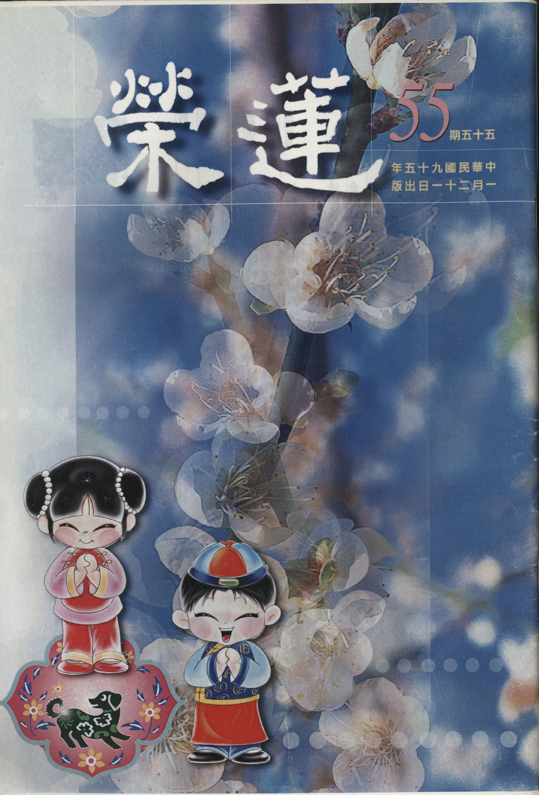

# 第55期

## 社論

### 冬去春又來

本刊

泰極否還現

有情升沉苦

菩薩度生忙

冬天將盡，春天還會遠嗎？

爆竹聲中除舊歲，彼時大地春回、草木又新，寒冬遠驅春暖大地，此不變的四時運轉正說明了天地的仁心，故週而復始中泰極否來、剝而復返中否極泰來，就在回還往復裡日新月異。此天地不變的道理就是宇宙人生的真相，揭示著人世的不圓滿，也隱藏著突破現況的生機。

中國神話裡記載著吳剛伐月桂的故事，吳剛因犯天庭，被安置在月宮中，砍伐著那棵永遠不會倒的月桂樹，其辛勤工作的身影在月光中婆娑著；而西洋神話裡則有著尤里西斯推巨石的故事，可憐的尤里西斯亦犯了天條，被處罰在山腳下推石頭，只要他把山下那顆大巨石推往山巔安置好，魔咒即可解除重獲自由，為了獲得珍貴的自由解脫身，於是尤里西斯每天努力地推動巨石往山頂送，但大力士尤里西斯總是力盡而竭，抵不過宿命的牽掣而功敗垂成，至今在某處山腳下，尤里西斯還在努力著。

此看似無理而妙的故事裡，其實隱藏著很深的義涵，在回還往復的日子中，每日忙著穿衣吃飯、迎新送舊的我們，又何嘗不是吳剛的翻版？而在人世間精進努力的闖蕩裏，吾人又何嘗不是另一個尤里西斯？而這就是輪迴！

輪迴是意識型態的不能出離，是喜怒哀樂的浮浮沉沉；輪迴是追著尾巴的小狗，不能回頭的轉著圈；輪迴是濤濤海浪中的一波未平、一波又起；輪迴是人世間的冤親不定、迷惑顛倒；輪迴是咬緊牙關仍不得自在的吶喊喧騰；輪迴是吃盡苦頭採得百花成蜜後的為誰辛苦為誰忙；輪迴是無止盡的吳剛伐桂、尤里西斯推巨石！

入中論道：「最初說我而執我，次言我所則著法，如水車轉無自在，緣生興悲我敬禮。」說明了輪迴的本質，原來眾生由無始我執薩迦耶見故，於無自性的我妄執為實有；次由我所執的薩迦耶見，於我之外的境界執為真實而流轉生死，如水車輪之旋轉無自在，而諸佛菩薩即緣此輪迴眾生興起大悲，此為吾等所應敬禮者。

此中以水車輪比喻輪迴中的眾生相，若法若喻，貼切易懂、發人深省，此水車輪即中國傳統的汲井輪（轤轆），與輪迴的眾生相合而說之，可引生為六義：

一者、水車輪由繩繫縛；亦如有情眾生被惑業繩索繫縛不得自在。

二者、水車輪由旋轉水車之人所旋；誠如眾生被無明愛取等最不寂靜、未善調伏的心識推動而轉。

三者、汲井的水桶於井內升升沉沉；就像眾生在六道中起起伏伏、頭出頭沒，上至有頂天、下至無間地獄流轉不息。

四者、水桶下沉時不需費力，上升時則費時又費力；就如眾生因惑業增上力故，由非福業及煩惱力為助伴時則墮惡趣，由諸福業、不動業及煩惱力造作故則升善趣，而墮惡趣時不待任何功用任運而墜，上升善趣時卻需極大勤勇勵力修行方得上升，誠如世尊開示：墮惡趣者如大地土，升善趣者卻如爪上塵！

五者、汲井的水桶上升下降速度太快，誰前誰後不能定奪；就像眾生在緣起中，由無明愛取三種煩惱隨一生起時，其他緣起之行、有二支雜染則相續不斷，造作來生的決定業，然其前後次第則無一定。

六者、水桶上下叩叩碰碰中不斷撞擊井壁以致傷痕累累；亦如三有眾生恆為苦苦、壞苦、行苦、無量苦惱所逼迫，如水浪之滾滾而來。故諸眾生迄今未有出離輪轉之時，此即眾生的真實相。

所以即便是人間的盛事，亦不離輪迴的本質，管他人間的封侯拜相、紅塵的濤濤滾滾，亦只是訴說著無常偈中的：「積聚皆銷散，崇高必墮落，合會終別離，有命咸歸死。」當輪迴之苦吃盡時能不思出離之道嗎？而解決之道唯有跳出輪迴的Circle！

如轉火輪，看似密不透風的火輪圈，止息下來也只不過是一根單純的燃燒棒；而十二因緣看似永無出期的流轉輪迴裏，隨截斷其中一支則趨還滅；雖往者不可諫，來者猶可追；在昨日種種譬如今日死，今日種種譬如昨日生中，惑業苦的輾轉六道裏充滿了解脫的可能。輪迴並不可怕，可怕的是好樂輪迴、無所不用其極地回到輪迴，終至不肯出離，若欲出離，則處處是生機，遇境逢緣都是活水源頭。

如八吉祥中的法輪，即以輪寶象徵佛法的圓滿精深，亦以輪轉象徵佛道的生生不息；且以法輪常轉比喻佛所說法，能輾斷眾生的一切煩惱；且能輾轉傳遞，如車輪般無遠弗屆，廣度六道一切眾生；又車輪疾速，喻見道之速疾，正如無生之正觀可摧伏一切煩惱妄想，劃破無明癡暗！

故唯有佛法能伏剛強，能摧眾生之諸惡及不善法，能轉下眾生入於聖道，誠如杜甫之「冬至陽生春又來」，當法輪常轉、日積有功、背塵合覺時，春天還會遠嗎？

## 大德法語

### 大方廣圓覺修多羅了義經（十五）

道源老和尚

性體本空非造作

有情相執惑業續

識得本來無一物

何處覓得些塵埃

庚三、明妄盡還覺

辛一、以智除妄

經文：

「善男子！如來因地，修圓覺者，知是空華，即無輪轉，亦無身心，受彼生死。非作故無，本性無故。」

再叫一聲當機者，此句再答覆文殊菩薩所問的問題：「如來」你已成佛了，但最初修行是怎麼下手的呢？佛答覆說如來最初修因都是這樣修的，怎麼修呢？依圓覺修圓覺，所修的圓覺行門是「知是空華，即無輪轉」。這八個字要注意，每一部經都有最要緊的話叫做經眼或叫做經心，譬如人的五官，最重要的是兩個眼睛；譬如人的五臟，最重要的是心臟，而這一部經也有兩句經文最重要（即經眼或經心）。例如金剛經之「應無所住，而生其心」，這八個字是金剛經的經眼、經心，若不研究清楚，則整部金剛經義理不會懂。而「知是空華，即無輪轉」此八個字就是圓覺經的經眼、經心。祖師也是依這八個字，判圓覺經為頓教大乘的經典。

知空中華為病眼生出來的，是譬喻什麼呢？乃譬喻三界以內的一切有為法如夢幻泡影、如露亦如電，此為金剛經之六喻，喻有為法如虛空華。你不知道有為法如虛空華而當成真實，才起貪、生瞋，再由貪、瞋、癡造生死的業，受種種輪迴的苦。若知道一切有為法都等於虛空華，則不起貪、瞋、癡，你不起迷惑還會造業嗎？不造業還會輪轉生死嗎？你得好好進一步研究「知是空華，即無輪轉」啊！這八個字最重要的在那個「知」，你不知有為法是虛空華，把這一切有為法當成是真實的，這就起了惑，接著要造業，起惑造業的結果呢？帶來苦果，惑業苦三法流轉謂之輪轉不息。一切如來在因地為凡夫時，都修學此圓照清淨覺相法門，先要知道有為法是不實在的，是個空中華，若能有此覺受就不會起迷惑了，還造業不造業呢？不起惑、不造業，還有苦果嗎？苦果了脫了，即無輪轉。

不聞佛法的眾生無法體會世俗的顯現如虛空華，所以天天起惑造業，弄得社會不安，世界不太平，眾生本來苦，又起惑造業則是苦上再加上苦，都是眾生在那兒庸人自擾，眾生不知世俗是虛空華的顯現。至於外道呢？也是想得道了生脫死，但是他不知道一切有為法是如何產生的，是由你的妄心所造的，就是由無明而更無明。譬如印度的婆羅門教，認為一切萬物都是大梵天生的，又譬如現在的耶穌教，認為人與萬物都是上帝所造的，他不知道這些觀念都是無明所生的，他們在求知，結果卻求個邪知邪見，如此能了生死嗎？當然不會！因為沒有破除無明煩惱。

至於我們學了大乘佛法算知道不知道呢？我們算知道，我們不是不知，不是邪知，了解「知是空華，即無輪轉」，此知道是正知，但是你還會不會起惑造業呢？見了可愛的東西還是會動貪心，不順心的事照樣動瞋恨，起惑造業不還是要受報嗎？還是要輪轉生死嗎？那我們這個正知正見算個什麼正知正見呢？這個正知就是始覺智，以前不知，今天開始知道了，以前不覺，今天開始覺了，謂之始覺。始覺的智慧生出來後，就看個人的根機如何了？你要是頓超的根機，當下就能大徹大悟、了脫生死。

若不是頓超的根機呢？這始覺知就要分成四個步驟：名字覺、相似覺、分證覺、究竟覺。如來的知是知空華，即無輪轉，謂之究竟覺；菩薩是分證覺；三賢位的菩薩名相似覺；十信位的菩薩就是我們學大乘的凡夫謂之名字覺，只有這個名字覺。起信論釋名字覺說，實實在在還是不覺。你能說他（十信位）不覺嗎？「知是空華，即無輪轉」的道理他（十信位）是知道，也聽得很明白，但只是依著聖言量知道而已，還是屬於不覺。

所以不要以為聽明白了，也學會講經說法，講得很明白，好像開了悟，結果境界一現前照樣被境界所轉，為什麼？一個初發信心的人，這個信心不但沒修圓滿，可能連第二步的信還沒有達到。初發信心的菩薩確信大乘道理，雖名字叫做始覺知，實際是名字而已，還是不覺。若不努力精進尋求體悟就認為已覺，實際上是自己打自己的閒岔，見了可愛的境界還是動貪心，不可愛境還是動瞋恨，起惑造業之後能不受報嗎？不流轉生死嗎？那麼到底要如何才能即無輪轉呢？當下就沒有，這才叫即無啊！所以我們聽懂了，要認清自己的知，只是名字知，還不是真知。

若真實的知道了，不起惑不造業，自然就沒有輪轉了。再說一個譬喻，有一位禪師請問祖師：大乘經典說一切眾生皆具佛性，但何謂佛性？祖師直接了當開導他，放下貪、瞋、癡就是佛性，人人都有佛性，只是被貪、瞋、癡障蔽了，如果把貪、瞋、癡放下了，佛性就能現前。這個禪師一聽到這席話，當下把貪、瞋、癡放下來，便明心見性、大徹大悟了，當下就是「即」，與即無輪轉的「即」，全都是頓超的根性。若說我們不是頓超的根性，這樣說也太武斷了，可能同學裡有頓超的根機，但是多數都是漸次的根機，你知道貪、瞋、癡在作怪，要你放下貪、瞋、癡，你一點兒也放不下，你怎麼能見到佛性呢？圓覺經名佛性為圓覺，你怎麼能見到圓覺呢？一樣的是你真能徹底的放下，圓覺就現前。

貪、瞋、癡是由無明所生，無明沒有自體，當現證空性時，不是圓覺自性現前了嗎？圓覺自性一現前，那有生死輪轉呢？生死本來是虛空華嘛！雖然我們不是頓超根機，但一定要深入研究，我為什麼要動貪、瞋、癡？我為什麼明知故犯？要自己喝斥自己，本來無可貪，為什麼要貪？本來無可瞋，為什麼要瞋？自己迴光返照，照自己的煩惱，把煩惱照空了，無明照空了，圓覺自性現前了嘛！動貪心，你還被貪所轉，動瞋心，還被瞋所轉，你不認錯，不認錯怎麼還肯求懺悔呢？不肯求懺悔，不是錯上加錯嗎？一錯再錯，一貪再貪，一瞋再瞋，煩惱無止盡，生死永遠流轉下去。現在我們既然學了大乘佛法，就是因為有善根才能學道，這樣對得起自己的善根嗎？所以你得深入研究。雖然我們不是頓超根性，但要往這個地方追，往這個地方究，可能有那麼一天，忽然貫通，圓覺自性現前。你不往裡邊深究，什麼時候你會明心見性呢？

所以學了大乘佛法，沒有學會講經說法，學會講經說法了，接著貪名、貪利、貪恭敬，另外增加新的貪、瞋、癡煩惱，不會講經說法的人，那些根本沒有聞到佛法的人，他是愚癡現前，再動貪、動瞋，他那一套是眾生的，我們當法師的，學了佛法不認真的追究，還貪名、貪利、貪恭敬，再加上新的貪、瞋、癡煩惱。彼世間人起煩惱還有藥可救，若法師起了貪名、貪利、貪恭敬的心，就無可挽救了，譬如水內生火，你看難滅不難滅呢？學了佛法後反倒增加了貪、瞋、癡，等於水裡邊生火，你看怪哉不怪哉？我希望同學內能有一個接班的出來，能學會講經說法，但是你要把貪、瞋、癡的煩惱觀空，才能不貪名、不貪利、不貪恭敬。在講堂裡邊，我不動貪、瞋、癡，我不動名利、恭敬心，這個很容易，因為境界不現前，假如是總統請你講經，行政院長請你說法，你歡喜不歡喜？恐怕你作夢都歡喜，這個名太大了，報紙上還是大字標題。

再說個譬喻，來了個護法，遞上紅包，內裝壹佰塊、貳佰塊台幣，我當然不動貪心，但若換成仟元紙鈔，且數量之多的要花大半天的時間才能清點完，你歡喜不歡喜？此時名利心現前了。而恭敬方面呢？受皈依弟子叩頭禮拜，我可以不動心，我跟眾生結緣嘛！你想要皈依，我為你舉行受皈依的儀式就好了！若換成是一個做大官的，或者是發大財的從你這裡皈依，你歡喜不歡喜？你動心不動心？那個對你的恭敬已不是普通的恭敬了。所以名利、恭敬的境界現前，你不起心動念，那才是真實的功夫，因為知是空中華啊！所以無可貪，即無輪轉。

「亦無身心，受彼生死」，既是生死也是空中華，沒有身相，沒有心相；有了身相，有了心相，才受生死之苦嘛！身相、心相都是空中華，那有生死的果報呢？「非作故無，本性無故。」此乃徹底觀空，不是你用功修行把它（自性）修無的，它應該本來沒有，虛空裡生了華，我要怎麼把它打掃乾淨？其實你用不著掃除，虛空華不是因你掃除才沒有，它本來就沒有，只要透過觀知其不真實（自性空）就好了！（下期待續）

## 共修研學

### 佛說八大人覺經（十四）三乘功德由精進

*編輯部整理*

精進行相是勇悍

不疲不厭且好樂

能行上求下化事

不必辛勞成正覺

第四覺知：懈怠墜落；常行精進，破煩惱惡，摧伏四魔，出陰界獄。

有情生命現象的生起就是身與心，身與心是總說，能將六根六塵六識都收在五陰，五陰收在身心，謂之總（如講述筆記），為根本似。根本似就是似根本，似五蘊十八界的根本。其次遊增似是指五陰（蘊），身是色蘊，心是受想行識四蘊，遊是在境界上遊走，就有了各種不同的感受，生起了各種不同的想法、心理，感受中有苦受、樂受、憂受、喜受、捨受，謂之遊增似。

此「似」乃似有實法而體性了不可得，如身之作用必觀待於心，心之生起也要觀待於身，無有實體可得；遊增似亦然，好像增加了很多現象與作用，事實上也無體性可得，相互觀待。例如樂受可以自己生嗎？沒有對著順境，沒有觀待於過去的善業，沒有眼前的認知，沒有觀待於苦受，如何會知眼前是生起樂受？如生病謂之苦受，病好了感覺快樂是樂受，然是對著病苦才能說現在很舒服，沒有觀待病的苦受，如何會生起病好的樂受？若沒有成績壞的對比如何顯出成績好？真正實體的成績好在哪裡？所以似有實法而實無，體空如幻。

其次稱十八界為孤獨似，所謂孤獨是指六根、六塵、六識好像各有各的工作要做，彼此不相干，比如眼睛看的與耳朵聽的相干嗎？若相干則眼睛可以聽，耳朵可以看，好像各各不相干，第六識是想，眼識可以想嗎？十八界各有行相似孤獨，然真實體性不可得，體空如幻。五根六塵（法塵的一分可以歸到色）可以收攝為色蘊，意根與六識可以收攝為心法，或收攝為五蘊中之識蘊，受、想、行是識蘊的眷屬，亦可收攝為識蘊。意識的生起是靠著意根，意根是前一念的心識，靠著前一念心識的推動，緣著現前的法塵方生起現前的第六識。這些根、塵、識似各有實體，實則皆相互觀待體性了不可得。

若能了知五蘊的體性了不可得，十八界的體性了不可得，在五蘊身心和合的基礎上尋覓不到真實的人我，如此的觀修是煩惱的正對治。若能摧伏四魔中的煩惱魔及五蘊魔，就不怕死魔的障礙，也不怕天子魔的障礙。在《入中論》裡說，沒有通達體性是空寂的人，他的煩惱是不會清淨的，所持的戒也不會清淨，戒律的清淨也要觀待於證得空性的智慧，因為戒律再怎麼嚴謹都只能破煩惱的現行，不能破煩惱的種子。

所以「出陰界獄」，就是這樣出的，知萬法（身心、五蘊、十二處、十八界）體性了不可得，現起如幻，既是現起如幻，它能束縛什麼？它能障礙什麼？法之生起如幻會變成障礙嗎？會變成束縛嗎？

而精進也是對著昔日懈怠，昔日因無出三界之勝解力，而無法起欲出離輪迴之勇悍，此時生起對解脫的勝解，將懈怠的狀態對治掉，生起的行相謂之精進，若無懈怠的對治則亦無精進行相可得。

對治懈怠的精進行相有六（講述筆記）：

第一、斷惡修善：

此項是基礎，因為斷惡修善才有聞法的資糧，不能斷惡修善的人會有聞法的福報嗎？人身都尚且得不到，如何會有福報聽聞佛法、修學佛法？唯有斷惡修善的人才會得到暇滿的人生，才有機會聽聞佛法。

第二、希求聞法：

要使暇滿人生過得有意義還得希求聞法，因為人生如電光、石火很快就過去了，難得的暇滿人身很快就消失（易失），人身的獲得要有很大的善法，可是卻很快的失去，下一次要觀待很大的福報再現起人身的機率是稀少的，喻如高山穿針引線、大海盲龜浮木般之困難，所以要好好的珍惜人身，好好的運用人身。常見得暇滿人身的人，雖由過去生斷惡修善中得此有福報的身體，但卻不學佛，反而追逐世俗短暫的快樂，得到人身反而是他修道的障礙，何以會如此的顛倒呢？

過去有一位大善人毛靜遠居士，忙於造橋鋪路齋僧等善法，省庵大師卻勸他，在還沒確立了生死的志向時，做善愈多，修道的障礙愈大，現見有許多受用福報的人，反而無法學道。所以要以暇滿的人身希求聞法，並用聞法產生定解，確定講法者是這樣的意思，由聞而定解才是聞的行相，但這要經過研討知道上課老師講的是這個意思，此才是真正聞的行相，才能作為思的資糧，聞而不懂如何成為思的資糧？由聞而知許多人生的大道理，使寶貴的人身不空過，孔子也說朝聞道夕死可矣。

第三、聞而能思：

聞懂之後還要多思維，亦即透過種種的觀察（思擇），真正體悟這些道理，因明學就是思維法，透過種種的辯證，確立了所聞的要旨，亦即以種種的正因安立所聞的要旨，有這樣的思維力是比量的成就，禪家講的明心見性，就是思所成慧的成就。

第四、思而能修：

確立了所聞的要義之後，一心專注這樣的要義，不作分別謂之止住修，在止的基礎上作種種的思維修，稱之觀察修，止修若成可觀察修，觀察修若有浮沉相，則回過頭來止住修，止住修穩固後再觀察修你觀察修成就後即止觀雙運證得法義，若以空性為所緣，即證得空性，得到出離三界的正見（證量）。

第五、持續而不間斷：

修學不能若斷若續，要有始有終，不達目的絕不中止。

第六、遇緣（順逆境）不變：

在正修法義之後，歷緣對境也要有警覺心，在這些順逆境中要把坐上修的能力拿來變成歷緣對境煩惱的對治力。在天台小止觀的座上修止修觀，主體是以空性為所緣，歷緣對境修時也以空性的智慧攝持，例如在眼見色、耳聞聲、鼻嗅香中，分析該法真實性，不為這些順逆境所束縛，自然不起三毒，不造輪迴有漏之業，眼前消災免難，未來離苦得樂。

能對治懈怠的精進有三種類：

第一、披甲不怖：

勇悍於斷惡修善、聞法、思維、修學，及歷緣對境時把持自己的節操，任何艱難及魔障都無畏，披了誓願甲在菩提道上往前走，即披甲不怖的行相。

第二、攝善不疲：

攝持各種利益有情的善法時，不疲不厭，例如辦利益有情的事業，往往是吃力不討好，自己吃虧別人佔便宜，是否能維持初發心，古人云：維持初發心，成佛有餘。辦事難道是要得到人天的安樂，下一生去墮落嗎？買生物時，要藉著魚起慈悲心，否則在討價還價中或許失掉慈悲心，又沒有看到魚的可憐，一定要在當中觀修教法才叫辦事，所以有云辦事一定要道人，然道人不一定能辦事。但道人還得能辦事，前述作大雄（大雄還是道人作）辦大事。

第三、樂利不倦：

不但做善法不疲厭，且處處講究饒益有情，不但不厭倦，反而歡喜為之，因為眾生的苦是菩薩最不忍的，眾生的恩是菩薩最要報答的，所以菩薩在作拔苦報恩的事業時，如何會不精進呢？如何會疲倦厭煩呢？以上第四覺知。（下期待續）

## 蓮池海會

### 余楊惠珍老居士往生見聞記

*編輯部整理*

曾是富家千金女

為母任勞又任怨

開朗寬胸且端莊

助念生西化家人

余楊惠珍老居士，出生於民國十八年，排行第七。先祖世居在雲南省保山縣，父母開設金銀飾品店，均逾九十高齡相繼辭世。上有兄姐各一人，下有妹一人。老居士自幼聰慧、端莊、賢淑，敬老愛幼，樂善好施。年少時經友人介紹嫁予夫君余白超先生為妻，婚後伉儷情深，育有五子四女，皆學有所成，組織美滿的家庭，老居士歷經五十五年寒暑，相夫教子，甘苦與共，不畏艱難，克勤克儉。

老居士幼年家境富裕，出門皆有丫鬟背負，珍寶玉石任其玩賞。戰亂離鄉來台，身無恆產，以千金之軀，事必躬親，從頭學起，毫無怨言，常說：「人哪！要活到老學到老」。又因學習力很強，嚐過好吃的菜會說：「咱們試它一台，煮來吃吃看！」往往不分軒輊，因之廚藝日增，燒得一手好菜。又人緣極佳，朋友多，家中常常熱鬧非凡，於是好吃的料理亦一盤一盤地上桌，總讓客人盡興而歸。

老居士除了交友廣闊、寬厚仁慈之外，朋友有求於她，也必定盡其所能的幫助，尤其不喜歡與人計較，見肩挑小販生活困苦，常於心不忍而特地購買原本不需要的物品，與人相處即使自己吃了虧，仍處處為他人著想。

來台之初生活困苦，物資缺乏，兒女眾多，除煮食一家大小三餐，曾經為佐家計，飼養家禽及販賣蛋類，未幾又開設商舖，日夜辛勞。大年除夕時，顧不得饑腸轆轆忙著進貨出貨，當夜幕低垂萬家慶團圓時，又再度挽袖為除歲打掃，接著忙碌年夜圍爐。原望因此改善經濟，奈何歷經幾次颱風淹水，不得不在淒風苦雨的日子裡，清除污泥，丟棄浸水未拆的貨品，並整理半毀堪用的東西，將一夕之間造成的殘象默默收拾，此後不再開店。但於日子清苦中，卻不曾忽略子女教育，為期望兒女學業有成，即使捉襟見肘仍想盡辦法延請家教。

老居士在平淡的生活中展現高度智慧與寬闊胸襟，教子有方，總教導子女做事要謹慎，對得起良心，要多看別人優點，有能力幫助別人時不要吝嗇，並且要懂得謙虛，並且包容別人。平時對子女採開明教育，亦總在重要關鍵適時拉一把。雖然兒孫繁多仍能個個照顧到，視媳婦更如己出。至於個性開朗，堅強樂觀，喜愛整潔更是不用說，出門總是乾乾淨淨整整齊齊，晚年病痛纏身，進出醫院治療時，仍整齊得體，鄰座皆驚異她看起來不像病人，「自己已經不舒服了，何必再讓旁人看了難過！」她說。從以前到現在，老居士凡事總親自料理，不願假手他人，即使有病在身亦不願兒女為陪侍看病而請假。老居士就是如此體恤晚輩，為人著想。

如今不幸罹患不治之症，溘然長逝，親朋好友皆悲痛萬分。遵其遺願返家安息，往生時其夫率眾子女隨侍在側，老居士在諸位蓮友及親眷念佛聲中含笑往生。唯願老居士於西方淨土中，仗此殊勝佛力，早日花開見佛，悟無生忍，乘願再來，廣度群蒙。

## 啟蒙園地

### 歷史故事　一念善因終有善報的陰鏗

妙音

因果並非釋門有

人生現象面面觀

善惡到頭終有報

只爭遲速與輕重

俗云：「勿以善小而不為，勿以惡小而為之。」在歷史上記載許多因為一念之善，而能趨吉避凶逢凶化吉之事跡；此次介紹之故事的主人翁陰鏗，即是如此。介紹本故事的主角前，先在這賣個關子，容後再說。

歷史上因一念之善，施恩不求回報，反獲報恩，實在多得不可勝數。先引薦小朋友耳熟能詳的故事〜報漂母之恩或一飯之恩或千金一飯的韓信，話說韓信年輕卑微困苦時，有一天佩劍，流浪淮陰街頭，遭一批無賴少年挑釁，為免群小肇事及後續糾結，忍一時胯下恥辱，可見他忍辱的功夫。

韓信少時未遇到明主賞識，偶而逛到河邊釣魚，真是屋漏偏逢連夜雨，又釣不著，經常挨餓；河邊一位不知名的漂母，見他可憐，自己雖也貧困，卻常不吝於接濟他，韓信感念漂母施飯的恩惠，激動的說以後必重金答謝，漂母不悅的說，我是見你飢餓難堪，不忍眼睜睜看你餓死，並不希求你的回報。韓信後掛帥封楚王，果真贈以千金回報，千古傳為美談。

南朝是一個盛行門閥政治的氏族社會，當時社會存在著「上品無寒門，下品無勢族」，儼然有階級分隔，話說晉朝時，有一位諫官顧榮，一次接受友人宴請烤肉，吃得酒酣耳熱之際，眼尖發覺烤肉的僕人，來回穿梭遞烤肉給高貴的賓客享用，由於香味四溢，瞧見露出垂涎的顏色，便留下自己應有一份，送給烤肉的僕人吃，同席賓客譏笑，自己不享用，卻賞給下人吃，顧榮將心比心的說：「豈有終日執之，而不知其味者乎？」他這種當下體恤下人的一念清淨仁心，與漂母施不望報的心，可說無二無別。

事過境遷，後來遭遇變亂，在渡江避難時，每當性命危急的當兒，總是有一位勇士拼命在旁護衛，問何故捨身救己？勇士相揖，感恩從前無私的施惠，今日圖報而已。

有了前二位歷史人物施恩不受報，反受厚報的前導，即方便進入本次歷史故事主人翁〜陰鏗，字子堅，為南朝的陳國人，自幼博覽歷史傳記等，相信前朝掌故也了然於心，跟在座同學一樣，啟蒙就開始讀經，能誦詩賦，尤其擅作五言詩，而聞名於當時，深受陳文帝之賞識，他的五言詩精彩處置於唐朝近體詩作中，也難分辨，如「帶天澄迥碧，映日動浮光，行舟逗遠樹，度鳥息危檣」就是一例。

讀聖賢書貴能內化，本故事主人翁，就是一好的楷模，他的一念善因，幾乎是顧榮的翻版，話說文人雅士聚會，是常有的事，各朝代風尚各有不同，而六朝時尚與現代秋節親朋好友聚會有些相同，崇尚烤肉，有一天陰鏗與友人宴飲，見斟酒人向陀螺似運轉，來回替大夥兒服侍，油然生起憐憫心，便從排排座中轉過身來，親斟美酒一杯，取了些許烤肉給他分享，時在座賓客投之以奇異眼神譏笑他，其應答與顧榮一樣，斟酒的人，內心激動澎湃，感懷於心。

六朝是一個朝代更換頻繁的年代，政治動盪不安，生活於這樣時代，難免會遭逢變亂，陰鏗所處年代，就面臨侯景之亂，正為侯景黨羽所擒的時候，說時遲那時快，跳出一人奮不顧身，拯救他脫離叛黨之亂，陰鏗正要答謝之際，那人卻回話：恩公莫要如此；相詢竟是昔日斟酒之人，料想子堅始料未及，因自己突有的善舉，終獲善報。

故事主人翁陰鏗，印證一句話，讀書要善巧，尤要將自己放入所研讀情境中，串習自己若設身處地會怎麼做呢？能如是研學，自有樂趣，亦是讀書內化的緊要途徑，以此結語與同學共勉。

### 十四講表（廿三）第七講表之萬物歸納六類

傳瑛

六塵緣影成六賊

可嘆眾生難解脫

識得體性及作用

解脫並得世間福

宇宙器界的範圍即有情眾生所依存的三界環境，這些許多可供有情眾生受用的外在種種物質，如依其性質可分為六大類：

一是色塵，即眾生眼識所緣的一切有形色境界；二是聲塵，即眾生耳識所緣的一切聲音境界；三是香塵，即眾生鼻識所緣的一切有氣味境界；四是味塵，指眾生舌識所緣的酸、甜、苦、辣、鹹等境界；五是觸塵，即眾生身識所緣的冷、暖、滑、澀、粗、細等境界；六是法塵，指眾生前五識（眼、耳、鼻、舌、身）面對境界時，會在我們的腦海裡形成影像（印象），即使前五識不對五塵境時，內心也會常常浮現這些影像。

上面所說的六塵境中，法塵似乎較難瞭解！譬如上課時答對問題的同學，老師會發好吃的糖果獎勵，當某一位同學吃到糖果時，心裡就想：「今天的糖果好好吃喔！味道好香好甜喔！下次我還要認真上課答對問題，這樣就又有糖果可以吃。」這時他的想法及糖果的影像就落入他的心田，這就是法塵；其實，我們每天接觸色、聲、香、味、觸種種境界後，心裏就會落下影像，好像照相機把所對焦的東西通通照進去一樣。

這六個境界有三種不同的名稱。一是「六塵」，我們說東西沾有灰塵時，表示東西不乾淨，所以這個塵就有「染污」的意思。像有些人喜歡看電視上一些不好的節目，不知不覺中，身心就受它影響，與人相處，不自覺就出現一些失控的行為、損人的言語，坐沒坐相、站沒站相，變得愈來愈沒有氣質，更糟糕的是，因每天所看的、所聽的都是殺、盜、淫、妄等事物，薰習久了，滿腦子胡思亂想，導致精神渙散，無法專心學習，甚而跟著造作殺、盜、淫、妄種種惡業，戕害自己的身心，真是可憐至極！

所以對境時，我們要懂得分別選擇，對身心有益的，要多看多聽多學習；反之，對身心有所損害的，儘量避免接觸，包括不看不好的影片、節目，不去不好的場所，尤其交友方面更要審慎，古人說：「無友不如己者」，朋友應該要以文會友、以友輔仁，互相增上德學；所以不要交品行不端的朋友，以免自己受到不良的影響。

六境另有一個名詞為「六妄」。妄是虛妄不真的意思。大家都知道彩虹非常漂亮，可是有人會想把彩虹佔為己有嗎？彩虹是下雨後，陽光折射而形成的，若沒有以上的條件，彩虹是不會出現的，而且彩虹出現的時間非常短暫，一旦形成的條件消失，彩虹也跟著消失得無影無蹤。所以彩虹的存在，好像一個幻境，不會永久存在不變。同樣的道理，我們凡夫眼睛所見的，耳朵所聽的，鼻子所聞的，舌頭所嚐的，身體所接觸的，心裡所想的，都是種種因緣合和的妄境，緣聚則生、緣散則滅，從沒有一個真實不變的自體可得，可是我們卻錯認為它是那麼真實不變，因而執著不捨，從而起煩惱造惡業。

以前有個外國人很想當上公司裏財務長的位子，所以每日上班時都與同事們勾心鬥角，希望可以取得長官的賞識，早日升官，由於內心的猜忌，使他覺得每個同事似乎都想跟他爭這個位子，所以他生活地很苦惱。後來得了癌症，生病反而給他一個覺醒：「如果我沒有健康的身體，就算得到了財務長的位子也沒有用。」於是他想盡各種方法治病，到處尋問曾經得過癌症而已治癒的人，這些人都對他說：「首先要面帶笑容、不生氣、包容別人、將心打開與大家好好和樂相處，然後再靠藥物治療。」他聽了這些話後，開始學習關心周遭的每一個人，重新開始有意義的人生。

其實，一個人現世能做高官，是因為他宿世曾做過利人的善業，再加上現世努力的結果，不是平白無故得來的，所以一切皆是因緣果報。眼前能夠得到富貴，是因以前曾布施；眼前得到健康的身體，是因以前不殺生；眼前很貧窮，是因以前很吝嗇，捨不得給別人；眼前長得很醜，是因以前愛生氣、愛計較、不懂得包容別人；眼前長得很可愛，是因以前與人相處很愉悅。如果以前沒造善因，現在絕對得不到好的果報，可惜，凡夫愚昧不知，不造善因妄想得好果報，因而處心積慮，不擇手段，逞兇鬥狠，廣造惡業，最後自食苦果。

六境除了名「六塵」、「六妄」外，還有另一個名稱為「六賊」。由於凡夫不知因緣果報，在對境時，妄想得到名聲財富乃至種種自以為是的享受，於是藉著眼、耳、鼻、舌、身、意六根，造作殺、盜、淫、妄種種惡業，但在起惑造業的同時，受煩惱賊的指使，使心性受染日趨墮落，因而將能夠開顯心性清淨、利益眾生乃至成佛的種種功德法財，都被此煩惱賊劫走一空，枉受長劫六道輪迴生死之苦，真是得不償失！

既知如此，我們不要被六境所蒙騙，反而要善用六境。那麼要如何善用？首先是對境界要有所選擇，選擇能增上我們德學的色、聲、香、味、觸、法六境，尤其具有薰修佛法、利益眾生內涵的境界，更要懂得把握學習。

宋朝有位法師名可久，發願求生淨土。他每天認真念佛做功課，即使再忙，功課也一定要做完，而且他念佛方法是將眼、耳、鼻、舌、身、意六根都攝在佛號上，不攀緣其他外境。後來這位法師真的往生西方了，巧的是，他的鄰居中有位富翁也在同日過世，不久富翁就托夢給他家的童僕說：「閻羅王在閻羅殿審我的罪時，審到一半突然停下來不審了，閻羅王說：『大家快把手邊的工作停下來，現在有一位僧人往生西方極樂世界，這是非常殊勝的事情，請大家一同跪迎。今天閻羅殿大赦一日。』」一位修道的高僧往生西方極樂世界，不只他一個人得利，甚至連地獄道裡所有受苦的眾生，都因他的往生而獲得大赦，閻羅王還親自跪迎送法師至西方極樂世界。

可見念佛是一件多麼殊勝的事情，希望大家學學法師都攝六根的念佛方法，這樣我們六根所對的六境，都能轉為清淨的修行，還可累積不可思議的功德法財。（下期待續）

### 論語略說　君子不重則不威章心得

心威

離苦得樂是聖賢

下手修學君子德

親近師友能改過

莊重威嚴又達禮

博大精深的中華文化植基於深廣的儒學思想，而王道的儒家思想又以人格的完成為價值的核心，因此，學為君子、學為賢人、學為聖人乃為中國讀書人求學的階段及自我的期許，而學為君子正是求學的第一個目標。

本章有兩種講法。其一，「君子不重則不威。」為一段，說明求學之人常有的病相，就是不莊重，因為不莊重則沒有威儀。「學則不固。」又是一段，說明因為固敝，不達於禮，所以不莊重，求學則知禮，知禮自然就懂得莊重。此正是對治病相的藥方，學就能不固敝，就能莊重而有威儀。既知須學，然要如何的學呢？「主忠信，無友不如己者，過則勿憚改。」正說明如何學，鄭玄在注解中提到，「主，親也。」認為要親近忠信之人，以之為師友。不與志向、道德修養與我不相似的人為友。若有過失不要畏難，應立即改正而不因循茍且。

另一種講法則將本章大分為兩段，「君子不重則不威，學則不固。主忠信。」為一段，前二句說明易犯的毛病，求學之人，不莊重則沒有威儀，所學亦不堅固，正所謂「輕乎外者，必不能堅乎內。」後一句「主忠信」說明治病的方法，欲所學堅固，則所言所行要以忠信為主。「無友不如己者，過則勿憚改。」是為第二段。著眼於所處環境上的防範及個人的自省，在環境上要與志同道合、能自省去非的人為友，而自己有過失，也要立即改正。

漢儒揚雄在其著作法言中特別提出，人須「取四重，去四輕。」所謂四重乃重言、重行、重貌、重好。子曰：「脩辭立其誠。」即言詞中往往能表現出一個人的誠意。一個懂得注重自己言語的人，自然就不會隨意發言，所發的言語也能與往聖前賢的垂訓相呼應，自然能為他人所遵循。行為必須莊重，才能表現出良好的品德，反過來，若一個人經常出入不正當場所，則此人的品格就可能有些疑問了。面貌能莊重，別人就不敢輕易冒犯，則威儀就自然流露出來；威儀的表現也隱含著個人道德的涵養，有威德的人就有一股正氣存在，就能避免許多不好的事情發生在自己身上。琴、棋、書、畫能怡情養性，是一種莊重的嗜好，可以深化自己的內涵，加大自己的氣度，也容易得到他人的欣賞與肯定。有志求學的君子，應從「言、行、貌、好」四方面時時注意，培養自己莊重沉穩的氣質。

隨著時代的演變，社會的風氣逐漸向下沉淪，標新立異者似乎很能在短期間爭取到世人的目光，言行莊重反倒成為食古不化。但進一步的深思，標新立異或許一時引來了不少的追隨者，卻也伴隨著造成人格的沉淪、內涵的粗鄙、道德的淪喪，當另一股流行的風潮再起，追隨者會毫不猶豫的捨之而去，留下的就只有無盡的蒼涼。

相反的，一個莊重有自信的人，既使是在幫別人開車門的動作中，都能讓對方感受到，這些動作是出自於對他的禮敬，而不是諂媚。要想學為君子、學為賢人、學為聖人就必須期許自己成為中流砥柱，不管風氣如何演變，求為君子的目標沒有絲毫的動搖。或許會有一時的寂寞，但就在這寂寞中正可以焠煉出高尚的人格、深厚的學養與無比的道德勇氣，時日漸久，終將散發出光明與熱力。一時的寂寞與無盡的蒼涼就看我們要如何抉擇？

## 禮懺法會

### 慈悲藥師寶懺法會儀軌觀修　如何修學藥師寶懺為淨土助功（二）

*編輯部整理*

發心拜懺利自他

觀待除罪第一步

順流十心造共業

能除方能免罪苦

九十四年十月廿九日

第四輪的禮拜（乃進入藥師懺卷上的第二番禮拜），是依菩提心行藥師懺，佛所要賜予我們的福報如同天上下豪雨般，我們是拿髒臉盆接？覆蓋的臉盆接？有漏洞的臉盆接？還是以如大海般的心量來接？若要納受佛全體功德，非要有偉大的心量不可。

是故發心修藥師懺是為了一切六道有情斷除一切業障，同入如來大本願海，並能普現色身於一念中，供養一切十方三寶於一念中普度一切六道眾生，令入平等大慧（此即普賢行願威神力，其功德等同佛），發心為公、發菩提心利益有情。然斷除一切業障，除了修學正法外，還要好好懺除往昔所造之業，故於今日一心精進，如說修行，惟願諸佛菩薩、藥師如來本願力故，受我懺悔，令我所行決定破除罪障行願圓成；且相信藥師佛仍有無量善巧方便，如世尊言：若一劫，若一劫餘，而廣說者，劫可速盡，彼佛行願善巧方便無有盡也！觀待藥師佛的無量善巧方便，必能滿我依菩提心懺除往昔所造的重罪。

以上是藥師懺的卷上，有兩番的禮拜（第三輪及第四輪），述及兩件事：第三輪的禮拜是願納受藥師佛所發的十二大願；第四輪的禮拜，是願以發菩提心，引導有情於藥師懺法中盡除一切罪障。

其次進入藥師懺卷中：

第五輪禮拜：向藥師海會三寶懺悔業障，過去所造業皆是由十心所策動，謂之順生死流十心，今天必須懺除這些造惡的因心，共有十心：

一、我與眾生，無始來今，由愛見故，內計我人：

因為有無明我執，就有保護自我，且你我的對立，不惜傷害他人以維護自己的利益；

二、外因惡友：

外有惡知識的惡薰陶，引發我俱生自私自利的心；

三、不隨喜他，一毫之善：

對他人的善法，不但不護持且生嫉妒，是很嚴重的過失；

四、惟遍三業，廣作眾罪：

吾人身口意三業，都被煩惱所攝持，很容易造眾罪，比如當他人對我們好時，我們可以記憶多久？頂多一小時、一天；當他人對我們不好，我們卻可以牢記十年、一輩子，這就是業障重，是廣造眾罪的行相；正如某個人十年前對我好，我們卻不復記憶，可是十年前有人對我的不好，我也應該忘記才是，然卻聽到名號就不高興，心裏有諸多的不滿，可見有情眾生的心是不是廣作眾罪的心；

五、事雖不廣，惡心遍佈：

我們雖然不殺人放火，但是惡心卻很容易生起；比如被蚊子咬時，剎那間瞋恨必生起，手啪一聲打下去，如夾山地獄般，令牠粉身碎骨，對於所造的惡業還心生歡喜，所殺的生物雖渺小如蚊子，但卻能將殺業圓滿，倘若要造放生業呢？一大堆的理由推辭，或言沒場地、或言反正我不殺生別人也會殺！不放生也沒有什麼罪過啊！邪知邪見多如牛毛，經過了這樣的檢驗，自己是否真的是業障深重；

第六、晝夜相續，無有間斷：

修學正法的法喜容易消失，但妄想惡念卻晝夜相續；

第七、覆諱過失，不欲人知：

保護自己的過失，不想讓人家知道，猶如鎖在銀行的保險箱裏，以為神不知，鬼不覺；

第八、不畏惡道：

不害怕墮入惡道，因為根本不相信有六道輪迴；

第九、無慚無愧：

沒有反省的能力，現今社會亂就亂在大家沒有什麼反省的能力；

第十、撥無因果：

不相信快樂是由作善來，痛苦是由造惡來。以上就是順流十心的內涵，由前心生後心，直至撥無因果。倘若一個人不相信因果時，一定是由無慚無愧而來、無慚無愧是由不畏惡道而來…，總之任由十心造業，而不知過患與對治，最根本原因是未遇善知識，無能力修學正法而來。

如斯罪障，即順流十心所造的罪業，會形成修道嚴重的障礙，若未經懺悔則障礙仍在。我於今日，對十方佛、藥師如來前，以逆流十心來對治順流十心，令罪障消滅。

逆流十心次第：

一、深信因果：

了知作善得樂，作惡得苦，有利害關係，凡是損人利己必帶給自己痛苦，而損己利人必帶來自己的安樂；

二、生重慚愧：

比如觀察身體所造的業，時時反省不令造殺、盜、淫等由身體所造惡業，以口為所緣，時時反省不造妄語、惡口、綺語、兩舌等由口所造惡業，以心為所緣，時時反省，不令心造作貪、瞋、癡等惡業；

三、生大怖畏：

對於六道輪迴特別是三塗苦有很大的恐懼心，絕不造惡，以免三途有分而人天無門；

四、發露懺悔：

已造、將造之罪業，會生起或將生起種種痛苦，要破壞已現行、將現行的罪業，最佳的方法就是發露懺悔，且最能保有福報不失，可惜時下一般人看不到發露懺悔是保住福報、拔除罪業的最好方法；

五、斷相續心：

發露懺悔能將煩惱之惡業的現行破壞，且這些造罪的三業不會相續，因為造罪的心已不相續；

六、發菩提心斷惡修善：

不但造罪的心不相續，還要引發菩提心，為了利益有情願成佛，且不僅發菩提心，還要修學菩薩道，斷惡修善，作出利益有情的事業；

七、勤策三業翻昔眾過：

不但能作出利益有情的善業，且自我努力鞭策三業，於善法勇悍，將過去所犯重過翻轉過來，例如：以放生來翻以前的殺生，以布施來翻以前的偷盜，以清淨的梵行來翻以前的邪淫；不僅只懺悔而且是強力的翻轉往昔所造眾過；

八、隨喜凡聖一毫之善：

不僅是自己改過遷善，還隨喜護持他人，乃至一毫之善都誠心隨喜，為他高興；

九、念藥師佛有大願力能救拔我

；

十、出二死海置三德岸：

祈求三寶與藥師佛的加被，讓我能有修學的資糧，並證得空性的智慧，離開分段與變異生死的大海，到達法身般若解脫三德成就的彼岸。（下期待續）

### 清淨莊嚴淨土懺法〜修學懺法之意樂與動機

*編輯部整理*

前行要訣在用心

體會經教重責任

分工合作調伏習

只問耕耘必收穫

九十四年十二月廿四日

前行意樂之建立

為令淨土懺法會能順利如法舉辦，故於法會前三天，齊集壇場佈置人員及維那悅眾等，假中壢修學會作前行研學，深入經義、建立意樂，並祈法會順利舉辦，其中就興辦淨土懺執事人員應具備之心態，整理如後。（編者）

淨土懺法要辦得好，需有幾方面的配合，首先是壇場的莊嚴：壇場若要擺設莊嚴，除工作人員懷誠敬心外，還必須對淨土的經典有所認知，供品要豐盛，鮮花要多插，盡量將淨土的法義表現出來。其次音響：要調到最佳發聲效果，能照應全場。再者，職司人員：不論維那、整理壇場者、辦事人員等，須先將懺本儀軌觀修，建立共識，共同以恭敬慎重之心莊嚴法會。

法會現場成效：如唱香讚時，就真的生起讚文的境界，迎請三寶，並對於三寶讚歎、供養、禮拜，尤其是西方淨土的三寶，由介紹淨土三寶的釋迦牟尼佛開始，接著是阿彌陀佛的法身、報身、化身，其中法身住在常寂光淨土，報身住在實報莊嚴土，化身住在方便有餘土與凡聖同居土，以上是淨土的佛寶。淨土的教典，特別是阿彌陀佛的心咒（往生咒），是淨土的法寶。觀音菩薩、普賢菩薩、大勢至菩薩、清淨大海眾菩薩，是淨土僧寶。以淨土的三寶為皈依境，由皈依境的攝持下修學淨土法門。

然修學淨土法門必須要發菩提心，方能將此法門之體性轉為大乘成佛的法門，所以要向阿彌陀佛表達我人發菩提心的意樂，並努力斷除貪瞋癡、修學正法，且將修學正法的功德做殊勝的回向，回自向他、回因向果、回事向理，做一個非常圓滿的回向，如此方稱做修學淨土法門的行者。

其中修學正法特別處是讀誦《佛說阿彌陀經》，因為修學淨土法門重在往生西方，想要求生淨土方稱淨土法門，是故唱誦、觀修《佛說阿彌陀經》就是要興起對淨土世界的好樂，並且要好好的念佛，求佛來接引我去西方極樂世界，而往生的目的就是為了要成佛。

且稱念阿彌陀佛的心咒，來消除往生的障礙，名曰：「拔一切業障根本得生淨土陀羅尼」。稱念阿彌陀佛的佛名有三個含意：

第一、「以名召德」，以阿彌陀佛之名召阿彌陀佛的佛德。

第二、「以名來召全德」，這是特指阿彌陀佛的名號，其他諸佛名號沒有，例如阿閦毗佛謂不動佛，此佛名只能彰顯佛不動的那一分功德，但是動的那一分功德未彰顯；或說寶性佛的名號是彰顯性體這一分，但相上顯現功德的這一分未彰顯；又如觀世音菩薩之名，是彰顯悲心的那一分是有的，但是就智慧的那一分則未彰顯；若稱觀自在菩薩，則是彰顯智慧的那一分而未彰顯悲心。所以十方諸佛的名號或顯悲心、或顯智慧、或顯世俗、或顯勝義、或顯性（體性）、或顯相、或顯行願，不一而足，只有阿彌陀佛不只是以名召德，而且是以名召全德，把佛的無量光明、神通、智慧、道力、德能全部收攝在一句彌陀名號中。所以阿彌陀是五種不翻的含多義不翻，就是要以名召全德，不能單翻成無量光佛，若翻成無量光佛只就佛智慧的這一分說，若翻為無量壽是就福德的那一分，所以佛說阿彌陀經云：「彼佛光明無量照十方國無所障礙，是故號為阿彌陀」，是就光（智慧）的部分，「彼佛壽命及其人民無量無邊阿僧祇劫，故名阿彌陀」是就壽（福德）的部分。

第三、阿彌陀也是咒語，謂秘密不翻，往生咒中有「南無阿彌達叭呀」，阿彌達就是阿彌陀，阿彌陀這個是直接從咒語翻過來，稱之秘密不翻，是無上咒陀羅尼。所以「阿彌陀佛」是以名召德、以名召全德、也是無上咒陀羅尼，念一句佛名不但攝持著佛的全德，也是彰顯佛心的秘密咒，以名為我的因地心，所以對這句名號要生起恭敬、讚歎、歡喜、尊重之心，此是淨土法門的秘密處。

除了阿彌陀這一句名號的秘密處以外，另有秘密，即經文：「若一日至若七日一心不亂，其人臨命終時，阿彌陀佛與諸聖眾現在其前。」此為淨土法門所獨有，彰顯淨土法門是「不能自去，佛來接引」，其次「帶業往生、橫超三界」，因為往生淨土可以「橫超四土」，乃十方法門所無，十方教法所不能收、十方剎土所不能例，所以印光祖師讚歎：千經萬論處處指歸，往聖前賢人人趣向，是法界的大總相法門體，一切法門無不從此法界（淨土）流，一切行門無不還歸此法界（淨土）。

因此禮拜淨土懺要用這樣的體會來禮敬，因而擺設壇城就要盡所能了解的西方淨土去擺設。能有三個利益：

第一、因氣氛與佛淨土相同故，可以作為往生的增上緣，古人說「物以類聚，方以群分」，有這樣的氣氛就容易投生到那個環境，比如有初禪的氣氛，死了以後容易投生到初禪天，有畜牲的氣氛，死了以後就容易投生到畜牲道，如果對淨土有所認知，好好的擺設壇城，有淨土的氣氛，死後也容易投生到西方極樂世界，所以一定要盡其所能對淨土的了解來擺設這樣的壇城，將壇城擺設當成一種修法，而不只是來剪剪花、擦擦地如一般義工的心態，每位參與者都要當成就是創造佛淨土的人，有這樣的氣氛即能作為往生的增上緣。

第二、能增上對經教的體悟，因為這些義境的體悟即是經教義裡所在。

第三、作為未來成佛的徵兆，每一位聖者因地中修學莊嚴淨土的能力，能迅速感得成佛的果報。

然而欲有所成，須先破除個人的煩惱習氣，因為這些都是我們修行上的障礙，如果不能去除這些障礙，我們終將一事無成。這些都是我們無始劫來所造的業，若不好好的懺悔業障，會感得諸多的苦痛，然懺悔業障就要講究懺悔業障的心，過去我們是如何順生死之流所造的業，現在要逆生死流，起力量相等、方向相反的心把順流十心對治，好好將心態調到修行正法、希望成佛的心態，並且把我過去所造的惡事，包括對三寶的毀謗、對正法的毀謗、對善知識的毀謗、對有情眾生的殺害、偷盜、邪淫、妄語，甚至造作損人利己的事情，一一在佛前懺悔，清除我修行上的障礙，以淨土的三寶來做證明，來圓滿這樣的法會。

法會前行時不管分配到什麼樣的工作，都須以上述認知來做，將所有的努力都成為清除罪障的能力，並且引發善根福德，成為往生與成佛的資糧。

### 慈悲淨土懺法會

*編輯部整理*

壇城能令淨土彰

攝持人心善修懺

祖師用心弘教法

觀待後人續慧命

年底因彌陀聖誕所舉辦的淨土懺法會行之有年。為免拜懺流於形式，在法會開始前需先提起內心殊勝意樂，除了淨障集資、超薦親友外，更將淨土懺轉為往生、成佛之法行。下文謹就舉辦淨土懺所應具備之心態，整理如後。（編者）

為了遍滿虛空的有情眾生，我們必須要成就無上的正等正覺，為了成就阿耨多羅三藐三菩提，在中壢研學會興辦淨土懺法會，拜淨土懺前除了在家中戒齋、沐浴提起清淨的意樂外，到現場還可以做點燈、發願的前行，讓我們今天拜懺的體性轉為大乘法；並且以好樂求生淨土的心態拜淨土懺，使淨土懺轉為往生法；並以淨土懺來懺除我們無始劫來的忤逆重罪、十惡業、一切損人利己的惡業；使得淨土懺轉為殊勝的懺法。

如果我們抱持著這樣的心態來拜淨土懺，今天淨土懺生起的功德將無量無邊，不但能將我們宿世的障礙懺除，也能將善根福德引發，並且感應十方三寶特別是西方三聖的加被，眼前消災免難、趨吉避凶，能遇善知識、聽聞經教、體會正法、家庭和樂、事業順利，未來能以殊勝的意樂，在無病苦、無障礙、蓮友助念下安然往生西方；在西方極樂世界能以清淨的意樂、廣大的心態，以及結合諸上善人的提攜，阿彌陀佛的攝受，很快的成就佛果，利益無量無邊的有情。

因此所有的利益從眼前的淨土懺來發起，以今天拜懺一頓飯的時間，所累積的功德將是不可思議的增長廣大。有人喝下午茶、看場電影、補習功課，時間好像一溜煙就過去了，可是在拜懺時卻覺得難熬、意樂也很難提起，乃因不了解拜懺的殊勝，且無始劫來的放逸、懈怠已經積累成為習氣，使精進勇猛的心力無法提起；也不知道過去惡業生起時，將會結成多麼嚴重的苦果，對此沒有覺受，因此對佛法的實修、對懺法的禮拜、觀修的心意都提不起來。

是故我們今天要將過去不良的習氣反轉過來，好好的在修學上用功，在心情上調適。抱著歡喜的心，因為能夠拜到淨土懺是我們宿世的大因緣；抱著感恩的心，因為沒有護持的善友們，今天不可能有此拜懺的法會；抱著懺悔的心，因為我們無始劫來修學佛法連絲毫的成就也無；抱著隨喜的心，隨喜十方諸佛菩薩所開演的正法、以及諸善知識所修學的正法；抱著傳承的心，能夠將正法透過我人的實修來傳承；以種種的心來參加這樣的法會，當具足的善心越多，所成就的果位則越殊勝。

有人說抱著平常心，殊不知所謂：「修道的平常心」是指要將修道變成非常自然的事情，而不是像日用平常懶散、放逸。我們對很多日用平常的事情很專心，比如上班時為使自己表現更好，做事情則很專心；開車趕時間時，注意交通安全很專心；遇到自己切身問題時也很專心；電視節目看到精彩處亦專心；這種日用平常的覺受是無時無刻都存在的。反而將佛法的修學視為平常，所以懶散、放逸，殊不知修學佛法不需要這種日用平常的心態，否則對自己善根福德會是嚴重的傷害，會讓他人覺得修學正法是可以這樣的懶散、懈怠；反而造成正法流通及傳承的障礙。

佛法之所以要運用於日用平常，乃因能將煩惱習氣降伏、將善根福德引發，能令我與一切有情結上善緣，具足正確的觀念，得到一切的安樂，謂之佛法運用於平常。往生的心態亦要用在日用平常不退失，修學佛法之所以會有成就，乃在於善用其心。

所佈置之壇城美妙莊嚴，內涵是淨土的表法，包括白鶴、孔雀、迦陵頻伽、流水、七寶、四色蓮花等的莊嚴、以及各式美妙的曼陀羅花，在在顯示佈置者在阿彌陀經上的體會，才有辦法在壇城的擺設上表達對淨土的莊嚴，以此來供養十方三寶、淨土三寶，累積自己往生成佛利益無量無邊有情的資糧。其他如環境的打掃、香積廚飯菜的準備，這些眾志成城的力量是不可或缺的。

拜懺常被一般人誤解為家中有人過世才拜懺，寺院出家眾常被戲稱趕經懺，其實祖師大德著作懺本時，如作藥師懺是根據藥師經而編的藥師修學法；淨土懺則是根據佛說阿彌陀經編的淨土修學法；法華三昧懺則是根據法華經編的法華修學法，編著懺本的動機及意樂，應該是幫助修學者體會各種佛經的修學法，不應對懺法有任何的毀謗。

例如淨土懺的作者即是天台家祖師遵式（慈雲懺主）法師，與四明尊者、知禮大師為中興天台的大師。所寫的懺本非常的多，人稱百部懺主，與之學習者有千人之多，於當時是佛門的盛況。
今日之人才大都流向科技界、醫學界、法律界，僅能以一技之藝謀個人發展而已。樊遲曾問孔子種菜，孔子回
**答：** 我不如老圃！請問種田，孔子
**答：** 我不如老農！乃因時代進步，國家健全發展最需要的是文化的人才，須有大格局、有眼光、有見地，然現在這樣的人才寥寥可數。唉！當佛法不再流通，人才不再深入正法，佛法將面臨衰亡。佛法衰，並非釋迦牟尼佛的損失，正如同孔學衰退，損失非在孔子而是眾生；大德過世、後繼無人，如海邊的燈塔暗了，海外歸岸的眾生失去了明燈，受損失的是眾生而不是祖師大德，只不過祖師大德的悲心不能發揮而已。

因此，以今日拜懺的機緣，體會淨土及祖師的悲心，如何去傳承淨土的教法，如何善用正法掌握人生，謀家人之幸福、莊嚴社會，這才是拜懺的本懷。

## 專題報導

### 莊嚴道場出坡行　清掃淨苑道場記事

常傑

引導學子有善巧

觀待福田修善法

歷緣對境治習氣

好事成就賴智慧

九十四年十二月三十一日

緣起

九十四年最後一天適逢星期六，有許多人以參加慶典或整夜狂歡之方式迎接新年，本蓮榮共修會則依原訂計畫，進行佛、儒相關課程之研學。另有部分蓮友則前往西蓮淨苑出坡，行前老師曾扼要開示出坡觀修內涵，爰彙整後分享蓮友，期共霑法雨！

出坡觀修包括護持正法道場、莊嚴自己的德學、對治煩惱習氣、得到三寶殊勝的加被、結合團體行善力量最大、常遇善知識提攜、耐力轉強及從團體互動中學習成長等七項，其中後三項係針對孩子們參加出坡的好處而言。

前言

禪林從事作務勞役時，全寺大眾，無分職位大小，必須共同參與，稱為普請，俗稱出坡。出坡也是一種修行，故謂「搬柴運水、行住坐臥，無非修行」。出坡是訓練謙卑忍辱、破除驕慢最好的方法。「黎明即起，灑掃、應對、進退」是漢文化重要的生活教育，在佛門亦然。出家人修行，並非只是吃齋念佛，因捨世間無有可修對境。出坡，也是將自己內心雜亂一掃而空的方便法門。而出坡過程中，若能將心念專注於眼前所作的事務上，並結合法義作觀修，漸漸地心也會靜下來，內心法喜亦油然而生。

出坡觀修內涵

護持正法道場〜

苗秀緣於種好，佛法之興隆衰替，全在佛教徒有無真操實行與發心宏揚。西蓮淨苑正是一個續佛慧命，紹隆佛種之如法團體，從智諭老和尚創建叢林之蓽路藍縷，到今日住持與諸弟子依教奉行，上有法師勤苦教誨，下有弟子如法修學，道風之嚴謹，令人讚歎！我們有幸於淨苑出坡，將環境打掃乾淨，讓師父們利用時間精進道業、速證無上菩提。一般大眾見到了道場的整齊清潔窗明几淨，且又因師父們如此修學，處處充滿寧靜肅穆的氣息，自然心生歡喜，樂於親近道場，若能進而發願往生，則我們為道場整理環境的福報功德真是無量無邊啊！

莊嚴自己的德學〜

我們在淨苑出坡，也找機會誠心禮佛、念佛，眼裡瞻仰的是相好的佛陀，耳中聽到的是清幽的鐘磬聲，鼻子嗅得的是裊裊的信香，舌內虔誦的是佛陀的勝號，身體拜的是自覺覺他的世尊，意地思慕的是慈悲廣大的如來。這眼、耳、鼻、舌、身、意，所營造出來的氣息，正是以佛的萬德莊嚴而自莊嚴。正是為了遣除妄念。

對治煩惱習氣〜

經由出坡掃除外相塵埃中，內化轉為掃除自身心的塵垢，如周利槃特以清掃道場，服侍僧團的善行，由最愚癡的凡庸轉為義持第一的聖者阿羅漢。

得到三寶殊勝的加被〜

佛菩薩或明或暗的加被我們這些末法業障重的修行人，明裏使我們能夠警覺到，暗裏則被庇祐得不知不覺。例如守五戒的人，是隨時有二十五位善神，常護其身又由為公發心，特別是護持道場，服侍如法的僧團，更能蒙受三寶殊勝的加被，使我們能受廣大福，即使過去惡業生起，也能轉重報而成輕受。

結合團體行善力量最大〜

學佛的目的就是要離苦得樂，了脫生死。然需好好累積了生脫死的資糧，方能承辦此之目的。然一個人行善力量小，且難以持久，故無法累積解脫與成佛之廣大資糧。惟共同出坡等活動來造共業時，不但能培養自己的心、隨喜的心，還能將己之功德，融入團體功德海中，與個人所造善法較量，二者相差千百億。

常遇善知識提攜〜

在養兒育女過程中，為人父母者，無不傾其所能，將兒女撫育成人，並指望將來能出類拔萃，光宗耀祖。尤其現代的父母，更是終日惶惶然地，唯恐孩子輸在起跑點上。孩子稍懂人事，便忙於各種才藝的學習，卻很少留意到要加強德育。只因才藝是看得到的本領，以為有才藝就等同有出路，前途一片光明；德育是看不到的心靈功夫，正因為它看不到，便常被忽略。所幸蓮友及孩子們都有正知見，表面上參加出坡雖犧牲部分讀書時間，其實是換來修福積德的好機會，日後反倒容易啟發悟性，並常遇善知識提攜，減少許多冤枉路，也少造許多惡業，所以能消災免難、趨吉避凶，真是不求出路，出路自來。

耐力轉強〜

孩子們隨緣隨力參加出坡，雖是他的好因緣，好福報，孩子們努力讀書，充實學業，是責無旁貸的本份。但也不可忽略這種服務他人的善業，能培養耐力、毅力，使人格發展更趨健全。

從團體互動中學習成長〜

佛門有「六和敬」之說，此即凡修行人必須在身、口、意、戒、見、利等六方面，外同他喜，內自謙卑，和敬共處，同修佛道。王鼎鈞教授言：「做事要耐煩，做好事尤其如此……做好事理直氣壯，容易憤慨負氣，以致人間好事多磨……」而孩子們從團體互動中學會如何說話辦事，也會站在對方的立場思考問題，進而通達人情世故。此外，孩子在出坡的過程中，若能用心觀察長輩們的工作熱忱與認真負責的態度，就不難體會父母及師長的心意，視孝順父母、尊敬師長，友愛兄弟姐妹等為必備之德行，從而奉行不渝，為日後成就大事，為民造福奠定良好之基石。

後記

惜福，就是愛惜自己的福報；修福，就是開創自己的資源。明白這個道理，在做人做事上就找到了方向，日常生活能夠落實，任何地方都是道場、都是佛法、都能修行。出坡作務，是累積福德資糧最迅速的方法，修行人亦可在作務的當下，反觀自己的煩惱所在，滌除內心塵垢。如上述周利槃特往昔生中為三藏法師因為吝法，而感得愚癡的苦報；所幸宿世善根不滅，能在大慈世尊門下披剃出家，接受世尊的指導，由外在的灑掃、除垢，進而掃除內垢，開悟證果，得到解脫。

### 莊嚴道場出坡行　二○○五歲末淨苑清掃有感

張秉心

掃除過去舊習氣

開展未來新氣象

家人共造善淨業

菩提道上是眷屬

二○○五年的最後一天，在寒風細雨的清晨，我們一家四口再度驅車來到西蓮淨苑，毫無例外地，每當車子轉入通往淨苑的小巷之後，心中就會感覺到異常的平靜與安詳，彷彿來到一個澄澈心靈的所在，一切的紛擾與雜念都拋諸腦後。

在常傑的帶領之下，我們一行大約三十至四十人，先在三寶殿中共同誠摯地向佛菩薩報告今天的來意，之後，便在出家師父們的指引下，開始打掃三寶殿內的牆壁、天花板、吊扇及日光燈，在工作分派之後，每一組人都默默地、很有效率地各自完成所分配的部分，很快的殿內已煥然一新；此時，師父送來了可口的綠豆湯，大家吃了之後，立即精神飽滿，隨即轉往觀音殿進行打掃，只見大人、小孩、男生、女生，各有所司，井然有序，彷彿一家人在家中一起進行年終大掃除一般，相當溫馨。

打掃工作結束後，將工具及抹布收回原位後，一行人隨即前往大殿，在師父們的帶領下進行莊嚴的誦唸儀式，一時梵音繞樑，傳遍淨苑，誦唸結束後，今天的打掃工作就接近尾聲了。此時大家出了大殿，往餐廳移動，餐桌上早已擺滿了師父們為我們準備的齋飯，美味可口又營養的健康素食，在安靜的氣氛中，很快就被我們食用殆盡，大家都在身心皆滿足的情況下，結束了今天的淨苑清掃。

告別了淨苑，心中想著，我們全家人用了一個最有意義的方式告別了即將結束的二○○五年，也準備好了要用愉快而期待的心情，去迎接嶄新的二○○六年。

### 莊嚴道場出坡行　記國高中啟蒙班〜淨苑打掃心得

淨調

戶外教學掃寺院

護持僧眾安心修

龍天歡喜諸佛攝

他日得生清淨地

王老師為了加強中班同學們的向心力，用心安排了此次的戶外活動，結合打掃寺院的殊勝功德與養成同學們互助合作的精神，因此選定淨苑打掃為我們的戶外課程。

中班學生年齡介於國、高中，這樣的年齡最容易受到同儕的影響，漸漸地將父母的叮嚀變為嘮叨，樂於與同學嬉戲遊樂，為了不使蓮友子弟在成長過程中誤入歧途，或放逸浪費生命，共修會設立了啟蒙班，要將這些可愛的孩子，奠下良好的觀念思想，建立正確的人格行為模式。子弟們如果要持續在正道上成長，就必須在啟蒙班中與同學們彼此串聯，作為道上的益友，如此在成長的過程中便不會感到孤單，而且能感受到有良朋互助的快樂與好處。

子曰：「有朋自遠方來不亦樂乎！」此樂絕非吃喝玩樂之樂，因為那是短暫且不實的。仔細回想即使吃頓美味佳餚的快樂能有多久呢？買件新衣、新車是否很快又開始擔心如何保養、維護？唯有對道理的體悟才是一輩子不會忘記的喜悅。因此要珍惜身邊的同學，因為漸漸地你會發覺能有相同志向的朋友的不容易，但唯有真正的朋友才能發揮「輔仁」、「以文相會」的效果，共同在正法上用功、彼此砥礪。

幸運的各位同學們，你們已經身在一個良善的團體中，但也要把握這段好因緣來廣做善法，不要讓這難得的機會輕易的消逝。尤其能在年終共同打掃莊嚴的佛寺〜淨苑，若能把握正確的心態來做佛事，那麼不僅能為自己培褔、造逼，也能與同學間結下清淨的法緣，將道場打掃乾淨令僧眾安心辦道，必得佛菩薩歡喜護念，能感應吾人心想事成，種種的功德如實而生。只是如人飲水，冷暖自知，期勉大家都能藉此因緣不斷地增上，有那綿延不斷的善法能做，享受著像堯舜時期，人民孳孳為善的那份喜悅。

### 莊嚴道場出坡行　淨苑出坡心得

暄惠

小時即知種福田

成長方知有大利

父母教子需正見

隨俗教成俗子女

九十四年的最後一天十二月三十一日，是個值得感恩的日子，因為我又再次隨同師姑、師伯們一同前往西蓮淨苑出坡，更難得的是能和微智及維典等志同道合的好朋友一同互助合作，齊心將環境打掃清潔，藉此也掃除了心中許多的煩惱與慢心。

爸爸說我們要以恭敬、歡喜及感恩的心態來打掃淨苑，因為是打掃出家師父的處所，更要格外的恭敬，如果我恭敬的打掃，以歡喜心來擦拭供桌、擦拭佛燈，專心的掃地，讓所有的出家師父，能有個乾淨的環境修行，使道業精進，那可真是功德無量啊。同時我們也必須懷著感恩的心，如果不是師父讓我有機會來淨苑出坡打掃，就不能好好的供養三寶，也就沒有機會種下好的福田了，為此，我應該懷著感恩之心才對。

有段時間，微智和我一起到廚房幫忙，師父讓我們整理周遭環境，擺上餐具，當我們在排碗筷的同時，師父稱讚我們排得很整齊，我們不禁相互給了一個微笑。那時才知道，原來做了讓別人心生歡喜的事，自己的心情也很舒暢，也會心生歡喜。我們非常準時的盛好麵，後來看到大家把師父煮得菜餚一掃而空，吃得津津有味的樣子，真的好高興。

有些同學認為參加這種活動，會浪費了讀書的時間，可是卻不知道，其實越是來參加這種活動，不但能得到三寶加被，未來也容易遇到善知識的提攜與拉拔，讓我們增長智慧，反而對我們是有利的。

能來淨苑打掃，要感謝很多人，而且也體會到不是每個人都有這麼好的因緣與機會，真希望姊姊也能夠參與這次的活動，那該有多好，不過沒關係，我已經把功德回向給她了，希望她在花蓮求學期間，凡事都能消災免難，趨吉避凶！更祝福參加本次活動的蓮友，大家法喜充滿，光壽無量！

### 莊嚴道場出坡行　入寶山不空手回

微智

感恩開許種福田

隨喜道風及威儀

為成佛道掃心地

服務僧團發善根

每次來到淨苑，就像是來到一個讓人心靈嚮往的聖地，那兒沒有吵鬧與糾紛，不需要爭名奪利，所見的事物都是殊勝的，那兒有著莊嚴的佛像、和藹的師父、還有清新的空氣、乾淨的大殿，但最重要的是我們要懷著一顆寬廣的心胸以及感恩的心情來打掃。

非常感謝王老師在百忙之中還抽空替中班設計此次活動，王老師用他的細心與耐心，灌溉、滋潤我們，從他身上可學到待人接物的道理，更甚而是生活中的瑣碎細節處理之道，兩年多來，他給予我們越來越多的啟發，這次活動不但能增廣見聞，也能使福慧增長，還可以培養在生活中的樂趣、看事情的眼力，並且知道要懷著歡喜心來打掃，因為我們是最幸福的。

此次也很高興能與摯友暄惠一同打掃，我們很快的融入這種清淨自在的感覺，就像早晨的太陽從腳裡慢慢的沁入了心扉，淨苑真的很乾淨清爽，所以我們像是雞蛋裡挑骨頭般地尋找在細縫間的灰塵，總希望再多做些什麼，可是放眼望去，一塵不染的桌子、法器、地板都是亮晶晶的呈現在我們的眼前，為什麼淨苑可以保養得如此完善呢？

後來與暄惠到廚房幫忙，我覺得師父的言談舉止都非常優雅，做事速度敏捷又俐落，我希望自己有一天也能有這樣的氣質，不要什麼事都不會做，我發現每位師父走路腳都輕得不點地似的，表現出高尚的氣質，看起來很有精神、很有威嚴，所以做起事來自然就快速、調理分明。

我覺得爸爸說的很對，不是我們去幫師父打掃，而是師父給我們福田種，所以要感謝有此次因緣來淨苑打掃，收穫是無可限量的！

### 莊嚴道場出坡行　迎接新年的法行

維典

四肢勤勞種福田

感謝淨苑開方便

年終劃下好句點

亦是來年好緣起

今天是九十四年的最後一天，王老師帶領中班同學和蓮友長輩們一同前往西蓮淨苑打掃，別人正在為跨年晚會慶祝，可是我們比他們更有福報！可以在新年之前打掃寺院，讓元旦的供僧法會有個清淨殊勝的場地。

一早大家便懷著歡喜心做打掃的工作，一個大殿雖然看起來很好打掃，但是有些細節特別難做，擦天花板、洗電風扇…做這些工作都需要用心與耐力，雖然會有點累，不過，想到師父們每天的工作都比我們還要辛苦，我就忘了生起的疲倦，繼續賣力的做打掃工作。

記得以前常去淨苑，有幾次分配到後山打掃，因為打掃的因緣才有機會到達後山，才發現淨苑範圍其實很大。後山位於大殿的後面，本是一座荒蕪之地，去年上山時，發現在山坡上多了幾條步道，非常美麗，原本以為是請設計師設計，工人按日計酬做出來的，後來才知道都是師父們賣力鋪設出來的，且聽說連舊大殿也是師父們蓋的。

去年淨苑興建工程時，我也學習去搬石頭，搬的汗流浹背不勝辛苦，但這樣的辛苦根本比不上師父們的一天工作量，而我只做了半天，師父卻是天天如此，看著手中起的小水泡，不禁打從心裏對師父佩服不已，所以只要有機會我都願意到淨苑種福田。

這次打掃大殿的工作不同於過去的戶外工作，看起來比較輕鬆，但一點也不容易，原來每一個工作認真做，都有它必須挑戰的困難度，謝謝師父給我們學習的機會，也感謝老師的教導，更隨喜在場其他蓮友的善法。

### 養成班專題演講　有志培福宏觀者

*編輯部整理*

見識格局與心量

觀待引導與學習

共學不陋與多聞

忠信好學不讓賢

九十四年十一月六日

前言

共修會於九十四年十一月六日，利用週日全天舉辦年度專題講座，內容為「人才的形象」、「認識國際」、「年輕人應有的格局—誠意及如何被別人賞識」、「如何在任何情境中維持優勢」、「個人對兩岸年輕世代的觀察」等五個專題。期望學長們在學儒學佛以外，對國際情勢有所認識，尤其兩岸問題的認識，及如何在挑戰的情境中取得優勢，培養自己成為讓他人賞識，具備格局的人才。

專題緣起與簡介

首先是

人才的形象：

年輕人或對未來茫然，或羨慕他人有所成就，但與其羨慕，不如好好研究他人成功之因，體會他人是如何培養自己成為人才，了解主管眼中人才的形象為何，以及培養自己成為提攜人才者，這些在專題中都透過講者深入分析。

其次

談到認識國際：

現代的年輕人普遍缺乏對國際的宏觀思想，心中或許只想著考好學校，有個好的工作，組成美滿的家庭，或只想自己一個人這樣快樂過一生，對於國家民族的意識非常薄弱，也覺得事不關己。其實認知國際所發生的事情，判斷國際情勢是非常重要的，台灣非常努力地提倡國際化，但是卻很少人關心國際上發生的事情，甚至包括對岸所發生的事情都漠不關注，卻成天批評謾罵實在非常可悲，報紙上對於國際情勢的評論也不多見。若要台灣經濟有所發展，民生不虞匱乏，都觀待對國際的認識，找到與國際和諧相處的位置，並做好內政與教育，方能真正挽救日益疲憊頹唐的經濟情勢。

今日欲推廣中華文化，衍生我們的貿易經濟，皆須從認識他人著手。有志於發起悲心利益有情者，可以將對國際情勢的了解，作為對世界關懷、對人文關懷、對宗教關懷的輔助。

再者

如何維持優勢：

人生會面臨許多挑戰，或順境、或逆境，遇到的友伴或表面幫助我實際障礙我，或看似障礙我其實是幫助我，這些情境都會在我們生命相續中屢次的生起，而我們當用何種心態去面對，並且保持優勢？優勢真正的定義為何？

希望大家不要等到吃了很多虧、受了很多折磨後，才有這些體會。有福報者，自然對於他人所說、所做的種種誠意，有正面的體會，所以如何產生福報？福報的基礎為何？不要在意別人不知道我們到底做了多少事，只要我們肯努力老實為公發心，相信在任何情境下都能維持優勢有所作為。

至於

兩岸年輕世代的觀察：

這幾年兩岸生活水準的差距越來越小，隨舉一例都可知道我們的優勢不在，例如對岸的年輕人即便星期假日也主動到校念書，反觀我們國內的年輕人，即使念書也不用心探討自己的定位，對於國際形勢也非常漠然，短視、近利重視自己的享樂，家庭的責任感低落，這是我們台灣社會普遍有的現象，應從自己做起，好好自我充實，帶動同儕好學的風氣。

團體中每一位成員，如果都努力做出一番好的善法來莊嚴團體，此團體自然莊嚴而有內涵，每一個成員都從自己做起，成為他人的模範。例如學長們每雙週六在共修會參加論語、彌陀要解講座時，能變成一個有理想、有觀念、有共識的團隊，互相提攜、相互交流，珍惜彼此共學的因緣，必能得到殊勝的增上，真正成為國家的人才。

結言

在此特別感謝五位專題演講的師資們，本著慈悲心，將其畢生經歷或專業領域中摸索的心得貢獻出來，相信大眾亦可藉此專題的介紹擴展人生視野，具備更豐厚的人格內涵，可以在人生道路上走得更穩健、更踏實。

### 養成班專題演講　人才形象〜養成班專題演講一

安昕

曾為總裁善根厚

歷經職場大變化

充實自我成人才

立身處世不忘本

引言

受命報告人才的形象，感到不安，深恐浪費大家時間。其實老師平日苦口婆心的教導，已涵蓋了做人、處世及求知識等等的範疇，然師命難違，又鑒於現今台灣每年約十六萬社會新鮮人進入競爭激烈的職場，故將自己近四十載的工作經驗及企業管理模式與各位分享，期對各位有所助益，能有一正當職業及固定收入，對修學正法而言，是很重要的道糧。

近四十年來 台灣資訊環境的改變

十八世紀歐洲工業革命前，人類依農業或畜牧為生，數千年間，生活方式變化不大。然工業革命以來，工業與科學緊密結合，許多地區的人民皆被迫由農畜變更為工商的生活方式。台灣亦不例外，尤其近十五年來，因資訊科技的奇蹟發展，生活與職場工作環境起了巨大的變化。

末學畢業於民國五十年代，至今四十年間，台灣資訊環境的改變記憶猶新。我們不妨回顧一下，民國五十年代，數理等基礎科學已十分發達，但電子工業似未萌芽，學生或工程師使用計算尺作各種運算，機關使用手搖計算機。民國六十年代，少數的現今大企業在此期間誕生，且亦開始使用笨重的進口大電腦，電子計算機逐漸普遍。七十年代個人電腦慢慢出現了，宏碁也推出了配合使用中文的個人電腦，由於當時磁碟作業系統〈DOS〉及中文套裝軟體使用的不方便性，阻礙了辦公室電腦化。民國八十年代，台灣微軟公司中文視窗軟體的推出，創造出一個突飛猛進的年代，企業大量使用個人電腦，業務全面電腦化，辦公室難得見到手寫文件，此一年代台灣有許多輸出資訊電子產品之佔有率高達全球五成以上。民國九十年代，更是個網路革命時代，台灣的資訊社會指標進入全球第十名。

二十餘年來，資訊科技進展快速，約在民國七十年以前之大學畢業生，亦即年約五十歲以上者，在進入社會前，較少有機會提早學好電腦，難以適應此一劇變而發生了中年失業或被迫提前退休的窘境，年歲愈長情況愈嚴重，因而造成中層幹部的斷層，這也可能提供更多升遷的機會，大家或可把握。

新世代的管理模式 取代了傳統型態的管理

為了成就優良人才，我們須進一步認知現代的管理特色，以適應工作環境，末學歷經上述工作環境的變化，眼見企業經營管理方式隨之逐步改變，玆就下列諸項提出報告。

一、由所謂日式管理演變成所謂美式管理，細說如下：

１．從注重團體成績演變成重視個人競爭。

２．過去重視技術保留在公司傳承，現在注重個人研究專利。

３．過去注重公司未來長遠發展，現在則是眼前利益更為優先。

４．過去強調員工之優良人格特質，現在更偏重個人的工作能力。

５．過去講求年資及其人世體驗，現在則講同工同酬，二十歲年輕人可勝任的工作絕不會請四十歲高薪者來做。

６．終身僱用制度將愈行愈遠。

７．秘薪制度逐漸普遍，同事間談論或洩漏薪資是違規的。

二、透明的ｅ化管理：

主管坐在電腦前，透過網路隨時都可看到部屬的人事資料，包括相片、學經歷、歷年考績、身高體重、請假或外出等等，所以不要誤以為層層主管中，只有單位主管一人認得你。此外，公文擬稿、填寫各類表單、開會通知及紀錄、報表等等，除附件較多閱讀不便者外，無一不是在網路上進行，各公司在其本業的專業管理亦復如是，企業已全面電腦化了，因此諸位對自己專業上的各類應用軟體也要多認識。

三、組織結構型態的改變：

傳統是層級式的企業組織，是層層節制的權威領導及集權管理，強調忠誠、努力、責任、制度、規章。現代的組織逐漸趨向扁平式的專案工作團隊，每個團隊囊括各類人才，由專案經理領導，講求分權、受權，強調專業、績效、資訊、技能。

四、經營定位：

由國內的本土經營演變為全球性且企業間相互往來的經營，放眼全球化已成趨勢，語言溝通能力將不可或缺。

以上是現代經營管理的幾點特性，疏漏難免，亦請多加思考，如何調整自己俾適應環境。

定位自己 進入職場 成就優良的人才形象

在座許多是學生或想換工作的學長，因此必須談談有關應徵工作的問題。首先要說的是每個人在大環境職場中的定位，現在畢業生進入職場的競爭十分激烈，有人會想，若非研究所畢業，亦非名校或熱門科系畢業，如何進入職場呢？又如何能找到一份理想的工作呢？這確實是個問題，但仍然須克服困難為自己去卡位，想想自己能做什麼，適合做什麼，興趣在那裡，是為賺錢養家糊口？抑或要一份有興趣的工作？

因此我們必須在大職場排行中尋找自己的位置究竟在何處，唯若不把自己定位在進入大公司而中小企業也是選項之一，同時不要計較薪資待遇的話，問題將可解決一大部分。台灣中小企業非常多，其從業人員占全國就業總數的七成以上，雖然選擇到大公司工作的好處很多，包括可從基層訓練做起，而後一步一步學習制度化的管理，但大公司分工很細，很難學到該領域的全部，所以不要排斥到小公司工作，因為從那裡可以學到企業營運架構，全方位獲得經驗。

接著談談人才招募，一般招募人才的媒介為網路及報章雜誌，也有很多企業進入校園招募人才，台積電甚至於上下班的火車上加掛車箱招募員工，一般應徵程序是先繳證件〈如畢業證書、成績單、自傳、詳細履歷表等〉，經篩選後參與筆試〈考性向測驗、專業科目、英文等〉，接著口試，身家背景調查〈查有無前科〉，最後是體檢。因此諸位在校時勿荒廢學業以致成績單太難看。

撰寫自傳時大致包括三部份，一是個人背景介紹，二是執行成功的案例〈例如在學時參與社團之經歷〉，也可介紹成績最好的科目之讀書心得，三是說明自己未來謙虛學習的心態及願景。面談則是關鍵，平時要培養好的人格特質，讓人覺得氣質儀態非凡，一定會有熱誠的工作態度，也須訓練表達能力，面試官常問的問題是：你有什麼缺點？你的生活規劃與抱負？何以來本公司應徵？將來有何充實自己的計劃？在原公司之工作心得？對原公司上司或本身工作的看法？此時不可賣主求榮，過度批評原公司。

進入企業後，想成為一個優秀的人才，須在做人與做事雙方面同時努力，先說做人，老師平日在這方面教導太多了，但若知而不能行那就太可惜了。末學認為在做人方面，要摒除自私自利的習性，建立處處為人的觀念，培養優質的人格特質，建立良好的人際關係，自然發展人脈，擅用人際資源，加強溝通能力，維持個人與團隊〈含上司與同事〉的和諧互動，能如是，則處處受歡迎，無往不利。再說做事，首先要吸收新知，充實技能，盡量在年輕時學會基本專業知識及工作技能，做事要專注且要求完美，經常訓練思考、分析、規劃、思辯及創新的能力，能如是，做事將能成功。以上說來容易，做起來可不簡單，還得有相當的毅力。

結語

建立人才形象確實不易，錢多事少離家近的工作總是不可得，上班工作必定會承受壓力，壓力來自多方面，包括上司壓力、工作繁重、擔心失敗、失去信心、無成就感及同事對立等。除了注意運動健身解壓外，別忘了服用老師經常介紹的法藥。另成功者總是較常人多付出一份心力，今日若不努力工作，明日就要努力找工作，如果您已經有了一份工作，工作愉快，公司正規經營且經營穩定，上下相處愉悅，如此則除非情況特殊，否則就不必老是想換工作了，因為滾石是不生苔的。

### 養成班專題演講　個人對兩岸年輕世代的觀察〜養成班專題演講二綱要

心威

安逸環境浮心志

優勢漸失猶內耗

不隨潮流趨物欲

利他之心須成己

壹：前言

一、根據二○○四年統計資料，臺灣與大陸人口比為一比五十七。

二、未來臺灣的年輕世代將與大陸最頂尖二百分比的人競爭。

貳：生長背景

一、中國大陸約有九億農村人口，收入每月僅數百人民幣，普遍急於擺脫貧窮。

二、為進入城市尋找工作，有時會將盤纏用盡，仍未找到工作。

三、臺灣年輕世代普遍生活在相對富裕的環境。

參：教育環境

一、大陸人口眾多，能上著名大學的都是菁英中的菁英。

二、二○○四年底，英國《泰晤士報》為世界前兩百大大學排名，台灣僅有一所大學入榜，在亞洲四小龍中表現最差。台大排名為一百零二，北京大學十七、新加坡大學十八、香港大學三十九，首爾大學(漢城大學)排名一百一十八，雖落後台大，但韓國卻進榜三名。

三、民國八十二年，政府平均投注每位學生有二十萬五千元，現在不到十五萬，遠遠落後美國的六十萬、中國大陸的十八萬。

四、在大陸讀書是翻轉階級的捷徑，學生有較強的企圖心。

五、臺灣在大量普設大學以後，學生平均素質下降。

肆：國際視野

一、中國大陸媒體管制較臺灣嚴格。

二、臺灣的媒體較少報導國際事務。

伍：社會風氣

一、中國大陸的大鍋飯心態尚未去除。

二、急於擺脫貧窮的思維下，大陸員工跳槽的頻率很高。

三、臺灣的年輕世代大都在優渥的環境中學習、成長，較不懂得惜福、感恩。

四、在臺灣的開放性社會中成長，舉一反三的靈活性較佳。

陸：結論

一、充分利用臺灣諸多開放的管道，積極與國際接軌。

二、充實文化內涵，建立民族自信。

三、子曰：言忠信，行篤敬，雖蠻貊之邦行矣；言不忠信，行不篤敬，雖州里行乎哉。

### 養成班專題演講　如何在任何情境中維持優勢〜養成班專題演講三

傳瑛

團隊合作勝個人

澹泊名利唯利生

培養德學待天命

即是各境維優勢

每個人都想趨吉避凶、吉祥如意。問題是如何做到呢？尤其在座的各位學長，有的正準備進入職場？有的已在職場衝刺，如何能順利進入職場，或是在職場中闖出一番成就，確是當前所應關注。惟鑑於我們生命的舞台非僅職場而已，因此本文題目所示「任何情境」，非僅限於職場。至於所稱「優勢」，不是僅著重於眼前或短期利益，還須兼顧長期的影響。針對優勢的維持，末學試著從西方理論、中國智慧及般若啟示三方面來說：

在西方傳說的龜兔賽跑故事，結局是跑的快的兔子竟然輸了，給大家的警惕是「自恃者終將失敗」。近代發展的新版劇情是，兔子勇於承認失敗，並勇於檢討失敗原因，在自我反省後，單挑烏龜再比賽一次，這次兔子戰戰競競，不敢在半途休息，一鼓作氣跑到底，結果當然兔子贏得勝利。烏龜雖然輸了，但不自暴自棄，反而檢討失敗原因，並加強訓練自己賽跑的能力後，邀兔子再比賽一次，但約定跑不同的路線，這一次兔子仍然一鼓作氣，只是跑到快至終點站前，竟然有一條河流，兔子在思忖該如何渡河時，烏龜已跟上來，然後悠哉悠哉的渡河，兔子只能眼睜睜的看著勝利拱手讓給烏龜。經過兩次比賽後，彼此看到各具的優點，反而成了好朋友，並且一起檢討，如何讓下次比賽的結果更好！他們約定一起出發，當烏龜速度慢下來時，由兔子扛著烏龜跑，直到河邊，烏龜接手載兔子渡河，成績果然令人瞠目！

在團體也好，公司也罷，事情的成功決不是單靠一個人能力就能完成。每個人各具專長，須集合眾人的力量及專長才行，亦即強調所謂的團隊合作。此外，看事情之眼光亦須跳脫只與對手競爭的模式，例如，當我們不再與競爭對手較力，而開始專注如何解決某一情境時，我們會表現的更好，如前面所說的龜兔從競爭轉為合作跑完全程即是一例。

成功的商場案例，如在一九八○年代，當古茲維塔接掌可口可樂執行長時，原可口可樂的市場正被百事可樂蠶食。古茲維塔並沒把焦點放在如何奪回被百事可樂侵佔的市場，因他覺得競爭對手不是百事可樂，經調查，美國人平均每日所喝的飲料中，可樂僅佔百分之十五，其餘百分之八十五則為水、奶、茶、咖啡、果汁等。於是他的行銷重點在讓大家想喝東西時，就去找可口可樂。他的策略果然奏效，可口可樂成了美國飲料市場的主流。

雖然從西方的理論，我們看到部分職場上成功的案例，但多數仍著重於技術發展，底子裡不脫私心，如前述企業的成功，重點係擺在企業產品的促銷，至於是否有損消費者的健康，則不在其行銷所考慮之範圍內。然就中國智慧而言，講求的是公心，並重視有關大眾的利益，尤以論語所示，均可做為吾人處世之圭臬。

擇要的說，其講求的是須先自立而後能知人，知人而後能安人。所謂自立，在好學，志在學君子之道。子曰：「君子食無求飽，居無求安，敏於事而慎於言，就有道而正焉，可謂好學也已。」而且不管遇到任何情境，須懂得見賢思齊，見不賢，而內自省。如同子張問孔子如何求得官祿，子曰：「多聞闕疑，慎言其餘，則寡尤，多見闕殆，慎行其餘，則寡悔，言寡尤，行寡悔，祿在其中矣。」言行舉止中規中矩，且懂得自我上進，多聞多見，這即是職場老闆挑選員工首重的條件。

君子自立，還應知人，子曰：「君子不患人之不己知，患不知人也。」知人旨在親君子，遠小人，但無須得罪小人；因小人心胸狹礙，得罪他，有朝一日他得勢，恐處心積慮危害君子。因此，當陽貨送禮於孔子，孔子即使知道陽貨心懷不軌，仍依禮回送，不落把柄於陽貨手中。再者，在團體中，不論是在私人公司、政府機關或民間團體，為維持整體和合運作，決不結黨。就身為部屬而言，一結黨就有派系之爭，如此大家怎麼可能共同努力達到團體目標。就長官而言，結黨就可能營私，為儘量提拔自己的人，管他有無能力，這樣絕對無法得到部屬的愛戴，又如何領導團體成功？所以論語教人要「群而不黨，和而不同」。

當然，修身最高的境界在安人。如同子路問君子。子曰：修己以敬。曰：如斯而已乎？曰：修己以安人。曰：如斯而已乎？曰：修己以安百姓。修己以安百姓，堯舜其猶病諸？安人範圍可小至一個家庭、公司、社區，大至政府、國家，最終目標在達到天下為公。欲達天下為公的至善境界，確是不易，連像堯舜般的聖君，還憂慮無法達到呢，何況凡夫。但至少可讓我們知道目標之高遠，確立學無止境，方能持續掌握優勢！

所謂優勢，是指在人生歷練中，不論碰到任何情境，在應對的同時，十分瞭然它在幫助您增上，不論在有關個人的涵養與心量、乃至濟世的學問與眼光方面，您都清楚自己一直在道上走，且愈走愈篤定，路愈寬廣；甚至於臨命終時，自在歡喜上路，因為您知道這輩子的努力，已為下輩子的增上生舖路，所以會走得心安理得。而不像一般凡夫，臨命終時迷迷糊糊，驚惶失措，甚至因這輩子所造的惡業，讓下輩子承擔更苦的生命歷程。

最後，就佛法般若的啟示，了知宇宙萬象均無自性，運用惟乎一心。善用其心，則任何情境均具優勢，哪怕眼前困境叢生，只要朝道一直往前走，終會否極泰來，另有一番風貌。如何善用其心，如《華嚴經 淨行品》教授我人發一百四十一願，從第一願「菩薩在家，當願眾生，知家性空，免其逼迫」，乃至第一百四十一願「睡眠始寤，當願眾生，一切智覺，周顧十方」，範圍涵蓋居家、娛樂、穿衣、走路、吃飯、睡覺等日常所行，均在離過成德。我們果深信其理，則真知：君子樂得為君子，小人冤枉為小人。

以上僅是末學個人膚淺的心得，自知要達如是修養，還需一段漫長的歷練。其實，人的一生平均壽命約七十歲，說長不長，說短不短；要糊裡糊塗、自私自利過一生，或發公心、光明磊落過一生，均由自己決定；如何讓自己在人生最後一程走的心安理得，是非常重要的一項課程，而且，既知人生有這康莊大道可走，何必還要繞歧門危徑，自絕活路呢？謹此與大家共勉。

### 養成班專題演講　一場盛宴的回味〜養成班專題演講心得一

磨練

經驗傳承最難得

觀待學子修正法

多年體會一座授

世間障礙消無數

非常榮幸能夠參與這次為蓮榮養成班舉行之專題演講，此演講內容共分為五個主題，分別是「人才的形象、認識國際、年輕人應有的格局、誠意及如何被別人賞識、如何在任何情境中維持優勢、個人對兩岸年輕世代的觀察」。每位授課老師無不是職場上最被看中的人才，亦是我們所應學習的榜樣，此次啟請他們來為我們這些剛踏入社會的人士及學子們做一系列的經驗傳承與探討，讓我們對人生有許多的啟發與受用，而不至於因經驗不足白受了許多冤枉苦。老師常說最好的學徒背後一定有最高竿的師傅教授，因此師資的傳承比起學生獨自摸索學習更為重要。如果我們相信這一點，那麼不管是在校生或是工作的年輕人都將受用無窮。

這次課程從早上九點至晚上十點鐘結束，老師也為我們全程參與，讓學生有問題時可以隨時發問，並獲得解答，使整個專題演講變得更輕鬆與活潑。

人才的形象

首先由蔡總講「人才的形象」，蔡總曾是三井工程的總經理，演講內容非常有深度，因為通常能夠坐上領導階層的職位，他的能力都是備受肯定，並且是全方位。演講內容大致上說人才的形象因為隨著時代不同而有些許的變化，例如以前較注重人格特質，能力維持水準就可以，現代則能力至上，人格特質較不為講究了，因此造成下面幾點：

一、管理方面以前注重團體成績，現在注重個人績效；二、公司的傳承變成個人的專利而吝於傳授給後進；三、公司規劃以前注重未來發展、人格特質與講究年資，現在則是注重眼前利益、工作能力與同工同酬，而同工同酬是造成中年失業的原因之一；四、從日式的終生雇用變成美式隨時走人；五、官僚組織變成扁平式組織，故現代有許多專案經理職位的產生，以上都是從民國四、五十年代至今所有工作型態的一個變化，因此我們要認知一個事實，大環境隨時都在變遷，沒有永恆不變的，所以不要囿於固有習氣生活，反之更應充實自己成為人才，並培養良好的人格特質，相信在惡劣環境的衝擊下皆可找到出路，最後蔡總也為我們補充如何寫自傳與參加面試時的應對態度，讓應徵的過程能如魚得水。

如何認識國際

第二課堂由張秘書為我們解說如何認識國際，首先認識國際應具備三個條件：語言、濃厚的興趣與認識他國的歷史背景。

現代台灣人普遍缺乏國際觀，再加上新聞媒體或報章雜誌對於國際的動態沒有做確實的報導與評論，且政府只重於黨派之間的糾紛瓜葛，即使國際間發生了許多事，整個國家上下似乎只關心自己的利益是否損失，卻絲毫不在意國家的未來的前途與發展，所以可想而知國人普遍缺乏危機意識，因此再不扭轉舊有觀念，可能國家會面臨更多的危險，所以張秘書選擇此題目讓平常少接觸國際的我們有初步的概念與認知。

整堂課聽完之後，結論是國際之間沒有永遠的朋友，只有利益的交往，所有的戰爭、侵略無不是保護自己的利益而已，但是卻不知所有的災難都是從此而起，所謂三毒煩惱以貪為首，其它煩惱皆由貪滋潤引發，因此自古以來所有發動戰爭都是欲侵佔他人的利益為己有，漸而造成許多無法彌補的後果，例如種族屠殺、侵略主義、恐怖活動等，以上問題的核心歸結於人心和教育有關。

西方思想著重於維護個人權利為主，只要對方稍有侵犯到自己的利益，常訴諸於法律行動解決，因此國外官司多，人民之間沒有同理心，也不會體諒他人痛苦，取而代之為了自己利益捍衛到底，論語有言：「道之以政，齊之以刑，民免而無恥」，就是說如果一個國家只是以刑罰來約束人民行為，而不是以德政來感化，那人民自然就沒有羞恥心，只要本身不違背國家所制訂的法律即可，至於法律所沒有規範的地方則盡量鑽漏洞，因此造就人民普遍沒有道德觀念，甚至認為侵略他人行為是對的。

反觀中國長久歷史以來從未侵略它國，所有的版圖皆是由不同族群融合起來，換句話說中國人是最不會侵略他人的民族，此原因也是歸咎於文化的歷史背景，中國由於有孔子思想的傳承，且講究內在的修養比外在的形式更為重要，並以人格基礎為出發點，來發展一切世間百工技藝、政治、外交與文學等，因此先聖後王在每個朝代的政治制度無不一一遵循，中國長久的歷史雖然分分合合，但是有了文化的凝聚力深植於民族心中，終將還是可以團結一起，所以現今國際情勢不管多麼惡劣，只要文化的根能夠紮穩並且加以發揚，讓世世代代傳下去，也許扭轉腐敗的人心或者可怕的國際情勢，竟然是有好的文化教育傳承。

年輕人應有的格局

接下來的題目是「年輕人應有的格局、誠意及如何被別人賞識」，學長是科技公司的主管，在上任後於短期時間內讓部屬充份了解他的為人與做法，進而受到部屬的支持與長官的信任，這種建立良好的關係絕非一夕可成，必得努力下功夫才行，在此他舉出幾個例子給我們參考，例如嚴長壽所著的《御風而上》及諾貝爾的故事等，這些名人成功的背後都有幾個共通點。一、並非靠一時才智取勝；二、勇於分享；三、眼光廣闊、格局大；四、不斷充實見聞以決定未來目標。

以上均是成功的要件之一，由此可知成功並非偶然獲得，即使得到之後不再精益求精，此獲得成功的喜悅也不會長久，因為人往往會在勝境中迷失自我甚至退轉，修學佛法也是相同的道理。這裡所謂「成功」應該是以誠意為出發點，並且站在別人利益考量下達成目標，如果一切的做為均是為自己謀取利益，對於大眾沒有任何好處，即使建立多麼大的事業都不應視為成功，所以成功的先決條件更應加上為全體人民福祉所定的一個目標，這樣的成功才會有意義。

成功不光只看表面成果而已，尤其突破種種艱難的過程更值得效法學習，孔子周遊列國並沒有受到各國君王所重用，但是他所留下的儒家思想卻對中國文化影響甚巨，所以當時看起來理想無法達成，但是其精神卻是流傳千古，也造福了千千萬萬中華子孫，所以熟為成功或不成功呢？論語是當時孔子與弟子之間的對話，而對話之間充滿了智慧的抉擇與處事的態度，一言一行都足以開啟吉凶禍福的徵兆，那如何趨吉避凶是我們除了追求目標之外，在人生旅途中不可輕忽的，這也和下個主題「如何在任何情境中維持優勢」相呼應，此由傳瑛老師主講。

維持優勢的秘訣

人生的旅途中難免會經歷許多挫折與失敗，在任何的情況下不會永遠都是優勢，也不會都處於劣勢，因此人生是起伏不定，不過我們必須保握住基本決戰點，讓劣勢不再延續、使優勢持續保持，並掌握方向，以及如何遵循與得到好的結局，都是此專題的重點。

老師共舉出三方面解說，首先是西方理論，其最著名龜兔賽跑故事是大眾耳熟能詳的，不過也許只知其中一兩個結局而已，在這裡所講共有三個結局，姑且先不論結局如何，它引伸出有三個重點，一、能力強不要恃才而驕；二、找出自己的專長；三、如何利用團體優勢共同合作，上位者所需要的部屬通常不是指能力最強的，而是要能夠與團體融入來解決問題與處理狀況，因此要讓長官信任不是一天到晚製造問題，相反的要能夠承擔解決，第二是中國的智慧，中國的教育強調先培養自己的德行，由根本穩固再向外發展一切的文學、政治、百工技藝等，因為唯有先自利後才能知人而後安人，例如堯舜時期的無為而治，無為而治非指放任不管或是自然而然的政治，它是講求在位者（通指國家元首）必須具備很高的德行與仁心，且知人善任推行教化，使人民安居樂業並感佩其恩德，在那時期人民心中自然會有一把尺，以堯舜為遵循的榜樣，並恥於不合矩度的行為，所以達成不教而教的目的。

現在雖然不是大同世界，為政者也不具備應有德行，不過道理仍然不變，只要一生為人處世與道結合，自然而然萬事皆可逢凶化吉，最後是般若智慧，眾生由於我執不見法性，以為有所得其實都是吃自己虧，假如將我執放下，一切的愛恨無明就不復顯現，福報也隨之增長，因為所有衰損都來自於我執煩惱所引起，一切樂境都是與般若智慧處處結合。

兩岸年輕世代的觀察

最後的專題是「個人對兩岸年輕世代的觀察」，心威老師常往返於台灣與大陸之間，對於大陸的現況有不少深入的觀察，他指出大陸如台灣以前所經歷的路程，經濟不斷持續的發展。在大陸有百分之九十八是農業人口，百分之二才是其它各行業的人，換句話說我們的競爭對手只有大陸人口百分之二，不過這百分之二的人口也比台灣總人口數還多，因此相對競爭非常激烈，且他們急欲擺脫貧苦生活，也認知到唯有求學才有機會出人頭地，所以在學業上非常用功，深怕自己無法與人競爭；反觀台灣的教育不夠紮實，大學的錄取率也非常之高，因此學生普遍素質偏低，另外台灣雖然開放國際社會，卻沒有發揮此一優點，且許多優勢逐漸喪失當中。

不過台灣並非全然沒有好的一面，至少中華文化的道統還有正確的傳承，只是如果沒有認真學習的話，那麼台灣將來如何與大陸競爭呢？所幸現在大陸人民還處在大鍋飯的心態，對事的責任態度與對雇主的忠誠度還不夠，並且隨地換工作的風氣非常興盛，因此通常重要的幹部很少是大陸人，這也是台灣目前勝過大陸的地方，因為沒有任何企業家要雇用不負責的人，所以不管何時何地為人處事終究還是「言忠信行篤敬」。

聽完整整一天的課程覺得受用無窮能有下次聽聞的機會，增廣見聞充實內涵，是所至盼！

### 養成班專題演講　一條通往社會成功的大道〜養成班專題演講心得二

淨如

求學須有正知見

文憑主義難有成

聆聽善士秘密訣

吃虧原來有其因

專題座談的目的貴在凝聚諸眾善知識的寶貴經驗與大家分享之，不僅能藉此達到意見交流，更能為聆聽者帶來莫大鼓勵，並成為眾人學習的標竿。相信臺下每一個人獨到的見解與經歷皆能成為切磋琢磨的題材，然而更幸運的是該天講座的五位長輩們不但各個具足豐富的人生歷練與社會經驗，身為高階主管的他們在待人處世方面更是以謙虛的態度與之。長輩們有如燈塔般指引我們這些茫然無知的年輕人走向正確的道路，而我們能夠聽到如此難得可貴的專題，更是無比的福氣。

隨著時代的變遷，現今的社會動向以及人文素養早已和早期相差甚遠，現代人為追求名聞利養，將道義放兩旁、利字擺中間，造成的是你爭我奪的現象，如果我們無法趁此好好培養良好的人格特質，或許今生也只是與之同流合污罷了。

自幼顯少對「讀書」這回事樂在其中的我，一直到進入團體聽老師講述論語等課程，才漸漸引發我想主動求知的興致，從論語中略見了古聖先賢的智慧以及他們的德行，更加證實了自己的愚昧駑鈍。想要有所成功必得花上一些心力，而我們如果以聖賢的特質作為學習目標，也必得在各方面多多串習，令其成為我們的特質。

而在認識國際這一段的內容中談及現今社會有很多年輕人普遍缺乏國際觀，對於國家之事更是表現的事不關己，還有對國際間所發生的動向一無所知，乍聽之下我似乎符合了所有缺乏國際觀的條件，可知我對這方面的素養並不足夠，極為慚愧，應好好的懺悔。

初踏社會沒多久的我，已被利益刺的傷痕累累，在痛苦之餘卻更堅信一點，舉凡一舉手一投足都應該以無我的心好好培養福報，就如傳瑛老師所說的，依著這樣的心去做、心量會漸開，而在困境中更不要自暴自棄，心愈高、谷就愈低，要提起自己的心力，如實虛心接受長輩們的教導，從那裡跌倒就從那裡爬起，最重要的是要從錯誤中重新學習，並且再出發，福報是靠自己不斷累積的。

此次座談的時間雖然甚長，然而專題的內容精彩更是足以讓每個人專注在其中，當街道上的人們開心的享樂之際，我們雖花上整整一天的時間，卻也在無形中累積了共中不共的善根福德，並開啟了你我的智慧，透過此次的講座也讓我了解到不管做任何事，都應抱以積極誠懇的學習態度。

近日聽聞到某段非常有意思的話，說到「只有人才會分貴賤貧窮，書並不會區分貴貧」，亦可得知機會是自已創造的，也唯有自己才能成為放棄的那個人，眼前的福報促使我們能夠親近諸位善知識，並在這樣一個和合的團體內相互扶持增上，倘若我們任由光陰以及可貴的學習機會輕易流逝，甚至無法生起無常的覺受，我想再也沒有比這更為可惜的事情了。

## 三代共修

### 週六共修活動止靜法語　登地菩薩能迅速成佛的秘密

心晴

聖位菩薩十大願

普賢回向能受持

莊嚴佛果功德海

即是一句彌陀佛

九十四年十二月十日

佛經中，眾所熟知最具弟子相一生成佛的是善財童子，童子剛開始修學時，是以文殊菩薩為根本老師，在老師的指導下發了菩提心，並證得菩薩的根本智；依菩提心與根本智攝持廣大的菩薩行。然這些菩薩行必須要有善知識的教導，才能深知這些菩薩行的行相及其功德，所以必須廣參眾善知識。因為有文殊菩薩的引導介紹，所以大善知識們都樂於以廣大的菩薩行，教授誠心、誠意求法的善財童子。

善財童子到五十三處，參訪了五十五位善知識，其中第五十三參是參訪普賢菩薩，普賢菩薩更教以十種大願做為廣大菩薩行的攝持，亦即每一種菩薩行要有菩提心、根本智以及十大願來攝持，方能入佛的果地覺海。這十種大願分別是：一者禮敬諸佛，二者稱讚如來，三者普皆供養，四者懺悔業障，五者隨喜功德，六者請轉法輪，七者請佛住世，八者常隨佛學，九者恆順眾生，十者普皆回向。

其中在普皆回向時，不但有回因向果、回事向理、回向實際，尤其特別回向聖位菩薩所發的十種廣大行願，這十種廣大行願是聖位的菩薩（即具足勝義菩提心的菩薩）廣發百萬阿僧祇種種大願的總綱，也是普賢菩薩在第十大願普皆回向時所要回向之處，回向這些願力皆能成就，可見此十種登地菩薩大願的重要性，具足此願力的聖者，往生淨土立刻成佛。

我們雖然是凡夫位，但如果能在因地當中種下這些種子，在未來往生成佛的道路中必能帶給我們無量無邊的好處，此利益唯佛能知。這十種大願分述如下：

一者、

供養一切諸佛之願：

此不但是普賢十大願中的第三願廣修財法供養外，且供養十方一切諸佛，對彼供養是吾人之所願境，願結此勝緣，成為十方諸佛所樂於接受的菩薩長子。

二者、

能持正法之願：

凡任何深廣難學的正法都能攝持，此皆發願回向所生起的不可思議善報故。

三者、

遍行一切諸佛剎土之願：

能遍行至一切諸佛的剎土，或向在剎土的修學者做誠摯的學習，或教導他們修學廣大的菩薩行，並在自己成佛時得到他們鼎力的護持。

四者、

遍行一切諸菩薩行之願：

所有菩薩難行的事業，都有能力去廣行之，且不厭倦、不後悔、不間斷。

五者、

成熟諸有情之願：

能圓滿有情眾生各種願望，使得他們能具足世間與出世間的安樂。

六者、

遍行一切世界之願：

任何苦難的世界，或是剛強難化的有情所居住的世界，不論行菩薩道有多麼的艱難，即使障礙如排山倒海而來，都能歡喜而不退卻。

七者、

圓淨佛土之願：

為了利益有情方便彼迅速成佛後，不但有淨土之願，亦即發願創造佛淨土，且具有能力嚴淨所願的佛淨土，成為攝受有情成佛最殊勝的環境。

八者、

一切行趨入大乘之願：

引導一切有情所做的善法皆能入大乘，使得他們所做的每一種善法皆為成佛的資糧。

九者、

一切行皆有利而不空（過）之願：

如同佛陀般的舉手、投足、搭衣、乞食、神變、起定、入定、乃至眼珠的轉動，對有情眾生都具有深遠的意義，無一行是放逸之行，無一念是無義之念。

十者、

大行不間斷之願：

所有利益有情的大乘事業，或己作或護持諸佛所作，都能永遠不間斷，直至眾生界盡、眾生業盡、眾生煩惱盡。

以上是普賢菩薩十大願中第十願普皆回向，所要回向的十種菩薩大願，是登地各種菩薩大願的總綱，回向這十大願能迅速成熟。這也是我們念佛的意義所在，希望能依此願及願行所成就的功德，來莊嚴一句佛號，使這句佛號成為最美妙的莊嚴，而其功德都能流入佛的功德大海。

### 週六共修活動止靜法語　彌陀普佛話彌陀

心超

有緣讚頌彌陀佛

十大願王稱讚行

觀待佛德生自德

方是普佛祝彌陀

九十四年十二月十七日

恭逢阿彌陀佛的聖誕，共修會舉辦彌陀普佛以資慶祝。阿彌陀佛並沒有來中國示現成佛，也沒有在世間任何一處示現成佛，示現成佛的是在印度菩提伽耶的釋迦牟尼佛，如何訂阿彌陀佛的聖誕呢？原來是將淨土宗第六代祖師永明大師的生日訂為阿彌陀佛的聖誕，這公案大家或許耳熟能詳。

當時吳越王感慨諸佛菩薩既是大慈大悲，何以未示現在人間救苦救難？永明大師說在街上禪坐的長耳和尚就是定光佛再來，吳越王派人速找長耳和尚，長耳和尚說：「彌陀饒舌（阿彌陀佛話太多）！」說完就涅槃了。吳越王了解永明大師是彌陀佛再來，當再找永明大師時，永明大師也坐化了。因此就把永明大師的生日作為阿彌陀佛的生日，所以後世相傳永明大師是阿彌陀佛再來。

可知諸佛菩薩並沒有離開人間，或以祖師大德、大善知識的形相利益有情眾生，或以其他形式救濟有情，然為了有情眾生必須要和光同塵，亦即將本地風光收起，所以根鈍眾生就無法了解他是佛菩薩再來，然有自命為佛菩薩的修行人，高舉利益有情的旗幟，是否假藉佛菩薩之名，行追逐自利之實，光其中一條增上慢（未得謂得，未證謂證）的罪過就已無量無邊，何況其他？

在彌陀普佛的唱讚儀軌中，先唱戒定真香，因學佛的入門就是戒定。持戒是要將所受的別解脫戒，或菩薩戒認真守護，戒法有許多降伏煩惱及做人處世的方便，本質都是利益有情的心。因此之故，多多推展戒法對世道人心有殊勝的增益。宋文帝問何尚之，持佛教的戒有什麼好呢？何尚之說只要持五戒中的不殺生戒，天下間就少造多少殺孽，國家即少施多少刑罰；持一不盜戒，天下就沒有盜竊的發生，則何須設置官兵抓捕強盜及施設各種刑罰？試想國家中沒有盜賊，治安如何？民風如何？持不邪淫戒，沒有胡亂的男女關係，是不是家家安樂、社會祥和？所以佛教的戒律無益乎？束縛乎？以戒定為依是學佛非常重要的入門。

戒是各種利益有情的善法，定是在善法上的專注，慧則是在善法上的體會。總之佛法的總綱〜戒定慧，都是為了要利益有情，依戒定慧而成佛亦是為了利益有情。

想要利益有情，必須要得到解脫，必須要成佛，問題是我們是煩惱重、業障重的凡夫，沒有辦法今生解脫，又生在末法時期修行的障礙重重，所以唯有仰仗釋迦牟尼佛所說的淨土法門，誓願念佛求生西方，使得今生能夠以凡夫身往生淨土，脫離六道輪迴，所以淨土法門是末法時期能夠幫助眾生得道的唯一法門。

大集經有云：末法億億人修行，罕一得道，唯淨土法門得度生死。淨土法門的殊勝，除了念佛感應佛來接引的殊勝，其次就是極樂淨土的殊勝，如唱誦佛說阿彌陀經中所顯示的淨土殊勝。但淨土為何如此殊勝呢？是因為阿彌陀佛的殊勝為淨土殊勝的本質，因為有阿彌陀佛的殊勝，才有諸上善人的聚集，有諸上善人的聚集才有淨土的莊嚴，所以整個淨土都是顯現阿彌陀佛的殊勝。

因此唱誦彌陀大讚中：「彌陀大願王，慈悲喜捨難量」，什麼難量呢？因為阿彌陀佛的慈悲喜捨不是二乘人的慈悲喜捨，是大慈大悲大喜大捨。所以稱之為大，就是以法界的有情為所緣，不捨一人的慈謂之大慈；不捨一人的悲名之為大悲；不捨一人的隨喜護持是名大喜；能捨對親人的貪、對仇人的瞋，乃至於捨掉了無明（實有執著）成就大捨，此即阿彌陀佛的心量。阿彌陀佛不只是有這樣的心量，而且還以具體的行動，成就西方極樂世界利益有情。

阿彌陀佛如何以西方淨土攝受有情呢？讚頌中云：「八德池中蓮九品，七寶妙樹成行。」即是幫助有情眾生在美好的環境中，受到諸上善人的提攜　受用美妙的佛法。阿彌陀佛不只幫助淨土的有情眾生成等正覺，也幫助其他淨土以外的眾生消災免難乃至成就佛果，所以彌陀先以紺目（佛眼）慈視求救的苦難眾生，白毫放光，即是加被苦難有情。亦即以佛眼了知眾生的痛苦，以白毫放光來引導眾生往生西方極樂世界。所以在蓮池大師的西方發願文，以及其他祖師的願文中，皆云佛光照射眾生，眾生心意遍滿歡喜，全身非常愉悅，故而全身非常柔軟。是故，臨終者蒙佛光照觸全身柔軟亦是往生瑞相之一。

阿彌陀佛不只以佛眼觀視有情之苦，以佛光攝受有情眾生往生淨土，更以各種身利益有情。經上云有五類的身利益有情：第一、隨類身，隨眾生類變成與之同類，如變猴而度化猴群等。第二、息苦身，如為了除有情飢渴的痛苦，自變為食物、飲料，給眾生享用除掉飢渴。第三、大勢身，投身於王族，勢力非常強盛，如以為政來成就國家善良的風氣，使民風淳厚，令老百姓安居樂業。第四、增上身，更顯示為欲界、色界的天王，統領欲界或色界天，甚而為三界的天王，攝持三界有情修學正法。第五、最後身，如彌勒菩薩，在兜率天示現最後身，以等覺菩薩行相教化諸天大眾，並且在因緣成熟時示現八相成道（成佛）。

如果我們能多多緬懷佛的各種示現，對佛德的各種讚頌，能獲五種好處：第一、與佛結上殊勝的善緣，成為佛能攝受的上首弟子。第二、了知學習菩薩道是為了成佛利益有情，成佛的各種德能，成為行菩薩道的所願境。第三、幫助有情眾生，是為了要充實他們離苦得樂的能力，所成就的佛德，就是幫助有情達到的目標。第四、知道如何向佛祈求，比如此人會解數學，你就向他祈求如何解數學題目，此人語文非常好，你就和他學語文，同理，若瞭解佛的種種德能，就知道如何向佛祈求，能使我發揮潛力成等正覺。第五、並易通達、講究這些德能的善因，令我與有情好好講究這些德能的善因，令我與有情在因上的努力，在果上自然圓成。

今值阿彌陀佛的聖誕，緬懷阿彌陀佛，並緬懷彌陀化身永明大師，大師白天能作一百零八件佛事，夜間到山上念滿十萬聲佛號。並著作宗鏡錄，將性相二宗融通，在江浙一帶推展教法，利益無量無邊的眾生。大師不僅是淨土宗的祖師，也是禪宗的祖師。

藉著緬懷永明大師而緬懷阿彌陀佛，唯願阿彌陀佛以及十方佛菩薩，透過我們的緬懷能令佛德住世，並乘願再來利益無量無邊的有情，這也是我們對有情眾生莫大的貢獻，也是聚集菩薩道資糧最善巧方便的方式。是故普賢菩薩將稱讚如來攝為十大願的學法，來成就諸佛的功德。我們並將佛德都攝入一句名號當中，為當前一念心，以佛號彰顯佛德，將此萬德洪名一直念下去。

## 專題研學

### 《無量壽經優波提舍願生偈》研學記要　結合法義觀修的敦親睦鄰（中）

*編輯部整理*

世界功德十七種

一一皆是大願成

寶性成就氣氛好

卻費無量億劫功

無量壽經優波提舍願生偈〜婆藪槃豆菩薩造

世尊我一心，歸命盡十方，無礙光如來，願生安樂國。

我依修多羅，真實功德相，說願偈總持，與佛教相應。

觀彼世界相，勝過三界道。

究竟如虛空，廣大無邊際。

正道大慈悲，出世善根生。

淨光明滿足，如鏡日月輪。

備諸珍寶性，具足妙莊嚴。

無垢光焰熾，明淨曜世間。

寶性功德草，柔軟左右旋，觸者生勝樂，過迦旃鄰陀。

寶華千萬種，彌覆池流泉，微風動華葉，交錯光亂轉。

宮殿諸樓閣，觀十方無礙，雜樹異光色，寶欄遍圍繞。

無量寶交絡，羅網遍虛空，種種鈴發響，宣吐妙法音。

雨華衣莊嚴，無量香普熏。

佛慧明淨日，除世癡闇冥。

梵聲語深遠，微妙聞十方。

正覺阿彌陀，法王善住持。

如來淨華眾，正覺華化生。

愛樂佛法味，禪三昧為食。

永離身心惱，受樂常無間。

大乘善根界，等無譏嫌名，女人及根缺，二乘種不生。

眾生所願樂，一切能滿足。故我願往生，阿彌陀佛國。

無量大寶王，微妙淨花臺。

相好光一尋，色像超群生。

如來微妙聲，梵響聞十方。

同地水火風，虛空無分別。

天人不動眾，清淨智海生。

如須彌山王，勝妙無過者。

既是與佛教相應，但如何與佛教相應？論文「列觀功德」乃相應無量壽經之經義故，分三節：一、彼佛國土莊嚴功德成就之十七種應知，二、佛莊嚴功德八種相應知，三、菩薩有四種正修行功德成就應知。原來西方極樂世界之殊勝是國土殊勝、佛殊勝、菩薩殊勝，所以我們發願要去極樂世界。

由四十八願所莊嚴的淨土有十七種功德：「清淨、量、性、形相、種種事、妙色、觸、三種莊嚴、雨、光明、妙聲、主、眷屬、受用、無諸難、大義門、一切所求滿足」，因有這十七種國土莊嚴，而結願「故我願往生，阿彌陀佛國」。

如同世間若有一處沒有戰爭，治安很好，人心純厚，有工作可以做，且生活受用好，想必我們會很想去那個地方。在這世間會想去某一地處都會有這樣觀察，不會貿然前去。然過逝後要去的地方，是否也要好好的觀察呢？ 許多大德都曾說，在這世間我們凡夫都很會觀察，比如要去某家公司上班，我們會觀察一個月薪水多少？有沒有退休金等福利？同理我們將來要往生極樂世界，也必須要好好觀察。

可惜的是我們對這世間都很會觀察，但對身後事卻不在意，下一生要去那裡並沒有好好的觀察，其實對下一生的觀察要比這一生重要得多，這一生那麼無常，剎那即過，為什麼不好好的累積下一生的資糧？觀察下一生要去那裡，那裡是最好的去處？平時出差在外，晚上要睡在那裡，我們都會觀察、準備，因為知道晚上會在那裡休息，所以白天很安穩的做事，如果晚上不知道住那裡，白天你會安心的上班嗎？同樣的，我們來生要投生到那裡，不經過觀察，竟然在此世很安穩的過日子，你不覺得眼光很短淺、目光如豆嗎？以上亦是龍舒淨土文的主張。經過了對未來的觀察，眼前才知道要努力的目標，如果沒有對未來的觀察，請問我們現在努力的意義是什麼？

是故先觀察這世界功德十七種，作為未來往生的去處。

其中

第一、清淨功德成就：

論文：

「觀彼世界相，勝過三界道」

，西方極樂世界的形相勝過三界，試問如何勝過呢？此句可以說是總說，是後面十五種功德成就的總功德成就，在觀察十五種各別功德成就之後，結歸國土功德成就，即科判之一切所求滿足。所以這十七種功德觀察，第一為總，第十七為結，中間十五是各別，這中間十五條都是講極樂國土勝過三界的理由。

而三界就是欲界、色界、無色界，即是六道輪迴，六道輪迴就是三界， 雪公老師說如果沒有好好研究佛法，對佛法都容易有偏見，比如台灣也有拜三界公，但非佛法所說的三界，佛法說的是欲界、色界、無色界。欲界就是指男女、飲食、睡眠，用這樣的行相來過生活，皆統歸欲界，包括欲界六天以及五道（修羅、地獄、餓鬼、畜牲、人道）都屬於欲界，經過修行以後得到色界的成就，而以禪定的方式將欲、色滅掉，生到無色界，色界與無色界都有四層天，其中色界四天還分為十八天。總而言之，三界就是欲界、色界、無色界。

極樂世界何以勝過三界道？投生在三界的是唯有眾苦、沒有諸樂。而極樂世界如何勝過三界呢？因是彌陀四十八大願所成，能令生者無有眾苦、但受諸樂。三界為什麼沒有快樂？是眾苦煎迫，皆是苦苦、壞苦、行苦。極樂世界是「無有眾苦、但受諸樂」，勝過三界的「唯有眾苦、沒有諸樂」，阿彌陀佛四十八大願當中的第三十九大願即言，投生到淨土的天人（極樂世界的凡夫），他的享受、快樂都如漏盡比丘，即是勝過三界道。

第二、量功德成就：

論文：

「究竟如虛空，廣大無邊際」

，極樂世界的量到底有多大呢？究竟如虛空，和虛空一樣大的不得了，看不到邊，廣大無邊際。

維摩詰居士生病時，住在丈室的小房裡，竟然可以遠從東方三十六恆河沙外的虛彌相國，搬了高三萬兩千師子座（八萬四千由旬）的椅子到他的丈室，探病者還覺得寬，此謂之以小攝大的無量，極樂世界則是範圍真正的大，不似維摩詰居士以小攝大的無量，而是真實大到難以想像的無量，即使十方的有情都往生到極樂世界，住在淨土的有情還是覺得很寬，更何況沒有那麼多有情往生，所以極樂世界非常的寬廣，經論的形容是究竟如虛空，廣大無邊際。

第三、性功德成就：

論文：

「正道大慈悲，出世善根生」

，極樂世界的體性是彌陀佛與諸善人之正道大慈悲，出世善根生，亦即阿彌陀佛與諸上善人以大慈悲心及出世善根創造的世界，此即極樂世界的體性，走到極樂世界讓人感覺處處充滿了慈悲與智慧。

阿彌陀佛所建立的極樂世界會讓人感覺有這樣的氣氛，比如我們到某人家中，一進入這個家庭，就可以嗅出主人的氣氛，或許還沒見到主人，可是你一坐下來，就可以從家庭中的擺設與氣氛，了解主人的典型。同理只要一進去極樂世界，就能夠感覺到極樂世界的溫馨，與善良的氣氛，此謂之正道大慈悲；不但令人感覺到心曠神怡，也容易啟發悟性，說不出個所以然，這叫做出世善根生。

如同  雪公老師還沒往生前，蓮友只要到蓮社一坐，都有說不出所以然的舒服，換句話說，因為有一個德厚的大德住持，整個氣氛有說不出美好。不但如此，國家也是一樣，若是有德者為統領，這國家的氣氛就能令近者悅遠者來。以上是極樂世界的體性，是正道大慈悲，出世善根生！

第四、形相功德成就：

論文：

「淨光明滿足，如鏡日月輪」

，極樂世界為光明所攝持，沒有黑暗的角落，即是淨光明滿足，如鏡日月輪，像日月與鏡子一樣。例如中秋節的晚上，抬頭看月亮，有否看到月亮任何一個黑暗的角落？沒有！如同整個極樂世界國土中，全部都是光明所攝持，謂之如鏡日月輪。

在極樂世界中，阿彌陀佛的佛光常放而攝受眾生，而且宮殿、蓮花、寶樹等都放光，整個世界沒有黑暗的角落，不像娑婆世界有很多很黑暗的地方。紐約前後兩次大停電，第一次停電，大家互相幫忙，第二次停電，卻有一千多件的竊盜案跟兇殺案，黑暗可以創造出那麼多的罪惡！極樂世界不只沒有造罪的黑暗，整個國土都是光亮的。

第五、種種事功德成就：

論文：

「備諸珍寶性，具足妙莊嚴」

，在四十八大願裡的第二十七願與三十二願，說極樂世界的一切都是非常光亮的，且都是珍寶為體性所造出來的，稱之為備諸珍寶性；不論宮殿、水池、樹木、街道等全部都是七寶和合，謂之備諸珍寶性；在娑婆世界的是備諸鋼筋水泥性，房子都是鋼筋水泥，沒有什麼珍寶性，備諸珍寶性乃一切設立都是金、銀、琉璃、玻璃、硨磲、赤珠、瑪瑙、珊瑚、琥珀等等稀世珍寶組成。而且具足種種的妙莊嚴，這妙莊嚴包括宮殿、樓閣、池水、樹木，通通是珍寶所成，而且這些珍寶都是軟的，樹上飄下來七寶樹葉，若你正好在樹下打坐，樹葉飄下來不會將你的頭打破流血，為什麼樹葉會是柔軟的呢？因為阿彌陀佛與諸上人都是柔軟的心，所以感應極樂國土都是柔軟的，且組合出來的設備都非常美妙。

人類為何會有槍炮、鋼筋、水泥？這些硬梆梆的東西，其實都是眾生剛強難化的心去感應出來的。公家機關以前都是木頭的傢俱，感覺十分溫暖，現在都變成鋼鐵的辦公設備，既硬又冷，如同現在的人心，既冷又硬。而極樂世界的珠寶為什麼是柔軟的？是因為阿彌陀佛與諸上善人的心是慈悲柔軟的，所以才有柔軟的珍寶性，何以慈悲心是柔軟的行相？因為處處替對方著想，不與對方衝突；如果處處為自己著想，並與對方衝突，心是剛強刻薄寡恩，想要傷害對方、說話想讓對方不開心的，動作也令對方不舒服，所以感應的是槍炮、鋼筋水泥等。

第六、妙色功德成就：

論文：

「無垢光燄熾，明淨曜世間」

，在四十八願中是第二十七願與三十一願，不只是整個極樂世界非常的光亮，還可以照亮至十方的世界，稱妙色功德成就。其中第三十一願就是照見十方願，明極樂世界的國土可以讓十方世界都看得到，然我們會說看不到極樂世界，事實不然，在無量壽經中，阿難尊者在釋迦佛的引導下，就在印度看到極樂世界；觀無量壽經的當機眾韋提希夫人，亦經過釋迦牟尼佛的引導下，就在頻婆娑羅王的宮殿中看到極樂世界，可見極樂世界的光明是照亮十方，所以是明淨曜世間，只是我們被無明所障住，看不到而已。

第七、觸功德成就：

論文：

「寶性功德草，柔軟左右旋，觸者生勝樂，過迦旃鄰陀」

，極樂世界中很多的花草，這些花草都是寶性功德，換句話說，這些花草是被極樂世界諸上善人的功德所成。在經上說，末法眾生心愈來愈剛強時，所生長的草拔起來甚至可以殺人，現在眾生的心還沒有那麼剛強，所以外面的草地還可以躺人，越來越剛強時，草就愈長愈硬。

記得有一次去國外放生時，走到草叢中，不小心就被莿棘刺傷，明明看起來是草，經過時才發現是莿棘，人性如果愈來愈壞時，生長的植物就愈來愈尖銳，當有傷害他人的心時，所感應的環境就是會傷人的環境。而此處的功德草很軟，柔軟左右旋，或者是繞左邊，或者繞右邊，坐在草坪上，徜徉在草原上感覺很舒服，而且勝過迦旃鄰陀。迦旃鄰陀是印度中最柔軟的草，在釋迦牟尼佛佛世時，有一最柔軟的草叫做迦旃鄰陀，但是極樂世界的草摸起來的感覺更勝過它，且此功德草雖是七寶所成，卻極柔軟。

第八、三種莊嚴：

水莊嚴、地莊嚴、虛空莊嚴，其中水莊嚴，依論文：

「寶華千萬種，彌覆池流泉，微風動華葉，交錯光亂轉」

是水莊嚴，水莊嚴特別是指七寶所成的蓮花千萬種，而且彌覆池流泉，在流泉形成的水池之上，生長了非常多七寶所組成的微妙香潔之各種顏色蓮花，是彌覆池的蓮花，亦即八功德池水上遍生各種顏色放各種光的七寶蓮花。淨懇的兒子夢去極樂世界看到媽媽，也說看不到邊際的水池滿滿都是蓮花，看到蓮花上面標有未往生親人的名字，可見雖行者還沒往生，但已在淨土註冊，亦即在蓮花邊標有名字，此龍舒淨土文當中亦有提及。微風動華葉，池中蓮花與葉子被微風吹動，蓮花所放的光芒互相交錯，此蓮花光與彼蓮花光互相交錯，令視覺非常的舒服，好像舞台裡的燈光互相輝映，如同配合一場美妙的舞台戲，極樂世界的蓮花光即是如此殊勝美妙，此妙色蓮花莊嚴這八德池水，成為極樂世界美妙異熟之一。

其次地莊嚴，依論文：

「宮殿諸樓閣，觀十方無礙，雜樹異光色，寶欄遍圍繞」

，宮殿、樓閣、樹林及走道皆各種雜寶所成；莊嚴這美妙的土地，令人目不暇給，處在雜染的娑婆世界，真是難以想像。本句是依四十八願之第三十二願，在各種寶物和合而成的各種美妙的宮殿樓閣，在其上觀看十方世界是沒有障礙的，而且宮殿旁邊有各種美妙的樹放各種光，在樹林中有林間小道，並且在路邊有七寶欄杆圍繞著，看不到邊際的花園，每一棵樹都是七寶組成，綻放出各種華麗的顏色。

其次虛空莊嚴：論文：

「無量寶交絡，羅網遍虛空，種種鈴發響，宣吐妙法音」

，亦有很多寶物莊嚴天空，這些珠寶所成的羅網在天空中交織，風吹來的時候，羅網上面的鈴就發響，傳出許多的妙法音，如彌陀經所云：「彼佛國土，微風吹動，珠寶行樹，及寶羅網，出微妙音，譬如百千種樂，同時俱作。聞是音者，自然皆生念佛念法念僧之心。」大家讀到這裡，會不會有一種非常想要去極樂世界的心呢？不想！你們知道為什麼嗎？這麼殊勝的極樂世界你為何還不想去呢？原因到底出在哪裡呢？

印光祖師文鈔有云，三禪天是三界裡面最快樂的地方，在極樂世界的邊地猶勝之，且在三十九願中更說極樂世界的天人凡夫快樂都勝過漏盡比丘（證果的聖者）。講了這麼多好處，要不要去呢？打從內心很深的地方還有一點猶豫，我還是不大相信，尚認為我所處的環境還不錯，或雖不好但可以接受。如果你是住在高棉，當時也認為高棉不錯，可是去了歐美，再回到高棉時，他就知道兩者是無法相比；或者住非洲的人，有一天前往像瑞士那樣美的地方，再回去非洲時就受不了了。可是當他在非洲時，能不能想像瑞士的快樂？他無法想像！就像廁所裏的蛆蛐，能不能想像人道的快樂？不會！所以將廁所的蛆蟲抓出來洗乾淨時，這隻蛆蟲還是回到糞坑中，可是當他在人道時，會很驚訝自己的前身是蛆蟲，早知道就趕快死掉投生人道，但是當他還是蛆蟲的時候，卻覺得好死不如賴活著。

這就是我們讀到淨土的快樂時，卻觸動不了我內心的心弦，從來沒有感動過，問題就是我根本不相信，或者我目前還算快樂，或者淨土所呈現的快樂、是我難以想像的，所以無法生起信心。就像非洲人難以想像比爾蓋茲的財富一樣，告訴他世界上可以富有到這種程度時，他其實覺得你在撒謊。故佛之功德顯現為淨土時，吾人很難想像會有這麼美好的境界。

第九、雨功德成就：

論文：

「雨華衣莊嚴，無量香普薰。」

依四十八願之第三十八願，天上下著很香的花，以及莊嚴的衣服，隨著個人所需而受用。且花落在地上變成美妙的地毯，踩在上面無比的舒服。並可以將雨花供養十方諸佛，如彌陀經上說：「各以衣裓，盛眾妙華，供養他方十萬億佛。」

第十、光明功德成就：

論文：

「佛慧明淨日，除世癡闇冥。」

整個西方極樂世界都被佛的清淨光明所籠罩，如太陽照亮世間，將世間的黑暗去除，佛之慧光也將世人的無明黑暗去除。此段可以觀想整個世界籠罩著一股智慧之氣氛，如 雪公老師在世時，蓮社即有這種氣氛，即使恩師不常來，蓮社仍是維持著一股安靜、有秩序及淳厚的氣氛。可見大德之威力。

第十一、妙聲功德成就：

論文：

「梵聲悟深遠，微妙聞十方。」

整個西方極樂世界，皆充滿佛之清淨聲，令行者體悟深遠，且佛之法音不但流傳於淨土，還流傳於十方。如 雪公老師在世時，蓮友們可以在錄音室、講堂、佛堂，甚至寢室，乃至台北、高雄等，都可聽到複講 雪公老師講經之意，由此推理極樂世界妙聲功德成就！

第十二、主功德成就：

論文：

「正覺阿彌陀佛，法王善住持。」

阿彌陀佛做住持，領導著風氣，故極樂世界是一片祥和的世界，真是無有眾苦，但受諸樂。

第十三、眷屬功德成就：

論文：

「如來淨華眾，正覺華化生。」

國中所化生者，皆由佛四十八願莊嚴之清淨蓮花化生而來，這個國土的主人是阿彌陀佛，眷屬就是蓮花化生之菩薩，所造作的環境是這麼美好。例如：美國、瑞士環境很好，但若被恐怖份子統治則沒人想去，故國土美好要觀待經營者的努力，善人的努力必能莊嚴出一片樂土，令近者悅遠者來。

第十四、受用功德成就：

論文：

「愛樂佛法味，禪三昧為食。」

在此處自然很喜歡佛法，例如：昔日去蓮社就愛聽佛法，國土的加被力即如此。且於此處很容易得禪三昧（禪悅為食，法喜充滿）。譬如：到市場去則令人頭昏腦脹，但是到了清淨修行處，自然就覺得心情舒暢，任運生起一股愛護佛法的心，且很容易修學止觀（禪），法喜充滿得到三昧，此即國土功德。

第十五、無諸難功德成就：

論文：

「永離身心惱，受樂常無間。」

此國土沒有殺人、迫害、戰爭、恐怖、千面人等令人身心惱害的事情，隨緣遊至各方都很安心，處處都是快樂之地。在世間亦然，若有大德住錫之處，其道場自有一股安定的力量，在此處聽不到，看不到令身心惱害的事情，且常常有莫名的法喜。

第十六、大義門功德成就：

論文：

「大乘善根界，等無譏嫌名；女人及根缺，二乘種不生。」

國土中皆是大乘善根，無有女人根缺及二乘之譏嫌名稱。往生西方者女轉男身，道源老和尚言：女人比男人易遭譏嫌，譬如某些場合女人出現易遭指責，又如女人夜歸易遭懷疑，男人則不會。往生淨土不但不會成為女人相，也不缺五根（耳聰目明），且生起的是大乘種性。

第十七、一切所求滿足功德成就：

論文：

「眾生所願樂，一切能滿足。」

這是總結上述十五條，明何以西方極樂世界勝過三界。總之在西方極樂世界，眾生所希望的快樂都能滿足。十七條淨土功德中，第一總說勝三界，其次別說十五條勝三界之由，結明所願皆滿足。

觀待淨土十七種功德之觀察而生起願往生彼國之心，論文：

「故我願往生，阿彌陀佛國。」

世親菩薩對西方極樂世界做種種觀察，發現都能滿足所願，故發願往生。例如台灣早期前輩，很難想像若干年後科技會進步如此神速，生活會改變如此的好；同理，念佛能將自己陋劣的受用轉變成西方勝妙的受用，然若無善根福德很難相信，經云：不可以少善根福德因緣得生彼國。到了淨土才真正了解原來身相高大，受用圓滿，與諸上善人相鄰，隨緣學習勝妙的佛法，具足於一念頃可至十萬億佛國土的能力，竟然皆可滿足。（下期待續）

## 後記

### 年終歲末回顧與展望

本刊

又是年歲終

例行檢討會

須有向上志

幡然新氣象

時值歲末，回顧過去的一年，經濟的蕭條、社會上是非公義的衰敗，甚而年中所遭逢的水患，造成人心浮動，使得興辦善法及教法的學習受種種的阻礙。為了鼓勵行善的風氣，能生相互隨喜之心來回顧過去所做的善法，並且加以檢討、改進，以無誤的心態與正確發心動機、意樂，令所成辦的善法功德增長廣大。在此回顧過去一年團體所造的善法，願大眾對未來興辦善法能生持續的歡喜心，以下為民國九十四年全年度善法之摘要回顧：

念佛共修方面，固定的活動有台中週一、週二念佛共修研學，台北每週四三代念佛共修暨週六晚上大眾共修研學，中壢研學會週三、週六之共修及啟蒙活動。國學啟蒙教育部分，除固定每週三讀經班、週六啟蒙班外，尚舉辦三天寒訓營，及暑期於宜蘭特殊教育學校舉辦為期八天之心靈成長班，並配合啟蒙教育之延續，共舉辦六次返班活動。師資培訓部分，於共修會有兩週一次的論語及彌陀要解講義研學課程。另於刊物出版方面，則計有蓮榮會刊六期、《心靈成長班啟蒙特刊》一冊、《法海觀欄—唯識講座之心得》一冊，暨出版明蕅益大師之文、清達默法師科之《佛說阿彌陀經要解科文》一冊。

拜懺法行因配合春秋祭祖有兩次地藏懺，藥師佛聖誕舉行藥師懺，以及阿彌陀佛聖誕舉行淨土懺等，共計四次。

至於蓮友服務方面，臨終助念總計護持了十二位居士；並有七次探望拜訪蓮友暨一次蓮友佛堂落成之因緣。

且於西蓮淨苑結夏安居期間共有九次的齋僧法行，並應師父邀約曾多次到淨苑打掃。

國外之參訪、齋僧、慈善、放生因緣則計有三月的斯里蘭卡九日行、五月之寮國六日行及十一月至緬甸六天的齋僧、濟眾、放生行程。至於國內，則有母親節放生與浴佛法會，以及一月底至桃源谷、二月底於本淨寺、十一月中在濱海，共計四次之放生活動，全年度所放金額為八十一萬一千一百○二圓整，慈善經費共支出七十一萬九千九百七十六圓整，而國內外護持道場暨齋僧金額總計一百一十二萬九千○八十一圓整。

年度回顧看似與往年大同小異，一切的法務推展也蒙蓮友們護持而順利進行，但所有的善法造作與教法修學，乃為求對治個人的煩惱、習氣與增上道業，內心要懂得慚愧、感恩與改過，隨喜他人絲毫之善，以公心彼此相互扶持，共造往後的每一件善法，積聚往生的資糧。在有限且短暫的生命中，相信定能綻放出美好的果實。

### 迎接新的一年

本刊

風雨飄搖大環境

有情茫然難脫困

雖有百般不可能

一切原來操在我

在過去的這一年中，歷經了各種的巨變，除了熟知的天災之外，其次就是政治上的紛爭，使得失業率攀升，人口成長下降，物價指數及痛苦指數也都攀升，自殺率也頻頻升高，可以說是政不通、人不和的慘澹一年。面對新的一年，大多數人也都抱著悲觀的心情，雖然有一些大型的煙火晚會，稍微沖淡一些苦悶的氣氛，然回歸現實，還是不免唏噓。或許在大環境下，無力改變是一個事實，如佛家所說的共業難轉，但在有志修學，有心要做一個扭轉乾坤的我們，還是抱著無限的希望。然而到底怎樣的希望才是比較實際的呢？

約個人而言，要有遠大的志向，此志向就是為了利益有情、培養自己的德學，這種志向是絕不隨時代變革、人心厚薄而變，即使環境有多麼的險惡、人心有多麼的無明，是非公義有多麼的難以伸張，這個志向是不可以改變的。唯有這樣的志向，才能幫助自己以及有情眾生離苦得樂，要解脫也要觀待這樣的志向、要成佛也要觀待這樣的志向。但是這樣的志向要能夠持續，除了不斷勉勵自己以外，還要講究親近善知識、修學正法才能不退轉，更要在煩惱習氣上努力的對治，才不會流入空談，變成無意義的口號。例如許多為政者剛開始或許有一些想要利益眾人的心，然一旦權力在手，就腐化殆盡，那些理想全部變成無意義的口號，反而諷刺的成為茶餘飯後的笑柄，為人所揶揄。

其次就家庭而言，組成家庭的每一個成員，都是宿世結過很深的緣才有今日之聚會，然往往是惡緣勝過善緣，在優婆塞戒經菩薩戒文中，也說在家學佛多惡因緣所纏繞故，可見家庭組成要維持一個修學正法的氣氛是極為難得，然也必須觀待自己的努力，依敦倫盡分的實踐，培養家庭和諧的氣氛。即使障礙叢生，也要想盡各種辦法委曲求全，才能讓家人感動，願意在正法上成為一個護持者。如此方能在世間上顯現為人人稱羨的美滿家庭，同時也成為和諧的修道場所，不但在菩提道上相互扶持，也成為解脫及成佛路上的殊勝伴侶。

過去聖者在成立家庭時，為了令家庭有這些殊勝表法，須將家庭納入團體的學習，方能達成上述的目標。例如孔子將唯一的愛子伯魚納入團體的學習，成為曾子、顏回等道上的好友，也將唯一的愛女許配給學生公冶長，同時亦令兄長唯一的愛女許配給好學生南容，使得孔氏家族不但是當代家族的典範，相續兩千多年後，還為中國人五倫敦厚的家庭典範，此成立家庭者不可不知。

再者約團體而言，亦要講究和合，而和合是建立在共識上、建立在道風上、建立在禮節上、建立在教法的修學上、建立在活動的默契上，使得參加團體的每一個成員，不但看得到的是道業的精進、法喜的洋溢，對利益有情的事業都願共襄盛舉；彼此不但是道義之交，也能在了生死的道上成為患難見真情之朋友。依團體匯集成一股很大的善業力量，對社會的淨化盡上一分的力量，尤其培養下一代成為人才，做為國家未來的砥柱之才，徹底的改變國運，誰說局勢不可為呢？

總之面對風雨要有寧靜的心，要有對三寶的信心、對正法的信心、對團體的信心、對善友的信心，一切原來都操之在我。
