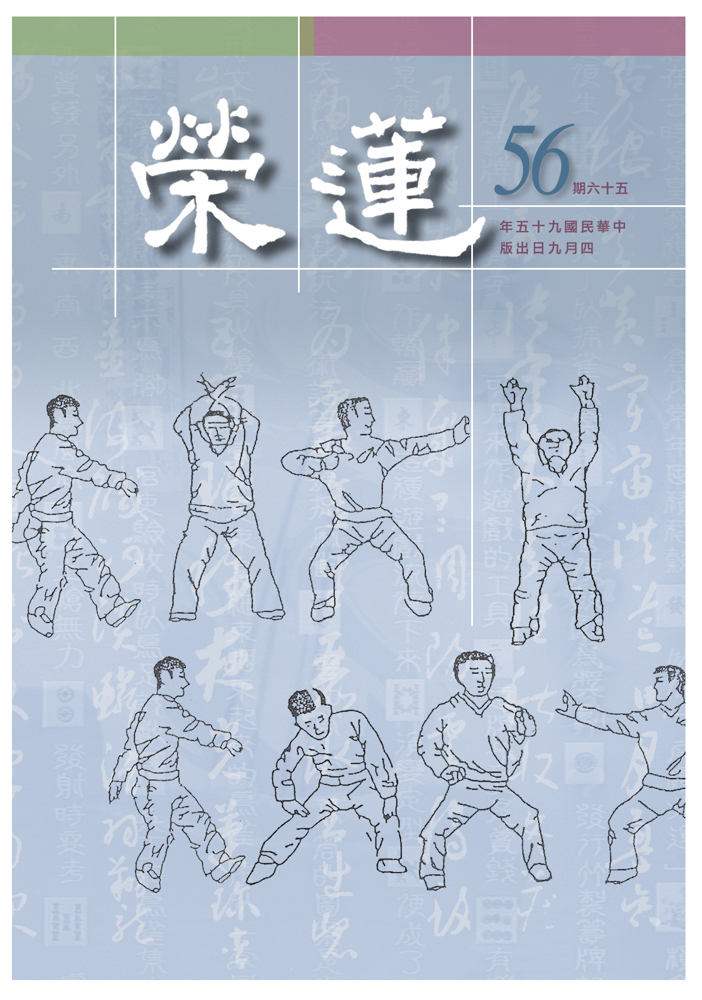

# 第56期

## 社論

### 雪廬風誼

本刊

謙謙君子慈忍行

誰人識得地藏王

地獄不空願未盡

要令眾生蓮胎生

今年的四月二日正值一代大德　雪廬老人示寂廿週年紀念，老人家一生對國家對文化的貢獻難以形容，特就文化上來說，早期在山東除了辦通俗教育會，並任會長，亦在顛沛流離之際不忘弘揚佛法以安定民心。在入蜀之際，應太虛大師之邀，於歌樂山雲頂寺講經。抗戰勝利後，本想另有一番作為，惟山河變色，隨奉祀官來到台中，生活還未安定即展開弘法利生的事業，首先於民國三十八年法華寺開演般若心經，在民國三十九年於靈山寺開演無量壽經及啟建佛七，在台灣佛教史上是開講經的先河，尤其是在家人講佛經之開端；也是率先辦佛七，有些自恃佛七道場的創辦者，殊不知　雪公老師早已開展了這樣的事業；並在靈山寺放生，也是台灣佛教放生事業的開首。

老人家常說他比台灣人更愛台灣，他愛台灣不是愛台灣的阿里山或日月潭，是要把文化的種子播給台灣人，喚起青年學子對文化及社會的使命感，才是真正的愛台灣。老人家閒暇之際，常常獨自清修，以誦經念佛為法行，以讀書為休息。

在民國四十年創立了蓮社，亦是開在家學佛辦道場的先河，並相繼的成立圖書館、育幼院、仁愛之家與菩提醫院，這些的慈善事業，早在民國四十八至五十二年都已相繼設立，亦是台灣佛教慈善事業之起頭，並在四十一年於雜誌撰文籌建樂生療養院的佛堂，使得痲瘋病人有安心辦道之處。在台灣物資缺乏，佛教還未被興起之際，老人家即有獨到的眼光、崇高的志向與堅強的毅力，在沙漠中創造綠洲，並積極辦理儒佛教育，先從儒學紮根，在民國四十一年時即成立各種修學的班級，培養儒佛的人才。

當時的社會，能夠吃到一口飯，尋覓一個安定的窩都極為難得，遑論其他，老人家若非菩薩之再來焉能如此。並在民國四十五年興辦兒童德育班，是啟蒙班、讀經班之開頭，現今讀經班如雨後春筍，並標榜讀經是其創建，殊不知在民國四十五年老人即有這種眼光。並在民國四十九年傳千人五戒及菩薩戒，除了是低靡台灣學佛風氣之提昇，也是台灣佛教界傳戒之開頭。晚年於慈光圖書館講華嚴經，前後計十七年，聽者近千人，更是台灣講經之盛況，幾乎是無出其右。

約在民國四十四年左右即在蓮社辦念佛班，今日各地有念佛會，平常念佛共修，蓮友及其家人在臨終時，予以助念護持，得到生西的瑞相，這些也都是由　雪公率先發起，更值得一提的是有大學生請法，老師特別於民國五十年即有對大專生的開示，成立慈光學術講座，在民國六十年正式興辦大專佛學講座第一期，亦是首辦大專佛學講座，令大專生學佛，成為淨化社會的一股泉源。並在民國五十年靈山寺創設佛學院培養僧才，也是開現今寺院辦佛學院之先河。老人家並在中部各大專院校講解國學，晚年更在蓮社開演論語以期弟子們能儒佛並重延續中華文化。

綜觀老人一生弘法大半都在國運艱難之際，但深知唯有正法興隆，國基方能永固，所以護教即是護國。雖有諸多來自於教外以及教內的障礙，自喻滿身瘡疤，學得一個「忍」字，所謂三賢十聖忍中行。嘗教化弟子說大菩薩須對眾生興慈，教化不下去也得忍，慈忍是大菩薩不共之德，是成就佛道最殊勝的資糧。

晚年示現病苦猶講經不輟，並在重要場合抱病出席提振士氣，開導弟子要好好的維護正法。一生德行感召四方來學之弟子不計其數，始終謙謙不欲出名，並嘗說：捧出心來與佛看，至死不變強哉矯，最後以一心不亂劃下了人生圓滿的句點。身後雖備極哀榮，但相信老人主要的意思還是在傳承儒佛的慧命，學道不在人多在不變質，不在出名在腳踏實地，雖辛苦幹也是樂此不疲，嘗謂侍者說：誰叫咱們是發了心的人。果能識得老人的一言一行，終身受用不盡，學的越多，成就必然愈高，影響力必然愈遠。

現今除了有老人畫冊、全集可供參考學習，若能好友聚會切磋琢磨，深研老人之精神與道德的內涵及對儒佛的慧眼抉擇，必能在混亂的世道上做一番的作為，更是對老人往生廿年最好的緬懷。

## 大德法語

### 大方廣圓覺修多羅了義經（十六）

道源老和尚

下手修學在見地

修證能成皆由他

不只往昔多善根

未來淨土是嘉賓

庚三、明妄盡還覺

辛一、以智除妄

經文：

「善男子，如來因地修圓覺者，知是空華，即無輪轉，亦無身心受彼生死，非作故無，本性無故。」

這一段文很要緊，我已經跟諸位同學說過要注意，尤其是「知是空華，即無輪轉」，以這兩句，判圓覺經為頓教大乘，亦是依著這二句的內涵顯示為頓超法門，功夫就在那一個知字上。學佛分信、解、行、證四個步驟，你我大家都有了信心是修學的第一步功夫，第二步功夫你得求解，此處之解是為漸次法門？還是頓超法門？是頓超法門，若了解頓超法門的道理，則即解、即修、即證此三個步驟都圓滿了。

知是空華是屬於解，即解、即行就是信，由即解、即行、即證、即無輪轉，不就是已經了生脫死成就佛道了嗎？此時身心之相皆空，所以亦無身心受彼生死，生死大苦一旦了脫，其次非作故無，作就是修行，不是經由你修行的才破身心自相，身心之相是空華，生死輪轉還是空華，空中本來沒有華，並不是你用個什麼功夫把虛空都打掃清淨了，試問如何將空中華除掉，既然空中根本沒有華，又何以要稱空中華呢？此乃病眼睛所生，只要將病眼治好了，就滅除了一切的空花。

同理這些生死輪轉、身心之相，全由你的妄心生出來。你這一知不但是正知，而且是真知，了知妄境由妄心生，不生妄心（空除妄心），那還有身心之相呢？那還有生死輪轉呢？那都是空中華嘛！所以不是你破除了才無的，是打從開始就沒有。佛教的義理實在太高深啦！天天修行用功，還不見得是會修行，修行用功目的為何？是為斷煩惱、破無明，顯現圓覺妙性（空性），此性非你修出來的。無明煩惱都是由見虛妄境界（以為諸法有自相）而生出來的，你要會用功，你先降伏妄心（若見諸相非相），妄心沒有了，就解脫無明煩惱。

諸法自相是怎麼樣空呢？是你修行之後才空嗎？不是的，諸法本性本來空，沒有本體，沒有自性嘛！佛法之高深就高深在這裡了。

辛二、泯智合覺

經文：

「彼知覺者，猶如虛空。知虛空者，即空華相。」

光消文就得注意，一個是空外境的，一個是空內心的，首先要注意句中二個者字，不可作虛字解釋，要作為實字解釋，第一個者字是表示心所緣之境，第二個者字是起能知之心。彼所知覺的那個妄境，那個者字表示一個妄境，彼所知覺的那個妄境猶如虛空，本來沒有妄境，亦即法無自相卻顯現為有自相，有自相法一粒微塵應不可得，如虛空，亦即所知之境之自相了不可得；而能知虛空者（能知之心），即空華相（亦了不可得）。能知一切外境猶如虛空之正知亦了不可得，也是空華之相。

執著外境真實成立是無始劫來的習氣，不容易將妄境空其自相，若知道外境是空華，是頓超的根器！若還有個能知空華的心猶是一層執著，此能知之心還是個空華相。佛法之高，佛法之深，就高在這裡，就深在這裡。《楞伽經》明八識無我，所無之我是人我、法我，二種無我之智是空除我執、法執之智，然此智亦如空華相了不可得。《大乘起信論》明真如法中空一切相，此即《圓覺經》所講的圓覺妙性，然圓覺妙性亦是空空洞洞，一無所有。

經文：

「亦不可說，無知覺性，有無俱遣，是則名為淨覺隨順。」

你不能存留一個真如，也不能存留一個無真如，叫有無俱遣，心經是大家都會念，且每天早課、晚課時都要念，何以故？因是六百卷大般若之精華，經文有：是諸法空相不增不減，空性是諸法的本性（不增不減），即《起信論》所說真如，亦是圓覺妙性，圓覺妙性不能增加一分，也不能減少一分，是個平等之相。若大乘經典聽多了，很容易了解。

圓覺妙性也就是真如妙性，是個什麼行相？也不可說有，也不可說空，深入研究聽懂了叫聞慧，再深入研究明瞭叫思慧，之後依著思所成慧所解義理修行謂之修慧。

空外境是如何空呢？以圓覺妙智慧通達境界是空華，若還執知空華的知，則又生一分執著。如知病你才吃藥，病好了，你怎麼還把藥當成寶貝保存著，天天還吃這藥，另外生一種病，什麼病呢？生了吃藥的病，有病不能不吃藥，病好了，這個藥不要了，不然你還是生病。哎呀！這藥太好了嘛！天天吃，又生一種病，什麼病呢？執著吃藥生出來的病。現在台灣生活水準提高，醫院增加了一種新的病，什麼病？營養太多的病，以前沒有，以前營養缺乏，現在生活好過，除了吃好東西外，還要吃營養補品，還打補營養的針，加了營養太多，結果補過了頭，又生病了，又得到醫院看病。

所以說你要空外境，須觀修該法空性（才可破對諸法執著），所知（外境）猶如空華（唯是假名而無其實），能知空華之智也了不可得（也是空華相），因為觀待所知才有能知，猶如病是假的，對症下藥也是觀待的、假的，是觀待邪知不能說根本也沒有，例如你吃藥治病是事實，你不能說沒有藥，但是你不能執著，因為是對著病才有藥，此時有無俱遣，有把它遣出（自相有不可得），無也把它遣出（也非根本無），你會用這種功是則名為淨覺隨順。

經文前述文殊菩薩請問如來因地是怎麼修行？第一句答覆一切如來皆是於圓照清淨覺相，亦即圓滿觀照清淨的覺相，從這個地方下手修行的修學者都成了佛。你若不這樣用功，即便修無量劫也成不了佛，因為那是成佛的本地因行。經文告訴我們圓照清淨是怎樣照呢？你不可執著有，也不可以執著無，有無俱遣，此時候能將圓覺妙性（究竟空義）顯現。有個妄境是不清淨，有了正知還是不清淨，譬如鏡子用黑煤染上去，這個鏡子不清淨，等於妄境不空。你把白粉抹上去，那鏡子清淨了？但鏡子本來就清淨，你抹上黑顏色，被黑色所染污，你抹上白顏色，被白顏色所染污，你執著虛妄的境界，被妄境所轉，你執著有現證空性的智慧，亦是一種執著（觀待空性才有現證空性的智慧），佛法高深就高深在這裡。

所覺的清淨是一無所有，可不是悟無（觀待有為方能顯現，但非根本無），所以執有或執無都不清淨，你懂得這個道理（有無俱遣），才是隨順了圓覺妙性。「淨覺隨順」是翻譯名字，亦即隨順淨覺而修行，決定不與圓覺妙性相違背，一定會很快開悟，也會很快證得頓超法門！此頓超法門是即知、即修、即證！（下期待續）

## 共修研學

### 佛說八大人覺經（十五）觀修緣起了生死

*編輯部整理*

十二因緣輪迴圖

順逆流轉與還滅

厭離生死破無明

有利方能度他苦

第五覺悟：愚癡生死；菩薩常念，廣學多聞，增長智慧；成就辯才，教化一切，悉以大樂。

此覺悟能為六度中之禪定度攝持，乃對目標之專注，修學的目標為何？為了有情成佛的安樂，菩薩誓上求佛道，不但在第四覺知破煩惱障，更在第五覺悟破所知障。須知破煩惱障是三乘共法（三乘共同的修學法，是三乘必修），至於破所知障則是大乘不共（唯大乘能修能破）。

欲得三乘成就須破愚癡，眾生之所以輪迴不能出離亦是愚癡，救拔有情之根本亦在助其出離輪迴，唯有破除有情的愚癡才能使他脫離輪迴的病苦。然愚癡的行相為何？就是無明我執。以執著為因，生死則為其果，此即是十二緣起的流轉。因為有執著所以生起煩惱，有了煩惱就會造業，有業就能感生死苦果。菩薩面對的這些眾生都是他所不能忘懷的，為什麼？因為這些眾生無始劫來都做過菩薩至少一次乃至無數次的母親，對菩薩有非常大的恩德，不但如此，菩薩世間的福和出世間的慧全部觀待眾生才能生起，既然所有的福跟慧都是靠眾生才能生起，有情在受苦，可以坐視不管嗎？所以此時「菩薩常念」，要如何來利益眾生？首先要先除自己愚癡的行相，觀察自己輪迴生死的行相即是十二緣起的流轉相。

十二緣起第一支

「無明」

，其行相是以人我、法我為所緣，而有自相的執著，此即煩惱障；至於所知障則是法我執所薰習的習氣，此習氣不會產生法我執，何謂不會產生法我執的習氣？諸法顯現在未破所知障聖者心識中還是真實的顯現，但聖者已破實有的執著（破煩惱障），能令法顯現為真實的習氣稱為所知障；何以聖者還會有所知障？例如阿羅漢在現證空性時，是在一法上通達空性，而非在一切法上現證空性，但已由一法上現證空性，也能例知其他法體性皆空。所以其他法顯現為實有時，這位阿羅漢已經不會對它產生執著，但仍有顯現為實有的障礙稱所知障。

所知障不是無明我執，無明我執是屬於煩惱障，有二類無明：真實義愚及業果愚（不知斷惡修善才能離苦得樂，所以見善不知造作，見惡不知遠離）。如何破無明呢？第一、先深信因果，在做人處世上好好斷惡修善，與他人結上深厚的善緣，其次學習般若的義趣，破除實有的執著。

十二緣起第二支

「行」

：無明是如何引行的？因為有了這實有的執著，特別是在五蘊身心上生起實有的「我」，不知我與五蘊是觀待而有，有了執著，所引發思維（行）；思維會推動心理和身體的造作，所謂推動心理造作其行相是審慮思與決定思，推動身體和嘴巴造作其行相是動發勝思。舉例來說，對因果邪見的人，認為自私才是快樂的來源，在對境時，這種自私的想法就會想辦法使自己得利，心裡有很多的計劃，身體嘴巴也被這樣的想法攝持，而做了許多損人利己之事，說了許多不如法的話，由行而結成未來苦果。

結成苦果的緣是無明，緣能引發因、滋潤因，但非果的直接因，緣是果的間接因；如西瓜的種子才是西瓜的直接因，水肥、空氣、陽光是西瓜的間接因。行（思）是由無明所策動的，若能令有情通達因果及所執的我了不可得，對境的思才不會是惡思維。

運用思維謀取利益，此即由思策動貪；當得不到時懷恨在心，即是別人在訴說我的過錯謂之瞋恨；不知反省謂之無慚；對於有權勢者巴結，此即諂；刻意表現自己的優點，此即誑；由無明引發之思就能將所有的煩惱引出來。無明可以是滋潤業的緣、是發起業的緣，所以無明或稱為潤生惑或稱為發業惑。此二支能引發未來六道輪迴的苦果。

第三支

「識」

：有了行就能在識因上薰下業種（能生苦果之業種），因緣成熟時會牽引心識去投胎受報，此之「引」，還得靠著第八支愛及第九支取去滋潤業種，例如人道業種成熟時生起力量結合父精母血產生人道的名色，此即第四支

「名色」

，名是心理現象，觀待未成熟的色（六根），識心未能顯發了別的功能，但有心之名，無心之用，故稱名而稱心。此一階段細分有五位：第一七名羯羅藍位，或云雜穢，即父精母血初和合而成的一團雜凝滑之穢物；第二七日名頞部曇位，譯為皰，經二七日，漸漸長成瘡  之形；第三七名閉尸位，譯為輭肉；第四七名羯南位，譯為堅肉；第五七名缽羅奢位，譯為肢節，此時生諸根形及四肢的差別；以上屬名色支攝。

第五支

「六入」

：指眼等六根在母胎十個月中成長完備；能於出胎後，對六塵有涉入之作用，此為胎中成長位。第六支

「觸」

：根塵和合而成觸，此即出胎之位。當嬰兒生出至二、三歲，天真純潔，六根接觸外境，但起單純知覺，尚無憎愛分別。第七支

「受」

：亦即心識能領納所觸的境界，在苦樂境當中產生痛苦和快樂的感受，這就是善惡業的成熟；在觸受當中產生快樂的感受，那是善業的成熟，產生痛苦的感受，那是惡業的成熟；好比一陣風吹來，有的人覺得很冷，在感受很冷當中就是一個惡業的成熟，感受很快樂就是一個善業的成熟；在感受痛苦和快樂當中，就是善惡業成熟處。

第八支

「愛」

：當成長到十二、三歲至十八、九歲時開始懂得思考，並依思考的去追求，這是所有動物裡面思維能力最強的，表示人是一個最高等動物、可以不斷的蓄積，像海綿一樣，不斷的吸收，到十二、三歲以後，再根據他所吸收的慢慢理解。因此在幼兒時期對於孩子的管教，要少講多做，要訓練孩子聽父母，不要運用到太多的言語，因為他還不到理解的年齡，讓孩子們多做少說、多吸收，要讓小兒多讀經典之作，看電視也要選擇好的節目，家長在旁邊引導他；千萬不能讓他看壞的節目，這是最糟糕的教育；要帶領小孩看好的、正面的。

在小兒長到十二、三歲或是十八、九歲時，頭腦開始會想了，理解能力開始轉強，有思維的能力，由想開始去追求，由思維去引發愛，愛就是一種追求的力量，對於所欲境引發貪愛，欲為己有。

第九支

「取」

：取是追求力量的增上，非達到目的不可的力量；愛取都是愛，只不過取是愛的增上相，如一般人開始經過思維確立目標，並努力奮鬥要得到此所願境即是取的行相，大概是廿歲以後。

第十支

「有」

：就是有了定業，經過了愛取的追逐，就有來生的結果，深一層去想我們人生很多的成就就是從愛取來的，很多的過患也是從愛取來的，此生如此，來生也一樣；如對天上五欲妙的貪愛而廣行十善業，就「有」投生天上的能力，或愛好禪定天的妙樂而歡喜修學禪定，未來就有投生禪定天的能力，有的人愛在黑暗做種種不好的業，未來就會有讓他投生到暗無天日的世界過非常痛苦的日子，愛取的增上就是有，有了投生的能力；我們要好好想想到底要怎麼過這一生呢？有限的生命裡面到底要怎麼活用呢？

第十一支

「生」

：此身壽命終了，受前生善惡業的牽引，再去投胎受生，為未來受報的一種活動。第十二支「老死」：這兩者合為一支，因為這兩者孰前孰後不一定，第一剎那是生，有的在第二剎那就死了，還沒有老就先死了；有的在第一剎生，第二剎那老之後才死，所以將老死合述。以上是淺顯的論十二因緣。（下期待續）

## 蓮池海會

### 蔣清城老居士往生見聞記

淨琴

重近習念四業中

仗近扭轉出乾坤

若非眷屬信佛力

那得便宜遠犁泥

蔣清城老居士，台北市大稻埕人，祖先由福建遷臺，定居大稻埕，五歲母親就過世，九歲父親旋即離開人間，從小和祖母及二位兄長相依為命。家族世代經商，生前曾承襲先父家具業及自營華義大理石工程公司。

老居士自幼資質聰穎，勤勉好學，一路求學至大同中學。深知謙虛不恥下問才能充實自己，因此經常利用機會請教長輩及飽學之士，增廣其見聞，獲取他人寶貴經驗以豐富自己的人生閱歷，性情恬淡、樸實，為人健談言語幽默，性嗜酒，好客不慕榮利，平時與人交往沒有分別心。

二十七歲與蔣李阿月女士結褵五十年夫妻之緣，老居士平日忙於事業，家裡大小均由其賢妻打理照料，他的太太任勞任怨，一路護持家庭與老居士，共育有三子二女均已成家立業。

平日頗隨喜放生活動，曾和老師蓮友們出國兩次放生並參與國內放生多次，與蓮友結下共造放生的善緣。

對台灣這片孕育他成長的土地，有深厚感情，時時關心國家大事，老年退休後便投入服務鄉梓工作，擔任台北市正守里鄰長十來年，曾獲頒資深鄰長匾額。

五年前自己前往醫院就醫，作攝護腺癌血液指數檢查出是癌症，卻不想造成對妻子兒女的拖累，對家人佯稱是醫生檢查錯誤，堅持服用一些利尿劑，直至一年半前身體因高燒不退家人緊急送馬偕醫院治療，當時醫院曾發出病危通知且檢查報告出來已發展成攝護腺癌末期，在醫院時，他常對其妻子兒女說：「能多活一天就多賺一天。子女均已成家立業，他責任已完了！……」抱持隨緣就醫的心態，一切不強求。老居士出院後，一切行動自如，並配合中、西醫治療，甚至仍然維持平日早上運動之生活作息，並下定決心對治一生穿梭於商場中養成貪杯之惡習。

去年十二月中旬，因癌細胞已竄至骨頭，造成下半身癱瘓。家人隨即送往台大醫院，後經群醫會診，醫生均表示老居士生命已走入人生盡頭，最後家人決定以最人道的方式送老居士走完人生最後一程，也由一般病房轉為安寧病房。從此就像個不會走路生病的嬰兒，有時吵鬧，時而又安安靜靜的躺在那兒睡覺。

在今年的一月十三日，老居士竟見到其先父來醫院看他並欲帶他回家，由地藏經閻羅王眾讚歎品第八：「是閻浮提行善之人。臨命終時。亦有百千惡道鬼神或變作父母乃至諸眷屬。引接亡人。令落惡道。何況本造惡者。」子女深知不妙，因緣際會，翌日有大德放生，隨即為老居士做隨喜放生功德。

於一月十五日凌晨五、六點，醫院緊急通知老居士病危處在彌留階段，家人隨即將老居士送返家中，通知蓮友助念，助念了將近十五個鐘頭，老居士竟安詳地睡著了！隔日醒來，飢腸轆轆，大肆飲食。

此後，老居士在家安養接受照料，其間承蒙老師、大德、蓮友來家中探視並囑其憶佛念佛，並示淨土念佛法門之殊勝，且殷切勸導：萬緣放下，一心念佛，若取得資格將來移民西方極樂世界，從此永脫六道輪迴苦海，無有老、病、死的痛苦，且能成佛廣利有情……。且指導家人如何照料使老居士，能於人生最後一程過得安詳又有尊嚴。

子女亦代老居士於佛前懺悔往昔所造諸惡業，並發願廣做功德，迴向老居士能早日捨報安詳，蒙佛接引，往生西方！

老居士在往生前十天已開始茹素，並漸漸斷藥，直至往生前四天不再服任何醫藥，往生前二天老居士本身已不願再進任何醫藥、食物。由女兒陪念佛並介紹西方極樂世界的依正莊嚴，無有眾苦，但有諸樂。此段期間，老居士如在考人生生死大考般的用心準備自己的往生大事。

老居士於其返家期間因癌細胞竄至骨頭所造成的病苦，曾念佛念到抱怨：「念佛念了老半天，我怎麼還在這裡？沒有去西方極樂世界！阿彌陀佛怎麼不來接我？」。甚至退道心言：「我業障深重，阿彌陀佛大概不會要我！」。甚而云：「念佛無用，根本就是騙三歲小孩。」女兒引無量壽經阿彌陀佛四十八願中第十八願：「我作佛時。十方眾生。聞我名號。至心信樂，所有善根，心心回向。願生我國。乃至十念。若不生者。不取正覺。唯除五逆。誹謗正法。」及佛說阿彌陀經：「舍利佛。若有善男子。善女人。聞說阿彌陀佛。執持名號。若一日。若二日。若三日。若四日。若五日。若六日。若七日。一心不亂。其人臨命終時。阿彌陀佛與諸眾聖。現在其前。是人終時。心不顛倒。即得往生阿彌陀佛極樂國土。」令其生信心！再次勸導念佛務必摯誠懇切，才能感應道交。

往生前五天，老居士已不大開口念佛，女兒旋又介紹大勢至念佛圓通章：「憶佛念佛，現前當來必定見佛。」拿著佛像引導念佛，並勸導都攝六根，要老居士內心跟著佛號聲好好的念佛。

根據地藏經如來讚歎品第六：「若未來世。有男子女人。久處床枕。求生求死。了不可得。……此皆是業道論對。未定輕重。或難捨壽。或不得愈。男女俗眼。不辨是事。但當對諸佛菩薩像前。高聲轉讀此經一遍。」於是在往生當天（民國九十五年國曆一月三十日，農曆正月初二），由其子女輪番在其病榻前高聲誦讀地藏經。並在其往生前五分鐘再次叮嚀切勿昏沈，內心務必憶佛念佛，要將佛號一字一句念得清清楚楚，明明白白。

直至晚上九時三十八分，老居士如睡著般的寧靜，走到了他人生的盡頭，其妻子及子女陪伴在老居士身旁，大德、蓮友亦紛紛陸續趕到，共同徹夜為其助念十二小時，之後老居士全身柔軟、含笑歸西。

此次受益除了老居士外，家人因老居士往生之因緣，對念佛法門讚歎及深具信心！並深深忍可阿彌陀佛的悲心願力！

### 周老師聖遊往生有感

心超

哲人日已遠

典型在夙昔

風簷展書讀

古道照顏色

最近天候的變化，有一些大德，就在這天候的變化中相繼往生，其中有兩位仁者令我們特別緬懷，一位對國家貢獻極大的是孫運璿先生，一位是台中蓮社導師周聖遊老師。老師籍安徽阜陽，民國九年八月九日生，於民國九十五年二月十六日下午兩點於彌陀聖號中安詳示寂，享年八十七歲。老師是黃埔軍校西南分校第十六期畢業，歷經八年抗戰，於民國三十五年來台轉任公務員，直至民國七十四年屆齡退休。

師於民國三十八、九年間，親近了　雪公老恩師，在老恩師座下聽經聞法，一直到七十五年三月五日　雪公老恩師往生，在這段快四十年的時間中，從沒離開過　雪公老師，向道殷切，雖蒙長官賞識，屢推薦榮調外地，升任主管。然老師皆婉謝，唯願一心追隨 雪公習儒習佛。曾習講「占察善惡業報經」，講稿先呈　雪公鑑定，講後再次修訂，彙集成冊與付梓流通，此書為老師重要述作。

老師是一個非常認真上課的學生，聞法時必詳為記錄，尚有法句譬喻經筆記、佛說演道俗業經筆記及論語筆記等，均為完整之法寶。其後無　雪公指導，則謹遵師說，述而不作，其敬慎精神有如是者。

老師曾任公家機關（台中酒場）總務課長，然一芥不取，以廉養身。在蓮社的教育事業中，盡心盡力護持　雪公弘法事業，曾任論語班教務主任，在　雪公往生後，接任班主任並授課。而且在社教課及大專佛學講座擔任講習的老師。雖然鄉音非常濃厚，有時學生聽不懂老師的口音而無法了解老師講經的內涵，然不改變老師講法的熱誠。老師修學佛法能表現出軍人勇悍的行相，是菩薩精進行的榜樣。

老師寫得一手好書法，尤喜顏體，工整挺拔，一如其人。老師書法與國學皆為家學淵源，觀昔日前輩何以能溫文儒雅，其實皆和家風有關。現今家庭都是小家庭，雖然孩子們學了很多的才藝，但都未能落實於家庭生活，沒有大家庭的歷練，所以培養不出如昔日老先生一般的氣質。中華文化之美其實要由他們來表現，文化除了留下這些典籍（四庫全書、三藏十二部等），還要有哲人代代相傳，二者互相觀待，才能顯現文化的全貌，可惜哲人逐漸老成凋謝，新一代的學子未能好好學習他們長者的風範，不但在教法上不如他們好學，在人格的特質上也未能以他們這些長者為取材來效法，所以無法成就那高尚的氣質、豐富的人生內涵。

老師曾於課堂上嘉勉學生，特錄大要，以資分享：

第一、要慎獨：老師說他一生就是學慎獨，謹慎於獨處之時，能夠慎獨的人處世必有智慧，獨處時肯反省，面對群眾時就能如法，曾子獨處時亦三省吾身。

第二、要有操守：曾送學生對聯「晉典齊型百史簡，風清月白一山房。」就是希望能效法這些人，懂得以正氣來充實自己的生命，安於貧賤、樂於修道。

第三、要發心：發心為公，是改變命運非常好的方法，希望大家學著發心。

第四、要認真：老師在　雪公座下聽講時，筆記做得非常好，老師以認真來勉勵我們，是當之無愧。

第五、要有恆心：老師的學習數十年未中斷，弘法事業亦持續至往生前病苦乃止。

第六、要樂觀進取：老師與　雪公一樣，是大時代動亂的逃難者，即使生活上有很多的障礙，然皆成為向道的增上緣。

第七、剛正：這很合乎老師的軍人性格，從來做事一絲不苟。

第八、要老實念佛：老師曾在華嚴經上說老實是他努力的目標，實實在在、誠心誠意的，特別是念這句佛號更要老老實實，必蒙加被。

第九、要好學：好好努力深入聖賢傳下來的教法，方能有個成就。

第十、要繼承　雪公的志業：要將　雪公所傳儒佛的教法延續，要好好的自我期許。

果然看得重自己，　雪公嘗云：公修公得、婆修婆得，創造前途的還是我們自己，要力爭上游的還得要我們自己，想要尋得解脫的還是要我們自己，凡事都要在自己上好好的講究，成功了也是自己想要成功，墮落了也是自己去墮落的，老師只是從旁輔助，如果有向上的心，還有外在的幫助，才有一番的作為，內心無向上之志，外緣再好也徒然。遙想昔日論語班上課，除了三位老師講解教法非常精采以外，重要的是人格特質的影響，讓我們這些做弟子的難以忘懷，是這一輩子的精神偶像，是留給我們最殊勝的遺產，內心有了這樣的典範，心靈的財富非世間的財富所可比擬的。有的人內心沒有典範，即使學富五車、才高八斗，依然落入學術死胡同，無法為生民立命。

感謝老師留給我們的是一個正知見的確立，是一個典範，是一個傳承，是一個使命感，是一個理想，是一個抱負，是貧賤不能移，富貴不能淫，威武不能屈。

## 啟蒙園地

### 唐詩賞析迴響篇　「聽彈琴」後之沉思

傳緒

相互扶持難行道

古道顏色今日照

薪火相傳待後進

菩提道上等知音

當日自大堂入口前長桌，拿起劉長卿詩作〜五言古絕聽彈琴「泠泠七絃上，靜聽松風寒，古調雖自愛，今人多不彈」，耳熟能詳的一首小詩，昔日嘗拜讀過，尚琅琅上口，只是不曾深思推敲推敲；隨後登堂，光影柔和，悠悠古琴聲泛起，此一氛圍，令人宛如座落於不一樣的時空，已然漾起「未成曲調先有情」的琴趣，師嘆一小時，實難以罄述，愣了一下，短短廿字，詞藻亦非高華，能有什麼詩情詩趣詩理呢？娓娓道來，旁徵博引，抒情梳理，論道說趣，參以饒有古意的吟唱聲，煞板時，仍感餘響繞梁；今日思來，猶覺餘霞成綺。

音聲如水逝，最是難以捕捉，君不見！古人嘆知音千載難逢，蓋以其超以象外，須賴心聽神會，而師允為此詩之知音，雖謙虛未說盡道破，然覺已得其神髓神韻神理，信學子筆錄成章，必有可觀；孰料不一日，晴空霹靂空中來，邀心得，一則以喜，一則以憂；喜的是得以沉思，咀嚼詩意詩境；憂的是，古琴之門外漢，如何探其高情厚意，懼見笑一方。硬著頭皮，勉力為之！

憶昔為Sett Maw來台，歌一曲「南鄉子」迎賓，博得師友一讚，而後緬北朝聖應游藝組之約，唱一闋「西江月」，以暢懷助興，九十四年暑期心靈成長班前行，心投意興，和一首「踏莎行」同樂，緬南佛國行，感道遠詠「調寄漢宮春」一詞以排遣，種種表現，讓師友誤為懂音律，方有邀稿一事；實不諳律呂，且吟咏宋詞，已幾近黔驢技窮之境，深深以為聲聞過情，君子恥之！

曩昔養眼疾之際，隨著錄音帶學宋詞吟唱，時二子尚屬總丱之年，亦步亦趨的哼著，未見排斥，感潛移默化之功，見身教之可貴，以墨悲絲染為戒；料想趁寫聽彈琴心得之隙，可重溫舊夢一番，握管操觚前夕，為醞釀文思，近半月以來，居家時常播放古琴曲，以營造琴思，陶醉於琴韻氣氛中，從陽關三疊、胡笳十八拍之琴聲哀怨道別離；瀟湘水雲、漁樵問答、石上流泉，訴說著徜徉山水無俗韻；至陽春白雪曲高和寡，果其然哉！聆聽再聆聽，推敲復推敲，搖頭更晃腦，而二子之反應，初嚷嚷無趣，斥呆板了無節奏，前後對照，誠不明其轉變？亦引發自己之深思……。

腦海裡先浮現問號，孩子變了嗎？年齡增長了，年已近志學，常驚訝其總角無猜之歲，甚至孩提時期之照片，純真無邪。樂不分雅俗，端賴我等給予，無分別心俱納受；歲月漸增，容貌漸變，不復清純，身處染缸染污了，好流行樂，不喜古琴樂。尋繹頭緒，孩子對比自己而言畢竟年輕，少一份歷史感，滄桑感，無法體會古琴音聲之美。

虔禮書譜說的好「古質今妍」，琴韻與流行樂亦復如此，琴韻質之美側重內涵之美，未歷經風霜，未走過承擔歲月，所謂無經過兔走烏飛，是無法靜下心來領略一番；而不知憂慮的年代，生命縱深本已不長，加上不知回憶，不能卻顧所來徑，更顯得淺白。而古琴悠悠歲月，從伏羲肇始，歷經師襄、孔子、伯牙、蔡邕、周瑜、嵇康等之發揚，無論志在聖王、高山流水、達情性，要之其旨歸在「禁止淫邪，以正人心」，不追華麗，不求節奏，崇尚中和之音，樸實無華，正是其精采絕倫之處，經得起長溝流月的淘洗，屹立雅樂之首，積澱如是深沉渾厚之音聲，非為圖快節奏、尚奇鬪異之流行樂，競趨形式美所青睞，亦不足為奇。

「古調雖自愛，今人多不彈」，之所以能餘霞成綺，應是道出古往今來之共同心聲、普遍性，非獨唐代如此，今日何嘗不如此，於今尤更烈耳。未聽聞師解此詩，壓根兒便不會去沉思其深層涵義，思及此，講求快速步調之現代人，尤其是毛毛躁躁的小兒，更是如此，焉能品嘗慢工出細活精緻的古琴文化，那份悠閒自在，在現今台灣社會似乎漸行漸遠，古琴必浩歎知音稀，勢之使然，莫之能禦，時下莘莘學子，類吾家之子，當不在少數，彼等怎能體察琴韻之美呢？

「泠泠七絃上，靜聽松風寒」，罕見賞音同好，不正反顯出處處耳邊響起時樂，「寒」字一字實道盡長卿之無奈與失落感，慨歎對寓含法天、法地、法人之樂器文化，也難以挽回，此琴命數之必然，聊充回憶之場景。而承繼遺緒，獨賴那鳳毛麟角好樂琴韻之流，代代薪傳，薪傳之人想必隱微處生起憐惜之感；憐古琴亦憐自己之處境，惜此太古渾厚之音、亦惜那保留原始胎音之琴音，光華不再，是以彼等一揮手，蘊含滄桑感，聞琴音，作如是思維，師友不知以為然否？

古琴之音韻，聞之雖不如聖人三月不知肉味，甚至能遙想創作琴曲之人，倒也樂在其中，陶然自足；足堪洗流水、入霜鐘。而琴曲之名言安立，自是襄助初次接觸古琴門外漢之賞析，要不然真戛戛其難啊！

### 唐詩賞析迴響篇　「聽彈琴」心得

禮悅

老生常談人不愛

幽雅古調也難彈

人心厚薄是關鍵

力挽狂瀾為己責

詩人表達心意的方式往往都是意在言外，使說之者無罪，而聞之者足戒，其中傳達的是一種溫柔敦厚的氣氛，了解這一層，才可以算懂詩人的心。所以詩經的第一篇周南關雎之章，全篇表面講的都是男對女的思慕之情，可以隱喻臣子對君主的忠心，唐詩中很多閨怨類的詩也是如此。常聞老師如是說，但有時自己心裡仍覺得有一點點疑惑，他字面上明明就是只有寫這個意思。

這一首詩「聽彈琴」，詩人就明白告訴我們，從泠泠的琴聲上，要聽出寒冷松風的覺受。那就不只是聽到好聽或不好聽、悅耳或刺耳了；還要進一步聽出冷風吹過松樹間的感覺，去感受那弦外之音了。琴韻如是，詩境亦然。

這一首詩的言外意何在？詩的表面意義是說古調的意境深遠，當今之人淺薄，已無法體會。究竟作者原意要引申何種事物並未明說，或年代久遠而不可考，或可考而末學不知，但這裡要談的是，無論是作者創作本詩，或是後代如我等吟誦，比較接近的言外之意是，任何古時美好的德行、學問及事物，至今已失傳或不流行者皆可以拿來作本詩中「古調」的引申；引申的遠一點，則任何壯志未酬之事都可言之。所以，相信讀這首詩時，有深切感觸的人會很多。

感受比較深的是與其說是事物在變，不如說是人在變。因為人在變，所以在古人看來是聖者的孔子，今人看來則是有點迂腐的凡夫；因為人在變，古代論語是言行準則，現代則成眾多考試科目之一的國文科諸多教材裡的一本教材而已，而在無言行準則的時代裏，只要我喜歡，沒什麼不可以；因為人在變，古代人大多是相信因果的，而現代人則對因果道理敬謝不敏。在時代的洪流中，但憑個人是無法改變大環境的走向，唯有親近善知識，遠離惡知識，想辦法改進自己才是。

其次也可以用同樣的方式來看佛法的興衰：在泠泠的絃音上，既是靜靜的聽出松風寒，勝義上，亦可以松風寒的自相為所緣，學觀世音菩薩去聽松風寒是否自相存在，進一步去看色塵是否自相成立，香塵味塵觸塵法塵是否自相成立；世俗上，但願自己能幫助一切眾生，遠離幻妄的五塵；而這樣的道理，對現今耽於物慾，失學的一代，是不會明白的；但這並不是佛法本質有所改變，而是學者不善學所致。

最後要感謝詩人們，留下美好的詩句，讓後世有緣的讀者，能夠藉此提昇心靈的層次。

### 唐詩賞析迴響篇　讀「聽彈琴」有感

盡意

千年結晶之智慧

寶藏猶待後人發

古調今彈自生福

不識之中有知音

在返班的課程中，林老師帶我們欣賞古詩「彈琴」，在讀到「古調雖自愛，今人多不彈」時，品味著詩人溫柔敦厚的詞句，並反觀現在的世事，心中實在感觸良多。

若是將「古調」比喻為古聖先哲的智慧，則作者寫詩的年代，時人或許只是不願奉行（不彈），但從今日的社會觀之，眾人已到了「不識」，甚至全盤否認並加以譏嘲侮蔑的狀況。

當今的世代，人人以自私自利為前提，為追求、維護、滿足個人的慾望而敢於造作種種惡業。不信因果，對於傳統道德文化嗤之以鼻，人生的價值完全要由擁有外在的物質或地位來體現，而成功的標準也單一的變成由金錢的多寡來衡量。生命的意義也慢慢由以往多元性的思考，能夠立身行道並關懷他人以及周圍的自然環境，窄化到一切以賺錢為目的，以自己的利益為唯一的考量。玩弄權謀，已不再是負面的意義，徹底擊垮對手，也變成了能力的象徵；守信尚義，被認為食古不化，柔和謙恭，竟等同於懦弱無能；這其間差距之大，墮落速度之快，實在令人匪夷所思。佛陀三千年前描述娑婆世界是五濁惡世，今日若是佛陀再來，可能只有選擇沉默流淚了。

中國儒家的思想裏，認為人是萬物之靈，將人列為「天、地、人」三才之一，以為人可以有博大的胸懷、崇高的道德，也能行天地化育之德，關懷一切生命。孰不知隨著西方強權的興起，導致世人一昧的洋化，爭相認同並學習其思考邏輯。殊不知現今的西方思想，泰半源於向動物學習，例如「物競天擇，適者生存」的觀念，而其廣泛運用於各個領域的心理學，很多的立論依據，也是來自實驗室中對於老鼠、猴子等等動物的觀察。

可嘆的是，這些動物的本能都是以自我為中心，行為中在在表現出來的，是要追求、保護自我（小我）的利益。可憐的現代人，不知道自己和聖賢都共有著同樣的智慧德能，卻取法乎下，向動物學習，並只學習其最負面的部份，加上自身造作惡業的能力又比動物強，於是由堂堂的萬物之靈，自甘墮落成「禽獸不如」的最可惡又可怕的走獸。恣意浪費/搜括資源，強調貪婪與競爭是推動社會進步的動力，凡事唯利是問。由殺害、虐待動物，破壞自然環境，導致大量生物絕跡，到勇於挑起人與人之間的對立、仇視，演出的都是一幕幕強凌弱、眾暴寡的戲碼；於是乎天災與人禍接踵而至，而未來可以預見的，可能是更為險惡的災難與衝突。

在寒訓營中有一位養成班的學長詢問如何抉擇科系，師長們建議除了自己的存心正確之外，也要避免一些顯而易見、容易造作惡業的職業，如大眾傳播、醫生、律師等。但個人認為，因現今人心的劣濁，幾乎已找不出太多所謂的「正業」﹕以民營企業為例，大部分都以「利潤極大化」為經營目標，成本要壓至最低，利潤要儘可能的增長，於是乎和客戶、同業以及上下游廠商的關係變成了相互傾軋爭利；所謂的刺激消費，只是要民眾過度的消耗福報；而行銷策略也變成了迷惑消費者的綺語；「寅吃卯糧」已被「擴張信用」的美麗包裝所取代；而「快樂的投資人」，也早就成為被金融機構蠱惑的羔羊；除此之外，還有著許多公司（包括許多高科技產業）是製造大量的環境污染，毒害生態，或是昧著良心生產危害人體健康的產品；在公營機構方面，雖然上述的問題較少，但往往卻有著不知珍惜民脂民膏的現象，有些又會淪為政治鬥爭，或是意識形態的工具，甚至在攸關人民福祉、道德人心、以及維持文化傳承等重要決策上，引導國家人民走往錯誤的方向；在這麼染濁的環境中，要能有幸找到一個屬於世外桃源的行業或是職位，所需要的，除了具備深厚的福報外，也要如師長說的，建立一個正確的人生目標；內心的良善為能感，而外界的機會與工作環境為所應。

觀察到現今濁惡的環境，我們只能謹切的提醒自身，一定要能在共業中造不共之業。首先要至誠的懺悔，自己的業障深重以至身處此環境；要發菩提心，認真修習正法；更為關鍵的，是要依止善知識，結合團體的力量，才有可能來對抗這滾滾的洪流。希望在污泥的汪洋中，開出淨潔的蓮花，將古調重彈，奏出淨化人心的樂章。

### 唐詩賞析迴響篇　讀「聽彈琴」後談古琴於藝術之美

吳承軒

小小心靈體會佳

不受俗氣所拘羈

不斷提昇己意境

將來必然有作為

這次返班活動的唐詩欣賞選讀的是劉長卿的「聽彈琴」。詩文內容如後：

泠泠七弦上，靜聽松風寒。

古調雖自愛，今人多不彈。

作者劉長卿唐代詩人，字文房，河南宣城（今屬安徽，世稱文房四寶之鄉，是石墨及世稱「千年壽紙」宣紙的產地）。作者為開元進士，性剛外忤，官終隨州刺史，世稱「劉隨州」。他的詩調雅暢，是元寶應年間傑出的詩人，是五言詩的翹楚，同代詩人權德輿稱長卿的詩為「五言長城」即可見之。

「聽彈琴」是我很愛讀的一首詩，它像是唐詩中一顆閃閃動人的星；詩中描述作者聽到七絃琴彈奏出美妙的琴聲，如流水一般清脆動人，他靜靜地聽著這首「風入松」的曲子，沉醉在那淒清動人的音樂中。雖然很喜歡這種古老的曲調，但是，現在的人大都已經不再彈奏了，令作者非常遺憾！

讀完這首詩後，體會到知音難得；現代人沒有古代詩人的修養，也不及於古人的才華，能聽能彈古琴更是少之又少了。

古琴，古代稱琴或瑤琴；現代則稱古琴、七絃琴，是中國古代地位崇高的樂器，位列琴棋書畫之首。傳說古琴的創製人，或說是伏羲氏，或云神農氏及帝舜；這樣說來古琴便有四、五千年的歷史了。古琴有五絃至二十七絃不等，現多為七絃，主要作為歌唱的伴奏或純樂器演奏。薛易簡《琴訣》一篇，提出古琴演奏七種境界，是現存最早的古琴演奏理論。他又提出彈琴有「七病」，是實際演奏的法則。總觀古琴彈奏可以歸納出十三種類型，名為「琴聲十三象」，是彈奏古琴傳達內涵的表現：

一、雄（雄偉氣勢）；

二、驟（突強突快、忽起忽止）；

三、急（疾速，如風雨、如飛泉激浪）；

四、亮（音韻嘹亮，琅琅鏘鏘）；

五、粲（明麗光彩）；

六、奇（超出常態，神奇難測）；

七、廣（雍容闊大之勢）；

八、切（親切、貼切）；

九、清（音韻清峻）；

十、淡（渾然超脫）；

十一、和（從容適度有和諧之感）；

十二、恬（靜淡而美）；

十三、慢（舒展韻味閑遠）。

歷史上有名的古琴有蔡邕的「焦尾琴」、齊桓公的「號鐘」、楚莊王的「繞樑」、司馬相如的「綠綺」，並稱我國古代的四大名琴，聲音鏗鏘響亮，特別動聽；其次有「雷琴」是由雷威、雷霄、和雷玨所製造的古琴，琴家也視為上品的好琴，雷琴低音渾厚、激越，高音清脆、響亮；「雷琴」中，有一張特別出色的琴，由於彈奏起來，聲音響亮如春雷初鳴。此琴之古，可追溯到唐朝，是傳世寶琴。

其次在琴音中「高山流水」一曲喻「伯牙鼓琴遇知音」，為先秦琴師俞伯牙鼓琴遇鍾子期所作。

另外，嵇康也是著名的古琴演奏家，演奏的精妙絕倫，其中最拿手的是「廣陵散」，那是嵇康有一天在華陽亭，遇見了一個老人，由老人所傳授，令嵇康的琴藝大加進步。後來嵇康臨死時，鎮定自若的演奏了一遍廣陵散，並嘆惜廣陵散可能要失傳了。

再者，東漢末年女音樂家蔡文姬，被匈奴擄走到西域後，帶去了漢族的音樂，同時文姬也學會了不少匈奴地方的音樂。歸漢後，寫出十八段歌詞，並用胡笳和漢族的音調結合，在古琴上彈奏歌唱，後來人們把這首琴曲叫做「胡笳十八拍」，成為千古絕唱，流傳至今。

還有那明朝的「平沙落雁」是中國十大古典名曲之一，曲調悠揚流暢，通過時隱時現的雁鳴，描寫雁群降落前在空際盤旋顧盼的情景。

今日古琴已被聯合國授予「人類口述與非物質遺產」；古琴原是我國很古老的樂器，古時很會彈的人及譜不知道有多少，但現在會彈的已不足百曲，而且大多數琴譜已經沒落或失傳了，真希望現在有很會彈奏古琴的音樂家，能將古琴技藝發揚光大呢！

到現在為止我還沒有聽過很多古琴的演奏，欣賞力也不足，但印象深刻的是只要一聽到古琴的聲音，心情似乎就隨著古琴的音調高低而時怒、時哀，起伏不定。

一般人認為，深情是思想感情濃厚、強烈的結果，樂曲表現時要激動熱切，所以現代歌曲幾乎都以快速、明亮、爽朗的旋律來表達此情緒。但古琴表現深情不在於激情，而在於感情的深切，與今日對深情的了解與感覺甚為不同；其實古琴於藝術之美可以帶給現代人更廣闊而深入的感動，不好好欣賞會是大家的損失啊！

### 唐詩賞析迴響篇　「聽彈琴」讀後有感

心一

法弱魔強世趨俗

流行多半壞人心

古調雖好人不彈

嚴冬衝寒欲放梅

聽音樂，當然是要靜聽，心是靜的才能聽出深刻的內容，無論是聽平靜柔順的巴哈「平均律前奏曲」，或是馬友友拉奏趣意盎然的曲子，或是氣勢宏偉的貝多芬「第九號交響曲」。每一首曲子的背後都有一個故事，而演奏家最重要的工作就是呈現音樂裡更深層次的內涵，聽音樂的人唯有靜聽才能親蒞這樣的感受。

天底下最輕鬆的一件事，莫過於聽音樂了。聽音樂不需要有任何條件、不需要上「音樂認知與鑑賞」之類的課程、也不需要做任何的觀修，只要帶著一顆愉悅的心來好好地享受音樂，就行囉！音樂可以帶給我們平靜，可以將翻滾擾動的心念導為平順。節奏跳躍的音樂能舒緩緊張的心靈，或許當下就能感受到音樂家正微笑著演奏音樂呢！世間上多有不如意之時，聽著莫札特的「G小調第四十號交響曲」，他也同我憂傷，但僅只於淡淡的憂傷，最終還是帶我迎向光明。在音樂中，可以體驗無常，從「國破山河在，城春草木深。感時花濺淚，恨別鳥驚心。」到「青山依舊在，幾度夕陽紅。」這樣的心情在聽陳能濟的「故都風情」就會油然而生，並且對人生的意義再一次地省思，到底我要將人生定位在何處？

現在人們大都聽流行樂，聽古典樂、國樂的人比較少，這有很大的因素在於人們沒有機會接觸古典樂或者國樂，但是人們還是喜歡音樂的，所以只好跟隨著社會的主流文化而聽流行樂。國樂、古典音樂相較於流行樂有更多層次的變化、更豐富的旋律樣貌、更深刻的文化內涵，如果人們肯願意嘗試聽國樂或者古典音樂，相信大家的思想一定會為之開闊、心胸為之廣闊。這麼富於變化、可愛的音樂，我們怎麼可以錯過呢？

只要是巴哈的音樂，那就是此曲只應天上有，一點都不需要懷疑！巴哈的音樂就像唐詩，唐詩的格律嚴謹而內容雅緻，巴哈的音樂在架構上是極其工整，在音樂的背後又是極具人文素養、饒富韻味，值得咀嚼再三，而且巴哈的音樂很好理解，一般人都可以很容易地接受，然後喜歡上這樣的音樂。當我更加細細品味這每一個音符時，就會發現它是多麼的錯綜複雜、環環相扣而形成一個無懈可擊的旋律線條。馬友友在一九八三年錄製的這張ＣＤ，「巴哈完全大提琴組曲」（BACH Complete Cello Suites），是很不錯的音樂，在此推薦！

國樂在音樂的詮釋上更加重視內涵，單單只有高超的技巧是不夠的，必須將文化融入其中，這些文化的表達在音樂上就是音樂的各種表情，人們很容易就可以在音樂中感受到那宏偉的氣象、民胞物與的襟懷，或者躊躇滿志、或者緬懷英雄人物、或者惦念天下蒼生、或者莊敬自強、或者慨嘆無常，這些在國樂當中都很容易地感受到。

當然國樂也不乏輕鬆活潑的小品，那可真的會逗得你樂開懷。台北柳琴室內樂團的兩張專輯「雨後庭院」、「無詞歌」適合初接觸國樂的人聆賞，曲調優美動聽、平易近人。如果想要更進一步體驗國樂，走入合奏曲的意境，以下這張專輯不容錯過：「長城隨想」二胡協奏曲，由閔惠芬擔任二胡協奏，瞿春泉指揮上海民族樂團，國際知名指揮家〜小澤征爾曾對閔惠芬有這樣的讚譽：「閔惠芬的二胡要跪著聽！」這說的是兩層面的話：閔惠芬的二胡太感動人了，以及，要以恭敬的心來聽。

不同時代的音樂表彰的是不同的社會氣象，他反應了當代的文化，若將有深厚涵養的音樂好好地推廣給社會大眾，大家在這種攝受之下就會顯得格外有朝氣，體會到這種文化的好就會開始認同這個國家，而人心就開始凝聚，愛國、愛文化的心就產生了。我相信音樂具有移風易俗的力量，這也絕對可以是我們的優勢之一。

聽音樂是最輕鬆的事了，尤其聽好音樂怎麼會困難呢？古調雖自愛，今人多不彈，那麼我就要好好地將好音樂散播出去，讓大家都能感受好的音樂。

## 禮懺法會

### 慈悲藥師寶懺法會儀軌觀修　如何修學藥師寶懺為淨土助功（三）

*編輯部整理*

順流十心生死因

逆流對治能出離

藥師神咒能加持

生起正見真解脫

九十四年十月廿九日

第六番禮拜：

是藥師懺法中卷的第二輪禮拜，在懺悔往昔順生死流十心下造了種種重罪，並願以逆生死流的十心對治，使自己能由生死苦海中出離。此第六番禮拜是要懺悔由順生死流所起之惑、所造之業，從無始以來至於今日，所有貪瞋忌妒之病（因為有十種心，所以有貪瞋忌妒的病，容易發脾氣，對好的事生貪、對壞的事起瞋，並且忌妒他人的成就），憍慢自傲之病，不識善惡之病，不信罪福之病，不孝五逆之病（五逆：殺父、殺母、殺阿羅漢、破和合僧、出佛身血），破辱三寶之病，不修齋戒之病，破犯尸羅之病，自讚毀他之病，貪得無厭之病，迷聲逐色之病（有些人前生做了很多的善法，今生大富大貴，卻迷聲逐色。

印光祖師在上海護國息災法會開示，有前身是出家人，此世考上狀元，在人間則享富貴迷聲逐色），貪香愛觸之病（貪好女人身上的香與觸摸女人的身體），信邪倒見之病，耽婬嗜酒放逸無度之病（這現象現在工商社會最多，普遍是不相信因果，很會賺錢、吃喝玩樂的花樣非常多），設復遇醫授與非藥之病（原先身體有病，雖找到醫生，但醫生下錯了藥，卻讓我病情加深，如遇不到善知識，遇到了惡知識引發我追逐名利，使我相信追逐五欲是對的，如同服錯了藥，使病情加重之徵兆），及餘無量災難陵辱，悲愁煎逼，身心受苦之病（若所造的惡業沒有被對治，則將產生很多的災難、陵辱、悲愁、煎逼、使身心受苦，當業未成熟時眾生往往不加警惕，等業力成熟果報現起時卻非常恐懼害怕）。藥師佛在成佛時，入定所念的大陀羅尼咒，能去除順生死流十心，以及十心所造的惡業，乃至惡業所感種種生理及心理上的病苦。

藥師佛大醫王應病設藥的藥方(藥師大陀羅尼)藥材包括：慈悲喜捨（慈悲能對治瞋恨、喜能對治忌妒、捨能對治愛憎分別）、忍辱柔和（能護持慈悲的心態不受瞋恚破壞）、正信三寶（對三寶功德有清淨的信心）、勤修福慧、六波羅蜜（布施、持戒、忍辱、精進是福；禪定、般若是慧；須勤修福慧才能離苦得樂）、飽餐甘露（教法的證悟是藥）、貪求法味（有非常強的善法欲）、修真養氣（培養溫和敦厚之浩然正氣）、返本還元（少欲知足，不迷真逐妄，不再追逐五欲六塵，返樸歸真）、有過能改、善巧方便（對治不知變通，善修種種對治法，將煩惱對治）、不動聲色 （不受五欲境的迷惑）、清心斷慾（對治多欲貪求）等等十三種藥材皆是法藥。常用如是等藥搗篩和合時取服之，眾生若病應同一病，眾生須藥應同一藥，若說多法是名顛倒。

除了上述世俗的十三種藥以外，最重要的藥方是空性的藥，這一帖藥不但讓我們證得出世間，能將八萬四千種煩惱一次對治清淨，不須別處別修各種對治法。以貪心為例，當對著順境生貪時，若修境界的不淨行相，作相反的緣念，能將對境界的貪愛去除。若觀境界的空性，則無貪而破貪，一般對境破貪，是觀此境不可愛、不可樂，作相反的觀修而去貪，然觀境界的空性並不是相反的對治，是觀境界本來空寂而無可貪，此是解決煩惱的根本，是由根本上去破煩惱。

懺文：

若據一乘實相而言，則何增何減：

增無增的自性，同理減又何曾有減的自性，沒有自相所成的增與減，名言上方能顯現增與減，離開名言增與減的自相了不可得。

懺文：

何垢何淨：

自性所生的垢沒有，自性所生的淨沒有，是觀待垢才有淨；例如極樂世界亦是對著苦顯現為樂，是有情名言中的顯現。以富貴為例，是以對著貧窮方能顯現富貴，倘若大家都一樣那來富貴呢？諸法完全是觀待下的顯現，自相不能成立，然諸有情卻妄認有法自己在那裡成立，殊不知皆觀待有情的認知下顯現的，離開認知那有諸法可言？例如對著緬甸的人而言，我們算是富的，但對著比爾蓋茲（世界首富）我們卻各個都是貧窮的，所以到底是富有還是貧窮，全都是觀待名言顯現而認知的。該法自己不能成為該法，自己成為該法體性的那一分沒看到，此即該法的自性空。

何善何惡：

善與惡也是觀待的，也是名言中所顯現的，諸法若非名言中所顯現，那所有的人都應該知道善，倘若他們知道造動亂的因是會下地獄的，他們還會動亂嗎？聖人之所以要興辦正法教育的理由，是讓學子們明白是非善惡；善惡是在名言中方能顯現的。

何罪何福：罪與福也是名言中顯現，當大家都不認為這個叫造罪業、這個叫修福報，所以價值觀都很偏差。

何病何藥：

病自己不能成為病，也是在自己的認知下生起的；藥也不能成為藥，必須觀待病才能成為藥。若說這個世間大家都得了無明病，而以追逐五欲境認為是積極，他們這些世俗人會承認自己得了無明病嗎？例如有位往生的老太太，於生前罹患肝癌三十年，家人卻毫不知情，因為她本人沒有看過醫師，也不覺得自己生病，往生前是因身體忽然不舒服，蓮友助念而安然往生，但是醫師判定此人至少罹患肝癌三十年；所以到底什麼叫病，病是以被檢驗後認知其為病，否則病在那裡？以上所言世間藥十三種，空性的藥一種。

接著如夢中人，夢身患病，求醫服藥而得除癒，及其夢醒則悟本來無病：所謂無病，乃自己不能成為病，而是名言認知的顯現。舉例而言，我們因為有認識煩惱的知見，我才知道這叫煩惱，我才會去對治它，煩惱自己不能顯現為煩惱，如果煩惱自己可成立為煩惱，大家應該都知道要對治；有一蓮友在修行打坐時，不知道昏沉是有過患的，所帶來的果報或是要到黑暗的地方當畜生；反而認為念佛很好睡，可見煩惱要自己名言認知，才能顯現為煩惱，否則會認為自己日子過得蠻好的。因之悟本來無病，是靠著認知才能顯現的，一認知有煩惱就要覺醒。

無病亦無：

不是有個自相的無病，是對治病才能顯現無病，自相所成的無病沒有，無病只是觀待的顯現。佛是對著眾生才成佛，佛是因為破煩惱而顯現為佛，眾生是因為煩惱而顯現為眾生；不是有個東西叫佛，而是對著有煩惱的眾生說佛沒煩惱；對著有煩惱的眾生說他成佛。

而況醫藥：

因之自相所成的病沒有，自相所成的醫藥也沒有，必須對著病才能成立其為醫藥。舉例而言，這像毛巾不能成為布施的東西，它一定要觀待你是所布施的對象，而我能生布施的心，能所顯現的同時，使毛巾成為中間的布施物；如果這條毛巾自己可以成為布施的東西，那應該每個人都會將毛巾拿來布施；因此必須在你能布施的心生起，他是所布施的對象的同時，毛巾方能顯現為中間的布施物，否則毛巾自己成為施物是連一粒微塵也看不到，諸法都是如此，自相連一粒微塵也看不到。

故眾生之病同一幻病：

所謂的幻病是觀待下的顯現，可是大家卻認為有自性、認為有自相。

如來之藥同一幻藥：

如來之藥，也不是自相所成的藥，觀待眾生的病而成立為藥，所以是幻藥；觀待眾生的貪，所以佛說不淨觀，對著眾生的瞋恨說慈悲。

故知如來說法一相一味：

一相一味即言自相空的相，自相空的味。僅有一味就是解脫相，離相滅相（離相就是沒有自性的相，滅相就是沒有自性所成的相。究竟涅槃終歸於空，如一雲所雨，而藥樹大小各得滋茂：將十三種藥作為日用平常的藥服下，有人聽了慈悲法喜充滿、有人聽了忍辱法喜充滿、有人聽了空性法喜充滿，或者十四種藥聽完法喜充滿；試問我們是服了哪一種藥？……以上是簡單的空性觀修，後面還有深一層觀修。

卷中分為兩類，第一類順流十心以逆流十心破之；第二類順流十心生起時會造很多的業，會受很多的苦，藥師佛放光所顯的咒就是要破這個業及業所顯現的苦。當我們每日頌藥師佛的咒語，真的如實了知其咒語的內涵嗎？還是故弄玄虛結個手印、搖個鈴，好似自己很會修這個法門，還是真正的了解它是十三種世間藥材與一種空性的藥材搗篩和合而成的甘露藥。（下期待續）

### 走進觀世音菩薩心中的淨土

*編輯部整理*

興辦法會緬觀音

大悲攝持善方便

轉善成為佛資糧

功德無邊盡未來

九十五年三月十八日

前 言

為了遍滿虛空的有情眾生，要成就無上正等正覺，為了成就阿耨多羅三藐三菩提，所以有大悲懺法會的興辦。農曆二月十九日，正值觀音菩薩的誕辰，亦是舉辦大悲懺法會非常好的緣起。藉著與我們非常有緣的觀音菩薩生日、出家日、成道日來作種種的法行，不但可以幫助我們在修行上生起諸多的順緣，同時也除掉種種的罪障，使我們有通往佛果的能力，在世俗上也能順利的作種種佛事，因此拜大悲懺有非常殊勝的功德。

前行觀修

大悲懺乃根據《千手千眼觀世音菩薩廣大圓滿無礙大悲心陀羅尼經》所編的懺軌，乃本經的修學法。每本佛經都是一種成佛的修學法，有修行的知見與步驟，修行人並非只是讀讀經就可以了，而是有如法莊嚴的祈求、供養、禮拜、發願、回向等種種的法行，才會對經本義理有殊勝的體悟。

一般人讀佛經常發生的狀況是：或者讀不懂；或者讀經後「誤」了，謬解了佛經的義理；或者取錯經本，記得曾於寺院燒過三千本一貫道自行編纂、內容錯謬百出的《金剛經》；或在聽聞教法時，教授師說法內容與經典義理不符；或聽者的體悟與教授師所說的正好相反；這些都是學佛的嚴重障礙。有人花了幾萬元請回大藏經，或至佛經流通處請回佛經，這也僅代表著我們可以碰到學法的因緣，但並不代表能將佛經讀懂；想要作佛法的實修還有一段很大的差距。究其因是我們並未好好的將經本視為一種成佛的修學法，於三寶的加被攝受下，作一番殊勝的前行，並隨著所聽聞的旨趣對經典隨文入觀，成為成佛的方便。

《大悲陀羅尼經》中特別就觀世音菩薩為了要幫助法界有情眾生，所顯現的千手千眼，正代表著他心很急切的想要幫助眾生，兩隻手不夠、四隻不夠、百隻手不夠，必須要千手；眼睛看眾生的痛苦兩隻眼不夠，必須要一百隻眼、一千隻眼，這全是表法的功能。觀世音菩薩顯現如此殊勝形象時，能將大悲心徹底彰顯。

凡夫俗子的悲心要不就是愛見慈悲（如愛台灣等口號訴求），範圍十分的狹隘；要不於發起悲心時，卻夾雜著許多的煩惱、少有智慧、也未能付諸行動；然而，要清楚的知道把悲心發起、對象是法界一切有情，並與智慧相應、付諸實踐，這是非常重要的菩提路。佛果的圓成，就是徹底的將悲心發起，且相續不斷遍緣一切的有情，並與智慧相應、付諸行動，這些都以觀世音菩薩的千手千眼為表法。

觀世音的形象有送子觀音、魚籃觀音、救苦觀音、延命觀音……等等，各種形象代表著各種不同的功能，而最殊勝的形象是所展現的千手千眼。《大悲陀羅尼經》將觀世音菩薩成就最秘密處和盤托出，即是大悲心陀羅尼咒，此咒表達著大士內心勝妙的功德，以及攝持功德的無盡悲心，行者若能發菩提心向觀世音菩薩及十方三寶祈求，願意圓成佛果，並消除一切有情的障礙，眼前頌持大悲咒，必能進入觀音菩薩最秘密的內涵；倘若僅僅頌持大悲咒，而不發悲心，正如天上的月亮雖十分明亮但無法照映到污濁的水面；雖在咒語文字表面上結到善緣，然對觀音菩薩的真正內涵、本地風光卻無由體會，如同讀李白、杜甫等詩，雖可朗朗上口，但對詩文真正的意境連皮都摸不到。

所以藉著法智大師的大悲懺，從中如實體悟大悲心陀羅尼經的義理，認知觀世音菩薩的大慈大悲。

大悲咒全文有八十四句，其內涵即攝持觀世音菩薩全部的證量，攝持十方諸佛的加被，也攝持吾等在菩提道上所有的善緣。誦持大悲咒功德無量，簡單說有十五種功德；且驅除十五種修學的障礙，以下簡單的敘述：

一、所在之處常逢聖王：

即是可以生在堯、舜所攝持之地，或往生西方極樂世界，在治安良好，人心溫厚，互相以正法扶持，可以少了世間很多的煩惱，有清淨的修習環境，成為修學正法的增上緣。

二、常生善國：

不但有好的國王領導，國中善良風氣遠颺；比起野蠻低俗的邊地國家，善國的處境易學佛多了，也容易推廣正法。

三、常值好時：

時時遇到好的機緣，常常有意外的驚喜。比如弘一大師出家時，並未和夏丏尊聯絡，也不曾提及內心的渴望；而夏丏尊無意從書局中請來送給大師的一本書，正是大師最盼望讀到的典籍，那就是明末蕅益大師的《靈峰宗論》。對比有些人在修習佛法時卻遇到魍魎鬼魅、冤親債主的糾纏，或者遇不到善知識、好道場、遇不到殊勝的法門，這些都是常值不好時的寫照。

四、常逢善友：

現階段大家覺得逢善友很容易，那是身在福中不知福，若以出國的經驗而言，到中國大陸、東南亞乃至歐美地區要逢善友就不簡單，因之要非常珍惜善友的可貴。

五、身根常得具足：

此為學佛的順緣，否則耳聾時則聽聞不到佛法、眼花了造成讀書的障礙、身體漸漸衰敗老化也成為修行的障礙。 雪公老師常說，年過五十如秉燭夜遊，不如年輕人可以徹夜長讀，如日中天。是故應該好好把握每個學佛的因緣。

六、道心純熟：

是修學重要的順緣，有心向道方能日日勤精進。

七、不犯禁戒：

戒律不容易持守，全靠佛力的加被，才有辦法持好每一條禁戒。當我們看到此人修行勢力強盛，戒律嚴謹，人天頂戴，有三種原因：宿世的善根福德深厚、所處的環境佳、以及佛力的加被；尤其就加被的這一分，一般人最為忽略。因為有成就時會自詡是自己能力好；卻常常忽略了是父母及老師們在後面默默的加被；其實好的機緣是不會憑空來的。因此觀音菩薩大悲咒的加被，能讓我們有不犯禁戒的能力。

八、眷屬恩益和順

：能令我人感應通情達理和順的眷屬，除去學法意見分歧的障礙。因此對於家庭佛化要很珍惜，這些都要靠佛力的加被才可。

九、財產豐饒：

學佛時衣食具足，即小止觀廿五方便其中之一，這個非常的重要，若諸事不順，要忙於世俗才有一口飯吃，修學正法是談不上的。

十、恆受他人恭敬：

以往在學佛風氣未開，往往會換來睥睨的眼光，與現今學佛風氣開放，受到恭敬不可相比擬。學正法常得恭敬要有很大的福份，過去陳院長當國防部長時，曾被質疑吃素的人怎麼能打仗？殊不知悲天憫人的軍人才可以真正的保國衛民。

十一、財富不受劫奪：

財富能自由分配，可以隨心所欲的作修行的資糧。

十二、心想事成：

往往心中想要辦什麼事，才剛起念頭，種種順緣就已具足。

十三、龍天善神恆常護佑：

此等善神保佑修行人，如盜賊環伺財主，如孝子們圍繞著生病的慈母。

十四、所到之處易聽聞佛法：

舉例同事前往東南亞地區遊玩，問及是否碰到佛法的因緣，往往只是花錢享受，沒有辦法接觸到正法，與我們即使是到落後的國家作法行時，隨處可以聽聞到佛法，是大相逕庭，這也是佛菩薩的加被。

十五、所聞的正法可以得到甚深的體悟：

例如有人聽聞一座經當中，只聽到一句受用、只聽到皮，有人卻可以聽到骨子裡，天台章安灌頂尊者在智者大師座下聽《妙法蓮華經》經題，智者開演經題五重玄義九十天，章安尊者筆錄，上呈大師過目，略加修改即是今天著名的《法華玄義》，是天台宗必讀的三大部之一，此即所聞的正法能體悟其甚深的意趣。

其次還能避除十五種障礙：

一、飢餓困苦死：

有些人為避免飢餓，從小便努力讀書，考取好的學校，爭取好的工作，在單位中仍要不斷的與同事較量、競爭，終於讓他生活上很享受，可是也造了一堆惡業，等著來世受苦報。而有些人不必有這般波折，能直接得到免於飢餓困苦的福報。

二、枷禁杖楚死：

如官法中蠻橫的處罰，或以棍棒刑及無辜罪人，然修學大悲法門不易受此橫禍。

三、冤家仇對死：

修學者不受冤家惱害。

四、軍陣相殺死：

在兵荒馬亂當中，往往傷及無辜，且大兵之後必有凶年（水、旱等災），修學者亦不易感應，或共中不共。

五、虎狼惡獸殘害死與六、毒蛇蚘蝎所中死：

行走山林，往往易受此類之害，行者不得已要過山林時，念佛頌咒也能避免此害。

七、水火焚漂死：

水災或過溪水被漂溺而死，火災時被火燒死。

八、毒藥所中死：

即使不受毒藥，現今飲食多人工色素有毒調味料，亦是慢性中毒，到處醫院林立，即是明證。

九、蠱毒所害死：

昔日落後地區有蠱毒害人，念佛頌咒可免此害。

十、狂亂失念死：

如今日普遍流行的憂鬱症，沒有控制自己的能力，能演變成自害害他。

十一、山樹崖岸墜落而死：

或登山不慎失足，或遭人暗算等。

十二、惡人厭魅死：

邪術中有詛咒，令他受魍魎鬼魅之害而死。

十三、邪神惡鬼得便死：

或走入山林，或走入邪祠受邪神惡鬼趁機傷害（如吸精氣）等而死。

十四、惡病纏身死：

如現今癌症，令人求生不能，求死不得。

十五、非分自害死：

或昔作非分之事，今日常興起莫名的心態想要自殺。

以上這些都是惡業的感召，或是此生大意方能現起，在大悲心陀羅尼經上說，藉著誦念大悲神咒的力量，能破除這樣的障礙。

結 行

拜大悲懺中點燈及儀軌的觀修是屬拜懺的前行，兩個鐘頭的拜懺是屬於正行，最後的檢討是屬於結行，這三個法行要結合起來才算是正式的法會。如同打太極拳般需有暖身的前行，其次正式的打拳，最後再有收功動作，才是好的運動。同理在法會之前需先將意樂提起來，於法會時好好的觀修，最後在回向時，好好的作檢討，今天的法會就非常的圓滿殊勝。

常言道，法不孤起必賴因緣，眼前看來僅僅為了觀音菩薩的誕辰來拜懺，其實如果沒有相當的因緣護持，即使是以觀音菩薩的誕辰、出家、成道舉辦拜懺的法行，事實上還是沒有辦法具足這麼殊勝的因緣。因為因緣有一部分在佛菩薩、有一部分在眾生；倘若因緣全在佛菩薩的話，佛菩薩應該在任何的情況下都可以把法生起；如果因緣在眾生的話，那不需要佛菩薩，在任何的情況下眾生都可以把正法建立，因此沒有具足佛菩薩與眾生兩方的因緣和合，法會是辦不成的。正如同說法般，沒有聽法者是不能成立說法；沒有說法者說，也不能成立聽法的因緣，必得雙方面的配合才能成立完整的法行。

如果一個地方讓正法可以興盛，這個地方定會感應龍天護持、三寶護念，也會感應諸事順遂、吉祥常常發生，這就是法力不失於慈悲，而正法必須觀待眾生而宣流，這個法才可以住世。而非將一個木雕的佛像擺在那裡，佛法就可以住世，否則有許多佛像以及被搗毀寺廟，為何功德這麼殊勝的三寶還尚且遭遇到這種命運呢？就是正法不能宣說，三寶漸漸的無法住世。感謝這場法會的維那組帶領我們發菩提心、皈依三寶、求受大悲心陀羅尼法、持頌大悲咒。

## 活動報導

### 丙戌年寒訓課程報導〜身安而后道隆-拉開寒訓課程的序幕　前言及主席致詞

*編輯部整理*

選生有條件

四天薰陶後

身心靈健康

乃是所至盼

前言

所謂「身安則道隆」，為增進學子們身心靈健康，故利用春節期間（九十五年二月三日至七日）假中壢研學會開設四天的寒訓課程。以早晚二課及止觀治病方法為課程主軸，兼以放生文、保健操、拍打功、飲食觀修等之學習，欲學子們從止觀中調身調息，能長養慈悲心，明白戒殺放生為健康長壽之秘訣，並在日常生活中能動靜相調，藉八段錦健身操活絡筋骨、養足精氣神，且以拍打功自我保健外，學會以正確的拍打方式幫長輩們服務；再則開設書法欣賞、文化之旅、茶道欣賞等課程，以深入文化的方式提升吾人的生活內涵，每日並以定靜活動結束一天的學習；而課程最後則以拜大懺悔文、舉辦放生活動劃下圓滿的句點。期學子們能確立因果知見，增進人生各種的學習能力，為日後成辦利益有情事業奠下基礎。

以下僅就本次活動課程內容，諸如開訓典禮師長的訓勉、每日早晚二課的法語宣說、十次餐前精彩的觀修、各科課程介紹、座談內容合集、活動提綱報導，及師長、同學們豐富多姿的心得分享整理刊登於後，以饗大眾。（編者）

主席致詞

在這短短的四天寒訓課程中，要讓大家了解身體健康的重要及如何使身體健康、如何充實內心的涵養，並且在正法上要有何種殊勝的體悟，這是我們四天課程的重點。且此次寒訓乃將師長、義工、學生都納入學習，是寒訓的特色。而學生參加有其條件：一是大家的父母發心護持團體；二是參加週六啟蒙班全勤或是參加次數多；第三是資質好可破格錄取。同學們這幾天的學習要有高昂的士氣，且須全勤，才有完整的體會。主辦單位抱持的態度是寧缺勿濫，不能為了活動表面好看，所收的學生不講究條件，教學品質下降，則非本班教學的旨趣。

老師與義工們大半是請假來護持，且事先須自我充實及共學，並在行政工作上分工合作，才有這四天活動的品質保證。同學們除了要珍惜這次的活動，在上課時要了解授課的內容，並講究規矩與變化氣質。未來在各位眼前必是一條康莊大道，禪宗馬祖大師就是讓人覺得氣宇軒昂，故得多方擁護，成為叢林道場，培育諸多人才，成為一代大德。

大家在此受了良好的人格教育，表現在做人處世以及行住坐臥。太虛大師也說：「仰止唯佛陀，完成在人格，人成即佛成，是名真現實。」從你的談吐、威儀、行事風格，人家就會暗暗的盤算是否與你共事，過去君子在選拔人才時，這些是觀察的條件。老師們都是有志之士，有崇高的理念來辦教育，要給社會注入最正面的力量，淨化社會，增強國力。

### 丙戌年寒訓課程報導〜身安而后道隆-拉開寒訓課程的序幕　教學處報導及結勸

*編輯部整理*

新年新希望

身強心力旺

利人實利己

全是正知見

教學處報導

先向大家拜年，祝新年新氣象。此次課程由師資組用心商討、籌辦、設計而成，鎖定了身心靈健康為主題，而有此次「身安而后道隆」的整體課程。人生最可貴的就是學習，不但在座的同學要學習，老師、義工們也陪著大家一起學習，因為學習是一輩子的事，不論在家的學習、在校的學習、社會的學習，乃至終身的學習皆以「修身」為本，即以「道」為學習的精髓，其中身心靈健康是最基本的條件，唯有身心靈健康學道方成。

然現今社會生活忙碌、壓力沈重，正常的作息被打亂，致使種種病變或社會問題產生，故身心靈健康的維護成為當務之急的工作。若有好的生活習慣及生活內容，方能進而學道、修道。

此次開出的各種課程，每天早晚二課以法語貫穿「身安而后道隆」的主題，道業精進一定要身體安康，然身安的因素須講究之；且由禪定中會有何種殊勝的身安？且身安後如何令道隆？其殊勝的利益又為何？身安而後修道令道隆，如此方能自他兩利；並將功德回向西方極樂世界，以上是早晚二課以法語介紹活動的宗旨。

每日有一堂讀經課程，所誦讀之內容有止觀治病方法、放生文、八段錦八招式、拍打功四招式，由讀誦令同學們對上課的教材大致了解，之後進入課程的講解就容易多了。止觀治病方法告訴我們為什麼會生病？生病的原因是什麼？我們常說四大不調，或是五臟六腑出狀況，才會引發各種的病相。瞭解為什麼會生病之後，就要進一步了解如何治病？治病有止的治病、觀的治病，依止觀治病是最好的治病法。

其次乃蓮池大師的放生文，對放生作一完整的認知，知其功德與利益，並介紹放生文裡二十八個小故事，了解護生放生的殊勝果報，以他們善人君子為榜樣而樂於發心。天地之間最可貴的就是我們的生命，所以維護身心靈健康，一定要先維護自己的生命，然要愛自己的生命也要愛大家的生命，是故以放生的法行與他有情結上善緣，也是我們健康長壽的秘訣。

每日下午則進行屬於動態的課程，因為在理上了解以後，也要在事上修。藉由八段錦的健身操和保健拍打功這兩堂課，來學習從中國傳承下來的養生之道。以重複練習方式，希望同學練習純熟，回家後可以自己保健，並服務長輩，利己利人。

其次晚上的課程，主要是從中國文化精髓來深入文化、享受文化。首先是書法欣賞，告訴我們書法的奧秘及欣賞學習書法的方法；另有重現紫京城風華影片的觀賞課程，介紹文化歷史以及文物遷移的故事，令同學們了知保留文物作為歷史文化見證的難得；第三天晚上是輕鬆的茶道欣賞，正逢新春期間，所以整個設計是「年節新春的茶道饗宴」為主題，帶大家了解茶道發展過程，以及靜賞古典雅樂。

每天就寢前則以定靜活動來做一天的總結，在定靜活動中安定身心，並回想一天的課程，且期待第二天有更好的學習。

還有一個既平常又重要的課程，那就是吃飯。吃飯學問大，如果吃得好的話，可以吃出健康、吃出營養、吃出長壽、吃出氣質、吃出道心，是故吃飯時帶大家做飲食之道的觀修，值得仔細聆聽，細細的品味。

最後課程結束前，則以大懺悔文的禮拜及大回向作圓滿的總結，並舉辦放生活動令眾歡喜！之後以因果座談帶大家了解因果是整體學習的重點。以上是全體課程的簡介，期將四天的學習，延長為一生的學習。

結勸

四天身心成長班

須是眾多因緣聚

看似平常卻難得

感恩能生善法欲

在此殊勝的活動中如何生起難遭遇想？

第一處所殊勝：在此供奉三寶的道場，清淨莊嚴，供有種種花、香、水、燈，環境雅致、清幽，令人心靜下。

第二時節殊勝：不但氣溫正好，又在過年後開學前，所以不但可以除舊佈新迎接新的一年，也能在開學前好好收心。

第三教育事業殊勝：啟蒙教育功在萬世，不辦則人才不出，能令家長、老師、學生、義工一起增上。

第四教法殊勝：有止觀治病法、放生文，也有放生故事、定靜活動、八段錦、拍打功，學得傳承，是大家的福氣，更是國家社會的希望。

第五義工殊勝：大家同心協力和合辦事，大家在法喜中護持這四天的課程以及前行種種籌備事項。

另有三寶、父母、師友之恩亦須懷念；其中應觀三寶恩德，知一切善法之能成，皆三寶之加被，若無三寶加被我人修福、開智慧，則吾人必在人海茫茫中放逸，不知福慧雙修，沉淪受苦無有出頭。

在此祝福大家，意樂提升，身心靈成長。

### 法語觀修〜快樂的一天，從早課開始

心超

保健飲食止觀選

能令身安后修道

發心為公充實己

道隆圓成菩薩道

為了遍滿虛空的一切有情眾生，我們應證得無上正等正覺，為了成就阿耨多羅三藐三菩提，所以有九十五年度寒訓的活動。在這四天當中要將同學們知見確立、氣質變化，透過這四天的身心靈教育，使得大家知道身體健康的好處、生活能充滿情趣，並且所有樂趣的本質都是正法的學習，這是我們這四天教育的宗旨。

首先「快樂的一天，從早課開始」！當你們在拜佛時，裡面含藏多少的功德呢？就以淺近來說，會讓我們身體變得很健康、很柔軟，以禮拜來表達對聖賢、師長、三寶的禮敬，將得到佛菩薩非常殊勝的加被，用拜佛來表達對善知識、聖賢、三寶的讚歎，用拜佛來表達身口意的供養， 用拜佛來懺悔往昔傲慢、不敬師長的障礙，用拜佛來隨喜所有聖者及有情的功德，包括護持本活動的義工們，無論是燒飯、煮菜、燒開水、排碗筷乃至在佛堂裡一起共學的同學們，他們各種護持的功德都是我們要隨喜的，想到這裡怎麼可以不好好的學習呢？耳朵一聽都是別人服務的聲音，眼睛一看都是別人幫忙的動作，心裡一想都是別人熱忱的給予，想想看我們可以不回饋嗎？我們可以不好好學習正法來回饋這麼多有情對我們的利益嗎？

有形的說法是言教，無形的說法是各種的身教，帶動社會淳厚的風氣。並用拜佛來啟請聖賢、善知識說法利益大眾，且以拜佛祈所有佛菩薩住世利益有情，由拜佛累積福慧利益有情，並將拜佛功德做無盡的迴向，令十方有情都懂得禮敬聖賢善知識，這一拜下去的功德無法形容。

這四天早晚課的法語，所圍繞的主題就是「身安道隆」。身體要健康除了懺悔業障外，還要有適當的運動，飲食生活作息都正常，並有良好的修學法，能增福增慧，如此身體必能健康。

其次「道隆」，須知所有正當的事業本質在「道」，亦即此事業能利他，若能利他必是被正法所攝持，能夠讓修行得到成就，透過正法的體會能令他人離苦得樂。何謂正法？即是引導我們認識因果、對三寶的恭敬、對聖賢的尊重、對了生死的體悟等正見。若能找到這樣的出路，才能真正得到快樂。

在面臨二十一世紀險峻的環境裡，有隨觸即發的戰爭、溫室效應的變化、一雨成災或久旱不雨的災難，並有各種瘟疫：口蹄疫、ＳＡＲＳ、禽流感的威脅，面臨這樣的環境未來的出路堪憂，若有身安道隆的體會，則能常享身體健康的舒服，心情莫名的快樂。

### 法語觀修〜身安的因素

心超

身安大抵重保健

更有作息飲食法

止觀病相服藥修

延年益壽享法樂

若要身安使得修道的順緣具足，需要有身安的條件，不但能使身體健康又安定，帶動的是精神愉悅，在這精神愉悅的基礎下修行正法，不但能使修學正法的心力旺盛，在服務他人時也不覺得疲累，不但心裡容易克服疲勞的感覺，身體也不會受困於疲憊，身安是修道非常好的資糧，在暇滿人生的行相中，具丈夫性，有大勢力，是能迅速累積成佛的資糧，故身安的因素須認真的講究。

除了心達居士即將說明禪定引發之身安外。還有幾項令身安的要素是可以講究的，例如生活作息的正常，飲食的講究，適時的運動（本次活動教的八段錦，就是一個非常好的保健操）。

在生活作息正常方面，今日之下已極為難得，處於工商時代競爭的壓力下，大多數人被時代的潮流拖著走，人們為了衣食而忙碌，早出晚歸，至深夜亦不能眠，不但如此，連三餐都沒辦法正常享用，未老先衰，不但體力衰退，乃至於身心失調，不待中年即與病苦纏綿，可用的人生變得極為短暫，當想要好好貢獻社會，不要再為衣食忙碌，發現健康已不在，這樣的企盼卻轉變成一生的遺憾。大家都知道身體健康的重要，但都不會把健康（身安）排在人生第一重要的位置，藉口許多要忙碌的事情，成為無法養身保健的藉口。

如果有一個遠大的理想，對正法的信心，以及師友的提攜，加上修學正法的法喜，上述所講的這些情形都不會發生；此人不但不迷失於現實的五欲環境，也不會被工作壓力所繫縛，也不會把追求肚皮溫飽擺在第一重要的位置，也不會無事忙而忽略的養身之道以及美滿家庭的經營，更不會忽略了與師友之間正法事業的推展。

倘若身體有病成為修道的障礙，除了要懺悔業障、發心轉業之外，必要時也要慎選醫藥服用，並且重視小止觀的治病法，或將心放在痛處，或將心安在丹田、足下，或數息觀修氣血充沛，令病苦消除，並藉數息觀想享受佛菩薩的加被，排除身心所有的污穢。當然在日用平常也要訓練自己舉止端莊穩重，說話簡要詳明，主忠信爭取別人的信任，與敵人化干戈為玉帛，遠離身心種種的障難，這些都是身安的因素。

若能講究上述所說的種種條件，必能延年益壽，氣血通暢，百毒不侵，家庭美滿，子孫滿堂，含飴弄孫，善友時常來往，在未解脫及成佛之前享受人天真正的安樂。

### 法語觀修〜禪定所引發之身安

心達

身安層次高

不只保健食

定心引發風

四大相隨順

身心是相互觀待，若心能善修禪定，不但能令身體健康，還能令身體非常舒服，此即身安，利益多矣，略說為一、不會心浮氣躁且氣定身靜；二、氣質高雅，得人讚賞；三、無病無惱，抵抗力強不易受風寒等外來之病；四、堪任善法，不會覺得疲勞；五、精力旺盛卻不行於非法；六、身體諸根常受心定之滋養，不易老化，常保年輕。

既知其利，所以在學習心定的步驟上，就不得不講究了，若不去注意它（心），並不知道是難以控制、調伏，當去注意它（心）時，才發現心猿意馬，無法好好專於一境上，比如念佛，不念則不知，一念才知千頭萬緒、萬馬奔騰，無有定時。那如何來調伏呢？

首先將心安在所定知的境界上，使其內化，但是往往不得力，此時還得要透過思維，才能較久的時間在所緣上，但此時又會有散亂發生，必須要提起正念力，再將心立刻拉回到所緣上，如此不斷的努力串習，並且隨時還要警覺內心的躁動，當按耐不住又緣念到其他的境界上而起胡思亂想，或不堪安住而昏昧，此時有賴以正知力去調伏這些禪定的障礙。使得內心的散亂（心猿意馬）、昏暗能隨生隨除，心且能自在的住在所緣上，達到不沉不掉，久之則身安的行相即生起，上述所說的功德即能得到，當然這得靠同學們經常串習。有位大善知識說：無有一事不是經由串習而熟。若能如此，必能學無不成、歡喜自在。

### 法語觀修〜道隆之利益行相

傳瑛

道隆是龍天推出

利人是助修止觀

資糧是廿五方便

成就時完全利他

何謂道？就是修行的路，修行要在改正自己的過失，人非聖賢，孰能無過，所以廣泛的說，道應是人人都要走的路。路有羊腸小徑，有懸崖險境，有康莊大道，懂得修行的人，他的人生路程會越走越寬廣、越走越自在、越走越增上，此即是道隆的功德利益。亦即依著佛法的教授如實做去，就會有所得。不但能自利亦能利人，利人不只是幫助他解決生活的困難，還可在他修道時成為殊勝增上緣，令彼離苦得樂。

首先是能令學者內具五緣：即持戒清淨、衣食具足、閒居靜處、息諸緣務、近善知識。能令有情做到不犯過，且提供彼所需衣食，使其日常所需不虞匱乏，並依福力顯現靜處令行者能專心用功，且成為他所樂於親近的善知識。

其中親近有內涵的老師對修行人而言，是非常重要的增上緣，因為他知道自己有很多的過失，有很多不懂的學問，需要親近師長以增長道德學問。同學們利用暑期來到這裡，也算是學習親近善知識的一種善巧方便，所以恭喜大家在此累積道隆的資糧。

其次能引導學子外訶五欲，訶除外境色、聲、香、味、觸五塵的誘惑，也就是令學者不被五欲六塵等嬉鬧的環境所吸引，例如大家這四天靜下心來學習，不接觸外界種種染污的誘惑，也算是在體會外訶五欲的情境！

再者棄五蓋：貪、瞋、眠、掉悔、疑，當烏雲遮蓋陽光時，會讓天氣變得陰沉沉的、不開朗，同理修道時，有五種蓋障如果不好好處理，會障礙我們修學的勢力，譬如同學喜歡吃的想要多吃一些，不喜歡吃的不吃，因此造成營養不均衡，體力不繼無法好好修學，這就是貪。瞋則是愛生氣、耍脾氣，遇到老師糾正我們過錯時，不高興的眼神就飄過來，這些都會讓學子修學無法進步，甚至退轉。其次睡眠要調得剛剛好，不貪睡也不少睡，尤其同學比較會貪睡，六點起床還覺得不夠，其實睡得剛剛好才能具足心力體力修學。

再者掉舉就是心念七上八下，無法安定，上課時眼睛雖然看著老師，但是心裡面胡思亂想，沒有專心聽課。疑就是懷疑，老師告訴我們止觀、八段錦可以治病，但是我內心很懷疑是不是真的這樣做就好了？當內心產生懷疑，就一定不會相信，而當內心有懷疑時，定不可能依著老師所教的去做，那這四天就白來了，浪費了寶貴時間！所以要去除內心的疑惑，對正法信受奉行，受益的就是自己。

在外具五緣，內訶五欲，去除了五蓋後，令修學者修學勢力逐漸增強，此時助彼調和五件事，哪五種事？就是食則不飢不飽、睡眠不節不恣、調身不寬不急、調息不澀不滑、調心不沉不浮。第一是飲食，不會讓自己吃太多而昏沈，也不會吃過少而沒體力修行。在這裏辛苦的師姑、師伯幫我們張羅三餐，就是希望大家吃完後，有體力來修行、聽課和做事。

第二是睡眠，記住上課的時候，不要養成昏沈的習慣，以前釋迦牟尼佛有一位弟子，一上座就開始打瞌睡，釋迦牟尼佛就告誡他，不要再睡了，再睡養成了習慣，下輩子又要去當蚌殼類的生物，一睡就一千年，何時才能清醒修學！所以切記上課時不要養成昏睡的習慣。接著身體要正身端坐，呼吸不急促，心也很安住。

以上就是要調和的五事，看看我們這幾天是不是都做到了呢？吃也吃得剛剛好，睡也睡得剛剛好，上課、念佛時懂得正身端坐，也知道要如何調理自己的呼吸、心念。老師們把修行的內涵全部傳授給大家，但是能不能受用就要看大家能否真的照著去做！

身心調停後，再進行種種善巧方便的修持，然後才能進入止觀的修學。止與觀是兩種方法，但是當你會用的時候是一個方法，止觀可以說深，也可以說淺，什麼叫做止呢？簡單的說，止就是安住，觀就是清楚明朗，同學們很專心的聽聞老師上課，聽到非常專心的時候，身體不動如山，老師所講的每一字每一句都聽進去，忘記了身體的存在，這就有點類似止的行相；而聽得明明白白，內心也有所體會這就是觀，現在大家都在練習止觀，就算年紀很小，也可以用淺說的止觀來修行。

念佛也是一樣，念佛時，不會心猿意馬，每一心念都安住在佛號上，這就是止，每一個字都清清楚楚，一字接著一字，一句接一句念，都沒有漏失，這就是觀。所以止觀並不是離我們很遙遠的修行方法，而是每一個人都能如實運用的。止觀可以用來修行，可以治病，尤其以止觀法來修學菩提及空性的內涵，一定可以證得最殊勝的佛果。

佛是非常尊貴的，有時我們聽說佛所教化的區域叫做三千大千世界，以宇宙的太陽系為例，一個太陽系就已經非常浩瀚了，三千大千世界約略等於一百億個太陽系，那就更無法想像！但事實上，一位佛所教化的區域，不只是三千大千世界，而是無量無邊，只要是有緣的眾生，不論遠在何處，佛都可攝受教化。

不說佛，就以菩薩為例，菩薩依度眾能力的高低，可分為十住、十行、十迴向、十地等四十位法身大士。初住菩薩相當於幼稚園的菩薩，但他的能力卻可教化一百個三千大千世界的眾生，幼稚園菩薩就有這樣的能力，何況十行、十迴向、十地的菩薩，乃至成佛？所以成佛的功德利益是不可思議的，這是我們的究竟目標，雖然目標很遠大，但是下手處就要從這四天所學的去做，一旦具足了以上所說的修學內涵，大家就有了道隆的功德利益，也就是走在趣向佛菩提的大道上了。
以前，有一位修行人到處參方行腳，想找一位明眼人指點他迷津。有一夜晚，他看見一個人提著燈籠走在路上，靠近一看發現這個人是個瞎子，瞎子不論白天或晚上都看不見，為何要提燈籠呢？他好奇的問，瞎子答道：希望這盞燈能為別人照路。修行人讚嘆他的好心，瞎子笑
**答：** 其實有了這盞燈，照亮別人的同時，別人就不會撞倒他。

從這故事中我們可以知道，其實我們都是處在無明的狀態，像個睜眼的瞎子，這時我們要提著燈籠，就是代表有道的指引，瞎子提著燈籠替別人照亮路時，是在利益他人，其實是利益自己，這就道隆功德利益行相中非當重要的一環—利他就是利己，自己得利後完全利他，才是真正的報恩濟苦。希望大家在這四天好好學習，不要浪費自己的時間，不要浪費師長的精力，不要辜負師姑、師伯們的辛苦！這樣你們就會慢慢具有道隆的利益行相。

### 法語觀修〜如何建立道隆的因

心立

修道有成大悲本

欲利有情免輪迴

現實生活觀照他

充實正法不受惑

今天法語的主題是，如何建立道隆的因，本次所設計的課程當中，包括身如何安，亦即有一個健康的身體，課程中的八段錦以及拍打功，乃至於三餐的飲食，並從拜佛、繞佛，小止觀治病法的觀修，都是幫助我們不但身體健康，也不會像猴子般躁動不安。身安之後還要有心安的修學，不但能改變命運，且輔助身體的健康，如念佛、大悲心、菩提心等的觀修，這就是心安（道隆的基礎），並在這個基礎之上有正法的學習，未來能推展利益有情的事業，此即是道隆。

既然大悲心是道隆之因，大悲心要如何發起？欲發起大悲心首先要將心比心，當我們能夠真實體會自己的苦時，也就容易體會他人的苦，想要拔除自己痛苦時，也同時體會他人有多麼想離苦；當我們得到快樂時，也知道別人有多麼想得到快樂；想到自己就要想到別人，我所不喜歡的別人也不喜歡，我想要得到的別人也想要得到。當你具足使命感、公心、服務大眾的心，想要幫助他人離苦得樂且實際去做，這就是悲心的源頭了。

而使命感的行相是什麼？例如父母親之所以偉大，每天上班或許做的是千篇一律的工作，但是父母從來沒有推託過，他們的使命感就是為了使家中兒女能夠溫飽，可從這裡去觀察使命感的行相。

而真正的使命感該如何發起呢？將生命好好的充實，培養自己像　雪公老師、印光祖師、智者大師、釋迦牟尼佛，所有老師、師姑、師伯、父母親對我們的恩德全部獲得回報。

而這次的課程，如何與我們的使命感相結合？從每一天的早課開始，求三寶的加被，令學習有所成就。並在每一個學習中，以認真及報恩的心態攝受，並將所學習的教法，活用於日用平常，將智慧經驗與人情世故密切的結合。

### 法語觀修〜身安道隆若因若果的修學皆導向淨土

心妙

身安道隆因與果

回向淨土當生去

不但彌陀笑呵呵

亦是成佛大因緣

本次活動宗旨為「身安而後道隆」，修學的次第如前述法語在此總結，導向淨土。

首先身體的健康，要四大、五臟都能夠調和；心理的健康，要有正知見、正思維，了解因果道理，明白是非；而靈性的健康，是指了解因果道理後，透過修行讓內心產生覺受，發起了感恩心、慈悲心，並發願成佛來達到利益眾生的目標，這是靈性上的健康。

身安是一種快樂的果報，身安的因要從飲食、運動、生活規律、環境整齊清潔等做起，來達到身體的健康（身安），進一步要善用，否則是五陰熾盛苦，因為身體太健康，精力旺盛，整天蹦蹦跳跳，滿腦筋胡思亂想，反而讓心靜不下來，變成一種健康快樂苦。若能成就真正身安，觀待身安能生起強而有力的心力，依此心力修學止觀。

止即將心安住在所學的善法上，有了定的專注能專心聽、專心看、專心學，你不專心時，就視而不見、聽而不聞、心不在焉，不要說學道，連世間的成就都辦不到。懂得修止，令心安定下來後，再進一步去觀察、抉擇所修學的內涵，生起能證得法義的智慧。有了智慧就能大開善巧方便利益眾生。所以身安後透過止觀來修學正法，得到的成就後，龍天推出就是道隆。

修學正法可分成五乘道，前兩乘為人、天二道，修五戒、十善未來能得人天的福報，即是人天乘的行相。但是人、天道還在輪迴當中，福報享盡後隨惡業流轉，墮到畜生、餓鬼、地獄，特別是在地獄受苦求出無門，所以人、天二道雖然有福報，非究竟。第三、四乘是聲聞、緣覺乘，發出離心，體悟六道輪迴非常的痛苦，所以修行的目標不求人、天福報，只求離開六道輪迴，以得到涅槃寂靜的快樂為目標，永遠不受生死輪迴的苦；雖隨緣度化他人，但主要是自己證入涅盤，受用空性的義境。第五是大乘，雖希求得到圓滿的佛果，但一切為成佛的修行全部是為了利他。

當我們發起了為利眾生願成佛的菩提心，但覺悟的菩提心是從慈悲心、惻隱之心引發，因此結合戒殺放生文及放生受福的故事課程，讓大家生起不忍的慈悲心，這種心意要盡量圓滿，當成佛時慈悲的心意即是最圓滿了，亦是道隆圓滿的行相。

而所謂「身安道隆若因若果的修學皆導向淨土」，亦即身安由因到果、道隆的因到果之善法等，都收回來向西方淨土（莊嚴佛淨土）。為何要回向呢？須知回向有三：一、回小向大，不求人天福報、小乘四果，只求成就佛果；二、回自向他，所修功德不求自利，回施利益一切眾生；三、回向真如，將福報有漏的體性轉為無漏，亦即以空性智慧攝持世間善法，即世俗安樂的體性由有漏轉成無漏，無漏如同器皿沒有漏洞，所盛之水不會從破洞中一滴滴漏失。

然此處何以要回向極樂世界？因釋迦牟尼佛金口所說，從是娑婆世界的西方過十萬億個佛國土，有世界名曰極樂世界，教主是阿彌陀佛，因地修行發四十八大願，其中有一接引往生願，凡有信心、欲樂、發願要到他的國土去，他就能夠在你臨終時，接引你到極樂世界。極樂世界環境是黃金為地、七寶為池、  水具八德、眾寶圍繞，並有無量無邊諸佛菩薩教授正法，阿彌陀佛亦變化為各種鳥，如白鶴、鸚鵡、孔雀等宣流法音，連風吹寶樹亦如此，在淨土處處都能聞法修行，肚子餓了思食得食，吃進食物也沒有排泄困擾，並具足神通能自在地到十方供養諸佛及遊學，總之極樂世界是愈享受愈修行，愈修行愈成就，這麼好的世界，十方世界沒有一個地方超過它，所以我們要好好的珍惜我們的修學善業，並將之導向西方淨土。

人生苦短，若不知修學正法，到頭來四大苦空，一切隨業流轉。今天在此寒訓活動，就好像一個小極樂世界，有老師、長輩、義工的護持，同學們的學習，大家學習有益身心靈的小止觀治病方法、戒殺放生的道理及故事、保健操、讀經、餐前觀修及至親自放生等，一切順緣都如此具足，並將這些修學的善業全部回向當生往生西方極樂世界，早日修學成佛，回入娑婆，廣度有情。

### 餐前觀修

法語觀修〜身安道隆若因若果的修學皆導向淨土

心妙

身安道隆因與果

回向淨土當生去

不但彌陀笑呵呵

亦是成佛大因緣

本次活動宗旨為「身安而後道隆」，修學的次第如前述法語在此總結，導向淨土。

首先身體的健康，要四大、五臟都能夠調和；心理的健康，要有正知見、正思維，了解因果道理，明白是非；而靈性的健康，是指了解因果道理後，透過修行讓內心產生覺受，發起了感恩心、慈悲心，並發願成佛來達到利益眾生的目標，這是靈性上的健康。

身安是一種快樂的果報，身安的因要從飲食、運動、生活規律、環境整齊清潔等做起，來達到身體的健康（身安），進一步要善用，否則是五陰熾盛苦，因為身體太健康，精力旺盛，整天蹦蹦跳跳，滿腦筋胡思亂想，反而讓心靜不下來，變成一種健康快樂苦。若能成就真正身安，觀待身安能生起強而有力的心力，依此心力修學止觀。

止即將心安住在所學的善法上，有了定的專注能專心聽、專心看、專心學，你不專心時，就視而不見、聽而不聞、心不在焉，不要說學道，連世間的成就都辦不到。懂得修止，令心安定下來後，再進一步去觀察、抉擇所修學的內涵，生起能證得法義的智慧。有了智慧就能大開善巧方便利益眾生。所以身安後透過止觀來修學正法，得到的成就後，龍天推出就是道隆。

修學正法可分成五乘道，前兩乘為人、天二道，修五戒、十善未來能得人天的福報，即是人天乘的行相。但是人、天道還在輪迴當中，福報享盡後隨惡業流轉，墮到畜生、餓鬼、地獄，特別是在地獄受苦求出無門，所以人、天二道雖然有福報，非究竟。第三、四乘是聲聞、緣覺乘，發出離心，體悟六道輪迴非常的痛苦，所以修行的目標不求人、天福報，只求離開六道輪迴，以得到涅槃寂靜的快樂為目標，永遠不受生死輪迴的苦；雖隨緣度化他人，但主要是自己證入涅盤，受用空性的義境。第五是大乘，雖希求得到圓滿的佛果，但一切為成佛的修行全部是為了利他。

當我們發起了為利眾生願成佛的菩提心，但覺悟的菩提心是從慈悲心、惻隱之心引發，因此結合戒殺放生文及放生受福的故事課程，讓大家生起不忍的慈悲心，這種心意要盡量圓滿，當成佛時慈悲的心意即是最圓滿了，亦是道隆圓滿的行相。

而所謂「身安道隆若因若果的修學皆導向淨土」，亦即身安由因到果、道隆的因到果之善法等，都收回來向西方淨土（莊嚴佛淨土）。為何要回向呢？須知回向有三：一、回小向大，不求人天福報、小乘四果，只求成就佛果；二、回自向他，所修功德不求自利，回施利益一切眾生；三、回向真如，將福報有漏的體性轉為無漏，亦即以空性智慧攝持世間善法，即世俗安樂的體性由有漏轉成無漏，無漏如同器皿沒有漏洞，所盛之水不會從破洞中一滴滴漏失。

然此處何以要回向極樂世界？因釋迦牟尼佛金口所說，從是娑婆世界的西方過十萬億個佛國土，有世界名曰極樂世界，教主是阿彌陀佛，因地修行發四十八大願，其中有一接引往生願，凡有信心、欲樂、發願要到他的國土去，他就能夠在你臨終時，接引你到極樂世界。極樂世界環境是黃金為地、七寶為池、  水具八德、眾寶圍繞，並有無量無邊諸佛菩薩教授正法，阿彌陀佛亦變化為各種鳥，如白鶴、鸚鵡、孔雀等宣流法音，連風吹寶樹亦如此，在淨土處處都能聞法修行，肚子餓了思食得食，吃進食物也沒有排泄困擾，並具足神通能自在地到十方供養諸佛及遊學，總之極樂世界是愈享受愈修行，愈修行愈成就，這麼好的世界，十方世界沒有一個地方超過它，所以我們要好好的珍惜我們的修學善業，並將之導向西方淨土。

人生苦短，若不知修學正法，到頭來四大苦空，一切隨業流轉。今天在此寒訓活動，就好像一個小極樂世界，有老師、長輩、義工的護持，同學們的學習，大家學習有益身心靈的小止觀治病方法、戒殺放生的道理及故事、保健操、讀經、餐前觀修及至親自放生等，一切順緣都如此具足，並將這些修學的善業全部回向當生往生西方極樂世界，早日修學成佛，回入娑婆，廣度有情。

### 課程報導：蓮池大師戒殺放生文大要

*編輯部、心超*

放生護生大德倡

今日有緣宣彼音

尋他芳蹤入聖殿

苦田殊勝大福田

蓮池大師的這一篇戒殺放生文，大師寫出來之後，各地爭相抄閱。然研究此文的人卻不多，何以故？因為此文所用的典故太多，一共舉了廿八個故事來說明戒殺放生的功德。民國方倫居士將放生文所舉典故出處都找出來，我們再將此文做了科判，成為教材，還望大家上完課程之後，慈悲心能無盡的相續，必有無限的成就。

本文大分三段，第一大段大師希望我們要愛惜眾生的生命，殺他補自己，不但不合正理，良心亦難安。在這第一大段又分三段：第一段明生物皆愛惜自命，故莫傷害他們；第二段明動物愛惜自己生命的樣子（惜命相），它們要被抓時，死命快跑；將下雨時，螞蟻趕快搬家；將心比心，如果下雨時家裡面淹水，是不是也非常害怕，想要避難到安全的地方？

動物的貪生怕死與人類是相同，應用同理心，來體會它們的辛苦，有人看過《生命的吶喊》這部紀錄片，知道動物被殘害之慘狀，令人難忍，大師在第三段文，勸我們不要殺害它們（誡莫殺），不要去網羅、釣取、射獵，使它們離散、被囚禁、在砧板上被刀切；動物在面臨死亡時都知道死期不遠了，我們隨意殺一個動物，或許就造成一個家庭的悲劇，蓮池大師勸我們莫殺，如此方能理得心安。

第二大段也分為二段，第一段是約著放生者而言，他們的德風能夠順應天心所以都有好的結果，文中舉出儒家君子愛惜生物的行相，舉出了成湯王及子產作為典範，若約佛家而言，有釋迦牟尼佛前身為流水長者子，救枯水中十千條喁喁待水的魚；以及曾為修慈悲行者的割肉餵鷹；並有天台大師開鑿放生池救護生物等等；以及道家放生的典範。

至於放生者享受了什麼殊勝的報應？有的因為放生而延壽，有的因為放生得功名，有的免災難，有的得到封侯，有的得到寶珠回報，每一個故事都深深的打動讀者的心，不但樂於引發憐憫心，還能付諸行動，改變命運。

第二段則是所放的生物會以種種的方式來護持我們，或現種種相來請求我們救護。

第三大段是本文的結論，放生乃至布施都有很好報應，在史書上清清楚楚的寫著，尤其要盡己之力施財放生，但要特別論存心，存心是為了利益現在及未來，幫助自己及一切的有情獲得世出世間的解脫，尤其是往生西方得解脫及成佛，是最殊勝的存心，功德不可思議。

敬為放生事進一言：

孩子們你們這一代得天獨厚，從小就生在優沃的環境中學習，參加了心靈成長班時，正好我們是正值壯年，還有體力陪你們。以後如此的因緣會更難得，將來你們長大就會了解，辦這樣的活動很不容易，要大家一條心來辦事甚難也。你們是搭上一列好班車，為你們所設計的活動，事先都是經過一番籌劃，課程主旨是身安道隆。

在活動結尾時，為你們安排一場放生活動，試問身安道隆和放生有何關係？因為放生功德能除鬼神病和業障病。若病是由鬼神及業障引起，醫生沒辦法治的，唯放生能令身安。至於放生引發的慈悲心能為道隆之因。為什麼呢？有一天當你要推行正法時，會發覺很多人來護持你，甚至連龍天都來護持，因為那些被放的生物有些或已經生人道，有些或已轉生龍天而來護法，不要以為只要修行就會有龍天護法，若沒有和它結過這樣的善緣，如何會有這些護法。一切的成就都得靠點點滴滴的努力，沒有不勞而獲的。最可怕的是做虛功什麼成就也沒有，所以不好好誠心放生、拜佛、念佛等，只想混水摸魚，將來什麼護持也沒有，有云：怎麼收穫就怎麼栽。

雖說今天所放的生物是微不足道的蚯蚓，殊不知生命皆無價，在具足佛性上大家是平等，在放生故事文中舉的故事還有放比蚯蚓更微不足道的，那就是蒼蠅，酒匠救已溺之蒼蠅，結果在臨刑前感得蒼蠅拯救而免死，所以家裡有蒼蠅、蚊子、螞蟻寧可把它趕出去，但是千萬不要殺害它。世間人或以為它們是害蟲，若就蟲的觀點來看你是害它的人（害人），你認為牠是壞蟲、它認為你是壞人，大家要將心比心！

世界上的蚯蚓無量無邊，何以是它們被我們放到？因是前生結過善緣，是故人與人相處要動機善良，不可隨意對別人惱害。

假設有一天當你站上斷頭台時，你會想什麼？深切希望有人來把我救出去，康熙年間張五哥臨受刑時，十三阿哥就在千鈞一髮時，喊刀下留人救了張五哥，後來張五哥為御前侍衛，不但常替十三阿哥說好話，在十三阿哥死時張五哥還去守墓三年。同理今天你放了這些蚯蚓將來怎麼樣？你想像不到的或許就在你身邊就很多張五哥這種人，全部是利害關係。

人生很多是可以從頭來的，考試失敗了可以從頭來，事業失敗可以從頭來，但是利害關係危及生命時，是無法從頭來的，請好好護持有情，愛它就是愛己，救它就是救己！

### 課程報導：再論游於書藝

傳緒

入道有多門

書藝是其中

古來多佳品

後人摩不完

九十四年歲末蓮榮共修會，老師慈悲再度假中壢道場舉辦寒訓班，以身心靈健康為主軸，薰陶學子身安道隆之美好理念，有幸將自己臨池二十餘年的經驗，扣住主題，經老師潤飾過的科判，誠惶誠恐地講述，因時間掌控不好，自箇兒以為應講的詳細，卻匆匆帶過；亦有一己千慮一得觀念，事後發現遺漏，遂想藉蓮榮刊物一角，披露未竟之言。

自謂臨池學書十二益，不獨對聯如此，法帖臨摹亦復如是。十二益中最為要緊，是經由臨池學得禪定，古來習字的人，終生以追求立一風格為鵠的。多年前，曾書一作品，句中有「臨池有格已不易，何況禪定？」這一體察，雖說是學佛後微不足道的心得，卻已是經過一段漫長時間的醞釀，也是自己為「士先器識，而後文藝」所下修身的註腳，更認為是拉高臨池格局之淺見，何以故？當功夫深、才情高時，此時走向建立風格亦或以追求禪定為目標，若去除名利，本不相違背而相容，否則立判為二邊，係呈現平行線。現前雖功夫尚不深，論才情也平庸，立風格求禪定，卻是自我將來砥礪的方向。縱或二者不可兼得，寧捨前者，志求解脫，應與我同調。

有容乃大，是臨池數載另一心得，所謂泰山不讓塵土，河海不擇細流，觀古今大書家，上自書聖逸少，歷經歐陽率更、褚河南、虞永興、顏魯公、柳誠懸、懷素、張旭，晚自近代鄧完白、于右老，莫不博採前賢，而成就自己。臨書歷程，感念青州寇太山師、茄定薛定之師，二師書路廣闊，教子弟不專一家一體，薰習日久，遂養成一己習一家好一家，練一體好一體，不致墜入偏好一體；而臨池雖常列入日課，偶亦兼習書論書理，一如學佛解行相應，使一己眼界漸開闊，不陷溺於眼高手低之弊。

讚歎前賢，發明製作能剛亦能柔之毛筆，其形狀為圓錐體，筆管象徵包穹蒼，筆鋒凝成一芥子，透過筆鋒萬狀億形，皆馳騁於筆下，或怪石、或懸崖、或萬歲枯藤、或豎或方、或哀或樂、或陽剛或陰柔……真所謂芥子納須彌也。是以古來書家莫不鑽研筆法，甚至將筆法納入不輕傳之祕，蓋以藝術經驗宛如修行經驗，如人飲水冷暖自知，故古人云書貴體悟，指的應是筆法，著為方策，為世所重者，不論係《孫過庭書譜》，抑或《康南海廣藝舟雙楫之綴法》，一言以蔽之曰方圓，二者亦皆僅係滄海一粟而已。

細究方圓，或謂只是落筆於紙剎那間之變化也，或讚捉住方圓二字，賅盡落筆筆法之妙；至若運筆之無盡藏，昔賢亦多著墨，雖俯拾即是，不親自走一趟，終究是說數食寶！憶昔，曾書放翁漁父詞「一竿風月，一蓑煙雨……」，待寫竿字末筆，體會澀行運筆法，努筆運筆通，側、勒、趯、策、掠、啄、磔皆通，後見弘一大師墨寶「與賢為友、所惡勿施」，所字末筆即用澀行，驗證大師之精到用筆，其樂無窮也！由是而知，小悟小得小樂，大悟大得大樂，無悟無得無樂。

經典修習重在內化，臨池學書亦復如是，姑不論久浸其境，身法、心法、筆法可施於日用平常，身處漢字天地中，觸目皆是書法，本見賢思齊，不賢而內自省之心，久必見其功，若問有無速成？套用古語：功夫日進如薄紙往上疊，多年握管之密訣，端在一「敏」字，苟能體會箇中之深味，紙將疊的快又多，識者以為然否？

### 課程報導：年節茶道〜品味東方傳統年節之美

*編輯部*

新春美茶鬱金香

磁杯盛來琥珀光

但使主人能醉客

不知何處是他鄉

飲一杯文化傳承的淵遠流長〜前 言

藝術化的生活始自文明高度的發展，而成就為一方文化的泉源，若無安定的生活，生命只埋沒於掙一口飯的汲汲營營之中，即便「喝茶」，亦只是開門七件事中的一環，談不上風雅，只是必需。

而此必需藉由生活層次的提升，心思的靈動與創意，便添入了許多不同的素材，或環境時間點的講究，或氛圍氣氛的營造，或茶具壺器的考究，或茶葉種類品級的揀選，或水質純淨的加分，或烹茶品茶時間程序的拿捏，甚或燈火、音樂的配合，並隨著季節變化的插花品賞，乃至於共邀約的朋友、談話的內容……讓喝茶不再埋沒於柴米油鹽之中，而獨立出來成為一件賞心悅目的事，伴隨的是琴棋書畫、清風明月、三五好友，演義的是清幽淡雅、寧靜和諧、幽靜淡泊、反樸歸真的韻致，使品茗啜茶成為一種生活態度、一種美學的陶冶、一種道藝體現的文化內涵，一種忘憂的自在自得。

適逢新春之始、萬象更新之際舉辦寒訓課程，欣然於善知識共聚一堂，歡喜於學子向道之意，故特設「茶道」課程一堂，以茶會友珍惜此諸上善人共聚一堂的因緣，主題訂為「年節茶席」，特以彰顯東方傳統年味中的喜慶熱鬧氣氛，整體會場佈置走復古華麗風，以紅色、黑色、金色為主要搭配的基底色調，間以五彩繽紛的花藝設計，突顯出中國傳統除舊佈新喜氣洋洋、富貴滿堂、吉祥如意、好運到來的歡暢氣氛，並以各式復古燈具、蠟燭、供飾莊嚴其中，以及敬備象徵十十無盡的十種茶點恭請品嚐，兼以典雅的樂曲貫串全場，以傳遞對新年的祝福與期許，在溫暖喜悅的氣氛中找回年味十足、情味十足的年節之美。

茶道以茶席方式進行，不坐高椅也不擺高桌，讓彼此更加靠近，無距離間隔的疏遠，並以心燈、燭光照亮會場，期能傳遞燭火的溫暖與互相關懷的溫情，在行茶品茗中心意交會、一團和氣，進而體察茶禮、茶道、茶藝、茶文化的真趣雅味。

茶席程序單

迎賓、奏樂

賀新春

入座

茶席開始

道傳承

賞器、賞花、賞茶

泡茶

品茶（觀色、聞香、品味）

靜賞音樂

古琴—仙翁操、慨古今、湘江怨

琵琶—「新翻羽調綠腰」片段

古箏—錦上花、漁舟唱晚、紡織忙、上樓

笛子—姑蘇行

吉祥如意—互道祝福語

撤席、奏樂

點燈發願文〜新年發新願

新的一年新的開始，過去的一年已經結束了，我們在這裡誠摯的發願，將過去的不美好、煩惱、惡業、天災、人禍、戰亂、貧窮、飢餓、瘟疫，及種種的苦難，透過我們的發願通通去除，在這新的一年我們要以新的氣象來迎接它，何謂新氣象呢？就是內心充滿了希望，希望這個世界所有的有情眾生，都有正法的學習，都有佛菩薩的加被，學生能學業有成、辦事業能欣欣向榮、成家者也能家庭美滿，社會是一個安康的社會，弘揚正法的善知識也能久住於世間。

大家在這安樂富強的社會裡熏習正法，內心的心燈都能點亮，不但照耀自己也照耀家庭、照耀著社會、照耀著國家，照耀著世界、照耀著法界，讓我們的燈與菩薩的心燈、諸佛的心燈，都融入在大圓滿光明裡。

觀想此處就是西方極樂世界最美的樓閣，大家都是諸上善人聚會一處，享受的是八功德水所泡的醒腦茶，喝了這八功德水所泡的醒腦茶，能夠使我們開神悅體，顯現如同佛菩薩般的無量悲心，以及以勇悍心來實踐的菩薩行，我們內心世界就像這宮殿般莊嚴，隨處示現美妙的食物、美妙的音樂、美妙的物資，將此勝妙五塵供養佛菩薩，及布施一切有情眾生，讓法界有情每天都喜氣洋洋像在過新年，每天都有想像不到的驚喜，每天如此、每月如此、每一年如此，永遠如此！

祝大家光壽無量。

喝一杯好茶〜品茗的迴響

喝茶得細品緩飲，須觀其色、聞其香、品其味，欣賞茶色、細聞茶香、品啜茶韻，喝出人生悠遠的意境，品味出主人沏茶的誠意，欣賞此天地人情之美。

品茶時，若眼耳鼻舌身意全方位的投入，就可細品出茶韻的悠然意境，在優雅緩慢的時光之流中享受生命之美，越高貴的人越喜歡在安靜中體會一切，嚐到茶香的美味、嗅到沉香、耳聞到古琴。寧靜的環境，帶來寧靜的心情，給予美好的想法，故茶藝之美包含精神層面與物質層面的感動，有感官的悅意，更有那人文美感的滿足。

在幽雅的琴聲之中，令人發思古之幽情，在安靜的氣氛中，在濃濃的茶香中，在這當中，朋友們齊聚一堂以心來交往的時刻，每一啜飲都飲進我們的心田。

在慢慢的品茶中，我們彷彿走進了時光隧道，進入了清朝、進入了明朝、進入了宋朝、進入了唐朝，體會古人的閒情逸致，享受那美好的氣氛，生活其實是很安定、安閒、安適、安祥、安和，種種的輕安都是在生活當中顯現出來，雖然有時候很忙碌，可是卻能夠馬上靜下來將一天的塵勞立刻去除，喝喝茶靜一靜，再重新出發，喝喝茶品茗、品茗，請教請教，提升自己的證量，且以茶招待客人廣結善緣，成熟那道義之交。

盡享十十無盡的功德

桌上擺著十果，代表著華嚴的十十無盡，普賢的十種行願亦包含其中，我這一念心就包含這十十無盡的普賢功德，喝著茶代表著阿彌陀佛的名號，把這十種功德全部攝進。

所啃的黑瓜子，代表業謝娑婆，黑色代表著我們的惡業，啃著瓜子想像把惡業消除了，娑婆的惡業就在啃瓜子當中全部除盡。

內心歡樂的要過這新的一年，一切吉祥（金桔）。極樂世界是七寶所成，其中一寶就是黃金，美妙的七寶可以組成莊嚴的樓閣，也可組成蜿蜒的步道，風吹來飄下的樹葉，奏出美好的音樂，天空亦有飛天菩薩彈琴伴奏，文殊菩薩的樓閣、彌勒菩薩的樓閣、普賢菩薩的樓閣、觀音菩薩的樓閣，進入他們七寶所成的樓閣當中，氣氛安詳又輕鬆、自在，內心對正法有殊勝的體會，吃著金黃色的橄欖，代表我們有這樣美好的緣起。

核桃糕代表蓮品高昇，我們坐在極樂世界的蓮花上，又大又美麗，變化多端的蓮花，綻放著種種美妙的色彩，吃著核桃糕，想著我們得到了蓮品高昇。

啃著白瓜子，靜靜的在樓閣中欣賞著琵琶樂曲。

吃著蓮子，在西方極樂世界種滿蓮花的水池中，顯現尊貴的生命，跟菩薩眾作朋友。吃著花生，叫做花開見佛；吃著開心果，叫做心開慧解，心中打開包容一切、體會一切。吃著黑棗，代表早日證果，產生斷煩惱的力量；吃著龍眼，想著我們度眾生之時，是龍天推出。

十果表法

黑瓜子—業謝娑婆

金　桔—吉祥歡慶

橄　欖—黃金七寶

核桃糕—蓮品高昇

白瓜子—蓮生佛子

蓮　子—蓮池海會

花　生—花開見佛

開心果—心開慧解

黑　棗—早日證果

龍　眼—龍天推出

新春祝禱〜互道祝福語

◎祝大家法體安康、道業增上。

◎祝大家吉祥如意、心想事成，吉祥就是文殊菩薩，如意就是觀音菩薩，最慈悲的就是事事如意，最有智慧的人處處吉祥，願大家既慈悲又具足智慧。

◎春天到了，福也到了，春來福到，祝大家早日開智慧。

◎在此應個景，以「品茗、學道、除娑婆」與大家結緣，謝謝。

◎新的一年開始，祝大家道業增長。

◎祝福大家「根塵靈動修福慧」，並以「寒梅報喜品茶甘」，應景橫批為「身安道隆真極樂」。

◎新的一年祝福大家福慧雙修，心能常常安住在道業上。

◎新的一年祝同學們能多結交益友，遠離損友，誠如松竹梅三友，梅象徵佛家的精神，越冷越開花，松代表高潔，竹代表有志氣，謝謝大家。

◎以打油詩祝福同學，「陋室一曲傳薪語，燈下十果證菩提」。祝福各位！

◎在這身安道隆的寒訓中，祝大家身體壯如牛，刻苦耐勞要生淨土。

◎在這新的一年，祝同學百尺竿頭、更上一層樓。

◎度量有多大，福報就有多大；心量有多大，格局就有多大。願大家量大福大！

◎當我們在享受這美好的氣氛時，希望所有的眾生都可以跟我們一樣，在這美好的氣氛下熏習正法。在晚上的品茶中，我們今天有這樣的氣氛能薰習正法，並且有善知識的教導，末學想到了父母親，小時候在割稻時，用一個很大的茶壺，用茶葉的梗煮開當茶喝，然後提到田野間給工作的父母親喝，到了晚上茶葉還在茶壺裡，晚上在沖泡一次，甚至這茶葉用完的時候，把茶葉晒乾再做其他的用途，當有這個大茶壺可以喝茶就覺得很興奮很開心，今天有這樣的環境，感激父母感激所有的善知識，所以我們所得到的快樂，一切眾生也能得到這樣的快樂，希望我有這樣的能力讓一切眾生都能得到這樣的快樂。阿彌陀佛！

◎在這麼美好的環境中，首先感謝佛菩薩的給予，也感謝老師和師姑師伯，感謝各位同學，讓我們在新的一年，更上一層樓！

◎敬祝大家光壽無量、吉祥如意！

◎祝大家心開意解、慧命增長、發菩提心行菩薩道。

◎祝大家新年快樂，也感謝老師給我這個因緣來這裡當義工，我很高興，謝謝大家！

◎祝大家身體健康，並且能把心安住在道業上，寒訓中的宗旨「身安而後道隆」！

◎想想今天社會的亂象，今天能夠坐在這裡是何等的幸福，何等的有福報，末學謹以一首詩與大家共勉，「名為公器勿多用，利是身災宜少求，或轉名利做道糧，資糧道糧任悠遊。」

◎希望各位同學，大家都能常見面，一次一次的規矩都能比一次一次更進步。

◎祝老師能長久住世，宣揚佛法，祝各位長輩能盡除罪障、光壽無量，祝各位同學能學業進步，進而成為法門龍象。

◎在這茶道課堂裡，喝下這杯茶，或許每個人感受不盡相同，希望大家能把茶道的精神帶回去。

◎祝大家都能有惜福、包容、知足、常樂四項特質。

◎昨天老師問我們：「若有一天，我們跟大陸學子交流，他們問我們在學什麼？」那就是「道」，可是道有哪些呢？大學之道、中庸之道、志於道、佛道、茶道等儒家的傳統思想文化，最後祝大家在新的一年裡，無量光無量壽、法喜充滿、心想事成！

◎希望自己能夠觀功念恩、開智慧，知道老師講課的內容。

◎願正法久住，祝同學能三學增上，福慧雙修，也具足莊嚴、平等、清淨、慈悲，更祝福在場所有師長身體安康，宏揚正法！

◎祝大家在佛道上能花開見佛。

◎祝大家花開見佛、蓮品高昇。

◎人生是由一連串的大決定和小決定而串連起來的，那如何才能做最好的決定呢？就是能夠飽讀詩書，正確的觀念才能做出最好的決定，所以希望我們共同努力，每天都能飽讀詩書。

◎新的一年裡，祝大家福慧增上，命延長了重要的是慧也增長了。

◎特別祝福參加這次寒訓班的同學們，所學皆得圓成，各位都能夠像雍正、乾隆皇帝一樣，十項武功都能具足。

附註：多功能的茶樹

茶樹有非常多的功用，一、田野間都是以茶葉做界線，更有水土保持的功能(如戒定是吾做人的準則)。二、洗滌茶具除異味。三、可以當藥來用，早期的農業社會沒有消毒水，若是受傷、長瘡、發膿都是用茶水來洗滌患處。四、懷孕生孩子，不能用冷水洗澡一定要用煮開過的水，若是用茶葉洗澡那對身體會更好，可以消毒殺菌。五、茶是中國人用來招待客人、送禮之必備品，並可做各式的點心（茶凍、茶梅）。

六、可以做茶葉枕、可提神醒腦。七、茶葉是中國特產的代表。八、養身潤喉，並且可以調養性情，使我們神清氣爽。九、可除口臭。十、若在茶園做運動效果更佳。十一、樹幹可作大榔頭柄，有彈性、好使力及不容易斷裂。十二、茶油是坐月子不可少的食品，可以讓身體迅速恢復體力與元氣，也可以拌麵線，且具有治胃病之療效，營養又健康，亦是拌青草藥的必須品。十三、茶花可以欣賞，高貴又優雅，可展現茶花的獨特之美。十四、茶渣可以清洗碗盤，乾淨實用環保又健康。十五、茶樹可於各種場合及環境中生長，不會有格格不入的感覺，不管是高海拔的阿里山乃至於低海拔的宜蘭縣，皆可種植。

### 課程報導：因果座談

*編輯部*

觀待正法教育

因果不可思議

利益千秋萬世

轉成成佛資糧

前 言

現今學校老師上課時往往花了一大半的時間在喝止喧鬧，很辛苦的上課卻教不到東西，因為學生的秩序很亂。參加心靈成長班的同學們規矩卻很好，這樣的表現在外面學校是看不到的。一般學校上課學生易躁動，而且聽課的動機不講究，下課打鬧過後，上課也靜不下來聽課。此處規矩很好且有禮貌，遇見老師會向老師問訊、問好，下課喝茶時也井然有序，且學習士氣旺盛；早晚課念佛時，一點也不會輸給久修的念佛會；其次上課專注，領悟力也很好，老師們問的問題都答得出來；在做善法（放生）時意樂高昂，相信日後也能運用在斷惡修善上。

有些同學或許藉口很忙無法參加，其實老師們比你們更忙，老師們都是百忙當中抽空來辦寒假啟蒙活動，同學們或許很急著想回去，其實老師們也很想回家，可以多一點時間念書，讀書的法喜和任何的法喜是不能比擬的。

雖然歸心似箭，但也很高興；並願意和大家一起成長，願意把所學不保留的告訴大家，也許有人覺得外面花很多錢去補習的才是名師，其實自古以來許多教書不要錢的才是真正的名師，孔子、孟子難道不是名師嗎？王陽明、陸隴其等這些開國學課程不要錢的大儒難道都不是名師嗎？ 雪公老師教導我們從書本裡面好好體會做人的道理，建立真正的人格，找到自己生命的方向，肯定自己生活的意義，能如此教導的老師，遇到了才是真正的名師。

以下分為二階段與同學們座談，第一階段就因果的角度來觀視參加此正法活動各面相的功德利益。第二階段節錄同學們與老師們的問答，以及師長們的期許，以期不空過這四天身心靈的學習。

善因生樂果的觀修

活在當下須觀察

有情福禍有其因

方向正確腳跟穩

大福大慧自己得

提供食物的功德

**問：** 

因果教育落實在生活當中的人，會在日用平常觀察因果，能斷惡修善，防非止惡。那麼那些幫忙煮三餐的師姑、師伯們，護持這樣的正法活動會有什麼功德？

**答：** 

將來能感得大力具足，將來要做善法時力氣具足，不會生病，而且非常的長壽。例如共修會有一個九十五歲的阿嬤名為張燕，年輕時常在道場煮飯燒菜供養修行人，所以感應老人家到現在身體還是十分的健朗。

**問：** 

若要功德更為增上，供養食物給別人，還須帶著怎樣的心情？

**答：** 

若帶著使命感來服務，先以欲勾牽，讓大家享用美食生起歡喜心，能安定的在課堂上學習，能培養人才，若帶著這樣的使命感來煮飯供養，則功德無量無邊。

**問：** 

若學生認真用功讀書、認真念佛，義工們的福報如何？若學生不受教，則又如何？

**答：** 

同學們是義工長輩的福田，只要同學們對法的體會越深，將來能利益越多的人，義工們福報就越大。假如煮一餐飯，供養的對象是造惡眾生，則變成隨喜惡業，護持惡業，不但不成為功德，反成罪過。

提供住所的功德

**問：** 

我們今天住在這裡，是他人提供的住所，屋主大可以自己獨享，或招待好友泡茶享受田園之樂，提供住所給大家修學正法，功德如何？

**答：** 

凡事重要在為正法發心，尤其是教育事業，特指以儒佛教育培養學子成君子，乃至成聖成賢。

屋主能累積不可思議的福報，尤其觀待心量與願力，加上隨喜正法善業。

未來不但不會投生在貧民窟，且能感應住處寬敞且視野良好，若能回向淨土，必能投生於西方極樂世界。

若有人將住處成為吃喝玩樂的場所，或提供給惡人計劃作惡事的地方，將來投生的環境就會是很髒、很臭、很擠、很爛，很多惡人、常受洪水猛獸的侵襲。

同學的功德

**問：** 

這樣說來，同學們的功德都被分光了，則將如何？

**答：** 

因果報應有時令人懷疑，為什麼？因為不容易今生顯現。尤其做好事沒有馬上得到福報，或許就會對做好事收斂了些。可是一位真正發大悲心的菩薩，他最高興的就是所有眾生得到福報，所以當他布施時，甚至只令一位眾生得到利益，歡喜馬上就從菩薩的心湧現，他比得到的人還要高興，當下菩薩就獲得很殊勝的法喜。

同學們好好上課就是修善法，在讀聖賢之道時就是修善法，在拜佛念佛時就是修善法，並引發他人供養護持正法的心，所以同學們的功德也很大。不要小看來上課的人，記得以前 雪公老師在最後講經的那三年，因為病重常躺在病床上爬不起來，但是只要有人向老人家說今天晚上有台北學生要來上課，老人家就會從床上爬起來，所以老人家為法忘軀的心是我們引發的，此即學生的功德，所以同學們不要小看這四天所累積的功德。

如果同學們這次活動沒來，在家會做什麼？可能睡到十點才起床，整天無所事事，可是因為同學們來到這裡，引發了很多人的善心，所以同學的功德就不可思議，短短四天就累積了不可思議的功德，這就是同學們的功德。

教授的功德

**問：** 

授課老師們會有什麼功德呢？請同學們回答。

**答：** 

因為老師把同學教好，社會上沒有壞人，這就是老師的功德。

師：

今天若有個人誤入歧途，成為殺人犯，可能會引起社會的緊張，動員了許多警察，或可有上百億的損失，若今天教人改邪歸正，令社會上多了些安定，這樣的安定是誰貢獻的？這是同學們及老師的功德，未來也能感應來投生到安定的環境，因為阻止他作惡，安定社會，就自然感應自己投生到安定的環境。

尤其把學生教成人才是老師最殊勝的功德，舉例來說、南宋末年對國家貢獻最大的是誰？是寫正氣歌的民族英雄〜文天祥，提拔文天祥的老師是誰？是三字經的作者〜王應麟，王應麟提拔一位人才安邦定國，王應麟的功德非常大。而一位惡知識把學生教成邪見敗類，令社會亂七八糟，那一位老師的罪過就太大了。假如把同學們教成人才，有一天國家危亡之際，你們出來救，文化快要斷了你們出來傳，則老師功德巍巍。如至聖先師孔子的功德非常大？為什麼呢？因為他認真的把學生教成人才，子路還未遇到孔子時一個鄉野村夫，被孔子教成大賢。孔子之功德加被後代，到今七十幾代，子孫不但富貴，且皆非紈褲子弟。

父母的功德

**問：** 

爸爸媽媽送你們來學正法有什麼功德？

**答：** 

送同學們來學聖賢之道，這是做爸爸媽媽所有功德裡面最大的。為什麼？爸媽可以把你們送去補習班學電腦或各種才藝，將來讓你們享高薪，然這樣的功德和把你們送來學聖賢之道的功德相比，到底差多少？差距是天淵之別。將同學送來學聖賢時，能利益很多人，這些都是爸媽的愛心，這樣的愛心能顯現諸多功德。子女能利益蒼生造很多福，這些機會都是爸爸媽媽給的。

結論：

所以同學們的功德，爸爸媽媽都有一份。釋迦牟尼佛成佛第一件事情就是回來度他的父親，沒有釋迦牟尼佛的父親如何會有釋迦牟尼佛？所以後來他爸爸往生西方。而釋迦牟尼佛如何報答他媽媽？為母親在忉利天宮講《地藏菩薩本願經》。以宣揚正法來報答親恩是最殊勝的報答，此即釋迦牟尼佛最尊貴的示現。

所以同學們這四天的學習就是孝順父母，為什麼呢？父母親的高興不是因為你賺很多錢，父母親只要一想到你們變成正人君子，內心就十分高興，這就是子女最殊勝的孝順。你們在進巾奉茶時，爸媽看得非常高興，就是孝順父母親。看你們與別的孩子不一樣，人格建立，思想觀念正確，這就是最殊勝對父母親的孝順。

選系與抉擇未來

確立動機重道德

充實傳承慎抉擇

溫和待人學到老

正法事業好舞台
學生
**問：** 

現在將來我們要考大學選科系，想問需選擇怎樣的科系，是可以利己利人又能幫助別人。

淨域老師：

這個問題問得很好，本人在三十八歲修完博士之後才接觸佛法，當時覺得以前走的路都是白走的，以前所學都是皮毛，一時之間在工作的時候可能還用得上，但是在立身處世上，這些知識都是不受用的。只能學純理論的東西，用在現實生活裡會覺得格格不入。所以利己利人的學問是要在年輕時去學習與思索。要選什麼樣的科系，雖然沒有明確的答案，但在眾科系裡，哲學是不能放棄的，而哲學中又以佛學最為上乘，這是在多年工作經驗裡得到，尤其是要以文化為根本，文化根本要立根在歷史上面，熟讀歷史對大家絕對是有幫助的。熟讀後深入分析、理解，然須以佛法為根本，如此學習才不會走偏。

師：

所說甚是。以文化為根本，就是講究做人處世的道理。又因為有佛法為基礎，所以看歷史時不會走權謀，耍心機。看歷史劇的影片，也必須有佛法因果的觀念，整個歷史都在闡述因果。一般人看歷史時可能是用權謀的角度去看，強調人性醜陋，大抵以荀子性惡的角度來看。然 雪公老師說，主張性惡的荀子學派幾乎沒有一位有好下場，所以看書的角度一定要對，要不就選擇孟子的角度，要不就選擇孔子的角度，所以剛開始切入的角度一定要對。

傳緒老師：

事實上在以前考大學的時候也這樣問過自己，那時候是沒有接觸佛法，對中國文化也是很淺薄，然以孫中山先生的三民主義當作選系參考，因為建國所重在民生，所以把經濟擺在第一位，其次民權所以選法律，最後選經濟系就讀。

師：

傳緒老師以 國父的三民主義為參考，光是這個動機就很了不起，現在學生選系的看法，或只考慮自己未來的出路，其實不管這個系是好或不好，講究的是選系的動機。

傳緒老師：

那時讀經濟系，也是本身的興趣，本想考研究所，然用功過猛生了一場病，也休養了幾個月，生病時，什麼書都沒讀，就讀論語，可能是因為這樣積了一點善根。以前在高中時喜歡念四書，然注解都以朱熹為主，後來看了 雪公老師的講解，發現以前學的不一定是對的。所以現在希望孩子們好好抉擇，不要一昧的追尋潮流，甚至應該要能夠提早學佛，不管選什麼系，一定要有人文的素養，如果以佛學當做人生基準，不管選什麼系都會有出路。

師：

事實如是，其實很多都是看福報的。就算是選冷門的科系或許才是最有出路，選熱門的反而可能是最快被淘汰的，這個和因果都是有關係的。

常傑老師：

現在不管選什麼科系講究的是動機，如果你的動機是重在服務他人，不是以賺錢為目的，都是可以的。因為每人的志趣不一樣，基本上只要以服務他人為主就是對的。除了平常接觸老師、善知識學習之外，也看老師教授的書如論語等，越學越有趣。學佛知道因果，學論語知道天命，知因果遇到任何逆境還是精進不退，學論語亦自然知道天命，不會懷憂喪志。所以這兩樣加在一起，就覺得任何障礙都不是障礙，皆可以引領我們往前進，對於世間名利，也看得比較淡。

心妙老師：

自古中國傑出的國君大臣都以文化來立國，著重王道精神不去侵略他國。雖然每位學生都有自己的資質和特點，在人生的抉擇時，如考大學選科系，要有二項標準，第一、要與道德結合，動機一定是要利他的，以前以為讀醫學院將來會很賺錢，可是你有聽過嗎？八字不夠壞還不能做醫生！以前婦產科連過年都不能放假，隨時待命要幫忙接生小娃娃，紅包大包大包的進來，然在這個行業中很容易迷失，會為名利所迷失，不但沒有自己的生活空間和家人相聚的時間，而且有可能會做出貽害眾生的事情，所以確立動機是很重要的。且預防更重要，並不是醫院開越多就代表我們的健康醫療更好，應該是生病的人越少才代表我們的健康醫療更好，現在的價值觀都一直犯錯誤。第二、要慎選行業，例如律師這個行業應該要注意，殺生的行業亦如是，都可能損自己及子孫的福報。

若同學們真的想把自己培養成為人才的話，人生就只有兩個舞台，一個是我們現實面的人生舞台，可是這舞台往往不是我們滿意的；另外一個更重要的舞台就是要找到志同道合的良師益友，來創造真正利人利己的人生舞台。站在好的舞台上，只有文化的涵養是不夠的，更重要的是要有正確的文化價值觀，要問自己是否能成為文化的傳承者？如果台灣沒有扮演好中國文化的傳承者，優勢則漸漸流失。

師：

雖然以服務人生的心態去選擇科系，可是有些的科系真的要小心，如大眾傳播與法律，容易令風俗苛薄，要這行業你要小心，自古以來這行業就都不能出頭的，而活到老、學到老，是我們人生真正重點所在。

心爾老師：

參加昨晚茶道的活動很感動，覺得同學們的福報很大，例如早上放生時，老師問、這麼多待殺的生物，這些如何會讓我們放呢？它們與我們結過善緣，才有機會成為被放生的對象，同學們也是一樣，往昔與佛菩薩、善知識結過善緣的，所以大家今天才能夠坐在這裡。不但如此同學們還要感謝自己的父母親，因為有好的父母親，把大家都帶到這裡來，在活潑當中學規矩，在輕鬆當中學習到很多正面的知識。在這裡的小孩跟外面的小孩是截然不同的，我的孫女以前就說過，啟蒙班的同學不會惡言惡語，而且都很文雅又有氣質。我們小時候是日據時代，不認識中國文化，到現在都覺得遺憾，真正學到東西是畢業後，到學校教書，與學生教學相長，所以我們是活到老學到老。後來是接觸到佛法，由基礎的課程〜十四講表開始。以正法的學習來過這一生，將是受用無窮、幸福美滿。

師：

人生的出路其實很簡單，就是活到老學到老，天下沒有絕路的，絕路是自己把心絕掉，其實人生根本就是一條大路，當 雪公老師來到台灣時，孤家寡人已六十歲，可是在 老師眼裡人生永遠是一條大路，逢到絕路都是心把它絕掉的，非外在因素造成的。在我們人生的旅途上，永遠是德不孤必有鄰。

**問：** 

要如何培養積極、正面、樂觀的人生觀？

仁勵老師：

服務他人是讓我覺得很開心的事情，逢人以溫厚待人，不要擺一副苦瓜臉，同理，若我們看到別人的苦瓜臉，心裡也不舒服，所以要臉色思溫和。隨時動動自己的身體，增強自己的元氣與活力。其次也要看書充實自己，向好的老師學習，並跟著老師的腳步，使自己精神上有所寄託，當遇到麻煩時，不要憂心忡忡，要想想事情的來龍去脈，若不能解決時先放下，不要牽掛著，用念佛的方式，讓自己沉靜沉靜，也許事情就解開了，千萬不要有太多的攀緣（計較得失），否則會覺得負擔的壓力很大，要給自己彈性與空間。

安昕老師：

想起像你們年紀這麼小時，什麼都不知道，稍微長大到高中時，才想到人生的問題，雖想到宇宙的奇妙，但也不得其解，存在著許多的懷疑，學佛以後，慢慢知道宇宙、人生的真相，知道這是人生最重要的學習，啟蒙班同學們往這方向走是絕對不錯。

結 行

上聯曰：「濟濟才子聚一堂」

下聯曰：「善心修學出蓮邦」

橫批曰：「一片祥和笑哈哈」

### 課程報導：最受歡迎的強身拍打課

仁勵

確立人生的目標

化辛苦為妙甘露

四平八穩活下去

不斷湧現快樂泉

人的一生，不是每個日子都是好日子，窮的時候，渴望富有；生活安逸了，怕幸福不能長久；而富有、幸福又當如何尋覓？當人們是為迎接春節長假來臨的種種打點及工作劃下臨時休止符，各行各業緊湊而無休止的忙碌，而我呢？當然也不免俗，張鑼著返鄉過節呢！但不同的是，在長假中有滿懷的期待，是有意義的事正等著我，那是新春收假即可馬上與善知識同聚一堂，為學子們興辦寒訓課程，令他們走向身安而後道隆的大道，這難得的機緣，讓我新春就開紅盤大豐收，這是人生的富有與幸福。

八段錦、拍打功備課心得

當被授命要於授課寒訓班時，心中忐忑不安，害怕未能善盡己能，對上課的學子們未能有所助益，也因此在選材構思上就更加的縝密與謹慎。

八段錦、拍打功都是健身保健的好功法，易學且不受場所之限，主要持之以恆，其功效是指日可待的，為準備此次教案，將荒廢一、二十年的八段錦又重新熟讀練習，老師及學長們更是慈悲，為減輕末學授課時的負擔，特由老師帶領師資群及學長們犧牲假日，先行對八段錦及拍打功進行學習與了解，老師及學長們用心練習揣摩，練至雙腳發軟亦不說一個苦字，這番苦心乃是為了在寒訓班時，對學子們能有更多的助益與協助，這份迫切的愛心，讓我深為感動，也因有此次的熱身練習，讓我對課程內容更能隨心掌握、體會更多，亦增加了一分心安。

拍打功的操作可用徒手，亦可借助工具，為了減輕手的負擔一般拍打都借重工具，如此既省力又能較深入裡層，也因此今年除夕夜守歲的我過得特別愉快有意義，怎麼說呢？因為正好利用除夕夜製造拍打功的教具，以熱溶膠條利用焊槍加熱，在熱溶膠條上一槍一槍的焊接在一起，為了美觀緊實，一點都急不得，也因此考驗我的耐性與專注，時光在一槍一槍中流走，新舊年的交替夜晚，我竟有如此福報，擁有寧靜的心情，製造新春寒訓班上課用之教具，用不急不徐的歡喜心一槍槍焊完了三百條的膠條，看到一排排整齊的焊花，高興教具已備好，也度過了除夕夜晚，這段授課的準備過程，真是未利他人已先利己啊！

八段錦、拍打功觀修法門

在八段錦的上課過程中，心中無限的感動，老少師生同聚一堂，聚精會神的學習，年幼的跟隨著講解一招一式一點也不含糊，尤其在記憶上佔盡優勢，招招清楚朗朗上口；年長者亦不示弱，不因年紀大而顯得骨頭僵硬，有些長輩肢體的柔軟度還不亞於我們的年輕人，每一動作的要領、角度的拿捏、伸展的部位、呼吸的配合，鉅細靡遺都不放過，一一了解，一一比劃，這又是我們年輕一族欠缺的耐性，也是值得我們效法的學習態度。

當我們在學習或做任何事的時候，心的觀修轉念是非常重要的，在八段錦的功法上，若能從佛法上帶入觀修，那身心靈的受益更無法言喻，上課的內容中有這麼一式『攢拳怒目增氣力』，老師帶我們從佛法上如此的觀修道：「出這拳，是要打自己的，打自己什麼呢？打自己的自私自利，自私自利就是自己煩惱的根源，它就像是一個敵人，像個閻羅王、像個賊寇，像一個把我家偷光光的盜賊，像一個讓我們多生多劫輪迴、害我最深最慘的仇人，所有的有情都是恩人，唯一的仇敵就是自私魔，此一拳揮出去就觀想打倒他，讓他倒在血泊中死掉，從此以後你就不是一個自私自利的人、是一個為公發心的人、是一個很慈悲的人、是一位很有活力的人、是懂得向上的人，是懂得向佛菩薩學習的人，是懂得去利益有情的人。」這樣的觀修練功是否功力倍增，收獲迥然不同呢？相信所練的每一招式，若能如老師所示，帶入佛法的觀修，當能引發妙趣無窮的法味來，如此打起八段錦來，不僅只在鍛鍊身體，更能以佛法對心念潛移默化。

每當我們的皮膚、肌肉只要受到鞭、棍打擊，即疼痛難忍情緒暴漲，不假思索馬上反擊方能洩恨，而我們今日卻以拍打為主軸的保健課程，這種收受的衝擊是非常大的，當我拿起拍痧棒為大家示範時，馬上看得出每人在疼痛張力的忍受度有極大的差異，最讓我感動的是瘦弱的小襄襄，當我一棒棒的拍打在她瘦小的腿上時，其身柔軟毫無抗力且無半點哀叫，讓我驚訝這小小靈肉是如何承受此疼痛的衝擊？反觀那些大哥哥大姊姊個個縮身手擋，還哀哀叫痛，何以同樣的壓力，卻產生不同的反應，這是值得我們探討學習的地方。

再說年長的菩薩們，因長久來積壓體內的酸疼，讓他們面對拍痧棒的痛，更能體會出拍痧痛後的好處，所以雖然痛徹心肺，卻能勇於承受，只為了能拔除體肉的病苦。對著這身纖弱的肉體，世俗的我們常是惜之！愛之，受不得些微的痛楚，如此寶貝的身體，就讓我們從佛法的面上來看，該如何觀想被打的痛？被打的人及打的人又該處以何種的心？

老師告訴我們要這樣觀想：「觀想將對方的苦逼出來，將他的三毒煩惱逼出來，將他的惡業抵銷，吾人內心深處有許多煩惱和業，及不想讓別人知道的惡思維，對方拍打我們是以最殊勝的悲心，配合著佛號，將我的貪、瞋、癡（自私自利）及所做的惡業，乃至將來要承受的種種痛苦，藉著拍痧讓這些惑業苦消除，他就是我的觀世音菩薩、就是阿彌陀佛，正在將我最深沈的自私打出來，將最深沈的煩惱打出來，將最深沈的惡業打出來，將到地獄去受苦，提前以此苦報掉（重報輕受）不但未來不去地獄受苦，還能到淨土去成佛。」

被打的人要心存感激，打的人要像觀世音菩薩一樣，把對方的煩惱打出來，把他的業逼出來，把他的痛苦逼出來，逼到體外。要感謝老師安排這樣的觀修，讓我將這堂課轉為佛法的課程，每個人都演觀世音菩薩，每個人也演著被觀世音菩薩加被的有情，我們默默的感激對方，猶如菩薩感激眾生，眾生感激菩薩，菩薩是眾生的福田，眾生也是菩薩的福田，要幫助別人就像眼前這樣的幫助他們，此時音樂在耳朵邊響起，棒子打下去正好念阿彌陀佛，一拍一句，手中所握的棒子就是戒定慧的棒子，把眾生的貪瞋癡打出來，手中握的就是佛法僧三寶，把眾生的無明煩惱逼出來，手中握的就是大悲心的棒子，把對方當福田，種上大悲心的種子，開出菩薩花結成殊勝的佛果，眼前正在做拍打功；也可以觀想眼前是阿彌陀佛的示現，讓我有修菩薩行的機會，觀想眼前躺著的人是阿彌陀佛，來為阿彌陀佛服務，感謝阿彌陀佛讓我們行菩薩道，修供養的機會，現在正替阿彌陀佛服務，很恭敬的拍打，將拍打的法行當成供養佛的法行。

如此一來本是一件痛苦難挨不討好的苦刑，經觀修後，拍痧是如此的美妙，棒棒蓮花在修行，這種利人利己的好事我們要好好的提起。

隨喜讚歎餘課程

老師常說一日之始在於早課，也因有共學的因緣，讓我們能老少中青齊聚一堂念佛作早課，雖是睡夢中醒來的第一件功課，但當引罄聲響起時，念佛之聲相繼而出，清澈響亮的聲音，已傳遍寧靜的早晨，讓人的精神為之抖擻，更讓人驚訝的是念佛的功夫僅一日之隔，學子的功力就令人刮目相看，早課時，剎時間我似乎回到緬甸所參訪的孤兒院內，天籟之聲響於耳際，當一回神時，原來是我們寒訓班小天使美妙的聲音，嘹亮諧和且專注而產生那回盪之聲，雖未能媲美緬甸所聞天籟之音，但質地已俱足，若人數上能相並提，那天籟之聲將會在我們中壢寒訓班響起而不絕於耳，原來念佛天籟之聲是來自心無旁騖。

沒有健康，修學佛法、從事善法則會顯得力不從心，老師慈悲開講「小止觀治病方法」，乃期盼學子們都能身安而后道隆，「小止觀」治病第九章所提是「六氣治病法」及「觀想運作十二種息法」，現代人們由於受生活環境的交相影響，產生各種疑難雜症，已非一般打針或藥品即能奏效，其病因多途、得病因緣亦各不同，「小止觀」中舉出病因有四種：一為四大增損得病、二為五臟增損得病、三為鬼神所作故得病、四為業報故得病。

其中四大五臟之病因，又可分為內因及外因，其內容涵蓋之複雜若無深入瞭解及不斷串習，對身體的病因亦難奏其功效，但若能學而熟悉，在日常生活中是隨時能得到助益的。某日帶著孩子在外用餐，大家因禁不起美食誘惑，貪那口腹之慾而吃太飽了，其實這是我們屢犯屢忘而常吃的苦頭，此時兒子胃已脹到極度難過了，求救於我有何解決之法？

我尚未回答，他已提出老師所教之「小止觀」有六氣治病法，好像是用「噓」就可以有去脹的效果，沒想到這小孩竟有把這些好功法吸收進去，這時我趕緊呼應，是啊！要用心觀想胃，嘴唇微念「噓」字音，同時用「噓」氣動作來影響胃，要綿綿密密，很微細的，不要「噓」出聲音，但耳中又要了了分明，如此作個幾遍即會有效果，果然看他煞有其事的演練起來，片刻間竟說他已好很多了，看來此治病法功效非凡，老師已帶領我們進門，練不練就看各人囉！但先備妥為不時之需，那才是上上之策。

福報生起的時間過得特別快，轉眼已是寒訓的最後一晚了，燈火通明的佛堂，佈置的美倫美奐，桌燈、花材的擺設，器皿、糕點的搭配，那份喜氣卻又不華麗，隱約中透著一分高雅，讓人一看就知主事者的巧思與用心，是要款待一級的貴賓吧？喔！原來是尚在春節期間特為學子們所開的茶道課。學子們雖未盛裝赴宴，卻慎重的等待邀請。

燈息了音樂響起、中門大開，隨著引導，學子們在驚喜中入坐，微亮的燭火，襯托滿室的茶香，無人言語，只有輕巧的泡茶聲；耳聽茶史典故，奉上一杯好茶，先聞其香再輕啜一口、再潤口腔慢慢滑入喉嚨，感受那份清香甘甜，另品嚐各式各樣代表著有各種吉祥意義的糕點，聽著悅耳的樂器演奏，這份國宴般的款待，人生難得幾回啊！好滿足、好幸福，更感動有這福份參加這麼溫馨高雅的高級課程，這份莊嚴美好的茶道聚會，讓我們積聚為往生的資量，且將此莊嚴道場，視為他日往生極樂淨土與諸上善人聚會一處之華嚴道場吧！

放生之反思與反省

放生能長養我們的慈悲心，所以本次寒訓的尾聲也安排了放生活動。清晨和暖的陽光，照耀著我們暖暖的心房，在莊嚴的放生儀軌中，老師帶領我們一起觀修放生時應生起的心，這次所放的生物是蚯蚓，為了利益蚯蚓的生存，準備放生工作的菩薩們已先挖好了小田溝，避免曬傷了蚯蚓，學子們看到黑不溜丟的蚯蚓不知是怎樣的心情？我呢？是別有一番滋味在心頭。

小時後住在鄉下，農村社會的生活很苦，但大自然中卻孕育著無數的生命及生存的資源，當時水稻是南部農民的主要農作物，當稻子成熟收割後，就有養鴨人家，趕著成群的小鴨由南到北，一季下來鴨子也長大了，到了北部剛好可賣錢，帶著辛苦賺來的錢再回家鄉與家人團圓。

而我們這些鄉下小孩則利用水稻尚小，在稻田灌溉時，會有成群整堆的蚯蚓從土裡鑽出來，這時我們會提著水桶去抓蚯蚓賣給養鴨人家，賺些小錢貼補家用，天真無知的我們只知向大地討生活，怎知已傷害其它的生命，如今學佛方知所造殺業無數，心中感激今能得有放生機會，當我一鋤一鋤為所放蚯蚓覆蓋泥土時，心裡感動不已深深懺悔，願所有遍滿大地之蚯蚓都能安養天年往生淨土。

結言

四天的寒訓課程，豐富了我們的正知正見，從佛法上提升生活的內涵，不為五欲中聲光色塵的快樂所迷惑，不追求欲望貪圖享樂，而是要將此次所學令心靈提升，將念佛、定靜、止觀治病、保健、慈悲護生、藝文、茶道等融於日常生活中，滋養我們學佛的慧命，在五濁欲海生起因果的正見，不但不愛執，反而生出厭離之心，願往生西方極樂世界永斷輪迴，眼前有正法的學習，這才是值得我們追求的永恆快樂。

### 心得迴響一　妙音、盡意、淨調

妙音、盡意、淨調

記一段法喜的日子 / 妙音

開春迎新正法行

身心靈得勝滋養

持續無它惜暇身

飲食運動學正法

中國自古以農立國，在秋收完之後，約從農曆臘八開始直到隔年的元宵節，有將近一個多月的假期，許多寺院都會利用這段期間舉辦法會或講經，而民眾也都利用這段農閒期間參與佛事，一則將過去的一年做一番圓滿的結束，再則以好的開始迎接新一年的到來。此次寒訓班於新春的初七到初十舉辦，一年的開始能以興辦佛事迎接新的一年到來，也能收攝年節期間鬆懈的身心，其實是相當有意義的，最能收事半功倍之效，而大眾能於新春期間聚會舉辦佛事，更是難得殊勝之因緣。

佛告訴我們，人能夠持戒守法，此人身心安定，沒有憂慮恐怖，能令身安，而身安又能令心安，心安而後道隆，若身心不安確實是對我們道業造成障礙，吾人不能不知，所以佛家特別重視戒律，如果做了違背良心的事，身心一定不安，身心不安就不能修定，身心安穩才是修定的基礎，所以說因戒得定，因定開慧。有智慧才能興辦各種利益有情的事業，所以佛家制定的五戒十善是對修學者最基本的要求，也是令我們身心安定的不二法門，於此期勉自己能確實努力的去依教奉行。

我們凡夫由於無始劫以來的煩惱習氣聚集一身，所以往往執著於世俗舊有的觀念，即使學了佛仍舊很難改變原有的思維模式，所以遇事時總擺脫不了煩惱，不能用佛之知見來看待一切，沒有智慧的抉擇當然仍舊為人事物所擾，而使身心不得自在，所以身時有病苦，心也無法安定，身心不安則道亦不隆。所以學佛貴在改變觀念，改變觀念除了要少攀緣世俗外，最重要的是親近善知識不斷的聽聞經法，所謂「聞薰成種」，讓經論教誨時時涵養於心，則能令善根增長，有根則有力，往後的學習就會越來越得心應手，而於遇境逢緣時能夠用得上而降服煩惱，得到自在。

此次寒訓班的課程內容豐富而且又有內涵，從早晚二課念佛定心加上止觀治病的理論與方法講求，藉由放生故事明瞭戒殺放生能得到殊勝的果報，早午晚三餐飲食調配得宜，午休後的八段錦健身操，做完後令人身心愉悅舒暢，在活潑當中有定靜的一面，在定靜中又不失活潑。佛法所講求的是正助雙修，也要靠大家的護持才能成就。

課程最後以放生活動做為圓滿的結果，《大智度論》云：諸餘罪中，殺業最重；諸功德中，放生第一。素食能夠長養我們的慈悲心，而放生則是慈悲心最具體的行相表現，所以當放生之時，微微的徐風吹來，和煦的陽光照耀，這是大眾慈悲心齊發時所感召來的，相信長年生活在潮溼陰暗不見天日的這些蚯蚓菩薩們，在佛號聲及大眾的幫助下也能感受到一絲光明與舒適，成為未來聞法得度的種子。早日脫離惡劣的生存環境，放下醜陋不善的身形，早日獲得光明的未來。

四天的修學很快就結束了，心靈靈亮亮的，身則舒暢愉悅，相信同學們與我一樣有相同的感受，所以不致辜負師長們一片苦心安排與諸多義工的護持，也能夠學習到將日後的每一天過得清清楚楚、明明白白的。待人誠懇恭敬，遇事不慌不亂，對物愛惜知足。對於人生的各種學習都能有所增上，於道業學業皆有所成。

嶄新的開始 / 盡意

世俗濁浪難自處

忠信好學合同道

生活情趣依正見

不枉暇身走一回

第一次有機會和家人一起來參加蓮榮營隊的活動，感覺真是收穫良多，讓末學非常的感恩。

記得 老師在活動一開始所講的話，就給予末學很大的啟示，指出貴族式的教育，首先要著眼於規矩的學習；有好的自律能力，才是孩子（更包括父母們）福德的根基，能在行住坐臥中表現威儀，爾後在正知見上的學習才能穩固。反觀過去對於女兒的教育，多偏重於道理的講解和經書的背誦，現在要和女兒一起，在蹲馬步的功夫上好好講究。這四天活動中的止語和定靜活動中對於專注的訓練，以及緊湊和規律的步調，都給我們指出許多重要的方向。

以往覺得若能把女兒教導成具有良好的品德，已經值得欣慰。但聽到 老師解說「十室之邑，必有忠信如丘者焉，不如丘之好學也」，才理解到更重要的決戰點，是在於能否於正知見上不斷的學習，否則在滔滔的濁浪中，縱然具備一些好的本質，可能也將遲早受到染污，或是缺乏目標的過完一生，繼續生死的輪轉。有了這樣的體認，末學對於未來提昇自己和教育女兒上，覺得更有使命與方向感。

在下午的健身課程中，充分體會到觀修的重要。以往曾約略的學過一些經絡拍打，但在老師 觀修的引導下，態度與心境上馬上截然不同。才更加的領悟，要能將佛法與正知見隨時應用在日用平常中，使心都能安住在道上，如此才算是「善用其心」。

在晚上的傳統中國文化欣賞，更深刻的感受到，所有文化的內涵，都在於自身對於「道」與「德」的領悟，而透過外在，例如書法的學習，也可提升我們道與德的層次。以往常在摸索要讓孩子學習何種才藝，以收到「怡情養性」的好處，但礙於自身程度的淺薄，總是在嘗試錯誤的過程裏覺得迷惑，經過這三天的文化之旅，才較為能夠掌握一些抉擇的要領。 老師也點出，民族的文化內涵也會表現於外在的行為，看到近代西方所謂先進文明國家對於中國輸出鴉片及發動戰爭等行為，也值得當今一味崇洋的人仔細省思。最後一天晚上的茶道欣賞，更是把我們的歡喜之情提到最高點。

首先是各位老師及義工們巧心的將整個場地佈置的優雅且深富意境。再加上 老師引導我們觀修，想到彌勒菩薩的樓閣以及淨土的宮殿，善財童子與淨土的菩薩們如何於其中得自在受用，以此心境處身於茶香美樂中，內心的感受果然美妙舒暢，不可言喻。

衷心的感謝所有的老師們費心的設計這次的課程，不僅前呼後應、首尾貫串，而且理事兼備、處處都不離身安道隆的主題，每一位主講的老師也都毫不保留的將數十年的經驗和盤托出，目的都只是希望每一位同學（和參與聽課的家長們）都能得到受用，一念及此，唯有期勉自己與同學們能夠將此次寒訓營所學，認真的落實在日常生活中，以報答老師們的恩惠。

難    得〜寒訓點滴 / 淨調

寒訓四天密集課

身心靈受益匪淺

刷洗一番舊習氣

苟日新又日日新

「齊聚一堂，意志相投……」老中幼三代相聚於中壢共修會，再一次開始了難得的寒訓。因為有老師們對課程策畫的細心，師姑、師伯們護持的公心，同學們學習的用心，才有這場以彼此為福田的「難得的聚會」，隨喜自己也是其中一員。

萬法觀待而生，難得的聚會生自於有受用與感恩惜福的心。對課程有受用，老師的功勞有其絕對性，因為除了課程內容準備的充實外，還得了解學生們的興趣所在，講學生們聽得懂的話語。

寒訓課程的老師個個都令人佩服不已，僅是高尚的品德與極其謙虛的待人處世態度，都值得我們一生學習，但若更深一層細察，便不難發現個個都還有一身好本領，讓我們這些晚輩有雖欲從之，莫由也矣之嘆！

不同特色的老師教化不同類型的學生，小止觀治病方法對年紀稍長的學員最有受益；戒殺放生的課程，由於多有親身經驗，吸引了所有小朋友的注意，生動活潑的故事回響熱烈；八段錦與拍打功，是老少稱讚的課程；書法欣賞的課程架構清晰、詳實；紫禁城文化之旅點醒了安逸中的學子；動中帶靜的定靜課耐人尋味；茶道欣賞意境超凡；拜懺與放生著實放了自他二命；種種精彩無法盡述，只待個人靜心回味。而三餐豐盛之極全是滿滿的愛堆砌而成，加上別出心裁的餐前觀修，真可說是人間之極品饗宴。更有早晚二課的法味，如此多福報的聚合，怎不能說是難得中的難得呢！

揀其難得之要而言，早晚二課使自己有往前一跨的覺受，因為有好長的時間沒有如此密集地念佛，寒訓前段時間的念佛，多半時間不長，而更早之前，週六的大眾念佛也多半因為身體疲憊而多昏沉，因此此次便集中焦點於早晚二課，決心突破念佛昏沉的障礙，念佛前自己觀想若能依此而得往生的順緣，是修學的徑中徑又徑。也捉住之前羨慕他人能安心念佛的心，靜靜品嚐念佛的滋味。

隨著大眾那股念佛的勢力，昏沉的陰影淡去了；但是腿痠疼了，不過就讓它痠疼吧！反正沒聽說有人因為打坐斷了腿的、熬過就沒事了，這樣地告訴自己。慚愧的是多了掉舉，可惜強壓的心與痠痛讓後半段的佛號浪費了，但路走過便無白費，勇於嚐試便能點亮生命中的火花，誰說太陽底下沒新鮮事呢！只要自己能夠對自己所做的事抱著認真的態度，那麼人生必定充實且精彩。

幾天和小朋友們相處下來，愈來愈覺得他們的天真可愛，雖然他們的活潑好動有時會觸犯了規矩，但整體看來會覺得他們的潛力無窮，就看我們如何去培育他們。而想要幫助他人前先要學會如何成長自己，因此自己也不敢鬆懈，期勉自己能時時向諸位老師學習，取法乎上，勉力為之。最後深深地感謝所有老師、長輩們的用心與付出，因為有你們的辛苦的付出才能成就這埸難得的聚會。

### 心得迴響二　心盈、心一、道融

心盈、心一、道融

學得道理貴活用 / 心盈

解行並進真受用

體驗真實能利他

可嘆向下沈淪時

可喜另有向上人

過完年，很高興到中壢寒訓班當學生，（這次不是當義工，什麼都不必做，只要把自己當學生的角色演好即可、只管聽課，好幸福哦！)上課內容有佛學、兼以放生文，也有為增進學子們身心靈健康的保健操、拍打功、飲食觀修及定靜活動，還有書法欣賞、文化之旅及茶道欣賞等課程，從中學習調身、調息、調心，以便身安而後道隆，並能長養慈悲心，也明白戒殺放生為健康長壽之秘訣，且以深入文化的方式提升吾人的生活內涵；日子過的既充實又滿足，當然更吃了愛心十足的餐飲及各式各樣的茶點，唯一遺憾的是年紀大了睡覺會認床，四天的課程就有三天睡不好，還有記憶力又差，不要說比不上年輕學長們，就連天使班的小朋友們也自嘆不如，多羨慕學長們這麼年輕就接近善知識，更願更多的學子能夠珍惜光陰跟老師們學習，把自已培養成人才，幫助一切有情離苦得樂，解脫成佛。

護生故事實在好聽，當老師開始說第一個「母鹿斷腸」的故事時，那個聲勢，馬上讓我們重溫兒時聽故事的歡樂，好大的想像空間，可以在天地間任遨遊，但由於獵人的貪心，拿箭射死了一隻小鹿，造成母鹿極深的傷痛，到最後痛到斷腸而死，歡樂頓時轉成悲傷，讓我流下難過的眼淚，往後更該注意自己的一舉一動，走路更要小心翼翼的避免踩死小動物，造成任何家人的傷心，但對母鹿失子之痛，痛到斷腸這件事，對一個未當母親的我來說，真的難以體會其傷痛的深度，竟然可以傷痛到腸子全斷而死，太不可思議了；每個人都是父母心頭的一塊肉，父母親好不容易把我們拉拔長大，付出了無數的心血，自己省吃儉用的過日子，把所有好的東西，全給了我們，願我們珍惜難得的人生，更要避免做出傷害自己讓父母傷痛的事情，並依照上課老師教導的方法，好好的調身、調息、調心，保養自己的身體，身安後，才有能力在道上用功，服務一切有情。

更難以想像的是，我竟然到了這把年紀了，還聽故事聽的津津有味，或許是太久沒聽故事了，但說也奇怪有些故事明明都聽過了，還聽的那麼入神，也或許是受妙音老師的感動，因為知道老師事前準備課程非常用心，發了很多時間到處找資料，盡心盡力的豐富課程內涵，甚至前一天晚上，也輾轉反側的睡不安穩，深怕自己講不好，對不起大家，感謝老師們的用心，更以廿八個故事告訴我們救生護生的功德利益，也在佛堂前面菜園內舉辦了放生活動，引發我們的慈悲心，讓我們受益良多，更有正確的價值觀及生活的目標。

仁勵老師更花了三個下午的時間，教導我們八段錦健身操及拍打功自我保健法，回家後再參照手冊複習，每天大約用十五分鐘與同事一起練習八段錦健身操，外加四式拍打功自我保健法，再配合著呼吸，調身、調息、活絡筋骨，很奇妙的就如此輕易的去除了腰酸背痛及睡不安穩、頭痛的毛病，真的比我花錢去推拿還有效，有了精神體力後，將來串習法義，更上一層樓將指日可待；另外我也加強練習眼睛健康法，治療老花眼及近視眼，你知道嗎？感覺更好，因為練習一個星期後，就發覺早晨起床眼睛看的比較清楚了，待功夫成熟後，亦可服務他人。

還有止觀治病法，可慢慢察覺自己病發之相及內外發動之病因，治病的方法是將心安在病處或丹田或足下或止在空相，這個方法比較難，因為頭痛時我將心安在頭痛處，由於沒有定力反而越想越痛，心也變成急躁，什麼事都做不成，由於目前控制不了心，無法專心於當下，還是改用拍打功的方法，拿起拍板死命的用力拍打雙肩及背部，並用雙手指墊處拍打額頭、頭頂及太陽穴，再另以站立的姿勢將腳趾頭一個接一個的用力壓地彈（彭師兄教授法），將壓力釋放及往下壓的結果，最近已有二次頭痛，不用吃藥就很快痊癒的紀錄，謝謝老師們的指導；還好目前身體狀況大致尚佳，尚未發現大毛病，暫先練習走路時將心安在足下，走一步路念一句佛號，於止靜念佛時將心三三四的安在丹田，把心火向下壓，依緬甸師父教的數息方法改成持名念佛「我現在開始要念佛了，提起意念，從現在開始，專心將心安在佛號上止在丹田，清清楚楚念佛號廿聲，之後再提起意念專心續念廿聲佛號…，慢慢增加」，待去除掉舉、到處攀緣的雜念能夠專心念佛後，察覺四大或五臟不調時，再加緊用止觀治病法，調養身、息、心，邁向健康之大「道」。

最後，想到每天舒舒服服的吃那熱騰騰的飯菜及茶點時，笨拙於文字表達的我，寫不出感激之情於萬一，在那忽冷忽熱的天氣中洗菜、煮飯、炒菜，光是冰冷的水就夠受了，還要想破頭變化各種煎、煮、炒、炸的菜樣，滿足我們的味覺，更要早起先處理完家中本份的工作（如煮好父母親的早餐等事情），放下自己手邊的事情，從老遠的地方趕來，每天起早睡晚的忙碌，全是師姑們愛心及誠意表現，只是為了讓我們吃的健康安心上課，實在不好意思，我又是那麼不成才，幫不上什麼忙，做不了什麼事，當時唯有將她們的愛心吃光光，上課專心聽講，往後將所學應用在日常生活中來回報她們，內心更深深的感謝她們的護持，讓我們得以安心學習，默默的祝福她們法喜充滿，也唯有把自己培養成人才，才能回報大家的發心，以便將來共同在佛道上增長。

另外還有飲食觀修、定靜活動、書法欣賞、文化之旅及茶道欣賞等課程，也都看到老師們辛苦的備課，準備豐富的內容，提升吾人的生活內涵，謝謝老師們，雖然定靜活動讓我手腳不聽使喚，書法欣賞完全沒概念，文化之旅讓我擔心中共的壯大，我們的社會再這樣吵下去，沒有競爭實力，後代子孫可能沒出路，將來做台傭也說不定，但擔心歸擔心，一點辦法都沒有，也唯有我們跟緊老師同造共中不共之淨業才能避禍，願大眾共勉之。

身安道隆好課程 / 心一

學習是人生的意義

正法是人生的內涵

發心是人生的前途

服務是人生的目標

身安道隆是本次寒訓的主題，唯有無病的身體才有條件肩負傳承文化的重擔。八段錦的課程是預防保健，而小止觀治病法是對治病痛，此二課程皆同等重要。故宮的影片介紹讓我們了解了故宮文物的流遷過程，保留文物是在凝聚人民對文化的信心，而文物的本身只是一個象徵。在觀賞這部影片的同時，其背後藏著一個對台灣人民而言極其重大的危機〜大陸開始尋找文化的根源，確立自己未來的方向了。

近幾年，台灣積極推動國際化，從政府的最高層帶領到最基層的辦公員，在業務上、生活上、文化上積極與世界接軌，但是到了二○○六年的今天，私底下偷偷地檢討起來，我們台灣不是在國際化，而是在美國化。在美國的台灣留學生和大陸留學生比較起來會發現：大陸人和台灣人在語言上很相近，但生活習慣上卻很不同；美國人和台灣人在語言上很不同，但生活習慣上卻很相近，這是個很值得深思的現象。我們的定位應該在哪裡？大陸開始尋找文化的根源了，那我們呢？人只能活一次，大家都有幹勁十足的二十歲，那麼我要在這段時間裡做些什麼呢？很慶幸目前台灣的環境還能讓我們這麼想，要是遭逢戰亂、天災人禍，那就只有隨業流轉了。

天底下的財富都會被奪走，唯有功德法財是他人拿不去的。因此，我體會到唯有持續聽聞佛法、不斷地學習中華文化，將孔家思想內化為自己的體悟，這才是最好的走向，對這些學習的投資是最好的投資，絕對不會造成失敗，並且不會浪費人生，這麼好的走向何不為？然而，現在我有一個麻煩，那就是沒有向前衝的士氣。對於此，我有一個可行的辦法：自省表，用自省表規定自己每天的進度，我的策略是希望養成對教法的讀書習慣。事實上，就算規劃得很完美，執行上還是有可能存在落差，而我只能勉力為之。

寒訓當中，讓人覺得最愉快的一件事就是上茶道課以及書法課了，光是身歷在雅緻的佈置當中就讓人很快樂，我高興之餘這麼想著：「換作是我來佈置，我一定做不來。」其實，又何止於茶道的佈置做不來呢？課程的設計、課程的講授、器材的分配、餐食的張羅……，我沒有一項做得來，深覺得這個活動的確是很難辦成的，而當我在活動中起任何的貪瞋癡慢疑都極度的不應該，事後應懺悔。

每次的上課，我能一聽就懂嗎？不行，所以就要事先好好地預習。聽完課得到的覺受，我能長保留嗎？不行，所以我應該要好好地複習，並且有系統地整理所學，否則聽再多的課都無用，希望我能好好謹記之。

潺潺流水的心聲 / 道融

保留赤子善根厚

天真無邪修道易

通達人情並不愚

隨緣施化不染塵

每每參加活動，在過程中常常產生許多的感動與想法，這些情緒與思維很難在一時半刻爬梳清楚，因為讓我有所啟發的，不見得是活動的內容或外在的主題，卻往往是一群人在進行、完成某一件事時的感想、是一部影片其中一個的畫面、或是老師教學當中的某一句話、甚至是同儕或長輩的一個動作，這些看似瑣碎的點點滴滴，即使沒有把它訴諸文字，它也像是一罈罈好酒醞釀在我心中，悄悄的發酵著可以滋養我人格與心靈的力量。

這是我第一次參加寒訓活動，與其說是參與者，有時候倒像個旁觀者般，看著老師們如何帶著這群單純可愛的孩子成長。曾經，我也是這樣懵懵懂懂的孩子啊！常常在想，現在的我，到底是個什麼樣子的人？如果每個人來到這個世間總有他要完成的任務，或者要歷練的過程，那麼，在佛菩薩的心裡，有沒有一個我的藍圖，亦即，現在我所前進的道路上，是不是符合他想要的樣子？我想往好的道路上走，就如同那些孩子，那些薰陶在教法下孩子，那些佛化家庭，或者家訓嚴謹的小孩。一般的印象中，那樣的孩子，都很乖巧，很溫柔，很善良，彷彿在他們的眼中，這個世界的醜惡與他們無關，他們不被雜染，永遠那麼澄徹透明。

而我呢？即便父母是那樣純樸善良的，我也努力向善著，但我不懂的是為什麼，一直到現在，我的外在行為，仍然不會讓人認為「我是一個乖寶寶」或者「一位佛教徒該有的形象」？也許偶爾有人稱讚幾句，但是他們不會把我歸在那一類，我曾經很想成為的那種〜舉止很優雅，講話輕聲溫柔，好像從不生氣那種〜一看就像是有學佛的人…

我努力著，有時作得很真誠，有時卻覺得自己在裝模作樣；作的自然的時候，是我真正被生命中的人事物感動的時候，作的彆扭的時候，是我努力想符合外界所要求的形象的時候。如果一些美好的觀念，常常就是要與自己的習氣對抗，勉強自己去作，之後習慣成自然，就會「從心所欲，不踰矩」，那何時才能達到那樣的境界呢？蘧伯玉欲寡其過而未能也，我又怎能奢望自己完美無瑕呢？至少，雖不能至，但心嚮往之就夠了吧！

在沏茶飲茶中，聆聽古琴悠揚，體會定與靜，把自己的身心靈都放鬆下來，不去掛礙周遭的喧鬧，每一個動作都是那麼優雅與專注，在那一瞬間，我自己就是個溫柔的人；在書法欣賞中，顏真卿的字、蘇軾的字、雪公老師的字，點捺撇勾橫豎，都是一個人格典範的展現，真正能傳世的，不僅僅是那蒼勁渾厚的力道或筆走龍蛇的氣勢，而是那墨寶背後的至精至誠。欣賞他們的字體，就是一種性情的陶冶；故宮的影片也讓我震撼，然而即便宮牆再壯闊，文物再精美，真正觸動我心的，卻是故宮文物大遷移背後那群無名英雄！

是什麼樣的使命感，讓他們寧棄個人生死而保存文物？是什麼樣的力量，讓他們在顛沛流離中，依然不屈不撓，恪盡職責？如果「大丈夫當如是」，那麼我望自己也是那樣的鞠躬盡瘁，因為這才是要珍惜的無價之寶啊！千百年來的文物背後若沒有深厚的文化在傳承，沒有如此格局與見識的人才在護持，那些器物不過是昂貴的拍賣品，擺著炫耀國力罷了，那麼讓英國人侵佔，或讓法國人搶奪，又有什麼差別？

曾聽過一句話：「感動，是因為有某種善的力量在心底流動。」如果，我可以讓感動延續，那麼善的力量就會增長廣大，有一天，我就會成為一個表裡如一的謙謙君子，然而現在，我只能希望能夠記住每一刻感動的瞬間。

### 心得迴響三　蕭雅丰、魏甄儀、王新惠、唐微智

蕭雅丰、魏甄儀、王新惠、唐微智

一趟完整的學習 / 蕭雅丰

幼教乃是國之本

強身薰陶正知見

時局險惡人心劣

力挽狂瀾佛加被

當寒假來臨，許多人都窩在被窩中享受著「睡到自然醒」的假日特權時，在中壢研學會寒訓活動已悄悄展開。在這四天短暫而又充實的活動過程中，除了從中學習到許多新的思考方式，更使自己的腦中從去年的混沌中煥然一新。

此次的課程是以『身安則道隆』為主，希望大家都能擁有良好的體魄，才能在道業上精進，但要如何讓自己有強健的體魄呢？首先要從「病從何處來」下手，了解病的來源，其次；還必須要了解自己身體中臟器擺放的位置，能以天台大師止觀之法對治病相及病源。其次，了解治病法外，若加上八段錦、拍打功、眼睛健康操等運動，必收事半功倍之效。

接著是做珍惜大眾生命的修習，「人」都知道要好好愛惜自己的生命，相對的蟣蝨、螻蟻等眾生亦知道生命的可貴，所以我們除了愛惜自己的生命外，也要愛惜、尊重其他眾生的生命，雖然彼此的生命長度不同，但生命的意義是相同的，也因此在上課的過程中全程吃素；在最後一天放生，讓大家親身體驗到所謂的「戒殺放生」。

在上完了充滿活力的課程之後，到了晚上又有充滿文藝氣息的課程，讓我們強身又增加內涵。在「書法欣賞」中，認識了書法的歷史及字體的發展，也發現練習書法除了陶冶性情、學詞章之美及掌故等以外，還可長壽。

在「文化之旅」中，看著國家文物遷徙艱辛、費盡心力的保存過程，讓我覺得台灣除了保存在故宮中的寶藏以外，另外還有很多寶藏可以挖掘，但大部分的人卻不識寶藏，使人感覺很可惜。最後則是「茶道欣賞」，走入佈置的猶如仙境的佛堂，自己不覺也附庸風雅起來，巧的是我剛好坐在泡茶的位置上，手忙腳亂的將第一壺茶泡好，卻忘記要先暖茶具，將茶緩緩倒入杯中，深怕一不小心發出茶具相碰撞的聲音，破壞了美好的氣氛，在欣賞音樂之下，開心的吃著象徵吉祥的果子，也跟著感覺今年一定會過的很美好，最後在大家互道祝賀下結束茶會。

四天過後，學到身體保健方法，希望在回家之後能依然持續，使自己不受疾病及身體不適的侵擾，亦能持續的保有愛護生命之心，付諸於日常生活中。也希望自己在看過、親身體驗過中國文化之美，能從中發掘更多的文化寶藏，並望有朝一日能使其從台灣之土發揚光大。

感恩、希望和自我期許 / 魏甄儀

人生內涵須累積

團體學習效果快

見賢思齊不狂愚

砥柱家興萬民福

「身安則道隆」是今年的主題，十分合乎我的需求！從小我就患有氣喘，也容易感冒，手腳時常冰冷，還曾因為出勤未達學期一半天數，差點拿不到畢業證書。現在升上高中，課業更加繁重，健康情形也越糟糕。

學業與健康的拉鋸戰，在內心開打已不是一天兩天的事了。但直到現在聽到這句話，勝利一方的號角聲才就此吹起！「要成為人才前，就要顧好自己的健康，否則別人也沒辦法栽培你！」我不敢說自己是人才，只能盡力地修正、勉勵自己！對於自己這學期以來的生活，我希望今年能生活規律，並更有效利用時間，每天再多做點運動。「保健拍打功」、「眼睛健康法」與「八段錦」都是十分簡便、有益身心的運動。尤其想到做八段錦也連帶能做佛法的觀修，心裡就十分高興！

還有心中最想感謝的是〜香積組的師姑、師伯們！其實這段話已經在心中演練很多次了：「我真的很感謝這五天以來，師姑、師伯總是用心地為我們準備素食餐點。或許對很多人而言，『吃素』是一件極其平常、簡便的事情，但對我而言卻大不容易！平時放學後補習、做報告，時間很趕所以大多在外用餐，要吃素就有點困難；如果在加上營養可口的條件，那就更難了！即使在家中，媽媽身體不好很少開伙，也多帶外食回家，能否吃到真正的素食，有時也是十分勉強！所以我十分感謝各位師姑、師伯們，用心地為我們烹調這五天的佳餚，裡面充滿了愛心，相信一定是我這一年中吃過最幸福的餐點了。」

當然還要感謝各位師長。先說小止觀治病方法。對將心止在病處與止在空相的道理，是我最喜歡的。至於止在足下的想法則是十分有趣，沒想到因為頭常想事情，易起煩惱，將心沈至足下！最覺得抽象的是觀想的治病方法，沒想到人沒有一點想像力還真是不行。其他如四大五臟病患相，我想告訴爸爸，免得他再高血壓和痛風。

再來是放生文跟放生故事。很謝謝楊老師的經驗分享，我打算將這些經驗說給哥哥聽，希望他不要再吃肉！也謝謝林老師和唐老師，將故事說得十分生動有趣，我想以後也難得有機會再享受當小朋友的權利了！

另外印象很深的是「書法欣賞」、「重現紫禁城風華〜文化之旅」和「茶道欣賞」。先說書法，我想學到最重要的觀念就是與「道」結合，無意於書方甚佳！還有也很謝謝王老師不僅讓我們欣賞到書法之美與趣味（馬致遠天淨沙），也看到了許多警勵自己的佳句！

再來是「重現紫禁風華〜文化之旅」。首先我想說〜我也好想有一套影片喔！超級好看的！可是要警醒自己的是唐老師之後的座談。其實平時就常聽到兩岸學生的比較，在學校同學間也會討論，結論常是一片死寂及悲哀！其實說真的當唐老師問我要如何回答大陸學生時，我心中壓根沒想過要講得一副台灣是有希望的！（找資料也覺得大陸的資料比較齊全）。所以那晚的座談，其實最後是老師們為我們這群年輕學子點燃了一盞燈，讓我們不再灰心！但我相信，這實踐起來也十分不容易；只是現在不做，往後就更困難了吧！

至於茶道欣賞，我想先謝謝林老師總是帶給我們既舒適又優雅的課程！（像定靜活動也是）其實平常自己也有喝茶，但慚愧的是我卻不是在品茗，只是把它當作唸書時避免睡著的提神飲料，來到這才真正有機會品茗。這次課程中，先聽聞林老師對茶文化的介紹，總覺得茶變得很神聖，起於寺廟，又能為神農氏解七十二種毒。而且唐朝人還會把茶變化出各種口味，感覺是現代的快可立，卻更有內涵。之後與志同道合的朋友一起品茗，感覺就很特別。尤其最後大家輪流說祝福語時，感覺好溫馨，就像一個大家庭。現代人常會覺得孤單寂寞，但我想在蓮榮就永遠不會吧！當時看著燭光閃爍，心裡希望大家都能健康平安。

最後也感激師長們給我機會念佛與放生。回台北之後，腦中也時常響起大家專注的念佛聲。不過在放生時，我卻很對不起蚯蚓，一如洋逵學長所言，不應該起分別心。下次還有機會我會盡力克制自己，也希望蚯蚓們能早生西方淨土，修學佛法！

小樹的成長 / 王新惠

因緣聚合難

意樂作法子

一番淬煉後

金剛波羅蜜

說起這四天，有快樂也有煩惱的時候，因為可以與許多志同道合的人一起精進增長，又能經此一寒訓而學習如何成聖成賢，為此一目標做信心的準備，但又為缺乏正知正見，無一顆非常慈悲的心而感到慚愧，憶起這幾天的集訓，總是心無餘力，雖然已能靜坐許久，但總克服不了腳的酸麻和腰的疼痛，要說有何收穫，想必還不到一個程度，這或許就是自身的業力所成的吧！

在這四天當中，也學到了許多做人處世、君子之道及止觀治病方法等的課程，使自身能聽聞正法，經由串習，而稍稍能體悟到「身安而後道隆」的旨意，但礙於自身的業障，及初來寒訓的心態就不是很正確，故在整個課程當中，無法完全融入，但隨後慢慢發現，其實寒訓班是如何有利於自身的，因此，在往後的幾天裡，便提振精神更專注於課程中，學習的結果無非就是希望自己能夠更進步。天下父母心，都希望孩子能成龍成鳳，故經由正知見引導孩子走向正途，能夠踏上任重而道遠的路，所以我們能不好好的去學習、去充實自己，為自身做一番的檢討與省思嗎？

遨遊於蒼穹的喜悅 / 唐微智

事事留心皆學問

此智即是微細智

重在悲心能引發

緣起道理看明白

今日我們住在一個擾攘不息的都市裡，慵懶躺坐著看電視或玩電腦，主宰了人們的興趣，很少人能從一花一天堂、一沙一世界中得到物外之趣，也很少人能埋首書堆，尋找生活中之樂趣，寒訓班正拾起我們深沉的心靈，從紛亂不斷的社會中掙脫出來，讓我們去發現，認識自己是件奇妙的事！

整個寒訓營環繞著「身安而后道隆」，讓我們能使身心都健康，整天課程配合得恰到好處，動靜並重，早晨的讀經與早課是一天美好的開始，讓我們提振精神，消除煩惱，培養定力；早齋的飲食觀修更讓這些美味佳餚成了一天學習的資糧，也讓同學們胃口大開；止觀治病方法教我們如何調身調心，如何做正確的觀修，讓自己活在當下，忘記痛楚；而戒殺放生文更讓我們生起慈悲心，了解放生護生功德的殊勝，我們的內心要真的有所覺受，尤其讀了那麼多放生護生的故事，使我們瞭解生起慈悲心的重要，我和蟲蟻都一樣是在生死當中輪迴，我何貴而彼何賤乎？且都具足佛性（成佛潛力）是物我平等，不應我們是人，而去殺害它們的生命；若換做我們是它，一定很掙扎，很痛苦，不是嗎？

下午的八段錦體能課在老師用心教導下，各個都神采奕奕，精神飽滿；至於拍打課，藉著拍打能活絡筋骨使身心鬆弛，這美好的感受就好像一匹在莽原中跳躍的馬，享受了真正的「放鬆」。

至於每天晚上精心設計的課程總讓同學們睡覺都還會笑，例如第一天晚上的書法欣賞，讓我們進入了一個力與美的世界，如同黃永武先生所說的，人如果能將懊惱轉化為美感，這人就充盈著藝術的氣質，在書法家的書帖中，看到了他們完全排除了功利的念頭，也讓我們學會了定靜及生活在藝術中；第二天的文化之旅，相信每個人都頗具收穫，除了瞭解中國文化的精髓及我們的優勢，若能在孝道的基礎上，將儒家、佛家結為一體並且善用之，世界一定會變得既和平又欣欣向榮；第三天的茶道欣賞，讓我們親身經歷了中國茶的道地風味，聞著茶香，陶醉在音樂中，真得可以三月不知「菜」味，世俗的得失名利也變得微不足道，在寂寥幽靜的環境中，我們完成了心靈的觀照，就像張秀亞的談靜文章中寫的：「在幽獨寧靜中完成其偉大卓越，完成我之為我。」此時，伴隨的茶香，傾聽所有人的心得，就像是一幅山水畫般的美麗，因為我們徹底的了解，當下的那一分鐘或是那一剎那，我們都跟自己在一起。

一天的學習就在定靜課程中做了落幕，體會到一分鐘的價值；一秒鐘的喜悅；一剎那的安定，在寧靜中我們補充了心靈，好似一片澄明的光芒位在前方，那麼的近，那麼的美好…。

三天的課程終告落幕了，我們在學習中成長；在穩定中求進步，這不是一個結束，而是另一扇門的打開，在生活中，讓我們造就那強力偉大的心靈吧。

### 心得迴響四　王洋逵、王宥琢、余沛融、吳承軒、唐維典

王洋逵、王宥琢、余沛融、吳承軒、唐維典

來的好與來的巧 / 王洋逵

來的好與來的巧

所學皆是能契機

除病強心增氣質

應是一帖救國方

剛看到此次的寒訓營的課程大綱時，是以小止觀的治病方法為主軸，飲食之道和保健操為輔；心想自己正值治學之年，身體正健康、飲食自認正常，應無需參加這種活動；沒想到開春之際、遭逢微恙，便興起向道心，覺得這課程對自己很重要，抱病參加這次的活動。

到了活動地點，剛好趕上老師所教授的〜小止觀治病方法的課程，原來人的四大的增損與五臟的身患是息息相關，只要這些小螺釘一有鬆脫或是太緊對身體都是有危害的；老師便沿著經文一一講解，並舉出一般人常犯而不自覺的錯誤，讓人深省；對自己的生活方式調整到健康的方式。慈悲心最容易培養的方法是吃素以及護生，而教材上所選的放生文，便是一篇極好勸世人放生護生的好文章；這篇放生文是由蓮池大師所寫，其文理駢散相間、用典繁多；加上祖師以平易近人的口吻寫成、其心希望大家護生放生是多麼的懇切；用同理心想、世上眾生，無不愛惜自己的生命、文中所列二十四位賢人，讓人有哲人日已遠、典型在夙昔之感，期勉自己與先賢看齊。

這次新增的課程是健身操與拍手功；「強國必須強種」這句話說得真不錯，要有強盛的國家，必須要有身體健康的國民；反觀現在的社會，罹患特定疾病的年齡層逐漸下降，令人擔憂！寒訓以〜內以止觀調息、外以健身操保健為主軸，老師以簡單易懂的口訣搭配強健五臟的招式；還傳授保健的知識給同學，讓我們受益良多。

晚上的茶道欣賞，其優美的氣氛、華麗的佈置、悠揚的配樂，彷彿讓人置身天宮；主要課程讓我對中國流傳五千年的飲料，有更深刻的了解，從摘採到最後的製程，都解說十分詳細、還有茶的妙用，更是口說不盡；古人云：「一年之際再於春」最後每人說出新春的期望與計畫，希望大家所說的都能實現。

中華文化的傳承 / 王宥琢

人生價值在利他

仁與慈悲真文化

經由正字通古籍

傳承道統愛台灣

中華文化的內涵博大精深，而佛、儒二學更是其中之粹，這些聖賢之道只需略窺一二，在俗世便可通達無礙，但此等第一學問在末法時期乏人問津，而崇尚洋學，因此老師們竭盡心力想將畢生所學悉皆傳授，如我們不折節向學，便是對不起老師們的苦心了。

學佛最重要講求的是慈悲心，而老師所教的戒殺放生文，開頭便曉以大義，物皆有命，無分貴賤，不管是螻蟻、猛獸甚至是人，都須保護不是嗎？另外其中多則放生故事，經由林老師、唐老師娓娓道來後，真有如醍醐灌頂，對佛法又有新的體悟！但在這世間須先有健康之身，方能成大器，這便是修習小止觀治病方法的動機了，其中有多種妙法供我們紓解身上的諸般疼痛，不過我資質駑鈍，雖說的淺白，仍似懂非懂，相信智者大師之言，應不會錯的。在現實面上，從故宮所拍的紀錄片的細膩及與老師的討論中，大陸現今的實力已十分雄厚，未來更不可限量！反觀我們，每況愈下，多次的討論都提到兩岸正統的問題，說實在的，口裡說是正統，卻無人能說出個所以然來。

目前簡體字已在世界通行，正體字逐漸式微，如台灣被大陸所統，他日後，正體字必滅絕，如滅絕，那五千年留傳之文化也將付諸東流，因正體字正是其精華所在，唯有了解它、深入它的人，才能保護。

上完寒訓班後，我期許未來能成為其一份子，為中華文化努力。

密集安打 / 余沛融

團體生活好磨練

去除嬌氣與俗情

眼界放寬知古今

品味生活念他恩

「喔！肚子痛！」第一天就在叫聲中過去了，現在回想起動不動就唉唉叫的自己，覺得丟臉又好笑。直到上了唐老師的小止觀，才了解到要學習忍耐和如何忘記病痛。

在寒訓中，我最喜歡的一門課就是「歷史故事」了，再搭配上老師們生動的演說，更是讓人目不轉睛；其中最富有身體力行的就是「八段錦」和「拍打功」了，加上陳老師活潑的教導方式，讓人歡喜學習；書法欣賞讓大家了解中國文學的美；文化之旅更是精采，經過唐老師所播放的影片，讓人不僅想多了解中國文化；定靜活動、讓大家在靜中動、調養氣息，在最後一天的晚上，林老師教導我們茶道欣賞，場地佈置的美侖美奐，更添過節氣氛。

這四天的學習，過的比平常的四天還要來得有意義的多，每分每秒都在學習，雖然沒有像平常自由自在，可這份緊張感卻成了大家學習的動力，在這裡的所學是要好好熟記的，我要感謝師姑、師伯還有老師們，在我身體不適時，給予我關心以及照顧，我會記老師們所教導的，謝謝您們！

有趣的修身課 / 吳承軒

修身端賴精氣神

運動飲食及養心

護生止觀游書藝

感恩惜福真修身

這次心靈成長營是從初六開始，可有趣的是我當天並沒有來。後來才知道是我搞錯日期，於是就在隔天初七的早上六點以前，到了中壢的蓮榮共修會，就這樣，開始了令人驚奇的課程。

第一天的小止觀治病方法是在講四大五臟的病因，並且體會到風大、火大、水大、地大的病徵，也知道要好好保養，保護自己的身體。在下午的八段錦、拍打功中，八段錦教了三式，發覺平常看電視，認為很容易的馬步，結果做起來卻格外艱難。另外在晚上的書法課中，學到各家各派、和各種字體的書法。

第二天的小止觀治病方法中，教了更多關於生病的知識，也有複習第一天所教的課，下午也教了幾式八段錦和拍打功，最令人難忘的是紫禁城文化之旅，說明了古代文物歷經的浩劫和歷程，及保護文物的艱難，令人嘆為觀止。

第三天的小止觀治病方法中教到如何治病，把心安在何處？並說明四大五臟的位置，八段錦、拍打功在下午授課結束。

這次的課程讓我學習到要保養身體，才能安心修道，相信老師編課程時也是以修身為主旨。

話說從前—值得保留的好印象 / 唐維典

受益來自能投入

閃電人生得大利

處處留心是學問

時時觀察開智慧

這次寒訓營的課程和以前的課程很不一樣，這次偏向於佛學課程，例如早晚課以及法語、放生文和放生故事，還有小止觀治病法；另外為了身體健康，老師教我們八段錦健身操、拍打功；為了解過去的歷史、文化、藝術，我們特別上了書法賞析、文化之旅、茶道欣賞；為了在就寢前能讓心安定下來，我們每天最後上的課程就是定靜活動，並且把一天當中所有的課程再串習一遍；為了引發慈悲心，我們在最後一天進行放生活動，使得這整個活動劃上了圓滿的句點。

對我來講，最有興趣的課程有小止觀、放生文、八段錦健身操、拍打功、茶道以及定靜活動，小止觀讓我們不用看醫生、不用吃藥就可以治病，不過人是要有良好的生活作息、生活規律、飲食正常以及將止觀的方式運用在生活上，才能得到事半功倍的效果。放生文這堂課，讓我印象最深刻的一段話就是楊老師說的：地球已形成了四十六億年，但每個人的生命跟地球比較，連一秒鐘都不到，我們好不容易投生到人道，但在這短短的時間內，人類卻愚癡地不斷殘害生命，造了無數惡業，所以當楊老師應酬吃飯，在座只有他是素食者，當他的眼神從吃大活蝦的人掃一遍，他們通通把頭低下來，非常的不好意思，所以他們在殺害生命的時候，心中會感到恐懼，一隻蝦子的生命，看似雖微不足道，但了解因果報應的人，都知道生命是無價的；所以寒訓營的學員很幸福，在這幾天能戒殺吃素放生，並且也了解了護生的觀念，養成了戒殺的好習慣。

小止觀教我們治病法，當然八段錦以及拍打功也就少不了，這些的學習能讓我們體力強健、精神充沛，並且讓我們不容易生病；茶道是老師以茶會友將同學當成嘉賓來招待，讓同學體會茶道之美，好來細細的品，聆聽古琴、古箏、琵琶的彈奏，充分的體會生活的情趣，原來生活可以過得這麼美、這麼雅、這麼高尚。一天當中人的心是很亂的，我們很少能夠把心安在當下，定靜活動就是讓心能夠專心，可以安靜下來，老師放了音樂，大家很專心聽節拍並且搭配動作，這時候我才了解什麼叫專心，接下來我們便閉目聆聽著今天所學的課程，老師提醒我們學而時習之的重要，讓我們經常的複習、練習，將所學的課程變成自己的內容，最後在音樂聲中我們安靜的回寢室休息。

最後一天在荒蕪的土地上，放了一盒一盒的蚯蚓，只見牠們在土地裡不斷蠕動，慶幸牠們有一個美好的家園，也感謝李老師先前去整理土地，並且透過網路，知道蚯蚓的來源，救牠們免於釣客拿去餵魚，相信透過放生的活動會讓我們生起對生命的關懷，並且能夠得到健康長壽的福報。

每次的活動，都有很多的努力，有些人的努力是看得到的，有些人的努力是看不到的，我們要處處留心觀察，才能體會他們的誠意，每一次的活動都會結束，但留下的美好印象，卻在心頭上一直保留著，一直保留著……。

### 心得迴響五　王姿云、李涵熙、王暄惠、賴妍伃、游勝安、晏家五

王姿云、李涵熙、王暄惠、賴妍伃、游勝安、晏家五

四天的心靈健康成長營 / 王姿云

取代世俗團聚歡

投入心靈大家庭

有別四天學習後

一番氣象對未來

新的一年開始，每個人都會忙著和自己的家人團聚一起出去玩，而我們呢？就一家團圓去參加最有意義的「寒訓班」。雖然只有短短四天的時間，但是課程都非常的豐富，且多樣化，可以來這裡學習是非常難得的機會！

每天一大早最重要的就是要做早課，老師常常告訴我們「一日之計在於晨」就先從早課開始；其實做早課好像就在跟佛菩薩互道早安一般，可是最令我煩惱的是打坐都要坐好久，當然像我這種定力不夠的，就要一直換姿勢，但是久而久之自然就習慣了。在 「寒訓班」講究的禮儀可不是幾分鐘就能講完全的，例如行走時，一定要結手印；遇到老師們要禮貌問訊；課堂上，坐姿要端正，坐如鐘一樣直挺挺；下課休息時，不能嘻鬧、聊天；吃飯時，不能挑食等等，一開始會有些許的不適應，但老師們還是不厭其煩的耐心教導我們，使我們一天比一天更進步。

「寒訓班」最受注目的課程，就是可以幫助我們保養健身的「八段錦」及「拍打功」，使我們的身體壯如牛，尤其是那朗朗上口的口訣招式，讓大家越唸越開心；而「寒訓班」所學到的知識和外面所學習的，真是相差十萬八千里，雖然只有短短的四天課程，卻可以讓我們受益良多。

這四天的課程，題材多變化，小止觀可以學習如何治病，放生文可以知道戒殺有多麼的重要，書法課讓我們了解作者的人格特質，放生故事可以體會放生的利害關係，欣賞「文化之旅」讓我們懂得去珍惜現今僅有的文化，定靜活動可以讓浮躁的心靈安定下來，茶道欣賞可以認識各種中國茶及茶葉的好處，還有最後的大懺悔文和大回向，誠心懺悔往昔所造的惡業，感到可惜的是，因為快結束時，我突然感到非常不舒服，所以大懺悔文沒有很圓滿的結束！之後，令我出乎意料的事情，居然會讓我們去放生，真是太好了，這次放的生物是小蚯蚓，當牠們重回濕潤的泥土裡時，心中不禁生起一股歡喜心，真是法喜充滿呀！

最後我想要感謝為我們付出過的所有人，因為有他們的付出，寒訓班活動才可以圓滿完成，我們應當要無比的珍惜，特別要感謝老師們，如果沒有老師正確的教導，飲食再無缺乏，住的再舒適，那也是沒有用的，也要感謝父母，若不是父母把我們送來，有再多的好老師想教導我們，那一樣辦不到的，在現今什麼方面都具足了，我們真的非常有福報，如果我們不懂得去珍惜，還認為來「寒訓班」是無趣的，那就太浪費了！感謝為這次寒訓班活動所付出的人，他們非常的辛苦，但卻說、看到我們有所進步時，那些辛苦都不算什麼了，這樣我們還能不用功上進嗎？相信這次大家都已經知道努力的方向了。

我要用最感恩的心來向大家說：「謝謝大家的付出！」

有趣的心靈成長 / 李涵熙

大難不死有厚福

然須好好運用它

學習為的是奉獻

恭儉莊敬乃善根

這個寒假心靈成長營是從初七開始，總共有四天，課程比去年的有趣許多。有小止觀治病方法、放生故事、八段錦、拍打功、書法欣賞…等有趣的課程，老師們說我們一起床就是學習，培養我們的人格特質，修身養性、小止觀治病方法是教導大家如何治自己的身病及心病，放生故事是講古人放生後所得到的回報，因為這次也要舉行放生，所以老師們才講放生故事，八段錦是教我們如何養生、不生病，總共有八個招式，拍打功是教我們如何解決頭痛、胸悶等困擾，書法欣賞是教我們寫書法可以調氣、調心、調息，還有認識一些文體。

這四天很快就過完了，很謝謝老師們的教導。

澄澈觀照中見靈動 / 王暄惠

養足精神萬事通

中華文化真善美

煩惱塞進行囊去

微笑永遠充心頭

又到了一年一度的蓮榮子弟寒訓班，課程內容主要為「身安而後道隆」，為了增進我們這些蓮榮子弟的身心靈健康，不知花費了多少時間和人力，才能圓滿成就這次的寒訓！

老師以小止觀方法來指導同學們如何治病，最重要的是能把身心習調好，這樣就更能在學佛道上用功精進。很感謝陳老師藉由教我們八段錦健身操來活絡筋骨，養足精氣神，讓我們能更用心聽課，而且又以拍打功來自我保健，我想若每位同學都能把跟老師所學的拍打方式為父母及長輩們服務，使他們能消除疲勞，得到舒爽，那就太好了！

老師們也精心為我們設計了書法欣賞、文化之旅和茶道欣賞等課程，讓我們了解各個朝代所留下的古文物與文化，都是代表著當時的國家，各個都是國家的寶藏，這些都讓人了解文化的傳承與重要。茶道課則讓我們學會靜下心來細細品味，為了讓我們能更用心體會，還加上了國樂演奏，讓人印象特別深刻。

課程結束以後，唐老師帶著我們拜大懺悔文及舉辦放生活動來劃下圓滿又完美的句點。在拜大懺悔文時，每一拜都必須觀想拜的每一尊佛就如在眼前，其實佛菩薩都是慈悲護念著眾生，只不過眾生因業障太重，所以不能與佛菩薩感應道交，因此，我們得更加誠懇懺悔才對啊！

林老師曾問中班同學，慈悲心在哪？我突然思索，才發現慈悲心在說好話、幫助有情。如在放生中生起慈悲心，今日之所以能放到這些生物，表示我們與他們有緣，並且又以佛號聲來救度他們，不僅使自己心生歡喜，他們也能得到解脫而離苦得樂。放生功德不但能感應將來有貴人相助，也能消災延壽，好處多多。所以在日常生活中要常做善事，來讓我們增長善根福德。

最後，非常感謝為了我們付出這麼多心血的老師們、義工媽媽及長輩們，因為有您們的護持和佛菩薩的加被，這四天才能夠圓滿的完成，您們的辛勞與用心我們全都謹記在心，所以我們必須更加努力精進，希望能將無盡燈如願傳承下去！

心靈的成長 / 賴妍伃

學習根本慈悲心

小小心靈寬大志

累積深厚善法種

他日滿目妙花園

在昏暗的夜裡，我懷著感恩、興奮、惜福及捨不得的心情和爸爸說：「再見」那時冷風呼呼的吹，讓我冷得打哆嗦。突然，有一位好心蓮友，看到我身材嬌小，而且拿了三大包的行李，感覺我非常的笨重，所以她幫我提一包行李，讓我感激不盡。

一坐上車，裡面空氣十分溫暖，加上同學們有說有笑的，好不快樂，接著大家要展開另一種特別的旅程。一轉眼，我們終於到達了目的地中壢，一到中壢我迫不及待的跳下車子，拿出我的行李，便快速到我的寢室，準備到一樓上規矩講解，規矩講解是由王老師所帶領，在經過兩堂課程，就到了就寢的時間，我選和楊絜甯一起睡，不久我就進入了夢鄉。

經過了四天的學習，我學到了小止觀治病，戒殺放生文、拍打功、茶道…等。真讓我滿載而歸。其中，最後一天的放生，我們放了許許多多的蚯蚓，看見蚯蚓離開了盒子，好像從籠子裡飛出去的小鳥，在天空遨翔，多麼自在啊！看見這一幕我希望以後能隨時隨地注意是否踏到小動物，不要傷害到牠們。

我能學到這麼多做人處世的道理和身體保健的要領，是每一個老師用心良苦的教導和義工們的愛心，所以我要向他們學習，現在要專心聽講，將來當一位認真、負責的義工。

柳暗花明又一村 / 游勝安

習慣世俗又重新

漸漸習慣方知好

期盼活動結束後

重返世俗作明礬

在二月三日的下午，我帶著有點不太愉快的心情到了台電大樓，準備搭車到中壢，看了好多熟悉的面孔，在那裡的第一天，雖然有點不太習慣，但也慢慢的習慣在中壢的生活。

第一天的課程裡包括了老師教的小止觀治病方法，老師告訴我們，四大五臟不調會生病，也告訴我們要怎麼治病，在陳老師教的八段錦和拍打功時，感覺好像消除了一整天的疲勞，晚上的書法課時，王老師介紹書法的寫法，和一些以前留下來的碑文。

一天天的過去，到最後一個晚上，林老師請大家品嘗茶道，在美妙悠閒的音樂中，我們品嘗著各種茶散發出來的茶香，並啜飲著茶，再吃下香甜可口的餅乾，我感覺到我們彷彿置身在皇宮中，雖然只有短短的兩個小時，感覺起來，卻好像一整天的享受，讓我體會到，原來茶也可以這樣的品嘗。

在圓滿結束的那一天，我們也放了很多蚯蚓，並幫它們回向，脫離三惡道苦，往生西方淨土。

人生的第一次 / 晏家五

嶄新人生好開始

質地善良好學生

能動能靜好學習

能文能武好人才

這四天的寒訓班轉眼之間就結束了，我算過，我們總共經歷了五十三堂課、睡四次覺、十二頓飯、我們一起經歷了修佛的課程。

首先是早上，我們先上了有念佛、法語等功德。每念一次佛我們的功德就增加了一些。往生西方極樂世界，我想這應該是在座各位的願望，早齋也就是早餐，開動前都有一次觀修，都和飲食有關。

再來就是小止觀，這是治病方法，是告訴我們生活上如何以自己的呼吸來治病，止觀之中也含有別的意義。再來是放生文，放生文之中，我覺得每一個萬物都有一個尊貴的生命，生命不可以糟蹋的，人是平等的，不管你們階級多高，大家都是平等的，師姑、師伯們都很熱心做飯給我們吃，午齋也和早齋一樣。

下午的拍打功還有八段錦可以令人解除疼痛，一方面解除疲勞，另一方面保養身體，晚上的晚課多了繞佛很有趣，不但可以運動、又可以念佛，真是一舉兩得。最後就是洗澡和藥石，藥石和午齋一樣是吃飯，還會輪流讓每個人出坡呢！

最後是專題，有書法、文化之旅、茶道這三項，每一項我都覺得很有趣，到了每一天的最後就是定靜了，定靜活動可以解除一天的疲勞，很舒服的！

這一次的活動我最敬佩唐維典，他不但任何事都做得比我好，還可以忍受我得獎，他沒有得獎，我覺得他真是個有風度、不斤斤計較、文靜開朗、冰雪聰明的人。

這一次的活動我學到了，要保養好自己的身體，還有生命是平等以及不要把生命浪費在吃、喝、玩、樂之中，這三個大道理。

### 心得迴響六　蘇傳翔、張晉銓、李亭儀、楊雅欽、李遠承、陳朝鈺

蘇傳翔、張晉銓、李亭儀、楊雅欽、李遠承、陳朝鈺

大海一滴 / 蘇傳翔

學習能生利他行

他人護持具功德

課程有趣餐餐好

回家之後方開始

親愛的老師：謝謝您用心的教導我們。

這段時間，我學了很多關於治病的心法，以後我可以利益自己，更可以利益他人。這四天我們要謝謝老師和師姑、師伯，他們煮飯和教我們的功德很大。

這四天上課的內容很有趣，有拍打和八段錦操的體育課，還有書法欣賞、歷史之旅和茶道，最後還舉行了有獎徵答。

另外我覺得這四天的飯菜不管是早、午、晚餐餐都好吃。這四天的活動能辦得這麼圓滿，都要感謝老師用心的教導、還有師姑、師伯們的護持。

感謝學習路上的護持 / 張晉銓

童言童語思無邪

八識田中薰善種

他年遇境逢緣時

累累樂果滿花園

活動最後一天放生蚯蚓，蚯蚓很可愛，我一點都不怕蚯蚓，我跟雅欽一起放生四盒蚯蚓，我與雅欽都覺得蚯蚓很可愛，不過雅欽還有一點害怕，放生真好玩。活動一開始時很想家，到了第三天就不哭了，漸漸也覺得很好玩。林老師講的放生故事，很好聽，我很感謝林老師，也好感謝各位老師喔！我也很感謝各位師姑、師伯煮每一道菜，師姑、師伯煮的每一道菜都很好吃。我每天晚上就寢的時候都會抬頭看著天空想著爸爸媽媽的樣子，第一天晚上的書法欣賞，上課的王老師很辛苦，和第二天的文化之旅的老師也很辛苦，第三天主持茶道欣賞的各位老師也都很辛苦。

值得期盼的活動 / 李亭儀

課程雖多記不清

總有幾項契機課

天真無邪海綿吸

厚積薄發待來時

在這四天的時間內，不論早上或晚上，我們大家不停的學習各種的課程，我們上了讀經、小止觀治病法、放生故事、八段錦和拍打功。我喜歡唐老師播放的故宮影片：重現紫禁城風華〜文化之旅，至於茶道我也很喜歡，它的氣氛好浪漫喔！在這裡我學到了很多事情，也很高興有這機會來參加這次的活動。

護生運動身心安 / 楊雅欽

從小即知愛生命

關心周遭孝父母

家庭和樂養得好

人見人愛結善緣

我最喜歡林老師講的有關於魚的故事，就是第四則畜魚子產，因為老師講得很好聽，讓我知道以後要愛護小動物，看到小螞蟻溺水了，要用衛生紙把它救起。

我覺得放生很有趣，因為牠們本來很擠，可是放到泥土裡之後，一下子就不見了，鑽進泥土裡很快樂。

以後我要多做運動，讓身體變得很健康，在家裡也要跟爸媽一起去做運動，還要幫爸爸媽媽做拍打功！

以後還有啟蒙班的活動，我還要繼續參加！謝謝廚房阿姨們煮很有營養的飯菜給我們吃！

放生有感 / 李遠承

放生能生護生心

愛人之心更油然

慈悲教育國立本

個個福慧皆具足

今天大家去放生，我們放了蚯蚓而我自己放的很開心。希望蚯蚓們能活的長命百歲，我喜歡放生是因為放生有許多好處，所以我喜歡。以後看到小動物的時候不要射、打、踩及抓它。而且老師講的二十八個放生故事我好喜歡聽，我覺得老師說的很有道理，所以我們要多多放生。

捕捉那回改生起的惻隱心 / 陳朝鈺

學習根本在慈悲

恩德痛苦兩面相

觀察能生不忍心

願力成辦必成佛

九十五年二月三日至二月七日舉行蓮友子弟寒訓班，我很喜歡參加類似這樣的活動。

這次上課內容豐富，其中我比較喜歡的是放生故事，尤其是母鹿斷腸的那則內容：從前有一個人，他叫許真君愛打獵，有一天有隻小鹿被他看見，拿起弓就把它射殺了，母鹿很傷心的舔著小鹿的傷口，不久母鹿也死了，許真君覺得很奇怪？就將母鹿身體剝開，發現母鹿因傷心斷腸而死去，這件事感動了許真君，也因此使他從此不再去打獵了。所以這則故事告訴我們，要有放生的心而不要去傷害動物，也要有慈悲的心去幫助別人，另外放生的時候要有歡喜的心，這樣才會有殊勝的功德。

感謝老師、同學、廚房的師姑、工作人員辛苦的工作，也希望以後能有機會也要利益他人。

## 專題研學

### 《無量壽經優波提舍願生偈》研學記要　結合法義觀修的敦親睦鄰（下）

*編輯部整理*

佛功德八菩薩四

一一能攝眾生意

好樂學法修福慧

成為有情大福田

無量壽經優波提舍願生偈〜婆藪槃豆菩薩造

世尊我一心，歸命盡十方，無礙光如來，願生安樂國。

我依修多羅，真實功德相，說願偈總持，與佛教相應。

觀彼世界相，勝過三界道。

究竟如虛空，廣大無邊際。

正道大慈悲，出世善根生。

淨光明滿足，如鏡日月輪。

備諸珍寶性，具足妙莊嚴。

無垢光焰熾，明淨曜世間。

寶性功德草，柔軟左右旋，觸者生勝樂，過迦旃鄰陀。

寶華千萬種，彌覆池流泉，微風動華葉，交錯光亂轉。

宮殿諸樓閣，觀十方無礙，雜樹異光色，寶欄遍圍繞。

無量寶交絡，羅網遍虛空，種種鈴發響，宣吐妙法音。

雨華衣莊嚴，無量香普熏。

佛慧明淨日，除世癡闇冥。

梵聲語深遠，微妙聞十方。

正覺阿彌陀，法王善住持。

如來淨華眾，正覺華化生。

愛樂佛法味，禪三昧為食。

永離身心惱，受樂常無間。

大乘善根界，等無譏嫌名，女人及根缺，二乘種不生。

眾生所願樂，一切能滿足。故我願往生，阿彌陀佛國。

無量大寶王，微妙淨花臺。

相好光一尋，色像超群生。

如來微妙聲，梵響聞十方。

同地水火風，虛空無分別。

天人不動眾，清淨智海生。

如須彌山王，勝妙無過者。

天人丈夫眾，恭敬繞瞻仰。

觀佛本願力，遇無空過者；能令速滿足，功德大寶海。

安樂國清淨，常轉無垢輪，化佛菩薩日，如須彌住持。

無垢莊嚴光，一念及一時，普照諸佛會，利益諸群生。

雨天樂花衣，妙香等供養，讚佛諸功德，無有分別心。

何等世界無，佛法功德寶，我皆願往生，示佛法如佛。

我作論說偈，願見彌陀佛；普共諸眾生，往生安樂國。

無量壽修多羅章句，我以偈總說竟。

其次觀察西方淨土教主阿彌陀佛功德有八種相應知，

第一、法座：

論文：

「無量大寶王，微妙淨花台。」

最殊勝的寶無量名之為大寶王，例如世間的有錢人家所收集的寶和帝王收集的寶來作比較，真的是無法相比。而無量大寶王就是用最好的寶物，莊嚴出最美妙的寶座，這寶座及裝飾的花都是美妙難以形容的珍寶所組成，這樣高貴的寶座，就是阿彌陀佛講法的寶座。此即觀察佛莊嚴功德相之一，亦即觀修法座的殊勝。

第二、身莊嚴：

論文：

「相好光一尋，色像超群生。」

佛的化身相是三十二相八十隨形好，報身相是八萬四千相無量隨形好，勝過轉輪聖王的千萬倍，即是色像超群生。試問阿彌陀佛的相好，是怎麼莊嚴的呢？是經過三大阿僧祇劫修福修慧，證到了成佛的證量時，再用一百大劫去莊嚴他的相好，身上的每一根毛、眼睛、耳朵、鼻子、牙齒、身材、白毫、頭頂，要用多少的功德讓毫毛長成怎麼樣，多少的功德要讓白毫旋繞，多少的功德成就髮螺旋繞。

在隨念三寶經補註說，佛以十方有情眾生功德的十倍來成就他身上的每一根毫毛，是故佛身上任何身毛都可以建塔供養，成為有情眾生不可思議的福因。例如緬甸的國寶大金塔即是供養釋迦牟尼佛頭上的八根頭髮，斯里蘭卡國寶是釋迦牟尼佛的一顆牙齒，大陸法門寺所珍藏是釋迦牟尼佛的手指骨，亦是中國大陸的國寶，佛身上任何一物都是不可思議妙寶，能成為有情眾生之大福田。

例如珍藏在斯里蘭卡的佛牙，歷朝建國搬遷國都，必以鑽石鑲嵌的舍利塔為首都的鎮國之寶，而且每天要煮三十二缽的菜來供養，且沒有一道菜重覆，三十二缽代表的是佛之三十二相，且每天煮兩次供養佛齒。佛不但色像超群生，且相好光一尋，在觀無量壽經上說報身阿彌陀佛的身量是六十億恆河沙由旬，每一粒恆河沙代表四十哩高，可以想見阿彌陀佛有多雄偉，而所放的項光，直徑即有六十億恆河沙由旬的項光（圓光）。以上是佛的身。

第三、口莊嚴功德：

論文：

「如來微妙聲，梵響聞十方。」

阿彌陀佛的微妙清淨聲能夠遍傳十方，這是佛口。昔日目連尊者想要試探釋迦佛之法語能傳播多遠，結果他飛到三十三恆河沙世界外的光明佛世界時，忽然一個非常高大、尊貴的菩薩比丘，從缽裡面抓一隻小蟲（目連尊者），並問光明佛說，請問佛陀，吾國不是沒有三惡道，眼前怎麼會有一隻小蟲在缽裡？光明佛說：這是從娑婆世界來的目連尊者，為了試驗老師的佛力，就飛到這裡來。然後告誡那個小蟲，不可以這樣考驗你的老師，要好好懺悔並且要目連尊者回去。

目連尊者卻已經回不去，原來是釋迦牟尼佛的威神力才能讓目連尊者運起神足通至光明佛世界，此時尊者頂禮娑婆世界的釋迦牟尼佛，釋迦牟尼佛再以神力將尊者接回來。所以如來的微妙聲，梵響聞十方。或有人說我為何沒聽到呢？主要業障重，例如外面陽光雖熾盛，但若躲到黑暗的房間，亦接收不到太陽光；其次是沒有希求心，經上云：菩薩在入法流三摩地時，佛的音聲色相就能顯現，進入法流三摩地時，你就會相信如來微妙聲，梵響聞十方。

第四、心莊嚴功德：

論文：

「同地水火風，虛空無分別。」

地、水、火、風、虛空，皆遍虛空法界，猶如佛心遍一切處不分別。無分別是指佛證得空性的智慧，此無分別慧是遍一切處，亦即在一切法上證得空性，此即破所知障的成就。

第五、眾莊嚴功德：

論文：

「天人不動眾，清淨智海生。」

本段是對佛功德有八種的觀察，為何又說到天人呢？這些天人（凡夫眾生），竟然成就不動的證量，是佛清淨智海所生。換句話說，佛以清淨智慧的法乳，餵養極樂世界的天人。令這些天人成就不動的證量，不動的證量是現證空性的證量。

第六、上首（脅侍菩薩）莊嚴功德：

論文：

「如須彌山王，勝妙無過者」

，修止的是觀音菩薩、大勢至菩薩、文殊菩薩、普賢菩薩等這些上首菩薩，這等大菩薩如須彌山王，比喻非常崇高，道高德備，如須彌山一樣，是眾山之王。他們（脅侍菩薩）如佛一般的功德，由這樣殊勝的聖者來輔佐阿彌陀佛，可見阿彌陀佛有多麼殊勝！

第七、主莊嚴功德：

論文：

「天人丈夫眾，恭敬繞瞻仰。」

這些天人都是丈夫眾，是指修學很有力量的天人，志氣非常高遠的天人，恭敬圍繞瞻仰的對象是阿彌陀佛。阿彌陀佛是大家眾望所歸，是極樂世界的精神領袖。

第八、不虛作住持莊嚴功德：

論文：

「觀佛本願力，遇無空過者；能令速滿足，功德大寶海。」

觀佛的本願力就是四十八願，是阿彌陀佛無量無邊願力中的根本願力，遇無空過者，是只要遇到他（阿彌陀佛），他不會讓你空過無所得，能令你很快的滿足功德大寶海（很快的讓你成佛）。你只要遇到他、聽到他的名號或想到他、被攝受，能迅速成佛。

以上是對佛莊嚴功德的八種觀察應知，其中包括佛說法的法座、身體、口、心以及調教出來的學生、上首脅侍菩薩、為淨土大眾的精神領袖、不虛作住持。

其次觀察淨土的菩薩，有四種正修行功德成就應知，可約三身的觀察，了知彼菩薩的功德莊嚴。

這些一生補處的菩薩聖僧，在彌陀經上說：其數甚多，非是算數所能知。一生補處亦具有佛的三身，其中的法報身功德，論文：

「安樂國清淨，常轉無垢輪，化佛菩薩日，如須彌住持。」

在西方清淨的國土裡，常轉無垢輪，大般若經裡說一切種智是轉法輪的增上緣，所以常轉無垢輪是指得到一切種智的菩薩，換句話說即是具足佛的證量。是能變化佛或菩薩利益有情眾生，如天上太陽的光明，光中化佛無數億，化菩薩眾亦無邊，本身是如如不動的如須彌山般在極樂世界。

亦即法身、報身如如不動，而應化身（可以應化為佛菩薩）普現十方，法身報身如如不動就叫如須彌住持，在極樂世界中，如文殊菩薩、普賢菩薩、觀音菩薩、大勢至菩薩，這些大菩薩都得到法身、報身的證量，並且能到十方世界成佛，去利益有情，在極樂世界具有成佛證量的大菩薩其數甚多，非是算數所能知。

而這些菩薩觀待眾生的需求，能應化十方，或是在佛出世的應化，或是在無佛世的應化。到有佛的世界去應化，其目的為何？論文：

「無垢莊嚴光，一念及一時，普照諸佛會，利益諸群生」

，時節因緣成熟時，一念頃以他的智慧光明，普照諸佛的聚會，並利益諸群生。

不但利益諸群生，並讚佛甚深功德，論文：

「雨天樂花衣，妙香等供養，讚佛諸功德，無有分別心」

，天是指最美妙的，此菩薩以各種神變，降下天樂天花天衣，亦即極美妙的音樂、極美妙的花朵和極美妙的衣服以及妙香等，像大雨滂沱般的降下，來供養佛並讚歎佛的功德。在法會中讚歎佛的功德，無有分別心，何謂無有分別心？就是佛有多少功德我就讚歎多少，不增加任何分別。普賢菩薩在四十華嚴普賢行願品中讚歎佛的功德：剎塵心念可數之，大海中水可飲盡，虛空可量風可繫，諸佛功德說難盡。以上是在有佛的世界，淨土的菩薩到佛說法的法會中去利益眾生，並讚歎諸佛。

此菩薩亦於無佛的世界建立法幢如佛，論文：

「何等世界無，佛法功德寶，我皆願往生，示佛法如佛」

，如果這個世界沒有佛、沒有法，所有功德裡面最殊勝的就是佛的功德、法的功德、僧的功德。這些是所有功德當中最為殊勝的功德寶。所以那個世界沒有佛法，菩薩都願意往生彼處，如同佛一般顯示佛法。換句話說，這些大菩薩都可以在無佛世示現成佛，這麼有威力的菩薩在極樂世界，能示現成佛的菩薩在極樂世界，其數甚多，非是算數所能知。

以上是就菩薩法身報身的功德，以及應化身的功德，應化身能夠在有佛的世間去利益眾生、讚歎佛的功德，在無佛世示現成佛轉法輪利益眾生。以上是對極樂世界菩薩功德的四種觀察。這四種觀察表示我們將來的鄰居，都是這些功德巍巍的大菩薩，在彼世界中隨意聊天的朋友竟然都是如此的殊勝，在林邊水下有問題去請教的對象竟然都是這等聖者，試問這樣的世界你要不要去？

透過對佛國土十七種功德觀察，佛八種功德觀察以及菩薩四種功德觀察，所以我決定要往生。

願生偈最後一段是：述偈意總結迴向門，論文：

「我作論說偈，願見彌陀佛」

，此處先敘述造願生偈的用義，就是發願想要見彌陀佛。接著迴向，論文：

「普共諸眾生，往生安樂國」

，整部無量壽經的經義即是願見彌陀佛，往生安樂國；往生安樂國，願見彌陀佛。不但如此，淨土三經、五經的精義亦在此處，即是願見彌陀佛，往生安樂國。臨終即是先見到阿彌陀佛，然後再到極樂世界，往生安樂國以後是願見彌陀佛，此亦是整個淨土宗的宗義。不想去極樂世界的都不能稱為淨土宗，念佛但是不想去極樂世界，就不是修學淨土宗。淨土宗就是念佛去極樂世界，要去極樂世界，是先見佛再去極樂世界，在極樂世界是花開見佛，是整個淨土宗的宗義。

最後說總結，論文：

「無量壽修多羅章句，我以偈總說竟」

，無量壽修多羅就是無量壽經，章句即是各章的句子，我（世親菩薩）以十七種國土功德觀察、八種佛功德觀察以及四種菩薩功德觀察而願生淨土之願生偈頌，將無量壽經經義總說究竟。

以此講座功德回向黃董事長能依此修學佛法的順緣往生淨土，並於西方淨土中早日花開見佛圓成佛果，一切有情光壽無量。（完）
