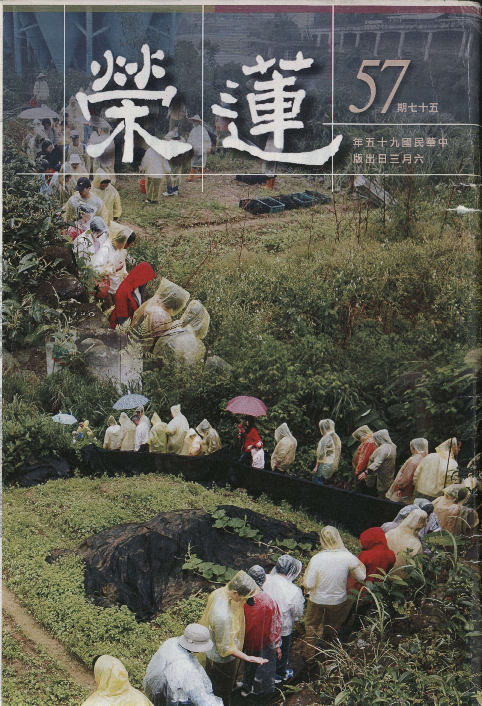

# 第57期

## 社論

### 安慶念佛會的啟示

本刊

士氣質地待人誠

摸索前進勇氣嘉

雖陋待緣新氣象

能令先進愧與慚

共修會藉著參訪放生之理由，在四月十七日至廿五日有八日的江南行，除了在上海、常熟、無錫、蘇州有放生活動外，特別值得一提的是到安慶與該地念佛會結了殊勝的法緣，並到長江做了三次的大型放生，相信對高家、安慶念佛會及共修會本身都有莫大的助益。

該念佛會有著純樸的風氣，在缺乏各項佛學資料及說法的人才下，憑著對講經光碟及有限的佛書做依據，每日參加念佛的同修多達百餘人，除了定期放生，也對蓮友或其家人在臨終時，有很誠意的護持，往生者或有瑞相，鼓舞大眾對淨土法門的信心。

在兩邊聯誼當中，發現他們對佛法的熱誠，對來客的謙恭有禮，不但施予親切的招呼，在共修會清晨離開安慶之前，一大早安慶的蓮友就在飯店排隊道別，不但有親切的問候，還有不假造作的威儀，排起隊來又極其自然，不必領眾者呼叫口令，對他們的示現極為感動；在學佛資源缺乏的情況，能有這樣如大德住世的老道場氣質，令人既驚訝又讚歎。他們不但沒有大德來講經說法，內部的蓮友也對教法不甚瞭解，有什麼佛法的問題也無人可問，對於法師在CD所講的內容也一知半解，但卻有高昂的士氣，及念佛的信心，正是我們在台灣各項資源具足的情況下，所應慚愧及改進。

當李萍老居士在安慶往生前，共修會也隨緣派出護持的蓮友至安慶，除了引導李萍老居士生起正念外，也與該念佛會座談，雖發覺他們有諸多在助念上的問題，以及無法在佛學上提攜後進，在攝持年輕人學佛上有其不足，但整體的凝聚力及建設新道場的苦幹實幹，所受的苦都是我們難以想像的，雖然一切並沒有發展像一般先進的道場般上軌道，可是對共修會派出去的說法者，極其謙恭禮敬，具求法的精神；難怪孔子在三千年前，有道之不行欲居九夷。即使是陋處，孔子且曰：君子居之，何陋之有。

學習教法如果不能將風氣弄得樸實，對法不能生起恭敬，對說法者不能生起希求，對同法者不能熱誠護持，對公家事不能苦幹實幹，而說我在修學，而說我讀了許多的佛經，而說我有諸多的佛學理論，有用乎哉？何以往昔釋迦佛修學能以超越劫數般的勝過彌勒菩薩？理由安在？或云：精進。然精進於何？是有用的精進，還是無用的勤苦？

總之，安慶念佛會可以說是我們一個非常值得警惕及隨喜的團體。若懂得箇中內涵，對佛法的修學有莫大的助益，團體懂得取法於他，則有莫大的向上力量。古人說他山之石可以攻錯，其然也！

## 大德法語

### 大方廣圓覺修多羅了義經（十七）

道源老和尚

空性面相不顯現

猶如真如被纏縛

如來在藏如來藏

照見蘊空如來現

辛三、徵釋還圓

經文：

「何以故？虛空性故，常不動故，如來藏中，無起滅故，無知見故，如法界性，究竟圓滿，遍十方故。」

連說了好幾個故，什麼道理要有無俱遣呢？虛妄的境界應該遣，正知也要遣，正知要遣了還不能說無，為什麼要有無俱遣呢？原因何在呢？為什麼要這樣講？何以故呢？虛空性故，常不動故，這圓覺妙性如虛空，虛空中沒有空華，也沒有無空華，空華是從你病眼裡生出來的，眼睛好了，虛空華沒有了，也沒有無空華。體性如虛空有否動了？沒有動！虛空體性常不動，不能增加也不能減少。「如來藏中，無起滅故；無知見故；」真如在藏名為如來藏，真如出纏（煩惱）名曰法身。

佛法分為：小、始、終、頓、圓（賢首宗的判教法），漸次的修學斷了煩惱證得法身，真如出了纏（煩惱）了，即證得了法身。在凡夫分上呢？真如（佛性、如來、法身、究竟空性）都有，人人本具各各不無，可是被煩惱所纏縛，稱之如來藏（含藏如來），法身含藏到煩惱裡邊去了，但如來藏從來沒有起、沒有滅，有起有滅是你的妄想，是你的煩惱，真如在藏名如來藏（圓覺在藏亦名如來藏），這圓覺妙性在眾生分上稱為如來藏，如來藏亦可說本具的靈知靈覺，如同那鏡子它本來具足的光明，並非透過你的修行才修出來的光明。

「如法界性，究竟圓滿，遍十方故。」如法界性，這個「如」不做比喻講，如法界性，正如法界的本性，是謂法界的本性就是一切法的本性，也就是圓覺妙性，是究竟圓滿、無欠無缺，也就是不增不減，本來遍滿十方。這在《大乘起信論》可以證明，是離念的境界（圓覺妙性），若離這個妄念（執有自相）則能證得遍滿十方的圓覺妙性。

前述有了無明才流轉生死，起信論將無明分四種相：生、住、異、滅。無明會生起各種煩惱，使我們流轉三界，而我們是欲界的眾生，上二（色界、無色界）不生瞋，因為修了四禪八定才升到上二界，禪定中沒有瞋恨心，欲界的眾生才具足貪、瞋、癡三根本煩惱，上二界已無瞋恨煩惱之現行，且上二界的貪心、愚癡心也與欲界眾生大不相同，不可同日而語，我們欲界的貪，都是貪物欲之樂，貪六塵之境，上二界的眾生呢？色愛諸定、無色愛諸定，亦即修色界禪定的人愛色界禪定；修無色界禪定的人愛無色界的禪定；有了愛就是貪，有了貪愛之心則生死難了。

約斷惑而言，小乘證初果，是將三界邪知邪見的煩惱，一下子就轉過來。行者起了正知正見，將見惑（分別我執）斷掉，三界的見惑一破一起破；證初果後進破思惑（俱生我執），分八十一品（三界共有九地，每地各有九品思惑），要破欲界前六品思惑才能證得二果，還要到欲界一番生死（欲界還要來一次），破了欲界後三品思惑才證三果（出欲界），到了色界天第四禪之五天（五不還天），此五不還天就是不還果（三果）的聖人住的天，稱之為不還、是不到欲界生死，在色界第四禪的五不還天，斷色無色思惑（共八個禪定地，其中色界四地、無色界四地，每地有九品思惑，八地共七十二品思惑），到了色界天了，因為煩惱很輕，即使思惑有七十二品也很容易斷掉而證得四果。

懂了這個道理，學到大乘佛法才會謹慎小心，不然學到空理，學到這也空、那也空，結果你一空也不空，口中說空，心中卻有，看你的行為一空也不空，為什麼？欲界的煩惱重，讓你說的時候好像開悟了，對著境界卻非如此，天天講空，天天動貪、瞋、癡。（下期待續）

## 蓮池海會

### 朱錦賢老居士往生見聞記

*編輯部整理*

病苦方知家眷賢

照顧多年見真心

臨終感得善護持

佛力加被歸去來

老居士生於民國十八年一月十九日，共有五位兄弟姊妹與多位堂兄弟姊妹，是一個大家庭。因其父母早逝，對家中長輩更是尊敬順從，亦得家族中長輩之疼愛，而手足之間感情深厚，因與其弟妹年齡相差甚距，故兄代父職，擔任起照顧弟妹的責任。

老居士於民國四十二年與陳瑞草女士結成連理，婚後育有子女五人，並自民國四十三年起進入台灣電力公司服務，開始了長年在外生活忙碌奔波的日子，與家人的相處聚少離多，雖然如此，但老居士對孩子的管教卻從未疏忽。在有威嚴又親切的老居士面前，子女們總是又畏又敬。

老居士因工作的關係，足跡遍佈台灣大小電廠及各大小島嶼，且因慷慨好客，與當地員工、居民多成忘年之交，甚而與語言不通的德國工程師結成好友。每當休假回家時，家中總是高朋滿座，只要有老居士在的地方就充滿歡樂的氣氛，老居士幽默風趣、平易近人的爽朗性情，也深深影響著子女們。

然而，老居士於民國七十五年因腦中風造成半身不遂及表達能力障礙，不得不申請退休在家靜養，廿年來夫人無微不至的細心照顧，與子女們也盡心地共同照料老居士的日常起居。老居士雖行動不便，但仍能自由上下樓梯，但為其安全方便，么女甚而辭職在家照顧父親，並於兩年內誦滿一千部地藏菩薩本願經。

老居士於過年前再度中風，子女們只要聽到任何能對老居士有利益的善法，皆盡力完成，只求老居士能不再受病痛的折磨，能將身心的痛苦去除。在因緣聚會下，參與了大眾的共修念佛，才明白唯有念佛求往生方能真正離苦得樂，是盡上世出世間真正的大孝。

四月十一日晚上，醫院發佈老居士病危通知，家屬在蓮友的建議下決定將老居士接回家中助念，自當日晚上十點至翌日七點半，由家人及蓮友排班念佛，老居士在佛號聲中安詳往生，其間子女們輪流於老居士面前勸導其萬緣放下一心念佛，子女們並整晚合掌念佛，至誠恭敬且不願離去，且觀想父親也共同盤坐一起共修念佛，在場蓮友們無不感動莫名，而次日清晨，家屬們特為老居士舉辦了一場放生，就在念誦放生儀軌的當下，老居士安詳往生，隨後繼續助念至下午四時，當陀羅尼巾被掀開時，驚見老居士竟然盤著雙腿，面容安詳，含笑西歸。

告別式舉辦之時，鄰居們皆稱讚其一門孝子賢孫，老居士樸實無華，厚道又老實的家風，值得後輩稱揚讚誦，臨終感得孝眷及蓮友們的護持，往生西方極樂世界，唯願老居士於西方淨土中，安養其身，早日花開見佛，悟無生忍，回入娑婆，廣度群蒙。

### 李 萍老居士往生見聞記

盡意

結合善緣能生西

關鍵外緣是外甥

一舉四得佛歡喜

助念重在善引導

李萍老居士是末學親阿姨，生於民國廿三年，於去年下半年行動不便，檢查發現罹患骨癌，後來並蔓延至腦及淋巴，住院治療無效後，於今年四月二十五日出院，由上海運送至安慶，經陪伴助念二十一天，在親人及蓮友佛號聲中，含笑安詳往生。

李萍老居士一生當中並未學佛，只有在去年底獲知其姊夫高向榮老居士念佛往生後，才知道要念阿彌陀佛，但並未真正建立信心。直到在親人的護持下，才開始認真念佛，在短短的時間內，就能清除障礙，安詳往生。觀察如此殊勝的結果，除了衷心的感恩三寶的加被外，也有下述幾個原因：

一、老師智慧的教導。在得知李萍居士潔癖常殺害蟲蟻後，特別指示要修放生的善法來對治所造殺生的業障，並提醒在護持時，要秉遵印光祖師「善巧開導安慰」的原則，以助其引發對念佛和求生淨土的好樂。

二、安慶當地蓮友的真誠護持。雖然和老居士素昧平生，末學與他們也都只有一面之緣，但乘著蓮榮學長們才去放生結緣的因，感得蓮友們每天三班，連續二十餘天的護持。其中更難能可貴的，在李萍居士剛到安慶的頭兩個星期，由於親人未在旁陪伴，表現出來的，是身體狀況非常不穩定、以及態度上不願配合念佛，在這種種障礙下，蓮友們還是不氣餒的繼續護持，真屬難能可貴。

三、老師及學長們的護持。非常的感恩老師的指示，以及幾位學長的鼎力相助，由台灣遠道而來，除了帶領蓮友一起修放生善法，也藉著李萍居士的因緣，和當地蓮友進行助念須知、佛學答問等正法的交流，並可能在未來作更多教法上的研習，如此殊勝的因緣，絕非一般臨終助念時所能希求的。

四、親人與老居士已建立良好的關係和信任度，所以在勸導其離開上海，搬至安慶，並認真念佛時，願意接受。對於阿彌陀佛的信心與淨土的好樂，也由此信任心中開展。

五、老師曾指出，要往生極樂世界，對淨土的好樂之心甚至重要過能念佛的心。所以在引發老居士對淨土的好樂時，掌握善巧的原則，根據其潔癖的習氣，以及其幼時摔傷脊背，終身痀僂無法生育，晚年孤單一人，卻也喜歡穿漂亮衣服等特質，為其介紹極樂淨土時，特別強調可以和善知識共聚一處，絕不孤單，並且身形高大、莊嚴、衣服華美，而環境也是黃金鋪地，一塵不染。在好樂之心生起後，更需不時地帶她發願，求生西方；並願行菩薩道，成佛之後廣度眾生。

六、在帶領老居士念佛時，安慶的蓮友們的經驗多屬於臨終助念，但阿姨大部分的時間都神智清楚，所以末學也將「陪伴念佛」的方法和蓮友們交流，其中音量與速度都要依病人的實際狀況而定。在帶引病人念佛時，也要了解老人個性如小孩，多用安撫、稱讚、鼓勵，來引發他念佛的意樂。有時要隨順其心情，以免生瞋恚心，但在其昏沈散亂時，卻也要大聲嚴肅的拉回其正念。

七、老居士一生辛苦，尤其晚年時都是孤獨一人，生活也非常簡樸單調，從世俗上來看算是值得同情，但這恰也是在其往生時較無牽掛的原因。在其臨終前幾天，得知大家要為她放生時，也主動願把所戴的金戒指（其心愛之物）拿來隨喜，顯示其願捨能捨的心。

八、臨終前的病苦，使阿姨於病榻前體會到「人活著也苦，死的也苦」，更堅定其求生西方的決心，並曾數次問到「阿彌陀佛什麼時候來接我？」也顯示出她迫切的心意。

九、往生當天的晚上，在張老師的帶領下，老居士不光是發願求生西方，更發願要代受一切眾生之苦，往生成佛後要幫助一切眾生。如此的願心，諸佛菩薩應該都會隨喜。

十、老師曾說，佛菩薩的感應是觀待眾生的誠意；除了替病人修善（包括放生、齋僧、護持與流通正法等等），帶著病人在佛前懺悔、發願，陪伴念佛之外，親屬也要能發菩提心、斷惡修善、學習正法、護持正法，以此因緣回向給病人，展現自身護持病人生西的誠意。末學十分慚愧，能知而未能行，但要期許自己持續努力為之。

雖然開始跟隨老師研習教法的時間並不長，但內心對於三寶的恭敬心與日俱增，求佛力加被的心也愈發懇切，也深刻的體會到「求生西方，全仗佛力」。畢竟自身的能力實在是太淺薄了，只能將護持的大業，一切祈求佛菩薩作安排。自己但提醒以誠心串聯每一個活動，並在其中觀察到能護持的人、所護持的對象、所修的善法、以及臨終護持的教法，都是互相觀待、在名言安立中顯現，護持親人往生的事業似是如幻化般的生起。雖然都是了不可得，無可執著，但病人往生淨土的因緣，卻也在大眾護持的誠意、病者的希求、三寶的加被、和彌陀的攝受中成熟.。

在阿姨從離開醫院到往生的這段時間裏，大家都目睹了佛力加被的不可思議：從原本要靠嗎啡止痛到很快能夠斷除，從個性急躁到能耐著性子隨順蓮友的提醒，大部分的時間都念佛；從原本很保護自己的財物到能主動捐出所戴戒指來放生；以及一開始有些自我中心到發願要代一切眾生受苦；如此大的變化在這麼短的時間內發生，只能夠感恩三寶的攝受與佛力的加被。再加上往生助念二十四小時後，全身柔若無骨，看在平素沒有信佛的舅舅眼裏，也改變想法，答應要開始念佛。衷心的祈求，阿姨往生的因緣又能導致下一個美好的善緣。

提筆至此，也深感到因緣的不可思議，由於先父  高向榮老居士往生的遠因，才有今年在安慶放生的行程，也因此結識安慶的蓮友，了解他們的熱誠與念佛的功夫；安慶之行同時還包括了遊覽天柱山、至三祖寺一遊，而這也是阿姨往生後的火化之處；在放生活動的尾聲，要由上海回台前，也安排好了運送阿姨至安慶的事宜。整個中國放生的行程好像在為阿姨的生西之事做串連。

經過這一次的護持，末學體會到，對每一位不同的病人，護持的方法都要有針對性與善巧方便，但也有不變的特質，包括護持者的誠意、病人對護持者與彌陀的信心，以及對淨土的好樂。但其中因緣環環相扣，並非臨時強求所能得。所以也期許自身於日常生活的點滴中作出好的樣子，唯願未來的善因緣在每一個當下慢慢的累積。

## 啟蒙園地

### 歷史故事　恭敬經書的蕭德言

妙音

鑑古知今大學問

興衰成敗有其因

德學兼備三不朽

要為千秋作典範

歷史故事的講演，一向秉持教學相長的理念，每回開卷心中總是有所觸動，當翻閱到蕭德言，為他恭敬經書之至誠心與態度的典範所感動，其行相最是今人所欠缺，早就想將他一生的心跡，廣為宣說。

從小家父母一再叮嚀，不論坐臥或行進間，千萬不可躺或踏在書報上，此耳提面命的庭訓，深植腦海中，今日想來是對文字的一種崇敬心意，雖是一種消極態度，可也是對文字基本的恭敬；對時下將字鐫刻在地上，號稱文學之路，頗不以為然。依稀記得，么兒讀國中一年級時，指定之國文暑假作業為認識台灣文學家，便相攜逛文學之路，趁機告誡勿踩踏，只能一旁蹲著讀誦，莫違家風。而與兒共馳騁於廣袤的歷史故事天地中，是彼此共有的經驗，分享蕭德言的懿德懿行，常豎起拇指讚歎。

蕭德言係隋唐年間，一位精通左傳的史學家，深得史學精髓，更是一位德行兼備的儒者。其立言的成就，於唐高祖時，官居銀青光祿大夫，貞觀年間遷著作郎、弘文館學士；其對經書恭敬之立德成就，感得太宗的敬重，擔任晉王讀經師，此一舉措，顯示太宗高人之眼力，能擇經師人師教導子弟，不失為後世帝王家育子的先河。

蕭德言美好的名聲，如何傳開來呢？原來他在擔任弘文館學士時，居家開經閱讀時，必先沐浴清淨，整飭衣冠，焚香正襟危坐，恭恭敬敬專注的研讀；對人講授經典時，也是如此，這般行相，聽聞者目睹一久必震撼，令名就這樣不脛而走；如同我們在觀賞 雪公太老師紀錄片，同樣見得到相同場景，鮮活行相必烙印在聽聞弟子的心田，不禁讓人讚歎前有蕭德言，後有 雪公太老師。且他又是一位終身學習的先進，何以見得？從他一生恭敬、勤奮的讀經態度，到老已達爐火純青，並未因老妻的勸誡，讀經何苦若此而懈怠。

經書是聖賢遺留給後代子孫無上的資產，能終一生傾全力聞思修，見地便高人一等，此話怎講？時間就是金錢，就是機會成本，就是全部生命，將時間投注於聖賢的學問，是最划算，最符成本，獲益最大，不僅當生得利，世世生生料也會投生善趣，蕭德言生前封侯，終一身富貴，安享天年，與 雪公太老師世壽同享九十七，此又是一巧合，真可謂仁者壽，古今一同啊！

今之學子讀書，花樣百出，有的翹二郎腿，有的托腮，有的趴著，更有的身在案前，耳目不知遠遁何方，心也不知飄至何處，至若邊讀書邊觀看電視，更是等而下之；而彼等讀經料想也是這般態度，至於正衣冠，沐浴齋戒以淨心，恭恭敬敬的研讀，想是聞所未聞吧！就以自己為例，在未接觸前賢蕭德言及未見當代聖人 雪公太老師紀錄片時，讀書或讀經，雖不至托腮趴著，卻也未曾正襟危坐及正衣冠，得見文行的心跡及 雪公太老師一襲海青端坐案前，寂靜安詳的手持經書，此一情景，宛若文行再現，不讓前賢專美於前，這一難忘的心影，常警惕著自己呢！

同學們，聽了蕭德言事蹟，你們心中是否興起見賢思齊的志向？若未生起，見到本篇短文，要趕快起而行喔！千萬要牢記，一分恭敬一分受益，十分恭敬十分受益。

### 十四講表　（廿四）第八講表 內容設施梗概

傳瑛

三乘證果戒定慧

攝持六度與萬行

佛法總綱三藏體

二諦融通三昧印

前面第四表至第七表，已將人生宇宙之真相作一詳細的介紹，接下來要進入佛法的修學領域。二千五百年前，釋迦牟尼佛於印度說法四十九年，講經三百餘會，在示現涅槃後，由阿難尊者為首的眾大弟子結集經典，共分三藏十二部，雖然部帙浩繁，但每一部經都是應機說法，對治眾生無明煩惱的病根，所以世人稱為法藥。

佛陀法藥，雖然浩如煙海，但歸納起來，不外「戒、定、慧」三大綱領。依此修學，能讓眾生斷煩惱、了生死、成佛道，所以說佛法的本體不離戒定慧三學。

戒指戒律，修學佛法，需先持戒，這是修學的基礎。三藏中的律藏屬於戒學，古人說「律規三業」，是說持戒的目的在防非止惡，使身、口、意三業遠離煩惱的造作。然而，戒有「止」、「持」之分，「止」是禁止作惡，「持」是積極為善，所以廣義的說，戒學包括世出世間一切善法。

持戒除可伏住內心的煩惱走作，得到清涼外，還可厚培福德。常聽人說「戒德莊嚴」，即在描述持戒清淨的人，必定有福德莊嚴其身心，更重要的是，藉由這種福德的資助，才能進一步修學止觀。

「定」是「止」的成就相。止的作用在息慮靜緣，即止息妄念，安住在所緣境上。由於這時全神貫注在所緣境上，所緣境的內涵會愈來愈清晰，愈來愈深入。譬如有的同學喜歡車子，當他在新車展示會上看到喜歡的車型時，馬上被吸引，駐足觀看，剛開始時，只欣賞車子的外殼，接著會看看車裏面的種種設備，越看越細膩，乃至把整部車研究清楚。佛法「止」的方法與世間法相同，但所止的境界與內容不同，那麼要止在那裡呢？要止在佛經所講的義理上，所以說三藏中的經藏歸屬於定學。若能依「止」的修學而入定，就能引發種種神通功德，其中最殊勝的功德在引發觀修「法無自性」的空慧。

「慧」是「觀」的成就相。學佛的最終目的在去惑證理，就是以「法無自性」的內涵作為觀修的所緣境，據以對治人我及法我的執著，破除煩惱及所知二障，證得諸法的真實體性。三藏中的論藏歸屬慧學。一般而言，論藏係大菩薩所造。菩薩造論的意旨，是為就佛經上所說般若的空性義理加以辨證，以便後人的修學不會誤入歧途，如龍樹菩薩的「大智度論」、世親菩薩的「百法明門論」及馬鳴菩薩的「大乘起信論」，故說「論辨邪正」。藉由邪正的辨析，最能開發智慧。然而，智慧有「實」、「權」之分，實智是指修學者自證得的究竟空慧，而權智是為度眾生所用之種種善巧方便慧，證得實智後，才能以無誤的權智攝受眾生，這是學佛最殊勝的目的，也是三世諸佛示現的本懷。
梁朝武帝崇信佛教，到處興建廟宇，在江南就興建了四百八十座寺廟，有天梁武帝問達摩祖：「我興建這麼多廟宇，功德大不大？」達摩祖回
**答：** 「沒有功德，但有福德。」。有句話說：「山中無修行，朝中無宰相」。今世大富貴人，多是夙世佛門中持戒行善之人，這種依著持戒行善所得的福報好不好呢？其實只要眾生我執煩惱未除，在受用大福報的同時，依著我執煩惱造作的惡業能力也就愈強，福報的消損也就愈快。

就以福報大到當個皇帝為例，所有百姓的生殺大權都操在他的手裡，世間五欲六塵的享受亦可由他獨攬。但看看歷朝皇帝的事蹟，在位期間能造福百姓的實不多見，多是依恃著大權，廣造令人髮指的惡行，因而漏光了他們的福報，來世隨著他們所造惡業的牽引，肯定千秋萬歲是要在三惡道中度過！豈不可憐！所以只有持戒福德而沒有修定開慧是不行的，惟有依著「戒定慧」三學的修持，才能獲證菩提的功德，也才能真正讓眾生離苦得樂，所以又稱為三無漏學。（下期待續）

## 禮懺法會

### 慈悲藥師寶懺法會儀軌觀修　如何修學藥師寶懺為淨土助功（四）

*編輯部整理*

自懺罪障用四力

助他可依藥師經

燃燈持戒供淨僧

讀經放生廣修福

卷中分為兩類，第一類是往昔造惡業的順流十心，以逆流十心破之；第二類是由順流十心所造業，感受到苦時，依藥師佛放光所宣說的咒能破之。當我們誦持藥師佛的咒語時，真的如實了知其咒語的內涵嗎？還是故弄玄虛結個手印、搖個鈴，好似自己很會修這個法門，還是真正的了解此佛頂咒是十三種慈悲等世間藥材與一種空性的藥材搗篩和合而成的甘露藥？

接著繼續

第七輪的禮拜：

眾生過去所造惑業，未顯時感覺自由自在，若起現行而成病苦時，則十分苦惱，尤其是對修學佛法者，會構成修道嚴重的障礙。

此病人欲脫病苦（乾瘦、痢疾、常做惡夢、昏迷、鬼壓身……）這些都是難治之病，要為病人轉大業時，當為其人七日七夜受持八分齋戒，應以飲食及餘資具，隨力所辦。……讀誦尊經四十九遍，燃四十九燈，乃至四十九日光明不絕，可得度過危厄之難，不為諸橫惡鬼所持，是故今日與現前眾等，各各翹懃燒香散花燃燈造旛放生修福。由此可見放生是很好的善法，在藥師經上也是如此記載，然當保育團體阻止，且台灣沒有放生環境時，感嘆眾生已無這樣的善法可作。現今大家住公寓的多，人情又很澆薄，或以維護安寧的理由，可能未來連助念法門也不易推展。大家不要以為正法很容易流傳，當人們善根福德淺薄時，正法消逝快。

惟願如來證明懺悔，眾等又復無始以來至於今日，凡有所為皆不稱意，當知悉是過去以來惡業遺報所致：造了惡業，墮落三途，將地獄餓鬼畜生的苦受完後，到人世間會有個徵兆，如諸事不順，生長環境很髒亂，人很邋遢。反之由天來降生的則是種性高貴，人長得很莊嚴，辦事順緣較多，生長的環境很整潔，人也很愛乾淨。

懺悔人間惡夢惡相，諸不吉祥之報：常常做惡夢的要小心，那就是惡業起現行的行相，此外還有許多不吉祥的苦難。懺悔人間惡病連年，累月不瘥：病苦經年累月都好不了，有些人得了肺癆、失眠，枕臥床蓆，不能起居之報：在場每位看似好好的，不要以為自己不會生起這樣的果報，曾到某博愛院看到病苦的老人大小便溺，全需由他人料理，令人難以相信從前他們可能是氣質高雅的紳士，或者四處玩樂身心安泰之福人，當惡業尚未起時，盡量地吃喝玩樂，好像沒事；問這些受苦報的人，他們先前也絕對不會相信，這些果報現今歷歷在目；眼前我們來此悲憫他們，卻不易相信未來也可能會發生在你我的身上，倘若連這樣的覺受都生不起來，則談不上精進的修行。懺悔人間冬瘟夏疫毒癘傷寒之報，種種惡業之報：這是藉藥師懺，懺除現世之報，這些現世報若不懺除，將成為修學嚴重的障礙。

懺悔眾生，當除三惡道中……不復更生諸餘惡趣之報：依藥師懺功德懺除未來三途苦報，若不懺除則無暇修學正法，談不上破迷啟悟，也就無法離苦得樂。懺悔眾生，或作牛馬駝驢，恆被鞭撻之報……衰惱之報：以上是依藥師懺，懺除三塗受苦後的餘報。

今日至誠向藥師佛海會聖眾求哀懺悔，願皆消滅。前已究竟，是病是藥，同歸一幻，惡業所致，一切報障：病與藥都是互相觀待，觀待病的藥能用，觀待藥的病就會消除，這些藥與病，都是唯名言的生起。例如這個傷口為何潰爛？必須認知這是因糖尿病所引起的，若不懂對治法則無法痊癒，若能塗上清淨的白細砂糖，則很容易痊癒，這些都是名言中認知的，是彼此互相觀待，請法之自相則一粒微塵也找不到。

今當次第發願回向，懺悔三障，所生功德悉皆回向，施與一切眾生俱同懺悔：要將現世報及未來會墮落及餘報受苦的種種惡業，好好與一切眾生一起懺除，最害怕的是連認識業的能力都沒有，這是很可悲的。願與一切眾生從今以去，乃至菩提，念生死苦。念生死苦發菩提心乃懺悔業障的依止力，改惡修善反邪歸正乃懺悔業障的對治力。

將業障懺除，必能獲得種種殊勝，如身心安樂，妙算無窮，衣食豐饒，家屬資具，倉庫盈溢，形相端正，聰明智慧，勇健威猛，諸將擁護（得外護），佛聖框扶（得加被），凡所施為，悉希慈蔭（作什麼善法都有人庇蔭護持）。

由此而發起如藥師佛的十二大願去饒益一切有情，並依救脫菩薩所示，依藥師法會能消除各種世難，所謂：令諸世界，百怪九橫，八難三災，他國侵擾，盜賊反亂，一切惡難，盡皆消滅。能得各種世福，所謂：國界安隱，風雨順時，榖稼成熟，一切有情，無病歡樂。在佛道上，能得各種覺受，所謂：菩提行願，念念增明，救苦眾生，常如己想。不只此生能修學佛法，還願來世繼續增上，所謂：生正信家，相貌端嚴，智慧辯才，遠離惡法，親近善友，堅持律行，安立大乘。不只如此，還要能破邪顯正，廣學六度，證得佛果，所謂：又願生生世世，在在處處，興顯佛法，破諸魔網，奮志滿修，六波羅蜜，廣修供養，福慧莊嚴，忍辱精進，證菩提道。（下期待續）

### 地藏懺法行觀修

*編輯部整理*

法會年年辦

心態非依然

須知無常法

一切要及時

前言

為了遍滿虛空的有情眾生，我們必須要成就無上的正等正覺，為了成就阿耨多羅三藐三菩提，在此興辦地藏懺法會。興辦地藏懺的因緣，一般皆是以配合中國的時令，在春季與秋季祭祖時行之。春季祭祖是在清明節舉辦，秋季祭祖則是在中元節舉辦。今天藉著清明祭祖興辦地藏懺的法會，超薦先亡、回向現前眷屬消災免難，特別是為了緬懷一代大德〜李炳南老居士（雪廬老人），也是共修會傳承的恩師〜雪公老師，往生二十週年的紀念。老恩師除了教育生徒，興辦佛教的事業，特別與地藏菩薩有大因緣，也可以說就是地藏菩薩的化身。共修會祈求地藏菩薩及十方三寶乘願再來，以大善知識的行相，引導眾生開發智慧，現生消災免難，報盡往生淨土圓成佛道。這應是大菩薩的本懷，也是我們拜懺的主要目的。

拜懺法行

此次拜懺分為四部分：

一、點燈發願：

在座者可以在拜懺以前稍作觀想〜「點燈」的義涵，不單只是消災祈福，更重要的是把心頭的這盞燈點亮，所要傳承的是正法。張載說：「為天地立心，為生民立命；為往聖繼絕學，為萬世開太平。」我們應該要有這種使命感，好好的修學正法、延續正法的命脈，這是我們點心燈最主要的目的。唯有我們發大願，過往的眷屬能往生西方，現前的眷屬增福增慧，如同地藏菩薩在昔日為光目女、婆羅門女時超薦在地獄受苦的母親，因此眼前皈依十方三寶點燈發願。

二、拜懺法行：

拜懺要如法莊嚴，須有三要素：第一、配合維那的引導，唱慢、唱快都以維那為準，不論維那用鼓山調或棲霞調等。第二、聽從現場糾察的指正，使現場保持良好的秩序，規矩井然，必能感得龍天的護法。第三、要隨文入觀，沒有真誠的隨文入觀而隨班唱念，那只不過是一場世俗經懺佛事而已，若能隨文入觀，發起真實的菩提心，與懺悔業障的心，一定能將往昔的業障消除，將宿世的善根福德引發，外緣上感應佛菩薩的加被，使所有今天來拜懺的人都能蒙受利益，家中過往及現世的親人亦復如是。

三、結行：

將地藏法會的殊勝處，簡單作一個檢討，將興辦地藏懺功德作各類的回向。

四、緬懷一代大德：

雪廬老人是地藏菩薩的化身，是我們修學的榜樣，在黑暗的生死大海上，有如燈塔的照耀，能令我們在生死大海中航行不致觸礁，終於到達淨土及涅槃的彼岸。拜地藏菩薩來緬懷一代的大德，並追溯老人家的本地風光，相信是對 老恩師最好的懷念，得到的是最殊勝的加被。

拜懺功德利益

這本地藏懺儀軌，乃過去蕅益大師在雙徑山閉關時修學的懺法之一。在釋迦牟尼佛要入涅槃之際，咐囑地藏菩薩要在彌勒菩薩出世之前，一肩扛起弘法利生的事業，要使有情眾生在佛法中，即使只有一毛、一渧的功德，都要好好護持此人，使之不受魍魎鬼魅、冤親債主、惡鬼邪神的引導，在臨命終時想盡辦法以一句佛號讓他聞在本識，即使他地獄相現，都要捶破地獄，送他升天。因此今天在這裡拜地藏懺，要好好的點燈發願、供養、禮拜、讚歎、回向，那就不只一沙、一塵、一毛、一渧的功德，必得地藏菩薩的護佑、十方三寶加被。

拜懺的省思

有善友一起共學佛法，共同造作善淨之業，是何其幸福！世界上有多少地方是佛法流通不到的，設想此生你沒有投生到中國，沒有投生到有善知識的地方，或投生到非洲，試問你能做什麼？在戰亂的回教世界，你還能做什麼？在冰天雪地的國家，氣溫是凍得零下幾十度，連門都出不了的，你還能做什麼？能想什麼？能為有情做什麼？當我們保不住人道時，變成狗、豬等，我們這時還能怎麼辦呢？除了被關在鐵籠子外，被像羅剎般的屠宰夫，從鐵籠子抓出來砍腳、挖腸、破肚、抽腸，試問我們還有什麼呢？這些未來的命運我們真的能脫離嗎？

我們每日忙於賺錢，果真賺了錢，將自己養得白白胖胖的，業力就可以躲得掉嗎？我們每天都有很忙的藉口，我們到底忙得有沒有意義？我們會自認很聰明，可是人生的道路我們真的找對了方向嗎？午夜夢迴之時，摸摸良心你找的是什麼路呢？真的脫離六道輪迴了嗎？你真的了解未來的走向嗎？你真的掌握死後的去向嗎？一股恐懼的感覺是否已經由內心深處對治了呢？拜懺求佛菩薩加被，修學正法有所體悟，是不是我們真正利害關係的所在？

作了這些的省思，必將使修學正法的心油然而生，勢不可敵，銳不可擋。

## 三代共修

### 週六共修活動止靜法語　雨的面面觀

心超

對境轉念看功夫

最怕進入死胡同

即使山窮水盡時

柳暗花明又一村

共修時聽到窗外的雨聲，那是我們耳識所對的境界，這個境界是由我們所造的業感應來的，或問這場雨是善業的感應還是惡業的感應？須由這場雨所造成的效果來論。如果這場雨將旱災解除，那麼這場雨就是觀待我們善業的顯現；若這雨下成水災，或引發瘟疫，或引發各類疾病，那麼這場雨就是我們惡業的召感。下雨時我們在屋內沒被雨水淋到而感冒，這就不是我們的惡業召感；若是被雨水淋到而感冒發燒，這就是惡業的感應。所以下了一場雨，到底是惡業召感還是善業召感，這是不一定的。

對動物而言，或許有的動物覺得下場雨消消暑氣很好，例如天鵝、水鴨等等，可是在樹上結巢的鳥以及弱小而無遮蔽的昆蟲，它們要怎麼去躲過這場風雨？要怎麼熬過這幾天風雨的晚上？要怎麼出去覓食呢？雨天躲在巢裡面的母鳥，要怎麼去餵飽那些嗷嗷待哺的小鳥呢？如是則這場雨水就變成它們惡業的召感。

雖然雨水會把旱象解除，像是善業召感，可是又造成山坡土石流等災害，又是惡業的顯現。為什麼一個境界生起，會讓我們同時受樂又同時受苦呢？

因為我們過去在造作善業的時候，有時是善心，有時候又起煩惱，所以會感應同時在一個境界上受用快樂與痛苦，知乎此，即知「一飲一啄，莫非前定」，這不是宿命論，也不是唯心論，更不是唯物論，是業力論，乃唯業所感召。

通常我們形容權勢很大的人，他能呼風喚雨，其實在八部鬼神當中的龍就有呼風喚雨的能力。佛經裡有說，天乾旱時除了向佛菩薩祈禱以外，祭拜龍神也能感應大雨滂沱。在現今的科學來說，雨不過是天氣的變化，那裡有龍呢？可是此與龍神興雨的說法其實是不衝突。就好比我們水庫的水是從天而降，可是這個水庫是人所建造的，能儲水於無水之用。

如同過去做了善業，所以眼前遇到一個很欣賞我們的老闆，雖然我們做善業時並不是跟他結善緣，可是能感應他對我們照顧有加，回應我們過去的善業，顯現他來攝受我們，酬償我們的善業。所以在人事興衰苦樂當中就是天命的顯現，藉著眼前的遭遇，好好的反省過去的造作，懂得懺悔過去的惡業，對治眼前煩惱，並且引發廣大的善心，與有情結廣大的善緣，在不離對三寶的皈依下，未來所結成的福報是不可思議的增長廣大，其他有情眾生所做的善業是難以與你較量。

詩人有云，雨打芭蕉，聽之心情煩悶。亦即煩悶的心被雨打芭蕉滴答的聲所引，善心、惡心、樂心、悶心都是隨境而生，然隨境而生的心不被三毒所攝，此須登地菩薩的證量方可，我們既不是登地菩薩，也不是有證量的大德，隨境不起三毒的心是怎樣修出來的呢？須在因地裡勉勵自己以心轉境，怎麼勉勵？例如整天整夜的下雨，我們就配合雨滴答的聲音來念佛，這就是以心轉境；或者藉雨天來想想那些可憐的有情，如螞蟻、昆蟲及小鳥們，巢穴被雨水淋溼而無法安住，或被水流沖走，甚而喪失生命；或者對下雨作「業」的觀修，想想下雨是沒有自性的，在觀待有情的善惡業中，此雨水方能顯現為利益有情或傷害有情的境界，這就是以心轉境的修學法。

佛法當中也藉著這個雨，做很多的形容，比如印光祖師閉關處即普陀山的法雨寺，所謂法雨是大菩薩所說的法如下雨般滋潤有情的心田，如同大地的旱田下了雨以後，就能夠種植，並且開花結果。佛說法度眾生，就能使有情枯寂的心、乾燥的心、刻薄寡恩的心，轉成回春向陽的心，亦即轉成善心、悲心，及對正法有所體悟的心。

雨也可以當成動詞，如極樂世界每日各段時間有天雨曼陀羅花的勝境，有情眾生能以各種的曼陀羅花供養他方十萬億佛，與十方諸佛結善緣，能迅速累積成佛的資糧。因為曾做過對十方諸佛的供養，所以在成佛時又得到十方諸佛的護持，所謂一佛出世千佛護持。

這些雨，也像有福德的天王，灑下非常多的寶物來供養佛菩薩的法會，如地藏菩薩本願經裡釋迦牟尼佛到忉利天宮，為母說地藏菩薩本願經，是釋迦牟尼佛涅槃前最後一次的結夏安居，來帝釋天為母說法。講到地藏菩薩的本誓、本願、本行，要觀音菩薩、虛空藏菩薩，堅牢地神好好的擁護地藏菩薩，流通地藏本願利益無量有情。帝釋天的天主非常讚歎法會的殊勝，而用種種七寶來供養釋迦牟尼佛及地藏菩薩。所以我們在供養三寶時，雖供的是有限的香花水果，但可觀想如下滂沱大雨般，有種種的飲食、衣服、醫藥、臥具等，飲食是人間美味甚而天廚妙供，以及種種曼陀羅的花園，花海一片的供養，放出的香味遍三千大千世界；若以這樣的觀修來供養，心就像花園一樣的美麗。

其次第十地的菩薩稱為法雲地菩薩，亦即此菩薩有非常大的能量，如烏雲密佈能下非常大、非常久的傾盆大雨，能使得沙漠變成綠洲。此第十地法雲地的菩薩，能以等流的心識成佛，彼有能力在無佛的地方（文化的沙漠）、或正法貧脊（衰頹）的地方，以他的證量成為說法的勢力及不疲不厭的說法，再加上辯才無礙，廣大的說法、饒益的說法、長久的說法，建立了種種的法幢事業，使得佛法的沙漠，顯現為綠洲，利益無邊無量的有情。依法雲地的功德說法降法雨，能將有情乾旱的心田萌芽開花結果，使得大地回春，此菩薩能以此功德，令彼等流之心識證得阿耨多羅三藐三菩提。

所以在窗外的雨聲可以做這麼多的觀修，心境是不是變得很美呢？我們的心再也不會鎖在衣服又不乾了，出門還要帶傘等等惱人的境界上，人心不會再那麼狹隘、那麼可憐、那麼樣的被境界所轉。即使無法以非常寬闊的心、灑脫的心、懂得觀修教法的心，來攝受每一個境界，轉成佛道的資糧；也要像大德說的淺處轉念，例如有一個老太婆，下雨的時候很傷心，因為在下雨時，她賣鞋子的女兒生意就不好，在晴天時也很傷心，因為她賣傘的女兒生意就不好了，所以老太婆整天都在傷心。後來有一位大德告訴她，你應該換一個角度來想，下雨時很高興，因為賣傘的女兒有生意了，晴天時也應該高興，因為賣鞋子的女兒有生意了，後來老太婆一想很高興，不論雨天晴天都有利於她。

原來都只是一個轉念而已，心念不轉當然煩惱不能對治，業也不能夠解除，痛苦就不能離開，所以請不要對自己殘忍，請不要傷害自己，要好好的使自己離苦得樂，你若有這個經驗與覺受，才能令有情眾生離苦得樂，使得人生過得有意義，將人生變成佛道上殊勝的資糧、殊勝的增上緣。

## 活動報導

### 九十五年母親節浴佛放生法行-活動前言　活動宣言〜母親節活動序幕

心超

萬法唯心之造作

有義無益皆由念

慈悲精進與觀空

回向如母之有情

一年一度的母親節，我們大眾以放生浴佛等出世的善法功德，利益現世及過往的母親。其中放生法行極為難得，要克服諸多的困難，在兼顧環境保護，維持生態平衡，不得不安排在交通不便的野外，使參加者有旅途勞頓之苦，在此致上萬分的歉意。

大家參加母親節的活動，要想成極為難得，雖然天候不佳，對參加活動的人不方便，但卻對所放的青蛙是一大福音，可以讓我們在細雨飄渺中，看做是一種修行的考驗，將心靜下來，觀想細雨是觀音菩薩的甘露。

依著大悲心為這些在刀口下救回的青蛙懺悔、皈依、發願、念佛，並將放生的功德回向去除世間的災戾、病苦、平息戰亂；並願所放的青蛙或往生淨土，或投生為人時，成為人才護佑國家，或為法門龍象延續正法，印光祖師說放生，不是只為物類著想，能結合的意義其實是非常多。

其次浴佛亦然，能藉此因緣，家庭生貴子，並感得佛能以八相成道利益有情，以香湯水浴佛能成就自己未來五分法身香；浴佛時從右手浴起，觀想上求佛道，其次左肩，代表下化眾生，再由頭頂浴之代表圓成佛果；並以浴佛的法水來灌自己的頭頂，使自己有登地與成佛的徵兆。登地的菩薩為灌頂位，當證得登地的證量時，能得十方諸佛以水灌頂，獲得殊勝的加持與授記，必圓成佛果，所以以浴佛水灌自己頭頂，也是自己成就的徵兆，當觀想洗淨自己的煩惱、塵垢。

每一個活動的生起都需要大眾的互相幫忙，例如事前的規劃、場地的勘察、人員的聯絡，乃至開會討論活動當日的細節，再者還要有大家的參與，才有活動的生起，一起造作善法，功德不但不會被瓜分，反而會增加廣大。佛法上也說，善法自己做不如與許多人一起做，不但功德增廣，還令諸佛歡喜，所做的善法有多廣，佛的歡喜就有多廣！

地藏經云：此人於佛法中所造乃至一沙、一渧，若能觀待禮敬三寶，則功德無量無邊。吾人不但要生起禮敬三寶的心，並且也要具足恆常的心，因為菩薩道的修持是條漫長的道路，這個活動辦完了，這樣的學習是要持續下去，要將利益眾生的法喜無盡的延續下去。

最後，我們發願從善知識得來的正法，將心點亮，不但自己的心能點亮，也能讓無量無邊有情無明的心顯現光明，這是在點燈發願當中很重要的觀修，至於藉著點燈除去生病的障難，乃至於幫助家人開顯智慧，去除無明愚癡。

總之，所有的善法若能回向三輪體空，回向佛果，回向有情，那 此善法功德就無量無邊，希望大家能珍惜這樣難得的因緣。

### 活動法語　莊嚴佛誕節的法行〜八相成道與浴佛

心晴

八相成道應化身

能予有情最勝利

指歸西方是吾家

報恩供養浴佛行

佛為一大事因緣出現於世，華嚴經上記載佛言：「奇哉奇哉！大地眾生皆具如來智慧德相，只因妄想執著不能證得。」度化一切有情眾生證得正等正覺（佛果），即佛出現於世的本懷。佛在度化眾生時現種種的身，但可收攝在三身的示現。

佛的法身是所證得的真理，報身（自受用報身）是證得真理的智慧，應化身是為了度化有情而有的種種變化身，共分二種：其中一種是勝應化身，又叫做他受用報身，是為了登地菩薩所做的示現。此勝應化身有五種決定：住的是色究竟天的密嚴淨土，此是處所的決定；所說的法是大乘法，是法的決定；具有三十二相八十種隨形好，是相好決定；所攝持的眷屬都是十地的菩薩，是眷屬決定；在眾生生死未窮竟、輪迴未空前，此他受用報身是不入涅槃的，此是時決定；以上是他受用報身（勝應化身）的五決定。

其次是八相成道的應化身，此應化身能為業力清淨的凡夫及二乘人所見。不但如此，佛亦隨著六道眾生的需求，示現各種形相在六道中度眾生，這是佛的隨類身，如普門品說：「應以何身得度者，即現何身而為說法。」此外佛也常常示現息苦身來幫助眾生一時的需要，或變為橋樑、或變化為飲食等，來解決眾生一時的需求。

在佛所有的示現中，應化身最能夠幫助眾生離苦，因為業力清淨的眾生所見到的應化身能夠說種種的法，幫助眾生得到解脫、發菩提心、修種種善法乃至於證得佛果，此即應化身最殊勝之處，如我們所熟知的本師釋迦牟尼佛〜娑婆的教主，即以一般的應化身來做示現，這應化身的示現就是以八相成道或者十二相成道來表彰一期的佛行事業，是度化有情最殊勝的形象。我們今天就以佛八相成道的功德來做討論，以禮拜、讚歎、恭敬、隨喜其功德，作為修學淨土往生殊勝的資糧，也是最能累積成佛的資糧。本著這樣的內涵莊嚴母親節的浴佛法行，相信是所有浴佛法行中最為殊勝的意樂。

八相成道中的每一相，都要當成佛行事業，什麼是佛行事業？亦即唯有佛才有的事業，是佛出世所示現的八種威儀、八種形象，八相成道亦名如來八相、八相示現、八相作佛。八相成道在小乘和大乘經典中有不同的名相，甚至在《大乘寶性論》中更演義成十二相成道，不管是小乘的八相成道，或者是大乘起信論說的八相成道，乃至於大乘寶性論說的十二相成道，都是就著佛一生的化儀來做闡述，今天就依著小乘的八相成道，並結合大乘的八相成道乃至十二相成道來做一個介紹。

第一佛降生兜率相：

佛要示現到南瞻部洲時是從兜率天降生，亦即降生南瞻部洲之前先投生到兜率天，在兜率天有四千年的時間（約人道五億七千萬年），觀察世間的機緣然後從兜率天下降；如釋迦牟尼佛在兜率天時就觀察到南閻浮提有個迦毘羅衛國，不但符合佛法所說的中國之外，也是歷來古佛出世的地方；此時釋迦佛就現出五種瑞相，首先是大放光明，其次大地震動，再者諸魔宮殿都隱蔽不現，日月星晨都闇然無光，乃至於天龍等眾皆起怖畏之心；以上就是釋迦佛將要出現於世的五種瑞相，現出了這五種瑞相之後，即下生到我們人道的世界，以上是佛陀成道的降兜率相。

第二入胎相：

菩薩從兜率天下降入胎前，先觀察淨飯王，知淨飯王是一個很有賢德的人，夫人摩耶前五百世也曾作為菩薩的母親；菩薩入胎時，大乘根器者看到菩薩坐著旃檀樓閣下降，小乘根器者則看到菩薩乘著六牙白象而降，無量的諸天演奏許多微妙的音樂，菩薩從兜率天下降，從摩耶夫人的右脅而入，此是入胎相。

第三出胎相：

在住胎時，菩薩於母胎中亦廣演教法利益三千世界有情眾生；直到了四月八日，摩耶夫人在回娘家待產的途中，行經尼泊爾的藍毗尼花園，在花園散步，走到無憂樹林手正攀向樹枝時，菩薩就從夫人的右脅而出，此時在無憂樹下開出七朵蓮花，大如車輪，菩薩在花上周行七步，一手指天、一手指地說：「天上天下唯我獨尊」，此時龍王也歡喜的從空中降下了香湯水來灌沐太子之身，太子更顯現佛的三十二相，放大光明普照三千大千世界，此即佛陀的降生相；淨飯王得到孩子非常的歡喜，也請算命師來看，算命師也說這孩子不得了，將來是一個偉人，取名為悉達多（梵語），意思就是達到滅諦的行者。

第四童子遊戲相：

悉達多太子從小就在父母的呵護中成長，學習了世間各種技藝，然常常陷入沉思，淨飯王怕他常常生起這樣的思維，所以在他的周圍製造歡樂。

第五受用妃眷相：

太子不但在皇宮有種種的享受，並娶了美麗的妻子耶穌陀羅，過著幸福美滿的日子。

第六出家相：

就在太子出遊東西南北四門時，看到世間的衰老相、病苦相、死亡相和出家梵行相，興起了無常感，並對世間生起厭離外，更興起要出家修行的念頭，雖請示淨飯王，但得不到父王的同意，於是在某日深夜乘著馬離開了皇宮，往南邊走到一個苦行林中，剃了鬚髮正式出家。

第七苦行相：

太子出家後參訪了許多善知識，但都不能滿足他出世的需求，於是決定要修苦行，就在尼連河邊修了六年苦行，日食一麻一麥，身體受了非常大的苦楚，經過了六年發現這樣的修行無法獲得心安，無法解脫真正的苦惱，苦行並不是覺悟之道，那時身體非常的瘦弱也沒有力氣，走到尼連河洗浴了自己，餓得昏倒，幸好得到牧羊女的乳糜供養，身體恢復了力氣。

第八往菩提樹相：

菩薩於是選擇了一棵菩提樹，並發了誓願：血可以流乾，肉可以腐敗、骨頭可以朽壞，如果一坐間不覺悟絕不起座，下了大決心後安坐於樹下。

第九降魔相：

此時大地震動，菩薩放大光明，整個魔宮都隱蔽了，震動了魔王波旬，波旬知道這世界有人要成道了，於是發動魔宮的魔女來擾亂菩薩的修行，但菩薩以神力將魔女都變成了醜陋的老母；魔王非常生氣，再次率領了兵將打大雷、下熱鐵丸、在空中飛舞著兵器，並且射了許多毒箭，但佛陀內心降伏了瞋恚與傲慢，具足了慈悲與調柔，天兵天將所射的毒箭都變成了蓮花降落，嚇退了群魔，此即第九降魔相。

第十成佛相：

佛陀在初夜降魔證資糧道，中夜入定大放光明證得加行道、見道、修道，後夜明相時，現證無學道成等正覺；在未成佛前先入金剛喻定，永斷下下品的所知障，第二剎那證得了無上道，此即第十成佛相。

第十一轉法輪相：

菩薩成佛之後無人求法，所以也不能說法，此時思維是否要入涅槃，梵王與帝釋天即時而來，稟告世尊修道已成，正是要利益眾生時，怎麼可以入涅槃呢？佛受梵王與帝釋的請法來到了鹿野苑，為五比丘說法，此即佛成道後初次轉法輪。有一說是佛二十五歲出家三十一歲成道，從鹿野苑開始，說法共有四十九年；另一說是佛二十九歲出家，經過六年苦行，三十五歲成道八十歲入涅槃，說法有四十五年的時間。

第十二入般涅槃相：

佛說法至八十歲，了知這期弘化的因緣即將結束，於二月十五日將入涅槃前，接受長者淳陀最後的供養，與阿難等常隨眾言：自修其心，慎勿放逸。在大眾無疑問中佛入了涅槃，時為紀元前三百八十三年，進行荼毗取得舍利分為八份供養，此即佛行事業第十二相涅槃相。

以上由十二相成道瞭解佛一期教化的示現，可知釋迦牟尼佛與我們非常的親近，怎麼親近法？示現與我們一樣都是人，跟我們一樣的吃穿，跟我們一樣看到世間種種老病死苦的現象，體悟了世間的真實相，而生起強烈的出離心，並生起願度一切眾生成佛的菩提心，並經過種種的修行最後證得清淨正見。此種種的示現表示眾生也是能依著佛陀的形象來做這樣的修行。

我們要好好思維本師釋迦牟尼佛示現的意義，尤其要聽聞思惟佛所說的教法，使之成為吾人修學的內涵；尤其世尊引導我們認識了阿彌陀佛的極樂世界，做為我們修行的指歸處、、、，這一切一切的福報都是釋迦佛所賜予的，雖然世尊在二千五百多年前已示現了涅槃，但是在二千五百年後的今天，我們還是覺得釋迦佛跟我們是如此的親近，他所說的教法是那麼的貼切。如能對此崇高的佛德生起禮拜、恭敬、皈依的信心，來莊嚴母親節的浴佛法行，相信大家必能法喜充滿，得到殊勝的功德，也能得到龍天的護持，生起殊勝的道心。

### 活動報導　如是我聞〜母親節橫具六成就

心妙

佳句信手便拈來

結合活動各法行

全程護持歸去後

讀來欲言彼已詳

五月十四母親節，為報母恩令親喜，結合浴佛放生行，莊嚴場地落何處？

山林水邊覓勝地，先訪華梵大學城，放生地緣惜不佳，沿路再尋無新點，

續詢去年傳貴地，並訪烏來沿山處，更及翡翠水庫旁，終難覓得合適地，

後勘坪林溪流畔，問得合歡山莊景，試放青蛙添生機，如釋重擔處成就，

本欲護魚再試放，溪底碎石泥沙少，泥鰍淺流易網捕，最適生物唯青蛙，

為廣生機覓佳園，探得方圓一里外，草叢斜坡菜園下，藉買茶葉謝園主。

空無所有好緣起，寬敞空地作壇場，亦作舞台表演用，一切空中化神奇，

舞台設置及音響，東勢宜蘭遠襄助，架設道具樣樣全，諸多閤家施財力，

佈置壇場請三聖，猶如西方到娑婆，為度如母有情眾，中壢到此立弘化，

布幔寶幢來莊嚴，花嚴香遠迎諸佛，點燈發願聚心海，一時齊備諸供具，

為利法音廣宣流，法事唱誦勤排演，意樂法行共和合，最要法務求完備，

分組規劃群策力，各司其職不紊亂，來往穿梭無閒人，整日忙碌樂前行，

就地三餐悉隨緣，大鍋香麵解飢渴，夜宿帳篷三護法，共守長夜迎天明，

地利人和憂天時，颱風環流來考驗，祈請諸佛來加持，萬事皆備望雨停。

遊覽車對成一雙，數十轎車齊家遊，魚貫穿梭至坪林，交通小組指揮定，

不怕山雨風滿樓，與會蓮友三百五，義工引導至壇場，遙聞聖號遠相迎，

下施有情先放生，所有母親為主法，放生法行先觀修，菩提意樂擺心間，

香讚持咒起大悲，心無罣礙平等施，香花迎請獻三寶，稱名說法及懺悔，

代三皈依發宏誓，祈願所放生淨土，捕生人等亦回心，施者去障增福慧，

念佛聲中灑悲水，佛號加持放生物，法儀圓滿普回向，三輪體空證真常，

放得青蛙千萬命，魚梯傾滑送彼歸，斜風細雨助法行，盼望一朝到西方，

天地樂生最吉祥，雨後天晴歡心開，大眾同圓放生行，人子最樂添親壽。

三代同歡開幕式，獻唱母親我愛您，野人獻曝真情露，供養長輩佛歡喜，

祈願報恩誦經文，恩重難報有善方，如法修持依教行，行孝報恩法流通，

英文詩歌亦所學，感嘆年華青春逝，如歌行板詩境美，奈何無常最現實，

善男女者正青年，七人成眾好精進，發心行道度群倫，如佛偉大真報恩，

弦歌雅樂傳誦聲，周易順序不紊亂，五倫十義盡其中，趨吉避凶順天命，

吟誦唐詩閩南調，童音質樸見天真，字字講究不錯吟，料想夫子歡欣聞，

大孝終身慕父母，舜帝萊子孝典範，關鍵心中一慕字，子孫賢明最慰親，

戲彩娛親老萊子，閤家天倫耍活寶，臺上臺下笑呵呵，孝行原在日常中，

外儒內佛真涵養，弟子規先樹品德，再向經中識佛嚴，讀解相應賴師教，

結吟一首時計鐘，感念雪公老恩師，啟蒙養正應及時，不負師恩勝親恩，

萬善根本從孝生，推己及母最親切，若欲子道能成就，但問親得離塵垢，

福慧雙修所為何，導歸淨土最穩當，三世父母同離苦，不容娑婆勘忍苦，

誰知棕樹意氣高，方以詠物便道志，慈母行相殷殷現，遊子難解思親愁，

玉欄杆外是家鄉，養成志向在真樂，父母與我及眾生，同歸極樂之蓮邦，

三代同歡五倫家，最怕甜蜜轉眼空，無常總不離左右，妙轉家業為道場，

家庭甜蜜誰不愛，花開果落亙古今，惟有解脫花結果，方能離苦至淨域。

天上天下無如佛，浴佛功德殊勝行，佛涅槃後最上供，仰止佛陀滌心垢，

淨妙香湯灌沐佛，香華供具讚如來，上求下化祈圓證，善根速成究竟果，

供養眾生亦如佛，民生問題莫輕忽，桌桌佳餚香味傳，大家吃得樂陶然，

曲終人散是常則，法味隨心是不共，前行正行及結行，均等重要三和合，

何時何日母親節，但願日日令母喜，何有法行盡善巧，要向佛門真心求，

下施有情名放生，上浴諸佛是供養，中報三世有情母，上報下濟真佛行。

### 活動報導　串起當日的功德寶珠〜母親節法行之心得紀要

傳瑛

大事因緣報母恩

予以世間出世利

引導參與善法行

成為大道勝法侶

母親節是在每年五月份的第二個星期日，雖是外國人所訂的節日，但感念母親的恩情是不分國界、種族及膚色，而且訂的日子相當好記，所以自然而然成為國際認可的重要節日。

以往，每年蓮榮都有舉辦慶祝母親節的法行活動，今年也不例外。據瞭解，報名人數總計三百多人，且多數是家庭成員集體報名。今年的母親節是在五月十四日，前一日蓮友們還怕「珍珠」小姐威力轉強，恐形成強力颱風，帶來豪雨影響活動的進行。為未雨綢繆，老師及蓮友大德們即在週五晚上會商因應事宜，並作最壞打算。即使颱風來襲，活動仍舊照辦，而且就會場應如何佈置，每一環節的活動應如何串接，一一安排妥適，俾讓當日一切事宜均能井然有序的進行。

母親節當日清早，天空略顯灰濛涼意，出門前心想今天是全天下母親的節日，而且有好多媽媽們攜家帶眷參加本次法行，也許老天爺會給媽媽們一個面子，讓大家有一個辦活動的好天氣。

忝為第二車的車長，待大家依序上車、用完早餐後，帶做早課，為讓大家明白佛法也是非常重視孝道，向大家分享一個故事：有一日，釋迦牟尼佛帶弟子們遊化一方托缽。當地正值饑荒，為讓弟子們能得到食物的供養，佛陀教弟子們先行托缽，等弟子回來，自己再出去。如此一連三天，釋迦牟尼佛都只能帶著空缽回來。
有位弟子看到佛陀面有菜色，不禁問道：「佛啊，最近看您的身體似乎愈來愈瘦弱，到底怎麼回事啊！」佛說：「這個地方鬧饑荒，民眾似乎已沒有食物供養僧眾！」弟子看了非常不忍，心想自己應要好好供養佛，於是把自己僅有三衣變賣，到別的地方換取一缽香噴噴的飯來供養佛。佛看了說：「你一番好意我心領了，但出家人的三衣是法幢的代表，非常尊貴的，你把它變賣換食物來供養我，我消受不起！你還是拿去供養別人吧！」弟子接著說：「佛啊，您是三界之尊，人中至聖，若連您都消受不起，還有誰消受的起？」佛說：「有，你的父母。你今生修行有成，那是因你的父母生給你這個身體，那是修行的法器，沒有這個修行的法器你也無法得到我的教授，所以源頭要感謝你的父母！」佛又
**問：** 「你的父母信佛了嗎？」弟子說：「未信！」佛說：「現在你的父母也受著饑餓之苦，你好好供養他們，讓他們心生歡喜，慢慢地，他們也會跟你信佛學佛！」

孝道是一切善行的基礎，同理，成佛的基礎也在孝道。當釋迦牟尼佛在菩提樹下證道後，隨即趕往忉利天為已往生的母親摩耶夫人說法，希望藉轉法輪的殊勝因緣，能增上母親的功德。不僅佛陀本身如此示現，「在家菩薩戒」首條也列明不供養父母師長，犯第一戒。

父母是世間的大福田，孝順父母是天經地義之事，懂得順此天地之法則自然運行者，才堪稱為萬物之靈，而且，世間人所希求的福報也就在其中！譬如果農手中有各式各樣能生種種果實的種子，但必須把種子種在肥沃的土地裏，才能有開花結果的一日。世間的莘莘學子，年輕朋友們，當你們整日營營茍茍，希求學業、事業有成時，努力學習、好好工作是需要的，但還須觀待是否有福報的資助。孝養父母乃福報的源頭，所以除了世間的種種努力外，不要忘了要好好耕耘這塊恩田。

父母的恩德至大至深，尤其是母親，不僅有懷胎十月之苦，小孩出生後，還得含辛茹苦哺乳照顧、寸步不離、噓寒問暖、細心呵護。襁褓之育至少要到三歲，才略為放心讓小孩脫離母親的懷抱，自行嬉戲。待孩子慢慢長大，還得擔心他的學業、事業、婚姻…，為孩子，母親一生是操勞不完，到老死依然掛念…。母親對孩子真是無我的奉獻，只要為了孩子，那怕是赴湯蹈火，在所不惜。所以說有媽的孩子像個寶。母親把孩子當寶，孩子是否也把母親當寶呢？

在母親節這個具有特殊意義的日子，我們要怎麼表達「有孩子的媽也是個寶呢」？有學長說，如果只是全家人一起出去吃大餐慶祝，實在沒有什麼實質的意義，今日，大家能來參加本次活動，從開始做早課、然後到會場作儀軌、放生、欣賞唐詩吟唱、讀經、話劇種種的表演節目，最後浴佛發願，在半日的時間完成這麼多有義意的法行，實在是千載難逢的因緣，也是慶祝母親節最有義意的方式。

尤其浴佛，相傳釋迦牟尼佛從摩耶夫人腋下出生，隨即右手指天（意指上求佛道），左手指地（下化眾生），象徵佛陀出世的大因緣，也象徵佛陀報答母恩的大孝行為。因為我們長劫的生死輪迴，每一期的生命都有母親，無始劫輪迴至今，已有無數的眾生都曾做過我們的母親，這些母親現世可能已生天、做人，或是在三惡道中受苦，為度這些「如母有情」，惟有學佛方能成辦。成佛不僅能度過去世的母親，還可利益現世的母親，乃至未來世中為人母親者。

所以浴佛的法行，形式上雖是浴佛的童子身，內涵卻在效法佛陀的大孝—上求佛道，下化眾生，意義非凡。最後，美味的午宴，更象徵本次活動不僅有充實的精神糧食滋養我們的慧命，還有物質糧食滋養色身，可謂功德圓滿。

歸程中，大家分享心得甚覺歡欣，並對工作人員前行及正行的種種辛苦，表達至深的謝意，當然，也要感謝老天爺給予大家一個涼爽的天氣，這也是本次活動成功的助緣之一。在車程快到終點時，以蓮池大師的一段話語與大家共勉。蓮池大師說「恩重山丘，五鼎三牲未足酬，親得離塵垢，子道方成就，出世大因緣，凡情怎剖，孝子賢孫，好向真空究。」。

大意是說，父母恩重如山，是無法言喻的，為人子者就算是生前讓父母衣食無缺或死後盡心奉祀，亦無法報答其恩於萬一；唯有讓父母脫離六道輪迴之苦，才算盡了為人子的孝道。這種出世的大因緣，若沒有佛陀開示說、或是透過善知識依據佛經解說，世間的凡夫俗子怎能瞭解！現世的孝子賢孫們，瞭解這個道理後，應要好好學得解脫的智慧，才能幫助父母脫離輪迴之苦，報答父母的深恩啊！

謹此迴向參加本次活動的所有蓮友，都能把參加本次活動當成是學習解脫智慧的緣起，日後大家都能成為同修學的法侶，共勉增上。

### 活動報導　母親節三代同歡表演記趣

淨域

母親節三代同歡

讀經話劇淨土詩

佛曲獻花樣樣來

串場靈魂主持人

壹、前言

緣於老師的慈悲攝受，排除萬難，舉辦九十五年「浴佛暨母親節活動」，學會上下齊心動員、戮力以赴，各個莫不奮勇當先，必達使命。在諸多分工中，末學與心妙被委以三代同歡節目主持工作，前無主持經驗以奠基，後乏萬全準備又失據，一場下來真是忐忑煎熬。今又承會刊編輯力邀撰文，追記歡樂餘歎，搔首抖筆惟恐疏漏遺誤，尚祈十方多予寬諒。

貳、裊裊樂音如來讚

「五月初梅翩訪來，霪雨雰霨漫溪谷；一帶碧水映綠竹，白點油桐妝山麓。宏橋飛跨越川嶺，數十車駕擁人赴；裊裊樂音如來讚，雲破開霧心花吐。」

放生後的雀躍，如實地刻劃在每個人的笑容裡，儘管一身的泥濘與沾濕，仍無減此行的意樂。滴答的雨聲掩不過此時揚起的如來讚樂音，在梵音的引領下，雨聲漸低，人語似無。

在《華嚴經》〈行願品〉中，普賢菩薩以微妙舌根讚歎如來無盡功德海，其功德之盛可以「菩薩海會」來概括。若從〈讚佛偈〉來體悟，則是「報身相好莊嚴」、「化身光明無量」、「因行果德殊勝」，此即是偈所言：「阿彌陀佛身金色，相好光明無等倫。白毫宛轉五須彌，紺目澄清四大海。光中化佛無數億，化菩薩眾亦無邊。四十八願度眾生，九品咸令登彼岸。」在此裊裊樂音中，序啟三代同歡之樂。

參、破鑼啞嗓啟序幕

六Ｏ年代名作曲家劉家昌先生，譜了一首傳誦於街頭巷尾的好歌〜「母親」，您可還記得歌星尤雅的美妙詮釋，如果一切都已成追憶，表演節目開始前，主持人且以破鑼啞嗓來勾起沉封的往事〜「母親母親我愛您，您教我們要吃苦，您教我們要爭氣，兒時的情景常在夢裡，母親的愛心永難忘記，母親的恩情永難忘記，縱然是驚濤駭浪，縱然是風霜雪雨，有了您母親，人人肯奮鬥，個個成大器。」

「成大器」是每位父母親心中的大願，所謂「大器」者，即是有用之人。天生我才必有用，用者適時宜地，淋漓揮灑於極至；故不論小時了了或大器晚成者，人之才用都須經由調教方不失偏，父母庭教正是這人格社會化的基石，相信在嚴管精磨下，器用之才始能彰顯出現。

肆、祈願報恩謝父母

在走音嘶唱後，心妙對今日「點燈祈願」、「放生續命」、「餘興表演」、「心得分享」及「祝壽餐會」等活動作一簡說，並藉〈妳是人間四月天〉一詩，來讚頌天下的母親〜「我說你是人間的四月天，笑響點亮了四面風；輕靈在春的光艷中交舞著變。你是四月早天裡的雲煙，黃昏吹著風的軟，星子在無意中閃，細雨點灑在花前。那輕，那娉婷，你是，鮮妍百花的冠冕你戴著，你是天真，莊嚴，你是夜夜的月圓。雪化後那片鵝黃，你像；新鮮初放芽的綠，你是；柔嫩喜悅水光浮動著你夢期待中白蓮。你是一樹一樹的花開，是燕在樑間呢喃，你是愛，是暖，是希望，你是人間的四月天！」並願大家天天都和煦如沐春風中。

對某些人而言，慶祝母親節只是每年的例行公式，或者已經淪為商人的另一個消費戰場；但也有人每年藉著這個特殊的日子，向他們的母親或敬愛的女性致意。對於此次活動的意涵，老師在致詞中特別強調「孝思」的重要，吃個飯送個禮物固然不錯，但還不如引領父母作放生之行，作浴佛法行來得殊盛，尤其是三代同行，更別有孝德傳承的意義。

第一個節目由「週六中班」的同學先上場，這些同學是國高中的學生，平日除忙於課業外，仍能依時於週六晚上參加共修，實在是難能可貴。首先，同學們吟誦《父母恩重難報經》，述說父母對子女「懷胎守護」、「臨產受苦」、「生子忘憂」、「咽苦吐甘」、「迴乾就濕」、「哺乳養育」、「洗濯不淨」、「遠行憶念」、「深加體恤」及「究竟憐愍」十種大恩。

對於父母的恩情，為人子女的應如何體報呢？俗話說得好，養兒方知父母恩；佛說孝親功德時，更善巧教導我們應如是觀修—若一心供養大仙善友，為渠安置七寶、珍膳、瓔珞、沉香，還不如一念住於孝順之心，以微少物色來長養悲母。蓮池大師也如是苦苦勸戒眾生，說：「父母恩情重過於山丘，即使是具備衣食器物，也只是口足之養，算不上是真正的孝養父母；只有幫助今生的父母脫離六道，為人子女的才算是盡到孝道。」

接著中班吟誦英詩「Sing me a Song of a Lad that is Gone」（為我歌頌那一去無蹤的小伙子吧！）。這是十九世紀新浪漫主義英詩作家史蒂文生（Robert Louis Stevenson）的力作，述說一位年青人張帆遠行後的的省思，當年長後再回顧往昔時，竟有無奈的感嘆，並祈願一切都能回到從前。這又讓末學想到「小男孩與大樹的故事」；小時候男孩總圍繞在大樹下嬉戲，或是乘涼聽故事，或是爬樹摘果子；長大後卻不再親近大樹，只在有困難時才回來求援，而大樹卻是慷慨地無償濟助。有一天，男孩要攜眷越洋遠行，大樹將最寶貴的樹幹送給他當交通工具，從此一去了無音訊，之後大樹只能日夜呢喃自語：「我的他，現在怎麼了。」

古來子女行孝，莫不由順從父母開始，今雖時空遷異，然孝道之理千古不易。每當夜闌人靜時，吾人可曾捫心自問，父母的教誨我們做到幾成？父母的懸念我們了解幾分？為人子女者，又怎能忘恩棄之不顧呢？

伍、讚頌歌詠佛偉大

父母之恩不可忘，報恩即時莫遲疑。接著由中壢研學會的學長們歌詠「報恩進行曲」及「佛偉大」兩曲目。佛究竟如何偉大？且就八相成道功德觀之，菩薩降生兜率天，等候眾生學佛機緣成熟；再化乘六牙白象，由摩耶夫人左脅入胎；摩耶夫人後於四月八日，在藍毘尼園從右脅降生太子。太子觀世間無常，出王宮入山學道；於菩提樹下降伏魔境；降魔後，在菩提樹下成道，號「釋迦牟尼」；成道之後，五十年間說法普度人天；八十歲時，在娑羅雙樹下，入於涅槃。綜合此八相成道功德，即說明佛之偉大在於「神通第一」、「智慧第一」與「慈悲第一」。

吾人皈依志行菩薩道，既無神通又無智慧，姑且可學習佛的慈悲。所謂慈悲者，將心比心，己所不欲勿施於人，事事感同身受。在《法華經》裡有一位常不輕菩薩，他每到一個人面前就說：「我禮敬未來的佛菩薩。」這恭敬心就是成佛的資糧，不待外求。

而誰是佛菩薩？是觀音？還是勢至？有一男子想遠行到某一寺廟去禮拜菩薩，到寺廟後法師對他說，佛菩薩在家中等你，你趕快回去吧！男子懷疑地說：「我該怎麼辨識呢？」法師說：「如果見到一位披著外衣、倒穿鞋履的人便是。」男子拼命趕路，終於在午夜時刻回到家中。一陣催促的敲門叫喊聲，母親暗中急忙披衣起身開門，不料卻反穿屐履。當門打開時，男子被母親的穿著鎮懾住，原來每日外求的菩薩就在自己家中。是以，吾人莫再心外求法，好好將眼前的雙親菩薩把握住，那怕是一盞茶、一聲好，都將不會有「樹欲靜而風不止」的遺憾。

陸、弦歌雅樂誦易詩

在讚佛的八相成道功德下，見證佛智的偉大，此不僅於了知宇宙與眾生的真相，更真行於棄名拋利、獻身於眾生之上。末學以一謎「不難卻又很難」，就教於心妙，請猜一字。她果然是聰慧無比，不經思索即回說「易」字。這「易」字真是「既簡單又不簡單」，猶如持名念佛法門一般，看似簡單易行，卻又是萬中難有一、二能行。

在易字的猜射下，節目進行到兒童讀經表演，首由週三讀經班的同學背誦《周易》〈本義卦歌〉及〈序卦傳〉；當背誦到「有天地，然後萬物生焉。盈天地之間者，唯萬物，故受之以屯；屯者盈也，屯者物之始生也。」讀經的速度愈來愈快，若不輔以旁白，相信與會的大眾，都是面面相覷，不知所云。其實「飆經」正是讀經之樂的所在，孩子們或許不知道「屯」、「盈」等義，但腦中末梢神經的貫串，正已邁入微算的神速之境。

西漢鄭玄說「易」有三義，即是「簡易」、「變易」和「不易」。「簡易」為易經的第一層次，表示易將自然界的原則，以陰陽二元來說明，簡單容易明瞭；即使是六十四的卦意，也是非常生活易懂的，只要是識字者都能朗朗上口，通曉其意。而第二層次的「變易」，則是指自然界中有著變遷與替換，一切都在變化中進行著，而易則是在說明此種變化之象，並教導我們應對的方法。最後的「不易」，更深入地指出，自然界的萬變中，存在著一定的法則與真理，也就是萬變不離其宗。這一層次並非初機者所能夠洞悟，猶如佛法中的「空無」一般，真空實存妙有；說簡單還真不簡單，能說卻又難說。

接著讀經班的孩子們，再以古調吟誦唐詩四首，在平仄聲韻中，「相思子」、「早發白帝城」、「桃花溪」與「登鸛鵲樓」吟來更是入味三分，餘音繞樑如霨盤山久據不散。〈相思子〉之「此物最相思」，與〈早發白帝城〉之「輕舟已過萬重山」兩句，正訴說著濃濃的思念之情；而〈桃花溪〉之「洞在清溪何處邊」則寓意著菩薩家中坐，不必遠求；至於〈登鸛鵲樓〉之「更上一層樓」，曉喻更在力學以報親恩。

柒、戲彩娛親老萊子

論到上報親恩，中國孝史上有「臥冰求鯉」、「親嘗湯藥」、「聞雷泣墓」、「棄官奉親」等孝行，但都不及老萊子遐邇馳名。東勢研學會此番不計形象，擔綱表演「彩衣娛親」歷史劇，一致博得眾人的喝彩。不論是達露與心齋的壽翁碎念，或心仰與治心的彩兒耍戲，真可稱得上是學會空前的演出。一句「老ㄟ！麥溝碎碎唸啊。」擠出多少人的笑淚，噴出多少人的涎沫，更道盡多少親子間的關愛之情。

一般人總讚歎老萊子娛親的孝行，殊不知這背後還有更深的意涵。據《太平御覽》所載，老萊子為周朝楚地人，年過七十父母俱存，孝思日益增強，為了不顯老態，常穿著斑斕之衣服侍雙親。有一次腳受傷，惟恐父母心傷，順勢僵臥在地學嬰兒啼哭，遂引起父母的哈笑。《論語》〈為政篇〉中，孟武伯問孝於孔子，子曰：「父母唯其疾之憂。」由此顯見，老萊子之孝已過於孟武伯所問。一個人即使人格修養都臻於至善，不使父母蒙羞，還須注意身體健康一事，蓋因受於父母，所以不敢毀傷，以安父母之心。

捌、外儒內佛弟子規

〈朱子治家格言〉謂：「祖宗雖遠，祭祀不可不誠；子孫雖愚，經書不可不讀。」〈顏氏家訓〉亦云：「教婦初來，教兒嬰孩。」兒童天真未泯之時最易教導，也最需教導，此即先入為主。隨著社會的變遷與進步，啟蒙教育日益往下扎根，甚至已推進至胎兒教育，咸認胎兒耳識成長時，就是啟蒙教育的入手處。

現在的父母真辛苦，兒女個個掌中捧，不若以前隨便照豬養；若過度嬌寵兒女，這孩子將一點規矩都沒有。反觀蓮榮的子弟真幸福，不管讀經或念佛，規矩禮儀樣樣少不了。

在「戲彩娛親」後，週六小班的同學帶來了《弟子規》與〈淨行品〉的背誦表演。在「父母呼，應勿緩。父母命，行勿懶。父母教，須靜聽。父母責，須順承。」的嫻熟吟誦下，這些孩子已不知讀誦多少回了。蘇東坡曾云：「經書不厭百回讀，熟讀深思子自知。」古德亦說：「書讀千遍，其義自見。」至於孔夫子讀易至「葦編三絕」（編串書的繩子，斷過三次），都在告訴我們「下工夫」的重要。

一句「無上甚深微妙法，百千萬劫難遭遇。我今見聞得受持，願解如來真實義。」孩子們又讀誦起《華嚴經》〈淨行品〉，每一偈中都以「當願眾生」來祈願，總共一百四十一願。所謂「淨」就是清淨，不造身口意三惡業；對照前品信解門，此一行門更為重要；從純潔未染的童語中誦出，更能照見清淨善業。佛法無上，所以說「無上甚深微妙法」；佛法難遇，所以說「百千萬劫難遭遇」；佛法難行，所以說「我今見聞得受持」；佛法難知，所以說「願解如來真實義」。因此吾人欲行難行之法，還須悟解如來實義；如此，知行合一解行並進，方有成功之日。

玖、導歸淨土詩三首

共修會的可貴處在於「三代共修」，老中青傳承不墜，諸多活動一定是扶老攜幼全家與會，其實這也是孝親與倫常的體現。每當週六共修念佛回向時，總會聽到「週四念佛十萬聲」的回向文句，這都讓末學感到自慚形穢，實修的工夫還是不牢靠。
週四共修的老菩薩們，於活動中也為大家帶來  雪廬老人淨土詩的台語吟誦；一句「三途輪轉何因緣，只彼無量妄念牽；一句彌陀纔上口，金池水面出青蓮。」或許有人疑
**問：** 「念一句彌陀，就能消除百千萬劫惡業嗎？」若有這等好事，待我將嚥最後一口氣時再來做吧！如果有這樣的想法，那就得再將〈開經偈〉好好捧讀一番，因為這是真修實幹的工夫，那有平日不疏溝，期望雷雨暢通流的。對於老菩薩們思念淨土世界之情，末學亦以「老來念佛正當時，去日無多莫躊躇。阿彌陀佛四洪字，叫得蓮花朵朵浮。」一首淨土詩相報，期以大家都能隨念往生西方極樂世界。

老人家們力求念佛往生，那青年人又該如何呢？培養辦事人才是學會的宗旨，養成班的學長們，正是我們興辦儒佛教育的最大助力。在此，學長們也以「詠棕樹」、「遊子吟」、「玉欄杆外」三首詩饗宴於大家。其中徐仲雅的〈詠棕樹〉意境特別深遠，詩云：「葉似新蒲綠，身如亂錦纏。任君千度剝，意氣自沖天。」對於早期的台灣社會而言，棕樹與生活有著密切的關聯；其葉如掌，朝天而發，可編織為掃帚；葉基有棕毛，強軔耐濕，可作簑衣防雨；唐朝張志和〈漁歌子〉所云：「西塞山前白鷺飛，桃花流水鱖魚肥，青箬笠，綠簑衣，斜風細雨不須歸。」即是此物。猶憶得民國九十三年的吳哥窟之行，柬埔寨的國（棕）樹四處林立，不僅提供建屋的材料，其汁更是棕糖的來源，甘甜尤勝於蔗糖一籌。正因為它的利用價值甚高，所以錦纏的棕葉，就被人們一層層的剝下使用，即使如此它卻是生意盎然地往上直長。

這棕樹被人層層剝削，卻愈益彰顯出它的價值，甚至被視為是國樹。吾等學人亦應作如是觀，所學當樂於服務眾生，所出莫苦為冤索，所發當求其盡性；如此無求而發，意氣自能沖天。

拾、結行〜永遠甜蜜的家庭

節目進入尾聲時，心妙引領所有子弟高唱「甜蜜的家庭」，並分送在場的母親們一株康乃馨，願每一位母親都能快樂健康。詞句中的家與父母，既可愛又慈祥，但我們此生最終的目的在求出離娑婆，所以應觀想家是西方極樂世界，父母是阿彌陀佛；此父母正慈悲攝受我們，以大願力導引我們走向淨土之家，而我們也高興地走入這永遠甜蜜的家。

### 心得分享　母親節放生及浴佛感想

禮悅

攜家帶眷過佳節

法雖剎那生異滅

留於心識善種子

開花結果是菩提

修學淨土的行者，為了累積出世的資糧，依著佛誕節的因緣來浴佛，以增進與善知識及佛菩薩的善緣；為了報答累世及現世母親的恩德，依著母親節的因緣來放生，以救度累劫母親於一二，並令現世母親健康長壽，有因緣親近善知識。團體藉著一年一度母親節，承辦了二種善法，並將一整年各班修學的成果供養大眾，不僅使演出者藉機磨練自己，也讓家長們了解子女學習成果及正法殊勝，更令佛菩薩有歡喜乘願再來廣度眾生的因緣。

走進會場，映入眼簾的是莊嚴的壇城，壇城設計不禁令人想起經典上記載二千多年前釋迦牟尼佛出生的藍毗尼花園；園中開滿了各式花朵，芬芳高潔，佛陀降生時，大地震動，一手指天一手指地說道：「天上天下唯我獨尊」，天人們用七寶水來浴佛並散天花，鳴奏天樂，幢幡寶蓋，供養佛陀；兩旁金字塔形供品，象徵吾等遍十方的供養；燭燈通明，照亮法界眾生黑暗枯竭的心靈，令吾等頓時洗脫塵勞，以無雜染的心、智慧的心、寬廣的心來做種種的佛事。

此次活動由放生儀軌唱誦揭開序幕，不同以往的是，維那悅眾都由女眾（母親）帶領，母親不僅在家中扮演相夫教子的角色，在法會上亦能帶領大眾祈請、發願、皈依、說法、懺悔、回向……等法門；佛菩薩亦示現如母親般不捨棄唯一愛子，不眠不休對眾生予以慈悲引導及諄諄教誨，就算眾生背棄了菩薩，菩薩仍發願來解救他們。

放生活動在雨中進行，隨喜青蛙們喜歡下雨的習性，頓時心境也隨之轉變，望著青蛙們一隻隻乘著魚梯而下，就如同乘著彌陀大願船登上彼岸，心中的煩惱執著也隨著釋放；進而觀察到孩童們專注的眼神，相信放生一事已深植幼小心靈中；並體會動物是可憐可憫，非用來玩弄與享用，慈悲心藉著一次次放生不斷累積，相信智悲與福報也跟著而來，家長們不須過於擔憂子女的未來，因為儒家一向重視天爵，有了天爵人爵自然而來。

接下來是經典背誦、佛曲演唱、台語詩唱誦及孝親活動等表演，啟蒙班的兒童們天真活潑；養成班的青年們成熟穩重，老菩薩們的歡喜懇切；蓮友大德們博君一笑的舞台劇，大家無不賣力演出，各具特色，供養大眾。學佛者並非死板不知變通，相反的，在正法的指引下，參與者秉持著長幼尊卑的規矩，傳承著嚴謹的道風，在美好的環境中學習成長，不但愈來愈知道禮節、道理，也不會迷失方向，並有機會學習服務他人的經驗及待人處世的方法、心態日漸成熟，相信人生許多出路就在其中。

最後是浴佛的法行。唐師曾言：「在灌洗形象功德經中，清淨慧菩薩在釋迦佛即將入涅盤時，請教佛陀後世眾生做何善法最好？佛言：沐浴法，這不僅是做出佛歡喜事業，亦能與佛結善緣。」在莊嚴的浴佛偈唱誦中，完成了浴佛法行，雖然吾等無法每日做浴佛法行，但可藉著家中佛像佛桌的清理，為佛菩薩們整理一個清淨莊嚴的環境，依此來清淨自己的心靈；再者，觀想家中童男童女們就是未來佛，將每日繁瑣的清洗轉變為浴佛的殊勝法行。

這幾年來承蒙三寶加被，善知識的發心護持，使弟子每年母親節有幸參與殊勝的佛誕節浴佛暨放生活動，令一家人在母親節的特別日子中，不同於一般人帶著全家大小上館子、出外旅遊、購物等活動，而能在佛號聲、唱誦聲與梵唄聲中，過著既充實又美妙的一天。

「法不孤起必待因緣」，依著佛誕節及母親節的因緣，而興起浴佛及放生的法行，為了舉辦活動，而有老師、善知識們結合成為團體力量，分配各項執事，事前各依本份工作，用心規劃，並多次開會討論，乃至現場沙盤推演一次又一次，不辭辛勞，務使整個活動順利進行，每個環節緊緊相扣，活動程序內涵能契理契機，諸多庶務工作點點滴滴，只有主事者才能體會箇中辛苦與難處，而辦佛事非同一般世俗之事，事前更要講究動機與意樂，事中要安住在法行上，並能隨機應變，事後還要將善法做無盡的回向，並且活動結束仍要耐著疲勞收拾會場，並做檢討改善，務使活動辦得盡善盡美，不負三寶、師長及大眾的教導、期待與參與；這一切如果沒有佛菩薩加持、沒有正法薰習、沒有善知識發心、沒有團體凝聚力、沒有平日的默契、沒有大眾參與護持，一個法會是不可能無中生有的；聚會就如夢幻泡影般生起，亦如朝露般無聲消失，無始劫來的無常戲碼不斷重播著，愚癡闇鈍如我者，亦被相同手法欺騙了無量無邊次，祈願三寶加持，善知識慈善不棄，令吾等能開智慧眼，發無上心，共成佛道，則幸甚矣！

### 心得分享　活動面面觀〜過個有深度的母親節

傳燈

用心是活動的品質

誠心乃招呼之良方

歡心為活動之效果

和心生活動之士氣

母親節放生、浴佛，是蓮榮一年一度的盛事，許多蓮友總攜家帶眷呼朋引伴而來。今年不巧颱風來襲，為了安全，蓮榮的師長及工作人員縝密策劃，備及多項因應方案，以防天候變化所需。

當天天氣沒有造成太大的妨礙，倒像天降甘霖，洗淨染濁的大地。到了目的地，許多工作人員已經穿梭當中，有的指揮交通，有的在現場做最後的整理。陸續到達的蓮友開始點燈發願，盞盞燭光襯托一片花海，猶如佛光明耀顯赫，攝受眾生、豫悅清淨。

梵音聲中揭開了活動的序幕，千萬餘隻的青蛙經皈依、灑淨後，蓮友在工作人員的導引下，井然有序分路進行放生。打開網袋，躍動的生命倏地隱沒在荒煙蔓草中。未學佛前，對生命茫然不知，不知護生，更遑論了生脫死。入了蓮社，才知自己多愚癡，才知諸佛含哀慈愍，才知時時聞思修，反觀覺照來修正自己錯誤的行為。

緊接著是一連串精彩的表演。印象最深刻的是週三讀經班的台語唐詩吟唱。童稚的天籟、純真的笑容，是鎂光燈聚集的焦點。而東勢研學會演出的現代版彩衣娛親，頗能博君一笑。真佩服達露以業餘的功力，沉著而穩健的演出年邁老母。二位表演歌舞娛親的蓮友更是不計犧牲色相。從他們卓越的演出，可以窺見團隊的用心。在這一年一度的盛會裏，蓮榮共修會老中青三代傾出看家本領，展現過去研學的成果。而心妙老師與淨域老師輕快的串場，讓節目進行得緊湊而無冷場。

表演過後，便是浴佛開始。又是一陣迅速有序的整理場地，一切就緒，眾人陸續上台浴佛。另一邊，年輕力壯的蓮友，紛紛端菜入席，人人帶著歡喜心，為眾服務。享受著美味的素食，暗自忖量，要發多大的願力來護持這個道場？這一代一代的傳承要花多少的心力？而這一切不正是我們浴佛的目的？向所有的蓮友一叩首，感謝大家的付出，感謝大家的辛勞！

### 心得分享　報天下的母恩〜莊嚴年度母親節

心刻

辦事是教理的活用

重在降伏自己煩惱

善聽取他人的指揮

隱惡揚善成功歸他

原本擔心在五月初會被外派出差、擔心準備時間不夠充足無法將活動工作設想周詳、到接近母親節擔心颱風天候問題…。生起有因緣來做善法、將善法做好、有善法可做還真不容易呢！要做善法服務的對象全是佛弟子，要用什麼心？生起什麼心？在工作中應如何？遇障難時又應如何？

母親節前一天到達活動場地工作前老師帶領我們做前行觀修，將我們的心安住。雖然在聽的當下略有一些領悟，過後煩惱、雜亂的心依然充斥，但還是感謝老師給末學因緣來做、來學習。

在期中有很多長輩值得末學好好的來學習。舉例來說：

在很多工作中需要很多師長、學長的合作，負責的師長們在事項繁重、複雜（要考慮各地、各單位來的蓮友，有老人家、有小朋友，天候狀況、備案，所有安全考量…），在很短的時間內要完成各項準備工作，但還是面帶笑容、安然的指揮若定，有條不紊的次序完成，縱然遇上困難也不顯慌張，依然沉著穩重。表面輕鬆並不代表不在意、或事不關己，相反的是更在意、更仔細的去做。每每遇到工作要執行總是慌慌忙忙的、滿頭大汗看起來似乎很認真，其實不夠穩重、不夠沉著，要學習謀定而後動，思慮周全後穩重的做，讓自己可以一步步的著實做好，在其中也好好的觀察自己的心、自己的動作，如此一來可以將事情確實做好，也是一種修行吧！

因為活動人數及範圍較多較廣，蓮友、學長們已經執行各項分配工作，在人手暫時調度未及下，中壢的楊醫師來協助放生前的準備，五、六十歲的醫生長輩聽到需要幫忙，立刻捲起袖子換上雨鞋、戴上斗笠無論是搬生物、搭魚梯決不輸給我們這些年輕的學長。因為下雨行經的路線皆是泥土，尤其放生場地在菜園邊，楊醫師一個人將泥地上鋪設雨布、木板。

當末學與他檢查場地是否還有未設想周到，在行走在雨布上時，他還特別叮嚀著「走旁邊，中間較好走的地方等一下留給來放生的蓮友們走。」還有我們在整理搬動東西時，怕手、衣服弄髒而躡手躡腳的，他還笑著告訴我們「以前他在十五、六歲時在課餘假日時還要幫家里擔糞尿水澆菜，洗豬養豬等，常常工作一整天，休息吃點心時還不一定有足夠乾淨的水可以洗手，就簡單的將臉、手沖洗一下就吃，吃完了休息一下沒換衣服繼續工作，我們現在年輕人看起來真愛乾淨。」放生結束後他又將剛才鋪設的東西一一收回原地……。

中午用餐時因為在戶外場地吃飯，大會共準備了三十多桌外燴，由十七、八位男眾蓮友學長端菜服務。當負責學長帶領前行意樂、注意要點及分配時，看著大家臉上都帶著笑容、端菜時從容不迫依序為大家服務，讓人打從心裡生起歡喜：「跟一群充滿歡喜心的服務學長、蓮友們工作真好！」

還有很多師長蓮友在活動中服務大家，令參與者生起愉悅的心情，認為不虛此行，忘卻自己渴了、衣服溼了、飯還沒吃，也沒聽到有工作人員因此而抱怨，有好的先考慮著別人，總是把自己擺在最後，這些點點滴滴都是末學要好好的學習與體悟。感謝佛菩薩、感謝老師、師長們、感謝天下所有的母親，因為有你們的因緣使末學能依此因緣獲得學習，祝天下母親永遠快樂、謝謝妳們。

### 心得分享　真正母親節的莊嚴〜母恩深重

心祿

長流水似父母心

河邊草如子女身

小草不斷水滋潤

兒身長掛父母心

看著日益衰老的母親，心中有極深重的愧意。

由於工作之緣故，陸續在國外寓居了十餘年，期間雖然也曾二次接老人家至國外共度了一段快樂的時光，雖然平日衣食奉養上也並未乏少，但在承歡膝下方面卻是十分虧欠。

幼年失怙，母親一手拉拔了我們七個孩子成人，備極辛勞。在家雖排行第五，但兄姐們曾不只一次的對我說〜「媽媽從小最偏愛你」，語中是有些不平。而一些長輩也曾轉述母親的話〜「心祿最孝順」。但在我的感受中，最孝順的應是從不忤逆母親的二哥和三哥，而最受母親疼愛的應是父親往生時不滿四歲的幼弟。隨著年歲的增長，我才逐漸有了一些不同的覺受。

小時候，每次在外買了零食，在大快朵頤之餘，我總是儘量留下一些，即使是一小口的冰品、一小塊的地瓜或天婦羅，拿回家中親手餵食正忙於工作的母親，就算有客人在座也一樣，母親總是笑瞇瞇的品嚐。日後回想，原來母親是如此容易滿足〜滿足於子女那麼些微又不經意的孝心。

曾告訴孩子們，過去幾十年來，我的母親為了家計而忙，除了日常噓寒問暖之外，記憶中從來沒有看到母親疾言厲色或刻意諄諄教誨的情景。但是，為人子女的我們，至少做到了「不辱」。而且，老人家數十年來對家庭無怨無悔的奉獻，也是我們兄弟姐妹七人奮發向上的精神支柱，而所謂的「教養」，都是從心裡頭去感受而養成。

也告訴孩子們，他們的阿媽生活上只是小康，更曾遭受惡性倒會而負債，好多年後才還清。但老人家多年來，一直默默地定期捐款給一些孤兒院及慈善機構；出外參訪寺院，甚至做早晚課都會把功德回向給子女，祈求子孫平安。老人家養兒育女的辛勞及善良聞於鄉里，不到六十歲，就已榮膺台北市及軍中雙料模範母親的殊榮，接受公開表揚，實至名歸。

不只一次的提醒孩子們，今天他們所享有的一切，都與父母的福報有關，而我的福報則來自從小殊少忤逆母親，懂得體會寡母養兒育女的辛勞。所以，為人子女們都應隨時去體會親心，覺受有多深，福報就有多大。

也告訴過孩子們，從小學開始，制服都是我自己燙平，球鞋亦是自己手洗、染白，洗澡水也是自己燒，更從小就養成隨手整理家務的習慣。因此，特別叮嚀孩子們，幫忙分攤做家務，其實是在為自己儲存福報，千萬不要推拖，甚至覺得委屈，要心甘情願，誠如善知識所教導的〜「歡喜心有多大，福報就有多大」。也曾經聽過一句話〜「家事做得愈少的父母，就是愈好的父母」，真正的意涵就在這裡！

也告訴過孩子們，在我的記憶中似乎沒見過母親真正動怒。但我每次在嚴厲糾正孩子們的不當言行之後，是既慚愧又十分失望的想，我怎麼沒有承襲到母親那種能耐和德性，讓我的孩子們也能從我身上自然薰習到那些好的習性呢？

也告訴過孩子們，他們比我幸運，因為他們有一位父親，從小就帶他們隨緣布施，養成與他人分享福報的心量。而我，沒有那種福分。

也告訴過孩子們，他們比我幸福，因為他們有一位父親，不僅給予他們較優渥的生活條件，更願意從小教導他們要愛護生物，不可殺生，帶他們親近善知識學習佛法及因果觀念。而我，也沒有那種福分。

家父往生後，母親即養成抽菸的習慣。自我從事公職以後，老人家即與我同住。但自從我成家、有了孩子們以後，一方面是憂心老人家抽菸傷身，也是擔心二手菸會影響幼兒們的健康，即常對母親不假顏色，甚至言語上不敬。直至學佛以來，慢慢學習自我反思，更坦誠的告訴孩子們，近十幾年來我在仕途上從人人看好的「明日之星」，卻在升遷上屢屢遭逢窒礙；固然是年青時個人德性有缺及學養不足，但更應是因為對母親在「色難」及言行上有虧孝道所致。不只一次的勸導孩子們，從小要學習反省平日對自己母親的態度，不可率性而為，更不可惡言傷母親之心，要知道，一切未來的福報大部分都是從孝順父母而來。

更曾告誡孩子們，真正的孝順父母，不能只在言語上虛應故事，而是要讓父母能夠心安，堂堂正正的做人，平時履行任何的善行及佛事，都應該想到也是在替父母作為，因為只有孝心具足，福報才最圓滿。

其實，回想過去數十年來的成長歷程，一直到了身為人父之後，才深深體會到父母親養兒育女之苦，非比尋常；而對子女用心之深，更是魂縈牽繞，難以言喻，難以形容！

近二年來，母親漸有失智的現象，而抽菸習慣難斷也多少影響了健康，令人憂心。老人家雖仍早晚上香念佛，但體能已大不如前；雖有菲傭照顧，但除二哥同住之外，兒孫們大多無法每日承歡膝下，老人家心境寂寞可想而知。蓮榮的放生活動一直是母親最歡喜的事，尤其每次母親節舉辦的放生，意義更為深遠。在樂於共行善法之餘，不僅衷心祈願母親福壽康泰，更願天下所有為人母者均能安康吉祥，未來都能同生蓮邦！南無阿彌陀佛！

### 心得分享　許自己一個未來〜中班師生母親節之祈願

淨調

未來雖是不可知

方向操縱在自己

發心學習善知識

惜時求進有未來

你是否也曾感嘆過時光的流逝呢？相信如果有統計數據的話，這樣的感嘆必定名列前茅。考試前的學生總渴望能有多一點點的準備時間，忙碌的上班族總為了工作進度在追時間，患重症者更是和死神在搏取時間，時光是如此珍貴。而此刻讓我暫用寶貴的時間來想想，我們何以能夠享用這彌足珍貴的時間？是誰讓我們衣食無缺地成長？是誰讓我們得以度過快樂的童年？是誰教我們認識這個花花世界？是誰用他們的年華來換取我們的今天？其實答案我們心裡都知道，唯有我們的父母能如此。

中班的同學們，在我們吟誦著Sing me a song of a lad that is gone時，是否也體會到詩人Robert Louis Stevenson的感嘆了呢？在演出父母恩重難報經時，是否也感受到世尊的殷殷教誨呢？期勉我們都能牢記與珍惜。能生為人類極其難得，因為人所具有的智慧是其它生物所比不上的，據估計人的腦細胞約有一千多億個，每秒鐘約可處理三百億個指令，現在最強的電腦比起它也相形遜色，所以我們能不好好利用這寶貴的資源嗎？加上父母親提供了我們良好的生活環境，我們不是更應該好好地來學習以報父母之恩嗎？以認真地學習來回報，相信也是所有父母最樂於見到的。

學習除了學校的課業外，還有合群、互助、服務等等的人格成長，依著仁心的學習除了能體會到他人的心意，且令一切的學習變成有意義的學習、是一種對人群有貢獻的學習；不能幫助他人的學習，不是想要幫助他人的學習，不會是個好學習，所學也不會有所成就。正所謂心量有多大，眼界就有多廣，福報則源源不斷受用不盡。擁有一顆肯付出的心，它將回報給你人生相續的動力與喜悅。

學習讓自己智慧增長，如此才能提升自己的能力，才能真正地服務他人，又從服務他人中得到更上一層樓的成長，兩者相輔相成。這樣的人生如何？和渾渾噩噩、敷衍了事的學習比起來如何？中班的同學，如果你也讀到此處，先讓我們停下來想想，到底如何做才是愛惜時間，如何才能真正報答父母，如何才是自己要的人生走向。想清楚後，就以行動來告訴自己吧！表現已經相當不錯的你們，再更上一層樓吧！許自己一個卓越的未來！

### 心得分享　豁然開朗

瑋臨

多情應笑我

眾樂獨方樂

夢中母相會

淨土再續緣

過去，有關於任何母親節的文章或謝詞一直都是我避諱的話題。

我總感慨人為何是個多情的動物，因為有情有愛所以誕生悲傷。隨著年歲漸長，這種對生命的衝突感也漸漸模糊淡出，直到現在，我已經可以很坦然去面對這個感覺。

已經忘了不知道從何時開始，每年都參加蓮榮所舉辦的母親節浴佛放生活動，每當看見每位母親發自內心的喜悅及感動，心裡即有種無法言喻的感覺，我無法清楚的完整描述此種感受，但可以確定自己是開心的。

這樣有意義的活動，果然每年都可以獲得幾百位蓮友的共襄盛舉，每年聽到報名人數時，腦中總會空白個幾秒，因為實在是太大的陣仗了，這令平時鮮少參予活動的我都期待不已(汗顏)。一整天活動下來，收穫不少，感到團體及蓮友的用心，也看到了許久不見的長輩，尤其是看到阿嬤洋溢著幸福的那張臉，這些都是用再多的金錢都買不到的。身體雖疲憊，心靈卻是飽滿的，當晚帶著微笑入睡，然後在夢裡跟母親說，妳也能在場就好了。

關於死亡，這沉重的課題，我極不願意去修它的學分，只是在思考著：當死亡來親吻你眉間的時候，你該怎麼去面對它？當時才五歲的我，因母親的逝世，第一次接觸了這門科目，經過了十三年的進修，十八歲的我笑了。母親的靈魂不會被困在冰冷的罐子裡，她在極樂世界微笑著，不再被癌細胞侵襲，沒有身體上的痛楚，沒有時間的壓力，沒錯，她得到了永恆。將來當死亡來親吻我眉間的時候，我將修完這門科目，得到滿級分，而換來的畢業禮物，叫做永恆。

### 心得分享　拼圖日記

微智

五彩繽紛的人生

合出美妙之拼圖

不只自己的努力

與媽媽合力完成

世界是一塊大拼圖，從出生開始，人們便納入為其中的一小塊拼圖，大家相互交結、疊合，終於使自己的角色融入大拼圖中，缺一不可。如果有一天你願意回首，看看你身邊那未曾離開你的那塊拼圖，就會驚奇的發現，是「母親」。她緊緊的陪伴在你身旁，或許有天你倒下時，她會陪你跨越那寒風暴雨；或許有天你放置錯自己的拼圖時，她會引領你回到正確的軌道上；她懂得在紛亂的大拼圖中，保有那永恆不變澄靜的心靈，並且去抵抗一切不好的拼圖，為的不是她自己，而是我們。只是在她默默付出之中，我們視之為理所當然，所以我們並不懂得珍惜環繞在我們身旁那塊自動跟隨自己的拼圖。

很多人問說母愛到底有多偉大？只要你身邊的那塊拼圖消失，你就會知道母愛的偉大是無庸置疑的，但我們為什麼一定要等到失去之後才懂得珍惜呢？現在就好好愛我們所愛的人吧！你就會知道什麼叫做「幸福」，記得德國詩人卡布爾曾寫過這樣一首詩：「山的那一邊傳聞為幸福之所在，我和朋友千里迢迢地越過山頭，卻帶淚而歸。」但真正的幸福，根本不需尋求，它一直都在你身邊等著你去挖攫，希望我們不要徒勞而歸，把心投入，幸福，一切都在！

我的媽媽，相信我不須介紹，因為大家都一起跟我享有我的媽媽，像在上唐詩課的媽媽、上古文課的媽媽、上定靜課的媽媽、上茶道課的媽媽、上弟子規的媽媽、講故事的媽媽、講佛法的媽媽、笑容可掬的媽媽、親切和靄的媽媽、豐盈氣質的媽媽，每一個我所擁有的媽媽都那麼的十全十美，能當她的女兒真是天大的幸福，這不需要解釋，因為她始終是在我身旁與我最自然結合的那塊拼圖。我知道我對她的感覺，是尊敬、是崇拜、是喜歡、是緣份，總之我很高興我們有緣能相遇，能教我正確的佛法觀念，能給予我其他人所不能給予的，此在此心中除了感恩還是感恩！

在蔡玉婷愛的箴言的文章中寫到：「說不出來的愛不一定膚淺，說不出來的愛也不一定缺乏誠意，涵容人對情的渴賴，取最合宜的方式作為愛的交心，才不會不覺傷害了所有愛我們及我們所愛的人。」如果你對母親有非常非常多的愛，大聲的釋放出你的愛吧，不管用任何一種方式，最重要的是心裏。勇敢的去面對自己的感覺，並且珍惜所有我們擁有的，滿足所有周遭的事物，因為滿足感並不是滿足你想要的，而是了解你擁有的是那麼多，用心去觀察，也用心的去愛我們的父母，最快樂的時光，一定是這樣產生的，對自己微笑，也對你偉大的母親，一個美妙的微笑吧！

### 心得分享　完整的走一趟過一生

竹軒

能化腐朽為神奇

是同舟共濟之力

為的是報母之恩

要的是不作後悔

五月十四日是一年一度的母親節，蓮榮共修會的各位師長們，為了慶祝偉大的母親，特別選在風景優美，且沒有任何汙染的坪林舉辦慶祝活動。按照慣例，養成班的學生要先到場地佈置會場，當然我也不例外，在母親節的前一天，揉著惺忪的雙眼，伴著些許的睡意，來到了會場。霎時，被眼前的情景嚇醒了，原來場地就是一個鐵皮蓋的棚子，環堵蕭然，這要從何佈置起呢？還好有能幹的師伯們，我們只要照著指示去做，漸漸的雛形、規模乃至到最後佈置成了一個莊嚴的三寶殿，女眾的師姑及學長們則幫忙插花莊嚴會場，有空的學長就開始練法器或是排練隔一天的職事，當整個會場完成時，眼前看到的是莊嚴的殿堂，西方三聖佇立其中，有如是另一個佛淨土，莊嚴殊勝，此時已是傍晚時分，天色漸漸昏暗，氣候漸漸變冷，似乎告訴我們母親節將會變天。

母親節的清晨，下著細細小雨，青山上帶點淡淡的霧色，母親節的慶祝活動就在此美景下拉開序幕，首先是放生法會及放生活動，其目的在於祈求三寶，讓一年到頭為子女辛勞的母親能夠身體健康，而冤親債主能夠仗此殊勝功德解冤釋結；對於所放的眾生能仗此因緣，脫離烹煮吞殺，並在不久的未來成為佛道上的助伴。

接下來的節目是表演時間，其中在中班背誦父母恩重難報經時，讓我感受甚深，其內容大意是說，不管你用任何方式，都無法報答父母對我們的恩德。想想自己已出社會已久，對於父母的口體之養都無法滿足，還要讓父母每天為了三餐辛苦工作。古書有云：「缾之罄矣，維罍之恥。」此事常掛我心，更別提說要報恩了，真的是差的遠了。詩經蓼莪篇說：「父兮生我！母兮鞠我！拊我畜我，長我育我，顧我復我，出入腹我，欲報之德，昊天罔極！」嬰兒時，推乾就濕，長大了，還要為子女的教育及三餐操勞。出社會了，還是念念不忘地關心事業及婚事，直到年紀已邁，日行西山，風中殘燭，心中還是掛念子女。直到臨終，若是閻羅王開出條件，用投生善道的機會來換取與子女相伴的一刻，我相信十個父母有九個會答應，但這都是對子女太牽掛了。所以，我們若不趁著父母健在，好好孝順，更待何時呢？難道要等到樹欲靜而風不止，子欲養而親不待才來後悔嗎？想到這裡，心中有更多的不安，深怕這個機會不會長久，因為世事無常，所以現在要好好的孝順父母。

須知天長地久有時盡，莫要遺恨早知道。藉著這次母親節的因緣，我要更珍惜往後與家人相處的時光，盡自己所能地把握當下及時行孝，或許現在尚不能提供父母衣食無慮的生活，但噓寒問暖是基本的人子之道，且手足之間和睦相處、共盡孝思，讓父母寬慮開懷，讓「甜蜜的家」這首歌不再僅是口頭歌聲、心中願景，而是每個家庭真實的摹寫。

最後即以「甜蜜的家」獻給大家：我的家庭真可愛，整潔美滿又安康。姊妹兄弟很和氣，父母都慈祥。雖然沒有好花園，春蘭秋桂常飄香；雖然沒有大廳堂，冬天溫暖夏天涼。可愛的家庭呀，我不能離開你，你的恩惠比天長。

## 研學報導

### 高山仰止〜雪廬老人往生二十週年之緬懷-研學法語　一日為師終身為父

心超

儒佛一家具慧眼

在家學佛別古德

表彰淨土秘密藏

艱辛萬難有誰知

老恩師從小即有偉大的理想和抱負，生在一個多災多難的時代裡，除了為公發心，在公家的本位上盡忠職守，在佛學上充實自己的德學，並且興辦教育事業，利益有情。

老恩師在兵荒馬亂中，吃素念佛；在逃難的過程中，不忘弘法，尤其在三十八年春浮海於台灣，時值六十歲，一般人安土重遷，何況年紀已經六十歲了，大都不願離開家鄉，可是  老恩師知道台灣是中國文化最後的根據地，是佛教命脈延續之處，所以不辭辛勞浮海來台，即展開弘法的事業。

老人家先以行醫來與眾生結善緣，以此作為引導有情入佛門的橋樑。在當時一般人認為學佛是老人家的事情，甚至把佛法當成世俗神道宗教，或認為是迷信且障礙社會的進步，可是  老恩師知道，想讓佛法的觀念住世，必須要培養學法人才，然必須從根本上來教育人才，所以從民國四十四年始，由兒童德育班、蓮友子弟輔導團到國學啟蒙班乃至大專講座、內典班、論語班、社教科等等。一般年紀老時，會比較缺乏雄心壯志，容易變得保守、膽小而不願意多事，尤其本身是孤家寡人之時，或許會對自己的未來充滿了擔憂，這些老人的行相在  老恩師身上是看不見的。

老恩師常為弟子們講解中國文化的重要，開示佛法的綱領，引導學子們一條世出世的道路。設想這一生若沒有碰到  老恩師，會生起諸多修學的障礙：第一、不知道儒家和佛家是修學成就的階梯，是成佛的次第，能夠將儒家和佛家合為成佛的大道，這是  雪公老師最殊勝的引導。

第二、在家學佛只能於佛法種種善根，結結善緣，雖入佛門但沒有正知正見，是佛法的門外漢，不得其門而入，更不可能組成修學團體護持正法。今日之下有很多人還認為在家人組成團體來共修，是不如法的，如果沒有老恩師示現做榜樣，今天的我們不可能以在家的身份來組成一個正法的團體，因為有許多人的看法是認為在家人組成修行團體就是走入邪道，不信三寶、不皈依三寶，若沒有 老恩師為標竿，我們無從以在家人共修的方式，充實自己的德學。

第三、對淨土法門無法產生殊勝的勝解，因為佛法傳來台灣，大半是通途法門，而國內一些鼎鼎有名的大德，也都是修學通途法門，雖或弘揚淨土，但並非對淨土作一勝解，而真正以淨土法門為修學的旨趣，為學佛的依歸，是從 雪公老師開始。不只如此，  老恩師也帶動台灣佛教的風氣，老人家曾說：「他是開風氣之先。」如各種教育、慈善、醫療事業，都是從 老恩師先開始。但大家搶著做時，  老恩師就另外做利益眾生的方便，不與大家相互競爭，總是默默的推行佛教事業。

老人家曾說：捧出心來給佛看！在晚年授課時，皆是抱病上場，在老人家寫的一首殘燭的詩說到：「未改心腸熱，全憐暗路人。但能光照遠，不惜自焚身。」這是老人家真正的寫照，最後在燈油燒盡之時，就是弘法事業到了終點。即使晚年諸多病苦都不忘叮嚀我們要好好的幹，在往生前的新春，請大家喝春酒，雖然 老恩師當時已經是老苦纏身且諸多病苦，站起來時卻非常的筆直，承許自己這一生沒有給大家丟臉，這些做學生的出去，不會覺得丟臉！

唉！佛菩薩從來不辜負眾生，但眾生卻常常辜負佛菩薩，佛菩薩拼命想讓佛法住世，可惜眾生卻讓佛法成為正法、象法、末法，乃至於滅法，可讚的是佛菩薩，可悲的是眾生，可仰望的是佛菩薩，可嘆的是有情的惡業。在 老恩師往生二十週年時，緬懷這樣的大德來到了台灣，對台灣有諸多的貢獻，在現今高唱愛台灣者，其實有些人才是真正的愛台灣， 老恩師曾說：我來台灣，比台灣人更愛台灣。當然不是愛台灣的阿里山也不是愛台灣的日月潭，而是愛台灣這裡的人心，那就是以辦教育事業宣揚儒學佛法、改造人心，令居住在這裡的人具足人心和佛心，而不是把人心變成畜生心，這才是真正的愛台灣。

哲人已遠，典型猶在，如何繼續老人的遺風呢？將 老恩師的內涵發揚光大，讓這塊土地成為學佛的淨土，變成往生的踏板，變成中國文化的發揚光大之地。唯願 老恩師乘願再來，再造弘揚儒佛的勝況。

### 研學心得分享　仰之彌高的妙高山

達露

動盪時代一完人

道在平常日用間

千擊萬磨猶堅毅

三賢十聖忍中行

前言：

今年（民國九十五年）適逢  雪廬老人往生廿週年，為紀念地藏菩薩所示現的老恩師，乃舉辦地藏菩薩本願經及雪廬年譜、明倫專刊文稿之講座，並以介紹雪廬風誼暨舉辦地藏懺法會，緬懷一代聖人之出世。今邀集諸賢之心得，或就研學地藏經，或就緬懷  雪公老恩師之立場，抒發一己之志。唯願正法住世，人才輩出，不負地藏大士出世之本懷。（編者）

師法地藏菩薩的精神〜與地藏大士無二無別的 雪廬老人

承擔不分男女眾

唯在心志與勇悍

德不孤兮必有鄰

苦到深處全是樂

現今社會講究消費，到處充斥著聲色場所，五欲六塵的利誘，導致人們只重物質享受而心靈空虛，生活沒有目標沒有道德觀念，不知因果；為了不讓下一代接觸此惡劣環境感應地獄果報，而在當今猶可挽回狂瀾之際，好好給予下一代良好的一面，給予下一代在日用平常中能有所遵循，一方面也為了紀念 雪公太老師往生二十周年，闡揚太老師的菩薩精神，傳承者宣揚太老師的正法，令一切眾生能學習菩薩的精神，做利益人生的事，所以有地藏經的講座。

有幸依此講座讓我們更了解地藏經的真正義涵，及地藏菩薩的精神所在，進而師法之以成就佛果。雖己之根器陋劣，無法得善知識教授之全貌，但也願共襄盛舉，不揣淺陋的略述聽聞之一二，以與同行善知識共勉，並為淨除罪障開啟智慧證菩提之資糧，亦願三寶加被令此正法住世，善知識常轉法輪。

其中就地藏菩薩善於發願，善於親近勝友依教奉行，不忘佛恩具有承擔力，以此三點述所聞之經義。

就善於發願而言，能從地藏菩薩往昔所為得知，其為長者子請教如何得佛之相好、千福莊嚴，而發願：「為罪苦六道眾生，廣設方便，盡令解脫，而自身方成佛道」。還有為婆羅門女時，因母親的因緣而發願：「願我盡未來劫，應有罪苦眾生，廣設方便，使令解脫」。為小國王時發願：「若不先度罪苦，令安樂至菩提，終未願成佛」。而為光目女時，為了救母誓願：「救拔世界所有地獄及三惡道諸罪苦眾生，盡成佛道才成正覺」。又地藏菩薩度化眾生中，見眾生惡習不止，輪迴不停，如藤蔓攀纏，悲愍眾生之苦，也一再的發願。凡此種種皆是地藏菩薩善於發願之行相。連釋迦佛亦稱地藏菩薩久遠劫來，發大重願，利益眾生；堅牢地神亦曰文殊、普賢、觀音、彌勒亦化百千身形度於六道，其願尚有畢竟。是地藏菩薩教化六道一切眾生，所發誓願劫數，如千百億恆河沙。

可見地藏菩薩久修以來確實是「弘誓深如海，歷劫不思議」，歷劫皆不斷不斷的發大清淨願，而且所發之願皆如出一轍，每一生的願力都在為自己的目標下註腳，每一生都在朝自己的目標前進。願為船之舵，人生之燈塔，有願才有方向，無願如馬之無銜，不知去處；故欲往生淨土，當生得成就，應學地藏菩薩時時發願，願自己所為都為往生淨土的資糧，引導整個思緒時時刻刻在往生淨土中，一旦養成此習氣，相信臨命終必一心一意求生淨土而得往生。

就地藏菩薩累劫能親近善知識依教奉行而言，地藏菩薩為長者子能依佛發願，為婆羅門女能知佛為大覺具一切智而依止，為光目女能依善知識羅漢所言而行之救母，及地藏菩薩每每有任何成就，或有神力變化分身救拔業報眾生或具大智慧或說法，皆謙虛的說從久遠劫來，蒙佛接引，或說承佛如來威神力而得，此至心依止善知識之行相尤為我們所應學習者。善知識具足一切功德，是有志修行者之明燈，是道之基礎。宿世曾為之世間百工技藝，若無教者亦且無成，何況欲往從未經之地，累世未曾解脫過之出世間道，豈能無師；故依止善知識為修行之鑰，依止之方便當如地藏菩薩之皈依信受奉行，不忘佛恩，如此才能感應善知識的護念佛菩薩的加持，才能有所成。

就地藏菩薩之承擔力而言，亦是行者所需學習者，尤其所承擔之事非一般所能者，其功德更是廣大，是快速累積資糧之方便。釋迦佛臨涅槃之際，在眾諸位菩薩、天人、鬼神前，慎重其事的將度脫眾生之事委於地藏菩薩，而地藏菩薩也不辭佛陀之所託，一肩挑起，其魄力實非一般人所能為。反觀自己，平常聞法不力，昏沉掉舉，念佛不精進，遇事避重就輕，每天泛泛過日，乃因無承擔力無使命感，如有承擔力，能一肩挑起傳承佛法之命脈，則末法不臨，不輪轉於輪迴中而解脫成佛。故今後當一改前愆，承擔一切的善法，精進而行，以期早日淨除罪障，圓滿資糧。

### 研學心得分享　佛恩浩瀚〜由地藏菩薩本願經說起

傳緒

緬懷雪廬生西後

本地風光地藏王

孝心源頭發大心

圓滿功德賴佛恩

昔人讀諸葛武侯出師表、李密陳情表，韓文公祭十二郎文、詩經蓼莪章等至情至性之文，莫不感動墮淚，反觀自己雖感動，卻難掉淚；常悲嘆興不起、融不入那樣的情懷，但並不表示自己不忠、不孝、不慈。回憶先考停柩、守靈之際，面對至親辭世之悲境，當誦讀地藏經及阿彌陀經時，也有過涕淚縱橫之經驗，時家母睹狀稱善，後先妣過逝，情境復生，誦此二經，亦復如是感動。而一旦悲境不再生，同誦此經，覺受已捉不住矣。

今年四月間，老師為緬懷紀念 雪公太老師往生二十週年，特整理地藏經科判，依科判引眾隨文入觀並解說，在經文近入尾聲，「一切眾會俱復瞻禮，合掌而退」，師問何異於他經「聞佛所說，皆大歡喜，信受奉行」或「作禮而去」，大眾未解，後經師剖析，佛講本經時，已現不久人世，將入涅槃，此情此景，深知諸法實相之諸佛如來、大菩薩，豈會悖乎人情，生歡喜心，而隨聞之天龍八部等亦步亦趨於後，以諸佛菩薩為取法對象，其言行亦必通達人情事故，因此一情懷，遂供養禮退。而當師宣布散會之際，蓮榮道場聽聞眾，似與忉利法會現場，瀰漫一股與當時聽聞眾同樣升起難捨之情，同時後學當下也感受到，興起前所未有浩瀚佛恩之覺受，雖不如斌宗法師說至此處之痛哭流涕，然透過老師之講演，亦能約略體會佛之悲心。

曩昔未明科判，誦起經來，覺受不生，良有以也。縱使有覺受，亦只是片言隻語，難以透過經文，了知佛智所演說之無礙智。初捧讀此經，讀到地獄名號品「業力甚大，能敵須彌、能深巨海、能障聖道」印象最是深刻，重聞此語，師以強而有力之肢體語言，揮動雙臂，言業力等同佛力，業力之化生中陰身一起，連崇厚須彌山、深廣之巨海亦抵擋不住，勢如破竹穿越而過，鮮活印象更加深刻；而尤其可怕的是業力能障聖道，思維聖道一障，永無出離輪迴之日，而障聖道之行相，難以了知，思量是否如解脫之道，一樣有八萬四千門；惟一己薄地凡夫都談不上，實難以名其狀，試言其狀，或現逆境、或現順境、或現不順不逆之境；或一時、或終一生、或先或後，誠不一而足，只能時時警惕自己，儘量排除聽經聞法之障礙。

聽地藏經何以感受到佛恩？佛恩往日若隱若現於心田，插入心田之種苗太淺，經不住境界風和雨之吹拂；往昔只聽聞本經是佛門之孝經，闡揚地藏菩薩因地之大孝大願，昔為聖女之賣宅興供、聞聲自撲，難思議之法行孝行，當作所願境讚歎；光目女有眼力識羅漢，並設食供養，至誠心難思議招感聖者襄助；更為母於清淨蓮華目如來像前，發願「自今日後…卻後百千萬億劫中，應有世界，所有地獄及三惡諸道罪苦眾生，誓願救拔，令離地獄惡趣、畜生、惡鬼等，如是罪報中人，盡成佛竟，我然後方成正覺」，此即地藏菩薩「地獄不空誓不成佛」之大願，此也是諸菩薩中，就願而言最為殊勝，其度母之大孝，最為究竟，永為九法界中之明燈，生生世世，允為行孝之極則；其示現引導後世尾隨之行相，此蓋昔時所了解此經旨趣之所在也。至於佛恩，未曾入八識田中呢！

及聞老師言本經乃本師釋迦牟尼佛涅槃前，殷殷託孤於地藏菩薩之說法，實前所未聞，雖經文未言，而經義可明；尤其此一說法，更是貼切又感受佛恩的浩瀚。

君不見，分身集會品如來摩地藏菩薩頂，臨終慇勤付囑將難化剛強未調伏之罪苦眾生，於彌勒出世前，委託地藏菩薩悉使其解脫，一如世間帝王臨終託孤，將輔佐天下之責，交付託孤大臣，所有政令由其定奪。而地藏菩薩欣然將度脫六道眾生之重責大任，以孤臣孽子之心，一肩承擔，持續遂其往昔無盡劫之誓願。君不見，閻浮眾生業感品地藏菩薩感念如來之威神力及大慈力，重述付囑，望世尊不要憂慮。以經解經，最足說明託孤深義；釋迦佛之大悲，從弘法四十九載，講經三百餘會，部部經典，金口宣說皆是為了脫九法界眾生，正體現其出世、住世以度生為本懷之悲願。雖閱經、聽經有限，然聽聞本經，知釋迦佛即使在臨終猶念念牽繫未來眾生，此一大悲心，此情此景最為人所感動，感念浩瀚的佛恩，油然生起。

生從何來，死往何處，生死大事，千古以來，不管是王侯將相或是販夫走足，或是飽讀詩書或是目不識丁，不思則已，一思便迷惑不解。半百閱歷，粗知人生率多老、病、苦而終，迄死仍未了死生大事；何其有幸，能聞聖言量，佛真是參透洞徹人生的大智者，得聞本經利益存亡品，感念地藏菩薩承佛威力，一解死往何處之惑，無常一到，「七七日內，如聾如癡」、「未測之間，千愁萬苦」，「七七日內，念念之間，望諸骨肉眷屬，與造福力救拔，過是日後，隨業受報」。故知是經，至今猶利益無量無邊之眾生，先考妣亦受其利，究其源頭，飲水思源，除感念佛恩，亦感恩  印祖闡述「臨終三大要」，及  雪公太老師渡海來台，宏揚演說「助念的意義與規矩」。由是稍知終極之趣，期望自己大限來臨時，骨肉眷屬能遵其制，使自己亦能蒙受其利。

開卷閱卷皆有益，尤其是讀誦或聽聞佛經，諸佛菩薩之心量、境界，隨文如現在前，每每讚歎，讀經能興起取法之心，真可長人之志。雖說儒釋道已成中華文化三根巨柱，然就道而言，以佛經最為圓滿殊勝，將宇宙人生之妙，闡揚最為精細至當，如是大經！如是偉經！相較儒道經典在學術殿堂，佛經未能得到主政者重視，結合體制教育，殊為可惜！隨念三寶經言佛經「義妙文巧」，印象最為深刻，淺見以為是文德論「有德者必有言」之最佳註腳。

而今世治儒學道，姑不論有無於道上修，不遑置喙，只應砥礪自己學習老師信守  雪廬一脈，儒佛兼弘之道風。值  雪公太老師往生廿週年，老師特以講述地藏菩薩本願經紀念，應是報答師恩絕好的方式，正合普賢菩薩所言諸供養法供養為最；而臨講經圓滿之際，從老師的言辭容止，感受到  雪公太老師濃濃難忘深厚的師恩，兼感受到天人師浩瀚的佛恩，無怪乎當時之情景，洋溢著一股難以言說……，末了抒寫此次聽經覺受，頗能相應彥和所言「方其搦翰，氣倍辭前，暨乎篇成，半折心始」。

### 研學心得分享　混亂世道中的一劑醍醐

盡意

地藏化度重教化

有情得樂賴正見

分身雪廬灑佛種

徬徨學子大明燈

為了紀念  雪公太老師往生二十週年， 老師特於日前開講地藏菩薩本願經，讓我們一同學習重要的經義，並以此緬懷  雪公太老師。

老師教導我們，在學習地藏經時，有一個很重要的主軸，是能以佛菩薩（三寶）為皈依境，由三家所攝持中修善，不但能生起對正法殊勝的體悟，未來世中亦有機緣蒙三寶加被，親近善知識修習正法，在長遠的時節因緣中，獲得大利。反之，若不以三寶為皈依境而修善，則當福報生起時，往往容易用之於五欲境的追求，造成更大的過患。以此主軸觀察地藏王菩薩的前身，如大長子者，婆羅門女及光目女等，都是在三寶前供養、瞻禮、發願、修種種善法，而經文中地藏菩薩在度眾時，最先講究的，也就是「令皈敬三寶」。

諸佛菩薩、善知識們，以及現前研學的地藏王菩薩，發慈悲心，救度眾生，最大的心願是至少要能使其不再輪轉六道，最終能令究竟成佛。要達到此目標，唯有靠眾生修學正法，因此，以三寶為皈依境，就是非常重要的起點。藉此緣起，能夠三寶所攝受，樂意依止善知識，好樂聞法，並在修習正法時得到三寶的加被，生起殊勝的覺受。

既然皈依三寶是如此重要，除了講究皈依的方法與心態，其次在皈依後還要也注重皈依學處。例如：要常常想到三寶功德而皈依；常念到三寶大恩而勸修供養，享用食物之先，要先供養；並且還要著重供養的意樂，並能於佛前秉報每日所行，要做何事先做起白，一切事都求佛菩薩作主；每天至少一次讚歎三寶的功德；對一切善惡境時都當成佛菩薩的加被；更重要的是能在教理上有深入的體會，以此心行落實到日用平常中；通身靠倒的心意，時時憶念。

也應當要以悲心引導有情，令他們的皈依三寶，或為解脫及或仍是殊勝外緣；自己也要常常思惟三寶殊勝的利害，而勤修皈依。

有了皈依三寶及地藏菩薩的基礎，依三寶的福田力，才能祈求懺除業障。吾人無始劫來累積的惡業，若不好好對治的話，等到起現行時就後悔莫及了。而「業力甚大，能敵須彌，能深巨海，能障聖道」，不僅是一般人，即使是學佛的人，往往也都太小看業力了。果真能嚴肅地檢視自己這一世的言語心行，再乘以無量劫，才知道業力的巨大、可怕，更遑論其中還有增長廣大的情形。

善惡業的業果，往往在我們不知不覺當中，就逐漸在成形。老師常說，現在的生活環境，很容易讓人造地獄業而不自知，就好像馬上要被空投到非洲，人已經身處機場而不自覺。而真能具有無常觀，有著「生命在呼吸間」的覺受，再加上所看到聽到，發生在週遭親友身上的例子，就能感受到，無常業力的來臨可以是迅速到讓我們措手不及，嚴重到讓我們毫無招架之力的。未來的走向，就如同下棋一般，不善弈者無法察覺全盤的局勢，往往自身還在汲汲營營於攻城掠地時，才突然發現已被將軍，此時可能再多的努力，再多的機巧，也很難扭轉既定的方向。

一念及此，吾人若不能懷著戒慎恐懼的心過每一天、每一個當下，前途實堪憂慮。也才會升起急迫的心，祈求佛菩薩的加被，來懺悔自身業障。除了在三寶和善知識(大眾)前懺罪外，也要輔以斷惡修善、利益有情的心行，以及念佛和認真的修學正法，來對治累劫來的煩惱習氣，期能後不再造。並將所有善法的功德，種在三寶的福田，方能增長善業，稀釋過往所造作的惡。

在斷惡修善與修學正法裡，地藏經也指出了「孝道」與「因果」兩個最根本的項目。所謂百善孝為先，儒家的根本在「仁」，而孝弟正是仁之本；佛家的修學，決戰點在「慈悲」，所謂的惻隱之心，也正是由「孝」為基礎而來。此外，「因果」是正法教化的根本核心，能夠深信因果，也是在懺悔業障時所要修的「逆流十心」的起步。

在斷惡修善中，地藏經裏提到一個非常值得吾人警醒的例子，就是婆羅門女的母親，雖有聽聞正法，但只是表面上的接受未全生信，心中並沒有如實的隨順、依教奉行，結局竟是墮在地獄；此外，若只是少量的接受教誨，沒有認真的對待自己每一個起心動念，將正知見內化成存心 (任運的生起)，則會有經文中所提及的「因蔓不斷」的現象，意即雖知道理，但順逆境來考驗時，仍然隨順煩惱習氣。造善的心沉默，雖有還無，無法振奮的提起，而造惡的心念和煩惱卻相續，無時不起現行。上述的情況，都是末學在修學正法時，需要嚴肅對治的。否則，雖名為學佛，還是被業力所攝持，此生跟佛法又要「當面錯過」。

老師也常提到，修學要帶三分俠氣，在修善法時，要很有魄力，勇悍地去做。地藏菩薩的前身婆羅女，於母親過世後，「遂賣家宅，大興供養」，以此孝心與能捨的魄力，被稱為聖女，具備了成為聖人之因。返觀自身無始劫來的煩惱習氣深重，若是沒有強而猛烈的決心來對治，要想順利降魔，實屬不易。

地藏菩薩的前身曾示現多次的重複發願，要利益一切有情，使令解脫成佛。我們在學習地藏菩薩本願經時，絕對也要時時提起此願心，讓自身於日用平常間皆有所「止」，能任運發起對一切有情的慈悲心，首先要能生起「一切有情均曾為我母」之覺受，並看到一切在六道輪轉的有情的苦。末學十分慚愧，煩惱習氣深重，唯有時常的觀修思惟，和祈求三寶加被，希望這些覺受能愈來愈多分的流露。而慈悲心也是學佛成敗的決戰點，吾人所有一切的修善，包括持戒、放生、念佛、供養等，都要依此而生。

在能皈依三寶、懺悔業障、了知因果、斷惡修善以及發願救護一切眾生，使「永離生死，證涅槃樂」的同時，自身也要能發菩提心，修習正法，其中般若空性的修學，也是重要的關鍵，能夠於日用平常中，經常的串習般若的氣氛，了知一切法都是依他起，無自性，均為互相觀待而生，只有在名言安立下才能顯現，其體性為畢竟空寂，沒有獨立實有的自相。則自身的執著，才能慢慢減輕，不伏自伏，方有能力於面對五欲境時不受影響，成就所謂「多解大術，善禁是毒」。但萬法雖無自相，卻不妨礙因緣和合時的生起，吾人也要把握機會，種空中之樹，修種種善法，期能做到自利利他。也才有能力教導他人來對治煩惱習氣，盡到「提攜接引」之責。在一切法中，見到空有的面相，而能「無住生心」。

經文中地藏菩薩更興慈悲，為「救拔一切罪苦六道眾生，演不思議事」，直指念佛法門為修行中最方便之法門。誠然如老師所說，對無力斷惑的眾生，能夠靠此法門往生淨土或以增上身得到解脫。既然念佛法門是如此殊勝(婆羅門女和光目女，都以此成就)，則方法和心態就需要好好的學習。老師曾經開示，念佛要以希求成佛為目標，以往生為手段，以念佛為方便的心意下，結合對念佛功德和念佛三昧功德的認知，以清淨心為根本，一字一句、口念耳聽、歡喜、恭敬、讚歎、禮拜、皈依地來念這一句佛號，若是心識也能緣念到佛的旨趣、願力、功德和秘密的內涵，配合著平日對地藏經文的觀修，所獲功德是不可思議的。

在講解地藏經之後，老師也特別闢一時段來緬懷  雪公太老師；老人家一生所到之處，都以興辦教育作為護國護民的根本方法，以六十歲之高齡，隻身護送孔奉祀官來台，並不以環境時局的橫逆而懷憂喪志，不疲不厭地宏揚儒佛文化，為了教化的事業，不惜犧牲家庭的團圓和樂。在佛法的事業中，廣開種種善法之先河，如啟蒙教育、放生、佛教醫院、講經人員培訓等等，使台灣的在家居士都能有機會聽聞正法，也為台灣奠立了深厚的佛教基礎。三十餘年，常住一地，展現法雲地菩薩的能力，讓儒佛的教化在台灣蓬勃發展。

老人家平日的一言一行都足以為天下則，對師長(印光祖師)真誠恭敬，做人又具俠義之心，困難的重擔一肩挑起，坦然面對毀譽，忍辱負重，無動於心，具備種種聖人的形象。藕益大師嘗自比為地藏之孤臣，能親炙  雪公老人的學生們，似乎也看到地藏菩薩住世，以正法教化眾生的形象。

末學福薄，無緣得以親近老人家，但在老師講解地藏經與緬懷老人家的比照裏，心中 雪公太老師的形象也變的越來越鮮明、深刻。在老師講到地藏經經文末段，大眾「俱復瞻禮，合掌而退」（因為世尊很快將要涅槃，再相見的時日無多，所以大眾心中無法生起平常聽聞經典後歡喜讚歎之情）時，老師的聲音哽咽；感念老人家的德行，一時末學的心中亦是澎湃不已。唯願能認真的修學正法，以報答老人家和老師的恩德於萬一。

### 研學心得分享　地藏菩薩示現今〜雪廬德風遺芳型

心在

中原混亂居九夷

化外之民延法脈

若非地藏弘願深

那能有此勝事功

今年適逢 雪公太老師圓寂二十周年紀念，為了聊表追薦緬懷之情，故老師慈悲帶領大眾，分別於中壢研學會啟建地藏懺紀念法會，並在蓮榮週六養成班宣講來處彌足珍貴的「雪廬年譜」，同時亦播放一段記錄著 雪公太老師生平點滴之簡報，相信藉由一幀幀泛黃照片與往昔諄誨後學的甘露法語，不但將其一生治學修道、弘化度眾、興辦善法乃至於梵行高遠，立下最為美好典範，同時也讓座下學子對這位近代台灣佛教界的大德，生起無限景仰與永恆的懷念。

遍覽 雪公太老師的人生旅程，雖經歷了兵馬倥傯、烽火連天的混亂時局，然而當面對種種顛沛流離、困頓橫逆，卻能不畏挫折障難，除了保有剛毅卓絕、堅忍不拔之外，更多了那份對眾生永無止盡的悲心弘願。以下謹就 雪公太老師一生弘化事功予以概述，俾令吾等後學，能深切體會出 雪公太老師胼手胝足、創業維艱的度眾歷程。

民國元年 雪公太老師年僅二十三歲，即與山東濟南學界共同籌辦「通俗教育會」，旨在推動社會教育工作、倡導忠孝節義思想，並赴各地遊行講演。直至民國三十六年避居蜀地，又應太虛大師之邀，於歌樂山等蜀地展開弘法佈教。隨即抗戰勝利後還京未久，遭逢國共內戰，神州山河一夕變色， 雪公太老師遂與上公渡海來台，任奉祀官府主任秘書，自此和台灣這塊土地上的人民，結下殊勝難得的法緣。而抵台初期尚無暇擘畫自身未來，旋又投入弘法利生大業，包括於法華寺、靈山寺講述般若心經、無量壽經，同時舉辦佛七法會；因弘法需要創建台中佛教蓮社，並旋於四十八至五十二年期間，陸續籌設圖書館、育幼院、仁愛之家和菩提醫院等文化教育及慈善醫療機構。

早年台灣社會由於經濟落後，百姓生活窮困，當時民智未開、學風淡薄。儘管如此， 雪公太老師心中仍燃起一股熱愛斯土斯民的赤誠，並立定以播灑文化道種為其終生職志。民國四十一年曾開辦修學課程，以期接引青年知識份子，培養儒佛文化弘化人才。有鑑於孩童時期乃塑造健全人格、學習聖賢文化的黃金階段， 雪公太老師於民國四十五年獨具睿智慧眼，籌設了兒童德育班，此乃台灣啟蒙教育及兒童讀經之濫觴。

除此之外， 雪公太老師於弘揚教法之諸多貢獻，更是眼前筆墨所難以道盡。早在民國四十九年， 雪公太老師即首次禮請僧眾，傳授千人五戒與菩薩戒，當時恭逢戒會，納受清淨戒體者，莫不法喜充滿，而 雪公太老師到了晚年，更因度生之心極其殷切，未曾間斷弘誓悲願，老人家以十七載的光陰，於慈光圖書館，開演大方廣佛華嚴經，現場蓮友座無虛席，而講席盛況可見一斑。雪公太老師早年雖曾修習禪、密二宗，但爾後則專修持名念佛、並弘揚淨土法門不遺餘力，除了在蓮社成立念佛班，平日領眾共修之外，更親自擬定臨終助念各項規矩、建立大眾飭終正見，進而護持蓮友往生西方、共證真常。民國五十年 雪公太老師首次向大專青年開示，並設置慈光學術講座；及至民國六十年興辦大專佛學明倫講座，不但替台灣近代佛教界培養眾多法門龍象，同時亦大幅提昇弘法人才素質。

雪公太老師，曾以兩首詠物詩〜時計鐘、殘燭抒發己懷，同時道盡內心深處那份無限的感慨。如同《時計鐘》所言：「警眾太殷勤，曾無間寸陰，幾人長夜醒，不負轉輪心」，老人家終盡其一生廣發度眾大願，縱然歲月在分秒間點滴流逝，卻仍未改初衷；安知有情沉輪六道、苦海茫茫，於三界火宅不思出離，鎮日隨業流轉迷惑昏昧，太老師宛如地藏菩薩乘願再來，不斷勤苦救拔，並將一切安樂普施群萌，企盼法界有情皆得離苦、成就佛道。而在《殘燭》則勾勒出老人家不為自身求安樂，但願眾生得離苦的本懷：「未改心腸熱，全憐暗路人，但能光照遠，不惜自焚身。」此乃大菩薩無私忘我、利益眾生的心路歷程，吾等見 雪公太老師自神州渡海來台，即將儒佛文化的菩提道種，遍灑於斯土，只因心中常懷拔苦與樂的宏願，故終其一生如同蠟燭不斷燃燒自己、照亮他人，直至用罄最後一滴心血亦在所不辭。

唯願 雪公太老師高潔行誼能垂範百世、亙古彌堅，吾等後學亦齊心效尤為法忘軀、勤勉度眾的精神，努力延續這盞光無止盡的明燈，傳承菩薩上求下化的薪火，方能不負 雪公太老師畢生殷切警眾、大轉法輪之廣大悲心。

### 研學心得分享　緬懷 雪公太老師〜雪廬年譜課後有感

淨昌

三分俠氣七分智

皮肉血淚性情人

精進不退強哉矯

捧出心來予佛看

上完老師講解雪廬年譜及緬懷周老師，已經過了三四天，內心的感動依舊持續著，那是一種見賢思齊的感覺。其實兩位大德的人格事蹟，平時老師在上課時即多有傳述，並以之勉勵吾等後學，所以即使吾等無福報親近他們，感覺上並不陌生。但此次是較完整的介紹，著重師長上求下化堅忍為道的精神，恰把末學正向下沉的內心，提振了不少。

世間每個人都難逃一死，一出生就註定要死，而且出生時很多事都已經是定業：有的長壽，有的早夭；有的富有，有的貧窮；有的健康，有的多病，對不好的你都無法可為，哭泣號叫都無用。有可為的是你現在要做些什麼，才是對未來最好的，才是最有意義的，才是在臨終最後要斷氣時不會遺憾的；還是說你要在憂愁空過一生。

而兩位老師用他們的一生作了最好的示範：人生就是要學習正法，再以正法利益下一代。 雪公太老師的六十歲之前是在國家內外交煎，烽火連年中度過，先是民初軍閥割據爭戰，然後是日本侵略，再來是共產黨作亂，在那個人心惶惶內心苦悶年代，太老師也是以興辦教化，來穩定人心，利益國家；後半生單身來台灣，即使舉目無親，言語不通，依然以興辦教化導正人心移風易俗，來利益眾生。周老師則一樣示現，遇到 雪公後即一心向道，三十年如一日； 雪公往生後，和徐老師一起領導台中蓮社二十年不變。我們是要學兩位老師的做法好？還是選擇跟一般人一樣，在五欲六塵中虛度一生？

緬懷先哲，要學習的面相很多很多，末學淺薄只能看到兩個面相，第一是公心，一切以大眾的利益考量，而不考慮到自己的利害關係。因為公心，所以 雪公在民國初年擔任山東省莒城典獄長時，多次大兵攻城，全城官員盡走，他可以留下來周旋維護一城百姓，須知只要匪酋轉一個惡念，這英勇的李某人就要隔世為人了，可是在任職的這十六年中，他從不退卻；在大陸即將淪陷時，他應該也想帶家小脫難吧，卻選擇護持孔奉祀官到台灣，類此事蹟比比皆是。第二個是對教法的抉擇，佛學的抉擇是以十四講表作為學習的綱要，儒學的抉擇在論語的講授，詩的抉擇在詩階述唐及詩惑隨筆，其他也許還有更多，只是不知道有沒有這個福報與聞。這些抉擇，不僅在佛法的學習上打開一條坦途；世間法上亦使末學對平時人情世故的觀察、應對進退的取捨之間有依據的準則。

在 雪公太老師往生二十年後的現在，因為失學的緣故，人心更加紊亂徬徨，多數人都只用感官過日子，生活的目的就是為了要滿足慾望，而網路及傳播媒體的興盛，資訊流通加快，更助長這種亂象，這是最壞的時代了。很多人常常在上課問老師日子要怎麼過，其實 雪公及周老師一生的示現已經做了最好的答覆了，不管環境如何變化，盡自己力量，現在默默的學習正法，未來默默把正法傳承下去，續佛慧命，護持正法，在最壞的時代作最好的選擇。

### 研學心得分享　緬懷 雪公太老師〜上班族的名利觀

常傑

一生清風與高節

造次顛沛不離仁

桴浮於海居九夷

紮根延續正法眼

今年四月二日（農曆三月五日）是 雪公太老師往生二十週年的日子，隨著各種紀念活動的舉辦， 雪公太老師的德功教範又再次鮮活起來。臺中蓮社各道場在 雪公太老師往生後，謹遵老人家教誨，不論講經說法，儒學研學，各種社教文化傳播，還是安老育幼慈善救濟等事業，一切皆正常如昔的推展。末學沒有福報，五年前開始學佛，雖未能親蒙 雪公太老師慈悲教化，惟經由拜讀雪廬年譜、明倫月刊、雪公師訓集錦等，以及學長們回憶告知 雪公太老師的種種言教與身教，亦能感受春風化雨之效，目前僅舉其中有關名利方面之訓示，藉此反省改過，並為無盡的緬懷。

近來產業外移，國內經濟成長遲緩，失業率持續攀升，本公司亦不免受到波及，同仁的服務品質不斷的被要求提昇，且要有工作績效，倘經評比表現不佳，則有被迫提早退休之可能，因此工作壓力甚大，大家充滿了危機感，不安的氣氛籠罩著公司上下。末學亦不免憂心忡忡，對前途不安的感覺時常升起，捫心自問，末學在意能否繼續工作與績效獎金的多寡，遠勝過求道了脫生死的決心。
回想一天的工作，從踏入辦公室的那一刻開始，就忙著整理資料、開會、解決狀況，若有閒暇則東家長西家短，或批評公司的政策，一天忙下來，究其內涵，不外人我是非，名聞利養，完全印證了以下古人的一段紀聞：當乾隆皇帝下江南時，有一次看見運河上船來船往，熱鬧異常，便
**問：** 「來來往往這麼多船都在忙甚麼？」紀曉嵐答曰：「這船無非兩隻，一隻為名，一隻為利。」名利名利，名還排在利的前面，好名之心比逐利之心更為難去。末學多年身陷名利的追逐中而不自知，有幸拜讀 雪公太老師嘉言：「在家人之生活，全賴技能工作，貢獻社會，取得正當報酬，此乃自食其力，無傷廉隅。

但生活不過長養身命而已，如於慧命疏忽，即是虛此一生，故有朝聞道，夕死可矣之訓。是謀生之外，尚須求道，二者不離，乃為正常，求道無養生之源，而道不能求矣。至於富貴，乃是福報，只能聽其因果，不能強求，來不必讓，去不必爭，應知貨悖而入者，亦悖而出，結果命終帶不去，罪孽緊隨之。」這番話對末學而言彷彿是暮鼓晨鐘，真是一語驚醒夢中人。此外， 雪公太老師還提醒大家要慎獨，而名利之念尤應注意，上焉者為名，下焉者為利。一切病源皆由好名而起，求名則不得往生。君子所以坦蕩蕩，乃不貪名圖利，便坦蕩自得。小人患得患失，瞞心昧己，終日不安。

雪公太老師亦云：「求道與求名，是兩相背馳，故真實學人，必遠名聞利養，此關不破，遑能論道？」又曾說怎知「志」有沒有立住？心若志在道上，外物就動搖不了，富貴、威武、貧賤都動搖不了。但是最難的還在於平常的事，像三餐吃粗食、穿粗布衣，自以為可恥，這就是虛榮之心，就是好名好利。名利和道恰好是相反的東西，有名利則道業必不成功。有些人認為人生就是享受，此種人更難和他論道，貪圖享受者，絕不會想去常寂光土。人生切莫貪名圖利，蓮池大師一生成功，全在辯融禪師告誡他的「不要貪名圖利」的句子，就信受奉行，一輩子不為名利。聖人不但不要好名，而且還不怕惡名，提婆達多成天罵佛，結果就像是仰面唾天。名利鉤著你，就不能往生西方。講享受，應受則受，不該受則不受，原憲作官不肯領俸祿，孔子不許，要他把多餘的俸祿拿去接濟鄰里親戚。

經論上說：「名利可傷道人之皮，名利可破道人之肉，名利可蝕道人之骨，名利可壞道人之髓。」道盡名利最損道人，對行者有害無益；又俗語：「人間富貴花間露，世上功名水上漚。」明顯揭露富貴功名是何其無常，令人無法掌控；而唐代詩人白居易的《感興二首》「吉凶禍福有來由，但要深知不要憂。…名為公器無多取，利是身災合少求。…我有一言君記取，世間自取苦人多。」則表達出他對名利逐漸的淡泊，告誡世人不可過份追求，否則自招災禍。是的，名利會讓人沈陷在迷惑的追逐之中，有了一個職位，就想下一個更大更有權勢的職位；有了一百萬收入，就會想到一千萬或更大數目的所得，於是就會想盡辦法去實現這項無止境的追逐遊戲。為了達成目的而不擇手段，結果顧此失彼，有了名利，損了信用，丟了人格，壞了健康，失了家庭；到頭來一場空，只有業隨身。

原來末學之所以學道多年沒有進步，是因為世緣牽絆，終日為俗事所羈累，無時無刻不在妄想煩惱中打轉，只撥出微薄的時間與精力來學道，尤其未將眼前的名利是非皆放下，放下心裡就乾淨，心裡乾淨，才可以與阿彌陀佛感應。所幸現在每當面臨人我是非及名聞利養之際，就懂得趕緊展閱 雪公太老師的訓勉，則無所適從的感覺方能逐漸的降下……今日再三思索 雪公太老師的清言高訓，真是令人敬仰讚歎啊！

### 研學心得分享　幸福的行相〜雪公太老師年譜有感

心盈

走完一生影響大

頑夫廉懦夫立志

原來天地有完人

期願登堂入雪廬

今年四月二日(農曆三月五日)時值 雪公太老師往生二十週年紀念，老師為了緬懷一代大德對台灣佛教的貢獻，除了帶領我們研究地藏經，也在老人家往生二十週年紀念日當天拜地藏懺，再從相片及錄影帶中，帶領我們緬懷一代大德的風範，後來又因老人家年譜的出刊，更用了二個小時的時間，詳細的介紹 太老師從出生到九十七歲往生間的種種大事記要。

他老人家和多數現在看到的外省老先生一樣，有著顛沛流離的前半生，但那些老先生從大陸逃到台灣的時候，都只是二、三十歲而已，然 太老師則是以六十歲的高齡隻身浮海來到台灣，況且一直到他老人家往生共三十八個年頭中，以他六十歲、七十歲、八十歲、九十歲的高齡，還開創各種佛法事業，不論講經、傳戒、佛七、月刊、念佛班、助念團、合唱團、醫院、安老所、佛學院、育幼院、論語班、放生會、出版社…等等所有正法事業的開頭者都是他老人家。

真難以想像，年紀這麼大了，又在困難重重的蠻荒之地，推展正法事業，面對的又是程度很差的大眾，他是怎麼做到的？太不可思議了！一般來說六十歲的人，要他換工作或離家到一個陌生地已經很難了（像我今年五十三歲已經想退休了），更不要說重新創業，況且所創的又是吃力不討好的佛法與文化事業，語言又不通，那要多大的能耐、毅力，要吃多少苦頭，為的只是大眾能離苦得樂，拋家棄子全是為了有情眾生，現在這個時代有誰能做到？他老人家實在太偉大了！

老師說：雪公太老師白天要上班，晚上還要挑燈夜戰講經，所有的事業都是捧出心來給佛看，不要錢、不要名、不要利，不避利害、不避嫌疑，是我們學佛很好的榜樣。正面來說，讓我們體會地藏菩薩的精神；反面來說，我們在修學正法的過程中所受到的障礙、困頓，乃至種種挫折、毀謗，要知道都是佛菩薩的考驗，大德的加被，過去惡業的現起，我們要好好的懺悔業障，但對比這些大德所經歷的種種辛苦，我們是連皮毛都算不上，所以，既然大德們都不會怨天尤人、哀聲嘆氣，我們那有資格去怨天尤人、哀聲嘆氣呢？台灣何其有幸，感得一代大德從大陸山東來到台灣，教導我們正法事業，又在物質缺乏、人根愚鈍、人才欠缺的情況下，將他三十八年的老人生涯培養弘揚佛法的人才，真的不容易！遺憾的是未逢其時，還好我們遇到了老師，得以延續佛法的命脈，繼續帶領我們向正法事業上前進。

常聽老師說他們以前學佛很辛苦，要什麼沒什麼，幾百人擠滿了講堂一起上課，夏天沒有冷氣，下課後還要複講研討所學到三更半夜，清晨再趕回台北上班，不經一番寒徹骨，那得梅花撲鼻香！對比我們現在那就太舒服了，要冷氣有冷氣，要講義有講義，且打字排版非常整齊，看了舒服，一切都是現成的，所參考的教材亦充足，還有各式各樣熱騰騰的餐飲，我們何其有幸，在 太老師往生後，還有老師帶領我們繼續向正法大道上前進，雖然我的年紀不小，修學不成才，記性又差，但對比太老師年紀還算輕，又處在豐衣足食及安定的年代，況且老師又隨時在身邊指導，我們實在很有褔報。老人家一生都為正法打拼，他的精神、他的毅力、他的能力、他的智慧…在在都令我們仰之彌高。

老師說 太老師有幾個特色：一、決不向困頓的命運低頭，成就一切利人的事業；二、有正面向上的精神，表現的是佛菩薩的風範及精進力；三、弘揚純粹的儒學及佛法，是弟子們解脫與成佛的方便；四、護持孔家的命脈，及文化的延續。老人家為了佛法事業，千辛萬苦的走完一生，我們能不全力以赴護持老人家佛法的事業嗎？眼前除了隨喜我們的褔報（有機會學得佛法），但要好好珍惜這個機會，惟有跟緊老師不放過任何做善法的機會，以祈業障消除，智慧開發，廣度一切有情，才不辜負 太老師一生的奉獻。

### 研學心得分享　猛然自驚醒〜緬懷 雪公恩師

心一

千辛萬難為正法

不求名利與回報

倘能捧出心與佛

報答師恩二利得

煩惱繩索緊縛強拉往他趣，苦痛難言無奈身不由自主。世間眾人皆是如此，無人能予以拔苦以超海。謂「江山如此多嬌，引無數英雄競折腰。」豈不荒唐？老時方醒悟，豈有百年身？

我是個煩惱之人，曾困惑於人生的意義何在？總覺天地乃萬物之逆旅，我不過是百代之過客，蕭條之感油然而生。在沒有信念的支持之下，任何事都做不來，諸多煩惱如熱浪襲身，心情則是沮喪到了極致。有信念而蒙難，不苦。沒信念就算是身處安逸環境，猶覺得萬物悲傷黯淡、人情冷漠澆薄，苦也！有幸遇佛法，有善知識的提攜開導，化悲傷為快樂，人生的轉機在此展開，高興這樣的轉變，那是淚流不止、難言的高興和滿懷的感激，恩重如此，慨歎不知從何報答。

無上甚深微妙法，百千萬劫難遭遇。能夠聽聞到如來真實義，非常難！換言之，能遇到正確地講述法的內涵之說法者，非常難！如果沒有這樣的說法者，那就好像是在暗室中行走，是盲修，修了半天，過失ㄧ大堆，還以為自己走在正途，對過失不認識而不覺，到頭來是白忙一場，豈不可憐？豈不冤枉？因為不具有正知見，在不如法中造無數惡業，那真是無知、可憐！長久之下，擇法之慧越來越愚鈍，最後反捲入輪迴的漩渦。因此，佛法豈不難聞？若遇佛法怎可輕忽而不珍惜呢？

老人家慈悲說法，明示道軌，樹立典範，分辨善惡，使我們後學免於徬徨、驚慌無措。儒學方面特別是論語，由六百註解中善巧抉擇，使我們不入歧路，直接於孔子思想中，登堂入室。好好地內化孔子的思想，論語就是一部趨吉避凶的寶典，攸關士夫之榮辱生死，全是利害關係。因此對老人家的感激之情即不待言說。老人家對法的貢獻之一就是培養說法的人才，由此而延續法脈，使得正法得以久住，若沒有傳承，我等後學就繼續冤枉於輪迴，因此要特別特別感謝老人家為正法久住計、為天下蒼生計而培養了能說法的老師。對於老人家的緬懷、深入的了解，能夠使我們了解到恩師所說的法有多麼的殊勝，了解到法的殊勝後，對法的恭敬心就會很自然的生起，歛笑容、端身坐，如此才能真正從法義中得到受用。

師長恩重難報答，我等後學對此多忐忑，恩重尚不知如何報答，豈敢胡作非為敗師門？滿懷感激願能勤修教法，為了對得起自己、為了對得起老人家而老實學習教法，不為別人褒貶與否而學佛，倘若學有所成，願能傳承所學以寥報老人家。

### 研學心得分享　在家人的出路

心筑

時至末法來示現

敦倫盡分宣正法

儒佛一致在家修

能利僧俗卻遭謗

在台灣，學佛的團體多矣，琳瑯滿目、目不暇給，師云：是 雪公老恩師的因緣，才有我們在家人組成學佛團體的餘地，提供了在家人認識正法的浩瀚深微與種種護持正法事業的機緣。尤其身為女眾，更是千百年來唯一的好機緣。今日能依著正法造作一沙、一渧、毛髮沙塵的善業，全都是 雪公太老師以血淚換來的。種種難行能行的佛事業，都在 太老師的遠見與堅持中一一開展。

然而佛法即便如此殊勝，沒有因緣出家的在家人，學佛的狀態畢竟與出家人不同，也有著與出家身份不同的人生重點，必需首重敦倫盡份，以佛化家庭與儒佛教育來建立人格與出世志向。團體中，著重於正法的學習與善法的推展，近幾個月，因為阿嬤的助念，深覺唯有修行，人生才有尊嚴；唯有修行，才能感應晚輩無怨無悔的護持；唯有修行，吃苦才有意義。

而其中佛化家庭的建立更為重要， 雪公太老師往生助念問答中，屢屢強調親人為往生之殊勝順緣或冤家逆緣，往生之事不可不慎，非斷氣後叫助念團助念八小時之輕而易舉，是在善知識與團體的攝受下，以正知見凝聚家人共識的殊勝因緣。看似輕易又理所當然的好結果，除了觀待阿嬤本身的善根福德外，在重要關頭的抉擇與堅持，是長久以來共同在團體中學習的共識與默契所使然，這亦是 雪公太老師培養在家人並組成在家學佛團體的悲心，讓身為在家人的我們，此生能有光明的出路。

地藏菩薩，在因地中曾為光目女、婆羅門女，因為救母之孝心進而發起殊勝的悲願。父親往生時也曾多次誦念過這些經文，雖也覺得地藏菩薩偉大，卻不曾深刻體會那樣茫然無知母親生處之痛苦，不能救拔自己父母的無奈，而生起的廣大悲心。反觀自己遇見親人往生時，在茫然無知，手忙腳亂之際，卻未曾絲毫生起這樣殊勝的想法。

何其幸運的我們，在團體的保護與善知識的殷殷教誨中，開了眼界，但因缺乏敦厚善良與為他著想之心，眼界大開，大談心性之學卻從未在本質上講究。面對半夜的助念總是見到的身影，幾位總是在廚房默默洗碗的學長，內心也常慷慨激昂。公修公得，婆修婆得，這世間所有的遭遇皆不冤枉亦不唐捐。想起某位師長曾勸勉：不要在這樣的年紀，就讓別人以為你這個人這輩子玩完了！是呀！美其名學佛吃素的自己，是否真的在學習佛菩薩的勇悍精進與慈悲柔軟？發起殊勝悲願的諸佛菩薩，「玩」到此生的最後一秒、成佛的最後一剎那、無止盡的度眾仍不停歇！

### 研學心得分享　歸零〜關於地藏經的心得分享

照延

理哲思辯弔詭處

或是學多煩惱盛

若令身心大自在

即是世間好學問

每次在圖書館讀書讀累了，就會起身開始逛書架，只要看到架上的書名或作者感興趣，就抽出來翻一翻，東看西看，腿痠了，就是該回座的時候了。開始產生想了解《地藏經》的念頭就是逛書架逛來的！

那時，我讀哲學邁入第六年，常在圖書館的人文社會區挖寶，當我瞥見「蔣年豐紀念集」(印象中聽老師提過這個人)，拿起來翻開目錄看到「地藏王手記」時，心想：「是關於地藏經的嗎？哲學界的人怎麼看地藏經呢？」我真是好奇的不得了。

蔣年豐教授(一九五五-一九九六)是哲學界的優秀學者，以復興儒學為要任，卻英年早逝，令人不勝惋惜。「地藏王手記」是蔣教授的最後遺稿，他在生命後期承受病苦的那兩三年，因特殊感應而開始反覆讀《地藏菩薩本願經》，而且每日禮拜地藏像，一心試圖以地藏學來融通儒學和佛學，可是最終因受不了暈眩症之苦而自殺，使得他的會通儒佛成了未竟之功。

記得那時初初看到「地藏王手記」，對蔣教授的論述方式感到十分新穎，他所勾勒的地藏菩薩精神，有海德格、沙特、維根斯坦等等哲學家的色彩，可以說是他在詮釋地藏的悲心和人與所處的五濁惡世時，用了社會學的後現代的各種元素，可是我不禁納悶：地藏菩薩應該比這些大哲資深吧？為了一探本貌，因此展讀經典。

多年以後的今天，很幸運地能聽聞老師講授《地藏經》，原本許多看過去似是背景環境鋪陳的字句，總認為不甚重要而快速掠過的地方，在老師解釋之下，方才恍然大悟，玄機妙理無所不在！除了對經典有更進一步的認識，重新了解地藏菩薩的無盡悲願，更是給了我一個反省的機會。

哲學可以對各種理論做理性檢驗，因此具有一種超然的高度，可是面對佛所說的話，若要以此「哲學的方式」去探照，那麼可能只會得到支離破碎的片斷，失去了或扭曲了佛的原意，製造出一個畸形的產物，那切切不可「以佛之名」來宣說。在這裡，有兩點必須說明，第一，這並非是說佛語是非理性的，恰恰相反，佛所說的可以讓理性能力強的人理解，也可以讓理性能力較弱的人理解。第二，學習佛陀的思想並不是不要哲學，而是要拋掉外來的預設的哲學立場，從本身完備具足的佛學體系中提煉哲學思維，並且不斷推敲精煉。

哲學訓練是要培養獨立思考的能力，所以可以這麼說，被訓練的愈好，思辯愈傑出就愈能不依賴就愈不容易被說服，而且當他想要表達自己思想時不但能旁徵博引還能自我融貫，不相矛盾，不容易被別人駁倒。這看來是哲學的優勢，但也最有可能成為學佛的障礙，因為要放下哲學的理性最是困難，難以生信或者即使信了也難以全信。因此不論原來受的是什麼訓練，唯有放下自以為專業的身段，讓自己歸零，重新領受、重新學習，才能算是接近佛的開始。

### 學術報告　紀念雪廬老人〜對民初佛教史與佛教人物的初探（Ⅰ）

智中

承接傳統應現實

苦海舟航渡群迷

不畏魔難住正法

要為天地立模範

【前言】

學佛貴在傳承，吾人今日能在團體中學習正法，要感謝的便是老師及許多蓮友的發心，但是法不自生，往上追溯，能有團體成立之因緣， 雪公老師絕對是至關重要的人物，沒有他老人家菩薩精神的感召，使得老師們不畏艱辛地成立蓮榮共修會，今日恐怕在家居士之吾人尚不知正信佛法與往生淨土的利益，要知道，過去要深入學佛還得出家才行；然而，若是沒有印光祖師、梅光羲居士等等的教導，又那能成就雪公老師這樣的大德呢？承蒙團體紀念 雪公老師往生二十周年，藉此機會一探 雪公年輕時在大陸時的佛教環境，以及到台灣來弘揚正法（特別是淨土宗）的整個佛教史背景。

雪公師承的人物都是民國初年鼎鼎有名的佛教人物，影響力也相當地大，不過身為後生晚輩的我們，卻往往將這些大德們從特定的時空脈絡抽離出來，沒有認識到他們與當時整個時代的背景、以及他們相互之間的關係，因此在談及這些對我們有恩的前輩時，總是零零散散地僅記得他們的名子，但對於他們的付出、做過那些弘法利生之事總是相當陌生。因此藉著對 雪公老師緬懷紀念的機會，好好將這一小段佛教的歷史與人物作一認識，或許是相當好的機會。佛說萬法因緣生，善知識與大德亦不可能不依因緣而出世，整個時代的背景與善知識們便是能出世的因緣之一，是個因緣大相續流，是個相互關聯的網絡。

此外，對這段時間佛教史的了解與深入亦對吾人有莫大助益，譬如我們將更能體諒先人在險惡的環境中，對於上求佛道與下化眾生仍是精進不懈，對此吾人不只能發起感恩緬懷之心，亦能對自己有所鞭策；也能將自己的眼界打開，不停留在自己所處的特定時空裡面，以管窺天，還以為自己有什麼了不得之處，以此便能降伏慢心；認識了這些高僧大德及其之間的傳承，在積極面，便了知佛法的延續必得觀待人才之養成，人才之養成必觀待於善知識之傳承，在消極面，也知道如何分辨偽邪；而整個佛教度眾生的事業，亦不可能僅有一兩位祖師弘揚即足夠，他們之間是形成一個相互關聯的網絡，而非各自為政的山頭，是大家一起來造善業，於此我們也可認識到「君子恥獨為君子」、「德不孤必有鄰」的意涵。

不過此篇文章僅是拋磚引玉，乃查文問獻後做簡單的介紹與推敲，畢竟當時的人事物環境已非現在能去清楚追查的了，不過即使如此，做這個簡單的介紹仍是必要，所謂「君子疾歿世而名不稱焉」，若我們不去討論、認識這些大德，那他們對我們將不會有任何幫助，也沒有任何意義，於此損失的仍舊是我們自己，因此也很歡喜地能夠有機會做這一小步的努力。

【梅光羲居士】

根據雪廬年譜的記載，雪公太老師是在二十七歲（一九一六年）與當時在山東任高等檢查廳長的法相通家梅光羲居士（字擷云，西元一八八○〜一九四七）年學習唯識，這是 雪公老師初學佛法之始。在此之前他與許多大德一般，受到新思潮的影響，崇儒斥佛，以為迷信。

梅光羲長雪公十歲，二十三歲於湖北服官時便已用功學佛，親近中國佛教復興運動的發軔者楊文會（仁山）居士，其後被張之洞賞識，送至日本學習政治經濟，二十七歲回國後（一九○七年），至楊文會所設的「祇洹精舍」學習佛法，特別專研唯識學，著名的唯識入門書《相宗綱要》，便是其於一九二○年出版的。民國二十六年（一九三七年）對日抗戰期間，已任孔奉祀官主任秘書的雪公太老師帶著孔德成避難至重慶，在重慶偶遇了近二十年未見的梅大士。原來當時光羲任職於司法院，僑寓重慶。

而太虛法師亦在重慶，光羲協助太虛大師組織佛學社，推動弘法事業。就是在此時雪公經梅大士介紹謁見太虛大師，大師薦雪公協助蜀僧釋定九，到重慶及附近各縣監獄中弘法，並在長安寺講四諦十二因緣，頗受大師器重，這段期間雪廬老人亦跟隨梅大士更加深入地學習法相唯識。當時歌樂山巔有雲頂寺，無僧住持，為公教眷屬所雜居。殿楹懸標曰「佛學講演會」，為太虛大師所書，詢問之下，知為大師所設。但日久未見有人來講演，乃請於太虛大師，願任講席，大師許之，數年間聽講者日眾，終致廟宇為之重新。從這件事情我們也可體會到，法是觀待於人才方能興的，沒有能說法的人，即使有再輝煌的大佛與高廟，終究是法衰亡的象徵。

【太虛大師】

太虛大師（西元一八八九〜一九四七年）是雪公景仰的高僧，雪公早年讀《海潮音雜誌》時便久慕大師德風，雖然大師僅長雪公一歲。大師一生為振興佛教、建設新的佛教文化而獻身，真可謂是鞠躬盡瘁，死而後已。乃至今日，在廣大佛門四眾中，太虛大師為振興佛教、建設新佛教文化而獻身的精神，仍有著深刻的影響，起著楷模和鼓舞的作用。

太虛大師是一位學識廣博、思想深邃的佛學理論家。他融通內學外學、舊學新學、唯識中觀、法性法相，在佛學理論上提出了不少精彩的見解。太虛大師又是一位佛教改革的實踐家，他創辦佛學院，組織居士林，出版書報雜誌，在培養新僧人材，團結各界信眾，宣傳佛教文化等方面，都做出了卓越的成績。對於佛教改革的某些主張和意見，在今天也還是有一定的參考價值。因此，在研究中國近代佛教史時，太虛大師的歷史作用和地位是不容忽視的。

太虛大師於十六歲時出家，依著名詩僧八指頭陀敬安寄禪和尚，受具足戒於天童寺，寄禪和尚看出太虛神慧，堪為法器，許他以有玄奘大師的資質，囑太虛的師祖奘年老和尚，要他對太虛加意維護。寄老並為太虛寫介紹信，要他到寧波永豐禪院，依水月（法名岐昌）法師讀經及學習文字，也就是在此時受到長其十一歲的圓瑛法師所欣賞，並訂盟結為兄弟。是年太虛僅十八歲。在大師二十歲時，因對傳統僧教育不滿而赴楊仁會所設的「祇洹精舍」以求深造，與梅光羲、棲雲、釋仁山、智光等為同學。

對大師而言，振興佛教所需要的大批優秀僧才在傳統的僧教育手段下是難以培養的，為此，受過新式佛學教育的大師多年以來也把創辦新式佛學院以成就大批優秀僧才作為其不倦追求的目標之一，並至台灣與日本考察。只不過，辦理一個佛學院要培育人才畢竟非容易之事，就算有優秀的師資與有效的管理幹部之外，也未必能培育出優秀的人才，像一開始開辦的武漢佛學院便是如此：英文教學幾乎徹底失敗、日文也只有幾個人能跟上，即使連國文都有相當數量的學生跟不上；而學監與學生之間也有摩擦，這使得太虛大師深受打擊，不過仍不怯步，這樣的精神更讓我們體會到大德們在度眾生真是表現出經中所言：「三賢十聖忍中行，唯佛一人能盡原。」

此外，太虛大師也與淨土十三代祖師印光祖師有所交流。太虛曾於二十三歲時見過印光祖師，當時五十一歲的印祖正在普陀山閉關，他倆曾多次交流思想，印祖頗嘉許其詩文，作二偈（附錄1）贈之，而太虛亦以兩偈（附錄2）回敬，可說是以詩會友。

太虛大師以一孤苦失學之青年，自學成才，精研三藏，二十二歲便講經說法，著書立說，為後人留下六百萬言的巨著〜《太虛大師全書》，為佛教中，遍歷全國各地，還是至歐美弘法的第一位僧人，並為抗戰奔走呼號，為改革僧制、教育僧界嘔心瀝血，堪稱中國近代佛教史、也是中國近代史上不可多得的僧才，他對於學僧的要求，或許對吾人亦相當有幫助，茲便摘錄如下：

發揚佛法真諦，適應現代社會，建設中國的奠基於人間的新僧伽制度。為達此目標，學僧既要對佛法有深切的認識和信仰，也要對現代世界潮流的狀況與新思潮的地位、價值有深刻的了解和體驗。這樣，才能站在佛法的立場上觀察社會，適應社會，才可擔當大事業，包括佛教教育、文化、組織、社會公益等諸項。（下期待續）

*注：本文的佛門人物介紹由下列參考資料整理匯集而成，若有錯誤之處煩請指教。*

附錄1

[偈一]

太虛大無邊，何物能相掩！白雲偶爾棲，當處便湛暗。

吹以浩蕩風，畢竟了無點。庶可見近者，莫由騁駿貶。

[偈二]

太虛無形段，何處能著染，紅塵驀坌起，直下亡清湛。

灑以滂沱雨，徹底盡收斂。方知從本來，原自無增減。

附錄２

[偈一]

日月回互照，虛空映還掩，有時風浪浪，有時雲黯黯。

萬象恣妍醜，當處絕塵埃。雖有春秋筆，亦難施褒貶。

[偈二]

餘霞散成綺，虛空忽炫染，恰恰紅塵漠，恰恰青天湛。

悠然出岫雲，無心自舒卷。泰山未嘗增，秋毫未嘗減。

【參考書目】

陳兵、鄧子美，二○○三，《二十世紀中國佛教》。釋東初，一九七四，《中國近代佛教史 下冊》。

藍吉富，一九九一，《二十世紀的中日佛教》。麻天祥，一九九二，《晚清佛學與近代社會思潮》。

【網路資源】

陳兵，一九九九，《中國廿世紀佛學研究的成果》。

佛日，一九九七，〈法相唯識學復興的回顧〉收於《法音雜誌》。
