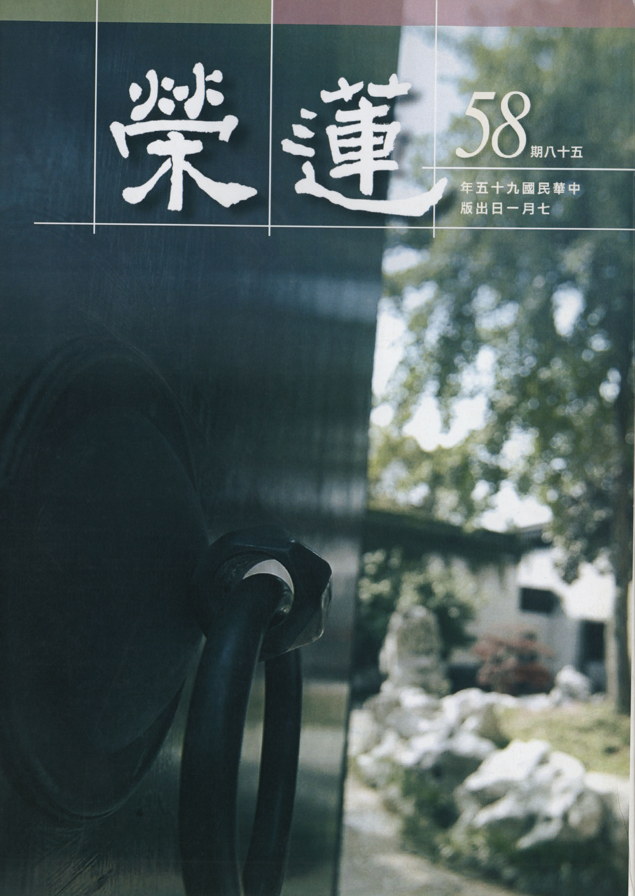

# 第58期

## 社論

### 天厚其福，天厚其禍

本刊

善惡決定有苦樂

厚福薄禍須正見

懺悔發心及念佛

往生圓成菩薩道

老子云：「天道無親，常與善人。」而 雪公老師嘗云：「天厚其福，天厚其禍」。天厚其福，即是此人修善，老天爺就加厚他。或謂因果報應，難道不是修五分善得五分福報，修五分惡，就得五分苦報？如何云老天爺加厚此福、此禍？又是如何加厚？理由何在？若能真正了解天厚其福，天厚其禍，才真正懂得因果報應的道理。

首先，何為加厚？加厚如同利息般！這利息有時候比本金還要多上十倍、百倍、千倍，如投資理財者利用少許的本金能賺上鉅額的財富，此即是加厚之喻。

舉天厚其禍為例，殺一隻像螞蟻般微小生物若不知懺悔，這樣的殺心相續了三百多天，其罪就等同殺人，此即天厚其禍。又如偷盜兩百六十元，內心不覺得有何大不了，或許來世成為北京烤鴨吊在市場賣，售價兩百六十元，此即罪業增長廣大之行相！又，以前有位修行人，每每打坐時，就有一座鹽山出現在他面前，後來反省才想到以前私自向人拿了一包鹽，經過了若干年欠了一座鹽山的債，此即是天厚其禍。

又如天厚其福，如在娑婆世界好好修行幾年，結果卻在天堂享受一生，若以他化自在天而論，可以享受一萬六千歲（一晝夜是人間一千六百年）；或修學色界禪定，不過短短幾年，壽盡之後升到色界天，享受幾萬大劫的快樂，此即是天厚其福。如果念佛往生西方，這福報之加厚該如何算？或許修念佛法門不過幾十年，往生西方極樂世界後，卻享受無量無邊阿僧祇劫的福報，此即是天厚其福。世間會炒作財富的，即使百倍、千倍的增加財富，也難比天厚其福於萬一，何必羨慕那世間短暫的安樂。

但是在什麼情況下才會發生天厚其福（其禍）？天厚其福（其禍）這件事是如何發生的？果報又為何會加厚？

一者、在通達因果正見上斷惡修善，即是天厚其福之行相；若以撥無因果的方式造惡就是天厚其禍的行相。

二者、造作善業所發起心態，是有心於今生的安樂，還是來生的安樂？是解脫的安樂？還是成佛的安樂？是為了自己的安樂？還是為了眾生的安樂？

三者、獨自做或結合團體共識所造的善惡業，是被三輪體空的智慧所攝持，還是被我執所攝持？

四者、在造作善惡業的難度上來論，經上有云，在娑婆修學一天勝過極樂百年，此即是天厚其福；發菩提心造作利益有情的善業，娑婆世界是難能可貴，極樂世界則顯而易行，故二者作善的福報有如此大之差別。

經論上有云，三千大千世界的有情眾生都變成舍利弗、目連等尊者來造作善法，其果報或不如一位下品資糧道菩薩所做的善業，更何況三千大千世界的有情，不可能變成舍利弗、目連等尊者，更何況三千大千世界的有情眾生，也不可能全部造善，台灣有些慈善團體在做善，就已經非常了不起了，而全台灣的人都在做善如何？或不如一位下品資糧道的菩薩所做善業的果報，此即是天厚其福。必須佛眼方知甚深緣起，有時是不可思議到難以想像、難以相信。

所以大菩薩喜歡來到人世間度眾生，因為災難就是考驗的火，沒有考驗的火還煉不了純金，此即是天厚其福。若知此理則心樂於發大，對於正法的學習會很好樂，結合團體共造善業的知見堅固，如同釋迦牟尼佛亦結合僧團共造善法，功德遠遠勝過獨自成辦。對於外境嚴格的考驗，都會心生歡喜，因為這些考驗都是天厚其福。

當今之世是亂世，雖是受苦的環境，但亦是天厚其福的時機，莫將時間做無謂的浪費，福報能百倍千倍的增長廣大，倘若能夠好好把握的話，娑婆修學一天勝過極樂百年，此即是天厚其福。

反之，天厚其禍亦是如此，若只重視眼前的安樂、個人的安樂，在撥無因果下追逐個人的慾望，講究私利、講究速成、講究權謀，那怕眼前只是做一件小惡事，痛苦的果報都難以想像，可能成熟在地獄幾千大劫，但正在造惡的人卻不相信將來果報的可怕！唯有觀察到如此程度，才許可對因果真正通達。

又，福與慧是相互觀待的，舉例而言，二乘人的空性智慧是在他慈悲喜捨心意當中才能發起，沒有觀待慈悲喜捨的福，生不出空性的智慧，二乘人若不必觀待慈悲喜捨而發起空性的智慧，是一粒微塵都找不到的事情。其次福亦觀待慧才能生起，若福不必觀待慧就能生起，則佛說各種做善法的動機、意樂、發願、知見應成無用。

若不必觀待福就可以生起慧，那二乘人不必觀待慈悲喜捨的心就可以生起現證空性的慧，菩薩不必觀待菩提心就可以生起破所知障的智慧，那麼二乘人不必發起菩提心就可以破所知障，那又何必要發菩提心？是故未發菩提心之空性慧無足以破所知障，所以慧要靠福才能真正生起，福亦要靠慧才能增長廣大，所以善根和福德是相互觀待的，對著善根才能生起福報，對著福報才能引發善根，因為這兩者是互相依靠的。

所以吾等若不好好研究經教，而自稱自己是修福之人，是極為錯謬的愚癡者，天厚其福在此人身上是不可能發生的。現在不說聖賢之道，不鼓勵大家共造善法，所得到的利息其實是微不足道，應知世俗知見作善所得的世間福只是蠅頭小利。

大家為何對讀聖賢書不痛不癢？因為沒看到利害關係，手上的股票能不能脫手是利害關係，大學能不能畢業是利害關係，考試會不會被當是利害關係，事實上，這些都不是利害關係。孔子周遊列國，沒有得到一官半職，但這些都不是孔子的在意處，孔子的在意處，關鍵在是否能推展道。

但我們現在的教育，卻都在教導子弟天厚其禍，推他到地獄去，還怕推不到底，還怕他待不夠久，努力的教導追逐世間慾望的方法，努力的教導學生自私自利，努力的教導學子們摒棄聖賢、揚棄傳統，這樣的人若還得到福報，那真是天厚其禍，要讓一個人敗亡，這種敗法是最可怕的，就是在造惡業當中享受的都是福報，這種人下場到地獄都是最慘的，這就是天厚其禍。當以為佔便宜是享福的邪風氣成為國家的主流時，這個國家也不會吉祥。

若吾等真懂得天厚其福，天厚其禍的道理時，心量會放得廣，學問會竭力的充實，心思細膩，為人忠厚，不論遇到什麼障礙，皆如 雪公老師所云：歡迎困難。

## 大德法語

### 大方廣圓覺修多羅了義經（十八）

道源老和尚

大乘發心求圓覺

能令末世離邪見

知幻即離無漸次

中下根得漸次修

欲界眾生的煩惱是貪瞋癡具足，上二界沒有瞋恨心，雖有貪煩惱但很輕微，他只貪愛四禪八定，對於欲界的五欲六塵則不貪，亦有愚痴，因不知道四禪八定之體性不可得而執著；即使證得四果超出三界已破了人我執，然還有法執煩惱；菩薩在三賢位的階段雖已降伏我執，仍還有法執煩惱，到了等覺菩薩（菩薩之究竟），此時還有生相無明乃是最微細法我執，是無始劫來的習氣，所以釋迦如來示現在菩提樹下發大願，若不成正覺寧可坐死在這裏，加功用行了七天七夜才斷掉了生相無明。

斷了生相無明證得離念，起信論云：離念相就是證得法界性了，法界性遍十方。楞嚴經上有兩句「知見無見，斯即涅槃」，圓覺妙性人人本具，具足大智慧光明，能遍照法界，不是你修出來的，法爾如是。然無始來為無明所擾，起信論上將凡夫無明受苦相分為九（三細六麤），最初是三個細相：無明業相、能見相，境界相。你不要以為佛法太高深難懂，你只要研究得透徹，講得明白，沒有聽不懂的，聽不懂就是你在那兒窮瞌睡，你在那兒打妄想（動了貪、瞋、癡的妄念）。

若內心生起正知正見，是否還是妄念？若還有個入理相，猶具能念所念，未能無念（能所雙亡）有念就是眾生，無念才是如來（無知見故），等覺菩薩還是眾生，到了清淨圓覺（佛）是一念不生，一念不生可不是無，而是在能所雙亡的境界中不起定，顯現名言的世間。

己二、為酬次請

經文：

「是則名為因地法行，菩薩因此於大乘中，發清淨心。末世眾生，依此修行，不墮邪見。」

再答覆文殊，一切如來在本因地中所修行的行門，亦即隨順清淨圓覺，才能成佛，所以諸位同學你要慶幸你自己，你種的有大乘善根，而且是圓覺善根才能聽到起信論，才能聽到圓覺經啊！不然啊！盲修瞎練……。我(道公)出家五、六十年了，到了台灣也已三十年了，學佛風氣不普遍，也不懂得佛理，修行叫「呷菜」，甚至是寺裡「呷苦菜」，這我還是頭一次聽到，什麼叫呷苦菜？

他來了寺院拜佛，練就瞌頭的功夫，他只「呷蕃薯」不「呷飯」，也不吃饅頭，白菜、豆腐、油也不吃，只吃「蕃薯」，你說苦不苦呢？這叫呷苦菜，哎呀！真苦啊！能不能苦出個佛出來呢？吃蕃薯是不是成佛的正因？要是吃蕃薯能吃出個佛出來，那麼這成佛太容易了嘛！大家都「呷苦菜」、「呷蕃薯」、「呷雞絲麵」成了佛了，很容易嘛！結果是無義的苦行，受了這些苦一點利益也得不到，怎麼能成佛呢？你得隨順清淨圓覺，遠離一切相(所)、一切念(能)，能所雙亡有此修行的知見，才是成佛的正因。

「菩薩因此於大乘中，發清淨心。末世眾生，依此修行，不墮邪見。」還是答覆文殊菩薩的問題，你問如來的因地法行，前邊所講的這些道理就是如來因地法行，你們當菩薩的要於大乘中發清淨心，亦即隨順清淨圓覺，不須執著有，不須執著無，才不落入修大乘的病相，才能證得清淨圓覺，謂之圓照清淨覺相。若能依圓覺經裡佛回答文殊的正見而修，才不落於邪見。

戊二、偈誦

己一、標頌

經文：

「爾時世尊，欲重宣此義，而說偈言。」

長行講完再講偈頌，偈頌是十二分教之一，有兩種型式，一是孤起頌：就是不頌長行文，單獨的偈頌。二是重頌：重頌長行文的偈頌，為什麼要重頌長行文呢？一般言，有二義：一是應機故，眾生根機不一樣，有人歡喜長行文，有人歡喜偈頌文，就像有人歡喜作文章，有人歡喜作詩，偈頌等於作詩，因各人的性格不一樣、根機不一樣，而有一類有情喜以少文攝多義，認為受持長行文太多，偈頌文簡單，而且句子整齊，五個字一句或七個字一句，容易攝持長行文的義理，方便讀誦與記憶；第二是能令後來人再聽一遍，如來講經時，後來有些人來聽，如來是不捨一個眾生啊！所以將剛才講過的道理，再重複一遍，為了使聽過的人不要厭煩，所以變一個方式，說個偈頌給你聽聽。

但在圓覺經只能講前一種，為什麼呢？佛是在示現清淨淨土裡說法，十萬大菩薩通通來了，後面沒有再來的，如來是入了三昧說法，菩薩也是入了三昧來聽法，說完了、聽完了、圓覺經也講完了，大家都出了三昧，沒有再來的菩薩，所以說偈頌是應菩薩機及易攝持長行文。

己二、正頌

庚一、頌酬初請

辛一、頌正因有力

經文：

「文殊汝當知。一切諸如來，從於本因地，皆以智慧覺。」

辛二、頌執妄成輪

壬一、頌執所成輪

經文：

「了達於無明，知彼如空華，即能免流轉。」

壬二、頌執能成輪

經文：

「又如夢中人，醒時不可得。」

佛在此稱一聲當機者文殊啊！你(文殊)應當知道，其實佛是要我們應當知道。你問一切如來的本起因地的法行？一切諸佛如來沒有兩個樣子，佛佛道同，他們的本因地就是根本最初發心，通通沒有兩樣，皆是以智慧覺，了達於無明；在因地中將無明的行相認識明白，因為無明是染法的根本，所以諸佛最初本因地上還是先起正知正見，了達無明，方能去除無明。

「知彼如空華，即能免流轉。」眾生輪轉生死是個大苦，然不知道一切法如空華，現在你依了正知正慧、了達於無明，由無明生出來一切法都是空中華，無明本體沒有(了不可得)，無明（實有的執著）所執著出來的法那裡是實有的？例如夢心（無明），由夢心而生出來的夢境（世間一切法），那有實在的？你了達一切法如同虛空華，對一切不起執著則不造業，不造業又怎麼會輪轉生死且受種種苦報？在輪迴（做夢時）這一切法明明是有且有各種的用，實際上是你的無明心在那裡用事，等於你在做夢時，夢中的一切都實實在在有的，等你醒的時候，可得微塵許的法否？不可得！然現在未斷無明，為無明所轉，見一切法（人事物）都有，一樣也空不掉，可是將無明斷除時，則見一切法皆空，本來都是空華相，如同做夢一般，在夢中顯現是有的，醒來時卻了不可得，究竟不可得。（下期待續）

### 由三十七道品觀孔子境界（上）子曰吾十有五章發揮

雪廬老人

儒佛原來無二致

拘墟之士門戶見

放眼千秋萬世利

合之則美分則傷

緣起

為令聖教弘傳，為令 雪廬老人的思想精神得以延續，本刊將陸續整理刊登夫子弘法研學的法語資料以饗大眾，首先刊登「由三十七道品觀孔子境界」一文。

此文為 雪廬夫子於九十五歲時為論語班弟子發揮為政第二篇子曰吾十有五章之義理，讀來能知儒佛義理相通，門戶之見是因無知後學方有，若能破除門戶之見，能令文化發揚光大，國家強盛。（編者）

◎子曰：「吾十有五而志于學，三十而立，四十而不惑，五十而知天命，六十而耳順，七十而從心所欲，不踰矩。」

各位同學，今天先跟各位說兩句閑話，但絕不是廢話，很重要！人要把眼光放遠一點，孔聖人說過：人無遠慮必有近憂。要不能往遠處看而光看眼前，後來的災害不說，眼前你都不保。

咱們除了學孔子，還學佛；佛說的更不得了，佛所說的話藏的意思多一點，譬如說：「放下屠刀立地成佛」這句話很好，是比方話，成佛容易但得把殺生那個刀放下，當時就可以成佛，這話比孔子的話更有味道。然而誰放得下呢？沒有一個放得下！放下就好了，若屠刀放不下，終日造業，將來不得了。咱們大家是多少年的朋友了，我這講經的也有九十五歲，諸位聽著，我九十五歲怎麼樣呢？你們諸位不曉得！從前的人都懂，九十多歲就不能動了，照例會糊塗，你們不相信，只要活到九十幾就明白了，明白了則後悔晚矣！你們要預備將來佛在眼前，若眼前沒有佛，後來則不免流入三途，把這話說到此為止。

原來咱們學佛又學孔子，道有深淺之別，嚴格說不是道有深淺，而是「入」的有深有淺，「說」的有深有淺。佛學發源在印度，卻大不行，因世間法講得少，出世間法講得多。有云：「佛法在世間，不離世間覺。」世間法站不住，還講什麼出世間法？這是印度佛學的困難處。中國雖有世間法，好是好，可惜到了漢、魏就變質了。這要從秦始皇焚書坑儒說起，焚書中惟曆書不燒，且殺了許多儒生，除了曆律書外，其他都講不下去了，後來文化就慢慢變質了，怎麼變質法？一直到了漢、魏、晉時出了參同契這本書，此書講道經的煉丹。何謂參同契？彼不反對佛，也不反對儒，將三家（釋儒道）融合，內文是由易經上的話摘錄下來，且經過改變，那當然就變質了。

雖變了質，往下學的人很多，這還罷了，還為時不晚；到了宋家又起一大變化，其實在唐家韓愈時就主張改經，他的注子諸位看看，他認為前人寫的不對，就改之，開了改經之端，這是大毛病。不知道的可以缺疑，待後來發現！到了後來宋家程朱更大肆改書，連孔聖人弟子他都看不起。之後漢儒、宋儒之注互打官司，你說我注的不對，我說你注的不對，到底是那一個說得對？如論語集釋收攝了六百多家注子，我（雪公）每一句都看，也有對的，然不對的居多數，為什麼？我說個道理大家聽聽，大家注的都是文章，但「夫子之文章可得而聞也，然夫子之性與天道，不可得而聞也。」他們這些注解者沒有夫子之性與天道，此大毛病。

須知求的是道，孔子：「道也者不可須臾離也，可離非道也。」又說：「朝聞道，夕死可也！」「道」是這麼重要，講的卻很少，一講道、性若牽涉到佛家，就被宋儒認為是異端，這些都是外行話。後來注書的以經注經，免得被攻擊受擾亂，按著五經，把經上有則注在此經，沒有就不注了，這往後就不用談了，那就是道很難聞了。

至於佛家呢？文字是其次，凡是學佛的人必得先修行，先修行有所得後注書，所以打官司的少，現在才打官司，現在不論中國文打官司（有些流氓也寫文章），至於洋文就不能看了。

雖然國家也有四庫全書，但全是文言，你已學些雜七雜八，這些書怎麼會看懂，所以現在要讀書就難了。

你學儒學才知佛學的重要，懂得佛學才知孔子之道與佛道一樣，儒佛合一。雖然如此，我也不敢注解，今天對論語這章所講的注解，要是寫出來，許多人會認為是異端，非正道！我先以佛家講這章，你們諸位要是真懂得佛家，孔子的書你就可以明瞭，光講孔子的書你們是聽不懂。然即使我今天講佛家，大家大概也不懂，為什麼？大家對佛法還是弄不明白，這是不客氣的話。
末法眾生鬥爭堅固，一個提倡愛，一個提倡消業往生，這是滿嘴胡說八道，連中國字都不認得。然外行人看不出問題來，所以報上成天你罵我，我罵你，或
**問：** 你怎麼一句話也不說？我說那一句話他們也不懂；或
**問：** 你說的話可靠否？我說的話經典都擺著，清清楚楚，他瞪著兩個眼也看不出來，那有什麼法子。

我今天講的諸位可以查查，那一句話沒有，下次見到我打耳光，我甘願，免得入無間地獄。所謂但得不招無間業，莫謗如來正法輪。

講論語這章是先講佛法，之後再三言五句說說孔子，你看對不對。先說我們為何生在娑婆世界受六道輪迴之苦，這句話很重要，娑婆世界（六道輪迴）又叫五住地，五是全數，中國易經：天數五、地數五、人數五。人的外頭是五官，裡頭是五藏，「五」字多重要，大家有否重視？

四念住與五住之「住」，寫法雖一卻有兩個講法，五住之「住」乃住在這裡出不來，四念住的住當停住講。五住地之住乃被按在這裏不動，而四念住之住乃停住活動，令心不往外跑，停在四件事上。五住地之「地」乃地方、地域，有五處將你按在那裏走不出。五住地到底是什麼行相？大家能說出來否？說不出來，一塌糊塗。

佛教徒在娑婆世界六道輪迴中思欲出離，因五住地之故而不能出離，實則五住地乃心中所造，永嘉大師有：「夢裡明明有六趣，覺後空空無大千」，因有五住地（煩惱），就有六趣，故此六趣亦心中所造，輪迴不能埋怨別人，因迷惑而造業，由造業而受苦，斷了惑就能出離六趣！大家聽明白，「惑」的講法也有不同，惑又叫煩惱，你有了迷惑就造業，造了業一切不得自由，不得自由又生起煩惱。

煩惱分兩種：一種是根本煩惱（無明），如一棵樹之樹根，乃煩惱之根本；二是枝末無明，如樹根長出樹枝、樹葉；枝末無明是輪迴三界的見思惑。先把見惑說說，是佛學名詞，稱為利使，思惑是鈍使。見惑是見解的錯誤，你的見解錯了，錯了就要倒楣，譬如犯了罪（犯法），刑警就找你麻煩，驅使你去受苦。見惑何以謂之利使，什麼是利使？利是能力大，如刑警隊明察秋毫，你有了見惑就很快受罰。至於思惑是鈍使，鈍是癡笨一些。如刑警隊不大明察，癡笨一點，當時你或可逃脫。

三界內惑有五種（五住地），先斷三界見思惑，證了羅漢果，其次第是須陀洹（入流）、斯陀含（一來）、阿那含（不來）、阿羅漢，斷了三界見惑就算是入流，算是入了聖門的佛教徒。證得入流可以在三界內一步步往前走，不會退轉，能脫離六道，以上是普通法門。若是修淨土的，要是斷了見惑，往生西方，品位將可高增。不論修大乘、小乘，欲證得三乘果（聖）位第一步都是斷見惑。

第二關是斷思惑（斷欲去愛），欲界六層天飲食起居很享受，使他愛著於享受，使他不出來；色界雖無男女飲食，但還有形色，色界天人貪愛這個殊勝的形色，黏著色境出不來；無色界雖形色也無，然還有愛，謂之有愛。「有」如何說？還有生死，愛生怕死，畏懼生死這就不行了，在三界裏被愛繫縛著，所謂若見、思惑都斷了，就證得了四果羅漢，雖出了三界，但還有塵沙惑與根本無明。

以上是五住煩惱，佛法也是分五乘佛法（人、天、聲聞、緣覺、菩薩），人天（凡夫）、聲聞（究竟為羅漢果）、緣覺（證了羅漢果還有見思習氣，到了緣覺斷了見思習氣）斷了習氣，再往上就可以學習菩薩行。

以上是五乘佛法，要論真正解脫是三乘解脫，人、天則不成為解脫，然大家聽華嚴經講解脫，也是五，這一切皆是五，真正解脫亦分五：聲聞、緣覺、菩薩；菩薩又分為兩種：地前、地後，菩薩最高等級為等覺，解脫到了等覺就不錯了，但還沒有究竟，究竟就是佛，這也是五乘（聲、緣、權、實、佛），謂之五乘證果。

你們諸位修淨土，我才再講，淨土是幾土安養？淨土是九界安養，然是幾土安養？（有說四土安養與我說的不一樣），你們若認為四土安養與我這「五」就不合了，所以是五土安養！五土安養有何根據？當然有根據，沒根據是我在造謠言。四土安養之外再加上邊地，所以是五土安養。若生在邊地須十二大劫花才開。

其次是三十七道品，凡是學佛的，沒有不學三十七道品，念彌陀經修淨土也要懂三十七道品。為什麼？眾鳥演法，其音演唱五根、五力、七菩提分、八聖道分，如是等法。「等法」還包括四念住、四正斷、四神足。

三十七道品謂之菩提分法，所謂道品，即是成佛的道次第，菩提則是自覺覺他，然此三十七道品不論小乘、大乘都得學，講了三十七道品就可講孔子，即能以三十七道品觀孔子的境界。（下期待續）

## 蓮池海會

### 劉徐滿時老居士往生見聞記

*編輯部整理*

敦倫盡分遵傳統

呵護子孫阿嬤情

病苦折磨生信心

助念生西家受益

劉徐滿時老居士生於民國二十八年十月二十八日，東勢昆山人，秉持客家良好傳統美德，勤儉持家，努力認真，任勞任怨，永遠沒有聽過她叫累叫苦，透過介紹識得劉序先生，並結為連理。雖戲言當初因為家中長輩說嫁給此人，有田不怕沒得吃，但卻忘記了田地多得會做死！但老居士一生仍舊天還沒亮就起床耕田，田裡不管颳風、下大雨，沒有公休日，永遠也做不完、做不停。

下嫁務農家庭，又是做媳婦，什麼都比別人慢，成了家才開始學習種田，太慢生小孩，所以小孩比別人小。但對待公婆，遵守古禮，孝順傳承，因為家中長輩受日本教育，所以要準時上桌開飯，準時看電視，看那一台都是公公指定，飯後要端洗腳水。從未見過她回嘴過，公公生氣時即下跪受罵，這種孝順方式，現代人做不到，這樣的媳婦也找不到了。子女們當時看了很為媽媽叫屈，但是年長之後，即懂了這是老居士孝順公婆的心意。老居士雖然只有念到小學五年級，可是在子女們眼中，永遠都是是第一名。

家中是以務農為生，然稻子在收割期遇上颱風時，稻米全發芽了，所有努力都泡湯，沒有收成就就沒有現金可生活，嗷嗷待哺的三子一女怎麼辦？於是老居士就多找了一份鞋廠工作做，白天耕種晚上還在家裡做穿網球拍的副業。

拼命的她永遠是全家最早起床，最晚上床睡覺，無怨無悔的把小孩養大成人，成家立業，這畢生的辛勞只有她四個子女才能體會。一輩子不懂說愛的她，只會用行動來表達對家庭的愛，那就是努力做、努力賺錢，做不停、做不累，這是對老居士最貼切的形容詞。

老居士在六年前發現罹患鼻咽癌初期，在林口長庚醫院接受電療，過程之痛苦無人能體會，當天檢查時即拔掉了十三顆牙齒，而勇敢的她，卻說不痛，旁人光看眼淚都流不停！她外相上是勇敢的與病魔對抗，心靈則寄托在阿彌陀佛這句佛號上。手中總是離不開師姐送她一條一０八粒的佛珠，即使須台北豐原兩頭探望子女，佛珠也形影不離，在老居士心中，阿彌陀佛具有極大的威神力。除此之外，老居士也定時與大眾共修念佛，並隨緣參加放生及慈善的善法，並以自己的零用錢幫子女做善事。

而老居士的子女，雖無法理解老居士用什麼特殊的方式教育他們，使得他們和諧團結，但老居士常提醒子女們，他是你哥哥，他是你弟弟，她是你姐姐，她是你妹妹，就這樣沒有大道理，但卻讓兒女直至成家立業後，感情依舊如同兒時般。而老居士一生的含苦忍勞，是子女們學習的榜樣，面對長輩，一定尊敬不頂嘴。平時省吃儉用，生活過得非常簡單不浪費，能吃的就不能丟，這些惜福的觀念根深柢固的影響著子女。

老居士畢生對佛菩薩虔誠恭敬，雖只會念阿彌陀佛，卻真正受到佛菩薩的慈悲加被，例如醫生在半年前就已經放棄她了，但老居士仍舊神奇的多活了半年。抗病第七年終抵不過病魔，老居士在民國九十五年六月六日七點左右，安詳地在家屬及蓮友的十五小時助念佛號聲中往生西方，全身柔軟，面容含笑，兒孫圍繞其旁不忍離去，且一一親自為老居士淨身更衣，令在場蓮友感動莫名。

老居士一家，謹遵佛制，於七七日內為老居士舉辦放生法會，並誠意誦經念佛吃素，誦念因果圖鑑等，作為老居士蓮品高昇的資糧。祈願老居士早日花開見佛，悟無生忍，回入娑婆，廣度群蒙。

## 啟蒙園地

### 十四講表（二十五）

傳瑛

善惡之別須正見

斷惡修善世間樂

入定修觀證無我

破煩惱名真淨意

上次講過戒、定、慧三學是佛法的本體，現在介紹佛法大意，也就是佛法的作用，為一切諸佛通行的教化。概括的說，就是「諸惡莫作，眾善奉行，自淨其意」。

「諸惡莫作，眾善奉行」是人格確立的基礎。但大家知道什麼是「善」？什麼是「惡」？凡是對眾生有利，而且不僅眼前有利，還須對未來長遠影響也有利者，才是善。反之，凡對眾生眼前及未來均不利者，皆是惡。坦白說，真正能無誤的分別善、惡的人，只有具慧的聖者。一般凡夫目光如豆，遇事只知著重自己眼前利益，因而常做「刀頭舐蜜」的事，遑論還能審辨善惡。但對學佛之人則不然，審辨善惡是學佛的基本功，然要如何審辨呢？可從因果道理思惟起，凡不利人者，那包準是惡事，因即使眼前看似自己獲利，但做損人缺德之事，終將由自己承受苦果。

在南部地區有個菜市場，有甲、乙二家豆腐店對面做生意。我們知道豆腐是由黃豆磨製而成，雖然很好吃，但容易酸掉。甲家豆腐店就是這樣，當天店內沒有賣完的豆腐就開始發酸，不能賣了，但乙家豆腐保留一、二天看起來還是很新鮮，仍舊繼續賣。可是乙家的老闆發現，雖然他賺的錢比甲家多，可是他自己所賺的錢常常因小孩生病或其他臨時事故就把錢花光了，家裏過得並不安寧。
有一天，有人介紹他去拜訪一位師父，他很納悶地問師父家裏遭遇的問題，師父說：「你賣的東西裡頭放了什麼你知道嗎？」乙家的老闆說：「我知道呀！」師父說：「你放防腐劑對人體好嗎？」乙家的老闆說：「不好！」師父又
**問：** 「你做的這些豆腐你自己吃不吃呢？」乙家的老闆說：「我另外做沒有防腐劑的，自己吃。」師父說：「你為了自己得利而害了別人，現在得到苦果了，今後你知道該怎麼做了吧！」師父的一頓喝斥，乙家的老闆宛如當頭棒喝，回去後，他再也不敢放防腐劑了！

凡事只要妨害眾生，無論大小，都不可去做；但只要是利益眾生，事無大小，皆當為之。這也符合儒家所說：勿以善小而不為，勿以惡小而為之。因為事雖小，但其居心則有君子與小人之別，因此我們為人處世，不能不慎啊！

最後說到「自淨其意」，就是要使意業清淨無染。其實，當我們不與煩惱相應時，意念最清淨。我們為什麼會與煩惱相應呢？當我們看到有人向狗丟一根木棒時，狗即努力地追，將那根棒子銜回來，可是，狗與木棒有什麼關係呢？我們有時有些動作就跟狗追木棒一樣，實在很可笑。觀察自己，是否我們意念常常尋伺著別人對「我」的一個眼神、一句話或是一個動作，他人的一個眼神、一句話或是一個動作，不論是稱讚或詆毀，我們心念都隨之起舞，不是起貪慢、就是起瞋癡的煩惱，此時意業就不清淨了。

事實上，真有這個「我」的自性存在嗎？現在的我只是過去因緣和合，暫時存在，假名為我，但眾生無知，卻整日為這個自以為真實的「我」籌謀算計，自私自利，廣造惡業，終而自食惡果，受苦輪迴不已。就佛法所追求的真理而言，不僅「我」無自性，萬法均無自性，當眾生瞭解此理，進而修學止觀，方能以定、慧之果破除種種煩惱的染著。

「諸惡莫作，眾善奉行」只要眾生防非止惡、積極為善，這與「戒」的意旨相符。而禪定能使八風吹不動，正是清淨意業的功夫，最後了達「法無自性」的智慧則是清淨意業的效果。所以佛法的本體與作用，恰可互相配合，涅槃經云：「諸惡莫作，眾善奉行，自淨其意，是諸佛教」，正是闡明這個道理。

古時，唐香山居士曾參訪鳥窠禪師，請問佛法大意，禪師答道：「諸惡莫作，眾善奉行。」香山居士笑說：「這二句話啊，三歲小孩都會說！」禪師喝斥他說：「三歲小孩雖能說，但八十歲的老翁未必做的到！」想想我們，是否也如禪師所喝斥的一樣？（下期待續）

### 唐詩賞析迴響篇　還六月返班詩

傳緒

一字推敲不易得

兩句三年吟方有

後人難體詩中義

藏諸名山待後賢

閑讀佛光高僧全集第廿四集，華枝春滿、天心月圓〜「弘一大師傳」，其中第六節『清空朗月白馬湖』，豐子愷述其最難忘的一件事，記大師於浙一師教授彈琴，先將授課曲目彈一遍，繼指導學子技法後，相約一週彈熟後彈奏給大師聽，名曰還琴。還琴時小錯由樂句處重彈；大錯則須自樂曲重來，一時過不了，下次再還，此一課外選修，豐先生等回憶起來，較之一切正課，還令彼等緊張。感念大師傳道之嚴謹，及老師傳法之熱誠，願效其精神，錄一己研學心得，名為還詩。

六月心靈成長班返班活動課程，其中唐詩部分由唐老師講解賈長江「三月晦日送春」及司馬溫公「客中初夏」二首，每次返班唐詩此門課，與學子一樣地渴望期待，常告誡自己孩子返班半天，其他課程精采處，暫且不提，光是唐詩課便不虛此行，二位老師透顯詩中言外之旨、詩之情趣、詩之義理，其精到之處，是他處不易聞得；因一己功夫關係，本篇小文先還賈浪仙之聽詩、讀詩心得。

論賈島之詩作，得先知其人，賈島字浪仙，范陽人。生於唐代宗大曆十四年（西元七七九年），卒於唐武宗會昌五年（西元八四五年），享年六十五，與孟郊並列為中唐苦吟詩人代表，孟郊長賈島廿八歲，二人關係亦師亦友，韓文公曾言「孟郊死葬北邙山，日月風雲頓覺悶，天恐文章渾斷絕，再生賈島在人間。」意味二者薪傳之關係，而東坡評二人詩為「郊寒島瘦」，乃就詩風而論，東坡此論，自此而後於詩史便定調。

「瘦」字以書評角度而觀，係正向之批評，瘦、瘦硬也，遒勁有骨力，古來書家書作獲此瘦字評語，不乏其人。試取一例說明，宋‧宣和書譜論歐書「險勁瘦硬，自成一家」；明陳繼儒‧眉公全集評歐之九成宮醴泉銘：「若深山至人，瘦硬清寒，而神氣充腴」。「瘦」字亦適用於詩評，清‧劉熙載藝概之詩概言「宋江西名家學杜，幾於瘦硬通神」，由是得知「島瘦」顯見東坡是稱許的。

「三月晦日送春」詩題與坊間版本為「三月晦日送劉評事」相異，詩題攸關詩句之解讀，尤其本詩第三句「共君今夜不須睡」，老師特別提出「君」，由第二句「風光別我苦吟身」，明顯看出乃指「風光」，非關三身（你我他）指稱詞，而有如此差異，或係詩題傳抄所造成，一般人解為「你」所據詩題為後者。然取捨之抉擇力，足見讀詩解詩人之功力與見解；若作指稱詞之解釋，二、三句似有矛盾，何故？第二句用「我」便不當，二人宜用複詞；縱使尋得單字複詞，除非劉評事也是苦吟者，方為允當；不若「君」解為「風光」，來得恰當，如是詩句既順又開啟第四句「未到曉鐘猶是春」，擬人化之風光亦與作者戀春神也，「送春」二字較之「送劉評事」來得更切題，倘從後者第二句「風光別我苦吟身」及第四句「未到曉鐘猶是春」就不扣題啦。

賈島之創作態度，令人激賞，第二句中「苦吟身」道盡其畢生對詩創作慎重的精神，雖受唐代大環境以詩取士之影響，誠專業詩人先驅；其另一首詩送無可上人「圭峰霽色新，送此草堂人，麈尾同離寺，蛩鳴暫別親。獨行潭底影，數息樹邊身，終有煙霞約，天台作近鄰」，其中頸聯自注「兩年三句得，一吟雙淚流，知音如不賞，歸臥故山秋」，可資為證。

此聯堪稱警秀，卻遭後世不明佛理之士人所譏，如宋人魏泰詆曰：「不知此二句有何難道？至於三年始成，而一吟淚下也」，輕率論斷，自暴己短而已；賈島若地下有知，定要起而抗議；另今人有譯為「你獨個兒登上漫長的旅途，只有潭底的身影、歇息的大樹和你作伴。」此譯注者尚且是能手，尚譯得如是不貼切，慨歎詩人意旨，千年莫明。

幸遇千古知音 雪廬太先生，指出箇中真意，認為此聯非如古之詩家所言侷於聲律，而是難在用典，難於意造，亦即五、六兩句是典對典。並列舉出唐詩中與僧寺有關，並出現「潭」字，如摩詰居士過香積寺「薄暮空潭曲」、常建題破山寺後禪院「潭影空人心」等，推斷用的是華嚴疏教起十因其三之典故，文云「其猶上有白月，下資澄潭，潭清影現，機感應生」，數息二解；其一，行已不只一日，故數夜休息，樹邊身是無可上人夜息之處，是句專指僧且是行者；其二，獨行者乃獨自經行示動態，數息係數息觀見靜態，一動一靜交織而成，余從後者。

獨行潭底影，令人勾起聖者林邊水下長養聖胎，而獨修不易也，是引眾共修之礎石，亦如藏教行者，是通、別、圓教行者之初階也。此聯如同一幅淡遠之水墨畫，妙不可言，無怪乎「知音如不賞，歸臥故山秋」，以待後之來者。

苦吟二字有深意，面對盛唐詩大家、巨匠、巧手，超邁在前，已難並駕，另闢途徑在所不免，人窮詩乃工，遂步趨其師韓退之、張籍、孟東野之後，開拓出狂放清苦高閑古淡的詩風，但見一位孜孜矻矻，為詩及為情而作詩的癡漢，忘懷貧富，以詩慰藉身心，何怪之有？一般評論家謂東野、浪仙為怪人、怪物，此類譏諷，頗不足取。

東野詩未多加瀏覽，至若浪仙遠流中國歷代詩人選集「孟郊賈島詩選」，其中選浪仙四十七首，逐首朗讀，依稀不見怪詩怪句，人品即詩品，倘依歷代所記述片言隻語，指出其「怪」之果，卻未著墨「怪」之因，且就詩風莫說完全呈現「怪」之風格，就一己所看只是微乎其微，以如是鱗爪之詞句，便論斷其怪，真是怪哉？亦使人品即詩品失卻準確性；二人生活一生貧苦，終其一生東野死於途，賴朋友之資方完葬，而賈島家無一錢，唯病驢古琴而已，後人乃因又推論出其苦吟詩風，誠不敢苟同，揆諸今世，更證其不是，徒歎「盡信書不如無書」？

居家近植物園，荷花池數不清走過幾回，近月霪雨，關不住散步詠日的心靈，不管雨聲淅瀝，拾起雨傘去園裡尋詩去，見雨中荷葉上珍珠累累，見平鋪盛最多。正啟迪人生道上，要打開心胸一如荷葉敞開，更需要以平等心處眾如荷之展平，收穫料必豐碩，遂興起賦詩一首次韻，題為風雨中賞荷上珍珠「雨中獨步荷池畔，枝鳥戲風親水身，愛看田田盛玉珠，寬平納受更勝春」，聊充還詩之結語。

## 禮懺法會

### 慈悲藥師寶懺法會儀軌觀修　如何修學藥師寶懺為淨土助功（五）

*編輯部整理*

懺除慧障生正見

保任善根日用行

導歸淨土速成佛

十番禮拜竟全功

九十四年十月廿九日

卷下

第八輪的禮拜

，乃作空性的觀修，這一段最重要，不僅是藉著藥師懺得世間的福報，還要得到出世間的證量，但礙於能力無法詳明。復次弟子眾等上來既懺悔已，應生無垢濁心，無怒害心，於一切有情起利益安樂，慈悲喜捨平等之心，於是斂念正觀，不斷結使，不住使海。觀一切法空如實相，不必修各種煩惱的對治法來對治那九結十使，九結十使就是一切煩惱的總稱，觀一切法自相不可得，此空性相是該法之如實相。

「云何名觀一切法空，行者諦觀，現在一心，妄心隨所緣起，如此之心為因心故，心為不因心故，為亦因心，亦不因心故，心為非因心，非不因心故。」正好是四句觀察法，法若以有、無、亦有亦無、非有非無四句觀等皆不可得，則能證得該法自相空。當下此心是因心？不是因心？是因心亦非因心？非因心非不是因心；破是因心：其自相所成的因心沒有，是需要觀待果才有因可言。（因果如果有自相，因與果是合還是分，不可說非合非分，例如鑽石在哪裡？要不就在屋內或者在屋外，不可以說非屋內非屋外。

因果如果是一，應該無法分出因和果；河流流到大海中，還可以分出是河還是海嗎？因果如果是異，表示因果是有自相的，如果有自相的兩法，可以成為因果關係的話，那麼造罪也能得福，造善也能得苦；拍桌子也能成佛，因為兩個不同的法可以成立因果，就會有說不完矛盾的情況。是故因果的自相看不到，為什麼仍可顯現因果，原來果是對著因而有果，因是對著果才能成為因，不是任何法都可成為因，必須對果方能說因；果則是能成為因的因，如果果有自相，不可以說果是因的因。）因此按照空性的推論法中，因、果的自相連一粒微塵也看不到。破是非因心：自性所成的非因心若能成立，則心之造作後無有果報，有是乎？破是因非因心：自性所成的因與非因心都不可得，則何來因與非因心，亦無有那「非因心非不因心」。

心為在三世：繼續觀察心在何處，在三世（在過去、現在、未來）？自相所成的過去心如果存在，那不必觀待現在、未來就有過去的心；若現在與過去的心無關的話，那應該不能說現在所得的快樂是過去所造的善業而成的；是故自相所成的過去心沒有，自相所成的現在心也沒有，自相所成的未來心也沒有，因此自相所成的心在三世沒看到，觀待下所顯的心在三世顯現，這是中觀宗的究竟宗義。

為在內外中間：心在內？在外？在中間？心若在內就是在根或識上，心以眼識而論，若在外則在塵上，若在內或在眼根上就有，則不必觀待色塵，能顯現眼識；若眼識如果在眼識種子上就有，則不必觀待眼根與色塵就能生起眼識看到東西，幾番推理後，知心在內不可得，心在外亦不可得，心在根與塵的中間？若是中間則是兩者（根境）的和合？還是兩者（根境）的中間？根中無識，境中無識，二者和合如何會有識？根境的中間（兩者不和合）又如何生識？覓心了不可得！證得心上的空性。

「心有何足跡？在何方所？如是等種種因緣中，求心畢竟不可得，如夢如幻，無名無相。爾時行者，尚不見心是生死，豈見心是涅槃，既不得所觀，亦不得能觀，不取不捨，不依不著，亦不住寂然。言語道斷，不可宣說。觀心無心，則罪福無主，罪福性空，則一切法皆空。心無所心，法不住法，作是懺悔，名大懺悔。」所觀的自相（境之自相）了不可得，能觀（心識）的自相又在哪裡？最後真正地懺悔是要進入空性義，誠所謂「罪從心起將心懺，心若滅時罪亦亡，心滅罪亡兩俱空，是則名為真懺悔。」此乃實相懺是究竟之懺悔。

第九輪禮拜

是攝持空性慧的善根，在日用平常行一一法時，若行若坐，若出入大小便利，灑掃洗澣，運為舉動等等，總之日用平常不要放逸，在一一法實踐中觀察其三輪體性不可得，最後如禪門的開悟。行者開始修行時往往沒沒無聞，修頭陀行，每日從事灑掃、挑水、大寮煮千人之食、洗廁所等粗重工作，行事謙卑、不好出風頭、不高談闊論，修種種福來保任善根，善根漸次發芽（長養聖胎），終有一天開花結果，必獲龍天推出，利益人天。

第七輪的觀修禮拜，就是要好好地保任善根福德。在修學過程中，要「俯仰視聽，應當一心存念三寶，觀心性空，不得於剎那頃，憶念五欲世事，生邪念心，及與外人言語議論，放逸戲笑，視色聽聲，著諸塵境，起不善業，無記煩惱雜念，不能如法修行，若果心心相續，不離實相，不惜身命，為一切眾生，行懺悔法，是名真實，一心精進，以法莊嚴。」

第十輪的禮拜

，是導歸西方極樂世界，不但依懺軌之觀修，能將往昔業障懺除，能令修行順緣顯現，並能遇善知識多聞解了法義，精持梵行，入三摩地，以無量無邊智慧方便，令諸有情，得受用物，無所乏少，善修種種諸菩薩行，速證無上正等菩提。至於臨欲命終分明安豫，決往西方無量壽佛極樂世界。八大菩薩，示其道路，於寶華中，自然化生，承佛授記，獲證無量陀羅尼門，一切功德，皆悉成就。然後分身無數，遍十方剎，於一念中，供養法界一切諸佛。於一念中，現種種神力，度脫法界一切眾生，成等正覺。虛空有盡，我願無窮。

懺悔發願已，歸命頂禮十方常住三寶。並作五部分的回向：第一、令家人身體健康、精神愉快，所從事的士農工商都是正法的事業，與正法相應，且與蓮友諸多的和合；第二、家中有往生的家眷，能除往生的障礙，八大菩薩亦示現往生道路，使順利往生；第三、國家風調雨順，即使有災難，也能將災害減到最低；第四、政治清明，能選賢舉能，創造一個正法的環境，讓大家安心辦道；第五、正法人才輩出，能令諸佛菩薩乘願再來，使得台灣成為真正修學佛法的樂邦，大家都能在樂土中修行，盡此一報身，同生極樂國，圓成佛果，廣度眾生，共證真常。（全文完）

## 日常省思

### 童言童語〜可以回首的赤子之言　家尹、甄儀、暄惠、勝安、姿云、維典、微智

家尹、甄儀、暄惠、勝安、姿云、維典、微智

可貴求學期

諸多關愛繞

若當平常看

錯失被攝受

活著真好 / 家尹

見義勇為人善良

頹廢學風向上心

污泥卻飄蓮花香

因果圖鑑滌身心

上了幾次地獄變相圖的課，我才領悟到—活著真好，了知投胎到人世間，好像是度假，之後又要回到家鄉（地獄），在地獄受苦的時間比在人間長的多多，都是因為貪瞋癡的緣故。到地獄受各種的劇苦是人世間所種的惡因，只有少數的人學習到佛法和儒家的學說，才有機會發善心，來生投生人道或往生西方，這是多難得的事。我是多麼有福報的，有緣在人間認識蓮榮及每一位老師、蓮友，這是這輩子最幸運的事，能與大家成為志同道合的好朋友是我的所願境。
雖然國小、國中的我不常參加蓮榮的活動，當時的我執迷不悟，直到爺爺往生時才知道阿彌陀佛的大慈大悲，才發現有個比賺錢、比朋友、比追求享樂還要重要的事情。在高中曾有個同學問我：「為什麼星期六，你都不跟我們出去玩？週末應該是可以玩到很晚的嘛！」我說：「我要去上課，修一個很特別，很重要的學分。」同學又
**問：** 「你才幾歲啊？有那麼急嗎？」我說：「我真的很怕來不及。」最近週六我都有去共修，才發現很多年紀比我小的同學們，他們的佛學知識、古文、詩詞比我這個鬼混九年的人多太多了，還真的想和他們說一聲「學長好！」

在六月動畫班上課時，每一位同學分享了心路成長的歷程，顯然大家來自於不同的佛化家庭，各有所學，可是學長們從小就找到了人生的方向，而我一路墮落到了高中，才找到我要的目標及想學習的知識，直到今日我才知道活著的可貴。可惜我的學校環境很差，同學沒幾個有善念的，嘴巴說出來的都不是人話，心理想的沒好事，我彷彿看到了以前的我，這是多麼悲哀的感覺啊，但是我一點也不怕，因為我有了老師點示我做人處世的觀念。老師說：「在最慘的時候，也是最容易翻身的時候。」使我充滿動力。這次有機緣瞭解了地獄，才知道學校同學們常種惡因，實在太可怕了。惡果來的時候，一定很多人怎麼死的都不知道，而以前的我也種了不少惡因，願從現在開始多做善法懺悔往昔之惡，並以種種善根走向未來，人生還有更長遠的路，更辛苦的路要走，我希望與蓮友、啟蒙班志同道合的朋友們一起走向未來。

參加動畫班的省思 / 甄儀

斷惡修善畏因果

放空自己學習他

隱惡揚善風氣厚

超越世俗立千古

「每次動畫班結束後，我都覺得很累。」這是我想先說的。

或許地獄變相圖的課程對我而言，一大部分有懺悔的作用，所以上完課後我總覺得全身虛脫，很像身心被挖了許多窟窿，當然原本佔滿這些窟窿的是缺點、不良的習性……諸如此類的東西；等待時間，有天我會用自己的力量，再將這些窟窿用美好的事物填平。因此，每次上完課的隔天，就覺得又是人生一次嶄新的開始。

暑假前的最後一次上課，透過老師與同學的問答，我覺得我好像才真正認識大家。因為蓮榮的師長與同學，對我來說，一直都是很親切又陌生的。

先說家尹，在這次上課前，我直覺得他很豪爽，誠實坦白，說一是一，有信用，有擔當，是個疼愛弟弟的好哥哥。但透過他與老師間的對話，我最佩服他兩點：一個是不受壞環境影響，另一個是不濫用父母親對他的愛。所謂壞環境的定義有很多，情形也不同，但要在壞環境中潔身自愛都是十分困難的。隨喜別人的功德很簡單，當然隨喜別人所造的惡業也很容易，在學校我有很深的感觸。常言人是群居動物，再孤僻的人有時也會覺得寂寞，我想因為家尹對正法有所體悟，才能不受外物影響，堅持自己的步伐，繼續往下走吧！

再說廷安，其實他激勵我最多，我真的很感激他。以前只知道他是小學同學，人很溫和，對音樂很有興趣。現在我知道他常幫父母做家事（聽到他從國中開始，父母就再也沒有碰過他的衣服，我心裡想：他可以我為什麼不行？同樣的十七歲，我真的有比別人更忙嗎？）而且很貼心孝順（打電話問爸爸什麼時候回來，要算準時間煮飯給爸爸吃)，對自己有興趣的事物，會主動學習，保持高度的學習動力(上網查音樂歷史、創作背景等)；而且經由老師提點我才想到：廷安的心性很溫和敦厚，與他對音樂的涉獵有關，我想這是沒耐性，脾氣又有點暴躁的我，最該學習的地方吧！

還有治鈺學長，每次參加活動總看他東忙西忙，一下在這，轉眼人又不見了，如老師所說，現在能夠實實在在，仔仔細細，心平氣和把一件事情完成的年輕人不多了，我常想：如果我去做他的工作，我一定沒辦法做的跟他一樣好；而且他能隨時發現團體的需求，一定是觀察力很好，處世經驗豐富，細心且思慮周密。

至於心安學長，是我最不知如何具體描述的一位，他有很多優點，我卻說不上來。每次看到他，總覺他眼神十分清澈明亮，雖然待人和氣，但一切事物似乎都看在眼底，清清楚楚明明白白。而且他幫了我很多忙，告訴我很多積極正確的思想觀念，我想在我高二這年裡，他是我最需要感激的人之一。

其他如洋逵，雖然外表表現自在，私底下卻很細心體貼(好像每個人都有這優點)，而且有自己的想法，不怯場，勇於表達自己；暄惠則是一直都很活潑大方，跟他在一起總覺得時間過的特別快，因為她的快樂會傳染給其他人，每次看到她跟微智在一起，就覺得即使現在天塌下來也沒有什麼遺憾。另外還有立佳、立淳、姿芸、淳惠學長，以及沒有來的微智、海辰……等，都有好多我還不知道，也應該要學習的優點。其實現在想想，我是獲益最多的人吧，因為我自己沒有什麼優點，所以能學習的部分也最多！

從心生起的決心 / 暄惠

莊嚴團體自莊嚴

未來前途難限量

人生道上有知音

遠離污濁生蓮花

這次的研討會，大家所發表的心得感想都令我感動，也覺得自己真的比一般人幸運太多。

我覺得自己是個最幸福快樂的人，很多人一直尋找快樂，可是卻漫無目標，終將徒勞而歸，最後還是渾渾噩噩的過了一生。我真的很慶幸自己出生在一個學佛的家庭，所接觸的都是正面的東西。一般人所過的吃喝玩樂生活，交的都是酒肉朋友，很難想像等到福報用盡時，又該如何是好呢？每一次想到這都為自己感到欣慰，因為那種生活，最後怎麼能受的了？

交朋友是非常重要的，自從到了蓮榮，我才知道朋友的定義原來是那麼的深奧美妙，反觀學校的同學，不懂品德修養的重要，還能一同精進嗎？我想大概只是點頭之交而已，而真正的知心朋友全都在蓮榮，在那，不用擔心遇人算計，能和志同道合的朋友一同上課，一同分享生活中美好點滴。能在每位同學身上找到許多的優點，每位都使我瞠乎其後，望塵莫及的，是值得我去好好效法的善知識。

真的很感謝微智對我的所有扶持與鼓勵，因為有妳的陪伴，才能一路上鳥語花香，很多事情單純靠自己是永遠無法達到的，但因為有志同道合朋友所推動的力量，便能讓自己一直增上，也能互相拉拔，我覺得若為真正的朋友，一定得不吝嗇的相互扶持，才能一路增長，朋友的力量很大，就像是為自己添加了一對翅膀，它能助我一臂之力，幫助我一同飛向美好的未來，找到我們所朝的目標。也因為有那麼好的同儕團體，當我陷於爛泥巴中時，能從中拉我一把，使我感動不已。這應該就是互相扶持的好處！

大家都在成長，課業壓力雖然變重，但這也是人生中的一門課題，一段過程。只要越忙便覺得時間越短暫，但還是得把握光陰，好好學習，因為學習才是一切根本。我們必須從佛法中學習人生，學習生活態度，把所學的應用在生活中。現在社會亂象這麼多，其實問題都出在教育。未來掌握在我們手中，身為蓮榮子弟的我們，有能力求得圓滿，我們必須做為其他新進同學的榜樣，犯了過我們願意接受較重的處罰，不怕後進子弟不肯學，不肯做。師友們是我們學習的目標，要向您們看齊，好好把無盡燈傳下去，放心交給我們吧！

畢業感言 / 勝安

小學人生基礎期

多學多看海綿吸

可貴蒙養聖人學

前途無量可預期

低年級的我是個小賴皮鬼，記得小學二年級時，我厭倦同樣的生字寫得那麼多遍，所以天天和媽媽鬧脾氣，後來經過媽媽和廖老師的討論後，決定讓我的功課比別的小朋友少一些，但是我必須把多餘的時間拿來讀課外書，現在回想起來，覺得那時候的自己好霸道喔！但是我好感謝當時廖老師能了解我，並且用耐心來包容我，我才能快快樂樂過完我懵懂的日子。

在我中年級的生活中，我很幸運地又遇上一個很棒的辜老師，老師在我求學的階段中給我相當多的課外知識，從課堂中，我除了得到書本上的學問以外，老師也會跟我們分享他的旅遊經驗以及他的所見所聞！使我在這階段過得很充實。

最後就要來談談自己最讓老師和爸媽頭疼的高年級生涯，在這個階段裡，我碰上全學年級最兇的老師，郭老師的數學和國語能力很好，可以提升我雙方面的能力，而且郭老師的體育也很強，透過他的訓練，使我的運動細胞更加活潑了。

在小學六年中，我從可愛的小男生，逐漸變成鬱鬱寡歡的大男孩，我期待長大，又怕長大，媽媽說我的童年快要結束了，我一則以喜、一則以憂，喜的是我長大了，身高也高了不少，可以盡情玩我喜歡的籃球運動，也可以交到更多的朋友，而憂的是，在不久的將來，我就要面對更多的課業壓力、更多的考試，我很擔心自己應付不來。然而現在最讓我感到難過的是，我已經和我親愛的老師及同學分開了，每當想到這裡，我就會不禁的難過起來。

畢業感言 / 姿云

從小受教獲益多

少走多少冤枉路

回首成長足跡時

相信自己更上樓

轉眼間，時光悄悄的從我身旁溜過，我即將要跟我的童年揮別、說再見的時候到了，我很慶幸能碰到蓮榮這個團體，它讓我整個人生觀改變了許多，老師們教導我們好的觀念，告訴我們良好典範的故事，讓我們受益良多，增長我們的智慧。因畢業的我即將離開小班，要到中班去了，雖然心裡非常不捨小班的課程，但相信身在中班的我還是可以聽聞老師的教導，使自己更上一層樓的！

另外回想在小學剛一小年級的情景彷彿只是昨天的事，記得那時，什麼事都懵懵懂懂的，有一次還走錯了教室，當時心裡緊張了半天，直到上課鐘響時才找到自己的教室，雖然很糗，現在想起卻覺得異常甜蜜。當自己升上六年級時，輪到我們去服務一年級的弟妹們，那時才體會到照顧小弟弟、小妹妹是多麼的不容易。

如今往事歷歷在目，一張張笑臉，一件件往事，像一幕幕剪影般，不停的從眼前飛過。六年來，自己也成長了不少，從幼稚、不太懂事的小孩，逐漸變成了一個懂得觀察大自然，知道如何與人相處的孩子。而過程中所有的甜美、辛酸、苦澀，我都經歷過了，快要畢業了，同學間的感情越來越深、默契越來越好，想起這些年來的點點滴滴，都有無限的回憶，深刻體驗到「財富並非永久的朋友，朋友卻是永久的財富。」這句名言，最後一個夏天，五味雜陳的種種心情，只有我們才能體會，再到校園的老樹下坐一回吧！下一季就不屬於我了，再去用心的品嘗和好朋友相處的甜蜜滋味吧！下一次或許就沒機會了。

畢業不是結束，而是另一個新的開始，雖然踏出了校門，我還是要繼續邁著青澀的步伐、成長的腳步，一步一步的前進，奔向無垠的未來。

體諒別人的辛勞 / 維典

人生成就在發心

源頭觀他恩與功

充實德學他日用

利人完全能利己

生活周遭有很多事情不能獨力完成，像我們所吃的米飯，有賴農夫的辛勤耕種；街道上的乾淨，有賴清道夫一絲不苟的打掃態度；我們每天所學到的東西，有賴師長的諄諄教誨……。太多事情都在別人默默付出下完成，還記得國文課謝天那篇文章，老祖母要在風雨中咬牙，在茶飯裡自苦，但他依然感謝上天的賜與，所以我們得之於人者太多；出之於己者太少。

俗話說：「受人滴水之恩，當湧泉以報之。」對於我們來說，其實最為重要的是心意，很多人無怨無悔不求回報的付出，我視之為理所當然，但為何要等到失去後才懂得珍惜呢？世界上有很多為我們打點生活的一切，像成功者背後一定有強大的推手，不管是師長、父母、家人、朋友，都是成功者成功的條件之一，所以一定要心存感激，因為都是別人給予的，雖然我們可能做不到湧泉以報，但是我們可以把這份情傳下去。

體諒別人的付出無非就是要瞭解從他人身上得到那麼多東西，要充實自己加以回饋，才不會讓生命白白過去。

一覽無餘〜再論「體諒他人的辛勞」 / 微智

題目曾在學測考

要在日常中體會

可惜失教不念恩

前途堪憂國未來

此次國中學測作文題目是「體諒他人的辛勞」，讓我有機會再把每天發生的事情從早到晚回想一遍，知道自己真的很幸福，原來點點滴滴的受用都來自他人。

現在有許多人覺得生活很痛苦，對生存有諸多的抱怨，而陷入怨天尤人的漩渦中，但他們只能被歸納為無病呻吟、或身在福中強說愁的人，一點也無助於自己或他人的幸福！想想一些落後國家，諸如非洲、印度或緬甸人們生活的環境，吾等隨意丟棄的物資都是他們一生不可能有的受用，甚至我們隨便給予他們一點物資，他們便開心雀躍地鞠躬感謝並報以微笑，可以為了一塊毫不起眼的麵包而放棄自己的尊嚴……，想到這兒，回看我們的生活是不是剎時充滿了無以言喻的幸福，一早起床，有著健全的身軀，有幸福的家庭，有機會抱怨食物的好壞，有好的環境能修學正法，而這些種種我們所享受到的，都賴於他人的給予，能感受到嗎？需要感謝的人充滿在你我的生活周遭，數都數不清……。

也正因為這次學測的作文題目，無意中揭發了許多社會隱憂，根據統計，雖然同是一篇作文，卻遽然分出南北孩子截然不同的想法、看法與寫法，根據報導指出，北台灣的孩子物資充足，家庭美滿，生活過於安逸，而把很多事情視為理所當然，對於很多人的付出，反而沒有具體的體會，因之感謝的層面縮小了；而南台灣的孩子，父母大多北上工作而疏於建立家庭關係，隔代教養多處可見，但畢竟年邁的爺爺奶奶也沒有太多體力去時時照顧孫子女，因而孩子們有諸多抱怨，反言道不知道要感謝誰。如此社會普及的問題正彰顯在此次的作文考題上，「一顆體諒的心」已非現代孩子所能擁有，而隨著善意的體諒才能營造的美好生活情境、美好的言語、人情又復何在？且此次作文彰顯了所有學子共同的問題〜錯字太多，亦突顯出我們國中生文學程度的低落，此亦令人憂心！

曾幾何時，我們立足的這方土地開始充滿著那麼多問題？記得在之前可怕的東西經濟風暴時，台灣可以屹立不搖；記得在九二一大地震過後，台灣人民互相幫助，重建家園，拾起信心；記得這是一個充滿溫情、信心，富有善良風俗的美麗寶島，可是現在打開電視新聞或報紙，社會與國家問題紛亂不斷，再也看不到所謂的嘉言懿行，悲情好像變成了台灣的模式，何苦我們都要生存在愁雲慘霧、不得翻轉的氣氛當中呢？其實社會上還是有很多美好的人事物，值得我們大聲言謝、歡喜參與，我們不用太去誇大社會中悲情的成分，大家也可以散佈快樂的種子，助長社會上正面的事情，而讓負面的效果消失殆盡。

擁有正知、正見需要好大的福報，而這福報又建立在儒佛的修學上，現在我們有幸於蓮榮修學正法，接受正確的觀念，既然有此機會，就要認真把握，認真的追求自己真正想要的東西，因為一個人只活一次，亦只得一次機會去做你想要的事，如果我們不把自己定位在運氣的倒楣者，而是幸運的主宰者，相信很多好事情都會幸運的到來。
記得曾經看過一篇老鷹與鴨子的文章，雖然老鷹與鴨子都會飛，但是老鷹在高空盤旋的同時，鴨子只能緊依在水面上生活，只看表面的話，或許還有很多相似之處，實際上，它們卻是截然不同的動物，它們的不同之處是〜鴨子會嘎嘎叫：「這我可做不到。」老鷹會自
**問：** 「我如何能做得好？」鴨子不敢冒險，老鷹也會恐懼，但老鷹最終還是會勇於嚐試；鴨子從早上十點工作到下午六點，老鷹從六點到十點都在工作；鴨子在每個機會裡找問題，老鷹在每個問題中看到機會；鴨子責備不如意的事情，老鷹會改變不如意的事。

最近的我畢業了，而我希望送自己的畢業禮物是〜當一隻老鷹。

## 三代共修

### 週六共修止靜法語　亂世之醍醐

心超

混亂世道難安心

因果教育配四科

德言政文是內涵

轉變共業大因果

九十五年六月三日

各位長輩、各位蓮友，為了遍滿虛空的有情眾生，我們必須要成就無上正等正覺，為了成就阿耨多羅三藐三菩提，所以來此處研學、共修、念佛。最近局勢動盪、人心浮燥、社會秩序不能和諧、家庭也無法和樂，許多過去辛苦累積的成果都相續衰敗。這些貪婪的人心所衍生出來的一切問題，僅靠著司法公正，無足以治本，在印光祖師文鈔裡有【挽回世道人心標本兼治】，社會的公權力與秩序，國家的憲法及各種法律維持，世間安定都只是治標。

論語裡也說如果只是在刑法上講究社會的公安，老百姓是民免而無恥，如果是導之以德、齊之以禮，是有恥且格。要以德引導社會風氣，以禮來整齊風俗，什麼是德？即是正知見！什麼是禮？禮就是在日用平常，做人處事應有的分寸，處處替他人著想，這樣的教育才能令老百姓有恥且格，亦即在羞恥心的基礎上建立人格，這也是大德們辦教育的意義所在。然而中下等人，只用道德禮來勸說，使他們有羞恥心並建立人格，是辦不到的，必需要有因果教育，讓人了解作不作，作對作錯都有利害關係，未來會顯現快樂或痛苦而為身心所納受。

從因果教育知充實德學而能利他的人，亦即使自己成聖成賢並幫助有情成聖成賢，是最殊勝的因果。所以論語裏說孔門教育分四科，首先就是德行，如顏淵、閔子騫、冉伯牛、仲弓。孔門教育以德行為第一，所以 雪公老師說用人唯德，雖然無才然不害人，有才無德會導致團體的敗亡、國家動盪、甚而也讓國家敗亡。德行科的人不只是在外能夠顯現仁心、在內也能提昇證量，這也是孔子教學的第一重點，在因果的觀察中，是對有情及自己最有利的方便。

其次是言語科的教育，說話非常的重要，講究的是一言興邦，一言喪邦。現今的社會不但令人在內心上生起各種邪思維，在口上也缺乏口德，普遍是言辭犀利、刻薄，此風氣影響到孩子，讓他們有樣學樣，例如教育當中，說話不看場合，不管他人的想法，也不知利害關係而隨意學學，有些學校教書的老師，受不了孩子們言語上對老師的傷害，選擇屆齡退休或提早退休，避免自己受害。社會已不知道自己的走向。

第三是政事的教育，培養辦事的人才， 雪公老師在論語裡說，人生在世受之於人多矣，必得要報恩，不能光吃別人，對別人的苦樂不能夠視而不見，在享受現成時，要思有情的恩德，恩德先從父母恩開始說起，如佛家說父母恩、師長恩、施主恩以及國家恩、眾生恩，總之生活的安樂以及生命延續，全部是來自於別人的幫忙，既然如此，就要好好辦出利益他們的事情，然欲辦利益眾生的事，必須要先培養辦事的才能、辦事的態度、辦事的方法，在因果觀察中，此種教育對自己及眾生都能帶來安樂。

第四是文學教育，若能將古代哲人思想的精華傳承下來，能利益此世及未來，此文學教育還包括修養身心的才藝，如琴、棋、書、畫等，人生在世不能沒有嗜好，但也不能如現今之粗俗，若能幫助自己修身養性及淨化社會，則這些的學習有其必要，文學教育還包括學習在世間的技藝，不但能養活自己且能以一己之長貢獻社會。

時代的問題，解決之道即是聖人所說，能助我們在時代中免於徬徨，免於無知去造共業，若能隨緣幫助有情，脫離惡知見，或許不能扭轉這一代的共業，但我們已經影響了下一代，下一代再影響下一代，在因緣成熟時會出幾個拔萃的人才，變成國家的中堅份子，能令政治清明，社會的混亂回歸到正軌。

## 大陸行腳

### 丙戌年暮春江南放生行　前言

*編輯部整理*

補特伽羅五十人

走訪神州江南春

到處隨緣灑善種

果報將來大豐收

前言

結合廣大的大眾發心，以及各方來集的放生因緣，遂有共修會九十五年四月十七日至廿五日的江南九日行放生活動。此次活動的蓄積期長達半年之久，看似遙遙無期、漫無邊際的遊走著，而散落一地的珍珠，竟在一夕之間連成了線，隨即成面，在江南的版圖中畫上一個圓圓滿滿的圈！

二千三百公里的旅程中，結合了上海淨樂學長、洪總及蓮友的發心；常熟則因陳先生的鼎力相助，促成了邱先生與我們的因緣，以及由苡泱學長與李廠長的勇敢擔當；安慶則有高府闔家、羅嶺念佛會蓮友的歡喜襄助，更有那高向榮老居士的冥冥護持；而蘇州一方，獨立擔崗的心威學長也達成了不可能的任務，在美麗的金雞湖畔為此次放生之壯舉劃下圓滿的句點。

連繫的是諸佛菩薩的護念加持、各組工作人員的群策群力、放生組員的任勞任怨、遇障難時的忍辱突圍、千萬物命的喜獲新生、兩岸蓮友的歡心鼓舞、以及堅持不變的向道之心。

而歷史古蹟名山勝景、江南的綺麗風光、新城舊府的對比、活色生香的江南園林、兩岸文化的差異與和合性、人情的互動與酬作…，在在迴盪在吾人的心中，對那古老悠久的文化遺產，現代文明發展的經濟都市與壯觀的自然景觀，皆有道不盡的讚歎與感觸，現在就請尾隨著我們一篇篇的法語、心得的供養，來享受曲徑通幽的樂趣吧！（編者）

### 丙戌年暮春江南放生行　法語開示篇

*編輯部整理*

一事之成賴他助

體諒感恩求加被

承認無知距法遠

提振士氣向前行

出發時的提振〜四月十七日早課法語

本次出國參訪放生的工作人員，應該抱著什麼樣的心情來做大眾的服務呢？須是公心、誠心、歡喜心、盡責的心，乃至與法相應的心，不能因為事相上的忙碌而與佛法脫節，要與佛法相應來辦每一件事情，使得每一件事情成為弘揚正法的事業，成為利益有情的資糧，成為往生成佛的資糧，有這樣的意樂才符合辦事人員的條件。

其次活動開始的第一步要先做早課，尤其出遠門時，要好好供養禮拜三寶，稱念佛名，求佛加被，能於冥冥中除掉旅居在外的種種危難，尤其是到山林或是其他險難處。如果不被佛力所攝受，就會被業力所牽引，由業力所牽引就會生起諸多的障礙，有人生閱歷的人，會知自己步步是危機，做人處事不但要謹慎莊重，還要仰仗善友提攜及三寶的加被。

既然事情之成須諸多之護持，珍惜他人的護持就非常重要。比如此時要到中正機場，就要有司機先生的服務，靠著自己的能力走到中正機場是萬萬不可能的；其次搭飛機出國，還要有航空公司的地勤人員、空服人員的服務，到了當地還要有導遊的引導，在該地打點的蓮友，這些護持一個都不能少，我們方順利的開展善法，更重要的是像天候、交通、個人的身體狀況等等，如果不是佛菩薩的加被，單靠我們自己是辦不到的。

我們要承認對於許多事情是無知的，既然如此，我們怎麼可以隨順世俗，處處以為我能，懷聰明慢而自實愚癡，要承認自己無知及與法相隔甚遠，才是真正的修學者，並懷抱著學習的心態參加每一次的法行活動。地藏菩薩本願經上也是這樣說的。使我們所去的地方吉祥平安順利，並且莫名奇妙的法喜會湧現在心頭，所以在活動開始之際，以早課祈加持是非常的重要。

夜遊黃浦江〜四月十七日晚課

修行並非坐枯禪

活潑天機隨境生

須有向上不改志

遨遊佛果功德海

初至上海即在三甲港放生，心情愉快極了，到了城隍廟區欣賞了上海古城區，夜遊黃浦江則是欣賞了上海今時的繁華，此即是清末為人所稱的「十里洋場」。只見各大樓林立，放出種種霞光，變幻莫測，目不暇給，眼花撩亂，可稍稍體會觀無量壽經所說，淨土世界皆以七寶所成，樓閣、寶樹、蓮花一一都能放光，有放一寶光明、二寶光明，乃至七寶光明，或各寶光交錯之後變化出分一色光明，種類甚多，有百千萬億種的光明，身在其中，即使以李杜之才華也難說明千萬妙象之ㄧ二，過去讀這些淨土經典都難以想像，帶有幾分不相信的心來閱讀，亦即對佛智有懷疑，幸運的是現在科技發達，已能創造如此夢幻美妙的境界，可讓我們體會佛之神變於萬一。

想想佛在三千年前就能說出這麼不可思議的話，三千年後的我們拜科技創造之賜，才能有皮毛的體會。然而世間科技的能力有限，也無法作殊勝的表法，淨土則不然，不但有美妙的幻變，還有各種的表法，比如七寶的莊嚴，顯示的就是七科道品（成佛的修學法，細目有三十七）度化眾生有七類，或是四寶莊嚴所代表的是涅槃四淨德，或有代表佛各種的成就，這些目不暇給的變化及所放的各種光，都各有表法。黃浦江夜遊看到十里洋場各個大樓所放各類顏色光能助我們想像淨土的莊嚴，坐著船欣賞，猶如坐彌陀的大願船，進入佛國的莊嚴功德境界中，去欣賞佛各種的神變。

佛之各種神變都是為了利益有情而現，能興起向上的志向，特別是生起欲成佛的心。特別是以自己願力莊嚴淨土，作為利益有情的增上緣，若有如此的觀修，今晚的夜遊是一個善法，是一個成佛的資糧，並且觀想帶著一切的有情，坐著彌陀的願船，共遊佛果的莊嚴。

尋本溯源〜四月十八日早課

戰亂避秦敵

九夷化鄉野

今日尋根時

愁緒難對治

對中國文化的了解，那是因為戰亂時，這些儒佛的泰斗由內陸來到了台灣，將這些教法往下紮根，才有我們這一代對自己歷史文化的了解，所以會知道處在今日，如何展望未來，如何立足當下。此時來到了內陸作古蹟的巡禮、先聖先賢的緬懷，是一種對文化的另類學習。

更特別的是附帶著放生的活動，隨著我們對他們的祝福，使得他們或往生或投身人道，淨化鄉國。

此次活動即將展開二千公里的行程，然不應覺苦，比起古人的參方行腳，我們仍其有幸。古人都是用行腳，且道路難行天候難測，荒野危險難之，或投旅店不成、而在荒野或船上過夜，如孟浩然的宿建德江所云：「移舟泊煙渚，日暮客愁新。野闊天低樹，江清月近人。」，連旅社都找不到，還得在小船上過夜，想想看那個寒冷的夜晚，詩人要怎麼過這個晚上。且又一事無成流落他鄉，這種苦悶落魄的心情，我們如何能體會？我們應該珍惜現有的福報，珍惜眼前的聚會，好好修學的正法，增上道力！

有緣千里來相逢〜四月十九日晚課

說著說者卻成行

心想事成是這般

有求必應佛菩薩

大作佛事滿大願

參加長江邊放生的安慶蓮友，整齊莊嚴又熱忱，放生時拼命的伸出援手放生物回大江，不怕污海青，士氣高昂作善法，我們蓮友有風度的在旁邊隨喜略述五點以資歡喜：

第一、即使在黑夜裡，大家念佛放生行動一致，在正法的共識下，何來兩岸之分？相信若能推廣正法，世界亦無國界之分、人種之分。

第二、由於大眾合力地放生，我們相信在人生的旅途上，一定可以得到很多的助緣，當我們在遇到困難障礙時，一定會有很多的援手伸向我們，即使在黑暗當中，在兵荒馬亂當中，一定會很多援手拉拔我們，特別是善知識的手、登地菩薩的兜羅綿手、十方諸佛攝受的手、阿彌陀佛接引的手，使我們在菩提大道上不斷勝進。

第三、我們千里迢迢跑到安慶，放了這些即將被宰殺的生物，回到了長江大河，結了這樣的善緣，來世能成為菩提的眷屬，是學佛殊勝的友伴，也因為我們的慈悲善良，遠離天災人禍，不會遭遇到種種殺害的慘相。

第四、誦念儀軌之後放生，所放的生物都在三寶的加被下成為佛門的弟子，未來能成為諸佛，在三寶的攝受下做了這些法行事業，相信阿彌陀佛一定眉開眼笑，讚歎我們殊勝的功德，並樂於接引我們到西方淨土，完成佛果的大業。

第五、因高向榮老先生的因緣，促成大家在安慶的善法，老先生在西方淨土一定說：「不容易！很難得！」

在安慶的省思〜四月二十日早課

觀他內省不喪志

正法內化人格在

傳承不斷後代興

要為萬世開太平

安慶放生行是到大陸幾次以來，第一次到長江放生，感到非常的歡喜，所放的生物都極其活躍，放生的數量也很多，影響最大的是當地的念佛會。或許他們學佛的因緣有諸多的不具足，可是他們珍惜佛法的心就像早期大德領眾的氣象，然而隨著佛法的流通，珍惜的心以不復具足，這樣的氣象及學佛的好樂在台灣已不復多見了。

在此除了緬懷過去諸位大德所遺留的道氣外，更重要是啟發孩子們的善法欲，佛法不能在我們這一代就斷掉。做父母有時會認為，要先顧好世間再顧佛法，殊不知佛法與世間是不衝突的，能好好的學佛在世間就能走在正確的軌道上，這是互相觀待，且學佛更比世間重要許多，若童蒙時代不打下學佛的基礎，後面再學就困難了。

學習正法的文化蓬勃發展時，會形成一股不可忽視的國力，更重要的是藉著文化的學習，使後輩們看到好榜樣，如同我們看到這些大德前輩一樣，否則在整個弘法傳承當中，上愧祖師大德，下愧後輩學生，成為印光祖師所說：「罪無可逃於天地之間。」應當要抱持著慚愧、懺悔的心好好發願將我們的依承正法的力量增長廣大，普遍變成風氣，改造社會國家成為人間的淨土。

禪房花木深的三祖寺之後〜四月廿一日早課

清晨入古剎

當年僧燦師

多年苦經營

後輩還知否

常建的《題破山寺後院》中：曲徑通幽處，禪房花木深，山光悅鳥性，潭影空人心。到了三祖寺這樣的感覺就生起來，可見唐詩所說，不只是詩人的靈氣，也確實有其景。這間由禪宗三祖僧燦大師開創的寺院，已成禪宗的祖庭，現今住持又主張禪淨雙修，寺雖流傳至今，不改其古味盎然，要到後院不只是曲徑通幽，還步步高深，爬到了小山上，俯瞰寺內寺外的風光，一目了然，有情眾生在山下所看的景色，和登上山的聖人所見自是不同，所以人在山下所描述的景色和在山上所形容的都不會一樣，現今學術也是各家爭鳴，然所發揮的義理是在山腳下的？山腰上的？山頂上的？各各看法不同，所以會有一個問題各自表述。佛教的祖師大德雖具正知正見，其證量亦有高下之別，是故在佛道上，示現或淺或深。

其次看到寺外的鄉野村莊，一片自然內心有說不出的舒服，原來道場都是選在好山好水下，不但遠離世俗的喧擾，還能夠擁抱大自然，一生修學容易有成。雖生活上有種種的不方便，信徒來參訪也很辛苦，然其弊正是其利，正好生活上學習知足，比丘十二種頭陀行所要顯示的義趣就是知足常樂。

且因參訪善知識很難，所以會很珍惜見面之緣，對開示的法義能夠拳拳服膺。如袁了凡參訪在南京棲霞山的雲谷大師，就在雲谷大師的一席話中改變了袁了凡先生一生的命運。

祖師們建立的道場雖在山水之間，不會因為在山林裏，外人而道風不嚴，如蘭花雖然在森林裡，卻不改芬芳。將三祖寺與天柱山的風光供養十方三寶諸大善知識，成為修學正法的園林，人才輩出的搖籃。

登上逍遙峰有感〜四月二十二日早課

學習正法好山水

培養仁智利有情

結合共識淨人心

能令三寶在人間

登上天柱山一覽眾山小，雨後之青山如仙境，興辦善法心情愉悅下登山，更覺如潑墨山水，想起安慶蓮友談改革開放前，學佛的辛苦，不要說聚眾共修，連吃飯都成問題，病死、餓死比比皆是。改革開放之後，雖然生活上還過得去，然佛經缺乏，亦無說法的善知識，可貴的是不但不退轉，還更具足對法的恭敬好樂。好不容易有了自己的道場，並依共修的因緣，興起放生助念的善法，進退應對保持著古禮，並珍惜我們彼此的交流。

國家如果尊重佛教的信仰，能帶來社區的安定、縣市的安定、各省的安定乃至全國的安定，若不護持正法而使人心混亂，所付出的代價將極為慘痛，願正法的推展，令社會國家如孔子的禮運大同篇，成就大同盛世！

在娑婆世界受用淨土的快樂〜四月二十二日晚課法語

享福不消福

受苦能了苦

障礙及順緣

皆是菩提意

這次能到大陸參訪放生，內心有說不出的高興，重要的是放生的法喜及共學的法喜，每一天都過得非常的愉快，學習正法及作善法利益有情，是人生最值得慶賀的事。

能將旅途上種種的享受（福報）作為學習正法及作善法的資糧，使我們眼前的福報不會消耗過去的善業，並在福報現起中增廣福報。

例如住到好的飯店，就要將它成為修學的最佳環境，如西方淨土的七寶宮殿，觀想是觀世音菩薩、彌勒菩薩等諸位大士的樓閣，自身是善財童子進入這些聖者的樓閣，好好地學習這些大菩薩的證量。例如能夠使我在樓閣裡知道佛功德的殊勝，在這樓閣當中，所有顯現的境界皆是表法，讓我知道原來發菩提心或者聖者是這麼的尊貴，學習正法是這麼的殊勝，或就佛果的莊嚴是這麼的美妙。並觀想供養釋迦牟尼佛及十方諸佛的僧團，有這樣的心態來住這飯店，不但不會成為罪過，反而是我們觀想淨土的增上緣，所以諸佛菩薩也樂於讓我們住這樣的飯店來觀修。

且能成為未來在美妙的環境中修學正法的徵兆，不會在乾地鹵田、兵荒馬亂、臭穢的世界中尋求正法，而是在美妙的環境中，在善友的聚會中學習正法，能將所有污穢轉成清淨，所有痛苦轉成快樂，所有戰亂轉成和平，在高雅的境界中，我們應該要有這樣的體會。

這一路上懂得以殊勝的觀修作為意樂，所有的障礙必能排除，一切的順緣必然現起。

遊歷蘇州懷師公（印祖）〜四月二十三日晚課

化身勢至唱倫常

傳承雪廬續寶島

導歸淨土具法眼

擁讚成為十三祖

蘇州，是人傑地靈的地方，古代在此也發生很多歷史的故事，值得特別一提的是淨土宗第十三代祖師〜印光大師，是 雪公老師的師父，將儒、佛的教法傳授給雪公老師。由於印光大師等對 雪公之諄諄教誨，致使老人家在民國三十八年來到台灣時，方能將儒佛的法脈延續於寶島。今日我們能夠在儒佛的教法上懂得入門，不但化為日用平常，並以此正見利益後進，凡此種種都是印光祖師、 雪公老師的恩德。

緬懷祖師是需要的，何以要在蘇州緬懷呢？祖師人生八十年最後精華十年是在蘇州度過，七十歲到七十七歲是在蘇州報國寺閉關，除了方便隨緣攝眾外，也指示弟子作各類推展正法的工作，有名的四大名山（普陀、五臺、峨眉、九華）志，亦在閉關中修輯而成。在七十七歲到八十歲期間，因避中日戰爭，而移居於蘇州的靈巖寺，並在靈巖寺坐化，在這段期間將靈巖寺建為全國第一之淨土念佛道場，為後世淨土道場的楷模。著作有《宗教不宜混濫論》、《淨土決疑論》、《竭誠方獲實益論》等及《印光法師文鈔》正續編及《壽言錄》等，對淨土經義之弘揚有大功。

祖師的畫傳上，有著虛雲老和尚對祖師的讚歎，祖師是慈而威，如論語上對孔子的讚歎是溫而厲、恭而安，威而不猛；晏居時是申申如也，夭夭如也；一般人若慈則不威，若威則不慈，既慈又威，此二者在一個人身上顯現，須修行上有一定的程度才能顯現出來。能將儒家和佛家合而為一成為修學的次第，遠在印光祖師近在 雪公老師。尤其 雪公老師更將弘揚佛法推展到在家居士身上，且許多的善行事業是開台灣風氣之先河。

祖師雖哲人已遠，若能好好修學印祖文鈔，則祖師德範長留，精神長在！

行程的感慨〜四月二十五日早課

物化文明何足傲

窘態瀕繁本世紀

反思回歸好傳統

打開僵局新出路

回顧時腦海能浮現很多美好的影像，如放生的影像、共修的影像，靈山勝水的影像，研學正法的影像…。往昔我們必是結了非常深的善緣，才有出國作參訪放生的因緣。雖然在國內時，蓮友們每週有共修，但畢竟是短暫的聚會，且沒有因緣生活在一起，即使是一家人，也很難聚在一起，在幾日的旅遊中共造善淨之業。

此行若認真觀察，會有一些對大陸的體會，例如交通建設年年飛快的成長，大大縮短城鄉的距離，距離是縮短了，但是人心的距離有沒有縮短呢？城鄉的貧富差距卻加大，物質文明更加速人的貪婪，即使城市中人與人都住在高樓大廈裡，距離是縮短了，但是內心的差距卻是加大的，雖住隔壁鄰居卻不相往來，彼此雖為鄰居，但不會互相造訪、談天喝茶。即使飛機縮短了兩峯的距離，彼此內心的距離是否就縮短了呢？整個社會是忙茫盲，忙於生活卻忽略了心靈的淨化與充實；其次為盲，無法看清楚人生的未來，生活的意義、生命的價值；進而茫然，忙碌的生活，盲目於追求、茫然於人生，無法調伏內心的煩惱，因而生起了很多文明病，像失眠症、躁鬱症等，甚至因為憂鬱的心情帶給身體各種的疾病。

其次醫院林立，且都人滿為患。到醫院看李萍居士時，如同進了菜市場一樣，醫療水準再高，若無好的醫療環境，及社會的愛心，那麼治病都是治標，到了醫院看到人，生起要珍惜健康的身體，要珍惜眼前的福報。對比他們，我們實在太幸福了，要將健康的身體作利人的用途，才不會辜負三寶的加被、社會的資源。

現在的為政者可能會做一些公共建設，讓人民生活較方便，但他們與老百姓的心卻是相隔十萬億佛土。我們與阿彌陀佛雖相隔十萬億佛土，但在受用佛法的當下，感覺如對目前，所以大勢至菩薩念佛圓通章說：「憶佛念佛，現前當來，必定見佛」，這就是心的距離很短，所以如對目前。心的距離如果非常遠，即使有飛機、火箭、磁浮列車，只是將心的距離拉得更遠。反之若心的距離相近，即使兩地相隔卻互相感應，如李白跟杜甫的交情、紫柏大師與憨山大師的交情一樣，雖然相隔很遠，但內心卻是沒有距離的在一起。

同理十方諸佛雖然各有弘化的區域，但是卻沒有距離的在正法上相應，釋迦牟尼佛與阿彌陀佛是沒有距離的，在華嚴經上也這樣說：「十方三世佛，共同一法身。一心一智慧，力無畏亦然。」內心沒有距離，彼此相知相惜相助時，大家是和諧常樂，國家是風調雨順，真正人類文明的進步，須是這樣的氣象，此處到底有否文明，應該以此來衡量。

返鄉前的一夜〜九天法行的體悟

往事如夢幕幕現

不妨善法幻中作

三輪體空攝六度

成辦佛陀色法身

早晚課車上的聯絡與心得交流、景色的欣賞與放生，祖庭的參拜與安慶蓮友的情誼、生活上彼此的互助、現起諸多障礙而一一的克服……，一幕幕地在眼前回憶中起現形，能圓滿這九天的法行是很不簡單的。若在世俗中吃喝玩樂過九天是很容易的，但作善法要與共業對抗，尤其是惡業多的地方要做善業很難的，如於聲色場中要推展道德仁義是很難的，或如在燒殺擄掠處要倡導慈悲是窒礙的。總之善業要在惡業的環境中做，障礙多多，除了我的障礙外，亦有有情共業障，或是人為的障礙，或是天候的障礙，甚至連已定位好的班機都會改變，這種狀況千次難逢一次，我們卻遇上兩三次，這些障礙都是作善法才會有的，何以作善法會有這些障礙呢？茲述五點參考之：

一、過去眾生做善業時，或阻擋或嘲諷或嫉妒，故感應我造善業時，受人阻擾，須懺悔往昔吾人阻擋他人造善的惡業。

二、惡業的環境中造善業，本來就有很多障礙，好比於Ｃ段班要好好用功的學生，一定被全班排斥，如作奸犯科時代，標榜有為之君子一定被小人陷害，故共業環境中要造善本來就會生障礙，要視為理所當然。

三、是佛菩薩考驗，要磨練一個人要從障礙中磨練，所謂不遭魔難不成佛，所以魔難即是佛菩薩的考驗。

四、障礙是修學願力與忍辱的增上緣；忍辱是觀待障難才修得出來，在順境中怎麼修得出忍辱？大家都好好的，還需要你的願力嗎？且可將障礙觀察彼體性空寂，則障不成障，反而成為解脫的資糧。

五、障礙是受大福之前兆，須知受大福前，先受多苦，如世間享大福之人，你去問他如何有此等福報，過程一定非常辛苦，所以障礙不再是障礙，是受福的前兆！

走完了九天的心路之旅，所有辦事人員的辛苦，及參加者、護持者的努力都化為淨土莊嚴、化為珍寶而供養三寶、化為佛果的莊嚴。雖然過程辛苦，但收穫多，快快樂樂的出門，平平安安的回家，這一切都是三寶加被、龍天護持。每一個在走到生命的終點時，能顯現美妙，或醜陋恐懼，都觀待於他平時的造作。

這九天相處或比一起共修多年的蓮友還要親，何以故？一般蓮友每星期或只有二小時見面共修，會後急忙回家，見面時客客氣氣，沒有生活在一起，每天共造善業，同甘苦共患難。

導遊言：金窩、銀窩不如家中之狗窩，只是說明回家是很舒暢，但不代表我們就不要出門遊歷。古人說：「讀萬卷書，行萬里路」，但必須學有所得，出訪才不會迷失於五彩繽紛的外境。現在的人也常常出門，但多忙於一己之享受安樂，此種自私的忙碌，愈忙造罪愈大，愈墮落愈厲害，愈講究心機，所形成之繫縛愈可怕，吝於對他人的伸出援手，將來的感應是他有難時，看不到一隻手的護持、摸不到一絲的溫暖，唉！整個社會忙碌的背後，是這樣的迷惘、無知、空洞、虛偽、消耗福報及墮落。

很高興有這樣的眼光、格調出遊學習，佛菩薩必是樂於促成此次善緣，並伸出千手千眼及兜羅綿手來拉拔我們，在回程之前一晚，我們以這樣的心靜靜的體悟。

### 關於安慶　千里因緣一線牽

盡意

九夷文化春入冬

中原大地復回春

世事遷變難預料

發心才是真出路

安慶是一個人口約六十萬的小城(上海一千七百萬，重慶三千三百萬)，相較於中國沿海的城市而言，此處沒有許多經濟的活動與霓虹燈的閃爍，也拜此之幸，這裏的民風還相對的純樸，少了一些世俗的污染，與對五欲六塵的追逐。

安慶是個沿長江邊而立的古城，在民國三十八年以前都還是安徽省的省會，水陸、陸路的運輸中心，讓放生組印象很深刻的「水師營魚貨市場」或許就是清朝時的水師駐紮之處。在迎江寺的振風塔，是中國第二高的磚造古塔。可以想像古時候的此處，或曾風光過一時。由於城市不大，驅車往郊區沒多遠，就可看見田園山色，配上江河之景(長江、皖水)，頗能感受到與自然融合的喜悅。

在遊三祖寺時，當地人介紹其地理環境為「有靠有照」〜背靠天柱山、前眺皖水，清幽的景緻，也是藉著山水襯托了出來。今年第二次再赴安慶，有機會到蓮友們的羅嶺念佛堂參訪，四周山陵環繞，當地人以其形而稱為蓮花山，念佛堂則恰建於花蕊之上，身處其中，聽著種類甚多的鳥叫蟲鳴，倘佯於山水田園之間，凡情頓除，真可加功用行，老實念佛。

黃梅劇是市政府積極在推廣的文化資產。據稱此戲曲在中國風行後，直接影響到京劇及崑曲的風格。當地人都說此戲曲的發源地就是安徽安慶而非湖北的「黃梅」，有鑒於中國歷史上一些有名人士都曾被各各地方「據為己有」，宣稱為由當地所出，所以也特別查證了一番。後來聽到黃梅劇的演員，唱腔都要學安慶的口音後，此疑問才稍微平息(或許要等有機緣去湖北黃梅放生和聽戲後，才能更加確認)。

可惜的是，「古調雖自愛，今人多不彈」，儘管市政府在努力的推動，當地的黃梅劇團還是從先前的兩團，縮減為一，而且觀眾還在日漸流失。看來，隨著物質化、經濟化的過程，「西風打倒東風」的戲碼還會在中國的內地一齣齣的上演。

這次安慶的放生之行，認識了一群當地的蓮友，也感受到他們真誠純樸的心。老師曾邀請他們共進晚餐，沒想到臨走前他們準備了許多土產回贈，想到他們的經濟能力並不是很好，卻能如此的禮尚往來，實在令人感動。而當末學安排自己的阿姨到安慶，請他們護持時，雖然未曾相識，卻能慨然相助，充分發揮濟人於急難的俠義之情。曾向別處蓮友打聽有關安徽一省的學佛風氣，被告知應是安慶為最，可能也跟他們樂於護持念佛堂、流通講經光碟和佛儒書籍有關(有學長曾於江西九江的東林寺看到安慶念佛堂流通的書籍)。

今年兩次的拜訪安慶，感覺上距離益發拉近了許多，對於這裏的山水與風土人情，覺得非常溫馨。在從羅嶺念佛堂回程的路上，記得曾與學長發抒淺見，未來中國的前途，應是在農村和類似像安慶這樣的小鎮，而台灣的前途.....似乎是只能寄望於「地下工作」了。

### 關於安慶　安慶返鄉記

盡份

近鄉欲歡喜

為何心不卻

種種愜意事

大眾和合作

去年年底因為公公身體衰弱，承蒙李老師的介紹，認識了 老師與蓮榮的各位學長大徳。在大家的指點和護持下，高齡九十三歲的公公，安詳的往生西方極樂世界，我們一家人也開始了定期在蓮榮共修的日子。這期間中，回去公公婆婆的家鄉〜長江邊的安慶來放生，也逐漸從提案變為具體的行程。

在嫁入高家的第十個年頭，帶著期待與盼望的心，牽著小學一年級的女兒筠襄，我們踏上了返鄉的路。行程的第三天，一行五十人，從南京坐了約七小時的長途巴士，映入眼簾的是安慶近郊的樸實，沒有五光十色的霓虹燈，也沒有高聳的摩天大樓，只有道路兩旁綿延的農田和當地人好奇的眼光。安慶的第一場放生，因為一些突發的路況，耽擱了我們抵達長江放生的時間，在微暗的天色中，安慶蓮友們強而有力的佛號聲陣陣傳來，一方面爲旅途疲憊的我們打了一劑強心針，也讓末學對於自己念佛的不精進感到慚愧不已。

在接下來的兩天中，我們有緣和安慶的蓮友們共同放生和交流，深切感受到，雖在資源極端不足的情況下，大眾仍抱持著對於佛法好樂的精神和認真修行的態度，實在讓末學由衷的佩服；他們對遠道而來的"台灣同胞"如親人般地接待、歡迎，當我們要告別時又準備許多禮物、紅著眼眶來送行。其真誠質樸的心，正也反映在他們的修學態度上：勇往直前、不遲疑、不畏懼，這都是我們必須學習的地方。

老師曾說，安慶蓮友讓他想起  雪公太老師住世時身旁護法的老菩薩們，修學勇猛精進而不退縮。反觀末學在今日的台灣，修習佛法的資源豐富，卻無法靜下心來好好用功，唸佛也很「客氣」，這些都是自身業障深重，無法降伏累世的煩惱習氣，如果不痛定思痛，認真修學、積福的話，等到無常來臨的時候，可能就要當面錯過往生成佛的機會，繼續在六道中輪轉受苦了。

藉著這次回放生的機緣，我們把公公一部分的骨灰帶回了安慶，在放生的時候灑在長江中，一方面有「落葉歸根」的意義，另一方面也希望公公和魚兒們結多一些善緣，將來行菩薩道時有更多可幫助的對象。同時也在放生的儀軌中懺悔自己過去的愚癡，吃過大量的海鮮，造成這些生命的痛苦。看到這些剛剛脫離被宰殺烹煮命運的生物，被放入水中時，身旁的女兒襄襄，大聲又急促爲他們念佛，好像怕他們聽不到佛號就無法得救似的，讓末學深深的感受到這才是因果教育和培養慈悲心的的重點。此趟放生之旅的成功之處，末學認為包括了放生組學長辛苦地前行與安排，還有 老師不斷提醒要結合當地的力量，以及與當地人密切的溝通，並且堅持要如法的進行各項準備，才能生起大家的菩提心，共同來成就善法。

這次的參訪，有幸遊經「江淮第一山」天柱山，近距離接觸詩人李太白所形容：「口絕稱人意」之「奇峰」與「秀木」。以往看到山水畫中巨石中長出松木時，總認為這一定是畫家憑空想像出來的，在天柱山看到了實景才感慨到大自然巧妙之處，也讓看慣台北「小山小水」的我們大開眼界。更令我們驚訝的是愈是在險峻的巨石旁生長的松木愈是勁拔有力，這不正是安慶蓮友們修學的寫照嗎？

為了看到天柱山的最高峰，在乘坐兩趟纜車之後，還花了一個半鐘頭的腳力攻頂，經過的路途，有的地方要低頭，有的地方要手腳並用，有的地方要鑽過伸手不見五指的洞，有時讓我恨不得自己是章魚，能用八隻腳扶穩自己和同遊的學長們，同行的長輩們也使出渾身解數之力，爬完了當地導遊形容的「比黃山難爬多了」的奇峰。下山之後從長輩們驕傲的眼神和興奮的語氣，可以看到佛弟子們相互扶持的感情又多添了幾分，將來往生西方的善緣又多增了一些。

安慶也是江南黃梅戲曲的發源地，婆婆和 老師特別請安慶黃梅劇團為大家演出經典黃梅戲。在精采的演出中，末學注意到其中有幾位資深演員，於不同的戲碼中演不同的角色，但是每一個角色都演的出神入化，一舉手一投足都是戲，也讓末學體認到我們來這個娑婆世界走一遭，每一個人都同時在扮演不同的角色，但是自己要把角色先演好，才能正面影響他人，產生良性互動。作為一個佛弟子，我們應該本著  印光大師所提倡的「敦倫盡分，閑邪存誠，老實念佛，求生淨土」做為我們演出的劇本，讓更多人認識西方極樂世界的殊勝，共同來祈求佛菩薩的加被，在佛法中一起福慧雙修。

除了每天做早晚課之外，老師還時時帶我們做佛法的觀修，這是末學受益良多的地方，因為佛法不是紙上談兵，是要在生活中的每一秒鐘都思想、言語、行為一致的遵循佛的教誨。此次的返鄉之旅，我們有說不完的法喜，也有說不完的意義。感謝老師的慈悲、學長們周全的安排以及同行長輩們的照顧，才有這麼令人難忘的經驗。

### 關於安慶　重訪安慶札記

德化

代表團體赴安慶

興起種種利樂事

隨喜警惕兼有之

延續正法待人才

法之生滅端賴因緣，變化之速往往令人難以捉摸，誠可謂難思難議。然因凡夫障深慧淺，不知甚深緣起之理，因果互相觀待且錯綜複雜，究竟處亦是唯佛與佛乃能究竟。但無庸置疑的是，在短短不到一個月的時間重訪安慶，除了往昔所造之善因，諸佛菩薩的牽引安排，也是善知識的慈悲攝受，想必亦有己之ㄧ分願力所感。感謝諸佛菩薩及善知識的愛顧護念，讓我們得以成行學習；也感謝安慶蓮友給予法的交流，讓我們在佛道上更增上，及熱忱的招待，讓我們「不知何處是他鄉」而流連忘返。也祝福安慶的蓮友道業精進，早日共成佛道。

安慶道場早期在負責人蔣居士的發心下靠著借貸成立，然當時風氣未開，聚眾念佛往往為公安（警察）所忌諱，而遭取締解散。因無法在道場共修的情形下，若換了其他人早就死了心，而蔣居士卻不斷的被慈悲心所策動，願承擔蓮友大眾往生西方的重責大任，遂在安慶迎江寺向出家眾商借一念佛堂，再度集眾念佛共修，每天下午總有一、兩百人在此共修念佛。

雖然在這中間有些障礙，共修停辦二、三個月，但在蔣居士的奔走下，大眾又順利的回到迎江寺念佛共修。如今有感於在迎江寺念佛共修非長久之計，為了大眾的道業，蔣居士以誠心感應了佛菩薩的安排，在安慶郊外的山上開闢建設道場，由於在起步階段，每天忙得不亦樂乎。

蔣居士是一位居家敦倫盡份、真誠念佛、言行忠信、表裏相應，以恭敬心、真誠心護持眾生者，凡有求於她，即使是寒冷的冬天或是三更半夜，也必騎著腳踏車前往幫忙；隨時隨地以善心善願對待別人，視阿彌陀佛的四十八大願為己之願，凡遇眾生誤解責難，無法諒解，則不與之計較，反而祈請佛菩薩加被，令其念佛聽經，早日開悟了解；她深知要真心修道，須對阿彌陀佛深信不疑，要真心做佛事，要難行能行，難忍能忍，不能稍有退轉心，才能將佛法往下傳；凡事求問心無愧，以人不知佛知，如  雪公太老師之捧出心與佛看一樣，時時反省自己，凡有錯皆自我承擔並隨時改進，自認什麼都不懂，所做一切皆靠佛力加被，佛菩薩幫忙解決安排。

如此種種即是菩薩的示現，修行者之楷模，乃吾人所應學習者。安慶蓮友若能珍惜蔣居士的發心，與蔣居士共同承擔如來家業，自利利他，必能令安慶成一方之淨土。

安慶道場道風淳樸，自成立以來雖無緣請說法者開示佛法，蓮友們只知念佛往生西方，個個即老實念佛，一心求生西方，由於念佛心清淨、精純，感應之境不可勝數，與之相較實令人汗顏，也隨喜蓮友之善根福德深厚，一句佛號直心念到底。但由於沒有善知識可隨時解疑答難，也因此有諸多疑惑，例如不知煩惱的行相？對境不知所做是否如法？如何看待所感應之境？如何以助功夫幫助正功夫？念佛中是否有昏沉掉舉？煩惱應如何對治？諸多問題無法解決，此為美中不足之處，也是修行者想增上之障礙，也因此慶幸自己能得善知識耐心的教導，感謝善知識隨時給予正知見，不致在修行之路蹉跎甚而生障礙。

隨著政府改革開放及努力建設，交通發達，人民生活富足之際，安慶道場猶能保持篤實敦厚的道風，實難可貴。如今政府又鼓勵民間開發土地，利用土地，故而安慶念佛會挾念佛人數眾多之便，亦即有天時、地利、人和之利，又加上蔣居士的真誠發心，得到國家贈與的大片土地，開發道場做為弘揚佛法之寶地。若能以正法結合有志之士，並能發心長遠，培育人才，並護持老人家念佛往生，在辦佛事時，講究人情世故，推行家庭佛化，強調儒佛一體，此即蓮友之福、安慶之福，亦是國家之福。

佛陀之偉大非其三十二相之莊嚴，亦非大名滿天下，而是在說法能利益眾生，令眾生了生脫死，遠離輪迴之種種痛苦。當初釋迦佛之能在菩提樹下修成證果，乃因修法而悟道；淨土法門雖念佛可往生西方超脫生死，但平常沒有教法的薰習，難保臨命終不起邪見、疑惑而顛倒障礙往生，所以道場平常以法利益眾生是不可或缺的課程。為了正法之延續亦非培養人才不可，唯有培養人才方能令正法住世，所謂：「人能弘道，非道弘人」。然培育正法人才，又須有說法者方可，所謂：「佛法無人說，雖智不能解。」

現今人人追逐於五欲六塵中，五蓋深重，眾生根器一代不如一代，加上中國文化歷經白話文運動、本土化、簡體字……等的衝擊，閱讀古書、佛經、祖師大德的論註困難重重，更遑論了解其中的義理，進而應用於日常生活中修行證悟；而今又值末法時期，邪知邪見到處充斥，聖教將近隱沒，能知了義無垢教理判決正道圓滿扼要者屈指可數，故提振正法，培育正法人才為刻不容緩當務之急，有鑑於此，教授善知識乃於悲心驅使下，加強辦理教育工作，俾得如勸發菩提心文所言：「人民被化於東方，劫運為之更延，正法得以久住」。願善知識的心願能圓滿達成，弟子們都能成才成器，至心弘揚佛法、護持正法利益有情。

### 關於安慶　關於李萍老居士來安慶往生的經過

王月華

重近習念四業中

近業殊勝出乾坤

題觀法門不思議

能令蓮友好用功

李萍居士于０六年四月廿五日下午從上海來到安慶，至五月十六日０點五分往生，做爲一個以前從沒有學佛、念佛的李萍來說，在這短暫的廿一天裏，真正放下念佛的時間是在住生前的七天才開始的，最後取得了全身柔軟，容貌端莊，紅光滿面的好瑞相，此不可思議的現象，令我們稱讚，敬佩和學習。

老居士往生之前的七天，她在侄兒（臺灣的高老師）用著自己的孝心掌握老居士平常愛好，善巧方便，開導老居士，並叮囑定要萬緣放下，一心念佛，發願懺悔，求生西方極樂世界。老居士真的將手中最後一枚心愛的戒指也做了放生之用。老居士有這樣好的緣份取得好的結果，緣起於高老師的父親高向榮老先生的護持，其次乃高老師本人及臺灣張老師等各位老師不辭勞苦的到安慶來護持老居士，並大量放生及法佈施，感得阿彌陀佛接引往生淨土這些都是值得我們安慶蓮友們學習的好榜樣。
五月十五號那天下午，也正是臺灣張教師一行領著安慶蓮友們在長江放生，末學雖沒有參加，但在病房帶著老居士用慢聲念：「阿彌陀佛」！老居士卻用快聲念了幾聲：「阿彌陀佛」！並突然問末學：「現在是下午幾點了」，我回
**答：** 「是下午五點鍾了」，她接著說：「現在還才五點，我等不及了」。意思是自己要儘快去西方極樂世界見阿彌陀佛了，她深知，生命無常人生苦短，去西方極樂世界才是真正的離苦得樂。十六日零點五分，老居士用最後一口氣念了一個「阿」字往生。當時只有我和另外兩位居士在場，我們及時將往生被蓋在老居士身上，並不間斷地念著「阿彌陀佛」！

通過這次在老居士往生前兩天的護理及陪念，也是佛菩薩慈悲給末學有這樣好的機緣，同時也是佛菩薩的考驗末學，於是暗暗的在阿彌陀佛面前發願，一定要照顧好老居士。經上說：「一切男子是我父，一切女人是我母」，將老居士當成自己的母親來護持，幫助老居士就是幫助自己，成就老居士也就是成就自己，所以有信心將老居士送到西方極樂世界，也相信諸佛菩薩會成就我的心願。同時也可觀想老居士是佛菩薩的示現，提醒我們安慶蓮友每時每刻要有「真誠、清淨、平等、正覺、慈悲」，平常要「不懷疑、不夾雜、不間斷」的用心念佛，必能辦成人生最大的一件事！

二OO六年五月二十八日於安徽安慶

羅嶺念佛堂

### 關於安慶　一段難以忘懷的相遇

蔣秀蘭

佳會是宿緣所追

成就是往生大業

切磋佛法生正見

凝聚共修大慈力

一、她終於放下，念佛往生了！

臺灣高居士，發心救度孤獨、患癌症、生命垂危的小姨，請舅舅用專車把小姨運來安慶，委託安慶羅嶺念佛堂的蓮友負責助念往生西方。高居士為什麼會這樣做？此舉不是隨便的，而是經過思考決定的。因為今年四月份高居士曾來安慶放生，故對安慶羅嶺念佛堂念佛情況非常瞭解，同時又在佛法交流中，相互更是知己知彼，心心相印。高居士認為，若要小姨往生西方，必須送到安慶，委託安慶蓮友最可靠、最穩當。小姨來安慶另一種因緣，是佛力加持以及高居士對小姨的一片真誠孝心自然渠成。小姨來安慶後，歷時二十一天，於西曆五月十六日淩晨五分，在朗朗的佛號中往生了。

小姨的往生，不是人們想像那麼容易的事。剛來安慶的小姨，由於業病纏身極為痛苦，只是叫媽不肯念佛。蓮友們勸她念佛往生以解痛苦，而她認為往生不是好事，是叫她死，她不願意死，故不念佛。當她無痛苦時即貪睡，有時覺得念佛聲吵鬧了她，很不耐煩的趕念佛人走開。蓮友們勸她萬緣放下一心念佛，她無動於衷，不易轉化。

當高居士聞訊及時趕來安慶，與安慶蓮友共同啟發小姨，以善巧的方法開導，數日後小姨始有轉悟。不日她將手上兩枚寶石戒指取下，一枚送給親戚作紀念；一枚變價買物命放生，並念起佛來。此一轉變眾多蓮友驚喜萬分！決心誓把小姨送往西方。如此同時，高居士放生四次，計十萬條生命，為小姨贖前愆，消業障。接著臺灣蓮榮共修會的彭、張、汪、洪四位大德趕來安慶為小姨誦經，灑淨，念佛。此時因緣更加殊勝，當晚小姨安祥自在的往生了。時達三十四個小時後火化時，仍然體軟如棉。次日取骨灰見小姨的頭殼似一朵蓮花形，在場者無不讚歎！

此一圓融，乃安慶蓮友日以繼夜的念佛，其次是無法表達，只得向您們說聲：「辛苦了」！其次是蓮榮共修會的彭、張、汪、洪、高五位大德，千里迢迢，不辭勞苦，來安慶為小姨離苦得樂付出了經濟上和精力上的代價。

二、佛法交流是度眾生之寶筏

珍惜法緣，更不錯過機緣。當小姨的遺體處理完畢，安慶蓮友恭請蓮榮的五位善知識為安慶蓮友暢談佛法釋解疑惑，居然滿口應允，喜不自勝。於是迎上山（羅嶺念佛堂）講覺道，下山來（迎江寺念佛堂）剴訓導，連續三次演講，每場聽眾百餘人，盛況空前，稀有罕見！

我等無明覆蓋，障深慧淺，了無光明，今親聞五位善知識的釋解，句句如理，條條如法，啟迪慧性，如燃航燈，故掌聲陣陣雷鳴。佛法浩瀚，融化冰山一角，受益匪淺，無不生喜，熱淚洗面，感激涕零。溫馨的畫面，真是人間真、善、美！蓮榮五位善知識，雖然早已回到臺灣，但他們的端莊慈祥，柔和音聲，我們安慶蓮友是記憶猶新，永不忘！阿彌陀佛！

二００六年六月四日於大陸安徽安慶

羅嶺念佛堂

### 心得分享篇　遨遊神洲

達露

一桶桶生物

一片片風光

一場場共修

一念念真如

諺云：「讀萬卷書不如行萬里路」，「百聞不如一見」，以往只能從書本中神遊於中國，如今拜蓮友的孝心發起，老師的慈悲響應策劃帶領，讓我們得以親臨其境，一窺中國的奧妙，也因同源同種同為炎黃子孫之關係而備覺親切；又因此行正值春光明媚之際，更令人感到雀躍不已；此當感謝老師、蓮友的眾緣和合。

此次大陸之行，我們除了能在一碧萬頃之水域放生做善法外；也讓我們將往昔於善知識諄諄教誨下，日夜所薰習的教法，在此行所遇境中善加應用加以發揮，令此行所為一切善法增長廣大；一方面也藉此對治言行舉止中不知不覺而產生的煩惱，考驗自己歷緣對境修的功力，有道是「不怕念起，只怕覺遲」，對境時起心動念是否如法，檢驗自己的覺察力、對治力，淨除罪障集聚資糧也是此行必修的功課；再者「三人行必有我師焉」，與同行善知識出遊同行善法，必有很多為末學所師法之處，此非平日課堂聚會所能學得，故此行獲益良多。但因此行豐收詳述恐繁，只好就其ㄧ二述之以為與同道共勉證菩提之資糧。

上海市人口眾多，交通工具大多以公車或自行車為主，因為政府考慮環保，汽、機車牌照嚴格把關不濫發，加上為免除同一時段上下班而造成交通癱瘓，各行各業的上下班時段都彼此錯開，所以人們在繁忙中也能顯現其閒適的一面。上海立體的交通網及各具現代建築美，形形色色的高樓大廈，編織成一座具現代化的國際大城，給人的感覺是一個極具豪華高貴，表面上看又不失風姿綽約之美的大城。尤其在華燈初上，五顏六色的霓虹燈競亮之際，乘船於黃浦江的遊輪上，觀看上海市的夜景，更是展露無遺，映入眼簾的是到處林立著，高聳入雲霄頗具藝術美又環繞著霓虹燈的大廈，猶如宮殿樓閣，令人目不暇給。

願以三寶諦實力，諸佛菩薩之加持力，法界清淨之不可思議力，以無上之普賢供養雲，將此美好的一切，化成無量無邊的宮殿樓閣剎土供養十方三世一切諸佛，也願以此善法迅速成就佛果，悉置眾生於彼剎土，願一切眾生如極樂世界諸上善人一樣，在享樂中修行正法證菩提。

此行放生活動，是末學參加歷次出國中最完善最殊勝之ㄧ次放生，也最令人欣喜若狂之一次，總共放六次，每次所放生物之生命力皆很強，數量之多令人不可思議，而且所放之地不管是在湖泊或是在滾滾長江中，水域皆寬廣遼闊，風光明媚，水質優美，是水族生物棲息的好地方，放後不用擔心被捕捉。所找之地點及所買之生物，都是蓮友結合當地親友不眠不休而辦成，據聞所有買辦生物、勘查地點的前行人員，常常在親友無經驗，又人生地不熟之情況下，有時在前一晚還摸不著頭緒，但最終還是憑著一股慈悲心及對三寶的信心，克服種種的困難，到放生約定的時間，都能圓滿達成任務，令大眾歡欣鼓舞，他們犧牲小我完成大我的精神，實在令人佩服，是我們的好榜樣。

每次放生，所有蓮友至誠的念佛歡送魚兒回故鄉，熱誠歡喜之心溢於言表，令人不由得隨喜大家的慈悲心及其善根福德，也因此回國後，很多蓮友消業障都有或多或少的感應，實令人高興。尤其在安慶的長江放生，當地蓮友嘹亮至誠的念佛聲，至今猶縈繞耳際，而其不懼陣陣寒風，不疲不厭又異常歡欣的接一簍簍的魚兒放生，更令人感動。

當地蓮友由於歷經文化的摧殘，深知學佛不易，難得善知識教導，所以他們每日齊聚一兩百人共修念佛，但苦於無聞法機會，唯一克難的方式是齊聚一堂聽法師的錄音帶，反覆的一聽再聽，雖如此但個個精進不斷，念佛功力往生有份。其言行舉止威儀三千，待人處世謙卑為懷，對法恭敬有加，讓人更覺相形見絀，更慚愧於自己之失禮、無知；尤其處於良好學佛之環境，卻在福中不知福，每天懈怠放逸，滿腦子妄想執著，放任時間空過，一事無成，實無地自容罪大惡極。今後當謹記安慶蓮友之典範，急起直追，加緊用功，不負團體不負善知識之期望，也願來日與安慶蓮友共成佛道，在蓮池海會中再續前緣。

天柱山自然天工之美，美不勝收，更引人入勝，雖偶有人工造作，但也不損愛好者之尋幽攬勝。靜坐聽松濤鳥語，欣賞樹石之美，汲取一把沁涼清水，深吸一口清新的空氣，在在都是人間一大享受，也難怪當年皖公詩仙要「默然遙相許」，「還丹成要投跡歸此地」；藉此享受之際，願一切眾生能得閒暇人身，由大自然體悟佛法得解脫。

山中纜車下，向陽面之松樹蒼勁之美令人難以忘懷，也難以筆墨形容其美，只見棵棵蓊鬱各具姿色，其上之松果或圓或長或大或小，顏色有紅如瑪瑙，有黃如黃金，綠如翡翠各個不同，令人看得愛不釋手，此美景只有此山得，為成永恆願以無上普賢供養雲，化滿山遍野的無量寶樹，供養十方三世一切諸佛，為一切眾生的淨土。

爬天柱山艱險的一段，在後無退路，只有向前走的原則下，雖道路崎嶇，驚險萬分，令人心有餘悸，大家也只好咬緊牙根循著前人之跡撐下去，最後不管老少皆通過考驗，皆無蹉跎直達山頂，讓人驚訝於我人潛力之大，更相信佛陀所言眾生皆有佛性，雖佛道長遠、難行，只要我人堅持到底，有恆心有毅力，必能成就佛果。也讓人體會學佛如爬山，佛法雖深如瀚海，但只要依著善知識，聽從善知識的教導，遵循祖師大德的足跡，一步一腳印，踏踏實實的走，不盲修瞎鍊，必不迷失於佛法的叢林中蹉跎走遠路，必能走出一條康莊大道學有所成。

在山下遠觀山頭，只見一摶摶的石頭山，不知其奧祕，但越近山頂，山上的一草一木更清晰，山的脈絡更清楚，更見山之美、壯觀，此與學佛亦同，不識教法，不知法之美、奧妙，不知佛之偉大，待深入則讓人另眼相看，願無怨無悔的往成佛之路深入，不達目的絕不終止。

### 心得分享篇　上海放生幕後籌備點滴

淨樂

看似容易卻艱難

積聚順緣苦中作

成為上海放生後

點滴心頭自己得

促成此次大陸行緣於有學長之父，身體不適住院，聞之團體有計劃於大陸放生，深生隨喜，當場以電話詢問各種可能的順緣，就促成此次行程。在此之前雖有學長在蘇州上海勘察放生地點，始終未能成行。了解團體決定去大陸之訊息，義不容辭向上班的新公司請假，雖僅有六天假五天年休加上一天的彈性補休假，一次請足而踏上了大陸放生之旅，並負責上海放生前行事誼。

在出發兩週前的星期六地藏懺法會結束時，大家在餐桌上開會，在蘇州、常熟、安慶之放生地點及放生生物來源大概的價格都已知，只有末學還在上海之長興島、朱家橋、七寶古鎮，選不定地方。最後決定就在機場長江岸邊找一放生地點，並要我一切自行負責，於是只好硬著頭皮銜命而去。當晚又與月慶師姑住上海的外甥女聯絡。說明我們的決定，並請她幫忙找找機場附近長江邊的放生地點以及魚貨市場、魚車與魚貨價錢，她當場爽快的答應。

隔兩天與她連絡時，得知有恆大水產市場可買魚貨且提供魚車，也打聽到各種魚類的價錢與三甲港的放生地點，此時心之壓力才稍微放下。不過這些消息只是余小姐向她朋友打聽而得，實際也並未去過三甲港，只有魚市場已和朋友去了一趟，但並不了解團體要求放生的條件。於是末學決定提前兩天到上海準備放生前行的工作，就在四月十五日出發去上海。

當飛機下午兩點到了上海，立刻與余小姐搭計程車到三甲港找放生地點，三甲港正好是長江的入海口，是鹽淡水交接處，當乘著三甲港的遊艇繞了一圈時，並沒有找到很好的放生地點。我們又回過頭來坐計程車在園區外找放生場地。一處一處的找尋，途中經過川揚河。兩岸景色還不錯，應可找到一個放生地點。於是就直奔恆大水產批發市場，此市場是大的水產批發市場，各種水產、魚車、氧氣皮囊設備都有。有了進展，天也不早，拖著行李送余小姐回家，自己搭公車去洪總家，報告情形，並且規劃明日的行程，及該完成的事。

次日我們依團體到達的時間規劃，十一點到達魚市場，看看十二點左右有沒有魚貨可買。當地的魚家說鯽魚的魚車十二點半會進來。我們就放心去找放生場地了。我們拿著地圖沿著川揚河東問問，西問問，想找一個人煙稀少場地寬廣，水域適合魚類生存的地方且不會遭遇網捕，最後我們找到了川揚河與三八河十字交接處，水域比較廣，且川揚運河上，穿梭著往來長江與黃浦江的船隻，是無法撒網捕魚，所以我們就決定在此放生。並回頭看市場魚車及遊覽車到放生場地的路線，一切準備妥當，與洪總夫婦吃了一頓像樣的午餐慶祝一下。

第二天約了上海的蓮友，早上十點到達水產市場，兵分二路，放生款中百分之七十買鯽魚，其他買皇鱒及甲魚。魚家分類秤魚，效率差且裝魚的氧氣袋（塑膠袋皮囊）買不到，這時大家都緊張起來了，請魚家調運魚車也折騰好一陣子才調得到魚。此時心威學長打電話來說已經接機並準備前往放生場地，約好相會的地點，在魚市請大家趕快秤，儘速往放生場地去。到了放生場地大家很快的擺好壇場，彭師伯帶著放生組很努力的尋找安排放魚的路線，這些事情都是末學因地遠人力單薄，沒法考慮到的狀況，儀軌進行後，大眾圓滿完成後，努力的放生，都用盡了自己最後一分的力氣，同心協力將兩大車的鯽魚與鯉魚速送回家鄉。

老師常說學佛要有三分俠氣，七分理智，末學很慚愧只有三分理智七分煩惱，每次老師說要辦善法時，理智告訴我說，善法能做就趕快去做，煩惱告訴我說，這太難，障礙重重，每當在躊躇不前時，老師的俠氣會跳出來說失敗了提頭來見。說也奇怪，每當感到越困難的事，去辦了以後常常給人意外的驚喜，深深感覺得道多助。就此次上海之行略述感想：一、學佛除學教法外，還要學辦事，才會有教法的體悟；二、辦事一定要有俠氣，提供機會讓眾生作善法，外表上看似要求各項支援需求無度，內心純是為公發心；三、態度上要謙恭有禮，謹慎小心避免得罪有情，折損他們的善根；四、發心辦事之人，看似吃虧，其實受益最多。

此次活動承蒙洪總重視，一定對他們上海蓮友有深遠的影響，由放生中大家共襄盛舉共造善業，會使他們有更開闊的目標；五、辦事一定有障礙，能在障礙中克除煩惱、降伏習氣，功德就能增長廣大；六、顯現殊勝的成果也很快的過去，如從上海、尚湖、安慶長江的放生，與安慶念佛會的相處、天柱山與三祖寺的參訪放生，成就了李萍居士回安慶得到助念的增上緣。一瞬間，已在末學意識中成為印象，能引發未來種種的安業與教法的殊勝覺受；七、空性的修學法是需要串習的，否則在滾滾的紅塵中，受到了六塵的擾心，必須好好的在般若教法上紮根。

其實這次是意外的放生之旅，也得到很多意外的收穫，相信種子是紮下去很深的，大家就期待日後生根發芽吧！

### 心得分享篇　常熟放生及其因緣略敘

苡泱

尚湖放生有前因

未來相續不絕期

聖者追究昔緣時

方知點滴不唐捐

前進大陸落腳常熟

兩千年父親在大陸尋求建廠地點，原本考慮的崑山市在那時已發展的很好，能選擇的地點有限，且租地價格偏高，招商局也開始對新投資者稱斤論兩，剛好父親摯友造訪常熟，打來電話說，那真是一個好地方！父親當機立斷地在電話中就敲定，委託該友人代為訂下位在常熟市海虞鎮的土地。

在建廠過程中遇過一些或大或小的阻礙，但父親仍堅持寧可放棄也不送紅包，這樣的行事風格讓父親在當地被稱為「小鋼砲」。我曾到常熟兩次，一次跟在父親身邊，一次自行前往，但都是積極地將事情辦完就離開，未曾好好看看常熟的風景，對常熟的認識也十分有限。當然絕沒有可能想到會有一天專程到常熟，是要辦放生的事，而且還有將近五十人同行。

與共修會相識

二００六年二月春節期間我在石門的某道場掛單十天，閉門讀書。除夕夜接到海雲老師的電話，問我讀得如何，我說佛學方面有許多疑問，師答放心，有一個最好的老師可以讓你請益，等你下山，我來安排。於是在三月，由李中和與蕭滬音教授夫婦引薦，認識了老師。席間感到老師學問淵博，信手拈來以古諷今，好不風趣！我也略說了自己因為學業及工作偶爾需赴北京及常熟，但大多數時間都在台灣，非常希望能聽課學習，一方面也完成延宕多時的論文。佛學海瀚，我是一個初學者，能得到老師同意，在歡喜之餘更是生起向上的心，所謂良師難遇機會難得。

第一次到中壢上小止觀，課後老師提及到大陸放生，特別是到常熟的可能性，聽到這樣的善行要拉到常熟來做，真是歡迎都來不及！回家向父親報告後，當時父親身體略有不適，但很願意促成此事，加上常熟那邊廠長是我姨丈，聽到放生，一口答應代為連絡詢問，看看可以怎麼進行。事情就這樣一步步展開了。加上其他幾位學長的因緣，有上海、蘇州與安徽，在很短的時間內，前往大陸放生確定成行。

尚湖放生—事難料唯有隨機應變

四月十七日清晨四點半，共修會從台電大樓出發前往機場，搭乘早班飛機經香港往上海。中午在浦東機場與地陪會合後，分乘兩部遊覽車開拔往第一個放生地點，前行的學長已做好妥善安排，這也是我第一次看到且參與放生的過程。結束這場放生活動，約是下午三點，共修會繼續留在上海，隔天早上離開往常熟。放生組的師伯與學長連我共五人則馬上啟程到常熟預做準備。

事前姨丈已向魚塭訂好五千公斤的鯽魚，也議好價，就等我們抵達向魚商做最後確認。路程中，我們幾人不斷地討論，一有疑慮就打電話，最重要的是趕緊請姨丈與尚湖管理處連絡確定可以放生，所謂可以的意思是不會捕撈，管理處也不會阻撓我們將魚放進湖裡。地點部分令人安心了，再來就是生物，傍晚五點多一到飯店，立即請姨丈和魚商過來詳談。

原來生物是從蘇北運過來的，晚上就要撈起來，半夜發車，看來我們的決策時間非常緊迫。在了解情況的同時，誠實的魚商告訴我們，蘇北那裡打算連魚苗都撈起，不論大小都撈給我們，一定湊足五千斤，而且已經開始撈了。原先不是談定魚的重量介於六到八兩才是我們要的？果不期然，出門前父親一再交代，在大陸辦事變數很多，事先談定的都可以翻盤，一定要注意！有經驗的師伯與學長一聽到魚苗，直呼不可，一來魚苗在運送過程中被較大的魚擠壓碰撞難以存活，二來魚苗本身並無被解救的迫切性，經電話向老師請示，答案亦是肯定的「不行」，蘇北魚家之心莫過於想藉此清理魚池，我們萬萬不能接受。

最後破局，全數放棄，都不要了！魚商作為中間人，一臉為難，但因了解到我們對生物存活的堅持，不是他的保證所能擔待，只得悻悻然離去。這時已經晚上十點，隔天要放的生物還不知道在哪裡？明早大隊人馬抵達，會變成尚湖半日遊嗎？我真是不敢想，只要還有時間就有機會，決定稍做休息再出發。

四月十八日清晨四點多，司機載著我們到水產市場。市場的後側就是水道，停放有漁船，我們想買漁船裡的魚，沒想到這是魚販從市場裡買的，市場裡的魚在我們到之前就被送達了。經司機用本地話問魚販輾轉得知有鯽魚二千五百斤待價而沽，談定價格後，立即前往看生物及運輸車，並且在市場裡買了泥鰍和鱔魚，最後全部一起運到尚湖，採購過程緊湊，能猶豫的時間幾乎沒有。

放生有感

在水產市場，我看見活跳跳的大魚被放在地上，魚販用重物用力敲打魚的頭部；還看見鱔魚被整個剖開，取出內臟組織，從一條條變成一片片排列，市場裡多數人都很忙，地上流的液體與血水不斷被製造出來。

奇怪，市場裡為什麼有這麼多鱔魚？後來在安慶，有人說了：「鱔魚啊！料理方法可多了！」其中有這麼一道：鍋裡的油熱後，將鱔魚放入油鍋，然後再放入冰涼涼的豆腐，鱔魚耐不住熱，一定鑽進涼豆腐裡，菜名就叫鱔魚鑽豆腐。

人類的口腹之欲建立在牠物的巨大痛苦上，並使牠因瞋恨而必須繼續輪迴惡道，無法解脫，何其殘忍！

在刀口下的生物很多，可也無法都救。在市場裡，人家一知道你要放生，想全賣你還不夠，連家裡的都想回去取來，可是要考慮的很多，這些端賴師伯與學長們的經驗判斷與決定，其中的智慧，一時是學不來的。從採買、裝車、輸氧、運送、撈出、分裝到放入水裡，整個放生的過程事先考慮得愈周全，生物存活率就愈高。

在尚湖放生時，大部分魚兒放入水裡一會兒就游開，有一些卻浮在水面要好一會兒才動起來，也有好幾條許久都不見動一下，探詢原因應是缺氧所致。因為放生車在儀式開始進行便熄火，事先又沒將氧氣瓶灌滿，所以大約有三十分鐘沒有打氧氣，存活的必要條件只要有一個不被滿足，生命便脆弱如蘆葦之易折，一個疏忽便造成生命的損失，怎可不慎？

此行學到甚多，無法一一記述，僅在本文最後，感謝老師及共修會的諸多幫助和教導，以及親人的支持與同事在工作上的分擔，這樣寶貴的人生經驗要像隨身碟一樣地帶著，走到那兒都可以播放。

### 心得分享篇　春曉花開臨江南

願習

格局遠大見地高

悟後起修能正果

日常調伏煩惱心

寒盡春來百花開

丙戌年暮春，由於蓮友家人往生及病苦因緣，遂有此次江南放生參訪之行。個人雖是第一次到大陸，但內心無有不安，依著團體前行的妥善安排及事前蓮友們前往當地作放生的準備，才能圓滿此次的旅程。

慈悲放生行

放生是此次活動的主軸，此行共放生六次，每次放生都有很大的期待與歡喜，其中長江放生共三次，而第一次的放生令人印象深刻，雖然行程不甚順利，但也藉此觀修遇障對治法，佛法不外乎令人破迷起悟、離苦得樂，眾生有何病，佛陀即應病與藥，承蒙老師及善知識慈悲，開出了幾帖阿伽陀藥，令人士氣為之大振，並能以另一種心境來面對，分別如下：

一、將障礙想成是過去別人造善吾輩阻攔破壞的果報。二、造善而有障礙是轉別業或共業的徵兆。三、可觀想所救物命惡業之深重。四、可藉此令吾輩體會善法的難得與珍貴，進而生出感恩心、惜福心、精進心、勇猛心。五、障礙本身是無常的，沒有永遠的順境及逆境。六、法的本質是無自性的，是成、是敗、是好、是壞都是因緣、觀待及名言下的結果，試想：若今日無有各項因緣的和合我們會千里迢迢的來此放生嗎？也許會在家裡睡大覺、逛街、吃大餐等，放生障礙自然不會發生，而觀待其他善法而有放生這一法，且觀待了知放生的利益及重要，才會排除萬難來參加，再加上名言安立這些法行就是放生，否則這些活動在一個不了解的人眼中又是什麼呢？且又有上面對治法的觀修，反而感謝障礙。

風塵僕僕趕至長江邊天色已暗，遠遠聽聞蓮友們虔誠的念佛聲，讓疲勞的心為之一振，在渡船上靠著微弱的燈光做儀軌，船行在黑漆的江上，風很大，但內心是平靜且感動的，平靜的是有善知識及正法作依靠，感動的是蓮友們遇障不退的道心及一顆急於救護受苦眾生的慈悲心。

最後的金雞湖放生是在一大清早，於一天旭日東昇時能作放生法行，心中十分歡喜雀躍，因為可效法堯舜之徒一早即孳孳為善的榜樣；而往生西方極樂世界的有情，亦是乘佛威神力，於一頓飯時間即以香花等物供養十萬億佛國土之佛菩薩，每天與佛菩薩結法緣增福報，再與諸上善人聚會一處聽聞正法開智慧，吾人在娑婆世界雖無法得到如此美妙受用，但在放生參訪的因緣中，所營造出來的氣氛，亦令吾輩有身在娑婆，心受極樂的超水準享用；再者，金雞湖寬廣的湖面，陽光燦爛，亦是吾人念佛用功打破暗相的最佳利器。

有大德言：放生、放生，除放眾生一條生路外，亦是將吾人心中的貪、瞋、癡、慢、疑等煩惱放下 ，另一方面亦是釋放出吾人的大悲心、慈悲心與菩提心；再者，印光祖師亦指出：放生除了表面上是護生、救生外，現世的天災人禍亦可消弭，與被放生物命結善緣，當於未來世有緣成為護持正法的善知識與同參道友；此外所放物命是在刀口下即將喪命者，試想，吾輩若面臨困危，有人不想被解救嗎？

再者，眾生至少有一世做過我們的父母，當自己的父母受難，會袖手旁觀嗎？若視眾生為唯一之愛子，又有哪一個父母會眼睜睜的看著自己子女被宰殺、剝皮、剁成肉醬，而安然自得、談笑風生呢？這不就是效法觀音菩薩的救苦救難嗎？在放生儀軌中，代為物命祈請、說法、懺悔、皈依、發願、禮拜與回向等，這不就是效法普賢大願嗎？

而且地獄是瞋恨心所感亦是六道最苦處，萬物最寶愛的是他的命根，一旦面臨生命威脅，無有不愁苦煩悶、膽戰心驚，甚而起強大瞋恨心，發誓此仇不報必不善罷甘休的，帶著猛利的煩惱的這些物命命終後必墮惡趣，吾人此時救其生命，它們必感激莫名，這不是效法地藏菩薩度眾離開惡趣的大願嗎？購買物命時也許會覺得天地萬物何其多，一到市場看到那麼多待救的物命，每一個物命又是那麼可憐，而自己的能力又如大海一漚泡的渺小，難免會有無力挫折感，但只能不斷發願，必能成佛來廣度眾生。

擎天一柱之靈山勝境

天柱山是安徽省的名山之一，亦是李白當年修行想要隱居之理想處所。參訪該處，心中起一個疑惑，大陸名山何其多，為何李白會鍾愛於此呢？有緣親遊該山，山路崎嶇，台階多依山勢開發，故時而陡峭，時而狹窄，時而豁然開朗，途經神秘谷，此谷之所以神秘處，在於行者須往暗處走才不致迷失方向，且愈是暗處，愈是須匍伏而行，而離下一處光明出口愈近。

不禁令人想到人生旅程與修行不也是如此嗎！若是處於逆境，應該更加提起精神，以種種方法克服困難，並安忍於環境上，若能渡過目前的考驗，則道路將更寬廣，眼界將更拓寬，修行功夫將更為增上。再者山上巨石縫隙生長出許多松樹，沒有泥土的滋養及空間的舒展，竟能屹立不搖，將一大片石壁，點綴出一幅幅美麗山水畫，令行者歎為觀止。

人世間許多根缺眾生，靠著倍於常人的努力，一步一腳印，忍人所不能忍，行人所不能行，倍嚐心酸，將其缺陷的人生，用堅忍不拔、百折不撓的心來灌溉，長出累累的果實；吾輩有幸得人身，又無根缺，又遇善知識正法教導共學，何不好好利用此因緣，盡本分與能力，經營出一條淨土之坦道呢？而這些松樹群，每一棵都各有形相，遠遠望去好像一位一位苦行僧，在苦難的娑婆走出他解脫的菩提大道。

此外行者須搭二道纜車並登上一峰才能望見下一峰，於所在處回首來時路，不覺心曠神怡，頓時隱約流露出志得意滿，但抬頭一望前面的景色更引人，意境更高遠，那種自滿的心頓時消失無蹤，換來的是慚愧與謙下；一路走來到了第二峰，遙望對面的第三峰（最高峰），才知道自己是多麼的無知與不足，但放眼四周景色又是前所未有的廣闊與幽遠，學習的過程不也是如此嗎？若自滿的站在原處，不但是退步，而且無法提升更高明的見地；若畏於前進，則失去成長的機會。遙望那無法攀爬的第三峰，不禁讚歎大自然的宏偉與壯闊，且是否意味著眾生需要無盡的努力與發願！

所謂山不在高有仙則靈，到底什麼是靈山？各人見解不同，走一回雖疲憊，卻也無倦怠感，反流出一絲絲的法喜，途中巧遇稀有珍貴的娃娃魚放生，那有靈性的兩棲動物，是不再上人們的當了，反增添出靈山的靈氣，吾人久經輪迴，是否不再受五欲六塵的當了！而能從此放下、放下得大自在呢？靈山畢竟是靈山，經其洗禮，但願能脫下一些俗氣，也不虛此行了！

因法結緣兩岸情

依著蓮友的因緣，而有與安慶蓮友共同造作長江放生的善緣，人生的際遇很奇妙，有些親友、鄰居，雖近在咫呎，卻老死不相往來，而安慶蓮友素昧平生，卻在正法的因緣下而有殊勝的友誼，什麼是親？什麼是疏？什麼是遠？什麼是近？觀待他們對佛法的認識，而在萬般艱苦中成立共修會，且能憑著簡單信念而精進念佛，甚至助念都可成辦，而平常的教法都是靠一片CD重複聽聞而來，且法器敲打亦是揣摩而來，這一切聽聞在吾等心中是多麼的感動與慚愧啊！

若是聽在未有佛法概念者或是貪名圖利之輩耳中，不但覺得不可思議甚或成為取笑的對象，故一法到底是好？是壞？是利？是弊？是成？是敗？皆未定，完全是透過正法的認識及經驗的累積才有正確的抉擇！所以吾人應更以正法來充實，作為沉淪業海中的燈塔，亦是迷於六道中的指南針。

九天旅程依著因緣如幻似夢升起，亦隨著因緣歸於散滅，唯有把握當下，依止善知識，適時按下生命的快門，拍下值得回憶的畫面，以此供養三寶、大眾及一切有情眾生。

### 心得分享篇　遊南京中山陵有感〜國父與我

智高

年輕學子物欲迷

幾人能觀古今史

氣節教訓及因果

能助己立千古品

四月份這次的大陸江南之行，應著幾位學長的因緣，其實重點是著重在放生的，但在出發之前，看了此次遊歷的行程，映入我眼簾的卻只有「中山陵」三個字而已……。

對我而言，小時候只有兩位偉人的形象是最鮮明的，甚至可以說是近代中國只有兩位偉人，一位是民族的救星〜蔣公；一位即是我們的國父〜孫中山先生。這並不代表我對二位偉人有什麼認識與瞭解，只是他們二位總是被人們崇高的放在一起，每間的教室前頭一定會有國父遺像，而和他對應的必有蔣公的遺像，遙遙呼應著；小學一至六年級的音樂課本，一翻開除了前二首國歌及國旗歌之外，接下來必定就是國父紀念歌，及先總統蔣公紀念歌，而小時候對於他們二位偉人的瞭解，亦僅只於十次革命以及小魚兒力爭上游的故事而已，但在我幼小的心靈當中，卻早已認定，他們除了神聖不可侵犯外，也是我們人格的典範吧！

到了中學時期，接收知識訊息的管道越來越廣泛，慢慢地也常常接觸到一些批評蔣公的浪潮，對當時的我而言，我一直無法接受他們所說的，但我也沒有能力辨別真偽，而那打擊與震撼卻的確如同一波波的巨浪直接朝我頭面打來。後來在中學及專科時期，我只能下一個結論，那就是或許真正的偉人只有一個，就是我們的國父〜孫中山先生。是的！有誰能在歿後幾十年後，依然還受兩岸人民的景仰，而沒有異議呢？我慢慢的讀了一些國父的傳記，試著去體會他的偉大，並且希望在他身上能學習些什麼。

一八九二年七月國父以最優異的成績畢業於香港西醫書院，並曾先後在澳門、廣州等地行醫，他的醫術精湛，而且對貧窮病人免費治療，因此行醫不到兩三月，即聲名鵠起，試想如果我是一位醫術精湛的名醫，我會拋棄我目前擁有的安定與名聲去做殺戮之事嗎？一八九五年，國父二十九歲，發動第一次革命〜廣州之役，陸皓東被捕殉難，我今年正是二十九歲，我在做什麼呢？一九OO年，廣東惠州之役失敗；一九零七年廣東潮州黃崗之役，失敗，同年，四月二十二日惠州七女湖之役，失敗，七月二十七日，欽州防城之役，失敗，十月二十六日廣西鎮南關之役，失敗。間隔十二年，六次革命接連的失敗，如果是你，你還願意將口袋的金錢捐獻給革命嗎？國父又要如何面對他所募款的民眾呢？這僅只是單純的恆心就能辦到嗎？一九零八年欽廉之役，再次失敗。

同年三月河口之役，依然失敗，一九一零年，廣州新軍之役還是失敗，一九一一年三月二十九日黃花崗之役，原本計劃以八百人分十路進攻清軍，卻因武器運送延遲及連絡失誤，使起義當天只能集合一百多位同志，最後終因寡不敵眾而告失敗，而殉難的烈士多為年輕，才學出眾，家世良好之菁英，最後終於在同年的十月十日，武昌起義才宣告成功。這十一次的起義，雖並非皆由國父親自領導，但相信當時皆是由國父精神所感召，才使得革命運動一次次的發起，但到底是什麼樣的精神，什麼樣的人格，才有這能感動千千萬萬中國同胞的力量呢？到了中山陵，我試著想去感受這樣的力量，這個能使人前仆後繼不顧自身的力量。

陵墓的入口處，有高大的花崗石牌坊，上有國父手書的「博愛」二字，而從牌坊上達祭堂，共有石階三百九十二級，八個平臺，在這長長的石階上，我的心情是矛盾的，一方面希望趕快到達國父的墓室，但一方面又害怕這國父的陵園一下子就被我走完了，於是耐著性子靜靜跟著導遊，聽著導遊的解說。

終於到達墓室了，墓室的兩扇大門是由銅所製成，由大門進入，你會看到國父的坐像雕刻，而經過了坐像，在坐像的背後有一小木門，國父的漢白玉臥像就在裡面了……「國父的遺體就在這下面」，我心裡這麼想著。那教室前的國父是那麼遙遠，但現在他卻在我眼前，那歷史課本所說的國父是那麼偉大，而現在他就正在我的眼前，那二十多年來的認知，一瞬間匯集在眼前的這一刻，這情景不僅感動了我，也感動了大家，大家不禁嘴裡低聲吟著佛號，圍繞著國父的遺體三匝。

周易繫辭傳上說：「君子居其室，出其言善，則千里之外應之，況其邇者乎。……言出乎身，加乎民，行發乎邇見乎遠。言行君子之樞機，樞機之發榮辱之主也。言行之所以動天地也，可不慎乎。」或許國父這感動天地的力量，就僅源於他為了國家的一片誠意吧！在當時不僅感動了千里之外的千萬同胞，亦感動幾十年後的我們！

近年來，歷史人物翻案的書籍越來越多，特別是海峽兩岸的近代人物，諸如毛澤東、周恩來、蔣公等，甚至連國父也不例外，我承認：它的確動撼了我，但我知道如果現在我還有一點點願意開闊的心胸，還有一點點國家民族的意識，還有一點點身為中國人的驕傲，是誰激勵我、給予我的，那是掛在教室前，坐在學校大門口處那位〜我敬愛的國父。

### 心得分享篇　參加團體活動的受益

傳瑛

一段難得之旅行

一件難忘之感應

一群難逢之善友

一生難有之奇遇

由助念高老居士的遠因，到陳大德的臨門一腳，終於成就了團體江南行的參訪放生，江南為水鄉澤國，長江支流到處可見，是個放生的好地點！而且，以放生法行祈求兩岸和平，可說是最好的緣起。

本次行程第一站是在上海，然後依序經過常熟、南京、安慶、宜興、蘇州，最後再從蘇州回上海返台。這次活動共有九天的行程，有六次放生的法行，分別是在上海埔東、常熟尚湖、安慶渡輪口、安慶長江口、蘇州金雞湖，其中安慶長江口放生二次。事實上，放生次數應不只六次，在安慶因放生太殊勝，本想再辦第三次，但時間關係，老師決定捐贈一筆款項給安慶念佛會，作其放生款基金，因此，爾後只要安慶念佛會有放生，我們都有一份的功德，藉此因緣，我們出國放生法行就不會因回程而結束，而是由安慶念佛會接手延續……。

其實參加本次活動的緣起之主要，是想帶家母出去散散心。家母長期睡眠品質不好，已服用安眠藥一段時間，為療此疾，曾到過幾家醫院看診，甚至自費做過精密的腦神經檢查，但仍查不出原因，也曾嘗試中藥，亦未能確實見效。有醫生建議，每天運動對她或許有益，趁此機緣帶她出國走動，並藉法行的功德，迴向她老人家去病延壽。家母因腳力不好，每次家人邀其出遊，若是遠程，她總是以身體不適為由拒絕，此次居然能夠成行，端賴三寶的加持，還有老師、蓮友大德的鼓勵。

出國頭三天，車程居多，家母尚堪忍。第四天要爬安慶的天柱山，此山是江淮第一山，以奇松異石著名。該山共有三個主峰，要到第三大峰可至索道區乘坐纜車。該纜車僅供兩人乘坐，當與家母共乘一台纜車時，緩緩上升，宛如乘風而緩飛，如置身世外桃源，頓覺心曠神怡，一切塵囂之事皆拋至九宵雲外，家母心情似亦開朗許多。

到達索道的終點，再來就得徒步方能到達第二高峰，有趣的是，要攀登至第二高峰，才能看到第一高峰—天柱山峰。考慮家母腳力不行，只要到索道頂端（第三大峰），就讓她在原地休息，等我們回來會合，沒想到有一轎夫向前跟家母說可坐人力轎而上，家母誤以為坐轎輕鬆，而且有人抬轎宛如「老佛爺」般神氣，就爽然答應。沒想到因階梯陡峭，不僅抬轎的人辛苦，坐轎的人也相當不舒服，乘坐至半路，家母要求自己下來走，但因下山路也不好走，想要走回頭路，也來不及了！只好拄著柺杖，硬撐而上。更艱難的是，須穿洞而上，洞裏又暗又濕，路徑又狹隘，有時僅容人側身而進。還有，為走捷徑，有時還須攀登鐵梯而上。這鐵梯間隔相當大，而且又高又陡，看到家母吃力的攀爬，心實不忍，但大夥已至此，只能往前走，走啊！爬啊！走啊！最後總算到了目的地！

其實，家母這次能攻頂成功，並不是她獨力完成的。當愈往山頂愈難走時，轎夫在前用力的拉，末學及年輕學長則在後面幫忙推，還有一些年輕學長鼓勵加油，提振家母的士氣，他們甚至還說笑，讓大家開開心。他們說：感謝家母在前面帶隊，家母慢慢走，他們在後面緩緩跟，走得一點也不累，還可沿途欣賞風光，這個領隊帶的好啊！此一情景，讓末學想到古德對「厭離娑婆、欣求極樂」之描述，一般人修學總是上不上、下不下的，而對發願往生極樂的人，當想：西方有諸佛菩薩垂手接引（如轎夫在前用力拉），而後有同修善知識的鼓勵增上，甚至臨終助念，讓我們不退轉（如蓮友在後面使力推）。這一拉一推，不就是凡夫得以往生極樂的最佳寫照！

當日，家母登山回來，已疲憊不堪，晚上應容易入睡，但因心理仍依賴安眠藥，怕不吃當晚睡不著，隔日沒有體力跟隊，因此末學也不便阻擋，但內心祈求三寶加持，能讓她去除心理的依賴。隔日清晨，家母說：我的雙腿硬梆梆的，恐今日無法再走。末學只得安慰她說：「沒關係，不能走就不要勉強，今天您可坐在車上休息。」可是說也奇怪，當她下樓時，又覺得腳力似乎恢復正常。往後一連數日，皆是如此，連家母自己也覺得很奇怪！

長期吃安眠藥對家母的身心有很大的傷害，因此，家母也想斷除服用，因而對各項善法，不論是放生、供養僧眾、或是念佛，她都誠心去做，希求菩薩感應攝受（放生時，有時腳力不支無法久站，池伯伯總如菩薩般，適時拿把小椅子給她坐）。而且，不論到哪一景點，她也儘量跟隊，走完全程。但即使每晚累得可以自然入睡，但因心理因素，仍須在睡前服藥。說來，真的很不可思議，就在回台北前一天晚上，家母整理好行李，準備拿藥服用時，忽然發現安眠藥全不見了，家母自覺非常不可思議，因為她知道安眠藥對她很重要，所以多備了好多顆，因此不可能吃完，可是怎麼找也找不到。末學那時不禁脫口而出：那是佛菩薩要您不要再吃藥，所以全都沒收了！因為翻箱倒櫃皆找不到，家母只好認了，想不到當晚她一倒頭，就睡到天亮，從那時到現在，家母都可自然入睡。或許，這種事不足向外人道，但為人兒女者最擔憂的，應是父母的身心狀況，父母能有健康的身體，應是兒女最大的福氣，所以謹此一記。

除了家母感應之事外，有緣與安慶蓮友相會，也是令人難忘的回憶。當要在安慶長江渡輪口放生時，因路況不熟，耽擱多時才到放生地點，到時，安慶蓮友已井然有序地在經行念佛，佛號聲整齊有力，做完放生儀軌，天已全黑，在浩翰長江中摸黑放生，是大家第一次經驗，但現場一點也不亂，看著安慶蓮友同心協力，依序快速的將一桶桶的生物往長江裏倒，真讓我們由衷佩服。隔晚，高媽媽盛情邀請我們觀賞當地的正宗黃梅劇，著實讓大家大飽眼福。

來而不往，非禮也，所以隔日老師也回請安慶蓮友觀賞。當晚，安慶蓮友非常客氣禮讓我們坐中間的大位，而他們自己則坐在兩旁靠邊的位置，真是禮失求諸野啊！事後才知道他們雖為當地人，但多數未看過家鄉的黃梅戲。當地黃梅戲多是招待外地人看的，可見當地人生活並不富裕，但看蓮友們個個笑口常開，可謂最好的供養！

離開安慶的當日早上，我們還在飯店享用早餐時，安慶蓮友已於清晨六點半陸續到飯店等候送行。早晨天氣相當清冷，而他們多數卻是自行騎腳踏車長途而來！他們一直口念佛號，目送我們離開，臨行，老師送他們引罄及木魚，可能是希望他們梵音永續！多美好的一幅送客圖，海外存知己，天涯若比鄰！

再來的行程主要是觀賞中國江南的造園藝術及古鎮風光，因此遊覽了中國四大園林之一的蘇州留園，以及古鎮同里。

最後一天從上海回程，在前往浦東機場時，特意搭乘「磁浮列車」，體驗其高速行駛的快感，聽說它最快時速可達四百多公里。上海的建設是進步了，但當我們要離去時，相信大家懷念的不是上海白日的車水馬龍，或是晚上的燈紅酒綠，而是安慶蓮友們的樸實之情！還有，由衷的感念三寶對此行之加持，諸善知識之相互護持！

### 心得分享篇　懷著真誠喜悅的心參加九日江南鄉國行

法蓉

江南好風光

昔日塔寺多

千年無兵災

猶待重發揚

四月十七日早晨起個大早到機場，和善知識們會合，一起搭乘國泰班機經香港飛抵上海，十點多一下飛機，直接坐上遊覽巴士開往三甲港放生，怎麼說放生就有生物等著我們呢？原來之前就有學長先到上海，請上海的朋友們幫忙，一起勘查放生的地點，商討如何買生物等等事宜，有他們慈悲辛苦的付出，才有我們這麼法喜的放生，由衷的感恩他們的辛勞，來為我們做如此殊勝的法行。

豫園是上海最具規模的古典園林，建於明代，古色古香。可是附近已成為一個購物商場，不亞於台北的西門町，絲毫感受不到古典園林的氣息，有的只是洶湧的人潮，各地的遊客擠滿在那裡。好不容易我們找到一個清靜的茶樓，品嚐下午茶，讓旅途的勞累稍微輕鬆一下。晚上搭渡輪遊黃浦江，江的兩岸都是現代化的大型建築，入夜後燈火通明，五彩繽紛，光明耀眼，每艘渡輪也裝著多采多姿的燈飾，一一映入江中，光彩奪目，形成一幅非常美麗的圖畫。科技的發達，竟然可把世間裝飾得如此美麗，我們將此美景供養十方諸佛菩薩，回向更殊勝更莊嚴的西方極樂世界，當晚帶著美好的心境進入夢鄉。

次日離開上海要往常熟尚湖，車子開著開著開進一條綠色隧道裡，兩旁的路樹非常的整齊美觀，樹枝也非常茂盛，綠意盎然，真正的林蔭大道，心中想著如果能漫步在這條幽靜的大道上，是多麼悠閒自在，是一種多麼美好的享受，想著想著尚湖就到了。無數的生命等著我們去幫助他。在佛號聲中一一將他們放回湖中，讓他們回到廣大的水域裡，悠遊自在。末學想到自己的愚癡，何不及時放下，不放下又如何自在呢？

接下來到南京參觀國父的陵寢—中山陵，它的建築巧妙，往上走看不到平台，但走到最高點，再往下看時，階梯似乎不見了，卻像是一片平坦的廣場，如此巧思令人嘆為觀止；不但如此，陵寢還有巍巍的鐘山環繞著，氣勢宏偉，一代的偉人就長眠於此，給我們無限的追思。

從南京到安慶，有很長的一段路，早上八點多出發，到達時已是黃昏時刻，高先生與阿姨及安慶蓮友們已經安排好在江邊放生，我們要前往放生的途中卻碰到一些障礙，好事多磨，正考驗我們的信心與耐心，直至晚上八點多終於順利完成放生的法行，非常感謝高家的辛苦，並能與安慶念佛會的菩薩共結法緣，他們對三寶及佛事的真誠恭敬心，讓我們好感動。隔天登了江淮的第一山，也就是一柱擎天而得名的天柱山，又名皖公山，山勢嚴峻(峻峭)，大石如林，美景如畫，渾然天成，使人感覺心曠神怡。

在安慶住了兩宿，晚上去欣賞地方戲曲—黃梅調，早期在台灣也拍攝過很多以黃梅調為主的電影，盛極一時，很多人都會唱上一曲，今天來欣賞感覺非常親切，戲曲的內涵豐富，表演的人更是一絕，老師說十年能培養出一個秀才，卻培養不出一個戲子，由此可知，他們學戲的辛苦，所謂台上一分鐘，台下十年功，他們要經過多少的萃練，才有今天的成就，演戲已融入在他們的生活中，這是一種文化的傳承，如果沒有文化，不就成為一個空殼子嗎！！

離開安慶，一路經過有陶都之稱的宜興，參觀純手工製造的紫砂壺，這是他們的一種藝術文化的傳承，據說紫砂壺含有多種元素，對身體有益，因此我們各買了好幾套準備回家泡茶。其次往無錫經過了善卷洞，也是宜興著名的岩洞，裡面有好幾個洞，洞洞相通，洞內還有小河流深二米，我們泛著小舟到洞外，別有一番天地，這大自然的景觀，真是奇妙。

到了無錫進了飯店，欣賞了中國目前是最大的淡水湖—太湖，湖泊之大，景色之美，乘著輪船遊湖，一覽無遺，心胸為之開闊舒暢，欣賞過太湖風光；接著我們即將去魚米之鄉—蘇州，蘇州是個好地方，一年四季，風調雨順，人民生活富庶，是一個著名的古城，護城河圍繞著，有東方威尼斯之稱。

護城河外，又有另外一片天，是台商投資的天堂，約有兩千五百家的台商進駐此地，造就了當地人的就業機會，大家共存共榮。蘇州還有一個特色，大小園林很多，較具規模且稱得上是世界遺產的「留園」及「拙政園」，佔地都很大，裡面的建築都是精心設計，前庭、後院、樓閣、小橋、流水，可見當時的主人是多麼的富有，及充滿了生活的情趣，而今這些景物依舊在，人事卻已非，想想我能擁有什麼？一切都是幻化不實，只是因緣和合罷了，所謂「留園」、「拙政園」也只不過是名言的安立而已。當下才是我們要把握的，積極做善法，積聚往生西方極樂世界的資糧。

行程已進入尾聲，帶著法喜充滿的心，坐上時速高達四百三十公里的磁浮列車由上海到浦東機場，踏上回家的路。

### 心得分享篇　人生的第一次

心泉

為人老實好商量

九日參訪多新鮮

修學正法須開通

皆大歡喜修福慧

這次江南訪九天參訪放生之旅，是末學第一次來大陸，四月十七日在上海三甲港放生之後，隨即參觀了豫園商城，裡面人山人海，面積很廣是一種古老建築群，雖像台北商城的經營方式，但看起來比較有古色古香高雅的味道。晚間夜遊黃浦江，燈光美景盡收眼前，兩岸盡是舊式建築與新式大樓。

第二天來到了上海附近的常熟市區，在尚湖放生，這裡的湖光景色不但宜人而且很適合放生。傍晚趕到南京中山陵，瞻仰國父的陵寢。大家繞著陵寢默默念佛，心中緬懷並祝福老人家能往生西方極樂世界。

四月十九日到了安慶，和大陸蓮友於長江渡輪上，在莊嚴誠敬的佛號聲中一起圓滿了放生法行。晚上欣賞動聽的黃梅調，真是人生一大享受。

隔日上天柱山遊覽，坐著纜車觀賞大自然的美景，並爬到山頂欣賞真正的天柱山，是人生難以忘懷的經驗；在第二天下山之後，參觀了三祖寺，沿途大雨小雨不斷，天氣卻也因此涼爽，門票上寫著三祖僧璨來此弘法，四祖道信公元六０六年在此立化。上了三祖寺山上大雄寶殿之後，住持師父請大家喝茶，談到此處與一般道場相同，即欠缺弘法人才及經費。

隨即至宜興觀賞善卷洞，地陪說本來舜是要讓位給善卷這個人，因為他博學能幹，然此人淡泊名利來此隱居，洞裡很多奇形異石，有些像動物或在天花板上或在牆壁上，並在洞中乘小船出洞。

在四月二十三日時遊了太湖，地陪說太湖面積有十個台北市大，水深兩米並且有爛泥巴，最深處有三米，湖底有很好的藝術石頭。

在參觀了拙政園，一路聽地陪介紹，並聆聽他唱完一首小曲後，看到了連主席偕夫人也來此一遊。回台灣的當天，一大早在上海乘坐磁浮列車，三十分鐘路程七分到達，這也是平生第一次坐這種車，總之人生有許多的第一次都在這九日的江南行中才有，日後回想印象必當深刻。

### 心得分享篇　江南行放生心得

法明

偶然成行收穫豐

眼界大開心喜悅

天真善良受法益

他日淨土是佳賓

此次江南行放生，不僅有老師的講經說法，還有蓮友們的修行分享，真是獲益匪淺。

所謂「百聞不如一見」，在放生方面，看到生物重獲自由，以及它們頻頻浮出水面向我們道謝的樣子，讓我記憶深刻。老師告訴我們，放生是為了長養自己的慈悲心及報恩心，希望此次的放生能延續自己往後對生物的慈悲心，不加害牠們。

在安慶遇到的蓮友，他們聽經聞法的條件非常欠缺，卻非常精進，每日固定在道場念佛二小時，令人心生佩服，也期許自己往後能學習他們的精神，老實念佛，珍惜聽經聞法的機會。聽到高先生的阿姨，憑藉信、願、行，相信有西方極樂世界、阿彌陀佛，相信聖言量，真實不虛；願生極樂，厭離娑婆，持佛名號，止惡修善，幫助高爺爺往生西方，令人敬佩。

另外，年輕的蓮友樂於服務大眾的精神，值得我學習，期許自己能像他們一樣，並能把孩子教育成像他們一樣，能為公發心。

自己思考為何有如此大福報，能夠無有眾苦，但受諸樂，聽經聞法、行善，享受好山好水，原來這些都是觀待老師的福報，心中非常感恩。

### 心得分享篇　天時地利人和之旅—記江南行

照延

要言不煩江南行

閱後昔景重現前

見多識廣人生旅

讀書閱歷是人才

前言

陽光和煦，微風徐吹，值此春夏之交的好時，因為幾位學長直接或間接的地緣關係，利於安排，順此因緣將點連成線，促成了共修會的江南之行。此行結合放生與名勝古蹟參訪，甚至有的放生地點就選在景色宜人之處，整趟旅程的點點滴滴都可以令人從中做細微地觀修，得到智慧的增上。

細數我們走訪了上海、常熟、南京、安慶、宜興、無錫與蘇州，雖因行程安排無法遍遊，但所到之處皆秉持  雪公老師「利益地方」的教誨，並修學正法，來回報所身處的美好環境。本文乃針對常熟、宜興、無錫與蘇州略作介紹，希望藉此一方面重溫所遊，另一方面也略敘地理歷史背景以補充行腳的不足，增加對這些地方的認識。

一. 地靈人傑在江南

古有云：「蘇常熟，天下足。」此乃泛指長江以南的蘇州、無錫、太倉、常州等地，意思是只要這些地方能收穫，其稻米產量就足以供應舉國上下。再加上大小湖泊縱橫，水道溪塘穿街傍巷，物產豐富，因此江南既是水鄉澤國，亦有魚米之鄉的美名。

物產豐饒之外，江南人才輩出，古時候的狀元、現今的北大清華學生多是來自江南，還有文學繪畫、戲曲詩詞、建築造林、刺繡工藝等等文化上的耀眼表現，堪稱人傑地靈。共修會來到了這樣一個地與人相互輝映的地方，感受到環境的賞心悅目，自身受用福報的同時，做善法更有意義。

二. 常熟山水交相映

虞山和尚湖，一山一水，相互映照，是常熟境內最好的風光。尚湖風景區是一濕地公園，種有水杉、池杉等樹木，也是多種保育鳥類的棲息地，水中有林，林中有鳥。4月18日早上我們從上海出發，行車約兩個多小時抵達常熟後，便直奔尚湖，與前行的放生組會合，在林蔭下開始放生的儀式，最後在佛號聲中將生物以接力方式運到岸邊，清可見底的尚湖是魚兒優游的新居。尚湖是水質保護區，並且禁捕，這次放生又得到園區管理處的支持，園區的工作人員與遊客皆共襄盛舉，過程順利。

因行程緊湊，在常熟未能多做停留，在此略敘一些值得走訪的地方，留待日後的機緣。常熟地勢平坦，虞山是唯一的山，關於虞山有個典故，商末的仲雍，又名虞仲，為古公亶父次子，與其兄泰伯知父意屬傳位季歷，而奔今無錫常熟一帶，斷髮紋身，以表心意之堅定。仲雍死後葬於常熟烏目山，烏目山因此更名為「虞山」。

興福寺位於虞山之麓，又名破山寺，始建於南齊，相傳唐貞觀年間有黑白二龍交勇，衝逆成溪，遂成破澗，故名破山。題寺詩中的極致，中唐常建〈題破山寺後禪院〉正是指此寺院。詩云：

「清晨入古寺，初日照高林，曲徑通幽處，禪房花木深。

山光悅鳥性，潭影空人心，萬賴此俱寂，唯聞鐘磬音。」

詩中意境超絕，全詩不著一個禪字，卻盡是禪機理趣。數百年來，因常建的詩，破山寺因而流傳，遊人多，領會詩的內涵者少。

常熟出名人，元畫家黃公望、曾為二帝師的清臣翁同龢，還有孔子弟子中以文學見長的言偃。言子墓在虞山東麓，牌坊有乾隆書：「道啟東南」，言偃學成南歸，將儒學傳播到常熟，開啟吳地的道風。

三. 震潭怪石豈易得

太湖古名震潭，面積約2425平方公里，60％的湖面在蘇州吳縣境內，周圍被蘇州、無錫、常州等城環抱。

宜興位在太湖西岸，古稱荊溪、荊邑，秦漢時稱為陽羨，晉改陽羨為義興，宋為避趙光義諱改為宜興。宜興紫砂壺是泡中國茶的首選，壺的任何一個小小細節都會影響整體表現，外行人也可學得兩三招來試試師傅的工藝水平。在冝興還可以看到石灰岩溶洞，名善卷洞，洞名淵源於4000年前有位善卷先生為避虞舜禪讓而隱居在這裡，景區內的善卷寺相傳是齊武帝在祝英台的故居上所建[1]，《梁山伯與祝英台》的故事提醒我們昔日女性所受到的限制，今日更應把握學習的機會。

太湖東北角有個半島，形狀如大龜的頭伸入水中，所以稱為黿頭渚。有人認為太湖最佳的景點就在黿頭渚，黿頭渚位於無錫市的西南，登黿頭渚遊太湖可以看到腳下的懸崖濺浪，遠處的碧波盪漾。我們就是在此乘仿古的木製戰船遊太湖，雖天不清朗，但遊興未減，隨緣放生不可得，於是作罷。

太湖（底）的特產是太湖石，又稱貢石，是一種被侵蝕後的石灰岩。標準的太湖石要符合「漏、瘦、透、皺」四大要求。唐吳融的《太湖石歌》 云：「洞庭山下湖波碧，波中萬古生幽石，鐵索千尋取得來，奇形怪狀誰得識。」每一個太湖石都是獨一無二的，江南園林以天然太湖石作為造景之一，從開採、運送到定位得費一番功夫，才有人們在花園裡看到的奇石。

四. 蘇城繁華貫古今

遊完太湖，我們來到最後一站–蘇州。蘇州之名始自隋開皇九年（公元589年），一直沿用到現在。從「蘇」這個字來看，魚禾兼備，真是名符其實。在地理位置上來說，蘇州東臨上海，南接浙江，西濱太湖，北靠長江，可謂得天獨厚。絕佳的交通位置、豐饒的土地與充沛的水資源不遑讓是蘇州城發展的最好後盾與基礎。

蘇州城的建立，可以追溯到春秋時期，公元前514年吳王闔閭在此建都城，算算至今已有2500多年的歷史。期間歷經南朝時內亂造成的破壞，隋朝建大運河而復興。從宋朝開始，蘇州逐漸穩固其繁榮富庶的經濟地位。現今蘇州的生產總值在中國大陸名列前矛，雖與其鄰近上海有關，但也有許許多多的人是被其環境優美與文化豐富所吸引，諺云：「上有天堂下有蘇杭」，不論是要感受小橋流水人家，參訪私家古典園林，或是有興趣一探吳文化，蘇州，無疑地，是必到之處。

江南園林甲天下，蘇州園林甲江南

蘇州園林是由山、石、水、花、木、和建築六大基本要素所組成，以山水表現詩詞的意境，花木奇石點綴其中；亭台樓閣、迴廊幽徑、池塘小橋的設計則恰當地呈現了明暗、大小、曲直、高低、遠近的對比手法以及視覺上無限延展的效果；還有令人讚嘆的「借景」，窗戶位置開的巧妙，正好將園外之景收在窗中，真可謂最早的「觀景窗」。有限的空間富含無限的創造，雖是人為卻又表現出山林野趣的自然風貌，蘊含了中國傳統文化的精神，人與自然和合為一。

中國著名的四大名園[2]，蘇州囊括一半，正是我們此行所參觀的留園和拙政園。拙政園可以說是江南園林的精華版，而留園則有吳中第一名園的美譽[3]。

–拙政園

占地62畝的拙政園是蘇州最大的古典園林，由明嘉靖時失仕歸隱的御史王獻臣所建，前後耗時16載始成。400多年來幾經興衰，屢次易主，現今吾人所看到拙政園建築大多是清咸豐十年（西元1860年）所重建，那時是做為太平天國忠王府的花園。拙政園主園占了將近三分之一的面積，水的部分又占主園的三分之一，所以可以說「水」是此園的主題。整體來說，拙政園表現出明代園林樸質渾厚的藝術風格。

–留園

明萬曆年間，徐泰時棄官歸田，建留園，時稱東園，清嘉慶時歸劉恕所有，俗稱劉園。清同治年間由盛旭人購得，加以擴建修茸，改名留園。

留園的面積是拙政園的一半，有30餘畝，有700公尺的曲廊貫穿，空間佈局巧妙有緻，庭院幽深，亭榭錯落，配以奇峰異石，窗選佳景，真是美不勝收。

園林看多了，好像都差不多，是真的差不多嗎？匠心觀待慧眼，以留園與拙政園來說，遊留園不妨低頭看看地上，以石子舖成的曲徑，石子排列或花鳥或幾何，變化多樣，幾不重複，用心至此，連腳下亦不放過！而拙政園內有許許多多的窗，或是建築或是圍牆的局部鏤空，在看到窗外美景的同時，是否也看到了窗本身的千奇百怪呢？有圓有方有多角，扇形瓶形不規則形，設計者真是創意王。

從蘇州的私家園林不難發現古時的大戶人家亦是知識階層，有極高的藝術鑑賞力與詩書畫涵養，方能將畫裡的風景搬到院子裡，富貴而不俗氣，重視的是生活的雅緻與逸趣。今人即使財厚亦不可得，環境等外在條件都不具足，況且多以能居都市黃金地段自豪，古今對照豈只是時代不同而已？更是傳統文化的精髓漸漸流失，益不復見啊！

金雞湖放生

在蘇州的第二日，清晨的曙光初露，共修會已來到金雞湖邊準備此行最後一場放生法行。行善法要趁早，但若想到做惡業的人可以披星戴月，那麼我們可一點也不能說早了。金雞湖是個廣大的人工湖，湖面平坦如鏡，波上晨光晃耀，水面延伸到遠方。通往湖邊的平台舖設完善，岸邊與水面的距離適中，都是利於我們放生的好條件。

同里古鎮

蘇州境內有200多個水鄉古鎮，周庄最為知名，商業化也滲透最深，經研議後我們臨時更改行程，選擇了較為古樸的同里。同里位在蘇州東南，鎮中保存不少明清古建築，又有著名的退思園。遊人不多更顯午後的悠閒，散散步或坐坐蓬船穿過拱形石橋，體會一下水道舟楫的地方特色，吾人何等福氣！

五. 文理不二在於中

蘇州在中國文化史中佔有重要地位，文人薈萃，藝術發達。曾任蘇州刺史的韋應物有詩云：「吳中盛文史，群彥今汪洋，方知大藩地，豈曰財富強？」(見〈郡齋雨中與諸文士燕集〉一詩)吳中即蘇州。從蘇州的人才濟濟如大海，才知道繁榮的大都市豈是只有財稅充裕、民生富足？此言甚是。怎麼說呢？先天自然地理條件的優厚是發展人文的資糧，人才才是命脈，從城鄉到都會，從家庭社會到國家，沒有人才來相續，榮景一如曇花，終究無法久長。開發建設與培育人才應並行，此乃城市發展之中道也。

[1] 南齊永明元年《善卷寺記》中有“齊武帝贖英臺舊產建”寺的內容，這是迄今可考的最早記載梁祝的文字史料。

[2] 留園、拙政園與北京頤和園及承德避暑山莊並列中國四大名園。

[3] 科舉考試的最後一個狀元俞樾在《留園記》中稱留園「泉石之勝，華木之美，亭榭之幽深，誠足為吳中名園之冠」。

### 後記

*編輯部整理*

歷史讀熟了，地圖烙印著，人物盤旋裏，景物嚮往中，百年千年一瞬間，矇著眼作自家看！

上海到南京三百四十公里，南京至安慶三百九十公里，安慶往潛山(舒州)六十五公里，潛山上尋天柱山二十五公里。回程由安慶返無錫，途經南陵、宣城、廣德、宜興，再遊太湖另一端的古蘇州城，由蘇州重返上海，回到國內！

熟悉的地名羅列著、夢中的景物呈現著、心中的呢喃絮叨著，那是小學六年的社會課、中學六年的史地課、大學四年的文史課程中不能放下的「重」，在如數家珍裏，您如何切割千年血脈的相連關係？如何在圓融的內心劃分海峽兩岸？如何在同源同種同氣同根裏分出你我？如何在親密加厚的心意裏選擇冷漠？

來！是遊子、是歸人、是炎黃的子孫。到此！是尋根、是探究、是溯本歸源。

站在上海古城廢墟中眺望東方明珠，傳統與現代、東方與西方、悠閒與忙碌、愜意與神速…，我寧可相信融合無間的海派文化。而走進六朝古都、十朝都城的南京，看繁華與寂寞，看無常的興與衰，誠如清．孔尚任遊秦淮河時說：眼見它起朱樓、眼見它宴賓客、眼見它樓塌了，而我更相信屹立的中山陵，其象徵著公道自在人心的大公無私與先民拋頭顱灑熱血的大無畏精神，誠如清康熙帝王曾下令從此不再修築長城，因為他明白，真正的長城在民心！

安慶淳厚的民風民情，正像那遼闊的長江流水；黃梅劇精彩獨到的演出，正是徽州深厚文化累積的呈現；而潛山縣古南嶽的山峰中潛藏著江淮第一名山，渾厚的巨石透脫出溫潤，雄奇的山勢裏不失可親性，正如中國文人潛沉澹泊的隱逸之致，耐人尋味。而耐人尋味的更是那美在眉宇之間、三千河流、三百湖泊的江南水文化，造就出一方慢悠悠的千年溫柔，或宜興、或無錫、或蘇州，在擦身而過中，一切都來不及細細體會。

誠如江南園林的曲徑通幽，是意境的延伸，是想像空間的開展，是未知的悠然神往，是層層深進的探索與驚歎，是步步昇進的登於堂入於室，在眉眼之間，在顧盼之中，在低頭仰視舉手投足之際，在心靈神會的言語道斷、心行處滅。因其曲折蜿蜒，所以趣味無窮；因其引人入勝，所以悠遊其間，而遊賞之際，既欲趨步、又欲留步；既欲賞盡、又欲留待想像的空間。那透過對比、襯托、對景、借景、藏景、透景、添景、夾景、隔景、框景、漏景……等手法，一時顯現的亭台園林，正說明著人世間經過對事顯心，借境練心、互為觀照後的人情練達，而中國文人豐美細緻的美學藝術生活正藏在其中。

走訪過，方知中國文化底蘊的深厚，在潛山底下的舒州城裏遙想那平生愛舒州風土、欲卜居作終老之計的蘇老泉；登上了天柱山的天池峰坐望天柱峰時，忍不住想著太白相看兩不厭的獨坐神情；而車行暫錯宣城休息站時，血脈奔騰的想望那高士雲集的謝眺樓、那詩人獨獨鍾愛的敬亭山竟就在那不遠之處；而車子行經蘇州孔廟時，方知那正是范仲淹辦理義學、培養人才的風水寶地，但仍無緣當面致意，只能看著它從眼底消逝；而常熟的破山寺雖近在咫尺，卻失之交臂、當面錯過了……。

吾人錯失的又豈只是江南一隅的點點滴滴？天地何其浩瀚，歷史何其豐富，正因為生命如此渺小，所以我們正可藉由微渺的生命努力行善，也借行善所累積的福報，方有機會一親那「藏」著的所有美好！（編者）
