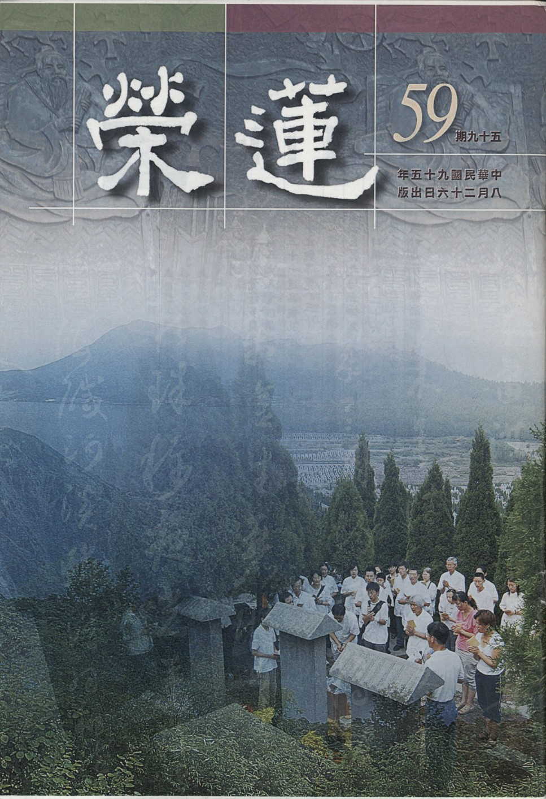

# 第59期

## 社論

### 大陸歸來

本刊

歷史洪流中

雖為一漚泡

能承先啟後

德不孤有鄰

團體在七月廿八至八月九日十三天，走了一趟對岸文化古城：西安、洛陽、開封、濟南、曲阜、北京，一窺周秦漢唐宋元明清之古文明，有了這些歷史的古蹟，見證了過去的朝代，述說著興衰。

繁華之景已在原址不現，唯留古蹟供後人憑弔、緬懷，寄思古之幽情或觀光。雖然朝代的輪替是正常的現象，但這歷史的教訓應足以為後人所警惕。總不外是生於憂患、死於安樂，勵精圖治、重用人才，是國之興；奢靡浮華、進用小人是邦之亡。可喜的是這些古蹟，在對岸經濟快速起飛時，發覺必須重振民族文化，興起民族自信心時，受到了重視，且漸漸的被重修，不但帶動著海內外觀光及緬懷的人潮，更能藉此訓練能工巧匠，將傳統工藝技術延續下去。一個國家若重視自己的歷史，能以這樣的傳統為榮來維護古蹟景點，對於國家民族是一個興盛之兆。

但若只是著眼於觀光，在意的是增加國家的收入，忽略了文化的引導，在吵雜喧鬧推擠的人群中，可惜了這些見證歷史文化的古蹟之無言教化，可惜了國家花鉅資修護歷史景點的意義，可惜了參觀者宿世善業所生起的福報。倘若能在富庶之餘，講究好禮，重視先人寶貴的歷史經驗，重視文物古蹟典籍，遠離那追逐物欲的奢靡風氣，必能再造漢唐的雄風，成為鄰近各國學習的對象，文化也能傳播四方，有助於世界的和平與安定。

漫步在這歷史的古蹟，徜徉於深山古剎，登上那聳入雲霄的奇峰，不但要有一覽眾山小的心志，還要放眼看天下，不但要有傳承過去歷史文化的使命，也應領受大山大水的洗禮，須自我期許是一個大格局、曠觀千古、高瞻遠矚，不苟合於世俗者。

人的一生雖是短暫的，但是卻有義務將文化內涵延續到下一代，有義務維護一個良好的環境，讓下一代有美好的學習，給他們一個充滿希望的未來；而同時也是經營自己，莊嚴出生命的意義，相信這也是聖賢佛菩薩盼望我們應有的意樂。

當回到了台灣，雖然已離開了能夠證明歷史文化的這些古蹟文物，但心中已找到了一個方向，那就是要延續歷史的光明面，創造歷史的盛世，雖立足於台灣，能再造一個文化的盛世，近者悅遠者來，也成為後世來到此處，在古蹟文物典籍所緬懷的歷史人物，而 雪公老師不正是這樣的人物嗎？

## 大德法語

### 大方廣圓覺修多羅了義經（十九）

道源老和尚

能覺所覺皆如幻

如此還要修什麼

二者觀待謂如幻

對境生覺真用功

辛三、頌妄盡還覺

經文：

「覺者如虛空，平等不動轉。覺遍十方界，即得成佛道。眾幻滅無處，成道亦無得。本性圓滿故。」

不但覺外邊妄境如空華，那個能知空華相的覺知還是個空華相，能知所知性空寂而無可執著。覺者如虛空，平等不動轉，所覺的妄境等於空華，能覺的正知也是虛空性，此覺性恆常不動如虛空不動一樣，若能了達能所自相不可得，就覺遍十方界，十方法界莫不皆然，皆了不可得，證得十方界的法界性你就成佛道了。

再進一步講，滅了無明，滅了空華，了知一切都如幻如化，如同幻術所變化出來的；印度有一種幻術，能將各種東西都幻化出來，其實手上只拿了一條手巾，然一變就可以變出一匹馬，或者一隻狗，你看似乎真的有馬？真的有狗嗎？若將法術一解，還是一條手巾外，什麼也沒有了，各種的幻化稱作眾幻，眾幻滅了後滅到那裡去了？本來沒有個生處，那來的滅處？空中華滅了，滅到那裡呢？虛空原來沒有華，那裡還有個滅處呢？所以眾幻雖滅實無滅處，而成道亦無得，前說是究竟成佛道了，若執著有佛道可成，執著有所得，還是妄念，所以楞嚴經上說是「究竟圓滿無有所得。」所以你成佛了還是了無所得，若有所得則未成佛，何以故？成佛是離開一切念（能所觀待）才成佛的，若有佛可成豈非有念嗎？成佛是無所得，不可以執著有個成佛道的得。

成了佛道了無所得，是因為成了佛道即是證得本性，本性是一切具足（圓滿），所以不用向外強求，因不了解本自具足，所以無始來妄動生了無明，由根本無明而枝末無明，故流轉生死，現在一空一切空，將無明空除，即使連有個佛道可成之心念也不生，方能證得圓滿的本性，本性圓滿有個什麼所得呢？本性本來具足（本來圓滿），雖然流轉生死然本性不動，從來沒有實際所得，所以只能說是證得（無所得），不能說是有所得，過去不知道，今天知道了，並不是新得了一個佛道，本來成佛道（法爾如是）。

庚二、頌酬次請

經文：

「菩薩於此中，能發菩提心。末世諸眾生，修此免邪見。」

菩薩修行即是依此菩提的發心，於此中就是於此菩提（覺性）中能發欲得之心，才是真正發大乘的道心了。我們是末世眾生，若能懂得圓覺經的道理，則修行決定不會落於邪見。講到這裡將文殊請問章講完，也就是圓覺經十二大章的第一章，前述「知是空華，即無輪轉」乃圓覺經的經義，且知空華的知亦了不可得，能所自相雖空，但非根本無，乃相互觀待而生。此文殊請問章（第一章）乃全部圓覺經十二章的一個總綱，若將第一章懂得了，後十一章都能懂，因為後十一章都是跟著第一章而發的問題。因為我們是博地凡夫，執著心大的很，對於第一義（真理）會有很多疑問，這樣對嗎？那樣對嗎？所以菩薩知道我們的問題，要替我們請問，請佛來解釋，並流通到末世，使我們好得圓頓大法的義理。

甲二、正宗分

乙一、為上根人示真修

丙一、示頓修

丁一、普賢啟請〜普賢章

戊一、具儀總請

第二章是普賢菩薩請問章。經文：

「於是普賢菩薩，在大眾中，即從座起，頂禮佛足，右繞三匝，長跪叉手而白佛言：」

此為請法的威儀，圓覺經是略本華嚴經，華嚴經以文殊、普賢二位大菩薩為主，與釋迦佛合稱華嚴三聖，圓覺經也有圓覺三聖，中間就是婆伽婆佛（是釋迦佛的報身相），旁邊二位大菩薩是文殊與普賢，與華嚴三聖一樣，所以本經是略本華嚴經。有文殊菩薩的大智，與普賢菩薩的大行，大智、大行合起來才成佛，這普賢菩薩替我們來請法了。

經文：

「大悲世尊，願為此會諸菩薩眾，及為末世一切眾生，修大乘者，聞此圓覺清淨境界，云何修行。」

普賢菩薩表面是為當會的諸菩薩大眾請問，實際上那些菩薩都懂這些道理，其實是為末法的眾生請問，末法時代的眾生還是有大乘根性遇到了圓覺經，由文殊請問章知修清淨的覺行，不可以執有也不可以執無，此為圓覺清淨境界，此清淨境界要怎麼樣修行才能相應？「知是空華，即無輪轉」是上根利智所修，然末法時代上根眾生太少了，雖中下之根也有大乘的善根，但是中根、下根怎麼樣下手修圓覺？此是請問漸次，頓超下來總得有漸次。

丁二、持難別問

經文：

「世尊，若彼眾生，知如幻者，身心亦幻，云何以幻還修於幻？」

上來眾生已知一切都是空中華，心外的境界是幻化不實在的，文殊請問章有「妄認四大為自身相，六塵緣影為自心相」，身體是四大假合的，心是六塵緣影，也是幻化不實在的；然而眾生要去修，不依著身體與心能修行嗎？眾生的身體是幻化的，他所修的法門也是幻化的，依著如幻的身心怎麼還修如幻的行門呢？普賢菩薩不是不了解，是慈悲替我們請問如何依著如幻的身心還修如幻的行門呢？

經文：

「若諸幻性，一切盡滅，則無有心，誰為修行？云何復說修行如幻？」

說是身相如幻、心相如幻，不論心外的環境與身心都是如幻之性，滅盡了身心（身體沒有了、心也沒有了），若沒有修行的人，怎麼樣會有修行如幻呢？沒有個能修行的眾生，怎麼有個所修行如幻的行門呢？

經文：

「若諸眾生本不修行，於生死中常居幻化，曾不了知如幻境界，令妄想心，云何解脫？」

一切境界如幻，一切（內身心、外世界）都是假的，一切本空，既是本空還修什麼呢？若是眾生本來不修行，就在生死中流轉，他居幻化的境界他曾（從來）不了知，對於正知見曾（從來）不了知亦即從來不了知這如幻的境界，他就會貪著這種似實有的境界，而起貪、瞋、癡，他不知道境界如幻，天天起貪、瞋、癡，他這樣的妄想心什麼時候才能得到解脫呢？問題是心亦如幻，如何以幻心來修幻呢？此第一個問題。第二個問題若將幻心與幻境滅除，都滅完了，誰個修呢（無心又如何修）？眾生不知道如幻而流轉生死，他不知道如幻而將境界當實有，還受種種苦？這樣妄想顛倒之心，如何得解脫呢？普賢菩薩不是不知道，是替我們這些對文殊請問章有疑惑的請問佛。

丁三、結請方便

經文：

「作何方便，漸次修習，令諸眾生，永離諸幻。」

上指末世眾生會起了這三個疑惑，知是空華即無輪轉，此為上根人之頓超，對於中根、下根他得有方便，大悲世尊你得告訴我們方便方法（漸次的法門），中下根者得一步一步的修，不能說知是空華即無輪轉，得有個下手的方便（漸次的修行），請世尊為末世眾生說說，才能以遠離一切諸幻。

經文：

「作是語已，五體投地，如是三請，終而復始。」

這還表示請法的儀軌，請法的恭敬。以下是佛告普賢漸次修學之法，有四個步驟，再合著文殊章頓超的法門。（下期待續）

### 佛說八大人覺經講錄（一）

道源老和尚

入門成佛八大覺

修行次第淺而深

心念為公受法益

幫助有情自成佛

八種覺悟成佛法

言少意賅易誦習

念念滅罪趣菩提

三藏大要次第學

前言

雪公老師在世時，辦了許多正法的事業，其中之一是大專講座，為了讓大專生對佛法有具體的認識，編了六門課程，其中之一即是佛說八大人覺經，它與十四講表一樣是對佛法作全貌的認識，而佛說八大人覺經不但是對佛法全貌有一個瞭解，還包括了修行的次第。

歷代的注解現存於世的約有蕅益大師、續法大師、寶靜大師、太虛大師等，另有 雪公老恩師的表解，以及近代一些居士的白話解釋，對此經的解釋已非常完備。

今有講經大德道源老和尚，講經數十年，其中人生最後所講的經之一，即是佛說八大人覺經，時年已八十八歲，將此佛說八大人覺經以深入淺出、要言不繁的方式講解，不流於一般白話注解之太過淺白，也不會有古德注解以玄義方式注經之難懂，此講錄能作深入古德注釋之橋樑，所以流通老和尚之佛說八大人覺經講錄有其必要，不但有助於此經的流通，也是對老和尚的緬懷，亦是共修會存在的意義之一，既有如是般的利益，故藉會刊來連載老和尚對本經的開示，實有其必要。（編者）

講經因緣

佛說八大人覺經，後漢沙門安世高譯，為本次所講之經，未講經之前先說講經因緣。

我們佛教是世界宗教的一種，世界上其他的宗教苦於經典太少，我們佛教則苦於經典太多，翻譯傳到中國來的經典，在宋朝最初結集藏經的時候為五Ｏ四八卷，後來翻譯愈來愈多，註解愈來愈多。現在共有兩萬多卷，初學者簡直無從下手：聽這一位法師所講的這一部經是這一種道理，聽另一法師講另一種經又是另一種道理。比方說聽到阿彌陀經講一切皆有，西方有個極樂世界，極樂世界有位阿彌陀佛。再聽到金剛經講一切皆空，佛也空法也空，初學者看經時無從下手，不知從何看起，聽經也聽不出一個綱要。所以佛教與其他宗教比較起來，反而苦於經典太多。

此地開辦時是淨土法門，引導大家念阿彌陀佛，名為淨宗蓮社，也就是淨土宗，時光過得很快，從開光到現在已經過了兩個月，其間曾先講一部普門品，之後講過一部阿彌陀經，又講一部地藏經，為什麼先講這三部經呢？第一是因為我們現在的佛弟子與觀音菩薩特別有緣，大家都喜歡念觀世音菩薩聖號，所以先講普門品，使大家瞭解念觀世音菩薩聖號的利益和功德，此外，因為大家與阿彌陀佛有緣，所以就講阿彌陀經，使大家瞭解念阿彌陀佛的道理功德；又由於大家與地藏王菩薩的因緣也很深，應該使大家了解地藏經的功德，又講了一部地藏經。這就是我們學佛說法，不說法則已，一說法就要應大眾之機。

諸位已經聽過這三部經的當然很好，但是聽了這三部經，好像連貫不起來，因為講阿彌陀經，念的是阿彌陀佛；講普門品，念的是觀世音菩薩；講地藏經時，大家就念地藏王菩薩；這是佛教經典太多，每一部經說一種道理，初學者連貫不起來。每星期六此處有念佛會，大家都來念一次佛，當中我（道公）感覺大家對佛法綱要不瞭解，所以去年講佛法綱要。佛說法乃應眾生之機而說，但有一綱要，全部佛法為五乘法，最高為一乘法。先說五乘法：

人乘法：受三皈、五戒保持人身不失，來世亦為人。

天乘法：三皈、五戒再加上十種善法，來世決定生天。

以上兩乘乃釋迦佛度眾方便中之方便，因為度眾生出三界了生死的道理不容易被接受，故先把眾生度出三惡道再說。所以先說人乘法、天乘法。

釋迦佛出世為度眾生成佛，成佛的法門是什麼法呢？菩薩法！大乘菩薩法眾生也不容易接受，於是釋迦佛再開方便，亦即開二乘法門〜聲聞乘、緣覺乘，聲聞乘說四諦法、緣覺乘說十二因緣法。

此二種乘法合起來是小乘法，先將眾生度出三界，再教他學大乘法，因為直接學大乘學不來，這就是方便！大乘法與小乘法之不同，出發點不同，學小乘法重在自己了生死，不發心度眾生，所以是「小乘」。大乘法出發點就是要發心，以度眾生為第一，為度眾生而來學佛，所以夠得上學大乘法時，佛就為他說菩薩乘，合起來就是五乘佛法（人乘、天乘、聲聞乘、緣覺乘、菩薩乘）。

菩薩乘（大乘），也是權巧方便的大乘，有更高的一乘法，華嚴經與法華經都是說一乘法門，那是真實的大乘法。學了五乘法乃至一乘法，這些道理你都聽懂了而欲出離輪迴並直至成佛。但了生死並不是簡單的事情，要想成佛也須經三大阿僧祇劫的修學，今生總算有緣聞到佛法，發心修行，但來生來世是不是還能接得上佛法？此時會害怕，害怕來生來世自己無法繼續修行，於是佛再開一個殊勝方便法門，教我們念阿彌陀佛求生極樂世界。前述人乘、天乘是方便中方便，聲聞乘緣覺乘是方便，權巧大乘還是方便，而淨土法門也是方便，然是「殊勝」的方便，乃是最特殊、最超勝的一個方便法門，亦即念佛求生極樂世界。

我們知道佛法綱要，則可將以前所講三部經連貫起來。講阿彌陀經是教我們念阿彌陀佛求生西方極樂世界，蒙佛接引帶業往生西方。能將無量劫來生死了脫，證得無生法忍，再回娑婆世界度化一切眾生，這是阿彌陀經上的要義。

普門品是教我們念觀世音菩薩，觀世音菩薩是西方三聖之一，西方三聖中間是阿彌陀佛，右上首就是觀世音菩薩，他也是接引眾生往生西方的，但是普門品裡為什麼沒有說往生西方呢？因為娑婆世界是個苦難世界，多災多難，災難頻頻，所以先以觀世音菩薩的功德，方便救苦救難，一旦苦難解脫了，再念佛求生西方，這不就連貫起來了嗎？

至於所講的地藏經，文中有令我們禮拜、供養、稱聖號，但沒有要我們往生西方，我們功德回向何處？自然生天！但釋迦佛說地藏經不希望我們生天，地藏經上有兩句話最重要：「業力甚大，能敵須彌，能深巨海，能障聖道。」你懂此句要義，就知業力甚大。而住在娑婆世界業不易消，生天享天福更不容易消業，應該帶業往生、生到西方去修行，業自然消了。如此則地藏經就與阿彌陀經連貫起來。

去年念佛、講開示就講佛法綱要，但是講過了也聽過了，恐怕不容易記住，今年開始講經就先講八大人覺經，此經乃大乘佛法的綱要。吾人要學大乘法修菩薩道，如何修？依八大人覺經修則絕不會走錯路。

菩薩法是大乘法，大能攝小，小不能攝大，小乘法中沒有大乘法，大乘法中含攝小乘法。八大人覺經含攝小、大乘。你讀了八大人覺經不但了解菩薩乘綱要，亦了解聲聞乘、緣覺乘之綱要，這是出世三乘法，讀了這部經能令你了解三乘法的要點。過去大祖師們也感覺到佛經太多，初學者不容易了解佛理，於是揀出三部最簡要的經典，既簡單又重要稱之為簡要經典。此三部經依次為：《佛說八大人覺經》，《佛說四十二章經》，《佛遺教經》；統稱為遺教三經，是佛法綱要。

我們這一次先講《佛說八大人覺經》，以七天講圓滿，希望大家發心將之聽圓滿。將來再講《佛說四十二章經》與《佛遺教經》，將遺教三經講完，使大家能得到佛法要義。（下期待續）

### 由三十七道品觀孔子境界（下）子曰吾十有五章發揮

雪廬老人

儒佛原來是一家

自述有成三七品

能證世間出世間

文化本質學之要

七十三年八月十五日

以下是三十七道品解釋（按表）：

四念處（住）：

四念住是將心安住在四個地處，住是何義？為著你的心一動，起了念頭，念頭何處去？亂七八糟，那兒都跑；必得有方法將念頭擒住，不使往外跑。什麼方法停住心念，即表上：「能觀慧所住境」，這種功夫我們沒有。大家聽著，你要是能修四念住，執住它（四念處），這是福至心靈，你心裡沒福就不這樣。

第一、「觀身不淨」：人人走迷糊路，沒有一個不走迷糊路，迷糊什麼？原來是四大非有五蘊本空，心經上云：照見五蘊皆空。先不必說此，怕聽不懂。原來人人都有身，然這個身很骯髒，大家想想，思想很要緊！自入胎、出胎等等之身子，試問你得了那個身子，外頭是什麼，裡面是什麼？沒有一點乾淨，這樣的觀修是開智慧之一。自己的身體是臭皮囊，別人的身體是臭馬桶，外包著綢緞花，死了入了棺材，遭蟲吃變成了蟲子身，你要是能觀身不淨，對身的貪愛這關就打開了。

第二、「觀受是苦」：凡是享受沒一條不是痛苦的，你不享受就沒痛苦，你一享受就非痛苦不行，若明白一切都是唯心所造的，心停了就好了。

第三、「觀心無常」：心停不住，一彈指即有多少變化，一變化有多少生死種子，變動不居是心的樣子。

第四、「觀法無我」：萬法裡頭找不出一個自相我來，我非獨立主體，是觀待的顯現。若心不往外跑，不打妄想了，是真佛法，然誰辦得到？以上修學第一步〜念住，念頭停住；若以念佛而論〜無念而念，無念之中有念，寂照雙融，這裡暫且不談此之內涵。

四正斷：

才上來念住（念頭安住），不打妄想了，佛法講究的是隨緣消舊業，更不造新殃。不但不造新殃，舊業也斷了〜正斷。三十七道品謂之四正勤，三十七菩提分法謂之四正斷，怎麼正斷？能斷懈怠障（不肯斷惡修善是最大懈怠）。人都想懈怠，願意偷閒，這個樣子則什麼也辦不了。而斷了懈怠（想偷懶、偷閒）所起來的行相，是沒做的善要快做，已做的善別叫它停住，沒做的惡不要叫它做，已作的惡截斷它，不叫它繼續，謂之四正斷。四正斷是斷惑的前方便。

四神足：

神〜神通妙用，足〜依靠，依之斷現行發通，亦即由入定，依靠著它（定力）就斷了煩惱的現行。相宗綱要說起惑造業就是起現行，不起現行是伏惑，依定力能伏惑且能發神通妙用，前之四念住，觀慧依定方能生根斷惑。

五根：

慧若生根，見惑就斷了，你要斷之（見惑）即謂之入流（入聖人之流）。五根之「根」有兩種力量，一為增上，一為能生。增上生力即五力，能生是能生善法，即是任運，善惡分清楚，任運斷惡修善，五根（信、進、念、定、慧）若成就，則見思惑就斷了。見思惑共有一百多品，查佛學辭典即明白。見惑是依四諦法，共有八十八品，思惑是依著三界（九地）共有八十一品，五根能令見思惑不起現行，若斷了見思惑就很好。

五力（斷習）：

成佛須有十力，你們大家先有五力不是很好嗎？力是一種力量，人千萬不要貢高我慢，不要自己求糊塗，若不懂佛學，看中國文化也好，看中國文化也不懂，你喜歡科學，學科學也知道物質不滅，只會變化，不只如此，能力亦不滅。例如人死了，物質不滅，所以可以有各道的變化，或變為畜牲；能力也不滅，所以變成馬可以拉車，變成狗會汪汪叫，幫人看家。其次五力是指能力不可屈伏，亦即學得五根這一套，對佛法的學習由信心生起智慧力，認知真理，不受凡夫外道邪解的影響，他們想法子給你改也改不了，成了五力而不能屈伏，這才有力量，如同金剛能破除一切，什麼也破除不了金剛。五根是聲聞的成就，五力則為緣覺的成就，有這種不受搖動的力量，菩薩更有，緣覺能斷見思習氣稱之辟支佛。

七菩提分：

七菩提謂七覺知分，菩提是自覺覺他，自己覺悟了，再解決他人的迷惑，謂之行菩薩道。以行菩薩道而論，咱們大家修淨土講「帶業往生，乘願再來」，必得乘願再來，否則如何成就菩提？你在極樂世界度眾生嗎？那裡用不著我們，太不自量了。講究乘願再來，來投胎，怎麼投法，很不簡單。

八正道：

何謂正道？盡離邪非，總為無漏。所有邪道、邪思想到此都遠離開了，所有一切事情皆為無漏慧所攝持，體性轉為無漏。有了此八條的修學，就證得了涅槃。

把這聽明白，我講孔子了。給諸位說一句，你要注解孔子書，將這些注進去那就非挨罵不可，為什麼？乃因有門戶之見。為什麼？張三說性善，到李四就不行，所以儒家說儒家的性，道家說道家的性，佛家說佛家的性，三個性不一樣，這是胡說八道，性沒二個，講成不同皆是虛妄分別。這樣的講法不可與別人講，你要與學佛講，他也要罵你，你拿著孔子這一套用佛法詮釋，他也罵，印光祖師在蘇州報國寺的弘化社流通陰騭文、太上感應篇，亦被攻擊，然這些書沒叫人殺、盜、淫、妄，沒叫人墮胎、吃毒藥，有什麼可罵的？

孔子自己說：吾十有五而志於學。這些注書就考據，我七、八歲就上學，他（孔子）怎麼十五歲才上學？孔子那一歲上學，誰知道？他考據這些我們不必花時間研究，總之孔子到十五歲才「志」，志什麼？孔子志於道、據於德，他們所注我不懂；德，他們講成心有所得，是胡說八道，功夫不到就無法解到那。

孔子十五即志於學，即志在學道，就是志於道。道有生而知之，學而知之，困而知之。總而言之，都得學而知之，整部論語一開頭即學而時習之，就是要你學，要你好學，不好學，什麼也不成功，你們諸位那一位好學呢？心都在學上乎？所學都是在道上乎？

孔子志於學這一句，與他人生每一階段都有關係，雖然志在求學，但不是一求學就悟道。到了三十歲，經過了十五年的功夫，「立」安住了，不動了，立住四念住、四正斷、四神足，立成了。

孔子又進了十年功夫，到了四十已不惑〜斷了見思二惑，是五根紮住根了（慧能生根，斷了見思惑）。

又過了十年功夫，孔子到了五十歲才知天命，天命書上千言萬語的注解，愈講愈糊塗，知天命已是明心見性之五力，不可屈伏了！怎麼個明心見性呢？天命與明心見性有什麼關係？中庸：天命之謂性，率性之謂道。性是那裡來？是天然就有，找不出本源，你只要循著性，不要違背它就是道。這五力是不可屈伏，怎麼也改造不了它，不只是八風吹不動，說什麼也變不了樣了，道的力量長養出來，能降伏世間，不被世間所屈伏，永嘉大師所謂：夢裡明明有六趣，覺後空空無大千。

六十而耳順，注書的是愈講愈不懂，都講成世間法、世間的政治，這就完了。耳順是什麼？講什麼到孔子耳朵聽進去再不覺得奇怪，謂之「耳順」。你做好事孔子也不會喜得跳起來，你做壞事孔子也不說你不好，孔子自己說「女安則為之」，你看看他，你就會反省，耳順就是圓融無礙。法華經講性具，「具」是表示都有，亦即性含善惡，有說是性本善，那有惡？要是性中沒有惡則不稱為性具，就不能包容一切了，若是性善則世間何來惡事？至於性中之惡如何？到了圓融無礙時，性中之惡還能變成善（大菩薩能用惡作善）！至於華嚴經講性起，性是如如不動，你這一動，那就隨緣了，隨緣又不變，所以是圓融無礙。

學佛者自古以來也有見解不同處，譬如講到一闡提時，東晉當時學佛者說不能成就，而竺道生（生公）說能成就，在長安時為人所排斥，被趕了出來，跑到了蘇州虎丘山，雖沒聽眾，聚石為徒，對著石頭說法，闡述：闡提成佛，頑石皆為之點頭。總之，書得多看，方能圓融無礙。再說提婆達多害佛多少次，然釋迦牟尼佛的善知識就是提婆達多，第一個入地獄就是提婆達多，而釋尊也先入地獄救了他。能自覺及覺他都因為具足佛性（性具或性起）。

至於孔子七十從心所欲不踰矩，這就難講，你要看注子會弄得暈頭轉向。此境界比六十而耳順更進一步了，自己起念頭時還控制不控制？參禪的初機者心一起念頭，就要一直追它。到了最後如華嚴經說的，起念就隨緣，隨緣但不變。即隨緣不變，不變隨緣。而從心所欲是隨緣，不踰矩是不變；雖然是隨緣，但不改變本來面目。以上所說令爾等體會，孔子這一套與佛學這一套是否沒什麼兩樣？

知道孔子的境界除了顏回，其次是曾子，其他就不行。顏回不必說，曾子得力處就在「省」上，所謂吾日三省吾身，省是內省〜省察自己，咱們大家省察自己，你今生能往生否？我給諸位說一句淨土法門要緊的話，淨土法門要當生成就，當生不成就你上那裏去？你得要省察省察，還不是在五住煩惱裏去嗎？死了投胎，再聽佛法？佛法難聞〜佛法很不容易聽到，有云：不是有經典？有經典也看不懂，有講經的，也有佛學雜誌，然某人提倡消業往生，沒有一個人說明白話的，怎麼辦？說到此，要諸位考察考察，以後再說。

法相宗裏談到十地菩薩，每一地皆要斷二愚（法相辭典或相宗綱要），十地都還得斷惑，有惑就有業，如何是消業往生？若是消業才往生，則十地菩薩也不必往生了，因為十地菩薩還有業。以三十七道品講此章，目的在於儒佛原貫通，他們不以為然，因為有門戶之見。（完）

## 共修研學

### 小止觀導覽（三十二）

*心爾整理*

修學要先懂方法

盲修瞎練枉用功

奈何世人重皮相

內裏全非那回事

緣起：

小止觀導覽，是依高登海居士所著《佛家靜坐方法論》於蓮心念佛會及中壢研學會為講座講解小止觀的內容，有蓮友發心整理資料，故從民國九十年至九十四年六月於本刊刊登，已刊登至第四章調和五事（眠、食、身、息、心）之調身，之後因故暫停此研學專欄。今有心爾老師發心整理歷年來於中壢研學會舉辦之《佛家靜坐方法論》講座授課內容，蒙師應許繼續整理刊登如下。

捧著心爾老師多年來累積達三十多本的筆記細細閱讀，工整的字跡與反覆複習所加之或黃或紅的標記，如捧珍寶。期大眾得聞此法，皆蒙殊勝法益，不負師長所教與資料整理者的不吝提供。（編者）

前言：

《佛家靜坐方法論》是所有止觀門的綱要，想要通達止觀門必須要從這一本書入門，這本書也是智者大師為其兄陳鍼所寫的一本改變命運的書，他的哥哥不但根據這本書延壽二十四年，且臨終坐化生天。我們研究止觀門，當然並非求生天堂，而是在斷惑證果。雖然這一生或許無法斷惑證果，然可以作為往生的方便，在世間上也能趨吉避凶，逢凶化吉。

止觀門是非常重要的修學法，不但世間的福要依止觀修學而得，出世間的慧也要依止觀來修，總而言之，沒有止觀就等於沒有斷惡修善的方法，沒有破迷啟悟的方法，沒有解脫的方法，沒有成佛的方法，沒有離苦得樂的方法。

一個有志於解脫與成佛的人，必須要有解脫的心（出離心）以及成佛的心（菩提心），不只要有解脫與成佛的心，還要有解脫與成佛的方法，此即是止觀法。若不瞭解止觀的意趣來修學佛法，連下等的利益都得不到，如果對止觀法有所瞭解，好好的修學教法，或可得到中等的利益。若能懂得在衣食具足、環境良好、摒除外緣、持戒懺悔，在教授善知識、同行善知識、外護善知識的提攜之下，懂得遠離五欲境，內心也因為知道五欲境的過患，而離開五欲境影像的緣念，並且能調和五事，懂得調睡、調食、調身、調息、調心。

即如琴弦調到恰到好處時，彈起音來聲音特別悅耳，琴弦不能調得太緊，也不能調得太鬆，這樣彈起來都不成曲。同理要將身心調到最好的狀態下來修行。接著是進行五法，知道世間的過患以及出世間的功德，有心於修學止觀，並且在止觀修學上精進的修行，不但瞭解修行的方法，並且能專注的修學，以上為進行五法。上述乃修學止觀的資糧，其次是如何修止與修觀，眼前的進度是調和五事。

第四章調和

調和五事要調睡眠、調食、調身、調息、調心，雖然到此還沒有正式進入止觀門，若依此章能將身心調到最好的狀態，依之而修學止觀法門，就能得世間出世間的成就。

論文：

「三、調身，四、調息，五、調心，此三應合用，不得別說；但有初中後方法不同，是則入住出相有異也。」

先調身，次調息，後調心，然這三者互相觀待，若能調好其中之一，其他二者易調。前述調食，令修學者不會太餓，也不會太飽，也不吃惰性食品，也不吃太油炸的食物令心神不寧，也不會吃讓自己起煩惱、起淫心等想入非非的食物（如蔥蒜）；其次調眠，也知道睡眠的修學法，睡的時間恰好，也能熟睡，將身體做一個適當的調和，不會引發以及增長昏沉的勢力。並知在坐上修調身、調息、調心，將身、息、心都調到最好的狀態，如同琴弦調到不寬不緊（得所），就能奏出美妙的曲子。身息心調到最好的狀態，是修學止觀最好的時機。

有心識，身體和呼吸才能起作用；身體有作用，心和呼吸才能起現形，三者相互觀待，三者同時。然調身、調息、調心，每一相都有入住出，又因三者互相影響，調身的同時就是調息、調心，所謂身正則氣順。雖然調和的時候是先調身再調息、調心，可是三者是相互觀待，調身時幫助調息，亦同時幫助調心，同理，調息時同時又能調身、調心。雖然有初中後的不同，但是一調三調。例如入禪定時，心已非常安定，是自然的持身法，身體自然挺起來，四大中之風大殊勝，所謂風大充身，如體內灌滿風一樣，感覺非常舒服與輕快，或是心平氣和的人（善於調心）呼吸此時也較常人均勻，身體不易躁動，至於有慾望的人（不善調心），呼吸急促，身體也躁動不安。

依摩訶止觀說，藉著煖（溫度）、氣息（呼吸）以及心識而有一期生命現象，身（煖）、息（呼吸）、心相互觀待而起現形，身、息、心三事本無今有謂之生，衰敗曰老，三事壞滅即名為死，而未衰敗的那一段假名為停住，雖然剎那變化，但在衰敗相尚未現起，假名為停住。其實每一個人從出生的第二剎那開始，就應該稱做老，只是因為明顯的老相還沒生起，假名青年、壯年，最後朝向於衰敗（老）、滅壞（死），一期生命就這樣結束了。

以上是凡夫三法，若善用則變聖人三法，可嘆的是凡夫三法，得力的也是凡夫三法，修行就是善於藉假修真，凡夫雖是可憐處，也是可愛處，雖是繫縛處，也是解脫處。以上簡介如何由凡夫三法，成就為聖人三法。

煖（色）是發戒之由：例如戒法之執持，是從外往內調，先將威嚴講究，《弟子規》、《常禮舉要》都是令人由外相做起，下手去做，成習慣了，這些美好的觀念才會入心。是故善於調整身體的人（中規中矩），就是入戒的前方便。從四威儀（行住坐臥）之講究能入戒之義涵，沒有威儀就入不了戒。一個人的自信心固然須他人肯定，也須自己給自己的肯定，能調身、調息、調心的人，就是肯定自己。

息為入定之門：將心靜下來的前方便是將呼吸調均勻，並不是調息就是入定。當調整呼吸，使之心平氣和，心才能在善所緣上好好專注，但要注意此處的調息並非數息，是將氣息調整好（前行），將心調到和諧的狀態，再修止觀（正行）。

心為生慧之因：此時心在寧靜的狀態下，能依止觀門修學世俗及勝義，生起世俗慧或勝義慧，是故說生慧心為生慧之因。而心不調也會影響息與身，心若不調易放逸，則呼吸也變得急促，身體也躁動，三者相互影響。若善學止觀，能將凡夫三法調整成聖人三法。

總之調身、令不寬不急，調息、令不澀不滑，調心、令不沉不浮。論語：「子之燕居，申申如也，夭夭如也。」「溫而厲，威而不猛，恭而安。」這些都是孔子調身、調息、調心的殊勝行相。澀，不通暢；滑，不深沉；浮，跑出去，沉，沉沒、昏沉。所以入定之前，要把身體調得非常恭敬又安詳，呼吸也能有規矩、進出均勻，心也不會放逸，慢慢調、慢慢練、三者調到恰到好處。

一般人忙碌了一天，在精神體力最差的情形去坐上修，然還沒開始修心就往下沉，或者想東想西煩惱很多，交差了事的情況下做半個小時晚課，結果晚課變成不愉快的經驗，久了以後修行變成了無生趣的例行公事。

欲令心不浮，平常要講究不要有太多的外緣，坐上修時內心還在外緣當中，或者心之一分欲緣外境，此即浮的行相。其次如何令心不沉，平常要不斷地提振自己，不要太在意世間的得失，對正法的修學保持高度的好樂，若能令心不浮不沉，修行容易得力。

總之初須調身，調眼睛、調舌頭、調肩膀、調手勢、調脊椎骨、調手等毗盧七法，就是最殊勝調身，此即調身之「入」，其次「住」在此狀態，坐上修結束之後開始吐口氣、搓搓手、擦擦臉、搖搖身，慢慢放腿，此即是「出」。

其次調息，將呼吸調到很均勻、很規律，不澀不滑，此即「入」，安「住」此狀態，此時呼吸綿綿密密，不絕如縷，坐上修結束後吐氣，呼吸慢慢回到出定的狀態，此即「出」。

三者調心，心情平穩中，入所聞思的法義，或入佛號，此即「入」，安住此狀態為「住」，坐上修結束時，心由此法義之安住中出來，此即「出」。

入定是由粗到細，從粗相的要求慢慢到細相的要求，如果坐上修修到一半，發覺坐姿有一點歪了，重新以身為所緣去修正坐姿。入定時心本來緣在佛號上，但是仍然緣念到五欲六塵，以正知見揀除，慢慢的從粗到細，例如念佛到上乘時，佛號與心融成一片，只要起心就是佛號，佛號與心打成一片，佛號就是心，心就是佛號，此謂之細，是入定的行相。

若欲出定，不是馬上離開定境，身體慢慢地離開原來的行相，呼吸慢慢地由細到粗，心也慢慢離開安住的法義（境界）。總之入、住時要講究從粗到細，出是從細到粗，調身、調息、調心各有入住出。

或有人問一次要念多久或者多少的佛號才好？不要心急，也不要貪多，那怕只是十分鐘的專注，每天有一段時間安靜，那怕只是十分鐘的法喜，都會對修行產生美好的回憶。

或有人問念佛時，心為何很容易跑掉？或是未在調心時，將浮相對治，所以坐上修易生掉舉而無法入定，所以坐上修之前須先調心。若能在坐上修之前，先調三法如調琴弦，修行亦然，先調三法，能在坐上修產生美好的法喜。（下期待續）

## 蓮池海會

### 王良翼老居士往生見聞記

*編輯部整理*

遭逢國難志不窮

惜福勤勞為他想

家庭佛化病苦磨

回家打七功夫成

王良翼老居士，四川省合江縣人，生於民國十四年九月十五日，前有哥哥與姊姊共十位，老居士是老么，排行第十一。身處動亂時代，十三歲即從軍保家衛國，此後過著槍林彈雨，顛沛流離的日子。抗日、剿匪的歲月中，歷經大小戰役無數，其中包括長沙會戰及徐蚌會戰，身上彈痕累累，每一個瘡疤都敘述著一件保家衛國的英勇事蹟，但是老居士從來不喜歡誇大，也不會四處抱怨，總像在述說著一位遠方好朋友的故事。子女們只有在偶爾聽到老居士做惡夢的喊叫聲，才可以稍稍感受到戰爭的殘酷、殘忍及悲哀，以及在老居士腦海中烙下的沉痛和不安的深刻記憶。

民國三十八年老居士隨政府軍來臺，並於民國四十二年退伍。後經人介紹娶妻且育有三子，孩子長大成人後，各自有正當的職業，並組成美滿的家庭。

老居士在結婚不久後即改行當司機，雖然有了穩定的收入，但生活還是過得很辛苦。為了使孩子們有足夠營養，自己則常以菜湯或豆腐乳拌飯吃。每當颱風來襲時，家裡到處放著大小不同的臉盆和桶子接漏水，一陣陣的強風豪雨，屋頂搖晃得很厲害，好像隨時會被掀掉，但是即使如此，孩子們卻不覺得有絲毫害怕，因為他們感覺到爸爸不但是一家人的巨人也是城堡，可以阻擋任何的狂風暴雨。

老居士總是對著子女們說自己學歷低，賺的都是必須付出勞力的辛苦錢，只能勉強過日子，希望孩子好好用功讀書，有了學問不但可以改善生活，也更有能力去幫助別人。子女若做錯事被媽媽責罰時，老居士總是語重心長的跟子女們說：受責罰不但不能生氣，反而要謝謝媽媽的教導，誠心道歉並保證以後不再犯了。亦常勉勵子女們要人窮志不窮，所謂玉不琢，不成器，小樹苗剛開始長歪了，必須趕緊矯正，否則定型了就長不直了，人千萬不要做後悔的事！令子女們從此下定決心端正品行，不再做讓父母傷心難過的事情。

老居士有著堅忍不拔的個性，對惡劣的環境往往處之泰然，節儉樸實，對物質的欲望很小，但卻不會尖酸刻薄、一毛不拔，好幾次看到報導有關孤苦老人的新聞，就獨自前往探視關懷，在誠懇的交談與捐助救濟金後，就匆匆離去，不肯留下姓名、電話，這些不為人知的善行，都是不經意與其夫人閒聊時才知道的。而公寓裡公共空間的照明及電鈴都是靠老居士免費安裝和維護，並不定期清掃整棟樓的樓梯，如果樓下的大桶子裝滿了廣告紙，只要發現就會搬運到垃圾車。

老居士亦曾撿獲鉅款而原封不動的歸還失主；在河堤邊的舊家，有人出價二十五萬元購買，卻被老居士一口拒絕，因為舊家屬於違章建築，土地會被政府收回，過了不久，房子果然被政府拆除，也沒有收到任何的補償費。總之不該得的，老居士絕對不拿。一生雖很少說什麼大道理，但卻默默的行善助人，以身教代替了言教，做為子女們學習的好榜樣。

其次老居士自己能做的事情從不假手他人，天花板破了買材料自己來補，牆壁剝落了自己動手油漆，皮鞋壞了自己修，因此家中有補輪胎的工具，更有因自己磨修假牙而買回的砂輪機，以及各式的水電工具。老居士甚至在筆記本當中非常清楚的記載各種電器的操作方式及其特性，並且計算出電力的負荷，在每一個插座開關都裝上經過計算的保險絲，為了保障居家安全，電線及插座一絲不茍，瓦斯開關有兩道防線，另外也記錄著如何改裝省水馬桶，一目了然的筆記，讓子女們深深佩服老居士做事的態度與追根究柢的精神。非但如此，孩子騎著家裡的腳踏車到附近辦事，穩穩當當的感覺，毫不阻礙的齒輪與踏板，令人無法想像那是一台快要五十歲的腳踏車。

退休後的老居士也多次回四川老家探親，但父母早已過逝，上面十個兄弟姊妹只剩下一位姊姊還健在，另外也有許多陌生的晚輩，相認的時候，姊弟倆抱在一起泣不成聲，隨後前往父母的墳前上香，並趕緊僱人重修祖墳，老居士嘗勉勵後輩，人不能忘本，尤其要緬懷祖先們的恩德。

晚年老居士知道子女學佛，雖然沒有表示反對，但卻告訴子女們不要太迷信，後來有一次和老師及蓮友一同出國做善法，才逐漸了解到學佛不但不迷信，反而可以幫助眾生離苦得樂，獲得解脫。民國九十一年老居士因胃癌切除了整個胃，並靠著三寶的加被而克服了身體上不舒服的障礙，從此皈依三寶。四年來家庭的聚會經常以共修念佛的方式來進行，老居士也常提醒子孫們一起念佛，念佛時老居士虔誠的表情與濃濃的鄉音，都是子孫們難忘的回憶！即使因病苦住院，得知鄰床的伯伯要動手術，老居士就趕緊念佛號回向那位伯伯，祈請佛菩薩加被，使他能平安順利。

家人在老居士往生前兩年，每逢老居士的生日，一起齊赴七星山，並在山頂上念佛，即使山上飄著小雨，天氣非常冷，但是佛號聲響徹整個山頂，念完佛號後，老居士說剛才念佛時，感覺佛菩薩就在前方，心中充滿了無限的歡喜，並希望下次生日時，子女們還能陪伴登上七星山念佛。

遺憾的是老居士從六月起就常常發燒，且胸口覺得疼痛，先到附近的診所打退燒針，但是病情一直無法改善，最後轉赴台北榮總就醫，住院期間老居士體力已大幅衰退，需要攙扶才能一步一步的慢慢前進，經過了各種身心痛苦的大小檢驗，仍無法確定老居士的病因，醫生也以老居士年事已高，做任何檢查危險性皆非常高，不建議再做任何檢查。隨後在家屬的勸導下，老居士慎重決定發心吃素。其後子女經引導於觀世音菩薩成道日至淨苑齋僧，回向老居士回家安養與接受助念，醫生亦從旁建議老居士回家調養。此時，老居士才瞭解自己已經沒有治療的必要了，願意接受子女們的建議，回家一心念佛求生西方。

回到家裡的前四天，老居士坐立難安，在床上一下子坐著，一下子躺著，或者躺下後不斷的翻來翻去，一個姿勢維持不了幾秒鐘，助念的大眾都可以感覺到老居士身心非常的痛苦，在老師、蓮友及家人的全力護持下，大家日夜換班念佛以幫助老居士提起正念。到了第五天，老居士突然急著要求孩子們扶他起來，只見老居士雙手緊握如合十狀，閉著雙眼，口中念念有詞的，仔細一聽，原來是清楚不斷地念著阿彌陀佛名號，子女們都深信當時老居士已看到阿彌陀佛了！到了七月二十日清晨，也就是回家的第七天，在三寶的加被下，老居士終於在大眾佛號聲中往生西方極樂世界，助念十七小時後，老居士全身柔軟，相貌祥和。惟願老居士早日花開見佛悟無生，回入娑婆世界廣度一切有情眾生，滿菩提願。

## 啟蒙園地

### 歷史故事　持天下之正〜宋璟

妙音

故事深具教化義

按語最足發人醒

誰說天下興亡事

匹夫無責己何干

大唐人才輩出，所以國勢強盛，但在唐一代眾多名臣中，宋璟以正直而為人所稱道，他一生持正的人格特徵，因緣際會，正好承接開創帝業後之守成階段，所謂創業維艱，守成不易，宋璟如何造就一生守成的事功，茲略述之。

宋璟唐朝邢州南和人，約當今河北省邢台縣東。唐朝承襲北周隋之科舉取士，十七歲時，即中進士，可說早年便嶄露頭角。武后除賞識其才華之外，更因其個性剛正而屢重用他，後逐步升遷至御史中丞。宋璟為人耿介不阿，守法正直。反觀武后所寵信張易之、張昌宗兩兄弟，二人在朝中專擅政事，權傾一時。話說昌宗弟昌儀為洛陽令，仗著兩位兄長的勢力，膽大妄為，於是遭到當時任肅正中丞魏元忠的訓斥。所謂「上樑不正，下樑歪。」其家奴亦狗仗人勢橫行於市，被魏元忠逮捕責打，死於杖下，導致二張懷恨在心，計謀策劃誣陷元忠。

於是散佈「魏元忠因武后年老，欲倚投太子」等不實之言論，武后知道大為震怒，將元忠捉拿下獄；並命元忠與昌宗對質，雙方各執一詞，難辨真偽。於是昌宗暗中以官位利誘張說，請其出面做偽證，張說畏於權勢，只得無奈答應。宋璟得知，特選於臨訊當天在朝房等候，在武后召見張說前曉以大義。當張說見到宋璟時，其面色不安惶恐，宋璟曉以大義，勸其不可因畏於權勢而阿黨偏私，屈服於邪惡，陷害忠良，以求苟免。縱使坦言而獲罪，名譽節操必得世人傳揚；若遭不幸，必當全力營救，與君共生死。這一番義正嚴詞感動了張說，於是在武后面前奏以實情，元忠才得以免死。

但宋璟此舉卻激怒二張，竟遣刺客謀殺，幸好有人得知先為通報，才得以免難，此一結果，正說明得道者多助；正所謂：天道無親，常與善人。

宋璟分別於睿宗及玄宗期間任宰相，與房玄齡、杜如晦、姚崇並列唐朝四大名相。睿宗稱帝時首度封相，後因事被貶。玄宗時，在著名的政治家姚崇的推薦下再度任相，與姚崇同心協力重振朝廷綱紀，革奸佞、任賢臣，為「開元之治」打下堅實的基礎。他鐵面無私堅持任人唯賢，甚至在皇帝面前亦敢犯言直諫，且不畏惡勢力，不惜開罪太平公主等權貴，罷黜了無德無才的各級官員多達數千人。他為防奸佞小人，私下在皇帝耳邊進讒言，提出百官奏章，必定要有諫官、史官在旁的規定。其不懼皇親國戚及寵臣，總是站在正義公理一邊，為大唐創業近百年後之政局，注入新血輪。

唐朝有令，每年地方官員都要派人赴京向皇帝、宰相等匯報工作，使者多帶珍貴禮物四處送禮，巴結權貴以求晉升。宋璟奏明玄宗，勒令禮物一律退回，否則嚴處，因而收禮、賄賂之歪風銷聲匿跡。玄宗十分器重宋璟，並以老師的禮節待之，故宋璟提出具有建設性之建議，通常均會被採納，於是一改以往用人唯親的惡習，並減少了奸佞小人誣陷好人的情況；因而吏治不亂、綱紀有條，使開元初期的政治氣象為之一新，後世史家稱讚有貞觀、永徽遺風。宋璟一生持正，不愧泰山喬嶽之身，而居樞機之位，更發揮其旋乾轉坤之手，使朝政為之一振，並達撥亂反正之效，令後人堅信風俗之厚薄，繫乎一二人心之所嚮的鐵律。

有句成語「有腳陽春」，歌頌的人物就是宋璟。其愛護百姓，體恤民情，受到朝野一致的讚美。正因為他所到之處，有如萬物臨春受到和煦陽光的照耀，充滿生機，當時的人就尊稱宋璟為有腳陽春，而這句成語後就演變對地方官愛民風範的讚美詞。宋璟不僅是一位政績卓越的一代名相，其詩文也是聞名天下，獨樹一幟。他一生著有文集十卷，因性喜梅花，「梅花」更是其托物言志的力作，文如其人，雖與雜草為伍，但冰心玉潔，貞心不改，本性不移，故能成就一代名相，實良有以也。

小朋友聽了宋璟的故事，不要以為距離我們好遙遠噢！繼而心又想辯駁，以後自己不一定從事公職，與我何干？大家千萬莫作如此想，宋璟一生持正行相，便是我們一輩子學不完的課題。不論當官或其他職場，有誰不要正直的部屬，又有誰不尊崇正直的長官，明白這箇道理，小朋友從現在起，內化此一理念，當下就是一位有德性之人，熏習久便成君子，君子之德，風也。居家以德便有家風；團體有德便有道風；國家有德便有國風，故家風道風國風之吹拂，根基在每一個人的持正開始呢！

### 十四講表（二十六）

傳瑛

三藏教典經律論

詮釋總綱戒定慧

生起止惡修善用

更生空慧得出離

上次講過佛法的本體是「戒、定、慧」，而佛法的大用是在「諸惡莫作、眾善奉行、自淨其意」。學佛的人想要明體而達用，一定要「解行並進」。解是解悟教理，行是依教理而修，有「解」可避免盲修瞎練之害，有「行」可除去說食數寶之弊，如鳥之雙翼，缺一不可。

解門有二種：一是廣閱三藏（經、律、論）教典，重在博學多聞；二是研究宗義，中土佛學主要分四大宗：天臺、賢首、三論及唯識，從中可選擇一宗專研，以求一門深入。另外，行門也可分為四宗：一是律宗，就是遵照佛所制定之戒律行持，使身、口、意三業清淨。二是禪宗：由禪宗祖師依弟子之根器及因緣，隨機教授讓弟子開悟，主張不立文字，直指人心，見性成佛。三是淨宗：主張念佛求生西方極樂淨土，帶業往生。四是密宗：主張手結印、口念咒、意觀想三密相應的觀修法。

凡一佛出世，一切教法及行儀當以佛為本。但佛滅度後，依時劫因緣及眾生根器的優劣，法運可分為正法、像法及末法：一、正法，正者證也，約為佛滅度後一千年為正法期，法儀未改，有教有行，所以證果的人多，此時持律可以成就；二、像法：像者似也，約為正法後一千年期間，雖仍有教有行，但不是真正的法儀行儀，而是相似的佛法行，所以證果者少，此時須加修禪定成就；三、末法：末者微也，約為像法後一萬年，法行轉為微末，雖有教但無行，所以無證果者，此時只有依持淨土成就。過末法後，即為滅法時期。雖然說法期分三，但只要自己如法依止善知識，如實依照聖言量真心修學，即使處在末法時期，也可能有正法的成就。

修學道上，雖須解行並進，但其中解尤要注意，眾生在三界火宅，諸多迷惑，若無聽聞正確的知見，則行持一定會有所偏差，如同身在火災現場中的瞎子一樣，即使有雙腳，也不易找尋出路，更嚴重的，還會一盲引眾盲，相牽入火坑，不可不慎！

其實，透過正知見的反覆串習，可以逐漸改變我們以前錯誤的觀念，在遇境逢緣時，也比較會有覺性對治自己的煩惱習氣。

有一位法師出家前是位醫生，小時，媽媽總給她梳辮子上學，她本身也非常愛護自己的一頭秀髮，長大後，就更愛漂亮。學佛後，有一天她突然覺得為什麼我都一直注意頭皮上的東西，而沒有注意頭皮下的東西呢？她領悟到頭髮的價值並不如她以前所想像的這麼重要。有一次，她去理髮，因工作太累而睡著了，理髮師也沒注意，在她低頭時，正好剪刀一喀擦下去，把頭髮削的好短，理髮師不覺地大叫一聲，把睡著的她叫醒了，她笑笑說：「沒關係」，理髮師雖覺得不好意思地，也無法挽救，只有把她的頭髮剪得很短。

一回寢室，室友看到她，捧腹大笑說：「你怎麼去剪了一個這麼醜的頭髮。」她說：「不會呀！」室友問他：「你明天還要去上班嗎？」她說：「當然要呀！」隔天到了醫院，見到她的同事都以異樣眼光看她，其中有位護士說：「你怎麼剪個這麼沒有氣質的頭髮呢？」她不但不生氣，還開懷說：「想不到我的氣質是來自於我的頭髮啊！」當天，有位罹患骨癌的病人一見到她，覺的很好笑說：「你今天怎麼剪了這麼好玩的頭髮。」她說：「我看你每次來，都愁眉苦臉，沒想到剪了這個頭髮讓你開心笑了，值得呀！」到了傍晚，他的同事問她說：「晚上你還要去上課嗎？」她說：「當然要呀！」一到上課的地方，大家都向她投出奇怪的眼神，但她很自在，下課後，有位同學跑來對她說：「老師，你的髮型好好玩。」她說：「對呀！我昨天不小心剪了這個頭髮之後，今天大家看到我都開懷大笑，這真是個能讓人離苦得樂的髮型！」

平常我們很在意的事情，其實不一定都是重點，但因根深蒂固的無明觀念，讓我們無法自拔，但只要透過知見的不斷串習，終會改變我們的觀念，觀念一轉，心境也會跟著轉，接著行事也會改變，就如上述那位法師的故事，這樣解行相應，才能得到佛法的真實利益。（下期待續）

## 日常省思

### 童言童語〜可以回首的赤子之言　心入、雅丰、宥琢、海辰

心入、雅丰、宥琢、海辰

可貴求學期

諸多關愛繞

若當平常看

錯失被攝受

成長的樂章 / 心入

猛然回首高中畢

帶著期許奔未來

一不留神四年夢

還得腳下踏實地

畢業了，感覺上，三年好像是天空中緩慢漂浮的白雲，但一眨眼卻又寂靜且快速地溜過了我的眼際。

雖然，高中生活看似如雲般的寂靜，但，它也涵藏了滿滿的哭聲、笑聲、讀書聲，也許沒有太多的掌聲，但是我並不因此而沮喪，因為我相信我的高中生活不因此而失色，反而是個清新雋永的小品，字字句句或許有不堪，或許有傲人之處，但「前車之鑑，後車之師」永遠是我再向前的動力，是日後的警惕。

幾天前去台北聽音樂會，順道去中正紀念堂看看，發現它的對聯是：「生活的目的，在增進人類全體之生活；生命的意義，在創造宇宙繼起之生命。」雖然，之前聽過，可是，在中正紀念堂中，斗大般的墨字、莊嚴、肅穆的殿堂震懾著我。

今年高中畢業的我，有沒有這麼想過？到底有沒有這種責任與擔當呢？乍然驚覺，我沒有，但我已高中畢業；也許我可以轉過頭竊喜，我不是偉人，但是不可否認的我是大學生，我應該要也必須有這樣的價值觀，不為什麼，因為我已升上大學，因為我要把自己和街上那些可以花一整天修眉毛、逛街、眼中無神、毫無目標的人，區分出來，也許這狂傲了些，但這卻是一種期許，期許自己如易經所說：「天行健，君子以自強不息。」而且我也相信自己可以。

畢業，這已經不是第一次了，也許覺得習以為常，但高中畢業是我的第一次，也是最後一次，它也不可能再重新來過，過去只能緬懷、警惕，當下的我應該繼續認真的向前走，正如我的音樂老師說：「一首樂曲在演奏時，每個音符都在瞬間流過，從此世上沒有相同意境、味道的曲子。」我的高中樂章已然在轟轟烈烈的旋律中結束，未來四年的空白樂譜，第一次遠離親愛的家和父母的照顧，但是卻因此而能親近善知識與團體，我必然恪守本分地繼續自強不息的譜著下份大學樂譜，讓它跳動著豐盛又精彩的音符。

揮別學生時代〜人生其實是無止盡的學習 / 雅丰

保留淳厚質地

虛心接受建言

抉擇為公走向

充實利眾學問

在學習生涯接近尾聲時，就開始思索著一般畢業生都會經歷的問題〜「就業」。很多人常說：對現代剛畢業的大學生來說，畢業與失業可畫上等號。但其實不盡然，雖然一時之間不能找到工作，但並不代表永遠，而且在失業的時段並不是要每天的悲嘆，而是能擁有更長時間去追逐一切的知識。在畢業後，很慶幸自己參加了一次內容豐富的畢業旅行〜蓮榮暑期的「大陸文化古城參訪之旅」，去體驗歷史悠久的中國文化。

在十三天充實的行程中，首先是很佩服當地的導遊，在與其交流的過程中，得知其求學過程與台灣的部份差異，且他們還需從眾多競爭者中脫穎而出，另外也從他們的講解中聽到了自信及學以致用的快樂。第二是所有參觀的古蹟，不論是先王陵寢、武侯祠、萬里長城或者是著名山脈、古剎及博物館等，當踏上其土地的那一剎那，彷彿經由時光機帶領回到過去，看到當時宏偉興盛的樣貌，也不難去想像遇到戰亂時，所產生的悲壯情懷。不需要再透過歷史課本，而是原原本本的呈現在眼前，令人心中無限撼動！第三是放生活動，放了上百隻的鳥，上千斤的魚、青蛙及無毒的蛇類等，不但自己開了眼界，也讓當地的居民開了眼界，大家齊心合力將生物放生的那一刻，相信嘴角都浮起了一抹笑容，讓人深深感動。

參加了一個難忘的畢業旅行，不但增長了見識，看事情的眼界又稍加的拓寬了許多。當回到國內，彷彿像是在大陸做了一場夢，美夢不再，要面對的是畢業後的現實。

畢業，代表著一個階段的結束，在求學的階段中，已經歷過無數次的畢業，小至幼稚園畢業，大至大學畢業或是更高學歷的畢業。在人生的過程中，每階段的生命只不過是驚鴻一瞥，重要的是如何邁向未來……。

人生好比一場接力賽 / 宥琢

士先器識後文藝

德不孤兮必有鄰

即使斯人獨憔悴

文山古道照顏色

人的一生，不外乎是求學與入社會兩部份，而求學又分為小學、中學、高中、大學，甚至於碩、博士的階段，相信在每個人的心目中都存著一份最懷念的時光，而我，雖連求學部分都未嘗完成，但中學的三年光陰，卻又是之前所不能比擬的！

求學要有所成，師長、同儕缺一不可，而師長的啟蒙、教誨更勝同儕，小學，遇到提倡經學的老師，中學，又有位注重品性、充滿幹勁的導師，真是萬分幸運，從七年級起，老師說要灌輸同學打從國一開始，生活作息就要當作國三看，因此當他班放學嬉戲，而本班不是在教室聽訓，便是讀書，直至五點。老師雖已大學畢業，卻仍懷著顆赤子之心，與同學親近卻又不失身為老師的身分，許多老師都常讚美本班同學氣質佳，有學生的樣子，有如此讚譽，如不是老師用心經營，豈有今日？

致於同儕方面，本班的團隊向心力可說是無堅不摧，各項人才一應俱全，音樂、體育、語文等皆極為出色，班際的團隊比賽如桌球、游泳、英文歌唱、直笛吹奏等皆獲冠軍，是他班所望塵莫及的。同學間彼此和諧相處，心地依舊質樸，相信爾後，同學間能多有聯繫，友誼長存。

三年，看似攏長，畢業後回顧，倏忽即逝，唯一惋惜的，便是七、八年級不甚用功，蹉跎了許多時光，學校的目的，是讓自己充實學問，而不是交友、玩樂的所在，有的人小學優秀，到了國中，便迷失了讀書的初衷，品行、學業一落千丈，所以，在國中的黃金時光，還是奉勸大家以讀書為重，交友為輔。

畢業心得 / 海辰

豐富的高中生活

歲月悄悄的走過

一切經歷如夢般

醒時似有還似無

呼〜熬過了高三，就真的能展翅高飛了嗎？那令人坐大的桌椅及ｋ中的戰友們；那恨天高的教科書堆及在課桌椅彼端替我們努力解惑的老師們；那光復樓長廊幽暗燈光下，悄悄落下淚的每個身影，及畢業典禮上高唱校歌的同學們，我們一起經歷過那段酸甜苦辣，完成每個不可能，現在要各奔東西、鵬程萬里了嗎？

翻開心中的畢冊，一幕幕，閃過。

小高一，像新長出的小草般，正自信滿滿的準備著接招，迎向美好的高中生活，那是稚嫩的活潑。我開始學著如何辦事情，身為啦啦隊比賽負責人的我，在幾個朋友已有的協助下，找老師、約時間、佔位子、音效、服裝…各項事務處理，在啦啦隊的歡呼聲中，響起了籃球比賽的尖叫加油聲，依然是啦啦隊的我，努力搖著班旗喊著班呼，我又學會了如何鼓舞氣勢，體悟了成功不是一、兩天，百分之九十九都是努力來的。高一在合唱比賽聲，紮著高腰裙、穿著黑皮鞋白襪落幕。分班日子在即。

高二老鳥，像長不大又自以為長大的鳥兒，扯破喉嚨高歌，展開羽屏相互爭艷，那是看似無窮盡的青春。努力的為我的社團〜儀隊奮鬥著，頂著男生頭，一夜黑了臉龐、長了肌肉，帶著國旗與笑容，前往美國玫瑰花車遊行，進行一連串演出及良好的國民外交。在這同時，班上的排球、詩朗比賽相形參與的就較少了些。

高三老人，像年邁世故的和藹老者般，平常在光復塔中閉關修練，偶爾晃到紅跑道上，望著學妹們，開始感嘆，那是暴風雨前的寧靜。光復樓的桌椅剛更新，它每天伴著我從太陽升起到月亮升起，與它共同擁有的，就是像家一樣的擺置，從屁墊到日常用品箱，無一不是高三老人生活的好伴侶。在高三最大的樂趣就是走進槍室，提起小木槍，開始不斷的轉，那可以使我感到安靜，準備好了，再出發。

當每個中午都播放著畢業歌之際，真的有些失落，在廁所裡靜靜的閉上眼，紅樓夢中的人物，嘻笑著，吟著詩詞與成語，像在為我們考試洩題般，認學妹的興奮、運動會接力賽的刺激、園遊會的攤位、體育課的三二一、冬天冷風中的溫水游泳池…都在圍繞我們四周的梅花聲中，漸漸凋零了，就像鳳凰花開時，楓葉也慢慢變了色，落在心田，化成肥料了吧！

接下來的日子，是建立在以往的基處上，但卻也攙和著些許的未知。已成為大學新鮮人的我，想當然爾有許多想完成的事：重拾起多年沒碰的豎笛，為生活多一些調劑；努力面對看了頭皮就發麻的英文書籍及原文課本；也希望能跟隨蓮榮老師們的腳步，補足我不夠的內涵，學一些在人世間所需面對各種處境的處理方法。

大學生活多采多姿吧！期許自己不是將就「由你玩四年」的風氣，而是好好的努力，期許自己把每件事盡心做到最好，不論是學業抑或是社團等，不成為書呆子，也不被二一。期待有一天可以真的展開翅膀，飛向屬於自己的一片天，那……還有很長的路要走呢！

## 專題報導

### 年度齋僧法行記事〜護持正法的殊勝行相

心超

年度齋僧行

毋得等閑過

意樂加行結

圓滿大善行

九十五年七月一日

前言：

蒙 老和尚慈悲開許吾等於結夏期間上山供養僧眾，至今已有十餘年光景。雖說年度結夏安居是團體例行的活動之一，但這樣的例行活動卻得來不易，今年有機會參加，明年不一定有福份，今天或許因緣具足，下一次卻不一定能有機會參與，總而言之，每一年、每一次能於正法團體中供僧，都要當成是難逢且唯一的機會。以下僅就結夏安居意義、當生起之意樂及作法，乃至於供僧請法與事後需注意事項分項簡說，祈諸位蓮友能於照例之結夏供僧活動中得其法益，並能積聚殊勝往生資糧。

壹、總觀修

結夏安居，是釋迦牟尼佛在世的常規，佛陀要求比丘們在四月十五到七月十五，一年當中最熱的夏天由長老（上座）比丘帶著僧團結界禁足。何以故？一來天氣太熱，托缽行腳容易中暑；二來在家人服裝不整，有礙觀瞻；三來蟲蟻橫行，容易踩死蟲蟻，所以禁足有其必要；再者，一年到頭都是奔波於外影響修學，若能以三個月的時間，靜下身心來用功辦道，在七月十五（解夏）時，會有人證得勝果，或對教法心開意解，此時，諸佛歡喜，龍天護持，所以七月十五又名諸佛歡喜日，目連尊者即以此日供養僧眾的功德，超薦曾為母之咽口鬼，若不藉由僧眾的福田力，即使目連尊者已成神通第一的阿羅漢，欲拔其母之苦毫分不可得。

其次僧眾結夏安居，理應由在家人到僧眾的處所來供養飲食、衣服、醫藥、臥具，使他們安心辦道。有諸多的好處：第一、維持正法的制度：這是釋迦牟尼佛規定的制度，若能維持，即是正法住世的徵兆；第二、未來修學正法，有充足的道糧：令出家人安心辦道，將來感應在修學正法時候，有修道的資糧，而能安心辦道。

如果在還沒修學正法時，凡事皆很順遂，但是要修學正法的時候，衣食不具足、病苦纏身、沒有善知識、沒有法本、沒有道場，什麼都沒有，那就是過去生中不肯提供他人辦道的道糧、令人無法安心辦道，結果造成自己修學正法的障礙；第三、善良風氣的引發：供養僧眾、護持正法，是善良風氣的源頭，由此而令善良風氣推展；第四、與現前的僧眾，及十方的僧眾，結上殊勝的善緣，成為他們攝受的對象；第五、能令諸佛歡喜：因為諸佛本來就希望我們在結夏安居時，做供養僧眾的事情，故此法行能令諸佛歡喜，想想看我們一生能夠做出幾件讓諸佛高興的事情？若能令佛歡喜，功德是無量無邊，不只是在善法本身上有非常大的功德，讓佛高興的這一分上，功德也非常殊勝。

十方的僧眾既是我們所供養、護持的對象，眼前的因緣為何是西蓮淨苑？此寺的開山住持上智下諭老和尚在民國六十初年，於遠離市區的三峽開闢了三寶之地，其中過程的辛苦不為人知，老和尚道高德備，能夠如法的帶領僧團做正法的修學，不化緣、不募捐，寧可為正法而死，不為非法苟活而生，在三峽、在台北縣、在台灣都有很好的影響，我們理應對這樣清淨的僧團供養和護持。而僧團是遍十方的，所以眼前對淨苑僧團好好供養、護持，等於對十方的僧團供養、護持。

其次供養分內財和外財，外財是財物的供養，或四事（飲食、衣服、臥具、湯藥）的供養，多少不拘，全憑誠意；內財的供養是幫忙寺廟做各種雜務，若能提供一個好的環境讓修行人安心辦道，將來感應所住之處無豺狼虎豹、瘟疫（ＳＡＲＳ）、天災人禍、戰亂等，而且衣食具足、善友共往，是修學正法的淨土，所以不可輕視在正法處所作的勞役，比如掃廁所、水溝、大殿，乃至到廚房煮飯等，舉手投足都累積不可思議的善業，未來顯現不可思議的快樂，此屬於內財的供養。以上是財供養，其次是法供養，何謂法供養？就是帶著出離心、菩提心，帶著想要累積成佛的資糧，眼前來做這些法行，即是法供養。雖然諸供養中，法供養最，但也不能離開財供養而說法供養。

齋僧是修福，還得請法方是修慧。有云：修福不修慧，大象掛纓珞；修慧不修福，羅漢托空缽。所以有的人到佛門只修福不修慧，例如只做事而不聽課，將來死了以後變成一隻大象掛纓珞，或是北京狗，或是那些稀有動物被養的好好的，可是腦袋空空。社會上有些人富貴、名利雙收者，雖得世間成就，但卻膚淺又俗氣。

只修慧不修福呢？例如對供養僧眾或其利益有情的善法，懶於造作，即使努力修學正法證得阿羅漢果，出去化緣還是托了空缽，釋迦牟尼佛在世時，有些證果的比丘（阿羅漢）是三界應供，然拿著應量器（缽器）托缽，若連著七家都不給食物，就要抱著空缽到林邊水下去懺悔，此即往昔慳貪的業成熟，由於不肯施內財、外財，由慳貪所生的果報。所以應該將這些無常不堅實的財富做如理如法的佈施，不要使它們反成我們的障礙，若有了由它反而起了慳貪的心，使我們受了餓鬼及地獄的苦報，那還不如不要有它。所以應該要好好的掌握這些順緣，來做一個對自己有利、對眾生有利的善法。

總而言之，對善法要修歡喜心，對惡業要修懺悔心。不但在活動之初要修歡喜心，即使過程乃至圓滿都要修歡喜心，因為有歡喜心，將來再做這樣的善法才有動力。如果抱著湊人數、虛應故事、打發時間等則功德爭議，或毫無功德，直同入寶山空手回。所以，不作則已，一作就要好好的賺取功德法財，不要水過無痕，不要鳥飛空而無跡。

吾人無始劫來做利益有情的事業時，如刀子劃水般，水過無痕，腦袋空空沒有印象、沒有覺受，別人叫一動、做一動，像世俗傭人一樣，若能掌握緣起、努力當下，每一個善法的功德都會在我們身心當中累積，累積這樣的善業種子，能於未來不斷的顯現快樂。且如目連尊者般，能令其母脫離惡道般，令自己親人神超淨域。三寶門中有求必應，你怎麼祈求就怎麼感應，你能感，他就能應，感應道交不思議。

貳、齋僧供養法行：

一者、須善用人力，將所要做事情分配得當；二者、動作迅速，聽候臨時的調度；三者、準時完成每一事項；四者、講究威嚴，嚴整規矩，令師父留下美好的印象。

參、午供：

一者、觀想十方僧眾，接受我人供養，前來應供；二者、以金錢代表飲食、衣服、醫藥、臥具，以四事供養；三者、結合普賢十大願而作供養；四者、依供養禮儀而興供養；五者、以二時臨齋儀之法本，隨文入觀，於佛前修供養。

肆、座談：

一、懷抱恭敬及求法之心，請師父開示；二、不要妄自分別師父們的高下，只要彼如理如法的開示，我們都要敬之如佛；三、即使師父開示甚深空性道理，聽得如聾如啞，也要懺悔己之業障，不可懷輕慢心，否則成為未來修學般若之障。

伍、結語：

一者、會後要檢討今天法行之缺失；二者、善款之徵信，以昭大眾之信；三者、複講師父之開示，令大眾得法益；四者、聆聽參與者之心得，以同沾法益。

## 三代共修

### 週六共修活動止靜法語　略談學佛面對人生與死亡的心態

心超

面對死亡真學問

可嘆無知枉為人

萬全準備不害怕

世間得失能超越

九十五年六月二十四日

在人世間要找到人生的方向、確立人生的意義，是極為難得的事。有些人一生中享受高官厚祿，但可能連最基本的價值觀都沒有確立，一生追求的都是虛名浮利，不瞭解人命無常、人生酬業，所造的業未來會以果報的方式呈現。

現今嬰兒在剛出生的那一剎那，中華民國的歷史已過了七千年，期間不知死了多少帝王及王侯將相，同理在後代的子孫出生時，現場的人都已不在人世了，人世間看起來似真實，其實是剎那剎那的變化（無常）。在場共修的人十年後會少了一些，二十年後又少了一些，三十年後少得更多，過了五十年後，在場的人幾乎全作古了，想想看人世間還有什麼好計較的，還有什麼好看不開的？可是偏偏活著時，卻受制於外境，被業所繫縛。

一般人在追逐名利時，不相信它的本質是苦的，是短暫的、如幻的，殊不知不堪時局的變化、政局的盪動、眾生共業的現起。或者忽然間得到不治之症時，內心非常惶恐，即使身為王侯將相，也從來沒有面對死亡的心理準備，學校也沒有教我們面對這種事，在社會上追求個人的幸福時，也沒有人告訴我們須面對這樣的事。突然被宣判死刑時，內心不願意承認自己的死期，先是懷疑醫生是否檢查錯誤，得到絕症的人應該不是我吧？接著而起的是憤怒，看任何事情都不順眼，或跟醫生討價還價，希望多活幾個月；最終是絕望，眼看著病情一天一天惡化，最終只能無奈的接受。

因為沒有學佛，十個有五雙就這樣過完一生。外教徒歌詠上帝，以歌聲壓抑內心隱微深處面對無知於未來的恐懼，希望對生命的去處有個妥善的安排，但是卻掩蓋不了內心的恐懼，對於生命的何去何從，卻從來不認真探討，心思也不用在上面，急所不急，不急所急。

佛法要我們實際面對人生真正要解決的問題，那就是老、病、死。所以常去看病苦、老苦的人，則不輕易對未來有任何憧憬，因為這些都是我們的未來。看到養老院裡的老人，躺在病床上，整天眼睛只能瞪著天花板，這些老人們，年輕時有可能曾經在社會上有著崇高的地位或權勢，當時爭名奪利、耍權謀時，絕對不會相信未來是在養老院這般地度過餘生，每個人都不相信自己的未來，是任何情況都有可能發生。

佛法要我們面對老、病、死時，要接受、觀察、超越！然要有方法，使自己接受、觀察、超越，或問要有那些正確的方法呢？

第一、自他相換法：

如有些大德在臨命終時遇到許多痛苦，內心卻很高興，因為他平常的願望就是有情的痛苦能在他身上成熟，他的安樂是無條件地送給有情眾生，此時觀想他的願望在這個時候成熟了，能不高興嗎？這種修學法平常時時串習，誠如范仲淹所說，先天下之憂而憂，後天下之樂而樂。但現在大多數人是，先天下之樂而樂，後天下之憂而憂。

一般人總希望天下最快樂的事情是別人都還未得而我先得，讀書的方向一開始就錯誤，所立住的腳根一開始就偏差，看事情的面相一開始就顛倒，從來就沒有建立正確人生觀，從來沒有找到人活著的價值；有大德說要在生處轉熟，熟處轉生，亦即將自私自利的想法，轉成在意他人藐視自己，與大德佛菩薩一樣的想法，將顛倒、錯誤、偏差的價值觀，轉成正確、積極並且為公發心的人生觀。

第二、重報輕受法：

往昔所造之惡業若能藉著眼前的痛苦報掉，那往生成佛的順緣就能顯現，有些大德在臨命終受到很大的痛苦，能將修行上的障礙化掉，或將原本須在地獄多劫受苦的惡業，在眼前以病苦的方式生起，此即重報輕受，如玄奘法師與他的老師戒賢論師。藉著修行能令重報輕受，是最殊勝的還債法，所以做了善業受了痛苦，即是殊勝的還債法，做了惡業享樂，是最倒楣的欠債法，這是一般人難以體會的觀念。有些人讀了一輩子的書，不但與了脫生死無關，連簡單的因果觀念都沒有，與為了生存而急急奔走的動物沒有兩樣，然而為了生存，人類的心態更為自私，手段更為殘忍，下場比動物更為悽慘。

第三、意義法：

何謂意義法呢？例如吃苦要吃得有意義，藉著吃苦告訴世間人這不是痛苦，因為吃苦即是了苦，享福即是消福。並告訴世間人惡業的可怕，因為所有的痛苦都是惡業的成熟。告訴世間人痛苦是修行的試金石，如 雪公老師晚年的病苦，正說明病苦現起時，不會是修行的障礙，反而是修行的資糧，聖人不似我們一遇病苦平常的修行功夫全成無用。所以苦是有意義的修學法。

以上三條修學法要在平常多串習，在臨命終時才會有好的表現，平常若沒有這些串習，臨命終時則慌張的不知如何是好。一般要聽到如此的觀念是很難的，學校的老師不會作如此的引導，周遭的朋友也不會談及這些有意義的話題。

其次當遇到親朋好友臨命終時，應該要如何幫助他往生呢？以四點分述之，

第一、全人的關懷：

了解他的一生，對他所作的善法予以肯定，並幫他懺悔所作的惡業；

第二、全程的關懷：

陪伴他走完這人生的最後一段，讓他走的無牽無罣，無憂無慮，而且法喜充滿；

第三、全隊的關懷：

助念團對要往生者，表現的是全隊的關懷，不是交差了事；

第四、全家的關懷：

不但藉著關懷他做自己生命的學習，還要對他的家人，有著感同身受的同理心，引導他的家人做真正且有用的護持。

總之臨命終的學習，要在平常，平時就要有心理準備，隨緣去護持臨終者，自己臨終時就不會手忙腳亂，古人說：千念萬念，要熟於臨終的正念。臨終欲獲得正念就須仰賴平常的練習，就像能應付緊急戰況的戰士，靠的是平常的演練，平常若不以應戰的方式來訓練，一旦有戰事是全敗，平常若沒有做臨命終的學習，一旦臨命終時將潰不成軍，道理是相同的。

若個人乃至國家沒有危機意識，只要危機一來即是全方位的潰敗，尤其是人在臨終時，因為一生都沒有去面對這樣的問題，所以整個心思都亂了，任何方法都壓不住煩惱，任何的安慰都無法降伏對未來無知的恐慌，對修學佛法、對修學正法的決定見，都會跟平常不一樣，若能將臨命終當成今天會發生的事情，對佛法的修學會及時、行善會及時，時時活在當下。

## 研學報導

### 高山仰止〜雪廬老人往生二十週年之緬懷

### 學術報告　紀念雪廬老人〜對民初佛教史與佛教人物的初探（Ⅱ）

智中

慎因畏果常慚愧

倡敦倫念佛誠敬

護國衛教戒嚴身

坐化生西人天師

釋儒翼並風徽，慧炬明倫，同循矩矱；淨白薪傳盛業，靈巖廬阜，永仰師承。

周宣德〈恭輓雪廬夫子〉

【印光祖師】

前言

民國初年的寺僧佛學思想大體上有諦閑和尚、印光祖師、太虛大師三大家，其中太虛大師與印光祖師皆是與雪公有見面之緣、甚而是不為人知的提攜，太虛大師在上期已簡介，接下來便簡介雪公的直接承傳〜印光祖師。又由於 雪公是從印祖直接傳承的，因此對於印光祖師的認識更要深入。

印光大師生於西元一八六一年，清咸豐十一年，在佛教界其前輩有虛雲老和尚、楊仁山居士，同輩的有諦閑法師、月霞法師、諾那呼圖克圖，後輩有弘一大師、夏蓮居居士、章嘉大師、太虛大師、雪公老師等，並與虛雲老和尚、太虛大師、弘一大師、諦閑大師並列民初五大師。

大師略傳

師自幼隨兄長讀儒書，頗以聖學自任，且深受程朱闢佛論的影響；後因罹患重病、參究內典，始悟謗佛之非，便二十一歲時歸投佛門，於終南山蓮花洞期間，因讀怡山發願文及小淨土文，知淨土法門乃末法時代出苦之寶筏，決志專修淨土。

之後遠赴安徽參學，沿途留止於湖北竹谿蓮華寺，師發心行苦役供養眾僧，除擔任知客外，還兼任柴頭、水頭。每日寺僧四十餘人的用水及開水，皆由師一人自挑自燒。後因代理庫頭一職（類似倉庫管理員），於曬經時偶然得閱《龍舒淨土文》殘本，更加確信「淨土一法，圓賅萬行、普攝群機」，遂畢生以之自行化他。後人有言：「淨土法門得以中興，實肇端于此。」此外，師慎因畏果、誠敬篤實的個性，可從其擔任庫頭時，因整理糖果食物，手黏沾氣味者，不敢逕以舌舔，但以紙揩拭一例，得以窺其全貌矣！

西元一八八二年，師二十二歲時在陝西興安雙溪寺受戒。戒期中繕寫諸事由大師擔任。但由於寫字用目過度，導致眼疾復發（師出生六個月大時便罹患急性結膜炎，幾乎喪明。在師一生當中，一直被眼疾困擾著，這對終日必須與書本文字為伍的讀書人而言，確是沉重打擊。）然師並不因眼疾轉劇而怠職，反而於晝夜一心專念佛號；夜深人眾皆睡時，師復起坐念佛，寫字時亦心不離佛，冥求加被。等到戒期圓滿，書寫事完成後，眼疾又痊癒了。因此相信念佛功德不可思議，其後也主張念佛可治重病。此後，自行化他都以念佛為依歸。

此處要簡介印祖受淨土十二代祖師〜徹悟祖師（西元一七四一〜一八一O年，乾隆嘉慶年間。）〜的遺教影響與傳承，印祖於二十六歲起在北京紅螺山住了四年，此處是徹悟祖師宏闡淨土的道場。在這四年裡，印祖於徹悟祖師的遺教所得非常大。徹悟祖師以禪宗大德的身分廢參而主念佛，也曾把開示禪宗者的話語盡付一炬，這種迥別於常情的典範，成了印光大師終身仿效服膺的準則，太虛大師即把印光祖師看作繼紅螺徹祖的集大成者，可見兩者關係密切。
而雪公對於有人質疑「印祖為蓮宗十三祖之事乃暫時性也，因虛雲與圓瑛兩大師尚未圓寂故。」亦回
**答：** 「名分已定，人心已歸，豈能朝三暮四，隨意變更。況虛公為當代禪德，自有其本宗地位，瑛師禪淨雙修，與紫柏、憨山諸師相同，後人自然奉之為祖。但不必定以數字相承而別也。」足見雪公老師肯定印光祖師對蓮宗的貢獻。

大師成名之始在民國元年，時年五十二歲。當高鶴年居士在朝禮普陀山時，得到大師文稿，並以「常慚」之名登於上海《佛學叢報》，讀者莫不歎服，但不知道作者就是印祖！之後，徐蔚如居士收集印祖文數十篇，先於民國七年刊行《印光法師文鈔》；復於民國十五年，再刊印《印光法師增廣文鈔》。文鈔中所收各文包羅世出世法，皆「言言見諦、字字歸宗，上符佛旨、下契群機。發揮禪淨奧義、抉擇其間難易，實有發前人未發處」。隨著文鈔的流通，法緣轉盛，師應信眾懇求，開始接受弟子皈依，法化無疆、遍及中外。

不過在成名弘法利生之前，必得先有一段沉潛的階段。從印祖出家到清朝結束之際的三十餘年，他始終韜光養晦，不喜與人有所來往，也不願讓人知道他的名字，晝夜專志修持，唯以念佛為主，期早證念佛三昧。而印祖弘化最盛之時當屬其在蘇州報國寺、靈巖寺閉關的最後十年，前七年是駐錫於報國寺，雪公老師曾蒙其在關中開示，期間亦曾受圓瑛法師之邀出關至上海護國息災法會說法，法語內容詳見上海護國息災法會法語。適中日戰起，師順妙真和尚祈請，移錫於靈巖，宏揚佛法。賴師無量功德，使靈巖成為全國第一淨宗道場，師並於民國廿九年十一月四日坐化於大眾念佛聲中。

會通儒佛

印光祖師曾言：「儒佛二教，合之則雙美，離之則兩傷。以世無一人不在倫常之內，亦無一人能出心性之外。具此倫常心，而以佛之諸惡莫作、眾善奉行，為克己復禮、閑邪存誠，父慈子孝、兄友弟恭之助。由是父子兄弟等，相率而盡倫盡性，以去其幻妄之煩惑，以復其本具之佛性，非但體一，即用亦非有二也。」雖然儒佛所重或各有不同〜儒重「盡倫」、佛重「盡性」，但是兩者是可以互補以收成效的。而「合之則雙美，離之則兩傷」可說是印祖置身當時中國文化危難之秋，所深切感悟之真心話！他認為，佛教不但與儒教不相悖離，且大有發明儒教、輔弼儒教之功。

那麼，祖師對於闢佛的許多宋儒有何看法呢？其實，印祖是肯定宋明諸子躬行實踐、誠意正心的，這些足堪為儒門師表；但對宋儒掠佛家之美作盜鈴計，卻頗不以為然！特別是宋儒以為佛說三世因果、六道輪迴，是佛教作為哄騙愚夫愚婦信教的手段。對此，印祖乃引述儒家經典，如《易經》、《尚書》、《詩經》所載、孔子之言及《春秋》、《左傳》及正史中的資料，證明儒教聖人亦肯定因果報應、生死輪迴之說，並以之為「攝持人民悉遵道德仁義之大權。」但由於受程朱破斥因果輪迴的遺毒頗深，造成了民國時「廢經廢倫、廢孝免恥，以成殺父殺母，共妻共產之惡劇」，對此印祖曾謂：「今日世道陵夷、人心陷溺，所以至於此極者，皆由不明因果報應之理所致，因果之理不明，其近因雖受新學說之影響，而其遠因實由宋儒闢佛有以釀成之也！」

印祖對歷代出現儒家闢佛的現象有獨到的見解，他說：「以儒者多主於事相，而不致力於悟明心性，若不得佛法為之先導，則自己之心，尚非所知，況聖人之心法乎？以故泥跡之儒，多闢儒教，以不知佛法為出世間法，亦復具足世間一切善法。舉凡倫常修齊之道，固已極力宏闡，毫善弗遺，遇父言慈，各盡其義，固與世間聖人所說無異。

然世間聖人，只教人盡義盡份，佛則詳示其盡與不盡之善惡果報。盡義盡分，只能教於上智，不能普攝下愚。若知盡與不盡之善惡果報，縱屬下愚，亦必歆善報而懼惡果，雖不欲盡義盡份，亦必勉勵盡義盡份矣。」認為程朱之所以闢佛，一方面是因為他們在「義路上著腳」，實未曾真參力究；二方面則是拘於門牆之見唯恐後世學者推崇佛法，於是「竊取佛經要義，發揮先儒聖人心法」，為期後學永世不聞佛法。

由上可知，印祖認為儒佛是相調和的，且以儒家為基，方能完成佛道的修學。

淨土思想與實踐

印光祖師在其各種文章及來往書信中多強調淨土法門之殊勝與重要，特別是對今世人根陋劣、知識稀少之時，若捨離淨土法門，則求解脫實在是不可能之事。

其淨土思想表現在如「淨土決疑論」、「淨土法門普被三根論」、「淨土指要」等文章，除了糾正許多對淨土法門不當的批評外，還要建立正確念佛與往生的概念，特別是要建立淨土往生的合法性。大師在淨土指要中說：「淨土法門，乃如來一代時教中之特別法門。三根普被，利鈍全收…修淨業者，第一必須嚴持淨戒，第二必須發菩提心，第三必須具真信願。」「淨土法門，以信、願、行、三法為宗…往生與否，全由信願之有無。品位高下，全由持名之深淺。信、願、行、如鼎三足，缺一則蹶。」由此可知，往生淨土首先在於「信」，所謂信為道源功德母，不論是依據經典（如觀無量壽經、阿彌陀經）而信，或是依據各大祖師之宏傳而信；然而有信並不足夠，還要有「願」，也就是有「想要」往生的動機，這通常是吾人最缺乏的，往往只有嘴巴想往生而已。

有了信願而後自然起行。怎麼行呢？祖師說：「至於修持法則，常當如子憶母，行住坐臥，語默周旋，一句佛號，綿綿密密，任何事緣，不令間斷，都攝六根，淨念相繼。」但初學念佛之人心難專一，因此印祖在復高邵麟居士書便提到：「攝心之法，莫先于至誠懇切；心不至誠，欲攝莫由。既至誠已，猶未純一，當攝耳諦聽。

無論出聲默念，皆須念從心起，聲從口出，音從耳入。（默念雖不動口，然意地之中亦仍有口念之相。）心口念得清清楚楚，耳根聽得清清楚楚，如是攝心，妄念自息矣。」此外，他還主張依《觀無量壽經》的「十念記數」來念佛。十念法門是借氣攝心，使心歸於一處，唯不可強求多念，否則傷氣。此是對治散亂心，須在心中記一句至十句的數，十句再十句，不用念珠，因而能在行住坐臥時運用自如。印祖還說這種方法是「不但去妄，最能養神。隨快隨慢，了無窒礙。」

實踐佛法的入手處〜儒學

由上段可知印祖的佛教生活融會儒學，他經由智慧的抉擇，實際的需要，調和儒、釋，而實踐於淨土法門中，不論言語行為都以切實為標的。因此在學佛的入手處，印祖教人「敦倫盡份」、「深信因果」、「閑邪存誠」、「先做好人」，最後以「敬」為念佛訣要。而其種種的首要，又以家庭教育與因果報應相結合為最。

治國平天下之要道，在於家庭教育，因此印祖非常重視家庭教育。而家庭教育中，又以母親的責任為重，因此他認為教女能夠成功，即勝過一切，大師說：「現在堪為人之賢妻，將來堪為人之賢母。以此風於鄉邑，是亦治國平天下之根本法輪也。」世上有賢德的母親，才有賢明的兒子，才有優秀人才的出現，而且，佛法的振興亦賴良好教育，使其幼受庭訓。另外關於因果教育，印師以「因果為儒釋聖教之根本」，認為「捨因果而談治國平天下，何異緣木而求魚，吾未見其能有得也！」足見以因果觀念為內容的家庭教育才是真正對後輩慈悲，對社會負責，對自己最有利的做法，是對治今日社會時弊的良藥。

印祖思想的另一個特色是不輕易贊成佛弟子出家，這有幾個理由，首先是法弱魔強，善知識難逢，尤其是乾隆十九年取消了出家的資格考後，僧人的素質更是每況愈下，加上時局不安，人根務道之心皆不如前，印祖才會強調精進念佛以求往生，大力提倡念佛，認為其是千穩萬當的無上第一法則。

其次是隨順倫常、免人譏謗，於此印師作〈佛教以孝為本論〉，明示佛制出家必稟告父母，且必須是父母有兄弟子姪託付孝養，才可提出請求。提出後，又必得父母親同意才行，否則不許剃度。可見佛所制之法亦不違倫常！第三個理由是，僧材超格，非常人所及，印師認為求出家者，首先要真發自利利他的大菩提心，其次要有過人之天資。必須具備這兩個條件，方可剃度。若「畫虎不成反類犬」，還不如做一個名副其實的居士，較為實在。因此，印祖鼓勵信眾以家庭為道場，以父母、兄弟、妻子、朋友、親戚為法眷；自利化他、口勸身率，使同歸淨土蓮邦、永脫輪迴之苦，做一名「戴髮高僧、居家佛子」！

總結上述四項特點：家庭教育、因果教育、居塵學道與念佛求往生我們可以發現，印祖的淨土思想是反對少數專修淨業者一味自私地求往生，而是要求其遍及全國的在家皈依弟子與淨土宗人，必須發慈悲心，行方便事，息貪瞋癡，戒殺戒盜，自利利人，方合佛意，因此淨土宗人大多也身體力行，其中宏揚最力與徹底展現印祖精神的莫過於雪公老師在台的弘法時期，這對填補轉型中台灣社會的倫理斷層，改善社會道德風尚影響深遠，於此，我們能不感念印光祖師嗎？

結語

弘一大師曾說：「大德如印光法師者，三百年來一人而已。」可見其悲願之廣，度化之眾。此外，印光祖師融會貫通了佛教根本教義與淨土經論，也表現在有關淨土的所有論述，誠如徐蔚如云「無一語無來歷」，或根據淨土五經，或據中、印古代高僧大德論疏，在神聖性的源頭上，可謂堅實不破。

對於傳統，印光大師確實相當重視，但傳統與現代化並不絕然對立。從他堅持不當住持，不收出家弟子，不登大座說法；堅決反對以經懺牟利，反對釋大愚以神通惑眾，推崇黃涵之以白話文解釋經論，反對濫度尼僧等方面來看，無疑也有若干新思想。

總之，印祖「本彌陀之宏願，修勢至之法門，遠紹匡廬而近繼雲棲中興佛法者。一生專弘淨土隨處密護諸宗。晚年不出關而成教於國，而化被南洋。其唯一力量能卓然自立而廣立一切人者，即基於現前一念之篤實修持，而具體表現於言行相應也。」印祖一生行持之老實、說法契理之平實與應機接眾之切實，誠為儒佛學人之最佳師範，不只是佛門之光，亦是中華文化之寶！若吾人得以見賢思齊，則不只可免「覺於口而迷於心」之譏，而儒佛並興之盛景則指日可待！

*注：本文的佛門人物介紹由下列參考資料整理匯集而成，若有錯誤之處煩請指教。*

【參考書目】

＊陳兵、鄧子美，二００三，《二十世紀中國佛教》。

＊釋正見，一九八九，《印光大師的生平與思想》。

＊陳秀慧，一九九七，《印光大師—儒佛會通的淨宗始祖》。

## 參訪觀摩

### 心靈的交流　弘明學園創辦人的話（一）

*編輯部整理*

一生幸福有師友

建立人格辦好事

維持社會公安相

清白留得在人間

九十五年七月二日

前言

日前曾於台中弘明學園參訪，蒙創辦人連志道老師予以開示辦校因緣、教育理念及處世修學之道。整理於後，以供有心人士隨喜參考，並從中得益。（編者）

一、辦教育甘苦談

學園的成立是由一群志同道合的同學，現今約當四十來歲，是 雪公老師晚年時所攝受的年青學生，都是出自於大學的佛學社，並參加過明倫講座。因彼此都有共識，感佩 雪公老師的人格與正見，願效法與延續老人家的精神。

當時政府正好開放多元教育，而且設立學校的條件容易成辦，能用補習班的規格設立，只要有房子就可以申請，所以有些人就在那時候申請設校；我們這些志同道合的年輕人，看著社會的混亂，下一代不知何去何從，於是決定辦學，除了與正式教育接軌，且更以正知見引導，令孩子們有文化的素養，而依我們的志願與能力，不但能辦國小乃至國中、高中，然因名氣不足，受的障礙比其他申請辦學的單位要困難許多，大家是用力多而成效少，欲辦國中時已困難重重，何況高中？但為了國小的孩子們不受大環境的污染，必須有破釜沉舟的決心。在辦高中時，竟在瀕臨絕望之際，有貴人提攜，代租台糖的地，且對於教育部申請學校流程熟悉，經過了一步步的申請，才有目前的成就。

辦學至今已經進入第六年了，且發現還好有辦學，否則是很可惜的事，話又說回來，早知道這麼難辦，大概就不會辦了，所謂事非經過不知難。其中最大的障礙在於我們與政府機關少有交集，不了解官場文化，故接洽事情困難重重，還好有人幫忙才能申請通過。

二、肯定 雪公恩師的教化

雪公老師一生教我們無非「敦倫盡分、老實念佛」，大宗旨是這兩句話而已。何謂敦倫盡分？就是人格建立！人之所以為人，就是要敦厚倫常，敦厚倫常就是一個人最好的品德，例如教小孩子要從孝順父母開始，並友愛同輩等的教育。然家庭雖如此用心的教孩子，但環境並不如人願，將孩子們放到學校，小學五、六年級以後慢慢的重視同儕，到了國中以上，將朋友看得比父母更重要。所以當這樣的孩子到學校去，發現他與四周同學的價值觀、人生觀完全不一樣，且同學們之間的價值觀都一樣，只有他與同學們不一樣時，就會很恐慌，因為他需要朋友，而朋友須是彼此認同，此時往往會發生二個問題：一是孩子會反抗父母，平時父母要他怎麼做，他都樂意順從，此時他卻不聽話，我們同學都不這樣，為什麼你（父母）要我這樣，這是明的反抗父母；另一種方式是在家雖配合父母，到了學校又跟同學完全一樣，變成了雙重人格，雖然不是全部這樣，因為有些家長非常用心去引導孩子，會有例外，可是普遍如此。

幾年的辦學，發現如果不將家庭與學校作一致的引導，孩子的價值觀會錯亂掉，若將學校與家庭的教育整合一致，對孩子的成長會有很大的幫助，孩子到了高中以後，已經定型了，上了大學再變化的可能性就不會那麼大，所以這是我們辦學到高中的理念。
可是現在有很多家長很矛盾，認為孩子學習誠信雖好，可是接下來會
**問：** 孩子這麼老實，將來入社會如何適應？其實，你的孩子若具誠信的品格，是不用害怕的，因為這個社會是物以類聚，他自然就會感召同類，例如大家都一樣在社會生存，品性都很好，也是一群人聚會呀！所以不是說你品性很好，將來卻無法在社會生存，說真的，到緊要關頭時在大家的內心深處，還是很希望有這樣的人。

希望能在 雪公老師往生二十週年，將 雪公老師的精神發揚光大是吾人所願，如果我們每一個人都能夠體會 雪公老師的精神，走到那裡都能發揚老人家的風範，如同你們人在台北，一樣可以表彰老師的內涵。

今天看到各位非常高興，因為在這個時代裡面，你們的整體的氣象，與其他團體不一樣，此即是 雪公老師精神之所在，我個人非常盼望，這樣的精神能夠發揚光大，不但能樹立人格，最終必成佛道，此乃人成即佛成，試想人格尚且不能確立，如何成就佛格？老人家在世時常說，從未聽說過有王莽佛、曹操佛，他們都是博學多才的人，若沒有站住人格，那裏談得上學佛？所以我們要將學佛的基礎建立在人格之上。

三、確立人生的價值

現今受教育重在學知識，然知識是無窮無盡，莊子說：「吾生也有涯，知也無涯。」尤其現在更是知識爆炸的時代，但是教育真正的目標是什麼？我個人認為所謂教育，是能把一個人培養成理路非常清楚，亦即在社會上那些事情不應該做，即使再怎麼引誘，我就是不做，如果這件事情是應該做的，只要我有能力，既使這件事很難做好，別人不做，我也會做。

是故真正的教育，是讓一個人在社會上，該做的事情（利益他人的善法），他會盡力去做，若是不該做的事情（損人利己），怎麼引導他，他都不做，一生能俯仰無愧於這個社會，而且能將一生的精力用出來，以期對社會人心有所幫助。雖然這個社會非常亂，還好有些人能維持品格，要不然這個社會早就完了。就是因為有人格很好的人，才能維持住安定的社會。（下期待續）

### 未減清光照世人〜雪公特展暨遺風事業

### 參訪觀摩心得　走一段認識聖人的道路

心安

哲人雖遠典型在

遺風垂教薪火傳

仰之彌高鑽彌深

莫非孔子乘願來

前言

為紀念 雪廬老人往生廿週年，由省、市政府主辦，文化局承辦以及台中蓮社協辦的「未減清光照世人〜李炳南教授生命紀實」特展，呈現 雪公太老師豐富又多元的學術成就，簡單樸素的居家生活，遺墨、題畫、弘法文物等，從中可一窺老人家窮盡後半生，為國家民族文化以及正法傳承所付出的心血。學會亦於七月二日邀集大眾前往台中市役所參觀並緬懷老人家一生無私的奉獻。之後，至老人家晚年創立的菩提仁愛之家與菩提醫院，並前往其弟子所創辦之弘明學園，充實又圓滿的結束一天的參訪，本刊敬登當日參與蓮友之所見所聞及參訪心得，期大眾能相互學習。（編者）

走一段認識聖人的道路

古月照今塵

走一段大道

且再造一個

雪公的盛況

為了紀念 雪公老師往生二十週年，及響應台中市政府緬懷對台中市有功的人物展，而有台中蓮社在台中市役所舉辦的 雪公太老師文物展，所以有了我們這一趟寶貴的台中行，除了參訪文物展以外，也有到菩提仁愛之家及弘明學園的學習。展場中陳列了許多太老師的文物及墨寶真跡供我們緬懷，每一件作品的展出都能代表著 雪公的精神。

看到了老師和許多當代高僧大德的書信往來、閱讀儒佛書籍的眉批、及各種講學的表解與相關的書畫等，一絲不茍的精神都深刻地展現在每一筆每一劃及日常生活用品擺設中。寫字都是用毛筆，即使是日常隨手札記也非常工整。以前常聽師長們說 雪公太老師在正氣街的故居空間雖小，但乾淨整齊且物有定位，早上起床後也必定將棉被摺的整整齊齊，經由這次參觀更可深刻體會。

另外還有許多幅 雪公老師送給學生的墨寶，對每一位學生所題的偈子都不一樣，是根據不同的機而因材施教，其中有一段話讓我印象深刻，「只要發心做善法，就會有許多磨難來考驗。」而既然知道造作利益有情的善法會很苦，為什麼還要自討苦吃呢？我想這會是很多人心中的疑問，也是很多人退轉的原因。

平常我們看到許多師長為了利益眾生不疲不厭，承擔眾人離苦得樂的大業，不像一般學佛者以為將自己照顧好就好。其實要能成就自己，也必須觀待於整體的大環境好，例如極樂世界特別殊勝之處，即是諸上善人聚會一處。即使現在有許多企業家也懂得要回饋社會，避免貧富差距過大，造成時局的動亂，也不利於自己的發展，且發心利益有情，看似辛苦，其實福雖未至，禍已遠離。

第二站是菩提仁愛之家的參訪，這是 雪公太老師創辦的佛教慈善事業，也是台灣最早的慈善事業，住在這裡的老菩薩在許多人發心護持下，不但有新的醫療大樓，還有許多互助機制，並特別增設法務部，安排老人共修念佛、聆聽教法，還有臨終關懷和助念。

其中在照顧老人家時，會有許多突發的狀況，面對這些挑戰該如何調適自己的心態，倪主任作了一個很有趣的推論，此世個人智愚賢不肖必有原因，即前世的影響，有了前世就應該還有前世的前世，進一步推論下去應該會得到有無量（無量的無量）的前世，而每一世都有一個生我的母親，故無量的前世就有無量的母親，眾生的數目是有量的無量因此可得到我們周遭所遇到的人都曾經是我們的母親，因此把每一位老人家都當作自己的母親一般，母親對我們的關愛照顧是無微不至，深夜時發燒不眠不休的擦汗換水，當我們還是小嬰兒不會擤鼻涕時要用嘴巴幫我們吸出，吃我們的剩菜剩飯等等，所作的一切都是為了孩子能平安順利長大，而且是無怨無悔的付出，所以我們一定要懂得感恩報恩，把一切有情觀想成要報答恩情的母親，自然對照顧老人家的種種障礙可以慢慢調伏。

最後一站我們參訪弘明學園，創辦人連志道老師是 雪公太老師的學生，所以弘明學園也可以看成是太老師志業的延伸。在張校長的介紹下，對幼稚園、國小、國中的學習狀況有個初步的瞭解，除了基本的課程外，學校特別重視傳統中國文化的學習，遵循 雪公太老師的教導，以孔子提出的「志於道、據於德、依於仁、游於藝」為教學的主軸，提供了非常充實的課程，包括了讀經、中醫、武術和國樂等，聽完介紹後非常羨慕能在這裡讀書的小孩，從小在充滿正知見的環境中學習成長。

特別值得一提的是弘明學園的創辦人〜連志道老師，特別抱病向我們年輕學子們開示，勉勵我們年輕時就要想一想，這輩子到底要怎麼過，最重要的是要有志向。老師回想當年剛開使在聽聞教法時雖然不懂，但靠著一股傻勁撐著，每一次聽經都要當下就吸收，而不是只抄下筆記，想等以後有空再看，所以每次上完課都覺得獲益匪淺。後來進入到內典班學習複講經典時，都會很盡心盡力準備豐富的資料，但每每還是會被 雪公太老師罵下台，當時無法體會太老師的用心，直到現在才知道老師是在培養弟子們一顆謙遜的心，學海無涯，千萬不可因為讀了一點書就自滿。

這次的參訪雖然短暫，確讓人意猶未盡，一天當中我們緬懷了一位聖人所遺留的眾多福祉，往生二十年後我們都還受其餘蔭，所辦的事業從出生後的學習到年老時臨終的關懷全有，真是面面俱到，至今仍有許多太老師的學生共同在延續太老師的正法事業，這也正是我們的使命，不是嗎？

### 參訪觀摩心得　如是典範如是標準

傳緒

避居九夷施教化

蓮花一瓣分台中

蓬萊因有聖人來

有義暇身且傳薪

雪公太老師一生行誼，其弟子們以八言聯「俠骨詩情醇儒本色，悲心忍力菩薩真行」扼述其一生精采之縮影，然其一生實際行相此十六字則無法賅盡。

有幸跟隨心超師為再傳弟子，平時雖經由師長之描繪，已對老人家仰慕至極；且親近蓮榮共修會忽焉已過五寒暑，每逢 雪公往生紀念日，會裏總會播放「雪廬道影」，透過現代多媒體科技將 雪公生活點滴，不論形於外之弘法、興教化、辦慈善及居家之慎獨、飾身、恭敬等之行相再現，如臨目前，遂能捕捉一代聖者風範，所謂至理只在常，聖人之所以為聖，不只賴其說理殊勝，更靠其日用平常，而 雪公行住坐臥、舉手投足，莫不是典範，群弟子親近濡沐，感受最深；雖間接聽聞，亦肅然起敬。生時無緣忝列 雪公座下，得親近 雪公弟子心超師，亦是難得因緣，而始終無法一窺 雪公太老師全貌，頗感悵惘；忽聞台中市政府與台中蓮社七月二日假台中市役所，舉辦 雪公生命紀實〜「未減清光照世人」之展覽，當下決定前往瞻禮。

當日（七月二日）行程除至市役所朝聖，順道拜訪台中蓮社聯體機構〜菩提仁愛之家、菩提醫院及連老師創辦之弘明學園，前二者係 雪公太老師生前所創辦，是佛教團體之創舉，亦開風氣之先，二機構比鄰，相輔相成，而狀似蓮苞之助念室，喻於蓮池化生蓮苞，內部設計仰視四周，皆為彌陀聖像，料想 雪公以謂博地凡夫必定得借外境而修，老人家慈悲，連臨終都為眾生著想，期能藉殊勝外緣，救拔將墜地獄剛強難化之閻浮提眾生，愚觀此二機構，迄今不論硬體設施或軟體配備執事人員之敬業態度，尚可瞻仰迥異一般救濟院及醫院之道氣。

弘明學園乃連老師秉持  雪公啟蒙教化之精神，承繼其志業，著重讀經為其本色，望其炯炯目光，堅定眼神，一直謙稱弘明能有今日之底定，皆是佛菩薩之推助；炎炎酷夏，忍著腳傷，在心超師之叩問下，知無不言，出世法為我等開導念佛心得，不貪多，先由五分鐘開始老老實實地念佛，直至擲地有聲；世間法上期許在這片家園，教育出善學子，他年定能為寶島培育諸多君子。

一日朝聖之心靈遊歷，賦歸時，油然生起取法之心， 雪公太老師諸弟子亦步亦趨，各開拓一片利他的天地，共同點無疑咸是將老人家一生的示現，當作立身處世之標準、安身立命的典範，靜坐於回程車上，我亦復如是思維。

憶昔大學生活，喜沉思，心儀哲學，當時便深刻體悟到，身為一個大學生，一名知識分子，一位時代青年，不論讀的是文、法、理、工、醫、農學院，主修副修何系，人文素養將是共通交集，易言之，不管所學為何，均應親近浸淫人文知識；否則先天上知識理念已成陌路，少了它不免心靈為之枯竭，進而缺乏人的關懷，如是理念相續著，直到遇著 雪公儒佛兼修之真知灼見，世出世間之學問，以孔聖釋迦佛最為標竿、透徹、圓融，其遺世書辭中又以論語及阿彌陀經，最契末法眾生。回顧所持理念，失之空洞，與太老師之見地何啻天淵，欣喜能聞，轉變往昔空泛的理念，常告誡自己孩子，多親近善知識，方策以論語及佛典，人倫以有修有證之達人，立足佛經與東方聖經，便是所附者高，所憑者淨，此蓋 雪公太老師晚年講述論語之旨趣吧！亦所示人生大方向之標準。

君子重嗜好，嗜好關係著威儀，故古人列為四重之一， 雪公太老師以詩與書法與上層人士交往，從二樓展場便可為證，除顯示往來率為通家、名士、碩儒，如馬一浮、呂佛庭、溥儒等，更手錄舊作以貽弟子，於此懺悔當日誤讀  雪公送弟子吳聰龍一幅作品之落款，一時未解將「錄舊」誤讀。吾觀雪公書法作品，其展現之筆力極踏實且沉穩，一如其修行，八風不動，又如篤信一句彌陀，萬牛莫挽般的堅定筆調，線條更如重石墜地，益若擲地有聲。

書法與佛法結合，由來已久，古來書家沐手撰寫同時代法師或寺或塔碑，所在多有，如歐陽信本化度寺碑、歐陽通之道因法師碑、褚河南之雁塔聖教序、顏清臣之多寶塔感應碑、柳誠懸之玄祕塔碑、…等，藉著彼等能手撰碑文，讓臨寫之人自然接觸三寶；而進步認知書法與佛法之關係，莫如康南海在廣藝舟雙楫綴法第廿一所述「書法亦猶佛法，始於戒律，精於定慧，證於心源，妙於了悟」，論之雖精到，卻不免有隔。

書家任容清先生之論文「從一絲不苟到一心不亂」，以解行角度切入  雪公書法境界，實在善巧且高明，申論老人家本身不作書家想，卻以生命及專注精神寫書法，更以書法涵養道德學問，其所示入帖出帖心繫鍾情之法帖，是為「一心」，半載不得換帖，不見異思遷，是謂「不亂」，讚歎深得書法三昧之旨趣，亦標出追尋之途徑。處今之工商社會，提出每一碑或帖臨十字之構想及方法，尤為契機。「寫書法就是一心不亂」，此一劃時代珍貴的見地，實實在在是臨池學書的典範啊！

菩提仁愛之家結合菩提醫院，構思雖嘉善，與蓮社講經說法雖同步，終究缺乏臨場感，思忖亦非自己老年嚮往之處，老年生活最佳標準就是效法  雪公太老師不斷弘法利他、教化利他，縱使戒定慧行相與  雪公無法相提並論，師其精神隨喜利他，念及此，當自我惕厲持續進德修業，秉持白首之心老當益壯，方有隨喜之處可去，而最為期待乃是心超吾師之心靈成長班，莫間斷、莫畫休止符；尤其企踵三代同堂之彌陀村，與張秘書同心願望能早日實現，如是學習  雪公晚年生活之標準亦有所希望，有所著落啊！

青年學子們！同儕們！今之世，客觀事物處處講究標準，標榜遵循地區標準、國家標準、世界標準；而反觀內心趨向、人格養成的標準何在？數今世幾人看重，縱濁流橫前，莫停留！循往聖先賢，亦步亦趨，莫遲疑！從今聖 雪公，依他樣子修。

### 參訪觀摩心得　擇善而固執〜拜訪弘明學校創辦人連老師

照延

七分理智三分俠氣

經過抉擇勇往直前

遭障遇難是昔業因

佛力加被轉成道糧

熙來攘往的人們，

看似有所目標而前進，

有人往東有人朝西，

但其中有多少人篤篤實實地知道

所走的是一條對的路，

這麼走下去，

絕對錯不了！

在我們到訪的這一天，正值連老師因腿傷而閉關，不克親自出來與大家見面說話，僅由老師帶領部分蓮友進入辦公室，代表問候連老師，並請連老師開示。

雪公太老師開辦佛教志業，從最小（慈光育幼院）照顧到最老（仁愛之家），講授經典從做人要敦倫盡分（儒學）到成佛之路的解行並進，老人家的開創如蓮花之綻放，一朵又一朵，後起承繼之人亦不敢稍有懈怠，守成誠然不易，另創又何嘗輕鬆？怕是難上難，試問誰願意跳火坑？誰願意偏向險路行？問十個人有一百個不願意。而弘明實驗學校辦起來了！辦學有多難？要找校地、要蓋校舍、要申請（跟公家機關打交道）、要資金、要培養老師、要面對諸多詰難(學校已經那麼多了，有必要辦嗎？接受儒佛教育的孩子將來怎麼接上正規教育？怎麼走得出去？又沒有什麼錢辦得下去嗎？）而且一定要能不退轉，這一條辦學的路，連老師究竟是怎麼做到的？

「弘明辦學其實是無心插柳」，連老師說道：「當時適逢多元教育開放，所以想辦一個能與正式教育接軌，又能依我們的型態來做的學校」，弘明小學今年進入第五年，幼稚園則是第六年，連老師笑著說：「現在想，當年不辦多可惜，可是要是知道會辦得這麼辛苦，可能就不辦了」。

據了解，弘明學校在申請的過程中一直受阻，主因是對教育機關的流程不熟，但是還有另一個原因，即所謂道高一尺魔高一丈，誠如連老師所說，如果你真要發心做大事，魔宮震動，魔王一定來找，絕對遇到種種障礙。能夠突破障礙是因明白對治的方法就是深信因果，若認為常常行善怎會如此，那就是倒果為因。

應知人來此娑婆世界，一是倒駕慈航乘願力而來，一是隨業力而來，碰到挫折那是果，是累世以來所種的因，因緣成熟，而此生做善事是在修因，因心（此生為善）非果地（報應），所以遇到挫折第一個要有的就是慚愧心，宿世業因要有增上緣才會結果，所以一定是在做善事時有起煩惱，哪怕只是一點點，都會助業緣成熟；第二個要有不在意的心，不在果裡起惑，不要再去起煩惱（造因），要想「隨緣消舊業更不造新業」，好極了！到此為止。此乃在無形之中練功夫，告訴自己不要被外在境界所騙，雖忍辱最難，但正是遇到過不去的障礙才更顯真功夫。

在正道上做大事會驚動魔王，但是對道的堅持必有佛力加被，故能衝破障礙，所以連老師說，起初只是覺得很好就一直做，也曾一度沒有希望，但是做到後來，感覺不是自己在出力，而是佛力在推，遇到困境，自然有貴人，否則也不可能不花一毛錢就租到台糖的地。辦事要有傻勁，一個聰明的人若十分理性，那他什麼事都做不成，一定得要三分的傻勁，對結果不要想太多，所謂輕舟已過萬重山，怎麼過的？是佛祖推的啊！

一件事情值不值得去辦、去投入，第一步就是看它是否合乎佛法，若是如法，那麼即使是世俗事也能辦成佛事。連老師特別提到， 雪公老師往生二十週年，舉辦文物展只是外表形式，在內涵上是要提醒我們 雪師的教誨，希望喚醒並發揮恩師的精神，連老師堅信當年 雪公老師所教，先將人格建立好（站立好），人成即佛成，王莽佛曹操佛是從未聽聞的。什麼是教育？知識無窮盡，但教育不僅僅是傳授知識，教育的目標在於培養一個人理路清楚，能判斷是非，不該做的事一定不受引誘，一定不會去做，相反的，該做的事不受阻撓，一定去做，將精力用在這上頭，方對社會有所貢獻。所以說辦學可以慢慢地培養出一批正人君子，不求聞達於世，辦學的人像是跳火坑，但出來的都是蓮花—火中蓮。

連老師辦托兒所、國小、國中，一路辦到高中，這是因為好比孩子在弘明學習，若回到一班小學的五六年級，他會發現他的價值觀與同學不同，同學與同學彼此之間則相同，於是他會開始反抗父母，或者成為雙重人格，在家舉止端正，符合父母要求，而在校則無法避免被同學同化，這是因為在人格未定之前，受到同儕的不良影響，不會去堅持自己原有的品性行為與道德價值。

從連老師的談話中發現，在很年輕的時候，連老師就能感受到什麼是自己要的，並且願意追求。學佛是自己要學的，沒有人建議，為跟隨 雪公老師，連老師有四年的時間從台北做火車去台中上課。連老師回憶過往：「從小心裡就想要一個東西，虛無飄渺，不知是什麼。有天在書店看到六祖壇經，站著看完，覺得都看得懂，這就是我心裡所想的。然後剛好看到 雪公老師辦慈光講座，想參加，結果那期停辦，後來我去上的是明倫第一期講座」。

遇到 雪公老師是連老師人生的分水嶺，對連老師來說，是雪公老師將她散落一地的寶珠串成一串。連老師自認在世間法一事無成，但一點也不後悔，因為早在當年人生目標已確定，真正要走一條「道」路。
連老師的一番話讓人受用良多，在辦教育方面，讀經教育固然重要，但人格的教育與養成才是基礎，一切所為才能導歸於正；在自我審視方面，應該捫心自
**問：** 這一生到底要做什麼？能不能好好地、有毅力地做一件對的事？

若能有那麼一件合乎教法的事情可以去做，而且還能有老師指導教理，有同伴一起發心，那麼我們的心因為有了目標與志向，就不會感到疲憊，心不累身體當然也不累，一步一步地，在過程當中必獲益甚多，對社會人群也有助益，己利而利他。

### 參訪觀摩心得　幸福的世界

心惠

幸福來自於學習

幸福來自於體悟

幸福來自於付出

幸福來自於障難

在道場裏時常聽聞的法雖是 雪公太老師的傳承，但對太老師沒有具體的了解，平常只從老師或老一輩處耳聞太老師的一、二，只知道老人家是一位儒佛兼備、致力於弘揚文化，維護善良風氣的大德，長年講經說法，推動文化、教育及慈善各項事業，是一位令人敬佩的老人家。為了瞭解及緬懷  雪公太老師，所以老師帶我們參觀台中蓮社與台中市政府合辦的太老師文物展。

在瀏覽文物展時，從老人家的詩詞字畫到日常所用的器皿，乃至於隨身念珠或書籍都是在太老師十分珍惜下，跟隨著老人家一生，加上後人對太老師至誠恭敬與懷念，至今這些有紀念性的文物，才得以如此保存得很完善。

太老師生前非常惜福，不隨意丟棄東西，愛惜物品，每樣東西都用了很多年；且動物必歸原，那本書放在書架的那裡都一清二楚，且時時溫習。老人家嘗慨嘆人師難找，故把書當做老師，一遍又一遍的翻閱讀誦，宛如告訴我們，教法要多熏習，才能成為正見，遇境逢緣時才能得心應手。

所展的詩詞字畫，有的是  雪公太老師與佛教、藝文界大師酬贈往來的作品，每一幅皆一時之選，極為珍貴，皆有它的故事和緣起，讀其文字，睹其字畫，都能有所體悟，也與太老師結上法緣。

午後，參訪了弘明中小學，雖與多年前第一次參訪的記憶難以結合，但由於老師的牽引，彼此間志同道合，令人倍覺親切，感覺弘明長大了，更加穩固且溫馨。因逢假日小朋友不在校內，所以只觀賞弘明小學的教學課程與成長的紀錄影片。在現今教學體制所缺乏的，在這裡都可以找到，將中國五千年博大精深的傳統文化融入德、智、體、群、美，不但不減損孩子天真無邪的笑容，反增孩子的高雅與氣質，他們彬彬有禮的威儀，深感教化的功效。其課程的多元化，無非都是在培養孩子應有的內涵與儀態，培養孩子不忘本、不忘固有的文化，這些都是當今莘莘學子所欠缺的行相。

創辦人連老師說，在興辦教育事業的過程，遇到諸多的艱辛困難，無法用言語形容，也令人難以體會；但興辦有成時，則昔日的艱辛困難都變得微不足道，當然這需要長久的耐力，所以有恆比什麼都重要。

連老師前塵往事的述說，無非就是在勉勵我們，讓我們了解一切作為皆是一體的兩面，都須懷著未來要成佛利益一切有情的心，以眼前做的善法做為資糧，不管遇到任何的艱辛挫折，只要想著這善法能利益許多人、能供養諸佛菩薩，能使所遇到的瓶頸困難迎刃而解。要有 雪公太老師所言：不怕辛苦不怕難，歡迎困難。沒有這些磨煉，反而考驗不出誠意與道心，有此考驗反而更能成就佛法的事業。

### 參訪觀摩心得　拜訪雪公紀念館後記

淨日

國家資產在人才

能化腐朽為神奇

經濟奇蹟民富後

文化翻轉能期待

一位大陸遷台居住台中陋室，既非高官又非顯要，更不是富甲一方貴冑。生平更有顏回之德，素衣素食，喝到一杯熱茶都覺享受太過的老人家。在往生二十年後，不但未被人遺忘，台中市政府特別以公有資產成立紀念館，老人家的著作、學理更遠播大陸各地，這位老人家就是 雪公太老師。 雪公太老師的著作學理基礎就是儒佛義理，是在做人處世應有的道理之上，再加上佛法的學習，能得到世出世間的成就，可惜現今發展科技，且在意識形態的作祟下，自高中廢除三民主義後，又大量縮減文言文的學習，學生們除了作文能低落外，寫文章錯字連篇，大學聯考出現火星文考題，已無文化的內涵，更談不上學佛了，這腐敗的巨輪碾壓著中華文化。

每當看見蓮榮老師們，不辭辛勞地化育由三、四歲的幼童到小學、中學、大學直至碩士博士的學子們，教導他們儒佛義理，希望能為中華文化保留點滴根基。在參訪雪公紀念館前，總覺得老師們在巨輪前螳臂擋車，可是在參訪雪公紀念館之後，才發現老師們不是孤軍奮戰。有許多太老師當年的學子，現在都努力按照老人家的教導，教育後生。太老師雖已往生二十年，所遺留的事業，如醫院、安養院、蓮社、學校，不但未見荒廢，且日見壯大。如同荒原上的星火，黑夜中的明燈，老師們除了繼續宏揚儒佛義理之外，更能廣大視聽，讓社會國人重視儒佛義理。相信再過二十年、四十年甚至百年的 雪公太老師，不但不會被人遺忘，且更加發揚光大。

### 參訪觀摩心得　認識老師的老師

智萬

認識聖人大因緣

人生道上有標準

傳承衣缽引眾盲

漫漫長夜大燈塔

國小的我，在共修會上課前，都會禮佛三拜，並向印光祖師、雪公太老師行一問訊禮，那時對 雪公太老師的印象只有這樣。終能在七月二日蓮社辦太老師往生二十週年紀念展因緣，下台中去認識這位老人家，我怎能不去呢？總不能一直只有一問訊的印象吧！

在太老師紀念展中，對老人家才有更進一步的認識，想想現代有多少人能有這樣的能耐？在六十歲的高齡，因戰亂而放下家庭離鄉背井來到了古人所謂九夷蠻荒之地〜台灣，重新開始正法的事業，其中包括教育事業、慈善事業等，都在台灣一一實施，真是無盡的佩服。為什麼一個未到台灣已六十歲高齡的老人家會有這種能耐呢？雖與太老師無緣相見，然與蓮榮的每一位老師、蓮友、同學卻常有緣相聚，是多麼好的一件事。

又去了太老師創辦的慈善機構〜菩提仁愛之家（養老院），那裡充滿愛與感恩，每一個工作人員都是盡自己最大的愛心和能力在工作，不管是病患或者是老人家都有失控的時候，但是他們從來不煩燥或怒罵，都是用真心去感化，再慢慢灌入佛家的思想。那些工作人員是怎麼克服的呢？或是太老師德風的餘蔭，太老師在台灣的教化力量是還在往下傳的！

其次，又去太老師生前創辦事業之一〜菩提醫院，這所醫院就在仁愛之家（安老所）的隔壁，是台灣第一所佛教醫院，不但能妥善照顧生病的老人家以外，在老人臨終時，還可移至聖蓮室（助念室）接受助念，天花板上有幾尊阿彌陀佛的大畫像，臨命終者在那種場所，容易被提起正念，而能夠往生西方極樂世界。當然養老院能收容孤苦無依的老人，但有子女的父母該是在家給子女孝敬的吧？好不容易子女有能力供養父母，怎麼可以把父母送去養老院呢？

行程最後到了弘明學園，看到了他們教學的方式及所用的書籍，我只讀過論語與了凡四訓，這些都是他們國小一二年級就讀完的書，其他有些讀誦的書籍我聽都沒聽過，慚愧萬分。想想我們這一代在不知不覺中，中了一種「教育部教學法」與「多元化教學」的慢性扼殺毒，這種毒素不知道何時會發作，症狀是內涵不足，以後無法與國外人士競爭。

拜訪了弘明學園創辦人連老師，聽連老師說向太老師學習的心路歷程，追隨了太老師改變了她的一生，學習的路是漫長又辛苦，學講佛法經典時常被太老師棒喝，但卻法喜充滿，學佛的路上是無怨無悔的走下去，直到現在！換作是我，早就不知如何是好了。回家的路上我很累，但睡不著，好多老師、學長在分享心得，有時候還會有寶藏出現，我怎能睡呢？每個人都有收穫，但我覺得還是與太老師不熟，希望有機會能更深入的了解太老師！看著師友們把 雪公太老師的精神意念傳下去，如果我有能力，我也會把這份內涵傳下去。

### 參訪觀摩心得　走入雪公精神世界

鏡蘭

聞善士依經論語

如理思惟比量智

斷疑生信德學兼

要為大同開新局

一、禮運大同篇

當大道推行於世時，每個人都能享有美好的生活，在上位的人同時具備了良善的品德與治世的願景，而且也有能將願景化為實際利民政策的能力……，腦中從以前就一直在揣測這是一幅怎樣的畫面呀！當時孔子於蜡賓時慨嘆出的景象至今仍令人嚮往。其實人要的並不需要太多，簡單的生活概念早已被人跟人之間過多的自我保護弄得讓人繁雜，「離苦得樂」的基本需求已被過度膨脹的不像話了，人們常常用殺雞取卵激進的方式來得到想要的，卻不計成本、不計後果地想極力甩開他不要的，然而事與願違，往往是「想得的得不到，想避的避不掉」。靜夜深思西哲的一句話「人都只是為了各種感覺而活」，想想甚有道理。

例如有的人拼命的賺錢，是為了能夠滿足妻子、兒女的生活需求，是為了去享受家庭幸福美滿的滋味；又例如學好一技之長，是為了讓自己有成就感，在過程中享受自我成長的喜悅。真能如此認知，則我們可將精神層面的問題跨越物質層面的問題而優先處理，正如連老師所言，不談現實物質問題光談理想雖是空談，但只一味地追求物質難道值得嗎？如這次參訪的菩提仁愛之家，是太老師所創辦的慈善機構，他們照顧老人的重點是放在如何讓老菩薩們得到應有的尊重，並關懷他們這些老人家百年之後往生的大計，而輔翼以舒適、乾淨的生活環境，如同孔子所云「老有所終」一般；及連老師辦的弘明學苑，聚焦點在集合團體力量，以經典所傳聖人的思想涵養幼子心靈，並以各類才藝輔助之，培養其淑世救人之能力，其教學宗旨是「志道、據德、依仁、游藝」。

二、學佛青年使命略談

德與能孰輕孰重的問題一直困擾著古今中外想要如何用人的英雄，當然也一直困擾著末學，如果分成四料簡來處理的話可分成「有德有能」、「有德無能」、「無德有能」、「無德無能」，前者如具有經天緯地能力的顏回，出不出世但看我們的福氣，末者如鼠輩之徒，於世無益，不必論之，這二者很明顯可以看出用與不用，不易造成你我的疑惑；中間二者，若以德國宗教改革者〜馬丁‧路德的一段話為準則的話，也很容易分出其間高下。「一國之繁榮並非取決於：國庫之殷實、城堡之堅固、公共建築之壯麗；而是取決於該國有教養公民之人數及其人民之教育、開化及品德之高尚；這些才是國家真正的利益、主要的優勢及真正力量之所繫」。

品德高尚之重要性實優於個人能力之高低，由此可見一斑，「無德之能」猶如洪水猛獸，能享一時之光麗，未能保將來之安康。但如果再細論之，吾輩佛教青年豈能僅止於「有德無能」呢？一則利人濟世範圍深度有限，只能獨抱幽蘭自賞，二則凡庸之技能與見解可能害人於無知，例如凡庸醫者雖懷仁心，見重症病人不但束手無策，所開之藥結果如何，可想而知；又例如仁慈之君王雖是國家之大幸，但無治世之良方、策略，卻不是萬民之福。

綜上而知，我們可以確定唯有「德學兼備」才是唯一目標，因此之故，連老師與唐老師才會於此次活動中，不斷的強調青年學子於學習上所應注意之事，略錄如下：

１．眼、耳皆須打開，心思務必用上。

２．如同阿彌陀佛師法二百一十億佛國土一般，吾等應虛心，將自己空白而學習他人長處。

３．應如雪公太老師一樣，雖然已過半百，但仍致力於學習與利他，內心絕不委靡不振。

４．趁年輕時，活在這世上，思維我能作什麼？提早把目標清楚確立。

５．審慎擬定，並釐清自己的價值觀體系。

於德於學，我佛教青年皆應勉力為之，抓住論語所云「志於道、據於德、依於仁、游於藝」四項宗旨，有次第地、有輕重地逐步實踐。然在學習上也並不意味著我們可以漫無目標的廣學，有論典曾經提到「所知類多壽苦短，壽量尚且不可知，故如鵝取水中乳，但取清淨己所欲」，祖師提醒我們，雖然我們應該要知道許多的知識，但是我們一生的壽命到底有多長，並無法確定，因此，我們應該要選擇重要且嚴肅的目標來實踐，不要把時間浪費在瑣碎的事情上，這或許是我們所應共勉的。

三、迷思之辨

在參觀太老師紀念文物時，當中有一段是影片欣賞，其為有關於印光祖師的紀錄片，裡面有一段話頗能引發學子好好思維，大意是這樣的：印光祖師未出家前，曾跟隨兄長一同進京赴考，途中問兄長，科舉考試是為了什麼？答云為做官；做官之後呢？答云財富家庭美滿；財富家庭美滿之後呢？答云死。

印光祖師旋即立下決斷不考試了，要出家。祖師能不昧流俗而決然地選擇自己要走的路，這對我們而言是個很大的啟發，尤其是在這個資訊爆炸又快速流通的時代，我們很難不被所謂的流俗牽著鼻子走，讓大眾所謂對的目標與正確的方向來決定我們自己的走向，這非常相似於「康多瑟陪審團定理」(Condorcet)，這定理的原則是：假設一群人要回答一個問題，可選擇的答案只有兩個，其中一個是正確答案，再假設每個人答對的機率超過百分之五十。

經過一番計算，這項定理顯示，隨著團體的人數增加，整個團體裡答對的機率會遞增到百分之百。這項定理被許多大機構廣泛地運用，而且預測度非常的準確，其實也就是所謂的「群眾智慧」(The wisdom of Crowds)，這個非常像中國的古代名言「三個臭皮匠，勝過一個諸葛亮」。

但是這項定理當然也會有失效的時候，就是在只有少數人才知道正確訊息，而這些所謂的專家手上握有極關鍵的資訊時，人們判斷的正確度會隨著團體人數的增加，而直接趨近於零，剛好上述所說呈現完全相反的結果「三個臭皮匠，遠輸一個諸葛亮」，這很耐人尋味，一味的相信他人所說的絕不是一個學子正確的思路，未來不可知的情況非常的多，我們應該培養能夠獨立思考的能力，依循聖賢者的正知見，繼而向上邁進，且縱然真正的大道之理是只有大師才知道，我們更應該如釋迦如來所說「苾芻或智者，當善觀我語，如鍊截磨金，信受非唯敬。」深入地去探討「為什麼？」，因為真理的真金是不怕火煉，又應該如印光祖師一般善於思擇、推理，而不畏人譏地走出自己的康莊大道、邁入佛國淨土。
