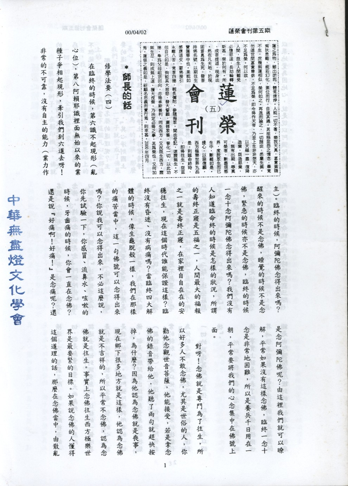

# 第5期

## 師長的話

### 修學法要（四）

*連志道老師講授、編輯部整理*

在臨終的時候，第六識不起現形（亂心位），第八阿賴耶識裡面無始以來的業種子爭相起現形，牽引我們到六道去呀！非常的不可靠，沒有自主的能力（業力作主）。臨終的時候，阿彌陀佛念得出來嗎？醒來的時候不是念佛，睡覺的時候不是念佛，緊急的時候亦不是念佛，臨終的時候一念十念阿彌陀佛念得出來嗎？我們沒有人知道臨命終的時候是怎樣的狀況，所謂的壽終正寢是五福之一，人間最大的福報之一就是壽終正寢，在家裡自自在在的安穩往生，現在這個時代誰能保證這樣？臨終沒有昏迷、沒有病痛嗎？當臨終四大解體的時候，像生龜脫殼一樣，我們在那樣的痛苦當中，這一句佛號可以念得出來嗎？你說我可以念得出來，不必這麼說，你先試驗一下，你感冒、流鼻水、咳嗽的時候，牙齒痛的時候，你會一直在念佛？還是說「好痛啊！好痛！」是念痛呢？還是念阿彌陀佛呢？由這裡我們就可以瞭解，平常如果沒有這樣念佛，臨終一念十念是非常地困難，所以是養兵千日用在一朝，平常要將我們的心念集中在佛號上面。

對呀！念佛就是專門為了往生，所以好多人不敢念佛，尤其是世俗的人，你勸他念觀世音菩薩，他能接受，若是拿念佛的錄音帶給他，他聽了兩句就趕快按掉，為什麼？因為他認為念佛就是喪事，現在鄉下很多地方就是這樣，他認為念佛就是不吉祥的，所以平常不念佛，認為念佛就是往生。事實上念佛往生西方極樂世界是最要緊的目標。如果說念佛的人懂得這個道理的話，那麼在念佛當中，由散亂的心，因為念佛而漸漸降伏這個妄心（伏惑），不但能夠伏惑而且進一步還能斷惑，不但能斷見思，而且還能破無明。

那麼念佛法門是怎樣的道理呢？主要的道理是從維摩詰經，「其心淨則國土淨」，要如何往生到西方淨土，非常清淨的佛世界呢？需以一個清淨之心，心清淨了，就能變現出清淨的土來，為什麼呢？前云第八識，相分乃根身與器界（國土），此一清淨國土（相分）從哪裡來？就是從我們的心變出來，我們的心清淨，我們變出來的佛土就清淨，心穢則佛土穢，心淨則佛土淨，那麼我們今天在念佛的時候，為什麼我們這個心是淨的呢？因為我們是以果地覺為因地心，就是說以阿彌陀佛的名號，念佛有四種，其中有一種云「持名念佛」，持名念佛就是念「阿彌陀佛」這四個字，其實「阿彌陀佛」這四個字是什麼意思？阿彌陀佛是梵語（印度話），翻成中文的意思，就是無量的意思，什麼是無量呢？就是一切都是無量，為什麼只翻「無量」？乃因沒有辦法說全，你說阿彌陀佛神通無量，難道他智慧不無量嗎？你說他智慧無量，難道他功德不無量嗎？所以佛的神通、智慧、功德、依正二報，這些莊嚴都是無量的，說一漏萬，所以只說「無量」，在彌陀經上說阿彌陀佛光明無量，壽命無量，這個光明無量，無量壽命是什麼意思？光明就是代表空間遍十方，大而無外，小而無內，而壽命就是代表時間豎窮三際。橫遍十方，豎窮三際，時空交織裡面的一切，都是無量無量。大而無外，小而無內，從過去無始到將來無終，這樣的一個境界是什麼境界？就是眾生每一個人的心，就是我們的佛性。而阿彌陀佛與所有的一切佛，都是已經開發出這樣無量無邊的德能（親證佛性），佛佛道同。但阿彌陀佛非常的特別，就是以他所開發出來的德能作為他的名號，這個名號就可以把他所證到一切的萬德萬能涵蓋住，即是「名以昭德」。

所以當我們在稱念這個名號的時候，事實上就是代表了阿彌陀佛的極樂世界（依正莊嚴），西方淨土的依正莊嚴，就是由阿彌陀佛所證到的真如本性，徹底地開發，顯現出最為清淨的莊嚴境界。佛開發出清淨心性之後，顯現出最完美的淨土，淨土最徹底地顯露出佛之清淨莊嚴的心性，此一心性，你我都有，可是我們從來不知道有那麼美好的一個能力，如何發展出那麼美好的能力？今天佛用他的名號，就是代表他實質的德能做為我們的因心，當我們在念這一句佛的時候，只要我們念到跟佛號打成一片，心就是佛，佛就是心，能所雙亡、合而為一的時候，那麼我們因地的凡夫心，一下子就變成了佛果上的一切境界，我們當下這個凡心全部沒有了，我人真如本性藉著佛號（佛果地上的一切一切莊嚴）全部開發出來。

茲舉簡單例子，在影印機上，佛就像一張畫了圖的彩色紙，我們將它放在影印機上，然後每個人都印一張出來，以佛的果地覺，做為我們的因心，我們這樣念一聲佛，若能與佛完全相應，一念相應一念佛，那麼我們這一念當中，我們的真如本性就徹底地開發出來。佛跟我們的心是完全一樣，心佛眾生三無差別。若與一句佛號相應，妄心就漸漸的壓下去了，真心就漸漸開發出來，有朝一日，這些見思惑就任運脫落，就任運的斷掉了，只念這句佛號！我們瞭解這個道理，非常真誠，而且非常相信的，是因為我們瞭解這個道理啊（勝解乃信心之源）！我們這樣真誠在念，念到功夫成自然，見思惑就脫落，慢慢地甚至連塵沙惑都脫落，甚至可以豁破無明。（下期待續）

（本文乃蓮友請教連志道老師，蒙師開示）

## 研習心得報告

### 勸發菩提心文（五）

*心爾*

「心本無生，仗境方起」心本無生指自性沒有生，任何的生起沒有生起自性，心滅的時候自性沒有滅，心本無生指自性不生，隨緣方能現起任何現象，不阻擋任何心念的生起乃無自性，不會阻擋善念生起，也不會阻擋惡念生起，然唯有善念方得樂，惡念方得苦，不會阻擋惡念得苦，善念得樂，即無自性，如世間順逆境界，能令善惡心生，無有自性以阻擋，看你怎麼應用。今發菩提心亦須緣境，因心沒有自性，發菩提心也要藉著因緣，藉著因緣去體會無自性，內心能夠體會無自性，引起的無我慧，內能降伏無明我執，外能展現一切的無我之大用度化眾生，心中沒有任何的機心（完全無我），當羅漢度眾生，度到剛強難化，就不想要度了，「我」跟「你」就出來了，雖然我不會去造殺盜淫貪瞋癡，但是我不想度你，故羅漢之無我不能體會佛的無我，心態猶然局限，所以二乘人所體會的無我義其力用小，猶如對電理之了解有限只能應用在電燈，但佛所體會的無我義猶如對電理有無限之了解，可以應用在電車、電纜，太空船乃至於核能發電，可以將電理應用到極至。任何的表現包括穿衣、吃飯，都彰顯無我的正念（法法消歸自性）猶如電燈的電，與核能電廠的電是一樣的，作用不同而已（理同用異），皆彰顯電理（用中歸體），所以佛藉各類表現彰顯彼之證量。勸發菩提心文舉八法，若能周知，則能發真正菩提心，所謂八法周知乃知菩提心有邪、正、真、偽、大、小、偏、圓，並依十種因緣發起正、真、大、圓的菩提心（真正菩提心），這是省庵大師要勸發的，依十緣而發起真、正、大、圓之菩提心。今諦老之四緣發心亦不離此。

一、外見佛，內觀身，自慚奮勉故！

慚者依於自身及法，生於尊貴增上，由斯崇尚敬重賢善，羞恥過惡而不敢為。「對自」生於尊貴增上，就是尊重己靈，謂我這巍巍堂堂的七尺之軀，不但具有與十方諸佛相同的佛性，而且又聽聞到無上甚深微妙的教法，我不做善行也已夠可恥，如何可以同流合污，為非作歹？由於對此自身生起尊重增上，及於佛與教法生起貴重增上，遂生起羞恥心，就會努力奮發叫奮勉。慚、愧都是世間善法的原動力，我們為什麼不想改進？

因為自己覺得不錯，縱然濫可是還可以接受。

看佛怎麼殊勝，也不能產生像佛經所說的那種內涵，沒有那覺受，因為內心在世欲的需求下，看不到佛對我的大恩（猶如浪蕩逆子，見不到慈母對他的慈愛），所以佛的殊勝，佛的偉大對我們沒有覺受，內不見自己的缺點，外不見他的殊勝。要改善自己的狀態，成就他（佛）的狀態可能嗎？修行就是像這樣半吊子。以上是無慚而不奮發向上之相。

二、憫念眾生同己，欲化淨故：

眾生跟自己一樣，是處於三苦、六苦、八苦、一百一十苦、六百六十苦、八萬四千苦裡，我的苦跟他的苦一樣，將心比心，他之想離苦得樂同於我故，我要好好的淨化他，佛何以要度他？乃看到眾生對我的大恩，但卻與我往昔一樣的在受大苦，我怎麼可以唯獨追求我快樂而放棄對他痛苦的拔除，怎麼可以放棄這種責任呢？

三、觀佛相好功德，因喜樂故：

「外見佛」約第一條乃約所說法，與之對比而生慚，欲奮發親證佛性。但初學者不能領受教法，無此悟性，或可見到相好功德，因羨慕故而發心欲得。阿難尊者這種根器的人，尚且要見佛的相好，更何況是我們。修行也是一樣，外相神采奕奕讓人感覺到修行真好，若修行起來一樣與世人萎靡不振，無精打采，做事不帶勁，做功課不得力，誦經沒覺受，上班煩惱多，下班障礙重，勸人念佛往生極樂，誰會聽？如此弘揚佛法，反而令佛法沒落，佛之苦就是苦在我們弘揚佛法，反而幫倒忙，阿彌陀佛在極樂世界裡暗暗叫苦，怎麼弘揚這種佛法？

四、最勝佛果，非不可得，因勤求故：

此條不離一至三條，最殊勝的佛果，其實是可以求得的，孟子云：求則得之，舍則失之。」既曰可得，故勤求以得之。   （下期待續）

## 生活感言

### 龍洞灣放生日記

*蓮心*

（八九年二月廿七日天氣陰雨）

今天的氣溫很低，海風襲來時，會冷得讓人直打哆嗦，但興致勃勃的我，卻有著無法按捺的期盼。

我們排成兩列，以接力的方式，把生物傳遞到海邊，經過我身邊的牠們，有大的，有小的，有我所熟知的，也有我不曾見過的，有跳動不安的，也有安靜不動的，有逃避的，有接受的，不論是以何種形態、何種方式，面對此時此刻，但牠們都在等待命運的安排；一籃籃的生物，放入海中，很快就淹沒在一望無際的滾滾浪濤裏，當濁浪排空，紛至遝來時，一個浪接著一個浪騰起、翻轉、促擁、又相繼伏下，把蔚藍的海面變成藍底鑲白邊的蕾絲之後，化為一片純白的泡沫，迅速的、不著痕跡的與靛綠合而為一，剎那間，另一波浪潮又騰起、翻轉……，一次又一次，週而復始。

在一陣忙碌之後，週遭的人群都已散去，身邊喧擾的聲音也悄然褪去，眺望大海，方才滿簍滿筐的魚兒、螺兒……，也無處覓蹤跡，濤濤海潮，竟然沒有任何放生的痕跡，只有驟然落下的雨聲，陪著我在冷冷清清中，尋尋覓覓著。

雖然這是我第一次造訪這個地方，卻沒有初來乍到的手足無措，反而在陌生中有分熟悉的感覺；在今天這樣一個陰雨溼冷的時刻裏，人、魚、海的聚合，綻放出「海闊任魚躍」的光芒，中間沒有必然也沒有絕對，只是各個因素的偶然相遇，投影在時空洪流裏的一個驀然。

我們所放的生物為形體所囿，走上無法自主的命運。幸運的，或許可以逃過吞殺網捕，不幸的，則淪為刀俎魚肉，無法像我們可以幸運的親近佛法、研讀經教，凡此種種，何嘗不是業力的可怕？一個「業」字，讓有佛性的眾生，流轉於不同的輪迴險路，顛沛流離、輾轉反側，以致珠玉蒙塵，遮掩了清淨的本性，徹悟禪師說：生必有死，從古至今，曾無一人逃得，一念之差，便墮惡趣，而苦趣時長，三塗一報五千劫，再出頭來幾時？地藏經云：「業力甚大，能敵須彌，能深巨海，能障聖道。」誠不虛也。

去年德基水庫放生的歡愉，還歷歷在目，如流水不斷，而今的它在墜機、九二一地震的蹂躝下，卻已是歷盡滄桑，景物全非；我才警覺楊柳依依、風光明媚，卻是荒煙蔓蔓、雜草叢生的前兆，華屋廣廈、雕樑畫棟，可能只是斷瓦殘垣、故園蕭條的假相，原來「池塘生春草，園柳變鳴禽」的花團錦簇不是天長地久、歲歲年年，它會轉眼成空、轉瞬即逝；記得小時候，讀到「白雲蒼狗、滄海桑田」的句子時，我總是不以為然的瞪大了眼睛，滿臉疑竇的問父親：「天底下那有這種事？」父親永遠都是給我一個千篇一律的答案：「等你長大以後就知道了。」如今父親墓木已拱，而我也親眼見到這種無奈和悲傷，可是我不知道，自己是否也會語重心長的對稚子重複父親的話？

在滾滾紅塵的逆旅中，我只是一個過客，當人間遊遍時，所有的歡喜憂傷，都成了山光水色裏的倒影，也許我無法去捕捉這些過眼雲煙，但是在真善美交會的每一個瞬間，我願以珍惜的心，為這旅程留下些許雪泥鴻爪，把這些浮光掠影的片斷，留予後人憑弔與回味，也聊為「緣起緣滅」下個註腳吧！

## 臨終關懷與助念時效

### 助念經驗談（一）

思嘉

八十年時，我在高雄皈依佛門，也初次接觸佛教文物，印象最深刻的就是陀羅尼被，可是一件動輒千餘元，若要常以此和病危的親友結緣，是一筆不小的開銷。後來方知正法道場陀羅尼被是免費贈送。

新手上路  抱憾終身

真正比較經常用到陀羅尼被和金光明砂以及臨終助念之重要，是我在八十六年擔任看護之後。

不過回顧起來，卻不是一開始就能進入狀況。還記得頭一個病人罹患肝癌過世，我並不知道該將這些法寶帶在手邊，以便應急，並以助念的方式助其了生死。當時只知道先按著院方的規定，換下他的制服，穿上他自己的便服，忙著收拾病房內的東西，看著負責善後的工作人員將他送到太平間，然後聯絡蓮友來為他助念。師兄們來時，將他由冷藏庫中移出，放金光明砂，覆上陀羅尼被，然後開始為他導示及助念。

事後據參加他出殯的一位朋友告訴我，他的面容看起來比剛斷氣時還難看，嘴巴張開，牙齒暴露，雙眼圓睜。我臆測：一方面是因為他內心憤懣不平，所託非人，後事沒有依照他的心意辦理；另一方面，就是因為斷氣未久即入寒氣逼人的冰庫，瞋心頓生，以致如此。

日後每次為「新亡舊縛」迴向時，都會想到這位榮民伯伯，有說不出的愧疚。

頭頂微溫印像鮮明
翌年四月機緣巧合照顧一位高齡九十二歲的蘇老太太，她在一年半前曾經一度沒有心跳、沒有血壓，家人連壽衣都為她穿妥了，過了一個多小時，她居然醒了過來。獨子問道：「您怎麼去了又回來？」她
**答：** 「找不到你啊！我會哭。」

這句話道盡了寡母與孤子相依為命七十年的深情。可能也因為那段時間缺氧，所以在以後的日子裡，神智漸漸不清，身體機能逐步退化。後來造成致命的原因，是發現有異物哽在胃和十二指腸中間，食物無法順利通過，可是家屬以她年邁體衰為由拒絕開刀，於是辦理退院，決定回家自行照顧。

時有廖師兄，早就認識蘇老太太，兩年來不時前往探視，隨著她的病情起伏，有時去醫院，有時到家裡，向她介紹佛法，也和她的兒子以及孫媳婦建立很好的佛緣。據說老太太在身體還滿硬朗時，親友屢次勸她「老年修淨土，從此快生平。」她就是不肯念一聲「阿彌陀佛」，但是我們都不死心，哪怕是她已經陷入昏睡中，還是勸她要放下一切，求生西方極樂世界。

當時，任誰看到這位一生守節撫孤年逾古稀的老太太，插著鼻胃管，接上引流袋，都會覺得鼻酸，他的獨子蘇老先生也為母親不能早日得到解脫而扼腕。我勸他做一點布施，將功德迴向給母親，或許能早日脫離苦海。起初他不願意，他說把錢給了像宋七力那樣的人，豈不是助紂為虐？我說那麼印經書，啟發人家的佛性，幫助人家的慧命，那就沒有這層顧慮了。蘇先生一口答應，交給我一萬元，我立刻到郵局劃撥。隨後將劃撥單影印放大傳真，在旁邊空白處註明助印「阿彌陀經、觀世音普門品」二百本，分送寺院學會以及精舍，餘二十本送到事主家。翌日，出版社方依約派業務員將簽收單及經書送達，完成了家屬的心願。

三天後（七月三日）的凌晨二時許，我和菲傭發現老太太的血壓降到三、四十，趕緊上樓呼喚她的兒子、媳婦、孫子、孫媳，並且聯絡精舍，不多久，廖師兄趕到，經過師兄懇切的導示佛號響起，老太太嚥下最後一口氣。時間是三點零三分。

事前，老太太垂危時，她的兒子多次希望我們幫忙為他母親換上壽衣，我和他的媳婦都婉言相勸，不要徒增其身心雙重的痛苦，最好等八個小時後再換。那天師兄們助念完，又有一些親友前來念佛結緣，直到傍晚時分，才開始為老太太沐浴更衣。當時她全身柔軟，我為她梳頭，戴上頭面時，發現她的頭頂是溫的，平生第一次親身看到往生西方的確實証據，十分訝異。

一個生前不信佛、不念佛的人，對塵世、對兒孫有無限的眷戀，捨報時能有此瑞相，不得不讚嘆助念法的殊勝。也是老太太的福報大，在垂暮之年，得到師兄們持續不斷的關懷，直到最後為她送終，在家人伴同助念之下，走完她的一生，大家齊心合力地把她送入了極樂世界。

天主教徒  佛號送終

去年八月份開始，到二空眷村照顧高齡八十二歲的許老太太，她的老伴在三年前已經離開人世，最在意的就是女兒是否把她放在第一位，還有就是希望經常能看到一手帶大的三個外孫。因此在長達半年的時間裡，我負責白天看護，晚上則由她女兒陪伴，偶而女兒為了公務加班不能前來，她就頗有微辭。週末看見外孫輪流回來探望，她就笑逐顏開，所有的痛苦都拋諸腦後。

每次在空軍醫院住院，週二週五都會遇見一位美籍的蔣神父來關心他的教友，七十多歲高齡仍不辭辛勞，到每個病房來和教友寒喧、禱告，他常跟許老太太一起作彌撒、唸玫瑰經，即使看見許媽媽手上戴著佛珠．床頭放著念佛機，也不以為意。也許就因為他這樣的寬宏大度，成就了許媽媽別開生面的佛緣。

她一直為卵巢囊腺腫所苦，但是醫生以她心肺功能不佳，遲遲不敢為她開刀，只能定期抽取腹水來緩解，到了今年二月十日，病情急轉直下住進加護病房。我仍然抽空去探望她，起初她還意識相當清楚，跟我打招呼，到了三月份就慢慢陷入昏迷中。十四日傍晚，我接到她家屬的電話說情況有惡化的趨勢，於是聯絡廖師兄分頭前往。

我帶了皈依的儀軌，在許媽媽旁邊很虔誠地修完一壇，希望許媽媽跟我一起皈依三寶（佛法僧），順利地往生西方極樂世界，不要再留戀這個五濁惡世。就在剛修完的一剎那，我看見她不斷地吐出穢物，趕緊拿衛生紙來兜住，不一會兒工夫，幾乎把屋內的衛生紙全用完了，然後看見儀表板上心跳停止的訊號，時間是八點四十五分。

當時跟護士交涉不拔管、不更衣，請她們把院方的制服計價，算在病人的住院費用裡，於是就這樣地移到太平間，在她的女兒、外孫和師兄們佛號伴隨下，直到凌晨五點半才功德圓滿。事後據許太太告知，她母親的遺容臉色紅潤，神情安詳，不像她父親過世後臉色是發黑的。再者，她的外孫女也說：他們完全按照師兄的指點，誦地藏經，把功德迴向給她奶奶及她奶奶將安葬的那處墓地。

最後許媽媽的告別式在她一向望彌撒的二空德蘭堂舉行。靈襯上貼咒輪貼紙，兩者兼容並蓄，彼此毫無衝突，相信許媽媽在西方淨土看了，也會不禁莞爾。

## 啟蒙園地

### 『我』的小小願望

心印

我們常常喜歡許願，願家庭幸福美滿，願自己健康快樂，願讀書考試順利，而生活上也常常希望能吃到好吃的，常和朋友出去玩，常聽到讚美自己的話，不要被蚊子咬……，好多好多的希望和不希望都是所謂的煩惱，而佛菩薩是沒有煩惱，有的是一顆清淨的心。

我們該如何去除煩惱，讓心清淨呢？其實很多的煩惱都來自「我」。若把「我」這個字做個剖析，它是由「手」和「戈」所組成，也就是說我們常常手上拿著一把武器在維護這個「我」。我要吃這個、我要玩那個、我要……，事事都必須合乎我的意思。不合我意時，我就很生氣，很痛苦，開始賭氣、冷戰。有人罵我，心中就是不舒服，有人打我，我就一定加重打回去；有人對我不好，我就跟他勢不兩立。試想若把「別人罵我」當成是一份禮物，我只要不接受，就沒有煩惱了，他罵我時，先要反省自己是否有錯，是不是傷害了別人，並站在他的立場想，他或許心情不好，就算是自己有理也最好不要在別人的氣頭上和別人爭論，如此只會火上加油，一發不可收拾，原本可貴的情誼可能都會因此而破裂。不如把被罵當成是一種訓練，像是梅花的越冷越開花，荷花的出淤泥而不染。也學習蓮葉的精神，水珠來了也能一抖就全掉了。

而大家來參加啟蒙班，來學規矩，為的是學習如何約束這個「我」，如何替別人想，如何與人相處。並練習念佛，來幫助我們去除「我」，就像陽光能去除黑暗，幫助萬物生長。因為無我，而我們能時時刻刻都幸福、美滿、健康和快樂，而我們周遭的人，也能大家相觀而善，和睦共處。把「我」的格局擴充，用一顆不為自己，清淨的心來處事，我們的生活環境也可能變為莊嚴的淨土。將來也都能到極樂淨土去遊學，且快速成佛而得大快樂，任何的所願也皆能成真。

### 愚公移山

*編輯部*

愚公移山一文出於《列子﹒湯問篇》，是一篇中國古代的寓言。說的是古代有一位老人，住在華北，名叫北山愚公。他的家門南面有兩座大山擋住了他的出路，一座叫太行山，一座叫王屋山。愚公九十歲了，他下決心率領他的兒子們用鋤頭挖掉這兩座大山。有個叫智叟的老頭說你們太愚蠢了，你們父子幾個人要挖掉這兩座大山是不可能的。愚公回答說：我死了，有我兒子，兒子死了又有孫子，子子孫孫是沒有窮盡的。這兩座山雖然很高，但不會再增高了，為什麼挖不平呢？愚公毫不動搖，每天挖山不止。這件事感動了上帝。於是上帝派了兩個神仙下凡，把兩座山搬走了。從此以後，從河北省以南的地方，便沒有高山的阻隔了。

所以這一篇文章告訴我們，作任何有意義的事情，要有恆心跟不畏艱難的毅力，努力的去完成它，不要害怕困難，一直做下去就對了！
