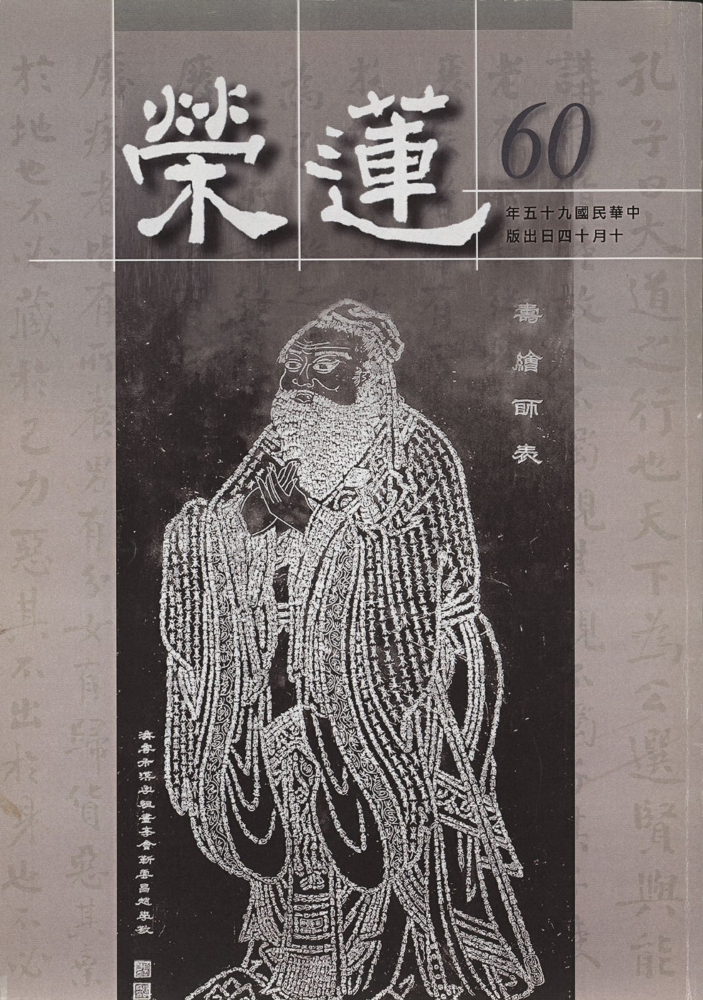

# 第60期

## 社論

### 挽回劫運護國救民正本清源之道

本刊

正本是講究心地

清源乃重視因果

挽回劫運之根本

個人增上的樂源

所謂劫運乃國家的災難，包括了天災、地變、衝突、戰亂乃至離婚、自殺等，這些名詞以往讀起來陌生，現今卻令人感慨良深，它帶來的是財產的損失、人命的犧牲、國家敗亡的徵兆。誰不想國泰民安，誰不想長治久安，誰不想頤養天年，誰不想未來有美好的前景，若都變成奢侈的盼望，遙不可及的理想，那真正是劫運了。

要護國救民挽回劫運，使治安良好，百姓對國家有向心力，而不會徬徨茫然，自然就不會有躁鬱症、自殺、家庭破碎等種種社會問題，自然國力不衰。現今有許多人苦思解決之道，但依目前看來都是治標，只不過在遏止一些亂象，但對亂象的根本卻提不出解決之道。

印光祖師在民國初期也是舉國大亂，在人心惶惶之際，老人家提出了正本清源之道，所謂的正本，就是恢復心地的光明，發揚人性的善良面，這要從居家做起，要由實踐孝弟開始，往外推展的是誠信，以及互相的利益，帶來的是風俗的淳厚，社會上不會有作奸犯科的事情，大家安居樂業，老百姓自然愛護這個國家、愛這片土地，這比每天喊著口號，但卻助長亂象來得實際得多。

但人性要發展光明面，要從孝弟做起，要本於良心，要替他人著想，這些用在個人修養是可以的，但是用於勸說眾人，在風氣已壞，上位者只重視權謀，由私利出發之際，已經變得微弱不堪，要來扭轉社會及國家澆薄的風氣則如螳臂當車。在爾虞我詐的風氣蔓延下，儒家的道德勸說也只對上焉者如司馬光、范仲淹等這些有良知的人有用。

對中下焉者，只想謀得生活的安定，只看到這一生，只看到眼前的人，是無法改變其內在依然故我的習氣。所以祖師另提出清源之道，亦即如何回到人性的光明面，從本源處（心）去除黑暗（無明），趨向於光明（明心見性）。祖師所舉的方法就是因果教育，因果教育不只要從儒家既有的基礎上出發，所謂的既有基礎即是《書經》上所說：「作善降之百福，作不善降之百殃。」然此就個人今世而論；至於《易經》上所說：「積善之家必有餘慶，積不善之家必有餘殃。」是就加被後代而說。

至若個人的未來，尤其生前善惡業對死亡之後的影響，儒家未說，而佛家則大談，且大談三世因果及六道輪迴的報應。能令有情斷惡修善，且由孝弟做起，由替他人著想做起，由誠心誠意做起，並且所做的善法都被正法的觀念攝持，此人不只此世具足安樂、加厚於子孫，更使自己來世由樂入樂，且自身所得的福報遠勝過加厚子孫千萬億倍。反之，處處由私心出發，講究權謀，不顧社會的公義，擾亂公安，所帶來的災難，此人不只是此世痛苦，留禍於子孫外，來世更受劇苦，此苦勝於此世、勝於禍及子孫千萬億倍。

果然有這種符合事實的因果觀念，必能使中下等根機者幡然改悔，樂於從良知出發，處處憑良心來真誠待人，使社會風氣淳厚，使舉國安定，大家自然認同這個國家，愛這塊土地，不只是人與人之間彼此相害的事情不會發生，連天災地變也隨之化為烏有，共享堯天舜日的太平盛況，此即是解決當前國家劫運的根本之道，也是印光祖師在當時亂世時提出《挽回劫運護國息災正本清源論》的義理所在。

## 大德法語

### 常禮舉要講座（一）

雪廬老人

道聽途說德之棄

學問紮根在於禮

不為名利求學問

潛移默化功萬世

前言

雪公老師曾說禮節這件事情，在人群裡面是絕不能少的，極野蠻的民族，也有他們一套的禮節。人與人交通感情、事與事維持秩序、國與國保持常態，皆是禮節從中周旋的力量。

禮從淺處說能節制人情，並且在實行上都是讓他人受益，至少不妨礙他人。能實行禮，在家庭、在社會，都能受人歡迎，是與人結善緣的殊勝方便；往深處說，能成就仁德，所以《曲禮》上說：道德仁義非禮不成。

禮在十三經裡有三禮，所謂《周禮》、《儀禮》、《禮記》，其中《禮記》是孔子闡述《周禮》、《儀禮》，藉由弟子記載而成，現今通行的是小戴禮記有四十九篇。本《常禮舉要》特別是由《禮記》的《曲禮》中節錄出來，有助於現今推展人格教育的重要教材。

此書在 雪廬老人編述之後流通甚廣，特別是用來作為啟蒙教育塑造孩子成為人才之要書，《史記孔子世家贊》中，司馬遷曾說：他自己到山東曲阜孔廟參觀，那時候是漢朝，雖距孔子春秋已有數百年（四百多年），但仍然看到孔子代代相傳下來的學生，經常在孔廟裡研習禮，令司馬遷徘徊不忍離去，感慨良多！

這本常禮舉要包含的範圍甚廣，有居家、在校、處世、聚餐、出門、訪人、會客、旅行、對眾、餽贈、慶弔、稱呼，若能活用，必能在生活上有一番深刻的體會，與人交往，必能得到別人深厚的友誼，也是自己實踐仁道的方法，堪稱一部自行化他且合宜於現代的殊勝教材。

雪廬老人在民國七十一年四月廿三日，以十二次的時間，將常禮舉要每章作闡述，老人曾說這本《常禮舉要》還非得他來講不可，乍看之下沒什麼難懂，覺得十分容易，但細想，這裡面都是生活的經驗談，是古聖先賢做人處世所應用的方便，若非有所體悟之人，焉能將這些條文的精神說出，令學者感動而願實踐於日用平常！今本會有幸藉刊物連載登出，以饗讀者。唯願禮教風行，風俗淳厚，進一步能令正法住世、國泰民安，能成為近者悅遠者來的淨土，不辜負老人於九十三歲高齡重講此書之悲心情懷。（編者）

講課不是容易的，中國那一樣的學問才上來都有根本，就與栽樹（植物）一樣，先有根再談其他。學問沒有根本，道聽塗說飄飄浮浮的。孔聖人說過這個（道聽塗說），在道路上走著聽見什麼，這一趟街還沒走完，碰見熟人，說我有了學問，聽見什麼、聽見什麼等等，還沒走完，在街上又賣弄出去了（口耳之學），連根都沒有，枝葉等還不明白，一知半解都談不上，已賣弄了。

中國學問講究根底，無論學什麼，念中國書有這麼一句話「通一經則通全經」，一本古人聖賢的典籍要真懂了，其他一些你都懂得。譬如說佛家，一本薄薄的阿彌陀經，要懂了，三藏十二部經典都懂了，此實在話。這一本你還不懂，其他如八大人覺經、四十二章經你也不懂得，這是說讀書。就是農、工、商、法、醫也是如此。從前不管那一行，你問台灣的一些老人，當木匠、鐵匠，不論幹什麼，他才學，苦頭就吃了不少，不如此紮不住根的。紮不住根，老師就不讓他出師，怕的是出去到外頭出醜，出醜倒還罷了，頭一句罵「什麼人教你的？」你聽這句話吧！沒上學、在家裏，你是誰的孩子？有了壞事先罵父母。上了學，出去無禮，先罵老師，聽明白了嗎？所以是老師當不得，父母也當不得，一當就得盡上十二分力量。

以前原則不變，即使變了也不是原則變，這個孔聖人書上有「百變不能離乎中」。譬如佛家講萬法皆假（相）、皆空（性），本性是不生不滅，這是佛家的主張。老子亦云，天不變，道也不變。聖賢主張都一樣。可是現在變了嗎？現在變了，竟也有殺父母的，這個大家都知道，實是教育界的缺失。有本書竟這麼說：母親把孩子生下來，就如同豆子離開豆莢，與那個豆莢毫無關係。我也不必提出什麼書來，你看都是現在的書啊！畜牲沒上過學，這種沒天理的事，畜牲還做不出來。

我給諸位說，咱們學佛又學儒家，有人問為什麼要學儒家？儒家鋪了底子，然後才能以學佛。可是現在呢？打倒孔老二。若沒有儒家，中國文化就沒了，我們學佛也就沒根底了。你諸位自己看看祖師註解的佛經，可知他們對中國六經及歷史都熟。從前，我跟大家說過，我覺得我不錯，我到現在才覺悟，覺悟得也已不早了，我是那一條也不行！從前那些和尚真不愧是和尚，和尚就是老師，現在就不行了！

從前是讀了中國文化再學佛，現在是學佛沒法子了，再學中國文化。你學了中國文化就會幫助你學佛。所以我們學佛又學論語，以後每學期我們都辦論語講習班。

其次，我們學佛，大家都知以戒律為本，佛在世時以佛為師，佛不在世則以戒為師。我（雪公）也受過戒，對於戒我不外行，可是我知道我這個戒是有名無實，不得已只好依中國文化裏孔子這一套，大家聽聽，「博我以文」，要學的學問很多，然怎麼個學法？「約之以禮」，須從禮上來實踐。

這本常禮舉要就是我（雪公）編的，果然諸位要能懂常禮舉要，現在受益就不小，這就是「約之以禮」，就能懂人情世故，不至於在社會上妨礙人。你把中國的四庫全書都念通達了，若處處於人有害，處處妨害人，這個書就不如不念。怎麼呢？是愈念愈害人，念它幹什麼？你不論有什麼大學問，這一個世界是群眾社會，不是你一個人，你、我要共享共榮才行啊！

這本常禮舉要不但是我編的，還得我來講，雖然是我編的，出處都在《禮記 曲禮》上。「舉要」是將《曲禮》要緊處舉出來，都是前人有的，我只是把要緊處編輯出來。大家若能記住這些條目，在社會上最低限度會得到別人尊重，人家看了看會說：這人真是君子。怎麼呢？現在外人看我們這一班人就是不一樣、特別！怎麼特別法呢？他們害人的很多，我們不害人，我們多少規矩些。

你要是約之以禮，不但學儒，學佛也會進步。學佛受戒的人，要常常念戒，念戒是怕你忘了，可是念得很熟，不照樣辦，有什麼用處？此次暑假要講常禮舉要，所以今年暑假不休息，為什麼不休息？我沒有幾天可活，這是真的，九十三歲了，可以了嗎？可以了！要是活三十九歲也還可以，岳武穆就是三十九歲死的，人家三十九歲辦了什麼事啊？九十三歲辦了什麼？我的話都有根據，隨便說個三十九歲，你看也逃不出歷史。尤其是今年，今年是壬戌，有云我知道是壬戌，你知道？我怎麼講著岳武穆忽然又談到壬戌，這是怎麼回事？你查查有什麼關係？我不問、我也不講，查查歷史，今年與岳武穆有什麼關係？

我們在台中辦學不要錢，還得要聽明白這一套，我們辦的跟別人不一樣，他們來這裏學，我們選擇選擇，將來出去教育學子要盡義務教，可是學校呢？要你教你就去教，不要你也不能勉強，也得碰機會。

我給諸位說，咱們這個團體是兩種根基帶下來的，一個是孔聖人，現在大大地不興這個。再一個是佛陀，現在也不行了。一些佛教雜誌主張不要戒律，這才是新佛教，都到這個樣子。他們新他們的，咱們守咱們舊的。我無論教什麼，我按著我的教法，給諸位說一句，你們願意不願意上這裏來學，我也不勉強。你不願意學我也不強留，來者我不拒，去者我也不留。

可是到這裏來我來跟你說明白，一個錢我也不要，這是我的原則，我不是為了要錢。我教你們，辦到辦不到莫論，我只注意教你世間法學孔聖人，出世間法學阿彌陀佛或釋迦牟尼佛，這是我的目的。你們諸位願意走這個路子，你就這麼走。可是有一層，我講的離不開經上原則，這是自古以來儒家、佛家都是這樣註，離經一句便是魔說，你要是離開經上那不是魔說嗎？隨便說了，拿什麼標準呢？我早就抱定宗旨，我按著佛經與孔聖人這兩種與你們同學研究，研究的就是我這種的辦法。

我的辦法是什麼呢？我的辦法是自古以來那些祖師怎麼教，我按著那個說，沒有我的，我先把這個說明白，學孔聖人就是想要做到孔聖人，做到做不到莫論，可是心裏往這兒走，這是聖人的希望。學佛，佛是希望你成佛，你成了羅漢、成了菩薩，都非佛所願。你如志在成聖人、成佛，就得按這個路子走！你上台北，你就得買上台北的火車票，你不能買日月潭的，南轅北轍是辦不到的，這個大家都懂得。

君子有三畏，畏侮辱聖人之言，什麼叫侮辱聖人之言，不是今日之下這一套人們罵孔子什麼的，這個談不到，這些是精神病那一類的。就是念書的、滿嘴是恭敬孔聖人，也念孔聖人的書，這些人是侮辱聖人之言的！人家成天念書怎麼會侮辱聖人？念書，他為什麼念書？為著會了這些書了，上學校去拿鐘點費，他是為了錢。從前舉人、秀才等等這些，也是為了升官發財，這個與孔子之道毫不相合，學而不行就是侮辱聖人之言。

那麼諸位要實行了以後，我給諸位說，個人的職業，農、工、商、法、醫什麼都幹，有什麼能力幹什麼事，不拿聖人之道及佛學賣錢。可是有一層，你們諸位要特別注意，你學你的，學後要實行，你在外邊千萬別跟人家談這些，別拿出好心來勸人家要學什麼。不是講究弘揚嗎？你說的話是什麼意思？你要弘揚，他來找你，你向他說說，他不來找你，你還要向他說，他必然說你們這些人腐敗、落伍等等。

你要再跟他辯論，我給你們諸位說吧！從今天起我拜託你們諸位同學別在外頭辯論，一概別辯論。他說孔聖人是千載的罪人，佛嘛，也是沒有的、造謠言的。他說的你千萬別跟他辯論，大家記住！你說：「我不懂得，念的書也少，我對這個有興趣，可是並不懂得，模模糊糊地學就是了。」往外推，一問三不知，你們諸位要抱定這個宗旨。要是在外頭一辯論，你們學的這一套還夠不上，怎麼夠不上？學的這個你並沒有瞭解。

這個時候，你規規矩矩的，會遭人反對，你不信？孔聖人都遭人反對，說是千載罪人，憑著你怎麼不挨罵？譬如我，當然也被罵，不過我能受得了，活了這麼大把年紀（年九十三），罵不死！要罵死得有一個人出來罵，誰呢？諸葛亮出來罵，可以罵死我了，諸葛亮以外別人也罵不死。你怎麼說這話？諸葛亮會罵人嗎？罵死過人嗎？當然罵死過人。我說話都有根據。王朗光會作詩作文章，他也領兵跟諸葛亮去打仗，笑話吧！諸葛亮看了看便說，我怎麼跟你打，你簡直是外行，你這老東西如何如何地說了一套。氣得王朗在馬上死了，被罵死了。你查查歷史，諸葛亮一罵王朗就完了。（下期待續）

### 大方廣圓覺修多羅了義經（二十）

道源老和尚

普賢大慈悲

方便與漸次

知幻而能離

道心永不退

甲二、正宗分

乙一、為上根人示真修

丙一、示頓修

丁一、普賢啟請—普賢章

戊一、具儀總請

經文：

「於是普賢菩薩，在大眾中，即從座起，頂禮佛足，右繞三匝，長跪叉手，而白佛言：大悲世尊！願為此會諸菩薩眾，及為末世一切眾生，修大乘者，聞此圓覺，清淨境界，云何修行。」

前文中文殊問師：一切如來，因地皆是圓照清淨覺相，此處普賢菩薩問清淨覺相怎麼樣圓照（如何修）呢？此是普賢菩薩代我們發問，表面說是替當會的菩薩問，實際當會的菩薩都是法身大士，都已會圓覺的修行，此乃為了末世眾生問。

戊二、持難別問

經文：

「世尊！若彼眾生，知如幻者，身心亦幻。云何以幻還修於幻？」

一切法皆如幻化，如魔術師變術法，所變出來的都是假的，看似真的實際是假，此謂之如幻者。前章（文殊章）亦述，妄認四大為自身相，六塵緣影為自心相，不只如此，一切境界如幻，誰也不是真實的。既然身心也是幻化，云何以幻還修於幻？要修行須用身心修行，若身心是假把戲（如幻），如何以幻化的身心，還修這個如幻的行門呢？

經文：

「若諸幻性，一切盡滅，則無有心，誰為修行？云何復說修行如幻？」

這是普賢菩薩提出的第二個問題，前章述：知是空華，即無輪轉，亦無身心受彼生死。身心觀空了，既沒有身相也沒有心相，一切都是幻化的，都斷滅了，則沒有了眾生，那還有誰在修行呢？既沒有眾生修行，世尊又何以說修行如幻呢？這是第二個疑問。

經文：

「若諸眾生，本不修行。於生死中，常居幻化。曾不了知如幻境界，令妄想心，云何解脫？」

這是第三個問題，要是不開導眾生，眾生本來不修，在生死道中轉來轉去，常居於幻化生死之中，居於幻化但不知道是假的。他不修怎麼知道如幻呢？一切不聞佛法的眾生，當連如幻的名言都還沒有聽過，如何知道身處如幻的境界呢？「令妄想心，云何解脫？」眾生的心是妄想心，妄想心要解脫，是怎麼樣個解脫法？他根本不知道是如幻的，他怎麼解脫呢？那麼就永遠流轉生死，永遠當眾生了？以上有三個分別問，下邊再總問。

戊三、結請方便

經文：

「願為末世一切眾生，作何方便，漸次修習。令諸眾生，永離諸幻。」

可見普賢菩薩雖為當會菩薩請問，實實在在是關心我們這些末世眾生而請問於佛，應「作何方便，漸次修習。令諸眾生，永離諸幻。」這中間的問詞有二個，第一個問作何方便，第二問作何漸次，前之文殊章頓超法門，「知是空華，即無輪轉」，很簡單，一下子頓超過去了，其他中下根的眾生不假方便怎麼行呢？方便就是下手的方法，得有個次第，第一步怎麼樣？第二步、第三步怎麼樣？修習也得有個漸次，這個末世的眾生，要天天永離諸幻，不然隨著幻化而幻化，永遠不能解脫，將此二問題記清楚，一是問「方便」，一是問「漸次」。

經文：

「作是語已，五體投地。如是三請，終而復始。」

說完後行禮，如是三次請求表示恭敬。

丁二、師資緣合

經文：

「爾時世尊告普賢菩薩言：善哉善哉！善男子，汝等乃能為諸菩薩，及末世眾生，修習菩薩如幻三昧，方便漸次令諸眾生，得離諸幻。汝今諦聽，當為汝說。」

此時世尊正式答覆他（普賢），先讚歎他問的好！普賢大士能為諸菩薩及末世眾生修行如幻三昧，有正確的下手處（方便）及修學的次第（漸次），而能令諸眾生得離諸幻，眾生有了方便及次第，他就可以用功、可以進步、可以永遠得離諸幻了。「汝今諦聽，當為汝說。」佛要普賢菩薩詳細的聽，實在的聽，我（佛）當說給你（普賢及與會大眾，實今末世眾生）聽。

經文：

「時普賢菩薩奉教歡喜，及諸大眾，默然而聽。」

此時大眾都靜靜的諦聽。

丁三、酬請開示

戊一、長行

己一、酬總請

經文：

「善男子！一切眾生種種幻化，皆生（於）如來圓覺妙心。猶如空華，從空而有。幻華雖滅，空性不壞。」

圓覺妙心是一切眾生的本性，本文是如來圓覺妙心，讀了或以為成了佛以後了，這個如來圓覺妙心還要生起一切眾生種種幻化，亦即成了佛以後還當眾生，這可大大的錯誤。後有彌勒菩薩請問章，替我們問這個問題，就是成佛以後什麼時候還會再當眾生？此圓覺妙心是人人本有，但各各不知，唯如來盡知，所以稱如來圓覺妙心，此圓覺妙心唯佛發現，但是眾生不知道，唯有如來知道。

譬如：現在的天文學家在虛空之中發明一個新的星座，在過去天文記載中沒有，被這個天文學家發現，他的報告大家都注意了，都用天文望遠鏡來觀察，果然真有這個星座。不錯！這是他發現的，此星座之命名就以他的名來命。同理此圓覺妙心唯佛所見，稱如來。一切眾生種種幻化，都是依著圓覺妙心生的，不是從圓覺妙心生出來的。

「猶如空華，從空而有。幻華雖滅，空性不壞。」這「從」字也要注意解釋，只能做「依」字講，依靠虛空而有空華，若無虛空則顯不出虛空華，是依靠著虛空生出華，而非虛空生空華，依譬喻而明一切幻化諸法是依著圓覺妙心而生的，而這圓覺妙心可不生幻化諸法，一切經典的解釋都是如此，切不可顛倒理解，否則圓覺妙心也生眾生幻化諸法，則成了佛還得當眾生。

空華從空而有，並非由虛空裡生空華，有虛空裡生空華的嗎？空華是你病眼裡生的，但是沒有虛空可生不出來空華，得依著虛空才有空華，那個「從」字是依空而生，這樣解釋、很辛苦的分析（很費氣）才會較容易懂，空中華滅了，不會斷滅，什麼不會斷滅？空性不會斷滅，虛空之性本來清淨，不壞滅。（下期待續）

### 佛說八大人覺經講錄（二）

道源老和尚

能依三覺破二障

五道十地五二位

證得三智離二死

全為利他說悅懷

以上一段話乃宣說本經之因緣，現在正式講經題：佛說八大人覺經。

先說「佛說」：經皆是佛說，佛乃我們娑婆世界本師釋迦牟尼佛，梵語「佛陀」，翻成中文叫做「覺者」，「者」乃「人」，此人是什麼人？乃大覺大悟、覺行圓滿的一個人，所以稱為「佛陀」。佛陀可以翻成覺者，為何不翻覺者，卻保持原來梵語（音）呢？這是含多義不翻。翻經有規矩，含意義太多而與中國名辭不合就不翻譯。中文「覺者」就是一個覺悟的人，但梵語「佛陀」含有三覺的意思（含多義不翻，保存原梵音），梵音翻來應是「佛陀」，因為這些譯經的大祖師知道中國人根性，說話喜簡略，所以「佛陀」簡單譯成「佛」。

梵語「佛陀」含有三覺：

自覺、覺他、覺行圓滿，此三義在講《佛說阿彌陀經》時已詳細講過。

今天所解釋佛之三覺是依《大乘起信論》的解法，讓諸位多了解一些佛理。

本覺：乃吾人本具之性，謂之佛性、實相、一真法界，是人人本具，所以謂之「本覺」，是人人本有的覺性。然吾人何以雖具佛性卻仍為眾生？因眾生在迷，迷而不覺，試問何時迷？此很難解答，佛經上說，迷乃無明之故。再問何時有無明？無始，推不出一個開始，所以謂之「無始無明」。無始無明，表示推不出原始來，沒有開頭！何以故？因有無明故而作眾生，假若沒有無明，我們不會做眾生，而無始來即是眾生，從來未曾開悟，所以在眾生地位上找不出原始。

既是如此，做眾生是因為有無明，如何知我們有本覺呢？試問若無此一覺性（有一求真理的覺性），要是沒有本覺，我們眾生就永遠做眾生，再怎麼修也不會成佛，所以說一切眾生皆有佛性，佛性乃本有的覺性謂之本覺。《起信論》上有一比喻，比如礦藏之金。黃金是由礦產中生出來，黃金要經過冶煉之後才成純金，但是在未冶煉之前，蓋著礦石，如同本覺蓋著無明，這個礦石雖然看不出是黃金，但是你不能說它不是黃金，若不是黃金則再怎麼冶煉也冶煉不出黃金來。就是在礦石內，它（黃金）已經具足了。所以吾人本覺雖在無明之中含藏著，你不能說沒有本覺，否則眾生永遠沒辦法覺悟！

本覺譬如具有油性之物，若想要煉油出來，必須要找有油性的東西，如芝麻、黃豆、花生，一打就打出油來，何以故？因有油性故！在未打（提煉）之前，不謂之油，然具油性。猶如在無明中含藏的覺性，但是決定有覺性，為什麼呢？因為我們一聽到佛法就可以覺悟，要是沒有覺性等於沒有油性的東西，怎麼提煉（修學）也打不出油來（無法覺悟）。
我們能覺悟佛理，所以成立我們有一個本覺。但有一疑
**問：** 既然我們本來有一個覺性何以不早覺悟了呢？到現在還迷而不覺呢？懂佛理就知：一切法從因緣生。本覺只是覺悟的因，沒有遇到緣不會覺悟。

內有本覺之因，外有識教之緣，因緣和合才生始覺之智。

外遇識（善知識）教（佛之經教），就是遇到善知識講佛經，你聽經，已得覺悟的外緣，而內裡有本覺（覺悟之因）外遇善知識講佛經（覺悟的緣），忽然間覺悟了，表示始覺智生出來了。過去沒有覺，今天開始覺謂之始覺。具足因緣生出始覺智，然還要了解始覺智慧還是由本覺理體生出，不由外緣生（非善知識幫你生，也非所講的經教幫你生），外緣乃助緣，幫助你生出始覺智慧。其實始覺智是由本覺智（理體）所生，所以智慧非由外得而是自己本具。始覺智一生，就了解自己本來具有覺性（佛性）為什麼會當眾生？乃因無明障蔽本有覺性，若能斷除無明就能成佛，欲斷除無明，必須用功修行，用功修行由淺至深歷經大乘五十二階位（菩薩階級）而成佛。

五十二階位之前五十一位皆是因位，大分為十信、十住、十行、十回向、十地、等覺；第一者十信位：今天聽了佛經，明白佛理，忽然間覺悟了，要了生死，要斷無明，要成佛道，此算是覺悟了（始覺=開始覺悟），而開始用功修行，但不是這麼簡單，你雖悟的是理，事實上還是凡夫，要想真正成佛，還要腳踏實地修行，歷經了十信位的修學而有了信心，對於佛經、佛理與自己之覺性生出信心。信心有十個階位，此時是進進退退不能固定，雖然是始覺，但只可稱名字覺，名字上是覺，事實上還是沒有覺，為什麼？因為進進退退隨著境界轉，所以名字稱覺但實際不覺！

由十信修圓滿，再進入三賢位（十住，十行，十回向），此時已超過凡夫，但不是聖人，是賢人，稱為三賢位，此時亦稱始覺，但屬於相似覺，並非真實覺，此階位菩薩看本性（本覺理體）等於隔雲望月，如天上月亮被一層雲彩相隔，沒看見月亮本體，而看見月亮的影子，此為相似覺。由三賢位修圓滿，進修十地位，為十聖地，此時已成聖人，是由賢人進入聖人，有十種階位，名為分證覺，是一分一分地證得本覺理體（佛性）。

初地菩薩豁破一分無明證得一分法身（本覺理體），雖然只證得一分，但屬親見之，所以稱聖人！於是地地高，分分破無明，法身分分證，而無明有十二品（分）到了十地菩薩已破了十分，等覺菩薩再破一分，猶剩一分元品無明，覺悟已同佛，所以稱為等覺菩薩。例如我們所知觀世音菩薩、大勢至菩薩、地藏王菩薩、彌勒菩薩等都是等覺菩薩，還未成佛，還有一分無明在！

釋迦佛原來也示現等覺菩薩，在菩提樹下靜坐修學，由臘月初一至臘月初八天快亮時，將最後一分元品無明破掉，成了正覺（究竟覺）。

在我們凡夫地位只有一個「本覺」，明白了大乘佛理生出了「始覺智」，就算一位菩薩！例如我們現在也算一位菩薩，算是什麼地位的菩薩？初發心菩薩！乃十信位之第一位：初發信心的菩薩！

由此而十信、十住、十行、十回向、十地、等覺，歷經了五十一階位的菩薩都屬於始覺，到了成佛才算是究竟覺！

所以梵語「佛陀」翻成中文為覺者，就有三覺的意思（本覺、始覺、究竟覺），本覺是理體，始覺是智慧，由本覺理體而生出始覺智慧，由始覺智慧觀照本覺理體，觀照至成佛時，始本合一無二（始覺智慧與本覺理體合一）謂之究竟覺，名之為「佛陀」。

以上是講「佛陀」的字義，再說，本經所說乃釋迦本師，所以稱之為「佛說」。（下期待續）

## 共修研學

### 小止觀導覽（三十三）

*心爾整理*

氣質高雅口擇言

心存為公常愉悅

坐上修時調身息

是為入定善方便

論文：

「夫初欲入禪調身者：行人欲入三昧，調身之宜，若在定外，行住進止，動靜運為，悉須詳審。若所作粗獷，則氣息隨粗；以氣粗故，則心散難錄；兼復坐時煩憒，心不恬怡。身雖在定外，亦須用意逆作方便，後入禪時，須善安身得所。」

在還未坐上修入定之前，應先懂得調身，且在未坐上修之前，要注意行住坐臥、語默動靜的威儀，要避免心散亂（心浮氣躁），因為心散亂影響氣息，影響身體的動作；或者是身體動作散亂（粗獷）會影響氣息，即影響心裡；或者氣息隨意的放任呼吸，影響身體的動作、影響心，這三者（身、息、心）相互影響。若出定辦事時，有時事多心煩，但要控制身體不要放逸、躁動，要控制言辭，不要隨便輕口妄言或怒言，心要控制不要散亂、發怒等，這樣的人容易在坐上修時得到成就，否則平常三業隨著境界轉，坐上修也難得力。

粗獷有二義：一是粗活，一是作事情不謹慎、不攝持身口意三業。其實不但作細活乃至粗活，動作都要謹慎，不可毛躁，一個人若個性毛躁絕非大器。若做事沒耐性，脾氣隨便發，心思不能收攝，呼吸很急，事相不能夠仔細的思維，言語不謹慎，此人絕非大器。

例如印光祖師在蓮華寺發心以苦役供養眾僧，兼任柴頭、水頭，每日四十餘人所用水及開水，悉師一人獨挑自燒。雖然所做是粗活，然懂得在動作上不粗獷，在言語上懂得約束自己的口業，在心情上懂得對治自己毛躁的個性，在呼吸上也懂得調整。

總之，在未入坐之前，要如何調？最重要的是密護根門及正知而行，密護根門就是把六根管束，不但如前所說，對治粗獷，且不觸可欲境，若不得已須對境，也要好好瞭解欲境的過患，不要在可欲的境上起貪，而且心念要多多觀察自己的動作、自己所講的話以及自己的心，讓自己在辦事的時候，身口意不會隨境而轉，就算非常忙碌，內心也是非常誠意的，是能夠調伏煩惱的，是替人著想的，是保任自己善根的，不被貪欲、瞋恨攝持，在坐上修時必能好好的修。如果修行不懂要領，聽經、講經、研學時像個樣子，辦事時全然不是那回事，甚至和沒學佛的人沒兩樣，這樣的人修行是不會得力。

歷緣對境不善攝心，坐上修的時候躁動不安靜。如果坐上修沒法修到安靜、舒服的狀態，多半因為歷緣對境時有所走作，例如念佛念到佛號成片非常舒服，但是出定後去出坡或辦事，隨境起心修行的味道慢慢沒有了，再來坐上修就煩憒心不恬怡。

修行修定之後，在未定期間也要懂得未入定的修行法，否則都會成為入定的障礙，所以平常一定要在未修定時好好管束六根，善於調整動作，避免粗獷，否則鼻息隨之轉粗，心思隨之躁動，所以要從動作不粗獷開始調，鞠躬就是鞠躬，坐就是坐，辦事就像辦事，東西放得井然有序，說話要得體，言行處處替別人著想，如此坐上修才能成功。

總之，心在入定前要好好預作方便，出定是為了入定做準備，就像媽媽肚子裡有孩子，害怕亂說話，害怕聽到不好聽的音樂那般小心，叫做用意、逆作（預作）。

日用平常要培養道氣，所謂：「行也禪，坐也禪，語默動靜體安然。」從走路的姿勢開始講究，虎行牛步，穩如泰山，不會墊腳跟，不會歪七扭八、彎腰駝背，憑著對自己的信心，對教法的認知，調走路、調問訊、調辦事、調說話、調規矩，一看就知道是成大器的人。修行就是要從這裡調，然後在坐上修時能有所成就。

論文：

「初至繩床，即須先安坐處，每令安穩，久久無妨。」

繩床就是禪床，此床是坐處，修定之前要準備軟墊，將入定的障礙先拿掉，讓自己在身體最舒服的情況下入定。

以前釋迦牟尼佛在菩提樹下，在所坐的位置上墊上草墊（吉祥草），現在也有人在坐墊底下放一根吉祥草，有如過去釋迦牟尼佛在吉祥草墊上成等正覺一般。

論文：

「次當正腳：若半跏坐，以左腳置右腳上，牽來近身，令左腳指與右髀齊，右腳指與左髀齊。若欲全跏，即正右腳置左腳上。」

半跏坐時右腳安置好之後，將左腳拉近身體，令左腳與右髀（腿與身體之連接處）齊，如果全跏，右腳置左腳上，以上是建議的姿勢，並非一定得這樣。

結跏趺坐時，若能雙盤則易入定，有以下的利益：第一、能耐久，在家讀書最好用禪坐的方式讀書，比較容易耐久。現在的椅子尤其是沙發椅很舒服，坐在那裡容易昏沉，或椅腳有輪滑來滑去，心也容易散動，古時候的椅子都是穩重不容易移動的，坐上去令身端正安穩，心亦收斂專注。第二、威儀可畏，這樣的威儀容易受人尊重。第三、不同外道的坐姿，是隨順佛菩薩最端莊的姿勢，而阿彌陀佛和彌勒菩薩的造型因為要度眾生，所以是例外。第四、亦是佛與弟子的開許，能由此姿勢易修正法而得成就。

我們在坐上修時，或半跏趺、或全跏趺，先將以上這些利益好好觀修，會生起高興的心，以此姿勢在三寶前坐上修，且能耐久。

論文：

「次解寬衣帶周正，不令坐時脫落。」

雖是寬衣帶（腰帶），要穿寬鬆的衣服，褲子腰帶放鬆，但是要很整齊，不要坐到一半褲子掉落，並且要使用蓋腳巾，避免用電風扇直吹膝蓋。因為坐上修的時候，當在法上專注緣念的時候，對於外境的注意力開始轉弱，對於風到底有多冷的感受力薄弱，當發覺不對勁的時候已經感冒了。

論文：

「次當安手：以左手掌置右手上，重累手相對，頓置左腳上，牽來近身，當心而安。」

坐姿手勢如何安放，此處是說左手掌放在右手上，並貼近小腹前，盤腳時腳掌越往後拉，接近身體人越穩，能將身體調直調正，能耐久坐，此姿勢能令心安。

論文：

「次當正身：先當挺動其身，並諸支節，作七八反，如似按摩法，勿令手足差異。如是已，則端直。令脊骨勿曲勿聳。」

此為正身法，要坐得端正，但不是硬挺，且在挺直下搖動其身，及四肢關節，作七、八次好像按摩法，手足都擺放盤坐的正好。身體挺直後脊椎骨自然就不會彎曲或聳（故意挺直），調到最好的狀態時，這樣慢慢調，而「入」禪定境界，並安「住」在境上，得到禪定的輕安。

論文：

「次正頭頸，令鼻與臍相對，不偏不斜，不低不昂，平面正住。」

其次鼻臍相對，調到一條直線，不偏不斜，其次不低頭，否則容易昏沉，也不昂頭，否則氣血易上升，這些都是修行的障礙，不偏不斜，不低不昂，氣就順，用這樣的姿勢作為入定的前方便。

論文：

「次當口吐濁氣，吐氣之法，開口放氣，不可令粗急，以之綿綿，恣氣而出，想身分中百脈不通處，放息隨氣而出。閉口，鼻納清氣。如是至三。若身息調和，但一亦足。」

其次開口吐氣，然要綿綿密密，若有若無，將氣任運自然吐出，並觀想身體中百脈有不通氣，藉著吐氣時隨氣而出。也可觀想吐濁、納新、由鼻子吸進佛菩薩的功德，並將業障、痛苦、無明煩惱全部吐出。放息隨氣而出之後就閉口，用鼻子納新鮮的空氣（呼吸之間可作各種觀修）。

論文：

「次當閉口，唇齒纔相拄著。舌向上齶。」

口自然閉上，上下齒輕觸，兩唇自然相合，舌須頂住上齶，容易生出唾液，不會口乾舌燥。纔相拄著，是指舌頭頂著就好，上下齒稍微碰一下就好，舌頭往上頂時唾液自然往下，可避免火氣上升，而且口水往下流，可以避免因為在禪坐當中，因為專注於善所緣，舌頭未往上頂而造成的口水往外流的情況。

論文：

「當閉眼，纔令斷外光而已。」

很自然的把眼睛閉上，而且是纔斷外光而已，或是用垂簾法，眼睛沿鼻端往下視，遠不過五尺或三尺。眼睛不可完全閉上，因為全閉上感受烏七抹黑，容易昏沉。

論文：

「當端身正坐，猶如奠石，無得身首四肢切爾搖動。」

坐姿端正，穩如泰山，身、首、四肢不可隨意亂動，儼如奠定的基石一樣。總而言之，調到這個程度，就像磐石一樣，穩如泰山，調好之後就不要再搖動。

論文：

「是為初入禪定調身之法。舉要言之，不寬、不急，是身調相。」

不寬是不要太隨便（鬆懈），要按照前面的作法，要有恭敬的心。不急是不要緊張要安定。孔子就是恭而安。這樣慢慢調，而「入」禪定境界，並安「住」在境上，得到禪定的輕安。調到最好的狀態去念佛，這就是「住」，到煞板，慢慢放鬆就是「出」。

應注意事項：

背不可靠牆壁，喜歡打坐靠牆壁的人，寒氣透背，將來容易吐血。而且兩膝不可以受寒，要用蓋腳巾包好，尤其不可因為貪涼正吹電風扇。

（下期待續）

## 蓮池海會

### 張川田居士往生見聞記

*編輯部整理*

豪情壯志為鄉土

清廉守信辦所託

臨終交代用佛法

擺卻政治全放下

張川田居士，宜蘭礁溪時潮村人，生於民國三十四年。學生時代因生活清苦，故課餘之際，利用晨昏分擔家事、協助家中放牧鴨群與養殖事業，至市場當起攤販賣鴨賞，亦頂著刺骨寒風，下海撈捕鰻苗，無非是為了分擔家中生計。即便如此，居士仍以優異的成績保送宜蘭高中，並於東海大學政治系畢業後通過留學考試，但因經濟困難而忍痛放棄。踏入社會後，苦讀專業之外的商業貿易理論，更勤學於英日語、西班牙語等，最後成立紡織貿易公司。

一九八一年，居士首次投入省議員選舉，冀求的是對從小生長的蘭陽地方能有所回饋，雖然首次參選以及一九八六年參選國代時失敗，但是並沒有打倒居士追求民主政治的決心與意志。爾後，居士先後擔任國大代表及第四、五、六屆立法委員。患有十多年癌症病史的張委員，因對自己鄉土的熱愛、感懷鄉親的支持，不但兼顧地方服務，同時亦勤於議事，立院出席率始終名列前茅。居士從政以後，堅守清廉勤政的最高準則，二十幾年來不改初衷的為蘭陽地方建設、治山防洪等建設努力奔走，數次擔任交通委員會召集人，積極推動北宜高速公路及直線鐵路，並先後完成憲法增修條文草案中多項攸關民生法案之增修工程。

張委員擔任公職之後，每天早出晚歸忙於政事，犧牲了與家人共度天倫的機會，但其身教重於言教，對社會公益之堅持，堅持婉拒紅包的清廉，不忍眾生苦而盡其所能的付出，即使借錢也要幫助他人的良善，感應了賢良妻子與孝順子女的默默護持。

在緊湊又繁忙的行程中，為不負選民的期望與付託，第六屆立委選舉前夕，張委員才剛接受自己妹妹所捐獻的骨髓，大病未癒即開始奔走於選戰之中。當選後，認命而自我鞭策，每週與鄉親有約，排定見面的時間，幫助他們排憂解難，就在今年八月廿四日上午與選民有約的聚會中，見居士嘴角中滲出血水，臉色轉為蒼白，身體已嚴重不適，但張委員仍堅持服務到底，直到送走最後一位鄉親時就倒在自己的服務岡位上，這也是最後一次與民有約，其示現真可謂鞠躬盡瘁，死而後已。

團體自民國八十八年成立以來，歷年舉辦心靈成長營及放生等大型活動，在商借場地及尋求政府補助事宜中，承蒙張委員協助，使得活動皆能順利圓滿進行。而張委員臨終前正念分明，心立居士善巧開導安慰，在蓮友與家屬的助念中，安詳往生極樂世界，在助念十五小時後，居士面容慈祥，全身柔軟。其一生為台灣無私的奉獻，是感應佛菩薩加被的勝因，唯願居士於西方淨土中，早日悟得無生法忍，能將利益有情世間獲得世間安樂的心意，轉為幫助一切眾生皆得出世間的究竟安樂。

### 人生的難忘〜護持爺爺往生

姿云

難得經驗從小生

好好栽培有大用

發揮公心他受益

得道親人皆蒙佑

在我們每個子孫的記憶中，爺爺是個吃苦耐勞、謙虛、什麼事都不想麻煩別人的模範爺爺，爬山是爺爺喜愛的運動之一，想當年為了慶祝爺爺八十一歲的生日，我們動員全家大小一起和爺爺爬七星山，體格強壯的爺爺雖然已八十一歲了，耐力以及體力卻不輸我們這群年輕人。登上了峰頂，一般人只是在眺望遠方的風景，而我們全家人卻是聚在一起念佛，爺爺法喜充滿用開心的語氣說：「等到九十歲，自己還要再來！」那邊的溫度足以讓人冷到牙齒咯咯作響，可是我們每個人的心卻都是溫暖的。

如今，往事如昨，爺爺卻已不在我們的身邊，這讓我又再一次深深體會到無常有多麼的可怕，它可以讓昨日才對你笑的人，今日就從世間上的某一個地方消失了；它可以讓前一小時才高興的拍手叫好，隔一小時就再也見不到他的身影；它可以讓前一分鐘才跟你談天、說過話，下一分鐘就再也聽不到他的任何聲音；它可以是前一秒鐘還在吐氣，下一秒鐘卻不能吸氣了。無常讓我們懂得珍惜周遭的人、事、物，就因為有它，才會覺得要及時把握世界上的一切美好事物。

回憶起照顧爺爺的那幾天……，當爺爺被送進醫院這晴天霹靂般的消息傳到我耳中時，剎那間我感到擔心、困惑，好端端的怎麼就突然在醫院呢？希望爺爺只是小病一場而已，那時，天真的我還不知道是爺爺癌症又復發了。爺爺被送進醫院的那天，沒有現成的病房，所以暫且在急診室折騰了幾夜，聽奶奶說，原本一個月前爺爺就不斷出現發燒現象，爺爺都只把它當成感冒來醫治，現在的我終於知道真實概況了，原來那是癌症引起的併發症。

爺爺住院的那幾天，爸爸和媽媽總是特別忙碌，也特別辛苦，因為每天都要有人排班照顧爺爺，有時甚至就留我們小孩子在家過夜，雖然他們是那麼的疲憊，但從未聽過他們的一聲抱怨，我真的有時擔心他們承受不住，但又能如何呢？最好的報答就是當個什麼事都不用爸媽操心的孝順女啦！

爺爺的病查不出原因，暫時把爺爺送到感染科，經過各種檢驗後，一直無法確定真正的病因，醫生最後決定進行脊椎穿刺，以前從不叫痛的爺爺，如今抽了五瓶血，就唉唉叫痛，我知道那一定很難受，淚水就不由自主的落下，自從進行了脊椎穿刺以後，爺爺的背就瘀青了一大片，看到的人都會覺得很心酸，最後大概知道是癌症復發了，以醫生的角度來看，唯一的方法就只有做化療了，爸媽及叔叔們當然是不同意，做了化療就等於是活死人一個，現在求誰都沒有用了，只能求佛菩薩了，所以爸媽希望爺爺能回家念佛，爺爺大概也知道自己的狀況，也就點頭表示願意回家一心求佛菩薩加被，完全依靠佛菩薩了！

爺爺回來了！哇！我居然開心到講不出話來，可是比起以前爺爺好像又憔悴瘦弱了許多，此刻我下定了重大的決心，一定要護送爺爺去極樂世界，不要再輪迴了，實在太苦了……，接下來的幾天爺爺的病情更加嚴重了，可以說是坐立難安，總是一會躺著、一會又坐起來，甚至痛到不行還會想站起來，可是都需要有旁人扶者，因為光靠他自己的力量還不夠，大人們真是忙的不可開交，當我看這幅景象，我深知自己也一定要盡一份心，所以上完補習班我就會直接去爺爺家住，進一步的去照顧爺爺。

我們全家非常努力的一齊念佛，一旦那天輪到我留下來照顧爺爺，就會特別注意不能睡覺，一定要幫助爺爺念佛往生，這是我唯一能做的事，若錯過就後悔莫及了！大叔叔非常有心，竟然請兩個月的假來照顧爺爺，而我就當他的小幫手，我真的由衷欽佩叔叔，為隨時扶持爺爺行動，膝蓋都磨破皮了，他卻沒有一句怨言，我真的覺得爺爺奶奶好幸福！有三個那麼孝順的兒子，他們就是我們的模範，讓我知道將來，不！不只將來…現在就應當好好孝順父母，這是做兒女應盡的本份。

七月二十日的清晨，早晨的空氣感覺格外美好，爺爺房裡佛音繚繞完全沒停止過，當我再度回到房裡看望爺爺時，爺爺已經一點力氣都沒有了，翻身也翻不動，要拱起腳來卻又沒力氣的滑下去了，這時的我看了內心好難過！此時，爺爺呼吸的頻率也愈來愈慢了，叔叔怕爺爺就快往生了，謹慎的不敢碰爺爺，趕緊出去通知蓮友們和爸爸、媽媽，當叔叔再度回來的時候，爺爺好像停止呼吸了，叔叔立刻撕了一小張的衛生紙放在爺爺的鼻子前，看看衛生紙還有沒有在飄動，結果是一動也不動，叔叔以為爺爺已經往生，當要為爺爺蓋上往生被時，爺爺卻又忽然吐了一口氣，之後就再也沒有任何動靜了……，這是我第一次目睹親人往生，當時有點不知所措，心想難道爺爺就真的這樣往生了嗎？我的頭腦一片空白，但立刻就回神，便趕緊衝往客廳請大人們進去念佛，我知道這一次爺爺是真的離開我們了！

五時四十五分，爺爺告別了世間，劃下了他人生的句點，與他相處的點點滴滴都讓人回味無窮，就算爺爺已經不在我們身邊了，但他永遠都在我們的心中，祝福他老人家蓮品高昇，阿彌陀佛。

## 禮懺法會

### 只辦一場地藏懺〜禮懺法會另一章

智高

每日當成最後天

懺能發露淨罪相

結合菩提與空性

圓滿大願成普賢

我們很幸運的藉著蓮榮共修會及老師的悲心，時常有拜懺的因緣，諸如大悲懺、淨土懺、藥師懺及如八月底剛辦完的地藏懺法會等。每一場懺法無不具足了多位師長及現場工作人員的發心，就參加禮懺者而言，亦觀待其多生的福德因緣，才有機會參加此殊勝的禮懺法會。參加這麼多次的拜懺，我們是否有檢視自己了呢？

了凡四訓上有云：「或覺心神恬曠，或覺智慧頓開，或處冗沓而觸念皆通，或遇怨仇而回瞋作喜，或夢吐黑物，或夢往聖先賢提攜接引，或夢飛步太虛，或夢幢幡寶蓋，種種勝事。」這些皆是業消滅罪之象；再用簡單一點的方法檢視自己，檢視自己的心念是否依然沉重呢？對於順境是否依然起貪？對於逆境是否依然起瞋？對於中庸境是否依然昧於愚痴？若是，則皆為業未消、罪未滅之象。但我們會想，我們常常參加拜懺啊！為何不見滅罪的瑞相，反而貪瞋癡的念頭依然沉重呢？末學心想，那是因為在我們的心中有太多次的禮懺法會了！

這是為什麼呢？這讓我想起多年前和老師一起去打佛七，途中老師和末學說起一種打佛七行者有趣的心理現象，有一些經常打佛七的老修行者會以打佛七的次數為傲，雖然言談之間尚稱謙遜，但實際在心裡面卻頗為自滿。就如 雪公太老師所說：「修行者最怕一個慢字！」淨土宗最重要的心態即是「欣求極樂」，而打佛七以致念佛一心則是欣求極樂最極致的表現，若打了一百場佛七，而平時卻未欣求極樂，而徒以示人，那對淨土法門而言意義何在呢？這又如何能稱之修持淨土法門呢？相同的拜懺的道理也是一樣，雖然還不至於將拜懺的次數拿來炫耀，但卻升起只要常參加拜懺法會，罪業就會消除這種不太正確的想法。

嚴格而言，拜懺法會是對平常已生起殷重懺悔心的行者，較具實質上的意義，這些行者平時即深信佛法的義理，知道過去生中，因無明我執、不信因果，造下種種惡業，於無始劫來，六道輪迴受苦不息，求出無門，故於心中常生懺悔之心，一時未歇。如近代淨土宗十三代祖師〜印光大師，即示現自稱為「常慚愧僧」，可以為例。

另在普賢行願品經文中也說道：「復次善男子，言懺除業障者，菩薩自念，我於過去無始劫中，由貪瞋癡發身口意，作諸惡業，無量無邊。若此惡業有體相者，盡虛空界，不能容受，我今悉以清淨三業，遍於法界，極微塵剎，一切諸佛眾前，誠心懺悔，後不復造，恆住淨戒，一切功德。如是虛空界盡，眾生界盡，眾生業盡，眾生煩惱盡，我懺乃盡，因虛空界乃至眾生煩惱不可盡故，我此懺悔，無有窮盡，念念相續無有間斷，身語意業，無有疲厭。」所以由印光祖師的示現及普賢行願品的經文中我們知道，懺悔重在平時，若平時內心在意的只是現世的利益和安樂，對於懺悔本身罪業並無深刻體認及用心，卻只想藉著幾場的禮懺法會懺除業障，那樣的功用是很有限的。

但就算只著重眼前現世利益，懺悔的心也是改變命運下手的第一步。了凡四訓中道出「命由我造」的立命之學後，接下來著手處即是改過之法，文章中提到：「今欲獲福而遠禍，未論行善，先須改過。」而對於認真修學佛法者，真實恆常的懺悔之心，更是學佛最重要的基礎，因為沒有它不足以說明行者真實明白業果，沒有它不足以表現行者了知六道輪迴的可怕，沒有它不足以顯示人身可貴，沒有它則無法全身投靠三寶及善知識，所以若沒有懺悔之心，更遑論生起真實的出離心及菩提心，幾乎佛法裡重要的心態，皆要觀待真實懺悔之心才能生起，這或許亦說明，印光大師雖是法身大士再來，卻示現為「常慚愧僧」吧！

既然我們知道懺悔的重要，我們要如何才能生起較貼近真實的懺悔心呢？末學認為方法不外有二，一是由苦報直接逼迫，但可惜的是往往業報現前人們也是怨天尤人，徒生煩惱，因為缺少教法的觀修，也很難生起懺悔的心；二則平常即薰聞教法，真實思惟佛法義理，遇境練心，如果吾人能藉著每次拜懺的因緣，藉由經常思惟、串習關於拜懺的議題與觀念，將真實懺悔的心發起，明白真實的拜懺在人生中只有一場，而且它永無止盡！

## 三代共修

### 週四共修止靜法語　顯現月的靈明心

心晴

藉月明心曲

思鄉述史懷

喻知音戒德

菩提照世間

九十五年十月五日

自古以來「月」是人類最親近的朋友，對月可以吟誦酣歌、暢達所懷，可以舉杯邀月、起舞弄影，可以因月而思念故鄉、憶及遠方的人，如李白的靜夜思：「舉頭望明月，低頭思故鄉」，杜甫的月夜憶舍弟：「露從今夜白，月是故鄉明」，訴說著遊子的心聲，在清秋的夜裏，當月輪愈明，思鄉之情愈切，當夜深露白霜清之際，回憶也跟著加深加廣。

白居易的「共看明月應垂淚，一夜鄉心五處同」，更道出了藉月懷遠的共同心聲。而因月懷古傷時，發無常感嘆者，如李白蘇台懷古：「只今惟有西江月，曾照吳王宮裏人」，或對月尋求知音者，如孟浩然：「一林湘渚月，千古獨醒人」、李白：「舉杯邀明月，對影成三人」。

而不論是「長安一片月」、或「明月滿天山」、或「秦時明月漢時關」，在千百年的時空裡，月乃亙古恆存，在月下歷史得以流暢如飛天鏡般，在時光溯源中流光倒敘；然又看著「淮水東邊舊時月，夜深還過女牆來」，悄然中亙古之月又劃入今時，與今人同交歡。李白的把酒問月：「今人不見古時月，今月曾經照古人」，月兒總是高高掛著，看望著滄海桑田、人事浮沉，當中暗合著古人不見今時月，古月依舊照今人的意涵，以月的永恆與人生的短促作一對比，正說明了人生代代無窮已，江月年年只相似，而發出「古人今人若流水，共看明月皆如此」的感嘆。而看似無情的月，其實最是有情，因為不惟人世有聚散無常、悲歡離合的變化，月亦有那陰晴圓缺的更遞，所以因著月的不圓滿，悲苦的人們才能釋懷、坦然地將此千古遺憾還諸天地。

或在月下彈琴賦詩、起舞弄影，或以輕羅小扇撲流螢、坐看牛郎織女星，或對月懷人起相思之情，或孩提之時從嫦娥奔月、吳剛伐桂的神話中，生起世界宇宙的遙想……，正因為月亮有著無比的親和力，光芒而不耀眼，潤澤而有光輝，謙虛而不自滿溢，日日悄悄生起又悄悄落下，或謂：「野闊天低樹，江清月近人」，或謂：「深林人不知，明月來相照」，或謂：「松風吹解帶，山月照彈琴」，或謂：「人攀明月不可得，月行卻與人相隨」，或謂：「海上生明月，天涯共此時」，或謂：「但願人長久，千里共嬋娟」……，在寧靜的夜裡，月兒最能陪伴孤獨失意的人，也最能照看日中學之不足、夜中秉燭再戰之人，月兒最能聆聽人類的悄悄話，成為人們心目中的知己，最能喚醒人們的回憶，成為最終的寄託，它是中國人的月，騷人墨客的月，及普世人們心中的月。

而更有那取月之清涼、靜謐、和平成為修行特色的行者，如《月喻經》即以皎月圓滿誡比丘之戒行。而民初之弘一大師持戒嚴謹，最能與清涼之月相應合，其清涼歌中道：「清涼月，月到天心光明殊皎潔，今唱清涼歌，心地光明一笑呵。」即取月亮瑩徹透剔的本質，折射出清涼無比的光明，劃破天際的雲翳，冉冉升起悠悠徘徊於天心，正如持戒之行人，以法莊嚴自身，故其清光能遍照三千界，萬籟俱寂中獨顯其與世無爭的皎潔光明。

而吾人心中亦因月光的流注而一片澄明寧靜，不願再與煩惱為伍，不願再汲汲於人事的紛擾，脫離了熙熙人群與擾攘的人我是非，無比的清涼從心而起，當心光與月光打成一片，熱惱消除，塵垢蕩滌，法喜一片，心地最是光明！若能將月光的皎潔、清涼與溫潤全部納為自己的心地功夫，在此躁擾不安、煩惱熾盛的濁世中，最是一帖清涼劑！

而月在佛法中更象徵世俗的菩提心，《心地觀經》：「凡夫所觀菩薩心相，猶如清淨圓滿月輪，於胸臆上明朗而住。」，因其清涼皎潔能除熱惱，就像是佛之慈悲方便，能令眾生離苦得樂，《華嚴經》上亦有：「一月三舟」之喻，以月譬佛，三舟喻眾生之機感不同，謂同一之月，依舟之動止，而所見各有異，來說明佛應機施設之悲心，即便「百千共觀，八方各去，則百千月各隨其去」；而月之圓滿光明又象徵佛的智慧、般若空義，能照破萬有，最為圓滿，唐八十華嚴：「如來智月出世間。」正是以月說明佛智的圓滿光明。

弘一大師也是最能明瞭此中義理者，故寄語天上明月，歌詠道：「仰碧空明明，朗月懸太清，瞰下界擾擾，塵欲迷中道。唯願靈光普萬方，蕩滌垢滓揚芬芳，虛渺無極，聖潔神秘，靈光常仰望。仰碧空明明，朗月懸太清，瞰下界暗暗，世路多愁嘆，唯願靈光普萬芳，披除痛苦散清涼，虛渺無極，聖潔神秘，靈光常仰望。」

高懸天際的一輪明月，俯瞰著擾攘的下界眾生，因五欲六塵的迷惑而失去中道的智慧；俯視六道昏暗愚痴的眾生，也因自設障礙，在世路之上徒增許多愁歎，唯願月兒靈明的光芒普照於萬方，能夠蕩滌煩惱垢滓，揚起智慧的芬芳，能夠披除煩惱痛苦散發智慧的清涼，願此聖潔的明月，恆為世人常仰望！

誠如經上所言「千江有水千江月」，一月在空，江河湖海、一切水中皆現月影，水無量、月亦無量，正如佛菩薩之度生事業，諸佛菩薩的悲心智慧與誓願難可了知，吾人藉宇宙之日月想像之，在月圓人團圓、千里共嬋娟的中秋夜裡，讓我們來體會三寶最圓滿的悲心智慧，過一個不一樣的中秋節。

### 週六共修止靜法語　除過引德之方

心超

聞過狡辯及諍訟

無師友規過勸善

父母不責背後評

主政必然天下亂

九十五年九月九日

人生的意義在除過引德，這也是 雪公老恩師華嚴經上的開示，除掉過失與引發種種德能，然而除過又比引發德能更重要；了凡先生於四訓也說：未能行善先論改過！文中又說，改變命運要斷惡修善，但修善之前要斷惡改過。改過才能引發真正的善法欲，所以一般說十善業是先對治十惡業成立十善業，例如，不殺生要先對治殺生，在不殺生的基礎上建立護生、放生的功德，才能感應自己壽命長遠、無病，並將這樣的功德迴向解脫與成佛，在修道時，必然身體健康壽命長久。

有些人在世間享樂時，身體特別健康，抽菸抽到九十歲也無礙，每天只是消遣娛樂，但沒有修學正法的因緣，有些人當要修學正法時，或得到病苦的折磨，或生活資具不足、謀生困難等種種的障礙產生，這些是在過去做善法時，沒有抱持著想求解脫、成佛的心，所以善法顯現樂報時，卻不能成為修學的資糧。若有解脫、成佛的心，才能將善法的功德，轉成解脫、成佛的資糧，所以十惡業的對治變成十善業，將十善業轉成解脫、成佛的資糧，這是十善業道經裡一個非常重要的知見。

但要對治惡業才能論善業，惡業就是我們身口意的惡造作，是一種過失，這過失來自有意和無意，無意的過失尚且不可有，何況是有意的過失！若在世俗環境上，有父兄給我們很多的責備，這是我們除過的方法之一；其次對我們規過勸善的師友，會用種種的勸誡和比喻，能使我們的過失不再犯。若既沒有父兄的指責，也沒有諍友的誡喻，剩下的就是一般人在背後竊竊私語品頭論足。

若有規過勸善的師友及家人，自然不會讓我們離開好的名聲，也不會使自己陷入無義、無益的境界。如果一個國家的為政者處處自以為是，且無諍友及明理之父兄，則易領導這個國家朝向敗亡。

或有云，人的成功，是一分耕耘，一分收穫，但亦有其爭議，為什麼呢？因為努力追求固然是結成果實的方便，但是這努力的目標是什麼呢？若是好樂於追逐五欲六塵，當然也會在五欲六塵中得到快樂，因為他以勤奮的方式，將過去的善業引發，使他在五欲境上感到快樂，在世俗上得到受用，在生活上也得到享樂，這都是過去一分耕耘的結果，才有眼前的一分收穫，若沒有規過勸善的師長、朋友、家人，會以短暫的享受，消耗了過去耕耘的深厚善業，即使快樂的享受還相續著，已使他漸漸流於志得意滿的情境中，甚至是忘恩負義，欺世盜名，這些例子在古書上均有記載，是不可忽略的歷史教訓。

是故在世俗上的安樂，應當成為行菩薩道的方便，然未有清淨的動機、想要利益有情的心、除過與引德的知見，自然會使世俗福報現起時一併現起過失，如此能將他的福報快速破壞，並結成未來的劇苦，身邊沒有規過勸善的人，又加上諂媚逢迎的人圍繞，過失一天比一天增長廣大，到最後已無法收拾，苦難也比想像的大很多。在過去堯舜時代，為了避免過失增長廣大，在宮殿之外設立了諫鼓和謗木，鼓勵臣民諫言，能讓國君知道錯誤而反省改過；禹則惡旨酒而好善言，歷史上也讚歎大禹聞過則拜，孔子的弟子子路是聞過則喜。

雪公老師在華嚴經講席之最後，告訴我們念佛成就三昧的方便是「內省不疚，夫何憂何懼」，當一個人透過了反省與改過，內心已沒有愧疚，則不會活在內心隱微處有恐懼的生活中，然要如何反省自己的過惡呢？總括的說，就是將身口意的惡造作去除，身體不做殺盜淫的事情，嘴巴不說妄語、惡口、兩舌、綺語的言語，心意上也不起貪、瞋、癡的心念，這些就是成就念佛三昧的修學法。若有過不思悔改的淨土修學者，自然在念佛時照見內心深處的陰暗面，內心會十分懊悔而悔箭入心，自然不會證得念佛三昧。應知越修行越能發現自己內心的煩惱過惡，就像打開窗戶，陽光照耀進來，塵埃遍佈般，此種觀修對於修學有非常大的助益，這正是他要用功的下手處〜除過引德。

一般而言，君子常將別人對他的批評，作為反省改過的依據，小人則是聽到別人舉發他的過失就狡辯，並與勸諫他過失的人斷絕往來，甚至起諍訟，君子與小人的行相在儒家是分別清楚的。風氣若是由小人來引導的話，風俗則變得澆薄，諍訟風氣盛行，國家也就動亂不安，反之若由君子引導，風俗純厚，百姓善良，治安良好，諍訟風氣也不會有。昔日在堯舜時期，皋陶是一位明察秋毫的大法官，可是竟然沒有案子可辦理，監獄尚且長草（無人住），當時的風氣非常良好是可想而知，大家皆共榮共存。

若無除過引德，使自己成為惡人、小人，即使修學百千萬劫難遭遇的淨土法門，亦不能往生，此是 雪公恩師華嚴、論語講座中之重要開示語。

## 專題研學

### 聖者的祕密～大佛頂首楞嚴經二十五圓通暨七處徵心探源

### 講座因緣與法語觀修（一）

*編輯部整理*

講座前行須善修

意樂殊勝方受用

萬劫難逢般若教

要為苦海作舟航

前言

年度幹訓除了提升學子們對教法的認知，確立正知見外，並願培養能住持正法的人才，延續團體的慧命，故有七月五日至九日為期五天的大佛頂如來密因修證了義諸菩薩萬行首楞嚴經之七處徵心及二十五圓通的講座。依交光大師之楞嚴正脈科會，以及參考圓瑛法師所著之楞嚴經講義，並嘗試以中觀的宗義作對七處徵心以及二十五圓通的學習，從中體會聖者所證悟的圓通，特別是在勝義上的體悟。

還望參與學習的人，能於經文當中對經文起定解，並作如理的思維，確立自己的人生觀，成為一個能帶動團體道風及社會風氣正面的示範者。並在經文中體會佛力的不可思議及廣大慈悲，作一個多聞而能內化的實修者，並成為念佛法門的助功，作為上品往生的資糧，成為佛所樂於見的人才。

本刊將陸續刊登此次講座的各類法語觀修文、以及二十七篇有關二十五圓通暨七處徵心的經文介紹，本期並附上講座試題解答及諸位蓮友、學長之心得，以饗大眾。（編者）

開學典禮

年度為期五天的講座，在大家努力的籌備下興起，當視此因緣極為難得。一般說到法會，以為是一般信徒的聚會，只是唱讚、誦經、祈福、消災，其實法會之義是講法之會，重點在說法培養人才，若能如理如法，必得人天擁護。此次課程是二十五圓通及七處徵心的修學法，並在早晚課的法語中，連貫這次課程的重點。共有九項主題：「多聞須內化，內化從多聞」、「轉法輪是培養人才的唯一途徑」、「入道有多門，歸元無二路」、「多串習般若氣氛，累積開悟的資糧」、「一佛出世，千佛護持」、「如何以圓通修學法運用於日常生活中」、「觀音耳根圓通與勢至根大，如何用於念佛」、「圓通修學法是往生上品資糧」、「百千萬劫難遭遇的中觀正見」。

而此次講座的課程何以選擇「大佛頂如來密因修證了義諸菩薩萬行首楞嚴經」做為教材？因為本經是從破魔障開始，阿難尊者為佛之侍者，在世尊及和合眾攝受下，又在人心純樸的大環境中，尚且遭摩登伽女之難；現值末法時期五陰熾盛，人心澆薄，世風日下，修學佛法的障礙更多，若不詳究障難，並通達破障，十人修行五雙退轉。所以有心求解脫及成佛的修學者，要好好地學習本經以破障礙方能得到佛法真實的受用（離苦得樂）。

其次應以何種心態參加這次的講座呢？

第一、歡喜心，佛法是百千萬劫難遭遇，彌陀經上的無貧尊者，過去在凡夫時曾於荒年供養辟支佛一碗稗飯，感應九十一大劫不受飢餓的苦，而聽法作為法供養的功德，遠勝於供養辟支佛。世間人以老闆為福田，所生起的福報就算富貴也只有這一世，以三寶為福田修學正法，可感應無量無邊的富貴，感應永遠解脫的安樂，這其中的差距是非常大的；

第二、隨喜心，末法時期，放眼望去，皆是追逐五欲六塵者，今在這樣的場合下，卻有許多志同道合者一起增上，對自他的善根心生歡喜；

第三、懺悔心，宿世煩惱氣氛非常濃厚，般若氣氛非常薄弱，修學佛法多年卻無一丁點效益，法喜難生，念佛不得力，心緒一團亂，今在修學般若法之前，應先好好懺悔往昔煩惱業，懺除這些學法的障礙；

第四、希求心，常啼菩薩欲求曇無竭三藏為其說般若法，求法過程千辛萬苦，難以想像，即使找到老師，正逢老師入定用功，等著老師為其說法，一等七年，故吾等應生般若法是百千萬劫難遭遇的希求心；

第五、加被心，修學般若法而證得空性，除了要有善知識、教法以外，還要有三寶的加被，應該以三寶為福田，希求加被，學法有成；

第六、修福心，金剛經云：「須菩提莫作是念，後五百世有持戒修福者，於此經不驚不怖。」懂得持戒修福的人，對般若法是不驚不怖，是故能服務大眾，有公心、懂得處處替人著想，方對般若法有學習能力；

第七、傳法心，要把自己當成是法器，能將教法傳承後世；

第八、好樂與諸善人聚會的心，若能發起此心，將來必能感應到西方極樂世界諸上善人聚會一處，古人說：「物以類聚，方以群分」；

第九、莊嚴淨土心，學習正法之處就是人間的淨土，因為沒有殺盜淫，沒有機心權謀，沒有世俗的虛情假義，懂得在人世間以正法莊嚴處所者，就是莊嚴極樂淨土，臨終自然感應極樂淨土；

第十、證得空性之心，七處徵心及二十五圓通，大主旨在證得空性，此為莊嚴常寂光淨土，相應菩提心及六度的修學，速證佛果。

點燈發願 / 戒行

一天課程結束之際以點燈結合觀修，能於佛法得大利。

點燈結合佛理之觀修其利為何？乃因供養的對象是十方三寶善知識，心是菩提心，所作的點燈供養功德無量無邊，略明十益：

第一、成為世間的善知識，點燈照亮世間，能令自己成為世間的光明（善知識如燈塔）；

第二、眼不生疾而明亮，燈供是光明的善業故，如 雪公老師晚年，眼未近視及老花，或許就是往昔點燈供養的法行而得到的果報；

第三、易生天眼，禪定為何能生起天眼通？或是有點燈供養的善法，禪定非天眼的因，禪定只是引發各種神通的緣，若不種神通的因，亦引發不出如此的能力；

第四、易於法上證悟，因為內心造作了能破黑暗的業；

第五、易破禪定之障〜昏沉、沉沒，昏沉與沉沒是修學禪定者重障之一，內心要生起光明相才能破之，燈供即是內心造作光明的善業；

第六、燈燈相傳，令自己成為傳承的法器，不但能聽懂佛法甚深的道理，且成為傳承者；

第七、能將教法流通，點亮別人的心燈，有些人雖教法通達，可卻無弘揚的因緣，點燈相傳及供養可以破除這種障礙；

第八、點燈供養照亮三寶，讓世人看到三寶而擁護之，自身因此而令生起世人擁護你的大福報；

第九、易於投生到光明的地方，如色界天，甚至是西方極樂世界；

第十、點燈是照破黑暗，所以內心容易破除無明現證空性。

以上是點燈的十種利益。將上述十益轉成我成就佛淨土、利樂無量無邊有情的徵兆，破除的是眾生的無明，成就的是一切有情成佛的大樂。

### 二十五圓通暨七處徵心簡介（一）

時哉

轉凡成聖學圓通

入道多門所證同

觀待發心破二障

世出世間兩相宜

前言

此經之緣起乃佛之侍者阿難遭摩登伽女之難，佛為彼宣說如來密因，亦即於諸菩薩萬行中修證了義，得到成佛之大定，亦即首楞嚴（究竟堅固），此即佛最殊勝之證量，是名大佛頂，故此經全名為「大佛頂如來密因修證了義諸菩薩萬行首楞嚴經」。此經可約分為三大部分，第一部分為妙奢摩他，乃開顯成佛的知見，以七處徵心做代表；第二部分是三摩地，乃證入圓通的方便，以二十五圓通為代表；第三部分是禪那，乃破除修行中所遇的障礙，以降伏五十種陰魔做代表。

蕅益大師得利於楞嚴經，能於雙徑山坐禪時得到殊勝的受用。現今許多人不能通宗、通教，自以為修行，實則盲修瞎練。若不依正法而抉擇，由許多似是而非的體會生起增上慢，則依修行所起的過患就無量無邊了。

楞嚴經中的二十五圓通，是佛為了令阿難通達實相（證得圓通），命法身大士及諸阿羅漢來講述證得圓通的修學歷程，古人云：「方便有多門」，六根、六塵、六識、七大，都可以入門，入門所證悟的實相是一樣的，稱為「歸元無二路」。因此，由二十五圓通的修學法，能了知聖者們是如何成就。證得圓通即是究竟的解脫處，是究竟安樂處。

再者，研究此經亦可做為淨土修學法門的助功，因為發菩提心，解第一義諦是上品往生的資糧，不但在坐上修要能證得，在歷緣對境修時，例如在行、住、坐、臥、說話、辦事當中不離眼見色、耳聞聲、鼻嗅香、舌嚐味、身接觸、意知法，當下降伏煩惱，降伏煩惱的方便即是二十五圓通的修學，可見學習二十五圓通的重要。

前有於證交所二十五圓通的講座，後有於共修會週六念佛共修後七處徵心的講座，更於今年七月初，於中壢修學會舉辦為期五天的二十五圓通與七處徵心講座。今有幸能將授課內容作一整理並藉會刊連載之，願大眾同沾法益。

所用的科判是明朝交光大師的楞嚴經正脈科會，並依古德注釋，特別是圓瑛法師楞嚴經講義，並結合中觀義趣，來對本經作淺釋。以下是經文之淺釋：

壬二佛敕諸聖各說

癸一佛問諸聖

子一標所告之眾

「爾時世尊，普告眾中諸大菩薩，及諸漏盡大阿羅漢」

，爾時是何時呢？是阿難尊者意請佛開演最究竟的修學法，佛於冥冥中同意，而安排這樣殊勝法會—令諸大菩薩及諸漏盡大阿羅漢等聖眾，通達佛法實相義的聖者，一一出來證明，彼是如何修學及證悟，令阿難尊者體悟佛法實相義。

依中觀宗之宗義，阿羅漢所證悟的實相與大菩薩所證悟的實相無二無別，若是眾所知識可稱大阿羅漢。

子二述告敕之言

丑一先按所成之果

「汝等菩薩及阿羅漢，生我法中，得成無學」

。阿羅漢是聲聞乘無學位，由初果須陀洹、二果斯陀含、三果阿那含而證得四果阿羅漢。前三果都是有學位，是聖人的因位，到了第四果時是無學位，是小乘聖人的果位；若是大乘，則十地菩薩仍是有學位，成佛方是無學位。依中觀派的宗義，初地的菩薩就已破無明證法性，到第八地盡破煩惱障，由第八地到第十地則進破所知障，所知障是法執的習氣，然此習氣不會生起法我執，亦即第八地、九地、十地，每地分別破上三品、中三品、下三品所知障，三地共破九品的所知障。

丑二後問入圓方便

「吾今問汝最初發心。悟十八界誰為圓通。從何方便入三摩地」。吾今問汝，此汝即是大菩薩及諸漏盡大阿羅漢。問從十八界裡（六根、六塵、六識），以何方便證悟圓通，從哪一方便門入圓通三摩地？

最初發心，若是觀待於大菩薩，則最初發心是菩提心，若是觀待於諸漏盡大阿羅漢，則最初發心是出離心。為什麼觀待出離心與菩提心的修行人，會得到圓通的境界？而為什麼會以現證空性為究竟？原因是發起出離心即是厭離輪迴，厭離輪迴就要找到輪迴的因，輪迴的因就是惑與業，惑與業以惑（煩惱）為主，而煩惱又以癡為上首，癡就是無明我執，執我有自相，這才是煩惱的根源。所以發起出離心、菩提心的人，都是有心想從輪迴解脫，要破的是就是執著。

執著的行相就是對人或法看到自相，由此而生起執著，若法可以自己成相，方對該法的可愛或不可愛相生起執著，若該法不能自己成相時，請問何用執著？如何會生執著？若法之生起如水中月，在水的各部分都找不到月亮時，還會去執有一個真實存在的月亮嗎？當通達世間的顯現如水中月時，還會執著世間事嗎？所以能執的心就不起現行，不是有一個執著可以破，而是所執實的境界自相空時，能執的心才不會起來。

舉例來說，貪心要如何破呢？貪心是緣著可愛境生貪，當觀修可愛境的過患時，能貪的心才不會起現行，可是能貪的心不現行，它的根本在可愛境界的實體根本找不到，自相找不到，自性找不到，真實找不到，就如在水中找不到真實的月亮，鏡中找不到真實的人像，此時貪如何生？能執的心無從生起時，所有的煩惱通通不生。

斷見惑的聖者（或言登地以上的聖者），最後必斷盡煩惱障，因為當通達自相不可得時，會很喜歡這種現證空性的感覺，這種看法會與日俱生，煩惱的斷除是指日可待。而煩惱的斷除可分別觀待分別執或俱生執而生起的煩惱，分別執所生起的煩惱在見道位時就破了，在修道位時則破了觀待俱生執所生起的煩惱，分別執與俱生執破了以後，就是破煩惱障，對小乘而言就是四果的成就，對大乘而言就是七地的圓滿，八地的第一剎那。

「悟十八界誰為圓通」，十八界和二十五圓通到底有什麼關係呢？十八界再加上地、水、火、風、空、根、識即是二十五，所以真正根本的圓通是由十八界悟入，因為地、水、火、風、空歸於色大，根歸於根大，識歸於識大。識為何不分為第七識、第八識呢？為何此處是六根、六塵、六識呢？唯識宗鈍根的修學者是以八識為了義，其他則說六識是了義。

而圓通就是圓滿通達，其實通達一法上的空性與通達一切法上的空性是一樣的，此為圓通。在茶杯上能夠見到空性，與五蘊上見到我空、法空道理是一樣的，此為圓通，這就是中觀派的見解。圓通就是由十八界裡其中一界證得空性，從十八界的那一個方便入？不論是從根入、塵入還是識入都能證得圓通。

癸二眾說本因

子一眾聖略說

丑一六塵圓通

二十五圓通修學法先說六塵修學法，其中聲塵排第一，何以如此？依次序應是色塵排第一，可是此處以憍陳如聲塵圓通為先；以觀世音菩薩耳根圓通為結尾，正說明「此方真教體，清淨在音聞」，音（聲塵）為首，聞（耳根）安排為結，來彰顯娑婆世界眾生的根機是耳聞，此種修學法最為殊勝，亦是應當機眾阿難多聞之根機。經說部及中觀宗亦說佛經是聲塵，由聲塵耳根成立聽聞，是修學佛法開智慧的第一步。

### 講座考題

*編輯部整理*

考題目的在複習

能令師知生程度

過程辛苦多學習

心得能令成績優

前言：

舉辦講座目的之一，在培養能在教法上深入的人才，而考試不但能令學子們於課中專心、課後複習，更能從中瞭解課程重點。今就此次楞嚴講座重點摘錄十四條而為考題，並附上解答刊登於後，提供有心人士參考之。

一、試述佛說楞嚴經之因緣？

**答：** 因阿難尊者在乞食時，遭摩登伽女之難，阿難自覺慚愧，一向多聞卻沒有內化。多聞雖是生起智慧的第一步，但光多聞不經思修的內化，道力不足，於外不足以抵擋外在的勾引，於內不能降伏蠢蠢欲動的煩惱，因此佛為阿難宣說如來秘密成就之因，以七處徵心開顯佛的知見，由二十五位圓通聖者來講述證入圓通的修學法，並破五十種陰魔，成就聖果住持聖教。此即佛宣說本經之因緣及經中大要。

二、本經全名為何？

**答：** 大佛頂如來密因修證了義諸菩薩萬行首楞嚴經

三、本經全名之解釋？

**答：** 大佛頂乃佛三十二相之一（無見頂相），顯示佛的證量崇高無人能見。如來密因即是成就如來最秘密的因行，密因為何？即是修證了義：修了義、證了義（現證空性）；諸菩薩萬行：諸菩薩利益眾生的種種行持，亦即於種種行持中現證空性，或說以三輪體空慧，攝持種種菩薩行。首楞嚴指的是佛究竟堅固的大定，佛是以不出定的方式利樂無量無邊的有情眾生，即經中所謂那伽常在定，無有不定時。經題全名之解釋：佛最殊勝的證量（大佛頂），其成就的祕密因（如來密因），是於諸菩薩萬行（總綱是六度）能現證其自相空（修證了義諸菩薩萬行），此利益有情的一切時都能證得空性的大定，能破所知障，是佛最殊勝的證量（首楞嚴）。

四、試述二十五圓通其中之ㄧ種圓通的修學法？

**答：** 以六根、六塵、六識、七大這二十五法，其中一法為所緣，不見該法的自相，該法自相空顯現於修學者的心識前，即得該法的圓通。例如香嚴童子之香塵圓通，經文：「我觀此氣，非木非空，非煙非火，去無所著，來無所從。由是意銷，發明無漏。」火燒香木，香氣撲鼻，此香氣（香塵）若有，必能在四處尋得，在木上？在虛空中？在煙上？在火上？若四處一一探尋都不可得，此時香氣自相倏滅，以香氣為所緣，尋覓其自相，在心識面前空靈靈境界現起，則香氣自己成為香氣（自相所成香）是連微塵許都不可得，即是在香塵之法上證得自相空，亦即在該法上證得圓通。

五、觀音大士如何展現與十方諸佛同一慈力？又如何與眾生同一悲仰而拔除眾生的痛苦？

**答：** 觀世音菩薩能在一念中現證二諦（世俗諦與勝義諦），此證量與佛無二無別，有能力給予眾生成佛的安樂（與十方諸佛同一慈力），成佛的安樂無量無邊，總攝為二：涅槃寂靜樂與菩提覺法樂。

其次此菩薩能與眾生同一悲仰，亦即瞭解眾生的痛苦，以及他們渴望拔除痛苦的心情，能以各種方便（十四種無畏）令眾生遠離痛苦的怖畏。

六、觀音菩薩有三個名號，試述之？

**答：** 第一、觀自在（菩薩），此名號出自《般若波羅蜜多心經》，乃云觀音菩薩於深般若有自在意，亦即能雙證二諦，能於甚深空性義中，通達甚深的緣起法。

第二、觀世音（菩薩），此名號出自《妙法蓮華經觀世音菩薩普門品》，指觀音菩薩觀世間音聲，尋聲救苦，菩薩是千處祈求千處應，唯一的目的就是拔眾生苦而給予眾生快樂。

第三、施無畏，此名號見於《楞嚴經》或《普門品》，指觀音菩薩施予眾生無畏，亦無畏施予眾生，不但令眾生遠離恐懼，從苦難至安樂，大士救拔眾生時自己亦無所畏懼。

七、勢至菩薩念佛圓通為二十五圓通之何者圓通，其憶佛的修學法門為何？

**答：** 根大圓通。憶佛修學法是以男女相憶或母子相憶的修學法，使自己能與佛建立親密的關係，成為佛所攝持與護念的對象，能依佛的教導與加被，現證圓通成為聖者。

八、何謂七處徵心？從七處徵心裡知心到底在哪裡？

**答：** 依於阿難眼見釋尊三十二相，見相發心願捨生死中的安樂隨佛修行；而所遇之摩登伽女之難亦是由眼見摩登伽女，心起微動方被此女咒術所攝，所愛所樂皆由心目，故佛問阿難心目所在，而有如下七處徵心，所謂：在內、在外、在根裡、在內外、在合處、在根塵中間、在無著，尋求自相所成的心存在於何處，一一皆不見，可知自相所成的心了不可得（覓心了不可得），佛則為彼安心竟。

九、普賢修學法是何種修學法？

**答：** 普賢菩薩的修學法在華嚴經中，是十大願王的修學法；在本經則是以耳識聽聞為修學法。普賢菩薩以耳識知眾生心意與其根機，以各種行相保護行者，暗中摩頂，擁護安慰，令其修學成就。

十、世尊如何幫助周利槃特證果？

**答：** 一面令其服務僧團去除私心、能得三寶加被並迅速積累福報，一面教以修學數息觀對治散亂的習氣，練習專注於一境的能力。在數息中，將心靜下來，並以鼻根為所緣，尋求鼻根自相了不可得，現證鼻根自相空而得聖位。

十一、舍利佛與目連在路上聽到三迦葉宣說何偈頌而開悟證果？

**答：** 諸法因緣生，諸法因緣滅，我師大沙門，常作如是說。

十二、若欲證得小乘圓通（破煩惱障）須具備何種資糧？

**答：** 發出離心依戒斷惡修善作為通達空性的資糧，能以此福報感應善友、法本，並在三寶的加被下，依善知識對空性作聞思修，能現證空性破煩惱障，出離三界。

十三、若欲證得大乘圓通（破所知障）須具備何種資糧？

**答：** 發菩提心，修學菩薩六度萬行，此即是上求與下化的菩薩行，並攝持現證空性的智慧，使此智慧力有力斷除所知障，證得阿耨菩提。

十四、何以聞得四諦法能出離三界？

**答：** 因為在輪迴的娑婆世間，所有的受用本質都是痛苦(苦苦、壞苦、行苦)，此即苦諦；為了要脫離痛苦，須尋求其根源(苦因)，其因在惑業（集諦），而惑業中又以惑為上首，惑又由何來？乃第六識以五蘊為所緣，生起有自相的我，有了實有我的執著（癡相無明），為了保護這個實有的我，令我樂的生貪，令我苦的生瞋，此實有我的執著（薩迦耶見）即是集，能離苦的滅是所欲證，而欲證得離輪迴的滅（滅諦），修學現證空性之道（道諦）。

### 講座心得（一）　達露、盡意、心祿、淨調

達露、盡意、心祿、淨調

同聽悟異有其由

夙昔善根今時願

善友法本他護持

浮現一段妙難思

菩薩修學之啟示〜百千萬劫難遭遇 / 達露

圓通聖者明修因

傳承恆心有方便

讀誦解義大因緣

百千萬劫難遭遇

時值暑假，各地所辦佛學營比比皆是，皆各有所長，此次團體亦依往例開辦講座，主題為楞嚴經之七處徵心及二十五圓通，以期大眾對空性認知，遇境能降伏煩惱對治習氣，堅持所學而不退轉；其次培養正法之人才，令般若正法能住世並弘揚；再者增上團體之道風，能為其他團體學習的對象，修學佛法蔚為風氣，必能利益世道人心。此乃師之遠見及悲心，也是吾等之福報，當感恩之。

七處徵心及二十五圓通為般若之學，此法是百千萬劫難遭遇，不但聽聞者能成為佛門的法器，並以之作為淨土法門之助功，是上品往生的資糧，往生淨土後易受善知識攝受，容易有成佛的大因緣，凡此種種，均屬抽象，眼前令人難以思議。但可肯定的是，在七處徵心中阿難竭盡心思的應對，耐心的學習，與吾之聞而不思只求解答之行相對照，更覺己之學無所得，非無因生。而佛耐心之引導，不疲不厭的抽絲剝繭，欲令阿難不但多聞，更要思之找到真心（現證空性的心識），令其真正心領神會，破除對自相的執著，能得到究竟的益處（生起現證空性的心識），獨此生起佛是真正天人師的尊崇。

而在二十五圓通修學法中，各個菩薩無不貢獻所學，不但利益當世，也為我們末法眾生上了一課深奧難懂的般若學，雖然有組長的消文釋義、老師的疑難解答，但聖者所證的內涵，吾等凡夫還是無法體會，難以了知其圓通的意趣，欲述求學所得，卻也無法說個所以然，故今只就諸菩薩開示所證的圓通給予吾人之啟示，略述之與大家共勉，也為提升修學般若風氣及日後證圓通成佛之資糧。

經過五天的學習，在組長、老師鉅細靡遺的耐心指導，了知證得圓通的聖者，或是證得羅漢果，或是發菩提心的菩薩，或是在本門已成佛，猶現菩薩身，助佛轉法輪，或者內秘菩薩行，外現聲聞修法度眾。由彼聖者之現身說法，除了得知如何觀修契機之門而破執悟道，及證果後顯現不可思議的大用，並得到其他諸多的啟示，今舉其一二述之：

一、學佛貴有師承：這二十五位成就圓通的聖者關鍵在於佛對他們的觀機逗教（因材施教），雖然十八界無法不圓無法不通，上根者隨拈一法，皆可入道，鈍根者藉由方便亦可下手修證，但這隨拈之一法是何法？此方便為何？必得由無上醫王（佛陀）的威德力，對症下藥，隨機施化，否則無由現證。故佛在世，以佛為師乃成就之要門，然根器利之阿難尚且遭到魔難，何況今為五濁惡世，佛不在世，修學環境惡劣，眾生根器更為低陋，所以依止、親近有師承的善知識，為修學之要務，是修學者欲成就佛果之首要條件，不講究師承，則所學之法必無法得益。

二、修學要有恆心、毅力：學佛目的為何？ 雪公太老師說：「吾等學佛最大目的是『了生死』」。而要了生死，就要斷除輪迴生死的根本，即斷除煩惱，煩惱斷則不造業，業不造則無苦果，乃至生死輪迴都脫離。故修行無非是要降伏煩惱，克除習氣，不怕習氣重，只怕不對治，不虛心受教。只要對治，必能轉煩惱為菩提，如阿那律陀之對治睡眠、孫陀羅難陀之對治心散、烏芻瑟摩之對治貪欲、彌勒菩薩之對治心重世名，好遊族姓。而要轉煩惱為菩提，要有恆心毅力，因為無始劫來長時累積惑業，非一朝一夕可對治，故當如證圓通之聖者如持地菩薩、月光童子、彌勒菩薩之歷無量佛，耐心的修學，以猶如金剛的堅固心，有恆心、有毅力，一步一腳印，不怕路遙、時間長，時時累積福報，精進勇猛的修學，必能如滴水穿石般的修成證圓通，更遑論徑中徑之淨土法門的修學，僅一生辛苦能得當生成就，享受長久的安樂，如何會修不成？

三、最契機方便法門的修學：觀音之耳根法門，根機淺深者皆契合，乃三根普被，利鈍全收，故文殊菩薩言：「此方真教體，清淨在音聞」。而佛於此娑婆世界，也是以音聲（說法四十九年）度化眾生出離生死，此方眾生耳根最利，修學佛法要以耳根入手最便利。並如觀音大士與諸佛同一慈力及諸眾生同一悲仰之意樂，親近善知識聽聞教法，且如畢陵伽婆蹉尊者時時思維法義，遇境起煩惱，能立刻以正知力覺察，進而對治，時時以世間之善法為所緣修止觀得世間之福，以空性為所緣修止觀而得出世間之慧，如此福慧雙修而得佛法最殊勝之利益。

優曇花開 / 盡意

圓通勝法難遭逢

師友環境與法本

多劫善根一時現

除過引德成無漏

感恩有此殊勝因緣聽聞二十五圓通的修學法，知道要能於一切境緣中，不但要修對治法，能破壞煩惱現行，更要做勝義諦的觀察，見到諸法並無自相，了知原本無一事可執著，頓然放下平素所攀緣、在意的人事物，誠為對治吾人煩惱的最佳利器，也是往昔聖賢們賴以了脫生死輪迴的殊勝（圓通）法門。

回憶起數年前想要學佛時，雖具想要學的心願，卻無緣見到善知識，找不到好的法本，以及同行的善友，實屬業障重。如師所言，業的可畏不在於能障須彌、深巨海，而是在於能障聖道。所以，爾後接觸到老師和學長們後，也就更為珍惜這個能夠上課及共修的因緣。在現今滾滾濁流的惡世，有緣聽聞到佛法，而且是正法裏最殊妙奇特的淨土法門，同時還能聽聞到般若空性的教理，再加上有學長們彼此互相扶持增上，此中的難能可貴，真如同老師時常警醒我們的，像優曇華開一般。但是因緣聚散的轉變，往往可以突然的發生，若自己沒有常提起「人命在呼吸間」的覺悟，而將這眼前看似容易得到的共修研學，等閒待之，實在就太可惜了。

*參加了這次的講座，整理出下列須常警醒自己的要點：*

一、親近善知識、修學正法，必須觀待自身的善根福德，以及想要學習教法的熱忱。當因緣成熟時，絕對要認真把握，不能讓機會空過。須知這一世有此因緣，是自己累劫來所祈求的願望成真，怎能忍心辜負己靈，不認真學習。就像一貧苦之人，非常希望致富，且每日誠心祈求，但發現中了十億美元的樂透之後，卻懶洋洋的不願去領取，不知下一次要再能中獎，卻是何時。

二、對於善知識的教誨，能夠認真思維推敲，產生決定見後，依教奉行，劍及履及，才算是將教誨內化，也才算是真正成立聽聞。

三、遇境逢緣時，心不能依著外境隨波逐流，需知若見到五蘊境的現起，就是見到我人輪迴的生起。但當「旋境循本」，能在止上觀修教法，才能時時是好時，處境皆逢春。

四、般若的空性智慧，是我人無始煩惱的正對治，但還要觀待我人能否於日常生活中不時的串習，作萬法自相空的觀修，如此這柄智慧寶劍才能斬斷煩惱。若僅是限於名相上的了解，只恐在需要臨陣卻敵時，會發現無兵器可用。

五、二十五圓通所代表的意義是：吾人只要肯提起觀照，則生活中所有的境界都可以做為下手之處、入門之道。反之，若是悠悠度日，則處處可見自身仍繼續造作輪迴之業，想要於此生中了脫生死，即使認識了最殊勝的淨土法門，也並無把握。

六、吾人累劫來所積累的身語意業，都以滅法的形式攝持著我人，待緣而起成熟時，「假使百千劫，所作業不亡」，不管是久遠劫前的造作，當下都可立起現行。一念及此，因果森然的感覺，頓時浮現。若是沒有機會修學正法，好好的調整心念、行為，以三寶為皈依境，我人必是為業力所緊緊綑綁，絲毫動彈不得，誠所謂「業力凡夫」是也。

七、我人日常生活中所處之境界，既是根塵識所浮現，觀待於過去造作的善惡業，則知所有的境緣，唯自己決定。而當下對所處境界的認定，也決定了自身在十法界中所處的位置。所以要建立起對自己負責的態度，心能常安住在教法，若處順逆境時，隨緣都能反省懺悔、警覺，則處處都是轉機。

八、古大德云：「口念彌陀心散亂，喊破喉嚨亦枉然」。許多淨土學人，雖發願求生淨土，平日亦常常佛號不離於口，但卻苦於仍無法降伏煩惱，遇境時仍為習氣所轉，若能時常服此一味空性之藥，實為諸煩惱之正對治，誠為念佛之最佳助功。

九、空性的正見既是最寶貴的知見，吾輩學人自應義無反顧，將此觀修方法介紹給其他根機契合之學佛人。但必先觀待自身於其中的體悟，才能真正利益別人。而「天機深者世欲淺」，對世俗依依不捨的緣念，要能漸漸淡除，則對教法的體悟，才能愈為深刻。

十、雖然方便有多門，但歸元之路並無僥倖，唯有自身斷惡修善，皈依三寶，懺悔業障，發心利益有情，並祈求三寶的加被，能於此空性的修學法門得到殊勝的覺受。

看到大家在七處徵心與二十五圓通的講座，都是認真的學習，警醒著末學，要精進用功。

雖不能及而心嚮往之 / 心祿

聽聞思維與讀誦

受持經義與公心

為求成佛利有情

日久功深證圓通

學佛以來，常聽聞要學習佛菩薩之行儀及發心，要把情執轉為理智，把煩惱化為菩提，把無量劫習氣轉化成功德，二十五圓通聖者皆是如此以身示教。

但吾人在現世上遇境逢緣，起心動念苦樂的感受又是如此濃烈逼真，情執的自性空要參透，好難好難！例如，面對最摯愛的家人，善惡業一剎那一剎那不斷相續起現行，使情執的纏縛更為細密複雜，煩惱益為熾盛。要一一觀諸法皆空，如未能以諸佛為依止之福田，以佛為殊勝的福田力，得到加被，是不可能成就的！二十五位聖者無一不是如此，無一不是歷劫親近承事諸佛，才累積了無量福德，成為證入圓通之資糧，各自修行法門固然不同，但終獲佛印證，了知勝義。衷心而論，二十五位聖者至少都是破煩惱障（無明惑），有的進破所知障（法我執的習氣，此習氣不會生起法我執），即心經上說的「甚深般若波羅蜜多」。

這些聖者雖入道方式各各不同，但均以觀照二十五法（六根、六塵、六識、七大）其中一法，而現證空性得到成就，這些是我薄地凡夫所難以企及的！然因地應不離受持經義修慧，又能法施修福的福慧雙修，尚猶賴清淨動機才能有成就，特別是在般若義上受持及法施，功德更是世間修福修慧者難比，如《金剛經》所說：「於此經中，受持乃至四句偈等，為他人說，其福勝彼。」此「受持」二字即並非僅為讀誦，而是要真能領會般若勝義，並持之以恆，方得受用；而為他人說，即是法布施，也是修福，福慧雙修如此功德才能彰顯。末學慚愧，此等境界雖企不可及，但心嚮往之，也願盡形壽一味行去，並學廣大的發心，將所有諸善及法行均觀想無盡無量的勝境去供養十方三世一切諸佛菩薩及法界眾生。

其次十餘年來以金剛經為日課，久聞「讀經千遍，其義自現」，但雖已誦逾四千部，依然未能了解經中勝義，可見往昔造業之深重，然更能體會「佛法無人說，雖智不能解」之意。這些年來，幸蒙善知識的教誨，慢慢的有了一絲絲粗相的體會，但勝義的諸多微密處仍無從窺其堂奧，此乃根器不足、努力不足、發心亦不足所自障也！

職是之故，近數月來漸以念佛為主課，依序為：

一﹑燃香(誦燃香信達真言三遍)；

二﹑發願；

三﹑觀想父母及家人各自的三世父母、親朋、怨親債主及一切有緣眾生藉三寶放光加被之力俱現清淨身，立於蓮花之上；

四﹑誦淨三業真言；

五﹑禮拜三寶︰一拜﹕誦「讚歎佛寶偈及文殊菩薩禮佛偈」(誦完二偈，禮拜時再默誦功德寶山神咒或千身禮千佛真言)；二拜﹕誦「讚歎法寶偈及法寶觀想偈」(禮拜時再默誦千身禮千佛真言)；三拜﹕誦「讚歎僧寶偈及僧寶觀想偈」(禮拜時再默誦千身佛禮千佛真言)；

六﹑彌陀讚；

七、開始念佛，並以「體﹑相、用」三義去觀想串習，體(十方諸佛同一法身，心、佛、眾生三無差別)，相(佛與眾生是心所現之相，佛相萬德莊嚴，眾生則因念起而有無明成業報身—七大假合，故無自性)，用(佛以萬德齊彰，利濟無量眾生為用﹔眾生則是妄心躁動，結業深重)，再觀我如浪蕩遊子，重歸家鄉，彌陀如父以光壽代我去除如山障債，如母慰我安心，如師導我以正，如友予我扶持，精進道上。再結以一心三觀，當體即假(用)即空(相)即中，觀法身常住，遇緣現形，既是緣起，都是性空，萬法都是自相空；

八、繼之再觀，《華嚴經如來出現品》〜「一切眾生皆有如來智慧覺性，但以妄想執著所障，不能證得，若去妄想執著，則無師智、自然智﹑清淨智一一俱現」。又，既是「是心是佛，是心作佛」，則觀想自身漸成無邊身，遍如虛空，攝持一切有緣眾生，同入彌陀如來圓滿果覺無邊無際之大願海中，仰藉彌陀無量金光通身薰照，消融一切妄想執著之千劫塵垢；

九、續觀：佛號是以名該德，全德是名。智諭老和尚說：「真空就是無量壽的道理，妙有就是無量光的道理」；亦有大德云：「念佛即是轉識成智」，蓋佛號即自性真如之德號，亦即《金剛經》所言之「實相般若」，故念阿彌陀佛就是念實相般若，就是念真如本性，一念相應一念佛，念念相應念念佛，何其奧妙，何其殊勝！大勢至菩薩的「都攝六根」就是「應無所住」，「淨念相繼」則是「而生其心」，故知所謂莊嚴佛淨土，原來是在莊嚴自己的清淨心。此時即攝心專念佛號，學習安住在如來三昧正定之中，除了佛號，願無它聞；

十、大慈菩薩發願偈﹔

十一、三皈依﹔

十二、回向偈﹔

十三、懺悔；

十四、如來果願真言(三遍)﹔

十五、金剛薩埵百字咒(一或三遍〜求所做法行一切圓滿，所發諸願盡皆圓成)﹔

十六、加誦增長功德神咒(七遍〜願所念佛號無盡的增長，回向利益一切眾生)。

以上及作功課所攝法行，倘有不如法之處，至盼善知識們不吝賜正，俾免徒增蹉跎，衷心感謝！

又，此次楞嚴講座承蒙蓮榮眾多師友們的護持，尤其最令人感動的是香積菩薩們，在每日幾乎都高達三十七度以上的炙熱氣溫中，菩薩們依然是面帶笑意，在戶外從容傍爐烹調美食，真的是從火中取其那一份清涼，那種定力，令人讚歎不已！謹在此向老師及眾多師友致上最真摯的敬意與謝意！南無阿彌陀佛！

惜福培福  般若再會 / 淨調

修學環境他提供

師友聚會法浮現

必是宿世善業力

去我方是般若味

五天的楞嚴經講座雖然落幕了，但心中的感謝與感想卻依之而生，心得雖不多，但卻是心底最真的聲音。

很感謝長輩們點點滴滴的愛護，令我們得以安心學法，所付出的愛心深深地刻劃在我們後學的心裡。帶組老師認真且有系統的帶課方式，讓身為學生的我，清楚地了解課程內容，那是縝密思考而得的心得。

此經雖說是因阿難向來多聞而無內化之因緣開演，而當學生的我又何嘗不也是如此！就因老師的一句話打醒了學生這個想法，老師說：「佛會一直追問阿難，那是因為佛知道，阿難一向多聞但未內化成為證量。」上課時老師會一直追問問題，我想也是這個道理吧！

課程裡又說到萬法的無自性，都是觀待下如水月般地生起，一切都是過去業的浮現。而眼前浮現這場殊勝的聚會，因地也一定很美吧！雖然這段美好現在已過去了，過去的善業已經浮現為果了，然不須擔心，因為自己知道在這樣的聚會又順勢種下了善種子。趁勢而為，鼓動善風潮，就是這股善業勢力沒錯，未來必能開花結果！

但是被宿世執我的習氣繫縛得太久太久了，遇境執我的心即現，它的生起還是往往令自己措手不及，遇利害關係時都急於保護這個「我」；果然是般若的味道太淡太淡了，期待早日能再褪掉一點執我的味道，添加點般若的好味道。

### 講座心得（二）　心筑、智中、陀羅、海辰

心筑、智中、陀羅、海辰

走在成功的路上〜效法圓通聖者因地行 / 心筑

大事因緣佛知見

能成聖位證圓通

由聞入手思修證

要為凡夫作榜樣

每一年暑期佛學講座的課程都不一樣，能令每位學長在教理上紮下深厚的基礎，並將此知見運用於辦事，不但能練磨自己的煩惱習氣，且能在教法上得到更深的體悟。一年一年的過去了，想要念的書越來越多，在細微的辯證上，既有的觀念和新薰習的義理有時仍混淆在一起，不得正解，越是害怕碰觸去解釋，越是退縮而無法豁然開朗。

曾於證交所聽過的二十五圓通與共修會週六大堂的七處徵心，是這次講座的主題，為了將講座內容作一番預習，那一陣子腦子裡轉的都是聖者證入圓通或勝義或世俗的義涵，或自問自答，或與學長們切磋、詢問、辯證、討論，或與老師們心得交流，總有意想不到的收穫，有時候是差點掉入某個陷阱中，在與老師不經意的談話時才發現不該再朝某個方向鑽牛角尖下去，有時候是恨得牙癢癢的：舌根、舌識對的境界不是味塵嗎？眼識對的境界不是色塵嗎？

老師總有辦法把深奧聱牙難解的經文，用最容易懂的方式讓大家明白，不僅明白其中字句解釋，還令人對於佛理產生極大的興趣，對於修行這事充滿好樂，幾乎前面有什麼困難，都可以如反掌折枝那樣輕易的越過。圓通的修學法，客觀的套上同一個公式就可以明白的理解，總而言之即是歸元無二路。

可是對於聖者成就的世俗面相，老師每每看到經文中的一小句話，就一定要拿來或砥礪或訓勉一番，不論是每位聖者成就的因地，眷屬一起修行的重要與殊勝，不斷發願來世護持對方學佛的深厚因緣；每位聖者因地當中的造作、發願與習氣，和最後以何法現證空性有著密切的關連，說明對於當下之造作不可不慎的警惕；那見到自相所成的我而任由自私自利作祟的行苦；想要開竅不僅要有令心專注的方法，還要有善知識教導開顯智慧的教法，更要發起公心來服務大眾；在啾啾亂鳴的世間，鼓動正法事業的風潮；即便遇到千處祈求千處應的觀世音菩薩，重要的是問問自己的動機，所求為何；或為說法第一，或為神通第一，或為眾中綱紀，或和佛有著深厚的因緣等等，每一位證得圓通的聖者都是我們修行的榜樣。

每次講座只要想到廚房忙碌的師姑就不知如何是好，也知道只要好好在義理上得到覺受，在內心中生起漣漪與共鳴，老實且努力的學習就好。但是捫心自問總有個隱微的不安，那是一個怎樣難熬的狀態，每天面對炎熱與繁雜的事項，需要不間斷的端出色香味俱全的菜餚，不但不能浪費、不能隨便、不能難看、別人發心的菜不能不使用、剩下的菜隔天如何再使用。煮東西這件事常常和心情與體力有著極大的關係，如何保持高昂的士氣和不疲不厭的心力？一次或還可以，兩次有點勉強，三次就必須要硬撐，四次可能就不行了，師姑們內心是否有著好想換人做做看，好想進去吹冷氣上課的渴望？吃下的每一口佳餚，是師姑們犧牲自己的聽課覺受而成全的。

即使仍然被自相我的實有牽著鼻子走，在遇境逢緣時還是被煩惱打敗，筆記上寫著老師上課時的一小段話：這些大菩薩的證量我們或許一輩子都達不到，即使我這一輩子用上十二萬分的努力，只前進了一點點，但是只要不斷的努力，有一天，我們也可以獲得如二十五位圓通大士般的殊勝證量。

應以何種宗義證得圓通 / 智中

根塵識三相觀待

自相空浮現似有

水月鏡像夢幻般

輪迴當下是解脫

每年寒暑假最期待的事情之一便是參加成長營的活動，因為藉著短時間的強力衝刺，可以讓自己在教理上成長不少。暨唯識簡介後，本次以中觀角度切入楞嚴經七處徵心與二十五圓通的研究。中觀派的基礎文獻是龍樹菩薩的《中論》，與唯識不同之處在於，中觀說俗諦為名言有（外境成立），真諦是自相空；唯識則說外境是無，唯內識是有，一切法唯識，當時在印度的大乘佛教，就分此中觀與唯識兩派，當時小乘在印度也是相當興盛，與大乘共時存在於印度。

唯識與中觀是對佛語有不同的理解而分，而對《中論》持不同的理解則分出以佛護、月稱為代表的中觀應成派與以清辯、智藏為首的中觀自續派，之所以會有這樣的分派，或許是因同時代的陳那使佛教邏輯學飛躍的進展，而清辯受到了影響，認為在世俗言說的範圍內以邏輯來證明法在世俗上是有其自相，離開言語法之自相不能顯，是故在真諦上是空性，並依此與護法在空有上有著精采的論辯；而我們所依循的應成派則認為諸法唯名言的緣起，法在名言觀待外，連微塵法的自相都不可得，因此主張以應成論式（就在對手的例證中舉出其矛盾）來破斥對手。此次以中觀的角度為切入點，進到經文前可以先了解上述粗略的歷史背景。

眾所皆知，中觀派的核心思想是假名的緣起，正式成立該法的空性這表現在《中論》二十四品第十八頌的這個句子：「因緣所生法，我說即是空，亦名為假名，亦名中道義」。也就是說，世間一切事物都是此有故彼有地前前生後後，並且是不斷流動的，在這流動相中，人們為了去把握認識外在世界，便以各種靜態的言語假名安立在事物上面，但卻忘記事物唯觀待自己的名言方可被認識，還以為在事物背後有個獨立實存的實體；而此事物也是與其他事物彼此依靠而成，將這樣的觀待關係的時間拉長，便可以發現有著一個因緣變化的流程，而其背後並沒有個「什麼不變的東西」在操控，所以才說「未曾有一法，不從因緣生，是故一切法，無不是空者」。

然而緣起和假名說空仍是世俗諦上的討論，真正在勝義上說空必須在該法的認知上找不到該法的實有，也就是離開了一切的觀待與緣起，並沒有個一法可得，才是勝義諦的修學，雖然二十五圓通中並非每位聖者都按照這個方式報告其修學心得，但這個破法在七處徵心表現的很清楚。

既然世俗是緣起有，那麼這個有法是怎麼呈現的呢？依中觀看，世俗果相在未生之前並不像唯識所說的，以一個「種子」的方式存在於第八識，而是「滅法」，之所以能指稱說此是彼的因，也是等果相現起後觀待果說的，然而此時的這個因也已經找不到了。因此，果相、業力的顯現，是以「浮現」、「冒現」的方式呈現，且沒有時空的限制。

對許多眾生而言，可以說是在毫無預警的狀況下「無中生有」，而且在解釋其中錯綜複雜的因果時，往往錯看（非因計因，非果計果）因而怨天尤人。就是因為看不清楚整個因緣變化之流，又不好好親近善知識打開法眼，才會把因果簡單看、錯看，以為有個造物主是創造世界的因、以為自己的慘痛遭遇「都是」某個人造成的，不知當前的喜悲只是過去善惡業的浮現，相對地也不相信業會如何在吾人身上現起。其實業因若未被造作，即使根對到塵，對吾人亦無意義、沒有名言認知。因此，中觀以觀待和名言認知的方式說空，正好證成了因果的浮現。

誠然，因果本身相當錯綜複雜，但不是就全然看不懂箇中變化，了凡四訓不就說，「春秋諸大夫，見人言動，億而談其禍福，靡不驗者。」雪公老師光看人走路、聽人講話便可知此人九成的禍福吉凶。因此，只要能依止善知識，循著正確的方法好好修行，有朝一日也能像佛菩薩一樣，把甚深的因緣說清楚講明白。另一方面，即使懂局者如阿羅漢，其神通卻也不敵業力（如目連尊者），更何況沒有神力，不能自主的我們呢？如何保障自己在往生前避免重大惡業以苦果的方式浮現，唯一方法只有發菩提心老實念佛，特別是鼓動看似無形的風潮、氣氛，使眾生一一發起菩提心，並時時成人之美，藉由共業來轉變別業，並祈求善友們及彌陀諸佛的加被，或許就能使可能浮現的惡業頓失依靠，而使過去劫所造的善業加倍現起。總之，就是在往昔惡業未浮現前好好修行，才不枉過已經得來的人生。

輕越過如須彌山的障礙 / 陀羅

業力甚大勝須彌

善巧方便能輕越

方便智慧相配合

往生圓成菩薩道

一、因緣

暑期共修會所辦楞嚴講座與考試撞期，原本由於懶惰的習氣和考試之故，沒有報名參加，但出席名單有末學的名字，加上學長鼓勵下，請求活動最後一日出外參與考試，很感謝老師答應末學以這種方式參與講座，也感謝其他師友們費心安排，及母親對末學的決定予以支持與肯定。

二、起心動念

幾天的講座心中滿溢感謝，能於溫暖飽足中求學修道，實乃與會大眾和合的力量。在舒適的環境中，一切受用現成，而這些心力成就的修學環境，就像是大家一同耕種、開闢的一塊田地，大家一起播種、耕耘及收成，日復一日、年復一年，得使田地生生不息，不斷地收穫。而這塊田地，便是佛菩薩慈悲給予我們的福田，為什麼如是說呢？這塊田並非憑空而得，也不是佛菩薩突然變現一塊田地，說「喏，把這田種好，可以得往生！」末學依學校老師觀念的引導及懺悔過去誤殺有情的過失而吃素，後又因智中學長的因緣來到蓮榮學習，而學長又依其父母及老師、老師又依 雪公老師等……，如是追尋，原是三寶的慈悲喜捨，讓與會大眾依此福田種下善種，收穫了累累的果實。

在第三天晚課時，心中悄悄生起一份欲成佛之心。從前總是希望念佛共修功德能迴向給父母親，願父母親能夠認識極樂世界、發心學習佛法。但又想到，家人被俗務牽絆、心生煩惱，如何能助他們此生接觸佛法、超脫輪迴，應該是自己先修身（將儒佛之道內化），進而帶動家中的風潮。憶昔曾食眾生肉及損惱有情眾生，今願戒殺吃素，發心成佛，救度彼等離苦得樂，方能解冤釋結及報答親恩。想到此，生起求道之心，並對創造良好修學環境的善知識生起感恩之心。

三、思維辯證

佛法與人文科學是不相衝突的，反而將人文科學含攝其中。例如社會學探討人與人之間的關係，這分關係就是指利害關係，而佛法所說的每一分也都是利害關係，但是佛法的利害關係又更高一層，探討的是甚深緣起的利害關係，乃至更遙遠的未來，而社會學探討的是現世的權力、地位、財富、人群關係。

這並不是貶低社會學這門學科，而是藉以將現世利害關係的體察引入佛門，能把思維格局擴大。就像是社會學討論到語言，把語言當作一種符號，如果中文的「好」字放到德國去，恐怕很多人眼根沒壞卻無法辨識，這是因為觀待境生起的名言識未生故，所以諸法無自性，這又是一例；又以法律學來說，法律是一種規範人類世界的遊戲規則，在古羅馬，只要不履行債務，法律允許債權人把債務人抓去做奴隸變賣、現代社會的英美法、大陸法雖然講求人權，不以人身為抵押，但犯罪仍以生命、時間、金錢等作為償還，現世間就有因果報應，更何況推至更深遠的三世的生命相續裡。

法律的因果報應尚有缺漏，因為除了法律，還需要道德來維持社會秩序，而道德就必須依照一套價值觀，這價值觀就是儒佛之道，否則失了道，就像現代社會一樣，價值混雜、認同感低落。因此儒佛正法與人文科學不相違背，甚至更高一層。在人文科學未出現前，佛法早已出現於世，雖非先出現的就是對的，然而觀待邏輯推理，現代科學仍在辯證的事情，佛都已經推理論證，只慚愧因修學不精，未能通達。

既然每件事（法）的生起都是觀待，因此每一個習氣的串習，觀待這些習氣都會導引出更濃厚的習氣與業，而我們的無明我愛執，便是這個習氣與業力的根源，若能好好藉著二十五圓通與七處徵心的修學，去除執著，則煩惱習氣與業終將止息。

四、結語

能夠參與講座，是諸多因緣的成就，應勉勵自己積累學識、修習身心，唯願與家人、一切有情分享這份法喜，並懺除往昔無知時所造的諸多惡業，唯願能不斷累積資糧，回報有情眾生。

真正的歡喜是法喜 / 海辰

學而時習生心說

楞嚴法會遊圓通

雖距證悟尚遙遠

卻是重要第一步

五天的楞嚴佛法講座就這樣過了，我覺得這是我有生以來，過的最快樂、最充實的五天，先至誠感謝老師、學長們以及諸位師姑的發心，才有這次的活動現起，才有真正放下一切執著的初體驗。

因為剛考完大學聯考，高中及國中的相聚活動密集展開，在講座期間就錯過了兩個，但我一點也不後悔，因為在講座期間，我的心像一塊海綿般的吸收老師的教法，潛心的學習，使我的暑假甚至以後的人生，有了充實的開始，以及可以有更多面相切入事情的能力，使心胸開闊，視野也變的更廣。

在講座前的預習，因時間短促，又相關知識不足，努力抱了兩個鐘頭的佛腳用以消文，也只讀完兩頁，又有一堆不明白處；在小組討論時，把文字及意思不懂的地方大概明白了，下課時也努力的問問題與討論，當然還要用力的按摩一直盤腿坐的雙腿；在大堂時，對於佛法的意涵又更加的深入一步了。這樣漸進的思考與解惑時的快樂都是難以言喻的，就好像解一題數學或物理，經過了一個小時的奮戰，突然頓悟其中道理一樣舒坦與愉悅。還有，在每天的聲聲念佛中，我越發的能在佛號中把心靜下來，這又是一種新的感受。

這種快樂從哪裡來呢？呃…只是虛空嗎？呵…我想在世俗中的答案當然是否定的。法喜充滿的感覺，在回到世俗的紛雜後，更加顯現在我的心中，因為在路途上起心想買東西時，開始懂得去尋找它的自相，於是高漲的物質慾望慢慢退潮了，這是我以前的煩惱之一，現在想想，還真的不必要呢！

有一天，在大餐廳跟朋友吃飯時，真的有一剎那，在我眼中，每個人都似乎那麼遙遠，走來走去也激不起我心中任何感覺，這就是無分別的空性嗎？抑或只是沒什麼感情罷了？另一天，在和我一個好友討論這幾天所學時，從邏輯學公式推出「假如我們不用心智去對應外物，則外物就不存在〈若ｐ→ｑ，則~ｑ→~ｐ〉」，雖然只是很簡單的推理，但這或許會讓執著於現實感官的人有新的一層感受了吧！就像我自己也會想拿很多科學上的事實，去質疑講座中的種種與科學不相符的地方，就像味覺是由化學分子去刺激而有不同的受器去感應，才引發不同的味覺，問過姊姊才知道，化學分子分析到最後都是質子、中子和電子等，雖然還是不懂怎麼去推，但也有點體悟了！

從六塵、五根、六識和觀音廣陳的耳根，以及回過頭來上的七處徵心，讓我從不懂、懵懂到有所體悟，像第一次參加四年前在慧燈中學心靈成長營般的，心中起了更劇烈的化學變化。其中讓我最感興趣的就是勝義諦的修學法，除了不斷的腦力激盪增進推理能力外，就連生起煩惱的心也找不到了，這讓我有真正快樂的感覺，但為什麼我們還是常常有那麼多的不愉快呢，因為執著？責任？還是求好心切？

跟媽咪討論時，她說：學到了好的道理，但也不要一直執著於其中，要四通八達的融合各種其他的知識。而智中學長則說人要建立自己的「知識樹」，把與自己因緣最具足、味道最契合的觀念當成主幹，其餘所學就融入其中當枝幹，就如同老師所說，用一根線把珠珠一個一個串起，才不會讓觀念像一盤散沙，毫無章法。

千言萬語盡在不言中，好多好多話是無法說出的，只能用心體會了……。

## 參訪觀摩

### 心靈的交流　弘明學園創辦人的話（二）

*編輯部整理*

修心要點由聞思

內化作為勝助功

講究念佛方便法

臨終定心平常修

四、巧把塵勞為佛事

將一生所做有意義的事情作回向。且在工作當中轉換心態，例如在辦一件公文，原本是例行性的承辦，現今則想辦法做出好的方案，可以幫助更多人，且心裡想著，這件公文經過我的手，以後任何接觸到此公文的人，都因為我而學佛，將所作的任何事都轉換了心態，不是為工作而工作。且希望每一個與我見面的人，都因為我而學佛。

佛經裡面也說，釋迦牟尼佛其實早就不用吃東西滋養色身，可是他還是與弟子們一樣，每天早上都去托缽，為什麼每天都要到城裡走一圈去托缽？即是希望即使跟佛只打一個照面的有情，都能在佛法中種善種子，此謂之緣因佛性，如果此人跟釋迦牟尼佛講上一、兩句話，體悟了佛所說的，此即了因佛性，替這些人種緣因佛性、了因佛性，這些人遲早都會開發正因佛性。所以釋迦牟尼佛每天出去托缽，乃至行、住、坐、臥一切都是為了眾生，要令眾生種善根。

五、萬善回向

我們在社會上也應該用這樣的心情，注意自己的一舉一動，所接觸的人與事情，不要當成例行性的公事而無關痛癢，是加上我的心，希望與我接觸的有情，能種上緣因佛性、了因佛性，將來開發正因佛性。而我所做的任何一件事情，就如《地藏菩薩本願經》裏所說，即使是一毛一渧的善事，都成為解脫與成佛的因緣。有人常說、我沒有時間去做善事，其實你每天可以做很多善事，你一舉一動都可以做善事，尤其我們修淨土法門，諸惡莫作、眾善奉行，就是助功夫。而正功夫就是念佛，這些正助功夫（善業）都回向往生，成就阿耨多羅三藐三菩提，此即永明大師所說的萬善回向。

六、善巧聽聞，如理思維

我們身為在家人，不可能整天坐在佛堂裡面念佛，須在社會上做事，所做雖是世間法，如何轉成出世間法，關鍵在哪裡？就在一個「覺」字，所謂佛法在世間不離世間覺。當與某人結了個善緣，只要一覺，能將萬善回向，亦即日用平常所做的任何點滴之善，都能轉變成往生的資糧。每天所做的一舉一動都能在佛法上觀修，能令我們的心整天都是在光明面，此時可以說是佛性的顯現。不論是儒家所說的做人處世的道理，或者佛家所說的出世法以聽聞、思維而內化，內化為我們做人處世的標準。

或云，何謂「如理思維」？亦即按照所聽聞的正法去想、去做，例如佛經裡告訴我們出塵的解脫道，平常多用這些道理去變化我們的心，讓我們的心想要離塵垢，並且嚮往於菩薩道。此時對所做的事情，或說了某句話，有一點點的不安，你要抓住那一點點不安，不要找藉口來消除那種不安，抓住那個不安的感覺想一想，何以做這件事、講這句話會令心覺得不安，一定有不如法之處，如果常常做這樣的覺照，此心就會往覺悟的路上走。

七、修淨須知

很多人都說，我是修淨土念佛法門的行者，但是修著修著，卻沒什麼感覺，他人也覺得這個人越修越糟糕，脾氣愈來愈大，事情也越做越糊塗，不但反省不出自己的過錯，反而說：你知道我每天念多少佛嗎？我每天念三萬佛、五萬佛！很多人以為修淨土法門就是念很多佛，以為這就是修行，但事實上脾氣大，見到人卻這個也看不起、那個也不以為然。

其實老實念佛這四個字不是可以妄自承擔的，只有兩類人可以承擔，一類是上智，一類是下愚。例如有些老人家每天老實念佛，脾氣很好，你說什麼…，她都說：「啊、不要管他，那是業障呀！」你再說什麼什麼…，「啊、不要管他，消業啦！」他都是用這樣的心情，這些人了不起，暗合道妙，所以他這樣的念佛容易成就，此是下愚，萬緣放下，老實念佛。

上智的人則是懂得道理，念佛時有正確的心態，以及殊勝的意樂，亦是老實念佛。可是一般人卻不如此，在早上念了一萬聲，晚上念一萬聲，以為大家全不如我，在念佛時穿著海青，看一看旁邊的人結印沒結好，拜下去腳沒有翻過來，此時他是念什麼佛？根本是在念是非分別，心都不在佛號上，有的覺得今天參加了一支香、兩支香、三支香，而別人一支香就跑掉了，殊不知人家一支香是閉著眼睛從頭念到尾，他這個三支香是在這裏不斷的起人我是非，分別這個人走路沒威儀，那個人結印不對，講起話來很大聲，覺得別人都不對，心已漸漸的貢高我慢，脾氣也變得很大，所以人家說老修行脾氣大，就是指這種修行人。

所以學佛一定要懂得道理，不要自以為是，事實上心卻不在修行，若覺得別人都不如自己的我慢心一起來，與淨土法門是不相應的。

其實學佛非常簡單，就是修心，所有的法門都是修心，佛典叫內典，內典是什麼？就是往心上求的經典，所以修行不論修任何法門就是修心，即使念佛也是念到你的心，只要一念佛，所有的雜念都不起，心中只有一個佛念，正念分明。今天即使只有五分鐘念佛，這五分鐘就非常篤定的只念佛，此一心念佛的功夫，就是臨終在定之心，亦是受生之心（出自淨土十疑論）。

何以宋朝遵式大師提倡十口氣念佛，乃為那些非常忙碌的人使用的念佛方法，可是這十口氣是在定之心，雖無法斷惑然能伏惑，亦即能將心中的煩惱壓下來，用我口中的佛號將它壓下來，平常亦檢驗我的心念有沒有強到在興起煩惱時，能由心中出佛號將煩惱壓制下來。

當心把佛號提起來時，煩惱就不起，為什麼？因為我們的心念像走獨木橋一樣，一次只能通過一個，當煩惱起來時佛念就沒有，當心在念佛時煩惱當下就沒有，所以我們平常要練心力，使之增強，只要煩惱起來，心中將佛號提起來，就有辦法伏住，在臨終時就是那一剎那，臨終在定之心就是西方受生之心，平常要練習讓我們的心有力量將佛號於煩惱時提起來，在臨終時當下就能伏惑往生西方，所以不要每天浮浮泛泛地要念不念，否則即使念了兩、三小時，一點力量也沒有。

試問，我們念佛的時間需要多少？當然越多越好，如果沒有很多時間也沒有關係，但是一定要念在佛號上，亦即念佛要有力量，告訴自己要提起心來念佛，煩惱不是我的對手。

在家人如果平常能夠做這樣的練習，且用萬善回向的心，對自己常常回光反照，去覺照我們的心是善念、是惡念，我們說出來的話是好話、是壞話，行為能在自我心念的控制之下，對念佛的功夫將有很大的助益。

有云，我想把佛號念好，有沒有好的方法？每一個人根性不一樣，找到好的方法很重要，用什麼方法來念這句佛號對我而言是最好的？有的人說只要依照印祖說的十念法（三、三、四）就能念的很好；有的說只要眼前觀佛像，我就能念得很好；有的說、一千聲念滿一尊佛像……。

又有人說修別的法門都很有效，就是念佛沒效果，為什麼念佛沒效果？因為念南無阿彌陀佛六個字當中可以打很多的妄想，然而念大悲咒等，如果心不在焉，就不知道念到那裡去了，所以念咒一定要從頭到尾非常專注，才念的出來，可是六字弘名太簡單，口一溜就出來了，一邊念、一邊還可以心中想一堆事情，這樣怎麼會有效果？

然而念佛只要真誠的念，功效、靈驗是不會輸於任何法門，為什麼？因為南無阿彌陀佛本身就是無上咒王，為什麼不靈？是念的人不靈，不是咒子不靈，所以我們念佛的人，如果到現在都還覺得不容易掌握念佛要領，那就要尋求專心的方法，雖然每一個人的方法都不一樣，可以讓自己在念佛時覺得有力量，此即是好的念佛方法，並將所做的一切功德加以回向，並常常覺照自己的心，如此修學淨土法門方是真正修行。

很多人認為淨土法門修了二、三十年，卻不見得有效果，那是因為他認為佛號很好念，六個字誰不會念，三歲的小孩都會念，可是真正修淨土法門有力量的並不多，就是覺得念這句佛號很簡單，反而沒有去尋求念佛的方法，要讓每句佛號提起來都擲地有聲，這樣才有效果。若能如此念，不到一年你會覺得比較容易安定，雖談不上定力，然念佛已經很有力量了，常常這樣念會漸漸地有定力，碰到任何的事情時心也會非常篤定。（下期待續）

## 專題報導

### 教師節特輯　吾愛至聖先師〜孔子其人其事

心妙

一生顛沛道不離

精進不異釋迦佛

深藏智慧如文殊

志在安邦是觀音

用歷史的眼光來追念一代偉人萬世師表，並非難事。以後世帝王威德尊聖封爵，憑添聖德一點日月星輝，亦遲來之尊榮。而時代知識份子等中流砥柱在追思緬懷千秋聖哲時，雖難掩世風日下、時不我予之惆悵，然皆在在說明那無法抹滅文化之流的血濃於水、土親於人，與人性良能的光輝發揚，唯是五倫十義的延續與落實，才是人性安定的力量，更是人格提升的基石，亦是緬念聖哲繼往開來、默而識之的具體回應。

如史記太史公司馬遷云：「孔子布衣，傳十餘世，學者宗之。自天子王侯，中國言六藝者，折衷於夫子，可謂至聖矣。」故而引詩經云：「『高山仰止，景行行止。』雖不能至，然心嚮往之。」吾輩有幸學習孔孟之學，有志者亦應有此覺受，嚮往甚而行之於路。

孔子乃父母禱尼山之神而誕生，出生之日，母夢麒麟送子，一時黃河之水轉為澄清，仙翁奏樂鳴空等諸多祥瑞，不但舉家喜獲麟兒得傳家業，殊不知繼承堯舜、復興三代六君子之禮樂教化，開平民受教育之先河，中華文化思想大放異彩及人類生存之道等，皆與之攸戚相關。

孔子三歲喪父，受母教啟蒙於幼年，友愛異母兄伯尼，常到宗廟看祭祀，故好與鄰童玩陳設俎豆、禮容的遊戲。七歲時入私塾三載，爾後母送其至學養淵博的外祖父顏襄家求學，受教用功，數年不倦，祖父亦逐步傾囊相授，使其在十五歲便能生起立志於聖賢之道的氣象。

青年時期的孔子，勤學不倦，耐苦高潔，安貧樂道。雖是聖人之後，卻無顯赫家世庇佑，凡事多需親自操持，故曰「吾少也賤，故多能鄙事。」蓋多能乃因自幼習勞培福而來。年十九娶妻丌官氏，後職司季氏委吏，管理糧食倉庫會計，生子取名鯉、字伯魚以紀念魯昭公之賜鯉魚。又職司乘田吏，將牛羊畜牧非常肥壯。職務雖小，然多盡忠稱職。

三十而立之年，曾學琴於師襄子，數十日不換新曲，由得其曲、得其數、得其志、練至最後得其人，「黝然而黑，頎然而長，眼如望羊，心如王四國，非文王其誰能為此也。」師襄子避席拜曰：「子聖人也」，蓋此曲名為文王操也。又蒙魯昭公之賜車乘，與南宮敬叔訪周京，問禮於老聃，考察周朝的禮樂制度。並訪樂於萇弘，了解武樂與韶樂的區別。萇弘稱讚「孔子的音容行貌，有聖人的儀表，且言必稱先王，躬履謙讓，洽聞強記，博物不窮，抑亦聖人之興者」。後又在齊與吳季札論樂，學習韶樂，樂在其中，竟至三月不知肉味之忘情融境；此等好學樂道、謙虛好禮等形象，確立了孔子屹立不搖的聖賢之學。

因季孫大夫謀反，孔子與弟子協助昭公逃往齊國，因孔子德學兼備，在齊受景公敬重賞識，將以尼谿田封孔子，但受晏嬰所阻封而未能出仕。回魯後隱居求志，從事禮樂教化事業。所謂「用之則行，舍之則藏」，正是夫子年近不惑之年的寫照。

孔子於知命之年從政報國，為政以德，推行大同世界之道，造就魯國政績的輝煌時期。當季桓子受陽虎之亂後，有心訪賢，向魯定公推薦孔子為中都宰，任職一年，將中都治理百業齊舉，民眾皆知居仁由義，聲名遠播，四方皆來取法。一年後升任為司空，後策任為大司寇，並兼攝相職，期間誅亂臣少正卯，三月後民風大振，可謂路不拾遺，夜不閉戶。於齊魯夾谷之會，退齊國夷狄之樂，令斬唱優領班，威折景公等，使齊國將汶陽一帶還魯以示友好。魯國大治後齊國生懼，更獻計贈以綵車女樂，定公因而狂歡作樂三日不朝，且郊祭後不依禮分祭肉，促使孔子離魯。「人不知而不慍」，孔子為訪明君行仁政，年五十六歲開啟了艱險困苦的周遊列國之旅，可謂知命之君子。

周遊列國十四年間，正是夫子進入耳順及從心所欲之年，也是人生經驗閱歷的巔峰時期，卻為推行仁政王道的理想，展現積極入世的政治遊說之旅。在衛雖受靈公賞識，卻有南子之阻；在匡被匡人圍困五日，子曰「匡人其如予何？」在宋遇司馬桓魋之難，子曰「天生德於予，桓魋其如予何？」繼而微服過宋，逃至鄭國東門外，為人喻如「喪家之犬」。至陳受惠公禮敬，三年亦無發展而返衛。在陳蔡間絕糧，弟子都餓得面有病容，唯夫子依然彈琴作歌、講學不輟。在楚雖昭王欲用，大夫子西等以孔子乃當代聖人，門下人才濟濟，恐對楚國不利為由諫阻。啊！空有才幹與抱負，多受嫉者及讒言所害，受尊崇而不得各國諸侯重用，眾生福薄，聖者亦何傷也。若非當仁不讓，何能臨危不亂、處變不驚、知其不可而為之？具才懷仁以為天下黎民，此心此德可對蒼天。

周遊列國時遇隱士狂人等諷勸。如子擊磬於衛，有荷簣者聞之言「深則厲，淺則揭」；子路問津，長沮、桀溺勸之與其避人，不如避世；遇楚狂接輿歌鳳之德衰而諷孔子生不逢時，不如歸隱。此等高人隱士皆識孔子之志，卻非知音也。長者微生畝亦疑孔子為何奔波各國，席不暇煖。孔子生在亂世，世無聖君，一心只為行道教化，施濟蒼生，誠如魯守晨門所謂其乃「知其不可為而仍為之」者。此乃聖之時者與懷才不遇而潔身自好的高士，或歸去來兮的隱士最大的差異。

夫子七十從心所欲不逾矩之年，自衛返魯，周室衰微，禮崩樂廢詩書缺，孔子便日日在杏壇講學，春風化雨。並刪詩書、定禮樂、贊周易，及修春秋，寓褒貶別善惡，令亂臣賊子懼。孔子晚年六十九死伯魚，七十一死顏回，曰：「天喪予，天喪予」，哭之慟，蓋傷無人繼道也。後子路死於衛，子哭之於中庭。魯哀公十四年，大夫陳恆殺齊君，孔子沐浴正冠請予討伐，然魯君與三家大夫竟毫無反應。是年魯人西狩獲麟，孔子感慨吾道窮矣，絕筆作春秋。後孔子夜夢坐奠於兩楹之間，知是將亡之兆，次日早起而歌「泰山其頹乎？梁木其壞乎？哲人其萎乎？」臥病七日而與世長辭。眾弟子皆服心喪三年，惟子貢廬墓六年而後歸。

綜觀夫子一生學行成就，立德立功立言以樹典，皆從好學以成，自喻「吾非生而知之，好古敏以求之。」又云：「十室之邑，必有忠信如丘者焉，不如丘之好學也」，並唯許己與顏回為好學。孔子博學多識，貫通古今，像部活字典。如觀攲論器，知水滿則覆、虛而斜、唯中能正；在齊見商羊起舞知天將大雨；周使至齊言先王廟災，聞而斷為魯釐王之廟堂；在陳見隼鳥之矢而知肅慎之箭等；誠如達巷黨人所讚「大哉孔子，博學而無所成名」。

孔子與弟子相處時，無非言詩禮樂、談志論道等，教學相長，法樂無窮。弟子學而優則仕，夫子亦隨喜之。如子貢在齊為信陽宰，勉之從政要勤於事慎於心。子路為蒲城邑宰，子入該地再三稱讚，子路為政恭敬講信用，人民才這樣盡力；忠恕待人，官吏盡責，施政不侵擾人民。子游為武城宰，孔子至武城聞弦歌之音，莞爾笑談割雞用牛刀之幽默也。子賤善治單父，以身作則，倡簡去華，使風俗漸趨敦厚，子讚其至誠化民。至於弟子心目中的夫子，如顏淵喟然歎曰：「仰之彌高，鑽之彌堅，瞻之在前，忽焉在後。」又對叔孫武叔之讚毀，子貢對以譬之宮牆，賜之牆也及肩，夫子之牆數仞，及以日月喻仲尼之賢，丘陵喻他之賢人；陳子禽誤見子貢賢於仲尼時，子貢對以「夫子之不可及也，猶天之不可階而升也」。此皆流露出師生之情深似父子，相識如知音，弟子皆能賞其道高德深，遙知望塵莫及。

孔門弟子修學的根本在仁心，主張入孝出悌、謹信愛眾而親仁，行有餘力，則以學文。志、據、依、游是孔子教人求學的方法，道、德、仁、藝是孔子教人所求的實學。弟子所學內涵有六經、六藝。成就者十哲，分四科：德行、言語、政事、文學。學成六藝有七十二人，雖說門下弟子名有三千餘人，實則千古至今，我炎黃子孫咸尊之為「萬世師表」。中國的名人多不可數，影響中外至深至久者獨此一人。無怪乎孔子同釋尊名列古今中外四大偉人之一。誠如夫子之讚帝堯曰「巍巍乎！唯天為大，唯堯則之；蕩蕩乎！民無能名焉」，此亦夫子之自道也。

教育是百年大計、千秋大業，而孔子不愧是至聖先師、萬世師表，也是世界級的大教育家、大思想家、大實踐家等。孔子教學理念是有教無類，只論來學，不論身份。「自行束修以上，未嘗無誨焉」，所教根機，貧、富、貴、賤、魯、愚均有。其教學方式重啟發「不憤不啟，不悱不發，舉一隅不以三隅反，則不復也」。孔子講究因材施教，弟子或當時權貴請教孔子，如孟懿子、孟武伯、子游、子夏等同是問孝，所答皆不同；弟子們或上至國君下至鄙夫等，其間或言志、問仁、問禮、問君子、問政等，孔子亦無不觀機逗教，以利來學。

又聖人之教學亦未獨厚其子，對弟子更是傾囊相授，子曰「吾無隱乎爾」，聖人雖智深道廣，弟子學之不能及，然其言語行為心意皆顯明而無隱藏，唯誠心求之可也。今日吾等憶念孔子，無限感慨，可謂悲喜交集。所悲者世風愈下，道德淪喪愈劇，上下交相亂，人心何去何從？所喜者中國聖教之傳承在斯國斯地，若能親仁學道，以誠以敬，相信聖賢可期也。世亂已極，相信「天將以夫子為木鐸」。邁向二十一世紀的文明社會，人類要有尊嚴地生存下去，能否汲取二千五百多年前的孔子智慧，將是成功的決戰點，吾等敢不共相勉之。

### 教師節特輯　禮記禮運「大同與小康」〜孔子的政治哲學

心晴

一歎問原由

大同與小康

差別在公私

入門為禮義

前言

世界大同是中國人千古的創見，是千百年來讀書人志在成聖成賢的努力目標，是前有古人、後待來者的道脈傳承，因有前例可循，所以絕非空中蓋閣樓的烏托邦思想，或夢裡桃花源般的遠不可及，更非徒呼口號似的自欺欺人，而是有目標、有方法、有典範，可循序而達的理想境界，其思想內涵即記載在《禮記》的《禮運》篇章之中。

禮記為中國十三經之一，為孔子弟子及再傳弟子所作，記載了從先秦至漢初儒家對禮的相關言論，或論政治制度，或記禮樂器物，或主述生活儀節……，作為對周禮、儀禮的解釋與補充，而其中禮運一文中的大同、小康二章節，又特別說明了禮的興起及因應時代變化所產生的演變及其發展的趨勢，理出一條人人所應遵循的方針，從禮的實踐運行中或可重建小康之世，乃至重回到上古時代的大同盛世，而此亦是儒家理想的政治藍圖。

緣起

禮運一文緣起於孔子參與魯國歲末蜡祭為助祭之賓相，祭畢閒遊於宮門的樓觀之上，因有感於當時祭禮不完備，舊有的制度廢棄，禮義衰敗，諸侯之國或僭用王者之禮等，故忍不住喟然長嘆，蓋嘆魯國祭禮之失也。

弟子子游隨侍在側，因聞夫子之嘆而問之，故而引發孔子暢談大同與小康之治的內涵，並演述禮之產生、因革與演進等過程，孔子說道：至大至公至正之道得以推行的上古時代，以及夏商周三代傑出人士輩出的時代，他都未及能見，但在古籍上皆有詳細的記載，雖來不及趕上，但心嚮往之。

是謂大同

所謂「大同世界」，一言以蔽之乃公天下之世界，即「大道之行也，天下為公」，公者，反私是也，即拿掉自私自利之心全為他想。在上古三皇（燧人氏、伏羲氏、神農氏）五帝（皇帝、顓頊、帝嚳、堯、舜）之時大道得以推行，整個天下乃天下人之天下，非帝王所私有，人人莫不以公心為先，凡事皆以大局為考量，無非為眾著想，一切大公無私。

而其政治制度著重在選拔人才與講究信用和睦，所謂「選賢與能」即為國家拔擢賢能的人才，因為賢能者在位國家可百事興舉、天下得安、民生得遂，《易經繫辭傳》云：「聖人之大寶曰位」，因為在上位者能以其權責來培育教化人才，能以其位來推行正道，足遂人民之生存，如四岳舉舜，舜舉禹、稷、契、皋陶；且擇能而授之大任，如堯禪舜、舜禪禹，不傳子而讓於賢，成就了公天下的禪讓政治。而人與人之間、國與國之際講究信用、追求和睦，故能推誠相與，不必立定盟約，而彼此能互尊互愛互信互惠，互為對方著想，造就了安和樂利的社會。

其社會制度本著自己親愛自己親人、慈愛自己孩子的天性，進而能夠老吾老以及人之老，幼吾幼以及人之幼，率「性」（本有自然的天性）而為，故能「人不獨親其親，不獨子其子」。且不獨親親而仁民，仁民而愛物，在推己及人的大同社會裏天下一家親，能使老者得其終養安享天年，壯者能各安其位、服務人群得其所用，年幼者能得到蒙養有所成長，凡舉矜（老而無妻）、寡（老而無夫）、孤（幼而無父）、獨（老而無子）、廢（身有殘疾）、疾（患有痼疾）等窮苦無依無告者，皆能得到撫恤照料，衣食無缺，而所有的男眾皆有一份安定的工作，女眾也能找到美好的歸宿。以上是理想的大同社會所呈現的景象。

而其經濟制度重在惜用貨力，約世間的資財而言：「貨，惡其棄於地也，不必藏於己」，即未開發的資源能加以開發以利眾人，而已開發的資源應珍惜利用，絕勿委棄於地，所有的資財為人類所共享，不必據為己有；約力而言：「力，惡其不出於身也，不必為己」，即惟恐自己不能為人類社會盡上一分力量，而所有的努力也不必為一己而設，希望自己能以增進全體幸福為志業，以服務為目的，凡事盡其在我。

如是人心大公，無虞無詐，無爭無害，所有損人利己、陰謀詭譎之事都能杜絕不興；而人人皆行大公各遂其生，故不須私藏，更不會有盜竊之事產生；而上位者賢能，人人心服擁戴，亂徒賊黨不會興風滋事，就不會有違亂法紀之事發生。正因大同政治公而無私、簡而不繁、理而無亂、合而無爭、信而無詐、忠而無偽，人人能修人道以合天道，故能得公安，人人無機心，如鷗鳥之相與還，門雖設而常開，故能「外戶而不閉」，達到人人同心，皆合天理的理想大同世界。

是謂小康

而隨著時代的改變，大道漸漸隱沒不彰，從夏朝開始家天下的制度形成，天子以天下為一家之私已成為歷朝歷代所遵循的制度，影響所及，人人為己，形成「各親其親，各子其子」的社會制度，大我之愛不復存在，各求自己的利益安樂成為一時的風氣，所有的資源勞力也為私人所享有，故整體是「貨力為己」的經濟體制。雖然亦足以使社會安定、生活改善，但由於私念起，種種弊端也跟著產生，故需要設立各種制度以維持公安，此即「禮」產生的理由。

在政治方面，因家天下的風氣既行，更相爭奪之事則層出不窮，故須襲爵位、設防禦、立綱紀來建立制度。

當時的天子諸侯公卿以「世及」為制度，即在位者以父傳子（世）或兄終弟及（及）為襲爵位的標準。且為了抵禦外侮、鞏固強化政權而建築城郭溝池以為要塞。為了維持社會秩序，建立以禮義為中心的綱紀：以禮義來確定君臣的名分，使得君仁臣敬（以正君臣）；以禮義來敦厚父子的親情，使得父慈子孝（以篤父子）；以禮義來和睦兄弟，使得兄友弟恭（以睦兄弟）；以禮義調和夫婦的感情，使得夫義婦順（以和夫婦）；並以禮義建立各種禮制與法規，成為眾人遵循之標準（以設制度）；開墾田地、建設城市（以立田里）；推崇有勇氣有智能的謀士來輔弼干城（尊勇知）；努力地建立自己的功業（公為己）。

以上即是以禮制治國的各項設施，雖稱完善，但仍有其禍害，關鍵就在於為己之私心已生，因有私心則有爭奪，有爭奪則有謀略，謀略四起時各種戰爭流血的慘劇因之產生，而面對各種可能發生的情況，唯一維持公安的方法就是謹守禮義為治天下的原則了。

其中夏禹、商湯、周文王、武王、成王及周公可謂以禮義教化眾人的優秀人才，可作為後世的典範。此六位君子治國未有不謹守於禮者，他們以禮來闡明當行之事（以著其義），以禮來考察成效使人民建立信心（以考其信），並明示未依禮的過失（著有過），標榜仁德之士，希以仁德為典型（刑仁），講求謙讓以排爭奪（講讓），並明示人民應有的行為規範（示民有常）。此即三代以下以仁義禮智信治國的內涵，若有國君不循此常軌、不以禮來推動國政者，眾人必以其為國之禍害加以罷黜之，使政治恢復修明，維持一個小安的局面。此以禮治國的社會即名之為「小康」。

結語

縱觀小康社會不論政治、社會、經濟各層面皆遠遜於大同治世時代，唯有靠禮法尚能維繫安穩一方的局面，是大道穩沒後歷朝歷代為政者所遵循的方向與致力教化的所在，若不如此，一旦忽於禮法則國家必危必亂矣。孔子於話語中詳細論述了大同與小康之別，亦充分流露出對大同世界的嚮往之情，實則孔子最終的理想是希望再實現「天下為公」的大同之治，而大同之治並非一蹴可及，其實踐有賴於循序漸進的導民化民，首先必須恢復禮法治世的小康社會，方有可能晉升於世界大同。

孔子作春秋以張三世之法，其三分天下局勢為：太平世、昇平世與據亂世，據亂世須用禮治（所謂法治亦出於禮治），使人人皆能克己復禮，對內能降伏自己的煩惱習氣，對外能以禮約束身口，非禮則勿視聽言動；昇平世須用德治，以德化民，使民皆能恢弘其光明的德性；太平世應用道治，大道無所作為，一片化機，人民各得其所，甚至不知有上位者。所以歷來據亂世要回歸到太平盛世者，必須先從禮治，先推行禮教來解決森羅萬象的問題，使人民能克己復禮歸於仁，再據於德使至昇平世，再志於道，讓全人類晉升到大公無私的大同境界。所以整個儒家的政治哲學即是「修人道以合天道」，而禮治亦從大道來，所以只要秉持著「知其不可為而為之」的精神，循序漸進，將可邁入公天下的大同世界。

雪公言：「禮之所在，即是道之所在。」道也者不可須臾離也，所以禮之運行也必須生生不息。今正處於「君不君，臣不臣，父不父，子不子」的危邦亂世之中，如何推行禮樂教化、如何重整以道德仁義為基礎的禮儀之邦已成當務之急，祈願禮運大同的思想能再次普及於人們的心中。

### 教師節特輯　華夏民族心靈的故鄉〜曲阜探微

*編輯部整理*

有幸走訪聖人家

心靈歸向大同世

敦倫盡分成聖賢

華夏民族之國魂

歷史悠久的曲阜

「前臨少昊墟，始覺東蒙長。獨行豈吾心，懷古激中腸。」這是唐朝詩人高適途經孔子的故鄉曲阜時寫下的詩句，他讚譽了曲阜悠久的歷史和豐富的文物古蹟，激動萬分。太史公司馬遷在《孔子世家贊》言：「余讀孔氏書，想見其為人，適魯，觀仲尼廟堂，車服禮器，諸生以時習禮其家」，亦徘徊稱歎不能離去，正因為它是孔聖人的家鄉。

曲阜位於山東省西南部，在魯中山地和魯西平原的交界處。三面群山環繞，西臨平疇原野，洙、泗二水流入運河，清幽山水中，醞釀著春秋魯國禮義文化的特殊古風，而孔子的儒家學說更是箇中瑰寶。

曲阜的歷史源遠流長，波瀾壯闊。據古史記載，炎帝神農氏曾把國都由陳徙往曲阜，黃帝把國都自窮桑徙往曲阜，少昊金天氏則定都曲阜，舜作什器於曲阜城東壽丘。到了商朝的第十八個國王南庚，曾經把商都遷於此，直到第二十個國王盤庚才又將商都南遷至殷（今河南安陽市小屯村）。

西周時期，周天子大封諸侯，曲阜成為西周著名政治家周公旦的封地。但當時周公尚須留在京城輔佐年幼的周成王，於是周公旦便讓其長子伯禽代其就封，以曲阜建立起魯國，並帶來了大量周王朝的禮樂典籍。周公死後，伯禽又被允許在曲阜立太廟祭祀周公，使得文物典籍更加豐富。

春秋末年，周朝的政治結構發生了巨大變化。大夫僭越諸侯，家臣對抗大夫的事件接連不斷。甚至出現了「陪臣執國命」的局面。在舊制度日益崩潰，整個社會處在「禮崩樂壞」的狀態之下，公元前五五一年（魯襄公二十二年），魯國鄹邑昌平鄉附近的尼山，誕生了一代偉人〜孔子，孔子一生大部分時間，便是在曲阜度過的。

戰國末年，魯國於公元前二四九年被楚國滅亡，楚國遂於原魯國設置了魯縣。到秦代，魯縣隸屬薛郡，漢初屬豫州郡。呂后當政後，封張偃為魯王，以魯縣為都，但不久被廢。公元前一五四年，漢景帝封其子劉餘為魯王，史稱魯恭王，仍以魯縣為都。魯恭王好宮室，於是便在曲阜建立起規模宏大的王宮，在擴建的過程中，拆毀孔子的故宅，在孔子故宅的牆壁中發現了論語、孝經、尚書等古文經。

歷經朝代的更替，魯地也不斷地被換名字，直到明朝正德年間，確立了以孔廟為中心的曲阜行政體系，而公元一九八七年，將曲阜縣改為曲阜市。

曲阜歷史悠久，是中國的「文物之邦」、「名勝之鄉」。這裡有崇偉的孔廟、延續時間最長的公爵府第孔府、歷萬古長春的孔林、風景秀麗的孔子誕生地尼山。除此之外，還有顏廟、周公廟、少昊陵、梁公林、夫子洞等名勝古跡。在曲阜參訪名勝，可以感受肅穆的氛圍，濡沐夫子仁風，在此孕育儒家文化的巍巍聖地懷念聖賢的同時，將深深感受到夫子倡導仁心的儒道精神與卓然於世的思想。

團體適於二00六年暑期再度拜訪曲阜的孔子故里，茲將在曲阜三孔的所見所聞分享大眾，期令讀者亦能一遊聖人之域。

媲美帝王宮殿的孔廟

曲阜孔廟為歷朝帝王祭祀孔子的祖廟，歷史悠久，始建於公元前四七八年，乃魯哀公在孔子歿後次年以孔子故宅三間立廟，後代雖有修繕，但規模並未擴大。直到公元六七三年，唐太宗詔令改建開始，經唐、宋兩代不斷增擴，孔廟才頗具規模。

金兵南下時，曾將其焚為平地，後金章宗復詔擴修，歷時四年，規模更大。金貞佑二年，蒙古人攻入中原，又焚孔廟，元代經十二次重修才恢復原貌。

清雍正二年孔廟又遭雷火，主要建築幾乎全毀，雍正帝詔撥十六萬七千兩白銀修復擴建，正殿改用黃琉璃瓦，兩廡用綠琉璃瓦，黃瓦鑲邊，凡殿廡制度規模以至祭祀儀物，皆親為指授。此次歷時六年才完成，整體呈現皇宮王城的規制，宏偉非凡。其中還有不少皇帝親筆題字的匾額，由此可見帝王對孔子的尊崇與禮遇。

孔廟位於曲阜城中央。廟堂四周圍以紅牆，前後分九進院落，中軸線的主體建築群，南北長達一公里餘，宏偉壯觀之勢，僅次於故宮紫禁城。

孔廟的外大門叫「仰聖門」，是明、清兩朝曲阜城的正南門，也是孔廟的第一道門。仰聖門的門額上刻有「萬仞宮牆」四個大字，為清乾隆皇帝的御毫，古時只有迎接帝王大駕、接皇帝聖旨或有重大禮儀時才開此門。「萬仞宮牆」乃出自《論語》子張第十九：「子貢曰：譬之宮牆，賜之牆也及肩，窺見室家之好。夫子之牆數仞，不得其門而入，不見宗廟之美，百官之富。」乃言夫子之道，博大精深，是中國文化的宮牆，須得其門而入，方能見其富美。

仰聖門後是「金聲玉振」的石制牌坊，建於明朝，為山東巡撫胡纘宗所立，乃引用《孟子》：「孔子之謂集大成；集大成也者，金聲玉振之也。」即古之奏樂以擊編鐘開始，以擊磬收音，表集聲音之大成，以此來讚美孔子乃集古聖先王思想之大成。

其後為「泮水橋」，過橋後是櫺星門。門額上雕火焰寶瓶，四根圓柱上綴以祥雲，柱頂雕刻魁星像，取登高望遠以發掘人才與供人瞻仰之意。門前兩側各有一「官員人等至此下馬」的石碑，人稱「下馬碑」。在封建社會裡，來此祭孔的官員，不論職位高低，皆須文官下轎、武官下馬，就連皇帝也要下輦，可見孔廟的威嚴。明代此門為木製，乾隆年間才改成石門，「櫺星門」即為乾隆皇帝手書。櫺星乃天上文曲星，以此命名，意味著孔子為天上星宿下凡，並寓有人才輩出，如群星燦爛。

櫺星門後是「太和元氣」坊，「太和」就是大和，與天地並存，是一個生育萬物的象徵。再往前走是「至聖廟」坊，《史記》〈孔子世家贊〉：「孔子布衣，傳十餘世，學者宗之，自天子王候，中國言六藝者，折衷於夫子，可謂至聖矣！」正說明孔子為聖人中之至高無上者。

孔廟的第二道大門叫「聖時門」，位於「至聖廟」坊後，為明朝所建。「聖時」二字取自《孟子》中的「孔子，聖之時者也。」意思是說：孔子是一位最合乎時宜的聖人，既能守經志道，又能通權達變。

而一道道的牌坊無非表達後人對孔聖人的推崇與景仰。在聖時門之後的第二進院落裡，古柏森森，綠蔭匝地，芳草如茵。在院落的北邊有三座平列的券拱架於河上，一水橫穿，碧波渙渙，橋名壁水。過此橋饒富趣味：人往橋上走是步步高升；立於橋中往兩邊望是人財兩旺；往前下橋是後繼有人。

壁水前北是孔廟的第三道大門〜弘道門，為明朝時的孔廟大門。「弘道」二字取自《論語》衛靈公第十五的「人能弘道，非道弘人。」道是人人本具有的，但必須自己去領悟，然後再將道弘揚出來，期大眾皆得其受用。過弘道門後，穿越第四道大門〜大中門(元朝之孔廟大門)，和第五道大門〜奎文門(宋朝之孔廟大門)，就來到了奎文閣。

奎文閣始建於宋朝，名為藏書樓。元代重修時改名為奎文閣。而現在所看到的建築為明弘治十三年（西元一五00年）擴建，雍正年間改為黃琉璃瓦，乾隆時重新題匾，為中國十大名樓之一。「奎」是二十八星宿之一，是西方白虎之首，主管天上文章後來演化為文官之首，歷代帝王即把孔子比為奎星，故建奎文閣讚頌孔子。奎文閣共有兩層，結構非常堅固，這座純木結構的建築，所有柱、樑、檁、枋、櫞、板等皆互相咬合，不用一枚鐵釘。這座構造奇特的古樓閣，原為珍藏孔子遺著和皇帝御賜書籍的場所，是中國的大型圖書館之一。

奎文閣後是孔廟的第六進院落，林立著十三御碑亭，保存了唐、宋、元、明、清、民國時期所立的五十五塊碑刻，其中最著名的一塊御碑是清康熙所立。當年康熙皇帝到此祭孔，因景仰孔子道高德備，提筆寫下感懷聖者之文，並且命工匠至北京西山採石，將文章刻鑿其上，並利用京杭大運河結冰期，將石置於冰上，每隔幾公里鑿一口井，沿路潑水，將重達六十五噸的碑石滑運至此，誠屬不易之事，故傳為美談。碑刻下方馱碑的是龍的大兒子「贔屭」，因為他負重感特別強，所以用來馱碑。

穿越十三碑亭後就來到了大成門，門前台階旁有一棵「先師所植檜」，傳說為孔子所植，元代時毀於戰火，但清雍正年間又長出了新樹幹，又稱再生檜，傳言檜樹跟孔氏家族與國家興衰有關，有言道：「死檜日茂、孔氏益興。」所以歷代孔氏家族的後人和歷朝皇帝也特別重視這棵樹，它也是孔廟的象徵。

院落中的「杏壇」是孔子當年收受生徒設壇講學之處，為中國平民教育之始，宋朝時孔子後代子孫除地為壇，環植以杏樹，名曰杏壇。元代始於壇上建亭。現在的杏壇為重檐十字脊的方亭，亭內細雕藻井，彩繪金色蟠龍，亭前置有元代石刻香爐，形制十分古樸。裡面主要有兩座碑，一是「杏壇碑」，在文化大革命時，許多石碑都遭砸毀，惟獨此碑完好無損的保存下來；另一個是「杏壇贊」，為乾隆分別題下題刻，表達對孔子的尊崇。

繞過杏壇之後，映入眼簾的即是氣勢雄偉、莊重華麗的大成殿。歇山九脊、重頂飛檐的大成殿是孔廟的正殿，與故宮太和殿、泰山岱廟天貺殿並稱「中國古代三大殿」。大成殿原名宣王殿、宣聖殿，始建於宋朝，宋徽宗取孔子「集古聖先賢之大成」，下詔更名為大成殿。雙層飛檐中海藍色的「大成殿」木刻貼金額匾，群龍團護，是清雍正皇帝的手書。大成殿的高度比故宮的太和殿矮了兩釐米，是曲阜城中最高的建築物。

大成殿的龍柱極具特色，是鏤空的深浮雕。前面有十條龍柱，每條龍柱上有兩條龍，共有二十條龍，而二十條龍的型態各個不同。旁邊跟後面另有十八根淺浮雕的龍柱，每條龍柱上是八面，每面是九條龍，稱為「八面玲瓏」。每根柱子上有七十二條龍，這寓意著孔子享壽七十二歲，還有一個說法則是孔子門生七十二賢人，所有龍柱加起來共有一千兩百九十二條龍，據說是天上龍的總數，它的規格要高於北京故宮。

大成殿內的佈置莊嚴肅穆，正中的雕龍貼金神龕供奉著孔子頭戴十二旒之冕，身著十二章之服，手執鎮圭的塑像。供桌香案上擺有祭祀的簋、籩、豆、爵等禮器。殿內則陳列了祭孔時演奏中和韶樂所使用的全部樂器。旁有四配（顏回為復聖、曾參為宗聖、孔伋為述聖、孟軻為亞聖）同時接受祝祭。

沿大成殿迴廊後轉，是孔廟的另一大殿〜寢殿，祭祀著孔子夫人丌官氏。此殿闊九間，深四間，是仿照大成殿的樣式建造的。

在孔廟的東路，有孔子當年教孔鯉讀《詩經》、學《禮記》的詩禮堂，有孔子的九世孫（一說為孔子本人）在秦始皇焚書坑儒時藏書的魯壁，還有當年孔子飲水用的孔宅故井。

孔廟層層遞進的門樓牌坊、參天的森森林木，烘托出寧靜疏朗的肅穆氣氛，使人在進謁過程中不斷提高對孔子的崇敬心情。太史公司馬遷至此憑弔，想望聖賢之餘，也不禁發出了「低回留之，不能去云」的嘆息。

享有安富尊榮的孔府

孔子的故鄉山東省曲阜市，城裡有一條古老的街道叫闕里街，街的盡頭就是孔子故宅，宋朝時加封孔子嫡孫為衍聖公，故孔府又稱衍聖公府，是孔子嫡長孫居住的府第，始建於宋元時期，歷代並予以擴建，形成了今天孔府的規模。

孔府院落九進布局，用中國前堂後寢制，分南北兩部分及東、中、西三路，以整體府第的建築和家族的聲勢，堪稱「天下第一家」。孔府大門前是上馬石，兩側蹲著一對精雕石獅子，門額上高懸藍底金字聖府豎匾，兩側一幅金字楹聯，上聯：「與國咸休安富尊榮公府第」，下聯：「同天并老文章道德聖人家。」是清乾隆年間禮部尚書紀曉嵐所書寫。言孔子的思想地位可以與天地並存並老，而孔子嫡孫也是中國封建社會中世襲貴族地位最久的家族。

前堂的衙署共設三堂六廳，大堂是衍聖公為當年宣讀聖旨、接見官員、審理重大案件、申飭家法族規以及節日、壽辰舉行儀式等活動之處。閣上懸清順治帝賜統攝宗姓匾，大堂是依著官衙的形式來佈局，所以當地的居民都稱衍聖公為縣老太爺，能處理鎮上的大小事情。大堂兩側，十八般武器樣樣俱全，裡面有孔家獨創的刑具稱為甘蔗棍，是一根彎彎曲曲的棍子，因為孔氏家族在當地是望族，若用其他刑具則會讓受罰者哭天喊地，非常不雅，故處罰的方式改用甘蔗棍打屁股，雖然還是會疼，但只能說：嘗到了甜頭！

三十一代衍聖公在近千年的歷史上，封號雖不變，但隨著封建統治者對孔子的日益重視，衍聖公的尊榮不斷增加；文武百官上朝見皇帝時，衍聖公站在最前面，康熙皇帝又特許衍聖公在皇宮御道上和皇帝並行；到了七十六代衍聖公孔令貽時，慈禧太后更特許衍聖公在紫禁城騎馬，並且賞賜頂戴雙眼花翎、穿月素貂褂，可見皇室對孔家的禮遇與推崇。

在大堂、二堂相連，呈工字型，有一排板凳，被稱作閣老凳，記載了明朝一段史事，當時孔氏家族的地位很高，衍聖公的權力很大，皇帝也很尊敬孔氏家族，當時候大臣嚴嵩之孫女嫁給了六十四代的衍聖公，一次眾臣一起舉薦彈劾嚴嵩，皇帝也採納了官員們的建議要將其治罪，嚴嵩異常焦急，想託衍聖公代為求情，當時嚴嵩就是坐在這張板凳上坐了一天，事情沒辦成就離開了。

二堂也叫後廳，是當年衍聖公會見四品以上官僚及受皇帝委託，每年替朝廷考試禮學、樂學、童生的地方，上面懸掛清聖祖書「節並松筠」的匾額和清高宗書「詩書禮樂」的匾額，並有清道光、咸豐帝和慈禧太后御筆詩畫等；三堂又稱退廳，是衍聖公接見四品以上官員的地方，內設公案，室內上懸高宗書寫「六代含飴」的匾額。稍間以實牆分隔，東為會客室，西為書寫官撰奏章之處。以上為孔府辦公之處。

而孔府前為官衙，後為住宅，分界點在「內宅門」，內宅門的戒備森嚴，可從皇帝特賜兵器並頒「擅入者打死勿論」可見，連挑夫挑水都只能由門西側露出牆外的水槽「石流」將水倒入，讓水隔牆流入內宅。

內宅大門出口處有一貪照壁，像麒麟但不是麒麟，是想像中的貪婪之獸，它擁有了所有的寶物，還想去吃太陽。此畫安置在內宅門裏牆上，歷代衍聖公每次出門前，都會站在此畫前，告誡自己一定不要貪贓枉法，一切須秉持公正，為民謀福利。

整個內宅包括前上房、前堂樓、後堂樓、後五間及兩側廂房樓房，前後四進院落，為孔府舉行家宴、婚喪儀式的場所，亦是孔府主人及內眷居室，最後的一進院落為孔府的後花園，景緻優美，是中國古典園林建築的佳構。

走訪一趟孔府，能深深感受中國古代大戶人家的磅礡氣勢，以及古典人文建築藝術的精華，更能藉此一窺古人的生活情事，並遙想世代人才輩出的大家風範與森嚴的家風。

歷萬古長春的孔林

孔林又稱至聖林，是孔子及其後裔的家族墓園，是全世界面積最大、保存最完整、延續時間最長的家族式墓地。它佔地面積約七點五平方公里，必須坐電瓶車才能參觀到一些小的景點。孔林最大的景點為大成至聖先師孔子的陵墓，來此可至陵墓前追思懷想。在孔林裡有兩件奇怪的事情：第一是在天上飛的沒有烏鴉，第二是在地上爬的沒有毒蛇。這是中國生態中的兩大謎，直到現在還沒解開。

通往孔林的神道上，羅列萬古長春石牌坊、雙層飛檐的至聖林門，在進入磚砌的二林門後即是孔林範圍。二林門為春秋時魯國的北門，城堡式的磚砌拱門後，有磚梯可上重檐綠瓦的觀樓，門額上為朱字「至聖林」石刻。

林內洙水橋雕欄精緻，橋下洙水河有「聖水」之稱，向西注入沂水。孔林裡埋的孔家直系，從孔子到孔令貽，共有七十六位，其他九千多個都是旁支旁系。洙水橋下面這條河是秦始皇時挖的，其目的是要切斷孔家風水，斷掉孔家的命脈。可是挖了這條河以後，不但沒破壞孔家的風水，還給孔家添風水，因為在還沒挖這條河以前，孔家是七代單傳、八代雙傳，但挖了此河以後，孔家的後代越來越興旺。

橋的前方是「綁木門」，也叫「綁官門」，這是文官下轎、武官下馬的地方。文官來了走右邊，武將來了走左邊，中間這道門是皇帝來的時候走的。兩旁的樹是「文昌樹」，也叫「升天樹」，是天堂和人間的一個分界線，過此界即從人間到達了天堂。

過了綁木門即是通往孔墓的甬道，兩側聳立著守墓石儀：華表、文豹、角端、翁仲等四對宋、清時期的大型石雕。「文豹」的形象似豹，傳說受了孔子的文化薰陶之後，變得溫順善良，它的另一個名字叫「麒麟」。

在享殿前有兩個高大的石人，是同一個人，叫阮翁仲。因為他文武雙全，所以兩邊分別是他的文、武兩種形象。左邊是文官，手裡拿著笏板，右邊是武將，手裡拿著劍。他是秦始皇時一位非常有名的戰將，驍勇善戰，所以在此用以守衛。有一次乾隆皇帝來到這裡，想考考身邊人的學問，就問身旁人此石人的名字，身邊的人一緊張，就把名字唸顛倒了，於是乾隆皇帝出口成章：「翁仲緣何說仲翁，只因窗下缺夫功。有辱宮中做林翰，貶出江南做判通。」一時傳為笑談，這兩個石人的耳朵和鼻子在文化大革命時已被紅衛兵砸去，其高度一般人是搆不到的，可見當時破壞得有多瘋狂。

而享殿則是祭祀孔子、擺供品、燒香的地方，在公元一九四八年國共內戰時，朱德總司令就曾經在這裡召開一次軍事會議，「淮海戰役」的總指揮部就是在這裡。因為這裡非常的隱蔽，而且大家都比較尊重孔子，所以不會有人往裡面丟炸彈，安全也有了保障。在享殿旁有一「子貢手植楷」碑，乃康熙皇帝來此所題，當中的『植』字少了一橫，因為當時孔子下葬時，子貢不在場，當他回來時孔子已經下葬完畢，所以少的這一橫就是少了子貢的意思。沒參加老師的葬禮，既傷心又慚愧，淚流成河，淚滴在楷木的種子上，楷樹就發芽了，子貢就親手植在此。但康熙年間已毀壞，所以現在就只能看到楷樹樁，它和孔林裡的靈芝和採自孔子出生地的絲紗名為曲阜三寶。

再往前走就是沂國述聖公墓，它是孔子的孫子孔伋的墓。孔伋字子思，是戰國人，上承孔子，下傳孟子；孟子師承於子思的弟子，所以在曲阜孔孟的評論，孟家的輩分遠比孔家低三輩。子思寫了一本書叫「中庸」，傳述了中國固有的中庸思想。

在孔伋墓的後方分別是孔鯉和孔子的墓。孔鯉為孔子的兒子，當年他出生時，皇帝賜給孔家一條鯉魚，因此得名，又字伯魚。孔鯉墓旁就是孔子的陵墓，以前皇帝都親自來此祭拜。墓前有兩塊碑，一塊是立於明代，是大書法家黃養正題寫的一個碑文，碑上是篆體字寫的，上面寫的是「大成至聖文宣王墓」。「大成」是集天下古聖先賢之大成，所有的人生智慧與精華都在此處，「至聖」就是指孔子是至高無上的聖人，而「文宣王」是明代朱元璋皇帝所封的。

孔子墓的旁邊是子貢廬墓處。孔子去世後，弟子們在此守墓三年，惟獨子貢守了六年。當時子貢守陵非常辛苦，條件很差，連房子都沒有，只有一間破草屋。六年當中不能理髮、脫衣、吃葷，更不能離開孔子的陵墓。所以子貢是歷代追思的楷模，也是後人學習的一個非常好的榜樣。為了紀念此事，就在這裡建了三間草房，清代時又改成了瓦房。

孔子墓從上往下看，是一個三角形，也就是一個「品」字。這個埋葬格局叫「攜子抱孫」形，這個意思就是指孔子一手牽著兒子，一手抱著孫子，有兒有孫，就能使這個家族一直興旺、繁衍而後繼有人。在孔伋墓旁有三個紅亭子，分別是宋真宗、清康熙和清乾隆祭孔暫時休息的地方，稱為「駐蹕亭」。

孔林作為一家族的墓地，兩千多年來從未間斷，在數不清的墳墓中，有孔子歷代嫡系子孫的塚墓，也有一般孔氏庶民的墳墓，其中最著名的是「桃花扇」的作者〜孔尚任墓，還有孔廟內存放「玉虹樓法帖」的書法家孔繼涑墓，乾隆女于夫人（七十三代衍聖公夫人）之專祠，在這裡既可考證春秋之葬、秦漢之墓，現仍保存自漢以來的墓碑和謁陵題記石刻等共五千餘通，故孔林可說是一個自然博物館，是一部孔氏家族的編年史，是研究中國歷代政治、經濟、文化發展以及喪葬風俗演變的活文獻。

結語

「仰之彌高、鑽之彌堅，瞻之在前，忽焉在後…。」實非顏子之獨歎，學為弟子者，走在聖人故里，吹著化雨春風，傾聽前賢的跫音，足踏三千弟子、七十二賢追隨的腳步，閒坐法語流布之杏壇，大成殿前琅琅讀著論語的篇章，手執心香誠意祝禱…，夫子之德延續了中國五千年的文化道脈，誠可信也。

### 教師節特輯　經魯祭雪廬夫子而歎之〜哲人已遠典型猶在

心超

一生正氣道統在

九夷正法蓮花開

多劫有幸寄門下

薪火相傳乘願來

在恩師您崇高的人格感召下，我們懂得以修學正法安身立命。今在山東濟南老恩師的墳前，向恩師您獻上馨香、供品，皆是學生們的一片誠意，唯願老恩師您加被我們後輩正法事業能開展。

今天在此向老師您祭拜的大眾或是直接傳承於老恩師您，或是再傳弟子，或是私淑，老師您是大家一生奉行的圭臬。老師您的教法不但能利益陽間，也能弘傳於陰間，因為您就是地藏菩薩再來！但您卻顯現為儒者的風範，除了推展正法事業，更特別的是弘揚淨土法門，改變我們無量劫的命運。

老恩師您是山東濟南人，生於清光緒十六年，歷經了這清末民初動亂的時代，曾自云是六朝元老，在戰亂中，您帶著孔奉祀官入蜀還京，後到了台灣。

在民國元年到民國三十八年這段期間，老恩師您雖然處於民國混亂的時間，但無懼於亂世，除了充實自己，在辦理獄政、文會以及教化工作上都沒有間斷，成績斐然，成為許多人景仰的對象。民國三十八年到七十五年在台灣的這一段，您以六十入暮之年猶朝氣蓬勃地發展了各種儒佛教法事業，如啟蒙班、國文補習班、大專講座、護生會、共修會、佛教醫院、育幼院、養老院……。甚至連往生淨土臨終助念的風氣，都是老恩師您發揚而成的風氣。

猶記得大陸有長達十年的文化大革命，在批孔揚秦、破四舊之後，不但儒家文化奄奄一息，佛家也一蹶不振，反觀在台灣，或是孔子所說欲居之處〜九夷，雖是蠻貊之邦，然因有您這位聖人的教化，以及許多大德的努力興建立正法幢，令我們居住於荒島的野人，了解了文化的可貴、佛法的重要，在儒佛教法的薰習下，找到了方向，肯定了生命的意義，創造了諸多的盛況，這其中還包括了經濟奇蹟。

您老人家來到了台灣，很多人都知道您是聖人，呂佛庭、蔡運辰、周宣德等這些從大陸來的大德，都知道您是一代的聖人，這些大德都鼓勵我們後進向您學習。雖然您有一口很濃厚的山東腔，上課時沒幾個人聽得懂，可是很奇怪，在被您人格感召後，很快就聽得懂，有許多本省籍及客家籍的蓮友，其他的外省話都聽不懂，就聽得懂山東腔，因為文化的力量，他們對很多外省人就充滿了好感，特別是對山東人充滿了好感。有云：濟南名士多，魯國多君子。魯國（山東）、濟南不只是多君子、名士，其實還是聖人的出生處，如孔子、子思、曾子，乃至於老師您都是出生於山東。

聖人的教化有諸多的特點，除了讓我們對真理有深入的了解，其次是人格感召，能令我們歡喜於將所學的經典內化為自行化他的能力。並且知從幼兒開始就要教育，除了讀經外，還包括講解做人處世的道理乃至於灑掃應對，使孩子們懂得孝親敬長、尊師重道，以及培養閱讀古文的能力；其次是大專的教育，能令他們回歸正法，找到自己真正的出路，成立佛化家庭，並結合三代共修，讓大家知道淨土念佛的殊勝，現今淨土念佛法門在台灣遍傳，源頭就是老師您的提倡。總之台灣各種佛教事業的開展都是老師您發端的。如今文化大革命之後的大陸，有心重振固有的文化，若能將老師您所弘傳的儒佛正法回歸大陸，是真正報答您的恩德，也是解決兩岸紛爭唯一且最好的方式！

現今社會為什麼講到聖人時，都帶著七分的懷疑，三分的批判？那是因為他們沒見過真正的聖人，所可惜的是他們善根福德不具足，而我們這些作弟子的讀聖賢書時，不會有懷疑，也不會有批判，因為我們看到了聖人的典範，相信實踐道統，是人類唯一的出路。

如果人生沒有典範可學，即使念佛，除了讓自己的心平靜以外，也顯不出殊勝的意義，典範猶存是相當重要，緬懷夫子您是我們人生中真正的典範，希望一切有情都能效法恩師您成聖成賢，成佛作祖利益有情。

### 教師節特輯　後繼有人〜再造一個雪公在世的盛況

李珊

聖人遺風化後人

當今亂世治疾藥

和諧有賴正知見

以禮節之通人情

前些日子，有幸隨台北蓮友等一行數十人完成了濟南—曲阜—北京的行程。雖然只有短短五天，但耳濡目染，在聲聲佛號中，讓我感到受益良多。身為 雪公的後人，對他老人家所倡導的儒佛精神懷著無比的敬仰，同時也感到一份深深的責任。年輕時因知識和閱歷的緣故理解不深，隨著年齡的增長，隨著蓮友們多年來點點滴滴的言傳身教，這種責任愈發明晰而迫切起來。

「白衣學佛，不離世法」，這次隨同諸位學長一行，看到大家進退有矩，子敬父、幼尊長，大陸的同修們感觸頗深。大家豁然感悟到：學佛原來不僅僅是在家裏念一句佛號，而是從自身做起，做好每一件事，用自己的言行去淨化自我、教化眾生。

在曲阜的大成殿，面對孔子的塑像，我幾乎涔然淚下，那一霎那，我忽然感到中華文化的震撼，五千年中華文明的魅力竟然壯美如斯！爺爺一直推崇「由儒入佛」，先前我總覺得這是由於他老人家本身是儒學大家的緣故，現在才知道，「禮」是和諧的表徵，所謂禮之用和為貴，道德仁義非禮不成，而孔子所說的「法」是安定的尺度。有了儒家思想作基礎，才能夠修身立命，才能度己度人，使佛法不是空洞地停留在嘴上的佛號。

近幾年來，大陸在經濟高速發展的前提下，也日益重視素質教育，從最初的重視單一技能的發展，逐漸演變為倫理、文化的回歸。很多學校都增加了讀經教育，三字經、千字文、論語這些中華文化的精髓重新走進了人們的視野，中庸之美德重新得到社會的認同。政府也提出了「構建和諧社會」的呼聲，在我看來，所謂和諧社會，即是孔子在禮運大同篇中所言：「人不獨親其親，不獨子其子，……」也就是孟子在兩千多年前提出的「老吾老以及人之老，幼吾幼以及人之幼」，均貧富、求大同思想的寫照。

「蒙以養正，聖功也。」爺爺的這句話，成為鞭策我努力的座右銘，在蓮友們的幫助下，我也嘗試著做一些推動儒佛思想的事情。兩年前，我促成了社區的幼兒讀經班，從論語到弟子規，讓孩子們不僅懂得做人做事的根本道理，更從一點一滴的小事上讓他們做到謙恭禮讓，明辨善惡是非。同時也帶動了家長的參與和普遍認同。

通過做這些事，我深刻地感覺到，儒佛思想在大陸上會有很好的群眾基礎，每個人的血脈裏都湧動著代代傳承的文明氣息。隨著生活的改善，很多地方都有人在推動儒佛事業，只不過由於缺乏正知正見的引導，難免在許多事情的發展上有失偏頗。古人云「三十而立」，雖然我沒有大智慧，也沒有多少經驗，但我想在大家的幫助下，會有勇氣努力充實自己，做弘法利眾的事情，以不負 雪公孫女的稱謂，更不負各位蓮友大德的囑託。

### 教師節特輯　餘音繚繞〜心得迴響　淨域、傳緒、智芳

淨域、傳緒、智芳

萬壑千山外

難識廬山貌

識得雪廬路

真隨孔子遊

餘蔭千年話三孔因緣〜真正的國魂 / 淨域

讀萬卷書行萬里

餘蔭勝況話當年

千古知見千古品

因果不虛世無雙

今年（二ＯＯ六）九月廿三日，中國孔子基金會於曲阜正式對外發表孔子標準像，有人批評這是商業考量，但對一位離世已兩千五百五十七年的人來說，當是一件莫大的尊崇，對後世子孫而言，更是一件與有榮焉的光彩。兩千五百年來，孔子的學說思想曾遭到政治的打壓，但總掩不住它的霞光與銳氣，即便是「文革」的打砸毀燒，也阻擋不了它發光發熱。

《易經》〈坤卦〉云：「積善之家，必有餘慶；積不善之家，必有餘殃。」此為孔子贊《周易》之本衷，亦是道德仁義立於因果利益之必要；若否，則蹈於宋儒謬誤因果輪迴之論。設世無因果，何須苦苦修持？若行善是愚，誰願憑添好事？如到頭是空，何來子孝孫賢？《三世因果經》云：「欲知前世因，今生受者是。欲知來世果，今生作者是。」吾人罪障深重難通前世與未來，但耳聰目明總能見聞當世，飄飄名利數十載，不若千年一儒生。

八月五日來到曲阜古城，相較於台北的繁華，它真的是古樸，古者在斑駁石牆、在板石街巷、在蒼鬱勁柏、在伴萍曲流，樸的是黑瓦灰壁、是綠苔赭泥、是白鷺黃槐、是青缸棕門。走入孔廟，它是世上最大的九進家廟；來到孔林，它也是世上最大的家族墓園；進去孔府，它又是世上最大的九進民宅；孔家集廟、府、林三最於一身，世人通稱為「三孔」，而三孔也正是曲阜的化身。

就果上言，自孔子以降，世系已至七十九代孫，歷代帝王多尊崇孔子，或優禮後裔，或提倡儒學，以建立一王道樂土。在尊崇方面，自漢高祖劉邦太牢祭孔以來，由派祭到皇帝親祭，由祭孔一人至四配十二哲，由曲阜祭孔到全國祭孔，由軒懸六佾樂舞至大成八佾樂舞，祭祀的格局愈來愈高。在追諡方面，自魯哀公的「尼父」，到漢哀帝的「褒成宣尼公」、唐玄宗的「文宣王」、宋真宗的「至聖文宣王」、元武宗的「大成至聖文宣王」、明嘉靖的「至聖先師」，到清康熙的「大成至聖先師孔子」與「萬世師表」，追諡之稱號已達於極至。

在優禮方面，漢高祖封九世孫孔騰為「奉祀君」，漢元帝封十三世孫孔霸為「關內侯」，漢哀帝封十五世孫孔房為「褒成侯」，漢安帝封第十九世孫孔曜為奉聖亭侯，北魏孝文帝封第二十八世孫孔靈珍為「崇聖侯」，唐玄宗封三十六世孫孔萱為「文宣公」，宋仁宗封四十六世孫孔宗願為「衍聖公」(此一封號為繼承聖祠之意，蓋因四十六世孫孔聖佑無後，仁宗命四十四世孫孔宜次子孔延澤之子承襲)，迄七十七世孫孔德成止，衍聖公封號延用了八百八十餘年。

孔子備受歷朝帝王追封禮敬，而子孫也同享兩千五百餘年的豐榮，就果追因，當是孔子之世積德累福所報。然就唐玄宗〈經鄒魯祭孔子而歎之〉一詩「夫子何為者？栖栖一代中。地猶鄹氏邑，宅即魯王宮。嘆鳳嗟身否，傷麟怨道窮。

今看兩楹奠，當與夢時同。」觀之，孔子一生窮困潦倒，有志難伸，其道難揚；但即便是在陳蔡絕糧七日，仍能於幽谷觀蘭講學，這又是他堅持理想的過人之處。擇其「君子喻於義，小人喻於利；不義而富且貴，於我如浮雲；朝聞道，夕死可矣；從道不從君；邦有道，貧，恥也；邦無道，貴，恥也；殺身以成仁」諸語，吾人便可體悟其為後世所立的處世典範，此典範彰明「無私去我」，看似道德仁義輕如鴻毛，實則因果利益重如泰山，視如半善可有可無，行則滿善雨露均霑；這「三孔」千年的餘蔭，說穿了唯有「因果」二字。

親臨曲阜聖地風光 / 傳緒

讀萬卷書行萬里

餘蔭勝況話當年

千古知見千古品

因果不虛世無雙

韓文公師說言「聖人之所以為聖」之旨趣，乃在其「無常師」也，此句脫胎於子貢所言「夫子焉不學，而亦何常師之有？」以前雖讀誦過，聖人之行相卻未生心中。而立時欣遇文心雕龍序志所載，彥和盛讚「自生人以來，未有如夫子者也」，讀之有感，彼時心中有疑，今之士子，展閱尼父聖訓，不曾有聽說如是讚語，反而，不時譏諷宣父格言。逮聞  雪公言世間法以孔子第一，與文心說法今古相應；又云孔子學說與一國之命運緊密不可分，聞之更是一震撼，聖人之所以為聖，還待吾等心識之認知也，數載粗略翻閱，漸對孔子有所認識，懷此敬聖之心，於今夏隨師友登上聖地之旅，內心不時湧起應以何心態對境？

現今海峽兩岸人心存有仲尼孰多？遠地他處暫且不論，就以遊孔廟、孔府、孔林所目及、耳聞、心會之同胞而論，環顧駐足而視，幾人懷著謙恭取法的態度？幾人秉持瞻仰鑽研的思維？幾人襟抱讚歎的心情？…。雖無他心通，也無相人之能，然臨其境、觀其容、聞其無聲之言、察其行，通俗的講，總觀彼等有形無形之身體語言，容愚懷疑彼岸觀三孔之同胞，心有仲尼乎？所謂誠於中形於外，信無爽無誣也！一葉知秋，我心傷感較河觴更為甚！繼之生起悲憫心，哀憐心，聖人言行載之史冊，昭若日月，回顧昔時彼之主政者，掀起腥風血雨，瀰天瀰地而來的批孔運動，迄今仍受其餘烈之害呢！謂之中華文化空前浩劫，亦不為過！

接著排山倒海而來的簡體字變革，以政治力強行推廣措施，將傳統典籍之箏線，ㄧ刀割成兩段，聖學之遺緒，自自然然受其深遠影響，非本篇幅所述，姑且不論。就所遇碑刻文字，鑑於歷史文物無法刪改為簡體字，彼等文化尖兵地陪錯解之情況，真可說令人啼笑皆非！濫觴者從流通光碟片之報導始，彼相沿習，以訛傳訛，可見一斑，試舉孔廟地陪幾例說法，如櫺星門之「櫺」乾隆所造之介紹、書法碑刻字植、玉、富、章、至之解法，均令人懷疑其準確性，櫺字說文即有；至之篆字寫法，何顛倒之有，諸如此類，彼等年輕一輩若是如是水平，字義已不明，聖學義理，要求其通達，不啻是緣木求魚，進而推知，聖人應不會在彼之心識生起，又何嘗會心存仲尼？聖地風光，似已成純粹遊覽觀光之所。

孔廟、孔府、孔林已自一九九四年被聯合國教科文組織列為世界文化遺產，聖地之所以作為世界共通性之文化遺產，眾皆知曉，實不須於此贅述，重視三孔，即等同肯定孔子學說，此一尊崇與歷代前修先賢對至聖先師之看法「道貫古今、德侔天地」先後輝映。中華文化之博大精深，其中又以孔子為中心之儒家文化，更是最高最大的擎柱，世世代代賢君、將相、士人、騷客、官吏，甚至販夫走卒，莫不在人生旅途上，受其影響，其一生示現，允為永遠的明燈，恒照大地，溫暖、鼓舞、振奮、撫慰千千萬萬人的心靈，愚蠢駑鈍的我，尚有此一淺薄的覺受與看法，反觀彼岸同胞可有此想法？

遊三孔，個人以為孔廟當是三孔之中心，乃因孔廟蘊藏最多歷史文物，論碑刻不亞於西安碑林，尤其是御碑亭涵括唐、宋、金、元、明、清六代帝王所立五十餘幢，碑亭等碑刻文物係重要文獻資料，每一文獻正說明其歷史現象，興之所致，遊孔廟總不忘購書，此次聖地之旅便購得「孔廟十三碑亭」，作者與愚同行，為孔府檔案室負責人，利用空暇，從二千餘碑中揀選歷代乏人研究之御賜碑刻，誠如曲阜市委常委所言具「拾遺補缺」之功用，值得稱許。返台案前細讀，從前言文字中，當讀到作者著書之論點「從歷代祭孔石碑中我們可看到歷代帝王怎樣利用孔子思想鞏固封建統治的」，如是論點，誠不敢苟同！

執政者不提倡宣揚既博厚又高明的孔子學說，難道要反其道捨本逐末崇尚亡國清談之思想，此一謬誤也，愚觀此一現象，正足顯示其高明之處；再者，孔子學說經得起千萬世之考驗，所謂真金不怕火煉，歷久而彌新，散佈神州廣袤大地之士人，不論在野在朝，宣揚讚歎此一學說，亦無不妥，亦正足以顯示其卓見；如果否定其作為，並譏為單純鞏固封建政權，不是低估、看扁、輕蔑歷代讀書人之判斷力，難道步趨聖人之後，就是等同鞏固封建政權，未免忽略歷代古代士人之智慧，我堅定不信歷朝各代無獨立思考之人，此二謬誤也。

如是謬誤看法，就所接觸彼岸書籍，常有見到，愚之淺見蓋受馬列歷史發展公式之遺毒，與夫唯物史觀之禍害，本書作者只是一縮影罷了，這樣論點，亦解釋檔案界此一階層現象，在聖地發源處，尚且如此，他處對孔子及其學說，就不言而喻了，不禁慨歎彼岸與孔子依舊隔著一道鴻溝！三孔雖定為世界文化遺產，但在尊聖之內涵上及認知方面，彼岸仍有一段路要努力，謙卑地對待、恭敬真誠學習聖學，或是彌補鴻溝至捷的途徑吧！

聖地處女行，心中油然興起有誰能繼太史公讀孔子書，想見其為人，到孔廟得見諸生習禮，徘徊捨不得離去，道出千古至理名言「中國言六藝者，折衷於夫子。」以太史公之史才史德史識遠超出彼岸學者，對夫子猶以「高山仰止，景行行止」盛讚夫子之德，而彼等仍侷限在馬列框框，思及此不免唏噓！至於到魯地，猶有台灣同胞恭敬地在大成廟前，列隊以論語中之格言，頌讚夫子德業殊勝成就，自我肯定，足可媲美漢之諸生也。

睹魯壁，勾起一連串的回憶，漢時魯恭王為擴充自己之宮室，壞孔子宅，得禮記、尚書、春秋、論語、孝經，遂有古文經，而與今文經分庭抗禮二百餘年；此事經八百餘載唐玄宗經魯地猶歎曰「夫子何為者？栖栖一代中。地猶鄒氏邑，宅即魯王宮。歎鳳嗟身否，傷麟怨道窮。今看兩楹奠，當與夢時同。」從此詩知玄宗尊孔道，意在言表，一壁遺存至今，聖地增添風光，不禁詠歎「壁夾蝌蚪字，意寄承遺緒，示現別今文，風光至今續。」

孔府冷板凳坐不得，暗諷莫如奸臣嚴嵩也，世俗或論道何悔不當初結親家，私意以為此乃佳話，正足以彰顯聖人之後，守經達變，語云：犁牛之子騂其角，山川其舍諸，嵩女未必不賢，又云：惡不仁者，不使不仁者加乎其身，拒絕代其說項，可見分寸拿捏，恰到好處，聖地文物，見之聞之均含藏深刻意義，不可等閒視之。

味曲阜三孔之象，各有可觀之道，孔廟之矗立，標聖人弘法之殊勝，密合法供養眾生之萬世功，誠如萬古長夜之明燈；孔府象徵素王其一生示現福智偉業，庇蔭代代子子孫孫人才輩出，樹立中華文化以詩禮傳家之典範；至若孔林，即孔氏家族墓園，淵源流長，濫觴孔門弟子為懷念至聖先師，各植一樹，以寄孺慕之思。

莫說歷代帝王陵墓，無法維持不墜，英明如唐太宗其昭陵，尚且不能防後人之盜心，遑論其他。元曲大家張可久《黃鐘人月圓》：「興亡千古繁華夢，詩眼倦天涯，孔林喬木、吳宮蔓草，楚廟寒鴉……」，喬木與蔓草、寒鴉強烈對比，正訴說「仁者無敵」此亙古不易的真理，後人對聖且仁之塚，不僅不會有盜心，世代還防護、修葺，一如釋迦佛證道之菩提樹，斯里蘭卡視為國寶，代代維護。孔林為聖地風光提供另一不可思議之勝景。

孔廟、孔府、孔林三者密不可分，三者同列為世界文化遺產，此景足以表示彼岸當時申請者之高見，知其相互倚賴，名為三、實則一之關係，三者缺一，便有遺憾不完美。三者渾為一體，可從不同角度、面向思維，孔廟標智之宏深，孔府印福德之綿長，孔林宣其本懷，此一思維，旨在拋磚引玉，文獻所知甚為有限，祈師友有更精闢之發揮。

三孔聖地風光雖已獲肯定，然親臨聖地見其整體氣象，不論軟硬體及其配套措施，尚不如同是世界文化遺產之廬山及武夷山的規模，周遭環境之整體設計，實有待進一步開發充實，企踵彼岸有心人士，讓聖地風光如實體現聖人高明博厚之內涵，以使後生臨其地、讚其行，興見聖思齊之心；此又仰賴聖地境界，先能撼動觀者之心，畢竟薄地凡夫，須靠聖境注入其垢重的心啊！

不再是一個空殼子 / 智芳

質地淳厚須好學

讀書行腳博見聞

志高依師學正法

人生暇滿不空過

大三的暑假，老師領了我們三十幾位學長走了一趟文化之旅，前面的日子我們欣賞了許多的大山、大水，和許許多多聞名的古蹟，而今天我們充滿著期待的心情和保持著一顆學習的心，使自己在一個極佳的狀態下來到了山東，也是一個中國偉人，或許更可稱為聖人的家鄉—曲阜。

首先我們一行人來到了孔廟，一樣的香火鼎盛、遊客眾多，似乎大家都不會忘了，到了這個神聖的地方就應拿一柱香，象徵著點起了自己的心香，而把自己的誠意提起要向至聖先師祈求些什麼，而相同的，老師也領著我們每一個人都把手中的香點燃了，心中自想著到底要許什麼樣的願望才好呢？到底許了什麼願望才能使自己更增上，而又不會讓在天之靈的孔子聽了之後不會笑話我們，認為這是小孩子才許的願望呢？

於是我靜靜地聽了一會兒旁邊人許的願望，不外都是些學業順利、事業圓滿等等的，但對我而言，這些願望好像都有一些不切實際，似乎也不是我們期望的，最終老師給我們這行人許了一個大家都滿意的願望，就是願大家都能深入經藏，且經典中的每一個觀念、每一句話都能有所覺受，最後我們繞了孔廟三圈才慢慢的離開前往孔陵。

孔子的陵墓至今還保持著相當的完整，是身為中國人的我們值得慶幸的，又在中國的這塊土地生了這麼一位高山仰止、景行行止的人物更是我們所驕傲的，同時我們也真的在孔陵的旁邊看見了子貢守陵時所居住的小房子，使人由衷的讚歎起子貢和羨慕起他們師生間的情誼，最後我們正式的走進了孔府，不知怎麼的空虛的心情直撲而來，雖然屋子還是保持的相當完整，整理的也甚為整齊，但總有景物依舊、人事全非之感，最後只能看見這麼一個空殼子了，而當時候的精神和路不拾遺、夜不閉戶的氣象到哪兒去了呢？

試問曾經認真的想過偉大著作論語就是在此誕生的嗎？孔子的三千弟子當時就是在這裡聽聞孔子講學的嗎？在那個時候的曲阜是多少莘莘學子想要來求學的地方呢？而那時候的中國又是吸引著多少各方人士的心呢？比起現在的美國更是有過之而無不及呀！但這許許多多的想法比起現在的情況，都讓人感到不捨以及無奈。現在的曲阜呢！勉強只能說是一個讓人觀光以及勉懷的地方罷了！

反觀自己，從小在一個佛化家庭出生，在一個美好的環境下長大，而現在的自己又是一個什麼樣子呢？對於佛家或是儒家又懂得了多少呢？更而在日常生活中又有什麼時候會去主動的提醒自己言行應當注意呢？參訪完這次的主要景點山東—曲阜後，使自己更加的確立了自己所要走的路和未來的目標。希望自己不再是一個只有空殼的佛化家庭下的孩子而已，因為儒佛的思想是應該在台灣的這塊土地上紮根的。

結贊

一番巡禮，一番感念，一番讚歎，無限祝禱。

在教化生徒，開創平民教育，將道統延續的杏壇裡追思民族文化的精神；

在大成殿孔子塑像前，讚歎夫子之「道化古今，德侔天地」，其聖德之兼備、金聲玉振，集古聖先賢之大成，始終是至高無上真理的表現；

刪詩書、定禮樂、贊周易、修春秋，保留了中國正統典籍，中國言六藝者，無不折衷於夫子，可謂至聖矣！

今於殿前，馨香祝禱，三拜三願：

一願能如顏回般見賢思齊；

二願學習有所得，並得天下英才而教之，即使備嘗考驗，也不慍而樂道；

三願所成如孔子：十有五而志於學，三十而立，四十而不惑，五十而知天命，六十而耳順，七十而從心所欲，不逾矩。

禮成。（編者）
