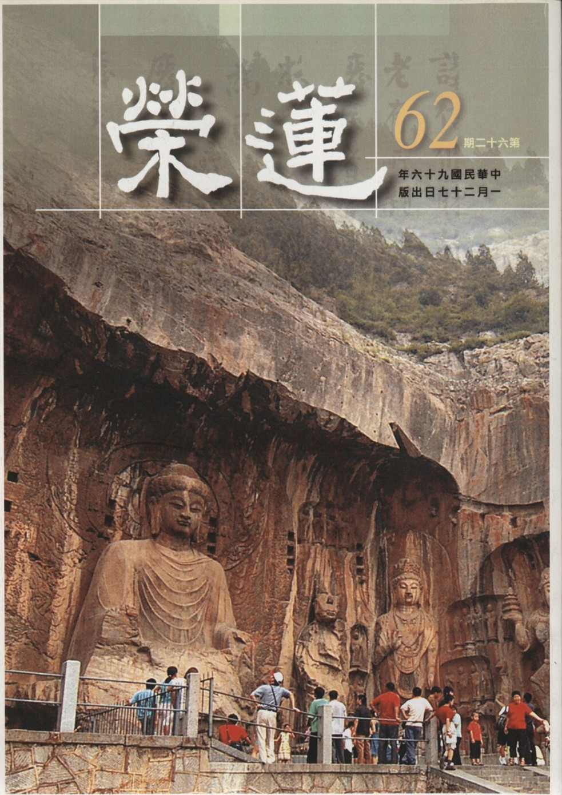

# 第62期

## 社論

### 新年新希望

本刊

又是新年新希望

不落窠臼要落實

常常檢討能增上

離苦得樂是成就

時值中華民國九十六年元旦後第一次聚會，在此祝福各位新的一年，心想事成、萬事如意。在此以十點說明新年新希望，代表一切希望，統歸為這十點，如同華嚴經讚歎菩薩功德以十代表圓滿無盡，又如顏回聞一知十，代表由一處體悟無窮的義理。

一、創造和諧團體：

唯有和合才有能力興辦各種殊勝善法，所以新的一年希望能創造出一個更和諧的團體，使得參與者皆法喜充滿。

二、辦事人員要有忍辱精神：

為使團體和合，辦事人員要有若干犧牲。 雪公老師言：興辦團體必有一些人犧牲，要抱著跳火坑的精神，義無反顧，因為誰叫我們是要發心利益有情的人！所以應該不怕困難、痛苦，只要對團體有益，就要一肩扛起，要有忍辱精神，方能莊嚴出和諧的團體。

三、個人須有向上道力：

新的一年是回顧過去、策勵將來，若停留原地、故步自封，到臨命終依然故我，則每一年的努力皆成無用，湯之盤銘：苟日新，日日新，又日新。可作為自我策勵及座右銘，特別是提升自己修行的能耐，並成就團體共修的莊嚴氣氛。

四、開展淳厚風氣：

團體風氣的淳厚是每個人都有肯替他人及團體著想的公心；若風氣澆薄，那是每個人都站在自己立場，不去想到別人。為什麼古人風氣比現在好？因為有守望相助、我為人人的風氣，時至今日已變成人人為我，我不為人人了！所以許多災難及不好的現象因此而產生了。

五、對教法的勝解，成就團體的特質：

要相續辦正法的講座及啟蒙的活動，令學者具足正知見，對教法生起勝解，團體成為維持正法的堡壘，令人肅然起敬。

六、興辦利益世間的善法：

團體的存在不僅要利益個人、家庭、團體，還要利益社會及國家，所以要興辦利益世間的善法，例如每月心靈成長班的返班、母親節三代同堂浴佛、放生，出版會刊及出版正法書籍或地獄變相圖動畫製作等等。

七、敦親睦鄰：

共修道場得來不易，尤其此處是台北繁華區、寸土寸金，且交通便利、對大眾往來十分便捷，尤其是蓮友發心提供，大家應該好好認真辦道，以回報提供者；再者，與鄰居相處亦十分重要，見面時要主動打招呼致意，謝謝他們的護持，看到守衛要親切問好，不可目中無人，進出大門的聲音不但要小聲且動作要優雅，門鈴應貼標示以免進出者按錯干擾鄰居；共修辦道雖然對鄰居們有助益，但鄰居名言不能通達下，共修聲音變成干擾，因此應懷著愧疚心態，感謝他們的容忍，在共修結束後出了門口應盡量止語，不要吵到對門的住戶，若令其生惱會成為我們修行的障礙。總之，與鄰居相處好，即是修行順緣，反之則成辦道的障礙。

八、培養後進：

安排工作令年輕學子學著發心辦事，培養能力，成為人才。

九、成立新的佛化家庭：

成立家庭是五倫開端，尤其是菩提眷屬，更是個人學佛動力，在修行上具加分效果；單身修學，雖每天有空閑時間，若不能好好充實自己，名為自由自在，實則浪費時間多矣！所以為人父母應多給子弟鼓勵，不可抱著孩子高興就好的心情，有時也應給一些壓力，令其對家庭延續及社會具責任感；父母們雖志求往生，但也別忘了兒女的終身大事。希望新的一年能辦幾場佛化婚禮，莊嚴團體，給團體帶來喜氣，讓團體後繼有人。

十、日日應有無常的觀修：

一般修行會有懶惰懈怠，其因之一是喜歡安逸偷閑，懺公師父說：偷得浮生半日閒，犯盜戒，偷閑安逸即是偷心。其他如喜歡眼前名聞利養，或是看輕自己不肯承擔，認為自己非法器，亦是懈怠之因。觀修無常，尤其娑婆世界眾生，死緣多、活緣少，存在的當下亦十分脆弱，做如實的觀察，不相信自己會活到明天，命只剩今天的覺受生起，作一決斷，將無始劫來的惡業在今日對治，無始劫來的善業在今日引發，惡劣習氣今天就降伏，聽經聞法習氣今天就引發，對不起別人處今天就懺悔，以前畏首畏尾不敢荷擔正法，就從今日承擔，每天都有意義的過。一直到臨命終回首往事，所過的都是有意義的人生，必能帶著歡喜心、感恩心、隨喜心，蒙佛接引往生西方。

總之，希望共修會善知識們相互提攜，反省己過，檢討過去，策勵未來，相信新的一年會是一個難忘的、有意義的、增上的、對國家社會有幫助及共業中造不共業的一年！

## 大德法語

### 常禮舉要講座（三）

雪廬老人

居家侍長者

出外能禮讓

懂人情世故

處處結善緣

◎四、長者與物，須兩手奉接。

條目為什麼寫這麼簡單，因為容易記才好用。此處說的長者是按著禮記，年歲比我們大五歲或十歲或加倍都是長者。今日之下不大講長者，譬如大家都是同學，你同學家裏的子姪就是你的晚輩，同學裏頭也有交情厚與交情薄的，交情厚的，禮可以變通，不必過份呆板，若過於講禮倒顯得疏遠，若明白彼此情誼就可以從容用禮了。

要是交情夠不上，總而言之，恭敬人！就是比我們年輕、或是同等，他要拿東西來，我們就雙手接，沒什麼不好處。即使國家對國家，孟子說：以大侍小，以小侍大。以小侍大是小國侍候大國，這是理所當然，力量抵不住大國，當承順之。而大國侍候小國又是什麼道理？仁也！這個大家要懂得，我講我的。我沒法子要大家悟，只有你們大家聽了，自悟。這個「悟」說過多少次，無論什麼事情必得自己悟，現在講華嚴經、講方便，你要不懂方便、不會變化，學了就是書呆子，好處你用不到。

「長者與物，須兩手奉接」，你不管長者他給你是兩手還是一手，他是長者，我們必須兩手接。平輩或晚輩可以通融通融，他要單手，你也可以單手接，你要兩手接也行，總而言之，恭敬人皆好。你要雙手接，跟他客氣點，他想跟我不一樣嘛！他如果聰明或可有點覺悟，無形中受了教育。

從前家庭教育、社會教育、學校教育都是教育，現在都不是教育，情形改變了！也有的人，他認為你太呆板，太老古板，他不以為然，但你要聽明白他不一定是壞人，他只是沒有學習禮，他心地或許很好只是沒有禮貌。這個大家要知道，無論幹什麼皆不是簡單的，有的彬彬有禮者還是壞人呢！譬如王莽，謙恭得不得了但很壞。他唸的書也多，恭敬人也很自然，看不出是假的來。這些變化，你學禮要悟啊，我在那裏稍微一講，你或能舉一隅以三隅反，你自己進步多了，必得到那個樣子，我就希望大家這樣。

◎五、徐行後長，不疾行先長。

徐行就是散步、慢慢地，徐行後長是慢慢地走在長者後面。要這麼講誰也會講，徐行後長是對了，難道快行也不能先長？徐行是沒事時逍遙自在地在那裏走路，有緊急事情，你還在後頭慢慢悠悠地，那行了！我可聽不明白，咱講個故事給你聽，從前某人沒了門，幹什麼也不會，只好給人家當差，當差不必有本錢也不必學。在臨上工時有人教他規矩：走路別在主人前頭，記住了嗎？記住了！另一條也要緊，也有好處。什麼好處？你的東西，主人不用，主人的東西你可以用。這個記住了嗎？記住了！還有一條，主人吃東西，你可別先吃，主人吃完了，剩下的你就吃，記住了？記住了！這個先生記住了這三條去當差。

這天主人在路上，家裏已準備吃晚飯，當時天黑也沒有電燈，家人說，某某，你提個燈籠，接老爺去。某人出去，在路上見了主人，手裏拿著燈籠，他跑到主人的後頭。主人說：嗨！你上前面去，不行，不行，怎麼說也不行，講的規矩是我要在主人後頭。主人在前頭沒燈光，一肚子氣。這天主人又出去，天晚下雨，家人要他拿傘去接老爺。他拿著傘走著，在路上見了主人，主人沒傘，主人說，你打了傘，來、我們一起用吧！不行、不行！講的規矩是、你的東西我用，我的東西你不能用啊。鮮事！這第二回了，怎麼沒一點悟性！回去後主人大大不高興，太太說好話也不行，這一鬧出了事情了，小孩子看大人吵嘴就哭了。其他大人趕快哄小孩吃奶，吃完了剩下的，這位當差就跑過去，也去吃，為什麼呢？主人剩下的嘛！這個就行了！

你有要緊事，或者前面有什麼障礙，得跑到長者前頭去啊。總之，要為長者多考量，不疾行先長，這句是依著上句徐行後長，沒事功夫不自己往前頭跑。「疾」是快速的意思，沒事時主人走得慢，你就走慢，要是有事，主人慢走，你卻不能慢慢悠悠地走你的。

◎六、長者立不可坐，長者來必起立。

不但是長者立不可坐，即使同輩亦然，譬如這個辦公廳裏，大家同樣是科員，他跑到咱們桌前來說話，你在那裏坐著，這是不禮貌。人家上你這裏來就是客，你得在你桌子處站起來。為什麼說這個呢？現在辦公廳裏，我見了一些不如此，今日之下真是什麼教育？他即使與你再熟，上你這來，你就得有點表示，再熟也不能熟得無禮，這話對不對啊？除非旁邊有位子他坐下，你也可坐下。

京戲裏先生先出來，太太後出來，先生也得：夫人請坐。唱戲的、我每星期看一次，我看一次幹什麼？上學啊！你還用上學嗎？我怎麼不用上學？孔子說過：入了墳墓就不用上學了。我怎麼能不上學！我有好幾個字不認識，來到台灣我才懂得的。

「長者立不可坐」，聽了以後人家（即使是同事）來我們這裏，也要有所表示，各人求各人的禮貌。「長者來必起立」，現在不興這套了，我算個念書的，我這個念書的真假莫論，什麼叫假念書，念不通不是假念書嘛！從前士、農、工、商四類，士是第一，是念書的，為什麼排第一？因為他無恆產而有恆心，念書的有些有錢，有些是出自寒門，然窮念書的很多，他們怎麼窮都學，沒恆產無關，沒有恆心是不能成功，這是第一。

士人上外頭來不論穿著如何，必得整整齊齊，商家人雖然穿著綢緞，一付很有錢的樣子，不管有沒有上了年紀，對著穿破衣服的念書人，他們不敢坐隔壁，甚至不敢去陪讀書人，怕他在桌子上唸幾句之、乎、者、也，聽了不懂就很難看了，所以從前大財主都恭敬念書的。從前最有錢的是幹鹽務，現在就不行了，那時國家一些大建築物都是鹽行那些有錢人替國家蓋的，然而只是有錢總覺得很難看，認識幾個讀書人，附會風雅，裝裝面子，原來不懂風也不懂雅，唸上幾句詩、學上幾句文，好在人眼前裝裝樣子。

有回袁子才在揚州，揚州的鹽務是財力雄厚，這一天作戲，有些人專開這些有錢人的玩笑，是因為他們有銅臭氣，銅臭氣這三個字很難聽。有說今天喝酒高談闊論，要是沒有佳作是不能下酒，喝酒嘛還得作詩作文，不能就對對子吧！對對子就是故意開有錢人的玩笑。一看門口外的柳樹，說「綠柳」，知道他（鹽務）對不出來。他（鹽務）一聽是兩字的對子，怕出別的對不了趕緊說：我先對上就別找我。想到柳樹上的飛絮，又聽說綠要對紅，就說：紅絮。

全場的人一聽哈哈大笑。袁子才平時書念得多了，沒有也可胡造謠言，他（袁枚）說：大家笑什麼？這個有典哩！古人詩你或可忘了。有云：夕陽返照桃花屋，柳絮飛來片片紅。大家也不記得那兒來？是袁子才自己造的，古書那裏有？大家一聽這兩句有道理，夕陽是紅的，桃花是紅的，一照著柳絮，所以是柳絮飛來片片紅。這下子大家說袁先生你念得書多，就這樣過去了。鹽務大老闆臉上也沾了光，第二天一個大元寶就送過來，表子才兩句就是五十兩。

從前凡是士農工商，商是最後的，商店裏固然鹽務架子擺得太大是大有錢的，而一般商店，你到櫃台時，在櫃台後的人，原本都坐著，一看有人往櫃台來，這櫃台很長，大家就全體站起來，這一路的掌櫃全體站起來的情形我見過。商人是四民之末，還是這樣。普通禮節一般人皆知道，大家得學著。

◎七、不在長者座前踱來踱去。

此是說不在長者座前，若與長者站著談話則另當別論。如長者坐著和別人談話，晚輩不是出去就是在旁侍候著，不可在面前走來走去，如在長者前踱來踱去是眼中無人，尤其是從前年輕人，只要有長者在，不敢踱來踱去。（下期待續）

### 大方廣圓覺修多羅了義經（二十二）

道源老和尚

幻境心智能遠離

了不可得證解脫

觀待能生苦樂法

不常不斷了義見

己二、酬別問

經文：

「善男子！一切菩薩及末世眾生，應當遠離一切幻化虛妄境界。由堅持遠離心故。」

要將一切境界都觀空，因為都是幻化不實的，由於堅持遠離心故，相續觀修境界不實，才能遠離幻境，若不堅固執持遠離心，則不能遠離幻化境界，眾生之所以離不開虛妄境界，是因為無始劫來的習氣。

在大陸叢林有個笑話，苦修行是什麼苦的境界他都不怕，看起來功夫有兩下子，有一天可要現原形了，為什麼？因為大陸叢林生活太辛苦了，天天吃一些醃菜和炒冬瓜，想吃個豆腐都辦不到，忽然今天有個大齋主來供齋，不但有白菜、粉絲，還有黃瓜、冬菇……。這樣的大鍋菜一煮特別有味，一進齋堂就聞到菜香，在唱供養中就直嚥口水，不得了，添飯來了，拿筷子比著飯不要、盡吃菜，糾察師趕忙表達今天齋主準備很多，諸位師父放心吃！一直吃了三碗，再來一碗！即使天熱吃了身透大汗，汗流浹背，不怕！熱也忘記了！功夫呢？功夫都忘記了！都被如意齋抓去了，你看那個如意齋有多大的境界，不是虛幻不實的境界嗎？可見無始劫來的習氣。

我在基隆講《維摩詰經》，有台灣信徒來打齋，煮米粉湯供養大眾，大家吃得很歡喜，吃完了有一個外省的法師來向我展示功夫，我今天吃了七碗，第一名！了不得，被那個米粉湯的境界轉過去了。雖說幻化的境界、虛妄的境界，但只要境界現前，幻化不來、虛妄不來，所以你得用上真功夫，要堅固執持道心，堅固執持遠離心，才能將境界觀空，方便都在堅固執持遠離心，由此漸次的功夫才能達到目的。

經文：

「心如幻者，亦復遠離。」

離開了幻境，其次了知心也如幻，在迴光返照，亦了知自己的心如幻如化，應該遠離開，這是第二個漸次。《金剛經》云：凡所有相，皆是虛妄。前半卷空那些虛妄的境界，所謂無我相、無人相、無眾生相、無壽者相，到了後半卷空妄心，所謂無我見、無人見、無眾生見、無壽者見，你心裡若還存著有此實相的空見，則不能證得究竟，此證空之心還是幻化的，了不可得。不但外境不可得，心亦了不可得，佛亦了不可得，所以《金剛經》說：若以色見我、以音聲求我，是人行邪道，不能見如來。此證悟之心亦了不可得，是觀待所證悟的境，方有能證悟的心，此即第二步的漸次。

經文：

「遠離為幻，亦復遠離。」

此是修行之第三漸次，此時若還有遠離幻心的智慧在，還是執著，智慧也是如幻的智慧，那是遠離幻心的幻智，了不可得亦復遠離。

經文：

「離遠離幻，亦復遠離。」

此是修行的第四個漸次，離那個遠離幻要配《圓覺經》此四步修學的功夫，第一離幻境，第二離幻心，第三離幻智，第四離遠離幻，是遠離幻的想法都離。

經文：

「得無所離，即除諸幻。」

此是到了究竟無所離的境界，沒有可離了，幻境也離了，幻心也離了，幻智也離了，連遠離的心都不起了，到了無所離的功夫，無功用時，功夫已成就了。

經文：

「譬如鑽火，兩木相因，火出木盡，灰飛湮滅，以幻修幻，亦復如是。諸幻雖盡，不入斷滅。」

解釋了四步空性漸次的修學法，也答覆為什麼以幻心來修幻法，以下以譬喻明之，譬如鑽木，古時候沒有發明火柴，取火的方法很笨，還是由燧人氏發明鑽木取火，在印度不曉得是哪一位發明的？可能在佛世時取個火還是不容易，用鑽木取火的，所以此處以鑽木喻。兩木相因，能鑽的是木，所鑽的也是木，兩木互相為因才能鑽出火來。

現在我們看見木匠用的鑽都是鋼鐵的，釋迦佛在世的時候可能還是用木頭鑽木頭，為什麼？鐵鑽它不會被火燒掉，無法比喻以幻修幻二者皆滅，一定能鑽的是木，所鑽也是木柴，兩木相因，這一鑽鑽出火來了，所鑽木材燒掉了，那個能鑽的木也是個木，也被鑽出火燒掉了，木盡是兩個木都盡了。這就是以幻修幻，依著幻心修幻法，不但幻境滅了（所鑽的木材燒掉了），幻心也滅了（能鑽的木材也燒掉了），譬喻遠離幻境及幻心的兩個漸次。

灰飛煙滅，是譬喻第三個漸次與第四個漸次，離幻智及遠離幻之心也遠離，但有人說翻譯《圓覺經》的人應將此句翻成煙滅灰盡，圓瑛法師也是照這樣解釋的。其實沒有顛倒，他把煙執著到是木材炭裡邊那個煙，那個炭變灰嘛！先把炭燒成灰了，這煙先滅，煙先滅了，還剩點灰，風一吹，灰也飛盡了，沒有了，順著經文講就可以。譬喻的是煩惱愈來愈輕，當木已燒成炭，炭已燒成灰，份量已很輕了，風一吹，灰則飛掉了，何以風一吹都飛了，因為份量很輕，此時虛空之中飄飄渺渺還存點煙，此喻為第四漸次，微微的風吹掉了些許的煙，以幻修幻，亦復如是。

諸幻雖盡，不入斷滅：雖一切都滅但不入斷滅，謂之清淨圓覺，廣大如虛空，若執著斷滅，是個大邪見。（下期待續）

### 佛說八大人覺經講錄（四）

道源老和尚

見惑破除依八事

觀無常無我為要

漸離生死入聖流

須陀洹果第一覺

甲二、詳八大法相以成宗

乙一、別釋八法以起信解

丙一、覺身心無常觀念真常

經文：

「第一覺悟：世間無常，國土危脆，四大苦空，五陰無我，生滅變異，虛偽無主，心是惡源，形為罪藪，如是觀察，漸離生死。」

文中有八種事項應該覺悟，佛法三乘聖人都應依第一覺悟而修行，乃三乘共修之法，而《佛說八大人覺經》乃大乘菩薩法，大能攝小，二乘所修的大乘菩薩也要修，謂之三乘共（修）法。

八種事項通通須破我執，破我執是共法，二乘（聲聞、緣覺）是專門破我執，他們不了解破法執之法，佛只教他們破我執之法（觀待根機故）。等於我們現在上學校，只講到小學、中學，還未講到大學的課程。

所以小學、中學畢業者，只了解小學、中學的道理，對於大學道理不知，而二乘合起來都叫小乘，佛向他們說的課程只說到小學課程。

對於大乘弟子，佛不但教他們破我執，同時也教他們破法執，所以大乘菩薩弟子他們的用功是破二執。是齊破（二執），但任運（自然）先破我執再破法執，所以第一覺悟是破我執。大乘菩薩是我法二執一齊破，但次第上是先破我執。

依華嚴經明本師釋迦牟尼佛成道時，三歎奇哉，而曰：一切眾生具有如來智慧德相。在沒有成正覺之前，自己也是眾生的一份子，眾生是眾生，佛是佛，距離很遠。成佛時看到一切眾生都是佛，所以太稀奇了，連歎三聲奇哉！如來的智慧一切眾生都具足，如來的功德、如來的相好，一切眾生都具足。然而眾生為什麼沒有成佛呢？下一句經文，「只因妄想執著，而不曾證得。」一切眾生皆具有如來德相卻生了障礙，本來具有的如來德相，不能顯現。

妄想是對虛妄的假相執著，要是不起執著回光返照，一照就開（空）了。但他（眾生）偏要執著，把妄相當作是真實的，於是這一執著就流轉生死，生死無盡。執著分「我執」與「法執」，內裡執著有一個我，外邊執著有一切法，都是真實的，於是起了迷惑，起了迷惑就要造業，起惑造業就要受苦，受苦就是流轉生死，所以眾生與佛本來平等，只不過眾生多了妄想與執著。

而佛清楚觀察到眾生為什麼在六道裏受苦呢？因為他造業，為什麼要造業，因為他迷惑，迷惑就是煩惱、就是執著，分成我執、法執，佛要度眾生就是要眾生破我執、法執，兩種執著破了，妄想空了，就與佛一樣平等，此時已把眾生度成佛了。

覺悟是將我執、法執破除，本經之八種事項要覺悟，皆是要破我、法二執的，但任運（自然）則先破我執。第一覺悟之「覺悟」兩字是：明而不昧曰覺，知而不迷曰悟。我們眾生是昏昧的，昏昧就無明，覺了就明而不昧。眾生在迷，迷了後，不但佛法不知道，世間法也不知道，一切都是昏迷。悟了就知而不迷，一切法都知道，知道而不迷惑，是知而不迷，此是覺悟兩字的字義。

在第一覺悟中也有八種事項應該覺悟的，第一「世間無常」、第二「國土危脆」、第三「四大苦空」、第四「五陰無我」、第五「生滅變異」、第六「虛偽無主」、第七「心是惡源」、第八「形為罪藪」、第九「如是觀察」、第十「漸離生死」。先講第一：世間（世是時間、間是空間），時間分三際，有過去、現在、未來。我們眾生在迷，將世間當成常住之法，所以要覺悟。你要覺悟這世界是不長久，久住曰常，世間不長久、不常住，過去則成了過去的世間，已過去之事沒有任何現象令我們得到與看見，時間過去就沒有了，未來則還沒有來，一切法如何能常住於世間呢？所以三個世間：過去、現在、未來，都是無常之法。

但是我們眾生卻把世間當作是常住的，所以古人形容「人生不滿百，常懷千歲憂」，人的壽命活到一百歲的很少，謂之人生不滿百，但是卻在那天天打主意，要如何令他的事業興旺，如何令他的生命都常住至一千歲，這就是迷而不覺，所以要先覺悟這世間是無常的。

「國土危脆」是第一覺悟中，所應覺悟的第二事項，不安謂危，虛浮謂脆。國土世界不安定、危險很多，所以法華經：「三界無安，猶如火宅」，三界像一個大的火宅，是危險的。按現在看，有種種的災難都是非常危險。國土也是個世界，十方世界無量無邊，國土可指我們所了解的地球，你以為我們的地球是實在的，是堅固的嗎？其實是很脆弱的！說壞就壞，說空就空。

例如夏天的晚上，我們看到虛空中的一顆流星，在虛空亮了一亮就過去了，其實是虛空中的一個星球爆炸了、落下來了，爆炸後零零碎碎，落到地球的石頭謂之隕石。所以要將國土觀清楚，覺悟它不是安定的一個世界，很危險，而且災難重重。

其次是「四大苦空，五陰無我」，前者言時間、空間是無常，國土是危脆，這些都屬於對法的無常觀，覺悟就破了對法的常見，能生起出離心，進一步破我執才能證得涅槃，我執就是身見，執著身體是一個我。現在令我們觀察，觀察身體是什麼東西？不過是四大假合。

四大分內四大、外四大，我們的身體是屬於內四大，外邊的世界是屬於外四大。而國土危脆是外四大，至於內四大是講我們的身體，身體是四種元素：地、水、火、風所組成，此地、水、火、風是形容詞，所指乃身體有四種元素（堅、濕、暖、動），例如身體的骨頭是屬於地大（堅硬性），濕性是水，身上水分與血液屬於水大，暖性屬於火大，身體上有暖氣、有熱氣、是屬於火大，動性屬風大，有了風大才能搖動，譬如我們的呼吸屬於風大，身體各部之活動也屬於風大。風大出了毛病就中風，中風就是風大出了毛病，活動不來。

眾生將地、水、火、風組成的身體執著成我，把它當成寶貝，不曉得受苦就是因為有身體，當四大組合成身體就是在受苦了，而所受的八苦都是因為有身體才受苦。「苦空」，苦到無所得，一點代價都沒有，受苦受到最後得不到一點好處，得到空，所以應該要覺悟，不要執著此身見，不要以為身體是我，將身體觀空破了我執。

在身體上找我，找不到我，不可認假作真，你有了身體，就要受苦，生、老、病、死都在身體上，一切痛苦都在身體上，有了身體，就要受苦，苦的結果是如何呢？苦無所得而空，一點代價沒有，白白的受苦。應該將之觀空，不可以再執著此身是我。（下期待續）

## 共修研學

### 小止觀導覽（三十五）

*心爾整理*

入定有方便

需調身息心

能不浮不沉

亦不寬不急

論文：

五、初入定時調心者，有三義：一、入，二、住，三、出。

入是入到所緣境界，住是住在所緣的境界上，出是出所緣境界，以上三種調心非常重要，若不知其法，成為修定嚴重過失。

論文：

初入有二義：一者、調伏亂想，不令越逸；二者、當令沉浮寬急得所。

欲入所緣境界，先將亂想心調伏，於所緣境上不超越，不放逸於其他境界上，才能入於所緣境，其次要在所緣境上不浮不沉、不寬不急，調得很適當。

論文：

何等為沉相？若坐時心中昏暗，無所記錄，頭好低垂，是為沉相。

坐時心中昏暗，緣不住境界，就是無所記錄，此時頭低垂，這就是沉相。這時對所緣的境界已經沒有記錄，雖沒有散在所緣境之外，但也未對所緣境記錄，腦筋空白。若任由這樣的昏沉持續，未來墮落到昏暗的地方當畜生。所以千萬不要在坐上修串習壞習氣，這比不修還麻煩。為什麼寺院裡要有糾察師的設置，能軌範行者的坐上修，能避免我們不如法的坐上修，因而墮入惡道受到痛苦的果報。

入境界時應由正知見攝持，若有浮沉相，能迅速了知，並予以對治。所謂的寬是心緣境界不夠專注，如水滴入水管，散成一片，可以進入水管，也可以噴到水管外，念佛時一面念阿彌陀佛、一面不經意地打妄想，謂之寬大。所謂急是在所緣境上念的力量雖強但急，此時容易生起掉舉，若能平心靜氣的專注於所緣境，心也比較不會急躁，且能安然地入於所緣。

論文：

爾時當繫鼻端，令心住在緣中，無分散意，此可治沉。

沉相分兩種，一是昏沉，屬於大隨煩惱，內心是黑暗一片，而沉沒是善法，雖緣念到所緣的境界上，然而心念的勢力往下掉，即使如何苦修，也無法得到初禪未到定的輕安，雖是欲界的善法，未來能在欲界人天上得到安樂的果報，然而不能進入初禪以上的境界。

行者對昏沉和沉沒往往不會分別，往往誤認沉沒是禪定相，然而修學勢力是往下沉或往內收，非能入定。

然如何對治沉沒？首先要善於注意沉沒的行相，對著沉沒起作意，要在坐上修有注意力，若沒有如理作意，則入於沉沒而不自知，無法生起色界以上的禪定，變成修行的過患。

昏沉或沉沒時可以觀想三寶的功德、淨土的殊勝，或者作意光明相來破暗相或沉相，修對治法不是等到昏沉、沉沒相起來再修，若內心有一角落已呈現此一行相，此時立刻察覺，此種察覺的能力是要被訓練出來。

其次可以心繫鼻端來對治，將心往上揚，能了知生起的煩惱與如何對治就是正知，這種正知力是在坐上修訓練出來的，能幫助行者入於三昧，得到輕安的快樂。

論文：

何等為浮相？若坐時心好飄動，身亦不安，念外異緣，此是浮相。爾時宜安心向下，繫緣臍中，制諸亂念；心即定住，則心易安靜。

浮就是散亂，將心散到他境，若以佛號為所緣，散亂就是緣到別的境界上去，散亂有時亦會緣到善法，所以不一定是煩惱法，或者念佛念一念跑去念三寶的功德、放生的功德，這種浮動無法讓內心安住在境界上，身亦不安，因為身心相互觀待。此時應將心安住在肚臍，能制止這些亂心，總之適時以正知的力量察覺沉掉，並加以對治，方能於坐上修得輕安法喜之樂。

修止觀的兩大障礙是昏沉（沉沒）和掉舉，昏沉是以睡眠等為因而增長昏沉的勢力，常常容易昏沉的人，就算在坐上修不昏沉，但也有氣無力。

若是散亂或掉舉的對治，須修散亂及掉舉的過患外，還要修學死無常，自己今天會死，想這些做什麼？一口氣不來即為來世，已面臨死亡了，為了要脫離輪迴的痛苦，此時能將心專注於正法。

論文：

舉要言之：不沉不浮，是心調相。其定心亦有寬急之相。定心急病相者：由坐中攝心用念，因此入定，是故向上胸臆急痛；當寬放其心，想氣皆流下，患自差矣。

定心急病的形象，我們常說萬緣放下、佛號提起，就是佛號以外的緣全部放下，專注在佛號上，專注在所緣境界上，心很專注但不急不緩，一直住在境界上。這時若用心太急，會產生胸痛，所以要放下急切，就能治療胸痛，但還是要用心專注於所緣，否則還是會生起沈沒甚至昏沈，變成修行的障礙。

要做到不沉不浮，乍看簡單，實則困難，如果真能調到不沉不浮，就能依此能力入初禪以上。須知當心往下沉時，須將內心揚起來，而內心上揚時又會於所緣境上往外掉散，拉回來所緣境後，久了又往下沉，所以要靠正知作調整，有了正知力對心的觀察很靈敏，能將心調到不沉不浮，正好在所緣境上安住，謂之細住位，不沉不浮是要經過不斷的調整，將細沉及細浮對治，才能進入不沉不浮，修學者不是一上來就有這種功夫。

論文：

若心寬病相者：覺心志散慢，身好逶迤；或口中涎流，或時闇晦。

心一面在所緣境上，又夾雜其他境界，如此修學的心很寬大、心志散慢，身體挺不住，注意力不能集中，坐久了口水也流出，所以舌尖要往上頂，並且加強注意力於所緣境上。

論文：

爾時應當斂身急念，令心住緣中；身體相持，以此為治。心有澀滑之相，推之可知。是為初入定調心的方法。

此時應趕快警覺，令心住在緣中，這完全要靠正知力，正知力能清楚的知道心有否安住在境界上，然須平常串習，不是等到昏沉、掉舉、沉沒產生之才起正知，是昏沉、掉舉、沉沒將生未生時，就要有察覺的能力，這種力量不是想要有就有，必須要常常訓練才有。

心急不是說念力不夠強，是指念力雖然強，但是用得太急，胸口悶痛，這時要寬其心，並不是念得緩一點，而是不要念得太急，但是念的力量還是要這麼強，不是將念力收起，否則容易變成沉沒，念得不急不是念的力量放下，而是不要太急。在坐上修的力道要很強，但不是很急，否則易生胸口悶痛之病。

心寬的「寬」就是夾雜著昏沉、掉舉，此時身體振作不起來，口水也容易流出，看起來無精打彩、毫無生氣，應該將自己好好的振作，但也不能用得太急，但專注力不能放緩。此時心住在所緣境中，要藉著身體的姿勢讓心力能夠拉起來，因為心和身是相互觀待的。身體振作時心也拉起來。例如對自己有信心的人，也比較容易抬頭挺胸，感覺前途暗淡之人也比較消沉，容易彎腰駝背。

澀滑的「滑」就是滑到其他境界上面去，或者掉舉、或者散亂，澀是結滯不通，念這個境界有障礙，此即是沉沒或昏沉。

論文：

夫入定本是從粗入細，是以身既為粗，息居其中，心最為細靜。調粗就細，令心安靜，此則入定初方便也。是名初入定時調二事也。

要想入定，應先調身，再調息，最後調心。身相最粗，因此最先調，息居其中，心念最細靜，所以最後調，調伏由粗至細，能令心安靜，此是入定的初方便。（下期待續）

## 啟蒙園地

### 歷史故事　精誠念母的朱壽昌

妙音

憶母功夫朱壽昌

念佛圓通大勢至

世出世成賴一心

化成大道通佛地

同修參加大勢至菩薩念佛圓通章研學班賦歸後，一直向末學推薦宋神宗時代以孝聞名的人物〜朱壽昌，更極力慫恿我再溫習此一故事，與同學分享。有感於世風日下，研讀再三，深受感動，稍稍明瞭 雪公太老師為什麼將此段史實，列為該章經文如母憶子的案例，實在有他深刻的意義，所以突發奇想結合大勢至菩薩與朱壽昌之故事，向同學們介紹。

大家應該都熟悉西方三聖中，大勢至菩薩的頭頂肉髻上有一個寶瓶，寶瓶中盛著光明，祂有什麼作用呢？這就得從大勢至菩薩總總佛事說起，不論祂念佛、拜佛或者講經說法、打齋供果等，寶瓶中的光明即會顯現出來，因此大勢至菩薩有另一個德號，叫做無邊光菩薩，他的身光，能照亮十方世界，而且每一個毛孔的光都能照見十方世界，如此祂又何必在頭上頂一個瓶子，而且在瓶子中裝光明現佛事呢？這其中就含藏著一個感人肺腑的孝子憶親的故事。

話說最初大勢至菩薩頭頂的寶瓶中，不是盛著光明，而是他父母的遺骨，菩薩聽阿彌陀佛說父母的恩最重，兒女想要報答父母恩，實在很難，必須自己修行辦道，把父母度脫三界，才能報答父母恩。大勢至菩薩最初發心修道時，其父母早已過世，如果父母在世，還可以勸導父母信佛、修行，使父母了脫三界，但是父母已經離世，這是最大的遺憾，那要如何才能報答父母呢？於是菩薩將他父母的遺骨，用瓶子盛起來，頂在自己的頭上修行辦道，將自己辦道的功德，不時的回向父母，祈求三寶加被，使他的父母能夠得道，超脫三界。

再說大勢至菩薩初發心出家時，也只是個凡夫，他父母的遺骨也是凡夫的骨頭，但是因為大勢至菩薩勇猛精進，使他自己轉凡成聖，成為一個大菩薩，每當他修行辦道之時，便回向給父母親，竟然平凡的瓶子，成為一個寶瓶，父母的遺骨變成一片光明，大勢至菩薩證得了菩薩果位，能運用種種的神通變化，來利益眾生，他父母的遺骨，便成了光明，也能夠神通變化，行佛事時得以利益眾生。這就是寶瓶裡光明的由來。

另距今約九百年前，也有一位孝子，寧願放棄官位，不辭辛勞，千里尋母的感人故事，這個故事一點也不輸給耳熟能詳的二十四孝故事。這故事的主人翁名叫朱壽昌，是宋朝天長人，字康叔。就在他的父親朱巽擔任京兆太守，迎娶其母劉氏為小妾，因出生微賤，受到大娘的虐待，在剛懷壽昌時，就被休離，另嫁他人。直到壽昌三歲後，才回到父家，從此便與生母分離了。

壽昌從小就失去了母愛，眼看別的小朋友皆有母親溫暖呵護，心中倍加羨慕，思念母親的情懷與日俱增，朱壽昌天資聰穎且知上進，三十歲不到即考取進士，雖榮耀在身，卻依然不放棄尋找親生母親。而且朱壽昌才華橫溢，盡忠職守、政績卓著。任岳州知官時，因治理水盜得法，鄰近州郡也起而師法，任閬州知官時，治理訟獄，因心思細密、公正不阿，辦案如神，普獲百姓愛戴。

為了尋找母親，時時提出職位之調任，十多年來走過不少縣城；並常委託同僚打探其母消息，依然杳無音訊，於是用佛家懺法，在背及頂上燃香，並又刺血書寫金剛經及慈悲三昧水懺，日夜受持誦唸，望早日找到慈母。多年來，壽昌幾乎日以繼夜的思念，思念遠方的母親，盼能奉養母親共享天倫之樂；無奈屢次多方打聽，仍舊毫無音訊，尤其年歲漸增，心中更是焦急，他想如再找不到母親，怕是沒有機會了。

在宋神宗熙寧初年，壽昌有一天嘆息道：「我年已五十，尚未找到生母，身為人子，如何做人？古人說求忠臣於孝子之門，孝尚且未能作到，如何談到忠呢？」所以毅然辭去官職，不顧家人勸阻，出外尋母，並對家人說：如不見母親，便永不歸來，就是這般破釜沉舟的決心，及一顆赤誠熾熱思念母親的心，終於在同州這個地方，遇到朝夕思念且離別五十年的慈母，當會面時，母子相擁，抱頭哭泣，感動路人，而聽聞此一孝行的人，也莫不感佩。

同學們你聽了這兩個故事，千萬不要聽聽就算，除了謹記在心，更要實行出來，才不枉費老師的一再的叮嚀，願與同學共勉，將孝實踐出來，作為一生永不止息所追求的目標。

### 心靈成長營返班活動報導　和合班專題報導 / 如何美化自我（上）

淨域

審美標準各不同

觀待名言自相空

誠信求學自他利

由內散發自然美

壹、前言

談到「美」，一般都指陳到「花朵」與「人體」，甚而將兩者混為一談。在中國，牡丹為花中之王，而西施、王昭君、貂蟬與楊貴妃，則是公認的四大美女；西施於浦陽江邊浣紗，連魚兒都驚豔地沉入水中；昭君行於大漠悲懷身運，操琴撫曲哀怨斷腸，連天邊飛雁都傷心掉落；貂蟬於園中拜月時，其嬌美連月光都被雲彩遮住；貴妃在園中撫花時，其笑媚連花兒都羞得低下頭來；故而後人以「沉魚落雁，閉花羞月」來形容女子的美麗。西施美於「麗質」，昭君美於「悲淒」，貂蟬美於「嬌羞」，貴妃美於「笑媚」，麗、淒、嬌、媚各個不同，卻又各為美的化身，是以，美出於「感受」與「接納」，故情人眼裡出西施。

貳、何謂「美」

人是群聚性的動物，無法離群索居，所以「人際關係」與「社群互動」是非常重要的。孔子說：「食色性也。」開口吃飯與張眼觀物同樣是一件很自然的事，當基本需求滿足後，吃求美味、眼看好色亦是理所當然，惟一切之率性而發，必須合於彼此的「感受」與「接納」，此「美」與「好」才能成立。

白居易在〈長恨歌〉中形容楊貴妃是「回眸一笑百媚生，六宮粉黛無顏色。」唐玄宗愛其嬌媚，從此不再早朝，芙蓉帳中度春宵；安史之亂的逃亡路上，貴妃賜死前猶是「芙蓉如面柳如眉，梨花一枝春帶雨」，怎教君王不垂淚。故而談到美女，就與亡國相論，這也算是對「貪美」的一種哀怨。

究竟什麼是美？西方社會視維納斯為美的化身，是美神也是愛神，那身體部位五比八的黃金比例，更是美的尺度與標準，如果黃金比例是美的權衡標準，那普羅大眾都成了美的反面；所以，黃金比例僅是美的指標之一。維納斯之美帶有傳統的理想化，諸如：「橢圓型的臉蛋」、「直鼻樑平額」、「端正的弧形眉」、「扁桃形的眼睛」與「波紋樣的髮髻」；但此一理想化能為後世所接受，厥為寧靜而脫俗的神韻，諸如：「矜持中富有智慧」、「微笑裡帶著自信」，這才是內外在美的統一。

參、外在美的省思—追求時尚

美有內外之分，有深淺之別；內者及於精神，外者求諸表象，深者直指自性，淺者趨向容貌；不論外淺，皆是以色形之，以目視之，因能見、易見、能受、易受，故反成追求的主流。「環肥」所以唐民以臃胖為美，「燕瘦」是以漢人以纖細為美。是唐玄宗愛胖女人嗎？還是漢成帝愛瘦女子呢？其實都不是一人之愛，而是社會時尚使然，是流行也是一時，所以劉漢愛纖細，到了李唐便成一般，故女子以臃胖為美；然時到今日，劉漢之風又成為社會主流。

「美」有地域之差，有人種之異；黑土族的美在於「一口大黑牙」，所以想盡方法要將牙齒塗黑；泰約族的美在於「大大的耳洞」，所以千方百計在耳垂上穿帶飾物；巴東族的美在於「長長的頸子」，所以不斷地往脖子上套加黃銅環；而泰雅族的美在於「清秀的黥面」，所以忍著膚肉的痛爛於臉上刺青。這些美的象徵對於都市人而言，大都是敬謝不敏，然卻成為移情的一種參考標的。

現代人追求的美，全於身體上下工夫，或整型、或裝扮，目的無不在使「短的變長、黃的成白、凹的凸出、多的減去」，例如：腳踩五寸使搖曳生姿，臉妝粉彩讓青春洋溢，隆胸擠乳生洶湧波濤，去脂消油求婀娜身段；美化自我本是一種自然的追求，若過度著墨反成病態，蓋因美醜只有一線之隔，凡事都在枝節上用心，反而無法獲致真正的美。

外在美是一種「時尚」之美，時尚者便是「流行」，而流行的特徵在於「一時」、「多金」；就時間言，短則數月，長則數年，從不會是一生一世的；就金錢言，它是設計好的錢坑，就等著你來填補，一塊不嫌少，一萬不算多。翻開各種流行雜誌，夏天剛過，就已經在探討明年春裝的款式，美其名是「敏銳的穿著嗅覺」；細看各家百貨公司週年慶，化妝品三折再送禮券，一時搶購人潮洶湧，為的是廣告詞「晶瑩剔透吹彈可破」；那天生麗質的模特兒，那經年呵護肌膚的明星，讓人深陷於時尚美的迷思中，箇中迷思往往隱沒了每人與生俱來的內在美，此如緣木求魚終不可得。（續下頁）

### 心靈成長營返班活動報導　和合班專題報導 / 如何美化自我（下）

淨域

肆、內在美的塑造—擺脫俗套

外在美多是求裝飾的表現，是在基礎上的加減分，是以塗裝的技巧來掩飾缺點，所以本質是「假」，不是真正的我，一但被識破，美就不是美，反而是一種醜陋。相對於外在美的假，內在美便是真，但若僅是二元的劃分，美似乎無融通之處，故真正的美應是「合於自然的從心發出」，自然便無矯揉造作，從心即率性而為。

什麼是自然率性？簡單地說就是「那個光！」那個圍在人身上的暈光，它從「潔淨、誠實、微笑、自信、知性……」中發出，無需粉飾，無需上彩，只需要慢慢的醞釀。

所謂潔淨就是不污穢、乾乾淨淨，其養成於習慣，形之於規矩。有人天生黑皮膚，但黑不代表骯髒，只要保持潔淨，一樣是黑得發亮；在轎車市場中，黑色的車系賣得最好，而禮服世界裡，黑色也永不退流行，因為它代表端莊穩重。天生白膚色亦不表示潔淨，若生活習慣不良，白色也會變成泛黃；在居家生活裡，牙白色系是主流，光鑑明亮令人舒暢無比，若不勤於打掃或隨意塗污，久之便成暗淡一片。

人與物同於此理，若一人習慣不良，不洗澡、不摺被、不收物，生活環境髒亂一團，穢氣滿身，那暈光自然無法彰顯。

所謂誠實就是無欺不詐，不欺詐則心胸光明，坦然面對一切。俗語說：「說一句謊話，要以一百句話來圓。」而這一百句話卻是如坐針氈，渾身不自在，忐忑難安。每個人多少都有說謊的經驗，而顏面常常是最不賣帳的，即便再會偽裝的人，當話不由衷時，顏面神經多少都會不自主地僵硬，所以，臉部表情異於平常，是驚恐的總合。

不誠實的人心頭上總是罩著烏雲，夜中夢靨揮之不去，惟有坦白認錯才能歸於平靜。一位年青人出社會後，有一天到台鐵公司說要繳清車資，大家都感到莫名其妙；原來他還是學生時，每天都要搭火車通勤，期間他買短程搭長途，一直不以為意；待進入社會工作後，此一錯誤行為總是壓在心頭，讓他久久不能釋懷，鼓起勇氣面對它後，深鎖的眉頭才舒展開來。

所謂微笑就是快樂的表露，也是友善接納的氣度，它使人如沐春風，令人除去藩籬。俗語說：「笑一笑不會惱，長命直到老。」此一笑的祕訣，不是猖狂，也不是狡黠，而是會心的微微笑。一般人每天都不快樂，忙著與無關緊要的事物賭氣，或是一句話，或是一個人；試想如果事情解決了，還有什麼好不快樂的！事情若無法解決，那麼不快樂又有什麼用！所以每天張眼所見人物，微笑以對才是最健康的態度。

所謂自信就是瞭解自己。子曰：「知之為知之，不知為不知，是知也。」凡對自己有深刻瞭解的人，自信心就愈堅強，做事愈有勁，也愈能達到成功。

可口可樂公司曾是一失敗的事業，一年的廣告花四十六美元，卻僅賺進五十美元，但今日卻是最成功的企業之一。登陸月球是一個不可能的夢想，但阿姆斯壯於一九六九年率先踏上月球。貫穿雪山隧道是個天方夜譚，但台灣以自力完成此一不可能的任務。

由此得知，自信就是「將想法做成大成就」、「將希望落實於失敗裡」。在美國大聯盟發光的王建民，當他站上投手丘時，一臉的自信最為吸引人，即便被揮出全壘打也未見哀嘆，只是再努力地投下一球，因為他自信可以控制球場的一切。

所謂知性就是智慧的感性，其與知識的率性不同，差別就在有沒有「開慧」。所謂的「慧」，可以是聰明，也可以是乖巧，但最重要的是「開竅」；聰明是基本要件，開竅則是必要條件，一個人「看得開」、「想得透」，認清自我的定位，便會顯露出知性之美。

知識無窮，學不完記不盡，累積不用的知識一如堆棧；智慧能啟，開得出生得起，啟發善用的智慧一如工廠。西方的智慧以ＩＱ來度量，ＩＱ一百八十是天才；東方的智慧以考試來權衡，進士及第是佼佼人龍；若天才與進士才是智慧者，那「行行出狀元」又如何圓說呢？天生萬物必有其用，一個人真能認清自我，便是開了慧命，才是知性之美。

伍、如何美化自我？

愛美是人類的天性，所以常顧盼自憐；然若自憐成病，反陷於外貌的偏執，適不足以表露出美的一面。西方之美以維納斯為代表，東方之美則莫衷一是，個人以洛陽龍門石窟奉先寺的盧舍那佛為第一，兩者雖都是雕塑品，但臉相所散發的知性與慧光，含藏收斂的微笑，卻是普世認同的美的化身。

眼睛是靈魂的窗口，智慧的眼睛會說話，無語卻勢如千軍萬馬，凝視可驚懾收攝人心。所以，一個人的美集中於眼神，它可集感性於一處，轉化為知性散發出來。依此觀念，美化自我就有路徑可尋，其次第鎖鑰如下：

一、認知上

(一)認知內在優於外在：

確認「外在是一時，內在為永恆」的真理，過度追逐外貌一如「肉包子打狗，有去無回」，蓋因「青春易逝，年華易老」，惟有知性愈益發光。

(二)破除時尚美的迷思：

時尚是某人概念的具體化，它並不適用於所有人，每個人應清楚地認清自我，有定位才不會隨風飄動。

二、行動上

(一)以潔淨為第一要務：

人的第一印象在於外貌，人的生活養成在於習慣。一個邋遢成習的人，或許有驚豔的表現，但決不會有持恆的戰果；一個素淨平凡的人，也許激不起一時的濤浪，但總是漣漪蕩漾不已，潔淨是美化自我的第一把鑰匙。

(二)以微笑為每日功課：

微笑是溝通的橋樑、是擺渡的小船、是燎原的星火，雖居重要津位，卻常被氣惱所取代。生氣是人生最毒的藥丸，可是我們卻天天吃它好幾顆；微笑是隨處可得的白開水，但我們卻懶得喝上一口；一次生氣須三日才能平復，隨時微笑拉近人我的距離，是美化自我的第二把鑰匙。

(三)以誠實為處世原則：

欺詐可以贏得一時的利益，但戰勝不了內心的煎熬，即便能躲過世俗的裁判，也逃不過因果的還報。在傳世的家訓中，莫不以誠為弟子教規，以實為立世典範，誠者不欺，實者不詐，心胸坦蕩自能光風霽月，是美化自我的第三把鑰匙。

(四)以自信為向上動力：

自信即是發現自我，發現我有一項比別人強，從此項中產生興趣，由興趣中努力發展，由發展裡堅定信心，秉持信心一路做去，達到成功的彼岸。除專長發掘外，相信「我行」才是最重要的，因為我可以，一切希望才能落實，亦是美化自我的第四把鑰匙。

(五)以知性為最終追求：

人有天生的美麗，卻沒有天生的氣質；少氣質的美人稱為「豔麗」，如曇花般易逝；有氣質的佳人稱「聰慧」，如蒼松般耐勁。天生麗質難求，後培聰慧可期，以知性代以感性，是美化自我的第五把鑰匙。

陸、結語

《詩經》〈周南‧關雎〉云：「關關雎鳩，在河之洲；窈窕淑女，君子好逑。」此一窈窕淑女兼具內外在之美，身材婀娜多姿，儀態端莊賢淑，是眾人所欲追求的對象。身材婀娜當是潔淨無染，多姿也應含藏微笑，儀態端莊必心誠無邪，充滿自信，此為君子所好逑者，全納於知性之美。（全文完）

### 十四講表（二十七）第九講表

傳瑛

自行化他依次第

五乘修學皆方便

增上生與決定乘

歸元菩提無上覺

佛出世的本懷，就是為開示解脫知見，讓眾生依法修行，得到解脫。所謂「解」，就是解開束縛。真的有東西束縛我們嗎？我們生氣時，就是被瞋綁住了，籌謀計劃想要得到自己沒有的東西，就是被貪綁住了，不懂因果道理常常怨天尤人，就是被癡綁住了。

眾生無始劫來，就是被貪瞋癡等煩惱綁得死死的，活得非常苦惱不自在，所以有自覺的眾生，非常渴望尋找解開束縛的方法！所謂「脫」，就是解開煩惱束縛之後，就可脫離六道輪迴，而且，有覺他能力的眾生，還會進一步希求成佛廣度眾生。

由於眾生的根器不同，為讓眾生終究都能解脫，佛善巧的開演八萬四千法門，總歸為五乘佛法，即人乘、天乘、聲聞乘、緣覺乘及菩薩乘。

古德云：說法要契機，不契機，等於閒言語。因為即使說的人講得天花亂墜，但聽的人若無法受用，則錯失當下得度的因緣，相當可惜！所以契機施度至為重要。佛陀的教典之所以被稱為契經，就是因為佛陀說法，不僅上契真如之理，而且下契眾生之機，如是應病與藥，或是令眾生先種善根、或是令眾生成熟善根、或是令眾生究竟解脫，一一皆無空過也。

眾生的根器，依著心量的大小、及對佛法信解的程度不同，約有鈍根、利根之分。鈍根的人，心思昏昧，非常在意世間八風，而且眼光淺短，只專注現世安樂的追求，因此，只能先說人乘或天乘的世間法，先讓他積存福報，得到增上身後，再開其慧力，接引趨入出世法的修行。

但利根的人，心思敏捷，聞一知十，他知道世間的安樂，本質仍是苦，有如刀頭舐蜜，因此渴望出世的修持，而且其眼光遠大，不僅了知三世因果，還知惟有證悟究竟的空理，才能得到解脫，故須講授聲聞乘、緣覺乘及菩薩乘等上法，才能滿其所願。

如上所說，有的人想獲得現世福報，如長壽、富貴、康寧等，而且畏懼來世墮三惡道受苦，因此希望來世不失人身，這就屬人乘的根器，故須宣說做人的道理，教以受持五戒，以保住人格兼修福報。

另外，有些人非常希求天上的勝妙安樂，因此，須兼說升天的方法，教以實行十善，使其來世能獲得天衣無縫、天廚妙供、及居於珍寶宮殿等種種妙樂；不僅如此，有的人更希求世間禪定的快樂，因此須進一步教授四禪八定，將來才可依其禪定的深淺生四禪天或四空天。

世間人常誤以為生天就已得到解脫，其實不然，即使生到最頂天—非想非非想處天，壽命雖長達八萬大劫，命終仍須輪迴，尤其有的人，誤以為自己已得到解脫，可是當八萬大劫時間一到，他們才發現原來自己根本沒有得到解脫，引發極大的瞋恚，毀謗佛法無法解脫，因而墮入三惡道受苦。不要說禪定的天人，就是一般的天人，如忉利天的玉皇大帝，福報享盡也是要輪迴的。

以前有一位玉皇大帝快要死時，知道自己將要投生到一戶陶器人家做驢，他的心裡好恐怖，這時，有個人告訴玉皇大帝：現在有一個法子可以救你，那就是你要好好地皈依三寶，當個佛弟子，並發願將來好好修行。玉皇大帝聽後趕緊依止釋迦牟尼佛皈依三寶。皈依完後，玉皇大帝的壽命剛好結束，投胎到驢媽媽的肚子裏，驢媽媽突然像發狂一樣，不小心一腳踢到了主人所製的陶藝品，主人看了很生氣，就拿鞭子鞭打驢媽媽，結果驢媽媽流產了，玉皇大帝因而免墮畜生道受苦，真是好險！

眾生不出六道，無法得到真正的解脫，尤其生天，在非常享樂的環境裏，還能記得要修行增上，實非易事；反而因福報享盡招致墮落三惡道受苦的，多得不可勝數，所以永嘉大師證道歌說：著相布施生天福，譬如仰箭射虛空，勢力盡，箭還墮，招得來生不如意。所以生天只是暫時得到安樂的偷安小果，不可誤以為究竟。（下期待續）

### 唐詩賞析迴響篇　蜀道難聞後感

傳緒

如入廬山難全窺

詩旨或亡因人心

重新咀嚼味道出

輕舟已過萬重山

大堂上響著貝多芬著名的曲子〜命運交響曲，以短潔有力的音符為主軸，璫—鐺—噹—盪…似穿透高山、深海、穹蒼，震動聽者的心，而後樂音漸漸隱退，蜀道難樂府詩上台，師言以蜀道難之難於上青天為主調，拉開序幕，肉絲的美聲，隨著詩文，音調或強或弱、忽快忽慢、有高有低、時歇時休、載悲載嘆、又嗟又咨，時而長吁時而短促、間或驚呼咏嘆，所謂音聲傳情，蜀道之險阻，呼之而出；可是人情之險惡、叵測１，卻得慢慢咀嚼分析。

太白送友人入蜀求功名，有感而發作蜀道難，以洩心中鬱結，賀知章讀後讚為真乃天上謫仙之作，曩昔讀此詩，只覺其音步如其下江陵詩「輕舟已過萬重山」痛快無比，一己愚見太白之樂府詩，如行路難、將進酒大抵有如是風格。此次聆聽之後，更覺驚奇，難以名狀，誠神來之筆，詩仙就是詩仙，真不同凡響，簡直是空前絕後，如是作品確是前不見古人，後不見來者。

太白作此詩，一說三十二歲時，另言四十四歲，不論係而立抑或不惑之後，主調筆觸想像力如是豐富，間又利用神話傳說如「蠶叢與魚鳧，開國何茫然」、「地崩山摧壯士死」、「上有六龍回日之高標」、「又聞子規啼夜月」等，更以極誇飾用語如「黃鶴之飛尚不得過」、「猿猱欲度愁攀緣」、「連峰去天不盈尺」等，乃使想像力如虎添翼，全詩營造出神奇、爛漫、豪情萬丈，又委婉曲折，真堪回味再三。

詩的語言，常使用之誇飾法或不受年齡之影響，甚且隨著歲月之遞增而日趨成熟；善用傳說，須賴積學；想像力卻隨著年齒漸長而漸消失，但從太白活用神話及駕馭得體之誇飾法，未見其隨著年歲之漸增而想像力下趨。留世詩篇，俯拾常見其想像力飛揚，如天馬歌、梁甫吟等。世人嘗比較李杜詩，謂太白詩不可學，而杜子美詩則可學，竊以為不可學或難學處在其想像力，果能效其掌握神話及誇飾法，未嘗不可學，此又須仰賴學養，除積學之功，更無他法，識者不知以為然否？

本詩青蓮居士到底要傳達什麼意趣？又期望聞者見者領略其對人生隱含何種意涵？可以確定詩人不會無病呻吟，也不為科舉，秉持詩言志，溫柔敦厚之教，更要傳遞讀者能興觀群怨，言之鑿鑿，到底葫蘆裡賣的是什麼藥？看倌莫急，此詩之旨趣，自宋以來就有爭議，眾說紛紜，愚傾向於明胡震亨之說，無非是蜀人詠蜀事，描寫蜀道之險，並提出一些鑒戒如「所守或匪親，化作狼與豺」，正得風人之旨，頗有見地。此說與國語辭典差距甚大，吾從前說。

然則詩之命意難道只是如此嗎？再三讀之，擷篇章句「問君西遊何時還」、「嗟爾遠道之人胡為乎來哉」、「錦城雖云樂，不如早還家」、「側身西望長咨嗟」，此三句不斷呼喚遠行之人，汝何時回家、汝為何要離家遠去、家鄉如是樂境為何不早回家，最後再問一句汝會不會回首西望思鄉而嘆息呢？詩人之口吻是慈母思遊子？是閨中婦思夫君？是幼子思父親？問君二字之稱謂已了然，如是殷切期盼，不思而思、不怨而怨，宛如玉階怨之旨，如是玩味，不知是否偏題？

蜀道由四川劍門至陜西石門綿延三百里，往昔只能憑空想像，或視圖片而遐想，善知識費心將去夏漢唐之旅，所拍攝秦嶺太白山行之照片，經剪輯製作簡報檔，透過相片以印證詩文，如「青泥何盤盤，百步九折縈巖巒」、「天梯石棧相勾連」、「畏途巉巖不可攀」、「枯松倒掛倚絕壁」……，無非是引領聞者增進對詩之覺受，而有幸隨善知識親臨其境，目睹蜀道片段路徑，足踏其地，別有一番感觸湧心頭，行萬里路利益在此，要感同身受，有時還非得依他樣子行不可，而因有此次秦嶺太白之行，對品味此詩也能深刻些，此亦讀書之樂，以是分享同行及同聞者。

[註1]教育部國語辭典，87年4月網路版之解釋，

http://140.111.34.46/cgi-bin/dict/GetContent.cgi?Database=dict&DocNum=125891&GraphicWord=yes&QueryString=蜀道難。

### 唐詩賞析迴響篇　難之又難〜淺說李白的《蜀道難》

愛蓮

氣魄大時用字險

誇到妙處天上曲

人間難聞知音稀

直呼思議皆不能

剛開始看閱《蜀道難》時真的「難如登天」，實在難之又難呀！假使不是這次返班活動的唐詩選讀課程，可能一輩之我也不會有機會讀到《蜀道難》這首李白的詩作，畢竟若一時因緣未具足，不就是得不到它的利益嗎？那會多可惜呀！

昔日未聞在於孤陋寡聞，其實《蜀道難》正是夢筆生花的唐代大詩人李白（西元七０一〜七六二）著名的詩作，他的詩歌題材廣闊，內容豐富，感情強烈奔放，想像奇偉豐富，語言清新流暢。風格雄健，可稱為屈原以後我國最偉大的浪漫主義詩人。宋朝曾鞏在《代人祭李白文》中稱李白：「子之文章，傑力人上。地辟天開，雲蒸雨降。播產萬物，瑋麗瑰奇。大巧自然，人力和施？又如長河，浩浩奔放。萬里一瀉，末勢尤壯。大騁闕辭，至於如此。意氣飄然，發揚儔偉。」

李白少年時代就「觀奇書」，「遊神仙」，「好劍術」，有多方面的才能和興趣，詩人自喻：「五嶽尋仙不辭遠，一生好入名山遊」，在他二十四歲時（公元七二四年）遊峨嵋山，出蜀，經三峽，至江陵，應為李白對蜀國道上奇險山川最早的印象來源，《蜀道難》全篇以「蜀道之難，難於上青天」為主線，以恢宏的氣勢，奇異的筆調寫盡蜀中山川的險峻雄奇，一吟三歎，一瀉千里，磅礡豪放，姿肆縱橫，為千古之絕唱，所謂「筆落驚風雨，詩成泣鬼神」是也。

然而其主題、寓意、寫作年代卻是千古之謎，大概的說法為：嘆蜀道之難、憂國事或友人、送友入川，即事成篇；而詹媖氏則以此詩當作於天寶元年（公元七四二），乃送友人入蜀之詩；最近亦有學者研究指《蜀道難》係詩人十六歲時所作，若然，實令人震驚；不過，以李白十五歲即作《明堂賦》的功力來看，應該也無不可才對。惟《蜀道難》聞名於世是李白初到長安，遇到文壇元老即祕書監四明逸老賀知章閱《蜀道難》後，賀稱歎李白為謫仙人，即《蜀道難》連同「謫仙」的名號就傳遍天下。

《蜀道難》是襲用樂府古題，早在齊梁時，就有以蜀道難為題的相關樂府創作。【樂府】本指古代音樂官署，它是合樂的詩，是正統的音樂文學，所以欣賞樂府詩的美，首先必須從音樂入手。

樂府詩又叫「歌行體」，可「入樂合曲」的音樂性及有韻律、有節奏的語言特性是樂府詩的特色。以「噫吁戲！１」這樣情感強烈的感嘆點出全文的主題，而「蜀道之難，難於上青天」更是反覆出現，像是一首歌的主旋律；李白並利用了大量散文化詩句，字數從三言、四言、五言、七言、九言，直到十一言，參差錯落，長短不齊，形成極為奔放的語言風格；語音的高低、長短、規則或不規則，變化多端，形成詩句感染力，產生了簡單或繁複的音樂效果。

李白詩的用韻，也多有突破，在描寫蜀中險要環境，一連三換的韻腳，極盡變化，所以殷璠編的《河岳英靈集》稱此詩「奇之又奇，自騷人以還，鮮有此體調」。

李白《蜀道難》的寫作技巧主要也表現在他的敘事手法上：為什麼蜀道的難行比上天還要難呢？李白將「古蜀文明」一段模糊不清的歷史，鋪張渲染，以傳說與神話的附會，娓娓道來蜀王本紀中蜀王先祖的名稱蠶叢、柏護、魚鳧、蒲澤、開明，……從開明上到蠶叢，積三萬四千歲神話傳說來形容時光悠邈久遠，「蠶叢及魚鳧，開國何茫然。

爾來四萬八千歲，始與秦塞通人煙」，加添了神祕莫測的元素，「地崩山摧壯士死，然後天梯石棧相鉤連」；又用蜀王派五丁力士迎娶五女，途遇大蛇，五人抴蛇，山崩，皆死化為石之神話來形容當年開闢棧道的艱險使全篇瀰漫著濃厚的戲劇氣氛。

李白又就蜀道的側面，集中描繪「畏途巉巖不可攀」、「其險也如此」，即以「西當太白有鳥道，可以橫絕峨眉巔…青泥何盤盤，百步九折縈巖巒」、「飛湍瀑流爭喧豗，砯崖轉石萬壑雷」、「捫參歷井仰脅息，以手撫膺坐長歎」，而產生強烈的感染力。

或篇中不時巧妙地運用物象的對話來刻劃情境，發展對比，「上有六龍回日之高標，下有衝波逆折之回川。黃鶴之飛尚不得過，猿猱欲度愁攀援…連峰去天不盈尺，枯松倒掛倚絕壁。」令讀者隨之起伏，其所用的語言都很質樸自然，渾然天成，沒有絲毫斧鑿的痕跡，敘事抒情，生動傳神，真摯感人。

李白又使用語文夸飾（誇飾），誇張鋪飾客觀事實的修辭法有十多次，如空間的夸飾、時間的夸飾、物象的夸飾、及人情的夸飾：

空間的夸飾：「正有六龍回日之高標」、「青泥何盤盤，百步九折縈巖巒」、「連峰去天不盈尺」。

時間的夸飾：「蠶叢及魚鳧，開國何茫然」、「爾來四萬八千歲，始與秦塞通人煙」。

物象的夸飾：「連峰去天不盈尺，枯松倒掛倚絕壁」、「但見悲鳥號古木，雄飛雌從繞林間」、「飛湍瀑流爭喧豗，砯崖轉石萬壑雷」、「朝避猛虎，夕避長蛇，磨牙吮血，殺人如麻」。

人情的夸飾：「問君西遊何時還？畏途巉巖不可攀」、「蜀道之難難於上青天，使人聽此凋朱顏」、「其險也如此！嗟爾遠道之人胡為乎來哉」。以上供大家參考及批評指教。

[註1]:「吁」音同「虛」；「戲」音同「乎」。

### 唐詩賞析迴響篇　蜀道難課後心得

淨昌

氣魄大筆下全膽

讀之驚心難收魂

雖是形容非事實

才情如天大哉寫

之ㄧ另類看法

上完蜀道難這一課，對李白的文字運用能力只能用令人「瞠目結舌」來形容，把蜀道之難以世間的比喻形容到極致。又感覺上李白好像帶著讀者走完一趟艱難的蜀道之旅，又好似李白以短短的二百九十二個字，對著讀者講完由秦入蜀的蜀道導覽。

「難於上青天」是開場也貫串全場，而這樣的困難呢，是自從蜀中蠶叢魚鳧開國以來，久遠到好像有四萬八千年之久，這麼長的時間都人煙罕至。依著山路走著，西望蜀道西側的太白山的鳥道好像高到可直通四川的峨眉山似的，見棧道的驚險，想起五丁開山的悲慘典故，而兩旁山勢直衝上天，擋住了太陽，山道中幾不見天日，對著腳下衝擊波浪逆流折返的河川來看倍覺高聳，看來高到連可以載人升天的黃鶴都飛不過，連善於攀爬的猿猱都會望而生愁。走到青泥嶺時，山路迂迴到好像走一百步內會遇到九個轉彎。

此時天色已暗，行者在路邊歇息，看天上的星宿好像伸手可及，又想到一路上的辛苦危險及尚未完成的旅程，只能以手撫胸嘆息，覺得自己好像連一步都走不了，再問同行的同伴這樣的路程何時會到終點？同伴不答，抬頭望週遭的參天古木，周遭空無一人的山巒，聽著林間飛鳥的悲號，間雜著杜鵑的啼叫，已經有了答案，對於前途只能愁眼對望。

這蜀道比登天還難，歸鄉之後說與人聽，聽者應該都會聞之色變吧。

天明復行，連綿的山峰聳立猶前，依舊是高不見日的山路，就算沒有接到天上，相差應該也不遠了，一路上或見絕壁上倒掛著枯松，在這艱困的環境中即使是植物也努力求生；途中行經瀑布，河水從身旁懸崖上飛奔而下，水聲爭相喧鬧，衝到崖下撞擊山石，轉為萬壑的雷聲轟隆作響，在震天嘎響的水聲中，棧道顯得搖搖欲墜，腳下步履更顯維艱，唉！這蜀道中的環境如此惡劣，想著自己這遠方來的人，為什麼要來走這一遭呢？

行至劍門關，兩側山勢高峻，關前關後都是小徑，再多的軍隊也無法施展開來，更顯此處險要，歷代征戰中，蜀中的將領每每用很少的兵力，就可以擋住從漢中進軍的大軍，可是所託非人，大軍就長驅直入，國勢危矣。想起這一路上，白天要躲避猛虎惡獸，夜間要小心長蛇，這些猛獸習性是是惡的，已經不知有多少來往漢中蜀地的人命喪其口。雖然過劍門關後富庶的錦州城將近，想起這道上的艱辛，還是覺得不要走蜀道比較好。

走在往錦城的路上，側身向西邊的高山望去，嘆了一口氣，「這蜀道真比登天還難」。

之二後記

會用這樣的方式來寫蜀道難的心得，並非不自量力想東施效顰般，去褻瀆詩人，只是就全文的篇幅架構來看，好像李白寫這一篇空前絕後的樂府詩，主要目的是要勸阻友人的蜀道之行，所以在路程的描述上，由秦至蜀，告訴你沿途的險難，如果單純做風景介紹，也不一定照地理位置的順序寫，照危險程度寫不更佳；而且全詩中共三次說「蜀道之難難於上青天」，也三次告訴友人蜀道難而不可行，走到一半跟你說「問君西遊何時還？畏途巉巖不可攀」、「其險也如此，嗟爾遠道之人，胡為乎來哉！」，快到目的地了還說「錦城雖云樂，不如早還家。」，不然當經過劍門關後，雖路途依舊艱險，何況當時錦城在望，回程更長，豈有還家之理。

如果只是單純要告訴讀者蜀道很難走，應該可以有別的寫法。再者以李白隴西人，五歲即舉家遷入蜀，這蜀中應該是他的故鄉，以李白自比大鵬鳥的氣度，加上自小習劍術的體魄，這詩人對返鄉的道路何難之有，應該只有愈走愈親切吧。

另據考本詩約當完成於李白三十餘歲，正當壯年，英姿勃發，雲遊各地，正圖有以為之，果然詩人在其中隱藏其對當時政治之憂心，詩中應不會不斷出現不如歸去的氣氛，其所用典故比喻似應也會有所取捨。試想六十歲的李白都還興致勃勃加入當時永王幕中，想有所用於國家，那三十歲的李白會對時政有這種衰喪氣？

### 唐詩賞析迴響篇　改變自我的困境〜蜀道難另一章

鏡蘭

經驗是心識薰種

遇緣現形攝造作

不斷暗示己堪能

發心親友成法器

根據心理學家的統計，世界上只有五％的人當他在做任何決定時，是完全不會受到其他人的影響，而其餘九五％的人，就跟你我一樣，或多或少難免在判斷事情的時候都會被別人的意見所左右，很難真的由客觀的角度來判斷；又根據歷年來所做的研究發現，只有三％真正能達成他們自己所設下的目標，而成為我們所謂成功的人，剩下的九七％不是沒有明確的目標，就是沒有詳細的計畫及採取立即的行動，不但沒時間，也浪費了時間，每件事情就像燒開水都只燒到九十五度根本就不可能熟。

上述所說的這幾種人，不能說誰對誰錯，因為他都是真實照著自己的大腦程式所下的指令來做事，當你習慣跟一群瞎了一隻眼睛的猴子在一起的時候，別的猴子都說你有兩隻眼睛很奇怪，剛開始你或許會有些掙扎甚至抵抗，但是一天兩天到一年兩年，我保證你一定會說服自己是瞎了一隻眼睛的猴子，並且戳瞎另外一隻。

這到底是為什麼呢？因為我們所有的經驗都成為儲存在我們的腦和神經系統中的訊息，自己周遭所見所聞所感覺的所有人事物，都是構成經驗的一份子，因此在長時間的累積下，在我們腦中如細絲般的神經鍊漸漸加粗時，直到難以斬斷的時候，就會變成我們牢不可破的信念及行為模式，因此所有我們所謂成功及失敗其實都是我們個人所選擇的結果，而且也都是我們自己以為的結果，重點是你如何去抉擇他，如何去喜歡這樣的結果（案：殺生所結成的果報是我們不願意的，放生的結果是我們所喜歡的）。

針對此，Bandler就曾經說：人們所能做到的任何一件事，包括瘋狂，都是一項偉大的成就；若是有人總是遲到，那麼他的程式是那麼的完美，讓他得以每次都精準地執行出遲到這個結果，所以有些人擅長於失誤，他們是成功的失敗者。這告訴我們，如果採取相同行動及思維只會讓我們得到相同的結果，如果想突破，就一定得走不一樣的路，打不同的電話號碼（案：相同數字組成不同的號碼，比喻我們的神經系統）。

既然我們不喜歡失敗所帶來的結果，那我們就得起身去改變這樣的事實，改變的方法及策略有很多種，並不是三言兩語就說的清楚，在這裡想簡單提出兩個自我設限的盲點：

一、沒有辦法

很多時候遇到困難，我們總是嫌事情太複雜，太難辦，只好雙手一攤說一句「沒有辦法」。試想像你今天回家的時候，走到街口，發現因為舊樓倒塌而封了路，任何人都不准通過，你會怎辦？

你會有三個選擇：１‧放棄回家的念頭；２‧坐在一邊等待街道重開，這時你往往會怨天尤人；３‧去找另一條路。

如果你是一個積極的人，的確很想回家的話，你不會考慮第一個和第二個選擇，而會集中精力去找另一條路。

如果第二條路剛好也因火災而被封了呢？你會怎樣？你會去找第三條路吧？如果第三條路也因水浸而封了呢？你會去找第四、第五或第六條路，直到你回到家為止。

如果「回到家」是你人生的最大目標，你會一直嘗試，什麼路都嘗試，包括用直升機把自己吊回家中，或者掘地道，或者……。

在你的人生之中，什麼是夠重要的目標？如果它們重要到值得你繼續向這個方向努力，它就值得你去不斷地找多一個方法，再多一個方法，再多一個方法……，有著堅定目標，但是卻有很多的彈性。

二、負向催眠

成功的人，通常你問他秘訣，他都只是簡簡單單回答重點的原則，但是當你問不成功的人他們的心得是什麼的時候，他們經常都是長篇大論，比成功的人還有更多的藉口和理由。他會告訴你：什麼不能做，什麼不可以做，什麼無法達成，那些成功的人成功都有一定的很特殊的機會和條件才會成功……。

當你聽完這些，你大概也提不起勁了，就像剛剛說的那一隻猴子一樣，被催眠到只好把自己打瞎。雖然我們應該對自己的人生要小心謹慎，但是並不代表我要對未來充滿灰色的看法，很多時候我們都是自己嚇自己，邱吉爾就曾經幽默的說過：「如果我碰到煩惱時，我就會想起一個老先生在臨終時說的一句話。他說大半輩子他都活在煩惱中，可是大部分他所煩惱的事，卻從未發生過。」

不僅別人會對我們負向催眠，我們在不知不覺中也會自我催眠，特別是反應在肢體動作跟說話上，肢體上我們雙肩下垂、駝背、兩眼無神、走路無精打采，表現出這樣自然會吸引同類的人聚在一起，就等於自我宣布不會成功；說話上常說「我做不到」或「我沒有這個能力」，但事實上這只是在描述一件過去的事實，發生了的事無法改變，然而往事對我未來的影響卻可以改變，因此「我做不到」不應成為一個包袱，阻礙我們向前走；我們應該改成說「到現在為止，我尚做不到」這代表我們的未來大有可為，接著讓我們找出原因，然後說「因為過去我不懂得…，所以到現在為止，尚未能做到」；然後讓我們來個自我假設，因為所有的成功都是從假裝開始，所以我們可再改成說：「當我學懂…，我便能做到。」就像這樣子，既然別人可以影響我，我們就必須想出許許多多的對治法而不被負向催眠。

要徹底改變自己不適當的信念思維不是一件容易的事，但是當我們確知能改變，而且也明白了改變的方法時，卻還不動手，難道真的是「蜀道之難難於上青天，使人聽此凋朱顏」嚇到我們了嗎？還是說我們真的「擅長於失誤，是成功的失敗者」呢？站起來，學習李白志在青天，然後用手上善知識教我們的鑰匙，去打開人生的大門，善知識教我們的刷子，去努力彩繪人生。

### 唐詩賞析迴響篇　蜀道難，人生之道亦難

淨調

有道世間萬苦人最苦

眾人皆醉獨醒成孤獨

有心作為而時不我與

嘆一生蜀道比上天難

蜀道難，人生之道亦難。人生最難在於目標。也許會說，我們從小就在設定目標，小學、國中的作文「我的志願」不就是嗎？我要考上好學校，找到理想的工作等目標一直存在著。

的確那正是我們從小就設定的目標，但有多少人確實好好思考過自己設定的目標，看似目標常常只是種方法，例如我三十歲前要賺到五百萬，這樣的目標不是目標，而是要達成目標的方法，必須再問自己為了什麼而要賺到這些錢，如果是為了家庭美滿，那在賺錢的過程中，就不能忘記這個目標，以免賺到了錢卻失去了真正所要追求的目標。

又如同自己一位十分要好的大學同學的例子，他出國念完了研究所，考上了同學們欣羨的最後一張技師證照，目前正在一家好公司上班，大家都認為他最幸運，最不用為未來煩惱。但一次聚會中，他私底下告訴末學，考完了證照後，他卻更茫然，因為人生的目標已經沒有了。也許會說目標沒了再設定一個問題不就解決了嗎？是解決了，暫時解決了，但很可能就像碰壁的瞎子，換個方向只是另一個碰壁的開始。

問題在哪裡呢？學佛比沒學佛的人容易看出來，因為那些目標都是世俗的目標、名利的目標、不究竟的目標，設定這樣的目標，不如沒有目標。人生的目標要能利益他人，剛開始可以依著儒家「親親而仁民」的想法，從關懷自己週遭的親人、朋友開始，進一步培養佛家所講的菩提心，普遍利益一切有情眾生。在蓮榮這樣的觀念不足為奇，但在世俗暗路上卻是唯一的一盞明燈。

只有利益他人的心態其實是不夠的，因為人生真如詩中所說，朝需避猛虎，夕需避長蛇，困難重重。又容易認定黃鶴尚不得過，猿猱欲度愁攀援的想法，許多有名的人都尚且只為自己利益著想，我看我就不用那麼辛苦吧！其實唯有認定自己要這樣做，相信自己能這樣做，自己的人生能這樣過，深深地把這目標種在心田中，才有開花結果的可能。

人生目標的實踐其實是要講究方法的，好的團體、善知識、同行善友等都十分重要，除此自己本身這部份也很重要。實踐貴在循序漸進與持之以恆，如果問三尺之牆與百仞高山何者較高？答案必是後者，但三尺高的牆壁空車卻開不上去；百仞的高山，滿載貨物的車卻能簡單直達山頂，這就是循序漸進的道理。只要能夠苟日新，日日新，又日新，如此必無不能達成的目標。

人生是場馬拉松，冠軍不是在前幾百公尺決定的，而是能堅持到底的人。持之以恆的實踐最終才有真正的意義，否則就如為山九仞，功虧一簣，豈不可惜嗎？又好像我們在和別人談生意，之前不斷地跟客戶說明、提供服務，百般地努力，可是在他決定下訂單的前一天自己卻放棄了，這樣的買賣有成交的一天嗎？

持之以恆除了心力要足夠，身體健康也是一個重要的因素，尤其是在現今處處充滿著空氣、水、食物等污染的時代，不得不更加留意。就像自己是個心力不夠充足的人，就需要多一點身體的幫忙。而健康也是需要持之以恆的維持，不論是何種運動，只要能讓心跳略加速，在心跳率上下限中(註一) 再持續二十分鐘以上，就能達到運動健康的目的。

如果是拜佛或拜懺，那除了運動外還多一層佛菩薩的加被。就有個例子，他本身不吸煙、也很注重保養，居家環境空氣也不錯，但最後卻死於肺癌，這樣的事是很難用一般的邏輯解釋清楚的。因此無論選擇什麼運動一定要持之以恆，如此才能真正享受健康，也才真能幫助他人。

自己的人生一路走來並無遇到太大的困難，生命中的貴人也都能及時出現，因此人生之道難只是為賦文章強說難，畢竟唯有做過大事、有大承擔的人才有資格說難，就像太老師都不曾嘆氣，自己又怎敢嘆氣呢！

[註一]

心跳率計算方法：

心跳率上限：（２２０-年齡）ｘ８０％

心跳率下限：（２２０-年齡）ｘ６５％

簡單量試方法：運動中稍停，用食指和中指輕貼手腕，感到動脈有跳動，便是脈膊，每十秒的跳動次數，再乘以六倍，便是一分鐘的心跳率。

### 唐詩賞析迴響篇　蜀道難不難

心筑

經歷風霜的菊

寒冬過後的梅

豔陽照射的葵

蜀道走完的你

依著至太白山的因緣而親見蜀道，也因返班而認識李白所著之蜀道難，老師授課時，對於詩人此文所做的評論，認為此乃詩人年輕時的作品，僅止於描寫雄峻險奇的山川美，而非對仕途坎坷的感慨，此詩或是送友人入蜀之作。

太白山的高聳，令我們在三千多公尺處冷得不想移動腳步，拜科技進步之賜而能乘坐纜車來回，所以無法感受它的奇險，或者到了四川省，地勢較為險峻吧！

回頭望著山下，蜿蜒而上的公路清晰可見，這樣一座富有盛名、讀中國地理時一定要背的那座大山—南北植物、氣候的分水嶺，被水泥路切分，也被大批排隊的遊客攪得一刻不得寧靜。和大家不一樣的感受是，耳裡聽得都是和爸爸一樣的家鄉話，不禁想起論語裡面：「先進於禮樂，野人也。後進於禮樂，君子也。如用之，則吾從先進。」

地勢的險峻尚有蜀道可過，心中的奇險更無捷徑可越，以為逃過了這一次，下一次就不會再遇到同樣的問題了；以為到一個陌生的地方就不會重蹈覆轍了，說了謊以後還要用更大的謊來遮掩。原子的排列或錯置，或擠進了一顆原子，或缺乏了一顆原子，小小的缺陷最後卻演變成材料的破斷點，破斷之時已成廢料，需重新鎔鑄或再製方能使用。

其實很多時候，有缺陷也是有好處的，諸如鋼鐵要經過敲打的淬煉，在原子排列中製造各種不同的缺陷，因缺陷造成的能量差異，相互牽制原子移動而提高了材料的強度，人也是一樣，要經過許多磨練才會堅強。

而在菩薩無私的心識，如純潔無瑕的鑽石，擁有完美的鑽石結晶結構，是目前所知最為堅硬的結構，但令人納悶的是，鑽石與石墨同為碳原子所組成，只因為它們的排列方式，而決定了它們性質上的極大差異，實驗室中需要五至六個大氣壓以及一千至兩千高溫下，加入催化劑慢慢的變態成為鑽石的最緊密堆積結構，才能擁有鑽石的絕佳強度。我們應該都是石墨吧！

內心漆黑一片，心思與志向不夠堅定，所以可以隨意變形，也可輕易的將其他物品抹黑。不過還有一點好處，那就是和鑽石有著一樣的碳原子成分，只要加到足夠的壓力和溫度，維持一段時間，一定可以變態成為如鑽石般晶瑩剔透又完美無瑕、舉世無敵的佛菩薩。

晚年的李白，看見自己年輕時所寫的文句，會不會笑著說：何難之有呢？

### 唐詩賞析迴響篇　從蜀道難論為學

微智

蜀道難能喻多義

為學人生與事業

進止皆在一念間

超越挑戰潛力發

觀蜀道難一詩，句句都與我們學習的過程環環相扣，因為通往成功的征途不可能一帆風順，有時，你會置於衝波激浪中而頭昏目眩；有時，你會面對著突兀驚險的峭壁而站不住腳；有時，你會迎向排山倒海的山巒而不知所措；有時，你會在曲折迴旋的河川中失去自我，連綿不斷的險阻不斷與你交會，使你身心俱疲。然而，在我們的心中都有一個潛藏而不明確的聲音吶喊道：跨越這高聳的關卡後，將會柳暗花明，海闊天空。

但是當山勢越高危而我們處境越渺小時，如何能夠化險為夷？當黃鶴之飛尚不得過時，如何能夠絕處逢生？所以這時節三分之一的人選擇了放棄，三分之一的人選擇了馬馬虎虎的硬碰硬，剩下三分之一的人雖然處境同樣的艱難，但是，他們清楚地想掌握自己的未來，也知道這是成功的必經之路，也明白成功的定義，就像石滋宜所說的：「成功不是指你現在的地位或錢財，而是指你現在正往那個方向前進，那個前進的方向和你自己期許的方向是一致的。」簡單的說，成功不是終點，而僅僅是過程，最終，成功的人就是勇於挑戰困難、愈戰愈勇的人。

為學就如同蜀道難一樣，艱險坎坷，崎嶇又潛伏著危機，是一個漫長而艱辛的旅程，有著許許多多不可逾越的險阻，使人聽此凋朱顏，然而，在彭端淑的《為學一首示子姪》中提到：「人之為學有難易乎？學之，則難者亦易矣；不學，則易者亦難矣。」即使資質不逮人，但是只要「旦旦而學之，久而不怠焉；迄乎成，而亦不知其昏與庸也。」所以作學問只在於為之與否而已，鍥而不捨，金石可鏤，鍥而捨之，朽木可折，故如能立志向學，努力不倦，就能有所成就。

在人生求學的過程中，我們常常會忽略了自己的力量，但有很多事情是必須自己去了解，自己去追求，譬如為山，未成一簣，止，吾止也！譬如平地，雖覆一簣，進，吾往也！所以要對自己懷抱著無限的信心，因為一但讓懷疑占領我們的內心，停止了嘗試，則懈怠的心和放棄自我的意念就會跟隨而來，乃至一蹶不起。成功源於信心，就如同大河源於小溪一般，配合著這些，為學就只是為與不為罷了！

## 禮懺法會

### 走入淨土的莊嚴〜淨土懺前行及五步修學法

*編輯部整理*

壇城擺設皆表法

確立意樂知修法

維那帶著唱誦後

彌陀淨土在眼前

前言

為了遍滿虛空的有情眾生，我們必須要成就無上正等正覺，為了成就阿耨多羅三藐三菩提，所以興辦淨土懺，尤其以此恭賀阿彌陀佛的壽誕，何以故？因為淨土懺的主尊就是阿彌陀佛，如何知彌陀的生日？依永明大師的生日做為阿彌陀佛的聖誕，相傳永明大師就是阿彌陀佛的再來。

本淨土懺的作者是慈雲懺主，在拜懺之前作儀軌的觀修，在拜懺時可以隨文入觀，得到拜懺的真實功德。若不確立動機，不如實觀修，不隨維那唱頌，則拜懺功德甚微少。

儀軌觀修前，先點燈發願，點燈代表的是從善知識的傳承，並得三寶加被，或為心燈照破內心的無明。須知外相的黑暗不足恐懼，內心的黑暗（無明）才足以令人恐懼。無始劫輪迴至今不能解脫，就是因為內心的黑暗。不止我之心燈能亮，且令一切有情心燈亮起，燈燈相傳、成為無盡燈。

若有點燈供養三寶作上述觀修，能令吾人來生投生到光明的世界，如往生到極樂世界且容易親近善知識、容易得到三寶的加被，壽命長遠，未來證得天眼通也較一般天眼通更為殊勝。佛法有所謂的三明六通，三明其中一個是天眼明，能見到未來，宿命明能見到過去，漏盡明能當下證得自性空，這三明合起來就是佛功德的成就。未來能夠圓滿佛果的利益，眼前也得到殊勝的增上，這一生也能夠破除種種的障礙，像這些魍魎鬼魅、邪魔的纏繞，不但如此，在點燈光明現起時，亦是破魔成就，眼前身心安樂、家庭和樂、事業順利、一切吉祥平安。

五步修學法

第一步修學法，令心氣平和，依對法的正知見拜懺。

第二步的修學法，是配合維那的唱腔，隨文入觀的唱頌。

第三步的修學法，拜佛時頭要著地表示恭敬，同時預防高血壓，不要將眼睛閉起來。拜下去頭不著地之大我慢，成為未來卑賤之因。在三寶地舉手投足，對未來都有很大的影響。若頭能著地表示恭敬，未來地位尊崇，並成為人人所仰望的聖者。

第四步的修學法，是隨喜讚歎同法者，拜懺場地不大，難免彼此互相影響，要去除對他人的嫌惡，如果沒有他人的參加，今天的法會無法顯現如此的莊嚴，如果今天只有你自己一個人，是不會有人特地去佈置這麼好的壇場，維那帶唱時得不到大眾的共鳴。所以對所有參與者要心存感激，一個人造善業比起大家一起造善業的果報大多了，一起共造善業的果報，將來在做任何事情的時候，他得到諸多的擁護，有的人做善法是很多人跟他一起做出來的，有的人做事都沒有人要理他，這就是因地當中共造善業和獨造善業的果報，所以要感激和我們一起共造善業的人。

第五步要觀想淨土壇城真實的顯現，眼前就是西方極樂世界，即使人再多都不覺得擁擠，為什麼？華嚴經中彌勒菩薩所顯現的樓閣，即使法界的眾生入內都不覺得擁擠，謂之芥子納須彌。我們可以從此處起，要從諸多人在一起都不覺得擁擠開始練起，要有那個肚量，將來能生佛的神變。

總之，所有的能耐要因地修，因地起煩惱，果報難生美妙，應善用其心，是修行關鍵。

### 禮懺法會另一章〜懺悔的前方便（上）

智高

人身難得摩尼寶

解脫成佛增上生

隨一皆由人身取

懺過實修功易成

修學懺悔的法行須有正知見及儀軌，能攝持菩薩種種的修學法直至成佛，亦是一個完整的修學次第。正知見中有一分是了知懺悔的前方便，即是人身寶的可貴，以及不珍惜此人身寶必墮惡趣的道理。為何懺悔之前要先了解這層的道理呢？瞭解珍惜這珍貴人生寶的重要，必然好好的洗淨罪業，未來防非止惡並造諸善法作為成佛的資糧。

人身寶的可貴大致可分三點：第一是難得，經論中著名的盲龜浮木、高山引線穿針的比喻即是說明得人身的機率有多麼難，說白了這樣的機率幾乎等於零。所以老師也常在課堂上說：「此世僥倖讓我們得到人身，但下次不會再有了！」

但僅此這點還不足以說明人身的可貴，如同幸運抽中了第一特獎，雖然抽中機率很低，但你也不一定會珍惜。所以第二即是人身寶的功用。在經論上論人身寶的功用，常被比喻為如意摩尼寶，即如聚寶盆或阿拉丁神燈一樣，其實人身寶比它們還要珍貴。大家都知道阿拉丁神燈，只要我們的願望告訴神燈巨人，神燈巨人就能夠把我們的願望實現；而若我們將這如意摩尼寶清洗乾淨並如法供養，則我們此世的安樂都能不勞而獲。

然而這些珍寶都不能和人身寶比擬，為什麼呢？因為這些珍寶皆不能保全後世的去處及安樂！依賴這個人身寶，如果我們不想墮落惡趣它能替我們辦到，同樣的若我們想生至善趣，甚至成就佛陀果位也是要依靠此暇滿的人身。

但僅依此二點還不一定能及時發揮人身寶的功用，因為擁有寶物的人通常會覺得永遠擁有寶物，所以第三即是它死無常的特性。人身寶有兩個死的特性：死決定與死期不定。死決定就是說這人身必有死去的那一天，古來上至王侯將相，下至販夫走卒有誰能不死呢？此人身不僅死亡是決定的，而且什麼時候會死誰也不敢保證，這就是死期不定。

由此三點，我們知道人身非常的珍貴，要及時發揮它的功能，一位大師這麼描述著：「我們在不作觀察的時候，對獲得這樣的妙身，一點也不覺得特別欣喜，還不如得到一、二兩銀子的快樂；而對於浪費我們的暇滿，卻一點也不覺得惋惜，還不如失去一、二兩銀子覺得可惜。」

反之不好好珍惜此人生又會如何呢？雖然一般而言我們都相信善有善報，惡有惡報，此世若不努力積善持戒，下輩子可能會墮落惡趣，但矛盾的是我們日常生活的言行常常與此理念違背。常常會認為我們這輩子即使沒有廣作多大的善法，但也沒有造下五逆十惡的重罪啊！所以下輩子也應該不會墮落惡趣才是。

因此我們應該要好好來檢視我們的內心，到底是容易惡心相續還是善心相續。然而什麼是善？什麼是惡呢？在《了凡四訓》裡雲谷禪師說的很清楚：利他是善，利己是惡。那我們可以好好想想平常我們的念頭都是為他人起念呢？還是為自己呢？考取大學，選擇職業的動機是什麼呢？這一舉手、這一投足為的是誰呢？由此而知惡心往往比善心容易相續，就如懺悔儀軌中說道：「事雖不廣，惡心遍佈。」惡念相續的力量強，能企求至善趣嗎？

不僅如此，造作惡業又往往較造作善業圓滿，例如半夜一隻蚊子侵擾我們的睡眠，於是內心想殺害它的動機就非常強烈，接著就開始尋伺蚊子，並以迅雷不及掩耳的方式將它狠狠打死，結束之後內心充滿愉悅且並無任何悔意。這樣造惡業的方式非常圓滿，不僅講究前行的動機意樂，正行手段兼具魄力以及智慧，絕不優柔寡斷、拖泥帶水，結行之時亦對剛才所行之事感到滿意，有時還能生起成就感，甚至還能分享心得。

想想看當我們為了自己所做的任何事是不是都兼具這三部份呢？事先的籌謀規劃，事中的執行，事後若不幸失敗則檢討反省，成功則大談成功之法，甚而將之視為人生的不朽功業。然而當我們在造作善法之時則恰恰與前者相反，在造作善法之前若無人提倡自己也是可有可無，根本談不上什麼動機意樂，正行之時則兼具無知及柔弱，因為不知所幫助的對象到底欠缺什麼所以也無從判斷輕重緩急。

因無圓滿的前行及正行，結束之時雖口誦「法喜充滿」，但內心實無法喜，並對自己所做之事充滿懷疑。試問這樣的善法豈可與造作圓滿的惡法相提並論呢？因此幾乎可以下一個結論，那就是下輩子投生惡趣是沒有疑問了！既然知道下輩子一定會投生惡趣，那該怎麼辦呢？（下期待續）

## 三代共修

### 週六共修止靜法語　善知識是百千萬劫的因緣

心超

世人求寶因價高

無益來世眼前忙

志者求師德學增

善友原是摩尼寶

九十五年十二月二日

大眾共學共修除了建立佛法正知見外，能培養辦事的默契，在菩提道上成為善友，互相提攜，在修學的道力上向上提昇。

目前共學的經典為《大方廣佛華嚴經》〈入不思議解脫境界普賢行願品 德生童子有德童女章〉，是善財童子參訪五十三位善知識（五十三參）中的第五十參，善財童子從摩耶夫人至德生童子有德童女等十位善知識的教誨中，成就等覺菩薩證量。

其中德生童子告訴善財童子善友的重要，譬如大眾共修，除了有共識能和合，更重要的是在人生旅途上互為善友、互相提攜，那是世間上用任何財富也買不到的價值。

我們都知道鑽石價值很高，但有許多古物（如和氏璧、毛公鼎等）價值連城，但都不如善友的利益，因為擁有寶物只是短暫安樂，無法給予來生安樂，也許這一生擁有許多寶物，暫時離開貧窮，但是來世痛苦或三惡道劇苦卻未遠離，它的價值是這麼的有限、短暫與無常；相反的，善友利益卻是無量無邊，不但此生幫助我們改變命運、增上道力，在臨命終時更能幫助吾人往生淨土乃至成就佛果。

在德生童子開示善友各種行相及利益，可歸納如下：

一、言行之軌範：

是人生的標準、典範、榜樣，人世間有一個標準，則不會脫離常軌或生負面情緒。

二、顯示法之深廣：

甚深及廣大的法義，有賴善友教授及切磋，方有證得的機緣。廣大道指的是：菩提心、六度乃至一切菩薩的法行；甚深道特指般若修學法，依之能證得空性正見。若無善友聚會，則無學習正法的機緣，得不到法之任何微小利益，更何況是廣大利益。

三、聖位之成就：

修學甚深及廣大法義，向上成就十信、十住、十行、十回向、十地、等覺的菩薩階位，直至成佛皆依善友提攜，才能在菩薩階位上步步向上。

四、降伏增上慢：

個人獨學往往會得少為足，自以為是，若向善友學習，生起見賢思齊之心，不但降伏慢心，能使德學與日俱增。

修行過程或許可以遠離名、利、色、、、等，但有時最難的是增上慢，總認為自己已很不錯，殊不知我慢山高法水不入。

雪公老師在七十四年靈山寺佛七開示中說：「持名容易難除慢，無價寶珠從此拋。」念阿彌陀佛每日一萬聲、二萬聲乃至十萬聲或許容易，但要除慢心則很難，總認為自己修行功夫很好、皈依三寶之心很強、持戒心勝過他人許多，但與善友的切磋中，自然摧伏慢心，因為在觀他中看到自己不足，自己仍有許多過失及改進的空間，以他人為鏡，能一一除自己的過失。

五、除卻陰魔障：

依著善友學習正法，方能得法之勝解，並在善友的護持下，對正法作實修，並在善友的引導下，真實生起皈依三寶之心，得到三寶的加被，一一破除五陰引發的魔障，而證得聖位。

六、開發功德寶藏：

利益友情須與善友一起共作，能將己與有情潛力開發，生起無量無邊功德及殊勝利益。

大家在此處共修乃善友俱會，在極樂世界也是諸上善人俱會一處。念阿彌陀佛的目的，就是藉佛力加被，能不離善友，並得善友提攜、做正法學習，而得到法的受用。其次蒙佛接引往生淨土，彼處亦是修學正法殊勝的環境，還是眾善俱會，遠非天堂之純粹享樂，天堂之享樂能快速消耗福報，來生墮獄受苦。

## 專題研學

### 聖者的祕密～大佛頂首楞嚴經二十五圓通暨七處徵心探源

### 二十五圓通暨七處徵心簡介　（三）優波色塵

時哉

觀色不淨生出離

自相不成證解脫

佛是醫王難遭遇

正見住世利群萌

寅二優波色塵

卯一作禮陳白

優波尼沙陀即從座起，頂禮佛足，而白佛言：

優波尼沙陀翻譯成中文為色性空，色性空的聖者即從座起，頂禮佛足，而向佛報告如何修學色塵自性空。

卯二陳白之言

分為三段，問佛陳白他是如何證得圓通。

辰一敘悟色性

我亦觀佛最初成道。觀不淨相，生大厭離。悟諸色性。以從不淨白骨微塵，歸於虛空。空色二無，成無學道。

佛在菩提樹下成道後，我是最早遇見佛。另有講法，是約最早遇佛而言，非目睹如來於菩提樹下成道。佛教優波尼沙陀觀不淨相，或說優波尼沙陀雖利根，但煩惱障重，性多貪欲，所以佛教彼修不淨觀。

如何觀呢？觀他身不淨，依淨土十疑論有七種不淨：一者、觀此婬欲身從貪愛煩惱生，即是種子不淨；二者、父母交會之時赤白和合，即是受生不淨；三者、母胎中在生藏下，居熟藏上，即是住處不淨；四者、在母胎時唯食母血，即是食噉不淨；五者、日月滿足頭向產門，膿血俱出臭穢狼藉，即是初生不淨；六者、薄皮覆上，其內膿血遍一切處，即是舉體不淨；七者、乃至死後膨脹爛壞，骨肉縱橫狐狼食噉，即是究竟不淨。

另外觀自身不淨，即死後的九種不淨：一、胖脹想，二、青瘀相，三、壞想，四、血塗想，五、膿爛相，六、蟲噉想，七、分散想，八、白骨想，九、燒想。燒骨成灰，遇風吹時，什麼也沒有，觀到此，對人身還有何可貪戀的？

優波尼沙陀對此不淨相產生非常大的厭離心，進而一步「悟諸色性」，不只是觀察色相不淨，還要觀察自相所成的色，可得不可得？

以從不淨到白骨微塵，是指合修七種、九種不淨，產生了出離心，遠離了追求世俗享樂的心。必須觀察自相有無，因為自相有無的觀察法，才是真正的解脫道，若是執有自相即離不開對自相的執著。

為何徵心七處可以破煩惱？觀待心所生起的我，心都尚且自相了不可得，觀待心所生起的我，又有何自相可言？我的自相不可得時，觀待執我所生起的煩惱，就不可得了，何以徵心七處的修學法能破煩惱的理由即在此。

空色二無，此空是指虛空，色是指有色塵，二者皆是眼識所緣的境界，皆是有為法。

空色二無，是怎麼無法？色與空是要觀待眼識才能顯現的，若不觀待眼識是不能成立色空的，若色可以自己成立，則不必觀待眼識，就能夠生起，所以對著一位沒有眼識的人，也應該將色塵顯現得清楚，是故色無法自己成立，空也無法自己成立。色與空二者須觀待眼識才能生起的，若自己可以成立，就不必觀待眼識，如聲塵一般，悅耳的聲與不悅耳的聲，是觀待耳識才能生的，若耳識不生，則悅耳的聲與不悅耳的聲，盡虛空找不到一粒微塵，此人若是聾子，悅耳的聲與不悅耳的聲，盡虛空找不到一微細聲，所以是聲塵自相空。

色的自相空不只是這樣的自相空，色之所以成色，還必須待第六識名言的安立，如此為青色，那為黃色，此是青色所顯示的茶杯，那為黃色所顯示的桌子，此還必須觀待第六識名言的安立，否則該法都無從生起。

辰二蒙印命名

如來印我名尼沙陀。

尼沙陀就是優波尼沙陀，即是色性空。

辰三色圓得果

塵色既盡，妙色密圓。我從色相得阿羅漢。

塵色既盡，就是指空與色都是塵色，心經上云：「照見五蘊皆空」，色不但自相空，乃至色所組成的身亦只是名言的顯現。

妙色，是指通達色的自相空，與前述的妙聲是一樣，唯識派承許真空妙有，另顯示在真空之下有妙有可得，但中觀派認為妙色妙空，真空妙有的妙有是能夠在妙上的有上通達空性，才能安立為妙。

妙色密圓，密就是密在他人不知，尤其色上如何見空性，明明有如何會是自相空？密在沒有人可以通達，圓就圓在一法上通達空性時，其實在所有法上都一樣，沒有一個例外，都是自相空，此為妙色密圓。

我從色相得阿羅漢，可見圓通是阿羅漢也可以證得的，是三乘共法。

卯三結答圓通

佛問圓通。如我所證，色因為上。

色因就是以色為觀察，通達空性，以觀察色為因，得到空性，此是色因為上，乃優波尼沙陀的修學法。色因在優波尼沙陀觀察是最殊勝的，以觀察色為因，觀察身體的這個色，此色的七種不淨、九種不淨，乃至與虛空，二者空色不二，空是指色塵觀待的空，色是觀待空的色，空與色二者都是自相空，不只是觀待眼識方能生起，且是觀待名言的安立才能顯現。

空只是塵色所依，依著空才能顯現成色，如茶杯是要依著空才能顯現為茶杯，但不要說空是不可得，空在那裡不能自己成相，連色也不能自己成相，但若是很粗淺的修學法是說，此必須觀待眼識，觀待眼識才能顯現青、黃、赤、白，請問顏色可以自己成立嗎？若能自己成立，那為何要觀待眼識，一般的修學法只有到這裡。

佛雖然能力非常強，可是佛無法對眼識不生的人，將青、黃、赤、白說清楚，所以色塵可以自己成立嗎？是不能的，其餘五塵也是無法自己成立，此種修學法還不能完全通達空性，真要完全通達空性是說，色法也是要靠名言安立的色法，空也是要靠名言安立的空。

在法上有一個能安立的名言才能顯現該法，此法是能安立名言的顯現，不是法在那裡自己可以成立的，如茶杯自己可以在這裡成立嗎？若能自己成立的話，狗來看不能通達是茶杯，不過是名言安立所顯的相，所以茶杯自己不能成立為茶杯，且茶杯的名言若不是對著茶杯之相，也顯不出茶杯此名言，茶杯在該法上沒有，在能安立上也沒有，所以茶杯的自相空。在此處沒有，在彼處沒有，彼此相應則能顯現，如同水月般顯現，萬法的顯現就是水月般的顯現。

顯現如水月，是觀待認識才能顯現的，因果也是一樣，因果也是必需觀待認識才能顯現為因果。一般人不能通達無知妄作，枉受輪迴。（下期待續）

### 講座因緣與法語觀修　（三）轉法輪是培養人才唯一途徑

心妙

釋迦說法培人才

成為傳承法住世

有幸聽聞勝正法

培養後進法脈續

今天的法語是「轉法輪是培養人才的唯一途徑」，所謂唯一途徑就是不二法門，唯有透過轉法輪才能培養人才，興教利世。轉法輪必須觀待能轉所轉，能轉為善知識，所轉是有緣的眾生。眾生因聽聞法音而思惟法義，進而如法修行，降伏煩惱習氣，修證解脫之道，究竟離苦得樂。因此佛不以神通度眾生，亦示現為善知識轉法輪令眾生成為法門龍相。

佛宣講楞嚴經的因緣，是因為阿難尊者遭摩登伽女之難而有此法會的緣起。阿難一向多聞卻未內化，這何嘗不是一個示現！雖多聞但未以思修內化，則一切的聽聞將無法抵抗魔考，更遑論得到修證的成就。

反之，人才不興，教化頹喪，又如何能請佛住世，令眾生脫離輪迴之苦？故佛以阿難為當機眾，令法身大士及諸大阿羅漢，講述其證得二十五圓通的修學歷程，目的就為了令阿難乃至未來眾生，透過聽聞，以思修內化得到空性的智慧，獲得究竟的解脫安樂。一旦，有一位眾生由凡入聖，得到解脫，並結合菩提心來修學大乘佛法，必能轉法輪造就人才，因此透過轉法輪，方能使人才永續不斷（薪火相傳）。

依中觀的要義，明轉法輪義，能轉的佛，所度的眾生，及中間所轉的教法，眾生因聽聞佛法，內心生起覺受，方能成立轉法輪。

就能轉的佛而言是毫無疑問，但就所度眾生仍須盡上心力，如是方能師資道合，成立法輪運轉。所以自己能否成為一位可受調教的人才是關鍵所在，應對法生起希求心，親近善知識聽聞修學正法，必是善知識眼中的人才。

古德說：「天不生仲尼，萬古如長夜，世間若無佛，眾生永沈淪。」佛雖明知五濁惡世眾生業障深重，剛強難化，卻不厭其煩往返娑婆世界八千次，且在這一生說法四十九年培養人才直到涅槃，圓滿利生的意樂。我們應珍惜釋迦佛的傳承，好好懺悔業障，親近有傳承的善知識，使自己成為法器，令正法住世，利益群萌。（下期待續）

## 研學報導

### 高山仰止〜雪廬老人往生二十週年之緬懷

### 學術報告　紀念雪廬老人—對民初佛教史與佛教人物初探（Ⅲ）

智中

憐生哀法弱魔強

大德所以興出世

力挽狂瀾續法脈

祈願座下出奇葩

在前兩次的討論中，我們看到與雪公老師有直接相關的佛教前輩們，對於近代中國佛教做出的貢獻與令人欽佩的修行態度。除了跟三位中土佛教大師有直接接近外，根據雪廬年譜，老人還學過密法。

「避渝八載，依白教貢噶、紅教的諾那呼圖克圖修持密法，都百餘法門，愧皆無成。乃於淨土寶此一門，專修專弘。」（雪廬年譜第六頁）

此處我們可以簡單認識一下藏傳佛教。藏傳佛教所傳的是印度第三期密教及中觀瑜伽諸多大乘經論，與由印度第二期大乘顯教傳入中土的佛教有所不同。

密教傳承分兩派，一派由善無畏、金剛智及不空三藏傳至中國，另一派由蓮花生大士傳至西藏（俗稱紅教）。並在西藏相繼有瑪爾巴譯師所傳的噶舉派（俗稱白教），以及宋初年間由阿底峽尊者與元末明初宗喀巴大師改造噶當派成為格魯派（俗稱黃教）。其中勢力最大掌握西藏政教大權的是以宗喀巴兩大轉世弟子〜達賴與班禪為教主的黃教，至於諾納呼圖克圖則是紅教兼白教的修學者，他一生示現諸多神變，降伏外道，往生前還特請貢噶法師到漢地弘法，貢噶法師是白教兼紅教。

當然，以當時還算興盛的佛教界來說，介紹上述大師絕對不足。然囿於本連載主要簡介與 雪廬老人有直接關係的佛門人物，故對其他大師及其之間的關係彙整成附表，只不過，實際佛門大德的數量遠比表列的多，若想進一步深入瞭解，不妨可以此表為基礎，進一步找尋相關的資料與書籍。

由附表可以發現，一八七０至一八九０這段期間是法門龍象出世的時期，這些人至壯年，便是民初佛教界的中流砥柱，雖然在此前的三十年是佛教的黑暗時期，處於內憂外患之中。首先是鴉片戰爭之後的各種不平等條約，允許教士來華傳教、設教堂，這些洋人無所不用其極地迫害中國傳統信仰以達其傳教目的，是為佛教的外患；至於內憂，則是鴉片戰爭失敗後，以洪秀全、楊秀清為首的太平天國之亂，他們盡破壞儒佛信仰之能事，對佛教造成嚴重之打擊。

幸好，在這樣艱難困苦急遽變化的時代，佛教並未被此時代之巨浪吞沒摧毀，反而在艱難的處境中化悲憤為力量，激起佛教徒的警覺，一方面革新佛教制度，一方面接受新世界知識以期迎頭趕上時代。此外，許多學者與在家居士亦投入研究與護持佛教的行列，這也是與以往不同的地方，雖然依律修持，在家居士與學者或不如緇眾，然在深究宗論及發揮佛教義理上，在家居士仍有其貢獻，此風氣甚至延續至國民政府遷台，開在家居士學佛與研究佛學之先河。

由此可知，法之興盛在於人才之有無，即使處在亂世，這些大德依然能以心轉境，將受苦受難當作消業障的好方法，並藉此感召眾生，成就度眾。而且，大師們無不具有國學底子而上求佛道。依著這些苦行鍛鍊與國學基礎，這段時期的佛教雖然在開宗立說上不如隋唐，然在適應時機、開設學院、培育人才、發行刊物、闡揚微言、派遣海外留學僧、溝通國際佛教文化上，卻可稱上盛況。

今日吾人相對於彼時即使身處太平世，且上述事業在今日看似平常，然就缺乏苦行與國學基礎的情況下，再加上分科過於專門，使得修行與研教漸行漸遠，這對佛教是有弊無利的。知識的博聞不代表能統理大眾，而必須藉著以德修身、講信修睦、體察人情世故，才能和合團體，一切無礙。也因此今日佛教表面雖興盛，然就實際人才的培育卻不如民初佛教的成就，志向宏大者的比例亦不如當時，這些都是回顧這段歷史所該探討的隱憂。

其次對附表架構的編排作一說明。此表的功能只能約略幫助我們了解民初佛教人物及其時代的大事，還有彼此間的輩份關係與簡單的傳承關係，至於要詳細闡明大德們之間如何交流，彼此關係為何，恐不是此處所能言之的。

第一欄是生辰年代，其中一八七０〜一八八九跨越之年較長，原因是此時人才輩出，若以十年為一單位恐怕使表過於凌亂；第二欄是時代大事；第三欄第一列是宗門碩德虛雲老和尚，其後的來果禪師雖非其弟子，然亦是禪宗法將，故列於後。至於少數由中國至美國弘揚大乘佛法的宣化法師，因其法號「宣化」是由虛雲老和尚所賜，故亦列於此欄。

接著是近代佛教復興之父的楊仁山居士，在他祇洹精舍下的弟子眾多，其中太虛大師就是對中國近代佛教影響最大之佛門法將。其次是善因法師（與太虛大師交情深厚），我們所熟悉的智諭法師（西蓮淨苑之開山和尚），其師父道安法師就是學自於善因法師。

這裡略帶一提的是唯識造詣很深的唐大圓居士，他雖是印光祖師的皈依弟子，不過後來幫助太虛大師出版與主編《海潮音》（另一人是史一如居士），漸由修學淨土走向入世弘法，因此未列入印祖門下。太虛大師門下另有大勇與法尊，是民初學習、弘揚藏教的法將。法尊法師因大勇法師引發參加留藏學法團，經歷嚴峻氣候環境、同儕相繼往生（大勇法師於民國十八年圓寂）、學費因戰亂無著等等艱苦，譯出格魯派諸多典籍，其中艱辛非言語所能形容。

寄禪法師曾燃左手無名指與小指供佛，故自稱八指頭陀，他以詩名世，是詩僧，也是禪僧。圓瑛法師依他學禪，太虛大師則依其授具足戒。後來圓師拜謁臨濟宗三十九代慈運老和尚，並親傳其法受印可成為第四十代法嗣。

此外，圓瑛法師也曾與諦閑老和尚修習教觀，在楞嚴經上的修學特有心得。就後輩來說，太虛大師的弟子慈航法師也接了圓瑛法師的法，印順、斌宗二師都是在圓瑛法師門下授具足戒，而後在太虛大師門下修學，其中斌宗法師對於光復前後的台灣佛教貢獻重大，且對大陸變色後逃難來台的緇眾照顧有加，我們常聽到的會性法師便是其學生。由此可知，圓瑛法師與太虛大師不只是金蘭之交，對於後輩的提攜亦是同具悲願，即使日後的教派紛爭使兩位大德漸行漸遠，太虛大師仍不忘圓瑛法師當年之恩。

天台教觀第四十三代祖師諦閑法師，是近代中國佛教不可多得的高僧大德，並為印祖所尊敬。他二十七歲的某日在宣講《法華經》的〈舍利弗授記品〉時寂然入定，出定後則辯才無礙，因此他講經並非靠記誦，而以其夙慧與禪定功夫來講經，其弟子對日後中國的佛教皆有不小影響，如徐蔚如、蔣維喬、江味農等便在北京創立北京刻經處。

這些弟子雖皆歸依諦閑法師，然亦對其它祖師有所護持，像范古農居士奉書於印祖，於太虛與圓瑛法師皆必稱弟子，並未在當時教派之爭偏袒任何一方，態度超然，實為居士中的模範。諦閑大師的傳承弟子另有寶靜法師，是為天台第四十四代，他天才俊秀，勤奮好學，教理通達，是難得的佛門法將，可惜以四十一歲之壯年早逝，未能光大四明觀宗門庭，令人惋惜。

淨土十三宗印光祖師在上期已詳細介紹過，其早期不為人剃度，不收皈依弟子，直到五十八歲才開始接受皈依，許多有名的弟子多是在家居士，其中高鶴年與夏蓮居居士與印祖交情甚篤，高居士是一位史無前例為朝山訪道而四出行腳的旅行家，雖然他見過許多高僧大德，卻與印祖關係最為密切，且經常侍奉印祖至上海翻印流通經書；而印祖至北京弘法時均下榻於夏蓮居居士住所，兩人交情甚篤，是有忘年之誼。

夏老最為人所熟知的是他的五種匯集本《佛說大乘無量壽莊嚴清淨平等覺經》，在他未會集之前，此五種譯本可說是互有詳略，出入甚巨。夏老於是閉關三年予以會整，完成後由慧明法師鑑定，慈舟大師科判，又若此會集不如法，印祖必會夏老裁言，由此可知此書必然有其見地和理想，對淨土學人幫助甚大。夏老的弟子黃念祖居士身為梅光羲大士的外甥，在年幼時即聽經聞法，也由於梅大士與蓮公交情甚篤，黃居士便藉此善知識引薦而入蓮公門下。

其他如弘一大師雖非印祖的嫡傳弟子，然其一生最敬仰者莫過印光祖師，因此列於印祖之後的欄位。弘一大師的同行與外護善知識夏丏尊居士受大師感化而學佛，然大師出家卻也因居士一句話而助成；又弘一大師因范古農居士對其言：「若能以佛語書寫，令人喜見。以種淨因，亦佛事也，庸何傷？」故於出家後又重拾筆墨以接人者，這都使當時人與後人能受到大師感化而學佛，成就慧命，其中以弟子豐子愷影響力最大，他的《護生畫集》甚至感動了 雪廬老人茹素呢！

藏教上師諾那與貢噶呼圖克圖已於上段簡介，至於黃教章嘉呼圖克圖則是統領內蒙的上師。呼圖克圖是蒙古語，漢譯為「明心見性，生死自主」，這些轉世法王對於邊疆的安定都起著很大的作用，因此也深受中央（包含清廷與國民政府）重視。第十九世章嘉大師在大陸的教化區相當廣大，對日抗戰時與太虛大師致力於中國佛教會的整理與重建，彼此合作無間。撤退至台後，曾與 雪廬老人一同興教化眾生之事業，還代表台灣赴日交涉，請回玄奘大師的頂骨，並於日月潭建塔供奉。

清末民初受時代思想啟發，最先起來倡辦僧教育者，可以說是月霞法師，影響最大者莫過華嚴大學，不過他也曾與諦閑法師一同入楊仁山居士創辦的祇洹精舍授課。

月霞法師於四十五歲時受當代禪宗巨匠冶開法師記莂，傳臨濟宗，是一位宗說兼通的大德，其所領導的華嚴一系，日後得應慈、持松繼承，慈舟則分支於武漢，與雪公交情甚篤的道源法師便是承慈舟法師的法脈，當然，道師也曾親近過印祖與圓瑛法師。另一入華嚴大學親近月霞法師的是常惺法師，他思想新穎，辯才無礙，佛學修養不滯於宗派觀念，使得當時周遊歐美、提倡素食，並把東方精神透過翻譯介紹給西方世界的呂碧城居士，常常去信請教常師關於佛學的問題。

以上簡約介紹表中人物的思想與傳承，可以看見的是，大師們多是在有一定師承的基礎下，到外參學與渡化眾生，並且是透過老中青三代、代代傳承努力下的結果，而不是獨自一人突然地開悟。不過若將這些關係呈現在表上，恐怕線條將相當複雜，人物也相當繁多。沒有提到的並不表示不重要，期望未來能夠補足，故知附表是以極簡單的方式呈現，此其一。

其二，大師們身處亂世，為救亡圖存，必須精進有效率地學習，並立刻將所學融會貫通以渡眾生，也就是在此時代背景中，才會孕育出還算盛況的民初佛教，這是可見的部分，不可見的部份是，佛教隋唐以來為廣大中國人所信仰，維持善良的人心與淳厚的民風，因此無形中能感應佛菩薩再來示現，如印祖、夏蓮居與雪公等等都是。其三，在亂世要蔚成風俗善良的社會，不是幾篇佛學文章的宣傳可扭轉的，必須要群策群力，或現長者身，或現居士身，或現將軍身，不論為濟世、救貧，都要有捨身為群攝化的精神，始可收輝煌之效，我們在對上述人物的討論便可發現大德們皆有此特質，很值得我們後學效法。

後記

本篇報告係參考各類書籍所整理出的資料，目的在於對民初佛教人物（特別是  雪廬老人的傳承體系）有一輪廓之概念，期能提供大德們一個快速掌握此時代人物關係的基礎，更進一步地能以此基礎再深入研究大師們的傳記與生平，達「見樹又見林」之效。作者在此無任何創新之想法，感謝會刊編者校訂、並分期刊登這冗長的連載，特此感謝。（全文完）

【參考書目】

釋東初，一九七四年《中國近代佛教史》。

陳兵、鄧子美，二００三年《二十世紀中國佛教》。

【網路資源】

佛教城市—佛門人物。

台灣佛教數位博物館—佛教人物。

## 參訪觀摩

### 心靈的交流　與弘明學園創辦人對話（四）

*編輯部整理*

親師友學能耐

勇悍向善不退

教子女由師友

造環境培人才

**問：** 

我們知道治學的功夫很重要，辦事的時候也要是帶著傻勁和俠氣，做下去的時候，還要修忍辱，當要帶領大家往前走、向前衝時，回頭一看，大家都停下來看著你，都累了，怎麼辦？

**答：** 

譬如有十個人往前衝，你拚命往前衝一百公尺時，回頭一看，九個人都停在五十公尺處，不肯跑了，這樣很簡單，你開始坐在那裡泡茶等他們，他們可能在那裡商量說，看他跑的那麼快，五十公尺又不知道還要跑多久，商量商量到最後說，我們也已經跑了五十公尺，看他在那裡悠哉悠哉的樣子，好像也還好喔！好吧，衝吧！

其實一起增上是不簡單，要耐心等待，因為每一個人對佛法的感受不一樣，如果你感受佛法非常深，就會義無反顧一直衝，有的人對佛法的感受，使他只衝到五十公尺就可以了，再衝下去就打退堂鼓，所以要給他一點時間。

我們要有一種等待的心，心胸要非常寬大，等待他有一天會上來，你想，他衝上五十公尺，回去也是五十公尺，往上也是五十公尺，所以他會往上。當然在爬的時候，隨機地拉拔幾個，不要只顧自己往上衝，跟你爬得差不多的人，要稍微停一下拉拔拉拔，最起碼也要有三、五同伴。

**問：** 

要辦利益有情的事業，當然要有一群同道，然剛開始時大家同甘共苦共患難，當事業有成時，就開始慢慢變質了，這如何是好？

**答：** 

這一點大家不要在意，如果不是這樣的話，那連佛說的都不準，佛早就告訴我們世間事是成、住、壞、空，如果能有三、五十年的光景，你就該很滿意了。祇樹給孤獨園如今安在？雖然是成、住、壞、空，人變質了，或者事業變質了，你都不要在意，為什麼呢？你看印度有佛法嗎？可是整個佛法傳到了中國，這些道理會在因緣成熟下，有人接過去繼續做，所以不用在意，你若希望在一個地方永遠存在，那是常見，連佛都辦不到。

所以你不要覺得你這樣做，萬一後面變質了，豈非白幹？事實不然，你這三、五十年來利益了多少人，未來這些人四處傳播，這就是成功，而這些有形的事業不要太在意，那畢竟是成、住、壞、空。

然而人要往前衝，不能漫無目標，你要有計畫、有理想、有目標，要一鼓作氣，要有傻勁，將事情作到成功，你要是沒有那股傻勁，太理性了做什麼事情都不會成功。

**問：** 

我們在外面做事，遇到一些困難、指責，還能忍受，可是對到自己家人時，有時候就真的沒辦法忍受。就像對自己的孩子，做一個父母幾乎全心全意都放在孩子教育上，希望他們變好，可是當你發現在孩子上花這麼多心思，卻沒辦法達到期望，更糟的是，雖知要將孩子教好，從小就要教他們做一個正人君子，可是反應回來，有時候讓父母氣的跳腳，甚至失控，如何克服這種心裏上的障礙？

**答：** 

天下事最難辦的是家庭，家庭中十之八九都有一些難說的事情，若真的深信佛法，那就會好一些，佛經裡有一句話說：不是冤家不聚頭。如果他跟你的緣不是很深，就不會是你的家人，凡是你的家人，或妻子、兒女、父母跟你的緣非常深，緣深但不一定是好緣，常常說兒女不是來討債的就是來還債，不是來報恩就是來報怨。

如果你碰到常常惹你惱的孩子，或宿世常常讓他起煩惱，所以這一生才會讓你非常的煩惱。今天幸虧我們學了佛法，對家人要有另外的一種想法，成為家人一定宿世的恩怨很深，如果是恩，也讓這個恩轉變成不要再糾纏的恩，如果是怨，也要解怨釋結，所以對自己的家人就是盡力去做，做到幾成算幾成，他的走向是他的業緣，只不過在他整體業中與我們有某些共同的業緣，所以才會做為我們的子女、家人，可是他本身有他自己的別業，所以他將來的走向，有時我們無能為力。

我覺得在這個時代國中以上，家長大概誰也沒有辦法，所以現在只有一個方式，讓這些孩子能有學佛的同儕，你只要做到這樣就好了，就是說，他有幾個好朋友，而那些好朋友是不錯的，有學佛的正知見，你若大概做到這樣就很好了，其他的，大概無能為力了。

今天能帶這麼多孩子出來，我覺得非常好，要常常帶他們出來郊遊，讓他們在遊玩當中體會佛法的好就好了。對於孩子用感性的方法比理性好多了，你要帶他們出來玩，讓他們喜歡跟大人出來玩，在這當中讓孩子們變成好朋友，他們有了一群好朋友，在這當中設計一些讓他們能受到佛法的薰陶，而且要比較感性的。要讓他們整天坐在那裡聽佛法是不簡單，等到有一天他們意識到確實是有必要時，聽佛法的因緣方能成熟，在此以前要先以欲勾牽，方能引他們入佛智。所以對孩子不要先要求他符合你的想法，他辦不到，你除了生氣外，沒別的事情好做。

**問：** 

孩子是早產兒，所以學東西很慢。我跟她講三天三夜的話，不如老師隨便跟她講一句話。

**答：** 

那是非常好，所以你以後三天三夜就省了，你想要有什麼效果，可以先向老師拜託一下，老師只要講一句兩句就夠了，何以故？自古以來都要易子而教，就是這樣。不要讓孩子覺得爸媽那麼嘮叨，變成最慈愛的爸媽，要求孩子的都不是父母，是老師這樣要求的。你只要配合老師即可。

**問：** 

老師的人生歷練，與學教法的關係？

**答：** 

學教理非常重要，若不是學了一些教理，這輩子大概過不去這些逆境了，我今天還能夠非常愉快這樣一直走，就是因為學教理的緣故，碰到事情時能用教理化解。我常常會自省，以所學的教理開解自己的心，碰到很多事情都是這樣的觀照。

**問：** 

老師您的質地很好，所以同樣是學教理，可是您會有一番更深的體悟，所以學佛是否先視質地？

**答：** 

學東西最要緊的是就要學那個「正」，蒙以養正。教育的要點就是要讓一個人正，該做的就做，不該做的怎麼要我做我也不做，就是這樣子。先學正，教小孩也是從這裏做起。等你有了這樣的基礎之後，再學任何東西，都會導歸到這裡來。

**問：** 

老師質地好，修學正法與弘揚佛法，即使遇到困難也較容易突破，現今孩子們的質地，明顯的不如老師你們這一輩，所以培養的人才是否較以前困難？

**答：** 

很難，現在社會上很少讓孩子看到正面的那種標準、那種人格，尤其現在的資訊又這麼發達，瀰漫在整個社會是負面的，讓孩子接觸後覺得人生就是這樣子呀。以前壞的狀況大人都盡量避免讓孩子知道，先將人格建立起來，現在不是，從養成期一開始，就接觸到外面的社會，所以他們沒有一個養成期，從小一開始就踏進社會，我們為什麼要辦這個學校（弘明學園），其實就是要給孩子一個養成期。

二、三十年前的學校是一個單純的正規學習環境，但是現在就不簡單，現在的孩子一出生沒多久就直接跳進社會，所謂的社會就是你搞不清楚是非黑白，小孩子根本沒有標準，你覺得他會分是非黑白嗎？你看社會上那些人講話，今天講這樣，明天講那樣，面不改色，孩子們看了這些，你說要怎樣教小孩？你要叫他怎樣成長？所以我建議在孩子比較小的時候，多給他們一些能深信因果的故事，非常要緊。

因為如果講道理孩子們不願意聽，若講故事孩子們就很喜歡聽，所以多講因果故事，孩子心中有了深信因果的基礎，他對惡事大概還有所顧忌，如果沒有了這一點，其他什麼都不用談了。

**問：** 

老師您很辛苦的辦學校，衝鋒陷陣、突破困難，這樣的能耐是否跟您以前向 雪公老師求學是很辛苦的有關係？

**答：** 

一般人學佛都是被別人拉來學佛的，不管是在學校、學社，大半是人家拉你趕快去學佛，但是我當年在學佛的時候，是我自己願意學的，我從很年輕時就想要一樣東西，那樣東西是我看不到，虛無飄渺的，但心裡很想要，但是我不知道我要什麼東西，從小心裡面就是這樣。

當時學佛的因緣是在書店裡看到《六祖壇經》，我就站在書店裡翻，哦！我那個時候六祖壇經全部都看得懂喔！可是我現在全部都看不懂耶，我當年將六祖壇經翻開來，唉呀，怎麼跟我想的這麼像呀，都是講我想的那些東西，書局說如果要買書的話可以先參考書目，那時候我依書目勾的是起信、楞嚴、金剛，雖都不懂，可是很喜歡閱讀。

後來在北部看到菩提樹雜誌，有慈光講座的訊息，哇，如果我去參加多好，可是想要來參加時，那一屆正好慈光講座停辦，所以我參加的是明倫第一期的講座。參加後就覺得太棒了，因為我前面雜七雜八的看了很多的佛法，以為懂事實上我都不懂，可是那些名詞我都懂。記得那一次明倫講座是高級班，是講演班，  雪公老師一天講四堂課，二堂課是講演術，二堂課講彌陀經。

人家說  雪公老師的口音都聽不懂，可是我不會，我一聽就聽懂了。  雪公老師一個講座下來，我發現我以前似每顆寶珠散亂一地，他用一條繩子把這些寶珠都串起來，所以我從那次聽了以後，無論如何一定要到台中聽聞佛法，學佛是這樣的因緣開始。所以我學佛不是人家拉著我來學佛，勸著我來學佛，是我自己想學。

**問：** 

雪公老師的調教方法有折法、有攝法，您是怎麼被調教？

**答：** 

老師很喜歡罵人，然而那個時代的人很淳厚，不會像現在的人一樣，心裡很不以為然，而且臉色都變了，我們都不會。當時在內典研究班時，讀到第二年以後，老師就把蓮社空出來，要我們上臺學講，早期是他講課，讓人家寫筆記，大家按照他的筆記講，此時是你自己選一本經書上台講，事先都不能問老師，他只負責在你下台後罵你，就是這樣被訓練上來的。（下期待續）

## 大陸行腳

### 重現心中的驚奇〜丙戌年夏大陸五古都參訪

### 滴水成河的心得〜懷雪公暨參訪心得　中原—中國

心儷

可嘆繁華流水去

後人難溯源頭來

歷史文化國之魂

價值要向後人傳

前言

中原自古以來就是眾英雄角力的舞台，逐鹿中原就是眾人要在一塊眾人所認同的舞台上掙一片天空，稱霸中原也是四千年來所有武俠小說中主角的終極目標。「天下為公，華冑所崇，數歷代人物創業立功，哪一個不是以德服眾？英雄情種，佼佼人龍，待躍馬中原，奮起雄風，救生靈水深火熱之中。烈烈轟轟，光祖耀宗，盡忠孝贏得萬古流芳，是男兒一生際遇難逢。」這是小時候連續劇上的片頭曲，我一直喜歡那股俠義之風，每次哼起這首「躍馬中原」，總覺得我就是那位帶領百萬兵馬馳騁在戰場的英雄，每當戰勝歸來，百姓莫不鑼鼓喧天、夾道歡迎。

諸葛亮《出師表》：「今南方已定，兵甲已足，當獎帥三軍，北定中原。」陸游示兒詩：「王師北定中原日，家祭無忘告乃翁。」魏徵：「中原初逐鹿，投筆事戎軒」。這些是何等的壯闊與豪情！但是，到底中原在哪裡？中原與中國又有什麼關聯？

所謂中原

古代的中原是當時的中國的文化中心，也是中華民族的發源地，大約是現今的黃淮平原、黃河下游一帶，包括河南的大部分、山東的西部，河北、山西的南部及陝西的東部。因為黃河數次改道 所以古代的黃河流域並不是和今日完全一樣。在我所找的有限資料中，民國以前的文獻並沒有以「中原」二字專指中華文化或中國的用法，但一般近代的文章中，確有相當高的比例在文中以「中原」一詞代指中國，例如：中原文化、中原歷史等詞語。

至此，「中原」已經不是專指黃淮地區的文化歷史，而是廣義的泛指中國文化和歷史了。因為大部份的人都認為歷史上多數王朝都定都於中原地區，是歷代政治中心。而中原文化也是中華文化的根，中原文化如果從河南裴李崗文化算起，已綿延八千年之久。中原文化雖屬地域文化，但它不同於一般區域性文化，它以其特殊的地理環境、歷史地位、人文精神，在中華傳統文化中居於正統主流地位。

春秋時期的中國，只是指黃河中下游地區，其他地區不算中國。以後中國的概念逐步擴大，到了長江流域、珠江流域，並且包括了少數民族建立的政權。

例如匈奴等民族建立的十六國，鮮卑人建立的北魏，到唐朝時已經被認為是中國的一部分了，中原及中國的概念也越來越廣。漢朝以及漢朝以前，中國有幾種說法，一是指京師，如《詩經·民勞》注：「中國，京師也。」；「惠此中國，以綏四方。」二是指漢民族所能夠直接統治的地區，如《論語集解》：「諸夏，中國也。」三是指地理上的中原地區，如《三國誌》：「若能以吳越之眾與中國抗衡，不如早與之絕。」，又如《史記·東越列傳》：「東甌請舉國徙中國」。

自漢朝以後，「中國」一詞的語義發生變化，民族的意義削弱，地理和政治意義加強。所以，當少數民族入主中原之後便以中國自居了，這也是漢文化之所以博大精深之處。

黃河是孕育中國的母親，黃河流域是中華民族古文明的搖籃，在華夏五千年的歷史舞台中，長期成為中原政治、經濟、文化的中心，是公認的中華文化的發源地。而河南位於黃河中下游地區，更是中原文化的源頭。由於大部分地方在黃河之南，所以才有「河南」之稱。自古為豫州地，居九州之中，故簡稱豫，別稱中州、中原。

由以上的稱號可知，河南在整個開發的過程當中，一直擁有主導性的指標地位。縱觀黃淮平原、南陽盆地等處開發歷史悠久，河南澠池的仰韶彩陶文化，夏商周三朝文化及古都洛陽、開封、安陽等地的大量文物古蹟表明〜河南不愧是中華古文化的重要發祥地區。

這次的大陸之行也可稱之為中原之旅，我們在幾個文化古都及歷史重鎮駐足。《詩經‧小雅‧吉日》：「瞻彼中原，其祁孔有。」詩人站在高坡，放眼無際的平原，心情非常激動，他由衷地讚美：多麼遼闊的原野！多麼豐富的物產！現在我們不僅「瞻彼中原」，更進一步深入腹地，了解中原之美、文化之偉！首先我們來到洛陽〜一座充滿花香與墨香的古城。

洛陽古城

洛陽市位於黃河南岸的伊洛盆地，四面環山，氣候溫和，土沃物饒，自古就是中原的交通樞紐。以黃河中游南岸邊的洛陽為中心的河洛地區，是華夏文明的搖籃與象徵地。從某種意義上洛陽的歷史就是中華民族五千年滄桑歷史的縮影，留下無數寶貴文化遺產，成為世人了解中國古代的脈搏。

洛陽是中國著名的歷史名城，也是中國著名的六大古都之一。它像一顆光輝燦爛的明珠閃爍在世界的東方。如果說黃河是中華民族的搖籃，洛陽則是這個搖籃的中心。洛陽因它居天下之中，易守難攻，所以，在中國幾千年的歷史長河中，眾多的王朝先後在此建都。洛陽素以「九朝古都」聞名中外。所謂「九朝」有兩種含義：一是指眾多的王朝。中國古代，九為最大、最多。二是指九個王朝。究竟有多少個王朝建都洛陽呢？現分別說明。

一、夏：

洛陽一帶是夏民族建邦立國的腹地。夏朝的第一個皇帝禹，始都陽城，後遷陽翟。陽城在登封，陽翟在禹縣，均離洛陽不遠。

二、商：

商朝是中國歷史上的第二個王朝，也是中國奴隸制社會高度發展的時期。湯最後的定居地是河南東部的商丘。商朝自盤庚始實行雙都制，既有南都西毫城（洛陽），又有北都殷城（安陽），成了商殷時期的姊妹城。

三、西周：

商朝末年，紂王昏庸無道，武王時，周的勢力已很強大，決心滅商。武王滅商後想在洛陽建都。《左傳‧宣公三年》載：「武王克商，遷九鼎於洛邑」九鼎乃國家重器，遷在那裏，就意味著在那裏建都。其址在今日白馬寺東南。

四、東周：

周宣王死、周幽王立。關中發生大的地震，災難嚴重，加之內政腐敗，社會黑暗，宮廷分裂。西元前七七一年幽王被殺，西都鎬京被搶劫一空。平王即位的第二年，即西元前七七０年，決定廢西都全遷東都（洛陽），史稱東周。

五、西漢初：

劉邦在定陶稱帝，史稱西漢。劉邦稱帝的當月，從定陶來到洛陽，評功論賞，文臣武將，皆大歡喜，遂定都洛陽。後有齊人婁敬路過洛陽，勸說劉邦遷都長安。劉邦的文武大臣，多系關東人，不願意西遷。經過一場辯論，劉邦才決定將都城西遷至長安。

六、東漢：

劉秀稱帝，是為漢光武皇帝，定洛陽為都城，史稱東漢。洛陽成為天下名都，是全國政治、經濟、文化的中心，也是全國最大的工商業都市。

七、曹魏：

漢獻帝初平元年之後，天下分崩離析，軍閥割據，連年混戰，東漢王朝名存實亡。魏、蜀、吳三國鼎立的局面在逐漸形成。曹操基本上統一了中國的北方，其子曹丕自立為帝，是為魏文帝，改漢為魏，定都洛陽，史稱曹魏，以洛陽為都四十六年之久。

八、西晉：

曹魏後期，政治黑暗，曹魏走向衰落。司馬炎重演曹丕代漢的把戲，自立為帝，是為晉武帝，仍都洛陽，城址在白馬寺東的漢魏故城遺址處。

九、北魏：

晉武帝極端腐敗，有姬妾萬餘人，花天酒地。外戚王愷與大貴族石崇比富，令人吃驚。如此等等，終於釀成了「八王之亂」，歷時十六年之久。北魏孝文帝是個大有作為的皇帝，他佔領中原，統一北方，同樣定都洛陽。同時堅持改革，整頓吏治，嚴懲貪官汙吏，恢復經濟，發展生產。提倡學漢文、說漢話、穿漢服，促進了北方民族的大融合，被破壞的洛陽，終於得到了恢復和發展。

十、隋朝：

隋煬帝雖在長安即位，但曾親自來到洛陽，決定在此營建東都城，將六宮百官也遷居洛陽。洛陽遂成為全國政治、經濟、文化和交通的中心。人口過百萬，富商數萬家，城西的西苑是當時全國最大最美的花軒。只是好景不長，花了大量的民脂民膏及徵調無數的兵丁，最後仍逃不過滅亡的命運。

十一、唐朝：

李淵建唐，建都長安，唐太宗李世民下令修葺洛陽城，號稱洛陽宮。他曾三次來洛陽處理政務及外事，在洛陽宮居住二年之久。高宗李治即位也曾來到洛陽，在此處理國家大事，以洛陽為東都。實際上唐朝的都城已從長安徙至洛陽了。在當時洛陽與長安都是世界上的名都。

十二、武周：

武則天改國號為周，將東都改為神都，是中國歷史上唯一的一位女皇帝。她對中國歷史的發展起了一定的作用，對佛教及譯經事業也有很大的貢獻。直至八十二歲，在病中被迫讓位給唐中宗李顯，恢復國號唐。武則天執政五十年，居皇帝位十五年，都是以洛陽為都城。

十三、後梁：

朱溫廢唐哀宗李杞後，自立為帝，建立梁朝，史稱後梁。初都開封、後遷都洛陽，五代十國的歷史便從此開始。

十四、後唐：

李存勖自立為帝，帝號唐莊宗，建都開封後遷洛陽。改西都為洛京，後又稱東都。後來大修中室，廣選美女，驕奢淫佚，不理政事，苛捐雜稅，民不聊生。太原節度使石敬瑭在契丹貴族的幫助下，攻佔洛陽，後唐亡。

十五、後晉：

石敬瑭借助契丹三十萬大軍，滅掉後唐，自立為帝、號晉高祖，史稱後晉。定都洛陽二年，後遷都開封。

綜上所述，在洛陽建都的有十五朝，一０五帝，歷時一六五０年，是中國六大古都中建都時間最早、歷時最長、朝代最多的一座舉世聞名的古代都城。我們也由歷史的演繹得知：得民心者得天下，唯有德者可以居上位而澤被百姓。

當然，既然到了洛陽，有幾處名勝古蹟非去不可：龍門石窟是北魏時期繼雲崗石窟後開鑿的，歷經東魏、西魏、北齊、北周、隋、唐、北宋連續大規模營造，達四百年之久，也是舉世文明的藝術寶地，現在被列入世界文化遺產。隋唐五代的雕刻名家在此留下痕跡，其造像深具六朝名士的氣質，骨秀風清，不僅在美學與藝術上極富價值，在宗教信仰上更發揮精神昇華與心靈洗淨的功效。

唐朝時的塑像器宇恢弘具足慈悲與智慧，是佛像藝術最輝煌的時期。歷代皇家貴族無不在此塑像以發願、祈福，虔誠的眾生也在此駐足、膜拜、頂禮。現在有佛洞一三五二個，佛龕七五八個，佛塔四十餘座，佛像十多萬尊。歷代造像題記和碑刻達三六八０餘品，南北綿延一公里，其規模之大，令人驚訝。石窟群的造像，有的高達數丈，有的小不盈寸。大佛像高大宏偉，顯示唯我獨尊，無可比擬的氣魄，站在巍巍的佛像下，更覺自身的渺小，同時也震懾在他的莊嚴中。可惜這麼一座佛教寶庫卻在戰火及竊盜中遭受破壞，現在已經難窺原貌。

開封古都

開封市也是中國七大古都之一，地處中原腹地、黃河之濱的，和洛陽一樣也是中華民族的主要發祥地之一，迄今已有二千七百多年的歷史。春秋時期，鄭莊公在此修築儲糧倉城，定名為「啟封」，取「啟拓封疆」的意思，後來為了避諱漢景帝劉啟之名而改為開封。公元前三六一年，魏國從安邑遷都到這裏時稱大梁，由於地臨汴水，在隋、唐時又稱為汴州。

唐末朱溫廢掉唐朝皇帝，建立後梁，定都汴州，改稱開封府。趙匡胤發動陳橋兵變，奪得政權，建立北宋王朝，仍以開封為國都。在北宋統治的一百六十八年中開封進入繁盛時期，人口超過一百萬富甲天下，「京師周圍八十里」，有一蘇、二杭、三汴州的說法。也是當時全國的政治、經濟、文化中心，及國際性的大都會，「汴京富麗天下無」是對開封極致的美譽。

北宋畫家張擇端的《清明上河圖》和孟元老的《東京夢華錄》，生動地描繪了古都開封當時的繁華景象。這一時期的開封，湧現出了清正廉明的包公、滿門忠烈的楊家將、民族英雄岳飛、圖強變法的王安石等一大批具有重要影響的歷史人物，對中國歷史的發展產生了重大影響。由於戰國時期的魏，五代時期的後梁、後晉、後漢、後周，北宋和金均定都於此，所以開封又有「七朝都會」之稱。

在開封二千七百多年的歷史長河中，開封城雖屢毀屢建，但城址和中軸線始終不變，被譽為城市發展史中罕見的特例。同時，開封城下還疊壓著五座城池，其疊壓層次之多、規模之大，在中國五千年文明史上是絕無僅有的，在世界考古史和都城史上也是獨一無二的，史地學者譽為「活的化石」。北宋著名畫家張擇端的《清明上河圖》風俗畫卷，為我們重現了八百多年前東京都城汴河沿岸店鋪林立、酒肆茶樓、商販叫賣、車來人往的一片繁榮景象。

一一九四年黃河改道山東入海，從此開封屢遭黃河水患災害，加以全國政治中心的北移，開封漸趨衰敗。不過做為歷史古都，開封至今仍保存下來的有鐵塔、龍亭、大相國寺等。近年來，開封市又在北宋名臣包拯的故居包府附近，建起了占地十五畝的包公祠。在午朝門外，原宋東京御街北端建成了四百米長、四十米寬、有五十三個店鋪組成的「宋都御街」。這條街飛檐斗拱，雕梁畫棟，全是宋代建築風格。但是因為行旅匆匆，我們對宋都御街也僅能驚鴻一瞥。

結言

在整個中原之旅中，我有一個很深的感覺「茫茫大塊洪爐裡，何物不寒灰」？紅樓夢好了歌中說的好「世人都曉神仙好，唯有功名忘不了，古今將相在何方，荒塚一堆草沒了。」消失的不僅是叱吒一時的英雄人物，連記錄著他們足跡的一切建設也埋葬在荒煙漫草間。曾經繁華天下的洛陽與開封亦復如是，他們的確在歷史文化中被逐漸凐滅，觀光帶來的人潮與收入成為他們的賸餘價值，真是令人唏噓！歷史文化與古蹟的保留及傳承，代表這個地域或國家的興衰，在緬懷史蹟文物之餘，是否能取其精華而融合於現代？值得我們深思。

### 滴水成河的心得〜懷雪公暨參訪心得　一夢佛教來〜白馬寺懷高僧

心超

摩騰法蘭向東行

原是明帝夢中緣

慶幸震旦佛法興

傳承不斷盡未來

白馬寺之由來，乃東漢明帝永平三年，帝夢金人，項有日光，飛來殿庭。以問群臣，太史傅毅對曰：「臣聞西域有神，號之為佛，陛下所夢，其必是乎！」博士王遵亦奏曰：「按周書異記，載佛誕於周昭王二十六年甲寅。時江河泛溢，大地皆動，五色光貫太微。太史蘇由卜之，得乾之九五，飛龍在天，是西方大聖人也；後一千年，聲教流被此土。王命刻石為記，埋之南郊。後於周穆王時，乾坤震動，有白虹十二道，貫日經天。太史扈多占之，謂是西方大聖人入滅之象。」明帝永平三年作的夢，要籌備去西域求法，一直到七年（歲次甲子）才籌備好，敕郎中蔡愔、中郎將秦景、博士王遵等一十八人，西尋佛法。

這十八人到印度國，請迦葉摩騰及竺法蘭兩位高僧，用白馬馱經，其中還有佛的舍利及畫像。一直到永平十年，歲次丁卯才到洛陽。皇帝很高興，造白馬寺，譯四十二章經。

至十四年正月一日，五岳道士褚善信等上表請求要與佛教一比高下。所以在於十五日集結於白馬寺南門，道士們以靈寶諸經置道東壇上，皇帝以經像舍利置道西七寶行殿上。道士們繞壇涕泣，啟請天尊，詞情懇切，以旃檀柴等燒道教經典，希望這些經典毫髮無傷，但是卻化為灰燼。之前所修的升天、入火、履水、隱形等法術，都沒法應驗。而佛舍利放出光明五色直上空中，旋環如蓋，遍覆大眾，映蔽日輪。迦葉摩騰以神足通，於虛空中飛行坐臥，做出種種的神變。此時天樂鳴空，飄著花瓣，大眾皆歡喜讚歎，得未曾有。此即是佛法入中國之始。

白馬寺一覽

寺院入門一般是天王殿，所供奉的是四大天王—東方持國天王、西方廣目天王、南方增長天王、北方多聞天王，分侍兩旁，中間主尊乃化身為布袋和尚的彌勒佛，在歷史上彌勒是南印度的人士，據說在五十六億七千萬年後將示現成佛。彌勒佛身後之韋駝天將乃寺院之護法。

主殿堂中座是釋迦牟尼佛示現拈花一笑，由迦葉傳承佛之心印。釋迦佛兩旁是迦葉尊者與阿難，在佛入涅槃後，五百聖眾集結經典，阿難尊者追隨釋迦牟尼佛出家廿五年，有超強的記憶力，佛祖所講述的經文全部由他銘記在心，由他誦出而集結。在更兩旁是文殊與普賢菩薩，乃華嚴三聖，是釋迦佛的脅侍菩薩，其次是敦煌莫高窟壁畫中以彩色形象出現的飛天，及能奏樂滿身香氣的香衣神，職責是佛祖講經說法時，手提滿籃的鮮花從空而下灑滿法會會場，莊嚴說法道場。

在歷史上，白馬寺曾遭三武之禍及近代文化大革命的破壞，尤其在文化大革命時，農民遭教唆砸毀九十一尊佛像、燒燬五十餘萬卷的經書。一九七三年才從北京運來部份佛像，擺放於白馬寺不同的地方。大雄寶殿一般供奉的是三世佛，中間是釋迦牟尼佛、兩旁分別為東方淨琉璃世界藥師佛、西方極樂世界阿彌陀佛，稱三世佛。另有以過去燃燈佛、現在釋迦牟尼佛、未來彌勒佛，稱三世佛，前有韋駝及韋立天將，兩旁山牆之上有五千零六十五尊的小佛像，由當年白馬寺中的香灰黏合而成，非常神奇，山牆之下的東西兩旁各有九尊降龍伏虎的十八羅漢像。

綜括白馬寺基本上都是明、清時期所保留的遺址，包括屋頂都是曾經修整過的。其次是西方三寶殿，主尊是西方極樂世界阿彌陀佛，兩旁是觀世音菩薩及大勢至菩薩，共稱為西方三聖，是整間寺廟中面積雖小但十分重要的殿堂。阿彌陀佛左手彈指、右手向下仰身，正表示著要接引眾生往生西方極樂世界。後面小型的清涼台，是東漢明帝在日理萬機之後休閒納涼的場所，也是先前迦葉摩騰與竺法蘭兩位高僧居住的場所，這也是他們圓寂的地方，兩人的墓仍在寺廟中。清涼台上單獨供奉的是對佛教傳入中國有功的迦葉摩騰相，對面西邊所供奉的是翻譯經典有功的竺法蘭相。

緬懷譯經高僧

學過佛的都很清楚，迦葉摩騰與竺法蘭兩位高僧是中國佛教的開始，如果沒有這些高僧大德弘揚佛法，那有人尊重三寶？面對兩位高僧的墓園恭敬禮拜與緬懷，其義有三：

一、經過高僧大德弘揚佛法，三寶才能住世。

二、高僧們為了佛法的流傳，忘了自己的辛勞與安危，整個弘法的過程都是將全部生命拿來供養。

三、許多利益中國的高僧或是印度人，或是西域人，佛教之所以能傳來中國，都是這些外國高僧的幫忙，如八大人覺經的譯者安世高大師是安息（伊朗）國的太子，棄位出家，前來中國傳法。他們對我國文化偉大的貢獻，令我們永遠懷念，願將佛法發揚光大，再回傳至諸國，來報答他們的恩德。

今在兩位高僧墓前念誦四十二章經，作為緬懷。四十二章經並非佛在一個法會所說，而是由迦葉摩騰與竺法蘭兩位高僧根據藏經集合而成四十二章，勉勵修行人勤修戒定慧、息滅貪瞋癡。

本經每章都是佛語，點出最大的敵人就是愛欲，應對愛欲生起出離心，要證得空性的智慧，才能究竟得到解脫。

唯願高僧大德能常住、乘願再來、教法常興，緬懷佛教的源頭，瞻仰兩位高僧的墳墓，前來白馬寺是不虛此行。

### 滴水成河的心得〜懷雪公暨參訪心得　久違了龍門石窟

傳緒

時空相連在人心

可歎時下常非古

神交故人得真傳

要為來世作典範

龍門石窟因龍門廿品而著稱於世，瞻仰已久，要論結識因緣，且聽我從頭說起，慢慢道來。

憶昔大學時，打從接觸中國書法史，依稀記得龍門廿品在書法長河中，獨樹一幟，熠熠生輝。役畢入央行，覓得心玉盦（薛師書齋名）從定之師臨池學書三載，淺嚐其品味；後在一次偶然機緣，於孔孟學會認識了然齋主（寇師培深書齋名）又從太山師學多年，由唐楷而北碑而行書草書，浸淫日久，漸能領略其方筆之趣，當時曾臨首品「始平公造像」，覺其雄強難臻其境，由是生起景仰之心，故余初識龍門石窟，乃藉由龍門廿品之臨池。

待入盤石（薛師別號）書會，書會承傳於心太平室，上繼黨國元老 于右老標準草書一脈，迄今仍不擅長標準草書，但亦略知一二，曉其理想。默識蓮宗八代祖師蓮池大師所言「依他樣子去修」，故每每在臨寫標草過程中，兼學北碑，何故？思量右老標草樣子為何？雄強氣魄之書風，眾所皆知，察其年譜知係其中、晚年之作，直接取法或只得其皮相，必也探求其臨書及創作過程，誠哉其夜不寐讀詩集聯詩云：「朝寫石門銘，暮臨二十品，竟夜集詩聯，不知淚濕枕。」由是詩識右老學書歷程，欲得標草之真髓，能捨北碑嗎？能捨龍門廿品嗎？余雖不及其朝夕用功，亦保持若即若離的關係，是以與龍門廿品實已是多年老友，也與龍門石窟結下不解之緣，焉知有朝一日，能親臨其地。

丙戌年未月漢唐文化知性之旅，獲知宥琢吾兒擔任龍門石窟景點之介紹，當時野人獻曝為其指點迷津，特引介龍門老友，奈何若知未知，竟然失之交臂，或許老友之體型、舉止與他相距甚遠，一壯碩一修長，一舉動沉著一飄然若仙；何況年齡也相距遙遠，諸老友皆是北魏時期人物，活動於六世紀初期，距今約當千五百年，故終究不能神交感應，得其青睞。

畢竟諸佛菩薩相較是其稍熟悉的一環，奉先寺有無比莊嚴的盧舍那佛、無畏苦行迦葉尊者、多聞專注的阿難尊者，更有那上首弟子：智慧第一的文殊菩薩、如來長者子的大願普賢菩薩等，透過無遠弗屆的網路，一一出現在其所準備的簡報中；慨歎因緣不具足，他日期能誘導他親近龍門二十友，相信對他的書藝必有所助益，亦可提供其迥異的美學類型。

龍門石窟行，心底隱約盪漾著一股情緒，大概是近鄉情怯吧！

出發前，除打點碑林博物館友人，也曾翻閱龍門友人之相（造像），深怕叫錯名字，畢竟未真實的謀過面，除比丘慧成為始平公造像記（３）以陽文不易認錯外，其餘如尉遲為牛橛（１）、一弗為張元祖（２）、北海王元詳（４）、解伯達（５）、魏靈藏薛法紹（６）、北海王國太妃高（７）、楊大眼（８）、比丘道匠（９）、鄭長猷（１０）孫秋生劉起祖（１１）、高樹解佰都等（１２）、比丘惠感（１３）、太妃侯為亡夫賀蘭汗（１４）、馬振拜等卅四人（１５）、廣川王祖母太妃侯（１６）、比丘法生（１７）、安定王元燮（１８）、齊郡王元佑（１９）、比丘尼慈香慧政（２０）等造像記，不厭其煩縷列老友名字，自有其用意，從其名可窺一些端倪，除印證書上所說此等造像記，皆為北魏王公貴族發願為其眷屬或帝王所造，遙想老友當時有在世有已亡，其間為老友超生者，有父女關係如始平造像、母子關係如牛橛造像、父子關係如鄭長猷造像、夫妻關係如張元祖造像、祖孫關係如廣川王祖母太妃侯等；有為生者祈福如北海王元詳造像，間有為國祚及帝王祈寧者有解伯達、楊大眼等造像，更有為生者及亡祖、亡考、亡妣祈願勇離穢趣如安定王元燮造像。又從廿品碑文中得知老友之眷屬，所造之像有本師釋迦牟尼像，計有二品（６、１８）；及彌勒像計有７品（１、４、５、１０、１３、１４、１６），由造像記之觀察，顯見阿彌陀佛得西方極樂淨土，在當時並未盛行。

是日沿著伊水右側，由於微雨過後，天朗氣清，清風徐徐吹來，行走石路及台階上，正是踏青好所在，更是緬懷老友思古幽情好時節，地陪雖盡力介紹龍門石窟，其品味與宥琢相仿，側重在石雕藝術，至若龍門友人，印象中鮮少提及，千里相會，心頭茫然，不知何處行？究竟是地陪不知，抑或修護中，還是已然消失在天地間，我尋尋復覓覓，獨自由奉先寺左側繞行，向上登高，視野愈來愈遼闊，伊水靜靜地流淌，流過北魏、唐朝……，昔日色相莊嚴，眾彩敷飾，而今已褪盡光彩，走向淳樸，十年浩劫及不肖之徒的巧取豪奪，已然面目改樣。自然的殺手，不可厚非，風風雨雨本無情，正訴說住、壞的不變真理，而可怕的是人為貪婪之欲，為利斲斷奪取佛菩薩石雕像之首或手而出售，尤懼怕打著打倒偶像，將眾生依之生起恭敬三寶之行相毀壞，能依之生起種福田之心澆熄，更是可惡之極，悵然拾級而下，不見老友，心有所失。

返家披閱文獻方知，沿著伊水，長近一公里，兩側溶岩壁上存有二千三百四十五洞窟，碑刻題記二千八百餘塊。而龍門廿老友，除一位外，都住在古陽洞，心想友名雖如雷貫耳，若無識途老馬之指引，亦不知也，真所謂若逢不逢，若見非見，誠此行之寫照。擱筆之前，聊賦詩ㄧ首：千山萬水為伊來，思念之泉久溯洄，臨境方知面目創，他年能續料已衰，不禁慨歎一聲龍門廿品久違了！龍門石窟久違了！

### 滴水成河的心得〜懷雪公暨參訪心得　走過大相國寺

心儷

滾滾長江東逝水

衰興由來有其由

同是盛況相不同

修道世俗憑共業

印象中的古剎應該是位在崇山峻嶺之間，遠離塵囂、不受世俗羈絆，往來除了雁群、山嵐、清風、明月，就只有高僧大德和鴻儒碩士。名聞遐邇的大相國寺邏輯上理應如此，因為一切的煩惱來自於凡情俗物，唯有瀉盡凡情、空卻萬事才能得到定慧。今日到大相國寺參訪，卻讓我心中有無限的感慨：摩肩擦踵的人群打碎了清靜；叫賣聲替代了梵唱……

大相國寺位於開封市自由路西段，是商業往來的中心，全寺佈局嚴謹。在民國以前時期的建築規模宏大瑰麗，殿宇崇麗，景緻幽靜，有「金碧輝映，雲霞失容」之稱，為久負盛名的古寺寶剎，更是中國著名的佛教勝地。其間名僧輩出、寺藏豐富，除了在佛事方面備受尊崇之外，同時也是中外貿易往來與文化交流的中心。

不但騷人墨客喜歡在此「作感歲時歌慷慨」，而留下美麗詩句，熱衷政治的達官顯要，也常在此參禪打坐，暫時澆息貪婪與瞋怒。據了解，這裏原為魏公子無忌的故宅，北齊文宣帝天保六年（五五五年）始創建寺院，稱為「建國寺」。

據《宋高僧傳》《釋慧雲傳》所載，起先慧雲禪師見歙州司馬宅園中，池沼有天宮影，與佛經所描寫的兜率宮院一般無二，所以就決定建立佛寺，用以答其徵瑞之象。建成以後慧雲禪師便往濮州所屬縣衙回報建寺成果，並發願為國摹寫彌勒之像，舉高一丈八尺，相好奇特。之後又買了鄰近鄭景的宅第以擴建寺宇。想不到在掘地的過程中竟然獲得一塊碑石，才知道這裡原是建國寺的舊址。因此便恢復原有的舊名，並迎取先前所造佛像到寺中。

此外，還有一段不可思議的因緣：唐睿宗李旦曾和彌勒菩薩有過一段感應事蹟，睿宗延和元年（西元七一二年），是歲睿宗下令「應凡寺院無名額者，並令毀撤，所有銅鐵佛像收入近寺。」當時慧雲禪師已經遷移所鑄佛菩薩像及造殿宇門廊，但是仍缺彩繪，聽到了睿宗頒諭新的敕令，只好暫時輟工。

為了替新擴建的佛寺請命，慧雲禪師便於彌勒像前泣淚焚香曰：『若與此有緣，當現奇瑞，策悟群心。』也許是因為大師的虔誠所感，彌勒像首上竟然綻放金色光芒，而且其光明照耀天地，滿城士庶皆歎為難得稀有。當時的採訪使王志愔、賀蘭務將此祥瑞徵兆做了詳細的紀錄，並上奏睿宗。睿宗「潛符夢想，有改『建國』之牓為『相國』，蓋取諸帝由相王龍飛故也。」便欽錫建國寺更名為「相國寺」，並親筆書寫了「大相國寺」匾額。

根據史料記載，唐宋兩代是相國寺的鼎盛時期，尤其在北宋，相國寺屢有增修，逐漸成為全國最大的佛教寺院。全寺占地五百餘畝，轄六十四個禪院、律院，養僧千餘人，同時，相國寺的主持由皇帝賜封，皇帝平日巡幸、祈禱、恭謝以至進士題名也多半在此舉行，所以相國寺又稱為「皇家寺」，這應當是大相國寺的全盛時期。宋朝南遷後，夷狄肆虐，相國寺遭到了嚴重破壞，不但僧眾遠離，其建築也幾乎蕩然無存。現在所看到大相國寺的主要建築幾乎都是清代的遺跡，大體上為乾隆年間所修建而成，包含現今的鐘鼓樓、天王殿、大雄寶殿、羅漢殿、藏經樓和大師堂等，但是其規模已經遠遠不如唐宋時期了。

走進新建的三門，在新舊建築交替間也令人感到時空錯置，眼睛所見和心中所想竟有好一大段的差距：遊客的嬉笑聲淹沒了梵唄綸音；小販在莊嚴的樓閣間穿梭往來。我們隨著老師在大雄寶殿四周念佛經行，竟也成了被觀光的景點！由於來一趟不易（請了十幾天的假，還把女兒丟在家中給她爹獨自照顧），所以不容錯過任何一個重點，只好趕緊轉念，隨著地陪逐一參觀。殿內有一尊高為七公尺左右的四面千手千眼觀音法像，是用一株完整的銀杏樹雕刻而成的，重近一噸，堪稱一絕，是八角琉璃羅漢殿內的「鎮寺之寶」。

站在菩薩像前，除了拜服當初工程浩大之外，也讚歎因緣的稀有及外相的莊嚴宏麗，但不知到此焚香頂禮的遊人是求名求利還是求能離苦得樂？寺院東側懸掛有一乾隆年間鑄造的銅鐘一座，重達五噸，據說敲擊此鐘，鐘聲可響徹全城，此景即被譽為開封八景之一的「相國霜鐘」，只可惜現在僅能遙見鐘形而不聞鐘聲。更令人遺憾的是：民國初年，「基督將軍」馮滬祥毀寺逐僧，大相國寺變為文化及娛樂場所（後演變成公園），更曾一度為豫劇團、雜技團和馬戲團等文化團體的駐紮地。當時的大相國寺寺僧遁去，梵唱瓦滅，令人唏噓。現在雖然經過一番整修，但是除了三門前正中牌坊上「相國寺」之匾額，尚有一絲佛教氣息，作為佛教寺院，已是有名無實了。

武俠小說中的大相國寺有著濃濃的哲客俠情，也是無奇不有、百藝橫陳之地。每到禪會之際，大相國寺前人潮湧動，說書的、賣糖葫蘆的、賣唱的﹑雜耍的﹑擺小攤的、做買賣的﹐吆喝聲此起彼落。看相的﹑測字的﹑算命的連著攤子，一片熙攘喧鬧之聲。這既是四海昇平之相，也是凡俗與賢聖之間的一大對照。

今天的大相國寺依然香火鼎盛，寺前也依舊「車如流水馬如龍」，但總覺少了那麼一分天然之趣。雖然「何必尋幽趁曉鏡，悟道必在紅塵中」，但是在末法時期又有多少人真能「一覺繁華夢，頓見色中空」呢？望著那株傳說中魯智深倒拔的垂楊柳，物是人非，現在果然都在「笑談中」了。

### 滴水成河的心得〜懷雪公暨參訪心得　清明上河圖與清上河園

淨資

依畫設園大鉅作

遊客如織尋古蹤

繁華重現是表面

深層文化待尋思

民國九十五年七、八月間，筆者有幸跟隨老師及諸多蓮友到中國大陸五大文化古城：長安、洛陽、開封、濟南、北京，作參訪放生之旅。

經過了長安、洛陽，第三站來到河南的開封，這是北宋的首都(古稱汴京、汴梁或大梁)。主要景點是大相國寺和清明上河園。清明上河園是中國近年為開發觀光旅遊事業，依據北宋張擇端所畫《清明上河圖》而建造的。雖然建築物很新，型式卻是傳統的亭台樓閣，頗具古色古香之美，園中人物皆穿著宋裝，表現的是宋人的生活狀況，令人頗有走入時光隧道的感覺，怪不得有「古代的迪士尼」之美譽。此園既是依據清明上河圖而建造，我們就先來認識一下清明上河圖。

為什麼名為清明上河圖？就是畫中所顯示的是：清明時節，上河附近人民過節的狀況。上河就是汴河，也稱為汴水，在河南境內，北宋首都汴京就在汴河邊上。換句話說：這幅畫就是畫清明時節，在繁華的首都汴京，人民過節的熱鬧狀況。

清明上河圖，目前收藏於世界各地博物館有不同的版本，是出自不同時代、不同畫家之手。在台北故宮博物院就有七種之多，其中包括最具知名度的清朝乾隆年間五位宮廷畫家合作的院本。這麼多的清明上河圖，最初的原稿，就是北宋張擇端所畫的，這幅畫相當受到肯定，還被當時的皇帝稱許為「神品」，說是只有神仙才畫得出來的作品。

清明節，我們現在稱為民族掃墓節，其實它本來是二十四節氣之一，在春分之後十五天，也就是冬至之後一０五天是寒食節，再過兩天為清明，約在農曆三月初，合國曆約在四月五日，或其前、後一天。因為與寒食節接近，所以古人也習慣把寒食、清明相提並論。

例如宋朝黃庭堅的清明詩：「佳節清明桃李笑，野田荒塚只生愁。雷驚天地龍蛇蟄，雨足郊原草木柔。人乞祭餘驕妻妾，士甘焚火不公侯。賢愚千載知誰是？滿眼蓬蒿共一丘。」其中第五句「人乞祭餘驕妻妾」，用的是孟子齊人章所載，齊人於清明到墓地乞討祭餘，回家謊稱受富貴人家邀請，而驕其妻妾的典故。第六句「士甘焚死不公侯」則用的是寒食節的典故，話說春秋時代，晉文公重耳於年少逃難時，誤入荒山絕糧病倒，幸有同行忠臣介之推自割腿肉供養他，終獲病癒。

等後來晉文公即位犒賞功臣時，獨漏介之推，之推亦不邀功，攜母遁入綿山。有一天晉文公突然想起介之推種種好處，遍尋不著，始知已避居綿山，文公親率人馬到綿山呼請，不獲回應，有人建議燒山，介之推必然逃出，誰知整座山燒光了，仍不見人影，後來發現介之推緊抱老母，焚死在一棵樹下，文公傷心之餘，定此日為寒食節，不許燒火。

還有宋朝趙元鎮寒食詩：「寂寂柴門村落裏，也教插柳紀年華。焚煙不到粵人國，上塚亦攜龐老家。漢寢唐陵無麥飯，山谿野徑有梨花。一樽竟藉青苔臥，莫管城頭奏暮笳」。其中第二句「也教插柳紀年華」是寫清明，男女頭插柳枝(或謂門上插柳)祭先壟，名曰踏青。下一句「禁煙不到粵人國」是寫寒食禁煙之習俗不到邊地。由此看出，在宋朝寒食、清明已混為一談。禁煙、掃墓、插柳、踏青已成應節習俗。

再說到上河邊岸的汴京，在歷史上，曾有好幾個朝代建都於此。最早是戰國時代的魏國。本來韓、趙、魏三家分晉時，魏國建都於山西的安邑，到魏惠王時遷都到大梁（汴京），所以孟子一書裡就稱魏惠王為梁惠王。到了唐朝之後的五代，就有四朝：後梁、後晉、後漢、後周，以至於北宋都是定都於此，所以汴京在張擇端書清明上河圖時，可以說是最鼎盛、最繁華的時期了。

寒食、清明雖在農曆三月初，但是此時北方還不算暖和，卻要禁火，吃冷的東西，怕老弱婦孺承受不了，於是就定了踏青、郊遊、盪鞦韆、蹴鞠(堪稱今日踢足球的起源)、打馬毬…等野外活動，讓大家出門曬太陽，舒活筋骨，增加抵抗力、也就是說除了掃墓、慎終追遠之外，還有許多野外健身活動，以歡樂的氣氛，去融合追念先人的感傷，是一個非常特別的節目。

這幅畫雖然沒有掃墓的場面，卻表現了當時的社會生活，有郊遊、迎娶新娘、趕集、來來往往大大小小的船隻，趕路的牛車、馬車、商店、地攤的買賣…等，只要我們能想到的民間活動，幾乎在這幅畫裡都能找到，滿足了我們對古人生活的好奇心。筆者真的很佩服畫家的巧思、筆法。裡面的人物何止數百人，衣著、形態、動作表情、頂戴都各各不同，幾乎看不到重複的。

還有數隻蹣跚的駱駝正要走出城門，你彷彿可以看出牠遠從千里而來，剛卸下重貨的疲憊；還有伸展雙手在轎前開道的童工，以及叫賣的吆喝聲似乎都可以聽到一般；還有經過寒冬，剛冒出新綠的枝枒，彷彿還可以感受風吹柳條的清涼。嘿！真的好神，怪不得會叫做「神品」。

參觀清明上河園當天，我們要從東大門進入，沒想到才一下車，包公大人已率領大隊人馬到城外來迎接了，哇！好神氣喔！進城後，首先映入眼簾的就是張擇端雕像，手上拿的卷軸，應該就是清明上河圖吧！走到主題廣場看踩高蹺，那一群人真了不起，踩在兩公尺高的木蹺上，還可以跳舞逗趣。踏上虹橋，兩邊小店林立，橋下有船隻，正是汴河漕運，才一下橋，遠遠就聽到武大郎賣炊餅的叫賣聲，既沙啞又淒涼，令人不禁同情起那水滸傳中被潘金蓮和西門慶殺害的武大郎。

旁邊有遊客拿起相機，才要「喀嚓」，說時遲那時快，武大郎喝叱說：「不可以照相！」喔！原來武大郎可是有肖像權的耶！豈可亂照？看他昂藏大男人，硬是要扮成矮子、蹲著走路，也確實很辛苦。
接著來到古玩字畫市場，筆者買了一幅複製清明上河圖，以便回家好好欣賞。來到勾攔瓦肆看民間絕活，那小女孩大約只有五、六歲吧？四肢簡直柔軟得像綿花一樣，任由她扭來轉去，小小年紀一定吃了不少苦頭吧？還有倒栽蔥，以頭當腳爬梯子，一蹬一蹬地上去，好驚險喔！真怕他的頭會折斷呢！走到磨房，看到好大的石磨，是要人力推動的，原來宋人是這樣磨豆腐的。還有大宋公平秤，竟然連人都可以坐上去秤。再來是看氣功噴火，那師傅表演數次，好令人驚心動魄，最後一次他好像是被火燒到了，那表情好痛苦，真叫人心疼，筆者忍不住在心中
**問：** 一定要賺這樣的錢嗎？

走到上善門，看到的正是疲憊的駱駝，正在休息呢！然後參觀王員外招婿—小姐拋繡球招親哩！再走過孫羊店碼頭、趙太丞家，去馬毬場看打馬毬，這可是唐宋時代的人最喜歡的活動之一，我們幾天前在陜西博物館就曾看到唐人打馬毬圖，那飛奔的架式，真是神勇極了。兩隊人馬騎在馬上，以長棍打毬入對方的球門，這不僅比技巧，還要比體力、騎馬技術以及隊員的合作，可惜當時下大雨，場地泥濘，只有比劃比劃而已。接著去看鬥雞時，先放一段影片，影片中兩隻雞鬥得血肉淋漓的，真是好殘忍的遊戲，現場的鬥雞雖只有爭鬥數下，沒出現令人不忍卒睹的場面，不過筆者還是不能認同這樣的遊戲。

最後是沿著九龍橋走回程，旁邊出現了拂雲閣，巍峨壯觀，其氣勢不亞於黃鶴樓、滕王閣，可惜我們沒時間進去瀏覽。

多次進出中國大陸，感覺對岸確實很有心發展觀光旅遊事業，也確實有優越的條件，例如名勝古蹟很多、風光秀麗、語言相通…等，但是不重視衛生，實在令人不敢恭維，筆者修行不好，難以觀想尿臊變香氣。幾時對岸能把廁所改善了，有門、有水洗手、不再臭氣衝天，相信不須費心推銷，觀光客自會蜂擁而至的。

### 凡走過必留下痕跡　簡介之二：河南行

淨域

遊觀千年石窟

緬懷譯經高僧

放生黃河險灘

參訪故宅古剎

玩賞畫中景象

一瞥老殘明湖

九十五年七月廿八日〜八月九日

第七天：八月三日（四）

上午參觀龍門石窟與白馬寺，下午至鄭州黃河邊放生，夜宿開封金源酒店。

一、龍門石窟

龍門石窟位於河南省洛陽市南郊十二點五公里處，伊水中流，兩山對峙，宛若門闕，故被稱「伊闕」，唐後多稱「龍門」。此地位處交通要衝，山清水秀，氣候宜人，是文人墨客的觀遊之處；又因所在的岩體石質優良，宜於雕刻，所以古人選擇此處開鑿石窟，成就今日勝地。

龍門石窟始創於北魏孝文帝遷都洛陽(四九四年)前後，歷經東西魏、北齊、北周、隋、唐、五代與北宋諸朝，五百餘年大規模的營造，使得大大小小的窟龕像蜂窩一樣，密佈在伊水兩岸峭壁上，南北長達一公里多，以賓陽中洞、古陽洞和奉先寺最具代表性。

賓陽中洞是北魏時期(三八六〜五一二年)的代表性作品，前後花了二十四年才建成，是開鑿時間最長的一個洞窟；洞內有十一尊大佛像，主尊釋迦牟尼像，面部清秀，神情自然，座前刻有兩隻姿態雄健的石獅，左右侍立二弟子、二菩薩，菩薩像含笑凝眸，溫柔敦厚；此外尚有眾菩薩、弟子聽法與窟頂飛天的浮雕像。洞中原有「皇帝禮佛圖」、「太后禮佛圖」兩幅大型浮雕，分別以魏孝文帝和文明皇太后為中心，前簇後擁，組成禮佛行列，構圖精美，雕刻細緻，十足反映當時帝王生活的情形，惟遭盜賣於美國堪薩斯納爾遜藝術館和紐約市藝術博物館。另在洞口有書法家褚遂良書寫的「伊闕佛龕之碑」，亦是碑刻書法之大作。

古陽洞是石窟中開鑿最早、內容最豐富的一座，洞中有很多佛龕造像，這些佛龕造像多有題記，記錄了當時造像者的姓名、日期及緣由，是研究北魏書法和雕刻藝術的珍貴資料。在中國書法史上的「龍門二十品」，代表了魏碑體，有十九品在這裡(一品在慈香窟)，字體端正大方，氣勢剛健有力，是龍門石窟碑刻書法藝術的精華。

奉先寺是龍門石窟中最大的一個窟，代表了唐代石刻藝術的風格；長寬各三十多公尺，是一完美藝術雕塑群，由武則天資助興建。主尊盧舍那佛雕像高約十七公尺，豐腴典雅，栩栩如生，傳依武則天面貌雕刻，被譽為東方的「蒙娜麗莎」，那智慧的雙眼，微微向下俯視，正與參訪者仰視的目光交會，令人產生心靈上的震撼，具有無窮的藝術魅力。盧舍那佛像兩邊還有迦葉和阿難，形態溫順虔誠，兩菩薩和善開朗，天王手托寶塔，顯得魁梧剛勁，而力士像就更動人了，只見他右手叉腰，左手合十，威武雄壯。

二、白馬寺

白馬寺位於洛陽市東邙山南麓洛河北岸之間，建於東漢明帝永平十一年（六八），是佛教傳入我國所建的第一座寺院。相傳明帝劉莊夜夢金人，身有日光，飛行殿前，欣然悅之。傳問群臣是何神祇？有臣答曰：此神即「佛」。明帝即派遣大臣蔡愔、秦景出使天竺（今印度）尋佛取經。蔡愔、秦景取回佛經佛像，並與天竺高僧迦葉摩騰、竺法蘭東回洛陽，藏經於鴻臚寺，並進行翻譯工作；次年建寺，名白馬寺。

相傳白馬寺模仿印度祇園精舍而建，寺中有塔，殿內有壁畫，現有建物為明嘉靖三十四年(一五五五)重建，有五重大殿、四個大院及東西廂房。山門是並排的三座拱門(新建），外有一對石獅和石馬，分立左右，山門內東西兩側有迦葉摩騰和竺法蘭二僧之墓。山門內天王殿、大佛殿、大雄寶殿、接引殿和毗盧殿等依次由南向北排列，殿中造像多為元、明、清時期的作品，毗盧殿在清涼臺上，此清涼臺曾是迦葉摩騰、竺法蘭譯經之處，《佛說四十二章經》為漢譯佛典中最早的經本，我們站立於二僧墓前恭誦《佛說四十二章經》，以示對兩位高僧的讚歎，並將本會整理道老講述的四十二章經講錄贈與寺院，結下殊勝法緣。

三、鄭州馬險灘放生

離開白馬寺往開封的路上，下午在河南省會鄭州的黃河邊放生，這兒是司機先生的老家，所以三轉四轉便來到馬險灘；這段黃河正好是曲流，水因河灘而二分，流速湍急，由岸邊堆壘的防洪石塊可知，黃禍隨時都會發生。為了圓滿放生法行，力邀村民一起參加活動，計流放鯰、鯉魚各三千餘斤，魚兒入水順流而下，眾等法喜充滿。

此亦是共修會首次在黃河邊舉辦放生法行。

第八天：八月四日（五）

上午參觀開封大相國寺，繼遊清明上河園，下午驅車前往山東濟南，夜遊大明湖，宿齊魯會館。

一、開封大相國寺

大相國寺位於開封市中心的自由路西段，建築宏偉瑰麗，是中國著名的佛教勝地。這裡原是魏公子無忌的故宅，北齊文宣帝天保六年（五五五）始創建寺院，稱為「建國寺」，後毀於戰火。唐長安元年（七０一），僧人慧雲來汴，託辭此處有靈氣，即募化款項購地建寺，在地下挖出了北齊建國寺的牌匾，故仍名建國寺。唐延和元年(七一二)，睿宗李旦（退位為太上皇，由玄宗李隆基繼位，年號開元）為紀念他由相王即位當皇帝，遂欽賜更名為「相國寺」，並親筆書寫了「大相國寺」匾額。

唐宋兩代是相國寺的鼎盛時期，尤以北宋為最；相國寺的住持由皇帝賜封，皇帝平日巡幸、祈禱、恭謝以至進士題名也多在此舉行，所以相國寺又稱「皇家寺」。宋室南遷後，相國寺時盛時衰，現今除山門外主建築皆為清代遺物，包含鐘鼓樓、天王殿、大雄寶殿、羅漢殿、藏經樓和大師堂；全寺佈局嚴謹，殿宇崇麗，高大寬敞，巍峨壯觀，不愧為久負盛名的古寺寶剎。寺中有兩件國寶級文物，其一是重達五噸的清朝大鐘，第二是八角琉璃羅漢殿內的「四面千手千眼觀音法像」，其珍貴在於七公尺高的像，全由一株完整的銀杏樹雕刻而成，堪稱一絕。

二、清明上河園

清明上河園位於開封城西北隅，是以張擇端所畫〈清明上河圖〉為藍本，再現圖中風貌的一座大型宋代民俗風情遊樂園。園區佔地五百一十畝，主要建築有城門樓、虹橋、街景、河道、碼頭、船坊等；入口處有張擇端的雕像，每天九時開園，場面熱鬧，藝隊帶領遊客入園遊賞。園區依圖繪之「北宋東京城」與「皇家園林」來佈局，次第展現酒樓、茶肆、當鋪等街景；汴繡、官瓷、年畫等製作；民間遊藝、雜耍、吃火、盤鼓等表演；算命、彩博、馬毬、鬥雞等風情。

最令人印象深刻的，是矮矬短小的武大郎沿街叫賣「炊餅」，那一聲聲的「炊餅」，到了北京還有人掛在嘴邊。此外，在「王員外招婿」中，遊客有機會成為臨時演員，接到繡球者便是王員外的乘龍快婿，顧不得帽歪衣塌，一時間與小姐「拜堂成親」、「同入洞房」，引得遊客哈哈大笑。

為了趕往山東，我們在鐵塔公園廣場換車，始有幸遠睹鐵塔風貌。開封鐵塔原名開寶寺塔，宋太宗趙光義平服吳越後，將羅漢寺的佛舍利迎來汴京，由吳越名匠喻浩負責建塔供奉，塔初為木構，考慮當地多西北風，塔身向西北傾，咸認吹不百年即正，但不到半世紀即遭雷殛。不久仿原樣改以鐵褐色琉璃磚瓦重砌，塔的平面呈等邊八角形，每層都開窗，歷經地震、雷殛、水衝、炮轟，迄今仍屹立不搖。

三、大明湖

大明湖位於濟南市區中心，與趵突泉、千佛山並稱濟南三大名勝；泉水由南岸流入，水滿時從宋代修建於北岸的北水門流出，湖底由不透水的火成岩構成，因而湖水「恒雨不漲，久旱不涸」，常年保持固定的水位；晚餐後夜遊大明湖，因無夜間照明，只見湖面漆黑一片。（下期待續）

## 後記

### 年終歲末回顧與展望

本刊

即將邁入九十六年初，回顧過去的一年，在政局動盪、地震災害、價值觀混淆、學校教育的功能不彰……，人心浮動如大海之波濤洶湧，使得興辦正法事業及慈善都受到種種的障礙。為了鼓勵團體繼續增上，以隨喜之心來回顧團體過去所做的事業，並且加以檢討改進，繼續以正確的發心、動機、作法、共識，令所承辦的事業功德增長廣大。願團體大眾對未來要興辦的事業能生持續的歡喜心、共識，大家共造善業。

以下是民國九十五年全年度所做之法行摘要回顧：

壹、共修研學及講座：

一、台中無盡燈儒佛學會，每週一、週二念佛共修研學暨普賢行願品講座。

二、台北蓮榮共修會，每週四之三代念佛共修暨《往生論》與《西方發願文》講座，每週六晚上大眾念佛共修研學暨《彌陀要解導讀》與《華嚴經德生童子有德童女章》講座。

三、中壢研學會，每週三念佛共修與雙週六之《佛家靜坐方法論》與《觀無量壽佛經》講座。

貳、國學啟蒙教育：

一、固定活動：蓮榮共修會每週三兒童讀經班及每週六晚間啟蒙班。中壢修學會每週三啟蒙班。

二、定期活動與寒訓、暑訓：每月於松山工農舉辦返班活動共八次。於中壢修學會辦理四天寒訓課程。

三、書法班：每週五於蓮榮共修會教導孩子學習書法，每季一期，已舉辦兩期。

四、讀書會：為國高中蓮友子弟於雙週日開設課業輔導及讀書會。

參、師資培訓：

於蓮榮共修會有雙週六之《論語》及《彌陀要解講義》講座。

肆、幹訓活動：

於暑期舉辦為期五日的《大佛頂首楞嚴經》之七處徵心暨廿五圓通講座。並於國慶日連假舉辦為期二日之《大勢至菩薩念佛圓通章》講座。

伍、拜懺法行：

配合春秋祭祖有二次地藏懺，藥師佛聖誕舉行藥師懺，觀音菩薩聖誕舉行大悲懺，以及彌陀聖誕舉辦淨土懺，共計五次。

陸、刊物出版：

計有《蓮榮會刊》七期、《我心中的香格里拉—緬甸行特刊》一冊、《地藏菩薩本願經科文》一冊、《華嚴經德生童子有德童女章科文》一冊，及諦閑老法師與圓瑛老法師之《大方廣圓覺修多羅了義經科文》一冊。

柒、蓮友服務：

臨終助念總計護持了十位居士；並有五次探望拜訪蓮友暨一次蓮友佛堂落成。

捌、專案活動：

一、江老師的文化藝術傳承及人格特質紀錄片。

二、地獄變相圖之導覽：《今生度何生》因果解析，結合動畫公司依據劇本拍攝地獄變相圖動畫影片。

三、網路規劃架設與佳文呈現。

玖、年度活動（含各項零星放生活動）：

母親節放生與浴佛法會。

拾、國內齋僧及供養法行：

結夏安居期間於三峽西蓮淨苑共有九次的齋僧法行，並曾多次應師父之命到淨苑打掃，莊嚴道場。

拾壹、國外參訪、齋僧、慈善、放生法行：

一、四月十七至廿五日的上海、常熟、安慶、蘇州九日行。

二、七月廿八日至八月九日的漢唐文化十三日行。

三、十二月十八日至廿七日，緬甸十日行。

以上共計支出放生金額為壹佰伍拾壹萬零玖佰圓整，慈善經費共支出伍拾肆萬柒仟參佰陸拾玖圓整，而國外護持道場暨齋僧金額總計玖拾貳萬貳仟捌佰參拾玖圓整。專案活動費用總計肆佰萬圓整（紀錄片拍攝與地獄變相圖動畫製作）。印書善款約拾參萬圓。淨苑道場結夏安居齋僧善款約伍拾萬圓整。

上述各項法行事業，參與者、出資者、出力者，於私上能增進自己的善根福德，於公上能莊嚴團體，安定社會國家，有缺失之處，辦事人員要懷著慚愧、檢討及反省，對於能利樂有情的部分，要生起隨喜及感恩之心。新的一年願大眾以公心繼續善法的造作，成為現世安樂，未來往生及成佛的資糧。相信在有限及短暫的生命中，將是最殊勝的莊嚴。
