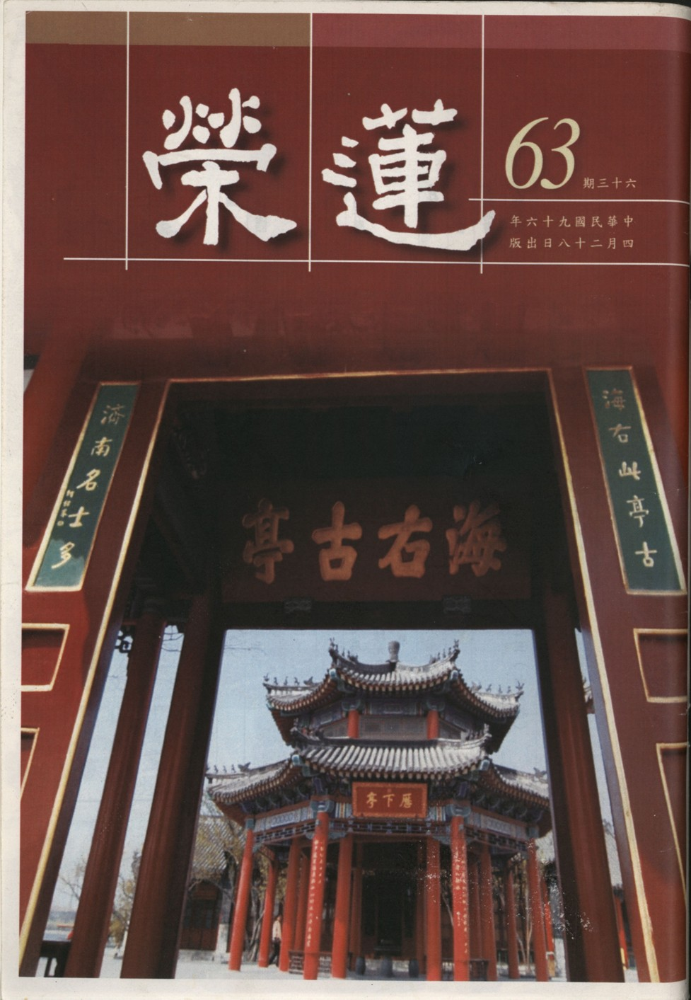

# 第63期

## 社論

### 哲人不遠

本刊

亂世避秦入九夷

君子居之何來陋

哲人不遠待來者

愛台灣者真典範

對一個人的印象深淺，除了平常的交往以外，更要在不斷回憶中印象才能加深，否則即使交情深厚，不去串習他的情分，日久之後，剩下的也只是寒暄與客套。尤其在這唯名利是圖，人心澆薄的社會中，人與人之間即使再熱絡，你濃我濃，但不堪分手時間的久遠。逢到人過世，輓聯寫個音容宛在，不過是一種習俗，事實上隨著做七、百日、三年及時間的相續後，印象早已模糊。有些家裡掛著祖父、曾祖父等老一輩的照片時，後輩往往連看也不會看一眼，子孫們也忘了他曾經存在，甚至懶得去想這些長者對家族偉大的貢獻，及種種的嘉言懿行。

有很多人努力的在政壇上建立豐功偉業，有的投入在上班職場上，努力有一番的作為，得了很大的成就，都不堪入土為安之後，變得虛無飄渺，或者在世時一退出職場（政治）的舞台就立刻被人淡忘。說什麼永垂不朽，精神常在，那只不過是一個後代人的口號罷了。

而真正的大德，以偉大的格局、健全的人格、深厚的教法涵養以及一股強大的悲心來推展利益有情的事業，幫助有情通往真正的安樂道上，其中尤其以培養人才，作為利益有情最殊勝的成效，這樣的大德往往是越老越得眾生的推尊及仰望，是群生的標竿、淳厚風氣的維護者，在他過世時，許多人為他哀痛，並努力的將他的思想觀念及所說過的話保留及傳承，子貢對孔子就是這樣的評價，所謂：其生也榮，其死也哀，如之何其可及也。但是這樣的人物不容易出世，或許百年、五百年都難得出現，可比優曇花。

而  雪公老恩師就是這樣的人物，除了有上述大德的特質之外，並特別對傳承的正法有抉擇的能力，在各家的注解裡，能分別是非、抉擇深淺，並找到修行的下手處，使學者能當下受益，奉行之，能保證一生乃至來世的安樂，並得到通往西方淨土的捷徑，在動亂的時代裡，竟然在台灣開出一片莊嚴的花園。台灣之所以稱為寶島，不是只有所謂的好山好水，而是有著這樣的人物，將畢生的精力在這裡發揮。

恭逢老恩師往生廿一週年的紀念日，如果能將老人家所說過的法，所寫過的文章，所整理的講經表解，注解經典的注釋，好好修習研究，找出老人的風格及自修化他的知見與方便，辦事的眼光、人生的格局及穩重踏實的風範，成為引導入中華文化及菩薩道的途徑，這才是真正雪公精神的在世、哲人不遠的最佳寫照。唯有保存這種純粹的知見，才能維持真正清淨的正法，這才是在台灣永續經營的動力，能凝聚人心，共行菩薩道，使居住在此地的人說這是一片樂土、是香格里拉。讓哲人不遠才是真正的愛台灣，至於言外之意，就讓讀者自己去想。

## 大德法語

### 常禮舉要講座（四）居家篇

雪廬老人

居家是學問

常人放逸行

威儀從小處

成就真可觀

◎八、立不中門，過門不踐門限。

這「立不中門」怎麼說？這個在家不能站在門當中就是了，此處不是我們站的，你站著，別人要走得從兩旁走，這不是明白了嘛！從前講讓路。至於「門限」，兩扇門或者有「限擋」，沒有限擋則有門限，門限為牆，門關了過去，有限擋著，風進不去，這可明白！因門限高出一塊來，你站在上頭高起一塊幹什麼？

◎九、立不一足跛，坐勿展腳如箕，睡眠不仰不伏，右臥如弓。

這條得念熟了，與學佛大有關係。為什麼大有關係？修淨土須得一心不亂，什麼是不亂呢？我說的一套就這樣，永遠不改變。例如我今天做什麼功課，到臨死斷氣的功夫也是這樣，這就能往生。今天這樣，明天那樣，你的心裏亂七八糟，有亂七八糟的心就有亂七八糟的事。

你看看京戲，表演的整整齊齊一點也不亂七八糟，光看台前那一套，錯一點也不行，就譬如用手指物，是一個指頭指，你用兩個就不行，二個指頭指，用一個也不行，到後台去更不得了，後台規矩可大了，誰在那裏坐著，都有一定的規矩。人家那些東西在那些箱子裏，絲毫不錯，這個大家都不知道，所以人家一上場什麼都整整齊齊，沒有錯的時候。咱們學到個唱戲能耐此談何容易？古人云：十年可以出一個秀才，甚至出一個舉人，但十年出不了一個戲子。

「立不一足跛」是指站時別叫一隻腳殘廢了，你在那站著怎麼會殘廢呢？意思是別跟殘廢似的，只有一隻腳。你自己一個人在屋裏怎麼樣都不管，孔子他在私室怎麼站呢？咱們不知道，可是論語上有：晏如也。意思是不必呆呆板板地、很自然地，這句行了吧！譬如宋儒，名字不必提了，往後嘴上少造些口業，他們必得在那裏道貌岸然，岸岸然戴著道士的帽子，必得那個樣子。外頭有人說你是書生，你把書給生了，這個樣子我也不贊成。即使與同事談話站著時，站著的功夫，兩腳直直地不是立正就是稍息，好像在表演，而一隻腿撐著身子則太隨便，表示不恭敬。

禮記開首三條，身、口、意皆求敬，這三條大家都行了嗎？從前在清朝時你們都沒見過，頭髮梳辮子，到了夏天把拖在後頭的辮子盤起來，叫盤辮子，因為天氣熱的緣故。上街去忽然看有朋友，趕緊放下來，就是衣冠身體一切都整整齊齊了，不是在表示自己是什麼，而是恭敬人的表現。從前有一位不懂規矩的候補官，夏天時去見巡撫，講究的是不許拿扇，見到撫台大人時，當時天氣很熱而且穿了一身衣裳又不能脫，偷偷地拿扇子來搧，這撫台大人也不好，有點做作，候補官也失了禮。

當端茶予客人時，撫台看他在那裏搧，而云：「你老兄天氣熱，帽子摘下可以涼一涼。」，「好！好！好！」就摘下來了。這位候補官還不覺悟地在那裏搧。撫台云：「天氣太熱你寬寬衣服！」實際上必得穿著外套才是禮貌，這是功夫。候補官：「好！好」又脫下了大衣。這時巡撫說「喝茶！」一嚷喝茶，這是官場的規矩，即是端茶送客，主人一嚷喝茶，門口侍候者就打起簾子來喊「送客」。大官只要站起來往裏頭走就行了，他這位候補官在這裏還不走嗎？一喊送客，此人又拿帽子又拿衣服，外頭還有轎子，這樣子如何上轎？你看看！

◎十、同桌吃飯不另備美食獨啖。

在家或是公共地方，都是若干人同桌吃飯，預備什麼飯就吃什麼飯，不能有同桌吃飯我吃不來，我預備自己的飯菜。同桌吃飯，你不吃菜沒關係，單獨吃很不好看，若是吃素又另當別論。譬如我吃長素，外頭人不知道，我不說他也不做素菜，不知道呢，將葷菜夾在我跟前，我不吃就是了，放在那裏，他們拿筷、我也拿，往嘴裏送，我把肉偷偷地放一邊，模模糊糊地什麼都過了去。

再說同仁們的宴席，知道我吃素，預備兩個素菜，這時我還是謙讓地請大家同吃。那些吃葷的，明明有燕窩、魚刺、熊掌……吃得還不夠？你這裏青菜豆腐只兩盤，何必還來吃你這個？就有這種不開竅的人，我見的不只一個。他怎麼呢？嘴裏吃的油膩膩地，這裏吃、那裏吃，連你這裏素菜他也不放過，這種人我絕對原諒，他根本就沒有這種教育，有受教育地讓他吃，他也不吃。諸位假定要吃葷菜就別去吃別人的素菜。可是你要到葷菜的地方吃素，就馬馬虎虎、敷衍敷衍，應酬嘛！也不必跟人家要菜，出去吃飯是一種禮節，行這個禮節後，回家再吃。

◎十一、不挑剔食之美惡。

這個不但是外頭同桌吃飯，在家庭裏頭也是如此，熟人也是如此！你吃這頓飯不好，你嫌不好，你不好叫誰吃呢？這個我不吃你們吃吧！理上講得過去嗎？不好的叫他們吃，好的我自己吃，這個講不通，所以是不能挑剔。在家庭裏也不能挑剔，除非你自己做主，你是主人，今天吃什麼菜，你自己說，廚房替你做，此談不到挑剔二字。你不做主人則沒有挑剔權，不好也得吃。

我家裏是大家庭，小時候，什麼時候吃什麼菜，那一天要做什麼就得做什麼，呆呆板板地跟法律一樣。我最討厭的幾樣食物，如夏天吃金瓜，七月間吃小白菜炒飯，這是我最討厭的兩種。彼時同桌吃飯，我不大動，年輕時還說實話：唉，我不願吃這個。向來習慣吃兩天，這一句話行了，明明兩天後要換新的，到了時候金瓜連著四天也不變，那個小白菜炒飯，我嘴裏唸得很熟，吃了十天，老人做的，你不吃就餓著。

◎十二、食時不歎，不訓斥子弟。

不吃飯時怎麼說話怎麼行，在家裏或外頭吃飯時，不許有「哎」這種語氣，這是大毛病。在外頭請你作客，想到了別的事，並不是為了今天吃飯，也不許「哎」的口氣，主人看到，他會誤會啊！現在吃飯講衛生，古時候吃飯雖不太講究衛生，但講究生歡喜心，所以不許看書。從前我吃飯時拿一本書看，老人不管我時，我看，管我時就不敢看，吃飯以後也不許看書，因為胃不易消化，所以不許用心，這個大家記住，與衛生也有關係，《紅樓夢》中也有吃飯以後一點鐘以內不喝茶，你不信翻翻紅樓夢查查看。

再者「不訓斥子弟」，以前大家庭中食時訓斥子弟情形很多，現在小家庭就不敢訓斥子弟，求其子弟不訓斥父母就萬幸了。現在或可還有幾個家庭吃飯的功夫不幹別的，開檢討會來教訓孩子，我到親戚家也看過這種情形，孩子放下筷子聽訓，家長訓示的聲音愈來愈大，小孩子哭了，家長大聲說：還不吃。有的哭、有的吃，那就是作病。哭就不能吃，吃就不能哭，所以是不能教訓子弟。從前佛教叢林吃飯實實在在，靈山寺當家師在時還有一套，那就是用鼓山寺打佛七過堂的辦法，現在也不那樣了，不進步有什麼辦法呢？（下期待續）

### 大方廣圓覺修多羅了義經（二十三）

道源老和尚

無始無明非實有

觀待執相如幻化

知其本空能頓超

直入如來祕密藏

己三、酬結請

經文：

善男人！知幻即離，不作方便，離幻即覺，亦無漸次。一切菩薩及末世眾生，依此修行，如是乃能永離諸幻。

再將漸次的行門歸到頓超的法門上，合著文殊章，知是空華，即無輪轉，是歸到頓超法門，然還是有方便（漸次），乃堅固執持遠離心，為下手的方便，下手用功用到知無所離時，那些漸次的修學都是多餘的。就怕你不知道是幻化的，知幻即離，還須什麼方便呢？就怕你不是真知（知是空華的知），此始覺知謂之名字即。

雖知道了那是聖言量，是佛的境界，但還是無法以心轉境，境界轉不過來如何能了生死。此知是名字即就是不覺。若知是分證知（分證覺），此菩薩的覺是從初地菩薩一直到等覺菩薩，最高就是等覺菩薩的知，所用的功都是知幻即離。知幻即離、離幻即覺，修行用功是要離幻的，方能破無明斷煩惱，圓覺妙性方能顯現。沒有頓超的根基，就得用漸次了，此處說了四個步驟，譬如上大殿有四個台階，你得一步一步的走上那四個台階，才上了佛殿。若是頓超則不須漸次，離了幻即是覺，還用什麼漸次。

戊二、偈頌

己一、標頌

經文：

爾時世尊欲重宣此義，而說偈言。

己二、正頌

庚一、頌總請

經文：

普賢汝當知，一切諸眾生，無始幻無明，皆從諸如來，圓覺心建立。

此乃重頌，圓覺妙性是一切眾生的本性，然眾生不知，如來證知。此句並不是由圓覺心生出虛幻無明，無明不由圓覺心生，而是依著圓覺心建立無始虛幻無明，觀待圓覺心而說虛妄的無明。

經文：

猶如虛空華，依空而有相。空華若復滅，虛空本不動。

這個經上用「依」字用對了，前邊說「從」虛空生，虛空怎麼能生華呢？空華是由病眼生的嘛！但是他是依著空才有相的，沒有虛空現不出空華相出來，你儘管有病眼，沒有虛空可看不出來空華，所以雖然無明不是圓覺心生的，可是依著圓覺心建立的，依著圓覺心才建立無明，一切都滅盡了，選修個什麼呢？滅是滅幻化的空華，是滅幻心的無明，把無明空華滅盡了。

而虛空之性，它本來不生、本來不滅，空華之生由你病眼生的，你把眼睛治好了，空華滅了，滅了是打你眼睛裡滅的，虛空裡從來沒有生華，哪有個滅華呢？所以虛空之性從來不動，你一念妄執生了無明，無明滅了，無明生無明滅，圓覺心都沒有動。

庚二、頌別問

經文：

幻從諸覺生，幻滅覺圓滿。覺心不動故，若彼諸菩薩，及末世眾生，常應遠離幻，諸幻悉皆離。如木中生火，木盡火還滅。

經文的從字一定要做依字（互相觀待）講，一切諸幻法都是依著諸覺生出來的，依著一切覺性生出來的。要是幻化都滅了，幻滅覺性可圓滿了，若最後還有個幻智存在，則覺性不圓滿。此圓覺妙心再也不受無明擾動（證量不退轉）。

當會的諸大菩薩是修大乘的眾生，乃至末世眾生皆應當遠離諸幻，按次第先離幻境，須發堅固遠離心，將虛幻的境界遠離，其次離幻心，第三離幻心的智慧也要離開，第四是此離幻的覺性亦不可得，還是要離開，此時是諸幻悉皆離，譬喻木中生火，木盡火也沒了，覺則無漸次，方便亦如是。

以修學四漸次，兩木相因，能轉的是木，所轉的也是木，能轉的木譬如是遠離心，所轉的木譬如遠離境，結果火轉出來了，兩個木都燒盡了，這兩個次第都空掉了，此時還有轉木的智慧在，就是還有點灰在，灰飛了，此時還有個覺在（還有點飄渺的輕煙留在虛空），當煙也飛滅了（灰飛煙滅），此時清淨了。

若是利根其覺則無漸次，不需漸次方便，就怕你不覺。一覺啊！知是空華，即無輪轉，亦無身心受彼生死，知幻即離，離幻即覺，都是用的知，你這樣一覺（知），一切幻化諸法通通離開，何來漸次？若才上來虛幻境界離不開，方便功夫即是堅固執持遠離心。（下期待續）

### 佛說八大人覺經講錄（五）

道源老和尚

善惡苦樂心造受

覓心不得我相空

生死根源能頓斷

預入聖流為明燈

甲二、詳八大法相以成宗

乙一、別釋八法以起信解

丙一、覺身心無常觀念真常

經文：

「第一覺悟：世間無常，國土危脆，四大苦空，五陰無我，生滅變異，虛偽無主，心是惡源，形為罪藪，如是觀察，漸離生死。」

再者「虛偽無主」，此身心沒有個主，以為有個我在攝持著五蘊身心，其實只不過是無明煩惱執著出來的，無明煩惱所執的我是不是真實之法呢？不是！若是真實法，你想破無明、斷煩惱是破不掉、斷不掉。若知無明煩惱所執的我是虛妄之法，五蘊根本沒有主宰，是虛偽之法，則執著可破。

第七、「心是惡源」，無明所執的我，不過是在身體、心的基礎上名言安立的我，觀其自相是空，若無法觀空，生起執我的心識，必起惑而造罪。

惡法總綱有十種，就是身三、口四、意三，其中意是我們的心，我們的妄想心有貪瞋癡三種惡法，也叫根本煩惱。心是惡源是指一切惡法統統都是貪瞋癡生出來，而貪瞋癡雖是一切惡法的根本（一切煩惱的根本），謂之三根本煩惱，而這三根本煩惱，是從那裡所生出來呢？是由心生出來的，是心將五蘊執實，並執著在五蘊上有個主體性的我，由此而生出一切煩惱，所以說這個心是惡法的總根源。

第八「形為罪藪」，生亂草之地叫藪，這一大片亂草，從那裡生出來呢？都是打我們身（形）生出來的。「形」就是我們的身體，身是有形有相，可看得見，包括身、口二業，口業也在身體上，身口二業分成七種，叫做身三、口四，都是造罪的。

身三是指身體會造三種罪，殺盜淫的罪業都是身體造出來的，都屬於身業。

其次口會造四種惡業，如：妄言、綺語、惡口、兩舌，妄言就是說謊話，把是說成不是，見說成不見，這都屬於妄言。綺語是不正之語，你說這話不屬妄言，但是也不是正當的話，所以叫做綺語。兩舌是搬弄是非，離間情感，見甲方的人說乙方如何不好，見乙方人反過來說甲方人不好，見兒子說父親不好，見父親說兒子不好，父子的感情，被他離間開，結果生些是非，好像一個嘴裡生出兩個舌頭，叫兩舌。惡口就是出惡言惡語罵人，謂之惡口。

身業三種，口業四種，是身、口七支，身業、口業合起來亦是身「形」，造業多了就像亂草一樣，一大片亂草。這一大片亂草從那生？從地上生出來，我們的身體好比是罪業之出生地，一切罪業都由身造出來的（也是苦果聚集處）。

心是惡法之源，形為罪惡之藪，惡源與罪藪有什麼關係呢？因為眾生畏果不畏因，畏是畏懼害怕，果報臨頭眾生會害怕，果報未臨頭他則不怕，一般作惡造惡不覺得害怕，不曉得如是因，得如是果，種瓜一定得瓜，種豆一定得豆，造了惡（罪）一定要墮地獄的，當墮到地獄時悔之晚矣，所以不如現在畏因，所以菩薩畏因不畏果，害怕造惡因一定得惡果，所以菩薩不敢造惡因，等你墮地獄，再後悔就晚了。墮地獄是誰叫你墮的，不是天公叫你墮地獄，也不是閻羅王叫你墮地獄，是你自己造的惡業應得之果，自己把自己牽到地獄去。

前邊有八種法應該覺悟，接下來「如是觀察，漸離生死」，如是是指經過了上面這八種的觀察，觀察這八種法，這八種法完全是罪惡之法，若觀察清楚就漸離生死。生死是果，造業是因，你不造生死罪業，怎麼會流轉生死得生死之果？如是觀察就不造惡因，自然不得生死之果，如是就可以漸漸離開生死了。

如是觀察，漸離生死，是漸次慢慢地離了生死。眾生的根機，有頓根、有漸根。若是頓超之根機，是即聞即悟即修即證。漸次的根機，則是慢慢地（逐漸）覺悟，慢慢地修行，逐漸的了生死。此經雖說漸次，但亦可頓超，何以故？有二種道理可以說明。

第一種道理：漸根之中含攝有頓根，如何含攝？眾生是如何有頓超的根機？他是前身前世，多生多世漸漸地修來的，修到今生，根機變成上根利智，即聞即悟即修即證，頓時就超脫了。頓還是由漸而來的，所以漸法裡頭即含攝有頓法。

第二種道理：是佛的大慈大悲，普攝一切中、下根機，上根頓超雖是即聞即悟即修即證，佛恐怕下根眾生自暴自棄，唉呀！佛法要上根利智才能修，我的根機太差了，我學不來。此時第一覺悟就有八種法來覺悟，鈍根能漸次地修八種法，一樣可以離開生死。（下期待續）

## 共修研學

### 小止觀導覽（三十六）

*心爾整理*

修學最怕盲修練

知見引導多聞思

坐上短時修止觀

功夫增上時漸長

第四章、調和

論文：

二、住坐中調三事者：行人當於一坐之時，隨時長短，十二時、或經一時，或至二三時，攝念用心，是中應須善識身息心三事調不調相。

三事指身息心，行者修觀坐禪，於一坐之時，從入定終至出定，無論時間長短，都要攝念用心，收攝妄想雜念。

要以正知來攝持身息心，此處特別約身來說，初學者宜時間短、次數多，一定要在自己堪能的情況下，慢慢訓練自己的能耐。千萬不可以硬逼自己一上坐即久坐，會有極大的過患，以後看到拜墊就想要逃。

論文：

若坐時向雖調身竟，其身或寬或急，或偏或曲，或低或昂，身不端直，覺已隨正，令其安穩；中無寬急，平直正住。

此處是坐中調，坐前調是在還沒修止時，要將身息心好好地調，調到身體非常端直，息也調得非常均勻，心也調適到恬靜的狀態，用這樣的狀態來修止修觀，或者念佛用功。

坐上修或長或短，在過程當中以正知力攝持，有了警覺力，身或心若產生不如法的現象，能夠立刻察覺調整，正知力在察覺坐前該如何調整，坐上修時也立刻察覺不如法之情事。

想要修學止觀的人，必須要有種種的前方便，就是在衣食具足，而且安靜沒有外緣干擾的地方，有教授善知識、同行善知識及外護善知識的提攜，在外相上遠離五欲的境界，在內心上也不會去想五欲的境界。並且在外相上懂得調食、調睡，不要吃增加煩惱的食物，變成障道，也將恰到好處地滋養身心，不過份睡眠也不熬夜。

進一步往內調整身息心三者，身息心三者相互觀待，身體調正息就順，心也容易安定，而調身、調息、調心都有入住出，入的時候身體是毗盧八法，眼觀鼻、鼻觀心，將身調整好，接著調呼吸，將息由風、喘、氣調至綿綿密密、若有若無，息調好之後心就定下來，這叫做入。住就是在這樣的狀態下安住，只要感覺有點不順，再以身為所緣調整姿勢、以呼吸為所緣調整氣息。例如念佛之前，要將警覺力提起，每一句佛號都在我的掌握之中。

當感覺有昏沉、沉沒、掉舉的現象時，立刻察覺，此有三種方式：

一、強力的安住在所緣境上。

二、發覺根本無法安住時，如果是昏沉就要上仰，想肚臍、想眉間、想頭頂。

三、當沉沒的時候，要觀想佛菩薩的功德，掉舉時要想輪迴的過患，把想五欲境的心收回來，安放在所緣上。

察覺力的勢力要很強盛，讓心在佛號上一直往前走，若表面仍在念佛，但心裡有一個角落已經暗下來，也要察覺並且加以對治。一般人不知道正知力的重要性，很多修行一輩子的人，大部分都是已經在昏沉時才有警覺，殊不知警覺力是在剛開始就要被訓練，每一句佛號都在掌控之中，一直覺察到昏沉、掉舉、散亂、沉沒的勢力再也不會發動之後，此時才可以放緩覺察力。

有的人在坐上修的時候會覺得煩躁，放緩之後覺得很好修，放輕鬆之後覺得很舒服，以為這就是在修行，其實是和散心相應，不是在修行。此處所謂的放緩、放輕鬆是指緣所緣境時，不要緣得很急促，讓心極為緊繃，但是要將所緣境緣得清清楚楚，緣得很有力量，而不是緣得很鬆叫做放輕鬆，緣得很鬆是沉沒、散亂、掉舉的前兆。

放緩是指當正知力已經將沉沒、掉舉通通對治之後，正知力放緩，緣所緣境的力量要很強，所緣境的行相要很明顯，不是將所緣境念得很無力，暗暗的，念一念再睡一睡，睡一睡再念一念，這樣子修行越久，習氣越多，麻煩更多。所以一定要弄懂名相的意義，避免修行得不到妙用。

論文：

復次、一坐之中，身雖調和，而氣不調和，不調和相者：如上所說，或風、或喘、或復氣急，身中脹滿，當用前法隨而治之，每令息道綿綿，如有如無。

坐前調好之後，坐中也要時時調整，前文已將調息說明了，此處何以又講調息？前文是坐前修，此處是坐中修，在靜坐當中姿勢不好，糾察師要出面糾正，可見坐上也必須要調整，止靜時身體也保持端莊，呼吸均勻，鴉雀無聲。

身體雖然坐得很好，但是氣沒有調好，呼吸氣息或者產生如風、如喘的聲音，或者雖沒發出聲音，但是氣息不通順，太過於急促，急就容易感覺身中漲滿，心就不安定，這時要以息為所緣，讓自己呼吸綿綿密密，所謂的前法，即是前述：一、下著安心，二、寬放身體，三、想氣遍毛孔出入通同無障。觀想氣息向下，此時呼吸會慢下來，自然心就會靜下來，身體也不要繃得太緊。

論文：

次一坐中，身息雖調，而心或浮沉寬急不定；爾時若覺，當用前法，調令中適。

接著講坐上修的調心，心有浮沉寬急。心浮的行相為：心好飄動，身亦不安，念外異緣。身息心三者是相互觀待，心好飄動的人身也不安寧，尤其在坐上修如果沒有產生法喜，身體也坐不住了。

而心沉的行相為：

心中昏暗，無所記錄，頭好低垂。沒有記錄就是昏沉，有記錄但是不明顯就是沉沒。沉沒是欲界的善法，但是昏沉是八大隨煩惱之一。有的行者一輩子在沉沒之中，以為是在修定，殊不知雖是善法，卻是會障礙禪定的善法，其念所緣境的力量不夠明顯，念得很輕鬆但是沒有警覺力，這樣的沉沒相是禪定的障礙。

寬的行相為：

心志散漫，身好逶迤；或口中涎流，或時闇晦。心因為太寬了，念一念五欲境，又回來念阿彌陀佛，想一想今天要買什麼菜，再回來念阿彌陀佛，想一想中午跟誰約會，才回來念阿彌陀佛…，心太寬大廣納四方，於是開始坐姿不端正，睡一睡再念一念，所以口水自然流出來。例如是否專心念佛不太在意。

心急的行相：

用心太急，向上胸臆急痛。心很躁動不安，例如修念佛定的人雖然念佛念得很有力量，但不是急切，雖然有快板的追頂念佛，那是為了訓練專注力，並不是急促的念佛令心非常急躁，是很專注、很有力量的一字一句念下去，這樣才不會有胸口痛的症狀出現。將所緣境念得很清楚、很有力量、很明顯。

要對治浮沉寬急，才能成就禪定的功德。若浮就緣念肚臍，若沉就繫念鼻端，若寬就將身體坐正，將心好好的緣在所緣境上，將境界緊緊抓住，若急則將心放下來，氣息往下走進入丹田。不過比較好的方法，還是觀無常與輪迴的可怕，或者觀想佛菩薩的功德、淨土的殊勝，分別來對治浮沉寬急。

或有人以為經教無用，殊不知當透過彌陀經瞭解極樂世界依、正二報的莊嚴，產生對淨土的好樂，能提振念佛的精神，阿彌陀佛這四個字被賦予殊勝的意義，此時念佛，心力則強盛。並以觀修無常及輪迴的可畏來對治掉舉，因為對五欲境多一分的貪戀，就消耗一分的福報，多一分進入三途的機會，此時才會願意在佛號上用功，願意在所緣境上用力。所以研究經典是非常重要的，有經文的想法，就會把心安住，往生淨土也是為了得到一切種智。人生就是要有這樣的走向，眼前念阿彌陀佛，給自己一番鼓勵，自己提醒自己，自己向自己打氣，這就是經教的好處。

論文：

此三事，的無前後，隨不調者而調適之，令一坐之中，身息及心三事調適，無相乖越，和融不二。此則能除宿患，妨障不生，定道可尅。

在坐上修時，先將身調好，其次調息，之後調心。配著正知進入所緣的境界，不是正念之後才使用正知，而是同時以正知正念來進入所緣境，正知的角色就如衛兵防衛正念，不被邪念摻雜，凡生起可欲境立刻察覺並且除去，發覺到可欲境已經不生，心已經不會去攀緣五欲境，此時可放緩正知進入禪定。坐上修時的調身、調息、調心沒有前後，以正知力察覺，心不調就調心，身不調就調身，息不調就調息。

令身息心三者不會互相障礙，身幫助心和息，息幫助身心，心又幫助身息，謂之互相調適及融合。

如此修學可以除去宿患，宿患有二：一者、我們一直以來的毛病，或者喜歡打妄想，或者昏沉、或者掉舉，或者散亂等，二者、身體的毛病，或者常常腰酸、鼻子不通、頭痛等等，這時可以用後文的治病來除去宿患。這些妨礙禪定的障礙不生，調得好就可以入到初禪的未到地定，謂之定道可尅。（下期待續）

## 蓮池海會

### 陳榮庭居士往生見聞記

*編輯部整理*

一生勤勞重誠信

敦倫盡份得好評

創業維艱守成難

撒手西方賴賢女

陳榮庭居士，民國三十八年出生於苗栗通宵，父親務農，上有兄長、弟妹五人。自幼聰穎過人、過目不忘，特別精通算術之學。然因家境清苦，很小的年紀就必須幫忙家務及農事，有時要挑負重物，加上營養不良，所以身材顯得瘦小。在面臨繼續升學與否時，居士放棄自己的學業，支持兄弟讀書，提供住處，也負擔起最小弟弟的成家費用。

陳居士在當兵時擔任駕駛兵，接觸汽車並產生興趣，學會修車後因技術卓越而被點名到官邸為先總統蔣公修車。退伍後曾在修車廠工作，並接受開南商工老師請託，到該校為汽車電機科學生授課。後來進入汽車零件業，因工作認真負責，忠心耿耿，得到老闆賞識與信任，很快地當到經理，管理工廠的生產也負責收取貨款，是老闆最得力的助手。

陳居士婚後育有二女，一家人租屋而居，克勤克儉，雖然經濟拮据，但對親人的照顧不減，並與兄弟及小姨子一同居住，家庭和樂。保持著儉省的習慣，內衣可以穿到破洞，皮帶用到快斷了仍捨不得換。極重視家庭生活與孩子的教育，認為教育小孩比賺錢還要重要得太多，不論事業有多忙，都不忘與家人相處。雖未曾打罵孩子，且尊重孩子們的意見，不會做過多的干預；但重視孩子的品德，像是必須誠實、待人以禮、尊敬長輩、幫忙母親分擔家事；在學問方面只要學校成績保持中上即可。

民國七十三年，陳居士以極少的資金成立公司，昔日往來的同業因信賴他的為人，而合作成立高雄廠；接著陳居士與親戚再合作成立桃園廠。創業之初將近一年沒有薪水可領，工作檯、工具、小機器，只要能自己做的，絕不花錢買；趕貨時也不敢請人，只能自己忙到半夜，晚上或帶夫人到工廠幫忙趕貨，或在公司製圖到深夜。後來隨著訂單的增加與穩定的客源而漸入佳境，不忘提拔員工與親戚成為股東。陳居士開誠布公的領導，使得股東們不但有共識且和合，不曾有紛爭。

陳居士童年刻苦，創業艱辛，未曾改變的是誠信，以務實的風格待人接物，對大訂單不起貪婪之心，對小訂單也不輕忽，對產品的品質要求與後續服務甚為自豪。他的座右銘是：「競爭並不一定要擊敗對方，而是各自掌握方向、齊頭並進。」也曾經有一家客戶即將倒閉，仍向陳居士說明自己不得不宣告關門，並保證所欠貨款一定會還，他說：誰都可以隱瞞，然要將實情告知居士。

陳居士甫創業時，過去認識的供應商紛紛表示貨先拿去，貨款再說，不急！當時只要一通電話就可以讓人將送貨來，後來當事業漸漸穩定，陳居士沒有忘記這些曾經協助過他的人，不但告訴女兒這些往事，而且十分念舊地維持與這些供應商的關係。

陳居士待人無分別心，不以職業、學歷、能力辨人，待人唯以誠。雖不喜交際應酬，但朋友廣布，經營事業能與同業為友。當陳居士拓展海外業務小有成就時，他鼓勵同業的好友要走出台灣，開發市場，甚至不藏私地將整份客戶名單提供給好友。

在鄰里之間，居士亦廣結善緣，他可以為了跟一位老朋友打招呼，上班時故意繞路，從老友值班地點前經過，然後揮揮手問候一下。工作再忙遇到鄰居也要停下來聊天話家常，在市場的攤販、賣鐘錶的殘障人士、雜貨店的老闆，陳居士與他們都很有話說。若在路上遇到賣鐘錶的先生騎著殘障電動車，陳居士會放慢摩托車車速，與鐘錶先生一邊說話一邊陪他慢慢前進。

陳居士在工作上可以不眠不休，但是在與人相處上，卻總是從從容容，一點也沒有趕時間的樣子，所以獲得許多友誼。在遇到難題時，也總能沉穩面對，做任何決定一定經過深思熟慮，或許與朋友聊聊，或許靜下來寫寫字，不會只想解決眼前而不考慮未來。

陳居士曾在岳父生病時接回家中與夫人一同奉養，完成夫人的孝心。居士的父母住在鄉下老家，雖因工作無法常回鄉下探望父母，但逢年過節總早早讓夫人先回鄉幫忙，寒暑假則安排還在讀小學的孩子回鄉下陪伴爺爺奶奶。換住較寬敞的房子時，也特別留了房間給父親。

陳居士本身雖然對佛法了解很少，但為了護持夫人學佛，在家中設立佛堂。夫人往生後，居士能將對夫人的思念轉成正面思考，喜歡主動對朋友說起過往與夫人相處的點點滴滴，而面對自己的身體出現問題時，不但沒有被疾病擊倒，而且能堅強面對。

當陳居士人生最後的一年，雖然知道他病情的人很少，有幸能依女兒的因緣親近善知識，且在家人與善友的提醒下做種種的善法，不但促成九十五年四月在大陸常熟的放生，也發願放生十萬條生命，並在同年十二月發起緬甸齋僧放生慈善之旅，並到訪緬甸十天，拄著柺杖親自參與殊勝的法行，得以在臨終前藉由這些善法，使得往生前無有障礙，在家屬與蓮友十多小時的助念下，安詳往生西方極樂世界。並在助念廿四小時後，全身柔軟，含笑西歸。

## 禮懺法會

### 懺悔的前方便（下）善修地藏懺

智高

人生難得如意寶

觀待三途之勝解

運用心念能淨罪

高登蓮邦出乾坤

上次我們談到了人身寶的可貴，以及若不珍惜此人身寶必墮惡趣的道理，如果我們下輩子必然會墮入惡趣，那什麼是惡趣？惡趣的形象又是什麼呢？這個問題對於學佛多年的我好像是一個很幼稚的問題，惡趣？一般不就是指三惡道，地獄、餓鬼、畜牲嗎？但這個卻是一個非常重要及嚴肅的問題，而且它並不簡單。

反省自己接觸佛法多年，為何總是起起伏伏，停滯不前？不僅對於美好的道理並未認真修行，對於自身惡習也未想要努力斷除，更遑論真實的懺悔了。

這是為什麼呢？除了不相信自己必然會墮入三途，就是因為不認識惡趣，對於惡趣恐怖的感覺從未真實從內心生起，所以一天過一天，並且還會安慰自己說：「其實自己也做了不少善法，相較於其他人而言我應該算不錯了，所以下輩子應該也不會太差。」所以相信自己此世若不好好修學，將來必定會墮入惡趣，並且經常思維墮入惡趣的恐怖，實在是學佛行者很重要及很基本的觀念，因為這樣才能幫助我們生起出離心，如此對於出離六道輪迴的方法我們才會很積極的去尋找追求。

至於如何觀修惡趣，前些年台中江逸子老師繪了一幅地獄變相圖，不僅曾在多處展覽，並有出版專書介紹，相信對於我們觀修惡趣會有更深刻的體悟。

既然知道我們必然會墮入惡趣，而且想到墮入惡趣之苦，能令我們深深感到恐怖，我們該怎麼辦呢？要如何才能免入惡趣之苦呢？首先第一步就是要尋求有力的依靠，而這有力的依靠即是三寶。所以第一步即是向三寶真誠的皈依，如同罪犯尋求大官庇護一樣。為何三寶是我們的皈依處？主要依著佛德我們可以分四點來說：

一、佛本身已解脫一切怖畏。因佛陀本身已是解脫一切怖畏，脫離六道輪迴之束縛，若佛陀本身並未解脫的話，自顧尚且不暇如何幫助他人呢？

二、佛能善巧解脫他人一切怖畏之法。佛陀不僅自身早已解脫，並且能善巧方便幫助他人解脫，如老師近日在中壢修學會所講的《觀無量壽經》中犯下五逆重罪的阿闍世王，佛陀亦能善巧度化。

三、佛大悲普度無有親疏。佛陀對所有的眾生都是如同唯一的愛子般的慈愛，所以我們不用擔心佛陀對於那個眾生比較偏心。

四、無論有恩無恩佛皆饒益。佛陀不會和一般人一樣因為他有權有勢，可能對自己有幫助所以對他好一點；因為某人身分卑微，就遠離他。前兩點是說明佛陀有這個能力幫助我們，後兩點則是說明佛陀具有大悲，願意幫助我們。所以毫無疑問的，三寶是我們唯一的皈依處。

但僅僅是單純的皈依那是不夠的，第二步即是如理修行。如果眾生可以不如理修行而依靠佛陀救拔的話，那這世界上早就沒有六道輪迴，早就沒有眾生受苦了，所以佛陀真正的可貴處是他的智慧，是他所說的法。依著佛陀的指示，才能幫助我們免入惡趣，脫離六道，而此中第一步我們要了解的就是深信業果的道理。

業有四種特性：

一、業決定之理。種善因必然得樂果；種惡因必然得苦果，這道理是決定的不會混淆，既使地獄有情暫得涼風之樂亦是過去之善因所感。

二、業增長廣大之理。如《集法句經》說：「雖作微小惡，後世招大怖，能有大損失，如毒入腹中。雖作小福業，後世感大樂，能成大義利，如穀實成熟。」故劉備亦說：「勿以善小而不為，勿以惡小而為之。」

三、業不作不得。若未種善因則必然無有善果可得；相反的若未種惡因則亦無惡果可得。

四、業作已不失。如經上說：「假使百千劫，所作業不亡，因緣會遇時，果報還自受。」

知道了業的四種特性我們才會對於斷惡修善這件事認真的看待，特別是對於過往所造的惡業我們該如何去面對呢？那才是真正的進入了懺悔這個階段。所以對於人生真正的懺悔其實是有很多心態及觀念是需要被講究的，知道了我們用這可貴人身造了很多惡業，因為造下了惡業我們必然會墮入惡趣，也知道墮入惡趣的恐怖，於是我們生起唯有三寶能救拔我們的決定見，對於佛陀所說的道理特別是業果的道理深信不疑，知道了惡業是決定的、是會增長廣大的、而且它不會消失，所以我們生起懺悔的心，就是因為過去不信因果，才會造下種種惡業，所以眼前才會遭受種種苦報。

若不懺悔所造罪業，苦果將在未來不斷的成熟由自己相續的五蘊身來領受，因此眼前我要好好來懺悔，尤其是即將墮入惡趣的定業，並且求佛菩薩加被！

所以老師每每在拜懺之前總是會用約三十分鐘做前行，將大家的動機心態調整，以及如何用懺法的儀軌本將重罪懺除，若不如此那就可惜了每次拜懺的因緣了。（全文完）

## 專題研學

### 聖者的祕密～大佛頂首楞嚴經二十五圓通暨七處徵心探源

### 二十五圓通暨七處徵心簡介 　（四）香嚴香塵

時哉

童真入道赤子心

由佛引導觀諸法

聞香證空是妙香

莊嚴果位阿羅漢

寅三、香嚴香塵

卯一、作禮陳白

經文：

香嚴童子即從座起，頂禮佛足，而白佛言：

童子有二種講法，其一為天真無邪的童子，其二是童真入道，就如憨山大師小時候就出家。

卯二、陳白之言

辰一、敘悟香塵

巳一、因觀有為

經文：

我聞如來，教我諦觀諸有為相。

諸有為相就是造作之法，凡是造作之法皆是無常，所以一切有為法皆無常。無常法很難體會，顯現的法似常，本質是無常，無常的面相要以第六識通達，因為前五識只緣現在境，不緣過去，也不緣未來，當下所見境似常，所以一般人都在常見下過日子，由於未用第六識去思惟，所以會被眼前的現相所騙。

若能推敲過程，會很清楚法是變動不拘的。如有些老人家，現前會以為以前就是這麼可憐與無助，若作整體的觀察，他或曾是風雲人物，當他在叱吒風雲時，無法通達未來是如此的顯現。

第六識不斷地推敲，會覺得目前現相是不可靠的，手上握有的資源、福報，如泥沙堆蓋房子一般，只要泥沙堆一動，房子全倒的，福報就如堆積木一樣，不小心的振動就全倒的，此不安的感覺應是可以生的。且不論眼前多麼享福，未來朝向的都是老苦、病苦、死苦，不被眼前的假相所迷住，認為我現在這樣，過去也這樣，未來也這樣，我永遠這樣的年輕、有福報，國家永遠如此（八大人覺經云：世間無常，國土危脆）。

有為相就是無常，有為相就是苦。

巳二、靜處聞香

經文：

我時辭佛，宴晦清齋。見諸比丘燒沉水香。香氣寂然，來入鼻中。

我辭別佛後，宴晦就是清閒養晦，養晦就是將光芒收起來，處在默默無聞的狀態。在清齋之中，就是一個可以養心去欲之處，是修持教法的環境。

沉水香是木頭放在水裡面會沉下去的，聞時無味，燒時極香，香氣寂然來入鼻中，是指氣在不知不覺地來到鼻中，為鼻所聞。

巳三、即香發明

經文：

我觀此氣，非木非空，非煙非火。去無所著，來無所從。由是意銷，發明無漏。

所聞的香氣在木上有嗎？若在木上有又何必要燒，所以香非在木中，香在空中嗎？因為是在空中聞到香，可是若沒有燒沉香，空中那來的香味，若在空中自然有香，則不必觀待沉香木，就應聞得到沉香味，然卻聞不到，所以是非空，香在煙上嗎？若在煙上，則所有的煙都香，這麼說來燒垃圾的煙也香。

香在火上嗎？若有，則在所有的火上都有香。所以香在木上找不到，在虛空上找不到，在煙上找不到，在火上找不到，香若有只有在這幾個地方有，不可能還有其他地方可以生起香。自相所成的香在那裡都不能成立，因為該有的地方都找不到，所以香之自相不可得，非由一處來，亦非去向一處。

去無所著，表示去不是去到一個地方，若是去一處，則彼處應有香，此時香已燒完，何來香？來無所從，來也不是從一個地方來，因為從木、從空、從煙、從火都找不到。

由是意銷，此時以香的自相為所緣時，聞不到任何的香，所以聞香的心也不可得，聞香的心要觀待香才有，而香已經找不到了，則聞香的心又如何生，所以證得無漏，原來是有漏，此時現證空性已成無漏的心識。

辰二、蒙印命名

經文：

如來印我得香嚴號。

由於證入香的自相空，佛安立彼名號為香嚴。

辰三、香圓得果

經文：

塵氣倏滅，妙香密圓。我從香嚴得阿羅漢。

塵氣倏滅是香塵之自相不可得，無自相可得，妙香密圓，妙香就是指香上的空性，密是常人不知其面相，圓就是自相空遍一切法。香嚴童子自謂我以香莊嚴阿羅漢果位。

卯三、結答圓通

經文：

佛問圓通。如我所證，香嚴為上。

聞香亦可以證果，可見條條大路通羅馬。這些空性的辨證法須多多串習，才能成為修學空性的法器。（下期待續）

### 講座因緣與法語觀修　（四）入道有多門，歸元無二路

心威

悟後起修真善巧

正見住持佛法續

觀待聞說入玄門

現證當下出世間

眾生之所以輪迴生死，是在於面對境界時，與已經成就的佛、菩薩，有著截然不同的回應方式。眾生面對境界時，就隨著境界而轉，無法做出正確的回應，在根、塵、識接觸中不斷地起惑、造業、接受輪迴之苦。經過無始劫來串習這樣的習氣，此生若還依著這樣的習氣，只有無止盡的輪迴。若不想未來的日子繼續在起惑、造業、受苦中無止盡的輪轉，就必須有所轉變。然而該如何轉變，才能走上與佛、菩薩一樣覺悟的道路呢？應以何種方法，才能朝著這條路走呢？

讓眾生在無始劫輪迴的，是根塵識的和合；引導眾生走向解脫的，也是根塵識的和合。在楞嚴講座中，了知阿羅漢、大菩薩們走在覺悟的大道上，以悲心開示眾生，在因地如何修學，果上方能解脫及種種殊勝的受用。亦即由根、塵、識中悟出自相空，即能從此廿五門得到解脫。雖根、塵、識之門不同，開始學習的因緣也不同，然修學的方法皆同，而一位成就者，得在因地裡不斷地修學，善根成熟時，就能證得空性的智慧。

雖然入道多門，然所證得的圓通是無二無別。在楞嚴法會上，或由菩薩所述，另一個法門是阿羅漢所述，就起了不同的分別，以為修學圓通有殊勝不殊勝，此即誤解空性的修學法。

經過這次講座，或許可以了解每一圓通所含攝的義理，然而了解這些義理之後真的可以成就嗎？若不能依著認知不斷地修學，是不能得到真正的實益，只是種下將來解脫的因，眼前仍是無止盡的輪迴，故須從經文中看到這些阿羅漢及法身大士的成就者，是如何次第的修學。

若配合正確的知見善用根、塵、識，不難發現山河大地一切的境界，無非是佛以無聲的方式來對大眾說法，所謂：溪聲盡是廣長舌，山色無非清淨身。

## 參訪觀摩

### 心靈的交流　與弘明學園創辦人對話（五）

*編輯部整理*

學佛因緣各不同

善識指導賜機會

承擔謙懷厚質地

燈塔照亮往來船

九、與學長們談學佛因緣

難得與大家碰面，非常謝謝大家的到來，端午節時不小心腳受了傷，雖然竹北醫生醫術高明，能迅速將斷腳接上，然至今仍需復健，無法使力，故無法迎接你們，感到非常抱歉。

說到學佛的因緣，當時學佛的人，心地都很善良，也不會多想那麼多，對某人心儀時就全盤向他學，不會一邊聽、一邊批判，而是完全接受。以前在學佛前只覺得很想要一樣東西，不知道是什麼東西，後來在書店看到一部《六祖壇經》，十分欣喜，內容與我以前所想的都一樣，我都看得懂，也可以朗朗上口的講述；但事先聲明，現在叫我講《六祖壇經》，我都不會講、也看不懂了（可見未真正聽聞，以為懂不過是望文生義）。

記得當初參加第一期明倫講座，能將先前所學的佛法連貫起來，感覺受用匪淺，從此立志，無論如何都要來台中聽聞佛法。彼時台北慧炬創辦人周宣德老居士，希望我到雜誌社幫忙，於是請求老居士每週三讓我去台中聽《華嚴經》講座，老居士答應後，每週三中午十二時即從台北搭火車南下，約十七時到達台中慈光圖書館，聽 雪公老師講授《華嚴經》。課堂結束後，老師會到隔壁侍者家看半小時的電視平劇。

以前我學人最不喜歡看平劇，因為唱一個字就拉得那麼長，耐不住性子聽，可是在那裡坐著陪老恩師看平劇幾年之後，卻覺得平劇唱作俱佳。看完之後，老恩師都會與我們簡單的討論。離開之後，我們這一群學子會聊到凌晨四點多鐘，再搭普通火車回台北上班，就這樣每星期聽《華嚴經》講座的時光持續約四年，回憶起那一段光陰，是我一生中最快樂的日子。

後來才知道，老恩師十分慈悲，以他老人家八十歲的身軀，講完經後應該已經很累，可是卻在講完經後，還到隔壁看平劇，並與我們談話，那是因為老恩師覺得我們這二、三位從台北來學的學生特別有心向學，所以慈悲地在講完經後留下來聽平劇，並跟我們說說話。老人家那裏是想在那時看電視，我們卻笨笨地以為老人家喜歡看電視，所以我們也很高興地陪老恩師看電視。看完之後，老人家問我們聽經的心得？我們聽的是迷迷糊糊，老人家就會說，這樣聽怎麼行，於是要我們去請清涼國師的《華嚴經疏鈔》，並在上課前先預習。當回家打開疏鈔一看，什麼都看不懂，簡直是「有字天書」，哈！哈！

可是，我們當時都有股傻勁，雖然看不懂，仍聽老師的話，一股腦的將天書繼續努力地看下去。講個笑話給大家聽，當年研究《華嚴經疏鈔》學習著自己做科表，那時候影印費一張十二元，做了科表也影印了幾張，到後來才知道李圓淨居士早已經將科判做出來了。可是那時不知道，就這樣自己做科表。

由於經常的讀、寫科判，漸漸的也讀熟了經典內容。我就覺得，文是應該有段落的，每個段落又怎麼安排科會，我就這樣自己學做科表，剛開始打開經本時是什麼都看不懂，但很有耐心的讀下去。從那時起，老恩師在講堂上也改變了以往純粹、通俗的教學法。例如，這個字是什麼意思？那句怎麼解釋？加入了清涼國師《華嚴經疏鈔》的資料，久了以後漸入佳境，慢慢了解老人家在講什麼！待老恩師講完經看完電視以後，問我們經義，並再指點我們一下。

接著民國六十三年參加約四年的內典班課程，那時老恩師開了不少的課程，其中有兩個講座：一是在慈光圖書館講《華嚴經》、另一在蓮社則講比較通俗的課程。後來老人家不在蓮社講課，由我們這八位同學中的五、六位學子輪流上台講課，其他的學子則是走辦事的路線。

老恩師弘法早期能將不認識字的歐巴桑教會講經，比方你在講這句經時要轉身指黑板、講另一句經時要大聲的說等等…，都是老恩師教學的方法之一。師姑們在烹調煮飯、裁縫時，每個人都是一邊做事一邊背表。有一回一位師姑上台講課， 雪公老師很生氣，手裡拿著扇子啪一聲打了下去，師姑當場哭了出來。這樣的教學能令不識字的師姑，學習背著表準備上台講課，若講不好就下台繼續練習。有一次，孔德成先生來聽師姑講經，他對著老恩師說：了不起，這些人怎麼能有這般的訓練，講演得這麼好。

到了要培養我們時，老恩師要我們上台輪流講經，老人家要我們自己選部經來講，倘若事先問都會挨罵。那時的我們都覺得上台講經很恐怖，因此都儘量選一本較薄、看起來簡單的經本來講。猶記得我講述的第一部經是《佛說尸迦羅越六方禮經》又名善生經，乃佛教善生童子禮拜六方，彼順婆羅門法，每朝洗浴禮拜六方，佛見之而說佛法之六方禮，父母為東方，師長為南方，妻婦為西方，親族為北方，僮僕為下方，沙門為上方。

當時我心想學中國文化、父慈子孝這些很容易，所以選這部經，我們每一個人都是選一部最少、最簡單的經，結果一場講演下來，卻讓人叫苦連天，因為看起來很簡單的五倫都找不到註解，除了資料找得很辛苦外，都不知道怎麼講，發揮不開來。每個人上台去講，雖準備得很豐富，講到最後差一點都講不下去，因為準備的資料早就講完了。凡是教書的人都知道，剛開始講課時總會準備得很多，但一下子就講完了；然而有一、二十年的教書功力時，只要稍加準備就可以洋洋灑灑的在課堂上發揮所長。

下台後，每個人都聚在會客室裡挨老師罵，不是罵講得太囉嗦，就是罵…，反正每講一部經都被老恩師罵。雖然挨了罵，但我們都認為是自己講得不好，卻不會覺得怎麼樣。

記得我選講的第二部經就是《普賢行願品》，因為註解一大堆，可以讓我光講註解就講不完，還有人選《地藏經》，總之都選擇大經來講。事後我們大家也覺得很好笑，我們這五、六位學子每一個人選講兩部經，從開始選擇簡單經本到第二部開始講大部經典，一部經典都要講演多次；累積了許多上台講經的經驗，卻從未有一個人講對一次，也沒有一個人被稱讚過，所有的人都是錯的，總覺得自己怎麼這麼笨呀！

至今非常感激老人家教導我們要謙卑，因為每當我在課堂講課時，雖然講得興高采烈，但是心中卻很明白學海無涯，一切還早得很呢！我們不必覺得自己講得好，也不必自以為是；以當年我們每一位講二部經，老師就坐在台下聽，縱使我們將佛法講得天花亂墜，可是修行功夫夠嗎？修行功夫即使再好，我們到了等覺了嗎？等覺菩薩還有一分無明未破呀！有什麼值得驕傲、高興的呢！如今回憶起老人家的教誨，才深刻體悟到我們是真正的受惠者。也因為在老恩師座下被訓練，捨掉我執，懂得不斷的努力修正、改進自己上台講述的不妥處。

因之，我一生最幸運的就是碰到 雪公老師，那是我人生的分水嶺，倘若沒有遇到老恩師，人生將有另外的走向。時值今日，雖然在過程上碰到很多困難的事情，我仍不後悔，因為，如果不是這樣的走向，那麼我這一生到底要做什麼呢？我常跟年輕的朋友們說：大家在年輕力壯時應該先想想，到這世間來活著到底要做什麼？是不是想清楚了最重要的就是必須先確立人生的目標、人生的價值觀，因為有了人生的目標才有方向，如果人生沒有目標，走岔了路，歧路中還有歧路，終究仍在歧路裡打轉；所以要在年輕時就立定志向、確立目標。

我這一生非常感激 雪公老師，因為經常聽老人家講課，慢慢釐清人生的目標，將他所教導的內涵，重新建立人生的價值觀。每每在聽老人家講經時，常常法喜充滿，不是只將上課所說抄在筆記本上，做為我筆記的一部份，更將 老師所述的經義作為我處世行為的準據，內化為日常行為及思想的一部分。

在追隨老人家一、二十年的過程中，才真正建立起我正確的人生觀。從前懵懵懂懂，連自己想要什麼根本不清楚。自從接觸老人家後，才發現原來自己想要的東西竟然在佛法當中，雖然這一生走下來，在世間法上可說一事無成，也經歷不少的挫折，但是仍覺得十分的愉快，也不後悔走這條學佛的道路。

今天看到這麼多同學，真的非常難得，這是我們宿世的因緣讓我們碰面，也很希望同學們回去後認真思維，你的人生到底要作什麼？倘若連自己的人生都不知道要作什麼，那就是醉生夢死；因此，在你一生中所要追求的是什麼？請仔細想清楚，是有補於人生還是無益的人生。當然，如果說生活的物質，你都失去，然後想奢談理想，那是不切實際的人生，但是，如果你一生都是去追求物質享受的話，值得嗎？大家可以審慎的思考，確定人生的方向。

你們今天來的好，針對我受傷的腳，希望你們誠心幫我念五分鐘的佛，就五分鐘的時間，回向給我受傷的腳早日康復。

結語

老師在生病當中開示這麼好的道理，相信是對我們日後有非常殊勝的啟發，其實老師很客氣的說要我們回向，要她的腳好，其實這是讓我們提起正念。在這裡對老師給我們這樣的方便，內心充滿了感激，我們隨老師的意思，好好專注地念這五分鐘的佛，不僅僅是回向老師的腳，更讓老師的足跡能夠遍布世界，來利益法界的有情，一切的善知識也能以彼之足跡遍布法界利樂無量無邊的有情。

今天很高興與台北共學的蓮友來參訪老師，老師與一群有志向的善知識辦理弘明學園，為國家興辦正法的教育，是我們學習的對象，除了隨喜弘明的辦學，並體悟老師對我們所做諸多的開示，如做人要有三分的俠氣、七分的理智。

在人生的旅途中，要作一番利益眾生的事業，必充滿諸多的障礙，然重在降伏煩惱、對治習氣，是故教理的修學非常重要。雖然我們是修學淨土法門，然亦需正助雙修，純粹老實念佛，是惟上智與下愚不移，中根者還得在教理上好好的學習調伏自己的心續；並知親近善知識的方法，以一顆真誠的心，好好的學習下去，將善知識的棒喝當成醍醐灌頂。

老師的質地非常純厚，所以遇到大善知識就像春天百花欣欣向榮般。可惜現今的社會，孩子們這樣的福報是不足的，沒有一個緩衝期就進入社會，每天打開電視就是黑白顛倒、是非不分，無法保有純厚的本質，在是非價值觀混淆，不能認清善惡，且無善知識可依止，是人生最不幸之事，沒有標準作為圭臬。今天帶著同學們來親近老師，找回真正價值觀確立人生的方向，那即是追隨善知識的腳步，做出一番利益有情的事業。

昔日來蓮社學佛，除了 老恩師道高德備，如燈塔一樣的來引導後學，其次還有老人家周圍如連老師這樣的人物來表法，告訴我們要怎麼樣的好學，親近善知識的意樂、聽課的心態等等。在 雪公老師往生後，我們這些老師們傳承著 太老師的志業，為什麼至今這些老師們還能夠堅持百忍、奮力自強，都是因為過去那段學習的心志、意樂、及各種的磨練。老師還有很多人生寶貴的經驗未提，猶待我們繼續來挖寶。有云：親近善知識，每一次都有每一次的好處，每一次都有每一次的福報。

觀想老師的腳傷是代眾生苦，願老師的腳早日康復，能夠在法務上繼續推展。並回向弘明教學事業蒸蒸日上，人才輩出，也回向有心要辦學者，彼教育事業都能蓬勃發展。回向淨土的莊嚴、佛果的圓成，成為利樂有情的殊勝增上緣。（全文完）

## 大陸行腳

### 重現心中的驚奇〜丙戌年夏大陸五古都參訪

### 滴水成河的心得〜懷雪公暨參訪心得　典型薪傳

傳緒

聖人難窺廬山貌

隨生所見觀一面

和合弘法全方位

典型夙昔照顏色

二千五百餘年前孔子，縱橫六經，集上古文化之大成，體道仁德潤身以利己；又刪詩書、訂禮樂、贊周易及作春秋等六經之千秋大業，而此經典蘊藏曠古正知見，庇蔭後代炎黃子孫；兼以六藝利眾，廣授生徒；尤其以五十五歲之齡，帶著群弟子周遊列國十又五載，為推行仁政，歷經各式各樣之障難，始終秉持知其不可為而為的勇悍力。

遙想當時師徒朝夕相處，賢弟子近距離的親近聖人，對孔子人格崇高的描述，當以復聖顏子之贊語「仰之彌高，鑽之彌堅」及才具如瑚璉之子貢心語「仲尼日月也」、「猶天之不可階而升也」最足代表，而廬墓六年，彰顯弟子對夫子之緬懷，無以復加！

夫子沒後，諸弟子震撼之餘，必思如何讓夫子之道，能代代相傳，世世教化後人，遂有論語之相傳，百年千年後，讀其格言不知撼動多少世代有道之士，其中亞聖及文學巨匠劉彥和，不約而同發出驚讚「自生民以來，未有孔子也」，由此可知先聖典型住世，還須靠經典流傳，及世代薪傳者之敷讚註疏，不如是，後人視前聖，如何了知？

雪公住世時，識者稱當代聖人，以其道德仁藝步趨孔聖之後，常稱讚世間法孔子第一，踵前聖往賢對夫子的盛讚。讀其一生年表及其弟子感懷追思之文章，耳順之前，已成就自己廣博的學養德業，集儒佛、詩學詩人雅樂家、書法家、仁心濟人的醫師及至誠感人循循善誘的演講家等於一身。

當六十歲之齡，隨政府來到海隅一角台灣台中，下榻之後為利眾，馬不停蹄展開宏揚儒學佛法，篳路藍縷興辦慈善事業，經師、人師的人格特徵，培育儒佛弘法人才，孜孜矻矻，為教化學子、度化眾生，從不停歇，不間斷燃燒自己，直至生西。從往生二十週年紀念展，不論是器物、遺著等之觀察，可略知其一生行誼。

而後聖繼前聖，所留下之龐大文化思想等精神遺產，群弟子效孔門諸賢，不斷就己所學專長，續流布儒佛經義法水，私意以為 雪公經義法水之精髓，有別緇門作風，著重宏揚四眾之在家居士，勉白衣學佛，當解行並進；儒學亦別於世俗偏於知解，而特以一生言行如一之風範軌則，教化感發弟子，當知行一致。

雪公一生無比殊勝精彩，點點滴滴，其弟子們追懷時，仍感動不已，難以自制，再傳三傳與時推移，將是何光景？前聖賴群賢集格言以啟振聾發聵，並發揮導首引眾於修己之境地，後聖諸賢之趨向為何？尾隨者翹首企盼呢！

去歲秋日蓮榮共修會舉辦大陸歷史文化之旅，心超師特安排至魯境濟南玉函山上塚祭拜 雪公，祭禮哀戚復隆重莊嚴，師臨此境，懷往日杏壇春風，有如愛子思念難以回報昊天罔極的至親，涕泗縱橫稟報，數度哽咽，感染 雪公家人，也感動同行者。親近心超師以來，每逢 雪公往生紀念日，已不止一次，見其睹物思情，淚流滿面，懷念之情，溢於言表，相信師之同門，思念恩師，如出一轍，足見 雪公崇高人格對弟子之巨大影響力，歷久不衰，無時間障礙，念之彌新。而承襲其典型，跨越時空，讓再傳弟子亦能感同身受，如親臨聖教，正考驗群弟子之智慧呢？

無盡燈儒佛學會感佩江逸子老師藝道之精湛，及持續秉持 雪公以藝弘道之悲願和美善之行，數十年不易其志，為廣收藝教「成教化，助人倫，窮神變，測幽微」之傳統遺緒，正配合江師辛亥年酉月，假國父紀念館逸仙藝廊展出近作之便，找媒體專業者為其拍攝一生紀錄片，除紀錄其一生奉獻藝業之經過，也讚歎渠追隨 雪公，堅定篤志向道之心。

蓋惟有創作者修道，其藝方有道質道氣道味。拍攝之際，觸發心超師之靈智，發弘心偉願，興起他日籌拍 雪公紀錄片。站在保存文獻多樣化之角度，以口述歷史方式，保存 雪公之典型，誠不失為一良策。

日前觀賞江師片段紀錄片之際，得見安排訪問江師同門，言談之際常環繞  雪公循循善誘之悲心，及不疲不厭弘願，其中對談引發後學關注震撼，撥動一己心弦，感動不已者，首推 雪公告誡弟子辦善事益眾之警語「一心為公，幹到死」，又如「教鞭」的故事，責己不善教之過失，寬恕弟子不知「榖旦」一詞，聞之莫不動容，焉能不精進於道業學業！聆聽訪談得知有許多感人故事，可能因時間限制之故，訪談者莫能暢述，果真能蒐集這類發人深省的故事，結集成篇，輝映夫子格言，所謂聖人片言隻語，皆可收移風易俗之教化宏效，而使典型永傳。

雪公書道書藝書作，亦有可觀處，誠如任容青先生所言，標舉臨池一門之康衢大道，在止於一心不亂，誠發前人所未發，習一碑或一帖，臨十字半年不易，未握管之時，以指為筆，虛空為紙，背臨意寫，念茲在茲，正是修學一心不亂之捷徑，真是善巧至極。一己弱冠好臨書，忽焉近三十寒暑，聞此一方法，奉為圭臬，以教初學者，分享同學者，願略盡一己棉薄之力，將此道流傳，以使 雪公書道之典型能長存，裨益從學者。

道之弘傳，須結合有志之士；典型雖在夙昔，要使其再現，得賴群策群力。孔門十哲及諸賢，依成就分為德行、言語、政事、文學四科，此其犖犖大者，愚認為也是使聖者典型流芳化雨，群賢所作之分工。

因前聖後聖之證量難以企及，孔聖之成就，若集十哲或七十二賢之成就，能否逼近之？愚蠢若己，實不知； 雪公之所能，集入室者、登堂者、上階者、入門者之所能，能否逼近之？愚蠢若己，也不知。要在從學者，不論是上述四者亦或再傳者或私淑者，各隨己之所長將典型之一小部份流布，集眾人分工合作之力，或可使典型全面傳芳，而達教化之聖功。

雪公詩集已刊印多載矣，雖好其詩，卻不知作鄭箋者，詩心即聖人用心處，解其詩此其時也，期盼入室者解其詩義，此乃讓聖者典型薪傳之重要梯航也，此其一例，其餘 雪公殊勝處，亦復如是，足見分工對典型薪傳，乃攸關至要也。

### 滴水成河的心得〜懷雪公暨參訪心得　一代哲人〜雪公太老師

心儷

燈盡油枯大供養

換得正法新氣象

或問何必辛苦過

誰教咱們心甘願

一直很喜歡雪公太老師所寫的一首佛曲〜大夢：「世事茫茫大夢中，幾個人清醒？你呆笑他狂哭，競競爭爭總是神經病。又似癡蠅飛西又飛東，說什麼富貴窮通保持永恆，哪了解大地山河也要成住壞空。問眾生何來何去？宇宙人生真情形，有幾人能究竟？這些事快向大覺世尊討個分明！」

「警眾太殷勤，曾無間寸陰，幾人長夜醒，不負轉輪心。」的確！世人所忙者不外乎是五子登科—妻子、兒子、房子、車子、銀子，總之就是：官爵利祿、妻子田宅、飲食遊樂，好像人生不這麼過，便是枉來一遭？所以在事業上競競爭爭；在人我是非上斤斤計較；在人情往來上巧作安排，不料機關算盡，到最後還是一場空！

好一些的在告別式之後還能令親友懷念；差一些的不免落得捱人笑罵，這些還只不過是在世間的「餘報」、「利息」，真正的苦痛〜六道輪迴就在轉角等著他。可惜！多數人就在這無邊苦海中頭出頭沒，雖然歷經無量劫，仍然不懂得回頭是岸，難怪雪公要嘆道：有幾人能究竟？如果以這些人為分母，以「簞瓢屢空晏如也！」甚至「誓將身心奉塵剎」的人做分子，所獲得的答案幾乎等於零。但是太老師就是這般人物。他隻身來台，寄漚斗室，無眷屬之奉；他身無長物，所食不過菜蔬，卻能在台灣深植教育文化，也將佛學與儒學的種子遍灑台灣。

「在家學佛不離世法，要在敦倫盡份；處世不忘菩提，要在行解相應」。老人家曾表示：「學佛、學儒首在保全人格，先要懂人情，不近人情是大奸雄，懂了人情，還要懂世故，想事情如此辦能通否？」而論語處處皆是人情世故，佛法更是以人情為基石，擴展到一切眾生，期能物我平等。所以太老師要我們先學論語，學聖人的視聽言動；再學佛，學佛菩薩的慈悲喜捨，則沒有不成就的。太老師常說：「佛法奠基在人天二道，聖人就是天道，學了中國文化，把人格站住，才算得了人天小果，這是第一步。然後第二步再入佛法，底子已打好，成就便非常地快。」

老人家做學問及日常生活都非常嚴謹，他告訴學生：「書櫃裡的書，不是擺著好看的，每一本我都精讀過，不相信可隨便抽一本考考我。」侍者特地找了些放在最高處、最角落的書籍，但他老人家仍舊是隨問隨答，毫無遲疑。有一次入了「讀書三昧」，看書連續達五個小時，任外頭狂風暴雨、雷電交加，老人家依然「發憤忘食，樂以忘憂」，等到從書城中出來，才驚覺的問侍者：「地上怎麼那麼濕？」老人家也常勉勵學生『求學問』的重要，不但是做一切事業的基礎，也是弘法利生者所必需，因為「一事不知，儒者之恥」，尤其對「眾生無邊誓願度、法門無量誓願學」的人，若一事不知，即是塵沙惑，辦事度眾必生障礙。所以老人家手不釋卷，「學到死，做到死」是他力行不輟的準則。

事情好辦，人情難做，「處事面牆」是免不了的，所以要有不怕困難的精神，不過這大概非常人所能做到。我常想，一般人遇到了不如意事，往往就像縮頭烏龜，停在原地，等到風平浪靜才搖搖尾巴繼續漫步。要不然就是哭天搶地、怨天尤人，在防衛的心理下，把一切的過錯歸咎他人，希望自己能在風暴中全身而退。但雪公太老師並非如此，老人家常說：「說話碰壁，遭遇拂逆，心不煩惱，行不退轉。凡作好事，必遭魔障，既發大願，不怕困難，困難愈多，功德愈大。歡迎困難，歡迎困難！」這種精神影響了許多人，「不疲不厭」成了弟子的座右銘，也是我心生退轉時拉我ㄧ把的韁繩。

欲望是罪惡之源，奢侈是助長欲望的禍首，雪公太老師從自身做起，他生活簡約，一張薄薄的衛生紙可以切成四小張使用，擦完了嘴，還可以留下來預備擦其他東西。他更是環保的先軀，一盆洗臉水，從早用到晚，作為洗手、澆花或沖洗夜壺之用。所穿的衣褲襪，隨處可見補丁，完全落實「衣冠不求華美，為需整潔」。早餐是一碗麵茶拌黑芝麻糊；中餐一碗綠豆小米粥，佐以幾樣小菜，便算打發；晚餐通常不吃，只有講經的日子才吃一點東西。

曾經有好心的師姑送給雪公高級的香菇和水果，老人家點頭說：「好！好！好！」在師姑走後，老人家便轉手送給更需要的人。也許是因為生活簡樸，老人家沒有太多的計較與安排，他將所有的薪俸全都獻給教育文化及慈善事業，他將所有的孩子當作自己的孩子，他將所有的蓮友當作自己的親眷，哪裡需要他，哪裡便有他的足跡和身影。老人家平時食量本來就小，到最後一兩年，吃得更少，最後兩年因為膀胱無力，小便次數頻繁，但是為了不影響講經授課，就以「不吃不喝」的方法來控制，以免登座後不方便。

如此一來，體力就更加虛弱了。當時弟子們看老師衰弱得厲害，常勸他把課停了，老人家說：「我留這個身子在世間，就是為了講經說法，大家要聽，我怎能不講？......」弟子們又勸他多進點飲食，他說「我吃精神」；勸進補品，他就說：「我吃菩提子就夠了。」這種為法忘身的精神，有幾人能及得上？貪圖口慾的人看到如此能不愧焉？

「未改心腸熱，全憐暗路人，但能光照遠，不惜自焚身。」是老人家畢生的寫照，他常告訴青年學子們說：「我來台灣，受台灣這塊土地的滋養，我比台灣人更愛台灣。」老人愛的不是台灣的阿里山或日月潭，而是愛台灣老百姓純樸善良的民心。

從早年開辦國文補習班、大專佛學講座，到晚年成立論語講習班，都是默默的把古聖先賢的內涵，透過他淵博的學養和智慧，不收分文、夜夜挑燈，為學子們逐句逐章、不疲不厭的講到最後一口氣。他遠離家鄉、飄洋過海，他是異鄉中的異客，但是他仍然不斷的把中華文化的種子及精神傳播給台灣人，喚起青年學子對文化及社會的使命感，誰能說他不是台灣人就不愛台灣？

有一首民歌『薪』：「一個遙遠的夢是兒時，一串豪放的笑是年少。我打兒時走到年少，知道了，一口口的飯和一瓢瓢的水，是父親的汗、母親的淚。然後白髮我將會染上，然後皺紋將佈滿臉龐。我打年少走到年老，也把那一口口的飯和一瓢瓢的水，留給我的兒、我的女。」太老師的夢是眾生都能求生淨土、離苦得樂；太老師的豪放是任俠眾生、為眾生做馬牛；太老師留給弟子的是儒學、佛學的精髓，是足以千秋萬世的教育事業。我們承續了這個夢，我們接下了這口飯、這瓢水，我們也將傳承下去，將這個夢、這口飯、這瓢水傳給子子孫孫……。

### 滴水成河的心得〜懷雪公暨參訪心得　培養人才是善士的用心

心筑

佛法流通之勝緣

是大專講座興辦

學長學弟的共學

期盼登堂又入室

認識太老師是在大學社團時，為了到蓮社參加明倫講座，老師特地找幾位學長一同到故宮喝茶，為的就是幫我們做好前行準備，原本懵懂不知蓮社內涵亦不識太老師教化的自己，在老師的一番談話中漸漸瞭解學社所依止的傳承為何，蓮社近年來的發展與太老師創辦明倫講座的用心良苦，停辦與續辦之間的魄力，在這樣一位聖者的眼中，心裡所想的一切都是為了團體與眾生，依著種種因緣創辦各類益眾的事業，在當中培養人才，並為有心向學的年輕人謀求出路，開枝繁茂的正法事業，是悲心、是益眾，更令年輕人在現實社會中得一養家活口之正業。

在研學太老師的註解中，透過老師的講解，漸漸地瞭解了其治學的嚴謹與思緒的清晰，對於法的抉擇與落實處的講究，而老師也總會在授課時，加上許多當年親近太老師的心路歷程和點滴故事，與太老師未曾蒙面更遑論親近的自己，總是在老師緬懷 雪公真性情流露時，瞭解更多一些。從而，知道了那背後推動蓮社諸師與吾師往前行的動力，遇障不退的勇悍，事情再多，只要是利益眾生與團體的事情，就會不厭其煩的一件件做下去，一件件地開展，即便人手不足，即便資金短缺，即便障礙看不到邊的呈現，仍然像蠟燭燃燒自己般持續的做下去，將有限的團體資源用在最正確、最需要、最貼切的地方。

也因為有蓮社諸師的承擔，所以法務能延續，承擔不是花上時間與勞力來當義工那樣簡單，是深入學習之後，在辦事與教學上都能成為風氣的領導、氣氛的營造與共識的凝聚，對於與太老師同樣公心的人來說或許易於承擔，但對於總習慣於以我為出發點的自己，那樣曲折的心態經過多年的法雨潤澤還是乾枯，遇境逢緣還是說著我不可能永遠都隨傳隨到的胡亂話語，真是沒救。

每一期按時出刊的明倫，對於鞭鼓生那一針見血的筆觸，溫和又堅毅的調性景仰已久，此次有幸在李導演所拍攝的影片中見到，感覺十分親切，肩負蓮社代表性刊物的總編輯，在開朗的笑容中見其不變的原則，拜懺當日所看的是摘取播出的內容，但在前置作業時可以全覽影片，漸漸地，可以理解太老師將明倫託付之心意，也有點明白心甘情願到底是怎麼一回事。

太老師往生已然二十一年，看著紀錄片中諸師的談話，像是談著昨天所發生的事情那樣深刻清晰，想必太老師對待弟子的真切之情亦如吾師對待我們一般，能承事善知識需要極大的福報，我們大家都是有福之人，教化的力量可讓頑夫廉、懦夫立，而結合共識的團體必然能凝聚共造善業的強大力量。

### 滴水成河的心得〜懷雪公暨參訪心得　仰之彌高

心一

一生走向有標準

難得覺悟趁年輕

恆心勇悍不變味

要為後世立典範

對雪公老師的認識是從其他老師、學長的傳述而認識的。雖然只是傳述，但是雪公老師的言行卻生動清晰，就好像在眼前發生一樣。甚至我可以感受到當時的氣氛。雪公老師道高德備，心繫末法眾生，慈悲教化群蒙，從不計算己身的利益得失，只在乎學生是否用功修行。這到底是什麼樣的境界呢？

雪公老師的言行就是標準，告訴我們正確的舉心動念、正知見、人情世故，我們能依著這樣的標準安身立命。以老人家為典範，以老人家的開示勉勵自己，讓自己茍日新、日日新、又日新，止於至善。當老人家期勉辦事人員持之以恆的維持善法時，這何嘗不是在勉勵我們要持之以恆做善法，何況老人家的身教已經明白的啟示了：〜活一天，做一天。從不嘆一口氣，從不言累，即是「未改心腸熱，全憐暗路人。但能光照遠，不惜自焚身。」

老人家為了延續道場的慧命，不敢與妻兒相聚；為了讓更多的人能夠得到佛法的殊勝利益，老師自己拿出錢財供養、蓋道場；為了鼓勵後進，將自己的退休金全部作為《明倫月刊》的獎學金。世人所在意的都不是老人家在意的，世人難割捨的在老師的格局裡是說放下就放下。在老師的大格局裡，早已割捨了世俗的名聞利養，而是為了利益如母有情，成就無上正等正覺，不再如世間人只希求今生的安樂。

緬懷一代大德，一生的事蹟都會激勵我們繼續向上邁進，難割捨的要漸漸的割捨，難放下的要漸漸的放下，於難忍處能忍，於難行處能行。雖然一時之間難以全面的改變自己的言行乃至舉心動念，但是若能時時砥礪自己，就可以讓自己漸漸的離開惡習氣。我們應該好好改變自己，才不枉費老人一生的示現。

### 滴水成河的心得〜懷雪公暨參訪心得　話說啟蒙與我

微智

啟蒙教育開創者

人格感召重德學

待得人才出現後

開創文化新局面

自我有記憶以來，就認識了 雪公老師。

因為父母學佛的因緣，自小便有機會接受啟蒙教育的薰陶，常常聽聞有關 雪公老師的種種事蹟及其教化點滴，並從中了解到因果知見、講究規矩、聽聞佛法、定課念佛的種種好處，還曾經在勢至念佛會接受蓮社老師循序漸進的教導，學習作文以及書法。

上作文課可促進兒時的腦部思考，記得有次造句的題目是：假如我是…，就可以…。有一句我寫，假如我是阿彌陀佛，就可以度無量無邊的眾生。長大後看到此文稿，覺得當時的自己真是心思單純、志向宏遠，而此全賴啟蒙教育的引導，讓我知道是非對錯、應對進退、做人處世的道理；在書法課程中，光是學習磨墨就上了好幾堂課，因為磨得愈深墨色就愈均勻，其中代表誠心與專注程度，磨的時候，也琢磨了自己的心靈，懂得靜的感覺，寫出來的字才會好看，在這過程之中，我也了解到，基礎對一個人是有多麼重要，好的開始正是成功的一半。

在佛堂裏，除了學習，還有聽法，小時候便上過了《佛說阿彌陀經》、《大勢至念佛圓通章》、《太上感應篇》…，知道生在娑婆世界是痛苦不堪的，而極樂世界的美好是無法言喻的，讓我深信極樂世界的存在，也發願要往生到那麼快樂的地方；令我印象最深刻的是學習煮菜的課程，雖然只是站在旁邊看，但從中看到了做菜也是一門學問，世界上有很多東西，細觀都是學問。

而在父母及師長的指導下，我接受到更多的啟蒙教育，如讀經班的學習延續了七年之久，我發現背書只要透過不斷的念誦，久而久之熟能生巧，自然就內化成自己的東西，而且透過師長的講解，加上書讀千遍後，其意境的顯現能讓我們在生活中運用自如。

而在蓮榮小班學習所累積的，就像一顆小小種子，經不斷的增長廣大後變成一棵菩提大樹，所學的諸如佛學概要十四講表、十大礙行、弟子規、論語、唐詩、古文、定靜活動、影片欣賞、美學欣賞…等，課程不勝枚舉，但是心裡的受益更是無可限量。像古文的學習過程，讓我們深入不同的境界去看事情，就像飲清泉，洗滌了無明的心；英文的學習，也能廣義接收多元的英文知識；而唐詩是我最喜歡的課程，詩可以興觀群怨，詩人的溫柔敦厚處，能把隱微的憂思、心急如焚的想法寄託在詩中，或婉約、或豪放地表達自己的心情，或藉物抒發自己的真性情，看詩就像在看自然天成的出水芙蓉般，自然能夠讓我們身歷其境。

因為是跟著團體學習，也有志同道合的朋友，所以一路走來，始終很幸福快樂；而每年寒暑假的成長營，都有各種不同的主題環繞，非常過癮，得到學校課程中無法得到的法喜。

從小我就知道，我處的環境與眾不同，讀經、背書、念佛、聽課，對我來說習以為常，但我並不會羨慕其他成天玩樂的小孩，反而樂在其中，因為對於長大的我有莫大幫助，我知道在未來，這些從小耳濡目染的正法，以及儒學、佛學的貫串，會影響我ㄧ輩子，能減少我人生可能遇到的一些瓶頸、障礙，因為我明白正因為懂禮，所以可以立足；因為有了方向，心可以像羅盤針，不管遇到外界多大的風雨塞途，依然指著永遠不變的方向，所以遇到困難的關卡時，能運用智慧，而不是踟躕不前。啟蒙的教育也讓我知道活著的目的，清楚自己下的每一步棋。

漸漸長大後，我好感謝我的人生是以啟蒙教育作為開端，如果依照學校的課程，學子們或許會覺得孔子只是位不學無術、驕傲自大的人士，但是在啟蒙的課程裏，老師一次次帶領我們去深掘孔子的偉大，不管是論學、論孝、論德行修養、論君子的修己安人，孔子都像是北辰，能讓眾星圍繞，且其境界是我們望塵莫及的。

然而在成長的各個階段，彷彿是安詳的、靜止的、無憂的，但是偶爾也會有孤單寂寞的時候，在學校，總是無法把內心波濤洶湧的想法傳達給同學，我知道他們不懂，雖然與同學相處上有著熱鬧的表相，但是實際的內涵卻是空虛的，是一種像藤蔓般延續的痛，而浮動不得止息的生活也讓人覺得累而無法喘息。就像媽媽在蓮榮會刊上寫過的「古調之所以寂寞，寂寞於眾人的不解賞，如何要求燕雀了知鴻鵠之志？如何讓坎井之蛙明白江海之遼闊？如何與夏蟲語冰？…」所以隱約中我是明白的。

所以不管情況如何，都不能憤世嫉俗、怨天尤人，要懂得化解內心的不安，要學習「忍」，忍耐與他人格格不入的感覺，而在心情無法抒發的時候，家庭與共修道場一直都是我的嚮導之處，在那邊我看得到我自己，看得到我走過的學習之路，而且其中有歡笑回盪著、回憶充斥著、所學累積著，這些已經是天底下最好的禮物了。我希望這樣的法喜，同學們能夠了解，也希望有一天自己也有能力分享給普天下之學子。

就像是站在巨人的肩膀上，我俯看自己的一切，在種子時，受到啟蒙教育的大量滋潤；在萌芽時，接受師長、父母的殷勤灌溉；在幼苗時，更是得到源源不絕的陽光與水分；在成長期間，深得家人的護持提攜、讀經、啟蒙班、放生、學儒、學佛…，都成為我人生旅途的鋪陳，然而大海源於小河，小河源於小溪，小溪來自高山的涓流，涓流來自雪山的冰解，追本溯源，我的一切皆是 雪公老師所賜予的。

### 滴水成河的心得〜懷雪公暨參訪心得　前進濟南

盡意

聖人家鄉濟南行

名士文風盼相續

願心配合行動力

要化腐朽為神奇

第一次來到濟南， 雪公太老師的家鄉，心中自然的升起溫暖親切的感覺。在短短三天的行程裏，我們除了參觀風景怡人的趵突泉、大明湖，令人嘆為觀止的萬佛洞，也做了兩次放生的法行，並和當地的大學生與教育工作者對談，感受可謂良多，今略取一二陳述之。

幾天的參訪中，覺得相較於江南等沿岸地區，濟南的民風仍維持相對的純樸；和一位大學生談話時，還特意的請問了對方的年齡，因為他所表現的沉穩、認真的態度，不會輸給在台灣有社會歷練的三十歲的壯年人。他們對於未來的規劃以及目標的設定，都十分的明確。與其交談，好像喚起了末學二十多年前大學剛畢業時的回憶。那時的心中，不敢說理想，但總有著不一定是為了金錢，卻想要成就一番事情的熱忱。

雖然是在濟南這樣的小城市，我們同時也見證了中國經濟蓬勃發展的實力。在當地一個中高價位的超市裏，假日幾乎擠滿了購物的人群；也聽說當地的土地價格，在短短數年內已漲了十倍，人們的薪資水平，也有著數倍的增長。反觀台灣，在同樣的時期內，因為種種的因素，經濟的優勢已慢慢喪失，人民的生活也陷入瓶頸，內部更是充滿了對立與矛盾，種種的變化，就在我們覺得慨嘆而不可思議當中，還在如夢般的繼續演變著。

然而，走在大明湖畔的電動遊樂設施區，也看到了經濟快速發展，但缺少文化內涵的後遺症，而這些都是台灣曾經走過的路。中國政府似乎也意識到此問題，但在期待政府能有所作為的同時，有志之士更應該努力的付出，為自己的家園盡一份心力。

要提升人們的精神涵養，中國儒家的文化是非常重要的一環。然而，再好的內涵也須要有好的質地的器皿才能承接，這也指出了啟蒙教育的重要性，若能成功的將啟蒙教育開展，透過對經典的學習，年輕孩子能將美好的文化意涵表現在其存心，以及舉手投足、語默動靜中，才是啟蒙教育的成功關鍵，將來他們在學習更深入的儒學和佛學義理時，才能真正得受用，也才有可能成為未來下一代的榜樣。

若是孩子們無法在言語行為中表現應有的品格，則或許須要調整教學的方法，這樣的認知，是身為家長和推動啟蒙教育的我們，所須要時常警醒的。即使在西方的管理方法中，也是非常重視「設定目標—執行計畫—檢查成果」這樣的流程；若是成果有了偏差，則應即時來檢視目標的設定是否合理，以及執行的方法是否須要變更。

存著回饋 雪公太老師故鄉的心，老師帶著我們又來到了濟南，想要能推展最有意義的教育事業。然而不管在何處，要推廣這樣的事業，以達到啟蒙教育的最好效果，總希望共識能夠整合，善緣也能盡速的聚集。因為隨著環境、人心的染著，以及兩岸孩子們年歲的增長，能夠教育的時機，也在逐漸消逝中。

### 滴水成河的心得〜懷雪公暨參訪心得　江南行後的漣漪

心盈

別具一眼話兩岸

工程建設而後筍

虛張表面須重質

踏實還從文化來

老師說由於發心，能感應好山好水好人，我們這次七天的江南及山東濟南放生行，確實應證了這個說法。此行不但能在蕩漾的黃河上大量放生，並遊蕩在瘦西湖間，欣賞著園林亭台樓閣小橋風光，更感受到蘇州及濟南蓮友的熱情，體會到他們對佛菩薩的恭敬與虔誠及珍惜每一次念佛及做佛事的機會。

真的只有念佛才是天下一家親，記得民國八十九年跟老師到山東、江蘇等地參訪，第一次見堂兄嫂及姨父表弟等大陸親人，雖然名言上他們是我的親人，但是初次見面及這次會面的感覺，都只是客客氣氣的吃個飯，聊聊近況，缺少感情的交集及感動的情懷，反而不如蓮友們共同做佛事那份親切感及對佛法的好樂，就像遇到久別重逢親人般的令我真情感動及愉快，願他們以後也有機緣接觸佛法，共同走向光明的大道。

每位蓮友都很珍惜跟老師出國學習的機會，而末學有幸也有機會跟老師出國，但學到了什麼？又珍惜了什麼？改了什麼？回國後又定了什麼目標？發了什麼願？反省起來好像什麼都沒有長進，還是老樣子，脾氣一樣的大，或任意行事，增加師長的困擾，相對於大陸蓮友們，實在很慚愧，他們只靠著對佛法的好樂心，在學法的資源不足，又沒有褔報像我們一樣有善知識在旁邊引導之情況下，個個卻表現出恭敬與虔誠，尤其機場送行，遠遠的或揮手或合十，一直到我們辦完出境手續才離開，他們的誠意是我們學習的榜樣，想到兩岸路途遙遠，不知何時才能再續法緣。

其次說到大陸建設方面，他們拆房子、建設地方道路、新市鎮或新建高速公路的速度及效率，是我們望塵莫及的，最大的原因是因為土地全是公有地，為國家所有，國家有任何建設計畫，馬上就可執行，不但能在一個區域上迅速拆除全部的地上物，進行整村的遷移，重新打造一個新市鎮，或新建一條道路，好像換一件衣服般的輕鬆（末學到大陸一定找不到工作，因為他們不須要像我們這種辦公共工程土地徵收的人員）；第二個原因是被拆戶不會有抗爭，因為被拆戶可重新安置在郊區新市鎮，配一棟現代化的大房子。

試想，有誰不願意脫離原有髒亂及老舊的住處，遠離那沒浴室、沒廁所的日子呢？若真不願意遷往郊區居住的人，還可領補助費，自己另買房屋。若我們也有這麼好的條件發給被拆戶，那會有這麼多的抗爭？誰叫他們政府有錢又有權呢！

但在瘦西湖畔遇到一位老人家，他的說法又不同了，他說：我們所看到瘦西湖畔的拓建工程，大約被拆二百戶人家，那是他們住了一輩子的好地方，不但水質好，風景奇佳，是瘦西湖畔的高級住宅區，但一紙命令拆、拆、拆，就得全搬走，發給的是一張兩年後的居住證，但誰能保障兩年後的事呢？況且這兩年還得自己租房子居住；這麼說來大陸的法律就有很大的差異性了，是各地的法令不同，還是因人而異，是一個完全人治的地方嗎？

猶記得在新建第二條高速公路徵收土地的過程中，曾經碰到一位民國七十六年被我們拆除魚池的地主，不但不服所領的補償費太少，還繳了二仟多萬元的增值稅（現在徵收土地已免繳增值稅），他提出各種名目而與我們訴訟，官司一打再打糾纏不清，本人死亡後兒子繼續打官司，一直打到民國九十三年敗訴後才暫時止息，原因無它就是放不下損失的財產；還有一位關西鎮的地主，也是沒完沒了的抗議，一直到民國九十三年末學鄭重勸他：「你若二十年前先領錢，也許還可以買一棟房子，現在即使我幫你專案簽報，或許還可以領到同樣的錢，但已變得很薄了，但你若再不領錢，不但連放在法院提存的法定補償費也逾期充公了，而非法定的獎勵金也因高速公路全線通車結帳不發了，不要再打官司了，萬一又敗訴了，真的什麼都沒有了，你想想看到目前為止已經損失了近二十年的利息及訴訟費，不要再作後悔之事了」，最後他領謝了我的誠意，終於放棄上訴領了錢，還送了一盒水果以表感謝，唉！一念看不開白白受苦二十年！

大家在高速公路上奔馳，很難想像新建一條高速公路，要克服多少困難？每經過一個鄉鎮，承辦員除了固定的法定徵收程序要辦理外，還要面對約三百到一千多人的被拆戶，整條高速公路從北到南總共要經過多少個鄉鎮，若一個鄉鎮出一個難纏的人，那就有得忙了！感謝佛菩薩的加被，末學在公務生涯一切圓滿，尤其最近幾年大案子一件一件順利無礙的結束。

雖然在工程開工前用地取得會遇到很多困難，但對比現場施工的艱辛，又可算是難得其一，例如大家耳熟能詳的雪山隧道，位於台北縣坪林鄉與宜蘭縣頭城鎮之間，全長十二點九公里，其長度為東南亞第一，全世界第五，為一雙向分離之雙孔隧道，雙向皆為二車道，通過隧道不塞車約需十一分鐘，最大覆蓋厚度高達七百二十公尺（比台北一○一大樓還高），又鄰近歐亞大陸板塊和菲律賓海板塊碰撞區，地質構造非常複雜，事前即使探勘的再仔細，還是不能完全查明深層隧道沿線的地質細節，以致導坑ＴＢＭ受困及湧水事件再三的發生，外界質疑的聲音越來越大，各種攻訐也隨之而來，尤其是在民國八十四年到八十六年間，當時工程單位也曾試圖結合國內外專家的力量尋求脫困的方法，到最後國際技術團隊接連退出雪山隧道的工程建設，此時幾乎是陷入了孤立無援的地步，幸經工程團隊堅持百忍，終於在去年通車了。

通車後的行路人，看到的只是一條通往遠方的捷徑，看不到的是工程團隊在過程中遭受的委屈、挫折和辛酸，其歷經十四年的挖掘，勤勉如工蟻般，廿四小時夜以繼日輪流施工，面對最堅硬又破碎的四稜砂岩地層，實際施工時，湧水、地質問題的挑戰，遭遇的是一次又一次的挫折，那種辛酸非外人所能想像。

至於說到其他的道路建設方面，大陸新的道路一條一條快速的開通，好像神變一樣，你能想像上海的一個系統交流道，長到唱完讚佛偈（約六、七分鐘）都還沒有穿過嗎？在那系統交流道中，有無數條不同方向的路線在那前後左右、高高低低、上上下下、左拐右拐的穿越來穿越去，而且速度不慢（開車的師父說上海市的塞車塞的很嚴重，對比我們那算什麼呢？還好這次從虹橋機埸飛濟南，節省了一個小時的塞車時間），真不知道上海那個系統交流道倒底有多少條路線在那裡交叉穿越或跨越，我們最大的王田交流道，可能不用一分鐘就走完了，其他幾個系統交流道還更小，甚至於轉一圈一高就轉到二高了。

再談主線道路，他們全是四線道，一直到郊區才縮小為三線道，匝道全是二線道，而且在道路兩旁還留有四顆路樹的種植區，在道路寬廣車子又少的情況下，駕車者一定非常開心，車子開的非常通暢，反觀我們蓋一條高速公路，主線三個車道，匝道一個車道，完全沒有平面種植區（都是道路旁邊斜坡），規劃路線的時候還要東閃西閃的避開房子，儘量穿越無人之地，少拆房子、少過良田，一定要穿越高山或通過小溪或路過海邊，克服無數的困難後，才新建完成一條很高的高速公路，我們唯一可以跟他們比的就是品質，因為看到他們新建的高速公路的施工狀況，就好像在新建一般的平面道路一樣，看上去好像填土後就鋪路面了，或許他們不須要防洪、防震，地又大，真是得天獨厚，願他們珍惜褔報。

本來以為他們的政府很有錢，因為看到他們全國全面性大面積的建設開發地方建設，到處大興土木、拆房子、新建高速公路、建三峽大霸，還辦二○○八年北京奧運…等等工程，但懷疑那來的那麼多錢，原來也是百姓買單，如辦二○○八年北京奧運的經費，是由每位商人增加百分之一的稅金而來，興建三峽大霸的經費，是由沿海各省每戶用電人家買單，政府不須要很有錢，但有權好辦事，我們的土地規劃為何種用地，就做何用途，空地也徵空地稅，但他們更嚴，不容炒地皮，聽說空地稅課徵百分之十五，你以為可以不繳嗎？表弟說到最後還是等著掃地出門，血本無歸。

大陸放眼望出去，廣大地區都在大興土木，一個接一個的新市鎮，都是水泥叢林如雨後春筍般的設立，只看到重新打造的現代化都市和幽美的環境，沒辦法了解人民生活的真實面，最近幾次回大陸家鄉，一點都嗅不出老家的原味（全是現代化新興建築），有點遺憾與失落的感覺，所幸七天之旅與蓮友的相知相惜，聊慰回鄉之情而不虛此行了。

### 凡走過必留下痕跡　簡介之三：山東行

淨域

重遊聖地僅遺蹟

當年盛況憑想像

道貫古今德侔天

陰德加被後代孫

九十五年七月廿八日〜八月九日

第九天：八月五日(六)

上午驅車至曲阜，先後參觀孔廟、孔林，午餐於故里園六藝城享用孔府宴，下午再造訪孔府，後返濟南與當地師友進行座談。

一、孔廟

山東曲阜是孔子的故鄉，其家廟、陵墓與府宅被稱為曲阜「三孔」，而全球規模最大的孔廟，氣勢雄偉、金碧輝煌，與北京故宮、承德避暑山莊並稱是中國三大古建築群。一九九四年與孔府、孔林一起被列入世界文化遺產名錄。

孔廟原是孔子故居，在孔子去世的第二年(前四七八年）被改作廟堂，經歷代的擴建，形成一仿皇宮建制的九進庭院。在中軸線的南(仰聖)門上，刻有乾隆所題之「萬仞宮牆」四字，這是孔廟的起點；入內後即見「下馬碑」，碑上刻以「官員人等至此下馬」八字，顯見孔廟的尊嚴；碑後為第一道石坊，上刻以「金聲玉振」四字，建於明嘉靖十七(一五三八）年；繼而是「櫺星門」，意味孔子是天上文星下凡，至此跨入第一進院。

此庭院夾於「太和元氣坊」與「至聖廟坊」之間，兩坊建於明、修於清，「太和元氣」表孔子學說如天體永恆長存，「至聖」為北宋真宗所追贈，象徵地位崇高無人能及；院落東有「道冠古今坊」，西有「德侔天地坊」(第一道腰門)，皆建於明永樂十三年(一四一五)，說明孔子學能是德配天地、古今無二。

二進院的門稱為「聖時門」，建於明永樂十三年，清雍正八年(一七三○)以《孟子》言「聖之時者也」欽定此名，現為驗票的入口；門前龍陛雕刻精美，庭院森森，古柏蒼勁；院東有「仰高門」，讚孔子學問仰之彌高；西有「快睹門」，取唐朝韓愈道李勃「朝廷士引頸東望，若景星、鳳鳥始見，爭先睹之為快」之語(第二道腰門）。院中有「玉帶河」橫穿，上有磚石券拱橋三座，因碧波蕩漾水壅繞如璧，故名「璧水橋」。橋前有石人兩座，高兩公尺餘，為東漢之作，原立於曲阜漢魯王墓前(魯王墓為一墓群，有西漢十王葬於八墓中)，於清乾隆五十九年(一七九四)移入孔廟。

璧水橋後為「弘道門」(三進)，建於明洪武十年(一三七七），取《論語》「人能弘道，非道弘人」之語，由雍正皇帝所欽定，院中古柏森森，滿庭碧綠。過第三院落即至「大中門」(四進)，始建於金大定年間(一一六一〜八九)，原取「中庸之道」而名「中和門」，乾隆時御書「大中門」而易之。元至順二年(一三三一）仿皇宮於四角各建角樓一座，用以防禦守衛之用，此處東西各有一座。

四進院落中有一座無牆垣的門，這是孔廟第五道門—「同文門」，建於北宋初年，是當時的大門。清初名為「同參門」，雍正時依《禮記》「書同文」之語命為「同文門」，以彰顯孔子對文化統一的貢獻。此一無垣之門是「奎文閣」前的屏障，用以莊嚴主體建築。

過「同文門」即是第五院落，東西兩側各建有一獨立院落，名為「齋宿」，為祭孔人員齋戒沐浴之處。東院是「衍聖公」齋宿所，清時康、乾二帝曾在此盥洗，故又稱為「駐蹕」。西院是從祭官員齋宿所，清道光年間孔子七十一代孫孔昭薰，將宋、金、元、明、清五代文人謁廟碑一百二十餘塊，集中鑲嵌於院牆上，故又稱為「碑院」。

過此院落即見一樓閣建築〜「奎文閣」(六進)，始建於北宋天禧二年(一○一八），初名「藏書樓」，內有歷代帝王賜書與墨跡，是馳名中外的孔廟藏書樓。金章宗明昌二年(一一九一)以《孝經》「奎主文章」易名為「奎文閣」；此閣全由木作，互相交構咬合，不用一釘，高二三點三五公尺，世所僅存，特別珍貴。閣前有兩座御碑亭，亭內外共有四幢明代御碑，皆高達六公尺，其中露天的「重修孔子廟碑」，為明憲宗朱見深所立，以精湛書法著稱於世，碑文載「孔子之道在天下，如布帛粟菽，民生日用不可暫缺」，推崇孔子之道；因碑石立於成化四年，故稱為「明成化碑」。

「奎文閣」後為第六院落，矗立著十三座碑亭，前列八座，後列五座，收藏唐至民國七代的五十三幢碑，碑文多是皇帝對孔子加封、祭文或修建之記錄，由漢、蒙、滿等文字刻寫，故又稱「御碑亭」。十三碑亭中，有兩座正方形的碑亭最引人注目，係金明昌二年(一一九一)所建，為孔廟中最古老的建築。而五十三座碑體中，以唐高宗總章元年(六六八）的「大唐贈泰師魯先聖孔宣尼碑」最久遠；以清康熙二十五年(一六八六）所立「大清皇帝御制闕里至聖先師孔子廟碑」最大，體座共重六十五噸，遠從北京於冰凍河床中運來，更顯追崇之誠意。院落東建「毓粹門」，是府宅與廟堂間的便門；西建「觀德門」，衣冠整齊者從此門入便可仰聖(孔廟第三道腰門）。

謁拜者從「觀德門」進入，穿過碑亭即可見有五門並列，以象徵天子五門，將院落分為三路；中路是「大成門」(七進），謂孔子學說集先賢之大成，始建於北宋，清雍正二年火後重建，門匾楹聯為雍正帝手書，聯云：「先知先覺為萬古倫常立極，至誠至聖與兩間功化同流。」門兩側有腋門，東為「金聲門」，西為「玉振門」。左路(東）為「承聖門」，內奉祀孔子上五代祖先；右路(西）為「啟聖門」，奉祀孔子的父母。從「大成門」入下階後，右有「先師手植檜」，傳為孔子親植，歷兩千年枯槁，今所見為雍正十年原根重生。

「杏壇」是七進院落中最重要的建物，孔子杏壇設教見於《莊子》〈漁父篇〉；北宋天禧五年(一○二一)，孔子四十五代孫孔道輔監修孔廟，於此除地為壇，環植以杏，名曰「杏壇」，金代始建亭，壇中有碑兩塊，其中「杏壇碑」二字出自金大書法家黨懷英之手；另一碑為乾隆所書「杏壇讚碑」，讚曰：「重來又值燦開時，幾樹東風簇絳枝；豈是人間凡卉比，文明終古共春熙。」將孔教之風深入描比。

第八院落為孔廟的核心—「大成殿」，始建於唐「文宣王殿」，面闊五間；北宋天禧五年(一０二一)擴建為七間，徽宗以《孟子》語「孔子之謂集大成」，下召更名為「大成殿」。清雍正二年(一七二四)重建為九脊重檐，黃瓦覆頂，高二四點八公尺，長四五點七八公尺，寬二四點八五公尺，四周廊下環立二十八根龍柱，前廊十根各有一對翔龍，餘十八根各有七十二條團龍，總計一千三百一十六條龍，為曲阜獨有的石刻藝術珍寶。

孔子塑像(一九八四年仿清重塑）位於大成殿內正中，坐高三點三五公尺，頭戴十二旒冠冕，身穿十二章王服，手捧鎮圭，一如古代天子禮制(始於北宋徽宗崇寧四年)。兩側為四配，東位西向的是復聖顏回和述聖孔伋，西位東向的是宗聖曾參和亞聖孟軻，再外為十二哲（其中一位是非弟子—朱熹；王安石曾因變法入祀，又因黨爭而被逐出孔廟），均頭戴九旒冠，身穿九章服，手執躬圭，一如古代上公禮制。殿內正中懸掛康熙帝題書之「萬世師表」和光緒帝題書的「斯文在茲」匾額，南面是乾隆帝題書的「時中立極」匾額，門外正中是雍正題書之「生民未有」匾額，皆雕龍貼金，精美華麗。門前楹聯「德冠生民溯，地闢天開咸尊首出；道隆群聖統，金聲玉振共仰大成。」更將孔子思想推至極至。

大成殿兩側各有一排長廊，稱為「東、西廡」，是奉祀歷代賢儒的地方，迄今共有一百五十六人享奉。另兩廡陳列著歷代碑刻，全區計有兩千多塊，亦是有名的碑林之一。大成殿後為另一重檐大殿〜「寢殿」，是供奉孔子夫人亓官氏的專祠，廟堂只有一座靈牌，周圍空空如也，與大成殿的陳設形成強烈對比，深深刻劃中國傳統「男尊女卑」的價值觀。

寢殿後為第九院落，在中軸線上有最後一殿〜「聖跡殿」，此殿以石刻連環畫記孔子一生的聖跡，係於明萬曆二十年(一五九二)，由巡按御史何出光主持修建，共有一百二十幅刻石。此外陳列有唐吳道子所畫「孔子為司寇像」，晉顧愷之所繪「先聖畫像」及宋米芾篆書之「大哉孔子讚」等名家之作。

在七、八進院落中，孔廟東路「承聖門」內有「詩禮堂」、「禮器庫」；詩禮堂是紀念孔子教導孔鯉學詩習禮的地方，始建於元代五十三世孫孔治，重建於明弘治十七年(一五○四)，清初文學家孔尚任，曾在此向康熙帝講解孝經，堂上懸掛乾隆帝所書「則古稱先」匾額，堂中陳列當代藝術家石可繪所刻之「孔子事跡圖」。堂後偏西有一水井，是孔宅當年汲水之處，故此一附近院落為孔子故宅〜「闕里」，現有一株唐槐與兩株宋銀杏，枝繁葉茂，高二十餘公尺。

故井東北有一孤壁，前有一碑書以「魯壁」二字，相傳秦始皇焚書坑儒時，九世孫孔鮒將《論語》、《尚書》等經典藏於夾牆裡，至漢武帝時，魯恭王劉餘(景帝三子，武帝兄）修官室時方發現(前一五四年)，人稱「孔壁古文」。金代為紀念孔鮒藏書，於故里修建「金絲堂」；明弘治十三年(一五○○)修孔廟時，將金絲堂遷往孔廟西路，在原址移建「詩禮堂」，於後修建「魯壁」，以紀念孔壁藏書之事。

魯壁後有兩幢石碑，為孔子世系碑，因為線刻多已模糊不清。碑後為「崇聖祠」，原為家廟，清雍正元年(一七二三）追封孔子上五世祖為王爵，始建為祭祀專祠。最後為「家祠」，為孔子後代私祭的地方，祠中奉祀孔子、孔鯉、孔伋及四十三代孫孔仁玉夫婦(中興祖)，除孔廟的「丁祭」(春秋仲月上丁日祭孔）外，一般祭祀都在此舉行。

孔廟西路為奉祀孔子父母的地方，孔子三歲時父親叔梁紇去世，然而父以子貴，北宋真宗趙恆封叔梁紇為「齊國公」，元文宗圖鐵木兒又加封「啟聖王」，故門、殿皆以「啟聖」為名。入啟聖門後即見從東路移來的「金絲堂」，高臺綠瓦闊五間，裡面陳列著各種古樂器，堂前立有清乾隆帝為大成殿題額「與天地參」的刻石。西南一隅有「樂器庫」，與東路「禮器庫」相對，存放祭孔時所用的「大成樂」樂器，而庫堂間的露臺，便是祭祀前舞生、樂生演練的地方。

金絲堂後為「啟聖殿」，闊五間廡殿頂，等同皇宮的建築模式，石柱雕有雙龍戲珠，是供奉孔子父親叔梁紇的地方。殿後有露台相連至寢殿，是奉祀孔子母親顏徵在的專祠，闊三間，亦同設於元文宗至順元年(一三三○)。此外，在孔廟東南角樓（毓粹門外）邊的闕里街上，連有一座城門式建築，於金代是孔廟與府宅的外門；明弘治年間在毓粹門東的孔府大門右角再建一獨立城門，孔廟之城樓上懸以鐘，孔府之城樓上掛以鼓，即成今日之鐘鼓樓。平素時，鐘於晨昏計報時，鼓於入夜起更點，若逢大典祭祀則鐘鼓齊鳴；登樓可一覽曲阜全景。

二、孔林

孔林又稱「至聖林」，是孔子及其後裔的墓地，坐落於孔府北面，由鼓樓大街出城可直抵墓園。自漢代以來歷朝增建十三次，佔地三千餘畝，林牆周長五點六公里，有古樹近萬株，家族墓葬十萬餘座，名家石刻一千餘件，是中國規模最大、持續年代最久、保存最完整的家族墓葬園林。

昔時到孔林必經神道，前段有「萬古常春坊」，是曲阜現存最大的石坊；東有「大成至聖先師孔子神道碑」，西有「闕里重修林廟碑」，記述增修孔林的情形。前行即至孔林大門，為一兩檐多層斗拱木建牌坊；再行可見一城門，上有觀樓，拱門上篆刻「至聖林」三字，原是古魯國的北西門，現為孔林二門，圍牆將墓園環抱。

入門後洙水河橫過，前有石坊刻以「洙水橋」，過橋即是「擋墓門」，後面通往孔子墓地，甬道上立有望柱、玄豹、翁仲(乾隆刻）等石刻，盡頭有一座大香爐，爐後為孔林中最高建物—「享殿」，殿後有一「楷亭」，亭中石碑依南側「子貢手植楷」刻一古楷樹。亭北有三座亭，為宋真宗、清雍正、乾隆三帝駐蹕之處，現刻碑以示紀念。碑亭西面為述聖孔伋之墓，前有兩座翁仲(宋刻)，移自享殿前甬道；後方為泗水侯孔鯉之墓，其西為「大成至聖文宣王墓」，碑頭龜裂以鐵條箍拄，一旁是子貢廬墓處，現有三間磚房以茲紀念。

三、孔府

孔府又稱「衍聖公府」，位於孔廟東側，是孔子嫡系子孫居住的地方。漢元帝時封孔子十二代孫孔霸為「關內侯」，食邑八百戶，賜金二百斤，宅一區，這是孔府宅第的緣起。宋仁宗至和二年(一０五五)封孔子四十六代孫孔宗願為「衍聖公」，徽宗時封為世襲「衍聖公」，從此孔府就稱「衍聖公府」。民國九年，北洋政府大總統徐世昌下令襲封爵位，二十五年國民政府改封號為「大成至聖先師奉祀官」；民國三十八年，七十七代孫孔德成隨國民政府遷台，居於台中，故台中府第稱為「奉祀官府」，而 雪廬老人即是奉祀官府之主任秘書，由大陸即匡輔衍聖公，乃至隨行來台定居於台中，老人護持聖人之後以及延續文化道統，可謂功不可沒。而現今曲阜衍聖公府之子孫非屬嫡系。

隨著孔子爵封的提高，子孫的官位、府第的面積也不斷地擴遷，今之建築規模成於明清兩代，佔地七點四公頃，前後九進廳居園(前廳中居與後園)，橫分三路東中西，有建物四百八十間，是典型的貴族門戶，素有「天下第一人家」之稱。

孔府大門高懸「聖府」二字，相傳出自明相嚴嵩之手；兩側有紀曉嵐所書對聯，上聯是「與國咸體安富尊榮公府第」，其中「富」字少一點，暗寓「富貴無頭」；下聯為「同天並老文章道德聖人家」，其中「章」字一豎上提，又寓「文章通天」；此聯道出府第人家千百年來的氣勢。大門過庭院即至「聖人之門」，這是孔府的二門，也是前廳官衙的起點；門後庭院中有一獨立的屏門，只在帝王大典及迎接聖旨時才開啟，故名「儀門」；因屋頂有四個倒垂的貼金花蕾，又稱「垂花門」；又因明世宗朱厚熜親頒「恩賜重光」匾額，故也稱「重光門」。

衍聖公賜封正一品官，為文臣之首，故官衙設三堂六廳。六廳乃仿皇城六部而設，於儀門東側(大堂前)設管勾廳(土地稅收)、典籍廳(典章書籍)與知印廳(印鑒簽文)，西側設百戶廳(內僕外役)、司樂廳(祭祀舞樂)與掌書廳(文書檔案)。

儀門後是一片露臺，東邊設立「日晷」，西方放置「嘉量」，為王爵殿前特有之物。露臺正面即是大堂，自唐代以來，衍聖公即兼任曲阜縣令，故大堂就是處理公務之所。堂中有八寶暖閣，前有公案，後有太師椅，兩旁羅列一品爵位儀仗，及十八塊「雲牌鑾駕」，以示威嚴。大堂後有穿廳與二堂相連，廳旁有兩條靠背長凳，相傳明代權臣嚴嵩因罪請託衍聖公向皇帝說情未果(彼此為親家)，後人設凳表彰忠義氣節，稱為「閣老凳」或「冷板凳」。

二堂又稱「退廳」，是衍聖公申飭族規家法、會見官員與試務的地方，堂東是「啟事廳」，專事傳達之務；堂西是「伴官廳」，專任隨從之事。出二堂進三院落，有六塊太湖石錯落其中。三堂又稱「後廳」，是處理家族糾紛與事務的地方。

三堂之後便是孔府內宅，稱為「中居」，須經「宅內門」方能進入，門旁立有「雁翅鏜」、「虎尾棍」與「金頂玉棍」，私入內宅者打死毋論。宅門西側有一突出牆外的「石流」，挑夫每日打水從此送入內宅。宅門內壁彩繪一隻似麒麟的「犬+貪」(為貪獸，身繫八寶，欲食太陽），意在勸告族人出外莫貪贓枉法。中居第一廳房稱為「上房」，是接見親族與婚喪壽儀的地方，堂中掛有慈禧所書壽字，堂上高懸「宏開慈宇」大匾。

過珠簾門與庭院便是前堂樓與後堂樓，同為七間兩式的閣樓，前堂樓是衍聖公居處，後堂樓是其母住所；七十七世孫孔德成結婚時，洞房設於後堂樓，現依其原樣擺設。後堂樓之後有五間正房，為女傭住處，通稱「後五間」。後園又稱鐵山園，園內假山、魚池、花塢、竹林及各種花卉盆景等一應俱全，其中以「五柏抱槐」一樹最奇特，此柏樹派生五枝，內含一株槐樹，世所罕見。

孔府東、西路，又稱東、西學。東路面積宏大，主要建物有「慕思堂」、「一貫堂」與「家廟」；慕思堂是紀念第七十二世孫孔憲培妻子于氏(乾隆之女)；一貫堂是第一代「翰林院五經博士」(衍聖公的次子)的居所；至於家廟現已改為孔府檔案文物室，各文獻依「襲封、宗族、屬員、訴訟、租稅、林廟、管理、祀典、政事、財務、文書、庶務」等類存管。西路有各式廳、堂、軒、房七十餘間，其中「紅萼軒」是寫字練畫的地方，「忠恕堂」是讀書習禮之所，而「安懷堂」與「南、北花廳」則是集會賓客暢懷抒情之處，庭院古樸閑靜，賓客無不流連忘返。

第十天：八月六日

早上至雪廬夫子墓園祭拜，後於錦繡川水庫放生，中午至水上酒家享用農家飯，下午遊歷黑虎泉，晚上於山東大廈用餐，夜間搭二十一點五十五分軟臥火車至北京。

一、雪廬夫子墓園

雪廬夫子墓園位於玉函山公墓中，玉函山乃濟南近郊最高峰，海拔五二三公尺，地處歷城縣十六里河鎮，有「小泰山」之稱。玉函山公墓為濟南最大公墓，一九八九年 雪廬老人還葬時，四周光禿一片；至今年(西元二○○六)祭拜時，已有墓葬三萬餘座，夫子墓園藏身其中。墓園面積約六十平方公尺，中間為 雪廬老人之墓，左邊為夫子墓誌銘碑，右邊為兒子李俊龍先生之墓，四周環抱龍柏，肅穆清幽。一行人與家眷親友等共讚佛號，願遺教能普化群蒙。

二、錦繡川水庫

錦繡川水庫位於歷城縣南部山區玉符河上游，是一座集防洪、灌溉、供水、發電、養殖等多功能的中型水庫，與臥虎山水庫、狼貓山水庫共同擔負濟南的供水任務；惟目前受到餐廳、別墅等違建的影響，供水品質日益惡化。祭拜雪廬老人後，眾等在此水庫放生，計流放了兩卡車的鯉魚與鯰魚，一旁住民皆歡喜佇看。

三、黑虎泉

濟南因泉水眾多享有「泉城」美譽，其中趵突泉、黑虎泉、珍珠泉與五龍潭最為著名。黑虎泉為一泉群，位於南護城河東端，北與「解放閣」相對，有泉水十五處，除黑虎泉外，著名的還有琵琶泉、白石泉、瑪瑙泉、九女泉與五蓮泉等。

黑虎泉源在陡壁下一個深邃的洞穴內，洞中上有巧石懸掛，下有頑石齧波，左右秀石錯落，虎口噴水聲勢驚人。古時洞前有一黝黑巨石，泉水激石，有如虎嘯，加以巨石又似一踞伏的猛虎，故得「黑虎」之名。此泉潔淨透澈，許多人到此打水，試飲頓感甘冽爽口，惟基於衛生考量，還是加熱滾沸為宜。

泉水自洞中通過暗道由石雕獸頭口噴出，形似瀑布，取「口內懸河」之意，後流進石砌方池中，經一水閘泄入護城河中，水漫流下形成一道水簾，已成為賞泉、泛舟的休閒佳處。

晚間原訂品嚐多樣化的「餃子宴」，但濟南蓮友設宴於山東大廈，這餃子宴就無法一睹親嚐。「山東大廈」是濟南新近開幕的五星級飯店，在「共享空間」的設計理念下，集「古樸典雅、中西合璧」於一處，在視野開闊、簡潔明亮的空間裡用餐，儀禮自然表現，各個氣宇脫俗，是個令人難忘的晚宴。

晚間搭軟臥火車至北京，第一次經驗特別興奮。軟臥為四人一間的包廂，分上下鋪，門可上鎖。進車廂前，服務員會先查收車票，並換發一張床牌，各人依床牌將行李攜入，單人彈簧床頗為舒適，但一夜的車行晃動，睡得並不安穩。快到北京時，服務員會來敲門，將車票交還，並取回床牌；至此才明瞭此一換票動作，是便於服務員叫床，避免旅客因睡過頭而誤了下車。（下期待續）

### 走向雪廬的大道〜丁亥年春濟南行　成辦雪廬事業的前行

編者

三訪濟南報師恩

立願要將道紮根

坎坷路上多魔難

竟是菩提勝資糧

緣起

因為 雪廬老人的因緣，我們三次到訪濟南，並至曲阜古城尋訪古聖人的蹤跡前影。

在吾人心目中，中國有兩位聖者，前有孔聖人承傳道統於一身，後有 雪廬夫子紹宏聖業，乘桴浮於海，將教化披澤於海隅。對吾人而言，後者更勝於前，因為，如果不是 雪廬夫子，我們沒有認識孔聖人真正內涵的因緣，沒有聽聞甚深微妙法義的機會，沒有深入浩瀚經典的智慧眼力，沒有悠游涵養文化的福報與方法，也不會生起承擔文化為己任的勇氣。

如果沒有 雪廬夫子教化一方，台灣不能成為淨土廣弘的地域，也不能夠因其垂示，將純樸的百姓進一步提升為有道人士。正因雪廬夫子以其福德道業的加被，以身作則的示現，各方的弘法、教育、醫療、慈善……事業欣欣發展，華夏文化的氣息紛揚於夫子所至之處，彌陀聖號深植於蓮友心中。依其教導，可杜絕六道輪迴於淨土之外；因其惕勵，可生起菩提願心於五濁穢土之中；因其有教無類、誨人不倦，再現曲阜杏壇的勝況於台中；而啟蒙讀經教育的朗朗書聲始自於此；涵養道德、厚培學問、至誠無息、圓成事業的目標理想成為諸弟子的所願境，而夫子住世台灣的幾年中，呈現風調雨順、國泰民安、人心向善、世道遐昌的欣欣氣象，諸弟子們皆發願深入聖賢之域，沒歸極樂之邦，使生命真正深化而有意義。

雪廬老人的垂範讓我們看到聖哲的風貌，想見大同治世的願景，在其潛移默化的教育事業裏，吾人的聖胎得以長養，其恩澤浩蕩無以名焉，其宏化之深廣非凡眼可識，而此等師恩，無以回報。

適逢 雪廬老人往生廿一週年紀念日，弟子們除了興辦地藏法會一場，追薦緬懷師恩，並於會後播放弟子口述老人生前點滴之影片，及分享丁亥年春濟南一行的照片作為追念。

團體曾於西元兩千年八月第一次拜訪 雪廬夫子故里濟南，一行七十餘人承蒙李雲溪（老人長子）夫婦及李珊、李彤（老師孫女）之接引，親至 雪廬墓前祭奠老師，聊表弟子心意；二○○六年八月由啟蒙班師資帶著孩子們再次來到濟南、曲阜，渴望再次薰習齊魯聖風，並由李珊、李彤老師安排，與當地蓮友座談，會中暢談 雪廬老人在台灣的點滴，並交流啟蒙教學的內容與方法，更共商將 雪廬夫子教化重新紮根濟南的願景；二○○七年三月，因著共同辦校興學的共識，一行十七人再次來到濟南，收集、商討買地辦學的可能事宜，因停留時間較為充裕，除了再至老師墓前祭奠致意之外，更走訪了濟南三大勝景：趵突泉、大明湖及千佛山，並分別於紅葉谷、錦銹川及黃河邊廣行放生事業，與濟南蓮友共造善法。

此行承蒙濟南蓮友紛紛來鴻致意分享心得，更得李雲溪大德生前手稿，道及十三年前來台阿里山一遊之點滴，並有李家世交華光老居士追述 雪廬老人於濟南不為人知的事蹟，讀之如獲至寶。有感於大德們真情的難得，故於此合集整理丁亥年濟南行的部份法語、問答及蓮友心得，暨地藏法會後蓮友緬懷師恩的來稿，合為專欄，以饗大眾。（編者）

### 走向雪廬的大道〜丁亥年春濟南行　丁亥年春濟南行法語合集

*編輯部整理*

一種尋根的行程

報師恩與護正法

能力微薄勉力作

鞠躬盡瘁是所願

前進濟南

濟南名士多

雪公真君子

飄洋至九夷

返照齊魯鄉

為什麼會一而再、再而三的來到濟南，就是我們在台灣承蒙 雪公老恩師（李珊的爺爺），從民國三十八年元月隨著孔奉祀官〜孔家第七十七代單傳孔德成先生來到台灣。來到台灣在人心浮動之際，老人家就開始辦學，以儒佛的知見來引導後進，不但建一處老有所終、壯有所用、幼有所長的環境，更重要的是有非常好的教育理念，把學生的人格培養起來。經過了三十八年的教誨，灌溉出一片莊嚴璀璨的人才花園，在民國七十五年圓寂，享年九十七歲，臨終前一心不亂，火化現出許多舍利子。

蓮友們非常感謝老恩師這麼多年的教誨，無怨無悔的付出，在海峽兩岸開通後，就陸陸續續有蓮友來到了山東，特別是到了濟南，濟南的風景區雖多，大陸的風景區美不勝收的亦復不少，為什麼特別選擇濟南呢？並不是風景吸引人，最主要是 老恩師的家鄉。蓮友們都很想回饋，可是不得其門而入，眼看歲月不待人，漸漸有時不我予的感覺，藉著這次的因緣到訪濟南，如何將老人的教法發揚光大？

在濟南除了成立 雪廬老人紀念堂，召集蓮友共修，凝聚共識外，其次可收容孤兒好好教導，讓孩子們有正常的生活及人格的培養，使濟南的風氣一新，再創一個老恩師在台中的勝況。

祭墓心語

維繫道統唯恩師

有功儒佛大法將

擊鼓破魔興正法

雲雷大雨潤蒼生

在這春天鳥語花香、山嵐圍繞的墓園，緬懷老恩師，欲延續恩師教法的諸弟子們，在這墓園點燃薰香作祈願。

老人家道高德備，傳承孔子的教法於海外小島，實踐孔子三千年前的嚮往。在這烽火連天、生靈塗炭之際，老人家帶著孔奉祀官一路飄洋過海，到了台灣居住台中。從民國三十八年至七十五年都沒有離開過台中，老人家為人主忠信，說到做到，講究基本的人格，做人處世是外圓內方，不慕榮利保守內斂，講學雖是盛況，不喜他人的歌功頌德，雖有著豐功偉業，然為人謙懷，有若無、實若虛。

老人家來台三十八年的孤獨歲月裡，家人都在大陸的濟南，老人家自己卻在台中，老人不但能安排自己的生活充實自己，並發展利益有情的事業，從培養人才做起，在蠻貊之邦、文風未開的九夷，老人家很辛苦的經營這塊乾地滷田，澆以大悲水灌溉善種，變成了璀璨的花園，讓弟子們知道了文化的殊勝、人生的理想。啊！從來沒有想到中原這麼精華的文化可以飄洋過海到一個小島來，老人家不是聖人，是什麼呢？

在台灣的三十八年歲月當中，老人家不論是內財外財全都供養，供養的目的就是要讓我們成聖成賢、往生解脫生死，特別內財的供養是：未改心腸熱，全憐暗路人，但能光照遠，不惜自焚身。就這樣燃燒自己照亮別人，在最後說法時已經是老病纏身，自云：警眾太殷勤，曾無間寸陰，幾人長夜醒，不負轉輪心。

今天我們來到老人家的故鄉，到老人家的墓園祭拜，很感謝老天的厚愛讓我們有這樣的機會，在老人家的墓前作這樣的表達，看到老人家的孫女們有美滿的家庭，那是陰德加被。如今要將老人的正法弘揚於濟南，然到底什麼是 雪公老師的精神？這裡的蓮友好好的學，不要變質，相信老恩師的精神會是一座燈塔，照亮菩提道。

唯願在老人家的墓園點上香供上燭，獻上香花與鮮果，發願要有奮發向上的心志，要有遇障不退的精神，要有深入古藉的學養，要有與同儕共造善業的決心，要有燃燒自己照亮別人至死不悔的勇氣，要有往生淨土圓成佛果利益有情的大誓願。

護生是聖者的法行

理想與熱誠

待緣及幹勁

充實並計畫

次第能展現

人生雖然是像夢，但它是觀待業牽引的夢，這夢有酸甜苦辣，當然每個有情眾生都不想得痛苦，快樂總是越多越好，痛苦是一絲毫都不想要。但是痛苦一絲毫都不想要，必得要有解決痛苦的方便，而快樂越多越好，總得要有得到快樂的方法。不可以沒有快樂的因妄想得快樂，沒有除痛苦的因妄想離開痛苦，這是辦不到的。

就像到市場，看到許多將被殺的生物無能力去救它們，它們都不想要痛苦，可是它們沒有除掉痛苦的方便，所以無法避開痛苦的來臨；而每一個除掉痛苦的方便就是惡業的對治，每一個人的快樂是來自於他的善業。一大早就起來，孳孳為善者，堯舜之徒也；一大早起來，孳孳為惡者，桀紂之徒也。咱們就是作堯舜之徒，這一生好好的累積善業，將來就是作阿彌陀佛之徒。

到了傳統市場，看到許多的生物被人論斤論兩的叫賣，亂世時，人命就像這些論斤論兩的生物一樣，男人被賣去當奴僕，女人被賣去當丫鬟，像是市場待宰的生物一樣論斤論兩的被賣出去，一點價值都沒有。所以，若從一開始就懂得以正知見過日子，後面會有多少的惡業不會發生，會有多少的善業可以廣造，會有多少的障業可以懺除，會有多少的善根福德可以積聚，對有情對自己都有莫大的幫助，所有痛苦的事都不會在自己身上發生；將這些可憐將被殺的魚類好好的放生，不管它們生命力有多少，放之前為它們誦經念咒，來世投生到濟南做個濟南人，重新學佛改造風土人情，改造國家的風氣，讓整個社會充滿了廉潔、慈祥，創造個太平盛世，藉著放生來達成，有何不好？

古代從事放生工作的大德有許多，如放生儀軌本內說的「天台、永明、蓮池諸大師等」，上述這些大師包括憨山大師、紫柏大師、蕅益大師等都寫過戒殺放生文，民國時期的印光大師、雪公老師也都提倡過放生法行；在民國三十八年元月恩師來到了台中開始弘法時，成立了講經事業、慈善事業，並有護生事業。所以護生的事情在台灣也是由恩師先開始的，後來因為環境的因素，老人家也就不太提倡了，換句話說，善法不是想做就有，然而大環境中惡法是想作就隨手可做，做一生善業做不了幾件，惡業卻可以從早做到晚，從年初做到年尾，所以想想有情是超生的多還是墮落的多？

所以釋迦牟尼佛常說：得人身者如爪上土，失人身者如大地土。印度人稱手為爪，佛菩薩的手是多麼的清淨，手上的灰塵只有一點點，拿來對比黃沙滾滾的大地，可想投生到人道極其難得，是故往生西方是唯一可行之路，但必須如《阿彌陀經》上所說：不可以少善根福德因緣，得生彼國。善根就是對法的體悟，要能夠發菩提心，要有因果的正知見，福德就是要在事公上，從服務大眾、戒殺護生、護持正法點點滴滴做起。古人云：公修公得，婆修婆得，不修不得。不懂這道理的人做一點利益人的事就起煩惱，壓過善業，善業不見了只剩下一堆的煩惱，在煩惱堆裏過日子，做善法要嘛就不做，要做就要歡喜去做、甘願去做。

### 走向雪廬的大道〜丁亥年春濟南行　聖人家鄉的風土人情

編者

一生奇遇逢恩師

踏上泉城欲有為

景色人文具特色

猶待正法增上緣

前言

追隨 雪廬夫子的腳步，走近戶戶泉水、家家垂楊的濟南城；飲那趵突名泉，想望那濟南名士齊聚一堂的情景；漫步在「四面荷花三面柳，一城山色半城湖」的大明湖畔，尋白妞、黑妞的聲響，來到明湖居聽上一段山東大戲；行至鵲華橋上，渴仰一探那鵲華秋色圖的場景；盪舟大明湖中，登覽歷下島上亭中遊，海之右、山之左，想像歷來名士之風華，李北海、杜公部曾在此宴飲豪邁，梅擷芸大師與民初諸法學人士於此遨遊唯識法海的雅集中， 雪公老師每會必到；舜耕於歷山下，隋朝年間佛教盛行後，隨山而上大量雕刻的佛像羅列，因此改稱為千佛山，而千佛山中萬佛洞，彷如極樂世界諸佛海會悉遙聞；來回於歷山路、舜耕路，穿梭於大明湖路、趵突泉路、千佛山路、泉城路，聽那名為舜井街、三聖街、聚賢街、棋盤街、佛山街，還有那南卷門巷……等，想像濟南老城老街老巷之情景，當中緊繫著歷史的臍帶、聖人的脈動；行於其中，種種感動，非關老殘的足跡！

孕育齊魯的泉城

濟南位於古濟水之南而得名，東岳泰山橫亙於南方，形成山水之勝。周朝時期，泰山之南為魯國，泰山之北為齊國之範圍，濟南正處於齊國西境、齊魯兩國會通之地，故自古即為齊魯文化的交流要地，是中華文化發展的源頭重鎮，更是歷史文化的名城。

濟南又稱泉城，共有七百三十三處泉水，其中有七十二名泉，又劃分為十大泉群，股股泉水競相噴涌，孕育了人從水上過、清泉石上流的水城風貌，然多年來因大量汲取地下水。及地質變化的緣故，多處泉水幾乎呈現乾涸，引發當地人士的重視，故重新制定政策，限制地下水之汲取。而今泉城之水又汩汩的湧出，正象徵著地方興盛之吉兆。

天下第一 趵突泉

趵突泉，古濼水之源，居濟南七十二名泉之首，乾隆封其為天下第一泉，可見其水質之清冽甘美，元代詩人張養浩：「三尺不消平地雪，四時常吼半天雷。」可以想見其水勢之盛大，在觀瀾亭上看著池中的三股泉眼湧動，誠如 雪公在《佛說阿彌陀經義蘊接蒙》中釋「經」之十一義，其首要義理正是「泉湧」。當坐擁法水源頭時，心思靈動有如泉湧，美好的概念將源源不絕，富有敏銳的觀察力，遇事能迎刃而解，可以劃破無明煩惱。

又如蘇軾自評文中所言：「吾文如萬斛泉源，不擇地而皆可出。」正因為厚積而薄發，故處處皆是泉眼，可以不擇地而出之；又因為積學數年，所以思路廣闊、文思充沛、才思敏捷，成就一代之文采；也因為是有本之學，故可放諸四海、常行於所當行，常止於不可不止。而所謂的智者樂水，也正因為智者發心利眾，故以法義充實自己，當深厚累積後必產生各種善巧的利眾方便，正如流水的源源不斷。

望著趵突泉噴吐成的汪洋水面，不禁憶起兒時住家附近的一股泉眼，清清冷冷、活活潑潑的流動著，每每到訪總洗滌出一身清涼；正如有幸得遇 雪廬夫子，得聞教法清涼，如飲甘泉般的滋味令人難忘！但所謂「受人點滴，當湧泉以報」，如此浩蕩的師恩又如何回報？

名士齊集的大明湖

濟南之美，美在人文帶動的自然景觀，其市樹之悠揚、其市花之娉婷，遍植在大明湖畔，造就了「四面荷花三面柳，一城山色半城湖」的千古美景。初春之際，柳條已悄然發出新嫩的綠芽，照映著湖水清悠悠地，溫暖的陽光照著、風吹柳條飄動，久已迷失在都市緊湊生活的我們全然地放慢了腳步，欣賞一路的湖光山色。更乘上了湖上畫舫，尋訪湖心中最大的島嶼〜歷下島。

歷下島因南臨歷山而得名，島中之歷下亭則因唐代天寶四年著名書法家李邕（北海）與詩人杜甫等名流學士於此設宴賦詩而垂名，宴中杜甫曾作《陪李北海宴歷下亭》一詩盛讚了濟南的人杰地靈和秀美景色，詩中摘句：「海右此亭古，濟南名士多。」更成為今人津津樂道的佳話。

名士軒裏記載了濟南歷代名士的事蹟，從最初躬耕歷山的虞舜到陰陽五行學家鄒衍、口述尚書的東漢伏生、著名的建安七子、唐朝名相房玄齡、經南洋遠赴天竺求法的高僧義淨、宋朝傑出詞人李清照、辛棄疾、元朝散曲家張養浩、杜仁杰等、明朝文學領袖李攀龍、戲曲名家李開光、清之王士禎、蒲松齡……等，皆是一時的人物。而我們最熟悉的濟南名士，莫過於清末民初的李炳南居士（雪廬老人）了。

雪廬老人二十七歲時，參加大明湖畔的佛學社，親近梅光羲（擷芸）大師學習唯識，平日乘舟往返於歷下亭中聽聞講座，一時興起學佛的法喜，並奠定日後佛法深入的基礎。

想當年楊柳江邊、芙蕖滿池的歷下島上，長衫飄然的諸公們，或細語交流，或高聲答辯，或喝茶賞荷，或吟詩唱和，或深入法相……，種種風韻之事，如今又有誰能繼？

千佛山中萬佛洞

看過趵突泉和大明湖，當然不能錯過濟南的第三勝景千佛山，千佛山古名歷山、又名舜耕山，顧名思義，此山與虞舜、佛教有不解之緣。其上之舜祠，乃後人為祭祀一代聖君所建之廟，而千佛山上佛像羅列，隨山攀登而上，可眺望泉城景色，而千佛山腰上之萬佛洞頗富盛名，長之又長的洞窟中開闢了仿中國四大洞窟的「莫高集錦」、「龍門精華」、「麥積奇觀」和「雲岡薈萃」雖不能和真石窟中的藝術精品相較量，但能於半日之中，讓人一氣呵成的遍覽諸石窟的特色景觀，且能在一合掌中遍禮萬佛莊嚴，不能不佩服此間藝術工匠的匠心獨運、精心雕琢與細膩的模倣技術，而最令人稱歎還是石雕藝術的歷久彌新，能在歷史文化進程中，為人類大量的保留了確確證據。

黃河放生

今人徐北文：「泰山若礪，黃河若帶，歷下欣同舜日堯天。」簡單的三行詩句中即說明了濟南地利人和的得天獨厚，泰山穩穩不動的坐於其南，黃河如帶的奔流在北，護住了東西走向的濟南城府，居其中深受山川水澤的滋養。此次有幸近距離的看到黃河，走進黃河，且在黃河邊上廣行放生事宜。

「中華民族母親河」，即之、親之、望之，有如走入母親的懷抱，此種感受正是身為炎黃子民的情懷，故呼其名即已生發感動，更何況可駐足半日，來回巡行、奔走其中，將活蹦亂跳的魚兒放入黃濤滾滾的江河！而其中最令人欣喜的是能有因緣與濟南的蓮友合力將此行的放生圓滿，並在放生的過程中交換心得，溝通了放生細節與注意事項，諸如放生地點的選擇、魚種選購的考量、放生心態的調整、儀軌進行的流程……，期許因吾等圓滿的菩提心意，能將放生事宜如法合宜的做下去，猶如不捨晝夜的滔滔黃河！

看到濟南蓮友扶老攜幼結伴同行，個個單純真誠的臉龐，透脫出對善法的珍重與渴求，不惜手腳、小跑快步地一趟又一趟，把沉甸甸的肥美魚兒全部一股腦兒倒入母親河的懷抱；小菩薩們也當仁不讓，興味盎然地放個過癮，不在乎天有多寒、手有多冰、衣服有多髒……，這一幕幕珍貴的畫面，將如黃河的身影，深刻地刻劃在吾人心中。

結言

是什麼樣的因緣，讓台北與濟南能多次零距離的接觸？是什麼樣的緣份，讓彼此的交流緊緊相繫？是什麼的力量，結合著一群志同道合的傻瓜？是什麼樣的精神，觸動彼此的心靈深處？是什麼樣的動能，讓我們繼續走在菩提大道上？此中緣由，你知！我知！

因為 雪廬夫子的因緣，丁亥年初春我們再度來到濟南，而美好的春天正在生發！

### 濟南來鴻　學佛經歷與體會

李彤

毅力恆心學佛路

慈悲除惑敬聖賢

放生益眾諸法行

爺爺典型在胸懷

學習佛法主要來自於臺灣的叔叔、姑姑等諸位善知識，記得我還在國中上學時，斷斷續續有臺灣的大德來往於家中，熱切的眼光、殷殷的話語，總是不斷的叮囑我們：要好好念佛。那個時期，因為受大環境的影響，自己的內心對於佛教總是模模糊糊，不能深切的去體會、理解。直到一九九四年的夏天與爸爸媽媽及家姐一起到臺灣，兩個月的時間裏，與眾多的蓮友一起念經、禮佛。才深切的感受到佛法的偉大與精奧。

現在回想來，非常感謝台中蓮社的叔叔、姑姑，是他們的慈悲心、菩提心指引了我正確的方向，使我今生能夠接觸佛法，聽聞佛法，使我的心從黑暗走向光明，讓我更加的清醒與自制，在做人做事上有了佛法為依據，依照著正確的方向去實施。

當今社會，學佛有許多方便法，對我感觸最深的行持放生是其中之ㄧ，以前參加過幾次放生，每次都感覺放生後自己的善心慈悲心不斷的增長。今年三月份，臺北蓮友一行十六人來到濟南，我有幸隨他們一起，參與了這次放生，淩晨五點鐘，我與唐哥哥和一位師兄一起來到魚市，那裏成千上萬條的生命在等待我們，當看到一條黃鱔被賣主一把鋒利的刀從頭剮到尾，痛得扭曲成一團時，我的心中不知道有多麼痛、多麼恐懼！我在心中不斷的念佛保佑他們來世不要再做黃鱔。

因為水域的原因，我們只選擇了耐活的泥鰍、黃鱔和鯰魚，我們一行來到黃河岸邊，大家對著整車的魚做了放生儀規，祈願他們早日脫離六道，得以解脫。當大家把這些生物放入黃河，看著它們歡喜騰躍地游向遠方，不時還回頭向我們示意，慈悲救度之心油然而生，那一刻，我體會到拈花微笑般的欣喜。我默默地祝願所有的法界眾生，都能聽聞正法，遠離生老病死，永斷痛苦。

學佛之路要有無限的毅力與恆心，雖然有時走在陽光大道上，有時眼睛不免會被周圍的景色吸引而去，這時就會出現懶惰之心。怠心一出現，念佛就會半途而廢。在這裏我非常感謝我的媽媽，是她給我做了一個好榜樣。每天早晚她都會念經拜佛，無一日中斷，不管家中有任何事情，媽媽都會說：「等一等，我念完佛就來。」每到這時我總是心中慚愧，一念及此，便虔誠拜倒在地，不敢有一絲馬虎敷衍。

「人生難得今已得，佛法難聞今已聞。此生不向今生度，更向此生度何生？」

在大千世界，受了環境的影響，內心裏充滿了貪、瞋、癡。只有學習了佛法，才能使有情的心中充滿了輕鬆與快樂，對人對事才會越來越善良，越來越包容。每當末學跪拜在佛像前，心中一片清淨，一種對佛菩薩的敬仰祈求油然而生。

（本文作者任職於濟南衛生學校）

### 濟南來鴻　憶炳南伯父

華光

大德基礎在人格

孝弟忠信真四維

公心廉潔帶俠氣

生活點滴在教化

家父與伯父李炳南先生兩家過從甚密情同手足。記得在我很小的時候，我的父母就認了俊龍哥為乾兒子，當時我只是一個頑童，知道的事情太少，僅以記憶中些許瑣事加以描述。

兒時父親常帶我到李奶奶家（伯父的母親我們稱為李奶奶）。他的家前後三個院子，前院像是客廳，中院有北房臥室，兩廂是廚房和餐廳，後院是李奶奶的住房。院子裏有許多樹木花草及假山景色，室內古樸典雅。每次去都是先到李奶奶屋裏請安問候，然後再到前院去玩，每次去她屋裏伯父與父親都是垂手立足畢恭畢敬地聆聽李奶奶的教誨，說教的內容像是怎樣做人，怎樣與人交往等等。我第一次跟隨伯父與父親去的時候傻乎乎的模仿他們的樣子，低著頭在聆聽教誨，但實在聽不懂就偷偷的遛了出來，此次再去時請安問候必就趕快出去不再聆聽。

逢年過節家都用大傳盤（形似數層的大籠屜），兩人扛著交換各自的傳統食品。說起這些要談談李大娘（伯父的太太）。她個頭不高，一副大家閨秀的氣度，慈善熱情好客。每次去了府上，李大娘總會拿出許多好吃的東西給我們這幫孩子吃。過年時兩家傳送的食品很多是她親手做的。記得過年她做的酥鍋很是美味，現在內人過年都會按她教的方法做給孩子們吃，聽說也是伯父教的廚藝。

對伯父的印象表情嚴肅、偉人氣概，留兩撇鬍子，但待人接物都很慈愛和善，經常衣著是禮帽墨鏡，手杖中山裝和馬褲，冬季是皮帽翻領毛皮大衣或長袍馬褂，夏季則是長袍或白色中山裝，氣度非凡。

炳南伯父在當地威信很高，貧民百姓都知道他、尊重他。他為人正派公正，廉潔慈善，都知道他改革對犯人的管理與待遇，不打不罵、不刑辱，以說教勸導待其自新等等。現在說到人權，其實伯父的教化中早就體現了。

炳南伯父詩詞歌賦、書法繪畫、太極拳、舞劍樣樣精通，常與一些士紳學者聚首交流。我曾聽到過他彈奏的美妙琴音，也曾看到過他手執古劍颯爽英姿的身影。兒時的短暫相處，留給我的印象是：他不是個平凡的人。撫今追昔，能夠創立一番感天地泣鬼神的偉業，是他人格魅力的感召。正如他在文章中所云：人格是學佛的基礎。才會使佛法的種子灑遍寰宇。

值此伯父二十一周年往生紀念之際，僅以此文表示無限的追思，願伯父於常寂光中加被芸芸眾生，離苦得樂，永證菩提。

附註：

華光，一九二七年生於莒縣，其父王德一，山東老齊魯醫院讀書，畢業後回莒縣老家開「濟生藥房」，其父認我父親為乾兒子，兩家互相往來，華光九歲時，祖父調回濟南，那是最後的相見，其幼時對祖父的記憶參見文章。後華光也來濟讀書，就讀於濟南正誼中學，因祖父已去重慶，故在濟期間一直未見到過祖父，每次週末來家中，與父親同住一床，情同手足，那時祖母、曾祖母都在世，他每次去家中都帶一種叫「蜜棗」的點心給曾祖母，曾祖母很是喜歡，華光現已八十多歲，退休在家。（李珊）

### 濟南來鴻　同根同源 同志同道—與台北蓮友交流

霍啟輝

熱誠用心好文化

欲覓雪公佛法眼

環境順緣逐漸顯

猶待人心向上提

陽春三月，萬象更新。蒙濟南大學李珊老師恩准，有緣與到訪台北蓮友一行十六人交流，雖接觸時間短暫，但受益匪淺，感受良多。

慈儉照人

蓮友們每一位成員質蘊高雅、待人恭敬有禮，這是留給人最深刻的印象，不愧為承接 雪公老恩師的教下傳人，令人心生欽仰。

去年在舜湖社區兒童中華文化經典誦讀班中有幸結識李珊老師，她待人誠懇、心地忠厚，在幾次交往中深感她具有一種淳善人格，這正是修身學佛之塔基所在。早在這些 雪公老師隨者來訪之前，我曾提出在行、住方面儘量要求高檔一些，李珊老師對我講：「蓮友們不求奢華，食住乾淨衛生即可，他們並不追求這些，一切隨緣。」結果，百聞不如一見，果真如此！

蓮友們的早餐十分簡單，一個菜包、一根油條、一碗小米粥。進餐時大家謙讓有禮、秩序井然，絲毫未有擠鬧之感。

記得從機場來到賓館時，已近深夜，大家剛剛安放好行李，一位阿姨即雙手捧出一疊帶有體溫的現金，擬交付購買放生魚群之用。此情此景，令人心生感動，不言年高勞累、不顧路途辛苦，人未緩息，急釋愛心。愛生護生慈悲之心，盼願眾生脫離苦道之情，由此可鑒。

真誠感人

在這次來訪中，有緣陪同訪問團成員共同聚餐、乘車，席間感受亦樂一說。

在餐廳飯桌上，各位蓮友不講求飯菜的品質高低，只是把自己面前的飯菜的都清理乾淨；不追求美味，幾次主食都是學校食堂的大饅頭，嚼之均曰香甜有味，桌上儘量不留一米一飯，謂之「惜福」。

在大巴車上，全體成員做起早課。佛號聲聲、磬鈴陣陣，導引入境，真實愜意！趕路修心兼攝，謂之「惜時」。

在送別機場，團員均一一揮手道別，由於出關安檢需要，每辦完一道手續，總有成員揮手致意。直到最後一道手續辦理完畢，各位蓮友又再次行禮告別，謂之「惜緣」。此時視線已模糊，人影已看不清晰，但見那面熟悉的社團旗子又跳躍在機場甬道的盡頭向送行者溫情地訴說與歌唱……。

壯志勵人

在臨行前，唐先生坐在賓館大廳裏，向我講示了「忍苦悍勞，不疲不厭」這句話，告訴我在人生的道路會有許許多多的艱難困苦等待我們去克服，只要我們立志堅定，擇善固執，總有破壁之時。

雪公老人說：「說話碰壁，遭遇拂逆，心不煩惱，行不退轉。凡作好事，必遭魔障，既發大願，不怕困難，困難越多，功德愈大。歡迎困難，歡迎困難。」

「歡迎困難，迎接挑戰。」李珊老師對我說，「我手機的開機畫面就是這一句話，一直保存在我心裏！」

人生難得今已得，居天地之間，為萬物之靈，與天地並列三才。首應道理學明，從自我做起，止惡揚善。止自己惡，揚他人善。將學佛落實到修身做人的方方面面，將佛學融會到現實生活的點點滴滴，繼承雪公「外儒內佛」、「人成即佛成」之精神，不斷開拓自己美好心靈的新境界。

在蓮友們到達濟南的當天晚上，唐先生就對全體成員講過這樣一句話：「大陸有許多可以去的地方，我們之所以到濟南來，就是因為她是雪公老師的故鄉，她是養育老恩師的地方。」

濟南，素有「泉城」之譽。晶瑩而甘甜泉水養育了多少從古至今曾在這裏生活的人們，不屈不撓、不疲不倦、滋養萬物，造福於人。

明亮而清澈的泉水啟迪了一代又一代人，默默無聞、忍苦耐勞、自強不息、正勤精進、剛柔兼濟、「利萬物而不爭」，才能達到長存與永久。

噴薄騰湧的泉水告訴年輕的我們，勇往直前、生生不息、與人為善、樂施無求、滌垢除汙、自淨利他、美化環境。不論身在貧困當中，還是位處富貴之地；是順境之時，還是逆境之刻，都要時時刻刻掌持自心，人的一生都不是一帆風順的，這也是自然的規律，把握自己為人造福的目標方向，不斷前進、不斷昇華！

短暫的訪學交流，留下了太多的美好回憶……不禁又讓我想起 雪公老恩師那熟悉的詩句「我家門對兩峰秋，中有清河湧碧流。別後相思看此畫，故人當去濟南遊。」

遠方的親人啊！藉此薄薄的文字衷心祝願您們以及您們臺灣的家人平安幸福、吉祥如意！祝願人人皆大歡喜，家家團圓壽佛！祝願我們的國家和平昌盛偉大富強！

因為在我心中，早已唱起了一首歌：「我們都有一個家，名字叫中華民族！」

（本文作者任職於山東大學材料學院）

### 濟南來鴻　慈悲放生 德化四方

王丹丹

放生原來長慈悲

教育功能難取代

勝殘去殺厚風氣

挽回劫運良妙方

我學佛有一段時間了，可是放生還是第一次。那天和李強學長一起去黃河，李強學長說雪廬老人的臺灣弟子要來濟南放生。我倆來到黃河邊時，黃河氤氳著朦朧的白霧，天氣也頗冷，但不久許多佛友陸續到來，誦念阿彌陀佛名號給我們送來了溫暖。雖然乍暖還寒，然而臺灣蓮友和李珊老師一家也早早來到黃河邊。

因為第一次參加放生活動，不懂得放生前的念佛、誦經為何，是為了超度這些魚兒，願它們在佛力加被下早日脫離六道輪迴，同生極樂世界吧！我也隨著眾人念阿彌陀佛，邊念佛號，邊關注著放生的進程。濟南學佛老太太們不畏辛苦積極抬魚箱，真是令人感動。濟南蓮友主要幫著放魚，而計量數目與念佛則是臺灣來的蓮友。其中有一幕讓我記憶猶新，當唐先生看到李珊老師的兒子麒麟和另一位小朋友也搶著放生時現出滿面的歡喜，而且還不時的稱讚兩個小孩子，旁邊的我望著唐先生天真如同孩子般喜悅的臉時真的好感動，先生為孩子的善心功德、為後繼有人而感動欣喜，而我也感動著先生的感動。

念著佛號站在母親河（黃河）搖晃的橋上，感覺是「橋流水不流」，注視著一條一條的鱔魚，一條一條的泥鰍暢遊在渾厚黃沙的河水中，鱔魚還不斷的來回翻跟頭，那種得到自由的狂歡讓我想到「海闊憑魚躍，天高任鳥飛」和「鳶飛戾天，魚躍於淵」，我也彷彿成了其中的一條魚兒，不知不覺淚水簌簌而下，這些可憐的魚兒渴望自由太久了，它們寧可相忘於江湖，也不願相濡以沫，相泃以濕成為別人刀俎下的魚肉。魚兒在黃河母親的胸懷中自由的遊蕩，歡快的穿梭，相信它們在眾人佛號的護持下，必定蒙佛力的加被早日脫離六道輪迴，往生到阿彌陀佛的極樂淨土。

這些被放生的魚兒無始劫以來與我們有殊勝因緣，我們這些愚癡的人兒，何時能如魚兒得大自在、大自由，通心暢快得以往生西方極樂世界。此刻我終於明白放生可以增長人們的慈悲心，增加人們的善念，可以培福積德。觀想往昔至今眾人因口腹之欲，為滿足三寸之舌的欲望，兇殘殺害了多少柔弱的生靈，人欲殺我，我怕的幾乎失魂落魄，極度渴望能生存，返照魚兒亦復如是，願人人生大慈悲心，大光明心，體諒有情眾生的苦，眾生的苦即是自己的苦，人人有此心胸，世界怎會不安樂？

在接下來的飯席和茶話會上，我進一步瞭解到臺灣蓮友來大陸的真願。蓮友們想在 雪廬老人的家鄉—濟南，播撒 雪公聖人的教化，進而擴展到四方，使天下百姓同樣得到 雪公的感召。從臺灣蓮友一位不知姓名女老師的口中，我瞭解到臺灣那邊也不斷弘揚 雪公的教化，辦國學啟蒙班，傳授學生文化道統，讀誦經典及童蒙教材，當這位女老師問及大陸大學生的一些學習和讀經情況時，末學真是深感慚愧，正如 雪公所言：你們都失學已久了。現在當別人再問及我是何種學歷時，我會赧然地說是大學，而內心卻在不停的呼喊：我沒有任何的學歷，從來沒有接受過真正的教育。多麼渴望聖人的教化，教我做人明理啊！

大陸接受的教育多是西式教育，優秀的華夏文化也只是作為附帶品被生硬的搬上了課本，而且很多是斷章取義，歪曲了聖賢的本義。現在的教育教給學生的是知識，而不是真正的做人明理的大學問，「古之學者為己，今之學者為人」，如今的學習只是為了一味追逐名聞利養，在從不會滿足的欲望中不斷的迷失自己，找不到真如的自性。

一位臺灣的年輕蓮友說得好：現在是讀書的人多，救世的人少。真是令人心生無限憂悶，唐先生說： 雪公在臺灣苦心竭力的教化，深感人心，老人希望儒學佛學能有傳承，繼承華夏文化，老人本是外儒內佛，常勸人念佛行善，提倡奉行儒家的孝弟忠信禮義智恥廉，只有如此，世風才會淨化，返樸歸真。如今是末法時代，世風每況愈下，唯有勸人念佛，相信因果，行儒家之禮樂的教化才會轉變歪風邪氣。聖人揮手從茲去，不復見聖人，莫非此世的我們罪孽深重，不能感應聖人出世、住世？

當前省民政廳廳長說以臺灣名義辦學校、辦孤兒院有很大困難時，唐先生是失望的，也許這是他們意料中的答案，但親耳聽到大陸否定的答覆時，內心仍不免憂傷。談到辦兒童讀經班、佛學班時，大陸目前並不大力提倡，取得政府的真正支持還有一段困難之路要走，坐在清雅的古色茶館裏，聆聽著空靈的古典樂曲，品飲著聖人之道的香茗，依偎在聖人的家鄉，滋潤著佛菩薩的智慧甘露，卻不能把聖人的廣大無邊的福慧傳播給更多的人，我們大家都很惆悵，失落。

那一刻我也只是無語淚流，深責自己愚癡，未從阿彌陀佛那裏具足智慧，沒有能力讓世人共襄盛舉，不能更好播撒聖賢的教誨，也未曾繼承華夏文化。四書五經猶存，三藏十二部仍在，經中的教義如今不知散落何方。一切唯心所造，五濁惡世是由我們污穢不堪的心所造，然而佛菩薩非但不嫌棄我們，並冥冥中加被我們，且藉善知識的口，開化業障深重的我們。今日的世界不以義為利，而是以利為利，世人在汲汲追逐於名聞利養之際，更需要聖賢的傳承，善知識的教導。

雪廬老人西曆一九八六年四月往生，末學在這一年五月出生，可以說與老人沒有因緣，然有幸跟隨老人的孫女李珊老師學習 雪廬老人的心法，接觸 雪公感召下才德兼備的弟子，不也是與 雪廬老人有一段間接的因緣嗎？必是無始劫來與佛法有因緣，特別是與老人結下不解的緣分，如今這顆空虛、飄蕩的心終於找到可以歸宿的家。

末學業障深重，沒有發心潛修佛學，君子反諸己，而後求諸人，自己做人不能夠敦倫盡分，又怎能感化別人，所以總是貽誤很多時機，冥冥之中不能與佛菩薩相感。感謝老人傳承教法的各位菩薩來到大陸的善舉，對我人生是具有很大意義的世間表法，感謝聖化流芳永世的 雪公老師，末學會把這大恩澤銘記在心，也希望臺灣的友人以後能經常來大陸為我們作聖人的垂範。眾人同心，合力斷金，星星之火，可以燎原，相信只要我們代代戮力同心，堅持不懈地做有益於眾生的工作，薪盡火傳，終有一日，世人都能佛性自現，世界淨化為一片淨土，當下乃是極樂世界。

南無阿彌陀佛！

（作者為濟南大學文學院學生）

### 濟南來鴻　感念雪廬老人

李強

難得工科學文化

心向聖賢求佛法

志立不畏環境難

皇天不負苦心人

一天馮老師（我的佛學啟蒙老師）問我，你知道李炳南這個人嗎？我說，不知道沒聽說過。老師接著說，他是山東人，是聖人！僅此一句話而已，再沒提及老人其他的事。

幾個月後，當得知雪廬老人在一九八六年已往生時，我本想拜老人為師學習的心沒了著落。像一個孤兒，像一個乞丐，四顧茫然、舉目無措。幸運的是不久一位學長帶我去拜見李珊老師。李珊老師送我們幾本《地藏菩薩本願經》和一些光碟，李珊老師勉勵我們可以參加一些活動，可將經書和光碟送給願意學佛的人。後來聽李珊老師說雪廬老人的學生要在八月五號，來濟南祭拜雪廬老人。我們也可以參加。我於是急切的盼望著這一天，希望能瞭解雪廬老人更多一些。

九十五年八月五號晚上，雪公的學生與其他蓮友們來到了賓館會議廳。我端起心來打量著他們，首先大家彼此說話交流不成障礙，都可以放心聽了。他們很有秩序：長者座一面、晚輩座一面。沒人去給他們分座次，很自然。會中講述了雪廬老人在臺灣的大願大行、弘法事蹟及老人的生平經歷和生活瑣事，聽者無不感動。

老人一生簡樸，一張由大陸帶去的床單一直用到晚年。平日裏吃飯更是簡單，老人衣服也不多，一是洗衣費時，二是多了浪費錢財。老人很慈悲，他人奉贈東西時，定要人留下姓名，好將之供佛後，將此功德回向給人家。最後又將這東西贈給別人，自己一般不留用。老人在奉祀官府當主任祕書，颳風下雨時，趕忙坐車到辦公處，要同事趕快下班，回去家中關好窗戶。老人做事很嚴格，怕自己的學生在外「害人」，所以對學生認真教導，今天老人的學生都很謙虛謹慎、做事認真。「上敬下和」他們做到了。學生們很怕老人呵責，對老人極為恭敬。

如此老師如此學生實在難得！老人對自己更是嚴格，起居、吃飯、穿衣等皆有規矩。直到往生前的一兩年，自己實在是不行了才允許學生照顧。離往生前兩個月還讓人擔著上臺給學生講課，勉勵大家念佛做好人。不久老人安詳往生。

老人的學生說在沒有遇到雪廬老人之前，自己也看很多書。以為自己真看了好多書，一聽老人講課才恍然發覺，自己根本沒讀過書。這些年來都讀錯了！從此以後不敢自己亂看書了。聽到這裏我著實嚇了一跳，自己思量莫非讀書似吃藥，須有大夫（即老師）指點不然會出問題，答案是肯定的。不可亂讀書、讀書須有次第。

老人學生又講，書本即便送你讀，你也不可能理出個頭緒、看得個究竟。看這家注釋、那家注解也看不明白，為什麼？須有老師講解啊！有沒有個主線是個大關鍵！雪廬老人講課，必定有主線。一節課有一節課的主線，一本書有一本書的主線，從來不顛倒。這樣大家學的明明白白。再給後學者講解時也不會出大問題。

至此學生大生慚愧，茫茫數載勞而無功，儘是幹些自欺欺人的勾當。誠心奉告有志學生，欲成人成材須覓善知識，人生數載轉眼無蹤，自誑無益！

雪公很早就在臺中設立國學啟蒙班，時時刻刻關心著下一代的健康成長，掛念著中華文化的傳承。老人開設了《內典》班、《論語》班、大專講座等許多儒佛課程。免費請人來教導，悲心切切。老人的學生們繼承老師的宏願，身體力行保護著中華文化的傳播發揚，老人的學生又收學生，完全按雪公的精神按部就班地教書育人。

雪公往生已有二十年了，然而老人的學生謹尊師命，外儒內佛自行化他始終如一。他們一直想把雪公老人的思想精神傳回老人的家鄉濟南，近些年環境比較開放了，老人的學生們多次聯繫雪公的後人，並幾次來濟南實地考察研究如何儘快地在濟南辦學，以濟南為第一站培養能繼承並發揚中華傳統文化的師才。同時幫助濟南的蓮友建蓮社，屆時老人的學生會直接過來教大家研習佛經，促進大家淨土法門的修行。天鑒此心，仁者不孤。

直到今天我才開始對聖人有個感性地瞭解。馮老師說雪公是聖人時，我一點也不知道什麼是聖人？讀書志在希賢希聖。晚輩謹在此向雪廬老人和老人的學生家人稽首。願人心和善，各習禮讓。

（作者為濟南大學機械系四年級學生）

### 對話散文札記　臨別心曲

*編輯部整理*

苦盡甘來大地春

百廢待舉濟南行

須有丈夫千仞登

寒天飲冰點滴心

前言

因 老恩師的精神感召，使得李珊居士有很好的願力和魄力，在濟南推行 雪公恩師的教法，老恩師從濟南將儒佛的正宗帶到台灣，若能將原味再傳回濟南，不枉費聖者在台中三十八年的奉獻。若能有這樣的回饋，是報答老恩師最好的方式。

與李珊居士之問答

**問：** 

與父親李雲溪老居士的相處？

**答：** 

我和父親的感情特別深厚，我在父親四十八歲時來到這世間，父親是老來得子，所以特別疼愛我，影響了我做人處世、文學及音樂等，生活的點滴都會向他說。最近，在整理書籍時，看到在父親往生的那段時間我所寫的日記，父親是心肌梗塞往生的，在那段期間我寫了很多關於父親對我的影響，及種種的往事。

**問：** 

說說父親對您的影響？

**答：** 

父親是一位非常仁厚、寬容、樂觀、單純的人，一點都沒有社會的世儈氣。記得在小時候，父親都會把格言貼在我的床頭牆壁，讓我每天看著背著，並帶我去看歌劇，在那個年代，很少有人會帶孩子去看歌劇，大家都認為生活吃飽穿暖就好，根本沒什麼素養可言，但父親當時就會帶我去音樂廳看歌劇。

**問：** 

在成長過程中，父親是如何調教妳？

**答：** 

濟南的冬天氣溫寒冷，父親不讓我早上出門，但我非得要出門找同學不可，我就走了，父親就一直跟在我後面，不告訴我，我在同學家兩三個小時，他就一直站在外面等著，雖然冬天很冷但父親也就一直等，想想自己很糟糕，讓父親操心。雖然與父親相差四十八歲，但一點代溝都沒有，父親會帶我坐在樹蔭下，教我觀察過路人的臉部表情，他說有的人很愉悅、有的很愁苦、有的很暴躁、有的很焦慮，慢慢引導我對人生的一種深入的思考。而父親教予我的就是爺爺教育他的，如出門吃飯的一些禮節，要訓練孩子的記憶力，就會問今天在餐桌上有那些菜色，加了何種佐料、配料，訓練我的觀察力，又如搭公車上學，回程時就問我車上有多少人，搭那一種車等等。當父親快往生前，曾帶我去拍照，父親的審美觀非常好，能知道從什麼角度拍攝最好看，葉子應該要放在那邊，整體畫面才好看，父親是位很懂生活情調的人；就這些生活的點點滴滴，對我的人生就是一種啟發與省思。父親往生，我先生也非常懷念，說他不僅失去一位長輩，更是失去一位朋友。

**問：** 

在混亂的時代裏，您父親是如何度過這段刻骨銘心的時光？

**答：** 

父親的經歷真的很坎坷，在二十歲以前過著很幸福的生活，直到一九四九年（民國三十八年）爺爺去了台灣，整個大陸社會正逢文化大革命，從此開始過著壓抑的生活，我在小學四年級時，隱隱約約就可以感覺到，父親只能從書中或音樂來排解心中的鬱悶，那時年紀小不懂事，不清楚為什麼，就現在懂事了，才知道什麼叫子欲養而親不待。

結語

老恩師也曾經有個幸福美滿的家庭，在公家上班盡心盡力盡忠職守，在軍閥混戰中護持平民百姓，不顧自身的安危，回家也不忘提攜孩子，讓孩子過著美好的童年。想不到國共戰爭，孤家寡人到了台灣，老人內心很清楚，家人在家鄉如何受苦受難。老人知道帶著孔奉祀官到台灣延續孔家的命脈及弘護正法時，家人在大陸的下場是可想而知。在那段時間，李珊居士的父親要不斷下放勞改，每天要咬著牙根去做苦力，還好天性樂觀，太太對他的鼓勵，加上 雪公老師對孩子的加被，李雲溪居士才能度過那段辛苦的日子。

那段日子就像「活著」的影片，背景就是一個荒謬的時代，彼此間互相不信任，五倫的關係徹底被破壞，被批判勞改者要帶著高帽子，被人戲弄擺佈，明明沒有過錯也要向大眾懺悔。雲溪居士原本是山東大學醫科畢業，可以過好日子的，卻受到這種不平等的待遇，等到平反時已經去了半條命，很難想像為什麼還是很樂觀，對人生沒有怨言，一樣是愛護孩子的好父親，不似一般人，經歷了種種苦日子會有想報復的心態。有些人是受到不平的待遇，會把每個人看成是仇人，心中的怒火是無法熄滅的。看過李珊居士的父親，就知他是一位非常仁厚的人，當我們來到山東時，在他身上看不到曾受盡苦難的模樣。有幸 雪公後代有人，李珊居士發願正法傳回濟南，寒冬已過，春回大地！

### 對話散文札記　遊阿里山

李雲溪

雪公家人初遊台

滿懷心喜與好奇

苦難日子煎熬過

化成興奮阿里行

兩個月的旅遊期限已過去大半，終於如願以償的去遊阿里山了。

十月五日，台中蓮社安排，由郭先生開車兼導遊，我和內人及兩個孩子一家四口，乘一輛豐田轎車於上午九時，駛向東南方向的嘉義縣境，阿里山就在那裡，它是中央山脈的組成部分，海拔二千五百米，以風光秀麗聞名世界。經過四小時奔馳，它雄偉的形象漸入眼簾，但見樹木鬱鬱蔥蔥，山勢陡峭，山路蜿蜒而上，左側是峭壁，右側是懸崖，汽車左右盤旋，一個右轉彎下去，接著是一個左轉彎，我提心吊膽，總怕對面冒出一輛汽車來，瞥見郭先生駕起車來技術熟練，漸漸地我心中安定了。

汽車在山腰間盤旋而上，驀然回首，我經過的路已經成了羊腸步道，迂迴而上，團團白雲飄浮在腳下，高高的山谷間瀉下條條瀑布，疑是銀河落九天。山谷中雲霧升騰，回聲轟鳴，瀑布兩側長滿榕樹和松柏樹，怪石嶙峋，令人想起張大千的山水畫。

傍晚，汽車馳上一個大坡後停下來，這裡是停車場，有長途汽車站、火車站、郵政局、電信局、土特產的商店、旅館和飯店，有幾輛摩托車圍上來，駕車的都是山區姑娘，她們都拿著一疊彩色的旅館介紹冊子招攬遊客，我們選中了一家叫「青山別館」，由那姑娘駕車帶路，下坡轉彎，一列十幾家別墅式的建築前停下，門前寬闊，種著各種奇花異草，兩側聳立著石刻雕塑，「青山別館」是兩層木製的樓房，樸素淡雅、別緻、精巧，與周圍環境十分協調，進入客房，設備完全現代化，不過多了些野味的情趣。安排完畢，即下樓進晚餐，餐廳不大，木製牆壁上釘著獸皮，桌上擺著野禽的標本，桌椅都是木頭原色，彷彿到了獵人的住房。

飯後到廣場閒逛，有些中小商店出售一些旅遊用品及土特產紀念品等，回到旅館，服務小姐告訴旅客們早點休息，明晨四點起床看日出，並且要多穿衣服，我們回到房間刷洗完畢就上床入睡了。

不知過了多久，我們被電話鈴叫醒了，連忙穿上夾克線褲，提上旅行包，天色黑沉沉的，既潮溼又寒冷，台中市是夏末氣候，而這裡已到深秋了。

我們隨著大批的遊客，奔向廣場上面的火車站，購票入站後，在月臺上等了二十分鐘，火車來了，是電氣火車，體積較小，路軌較窄，此時窗外曙光已是微明，車內遊客講著各國不同的語言，行了三個站，到了終點站，爬上一個大坡，是一座石塊建立的城堡，上面正中銘刻著「觀日樓」，是台灣著名畫家傅狷夫寫的，走上來是一個廣闊的高臺，下臨深淵，面向東方有三面環繞的矮石牆。大家都站好位置，郭先生說連日來陰雨天氣，今天突然放晴，難得碰上這樣的好天氣。

到販賣部買了幾付簡易太陽眼鏡，一位山上導遊員講解一年二十四節氣中不同的季節，在前面山峰上，太陽出現的地點不同，並說明今天太陽出現的地點，大家靜靜的凝視著東方蔚藍的天空，東方山巒呈現青黛色，高低起伏，往下俯視，一望無際的乳白色雲團，似波濤洶湧的海浪上下翻滾，但是局限在青山之下，我默默的背誦著宋代詞人李清照的詞—「天接雲濤連曉霧，星河欲轉千帆舞，……。導遊的話打斷了我的思路，我向前看到山巒的一個點上，發出刺目的光芒，附近的山脊上蒙上一層光環，彷彿日蝕時的日冤，人們打破了長時間的沉靜，不約而同的歡呼起來。

遊客們像是了卻了一件心願，有說有笑的走向歸途，說笑最多的還是兩個孩子，汽車向台中市疾馳，我心中仍回味著阿里山之遊那美好的瞬間。

（本文作者為李珊居士的父親）

### 對話散文札記　活在當下

成曉晴

生命是剎那相續

結合每一個當下

分為過現與未來

彼此關聯繫吉凶

我提著買的物品，坐在超市的班車上，等著發車，前方坐著一位女士，打開食品包裝，開始吃。很自然地把包裝紙扔到車廂地板上。

為什麼這麼多的人如她，就這麼習慣性地隨地扔垃圾呢？而這麼多的人像我，欣然接受這個現象呢？

我們在自己家裏，當然是希望家裏是有乾淨整潔的環境，所以一定不會把垃圾隨便往地上扔，看見垃圾則會主動而立即清理。

如果這時你問我和她：

—你希望自己所在的車廂裏是乾淨的嗎？

我倆肯定會說：喜歡。

—既然喜歡乾淨的環境，為什麼還要隨地亂扔東西呢？

我倆也許要說：這裏又不是我的家；

—但是，難道這不是我們待的地方嗎？
我們也許又會回
**答：** 這一會兒的時間裏，不乾淨就算了。反正一會兒就到家了，家裏反正是乾淨的。
如我這般愛台槓的，還要
**問：** 你在這裏的這段時間裏，地上是乾淨的不好嗎？

大家會說，好啊。

是的，我想一般人都會做這樣肯定的回答吧？

但是，既然都喜歡所在之處是個整潔的地方，但是因為不是自己的家，因為自己在不整潔的環境裏只待「一會兒」，面對不整潔，就會視而不見，反正一會就到家了。不是自己家的地方，我們就會認為環境是不是乾淨與自己沒有關係。

「這一會兒」的時間並不長，但是，多長的時間才是值得在一個好的環境裏的時間呢？而這「一會兒」的時間不也是屬於自己的嗎？那麼，屬於自己的哪一段時間是可以不必有乾淨整潔環境的呢？

既然人們都想有個好的環境，卻又會在公共場所隨地亂扔垃圾，是因為我們在下意識裏沒有覺得自己待在公共場所裏的那段時間，這個公共場所與自己有關係，而自己在家的那段時間卻與自己有關係。可是，難道我們待在公共環境裏的那段時間，不是我們自己的時間嗎？不是我們的一段生命時光嗎？不是自己生活的一部分嗎？

我們都希望自己身處整潔的環境裏。而在車上的那段時間又何嘗不是屬於自己的呢？又何嘗不是自己生活的一部分呢？

我們的生活是用時間計量的，時間則是不停止走動的計量器，我們沒有能力界定哪段時間屬於自己，哪段時間不屬於自己。所以，生活不會像賽場上那樣，比賽是在發令槍響後才開始，不開槍的時候就可以不開始。所以，過去的，現在的，將來的，每一時刻，每一時刻裏的生活，都是屬於我們自己的。

既然如此，我們為什麼又要忽略某些時刻呢？

我們真的應該把每一個「此時此刻」都作為重要的時間去把握，好好地生活、認真地工作、嚴肅地做人。不能要等到「某一個時刻」到來才開始，因為生活隨時都在進行著，正如時間沒有停息而為你預留的可能。如果我們沒有找到每天裏的哪一段時間是可以不必美好，不必有意義地度過話，那麼我們就一定希望每一個時刻都是美好的，都是有價值的。我們的生活不就是用這些「每時每刻」串聯起來的嗎？當我們把每時每刻都做好了，整個的生活不就是美好的嗎？

所以，如果我們想到，在車上的那段時間是屬於自己的，也是自己生活的一部分，那麼我們肯定希望自己身處整潔的環境裏。或許，她就不會把垃圾扔到車廂裏了，而看到的人也會趕緊清理乾淨了吧？

這大概就是「活在當下」的意思。

（本文作者為濟南大學英才學院教師）
