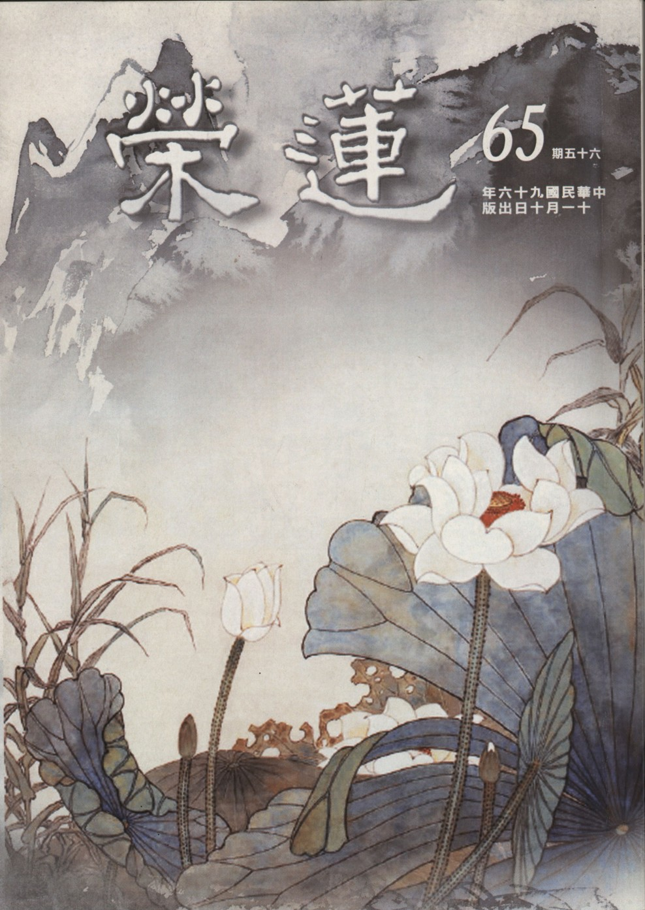

# 第65期

## 社論

### 一時大因緣～讚道藝春秋展

本刊

藝以載道超古人

後之來者已難追

技法神韻攝深義

時空交會大因緣

由於護持「道藝春秋」畫展的緣起，有幸興辦畫家江逸子老師講座，除講解畫作，並談及真正內涵乃文化，特別是孔子學樂、問禮、六藝等三圖。禮、樂等六藝實包含了德行、言語、政治、文學，是整部論語，是文化的精華。

江老師為這三幅圖細細解說其藝術之內涵，故能畫出富含禮樂精神的畫作，旨在教化人心。令人仰之彌高，鑽之彌堅。雖不能一次盡覽江老師平生畫作，然而此次展出之作品，特別經由作品的解說，實足以令我們收穫豐盛，受益不淺。經由江老師的作品解說，實可謂已進入藝術欣賞大門，而非是只看熱鬧之徒了。

所謂藝術，有學者言，藝術本身是空洞的名詞，藝術素材透過藝術家進行創作，賦予其生命，才稱之為藝術品，「藝術」也才在此藝術品中顯現。當一件藝術品經由藝術家注入文化、宗教、生活等意涵，就成為文化藝術，乃至宗教（如教堂之壁畫，石窟中的佛像雕刻），生活（如清明上河圖，米勒的「拾穗」）等藝術。

因此江老師總說他的圖不是水墨畫，而是國畫。因為水墨只是作畫的一種媒體，水墨自身沒經過畫家腦袋經營、手上作畫，是沒有生命的，唯有賦予文化之體會，才能使藝術生命躍然紙上。因此「藝術」並沒有一個標準的定義，而是在於創作者如何運用各種媒體材料，賦予其生命與各種意涵，這時候藝術品與藝術才會出現，也就是江老師所說的國畫(文化內涵)，再經由我們感性的認識領受。

然而我們要如何去感受藝術的「美」呢？無非是透過五官來感受了。最直接的，是透過眼睛欣賞，繼而心理有了愉悅、滿足、祥和的感受，此賞心悅目之謂也。中華文化對「美」的定義，在於溫柔敦厚，調和人心，安定祥和。是出於善，歸於真的意境之「美」。一個真能賞美之人，其心靈必然是美麗的，美好之心靈是健康、愉悅、和諧的。故常言道：「學畫學琴的孩子不變壞」，是有其道理。

但得真正學得和雅、和諧之內涵才是。否則亦容易增了傲氣，長了欲望，志滿而樂極；與禮記所言：「傲不可長，欲不可從，志不可滿，樂不可極。」相違背，則反得其害。所以藝術必得講求內涵，尤其是溫柔敦厚之文化內涵。

孔子對「藝」之定義是：「志於道，據於德，依於仁，游於藝。」故藝術當發於仁，合於德，歸於道。又曰：「溫柔敦厚，詩教也。」詩經乃「藝」與「道」之結合，可欣賞其藝文之美，可涵養溫柔敦厚之性情。故又曰：「不學詩，無以言。」詩成就了說話談吐之美，使說話成了藝術。好詩可以入畫，好畫可以興詩，可歌詠，可舞之，美哉！詩也。

所以江老師畫作之後，必有詩作，或一首或二首，說是不作不過癮。然作完便丟，只保留當下心境之美足矣。此皆源於溫柔敦厚的文化內涵。

總之江老師弘道之情懷，作品之意涵，由展題：「道藝春秋」可知。以道而游之於藝，藝歸入於道，「道」、「藝」結合，猶如「春」、「秋」之怡人季節。何能不去一探究竟，領受豐盛之心靈饗宴？並由畫展中之地獄變相圖，起警惕生厭離；更由妙因、妙果圖之極樂淨土生欣求。則眾生幸甚，社稷幸甚，亦不負江老師弘道畫展之本懷。

## 大德法語

### 常禮舉要講座（六）

雪廬老人

禮是立身法

處世大學問

會得他人心

除怨結善緣

處世

◎四、見失意人，不說得意語；見老年人，不說衰喪話。

現在人沒念過書這就難怪了，又「值得驕傲」那就更不得了。洋洋得意地把今天在家吃了什麼講出來，好！那裏兩個窮人這一天還沒吃飯，連個豆腐渣也沒得吃，你說我吃當歸鴨比豆腐渣還好，殊不知：一家飽暖千家怨。這話得懂才行，你飽暖他不飽暖就成仇家，別說你恭敬他、他還不領情，你再炫耀那就不得了，今日之下這個事情多了。

譬如一個街上兩個鄰居考大學，你是住東邊，他是住西邊，同時考試，西家那個沒考上，東家這裏考上了，父母很高興，不但高興得不得了又放鞭炮慶賀，是很好，可是西鄰那一個就過不去，他正在那裏喪氣得不得了，看見了東家的光景，就與東家結仇，這都是世故人情。所以看見失意的人不要說自己得意的話，要對失意的人表示同情。

再者，見老年人不說衰喪話，這我在台灣可見多了，一個五十歲的人見六十歲的人說：我老了，我不行了。你老年人，那個老年人年紀不大嗎？是那一個該死？那個六十歲老人聽了是絕對的不高興。

現在還有一句話是以前沒有，中華民國發明的一句新話：人生七十才開始。這話不知其用意如何？總而言之是不合理。原來古書有：「人生七十古來稀。」七十謂之稀壽，何以稱稀壽？表示活到七十已很少了。人生七十古來稀，他說才是人生的開始，聽了不就很懊喪嘛，你何必惹人厭、不高興，說話是很不容易的，還是以少說話為妙。說人生七十方開始的這個人已過世，是政府的要員，在九十幾歲時過世的。

其次談到作壽，我最反對作壽，作壽啊！我說句痛快話是放警報，你們大家明白吧！怎麼放警報呢？是到時候了，要預備預備。這個政府要員在九十幾歲時作壽，開了一個宴會，有一位先生恭維他：你有百年的火候。這是多麼好的話，譬如現在說人：你的身體不要緊，即使有點病，那是百年的關係。

這話令人聽了就很高興，可是那位先生對這位作九十六歲壽的老人說這樣的話時，作壽的喝了酒正高興著，被這句話呆住了，還有四、五年可活！在座大家都不高興，你何者不好說？你活了一百年還有什麼不好？你說他活一百年何以不歡喜？你說其他人活一百年何以聽了會歡喜？一樣的話卻有不同的效果。

◎五、交淺不可言深，絕交不出惡聲。

人生之不如意十有八九，人之常情是思念過去、不滿現在、希望將來，一般人肚子裏有些話總想要跟別人談談，希望他想辦法給你解決。可是你那一肚子不高興的話要看交情，夠到交情才可以談，夠不到交情不能談。你自己的事，即使非你自己的事，談談別人的事或國家的事，不夠交情總不能談。因為談了之後，他往外一談，就把話傳了出去，又出了毛病。

其次你看他有什麼不好，然相交或只有三、五個月，你要勸他，不錯、朋友有規勸之義務。可是你有勸的資格嗎？你不要妄作聰明。你說我好心好意，你好心好意、他聽了是你諷刺他。你勸他、話一說得重，他對你某人是恨著，這個必得念書多，念書多你自會明白，你是好心好意地勸他，可是他以為你是謗他，所以口是禍福之門，以上是交淺不可言深。

再者「絕交不出惡聲」，譬如這個人看你怎麼也不滿意、怎麼也不行，猛造謠言，現在這種奇怪的人很多，這種猛造謠言的功夫我們沒有。某個人對我們沒有禮貌，我們或可有對不起人家的地方，我們省察、省察，我們那裏不對趕緊改，要先改自己，這是對的。

我們改了那個人還是這個樣，自反而禮，有了禮自反也能對得起人，連番好幾回那人還是照常，孟子說：嗤之妄也已矣。這是狂妄的人、不理他就算了。你不能一上來就絕交，或可有對不起人的地方，就是不行了要絕交，也口不出惡言，為什麼呢？這個人是活的，說不定將來又會在那裏碰上，所以要預備往後或許十年、二十年、三十年的後路。

例如為了一件事在路上碰著仇家，仇家拿著刀：你這人怎麼的不好，可殺不可殺呢？他在旁邊：這種人。不必再說別的就「這種人」就行了。你當時如絕交時沒有惡言，心裏不慌張也就不倒楣。

其次我（雪公）不知說了多少次，咱們台中道場、你們將來能以守得住就十二萬分地幸運了，你再開闢不是容易的，怎麼呢？你沒有仁心、耐性，你能開道場嗎？到一個生疏的地方去開道場，什麼人都要先試探試探你、跟你比比賽，唱戲的叫「打砲」。你連這個都不懂得。你若是聽戲的票友、想露一手上去唱戲，不論有錢、沒錢也得穿著戲班子的衣服，有衣服在那擺著，你或許還不會穿。別說唱戲的衣服，現在你們都學佛，你連個海青還不會穿，那還談什麼？給你件袈裟你也配不上。

唱戲這就難了，你要有意，下去得練熟，一出台鑼鼓打著點子都不對，即使連跑龍套這一切一切都先得花了錢，都買到了，這才行了。別說你唱得好、唱得不好，就連拿扇子也沒技術，一下子掉了看你怎麼收拾？譬如有一段戲碼，當朱洪武叫康茂才上台點兵伐陳友諒，都是唱三句一停，台上豎一把椅子，就算高台，唱到那裏袖子一擺跳上台，結果沒上去，倒退了下來，倒退下來再上不行嗎？再上、則多一點鑼少一點鑼都不行，這個東西都不懂，那得落氣了，落了下來了，又唱了四句：康茂才是年老氣衰、血氣衰，這樣的高台上不來，二次再把高台上。就行了，這是老手，你當是什麼事情都會？你會什麼？

◎六、不侮辱人，不向人開玩笑。

現在好侮辱人，我們熟人開開玩笑，開開玩笑古人也有，是悅而不怨。孔子也開玩笑，怎麼孔子也開玩笑？子游為武城宰，聞弦歌之聲，孔子開玩笑說：割雞焉用牛刀？在你們聽這句時，會說我沒殺雞也沒殺牛啊？這是說殺雞用小刀就行了、殺牛小刀可不行，得用大刀，孔子說割雞焉用牛刀！子游聽得懂、孔子才說，聽不懂孔子也不說。

子游聽了說：夫子不是說只要學道，不管縣之大小，即使是百里之地，不管如何都要好好幹。孔子說：偃（子游）之言是也。你說的對，於是對同學們說：前言戲之耳。我這是開玩笑，這樣的玩笑有沒有關係？若是咱們開的玩笑那就不行，叫人下不了場。別叫人下不了場，所以是不可向人開玩笑，交往或輕鬆，最好以不開玩笑為好，開玩笑叫人下不了場。（下期待續）

### 大方廣圓覺修多羅了義經（二十五）

道源老和尚

遠離諸幻前方便

和合大眾持淨戒

長住蘭若修止觀

諸佛讚歎天擁護

乙一、為上根人示真修

丙二、示漸修

丁二、普眼章—師資緣合

經文：

爾時世尊告普眼菩薩言：善哉善哉！善男子！汝等乃能為諸菩薩，及末世眾生，問於如來修行漸次，乃至假說種種方便，汝今諦聽，當為汝說，時普眼菩薩奉教歡喜，及諸大眾默然而聽。

如來因地修行，果上顯現圓覺的證量，然此修行的漸次如何，如何思惟？如何住持，並請求佛大慈大悲權巧地說種種的方便。佛說你(普眼菩薩)好好的聽，我則好好向你說。

丁三、酬請開示

戊一、長行

己一、約妄盡還覺以酬請

庚一、妄盡還淨覺

辛一、酬修行漸次請

經文：

善男子！彼新學菩薩及末世眾生，欲求如來淨圓覺心，應當正念，遠離諸幻。

善男子指的是普眼菩薩，乃此會之當機者，前是請求為當會的諸菩薩說法，然當會的諸菩薩都能會入淨土，皆入三昧來聽法，故此時之請問並不是為他們，而是為了新學的菩薩及末世的眾生，彼等發大乘心求如來的圓覺妙心，亦即求證如來的圓覺妙果。八正道中以正念為梯，若念不正，則其他七個道品都不正。何謂正念？亦即求清淨圓覺心，須遠離諸幻，此即正念，若能了知一切境界無非幻化，則能遠離，不須再作遠離的修學，然如何生起幻化的覺知(正念)？須有方便，佛為了初發菩薩心的行者、要學圓覺妙行的人，有個下手處及修學的次第而說。

經文：

先依如來奢摩他行，堅持禁戒，安處徒眾，宴坐靜室。

此段告訴我們末法時代凡夫的修學者，要修行用功從那裡下手，先依如來的奢摩他行，奢摩他翻譯成止，亦即修定，還要配合持戒，才能開智慧，亦即戒定慧三無漏學。堅持禁戒，在圓瑛法師的講義上將禁戒兩字分開講，禁是禁止，屬於止界，戒是戒法，包含作持。

須知當法師的，看的註解多了，講經講得多了，想到那裡就講到那裡，亂開一通，合不起來，是不負責的，尤其是歡喜罵人，或說剛才你（道公）不是也在批評嗎？我不是批評他們，我是警策諸位同學，律宗你不可以輕視，你要堅持禁戒呀！受了菩薩戒不但要吃素，五辛也不吃，有的則馬馬虎虎，以為不害生命就可以了！歡喜吃韭菜的吃點韭菜，歡喜吃蔥的吃點蔥，為什麼呢？不能堅持禁戒！要堅固執持禁戒，不能隨便將持戒的心搖動，若動搖了怎麼樣呢？一爛百爛，通通爛，爛下去！

你們諸位當了法師要記得，該開的開，不能爛開，不能想到哪裡就說到哪裡，不能隨便批評人，不能隨便罵人，想想就罵人一頓。道源(師父自稱)在罵出家人？道源不敢罵，是警策諸位同學的，你要堅持禁戒，要學止，你不堅持禁戒，則無法修止，造罪的心不斷起現行，止怎麼修得來？

其次安處徒眾，宴坐靜室。宴坐是安坐，靜室如同禪宗盛行的禪堂，而安處徒眾這一句你要記得，修學菩薩道是大家一起修，你們同學發心來上佛學院，我常常向諸位開示，要挽救現在的佛教，除了辦佛學院，沒有第二個方法，說的方法很多，都不是根本辦法，根本辦法就是辦佛學院。你看現在幾個知名的法師，沒有一個不是佛學院出身，離開佛學院沒有個地方學佛法。連佛學都不知道，怎麼弘法呢？若不知佛法，且還在安處徒眾，要開禪堂帶大家修止，都是打閒岔(浪費時間)。

或云，一個人去住山、住洞、住茅蓬，不好嗎？因為我們是末法時代的凡夫，你沒有個善知識親近，沒有徒眾跟你一塊兒修行，你一個人去住茅蓬，你最初是精進，定的功課很多，你弄不了多少時間啊！第一個你先打妄想，打著打著妄想，妄想打完就窮瞌睡。要修奢摩他（修止），一天最少靜坐三支香，不盤腿瞌睡不來，盤上腿就瞌睡，哦！一點鐘過去了，一支香做完了，你的瞌睡也睡醒了，你一天是靜坐三支香，實際上是坐了睡覺睡了三點鐘，每天如此弄成習慣，永遠不能用功，瞌睡是愈睡愈多，瞌睡睡完就好了嗎？不會好的！愈睡瞌睡愈多。

而帶領徒眾幹什麼呢？謂之依眾靠眾。你是個住持大和尚，你開一個道場，建了禪堂，闢了靜室，帶了徒眾靜坐修止，也定了規矩，你叫別人坐上修，你不坐行嗎？你看大陸上知名的叢林，上殿過堂(過齋堂)，得維持規矩，上殿你能不去嗎？過齋堂你能不去嗎？你既然想修行辦道，你得守規矩，你定的規矩要你的徒眾守你自己不守，行嗎？

所以帶領徒眾實則是依眾靠眾，你是管徒眾的，徒眾無形之中也管教了你，有這麼個好處。在禪堂上一天坐幾支香，有香板糾察，看到誰窮打瞌睡，走過去就給他打一響板，你是大和尚，這規矩是你定的，你自己還敢窮打瞌睡，在那呼嚕呼嚕，這還像話嗎？你若自己修誰管你？你若帶領徒眾修，就暗暗地受到徒眾的約束，有這個好處！你發菩提心辦禪堂學堂，要安處徒眾、利益大眾，實際上也是利益自己。（下期待續）

### 佛說八大人覺經講錄（七）

道源老和尚

知足在心不在物

常有閑暇修正法

若依聞思修開慧

安貧原來有大用

甲二、詳八大法相以成宗

乙一、別釋八法以起信解

丙二、覺多求增罪觀念知足

經文：

第三覺知，心無厭足，惟得多求，增長罪惡。菩薩不爾，常念知足，安貧守道，唯慧是業。

第三覺知是知足的法門，乃由第二覺知少欲法門而來，依法門而行即是行門（功夫）。八大人覺經當機眾是在家弟子，第二覺知要我們少欲，不說斷欲，斷欲是出家弟子之行門，在家弟子不能斷欲，少欲是一種修行功夫，其次第三覺知的功夫是要知足。

「心無厭足」：此心指的是凡夫之心，具足了貪、瞋、癡三根本煩惱。第一就是貪心，貪心要貪到什麼時候心才知足呢？心無厭足。厭當「滿足」講，沒有滿足的時候，你說貪財，貪到多少才夠呢？「夠」普通話叫「足」，一百萬呢？不夠！不夠就是不足，為什麼不足呢？因為我們的心沒有厭足，惟得多求，財、色、名、食、睡，愈多愈好，沒有滿足的時候，因為他的心裡惟求得一個「多」，所以沒有厭足。

「惟得多求」，對於不瞭解佛理、不修佛道的人說，多求有什麼不好呢？多求就會「增長罪惡」，由根本煩惱貪做出發點，才去貪求，有不厭足的心就會多求，多求損人利己，就增長罪惡。按正當方法求，所造罪惡還算少，不正當求之，則增長的罪惡就多了。

前述五種粗重煩惱，是對著財、色、名、食、睡生起貪欲，是凡夫眾生沒有不貪的。第一貪財，因為財是生活的必須要件，沒有財不能生活，生活上過得去，應是可以知足，但他不知足，要多求財，財多起來就會增長罪惡。衣食住的生活已夠用了，但還有很多的財，按著下面四種貪欲都要多求，多貪色、多貪名、多貪食、多貪睡，於是增長更多的罪惡。

前述男性較有優越權，雖然法律上是人人平等，但是社會上的輿論還是偏向男眾。你若是沒有多的錢財，你一個太太還養不活，你還會多貪色嗎？因為多貪求錢財，錢財多了，妄想就多起來，所以一個太太不夠，還要多一個太太，法律上雖然不允許有第二個太太，就用同居方式去找女色，不是增長罪惡嗎？

錢財多了就可以貪名，用錢財的方法來貪名，社會上這種例子很多。我們講經要有忌諱，不能舉事實，花錢買名，名氣大了，但不做好事，利用大名來做惡事，不是增長罪惡嘛！

因為錢財多了，除了家常飯外，他要多貪食，就要多吃眾生肉，上菜市場買一塊豬肉回家煮還不夠，一定要到菜館裡去吃。昨天吃一桌美食可以花幾萬元的台幣，吃的什麼東西呢？那麼貴？吃的全是眾生肉，眾生肉怎麼那麼貴呢？變很多的花樣叫你吃，變花樣則眾生受苦多，所以吃葷食的人不顧念眾生苦。

道源（老法師自稱）出家早，吃素早，二十歲就出家就吃素，沒有到過葷菜館子吃過幾萬台幣一桌的菜，不曉得變什麼花樣，道源二十歲以前，還沒有出家，還沒有吃素，但是前身可帶有點善根，觀察到了因為眾生貪吃而使畜生受到特別的痛苦。

我（道公）的俗家錢財多了點，請別人吃飯，請做葷菜的廚師到家裡，要煮些特別的葷菜，請的客人才歡喜吃，我看見過螃蟹的煮法，叫清蒸螃蟹，把活的螃蟹，用兩只大盤子，把它（大螃蟹）按在盤子裡邊，一按、按上一、二十隻，再用繩子把兩個盤子綑起來，綑好了再放到蒸籠裡去蒸叫清蒸螃蟹。下邊用火一蒸，熱氣出來，螃蟹受不了，要想掙扎逃命，儘量的掙扎，只能將腳由盤縫伸出來，身體逃不出來，伸出來的腿有一、二十隻螃蟹的腿、抓在蒸鰻頭的蒸籠，抓的ㄔㄚㄔㄚㄔㄚ響，我（道公）那時才十幾歲，我聽他們說這叫清蒸螃蟹，他們怎麼綑這些螃蟹我都看見了，看得心裡頭好氣，原來他們是這麼蒸的，聽到螃蟹抓那蒸籠發出ㄔㄚㄔㄚㄔㄚ的聲，就好似要抓住我的心了，唉呀！好難過！好難過！我叫家人將螃蟹放了，誰聽我的？你十幾歲的小孩，你懂什麼？反而挨了一頓罵。

除了要吃清蒸螃蟹外，還吃血水湯，把螃蟹骨髓打成湯，螃蟹的骨髓怎麼樣取出來的呢？我也看個清楚，就是把螃蟹吊起來，把它的半個腳切擦切擦地將螃蟹活活地刮出骨髓來，可想而知是痛成什麼樣？但是那個做菜的師傅，沒感覺它的痛苦。將螃蟹吊起來將腿扳斷，下邊擺一個碗，那個螃蟹的痛苦，我（道公）當小孩時感覺到痛，可是螃蟹又不會叫，我怎麼知道？就看到它腿一直顫動一直顫動就滴出水（骨髓），那是它的骨髓流出來了，一直滴到沒了，一隻隻螃蟹都如此，把血水拿去做一碗湯，打出來湯像清水一樣。據他們說比什麼都鮮，但是我（道公）因為看見螃蟹受苦，我雖然還沒出家，還在吃葷，我（道公）沒吃過螃蟹也沒喝血水湯，我（道公）喝不下去，也吃不下去。

有一次請客，請吃鱔魚，我也是一樣在旁邊看個清楚。鱔魚像蛇一樣，長長地用手抓它抓不住，一抓就滑掉了。人是萬物之靈，但也是萬物的魔鬼，他會想出辦法，以稻草來抓住繕魚就不滑了，以鐵釘將魚的頭部釘到板子上，一刀將身體割開，裡邊的五臟六腑都跑出來了，再把鐵釘拔掉，將鱔魚放入水盆中清乾淨。鱔魚的生命很耐，頭被釘了釘子、沒死，肚子被割開也沒有死，五臟六腑都掏出來也沒有死，把鱔魚放入水裡，魚在水裏喳喳地一直轉，痛苦地想逃命，我（道公）就感覺疼得受不了，全身都發毛。

等鱔魚洗淨了，把它放在切菜的板子上，用刀剁開，剁得一寸長一寸長。鱔魚的生命很耐，被剁得一寸長一寸長的，它還在那兒跳，再放入油鍋裡炸，因為一寸長的鱔魚仍然活著、還在跳，放入油鍋時兩頭翹起來，這道鱔魚的名稱叫「馬鞍翹鱔魚」，如馬鞍似地兩頭翹起來，為什麼會翹起來呢？即使被剁得一寸長、一寸長但還沒死，放入油鍋炸還是痛得翹起來，這道馬鞍翹鱔魚做好了，我不敢吃，想到這個東西，吃到肚子裡恐怕還在動，所以我一生沒有吃過螃蟹和鱔魚，都是因為我親眼看到它們的受苦。

諸位想想看，在座的出家弟子都吃素，在家居士受戒的很多都吃素，恐怕還有少數吃葷的。你們想想為了我們舌頭尖的滋味而貪圖，這是不是增長罪惡？令眾生受無窮的痛苦，沒有罪惡嗎？這個罪惡就是你錢太多了，你連買米的錢都不夠了，你還能吃眾生肉？還能吃螃蟹、鱔魚嗎？所以錢多了貪吃眾生肉，令眾生受無窮的痛苦，不是增長罪惡嗎？

「菩薩不爾」：到第三覺知，才標出菩薩。菩薩是大乘弟子，第一覺，第二覺都是三乘共修之法，不但聲聞、緣覺要學，菩薩也得從第一覺、第二覺學起，稱之二乘共修。所以學八大人覺經是先打基礎（二乘）再用功上來（學大乘），不然你看那些般若、圓教經典，說的都是太高太深的玄妙之理，若底下沒有基礎的功夫，你學大乘法是不會學、不會修，做出來都是空中樓閣。此經好就是好在從基礎打起，先由第一覺的八種思想得到對世間的覺悟了，第二覺知少欲，第三覺知知足，此第三覺知的菩薩指的是在家菩薩。

菩薩梵語是菩提薩埵，翻譯經典者知道中國人的習性喜歡簡略，所以將菩提薩埵略譯成菩薩，然解釋其意還得以菩提薩埵來解釋。菩提翻譯中文為覺，薩埵譯為有情，一切凡夫都有情識，所以稱為有情，菩薩義譯為覺有情，覺有情是大乘弟子，乃上求覺道下化有情的人。因為未成佛所以要上求佛理（覺），且是發大心之大乘弟子，應以度眾為先，所以同時是下化有情，故謂之菩薩。

懂得菩薩名詞的意義，其修學成佛的階位共有五十二位，其中五十一位是因位（菩薩位），第五十二位是佛位。其中五十一位最初十級為十信位，是初發心菩薩，我們發過心還是受過菩薩戒，雖未成為真實菩薩，但已隨順菩薩之名義，雖然說修道修得淺，但已能隨順得菩薩之名。

菩薩有兩種，一是出家菩薩，一是在家菩薩，第二覺少欲，本經乃為在家菩薩說法。雖在家菩薩不能完全斷欲，但要少欲，不能如出家菩薩到在家弟子那兒去托缽，化碗飯吃就可生活了，在家菩薩不能接受別人的供養，得自己謀生活，所以不能不求，但不可多求，多求就會增長罪惡，故只可以說少欲而不能無欲。

在第三覺知處，此在家菩薩不多求，且

「常念知足」

，不能完全不求，而要少求，怎樣才能安定（求）這個心呢？常念知足，認為這樣的生活已經夠了，這就定了。若能常念知足，多求的心即安定下來。

不要與有錢的富人比較，愈比較你的貪心愈會增長，他是個人，我也是個人，他能發財我為什麼不能呢？想到此貪欲的心就增長起來。如何修知足的心？找生活不如己的人比，我沒有高樓大廈，我只有一間房子，一桌幾萬的美食我吃不起，還有青菜豆腐，比那沒有飯吃的人已經好太多了。華美的衣服穿不起，但是比沒有衣服穿的窮人，總是好多了。你跟那個不如你的貧窮人比，你就知足了。

吾人有一個知足的偈子：「人家騎馬我騎驢，將我比人我不如，回頭見一推車漢，比上不足下有餘。」

第一句人家騎馬我騎毛驢，唉呀太寒酸！將我比人我不如，是太不如人了，如此不知足的心就起來了，此時想要找匹馬來騎騎，可是回頭看見一位貧窮人推著車子，車上堆了一些貨物，此時心安定知足了，為什麼呢？比上不足，下有餘。比之前騎馬的，我不如他，可是比那推車漢，我還有多餘的，值得安慰。為什麼呢？我不但沒有推車，我還有隻驢，沒有走路，比那推車漢我還有多餘的財富，因為還有隻驢好騎，想到此心裡就安定、知足。所以想用功辦道，必須先有知足的功夫，有了知足的功夫，多求的貪心就安定下來。

「安貧守道」

的菩薩常念知足是觀念上的知足，不是發了大財才知足，即使生活實在是不太富裕，甚至變成一個貧窮的人，雖然是個在家菩薩，也要守住菩薩道不要退，要如何守住菩薩道？得安貧，不安貧而要多求，試問還能修道嗎？

佛弟子如此，即使孔子與門下弟子皆然。孔子門下有三千人，其中有七十二賢人，為首的是顏回。孔子之所以成為聖人，他有聖人的學問及聖人的道德，所以自孔子春秋時期到現在，歷史上已經過了兩、三千年，大家對孔老夫子還是相當的尊重。其次顏回為什麼稱第一賢呢？除了有高尚的學問與道德外，能安貧是成賢的要素，不能安貧則高尚的學問道德都得不到。

顏回窮到什麼程度呢？孔子說的很清楚：「一簞食，一瓢飲，在陋巷，人不堪其憂，回也不改其樂，賢哉回也。」顏回窮到吃飯沒有碗，也沒有湯可喝，只好以水代湯，然喝水也沒有喝水杯子。「簞食」是用竹筒吃飯，葫蘆老了，剖開一半成瓢，用來舀水喝，所居的陋巷是貧人住的地方。他的同學看到都替他憂愁，但是，他不但不愁，反而過得快樂，孔子讚說：回也不改其樂，賢哉回也。真是第一賢人，貧而樂，此即安貧守道，他為什麼窮到那個樣子還樂？因為他得了道！

菩薩亦然，須安貧守道，所守的道是智慧，經文：「惟慧是業」。此智慧是般若智慧，般若智慧人人本具，不勞向外馳求。前述眾生皆有本覺（本有智慧德能）為什麼不顯現呢？因為沒有遇到適當機緣，本覺是內因，外邊還要有助緣，就是要遇到善知識講經，才能把你的智慧引出來，但是智慧還是由內心發出，是本具的並不是善知識給你的，也不是佛經上給你的，智慧不由外來，是由內裡發生出來的。

智慧是本具的，然需要識教之緣，亦即在外緣上要有善知識講經，告訴你開智慧的方法，不然你本具的智慧開不了。開智慧三個方法：聞、思、修。此三者謂之加行慧，以這三種方法加功用行，才能將本覺的般若智慧引發出來。

第一聞慧：

或言佛法道理太深太高太難懂。其實難懂的是你聞的太少，你若多聞就了解，此謂之聞慧，包括你看經，但娑婆世界眾生耳根最利，不如去聽經，聽經開智慧來得快，所以要多聞。多聞開智慧稱之聞慧。

第二思慧：

思維以現在來說是研究，你聽道理在耳朵不算，要聽到心裡，謂之聞慧。明白了道理後，再思維研究，對佛理有深入的體悟，由思惟所生出來的智慧謂之思慧。

第三修慧：

依照思慧所抉擇的義理，不斷串習用功謂之修慧，能現證佛法的義理。

透過聞思修三加行，加功用行到功用純熟，忽然一下子開通，喔！原來智慧在我心裡，並不在心外，此乃本覺智慧被開發出來。

以上這三種加行，都是要你用功，所以要少求、要安貧，若是多貪、多求，想聽經沒有時間或沒有精神。我們凡夫之身心都有限度，若忙著多求，白天奔波忙碌，整天沒有休息，到了晚上還在打算這個、想那個，連覺也沒有睡好。多求令人精神耗損，已經不夠用了，那還有精力去聽聞佛經？不但多聞辦不到，連少聞的精神體力也沒有，怎麼能開智慧呢？所以想要得到智慧，一定要安貧才能守住道。

要想不多求，想安貧。這些都是修道用功成就的道理（方法），我（道老）再反過來勸各位幾句，讓各位安心。佛經上說要我們安貧守道這些道理，有人說不合時代了，現在時代是要進取，要爭取。要進取、要爭取就得多求，大半是惡求，而增長罪惡。他根本觀察不到多求就是增長罪惡，增長罪惡的結果是要墮地獄。

然而只講現實的現代人，彼云：墮地獄誰看見？我現在只要發財及享受，來生誰管得了。所以這些道理他不接受，就是他自己沒有善根。佛告訴我們，你發財不發財，是你前生培養來的，是屬於福報。你前生培福，你今生自然發財，你要是前生沒有修福、培福，今生你怎樣多求、惡求，也發不了財。

學佛安貧守道的人，是少數中之少數。社會上沒有不求財的，求財的人是不是應該都發財了，為什麼發財的人少呢？求財的人多。發財的人少，這是事實擺這兒。佛經上講的不是玄妙、難解之理，都是講事實之理。因前生修福培福人少，所以今生發財的人少。你怎樣求甚至用不正當的手段，去傷天害理，作惡多端，結果還是沒有發財。財不是求來的，是自然而然來的。

我（道公）這幾句話是因有人批評：「佛教的道理不合時代」。這就是他根本不與佛教接近，不瞭解佛理。佛講的是真理、是真實道理，不被時代轉動，不被地域轉動，過去是真理，現在還是真理，未來也是。過去合用，現在不合宜，那不叫真理，隨時變動如何謂之真理？我們中國能用，到美國、英國不能用，那不叫真理，在中國講，也是這個理，到美國也是此理，這才是真理，不被時代變動、不被地方轉動才叫實理。（下期待續）

## 共修研學

### 小止觀導覽（三十八）

*心爾整理*

善修方便入止觀

能生正見除愛執

毒瘤割除大善巧

窮盡輪迴大安樂

有心於解脫和成佛的人，一定要有解脫與成佛的方法，而止觀就是解脫和成佛的方法，離開止觀門是不可能解脫和成佛的。但是要依著解脫的方法，得到解脫的成就和成佛的果位，必須要有出離心和菩提心，以及種種前方便，方能好好的實修止觀。今已將具五緣、訶五欲、棄五蓋、調和五事研究完畢，續講第五章，方便行。

方便行有五：就是欲、精進、念、巧慧、一心分明，透過此五種修學法，產生對修學止觀的信心，真實相信止觀修學法，是唯一得到解脫與成佛的方法，是伏惑斷惑的良方，是世間轉變命運的善巧方便，是降伏惡業、魔障的法藥，能深深得護法神及佛菩薩的護佑。

二十五方便的體會必須在坐上觀修，生起對這些止觀資糧的好樂，並一心一意去積聚這些殊勝的資糧，成為修學止觀的能力與順緣。若未能好好實修二十五方便，則成為修學止觀的障礙，不但不能成佛，連解脫也談不上。

第五章 方便行

「夫修止觀，須具方便法門。有其五法：一者、欲，欲離世間一切妄想顛倒，欲得一切諸禪智慧法門故。亦名為志，亦名為願，亦名為好，亦名為樂。是人志願好樂一切諸深法故，故名為欲。如佛言曰：一切善法，欲為根本。」

經過前一章，好好調和食物、睡眠、身、息、心五事之後，將身心調到最好的狀態，其次要將修學止觀的善法欲引起，接著並依著止觀修學法好好修學止觀，才能得到世間及出世間的成就，所以五方便行極為重要。

首先，要先引出止觀修學的善法欲，因為害怕六道輪迴的病苦及在每一道各別的苦，思維這些痛苦都從業來，業又從煩惱來，種種的煩惱從執著來，此時想要離開執著的心極為強盛，明白由止觀得到智慧（空性智慧），就是執著的正對治，因為執著唯一的對手就是空性的智慧。而出離心和菩提心，乃至於修學種種的顯法或密法，都不是執著的正對治。所以如果沒有好好的以空性為所緣得到殊勝的智慧（無我慧），連執著的一分都沒傷害到。所以對止觀的修學要產生很強的善法欲，或名志、願、好、樂。

當觀念認知後，破煩惱的力量就非常強，雖然不能入定把煩惱根挖掉，但是只要觀念通達，就有破除煩惱的勢力。此之志、願、好、樂是想要入一切諸深法，深法指的是空性。而一切善法，欲為根本，其中修學空性的善法，更是所要修學的善法。所以在坐上修之前，不論以佛號為所緣，或者以出離心、菩提心為所緣，甚至以空性為所緣，在產生殊勝的覺受之前，都要先好好的引發修學該法的善法欲。

「二者、精進：堅持禁戒，棄於五蓋，初夜後夜專精不廢；譬如鑽火未熱，終不休息，是名精進善道法。」

精者不雜，進者不退，靠著欲才會生起精進，對法生起很強的善法欲，才會認真地去實踐。此處的精進特別是堅持禁戒、棄於五蓋，作為修學止觀門的順緣。

堅持禁戒就能外訶五欲、內棄五蓋，乃因戒的目的就是對治煩惱、斷惡修善，如四十二章經裡面說斷欲去愛才是戒律的主體。在訶五欲及棄五蓋的基礎上，再來修止修觀。此處之訶斥五欲、去除五蓋，僅是煩惱現行不生，但不代表修學止觀成就。

此時在初夜、後夜專精不廢修止修觀，譬如鑽火未熱，終不休息。以得到空性智慧的深淺分為四層次：煖、頂、忍、世第一。煖是鑽木取火時，已有暖相但還未起火。到頂及忍位時，已經開始冒煙。忍及世第一時開始生起空性智慧火，一彈指入見道位時，能燒煩惱柴薪的智慧火就出來了。

鑽木取火，在還未生出火花前都不能停止，是故證得煖位的行者，來世遇惡緣仍有可能造業入三塗，一般所謂的明心見性是在聞思比量上的證得，並不是在入定時的明心見性，如果出定遇到很強的惡緣，仍會造惡業下地獄，證得頂位者亦然。修學到了忍位才有能力不入三塗，忍位的修學者有能力在定中生起空性的智慧，在後得位中即使有世俗愛染，力量仍然非常薄弱，無足以令人入三塗。所以見道位的聖者如大乘初地、小乘初果以上的聖者，再也不入三塗。

在空義上，入定不斷串習空義（以法為所緣，尋覓該法真實相），在現證空義時，才相信真實的人我不存在，那種相信真實的人我不存在的觀念，是因為他在入定時真實的看到，猶如眼睛看東西一樣，實在的看見人我不存在，覺得世間一切虛假不實，不會再受騙，然對於我們一般凡夫，雖然說世間不真實，然內心還是覺得很真實，例如考績乙等心情就不好，別人不理我心情就落寞……等，隨境界起伏不已。

其實精進還通用到每一個善法上，修學菩薩道無論在那個階位都要精進， 雪公老師將精進分成六種：一、在斷惡修善上精進謂之增減精進，二、在五根上精進，能增加善法力量，謂之增上精進。三、在五力上精進，增上五力的力用，不為他法所搖動，謂之除障精進。四、入聖精進，精進於七覺支能入見道位，乃因有抉擇無漏的能力，與二空（我空、法空）相應，五、轉移精進，在八正道上精進，才能由見道位入修道位，由修道位終入涅槃，六、大力精進，是精進於六波羅蜜（六度）。

上述之精進總相是精進於聞思修，對於聽聞要精進，對思維法義要精進，對串習聞思的決定見解也要精進，這樣的精進，能使我們得到聞所成慧、思所成慧、修所成慧。得到聞思所成慧是勝解，在定中串習勝解，能現證空性。

「三者、念：念世間為欺誑可賤，念禪定為尊重可貴。若得禪定，即能具足發諸無漏智，一切神通道力，成等正覺，廣度眾生，是為可貴，故名為念。」
接著認知世間的欺誑而想要得到禪定的尊貴，以開啟智慧，得到殊勝的果位，此處念與前述欲的解釋看似一樣，實則不然，欲是聽聞之後有覺受，但這是初解，到了念就達到聞所成慧的階段。或有
**問：** 欲的解釋應當也可以建立在對觀念的瞭解之後產生善法欲，不是嗎？如何能言念是聞所成慧，而欲是初解？如果聞思決定之後，知道怎麼入定去修行，所以心心念念都想要入定串習法義，是否算是欲的範疇？

念就是對修行的方法銘記不忘，記憶力很強盛，換句話說，透過欲和精進，有善法欲而且希望能夠修學善法，特別以止觀門來現證空性。正念的範疇是不忘記修法，念禪定為尊貴可貴，乃是對於禪定的修法牢記不忘失，不會在坐上修時因忘失而無法產生對法的覺受。
或有
**問：** 觀念的瞭解和產生覺受到底有何不同？觀念的瞭解跟把觀念變成覺受是兩回事，瞭解得清楚沒有忘記叫做念，入定去修法，把觀念變成覺受又是另一種成就，比如一定要知道什麼叫做無常，入定去修無常，產生無常的覺受，這稱做念。將所修的法瞭解而且銘記不忘才可以稱做念。

若能得到禪定，就能具足發無漏智，無漏智在去除我執，破除煩惱時顯現，在尋求真實的我不可得時，那個狀態叫做空性，不是去尋找空性、尋找真實的人我、法我，也不是有一個虛空可得，是找不到的狀態如虛空，而言斷惑證理。斷除的是煩惱（我執），證的是無自性之理。破執著叫做出三界，因為所有的煩惱都以執著為依，所以斷惑的本質是破執著。

當發覺真實的法我不可得，觀待於如幻如化的境界當中，如何生貪？如何生瞋？是故照見五蘊皆空的空性，生不出一粒微塵的煩惱，是一破全破，從根斬斷，而非如砍枝葉般漸斷。

一切神通道力，丁福保佛學辭典：「神」為不測之義，「通」為無礙之義。不可測又無礙之力用，謂為神通。有六：一、宿命通，二、天耳通，三、他心通，四、天眼通，五、神足通，六、漏盡通。

前五是報得，也就是可以經由禪定功夫而得，漏盡通乃得到空性智所產生的通力，前五通是以有為法為所緣得到的通力，而漏盡通是以無為法為所緣，所以前五與第六是兩回事。在尋求真實的人我和法我當中，無可尋求，心識之前空靈的感覺產生即證得空性，會性法師說：在家人只要好好執持十善戒，不要變成空性的障礙，在家人都可以出三界，在家人因為俗務太多，所以比出家人困難，但是並不表示在家人沒有出三界的能力，或許無法執持兩百五十條戒，但是只要對空義通達，出三界的能力就容易生起。

知道世間是欺誑的，禪定是尊貴的，而所謂的禪定特別是以空性為所緣的福，以空性為所緣的慧，這是止觀雙運的定，最為尊貴。止觀雙運之時，定就是慧，慧就是定，這樣的人能夠以空性為所緣發出無漏智，這時就得到出世間的成就（羅漢或成佛的成就），如果是佛的成就，就是神通、道力都成就，並且具足廣度眾生的能力，所以非常的可貴，這就是念，不但有修行的方法，而且也能夠依此而好好的修學，有心要修學正法的人，一定要明瞭修學的方法、修學的心態，以及修學過程中遇到的障礙能加以對治，這叫做念，總而言之，是慢慢修時快快到，低處修來高處到。

以佛果為目標，以此目標做為趨向修學的動力，念的範疇就是對修學方法的認知，也認知所要達到的目標，一般人修行沒有勁，就是對於目標不清楚，對於個人出處不夠明確，對修行的方法不講究，故而需要好好研究佛的十力、四無所畏、十八不共法的內容。（下期待續）

## 蓮池海會

### 胡崇河老居士往生見聞記

*編輯部整理*

惡業將現起

一心皈命佛

重報轉輕受

南無阿彌陀

胡崇河老居士，台灣省板橋市人，生於民國十七年六月二十四日，自小學畢業後即進入日本海軍技術學校，並經過嚴格的教育訓練，於台灣光復之後回來台灣，服務於電信局，五十歲退休後即前往日本從事水產貿易，先從屏東東港進口鮪魚，再製作成生魚片，為了保持鮪魚的新鮮度，先取出內臟後將冰塊放入腹中，並於裝箱時放入乾冰加以保鮮，拍賣議價前再將魚尾切除，直到後期事業上出現赤字才結束了努力多年的成就。民國八十年，在因緣際會下又到大陸從事水產貿易（丁香魚），本以為可以重新開始，卻遇到了許多無法突破的障礙，遂回到台灣。

其夫人也在回到台灣後，因親友的介紹，開始參加共修會每週四的念佛共修，聽聞助念生西須知、助念問答、彌陀四十八願、往生論等多部淨土經典，並參與會內所舉辦的放生、懺法等種種法事，並懺悔早年所造的殺生業。老居士及其家人皆隨喜護持，老居士並向夫人提及，念佛重在虔誠，佛號數目多少並非最為重要，要在佛不離心，心不離佛。

老居士平常總是為他人著想，常說要先付出才有收穫，並以如此的觀念教育子女。在中國大陸做水產貿易時也幫助改善當地經濟困難的家庭，培養許多年輕人，並開設日語補習班，每年邀請當地幹部至日本，學習先進國家團隊合作等觀念。老居士亦曾提及希望可以租房子給沒人照顧的老人家住，並且一起共修研學。雖有這樣助人的念頭，無奈身體一日不如一日，出入醫院數回，中風、膀胱結石等大小毛病，醫生說已經加以根治，然而後來日漸消瘦，身體漸漸失去力氣，連想要下樓到公園散步都需要攙扶，漸漸地無法自行坐立、走動，體重也只剩下三十八公斤。

經過一家人的勸告才勉強去照了胃鏡，檢驗出來的結果是末期胃癌，並已擴散至全身細胞。初期因為身體虛弱，所以只吃營養食品做為補充，沒想到無形之中卻幫助癌細胞加倍活躍，因而加重病情。幾經醫院的檢查、治療與折磨，老居士更是堅持不接受治療，同時平靜的說想前往中壢道場，相信有老師與蓮友大德的護持，能通往淨土解脫生死輪迴，這才是唯一解決痛苦之道。雖然醫師諸多恐嚇與保證，但是老居士意志堅決，決志生西，故而在夫人以及子女的護持下辦理出院，前往中壢研學會。

老居士到了中壢之後，空氣清新，精神愉悅，又加上蓮友的助念，讓家屬們對於出院的決定更具信心。之後，在家屬悉心的照料之下，老居士的飲食起居漸漸有了起色，老居士還說：來這裡，我的痛苦減輕了百分之九十，整個人都輕鬆了起來，但不能因此而忘了阿彌陀佛。又說：我去過許多先進的國家，尤其是美國與日本，各國對老人的福利與照顧可說是相當的細心，但還不及阿彌陀佛安排來的好。世間的輪迴是不間斷的痛苦，唯有西方極樂世界才是我理想的去處。
助念至第六天時，老居士從早上就一直看著手上的錶，且一再要求清潔身體，更換衣物，擔心沒有換上清潔的衣服、鞋、襪，怎麼去見阿彌陀佛？直至晚間九點，蓮友們進入房間時，老居士說：時間還很早，你們去休息吧！十點多時，老居士又要求再次擦拭身體，清理體內穢物，然後接著說：把窗戶打開！阿彌陀佛十二點過後會來。又說：昨晚阿彌陀佛有來看我，女兒
**問：** 阿彌陀佛有對你說什麼嗎？老居士卻只是笑笑不語，十二點多的時候，老居士將口袋的錢交到女兒手上，緊握女兒雙手，交待要好好照顧媽媽，也交待轉告各位蓮友大德：大家辛苦了，謝謝！

十二點四十五分，老居士自行合掌開始誦念佛號，突然之間，叫了很大一聲：阿彌陀佛！接著睜大眼睛，嘴巴直念佛號，不斷到處觀看，凌晨一點半，老居士雙腳如走動似的作動，眼睛慢慢的閉上，嘴巴不斷的念著佛號，在佛號聲中往生。助念之後，老居士全身柔軟，含笑西歸。家屬遵照佛制，如法做七、吃素、齋僧、念佛，做種種佛事以利益老居士。並遵照老居士遺囑，懺悔所造殺業，將老居士骨灰灑至大海供養水族。

老居士生前雖然沒有學佛，但是護持夫人學佛，且在病發之後，能如法懺悔往昔所造的殺業，一心念佛求生西方，並感得蓮友與家屬誠意護持，以凡夫身帶業往生。

## 三代共修

### 週六共修止靜法語　世紀初的無奈（九十六年十月一日）

心超

鎖國軍政府

無力振民生

貧婪且麻木

鎮壓有一套

現今國際媒體最炒作的新聞，是緬甸軍政府鎖國鎮壓僧侶所興起的示威與抗議活動，而在媒體畫面上，總會有多種的解讀：或是軍政府的貪婪，視老百姓如草芥，而有僧人帶動群眾之抗暴，或是僧侶民眾太熱衷政治而干涉國事，或是僧俗為追求民主而想要取代獨裁的軍事執政，或是民生物價波動而官逼民反，或是其他不可知的因素。

總之，對僧侶所帶動的示威遊行有褒貶不一的評價，此舉有可能會令世人對三寶做出不正確的認識或毀謗，或有說小乘國家，僧侶們本應自求涅槃，理應不問世事，為何還要這般挑起緊張與衝突，讓百姓們的生活更陷入水深火熱之中，不啻是火上加油、雪上加霜。

姑且不論這一次抗議示威活動的成效如何，它所付出的代價是極為慘重的，可憐的還是廣大的老百姓，除了生活上更加貧窶外，精神上也會更加不安，觀光客們也只不過是危城不入，亂邦不居，而不入該國，作生意者也顧慮生命的危險而裹足不前，列強或譴責、或沉默、或支持軍政府，都不過是為了本國的利益，所實施的經濟制裁也不過是令緬甸百姓的生活更加窘困。

團體原本有善款的因緣，而欲在十月初到該國護持種種正法事業，目前也只能觀望而延期。其實緬甸這個國家保留著文化古蹟，特別是佛塔、古寺，僧侶們安分修行，在家人虔誠護持，是三寶住持之行相特出的佛國淨土。

雖然百姓的生活算是貧困，然大體是知足安貧，都因為正法的流通而有這般的氣象，尤其僧侶們為國家承擔了養育、教育孤兒，並收容難民及興辦學校，維持人心的安定，大大的幫助了政府，誠如祖師所說的：聖教有功於政治。然而自古來都是教化做政治的支柱，政治往往是破壞聖教的元兇。

今日緬甸之亂在於主政者慾壑難填，又愛戀棧權利，導致貪污橫行、政策混亂，尤其近日來由於油價飆漲，物價攀升，使得民生更為困苦，在家人對三寶也無力供養，僧侶們所維持的教育事業也無法延續。

原本僧侶們示威遊行不希望在家人介入，希望以走上街頭和平的方式促使當局反省，並希望與主政者對話來表達人民的心聲。無奈軍政府執政四十五年，對民意已無任何的體察，也無任何的悲憫心，視這些出家人如亂民而強力的鎮壓，包括棍棒毆打、催淚瓦斯驅離，甚而槍擊，乃至夜晚逮捕僧團負責人而加以嚴刑拷打等，更造成民怨的一發不可收拾。

為政者又恐外國熟知內情而過份干涉，因此封鎖消息，實則外人所知的狀況比起內部實際的慘象是千萬分之一，若處理不當甚至會引發世界的問題，尤其是強權們的暗中較力，屆時不只是緬甸一國受害，世界動盪不安恐將難以避免。

團體已至緬甸六次，與該國結下深厚的法緣，對佛塔、聖物、寺廟、僧侶、民風、古蹟都有著深厚的感情，曾喻該國為世界之香格里拉，然在業力現起之際，警覺昔日安定氣象恍如春夢，繼之而起的是不敢相信的噩夢連連，相信世界在處理這樣的問題時，應不具同理心與悲憫心，然而這只會使問題趨於嚴重。

欲轉變緬甸的共業還得有賴於三寶加被，僧侶們以慈悲無我的心情來度過這樣的危機，而我們也應該盡些棉薄之力來幫助他們脫困這次的遽變，除了團體做善法特別回向該國外，並希望大家在做功課之餘也能個別回向，團體並以辦講座及特別拜懺等，來為該國祈福，消災、免難、除障，讓該國政局能安定，正法的事業能延續，佛塔、聖物及古蹟不被破壞，人心因為這一次的災變之後更能反省，能有業的思維，著重斷惡修善，希望這些被傷害或被捕的高僧大德都能化險為夷。

在亂事底定之後，團體將公開呼籲蓮友大眾捐輸，籌集資金再去該國作迫切的雪中送炭，伸出溫暖的手、捧出真誠的心、說出心裡的話來抹平傷口，不但真正做一次成功的國民外交，並實際的去護持該國的正法事業及慈善救助。也讓我們記取這歷史的教訓，好好培養人才，不要讓這樣的慘象未來發生在我們的子孫上面，則這次緬甸的災難才能顯現它的意義。並策動自己的悲心，增上自己修學的道力，勝解唯有成佛才能究竟解決人世間種種的苦難。

## 專題研學

### 聖者的祕密～大佛頂首楞嚴經二十五圓通暨七處徵心探源

### 二十五圓通暨七處徵心簡介　（六）跋陀觸塵

時哉

卯一作禮陳白

經文：

跋陀婆羅，並其同伴十六開士即從座起。頂禮佛足，而白佛言：

跋陀波羅稱為賢守，指此人懂得以賢德來自守，守住自己的善根福德，也懂得以此來利他。

開士是開悟之士，是三乘聖者。開悟不能稱為大士，須與菩提心相應方稱為大士。

跋陀婆羅與同伴十六位開士就從座起，頂禮佛足，而白佛言。

卯二陳白之言

辰一敘悟觸塵

敘述如何體悟觸塵，觸塵就是身識所觸的境界，心所緣的境界有六個面相（色、聲、香、味、觸、法），其中被身識所緣的就是觸塵，如桌子表面的粗糙或光滑是用眼睛看不出來、用耳朵聽不出來、用鼻子聞不出來的，必須要用手接觸才能感覺出來，此粗滑之相稱為觸塵，是身識的所緣，是境界的其中一個面相。

巳一宿因入室

經文：

我等先於威音王佛，聞法出家。於浴僧時，隨例入室。

跋陀婆羅曾是第一位威音王佛座下的一位弟子，當時跋陀婆羅曾毀謗常不輕菩薩，後來在地獄受很多的痛苦，從地獄出來以後，才繼續修學。當時共有二萬億的威音王佛出世，而他是在那一位威音王佛的座下開悟的，其實是不可考的。

從此段知供養三寶除了飲食、衣服、醫藥、臥具，並有香湯供養僧眾沐浴身體，所以請人家洗澡也是供養的一種方式。隨例，即是依在家人供養僧人沐浴的慣例，跋陀婆羅接受了供養去洗澡。

巳二即觸發悟

經文：

忽悟水因，既不洗塵，亦不洗體。中間安然，得無所有。

此處的觸塵是水，身根在接觸水時，生起了冷暖輕重澀滑的認知。

此時跋陀婆羅觸水時，忽悟水因，既不洗塵，亦不洗體，此是觀察觸塵的勝義面相，能通達無自相的面相。

水觀待於身根與身識，顯現的就是觸塵，此觸塵能有洗的作用，能去污垢，令身愉悅。然洗在水上若可以成立則不必碰到我的身體就可以成立洗，因為在水上能自己成立。洗塵的塵是指水，若以水來洗車、洗地板、洗身體，於塵上自己可以成立洗，則不必洗我身就可以成立洗，然須觀待我身才能成立為洗。

若不以身根、身識去觸水，何來的洗？有洗方能除掉塵垢，若在水上成立洗，則身體不用去洗就自然乾淨，若洗在我這裡（身根或身識）成立，不必靠水就可以生起觸，則我不必觀待水就能將身上的塵垢洗掉，是故洗在我這裡無法自己成立，在塵上亦然。中間安然，欲覓觸塵之相得無所有。

巳三習留今證

經文：

宿習無忘。乃至今時從佛出家，令得無學。

宿習無忘是指過去觀修空性的習氣到這一生還可以生起。智慧有二種的生起法，其一是聞思修，其二是俱生。所以宿習無忘是指俱生慧，然此俱生慧還是觀待往昔聞思修的漸修，方有此生的俱生（頓悟）。天下沒有白吃的午餐，所謂與生俱來都是靠宿世的累積。

於是從佛出家，佛助我得成無學，因為我有宿習無忘的能力，藉佛引發，一下子就很快的現證空性。

辰二蒙印命名

經文：

彼佛名我跋陀婆羅。

跋陀婆羅即是賢守，賢守即是以賢德自守，賢德乃現證空性的能力，自守即是有守住的能力。

辰三觸明得果

經文：

妙觸宣明，成佛子住。

於觸當中體會觸的空性，稱為妙觸，宣明是我內心證得清清楚楚，成佛子住即是成為佛子，是觀待菩提心現證空性的聖位菩薩。

卯三結答圓通

經文：

佛問圓通。如我所證，觸因為上。

以觸塵為開悟的因。觸塵即是以身根接觸塵生起的面相，稱為觸塵。水之觸塵面相是在接觸身根、身識時方顯現，能生洗掉身上塵垢的作用。在水處自己不能成立，在身上也不能成立，不過是觀待水與身體的和合，洗如水月般的顯現，與世間所有萬法顯現的道理是一樣的，所以稱為妙觸。（下期待續）

### 講座因緣與法語觀修　（六）一佛出世，千佛護持

傳瑛

空性修學是利根

煩惱除根證出世

尤須廣發與隨侍

方能圓滿清淨願

當佛出現於世，廣度眾生之時，不是孤孤單單一個人，乃一佛出世，千佛護持，其行相為何？

其一是諸佛倒駕慈航，示現菩薩來護持釋迦牟尼佛普渡眾生，如二十五圓通中觀世音菩薩，原是古佛再來，正法明如來，在楞嚴法會中示現為釋迦牟尼佛的弟子，將往昔修學成就之法—耳根圓通修學法稟告世尊，利益當世及後世有緣眾生。其次是示現佛身來護持，如大家耳熟能詳的佛說阿彌陀經裡，當釋迦牟尼佛宣講極樂世界殊勝時，東方世界的恆河沙數諸佛現廣長舌相，讚歎淨土的殊勝，也同時讚歎釋迦牟尼佛於五濁惡世示現成佛以及說此難信之法的殊勝難得，西方世界諸佛乃至於南方、北方、上方、下方諸佛皆然。

何以有此殊勝的因緣而共相扶持？第一、宿世曾共學互相扶持，以二十五圓通為例，阿難尊者遭摩登伽女之難才有楞嚴經的緣起，阿難尊者與釋迦牟尼佛是何種關係呢？宿世都曾在空王佛的座下共學。觀修火大無自相空的火頭金剛，亦與釋迦牟尼佛在空王佛座下共學為師兄弟，所以在釋迦牟尼佛宣說楞嚴經時，才有阿難尊者與火頭金剛示現護持；第二、曾侍多千億佛，發大清淨願，只要發願成佛，侍多千億佛是一定要經過的途徑，為什麼要供養諸佛呢？因為要得到諸佛的教化與加被，方能具足成佛的順緣，所發的清淨大願方能實現。

凡夫是否能侍多千億佛？當我們常在經教裡串習，發菩提心欲供養十方諸佛，引發廣大的清淨願，就能迅速累積成佛的資糧。曾聽聞一位大德說，不發願沒事，只要一發願，種種的魔難就接踵而來，那是考驗行者的決心與毅力，種種教化事業興辦時，往往過程是廣受挫折，其中的辛苦是無法向外人道。只要動機清淨，有繼承佛事業的決心，一路走來都有諸佛的護念。

眼前楞嚴經的研學，是大家宿世曾在法會上學過楞嚴，此世方能齊聚ㄧ堂再次共學。有這樣的殊勝因緣該有何種期許呢？願大家能研究楞嚴開智慧，不忘菩提向佛道，不虛此次楞嚴講座之行。

## 參訪觀摩

### 兩岸文化交流～教學考察（九十六年十月）

連志道老師

學子士氣高 願學脫窮困

須是向上志 修齊與治平

學生須讀書 品德始孝道

良師及益友 奉獻是生命

與山東昌邑市文山中學全體師生代表五百人座談～連志道老師的勉勵

貴校的學生氣象很好，很有學習的朝氣，內務整潔，上課態度認真，想起昔日之學習，特別是在孔奉祀官府主任秘書李炳南老教授座下。回想老人家一九四九年來到台灣，辦理儒佛教化，培養人才，直至一九七○年我才開始親近老人家做文化的學習，特別是論語、唐詩、禮記等，這些是真正儒家文化的精華。

有幸當時年紀輕，否則即如學記說：時過然後學，則勤苦而難成。老人家對我一生影響甚大，然在二十一年前以九十七歲之高齡過世。感覺人生道路的明燈忽然熄滅，往後還得憑自己的意志和心頭的那盞燈繼續走下去。同學們讀書、求學是否只是考上學校，將來有一份好的工作養家活口，並走完人生的盡頭，如徐志摩說：揮揮手不帶走一片雲彩。如此而已乎？

生命的學習，在中國來講特別是儒家文化，在漢以前是百家爭鳴，漢武帝時是獨尊儒術，所依的經典特別是五經，入門在四書，精華是論語，宋朝宰相趙普說：半部論語治天下。這些經典著作，所含藏的道理是萬古不變，學入心必能起化學變化，而成為生命的特質，向外表現出的是一種高貴的氣象。

其次不論各種的學習，要有所成必須要有配合的條件：

第一是自信心，它是成功的開始，古人也說：舜何人也，禹何人也，有為者亦若是。對自己需有自信心，相信自己是一位透過學習能成就的人。

第二是培養喜歡閱讀的心，莊子說：吾生也有涯，而學也無涯。尤其現今資訊大開，全球成為大平台，好不容易學好一樣東西，立刻已經成為第二代或第三代，在競爭的時代中已經變成落伍，所以須日新月異的求進步，但這要掌握真正的重點，而不是一昧的盲學。

第三要培養閱讀的能力，特別是專注力，孟子有學圍棋的典故，一人潛心學，一人三心兩意學，二者聰明程度雖然相同，但是專心程度不同，所以潛心學者有一番成就，三心二意的學卻始終入不了門。總之要博古通今，方能不守舊、不膚淺。

第四要能接受挫折，外國有失敗博物館，將失敗的商品展覽出來，他們知道失敗是成功的開始，如云失敗為成功之母。這也符合李炳南老教授說的歡迎困難，並反省檢點何以會失敗，重新出發，必有一番新的氣象。浪花打來，沒有岩石的衝擊，激盪不出美麗的浪花，沒有挫折哪來的精彩人生。

第五勤學，貴校的校訓是勤，所謂人一能之己百之，人十能之己千之，不斷地反覆學習，能有非常好的效果，能將好的道理運用出來，這些帶得走的能力，走到那裡都是可以造福人群。

第六品德，充分的學習能造福人群，皆是來自於品德，天下雜誌說：品德勝於品質管理。它是立身處世的基本，知人善任要從這裡認識起，然品德的根源也來自於孝順。

有個愛心樹的故事，說到有個小男孩非常喜愛一棵樹，天天都在樹下玩耍，這棵樹很快樂，小男孩漸漸長大，樹也漸漸感覺孤單，小男孩長大之後，把樹的果實拿去賣錢，把樹的樹枝砍去建房屋，接著又將樹幹砍去造船，對於小男孩每一次的要求，樹都非常快樂的滿足他，過了很久之後，小男孩又回來了，但是樹已經沒有東西可以給了，小男孩說著只想要一個安靜，可以坐著休息的地方，老樹根內心非常高興，呼喚著小男孩坐下來休息。總是為我們犧牲奉獻的父母，就像本書（the giving tree）裡無私愛護小男孩的蘋果樹。

大陸有一位黃溪海先生，父親中風二十年，到醫院時醫生感動得流眼淚，因為他父親身上沒有任何褥瘡，醫生問何以如此？答以每半小時翻身一次。孝道不只難在口體之養，更難在養心，如何養父母之心呢？孔子說：色難。這是說時常保持和顏悅色這件事很困難，而且要體會父母親需要。

曾子在奉養父親的時候，必有酒肉，而其父親問是否有餘？曾子必言有（如此則父親必然高興地吃完子女的供養）；反觀，曾元在祀奉父母時，雖亦有酒肉，但若進一步問是否仍有餘時，曾元則誠實的說已經沒有了（則父母不敢多用，欲留子孫），這只能算是口體之養，唯曾子可說是養父母之志了。

一切品德若能由孝而生，自然待人以誠信，在企業界就不會發生所謂捲款逃亡或營私舞弊，以上這些都是學問的根本。

各位同學除了要好好讀書以外，也要有基本的生活能力，以前有些同學聚會時，他們練習煮飯，竟然煮了很久飯還沒熟，原來是外鍋沒加水，可見在家中就缺乏訓練，若生活上沒有一些基本的能力，連自己都無法照料自己，談不上照料別人。

總之，學習的目的就是奉獻，最後僅以雪廬老人的一首詠物詩來做為結尾，此詩題目為殘燭：未改心腸熱，全憐暗路人，但能光照遠，不惜自焚身。懂得裡面的義理，再與同學們一起吟誦，必能知道學習的意義與學習的目標。

## 專題報導

### 道藝春秋～丁亥年江逸子老師國畫塑像作品展

### 前言

常禮舉要講座（六）

雪廬老人

禮是立身法

處世大學問

會得他人心

除怨結善緣

處世

◎四、見失意人，不說得意語；見老年人，不說衰喪話。

現在人沒念過書這就難怪了，又「值得驕傲」那就更不得了。洋洋得意地把今天在家吃了什麼講出來，好！那裏兩個窮人這一天還沒吃飯，連個豆腐渣也沒得吃，你說我吃當歸鴨比豆腐渣還好，殊不知：一家飽暖千家怨。這話得懂才行，你飽暖他不飽暖就成仇家，別說你恭敬他、他還不領情，你再炫耀那就不得了，今日之下這個事情多了。

譬如一個街上兩個鄰居考大學，你是住東邊，他是住西邊，同時考試，西家那個沒考上，東家這裏考上了，父母很高興，不但高興得不得了又放鞭炮慶賀，是很好，可是西鄰那一個就過不去，他正在那裏喪氣得不得了，看見了東家的光景，就與東家結仇，這都是世故人情。所以看見失意的人不要說自己得意的話，要對失意的人表示同情。

再者，見老年人不說衰喪話，這我在台灣可見多了，一個五十歲的人見六十歲的人說：我老了，我不行了。你老年人，那個老年人年紀不大嗎？是那一個該死？那個六十歲老人聽了是絕對的不高興。

現在還有一句話是以前沒有，中華民國發明的一句新話：人生七十才開始。這話不知其用意如何？總而言之是不合理。原來古書有：「人生七十古來稀。」七十謂之稀壽，何以稱稀壽？表示活到七十已很少了。人生七十古來稀，他說才是人生的開始，聽了不就很懊喪嘛，你何必惹人厭、不高興，說話是很不容易的，還是以少說話為妙。說人生七十方開始的這個人已過世，是政府的要員，在九十幾歲時過世的。

其次談到作壽，我最反對作壽，作壽啊！我說句痛快話是放警報，你們大家明白吧！怎麼放警報呢？是到時候了，要預備預備。這個政府要員在九十幾歲時作壽，開了一個宴會，有一位先生恭維他：你有百年的火候。這是多麼好的話，譬如現在說人：你的身體不要緊，即使有點病，那是百年的關係。

這話令人聽了就很高興，可是那位先生對這位作九十六歲壽的老人說這樣的話時，作壽的喝了酒正高興著，被這句話呆住了，還有四、五年可活！在座大家都不高興，你何者不好說？你活了一百年還有什麼不好？你說他活一百年何以不歡喜？你說其他人活一百年何以聽了會歡喜？一樣的話卻有不同的效果。

◎五、交淺不可言深，絕交不出惡聲。

人生之不如意十有八九，人之常情是思念過去、不滿現在、希望將來，一般人肚子裏有些話總想要跟別人談談，希望他想辦法給你解決。可是你那一肚子不高興的話要看交情，夠到交情才可以談，夠不到交情不能談。你自己的事，即使非你自己的事，談談別人的事或國家的事，不夠交情總不能談。因為談了之後，他往外一談，就把話傳了出去，又出了毛病。

其次你看他有什麼不好，然相交或只有三、五個月，你要勸他，不錯、朋友有規勸之義務。可是你有勸的資格嗎？你不要妄作聰明。你說我好心好意，你好心好意、他聽了是你諷刺他。你勸他、話一說得重，他對你某人是恨著，這個必得念書多，念書多你自會明白，你是好心好意地勸他，可是他以為你是謗他，所以口是禍福之門，以上是交淺不可言深。

再者「絕交不出惡聲」，譬如這個人看你怎麼也不滿意、怎麼也不行，猛造謠言，現在這種奇怪的人很多，這種猛造謠言的功夫我們沒有。某個人對我們沒有禮貌，我們或可有對不起人家的地方，我們省察、省察，我們那裏不對趕緊改，要先改自己，這是對的。

我們改了那個人還是這個樣，自反而禮，有了禮自反也能對得起人，連番好幾回那人還是照常，孟子說：嗤之妄也已矣。這是狂妄的人、不理他就算了。你不能一上來就絕交，或可有對不起人的地方，就是不行了要絕交，也口不出惡言，為什麼呢？這個人是活的，說不定將來又會在那裏碰上，所以要預備往後或許十年、二十年、三十年的後路。

例如為了一件事在路上碰著仇家，仇家拿著刀：你這人怎麼的不好，可殺不可殺呢？他在旁邊：這種人。不必再說別的就「這種人」就行了。你當時如絕交時沒有惡言，心裏不慌張也就不倒楣。

其次我（雪公）不知說了多少次，咱們台中道場、你們將來能以守得住就十二萬分地幸運了，你再開闢不是容易的，怎麼呢？你沒有仁心、耐性，你能開道場嗎？到一個生疏的地方去開道場，什麼人都要先試探試探你、跟你比比賽，唱戲的叫「打砲」。你連這個都不懂得。你若是聽戲的票友、想露一手上去唱戲，不論有錢、沒錢也得穿著戲班子的衣服，有衣服在那擺著，你或許還不會穿。別說唱戲的衣服，現在你們都學佛，你連個海青還不會穿，那還談什麼？給你件袈裟你也配不上。

唱戲這就難了，你要有意，下去得練熟，一出台鑼鼓打著點子都不對，即使連跑龍套這一切一切都先得花了錢，都買到了，這才行了。別說你唱得好、唱得不好，就連拿扇子也沒技術，一下子掉了看你怎麼收拾？譬如有一段戲碼，當朱洪武叫康茂才上台點兵伐陳友諒，都是唱三句一停，台上豎一把椅子，就算高台，唱到那裏袖子一擺跳上台，結果沒上去，倒退了下來，倒退下來再上不行嗎？再上、則多一點鑼少一點鑼都不行，這個東西都不懂，那得落氣了，落了下來了，又唱了四句：康茂才是年老氣衰、血氣衰，這樣的高台上不來，二次再把高台上。就行了，這是老手，你當是什麼事情都會？你會什麼？

◎六、不侮辱人，不向人開玩笑。

現在好侮辱人，我們熟人開開玩笑，開開玩笑古人也有，是悅而不怨。孔子也開玩笑，怎麼孔子也開玩笑？子游為武城宰，聞弦歌之聲，孔子開玩笑說：割雞焉用牛刀？在你們聽這句時，會說我沒殺雞也沒殺牛啊？這是說殺雞用小刀就行了、殺牛小刀可不行，得用大刀，孔子說割雞焉用牛刀！子游聽得懂、孔子才說，聽不懂孔子也不說。

子游聽了說：夫子不是說只要學道，不管縣之大小，即使是百里之地，不管如何都要好好幹。孔子說：偃（子游）之言是也。你說的對，於是對同學們說：前言戲之耳。我這是開玩笑，這樣的玩笑有沒有關係？若是咱們開的玩笑那就不行，叫人下不了場。別叫人下不了場，所以是不可向人開玩笑，交往或輕鬆，最好以不開玩笑為好，開玩笑叫人下不了場。（下期待續）

### 江逸子老師習畫因緣

*淨仁整理*

傲骨良師丹青畫

儒佛薰陶筆載道

故宮古作臨摹久

前追古人後來無

江逸子老師祖籍福建，生於民國二十七年，七歲入私塾受教於前清舉人潘觀松先生，背誦三字經、弟子規、千字文、千家詩等，並常觀看潘師胞弟觀岳先生畫梅蘭竹菊，耳濡目染中，種下日後習畫因緣。然習字時喜拿筆墨塗抹而受罰，民國卅八年隨父親探望在台當兵之哥哥，卻不幸遇到大陸淪陷而滯留台灣，時年十一歲。小學畢業後考上台中一中，因無力就讀，只能送報、賣冰、當工友，每有餘錢，便買紙筆畫畫。對此貧困的歲月，從未垂頭喪氣，反而因禍得福地蒙受諸善知識的提攜引導。

一、師事呂佛庭
小學同學父親陳泮嶺先生一向對其愛護有加，六十大壽時，江老師自畫「麻姑獻壽圖」做為賀禮。陳先生稱讚他最有誠意，且畫得不錯，故為其介紹台中師院之呂佛庭老師。初次見面，呂老師看他一個窮學生，便問他學畫為何？江老師回
**答：** 「不為生活，只為光宗耀祖」，讓呂老師頗感訝異，雖收為學生，但言希望江老師以古人為師。後江老師每有畫作，便送呂老師指正，呂老師總不斷強調要向古人學習。

從未看過古人的作品，而且古人都不在了，如何學？一次就教於教授古文觀止的楊亦風老師，楊老師非常慈悲地取出一冊《唐宋元明古畫大觀》的珍藏書借與江老師，並勉其「取法乎上」，江老師視之如寶，又怕保管不好，更恐遺失，故盡其所能的花時間加以熟讀、臨摹，所選皆宋以前畫作。並因楊老師夫婦贈予的故宮博物院百元入門票聯，開啟了江老師進入故宮博物院師法于古人的習畫歲月。

二、北溝故宮習畫歲月

今年江老師受邀至南京美術院座談時，被問及何以只鍾情古畫？對古畫何以有如此深刻的詮釋？江老師則說自己有幸與故宮為鄰，每天浸染其中之故。

當時的故宮博物院位於台中北溝，所謂與故宮為鄰，乃每日一早乘坐台糖五分車（小火車），伴著小火車尖銳氣笛之嗶嗶聲以及車輪啟動的淒剎聲，一聲聲彷彿提醒自己悲哀及悽慘之遭遇，以如此堅定信念的態度在院中臨摹古畫，亦得到院方的看重與關懷，但江老師自稱個性硬，不求人拉拔，把挫折視為當然，所以在北溝故宮臨畫的過程中，每天捨莊副院長建議之免費交通車及飲食，中午僅以一饅頭裹腹，只願院方提供開水一杯，當時莊副院長尚怪其過於固執，還給江老師取了個「饅頭僧」之別號，如此臨畫的歲月直至故宮北遷方止。

在臨畫過程中，第一天總是細心的觀察原作之一筆一畫及整幅作品之構圖，江老師稱之為「讀圖」，從早上九點進入到下午五點，或可只讀一幅畫，第二天才動筆臨摹，再與原圖作比較修改。江老師舉韓幹之牧馬圖為例，曾多次臨摹，無論縮小或放大皆能自如，至今此圖之一筆一畫仍清晰牢記，此乃源於當初下過一番苦功夫所致。至於學畫臨摹的態度，江老師則說首先要忠於原作，其次再求顛覆原作，即勝過原作。然其顛覆者，在奪其神韻，非胡亂更改自創。

老師認為所謂創作，並非僅求與眾不同，更要有動機、有涵養、有見解，也就是要具備了詩情畫意中之「意」的深度，方可稱為創作。就如所塑的孔子、孔子弟子及雪公等塑像，江老師稱之為「造像」，其與塑像之別在於所謂塑像者，乃依實體、實物之對象而塑之；造像者乃無中生有之作，比如沒有人見過孔子、子貢等，但讀過孔子、子貢的人，看到江老師的作品就會知道這是孔子、是子貢，乃依其精神內涵、表現其神韻之作。

三、與溥心畬大師的一段因緣

因江西名士彭醇士老先生於裱畫店看了江老師的畫，要老闆引見江老師。見了面問江老師與何人學畫？江老師稱與呂佛庭老師學。彭老先生一副不以為然的樣子，江老師反問彭老先生有何高見？彭老先生稱自己不高明，但可介紹個高明老師，於是寫了介紹信引見溥心畬先生，並要江老師見了面就磕頭，讓他不收都不行。

當江老師帶著介紹信及自己得意的畫馬作品去拜見溥心畬先生時，溥先生看了江老師的畫作，直歎自己年紀大了，並說可否借其大作臨摹。江老師不解，即行叩首禮，不料溥先生亦對江老師跪下，直說使不得，並讚許江老師的畫都到這種程度，我若收你為學生，彷彿你的畫是我教的，我可不能佔你這便宜，於是就暫且收為門下記名弟子。並囑咐要多讀書、多涵養，所作之畫方不致工匠、俗氣；還要養人格，畫風方不低俗。

江老師感嘆說，在所親近的幾位大師上，少有在畫品中受教，然在老師們風範、談吐、內涵得教頗豐。所以江老師稱他的畫是國畫，有其文化的基礎，但不可稱為水墨畫，因水墨只是國畫的元素。江老師感歎當代的老師、能人是如此不遺餘力的提攜後進。

四、與大千先生之忘年交

由於張大千先生喜盆栽，看過江老師辦的盆栽雜誌，民國六十六年透過台中一中宋校長要到府拜訪江老師，請益梅樹姿態。江老師以張大千居士乃前輩，於禮不合，然張大師堅持，後江老師折衷於朋友家見面，會面中張大師告訴江老師說：「我認識你已久，早在北溝故宮博物院，就與莊副院長談起，你將在廿年後於畫壇獨攬風騷，你可不能放了畫筆，若有困難可北上辦畫展或找我幫忙」。然江老師總是堅持不求於人，卻在張大師的鼓勵下，毅然放下了如日中天的盆栽事業，雜誌也停刊。後與張大師成莫逆之交。

五、與雪廬老人的甚深因緣

親承雪廬老人應是江老師人生中最大的轉折。由於個性上堅持原則，江老師自稱原則不能鬆動，否則立足依據不存，何以成就？而其一生就是在挫折中成就，當時生活困苦，呂老師介紹江老師與雪廬老人，請老人給這位年輕人安排個工作。

安排見面前，呂老師囑咐江老師見到雪公要叩頭，當時年輕的江老師心裡不願意，嘀咕著什麼時代了，還要我叩頭。就在要見到雪公的當下，呂老師按著江老師的頭直說：「跪下！跪下！」然雪公一個箭步拉起江老師連說使不得，都什麼時代了，與江老師心裡嘀咕的不謀而合，故江老師一輩子跟隨雪公，總察覺到雪公無處不體察對象之心理而教之。

見面時，老人看了畫稱其畫好，問學詩否？答與楊老師學。老人看了江老師詩作讚有才氣，並說作畫要有詩詞、文學的涵養，作品才會有生命，因此要江老師來向彼學唐詩，並約定下周四早上九點首次教授。江老師沒錶而提早到達，並於雪公家附近有鐘人家外頭等著，直到八點五十八分才敲雪公的門。雪公請其進入，坐定正好九點，雪公說：「好一個守時之人，如此之人必然守分、必然敬事、必定守信，必定成就。」江老師在往後日子，體會到尊重別人的時間與愛惜自己的時間，對人生是何等重要之事。故一個學人之資質、初心，及遇到良師是一輩子成就與否之關鍵。

在雪公授課時江老師直接對雪公表達只學詩不願學佛，問其原因，道出四歲時，家極貧困，難得一杯白米，煮成白米粥，本非他莫屬（在家老么，母親特別疼愛），結果有一師父來化緣，母親把白米粥布施了，吃不到粥，江老師戲稱從四歲便與佛教結下樑子，所以不學佛。雪公聽了，直說：「有道理，可以不學」。

有回，因為要辦佛學講座，雪公向江老師請假一個月，江老師問是什麼講座？雪公直說：「反正你不喜歡」。然十幾天未見雪公的江老師，心裡總覺不踏實，便到慈光圖書館探探，這一探便探進入佛學大海中。雪公一見即說，我算定你今天會來，特定為你留了最前面的位子，快進來坐下，並當眾宣布說：「他是我學詩的得意學生，我的詩好啊！今天他來了你們就有福了，上完課特別講一首詩，以後他來我便講詩。」於是江老師只好硬著頭皮每日報到，於是先講十四講表後再講詩一首，就這樣聽完了十四講表。講座結束後，雪公詢問江老師：「還排斥佛教嗎？」答以：「你講的還好啦！」「要學佛嗎？」江老師依然稟氣回說：「不！我只想把畫與詩文學好。」雪公亦讚其一生忠於一事必有成果。

學詩幾年後，雪公有回與江老師說：「這幾年都是我講詩給你聽，下回換你講詩給我聽」。江老師便挑了李白的《聽蜀僧濬彈琴》五律詩，查了幾本註解，折衷之後便向雪公報告自認為不錯之見解。講沒一半，雪公要江老師停一下，說有聲音，要江老師聽，江老師心裡不悅，回說沒有聲音。雪公則要他再仔細聽，江老師依然說沒有聲音。雪公繼續說有聲音，有人在哭，而且哭得很傷心，江老師依然回說沒有聽到聲音。雪公便道：「李白在地下哭」，原來江老師把李白的詩講壞了，雪公並重講此首詩，誠如李白的代言人，令江老師深深折服。

學詩過程中，常常為一個字，雪公要江老師一改再改，好不容易改了一個雪公稱讚的字後，卻緩緩接著說：「就因為這個字太好了，這首詩的其他字便配不上，故其他的字還得再改。」如此地循循善誘。

與雪公學習數年後，江老師自認生活成問題，便向雪公請假十年以安身，稱無法安身，何以立命，更何以學道，而十年後無論成與不成都再回來與雪公學。雪公許他。江老師本來身體不好，由於做盆栽事業，以獨到之藝術眼光，並辦盆栽雜誌，有「盆景之父」雅號。從發跡到成名，生活改善，身體也好了。然名氣過大，從早到晚都有客人上門談盆栽，應酬多，常談至深夜，身體又受影響。其間，雪公經常造訪，說是喜看盆栽，後方體會雪公明著看盆栽，實則擔心江老師退道心。可知當時雪公對學生之關心。

江老師讚美雪公教化學生，總是循循善誘，是真實愛的教育，對學生總是勉勵，沒對學生講過重話。只有一次由鄭老師轉述，要江老師作畫不可學名士派。然這句話直指江老師的傲氣，自此心口俱服，讀書人要有傲骨(內)，不能有傲氣(外)。一個人的成就重要在教育，文憑學歷固然重要，道德學問內化更重要（江老師小學畢業，還在大學任教美術）。所以江老師一生不以畫養身，總以身養畫。

雪公臨終前一些日子，囑咐江老師要珍惜自己、要看好道場，畫幾幅有利大眾的好畫，不用多，如此人生足矣！雪公往生後，江老師慢慢悟到，道場非外相有形的道場，堅守道心才是真正守護道場，也如是執著著，於是利益世道人心的地獄經變圖、極樂妙因圖、極樂妙果圖……等巨幅畫作於焉誕生。

### 道藝春秋～承師發悲心作畫因緣

*淨仁整理*

觀音靈感常垂加

誘入佛門學淨土

要遇良師方有成

聖相大展真弘法

前言

江老師自謙，自己在作畫，偶爾抬頭驚覺已然古稀之年，孔子也不過多我二、三歲，卻留下千秋不朽的道業，想想自己七十歲，在正法的教育下，能作些什麼？這就想起雪公往生前，在榻前囑咐：「好好珍重自己身體，好好珍惜道場，一生不必作很多事業，能將一種做好便值得。你的畫不必畫很多，畫幾幅對世道人心有益的畫，就不虛此行」。

雪公往生已二十年，奉祀官府也被裁撤了十年，江老師深感孤獨，總覺猶如寒夜孤燈。燈光雖然微弱，務必保持火種不滅，方能攬住更多燈光。奉祀官府被裁撤了，幾千年的文化被政客打烊了，由此感覺海峽兩岸會有災難發生。十年前亦即老師六十歲時由奉祀官府退休，欲趁此閒暇畫畫，雖不敢說能畫出什麼好作品供養大家，但自己承諾之事必須完成，且人生過了六十就算是老年，不可等閑視之，故在近十年間完成了幾幅重要畫作。

千手千眼觀世音菩薩

第一幅作品是埋伏心裏二十年的千手千眼觀音菩薩。三十幾年前雪公辦菩提樹雜誌，有位新加坡華僑發心，要江老師畫普門品裡觀音示現圖，由 雪公告之。當下答應後，就以白描畫了三、四十張。首頁理當以千手千眼觀音菩薩相作開始。雖說是千手千眼，然歷來有畫十八隻手、三十二隻手，都代表千手千眼。而江老師畫了二、三百隻手，由於篇幅很小，不允許花太多時間，便送去製版。老師心裏有一瞬念頭閃過，此生若有因緣定要畫幅具足圓滿千手千眼觀音菩薩相。
因與觀音菩薩結緣甚深，老師早年與雪公學詩，曾與老人討價還價，不學佛、不念阿彌陀佛，直到畫地藏經之經變圖，遇上麻煩境界，雪公要江老師念佛，還是不念。雪公
**問：** 那你遇到恐怖困難時，是叫天喊地？或叫爹娘？老師答以什麼都不叫，娘教念觀世音菩薩，就不怕一切邪門怪事，雪公說：就回去念觀世音菩薩。但沒告訴江老師與觀世音菩薩、阿彌陀佛的因緣所在。

江老師真正學佛約是四十歲那年，且常畫觀世音菩薩，主要在紀念母親，每逢母親生日、忌日、母難日必畫觀世音菩薩。因與觀世音菩薩特別有靈感，所以想畫具足千手千眼觀音菩薩相。六十歲開始畫，歷一年完成後回向。後發生九二一大地震，又逢ＳＡＲＳ(急性嚴重呼吸道症候群），在此期間畫了許多觀世音菩薩相，用作回向。原因是觀音菩薩是尋聲救苦，無不感應。

之後淨空法師找江老師畫地獄變相圖，法師看到那幅千手千眼觀音菩薩相後，希望由他來複製流通，本著流通功德，淨空法師印了十五才、三十才各三千張流通(原圖為三十才）。

地獄變相圖

民國九十年，淨空老和尚返回台中蓮社，差人傳話要到家中拜見江老師，老師以為不妥，便前往蓮社相會。會晤中，老和尚提議要江老師畫地獄變相圖，因在台行程緊湊無法詳說，便約定日後擇期再談。老和尚返回香港後，邀約江老師到港一訪，兩人會面時，江老師見老和尚僅著單衣前來，問道：「怎麼不多搭一件衣服。」老和尚回說：「不礙，我是偷跑出來的。」江老師詢問畫作的因緣，老和尚說：「某日在新加坡上課，有一位信眾起乩，聲稱他是上海城隍，要我到大陸重建城隍廟。」老和尚心想這到底是真是假，便問信眾如何證明是城隍，信眾順口說及老和尚六歲時與城隍的往事。老和尚心頭一怔，覺得事有蹊蹺。

因大陸法令嚴備，不允許隨便建廟，老和尚於講座中開演城隍，並詳細介紹十殿閻王。江老師聽後便說：「這畫十殿閻王，是雪公當年的囑咐，時機成熟當然義不容辭，但畫作簡單易成，唯流通事大難為。」老和尚當即應允出資流通，並邀其到澳洲淨宗學會去作畫，老師應允前往，在澳洲以短短一個月完成地獄變相圖初稿，但深思畫作地獄變相圖，須設身處地於地獄境中，假想自己是閻王判案，在澳洲每日受人供養，這畫作一定無法圓滿，於是回台繼續作畫。

江老師於民國九十二年春開筆構圖，一日作畫十六小時，一氣呵成，中無敗筆，不及一年即完成縱六十二點五公分、橫五千公分之巨作。此地獄變相圖成後，送至上海裱褙；老和尚另囑咐複製原作一千五百件，分贈各大博物館與圖書館展藏。

民國九十三年，老和尚至日本京都西山光明寺參訪，並親贈地獄變相圖複製畫給該寺，住持完空上人看後直說：「這畫可以教化社會人心。」兩人開始推動日本展覽之事。

隨後，江老師親赴光明寺勘察場地，展場為一座八百年的古寺，不宜在木柱或牆面釘上一根釘子，除平面陳列地獄變相圖外，該如何佈置展場成為一件傷腦筋的事。事後前往奈良參訪鑑真和尚紀念堂，堂中供奉的乾漆造像，代表唐風的雕塑風格，此一「唐風藝術手法」啟發江老師「屏風畫」的構想。返台後即擬定「儒」、「佛」的題材，為光明寺之展量身繪製大型屏風畫，其中包括「二祖安心圖」、「李翱問道藥山圖」、「龍馬圖」、「孔子問禮圖」、「孔子六藝圖」及觀音、勢至菩薩等畫像。

當年十一月十三日，於日本京都西山光明寺正式作首展，九天共計有二萬五千餘人參訪，住持稱讚該寺開山八百年來，當無如此殊勝者。閉幕式中，江老師以：「無言說法有緣聽，寂淨西山忘古今；清風紅葉如來意，數記霜鐘天地心。」一偈，迴向一切有情，並以變相圖光碟片與眾結緣。

展後，十方函電迴響，企盼能編冊流通，廣為受用。江老師亦深感「功德難圓，因緣難再」之憾，勉其病臂之困，再編寫「因果圖鑑—地獄變相圖」一書廣為流通宇內。

極樂妙因圖

其次從二○○四年佛誕節起，至同年中秋，江老師完成了無量壽經如來會的畫作，當天夜夢畫中一菩薩向江老師問訊說：「您功德好大！」江老師說人潛意識都存傲慢心，在夢中竟然接受那尊菩薩問訊，還問祂您上下如何稱呼？祂答曰：「您畫中菩薩妙因（菩薩自稱是因果的因）」。至此便醒了。

由於畫的是無量壽經序分，有五大比丘、文殊、普賢、彌勒、十六正士等，而夢境中的菩薩即釋迦牟尼佛右邊那位菩薩，因此而取該圖為「極樂妙因圖」。

妙因圖，有十六正士，三大菩薩為上首，釋迦牟尼佛右邊騎六牙白象的普賢菩薩，佛左邊是騎獅子的文殊菩薩，及最左邊兩腳踏地彌勒菩薩，各領其大眾來聞法，上方六方佛讚歎，如此淨土三經的佛菩薩都包括了。

飛天是中國的特產，以敦煌彩繪最負盛名。西洋畫飛天要有翅膀，道家飛天要踩雲朵，佛教飛天最自在，就在其天衣飄飄中，即令人感覺到在飛，這是中國畫獨特技巧。表現的是自在、快樂、無憂，這也是學佛應有的心境，而畫境乃心境的表現。以極樂妙因圖中的四位飛天，看似對稱，動作卻都不相同，此賴畫面上的經營。至於佛菩薩們端莊，都在於畫者心境上所流露出來。

妙因圖中項光三圈是大阿羅漢，二圈是大比丘。三圈項光是大菩薩，二圈則是一般菩薩。

圖完成後展出於台中，文建會主委、副主委參加了開幕式，副主委與江老師熟識，建議台北展出，江老師以台北辦畫展須將作品送審，故不願意。副主委建議由他推薦，選定了國父紀念館逸仙藝廊，且時間安排在十一月秋涼。江老師自云：最近見了國父紀念館畫廊主持人，提及在國父紀念館辦畫展，即使是小畫廊，都得嚴格送審。此次展出不送審能以成事，實仰賴佛菩薩加被。

極樂妙果圖

其次江老師所畫極樂妙果圖，全用白描手法，蓮社徐醒公老師及老同學來看這幅畫時，問及何以不染色。該畫在藝術境界已經很高，而作者心裡詮釋，以極樂乃清淨一真法界，不具任何顏色，因而用白描繪，（無量壽經妙因圖則以重彩）。此畫高三米，擺放桌上只看得局部，故觀此畫得看你心境如何安排。

此畫從初草、定稿至完成共二十個月。將所知道的極樂世界中、能畫的全畫進去，不知道的、不能畫的從缺。江老師說這源於雪公教誨，講經時懂得講，不懂不要勉強去講，誤導人是罪過。

導覽此畫要具備整部阿彌陀經內容，且要慧根才能談，故文稿以較簡略方式說明。

妙因圖、妙果圖能傳達道氣、內涵，與表彰淨土功德，這些都要從畫的基礎功夫開始。老師謙稱，雖不能說一筆五十年功力，但五十年來繪畫必恭敬於事，如孔子曰：敬事。不只人與人須恭敬，人對事亦得恭敬。對畫筆亦然，不得隨意丟擲。若人人皆敬事，何有人與人，人與事過不去之處？有問及何以線條之畫功如此了得，實因年少貧困，買不起彩墨，便直以白描習作，紮實了此一功夫。幾位老師都讚江老師白描線條可比古人，此乃江老師個人實在的經驗，凡事專注則成，孔子學樂尚且鍥而不捨，況吾人凡夫。

後記

畫展後，江老師尚有一幅淡彩的三輩九品圖要畫，是以觀無量壽經內容，詮釋以何緣由娑婆往生極樂世界，定為妙緣圖。所以共有妙因圖、妙緣圖、妙果圖，詮釋淨土三經，再將此三圖回向雪公以報知遇之恩。

此類作品一般畫家不畫，平常人亦不肯發錢請畫家繪製，只有發心去畫。曾有人看了地獄圖，說江老師畫了些叫好不叫座的作品。或有人說地獄圖很感人，但不會有人請回複製圖掛在家裡；然極樂變相圖，便可複製流通。複製畫與印刷不同，複製在技術上色彩不易褪，畫面完美，大小可訂製。雪公曾經讚說：「經變圖一幅抵千言」，乃一幅經變圖與經同等地位。故古人云流通經像圖功德很大，卻沒談畫經像圖功德很大，江老師希望大家廣為流通畫作。

江老師自信三幅畫完成，對雪公、對歷史有了交代。

### 道藝春秋～孔子學樂圖介紹

*淨仁整理*

學樂三月不知味

專注領悟能得人

廣博易良教化功

要為萬世開太平

前言

此次「道藝春秋」畫展首要目的在於弘道。所呈現的作品乃江老師一生得意之作，其中特別是孔子系列。作畫的風格，必受種種情境影響，江老師謙稱非天才，實乃好學之人。大陸開放之後積極參訪名勝古蹟，是豐潤江老師作品的道糧。

中國的古畫，並非只給人欣賞，更不是一件商品，故江老師作畫近五十年來，堅持不將作品送到拍賣場拍賣。藝術品與商品有很大的差別，藝術品非以金錢衡量，其意義猶如博物館中之文物，價值在於文化與作者的涵養為考量。故江老師每去大陸，必去參觀博物館，其次是名勝古蹟，都有很多值得學習的內容。

作品出處

呂佛庭老師勉勵「取法乎上」，是故學畫取材宋代以前，然頂多只能看到魏晉作品，到大陸博物館則可看到漢朝以前的作品，然如鳳之毛、麟之角、晨之星，大多是石刻拓片。這些作品不只在藝術上之成就，並能傳達大眾文化的內涵，非單純是作者個人的興趣與風格，能輔助政治。其中作品又以修身養性、敦倫盡份的居多。

石刻作品不能如繪畫般以毛筆細加修飾，每一刀皆極費事，刻壞了無法修飾，故其作品線條皆較省略，而簡約正是中華文化的特色，如現代人講白話文或只是通俗的語言，但不管白話文、文言文，有個「文」字便是相當的簡略。雪公曾說：好的白話文比文言文還要難。文言文三句才講清楚的，白話文一句便能說明白。

但此種白話文現在亦見不著，當今白話文只有「記述」而已，沒有「文」的藝術內涵。善用簡約、簡要，是中國的特色，不只文章如此，以前的石刻亦如此，以衣飾來看，縐褶並不多，常以兩三筆帶過，便能令人瞭解，此以簡馭繁的手法是藝術極深的表現。

東漢的石刻作品多，多鑲於當時廟壁或建築的內、外牆上，其內容諸如孔子聖跡圖、孔子問禮於老子圖，伏羲、神農時的天地陰陽交泰圖，還有當時信仰的西王母、東王公等天道圖，教忠教孝的歷史典故，如荊軻刺秦王圖等，及有關生活的歌舞、宴飲、狩獵等石刻作品。皆用極簡略的方式刻於其上，提供了後人對前代風俗民情的認識，此之種種讓江老師留下深刻印象。

有回江老師到了四川成都博物館，即被漢磚所吸引，浸淫一整天，漢磚係用雕刻製模做成，是有圖畫的畫磚，不但提供了建築所需，其內容令人感動，有士、農、工、商，有漁、樵、耕、讀，這類作品生動活潑且傳神。其簡約生動的特質，江老師云：回來曾試以毛筆繪之，總不得其情境，故對此類作品特別崇敬。

雪公曾說：熟讀唐詩三百首，不會作詩，也會偷。而此偷亦不易，最初偷其「句」，進一步偷其「意境」，最高者偷其「神韻」。此次所展之孔子學樂圖與問禮圖，即是偷東漢石刻及四川畫磚而來，亦可說是二幅作品的根據。東漢的風格其特色在於簡略，除了主題外，不再加入山水、石頭、樹木，直接了當不加裝飾，不允許多餘的事物來干擾畫面，表現簡潔扼要（此畫派也只有南北朝以前有此風格），主要以人物為考量，再加上當時的形制、禮俗，再者人物的傳神與情節，畫中每一席上人物非獨立存在，在動作或表情皆能相呼應，但不影響主要人物的佈局。

畫作解讀

此畫內容是孔子學樂於師襄，師襄子為當代樂師，古代禮、樂受到重視，乃治國根本，樂師為官職。圖之左右有編鐘、編磬，此春秋戰國時期樂器之形式。是考證湖北馬王堆博物館，故所陳列樂器之大小、所掛的配置及鐘架造型，均是實地走訪旅行所得題材與靈感。圖面上的編鐘、編磬便襯托出樂師身份乃國家樂師。

其餘學生樂器大多以古琴代表，昔之讀書人皆具琴、棋、書、畫之才藝，其中琴為四藝之首。畫中有學生觀看孔子談論學樂的過程，與主題人物相呼應，另有銅鼓者，並在圖畫右下角學生處有二十五弦琴，即古瑟（瑟乃天子所彈奏有五十弦，李商隱詩句中：錦瑟無端五十弦。後來天子以瑟聲太過哀淒，故改二十五弦，後又演變為古箏)。

琴之聲音沉偏，屬男性，瑟聲甜美較屬女性。故古代高士都彈琴，少有彈瑟及古箏。再者畫左下角的樂器是「筑」，乃近代由漢石刻上考據出來，在東漢石刻荊軻刺秦王中，高漸離 易水送別所用之樂器即是筑。圖中尚有古笙、古笛等，以上概略呈現樂師所用的樂器。

其次圖面有一木屏風，其風格仍採漢畫（取材自磚畫），屏風採用近墨色、褚色，色彩使用不如主畫面上人物琴具等有豐富的色彩，目的在把畫中之虛(屏風上之種種)實(孔子等人物之種種)分開。孔子時代沒有留下屏風，但應該有木屏風，屏風上有彈琴、有擂鼓、有高歌，更有舞孃跳舞，顏色都故意淡化，其中的建築物甚至只用線條來表達，無非是要分開畫中虛實，此係作者在作畫前所須講究的經營。

再者整體畫面之虛實、動靜、神韻，有如舞台劇之編排。孔子當時在魯國聲望極高，向師襄子請教樂，師襄子則是國家樂師，兩位聖者的學生是有必要觀摩的。故在學生當中有專注聆聽，有聽了在討論著孔子由學習領悟的過程。雖古畫中有孔子教授相關之圖，其中畫面上學生皆一致的列坐兩旁，恭敬挺直沒有變化，如此則顯得刻板，有失人體工學，亦不符合現代。其實學生們因觀聽孔子學習，會有問題看法等等，如此描繪畫面才覺生動活潑，不致呆板。

又如行跪拜禮的師襄子身後銅鼓旁之學生是專注在聽。其後同一蓆的兩位學生則在觀其禮，右邊又有在討論之學生，而其旁擺設銅器陶器，也得符合時代背景，若擺個青花磁或魏晉以後的器皿，則不倫不類。又雖為銅、陶器之形式，然殷商與春秋、戰國亦不同，擺上春秋時代以前之器皿則可，必須謹慎。為了編鐘、編磬之繪畫，遠至馬王堆博物館考證即此緣故。

而學生們有兩位一起，也有三位一塊。而單獨一位者，因不知孔子是否有隨從，故留了存疑之伏筆，此位或為孔子的隨從，或為師襄子學生亦可，是畫面上需要的點綴。皆經過細心的經營而成。
以前江老師辦畫展時，一張小小山水畫， 雪公一看就是十幾分鐘，有同學
**問：** 如此看不累嗎？雪公答之不累！並稱此舉為「讀圖」，因畫中包含了作者內涵、考據、經營，及如何把故事表達出來，畫是給懂局者（知音者）看。故作畫之初，要經營、要草擬，每一細節皆然。

江老師從漢畫中體會畫面上之線條是作品的生命。西洋畫講面，不重視線條。當年畢卡索、馬第斯就極喜愛東方繪畫線條。張大千先生曾提及畢卡索向他索毛筆之事，老師向張大千先生說：送毛筆是不夠的，還要將您的手一併送他，否則有了毛筆仍無法畫。有回學生看江老師畫工筆畫得很美，直說老師的毛筆很好，老師就將毛筆送他。再來上課時，學生卻抱怨有了老師的毛筆，還是畫不好。江老師笑說：這回是否要借老師的手，或者連腦袋也一起借？

中國畫注重線條有其特有背景，早期工具不足(無紙筆)，石刻畫線條要極為簡略，而簡潔就是美。辦事亦然，處理事情簡潔明瞭即是會辦事，不會辦事，盡做一些無益的事來攪亂，最要不得。雪公說：畫若能畫得好，文章也會寫，亦會作詩，此人必然會辦事。至今有了實際領會。此畫中之屏風有彈琴、擊鼓等，甚而舞孃之舞步也是根據漢畫中最流行的舞步（有興趣可參考故宮之研究資料），可不能隨意以現代舞步來表現，如此則鬧笑話。

其次畫中故事背景，畫歷史故事，不外乎人物、時間、地點。主角是孔子、師襄子，孔子當時年齡為二十九歲（紀元前五二三年周景王二十二年，魯昭公十九年），古人三十而立，此時雖二十九歲，已相當成熟，但不能畫個老夫子。衣著方面，周朝尚玄（黑），故孔子是以黑色盛裝去見師襄。且古人二十歲便留有鬍子（身體髮膚，受之父母，不敢毀傷，孝之始也），至於孔子有否帶侍從不得而知，孔子左前之人，或是孔子侍從，或是師襄子學生皆可。以上是畫面的介紹。

孔子學樂於師襄

周朝當時有三大樂師，周朝有萇弘，係當代四聖之一，然歷史上無詳細記載；另一樂師是晉國師曠，孔子亦曾請益；其次是魯國師襄。

《史記卷四十七孔子世家》：「孔子學鼓琴師襄子，十日不進。師襄子曰，可以益矣？孔子曰，丘已習其曲矣，未得其數也。有間曰，已習其數可以益矣？孔子曰，丘未得其志也。有間曰，已習其志可以益矣？孔子曰，丘未得其為人也。有間曰，有所穆然深思焉，有所怡然高望而遠志焉。曰丘得其為人黯然而黑，幾然而長眼如望羊，心如王四國，非文王其誰能為此也。師襄子辟席再拜曰，師蓋云文王操也。」大義如下：

孔子拜師襄子為師，學習古琴。師襄子教孔子一首曲子，孔子彈了十日還在練習。師襄子說：可以學另一首曲子了。孔子說：曲子雖然已經學會了，但是我還沒熟悉它的韻律。過了些日子，師襄子說：韻律已經熟悉了，可以學下一首曲子了。孔子說：我還不知作曲者的心志。

又過了些日子，師襄子說：已經知道作曲者之心志，可以學下一首曲子了吧！孔子說：還不知作曲者是誰，他的為人如何呢？再過了些日子，孔子從琴聲中感受到，作曲者很肅穆沉思著，怡然自得在高處望著，志向遠大。孔子說：我感受到這個人臉色肅穆，身材高頎，目光慈祥，心胸寬大能以王道包容天下，此非文王，誰能有如此的氣度！師襄子聽了大吃一驚，避席向孔子拜說：不錯！我的老師講過，此首樂曲名叫文王操。

孔子學習態度是如此按步就班，由淺入深後達到究竟，現代人則不如此，以為有一步登天的學習方法，殊不知一切都得按步就班，孔子尚且如此示現。

此圖非動畫，否則在孔子見師襄子時必定行叩拜禮，尊師襄子為師，然後師襄子授孔子琴。循著史記所載孔子學樂內容尋思，感知聖人之作學問是如此一般。吾人何以不能成就？在於心浮氣燥，朝暮不一，不能持續。孔子的學習在鍥而不捨，且循序而進。首先熟練功夫技巧，第二步體會其藝術境界，第三步心領神會，第四步才傳神感應。吾人學佛過程，何嘗不是如此？所以層層推進，洞徹本源，即吾人作學問基本的態度。

心誠最難

就以此畫為例，如無熟練的筆法為基礎，何以能使畫作傳神，看畫者若不明白故事及畫者意境，便不懂得如何欣賞畫作，又如何能與畫作溝通，更談不上感應道交。古人常有抄經跳出舍利，此中必有真誠之心。

此次畫展有孔子及十哲等塑像，有問塑像與作畫，何者為易？江老師答云：作畫五十年，塑像只三次。問何以只有三次經驗，便能有如此美好作品。告之：五十年繪畫經驗是塑像基礎，至於難易，以心誠最難，心若誠便能感應道交。畫孔子如孔子在。畫地獄變相圖，經常彷彿聽到 雪公在歎息。

因地獄圖是雪公生前交代江老師，或有不知如何下筆處，放了筆閉上眼，猶見 雪公歎息，靈感又來了。做任何事都是心誠最難，心能誠，物才靈，故曰：「不誠無物」，誠才感應，故繪畫與塑像道理一也，在製作當下專心一致，不知疲憊。但塑像要搬土，使力亦大，於完事後，則全身皆累。

以上說孔子學樂圖乃所根據，江老師說沒有根據則不畫。

### 道藝春秋～孔子問禮圖介紹

*淨仁整理*

千里迢迢來問禮

克己為公善內斂

巧言尚辯多遭禍

用之則行舍則藏

屏風圖之緣起

前回是學樂圖，今為問禮圖，作畫動機乃二○○四年六月於日本京都西山光明寺地獄變相圖展覽時，因展場規劃上有了困難，除了作品講究外，展場氣氛及整體協調性都得重視。作者（江老師）在無計之餘，再遊奈良唐昭提寺鑑真和尚祖庭時，向老和尚禱告祈求，忽得展場佈置靈感，決定採用屏風畫來達成。

目前藝術界作品，不是為裝飾用，便隨市場導向，極少有弘道作品。即使有，亦是工匠之作，鮮有藝術家下此工夫。自古以來寺廟塑畫像也都如此，沒有創作空間。故此次作者於日本光明寺展覽不只在藝術，且含著文化意義。展場佈置決定以屏風方式，繪製則思考以儒佛為題材。日本除了儒家氣息相當濃厚外，其佛教亦由中國傳入。

此五幅大作品在繪製時間上極為窘迫，僅三個月。此中作者幾乎不眠不休，睡中亦在構思，然凡事若秉誠心，必能感應。故不但構圖快，繪製亦覺順暢，少有障礙、差錯，這全仰仗佛力加被。風格上採漢唐時期紙屏風，日本如今尚留存此古風製作，未加改變。作者與寺院議好屏風製作需五十工作日，未影響其製作時程，如期完成。作者云：能誠心敬事，則一切順當。

關於老子

從孔子問禮於老子圖，知古代儒道不分家，孔子說：「朝聞道，夕死可矣」。孔子少談及道，就如同學佛時，論及心性無形無狀，極難說明。而老子談五倫十義之道，無論政治、軍事、經濟等哲理，都同於儒家之治世學問。何謂道？中庸：「天命之謂性，率性之謂道。」道德經：「人法地，地法天，天法道，道法自然。」道是天命、是自然，亦是佛家所謂大自在。「天」乃「大」字上加一橫，即無限寬廣深遠，一切無障礙，是自自然然的道。

老子被稱為道教教主，然教主之稱乃後人安上，實與老子並無關係。中國東漢時代，張道陵於四川鶴鳴山創五斗米教，奉老子為教主，自奉為天師，尊老子為太上李老君。人尚存時被封屬殊榮；人去世了被封，屬追念。雖追念，若恰如其分則尚好；否則實亦無奈，後人多事，不關當事者。今之道教多與張天師相關。

道家（非道教）一般統稱黃老，典籍為三玄（老子道德經、莊子南華經、易經，此三玄始稱於魏晉）。老子唯一創作：道德經，係退隱時經函谷關，為關令尹喜所求，留下五千言，倒騎青牛而去之作。五千言談盡宇宙人生哲理極為深奧。當今之道教實少與老子有關，反與張道陵關係較直接。

又唐朝皇帝李世民想找位賢能祖先，便攀附老子(李耳)以為榮耀。傳說老子母親懷孕八十一年生他，一出生即白髮蒼蒼。故畫面上之老子其造相乃考慮其傳奇背景，還帶著幽默感。南宋禪師畫家牧溪，以率性之筆畫過老子像，作者參照其畫，卻採工筆描繪，表達自然風趣。

老子姓李，名耳，字伯陽，生卒年不詳，一說生於公元前六○四年丁朝庚辰二月十五日卯時，楚苦縣厲鄉曲仁里(河南鹿邑東)人，謚（人死後所封的名號）聃（耳外輪平而捲）。所以有人叫他李耳，也有人叫他老聃。其生活亦應如一般人食衣住行。不如此則不自然，亦不合乎道。亦如禪宗所謂穿衣吃飯不離。絕非一般世俗以為能畫符咒算卦才是奇人。

孔子問禮

老子官職是周朝國家守藏史，掌管國家歷代重要典章、文獻、法律、制度，及周朝聖賢著作之典藏，且熟讀研究，故學識非常淵博。有說孔子見老子不問道，何以反而問禮？實道與禮一體，非二者也。

孔子之所以請教老子禮，出於使命感。因其國家魯國係聖人周公之封地，周公制禮作樂。然傳至孔子時代，已然禮崩樂壞。論語：「八佾舞於庭，是可忍也，孰不可忍也。」國家安定與否，全賴典章制度之維繫，尤其是君主本身。然八佾屬天子，諸侯尚只六佾，魯君下之季氏竟用八佾舞，居心可知。禮樂不興，國家不安，倫常必亂。

孔子以救世之心，意圖再興禮樂。於周敬王三年，西元前五一七年，魯昭公二十五年，孔子三十五歲，當時諸侯間禮樂衰敗，孔子一心想重振朝綱，而到中央周朝的國都請教老子。由於老子曾經長期擔任國家守藏史，職掌國家典章制度等文獻，並博覽典籍，是位熟稔周禮的長者。

魯國儒生南宮敬叔（孟僖子之子）向魯昭公表達孔子到周朝問禮的意願，於是，魯昭公就贈送一輛車、二匹馬及僮僕一人隨行。孔子盛裝佩帶，並攜一隻雉雞，作為見面的贄禮，與南宮敬叔拜見老子。圖面上車畫得很華麗，表魯君所贈，依據考古所畫。拜訪上行禮如儀，穿著、禮品都得講究。然見面贄禮則在意義，不在豐厚與否，過與不及皆非禮。送雉雞亦有漢石刻考證。

老子言禮

史記記載：老子見了孔子後說：「你所問制禮的人(文、武、周公），早已骨骸枯朽了，只留下遺言與制度尚在傳頌而已。一位有仁德心的人，應知逢其時的時候，挺身而出發揮才能，不得時機時，當收歛隱藏，隨遇而安。譬如一個精明的商人，是深藏不露的，有德行的君子，其貌平凡，著重在內涵與修為。最重要的先改掉驕慢與多欲的習氣，以及不良態度或衝動的舉止，這絕對無益身心修養的事。我所能說的，也不過如此而已」。

聖人骨骸枯朽，時勢禮崩樂壞。仁人君子無不深自反省，大智若愚，且能因人、因時、因地，知所進退，明哲保身，居安避險。有道之人逢時而仕，必是利益百姓；無道之人在位，若不知退，則易助紂為虐。強出頭易遭禍，忠言逆耳，勸諫亦不過三。能如此則合乎禮。

舉個例子：歷史上郭子儀功高卻能不震主。唐代半壁江山靠他收復，乃因唐玄宗時代安史之亂，到唐肅宗方由郭子儀平息，直至唐代宗回紇之亂。如此之峻功，能讓皇帝不疑其忠心，位極群臣無妒嫉者，過著富華的生活，沒有人不滿，八子七婿全在朝為官。兒子郭曖，娶代宗的女兒昇平公主。孫子好幾十個。

打金枝的典故即述說郭子儀七十壽誕，郭曖與驕慢的昇平公主，因拜壽意見相左，郭曖打了昇平公主。昇平公主哭訴於皇帝，郭子儀綁了兒子請罪。代宗皇帝與郭子儀說了：「不癡不聾，不作家翁」，即了結事情的佳話。兩造之間，真做到不驕慢，此乃禮的深度涵養。如此郭家免於殺身之禍，皇帝不失能保江山社稷之忠良。道理不深，即在生活中，用得上方稱學問。孔子為了聽老子一席話，千里迢迢，其求學問之難可知。

當孔子辭別時，老子又接著說：「我聽說富貴人家的送別，以財物做餞禮，有仁德的人，則餞之以箴言，我雖非富貴之人，倒願意扮演仁德的人來贈言：『一個聰明又觀察敏銳的人，往往因為多言尚辯而遭不測，由於他好揭人隱私之所致。為人子女者，不能只顧自身的安逸，而忽略了父母處境，為國家服務者，不可存私利而忘了公義。』」

所謂：「多言尚辯而遭不測」。乃言多必失，失者失德，常有企圖掩飾一謊言又編十謊以圓。如此毀譽於言，更甚者命喪於言語之上。是故有駟不及言，一言興邦、喪邦等諫。既聰明又敏銳，何以遭不測？多在揭人隱私所致。人際相處，朋友間之諍言，下對上之建言，都是必須的。無真見之朋友、部屬則歷事甚難。然能納諍言更難，故需學習接受，尤是逆耳之諍言，更是要在自省上下功夫；反之規勸他人，則只能私下，決不宜公開談論，若毀人名節，傷德最重，結怨最深。

即使自己受了冤屈，亦當以記取教訓自處，不能再起毀他之心，此要有仁慈心。最要不得在揭人隱私，如此損人又不利己之事，實小人不如。小人猶是損人利己而已，此種種行徑為行禮最大障礙，禮之不行，何言道德？

「為人子女者，不能只顧自身的安逸，而忽略了父母處境，為國家服務者，不可存私利而忘了公義」。今之年輕人，往往自己建立小家庭，雖是較為自由，然生活有了摩擦，亦無長輩提供客觀之經歷作潤澤；又父母子女相處對待之間，小孩子無從觀摩，子女往往不知如何孝敬父母。

孝「道」，既言為「道」，則應是自然的誠敬對父母，發於內心的，父慈子孝，君義臣忠等，一切皆然。為臣者忠於事君，如范仲淹每日反省所做之事與所領奉祿等否，有不足則於次日補上，否則愧對民脂民膏。雖今民主時代，然理亦不差。天子也好，總統也罷，皆應以天下百姓、全國國民為依歸，從家庭以致於國家之間，依然是人法地，地法天，天法道，道法自然。道與儒無有不同，老子要「為人臣者，無以有己」。

總括來講，一位君子要能知所進退，潔身自愛，學問道德宜內斂。行事莫論道德有多高，先問合乎禮否？然禮者由孝敬父母開始。人人想結有益之友，所謂有德之人必是益友，然如何知其有德？觀其在家上對父母，下應子女，兄弟之間是否盡心，否則即使說是捨命相陪都不牢靠。

所謂忠臣必出孝子，人倫之間以誠敬相待，便是合乎禮。以禮來規範自心，所謂克己復禮為仁，乃活絡人倫之關係，重在實踐，歸於平凡，歸於生活之中，端正人心，非是教條、研究演講之用。老子之道在於養人性歸天性（無際無邊至大無外之性），有了私心便變得狹隘不堪，失去光明，失了真實。故必使心清澈，心清在於寡欲，雖曰無欲則剛，然必得由寡欲學起，欲少了，道便寬。儒、釋、道一也，非三也。不明白亦無妨，就以恭敬心待一切則不遠。

吾人皆學淨土法門，經云：「從是西方過十萬億佛土，有世界名曰極樂，其土有佛號阿彌陀。」然吾人別說大千世界，連此中壢之彈丸之地，吾人之心皆無法含攝，可知吾人心量之小，私心之重，障礙之深。故唯有老實，真正老實則清心寡欲，然後提起之佛號，便寬廣，漸而大千世界，進而十萬億佛土，亦得感應往生。而此是人人本有，個個眾生不失，之所以落此境界，皆因貪瞋癡三毒。故老子要吾人「去驕氣與多欲，態色及淫志」，此與去三毒何異？因這些「皆無益於子之身」。

孔子行禮

孔子推行禮樂，雖困難重重，卻毫不退縮氣餒，能如此在於無私。能無私，道則為之而開。故曰：「朝聞道夕死可矣」。有道生死何妨？又世有道自己生死更無妨。

雪公常說：往生，實生前往生，非死後有人念佛，有善知識加持等便往生。雖說二力法門，然缺了自力，他力則使不上力。所以總歸還得老實恭敬念佛，老實恭敬即「禮」也。與天性合、或與貪慾結合，存乎一心，作用卻天壤之別。

孔子與老子對話，顯出會說不如會聽的。孔子離開時，對南宮敬叔說：「我知道鳥能高飛，魚能潛游，獸能奔馳，能奔的獸可用網捕捉，魚在深淵可用餌釣之，高飛的鳥可用箭射之。至於龍，我就難以掌握了，它能乘風而逝，從雲而出，隱顯於海底或直上雲天。令人琢磨不透，我今所見的老子，不就是龍嗎？」老子之言，孔子能以深聽，故能以龍來讚美。

圖之賞析

以上為問禮圖之根據，有此根據，再來談畫。畫中老子很老，傳聞一出生便如此之老，其為守藏史有學生，學生們聽說魯國君子學問道德皆不凡的孔子到訪，故呈驚訝神態，傾聽其對答。圖中有禮器等陪襯，後面屏風畫了龍馬，一天一地表彰老子之神也，作為襯托。

老子的造型，因歷史未詳載當時老子尚在朝，或已退於野。故採其神秘及道家之自然，而著粗糙麻布衣表其並不講究穿著。

馬車旁之馬伕，穿著藍衣屬平民，古書稱豎子，即不具學問之平庸相貌。畫面上人物表情以不同為佳。

馬車前之鈴鐺乃合乎「御」，使馬在行進間有其節奏。兩匹白玉龍(白馬)，表對孔子之崇敬。

以上為孔子問禮圖之出處與內涵。

### 道藝春秋～六藝圖話六藝

*淨仁整理*

培養人才有方便

六藝能令德才備

高徒觀待真明師

傳承不斷文化興

前言

孔子的學問在於大公無私，為國養士，造就人才，同時也培養個人的修養，講求尊卑有序，謙讓守法，安分守己，如此則能成就和氣社會。其次孔子之教學內容，以經、道為本，注入技能（藝）之中，使技能有益於國家社會。藝有六藝：禮、樂、射、御、書、數。重點在禮樂，本質為仁德，皆是孔子學生必修課程。國家政權容有更迭，然孔子為國養士之教育理念是治國根本，此萬世不移。

採六藝教育是為國家培育人才，江老師說細講不易，只能簡單略述。

禮是治國之本

禮之精神不外乎讓與敬。一個人內存謙讓之心，外顯恭敬之儀，必得眾人歡喜納受。反之一個不讓不敬之人，定惹人不悅，不願接近。所以謙讓之心及恭敬之儀表，是人與人和諧互動的基礎。你喜歡能讓、能敬之人，那自己也得講求謙讓恭敬，別人才會與你親近。《禮記》：「禮尚往來。往而不來，非禮也；來而不往，亦非禮也。」過與不及皆非禮。人以禮來，你便要以禮往之，對人回以謙讓、恭敬。故不論對象、身份、地位應平等往來，互動謙讓一團和氣。

《曲禮》：「傲不可長，欲不可從，志不可滿，樂不可極。」人有了學問則易生傲慢心，起了傲慢心，彼之學問則不進步。慾望（貪愛心）要有所節制。志氣不可不大，但不可志得意滿。享樂不可以忘形（至極）。上述四不無非是在克制自己，所謂征服別人容易，難在征服自己。《論語》有：「三軍可奪帥，匹夫不可奪志」，講的都是在克己。

禮之用、和為貴，雖貴在和氣，但不是毫無原則，故又言禮節。禮者理也，節者節制，乃依著理性、理智判斷，節制自己以達和的目標。如不依理而作節制，一味的求和氣，則在言語行為或過於謙和而不論事實與是非曲直，成為諂媚、奉承，孔子言：「巧言令色，鮮矣仁。」故禮須節制，過與不及皆非禮。中華文化講究的是中庸之道，依之而行，凡事恰如其份即是禮。故談吐須擇言，儀表要適中，主敬存誠、內謙外和，子曰：「博之以文，約之以禮。」雖有淵博的學識文采，顯露在言語儀表上，都得約之於禮。

禮分為五（五禮）：吉、凶、軍、賓、嘉。

首是祭祀大典的吉禮。如國家傳統每年春秋二祭，在忠烈祠舉行，祭拜歷代為國犧牲之官兵。其次祭黃陵（追溯祖宗）或祭孔等，都屬於祭祀，一切皆有規矩，各有其道理。又如國慶等重要慶典，都屬「吉」禮，有一定規矩，隨便不得，更不能任意改變。古代之中書省即負責社稷之祭祀規矩，禮者主敬，若少了恭敬心，徒具形式則談不上祭。如現代祭孔像表演，少了真正祭祀的內涵及誠敬之心。若當政者以個人觀點任意改變規矩，則眾人無所適從，不敬則不重，禮崩而亂矣。

其次凶禮（喪葬），今喪禮亦不合乎禮法，我們國家由清末而民國，乃至台灣，一直處於政治動盪，文化教育失根。失了禮樂，何以談教育？中華民國開國以來就未將禮樂加以制定，故今喪禮無一定規矩。早期的台灣在喪禮上披麻帶孝，尚有規範，尊卑長幼之序不亂。此在於人有良知，常懷感恩之心，自然注重喪葬之禮，否則與禽獸何異？所謂知恩報德，慎終追遠。

孔子弟子宰予問孔子，父母不在，守孝三年，什麼都不作，禮樂必有所崩壞，是否守喪一年就夠了？孔子告之，子生三年方免於父母之懷，父母養育之恩浩蕩，守孝三年尚以為久，想改一年，若覺得安心，就去作吧！可見孝乃做人之基本，若此慎終之心都無，更遑論追遠。論語中孟懿子問孝，孔子答以：無違。

即「生，事之以禮；死，葬之以禮，祭之以禮。」父母在，未盡侍奉之禮，死後葬祭再隆重皆無濟於事，亦不合乎禮。故生時侍奉以禮、死葬之以禮才不違天理。今社會不重禮樂，人情淡薄，然為人子孫，不能忘恩，忘恩則背本。為政者更應念茲在茲，為百姓及下一代子孫營造福祉，否則人人忘恩忘本，民心渙散，父不父，子不子，社會如何安定？曾子曰：「慎終追遠，民德歸厚矣！」若於慎終追遠之事毫無恭敬心，民風如何淳厚？

再者領軍的軍禮，即軍紀。國家之軍隊，軍令如山，可不能是表演。在前方作戰時，是將在外君命有所不受，是敬領軍帶眾，必定得有紀律。軍隊的陣容，在展現國防實力，是國家的精神、儀表，不容忽視，而非國慶時拿去表演。於今講國禮，實感觸良多。

第四賓宴之賓禮，屬主客之間對待之禮。又客中地位身分高，稱之為賓，一般稱為客。待客之道要合乎禮，尤其是外交上。外交部有禮賓司，即在處理國家要員出訪，或是招待外國來訪者。將出訪的國情民風等提供出訪者，及對來訪者依其身份地位有其招待之規格，方能不失規矩。又如國宴，亦有其一定的場所，一定的筵席，不得隨意為之。失了禮，即失了根本。國家的顏面何能不慎重？迎送、宴會等都得依禮而行，如此則朋友之間能增進情誼，國與國間，促進文化交流，建立邦交。

第五冠婚之嘉禮，即古代成年及結婚之禮。我國古代的成年儀禮，主要是「冠禮」和「笄禮」。所謂冠禮，是指男子的成年儀禮，笄禮則指女子的成年儀禮，一般統稱冠禮。冠禮素為儒者所重，朱子曰︰男于年十六至二十皆可冠。司馬溫公曰︰古者二十而冠。古時男子行冠禮時需穿戴的服飾甚多，包括冠中、帽子、 頭（頭巾）、衣衫、革帶（古代革製的腰帶）、鞋靴等，其中最重要的是頭上所戴部分，即首加之「冠中」，再加之「帽子」，三加之「 頭」。三加之後，理髮為髻，以示成人。此外，還需另起個名字，即字，只有冠而字的男子，才具備日後擇偶成婚的資格。

成年女子所行之笄禮，時間或在十五、六歲時，或於訂婚以後出嫁之前，如果一直待嫁未許人，則年至二十歲時也要行笄禮。簡言之，由外貌服飾、頭飾等規範，能知此人成年否？又成婚否？如日本和服腰飾不同，顯示成婚與否。中國目前一些少數民族，仍可由其服飾、頭飾等作分別。以上顯示對嘉禮之重視。

現今婚姻不重禮，然此人生大事何以不重？當知由婚姻始有夫婦，有夫婦方有父子，也才有君臣、兄弟、朋友等五倫關係。故五倫肇端之婚禮不講規矩，不重視合乎禮否，往後延伸之關係以何為重？又何以維繫？當今社會家庭問題層出不窮，皆由不重禮之所致。禮是成就人格的基礎，孔子說：不學禮何以立？人欲立足於天地之間理當學禮。

樂乃移風易俗之妙方

再談樂，即是音樂。包括詩歌、樂曲、舞蹈等，其作用在調和人之心性。五經中有「樂經」，然已失傳，但禮記中有「樂記」，尚可窺其貌。樂講究的是中正和平。每一國家、地方聞其樂曲歌謠，識音律之能人便可略知其國運民風。中國國樂有完整之體系，從黃帝的雲門樂，堯帝之咸池樂，舜帝之大韶樂，及大夏、大獲、大武等古樂，象徵著當時國家精神，可近喻為國歌，有著大中至正之內涵，莊嚴肅穆之音，若任意改曲、任意詮釋，則完全失去代表國家意義。

書經虞書記載：舜帝命夔典樂。國樂之作曲，以宮、商、角、徵、羽為基本五音，其有君、臣、民、事、物等涵義，五音和諧令人心平氣和，引發仁、義、禮、智、信五常之德。又能取合五行相生相剋之理，將五臟違和之病去除，故音樂能治病。五是基本滿數，如色之正色為五，所謂青、黃、赤、白、黑，其餘謂之雜色，雜則不正。又中藥講五味，辛、酸、苦、辣、鹹各對五臟等。

五音各正其位，則聲音和諧而不相奪，使人心平氣和。孔子時代吳國季札，游聽各國各方樂曲，能知其國治亂興衰民風淳否。又唐朝某臣聞宮廷奏樂發覺曲中少了商音（商主西方），感知帝王可能落難因而落淚，後真有安祿山之亂，玄宗西奔入蜀。可見樂曲象徵著一國一方內涵及興衰，一般人只聽樂音動聽與否，熟識音律之能人則從樂音中得知興衰治亂。

又 雪公曾述及唐朝京師遇險有鳴鐘示警之制，某夜鐘聲大作，群臣畢集，皇帝不知何事。有熟識音律之欽天監，請皇上安心，群臣退朝。依他分析此鐘聲來自寺廟，音律甚為歡喜愉悅，不是高僧悟道，便是詩人偶得佳句。由此可證音樂無處不是傳達心聲。以此理而推之今日流行音樂，所傳達之訊息，實令人對社會時局憂心。日本雖亦充滿流行音樂，但對傳統燕樂則仍尊重不任意變更，此之種種還是得歸於教育。

射乃運動比賽君子風度

射，孔子說：君子無所爭，必也射乎。射代表著武（亦有文射），然中國人之武，乃「止戈」為「武」。戰爭實非不得已而為之事，故武事在於止戈之用。若耀武揚威、窮兵黷武都不合乎禮，止戈方為禮。射在培訓武德，要能王天下而非霸天下。所以孔子說：揖讓而升下而飲，其爭也君子。雖是比武仍講恭敬，結局總在一句「承讓」或「佩服」聲中圓滿。故君子之爭在於風度與涵養。

此是東西文化之差異，中國人講文化精神，西洋人則重法治精神。文化重人格上修養，法治則以法條約束行為，內心未必服從。故「射」除了技巧外當賦予德育內涵，將德行、儀態、禮讓融入其中。(五射︰白矢、參連、剡注、襄尺、井儀。)

御為服侍尊長的法行

御是駕車御馬。是當時讀書人必備的技能，但同樣講究禮法規範。所謂有禮走遍天下，無禮寸步難行。駕馭一詞，更廣泛言統御社會種種問題，要講禮讓、德行。其要領有五：

一、鳴和鸞：鸞、鳴都是車上的鈴鐺，車走動時，掛在車上的鈴鐺要響得諧調。

二、逐水曲：御車隨逐水勢之屈曲而不墜水也。避水行駛，不濺水花。鳴和鸞者御之常，逐水曲者御之變也。

三、過君表：過轅門不礙門障(云過君表者，謂若《毛傳》云：「褐纏旃以為門，裘纏質以為槸(ㄧ)，間容握，驅而入，擊則不得入。」《穀梁》亦云「艾蘭以為防，置旃以為轅門，以葛覆質以為槷(ㄧ)，流旁握，禦擊者不得入」。是其過君表即褐纏旃是也)。

四、舞交衢：駕車在交道上旋轉時，要合乎節拍，有如舞蹈。

五、逐禽左：在田獵追逐野獸時，要把獵物驅向左邊，以便坐在車左邊的主人射擊。

以上「五御」有一定禮法技術遵守，方能縱游四方。

書為造字之本

「書」即文字。六書︰象形、會意、轉注、處事、假借、諧聲，乃造字之本也。古者八歲入小學，故周官保氏：「掌養國子，教以六書。」為我國文字創造的六種途徑。讀書識字才能增廣知識，繼湊文字而成文章，進而有經典產生。古有敬字之禮，寫了字的紙不得任意丟棄，即時不用也須以焚化處理，因「字」記載聖賢之道，啟人智慧，弘揚仁德，無字則難以傳承，故特為重視。

一、象形：日、月之類是也，像日月形體而為之。

二、會意：武、信之類是也，人言為信，止戈為武，會合人意，故云會意也。

三、轉注：考、老之類是也，建類一首，文意相受，左右相注，故名轉注。

四、處事：上、下之類是也，「人」在「一」上為「上」，「人」在「一」下為「下」，各有其處，事得其宜，故名處事也。

五、假借：令、長之類是也，一字兩用，故名假借也。

六、諧聲：即形聲，一也，如江、河之類是也，皆以水為形，以工可為聲。

九章算數

「數」，即九章算數，就是學習各種計算方法。例如各種穀物間之比例與交換問題，甚至依人口路途分配穀物，及徭役工資等問題。孔子年輕時家境清寒，曾擔任倉庫管理的「委吏」，每日進出貨物浩繁，皆能計算清楚。由此可見算數與生活的密切關係。(九數︰方田、粟米、差分、少廣、商功、均輸、方程、贏不足、旁要。)

結言

《史記》孔子世家說：孔子以詩、書、禮、樂教弟子三千焉。身通六藝者七十二人，六藝是立足社會基本才藝，提升人格必然的教育，使人允文允武成為國家的棟樑。故《周禮》有曰：養國子以道，乃教之六藝。

附錄

江老師為畫六藝圖，去了兩趟北京西山，寫生古松、古杏。整幅作品六藝含攝其中，作者繪畫不喜以插圖方式植入。杏樹不老，表孔子之德。松柏常青非雜木，表弟子純精不雜。

### 道藝春秋～廬山湮雲圖題詩賞析

*淨仁整理*

潑墨有情趣

靈感一時來

過後再重潑

已難如從前

廬山湮雲圖題詩賞析

作者（江老師）作畫之後，必有詩作，否則不過癮。

詩依「廬山湮雲圖」而作。此畫屬潑墨畫，用的筆劃不多，作畫講究創作動機，畫面上就是墨的濃淡而已，然濃淡層次深淺得恰到好處。

此圖因遊廬山歸來所作故名之，至於廬山是否如圖中景象，不必細究。作畫在於即興，如蘇東坡言廬山：「橫看成嶺側成峰，遠近高低各不同，不識廬山真面目，只緣身在此山中。」作畫在於傳達心中意境，廬山湮雲之主題在湮雲，圖的下方有二葉扁舟，乃指人生如旅遊江上之舟，廬山是否有舟，不用在意，畫面上自有我個人表達之意涵，此抽象的涵義能將實境拉開，進入自己的意境，對實境作渲染；若與實境完全相符，則有如畫地圖，則何藝術可言？此畫既潑墨又寫意，中間補上幾間房子，說是民居或為寺廟皆宜，主要在意境能傳達出來。

詩言志

作詩重在有真感情，孔子曰：「入其國，其教可知也。其為人也溫柔敦厚，詩教也。」溫柔敦厚乃作詩之基本條件，合乎禮亦合乎仁德。作詩要有學養德性，用句要含蓄和雅，用詞、用典不可傷人，或任意褒貶，把握中正和雅。詩是言語中之精華，雖容易學，但要作好很難，若無真感情，便落得老生常談無病呻吟。詩人心中有了挫折，就有牢騷，也便有了詩作。詩體上有五言、七言、九言等，音韻注重平仄，可唱可舞，美哉詩也。詩講真善美不會教惡，重在真情流露，孔子：「詩三百，一言以蔽之，曰思無邪。」

詩可以興，與其文字並無直接關係，乃借題發揮。如這湮雲圖，湮雲是廬山有的，整體卻又不像廬山，只是借廬山之題而已，然卻可細細品賞。詩可群，能賓主同歡。詩可怨，可紓解怨氣。故音樂、詩、畫都能發洩人之心情。所謂聽詩知國政，聞其歌謠可知興衰治亂，歷史上就有因歌謠瓦解軍心之典（見楚漢之爭典故，垓下之戰）。故軍歌一定是雄壯威武，浩氣沛然之音律，可不能憂憂怨怨。至於詩之品類有塞外類、閨怨類等。

詩言志，如子貢以《詩經》：「如切如磋，如琢如磨。」回答孔子其所悟之理，孔子讚美可與言詩。又「不忮不求，何用不臧？」子路終身誦之。又南容三復白圭，孔子以其兄之子妻之，詩云：「白圭之玷，尚可磨也﹔斯言之玷，不可為也。」強調慎言之重要。詩可養志養德，故孔子曰：「不學詩，無以言。」所以真懂詩，說話就有分寸。

詩的用字最為講究，乃文字之精華。唐朝詩人賈島擅長寫五言律詩，他寫作時非常投入，很注意詞句的錘煉。

有一天，他騎驢走路時，忽然想起兩句詩來︰「鳥宿池邊樹，僧『？』月下門。」他先是想用「推」字，改成「敲」字後，覺得「推」字也不錯。就這樣，賈島在驢背上用手做著推和敲的動作，一時拿不準主意。這時，正巧京兆尹韓愈出門，賈島只顧沉思，不覺走進了韓愈的儀仗隊裡，糊裡糊塗地被拉到韓愈面前。韓愈問怎麼回事，賈島就把想起詩句，又決定不了用哪個字的事說了一遍。韓愈是個大文豪，聽賈島說完，也沉思起來。過了好一會兒，韓愈對賈島說︰「還是用敲字好。」因這一敲有了聲音，也產生了應對情境。

以後人們就用「推敲」言斟酌字句，反覆思考。從賈島的另一詩作：「二句三年得，一吟雙淚流，知音如不賞，歸臥故山秋。」又詩聖杜甫著名的兩句詩：「為人性僻耽佳句，語不驚人死不休。」可見詩人對詩句之講究與期許。詩之鍊字鍊句都得入味， 雪公嘗言：「作一首詩如同烹飪。」就是那些字，如何應用恰到好處，又要能渲染、抽象，有意境，又不俗。

詩文導讀

此廬山湮雲圖之詩作：

雲載山飛凝碧空，

輕舟飄盪任秋風，

鳴鐘八萬四千偈，

納入溪聲薦遠公。

首句「雲載山飛凝碧空」，飄雲起霧，在廬山、黃山都能見著，此時之景，山彷彿被雲載著飛。這般描繪雖抽象，卻也合理。如月夜之天空，雲飛亦猶月在行走，相對關係之故。「凝」者指的雲載山飛之景象，凝於碧空中，亦將此景凝於畫紙之上，此趣含抽象、幽默。

「輕舟飄蕩任秋風。」吾於廬山四處遨遊，似一葉輕舟隨秋風漂蕩。人生如逆旅，何嘗不是如此？又秋風者，西風也。吾學佛(淨土)之人，雖任漂蕩卻只隨西風，以示己之志向。猶記亦曾畫一漁翁垂釣之作，題以「只釣西風，不釣王侯。」故由詩作可觀其畫作的意涵，皆出於真性情也。

「鳴鐘八萬四千偈。」廬山有一東林寺古剎，曾駐錫一位高僧慧遠大師。畫中雖未明指東林寺，然此廬山從古至今，寺廟鐘聲不斷一直不變，猶如八萬四千偈，八萬四千法門含攝其中。

「納入溪聲薦遠公。」「溪聲」二字偷自蘇東坡詩作中「溪聲便是廣長舌」。東林寺慧遠大師，潛心修佛，深居簡出，數十年皆「影不出山，跡不入俗」。大師散步沉思，或送客遠行，從不越過寺前的虎溪，寺後有一隻聰明的老虎，會以吼叫警示。有一天，陶淵明和簡寂觀道士陸修靜相攜來訪，三人在寺內品茗唔談甚歡，不覺日暮，該是送客之時了。三位好友邊走邊聊，不知不覺邁過了虎溪橋，後山的老虎發出了警告的吼聲，三人撫掌大笑，慧遠大師合十躬送。

唐代大詩人李白有詩《別東林寺僧》，內云：「東林送客處，月出白猿啼，笑別廬山遠，何煩過虎溪」，就隱含了這個「虎溪三笑」的故事。虎溪三笑，以慧遠大師為釋家的代表，以陶淵明為儒家代表，而以陸修靜為道家道教的代表，他們相交甚密，以至遠公忘記了平日的習慣，邁過了虎溪，受到虎嘯的示警。這些事實說明慧遠大師融合儒釋道的豐碩的成果。故以溪聲、鐘聲寂照相融，來追薦慧遠大師。

### 道藝春秋～其他畫作欣賞

*淨仁整理*

有幸畫師明繪意

美學薰陶氣質變

因緣可貴機難再

暗自隨喜他不知

屏風系列

二祖斷臂求法圖

二祖斷臂求法圖，此則禪門公案日本人熟悉，畫作要跳脫老生常談之風。作者從未親至嵩山，只憑想像，以柏樹表現其環境，還下著雪，二祖立於雪中，求達摩祖師開示。

《梁高僧傳》第十六記載：慧可少年時代就博覽群書，尤其精通玄理，後來覺得儒、道二家之學，不足以解決生命的究竟問題，於是在香山寺出家，於永穆寺受戒，遍覽大小乘所有經典，又經八年潛修禪定，依然未能證悟佛教最高的真理。
時值隆冬，決然到嵩山少林寺向禪宗初祖達摩求法，起初未予理會，此時天正大雪，慧可長立庭中整夜，雪漫過膝，祖師方
**問：** 「長立雪中所為何事？」慧可
**答：** 「惟望慈悲，開甘露門，廣度群品。」師曰：「無上妙道，雖曠劫精勤，難行能行，非忍而忍，仍難成就，憑你區區決心，何以求道？」此時慧可毅然決然舉力立即自斷手臂，以示求道之誠，才獲祖師接納曰：「諸佛求道，嘗因法忘軀，你既有決心，所求者何？」慧可則
**問：** 「諸佛法印可得聞乎？」師曰：「諸佛法印非從人得。」慧可又說：「我心未寧，乞師安心。」師曰：「將心拿來，我為你安。」慧可思惟一會說：「覓心了不可得。」師曰：「我與你安心竟。」慧可當下聞悟，獲得安心法門，法號神光，承達摩祖師衣缽，成為禪宗第二代祖師。

藥山問道圖

藥山禪師俗姓韓，唐澧州人，少年敏俊超群，素懷大志，曾說：「大丈夫當有聖賢志，焉能屑細行於布巾邪？」遂捨棄世俗，投石頭禪師門下，因住在藥山而聲譽震遐邇。

唐代大儒李翱，字習之，隴西成記人。一說趙郡人，貞元十四年登進士。歷任國子博士，史館修撰。考功員外郎，禮部郎中，諫議大夫，刑部次郎，戶部次郎，朗州刺史與鄭州刺史等官職。為唐代大儒韓愈姪女婿，幼從韓愈讀書教育，並傾心於佛學。時聞當代高僧惟儼禪師為石頭庵希遷禪師傳人，住澧州之藥山，德望清遠，海眾雲合。

李翱親臨藥山問道，惟儼以手指上下曰：「會麼？」李翱曰：「不會。」惟儼曰：「雲在天，水在瓶。」李翱欣然作禮遂呈述一偈曰：「鍊得身形似鶴形，千株松下兩函經。我來問道無餘說，雲在青天水在瓶。」

龍馬圖

作者自詡畫馬很上手，龍則未見過，故作品屬創作，雲用潑墨，龍若隱若現於雲中，與水上之馬相呼應，以河圖洛書之典故。

《易經》乃學聖學賢之書，作於上古時代，當時沒有文字，但有伏羲氏所畫之卦爻。後由周文王與周公旦解釋繫以文辭，以及孔子做傳文十篇，皆可以說為卦爻作了更進一步注釋。孔子《繫辭傳》云：「河出圖，洛出書，聖人則之。」東漢經學家鄭康成引《春秋緯》云：「河龍圖發，洛龜書感。」漢大儒孔安國以為，龍馬負圖出於山西之榮河，伏羲氏則之而畫八卦。洛書由神龜負出，夏禹制九州貢法則之為書經之洪範九疇，治天下之大法。此圖下畫龍馬出河，上為乾卦九五飛龍在天，其喻學為聖人，必能而澤天下。

日本人喜歡龍，尤其是唐風（三爪龍）之作品，此圖中龍即以唐風繪出，故此幅展於日本深獲好評。

佛家系列

水月觀音菩薩

唐人周昉曾於長安勝光寺塔東南院畫水月觀自在菩薩，作者這幅所表達的儀態容貌像女子，卻又有鬍子，一手托放於膝蓋上，一手撐於石上，一副自在的樣子，故亦稱為自在像。

其佩戴近於赤裸，非常之美，係為唐代所創出之畫派，其受印度犍陀羅雕刻影響，印度很多佛像都是如此，現加上薄紗之衣飾，為了符合中國民情，故畫中有短裙天衣披被來表達。此畫作已二十幾年，乃當年台中省立美術館開館，第一任劉館長請作者畫觀音自在像表徵開館盛事，後一直掛在作者家中，劉館長已過往，此畫依然莊嚴自在，頗有感慨。以往雖不學佛，但受母親影響，無形中信了觀世音菩薩，遇苦逢難就只念觀世音菩薩，故與菩薩緣深，菩薩可說是有求必應，作者每逢母親生日、忌日，及母難日，必畫觀音菩薩回向。

佛菩薩的手與身體，如女人般溫柔，然在佛像上畫鬍子（妙因圖中的釋迦牟尼佛是唐代的佛像），有時觀音菩薩像上也畫上鬍子。以前呂老師曾問作者，畫佛像時安什麼心，且與他人作品有何不同？作者認為不是在比誰畫得好或不好，而是能畫出佛菩薩之智慧慈悲便是最佳。鬍子表大丈夫相、表智慧、表威嚴，象徵男性。儀態溫柔婉約表慈悲。合則悲智雙運，便是普度眾生之要素。大概如此。

水月觀音

此於敦煌安西榆林窟，見有水月觀音用重彩大青綠。回來便試以金色紙大青綠來畫水月觀音，雖仿榆林窟壁畫，卻有我自己的畫法。

蓮池自在

此用絹本來畫，是作者為母親而畫，功德並回向母親。當年張大千先生談及作者所畫的佛像，不像在壁上或紙上，而質感特別豐富，便斷定是受了石雕影響。事實也是如此，作者因見了殘缺不全的石雕佛像，心有不忍，又無法恢復石雕佛像原貌，便使用畫作將其補全復原，有著盛唐豐腴之風格。圖中有不少蓮花，詩作：「娑婆世界風光少，遍植蓮花滿大千。」

善財參聖圖

是依華嚴經入法界品善財童子五十三參之典故而作之畫。

國畫山水系列

免冑會回紇圖

唐代宗永泰元年，郭子儀奉命抵禦異族對京畿的進犯。當回紇統領得知領兵人是郭令公時，驚訝道：「怎麼郭令公還在？僕固懷恩告訴我，大唐皇帝死了，郭令公也死了，中國無主，所以我才來的。」

回紇統領希望能見一見郭令公。將領們說異族人不可以相信。郭子儀說：「他們幾十倍於我，真打起來，咱們的力量是不足的，怎麼辦？只要至誠就可以感動神，何況是異族呢？」於是堅持僅率幾十騎人馬去說服他們。回紇頭領率先下馬致敬，說：「這是我們的父輩啊！」

郭子儀無論對待甚麼人都非常至誠，雖位高權重，但對待屬下卻非常寬厚。所以，從皇帝到庶民，以至於連進犯的敵人，都被他的德行所感化，對他異常敬重。

郭子儀部下的老將比如李懷光等，都是封王侯的，郭子儀指揮他們得心應手，他們對郭子儀，像奴僕對主人一樣尊重。史書上多次提到軍士們怎樣盼望郭子儀來統率他們，如「如子弟之望父兄」、「如天旱之望大雨」、「皆鼓舞涕泣，喜其來而悲其晚也」等等。

郭子儀雖是武將，因慈心寬大，處世進退以誠以禮，正所謂有理走遍天下，無理寸步難行。一位仁人君子，一切依禮行之，故能感人，不會置自身於險境。如其領軍，不分胡漢，一視同仁，不分族群。

挽馬圖

或問畫馬如何彰顯馬德？中國畫不只是馬，任何動物在畫中皆將之人格化，而不在像與不像。如中國獅，裂嘴笑、掛鈴鐺、捲著毛可愛之極，並非如草原上兇猛獅子一般。又如郎世寧之畫馬，國畫界稱其雖難能卻不可貴，因未賦與生命。故在動作之揣摩極為重要，如挽馬圖，馬極為聰明，若馴不了它，它亦會欺負人，好馬與駕馭者結為一體，默契十足。
故宮在北溝時，江老師能將古代所有畫馬之作都臨摹過。一日，有位老先生批評古人畫馬，有些不符馬實際特性。江老師問以：您能畫嗎？他
**答：** 不畫馬，但養馬。原來是后里軍馬場副連長，邀作者去賞馬，並以二個多月解說馬的種種特性，他亦喜歡作者畫馬之作。在后里馬場此段時間沉迷畫馬。馬有其特性，如馬蹄平時會呈現一直一屈略作休息，不會是雙腳直直的，但若全照解剖之理畫之，不過是像（寫生）而已，繪畫主要是在能賦與靈氣。後 雪公舉趙子昂迷於畫馬（著馬相），嚇著了為其送茶童子之典故，對江老師提出告誡，故爾後便不再執意畫馬。

今仍畫馬，但以人為本位，且最愛畫黑馬， 雪公也喜歡江老師畫之馬，題了不少詩。

老驥精神

此馬四蹄為白，稱之踏雪。兩眼炯炯有神，立過戰功。詩作：「兩眼慣看塞上月，四蹄踏遍天山雪。」馬既名踏雪，詩句上亦附其風雅，彷彿天山雪仍留蹄上。然馬垂頭喪氣，雖曾開疆拓土，此時卻被閒置養老。故當以謙恭之心看待過往的人與事，否則當今的功績，還不如前人轟轟烈烈的敗事（現今無戰功的將領，猶不如以前打敗仗的老兵）。

金底柏樹圖

台灣高山特有圓柏，江老師年輕時與朋友上山觀察而有深厚心得。金底柏樹圖，即是在玉山臨摹柏樹所作，當年盆栽能以得心應手，亦因是觀摩高山柏樹而有所致。

就如日本人，未至黃山，總認為中國山水畫過於不實，去過黃山卻覺畫家畫山水太過含蓄，此乃少見為怪。

金底松樹圖

畫金底松樹圖，作者（江老師）說緣起於溥心畬老師，老人家精於畫松樹。問其原故，係因曾隱居北京西山戒台寺，寺中有六朝古松。大陸開放後作者便去西山觀賞六朝松，此圖即在戒台寺臨摹所繪，亦是六藝圖中松樹之角本。又為了六藝圖當中的杏樹，作者再去了西山臨摹。總之一幅畫內容的經營，實是坎坷。六藝圖中杏樹不老，表孔子之德。松柏常青非雜木，表弟子純精不雜。

秋霞圖：

此幅採宋朝李唐筆法所作，以斧劈皴畫法。宋之畫風極為嚴謹，何處留白不得隨意。此畫作亦有兩首詩，然作完便丟。

春曉圖：

此幅描寫春景。一秋一春，因作者特別喜愛春秋二季。

漫談潑墨畫

潑墨寫意之作品，實由工筆而來。工筆是收斂，潑墨要開放。由於工筆畫整日浸在其間，方寸中長時收斂，偶想換筆作釋放感覺，便興起潑墨一番。潑墨作品於作者而言，實可遇不可求，有心經營反不得入，時而煩悶偶作反具效果。

如廬山湮雲圖，是作者去了廬山，感湮雨瀰漫，歸來偶作，再點以數筆，頗覺其意境，便將其保存，再來一回皆不可得。

其次在風雨揚帆圖中，呈現了風雨之感，大凡潑墨皆隨興隨意，大膽潑卻得小心收拾，全賴筆墨情趣的處理與表達，故有湮雨雲霧之感。

在墨荷中，江老師作一詩：「昨夜洗硯菡萏池，池中新冒兩三枝。風過山齋渾不覺，花香墨香有誰知。」。寫詩興起便作，過了便丟，不甚記憶，故存詩不多，但保持那份心境就很美。此幅蓮葉潑墨技巧，是張大千居士所指導，在墨趣中加了青石彩形成多層次，然畫法仍與張大師有別，作者的潑墨層次多，不似張大師潑了就是了。

有說畫家眼力衰了無法再作工筆畫，故畫潑墨，實乃眼力不好畫潑墨也不見得好，眼睛發黑看潑墨更黑。潑墨亦須眼力，其層次效果皆須眼力，老師笑說眼睛花最好念佛。

墨荷畫作—曉窗經雨，此幅作者自謂畫得過癮，早上三點起來下著雨，潑墨玉啄蓮花。題曰：「一池菡萏供如來，晝夜六時次第開。微風經雨飄珠玉，欄楯深處綻金臺。」雨打蓮葉像玉敲打的聲音，圖左上角表現了雨的淋漓。作者自許此畫的確不錯，想再來一回已不可得，張大千大師若還在，看了亦會說佩服。

如南宋梁楷的畫多屬禪，其意境剎那來，去則無蹤影，重來已不可能。作者自云：亦有畫了一刀子紙，只一兩張滿意，不滿意便燒，有人笑是燒鈔票。故潑墨與工筆在市場上不能相比，作者覺得潑墨要超過工筆的價值，工筆可再回頭修改，只是時間問題，潑墨則不成。潑墨仙人作者亦謂臨摹過，不難。古人其在創作難，此畫作者在北溝故宮畫過數次。潑墨用現代的角度畫法與傳統有異，但虛實、陰陽、取捨之佈局則傳統精神依然濃厚。

至於畫工筆猶如老僧入定、氣若游絲、非常寂靜，非當下很難說明。如極樂變相圖，從草擬、定稿乃至完成，概算約有七百多萬筆，在寂靜中每下一筆就念一句佛號，如此之境，心向內收、意往外奔；然畫潑墨則膽要大、心要細，一收一放間，若不知收，又如何能體會放的舒暢。又如古代士人彈琴，實是彈心，藉琴舒展心境，偶至某些層次舒解不了，大吼一聲，如唐詩王維句中「彈琴復長嘯」之境。潑墨即如長嘯之情境，在舒解自己心境。

現代畫家要在各方面都涉獵且深入是很難的，作者自喜幸運，因為無聊，所以有時間在多方面深入，若忙則做不到。雖平常少畫花鳥，但可觀察極樂圖中之眾鳥，每一隻鳥飛的姿勢皆不同。作畫詞如同作文章，要不斷給自己出難題。

或謂作者對一幅畫之經營，甚至遠至大陸觀摩實物，如此用心是否會過於執著？實則是深入其境啟發悟性，若能以讚歎之心，觀察自然之偉大、與造化奧妙上。就如一切情境，都觀想為阿彌陀佛所變化。又如常有看山水是山是水；又不是山、不是水等情境變化。觀摩實物印象入於心中，作畫時呼之即出。畫面上配置適切，全仰賴心境上之詮釋。

結語：

正因無聊，方能在多方面深入，實具內涵。若言無聊，難啊！如鄭板橋之「難得糊塗」。人由糊塗變聰明容易；要從聰明變糊塗就難。人都忙於事，有朝一日明白，都忙於無聊之事。然重要在於有「無聊之心」。有問作者何以在古畫上如此專業？回答，以五十年浸在其中，不專業那是廢物。凡事無非專注即成，無所謂難事。現代人忙得很無聊，人生不當如此，當珍惜時間因緣，作有意義的無聊人。

當今社會風氣如此，此次展覽亦或是異數，然文化屬全人類資產，任何人都無法使滅之。我既無力為國效力，但有餘力使文化維繫下去。常自喻是雪夜寒燈，餘光不滅，此是責任。

### 心得分享（一）～試導覽江老師逸子學琴師襄圖

傳緒

技法內涵及神韻

文化道統畫上情

可喜千載相逢時

要為絕學開新局

一、不斷追求突破的心

民國八十二年間所繪孔子聖蹟圖卅六幀，第六幀「學琴師襄」，觀賞過的人若還有印象，與今天呈現眼前這一幅，是大大的不相同，以前江老師或取材於明以後之版本（有彩繪殘本、木刻本、石刻本）。同一題材之故事，所表達孔聖學琴迥異常人的內涵或許相同，但表現形式作者為求更能貼切觀者的心，抑或要引導觀者能契入作者欲傳述的內含，從傳統中求新求變，是令人欽佩而感動，江老師此幅所展現，便刺探出他不斷求突破的心，百工技藝的道理是一樣，不進則退，易經也道：「窮則變，變則通，通則久」，江老師是深深了解此個中三昧。

二、上溯求漢刻石（漢磚）尚「簡略」之風格

近幾年江老師遊歷故國山河大地，胸中丘壑貯藏更為豐饒，更駐足內地諸多博物館深入觀賞器物，收穫更是滿滿。此幅作品，便是拜遊歷及探究博物館之賜。當至四川博物館聆賞漢磚及東漢刻石之作品，常為他簡略幾筆之畫風所感動，在有限空間數筆便能刻鏤「以簡馭繁」的效果，呈現出活潑生動畫面。畫室中也試著學他簡略風格，才知不簡單，由是推知寫文章亦同一道理，文言、白話皆貴在簡要。（辭上簡要）

呂佛庭曾授意江老師以古人為師，他依師意上法魏晉唐宋名家之畫作，孜孜矻矻五十餘年，自謙五十餘年只作繪畫一件事，若未做好對不起自己，夫子自道正是時俗所難也，需要多少定力才可至此，江師常喻自己如寒夜孤燈，雖微弱卻自詡不能讓其熄滅。本著念茲在茲，近年透過遊歷，竟發現東漢刻石已然存在孔子聖蹟圖，存之於心，此次與觀賞者見面的作品，便是取法於東漢刻石，而加以損益，故與八二年作品呈現的不同。

三、學琴師襄圖「質」（內容）之傳達

師襄子（魯）與萇弘（周王朝樂師，其奏樂能招致神異）、師曠（晉）並稱為周朝三大樂師，孔聖均從學之。（可先提問）

孔聖年二十九，與師襄子學琴，最為人所樂道之事，莫過孔聖學曲之過程及其殊勝處，學琴四步驟，放諸四海可為典範。每經十日「得其曲、得其數、得其志、得其人」，四十日方換曲，此求真、求善、求美、求聖的精神，真可為百代師。一般人學琴，彈到熟練、精準，以能詮釋曲意為滿足，敢問古往今來有多少人以追求創作者之心，並以感應到見其人之容貌如在眼前為目標！蓋鳳毛麟角，寥若晨星吧！

孔聖學琴示現什麼？（導覽時可提問學子，賣個關子）鍥而不捨的精義，俗話說的好，鍥而不捨，金石可鏤，鍥而捨之，朽木不折。

四、學琴師襄圖「文」（形式）之構圖

本圖屬人物畫，主要人物自然以孔聖為主，場景為學琴，烘托之景不離樂器，構圖不管是人物抑或其配置的樂器，均要諧調一致，不可扞格。

周朝禮服尚玄，孔聖著玄服，象徵慎重其事，而拜訪師襄時已近而立之年，嘴上留數綹髭鬚，以見孔聖之穩重，神態莊嚴，並行恭敬之禮。眾人之目光以孔聖為聚焦，藉目光呼應，以達傳神之旨趣。畫面左立編鐘，右置編磬，此一形制江老師是取自湖北博物館；其他人物蓋為師襄門生，或彈琴、或彈筑、或擊鼓……，擺設眾樂器，所要傳達旨意，在樂師調和眾音之能，引申義如治國應以樂音調和人心，尊師重道義在恭敬有禮。

樂師庠序之處所，配以木屏風，屏風圖裡有士在彈琴，復吟詩高歌，配以舞孃，以記當世之風尚，並開後代士所具備琴棋書畫之傳統。

通篇設色淡雅，洋溢一片平和之氣，正是學琴之主角孔聖所嚮往韶樂之境界也，盡善又盡美，相信此也是江老師藉畫欲傳達之信息吧！

五、結論

畫境即是作者心境，從江老師畫面之經營，不論人物或器物之考證，足見他的細心用心，每一線條更透露一絲不苟之襟抱，觀賞之人可無體察嗎？若匆匆而過，不啻是自己的損失，也辜負作者創作之心，更無法與作者感應道交，必將徒勞無功，而虛此行。

### 心得分享（二）～試導覽師逸子問禮老聃圖

傳緒

一、開場白

這幅圖台中民眾或親近蓮社的蓮友可能似曾相識，今（九十六）年台中文化局所製作之桌上曆，所用題材就是以江老師所繪製論語系列作品，其中扉頁便是此幅作品的縮小版。

紙屏風畫作是創作於二○○四年六月間，江老師應日本奈良昭明寺展出時之作品。拜科技之賜，可將原作放大或縮小，但在從前將原作品作縮放，困難度是不同的，臨過書法法帖或國畫名作，對於末學所說，必能心領神會，證明愚所言不虛。小幅畫迥異於巨幅，縱使同一尺寸橫批與條幅及連屏與屏風亦不同。但以江老師深厚的功力，他已毫無罣礙，大小穿梭自如。

這不是恭維的話，從霧峰故宮北溝歲月，「饅頭僧」（時故宮人員對江老師的暱稱）對古代名畫之臨摹功力，已幾可亂真，且不斷嘗試將原幅作品縮小與放大的試驗。有一次，經呂佛庭老師的推介，拜訪渡海三大畫家之一的溥儒，江老師攜帶自己臨摹韓幹畫馬不同尺寸的作品，前往請教求藝，順道拜師，溥儒一見江老師作品深為佩服，感嘆自己年齡老大，目力已不行臨摹同尺寸之畫作，見江老師放大尺寸之畫作，反要向江老師學畫馬，大家肺腑之言可資為證，江老師放大之作品，仍逼真原作。

二、馬車豎子之史實

本幅圖第一屏風，馬車及一質樸童子（據史記孔子世家即豎子），便開啟一段歷史故事：孔子適周問禮，歷史上年代雖說法不同，但可確信有其事，故事內容是孔子弟子南宮敬叔向魯君請示與孔子一齊前往周室問禮，魯君答應並賜孔子一乘車、兩馬及一豎子。用現代術語說，派一部公務車及司機，供孔子差遣使用。

前往周王朝（即中央政府）請教典章制度，是何其慎重的事，江老師繪以華蓋，以示其高貴，套用今日流行話，就是高規格。又從馬車圖車蓬前端掛著鈴，象徵「鳴和鸞」，「鳴和鸞」是五御威儀之ㄧ，從此小裝飾可獲悉江老師下筆有據。而豎子表情，彰顯馭者善良之容，從豎子及馬之相背位置，也可看出其調良的技術，此話怎講？若馬非馴良，豎子豈敢臉朝孔子處。而兩馬並排，持重安詳，正顯示馭者調教得當，也看的出江老師畫馬的功力，顯其德非重其力，吻合孔子所云「驥不稱其力，稱其德。」

江老師在論語畫解第一集，以繪筆解釋「驥不稱其力，稱其德。」其散文「駿骨」一文便強調馬德之重要，闡述自己一段學馬之因緣，非只是一般人光學畫稿，而是有實地近距離觀察馬的經驗，了解馬的習性、生活環境、馬種等種種馬之生態。同時也熟知趙子昂畫馬之執著，畫馬至今對其而言，係隨順因緣，不刻意也不逃避，而藉畫馬諭世人，選才應首重德性，其次才具，本幅二匹馬寧靜沉穩，頗能顯示其德。

三、禮重實踐

春秋時代二位曠世聖人相遇，其對話迸出萬世光芒，歷代後人相續傳播稱道。一位是道家始祖，充滿神奇的一生，太史公載有老子韓非列傳，知其為「楚國苦縣厲鄉曲仁里人，姓李名耳字伯陽，諡曰聃，周守藏室之史」，約當今日國史館或檔案館館長，據較為可靠資料約世壽百六十歲，因職務關係熟悉且貫通周朝典章文物制度。

世俗尊老子為道教始祖，此蓋為東漢張道鄰所穿鑿附會，而唐朝為推崇李姓遠祖，更加推崇。上二說法江老師ㄧ概不取，所取為傳說中老子，其母親懷七十一載始生下老子，出生時以白髮滿首，故畫以銀髮老者，面對後生知音，極為開懷，雙手揮舞，眉飛頰笑，開心暢談。手持木簡，象徵典藏史身分。

以今日合理推知，或許由魯君名義捎個公文正式上呈周王朝，告知魯國（知禮達人）孔丘將前往中央政府向老子請教周禮（文上是否有載明不得而知？），孔子作為一個覲見的貴賓，自當盛裝朝見，且依禮載贄。從第二屏風畫面上前端孔子恭敬容貌，玄色禮服，雙腿屈膝，行拱手禮，而南宮敬叔步趨於後，亦屈膝著地，雙手抱贄（贄即雞也）。二人一前一後，甚是恭敬，正是無言問禮圖也，達到「一圖勝千言」的功用。

因為二位聖人名氣在當時已甚大，站在史官立場，必定記載這段史實，但到底老子跟孔子說些什麼？四百年後太史公據舊史整理記載如下：二人見面時，老子便說：「您所要就教的人，其人已坐化骨頭也腐朽了，所幸他所創的典章制度，到今天還保存著……。我聽說有盛德的君子，表現在外的容貌看似?直。期勉您永遠保持去除驕慢之容貌及儀態、寡慾並立定好中庸志向。

慢心驕態等均無益您的身心，我所能告訴您，如此而已」，此一席話，只是印證孔子日常所習所學，所謂智者見地相同也，驕慢多欲淫志與禮的精神正背道而馳，禮的本質在誠敬及謙讓，一切的學問，要以禮來節制，方能成就利他利己啊！孔子聽完離席，對南宮敬叔言道：飛鳥、游魚、走獸，可以網住、釣上、射到；至於龍，祂乘風雲上青天，人是無法使祂就範 ，我門今日所見的人~老子，就有如龍一般啊！江老師畫裡屏風出現之龍，應就是象徵此意吧！

孔子訪周問禮行程圓滿結束時，太史公續記載老子自謙，願效仁者臨別之贈言：自以為聰明深察又好議論人是非，人生到頭來往往陷於死胡同！揭發人之隱私，以誇自己之廣博析理精確，常導致自己陷於危險困局！為人子立身處世，不應污辱祖先；為人臣對君主應盡忠協助利益天下黎民。

從以上二人問答，可見老子對孔子所言，都是以禮來潤身保生的務實語、真實語，禮是要踏踏實實的執持，不是妄語、綺語，是要真真實實的實踐呢！

四、畫中啟示

畫中所有人物，雖以老子與孔子為重心，為目光聚交之所在，但看的出其他人物的專注，從彼等的專注，觀者可否看出江老師所要傳達的理念~恭敬？貌愚的豎子目視孔子，老子弟子引頸深望聆聽業師珠璣之言，在在顯示此幅作品，係一幅承襲傳統傳神的理念，又加以創新的佳構。

退而不休的老者，老年最好的歸趨，當以教化生徒為最好的選擇，孔子周遊列國，嘆聖道之不行，遂唱歸與！歸與！我家鄉的學生皆是有文彩的君子，正待我進一步裁成啊！此其一。史上雖未記載老子授門徒，而一個終生修道之得道者，其體悟的道自會受人重視並供養，何以見得？道家學說綿綿不絕，不證自證，江老師想當然耳，應有們弟子之相傳，乃佩以三名弟子，三表眾多之義，以示跟隨者不乏其人，此其二。

處今世如何承繼古風， 雪公在世以居士身示之在前，既於今之大學講學，又於道場開演儒佛教義不輟，後者不正是繼老子、孔子及以降之師塾教育之遺緒於不墜，此其三。鞠躬盡瘁，知其不可為而為，此驥之德，畫圖屏風上之馬，正象徵此一精神，此其四。

老子居周既久，不忍見周王不斷衰敗，遂騎青牛（青此處當黑的意思，或許為水牛）出函谷關，關令尹請求著書，乃依其請留道德經五千言，即今之老子一書，此一史實載於史記，為人所共悉，若有人問何以孔子不問道而問禮？道與禮又有何關係？粗淺答之：若禮者乃通往道之階梯，守禮修禮行禮是學道修道證道的基礎呢，識者以為何如？若聽者未生疑惑而提問，不妨設問讓觀賞者進一步思惟思惟！

### 心得分享～五百年不世出的一代大家

盡意

趁著團體護持江老師在國父紀念館舉辦畫展的因緣，亦祈請江老師特別在團體內開辦畫作講座，並分享老人家一生的經歷。讓我們對於老師之所以能在繪畫事業上成為一代大家的原因，略知一二。

也許由於過去世在繪畫上的串習，讓老師從小就對此有強烈的興趣，但光有天份而無正確的志向，並無法使其登堂入室。他回憶在初次拜見呂佛庭老師時，曾報告其學畫目的是為了替家族揚眉吐氣，此心態已與大多數為自身名利的學子不同。由此初發心也才奠定未來能刻苦奮發、專注有恆、不受名利束縛的基礎，以及接受善知識調教的因緣。

在剛開始入門習畫時，呂佛庭老師要他學習臨摹古人（魏晉至唐宋時代），先把取法乎上的重要原則確立；爾後更有因緣在故宮廣博的接觸到古人的名作。在這樣良好的學習環境下，江老師展現出來的是專心致志、簞食瓢飲、以及全心的投入。白天時讀畫、背畫，晚上回家後再將畫作的每一筆默出。如此的發奮努力，照老師的說法﹕「選定一門，打死不退」，也使其在繪畫技巧上，打下了深厚的根基。

可是，如同江老師所講的，繪畫的境界是層層推廣而無止境的；要能從技巧純熟提升至有藝術及神韻的層次，除了本身的道德修養外，也要仰仗善知識的引導。特別是有因緣在 雪公太老師座下學詩、學佛，薰習了溫柔敦厚的詩學，也透過佛學調養心性，在離塵脫俗的境界更上層樓。

有了善知識的引導，修學能否有成，其關鍵最後還是在於個人的願心，以及認真、盡心的態度。誠如老師所言﹕「藝術是要能利益大眾的技術，非止於表達自身的技能」，而「做人做事都誠心敬業」，如此「心誠則物能感」，畫作自然有道氣，也才能從藝術的層級提升至「神會靈通，傳神感應」的境界。

江老師曾自認其為「五百年不世出」的畫家，他謙虛的不以自己的認真努力和在藝術上的天份居功，只認為像 雪公太老師這般的善知識難逢。我們則不忍說像江老師般的畫家也會是「後無來者」，因為總希望在未來的末法時代裏，還能有立志修學正法的人才，並能感得聖者來應世。

誠然，萬法皆無自相；一位一代大家的產生，必須觀待著善知識的教導、自身的好學、不受名利綑綁的心、認真有恆的專心致志、和想要以藝術創作利益大眾的使命感。同時，也要取決於是否有人能夠體會其作品之意境，並以此警惕策勵自身努力學習，也依著上述成功的要素來認真提升自己。趁著江老師辦畫展的因緣，除了畫作的欣賞，上述的種種，對於修學世出世法，志在上求下化的吾輩，何嘗不是一個絕佳的觀摩與借鏡的機會呢！

### 心得分享～大時代的畫展

法明

從淨空老法師專訪江老師，看到兩位長者濟時拯世的風範，心想如果能親自向江老師學習，將是非常幸運的事，因道藝春秋展覽之緣，感恩老師祈請江老師上課，讓心中的願望實現了。

初次見到江老師，感覺老師與整個空間非常調和，舉手投足都是藝術非常優美。好像看到深山中武功高強的修行人，讓人不得不屏氣凝神專心聽講，深怕漏掉一句精髓的道理。

老師介紹「學琴師襄圖」時，比喻自己像「寒夜孤燈」，雖微弱卻自許不能讓其熄滅。介紹「問禮圖」時，比喻自己像「雪夜寒燈」，餘光不能讓其熄滅。可見老師傳承文化道統的決心與毅力，讓人敬佩。

畫境即是作者心境，孔聖學琴示現鍥而不捨的精義，而老師五十餘年只作繪畫一件事，也是鍥而不捨，充分把心境表現在畫境中，更令人感動的是， 國外有人要提供老師舒適的繪畫環境，但老師說：「他吃台灣的米，欠台灣太多，須在台灣畫，功德要迴向台灣。」他是一位真正愛台灣的人。

「道是藝之精神」，老師教導欣賞藝術之外，也期勉我們要老實念佛，告訴我們，道是無限大，無限寬廣，道即大自在、無障礙，一切都很自然。如何讓自己的心量變大？佛說阿彌陀經上記載：「從是西方，過十萬億佛土，有世界名曰極樂，其土有佛，號阿彌陀。」只要老實念佛，就能過十萬億佛土，心量就能變大。老師也勉勵我們，往生時，須願求往生西方極樂世界，未往生時，須有乘願再來之心，即為眾生服務。

「教育」是非常重要的，末學當初看畫作時，只知事物的表相，經過老師教導欣賞後，對畫作有所了解，也看到了作者的用心與心境，作品中的事物變得栩栩如生，好像從畫作中走出來，為眾生演說。好的東西與好朋友分享，期待更多有福之人來觀賞江老師「道藝春秋」展覽。

### 心得分享～正義之師拔苦予樂

心韜

敦倫盡份是社會和諧的力量，禮樂教化是安邦定國的良方，觀功念恩更是君子行仁之根基，這些本是中國傳統最佳的資產；曾幾何時，爭名奪利成了現今普遍的社會現象，禮崩樂壞當成是創意也無人在意，父子相爭過河拆橋隱善揚惡更是時有所聞，老祖宗留給我們的美好基業，如今反成敝屣累贅，所遺資糧亦將耗費殆盡！

這樣的惡風，可說是大家的共業，若想扭轉此歪風，惟有興辦教化事業。特別是廣度（全面的）長度（終身）最大的社會教育。江逸子老師在國父紀念館舉辦「道藝春秋」傳統國畫畫展的目的，便是想傳揚中國優良文化的思想與藝術，欲借此扭轉社會風氣，想在驚濤駭浪中力挽狂瀾。故流通「有道能藝」的春秋大業，這就是最好的社會教育。

江逸子老師畫畫數十年，不慕名利，但求有利於世道人心。巨作精品「地獄變相圖」，工筆巧妙，那種支離破碎、肝腦塗地、血流成河、哀鴻遍野、慘不忍睹的情狀，見之彷彿地獄現前；或令已為惡者戒，或使欲為惡者惕，或令觀者見其苦而生憐憫欲解其困，不論自救或救他，目的皆在「拔苦」。妙哉！ㄧ幅畫竟能如此震攝人心，真乃勝過千言萬語，而有如此之奇效，實因江老師的發心與用心！

另有精心巨作「極樂妙因圖」、「極樂妙果圖」，不論是彩畫或是白描，布景、神態逼真，看那水鳥樹林、幢幡寶蓋、諸上善人，彷彿西方勝境「如在目前」，真可謂「ㄧ筆ㄧ世界，一畫一如來。」江老師以畫筆說法，以畫筆展現西方極樂阿彌陀佛的殊勝，以畫筆讓眾生看見未來生處的莊嚴法喜，其目的即同諸佛「予樂」的心。

在末法亂世中，江老師以古人優良技法來傳揚文化，以畫藝來宣說道法，以畫筆來顯現佛菩薩「拔苦予樂」的悲心，真乃「正義之師」。開畫展結合學佛團體，將畫作真義，廣為宣說流通，擴大學習正法的機會，造就佛學團體而為「正義之師」，此乃展現江老師過人的智慧；以悲智雙運興辦大展「道藝春秋」，必蒙佛菩薩大力的加被，必定能圓滿成功，法喜充滿，光壽無量！

### 心得分享～也是春秋

心儷

這幾年來和同修一起拜訪過十數位藝術界的朋友，也參觀過多次的個展或聯展，其中最叫座的往往是立體派、映像派、野獸派、達達主義或超自然主義，似乎越難懂的，越有人駐足，要不然就是「繪畫技巧高超」，幾乎比照相攝影更「寫實」的作品才能令觀者願意多花幾秒評點評點。現代的中國畫也大多融入西方光影及透視的技法，興許還加上濃厚的個人主義，標榜著創意與自我解放，有時天外飛來一筆，還真叫人摸不著頭緒。

傳統的中國畫大多乏人問津，問起源由不外乎是「傳統國畫多是仿古、重複，可說早已僵死，毫無創造力」。要不然就是認為其主題早已與現代人的生活脫節，因此註定無法在創作時注入深刻的情感，當然就無法引起觀賞者的共鳴。於是在「拍賣與市場行情」的推波助瀾下，新生代的國畫家往往也就不惜徹底割斷「水墨」與「傳統國畫」的臍帶，他們寧可拋卻既有的一切，從頭尋找「水墨畫」的嶄新起點，因之水墨畫與國畫不再劃上等號，事實是如此嗎？

其實「傳統國畫」講究筆趣與墨韻，往往透過多樣的線條，與濃淡乾濕的墨色變化來表現作品的豐富性。

此外更重視「畫外之意」，藉著畫作，或是風景或是花鳥或是人物來表現作者內在的世界，這種寓「情」於「景」的境界不就是生活？而且其所表現的內涵淳厚而不偷刻，這不就是「詩」的筆法嗎？想當初孔夫子刪詩書、訂禮樂、作春秋就是為了使風俗良善，這不就是士者的教化之功？吳道子的「地獄變相圖」能令屠夫放下屠刀，令漁家棄罟改業，可見其作畫時的誠心及作品之感人，這難道不是畫者的「道藝春秋」？古之士人莫不主張「文以載道」，講究文人氣的繪畫同樣也以傳遞個人情思表現民族特色為基底，以鎔鑄品格陶冶情操為上品。

畫家透過毛筆作為心靈溝通的媒介，委曲婉轉的表達內在的思緒。所以好的藝術作品不但能抒發自我，也能收淨化心靈之效。

江逸子老師是今之古人，也許有人會認為他「一肚子的不合時宜」，只因為他想要做的是力挽狂瀾而不是隨波逐流。所以無論是孔子聖蹟圖、孔門十哲、問禮圖、問樂圖、地獄變相圖、極樂妙因圖、極樂妙果圖或其它禪意十足的畫作，都蘊含著深層的中國文化以及發人深省的因果循環。

在大學時代便曾經參觀過江老師的孔子聖蹟圖，由於我就讀的是外國文學系，習慣探討意識流、新批評及 × × 主義，所以乍見聖蹟圖時竟然有「新鮮、奇特的感覺」，但是在仔細欣賞後，便深深的為其「儒者之風」折服，竟然由此而重新撿拾論語，想回到二千五百年前的魯國！那是我第一次對中國文化有更深一層的認知，也是第一次重新瞭解「五四」之後中國文化的被裂解及摧殘（以前的我可是很崇拜五四運動的）。

至今我仍難以理解為何區區的幾幅畫便推翻了十數年來根深柢固的想法，也許是因為江老師的用心太深厚了，每一筆的線條都勾勒出孔子問道、學道乃至於傳道的誠心及恭敬心。

孔門十哲的塑像是我對江老師藝術作品的第二次震撼，我曾經在顏子的塑像前駐足將近半個鐘頭，希望藉此能和顏子心靈溝通，想要瞭解何以孔子對這個弟子情有獨鍾，竟有「其庶乎屢空」的評語！這個念頭也許很傻，但也加深了我想學論語的興趣，甚至我開始將「教學」當作職志，為往後的生涯奠下了基石。

步入社會後，開始接受五顏六色的誘惑，一顆心從此再難安靜。我不但要的比想的還多，而且往往是「哪裡骯髒哪裡去」，煩惱如瀑流般延續不斷。這時地獄變相圖如警鐘搖醒了我，在為女兒解說的同時，我也深自懺悔，忠孝仁義重新在腦內萌芽，「為眾生洗塵心」是我的觀後感，這時我真的相信藝術對心靈影響的深遠。

江老師的畫展在即，「極樂世界」是眾生最渴想的歸宿，我想起曾和女兒改編的一首歌：「不管我是從哪裡來，我的故鄉在西方，為什麼流浪？流浪十方，流浪。為了煩惱大如山，為了生死相續不斷，為了慾望難填，流浪十方，流浪。還有還有，為了夢中的極樂土，極樂土，不要問我從哪裡來，我的故鄉在西方，我不再流浪，我不再流浪十方，為了我夢中的極樂土」。也許他並沒有押韻，也不動聽，卻是我心底所想，也願每個人在觀賞完極樂世界妙因圖及妙果圖後，能發大心同登極樂。

### 心得分享～堅持下去的理由

心筑

因著不同的因緣，連老師曾至團體開演天台教觀，今有護持江老師畫展事宜之三堂講座，江老師遠從台中至中壢上半天課程，為吾等講演習畫因緣與畫作內涵，從全然的陌生到些許瞭解作品意涵，覺得二位老師與吾師皆是滿腔熱情的性情中人，在人情澆薄的世間，這樣惺惺相惜的情誼特別難見，因為誠懇的與人相處，因為在法上獲得法喜，因為有著同樣的理想與抱負，所以在道上契合相知，在法上切磋研究，在善法推展上相互扶持。

在啟蒙班的課程中，與小朋友們在《弟子規》餘力學文當中，一起聽聞過專心的課題，實驗了讀畫所需的專心與其中的難度，若非心無旁騖的仔細記憶，晃眼過去仍是一片模糊，江老師曾每日乘坐火車至北溝故宮讀畫，中午僅以饅頭裹腹，晚上再將白天所讀的畫臨摹下來，實在難以想像當時的情景，在難能處堅持下去的理由是什麼呢？是被這些畫作深深感動嗎？是對自己的期許嗎？是想要從中獲得什麼啟發嗎？而在艱苦的習畫過程後，若沒有遇到 雪公太老師，又會是一個怎樣的結果呢？江郎之所以才盡，當是未遇明師、未與道相應吧！

因為有善知識的引導，因為有對道的嚮往與實修，所以藝能達顛峰，因為在藝的基礎上下過死功夫，所以能將道的內涵充分表現，二者相輔相成，互相資助，更趨圓滿。

相較於老師們對於未來的篤定，對佛法的信心，勉力在短暫的人生中成就種種殊勝的善法。如今，能有機會護持畫展是我們的福報，趁此機會將畫中內涵反覆熟讀，對自己也是一種增上。有一天，輪到自己回頭看看來時路，又會是一種怎樣的心情呢？

## 活動報導

### 丙戌年冬寒訓課程～清明上河圖暨故宮大觀展實錄

### 入清明上河圖 遊汴京探宋風（下）

淨域

士農工商官與民

水陸交通熙攘嚷

休閑工作食衣住

南腔北調人生態

伍、畫作中的建物與行業

此中介紹的動靜物態，皆含括兩岸所藏的版本內容，俾使民情風俗能更貼切的比說。在畫卷中有許多的屋宇，從簡陋的村舍到金碧輝煌的宮殿一樣不少，有宮苑、官署、狀元府、員外邸、校場、商賈家、城門、敵樓、酒樓、茶館、棚搭、村舍、戲臺與牌樓等。當一隊迎新的隊伍喧鬧而過時，少婦正手抱孩兒出門觀看；當馬兒立足休息時，三五過客在茶館裡飲茶；當空地上在上演野臺戲時，一旁院落的婦人爬上棚臺看戲；當城門開啟時，各路人馬熙攘進入；當人聲鼎沸時，官衙前的衙役正懶散閒坐；當人群忙於勸架時，狀元府前躬身作揖笑臉送客；這些都藉由街景動態將建物型式依序表現出來。

汴京水域遼闊，橋樑自然不少，有石拱橋、木拱橋、平板橋、木便橋、木構橋、亭橋、曲橋及水榭等。然在整卷畫作中卻以虹橋為焦點，由此向四處擴散而去。張擇端在《清明上河圖》畫中，留下了虹橋的珍貴影像，從而使虹橋名揚中外；其筆下的虹橋完全符合透視原理，經推算橋的跨距約二十公尺，與汴河寬五丈、深五丈的歷史記載相符。據橋樑專家指稱：「汴水虹橋的結構在世界上是絕無僅有的。」其建造過程係先於河面打樁，然後再以竹木架成拱樑，復依拱樑鋪置路面，再於路面釘上橫板使成階梯，便於人車上下行走，最後再於橋樑兩側裝置圍欄，以確保行人安全及美化橋樑。如此的木構拱橋技術，在當時來說是非常先進的技術，也十分賞心悅目。

另在畫卷中有許多的交通工具，陸路上有馬、驢、牛、駱駝等獸騎，有人力轎與馱轎，有平頭車、宅眷車、獨輪串車、與浪子車。其中可見一插著官旗的平頭車，此乃一四輪的平板車，上頭正放置著一塊巨石，前有二十匹馬拖拉，後有三匹馬隨車備換，一行人忙著將此石送入大戶人家。宅眷車亦是平頭車的一種，差別在於車台上裝有篷頂，人可坐於篷中，不受日曬雨淋。至於浪子車則是一種手拉車，為一小型低矮的四輪車，一般以繩索拉動，可搬移小物件，圖中所見則是一兒坐於車中，一人於前拉走，倒有點像是玩具手拉車。

水路上則有官船、商船、客船、遊船、渡船、篷船、排筏與舢舨等各式的船隻，其中以官船、商船最為醒目。官船造型精緻豔麗，船艙上插有黃色的官旗，讓人一眼即可辨識。商船造型龐大，上有桅桿與帆，甲板上堆滿貨物，船員雜役或搖櫓、或撐篙、或拉縴，十分忙碌。因為汴水漕運繁忙，往來船隻眾多，加上有時霧氣濃厚，為避免水上船隻相撞，大型船隻都備有鑼手，一路行船一邊敲鑼示警，兩船相會時每每鑼聲大作，當遇及官船時，商船鑼手尚須彎腰歉身以示恭敬，突顯皇權時代的威勢。

虹橋所在的地方正是熱鬧的市集，北宋時的市集稱為「瓦子」，如同今日的商業中心，酒樓、茶肆、百貨齊備，於夜間營業之集場則稱為「鬼市子」，其間包括有「餐旅」、「娛樂」、「運輸」、「百貨」、「醫藥」、「攤販」等行業，異常熱鬧。

在餐旅業方面，酒樓是尋醉買歡之處，大的酒樓稱為「正店」，若於汴京其門首皆縛彩樓歡門，一如慶典中的牌樓，張燈結彩華麗鋪張，分店稱為「腳店」，中型酒樓則名「柏戶」，飲酒作樂的小客房稱「閤子」，亦有供餐飲的「分廳館」；廚師稱「茶飯量酒博士」，店中伙計稱為「小兒子或大伯」。門外插有招幌及布帘，在圖中酒樓望子上書寫著「天之美祿」四字，此乃出於《漢書·食貨志》：「酒者天之美祿」一詞，表示此店之酒味美香醇如天液。

此外亦有飯館，稱之為「分茶」，若為大飯店中有廳院東西廊；此圖中「金蘭居」為一般飯館，門前懸掛由紙穗綴成的店旗（清代），稱為「望子」，示意此地為飯館。街坊還有茶肆酒館，為一般休息喝茶飲酒聊天吃果子的地方，店家會於店前懸一竿長條布隨風飄盪，稱為「酒帘」。

另外也有簡陋茶棚，或於郊野樹下搭一布棚，或於街角張一布幕招客，只要一張桌子幾張椅子便成，於此歇腳客人行止較隨性。市集中以吃為大宗，故食店密佈，即是一般的飲食賣場，或為羹店或是餅鋪等，此圖中有一賣羊湯者，即為食店。赴京旅人長途跋涉，來至汴京必找旅店歇息，圖中有一招牌寫著「本店安歇仕客行臺」，說明此店除可留客住宿外，其所騎乘之馬驢亦可代為安頓照料。

在娛樂業方面，市集中有許多「勾欄」，又稱為「游棚」，是說書、演戲、雜耍的正式場子，一如今日的戲院與野臺戲。圖中入城前的空地上正演著「鳳儀亭」戲碼，臺上呂布與貂蟬於鳳儀亭中密會調情，暗觀的董卓則怒氣沖沖，一旁鑼鼓喧天嘎響，一陣腥風血雨即將掀起。在游棚裡會有百戲演出，也會於室外開鑼表演，例如：打拳、走索、吞劍、過火、傀儡戲、偶戲、影戲、雜耍、打花鼓等；因為這些戲碼的配合演出，讓市集更顯熱鬧。

在百貨業方面，可見店家批售南北百貨，圖中「潞紬店」販售四川綢織品，「南果鋪」統賣大江南北乾貨，「徽墨湖筆店」專賣文具用品，「松江大布」有著上好的布匹，「安息名香」擺滿進口自西域的香料，「油漆老店」忙為傢俱補妝上彩，「蘇杭雜貨」有著江南的各式名產，這些都是社會富裕的寫照。

在醫藥業方面，馬行街一帶醫鋪四處可見，圖中有一「醫小兒」招牌，代表這是小兒科的診所。宋代太醫局有「丞、教授、醫生」等職位之分，「趙太丞家」即是最上等的醫院，通常具有官職身分，館中正有病人上門求診。一旁的藥鋪是抓取中藥材與配方的地方，通常後面亦有診間，是一般大夫問診開藥的地方。此外還有國術館，門前懸掛一張膏藥，專治跌打損傷，擅長於接骨治瘡，是醫藥業中的另一類型。

此外於畫作中還有許多行業可資引介，諸如「軍巡鋪屋」：即是現今的消防隊，因京城人口眾多、住屋擁擠，故規定每坊巷三百步置一所，以利於消防救援。

又如「界身」：即是金銀彩帛交易所，有如今日的銀行、證券公司。「船行」：是負責打理客貨漕運業務處，如今日之船公司。「有引官鹽」：則為領有專賣證照之鹽商，猶如昔日領有公賣證照的商店。「牙行」：為介紹買賣之行業，最為人所熟知的便是「牙婆」。「行老」：為人力仲介業，常見於城門與碼頭邊，可隨時為商賈招來臨時工人。「市學」：即各種學府，除官學外另有鄉學、家塾、館舍、書會，每一里巷有一、二所；圖中有一家塾，學子不受教正罰跪於堂上。「凶肆」：即是殯葬業者，有時亦兼賣各種祭品紙錢。「解」：北宋時當鋪稱「解庫」，南宋時稱「質庫」，單寫一「解」字代表，清時改以「當」為代表，若臨時缺錢可於此處質押典當。「浴堂」：即公共浴室，昔時一般人家少有泡澡設備，可於此處付錢泡澡。「關撲」：是一種以賭博方式從事買賣的行業，猶如今日之電玩店。以上所舉僅是大端，三百六十五行寸管難書。

陸、畫作中的生活百態

在宋、清兩版的圖作中，人物近千人，十足表現出市民的生活作息，走近細細品味或能勾起五○年代的童想，也讓我們重溫美好的舊時光，感恩現代科技帶來的便利與舒適。以下且以「食、衣、住、行與其他」五項來分類引介。

在食的方面：有錢人家上酒樓，或婚慶、或彌月，更是商賈交易、官場奉迎之處。此外，一般時機則上飯館打牙祭，文人多於此處集社會友。對一般百姓而言，有閒空時就找個茶肆坐下，三五好友泡上一壺好茶，聊他個天南地北；若行旅疲累或運途歇息，隨處就棚喝口涼水解熱，伸腿休息片刻。街肆也有叫賣的小販，此些路邊攤衛生堪慮，但方便有人情味，重要的是有特色、便宜好吃，隨處站著「吃碗豆花」、「喝碗豆漿」，正是最稀鬆平常的事情。

在衣的方面：古時衣料主要來自於桑麻棉，麻棉製粗衣布帛，桑蠶取絲成絹，布衣色染花樣多彩，養蠶抽絲蠶衣輕薄。抽絲搓線還要紡紗，待紗線上了織布機，於穿梭間成了布匹，才有布莊的匹匹好貨。宋朝崇尚簡樸，男子多穿交領或圓領的長袍；婦女則穿長裙短衣，外搭披肩，衣帶束在腰間。男子上下流行帶「襆頭」，此時襆頭像帽子，文人以為不雅，故穿帶復古「頭巾」；女子則於重要場合帶花冠。婦女梳高髮髻，於頭上飾以花簪，男子亦流行於襆頭上戴花，小孩則將頭髮剃光，中間留一撮髮辮，稱為「拉瓜」，這也是年畫中最常見的童樣。

在住的方面：屋舍為硬體設施，家務操持乃居處之要務；家事巨細靡遺，若有分工則事事無礙，畫中於各處一一表現出來，有淘米待炊、搗衣晾掛、擔柴堆薪、挑水儲缸、曬穀冬藏、掃塵除垢、育嬰教孩與煎藥侍病等場景，都在點畫汴京人家的日常生活情形。

在行的方面：汴京熱鬧非凡，人潮熙熙攘攘，路上水上行止千姿百態，諸如：上馬走人、下馬歸來、招待訪客、恭送賓友、歡喜過門、掃墓歸來、化緣布施、求化行乞、風水擇日、看相算命、使勁撐篙、輕掌櫓舵、齊賞野戲、爭看校閱、戮力拉縴、隨意閒趕、外人問路、恭揖問候、酒醉嘔穢、失足落馬、植樹栽苗、攀折花木、泡腳洗足、隨地便溺、打鐵成鋼、立樁繫船、垂釣網魚、狗吠救伴、兒科就診、腳底按摩、採辦傢俱、新酒上市、修屋防漏、叫賣傘扇、打井挑水、埋鍋造飯、閒情書畫、手工編籃、當街勸架、宅配送貨、兒戲猴仔、碼頭扛運、鞦韆擺盪、樓臺賞景等，都讓此畫更加生動活潑。

此外畫中尚有一些特別的景物，例如「石旗桿」，此一旗桿出現於明清以後，凡中舉、進士或上品官員於府邸都可豎立石旗桿，以光耀門楣；圖中狀元府共立有四根石旗桿，這表示此府中先後有四人獲取功名。另外在車船上常見有「相風烏」，係為古時測量風向之器，因其形如鳥狀而名，可隨風轉向測知風向利於張帆。

此外，在一棵樹下有隻驢子口被布袋罩住，這布袋稱之為「口袋」，因騾驢易使性子，主人常於頭下懸一布袋，裡面放些糧秣讓牠食用，如此騾驢便乖乖工作。而汴水中繁忙的漕運裡亦暗藏玄機，但見船隻過橋時，都須先將船桅倒下，再輔以撐篙、搖櫓、拉縴一路上行，此種忙碌之景，說明汴水水勢湍急，難怪橋上水邊的人群不斷地指點叫喊著。這種畫卷型式將場景不斷地向前延伸，使得觀畫之人隨行入境，一如自己也走在汴京的街市裡。

柒、結語

宋朝雖是中國歷代版圖最小的朝代，且經常遭受外邦的侵襲，但其書畫與磁器卻是最為光燦，在台北故宮的十大鎮館寶物中，汝窯的「天青水仙盆」、范寬的「谿山行旅圖」、郭熙的「早春圖」與李唐的「萬壑松風圖」，都是北宋時期的極品之作。此回結合故宮大觀展辦理寒訓課程，其目的即在從欣賞《清明上河圖》，來使學子對北宋歷史人文有一初步的認識，其上所述都僅是個人偏知隅見，若有疑誤缺漏處，還以正史典述為主，希望亦能藉此會因緣讓大家更熟知自己的文化。（全文完）
